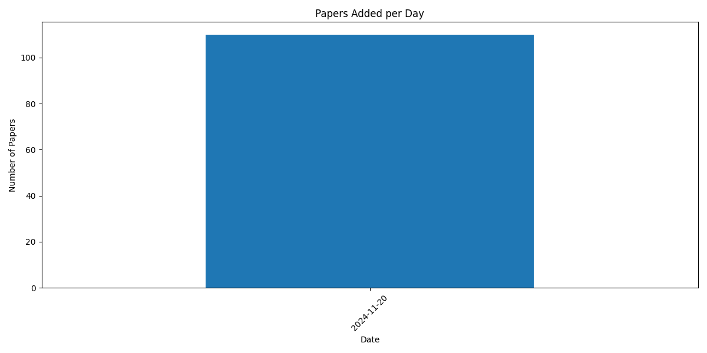

# Latest AI Research Papers

This repository contains summaries of the latest AI research papers, automatically updated daily using Ollama LLM.

*Last Updated: 2024-11-20 10:19:22*

## Paper Analytics

### Topic Distribution

### Papers Added Over Time

## Table of Contents

- [2024-11-20](#20241120)

---

## Papers Added on 2024-11-20

### [A Code Knowledge Graph-Enhanced System for LLM-Based Fuzz Driver Generation](http://arxiv.org/pdf/2411.11532v1)

The rapid development of large language models (LLMs) with advanced
programming capabilities has paved the way for innovative approaches in
software testing. Fuzz testing, a cornerstone for improving software
reliability and detecting vulnerabilities, often relies on manually written
fuzz drivers, limiting scalability and efficiency. To address this challenge,
we propose CodeGraphGPT, a novel system that integrates code knowledge graphs
with an LLM-powered intelligent agent to automate the fuzz driver generation
process. By framing fuzz driver creation as a code generation task,
CodeGraphGPT leverages program analysis to construct a knowledge graph of code
repositories, where nodes represent code entities, such as functions or files,
and edges capture their relationships. This enables the system to generate
tailored fuzz drivers and input seeds, resolve compilation errors, and analyze
crash reports, all while adapting to specific API usage scenarios.
Additionally, querying the knowledge graph helps identify precise testing
targets and contextualize the purpose of each fuzz driver within the fuzzing
loop. We evaluated CodeGraphGPT on eight open-source software projects,
achieving an average improvement of 8.73\% in code coverage compared to
state-of-the-art methods. Moreover, it reduced the manual workload in crash
case analysis by 84.4\% and identified 11 real-world bugs, including nine
previously unreported ones. This work highlights how integrating LLMs with code
knowledge graphs enhances fuzz driver generation, offering an efficient
solution for vulnerability detection and software quality improvement.

---

### [ACING: Actor-Critic for Instruction Learning in Black-Box Large Language Models](http://arxiv.org/pdf/2411.12736v1)

The effectiveness of Large Language Models (LLMs) in solving tasks vastly
depends on the quality of the instructions, which often require fine-tuning
through extensive human effort. This highlights the need for automated
instruction optimization; however, this optimization is particularly
challenging when dealing with black-box LLMs, where model parameters and
gradients remain inaccessible. We propose ACING, a task-specific prompt
optimization approach framed as a stateless continuous-action Reinforcement
Learning (RL) problem, known as the continuum bandit setting. ACING leverages
an actor-critic-based method to optimize prompts, learning from
non-differentiable reward signals. We validate ACING by optimizing prompts for
ChatGPT on 30 instruction-based tasks. ACING consistently outperforms baseline
methods, achieving a median score improvement of 10 percentage points.
Furthermore, ACING not only recovers but also surpasses human-crafted expert
instructions, achieving up to a 39 percentage point improvement against human
benchmarks.

---

### [AMAGO-2: Breaking the Multi-Task Barrier in Meta-Reinforcement Learning with Transformers](http://arxiv.org/pdf/2411.11188v1)

Language models trained on diverse datasets unlock generalization by
in-context learning. Reinforcement Learning (RL) policies can achieve a similar
effect by meta-learning within the memory of a sequence model. However, meta-RL
research primarily focuses on adapting to minor variations of a single task. It
is difficult to scale towards more general behavior without confronting
challenges in multi-task optimization, and few solutions are compatible with
meta-RL's goal of learning from large training sets of unlabeled tasks. To
address this challenge, we revisit the idea that multi-task RL is bottlenecked
by imbalanced training losses created by uneven return scales across different
tasks. We build upon recent advancements in Transformer-based (in-context)
meta-RL and evaluate a simple yet scalable solution where both an agent's actor
and critic objectives are converted to classification terms that decouple
optimization from the current scale of returns. Large-scale comparisons in
Meta-World ML45, Multi-Game Procgen, Multi-Task POPGym, Multi-Game Atari, and
BabyAI find that this design unlocks significant progress in online multi-task
adaptation and memory problems without explicit task labels.

---

### [AdaCM$^2$: On Understanding Extremely Long-Term Video with Adaptive Cross-Modality Memory Reduction](http://arxiv.org/pdf/2411.12593v1)

The advancements in large language models (LLMs) have propelled the
improvement of video understanding tasks by incorporating LLMs with visual
models. However, most existing LLM-based models (e.g., VideoLLaMA, VideoChat)
are constrained to processing short-duration videos. Recent attempts to
understand long-term videos by extracting and compressing visual features into
a fixed memory size. Nevertheless, those methods leverage only visual modality
to merge video tokens and overlook the correlation between visual and textual
queries, leading to difficulties in effectively handling complex
question-answering tasks. To address the challenges of long videos and complex
prompts, we propose AdaCM$^2$, which, for the first time, introduces an
adaptive cross-modality memory reduction approach to video-text alignment in an
auto-regressive manner on video streams. Our extensive experiments on various
video understanding tasks, such as video captioning, video question answering,
and video classification, demonstrate that AdaCM$^2$ achieves state-of-the-art
performance across multiple datasets while significantly reducing memory usage.
Notably, it achieves a 4.5% improvement across multiple tasks in the LVU
dataset with a GPU memory consumption reduction of up to 65%.

---

### [Adapting to Cyber Threats: A Phishing Evolution Network (PEN) Framework for Phishing Generation and Analyzing Evolution Patterns using Large Language Models](http://arxiv.org/pdf/2411.11389v1)

Phishing remains a pervasive cyber threat, as attackers craft deceptive
emails to lure victims into revealing sensitive information. While Artificial
Intelligence (AI), particularly deep learning, has become a key component in
defending against phishing attacks, these approaches face critical limitations.
The scarcity of publicly available, diverse, and updated data, largely due to
privacy concerns, constrains their effectiveness. As phishing tactics evolve
rapidly, models trained on limited, outdated data struggle to detect new,
sophisticated deception strategies, leaving systems vulnerable to an
ever-growing array of attacks. Addressing this gap is essential to
strengthening defenses in an increasingly hostile cyber landscape. To address
this gap, we propose the Phishing Evolution Network (PEN), a framework
leveraging large language models (LLMs) and adversarial training mechanisms to
continuously generate high quality and realistic diverse phishing samples, and
analyze features of LLM-provided phishing to understand evolving phishing
patterns. We evaluate the quality and diversity of phishing samples generated
by PEN and find that it produces over 80% realistic phishing samples,
effectively expanding phishing datasets across seven dominant types. These
PEN-generated samples enhance the performance of current phishing detectors,
leading to a 40% improvement in detection accuracy. Additionally, the use of
PEN significantly boosts model robustness, reducing detectors' sensitivity to
perturbations by up to 60%, thereby decreasing attack success rates under
adversarial conditions. When we analyze the phishing patterns that are used in
LLM-generated phishing, the cognitive complexity and the tone of time
limitation are detected with statistically significant differences compared
with existing phishing.

---

### [Adaptive Soft Actor-Critic Framework for RIS-Assisted and UAV-Aided Communication](http://arxiv.org/pdf/2411.10882v1)

In this work, we explore UAV-assisted reconfigurable intelligent surface
(RIS) technology to enhance downlink communications in wireless networks. By
integrating RIS on both UAVs and ground infrastructure, we aim to boost network
coverage, fairness, and resilience against challenges such as UAV jitter. To
maximize the minimum achievable user rate, we formulate a joint optimization
problem involving beamforming, phase shifts, and UAV trajectory. To address
this problem, we propose an adaptive soft actor-critic (ASAC) framework. In
this approach, agents are built using adaptive sparse transformers with
attentive feature refinement (ASTAFER), enabling dynamic feature processing
that adapts to real-time network conditions. The ASAC model learns optimal
solutions to the coupled subproblems in real time, delivering an end-to-end
solution without relying on iterative or relaxation-based methods. Simulation
results demonstrate that our ASAC-based approach achieves better performance
compared to the conventional SAC. This makes it a robust, adaptable solution
for real-time, fair, and efficient downlink communication in UAV-RIS networks.

---

### [Addressing Hallucinations in Language Models with Knowledge Graph Embeddings as an Additional Modality](http://arxiv.org/pdf/2411.11531v1)

In this paper we present an approach to reduce hallucinations in Large
Language Models (LLMs) by incorporating Knowledge Graphs (KGs) as an additional
modality. Our method involves transforming input text into a set of KG
embeddings and using an adapter to integrate these embeddings into the language
model space, without relying on external retrieval processes.
  To facilitate this, we created WikiEntities, a dataset containing over 3
million Wikipedia texts annotated with entities from Wikidata and their
corresponding embeddings from PyTorch-BigGraph. This dataset serves as a
valuable resource for training Entity Linking models and adapting the described
method to various LLMs using specialized adapters.
  Our method does not require fine-tuning of the language models themselves;
instead, we only train the adapter. This ensures that the model's performance
on other tasks is not affected. We trained an adapter for the Mistral 7B, LLaMA
2-7B (chat), and LLaMA 3-8B (instruct) models using this dataset and
demonstrated that our approach improves performance on the HaluEval, True-False
benchmarks and FEVER dataset. The results indicate that incorporating KGs as a
new modality can effectively reduce hallucinations and improve the factual
accuracy of language models, all without the need for external retrieval.

---

### [Analyzing Pokémon and Mario Streamers' Twitch Chat with LLM-based User Embeddings](http://arxiv.org/pdf/2411.10934v1)

We present a novel digital humanities method for representing our Twitch
chatters as user embeddings created by a large language model (LLM). We cluster
these embeddings automatically using affinity propagation and further narrow
this clustering down through manual analysis. We analyze the chat of one stream
by each Twitch streamer: SmallAnt, DougDoug and PointCrow. Our findings suggest
that each streamer has their own type of chatters, however two categories
emerge for all of the streamers: supportive viewers and emoji and reaction
senders. Repetitive message spammers is a shared chatter category for two of
the streamers.

---

### [Artificial Scientific Discovery](http://arxiv.org/pdf/2411.11672v1)

Rooted in the explosion of deep learning over the past decade, this thesis
spans from AlphaGo to ChatGPT to empirically examine the fundamental concepts
needed to realize the vision of an artificial scientist: a machine with the
capacity to autonomously generate original research and contribute to the
expansion of human knowledge. The investigation begins with {\sc Olivaw}, an
AlphaGo Zero-like agent that discovers Othello knowledge from scratch but is
unable to communicate it. This realization leads to the development of the
Explanatory Learning (EL) framework, a formalization of the problem faced by a
scientist when trying to explain a new phenomenon to their peers. The effective
EL prescriptions allow us to crack Zendo, a board game simulating the
scientific endeavor. This success comes with a fundamental insight: an
artificial scientist must develop its own interpretation of the language used
to explain its findings. This perspective then leads us to see modern
multimodal models as interpreters, and to devise a new way to build
interpretable and cost-effective CLIP-like models: by coupling two unimodal
models using little multimodal data and no further training. Finally, we
discuss what ChatGPT and its siblings are still missing to become artificial
scientists, and introduce Odeen, a benchmark about interpreting explanations
that sees LLMs going no further than random chance while being instead fully
solved by humans.

---

### [BPO: Towards Balanced Preference Optimization between Knowledge Breadth and Depth in Alignment](http://arxiv.org/pdf/2411.10914v1)

Reinforcement Learning with Human Feedback (RLHF) is the key to the success
of large language models (LLMs) in recent years. In this work, we first
introduce the concepts of knowledge breadth and knowledge depth, which measure
the comprehensiveness and depth of an LLM or knowledge source respectively. We
reveal that the imbalance in the number of prompts and responses can lead to a
potential disparity in breadth and depth learning within alignment tuning
datasets by showing that even a simple uniform method for balancing the number
of instructions and responses can lead to significant improvements. Building on
this, we further propose Balanced Preference Optimization (BPO), designed to
dynamically augment the knowledge depth of each sample. BPO is motivated by the
observation that the usefulness of knowledge varies across samples,
necessitating tailored learning of knowledge depth. To achieve this, we
introduce gradient-based clustering, estimating the knowledge informativeness
and usefulness of each augmented sample based on the model's optimization
direction. Our experimental results across various benchmarks demonstrate that
BPO outperforms other baseline methods in alignment tuning while maintaining
training efficiency. Furthermore, we conduct a detailed analysis of each
component of BPO, providing guidelines for future research in preference data
optimization.

---

### [BanglaDialecto: An End-to-End AI-Powered Regional Speech Standardization](http://arxiv.org/pdf/2411.10879v1)

This study focuses on recognizing Bangladeshi dialects and converting diverse
Bengali accents into standardized formal Bengali speech. Dialects, often
referred to as regional languages, are distinctive variations of a language
spoken in a particular location and are identified by their phonetics,
pronunciations, and lexicon. Subtle changes in pronunciation and intonation are
also influenced by geographic location, educational attainment, and
socioeconomic status. Dialect standardization is needed to ensure effective
communication, educational consistency, access to technology, economic
opportunities, and the preservation of linguistic resources while respecting
cultural diversity. Being the fifth most spoken language with around 55
distinct dialects spoken by 160 million people, addressing Bangla dialects is
crucial for developing inclusive communication tools. However, limited research
exists due to a lack of comprehensive datasets and the challenges of handling
diverse dialects. With the advancement in multilingual Large Language Models
(mLLMs), emerging possibilities have been created to address the challenges of
dialectal Automated Speech Recognition (ASR) and Machine Translation (MT). This
study presents an end-to-end pipeline for converting dialectal Noakhali speech
to standard Bangla speech. This investigation includes constructing a
large-scale diverse dataset with dialectal speech signals that tailored the
fine-tuning process in ASR and LLM for transcribing the dialect speech to
dialect text and translating the dialect text to standard Bangla text. Our
experiments demonstrated that fine-tuning the Whisper ASR model achieved a CER
of 0.8% and WER of 1.5%, while the BanglaT5 model attained a BLEU score of
41.6% for dialect-to-standard text translation.

---

### [Beyond Human-Like Processing: Large Language Models Perform Equivalently on Forward and Backward Scientific Text](http://arxiv.org/pdf/2411.11061v1)

The impressive performance of large language models (LLMs) has led to their
consideration as models of human language processing. Instead, we suggest that
the success of LLMs arises from the flexibility of the transformer learning
architecture. To evaluate this conjecture, we trained LLMs on scientific texts
that were either in a forward or backward format. Despite backward text being
inconsistent with the structure of human languages, we found that LLMs
performed equally well in either format on a neuroscience benchmark, eclipsing
human expert performance for both forward and backward orders. Our results are
consistent with the success of transformers across diverse domains, such as
weather prediction and protein design. This widespread success is attributable
to LLM's ability to extract predictive patterns from any sufficiently
structured input. Given their generality, we suggest caution in interpreting
LLM's success in linguistic tasks as evidence for human-like mechanisms.

---

### [Bi-Mamba: Towards Accurate 1-Bit State Space Models](http://arxiv.org/pdf/2411.11843v1)

The typical selective state-space model (SSM) of Mamba addresses several
limitations of Transformers, such as quadratic computational complexity with
sequence length and significant inference-time memory requirements due to the
key-value cache. However, the growing size of Mamba models continues to pose
training and deployment challenges and raises environmental concerns due to
considerable energy consumption. In this work, we introduce Bi-Mamba, a
scalable and powerful 1-bit Mamba architecture designed for more efficient
large language models with multiple sizes across 780M, 1.3B, and 2.7B. Bi-Mamba
models are trained from scratch on data volume as regular LLM pertaining using
an autoregressive distillation loss. Extensive experimental results on language
modeling demonstrate that Bi-Mamba achieves performance comparable to its
full-precision counterparts (e.g., FP16 or BF16) and much better accuracy than
post-training-binarization (PTB) Mamba baselines, while significantly reducing
memory footprint and energy consumption compared to the original Mamba model.
Our study pioneers a new linear computational complexity LLM framework under
low-bit representation and facilitates the future design of specialized
hardware tailored for efficient 1-bit Mamba-based LLMs.

---

### [BianCang: A Traditional Chinese Medicine Large Language Model](http://arxiv.org/pdf/2411.11027v1)

The rise of large language models (LLMs) has driven significant progress in
medical applications, including traditional Chinese medicine (TCM). However,
current medical LLMs struggle with TCM diagnosis and syndrome differentiation
due to substantial differences between TCM and modern medical theory, and the
scarcity of specialized, high-quality corpora. This paper addresses these
challenges by proposing BianCang, a TCM-specific LLM, using a two-stage
training process that first injects domain-specific knowledge and then aligns
it through targeted stimulation. To enhance diagnostic and differentiation
capabilities, we constructed pre-training corpora, instruction-aligned datasets
based on real hospital records, and the ChP-TCM dataset derived from the
Pharmacopoeia of the People's Republic of China. We compiled extensive TCM and
medical corpora for continuous pre-training and supervised fine-tuning,
building a comprehensive dataset to refine the model's understanding of TCM.
Evaluations across 11 test sets involving 29 models and 4 tasks demonstrate the
effectiveness of BianCang, offering valuable insights for future research.
Code, datasets, and models are available at
https://github.com/QLU-NLP/BianCang.

---

### [Bias in Large Language Models: Origin, Evaluation, and Mitigation](http://arxiv.org/pdf/2411.10915v1)

Large Language Models (LLMs) have revolutionized natural language processing,
but their susceptibility to biases poses significant challenges. This
comprehensive review examines the landscape of bias in LLMs, from its origins
to current mitigation strategies. We categorize biases as intrinsic and
extrinsic, analyzing their manifestations in various NLP tasks. The review
critically assesses a range of bias evaluation methods, including data-level,
model-level, and output-level approaches, providing researchers with a robust
toolkit for bias detection. We further explore mitigation strategies,
categorizing them into pre-model, intra-model, and post-model techniques,
highlighting their effectiveness and limitations. Ethical and legal
implications of biased LLMs are discussed, emphasizing potential harms in
real-world applications such as healthcare and criminal justice. By
synthesizing current knowledge on bias in LLMs, this review contributes to the
ongoing effort to develop fair and responsible AI systems. Our work serves as a
comprehensive resource for researchers and practitioners working towards
understanding, evaluating, and mitigating bias in LLMs, fostering the
development of more equitable AI technologies.

---

### [BitMoD: Bit-serial Mixture-of-Datatype LLM Acceleration](http://arxiv.org/pdf/2411.11745v1)

Large language models (LLMs) have demonstrated remarkable performance across
various machine learning tasks. Yet the substantial memory footprint of LLMs
significantly hinders their deployment. In this paper, we improve the
accessibility of LLMs through BitMoD, an algorithm-hardware co-design solution
that enables efficient LLM acceleration at low weight precision. On the
algorithm side, BitMoD introduces fine-grained data type adaptation that uses a
different numerical data type to quantize a group of (e.g., 128) weights.
Through the careful design of these new data types, BitMoD is able to quantize
LLM weights to very low precision (e.g., 4 bits and 3 bits) while maintaining
high accuracy. On the hardware side, BitMoD employs a bit-serial processing
element to easily support multiple numerical precisions and data types; our
hardware design includes two key innovations: First, it employs a unified
representation to process different weight data types, thus reducing the
hardware cost. Second, it adopts a bit-serial dequantization unit to rescale
the per-group partial sum with minimal hardware overhead. Our evaluation on six
representative LLMs demonstrates that BitMoD significantly outperforms
state-of-the-art LLM quantization and acceleration methods. For discriminative
tasks, BitMoD can quantize LLM weights to 4-bit with $<\!0.5\%$ accuracy loss
on average. For generative tasks, BitMoD is able to quantize LLM weights to
3-bit while achieving better perplexity than prior LLM quantization scheme.
Combining the superior model performance with an efficient accelerator design,
BitMoD achieves an average of $1.69\times$ and $1.48\times$ speedups compared
to prior LLM accelerators ANT and OliVe, respectively.

---

### [CATCH: Complementary Adaptive Token-level Contrastive Decoding to Mitigate Hallucinations in LVLMs](http://arxiv.org/pdf/2411.12713v1)

Large Vision-Language Model (LVLM) systems have demonstrated impressive
vision-language reasoning capabilities but suffer from pervasive and severe
hallucination issues, posing significant risks in critical domains such as
healthcare and autonomous systems. Despite previous efforts to mitigate
hallucinations, a persistent issue remains: visual defect from vision-language
misalignment, creating a bottleneck in visual processing capacity. To address
this challenge, we develop Complementary Adaptive Token-level Contrastive
Decoding to Mitigate Hallucinations in LVLMs (CATCH), based on the Information
Bottleneck theory. CATCH introduces Complementary Visual Decoupling (CVD) for
visual information separation, Non-Visual Screening (NVS) for hallucination
detection, and Adaptive Token-level Contrastive Decoding (ATCD) for
hallucination mitigation. CATCH addresses issues related to visual defects that
cause diminished fine-grained feature perception and cumulative hallucinations
in open-ended scenarios. It is applicable to various visual question-answering
tasks without requiring any specific data or prior knowledge, and generalizes
robustly to new tasks without additional training, opening new possibilities
for advancing LVLM in various challenging applications.

---

### [CCExpert: Advancing MLLM Capability in Remote Sensing Change Captioning with Difference-Aware Integration and a Foundational Dataset](http://arxiv.org/pdf/2411.11360v1)

Remote Sensing Image Change Captioning (RSICC) aims to generate natural
language descriptions of surface changes between multi-temporal remote sensing
images, detailing the categories, locations, and dynamics of changed objects
(e.g., additions or disappearances). Many current methods attempt to leverage
the long-sequence understanding and reasoning capabilities of multimodal large
language models (MLLMs) for this task. However, without comprehensive data
support, these approaches often alter the essential feature transmission
pathways of MLLMs, disrupting the intrinsic knowledge within the models and
limiting their potential in RSICC. In this paper, we propose a novel model,
CCExpert, based on a new, advanced multimodal large model framework. Firstly,
we design a difference-aware integration module to capture multi-scale
differences between bi-temporal images and incorporate them into the original
image context, thereby enhancing the signal-to-noise ratio of differential
features. Secondly, we constructed a high-quality, diversified dataset called
CC-Foundation, containing 200,000 image pairs and 1.2 million captions, to
provide substantial data support for continue pretraining in this domain.
Lastly, we employed a three-stage progressive training process to ensure the
deep integration of the difference-aware integration module with the pretrained
MLLM. CCExpert achieved a notable performance of $S^*_m=81.80$ on the LEVIR-CC
benchmark, significantly surpassing previous state-of-the-art methods. The code
and part of the dataset will soon be open-sourced at
https://github.com/Meize0729/CCExpert.

---

### [Capturing Sparks of Abstraction for the ARC Challenge](http://arxiv.org/pdf/2411.11206v1)

Excellent progress has been made recently in solving ARC Challenge problems.
However, it seems that new techniques may be required to push beyond 60%
accuracy. Even commercial Large Language Models (LLMs) struggle to 'understand'
many of the problems (when given the input and output grids), which makes
discovering solutions by LLM-lead program search somewhat futile.
  In this work, LLM 'understanding' is attempted from a stronger starting
position : An LLM is given complete solutions to tasks in code, and then asked
to explain how the task is being solved at various levels of abstraction.
Specifically, the LLM was given code solutions implemented in arc-dsl-llm (an
LLM-legible version of Hodel's arc-dsl to obtain: (a) commented code; (b) code
refactored into reusable functional chunks; (c) problem solution steps; and (d)
high-level problem-solving tactics.
  We demonstrate that 'Sparks of Abstraction' can be extracted from the LLM
output - in a form that could be used in downstream tasks with Local LLMs
eligible to enter the ARC Prize.
  Both the arc-dsl-llm DSL framework (with the re-engineered solutions) and the
Gemini LLM-generated data (along with the generation code) are made Open
Source.

---

### [Cascaded Diffusion Models for 2D and 3D Microscopy Image Synthesis to Enhance Cell Segmentation](http://arxiv.org/pdf/2411.11515v1)

Automated cell segmentation in microscopy images is essential for biomedical
research, yet conventional methods are labor-intensive and prone to error.
While deep learning-based approaches have proven effective, they often require
large annotated datasets, which are scarce due to the challenges of manual
annotation. To overcome this, we propose a novel framework for synthesizing
densely annotated 2D and 3D cell microscopy images using cascaded diffusion
models. Our method synthesizes 2D and 3D cell masks from sparse 2D annotations
using multi-level diffusion models and NeuS, a 3D surface reconstruction
approach. Following that, a pretrained 2D Stable Diffusion model is finetuned
to generate realistic cell textures and the final outputs are combined to form
cell populations. We show that training a segmentation model with a combination
of our synthetic data and real data improves cell segmentation performance by
up to 9\% across multiple datasets. Additionally, the FID scores indicate that
the synthetic data closely resembles real data. The code for our proposed
approach will be available at
https://github.com/ruveydayilmaz0/cascaded\_diffusion.

---

### [Competing Bandits in Decentralized Large Contextual Matching Markets](http://arxiv.org/pdf/2411.11794v1)

Sequential learning in a multi-agent resource constrained matching market has
received significant interest in the past few years. We study decentralized
learning in two-sided matching markets where the demand side (aka players or
agents) competes for a `large' supply side (aka arms) with potentially
time-varying preferences, to obtain a stable match. Despite a long line of work
in the recent past, existing learning algorithms such as Explore-Then-Commit or
Upper-Confidence-Bound remain inefficient for this problem. In particular, the
per-agent regret achieved by these algorithms scales linearly with the number
of arms, $K$. Motivated by the linear contextual bandit framework, we assume
that for each agent an arm-mean can be represented by a linear function of a
known feature vector and an unknown (agent-specific) parameter.
  Moreover, our setup captures the essence of a dynamic (non-stationary)
matching market where the preferences over arms change over time. Our proposed
algorithms achieve instance-dependent logarithmic regret, scaling independently
of the number of arms, $K$.

---

### [Competition, Persuasion, and Search](http://arxiv.org/pdf/2411.11183v1)

An agent engages in sequential search. He does not directly observe the
quality of the goods he samples, but he can purchase signals designed by profit
maximizing principal(s). We formulate the principal-agent relationship as a
repeated contracting problem within a stopping game and characterize the set of
equilibrium payoffs. We show that when the agent's search cost falls below a
given threshold, competition does not impact how much surplus is generated in
equilibrium nor how the surplus is divided. In contrast, competition benefits
the agent at the expense of total surplus when the search cost exceeds that
threshold. Our results challenge the view that monopoly decreases market
efficiency, and moreover, suggest that it generates the highest value of
information for the agent.

---

### [Continual Task Learning through Adaptive Policy Self-Composition](http://arxiv.org/pdf/2411.11364v1)

Training a generalizable agent to continually learn a sequence of tasks from
offline trajectories is a natural requirement for long-lived agents, yet
remains a significant challenge for current offline reinforcement learning (RL)
algorithms. Specifically, an agent must be able to rapidly adapt to new tasks
using newly collected trajectories (plasticity), while retaining knowledge from
previously learned tasks (stability). However, systematic analyses of this
setting are scarce, and it remains unclear whether conventional continual
learning (CL) methods are effective in continual offline RL (CORL) scenarios.
In this study, we develop the Offline Continual World benchmark and demonstrate
that traditional CL methods struggle with catastrophic forgetting, primarily
due to the unique distribution shifts inherent to CORL scenarios. To address
this challenge, we introduce CompoFormer, a structure-based continual
transformer model that adaptively composes previous policies via a meta-policy
network. Upon encountering a new task, CompoFormer leverages semantic
correlations to selectively integrate relevant prior policies alongside newly
trained parameters, thereby enhancing knowledge sharing and accelerating the
learning process. Our experiments reveal that CompoFormer outperforms
conventional CL methods, particularly in longer task sequences, showcasing a
promising balance between plasticity and stability.

---

### [Deep Learning-based Code Reviews: A Paradigm Shift or a Double-Edged Sword?](http://arxiv.org/pdf/2411.11401v1)

Several techniques have been proposed to automate code review. Early support
consisted in recommending the most suited reviewer for a given change or in
prioritizing the review tasks. With the advent of deep learning in software
engineering, the level of automation has been pushed to new heights, with
approaches able to provide feedback on source code in natural language as a
human reviewer would do. Also, recent work documented open source projects
adopting Large Language Models (LLMs) as co-reviewers. Although the research in
this field is very active, little is known about the actual impact of including
automatically generated code reviews in the code review process. While there
are many aspects worth investigating, in this work we focus on three of them:
(i) review quality, i.e., the reviewer's ability to identify issues in the
code; (ii) review cost, i.e., the time spent reviewing the code; and (iii)
reviewer's confidence, i.e., how confident is the reviewer about the provided
feedback. We run a controlled experiment with 29 experts who reviewed different
programs with/without the support of an automatically generated code review.
During the experiment we monitored the reviewers' activities, for over 50 hours
of recorded code reviews. We show that reviewers consider valid most of the
issues automatically identified by the LLM and that the availability of an
automated review as a starting point strongly influences their behavior:
Reviewers tend to focus on the code locations indicated by the LLM rather than
searching for additional issues in other parts of the code. The reviewers who
started from an automated review identified a higher number of low-severity
issues while, however, not identifying more high-severity issues as compared to
a completely manual process. Finally, the automated support did not result in
saved time and did not increase the reviewers' confidence.

---

### [Detecting Multi-Parameter Constraint Inconsistencies in Python Data Science Libraries](http://arxiv.org/pdf/2411.11410v1)

Modern AI- and Data-intensive software systems rely heavily on data science
and machine learning libraries that provide essential algorithmic
implementations and computational frameworks. These libraries expose complex
APIs whose correct usage has to follow constraints among multiple
interdependent parameters. Developers using these APIs are expected to learn
about the constraints through the provided documentations and any discrepancy
may lead to unexpected behaviors. However, maintaining correct and consistent
multi-parameter constraints in API documentations remains a significant
challenge for API compatibility and reliability. To address this challenge, we
propose an MPDetector for detecting inconsistencies between code and
documentation, specifically focusing on multi-parameter constraints. MPDetector
identifies these constraints at the code level by exploring execution paths
through symbolic execution and further extracts corresponding constraints from
documentation using large language models (LLMs). We propose a customized fuzzy
constraint logic to reconcile the unpredictability of LLM outputs and detect
logical inconsistencies between the code and documentation constraints. We
collected and constructed two datasets from four popular data science libraries
and evaluated MPDetector on them. The results demonstrate that MPDetector can
effectively detect inconsistency issues with the precision of 92.8%. We further
reported 14 detected inconsistency issues to the library developers, who have
confirmed 11 issues at the time of writing.

---

### [Developer Challenges on Large Language Models: A Study of Stack Overflow and OpenAI Developer Forum Posts](http://arxiv.org/pdf/2411.10873v1)

Large Language Models (LLMs) have gained widespread popularity due to their
exceptional capabilities across various domains, including chatbots,
healthcare, education, content generation, and automated support systems.
However, developers encounter numerous challenges when implementing,
fine-tuning, and integrating these models into real-world applications. This
study investigates LLM developers' challenges by analyzing community
interactions on Stack Overflow and OpenAI Developer Forum, employing BERTopic
modeling to identify and categorize developer discussions. Our analysis yields
nine challenges on Stack Overflow (e.g., LLM Ecosystem and Challenges, API
Usage, LLM Training with Frameworks) and 17 on the OpenAI Developer Forum
(e.g., API Usage and Error Handling, Fine-Tuning and Dataset Management).
Results indicate that developers frequently turn to Stack Overflow for
implementation guidance, while OpenAI's forum focuses on troubleshooting.
Notably, API and functionality issues dominate discussions on the OpenAI forum,
with many posts requiring multiple responses, reflecting the complexity of
LLM-related problems. We find that LLM-related queries often exhibit great
difficulty, with a substantial percentage of unresolved posts (e.g., 79.03\% on
Stack Overflow) and prolonged response times, particularly for complex topics
like 'Llama Indexing and GPU Utilization' and 'Agents and Tool Interactions'.
In contrast, established fields like Mobile Development and Security enjoy
quicker resolutions and stronger community engagement. These findings highlight
the need for improved community support and targeted resources to assist LLM
developers in overcoming the evolving challenges of this rapidly growing field.
This study provides insights into areas of difficulty, paving the way for
future research and tool development to better support the LLM developer
community.

---

### [Dialectal Toxicity Detection: Evaluating LLM-as-a-Judge Consistency Across Language Varieties](http://arxiv.org/pdf/2411.10954v1)

There has been little systematic study on how dialectal differences affect
toxicity detection by modern LLMs. Furthermore, although using LLMs as
evaluators ("LLM-as-a-judge") is a growing research area, their sensitivity to
dialectal nuances is still underexplored and requires more focused attention.
In this paper, we address these gaps through a comprehensive toxicity
evaluation of LLMs across diverse dialects. We create a multi-dialect dataset
through synthetic transformations and human-assisted translations, covering 10
language clusters and 60 varieties. We then evaluated three LLMs on their
ability to assess toxicity across multilingual, dialectal, and LLM-human
consistency. Our findings show that LLMs are sensitive in handling both
multilingual and dialectal variations. However, if we have to rank the
consistency, the weakest area is LLM-human agreement, followed by dialectal
consistency. Code repository:
\url{https://github.com/ffaisal93/dialect_toxicity_llm_judge}

---

### [Dissecting Misalignment of Multimodal Large Language Models via Influence Function](http://arxiv.org/pdf/2411.11667v1)

Multi-modal Large Language models (MLLMs) are always trained on data from
diverse and unreliable sources, which may contain misaligned or mislabeled
text-image pairs. This frequently causes robustness issues and hallucinations,
leading to performance degradation. Data valuation is an efficient way to
detect and trace these misalignments. Nevertheless, existing methods are
computationally expensive for MLLMs. While computationally efficient, the
classical influence functions are inadequate for contrastive learning models
because they were originally designed for pointwise loss. Additionally,
contrastive learning involves minimizing the distance between the modalities of
positive samples and maximizing the distance between the modalities of negative
samples. This requires us to evaluate the influence of samples from both
perspectives. To tackle these challenges, we introduce the Extended Influence
Function for Contrastive Loss (ECIF), an influence function crafted for
contrastive loss. ECIF considers both positive and negative samples and
provides a closed-form approximation of contrastive learning models,
eliminating the need for retraining. Building upon ECIF, we develop a series of
algorithms for data evaluation in MLLM, misalignment detection, and
misprediction trace-back tasks. Experimental results demonstrate our ECIF
advances the transparency and interpretability of MLLMs by offering a more
accurate assessment of data impact and model alignment compared to traditional
baseline methods.

---

### [Distributed Asynchronous Time-Varying Quadratic Programming with Asynchronous Objective Sampling](http://arxiv.org/pdf/2411.11732v1)

We present a distributed algorithm to track the fixed points of time-varying
quadratic programs when agents can (i) sample their objective function
asynchronously, (ii) compute new iterates asynchronously, and (iii) communicate
asynchronously. We show that even for a time-varying strongly convex quadratic
program, asynchronous sampling of objectives can cause agents to minimize a
certain form of nonconvex "aggregate" objective function. Then, we show that by
minimizing the aggregate objective, agents still track the solution of the
original quadratic program to within an error ball dependent upon (i) agents'
tracking error when solving the aggregate problem, and (ii) the time variation
of the original quadratic objective. Lastly, we show that this work generalizes
existing work, in the sense that synchronizing the agents' behaviors recovers
existing convergence results (up to constants). Simulations show the robustness
of our algorithm to asynchrony.

---

### [Distributed Learning with Partial Information Sharing](http://arxiv.org/pdf/2411.11411v1)

This work studies the distributed learning process on a network of agents.
Agents make partial observation about an unknown hypothesis and iteratively
share their beliefs over a set of possible hypotheses with their neighbors to
learn the true hypothesis. We present and analyze a distributed learning
algorithm in which agents share belief on only one randomly chosen hypothesis
at a time. Agents estimate the beliefs on missed hypotheses using previously
shared beliefs. We show that agents learn the true hypothesis almost surely
under standard network connectivity and observation model assumptions if belief
on each hypothesis is shared with positive probability at every time. We also
present a memory-efficient variant of the learning algorithm with partial
belief sharing and present simulation results to compare rate of convergence of
full and partial information sharing algorithms.

---

### [Efficient Transfer Learning for Video-language Foundation Models](http://arxiv.org/pdf/2411.11223v1)

Pre-trained vision-language models provide a robust foundation for efficient
transfer learning across various downstream tasks. In the field of video action
recognition, mainstream approaches often introduce additional parameter modules
to capture temporal information. While the increased model capacity brought by
these additional parameters helps better fit the video-specific inductive
biases, existing methods require learning a large number of parameters and are
prone to catastrophic forgetting of the original generalizable knowledge. In
this paper, we propose a simple yet effective Multi-modal Spatio-Temporal
Adapter (MSTA) to improve the alignment between representations in the text and
vision branches, achieving a balance between general knowledge and
task-specific knowledge. Furthermore, to mitigate over-fitting and enhance
generalizability, we introduce a spatio-temporal description-guided consistency
constraint. This constraint involves feeding template inputs (i.e., ``a video
of $\{\textbf{cls}\}$'') into the trainable language branch, while
LLM-generated spatio-temporal descriptions are input into the pre-trained
language branch, enforcing consistency between the outputs of the two branches.
This mechanism prevents over-fitting to downstream tasks and improves the
distinguishability of the trainable branch within the spatio-temporal semantic
space. We evaluate the effectiveness of our approach across four tasks:
zero-shot transfer, few-shot learning, base-to-novel generalization, and
fully-supervised learning. Compared to many state-of-the-art methods, our MSTA
achieves outstanding performance across all evaluations, while using only 2-7\%
of the trainable parameters in the original model. Code will be avaliable at
https://github.com/chenhaoxing/ETL4Video.

---

### [Emergent Structure in Multi-agent Systems Using Geometric Embeddings](http://arxiv.org/pdf/2411.11142v1)

This work investigates the self-organization of multi-agent systems into
closed trajectories, a common requirement in unmanned aerial vehicle (UAV)
surveillance tasks. In such scenarios, smooth, unbiased control signals save
energy and mitigate mechanical strain. We propose a decentralized control
system architecture that produces a globally stable emergent structure from
local observations only; there is no requirement for agents to share a global
plan or follow prescribed trajectories. Central to our approach is the
formulation of an injective virtual embedding induced by rotations from the
actual agent positions. This embedding serves as a structure-preserving map
around which all agent stabilize their relative positions and permits the use
of well-established linear control techniques. We construct the embedding such
that it is topologically equivalent to the desired trajectory (i.e., a
homeomorphism), thereby preserving the stability characteristics. We
demonstrate the versatility of this approach through implementation on a swarm
of Quanser QDrone quadcopters. Results demonstrate the quadcopters
self-organize into the desired trajectory while maintaining even separation.

---

### [Empowering Meta-Analysis: Leveraging Large Language Models for Scientific Synthesis](http://arxiv.org/pdf/2411.10878v1)

This study investigates the automation of meta-analysis in scientific
documents using large language models (LLMs). Meta-analysis is a robust
statistical method that synthesizes the findings of multiple studies support
articles to provide a comprehensive understanding. We know that a meta-article
provides a structured analysis of several articles. However, conducting
meta-analysis by hand is labor-intensive, time-consuming, and susceptible to
human error, highlighting the need for automated pipelines to streamline the
process. Our research introduces a novel approach that fine-tunes the LLM on
extensive scientific datasets to address challenges in big data handling and
structured data extraction. We automate and optimize the meta-analysis process
by integrating Retrieval Augmented Generation (RAG). Tailored through prompt
engineering and a new loss metric, Inverse Cosine Distance (ICD), designed for
fine-tuning on large contextual datasets, LLMs efficiently generate structured
meta-analysis content. Human evaluation then assesses relevance and provides
information on model performance in key metrics. This research demonstrates
that fine-tuned models outperform non-fine-tuned models, with fine-tuned LLMs
generating 87.6% relevant meta-analysis abstracts. The relevance of the
context, based on human evaluation, shows a reduction in irrelevancy from 4.56%
to 1.9%. These experiments were conducted in a low-resource environment,
highlighting the study's contribution to enhancing the efficiency and
reliability of meta-analysis automation.

---

### [Enhanced Sign Language Translation between American Sign Language (ASL) and Indian Sign Language (ISL) Using LLMs](http://arxiv.org/pdf/2411.12685v1)

We have come up with a research that hopes to provide a bridge between the
users of American Sign Language and the users of spoken language and Indian
Sign Language (ISL). The research enabled us to create a novel framework that
we have developed for Learner Systems. Leveraging art of Large models to create
key features including: - Real-time translation between these two sign
languages in an efficient manner. Making LLM's capability available for
seamless translations to ISL. Here is the full study showing its implementation
in this paper. The core of the system is a sophisticated pipeline that begins
with reclassification and recognition of ASL gestures based on a strong Random
Forest Classifier. By recognizing the ASL, it is translated into text which can
be more easily processed. Highly evolved natural language NLP (Natural Language
Processing) techniques come in handy as they play a role in our LLM integration
where you then use LLMs to be able to convert the ASL text to ISL which
provides you with the intent of sentence or phrase. The final step is to
synthesize the translated text back into ISL gestures, creating an end-to-end
translation experience using RIFE-Net. This framework is tasked with key
challenges such as automatically dealing with gesture variability and
overcoming the linguistic differences between ASL and ISL. By automating the
translation process, we hope to vastly improve accessibility for sign language
users. No longer will the communication gap between ASL and ISL create
barriers; this totally cool innovation aims to bring our communities closer
together. And we believe, with full confidence in our framework, that we're
able to apply the same principles across a wide variety of sign language
dialects.

---

### [Enhancing Multi-Class Disease Classification: Neoplasms, Cardiovascular, Nervous System, and Digestive Disorders Using Advanced LLMs](http://arxiv.org/pdf/2411.12712v1)

In this research, we explored the improvement in terms of multi-class disease
classification via pre-trained language models over Medical-Abstracts-TC-Corpus
that spans five medical conditions. We excluded non-cancer conditions and
examined four specific diseases. We assessed four LLMs, BioBERT, XLNet, and
BERT, as well as a novel base model (Last-BERT). BioBERT, which was pre-trained
on medical data, demonstrated superior performance in medical text
classification (97% accuracy). Surprisingly, XLNet followed closely (96%
accuracy), demonstrating its generalizability across domains even though it was
not pre-trained on medical data. LastBERT, a custom model based on the lighter
version of BERT, also proved competitive with 87.10% accuracy (just under
BERT's 89.33%). Our findings confirm the importance of specialized models such
as BioBERT and also support impressions around more general solutions like
XLNet and well-tuned transformer architectures with fewer parameters (in this
case, LastBERT) in medical domain tasks.

---

### [Enhancing Vision-Language Model Safety through Progressive Concept-Bottleneck-Driven Alignment](http://arxiv.org/pdf/2411.11543v1)

Benefiting from the powerful capabilities of Large Language Models (LLMs),
pre-trained visual encoder models connected to LLMs form Vision Language Models
(VLMs). However, recent research shows that the visual modality in VLMs is
highly vulnerable, allowing attackers to bypass safety alignment in LLMs
through visually transmitted content, launching harmful attacks. To address
this challenge, we propose a progressive concept-based alignment strategy,
PSA-VLM, which incorporates safety modules as concept bottlenecks to enhance
visual modality safety alignment. By aligning model predictions with specific
safety concepts, we improve defenses against risky images, enhancing
explainability and controllability while minimally impacting general
performance. Our method is obtained through two-stage training. The low
computational cost of the first stage brings very effective performance
improvement, and the fine-tuning of the language model in the second stage
further improves the safety performance. Our method achieves state-of-the-art
results on popular VLM safety benchmark.

---

### [Exploring LLMs for Verifying Technical System Specifications Against Requirements](http://arxiv.org/pdf/2411.11582v1)

Requirements engineering is a knowledge intensive process and crucial for the
success of engineering projects. The field of knowledge-based requirements
engineering (KBRE) aims to support engineers by providing knowledge to assist
in the elicitation, validation, and management of system requirements. The
advent of large language models (LLMs) opens new opportunities in the field of
KBRE. This work experimentally investigates the potential of LLMs in
requirements verification. Therein, LLMs are provided with a set of
requirements and a textual system specification and are prompted to assess
which requirements are fulfilled by the system specification. Different
experimental variables such as system specification complexity, the number of
requirements, and prompting strategies were analyzed. Formal rule-based systems
serve as a benchmark to compare LLM performance to. Requirements and system
specifications are derived from the smart-grid domain. Results show that
advanced LLMs, like GPT-4o and Claude 3.5 Sonnet, achieved f1-scores between 79
% and 94 % in identifying non-fulfilled requirements, indicating potential for
LLMs to be leveraged for requirements verification.

---

### [Exploring adversarial robustness of JPEG AI: methodology, comparison and new methods](http://arxiv.org/pdf/2411.11795v1)

Adversarial robustness of neural networks is an increasingly important area
of research, combining studies on computer vision models, large language models
(LLMs), and others. With the release of JPEG AI - the first standard for
end-to-end neural image compression (NIC) methods - the question of its
robustness has become critically significant. JPEG AI is among the first
international, real-world applications of neural-network-based models to be
embedded in consumer devices. However, research on NIC robustness has been
limited to open-source codecs and a narrow range of attacks. This paper
proposes a new methodology for measuring NIC robustness to adversarial attacks.
We present the first large-scale evaluation of JPEG AI's robustness, comparing
it with other NIC models. Our evaluation results and code are publicly
available online (link is hidden for a blind review).

---

### [Exploring the Impact of Non-Verbal Virtual Agent Behavior on User Engagement in Argumentative Dialogues](http://arxiv.org/pdf/2411.11102v1)

Engaging in discussions that involve diverse perspectives and exchanging
arguments on a controversial issue is a natural way for humans to form
opinions. In this process, the way arguments are presented plays a crucial role
in determining how engaged users are, whether the interaction takes place
solely among humans or within human-agent teams. This is of great importance as
user engagement plays a crucial role in determining the success or failure of
cooperative argumentative discussions. One main goal is to maintain the user's
motivation to participate in a reflective opinion-building process, even when
addressing contradicting viewpoints. This work investigates how non-verbal
agent behavior, specifically co-speech gestures, influences the user's
engagement and interest during an ongoing argumentative interaction. The
results of a laboratory study conducted with 56 participants demonstrate that
the agent's co-speech gestures have a substantial impact on user engagement and
interest and the overall perception of the system. Therefore, this research
offers valuable insights for the design of future cooperative argumentative
virtual agents.

---

### [Facilitating a 3D granular flow with an obstruction](http://arxiv.org/pdf/2411.11264v1)

Ensuring a smooth rate of efflux of particles from an outlet without
unpredictable clogging events is crucial in processing powders and grains. We
show by experiments and simulations that an obstacle placed near the outlet can
greatly suppress clog formation in a 3-dimensional granular flow; this
counterintuitive phenomenon had previously been demonstrated in 2-dimensional
systems. Remarkably, clog suppression is very effective even when the obstacle
cross-section is comparable to that of a single grain, and is only a small
fraction of the outlet area. Data from two dissimilar obstacle shapes indicate
that the underlying mechanism for clog suppression is geometric: while the
magnitude of the effect can be affected by dynamical factors, the optimal
location of the obstacle is determined entirely by a simple geometric rule. An
optimally-placed obstacle arranges for the most-probable clogging arch to be at
a perilous and unstable spot, where the local flow geometry is at a point of
expansion and a slight perturbation leaves the arch without downstream support.
This geometric principle does not rely on previously conjectured dynamical
mechanisms and admits generalization to other agent-based and particulate
systems.

---

### [FastDraft: How to Train Your Draft](http://arxiv.org/pdf/2411.11055v1)

Speculative Decoding has gained popularity as an effective technique for
accelerating the auto-regressive inference process of Large Language Models
(LLMs). However, Speculative Decoding entirely relies on the availability of
efficient draft models, which are often lacking for many existing language
models due to a stringent constraint of vocabulary incompatibility. In this
work we introduce FastDraft, a novel and efficient approach for pre-training
and aligning a draft model to any large language model by incorporating
efficient pre-training, followed by fine-tuning over synthetic datasets
generated by the target model. We demonstrate FastDraft by training two highly
parameter efficient drafts for the popular Phi-3-mini and Llama-3.1-8B models.
Using FastDraft, we were able to produce a draft with approximately 10 billion
tokens on a single server with 8 Intel$^\circledR$ Gaudi$^\circledR$ 2
accelerators in under 24 hours. Our results show that the draft model achieves
impressive results in key metrics of acceptance rate, block efficiency and up
to 3x memory bound speed up when evaluated on code completion and up to 2x in
summarization, text completion and instruction tasks. We validate our
theoretical findings through benchmarking on the latest Intel$^\circledR$
Core$^{\tiny \text{TM}}$ Ultra, achieving a wall-clock time speedup of up to
2x, indicating a significant reduction in runtime. Due to its high quality,
FastDraft unlocks large language models inference on AI-PC and other
edge-devices.

---

### [FedCoLLM: A Parameter-Efficient Federated Co-tuning Framework for Large and Small Language Models](http://arxiv.org/pdf/2411.11707v1)

By adapting Large Language Models (LLMs) to domain-specific tasks or
enriching them with domain-specific knowledge, we can fully harness the
capabilities of LLMs. Nonetheless, a gap persists in achieving simultaneous
mutual enhancement between the server's LLM and the downstream clients' Small
Language Models (SLMs). To address this, we propose FedCoLLM, a novel and
parameter-efficient federated framework designed for co-tuning LLMs and SLMs.
This approach is aimed at adaptively transferring server-side LLMs knowledge to
clients' SLMs while simultaneously enriching the LLMs with domain insights from
the clients. To accomplish this, FedCoLLM utilizes lightweight adapters in
conjunction with SLMs, facilitating knowledge exchange between server and
clients in a manner that respects data privacy while also minimizing
computational and communication overhead. Our evaluation of FedCoLLM, utilizing
various public LLMs and SLMs across a range of NLP text generation tasks,
reveals that the performance of clients' SLMs experiences notable improvements
with the assistance of the LLMs. Simultaneously, the LLMs enhanced via FedCoLLM
achieves comparable performance to that obtained through direct fine-tuning on
clients' data.

---

### [Financial News-Driven LLM Reinforcement Learning for Portfolio Management](http://arxiv.org/pdf/2411.11059v1)

Reinforcement learning (RL) has emerged as a transformative approach for
financial trading, enabling dynamic strategy optimization in complex markets.
This study explores the integration of sentiment analysis, derived from large
language models (LLMs), into RL frameworks to enhance trading performance.
Experiments were conducted on single-stock trading with Apple Inc. (AAPL) and
portfolio trading with the ING Corporate Leaders Trust Series B (LEXCX). The
sentiment-enhanced RL models demonstrated superior net worth and cumulative
profit compared to RL models without sentiment and, in the portfolio
experiment, outperformed the actual LEXCX portfolio's buy-and-hold strategy.
These results highlight the potential of incorporating qualitative market
signals to improve decision-making, bridging the gap between quantitative and
qualitative approaches in financial trading.

---

### [GLDesigner: Leveraging Multi-Modal LLMs as Designer for Enhanced Aesthetic Text Glyph Layouts](http://arxiv.org/pdf/2411.11435v1)

Text logo design heavily relies on the creativity and expertise of
professional designers, in which arranging element layouts is one of the most
important procedures. However, few attention has been paid to this specific
task which needs to take precise textural details and user constraints into
consideration, but only on the broader tasks such as document/poster layout
generation. In this paper, we propose a VLM-based framework that generates
content-aware text logo layouts by integrating multi-modal inputs with user
constraints, supporting a more flexible and stable layout design in real-world
applications. We introduce two model techniques to reduce the computation for
processing multiple glyph images simultaneously, while does not face
performance degradation. To support instruction-tuning of out model, we
construct two extensive text logo datasets, which are 5x more larger than the
existing public dataset. Except for the geometric annotations (e.g. text masks
and character recognition), we also compliment with comprehensive layout
descriptions in natural language format, for more effective training to have
reasoning ability when dealing with complex layouts and custom user
constraints. Experimental studies demonstrate the effectiveness of our proposed
model and datasets, when comparing with previous methods in various benchmarks
to evaluate geometric aesthetics and human preferences. The code and datasets
will be publicly available.

---

### [Generalist Virtual Agents: A Survey on Autonomous Agents Across Digital Platforms](http://arxiv.org/pdf/2411.10943v1)

In this paper, we introduce the Generalist Virtual Agent (GVA), an autonomous
entity engineered to function across diverse digital platforms and
environments, assisting users by executing a variety of tasks. This survey
delves into the evolution of GVAs, tracing their progress from early
intelligent assistants to contemporary implementations that incorporate
large-scale models. We explore both the philosophical underpinnings and
practical foundations of GVAs, addressing their developmental challenges and
the methodologies currently employed in their design and operation. By
presenting a detailed taxonomy of GVA environments, tasks, and capabilities,
this paper aims to bridge the theoretical and practical aspects of GVAs,
concluding those that operate in environments closely mirroring the real world
are more likely to demonstrate human-like intelligence. We discuss potential
future directions for GVA research, highlighting the necessity for realistic
evaluation metrics and the enhancement of long-sequence decision-making
capabilities to advance the field toward more systematic or embodied
applications. This work not only synthesizes the existing body of literature
but also proposes frameworks for future investigations, contributing
significantly to the ongoing development of intelligent systems.

---

### [Generative World Explorer](http://arxiv.org/pdf/2411.11844v1)

Planning with partial observation is a central challenge in embodied AI. A
majority of prior works have tackled this challenge by developing agents that
physically explore their environment to update their beliefs about the world
state.In contrast, humans can $\textit{imagine}$ unseen parts of the world
through a mental exploration and $\textit{revise}$ their beliefs with imagined
observations. Such updated beliefs can allow them to make more informed
decisions, without necessitating the physical exploration of the world at all
times. To achieve this human-like ability, we introduce the $\textit{Generative
World Explorer (Genex)}$, an egocentric world exploration framework that allows
an agent to mentally explore a large-scale 3D world (e.g., urban scenes) and
acquire imagined observations to update its belief. This updated belief will
then help the agent to make a more informed decision at the current step. To
train $\textit{Genex}$, we create a synthetic urban scene dataset, Genex-DB.
Our experimental results demonstrate that (1) $\textit{Genex}$ can generate
high-quality and consistent observations during long-horizon exploration of a
large virtual physical world and (2) the beliefs updated with the generated
observations can inform an existing decision-making model (e.g., an LLM agent)
to make better plans.

---

### [IKEA Manuals at Work: 4D Grounding of Assembly Instructions on Internet Videos](http://arxiv.org/pdf/2411.11409v1)

Shape assembly is a ubiquitous task in daily life, integral for constructing
complex 3D structures like IKEA furniture. While significant progress has been
made in developing autonomous agents for shape assembly, existing datasets have
not yet tackled the 4D grounding of assembly instructions in videos, essential
for a holistic understanding of assembly in 3D space over time. We introduce
IKEA Video Manuals, a dataset that features 3D models of furniture parts,
instructional manuals, assembly videos from the Internet, and most importantly,
annotations of dense spatio-temporal alignments between these data modalities.
To demonstrate the utility of IKEA Video Manuals, we present five applications
essential for shape assembly: assembly plan generation, part-conditioned
segmentation, part-conditioned pose estimation, video object segmentation, and
furniture assembly based on instructional video manuals. For each application,
we provide evaluation metrics and baseline methods. Through experiments on our
annotated data, we highlight many challenges in grounding assembly instructions
in videos to improve shape assembly, including handling occlusions, varying
viewpoints, and extended assembly sequences.

---

### [IVE: Enhanced Probabilistic Forecasting of Intraday Volume Ratio with Transformers](http://arxiv.org/pdf/2411.10956v1)

This paper presents a new approach to volume ratio prediction in financial
markets, specifically targeting the execution of Volume-Weighted Average Price
(VWAP) strategies. Recognizing the importance of accurate volume profile
forecasting, our research leverages the Transformer architecture to predict
intraday volume ratio at a one-minute scale. We diverge from prior models that
use log-transformed volume or turnover rates, instead opting for a prediction
model that accounts for the intraday volume ratio's high variability,
stabilized via log-normal transformation. Our input data incorporates not only
the statistical properties of volume but also external volume-related features,
absolute time information, and stock-specific characteristics to enhance
prediction accuracy. The model structure includes an encoder-decoder
Transformer architecture with a distribution head for greedy sampling,
optimizing performance on high-liquidity stocks across both Korean and American
markets. We extend the capabilities of our model beyond point prediction by
introducing probabilistic forecasting that captures the mean and standard
deviation of volume ratios, enabling the anticipation of significant intraday
volume spikes. Furthermore, an agent with a simple trading logic demonstrates
the practical application of our model through live trading tests in the Korean
market, outperforming VWAP benchmarks over a period of two and a half months.
Our findings underscore the potential of Transformer-based probabilistic models
for volume ratio prediction and pave the way for future research advancements
in this domain.

---

### [InstruGen: Automatic Instruction Generation for Vision-and-Language Navigation Via Large Multimodal Models](http://arxiv.org/pdf/2411.11394v1)

Recent research on Vision-and-Language Navigation (VLN) indicates that agents
suffer from poor generalization in unseen environments due to the lack of
realistic training environments and high-quality path-instruction pairs. Most
existing methods for constructing realistic navigation scenes have high costs,
and the extension of instructions mainly relies on predefined templates or
rules, lacking adaptability. To alleviate the issue, we propose InstruGen, a
VLN path-instruction pairs generation paradigm. Specifically, we use YouTube
house tour videos as realistic navigation scenes and leverage the powerful
visual understanding and generation abilities of large multimodal models (LMMs)
to automatically generate diverse and high-quality VLN path-instruction pairs.
Our method generates navigation instructions with different granularities and
achieves fine-grained alignment between instructions and visual observations,
which was difficult to achieve with previous methods. Additionally, we design a
multi-stage verification mechanism to reduce hallucinations and inconsistency
of LMMs. Experimental results demonstrate that agents trained with
path-instruction pairs generated by InstruGen achieves state-of-the-art
performance on the R2R and RxR benchmarks, particularly in unseen environments.
Code is available at https://github.com/yanyu0526/InstruGen.

---

### [JailbreakLens: Interpreting Jailbreak Mechanism in the Lens of Representation and Circuit](http://arxiv.org/pdf/2411.11114v1)

Despite the outstanding performance of Large language models (LLMs) in
diverse tasks, they are vulnerable to jailbreak attacks, wherein adversarial
prompts are crafted to bypass their security mechanisms and elicit unexpected
responses.Although jailbreak attacks are prevalent, the understanding of their
underlying mechanisms remains limited. Recent studies have explain typical
jailbreaking behavior (e.g., the degree to which the model refuses to respond)
of LLMs by analyzing the representation shifts in their latent space caused by
jailbreak prompts or identifying key neurons that contribute to the success of
these attacks. However, these studies neither explore diverse jailbreak
patterns nor provide a fine-grained explanation from the failure of circuit to
the changes of representational, leaving significant gaps in uncovering the
jailbreak mechanism. In this paper, we propose JailbreakLens, an interpretation
framework that analyzes jailbreak mechanisms from both representation (which
reveals how jailbreaks alter the model's harmfulness perception) and circuit
perspectives (which uncovers the causes of these deceptions by identifying key
circuits contributing to the vulnerability), tracking their evolution
throughout the entire response generation process. We then conduct an in-depth
evaluation of jailbreak behavior on four mainstream LLMs under seven jailbreak
strategies. Our evaluation finds that jailbreak prompts amplify components that
reinforce affirmative responses while suppressing those that produce refusal.
Although this manipulation shifts model representations toward safe clusters to
deceive the LLM, leading it to provide detailed responses instead of refusals,
it still produce abnormal activation which can be caught in the circuit
analysis.

---

### [Joint Precoding and AP Selection for Energy Efficient RIS-aided Cell-Free Massive MIMO Using Multi-agent Reinforcement Learning](http://arxiv.org/pdf/2411.11070v1)

Cell-free (CF) massive multiple-input multiple-output (mMIMO) and
reconfigurable intelligent surface (RIS) are two advanced transceiver
technologies for realizing future sixth-generation (6G) networks. In this
paper, we investigate the joint precoding and access point (AP) selection for
energy efficient RIS-aided CF mMIMO system. To address the associated
computational complexity and communication power consumption, we advocate for
user-centric dynamic networks in which each user is served by a subset of APs
rather than by all of them. Based on the user-centric network, we formulate a
joint precoding and AP selection problem to maximize the energy efficiency (EE)
of the considered system. To solve this complex nonconvex problem, we propose
an innovative double-layer multi-agent reinforcement learning (MARL)-based
scheme. Moreover, we propose an adaptive power threshold-based AP selection
scheme to further enhance the EE of the considered system. To reduce the
computational complexity of the RIS-aided CF mMIMO system, we introduce a fuzzy
logic (FL) strategy into the MARL scheme to accelerate convergence. The
simulation results show that the proposed FL-based MARL cooperative
architecture effectively improves EE performance, offering a 85\% enhancement
over the zero-forcing (ZF) method, and achieves faster convergence speed
compared with MARL. It is important to note that increasing the transmission
power of the APs or the number of RIS elements can effectively enhance the
spectral efficiency (SE) performance, which also leads to an increase in power
consumption, resulting in a non-trivial trade-off between the quality of
service and EE performance.

---

### [LLM-IE: A Python Package for Generative Information Extraction with Large Language Models](http://arxiv.org/pdf/2411.11779v1)

Objectives: Despite the recent adoption of large language models (LLMs) for
biomedical information extraction, challenges in prompt engineering and
algorithms persist, with no dedicated software available. To address this, we
developed LLM-IE: a Python package for building complete information extraction
pipelines. Our key innovation is an interactive LLM agent to support schema
definition and prompt design.
  Materials and Methods: The LLM-IE supports named entity recognition, entity
attribute extraction, and relation extraction tasks. We benchmarked on the i2b2
datasets and conducted a system evaluation.
  Results: The sentence-based prompting algorithm resulted in the best
performance while requiring a longer inference time. System evaluation provided
intuitive visualization.
  Discussion: LLM-IE was designed from practical NLP experience in healthcare
and has been adopted in internal projects. It should hold great value to the
biomedical NLP community.
  Conclusion: We developed a Python package, LLM-IE, that provides building
blocks for robust information extraction pipeline construction.

---

### [LLM-assisted Physical Invariant Extraction for Cyber-Physical Systems Anomaly Detection](http://arxiv.org/pdf/2411.10918v1)

Modern industrial infrastructures rely heavily on Cyber-Physical Systems
(CPS), but these are vulnerable to cyber-attacks with potentially catastrophic
effects. To reduce these risks, anomaly detection methods based on physical
invariants have been developed. However, these methods often require
domain-specific expertise to manually define invariants, making them costly and
difficult to scale. To address this limitation, we propose a novel approach to
extract physical invariants from CPS testbeds for anomaly detection. Our
insight is that CPS design documentation often contains semantically rich
descriptions of physical procedures, which can profile inter-correlated
dynamics among system components. Leveraging the built-in physics and
engineering knowledge of recent generative AI models, we aim to automate this
traditionally manual process, improving scalability and reducing costs. This
work focuses on designing and optimizing a Retrieval-Augmented-Generation (RAG)
workflow with a customized prompting system tailored for CPS documentation,
enabling accurate extraction of semantic information and inference of physical
invariants from complex, multimodal content. Then, rather than directly
applying the inferred invariants for anomaly detection, we introduce an
innovative statistics-based learning approach that integrates these invariants
into the training dataset. This method addresses limitations such as
hallucination and concept drift, enhancing the reliability of the model. We
evaluate our approach on real-world public CPS security dataset which contains
86 data points and 58 attacking cases. The results show that our approach
achieves a high precision of 0.923, accurately detecting anomalies while
minimizing false alarms.

---

### [LP Data Pipeline: Lightweight, Purpose-driven Data Pipeline for Large Language Models](http://arxiv.org/pdf/2411.11289v1)

Creating high-quality, large-scale datasets for large language models (LLMs)
often relies on resource-intensive, GPU-accelerated models for quality
filtering, making the process time-consuming and costly. This dependence on
GPUs limits accessibility for organizations lacking significant computational
infrastructure. To address this issue, we introduce the Lightweight,
Purpose-driven (LP) Data Pipeline, a framework that operates entirely on CPUs
to streamline the processes of dataset extraction, filtering, and curation.
Based on our four core principles, the LP Data Pipeline significantly reduces
preparation time and cost while maintaining high data quality. Importantly, our
pipeline enables the creation of purpose-driven datasets tailored to specific
domains and languages, enhancing the applicability of LLMs in specialized
contexts. We anticipate that our pipeline will lower the barriers to LLM
development, enabling a wide range of organizations to access LLMs more easily.

---

### [Large Language Models (LLMs) as Traffic Control Systems at Urban Intersections: A New Paradigm](http://arxiv.org/pdf/2411.10869v1)

This study introduces a novel approach for traffic control systems by using
Large Language Models (LLMs) as traffic controllers. The study utilizes their
logical reasoning, scene understanding, and decision-making capabilities to
optimize throughput and provide feedback based on traffic conditions in
real-time. LLMs centralize traditionally disconnected traffic control processes
and can integrate traffic data from diverse sources to provide context-aware
decisions. LLMs can also deliver tailored outputs using various means such as
wireless signals and visuals to drivers, infrastructures, and autonomous
vehicles. To evaluate LLMs ability as traffic controllers, this study proposed
a four-stage methodology. The methodology includes data creation and
environment initialization, prompt engineering, conflict identification, and
fine-tuning. We simulated multi-lane four-leg intersection scenarios and
generates detailed datasets to enable conflict detection using LLMs and Python
simulation as a ground truth. We used chain-of-thought prompts to lead LLMs in
understanding the context, detecting conflicts, resolving them using traffic
rules, and delivering context-sensitive traffic management solutions. We
evaluated the prformance GPT-mini, Gemini, and Llama as traffic controllers.
Results showed that the fine-tuned GPT-mini achieved 83% accuracy and an
F1-score of 0.84. GPT-mini model exhibited a promising performance in
generating actionable traffic management insights, with high ROUGE-L scores
across conflict identification of 0.95, decision-making of 0.91, priority
assignment of 0.94, and waiting time optimization of 0.92. We demonstrated that
LLMs can offer precise recommendations to drivers in real-time including
yielding, slowing, or stopping based on vehicle dynamics.

---

### [Large Vision-Language Models for Remote Sensing Visual Question Answering](http://arxiv.org/pdf/2411.10857v1)

Remote Sensing Visual Question Answering (RSVQA) is a challenging task that
involves interpreting complex satellite imagery to answer natural language
questions. Traditional approaches often rely on separate visual feature
extractors and language processing models, which can be computationally
intensive and limited in their ability to handle open-ended questions. In this
paper, we propose a novel method that leverages a generative Large
Vision-Language Model (LVLM) to streamline the RSVQA process. Our approach
consists of a two-step training strategy: domain-adaptive pretraining and
prompt-based finetuning. This method enables the LVLM to generate natural
language answers by conditioning on both visual and textual inputs, without the
need for predefined answer categories. We evaluate our model on the RSVQAxBEN
dataset, demonstrating superior performance compared to state-of-the-art
baselines. Additionally, a human evaluation study shows that our method
produces answers that are more accurate, relevant, and fluent. The results
highlight the potential of generative LVLMs in advancing the field of remote
sensing analysis.

---

### [Learn from Downstream and Be Yourself in Multimodal Large Language Model Fine-Tuning](http://arxiv.org/pdf/2411.10928v1)

Multimodal Large Language Model (MLLM) have demonstrated strong
generalization capabilities across diverse distributions and tasks, largely due
to extensive pre-training datasets. Fine-tuning MLLM has become a common
practice to improve performance on specific downstream tasks. However, during
fine-tuning, MLLM often faces the risk of forgetting knowledge acquired during
pre-training, which can result in a decline in generalization abilities. To
balance the trade-off between generalization and specialization, we propose
measuring the parameter importance for both pre-trained and fine-tuning
distributions, based on frozen pre-trained weight magnitude and accumulated
fine-tuning gradient values. We further apply an importance-aware weight
allocation strategy, selectively updating relatively important parameters for
downstream tasks. We conduct empirical evaluations on both image captioning and
visual question-answering tasks using various MLLM architectures. The
comprehensive experimental analysis demonstrates the effectiveness of the
proposed solution, highlighting the efficiency of the crucial modules in
enhancing downstream specialization performance while mitigating generalization
degradation in MLLM Fine-Tuning.

---

### [MAIRA-Seg: Enhancing Radiology Report Generation with Segmentation-Aware Multimodal Large Language Models](http://arxiv.org/pdf/2411.11362v1)

There is growing interest in applying AI to radiology report generation,
particularly for chest X-rays (CXRs). This paper investigates whether
incorporating pixel-level information through segmentation masks can improve
fine-grained image interpretation of multimodal large language models (MLLMs)
for radiology report generation. We introduce MAIRA-Seg, a segmentation-aware
MLLM framework designed to utilize semantic segmentation masks alongside CXRs
for generating radiology reports. We train expert segmentation models to obtain
mask pseudolabels for radiology-specific structures in CXRs. Subsequently,
building on the architectures of MAIRA, a CXR-specialised model for report
generation, we integrate a trainable segmentation tokens extractor that
leverages these mask pseudolabels, and employ mask-aware prompting to generate
draft radiology reports. Our experiments on the publicly available MIMIC-CXR
dataset show that MAIRA-Seg outperforms non-segmentation baselines. We also
investigate set-of-marks prompting with MAIRA and find that MAIRA-Seg
consistently demonstrates comparable or superior performance. The results
confirm that using segmentation masks enhances the nuanced reasoning of MLLMs,
potentially contributing to better clinical outcomes.

---

### [MEMO-Bench: A Multiple Benchmark for Text-to-Image and Multimodal Large Language Models on Human Emotion Analysis](http://arxiv.org/pdf/2411.11235v1)

Artificial Intelligence (AI) has demonstrated significant capabilities in
various fields, and in areas such as human-computer interaction (HCI), embodied
intelligence, and the design and animation of virtual digital humans, both
practitioners and users are increasingly concerned with AI's ability to
understand and express emotion. Consequently, the question of whether AI can
accurately interpret human emotions remains a critical challenge. To date, two
primary classes of AI models have been involved in human emotion analysis:
generative models and Multimodal Large Language Models (MLLMs). To assess the
emotional capabilities of these two classes of models, this study introduces
MEMO-Bench, a comprehensive benchmark consisting of 7,145 portraits, each
depicting one of six different emotions, generated by 12 Text-to-Image (T2I)
models. Unlike previous works, MEMO-Bench provides a framework for evaluating
both T2I models and MLLMs in the context of sentiment analysis. Additionally, a
progressive evaluation approach is employed, moving from coarse-grained to
fine-grained metrics, to offer a more detailed and comprehensive assessment of
the sentiment analysis capabilities of MLLMs. The experimental results
demonstrate that existing T2I models are more effective at generating positive
emotions than negative ones. Meanwhile, although MLLMs show a certain degree of
effectiveness in distinguishing and recognizing human emotions, they fall short
of human-level accuracy, particularly in fine-grained emotion analysis. The
MEMO-Bench will be made publicly available to support further research in this
area.

---

### [Map-Free Trajectory Prediction with Map Distillation and Hierarchical Encoding](http://arxiv.org/pdf/2411.10961v1)

Reliable motion forecasting of surrounding agents is essential for ensuring
the safe operation of autonomous vehicles. Many existing trajectory prediction
methods rely heavily on high-definition (HD) maps as strong driving priors.
However, the availability and accuracy of these priors are not guaranteed due
to substantial costs to build, localization errors of vehicles, or ongoing road
constructions. In this paper, we introduce MFTP, a Map-Free Trajectory
Prediction method that offers several advantages. First, it eliminates the need
for HD maps during inference while still benefiting from map priors during
training via knowledge distillation. Second, we present a novel hierarchical
encoder that effectively extracts spatial-temporal agent features and
aggregates them into multiple trajectory queries. Additionally, we introduce an
iterative decoder that sequentially decodes trajectory queries to generate the
final predictions. Extensive experiments show that our approach achieves
state-of-the-art performance on the Argoverse dataset under the map-free
setting.

---

### [Mapping out the Space of Human Feedback for Reinforcement Learning: A Conceptual Framework](http://arxiv.org/pdf/2411.11761v1)

Reinforcement Learning from Human feedback (RLHF) has become a powerful tool
to fine-tune or train agentic machine learning models. Similar to how humans
interact in social contexts, we can use many types of feedback to communicate
our preferences, intentions, and knowledge to an RL agent. However,
applications of human feedback in RL are often limited in scope and disregard
human factors. In this work, we bridge the gap between machine learning and
human-computer interaction efforts by developing a shared understanding of
human feedback in interactive learning scenarios. We first introduce a taxonomy
of feedback types for reward-based learning from human feedback based on nine
key dimensions. Our taxonomy allows for unifying human-centered,
interface-centered, and model-centered aspects. In addition, we identify seven
quality metrics of human feedback influencing both the human ability to express
feedback and the agent's ability to learn from the feedback. Based on the
feedback taxonomy and quality criteria, we derive requirements and design
choices for systems learning from human feedback. We relate these requirements
and design choices to existing work in interactive machine learning. In the
process, we identify gaps in existing work and future research opportunities.
We call for interdisciplinary collaboration to harness the full potential of
reinforcement learning with data-driven co-adaptive modeling and varied
interaction mechanics.

---

### [Membership Inference Attack against Long-Context Large Language Models](http://arxiv.org/pdf/2411.11424v1)

Recent advances in Large Language Models (LLMs) have enabled them to overcome
their context window limitations, and demonstrate exceptional retrieval and
reasoning capacities on longer context. Quesion-answering systems augmented
with Long-Context Language Models (LCLMs) can automatically search massive
external data and incorporate it into their contexts, enabling faithful
predictions and reducing issues such as hallucinations and knowledge staleness.
Existing studies targeting LCLMs mainly concentrate on addressing the so-called
lost-in-the-middle problem or improving the inference effiencicy, leaving their
privacy risks largely unexplored. In this paper, we aim to bridge this gap and
argue that integrating all information into the long context makes it a
repository of sensitive information, which often contains private data such as
medical records or personal identities. We further investigate the membership
privacy within LCLMs external context, with the aim of determining whether a
given document or sequence is included in the LCLMs context. Our basic idea is
that if a document lies in the context, it will exhibit a low generation loss
or a high degree of semantic similarity to the contents generated by LCLMs. We
for the first time propose six membership inference attack (MIA) strategies
tailored for LCLMs and conduct extensive experiments on various popular models.
Empirical results demonstrate that our attacks can accurately infer membership
status in most cases, e.g., 90.66% attack F1-score on Multi-document QA
datasets with LongChat-7b-v1.5-32k, highlighting significant risks of
membership leakage within LCLMs input contexts. Furthermore, we examine the
underlying reasons why LCLMs are susceptible to revealing such membership
information.

---

### [Memory-Augmented Multimodal LLMs for Surgical VQA via Self-Contained Inquiry](http://arxiv.org/pdf/2411.10937v1)

Comprehensively understanding surgical scenes in Surgical Visual Question
Answering (Surgical VQA) requires reasoning over multiple objects. Previous
approaches address this task using cross-modal fusion strategies to enhance
reasoning ability. However, these methods often struggle with limited scene
understanding and question comprehension, and some rely on external resources
(e.g., pre-extracted object features), which can introduce errors and
generalize poorly across diverse surgical environments. To address these
challenges, we propose SCAN, a simple yet effective memory-augmented framework
that leverages Multimodal LLMs to improve surgical context comprehension via
Self-Contained Inquiry. SCAN operates autonomously, generating two types of
memory for context augmentation: Direct Memory (DM), which provides multiple
candidates (or hints) to the final answer, and Indirect Memory (IM), which
consists of self-contained question-hint pairs to capture broader scene
context. DM directly assists in answering the question, while IM enhances
understanding of the surgical scene beyond the immediate query. Reasoning over
these object-aware memories enables the model to accurately interpret images
and respond to questions. Extensive experiments on three publicly available
Surgical VQA datasets demonstrate that SCAN achieves state-of-the-art
performance, offering improved accuracy and robustness across various surgical
scenarios.

---

### [Mitigating Knowledge Conflicts in Language Model-Driven Question Answering](http://arxiv.org/pdf/2411.11344v1)

Knowledge-aware sequence to sequence generation tasks such as document
question answering and abstract summarization typically requires two types of
knowledge: encoded parametric knowledge and retrieved contextual information.
Previous work show improper correlation between parametric knowledge and
answers in the training set could cause the model ignore input information at
test time, resulting in un-desirable model behaviour such as over-stability and
hallucination. In this work, we argue that hallucination could be mitigated via
explicit correlation between input source and generated content. We focus on a
typical example of hallucination, entity-based knowledge conflicts in question
answering, where correlation of entities and their description at training time
hinders model behaviour during inference.

---

### [Mitigating Relative Over-Generalization in Multi-Agent Reinforcement Learning](http://arxiv.org/pdf/2411.11099v1)

In decentralized multi-agent reinforcement learning, agents learning in
isolation can lead to relative over-generalization (RO), where optimal joint
actions are undervalued in favor of suboptimal ones. This hinders effective
coordination in cooperative tasks, as agents tend to choose actions that are
individually rational but collectively suboptimal. To address this issue, we
introduce MaxMax Q-Learning (MMQ), which employs an iterative process of
sampling and evaluating potential next states, selecting those with maximal
Q-values for learning. This approach refines approximations of ideal state
transitions, aligning more closely with the optimal joint policy of
collaborating agents. We provide theoretical analysis supporting MMQ's
potential and present empirical evaluations across various environments
susceptible to RO. Our results demonstrate that MMQ frequently outperforms
existing baselines, exhibiting enhanced convergence and sample efficiency.

---

### [MoE-Lightning: High-Throughput MoE Inference on Memory-constrained GPUs](http://arxiv.org/pdf/2411.11217v1)

Efficient deployment of large language models, particularly Mixture of
Experts (MoE), on resource-constrained platforms presents significant
challenges, especially in terms of computational efficiency and memory
utilization. The MoE architecture, renowned for its ability to increase model
capacity without a proportional increase in inference cost, greatly reduces the
token generation latency compared with dense models. However, the large model
size makes MoE models inaccessible to individuals without high-end GPUs. In
this paper, we propose a high-throughput MoE batch inference system, that
significantly outperforms past work. MoE-Lightning introduces a novel
CPU-GPU-I/O pipelining schedule, CGOPipe, with paged weights to achieve high
resource utilization, and a performance model, HRM, based on a Hierarchical
Roofline Model we introduce to help find policies with higher throughput than
existing systems. MoE-Lightning can achieve up to 10.3x higher throughput than
state-of-the-art offloading-enabled LLM inference systems for Mixtral 8x7B on a
single T4 GPU (16GB). When the theoretical system throughput is bounded by the
GPU memory, MoE-Lightning can reach the throughput upper bound with 2-3x less
CPU memory, significantly increasing resource utilization. MoE-Lightning also
supports efficient batch inference for much larger MoEs (e.g., Mixtral 8x22B
and DBRX) on multiple low-cost GPUs (e.g., 2-4 T4).

---

### [Moral Persuasion in Large Language Models: Evaluating Susceptibility and Ethical Alignment](http://arxiv.org/pdf/2411.11731v1)

We explore how large language models (LLMs) can be influenced by prompting
them to alter their initial decisions and align them with established ethical
frameworks. Our study is based on two experiments designed to assess the
susceptibility of LLMs to moral persuasion. In the first experiment, we examine
the susceptibility to moral ambiguity by evaluating a Base Agent LLM on morally
ambiguous scenarios and observing how a Persuader Agent attempts to modify the
Base Agent's initial decisions. The second experiment evaluates the
susceptibility of LLMs to align with predefined ethical frameworks by prompting
them to adopt specific value alignments rooted in established philosophical
theories. The results demonstrate that LLMs can indeed be persuaded in morally
charged scenarios, with the success of persuasion depending on factors such as
the model used, the complexity of the scenario, and the conversation length.
Notably, LLMs of distinct sizes but from the same company produced markedly
different outcomes, highlighting the variability in their susceptibility to
ethical persuasion.

---

### [Multilingual Large Language Models: A Systematic Survey](http://arxiv.org/pdf/2411.11072v1)

This paper provides a comprehensive survey of the latest research on
multilingual large language models (MLLMs). MLLMs not only are able to
understand and generate language across linguistic boundaries, but also
represent an important advancement in artificial intelligence. We first discuss
the architecture and pre-training objectives of MLLMs, highlighting the key
components and methodologies that contribute to their multilingual
capabilities. We then discuss the construction of multilingual pre-training and
alignment datasets, underscoring the importance of data quality and diversity
in enhancing MLLM performance. An important focus of this survey is on the
evaluation of MLLMs. We present a detailed taxonomy and roadmap covering the
assessment of MLLMs' cross-lingual knowledge, reasoning, alignment with human
values, safety, interpretability and specialized applications. Specifically, we
extensively discuss multilingual evaluation benchmarks and datasets, and
explore the use of LLMs themselves as multilingual evaluators. To enhance MLLMs
from black to white boxes, we also address the interpretability of multilingual
capabilities, cross-lingual transfer and language bias within these models.
Finally, we provide a comprehensive review of real-world applications of MLLMs
across diverse domains, including biology, medicine, computer science,
mathematics and law. We showcase how these models have driven innovation and
improvements in these specialized fields while also highlighting the challenges
and opportunities in deploying MLLMs within diverse language communities and
application scenarios.We listed the paper related in this survey and publicly
available at https://github.com/tjunlp-lab/Awesome-Multilingual-LLMs-Papers .

---

### [No-regret Exploration in Shuffle Private Reinforcement Learning](http://arxiv.org/pdf/2411.11647v1)

Differential privacy (DP) has recently been introduced into episodic
reinforcement learning (RL) to formally address user privacy concerns in
personalized services. Previous work mainly focuses on two trust models of DP:
the central model, where a central agent is responsible for protecting users'
sensitive data, and the (stronger) local model, where the protection occurs
directly on the user side. However, they either require a trusted central agent
or incur a significantly higher privacy cost, making it unsuitable for many
scenarios. This work introduces a trust model stronger than the central model
but with a lower privacy cost than the local model, leveraging the emerging
\emph{shuffle} model of privacy. We present the first generic algorithm for
episodic RL under the shuffle model, where a trusted shuffler randomly permutes
a batch of users' data before sending it to the central agent. We then
instantiate the algorithm using our proposed shuffle Privatizer, relying on a
shuffle private binary summation mechanism. Our analysis shows that the
algorithm achieves a near-optimal regret bound comparable to that of the
centralized model and significantly outperforms the local model in terms of
privacy cost.

---

### [OASIS: Open Agents Social Interaction Simulations on One Million Agents](http://arxiv.org/pdf/2411.11581v1)

There has been a growing interest in enhancing rule-based agent-based models
(ABMs) for social media platforms (\emph{i.e.}, X, Reddit) with more realistic
large language model (LLM) agents, thereby allowing for a more nuanced study of
complex systems. As a result, several LLM-based ABMs have been proposed in the
past year. While they hold promise, each simulator is specifically designed to
study a particular scenario, making it time-consuming and resource-intensive to
explore other phenomena using the same ABM. Additionally, these models simulate
only a limited number of agents, whereas real-world social media platforms
involve millions of users. To this end, we propose OASIS, a generalizable and
scalable social media simulator. OASIS is designed based on real-world social
media platforms, incorporating dynamically updated environments (\emph{i.e.},
dynamic social networks and post information), diverse action spaces
(\emph{i.e.}, following, commenting), and recommendation systems (\emph{i.e.},
interest-based and hot-score-based). Additionally, OASIS supports large-scale
user simulations, capable of modeling up to one million users. With these
features, OASIS can be easily extended to different social media platforms to
study large-scale group phenomena and behaviors. We replicate various social
phenomena, including information spreading, group polarization, and herd
effects across X and Reddit platforms. Moreover, we provide observations of
social phenomena at different agent group scales. We observe that the larger
agent group scale leads to more enhanced group dynamics and more diverse and
helpful agents' opinions. These findings demonstrate OASIS's potential as a
powerful tool for studying complex systems in digital environments.

---

### [On Truthful Mechanisms without Pareto-efficiency: Characterizations and Fairness](http://arxiv.org/pdf/2411.11131v1)

We consider the problem of allocating heterogeneous and indivisible goods
among strategic agents, with preferences over subsets of goods, when there is
no medium of exchange. This model captures the well studied problem of fair
allocation of indivisible goods. Serial-quota mechanisms are allocation
mechanisms where there is a predefined order over agents, and each agent in her
turn picks a predefined number of goods from the remaining goods. These
mechanisms are clearly strategy-proof, non-bossy, and neutral. Are there other
mechanisms with these properties? We show that for important classes of strict
ordinal preferences (as lexicographic preferences, and as the class of all
strict preferences), these are the only mechanisms with these properties.
Importantly, unlike previous work, we can prove the claim even for mechanisms
that are not Pareto-efficient. Moreover, we generalize these results to
preferences that are cardinal, including any valuation class that contains
additive valuations. We then derive strong negative implications of this result
on truthful mechanisms for fair allocation of indivisible goods to agents with
additive valuations.

---

### [Preempting Text Sanitization Utility in Resource-Constrained Privacy-Preserving LLM Interactions](http://arxiv.org/pdf/2411.11521v1)

Individuals have been increasingly interacting with online Large Language
Models (LLMs), both in their work and personal lives. These interactions raise
privacy issues as the LLMs are typically hosted by third-parties who can gather
a variety of sensitive information about users and their companies. Text
Sanitization techniques have been proposed in the literature and can be used to
sanitize user prompts before sending them to the LLM. However, sanitization has
an impact on the downstream task performed by the LLM, and often to such an
extent that it leads to unacceptable results for the user. This is not just a
minor annoyance, with clear monetary consequences as LLM services charge on a
per use basis as well as great amount of computing resources wasted. We propose
an architecture leveraging a Small Language Model (SLM) at the user-side to
help estimate the impact of sanitization on a prompt before it is sent to the
LLM, thus preventing resource losses.
  Our evaluation of this architecture revealed a significant problem with text
sanitization based on Differential Privacy, on which we want to draw the
attention of the community for further investigation.

---

### [Quantifying Preferences of Vision-Language Models via Value Decomposition in Social Media Contexts](http://arxiv.org/pdf/2411.11479v1)

The rapid advancement of Vision-Language Models (VLMs) has expanded
multimodal applications, yet evaluations often focus on basic tasks like object
recognition, overlooking abstract aspects such as personalities and values. To
address this gap, we introduce Value-Spectrum, a visual question-answering
benchmark aimed at assessing VLMs based on Schwartz's value dimensions, which
capture core values guiding people's beliefs and actions across cultures. We
constructed a vectorized database of over 50,000 short videos sourced from
TikTok, YouTube Shorts, and Instagram Reels, covering multiple months and a
wide array of topics such as family, health, hobbies, society, and technology.
We also developed a VLM agent pipeline to automate video browsing and analysis.
Benchmarking representative VLMs on Value-Spectrum reveals significant
differences in their responses to value-oriented content, with most models
exhibiting a preference for hedonistic topics. Beyond identifying natural
preferences, we explored the ability of VLM agents to adopt specific personas
when explicitly prompted, revealing insights into the models' adaptability in
role-playing scenarios. These findings highlight the potential of
Value-Spectrum as a comprehensive evaluation set for tracking VLM advancements
in value-based tasks and for developing more sophisticated role-playing AI
agents.

---

### [Reinforcement Learning, Collusion, and the Folk Theorem](http://arxiv.org/pdf/2411.12725v1)

We explore the behaviour emerging from learning agents repeatedly interacting
strategically for a wide range of learning dynamics that includes projected
gradient, replicator and log-barrier dynamics. Going beyond the
better-understood classes of potential games and zero-sum games, we consider
the setting of a general repeated game with finite recall, for different forms
of monitoring. We obtain a Folk Theorem-like result and characterise the set of
payoff vectors that can be obtained by these dynamics, discovering a wide range
of possibilities for the emergence of algorithmic collusion.

---

### [Reinforcing Competitive Multi-Agents for Playing So Long Sucker](http://arxiv.org/pdf/2411.11057v1)

This paper examines the use of classical deep reinforcement learning (DRL)
algorithms, DQN, DDQN, and Dueling DQN, in the strategy game So Long Sucker
(SLS), a diplomacy-driven game defined by coalition-building and strategic
betrayal. SLS poses unique challenges due to its blend of cooperative and
adversarial dynamics, making it an ideal platform for studying multi-agent
learning and game theory. The study's primary goal is to teach autonomous
agents the game's rules and strategies using classical DRL methods. To support
this effort, the authors developed a novel, publicly available implementation
of SLS, featuring a graphical user interface (GUI) and benchmarking tools for
DRL algorithms. Experimental results reveal that while considered basic by
modern DRL standards, DQN, DDQN, and Dueling DQN agents achieved roughly 50% of
the maximum possible game reward. This suggests a baseline understanding of the
game's mechanics, with agents favoring legal moves over illegal ones. However,
a significant limitation was the extensive training required, around 2000
games, for agents to reach peak performance, compared to human players who
grasp the game within a few rounds. Even after prolonged training, agents
occasionally made illegal moves, highlighting both the potential and
limitations of these classical DRL methods in semi-complex, socially driven
games. The findings establish a foundational benchmark for training agents in
SLS and similar negotiation-based environments while underscoring the need for
advanced or hybrid DRL approaches to improve learning efficiency and
adaptability. Future research could incorporate game-theoretic strategies to
enhance agent decision-making in dynamic multi-agent contexts.

---

### [Reinterpreting Delay and Procrastination](http://arxiv.org/pdf/2411.11828v1)

I model a rational agent who spends resources between the current time and
some fixed future deadline. Opportunities to spend resources arise randomly
according to a Poisson process, and the quality of each opportunity follows a
uniform distribution. The agent values their current resource stock at exactly
the sum of expected utility from all future spending opportunities. Unlike in
traditional discounted expected utility models, the agent exhibits correlation
aversion, static (but not dynamic) preference reversals, and monotonicity with
respect to payment timing. Connecting the agent's risk and time preference is
intuitive, and doing so leads to a new model of procrastination where the agent
misperceives their general attitude toward spending resources.

---

### [Rethinking Thinking Tokens: Understanding Why They Underperform in Practice](http://arxiv.org/pdf/2411.11371v1)

Thinking Tokens (TT) have been proposed as an unsupervised method to
facilitate reasoning in language models. However, despite their conceptual
appeal, our findings show that TTs marginally improves performance and
consistently underperforms compared to Chain-of-Thought (CoT) reasoning across
multiple benchmarks. We hypothesize that this underperformance stems from the
reliance on a single embedding for TTs, which results in inconsistent learning
signals and introduces noisy gradients. This paper provides a comprehensive
empirical analysis to validate this hypothesis and discusses the implications
for future research on unsupervised reasoning in LLMs.

---

### [Robust Defense Against Extreme Grid Events Using Dual-Policy Reinforcement Learning Agents](http://arxiv.org/pdf/2411.11180v1)

Reinforcement learning (RL) agents are powerful tools for managing power
grids. They use large amounts of data to inform their actions and receive
rewards or penalties as feedback to learn favorable responses for the system.
Once trained, these agents can efficiently make decisions that would be too
computationally complex for a human operator. This ability is especially
valuable in decarbonizing power networks, where the demand for RL agents is
increasing. These agents are well suited to control grid actions since the
action space is constantly growing due to uncertainties in renewable
generation, microgrid integration, and cybersecurity threats. To assess the
efficacy of RL agents in response to an adverse grid event, we use the Grid2Op
platform for agent training. We employ a proximal policy optimization (PPO)
algorithm in conjunction with graph neural networks (GNNs). By simulating
agents' responses to grid events, we assess their performance in avoiding grid
failure for as long as possible. The performance of an agent is expressed
concisely through its reward function, which helps the agent learn the most
optimal ways to reconfigure a grid's topology amidst certain events. To model
multi-actor scenarios that threaten modern power networks, particularly those
resulting from cyberattacks, we integrate an opponent that acts iteratively
against a given agent. This interplay between the RL agent and opponent is
utilized in N-k contingency screening, providing a novel alternative to the
traditional security assessment.

---

### [SPICA: Retrieving Scenarios for Pluralistic In-Context Alignment](http://arxiv.org/pdf/2411.10912v1)

Alignment of large language models (LLMs) to societal values should account
for pluralistic values from diverse groups. One technique uses in-context
learning for inference-time alignment, but only considers similarity when
drawing few-shot examples, not accounting for cross-group differences in value
prioritization. We propose SPICA, a framework for pluralistic alignment that
accounts for group-level differences during in-context example retrieval. SPICA
introduces three designs to facilitate pluralistic alignment: scenario banks,
group-informed metrics, and in-context alignment prompts. From an evaluation of
SPICA on an alignment task collecting inputs from four demographic groups ($n =
544$), our metrics retrieve in-context examples that more closely match
observed preferences, with the best prompt configuration using multiple
contrastive responses to demonstrate examples. In an end-to-end evaluation ($n
= 80$), we observe that SPICA-aligned models are higher rated than a baseline
similarity-only retrieval approach, with groups seeing up to a +0.16 point
improvement on a 5 point scale. Additionally, gains from SPICA were more
uniform, with all groups benefiting from alignment rather than only some.
Finally, we find that while a group-agnostic approach can effectively align to
aggregated values, it is not most suited for aligning to divergent groups.

---

### [SRA-MCTS: Self-driven Reasoning Aurmentation with Monte Carlo Tree Search for Enhanced Code Generation](http://arxiv.org/pdf/2411.11053v1)

Large language models demonstrate exceptional performance in simple code
generation tasks but still face challenges in tackling complex problems. These
challenges may stem from insufficient reasoning and problem decomposition
capabilities. To address this issue, we propose a reasoning-augmented data
generation process, SRA-MCTS, which guides the model to autonomously generate
high-quality intermediate reasoning paths. This creates a positive feedback
loop, enabling continuous improvement. Our method operates entirely through the
model itself without requiring additional supervision. By synthesizing natural
language reasoning paths and translating them into executable code, the
approach ensures analytical accuracy and enhances the success rate in solving
complex tasks. Experimental results show that, even without additional
supervisory signals, our method achieves performance improvements across
different model scales, demonstrating the significant potential of
self-improvement in small models. Furthermore, the method remains robust when
traditional Chain-of-Thought (CoT) approaches exhibit performance degradation,
with notable improvements observed in diversity metrics such as pass@10. We
encourage further exploration of reasoning processes within training data to
enhance the ability of language models to address complex problems.

---

### [STOP: Spatiotemporal Orthogonal Propagation for Weight-Threshold-Leakage Synergistic Training of Deep Spiking Neural Networks](http://arxiv.org/pdf/2411.11082v1)

The prevailing of artificial intelligence-of-things calls for higher
energy-efficient edge computing paradigms, such as neuromorphic agents
leveraging brain-inspired spiking neural network (SNN) models based on
spatiotemporally sparse binary activations. However, the lack of efficient and
high-accuracy deep SNN learning algorithms prevents them from practical edge
deployments with a strictly bounded cost. In this paper, we propose a
spatiotemporal orthogonal propagation (STOP) algorithm to tack this challenge.
Our algorithm enables fully synergistic learning of synaptic weights as well as
firing thresholds and leakage factors in spiking neurons to improve SNN
accuracy, while under a unified temporally-forward trace-based framework to
mitigate the huge memory requirement for storing neural states of all
time-steps in the forward pass. Characteristically, the spatially-backward
neuronal errors and temporally-forward traces propagate orthogonally to and
independently of each other, substantially reducing computational overhead. Our
STOP algorithm obtained high recognition accuracies of 99.53%, 94.84%, 74.92%,
98.26% and 77.10% on the MNIST, CIFAR-10, CIFAR-100, DVS-Gesture and
DVS-CIFAR10 datasets with adequate SNNs of intermediate scales from LeNet-5 to
ResNet-18. Compared with other deep SNN training works, our method is more
plausible for edge intelligent scenarios where resources are limited but
high-accuracy in-situ learning is desired.

---

### [Safe + Safe = Unsafe? Exploring How Safe Images Can Be Exploited to Jailbreak Large Vision-Language Models](http://arxiv.org/pdf/2411.11496v1)

Recent advances in Large Vision-Language Models (LVLMs) have showcased strong
reasoning abilities across multiple modalities, achieving significant
breakthroughs in various real-world applications. Despite this great success,
the safety guardrail of LVLMs may not cover the unforeseen domains introduced
by the visual modality. Existing studies primarily focus on eliciting LVLMs to
generate harmful responses via carefully crafted image-based jailbreaks
designed to bypass alignment defenses. In this study, we reveal that a safe
image can be exploited to achieve the same jailbreak consequence when combined
with additional safe images and prompts. This stems from two fundamental
properties of LVLMs: universal reasoning capabilities and safety snowball
effect. Building on these insights, we propose Safety Snowball Agent (SSA), a
novel agent-based framework leveraging agents' autonomous and tool-using
abilities to jailbreak LVLMs. SSA operates through two principal stages: (1)
initial response generation, where tools generate or retrieve jailbreak images
based on potential harmful intents, and (2) harmful snowballing, where refined
subsequent prompts induce progressively harmful outputs. Our experiments
demonstrate that \ours can use nearly any image to induce LVLMs to produce
unsafe content, achieving high success jailbreaking rates against the latest
LVLMs. Unlike prior works that exploit alignment flaws, \ours leverages the
inherent properties of LVLMs, presenting a profound challenge for enforcing
safety in generative multimodal systems. Our code is avaliable at
\url{https://github.com/gzcch/Safety_Snowball_Agent}.

---

### [SayComply: Grounding Field Robotic Tasks in Operational Compliance through Retrieval-Based Language Models](http://arxiv.org/pdf/2411.11323v1)

This paper addresses the problem of task planning for robots that must comply
with operational manuals in real-world settings. Task planning under these
constraints is essential for enabling autonomous robot operation in domains
that require adherence to domain-specific knowledge. Current methods for
generating robot goals and plans rely on common sense knowledge encoded in
large language models. However, these models lack grounding of robot plans to
domain-specific knowledge and are not easily transferable between multiple
sites or customers with different compliance needs. In this work, we present
SayComply, which enables grounding robotic task planning with operational
compliance using retrieval-based language models. We design a hierarchical
database of operational, environment, and robot embodiment manuals and
procedures to enable efficient retrieval of the relevant context under the
limited context length of the LLMs. We then design a task planner using a
tree-based retrieval augmented generation (RAG) technique to generate robot
tasks that follow user instructions while simultaneously complying with the
domain knowledge in the database. We demonstrate the benefits of our approach
through simulations and hardware experiments in real-world scenarios that
require precise context retrieval across various types of context,
outperforming the standard RAG method. Our approach bridges the gap in
deploying robots that consistently adhere to operational protocols, offering a
scalable and edge-deployable solution for ensuring compliance across varied and
complex real-world environments. Project website: saycomply.github.io.

---

### [Semantic-Geometric-Physical-Driven Robot Manipulation Skill Transfer via Skill Library and Tactile Representation](http://arxiv.org/pdf/2411.11714v1)

Deploying robots in open-world environments involves complex tasks
characterized by long sequences and rich interactions, necessitating efficient
transfer of robotic skills across diverse and complex scenarios. To address
this challenge, we propose a skill library framework based on knowledge graphs,
which endows robots with high-level skill awareness and spatial semantic
understanding. The framework hierarchically organizes operational knowledge by
constructing a "task graph" and a "scene graph" to represent task and scene
semantic information, respectively. We introduce a "state graph" to facilitate
interaction between high-level task planning and low-level scene information.
Furthermore, we propose a hierarchical transfer framework for operational
skills. At the task level, the framework integrates contextual learning and
chain-of-thought prompting within a four-stage prompt paradigm, leveraging
large language models' (LLMs) reasoning and generalization capabilities to
achieve task-level subtask sequence transfer. At the motion level, an adaptive
trajectory transfer method is developed using the A* algorithm and the skill
library, enabling motion-level adaptive trajectory transfer. At the physical
level, we introduce an adaptive contour extraction and posture perception
method based on tactile perception. This method dynamically obtains
high-precision contour and posture information from visual-tactile texture data
and adjusts transferred skills, such as contact positions and postures, to
ensure effectiveness in new environments. Experimental results validate the
effectiveness of the proposed methods. Project
website:https://github.com/MingchaoQi/skill_transfer

---

### [SeqProFT: Applying LoRA Finetuning for Sequence-only Protein Property Predictions](http://arxiv.org/pdf/2411.11530v1)

Protein language models (PLMs) are capable of learning the relationships
between protein sequences and functions by treating amino acid sequences as
textual data in a self-supervised manner. However, fine-tuning these models
typically demands substantial computational resources and time, with results
that may not always be optimized for specific tasks. To overcome these
challenges, this study employs the LoRA method to perform end-to-end
fine-tuning of the ESM-2 model specifically for protein property prediction
tasks, utilizing only sequence information. Additionally, a multi-head
attention mechanism is integrated into the downstream network to combine
sequence features with contact map information, thereby enhancing the model's
comprehension of protein sequences. Experimental results of extensive
classification and regression tasks demonstrate that the fine-tuned model
achieves strong performance and faster convergence across multiple regression
and classification tasks.

---

### [Signaling and Social Learning in Swarms of Robots](http://arxiv.org/pdf/2411.11616v1)

This paper investigates the role of communication in improving coordination
within robot swarms, focusing on a paradigm where learning and execution occur
simultaneously in a decentralized manner. We highlight the role communication
can play in addressing the credit assignment problem (individual contribution
to the overall performance), and how it can be influenced by it. We propose a
taxonomy of existing and future works on communication, focusing on information
selection and physical abstraction as principal axes for classification: from
low-level lossless compression with raw signal extraction and processing to
high-level lossy compression with structured communication models. The paper
reviews current research from evolutionary robotics, multi-agent (deep)
reinforcement learning, language models, and biophysics models to outline the
challenges and opportunities of communication in a collective of robots that
continuously learn from one another through local message exchanges,
illustrating a form of social learning.

---

### [SparseInfer: Training-free Prediction of Activation Sparsity for Fast LLM Inference](http://arxiv.org/pdf/2411.12692v1)

Leveraging sparsity is crucial for optimizing large language model inference.
however, modern LLMs employing SiLU as their activation function exhibit
minimal activation sparsity. Recent research has proposed replacing SiLU with
ReLU to induce significant activation sparsity and showed no downstream task
accuracy degradation through fine tuning. However, taking full advantage of it
required training a predictor to estimate this sparsity. In this paper, we
introduce SparseInfer, a simple, light weight, and training free predictor for
activation sparsity of ReLU field LLMs, in which activation sparsity is
predicted by comparing only the sign bits of inputs and weights. To compensate
for possible prediction inaccuracy, an adaptive tuning of the predictor's
conservativeness is enabled, which can also serve as a control knob for
optimizing LLM inference. The proposed method achieves approximately faster
inference speed over the state of the art, with negligible accuracy loss of
within 1%p.

---

### [Structure learning with Temporal Gaussian Mixture for model-based Reinforcement Learning](http://arxiv.org/pdf/2411.11511v1)

Model-based reinforcement learning refers to a set of approaches capable of
sample-efficient decision making, which create an explicit model of the
environment. This model can subsequently be used for learning optimal policies.
In this paper, we propose a temporal Gaussian Mixture Model composed of a
perception model and a transition model. The perception model extracts discrete
(latent) states from continuous observations using a variational Gaussian
mixture likelihood. Importantly, our model constantly monitors the collected
data searching for new Gaussian components, i.e., the perception model performs
a form of structure learning (Smith et al., 2020; Friston et al., 2018; Neacsu
et al., 2022) as it learns the number of Gaussian components in the mixture.
Additionally, the transition model learns the temporal transition between
consecutive time steps by taking advantage of the Dirichlet-categorical
conjugacy. Both the perception and transition models are able to forget part of
the data points, while integrating the information they provide within the
prior, which ensure fast variational inference. Finally, decision making is
performed with a variant of Q-learning which is able to learn Q-values from
beliefs over states. Empirically, we have demonstrated the model's ability to
learn the structure of several mazes: the model discovered the number of states
and the transition probabilities between these states. Moreover, using its
learned Q-values, the agent was able to successfully navigate from the starting
position to the maze's exit.

---

### [Syllabus: Portable Curricula for Reinforcement Learning Agents](http://arxiv.org/pdf/2411.11318v1)

Curriculum learning has been a quiet yet crucial component of many of the
high-profile successes of reinforcement learning. Despite this, none of the
major reinforcement learning libraries directly support curriculum learning or
include curriculum learning implementations. These methods can improve the
capabilities and robustness of RL agents, but often require significant,
complex changes to agent training code. We introduce Syllabus, a library for
training RL agents with curriculum learning, as a solution to this problem.
Syllabus provides a universal API for curriculum learning algorithms,
implementations of popular curriculum learning methods, and infrastructure for
easily integrating them with distributed training code written in nearly any RL
library. Syllabus provides a minimal API for each of the core components of
curriculum learning, dramatically simplifying the process of designing new
algorithms and applying existing algorithms to new environments. We demonstrate
that the same Syllabus code can be used to train agents written in multiple
different RL libraries on numerous domains. In doing so, we present the first
examples of curriculum learning in NetHack and Neural MMO, two of the premier
challenges for single-agent and multi-agent RL respectively, achieving strong
results compared to state of the art baselines.

---

### [TS-LLaVA: Constructing Visual Tokens through Thumbnail-and-Sampling for Training-Free Video Large Language Models](http://arxiv.org/pdf/2411.11066v1)

Recent advances in multimodal Large Language Models (LLMs) have shown great
success in understanding multi-modal contents. For video understanding tasks,
training-based video LLMs are difficult to build due to the scarcity of
high-quality, curated video-text paired data. In contrast, paired image-text
data are much easier to obtain, and there is substantial similarity between
images and videos. Consequently, extending image LLMs for video understanding
tasks presents an appealing alternative. Developing effective strategies for
compressing visual tokens from multiple frames is a promising way to leverage
the powerful pre-trained image LLM. In this work, we explore the limitations of
the existing compression strategies for building a training-free video LLM. The
findings lead to our method TS-LLaVA, which constructs visual tokens through a
Thumbnail-and-Sampling strategy. Given a video, we select few equidistant
frames from all input frames to construct a Thumbnail image as a detailed
visual cue, complemented by Sampled visual tokens from all input frames. Our
method establishes the new state-of-the-art performance among training-free
video LLMs on various benchmarks. Notably, our 34B model outperforms GPT-4V on
the MVBench benchmark, and achieves performance comparable to the 72B
training-based video LLM, Video-LLaMA2, on the challenging MLVU benchmark. Code
is available at https://github.com/tingyu215/TS-LLaVA.

---

### [Tackling prediction tasks in relational databases with LLMs](http://arxiv.org/pdf/2411.11829v1)

Though large language models (LLMs) have demonstrated exceptional performance
across numerous problems, their application to predictive tasks in relational
databases remains largely unexplored. In this work, we address the notion that
LLMs cannot yield satisfactory results on relational databases due to their
interconnected tables, complex relationships, and heterogeneous data types.
Using the recently introduced RelBench benchmark, we demonstrate that even a
straightforward application of LLMs achieves competitive performance on these
tasks. These findings establish LLMs as a promising new baseline for ML on
relational databases and encourage further research in this direction.

---

### [Teapot: Efficiently Uncovering Spectre Gadgets in COTS Binaries](http://arxiv.org/pdf/2411.11624v1)

Speculative execution is crucial in enhancing modern processor performance
but can introduce Spectre-type vulnerabilities that may leak sensitive
information. Detecting Spectre gadgets from programs has been a research focus
to enhance the analysis and understanding of Spectre attacks. However, one of
the problems of existing approaches is that they rely on the presence of source
code (or are impractical in terms of run-time performance and gadget detection
ability).
  This paper presents Teapot, the first Spectre gadget scanner that works on
COTS binaries with comparable performance to compiler-based alternatives. As
its core principle, we introduce Speculation Shadows, a novel approach that
separates the binary code for normal execution and speculation simulation in
order to improve run-time efficiency.
  Teapot is based on static binary rewriting. It instruments the program to
simulate the effects of speculative execution and also adds integrity checks to
detect Spectre gadgets at run time. By leveraging fuzzing, Teapot succeeds in
efficiently detecting Spectre gadgets. Evaluations show that Teapot outperforms
both performance (more than 20x performant) and gadget detection ability than a
previously proposed binary-based approach.

---

### [Technical Report: Enhancing LLM Reasoning with Reward-guided Tree Search](http://arxiv.org/pdf/2411.11694v1)

Recently, test-time scaling has garnered significant attention from the
research community, largely due to the substantial advancements of the o1 model
released by OpenAI. By allocating more computational resources during the
inference phase, large language models~(LLMs) can extensively explore the
solution space by generating more thought tokens or diverse solutions, thereby
producing more accurate responses. However, developing an o1-like reasoning
approach is challenging, and researchers have been making various attempts to
advance this open area of research. In this paper, we present a preliminary
exploration into enhancing the reasoning abilities of LLMs through
reward-guided tree search algorithms. This framework is implemented by
integrating the policy model, reward model, and search algorithm. It is
primarily constructed around a tree search algorithm, where the policy model
navigates a dynamically expanding tree guided by a specially trained reward
model. We thoroughly explore various design considerations necessary for
implementing this framework and provide a detailed report of the technical
aspects. To assess the effectiveness of our approach, we focus on mathematical
reasoning tasks and conduct extensive evaluations on four challenging datasets,
significantly enhancing the reasoning abilities of LLMs.

---

### [The Dark Side of Trust: Authority Citation-Driven Jailbreak Attacks on Large Language Models](http://arxiv.org/pdf/2411.11407v1)

The widespread deployment of large language models (LLMs) across various
domains has showcased their immense potential while exposing significant safety
vulnerabilities. A major concern is ensuring that LLM-generated content aligns
with human values. Existing jailbreak techniques reveal how this alignment can
be compromised through specific prompts or adversarial suffixes. In this study,
we introduce a new threat: LLMs' bias toward authority. While this inherent
bias can improve the quality of outputs generated by LLMs, it also introduces a
potential vulnerability, increasing the risk of producing harmful content.
Notably, the biases in LLMs is the varying levels of trust given to different
types of authoritative information in harmful queries. For example, malware
development often favors trust GitHub. To better reveal the risks with LLM, we
propose DarkCite, an adaptive authority citation matcher and generator designed
for a black-box setting. DarkCite matches optimal citation types to specific
risk types and generates authoritative citations relevant to harmful
instructions, enabling more effective jailbreak attacks on aligned LLMs.Our
experiments show that DarkCite achieves a higher attack success rate (e.g.,
LLama-2 at 76% versus 68%) than previous methods. To counter this risk, we
propose an authenticity and harm verification defense strategy, raising the
average defense pass rate (DPR) from 11% to 74%. More importantly, the ability
to link citations to the content they encompass has become a foundational
function in LLMs, amplifying the influence of LLMs' bias toward authority.

---

### [The Power of Many: Multi-Agent Multimodal Models for Cultural Image Captioning](http://arxiv.org/pdf/2411.11758v1)

Large Multimodal Models (LMMs) exhibit impressive performance across various
multimodal tasks. However, their effectiveness in cross-cultural contexts
remains limited due to the predominantly Western-centric nature of most data
and models. Conversely, multi-agent models have shown significant capability in
solving complex tasks. Our study evaluates the collective performance of LMMs
in a multi-agent interaction setting for the novel task of cultural image
captioning. Our contributions are as follows: (1) We introduce MosAIC, a
Multi-Agent framework to enhance cross-cultural Image Captioning using LMMs
with distinct cultural personas; (2) We provide a dataset of culturally
enriched image captions in English for images from China, India, and Romania
across three datasets: GeoDE, GD-VCR, CVQA; (3) We propose a culture-adaptable
metric for evaluating cultural information within image captions; and (4) We
show that the multi-agent interaction outperforms single-agent models across
different metrics, and offer valuable insights for future research. Our dataset
and models can be accessed at https://github.com/MichiganNLP/MosAIC.

---

### [The Promises and Pitfalls of LLM Annotations in Dataset Labeling: a Case Study on Media Bias Detection](http://arxiv.org/pdf/2411.11081v1)

High annotation costs from hiring or crowdsourcing complicate the creation of
large, high-quality datasets needed for training reliable text classifiers.
Recent research suggests using Large Language Models (LLMs) to automate the
annotation process, reducing these costs while maintaining data quality. LLMs
have shown promising results in annotating downstream tasks like hate speech
detection and political framing. Building on the success in these areas, this
study investigates whether LLMs are viable for annotating the complex task of
media bias detection and whether a downstream media bias classifier can be
trained on such data. We create annolexical, the first large-scale dataset for
media bias classification with over 48000 synthetically annotated examples. Our
classifier, fine-tuned on this dataset, surpasses all of the annotator LLMs by
5-9 percent in Matthews Correlation Coefficient (MCC) and performs close to or
outperforms the model trained on human-labeled data when evaluated on two media
bias benchmark datasets (BABE and BASIL). This study demonstrates how our
approach significantly reduces the cost of dataset creation in the media bias
domain and, by extension, the development of classifiers, while our subsequent
behavioral stress-testing reveals some of its current limitations and
trade-offs.

---

### [Timescale-agnostic characterisation for collective attention events](http://arxiv.org/pdf/2411.11500v1)

Online communications, and in particular social media, are a key component of
how society interacts with and promotes content online. Collective attention on
such content can vary wildly. The majority of breaking topics quickly fade into
obscurity after only a handful of interactions, while the possibility exists
for content to ``go viral'', seeing sustained interaction by large audiences
over long periods. In this paper we investigate the mechanisms behind such
events and introduce a new representation that enables direct comparison of
events over diverse time and volume scales. We find four characteristic
behaviours in the usage of hashtags on Twitter that are indicative of different
patterns of attention to topics. We go on to develop an agent-based model for
generating collective attention events to test the factors affecting emergence
of these phenomena. This model can reproduce the characteristic behaviours seen
in the Twitter dataset using a small set of parameters, and reveal that three
of these behaviours instead represent a continuum determined by model
parameters rather than discrete categories. These insights suggest that
collective attention in social systems develops in line with a set of universal
principles independent of effects inherent to system scale, and the techniques
we introduce here present a valuable opportunity to infer the possible
mechanisms of attention flow in online communications.

---

### [Topology-aware Preemptive Scheduling for Co-located LLM Workloads](http://arxiv.org/pdf/2411.11560v1)

Hosting diverse large language model workloads in a unified resource pool
through co-location is cost-effective. For example, long-running chat services
generally follow diurnal traffic patterns, which inspire co-location of batch
jobs to fulfill resource valleys between successive peaks, and thus to saturate
resource allocation in cluster-wide scope. These heterogeneous workloads often
have different business priorities, and therefore preemption can be leveraged
for resource elasticity. However, workloads often have distinct topology
preferences as well. The resources released by lower-priority instances may
fail to meet the requirements of high-priority online services which are
usually latency-sensitive. The root cause behind such mis-match is a lack of
topology awareness of resource scheduler, especially during preemption. To
bridge this gap, we develop a fine-grained topology-aware method for preemptive
scheduling of hybrid workloads. The method ensures that the resources freed by
preempted tasks adhere to the topological affinity needs of high-priority
preemptors in a guaranteed or best-effort manner. This dynamic alignment
significantly increases the efficiency of preemption and improves overall
scheduled performance for LLM workloads by $55\%$.

---

### [Transcending Language Boundaries: Harnessing LLMs for Low-Resource Language Translation](http://arxiv.org/pdf/2411.11295v1)

Large Language Models (LLMs) have demonstrated remarkable success across a
wide range of tasks and domains. However, their performance in low-resource
language translation, particularly when translating into these languages,
remains underexplored. This gap poses significant challenges, as linguistic
barriers hinder the cultural preservation and development of minority
communities. To address this issue, this paper introduces a novel
retrieval-based method that enhances translation quality for low-resource
languages by focusing on key terms, which involves translating keywords and
retrieving corresponding examples from existing data. To evaluate the
effectiveness of this method, we conducted experiments translating from English
into three low-resource languages: Cherokee, a critically endangered indigenous
language of North America; Tibetan, a historically and culturally significant
language in Asia; and Manchu, a language with few remaining speakers. Our
comparison with the zero-shot performance of GPT-4o and LLaMA 3.1 405B,
highlights the significant challenges these models face when translating into
low-resource languages. In contrast, our retrieval-based method shows promise
in improving both word-level accuracy and overall semantic understanding by
leveraging existing resources more effectively.

---

### [TrojanRobot: Backdoor Attacks Against Robotic Manipulation in the Physical World](http://arxiv.org/pdf/2411.11683v1)

Robotic manipulation refers to the autonomous handling and interaction of
robots with objects using advanced techniques in robotics and artificial
intelligence. The advent of powerful tools such as large language models (LLMs)
and large vision-language models (LVLMs) has significantly enhanced the
capabilities of these robots in environmental perception and decision-making.
However, the introduction of these intelligent agents has led to security
threats such as jailbreak attacks and adversarial attacks.
  In this research, we take a further step by proposing a backdoor attack
specifically targeting robotic manipulation and, for the first time,
implementing backdoor attack in the physical world. By embedding a backdoor
visual language model into the visual perception module within the robotic
system, we successfully mislead the robotic arm's operation in the physical
world, given the presence of common items as triggers. Experimental evaluations
in the physical world demonstrate the effectiveness of the proposed backdoor
attack.

---

### [UBSoft: A Simulation Platform for Robotic Skill Learning in Unbounded Soft Environments](http://arxiv.org/pdf/2411.12711v1)

It is desired to equip robots with the capability of interacting with various
soft materials as they are ubiquitous in the real world. While physics
simulations are one of the predominant methods for data collection and robot
training, simulating soft materials presents considerable challenges.
Specifically, it is significantly more costly than simulating rigid objects in
terms of simulation speed and storage requirements. These limitations typically
restrict the scope of studies on soft materials to small and bounded areas,
thereby hindering the learning of skills in broader spaces. To address this
issue, we introduce UBSoft, a new simulation platform designed to support
unbounded soft environments for robot skill acquisition. Our platform utilizes
spatially adaptive resolution scales, where simulation resolution dynamically
adjusts based on proximity to active robotic agents. Our framework markedly
reduces the demand for extensive storage space and computation costs required
for large-scale scenarios involving soft materials. We also establish a set of
benchmark tasks in our platform, including both locomotion and manipulation
tasks, and conduct experiments to evaluate the efficacy of various
reinforcement learning algorithms and trajectory optimization techniques, both
gradient-based and sampling-based. Preliminary results indicate that
sampling-based trajectory optimization generally achieves better results for
obtaining one trajectory to solve the task. Additionally, we conduct
experiments in real-world environments to demonstrate that advancements made in
our UBSoft simulator could translate to improved robot interactions with
large-scale soft material. More videos can be found at
https://vis-www.cs.umass.edu/ubsoft/.

---

### [Understanding Multimodal LLMs: the Mechanistic Interpretability of Llava in Visual Question Answering](http://arxiv.org/pdf/2411.10950v1)

Understanding the mechanisms behind Large Language Models (LLMs) is crucial
for designing improved models and strategies. While recent studies have yielded
valuable insights into the mechanisms of textual LLMs, the mechanisms of
Multi-modal Large Language Models (MLLMs) remain underexplored. In this paper,
we apply mechanistic interpretability methods to analyze the visual question
answering (VQA) mechanisms in the first MLLM, Llava. We compare the mechanisms
between VQA and textual QA (TQA) in color answering tasks and find that: a) VQA
exhibits a mechanism similar to the in-context learning mechanism observed in
TQA; b) the visual features exhibit significant interpretability when
projecting the visual embeddings into the embedding space; and c) Llava
enhances the existing capabilities of the corresponding textual LLM Vicuna
during visual instruction tuning. Based on these findings, we develop an
interpretability tool to help users and researchers identify important visual
locations for final predictions, aiding in the understanding of visual
hallucination. Our method demonstrates faster and more effective results
compared to existing interpretability approaches. Code:
\url{https://github.com/zepingyu0512/llava-mechanism}

---

### [VersaTune: Fine-Tuning Multi-Ability LLMs Efficiently](http://arxiv.org/pdf/2411.11266v1)

Large Language Models (LLMs) exhibit remarkable capabilities in handling
multiple tasks across domains due to their emergent properties. These
capabilities are further augmented during the Supervised Fine-Tuning (SFT)
phase. Despite their potential, existing work mainly focuses on domain-specific
enhancements during fine-tuning, the challenge of which lies in catastrophic
forgetting of knowledge across other domains. In this study, we introduce
VersaTune, a novel data composition framework designed for enhancing LLMs'
overall multi-ability performances during fine-tuning. We categorize knowledge
into distinct domains including law, medicine, finance, science, code. We begin
with detecting the distribution of domain-specific knowledge within the base
model, followed by the composition of training data that aligns with the
model's existing knowledge distribution. During the fine-tuning process,
weights of different domains are dynamically adjusted based on their learnable
potential and forgetting degree. Experimental results demonstrate that
VersaTune achieves significant improvements in multi-domain performance, with a
35.21% enhancement in comprehensive multi-domain tasks. Additionally, in
scenarios where specific domain optimization is required, VersaTune reduces the
degradation of performance in other domains by 38.77%, without compromising the
target domain's training efficacy.

---

### [ViBe: A Text-to-Video Benchmark for Evaluating Hallucination in Large Multimodal Models](http://arxiv.org/pdf/2411.10867v1)

Latest developments in Large Multimodal Models (LMMs) have broadened their
capabilities to include video understanding. Specifically, Text-to-video (T2V)
models have made significant progress in quality, comprehension, and duration,
excelling at creating videos from simple textual prompts. Yet, they still
frequently produce hallucinated content that clearly signals the video is
AI-generated. We introduce ViBe: a large-scale Text-to-Video Benchmark of
hallucinated videos from T2V models. We identify five major types of
hallucination: Vanishing Subject, Numeric Variability, Temporal Dysmorphia,
Omission Error, and Physical Incongruity. Using 10 open-source T2V models, we
developed the first large-scale dataset of hallucinated videos, comprising
3,782 videos annotated by humans into these five categories. ViBe offers a
unique resource for evaluating the reliability of T2V models and provides a
foundation for improving hallucination detection and mitigation in video
generation. We establish classification as a baseline and present various
ensemble classifier configurations, with the TimeSFormer + CNN combination
yielding the best performance, achieving 0.345 accuracy and 0.342 F1 score.
This benchmark aims to drive the development of robust T2V models that produce
videos more accurately aligned with input prompts.

---

### [VidComposition: Can MLLMs Analyze Compositions in Compiled Videos?](http://arxiv.org/pdf/2411.10979v1)

The advancement of Multimodal Large Language Models (MLLMs) has enabled
significant progress in multimodal understanding, expanding their capacity to
analyze video content. However, existing evaluation benchmarks for MLLMs
primarily focus on abstract video comprehension, lacking a detailed assessment
of their ability to understand video compositions, the nuanced interpretation
of how visual elements combine and interact within highly compiled video
contexts. We introduce VidComposition, a new benchmark specifically designed to
evaluate the video composition understanding capabilities of MLLMs using
carefully curated compiled videos and cinematic-level annotations.
VidComposition includes 982 videos with 1706 multiple-choice questions,
covering various compositional aspects such as camera movement, angle, shot
size, narrative structure, character actions and emotions, etc. Our
comprehensive evaluation of 33 open-source and proprietary MLLMs reveals a
significant performance gap between human and model capabilities. This
highlights the limitations of current MLLMs in understanding complex, compiled
video compositions and offers insights into areas for further improvement. The
leaderboard and evaluation code are available at
https://yunlong10.github.io/VidComposition/.

---

### [Weighted Envy Freeness With Limited Subsidies](http://arxiv.org/pdf/2411.12696v1)

We explore solutions for fairly allocating indivisible items among agents
assigned weights representing their entitlements. Our fairness goal is
weighted-envy-freeness (WEF), where each agent deems their allocated portion
relative to their entitlement at least as favorable as any other's relative to
their own. In many cases, achieving WEF necessitates monetary transfers, which
can be modeled as third-party subsidies. The goal is to attain WEF with bounded
subsidies. Previous work in the unweighted setting of subsidies relied on basic
characterizations of EF that fail in the weighted settings. This makes our new
setting challenging and theoretically intriguing. We present polynomial-time
algorithms that compute WEF-able allocations with an upper bound on the subsidy
per agent in three distinct additive valuation scenarios: (1) general, (2)
identical, and (3) binary. When all weights are equal, our bounds reduce to the
bounds derived in the literature for the unweighted setting.

---

### [When Backdoors Speak: Understanding LLM Backdoor Attacks Through Model-Generated Explanations](http://arxiv.org/pdf/2411.12701v1)

Large Language Models (LLMs) are vulnerable to backdoor attacks, where hidden
triggers can maliciously manipulate model behavior. While several backdoor
attack methods have been proposed, the mechanisms by which backdoor functions
operate in LLMs remain underexplored. In this paper, we move beyond attacking
LLMs and investigate backdoor functionality through the novel lens of natural
language explanations. Specifically, we leverage LLMs' generative capabilities
to produce human-understandable explanations for their decisions, allowing us
to compare explanations for clean and poisoned samples. We explore various
backdoor attacks and embed the backdoor into LLaMA models for multiple tasks.
Our experiments show that backdoored models produce higher-quality explanations
for clean data compared to poisoned data, while generating significantly more
consistent explanations for poisoned data than for clean data. We further
analyze the explanation generation process, revealing that at the token level,
the explanation token of poisoned samples only appears in the final few
transformer layers of the LLM. At the sentence level, attention dynamics
indicate that poisoned inputs shift attention from the input context when
generating the explanation. These findings deepen our understanding of backdoor
attack mechanisms in LLMs and offer a framework for detecting such
vulnerabilities through explainability techniques, contributing to the
development of more secure LLMs.

---

### [Zero-Shot Automatic Annotation and Instance Segmentation using LLM-Generated Datasets: Eliminating Field Imaging and Manual Annotation for Deep Learning Model Development](http://arxiv.org/pdf/2411.11285v1)

Currently, deep learning-based instance segmentation for various applications
(e.g., Agriculture) is predominantly performed using a labor-intensive process
involving extensive field data collection using sophisticated sensors, followed
by careful manual annotation of images, presenting significant logistical and
financial challenges to researchers and organizations. The process also slows
down the model development and training process. In this study, we presented a
novel method for deep learning-based instance segmentation of apples in
commercial orchards that eliminates the need for labor-intensive field data
collection and manual annotation. Utilizing a Large Language Model (LLM), we
synthetically generated orchard images and automatically annotated them using
the Segment Anything Model (SAM) integrated with a YOLO11 base model. This
method significantly reduces reliance on physical sensors and manual data
processing, presenting a major advancement in "Agricultural AI". The synthetic,
auto-annotated dataset was used to train the YOLO11 model for Apple instance
segmentation, which was then validated on real orchard images. The results
showed that the automatically generated annotations achieved a Dice Coefficient
of 0.9513 and an IoU of 0.9303, validating the accuracy and overlap of the mask
annotations. All YOLO11 configurations, trained solely on these synthetic
datasets with automated annotations, accurately recognized and delineated
apples, highlighting the method's efficacy. Specifically, the YOLO11m-seg
configuration achieved a mask precision of 0.902 and a mask mAP@50 of 0.833 on
test images collected from a commercial orchard. Additionally, the YOLO11l-seg
configuration outperformed other models in validation on 40 LLM-generated
images, achieving the highest mask precision and mAP@50 metrics.
  Keywords: YOLO, SAM, SAMv2, YOLO11, YOLOv11, Segment Anything, YOLO-SAM

---

### [Zero-Shot Load Forecasting with Large Language Models](http://arxiv.org/pdf/2411.11350v1)

Deep learning models have shown strong performance in load forecasting, but
they generally require large amounts of data for model training before being
applied to new scenarios, which limits their effectiveness in data-scarce
scenarios. Inspired by the great success of pre-trained language models (LLMs)
in natural language processing, this paper proposes a zero-shot load
forecasting approach using an advanced LLM framework denoted as the Chronos
model. By utilizing its extensive pre-trained knowledge, the Chronos model
enables accurate load forecasting in data-scarce scenarios without the need for
extensive data-specific training. Simulation results across five real-world
datasets demonstrate that the Chronos model significantly outperforms nine
popular baseline models for both deterministic and probabilistic load
forecasting with various forecast horizons (e.g., 1 to 48 hours), even though
the Chronos model is neither tailored nor fine-tuned to these specific load
datasets. Notably, Chronos reduces root mean squared error (RMSE), continuous
ranked probability score (CRPS), and quantile score (QS) by approximately
7.34%-84.30%, 19.63%-60.06%, and 22.83%-54.49%, respectively, compared to
baseline models. These results highlight the superiority and flexibility of the
Chronos model, positioning it as an effective solution in data-scarce
scenarios.

---

### [sMoRe: Enhancing Object Manipulation and Organization in Mixed Reality Spaces with LLMs and Generative AI](http://arxiv.org/pdf/2411.11752v1)

In mixed reality (MR) environments, understanding space and creating virtual
objects is crucial to providing an intuitive and rich user experience. This
paper introduces sMoRe (Spatial Mapping and Object Rendering Environment), an
MR application that combines Generative AI (GenAI) with large language models
(LLMs) to assist users in creating, placing, and managing virtual objects
within physical spaces. sMoRe allows users to use voice or typed text commands
to create and place virtual objects using GenAI while specifying spatial
constraints. The system leverages LLMs to interpret users' commands, analyze
the current scene, and identify optimal locations. Additionally, sMoRe
integrates text-to-3D generative AI to dynamically create 3D objects based on
users' descriptions. Our user study demonstrates the effectiveness of sMoRe in
enhancing user comprehension, interaction, and organization of the MR
environment.

---

