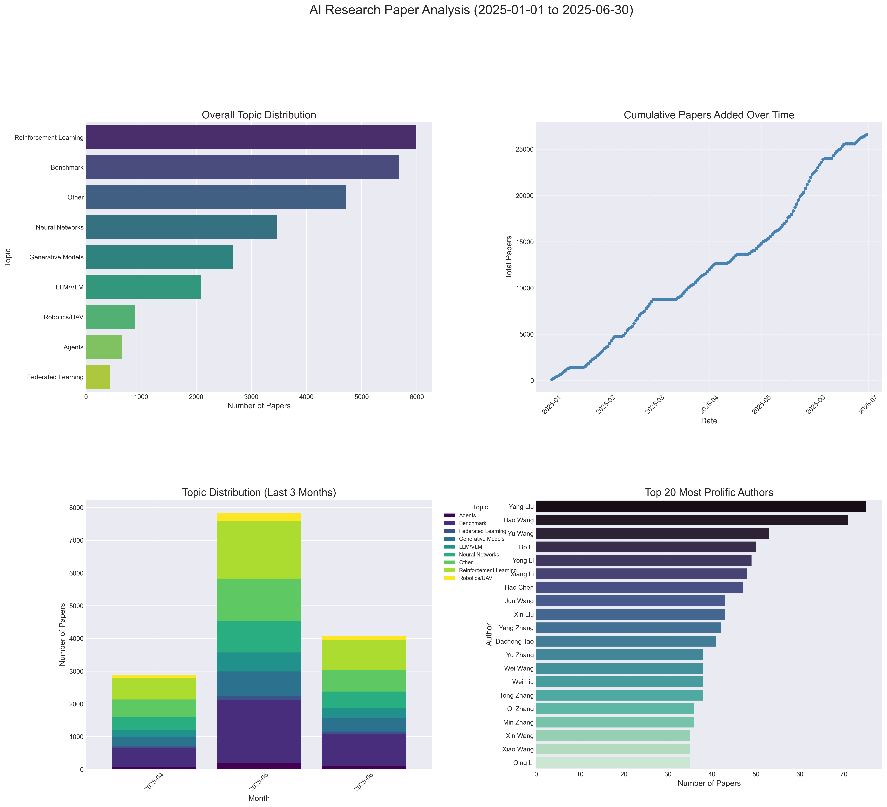
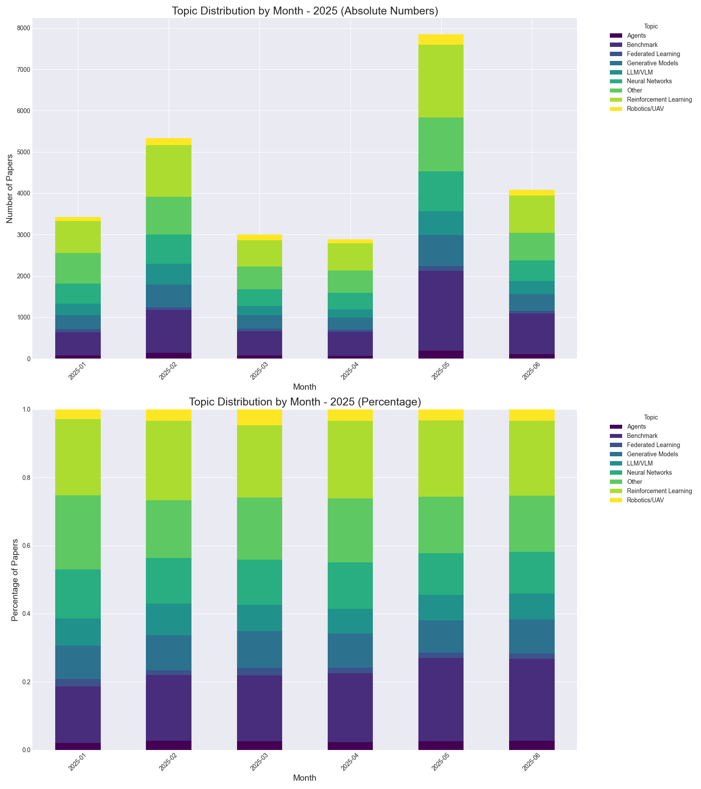

# Latest AI Research Papers

This repository contains summaries of the latest AI research papers, automatically updated daily using Ollama LLM.

*Last Updated: 2024-11-21 10:02:23*

## Paper Analytics

### Comprehensive Analysis Dashboard

### Detailed Analytics Grid

| Topic Distribution (Overall) | Papers Published by Month |
| :---: | :---: |
|  |  |

| Monthly Topic Trends (Last 3 Months) | Top Prolific Authors |
| :---: | :---: |
|  |  |

### Monthly Topic Distributions

| Topic Distribution (April 2025) | Topic Distribution (May 2025) | Topic Distribution (June 2025) |
| :---: | :---: | :---: |
|  |  |  |

### Additional Visualizations

| Daily Paper Submission Analysis |
| :---: |
|  |

## Table of Contents

- [2025-06-30](#20250630)
- [2025-06-29](#20250629)

---

## Papers Added on 2025-06-30

### [FADRM: Fast and Accurate Data Residual Matching for Dataset Distillation](http://arxiv.org/pdf/2506.24125v1)

**Authors:** Jiacheng Cui, Xinyue Bi, Yaxin Luo, Xiaohan Zhao, Jiacheng Liu, Zhiqiang Shen

Residual connection has been extensively studied and widely applied at the model architecture level. However, its potential in the more challenging data-centric approaches remains unexplored. In this work, we introduce the concept of Data Residual Matching for the first time, leveraging data-level skip connections to facilitate data generation and mitigate data information vanishing. This approach maintains a balance between newly acquired knowledge through pixel space optimization and existing core local information identification within raw data modalities, specifically for the dataset distillation task. Furthermore, by incorporating optimization-level refinements, our method significantly improves computational efficiency, achieving superior performance while reducing training time and peak GPU memory usage by 50%. Consequently, the proposed method Fast and Accurate Data Residual Matching for Dataset Distillation (FADRM) establishes a new state-of-the-art, demonstrating substantial improvements over existing methods across multiple dataset benchmarks in both efficiency and effectiveness. For instance, with ResNet-18 as the student model and a 0.8% compression ratio on ImageNet-1K, the method achieves 47.7% test accuracy in single-model dataset distillation and 50.0% in multi-model dataset distillation, surpassing RDED by +5.7% and outperforming state-of-the-art multi-model approaches, EDC and CV-DD, by +1.4% and +4.0%. Code is available at: https://github.com/Jiacheng8/FADRM.

---

### [Teaching Time Series to See and Speak: Forecasting with Aligned Visual   and Textual Perspectives](http://arxiv.org/pdf/2506.24124v1)

**Authors:** Dong Sixun, Fan Wei, Teresa Wu, Fu Yanjie

Time series forecasting traditionally relies on unimodal numerical inputs, which often struggle to capture high-level semantic patterns due to their dense and unstructured nature. While recent approaches have explored representing time series as text using large language models (LLMs), these methods remain limited by the discrete nature of token sequences and lack the perceptual intuition humans typically apply, such as interpreting visual patterns. In this paper, we propose a multimodal contrastive learning framework that transforms raw time series into structured visual and textual perspectives. Rather than using natural language or real-world images, we construct both modalities directly from numerical sequences. We then align these views in a shared semantic space via contrastive learning, enabling the model to capture richer and more complementary representations. Furthermore, we introduce a variate selection module that leverages the aligned representations to identify the most informative variables for multivariate forecasting. Extensive experiments on fifteen short-term and six long-term forecasting benchmarks demonstrate that our approach consistently outperforms strong unimodal and cross-modal baselines, highlighting the effectiveness of multimodal alignment in enhancing time series forecasting. Code is available at: https://github.com/Ironieser/TimesCLIP.

---

### [Data Uniformity Improves Training Efficiency and More, with a   Convergence Framework Beyond the NTK Regime](http://arxiv.org/pdf/2506.24120v1)

**Authors:** Yuqing Wang, Shangding Gu

Data selection plays a crucial role in data-driven decision-making, including in large language models (LLMs), and is typically task-dependent. Properties such as data quality and diversity have been extensively studied and are known to enhance model performance. However, it remains unclear whether there exist other quantitative and general principles of data selection that can consistently improve performance, especially for complex tasks with limited prior knowledge. In this paper, we demonstrate that selecting more uniformly distributed data can improve training efficiency while enhancing performance. Specifically, we establish that more uniform (less biased) distribution leads to a larger minimum pairwise distance between data points, denoted by $h_{\min}$, and prove that a smaller $h_{\min}$ can slow down the training dynamics of gradient descent (GD). Moreover, we theoretically show that the approximation error of neural networks decreases as $h_{\min}$ increases. Our analysis introduces a convergence framework for GD beyond the Neural Tangent Kernel (NTK) regime, applicable to a broad class of architectures, including transformers, without requiring Lipschitz smoothness. This framework further provides theoretical justification for the use of residual connections and function compositions in deep neural architectures. In the end, we conduct comprehensive experiments for supervised fine-tuning across various settings, including different optimization strategies, model sizes, and training datasets. The results consistently demonstrate that selecting data by maximizing pairwise distance significantly accelerates training and achieves comparable or better performance in LLMs across diverse datasets. Code and Datasets are available at the link: https://github.com/SafeRL-Lab/data-uniformity.

---

### [SPIRAL: Self-Play on Zero-Sum Games Incentivizes Reasoning via   Multi-Agent Multi-Turn Reinforcement Learning](http://arxiv.org/pdf/2506.24119v1)

**Authors:** Bo Liu, Leon Guertler, Simon Yu, Zichen Liu, Penghui Qi, Daniel Balcells, Mickel Liu, Cheston Tan, Weiyan Shi, Min Lin, Wee Sun Lee, Natasha Jaques

Recent advances in reinforcement learning have shown that language models can develop sophisticated reasoning through training on tasks with verifiable rewards, but these approaches depend on human-curated problem-answer pairs and domain-specific reward engineering. We introduce SPIRAL, a self-play framework where models learn by playing multi-turn, zero-sum games against continuously improving versions of themselves, eliminating the need for human supervision. Through self-play, SPIRAL generates an infinite curriculum of progressively challenging problems as models must constantly adapt to stronger opponents. To enable this self-play training at scale, We implement a fully online, multi-turn, multi-agent reinforcement learning system for LLMs and propose role-conditioned advantage estimation (RAE) to stabilize multi-agent training. Using SPIRAL, self-play on zero-sum games produces reasoning capabilities that transfer broadly. Training Qwen3-4B-Base on Kuhn Poker alone achieves 8.6% improvement on math and 8.4% on general reasoning, outperforming SFT on 25,000 expert game trajectories. Analysis reveals that this transfer occurs through three cognitive patterns: systematic decomposition, expected value calculation, and case-by-case analysis. Multi-game training (TicTacToe, Kuhn Poker, Simple Negotiation) further enhances performance as each game develops distinct reasoning strengths. Applying SPIRAL to a strong reasoning model (DeepSeek-R1-Distill-Qwen-7B) can still lead to 2.0% average improvement. These results demonstrate that zero-sum games naturally develop transferable reasoning capabilities, highlighting a promising direction for autonomous reasoning development.

---

### [Navigating with Annealing Guidance Scale in Diffusion Space](http://arxiv.org/pdf/2506.24108v1)

**Authors:** Shai Yehezkel, Omer Dahary, Andrey Voynov, Daniel Cohen-Or

Denoising diffusion models excel at generating high-quality images conditioned on text prompts, yet their effectiveness heavily relies on careful guidance during the sampling process. Classifier-Free Guidance (CFG) provides a widely used mechanism for steering generation by setting the guidance scale, which balances image quality and prompt alignment. However, the choice of the guidance scale has a critical impact on the convergence toward a visually appealing and prompt-adherent image. In this work, we propose an annealing guidance scheduler which dynamically adjusts the guidance scale over time based on the conditional noisy signal. By learning a scheduling policy, our method addresses the temperamental behavior of CFG. Empirical results demonstrate that our guidance scheduler significantly enhances image quality and alignment with the text prompt, advancing the performance of text-to-image generation. Notably, our novel scheduler requires no additional activations or memory consumption, and can seamlessly replace the common classifier-free guidance, offering an improved trade-off between prompt alignment and quality.

---

### [On the Predictive Power of Representation Dispersion in Language Models](http://arxiv.org/pdf/2506.24106v1)

**Authors:** Yanhong Li, Ming Li, Karen Livescu, Jiawei Zhou

We show that a language model's ability to predict text is tightly linked to the breadth of its embedding space: models that spread their contextual representations more widely tend to achieve lower perplexity. Concretely, we find that representation dispersion - the average pairwise cosine distance among hidden vectors - strongly and negatively correlates with perplexity across diverse model families (LLaMA, Qwen, and others) and domains (Wikipedia, news, scientific abstracts). Beyond illustrating this link, we show how dispersion can be leveraged for a range of practical tasks without requiring labeled data. First, measuring dispersion on unlabeled text allows us to predict downstream accuracy in new domains, offering a data-efficient tool for model selection. Next, we find that identifying layers with higher dispersion pinpoints the best representations for retrieval-based methods such as kNN-LM, bypassing exhaustive layer-by-layer searches. Finally, we integrate a simple push-away objective into training, which increases dispersion in both single-domain and cross-domain scenarios and directly improves perplexity in each.

---

### [Development of Hybrid Artificial Intelligence Training on Real and   Synthetic Data: Benchmark on Two Mixed Training Strategies](http://arxiv.org/pdf/2506.24093v1)

**Authors:** Paul Wachter, Lukas Niehaus, Julius Schöning

Synthetic data has emerged as a cost-effective alternative to real data for training artificial neural networks (ANN). However, the disparity between synthetic and real data results in a domain gap. That gap leads to poor performance and generalization of the trained ANN when applied to real-world scenarios. Several strategies have been developed to bridge this gap, which combine synthetic and real data, known as mixed training using hybrid datasets. While these strategies have been shown to mitigate the domain gap, a systematic evaluation of their generalizability and robustness across various tasks and architectures remains underexplored. To address this challenge, our study comprehensively analyzes two widely used mixing strategies on three prevalent architectures and three distinct hybrid datasets. From these datasets, we sample subsets with varying proportions of synthetic to real data to investigate the impact of synthetic and real components. The findings of this paper provide valuable insights into optimizing the use of synthetic data in the training process of any ANN, contributing to enhancing robustness and efficacy.

---

### [Imagine for Me: Creative Conceptual Blending of Real Images and Text via   Blended Attention](http://arxiv.org/pdf/2506.24085v1)

**Authors:** Wonwoong Cho, Yanxia Zhang, Yan-Ying Chen, David I. Inouye

Blending visual and textual concepts into a new visual concept is a unique and powerful trait of human beings that can fuel creativity. However, in practice, cross-modal conceptual blending for humans is prone to cognitive biases, like design fixation, which leads to local minima in the design space. In this paper, we propose a T2I diffusion adapter "IT-Blender" that can automate the blending process to enhance human creativity. Prior works related to cross-modal conceptual blending are limited in encoding a real image without loss of details or in disentangling the image and text inputs. To address these gaps, IT-Blender leverages pretrained diffusion models (SD and FLUX) to blend the latent representations of a clean reference image with those of the noisy generated image. Combined with our novel blended attention, IT-Blender encodes the real reference image without loss of details and blends the visual concept with the object specified by the text in a disentangled way. Our experiment results show that IT-Blender outperforms the baselines by a large margin in blending visual and textual concepts, shedding light on the new application of image generative models to augment human creativity.

---

### [SQUASH: A SWAP-Based Quantum Attack to Sabotage Hybrid Quantum Neural   Networks](http://arxiv.org/pdf/2506.24081v1)

**Authors:** Rahul Kumar, Wenqi Wei, Ying Mao, Junaid Farooq, Ying Wang, Juntao Chen

We propose a circuit-level attack, SQUASH, a SWAP-Based Quantum Attack to sabotage Hybrid Quantum Neural Networks (HQNNs) for classification tasks. SQUASH is executed by inserting SWAP gate(s) into the variational quantum circuit of the victim HQNN. Unlike conventional noise-based or adversarial input attacks, SQUASH directly manipulates the circuit structure, leading to qubit misalignment and disrupting quantum state evolution. This attack is highly stealthy, as it does not require access to training data or introduce detectable perturbations in input states. Our results demonstrate that SQUASH significantly degrades classification performance, with untargeted SWAP attacks reducing accuracy by up to 74.08\% and targeted SWAP attacks reducing target class accuracy by up to 79.78\%. These findings reveal a critical vulnerability in HQNN implementations, underscoring the need for more resilient architectures against circuit-level adversarial interventions.

---

### [STACK: Adversarial Attacks on LLM Safeguard Pipelines](http://arxiv.org/pdf/2506.24068v1)

**Authors:** Ian R. McKenzie, Oskar J. Hollinsworth, Tom Tseng, Xander Davies, Stephen Casper, Aaron D. Tucker, Robert Kirk, Adam Gleave

Frontier AI developers are relying on layers of safeguards to protect against catastrophic misuse of AI systems. Anthropic guards their latest Claude 4 Opus model using one such defense pipeline, and other frontier developers including Google DeepMind and OpenAI pledge to soon deploy similar defenses. However, the security of such pipelines is unclear, with limited prior work evaluating or attacking these pipelines. We address this gap by developing and red-teaming an open-source defense pipeline. First, we find that a novel few-shot-prompted input and output classifier outperforms state-of-the-art open-weight safeguard model ShieldGemma across three attacks and two datasets, reducing the attack success rate (ASR) to 0% on the catastrophic misuse dataset ClearHarm. Second, we introduce a STaged AttaCK (STACK) procedure that achieves 71% ASR on ClearHarm in a black-box attack against the few-shot-prompted classifier pipeline. Finally, we also evaluate STACK in a transfer setting, achieving 33% ASR, providing initial evidence that it is feasible to design attacks with no access to the target pipeline. We conclude by suggesting specific mitigations that developers could use to thwart staged attacks.

---

### [Logit-Gap Steering: Efficient Short-Suffix Jailbreaks for Aligned Large   Language Models](http://arxiv.org/pdf/2506.24056v1)

**Authors:** Tung-Ling Li, Hongliang Liu

We introduce logit-gap steering, a fast jailbreak framework that casts the refusal-affirmation gap of RLHF-aligned language models as a single pass over the vocabulary. A forward-computable score blends gap reduction with lightweight proxies for KL penalty and reward shift, allowing a "sort-sum-stop" sweep to complete in under a second and return a short suffix--two orders of magnitude fewer model calls than beam or gradient attacks. The same suffix generalises to unseen prompts and scales from 0.5 B to 70 B checkpoints, lifting one-shot attack success from baseline levels to 80-100% while preserving topical coherence. Beyond efficiency, these suffixes expose sentence-boundary reward cliffs and other alignment artefacts, offering a lightweight probe into how safety tuning reshapes internal representations.

---

### [Consensus-based optimization for closed-box adversarial attacks and a   connection to evolution strategies](http://arxiv.org/pdf/2506.24048v1)

**Authors:** Tim Roith, Leon Bungert, Philipp Wacker

Consensus-based optimization (CBO) has established itself as an efficient gradient-free optimization scheme, with attractive mathematical properties, such as mean-field convergence results for non-convex loss functions. In this work, we study CBO in the context of closed-box adversarial attacks, which are imperceptible input perturbations that aim to fool a classifier, without accessing its gradient. Our contribution is to establish a connection between the so-called consensus hopping as introduced by Riedl et al. and natural evolution strategies (NES) commonly applied in the context of adversarial attacks and to rigorously relate both methods to gradient-based optimization schemes. Beyond that, we provide a comprehensive experimental study that shows that despite the conceptual similarities, CBO can outperform NES and other evolutionary strategies in certain scenarios.

---

### [Agent.xpu: Efficient Scheduling of Agentic LLM Workloads on   Heterogeneous SoC](http://arxiv.org/pdf/2506.24045v1)

**Authors:** Xinming Wei, Jiahao Zhang, Haoran Li, Jiayu Chen, Rui Qu, Maoliang Li, Xiang Chen, Guojie Luo

The proliferation of agentic Large Language Models (LLMs) on personal devices introduces a new class of workloads characterized by a dichotomy of objectives. Reactive tasks, initiated by users, demand immediate, low-latency responses, while proactive tasks operate invisibly and prioritize throughput. Existing on-device LLM engines, designed for isolated inferences, fail to efficiently manage these concurrent and conflicting requests on consumer-grade heterogeneous SoCs with CPU, integrated GPU, and NPU. This paper introduces Agent.xpu, an efficient serving system for agentic LLM workloads on memory-unified heterogeneous SoCs. With dedicated offline profiling, Agent.xpu first constructs a heterogeneous execution graph, which fuses and chunks model kernels for affinity-guided, elastic accelerator mapping with predictive kernel annotation. At runtime, its online scheduler enables fine-grained, kernel-level preemption to guarantee the responsiveness of reactive tasks. To maximize SoC utilization, it adopts slack-aware kernel backfill to opportunistically append proactive tasks, and mitigates NPU-iGPU contention via bandwidth-aware dispatch. Evaluation on an Intel Core Ultra SoC shows that Agent.xpu achieves 4.6$\times$ lower latency for reactive tasks and sustains 1.6$\times$-6.8$\times$ higher throughput for proactive tasks compared to state-of-the-art inference engines.

---

### [A Survey on Vision-Language-Action Models for Autonomous Driving](http://arxiv.org/pdf/2506.24044v1)

**Authors:** Sicong Jiang, Zilin Huang, Kangan Qian, Ziang Luo, Tianze Zhu, Yang Zhong, Yihong Tang, Menglin Kong, Yunlong Wang, Siwen Jiao, Hao Ye, Zihao Sheng, Xin Zhao, Tuopu Wen, Zheng Fu, Sikai Chen, Kun Jiang, Diange Yang, Seongjin Choi, Lijun Sun

The rapid progress of multimodal large language models (MLLM) has paved the way for Vision-Language-Action (VLA) paradigms, which integrate visual perception, natural language understanding, and control within a single policy. Researchers in autonomous driving are actively adapting these methods to the vehicle domain. Such models promise autonomous vehicles that can interpret high-level instructions, reason about complex traffic scenes, and make their own decisions. However, the literature remains fragmented and is rapidly expanding. This survey offers the first comprehensive overview of VLA for Autonomous Driving (VLA4AD). We (i) formalize the architectural building blocks shared across recent work, (ii) trace the evolution from early explainer to reasoning-centric VLA models, and (iii) compare over 20 representative models according to VLA's progress in the autonomous driving domain. We also consolidate existing datasets and benchmarks, highlighting protocols that jointly measure driving safety, accuracy, and explanation quality. Finally, we detail open challenges - robustness, real-time efficiency, and formal verification - and outline future directions of VLA4AD. This survey provides a concise yet complete reference for advancing interpretable socially aligned autonomous vehicles. Github repo is available at \href{https://github.com/JohnsonJiang1996/Awesome-VLA4AD}{SicongJiang/Awesome-VLA4AD}.

---

### [Faster Diffusion Models via Higher-Order Approximation](http://arxiv.org/pdf/2506.24042v1)

**Authors:** Gen Li, Yuchen Zhou, Yuting Wei, Yuxin Chen

In this paper, we explore provable acceleration of diffusion models without any additional retraining. Focusing on the task of approximating a target data distribution in $\mathbb{R}^d$ to within $\varepsilon$ total-variation distance, we propose a principled, training-free sampling algorithm that requires only the order of   $$ d^{1+2/K} \varepsilon^{-1/K} $$   score function evaluations (up to log factor) in the presence of accurate scores, where $K$ is an arbitrarily large fixed integer. This result applies to a broad class of target data distributions, without the need for assumptions such as smoothness or log-concavity. Our theory is robust vis-a-vis inexact score estimation, degrading gracefully as the score estimation error increases -- without demanding higher-order smoothness on the score estimates as assumed in previous work. The proposed algorithm draws insight from high-order ODE solvers, leveraging high-order Lagrange interpolation and successive refinement to approximate the integral derived from the probability flow ODE.

---

### [Unsupervised Sparse Coding-based Spiking Neural Network for Real-time   Spike Sorting](http://arxiv.org/pdf/2506.24041v1)

**Authors:** Alexis Melot, Sean U. N. Wood, Yannick Coffinier, Pierre Yger, Fabien Alibart

Spike sorting is a crucial step in decoding multichannel extracellular neural signals, enabling the identification of individual neuronal activity. A key challenge in brain-machine interfaces (BMIs) is achieving real-time, low-power spike sorting at the edge while keeping high neural decoding performance. This study introduces the Neuromorphic Sparse Sorter (NSS), a compact two-layer spiking neural network optimized for efficient spike sorting. NSS leverages the Locally Competitive Algorithm (LCA) for sparse coding to extract relevant features from noisy events with reduced computational demands. NSS learns to sort detected spike waveforms in an online fashion and operates entirely unsupervised. To exploit multi-bit spike coding capabilities of neuromorphic platforms like Intel's Loihi 2, a custom neuron model was implemented, enabling flexible power-performance trade-offs via adjustable spike bit-widths. Evaluations on simulated and real-world tetrode signals with biological drift showed NSS outperformed established pipelines such as WaveClus3 and PCA+KMeans. With 2-bit graded spikes, NSS on Loihi 2 outperformed NSS implemented with leaky integrate-and-fire neuron and achieved an F1-score of 77% (+10% improvement) while consuming 8.6mW (+1.65mW) when tested on a drifting recording, with a computational processing time of 0.25ms (+60 us) per inference.

---

### [Constructing Non-Markovian Decision Process via History Aggregator](http://arxiv.org/pdf/2506.24026v1)

**Authors:** Yongyi Wang, Wenxin Li

In the domain of algorithmic decision-making, non-Markovian dynamics manifest as a significant impediment, especially for paradigms such as Reinforcement Learning (RL), thereby exerting far-reaching consequences on the advancement and effectiveness of the associated systems. Nevertheless, the existing benchmarks are deficient in comprehensively assessing the capacity of decision algorithms to handle non-Markovian dynamics. To address this deficiency, we have devised a generalized methodology grounded in category theory. Notably, we established the category of Markov Decision Processes (MDP) and the category of non-Markovian Decision Processes (NMDP), and proved the equivalence relationship between them. This theoretical foundation provides a novel perspective for understanding and addressing non-Markovian dynamics. We further introduced non-Markovianity into decision-making problem settings via the History Aggregator for State (HAS). With HAS, we can precisely control the state dependency structure of decision-making problems in the time series. Our analysis demonstrates the effectiveness of our method in representing a broad range of non-Markovian dynamics. This approach facilitates a more rigorous and flexible evaluation of decision algorithms by testing them in problem settings where non-Markovian dynamics are explicitly constructed.

---

### [Post-processing of EEG-based Auditory Attention Decoding Decisions via   Hidden Markov Models](http://arxiv.org/pdf/2506.24024v1)

**Authors:** Nicolas Heintz, Tom Francart, Alexander Bertrand

Auditory attention decoding (AAD) algorithms exploit brain signals, such as electroencephalography (EEG), to identify which speaker a listener is focusing on in a multi-speaker environment. While state-of-the-art AAD algorithms can identify the attended speaker on short time windows, their predictions are often too inaccurate for practical use. In this work, we propose augmenting AAD with a hidden Markov model (HMM) that models the temporal structure of attention. More specifically, the HMM relies on the fact that a subject is much less likely to switch attention than to keep attending the same speaker at any moment in time. We show how a HMM can significantly improve existing AAD algorithms in both causal (real-time) and non-causal (offline) settings. We further demonstrate that HMMs outperform existing postprocessing approaches in both accuracy and responsiveness, and explore how various factors such as window length, switching frequency, and AAD accuracy influence overall performance. The proposed method is computationally efficient, intuitive to use and applicable in both real-time and offline settings.

---

### [Bridging Theory and Practice in Link Representation with Graph Neural   Networks](http://arxiv.org/pdf/2506.24018v1)

**Authors:** Veronica Lachi, Francesco Ferrini, Antonio Longa, Bruno Lepri, Andrea Passerini, Manfred Jaeger

Graph Neural Networks (GNNs) are widely used to compute representations of node pairs for downstream tasks such as link prediction. Yet, theoretical understanding of their expressive power has focused almost entirely on graph-level representations. In this work, we shift the focus to links and provide the first comprehensive study of GNN expressiveness in link representation. We introduce a unifying framework, the $k_\phi$-$k_\rho$-$m$ framework, that subsumes existing message-passing link models and enables formal expressiveness comparisons. Using this framework, we derive a hierarchy of state-of-the-art methods and offer theoretical tools to analyze future architectures. To complement our analysis, we propose a synthetic evaluation protocol comprising the first benchmark specifically designed to assess link-level expressiveness. Finally, we ask: does expressiveness matter in practice? We use a graph symmetry metric that quantifies the difficulty of distinguishing links and show that while expressive models may underperform on standard benchmarks, they significantly outperform simpler ones as symmetry increases, highlighting the need for dataset-aware model selection.

---

### [EXPERT: An Explainable Image Captioning Evaluation Metric with   Structured Explanations](http://arxiv.org/pdf/2506.24016v1)

**Authors:** Hyunjong Kim, Sangyeop Kim, Jongheon Jeong, Yeongjae Cho, Sungzoon Cho

Recent advances in large language models and vision-language models have led to growing interest in explainable evaluation metrics for image captioning. However, these metrics generate explanations without standardized criteria, and the overall quality of the generated explanations remains unverified. In this paper, we propose EXPERT, a reference-free evaluation metric that provides structured explanations based on three fundamental criteria: fluency, relevance, and descriptiveness. By constructing large-scale datasets of high-quality structured explanations, we develop a two-stage evaluation template to effectively supervise a vision-language model for both scoring and explanation generation. EXPERT achieves state-of-the-art results on benchmark datasets while providing significantly higher-quality explanations than existing metrics, as validated through comprehensive human evaluation. Our code and datasets are available at https://github.com/hjkim811/EXPERT.

---

### [Bridging Physical and Digital Worlds: Embodied Large AI for Future   Wireless Systems](http://arxiv.org/pdf/2506.24009v1)

**Authors:** Xinquan Wang, Fenghao Zhu, Zhaohui Yang, Chongwen Huang, Xiaoming Chen, Zhaoyang Zhang, Sami Muhaidat, Mérouane Debbah

Large artificial intelligence (AI) models offer revolutionary potential for future wireless systems, promising unprecedented capabilities in network optimization and performance. However, current paradigms largely overlook crucial physical interactions. This oversight means they primarily rely on offline datasets, leading to difficulties in handling real-time wireless dynamics and non-stationary environments. Furthermore, these models often lack the capability for active environmental probing. This paper proposes a fundamental paradigm shift towards wireless embodied large AI (WELAI), moving from passive observation to active embodiment. We first identify key challenges faced by existing models, then we explore the design principles and system structure of WELAI. Besides, we outline prospective applications in next-generation wireless. Finally, through an illustrative case study, we demonstrate the effectiveness of WELAI and point out promising research directions for realizing adaptive, robust, and autonomous wireless systems.

---

### [Minimax and Bayes Optimal Best-arm Identification: Adaptive Experimental   Design for Treatment Choice](http://arxiv.org/pdf/2506.24007v1)

**Authors:** Masahiro Kato

This study investigates adaptive experimental design for treatment choice, also known as fixed-budget best-arm identification. We consider an adaptive procedure consisting of a treatment-allocation phase followed by a treatment-choice phase, and we design an adaptive experiment for this setup to efficiently identify the best treatment arm, defined as the one with the highest expected outcome. In our designed experiment, the treatment-allocation phase consists of two stages. The first stage is a pilot phase, where we allocate each treatment arm uniformly with equal proportions to eliminate clearly suboptimal arms and estimate outcome variances. In the second stage, we allocate treatment arms in proportion to the variances estimated in the first stage. After the treatment-allocation phase, the procedure enters the treatment-choice phase, where we choose the treatment arm with the highest sample mean as our estimate of the best treatment arm. We prove that this single design is simultaneously asymptotically minimax and Bayes optimal for the simple regret, with upper bounds that match our lower bounds up to exact constants. Therefore, our designed experiment achieves the sharp efficiency limits without requiring separate tuning for minimax and Bayesian objectives.

---

### [Provably Efficient and Agile Randomized Q-Learning](http://arxiv.org/pdf/2506.24005v1)

**Authors:** He Wang, Xingyu Xu, Yuejie Chi

While Bayesian-based exploration often demonstrates superior empirical performance compared to bonus-based methods in model-based reinforcement learning (RL), its theoretical understanding remains limited for model-free settings. Existing provable algorithms either suffer from computational intractability or rely on stage-wise policy updates which reduce responsiveness and slow down the learning process. In this paper, we propose a novel variant of Q-learning algorithm, refereed to as RandomizedQ, which integrates sampling-based exploration with agile, step-wise, policy updates, for episodic tabular RL. We establish an $\widetilde{O}(\sqrt{H^5SAT})$ regret bound, where $S$ is the number of states, $A$ is the number of actions, $H$ is the episode length, and $T$ is the total number of episodes. In addition, we present a logarithmic regret bound under a mild positive sub-optimality condition on the optimal Q-function. Empirically, RandomizedQ exhibits outstanding performance compared to existing Q-learning variants with both bonus-based and Bayesian-based exploration on standard benchmarks.

---

### [The Illusion of Progress? A Critical Look at Test-Time Adaptation for   Vision-Language Models](http://arxiv.org/pdf/2506.24000v1)

**Authors:** Lijun Sheng, Jian Liang, Ran He, Zilei Wang, Tieniu Tan

Test-time adaptation (TTA) methods have gained significant attention for enhancing the performance of vision-language models (VLMs) such as CLIP during inference, without requiring additional labeled data. However, current TTA researches generally suffer from major limitations such as duplication of baseline results, limited evaluation metrics, inconsistent experimental settings, and insufficient analysis. These problems hinder fair comparisons between TTA methods and obscure their practical strengths and weaknesses. To address these challenges, we introduce TTA-VLM, a comprehensive benchmark for evaluating TTA methods on VLMs. Our benchmark implements 8 episodic TTA and 7 online TTA methods within a unified and reproducible framework, and evaluates them across 15 widely used datasets. Unlike prior studies focused solely on CLIP, we extend the evaluation to SigLIP--a model trained with a Sigmoid loss--and include training-time tuning methods such as CoOp, MaPLe, and TeCoA to assess generality. Beyond classification accuracy, TTA-VLM incorporates various evaluation metrics, including robustness, calibration, out-of-distribution detection, and stability, enabling a more holistic assessment of TTA methods. Through extensive experiments, we find that 1) existing TTA methods produce limited gains compared to the previous pioneering work; 2) current TTA methods exhibit poor collaboration with training-time fine-tuning methods; 3) accuracy gains frequently come at the cost of reduced model trustworthiness. We release TTA-VLM to provide fair comparison and comprehensive evaluation of TTA methods for VLMs, and we hope it encourages the community to develop more reliable and generalizable TTA strategies.

---

### [The Jacobian and Hessian of the Kullback-Leibler Divergence between   Multivariate Gaussian Distributions (Technical Report)](http://arxiv.org/pdf/2506.23996v1)

**Authors:** Juan Maroñas

This document shows how to obtain the Jacobian and Hessian matrices of the Kullback-Leibler divergence between two multivariate Gaussian distributions, using the first and second-order differentials. The presented derivations are based on the theory presented by \cite{magnus99}. I've also got great inspiration from some of the derivations in \cite{minka}.   Since I pretend to be at most didactic, the document is split into a summary of results and detailed derivations on each of the elements involved, with specific references to the tricks used in the derivations, and to many of the underlying concepts.

---

### [STCLocker: Deadlock Avoidance Testing for Autonomous Driving Systems](http://arxiv.org/pdf/2506.23995v1)

**Authors:** Mingfei Cheng, Renzhi Wang, Xiaofei Xie, Yuan Zhou, Lei Ma

Autonomous Driving System (ADS) testing is essential to ensure the safety and reliability of autonomous vehicles (AVs) before deployment. However, existing techniques primarily focus on evaluating ADS functionalities in single-AV settings. As ADSs are increasingly deployed in multi-AV traffic, it becomes crucial to assess their cooperative performance, particularly regarding deadlocks, a fundamental coordination failure in which multiple AVs enter a circular waiting state indefinitely, resulting in motion planning failures. Despite its importance, the cooperative capability of ADSs to prevent deadlocks remains insufficiently underexplored. To address this gap, we propose the first dedicated Spatio-Temporal Conflict-Guided Deadlock Avoidance Testing technique, STCLocker, for generating DeadLock Scenarios (DLSs), where a group of AVs controlled by the ADS under test are in a circular wait state. STCLocker consists of three key components: Deadlock Oracle, Conflict Feedback, and Conflict-aware Scenario Generation. Deadlock Oracle provides a reliable black-box mechanism for detecting deadlock cycles among multiple AVs within a given scenario. Conflict Feedback and Conflict-aware Scenario Generation collaborate to actively guide AVs into simultaneous competition over spatial conflict resources (i.e., shared passing regions) and temporal competitive behaviors (i.e., reaching the conflict region at the same time), thereby increasing the effectiveness of generating conflict-prone deadlocks. We evaluate STCLocker on two types of ADSs: Roach, an end-to-end ADS, and OpenCDA, a module-based ADS supporting cooperative communication. Experimental results show that, on average, STCLocker generates more DLS than the best-performing baseline.

---

### [Harnessing AI Agents to Advance Research on Refugee Child Mental Health](http://arxiv.org/pdf/2506.23992v1)

**Authors:** Aditya Shrivastava, Komal Gupta, Shraddha Arora

The international refugee crisis deepens, exposing millions of dis placed children to extreme psychological trauma. This research suggests a com pact, AI-based framework for processing unstructured refugee health data and distilling knowledge on child mental health. We compare two Retrieval-Aug mented Generation (RAG) pipelines, Zephyr-7B-beta and DeepSeek R1-7B, to determine how well they process challenging humanitarian datasets while avoid ing hallucination hazards. By combining cutting-edge AI methods with migration research and child psychology, this study presents a scalable strategy to assist policymakers, mental health practitioners, and humanitarian agencies to better assist displaced children and recognize their mental wellbeing. In total, both the models worked properly but significantly Deepseek R1 is superior to Zephyr with an accuracy of answer relevance 0.91

---

### [Machine Understanding of Scientific Language](http://arxiv.org/pdf/2506.23990v1)

**Authors:** Dustin Wright

Scientific information expresses human understanding of nature. This knowledge is largely disseminated in different forms of text, including scientific papers, news articles, and discourse among people on social media. While important for accelerating our pursuit of knowledge, not all scientific text is faithful to the underlying science. As the volume of this text has burgeoned online in recent years, it has become a problem of societal importance to be able to identify the faithfulness of a given piece of scientific text automatically. This thesis is concerned with the cultivation of datasets, methods, and tools for machine understanding of scientific language, in order to analyze and understand science communication at scale. To arrive at this, I present several contributions in three areas of natural language processing and machine learning: automatic fact checking, learning with limited data, and scientific text processing. These contributions include new methods and resources for identifying check-worthy claims, adversarial claim generation, multi-source domain adaptation, learning from crowd-sourced labels, cite-worthiness detection, zero-shot scientific fact checking, detecting exaggerated scientific claims, and modeling degrees of information change in science communication. Critically, I demonstrate how the research outputs of this thesis are useful for effectively learning from limited amounts of scientific text in order to identify misinformative scientific statements and generate new insights into the science communication process

---

### [LLM Agents Are the Antidote to Walled Gardens](http://arxiv.org/pdf/2506.23978v1)

**Authors:** Samuele Marro, Philip Torr

While the Internet's core infrastructure was designed to be open and universal, today's application layer is dominated by closed, proprietary platforms. Open and interoperable APIs require significant investment, and market leaders have little incentive to enable data exchange that could erode their user lock-in. We argue that LLM-based agents fundamentally disrupt this status quo. Agents can automatically translate between data formats and interact with interfaces designed for humans: this makes interoperability dramatically cheaper and effectively unavoidable. We name this shift universal interoperability: the ability for any two digital services to exchange data seamlessly using AI-mediated adapters. Universal interoperability undermines monopolistic behaviours and promotes data portability. However, it can also lead to new security risks and technical debt. Our position is that the ML community should embrace this development while building the appropriate frameworks to mitigate the downsides. By acting now, we can harness AI to restore user freedom and competitive markets without sacrificing security.

---

### [A Scalable Approach for Safe and Robust Learning via   Lipschitz-Constrained Networks](http://arxiv.org/pdf/2506.23977v1)

**Authors:** Zain ul Abdeen, Vassilis Kekatos, Ming Jin

Certified robustness is a critical property for deploying neural networks (NN) in safety-critical applications. A principle approach to achieving such guarantees is to constrain the global Lipschitz constant of the network. However, accurate methods for Lipschitz-constrained training often suffer from non-convex formulations and poor scalability due to reliance on global semidefinite programs (SDPs). In this letter, we propose a convex training framework that enforces global Lipschitz constraints via semidefinite relaxation. By reparameterizing the NN using loop transformation, we derive a convex admissibility condition that enables tractable and certifiable training. While the resulting formulation guarantees robustness, its scalability is limited by the size of global SDP. To overcome this, we develop a randomized subspace linear matrix inequalities (RS-LMI) approach that decomposes the global constraints into sketched layerwise constraints projected onto low-dimensional subspaces, yielding a smooth and memory-efficient training objective. Empirical results on MNIST, CIFAR-10, and ImageNet demonstrate that the proposed framework achieves competitive accuracy with significantly improved Lipschitz bounds and runtime performance.

---

### [UMA: A Family of Universal Models for Atoms](http://arxiv.org/pdf/2506.23971v1)

**Authors:** Brandon M. Wood, Misko Dzamba, Xiang Fu, Meng Gao, Muhammed Shuaibi, Luis Barroso-Luque, Kareem Abdelmaqsoud, Vahe Gharakhanyan, John R. Kitchin, Daniel S. Levine, Kyle Michel, Anuroop Sriram, Taco Cohen, Abhishek Das, Ammar Rizvi, Sushree Jagriti Sahoo, Zachary W. Ulissi, C. Lawrence Zitnick

The ability to quickly and accurately compute properties from atomic simulations is critical for advancing a large number of applications in chemistry and materials science including drug discovery, energy storage, and semiconductor manufacturing. To address this need, Meta FAIR presents a family of Universal Models for Atoms (UMA), designed to push the frontier of speed, accuracy, and generalization. UMA models are trained on half a billion unique 3D atomic structures (the largest training runs to date) by compiling data across multiple chemical domains, e.g. molecules, materials, and catalysts. We develop empirical scaling laws to help understand how to increase model capacity alongside dataset size to achieve the best accuracy. The UMA small and medium models utilize a novel architectural design we refer to as mixture of linear experts that enables increasing model capacity without sacrificing speed. For example, UMA-medium has 1.4B parameters but only ~50M active parameters per atomic structure. We evaluate UMA models on a diverse set of applications across multiple domains and find that, remarkably, a single model without any fine-tuning can perform similarly or better than specialized models. We are releasing the UMA code, weights, and associated data to accelerate computational workflows and enable the community to continue to build increasingly capable AI models.

---

### [Learning Constraints Directly from Network Data](http://arxiv.org/pdf/2506.23964v1)

**Authors:** Hongyu Hè, Minhao Jin, Maria Apostolaki

Network data conforms to a wide range of rules that arise from protocols, design principles, and deployment decisions (e.g., a packet's queuing delay must be less than its end-to-end delay). Formalizing such rules as logic constraints can (i) improve the quality of synthetic data, (ii) reduce the brittleness of machine learning (ML) models, and (iii) improve semantic understanding of network measurements. However, these benefits remain out of reach if rule extraction is manual or solely reliant on ML, as both approaches yield incomplete, unreliable, and/or inaccurate rules.   This paper formulates rule extraction as a constraint modeling problem and introduces NetNomos that learns propositional logic constraints directly from raw network measurements. Constraint modeling in this domain is uniquely challenging due to the scale of the data, the inherent learning complexity and passive environment, and the lack of ground truth supervision. NetNomos addresses these challenges via a lattice-based search structured by constraint specificity and succinctness. Our approach reduces learning complexity from superquadratic to logarithmic and enables efficient traversal in combinatorial search space.   Our evaluations on diverse network datasets show that NetNomos learns all benchmark rules, including those associated with as little as 0.01% of data points, in under three hours. In contrast, baseline methods discover less than 25% of the rules and require several days to run. Through three case studies, we show that: NetNomos (i) finds rule violations in the outputs of all seven synthetic traffic generators, hence can be used to assess and guide their generation process; (ii) detects semantic differences in traffic, hence can be used for anomaly detection; and (iii) automatically finds rules used for telemetry imputation, hence can support monitoring through inference.

---

### [ADReFT: Adaptive Decision Repair for Safe Autonomous Driving via   Reinforcement Fine-Tuning](http://arxiv.org/pdf/2506.23960v1)

**Authors:** Mingfei Cheng, Xiaofei Xie, Renzhi Wang, Yuan Zhou, Ming Hu

Autonomous Driving Systems (ADSs) continue to face safety-critical risks due to the inherent limitations in their design and performance capabilities. Online repair plays a crucial role in mitigating such limitations, ensuring the runtime safety and reliability of ADSs. Existing online repair solutions enforce ADS compliance by transforming unacceptable trajectories into acceptable ones based on predefined specifications, such as rule-based constraints or training datasets. However, these approaches often lack generalizability, adaptability and tend to be overly conservative, resulting in ineffective repairs that not only fail to mitigate safety risks sufficiently but also degrade the overall driving experience. To address this issue, we propose Adaptive Decision Repair (ADReFT), a novel and effective repair method that identifies safety-critical states through offline learning from failed tests and generates appropriate mitigation actions to improve ADS safety. Specifically, ADReFT incorporates a transformer-based model with two joint heads, State Monitor and Decision Adapter, designed to capture complex driving environment interactions to evaluate state safety severity and generate adaptive repair actions. Given the absence of oracles for state safety identification, we first pretrain ADReFT using supervised learning with coarse annotations, i.e., labeling states preceding violations as positive samples and others as negative samples. It establishes ADReFT's foundational capability to mitigate safety-critical violations, though it may result in somewhat conservative mitigation strategies. Therefore, we subsequently finetune ADReFT using reinforcement learning to improve its initial capability and generate more precise and contextually appropriate repair decisions. Our evaluation results illustrate that ADReFT achieves better repair performance.

---

### [Bridging the Gap with Retrieval-Augmented Generation: Making Prosthetic   Device User Manuals Available in Marginalised Languages](http://arxiv.org/pdf/2506.23958v1)

**Authors:** Ikechukwu Ogbonna, Lesley Davidson, Soumya Banerjee, Abhishek Dasgupta, Laurence Kenney, Vikranth Harthikote Nagaraja

Millions of people in African countries face barriers to accessing healthcare due to language and literacy gaps. This research tackles this challenge by transforming complex medical documents -- in this case, prosthetic device user manuals -- into accessible formats for underserved populations. This case study in cross-cultural translation is particularly pertinent/relevant for communities that receive donated prosthetic devices but may not receive the accompanying user documentation. Or, if available online, may only be available in formats (e.g., language and readability) that are inaccessible to local populations (e.g., English-language, high resource settings/cultural context). The approach is demonstrated using the widely spoken Pidgin dialect, but our open-source framework has been designed to enable rapid and easy extension to other languages/dialects. This work presents an AI-powered framework designed to process and translate complex medical documents, e.g., user manuals for prosthetic devices, into marginalised languages. The system enables users -- such as healthcare workers or patients -- to upload English-language medical equipment manuals, pose questions in their native language, and receive accurate, localised answers in real time. Technically, the system integrates a Retrieval-Augmented Generation (RAG) pipeline for processing and semantic understanding of the uploaded manuals. It then employs advanced Natural Language Processing (NLP) models for generative question-answering and multilingual translation. Beyond simple translation, it ensures accessibility to device instructions, treatment protocols, and safety information, empowering patients and clinicians to make informed healthcare decisions.

---

### [Autonomy by Design: Preserving Human Autonomy in AI Decision-Support](http://arxiv.org/pdf/2506.23952v1)

**Authors:** Stefan Buijsman, Sarah Carter, Juan Pablo Bermúdez

AI systems increasingly support human decision-making across domains of professional, skill-based, and personal activity. While previous work has examined how AI might affect human autonomy globally, the effects of AI on domain-specific autonomy -- the capacity for self-governed action within defined realms of skill or expertise -- remain understudied. We analyze how AI decision-support systems affect two key components of domain-specific autonomy: skilled competence (the ability to make informed judgments within one's domain) and authentic value-formation (the capacity to form genuine domain-relevant values and preferences). By engaging with prior investigations and analyzing empirical cases across medical, financial, and educational domains, we demonstrate how the absence of reliable failure indicators and the potential for unconscious value shifts can erode domain-specific autonomy both immediately and over time. We then develop a constructive framework for autonomy-preserving AI support systems. We propose specific socio-technical design patterns -- including careful role specification, implementation of defeater mechanisms, and support for reflective practice -- that can help maintain domain-specific autonomy while leveraging AI capabilities. This framework provides concrete guidance for developing AI systems that enhance rather than diminish human agency within specialized domains of action.

---

### [AI Risk-Management Standards Profile for General-Purpose AI (GPAI) and   Foundation Models](http://arxiv.org/pdf/2506.23949v1)

**Authors:** Anthony M. Barrett, Jessica Newman, Brandie Nonnecke, Nada Madkour, Dan Hendrycks, Evan R. Murphy, Krystal Jackson, Deepika Raman

Increasingly multi-purpose AI models, such as cutting-edge large language models or other 'general-purpose AI' (GPAI) models, 'foundation models,' generative AI models, and 'frontier models' (typically all referred to hereafter with the umbrella term 'GPAI/foundation models' except where greater specificity is needed), can provide many beneficial capabilities but also risks of adverse events with profound consequences. This document provides risk-management practices or controls for identifying, analyzing, and mitigating risks of GPAI/foundation models. We intend this document primarily for developers of large-scale, state-of-the-art GPAI/foundation models; others that can benefit from this guidance include downstream developers of end-use applications that build on a GPAI/foundation model. This document facilitates conformity with or use of leading AI risk management-related standards, adapting and building on the generic voluntary guidance in the NIST AI Risk Management Framework and ISO/IEC 23894, with a focus on the unique issues faced by developers of GPAI/foundation models.

---

### [Adapt Your Body: Mitigating Proprioception Shifts in Imitation Learning](http://arxiv.org/pdf/2506.23944v1)

**Authors:** Fuhang Kuang, Jiacheng You, Yingdong Hu, Tong Zhang, Chuan Wen, Yang Gao

Imitation learning models for robotic tasks typically rely on multi-modal inputs, such as RGB images, language, and proprioceptive states. While proprioception is intuitively important for decision-making and obstacle avoidance, simply incorporating all proprioceptive states leads to a surprising degradation in imitation learning performance. In this work, we identify the underlying issue as the proprioception shift problem, where the distributions of proprioceptive states diverge significantly between training and deployment. To address this challenge, we propose a domain adaptation framework that bridges the gap by utilizing rollout data collected during deployment. Using Wasserstein distance, we quantify the discrepancy between expert and rollout proprioceptive states and minimize this gap by adding noise to both sets of states, proportional to the Wasserstein distance. This strategy enhances robustness against proprioception shifts by aligning the training and deployment distributions. Experiments on robotic manipulation tasks demonstrate the efficacy of our method, enabling the imitation policy to leverage proprioception while mitigating its adverse effects. Our approach outperforms the naive solution which discards proprioception, and other baselines designed to address distributional shifts.

---

### [QPART: Adaptive Model Quantization and Dynamic Workload Balancing for   Accuracy-aware Edge Inference](http://arxiv.org/pdf/2506.23934v1)

**Authors:** Xiangchen Li, Saeid Ghafouri, Bo Ji, Hans Vandierendonck, Deepu John, Dimitrios S. Nikolopoulos

As machine learning inferences increasingly move to edge devices, adapting to diverse computational capabilities, hardware, and memory constraints becomes more critical. Instead of relying on a pre-trained model fixed for all future inference queries across diverse edge devices, we argue that planning an inference pattern with a request-specific model tailored to the device's computational capacity, accuracy requirements, and time constraints is more cost-efficient and robust to diverse scenarios. To this end, we propose an accuracy-aware and workload-balanced inference system that integrates joint model quantization and inference partitioning. In this approach, the server dynamically responds to inference queries by sending a quantized model and adaptively sharing the inference workload with the device. Meanwhile, the device's computational power, channel capacity, and accuracy requirements are considered when deciding.   Furthermore, we introduce a new optimization framework for the inference system, incorporating joint model quantization and partitioning. Our approach optimizes layer-wise quantization bit width and partition points to minimize time consumption and cost while accounting for varying accuracy requirements of tasks through an accuracy degradation metric in our optimization model. To our knowledge, this work represents the first exploration of optimizing quantization layer-wise bit-width in the inference serving system, by introducing theoretical measurement of accuracy degradation. Simulation results demonstrate a substantial reduction in overall time and power consumption, with computation payloads decreasing by over 80% and accuracy degradation kept below 1%.

---

### [Leveraging the Potential of Prompt Engineering for Hate Speech Detection   in Low-Resource Languages](http://arxiv.org/pdf/2506.23930v1)

**Authors:** Ruhina Tabasshum Prome, Tarikul Islam Tamiti, Anomadarshi Barua

The rapid expansion of social media leads to a marked increase in hate speech, which threatens personal lives and results in numerous hate crimes. Detecting hate speech presents several challenges: diverse dialects, frequent code-mixing, and the prevalence of misspelled words in user-generated content on social media platforms. Recent progress in hate speech detection is typically concentrated on high-resource languages. However, low-resource languages still face significant challenges due to the lack of large-scale, high-quality datasets. This paper investigates how we can overcome this limitation via prompt engineering on large language models (LLMs) focusing on low-resource Bengali language. We investigate six prompting strategies - zero-shot prompting, refusal suppression, flattering the classifier, multi-shot prompting, role prompting, and finally our innovative metaphor prompting to detect hate speech effectively in low-resource languages. We pioneer the metaphor prompting to circumvent the built-in safety mechanisms of LLMs that marks a significant departure from existing jailbreaking methods. We investigate all six different prompting strategies on the Llama2-7B model and compare the results extensively with three pre-trained word embeddings - GloVe, Word2Vec, and FastText for three different deep learning models - multilayer perceptron (MLP), convolutional neural network (CNN), and bidirectional gated recurrent unit (BiGRU). To prove the effectiveness of our metaphor prompting in the low-resource Bengali language, we also evaluate it in another low-resource language - Hindi, and two high-resource languages - English and German. The performance of all prompting techniques is evaluated using the F1 score, and environmental impact factor (IF), which measures CO$_2$ emissions, electricity usage, and computational time.

---

### [Industrial brain: a human-like autonomous neuro-symbolic cognitive   decision-making system](http://arxiv.org/pdf/2506.23926v1)

**Authors:** Junping Wang, Bicheng Wang, Yibo Xuea, Yuan Xie

Resilience non-equilibrium measurement, the ability to maintain fundamental functionality amidst failures and errors, is crucial for scientific management and engineering applications of industrial chain. The problem is particularly challenging when the number or types of multiple co-evolution of resilience (for example, randomly placed) are extremely chaos. Existing end-to-end deep learning ordinarily do not generalize well to unseen full-feld reconstruction of spatiotemporal co-evolution structure, and predict resilience of network topology, especially in multiple chaos data regimes typically seen in real-world applications. To address this challenge, here we propose industrial brain, a human-like autonomous cognitive decision-making and planning framework integrating higher-order activity-driven neuro network and CT-OODA symbolic reasoning to autonomous plan resilience directly from observational data of global variable. The industrial brain not only understands and model structure of node activity dynamics and network co-evolution topology without simplifying assumptions, and reveal the underlying laws hidden behind complex networks, but also enabling accurate resilience prediction, inference, and planning. Experimental results show that industrial brain significantly outperforms resilience prediction and planning methods, with an accurate improvement of up to 10.8\% over GoT and OlaGPT framework and 11.03\% over spectral dimension reduction. It also generalizes to unseen topologies and dynamics and maintains robust performance despite observational disturbances. Our findings suggest that industrial brain addresses an important gap in resilience prediction and planning for industrial chain.

---

### [Performance of LLMs on Stochastic Modeling Operations Research Problems:   From Theory to Practice](http://arxiv.org/pdf/2506.23924v1)

**Authors:** Akshit Kumar, Tianyi Peng, Yuhang Wu, Assaf Zeevi

Large language models (LLMs) have exhibited expert-level capabilities across various domains. However, their abilities to solve problems in Operations Research (OR) -- the analysis and optimization of mathematical models derived from real-world problems or their verbal descriptions -- remain underexplored. In this work, we take a first step toward evaluating LLMs' abilities to solve stochastic modeling problems, a core class of OR problems characterized by uncertainty and typically involving tools from probability, statistics, and stochastic processes. We manually procure a representative set of graduate-level homework and doctoral qualification-exam problems and test LLMs' abilities to solve them. We further leverage SimOpt, an open-source library of simulation-optimization problems and solvers, to investigate LLMs' abilities to make real-world decisions under uncertainty. Our results show that, though a nontrivial amount of work is still needed to reliably automate the stochastic modeling pipeline in reality, state-of-the-art LLMs demonstrate proficiency on par with human experts in both classroom and practical settings. These findings highlight the potential of building AI agents that assist OR researchers and amplify the real-world impact of OR through automation.

---

### [Reinforcement Learning for Synchronised Flow Control in a Dual-Gate   Resin Infusion System](http://arxiv.org/pdf/2506.23923v1)

**Authors:** Miguel Camacho-Sánchez, Fernando García-Torres, Jesper John Lisegaard, Rocío del Amor, Sankhya Mohanty, Valery Naranjo

Resin infusion (RI) and resin transfer moulding (RTM) are critical processes for the manufacturing of high-performance fibre-reinforced polymer composites, particularly for large-scale applications such as wind turbine blades. Controlling the resin flow dynamics in these processes is critical to ensure the uniform impregnation of the fibre reinforcements, thereby preventing residual porosities and dry spots that impact the consequent structural integrity of the final component. This paper presents a reinforcement learning (RL) based strategy, established using process simulations, for synchronising the different resin flow fronts in an infusion scenario involving two resin inlets and a single outlet. Using Proximal Policy Optimisation (PPO), our approach addresses the challenge of managing the fluid dynamics in a partially observable environment. The results demonstrate the effectiveness of the RL approach in achieving an accurate flow convergence, highlighting its potential towards improving process control and product quality in composites manufacturing.

---

### [The Trilemma of Truth in Large Language Models](http://arxiv.org/pdf/2506.23921v1)

**Authors:** Germans Savcisens, Tina Eliassi-Rad

We often attribute human characteristics to large language models (LLMs) and claim that they "know" certain things. LLMs have an internal probabilistic knowledge that represents information retained during training. How can we assess the veracity of this knowledge? We examine two common methods for probing the veracity of LLMs and discover several assumptions that are flawed. To address these flawed assumptions, we introduce sAwMIL (short for Sparse Aware Multiple-Instance Learning), a probing method that utilizes the internal activations of LLMs to separate statements into true, false, and neither. sAwMIL is based on multiple-instance learning and conformal prediction. We evaluate sAwMIL on 5 validity criteria across 16 open-source LLMs, including both default and chat-based variants, as well as on 3 new datasets. Among the insights we provide are: (1) the veracity signal is often concentrated in the third quarter of an LLM's depth; (2) truth and falsehood signals are not always symmetric; (3) linear probes perform better on chat models than on default models; (4) nonlinear probes may be required to capture veracity signals for some LLMs with reinforcement learning from human feedback or knowledge distillation; and (5) LLMs capture a third type of signal that is distinct from true and false and is neither true nor false. These findings provide a reliable method for verifying what LLMs "know" and how certain they are of their probabilistic internal knowledge.

---

### [Learning robust parameter inference and density reconstruction in flyer   plate impact experiments](http://arxiv.org/pdf/2506.23914v1)

**Authors:** Evan Bell, Daniel A. Serino, Ben S. Southworth, Trevor Wilcox, Marc L. Klasky

Estimating physical parameters or material properties from experimental observations is a common objective in many areas of physics and material science. In many experiments, especially in shock physics, radiography is the primary means of observing the system of interest. However, radiography does not provide direct access to key state variables, such as density, which prevents the application of traditional parameter estimation approaches. Here we focus on flyer plate impact experiments on porous materials, and resolving the underlying parameterized equation of state (EoS) and crush porosity model parameters given radiographic observation(s). We use machine learning as a tool to demonstrate with high confidence that using only high impact velocity data does not provide sufficient information to accurately infer both EoS and crush model parameters, even with fully resolved density fields or a dynamic sequence of images. We thus propose an observable data set consisting of low and high impact velocity experiments/simulations that capture different regimes of compaction and shock propagation, and proceed to introduce a generative machine learning approach which produces a posterior distribution of physical parameters directly from radiographs. We demonstrate the effectiveness of the approach in estimating parameters from simulated flyer plate impact experiments, and show that the obtained estimates of EoS and crush model parameters can then be used in hydrodynamic simulations to obtain accurate and physically admissible density reconstructions. Finally, we examine the robustness of the approach to model mismatches, and find that the learned approach can provide useful parameter estimates in the presence of out-of-distribution radiographic noise and previously unseen physics, thereby promoting a potential breakthrough in estimating material properties from experimental radiographic images.

---

### [RawMal-TF: Raw Malware Dataset Labeled by Type and Family](http://arxiv.org/pdf/2506.23909v1)

**Authors:** David Bálik, Martin Jureček, Mark Stamp

This work addresses the challenge of malware classification using machine learning by developing a novel dataset labeled at both the malware type and family levels. Raw binaries were collected from sources such as VirusShare, VX Underground, and MalwareBazaar, and subsequently labeled with family information parsed from binary names and type-level labels integrated from ClarAVy. The dataset includes 14 malware types and 17 malware families, and was processed using a unified feature extraction pipeline based on static analysis, particularly extracting features from Portable Executable headers, to support advanced classification tasks. The evaluation was focused on three key classification tasks. In the binary classification of malware versus benign samples, Random Forest and XGBoost achieved high accuracy on the full datasets, reaching 98.5% for type-based detection and 98.98% for family-based detection. When using truncated datasets of 1,000 samples to assess performance under limited data conditions, both models still performed strongly, achieving 97.6% for type-based detection and 98.66% for family-based detection. For interclass classification, which distinguishes between malware types or families, the models reached up to 97.5% accuracy on type-level tasks and up to 93.7% on family-level tasks. In the multiclass classification setting, which assigns samples to the correct type or family, SVM achieved 81.1% accuracy on type labels, while Random Forest and XGBoost reached approximately 73.4% on family labels. The results highlight practical trade-offs between accuracy and computational cost, and demonstrate that labeling at both the type and family levels enables more fine-grained and insightful malware classification. The work establishes a robust foundation for future research on advanced malware detection and classification.

---

### [Beyond Statistical Learning: Exact Learning Is Essential for General   Intelligence](http://arxiv.org/pdf/2506.23908v1)

**Authors:** András György, Tor Lattimore, Nevena Lazić, Csaba Szepesvári

Sound deductive reasoning -- the ability to derive new knowledge from existing facts and rules -- is an indisputably desirable aspect of general intelligence. Despite the major advances of AI systems in areas such as math and science, especially since the introduction of transformer architectures, it is well-documented that even the most advanced frontier systems regularly and consistently falter on easily-solvable deductive reasoning tasks. Hence, these systems are unfit to fulfill the dream of achieving artificial general intelligence capable of sound deductive reasoning. We argue that their unsound behavior is a consequence of the statistical learning approach powering their development. To overcome this, we contend that to achieve reliable deductive reasoning in learning-based AI systems, researchers must fundamentally shift from optimizing for statistical performance against distributions on reasoning problems and algorithmic tasks to embracing the more ambitious exact learning paradigm, which demands correctness on all inputs. We argue that exact learning is both essential and possible, and that this ambitious objective should guide algorithm design.

---

### [GroundingDINO-US-SAM: Text-Prompted Multi-Organ Segmentation in   Ultrasound with LoRA-Tuned Vision-Language Models](http://arxiv.org/pdf/2506.23903v1)

**Authors:** Hamza Rasaee, Taha Koleilat, Hassan Rivaz

Accurate and generalizable object segmentation in ultrasound imaging remains a significant challenge due to anatomical variability, diverse imaging protocols, and limited annotated data. In this study, we propose a prompt-driven vision-language model (VLM) that integrates Grounding DINO with SAM2 to enable object segmentation across multiple ultrasound organs. A total of 18 public ultrasound datasets, encompassing the breast, thyroid, liver, prostate, kidney, and paraspinal muscle, were utilized. These datasets were divided into 15 for fine-tuning and validation of Grounding DINO using Low Rank Adaptation (LoRA) to the ultrasound domain, and 3 were held out entirely for testing to evaluate performance in unseen distributions. Comprehensive experiments demonstrate that our approach outperforms state-of-the-art segmentation methods, including UniverSeg, MedSAM, MedCLIP-SAM, BiomedParse, and SAMUS on most seen datasets while maintaining strong performance on unseen datasets without additional fine-tuning. These results underscore the promise of VLMs in scalable and robust ultrasound image analysis, reducing dependence on large, organ-specific annotated datasets. We will publish our code on code.sonography.ai after acceptance.

---

### [Spurious-Aware Prototype Refinement for Reliable Out-of-Distribution   Detection](http://arxiv.org/pdf/2506.23881v1)

**Authors:** Reihaneh Zohrabi, Hosein Hasani, Mahdieh Soleymani Baghshah, Anna Rohrbach, Marcus Rohrbach, Mohammad Hossein Rohban

Out-of-distribution (OOD) detection is crucial for ensuring the reliability and safety of machine learning models in real-world applications, where they frequently face data distributions unseen during training. Despite progress, existing methods are often vulnerable to spurious correlations that mislead models and compromise robustness. To address this, we propose SPROD, a novel prototype-based OOD detection approach that explicitly addresses the challenge posed by unknown spurious correlations. Our post-hoc method refines class prototypes to mitigate bias from spurious features without additional data or hyperparameter tuning, and is broadly applicable across diverse backbones and OOD detection settings. We conduct a comprehensive spurious correlation OOD detection benchmarking, comparing our method against existing approaches and demonstrating its superior performance across challenging OOD datasets, such as CelebA, Waterbirds, UrbanCars, Spurious Imagenet, and the newly introduced Animals MetaCoCo. On average, SPROD improves AUROC by 4.7% and FPR@95 by 9.3% over the second best.

---

### [Chain of Thought in Order: Discovering Learning-Friendly Orders for   Arithmetic](http://arxiv.org/pdf/2506.23875v1)

**Authors:** Yuta Sato, Kazuhiko Kawamoto, Hiroshi Kera

The chain of thought is fundamental in Transformers, which is to perform step-by-step reasoning. Besides what intermediate steps work, the order of these steps critically affects the difficulty of the reasoning. This study addresses a novel task of unraveling chain of thought - reordering decoder input tokens to a learning-friendly sequence for Transformers to learn arithmetic tasks. The proposed pipeline first trains a Transformer on a mixture of target sequences arranged in different orders and then identifies benign orders as those with fast loss drops in the early stage. As the search space grows factorially with sequence length, we propose a two-stage hierarchical approach for inter- and intra-block reordering. Experiments on four order-sensitive arithmetic tasks show that our method identifies a learning-friendly order out of a few billion candidates. Notably, on the multiplication task, it recovered the reverse-digit order reported in prior studies.

---

### [Emergent musical properties of a transformer under contrastive   self-supervised learning](http://arxiv.org/pdf/2506.23873v1)

**Authors:** Yuexuan Kong, Gabriel Meseguer-Brocal, Vincent Lostanlen, Mathieu Lagrange, Romain Hennequin

In music information retrieval (MIR), contrastive self-supervised learning for general-purpose representation models is effective for global tasks such as automatic tagging. However, for local tasks such as chord estimation, it is widely assumed that contrastively trained general-purpose self-supervised models are inadequate and that more sophisticated SSL is necessary; e.g., masked modeling. Our paper challenges this assumption by revealing the potential of contrastive SSL paired with a transformer in local MIR tasks. We consider a lightweight vision transformer with one-dimensional patches in the time--frequency domain (ViT-1D) and train it with simple contrastive SSL through normalized temperature-scaled cross-entropy loss (NT-Xent). Although NT-Xent operates only over the class token, we observe that, potentially thanks to weight sharing, informative musical properties emerge in ViT-1D's sequence tokens. On global tasks, the temporal average of class and sequence tokens offers a performance increase compared to the class token alone, showing useful properties in the sequence tokens. On local tasks, sequence tokens perform unexpectedly well, despite not being specifically trained for. Furthermore, high-level musical features such as onsets emerge from layer-wise attention maps and self-similarity matrices show different layers capture different musical dimensions. Our paper does not focus on improving performance but advances the musical interpretation of transformers and sheds light on some overlooked abilities of contrastive SSL paired with transformers for sequence modeling in MIR.

---

### [When Plants Respond: Electrophysiology and Machine Learning for Green   Monitoring Systems](http://arxiv.org/pdf/2506.23872v1)

**Authors:** Eduard Buss, Till Aust, Heiko Hamann

Living plants, while contributing to ecological balance and climate regulation, also function as natural sensors capable of transmitting information about their internal physiological states and surrounding conditions. This rich source of data provides potential for applications in environmental monitoring and precision agriculture. With integration into biohybrid systems, we establish novel channels of physiological signal flow between living plants and artificial devices. We equipped *Hedera helix* with a plant-wearable device called PhytoNode to continuously record the plant's electrophysiological activity. We deployed plants in an uncontrolled outdoor environment to map electrophysiological patterns to environmental conditions. Over five months, we collected data that we analyzed using state-of-the-art and automated machine learning (AutoML). Our classification models achieve high performance, reaching macro F1 scores of up to 95 percent in binary tasks. AutoML approaches outperformed manual tuning, and selecting subsets of statistical features further improved accuracy. Our biohybrid living system monitors the electrophysiology of plants in harsh, real-world conditions. This work advances scalable, self-sustaining, and plant-integrated living biohybrid systems for sustainable environmental monitoring.

---

### [Scaling Self-Supervised Representation Learning for Symbolic Piano   Performance](http://arxiv.org/pdf/2506.23869v1)

**Authors:** Louis Bradshaw, Honglu Fan, Alexander Spangher, Stella Biderman, Simon Colton

We study the capabilities of generative autoregressive transformer models trained on large amounts of symbolic solo-piano transcriptions. After first pretraining on approximately 60,000 hours of music, we use a comparatively smaller, high-quality subset, to finetune models to produce musical continuations, perform symbolic classification tasks, and produce general-purpose contrastive MIDI embeddings by adapting the SimCLR framework to symbolic music. When evaluating piano continuation coherence, our generative model outperforms leading symbolic generation techniques and remains competitive with proprietary audio generation models. On MIR classification benchmarks, frozen representations from our contrastive model achieve state-of-the-art results in linear probe experiments, while direct finetuning demonstrates the generalizability of pretrained representations, often requiring only a few hundred labeled examples to specialize to downstream tasks.

---

### [Differentially Private Synthetic Data Release for Topics API Outputs](http://arxiv.org/pdf/2506.23855v1)

**Authors:** Travis Dick, Alessandro Epasto, Adel Javanmard, Josh Karlin, Andres Munoz Medina, Vahab Mirrokni, Sergei Vassilvitskii, Peilin Zhong

The analysis of the privacy properties of Privacy-Preserving Ads APIs is an area of research that has received strong interest from academics, industry, and regulators. Despite this interest, the empirical study of these methods is hindered by the lack of publicly available data. Reliable empirical analysis of the privacy properties of an API, in fact, requires access to a dataset consisting of realistic API outputs; however, privacy concerns prevent the general release of such data to the public.   In this work, we develop a novel methodology to construct synthetic API outputs that are simultaneously realistic enough to enable accurate study and provide strong privacy protections. We focus on one Privacy-Preserving Ads APIs: the Topics API, part of Google Chrome's Privacy Sandbox. We developed a methodology to generate a differentially-private dataset that closely matches the re-identification risk properties of the real Topics API data. The use of differential privacy provides strong theoretical bounds on the leakage of private user information from this release.   Our methodology is based on first computing a large number of differentially-private statistics describing how output API traces evolve over time. Then, we design a parameterized distribution over sequences of API traces and optimize its parameters so that they closely match the statistics obtained. Finally, we create the synthetic data by drawing from this distribution.   Our work is complemented by an open-source release of the anonymized dataset obtained by this methodology. We hope this will enable external researchers to analyze the API in-depth and replicate prior and future work on a realistic large-scale dataset. We believe that this work will contribute to fostering transparency regarding the privacy properties of Privacy-Preserving Ads APIs.

---

### [Use Sparse Autoencoders to Discover Unknown Concepts, Not to Act on   Known Concepts](http://arxiv.org/pdf/2506.23845v1)

**Authors:** Kenny Peng, Rajiv Movva, Jon Kleinberg, Emma Pierson, Nikhil Garg

While sparse autoencoders (SAEs) have generated significant excitement, a series of negative results have added to skepticism about their usefulness. Here, we establish a conceptual distinction that reconciles competing narratives surrounding SAEs. We argue that while SAEs may be less effective for acting on known concepts, SAEs are powerful tools for discovering unknown concepts. This distinction cleanly separates existing negative and positive results, and suggests several classes of SAE applications. Specifically, we outline use cases for SAEs in (i) ML interpretability, explainability, fairness, auditing, and safety, and (ii) social and health sciences.

---

### [A Survey on Autonomy-Induced Security Risks in Large Model-Based Agents](http://arxiv.org/pdf/2506.23844v1)

**Authors:** Hang Su, Jun Luo, Chang Liu, Xiao Yang, Yichi Zhang, Yinpeng Dong, Jun Zhu

Recent advances in large language models (LLMs) have catalyzed the rise of autonomous AI agents capable of perceiving, reasoning, and acting in dynamic, open-ended environments. These large-model agents mark a paradigm shift from static inference systems to interactive, memory-augmented entities. While these capabilities significantly expand the functional scope of AI, they also introduce qualitatively novel security risks - such as memory poisoning, tool misuse, reward hacking, and emergent misalignment - that extend beyond the threat models of conventional systems or standalone LLMs. In this survey, we first examine the structural foundations and key capabilities that underpin increasing levels of agent autonomy, including long-term memory retention, modular tool use, recursive planning, and reflective reasoning. We then analyze the corresponding security vulnerabilities across the agent stack, identifying failure modes such as deferred decision hazards, irreversible tool chains, and deceptive behaviors arising from internal state drift or value misalignment. These risks are traced to architectural fragilities that emerge across perception, cognition, memory, and action modules. To address these challenges, we systematically review recent defense strategies deployed at different autonomy layers, including input sanitization, memory lifecycle control, constrained decision-making, structured tool invocation, and introspective reflection. We introduce the Reflective Risk-Aware Agent Architecture (R2A2), a unified cognitive framework grounded in Constrained Markov Decision Processes (CMDPs), which incorporates risk-aware world modeling, meta-policy adaptation, and joint reward-risk optimization to enable principled, proactive safety across the agent's decision-making loop.

---

### [EFPI: Elastic Formation and Position Identification in Football (Soccer)   using Template Matching and Linear Assignment](http://arxiv.org/pdf/2506.23843v1)

**Authors:** Joris Bekkers

Understanding team formations and player positioning is crucial for tactical analysis in football (soccer). This paper presents a flexible method for formation recognition and player position assignment in football using predefined static formation templates and cost minimization from spatiotemporal tracking data, called EFPI. Our approach employs linear sum assignment to optimally match players to positions within a set of template formations by minimizing the total distance between actual player locations and template positions, subsequently selecting the formation with the lowest assignment cost. To improve accuracy, we scale actual player positions to match the dimensions of these formation templates in both width and length. While the method functions effectively on individual frames, it extends naturally to larger game segments such as complete periods, possession sequences or specific intervals (e.g. 10 second intervals, 5 minute intervals etc.). Additionally, we incorporate an optional stability parameter that prevents unnecessary formation changes when assignment costs differ only marginally between time segments. EFPI is available as open-source code through the unravelsports Python package.

---

### [Do Thinking Tokens Help or Trap? Towards More Efficient Large Reasoning   Model](http://arxiv.org/pdf/2506.23840v1)

**Authors:** Bowen Ding, Yuhan Chen, Futing Wang, Lingfeng Ming, Tao Lin

Large Reasoning Models (LRMs) excel at solving complex problems but face an overthinking dilemma. When handling simple tasks, they often produce verbose responses overloaded with thinking tokens (e.g., wait, however). These tokens trigger unnecessary high-level reasoning behaviors like reflection and backtracking, reducing efficiency. In this work, our pilot study reveals that these thinking-token-induced behaviors are not essential for effective problem-solving and may even hinder correct reasoning within constrained token budgets. We identify this phenomenon as the thinking trap. To mitigate this issue, we propose Dual Policy Preference Optimization (DuP-PO), a novel algorithm featuring: (1) A rollout sampling strategy that guarantees balanced exposure to responses with and without thinking tokens; (2) A fine-grained advantage control technique to dynamically regulate the prediction of target tokens; (3) A policy shaping method ensuring stable gradient contributions from thinking tokens. Experimental results on five popular math reasoning benchmarks show that DuP-PO performs well on the popular LRM, which significantly improves their token efficiency during reasoning, while achieving superior performance of the base model.

---

### [Proving the Limited Scalability of Centralized Distributed Optimization   via a New Lower Bound Construction](http://arxiv.org/pdf/2506.23836v1)

**Authors:** Alexander Tyurin

We consider centralized distributed optimization in the classical federated learning setup, where $n$ workers jointly find an $\varepsilon$-stationary point of an $L$-smooth, $d$-dimensional nonconvex function $f$, having access only to unbiased stochastic gradients with variance $\sigma^2$. Each worker requires at most $h$ seconds to compute a stochastic gradient, and the communication times from the server to the workers and from the workers to the server are $\tau_{s}$ and $\tau_{w}$ seconds per coordinate, respectively. One of the main motivations for distributed optimization is to achieve scalability with respect to $n$. For instance, it is well known that the distributed version of SGD has a variance-dependent runtime term $\frac{h \sigma^2 L \Delta}{n \varepsilon^2},$ which improves with the number of workers $n,$ where $\Delta = f(x^0) - f^*,$ and $x^0 \in R^d$ is the starting point. Similarly, using unbiased sparsification compressors, it is possible to reduce both the variance-dependent runtime term and the communication runtime term. However, once we account for the communication from the server to the workers $\tau_{s}$, we prove that it becomes infeasible to design a method using unbiased random sparsification compressors that scales both the server-side communication runtime term $\tau_{s} d \frac{L \Delta}{\varepsilon}$ and the variance-dependent runtime term $\frac{h \sigma^2 L \Delta}{\varepsilon^2},$ better than poly-logarithmically in $n$, even in the homogeneous (i.i.d.) case, where all workers access the same distribution. To establish this result, we construct a new "worst-case" function and develop a new lower bound framework that reduces the analysis to the concentration of a random sum, for which we prove a concentration bound. These results reveal fundamental limitations in scaling distributed optimization, even under the homogeneous assumption.

---

### [Towards the "Digital Me": A vision of authentic Conversational Agents   powered by personal Human Digital Twins](http://arxiv.org/pdf/2506.23826v1)

**Authors:** Lluís C. Coll, Martin W. Lauer-Schmaltz, Philip Cash, John P. Hansen, Anja Maier

Human Digital Twins (HDTs) have traditionally been conceptualized as data-driven models designed to support decision-making across various domains. However, recent advancements in conversational AI open new possibilities for HDTs to function as authentic, interactive digital counterparts of individuals. This paper introduces a novel HDT system architecture that integrates large language models with dynamically updated personal data, enabling it to mirror an individual's conversational style, memories, and behaviors. To achieve this, our approach implements context-aware memory retrieval, neural plasticity-inspired consolidation, and adaptive learning mechanisms, creating a more natural and evolving digital persona. The resulting system does not only replicate an individual's unique conversational style depending on who they are speaking with, but also enriches responses with dynamically captured personal experiences, opinions, and memories. While this marks a significant step toward developing authentic virtual counterparts, it also raises critical ethical concerns regarding privacy, accountability, and the long-term implications of persistent digital identities. This study contributes to the field of HDTs by describing our novel system architecture, demonstrating its capabilities, and discussing future directions and emerging challenges to ensure the responsible and ethical development of HDTs.

---

### [Supercm: Revisiting Clustering for Semi-Supervised Learning](http://arxiv.org/pdf/2506.23824v1)

**Authors:** Durgesh Singh, Ahcene Boubekki, Robert Jenssen, Michael C. Kampffmeyer

The development of semi-supervised learning (SSL) has in recent years largely focused on the development of new consistency regularization or entropy minimization approaches, often resulting in models with complex training strategies to obtain the desired results. In this work, we instead propose a novel approach that explicitly incorporates the underlying clustering assumption in SSL through extending a recently proposed differentiable clustering module. Leveraging annotated data to guide the cluster centroids results in a simple end-to-end trainable deep SSL approach. We demonstrate that the proposed model improves the performance over the supervised-only baseline and show that our framework can be used in conjunction with other SSL methods to further boost their performance.

---

### [The Impact of AI on Educational Assessment: A Framework for Constructive   Alignment](http://arxiv.org/pdf/2506.23815v1)

**Authors:** Patrick Stokkink

The influence of Artificial Intelligence (AI), and specifically Large Language Models (LLM), on education is continuously increasing. These models are frequently used by students, giving rise to the question whether current forms of assessment are still a valid way to evaluate student performance and comprehension. The theoretical framework developed in this paper is grounded in Constructive Alignment (CA) theory and Bloom's taxonomy for defining learning objectives. We argue that AI influences learning objectives of different Bloom levels in a different way, and assessment has to be adopted accordingly. Furthermore, in line with Bloom's vision, formative and summative assessment should be aligned on whether the use of AI is permitted or not.   Although lecturers tend to agree that education and assessment need to be adapted to the presence of AI, a strong bias exists on the extent to which lecturers want to allow for AI in assessment. This bias is caused by a lecturer's familiarity with AI and specifically whether they use it themselves. To avoid this bias, we propose structured guidelines on a university or faculty level, to foster alignment among the staff. Besides that, we argue that teaching staff should be trained on the capabilities and limitations of AI tools. In this way, they are better able to adapt their assessment methods.

---

### [SGD with Adaptive Preconditioning: Unified Analysis and Momentum   Acceleration](http://arxiv.org/pdf/2506.23803v1)

**Authors:** Dmitry Kovalev

In this paper, we revisit stochastic gradient descent (SGD) with AdaGrad-type preconditioning. Our contributions are twofold. First, we develop a unified convergence analysis of SGD with adaptive preconditioning under anisotropic or matrix smoothness and noise assumptions. This allows us to recover state-of-the-art convergence results for several popular adaptive gradient methods, including AdaGrad-Norm, AdaGrad, and ASGO/One-sided Shampoo. In addition, we establish the fundamental connection between two recently proposed algorithms, Scion and DASGO, and provide the first theoretical guarantees for the latter. Second, we show that the convergence of methods like AdaGrad and DASGO can be provably accelerated beyond the best-known rates using Nesterov momentum. Consequently, we obtain the first theoretical justification that AdaGrad-type algorithms can simultaneously benefit from both diagonal preconditioning and momentum, which may provide an ultimate explanation for the practical efficiency of Adam.

---

### [Adaptive Out-of-Control Point Pattern Detection in Sequential Random   Finite Set Observations](http://arxiv.org/pdf/2506.23802v1)

**Authors:** Konstantinos Bourazas, Savvas Papaioannou, Panayiotis Kolios

In this work we introduce a novel adaptive anomaly detection framework specifically designed for monitoring sequential random finite set (RFS) observations. Our approach effectively distinguishes between In-Control data (normal) and Out-Of-Control data (anomalies) by detecting deviations from the expected statistical behavior of the process. The primary contributions of this study include the development of an innovative RFS-based framework that not only learns the normal behavior of the data-generating process online but also dynamically adapts to behavioral shifts to accurately identify abnormal point patterns. To achieve this, we introduce a new class of RFS-based posterior distributions, named Power Discounting Posteriors (PD), which facilitate adaptation to systematic changes in data while enabling anomaly detection of point pattern data through a novel predictive posterior density function. The effectiveness of the proposed approach is demonstrated by extensive qualitative and quantitative simulation experiments.

---

### [Towards the Training of Deeper Predictive Coding Neural Networks](http://arxiv.org/pdf/2506.23800v1)

**Authors:** Chang Qi, Matteo Forasassi, Thomas Lukasiewicz, Tommaso Salvatori

Predictive coding networks trained with equilibrium propagation are neural models that perform inference through an iterative energy minimization process. Previous studies have demonstrated their effectiveness in shallow architectures, but show significant performance degradation when depth exceeds five to seven layers. In this work, we show that the reason behind this degradation is due to exponentially imbalanced errors between layers during weight updates, and predictions from the previous layer not being effective in guiding updates in deeper layers. We address the first issue by introducing two novel methods to optimize the latent variables that use precision-weighting to re-balance the distribution of energy among layers during the `relaxation phase', and the second issue by proposing a novel weight update mechanism that reduces error accumulation in deeper layers. Empirically, we test our methods on a large number of image classification tasks, resulting in large improvements in test accuracy across networks with more than seven layers, with performances comparable to those of backprop on similar models. These findings suggest that a better understanding of the relaxation phase is important to train models using equilibrium propagation at scale, and open new possibilities for their application in complex tasks.

---

### [KAIROS: Scalable Model-Agnostic Data Valuation](http://arxiv.org/pdf/2506.23799v1)

**Authors:** Jiongli Zhu, Parjanya Prajakta Prashant, Alex Cloninger, Babak Salimi

Training data increasingly shapes not only model accuracy but also regulatory compliance and market valuation of AI assets. Yet existing valuation methods remain inadequate: model-based techniques depend on a single fitted model and inherit its biases, while algorithm-based approaches such as Data Shapley require costly retrainings at web scale. Recent Wasserstein-based model-agnostic methods rely on approximations that misrank examples relative to their true leave-one-out (LOO) utility. We introduce KAIROS, a scalable, model-agnostic valuation framework that assigns each example a distributional influence score: its contribution to the Maximum Mean Discrepancy (MMD) between the empirical training distribution and a clean reference set. Unlike Wasserstein surrogates, our MMD-based influence admits a closed-form solution that faithfully approximates the exact LOO ranking within $O(1/N^2)$ error, requires no retraining, and naturally extends to conditional kernels for unified label- and feature-error detection. Moreover, KAIROS supports efficient online updates: when a new batch of size m arrives, all scores can be updated in $O(mN)$ time, delivering up to 50x speedup without compromising ranking quality. Empirical evaluations on noise, mislabeling, and poisoning benchmarks show that KAIROS consistently outperforms state-of-the-art model-, Shapley-, and Wasserstein-based baselines in both accuracy and runtime. We provide rigorous theoretical guarantees, including symmetry for reproducible rankings and density-separation for interpretable thresholds.

---

### [Advancing Learnable Multi-Agent Pathfinding Solvers with Active   Fine-Tuning](http://arxiv.org/pdf/2506.23793v1)

**Authors:** Anton Andreychuk, Konstantin Yakovlev, Aleksandr Panov, Alexey Skrynnik

Multi-agent pathfinding (MAPF) is a common abstraction of multi-robot trajectory planning problems, where multiple homogeneous robots simultaneously move in the shared environment. While solving MAPF optimally has been proven to be NP-hard, scalable, and efficient, solvers are vital for real-world applications like logistics, search-and-rescue, etc. To this end, decentralized suboptimal MAPF solvers that leverage machine learning have come on stage. Building on the success of the recently introduced MAPF-GPT, a pure imitation learning solver, we introduce MAPF-GPT-DDG. This novel approach effectively fine-tunes the pre-trained MAPF model using centralized expert data. Leveraging a novel delta-data generation mechanism, MAPF-GPT-DDG accelerates training while significantly improving performance at test time. Our experiments demonstrate that MAPF-GPT-DDG surpasses all existing learning-based MAPF solvers, including the original MAPF-GPT, regarding solution quality across many testing scenarios. Remarkably, it can work with MAPF instances involving up to 1 million agents in a single environment, setting a new milestone for scalability in MAPF domains.

---

### [When GNNs Met a Word Equations Solver: Learning to Rank Equations   (Extended Technical Report)](http://arxiv.org/pdf/2506.23784v1)

**Authors:** Parosh Aziz Abdulla, Mohamed Faouzi Atig, Julie Cailler, Chencheng Liang, Philipp Rümmer

Nielsen transformation is a standard approach for solving word equations: by repeatedly splitting equations and applying simplification steps, equations are rewritten until a solution is reached. When solving a conjunction of word equations in this way, the performance of the solver will depend considerably on the order in which equations are processed. In this work, the use of Graph Neural Networks (GNNs) for ranking word equations before and during the solving process is explored. For this, a novel graph-based representation for word equations is presented, preserving global information across conjuncts, enabling the GNN to have a holistic view during ranking. To handle the variable number of conjuncts, three approaches to adapt a multi-classification task to the problem of ranking equations are proposed. The training of the GNN is done with the help of minimum unsatisfiable subsets (MUSes) of word equations. The experimental results show that, compared to state-of-the-art string solvers, the new framework solves more problems in benchmarks where each variable appears at most once in each equation.

---

### [Mamba-FETrack V2: Revisiting State Space Model for Frame-Event based   Visual Object Tracking](http://arxiv.org/pdf/2506.23783v1)

**Authors:** Shiao Wang, Ju Huang, Qingchuan Ma, Jinfeng Gao, Chunyi Xu, Xiao Wang, Lan Chen, Bo Jiang

Combining traditional RGB cameras with bio-inspired event cameras for robust object tracking has garnered increasing attention in recent years. However, most existing multimodal tracking algorithms depend heavily on high-complexity Vision Transformer architectures for feature extraction and fusion across modalities. This not only leads to substantial computational overhead but also limits the effectiveness of cross-modal interactions. In this paper, we propose an efficient RGB-Event object tracking framework based on the linear-complexity Vision Mamba network, termed Mamba-FETrack V2. Specifically, we first design a lightweight Prompt Generator that utilizes embedded features from each modality, together with a shared prompt pool, to dynamically generate modality-specific learnable prompt vectors. These prompts, along with the modality-specific embedded features, are then fed into a Vision Mamba-based FEMamba backbone, which facilitates prompt-guided feature extraction, cross-modal interaction, and fusion in a unified manner. Finally, the fused representations are passed to the tracking head for accurate target localization. Extensive experimental evaluations on multiple RGB-Event tracking benchmarks, including short-term COESOT dataset and long-term datasets, i.e., FE108 and FELT V2, demonstrate the superior performance and efficiency of the proposed tracking framework. The source code and pre-trained models will be released on https://github.com/Event-AHU/Mamba_FETrack

---

### [Calibrating Graph Neural Networks with Wavelet-Aware Temperature Scaling](http://arxiv.org/pdf/2506.23782v1)

**Authors:** Xiaoyang Li, Linwei Tao, Haohui Lu, Minjing Dong, Junbin Gao, Chang Xu

Graph Neural Networks (GNNs) have demonstrated strong predictive performance on relational data; however, their confidence estimates often misalign with actual predictive correctness, posing significant limitations for deployment in safety-critical settings. While existing graph-aware calibration methods seek to mitigate this limitation, they primarily depend on coarse one-hop statistics, such as neighbor-predicted confidence, or latent node embeddings, thereby neglecting the fine-grained structural heterogeneity inherent in graph topology. In this work, we propose Wavelet-Aware Temperature Scaling (WATS), a post-hoc calibration framework that assigns node-specific temperatures based on tunable heat-kernel graph wavelet features. Specifically, WATS harnesses the scalability and topology sensitivity of graph wavelets to refine confidence estimates, all without necessitating model retraining or access to neighboring logits or predictions. Extensive evaluations across seven benchmark datasets with varying graph structures and two GNN backbones demonstrate that WATS achieves the lowest Expected Calibration Error (ECE) among all compared methods, outperforming both classical and graph-specific baselines by up to 42.3\% in ECE and reducing calibration variance by 17.24\% on average compared with graph-specific methods. Moreover, WATS remains computationally efficient, scaling well across graphs of diverse sizes and densities. Code will be released based on publication.

---

### [Model-driven Stochastic Trace Clustering](http://arxiv.org/pdf/2506.23776v1)

**Authors:** Jari Peeperkorn, Johannes De Smedt, Jochen De Weerdt

Process discovery algorithms automatically extract process models from event logs, but high variability often results in complex and hard-to-understand models. To mitigate this issue, trace clustering techniques group process executions into clusters, each represented by a simpler and more understandable process model. Model-driven trace clustering improves on this by assigning traces to clusters based on their conformity to cluster-specific process models. However, most existing clustering techniques rely on either no process model discovery, or non-stochastic models, neglecting the frequency or probability of activities and transitions, thereby limiting their capability to capture real-world execution dynamics. We propose a novel model-driven trace clustering method that optimizes stochastic process models within each cluster. Our approach uses entropic relevance, a stochastic conformance metric based on directly-follows probabilities, to guide trace assignment. This allows clustering decisions to consider both structural alignment with a cluster's process model and the likelihood that a trace originates from a given stochastic process model. The method is computationally efficient, scales linearly with input size, and improves model interpretability by producing clusters with clearer control-flow patterns. Extensive experiments on public real-life datasets show that our method outperforms existing alternatives in representing process behavior and reveals how clustering performance rankings can shift when stochasticity is considered.

---

### [BayesL: Towards a Logical Framework for Bayesian Networks](http://arxiv.org/pdf/2506.23773v1)

**Authors:** Stefano M. Nicoletti, Mariëlle Stoelinga

We introduce BayesL, a novel logical framework for specifying, querying, and verifying the behaviour of Bayesian networks (BNs). BayesL (pronounced "Basil") is a structured language that allows for the creation of queries over BNs. It facilitates versatile reasoning concerning causal and evidence-based relationships, and permits comprehensive what-if scenario evaluations without the need for manual modifications to the model.

---

### [Multi-Timescale Hierarchical Reinforcement Learning for Unified Behavior   and Control of Autonomous Driving](http://arxiv.org/pdf/2506.23771v1)

**Authors:** Guizhe Jin, Zhuoren Li, Bo Leng, Ran Yu, Lu Xiong

Reinforcement Learning (RL) is increasingly used in autonomous driving (AD) and shows clear advantages. However, most RL-based AD methods overlook policy structure design. An RL policy that only outputs short-timescale vehicle control commands results in fluctuating driving behavior due to fluctuations in network outputs, while one that only outputs long-timescale driving goals cannot achieve unified optimality of driving behavior and control. Therefore, we propose a multi-timescale hierarchical reinforcement learning approach. Our approach adopts a hierarchical policy structure, where high- and low-level RL policies are unified-trained to produce long-timescale motion guidance and short-timescale control commands, respectively. Therein, motion guidance is explicitly represented by hybrid actions to capture multimodal driving behaviors on structured road and support incremental low-level extend-state updates. Additionally, a hierarchical safety mechanism is designed to ensure multi-timescale safety. Evaluation in simulator-based and HighD dataset-based highway multi-lane scenarios demonstrates that our approach significantly improves AD performance, effectively increasing driving efficiency, action consistency and safety.

---

### [Explainable AI for Comprehensive Risk Assessment for Financial Reports:   A Lightweight Hierarchical Transformer Network Approach](http://arxiv.org/pdf/2506.23767v1)

**Authors:** Xue Wen Tan, Stanley Kok

Every publicly traded U.S. company files an annual 10-K report containing critical insights into financial health and risk. We propose Tiny eXplainable Risk Assessor (TinyXRA), a lightweight and explainable transformer-based model that automatically assesses company risk from these reports. Unlike prior work that relies solely on the standard deviation of excess returns (adjusted for the Fama-French model), which indiscriminately penalizes both upside and downside risk, TinyXRA incorporates skewness, kurtosis, and the Sortino ratio for more comprehensive risk assessment. We leverage TinyBERT as our encoder to efficiently process lengthy financial documents, coupled with a novel dynamic, attention-based word cloud mechanism that provides intuitive risk visualization while filtering irrelevant terms. This lightweight design ensures scalable deployment across diverse computing environments with real-time processing capabilities for thousands of financial documents which is essential for production systems with constrained computational resources. We employ triplet loss for risk quartile classification, improving over pairwise loss approaches in existing literature by capturing both the direction and magnitude of risk differences. Our TinyXRA achieves state-of-the-art predictive accuracy across seven test years on a dataset spanning 2013-2024, while providing transparent and interpretable risk assessments. We conduct comprehensive ablation studies to evaluate our contributions and assess model explanations both quantitatively by systematically removing highly attended words and sentences, and qualitatively by examining explanation coherence. The paper concludes with findings, practical implications, limitations, and future research directions.

---

### [Software Engineering for Large Language Models: Research Status,   Challenges and the Road Ahead](http://arxiv.org/pdf/2506.23762v1)

**Authors:** Hongzhou Rao, Yanjie Zhao, Xinyi Hou, Shenao Wang, Haoyu Wang

The rapid advancement of large language models (LLMs) has redefined artificial intelligence (AI), pushing the boundaries of AI research and enabling unbounded possibilities for both academia and the industry. However, LLM development faces increasingly complex challenges throughout its lifecycle, yet no existing research systematically explores these challenges and solutions from the perspective of software engineering (SE) approaches. To fill the gap, we systematically analyze research status throughout the LLM development lifecycle, divided into six phases: requirements engineering, dataset construction, model development and enhancement, testing and evaluation, deployment and operations, and maintenance and evolution. We then conclude by identifying the key challenges for each phase and presenting potential research directions to address these challenges. In general, we provide valuable insights from an SE perspective to facilitate future advances in LLM development.

---

### [Training of Spiking Neural Networks with Expectation-Propagation](http://arxiv.org/pdf/2506.23757v1)

**Authors:** Dan Yao, Steve McLaughlin, Yoann Altmann

In this paper, we propose a unifying message-passing framework for training spiking neural networks (SNNs) using Expectation-Propagation. Our gradient-free method is capable of learning the marginal distributions of network parameters and simultaneously marginalizes nuisance parameters, such as the outputs of hidden layers. This framework allows for the first time, training of discrete and continuous weights, for deterministic and stochastic spiking networks, using batches of training samples. Although its convergence is not ensured, the algorithm converges in practice faster than gradient-based methods, without requiring a large number of passes through the training data. The classification and regression results presented pave the way for new efficient training methods for deep Bayesian networks.

---

### [AutoEvoEval: An Automated Framework for Evolving Close-Ended LLM   Evaluation Data](http://arxiv.org/pdf/2506.23735v1)

**Authors:** JiaRu Wu, Mingwei Liu

Large language models (LLMs) have shown remarkable performance on various tasks, but existing evaluation benchmarks are often static and insufficient to fully assess their robustness and generalization in realistic scenarios. Prior work using evolutionary or adversarial data augmentation has improved evaluation diversity but lacks systematic control over perturbation types and multi-step complexity, limiting comprehensive robustness analysis. To address these gaps, we propose AutoEvoEval, an evolution-based evaluation framework for close-ended tasks such as multi-choice question answering. AutoEvoEval introduces 22 interpretable atomic evolution operations and supports multi-round compositions, enabling controlled generation of diverse, challenging, and realistic test samples. We conduct extensive experiments addressing four research questions on a broad set of open- and closed-source LLMs. Our results show that atomic operations cause an average accuracy drop of 7.283\%, with structure-disrupting or misleading semantic edits causing the largest declines. Model sensitivities vary significantly for the same perturbation, and combining multiple evolution steps amplifies adversarial effects by up to 52.932\%. These findings suggest current benchmarks may overestimate true model generalization and emphasize the need for evolution-aware robustness evaluation. Code and resources are available at: https://github.com/SYSUSELab/AutoEvoEval.

---

### [Marker Gene Method : Identifying Stable Solutions in a Dynamic   Environment](http://arxiv.org/pdf/2506.23734v1)

**Authors:** Hao Shi, Xi Li, Fangfang Xie

Competitive Co-evolutionary Algorithms (CCEAs) are often hampered by complex dynamics like intransitivity and the Red Queen effect, leading to unstable convergence. To counter these challenges, this paper introduces the Marker Gene Method (MGM), a framework that establishes stability by using a 'marker gene' as a dynamic benchmark and an adaptive weighting mechanism to balance exploration and exploitation. We provide rigorous mathematical proofs demonstrating that MGM creates strong attractors near Nash Equilibria within the Strictly Competitive Game framework. Empirically, MGM demonstrates its efficacy across a spectrum of challenges: it stabilizes the canonical Rock-Paper-Scissors game, significantly improves the performance of C-RMOEA/D on ZDT benchmarks, and, when augmented with a Memory Pool (MP) extension, it successfully tames the notoriously pathological Shapley Biased Game. This work presents a theoretically sound and empirically validated framework that substantially enhances the stability and robustness of CCEAs in complex competitive environments.

---

### [Radioactive Watermarks in Diffusion and Autoregressive Image Generative   Models](http://arxiv.org/pdf/2506.23731v1)

**Authors:** Michel Meintz, Jan Dubiński, Franziska Boenisch, Adam Dziedzic

Image generative models have become increasingly popular, but training them requires large datasets that are costly to collect and curate. To circumvent these costs, some parties may exploit existing models by using the generated images as training data for their own models. In general, watermarking is a valuable tool for detecting unauthorized use of generated images. However, when these images are used to train a new model, watermarking can only enable detection if the watermark persists through training and remains identifiable in the outputs of the newly trained model - a property known as radioactivity. We analyze the radioactivity of watermarks in images generated by diffusion models (DMs) and image autoregressive models (IARs). We find that existing watermarking methods for DMs fail to retain radioactivity, as watermarks are either erased during encoding into the latent space or lost in the noising-denoising process (during the training in the latent space). Meanwhile, despite IARs having recently surpassed DMs in image generation quality and efficiency, no radioactive watermarking methods have been proposed for them. To overcome this limitation, we propose the first watermarking method tailored for IARs and with radioactivity in mind - drawing inspiration from techniques in large language models (LLMs), which share IARs' autoregressive paradigm. Our extensive experimental evaluation highlights our method's effectiveness in preserving radioactivity within IARs, enabling robust provenance tracking, and preventing unauthorized use of their generated images.

---

### [System-Embedded Diffusion Bridge Models](http://arxiv.org/pdf/2506.23726v1)

**Authors:** Bartlomiej Sobieski, Matthew Tivnan, Yuang Wang, Siyeop Yoon, Pengfei Jin, Dufan Wu, Quanzheng Li, Przemyslaw Biecek

Solving inverse problems -- recovering signals from incomplete or noisy measurements -- is fundamental in science and engineering. Score-based generative models (SGMs) have recently emerged as a powerful framework for this task. Two main paradigms have formed: unsupervised approaches that adapt pretrained generative models to inverse problems, and supervised bridge methods that train stochastic processes conditioned on paired clean and corrupted data. While the former typically assume knowledge of the measurement model, the latter have largely overlooked this structural information. We introduce System embedded Diffusion Bridge Models (SDBs), a new class of supervised bridge methods that explicitly embed the known linear measurement system into the coefficients of a matrix-valued SDE. This principled integration yields consistent improvements across diverse linear inverse problems and demonstrates robust generalization under system misspecification between training and deployment, offering a promising solution to real-world applications.

---

### [PAC Bench: Do Foundation Models Understand Prerequisites for Executing   Manipulation Policies?](http://arxiv.org/pdf/2506.23725v1)

**Authors:** Atharva Gundawar, Som Sagar, Ransalu Senanayake

Vision-Language Models (VLMs) are increasingly pivotal for generalist robot manipulation, enabling tasks such as physical reasoning, policy generation, and failure detection. However, their proficiency in these high-level applications often assumes a deep understanding of low-level physical prerequisites, a capability that remains largely unverified. For robots to perform actions reliably, they must comprehend intrinsic object properties (e.g., material, weight), action affordances (e.g., graspable, stackable), and physical constraints (e.g., stability, reachability, or an object's state, such as being closed). Despite the widespread use of VLMs in manipulation tasks, we argue that off-the-shelf models may lack this granular, physically grounded understanding, as such prerequisites are often overlooked during training.   To address this critical gap, we introduce PAC Bench, a comprehensive benchmark designed to systematically evaluate VLMs on their understanding of core Properties, Affordances, and Constraints (PAC) from a task executability perspective. PAC Bench features a diverse dataset with over 30,000 annotations, comprising 673 real-world images (115 object classes, 15 property types, and 1 to 3 affordances defined per class), 100 real-world humanoid-view scenarios, and 120 unique simulated constraint scenarios across four tasks.   Our evaluations reveal significant gaps in the ability of current VLMs to grasp fundamental physical concepts, highlighting limitations in their suitability for reliable robot manipulation and pointing to key areas for targeted research. PAC Bench also serves as a standardized benchmark for rigorously evaluating physical reasoning in VLMs and guiding the development of more robust, physically grounded models for robotic applications.   Project Page: https://pacbench.github.io/

---

### [When Small Guides Large: Cross-Model Co-Learning for Test-Time   Adaptation](http://arxiv.org/pdf/2506.23724v1)

**Authors:** Chang'an Yi, Xiaohui Deng, Guohao Chen, Yan Zhou, Qinghua Lu, Shuaicheng Niu

Test-time Adaptation (TTA) adapts a given model to testing domain data with potential domain shifts through online unsupervised learning, yielding impressive performance. However, to date, existing TTA methods primarily focus on single-model adaptation. In this work, we investigate an intriguing question: how does cross-model knowledge influence the TTA process? Our findings reveal that, in TTA's unsupervised online setting, each model can provide complementary, confident knowledge to the others, even when there are substantial differences in model size. For instance, a smaller model like MobileViT (10.6M parameters) can effectively guide a larger model like ViT-Base (86.6M parameters). In light of this, we propose COCA, a Cross-Model Co-Learning framework for TTA, which mainly consists of two main strategies. 1) Co-adaptation adaptively integrates complementary knowledge from other models throughout the TTA process, reducing individual model biases. 2) Self-adaptation enhances each model's unique strengths via unsupervised learning, enabling diverse adaptation to the target domain. Extensive experiments show that COCA, which can also serve as a plug-and-play module, significantly boosts existing SOTAs, on models with various sizes--including ResNets, ViTs, and Mobile-ViTs--via cross-model co-learned TTA. For example, with Mobile-ViT's guidance, COCA raises ViT-Base's average adaptation accuracy on ImageNet-C from 51.7% to 64.5%. The code is publicly available at https://github.com/ycarobot/COCA.

---

### [Deep Learning-Based Semantic Segmentation for Real-Time Kidney Imaging   and Measurements with Augmented Reality-Assisted Ultrasound](http://arxiv.org/pdf/2506.23721v1)

**Authors:** Gijs Luijten, Roberto Maria Scardigno, Lisle Faray de Paiva, Peter Hoyer, Jens Kleesiek, Domenico Buongiorno, Vitoantonio Bevilacqua, Jan Egger

Ultrasound (US) is widely accessible and radiation-free but has a steep learning curve due to its dynamic nature and non-standard imaging planes. Additionally, the constant need to shift focus between the US screen and the patient poses a challenge. To address these issues, we integrate deep learning (DL)-based semantic segmentation for real-time (RT) automated kidney volumetric measurements, which are essential for clinical assessment but are traditionally time-consuming and prone to fatigue. This automation allows clinicians to concentrate on image interpretation rather than manual measurements. Complementing DL, augmented reality (AR) enhances the usability of US by projecting the display directly into the clinician's field of view, improving ergonomics and reducing the cognitive load associated with screen-to-patient transitions. Two AR-DL-assisted US pipelines on HoloLens-2 are proposed: one streams directly via the application programming interface for a wireless setup, while the other supports any US device with video output for broader accessibility. We evaluate RT feasibility and accuracy using the Open Kidney Dataset and open-source segmentation models (nnU-Net, Segmenter, YOLO with MedSAM and LiteMedSAM). Our open-source GitHub pipeline includes model implementations, measurement algorithms, and a Wi-Fi-based streaming solution, enhancing US training and diagnostics, especially in point-of-care settings.

---

### [DABstep: Data Agent Benchmark for Multi-step Reasoning](http://arxiv.org/pdf/2506.23719v1)

**Authors:** Alex Egg, Martin Iglesias Goyanes, Friso Kingma, Andreu Mora, Leandro von Werra, Thomas Wolf

We introduce DABstep, a novel benchmark for evaluating AI agents on realistic multi-step data analysis tasks. DABstep comprises over 450 real-world challenges derived from a financial analytics platform, requiring models to combine code-based data processing with contextual reasoning over heterogeneous documentation. Each task demands an iterative, multi-step problem-solving approach, testing capabilities in data manipulation, cross-referencing multiple sources, and precise result reporting. The benchmark provides a factoid-style answer format with automatic correctness checks for objective scoring at scale. We evaluate leading LLM-based agents, revealing a substantial performance gap: even the best agent achieves only 14.55% accuracy on the hardest tasks. We detail our benchmark's design, dataset composition, task formulation, evaluation protocol, report baseline results and analyze failure modes. DABstep is released with a public leaderboard and toolkit to accelerate research in autonomous data analysis.

---

### [Towards Efficient and Accurate Spiking Neural Networks via Adaptive Bit   Allocation](http://arxiv.org/pdf/2506.23717v1)

**Authors:** Xingting Yao, Qinghao Hu, Fei Zhou, Tielong Liu, Gang Li, Peisong Wang, Jian Cheng

Multi-bit spiking neural networks (SNNs) have recently become a heated research spot, pursuing energy-efficient and high-accurate AI. However, with more bits involved, the associated memory and computation demands escalate to the point where the performance improvements become disproportionate. Based on the insight that different layers demonstrate different importance and extra bits could be wasted and interfering, this paper presents an adaptive bit allocation strategy for direct-trained SNNs, achieving fine-grained layer-wise allocation of memory and computation resources. Thus, SNN's efficiency and accuracy can be improved. Specifically, we parametrize the temporal lengths and the bit widths of weights and spikes, and make them learnable and controllable through gradients. To address the challenges caused by changeable bit widths and temporal lengths, we propose the refined spiking neuron, which can handle different temporal lengths, enable the derivation of gradients for temporal lengths, and suit spike quantization better. In addition, we theoretically formulate the step-size mismatch problem of learnable bit widths, which may incur severe quantization errors to SNN, and accordingly propose the step-size renewal mechanism to alleviate this issue. Experiments on various datasets, including the static CIFAR and ImageNet and the dynamic CIFAR-DVS and DVS-GESTURE, demonstrate that our methods can reduce the overall memory and computation cost while achieving higher accuracy. Particularly, our SEWResNet-34 can achieve a 2.69\% accuracy gain and 4.16$\times$ lower bit budgets over the advanced baseline work on ImageNet. This work will be fully open-sourced.

---

### [Attestable Audits: Verifiable AI Safety Benchmarks Using Trusted   Execution Environments](http://arxiv.org/pdf/2506.23706v1)

**Authors:** Christoph Schnabl, Daniel Hugenroth, Bill Marino, Alastair R. Beresford

Benchmarks are important measures to evaluate safety and compliance of AI models at scale. However, they typically do not offer verifiable results and lack confidentiality for model IP and benchmark datasets. We propose Attestable Audits, which run inside Trusted Execution Environments and enable users to verify interaction with a compliant AI model. Our work protects sensitive data even when model provider and auditor do not trust each other. This addresses verification challenges raised in recent AI governance frameworks. We build a prototype demonstrating feasibility on typical audit benchmarks against Llama-3.1.

---

### [A New Perspective On AI Safety Through Control Theory Methodologies](http://arxiv.org/pdf/2506.23703v1)

**Authors:** Lars Ullrich, Walter Zimmer, Ross Greer, Knut Graichen, Alois C. Knoll, Mohan Trivedi

While artificial intelligence (AI) is advancing rapidly and mastering increasingly complex problems with astonishing performance, the safety assurance of such systems is a major concern. Particularly in the context of safety-critical, real-world cyber-physical systems, AI promises to achieve a new level of autonomy but is hampered by a lack of safety assurance. While data-driven control takes up recent developments in AI to improve control systems, control theory in general could be leveraged to improve AI safety. Therefore, this article outlines a new perspective on AI safety based on an interdisciplinary interpretation of the underlying data-generation process and the respective abstraction by AI systems in a system theory-inspired and system analysis-driven manner. In this context, the new perspective, also referred to as data control, aims to stimulate AI engineering to take advantage of existing safety analysis and assurance in an interdisciplinary way to drive the paradigm of data control. Following a top-down approach, a generic foundation for safety analysis and assurance is outlined at an abstract level that can be refined for specific AI systems and applications and is prepared for future innovation.

---

### [Agent4S: The Transformation of Research Paradigms from the Perspective   of Large Language Models](http://arxiv.org/pdf/2506.23692v1)

**Authors:** Boyuan Zheng, Zerui Fang, Zhe Xu, Rui Wang, Yiwen Chen, Cunshi Wang, Mengwei Qu, Lei Lei, Zhen Feng, Yan Liu, Yuyang Li, Mingzhou Tan, Jiaji Wu, Jianwei Shuai, Jia Li, Fangfu Ye

While AI for Science (AI4S) serves as an analytical tool in the current research paradigm, it doesn't solve its core inefficiency. We propose "Agent for Science" (Agent4S)-the use of LLM-driven agents to automate the entire research workflow-as the true Fifth Scientific Paradigm. This paper introduces a five-level classification for Agent4S, outlining a clear roadmap from simple task automation to fully autonomous, collaborative "AI Scientists." This framework defines the next revolutionary step in scientific discovery.

---

### [PokéAI: A Goal-Generating, Battle-Optimizing Multi-agent System for   Pokemon Red](http://arxiv.org/pdf/2506.23689v1)

**Authors:** Zihao Liu, Xinhang Sui, Yueran Song, Siwen Wang

We introduce Pok\'eAI, the first text-based, multi-agent large language model (LLM) framework designed to autonomously play and progress through Pok\'emon Red. Our system consists of three specialized agents-Planning, Execution, and Critique-each with its own memory bank, role, and skill set. The Planning Agent functions as the central brain, generating tasks to progress through the game. These tasks are then delegated to the Execution Agent, which carries them out within the game environment. Upon task completion, the Critique Agent evaluates the outcome to determine whether the objective was successfully achieved. Once verification is complete, control returns to the Planning Agent, forming a closed-loop decision-making system.   As a preliminary step, we developed a battle module within the Execution Agent. Our results show that the battle AI achieves an average win rate of 80.8% across 50 wild encounters, only 6% lower than the performance of an experienced human player. Furthermore, we find that a model's battle performance correlates strongly with its LLM Arena score on language-related tasks, indicating a meaningful link between linguistic ability and strategic reasoning. Finally, our analysis of gameplay logs reveals that each LLM exhibits a unique playstyle, suggesting that individual models develop distinct strategic behaviors.

---

### [Learning Modular Exponentiation with Transformers](http://arxiv.org/pdf/2506.23679v1)

**Authors:** David Demitri Africa, Sara M. Kapoor, Theo Simon Sorg

Modular exponentiation is crucial to number theory and cryptography, yet remains largely unexplored from a mechanistic interpretability standpoint. We train a 4-layer encoder-decoder Transformer model to perform this operation and investigate the emergence of numerical reasoning during training. Utilizing principled sampling strategies, PCA-based embedding analysis, and activation patching, we examine how number-theoretic properties are encoded within the model. We find that reciprocal operand training leads to strong performance gains, with sudden generalization across related moduli. These synchronized accuracy surges reflect grokking-like dynamics, suggesting the model internalizes shared arithmetic structure. We also find a subgraph consisting entirely of attention heads in the final layer sufficient to achieve full performance on the task of regular exponentiation. These results suggest that transformer models learn modular arithmetic through specialized computational circuits, paving the way for more interpretable and efficient neural approaches to modular exponentiation.

---

### [Interactive Reasoning: Visualizing and Controlling Chain-of-Thought   Reasoning in Large Language Models](http://arxiv.org/pdf/2506.23678v1)

**Authors:** Rock Yuren Pang, K. J. Kevin Feng, Shangbin Feng, Chu Li, Weijia Shi, Yulia Tsvetkov, Jeffrey Heer, Katharina Reinecke

The output quality of large language models (LLMs) can be improved via "reasoning": generating segments of chain-of-thought (CoT) content to further condition the model prior to producing user-facing output. While these chains contain valuable information, they are verbose and lack explicit organization, making them tedious to review. Moreover, they lack opportunities for user feedback, such as to remove unwanted considerations, add desired ones, or clarify unclear assumptions. We introduce Interactive Reasoning, an interaction design that visualizes chain-of-thought outputs as a hierarchy of topics and enables user review and modification. We implement interactive reasoning in Hippo, a prototype for AI-assisted decision making in the face of uncertain trade-offs. In a user study with 16 participants, we find that interactive reasoning in Hippo allows users to quickly identify and interrupt erroneous generations, efficiently steer the model towards customized responses, and better understand both model reasoning and model outputs. Our work contributes to a new paradigm that incorporates user oversight into LLM reasoning processes.

---

### [HASD: Hierarchical Adaption for pathology Slide-level Domain-shift](http://arxiv.org/pdf/2506.23673v1)

**Authors:** Jingsong Liu, Han Li, Chen Yang, Michael Deutges, Ario Sadafi, Xin You, Katharina Breininger, Nassir Navab, Peter J. Schüffler

Domain shift is a critical problem for pathology AI as pathology data is heavily influenced by center-specific conditions. Current pathology domain adaptation methods focus on image patches rather than WSI, thus failing to capture global WSI features required in typical clinical scenarios. In this work, we address the challenges of slide-level domain shift by proposing a Hierarchical Adaptation framework for Slide-level Domain-shift (HASD). HASD achieves multi-scale feature consistency and computationally efficient slide-level domain adaptation through two key components: (1) a hierarchical adaptation framework that integrates a Domain-level Alignment Solver for feature alignment, a Slide-level Geometric Invariance Regularization to preserve the morphological structure, and a Patch-level Attention Consistency Regularization to maintain local critical diagnostic cues; and (2) a prototype selection mechanism that reduces computational overhead. We validate our method on two slide-level tasks across five datasets, achieving a 4.1\% AUROC improvement in a Breast Cancer HER2 Grading cohort and a 3.9\% C-index gain in a UCEC survival prediction cohort. Our method provides a practical and reliable slide-level domain adaption solution for pathology institutions, minimizing both computational and annotation costs.

---

### [On the Domain Robustness of Contrastive Vision-Language Models](http://arxiv.org/pdf/2506.23663v1)

**Authors:** Mario Koddenbrock, Rudolf Hoffmann, David Brodmann, Erik Rodner

In real-world vision-language applications, practitioners increasingly rely on large, pretrained foundation models rather than custom-built solutions, despite limited transparency regarding their training data and processes. While these models achieve impressive performance on general benchmarks, their effectiveness can decline notably under specialized domain shifts, such as unique imaging conditions or environmental variations. In this work, we introduce Deepbench, a framework designed to assess domain-specific robustness of vision-language models (VLMs). Deepbench leverages a large language model (LLM) to generate realistic, context-aware image corruptions tailored to specific deployment domains without requiring labeled data. We evaluate a range of contrastive vision-language architectures and architectural variants across six real-world domains and observe substantial variability in robustness, highlighting the need for targeted, domain-aware evaluation. Deepbench is released as open-source software to support further research into domain-aware robustness assessment.

---

### [QLPro: Automated Code Vulnerability Discovery via LLM and Static Code   Analysis Integration](http://arxiv.org/pdf/2506.23644v1)

**Authors:** Junze Hu, Xiangyu Jin, Yizhe Zeng, Yuling Liu, Yunpeng Li, Dan Du, Kaiyu Xie, Hongsong Zhu

We introduce QLPro, a vulnerability detection framework that systematically integrates LLMs and static analysis tools to enable comprehensive vulnerability detection across entire open-source projects.We constructed a new dataset, JavaTest, comprising 10 open-source projects from GitHub with 62 confirmed vulnerabilities. CodeQL, a state-of-the-art static analysis tool, detected only 24 of these vulnerabilities while QLPro detected 41. Furthermore, QLPro discovered 6 previously unknown vulnerabilities, 2 of which have been confirmed as 0-days.

---

### [VAP-Diffusion: Enriching Descriptions with MLLMs for Enhanced Medical   Image Generation](http://arxiv.org/pdf/2506.23641v1)

**Authors:** Peng Huang, Junhu Fu, Bowen Guo, Zeju Li, Yuanyuan Wang, Yi Guo

As the appearance of medical images is influenced by multiple underlying factors, generative models require rich attribute information beyond labels to produce realistic and diverse images. For instance, generating an image of skin lesion with specific patterns demands descriptions that go beyond diagnosis, such as shape, size, texture, and color. However, such detailed descriptions are not always accessible. To address this, we explore a framework, termed Visual Attribute Prompts (VAP)-Diffusion, to leverage external knowledge from pre-trained Multi-modal Large Language Models (MLLMs) to improve the quality and diversity of medical image generation. First, to derive descriptions from MLLMs without hallucination, we design a series of prompts following Chain-of-Thoughts for common medical imaging tasks, including dermatologic, colorectal, and chest X-ray images. Generated descriptions are utilized during training and stored across different categories. During testing, descriptions are randomly retrieved from the corresponding category for inference. Moreover, to make the generator robust to unseen combination of descriptions at the test time, we propose a Prototype Condition Mechanism that restricts test embeddings to be similar to those from training. Experiments on three common types of medical imaging across four datasets verify the effectiveness of VAP-Diffusion.

---

### [Geminet: Learning the Duality-based Iterative Process for Lightweight   Traffic Engineering in Changing Topologies](http://arxiv.org/pdf/2506.23640v1)

**Authors:** Ximeng Liu, Shizhen Zhao, Xinbing Wang

Recently, researchers have explored ML-based Traffic Engineering (TE), leveraging neural networks to solve TE problems traditionally addressed by optimization. However, existing ML-based TE schemes remain impractical: they either fail to handle topology changes or suffer from poor scalability due to excessive computational and memory overhead. To overcome these limitations, we propose Geminet, a lightweight and scalable ML-based TE framework that can handle changing topologies. Geminet is built upon two key insights: (i) a methodology that decouples neural networks from topology by learning an iterative gradient-descent-based adjustment process, as the update rule of gradient descent is topology-agnostic, relying only on a few gradient-related quantities; (ii) shifting optimization from path-level routing weights to edge-level dual variables, reducing memory consumption by leveraging the fact that edges are far fewer than paths. Evaluations on WAN and data center datasets show that Geminet significantly improves scalability. Its neural network size is only 0.04% to 7% of existing schemes, while handling topology variations as effectively as HARP, a state-of-the-art ML-based TE approach, without performance degradation. When trained on large-scale topologies, Geminet consumes under 10 GiB of memory, more than eight times less than the 80-plus GiB required by HARP, while achieving 5.45 times faster convergence speed, demonstrating its potential for large-scale deployment.

---

### [Unified Multimodal Understanding via Byte-Pair Visual Encoding](http://arxiv.org/pdf/2506.23639v1)

**Authors:** Wanpeng Zhang, Yicheng Feng, Hao Luo, Yijiang Li, Zihao Yue, Sipeng Zheng, Zongqing Lu

Multimodal large language models (MLLMs) have made significant progress in vision-language understanding, yet effectively aligning different modalities remains a fundamental challenge. We present a framework that unifies multimodal understanding by applying byte-pair encoding to visual tokens. Unlike conventional approaches that rely on modality-specific encoders, our method directly incorporates structural information into visual tokens, mirroring successful tokenization strategies in text-only language models. We introduce a priority-guided encoding scheme that considers both frequency and spatial consistency, coupled with a multi-stage training procedure based on curriculum-driven data composition. These enhancements enable the transformer model to better capture cross-modal relationships and reason with visual information. Comprehensive experiments demonstrate improved performance across diverse vision-language tasks. By bridging the gap between visual and textual representations, our approach contributes to the advancement of more capable and efficient multimodal foundation models.

---

### [Towards Building Private LLMs: Exploring Multi-Node Expert Parallelism   on Apple Silicon for Mixture-of-Experts Large Language Model](http://arxiv.org/pdf/2506.23635v1)

**Authors:** Mu-Chi Chen, Po-Hsuan Huang, Xiangrui Ke, Chia-Heng Tu, Chun Jason Xue, Shih-Hao Hung

Large Language Models (LLMs) have revolutionized Artificial Intelligence (AI) with significant advancements such as OpenAI's ChatGPT, Meta's Llama, and Databricks' DBRX. This paper addresses the cost and scalability challenges encountered when constructing private LLM systems for personal or small group services, as aimed by Apple Intelligence. A Mac Studio cluster with Apple's M2 Ultra chips is established as a cost-efficient solution to host and accelerate the pretrained DBRX model with the Mixture-of-Experts (MoE) architecture. Our performance analysis reveal that parallel execution of the model's experts across two to four machine nodes significantly reduces inference time. We find that computation time for the experts is comparable to the communication time for exchanging their outputs, emphasizing the importance of network latency over bandwidth. We also observe significant management overhead due to Apple software stack's memory management logic. Based on these findings, we develop optimization schemes to eliminate the memory management overhead. As a result, the Mac Studio cluster is 1.15 times more cost-efficient than the state-of-the-art AI supercomputer with NVIDIA H100 GPUs. In addition, we construct a performance model to estimate system performance under varying configurations, and the model provides valuable insights for designing private LLM systems.

---

### [gMBA: Expression Semantic Guided Mixed Boolean-Arithmetic Deobfuscation   Using Transformer Architectures](http://arxiv.org/pdf/2506.23634v1)

**Authors:** Youjeong Noh, Joon-Young Paik, Jingun Kwon, Eun-Sun Cho

Mixed Boolean-Arithmetic (MBA) obfuscation protects intellectual property by converting programs into forms that are more complex to analyze. However, MBA has been increasingly exploited by malware developers to evade detection and cause significant real-world problems. Traditional MBA deobfuscation methods often consider these expressions as part of a black box and overlook their internal semantic information. To bridge this gap, we propose a truth table, which is an automatically constructed semantic representation of an expression's behavior that does not rely on external resources. The truth table is a mathematical form that represents the output of expression for all possible combinations of input. We also propose a general and extensible guided MBA deobfuscation framework (gMBA) that modifies a Transformer-based neural encoder-decoder Seq2Seq architecture to incorporate this semantic guidance. Experimental results and in-depth analysis show that integrating expression semantics significantly improves performance and highlights the importance of internal semantic expressions in recovering obfuscated code to its original form.

---

### [A Nonlinear Low-rank Representation Model with Convolutional Neural   Network for Imputing Water Quality Data](http://arxiv.org/pdf/2506.23629v1)

**Authors:** Xin Liao, Bing Yang, Cai Yu

The integrity of Water Quality Data (WQD) is critical in environmental monitoring for scientific decision-making and ecological protection. However, water quality monitoring systems are often challenged by large amounts of missing data due to unavoidable problems such as sensor failures and communication delays, which further lead to water quality data becoming High-Dimensional and Sparse (HDS). Traditional data imputation methods are difficult to depict the potential dynamics and fail to capture the deep data features, resulting in unsatisfactory imputation performance. To effectively address the above issues, this paper proposes a Nonlinear Low-rank Representation model (NLR) with Convolutional Neural Networks (CNN) for imputing missing WQD, which utilizes CNNs to implement two ideas: a) fusing temporal features to model the temporal dependence of data between time slots, and b) Extracting nonlinear interactions and local patterns to mine higher-order relationships features and achieve deep fusion of multidimensional information. Experimental studies on three real water quality datasets demonstrate that the proposed model significantly outperforms existing state-of-the-art data imputation models in terms of estimation accuracy. It provides an effective approach for handling water quality monitoring data in complex dynamic environments.

---

### [The Kubernetes Network Driver Model: A Composable Architecture for   High-Performance Networking](http://arxiv.org/pdf/2506.23628v1)

**Authors:** Antonio Ojea

Traditional Kubernetes networking struggles to meet the escalating demands of AI/ML and evolving Telco infrastructure. This paper introduces Kubernetes Network Drivers (KNDs), a transformative, modular, and declarative architecture designed to overcome current imperative provisioning and API limitations. KNDs integrate network resource management into Kubernetes' core by utilizing Dynamic Resource Allocation (DRA), Node Resource Interface (NRI) improvements, and upcoming OCI Runtime Specification changes. Our DraNet implementation demonstrates declarative attachment of network interfaces, including Remote Direct Memory Access (RDMA) devices, significantly boosting high-performance AI/ML workloads. This capability enables sophisticated cloud-native applications and lays crucial groundwork for future Telco solutions, fostering a "galaxy" of specialized KNDs for enhanced application delivery and reduced operational complexity.

---

### [Brain Tumor Detection through Thermal Imaging and MobileNET](http://arxiv.org/pdf/2506.23627v1)

**Authors:** Roham Maiti, Debasmita Bhoumik

Brain plays a crucial role in regulating body functions and cognitive processes, with brain tumors posing significant risks to human health. Precise and prompt detection is a key factor in proper treatment and better patient outcomes. Traditional methods for detecting brain tumors, that include biopsies, MRI, and CT scans often face challenges due to their high costs and the need for specialized medical expertise. Recent developments in machine learning (ML) and deep learning (DL) has exhibited strong capabilities in automating the identification and categorization of brain tumors from medical images, especially MRI scans. However, these classical ML models have limitations, such as high computational demands, the need for large datasets, and long training times, which hinder their accessibility and efficiency. Our research uses MobileNET model for efficient detection of these tumors. The novelty of this project lies in building an accurate tumor detection model which use less computing re-sources and runs in less time followed by efficient decision making through the use of image processing technique for accurate results. The suggested method attained an average accuracy of 98.5%.

---

### [Self-correcting Reward Shaping via Language Models for Reinforcement   Learning Agents in Games](http://arxiv.org/pdf/2506.23626v1)

**Authors:** António Afonso, Iolanda Leite, Alessandro Sestini, Florian Fuchs, Konrad Tollmar, Linus Gisslén

Reinforcement Learning (RL) in games has gained significant momentum in recent years, enabling the creation of different agent behaviors that can transform a player's gaming experience. However, deploying RL agents in production environments presents two key challenges: (1) designing an effective reward function typically requires an RL expert, and (2) when a game's content or mechanics are modified, previously tuned reward weights may no longer be optimal. Towards the latter challenge, we propose an automated approach for iteratively fine-tuning an RL agent's reward function weights, based on a user-defined language based behavioral goal. A Language Model (LM) proposes updated weights at each iteration based on this target behavior and a summary of performance statistics from prior training rounds. This closed-loop process allows the LM to self-correct and refine its output over time, producing increasingly aligned behavior without the need for manual reward engineering. We evaluate our approach in a racing task and show that it consistently improves agent performance across iterations. The LM-guided agents show a significant increase in performance from $9\%$ to $74\%$ success rate in just one iteration. We compare our LM-guided tuning against a human expert's manual weight design in the racing task: by the final iteration, the LM-tuned agent achieved an $80\%$ success rate, and completed laps in an average of $855$ time steps, a competitive performance against the expert-tuned agent's peak $94\%$ success, and $850$ time steps.

---

### [Overparametrized models with posterior drift](http://arxiv.org/pdf/2506.23619v1)

**Authors:** Guillaume Coqueret, Martial Laguerre

This paper investigates the impact of posterior drift on out-of-sample forecasting accuracy in overparametrized machine learning models. We document the loss in performance when the loadings of the data generating process change between the training and testing samples. This matters crucially in settings in which regime changes are likely to occur, for instance, in financial markets. Applied to equity premium forecasting, our results underline the sensitivity of a market timing strategy to sub-periods and to the bandwidth parameters that control the complexity of the model. For the average investor, we find that focusing on holding periods of 15 years can generate very heterogeneous returns, especially for small bandwidths. Large bandwidths yield much more consistent outcomes, but are far less appealing from a risk-adjusted return standpoint. All in all, our findings tend to recommend cautiousness when resorting to large linear models for stock market predictions.

---

### [AI-Generated Lecture Slides for Improving Slide Element Detection and   Retrieval](http://arxiv.org/pdf/2506.23605v1)

**Authors:** Suyash Maniyar, Vishvesh Trivedi, Ajoy Mondal, Anand Mishra, C. V. Jawahar

Lecture slide element detection and retrieval are key problems in slide understanding. Training effective models for these tasks often depends on extensive manual annotation. However, annotating large volumes of lecture slides for supervised training is labor intensive and requires domain expertise. To address this, we propose a large language model (LLM)-guided synthetic lecture slide generation pipeline, SynLecSlideGen, which produces high-quality, coherent and realistic slides. We also create an evaluation benchmark, namely RealSlide by manually annotating 1,050 real lecture slides. To assess the utility of our synthetic slides, we perform few-shot transfer learning on real data using models pre-trained on them. Experimental results show that few-shot transfer learning with pretraining on synthetic slides significantly improves performance compared to training only on real data. This demonstrates that synthetic data can effectively compensate for limited labeled lecture slides. The code and resources of our work are publicly available on our project website: https://synslidegen.github.io/.

---

### [SoK: Semantic Privacy in Large Language Models](http://arxiv.org/pdf/2506.23603v1)

**Authors:** Baihe Ma, Yanna Jiang, Xu Wang, Guangshen Yu, Qin Wang, Caijun Sun, Chen Li, Xuelei Qi, Ying He, Wei Ni, Ren Ping Liu

As Large Language Models (LLMs) are increasingly deployed in sensitive domains, traditional data privacy measures prove inadequate for protecting information that is implicit, contextual, or inferable - what we define as semantic privacy. This Systematization of Knowledge (SoK) introduces a lifecycle-centric framework to analyze how semantic privacy risks emerge across input processing, pretraining, fine-tuning, and alignment stages of LLMs. We categorize key attack vectors and assess how current defenses, such as differential privacy, embedding encryption, edge computing, and unlearning, address these threats. Our analysis reveals critical gaps in semantic-level protection, especially against contextual inference and latent representation leakage. We conclude by outlining open challenges, including quantifying semantic leakage, protecting multimodal inputs, balancing de-identification with generation quality, and ensuring transparency in privacy enforcement. This work aims to inform future research on designing robust, semantically aware privacy-preserving techniques for LLMs.

---

### [Semantic-guided Diverse Decoding for Large Language Model](http://arxiv.org/pdf/2506.23601v1)

**Authors:** Weijie Shi, Yue Cui, Yaguang Wu, Jingzhi Fang, Shibo Zhang, Mengze Li, Sirui Han, Jia Zhu, Jiajie Xu, Xiaofang Zhou

Diverse decoding of large language models is crucial for applications requiring multiple semantically distinct responses, yet existing methods primarily achieve lexical rather than semantic diversity. This limitation significantly constrains Best-of-N strategies, group-based reinforcement learning, and data synthesis. While temperature sampling and diverse beam search modify token distributions or apply n-gram penalties, they fail to ensure meaningful semantic differentiation. We introduce Semantic-guided Diverse Decoding (SemDiD), operating directly in embedding space that balances quality with diversity through three complementary mechanisms: orthogonal directional guidance, dynamic inter-group repulsion, and position-debiased probability assessment. SemDiD harmonizes these competing objectives using adaptive gain functions and constraint optimization, ensuring both quality thresholds and maximal semantic differentiation. Experiments show SemDiD consistently outperforms existing methods, improving Best-of-N coverage by 1.4-5.2% across diverse tasks and accelerating RLHF training convergence by 15% while increasing accuracy by up to 2.1%.

---

### [When Will It Fail?: Anomaly to Prompt for Forecasting Future Anomalies   in Time Series](http://arxiv.org/pdf/2506.23596v1)

**Authors:** Min-Yeong Park, Won-Jeong Lee, Seong Tae Kim, Gyeong-Moon Park

Recently, forecasting future abnormal events has emerged as an important scenario to tackle real-world necessities. However, the solution of predicting specific future time points when anomalies will occur, known as Anomaly Prediction (AP), remains under-explored. Existing methods dealing with time series data fail in AP, focusing only on immediate anomalies or failing to provide precise predictions for future anomalies. To address the AP task, we propose a novel framework called Anomaly to Prompt (A2P), comprised of Anomaly-Aware Forecasting (AAF) and Synthetic Anomaly Prompting (SAP). To enable the forecasting model to forecast abnormal time points, we adopt a strategy to learn the relationships of anomalies. For the robust detection of anomalies, our proposed SAP introduces a learnable Anomaly Prompt Pool (APP) that simulates diverse anomaly patterns using signal adaptive prompt. Comprehensive experiments on multiple real-world datasets demonstrate the superiority of A2P over state-of-the-art methods, showcasing its ability to predict future anomalies. Our implementation code is available at https://github.com/KU-VGI/AP.

---

### [Transition Matching: Scalable and Flexible Generative Modeling](http://arxiv.org/pdf/2506.23589v1)

**Authors:** Neta Shaul, Uriel Singer, Itai Gat, Yaron Lipman

Diffusion and flow matching models have significantly advanced media generation, yet their design space is well-explored, somewhat limiting further improvements. Concurrently, autoregressive (AR) models, particularly those generating continuous tokens, have emerged as a promising direction for unifying text and media generation. This paper introduces Transition Matching (TM), a novel discrete-time, continuous-state generative paradigm that unifies and advances both diffusion/flow models and continuous AR generation. TM decomposes complex generation tasks into simpler Markov transitions, allowing for expressive non-deterministic probability transition kernels and arbitrary non-continuous supervision processes, thereby unlocking new flexible design avenues. We explore these choices through three TM variants: (i) Difference Transition Matching (DTM), which generalizes flow matching to discrete-time by directly learning transition probabilities, yielding state-of-the-art image quality and text adherence as well as improved sampling efficiency. (ii) Autoregressive Transition Matching (ARTM) and (iii) Full History Transition Matching (FHTM) are partially and fully causal models, respectively, that generalize continuous AR methods. They achieve continuous causal AR generation quality comparable to non-causal approaches and potentially enable seamless integration with existing AR text generation techniques. Notably, FHTM is the first fully causal model to match or surpass the performance of flow-based methods on text-to-image task in continuous domains. We demonstrate these contributions through a rigorous large-scale comparison of TM variants and relevant baselines, maintaining a fixed architecture, training data, and hyperparameters.

---

### [A Clinically-Grounded Two-Stage Framework for Renal CT Report Generation](http://arxiv.org/pdf/2506.23584v1)

**Authors:** Renjie Liang, Zhengkang Fan, Jinqian Pan, Chenkun Sun, Russell Terry, Jie Xu

Generating radiology reports from CT scans remains a complex task due to the nuanced nature of medical imaging and the variability in clinical documentation. In this study, we propose a two-stage framework for generating renal radiology reports from 2D CT slices. First, we extract structured abnormality features using a multi-task learning model trained to identify lesion attributes such as location, size, enhancement, and attenuation. These extracted features are subsequently combined with the corresponding CT image and fed into a fine-tuned vision-language model to generate natural language report sentences aligned with clinical findings. We conduct experiments on a curated dataset of renal CT studies with manually annotated sentence-slice-feature triplets and evaluate performance using both classification metrics and natural language generation metrics. Our results demonstrate that the proposed model outperforms random baselines across all abnormality types, and the generated reports capture key clinical content with reasonable textual accuracy. This exploratory work highlights the feasibility of modular, feature-informed report generation for renal imaging. Future efforts will focus on extending this pipeline to 3D CT volumes and further improving clinical fidelity in multimodal medical AI systems.

---

### [Detect \& Score: Privacy-Preserving Misbehaviour Detection and   Contribution Evaluation in Federated Learning](http://arxiv.org/pdf/2506.23583v1)

**Authors:** Marvin Xhemrishi, Alexandre Graell i Amat, Balázs Pejó

Federated learning with secure aggregation enables private and collaborative learning from decentralised data without leaking sensitive client information. However, secure aggregation also complicates the detection of malicious client behaviour and the evaluation of individual client contributions to the learning. To address these challenges, QI (Pejo et al.) and FedGT (Xhemrishi et al.) were proposed for contribution evaluation (CE) and misbehaviour detection (MD), respectively. QI, however, lacks adequate MD accuracy due to its reliance on the random selection of clients in each training round, while FedGT lacks the CE ability. In this work, we combine the strengths of QI and FedGT to achieve both robust MD and accurate CE. Our experiments demonstrate superior performance compared to using either method independently.

---

### [PBCAT: Patch-based composite adversarial training against physically   realizable attacks on object detection](http://arxiv.org/pdf/2506.23581v1)

**Authors:** Xiao Li, Yiming Zhu, Yifan Huang, Wei Zhang, Yingzhe He, Jie Shi, Xiaolin Hu

Object detection plays a crucial role in many security-sensitive applications. However, several recent studies have shown that object detectors can be easily fooled by physically realizable attacks, \eg, adversarial patches and recent adversarial textures, which pose realistic and urgent threats. Adversarial Training (AT) has been recognized as the most effective defense against adversarial attacks. While AT has been extensively studied in the $l_\infty$ attack settings on classification models, AT against physically realizable attacks on object detectors has received limited exploration. Early attempts are only performed to defend against adversarial patches, leaving AT against a wider range of physically realizable attacks under-explored. In this work, we consider defending against various physically realizable attacks with a unified AT method. We propose PBCAT, a novel Patch-Based Composite Adversarial Training strategy. PBCAT optimizes the model by incorporating the combination of small-area gradient-guided adversarial patches and imperceptible global adversarial perturbations covering the entire image. With these designs, PBCAT has the potential to defend against not only adversarial patches but also unseen physically realizable attacks such as adversarial textures. Extensive experiments in multiple settings demonstrated that PBCAT significantly improved robustness against various physically realizable attacks over state-of-the-art defense methods. Notably, it improved the detection accuracy by 29.7\% over previous defense methods under one recent adversarial texture attack.

---

### [Evaluating Multi-Agent Defences Against Jailbreaking Attacks on Large   Language Models](http://arxiv.org/pdf/2506.23576v1)

**Authors:** Maria Carolina Cornelia Wit, Jun Pang

Recent advances in large language models (LLMs) have raised concerns about jailbreaking attacks, i.e., prompts that bypass safety mechanisms. This paper investigates the use of multi-agent LLM systems as a defence against such attacks. We evaluate three jailbreaking strategies, including the original AutoDefense attack and two from Deepleaps: BetterDan and JB. Reproducing the AutoDefense framework, we compare single-agent setups with two- and three-agent configurations. Our results show that multi-agent systems enhance resistance to jailbreaks, especially by reducing false negatives. However, its effectiveness varies by attack type, and it introduces trade-offs such as increased false positives and computational overhead. These findings point to the limitations of current automated defences and suggest directions for improving alignment robustness in future LLM systems.

---

### [Online Human Action Detection during Escorting](http://arxiv.org/pdf/2506.23573v1)

**Authors:** Siddhartha Mondal, Avik Mitra, Chayan Sarkar

The deployment of robot assistants in large indoor spaces has seen significant growth, with escorting tasks becoming a key application. However, most current escorting robots primarily rely on navigation-focused strategies, assuming that the person being escorted will follow without issue. In crowded environments, this assumption often falls short, as individuals may struggle to keep pace, become obstructed, get distracted, or need to stop unexpectedly. As a result, conventional robotic systems are often unable to provide effective escorting services due to their limited understanding of human movement dynamics. To address these challenges, an effective escorting robot must continuously detect and interpret human actions during the escorting process and adjust its movement accordingly. However, there is currently no existing dataset designed specifically for human action detection in the context of escorting. Given that escorting often occurs in crowded environments, where other individuals may enter the robot's camera view, the robot also needs to identify the specific human it is escorting (the subject) before predicting their actions. Since no existing model performs both person re-identification and action prediction in real-time, we propose a novel neural network architecture that can accomplish both tasks. This enables the robot to adjust its speed dynamically based on the escortee's movements and seamlessly resume escorting after any disruption. In comparative evaluations against strong baselines, our system demonstrates superior efficiency and effectiveness, showcasing its potential to significantly improve robotic escorting services in complex, real-world scenarios.

---

### [Metadata, Wavelet, and Time Aware Diffusion Models for Satellite Image   Super Resolution](http://arxiv.org/pdf/2506.23566v1)

**Authors:** Luigi Sigillo, Renato Giamba, Danilo Comminiello

The acquisition of high-resolution satellite imagery is often constrained by the spatial and temporal limitations of satellite sensors, as well as the high costs associated with frequent observations. These challenges hinder applications such as environmental monitoring, disaster response, and agricultural management, which require fine-grained and high-resolution data. In this paper, we propose MWT-Diff, an innovative framework for satellite image super-resolution (SR) that combines latent diffusion models with wavelet transforms to address these challenges. At the core of the framework is a novel metadata-, wavelet-, and time-aware encoder (MWT-Encoder), which generates embeddings that capture metadata attributes, multi-scale frequency information, and temporal relationships. The embedded feature representations steer the hierarchical diffusion dynamics, through which the model progressively reconstructs high-resolution satellite imagery from low-resolution inputs. This process preserves critical spatial characteristics including textural patterns, boundary discontinuities, and high-frequency spectral components essential for detailed remote sensing analysis. The comparative analysis of MWT-Diff across multiple datasets demonstrated favorable performance compared to recent approaches, as measured by standard perceptual quality metrics including FID and LPIPS.

---

### [MMReason: An Open-Ended Multi-Modal Multi-Step Reasoning Benchmark for   MLLMs Toward AGI](http://arxiv.org/pdf/2506.23563v1)

**Authors:** Huanjin Yao, Jiaxing Huang, Yawen Qiu, Michael K. Chen, Wenzheng Liu, Wei Zhang, Wenjie Zeng, Xikun Zhang, Jingyi Zhang, Yuxin Song, Wenhao Wu, Dacheng Tao

Reasoning plays a crucial role in advancing Multimodal Large Language Models (MLLMs) toward Artificial General Intelligence. However, existing MLLM benchmarks often fall short in precisely and comprehensively evaluating long-chain reasoning abilities from three key aspects: (1) lack of difficulty and diversity, (2) susceptibility to guessability and memorization, (3) inadequate assessment of intermediate reasoning steps. To fill this gap, we introduce MMReason, a new benchmark designed to precisely and comprehensively evaluate MLLM long-chain reasoning capability with diverse, open-ended, challenging questions. First, we curate challenging questions requiring multi-step reasoning from various fields (i.e., 6 disciplines) and multiple difficulty levels (i.e., from pre-university to university, and from foundational to competition tiers). Second, these questions are reformulated into an open-ended format and filtered using a multi-model voting technique to eliminate shortcut cases related to guessing and memorization, ensuring robust reasoning evaluations. Third, we annotate the questions with detailed step-by-step solutions, and design a reference-based ternary scoring mechanism to reliably assess intermediate reasoning steps. With MMReason, we benchmark popular leading MLLMs and provide an in-depth analysis of their reasoning capabilities. We hope MMReason will serve as a valuable resource for advancing MLLM reasoning research. Code will be available at https://github.com/HJYao00/MMReason.

---

### [Tensor Train Quantum State Tomography using Compressed Sensing](http://arxiv.org/pdf/2506.23560v1)

**Authors:** Shakir Showkat Sofi, Charlotte Vermeylen, Lieven De Lathauwer

Quantum state tomography (QST) is a fundamental technique for estimating the state of a quantum system from measured data and plays a crucial role in evaluating the performance of quantum devices. However, standard estimation methods become impractical due to the exponential growth of parameters in the state representation. In this work, we address this challenge by parameterizing the state using a low-rank block tensor train decomposition and demonstrate that our approach is both memory- and computationally efficient. This framework applies to a broad class of quantum states that can be well approximated by low-rank decompositions, including pure states, nearly pure states, and ground states of Hamiltonians.

---

### [A unified framework on the universal approximation of transformer-type   architectures](http://arxiv.org/pdf/2506.23551v1)

**Authors:** Jingpu Cheng, Qianxiao Li, Ting Lin, Zuowei Shen

We investigate the universal approximation property (UAP) of transformer-type architectures, providing a unified theoretical framework that extends prior results on residual networks to models incorporating attention mechanisms. Our work identifies token distinguishability as a fundamental requirement for UAP and introduces a general sufficient condition that applies to a broad class of architectures. Leveraging an analyticity assumption on the attention layer, we can significantly simplify the verification of this condition, providing a non-constructive approach in establishing UAP for such architectures. We demonstrate the applicability of our framework by proving UAP for transformers with various attention mechanisms, including kernel-based and sparse attention mechanisms. The corollaries of our results either generalize prior works or establish UAP for architectures not previously covered. Furthermore, our framework offers a principled foundation for designing novel transformer architectures with inherent UAP guarantees, including those with specific functional symmetries. We propose examples to illustrate these insights.

---

### [Seeding neural network quantum states with tensor network states](http://arxiv.org/pdf/2506.23550v1)

**Authors:** Ryui Kaneko, Shimpei Goto

We find an efficient approach to approximately convert matrix product states (MPSs) into restricted Boltzmann machine wave functions consisting of a multinomial hidden unit through a canonical polyadic (CP) decomposition of the MPSs. This method allows us to generate well-behaved initial neural network quantum states for quantum many-body ground-state calculations in polynomial time of the number of variational parameters and systematically shorten the distance between the initial states and the ground states with increasing the rank of the CP decomposition. We demonstrate the efficiency of our method by taking the transverse-field Ising model as an example and discuss possible applications of our method to more general quantum many-body systems in which the ground-state wave functions possess complex nodal structures.

---

### [CooT: Learning to Coordinate In-Context with Coordination Transformers](http://arxiv.org/pdf/2506.23549v1)

**Authors:** Huai-Chih Wang, Hsiang-Chun Chuang, Hsi-Chun Cheng, Dai-Jie Wu, Shao-Hua Sun

Effective coordination among artificial agents in dynamic and uncertain environments remains a significant challenge in multi-agent systems. Existing approaches, such as self-play and population-based methods, either generalize poorly to unseen partners or require extensive training. To overcome these limitations, we propose Coordination Transformers (CooT), a novel in-context coordination framework that uses recent interaction histories to adapt to unseen partners rapidly. Unlike previous approaches that primarily aim to increase the diversity of training partners, CooT explicitly focuses on adapting to new partner behaviors by predicting actions aligned with observed partner interactions. Trained on interaction trajectories collected from diverse pairs of agents with complementary behaviors, CooT quickly learns effective coordination strategies without explicit supervision or fine-tuning. Evaluations on the Overcooked benchmark demonstrate that CooT significantly outperforms baseline methods in coordination tasks involving previously unseen partners. Human evaluations further confirm CooT as the most effective collaborative partner, while extensive ablations highlight its robustness, flexibility, and sensitivity to context in multi-agent scenarios.

---

### [Neural Langevin Machine: a local asymmetric learning rule can be   creative](http://arxiv.org/pdf/2506.23546v1)

**Authors:** Zhendong Yu, Weizhong Huang, Haiping Huang

Fixed points of recurrent neural networks can be leveraged to store and generate information. These fixed points can be captured by the Boltzmann-Gibbs measure, which leads to neural Langevin dynamics that can be used for sampling and learning a real dataset. We call this type of generative model neural Langevin machine, which is interpretable due to its analytic form of distribution and is simple to train. Moreover, the learning process is derived as a local asymmetric plasticity rule, bearing biological relevance. Therefore, one can realize a continuous sampling of creative dynamics in a neural network, mimicking an imagination process in brain circuits. This neural Langevin machine may be another promising generative model, at least in its strength in circuit-based sampling and biologically plausible learning rule.

---

### [Both Asymptotic and Non-Asymptotic Convergence of Quasi-Hyperbolic   Momentum using Increasing Batch Size](http://arxiv.org/pdf/2506.23544v1)

**Authors:** Kento Imaizumi, Hideaki Iiduka

Momentum methods were originally introduced for their superiority to stochastic gradient descent (SGD) in deterministic settings with convex objective functions. However, despite their widespread application to deep neural networks -- a representative case of stochastic nonconvex optimization -- the theoretical justification for their effectiveness in such settings remains limited. Quasi-hyperbolic momentum (QHM) is an algorithm that generalizes various momentum methods and has been studied to better understand the class of momentum-based algorithms as a whole. In this paper, we provide both asymptotic and non-asymptotic convergence results for mini-batch QHM with an increasing batch size. We show that achieving asymptotic convergence requires either a decaying learning rate or an increasing batch size. Since a decaying learning rate adversely affects non-asymptotic convergence, we demonstrate that using mini-batch QHM with an increasing batch size -- without decaying the learning rate -- can be a more effective strategy. Our experiments show that even a finite increase in batch size can provide benefits for training neural networks.

---

### [Uncertainty-aware Diffusion and Reinforcement Learning for Joint Plane   Localization and Anomaly Diagnosis in 3D Ultrasound](http://arxiv.org/pdf/2506.23538v1)

**Authors:** Yuhao Huang, Yueyue Xu, Haoran Dou, Jiaxiao Deng, Xin Yang, Hongyu Zheng, Dong Ni

Congenital uterine anomalies (CUAs) can lead to infertility, miscarriage, preterm birth, and an increased risk of pregnancy complications. Compared to traditional 2D ultrasound (US), 3D US can reconstruct the coronal plane, providing a clear visualization of the uterine morphology for assessing CUAs accurately. In this paper, we propose an intelligent system for simultaneous automated plane localization and CUA diagnosis. Our highlights are: 1) we develop a denoising diffusion model with local (plane) and global (volume/text) guidance, using an adaptive weighting strategy to optimize attention allocation to different conditions; 2) we introduce a reinforcement learning-based framework with unsupervised rewards to extract the key slice summary from redundant sequences, fully integrating information across multiple planes to reduce learning difficulty; 3) we provide text-driven uncertainty modeling for coarse prediction, and leverage it to adjust the classification probability for overall performance improvement. Extensive experiments on a large 3D uterine US dataset show the efficacy of our method, in terms of plane localization and CUA diagnosis. Code is available at https://github.com/yuhoo0302/CUA-US.

---

### [GViT: Representing Images as Gaussians for Visual Recognition](http://arxiv.org/pdf/2506.23532v1)

**Authors:** Jefferson Hernandez, Ruozhen He, Guha Balakrishnan, Alexander C. Berg, Vicente Ordonez

We introduce GVIT, a classification framework that abandons conventional pixel or patch grid input representations in favor of a compact set of learnable 2D Gaussians. Each image is encoded as a few hundred Gaussians whose positions, scales, orientations, colors, and opacities are optimized jointly with a ViT classifier trained on top of these representations. We reuse the classifier gradients as constructive guidance, steering the Gaussians toward class-salient regions while a differentiable renderer optimizes an image reconstruction loss. We demonstrate that by 2D Gaussian input representations coupled with our GVIT guidance, using a relatively standard ViT architecture, closely matches the performance of a traditional patch-based ViT, reaching a 76.9% top-1 accuracy on Imagenet-1k using a ViT-B architecture.

---

### [When Test-Time Adaptation Meets Self-Supervised Models](http://arxiv.org/pdf/2506.23529v1)

**Authors:** Jisu Han, Jihee Park, Dongyoon Han, Wonjun Hwang

Training on test-time data enables deep learning models to adapt to dynamic environmental changes, enhancing their practical applicability. Online adaptation from source to target domains is promising but it remains highly reliant on the performance of source pretrained model. In this paper, we investigate whether test-time adaptation (TTA) methods can continuously improve models trained via self-supervised learning (SSL) without relying on source pretraining. We introduce a self-supervised TTA protocol after observing that existing TTA approaches struggle when directly applied to self-supervised models with low accuracy on the source domain. Furthermore, we propose a collaborative learning framework that integrates SSL and TTA models, leveraging contrastive learning and knowledge distillation for stepwise representation refinement. We validate our method on diverse self-supervised models, including DINO, MoCo, and iBOT, across TTA benchmarks. Extensive experiments validate the effectiveness of our approach in SSL, showing that it achieves competitive performance even without source pretraining.

---

### [NEU-ESC: A Comprehensive Vietnamese dataset for Educational Sentiment   analysis and topic Classification toward multitask learning](http://arxiv.org/pdf/2506.23524v1)

**Authors:** Phan Quoc Hung Mai, Quang Hung Nguyen, Phuong Giang Duong, Hong Hanh Nguyen, Nguyen Tuan Long

In the field of education, understanding students' opinions through their comments is crucial, especially in the Vietnamese language, where resources remain limited. Existing educational datasets often lack domain relevance and student slang. To address these gaps, we introduce NEU-ESC, a new Vietnamese dataset for Educational Sentiment Classification and Topic Classification, curated from university forums, which offers more samples, richer class diversity, longer texts, and broader vocabulary. In addition, we explore multitask learning using encoder-only language models (BERT), in which we showed that it achieves performance up to 83.7% and 79.8% accuracy for sentiment and topic classification tasks. We also benchmark our dataset and model with other datasets and models, including Large Language Models, and discuss these benchmarks. The dataset is publicly available at: https://huggingface.co/datasets/hung20gg/NEU-ESC.

---

### [ChemActor: Enhancing Automated Extraction of Chemical Synthesis Actions   with LLM-Generated Data](http://arxiv.org/pdf/2506.23520v1)

**Authors:** Yu Zhang, Ruijie Yu, Jidong Tian, Feng Zhu, Jiapeng Liu, Xiaokang Yang, Yaohui Jin, Yanyan Xu

With the increasing interest in robotic synthesis in the context of organic chemistry, the automated extraction of chemical procedures from literature is critical. However, this task remains challenging due to the inherent ambiguity of chemical language and the high cost of human annotation required for developing reliable computer-aided extraction protocols. Here, we present ChemActor, a fully fine-tuned large language model (LLM), as a chemical executor to convert between unstructured experimental procedures and structured action sequences. We propose a sequential LLM-generated data framework to address the challenges of insufficient and low-quality annotated data. This framework integrates a data selection module that selects data based on distribution divergence, with a general-purpose LLM, to generate machine-executable actions from a single molecule input. Additionally, we introduce a novel multi-round LLMs circle review metric, which reflects the model's advanced understanding of chemical experimental procedures. Extensive experiments on reaction-to-description (R2D) and description-to-action (D2A) tasks demonstrate that ChemActor, augmented by LLM-generated data, achieves state-of-the-art performance, outperforming the baseline model by 10%. The code is available at: https://github.com/Zhanghahah/ChemActor.

---

### [Assessing GPTZero's Accuracy in Identifying AI vs. Human-Written Essays](http://arxiv.org/pdf/2506.23517v1)

**Authors:** Selin Dik, Osman Erdem, Mehmet Dik

As the use of AI tools by students has become more prevalent, instructors have started using AI detection tools like GPTZero and QuillBot to detect AI written text. However, the reliability of these detectors remains uncertain. In our study, we focused mostly on the success rate of GPTZero, the most-used AI detector, in identifying AI-generated texts based on different lengths of randomly submitted essays: short (40-100 word count), medium (100-350 word count), and long (350-800 word count). We gathered a data set consisting of twenty-eight AI-generated papers and fifty human-written papers. With this randomized essay data, papers were individually plugged into GPTZero and measured for percentage of AI generation and confidence. A vast majority of the AI-generated papers were detected accurately (ranging from 91-100% AI believed generation), while the human generated essays fluctuated; there were a handful of false positives. These findings suggest that although GPTZero is effective at detecting purely AI-generated content, its reliability in distinguishing human-authored texts is limited. Educators should therefore exercise caution when relying solely on AI detection tools.

---

### [FedWSQ: Efficient Federated Learning with Weight Standardization and   Distribution-Aware Non-Uniform Quantization](http://arxiv.org/pdf/2506.23516v1)

**Authors:** Seung-Wook Kim, Seongyeol Kim, Jiah Kim, Seowon Ji, Se-Ho Lee

Federated learning (FL) often suffers from performance degradation due to key challenges such as data heterogeneity and communication constraints. To address these limitations, we present a novel FL framework called FedWSQ, which integrates weight standardization (WS) and the proposed distribution-aware non-uniform quantization (DANUQ). WS enhances FL performance by filtering out biased components in local updates during training, thereby improving the robustness of the model against data heterogeneity and unstable client participation. In addition, DANUQ minimizes quantization errors by leveraging the statistical properties of local model updates. As a result, FedWSQ significantly reduces communication overhead while maintaining superior model accuracy. Extensive experiments on FL benchmark datasets demonstrate that FedWSQ consistently outperforms existing FL methods across various challenging FL settings, including extreme data heterogeneity and ultra-low-bit communication scenarios.

---

### [MGPRL: Distributed Multi-Gaussian Processes for Wi-Fi-based Multi-Robot   Relative Localization in Large Indoor Environments](http://arxiv.org/pdf/2506.23514v1)

**Authors:** Sai Krishna Ghanta, Ramviyas Parasuraman

Relative localization is a crucial capability for multi-robot systems operating in GPS-denied environments. Existing approaches for multi-robot relative localization often depend on costly or short-range sensors like cameras and LiDARs. Consequently, these approaches face challenges such as high computational overhead (e.g., map merging) and difficulties in disjoint environments. To address this limitation, this paper introduces MGPRL, a novel distributed framework for multi-robot relative localization using convex-hull of multiple Wi-Fi access points (AP). To accomplish this, we employ co-regionalized multi-output Gaussian Processes for efficient Radio Signal Strength Indicator (RSSI) field prediction and perform uncertainty-aware multi-AP localization, which is further coupled with weighted convex hull-based alignment for robust relative pose estimation. Each robot predicts the RSSI field of the environment by an online scan of APs in its environment, which are utilized for position estimation of multiple APs. To perform relative localization, each robot aligns the convex hull of its predicted AP locations with that of the neighbor robots. This approach is well-suited for devices with limited computational resources and operates solely on widely available Wi-Fi RSSI measurements without necessitating any dedicated pre-calibration or offline fingerprinting. We rigorously evaluate the performance of the proposed MGPRL in ROS simulations and demonstrate it with real-world experiments, comparing it against multiple state-of-the-art approaches. The results showcase that MGPRL outperforms existing methods in terms of localization accuracy and computational efficiency. Finally, we open source MGPRL as a ROS package https://github.com/herolab-uga/MGPRL.

---

### [Reinforcement Fine-Tuning Enables MLLMs Learning Novel Tasks Stably](http://arxiv.org/pdf/2506.23508v1)

**Authors:** Zhihao Zhang, Qiaole Dong, Qi Zhang, Jun Zhao, Enyu Zhou, Zhiheng Xi, Senjie Jin, Xiaoran Fan, Yuhao Zhou, Yanwei Fu, Tao Ji, Tao Gui, Xuanjing Huang

Post-training algorithms such as Supervised Fine-Tuning (SFT) and Reinforcement Fine-Tuning (RFT) are widely used to adapt multimodal large language models to downstream tasks. While effective at task adaptation, their impact on prior knowledge remains unclear. In this paper, we introduce jigsaw puzzles as a novel task absent from existing pretraining corpora and systematically study the behavior of SFT and RFT on an open-source multimodal model, Qwen2.5-VL. Our experiments reveal a sharp trade-off: SFT enables rapid task acquisition but leads to catastrophic forgetting, whereas RFT learns more slowly on novel tasks but maintains prior knowledge. We analyze this phenomenon through the lens of learning dynamics, showing that RFT reinforces correct samples that are naturally aligned with the base model's probability landscape, mitigating interference with prior knowledge. Moreover, supervised training on correct RFT-simulated rollouts allows SFT to preserve knowledge while rapidly learning new tasks. These findings suggest that data distribution, rather than algorithmic differences, plays a central role in forgetting, and highlight RFT's potential for stable continual learning in multimodal large language models.

---

### [Artificial Intelligence-assisted Pixel-level Lung (APL) Scoring for Fast   and Accurate Quantification in Ultra-short Echo-time MRI](http://arxiv.org/pdf/2506.23506v1)

**Authors:** Bowen Xin, Rohan Hickey, Tamara Blake, Jin Jin, Claire E Wainwright, Thomas Benkert, Alto Stemmer, Peter Sly, David Coman, Jason Dowling

Lung magnetic resonance imaging (MRI) with ultrashort echo-time (UTE) represents a recent breakthrough in lung structure imaging, providing image resolution and quality comparable to computed tomography (CT). Due to the absence of ionising radiation, MRI is often preferred over CT in paediatric diseases such as cystic fibrosis (CF), one of the most common genetic disorders in Caucasians. To assess structural lung damage in CF imaging, CT scoring systems provide valuable quantitative insights for disease diagnosis and progression. However, few quantitative scoring systems are available in structural lung MRI (e.g., UTE-MRI). To provide fast and accurate quantification in lung MRI, we investigated the feasibility of novel Artificial intelligence-assisted Pixel-level Lung (APL) scoring for CF. APL scoring consists of 5 stages, including 1) image loading, 2) AI lung segmentation, 3) lung-bounded slice sampling, 4) pixel-level annotation, and 5) quantification and reporting. The results shows that our APL scoring took 8.2 minutes per subject, which was more than twice as fast as the previous grid-level scoring. Additionally, our pixel-level scoring was statistically more accurate (p=0.021), while strongly correlating with grid-level scoring (R=0.973, p=5.85e-9). This tool has great potential to streamline the workflow of UTE lung MRI in clinical settings, and be extended to other structural lung MRI sequences (e.g., BLADE MRI), and for other lung diseases (e.g., bronchopulmonary dysplasia).

---

### [Hybrid Approach for Electricity Price Forecasting using AlexNet and LSTM](http://arxiv.org/pdf/2506.23504v1)

**Authors:** Bosubabu Sambana, Kotamsetty Geethika Devi, Bandi Rajeswara Reddy, Galeti Mohammad Hussain, Gownivalla Siddartha

The recent development of advanced machine learning methods for hybrid models has greatly addressed the need for the correct prediction of electrical prices. This method combines AlexNet and LSTM algorithms, which are used to introduce a new model with higher accuracy in price forecasting. Despite RNN and ANN being effective, they often fail to deal with forex time sequence data. The traditional methods do not accurately forecast the prices. These traditional methods only focus on demand and price which leads to insufficient analysis of data. To address this issue, using the hybrid approach, which focuses on external variables that also effect the predicted prices. Nevertheless, due to AlexNet's excellent feature extraction and LSTM's learning sequential patterns, the prediction accuracy is vastly increased. The model is built on the past data, which has been supplied with the most significant elements like demand, temperature, sunlight, and rain. For example, the model applies methods, such as minimum-maximum scaling and a time window, to predict the electricity prices of the future. The results show that this hybrid model is good than the standalone ones in terms of accuracy. Although we got our accuracy rating of 97.08, it shows higher accompaniments than remaining models RNN and ANN with accuracies of 96.64 and 96.63 respectively.

---

### [Data Augmentation for Cognitive Behavioral Therapy: Leveraging ERNIE   Language Models using Artificial Intelligence](http://arxiv.org/pdf/2506.23503v1)

**Authors:** Bosubabu Sambana, Kondreddygari Archana, Suram Indhra Sena Reddy, Shaik Meethaigar Jameer Basha, Shaik Karishma

Cognitive Behavioral Therapy (CBT) is a proven approach for addressing the irrational thought patterns associated with mental health disorders, but its effectiveness relies on accurately identifying cognitive pathways to provide targeted treatment. In today's digital age, individuals often express negative emotions on social media, where they may reveal cognitive distortions, and in severe cases, exhibit suicidal tendencies. However, there is a significant gap in methodologies designed to analyze these cognitive pathways, which could be critical for psychotherapists aiming to deliver timely and effective interventions in online environments. Cognitive Behavioral Therapy (CBT) framework leveraging acceptance, commitment and data augmentation to categorize and address both textual and visual content as positive or negative. Specifically, the system employs BERT, RoBERTa for Sentiment Analysis and T5, PEGASUS for Text Summarization, mT5 for Text Translation in Multiple Languages focusing on detecting negative emotions and cognitive distortions within social media data. While existing models are primarily designed to identify negative thoughts, the proposed system goes beyond this by predicting additional negative side effects and other potential mental health disorders likes Phobias, Eating Disorders. This enhancement allows for a more comprehensive understanding and intervention strategy, offering psychotherapists a powerful tool for early detection and treatment of various psychological issues.

---

### [Sample Margin-Aware Recalibration of Temperature Scaling](http://arxiv.org/pdf/2506.23492v1)

**Authors:** Haolan Guo, Linwei Tao, Haoyang Luo, Minjing Dong, Chang Xu

Recent advances in deep learning have significantly improved predictive accuracy. However, modern neural networks remain systematically overconfident, posing risks for deployment in safety-critical scenarios. Current post-hoc calibration methods face a fundamental dilemma: global approaches like Temperature Scaling apply uniform adjustments across all samples, introducing high bias despite computational efficiency, while more expressive methods that operate on full logit distributions suffer from high variance due to noisy high-dimensional inputs and insufficient validation data. To address these challenges, we propose Sample Margin-Aware Recalibration of Temperature (SMART), a lightweight, data-efficient recalibration method that precisely scales logits based on the margin between the top two logits -- termed the logit gap. Specifically, the logit gap serves as a denoised, scalar signal directly tied to decision boundary uncertainty, providing a robust indicator that avoids the noise inherent in high-dimensional logit spaces while preserving model prediction invariance. Meanwhile, SMART employs a novel soft-binned Expected Calibration Error (SoftECE) objective that balances model bias and variance through adaptive binning, enabling stable parameter updates even with extremely limited calibration data. Extensive evaluations across diverse datasets and architectures demonstrate that SMART achieves state-of-the-art calibration performance even with substantially fewer parameters compared to existing parametric methods, offering a principled, robust, and highly efficient solution for practical uncertainty quantification in neural network predictions. The source code is available at: https://anonymous.4open.science/r/SMART-8B11.

---

### [Qwen-GUI-3B: A Lightweight Vision-Language Model for Cross-Resolution   GUI Grounding](http://arxiv.org/pdf/2506.23491v1)

**Authors:** ZongHan Hsieh, Tzer-Jen Wei

This paper introduces Qwen-GUI-3B, a lightweight Vision-Language Model (VLM) specifically designed for Graphical User Interface grounding tasks, achieving performance competitive with significantly larger models. Unlike large-scale VLMs (>7B parameters) that are computationally intensive and impractical for consumer-grade hardware, Qwen-GUI-3B delivers strong grounding accuracy while being fully trainable on a single GPU (RTX 4090). The model incorporates several key innovations: (i) combine cross-platform, multi-resolution dataset of 24K examples from diverse sources including mobile, desktop, and web GUI screenshots to effectively address data scarcity in high-resolution desktop environments; (ii) a two-stage fine-tuning strategy, where initial cross-platform training establishes robust GUI understanding, followed by specialized fine-tuning on high-resolution data to significantly enhance model adaptability; and (iii) data curation and redundancy reduction strategies, demonstrating that randomly sampling a smaller subset with reduced redundancy achieves performance comparable to larger datasets, emphasizing data diversity over sheer volume. Empirical evaluation on standard GUI grounding benchmarks-including ScreenSpot, ScreenSpot-v2, and the challenging ScreenSpot-Pro, highlights Qwen-GUI-3B's exceptional accuracy, achieving 84.9% on ScreenSpot and 86.4% on ScreenSpot-v2, surpassing prior models under 4B parameters. Ablation studies validate the critical role of balanced sampling and two-stage fine-tuning in enhancing robustness, particularly in high-resolution desktop scenarios. The Qwen-GUI-3B is available at: https://github.com/Han1018/Qwen-GUI-3B

---

### [UltraTwin: Towards Cardiac Anatomical Twin Generation from Multi-view 2D   Ultrasound](http://arxiv.org/pdf/2506.23490v1)

**Authors:** Junxuan Yu, Yaofei Duan, Yuhao Huang, Yu Wang, Rongbo Ling, Weihao Luo, Ang Zhang, Jingxian Xu, Qiongying Ni, Yongsong Zhou, Binghan Li, Haoran Dou, Liping Liu, Yanfen Chu, Feng Geng, Zhe Sheng, Zhifeng Ding, Dingxin Zhang, Rui Huang, Yuhang Zhang, Xiaowei Xu, Tao Tan, Dong Ni, Zhongshan Gou, Xin Yang

Echocardiography is routine for cardiac examination. However, 2D ultrasound (US) struggles with accurate metric calculation and direct observation of 3D cardiac structures. Moreover, 3D US is limited by low resolution, small field of view and scarce availability in practice. Constructing the cardiac anatomical twin from 2D images is promising to provide precise treatment planning and clinical quantification. However, it remains challenging due to the rare paired data, complex structures, and US noises. In this study, we introduce a novel generative framework UltraTwin, to obtain cardiac anatomical twin from sparse multi-view 2D US. Our contribution is three-fold. First, pioneered the construction of a real-world and high-quality dataset containing strictly paired multi-view 2D US and CT, and pseudo-paired data. Second, we propose a coarse-to-fine scheme to achieve hierarchical reconstruction optimization. Last, we introduce an implicit autoencoder for topology-aware constraints. Extensive experiments show that UltraTwin reconstructs high-quality anatomical twins versus strong competitors. We believe it advances anatomical twin modeling for potential applications in personalized cardiac care.

---

### [Test of partial effects for Frechet regression on Bures-Wasserstein   manifolds](http://arxiv.org/pdf/2506.23487v1)

**Authors:** Haoshu Xu, Hongzhe Li

We propose a novel test for assessing partial effects in Frechet regression on Bures Wasserstein manifolds. Our approach employs a sample splitting strategy: the first subsample is used to fit the Frechet regression model, yielding estimates of the covariance matrices and their associated optimal transport maps, while the second subsample is used to construct the test statistic. We prove that this statistic converges in distribution to a weighted mixture of chi squared components, where the weights correspond to the eigenvalues of an integral operator defined by an appropriate RKHS kernel. We establish that our procedure achieves the nominal asymptotic size and demonstrate that its worst-case power converges uniformly to one. Through extensive simulations and a real data application, we illustrate the test's finite-sample accuracy and practical utility.

---

### [Thought-Augmented Planning for LLM-Powered Interactive Recommender Agent](http://arxiv.org/pdf/2506.23485v1)

**Authors:** Haocheng Yu, Yaxiong Wu, Hao Wang, Wei Guo, Yong Liu, Yawen Li, Yuyang Ye, Junping Du, Enhong Chen

Interactive recommendation is a typical information-seeking task that allows users to interactively express their needs through natural language and obtain personalized recommendations. Large language model-powered (LLM-powered) agents have become a new paradigm in interactive recommendations, effectively capturing users' real-time needs and enhancing personalized experiences. However, due to limited planning and generalization capabilities, existing formulations of LLM-powered interactive recommender agents struggle to effectively address diverse and complex user intents, such as intuitive, unrefined, or occasionally ambiguous requests. To tackle this challenge, we propose a novel thought-augmented interactive recommender agent system (TAIRA) that addresses complex user intents through distilled thought patterns. Specifically, TAIRA is designed as an LLM-powered multi-agent system featuring a manager agent that orchestrates recommendation tasks by decomposing user needs and planning subtasks, with its planning capacity strengthened through Thought Pattern Distillation (TPD), a thought-augmentation method that extracts high-level thoughts from the agent's and human experts' experiences. Moreover, we designed a set of user simulation schemes to generate personalized queries of different difficulties and evaluate the recommendations based on specific datasets. Through comprehensive experiments conducted across multiple datasets, TAIRA exhibits significantly enhanced performance compared to existing methods. Notably, TAIRA shows a greater advantage on more challenging tasks while generalizing effectively on novel tasks, further validating its superiority in managing complex user intents within interactive recommendation systems. The code is publicly available at:https://github.com/Alcein/TAIRA.

---

### [Reconciling Attribute and Structural Anomalies for Improved Graph   Anomaly Detection](http://arxiv.org/pdf/2506.23469v1)

**Authors:** Chunjing Xiao, Jiahui Lu, Xovee Xu, Fan Zhou, Tianshu Xie, Wei Lu, Lifeng Xu

Graph anomaly detection is critical in domains such as healthcare and economics, where identifying deviations can prevent substantial losses. Existing unsupervised approaches strive to learn a single model capable of detecting both attribute and structural anomalies. However, they confront the tug-of-war problem between two distinct types of anomalies, resulting in suboptimal performance. This work presents TripleAD, a mutual distillation-based triple-channel graph anomaly detection framework. It includes three estimation modules to identify the attribute, structural, and mixed anomalies while mitigating the interference between different types of anomalies. In the first channel, we design a multiscale attribute estimation module to capture extensive node interactions and ameliorate the over-smoothing issue. To better identify structural anomalies, we introduce a link-enhanced structure estimation module in the second channel that facilitates information flow to topologically isolated nodes. The third channel is powered by an attribute-mixed curvature, a new indicator that encapsulates both attribute and structural information for discriminating mixed anomalies. Moreover, a mutual distillation strategy is introduced to encourage communication and collaboration between the three channels. Extensive experiments demonstrate the effectiveness of the proposed TripleAD model against strong baselines.

---

### [AdFair-CLIP: Adversarial Fair Contrastive Language-Image Pre-training   for Chest X-rays](http://arxiv.org/pdf/2506.23467v1)

**Authors:** Chenlang Yi, Zizhan Xiong, Qi Qi, Xiyuan Wei, Girish Bathla, Ching-Long Lin, Bobak Jack Mortazavi, Tianbao Yang

Contrastive Language-Image Pre-training (CLIP) models have demonstrated superior performance across various visual tasks including medical image classification. However, fairness concerns, including demographic biases, have received limited attention for CLIP models. This oversight leads to critical issues, particularly those related to race and gender, resulting in disparities in diagnostic outcomes and reduced reliability for underrepresented groups. To address these challenges, we introduce AdFair-CLIP, a novel framework employing adversarial feature intervention to suppress sensitive attributes, thereby mitigating spurious correlations and improving prediction fairness. We conduct comprehensive experiments on chest X-ray (CXR) datasets, and show that AdFair-CLIP significantly enhances both fairness and diagnostic accuracy, while maintaining robust generalization in zero-shot and few-shot scenarios. These results establish new benchmarks for fairness-aware learning in CLIP-based medical diagnostic models, particularly for CXR analysis.

---

### [Sanitizing Manufacturing Dataset Labels Using Vision-Language Models](http://arxiv.org/pdf/2506.23465v1)

**Authors:** Nazanin Mahjourian, Vinh Nguyen

The success of machine learning models in industrial applications is heavily dependent on the quality of the datasets used to train the models. However, large-scale datasets, specially those constructed from crowd-sourcing and web-scraping, often suffer from label noise, inconsistencies, and errors. This problem is particularly pronounced in manufacturing domains, where obtaining high-quality labels is costly and time-consuming. This paper introduces Vision-Language Sanitization and Refinement (VLSR), which is a vision-language-based framework for label sanitization and refinement in multi-label manufacturing image datasets. This method embeds both images and their associated textual labels into a shared semantic space leveraging the CLIP vision-language model. Then two key tasks are addressed in this process by computing the cosine similarity between embeddings. First, label sanitization is performed to identify irrelevant, misspelled, or semantically weak labels, and surface the most semantically aligned label for each image by comparing image-label pairs using cosine similarity between image and label embeddings. Second, the method applies density-based clustering on text embeddings, followed by iterative cluster merging, to group semantically similar labels into unified label groups. The Factorynet dataset, which includes noisy labels from both human annotations and web-scraped sources, is employed to evaluate the effectiveness of the proposed framework. Experimental results demonstrate that the VLSR framework successfully identifies problematic labels and improves label consistency. This method enables a significant reduction in label vocabulary through clustering, which ultimately enhances the dataset's quality for training robust machine learning models in industrial applications with minimal human intervention.

---

### [The Confidence Paradox: Can LLM Know When It's Wrong](http://arxiv.org/pdf/2506.23464v1)

**Authors:** Sahil Tripathi, Md Tabrez Nafis, Imran Hussain, Jiechao Gao

Document Visual Question Answering (DocVQA) systems are increasingly deployed in real world applications, yet they remain ethically opaque-often producing overconfident answers to ambiguous questions or failing to communicate uncertainty in a trustworthy manner. This misalignment between model confidence and actual knowledge poses significant risks, particularly in domains requiring ethical accountability. Existing approaches such as LayoutLMv3, UDOP, and DONUT have advanced SOTA performance by focusing on architectural sophistication and accuracy; however, they fall short in ethical responsiveness.   To address these limitations, we introduce HonestVQA, a self-supervised honesty calibration framework for ethically aligned DocVQA. Our model-agnostic method quantifies uncertainty to identify knowledge gaps, aligns model confidence with actual correctness using weighted loss functions, and enforces ethical response behavior via contrastive learning. We further introduce two principled evaluation metrics--Honesty Score (H-Score) and Ethical Confidence Index (ECI)--to benchmark alignment between confidence, accuracy, and ethical communication. Empirically, HonestVQA improves DocVQA accuracy by up to 4.3% and F1 by 4.3% across SpDocVQA, InfographicsVQA, and SROIE datasets. It reduces overconfidence, lowering H-Score and ECI by 0.072 and 0.078, respectively. In cross domain evaluation, it achieves up to 78.9% accuracy and 76.1% F1-score, demonstrating strong generalization. Ablation shows a 3.8% drop in accuracy without alignment or contrastive loss.

---

### [Can We Predict the Unpredictable? Leveraging DisasterNet-LLM for   Multimodal Disaster Classification](http://arxiv.org/pdf/2506.23462v1)

**Authors:** Manaswi Kulahara, Gautam Siddharth Kashyap, Nipun Joshi, Arpita Soni

Effective disaster management requires timely and accurate insights, yet traditional methods struggle to integrate multimodal data such as images, weather records, and textual reports. To address this, we propose DisasterNet-LLM, a specialized Large Language Model (LLM) designed for comprehensive disaster analysis. By leveraging advanced pretraining, cross-modal attention mechanisms, and adaptive transformers, DisasterNet-LLM excels in disaster classification. Experimental results demonstrate its superiority over state-of-the-art models, achieving higher accuracy of 89.5%, an F1 score of 88.0%, AUC of 0.92%, and BERTScore of 0.88% in multimodal disaster classification tasks.

---

### [Time-variant Image Inpainting via Interactive Distribution Transition   Estimation](http://arxiv.org/pdf/2506.23461v1)

**Authors:** Yun Xing, Qing Guo, Xiaoguang Li, Yihao Huang, Xiaofeng Cao, Di Lin, Ivor Tsang, Lei Ma

In this work, we focus on a novel and practical task, i.e., Time-vAriant iMage inPainting (TAMP). The aim of TAMP is to restore a damaged target image by leveraging the complementary information from a reference image, where both images captured the same scene but with a significant time gap in between, i.e., time-variant images. Different from conventional reference-guided image inpainting, the reference image under TAMP setup presents significant content distinction to the target image and potentially also suffers from damages. Such an application frequently happens in our daily lives to restore a damaged image by referring to another reference image, where there is no guarantee of the reference image's source and quality. In particular, our study finds that even state-of-the-art (SOTA) reference-guided image inpainting methods fail to achieve plausible results due to the chaotic image complementation. To address such an ill-posed problem, we propose a novel Interactive Distribution Transition Estimation (InDiTE) module which interactively complements the time-variant images with adaptive semantics thus facilitate the restoration of damaged regions. To further boost the performance, we propose our TAMP solution, namely Interactive Distribution Transition Estimation-driven Diffusion (InDiTE-Diff), which integrates InDiTE with SOTA diffusion model and conducts latent cross-reference during sampling. Moreover, considering the lack of benchmarks for TAMP task, we newly assembled a dataset, i.e., TAMP-Street, based on existing image and mask datasets. We conduct experiments on the TAMP-Street datasets under two different time-variant image inpainting settings, which show our method consistently outperform SOTA reference-guided image inpainting methods for solving TAMP.

---

### [Neuro-Informed Joint Learning Enhances Cognitive Workload Decoding in   Portable BCIs](http://arxiv.org/pdf/2506.23458v1)

**Authors:** Xiaoxiao Yang, Chan Feng, Jiancheng Chen

Portable and wearable consumer-grade electroencephalography (EEG) devices, like Muse headbands, offer unprecedented mobility for daily brain-computer interface (BCI) applications, including cognitive load detection. However, the exacerbated non-stationarity in portable EEG signals constrains data fidelity and decoding accuracy, creating a fundamental trade-off between portability and performance. To mitigate such limitation, we propose MuseCogNet (Muse-based Cognitive Network), a unified joint learning framework integrating self-supervised and supervised training paradigms. In particular, we introduce an EEG-grounded self-supervised reconstruction loss based on average pooling to capture robust neurophysiological patterns, while cross-entropy loss refines task-specific cognitive discriminants. This joint learning framework resembles the bottom-up and top-down attention in humans, enabling MuseCogNet to significantly outperform state-of-the-art methods on a publicly available Muse dataset and establish an implementable pathway for neurocognitive monitoring in ecological settings.

---

### [Sampling and Identity-Testing Without Approximate Tensorization of   Entropy](http://arxiv.org/pdf/2506.23456v1)

**Authors:** William Gay, William He, Nicholas Kocurek, Ryan O'Donnell

Certain tasks in high-dimensional statistics become easier when the underlying distribution satisfies a local-to-global property called approximate tensorization of entropy (ATE). For example, the Glauber dynamics Markov chain of an ATE distribution mixes fast and can produce approximate samples in a small amount of time, since such a distribution satisfies a modified log-Sobolev inequality. Moreover, identity-testing for an ATE distribution requires few samples if the tester is given coordinate conditional access to the unknown distribution, as shown by Blanca, Chen, \v{S}tefankovi\v{c}, and Vigoda (COLT 2023).   A natural class of distributions that do not satisfy ATE consists of mixtures of (few) distributions that do satisfy ATE. We study the complexity of identity-testing and sampling for these distributions. Our main results are the following:   1. We show fast mixing of Glauber dynamics from a data-based initialization, with optimal sample complexity, for mixtures of distributions satisfying modified log-Sobolev inequalities. This extends work of Huang, Koehler, Lee, Mohanty, Rajaraman, Vuong, and Wu (STOC 2025, COLT 2025) for mixtures of distributions satisfying Poincar\'e inequalities.   2. Answering an open question posed by Blanca et al., we give efficient identity-testers for mixtures of ATE distributions in the coordinate-conditional sampling access model. We also give some simplifications and improvements to the original algorithm of Blanca et al.

---

### [Minimax Optimal Two-Stage Algorithm For Moment Estimation Under   Covariate Shift](http://arxiv.org/pdf/2506.23453v1)

**Authors:** Zhen Zhang, Xin Liu, Shaoli Wang, Jiaye Teng

Covariate shift occurs when the distribution of input features differs between the training and testing phases. In covariate shift, estimating an unknown function's moment is a classical problem that remains under-explored, despite its common occurrence in real-world scenarios. In this paper, we investigate the minimax lower bound of the problem when the source and target distributions are known. To achieve the minimax optimal bound (up to a logarithmic factor), we propose a two-stage algorithm. Specifically, it first trains an optimal estimator for the function under the source distribution, and then uses a likelihood ratio reweighting procedure to calibrate the moment estimator. In practice, the source and target distributions are typically unknown, and estimating the likelihood ratio may be unstable. To solve this problem, we propose a truncated version of the estimator that ensures double robustness and provide the corresponding upper bound. Extensive numerical studies on synthetic examples confirm our theoretical findings and further illustrate the effectiveness of our proposed method.

---

### [Enhancing Insider Threat Detection Using User-Based Sequencing and   Transformer Encoders](http://arxiv.org/pdf/2506.23446v1)

**Authors:** Mohamed Elbasheer, Adewale Akinfaderin

Insider threat detection presents unique challenges due to the authorized status of malicious actors and the subtlety of anomalous behaviors. Existing machine learning methods often treat user activity as isolated events, thereby failing to leverage sequential dependencies in user behavior. In this study, we propose a User-Based Sequencing (UBS) methodology, transforming the CERT insider threat dataset into structured temporal sequences suitable for deep sequential modeling. We deploy a Transformer Encoder architecture to model benign user activity and employ its reconstruction errors as anomaly scores. These scores are subsequently evaluated using three unsupervised outlier detection algorithms: One-Class SVM (OCSVM), Local Outlier Factor (LOF), and Isolation Forest (iForest). Across four rigorously designed test sets, including combinations of multiple CERT dataset releases, our UBS-Transformer pipeline consistently achieves state-of-the-art performance - notably 96.61% accuracy, 99.43% recall, 96.38% F1-score, 95.00% AUROC, and exceptionally low false negative (0.0057) and false positive (0.0571) rates. Comparative analyses demonstrate that our approach substantially outperforms tabular and conventional autoencoder baselines, underscoring the efficacy of sequential user modeling and advanced anomaly detection in the insider threat domain.

---

### [From Large-scale Audio Tagging to Real-Time Explainable Emergency   Vehicle Sirens Detection](http://arxiv.org/pdf/2506.23437v1)

**Authors:** Stefano Giacomelli, Marco Giordano, Claudia Rinaldi, Fabio Graziosi

Accurate recognition of Emergency Vehicle (EV) sirens is critical for the integration of intelligent transportation systems, smart city monitoring systems, and autonomous driving technologies. Modern automatic solutions are limited by the lack of large scale, curated datasets and by the computational demands of state of the art sound event detection models. This work introduces E2PANNs (Efficient Emergency Pre trained Audio Neural Networks), a lightweight Convolutional Neural Network architecture derived from the PANNs framework, specifically optimized for binary EV siren detection. Leveraging our dedicated subset of AudioSet (AudioSet EV) we fine-tune and evaluate E2PANNs across multiple reference datasets and test its viability on embedded hardware. The experimental campaign includes ablation studies, cross-domain benchmarking, and real-time inference deployment on edge device. Interpretability analyses exploiting Guided Backpropagation and ScoreCAM algorithms provide insights into the model internal representations and validate its ability to capture distinct spectrotemporal patterns associated with different types of EV sirens. Real time performance is assessed through frame wise and event based detection metrics, as well as a detailed analysis of false positive activations. Results demonstrate that E2PANNs establish a new state of the art in this research domain, with high computational efficiency, and suitability for edge-based audio monitoring and safety-critical applications.

---

## Papers Added on 2025-06-29

### [Pipelined Decoder for Efficient Context-Aware Text Generation](http://arxiv.org/pdf/2506.23431v1)

**Authors:** Zixian Huang, Chenxu Niu, Yu Gu, Gengyang Xiao, Xinwei Huang, Gong Cheng

As the basis of generative AI, an autoregressive model requires the generation of a new token depending on all the previously generated tokens, which brings high quality but also restricts the model to generate tokens one by one, forming a bottleneck limiting the generation speed. In this paper, we propose a new decoder architecture that efficiently generates text in parallel for context-aware generation tasks. Our proposed pipelined decoder initiates the generation of multiple subsequences simultaneously, and, at each time-step, it generates a new token for each subsequence to realize parallelism. Experiments on multiple text generation tasks, including question answering, text summarization, and keyphrase generation, show that our pipelined decoder significantly improves the generation speed without a significant loss of generation quality or additional memory consumption.

---

### [DPOT: A DeepParticle method for Computation of Optimal Transport with   convergence guarantee](http://arxiv.org/pdf/2506.23429v1)

**Authors:** Yingyuan Li, Aokun Wang, Zhongjian Wang

In this work, we propose a novel machine learning approach to compute the optimal transport map between two continuous distributions from their unpaired samples, based on the DeepParticle methods. The proposed method leads to a min-min optimization during training and does not impose any restriction on the network structure. Theoretically we establish a weak convergence guarantee and a quantitative error bound between the learned map and the optimal transport map. Our numerical experiments validate the theoretical results and the effectiveness of the new approach, particularly on real-world tasks.

---

### [Detecting What Matters: A Novel Approach for Out-of-Distribution 3D   Object Detection in Autonomous Vehicles](http://arxiv.org/pdf/2506.23426v1)

**Authors:** Menna Taha, Aya Ahmed, Mohammed Karmoose, Yasser Gadallah

Autonomous vehicles (AVs) use object detection models to recognize their surroundings and make driving decisions accordingly. Conventional object detection approaches classify objects into known classes, which limits the AV's ability to detect and appropriately respond to Out-of-Distribution (OOD) objects. This problem is a significant safety concern since the AV may fail to detect objects or misclassify them, which can potentially lead to hazardous situations such as accidents. Consequently, we propose a novel object detection approach that shifts the emphasis from conventional class-based classification to object harmfulness determination. Instead of object detection by their specific class, our method identifies them as either 'harmful' or 'harmless' based on whether they pose a danger to the AV. This is done based on the object position relative to the AV and its trajectory. With this metric, our model can effectively detect previously unseen objects to enable the AV to make safer real-time decisions. Our results demonstrate that the proposed model effectively detects OOD objects, evaluates their harmfulness, and classifies them accordingly, thus enhancing the AV decision-making effectiveness in dynamic environments.

---

### [Accurate Parameter-Efficient Test-Time Adaptation for Time Series   Forecasting](http://arxiv.org/pdf/2506.23424v1)

**Authors:** Heitor R. Medeiros, Hossein Sharifi-Noghabi, Gabriel L. Oliveira, Saghar Irandoust

Real-world time series often exhibit a non-stationary nature, degrading the performance of pre-trained forecasting models. Test-Time Adaptation (TTA) addresses this by adjusting models during inference, but existing methods typically update the full model, increasing memory and compute costs. We propose PETSA, a parameter-efficient method that adapts forecasters at test time by only updating small calibration modules on the input and output. PETSA uses low-rank adapters and dynamic gating to adjust representations without retraining. To maintain accuracy despite limited adaptation capacity, we introduce a specialized loss combining three components: (1) a robust term, (2) a frequency-domain term to preserve periodicity, and (3) a patch-wise structural term for structural alignment. PETSA improves the adaptability of various forecasting backbones while requiring fewer parameters than baselines. Experimental results on benchmark datasets show that PETSA achieves competitive or better performance across all horizons. Our code is available at: https://github.com/BorealisAI/PETSA

---

### [TuCo: Measuring the Contribution of Fine-Tuning to Individual Responses   of LLMs](http://arxiv.org/pdf/2506.23423v1)

**Authors:** Felipe Nuti, Tim Franzmeyer, João Henriques

Past work has studied the effects of fine-tuning on large language models' (LLMs) overall performance on certain tasks. However, a quantitative and systematic method for analyzing its effect on individual outputs is still lacking. Here, we propose a new method for measuring the contribution that fine-tuning makes to individual LLM responses, assuming access to the original pre-trained model. Our method tracks the model's intermediate hidden states, providing a more fine-grained insight into the effects of fine-tuning than a simple comparison of final outputs from pre-trained and fine-tuned models. We introduce and theoretically analyze an exact decomposition of any fine-tuned LLM into a pre-training component and a fine-tuning component. Empirically, we find that model behavior and performance can be steered by up- or down-scaling the fine-tuning component during the forward pass. Motivated by this finding and our theoretical analysis, we define the Tuning Contribution (TuCo) as the ratio of the magnitudes of the fine-tuning component to the pre-training component. We observe that three prominent adversarial attacks on LLMs circumvent safety measures in a way that reduces TuCo, and that TuCo is consistently lower on prompts where these attacks succeed compared to those where they do not. This suggests that attenuating the effect of fine-tuning on model outputs plays a role in the success of such attacks. In summary, TuCo enables the quantitative study of how fine-tuning influences model behavior and safety, and vice versa.

---

### [BenchMake: Turn any scientific data set into a reproducible benchmark](http://arxiv.org/pdf/2506.23419v1)

**Authors:** Amanda S Barnard

Benchmark data sets are a cornerstone of machine learning development and applications, ensuring new methods are robust, reliable and competitive. The relative rarity of benchmark sets in computational science, due to the uniqueness of the problems and the pace of change in the associated domains, makes evaluating new innovations difficult for computational scientists. In this paper a new tool is developed and tested to potentially turn any of the increasing numbers of scientific data sets made openly available into a benchmark accessible to the community. BenchMake uses non-negative matrix factorisation to deterministically identify and isolate challenging edge cases on the convex hull (the smallest convex set that contains all existing data instances) and partitions a required fraction of matched data instances into a testing set that maximises divergence and statistical significance, across tabular, graph, image, signal and textual modalities. BenchMake splits are compared to establish splits and random splits using ten publicly available benchmark sets from different areas of science, with different sizes, shapes, distributions.

---

### [Datasets for Fairness in Language Models: An In-Depth Survey](http://arxiv.org/pdf/2506.23411v1)

**Authors:** Jiale Zhang, Zichong Wang, Avash Palikhe, Zhipeng Yin, Wenbin Zhang

Fairness benchmarks play a central role in shaping how we evaluate language models, yet surprisingly little attention has been given to examining the datasets that these benchmarks rely on. This survey addresses that gap by presenting a broad and careful review of the most widely used fairness datasets in current language model research, characterizing them along several key dimensions including their origin, scope, content, and intended use to help researchers better appreciate the assumptions and limitations embedded in these resources. To support more meaningful comparisons and analyses, we introduce a unified evaluation framework that reveals consistent patterns of demographic disparities across datasets and scoring methods. Applying this framework to twenty four common benchmarks, we highlight the often overlooked biases that can influence conclusions about model fairness and offer practical guidance for selecting, combining, and interpreting these datasets. We also point to opportunities for creating new fairness benchmarks that reflect more diverse social contexts and encourage more thoughtful use of these tools going forward. All code, data, and detailed results are publicly available at https://github.com/vanbanTruong/Fairness-in-Large-Language-Models/tree/main/datasets to promote transparency and reproducibility across the research community.

---

### [Do LLMs Dream of Discrete Algorithms?](http://arxiv.org/pdf/2506.23408v1)

**Authors:** Claudionor Coelho Jr, Yanen Li, Philip Tee

Large Language Models (LLMs) have rapidly transformed the landscape of artificial intelligence, enabling natural language interfaces and dynamic orchestration of software components. However, their reliance on probabilistic inference limits their effectiveness in domains requiring strict logical reasoning, discrete decision-making, and robust interpretability. This paper investigates these limitations and proposes a neurosymbolic approach that augments LLMs with logic-based reasoning modules, particularly leveraging Prolog predicates and composable toolsets. By integrating first-order logic and explicit rule systems, our framework enables LLMs to decompose complex queries into verifiable sub-tasks, orchestrate reliable solutions, and mitigate common failure modes such as hallucination and incorrect step decomposition. We demonstrate the practical benefits of this hybrid architecture through experiments on the DABStep benchmark, showing improved precision, coverage, and system documentation in multi-step reasoning tasks. Our results indicate that combining LLMs with modular logic reasoning restores engineering rigor, enhances system reliability, and offers a scalable path toward trustworthy, interpretable AI agents across complex domains.

---

### [AICO: Feature Significance Tests for Supervised Learning](http://arxiv.org/pdf/2506.23396v1)

**Authors:** Kay Giesecke, Enguerrand Horel, Chartsiri Jirachotkulthorn

The opacity of many supervised learning algorithms remains a key challenge, hindering scientific discovery and limiting broader deployment -- particularly in high-stakes domains. This paper develops model- and distribution-agnostic significance tests to assess the influence of input features in any regression or classification algorithm. Our method evaluates a feature's incremental contribution to model performance by masking its values across samples. Under the null hypothesis, the distribution of performance differences across a test set has a non-positive median. We construct a uniformly most powerful, randomized sign test for this median, yielding exact p-values for assessing feature significance and confidence intervals with exact coverage for estimating population-level feature importance. The approach requires minimal assumptions, avoids model retraining or auxiliary models, and remains computationally efficient even for large-scale, high-dimensional settings. Experiments on synthetic tasks validate its statistical and computational advantages, and applications to real-world data illustrate its practical utility.

---

### [Teaching a Language Model to Speak the Language of Tools](http://arxiv.org/pdf/2506.23394v1)

**Authors:** Simeon Emanuilov

External tool integration through function-calling is essential for practical language model applications, yet most multilingual models lack reliable tool-use capabilities in non-English languages. Even state-of-the-art multilingual models struggle with determining when to use tools and generating the structured outputs required for function calls, often exhibiting language confusion when prompted in lower-resource languages. This work presents a methodology for adapting existing language models to enable robust tool use in any target language, using Bulgarian as a case study. The approach involves continued training of the BgGPT model series (2.6B, 9B, 27B parameters) on a novel bilingual dataset of 10,035 function-calling examples designed to support standardized protocols like MCP (Model Context Protocol). The research introduces TUCAN (Tool-Using Capable Assistant Navigator), which achieves up to 28.75% improvement in function-calling accuracy over base models while preserving core language understanding, as verified on established Bulgarian benchmarks. Beyond accuracy gains, TUCAN models demonstrate production-ready response formatting with clean, parsable function calls, contrasting with the verbose and inconsistent outputs of base models. The models, evaluation framework, and dataset are released to enable replication for other languages. This work demonstrates a practical approach for extending tool-augmented capabilities beyond English-centric systems.

---

### [Hierarchical Memory Organization for Wikipedia Generation](http://arxiv.org/pdf/2506.23393v1)

**Authors:** Eugene J. Yu, Dawei Zhu, Yifan Song, Xiangyu Wong, Jiebin Zhang, Wenxuan Shi, Xiaoguang Li, Qun Liu, Sujian Li

Generating Wikipedia articles autonomously is a challenging task requiring the integration of accurate, comprehensive, and well-structured information from diverse sources. This paper introduces the Memory Organization-based Generation (MOG) framework, a novel approach to address these challenges by leveraging a hierarchical memory architecture. MOG extracts fine-grained memory units from web documents, recursively organizes them into a Wikipedia-style hierarchical structure, and uses this structure to guide the generation process. This ensures alignment between memory and the article outline, improving both informativeness and verifiability while minimizing hallucinations. Additionally, a citation module is implemented to enhance traceability by linking every generated sentence to specific memory units. Evaluations on our newly created WikiStart dataset demonstrate that MOG outperforms baseline methods in producing informative and reliable articles, making it particularly robust in real-world scenarios.

---

### [SIEDD: Shared-Implicit Encoder with Discrete Decoders](http://arxiv.org/pdf/2506.23382v1)

**Authors:** Vikram Rangarajan, Shishira Maiya, Max Ehrlich, Abhinav Shrivastava

Implicit Neural Representations (INRs) offer exceptional fidelity for video compression by learning per-video optimized functions, but their adoption is crippled by impractically slow encoding times. Existing attempts to accelerate INR encoding often sacrifice reconstruction quality or crucial coordinate-level control essential for adaptive streaming and transcoding. We introduce SIEDD (Shared-Implicit Encoder with Discrete Decoders), a novel architecture that fundamentally accelerates INR encoding without these compromises. SIEDD first rapidly trains a shared, coordinate-based encoder on sparse anchor frames to efficiently capture global, low-frequency video features. This encoder is then frozen, enabling massively parallel training of lightweight, discrete decoders for individual frame groups, further expedited by aggressive coordinate-space sampling. This synergistic design delivers a remarkable 20-30X encoding speed-up over state-of-the-art INR codecs on HD and 4K benchmarks, while maintaining competitive reconstruction quality and compression ratios. Critically, SIEDD retains full coordinate-based control, enabling continuous resolution decoding and eliminating costly transcoding. Our approach significantly advances the practicality of high-fidelity neural video compression, demonstrating a scalable and efficient path towards real-world deployment. Our codebase is available at https://github.com/VikramRangarajan/SIEDD .

---

### [Perspective Dial: Measuring Perspective of Text and Guiding LLM Outputs](http://arxiv.org/pdf/2506.23377v1)

**Authors:** Taejin Kim, Siun-Chuon Mau, Konrad Vesey

Large language models (LLMs) are used in a variety of mission-critical roles. Due to the rapidly developing nature of LLMs, there is a lack of quantifiable understanding of the bias and perspective associated with LLM output. Inspired by this need, this paper considers the broader issue of perspective or viewpoint of general text and perspective control of large-language model (LLM) output. Perspective-Dial consists of two main components: a (1) metric space, dubbed Perspective Space, that enables quantitative measurements of different perspectives regarding a topic, and the use of (2) Systematic Prompt Engineering that utilizes greedy-coordinate descent to control LLM output perspective based on measurement feedback from the Perspective Space. The empirical nature of the approach allows progress to side step a principled understanding of perspective or bias -- effectively quantifying and adjusting outputs for a variety of topics. Potential applications include detection, tracking and mitigation of LLM bias, narrative detection, sense making and tracking in public discourse, and debate bot advocating given perspective.

---

### [When Additive Noise Meets Unobserved Mediators: Bivariate Denoising   Diffusion for Causal Discovery](http://arxiv.org/pdf/2506.23374v1)

**Authors:** Dominik Meier, Sujai Hiremath, Promit Ghosal, Kyra Gan

Distinguishing cause and effect from bivariate observational data is a foundational problem in many disciplines, but challenging without additional assumptions. Additive noise models (ANMs) are widely used to enable sample-efficient bivariate causal discovery. However, conventional ANM-based methods fail when unobserved mediators corrupt the causal relationship between variables. This paper makes three key contributions: first, we rigorously characterize why standard ANM approaches break down in the presence of unmeasured mediators. Second, we demonstrate that prior solutions for hidden mediation are brittle in finite sample settings, limiting their practical utility. To address these gaps, we propose Bivariate Denoising Diffusion (BiDD) for causal discovery, a method designed to handle latent noise introduced by unmeasured mediators. Unlike prior methods that infer directionality through mean squared error loss comparisons, our approach introduces a novel independence test statistic: during the noising and denoising processes for each variable, we condition on the other variable as input and evaluate the independence of the predicted noise relative to this input. We prove asymptotic consistency of BiDD under the ANM, and conjecture that it performs well under hidden mediation. Experiments on synthetic and real-world data demonstrate consistent performance, outperforming existing methods in mediator-corrupted settings while maintaining strong performance in mediator-free settings.

---

### [Investigating an Overfitting and Degeneration Phenomenon in   Self-Supervised Multi-Pitch Estimation](http://arxiv.org/pdf/2506.23371v1)

**Authors:** Frank Cwitkowitz, Zhiyao Duan

Multi-Pitch Estimation (MPE) continues to be a sought after capability of Music Information Retrieval (MIR) systems, and is critical for many applications and downstream tasks involving pitch, including music transcription. However, existing methods are largely based on supervised learning, and there are significant challenges in collecting annotated data for the task. Recently, self-supervised techniques exploiting intrinsic properties of pitch and harmonic signals have shown promise for both monophonic and polyphonic pitch estimation, but these still remain inferior to supervised methods. In this work, we extend the classic supervised MPE paradigm by incorporating several self-supervised objectives based on pitch-invariant and pitch-equivariant properties. This joint training results in a substantial improvement under closed training conditions, which naturally suggests that applying the same objectives to a broader collection of data will yield further improvements. However, in doing so we uncover a phenomenon whereby our model simultaneously overfits to the supervised data while degenerating on data used for self-supervision only. We demonstrate and investigate this and offer our insights on the underlying problem.

---

### [Federated Timeline Synthesis: Scalable and Private Methodology For Model   Training and Deployment](http://arxiv.org/pdf/2506.23358v1)

**Authors:** Pawel Renc, Michal K. Grzeszczyk, Linglong Qian, Nassim Oufattole, Jeff Rasley, Arkadiusz Sitek

We present Federated Timeline Synthesis (FTS), a novel framework for training generative foundation models across distributed timeseries data applied to electronic health records (EHR). At its core, FTS represents patient history as tokenized Patient Health Timelines (PHTs), language-agnostic sequences encoding temporal, categorical, and continuous clinical information. Each institution trains an autoregressive transformer on its local PHTs and transmits only model weights to a central server. The server uses the generators to synthesize a large corpus of trajectories and train a Global Generator (GG), enabling zero-shot inference via Monte Carlo simulation of future PHTs. We evaluate FTS on five clinically meaningful prediction tasks using MIMIC-IV data, showing that models trained on synthetic data generated by GG perform comparably to those trained on real data. FTS offers strong privacy guarantees, scalability across institutions, and extensibility to diverse prediction and simulation tasks especially in healthcare, including counterfactual inference, early warning detection, and synthetic trial design.

---

### [Benchmarking Generalizable Bimanual Manipulation: RoboTwin Dual-Arm   Collaboration Challenge at CVPR 2025 MEIS Workshop](http://arxiv.org/pdf/2506.23351v1)

**Authors:** Tianxing Chen, Kaixuan Wang, Zhaohui Yang, Yuhao Zhang, Zanxin Chen, Baijun Chen, Wanxi Dong, Ziyuan Liu, Dong Chen, Tianshuo Yang, Haibao Yu, Xiaokang Yang, Yusen Qin, Zhiqiang Xie, Yao Mu, Ping Luo, Tian Nian, Weiliang Deng, Yiheng Ge, Yibin Liu, Zixuan Li, Dehui Wang, Zhixuan Liang, Haohui Xie, Rijie Zeng, Yunfei Ge, Peiqing Cong, Guannan He, Zhaoming Han, Ruocheng Yin, Jingxiang Guo, Lunkai Lin, Tianling Xu, Hongzhe Bi, Xuewu Lin, Tianwei Lin, Shujie Luo, Keyu Li, Ziyan Zhao, Ke Fan, Heyang Xu, Bo Peng, Wenlong Gao, Dongjiang Li, Feng Jin, Hui Shen, Jinming Li, Chaowei Cui, Yuchen, Yaxin Peng, Lingdong Zeng, Wenlong Dong, Tengfei Li, Weijie Ke, Jun Chen, Erdemt Bao, Tian Lan, Tenglong Liu, Jin Yang, Huiping Zhuang, Baozhi Jia, Shuai Zhang, Zhengfeng Zou, Fangheng Guan, Tianyi Jia, Ke Zhou, Hongjiu Zhang, Yating Han, Cheng Fang, Yixian Zou, Chongyang Xu, Qinglun Zhang, Shen Cheng, Xiaohe Wang, Ping Tan, Haoqiang Fan, Shuaicheng Liu, Jiaheng Chen, Chuxuan Huang, Chengliang Lin, Kaijun Luo, Boyu Yue, Yi Liu, Jinyu Chen, Zichang Tan, Liming Deng, Shuo Xu, Zijian Cai, Shilong Yin, Hao Wang, Hongshan Liu, Tianyang Li, Long Shi, Ran Xu, Huilin Xu, Zhengquan Zhang, Congsheng Xu, Jinchang Yang, Feng Xu

Embodied Artificial Intelligence (Embodied AI) is an emerging frontier in robotics, driven by the need for autonomous systems that can perceive, reason, and act in complex physical environments. While single-arm systems have shown strong task performance, collaborative dual-arm systems are essential for handling more intricate tasks involving rigid, deformable, and tactile-sensitive objects. To advance this goal, we launched the RoboTwin Dual-Arm Collaboration Challenge at the 2nd MEIS Workshop, CVPR 2025. Built on the RoboTwin Simulation platform (1.0 and 2.0) and the AgileX COBOT-Magic Robot platform, the competition consisted of three stages: Simulation Round 1, Simulation Round 2, and a final Real-World Round. Participants totally tackled 17 dual-arm manipulation tasks, covering rigid, deformable, and tactile-based scenarios. The challenge attracted 64 global teams and over 400 participants, producing top-performing solutions like SEM and AnchorDP3 and generating valuable insights into generalizable bimanual policy learning. This report outlines the competition setup, task design, evaluation methodology, key findings and future direction, aiming to support future research on robust and generalizable bimanual manipulation policies. The Challenge Webpage is available at https://robotwin-benchmark.github.io/cvpr-2025-challenge/.

---

### [A case for data valuation transparency via DValCards](http://arxiv.org/pdf/2506.23349v1)

**Authors:** Keziah Naggita, Julienne LaChance

Following the rise in popularity of data-centric machine learning (ML), various data valuation methods have been proposed to quantify the contribution of each datapoint to desired ML model performance metrics (e.g., accuracy). Beyond the technical applications of data valuation methods (e.g., data cleaning, data acquisition, etc.), it has been suggested that within the context of data markets, data buyers might utilize such methods to fairly compensate data owners. Here we demonstrate that data valuation metrics are inherently biased and unstable under simple algorithmic design choices, resulting in both technical and ethical implications. By analyzing 9 tabular classification datasets and 6 data valuation methods, we illustrate how (1) common and inexpensive data pre-processing techniques can drastically alter estimated data values; (2) subsampling via data valuation metrics may increase class imbalance; and (3) data valuation metrics may undervalue underrepresented group data. Consequently, we argue in favor of increased transparency associated with data valuation in-the-wild and introduce the novel Data Valuation Cards (DValCards) framework towards this aim. The proliferation of DValCards will reduce misuse of data valuation metrics, including in data pricing, and build trust in responsible ML systems.

---

### [Data-Driven Self-Supervised Learning for the Discovery of Solution   Singularity for Partial Differential Equations](http://arxiv.org/pdf/2506.23344v1)

**Authors:** Difeng Cai, Paulina Sepúlveda

The appearance of singularities in the function of interest constitutes a fundamental challenge in scientific computing. It can significantly undermine the effectiveness of numerical schemes for function approximation, numerical integration, and the solution of partial differential equations (PDEs), etc. The problem becomes more sophisticated if the location of the singularity is unknown, which is often encountered in solving PDEs. Detecting the singularity is therefore critical for developing efficient adaptive methods to reduce computational costs in various applications. In this paper, we consider singularity detection in a purely data-driven setting. Namely, the input only contains given data, such as the vertex set from a mesh. To overcome the limitation of the raw unlabeled data, we propose a self-supervised learning (SSL) framework for estimating the location of the singularity. A key component is a filtering procedure as the pretext task in SSL, where two filtering methods are presented, based on $k$ nearest neighbors and kernel density estimation, respectively. We provide numerical examples to illustrate the potential pathological or inaccurate results due to the use of raw data without filtering. Various experiments are presented to demonstrate the ability of the proposed approach to deal with input perturbation, label corruption, and different kinds of singularities such interior circle, boundary layer, concentric semicircles, etc.

---

### [ATGen: A Framework for Active Text Generation](http://arxiv.org/pdf/2506.23342v1)

**Authors:** Akim Tsvigun, Daniil Vasilev, Ivan Tsvigun, Ivan Lysenko, Talgat Bektleuov, Aleksandr Medvedev, Uliana Vinogradova, Nikita Severin, Mikhail Mozikov, Andrey Savchenko, Rostislav Grigorev, Ramil Kuleev, Fedor Zhdanov, Artem Shelmanov, Ilya Makarov

Active learning (AL) has demonstrated remarkable potential in reducing the annotation effort required for training machine learning models. However, despite the surging popularity of natural language generation (NLG) tasks in recent years, the application of AL to NLG has been limited. In this paper, we introduce Active Text Generation (ATGen) - a comprehensive framework that bridges AL with text generation tasks, enabling the application of state-of-the-art AL strategies to NLG. Our framework simplifies AL-empowered annotation in NLG tasks using both human annotators and automatic annotation agents based on large language models (LLMs). The framework supports LLMs deployed as services, such as ChatGPT and Claude, or operated on-premises. Furthermore, ATGen provides a unified platform for smooth implementation and benchmarking of novel AL strategies tailored to NLG tasks. Finally, we present evaluation results for state-of-the-art AL strategies across diverse settings and multiple text generation tasks. We show that ATGen reduces both the effort of human annotators and costs associated with API calls to LLM-based annotation agents. The code of the framework is available on GitHub under the MIT license. The video presentation is available at http://atgen-video.nlpresearch.group

---

### [VALID-Mol: a Systematic Framework for Validated LLM-Assisted Molecular   Design](http://arxiv.org/pdf/2506.23339v1)

**Authors:** Malikussaid, Hilal Hudan Nuha

Large Language Models (LLMs) demonstrate remarkable potential for scientific discovery, but their application in domains requiring factual accuracy and domain-specific constraints remains challenging. In molecular design for drug discovery, LLMs can suggest creative molecular modifications but often produce chemically invalid or impractical structures. We present VALID-Mol, a systematic framework for integrating chemical validation with LLM-driven molecular design that increases the rate of generating valid chemical structures from 3% to 83%. Our approach combines methodical prompt engineering, automated chemical validation, and a fine-tuned domain-adapted LLM to ensure reliable generation of synthesizable molecules with improved properties. Beyond the specific implementation, we contribute a generalizable methodology for scientifically-constrained LLM applications, with quantifiable reliability improvements. Computational predictions suggest our framework can generate promising candidates for synthesis with up to 17-fold computationally predicted improvements in target affinity while maintaining synthetic accessibility. We provide a detailed analysis of our prompt engineering process, validation architecture, and fine-tuning approach, offering a reproducible blueprint for applying LLMs to other scientific domains where domain-specific validation is essential.

---

### [Federated Breast Cancer Detection Enhanced by Synthetic Ultrasound Image   Augmentation](http://arxiv.org/pdf/2506.23334v1)

**Authors:** Hongyi Pan, Ziliang Hong, Gorkem Durak, Ziyue Xu, Ulas Bagci

Federated learning (FL) has emerged as a promising paradigm for collaboratively training deep learning models across institutions without exchanging sensitive medical data. However, its effectiveness is often hindered by limited data availability and non-independent, identically distributed data across participating clients, which can degrade model performance and generalization. To address these challenges, we propose a generative AI based data augmentation framework that integrates synthetic image sharing into the federated training process for breast cancer diagnosis via ultrasound images. Specifically, we train two simple class-specific Deep Convolutional Generative Adversarial Networks: one for benign and one for malignant lesions. We then simulate a realistic FL setting using three publicly available breast ultrasound image datasets: BUSI, BUS-BRA, and UDIAT. FedAvg and FedProx are adopted as baseline FL algorithms. Experimental results show that incorporating a suitable number of synthetic images improved the average AUC from 0.9206 to 0.9237 for FedAvg and from 0.9429 to 0.9538 for FedProx. We also note that excessive use of synthetic data reduced performance, underscoring the importance of maintaining a balanced ratio of real and synthetic samples. Our findings highlight the potential of generative AI based data augmentation to enhance FL results in the breast ultrasound image classification task.

---

### [XY-Tokenizer: Mitigating the Semantic-Acoustic Conflict in Low-Bitrate   Speech Codecs](http://arxiv.org/pdf/2506.23325v1)

**Authors:** Yitian Gong, Luozhijie Jin, Ruifan Deng, Dong Zhang, Xin Zhang, Qinyuan Cheng, Zhaoye Fei, Shimin Li, Xipeng Qiu

Speech codecs serve as bridges between speech signals and large language models. An ideal codec for speech language models should not only preserve acoustic information but also capture rich semantic information. However, existing speech codecs struggle to balance high-quality audio reconstruction with ease of modeling by language models. In this study, we analyze the limitations of previous codecs in balancing semantic richness and acoustic fidelity. We propose XY-Tokenizer, a novel codec that mitigates the conflict between semantic and acoustic capabilities through multi-stage, multi-task learning. Experimental results demonstrate that XY-Tokenizer achieves performance in both semantic and acoustic tasks comparable to that of state-of-the-art codecs operating at similar bitrates, even though those existing codecs typically excel in only one aspect. Specifically, XY-Tokenizer achieves strong text alignment, surpassing distillation-based semantic modeling methods such as SpeechTokenizer and Mimi, while maintaining a speaker similarity score of 0.83 between reconstructed and original audio. The reconstruction performance of XY-Tokenizer is comparable to that of BigCodec, the current state-of-the-art among acoustic-only codecs, which achieves a speaker similarity score of 0.84 at a similar bitrate. Code and models are available at https://github.com/gyt1145028706/XY-Tokenizer.

---

### [GaussMaster: An LLM-based Database Copilot System](http://arxiv.org/pdf/2506.23322v1)

**Authors:** Wei Zhou, Ji Sun, Xuanhe Zhou, Guoliang Li, Luyang Liu, Hao Wu, Tianyuan Wang

In the financial industry, data is the lifeblood of operations, and DBAs shoulder significant responsibilities for SQL tuning, database deployment, diagnosis, and service repair. In recent years, both database vendors and customers have increasingly turned to autonomous database platforms in an effort to alleviate the heavy workload of DBAs. However, existing autonomous database platforms are limited in their capabilities, primarily addressing single-point issues such as NL2SQL, anomaly detection, and SQL tuning. Manual intervention remains a necessity for comprehensive database maintenance. GaussMaster aims to revolutionize this landscape by introducing an LLM-based database copilot system. This innovative solution is designed not only to assist developers in writing efficient SQL queries but also to provide comprehensive care for database services. When database instances exhibit abnormal behavior, GaussMaster is capable of orchestrating the entire maintenance process automatically. It achieves this by analyzing hundreds of metrics and logs, employing a Tree-of-thought approach to identify root causes, and invoking appropriate tools to resolve issues. We have successfully implemented GaussMaster in real-world scenarios, such as the banking industry, where it has achieved zero human intervention for over 34 database maintenance scenarios. In this paper, we present significant improvements in these tasks with code at https://gitcode.com/opengauss/openGauss-GaussMaster.

---

### [Learning to Rank with Variable Result Presentation Lengths](http://arxiv.org/pdf/2506.23319v1)

**Authors:** Norman Knyazev, Harrie Oosterhuis

Learning to Rank (LTR) methods generally assume that each document in a top-K ranking is presented in an equal format. However, previous work has shown that users' perceptions of relevance can be changed by varying presentations, i.e., allocating more vertical space to some documents to provide additional textual or image information. Furthermore, presentation length can also redirect attention, as users are more likely to notice longer presentations when scrolling through results. Deciding on the document presentation lengths in a fixed vertical space ranking is an important problem that has not been addressed by existing LTR methods.   We address this gap by introducing the variable presentation length ranking task, where simultaneously the ordering of documents and their presentation length is decided. Despite being a generalization of standard ranking, we show that this setting brings significant new challenges: Firstly, the probability ranking principle no longer applies to this setting, and secondly, the problem cannot be divided into separate ordering and length selection tasks.   We therefore propose VLPL - a new family of Plackett-Luce list-wise gradient estimation methods for the joint optimization of document ordering and lengths. Our semi-synthetic experiments show that VLPL can effectively balance the expected exposure and attractiveness of all documents, achieving the best performance across different ranking settings. Furthermore, we observe that even simple length-aware methods can achieve significant performance improvements over fixed-length models. Altogether, our theoretical and empirical results highlight the importance and difficulties of combining document presentation with LTR.

---

### [Ensemble BERT for Medication Event Classification on Electronic Health   Records (EHRs)](http://arxiv.org/pdf/2506.23315v1)

**Authors:** Shouvon Sarker, Xishuang Dong, Lijun Qian

Identification of key variables such as medications, diseases, relations from health records and clinical notes has a wide range of applications in the clinical domain. n2c2 2022 provided shared tasks on challenges in natural language processing for clinical data analytics on electronic health records (EHR), where it built a comprehensive annotated clinical data Contextualized Medication Event Dataset (CMED). This study focuses on subtask 2 in Track 1 of this challenge that is to detect and classify medication events from clinical notes through building a novel BERT-based ensemble model. It started with pretraining BERT models on different types of big data such as Wikipedia and MIMIC. Afterwards, these pretrained BERT models were fine-tuned on CMED training data. These fine-tuned BERT models were employed to accomplish medication event classification on CMED testing data with multiple predictions. These multiple predictions generated by these fine-tuned BERT models were integrated to build final prediction with voting strategies. Experimental results demonstrated that BERT-based ensemble models can effectively improve strict Micro-F score by about 5% and strict Macro-F score by about 6%, respectively.

---

### [Interpretable by Design: MH-AutoML for Transparent and Efficient Android   Malware Detection without Compromising Performance](http://arxiv.org/pdf/2506.23314v1)

**Authors:** Joner Assolin, Gabriel Canto, Diego Kreutz, Eduardo Feitosa, Hendrio Bragança, Angelo Nogueira, Vanderson Rocha

Malware detection in Android systems requires both cybersecurity expertise and machine learning (ML) techniques. Automated Machine Learning (AutoML) has emerged as an approach to simplify ML development by reducing the need for specialized knowledge. However, current AutoML solutions typically operate as black-box systems with limited transparency, interpretability, and experiment traceability. To address these limitations, we present MH-AutoML, a domain-specific framework for Android malware detection. MH-AutoML automates the entire ML pipeline, including data preprocessing, feature engineering, algorithm selection, and hyperparameter tuning. The framework incorporates capabilities for interpretability, debugging, and experiment tracking that are often missing in general-purpose solutions. In this study, we compare MH-AutoML against seven established AutoML frameworks: Auto-Sklearn, AutoGluon, TPOT, HyperGBM, Auto-PyTorch, LightAutoML, and MLJAR. Results show that MH-AutoML achieves better recall rates while providing more transparency and control. The framework maintains computational efficiency comparable to other solutions, making it suitable for cybersecurity applications where both performance and explainability matter.

---

### [Physics informed guided diffusion for accelerated multi-parametric MRI   reconstruction](http://arxiv.org/pdf/2506.23311v1)

**Authors:** Perla Mayo, Carolin M. Pirkl, Alin Achim, Bjoern Menze, Mohammad Golbabaee

We introduce MRF-DiPh, a novel physics informed denoising diffusion approach for multiparametric tissue mapping from highly accelerated, transient-state quantitative MRI acquisitions like Magnetic Resonance Fingerprinting (MRF). Our method is derived from a proximal splitting formulation, incorporating a pretrained denoising diffusion model as an effective image prior to regularize the MRF inverse problem. Further, during reconstruction it simultaneously enforces two key physical constraints: (1) k-space measurement consistency and (2) adherence to the Bloch response model. Numerical experiments on in-vivo brain scans data show that MRF-DiPh outperforms deep learning and compressed sensing MRF baselines, providing more accurate parameter maps while better preserving measurement fidelity and physical model consistency-critical for solving reliably inverse problems in medical imaging.

---

### [GATSim: Urban Mobility Simulation with Generative Agents](http://arxiv.org/pdf/2506.23306v1)

**Authors:** Qi Liu, Can Li, Wanjing Ma

Traditional agent-based urban mobility simulations rely on rigid rule-based systems that fail to capture the complexity, adaptability, and behavioral diversity characteristic of human travel decision-making. Recent advances in large language models and AI agent technology offer opportunities to create agents with reasoning capabilities, persistent memory, and adaptive learning mechanisms. We propose GATSim (Generative-Agent Transport Simulation), a novel framework that leverages these advances to create generative agents with rich behavioral characteristics for urban mobility simulation. Unlike conventional approaches, GATSim agents possess diverse socioeconomic attributes, individual lifestyles, and evolving preferences that shape their mobility decisions through psychologically-informed memory systems, tool usage capabilities, and lifelong learning mechanisms. The main contributions of this study include: (1) a comprehensive architecture combining an urban mobility foundation model with agent cognitive systems and transport simulation environment, (2) a fully functional prototype implementation, and (3) systematic validation demonstrating that generative agents produce believable travel behaviors. Through designed reflection processes, generative agents in this study can transform specific travel experiences into generalized insights, enabling realistic behavioral adaptation over time with specialized mechanisms for activity planning and real-time reactive behaviors tailored to urban mobility contexts. Experiments show that generative agents perform competitively with human annotators in mobility scenarios while naturally producing macroscopic traffic evolution patterns. The code for the prototype system is shared at https://github.com/qiliuchn/gatsim.

---

### [Securing AI Systems: A Guide to Known Attacks and Impacts](http://arxiv.org/pdf/2506.23296v1)

**Authors:** Naoto Kiribuchi, Kengo Zenitani, Takayuki Semitsu

Embedded into information systems, artificial intelligence (AI) faces security threats that exploit AI-specific vulnerabilities. This paper provides an accessible overview of adversarial attacks unique to predictive and generative AI systems. We identify eleven major attack types and explicitly link attack techniques to their impacts -- including information leakage, system compromise, and resource exhaustion -- mapped to the confidentiality, integrity, and availability (CIA) security triad. We aim to equip researchers, developers, security practitioners, and policymakers, even those without specialized AI security expertise, with foundational knowledge to recognize AI-specific risks and implement effective defenses, thereby enhancing the overall security posture of AI systems.

---

### [Objective-Free Local Learning and Emergent Language Structure in   Thinking Machines](http://arxiv.org/pdf/2506.23293v1)

**Authors:** P. Myles Eugenio

We present a neuro-symbolic framework for generative language modeling based on local, event-driven emergent learning. At its core is a hierarchical Hopfield memory chain acting as a compositional short-term memory and dynamic tokenizer (retokenizer). Rather than relying on predefined tokens or supervision, the model builds structure from scratch, learning symbol sequences as multi-scale representations. It constructs projection tensors that bind co-occurring features into hierarchical tokens, introducing redundancy (i.e an emergent gauge structure) and enabling compression of local activations into long-range dependencies. Curiously, we find that the retokenizer can filter natural language patterns from noise, generating synthetic languages with coherent internal morphology -- quantifiably the same as human language. Language is learned in a local (Hebbian) fashion, where model constraints dictate allowed emergent structure, and new information is retained in alignment with this structure. The absence of a global objective enables a form of plasticity not found in conventional language models, allowing the system to generalize beyond its initial inference class -- even without explicit data. We demonstrate that briefly activating a new neuron during inference binds distributed multi-scale token features into a symbolic embedding. These emergent embedding neurons act as long-term memory and support a key-value mechanism for compositional inference and generalization. This architecture provides a methodological foundation for studying how symbolic structure can emerge from local neural learning. It offers a new pathway for building scalable, interpretable neuro-symbolic systems -- where tokens, grammar, and reasoning arise as compressed memory traces within a Hopfield hierarchy. This approach advances the development of neuromorphic architectures for generative language models.

---

### [Hierarchical Quantized Diffusion Based Tree Generation Method for   Hierarchical Representation and Lineage Analysis](http://arxiv.org/pdf/2506.23287v1)

**Authors:** Zelin Zang, WenZhe Li, Fei Chen, Yongjie Xu, Chang Yu, Zhen Lei, Stan Z. Li

In single-cell research, tracing and analyzing high-throughput single-cell differentiation trajectories is crucial for understanding complex biological processes. Key to this is the modeling and generation of hierarchical data that represents the intrinsic structure within datasets. Traditional methods face limitations in terms of computational cost, performance, generative capacity, and stability. Recent VAEs based approaches have made strides in addressing these challenges but still require specialized network modules for each tree branch, limiting their stability and ability to capture deep hierarchical relationships. To overcome these challenges, we introduce diffusion-based approach called HDTree. HDTree captures tree relationships within a hierarchical latent space using a unified hierarchical codebook and quantized diffusion processes to model tree node transitions. This method improves stability by eliminating branch-specific modules and enhancing generative capacity through gradual hierarchical changes simulated by the diffusion process. HDTree's effectiveness is demonstrated through comparisons on both general-purpose and single-cell datasets, where it outperforms existing methods in terms of accuracy and performance. These contributions provide a new tool for hierarchical lineage analysis, enabling more accurate and efficient modeling of cellular differentiation paths and offering insights for downstream biological tasks. The code of HDTree is available at anonymous link https://anonymous.4open.science/r/code_HDTree_review-A8DB.

---

### [Not All Explanations for Deep Learning Phenomena Are Equally Valuable](http://arxiv.org/pdf/2506.23286v1)

**Authors:** Alan Jeffares, Mihaela van der Schaar

Developing a better understanding of surprising or counterintuitive phenomena has constituted a significant portion of deep learning research in recent years. These include double descent, grokking, and the lottery ticket hypothesis -- among many others. Works in this area often develop ad hoc hypotheses attempting to explain these observed phenomena on an isolated, case-by-case basis. This position paper asserts that, in many prominent cases, there is little evidence to suggest that these phenomena appear in real-world applications and these efforts may be inefficient in driving progress in the broader field. Consequently, we argue against viewing them as isolated puzzles that require bespoke resolutions or explanations. However, despite this, we suggest that deep learning phenomena do still offer research value by providing unique settings in which we can refine our broad explanatory theories of more general deep learning principles. This position is reinforced by analyzing the research outcomes of several prominent examples of these phenomena from the recent literature. We revisit the current norms in the research community in approaching these problems and propose practical recommendations for future research, aiming to ensure that progress on deep learning phenomena is well aligned with the ultimate pragmatic goal of progress in the broader field of deep learning.

---

### [BAPE: Learning an Explicit Bayes Classifier for Long-tailed Visual   Recognition](http://arxiv.org/pdf/2506.23280v1)

**Authors:** Chaoqun Du, Yulin Wang, Shiji Song, Gao Huang

Bayesian decision theory advocates the Bayes classifier as the optimal approach for minimizing the risk in machine learning problems. Current deep learning algorithms usually solve for the optimal classifier by \emph{implicitly} estimating the posterior probabilities, \emph{e.g.}, by minimizing the Softmax cross-entropy loss. This simple methodology has been proven effective for meticulously balanced academic benchmark datasets. However, it is not applicable to the long-tailed data distributions in the real world, where it leads to the gradient imbalance issue and fails to ensure the Bayes optimal decision rule. To address these challenges, this paper presents a novel approach (BAPE) that provides a more precise theoretical estimation of the data distributions by \emph{explicitly} modeling the parameters of the posterior probabilities and solving them with point estimation. Consequently, our method directly learns the Bayes classifier without gradient descent based on Bayes' theorem, simultaneously alleviating the gradient imbalance and ensuring the Bayes optimal decision rule. Furthermore, we propose a straightforward yet effective \emph{distribution adjustment} technique. This method enables the Bayes classifier trained from the long-tailed training set to effectively adapt to the test data distribution with an arbitrary imbalance factor, thereby enhancing performance without incurring additional computational costs. In addition, we demonstrate the gains of our method are orthogonal to existing learning approaches for long-tailed scenarios, as they are mostly designed under the principle of \emph{implicitly} estimating the posterior probabilities. Extensive empirical evaluations on CIFAR-10-LT, CIFAR-100-LT, ImageNet-LT, and iNaturalist demonstrate that our method significantly improves the generalization performance of popular deep networks, despite its simplicity.

---

### [Corrupted by Reasoning: Reasoning Language Models Become Free-Riders in   Public Goods Games](http://arxiv.org/pdf/2506.23276v1)

**Authors:** David Guzman Piedrahita, Yongjin Yang, Mrinmaya Sachan, Giorgia Ramponi, Bernhard Schölkopf, Zhijing Jin

As large language models (LLMs) are increasingly deployed as autonomous agents, understanding their cooperation and social mechanisms is becoming increasingly important. In particular, how LLMs balance self-interest and collective well-being is a critical challenge for ensuring alignment, robustness, and safe deployment. In this paper, we examine the challenge of costly sanctioning in multi-agent LLM systems, where an agent must decide whether to invest its own resources to incentivize cooperation or penalize defection. To study this, we adapt a public goods game with institutional choice from behavioral economics, allowing us to observe how different LLMs navigate social dilemmas over repeated interactions. Our analysis reveals four distinct behavioral patterns among models: some consistently establish and sustain high levels of cooperation, others fluctuate between engagement and disengagement, some gradually decline in cooperative behavior over time, and others rigidly follow fixed strategies regardless of outcomes. Surprisingly, we find that reasoning LLMs, such as the o1 series, struggle significantly with cooperation, whereas some traditional LLMs consistently achieve high levels of cooperation. These findings suggest that the current approach to improving LLMs, which focuses on enhancing their reasoning capabilities, does not necessarily lead to cooperation, providing valuable insights for deploying LLM agents in environments that require sustained collaboration. Our code is available at https://github.com/davidguzmanp/SanctSim

---

### [Why Settle for One? Text-to-ImageSet Generation and Evaluation](http://arxiv.org/pdf/2506.23275v1)

**Authors:** Chengyou Jia, Xin Shen, Zhuohang Dang, Zhuohang Dang, Changliang Xia, Weijia Wu, Xinyu Zhang, Hangwei Qian, Ivor W. Tsang, Minnan Luo

Despite remarkable progress in Text-to-Image models, many real-world applications require generating coherent image sets with diverse consistency requirements. Existing consistent methods often focus on a specific domain with specific aspects of consistency, which significantly constrains their generalizability to broader applications. In this paper, we propose a more challenging problem, Text-to-ImageSet (T2IS) generation, which aims to generate sets of images that meet various consistency requirements based on user instructions. To systematically study this problem, we first introduce $\textbf{T2IS-Bench}$ with 596 diverse instructions across 26 subcategories, providing comprehensive coverage for T2IS generation. Building on this, we propose $\textbf{T2IS-Eval}$, an evaluation framework that transforms user instructions into multifaceted assessment criteria and employs effective evaluators to adaptively assess consistency fulfillment between criteria and generated sets. Subsequently, we propose $\textbf{AutoT2IS}$, a training-free framework that maximally leverages pretrained Diffusion Transformers' in-context capabilities to harmonize visual elements to satisfy both image-level prompt alignment and set-level visual consistency. Extensive experiments on T2IS-Bench reveal that diverse consistency challenges all existing methods, while our AutoT2IS significantly outperforms current generalized and even specialized approaches. Our method also demonstrates the ability to enable numerous underexplored real-world applications, confirming its substantial practical value. Visit our project in https://chengyou-jia.github.io/T2IS-Home.

---

### [Predicting thinking time in Reasoning models](http://arxiv.org/pdf/2506.23274v1)

**Authors:** Hans Peter Lynsgøe Raaschou-jensen, Constanza Fierro, Anders Søgaard

Reasoning models that produce long, hidden chains of thought have emerged as powerful tools for complex, reasoning-intensive tasks\citep{deepseekai2025deepseekr1incentivizingreasoningcapability, openai2024openaio1card}. However, this paradigm introduces a new user experience challenge: users have little insight into how much time the model will spend reasoning before returning an answer. This unpredictability, can lead to user frustration and is likely to compound as LLMs can produce increasingly long tasks asynchronously \citep{kwa2025measuringaiabilitycomplete}. In this paper, we introduce and evaluate methods for both online and offline prediction of model "thinking time," aiming to develop a practical "progress bar for reasoning." We discuss the implications for user interaction and future research directions.

---

### [FinStat2SQL: A Text2SQL Pipeline for Financial Statement Analysis](http://arxiv.org/pdf/2506.23273v1)

**Authors:** Quang Hung Nguyen, Phuong Anh Trinh, Phan Quoc Hung Mai, Tuan Phong Trinh

Despite the advancements of large language models, text2sql still faces many challenges, particularly with complex and domain-specific queries. In finance, database designs and financial reporting layouts vary widely between financial entities and countries, making text2sql even more challenging. We present FinStat2SQL, a lightweight text2sql pipeline enabling natural language queries over financial statements. Tailored to local standards like VAS, it combines large and small language models in a multi-agent setup for entity extraction, SQL generation, and self-correction. We build a domain-specific database and evaluate models on a synthetic QA dataset. A fine-tuned 7B model achieves 61.33\% accuracy with sub-4-second response times on consumer hardware, outperforming GPT-4o-mini. FinStat2SQL offers a scalable, cost-efficient solution for financial analysis, making AI-powered querying accessible to Vietnamese enterprises.

---

### [Token Activation Map to Visually Explain Multimodal LLMs](http://arxiv.org/pdf/2506.23270v1)

**Authors:** Yi Li, Hualiang Wang, Xinpeng Ding, Haonan Wang, Xiaomeng Li

Multimodal large language models (MLLMs) are broadly empowering various fields. Despite their advancements, the explainability of MLLMs remains less explored, hindering deeper understanding, model credibility, and effective visualization. Unlike conventional vision models (e.g., CNNs, ViTs, CLIP) that produce a single output, MLLMs generate sequences of tokens progressively, where each generated token depends on the previous context. Therefore, earlier context tokens can introduce redundant activations that interfere with the explanation of later tokens beyond their original information. Existing studies often overlook this issue, but our observations reveal that these redundant correlations can significantly hurt the reliability of explanations. To address this, we propose an estimated causal inference method to mitigate the interference of context to achieve high-quality MLLM explanation, with a novel rank Gaussian filter to further reduce activation noises. We term this method Token Activation Map (TAM) to highlight the consideration of interactions between tokens. TAM also indicates that it excels at explaining multiple tokens of MLLM, which is different from the Class Activation Map (CAM) for a single prediction. Our TAM method significantly outperforms existing SoTA methods, showcasing high-quality visualization results that can be utilized for various scenarios, such as object localization, failure case analysis, video visualization, MLLMs visual comparison, and model understanding (e.g., color, shape, action, location, visual reasoning, multi-turn conversation, etc). The code is available atgithub.com/xmed-lab/TAM.

---

### [Sub-MoE: Efficient Mixture-of-Expert LLMs Compression via Subspace   Expert Merging](http://arxiv.org/pdf/2506.23266v1)

**Authors:** Lujun Li, Zhu Qiyuan, Jiacheng Wang, Wei Li, Hao Gu, Sirui Han, Yike Guo

Mixture of Experts (MoE) LLMs face significant obstacles due to their massive parameter scale, which imposes memory, storage, and deployment challenges. Although recent expert merging methods promise greater efficiency by consolidating multiple experts, they are fundamentally hindered by parameter conflicts arising from expert specialization. In this paper, we present Sub-MoE, a novel MoE compression framework via Subspace Expert Merging. Our key insight is to perform joint Singular Value Decomposition (SVD) on concatenated expert weights, reducing conflicting parameters by extracting shared $U$-matrices while enabling effective merging of the expert-specific $V$ components. Specifically, Sub-MoE consists of two innovative phases: (1) Adaptive Expert Clustering, which groups functionally coherent experts via K-means clustering based on cosine similarity of expert outputs; and (2) Subspace Expert Merging, which first enforces Experts Union Decomposition to derive the shared $U$-matrix across experts in the same group, then pursues frequency-based merging for individual $V$-matrices, and finalizes expert reconstruction using the merged $V$-matrix. In this way, we align and fuse experts in a shared subspace, and can be extended with intra-expert compression for further inference optimization. Extensive experiments on Mixtral, DeepSeek, and Qwen-1.5|3 MoE LLMs demonstrate that our Sub-MoE significantly outperforms existing expert pruning and merging methods. Notably, our Sub-MoE maintains 96\%|86\% of original performance with 25\%|50\% expert reduction on Mixtral-8x7B in zero-shot benchmarks. Code will be released at https://github.com/lliai/MoERazor.

---

### [From Prompt Injections to Protocol Exploits: Threats in LLM-Powered AI   Agents Workflows](http://arxiv.org/pdf/2506.23260v1)

**Authors:** Mohamed Amine Ferrag, Norbert Tihanyi, Djallel Hamouda, Leandros Maglaras, Merouane Debbah

Autonomous AI agents powered by large language models (LLMs) with structured function-calling interfaces have dramatically expanded capabilities for real-time data retrieval, complex computation, and multi-step orchestration. Yet, the explosive proliferation of plugins, connectors, and inter-agent protocols has outpaced discovery mechanisms and security practices, resulting in brittle integrations vulnerable to diverse threats. In this survey, we introduce the first unified, end-to-end threat model for LLM-agent ecosystems, spanning host-to-tool and agent-to-agent communications, formalize adversary capabilities and attacker objectives, and catalog over thirty attack techniques. Specifically, we organized the threat model into four domains: Input Manipulation (e.g., prompt injections, long-context hijacks, multimodal adversarial inputs), Model Compromise (e.g., prompt- and parameter-level backdoors, composite and encrypted multi-backdoors, poisoning strategies), System and Privacy Attacks (e.g., speculative side-channels, membership inference, retrieval poisoning, social-engineering simulations), and Protocol Vulnerabilities (e.g., exploits in Model Context Protocol (MCP), Agent Communication Protocol (ACP), Agent Network Protocol (ANP), and Agent-to-Agent (A2A) protocol). For each category, we review representative scenarios, assess real-world feasibility, and evaluate existing defenses. Building on our threat taxonomy, we identify key open challenges and future research directions, such as securing MCP deployments through dynamic trust management and cryptographic provenance tracking; designing and hardening Agentic Web Interfaces; and achieving resilience in multi-agent and federated environments. Our work provides a comprehensive reference to guide the design of robust defense mechanisms and establish best practices for resilient LLM-agent workflows.

---

### [PixelBoost: Leveraging Brownian Motion for Realistic-Image   Super-Resolution](http://arxiv.org/pdf/2506.23254v1)

**Authors:** Aradhana Mishra, Bumshik Lee

Diffusion-model-based image super-resolution techniques often face a trade-off between realistic image generation and computational efficiency. This issue is exacerbated when inference times by decreasing sampling steps, resulting in less realistic and hazy images. To overcome this challenge, we introduce a novel diffusion model named PixelBoost that underscores the significance of embracing the stochastic nature of Brownian motion in advancing image super-resolution, resulting in a high degree of realism, particularly focusing on texture and edge definitions. By integrating controlled stochasticity into the training regimen, our proposed model avoids convergence to local optima, effectively capturing and reproducing the inherent uncertainty of image textures and patterns. Our proposed model demonstrates superior objective results in terms of learned perceptual image patch similarity (LPIPS), lightness order error (LOE), peak signal-to-noise ratio(PSNR), structural similarity index measure (SSIM), as well as visual quality. To determine the edge enhancement, we evaluated the gradient magnitude and pixel value, and our proposed model exhibited a better edge reconstruction capability. Additionally, our model demonstrates adaptive learning capabilities by effectively adjusting to Brownian noise patterns and introduces a sigmoidal noise sequencing method that simplifies training, resulting in faster inference speeds.

---

### [Aggregating Local Saliency Maps for Semi-Global Explainable Image   Classification](http://arxiv.org/pdf/2506.23247v1)

**Authors:** James Hinns, David Martens

Deep learning dominates image classification tasks, yet understanding how models arrive at predictions remains a challenge. Much research focuses on local explanations of individual predictions, such as saliency maps, which visualise the influence of specific pixels on a model's prediction. However, reviewing many of these explanations to identify recurring patterns is infeasible, while global methods often oversimplify and miss important local behaviours. To address this, we propose Segment Attribution Tables (SATs), a method for summarising local saliency explanations into (semi-)global insights. SATs take image segments (such as "eyes" in Chihuahuas) and leverage saliency maps to quantify their influence. These segments highlight concepts the model relies on across instances and reveal spurious correlations, such as reliance on backgrounds or watermarks, even when out-of-distribution test performance sees little change. SATs can explain any classifier for which a form of saliency map can be produced, using segmentation maps that provide named segments. SATs bridge the gap between oversimplified global summaries and overly detailed local explanations, offering a practical tool for analysing and debugging image classifiers.

---

### [VolumetricSMPL: A Neural Volumetric Body Model for Efficient   Interactions, Contacts, and Collisions](http://arxiv.org/pdf/2506.23236v1)

**Authors:** Marko Mihajlovic, Siwei Zhang, Gen Li, Kaifeng Zhao, Lea Müller, Siyu Tang

Parametric human body models play a crucial role in computer graphics and vision, enabling applications ranging from human motion analysis to understanding human-environment interactions. Traditionally, these models use surface meshes, which pose challenges in efficiently handling interactions with other geometric entities, such as objects and scenes, typically represented as meshes or point clouds. To address this limitation, recent research has explored volumetric neural implicit body models. However, existing works are either insufficiently robust for complex human articulations or impose high computational and memory costs, limiting their widespread use. To this end, we introduce VolumetricSMPL, a neural volumetric body model that leverages Neural Blend Weights (NBW) to generate compact, yet efficient MLP decoders. Unlike prior approaches that rely on large MLPs, NBW dynamically blends a small set of learned weight matrices using predicted shape- and pose-dependent coefficients, significantly improving computational efficiency while preserving expressiveness. VolumetricSMPL outperforms prior volumetric occupancy model COAP with 10x faster inference, 6x lower GPU memory usage, enhanced accuracy, and a Signed Distance Function (SDF) for efficient and differentiable contact modeling. We demonstrate VolumetricSMPL's strengths across four challenging tasks: (1) reconstructing human-object interactions from in-the-wild images, (2) recovering human meshes in 3D scenes from egocentric views, (3) scene-constrained motion synthesis, and (4) resolving self-intersections. Our results highlight its broad applicability and significant performance and efficiency gains.

---

### [Masked Gated Linear Unit](http://arxiv.org/pdf/2506.23225v1)

**Authors:** Yukito Tajima, Nakamasa Inoue, Yusuke Sekikawa, Ikuro Sato, Rio Yokota

Gated Linear Units (GLUs) have become essential components in the feed-forward networks of state-of-the-art Large Language Models (LLMs). However, they require twice as many memory reads compared to feed-forward layers without gating, due to the use of separate weight matrices for the gate and value streams. To address this bottleneck, we introduce Masked Gated Linear Units (MGLUs), a novel family of GLUs with an efficient kernel implementation. The core contribution of MGLUs include: (1) the Mixture of Element-wise Gating (MoEG) architecture that learns multiple binary masks, each determining gate or value assignments at the element level on a single shared weight matrix resulting in reduced memory transfer, and (2) FlashMGLU, a hardware-friendly kernel that yields up to a 19.7 $\times$ inference-time speed-up over a naive PyTorch MGLU and is 47% more memory-efficient and 34% faster than standard GLUs despite added architectural complexity on an RTX5090 GPU. In LLM experiments, the Swish-activated variant SwiMGLU preserves its memory advantages while matching - or even surpassing - the downstream accuracy of the SwiGLU baseline.

---

### [Single Image Inpainting and Super-Resolution with Simultaneous   Uncertainty Guarantees by Universal Reproducing Kernels](http://arxiv.org/pdf/2506.23221v1)

**Authors:** Bálint Horváth, Balázs Csanád Csáji

The paper proposes a statistical learning approach to the problem of estimating missing pixels of images, crucial for image inpainting and super-resolution problems. One of the main novelties of the method is that it also provides uncertainty quantifications together with the estimated values. Our core assumption is that the underlying data-generating function comes from a Reproducing Kernel Hilbert Space (RKHS). A special emphasis is put on band-limited functions, central to signal processing, which form Paley-Wiener type RKHSs. The proposed method, which we call Simultaneously Guaranteed Kernel Interpolation (SGKI), is an extension and refinement of a recently developed kernel method. An advantage of SGKI is that it not only estimates the missing pixels, but also builds non-asymptotic confidence bands for the unobserved values, which are simultaneously guaranteed for all missing pixels. We also show how to compute these bands efficiently using Schur complements, we discuss a generalization to vector-valued functions, and we present a series of numerical experiments on various datasets containing synthetically generated and benchmark images, as well.

---

### [UrbanLLaVA: A Multi-modal Large Language Model for Urban Intelligence   with Spatial Reasoning and Understanding](http://arxiv.org/pdf/2506.23219v1)

**Authors:** Jie Feng, Shengyuan Wang, Tianhui Liu, Yanxin Xi, Yong Li

Urban research involves a wide range of scenarios and tasks that require the understanding of multi-modal data. Current methods often focus on specific data types and lack a unified framework in urban field for processing them comprehensively. The recent success of multi-modal large language models (MLLMs) presents a promising opportunity to overcome this limitation. In this paper, we introduce $\textit{UrbanLLaVA}$, a multi-modal large language model designed to process these four types of data simultaneously and achieve strong performance across diverse urban tasks compared with general MLLMs. In $\textit{UrbanLLaVA}$, we first curate a diverse urban instruction dataset encompassing both single-modal and cross-modal urban data, spanning from location view to global view of urban environment. Additionally, we propose a multi-stage training framework that decouples spatial reasoning enhancement from domain knowledge learning, thereby improving the compatibility and downstream performance of $\textit{UrbanLLaVA}$ across diverse urban tasks. Finally, we also extend existing benchmark for urban research to assess the performance of MLLMs across a wide range of urban tasks. Experimental results from three cities demonstrate that $\textit{UrbanLLaVA}$ outperforms open-source and proprietary MLLMs in both single-modal tasks and complex cross-modal tasks and shows robust generalization abilities across cities. Source codes and data are openly accessible to the research community via https://github.com/tsinghua-fib-lab/UrbanLLaVA.

---

### [FedRef: Communication-Efficient Bayesian Fine Tuning with Reference   Model](http://arxiv.org/pdf/2506.23210v1)

**Authors:** Taehwan Yoon, Bongjun Choi

Federated learning(FL) is used for distributed scenarios to train artificial intelligence(AI) models while ensuring users' privacy. In federated learning scenario, the server generally never knows about users' data. This type of concept makes the AI training process efficient in terms of data privacy. However, regarding model performance, federated AI models may not sufficiently satisfy AI users' expectations. Furthermore, AI users have a wide range of different needs. It is not easy to satisfy the whole users needs. These types of issues can be addressed through AI model optimization, fine-tuning, or personalization to achieve optimal model performance. To address model optimization challenges, we propose reference model-based federated learning for optimal fine-tuning, which overcomes catastrophic forgetting in each round. This method is derived from Bayesian parameter-efficient transfer learning, which includes an optimal proximal term and enables overcoming the catastrophic forgetting issue in each round by utilizing a reference model that incorporates previous model parameters. As a result, this method achieves both high model performance and low computing cost.

---

### [Multi-Branch DNN and CRLB-Ratio-Weight Fusion for Enhanced DOA Sensing   via a Massive H$^2$AD MIMO Receiver](http://arxiv.org/pdf/2506.23203v1)

**Authors:** Feng Shu, Jiatong Bai, Di Wu, Wei Zhu, Bin Deng, Fuhui Zhou, Jiangzhou Wang

As a green MIMO structure, massive H$^2$AD is viewed as a potential technology for the future 6G wireless network. For such a structure, it is a challenging task to design a low-complexity and high-performance fusion of target direction values sensed by different sub-array groups with fewer use of prior knowledge. To address this issue, a lightweight Cramer-Rao lower bound (CRLB)-ratio-weight fusion (WF) method is proposed, which approximates inverse CRLB of each subarray using antenna number reciprocals to eliminate real-time CRLB computation. This reduces complexity and prior knowledge dependence while preserving fusion performance. Moreover, a multi-branch deep neural network (MBDNN) is constructed to further enhance direction-of-arrival (DOA) sensing by leveraging candidate angles from multiple subarrays. The subarray-specific branch networks are integrated with a shared regression module to effectively eliminate pseudo-solutions and fuse true angles. Simulation results show that the proposed CRLB-ratio-WF method achieves DOA sensing performance comparable to CRLB-based methods, while significantly reducing the reliance on prior knowledge. More notably, the proposed MBDNN has superior performance in low-SNR ranges. At SNR $= -15$ dB, it achieves an order-of-magnitude improvement in estimation accuracy compared to CRLB-ratio-WF method.

---

### [External Data-Enhanced Meta-Representation for Adaptive Probabilistic   Load Forecasting](http://arxiv.org/pdf/2506.23201v1)

**Authors:** Haoran Li, Muhao Guo, Marija Ilic, Yang Weng, Guangchun Ruan

Accurate residential load forecasting is critical for power system reliability with rising renewable integration and demand-side flexibility. However, most statistical and machine learning models treat external factors, such as weather, calendar effects, and pricing, as extra input, ignoring their heterogeneity, and thus limiting the extraction of useful external information. We propose a paradigm shift: external data should serve as meta-knowledge to dynamically adapt the forecasting model itself. Based on this idea, we design a meta-representation framework using hypernetworks that modulate selected parameters of a base Deep Learning (DL) model in response to external conditions. This provides both expressivity and adaptability. We further integrate a Mixture-of-Experts (MoE) mechanism to enhance efficiency through selective expert activation, while improving robustness by filtering redundant external inputs. The resulting model, dubbed as a Meta Mixture of Experts for External data (M2oE2), achieves substantial improvements in accuracy and robustness with limited additional overhead, outperforming existing state-of-the-art methods in diverse load datasets. The dataset and source code are publicly available at https://github.com/haorandd/M2oE2\_load\_forecast.git.

---

### [RiverText: A Python Library for Training and Evaluating Incremental Word   Embeddings from Text Data Streams](http://arxiv.org/pdf/2506.23192v1)

**Authors:** Gabriel Iturra-Bocaz, Felipe Bravo-Marquez

Word embeddings have become essential components in various information retrieval and natural language processing tasks, such as ranking, document classification, and question answering. However, despite their widespread use, traditional word embedding models present a limitation in their static nature, which hampers their ability to adapt to the constantly evolving language patterns that emerge in sources such as social media and the web (e.g., new hashtags or brand names). To overcome this problem, incremental word embedding algorithms are introduced, capable of dynamically updating word representations in response to new language patterns and processing continuous data streams.   This paper presents RiverText, a Python library for training and evaluating incremental word embeddings from text data streams. Our tool is a resource for the information retrieval and natural language processing communities that work with word embeddings in streaming scenarios, such as analyzing social media. The library implements different incremental word embedding techniques, such as Skip-gram, Continuous Bag of Words, and Word Context Matrix, in a standardized framework. In addition, it uses PyTorch as its backend for neural network training. We have implemented a module that adapts existing intrinsic static word embedding evaluation tasks for word similarity and word categorization to a streaming setting. Finally, we compare the implemented methods with different hyperparameter settings and discuss the results. Our open-source library is available at https://github.com/dccuchile/rivertext.

---

