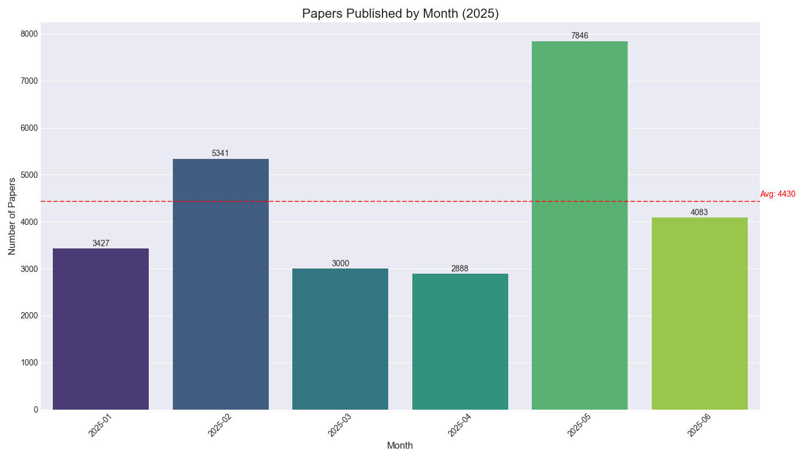

# AI Research

This repository contains a curated list of AI research papers that I am reading, along with summaries and notes.

For a detailed list of all paper summaries, please see [**research_details.md**](research_details.md).

---

## Paper Analytics

*This section provides data visualizations of the papers summarized in this repository.*

**Top 25 Authors by Paper Count**
*This chart shows the most frequently appearing authors in the collection.*

  

**Top 25 Primary Categories by Paper Count**
*This chart highlights the primary research categories with the most papers.*

  

**Papers Read by Month**
*This chart tracks the number of papers read each month.*

  

## License

This repository is licensed under the [Apache License 2.0](LICENSE).
