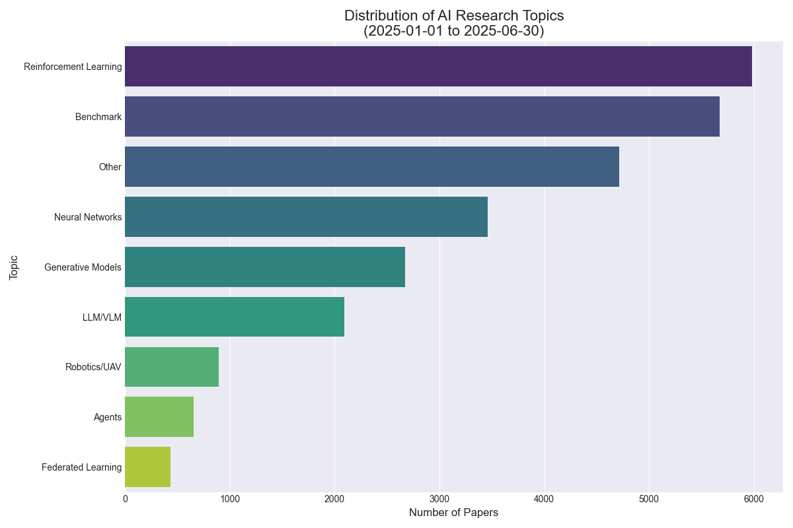

# Latest AI Research Papers

This repository contains summaries of the latest AI research papers, automatically updated daily using Ollama LLM.

*Last Updated: 2024-11-20 00:49:39*

## Paper Analytics

### Topic Distribution

### Papers Added Over Time

## Table of Contents

- [2024-11-19](#20241119)

---

## Papers Added on 2024-11-19

### [Bi-Mamba: Towards Accurate 1-Bit State Space Models](http://arxiv.org/pdf/2411.11843v1)

The typical selective state-space model (SSM) of Mamba addresses several
limitations of Transformers, such as quadratic computational complexity with
sequence length and significant inference-time memory requirements due to the
key-value cache. However, the growing size of Mamba models continues to pose
training and deployment challenges and raises environmental concerns due to
considerable energy consumption. In this work, we introduce Bi-Mamba, a
scalable and powerful 1-bit Mamba architecture designed for more efficient
large language models with multiple sizes across 780M, 1.3B, and 2.7B. Bi-Mamba
models are trained from scratch on data volume as regular LLM pertaining using
an autoregressive distillation loss. Extensive experimental results on language
modeling demonstrate that Bi-Mamba achieves performance comparable to its
full-precision counterparts (e.g., FP16 or BF16) and much better accuracy than
post-training-binarization (PTB) Mamba baselines, while significantly reducing
memory footprint and energy consumption compared to the original Mamba model.
Our study pioneers a new linear computational complexity LLM framework under
low-bit representation and facilitates the future design of specialized
hardware tailored for efficient 1-bit Mamba-based LLMs.

---

### [Competing Bandits in Decentralized Large Contextual Matching Markets](http://arxiv.org/pdf/2411.11794v1)

Sequential learning in a multi-agent resource constrained matching market has
received significant interest in the past few years. We study decentralized
learning in two-sided matching markets where the demand side (aka players or
agents) competes for a `large' supply side (aka arms) with potentially
time-varying preferences, to obtain a stable match. Despite a long line of work
in the recent past, existing learning algorithms such as Explore-Then-Commit or
Upper-Confidence-Bound remain inefficient for this problem. In particular, the
per-agent regret achieved by these algorithms scales linearly with the number
of arms, $K$. Motivated by the linear contextual bandit framework, we assume
that for each agent an arm-mean can be represented by a linear function of a
known feature vector and an unknown (agent-specific) parameter.
  Moreover, our setup captures the essence of a dynamic (non-stationary)
matching market where the preferences over arms change over time. Our proposed
algorithms achieve instance-dependent logarithmic regret, scaling independently
of the number of arms, $K$.

---

### [Exploring adversarial robustness of JPEG AI: methodology, comparison and new methods](http://arxiv.org/pdf/2411.11795v1)

Adversarial robustness of neural networks is an increasingly important area
of research, combining studies on computer vision models, large language models
(LLMs), and others. With the release of JPEG AI - the first standard for
end-to-end neural image compression (NIC) methods - the question of its
robustness has become critically significant. JPEG AI is among the first
international, real-world applications of neural-network-based models to be
embedded in consumer devices. However, research on NIC robustness has been
limited to open-source codecs and a narrow range of attacks. This paper
proposes a new methodology for measuring NIC robustness to adversarial attacks.
We present the first large-scale evaluation of JPEG AI's robustness, comparing
it with other NIC models. Our evaluation results and code are publicly
available online (link is hidden for a blind review).

---

### [Generative World Explorer](http://arxiv.org/pdf/2411.11844v1)

Planning with partial observation is a central challenge in embodied AI. A
majority of prior works have tackled this challenge by developing agents that
physically explore their environment to update their beliefs about the world
state.In contrast, humans can $\textit{imagine}$ unseen parts of the world
through a mental exploration and $\textit{revise}$ their beliefs with imagined
observations. Such updated beliefs can allow them to make more informed
decisions, without necessitating the physical exploration of the world at all
times. To achieve this human-like ability, we introduce the $\textit{Generative
World Explorer (Genex)}$, an egocentric world exploration framework that allows
an agent to mentally explore a large-scale 3D world (e.g., urban scenes) and
acquire imagined observations to update its belief. This updated belief will
then help the agent to make a more informed decision at the current step. To
train $\textit{Genex}$, we create a synthetic urban scene dataset, Genex-DB.
Our experimental results demonstrate that (1) $\textit{Genex}$ can generate
high-quality and consistent observations during long-horizon exploration of a
large virtual physical world and (2) the beliefs updated with the generated
observations can inform an existing decision-making model (e.g., an LLM agent)
to make better plans.

---

### [LLM-IE: A Python Package for Generative Information Extraction with Large Language Models](http://arxiv.org/pdf/2411.11779v1)

Objectives: Despite the recent adoption of large language models (LLMs) for
biomedical information extraction, challenges in prompt engineering and
algorithms persist, with no dedicated software available. To address this, we
developed LLM-IE: a Python package for building complete information extraction
pipelines. Our key innovation is an interactive LLM agent to support schema
definition and prompt design.
  Materials and Methods: The LLM-IE supports named entity recognition, entity
attribute extraction, and relation extraction tasks. We benchmarked on the i2b2
datasets and conducted a system evaluation.
  Results: The sentence-based prompting algorithm resulted in the best
performance while requiring a longer inference time. System evaluation provided
intuitive visualization.
  Discussion: LLM-IE was designed from practical NLP experience in healthcare
and has been adopted in internal projects. It should hold great value to the
biomedical NLP community.
  Conclusion: We developed a Python package, LLM-IE, that provides building
blocks for robust information extraction pipeline construction.

---

### [Mapping out the Space of Human Feedback for Reinforcement Learning: A Conceptual Framework](http://arxiv.org/pdf/2411.11761v1)

Reinforcement Learning from Human feedback (RLHF) has become a powerful tool
to fine-tune or train agentic machine learning models. Similar to how humans
interact in social contexts, we can use many types of feedback to communicate
our preferences, intentions, and knowledge to an RL agent. However,
applications of human feedback in RL are often limited in scope and disregard
human factors. In this work, we bridge the gap between machine learning and
human-computer interaction efforts by developing a shared understanding of
human feedback in interactive learning scenarios. We first introduce a taxonomy
of feedback types for reward-based learning from human feedback based on nine
key dimensions. Our taxonomy allows for unifying human-centered,
interface-centered, and model-centered aspects. In addition, we identify seven
quality metrics of human feedback influencing both the human ability to express
feedback and the agent's ability to learn from the feedback. Based on the
feedback taxonomy and quality criteria, we derive requirements and design
choices for systems learning from human feedback. We relate these requirements
and design choices to existing work in interactive machine learning. In the
process, we identify gaps in existing work and future research opportunities.
We call for interdisciplinary collaboration to harness the full potential of
reinforcement learning with data-driven co-adaptive modeling and varied
interaction mechanics.

---

### [Reinterpreting Delay and Procrastination](http://arxiv.org/pdf/2411.11828v1)

I model a rational agent who spends resources between the current time and
some fixed future deadline. Opportunities to spend resources arise randomly
according to a Poisson process, and the quality of each opportunity follows a
uniform distribution. The agent values their current resource stock at exactly
the sum of expected utility from all future spending opportunities. Unlike in
traditional discounted expected utility models, the agent exhibits correlation
aversion, static (but not dynamic) preference reversals, and monotonicity with
respect to payment timing. Connecting the agent's risk and time preference is
intuitive, and doing so leads to a new model of procrastination where the agent
misperceives their general attitude toward spending resources.

---

### [Tackling prediction tasks in relational databases with LLMs](http://arxiv.org/pdf/2411.11829v1)

Though large language models (LLMs) have demonstrated exceptional performance
across numerous problems, their application to predictive tasks in relational
databases remains largely unexplored. In this work, we address the notion that
LLMs cannot yield satisfactory results on relational databases due to their
interconnected tables, complex relationships, and heterogeneous data types.
Using the recently introduced RelBench benchmark, we demonstrate that even a
straightforward application of LLMs achieves competitive performance on these
tasks. These findings establish LLMs as a promising new baseline for ML on
relational databases and encourage further research in this direction.

---

### [The Power of Many: Multi-Agent Multimodal Models for Cultural Image Captioning](http://arxiv.org/pdf/2411.11758v1)

Large Multimodal Models (LMMs) exhibit impressive performance across various
multimodal tasks. However, their effectiveness in cross-cultural contexts
remains limited due to the predominantly Western-centric nature of most data
and models. Conversely, multi-agent models have shown significant capability in
solving complex tasks. Our study evaluates the collective performance of LMMs
in a multi-agent interaction setting for the novel task of cultural image
captioning. Our contributions are as follows: (1) We introduce MosAIC, a
Multi-Agent framework to enhance cross-cultural Image Captioning using LMMs
with distinct cultural personas; (2) We provide a dataset of culturally
enriched image captions in English for images from China, India, and Romania
across three datasets: GeoDE, GD-VCR, CVQA; (3) We propose a culture-adaptable
metric for evaluating cultural information within image captions; and (4) We
show that the multi-agent interaction outperforms single-agent models across
different metrics, and offer valuable insights for future research. Our dataset
and models can be accessed at https://github.com/MichiganNLP/MosAIC.

---

### [sMoRe: Enhancing Object Manipulation and Organization in Mixed Reality Spaces with LLMs and Generative AI](http://arxiv.org/pdf/2411.11752v1)

In mixed reality (MR) environments, understanding space and creating virtual
objects is crucial to providing an intuitive and rich user experience. This
paper introduces sMoRe (Spatial Mapping and Object Rendering Environment), an
MR application that combines Generative AI (GenAI) with large language models
(LLMs) to assist users in creating, placing, and managing virtual objects
within physical spaces. sMoRe allows users to use voice or typed text commands
to create and place virtual objects using GenAI while specifying spatial
constraints. The system leverages LLMs to interpret users' commands, analyze
the current scene, and identify optimal locations. Additionally, sMoRe
integrates text-to-3D generative AI to dynamically create 3D objects based on
users' descriptions. Our user study demonstrates the effectiveness of sMoRe in
enhancing user comprehension, interaction, and organization of the MR
environment.

---

