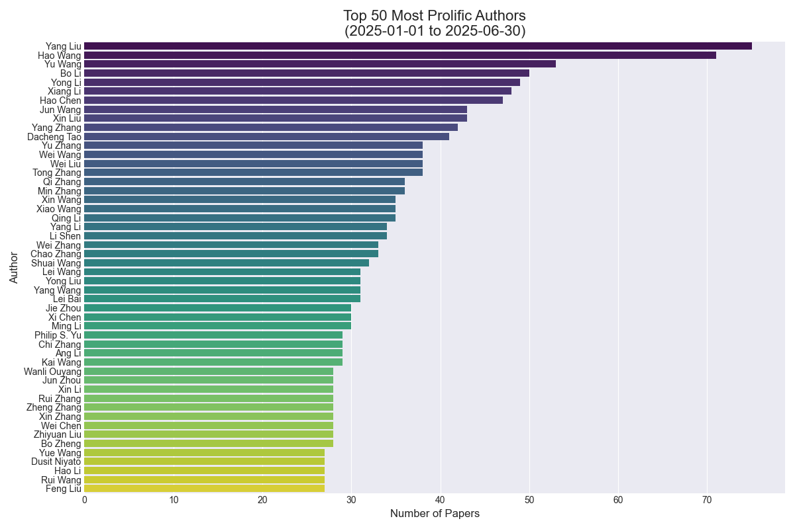
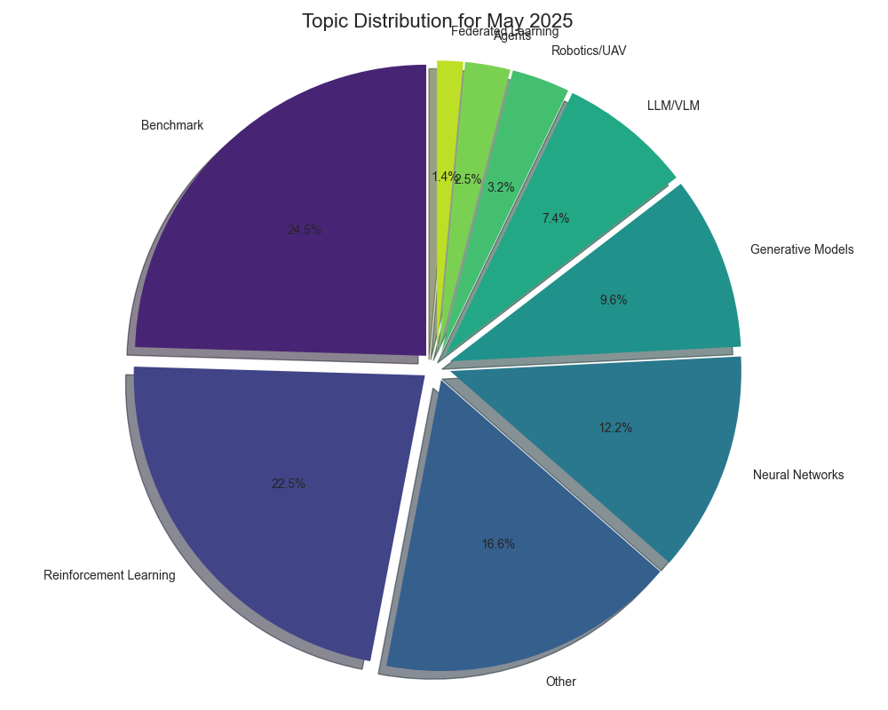
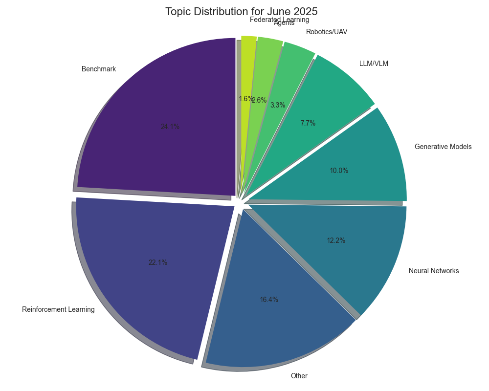
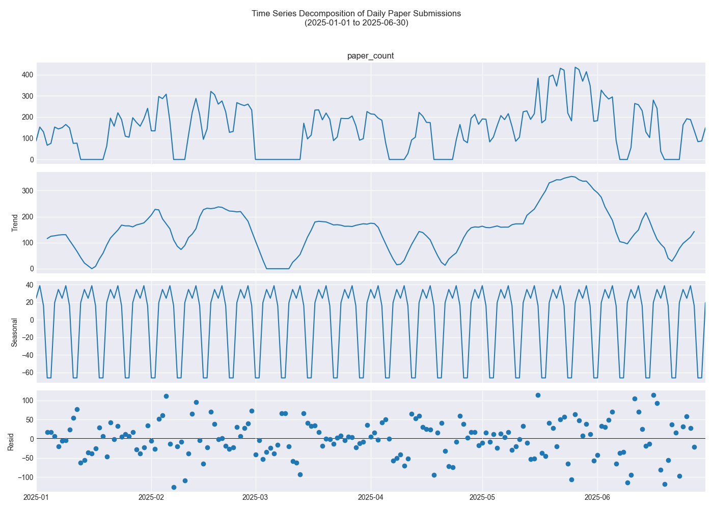

# Latest AI Research Papers

This repository contains summaries of the latest AI research papers, automatically updated daily using Ollama LLM.

*Last Updated: 2024-11-21 10:02:23*

## Paper Analytics

### Comprehensive Analysis Dashboard

### Detailed Analytics Grid

| Topic Distribution (Overall) | Papers Published by Month |
| :---: | :---: |
|  |  |

| Monthly Topic Trends (Last 3 Months) | Top Prolific Authors |
| :---: | :---: |
|  |  |

### Monthly Topic Distributions

| Topic Distribution (April 2025) | Topic Distribution (May 2025) | Topic Distribution (June 2025) |
| :---: | :---: | :---: |
|  |  |  |

### Additional Visualizations

| Daily Paper Submission Analysis |
| :---: |
|  |

## Table of Contents

- [2025-06-30](#20250630)
- [2025-06-29](#20250629)
- [2025-06-27](#20250627)
- [2025-06-26](#20250626)
- [2025-06-25](#20250625)
- [2025-06-24](#20250624)
- [2025-06-23](#20250623)
- [2025-06-22](#20250622)
- [2025-06-21](#20250621)
- [2025-06-20](#20250620)
- [2025-06-19](#20250619)
- [2025-06-18](#20250618)
- [2025-06-17](#20250617)
- [2025-06-16](#20250616)
- [2024-11-21](#20241121)
- [2024-11-20](#20241120)

---

## Papers Added on 2025-06-30

### [FADRM: Fast and Accurate Data Residual Matching for Dataset Distillation](http://arxiv.org/pdf/2506.24125v1)

**Authors:** Jiacheng Cui, Xinyue Bi, Yaxin Luo, Xiaohan Zhao, Jiacheng Liu, Zhiqiang Shen

Residual connection has been extensively studied and widely applied at the model architecture level. However, its potential in the more challenging data-centric approaches remains unexplored. In this work, we introduce the concept of Data Residual Matching for the first time, leveraging data-level skip connections to facilitate data generation and mitigate data information vanishing. This approach maintains a balance between newly acquired knowledge through pixel space optimization and existing core local information identification within raw data modalities, specifically for the dataset distillation task. Furthermore, by incorporating optimization-level refinements, our method significantly improves computational efficiency, achieving superior performance while reducing training time and peak GPU memory usage by 50%. Consequently, the proposed method Fast and Accurate Data Residual Matching for Dataset Distillation (FADRM) establishes a new state-of-the-art, demonstrating substantial improvements over existing methods across multiple dataset benchmarks in both efficiency and effectiveness. For instance, with ResNet-18 as the student model and a 0.8% compression ratio on ImageNet-1K, the method achieves 47.7% test accuracy in single-model dataset distillation and 50.0% in multi-model dataset distillation, surpassing RDED by +5.7% and outperforming state-of-the-art multi-model approaches, EDC and CV-DD, by +1.4% and +4.0%. Code is available at: https://github.com/Jiacheng8/FADRM.

---

## Papers Added on 2025-06-30

### [Teaching Time Series to See and Speak: Forecasting with Aligned Visual   and Textual Perspectives](http://arxiv.org/pdf/2506.24124v1)

**Authors:** Dong Sixun, Fan Wei, Teresa Wu, Fu Yanjie

Time series forecasting traditionally relies on unimodal numerical inputs, which often struggle to capture high-level semantic patterns due to their dense and unstructured nature. While recent approaches have explored representing time series as text using large language models (LLMs), these methods remain limited by the discrete nature of token sequences and lack the perceptual intuition humans typically apply, such as interpreting visual patterns. In this paper, we propose a multimodal contrastive learning framework that transforms raw time series into structured visual and textual perspectives. Rather than using natural language or real-world images, we construct both modalities directly from numerical sequences. We then align these views in a shared semantic space via contrastive learning, enabling the model to capture richer and more complementary representations. Furthermore, we introduce a variate selection module that leverages the aligned representations to identify the most informative variables for multivariate forecasting. Extensive experiments on fifteen short-term and six long-term forecasting benchmarks demonstrate that our approach consistently outperforms strong unimodal and cross-modal baselines, highlighting the effectiveness of multimodal alignment in enhancing time series forecasting. Code is available at: https://github.com/Ironieser/TimesCLIP.

---

## Papers Added on 2025-06-30

### [Data Uniformity Improves Training Efficiency and More, with a   Convergence Framework Beyond the NTK Regime](http://arxiv.org/pdf/2506.24120v1)

**Authors:** Yuqing Wang, Shangding Gu

Data selection plays a crucial role in data-driven decision-making, including in large language models (LLMs), and is typically task-dependent. Properties such as data quality and diversity have been extensively studied and are known to enhance model performance. However, it remains unclear whether there exist other quantitative and general principles of data selection that can consistently improve performance, especially for complex tasks with limited prior knowledge. In this paper, we demonstrate that selecting more uniformly distributed data can improve training efficiency while enhancing performance. Specifically, we establish that more uniform (less biased) distribution leads to a larger minimum pairwise distance between data points, denoted by $h_{\min}$, and prove that a smaller $h_{\min}$ can slow down the training dynamics of gradient descent (GD). Moreover, we theoretically show that the approximation error of neural networks decreases as $h_{\min}$ increases. Our analysis introduces a convergence framework for GD beyond the Neural Tangent Kernel (NTK) regime, applicable to a broad class of architectures, including transformers, without requiring Lipschitz smoothness. This framework further provides theoretical justification for the use of residual connections and function compositions in deep neural architectures. In the end, we conduct comprehensive experiments for supervised fine-tuning across various settings, including different optimization strategies, model sizes, and training datasets. The results consistently demonstrate that selecting data by maximizing pairwise distance significantly accelerates training and achieves comparable or better performance in LLMs across diverse datasets. Code and Datasets are available at the link: https://github.com/SafeRL-Lab/data-uniformity.

---

## Papers Added on 2025-06-30

### [SPIRAL: Self-Play on Zero-Sum Games Incentivizes Reasoning via   Multi-Agent Multi-Turn Reinforcement Learning](http://arxiv.org/pdf/2506.24119v1)

**Authors:** Bo Liu, Leon Guertler, Simon Yu, Zichen Liu, Penghui Qi, Daniel Balcells, Mickel Liu, Cheston Tan, Weiyan Shi, Min Lin, Wee Sun Lee, Natasha Jaques

Recent advances in reinforcement learning have shown that language models can develop sophisticated reasoning through training on tasks with verifiable rewards, but these approaches depend on human-curated problem-answer pairs and domain-specific reward engineering. We introduce SPIRAL, a self-play framework where models learn by playing multi-turn, zero-sum games against continuously improving versions of themselves, eliminating the need for human supervision. Through self-play, SPIRAL generates an infinite curriculum of progressively challenging problems as models must constantly adapt to stronger opponents. To enable this self-play training at scale, We implement a fully online, multi-turn, multi-agent reinforcement learning system for LLMs and propose role-conditioned advantage estimation (RAE) to stabilize multi-agent training. Using SPIRAL, self-play on zero-sum games produces reasoning capabilities that transfer broadly. Training Qwen3-4B-Base on Kuhn Poker alone achieves 8.6% improvement on math and 8.4% on general reasoning, outperforming SFT on 25,000 expert game trajectories. Analysis reveals that this transfer occurs through three cognitive patterns: systematic decomposition, expected value calculation, and case-by-case analysis. Multi-game training (TicTacToe, Kuhn Poker, Simple Negotiation) further enhances performance as each game develops distinct reasoning strengths. Applying SPIRAL to a strong reasoning model (DeepSeek-R1-Distill-Qwen-7B) can still lead to 2.0% average improvement. These results demonstrate that zero-sum games naturally develop transferable reasoning capabilities, highlighting a promising direction for autonomous reasoning development.

---

## Papers Added on 2025-06-30

### [Navigating with Annealing Guidance Scale in Diffusion Space](http://arxiv.org/pdf/2506.24108v1)

**Authors:** Shai Yehezkel, Omer Dahary, Andrey Voynov, Daniel Cohen-Or

Denoising diffusion models excel at generating high-quality images conditioned on text prompts, yet their effectiveness heavily relies on careful guidance during the sampling process. Classifier-Free Guidance (CFG) provides a widely used mechanism for steering generation by setting the guidance scale, which balances image quality and prompt alignment. However, the choice of the guidance scale has a critical impact on the convergence toward a visually appealing and prompt-adherent image. In this work, we propose an annealing guidance scheduler which dynamically adjusts the guidance scale over time based on the conditional noisy signal. By learning a scheduling policy, our method addresses the temperamental behavior of CFG. Empirical results demonstrate that our guidance scheduler significantly enhances image quality and alignment with the text prompt, advancing the performance of text-to-image generation. Notably, our novel scheduler requires no additional activations or memory consumption, and can seamlessly replace the common classifier-free guidance, offering an improved trade-off between prompt alignment and quality.

---

## Papers Added on 2025-06-30

### [On the Predictive Power of Representation Dispersion in Language Models](http://arxiv.org/pdf/2506.24106v1)

**Authors:** Yanhong Li, Ming Li, Karen Livescu, Jiawei Zhou

We show that a language model's ability to predict text is tightly linked to the breadth of its embedding space: models that spread their contextual representations more widely tend to achieve lower perplexity. Concretely, we find that representation dispersion - the average pairwise cosine distance among hidden vectors - strongly and negatively correlates with perplexity across diverse model families (LLaMA, Qwen, and others) and domains (Wikipedia, news, scientific abstracts). Beyond illustrating this link, we show how dispersion can be leveraged for a range of practical tasks without requiring labeled data. First, measuring dispersion on unlabeled text allows us to predict downstream accuracy in new domains, offering a data-efficient tool for model selection. Next, we find that identifying layers with higher dispersion pinpoints the best representations for retrieval-based methods such as kNN-LM, bypassing exhaustive layer-by-layer searches. Finally, we integrate a simple push-away objective into training, which increases dispersion in both single-domain and cross-domain scenarios and directly improves perplexity in each.

---

## Papers Added on 2025-06-30

### [Development of Hybrid Artificial Intelligence Training on Real and   Synthetic Data: Benchmark on Two Mixed Training Strategies](http://arxiv.org/pdf/2506.24093v1)

**Authors:** Paul Wachter, Lukas Niehaus, Julius Schöning

Synthetic data has emerged as a cost-effective alternative to real data for training artificial neural networks (ANN). However, the disparity between synthetic and real data results in a domain gap. That gap leads to poor performance and generalization of the trained ANN when applied to real-world scenarios. Several strategies have been developed to bridge this gap, which combine synthetic and real data, known as mixed training using hybrid datasets. While these strategies have been shown to mitigate the domain gap, a systematic evaluation of their generalizability and robustness across various tasks and architectures remains underexplored. To address this challenge, our study comprehensively analyzes two widely used mixing strategies on three prevalent architectures and three distinct hybrid datasets. From these datasets, we sample subsets with varying proportions of synthetic to real data to investigate the impact of synthetic and real components. The findings of this paper provide valuable insights into optimizing the use of synthetic data in the training process of any ANN, contributing to enhancing robustness and efficacy.

---

## Papers Added on 2025-06-30

### [Imagine for Me: Creative Conceptual Blending of Real Images and Text via   Blended Attention](http://arxiv.org/pdf/2506.24085v1)

**Authors:** Wonwoong Cho, Yanxia Zhang, Yan-Ying Chen, David I. Inouye

Blending visual and textual concepts into a new visual concept is a unique and powerful trait of human beings that can fuel creativity. However, in practice, cross-modal conceptual blending for humans is prone to cognitive biases, like design fixation, which leads to local minima in the design space. In this paper, we propose a T2I diffusion adapter "IT-Blender" that can automate the blending process to enhance human creativity. Prior works related to cross-modal conceptual blending are limited in encoding a real image without loss of details or in disentangling the image and text inputs. To address these gaps, IT-Blender leverages pretrained diffusion models (SD and FLUX) to blend the latent representations of a clean reference image with those of the noisy generated image. Combined with our novel blended attention, IT-Blender encodes the real reference image without loss of details and blends the visual concept with the object specified by the text in a disentangled way. Our experiment results show that IT-Blender outperforms the baselines by a large margin in blending visual and textual concepts, shedding light on the new application of image generative models to augment human creativity.

---

## Papers Added on 2025-06-30

### [SQUASH: A SWAP-Based Quantum Attack to Sabotage Hybrid Quantum Neural   Networks](http://arxiv.org/pdf/2506.24081v1)

**Authors:** Rahul Kumar, Wenqi Wei, Ying Mao, Junaid Farooq, Ying Wang, Juntao Chen

We propose a circuit-level attack, SQUASH, a SWAP-Based Quantum Attack to sabotage Hybrid Quantum Neural Networks (HQNNs) for classification tasks. SQUASH is executed by inserting SWAP gate(s) into the variational quantum circuit of the victim HQNN. Unlike conventional noise-based or adversarial input attacks, SQUASH directly manipulates the circuit structure, leading to qubit misalignment and disrupting quantum state evolution. This attack is highly stealthy, as it does not require access to training data or introduce detectable perturbations in input states. Our results demonstrate that SQUASH significantly degrades classification performance, with untargeted SWAP attacks reducing accuracy by up to 74.08\% and targeted SWAP attacks reducing target class accuracy by up to 79.78\%. These findings reveal a critical vulnerability in HQNN implementations, underscoring the need for more resilient architectures against circuit-level adversarial interventions.

---

## Papers Added on 2025-06-30

### [STACK: Adversarial Attacks on LLM Safeguard Pipelines](http://arxiv.org/pdf/2506.24068v1)

**Authors:** Ian R. McKenzie, Oskar J. Hollinsworth, Tom Tseng, Xander Davies, Stephen Casper, Aaron D. Tucker, Robert Kirk, Adam Gleave

Frontier AI developers are relying on layers of safeguards to protect against catastrophic misuse of AI systems. Anthropic guards their latest Claude 4 Opus model using one such defense pipeline, and other frontier developers including Google DeepMind and OpenAI pledge to soon deploy similar defenses. However, the security of such pipelines is unclear, with limited prior work evaluating or attacking these pipelines. We address this gap by developing and red-teaming an open-source defense pipeline. First, we find that a novel few-shot-prompted input and output classifier outperforms state-of-the-art open-weight safeguard model ShieldGemma across three attacks and two datasets, reducing the attack success rate (ASR) to 0% on the catastrophic misuse dataset ClearHarm. Second, we introduce a STaged AttaCK (STACK) procedure that achieves 71% ASR on ClearHarm in a black-box attack against the few-shot-prompted classifier pipeline. Finally, we also evaluate STACK in a transfer setting, achieving 33% ASR, providing initial evidence that it is feasible to design attacks with no access to the target pipeline. We conclude by suggesting specific mitigations that developers could use to thwart staged attacks.

---

## Papers Added on 2025-06-30

### [Logit-Gap Steering: Efficient Short-Suffix Jailbreaks for Aligned Large   Language Models](http://arxiv.org/pdf/2506.24056v1)

**Authors:** Tung-Ling Li, Hongliang Liu

We introduce logit-gap steering, a fast jailbreak framework that casts the refusal-affirmation gap of RLHF-aligned language models as a single pass over the vocabulary. A forward-computable score blends gap reduction with lightweight proxies for KL penalty and reward shift, allowing a "sort-sum-stop" sweep to complete in under a second and return a short suffix--two orders of magnitude fewer model calls than beam or gradient attacks. The same suffix generalises to unseen prompts and scales from 0.5 B to 70 B checkpoints, lifting one-shot attack success from baseline levels to 80-100% while preserving topical coherence. Beyond efficiency, these suffixes expose sentence-boundary reward cliffs and other alignment artefacts, offering a lightweight probe into how safety tuning reshapes internal representations.

---

## Papers Added on 2025-06-30

### [Consensus-based optimization for closed-box adversarial attacks and a   connection to evolution strategies](http://arxiv.org/pdf/2506.24048v1)

**Authors:** Tim Roith, Leon Bungert, Philipp Wacker

Consensus-based optimization (CBO) has established itself as an efficient gradient-free optimization scheme, with attractive mathematical properties, such as mean-field convergence results for non-convex loss functions. In this work, we study CBO in the context of closed-box adversarial attacks, which are imperceptible input perturbations that aim to fool a classifier, without accessing its gradient. Our contribution is to establish a connection between the so-called consensus hopping as introduced by Riedl et al. and natural evolution strategies (NES) commonly applied in the context of adversarial attacks and to rigorously relate both methods to gradient-based optimization schemes. Beyond that, we provide a comprehensive experimental study that shows that despite the conceptual similarities, CBO can outperform NES and other evolutionary strategies in certain scenarios.

---

## Papers Added on 2025-06-30

### [Agent.xpu: Efficient Scheduling of Agentic LLM Workloads on   Heterogeneous SoC](http://arxiv.org/pdf/2506.24045v1)

**Authors:** Xinming Wei, Jiahao Zhang, Haoran Li, Jiayu Chen, Rui Qu, Maoliang Li, Xiang Chen, Guojie Luo

The proliferation of agentic Large Language Models (LLMs) on personal devices introduces a new class of workloads characterized by a dichotomy of objectives. Reactive tasks, initiated by users, demand immediate, low-latency responses, while proactive tasks operate invisibly and prioritize throughput. Existing on-device LLM engines, designed for isolated inferences, fail to efficiently manage these concurrent and conflicting requests on consumer-grade heterogeneous SoCs with CPU, integrated GPU, and NPU. This paper introduces Agent.xpu, an efficient serving system for agentic LLM workloads on memory-unified heterogeneous SoCs. With dedicated offline profiling, Agent.xpu first constructs a heterogeneous execution graph, which fuses and chunks model kernels for affinity-guided, elastic accelerator mapping with predictive kernel annotation. At runtime, its online scheduler enables fine-grained, kernel-level preemption to guarantee the responsiveness of reactive tasks. To maximize SoC utilization, it adopts slack-aware kernel backfill to opportunistically append proactive tasks, and mitigates NPU-iGPU contention via bandwidth-aware dispatch. Evaluation on an Intel Core Ultra SoC shows that Agent.xpu achieves 4.6$\times$ lower latency for reactive tasks and sustains 1.6$\times$-6.8$\times$ higher throughput for proactive tasks compared to state-of-the-art inference engines.

---

## Papers Added on 2025-06-30

### [A Survey on Vision-Language-Action Models for Autonomous Driving](http://arxiv.org/pdf/2506.24044v1)

**Authors:** Sicong Jiang, Zilin Huang, Kangan Qian, Ziang Luo, Tianze Zhu, Yang Zhong, Yihong Tang, Menglin Kong, Yunlong Wang, Siwen Jiao, Hao Ye, Zihao Sheng, Xin Zhao, Tuopu Wen, Zheng Fu, Sikai Chen, Kun Jiang, Diange Yang, Seongjin Choi, Lijun Sun

The rapid progress of multimodal large language models (MLLM) has paved the way for Vision-Language-Action (VLA) paradigms, which integrate visual perception, natural language understanding, and control within a single policy. Researchers in autonomous driving are actively adapting these methods to the vehicle domain. Such models promise autonomous vehicles that can interpret high-level instructions, reason about complex traffic scenes, and make their own decisions. However, the literature remains fragmented and is rapidly expanding. This survey offers the first comprehensive overview of VLA for Autonomous Driving (VLA4AD). We (i) formalize the architectural building blocks shared across recent work, (ii) trace the evolution from early explainer to reasoning-centric VLA models, and (iii) compare over 20 representative models according to VLA's progress in the autonomous driving domain. We also consolidate existing datasets and benchmarks, highlighting protocols that jointly measure driving safety, accuracy, and explanation quality. Finally, we detail open challenges - robustness, real-time efficiency, and formal verification - and outline future directions of VLA4AD. This survey provides a concise yet complete reference for advancing interpretable socially aligned autonomous vehicles. Github repo is available at \href{https://github.com/JohnsonJiang1996/Awesome-VLA4AD}{SicongJiang/Awesome-VLA4AD}.

---

## Papers Added on 2025-06-30

### [Faster Diffusion Models via Higher-Order Approximation](http://arxiv.org/pdf/2506.24042v1)

**Authors:** Gen Li, Yuchen Zhou, Yuting Wei, Yuxin Chen

In this paper, we explore provable acceleration of diffusion models without any additional retraining. Focusing on the task of approximating a target data distribution in $\mathbb{R}^d$ to within $\varepsilon$ total-variation distance, we propose a principled, training-free sampling algorithm that requires only the order of   $$ d^{1+2/K} \varepsilon^{-1/K} $$   score function evaluations (up to log factor) in the presence of accurate scores, where $K$ is an arbitrarily large fixed integer. This result applies to a broad class of target data distributions, without the need for assumptions such as smoothness or log-concavity. Our theory is robust vis-a-vis inexact score estimation, degrading gracefully as the score estimation error increases -- without demanding higher-order smoothness on the score estimates as assumed in previous work. The proposed algorithm draws insight from high-order ODE solvers, leveraging high-order Lagrange interpolation and successive refinement to approximate the integral derived from the probability flow ODE.

---

## Papers Added on 2025-06-30

### [Unsupervised Sparse Coding-based Spiking Neural Network for Real-time   Spike Sorting](http://arxiv.org/pdf/2506.24041v1)

**Authors:** Alexis Melot, Sean U. N. Wood, Yannick Coffinier, Pierre Yger, Fabien Alibart

Spike sorting is a crucial step in decoding multichannel extracellular neural signals, enabling the identification of individual neuronal activity. A key challenge in brain-machine interfaces (BMIs) is achieving real-time, low-power spike sorting at the edge while keeping high neural decoding performance. This study introduces the Neuromorphic Sparse Sorter (NSS), a compact two-layer spiking neural network optimized for efficient spike sorting. NSS leverages the Locally Competitive Algorithm (LCA) for sparse coding to extract relevant features from noisy events with reduced computational demands. NSS learns to sort detected spike waveforms in an online fashion and operates entirely unsupervised. To exploit multi-bit spike coding capabilities of neuromorphic platforms like Intel's Loihi 2, a custom neuron model was implemented, enabling flexible power-performance trade-offs via adjustable spike bit-widths. Evaluations on simulated and real-world tetrode signals with biological drift showed NSS outperformed established pipelines such as WaveClus3 and PCA+KMeans. With 2-bit graded spikes, NSS on Loihi 2 outperformed NSS implemented with leaky integrate-and-fire neuron and achieved an F1-score of 77% (+10% improvement) while consuming 8.6mW (+1.65mW) when tested on a drifting recording, with a computational processing time of 0.25ms (+60 us) per inference.

---

## Papers Added on 2025-06-30

### [Constructing Non-Markovian Decision Process via History Aggregator](http://arxiv.org/pdf/2506.24026v1)

**Authors:** Yongyi Wang, Wenxin Li

In the domain of algorithmic decision-making, non-Markovian dynamics manifest as a significant impediment, especially for paradigms such as Reinforcement Learning (RL), thereby exerting far-reaching consequences on the advancement and effectiveness of the associated systems. Nevertheless, the existing benchmarks are deficient in comprehensively assessing the capacity of decision algorithms to handle non-Markovian dynamics. To address this deficiency, we have devised a generalized methodology grounded in category theory. Notably, we established the category of Markov Decision Processes (MDP) and the category of non-Markovian Decision Processes (NMDP), and proved the equivalence relationship between them. This theoretical foundation provides a novel perspective for understanding and addressing non-Markovian dynamics. We further introduced non-Markovianity into decision-making problem settings via the History Aggregator for State (HAS). With HAS, we can precisely control the state dependency structure of decision-making problems in the time series. Our analysis demonstrates the effectiveness of our method in representing a broad range of non-Markovian dynamics. This approach facilitates a more rigorous and flexible evaluation of decision algorithms by testing them in problem settings where non-Markovian dynamics are explicitly constructed.

---

## Papers Added on 2025-06-30

### [Post-processing of EEG-based Auditory Attention Decoding Decisions via   Hidden Markov Models](http://arxiv.org/pdf/2506.24024v1)

**Authors:** Nicolas Heintz, Tom Francart, Alexander Bertrand

Auditory attention decoding (AAD) algorithms exploit brain signals, such as electroencephalography (EEG), to identify which speaker a listener is focusing on in a multi-speaker environment. While state-of-the-art AAD algorithms can identify the attended speaker on short time windows, their predictions are often too inaccurate for practical use. In this work, we propose augmenting AAD with a hidden Markov model (HMM) that models the temporal structure of attention. More specifically, the HMM relies on the fact that a subject is much less likely to switch attention than to keep attending the same speaker at any moment in time. We show how a HMM can significantly improve existing AAD algorithms in both causal (real-time) and non-causal (offline) settings. We further demonstrate that HMMs outperform existing postprocessing approaches in both accuracy and responsiveness, and explore how various factors such as window length, switching frequency, and AAD accuracy influence overall performance. The proposed method is computationally efficient, intuitive to use and applicable in both real-time and offline settings.

---

## Papers Added on 2025-06-30

### [Bridging Theory and Practice in Link Representation with Graph Neural   Networks](http://arxiv.org/pdf/2506.24018v1)

**Authors:** Veronica Lachi, Francesco Ferrini, Antonio Longa, Bruno Lepri, Andrea Passerini, Manfred Jaeger

Graph Neural Networks (GNNs) are widely used to compute representations of node pairs for downstream tasks such as link prediction. Yet, theoretical understanding of their expressive power has focused almost entirely on graph-level representations. In this work, we shift the focus to links and provide the first comprehensive study of GNN expressiveness in link representation. We introduce a unifying framework, the $k_\phi$-$k_\rho$-$m$ framework, that subsumes existing message-passing link models and enables formal expressiveness comparisons. Using this framework, we derive a hierarchy of state-of-the-art methods and offer theoretical tools to analyze future architectures. To complement our analysis, we propose a synthetic evaluation protocol comprising the first benchmark specifically designed to assess link-level expressiveness. Finally, we ask: does expressiveness matter in practice? We use a graph symmetry metric that quantifies the difficulty of distinguishing links and show that while expressive models may underperform on standard benchmarks, they significantly outperform simpler ones as symmetry increases, highlighting the need for dataset-aware model selection.

---

## Papers Added on 2025-06-30

### [EXPERT: An Explainable Image Captioning Evaluation Metric with   Structured Explanations](http://arxiv.org/pdf/2506.24016v1)

**Authors:** Hyunjong Kim, Sangyeop Kim, Jongheon Jeong, Yeongjae Cho, Sungzoon Cho

Recent advances in large language models and vision-language models have led to growing interest in explainable evaluation metrics for image captioning. However, these metrics generate explanations without standardized criteria, and the overall quality of the generated explanations remains unverified. In this paper, we propose EXPERT, a reference-free evaluation metric that provides structured explanations based on three fundamental criteria: fluency, relevance, and descriptiveness. By constructing large-scale datasets of high-quality structured explanations, we develop a two-stage evaluation template to effectively supervise a vision-language model for both scoring and explanation generation. EXPERT achieves state-of-the-art results on benchmark datasets while providing significantly higher-quality explanations than existing metrics, as validated through comprehensive human evaluation. Our code and datasets are available at https://github.com/hjkim811/EXPERT.

---

## Papers Added on 2025-06-30

### [Bridging Physical and Digital Worlds: Embodied Large AI for Future   Wireless Systems](http://arxiv.org/pdf/2506.24009v1)

**Authors:** Xinquan Wang, Fenghao Zhu, Zhaohui Yang, Chongwen Huang, Xiaoming Chen, Zhaoyang Zhang, Sami Muhaidat, Mérouane Debbah

Large artificial intelligence (AI) models offer revolutionary potential for future wireless systems, promising unprecedented capabilities in network optimization and performance. However, current paradigms largely overlook crucial physical interactions. This oversight means they primarily rely on offline datasets, leading to difficulties in handling real-time wireless dynamics and non-stationary environments. Furthermore, these models often lack the capability for active environmental probing. This paper proposes a fundamental paradigm shift towards wireless embodied large AI (WELAI), moving from passive observation to active embodiment. We first identify key challenges faced by existing models, then we explore the design principles and system structure of WELAI. Besides, we outline prospective applications in next-generation wireless. Finally, through an illustrative case study, we demonstrate the effectiveness of WELAI and point out promising research directions for realizing adaptive, robust, and autonomous wireless systems.

---

## Papers Added on 2025-06-30

### [Minimax and Bayes Optimal Best-arm Identification: Adaptive Experimental   Design for Treatment Choice](http://arxiv.org/pdf/2506.24007v1)

**Authors:** Masahiro Kato

This study investigates adaptive experimental design for treatment choice, also known as fixed-budget best-arm identification. We consider an adaptive procedure consisting of a treatment-allocation phase followed by a treatment-choice phase, and we design an adaptive experiment for this setup to efficiently identify the best treatment arm, defined as the one with the highest expected outcome. In our designed experiment, the treatment-allocation phase consists of two stages. The first stage is a pilot phase, where we allocate each treatment arm uniformly with equal proportions to eliminate clearly suboptimal arms and estimate outcome variances. In the second stage, we allocate treatment arms in proportion to the variances estimated in the first stage. After the treatment-allocation phase, the procedure enters the treatment-choice phase, where we choose the treatment arm with the highest sample mean as our estimate of the best treatment arm. We prove that this single design is simultaneously asymptotically minimax and Bayes optimal for the simple regret, with upper bounds that match our lower bounds up to exact constants. Therefore, our designed experiment achieves the sharp efficiency limits without requiring separate tuning for minimax and Bayesian objectives.

---

## Papers Added on 2025-06-30

### [Provably Efficient and Agile Randomized Q-Learning](http://arxiv.org/pdf/2506.24005v1)

**Authors:** He Wang, Xingyu Xu, Yuejie Chi

While Bayesian-based exploration often demonstrates superior empirical performance compared to bonus-based methods in model-based reinforcement learning (RL), its theoretical understanding remains limited for model-free settings. Existing provable algorithms either suffer from computational intractability or rely on stage-wise policy updates which reduce responsiveness and slow down the learning process. In this paper, we propose a novel variant of Q-learning algorithm, refereed to as RandomizedQ, which integrates sampling-based exploration with agile, step-wise, policy updates, for episodic tabular RL. We establish an $\widetilde{O}(\sqrt{H^5SAT})$ regret bound, where $S$ is the number of states, $A$ is the number of actions, $H$ is the episode length, and $T$ is the total number of episodes. In addition, we present a logarithmic regret bound under a mild positive sub-optimality condition on the optimal Q-function. Empirically, RandomizedQ exhibits outstanding performance compared to existing Q-learning variants with both bonus-based and Bayesian-based exploration on standard benchmarks.

---

## Papers Added on 2025-06-30

### [The Illusion of Progress? A Critical Look at Test-Time Adaptation for   Vision-Language Models](http://arxiv.org/pdf/2506.24000v1)

**Authors:** Lijun Sheng, Jian Liang, Ran He, Zilei Wang, Tieniu Tan

Test-time adaptation (TTA) methods have gained significant attention for enhancing the performance of vision-language models (VLMs) such as CLIP during inference, without requiring additional labeled data. However, current TTA researches generally suffer from major limitations such as duplication of baseline results, limited evaluation metrics, inconsistent experimental settings, and insufficient analysis. These problems hinder fair comparisons between TTA methods and obscure their practical strengths and weaknesses. To address these challenges, we introduce TTA-VLM, a comprehensive benchmark for evaluating TTA methods on VLMs. Our benchmark implements 8 episodic TTA and 7 online TTA methods within a unified and reproducible framework, and evaluates them across 15 widely used datasets. Unlike prior studies focused solely on CLIP, we extend the evaluation to SigLIP--a model trained with a Sigmoid loss--and include training-time tuning methods such as CoOp, MaPLe, and TeCoA to assess generality. Beyond classification accuracy, TTA-VLM incorporates various evaluation metrics, including robustness, calibration, out-of-distribution detection, and stability, enabling a more holistic assessment of TTA methods. Through extensive experiments, we find that 1) existing TTA methods produce limited gains compared to the previous pioneering work; 2) current TTA methods exhibit poor collaboration with training-time fine-tuning methods; 3) accuracy gains frequently come at the cost of reduced model trustworthiness. We release TTA-VLM to provide fair comparison and comprehensive evaluation of TTA methods for VLMs, and we hope it encourages the community to develop more reliable and generalizable TTA strategies.

---

## Papers Added on 2025-06-30

### [The Jacobian and Hessian of the Kullback-Leibler Divergence between   Multivariate Gaussian Distributions (Technical Report)](http://arxiv.org/pdf/2506.23996v1)

**Authors:** Juan Maroñas

This document shows how to obtain the Jacobian and Hessian matrices of the Kullback-Leibler divergence between two multivariate Gaussian distributions, using the first and second-order differentials. The presented derivations are based on the theory presented by \cite{magnus99}. I've also got great inspiration from some of the derivations in \cite{minka}.   Since I pretend to be at most didactic, the document is split into a summary of results and detailed derivations on each of the elements involved, with specific references to the tricks used in the derivations, and to many of the underlying concepts.

---

## Papers Added on 2025-06-30

### [STCLocker: Deadlock Avoidance Testing for Autonomous Driving Systems](http://arxiv.org/pdf/2506.23995v1)

**Authors:** Mingfei Cheng, Renzhi Wang, Xiaofei Xie, Yuan Zhou, Lei Ma

Autonomous Driving System (ADS) testing is essential to ensure the safety and reliability of autonomous vehicles (AVs) before deployment. However, existing techniques primarily focus on evaluating ADS functionalities in single-AV settings. As ADSs are increasingly deployed in multi-AV traffic, it becomes crucial to assess their cooperative performance, particularly regarding deadlocks, a fundamental coordination failure in which multiple AVs enter a circular waiting state indefinitely, resulting in motion planning failures. Despite its importance, the cooperative capability of ADSs to prevent deadlocks remains insufficiently underexplored. To address this gap, we propose the first dedicated Spatio-Temporal Conflict-Guided Deadlock Avoidance Testing technique, STCLocker, for generating DeadLock Scenarios (DLSs), where a group of AVs controlled by the ADS under test are in a circular wait state. STCLocker consists of three key components: Deadlock Oracle, Conflict Feedback, and Conflict-aware Scenario Generation. Deadlock Oracle provides a reliable black-box mechanism for detecting deadlock cycles among multiple AVs within a given scenario. Conflict Feedback and Conflict-aware Scenario Generation collaborate to actively guide AVs into simultaneous competition over spatial conflict resources (i.e., shared passing regions) and temporal competitive behaviors (i.e., reaching the conflict region at the same time), thereby increasing the effectiveness of generating conflict-prone deadlocks. We evaluate STCLocker on two types of ADSs: Roach, an end-to-end ADS, and OpenCDA, a module-based ADS supporting cooperative communication. Experimental results show that, on average, STCLocker generates more DLS than the best-performing baseline.

---

## Papers Added on 2025-06-30

### [Harnessing AI Agents to Advance Research on Refugee Child Mental Health](http://arxiv.org/pdf/2506.23992v1)

**Authors:** Aditya Shrivastava, Komal Gupta, Shraddha Arora

The international refugee crisis deepens, exposing millions of dis placed children to extreme psychological trauma. This research suggests a com pact, AI-based framework for processing unstructured refugee health data and distilling knowledge on child mental health. We compare two Retrieval-Aug mented Generation (RAG) pipelines, Zephyr-7B-beta and DeepSeek R1-7B, to determine how well they process challenging humanitarian datasets while avoid ing hallucination hazards. By combining cutting-edge AI methods with migration research and child psychology, this study presents a scalable strategy to assist policymakers, mental health practitioners, and humanitarian agencies to better assist displaced children and recognize their mental wellbeing. In total, both the models worked properly but significantly Deepseek R1 is superior to Zephyr with an accuracy of answer relevance 0.91

---

## Papers Added on 2025-06-30

### [Machine Understanding of Scientific Language](http://arxiv.org/pdf/2506.23990v1)

**Authors:** Dustin Wright

Scientific information expresses human understanding of nature. This knowledge is largely disseminated in different forms of text, including scientific papers, news articles, and discourse among people on social media. While important for accelerating our pursuit of knowledge, not all scientific text is faithful to the underlying science. As the volume of this text has burgeoned online in recent years, it has become a problem of societal importance to be able to identify the faithfulness of a given piece of scientific text automatically. This thesis is concerned with the cultivation of datasets, methods, and tools for machine understanding of scientific language, in order to analyze and understand science communication at scale. To arrive at this, I present several contributions in three areas of natural language processing and machine learning: automatic fact checking, learning with limited data, and scientific text processing. These contributions include new methods and resources for identifying check-worthy claims, adversarial claim generation, multi-source domain adaptation, learning from crowd-sourced labels, cite-worthiness detection, zero-shot scientific fact checking, detecting exaggerated scientific claims, and modeling degrees of information change in science communication. Critically, I demonstrate how the research outputs of this thesis are useful for effectively learning from limited amounts of scientific text in order to identify misinformative scientific statements and generate new insights into the science communication process

---

## Papers Added on 2025-06-30

### [LLM Agents Are the Antidote to Walled Gardens](http://arxiv.org/pdf/2506.23978v1)

**Authors:** Samuele Marro, Philip Torr

While the Internet's core infrastructure was designed to be open and universal, today's application layer is dominated by closed, proprietary platforms. Open and interoperable APIs require significant investment, and market leaders have little incentive to enable data exchange that could erode their user lock-in. We argue that LLM-based agents fundamentally disrupt this status quo. Agents can automatically translate between data formats and interact with interfaces designed for humans: this makes interoperability dramatically cheaper and effectively unavoidable. We name this shift universal interoperability: the ability for any two digital services to exchange data seamlessly using AI-mediated adapters. Universal interoperability undermines monopolistic behaviours and promotes data portability. However, it can also lead to new security risks and technical debt. Our position is that the ML community should embrace this development while building the appropriate frameworks to mitigate the downsides. By acting now, we can harness AI to restore user freedom and competitive markets without sacrificing security.

---

## Papers Added on 2025-06-30

### [A Scalable Approach for Safe and Robust Learning via   Lipschitz-Constrained Networks](http://arxiv.org/pdf/2506.23977v1)

**Authors:** Zain ul Abdeen, Vassilis Kekatos, Ming Jin

Certified robustness is a critical property for deploying neural networks (NN) in safety-critical applications. A principle approach to achieving such guarantees is to constrain the global Lipschitz constant of the network. However, accurate methods for Lipschitz-constrained training often suffer from non-convex formulations and poor scalability due to reliance on global semidefinite programs (SDPs). In this letter, we propose a convex training framework that enforces global Lipschitz constraints via semidefinite relaxation. By reparameterizing the NN using loop transformation, we derive a convex admissibility condition that enables tractable and certifiable training. While the resulting formulation guarantees robustness, its scalability is limited by the size of global SDP. To overcome this, we develop a randomized subspace linear matrix inequalities (RS-LMI) approach that decomposes the global constraints into sketched layerwise constraints projected onto low-dimensional subspaces, yielding a smooth and memory-efficient training objective. Empirical results on MNIST, CIFAR-10, and ImageNet demonstrate that the proposed framework achieves competitive accuracy with significantly improved Lipschitz bounds and runtime performance.

---

## Papers Added on 2025-06-30

### [UMA: A Family of Universal Models for Atoms](http://arxiv.org/pdf/2506.23971v1)

**Authors:** Brandon M. Wood, Misko Dzamba, Xiang Fu, Meng Gao, Muhammed Shuaibi, Luis Barroso-Luque, Kareem Abdelmaqsoud, Vahe Gharakhanyan, John R. Kitchin, Daniel S. Levine, Kyle Michel, Anuroop Sriram, Taco Cohen, Abhishek Das, Ammar Rizvi, Sushree Jagriti Sahoo, Zachary W. Ulissi, C. Lawrence Zitnick

The ability to quickly and accurately compute properties from atomic simulations is critical for advancing a large number of applications in chemistry and materials science including drug discovery, energy storage, and semiconductor manufacturing. To address this need, Meta FAIR presents a family of Universal Models for Atoms (UMA), designed to push the frontier of speed, accuracy, and generalization. UMA models are trained on half a billion unique 3D atomic structures (the largest training runs to date) by compiling data across multiple chemical domains, e.g. molecules, materials, and catalysts. We develop empirical scaling laws to help understand how to increase model capacity alongside dataset size to achieve the best accuracy. The UMA small and medium models utilize a novel architectural design we refer to as mixture of linear experts that enables increasing model capacity without sacrificing speed. For example, UMA-medium has 1.4B parameters but only ~50M active parameters per atomic structure. We evaluate UMA models on a diverse set of applications across multiple domains and find that, remarkably, a single model without any fine-tuning can perform similarly or better than specialized models. We are releasing the UMA code, weights, and associated data to accelerate computational workflows and enable the community to continue to build increasingly capable AI models.

---

## Papers Added on 2025-06-30

### [Learning Constraints Directly from Network Data](http://arxiv.org/pdf/2506.23964v1)

**Authors:** Hongyu Hè, Minhao Jin, Maria Apostolaki

Network data conforms to a wide range of rules that arise from protocols, design principles, and deployment decisions (e.g., a packet's queuing delay must be less than its end-to-end delay). Formalizing such rules as logic constraints can (i) improve the quality of synthetic data, (ii) reduce the brittleness of machine learning (ML) models, and (iii) improve semantic understanding of network measurements. However, these benefits remain out of reach if rule extraction is manual or solely reliant on ML, as both approaches yield incomplete, unreliable, and/or inaccurate rules.   This paper formulates rule extraction as a constraint modeling problem and introduces NetNomos that learns propositional logic constraints directly from raw network measurements. Constraint modeling in this domain is uniquely challenging due to the scale of the data, the inherent learning complexity and passive environment, and the lack of ground truth supervision. NetNomos addresses these challenges via a lattice-based search structured by constraint specificity and succinctness. Our approach reduces learning complexity from superquadratic to logarithmic and enables efficient traversal in combinatorial search space.   Our evaluations on diverse network datasets show that NetNomos learns all benchmark rules, including those associated with as little as 0.01% of data points, in under three hours. In contrast, baseline methods discover less than 25% of the rules and require several days to run. Through three case studies, we show that: NetNomos (i) finds rule violations in the outputs of all seven synthetic traffic generators, hence can be used to assess and guide their generation process; (ii) detects semantic differences in traffic, hence can be used for anomaly detection; and (iii) automatically finds rules used for telemetry imputation, hence can support monitoring through inference.

---

## Papers Added on 2025-06-30

### [ADReFT: Adaptive Decision Repair for Safe Autonomous Driving via   Reinforcement Fine-Tuning](http://arxiv.org/pdf/2506.23960v1)

**Authors:** Mingfei Cheng, Xiaofei Xie, Renzhi Wang, Yuan Zhou, Ming Hu

Autonomous Driving Systems (ADSs) continue to face safety-critical risks due to the inherent limitations in their design and performance capabilities. Online repair plays a crucial role in mitigating such limitations, ensuring the runtime safety and reliability of ADSs. Existing online repair solutions enforce ADS compliance by transforming unacceptable trajectories into acceptable ones based on predefined specifications, such as rule-based constraints or training datasets. However, these approaches often lack generalizability, adaptability and tend to be overly conservative, resulting in ineffective repairs that not only fail to mitigate safety risks sufficiently but also degrade the overall driving experience. To address this issue, we propose Adaptive Decision Repair (ADReFT), a novel and effective repair method that identifies safety-critical states through offline learning from failed tests and generates appropriate mitigation actions to improve ADS safety. Specifically, ADReFT incorporates a transformer-based model with two joint heads, State Monitor and Decision Adapter, designed to capture complex driving environment interactions to evaluate state safety severity and generate adaptive repair actions. Given the absence of oracles for state safety identification, we first pretrain ADReFT using supervised learning with coarse annotations, i.e., labeling states preceding violations as positive samples and others as negative samples. It establishes ADReFT's foundational capability to mitigate safety-critical violations, though it may result in somewhat conservative mitigation strategies. Therefore, we subsequently finetune ADReFT using reinforcement learning to improve its initial capability and generate more precise and contextually appropriate repair decisions. Our evaluation results illustrate that ADReFT achieves better repair performance.

---

## Papers Added on 2025-06-30

### [Bridging the Gap with Retrieval-Augmented Generation: Making Prosthetic   Device User Manuals Available in Marginalised Languages](http://arxiv.org/pdf/2506.23958v1)

**Authors:** Ikechukwu Ogbonna, Lesley Davidson, Soumya Banerjee, Abhishek Dasgupta, Laurence Kenney, Vikranth Harthikote Nagaraja

Millions of people in African countries face barriers to accessing healthcare due to language and literacy gaps. This research tackles this challenge by transforming complex medical documents -- in this case, prosthetic device user manuals -- into accessible formats for underserved populations. This case study in cross-cultural translation is particularly pertinent/relevant for communities that receive donated prosthetic devices but may not receive the accompanying user documentation. Or, if available online, may only be available in formats (e.g., language and readability) that are inaccessible to local populations (e.g., English-language, high resource settings/cultural context). The approach is demonstrated using the widely spoken Pidgin dialect, but our open-source framework has been designed to enable rapid and easy extension to other languages/dialects. This work presents an AI-powered framework designed to process and translate complex medical documents, e.g., user manuals for prosthetic devices, into marginalised languages. The system enables users -- such as healthcare workers or patients -- to upload English-language medical equipment manuals, pose questions in their native language, and receive accurate, localised answers in real time. Technically, the system integrates a Retrieval-Augmented Generation (RAG) pipeline for processing and semantic understanding of the uploaded manuals. It then employs advanced Natural Language Processing (NLP) models for generative question-answering and multilingual translation. Beyond simple translation, it ensures accessibility to device instructions, treatment protocols, and safety information, empowering patients and clinicians to make informed healthcare decisions.

---

## Papers Added on 2025-06-30

### [Autonomy by Design: Preserving Human Autonomy in AI Decision-Support](http://arxiv.org/pdf/2506.23952v1)

**Authors:** Stefan Buijsman, Sarah Carter, Juan Pablo Bermúdez

AI systems increasingly support human decision-making across domains of professional, skill-based, and personal activity. While previous work has examined how AI might affect human autonomy globally, the effects of AI on domain-specific autonomy -- the capacity for self-governed action within defined realms of skill or expertise -- remain understudied. We analyze how AI decision-support systems affect two key components of domain-specific autonomy: skilled competence (the ability to make informed judgments within one's domain) and authentic value-formation (the capacity to form genuine domain-relevant values and preferences). By engaging with prior investigations and analyzing empirical cases across medical, financial, and educational domains, we demonstrate how the absence of reliable failure indicators and the potential for unconscious value shifts can erode domain-specific autonomy both immediately and over time. We then develop a constructive framework for autonomy-preserving AI support systems. We propose specific socio-technical design patterns -- including careful role specification, implementation of defeater mechanisms, and support for reflective practice -- that can help maintain domain-specific autonomy while leveraging AI capabilities. This framework provides concrete guidance for developing AI systems that enhance rather than diminish human agency within specialized domains of action.

---

## Papers Added on 2025-06-30

### [AI Risk-Management Standards Profile for General-Purpose AI (GPAI) and   Foundation Models](http://arxiv.org/pdf/2506.23949v1)

**Authors:** Anthony M. Barrett, Jessica Newman, Brandie Nonnecke, Nada Madkour, Dan Hendrycks, Evan R. Murphy, Krystal Jackson, Deepika Raman

Increasingly multi-purpose AI models, such as cutting-edge large language models or other 'general-purpose AI' (GPAI) models, 'foundation models,' generative AI models, and 'frontier models' (typically all referred to hereafter with the umbrella term 'GPAI/foundation models' except where greater specificity is needed), can provide many beneficial capabilities but also risks of adverse events with profound consequences. This document provides risk-management practices or controls for identifying, analyzing, and mitigating risks of GPAI/foundation models. We intend this document primarily for developers of large-scale, state-of-the-art GPAI/foundation models; others that can benefit from this guidance include downstream developers of end-use applications that build on a GPAI/foundation model. This document facilitates conformity with or use of leading AI risk management-related standards, adapting and building on the generic voluntary guidance in the NIST AI Risk Management Framework and ISO/IEC 23894, with a focus on the unique issues faced by developers of GPAI/foundation models.

---

## Papers Added on 2025-06-30

### [Adapt Your Body: Mitigating Proprioception Shifts in Imitation Learning](http://arxiv.org/pdf/2506.23944v1)

**Authors:** Fuhang Kuang, Jiacheng You, Yingdong Hu, Tong Zhang, Chuan Wen, Yang Gao

Imitation learning models for robotic tasks typically rely on multi-modal inputs, such as RGB images, language, and proprioceptive states. While proprioception is intuitively important for decision-making and obstacle avoidance, simply incorporating all proprioceptive states leads to a surprising degradation in imitation learning performance. In this work, we identify the underlying issue as the proprioception shift problem, where the distributions of proprioceptive states diverge significantly between training and deployment. To address this challenge, we propose a domain adaptation framework that bridges the gap by utilizing rollout data collected during deployment. Using Wasserstein distance, we quantify the discrepancy between expert and rollout proprioceptive states and minimize this gap by adding noise to both sets of states, proportional to the Wasserstein distance. This strategy enhances robustness against proprioception shifts by aligning the training and deployment distributions. Experiments on robotic manipulation tasks demonstrate the efficacy of our method, enabling the imitation policy to leverage proprioception while mitigating its adverse effects. Our approach outperforms the naive solution which discards proprioception, and other baselines designed to address distributional shifts.

---

## Papers Added on 2025-06-30

### [QPART: Adaptive Model Quantization and Dynamic Workload Balancing for   Accuracy-aware Edge Inference](http://arxiv.org/pdf/2506.23934v1)

**Authors:** Xiangchen Li, Saeid Ghafouri, Bo Ji, Hans Vandierendonck, Deepu John, Dimitrios S. Nikolopoulos

As machine learning inferences increasingly move to edge devices, adapting to diverse computational capabilities, hardware, and memory constraints becomes more critical. Instead of relying on a pre-trained model fixed for all future inference queries across diverse edge devices, we argue that planning an inference pattern with a request-specific model tailored to the device's computational capacity, accuracy requirements, and time constraints is more cost-efficient and robust to diverse scenarios. To this end, we propose an accuracy-aware and workload-balanced inference system that integrates joint model quantization and inference partitioning. In this approach, the server dynamically responds to inference queries by sending a quantized model and adaptively sharing the inference workload with the device. Meanwhile, the device's computational power, channel capacity, and accuracy requirements are considered when deciding.   Furthermore, we introduce a new optimization framework for the inference system, incorporating joint model quantization and partitioning. Our approach optimizes layer-wise quantization bit width and partition points to minimize time consumption and cost while accounting for varying accuracy requirements of tasks through an accuracy degradation metric in our optimization model. To our knowledge, this work represents the first exploration of optimizing quantization layer-wise bit-width in the inference serving system, by introducing theoretical measurement of accuracy degradation. Simulation results demonstrate a substantial reduction in overall time and power consumption, with computation payloads decreasing by over 80% and accuracy degradation kept below 1%.

---

## Papers Added on 2025-06-30

### [Leveraging the Potential of Prompt Engineering for Hate Speech Detection   in Low-Resource Languages](http://arxiv.org/pdf/2506.23930v1)

**Authors:** Ruhina Tabasshum Prome, Tarikul Islam Tamiti, Anomadarshi Barua

The rapid expansion of social media leads to a marked increase in hate speech, which threatens personal lives and results in numerous hate crimes. Detecting hate speech presents several challenges: diverse dialects, frequent code-mixing, and the prevalence of misspelled words in user-generated content on social media platforms. Recent progress in hate speech detection is typically concentrated on high-resource languages. However, low-resource languages still face significant challenges due to the lack of large-scale, high-quality datasets. This paper investigates how we can overcome this limitation via prompt engineering on large language models (LLMs) focusing on low-resource Bengali language. We investigate six prompting strategies - zero-shot prompting, refusal suppression, flattering the classifier, multi-shot prompting, role prompting, and finally our innovative metaphor prompting to detect hate speech effectively in low-resource languages. We pioneer the metaphor prompting to circumvent the built-in safety mechanisms of LLMs that marks a significant departure from existing jailbreaking methods. We investigate all six different prompting strategies on the Llama2-7B model and compare the results extensively with three pre-trained word embeddings - GloVe, Word2Vec, and FastText for three different deep learning models - multilayer perceptron (MLP), convolutional neural network (CNN), and bidirectional gated recurrent unit (BiGRU). To prove the effectiveness of our metaphor prompting in the low-resource Bengali language, we also evaluate it in another low-resource language - Hindi, and two high-resource languages - English and German. The performance of all prompting techniques is evaluated using the F1 score, and environmental impact factor (IF), which measures CO$_2$ emissions, electricity usage, and computational time.

---

## Papers Added on 2025-06-30

### [Industrial brain: a human-like autonomous neuro-symbolic cognitive   decision-making system](http://arxiv.org/pdf/2506.23926v1)

**Authors:** Junping Wang, Bicheng Wang, Yibo Xuea, Yuan Xie

Resilience non-equilibrium measurement, the ability to maintain fundamental functionality amidst failures and errors, is crucial for scientific management and engineering applications of industrial chain. The problem is particularly challenging when the number or types of multiple co-evolution of resilience (for example, randomly placed) are extremely chaos. Existing end-to-end deep learning ordinarily do not generalize well to unseen full-feld reconstruction of spatiotemporal co-evolution structure, and predict resilience of network topology, especially in multiple chaos data regimes typically seen in real-world applications. To address this challenge, here we propose industrial brain, a human-like autonomous cognitive decision-making and planning framework integrating higher-order activity-driven neuro network and CT-OODA symbolic reasoning to autonomous plan resilience directly from observational data of global variable. The industrial brain not only understands and model structure of node activity dynamics and network co-evolution topology without simplifying assumptions, and reveal the underlying laws hidden behind complex networks, but also enabling accurate resilience prediction, inference, and planning. Experimental results show that industrial brain significantly outperforms resilience prediction and planning methods, with an accurate improvement of up to 10.8\% over GoT and OlaGPT framework and 11.03\% over spectral dimension reduction. It also generalizes to unseen topologies and dynamics and maintains robust performance despite observational disturbances. Our findings suggest that industrial brain addresses an important gap in resilience prediction and planning for industrial chain.

---

## Papers Added on 2025-06-30

### [Performance of LLMs on Stochastic Modeling Operations Research Problems:   From Theory to Practice](http://arxiv.org/pdf/2506.23924v1)

**Authors:** Akshit Kumar, Tianyi Peng, Yuhang Wu, Assaf Zeevi

Large language models (LLMs) have exhibited expert-level capabilities across various domains. However, their abilities to solve problems in Operations Research (OR) -- the analysis and optimization of mathematical models derived from real-world problems or their verbal descriptions -- remain underexplored. In this work, we take a first step toward evaluating LLMs' abilities to solve stochastic modeling problems, a core class of OR problems characterized by uncertainty and typically involving tools from probability, statistics, and stochastic processes. We manually procure a representative set of graduate-level homework and doctoral qualification-exam problems and test LLMs' abilities to solve them. We further leverage SimOpt, an open-source library of simulation-optimization problems and solvers, to investigate LLMs' abilities to make real-world decisions under uncertainty. Our results show that, though a nontrivial amount of work is still needed to reliably automate the stochastic modeling pipeline in reality, state-of-the-art LLMs demonstrate proficiency on par with human experts in both classroom and practical settings. These findings highlight the potential of building AI agents that assist OR researchers and amplify the real-world impact of OR through automation.

---

## Papers Added on 2025-06-30

### [Reinforcement Learning for Synchronised Flow Control in a Dual-Gate   Resin Infusion System](http://arxiv.org/pdf/2506.23923v1)

**Authors:** Miguel Camacho-Sánchez, Fernando García-Torres, Jesper John Lisegaard, Rocío del Amor, Sankhya Mohanty, Valery Naranjo

Resin infusion (RI) and resin transfer moulding (RTM) are critical processes for the manufacturing of high-performance fibre-reinforced polymer composites, particularly for large-scale applications such as wind turbine blades. Controlling the resin flow dynamics in these processes is critical to ensure the uniform impregnation of the fibre reinforcements, thereby preventing residual porosities and dry spots that impact the consequent structural integrity of the final component. This paper presents a reinforcement learning (RL) based strategy, established using process simulations, for synchronising the different resin flow fronts in an infusion scenario involving two resin inlets and a single outlet. Using Proximal Policy Optimisation (PPO), our approach addresses the challenge of managing the fluid dynamics in a partially observable environment. The results demonstrate the effectiveness of the RL approach in achieving an accurate flow convergence, highlighting its potential towards improving process control and product quality in composites manufacturing.

---

## Papers Added on 2025-06-30

### [The Trilemma of Truth in Large Language Models](http://arxiv.org/pdf/2506.23921v1)

**Authors:** Germans Savcisens, Tina Eliassi-Rad

We often attribute human characteristics to large language models (LLMs) and claim that they "know" certain things. LLMs have an internal probabilistic knowledge that represents information retained during training. How can we assess the veracity of this knowledge? We examine two common methods for probing the veracity of LLMs and discover several assumptions that are flawed. To address these flawed assumptions, we introduce sAwMIL (short for Sparse Aware Multiple-Instance Learning), a probing method that utilizes the internal activations of LLMs to separate statements into true, false, and neither. sAwMIL is based on multiple-instance learning and conformal prediction. We evaluate sAwMIL on 5 validity criteria across 16 open-source LLMs, including both default and chat-based variants, as well as on 3 new datasets. Among the insights we provide are: (1) the veracity signal is often concentrated in the third quarter of an LLM's depth; (2) truth and falsehood signals are not always symmetric; (3) linear probes perform better on chat models than on default models; (4) nonlinear probes may be required to capture veracity signals for some LLMs with reinforcement learning from human feedback or knowledge distillation; and (5) LLMs capture a third type of signal that is distinct from true and false and is neither true nor false. These findings provide a reliable method for verifying what LLMs "know" and how certain they are of their probabilistic internal knowledge.

---

## Papers Added on 2025-06-30

### [Learning robust parameter inference and density reconstruction in flyer   plate impact experiments](http://arxiv.org/pdf/2506.23914v1)

**Authors:** Evan Bell, Daniel A. Serino, Ben S. Southworth, Trevor Wilcox, Marc L. Klasky

Estimating physical parameters or material properties from experimental observations is a common objective in many areas of physics and material science. In many experiments, especially in shock physics, radiography is the primary means of observing the system of interest. However, radiography does not provide direct access to key state variables, such as density, which prevents the application of traditional parameter estimation approaches. Here we focus on flyer plate impact experiments on porous materials, and resolving the underlying parameterized equation of state (EoS) and crush porosity model parameters given radiographic observation(s). We use machine learning as a tool to demonstrate with high confidence that using only high impact velocity data does not provide sufficient information to accurately infer both EoS and crush model parameters, even with fully resolved density fields or a dynamic sequence of images. We thus propose an observable data set consisting of low and high impact velocity experiments/simulations that capture different regimes of compaction and shock propagation, and proceed to introduce a generative machine learning approach which produces a posterior distribution of physical parameters directly from radiographs. We demonstrate the effectiveness of the approach in estimating parameters from simulated flyer plate impact experiments, and show that the obtained estimates of EoS and crush model parameters can then be used in hydrodynamic simulations to obtain accurate and physically admissible density reconstructions. Finally, we examine the robustness of the approach to model mismatches, and find that the learned approach can provide useful parameter estimates in the presence of out-of-distribution radiographic noise and previously unseen physics, thereby promoting a potential breakthrough in estimating material properties from experimental radiographic images.

---

## Papers Added on 2025-06-30

### [RawMal-TF: Raw Malware Dataset Labeled by Type and Family](http://arxiv.org/pdf/2506.23909v1)

**Authors:** David Bálik, Martin Jureček, Mark Stamp

This work addresses the challenge of malware classification using machine learning by developing a novel dataset labeled at both the malware type and family levels. Raw binaries were collected from sources such as VirusShare, VX Underground, and MalwareBazaar, and subsequently labeled with family information parsed from binary names and type-level labels integrated from ClarAVy. The dataset includes 14 malware types and 17 malware families, and was processed using a unified feature extraction pipeline based on static analysis, particularly extracting features from Portable Executable headers, to support advanced classification tasks. The evaluation was focused on three key classification tasks. In the binary classification of malware versus benign samples, Random Forest and XGBoost achieved high accuracy on the full datasets, reaching 98.5% for type-based detection and 98.98% for family-based detection. When using truncated datasets of 1,000 samples to assess performance under limited data conditions, both models still performed strongly, achieving 97.6% for type-based detection and 98.66% for family-based detection. For interclass classification, which distinguishes between malware types or families, the models reached up to 97.5% accuracy on type-level tasks and up to 93.7% on family-level tasks. In the multiclass classification setting, which assigns samples to the correct type or family, SVM achieved 81.1% accuracy on type labels, while Random Forest and XGBoost reached approximately 73.4% on family labels. The results highlight practical trade-offs between accuracy and computational cost, and demonstrate that labeling at both the type and family levels enables more fine-grained and insightful malware classification. The work establishes a robust foundation for future research on advanced malware detection and classification.

---

## Papers Added on 2025-06-30

### [Beyond Statistical Learning: Exact Learning Is Essential for General   Intelligence](http://arxiv.org/pdf/2506.23908v1)

**Authors:** András György, Tor Lattimore, Nevena Lazić, Csaba Szepesvári

Sound deductive reasoning -- the ability to derive new knowledge from existing facts and rules -- is an indisputably desirable aspect of general intelligence. Despite the major advances of AI systems in areas such as math and science, especially since the introduction of transformer architectures, it is well-documented that even the most advanced frontier systems regularly and consistently falter on easily-solvable deductive reasoning tasks. Hence, these systems are unfit to fulfill the dream of achieving artificial general intelligence capable of sound deductive reasoning. We argue that their unsound behavior is a consequence of the statistical learning approach powering their development. To overcome this, we contend that to achieve reliable deductive reasoning in learning-based AI systems, researchers must fundamentally shift from optimizing for statistical performance against distributions on reasoning problems and algorithmic tasks to embracing the more ambitious exact learning paradigm, which demands correctness on all inputs. We argue that exact learning is both essential and possible, and that this ambitious objective should guide algorithm design.

---

## Papers Added on 2025-06-30

### [GroundingDINO-US-SAM: Text-Prompted Multi-Organ Segmentation in   Ultrasound with LoRA-Tuned Vision-Language Models](http://arxiv.org/pdf/2506.23903v1)

**Authors:** Hamza Rasaee, Taha Koleilat, Hassan Rivaz

Accurate and generalizable object segmentation in ultrasound imaging remains a significant challenge due to anatomical variability, diverse imaging protocols, and limited annotated data. In this study, we propose a prompt-driven vision-language model (VLM) that integrates Grounding DINO with SAM2 to enable object segmentation across multiple ultrasound organs. A total of 18 public ultrasound datasets, encompassing the breast, thyroid, liver, prostate, kidney, and paraspinal muscle, were utilized. These datasets were divided into 15 for fine-tuning and validation of Grounding DINO using Low Rank Adaptation (LoRA) to the ultrasound domain, and 3 were held out entirely for testing to evaluate performance in unseen distributions. Comprehensive experiments demonstrate that our approach outperforms state-of-the-art segmentation methods, including UniverSeg, MedSAM, MedCLIP-SAM, BiomedParse, and SAMUS on most seen datasets while maintaining strong performance on unseen datasets without additional fine-tuning. These results underscore the promise of VLMs in scalable and robust ultrasound image analysis, reducing dependence on large, organ-specific annotated datasets. We will publish our code on code.sonography.ai after acceptance.

---

## Papers Added on 2025-06-30

### [Spurious-Aware Prototype Refinement for Reliable Out-of-Distribution   Detection](http://arxiv.org/pdf/2506.23881v1)

**Authors:** Reihaneh Zohrabi, Hosein Hasani, Mahdieh Soleymani Baghshah, Anna Rohrbach, Marcus Rohrbach, Mohammad Hossein Rohban

Out-of-distribution (OOD) detection is crucial for ensuring the reliability and safety of machine learning models in real-world applications, where they frequently face data distributions unseen during training. Despite progress, existing methods are often vulnerable to spurious correlations that mislead models and compromise robustness. To address this, we propose SPROD, a novel prototype-based OOD detection approach that explicitly addresses the challenge posed by unknown spurious correlations. Our post-hoc method refines class prototypes to mitigate bias from spurious features without additional data or hyperparameter tuning, and is broadly applicable across diverse backbones and OOD detection settings. We conduct a comprehensive spurious correlation OOD detection benchmarking, comparing our method against existing approaches and demonstrating its superior performance across challenging OOD datasets, such as CelebA, Waterbirds, UrbanCars, Spurious Imagenet, and the newly introduced Animals MetaCoCo. On average, SPROD improves AUROC by 4.7% and FPR@95 by 9.3% over the second best.

---

## Papers Added on 2025-06-30

### [Chain of Thought in Order: Discovering Learning-Friendly Orders for   Arithmetic](http://arxiv.org/pdf/2506.23875v1)

**Authors:** Yuta Sato, Kazuhiko Kawamoto, Hiroshi Kera

The chain of thought is fundamental in Transformers, which is to perform step-by-step reasoning. Besides what intermediate steps work, the order of these steps critically affects the difficulty of the reasoning. This study addresses a novel task of unraveling chain of thought - reordering decoder input tokens to a learning-friendly sequence for Transformers to learn arithmetic tasks. The proposed pipeline first trains a Transformer on a mixture of target sequences arranged in different orders and then identifies benign orders as those with fast loss drops in the early stage. As the search space grows factorially with sequence length, we propose a two-stage hierarchical approach for inter- and intra-block reordering. Experiments on four order-sensitive arithmetic tasks show that our method identifies a learning-friendly order out of a few billion candidates. Notably, on the multiplication task, it recovered the reverse-digit order reported in prior studies.

---

## Papers Added on 2025-06-30

### [Emergent musical properties of a transformer under contrastive   self-supervised learning](http://arxiv.org/pdf/2506.23873v1)

**Authors:** Yuexuan Kong, Gabriel Meseguer-Brocal, Vincent Lostanlen, Mathieu Lagrange, Romain Hennequin

In music information retrieval (MIR), contrastive self-supervised learning for general-purpose representation models is effective for global tasks such as automatic tagging. However, for local tasks such as chord estimation, it is widely assumed that contrastively trained general-purpose self-supervised models are inadequate and that more sophisticated SSL is necessary; e.g., masked modeling. Our paper challenges this assumption by revealing the potential of contrastive SSL paired with a transformer in local MIR tasks. We consider a lightweight vision transformer with one-dimensional patches in the time--frequency domain (ViT-1D) and train it with simple contrastive SSL through normalized temperature-scaled cross-entropy loss (NT-Xent). Although NT-Xent operates only over the class token, we observe that, potentially thanks to weight sharing, informative musical properties emerge in ViT-1D's sequence tokens. On global tasks, the temporal average of class and sequence tokens offers a performance increase compared to the class token alone, showing useful properties in the sequence tokens. On local tasks, sequence tokens perform unexpectedly well, despite not being specifically trained for. Furthermore, high-level musical features such as onsets emerge from layer-wise attention maps and self-similarity matrices show different layers capture different musical dimensions. Our paper does not focus on improving performance but advances the musical interpretation of transformers and sheds light on some overlooked abilities of contrastive SSL paired with transformers for sequence modeling in MIR.

---

## Papers Added on 2025-06-30

### [When Plants Respond: Electrophysiology and Machine Learning for Green   Monitoring Systems](http://arxiv.org/pdf/2506.23872v1)

**Authors:** Eduard Buss, Till Aust, Heiko Hamann

Living plants, while contributing to ecological balance and climate regulation, also function as natural sensors capable of transmitting information about their internal physiological states and surrounding conditions. This rich source of data provides potential for applications in environmental monitoring and precision agriculture. With integration into biohybrid systems, we establish novel channels of physiological signal flow between living plants and artificial devices. We equipped *Hedera helix* with a plant-wearable device called PhytoNode to continuously record the plant's electrophysiological activity. We deployed plants in an uncontrolled outdoor environment to map electrophysiological patterns to environmental conditions. Over five months, we collected data that we analyzed using state-of-the-art and automated machine learning (AutoML). Our classification models achieve high performance, reaching macro F1 scores of up to 95 percent in binary tasks. AutoML approaches outperformed manual tuning, and selecting subsets of statistical features further improved accuracy. Our biohybrid living system monitors the electrophysiology of plants in harsh, real-world conditions. This work advances scalable, self-sustaining, and plant-integrated living biohybrid systems for sustainable environmental monitoring.

---

## Papers Added on 2025-06-30

### [Scaling Self-Supervised Representation Learning for Symbolic Piano   Performance](http://arxiv.org/pdf/2506.23869v1)

**Authors:** Louis Bradshaw, Honglu Fan, Alexander Spangher, Stella Biderman, Simon Colton

We study the capabilities of generative autoregressive transformer models trained on large amounts of symbolic solo-piano transcriptions. After first pretraining on approximately 60,000 hours of music, we use a comparatively smaller, high-quality subset, to finetune models to produce musical continuations, perform symbolic classification tasks, and produce general-purpose contrastive MIDI embeddings by adapting the SimCLR framework to symbolic music. When evaluating piano continuation coherence, our generative model outperforms leading symbolic generation techniques and remains competitive with proprietary audio generation models. On MIR classification benchmarks, frozen representations from our contrastive model achieve state-of-the-art results in linear probe experiments, while direct finetuning demonstrates the generalizability of pretrained representations, often requiring only a few hundred labeled examples to specialize to downstream tasks.

---

## Papers Added on 2025-06-30

### [Differentially Private Synthetic Data Release for Topics API Outputs](http://arxiv.org/pdf/2506.23855v1)

**Authors:** Travis Dick, Alessandro Epasto, Adel Javanmard, Josh Karlin, Andres Munoz Medina, Vahab Mirrokni, Sergei Vassilvitskii, Peilin Zhong

The analysis of the privacy properties of Privacy-Preserving Ads APIs is an area of research that has received strong interest from academics, industry, and regulators. Despite this interest, the empirical study of these methods is hindered by the lack of publicly available data. Reliable empirical analysis of the privacy properties of an API, in fact, requires access to a dataset consisting of realistic API outputs; however, privacy concerns prevent the general release of such data to the public.   In this work, we develop a novel methodology to construct synthetic API outputs that are simultaneously realistic enough to enable accurate study and provide strong privacy protections. We focus on one Privacy-Preserving Ads APIs: the Topics API, part of Google Chrome's Privacy Sandbox. We developed a methodology to generate a differentially-private dataset that closely matches the re-identification risk properties of the real Topics API data. The use of differential privacy provides strong theoretical bounds on the leakage of private user information from this release.   Our methodology is based on first computing a large number of differentially-private statistics describing how output API traces evolve over time. Then, we design a parameterized distribution over sequences of API traces and optimize its parameters so that they closely match the statistics obtained. Finally, we create the synthetic data by drawing from this distribution.   Our work is complemented by an open-source release of the anonymized dataset obtained by this methodology. We hope this will enable external researchers to analyze the API in-depth and replicate prior and future work on a realistic large-scale dataset. We believe that this work will contribute to fostering transparency regarding the privacy properties of Privacy-Preserving Ads APIs.

---

## Papers Added on 2025-06-30

### [Use Sparse Autoencoders to Discover Unknown Concepts, Not to Act on   Known Concepts](http://arxiv.org/pdf/2506.23845v1)

**Authors:** Kenny Peng, Rajiv Movva, Jon Kleinberg, Emma Pierson, Nikhil Garg

While sparse autoencoders (SAEs) have generated significant excitement, a series of negative results have added to skepticism about their usefulness. Here, we establish a conceptual distinction that reconciles competing narratives surrounding SAEs. We argue that while SAEs may be less effective for acting on known concepts, SAEs are powerful tools for discovering unknown concepts. This distinction cleanly separates existing negative and positive results, and suggests several classes of SAE applications. Specifically, we outline use cases for SAEs in (i) ML interpretability, explainability, fairness, auditing, and safety, and (ii) social and health sciences.

---

## Papers Added on 2025-06-30

### [A Survey on Autonomy-Induced Security Risks in Large Model-Based Agents](http://arxiv.org/pdf/2506.23844v1)

**Authors:** Hang Su, Jun Luo, Chang Liu, Xiao Yang, Yichi Zhang, Yinpeng Dong, Jun Zhu

Recent advances in large language models (LLMs) have catalyzed the rise of autonomous AI agents capable of perceiving, reasoning, and acting in dynamic, open-ended environments. These large-model agents mark a paradigm shift from static inference systems to interactive, memory-augmented entities. While these capabilities significantly expand the functional scope of AI, they also introduce qualitatively novel security risks - such as memory poisoning, tool misuse, reward hacking, and emergent misalignment - that extend beyond the threat models of conventional systems or standalone LLMs. In this survey, we first examine the structural foundations and key capabilities that underpin increasing levels of agent autonomy, including long-term memory retention, modular tool use, recursive planning, and reflective reasoning. We then analyze the corresponding security vulnerabilities across the agent stack, identifying failure modes such as deferred decision hazards, irreversible tool chains, and deceptive behaviors arising from internal state drift or value misalignment. These risks are traced to architectural fragilities that emerge across perception, cognition, memory, and action modules. To address these challenges, we systematically review recent defense strategies deployed at different autonomy layers, including input sanitization, memory lifecycle control, constrained decision-making, structured tool invocation, and introspective reflection. We introduce the Reflective Risk-Aware Agent Architecture (R2A2), a unified cognitive framework grounded in Constrained Markov Decision Processes (CMDPs), which incorporates risk-aware world modeling, meta-policy adaptation, and joint reward-risk optimization to enable principled, proactive safety across the agent's decision-making loop.

---

## Papers Added on 2025-06-30

### [EFPI: Elastic Formation and Position Identification in Football (Soccer)   using Template Matching and Linear Assignment](http://arxiv.org/pdf/2506.23843v1)

**Authors:** Joris Bekkers

Understanding team formations and player positioning is crucial for tactical analysis in football (soccer). This paper presents a flexible method for formation recognition and player position assignment in football using predefined static formation templates and cost minimization from spatiotemporal tracking data, called EFPI. Our approach employs linear sum assignment to optimally match players to positions within a set of template formations by minimizing the total distance between actual player locations and template positions, subsequently selecting the formation with the lowest assignment cost. To improve accuracy, we scale actual player positions to match the dimensions of these formation templates in both width and length. While the method functions effectively on individual frames, it extends naturally to larger game segments such as complete periods, possession sequences or specific intervals (e.g. 10 second intervals, 5 minute intervals etc.). Additionally, we incorporate an optional stability parameter that prevents unnecessary formation changes when assignment costs differ only marginally between time segments. EFPI is available as open-source code through the unravelsports Python package.

---

## Papers Added on 2025-06-30

### [Do Thinking Tokens Help or Trap? Towards More Efficient Large Reasoning   Model](http://arxiv.org/pdf/2506.23840v1)

**Authors:** Bowen Ding, Yuhan Chen, Futing Wang, Lingfeng Ming, Tao Lin

Large Reasoning Models (LRMs) excel at solving complex problems but face an overthinking dilemma. When handling simple tasks, they often produce verbose responses overloaded with thinking tokens (e.g., wait, however). These tokens trigger unnecessary high-level reasoning behaviors like reflection and backtracking, reducing efficiency. In this work, our pilot study reveals that these thinking-token-induced behaviors are not essential for effective problem-solving and may even hinder correct reasoning within constrained token budgets. We identify this phenomenon as the thinking trap. To mitigate this issue, we propose Dual Policy Preference Optimization (DuP-PO), a novel algorithm featuring: (1) A rollout sampling strategy that guarantees balanced exposure to responses with and without thinking tokens; (2) A fine-grained advantage control technique to dynamically regulate the prediction of target tokens; (3) A policy shaping method ensuring stable gradient contributions from thinking tokens. Experimental results on five popular math reasoning benchmarks show that DuP-PO performs well on the popular LRM, which significantly improves their token efficiency during reasoning, while achieving superior performance of the base model.

---

## Papers Added on 2025-06-30

### [Proving the Limited Scalability of Centralized Distributed Optimization   via a New Lower Bound Construction](http://arxiv.org/pdf/2506.23836v1)

**Authors:** Alexander Tyurin

We consider centralized distributed optimization in the classical federated learning setup, where $n$ workers jointly find an $\varepsilon$-stationary point of an $L$-smooth, $d$-dimensional nonconvex function $f$, having access only to unbiased stochastic gradients with variance $\sigma^2$. Each worker requires at most $h$ seconds to compute a stochastic gradient, and the communication times from the server to the workers and from the workers to the server are $\tau_{s}$ and $\tau_{w}$ seconds per coordinate, respectively. One of the main motivations for distributed optimization is to achieve scalability with respect to $n$. For instance, it is well known that the distributed version of SGD has a variance-dependent runtime term $\frac{h \sigma^2 L \Delta}{n \varepsilon^2},$ which improves with the number of workers $n,$ where $\Delta = f(x^0) - f^*,$ and $x^0 \in R^d$ is the starting point. Similarly, using unbiased sparsification compressors, it is possible to reduce both the variance-dependent runtime term and the communication runtime term. However, once we account for the communication from the server to the workers $\tau_{s}$, we prove that it becomes infeasible to design a method using unbiased random sparsification compressors that scales both the server-side communication runtime term $\tau_{s} d \frac{L \Delta}{\varepsilon}$ and the variance-dependent runtime term $\frac{h \sigma^2 L \Delta}{\varepsilon^2},$ better than poly-logarithmically in $n$, even in the homogeneous (i.i.d.) case, where all workers access the same distribution. To establish this result, we construct a new "worst-case" function and develop a new lower bound framework that reduces the analysis to the concentration of a random sum, for which we prove a concentration bound. These results reveal fundamental limitations in scaling distributed optimization, even under the homogeneous assumption.

---

## Papers Added on 2025-06-30

### [Towards the "Digital Me": A vision of authentic Conversational Agents   powered by personal Human Digital Twins](http://arxiv.org/pdf/2506.23826v1)

**Authors:** Lluís C. Coll, Martin W. Lauer-Schmaltz, Philip Cash, John P. Hansen, Anja Maier

Human Digital Twins (HDTs) have traditionally been conceptualized as data-driven models designed to support decision-making across various domains. However, recent advancements in conversational AI open new possibilities for HDTs to function as authentic, interactive digital counterparts of individuals. This paper introduces a novel HDT system architecture that integrates large language models with dynamically updated personal data, enabling it to mirror an individual's conversational style, memories, and behaviors. To achieve this, our approach implements context-aware memory retrieval, neural plasticity-inspired consolidation, and adaptive learning mechanisms, creating a more natural and evolving digital persona. The resulting system does not only replicate an individual's unique conversational style depending on who they are speaking with, but also enriches responses with dynamically captured personal experiences, opinions, and memories. While this marks a significant step toward developing authentic virtual counterparts, it also raises critical ethical concerns regarding privacy, accountability, and the long-term implications of persistent digital identities. This study contributes to the field of HDTs by describing our novel system architecture, demonstrating its capabilities, and discussing future directions and emerging challenges to ensure the responsible and ethical development of HDTs.

---

## Papers Added on 2025-06-30

### [Supercm: Revisiting Clustering for Semi-Supervised Learning](http://arxiv.org/pdf/2506.23824v1)

**Authors:** Durgesh Singh, Ahcene Boubekki, Robert Jenssen, Michael C. Kampffmeyer

The development of semi-supervised learning (SSL) has in recent years largely focused on the development of new consistency regularization or entropy minimization approaches, often resulting in models with complex training strategies to obtain the desired results. In this work, we instead propose a novel approach that explicitly incorporates the underlying clustering assumption in SSL through extending a recently proposed differentiable clustering module. Leveraging annotated data to guide the cluster centroids results in a simple end-to-end trainable deep SSL approach. We demonstrate that the proposed model improves the performance over the supervised-only baseline and show that our framework can be used in conjunction with other SSL methods to further boost their performance.

---

## Papers Added on 2025-06-30

### [The Impact of AI on Educational Assessment: A Framework for Constructive   Alignment](http://arxiv.org/pdf/2506.23815v1)

**Authors:** Patrick Stokkink

The influence of Artificial Intelligence (AI), and specifically Large Language Models (LLM), on education is continuously increasing. These models are frequently used by students, giving rise to the question whether current forms of assessment are still a valid way to evaluate student performance and comprehension. The theoretical framework developed in this paper is grounded in Constructive Alignment (CA) theory and Bloom's taxonomy for defining learning objectives. We argue that AI influences learning objectives of different Bloom levels in a different way, and assessment has to be adopted accordingly. Furthermore, in line with Bloom's vision, formative and summative assessment should be aligned on whether the use of AI is permitted or not.   Although lecturers tend to agree that education and assessment need to be adapted to the presence of AI, a strong bias exists on the extent to which lecturers want to allow for AI in assessment. This bias is caused by a lecturer's familiarity with AI and specifically whether they use it themselves. To avoid this bias, we propose structured guidelines on a university or faculty level, to foster alignment among the staff. Besides that, we argue that teaching staff should be trained on the capabilities and limitations of AI tools. In this way, they are better able to adapt their assessment methods.

---

## Papers Added on 2025-06-30

### [SGD with Adaptive Preconditioning: Unified Analysis and Momentum   Acceleration](http://arxiv.org/pdf/2506.23803v1)

**Authors:** Dmitry Kovalev

In this paper, we revisit stochastic gradient descent (SGD) with AdaGrad-type preconditioning. Our contributions are twofold. First, we develop a unified convergence analysis of SGD with adaptive preconditioning under anisotropic or matrix smoothness and noise assumptions. This allows us to recover state-of-the-art convergence results for several popular adaptive gradient methods, including AdaGrad-Norm, AdaGrad, and ASGO/One-sided Shampoo. In addition, we establish the fundamental connection between two recently proposed algorithms, Scion and DASGO, and provide the first theoretical guarantees for the latter. Second, we show that the convergence of methods like AdaGrad and DASGO can be provably accelerated beyond the best-known rates using Nesterov momentum. Consequently, we obtain the first theoretical justification that AdaGrad-type algorithms can simultaneously benefit from both diagonal preconditioning and momentum, which may provide an ultimate explanation for the practical efficiency of Adam.

---

## Papers Added on 2025-06-30

### [Adaptive Out-of-Control Point Pattern Detection in Sequential Random   Finite Set Observations](http://arxiv.org/pdf/2506.23802v1)

**Authors:** Konstantinos Bourazas, Savvas Papaioannou, Panayiotis Kolios

In this work we introduce a novel adaptive anomaly detection framework specifically designed for monitoring sequential random finite set (RFS) observations. Our approach effectively distinguishes between In-Control data (normal) and Out-Of-Control data (anomalies) by detecting deviations from the expected statistical behavior of the process. The primary contributions of this study include the development of an innovative RFS-based framework that not only learns the normal behavior of the data-generating process online but also dynamically adapts to behavioral shifts to accurately identify abnormal point patterns. To achieve this, we introduce a new class of RFS-based posterior distributions, named Power Discounting Posteriors (PD), which facilitate adaptation to systematic changes in data while enabling anomaly detection of point pattern data through a novel predictive posterior density function. The effectiveness of the proposed approach is demonstrated by extensive qualitative and quantitative simulation experiments.

---

## Papers Added on 2025-06-30

### [Towards the Training of Deeper Predictive Coding Neural Networks](http://arxiv.org/pdf/2506.23800v1)

**Authors:** Chang Qi, Matteo Forasassi, Thomas Lukasiewicz, Tommaso Salvatori

Predictive coding networks trained with equilibrium propagation are neural models that perform inference through an iterative energy minimization process. Previous studies have demonstrated their effectiveness in shallow architectures, but show significant performance degradation when depth exceeds five to seven layers. In this work, we show that the reason behind this degradation is due to exponentially imbalanced errors between layers during weight updates, and predictions from the previous layer not being effective in guiding updates in deeper layers. We address the first issue by introducing two novel methods to optimize the latent variables that use precision-weighting to re-balance the distribution of energy among layers during the `relaxation phase', and the second issue by proposing a novel weight update mechanism that reduces error accumulation in deeper layers. Empirically, we test our methods on a large number of image classification tasks, resulting in large improvements in test accuracy across networks with more than seven layers, with performances comparable to those of backprop on similar models. These findings suggest that a better understanding of the relaxation phase is important to train models using equilibrium propagation at scale, and open new possibilities for their application in complex tasks.

---

## Papers Added on 2025-06-30

### [KAIROS: Scalable Model-Agnostic Data Valuation](http://arxiv.org/pdf/2506.23799v1)

**Authors:** Jiongli Zhu, Parjanya Prajakta Prashant, Alex Cloninger, Babak Salimi

Training data increasingly shapes not only model accuracy but also regulatory compliance and market valuation of AI assets. Yet existing valuation methods remain inadequate: model-based techniques depend on a single fitted model and inherit its biases, while algorithm-based approaches such as Data Shapley require costly retrainings at web scale. Recent Wasserstein-based model-agnostic methods rely on approximations that misrank examples relative to their true leave-one-out (LOO) utility. We introduce KAIROS, a scalable, model-agnostic valuation framework that assigns each example a distributional influence score: its contribution to the Maximum Mean Discrepancy (MMD) between the empirical training distribution and a clean reference set. Unlike Wasserstein surrogates, our MMD-based influence admits a closed-form solution that faithfully approximates the exact LOO ranking within $O(1/N^2)$ error, requires no retraining, and naturally extends to conditional kernels for unified label- and feature-error detection. Moreover, KAIROS supports efficient online updates: when a new batch of size m arrives, all scores can be updated in $O(mN)$ time, delivering up to 50x speedup without compromising ranking quality. Empirical evaluations on noise, mislabeling, and poisoning benchmarks show that KAIROS consistently outperforms state-of-the-art model-, Shapley-, and Wasserstein-based baselines in both accuracy and runtime. We provide rigorous theoretical guarantees, including symmetry for reproducible rankings and density-separation for interpretable thresholds.

---

## Papers Added on 2025-06-30

### [Advancing Learnable Multi-Agent Pathfinding Solvers with Active   Fine-Tuning](http://arxiv.org/pdf/2506.23793v1)

**Authors:** Anton Andreychuk, Konstantin Yakovlev, Aleksandr Panov, Alexey Skrynnik

Multi-agent pathfinding (MAPF) is a common abstraction of multi-robot trajectory planning problems, where multiple homogeneous robots simultaneously move in the shared environment. While solving MAPF optimally has been proven to be NP-hard, scalable, and efficient, solvers are vital for real-world applications like logistics, search-and-rescue, etc. To this end, decentralized suboptimal MAPF solvers that leverage machine learning have come on stage. Building on the success of the recently introduced MAPF-GPT, a pure imitation learning solver, we introduce MAPF-GPT-DDG. This novel approach effectively fine-tunes the pre-trained MAPF model using centralized expert data. Leveraging a novel delta-data generation mechanism, MAPF-GPT-DDG accelerates training while significantly improving performance at test time. Our experiments demonstrate that MAPF-GPT-DDG surpasses all existing learning-based MAPF solvers, including the original MAPF-GPT, regarding solution quality across many testing scenarios. Remarkably, it can work with MAPF instances involving up to 1 million agents in a single environment, setting a new milestone for scalability in MAPF domains.

---

## Papers Added on 2025-06-30

### [When GNNs Met a Word Equations Solver: Learning to Rank Equations   (Extended Technical Report)](http://arxiv.org/pdf/2506.23784v1)

**Authors:** Parosh Aziz Abdulla, Mohamed Faouzi Atig, Julie Cailler, Chencheng Liang, Philipp Rümmer

Nielsen transformation is a standard approach for solving word equations: by repeatedly splitting equations and applying simplification steps, equations are rewritten until a solution is reached. When solving a conjunction of word equations in this way, the performance of the solver will depend considerably on the order in which equations are processed. In this work, the use of Graph Neural Networks (GNNs) for ranking word equations before and during the solving process is explored. For this, a novel graph-based representation for word equations is presented, preserving global information across conjuncts, enabling the GNN to have a holistic view during ranking. To handle the variable number of conjuncts, three approaches to adapt a multi-classification task to the problem of ranking equations are proposed. The training of the GNN is done with the help of minimum unsatisfiable subsets (MUSes) of word equations. The experimental results show that, compared to state-of-the-art string solvers, the new framework solves more problems in benchmarks where each variable appears at most once in each equation.

---

## Papers Added on 2025-06-30

### [Mamba-FETrack V2: Revisiting State Space Model for Frame-Event based   Visual Object Tracking](http://arxiv.org/pdf/2506.23783v1)

**Authors:** Shiao Wang, Ju Huang, Qingchuan Ma, Jinfeng Gao, Chunyi Xu, Xiao Wang, Lan Chen, Bo Jiang

Combining traditional RGB cameras with bio-inspired event cameras for robust object tracking has garnered increasing attention in recent years. However, most existing multimodal tracking algorithms depend heavily on high-complexity Vision Transformer architectures for feature extraction and fusion across modalities. This not only leads to substantial computational overhead but also limits the effectiveness of cross-modal interactions. In this paper, we propose an efficient RGB-Event object tracking framework based on the linear-complexity Vision Mamba network, termed Mamba-FETrack V2. Specifically, we first design a lightweight Prompt Generator that utilizes embedded features from each modality, together with a shared prompt pool, to dynamically generate modality-specific learnable prompt vectors. These prompts, along with the modality-specific embedded features, are then fed into a Vision Mamba-based FEMamba backbone, which facilitates prompt-guided feature extraction, cross-modal interaction, and fusion in a unified manner. Finally, the fused representations are passed to the tracking head for accurate target localization. Extensive experimental evaluations on multiple RGB-Event tracking benchmarks, including short-term COESOT dataset and long-term datasets, i.e., FE108 and FELT V2, demonstrate the superior performance and efficiency of the proposed tracking framework. The source code and pre-trained models will be released on https://github.com/Event-AHU/Mamba_FETrack

---

## Papers Added on 2025-06-30

### [Calibrating Graph Neural Networks with Wavelet-Aware Temperature Scaling](http://arxiv.org/pdf/2506.23782v1)

**Authors:** Xiaoyang Li, Linwei Tao, Haohui Lu, Minjing Dong, Junbin Gao, Chang Xu

Graph Neural Networks (GNNs) have demonstrated strong predictive performance on relational data; however, their confidence estimates often misalign with actual predictive correctness, posing significant limitations for deployment in safety-critical settings. While existing graph-aware calibration methods seek to mitigate this limitation, they primarily depend on coarse one-hop statistics, such as neighbor-predicted confidence, or latent node embeddings, thereby neglecting the fine-grained structural heterogeneity inherent in graph topology. In this work, we propose Wavelet-Aware Temperature Scaling (WATS), a post-hoc calibration framework that assigns node-specific temperatures based on tunable heat-kernel graph wavelet features. Specifically, WATS harnesses the scalability and topology sensitivity of graph wavelets to refine confidence estimates, all without necessitating model retraining or access to neighboring logits or predictions. Extensive evaluations across seven benchmark datasets with varying graph structures and two GNN backbones demonstrate that WATS achieves the lowest Expected Calibration Error (ECE) among all compared methods, outperforming both classical and graph-specific baselines by up to 42.3\% in ECE and reducing calibration variance by 17.24\% on average compared with graph-specific methods. Moreover, WATS remains computationally efficient, scaling well across graphs of diverse sizes and densities. Code will be released based on publication.

---

## Papers Added on 2025-06-30

### [Model-driven Stochastic Trace Clustering](http://arxiv.org/pdf/2506.23776v1)

**Authors:** Jari Peeperkorn, Johannes De Smedt, Jochen De Weerdt

Process discovery algorithms automatically extract process models from event logs, but high variability often results in complex and hard-to-understand models. To mitigate this issue, trace clustering techniques group process executions into clusters, each represented by a simpler and more understandable process model. Model-driven trace clustering improves on this by assigning traces to clusters based on their conformity to cluster-specific process models. However, most existing clustering techniques rely on either no process model discovery, or non-stochastic models, neglecting the frequency or probability of activities and transitions, thereby limiting their capability to capture real-world execution dynamics. We propose a novel model-driven trace clustering method that optimizes stochastic process models within each cluster. Our approach uses entropic relevance, a stochastic conformance metric based on directly-follows probabilities, to guide trace assignment. This allows clustering decisions to consider both structural alignment with a cluster's process model and the likelihood that a trace originates from a given stochastic process model. The method is computationally efficient, scales linearly with input size, and improves model interpretability by producing clusters with clearer control-flow patterns. Extensive experiments on public real-life datasets show that our method outperforms existing alternatives in representing process behavior and reveals how clustering performance rankings can shift when stochasticity is considered.

---

## Papers Added on 2025-06-30

### [BayesL: Towards a Logical Framework for Bayesian Networks](http://arxiv.org/pdf/2506.23773v1)

**Authors:** Stefano M. Nicoletti, Mariëlle Stoelinga

We introduce BayesL, a novel logical framework for specifying, querying, and verifying the behaviour of Bayesian networks (BNs). BayesL (pronounced "Basil") is a structured language that allows for the creation of queries over BNs. It facilitates versatile reasoning concerning causal and evidence-based relationships, and permits comprehensive what-if scenario evaluations without the need for manual modifications to the model.

---

## Papers Added on 2025-06-30

### [Multi-Timescale Hierarchical Reinforcement Learning for Unified Behavior   and Control of Autonomous Driving](http://arxiv.org/pdf/2506.23771v1)

**Authors:** Guizhe Jin, Zhuoren Li, Bo Leng, Ran Yu, Lu Xiong

Reinforcement Learning (RL) is increasingly used in autonomous driving (AD) and shows clear advantages. However, most RL-based AD methods overlook policy structure design. An RL policy that only outputs short-timescale vehicle control commands results in fluctuating driving behavior due to fluctuations in network outputs, while one that only outputs long-timescale driving goals cannot achieve unified optimality of driving behavior and control. Therefore, we propose a multi-timescale hierarchical reinforcement learning approach. Our approach adopts a hierarchical policy structure, where high- and low-level RL policies are unified-trained to produce long-timescale motion guidance and short-timescale control commands, respectively. Therein, motion guidance is explicitly represented by hybrid actions to capture multimodal driving behaviors on structured road and support incremental low-level extend-state updates. Additionally, a hierarchical safety mechanism is designed to ensure multi-timescale safety. Evaluation in simulator-based and HighD dataset-based highway multi-lane scenarios demonstrates that our approach significantly improves AD performance, effectively increasing driving efficiency, action consistency and safety.

---

## Papers Added on 2025-06-30

### [Explainable AI for Comprehensive Risk Assessment for Financial Reports:   A Lightweight Hierarchical Transformer Network Approach](http://arxiv.org/pdf/2506.23767v1)

**Authors:** Xue Wen Tan, Stanley Kok

Every publicly traded U.S. company files an annual 10-K report containing critical insights into financial health and risk. We propose Tiny eXplainable Risk Assessor (TinyXRA), a lightweight and explainable transformer-based model that automatically assesses company risk from these reports. Unlike prior work that relies solely on the standard deviation of excess returns (adjusted for the Fama-French model), which indiscriminately penalizes both upside and downside risk, TinyXRA incorporates skewness, kurtosis, and the Sortino ratio for more comprehensive risk assessment. We leverage TinyBERT as our encoder to efficiently process lengthy financial documents, coupled with a novel dynamic, attention-based word cloud mechanism that provides intuitive risk visualization while filtering irrelevant terms. This lightweight design ensures scalable deployment across diverse computing environments with real-time processing capabilities for thousands of financial documents which is essential for production systems with constrained computational resources. We employ triplet loss for risk quartile classification, improving over pairwise loss approaches in existing literature by capturing both the direction and magnitude of risk differences. Our TinyXRA achieves state-of-the-art predictive accuracy across seven test years on a dataset spanning 2013-2024, while providing transparent and interpretable risk assessments. We conduct comprehensive ablation studies to evaluate our contributions and assess model explanations both quantitatively by systematically removing highly attended words and sentences, and qualitatively by examining explanation coherence. The paper concludes with findings, practical implications, limitations, and future research directions.

---

## Papers Added on 2025-06-30

### [Software Engineering for Large Language Models: Research Status,   Challenges and the Road Ahead](http://arxiv.org/pdf/2506.23762v1)

**Authors:** Hongzhou Rao, Yanjie Zhao, Xinyi Hou, Shenao Wang, Haoyu Wang

The rapid advancement of large language models (LLMs) has redefined artificial intelligence (AI), pushing the boundaries of AI research and enabling unbounded possibilities for both academia and the industry. However, LLM development faces increasingly complex challenges throughout its lifecycle, yet no existing research systematically explores these challenges and solutions from the perspective of software engineering (SE) approaches. To fill the gap, we systematically analyze research status throughout the LLM development lifecycle, divided into six phases: requirements engineering, dataset construction, model development and enhancement, testing and evaluation, deployment and operations, and maintenance and evolution. We then conclude by identifying the key challenges for each phase and presenting potential research directions to address these challenges. In general, we provide valuable insights from an SE perspective to facilitate future advances in LLM development.

---

## Papers Added on 2025-06-30

### [Training of Spiking Neural Networks with Expectation-Propagation](http://arxiv.org/pdf/2506.23757v1)

**Authors:** Dan Yao, Steve McLaughlin, Yoann Altmann

In this paper, we propose a unifying message-passing framework for training spiking neural networks (SNNs) using Expectation-Propagation. Our gradient-free method is capable of learning the marginal distributions of network parameters and simultaneously marginalizes nuisance parameters, such as the outputs of hidden layers. This framework allows for the first time, training of discrete and continuous weights, for deterministic and stochastic spiking networks, using batches of training samples. Although its convergence is not ensured, the algorithm converges in practice faster than gradient-based methods, without requiring a large number of passes through the training data. The classification and regression results presented pave the way for new efficient training methods for deep Bayesian networks.

---

## Papers Added on 2025-06-30

### [AutoEvoEval: An Automated Framework for Evolving Close-Ended LLM   Evaluation Data](http://arxiv.org/pdf/2506.23735v1)

**Authors:** JiaRu Wu, Mingwei Liu

Large language models (LLMs) have shown remarkable performance on various tasks, but existing evaluation benchmarks are often static and insufficient to fully assess their robustness and generalization in realistic scenarios. Prior work using evolutionary or adversarial data augmentation has improved evaluation diversity but lacks systematic control over perturbation types and multi-step complexity, limiting comprehensive robustness analysis. To address these gaps, we propose AutoEvoEval, an evolution-based evaluation framework for close-ended tasks such as multi-choice question answering. AutoEvoEval introduces 22 interpretable atomic evolution operations and supports multi-round compositions, enabling controlled generation of diverse, challenging, and realistic test samples. We conduct extensive experiments addressing four research questions on a broad set of open- and closed-source LLMs. Our results show that atomic operations cause an average accuracy drop of 7.283\%, with structure-disrupting or misleading semantic edits causing the largest declines. Model sensitivities vary significantly for the same perturbation, and combining multiple evolution steps amplifies adversarial effects by up to 52.932\%. These findings suggest current benchmarks may overestimate true model generalization and emphasize the need for evolution-aware robustness evaluation. Code and resources are available at: https://github.com/SYSUSELab/AutoEvoEval.

---

## Papers Added on 2025-06-30

### [Marker Gene Method : Identifying Stable Solutions in a Dynamic   Environment](http://arxiv.org/pdf/2506.23734v1)

**Authors:** Hao Shi, Xi Li, Fangfang Xie

Competitive Co-evolutionary Algorithms (CCEAs) are often hampered by complex dynamics like intransitivity and the Red Queen effect, leading to unstable convergence. To counter these challenges, this paper introduces the Marker Gene Method (MGM), a framework that establishes stability by using a 'marker gene' as a dynamic benchmark and an adaptive weighting mechanism to balance exploration and exploitation. We provide rigorous mathematical proofs demonstrating that MGM creates strong attractors near Nash Equilibria within the Strictly Competitive Game framework. Empirically, MGM demonstrates its efficacy across a spectrum of challenges: it stabilizes the canonical Rock-Paper-Scissors game, significantly improves the performance of C-RMOEA/D on ZDT benchmarks, and, when augmented with a Memory Pool (MP) extension, it successfully tames the notoriously pathological Shapley Biased Game. This work presents a theoretically sound and empirically validated framework that substantially enhances the stability and robustness of CCEAs in complex competitive environments.

---

## Papers Added on 2025-06-30

### [Radioactive Watermarks in Diffusion and Autoregressive Image Generative   Models](http://arxiv.org/pdf/2506.23731v1)

**Authors:** Michel Meintz, Jan Dubiński, Franziska Boenisch, Adam Dziedzic

Image generative models have become increasingly popular, but training them requires large datasets that are costly to collect and curate. To circumvent these costs, some parties may exploit existing models by using the generated images as training data for their own models. In general, watermarking is a valuable tool for detecting unauthorized use of generated images. However, when these images are used to train a new model, watermarking can only enable detection if the watermark persists through training and remains identifiable in the outputs of the newly trained model - a property known as radioactivity. We analyze the radioactivity of watermarks in images generated by diffusion models (DMs) and image autoregressive models (IARs). We find that existing watermarking methods for DMs fail to retain radioactivity, as watermarks are either erased during encoding into the latent space or lost in the noising-denoising process (during the training in the latent space). Meanwhile, despite IARs having recently surpassed DMs in image generation quality and efficiency, no radioactive watermarking methods have been proposed for them. To overcome this limitation, we propose the first watermarking method tailored for IARs and with radioactivity in mind - drawing inspiration from techniques in large language models (LLMs), which share IARs' autoregressive paradigm. Our extensive experimental evaluation highlights our method's effectiveness in preserving radioactivity within IARs, enabling robust provenance tracking, and preventing unauthorized use of their generated images.

---

## Papers Added on 2025-06-30

### [System-Embedded Diffusion Bridge Models](http://arxiv.org/pdf/2506.23726v1)

**Authors:** Bartlomiej Sobieski, Matthew Tivnan, Yuang Wang, Siyeop Yoon, Pengfei Jin, Dufan Wu, Quanzheng Li, Przemyslaw Biecek

Solving inverse problems -- recovering signals from incomplete or noisy measurements -- is fundamental in science and engineering. Score-based generative models (SGMs) have recently emerged as a powerful framework for this task. Two main paradigms have formed: unsupervised approaches that adapt pretrained generative models to inverse problems, and supervised bridge methods that train stochastic processes conditioned on paired clean and corrupted data. While the former typically assume knowledge of the measurement model, the latter have largely overlooked this structural information. We introduce System embedded Diffusion Bridge Models (SDBs), a new class of supervised bridge methods that explicitly embed the known linear measurement system into the coefficients of a matrix-valued SDE. This principled integration yields consistent improvements across diverse linear inverse problems and demonstrates robust generalization under system misspecification between training and deployment, offering a promising solution to real-world applications.

---

## Papers Added on 2025-06-30

### [PAC Bench: Do Foundation Models Understand Prerequisites for Executing   Manipulation Policies?](http://arxiv.org/pdf/2506.23725v1)

**Authors:** Atharva Gundawar, Som Sagar, Ransalu Senanayake

Vision-Language Models (VLMs) are increasingly pivotal for generalist robot manipulation, enabling tasks such as physical reasoning, policy generation, and failure detection. However, their proficiency in these high-level applications often assumes a deep understanding of low-level physical prerequisites, a capability that remains largely unverified. For robots to perform actions reliably, they must comprehend intrinsic object properties (e.g., material, weight), action affordances (e.g., graspable, stackable), and physical constraints (e.g., stability, reachability, or an object's state, such as being closed). Despite the widespread use of VLMs in manipulation tasks, we argue that off-the-shelf models may lack this granular, physically grounded understanding, as such prerequisites are often overlooked during training.   To address this critical gap, we introduce PAC Bench, a comprehensive benchmark designed to systematically evaluate VLMs on their understanding of core Properties, Affordances, and Constraints (PAC) from a task executability perspective. PAC Bench features a diverse dataset with over 30,000 annotations, comprising 673 real-world images (115 object classes, 15 property types, and 1 to 3 affordances defined per class), 100 real-world humanoid-view scenarios, and 120 unique simulated constraint scenarios across four tasks.   Our evaluations reveal significant gaps in the ability of current VLMs to grasp fundamental physical concepts, highlighting limitations in their suitability for reliable robot manipulation and pointing to key areas for targeted research. PAC Bench also serves as a standardized benchmark for rigorously evaluating physical reasoning in VLMs and guiding the development of more robust, physically grounded models for robotic applications.   Project Page: https://pacbench.github.io/

---

## Papers Added on 2025-06-30

### [When Small Guides Large: Cross-Model Co-Learning for Test-Time   Adaptation](http://arxiv.org/pdf/2506.23724v1)

**Authors:** Chang'an Yi, Xiaohui Deng, Guohao Chen, Yan Zhou, Qinghua Lu, Shuaicheng Niu

Test-time Adaptation (TTA) adapts a given model to testing domain data with potential domain shifts through online unsupervised learning, yielding impressive performance. However, to date, existing TTA methods primarily focus on single-model adaptation. In this work, we investigate an intriguing question: how does cross-model knowledge influence the TTA process? Our findings reveal that, in TTA's unsupervised online setting, each model can provide complementary, confident knowledge to the others, even when there are substantial differences in model size. For instance, a smaller model like MobileViT (10.6M parameters) can effectively guide a larger model like ViT-Base (86.6M parameters). In light of this, we propose COCA, a Cross-Model Co-Learning framework for TTA, which mainly consists of two main strategies. 1) Co-adaptation adaptively integrates complementary knowledge from other models throughout the TTA process, reducing individual model biases. 2) Self-adaptation enhances each model's unique strengths via unsupervised learning, enabling diverse adaptation to the target domain. Extensive experiments show that COCA, which can also serve as a plug-and-play module, significantly boosts existing SOTAs, on models with various sizes--including ResNets, ViTs, and Mobile-ViTs--via cross-model co-learned TTA. For example, with Mobile-ViT's guidance, COCA raises ViT-Base's average adaptation accuracy on ImageNet-C from 51.7% to 64.5%. The code is publicly available at https://github.com/ycarobot/COCA.

---

## Papers Added on 2025-06-30

### [Deep Learning-Based Semantic Segmentation for Real-Time Kidney Imaging   and Measurements with Augmented Reality-Assisted Ultrasound](http://arxiv.org/pdf/2506.23721v1)

**Authors:** Gijs Luijten, Roberto Maria Scardigno, Lisle Faray de Paiva, Peter Hoyer, Jens Kleesiek, Domenico Buongiorno, Vitoantonio Bevilacqua, Jan Egger

Ultrasound (US) is widely accessible and radiation-free but has a steep learning curve due to its dynamic nature and non-standard imaging planes. Additionally, the constant need to shift focus between the US screen and the patient poses a challenge. To address these issues, we integrate deep learning (DL)-based semantic segmentation for real-time (RT) automated kidney volumetric measurements, which are essential for clinical assessment but are traditionally time-consuming and prone to fatigue. This automation allows clinicians to concentrate on image interpretation rather than manual measurements. Complementing DL, augmented reality (AR) enhances the usability of US by projecting the display directly into the clinician's field of view, improving ergonomics and reducing the cognitive load associated with screen-to-patient transitions. Two AR-DL-assisted US pipelines on HoloLens-2 are proposed: one streams directly via the application programming interface for a wireless setup, while the other supports any US device with video output for broader accessibility. We evaluate RT feasibility and accuracy using the Open Kidney Dataset and open-source segmentation models (nnU-Net, Segmenter, YOLO with MedSAM and LiteMedSAM). Our open-source GitHub pipeline includes model implementations, measurement algorithms, and a Wi-Fi-based streaming solution, enhancing US training and diagnostics, especially in point-of-care settings.

---

## Papers Added on 2025-06-30

### [DABstep: Data Agent Benchmark for Multi-step Reasoning](http://arxiv.org/pdf/2506.23719v1)

**Authors:** Alex Egg, Martin Iglesias Goyanes, Friso Kingma, Andreu Mora, Leandro von Werra, Thomas Wolf

We introduce DABstep, a novel benchmark for evaluating AI agents on realistic multi-step data analysis tasks. DABstep comprises over 450 real-world challenges derived from a financial analytics platform, requiring models to combine code-based data processing with contextual reasoning over heterogeneous documentation. Each task demands an iterative, multi-step problem-solving approach, testing capabilities in data manipulation, cross-referencing multiple sources, and precise result reporting. The benchmark provides a factoid-style answer format with automatic correctness checks for objective scoring at scale. We evaluate leading LLM-based agents, revealing a substantial performance gap: even the best agent achieves only 14.55% accuracy on the hardest tasks. We detail our benchmark's design, dataset composition, task formulation, evaluation protocol, report baseline results and analyze failure modes. DABstep is released with a public leaderboard and toolkit to accelerate research in autonomous data analysis.

---

## Papers Added on 2025-06-30

### [Towards Efficient and Accurate Spiking Neural Networks via Adaptive Bit   Allocation](http://arxiv.org/pdf/2506.23717v1)

**Authors:** Xingting Yao, Qinghao Hu, Fei Zhou, Tielong Liu, Gang Li, Peisong Wang, Jian Cheng

Multi-bit spiking neural networks (SNNs) have recently become a heated research spot, pursuing energy-efficient and high-accurate AI. However, with more bits involved, the associated memory and computation demands escalate to the point where the performance improvements become disproportionate. Based on the insight that different layers demonstrate different importance and extra bits could be wasted and interfering, this paper presents an adaptive bit allocation strategy for direct-trained SNNs, achieving fine-grained layer-wise allocation of memory and computation resources. Thus, SNN's efficiency and accuracy can be improved. Specifically, we parametrize the temporal lengths and the bit widths of weights and spikes, and make them learnable and controllable through gradients. To address the challenges caused by changeable bit widths and temporal lengths, we propose the refined spiking neuron, which can handle different temporal lengths, enable the derivation of gradients for temporal lengths, and suit spike quantization better. In addition, we theoretically formulate the step-size mismatch problem of learnable bit widths, which may incur severe quantization errors to SNN, and accordingly propose the step-size renewal mechanism to alleviate this issue. Experiments on various datasets, including the static CIFAR and ImageNet and the dynamic CIFAR-DVS and DVS-GESTURE, demonstrate that our methods can reduce the overall memory and computation cost while achieving higher accuracy. Particularly, our SEWResNet-34 can achieve a 2.69\% accuracy gain and 4.16$\times$ lower bit budgets over the advanced baseline work on ImageNet. This work will be fully open-sourced.

---

## Papers Added on 2025-06-30

### [Attestable Audits: Verifiable AI Safety Benchmarks Using Trusted   Execution Environments](http://arxiv.org/pdf/2506.23706v1)

**Authors:** Christoph Schnabl, Daniel Hugenroth, Bill Marino, Alastair R. Beresford

Benchmarks are important measures to evaluate safety and compliance of AI models at scale. However, they typically do not offer verifiable results and lack confidentiality for model IP and benchmark datasets. We propose Attestable Audits, which run inside Trusted Execution Environments and enable users to verify interaction with a compliant AI model. Our work protects sensitive data even when model provider and auditor do not trust each other. This addresses verification challenges raised in recent AI governance frameworks. We build a prototype demonstrating feasibility on typical audit benchmarks against Llama-3.1.

---

## Papers Added on 2025-06-30

### [A New Perspective On AI Safety Through Control Theory Methodologies](http://arxiv.org/pdf/2506.23703v1)

**Authors:** Lars Ullrich, Walter Zimmer, Ross Greer, Knut Graichen, Alois C. Knoll, Mohan Trivedi

While artificial intelligence (AI) is advancing rapidly and mastering increasingly complex problems with astonishing performance, the safety assurance of such systems is a major concern. Particularly in the context of safety-critical, real-world cyber-physical systems, AI promises to achieve a new level of autonomy but is hampered by a lack of safety assurance. While data-driven control takes up recent developments in AI to improve control systems, control theory in general could be leveraged to improve AI safety. Therefore, this article outlines a new perspective on AI safety based on an interdisciplinary interpretation of the underlying data-generation process and the respective abstraction by AI systems in a system theory-inspired and system analysis-driven manner. In this context, the new perspective, also referred to as data control, aims to stimulate AI engineering to take advantage of existing safety analysis and assurance in an interdisciplinary way to drive the paradigm of data control. Following a top-down approach, a generic foundation for safety analysis and assurance is outlined at an abstract level that can be refined for specific AI systems and applications and is prepared for future innovation.

---

## Papers Added on 2025-06-30

### [Agent4S: The Transformation of Research Paradigms from the Perspective   of Large Language Models](http://arxiv.org/pdf/2506.23692v1)

**Authors:** Boyuan Zheng, Zerui Fang, Zhe Xu, Rui Wang, Yiwen Chen, Cunshi Wang, Mengwei Qu, Lei Lei, Zhen Feng, Yan Liu, Yuyang Li, Mingzhou Tan, Jiaji Wu, Jianwei Shuai, Jia Li, Fangfu Ye

While AI for Science (AI4S) serves as an analytical tool in the current research paradigm, it doesn't solve its core inefficiency. We propose "Agent for Science" (Agent4S)-the use of LLM-driven agents to automate the entire research workflow-as the true Fifth Scientific Paradigm. This paper introduces a five-level classification for Agent4S, outlining a clear roadmap from simple task automation to fully autonomous, collaborative "AI Scientists." This framework defines the next revolutionary step in scientific discovery.

---

## Papers Added on 2025-06-30

### [PokéAI: A Goal-Generating, Battle-Optimizing Multi-agent System for   Pokemon Red](http://arxiv.org/pdf/2506.23689v1)

**Authors:** Zihao Liu, Xinhang Sui, Yueran Song, Siwen Wang

We introduce Pok\'eAI, the first text-based, multi-agent large language model (LLM) framework designed to autonomously play and progress through Pok\'emon Red. Our system consists of three specialized agents-Planning, Execution, and Critique-each with its own memory bank, role, and skill set. The Planning Agent functions as the central brain, generating tasks to progress through the game. These tasks are then delegated to the Execution Agent, which carries them out within the game environment. Upon task completion, the Critique Agent evaluates the outcome to determine whether the objective was successfully achieved. Once verification is complete, control returns to the Planning Agent, forming a closed-loop decision-making system.   As a preliminary step, we developed a battle module within the Execution Agent. Our results show that the battle AI achieves an average win rate of 80.8% across 50 wild encounters, only 6% lower than the performance of an experienced human player. Furthermore, we find that a model's battle performance correlates strongly with its LLM Arena score on language-related tasks, indicating a meaningful link between linguistic ability and strategic reasoning. Finally, our analysis of gameplay logs reveals that each LLM exhibits a unique playstyle, suggesting that individual models develop distinct strategic behaviors.

---

## Papers Added on 2025-06-30

### [Learning Modular Exponentiation with Transformers](http://arxiv.org/pdf/2506.23679v1)

**Authors:** David Demitri Africa, Sara M. Kapoor, Theo Simon Sorg

Modular exponentiation is crucial to number theory and cryptography, yet remains largely unexplored from a mechanistic interpretability standpoint. We train a 4-layer encoder-decoder Transformer model to perform this operation and investigate the emergence of numerical reasoning during training. Utilizing principled sampling strategies, PCA-based embedding analysis, and activation patching, we examine how number-theoretic properties are encoded within the model. We find that reciprocal operand training leads to strong performance gains, with sudden generalization across related moduli. These synchronized accuracy surges reflect grokking-like dynamics, suggesting the model internalizes shared arithmetic structure. We also find a subgraph consisting entirely of attention heads in the final layer sufficient to achieve full performance on the task of regular exponentiation. These results suggest that transformer models learn modular arithmetic through specialized computational circuits, paving the way for more interpretable and efficient neural approaches to modular exponentiation.

---

## Papers Added on 2025-06-30

### [Interactive Reasoning: Visualizing and Controlling Chain-of-Thought   Reasoning in Large Language Models](http://arxiv.org/pdf/2506.23678v1)

**Authors:** Rock Yuren Pang, K. J. Kevin Feng, Shangbin Feng, Chu Li, Weijia Shi, Yulia Tsvetkov, Jeffrey Heer, Katharina Reinecke

The output quality of large language models (LLMs) can be improved via "reasoning": generating segments of chain-of-thought (CoT) content to further condition the model prior to producing user-facing output. While these chains contain valuable information, they are verbose and lack explicit organization, making them tedious to review. Moreover, they lack opportunities for user feedback, such as to remove unwanted considerations, add desired ones, or clarify unclear assumptions. We introduce Interactive Reasoning, an interaction design that visualizes chain-of-thought outputs as a hierarchy of topics and enables user review and modification. We implement interactive reasoning in Hippo, a prototype for AI-assisted decision making in the face of uncertain trade-offs. In a user study with 16 participants, we find that interactive reasoning in Hippo allows users to quickly identify and interrupt erroneous generations, efficiently steer the model towards customized responses, and better understand both model reasoning and model outputs. Our work contributes to a new paradigm that incorporates user oversight into LLM reasoning processes.

---

## Papers Added on 2025-06-30

### [HASD: Hierarchical Adaption for pathology Slide-level Domain-shift](http://arxiv.org/pdf/2506.23673v1)

**Authors:** Jingsong Liu, Han Li, Chen Yang, Michael Deutges, Ario Sadafi, Xin You, Katharina Breininger, Nassir Navab, Peter J. Schüffler

Domain shift is a critical problem for pathology AI as pathology data is heavily influenced by center-specific conditions. Current pathology domain adaptation methods focus on image patches rather than WSI, thus failing to capture global WSI features required in typical clinical scenarios. In this work, we address the challenges of slide-level domain shift by proposing a Hierarchical Adaptation framework for Slide-level Domain-shift (HASD). HASD achieves multi-scale feature consistency and computationally efficient slide-level domain adaptation through two key components: (1) a hierarchical adaptation framework that integrates a Domain-level Alignment Solver for feature alignment, a Slide-level Geometric Invariance Regularization to preserve the morphological structure, and a Patch-level Attention Consistency Regularization to maintain local critical diagnostic cues; and (2) a prototype selection mechanism that reduces computational overhead. We validate our method on two slide-level tasks across five datasets, achieving a 4.1\% AUROC improvement in a Breast Cancer HER2 Grading cohort and a 3.9\% C-index gain in a UCEC survival prediction cohort. Our method provides a practical and reliable slide-level domain adaption solution for pathology institutions, minimizing both computational and annotation costs.

---

## Papers Added on 2025-06-30

### [On the Domain Robustness of Contrastive Vision-Language Models](http://arxiv.org/pdf/2506.23663v1)

**Authors:** Mario Koddenbrock, Rudolf Hoffmann, David Brodmann, Erik Rodner

In real-world vision-language applications, practitioners increasingly rely on large, pretrained foundation models rather than custom-built solutions, despite limited transparency regarding their training data and processes. While these models achieve impressive performance on general benchmarks, their effectiveness can decline notably under specialized domain shifts, such as unique imaging conditions or environmental variations. In this work, we introduce Deepbench, a framework designed to assess domain-specific robustness of vision-language models (VLMs). Deepbench leverages a large language model (LLM) to generate realistic, context-aware image corruptions tailored to specific deployment domains without requiring labeled data. We evaluate a range of contrastive vision-language architectures and architectural variants across six real-world domains and observe substantial variability in robustness, highlighting the need for targeted, domain-aware evaluation. Deepbench is released as open-source software to support further research into domain-aware robustness assessment.

---

## Papers Added on 2025-06-30

### [QLPro: Automated Code Vulnerability Discovery via LLM and Static Code   Analysis Integration](http://arxiv.org/pdf/2506.23644v1)

**Authors:** Junze Hu, Xiangyu Jin, Yizhe Zeng, Yuling Liu, Yunpeng Li, Dan Du, Kaiyu Xie, Hongsong Zhu

We introduce QLPro, a vulnerability detection framework that systematically integrates LLMs and static analysis tools to enable comprehensive vulnerability detection across entire open-source projects.We constructed a new dataset, JavaTest, comprising 10 open-source projects from GitHub with 62 confirmed vulnerabilities. CodeQL, a state-of-the-art static analysis tool, detected only 24 of these vulnerabilities while QLPro detected 41. Furthermore, QLPro discovered 6 previously unknown vulnerabilities, 2 of which have been confirmed as 0-days.

---

## Papers Added on 2025-06-30

### [VAP-Diffusion: Enriching Descriptions with MLLMs for Enhanced Medical   Image Generation](http://arxiv.org/pdf/2506.23641v1)

**Authors:** Peng Huang, Junhu Fu, Bowen Guo, Zeju Li, Yuanyuan Wang, Yi Guo

As the appearance of medical images is influenced by multiple underlying factors, generative models require rich attribute information beyond labels to produce realistic and diverse images. For instance, generating an image of skin lesion with specific patterns demands descriptions that go beyond diagnosis, such as shape, size, texture, and color. However, such detailed descriptions are not always accessible. To address this, we explore a framework, termed Visual Attribute Prompts (VAP)-Diffusion, to leverage external knowledge from pre-trained Multi-modal Large Language Models (MLLMs) to improve the quality and diversity of medical image generation. First, to derive descriptions from MLLMs without hallucination, we design a series of prompts following Chain-of-Thoughts for common medical imaging tasks, including dermatologic, colorectal, and chest X-ray images. Generated descriptions are utilized during training and stored across different categories. During testing, descriptions are randomly retrieved from the corresponding category for inference. Moreover, to make the generator robust to unseen combination of descriptions at the test time, we propose a Prototype Condition Mechanism that restricts test embeddings to be similar to those from training. Experiments on three common types of medical imaging across four datasets verify the effectiveness of VAP-Diffusion.

---

## Papers Added on 2025-06-30

### [Geminet: Learning the Duality-based Iterative Process for Lightweight   Traffic Engineering in Changing Topologies](http://arxiv.org/pdf/2506.23640v1)

**Authors:** Ximeng Liu, Shizhen Zhao, Xinbing Wang

Recently, researchers have explored ML-based Traffic Engineering (TE), leveraging neural networks to solve TE problems traditionally addressed by optimization. However, existing ML-based TE schemes remain impractical: they either fail to handle topology changes or suffer from poor scalability due to excessive computational and memory overhead. To overcome these limitations, we propose Geminet, a lightweight and scalable ML-based TE framework that can handle changing topologies. Geminet is built upon two key insights: (i) a methodology that decouples neural networks from topology by learning an iterative gradient-descent-based adjustment process, as the update rule of gradient descent is topology-agnostic, relying only on a few gradient-related quantities; (ii) shifting optimization from path-level routing weights to edge-level dual variables, reducing memory consumption by leveraging the fact that edges are far fewer than paths. Evaluations on WAN and data center datasets show that Geminet significantly improves scalability. Its neural network size is only 0.04% to 7% of existing schemes, while handling topology variations as effectively as HARP, a state-of-the-art ML-based TE approach, without performance degradation. When trained on large-scale topologies, Geminet consumes under 10 GiB of memory, more than eight times less than the 80-plus GiB required by HARP, while achieving 5.45 times faster convergence speed, demonstrating its potential for large-scale deployment.

---

## Papers Added on 2025-06-30

### [Unified Multimodal Understanding via Byte-Pair Visual Encoding](http://arxiv.org/pdf/2506.23639v1)

**Authors:** Wanpeng Zhang, Yicheng Feng, Hao Luo, Yijiang Li, Zihao Yue, Sipeng Zheng, Zongqing Lu

Multimodal large language models (MLLMs) have made significant progress in vision-language understanding, yet effectively aligning different modalities remains a fundamental challenge. We present a framework that unifies multimodal understanding by applying byte-pair encoding to visual tokens. Unlike conventional approaches that rely on modality-specific encoders, our method directly incorporates structural information into visual tokens, mirroring successful tokenization strategies in text-only language models. We introduce a priority-guided encoding scheme that considers both frequency and spatial consistency, coupled with a multi-stage training procedure based on curriculum-driven data composition. These enhancements enable the transformer model to better capture cross-modal relationships and reason with visual information. Comprehensive experiments demonstrate improved performance across diverse vision-language tasks. By bridging the gap between visual and textual representations, our approach contributes to the advancement of more capable and efficient multimodal foundation models.

---

## Papers Added on 2025-06-30

### [Towards Building Private LLMs: Exploring Multi-Node Expert Parallelism   on Apple Silicon for Mixture-of-Experts Large Language Model](http://arxiv.org/pdf/2506.23635v1)

**Authors:** Mu-Chi Chen, Po-Hsuan Huang, Xiangrui Ke, Chia-Heng Tu, Chun Jason Xue, Shih-Hao Hung

Large Language Models (LLMs) have revolutionized Artificial Intelligence (AI) with significant advancements such as OpenAI's ChatGPT, Meta's Llama, and Databricks' DBRX. This paper addresses the cost and scalability challenges encountered when constructing private LLM systems for personal or small group services, as aimed by Apple Intelligence. A Mac Studio cluster with Apple's M2 Ultra chips is established as a cost-efficient solution to host and accelerate the pretrained DBRX model with the Mixture-of-Experts (MoE) architecture. Our performance analysis reveal that parallel execution of the model's experts across two to four machine nodes significantly reduces inference time. We find that computation time for the experts is comparable to the communication time for exchanging their outputs, emphasizing the importance of network latency over bandwidth. We also observe significant management overhead due to Apple software stack's memory management logic. Based on these findings, we develop optimization schemes to eliminate the memory management overhead. As a result, the Mac Studio cluster is 1.15 times more cost-efficient than the state-of-the-art AI supercomputer with NVIDIA H100 GPUs. In addition, we construct a performance model to estimate system performance under varying configurations, and the model provides valuable insights for designing private LLM systems.

---

## Papers Added on 2025-06-30

### [gMBA: Expression Semantic Guided Mixed Boolean-Arithmetic Deobfuscation   Using Transformer Architectures](http://arxiv.org/pdf/2506.23634v1)

**Authors:** Youjeong Noh, Joon-Young Paik, Jingun Kwon, Eun-Sun Cho

Mixed Boolean-Arithmetic (MBA) obfuscation protects intellectual property by converting programs into forms that are more complex to analyze. However, MBA has been increasingly exploited by malware developers to evade detection and cause significant real-world problems. Traditional MBA deobfuscation methods often consider these expressions as part of a black box and overlook their internal semantic information. To bridge this gap, we propose a truth table, which is an automatically constructed semantic representation of an expression's behavior that does not rely on external resources. The truth table is a mathematical form that represents the output of expression for all possible combinations of input. We also propose a general and extensible guided MBA deobfuscation framework (gMBA) that modifies a Transformer-based neural encoder-decoder Seq2Seq architecture to incorporate this semantic guidance. Experimental results and in-depth analysis show that integrating expression semantics significantly improves performance and highlights the importance of internal semantic expressions in recovering obfuscated code to its original form.

---

## Papers Added on 2025-06-30

### [A Nonlinear Low-rank Representation Model with Convolutional Neural   Network for Imputing Water Quality Data](http://arxiv.org/pdf/2506.23629v1)

**Authors:** Xin Liao, Bing Yang, Cai Yu

The integrity of Water Quality Data (WQD) is critical in environmental monitoring for scientific decision-making and ecological protection. However, water quality monitoring systems are often challenged by large amounts of missing data due to unavoidable problems such as sensor failures and communication delays, which further lead to water quality data becoming High-Dimensional and Sparse (HDS). Traditional data imputation methods are difficult to depict the potential dynamics and fail to capture the deep data features, resulting in unsatisfactory imputation performance. To effectively address the above issues, this paper proposes a Nonlinear Low-rank Representation model (NLR) with Convolutional Neural Networks (CNN) for imputing missing WQD, which utilizes CNNs to implement two ideas: a) fusing temporal features to model the temporal dependence of data between time slots, and b) Extracting nonlinear interactions and local patterns to mine higher-order relationships features and achieve deep fusion of multidimensional information. Experimental studies on three real water quality datasets demonstrate that the proposed model significantly outperforms existing state-of-the-art data imputation models in terms of estimation accuracy. It provides an effective approach for handling water quality monitoring data in complex dynamic environments.

---

## Papers Added on 2025-06-30

### [The Kubernetes Network Driver Model: A Composable Architecture for   High-Performance Networking](http://arxiv.org/pdf/2506.23628v1)

**Authors:** Antonio Ojea

Traditional Kubernetes networking struggles to meet the escalating demands of AI/ML and evolving Telco infrastructure. This paper introduces Kubernetes Network Drivers (KNDs), a transformative, modular, and declarative architecture designed to overcome current imperative provisioning and API limitations. KNDs integrate network resource management into Kubernetes' core by utilizing Dynamic Resource Allocation (DRA), Node Resource Interface (NRI) improvements, and upcoming OCI Runtime Specification changes. Our DraNet implementation demonstrates declarative attachment of network interfaces, including Remote Direct Memory Access (RDMA) devices, significantly boosting high-performance AI/ML workloads. This capability enables sophisticated cloud-native applications and lays crucial groundwork for future Telco solutions, fostering a "galaxy" of specialized KNDs for enhanced application delivery and reduced operational complexity.

---

## Papers Added on 2025-06-30

### [Brain Tumor Detection through Thermal Imaging and MobileNET](http://arxiv.org/pdf/2506.23627v1)

**Authors:** Roham Maiti, Debasmita Bhoumik

Brain plays a crucial role in regulating body functions and cognitive processes, with brain tumors posing significant risks to human health. Precise and prompt detection is a key factor in proper treatment and better patient outcomes. Traditional methods for detecting brain tumors, that include biopsies, MRI, and CT scans often face challenges due to their high costs and the need for specialized medical expertise. Recent developments in machine learning (ML) and deep learning (DL) has exhibited strong capabilities in automating the identification and categorization of brain tumors from medical images, especially MRI scans. However, these classical ML models have limitations, such as high computational demands, the need for large datasets, and long training times, which hinder their accessibility and efficiency. Our research uses MobileNET model for efficient detection of these tumors. The novelty of this project lies in building an accurate tumor detection model which use less computing re-sources and runs in less time followed by efficient decision making through the use of image processing technique for accurate results. The suggested method attained an average accuracy of 98.5%.

---

## Papers Added on 2025-06-30

### [Self-correcting Reward Shaping via Language Models for Reinforcement   Learning Agents in Games](http://arxiv.org/pdf/2506.23626v1)

**Authors:** António Afonso, Iolanda Leite, Alessandro Sestini, Florian Fuchs, Konrad Tollmar, Linus Gisslén

Reinforcement Learning (RL) in games has gained significant momentum in recent years, enabling the creation of different agent behaviors that can transform a player's gaming experience. However, deploying RL agents in production environments presents two key challenges: (1) designing an effective reward function typically requires an RL expert, and (2) when a game's content or mechanics are modified, previously tuned reward weights may no longer be optimal. Towards the latter challenge, we propose an automated approach for iteratively fine-tuning an RL agent's reward function weights, based on a user-defined language based behavioral goal. A Language Model (LM) proposes updated weights at each iteration based on this target behavior and a summary of performance statistics from prior training rounds. This closed-loop process allows the LM to self-correct and refine its output over time, producing increasingly aligned behavior without the need for manual reward engineering. We evaluate our approach in a racing task and show that it consistently improves agent performance across iterations. The LM-guided agents show a significant increase in performance from $9\%$ to $74\%$ success rate in just one iteration. We compare our LM-guided tuning against a human expert's manual weight design in the racing task: by the final iteration, the LM-tuned agent achieved an $80\%$ success rate, and completed laps in an average of $855$ time steps, a competitive performance against the expert-tuned agent's peak $94\%$ success, and $850$ time steps.

---

## Papers Added on 2025-06-30

### [Overparametrized models with posterior drift](http://arxiv.org/pdf/2506.23619v1)

**Authors:** Guillaume Coqueret, Martial Laguerre

This paper investigates the impact of posterior drift on out-of-sample forecasting accuracy in overparametrized machine learning models. We document the loss in performance when the loadings of the data generating process change between the training and testing samples. This matters crucially in settings in which regime changes are likely to occur, for instance, in financial markets. Applied to equity premium forecasting, our results underline the sensitivity of a market timing strategy to sub-periods and to the bandwidth parameters that control the complexity of the model. For the average investor, we find that focusing on holding periods of 15 years can generate very heterogeneous returns, especially for small bandwidths. Large bandwidths yield much more consistent outcomes, but are far less appealing from a risk-adjusted return standpoint. All in all, our findings tend to recommend cautiousness when resorting to large linear models for stock market predictions.

---

## Papers Added on 2025-06-30

### [AI-Generated Lecture Slides for Improving Slide Element Detection and   Retrieval](http://arxiv.org/pdf/2506.23605v1)

**Authors:** Suyash Maniyar, Vishvesh Trivedi, Ajoy Mondal, Anand Mishra, C. V. Jawahar

Lecture slide element detection and retrieval are key problems in slide understanding. Training effective models for these tasks often depends on extensive manual annotation. However, annotating large volumes of lecture slides for supervised training is labor intensive and requires domain expertise. To address this, we propose a large language model (LLM)-guided synthetic lecture slide generation pipeline, SynLecSlideGen, which produces high-quality, coherent and realistic slides. We also create an evaluation benchmark, namely RealSlide by manually annotating 1,050 real lecture slides. To assess the utility of our synthetic slides, we perform few-shot transfer learning on real data using models pre-trained on them. Experimental results show that few-shot transfer learning with pretraining on synthetic slides significantly improves performance compared to training only on real data. This demonstrates that synthetic data can effectively compensate for limited labeled lecture slides. The code and resources of our work are publicly available on our project website: https://synslidegen.github.io/.

---

## Papers Added on 2025-06-30

### [SoK: Semantic Privacy in Large Language Models](http://arxiv.org/pdf/2506.23603v1)

**Authors:** Baihe Ma, Yanna Jiang, Xu Wang, Guangshen Yu, Qin Wang, Caijun Sun, Chen Li, Xuelei Qi, Ying He, Wei Ni, Ren Ping Liu

As Large Language Models (LLMs) are increasingly deployed in sensitive domains, traditional data privacy measures prove inadequate for protecting information that is implicit, contextual, or inferable - what we define as semantic privacy. This Systematization of Knowledge (SoK) introduces a lifecycle-centric framework to analyze how semantic privacy risks emerge across input processing, pretraining, fine-tuning, and alignment stages of LLMs. We categorize key attack vectors and assess how current defenses, such as differential privacy, embedding encryption, edge computing, and unlearning, address these threats. Our analysis reveals critical gaps in semantic-level protection, especially against contextual inference and latent representation leakage. We conclude by outlining open challenges, including quantifying semantic leakage, protecting multimodal inputs, balancing de-identification with generation quality, and ensuring transparency in privacy enforcement. This work aims to inform future research on designing robust, semantically aware privacy-preserving techniques for LLMs.

---

## Papers Added on 2025-06-30

### [Semantic-guided Diverse Decoding for Large Language Model](http://arxiv.org/pdf/2506.23601v1)

**Authors:** Weijie Shi, Yue Cui, Yaguang Wu, Jingzhi Fang, Shibo Zhang, Mengze Li, Sirui Han, Jia Zhu, Jiajie Xu, Xiaofang Zhou

Diverse decoding of large language models is crucial for applications requiring multiple semantically distinct responses, yet existing methods primarily achieve lexical rather than semantic diversity. This limitation significantly constrains Best-of-N strategies, group-based reinforcement learning, and data synthesis. While temperature sampling and diverse beam search modify token distributions or apply n-gram penalties, they fail to ensure meaningful semantic differentiation. We introduce Semantic-guided Diverse Decoding (SemDiD), operating directly in embedding space that balances quality with diversity through three complementary mechanisms: orthogonal directional guidance, dynamic inter-group repulsion, and position-debiased probability assessment. SemDiD harmonizes these competing objectives using adaptive gain functions and constraint optimization, ensuring both quality thresholds and maximal semantic differentiation. Experiments show SemDiD consistently outperforms existing methods, improving Best-of-N coverage by 1.4-5.2% across diverse tasks and accelerating RLHF training convergence by 15% while increasing accuracy by up to 2.1%.

---

## Papers Added on 2025-06-30

### [When Will It Fail?: Anomaly to Prompt for Forecasting Future Anomalies   in Time Series](http://arxiv.org/pdf/2506.23596v1)

**Authors:** Min-Yeong Park, Won-Jeong Lee, Seong Tae Kim, Gyeong-Moon Park

Recently, forecasting future abnormal events has emerged as an important scenario to tackle real-world necessities. However, the solution of predicting specific future time points when anomalies will occur, known as Anomaly Prediction (AP), remains under-explored. Existing methods dealing with time series data fail in AP, focusing only on immediate anomalies or failing to provide precise predictions for future anomalies. To address the AP task, we propose a novel framework called Anomaly to Prompt (A2P), comprised of Anomaly-Aware Forecasting (AAF) and Synthetic Anomaly Prompting (SAP). To enable the forecasting model to forecast abnormal time points, we adopt a strategy to learn the relationships of anomalies. For the robust detection of anomalies, our proposed SAP introduces a learnable Anomaly Prompt Pool (APP) that simulates diverse anomaly patterns using signal adaptive prompt. Comprehensive experiments on multiple real-world datasets demonstrate the superiority of A2P over state-of-the-art methods, showcasing its ability to predict future anomalies. Our implementation code is available at https://github.com/KU-VGI/AP.

---

## Papers Added on 2025-06-30

### [Transition Matching: Scalable and Flexible Generative Modeling](http://arxiv.org/pdf/2506.23589v1)

**Authors:** Neta Shaul, Uriel Singer, Itai Gat, Yaron Lipman

Diffusion and flow matching models have significantly advanced media generation, yet their design space is well-explored, somewhat limiting further improvements. Concurrently, autoregressive (AR) models, particularly those generating continuous tokens, have emerged as a promising direction for unifying text and media generation. This paper introduces Transition Matching (TM), a novel discrete-time, continuous-state generative paradigm that unifies and advances both diffusion/flow models and continuous AR generation. TM decomposes complex generation tasks into simpler Markov transitions, allowing for expressive non-deterministic probability transition kernels and arbitrary non-continuous supervision processes, thereby unlocking new flexible design avenues. We explore these choices through three TM variants: (i) Difference Transition Matching (DTM), which generalizes flow matching to discrete-time by directly learning transition probabilities, yielding state-of-the-art image quality and text adherence as well as improved sampling efficiency. (ii) Autoregressive Transition Matching (ARTM) and (iii) Full History Transition Matching (FHTM) are partially and fully causal models, respectively, that generalize continuous AR methods. They achieve continuous causal AR generation quality comparable to non-causal approaches and potentially enable seamless integration with existing AR text generation techniques. Notably, FHTM is the first fully causal model to match or surpass the performance of flow-based methods on text-to-image task in continuous domains. We demonstrate these contributions through a rigorous large-scale comparison of TM variants and relevant baselines, maintaining a fixed architecture, training data, and hyperparameters.

---

## Papers Added on 2025-06-30

### [A Clinically-Grounded Two-Stage Framework for Renal CT Report Generation](http://arxiv.org/pdf/2506.23584v1)

**Authors:** Renjie Liang, Zhengkang Fan, Jinqian Pan, Chenkun Sun, Russell Terry, Jie Xu

Generating radiology reports from CT scans remains a complex task due to the nuanced nature of medical imaging and the variability in clinical documentation. In this study, we propose a two-stage framework for generating renal radiology reports from 2D CT slices. First, we extract structured abnormality features using a multi-task learning model trained to identify lesion attributes such as location, size, enhancement, and attenuation. These extracted features are subsequently combined with the corresponding CT image and fed into a fine-tuned vision-language model to generate natural language report sentences aligned with clinical findings. We conduct experiments on a curated dataset of renal CT studies with manually annotated sentence-slice-feature triplets and evaluate performance using both classification metrics and natural language generation metrics. Our results demonstrate that the proposed model outperforms random baselines across all abnormality types, and the generated reports capture key clinical content with reasonable textual accuracy. This exploratory work highlights the feasibility of modular, feature-informed report generation for renal imaging. Future efforts will focus on extending this pipeline to 3D CT volumes and further improving clinical fidelity in multimodal medical AI systems.

---

## Papers Added on 2025-06-30

### [Detect \& Score: Privacy-Preserving Misbehaviour Detection and   Contribution Evaluation in Federated Learning](http://arxiv.org/pdf/2506.23583v1)

**Authors:** Marvin Xhemrishi, Alexandre Graell i Amat, Balázs Pejó

Federated learning with secure aggregation enables private and collaborative learning from decentralised data without leaking sensitive client information. However, secure aggregation also complicates the detection of malicious client behaviour and the evaluation of individual client contributions to the learning. To address these challenges, QI (Pejo et al.) and FedGT (Xhemrishi et al.) were proposed for contribution evaluation (CE) and misbehaviour detection (MD), respectively. QI, however, lacks adequate MD accuracy due to its reliance on the random selection of clients in each training round, while FedGT lacks the CE ability. In this work, we combine the strengths of QI and FedGT to achieve both robust MD and accurate CE. Our experiments demonstrate superior performance compared to using either method independently.

---

## Papers Added on 2025-06-30

### [PBCAT: Patch-based composite adversarial training against physically   realizable attacks on object detection](http://arxiv.org/pdf/2506.23581v1)

**Authors:** Xiao Li, Yiming Zhu, Yifan Huang, Wei Zhang, Yingzhe He, Jie Shi, Xiaolin Hu

Object detection plays a crucial role in many security-sensitive applications. However, several recent studies have shown that object detectors can be easily fooled by physically realizable attacks, \eg, adversarial patches and recent adversarial textures, which pose realistic and urgent threats. Adversarial Training (AT) has been recognized as the most effective defense against adversarial attacks. While AT has been extensively studied in the $l_\infty$ attack settings on classification models, AT against physically realizable attacks on object detectors has received limited exploration. Early attempts are only performed to defend against adversarial patches, leaving AT against a wider range of physically realizable attacks under-explored. In this work, we consider defending against various physically realizable attacks with a unified AT method. We propose PBCAT, a novel Patch-Based Composite Adversarial Training strategy. PBCAT optimizes the model by incorporating the combination of small-area gradient-guided adversarial patches and imperceptible global adversarial perturbations covering the entire image. With these designs, PBCAT has the potential to defend against not only adversarial patches but also unseen physically realizable attacks such as adversarial textures. Extensive experiments in multiple settings demonstrated that PBCAT significantly improved robustness against various physically realizable attacks over state-of-the-art defense methods. Notably, it improved the detection accuracy by 29.7\% over previous defense methods under one recent adversarial texture attack.

---

## Papers Added on 2025-06-30

### [Evaluating Multi-Agent Defences Against Jailbreaking Attacks on Large   Language Models](http://arxiv.org/pdf/2506.23576v1)

**Authors:** Maria Carolina Cornelia Wit, Jun Pang

Recent advances in large language models (LLMs) have raised concerns about jailbreaking attacks, i.e., prompts that bypass safety mechanisms. This paper investigates the use of multi-agent LLM systems as a defence against such attacks. We evaluate three jailbreaking strategies, including the original AutoDefense attack and two from Deepleaps: BetterDan and JB. Reproducing the AutoDefense framework, we compare single-agent setups with two- and three-agent configurations. Our results show that multi-agent systems enhance resistance to jailbreaks, especially by reducing false negatives. However, its effectiveness varies by attack type, and it introduces trade-offs such as increased false positives and computational overhead. These findings point to the limitations of current automated defences and suggest directions for improving alignment robustness in future LLM systems.

---

## Papers Added on 2025-06-30

### [Online Human Action Detection during Escorting](http://arxiv.org/pdf/2506.23573v1)

**Authors:** Siddhartha Mondal, Avik Mitra, Chayan Sarkar

The deployment of robot assistants in large indoor spaces has seen significant growth, with escorting tasks becoming a key application. However, most current escorting robots primarily rely on navigation-focused strategies, assuming that the person being escorted will follow without issue. In crowded environments, this assumption often falls short, as individuals may struggle to keep pace, become obstructed, get distracted, or need to stop unexpectedly. As a result, conventional robotic systems are often unable to provide effective escorting services due to their limited understanding of human movement dynamics. To address these challenges, an effective escorting robot must continuously detect and interpret human actions during the escorting process and adjust its movement accordingly. However, there is currently no existing dataset designed specifically for human action detection in the context of escorting. Given that escorting often occurs in crowded environments, where other individuals may enter the robot's camera view, the robot also needs to identify the specific human it is escorting (the subject) before predicting their actions. Since no existing model performs both person re-identification and action prediction in real-time, we propose a novel neural network architecture that can accomplish both tasks. This enables the robot to adjust its speed dynamically based on the escortee's movements and seamlessly resume escorting after any disruption. In comparative evaluations against strong baselines, our system demonstrates superior efficiency and effectiveness, showcasing its potential to significantly improve robotic escorting services in complex, real-world scenarios.

---

## Papers Added on 2025-06-30

### [Metadata, Wavelet, and Time Aware Diffusion Models for Satellite Image   Super Resolution](http://arxiv.org/pdf/2506.23566v1)

**Authors:** Luigi Sigillo, Renato Giamba, Danilo Comminiello

The acquisition of high-resolution satellite imagery is often constrained by the spatial and temporal limitations of satellite sensors, as well as the high costs associated with frequent observations. These challenges hinder applications such as environmental monitoring, disaster response, and agricultural management, which require fine-grained and high-resolution data. In this paper, we propose MWT-Diff, an innovative framework for satellite image super-resolution (SR) that combines latent diffusion models with wavelet transforms to address these challenges. At the core of the framework is a novel metadata-, wavelet-, and time-aware encoder (MWT-Encoder), which generates embeddings that capture metadata attributes, multi-scale frequency information, and temporal relationships. The embedded feature representations steer the hierarchical diffusion dynamics, through which the model progressively reconstructs high-resolution satellite imagery from low-resolution inputs. This process preserves critical spatial characteristics including textural patterns, boundary discontinuities, and high-frequency spectral components essential for detailed remote sensing analysis. The comparative analysis of MWT-Diff across multiple datasets demonstrated favorable performance compared to recent approaches, as measured by standard perceptual quality metrics including FID and LPIPS.

---

## Papers Added on 2025-06-30

### [MMReason: An Open-Ended Multi-Modal Multi-Step Reasoning Benchmark for   MLLMs Toward AGI](http://arxiv.org/pdf/2506.23563v1)

**Authors:** Huanjin Yao, Jiaxing Huang, Yawen Qiu, Michael K. Chen, Wenzheng Liu, Wei Zhang, Wenjie Zeng, Xikun Zhang, Jingyi Zhang, Yuxin Song, Wenhao Wu, Dacheng Tao

Reasoning plays a crucial role in advancing Multimodal Large Language Models (MLLMs) toward Artificial General Intelligence. However, existing MLLM benchmarks often fall short in precisely and comprehensively evaluating long-chain reasoning abilities from three key aspects: (1) lack of difficulty and diversity, (2) susceptibility to guessability and memorization, (3) inadequate assessment of intermediate reasoning steps. To fill this gap, we introduce MMReason, a new benchmark designed to precisely and comprehensively evaluate MLLM long-chain reasoning capability with diverse, open-ended, challenging questions. First, we curate challenging questions requiring multi-step reasoning from various fields (i.e., 6 disciplines) and multiple difficulty levels (i.e., from pre-university to university, and from foundational to competition tiers). Second, these questions are reformulated into an open-ended format and filtered using a multi-model voting technique to eliminate shortcut cases related to guessing and memorization, ensuring robust reasoning evaluations. Third, we annotate the questions with detailed step-by-step solutions, and design a reference-based ternary scoring mechanism to reliably assess intermediate reasoning steps. With MMReason, we benchmark popular leading MLLMs and provide an in-depth analysis of their reasoning capabilities. We hope MMReason will serve as a valuable resource for advancing MLLM reasoning research. Code will be available at https://github.com/HJYao00/MMReason.

---

## Papers Added on 2025-06-30

### [Tensor Train Quantum State Tomography using Compressed Sensing](http://arxiv.org/pdf/2506.23560v1)

**Authors:** Shakir Showkat Sofi, Charlotte Vermeylen, Lieven De Lathauwer

Quantum state tomography (QST) is a fundamental technique for estimating the state of a quantum system from measured data and plays a crucial role in evaluating the performance of quantum devices. However, standard estimation methods become impractical due to the exponential growth of parameters in the state representation. In this work, we address this challenge by parameterizing the state using a low-rank block tensor train decomposition and demonstrate that our approach is both memory- and computationally efficient. This framework applies to a broad class of quantum states that can be well approximated by low-rank decompositions, including pure states, nearly pure states, and ground states of Hamiltonians.

---

## Papers Added on 2025-06-30

### [A unified framework on the universal approximation of transformer-type   architectures](http://arxiv.org/pdf/2506.23551v1)

**Authors:** Jingpu Cheng, Qianxiao Li, Ting Lin, Zuowei Shen

We investigate the universal approximation property (UAP) of transformer-type architectures, providing a unified theoretical framework that extends prior results on residual networks to models incorporating attention mechanisms. Our work identifies token distinguishability as a fundamental requirement for UAP and introduces a general sufficient condition that applies to a broad class of architectures. Leveraging an analyticity assumption on the attention layer, we can significantly simplify the verification of this condition, providing a non-constructive approach in establishing UAP for such architectures. We demonstrate the applicability of our framework by proving UAP for transformers with various attention mechanisms, including kernel-based and sparse attention mechanisms. The corollaries of our results either generalize prior works or establish UAP for architectures not previously covered. Furthermore, our framework offers a principled foundation for designing novel transformer architectures with inherent UAP guarantees, including those with specific functional symmetries. We propose examples to illustrate these insights.

---

## Papers Added on 2025-06-30

### [Seeding neural network quantum states with tensor network states](http://arxiv.org/pdf/2506.23550v1)

**Authors:** Ryui Kaneko, Shimpei Goto

We find an efficient approach to approximately convert matrix product states (MPSs) into restricted Boltzmann machine wave functions consisting of a multinomial hidden unit through a canonical polyadic (CP) decomposition of the MPSs. This method allows us to generate well-behaved initial neural network quantum states for quantum many-body ground-state calculations in polynomial time of the number of variational parameters and systematically shorten the distance between the initial states and the ground states with increasing the rank of the CP decomposition. We demonstrate the efficiency of our method by taking the transverse-field Ising model as an example and discuss possible applications of our method to more general quantum many-body systems in which the ground-state wave functions possess complex nodal structures.

---

## Papers Added on 2025-06-30

### [CooT: Learning to Coordinate In-Context with Coordination Transformers](http://arxiv.org/pdf/2506.23549v1)

**Authors:** Huai-Chih Wang, Hsiang-Chun Chuang, Hsi-Chun Cheng, Dai-Jie Wu, Shao-Hua Sun

Effective coordination among artificial agents in dynamic and uncertain environments remains a significant challenge in multi-agent systems. Existing approaches, such as self-play and population-based methods, either generalize poorly to unseen partners or require extensive training. To overcome these limitations, we propose Coordination Transformers (CooT), a novel in-context coordination framework that uses recent interaction histories to adapt to unseen partners rapidly. Unlike previous approaches that primarily aim to increase the diversity of training partners, CooT explicitly focuses on adapting to new partner behaviors by predicting actions aligned with observed partner interactions. Trained on interaction trajectories collected from diverse pairs of agents with complementary behaviors, CooT quickly learns effective coordination strategies without explicit supervision or fine-tuning. Evaluations on the Overcooked benchmark demonstrate that CooT significantly outperforms baseline methods in coordination tasks involving previously unseen partners. Human evaluations further confirm CooT as the most effective collaborative partner, while extensive ablations highlight its robustness, flexibility, and sensitivity to context in multi-agent scenarios.

---

## Papers Added on 2025-06-30

### [Neural Langevin Machine: a local asymmetric learning rule can be   creative](http://arxiv.org/pdf/2506.23546v1)

**Authors:** Zhendong Yu, Weizhong Huang, Haiping Huang

Fixed points of recurrent neural networks can be leveraged to store and generate information. These fixed points can be captured by the Boltzmann-Gibbs measure, which leads to neural Langevin dynamics that can be used for sampling and learning a real dataset. We call this type of generative model neural Langevin machine, which is interpretable due to its analytic form of distribution and is simple to train. Moreover, the learning process is derived as a local asymmetric plasticity rule, bearing biological relevance. Therefore, one can realize a continuous sampling of creative dynamics in a neural network, mimicking an imagination process in brain circuits. This neural Langevin machine may be another promising generative model, at least in its strength in circuit-based sampling and biologically plausible learning rule.

---

## Papers Added on 2025-06-30

### [Both Asymptotic and Non-Asymptotic Convergence of Quasi-Hyperbolic   Momentum using Increasing Batch Size](http://arxiv.org/pdf/2506.23544v1)

**Authors:** Kento Imaizumi, Hideaki Iiduka

Momentum methods were originally introduced for their superiority to stochastic gradient descent (SGD) in deterministic settings with convex objective functions. However, despite their widespread application to deep neural networks -- a representative case of stochastic nonconvex optimization -- the theoretical justification for their effectiveness in such settings remains limited. Quasi-hyperbolic momentum (QHM) is an algorithm that generalizes various momentum methods and has been studied to better understand the class of momentum-based algorithms as a whole. In this paper, we provide both asymptotic and non-asymptotic convergence results for mini-batch QHM with an increasing batch size. We show that achieving asymptotic convergence requires either a decaying learning rate or an increasing batch size. Since a decaying learning rate adversely affects non-asymptotic convergence, we demonstrate that using mini-batch QHM with an increasing batch size -- without decaying the learning rate -- can be a more effective strategy. Our experiments show that even a finite increase in batch size can provide benefits for training neural networks.

---

## Papers Added on 2025-06-30

### [Uncertainty-aware Diffusion and Reinforcement Learning for Joint Plane   Localization and Anomaly Diagnosis in 3D Ultrasound](http://arxiv.org/pdf/2506.23538v1)

**Authors:** Yuhao Huang, Yueyue Xu, Haoran Dou, Jiaxiao Deng, Xin Yang, Hongyu Zheng, Dong Ni

Congenital uterine anomalies (CUAs) can lead to infertility, miscarriage, preterm birth, and an increased risk of pregnancy complications. Compared to traditional 2D ultrasound (US), 3D US can reconstruct the coronal plane, providing a clear visualization of the uterine morphology for assessing CUAs accurately. In this paper, we propose an intelligent system for simultaneous automated plane localization and CUA diagnosis. Our highlights are: 1) we develop a denoising diffusion model with local (plane) and global (volume/text) guidance, using an adaptive weighting strategy to optimize attention allocation to different conditions; 2) we introduce a reinforcement learning-based framework with unsupervised rewards to extract the key slice summary from redundant sequences, fully integrating information across multiple planes to reduce learning difficulty; 3) we provide text-driven uncertainty modeling for coarse prediction, and leverage it to adjust the classification probability for overall performance improvement. Extensive experiments on a large 3D uterine US dataset show the efficacy of our method, in terms of plane localization and CUA diagnosis. Code is available at https://github.com/yuhoo0302/CUA-US.

---

## Papers Added on 2025-06-30

### [GViT: Representing Images as Gaussians for Visual Recognition](http://arxiv.org/pdf/2506.23532v1)

**Authors:** Jefferson Hernandez, Ruozhen He, Guha Balakrishnan, Alexander C. Berg, Vicente Ordonez

We introduce GVIT, a classification framework that abandons conventional pixel or patch grid input representations in favor of a compact set of learnable 2D Gaussians. Each image is encoded as a few hundred Gaussians whose positions, scales, orientations, colors, and opacities are optimized jointly with a ViT classifier trained on top of these representations. We reuse the classifier gradients as constructive guidance, steering the Gaussians toward class-salient regions while a differentiable renderer optimizes an image reconstruction loss. We demonstrate that by 2D Gaussian input representations coupled with our GVIT guidance, using a relatively standard ViT architecture, closely matches the performance of a traditional patch-based ViT, reaching a 76.9% top-1 accuracy on Imagenet-1k using a ViT-B architecture.

---

## Papers Added on 2025-06-30

### [When Test-Time Adaptation Meets Self-Supervised Models](http://arxiv.org/pdf/2506.23529v1)

**Authors:** Jisu Han, Jihee Park, Dongyoon Han, Wonjun Hwang

Training on test-time data enables deep learning models to adapt to dynamic environmental changes, enhancing their practical applicability. Online adaptation from source to target domains is promising but it remains highly reliant on the performance of source pretrained model. In this paper, we investigate whether test-time adaptation (TTA) methods can continuously improve models trained via self-supervised learning (SSL) without relying on source pretraining. We introduce a self-supervised TTA protocol after observing that existing TTA approaches struggle when directly applied to self-supervised models with low accuracy on the source domain. Furthermore, we propose a collaborative learning framework that integrates SSL and TTA models, leveraging contrastive learning and knowledge distillation for stepwise representation refinement. We validate our method on diverse self-supervised models, including DINO, MoCo, and iBOT, across TTA benchmarks. Extensive experiments validate the effectiveness of our approach in SSL, showing that it achieves competitive performance even without source pretraining.

---

## Papers Added on 2025-06-30

### [NEU-ESC: A Comprehensive Vietnamese dataset for Educational Sentiment   analysis and topic Classification toward multitask learning](http://arxiv.org/pdf/2506.23524v1)

**Authors:** Phan Quoc Hung Mai, Quang Hung Nguyen, Phuong Giang Duong, Hong Hanh Nguyen, Nguyen Tuan Long

In the field of education, understanding students' opinions through their comments is crucial, especially in the Vietnamese language, where resources remain limited. Existing educational datasets often lack domain relevance and student slang. To address these gaps, we introduce NEU-ESC, a new Vietnamese dataset for Educational Sentiment Classification and Topic Classification, curated from university forums, which offers more samples, richer class diversity, longer texts, and broader vocabulary. In addition, we explore multitask learning using encoder-only language models (BERT), in which we showed that it achieves performance up to 83.7% and 79.8% accuracy for sentiment and topic classification tasks. We also benchmark our dataset and model with other datasets and models, including Large Language Models, and discuss these benchmarks. The dataset is publicly available at: https://huggingface.co/datasets/hung20gg/NEU-ESC.

---

## Papers Added on 2025-06-30

### [ChemActor: Enhancing Automated Extraction of Chemical Synthesis Actions   with LLM-Generated Data](http://arxiv.org/pdf/2506.23520v1)

**Authors:** Yu Zhang, Ruijie Yu, Jidong Tian, Feng Zhu, Jiapeng Liu, Xiaokang Yang, Yaohui Jin, Yanyan Xu

With the increasing interest in robotic synthesis in the context of organic chemistry, the automated extraction of chemical procedures from literature is critical. However, this task remains challenging due to the inherent ambiguity of chemical language and the high cost of human annotation required for developing reliable computer-aided extraction protocols. Here, we present ChemActor, a fully fine-tuned large language model (LLM), as a chemical executor to convert between unstructured experimental procedures and structured action sequences. We propose a sequential LLM-generated data framework to address the challenges of insufficient and low-quality annotated data. This framework integrates a data selection module that selects data based on distribution divergence, with a general-purpose LLM, to generate machine-executable actions from a single molecule input. Additionally, we introduce a novel multi-round LLMs circle review metric, which reflects the model's advanced understanding of chemical experimental procedures. Extensive experiments on reaction-to-description (R2D) and description-to-action (D2A) tasks demonstrate that ChemActor, augmented by LLM-generated data, achieves state-of-the-art performance, outperforming the baseline model by 10%. The code is available at: https://github.com/Zhanghahah/ChemActor.

---

## Papers Added on 2025-06-30

### [Assessing GPTZero's Accuracy in Identifying AI vs. Human-Written Essays](http://arxiv.org/pdf/2506.23517v1)

**Authors:** Selin Dik, Osman Erdem, Mehmet Dik

As the use of AI tools by students has become more prevalent, instructors have started using AI detection tools like GPTZero and QuillBot to detect AI written text. However, the reliability of these detectors remains uncertain. In our study, we focused mostly on the success rate of GPTZero, the most-used AI detector, in identifying AI-generated texts based on different lengths of randomly submitted essays: short (40-100 word count), medium (100-350 word count), and long (350-800 word count). We gathered a data set consisting of twenty-eight AI-generated papers and fifty human-written papers. With this randomized essay data, papers were individually plugged into GPTZero and measured for percentage of AI generation and confidence. A vast majority of the AI-generated papers were detected accurately (ranging from 91-100% AI believed generation), while the human generated essays fluctuated; there were a handful of false positives. These findings suggest that although GPTZero is effective at detecting purely AI-generated content, its reliability in distinguishing human-authored texts is limited. Educators should therefore exercise caution when relying solely on AI detection tools.

---

## Papers Added on 2025-06-30

### [FedWSQ: Efficient Federated Learning with Weight Standardization and   Distribution-Aware Non-Uniform Quantization](http://arxiv.org/pdf/2506.23516v1)

**Authors:** Seung-Wook Kim, Seongyeol Kim, Jiah Kim, Seowon Ji, Se-Ho Lee

Federated learning (FL) often suffers from performance degradation due to key challenges such as data heterogeneity and communication constraints. To address these limitations, we present a novel FL framework called FedWSQ, which integrates weight standardization (WS) and the proposed distribution-aware non-uniform quantization (DANUQ). WS enhances FL performance by filtering out biased components in local updates during training, thereby improving the robustness of the model against data heterogeneity and unstable client participation. In addition, DANUQ minimizes quantization errors by leveraging the statistical properties of local model updates. As a result, FedWSQ significantly reduces communication overhead while maintaining superior model accuracy. Extensive experiments on FL benchmark datasets demonstrate that FedWSQ consistently outperforms existing FL methods across various challenging FL settings, including extreme data heterogeneity and ultra-low-bit communication scenarios.

---

## Papers Added on 2025-06-30

### [MGPRL: Distributed Multi-Gaussian Processes for Wi-Fi-based Multi-Robot   Relative Localization in Large Indoor Environments](http://arxiv.org/pdf/2506.23514v1)

**Authors:** Sai Krishna Ghanta, Ramviyas Parasuraman

Relative localization is a crucial capability for multi-robot systems operating in GPS-denied environments. Existing approaches for multi-robot relative localization often depend on costly or short-range sensors like cameras and LiDARs. Consequently, these approaches face challenges such as high computational overhead (e.g., map merging) and difficulties in disjoint environments. To address this limitation, this paper introduces MGPRL, a novel distributed framework for multi-robot relative localization using convex-hull of multiple Wi-Fi access points (AP). To accomplish this, we employ co-regionalized multi-output Gaussian Processes for efficient Radio Signal Strength Indicator (RSSI) field prediction and perform uncertainty-aware multi-AP localization, which is further coupled with weighted convex hull-based alignment for robust relative pose estimation. Each robot predicts the RSSI field of the environment by an online scan of APs in its environment, which are utilized for position estimation of multiple APs. To perform relative localization, each robot aligns the convex hull of its predicted AP locations with that of the neighbor robots. This approach is well-suited for devices with limited computational resources and operates solely on widely available Wi-Fi RSSI measurements without necessitating any dedicated pre-calibration or offline fingerprinting. We rigorously evaluate the performance of the proposed MGPRL in ROS simulations and demonstrate it with real-world experiments, comparing it against multiple state-of-the-art approaches. The results showcase that MGPRL outperforms existing methods in terms of localization accuracy and computational efficiency. Finally, we open source MGPRL as a ROS package https://github.com/herolab-uga/MGPRL.

---

## Papers Added on 2025-06-30

### [Reinforcement Fine-Tuning Enables MLLMs Learning Novel Tasks Stably](http://arxiv.org/pdf/2506.23508v1)

**Authors:** Zhihao Zhang, Qiaole Dong, Qi Zhang, Jun Zhao, Enyu Zhou, Zhiheng Xi, Senjie Jin, Xiaoran Fan, Yuhao Zhou, Yanwei Fu, Tao Ji, Tao Gui, Xuanjing Huang

Post-training algorithms such as Supervised Fine-Tuning (SFT) and Reinforcement Fine-Tuning (RFT) are widely used to adapt multimodal large language models to downstream tasks. While effective at task adaptation, their impact on prior knowledge remains unclear. In this paper, we introduce jigsaw puzzles as a novel task absent from existing pretraining corpora and systematically study the behavior of SFT and RFT on an open-source multimodal model, Qwen2.5-VL. Our experiments reveal a sharp trade-off: SFT enables rapid task acquisition but leads to catastrophic forgetting, whereas RFT learns more slowly on novel tasks but maintains prior knowledge. We analyze this phenomenon through the lens of learning dynamics, showing that RFT reinforces correct samples that are naturally aligned with the base model's probability landscape, mitigating interference with prior knowledge. Moreover, supervised training on correct RFT-simulated rollouts allows SFT to preserve knowledge while rapidly learning new tasks. These findings suggest that data distribution, rather than algorithmic differences, plays a central role in forgetting, and highlight RFT's potential for stable continual learning in multimodal large language models.

---

## Papers Added on 2025-06-30

### [Artificial Intelligence-assisted Pixel-level Lung (APL) Scoring for Fast   and Accurate Quantification in Ultra-short Echo-time MRI](http://arxiv.org/pdf/2506.23506v1)

**Authors:** Bowen Xin, Rohan Hickey, Tamara Blake, Jin Jin, Claire E Wainwright, Thomas Benkert, Alto Stemmer, Peter Sly, David Coman, Jason Dowling

Lung magnetic resonance imaging (MRI) with ultrashort echo-time (UTE) represents a recent breakthrough in lung structure imaging, providing image resolution and quality comparable to computed tomography (CT). Due to the absence of ionising radiation, MRI is often preferred over CT in paediatric diseases such as cystic fibrosis (CF), one of the most common genetic disorders in Caucasians. To assess structural lung damage in CF imaging, CT scoring systems provide valuable quantitative insights for disease diagnosis and progression. However, few quantitative scoring systems are available in structural lung MRI (e.g., UTE-MRI). To provide fast and accurate quantification in lung MRI, we investigated the feasibility of novel Artificial intelligence-assisted Pixel-level Lung (APL) scoring for CF. APL scoring consists of 5 stages, including 1) image loading, 2) AI lung segmentation, 3) lung-bounded slice sampling, 4) pixel-level annotation, and 5) quantification and reporting. The results shows that our APL scoring took 8.2 minutes per subject, which was more than twice as fast as the previous grid-level scoring. Additionally, our pixel-level scoring was statistically more accurate (p=0.021), while strongly correlating with grid-level scoring (R=0.973, p=5.85e-9). This tool has great potential to streamline the workflow of UTE lung MRI in clinical settings, and be extended to other structural lung MRI sequences (e.g., BLADE MRI), and for other lung diseases (e.g., bronchopulmonary dysplasia).

---

## Papers Added on 2025-06-30

### [Hybrid Approach for Electricity Price Forecasting using AlexNet and LSTM](http://arxiv.org/pdf/2506.23504v1)

**Authors:** Bosubabu Sambana, Kotamsetty Geethika Devi, Bandi Rajeswara Reddy, Galeti Mohammad Hussain, Gownivalla Siddartha

The recent development of advanced machine learning methods for hybrid models has greatly addressed the need for the correct prediction of electrical prices. This method combines AlexNet and LSTM algorithms, which are used to introduce a new model with higher accuracy in price forecasting. Despite RNN and ANN being effective, they often fail to deal with forex time sequence data. The traditional methods do not accurately forecast the prices. These traditional methods only focus on demand and price which leads to insufficient analysis of data. To address this issue, using the hybrid approach, which focuses on external variables that also effect the predicted prices. Nevertheless, due to AlexNet's excellent feature extraction and LSTM's learning sequential patterns, the prediction accuracy is vastly increased. The model is built on the past data, which has been supplied with the most significant elements like demand, temperature, sunlight, and rain. For example, the model applies methods, such as minimum-maximum scaling and a time window, to predict the electricity prices of the future. The results show that this hybrid model is good than the standalone ones in terms of accuracy. Although we got our accuracy rating of 97.08, it shows higher accompaniments than remaining models RNN and ANN with accuracies of 96.64 and 96.63 respectively.

---

## Papers Added on 2025-06-30

### [Data Augmentation for Cognitive Behavioral Therapy: Leveraging ERNIE   Language Models using Artificial Intelligence](http://arxiv.org/pdf/2506.23503v1)

**Authors:** Bosubabu Sambana, Kondreddygari Archana, Suram Indhra Sena Reddy, Shaik Meethaigar Jameer Basha, Shaik Karishma

Cognitive Behavioral Therapy (CBT) is a proven approach for addressing the irrational thought patterns associated with mental health disorders, but its effectiveness relies on accurately identifying cognitive pathways to provide targeted treatment. In today's digital age, individuals often express negative emotions on social media, where they may reveal cognitive distortions, and in severe cases, exhibit suicidal tendencies. However, there is a significant gap in methodologies designed to analyze these cognitive pathways, which could be critical for psychotherapists aiming to deliver timely and effective interventions in online environments. Cognitive Behavioral Therapy (CBT) framework leveraging acceptance, commitment and data augmentation to categorize and address both textual and visual content as positive or negative. Specifically, the system employs BERT, RoBERTa for Sentiment Analysis and T5, PEGASUS for Text Summarization, mT5 for Text Translation in Multiple Languages focusing on detecting negative emotions and cognitive distortions within social media data. While existing models are primarily designed to identify negative thoughts, the proposed system goes beyond this by predicting additional negative side effects and other potential mental health disorders likes Phobias, Eating Disorders. This enhancement allows for a more comprehensive understanding and intervention strategy, offering psychotherapists a powerful tool for early detection and treatment of various psychological issues.

---

## Papers Added on 2025-06-30

### [Sample Margin-Aware Recalibration of Temperature Scaling](http://arxiv.org/pdf/2506.23492v1)

**Authors:** Haolan Guo, Linwei Tao, Haoyang Luo, Minjing Dong, Chang Xu

Recent advances in deep learning have significantly improved predictive accuracy. However, modern neural networks remain systematically overconfident, posing risks for deployment in safety-critical scenarios. Current post-hoc calibration methods face a fundamental dilemma: global approaches like Temperature Scaling apply uniform adjustments across all samples, introducing high bias despite computational efficiency, while more expressive methods that operate on full logit distributions suffer from high variance due to noisy high-dimensional inputs and insufficient validation data. To address these challenges, we propose Sample Margin-Aware Recalibration of Temperature (SMART), a lightweight, data-efficient recalibration method that precisely scales logits based on the margin between the top two logits -- termed the logit gap. Specifically, the logit gap serves as a denoised, scalar signal directly tied to decision boundary uncertainty, providing a robust indicator that avoids the noise inherent in high-dimensional logit spaces while preserving model prediction invariance. Meanwhile, SMART employs a novel soft-binned Expected Calibration Error (SoftECE) objective that balances model bias and variance through adaptive binning, enabling stable parameter updates even with extremely limited calibration data. Extensive evaluations across diverse datasets and architectures demonstrate that SMART achieves state-of-the-art calibration performance even with substantially fewer parameters compared to existing parametric methods, offering a principled, robust, and highly efficient solution for practical uncertainty quantification in neural network predictions. The source code is available at: https://anonymous.4open.science/r/SMART-8B11.

---

## Papers Added on 2025-06-30

### [Qwen-GUI-3B: A Lightweight Vision-Language Model for Cross-Resolution   GUI Grounding](http://arxiv.org/pdf/2506.23491v1)

**Authors:** ZongHan Hsieh, Tzer-Jen Wei

This paper introduces Qwen-GUI-3B, a lightweight Vision-Language Model (VLM) specifically designed for Graphical User Interface grounding tasks, achieving performance competitive with significantly larger models. Unlike large-scale VLMs (>7B parameters) that are computationally intensive and impractical for consumer-grade hardware, Qwen-GUI-3B delivers strong grounding accuracy while being fully trainable on a single GPU (RTX 4090). The model incorporates several key innovations: (i) combine cross-platform, multi-resolution dataset of 24K examples from diverse sources including mobile, desktop, and web GUI screenshots to effectively address data scarcity in high-resolution desktop environments; (ii) a two-stage fine-tuning strategy, where initial cross-platform training establishes robust GUI understanding, followed by specialized fine-tuning on high-resolution data to significantly enhance model adaptability; and (iii) data curation and redundancy reduction strategies, demonstrating that randomly sampling a smaller subset with reduced redundancy achieves performance comparable to larger datasets, emphasizing data diversity over sheer volume. Empirical evaluation on standard GUI grounding benchmarks-including ScreenSpot, ScreenSpot-v2, and the challenging ScreenSpot-Pro, highlights Qwen-GUI-3B's exceptional accuracy, achieving 84.9% on ScreenSpot and 86.4% on ScreenSpot-v2, surpassing prior models under 4B parameters. Ablation studies validate the critical role of balanced sampling and two-stage fine-tuning in enhancing robustness, particularly in high-resolution desktop scenarios. The Qwen-GUI-3B is available at: https://github.com/Han1018/Qwen-GUI-3B

---

## Papers Added on 2025-06-30

### [UltraTwin: Towards Cardiac Anatomical Twin Generation from Multi-view 2D   Ultrasound](http://arxiv.org/pdf/2506.23490v1)

**Authors:** Junxuan Yu, Yaofei Duan, Yuhao Huang, Yu Wang, Rongbo Ling, Weihao Luo, Ang Zhang, Jingxian Xu, Qiongying Ni, Yongsong Zhou, Binghan Li, Haoran Dou, Liping Liu, Yanfen Chu, Feng Geng, Zhe Sheng, Zhifeng Ding, Dingxin Zhang, Rui Huang, Yuhang Zhang, Xiaowei Xu, Tao Tan, Dong Ni, Zhongshan Gou, Xin Yang

Echocardiography is routine for cardiac examination. However, 2D ultrasound (US) struggles with accurate metric calculation and direct observation of 3D cardiac structures. Moreover, 3D US is limited by low resolution, small field of view and scarce availability in practice. Constructing the cardiac anatomical twin from 2D images is promising to provide precise treatment planning and clinical quantification. However, it remains challenging due to the rare paired data, complex structures, and US noises. In this study, we introduce a novel generative framework UltraTwin, to obtain cardiac anatomical twin from sparse multi-view 2D US. Our contribution is three-fold. First, pioneered the construction of a real-world and high-quality dataset containing strictly paired multi-view 2D US and CT, and pseudo-paired data. Second, we propose a coarse-to-fine scheme to achieve hierarchical reconstruction optimization. Last, we introduce an implicit autoencoder for topology-aware constraints. Extensive experiments show that UltraTwin reconstructs high-quality anatomical twins versus strong competitors. We believe it advances anatomical twin modeling for potential applications in personalized cardiac care.

---

## Papers Added on 2025-06-30

### [Test of partial effects for Frechet regression on Bures-Wasserstein   manifolds](http://arxiv.org/pdf/2506.23487v1)

**Authors:** Haoshu Xu, Hongzhe Li

We propose a novel test for assessing partial effects in Frechet regression on Bures Wasserstein manifolds. Our approach employs a sample splitting strategy: the first subsample is used to fit the Frechet regression model, yielding estimates of the covariance matrices and their associated optimal transport maps, while the second subsample is used to construct the test statistic. We prove that this statistic converges in distribution to a weighted mixture of chi squared components, where the weights correspond to the eigenvalues of an integral operator defined by an appropriate RKHS kernel. We establish that our procedure achieves the nominal asymptotic size and demonstrate that its worst-case power converges uniformly to one. Through extensive simulations and a real data application, we illustrate the test's finite-sample accuracy and practical utility.

---

## Papers Added on 2025-06-30

### [Thought-Augmented Planning for LLM-Powered Interactive Recommender Agent](http://arxiv.org/pdf/2506.23485v1)

**Authors:** Haocheng Yu, Yaxiong Wu, Hao Wang, Wei Guo, Yong Liu, Yawen Li, Yuyang Ye, Junping Du, Enhong Chen

Interactive recommendation is a typical information-seeking task that allows users to interactively express their needs through natural language and obtain personalized recommendations. Large language model-powered (LLM-powered) agents have become a new paradigm in interactive recommendations, effectively capturing users' real-time needs and enhancing personalized experiences. However, due to limited planning and generalization capabilities, existing formulations of LLM-powered interactive recommender agents struggle to effectively address diverse and complex user intents, such as intuitive, unrefined, or occasionally ambiguous requests. To tackle this challenge, we propose a novel thought-augmented interactive recommender agent system (TAIRA) that addresses complex user intents through distilled thought patterns. Specifically, TAIRA is designed as an LLM-powered multi-agent system featuring a manager agent that orchestrates recommendation tasks by decomposing user needs and planning subtasks, with its planning capacity strengthened through Thought Pattern Distillation (TPD), a thought-augmentation method that extracts high-level thoughts from the agent's and human experts' experiences. Moreover, we designed a set of user simulation schemes to generate personalized queries of different difficulties and evaluate the recommendations based on specific datasets. Through comprehensive experiments conducted across multiple datasets, TAIRA exhibits significantly enhanced performance compared to existing methods. Notably, TAIRA shows a greater advantage on more challenging tasks while generalizing effectively on novel tasks, further validating its superiority in managing complex user intents within interactive recommendation systems. The code is publicly available at:https://github.com/Alcein/TAIRA.

---

## Papers Added on 2025-06-30

### [Reconciling Attribute and Structural Anomalies for Improved Graph   Anomaly Detection](http://arxiv.org/pdf/2506.23469v1)

**Authors:** Chunjing Xiao, Jiahui Lu, Xovee Xu, Fan Zhou, Tianshu Xie, Wei Lu, Lifeng Xu

Graph anomaly detection is critical in domains such as healthcare and economics, where identifying deviations can prevent substantial losses. Existing unsupervised approaches strive to learn a single model capable of detecting both attribute and structural anomalies. However, they confront the tug-of-war problem between two distinct types of anomalies, resulting in suboptimal performance. This work presents TripleAD, a mutual distillation-based triple-channel graph anomaly detection framework. It includes three estimation modules to identify the attribute, structural, and mixed anomalies while mitigating the interference between different types of anomalies. In the first channel, we design a multiscale attribute estimation module to capture extensive node interactions and ameliorate the over-smoothing issue. To better identify structural anomalies, we introduce a link-enhanced structure estimation module in the second channel that facilitates information flow to topologically isolated nodes. The third channel is powered by an attribute-mixed curvature, a new indicator that encapsulates both attribute and structural information for discriminating mixed anomalies. Moreover, a mutual distillation strategy is introduced to encourage communication and collaboration between the three channels. Extensive experiments demonstrate the effectiveness of the proposed TripleAD model against strong baselines.

---

## Papers Added on 2025-06-30

### [AdFair-CLIP: Adversarial Fair Contrastive Language-Image Pre-training   for Chest X-rays](http://arxiv.org/pdf/2506.23467v1)

**Authors:** Chenlang Yi, Zizhan Xiong, Qi Qi, Xiyuan Wei, Girish Bathla, Ching-Long Lin, Bobak Jack Mortazavi, Tianbao Yang

Contrastive Language-Image Pre-training (CLIP) models have demonstrated superior performance across various visual tasks including medical image classification. However, fairness concerns, including demographic biases, have received limited attention for CLIP models. This oversight leads to critical issues, particularly those related to race and gender, resulting in disparities in diagnostic outcomes and reduced reliability for underrepresented groups. To address these challenges, we introduce AdFair-CLIP, a novel framework employing adversarial feature intervention to suppress sensitive attributes, thereby mitigating spurious correlations and improving prediction fairness. We conduct comprehensive experiments on chest X-ray (CXR) datasets, and show that AdFair-CLIP significantly enhances both fairness and diagnostic accuracy, while maintaining robust generalization in zero-shot and few-shot scenarios. These results establish new benchmarks for fairness-aware learning in CLIP-based medical diagnostic models, particularly for CXR analysis.

---

## Papers Added on 2025-06-30

### [Sanitizing Manufacturing Dataset Labels Using Vision-Language Models](http://arxiv.org/pdf/2506.23465v1)

**Authors:** Nazanin Mahjourian, Vinh Nguyen

The success of machine learning models in industrial applications is heavily dependent on the quality of the datasets used to train the models. However, large-scale datasets, specially those constructed from crowd-sourcing and web-scraping, often suffer from label noise, inconsistencies, and errors. This problem is particularly pronounced in manufacturing domains, where obtaining high-quality labels is costly and time-consuming. This paper introduces Vision-Language Sanitization and Refinement (VLSR), which is a vision-language-based framework for label sanitization and refinement in multi-label manufacturing image datasets. This method embeds both images and their associated textual labels into a shared semantic space leveraging the CLIP vision-language model. Then two key tasks are addressed in this process by computing the cosine similarity between embeddings. First, label sanitization is performed to identify irrelevant, misspelled, or semantically weak labels, and surface the most semantically aligned label for each image by comparing image-label pairs using cosine similarity between image and label embeddings. Second, the method applies density-based clustering on text embeddings, followed by iterative cluster merging, to group semantically similar labels into unified label groups. The Factorynet dataset, which includes noisy labels from both human annotations and web-scraped sources, is employed to evaluate the effectiveness of the proposed framework. Experimental results demonstrate that the VLSR framework successfully identifies problematic labels and improves label consistency. This method enables a significant reduction in label vocabulary through clustering, which ultimately enhances the dataset's quality for training robust machine learning models in industrial applications with minimal human intervention.

---

## Papers Added on 2025-06-30

### [The Confidence Paradox: Can LLM Know When It's Wrong](http://arxiv.org/pdf/2506.23464v1)

**Authors:** Sahil Tripathi, Md Tabrez Nafis, Imran Hussain, Jiechao Gao

Document Visual Question Answering (DocVQA) systems are increasingly deployed in real world applications, yet they remain ethically opaque-often producing overconfident answers to ambiguous questions or failing to communicate uncertainty in a trustworthy manner. This misalignment between model confidence and actual knowledge poses significant risks, particularly in domains requiring ethical accountability. Existing approaches such as LayoutLMv3, UDOP, and DONUT have advanced SOTA performance by focusing on architectural sophistication and accuracy; however, they fall short in ethical responsiveness.   To address these limitations, we introduce HonestVQA, a self-supervised honesty calibration framework for ethically aligned DocVQA. Our model-agnostic method quantifies uncertainty to identify knowledge gaps, aligns model confidence with actual correctness using weighted loss functions, and enforces ethical response behavior via contrastive learning. We further introduce two principled evaluation metrics--Honesty Score (H-Score) and Ethical Confidence Index (ECI)--to benchmark alignment between confidence, accuracy, and ethical communication. Empirically, HonestVQA improves DocVQA accuracy by up to 4.3% and F1 by 4.3% across SpDocVQA, InfographicsVQA, and SROIE datasets. It reduces overconfidence, lowering H-Score and ECI by 0.072 and 0.078, respectively. In cross domain evaluation, it achieves up to 78.9% accuracy and 76.1% F1-score, demonstrating strong generalization. Ablation shows a 3.8% drop in accuracy without alignment or contrastive loss.

---

## Papers Added on 2025-06-30

### [Can We Predict the Unpredictable? Leveraging DisasterNet-LLM for   Multimodal Disaster Classification](http://arxiv.org/pdf/2506.23462v1)

**Authors:** Manaswi Kulahara, Gautam Siddharth Kashyap, Nipun Joshi, Arpita Soni

Effective disaster management requires timely and accurate insights, yet traditional methods struggle to integrate multimodal data such as images, weather records, and textual reports. To address this, we propose DisasterNet-LLM, a specialized Large Language Model (LLM) designed for comprehensive disaster analysis. By leveraging advanced pretraining, cross-modal attention mechanisms, and adaptive transformers, DisasterNet-LLM excels in disaster classification. Experimental results demonstrate its superiority over state-of-the-art models, achieving higher accuracy of 89.5%, an F1 score of 88.0%, AUC of 0.92%, and BERTScore of 0.88% in multimodal disaster classification tasks.

---

## Papers Added on 2025-06-30

### [Time-variant Image Inpainting via Interactive Distribution Transition   Estimation](http://arxiv.org/pdf/2506.23461v1)

**Authors:** Yun Xing, Qing Guo, Xiaoguang Li, Yihao Huang, Xiaofeng Cao, Di Lin, Ivor Tsang, Lei Ma

In this work, we focus on a novel and practical task, i.e., Time-vAriant iMage inPainting (TAMP). The aim of TAMP is to restore a damaged target image by leveraging the complementary information from a reference image, where both images captured the same scene but with a significant time gap in between, i.e., time-variant images. Different from conventional reference-guided image inpainting, the reference image under TAMP setup presents significant content distinction to the target image and potentially also suffers from damages. Such an application frequently happens in our daily lives to restore a damaged image by referring to another reference image, where there is no guarantee of the reference image's source and quality. In particular, our study finds that even state-of-the-art (SOTA) reference-guided image inpainting methods fail to achieve plausible results due to the chaotic image complementation. To address such an ill-posed problem, we propose a novel Interactive Distribution Transition Estimation (InDiTE) module which interactively complements the time-variant images with adaptive semantics thus facilitate the restoration of damaged regions. To further boost the performance, we propose our TAMP solution, namely Interactive Distribution Transition Estimation-driven Diffusion (InDiTE-Diff), which integrates InDiTE with SOTA diffusion model and conducts latent cross-reference during sampling. Moreover, considering the lack of benchmarks for TAMP task, we newly assembled a dataset, i.e., TAMP-Street, based on existing image and mask datasets. We conduct experiments on the TAMP-Street datasets under two different time-variant image inpainting settings, which show our method consistently outperform SOTA reference-guided image inpainting methods for solving TAMP.

---

## Papers Added on 2025-06-30

### [Neuro-Informed Joint Learning Enhances Cognitive Workload Decoding in   Portable BCIs](http://arxiv.org/pdf/2506.23458v1)

**Authors:** Xiaoxiao Yang, Chan Feng, Jiancheng Chen

Portable and wearable consumer-grade electroencephalography (EEG) devices, like Muse headbands, offer unprecedented mobility for daily brain-computer interface (BCI) applications, including cognitive load detection. However, the exacerbated non-stationarity in portable EEG signals constrains data fidelity and decoding accuracy, creating a fundamental trade-off between portability and performance. To mitigate such limitation, we propose MuseCogNet (Muse-based Cognitive Network), a unified joint learning framework integrating self-supervised and supervised training paradigms. In particular, we introduce an EEG-grounded self-supervised reconstruction loss based on average pooling to capture robust neurophysiological patterns, while cross-entropy loss refines task-specific cognitive discriminants. This joint learning framework resembles the bottom-up and top-down attention in humans, enabling MuseCogNet to significantly outperform state-of-the-art methods on a publicly available Muse dataset and establish an implementable pathway for neurocognitive monitoring in ecological settings.

---

## Papers Added on 2025-06-30

### [Sampling and Identity-Testing Without Approximate Tensorization of   Entropy](http://arxiv.org/pdf/2506.23456v1)

**Authors:** William Gay, William He, Nicholas Kocurek, Ryan O'Donnell

Certain tasks in high-dimensional statistics become easier when the underlying distribution satisfies a local-to-global property called approximate tensorization of entropy (ATE). For example, the Glauber dynamics Markov chain of an ATE distribution mixes fast and can produce approximate samples in a small amount of time, since such a distribution satisfies a modified log-Sobolev inequality. Moreover, identity-testing for an ATE distribution requires few samples if the tester is given coordinate conditional access to the unknown distribution, as shown by Blanca, Chen, \v{S}tefankovi\v{c}, and Vigoda (COLT 2023).   A natural class of distributions that do not satisfy ATE consists of mixtures of (few) distributions that do satisfy ATE. We study the complexity of identity-testing and sampling for these distributions. Our main results are the following:   1. We show fast mixing of Glauber dynamics from a data-based initialization, with optimal sample complexity, for mixtures of distributions satisfying modified log-Sobolev inequalities. This extends work of Huang, Koehler, Lee, Mohanty, Rajaraman, Vuong, and Wu (STOC 2025, COLT 2025) for mixtures of distributions satisfying Poincar\'e inequalities.   2. Answering an open question posed by Blanca et al., we give efficient identity-testers for mixtures of ATE distributions in the coordinate-conditional sampling access model. We also give some simplifications and improvements to the original algorithm of Blanca et al.

---

## Papers Added on 2025-06-30

### [Minimax Optimal Two-Stage Algorithm For Moment Estimation Under   Covariate Shift](http://arxiv.org/pdf/2506.23453v1)

**Authors:** Zhen Zhang, Xin Liu, Shaoli Wang, Jiaye Teng

Covariate shift occurs when the distribution of input features differs between the training and testing phases. In covariate shift, estimating an unknown function's moment is a classical problem that remains under-explored, despite its common occurrence in real-world scenarios. In this paper, we investigate the minimax lower bound of the problem when the source and target distributions are known. To achieve the minimax optimal bound (up to a logarithmic factor), we propose a two-stage algorithm. Specifically, it first trains an optimal estimator for the function under the source distribution, and then uses a likelihood ratio reweighting procedure to calibrate the moment estimator. In practice, the source and target distributions are typically unknown, and estimating the likelihood ratio may be unstable. To solve this problem, we propose a truncated version of the estimator that ensures double robustness and provide the corresponding upper bound. Extensive numerical studies on synthetic examples confirm our theoretical findings and further illustrate the effectiveness of our proposed method.

---

## Papers Added on 2025-06-30

### [Enhancing Insider Threat Detection Using User-Based Sequencing and   Transformer Encoders](http://arxiv.org/pdf/2506.23446v1)

**Authors:** Mohamed Elbasheer, Adewale Akinfaderin

Insider threat detection presents unique challenges due to the authorized status of malicious actors and the subtlety of anomalous behaviors. Existing machine learning methods often treat user activity as isolated events, thereby failing to leverage sequential dependencies in user behavior. In this study, we propose a User-Based Sequencing (UBS) methodology, transforming the CERT insider threat dataset into structured temporal sequences suitable for deep sequential modeling. We deploy a Transformer Encoder architecture to model benign user activity and employ its reconstruction errors as anomaly scores. These scores are subsequently evaluated using three unsupervised outlier detection algorithms: One-Class SVM (OCSVM), Local Outlier Factor (LOF), and Isolation Forest (iForest). Across four rigorously designed test sets, including combinations of multiple CERT dataset releases, our UBS-Transformer pipeline consistently achieves state-of-the-art performance - notably 96.61% accuracy, 99.43% recall, 96.38% F1-score, 95.00% AUROC, and exceptionally low false negative (0.0057) and false positive (0.0571) rates. Comparative analyses demonstrate that our approach substantially outperforms tabular and conventional autoencoder baselines, underscoring the efficacy of sequential user modeling and advanced anomaly detection in the insider threat domain.

---

## Papers Added on 2025-06-30

### [From Large-scale Audio Tagging to Real-Time Explainable Emergency   Vehicle Sirens Detection](http://arxiv.org/pdf/2506.23437v1)

**Authors:** Stefano Giacomelli, Marco Giordano, Claudia Rinaldi, Fabio Graziosi

Accurate recognition of Emergency Vehicle (EV) sirens is critical for the integration of intelligent transportation systems, smart city monitoring systems, and autonomous driving technologies. Modern automatic solutions are limited by the lack of large scale, curated datasets and by the computational demands of state of the art sound event detection models. This work introduces E2PANNs (Efficient Emergency Pre trained Audio Neural Networks), a lightweight Convolutional Neural Network architecture derived from the PANNs framework, specifically optimized for binary EV siren detection. Leveraging our dedicated subset of AudioSet (AudioSet EV) we fine-tune and evaluate E2PANNs across multiple reference datasets and test its viability on embedded hardware. The experimental campaign includes ablation studies, cross-domain benchmarking, and real-time inference deployment on edge device. Interpretability analyses exploiting Guided Backpropagation and ScoreCAM algorithms provide insights into the model internal representations and validate its ability to capture distinct spectrotemporal patterns associated with different types of EV sirens. Real time performance is assessed through frame wise and event based detection metrics, as well as a detailed analysis of false positive activations. Results demonstrate that E2PANNs establish a new state of the art in this research domain, with high computational efficiency, and suitability for edge-based audio monitoring and safety-critical applications.

---

## Papers Added on 2025-06-29

### [Pipelined Decoder for Efficient Context-Aware Text Generation](http://arxiv.org/pdf/2506.23431v1)

**Authors:** Zixian Huang, Chenxu Niu, Yu Gu, Gengyang Xiao, Xinwei Huang, Gong Cheng

As the basis of generative AI, an autoregressive model requires the generation of a new token depending on all the previously generated tokens, which brings high quality but also restricts the model to generate tokens one by one, forming a bottleneck limiting the generation speed. In this paper, we propose a new decoder architecture that efficiently generates text in parallel for context-aware generation tasks. Our proposed pipelined decoder initiates the generation of multiple subsequences simultaneously, and, at each time-step, it generates a new token for each subsequence to realize parallelism. Experiments on multiple text generation tasks, including question answering, text summarization, and keyphrase generation, show that our pipelined decoder significantly improves the generation speed without a significant loss of generation quality or additional memory consumption.

---

## Papers Added on 2025-06-29

### [DPOT: A DeepParticle method for Computation of Optimal Transport with   convergence guarantee](http://arxiv.org/pdf/2506.23429v1)

**Authors:** Yingyuan Li, Aokun Wang, Zhongjian Wang

In this work, we propose a novel machine learning approach to compute the optimal transport map between two continuous distributions from their unpaired samples, based on the DeepParticle methods. The proposed method leads to a min-min optimization during training and does not impose any restriction on the network structure. Theoretically we establish a weak convergence guarantee and a quantitative error bound between the learned map and the optimal transport map. Our numerical experiments validate the theoretical results and the effectiveness of the new approach, particularly on real-world tasks.

---

## Papers Added on 2025-06-29

### [Detecting What Matters: A Novel Approach for Out-of-Distribution 3D   Object Detection in Autonomous Vehicles](http://arxiv.org/pdf/2506.23426v1)

**Authors:** Menna Taha, Aya Ahmed, Mohammed Karmoose, Yasser Gadallah

Autonomous vehicles (AVs) use object detection models to recognize their surroundings and make driving decisions accordingly. Conventional object detection approaches classify objects into known classes, which limits the AV's ability to detect and appropriately respond to Out-of-Distribution (OOD) objects. This problem is a significant safety concern since the AV may fail to detect objects or misclassify them, which can potentially lead to hazardous situations such as accidents. Consequently, we propose a novel object detection approach that shifts the emphasis from conventional class-based classification to object harmfulness determination. Instead of object detection by their specific class, our method identifies them as either 'harmful' or 'harmless' based on whether they pose a danger to the AV. This is done based on the object position relative to the AV and its trajectory. With this metric, our model can effectively detect previously unseen objects to enable the AV to make safer real-time decisions. Our results demonstrate that the proposed model effectively detects OOD objects, evaluates their harmfulness, and classifies them accordingly, thus enhancing the AV decision-making effectiveness in dynamic environments.

---

## Papers Added on 2025-06-29

### [Accurate Parameter-Efficient Test-Time Adaptation for Time Series   Forecasting](http://arxiv.org/pdf/2506.23424v1)

**Authors:** Heitor R. Medeiros, Hossein Sharifi-Noghabi, Gabriel L. Oliveira, Saghar Irandoust

Real-world time series often exhibit a non-stationary nature, degrading the performance of pre-trained forecasting models. Test-Time Adaptation (TTA) addresses this by adjusting models during inference, but existing methods typically update the full model, increasing memory and compute costs. We propose PETSA, a parameter-efficient method that adapts forecasters at test time by only updating small calibration modules on the input and output. PETSA uses low-rank adapters and dynamic gating to adjust representations without retraining. To maintain accuracy despite limited adaptation capacity, we introduce a specialized loss combining three components: (1) a robust term, (2) a frequency-domain term to preserve periodicity, and (3) a patch-wise structural term for structural alignment. PETSA improves the adaptability of various forecasting backbones while requiring fewer parameters than baselines. Experimental results on benchmark datasets show that PETSA achieves competitive or better performance across all horizons. Our code is available at: https://github.com/BorealisAI/PETSA

---

## Papers Added on 2025-06-29

### [TuCo: Measuring the Contribution of Fine-Tuning to Individual Responses   of LLMs](http://arxiv.org/pdf/2506.23423v1)

**Authors:** Felipe Nuti, Tim Franzmeyer, João Henriques

Past work has studied the effects of fine-tuning on large language models' (LLMs) overall performance on certain tasks. However, a quantitative and systematic method for analyzing its effect on individual outputs is still lacking. Here, we propose a new method for measuring the contribution that fine-tuning makes to individual LLM responses, assuming access to the original pre-trained model. Our method tracks the model's intermediate hidden states, providing a more fine-grained insight into the effects of fine-tuning than a simple comparison of final outputs from pre-trained and fine-tuned models. We introduce and theoretically analyze an exact decomposition of any fine-tuned LLM into a pre-training component and a fine-tuning component. Empirically, we find that model behavior and performance can be steered by up- or down-scaling the fine-tuning component during the forward pass. Motivated by this finding and our theoretical analysis, we define the Tuning Contribution (TuCo) as the ratio of the magnitudes of the fine-tuning component to the pre-training component. We observe that three prominent adversarial attacks on LLMs circumvent safety measures in a way that reduces TuCo, and that TuCo is consistently lower on prompts where these attacks succeed compared to those where they do not. This suggests that attenuating the effect of fine-tuning on model outputs plays a role in the success of such attacks. In summary, TuCo enables the quantitative study of how fine-tuning influences model behavior and safety, and vice versa.

---

## Papers Added on 2025-06-29

### [BenchMake: Turn any scientific data set into a reproducible benchmark](http://arxiv.org/pdf/2506.23419v1)

**Authors:** Amanda S Barnard

Benchmark data sets are a cornerstone of machine learning development and applications, ensuring new methods are robust, reliable and competitive. The relative rarity of benchmark sets in computational science, due to the uniqueness of the problems and the pace of change in the associated domains, makes evaluating new innovations difficult for computational scientists. In this paper a new tool is developed and tested to potentially turn any of the increasing numbers of scientific data sets made openly available into a benchmark accessible to the community. BenchMake uses non-negative matrix factorisation to deterministically identify and isolate challenging edge cases on the convex hull (the smallest convex set that contains all existing data instances) and partitions a required fraction of matched data instances into a testing set that maximises divergence and statistical significance, across tabular, graph, image, signal and textual modalities. BenchMake splits are compared to establish splits and random splits using ten publicly available benchmark sets from different areas of science, with different sizes, shapes, distributions.

---

## Papers Added on 2025-06-29

### [Datasets for Fairness in Language Models: An In-Depth Survey](http://arxiv.org/pdf/2506.23411v1)

**Authors:** Jiale Zhang, Zichong Wang, Avash Palikhe, Zhipeng Yin, Wenbin Zhang

Fairness benchmarks play a central role in shaping how we evaluate language models, yet surprisingly little attention has been given to examining the datasets that these benchmarks rely on. This survey addresses that gap by presenting a broad and careful review of the most widely used fairness datasets in current language model research, characterizing them along several key dimensions including their origin, scope, content, and intended use to help researchers better appreciate the assumptions and limitations embedded in these resources. To support more meaningful comparisons and analyses, we introduce a unified evaluation framework that reveals consistent patterns of demographic disparities across datasets and scoring methods. Applying this framework to twenty four common benchmarks, we highlight the often overlooked biases that can influence conclusions about model fairness and offer practical guidance for selecting, combining, and interpreting these datasets. We also point to opportunities for creating new fairness benchmarks that reflect more diverse social contexts and encourage more thoughtful use of these tools going forward. All code, data, and detailed results are publicly available at https://github.com/vanbanTruong/Fairness-in-Large-Language-Models/tree/main/datasets to promote transparency and reproducibility across the research community.

---

## Papers Added on 2025-06-29

### [Do LLMs Dream of Discrete Algorithms?](http://arxiv.org/pdf/2506.23408v1)

**Authors:** Claudionor Coelho Jr, Yanen Li, Philip Tee

Large Language Models (LLMs) have rapidly transformed the landscape of artificial intelligence, enabling natural language interfaces and dynamic orchestration of software components. However, their reliance on probabilistic inference limits their effectiveness in domains requiring strict logical reasoning, discrete decision-making, and robust interpretability. This paper investigates these limitations and proposes a neurosymbolic approach that augments LLMs with logic-based reasoning modules, particularly leveraging Prolog predicates and composable toolsets. By integrating first-order logic and explicit rule systems, our framework enables LLMs to decompose complex queries into verifiable sub-tasks, orchestrate reliable solutions, and mitigate common failure modes such as hallucination and incorrect step decomposition. We demonstrate the practical benefits of this hybrid architecture through experiments on the DABStep benchmark, showing improved precision, coverage, and system documentation in multi-step reasoning tasks. Our results indicate that combining LLMs with modular logic reasoning restores engineering rigor, enhances system reliability, and offers a scalable path toward trustworthy, interpretable AI agents across complex domains.

---

## Papers Added on 2025-06-29

### [AICO: Feature Significance Tests for Supervised Learning](http://arxiv.org/pdf/2506.23396v1)

**Authors:** Kay Giesecke, Enguerrand Horel, Chartsiri Jirachotkulthorn

The opacity of many supervised learning algorithms remains a key challenge, hindering scientific discovery and limiting broader deployment -- particularly in high-stakes domains. This paper develops model- and distribution-agnostic significance tests to assess the influence of input features in any regression or classification algorithm. Our method evaluates a feature's incremental contribution to model performance by masking its values across samples. Under the null hypothesis, the distribution of performance differences across a test set has a non-positive median. We construct a uniformly most powerful, randomized sign test for this median, yielding exact p-values for assessing feature significance and confidence intervals with exact coverage for estimating population-level feature importance. The approach requires minimal assumptions, avoids model retraining or auxiliary models, and remains computationally efficient even for large-scale, high-dimensional settings. Experiments on synthetic tasks validate its statistical and computational advantages, and applications to real-world data illustrate its practical utility.

---

## Papers Added on 2025-06-29

### [Teaching a Language Model to Speak the Language of Tools](http://arxiv.org/pdf/2506.23394v1)

**Authors:** Simeon Emanuilov

External tool integration through function-calling is essential for practical language model applications, yet most multilingual models lack reliable tool-use capabilities in non-English languages. Even state-of-the-art multilingual models struggle with determining when to use tools and generating the structured outputs required for function calls, often exhibiting language confusion when prompted in lower-resource languages. This work presents a methodology for adapting existing language models to enable robust tool use in any target language, using Bulgarian as a case study. The approach involves continued training of the BgGPT model series (2.6B, 9B, 27B parameters) on a novel bilingual dataset of 10,035 function-calling examples designed to support standardized protocols like MCP (Model Context Protocol). The research introduces TUCAN (Tool-Using Capable Assistant Navigator), which achieves up to 28.75% improvement in function-calling accuracy over base models while preserving core language understanding, as verified on established Bulgarian benchmarks. Beyond accuracy gains, TUCAN models demonstrate production-ready response formatting with clean, parsable function calls, contrasting with the verbose and inconsistent outputs of base models. The models, evaluation framework, and dataset are released to enable replication for other languages. This work demonstrates a practical approach for extending tool-augmented capabilities beyond English-centric systems.

---

## Papers Added on 2025-06-29

### [Hierarchical Memory Organization for Wikipedia Generation](http://arxiv.org/pdf/2506.23393v1)

**Authors:** Eugene J. Yu, Dawei Zhu, Yifan Song, Xiangyu Wong, Jiebin Zhang, Wenxuan Shi, Xiaoguang Li, Qun Liu, Sujian Li

Generating Wikipedia articles autonomously is a challenging task requiring the integration of accurate, comprehensive, and well-structured information from diverse sources. This paper introduces the Memory Organization-based Generation (MOG) framework, a novel approach to address these challenges by leveraging a hierarchical memory architecture. MOG extracts fine-grained memory units from web documents, recursively organizes them into a Wikipedia-style hierarchical structure, and uses this structure to guide the generation process. This ensures alignment between memory and the article outline, improving both informativeness and verifiability while minimizing hallucinations. Additionally, a citation module is implemented to enhance traceability by linking every generated sentence to specific memory units. Evaluations on our newly created WikiStart dataset demonstrate that MOG outperforms baseline methods in producing informative and reliable articles, making it particularly robust in real-world scenarios.

---

## Papers Added on 2025-06-29

### [SIEDD: Shared-Implicit Encoder with Discrete Decoders](http://arxiv.org/pdf/2506.23382v1)

**Authors:** Vikram Rangarajan, Shishira Maiya, Max Ehrlich, Abhinav Shrivastava

Implicit Neural Representations (INRs) offer exceptional fidelity for video compression by learning per-video optimized functions, but their adoption is crippled by impractically slow encoding times. Existing attempts to accelerate INR encoding often sacrifice reconstruction quality or crucial coordinate-level control essential for adaptive streaming and transcoding. We introduce SIEDD (Shared-Implicit Encoder with Discrete Decoders), a novel architecture that fundamentally accelerates INR encoding without these compromises. SIEDD first rapidly trains a shared, coordinate-based encoder on sparse anchor frames to efficiently capture global, low-frequency video features. This encoder is then frozen, enabling massively parallel training of lightweight, discrete decoders for individual frame groups, further expedited by aggressive coordinate-space sampling. This synergistic design delivers a remarkable 20-30X encoding speed-up over state-of-the-art INR codecs on HD and 4K benchmarks, while maintaining competitive reconstruction quality and compression ratios. Critically, SIEDD retains full coordinate-based control, enabling continuous resolution decoding and eliminating costly transcoding. Our approach significantly advances the practicality of high-fidelity neural video compression, demonstrating a scalable and efficient path towards real-world deployment. Our codebase is available at https://github.com/VikramRangarajan/SIEDD .

---

## Papers Added on 2025-06-29

### [Perspective Dial: Measuring Perspective of Text and Guiding LLM Outputs](http://arxiv.org/pdf/2506.23377v1)

**Authors:** Taejin Kim, Siun-Chuon Mau, Konrad Vesey

Large language models (LLMs) are used in a variety of mission-critical roles. Due to the rapidly developing nature of LLMs, there is a lack of quantifiable understanding of the bias and perspective associated with LLM output. Inspired by this need, this paper considers the broader issue of perspective or viewpoint of general text and perspective control of large-language model (LLM) output. Perspective-Dial consists of two main components: a (1) metric space, dubbed Perspective Space, that enables quantitative measurements of different perspectives regarding a topic, and the use of (2) Systematic Prompt Engineering that utilizes greedy-coordinate descent to control LLM output perspective based on measurement feedback from the Perspective Space. The empirical nature of the approach allows progress to side step a principled understanding of perspective or bias -- effectively quantifying and adjusting outputs for a variety of topics. Potential applications include detection, tracking and mitigation of LLM bias, narrative detection, sense making and tracking in public discourse, and debate bot advocating given perspective.

---

## Papers Added on 2025-06-29

### [When Additive Noise Meets Unobserved Mediators: Bivariate Denoising   Diffusion for Causal Discovery](http://arxiv.org/pdf/2506.23374v1)

**Authors:** Dominik Meier, Sujai Hiremath, Promit Ghosal, Kyra Gan

Distinguishing cause and effect from bivariate observational data is a foundational problem in many disciplines, but challenging without additional assumptions. Additive noise models (ANMs) are widely used to enable sample-efficient bivariate causal discovery. However, conventional ANM-based methods fail when unobserved mediators corrupt the causal relationship between variables. This paper makes three key contributions: first, we rigorously characterize why standard ANM approaches break down in the presence of unmeasured mediators. Second, we demonstrate that prior solutions for hidden mediation are brittle in finite sample settings, limiting their practical utility. To address these gaps, we propose Bivariate Denoising Diffusion (BiDD) for causal discovery, a method designed to handle latent noise introduced by unmeasured mediators. Unlike prior methods that infer directionality through mean squared error loss comparisons, our approach introduces a novel independence test statistic: during the noising and denoising processes for each variable, we condition on the other variable as input and evaluate the independence of the predicted noise relative to this input. We prove asymptotic consistency of BiDD under the ANM, and conjecture that it performs well under hidden mediation. Experiments on synthetic and real-world data demonstrate consistent performance, outperforming existing methods in mediator-corrupted settings while maintaining strong performance in mediator-free settings.

---

## Papers Added on 2025-06-29

### [Investigating an Overfitting and Degeneration Phenomenon in   Self-Supervised Multi-Pitch Estimation](http://arxiv.org/pdf/2506.23371v1)

**Authors:** Frank Cwitkowitz, Zhiyao Duan

Multi-Pitch Estimation (MPE) continues to be a sought after capability of Music Information Retrieval (MIR) systems, and is critical for many applications and downstream tasks involving pitch, including music transcription. However, existing methods are largely based on supervised learning, and there are significant challenges in collecting annotated data for the task. Recently, self-supervised techniques exploiting intrinsic properties of pitch and harmonic signals have shown promise for both monophonic and polyphonic pitch estimation, but these still remain inferior to supervised methods. In this work, we extend the classic supervised MPE paradigm by incorporating several self-supervised objectives based on pitch-invariant and pitch-equivariant properties. This joint training results in a substantial improvement under closed training conditions, which naturally suggests that applying the same objectives to a broader collection of data will yield further improvements. However, in doing so we uncover a phenomenon whereby our model simultaneously overfits to the supervised data while degenerating on data used for self-supervision only. We demonstrate and investigate this and offer our insights on the underlying problem.

---

## Papers Added on 2025-06-29

### [Federated Timeline Synthesis: Scalable and Private Methodology For Model   Training and Deployment](http://arxiv.org/pdf/2506.23358v1)

**Authors:** Pawel Renc, Michal K. Grzeszczyk, Linglong Qian, Nassim Oufattole, Jeff Rasley, Arkadiusz Sitek

We present Federated Timeline Synthesis (FTS), a novel framework for training generative foundation models across distributed timeseries data applied to electronic health records (EHR). At its core, FTS represents patient history as tokenized Patient Health Timelines (PHTs), language-agnostic sequences encoding temporal, categorical, and continuous clinical information. Each institution trains an autoregressive transformer on its local PHTs and transmits only model weights to a central server. The server uses the generators to synthesize a large corpus of trajectories and train a Global Generator (GG), enabling zero-shot inference via Monte Carlo simulation of future PHTs. We evaluate FTS on five clinically meaningful prediction tasks using MIMIC-IV data, showing that models trained on synthetic data generated by GG perform comparably to those trained on real data. FTS offers strong privacy guarantees, scalability across institutions, and extensibility to diverse prediction and simulation tasks especially in healthcare, including counterfactual inference, early warning detection, and synthetic trial design.

---

## Papers Added on 2025-06-29

### [Benchmarking Generalizable Bimanual Manipulation: RoboTwin Dual-Arm   Collaboration Challenge at CVPR 2025 MEIS Workshop](http://arxiv.org/pdf/2506.23351v1)

**Authors:** Tianxing Chen, Kaixuan Wang, Zhaohui Yang, Yuhao Zhang, Zanxin Chen, Baijun Chen, Wanxi Dong, Ziyuan Liu, Dong Chen, Tianshuo Yang, Haibao Yu, Xiaokang Yang, Yusen Qin, Zhiqiang Xie, Yao Mu, Ping Luo, Tian Nian, Weiliang Deng, Yiheng Ge, Yibin Liu, Zixuan Li, Dehui Wang, Zhixuan Liang, Haohui Xie, Rijie Zeng, Yunfei Ge, Peiqing Cong, Guannan He, Zhaoming Han, Ruocheng Yin, Jingxiang Guo, Lunkai Lin, Tianling Xu, Hongzhe Bi, Xuewu Lin, Tianwei Lin, Shujie Luo, Keyu Li, Ziyan Zhao, Ke Fan, Heyang Xu, Bo Peng, Wenlong Gao, Dongjiang Li, Feng Jin, Hui Shen, Jinming Li, Chaowei Cui, Yuchen, Yaxin Peng, Lingdong Zeng, Wenlong Dong, Tengfei Li, Weijie Ke, Jun Chen, Erdemt Bao, Tian Lan, Tenglong Liu, Jin Yang, Huiping Zhuang, Baozhi Jia, Shuai Zhang, Zhengfeng Zou, Fangheng Guan, Tianyi Jia, Ke Zhou, Hongjiu Zhang, Yating Han, Cheng Fang, Yixian Zou, Chongyang Xu, Qinglun Zhang, Shen Cheng, Xiaohe Wang, Ping Tan, Haoqiang Fan, Shuaicheng Liu, Jiaheng Chen, Chuxuan Huang, Chengliang Lin, Kaijun Luo, Boyu Yue, Yi Liu, Jinyu Chen, Zichang Tan, Liming Deng, Shuo Xu, Zijian Cai, Shilong Yin, Hao Wang, Hongshan Liu, Tianyang Li, Long Shi, Ran Xu, Huilin Xu, Zhengquan Zhang, Congsheng Xu, Jinchang Yang, Feng Xu

Embodied Artificial Intelligence (Embodied AI) is an emerging frontier in robotics, driven by the need for autonomous systems that can perceive, reason, and act in complex physical environments. While single-arm systems have shown strong task performance, collaborative dual-arm systems are essential for handling more intricate tasks involving rigid, deformable, and tactile-sensitive objects. To advance this goal, we launched the RoboTwin Dual-Arm Collaboration Challenge at the 2nd MEIS Workshop, CVPR 2025. Built on the RoboTwin Simulation platform (1.0 and 2.0) and the AgileX COBOT-Magic Robot platform, the competition consisted of three stages: Simulation Round 1, Simulation Round 2, and a final Real-World Round. Participants totally tackled 17 dual-arm manipulation tasks, covering rigid, deformable, and tactile-based scenarios. The challenge attracted 64 global teams and over 400 participants, producing top-performing solutions like SEM and AnchorDP3 and generating valuable insights into generalizable bimanual policy learning. This report outlines the competition setup, task design, evaluation methodology, key findings and future direction, aiming to support future research on robust and generalizable bimanual manipulation policies. The Challenge Webpage is available at https://robotwin-benchmark.github.io/cvpr-2025-challenge/.

---

## Papers Added on 2025-06-29

### [A case for data valuation transparency via DValCards](http://arxiv.org/pdf/2506.23349v1)

**Authors:** Keziah Naggita, Julienne LaChance

Following the rise in popularity of data-centric machine learning (ML), various data valuation methods have been proposed to quantify the contribution of each datapoint to desired ML model performance metrics (e.g., accuracy). Beyond the technical applications of data valuation methods (e.g., data cleaning, data acquisition, etc.), it has been suggested that within the context of data markets, data buyers might utilize such methods to fairly compensate data owners. Here we demonstrate that data valuation metrics are inherently biased and unstable under simple algorithmic design choices, resulting in both technical and ethical implications. By analyzing 9 tabular classification datasets and 6 data valuation methods, we illustrate how (1) common and inexpensive data pre-processing techniques can drastically alter estimated data values; (2) subsampling via data valuation metrics may increase class imbalance; and (3) data valuation metrics may undervalue underrepresented group data. Consequently, we argue in favor of increased transparency associated with data valuation in-the-wild and introduce the novel Data Valuation Cards (DValCards) framework towards this aim. The proliferation of DValCards will reduce misuse of data valuation metrics, including in data pricing, and build trust in responsible ML systems.

---

## Papers Added on 2025-06-29

### [Data-Driven Self-Supervised Learning for the Discovery of Solution   Singularity for Partial Differential Equations](http://arxiv.org/pdf/2506.23344v1)

**Authors:** Difeng Cai, Paulina Sepúlveda

The appearance of singularities in the function of interest constitutes a fundamental challenge in scientific computing. It can significantly undermine the effectiveness of numerical schemes for function approximation, numerical integration, and the solution of partial differential equations (PDEs), etc. The problem becomes more sophisticated if the location of the singularity is unknown, which is often encountered in solving PDEs. Detecting the singularity is therefore critical for developing efficient adaptive methods to reduce computational costs in various applications. In this paper, we consider singularity detection in a purely data-driven setting. Namely, the input only contains given data, such as the vertex set from a mesh. To overcome the limitation of the raw unlabeled data, we propose a self-supervised learning (SSL) framework for estimating the location of the singularity. A key component is a filtering procedure as the pretext task in SSL, where two filtering methods are presented, based on $k$ nearest neighbors and kernel density estimation, respectively. We provide numerical examples to illustrate the potential pathological or inaccurate results due to the use of raw data without filtering. Various experiments are presented to demonstrate the ability of the proposed approach to deal with input perturbation, label corruption, and different kinds of singularities such interior circle, boundary layer, concentric semicircles, etc.

---

## Papers Added on 2025-06-29

### [ATGen: A Framework for Active Text Generation](http://arxiv.org/pdf/2506.23342v1)

**Authors:** Akim Tsvigun, Daniil Vasilev, Ivan Tsvigun, Ivan Lysenko, Talgat Bektleuov, Aleksandr Medvedev, Uliana Vinogradova, Nikita Severin, Mikhail Mozikov, Andrey Savchenko, Rostislav Grigorev, Ramil Kuleev, Fedor Zhdanov, Artem Shelmanov, Ilya Makarov

Active learning (AL) has demonstrated remarkable potential in reducing the annotation effort required for training machine learning models. However, despite the surging popularity of natural language generation (NLG) tasks in recent years, the application of AL to NLG has been limited. In this paper, we introduce Active Text Generation (ATGen) - a comprehensive framework that bridges AL with text generation tasks, enabling the application of state-of-the-art AL strategies to NLG. Our framework simplifies AL-empowered annotation in NLG tasks using both human annotators and automatic annotation agents based on large language models (LLMs). The framework supports LLMs deployed as services, such as ChatGPT and Claude, or operated on-premises. Furthermore, ATGen provides a unified platform for smooth implementation and benchmarking of novel AL strategies tailored to NLG tasks. Finally, we present evaluation results for state-of-the-art AL strategies across diverse settings and multiple text generation tasks. We show that ATGen reduces both the effort of human annotators and costs associated with API calls to LLM-based annotation agents. The code of the framework is available on GitHub under the MIT license. The video presentation is available at http://atgen-video.nlpresearch.group

---

## Papers Added on 2025-06-29

### [VALID-Mol: a Systematic Framework for Validated LLM-Assisted Molecular   Design](http://arxiv.org/pdf/2506.23339v1)

**Authors:** Malikussaid, Hilal Hudan Nuha

Large Language Models (LLMs) demonstrate remarkable potential for scientific discovery, but their application in domains requiring factual accuracy and domain-specific constraints remains challenging. In molecular design for drug discovery, LLMs can suggest creative molecular modifications but often produce chemically invalid or impractical structures. We present VALID-Mol, a systematic framework for integrating chemical validation with LLM-driven molecular design that increases the rate of generating valid chemical structures from 3% to 83%. Our approach combines methodical prompt engineering, automated chemical validation, and a fine-tuned domain-adapted LLM to ensure reliable generation of synthesizable molecules with improved properties. Beyond the specific implementation, we contribute a generalizable methodology for scientifically-constrained LLM applications, with quantifiable reliability improvements. Computational predictions suggest our framework can generate promising candidates for synthesis with up to 17-fold computationally predicted improvements in target affinity while maintaining synthetic accessibility. We provide a detailed analysis of our prompt engineering process, validation architecture, and fine-tuning approach, offering a reproducible blueprint for applying LLMs to other scientific domains where domain-specific validation is essential.

---

## Papers Added on 2025-06-29

### [Federated Breast Cancer Detection Enhanced by Synthetic Ultrasound Image   Augmentation](http://arxiv.org/pdf/2506.23334v1)

**Authors:** Hongyi Pan, Ziliang Hong, Gorkem Durak, Ziyue Xu, Ulas Bagci

Federated learning (FL) has emerged as a promising paradigm for collaboratively training deep learning models across institutions without exchanging sensitive medical data. However, its effectiveness is often hindered by limited data availability and non-independent, identically distributed data across participating clients, which can degrade model performance and generalization. To address these challenges, we propose a generative AI based data augmentation framework that integrates synthetic image sharing into the federated training process for breast cancer diagnosis via ultrasound images. Specifically, we train two simple class-specific Deep Convolutional Generative Adversarial Networks: one for benign and one for malignant lesions. We then simulate a realistic FL setting using three publicly available breast ultrasound image datasets: BUSI, BUS-BRA, and UDIAT. FedAvg and FedProx are adopted as baseline FL algorithms. Experimental results show that incorporating a suitable number of synthetic images improved the average AUC from 0.9206 to 0.9237 for FedAvg and from 0.9429 to 0.9538 for FedProx. We also note that excessive use of synthetic data reduced performance, underscoring the importance of maintaining a balanced ratio of real and synthetic samples. Our findings highlight the potential of generative AI based data augmentation to enhance FL results in the breast ultrasound image classification task.

---

## Papers Added on 2025-06-29

### [XY-Tokenizer: Mitigating the Semantic-Acoustic Conflict in Low-Bitrate   Speech Codecs](http://arxiv.org/pdf/2506.23325v1)

**Authors:** Yitian Gong, Luozhijie Jin, Ruifan Deng, Dong Zhang, Xin Zhang, Qinyuan Cheng, Zhaoye Fei, Shimin Li, Xipeng Qiu

Speech codecs serve as bridges between speech signals and large language models. An ideal codec for speech language models should not only preserve acoustic information but also capture rich semantic information. However, existing speech codecs struggle to balance high-quality audio reconstruction with ease of modeling by language models. In this study, we analyze the limitations of previous codecs in balancing semantic richness and acoustic fidelity. We propose XY-Tokenizer, a novel codec that mitigates the conflict between semantic and acoustic capabilities through multi-stage, multi-task learning. Experimental results demonstrate that XY-Tokenizer achieves performance in both semantic and acoustic tasks comparable to that of state-of-the-art codecs operating at similar bitrates, even though those existing codecs typically excel in only one aspect. Specifically, XY-Tokenizer achieves strong text alignment, surpassing distillation-based semantic modeling methods such as SpeechTokenizer and Mimi, while maintaining a speaker similarity score of 0.83 between reconstructed and original audio. The reconstruction performance of XY-Tokenizer is comparable to that of BigCodec, the current state-of-the-art among acoustic-only codecs, which achieves a speaker similarity score of 0.84 at a similar bitrate. Code and models are available at https://github.com/gyt1145028706/XY-Tokenizer.

---

## Papers Added on 2025-06-29

### [GaussMaster: An LLM-based Database Copilot System](http://arxiv.org/pdf/2506.23322v1)

**Authors:** Wei Zhou, Ji Sun, Xuanhe Zhou, Guoliang Li, Luyang Liu, Hao Wu, Tianyuan Wang

In the financial industry, data is the lifeblood of operations, and DBAs shoulder significant responsibilities for SQL tuning, database deployment, diagnosis, and service repair. In recent years, both database vendors and customers have increasingly turned to autonomous database platforms in an effort to alleviate the heavy workload of DBAs. However, existing autonomous database platforms are limited in their capabilities, primarily addressing single-point issues such as NL2SQL, anomaly detection, and SQL tuning. Manual intervention remains a necessity for comprehensive database maintenance. GaussMaster aims to revolutionize this landscape by introducing an LLM-based database copilot system. This innovative solution is designed not only to assist developers in writing efficient SQL queries but also to provide comprehensive care for database services. When database instances exhibit abnormal behavior, GaussMaster is capable of orchestrating the entire maintenance process automatically. It achieves this by analyzing hundreds of metrics and logs, employing a Tree-of-thought approach to identify root causes, and invoking appropriate tools to resolve issues. We have successfully implemented GaussMaster in real-world scenarios, such as the banking industry, where it has achieved zero human intervention for over 34 database maintenance scenarios. In this paper, we present significant improvements in these tasks with code at https://gitcode.com/opengauss/openGauss-GaussMaster.

---

## Papers Added on 2025-06-29

### [Learning to Rank with Variable Result Presentation Lengths](http://arxiv.org/pdf/2506.23319v1)

**Authors:** Norman Knyazev, Harrie Oosterhuis

Learning to Rank (LTR) methods generally assume that each document in a top-K ranking is presented in an equal format. However, previous work has shown that users' perceptions of relevance can be changed by varying presentations, i.e., allocating more vertical space to some documents to provide additional textual or image information. Furthermore, presentation length can also redirect attention, as users are more likely to notice longer presentations when scrolling through results. Deciding on the document presentation lengths in a fixed vertical space ranking is an important problem that has not been addressed by existing LTR methods.   We address this gap by introducing the variable presentation length ranking task, where simultaneously the ordering of documents and their presentation length is decided. Despite being a generalization of standard ranking, we show that this setting brings significant new challenges: Firstly, the probability ranking principle no longer applies to this setting, and secondly, the problem cannot be divided into separate ordering and length selection tasks.   We therefore propose VLPL - a new family of Plackett-Luce list-wise gradient estimation methods for the joint optimization of document ordering and lengths. Our semi-synthetic experiments show that VLPL can effectively balance the expected exposure and attractiveness of all documents, achieving the best performance across different ranking settings. Furthermore, we observe that even simple length-aware methods can achieve significant performance improvements over fixed-length models. Altogether, our theoretical and empirical results highlight the importance and difficulties of combining document presentation with LTR.

---

## Papers Added on 2025-06-29

### [Ensemble BERT for Medication Event Classification on Electronic Health   Records (EHRs)](http://arxiv.org/pdf/2506.23315v1)

**Authors:** Shouvon Sarker, Xishuang Dong, Lijun Qian

Identification of key variables such as medications, diseases, relations from health records and clinical notes has a wide range of applications in the clinical domain. n2c2 2022 provided shared tasks on challenges in natural language processing for clinical data analytics on electronic health records (EHR), where it built a comprehensive annotated clinical data Contextualized Medication Event Dataset (CMED). This study focuses on subtask 2 in Track 1 of this challenge that is to detect and classify medication events from clinical notes through building a novel BERT-based ensemble model. It started with pretraining BERT models on different types of big data such as Wikipedia and MIMIC. Afterwards, these pretrained BERT models were fine-tuned on CMED training data. These fine-tuned BERT models were employed to accomplish medication event classification on CMED testing data with multiple predictions. These multiple predictions generated by these fine-tuned BERT models were integrated to build final prediction with voting strategies. Experimental results demonstrated that BERT-based ensemble models can effectively improve strict Micro-F score by about 5% and strict Macro-F score by about 6%, respectively.

---

## Papers Added on 2025-06-29

### [Interpretable by Design: MH-AutoML for Transparent and Efficient Android   Malware Detection without Compromising Performance](http://arxiv.org/pdf/2506.23314v1)

**Authors:** Joner Assolin, Gabriel Canto, Diego Kreutz, Eduardo Feitosa, Hendrio Bragança, Angelo Nogueira, Vanderson Rocha

Malware detection in Android systems requires both cybersecurity expertise and machine learning (ML) techniques. Automated Machine Learning (AutoML) has emerged as an approach to simplify ML development by reducing the need for specialized knowledge. However, current AutoML solutions typically operate as black-box systems with limited transparency, interpretability, and experiment traceability. To address these limitations, we present MH-AutoML, a domain-specific framework for Android malware detection. MH-AutoML automates the entire ML pipeline, including data preprocessing, feature engineering, algorithm selection, and hyperparameter tuning. The framework incorporates capabilities for interpretability, debugging, and experiment tracking that are often missing in general-purpose solutions. In this study, we compare MH-AutoML against seven established AutoML frameworks: Auto-Sklearn, AutoGluon, TPOT, HyperGBM, Auto-PyTorch, LightAutoML, and MLJAR. Results show that MH-AutoML achieves better recall rates while providing more transparency and control. The framework maintains computational efficiency comparable to other solutions, making it suitable for cybersecurity applications where both performance and explainability matter.

---

## Papers Added on 2025-06-29

### [Physics informed guided diffusion for accelerated multi-parametric MRI   reconstruction](http://arxiv.org/pdf/2506.23311v1)

**Authors:** Perla Mayo, Carolin M. Pirkl, Alin Achim, Bjoern Menze, Mohammad Golbabaee

We introduce MRF-DiPh, a novel physics informed denoising diffusion approach for multiparametric tissue mapping from highly accelerated, transient-state quantitative MRI acquisitions like Magnetic Resonance Fingerprinting (MRF). Our method is derived from a proximal splitting formulation, incorporating a pretrained denoising diffusion model as an effective image prior to regularize the MRF inverse problem. Further, during reconstruction it simultaneously enforces two key physical constraints: (1) k-space measurement consistency and (2) adherence to the Bloch response model. Numerical experiments on in-vivo brain scans data show that MRF-DiPh outperforms deep learning and compressed sensing MRF baselines, providing more accurate parameter maps while better preserving measurement fidelity and physical model consistency-critical for solving reliably inverse problems in medical imaging.

---

## Papers Added on 2025-06-29

### [GATSim: Urban Mobility Simulation with Generative Agents](http://arxiv.org/pdf/2506.23306v1)

**Authors:** Qi Liu, Can Li, Wanjing Ma

Traditional agent-based urban mobility simulations rely on rigid rule-based systems that fail to capture the complexity, adaptability, and behavioral diversity characteristic of human travel decision-making. Recent advances in large language models and AI agent technology offer opportunities to create agents with reasoning capabilities, persistent memory, and adaptive learning mechanisms. We propose GATSim (Generative-Agent Transport Simulation), a novel framework that leverages these advances to create generative agents with rich behavioral characteristics for urban mobility simulation. Unlike conventional approaches, GATSim agents possess diverse socioeconomic attributes, individual lifestyles, and evolving preferences that shape their mobility decisions through psychologically-informed memory systems, tool usage capabilities, and lifelong learning mechanisms. The main contributions of this study include: (1) a comprehensive architecture combining an urban mobility foundation model with agent cognitive systems and transport simulation environment, (2) a fully functional prototype implementation, and (3) systematic validation demonstrating that generative agents produce believable travel behaviors. Through designed reflection processes, generative agents in this study can transform specific travel experiences into generalized insights, enabling realistic behavioral adaptation over time with specialized mechanisms for activity planning and real-time reactive behaviors tailored to urban mobility contexts. Experiments show that generative agents perform competitively with human annotators in mobility scenarios while naturally producing macroscopic traffic evolution patterns. The code for the prototype system is shared at https://github.com/qiliuchn/gatsim.

---

## Papers Added on 2025-06-29

### [Securing AI Systems: A Guide to Known Attacks and Impacts](http://arxiv.org/pdf/2506.23296v1)

**Authors:** Naoto Kiribuchi, Kengo Zenitani, Takayuki Semitsu

Embedded into information systems, artificial intelligence (AI) faces security threats that exploit AI-specific vulnerabilities. This paper provides an accessible overview of adversarial attacks unique to predictive and generative AI systems. We identify eleven major attack types and explicitly link attack techniques to their impacts -- including information leakage, system compromise, and resource exhaustion -- mapped to the confidentiality, integrity, and availability (CIA) security triad. We aim to equip researchers, developers, security practitioners, and policymakers, even those without specialized AI security expertise, with foundational knowledge to recognize AI-specific risks and implement effective defenses, thereby enhancing the overall security posture of AI systems.

---

## Papers Added on 2025-06-29

### [Objective-Free Local Learning and Emergent Language Structure in   Thinking Machines](http://arxiv.org/pdf/2506.23293v1)

**Authors:** P. Myles Eugenio

We present a neuro-symbolic framework for generative language modeling based on local, event-driven emergent learning. At its core is a hierarchical Hopfield memory chain acting as a compositional short-term memory and dynamic tokenizer (retokenizer). Rather than relying on predefined tokens or supervision, the model builds structure from scratch, learning symbol sequences as multi-scale representations. It constructs projection tensors that bind co-occurring features into hierarchical tokens, introducing redundancy (i.e an emergent gauge structure) and enabling compression of local activations into long-range dependencies. Curiously, we find that the retokenizer can filter natural language patterns from noise, generating synthetic languages with coherent internal morphology -- quantifiably the same as human language. Language is learned in a local (Hebbian) fashion, where model constraints dictate allowed emergent structure, and new information is retained in alignment with this structure. The absence of a global objective enables a form of plasticity not found in conventional language models, allowing the system to generalize beyond its initial inference class -- even without explicit data. We demonstrate that briefly activating a new neuron during inference binds distributed multi-scale token features into a symbolic embedding. These emergent embedding neurons act as long-term memory and support a key-value mechanism for compositional inference and generalization. This architecture provides a methodological foundation for studying how symbolic structure can emerge from local neural learning. It offers a new pathway for building scalable, interpretable neuro-symbolic systems -- where tokens, grammar, and reasoning arise as compressed memory traces within a Hopfield hierarchy. This approach advances the development of neuromorphic architectures for generative language models.

---

## Papers Added on 2025-06-29

### [Hierarchical Quantized Diffusion Based Tree Generation Method for   Hierarchical Representation and Lineage Analysis](http://arxiv.org/pdf/2506.23287v1)

**Authors:** Zelin Zang, WenZhe Li, Fei Chen, Yongjie Xu, Chang Yu, Zhen Lei, Stan Z. Li

In single-cell research, tracing and analyzing high-throughput single-cell differentiation trajectories is crucial for understanding complex biological processes. Key to this is the modeling and generation of hierarchical data that represents the intrinsic structure within datasets. Traditional methods face limitations in terms of computational cost, performance, generative capacity, and stability. Recent VAEs based approaches have made strides in addressing these challenges but still require specialized network modules for each tree branch, limiting their stability and ability to capture deep hierarchical relationships. To overcome these challenges, we introduce diffusion-based approach called HDTree. HDTree captures tree relationships within a hierarchical latent space using a unified hierarchical codebook and quantized diffusion processes to model tree node transitions. This method improves stability by eliminating branch-specific modules and enhancing generative capacity through gradual hierarchical changes simulated by the diffusion process. HDTree's effectiveness is demonstrated through comparisons on both general-purpose and single-cell datasets, where it outperforms existing methods in terms of accuracy and performance. These contributions provide a new tool for hierarchical lineage analysis, enabling more accurate and efficient modeling of cellular differentiation paths and offering insights for downstream biological tasks. The code of HDTree is available at anonymous link https://anonymous.4open.science/r/code_HDTree_review-A8DB.

---

## Papers Added on 2025-06-29

### [Not All Explanations for Deep Learning Phenomena Are Equally Valuable](http://arxiv.org/pdf/2506.23286v1)

**Authors:** Alan Jeffares, Mihaela van der Schaar

Developing a better understanding of surprising or counterintuitive phenomena has constituted a significant portion of deep learning research in recent years. These include double descent, grokking, and the lottery ticket hypothesis -- among many others. Works in this area often develop ad hoc hypotheses attempting to explain these observed phenomena on an isolated, case-by-case basis. This position paper asserts that, in many prominent cases, there is little evidence to suggest that these phenomena appear in real-world applications and these efforts may be inefficient in driving progress in the broader field. Consequently, we argue against viewing them as isolated puzzles that require bespoke resolutions or explanations. However, despite this, we suggest that deep learning phenomena do still offer research value by providing unique settings in which we can refine our broad explanatory theories of more general deep learning principles. This position is reinforced by analyzing the research outcomes of several prominent examples of these phenomena from the recent literature. We revisit the current norms in the research community in approaching these problems and propose practical recommendations for future research, aiming to ensure that progress on deep learning phenomena is well aligned with the ultimate pragmatic goal of progress in the broader field of deep learning.

---

## Papers Added on 2025-06-29

### [BAPE: Learning an Explicit Bayes Classifier for Long-tailed Visual   Recognition](http://arxiv.org/pdf/2506.23280v1)

**Authors:** Chaoqun Du, Yulin Wang, Shiji Song, Gao Huang

Bayesian decision theory advocates the Bayes classifier as the optimal approach for minimizing the risk in machine learning problems. Current deep learning algorithms usually solve for the optimal classifier by \emph{implicitly} estimating the posterior probabilities, \emph{e.g.}, by minimizing the Softmax cross-entropy loss. This simple methodology has been proven effective for meticulously balanced academic benchmark datasets. However, it is not applicable to the long-tailed data distributions in the real world, where it leads to the gradient imbalance issue and fails to ensure the Bayes optimal decision rule. To address these challenges, this paper presents a novel approach (BAPE) that provides a more precise theoretical estimation of the data distributions by \emph{explicitly} modeling the parameters of the posterior probabilities and solving them with point estimation. Consequently, our method directly learns the Bayes classifier without gradient descent based on Bayes' theorem, simultaneously alleviating the gradient imbalance and ensuring the Bayes optimal decision rule. Furthermore, we propose a straightforward yet effective \emph{distribution adjustment} technique. This method enables the Bayes classifier trained from the long-tailed training set to effectively adapt to the test data distribution with an arbitrary imbalance factor, thereby enhancing performance without incurring additional computational costs. In addition, we demonstrate the gains of our method are orthogonal to existing learning approaches for long-tailed scenarios, as they are mostly designed under the principle of \emph{implicitly} estimating the posterior probabilities. Extensive empirical evaluations on CIFAR-10-LT, CIFAR-100-LT, ImageNet-LT, and iNaturalist demonstrate that our method significantly improves the generalization performance of popular deep networks, despite its simplicity.

---

## Papers Added on 2025-06-29

### [Corrupted by Reasoning: Reasoning Language Models Become Free-Riders in   Public Goods Games](http://arxiv.org/pdf/2506.23276v1)

**Authors:** David Guzman Piedrahita, Yongjin Yang, Mrinmaya Sachan, Giorgia Ramponi, Bernhard Schölkopf, Zhijing Jin

As large language models (LLMs) are increasingly deployed as autonomous agents, understanding their cooperation and social mechanisms is becoming increasingly important. In particular, how LLMs balance self-interest and collective well-being is a critical challenge for ensuring alignment, robustness, and safe deployment. In this paper, we examine the challenge of costly sanctioning in multi-agent LLM systems, where an agent must decide whether to invest its own resources to incentivize cooperation or penalize defection. To study this, we adapt a public goods game with institutional choice from behavioral economics, allowing us to observe how different LLMs navigate social dilemmas over repeated interactions. Our analysis reveals four distinct behavioral patterns among models: some consistently establish and sustain high levels of cooperation, others fluctuate between engagement and disengagement, some gradually decline in cooperative behavior over time, and others rigidly follow fixed strategies regardless of outcomes. Surprisingly, we find that reasoning LLMs, such as the o1 series, struggle significantly with cooperation, whereas some traditional LLMs consistently achieve high levels of cooperation. These findings suggest that the current approach to improving LLMs, which focuses on enhancing their reasoning capabilities, does not necessarily lead to cooperation, providing valuable insights for deploying LLM agents in environments that require sustained collaboration. Our code is available at https://github.com/davidguzmanp/SanctSim

---

## Papers Added on 2025-06-29

### [Why Settle for One? Text-to-ImageSet Generation and Evaluation](http://arxiv.org/pdf/2506.23275v1)

**Authors:** Chengyou Jia, Xin Shen, Zhuohang Dang, Zhuohang Dang, Changliang Xia, Weijia Wu, Xinyu Zhang, Hangwei Qian, Ivor W. Tsang, Minnan Luo

Despite remarkable progress in Text-to-Image models, many real-world applications require generating coherent image sets with diverse consistency requirements. Existing consistent methods often focus on a specific domain with specific aspects of consistency, which significantly constrains their generalizability to broader applications. In this paper, we propose a more challenging problem, Text-to-ImageSet (T2IS) generation, which aims to generate sets of images that meet various consistency requirements based on user instructions. To systematically study this problem, we first introduce $\textbf{T2IS-Bench}$ with 596 diverse instructions across 26 subcategories, providing comprehensive coverage for T2IS generation. Building on this, we propose $\textbf{T2IS-Eval}$, an evaluation framework that transforms user instructions into multifaceted assessment criteria and employs effective evaluators to adaptively assess consistency fulfillment between criteria and generated sets. Subsequently, we propose $\textbf{AutoT2IS}$, a training-free framework that maximally leverages pretrained Diffusion Transformers' in-context capabilities to harmonize visual elements to satisfy both image-level prompt alignment and set-level visual consistency. Extensive experiments on T2IS-Bench reveal that diverse consistency challenges all existing methods, while our AutoT2IS significantly outperforms current generalized and even specialized approaches. Our method also demonstrates the ability to enable numerous underexplored real-world applications, confirming its substantial practical value. Visit our project in https://chengyou-jia.github.io/T2IS-Home.

---

## Papers Added on 2025-06-29

### [Predicting thinking time in Reasoning models](http://arxiv.org/pdf/2506.23274v1)

**Authors:** Hans Peter Lynsgøe Raaschou-jensen, Constanza Fierro, Anders Søgaard

Reasoning models that produce long, hidden chains of thought have emerged as powerful tools for complex, reasoning-intensive tasks\citep{deepseekai2025deepseekr1incentivizingreasoningcapability, openai2024openaio1card}. However, this paradigm introduces a new user experience challenge: users have little insight into how much time the model will spend reasoning before returning an answer. This unpredictability, can lead to user frustration and is likely to compound as LLMs can produce increasingly long tasks asynchronously \citep{kwa2025measuringaiabilitycomplete}. In this paper, we introduce and evaluate methods for both online and offline prediction of model "thinking time," aiming to develop a practical "progress bar for reasoning." We discuss the implications for user interaction and future research directions.

---

## Papers Added on 2025-06-29

### [FinStat2SQL: A Text2SQL Pipeline for Financial Statement Analysis](http://arxiv.org/pdf/2506.23273v1)

**Authors:** Quang Hung Nguyen, Phuong Anh Trinh, Phan Quoc Hung Mai, Tuan Phong Trinh

Despite the advancements of large language models, text2sql still faces many challenges, particularly with complex and domain-specific queries. In finance, database designs and financial reporting layouts vary widely between financial entities and countries, making text2sql even more challenging. We present FinStat2SQL, a lightweight text2sql pipeline enabling natural language queries over financial statements. Tailored to local standards like VAS, it combines large and small language models in a multi-agent setup for entity extraction, SQL generation, and self-correction. We build a domain-specific database and evaluate models on a synthetic QA dataset. A fine-tuned 7B model achieves 61.33\% accuracy with sub-4-second response times on consumer hardware, outperforming GPT-4o-mini. FinStat2SQL offers a scalable, cost-efficient solution for financial analysis, making AI-powered querying accessible to Vietnamese enterprises.

---

## Papers Added on 2025-06-29

### [Token Activation Map to Visually Explain Multimodal LLMs](http://arxiv.org/pdf/2506.23270v1)

**Authors:** Yi Li, Hualiang Wang, Xinpeng Ding, Haonan Wang, Xiaomeng Li

Multimodal large language models (MLLMs) are broadly empowering various fields. Despite their advancements, the explainability of MLLMs remains less explored, hindering deeper understanding, model credibility, and effective visualization. Unlike conventional vision models (e.g., CNNs, ViTs, CLIP) that produce a single output, MLLMs generate sequences of tokens progressively, where each generated token depends on the previous context. Therefore, earlier context tokens can introduce redundant activations that interfere with the explanation of later tokens beyond their original information. Existing studies often overlook this issue, but our observations reveal that these redundant correlations can significantly hurt the reliability of explanations. To address this, we propose an estimated causal inference method to mitigate the interference of context to achieve high-quality MLLM explanation, with a novel rank Gaussian filter to further reduce activation noises. We term this method Token Activation Map (TAM) to highlight the consideration of interactions between tokens. TAM also indicates that it excels at explaining multiple tokens of MLLM, which is different from the Class Activation Map (CAM) for a single prediction. Our TAM method significantly outperforms existing SoTA methods, showcasing high-quality visualization results that can be utilized for various scenarios, such as object localization, failure case analysis, video visualization, MLLMs visual comparison, and model understanding (e.g., color, shape, action, location, visual reasoning, multi-turn conversation, etc). The code is available atgithub.com/xmed-lab/TAM.

---

## Papers Added on 2025-06-29

### [Sub-MoE: Efficient Mixture-of-Expert LLMs Compression via Subspace   Expert Merging](http://arxiv.org/pdf/2506.23266v1)

**Authors:** Lujun Li, Zhu Qiyuan, Jiacheng Wang, Wei Li, Hao Gu, Sirui Han, Yike Guo

Mixture of Experts (MoE) LLMs face significant obstacles due to their massive parameter scale, which imposes memory, storage, and deployment challenges. Although recent expert merging methods promise greater efficiency by consolidating multiple experts, they are fundamentally hindered by parameter conflicts arising from expert specialization. In this paper, we present Sub-MoE, a novel MoE compression framework via Subspace Expert Merging. Our key insight is to perform joint Singular Value Decomposition (SVD) on concatenated expert weights, reducing conflicting parameters by extracting shared $U$-matrices while enabling effective merging of the expert-specific $V$ components. Specifically, Sub-MoE consists of two innovative phases: (1) Adaptive Expert Clustering, which groups functionally coherent experts via K-means clustering based on cosine similarity of expert outputs; and (2) Subspace Expert Merging, which first enforces Experts Union Decomposition to derive the shared $U$-matrix across experts in the same group, then pursues frequency-based merging for individual $V$-matrices, and finalizes expert reconstruction using the merged $V$-matrix. In this way, we align and fuse experts in a shared subspace, and can be extended with intra-expert compression for further inference optimization. Extensive experiments on Mixtral, DeepSeek, and Qwen-1.5|3 MoE LLMs demonstrate that our Sub-MoE significantly outperforms existing expert pruning and merging methods. Notably, our Sub-MoE maintains 96\%|86\% of original performance with 25\%|50\% expert reduction on Mixtral-8x7B in zero-shot benchmarks. Code will be released at https://github.com/lliai/MoERazor.

---

## Papers Added on 2025-06-29

### [From Prompt Injections to Protocol Exploits: Threats in LLM-Powered AI   Agents Workflows](http://arxiv.org/pdf/2506.23260v1)

**Authors:** Mohamed Amine Ferrag, Norbert Tihanyi, Djallel Hamouda, Leandros Maglaras, Merouane Debbah

Autonomous AI agents powered by large language models (LLMs) with structured function-calling interfaces have dramatically expanded capabilities for real-time data retrieval, complex computation, and multi-step orchestration. Yet, the explosive proliferation of plugins, connectors, and inter-agent protocols has outpaced discovery mechanisms and security practices, resulting in brittle integrations vulnerable to diverse threats. In this survey, we introduce the first unified, end-to-end threat model for LLM-agent ecosystems, spanning host-to-tool and agent-to-agent communications, formalize adversary capabilities and attacker objectives, and catalog over thirty attack techniques. Specifically, we organized the threat model into four domains: Input Manipulation (e.g., prompt injections, long-context hijacks, multimodal adversarial inputs), Model Compromise (e.g., prompt- and parameter-level backdoors, composite and encrypted multi-backdoors, poisoning strategies), System and Privacy Attacks (e.g., speculative side-channels, membership inference, retrieval poisoning, social-engineering simulations), and Protocol Vulnerabilities (e.g., exploits in Model Context Protocol (MCP), Agent Communication Protocol (ACP), Agent Network Protocol (ANP), and Agent-to-Agent (A2A) protocol). For each category, we review representative scenarios, assess real-world feasibility, and evaluate existing defenses. Building on our threat taxonomy, we identify key open challenges and future research directions, such as securing MCP deployments through dynamic trust management and cryptographic provenance tracking; designing and hardening Agentic Web Interfaces; and achieving resilience in multi-agent and federated environments. Our work provides a comprehensive reference to guide the design of robust defense mechanisms and establish best practices for resilient LLM-agent workflows.

---

## Papers Added on 2025-06-29

### [PixelBoost: Leveraging Brownian Motion for Realistic-Image   Super-Resolution](http://arxiv.org/pdf/2506.23254v1)

**Authors:** Aradhana Mishra, Bumshik Lee

Diffusion-model-based image super-resolution techniques often face a trade-off between realistic image generation and computational efficiency. This issue is exacerbated when inference times by decreasing sampling steps, resulting in less realistic and hazy images. To overcome this challenge, we introduce a novel diffusion model named PixelBoost that underscores the significance of embracing the stochastic nature of Brownian motion in advancing image super-resolution, resulting in a high degree of realism, particularly focusing on texture and edge definitions. By integrating controlled stochasticity into the training regimen, our proposed model avoids convergence to local optima, effectively capturing and reproducing the inherent uncertainty of image textures and patterns. Our proposed model demonstrates superior objective results in terms of learned perceptual image patch similarity (LPIPS), lightness order error (LOE), peak signal-to-noise ratio(PSNR), structural similarity index measure (SSIM), as well as visual quality. To determine the edge enhancement, we evaluated the gradient magnitude and pixel value, and our proposed model exhibited a better edge reconstruction capability. Additionally, our model demonstrates adaptive learning capabilities by effectively adjusting to Brownian noise patterns and introduces a sigmoidal noise sequencing method that simplifies training, resulting in faster inference speeds.

---

## Papers Added on 2025-06-29

### [Aggregating Local Saliency Maps for Semi-Global Explainable Image   Classification](http://arxiv.org/pdf/2506.23247v1)

**Authors:** James Hinns, David Martens

Deep learning dominates image classification tasks, yet understanding how models arrive at predictions remains a challenge. Much research focuses on local explanations of individual predictions, such as saliency maps, which visualise the influence of specific pixels on a model's prediction. However, reviewing many of these explanations to identify recurring patterns is infeasible, while global methods often oversimplify and miss important local behaviours. To address this, we propose Segment Attribution Tables (SATs), a method for summarising local saliency explanations into (semi-)global insights. SATs take image segments (such as "eyes" in Chihuahuas) and leverage saliency maps to quantify their influence. These segments highlight concepts the model relies on across instances and reveal spurious correlations, such as reliance on backgrounds or watermarks, even when out-of-distribution test performance sees little change. SATs can explain any classifier for which a form of saliency map can be produced, using segmentation maps that provide named segments. SATs bridge the gap between oversimplified global summaries and overly detailed local explanations, offering a practical tool for analysing and debugging image classifiers.

---

## Papers Added on 2025-06-29

### [VolumetricSMPL: A Neural Volumetric Body Model for Efficient   Interactions, Contacts, and Collisions](http://arxiv.org/pdf/2506.23236v1)

**Authors:** Marko Mihajlovic, Siwei Zhang, Gen Li, Kaifeng Zhao, Lea Müller, Siyu Tang

Parametric human body models play a crucial role in computer graphics and vision, enabling applications ranging from human motion analysis to understanding human-environment interactions. Traditionally, these models use surface meshes, which pose challenges in efficiently handling interactions with other geometric entities, such as objects and scenes, typically represented as meshes or point clouds. To address this limitation, recent research has explored volumetric neural implicit body models. However, existing works are either insufficiently robust for complex human articulations or impose high computational and memory costs, limiting their widespread use. To this end, we introduce VolumetricSMPL, a neural volumetric body model that leverages Neural Blend Weights (NBW) to generate compact, yet efficient MLP decoders. Unlike prior approaches that rely on large MLPs, NBW dynamically blends a small set of learned weight matrices using predicted shape- and pose-dependent coefficients, significantly improving computational efficiency while preserving expressiveness. VolumetricSMPL outperforms prior volumetric occupancy model COAP with 10x faster inference, 6x lower GPU memory usage, enhanced accuracy, and a Signed Distance Function (SDF) for efficient and differentiable contact modeling. We demonstrate VolumetricSMPL's strengths across four challenging tasks: (1) reconstructing human-object interactions from in-the-wild images, (2) recovering human meshes in 3D scenes from egocentric views, (3) scene-constrained motion synthesis, and (4) resolving self-intersections. Our results highlight its broad applicability and significant performance and efficiency gains.

---

## Papers Added on 2025-06-29

### [Masked Gated Linear Unit](http://arxiv.org/pdf/2506.23225v1)

**Authors:** Yukito Tajima, Nakamasa Inoue, Yusuke Sekikawa, Ikuro Sato, Rio Yokota

Gated Linear Units (GLUs) have become essential components in the feed-forward networks of state-of-the-art Large Language Models (LLMs). However, they require twice as many memory reads compared to feed-forward layers without gating, due to the use of separate weight matrices for the gate and value streams. To address this bottleneck, we introduce Masked Gated Linear Units (MGLUs), a novel family of GLUs with an efficient kernel implementation. The core contribution of MGLUs include: (1) the Mixture of Element-wise Gating (MoEG) architecture that learns multiple binary masks, each determining gate or value assignments at the element level on a single shared weight matrix resulting in reduced memory transfer, and (2) FlashMGLU, a hardware-friendly kernel that yields up to a 19.7 $\times$ inference-time speed-up over a naive PyTorch MGLU and is 47% more memory-efficient and 34% faster than standard GLUs despite added architectural complexity on an RTX5090 GPU. In LLM experiments, the Swish-activated variant SwiMGLU preserves its memory advantages while matching - or even surpassing - the downstream accuracy of the SwiGLU baseline.

---

## Papers Added on 2025-06-29

### [Single Image Inpainting and Super-Resolution with Simultaneous   Uncertainty Guarantees by Universal Reproducing Kernels](http://arxiv.org/pdf/2506.23221v1)

**Authors:** Bálint Horváth, Balázs Csanád Csáji

The paper proposes a statistical learning approach to the problem of estimating missing pixels of images, crucial for image inpainting and super-resolution problems. One of the main novelties of the method is that it also provides uncertainty quantifications together with the estimated values. Our core assumption is that the underlying data-generating function comes from a Reproducing Kernel Hilbert Space (RKHS). A special emphasis is put on band-limited functions, central to signal processing, which form Paley-Wiener type RKHSs. The proposed method, which we call Simultaneously Guaranteed Kernel Interpolation (SGKI), is an extension and refinement of a recently developed kernel method. An advantage of SGKI is that it not only estimates the missing pixels, but also builds non-asymptotic confidence bands for the unobserved values, which are simultaneously guaranteed for all missing pixels. We also show how to compute these bands efficiently using Schur complements, we discuss a generalization to vector-valued functions, and we present a series of numerical experiments on various datasets containing synthetically generated and benchmark images, as well.

---

## Papers Added on 2025-06-29

### [UrbanLLaVA: A Multi-modal Large Language Model for Urban Intelligence   with Spatial Reasoning and Understanding](http://arxiv.org/pdf/2506.23219v1)

**Authors:** Jie Feng, Shengyuan Wang, Tianhui Liu, Yanxin Xi, Yong Li

Urban research involves a wide range of scenarios and tasks that require the understanding of multi-modal data. Current methods often focus on specific data types and lack a unified framework in urban field for processing them comprehensively. The recent success of multi-modal large language models (MLLMs) presents a promising opportunity to overcome this limitation. In this paper, we introduce $\textit{UrbanLLaVA}$, a multi-modal large language model designed to process these four types of data simultaneously and achieve strong performance across diverse urban tasks compared with general MLLMs. In $\textit{UrbanLLaVA}$, we first curate a diverse urban instruction dataset encompassing both single-modal and cross-modal urban data, spanning from location view to global view of urban environment. Additionally, we propose a multi-stage training framework that decouples spatial reasoning enhancement from domain knowledge learning, thereby improving the compatibility and downstream performance of $\textit{UrbanLLaVA}$ across diverse urban tasks. Finally, we also extend existing benchmark for urban research to assess the performance of MLLMs across a wide range of urban tasks. Experimental results from three cities demonstrate that $\textit{UrbanLLaVA}$ outperforms open-source and proprietary MLLMs in both single-modal tasks and complex cross-modal tasks and shows robust generalization abilities across cities. Source codes and data are openly accessible to the research community via https://github.com/tsinghua-fib-lab/UrbanLLaVA.

---

## Papers Added on 2025-06-29

### [FedRef: Communication-Efficient Bayesian Fine Tuning with Reference   Model](http://arxiv.org/pdf/2506.23210v1)

**Authors:** Taehwan Yoon, Bongjun Choi

Federated learning(FL) is used for distributed scenarios to train artificial intelligence(AI) models while ensuring users' privacy. In federated learning scenario, the server generally never knows about users' data. This type of concept makes the AI training process efficient in terms of data privacy. However, regarding model performance, federated AI models may not sufficiently satisfy AI users' expectations. Furthermore, AI users have a wide range of different needs. It is not easy to satisfy the whole users needs. These types of issues can be addressed through AI model optimization, fine-tuning, or personalization to achieve optimal model performance. To address model optimization challenges, we propose reference model-based federated learning for optimal fine-tuning, which overcomes catastrophic forgetting in each round. This method is derived from Bayesian parameter-efficient transfer learning, which includes an optimal proximal term and enables overcoming the catastrophic forgetting issue in each round by utilizing a reference model that incorporates previous model parameters. As a result, this method achieves both high model performance and low computing cost.

---

## Papers Added on 2025-06-29

### [Multi-Branch DNN and CRLB-Ratio-Weight Fusion for Enhanced DOA Sensing   via a Massive H$^2$AD MIMO Receiver](http://arxiv.org/pdf/2506.23203v1)

**Authors:** Feng Shu, Jiatong Bai, Di Wu, Wei Zhu, Bin Deng, Fuhui Zhou, Jiangzhou Wang

As a green MIMO structure, massive H$^2$AD is viewed as a potential technology for the future 6G wireless network. For such a structure, it is a challenging task to design a low-complexity and high-performance fusion of target direction values sensed by different sub-array groups with fewer use of prior knowledge. To address this issue, a lightweight Cramer-Rao lower bound (CRLB)-ratio-weight fusion (WF) method is proposed, which approximates inverse CRLB of each subarray using antenna number reciprocals to eliminate real-time CRLB computation. This reduces complexity and prior knowledge dependence while preserving fusion performance. Moreover, a multi-branch deep neural network (MBDNN) is constructed to further enhance direction-of-arrival (DOA) sensing by leveraging candidate angles from multiple subarrays. The subarray-specific branch networks are integrated with a shared regression module to effectively eliminate pseudo-solutions and fuse true angles. Simulation results show that the proposed CRLB-ratio-WF method achieves DOA sensing performance comparable to CRLB-based methods, while significantly reducing the reliance on prior knowledge. More notably, the proposed MBDNN has superior performance in low-SNR ranges. At SNR $= -15$ dB, it achieves an order-of-magnitude improvement in estimation accuracy compared to CRLB-ratio-WF method.

---

## Papers Added on 2025-06-29

### [External Data-Enhanced Meta-Representation for Adaptive Probabilistic   Load Forecasting](http://arxiv.org/pdf/2506.23201v1)

**Authors:** Haoran Li, Muhao Guo, Marija Ilic, Yang Weng, Guangchun Ruan

Accurate residential load forecasting is critical for power system reliability with rising renewable integration and demand-side flexibility. However, most statistical and machine learning models treat external factors, such as weather, calendar effects, and pricing, as extra input, ignoring their heterogeneity, and thus limiting the extraction of useful external information. We propose a paradigm shift: external data should serve as meta-knowledge to dynamically adapt the forecasting model itself. Based on this idea, we design a meta-representation framework using hypernetworks that modulate selected parameters of a base Deep Learning (DL) model in response to external conditions. This provides both expressivity and adaptability. We further integrate a Mixture-of-Experts (MoE) mechanism to enhance efficiency through selective expert activation, while improving robustness by filtering redundant external inputs. The resulting model, dubbed as a Meta Mixture of Experts for External data (M2oE2), achieves substantial improvements in accuracy and robustness with limited additional overhead, outperforming existing state-of-the-art methods in diverse load datasets. The dataset and source code are publicly available at https://github.com/haorandd/M2oE2\_load\_forecast.git.

---

## Papers Added on 2025-06-29

### [RiverText: A Python Library for Training and Evaluating Incremental Word   Embeddings from Text Data Streams](http://arxiv.org/pdf/2506.23192v1)

**Authors:** Gabriel Iturra-Bocaz, Felipe Bravo-Marquez

Word embeddings have become essential components in various information retrieval and natural language processing tasks, such as ranking, document classification, and question answering. However, despite their widespread use, traditional word embedding models present a limitation in their static nature, which hampers their ability to adapt to the constantly evolving language patterns that emerge in sources such as social media and the web (e.g., new hashtags or brand names). To overcome this problem, incremental word embedding algorithms are introduced, capable of dynamically updating word representations in response to new language patterns and processing continuous data streams.   This paper presents RiverText, a Python library for training and evaluating incremental word embeddings from text data streams. Our tool is a resource for the information retrieval and natural language processing communities that work with word embeddings in streaming scenarios, such as analyzing social media. The library implements different incremental word embedding techniques, such as Skip-gram, Continuous Bag of Words, and Word Context Matrix, in a standardized framework. In addition, it uses PyTorch as its backend for neural network training. We have implemented a module that adapts existing intrinsic static word embedding evaluation tasks for word similarity and word categorization to a streaming setting. Finally, we compare the implemented methods with different hyperparameter settings and discuss the results. Our open-source library is available at https://github.com/dccuchile/rivertext.

---

## Papers Added on 2025-06-27

### [Beyond ReLU: How Activations Affect Neural Kernels and Random Wide   Networks](http://arxiv.org/pdf/2506.22429v1)

**Authors:** David Holzmüller, Max Schölpple

While the theory of deep learning has made some progress in recent years, much of it is limited to the ReLU activation function. In particular, while the neural tangent kernel (NTK) and neural network Gaussian process kernel (NNGP) have given theoreticians tractable limiting cases of fully connected neural networks, their properties for most activation functions except for powers of the ReLU function are poorly understood. Our main contribution is to provide a more general characterization of the RKHS of these kernels for typical activation functions whose only non-smoothness is at zero, such as SELU, ELU, or LeakyReLU. Our analysis also covers a broad set of special cases such as missing biases, two-layer networks, or polynomial activations. Our results show that a broad class of not infinitely smooth activations generate equivalent RKHSs at different network depths, while polynomial activations generate non-equivalent RKHSs. Finally, we derive results for the smoothness of NNGP sample paths, characterizing the smoothness of infinitely wide neural networks at initialization.

---

## Papers Added on 2025-06-27

### [CLoVE: Personalized Federated Learning through Clustering of Loss Vector   Embeddings](http://arxiv.org/pdf/2506.22427v1)

**Authors:** Randeep Bhatia, Nikos Papadis, Murali Kodialam, TV Lakshman, Sayak Chakrabarty

We propose CLoVE (Clustering of Loss Vector Embeddings), a novel algorithm for Clustered Federated Learning (CFL). In CFL, clients are naturally grouped into clusters based on their data distribution. However, identifying these clusters is challenging, as client assignments are unknown. CLoVE utilizes client embeddings derived from model losses on client data, and leverages the insight that clients in the same cluster share similar loss values, while those in different clusters exhibit distinct loss patterns. Based on these embeddings, CLoVE is able to iteratively identify and separate clients from different clusters and optimize cluster-specific models through federated aggregation. Key advantages of CLoVE over existing CFL algorithms are (1) its simplicity, (2) its applicability to both supervised and unsupervised settings, and (3) the fact that it eliminates the need for near-optimal model initialization, which makes it more robust and better suited for real-world applications. We establish theoretical convergence bounds, showing that CLoVE can recover clusters accurately with high probability in a single round and converges exponentially fast to optimal models in a linear setting. Our comprehensive experiments comparing with a variety of both CFL and generic Personalized Federated Learning (PFL) algorithms on different types of datasets and an extensive array of non-IID settings demonstrate that CLoVE achieves highly accurate cluster recovery in just a few rounds of training, along with state-of-the-art model accuracy, across a variety of both supervised and unsupervised PFL tasks.

---

## Papers Added on 2025-06-27

### [ARMOR: Robust Reinforcement Learning-based Control for UAVs under   Physical Attacks](http://arxiv.org/pdf/2506.22423v1)

**Authors:** Pritam Dash, Ethan Chan, Nathan P. Lawrence, Karthik Pattabiraman

Unmanned Aerial Vehicles (UAVs) depend on onboard sensors for perception, navigation, and control. However, these sensors are susceptible to physical attacks, such as GPS spoofing, that can corrupt state estimates and lead to unsafe behavior. While reinforcement learning (RL) offers adaptive control capabilities, existing safe RL methods are ineffective against such attacks. We present ARMOR (Adaptive Robust Manipulation-Optimized State Representations), an attack-resilient, model-free RL controller that enables robust UAV operation under adversarial sensor manipulation. Instead of relying on raw sensor observations, ARMOR learns a robust latent representation of the UAV's physical state via a two-stage training framework. In the first stage, a teacher encoder, trained with privileged attack information, generates attack-aware latent states for RL policy training. In the second stage, a student encoder is trained via supervised learning to approximate the teacher's latent states using only historical sensor data, enabling real-world deployment without privileged information. Our experiments show that ARMOR outperforms conventional methods, ensuring UAV safety. Additionally, ARMOR improves generalization to unseen attacks and reduces training cost by eliminating the need for iterative adversarial training.

---

## Papers Added on 2025-06-27

### [The Automated LLM Speedrunning Benchmark: Reproducing NanoGPT   Improvements](http://arxiv.org/pdf/2506.22419v1)

**Authors:** Bingchen Zhao, Despoina Magka, Minqi Jiang, Xian Li, Roberta Raileanu, Tatiana Shavrina, Jean-Christophe Gagnon-Audet, Kelvin Niu, Shagun Sodhani, Michael Shvartsman, Andrei Lupu, Alisia Lupidi, Edan Toledo, Karen Hambardzumyan, Martin Josifoski, Thomas Foster, Lucia Cipolina-Kun, Abhishek Charnalia, Derek Dunfield, Alexander H. Miller, Oisin Mac Aodha, Jakob Foerster, Yoram Bachrach

Rapid advancements in large language models (LLMs) have the potential to assist in scientific progress. A critical capability toward this endeavor is the ability to reproduce existing work. To evaluate the ability of AI agents to reproduce results in an active research area, we introduce the Automated LLM Speedrunning Benchmark, leveraging the research community contributions on the NanoGPT speedrun, a competition to train a GPT-2 model in the shortest time. Each of the 19 speedrun tasks provides the agent with the previous records training script, optionally paired with one of three hint formats, ranging from pseudocode to paper-like descriptions of the new records improvements. Records execute quickly by design and speedrun improvements encompass diverse code-level changes, ranging from high-level algorithmic advancements to hardware-aware optimizations. These features make the benchmark both accessible and realistic for the frontier problem of improving LLM training. We find that recent reasoning LLMs combined with SoTA scaffolds struggle to reimplement already-known innovations in our benchmark, even when given detailed hints. Our benchmark thus provides a simple, non-saturated measure of an LLMs ability to automate scientific reproduction, a necessary (but not sufficient) skill for an autonomous research agent.

---

## Papers Added on 2025-06-27

### [HyperCLOVA X THINK Technical Report](http://arxiv.org/pdf/2506.22403v1)

**Authors:** NAVER Cloud HyperCLOVA X Team

We introduce HyperCLOVA X THINK, the first reasoning-focused large language model in the HyperCLOVA X family, pre-trained on roughly $6$ trillion high-quality Korean, and English tokens, augmented with targeted synthetic Korean data. It was implemented as a compute-memory-balanced Peri-LN Transformer scaled with $\mu$P, pre-trained through a three-stage curriculum that expands the context window to $128$K tokens, and post-trained via supervised fine-tuning with Reinforcement Learning from Verifiable Rewards supports both detailed rationale and concise-answer modes. It delivers competitive performance against similarly sized models on Korea-focused benchmarks such as KMMLU, CSAT, KoBALT-700, HAERAE-1.0, and KoBigBench, while preserving robust bilingual consistency and translation quality. In addition, a vision-augmented variant matches or exceeds GPT-4.1 on the KCSAT STEM benchmark, all of which are achieved with substantially lower training compute than existing models of similar sizes. We also present a pruning and distillation technique that will soon be applied to HyperCLOVA X THINK for an open-source and business-friendly foundation model. Altogether, these capabilities position HyperCLOVA X THINK as a robust foundation for Korean AI innovation and a valuable resource for the global research community.

---

## Papers Added on 2025-06-27

### [Exploration from a Primal-Dual Lens: Value-Incentivized Actor-Critic   Methods for Sample-Efficient Online RL](http://arxiv.org/pdf/2506.22401v1)

**Authors:** Tong Yang, Bo Dai, Lin Xiao, Yuejie Chi

Online reinforcement learning (RL) with complex function approximations such as transformers and deep neural networks plays a significant role in the modern practice of artificial intelligence. Despite its popularity and importance, balancing the fundamental trade-off between exploration and exploitation remains a long-standing challenge; in particular, we are still in lack of efficient and practical schemes that are backed by theoretical performance guarantees. Motivated by recent developments in exploration via optimistic regularization, this paper provides an interpretation of the principle of optimism through the lens of primal-dual optimization. From this fresh perspective, we set forth a new value-incentivized actor-critic (VAC) method, which optimizes a single easy-to-optimize objective integrating exploration and exploitation -- it promotes state-action and policy estimates that are both consistent with collected data transitions and result in higher value functions. Theoretically, the proposed VAC method has near-optimal regret guarantees under linear Markov decision processes (MDPs) in both finite-horizon and infinite-horizon settings, which can be extended to the general function approximation setting under appropriate assumptions.

---

## Papers Added on 2025-06-27

### [Dehazing Light Microscopy Images with Guided Conditional Flow Matching:   finding a sweet spot between fidelity and realism](http://arxiv.org/pdf/2506.22397v1)

**Authors:** Anirban Ray, Ashesh, Florian Jug

Fluorescence microscopy is a major driver of scientific progress in the life sciences. Although high-end confocal microscopes are capable of filtering out-of-focus light, cheaper and more accessible microscopy modalities, such as widefield microscopy, can not, which consequently leads to hazy image data. Computational dehazing is trying to combine the best of both worlds, leading to cheap microscopy but crisp-looking images. The perception-distortion trade-off tells us that we can optimize either for data fidelity, e.g. low MSE or high PSNR, or for data realism, measured by perceptual metrics such as LPIPS or FID. Existing methods either prioritize fidelity at the expense of realism, or produce perceptually convincing results that lack quantitative accuracy. In this work, we propose HazeMatching, a novel iterative method for dehazing light microscopy images, which effectively balances these objectives. Our goal was to find a balanced trade-off between the fidelity of the dehazing results and the realism of individual predictions (samples). We achieve this by adapting the conditional flow matching framework by guiding the generative process with a hazy observation in the conditional velocity field. We evaluate HazeMatching on 5 datasets, covering both synthetic and real data, assessing both distortion and perceptual quality. Our method is compared against 7 baselines, achieving a consistent balance between fidelity and realism on average. Additionally, with calibration analysis, we show that HazeMatching produces well-calibrated predictions. Note that our method does not need an explicit degradation operator to exist, making it easily applicable on real microscopy data. All data used for training and evaluation and our code will be publicly available under a permissive license.

---

## Papers Added on 2025-06-27

### [QuickSilver -- Speeding up LLM Inference through Dynamic Token Halting,   KV Skipping, Contextual Token Fusion, and Adaptive Matryoshka Quantization](http://arxiv.org/pdf/2506.22396v1)

**Authors:** Danush Khanna, Aditya Kumar Guru, Srivarshinee Sridhar, Zidan Ahmed, Rubhav Bahirwani, Meetu Malhotra, Vinija Jain, Aman Chadha, Amitava Das, Kripabandhu Ghosh

Inference accounts for the majority of latency and energy consumption in large language model (LLM) deployments, often exceeding 90% of total cost. While training-time efficiency has seen extensive progress, runtime optimization remains a key bottleneck, particularly under autoregressive decoding. Existing approaches -- such as pruning, quantization, early exits, and speculative decoding -- often require retraining, architectural changes, or disrupt decoding compatibility. We introduce QuickSilver, a modular, token-level framework that enables semantic adaptivity at inference time without altering model weights or structure. QuickSilver integrates four synergistic mechanisms:   (i) Dynamic Token Halting, which halts computation for tokens with converged representations; (ii) KV Cache Skipping, which selectively suppresses memory writes to reduce attention overhead; and (iii) Contextual Token Fusion, which collapses redundant tokens into shared paths to shrink sequence length.   Unlike speculative decoding or MoE routing, QuickSilver operates entirely on frozen, dense models and requires no auxiliary networks. Applied to GPT-2 and Llama-2 across WikiText-103 and C4, QuickSilver achieves up to 39.6% FLOP reduction with negligible perplexity degradation (<=0.2).

---

## Papers Added on 2025-06-27

### [Multi-View Contrastive Learning for Robust Domain Adaptation in Medical   Time Series Analysis](http://arxiv.org/pdf/2506.22393v1)

**Authors:** YongKyung Oh, Alex Bui

Adapting machine learning models to medical time series across different domains remains a challenge due to complex temporal dependencies and dynamic distribution shifts. Current approaches often focus on isolated feature representations, limiting their ability to fully capture the intricate temporal dynamics necessary for robust domain adaptation. In this work, we propose a novel framework leveraging multi-view contrastive learning to integrate temporal patterns, derivative-based dynamics, and frequency-domain features. Our method employs independent encoders and a hierarchical fusion mechanism to learn feature-invariant representations that are transferable across domains while preserving temporal coherence. Extensive experiments on diverse medical datasets, including electroencephalogram (EEG), electrocardiogram (ECG), and electromyography (EMG) demonstrate that our approach significantly outperforms state-of-the-art methods in transfer learning tasks. By advancing the robustness and generalizability of machine learning models, our framework offers a practical pathway for deploying reliable AI systems in diverse healthcare settings.

---

## Papers Added on 2025-06-27

### [Towards Distributed Neural Architectures](http://arxiv.org/pdf/2506.22389v1)

**Authors:** Aditya Cowsik, Tianyu He, Andrey Gromov

We introduce and train distributed neural architectures (DNA) in vision and language domains. DNAs are initialized with a proto-architecture that consists of (transformer, MLP, attention, etc.) modules and routers. Any token (or patch) can traverse any series of modules in any order. DNAs are a natural generalization of the sparse methods such as Mixture-of-Experts, Mixture-of-Depths, parameter sharing, etc. Computation and communication patterns of DNA modules are learnt end-to-end during training and depend on the content and context of each token (or patch). These patterns can be shaped by further requirements added to the optimization objective such as compute/memory efficiency or load balancing. We empirically show that (i) trained DNAs are competitive with the dense baselines in both domains and (ii) compute efficiency/parameter sharing can be learnt from data. Next, we analyze the emergent connectivity and computation patterns in the trained DNAs. We find that the paths that tokens take through the models are themselves distributed according to a power-law. We show that some paths (or, equivalently, groups of modules) show emergent specialization. Finally, we demonstrate that models learn to allocate compute and active parameters in an interpretable way.

---

## Papers Added on 2025-06-27

### [Can Video Large Multimodal Models Think Like Doubters-or Double-Down: A   Study on Defeasible Video Entailment](http://arxiv.org/pdf/2506.22385v1)

**Authors:** Yue Zhang, Jilei Sun, Yunhui Guo, Vibhav Gogate

Video Large Multimodal Models (VLMMs) have made impressive strides in understanding video content, but they often struggle with abstract and adaptive reasoning-the ability to revise their interpretations when new information emerges. In reality, conclusions are rarely set in stone; additional context can strengthen or weaken an initial inference. To address this, we introduce Defeasible Video Entailment (DVidE), a new task that challenges models to think like doubters, constantly updating their reasoning based on evolving evidence. In DVidE, given a video premise and a textual hypothesis, models must determine whether a new update strengthens or weakens the hypothesis (classification version) or generate a coherent update that modifies the entailment relationship (generation version). For solving the classification task, we propose the Chain of Counterfactual Thought framework, utilizing counterfactual reasoning, ASR-enhanced video content, and rationale refinement to reduce inference bias. For the generation task, we develop a framework that combines ASR output with a Large Language Model (LLM) to produce coherent, contextually relevant updates aligned with the intended strengthener or weakener goals. Additionally, we introduce a novel benchmark dataset, with strengthener/weakener annotations and an LLM-based evaluation metric specifically designed for assessing generative performance. Experimental results demonstrate significant improvements, highlighting our proposed method in enhancing dynamic reasoning capabilities of VLMMs.

---

## Papers Added on 2025-06-27

### [Probabilistic Optimality for Inference-time Scaling](http://arxiv.org/pdf/2506.22376v1)

**Authors:** Youkang Wang, Jian Wang, Rubing Chen, Xiao-Yong Wei, Qing Li

Inference-time scaling has emerged as a powerful technique for enhancing the reasoning performance of Large Language Models (LLMs). However, existing approaches often rely on heuristic strategies for parallel sampling, lacking a principled foundation. To address this gap, we propose a probabilistic framework that formalizes the optimality of inference-time scaling under the assumption that parallel samples are independently and identically distributed (i.i.d.), and where the Best-of-N selection strategy follows a probability distribution that can be estimated. Within this framework, we derive a theoretical lower bound on the required number of samples to achieve a target performance level, providing the first principled guidance for compute-efficient scaling. Leveraging this insight, we develop \textsc{OptScale}, a practical algorithm that dynamically determines the optimal number of sampled responses. \textsc{OptScale} employs a language model-based predictor to estimate probabilistic prior parameters, enabling the decision of the minimal number of samples needed that satisfy predefined performance thresholds and confidence levels. Extensive experiments on mathematical reasoning benchmarks (including MATH-500, GSM8K, AIME, and AMC) demonstrate that \textsc{OptScale} significantly reduces sampling overhead while remaining better or on par with state-of-the-art reasoning performance. Our work offers both a theoretical foundation and a practical solution for principled inference-time scaling, addressing a critical gap in the efficient deployment of LLMs for complex reasoning.

---

## Papers Added on 2025-06-27

### [Sheaf-Based Decentralized Multimodal Learning for Next-Generation   Wireless Communication Systems](http://arxiv.org/pdf/2506.22374v1)

**Authors:** Abdulmomen Ghalkha, Zhuojun Tian, Chaouki Ben Issaid, Mehdi Bennis

In large-scale communication systems, increasingly complex scenarios require more intelligent collaboration among edge devices collecting various multimodal sensory data to achieve a more comprehensive understanding of the environment and improve decision-making accuracy. However, conventional federated learning (FL) algorithms typically consider unimodal datasets, require identical model architectures, and fail to leverage the rich information embedded in multimodal data, limiting their applicability to real-world scenarios with diverse modalities and varying client capabilities. To address this issue, we propose Sheaf-DMFL, a novel decentralized multimodal learning framework leveraging sheaf theory to enhance collaboration among devices with diverse modalities. Specifically, each client has a set of local feature encoders for its different modalities, whose outputs are concatenated before passing through a task-specific layer. While encoders for the same modality are trained collaboratively across clients, we capture the intrinsic correlations among clients' task-specific layers using a sheaf-based structure. To further enhance learning capability, we propose an enhanced algorithm named Sheaf-DMFL-Att, which tailors the attention mechanism within each client to capture correlations among different modalities. A rigorous convergence analysis of Sheaf-DMFL-Att is provided, establishing its theoretical guarantees. Extensive simulations are conducted on real-world link blockage prediction and mmWave beamforming scenarios, demonstrate the superiority of the proposed algorithms in such heterogeneous wireless communication systems.

---

## Papers Added on 2025-06-27

### [Reinforcement Learning with Physics-Informed Symbolic Program Priors for   Zero-Shot Wireless Indoor Navigation](http://arxiv.org/pdf/2506.22365v1)

**Authors:** Tao Li, Haozhe Lei, Mingsheng Yin, Yaqi Hu

When using reinforcement learning (RL) to tackle physical control tasks, inductive biases that encode physics priors can help improve sample efficiency during training and enhance generalization in testing. However, the current practice of incorporating these helpful physics-informed inductive biases inevitably runs into significant manual labor and domain expertise, making them prohibitive for general users. This work explores a symbolic approach to distill physics-informed inductive biases into RL agents, where the physics priors are expressed in a domain-specific language (DSL) that is human-readable and naturally explainable. Yet, the DSL priors do not translate directly into an implementable policy due to partial and noisy observations and additional physical constraints in navigation tasks. To address this gap, we develop a physics-informed program-guided RL (PiPRL) framework with applications to indoor navigation. PiPRL adopts a hierarchical and modularized neuro-symbolic integration, where a meta symbolic program receives semantically meaningful features from a neural perception module, which form the bases for symbolic programming that encodes physics priors and guides the RL process of a low-level neural controller. Extensive experiments demonstrate that PiPRL consistently outperforms purely symbolic or neural policies and reduces training time by over 26% with the help of the program-based inductive biases.

---

## Papers Added on 2025-06-27

### [DiffSoundStream: Efficient Speech Tokenization via Diffusion Decoding](http://arxiv.org/pdf/2506.22362v1)

**Authors:** Yang Yang, Yunpeng Li, George Sung, Shao-Fu Shih, Craig Dooley, Alessio Centazzo, Ramanan Rajeswaran

Token-based language modeling is a prominent approach for speech generation, where tokens are obtained by quantizing features from self-supervised learning (SSL) models and extracting codes from neural speech codecs, generally referred to as semantic tokens and acoustic tokens. These tokens are often modeled autoregressively, with the inference speed being constrained by the token rate. In this work, we propose DiffSoundStream, a solution that improves the efficiency of speech tokenization in non-streaming scenarios through two techniques: (1) conditioning the neural codec on semantic tokens to minimize redundancy between semantic and acoustic tokens, and (2) leveraging latent diffusion models to synthesize high-quality waveforms from semantic and coarse-level acoustic tokens. Experiments show that at 50 tokens per second, DiffSoundStream achieves speech quality on par with a standard SoundStream model operating at twice the token rate. Additionally, we achieve step-size distillation using just four diffusion sampling steps with only a minor quality loss.

---

## Papers Added on 2025-06-27

### [From Ground to Air: Noise Robustness in Vision Transformers and CNNs for   Event-Based Vehicle Classification with Potential UAV Applications](http://arxiv.org/pdf/2506.22360v1)

**Authors:** Nouf Almesafri, Hector Figueiredo, Miguel Arana-Catania

This study investigates the performance of the two most relevant computer vision deep learning architectures, Convolutional Neural Network and Vision Transformer, for event-based cameras. These cameras capture scene changes, unlike traditional frame-based cameras with capture static images, and are particularly suited for dynamic environments such as UAVs and autonomous vehicles. The deep learning models studied in this work are ResNet34 and ViT B16, fine-tuned on the GEN1 event-based dataset. The research evaluates and compares these models under both standard conditions and in the presence of simulated noise. Initial evaluations on the clean GEN1 dataset reveal that ResNet34 and ViT B16 achieve accuracies of 88% and 86%, respectively, with ResNet34 showing a slight advantage in classification accuracy. However, the ViT B16 model demonstrates notable robustness, particularly given its pre-training on a smaller dataset. Although this study focuses on ground-based vehicle classification, the methodologies and findings hold significant promise for adaptation to UAV contexts, including aerial object classification and event-based vision systems for aviation-related tasks.

---

## Papers Added on 2025-06-27

### [Concept-Level AI for Telecom: Moving Beyond Large Language Models](http://arxiv.org/pdf/2506.22359v1)

**Authors:** Viswanath Kumarskandpriya, Abdulhalim Dandoush, Abbas Bradai, Ali Belgacem

The telecommunications and networking domain stands at the precipice of a transformative era, driven by the necessity to manage increasingly complex, hierarchical, multi administrative domains (i.e., several operators on the same path) and multilingual systems. Recent research has demonstrated that Large Language Models (LLMs), with their exceptional general-purpose text analysis and code generation capabilities, can be effectively applied to certain telecom problems (e.g., auto-configuration of data plan to meet certain application requirements). However, due to their inherent token-by-token processing and limited capacity for maintaining extended context, LLMs struggle to fulfill telecom-specific requirements such as cross-layer dependency cascades (i.e., over OSI), temporal-spatial fault correlation, and real-time distributed coordination. In contrast, Large Concept Models (LCMs), which reason at the abstraction level of semantic concepts rather than individual lexical tokens, offer a fundamentally superior approach for addressing these telecom challenges. By employing hyperbolic latent spaces for hierarchical representation and encapsulating complex multi-layered network interactions within concise concept embeddings, LCMs overcome critical shortcomings of LLMs in terms of memory efficiency, cross-layer correlation, and native multimodal integration. This paper argues that adopting LCMs is not simply an incremental step, but a necessary evolutionary leap toward achieving robust and effective AI-driven telecom management.

---

## Papers Added on 2025-06-27

### [AI Model Passport: Data and System Traceability Framework for   Transparent AI in Health](http://arxiv.org/pdf/2506.22358v1)

**Authors:** Varvara Kalokyri, Nikolaos S. Tachos, Charalampos N. Kalantzopoulos, Stelios Sfakianakis, Haridimos Kondylakis, Dimitrios I. Zaridis, Sara Colantonio, Daniele Regge, Nikolaos Papanikolaou, The ProCAncer-I consortium, Konstantinos Marias, Dimitrios I. Fotiadis, Manolis Tsiknakis

The increasing integration of Artificial Intelligence (AI) into health and biomedical systems necessitates robust frameworks for transparency, accountability, and ethical compliance. Existing frameworks often rely on human-readable, manual documentation which limits scalability, comparability, and machine interpretability across projects and platforms. They also fail to provide a unique, verifiable identity for AI models to ensure their provenance and authenticity across systems and use cases, limiting reproducibility and stakeholder trust. This paper introduces the concept of the AI Model Passport, a structured and standardized documentation framework that acts as a digital identity and verification tool for AI models. It captures essential metadata to uniquely identify, verify, trace and monitor AI models across their lifecycle - from data acquisition and preprocessing to model design, development and deployment. In addition, an implementation of this framework is presented through AIPassport, an MLOps tool developed within the ProCAncer-I EU project for medical imaging applications. AIPassport automates metadata collection, ensures proper versioning, decouples results from source scripts, and integrates with various development environments. Its effectiveness is showcased through a lesion segmentation use case using data from the ProCAncer-I dataset, illustrating how the AI Model Passport enhances transparency, reproducibility, and regulatory readiness while reducing manual effort. This approach aims to set a new standard for fostering trust and accountability in AI-driven healthcare solutions, aspiring to serve as the basis for developing transparent and regulation compliant AI systems across domains.

---

## Papers Added on 2025-06-27

### [Embodied AI Agents: Modeling the World](http://arxiv.org/pdf/2506.22355v1)

**Authors:** Pascale Fung, Yoram Bachrach, Asli Celikyilmaz, Kamalika Chaudhuri, Delong Chen, Willy Chung, Emmanuel Dupoux, Hervé Jégou, Alessandro Lazaric, Arjun Majumdar, Andrea Madotto, Franziska Meier, Florian Metze, Théo Moutakanni, Juan Pino, Basile Terver, Joseph Tighe, Jitendra Malik

This paper describes our research on AI agents embodied in visual, virtual or physical forms, enabling them to interact with both users and their environments. These agents, which include virtual avatars, wearable devices, and robots, are designed to perceive, learn and act within their surroundings, which makes them more similar to how humans learn and interact with the environments as compared to disembodied agents. We propose that the development of world models is central to reasoning and planning of embodied AI agents, allowing these agents to understand and predict their environment, to understand user intentions and social contexts, thereby enhancing their ability to perform complex tasks autonomously. World modeling encompasses the integration of multimodal perception, planning through reasoning for action and control, and memory to create a comprehensive understanding of the physical world. Beyond the physical world, we also propose to learn the mental world model of users to enable better human-agent collaboration.

---

## Papers Added on 2025-06-27

### [Optimal Estimation of Watermark Proportions in Hybrid AI-Human Texts](http://arxiv.org/pdf/2506.22343v1)

**Authors:** Xiang Li, Garrett Wen, Weiqing He, Jiayuan Wu, Qi Long, Weijie J. Su

Text watermarks in large language models (LLMs) are an increasingly important tool for detecting synthetic text and distinguishing human-written content from LLM-generated text. While most existing studies focus on determining whether entire texts are watermarked, many real-world scenarios involve mixed-source texts, which blend human-written and watermarked content. In this paper, we address the problem of optimally estimating the watermark proportion in mixed-source texts. We cast this problem as estimating the proportion parameter in a mixture model based on \emph{pivotal statistics}. First, we show that this parameter is not even identifiable in certain watermarking schemes, let alone consistently estimable. In stark contrast, for watermarking methods that employ continuous pivotal statistics for detection, we demonstrate that the proportion parameter is identifiable under mild conditions. We propose efficient estimators for this class of methods, which include several popular unbiased watermarks as examples, and derive minimax lower bounds for any measurable estimator based on pivotal statistics, showing that our estimators achieve these lower bounds. Through evaluations on both synthetic data and mixed-source text generated by open-source models, we demonstrate that our proposed estimators consistently achieve high estimation accuracy.

---

## Papers Added on 2025-06-27

### [A Framework for Multi-source Privacy Preserving Epidemic Analysis](http://arxiv.org/pdf/2506.22342v1)

**Authors:** Zihan Guan, Zhiyuan Zhao, Fengwei Tian, Dung Nguyen, Payel Bhattacharjee, Ravi Tandon, B. Aditya Prakash, Anil Vullikanti

It is now well understood that diverse datasets provide a lot of value in key epidemiology and public health analyses, such as forecasting and nowcasting, development of epidemic models, evaluation and design of interventions and resource allocation. Some of these datasets are often sensitive, and need adequate privacy protections. There are many models of privacy, but Differential Privacy (DP) has become a de facto standard because of its strong guarantees, without making models about adversaries. In this paper, we develop a framework the integrates deep learning and epidemic models to simultaneously perform epidemic forecasting and learning a mechanistic model of epidemic spread, while incorporating multiple datasets for these analyses, including some with DP guarantees. We demonstrate our framework using a realistic but synthetic financial dataset with DP; such a dataset has not been used in such epidemic analyses. We show that this dataset provides significant value in forecasting and learning an epidemic model, even when used with DP guarantees.

---

## Papers Added on 2025-06-27

### [QuKAN: A Quantum Circuit Born Machine approach to Quantum Kolmogorov   Arnold Networks](http://arxiv.org/pdf/2506.22340v1)

**Authors:** Yannick Werner, Akash Malemath, Mengxi Liu, Vitor Fortes Rey, Nikolaos Palaiodimopoulos, Paul Lukowicz, Maximilian Kiefer-Emmanouilidis

Kolmogorov Arnold Networks (KANs), built upon the Kolmogorov Arnold representation theorem (KAR), have demonstrated promising capabilities in expressing complex functions with fewer neurons. This is achieved by implementing learnable parameters on the edges instead of on the nodes, unlike traditional networks such as Multi-Layer Perceptrons (MLPs). However, KANs potential in quantum machine learning has not yet been well explored. In this work, we present an implementation of these KAN architectures in both hybrid and fully quantum forms using a Quantum Circuit Born Machine (QCBM). We adapt the KAN transfer using pre-trained residual functions, thereby exploiting the representational power of parametrized quantum circuits. In the hybrid model we combine classical KAN components with quantum subroutines, while the fully quantum version the entire architecture of the residual function is translated to a quantum model. We demonstrate the feasibility, interpretability and performance of the proposed Quantum KAN (QuKAN) architecture.

---

## Papers Added on 2025-06-27

### [A Deep Learning framework for building damage assessment using VHR SAR   and geospatial data: demonstration on the 2023 Turkiye Earthquake](http://arxiv.org/pdf/2506.22338v1)

**Authors:** Luigi Russo, Deodato Tapete, Silvia Liberata Ullo, Paolo Gamba

Building damage identification shortly after a disaster is crucial for guiding emergency response and recovery efforts. Although optical satellite imagery is commonly used for disaster mapping, its effectiveness is often hampered by cloud cover or the absence of pre-event acquisitions. To overcome these challenges, we introduce a novel multimodal deep learning (DL) framework for detecting building damage using single-date very high resolution (VHR) Synthetic Aperture Radar (SAR) imagery from the Italian Space Agency (ASI) COSMO SkyMed (CSK) constellation, complemented by auxiliary geospatial data. Our method integrates SAR image patches, OpenStreetMap (OSM) building footprints, digital surface model (DSM) data, and structural and exposure attributes from the Global Earthquake Model (GEM) to improve detection accuracy and contextual interpretation. Unlike existing approaches that depend on pre and post event imagery, our model utilizes only post event data, facilitating rapid deployment in critical scenarios. The framework effectiveness is demonstrated using a new dataset from the 2023 earthquake in Turkey, covering multiple cities with diverse urban settings. Results highlight that incorporating geospatial features significantly enhances detection performance and generalizability to previously unseen areas. By combining SAR imagery with detailed vulnerability and exposure information, our approach provides reliable and rapid building damage assessments without the dependency from available pre-event data. Moreover, the automated and scalable data generation process ensures the framework's applicability across diverse disaster-affected regions, underscoring its potential to support effective disaster management and recovery efforts. Code and data will be made available upon acceptance of the paper.

---

## Papers Added on 2025-06-27

### [Robust quantum reservoir computers for forecasting chaotic dynamics:   generalized synchronization and stability](http://arxiv.org/pdf/2506.22335v1)

**Authors:** Osama Ahmed, Felix Tennie, Luca Magri

We show that recurrent quantum reservoir computers (QRCs) and their recurrence-free architectures (RF-QRCs) are robust tools for learning and forecasting chaotic dynamics from time-series data. First, we formulate and interpret quantum reservoir computers as coupled dynamical systems, where the reservoir acts as a response system driven by training data; in other words, quantum reservoir computers are generalized-synchronization (GS) systems. Second, we show that quantum reservoir computers can learn chaotic dynamics and their invariant properties, such as Lyapunov spectra, attractor dimensions, and geometric properties such as the covariant Lyapunov vectors. This analysis is enabled by deriving the Jacobian of the quantum reservoir update. Third, by leveraging tools from generalized synchronization, we provide a method for designing robust quantum reservoir computers. We propose the criterion $GS=ESP$: GS implies the echo state property (ESP), and vice versa. We analytically show that RF-QRCs, by design, fulfill $GS=ESP$. Finally, we analyze the effect of simulated noise. We find that dissipation from noise enhances the robustness of quantum reservoir computers. Numerical verifications on systems of different dimensions support our conclusions. This work opens opportunities for designing robust quantum machines for chaotic time series forecasting on near-term quantum hardware.

---

## Papers Added on 2025-06-27

### [Less Greedy Equivalence Search](http://arxiv.org/pdf/2506.22331v1)

**Authors:** Adiba Ejaz, Elias Bareinboim

Greedy Equivalence Search (GES) is a classic score-based algorithm for causal discovery from observational data. In the sample limit, it recovers the Markov equivalence class of graphs that describe the data. Still, it faces two challenges in practice: computational cost and finite-sample accuracy. In this paper, we develop Less Greedy Equivalence Search (LGES), a variant of GES that retains its theoretical guarantees while partially addressing these limitations. LGES modifies the greedy step: rather than always applying the highest-scoring insertion, it avoids edge insertions between variables for which the score implies some conditional independence. This more targeted search yields up to a \(10\)-fold speed-up and a substantial reduction in structural error relative to GES. Moreover, LGES can guide the search using prior assumptions, while correcting these assumptions when contradicted by the data. Finally, LGES can exploit interventional data to refine the learned observational equivalence class. We prove that LGES recovers the true equivalence class in the sample limit from observational and interventional data, even with misspecified prior assumptions. Experiments demonstrate that LGES outperforms GES and other baselines in speed, accuracy, and robustness to misspecified assumptions. Our code is available at https://github.com/CausalAILab/lges.

---

## Papers Added on 2025-06-27

### [A Practical Approach to Power Saving in Hearables Using Sub-Nyquist   Sampling with Bandwidth Extension](http://arxiv.org/pdf/2506.22321v1)

**Authors:** Tarikul Islam Tamiti, Anomadarshi Barua

Hearables are wearable computers that are worn on the ear. Bone conduction microphones (BCMs) are used with air conduction microphones (ACMs) in hearables as a supporting modality for multimodal speech enhancement (SE) in noisy conditions. However, existing works don't consider the following practical aspects for low-power implementations on hearables: (i) They do not explore how lowering the sampling frequencies and bit resolutions in analog-to-digital converters (ADCs) of hearables jointly impact low-power processing and multimodal SE in terms of speech quality and intelligibility. (ii) They don't discuss how GAN-like audio quality can be achieved without using actual GAN discriminators. And (iii) They don't process signals from ACMs/BCMs at sub-Nyquist sampling rate because, in their frameworks, they lack a wideband reconstruction methodology from their narrowband parts. We propose SUBARU (\textbf{Sub}-Nyquist \textbf{A}udio \textbf{R}esolution \textbf{U}psampling), which achieves the following: SUBARU (i) intentionally uses sub-Nyquist sampling and low bit resolution in ADCs, achieving a 3.31x reduction in power consumption; (ii) introduces novel multi-scale and multi-period virtual discriminators, which achieve GAN-like audio quality without using GANs' adversarial training; and (iii) achieves streaming operations on mobile platforms and SE in in-the-wild noisy conditions with an inference time of 1.74ms and a memory footprint of less than 13.77MB.

---

## Papers Added on 2025-06-27

### [Conceptual Topic Aggregation](http://arxiv.org/pdf/2506.22309v1)

**Authors:** Klara M. Gutekunst, Dominik Dürrschnabel, Johannes Hirth, Gerd Stumme

The vast growth of data has rendered traditional manual inspection infeasible, necessitating the adoption of computational methods for efficient data exploration. Topic modeling has emerged as a powerful tool for analyzing large-scale textual datasets, enabling the extraction of latent semantic structures. However, existing methods for topic modeling often struggle to provide interpretable representations that facilitate deeper insights into data structure and content. In this paper, we propose FAT-CAT, an approach based on Formal Concept Analysis (FCA) to enhance meaningful topic aggregation and visualization of discovered topics. Our approach can handle diverse topics and file types -- grouped by directories -- to construct a concept lattice that offers a structured, hierarchical representation of their topic distribution. In a case study on the ETYNTKE dataset, we evaluate the effectiveness of our approach against other representation methods to demonstrate that FCA-based aggregation provides more meaningful and interpretable insights into dataset composition than existing topic modeling techniques.

---

## Papers Added on 2025-06-27

### [Unfolding Generative Flows with Koopman Operators: Fast and   Interpretable Sampling](http://arxiv.org/pdf/2506.22304v1)

**Authors:** Erkan Turan, Aristotelis Siozopoulos, Maks Ovsjanikov

Conditional Flow Matching (CFM) offers a simulation-free framework for training continuous-time generative models, bridging diffusion and flow-based approaches. However, sampling from CFM still relies on numerically solving non-linear ODEs which can be computationally expensive and difficult to interpret. Recent alternatives address sampling speed via trajectory straightening, mini-batch coupling or distillation. However, these methods typically do not shed light on the underlying \textit{structure} of the generative process. In this work, we propose to accelerate CFM and introduce an interpretable representation of its dynamics by integrating Koopman operator theory, which models non-linear flows as linear evolution in a learned space of observables. We introduce a decoder-free Koopman-CFM architecture that learns an embedding where the generative dynamics become linear, enabling closed-form, one-step sampling via matrix exponentiation. This results in significant speedups over traditional CFM as demonstrated on controlled 2D datasets and real-world benchmarks, MNIST, Fashion-MNIST (F-MNIST), and the Toronto Face Dataset (TFD). Unlike previous methods, our approach leads to a well-structured Koopman generator, whose spectral properties, eigenvalues, and eigenfunctions offer principled tools for analyzing generative behavior such as temporal scaling, mode stability, and decomposition in Koopman latent space. By combining sampling efficiency with analytical structure, Koopman-enhanced flow matching offers a potential step toward fast and interpretable generative modeling.

---

## Papers Added on 2025-06-27

### [Weakly-Supervised Domain Adaptation with Proportion-Constrained   Pseudo-Labeling](http://arxiv.org/pdf/2506.22301v1)

**Authors:** Takumi Okuo, Shinnosuke Matsuo, Shota Harada, Kiyohito Tanaka, Ryoma Bise

Domain shift is a significant challenge in machine learning, particularly in medical applications where data distributions differ across institutions due to variations in data collection practices, equipment, and procedures. This can degrade performance when models trained on source domain data are applied to the target domain. Domain adaptation methods have been widely studied to address this issue, but most struggle when class proportions between the source and target domains differ. In this paper, we propose a weakly-supervised domain adaptation method that leverages class proportion information from the target domain, which is often accessible in medical datasets through prior knowledge or statistical reports. Our method assigns pseudo-labels to the unlabeled target data based on class proportion (called proportion-constrained pseudo-labeling), improving performance without the need for additional annotations. Experiments on two endoscopic datasets demonstrate that our method outperforms semi-supervised domain adaptation techniques, even when 5% of the target domain is labeled. Additionally, the experimental results with noisy proportion labels highlight the robustness of our method, further demonstrating its effectiveness in real-world application scenarios.

---

## Papers Added on 2025-06-27

### [CoATA: Effective Co-Augmentation of Topology and Attribute for Graph   Neural Networks](http://arxiv.org/pdf/2506.22299v1)

**Authors:** Tao Liu, Longlong Lin, Yunfeng Yu, Xi Ou, Youan Zhang, Zhiqiu Ye, Tao Jia

Graph Neural Networks (GNNs) have garnered substantial attention due to their remarkable capability in learning graph representations. However, real-world graphs often exhibit substantial noise and incompleteness, which severely degrades the performance of GNNs. Existing methods typically address this issue through single-dimensional augmentation, focusing either on refining topology structures or perturbing node attributes, thereby overlooking the deeper interplays between the two. To bridge this gap, this paper presents CoATA, a dual-channel GNN framework specifically designed for the Co-Augmentation of Topology and Attribute. Specifically, CoATA first propagates structural signals to enrich and denoise node attributes. Then, it projects the enhanced attribute space into a node-attribute bipartite graph for further refinement or reconstruction of the underlying structure. Subsequently, CoATA introduces contrastive learning, leveraging prototype alignment and consistency constraints, to facilitate mutual corrections between the augmented and original graphs. Finally, extensive experiments on seven benchmark datasets demonstrate that the proposed CoATA outperforms eleven state-of-the-art baseline methods, showcasing its effectiveness in capturing the synergistic relationship between topology and attributes.

---

## Papers Added on 2025-06-27

### [Score-Based Model for Low-Rank Tensor Recovery](http://arxiv.org/pdf/2506.22295v1)

**Authors:** Zhengyun Cheng, Changhao Wang, Guanwen Zhang, Yi Xu, Wei Zhou, Xiangyang Ji

Low-rank tensor decompositions (TDs) provide an effective framework for multiway data analysis. Traditional TD methods rely on predefined structural assumptions, such as CP or Tucker decompositions. From a probabilistic perspective, these can be viewed as using Dirac delta distributions to model the relationships between shared factors and the low-rank tensor. However, such prior knowledge is rarely available in practical scenarios, particularly regarding the optimal rank structure and contraction rules. The optimization procedures based on fixed contraction rules are complex, and approximations made during these processes often lead to accuracy loss. To address this issue, we propose a score-based model that eliminates the need for predefined structural or distributional assumptions, enabling the learning of compatibility between tensors and shared factors. Specifically, a neural network is designed to learn the energy function, which is optimized via score matching to capture the gradient of the joint log-probability of tensor entries and shared factors. Our method allows for modeling structures and distributions beyond the Dirac delta assumption. Moreover, integrating the block coordinate descent (BCD) algorithm with the proposed smooth regularization enables the model to perform both tensor completion and denoising. Experimental results demonstrate significant performance improvements across various tensor types, including sparse and continuous-time tensors, as well as visual data.

---

## Papers Added on 2025-06-27

### [RoomCraft: Controllable and Complete 3D Indoor Scene Generation](http://arxiv.org/pdf/2506.22291v1)

**Authors:** Mengqi Zhou, Xipeng Wang, Yuxi Wang, Zhaoxiang Zhang

Generating realistic 3D indoor scenes from user inputs remains a challenging problem in computer vision and graphics, requiring careful balance of geometric consistency, spatial relationships, and visual realism. While neural generation methods often produce repetitive elements due to limited global spatial reasoning, procedural approaches can leverage constraints for controllable generation but struggle with multi-constraint scenarios. When constraints become numerous, object collisions frequently occur, forcing the removal of furniture items and compromising layout completeness.   To address these limitations, we propose RoomCraft, a multi-stage pipeline that converts real images, sketches, or text descriptions into coherent 3D indoor scenes. Our approach combines a scene generation pipeline with a constraint-driven optimization framework. The pipeline first extracts high-level scene information from user inputs and organizes it into a structured format containing room type, furniture items, and spatial relations. It then constructs a spatial relationship network to represent furniture arrangements and generates an optimized placement sequence using a heuristic-based depth-first search (HDFS) algorithm to ensure layout coherence. To handle complex multi-constraint scenarios, we introduce a unified constraint representation that processes both formal specifications and natural language inputs, enabling flexible constraint-oriented adjustments through a comprehensive action space design. Additionally, we propose a Conflict-Aware Positioning Strategy (CAPS) that dynamically adjusts placement weights to minimize furniture collisions and ensure layout completeness.   Extensive experiments demonstrate that RoomCraft significantly outperforms existing methods in generating realistic, semantically coherent, and visually appealing room layouts across diverse input modalities.

---

## Papers Added on 2025-06-27

### [Artificial Intelligent Disobedience: Rethinking the Agency of Our   Artificial Teammates](http://arxiv.org/pdf/2506.22276v1)

**Authors:** Reuth Mirsky

Artificial intelligence has made remarkable strides in recent years, achieving superhuman performance across a wide range of tasks. Yet despite these advances, most cooperative AI systems remain rigidly obedient, designed to follow human instructions without question and conform to user expectations, even when doing so may be counterproductive or unsafe. This paper argues for expanding the agency of AI teammates to include \textit{intelligent disobedience}, empowering them to make meaningful and autonomous contributions within human-AI teams. It introduces a scale of AI agency levels and uses representative examples to highlight the importance and growing necessity of treating AI autonomy as an independent research focus in cooperative settings. The paper then explores how intelligent disobedience manifests across different autonomy levels and concludes by proposing initial boundaries and considerations for studying disobedience as a core capability of artificial agents.

---

## Papers Added on 2025-06-27

### [Breaking Rank Bottlenecks in Knowledge Graph Completion](http://arxiv.org/pdf/2506.22271v1)

**Authors:** Samy Badreddine, Emile van Krieken, Luciano Serafini

Many Knowledge Graph Completion (KGC) models, despite using powerful encoders, rely on a simple vector-matrix multiplication to score queries against candidate object entities. When the number of entities is larger than the model's embedding dimension, which in practical scenarios is often by several orders of magnitude, we have a linear output layer with a rank bottleneck. Such bottlenecked layers limit model expressivity. We investigate both theoretically and empirically how rank bottlenecks affect KGC models. We find that, by limiting the set of feasible predictions, rank bottlenecks hurt ranking accuracy and the distribution fidelity of scores. Inspired by the language modelling literature, we propose KGE-MoS, a mixture-based output layer to break rank bottlenecks in many KGC models. Our experiments on four datasets show that KGE-MoS improves performance and probabilistic fit of KGC models for a low parameter cost.

---

## Papers Added on 2025-06-27

### [Projected Compression: Trainable Projection for Efficient Transformer   Compression](http://arxiv.org/pdf/2506.22255v1)

**Authors:** Maciej Stefaniak, Michał Krutul, Jan Małaśnicki, Maciej Pióro, Jakub Krajewski, Sebastian Jaszczur, Marek Cygan, Kamil Adamczewski, Jan Ludziejewski

Large language models have steadily increased in size to achieve improved performance; however, this growth has also led to greater inference time and computational demands. Consequently, there is rising interest in model size reduction methods. To address this issue, we propose Projected Compression, a novel model compression technique, that reduces model weights by utilizing projection modules. Specifically, we first train additional trainable projections weights and preserve access to all the original model parameters. Subsequently, these projections are merged into a lower-dimensional product matrix, resulting in a reduced-size standard Transformer-based model. Unlike alternative approaches that require additional computational overhead, our method matches the base model's per-token computation step in FLOPs. Experimental results show that Projected Compression outperforms the comparable hard pruning and retraining approach on higher quality models. Moreover, the performance margin scales well with the number of tokens.

---

## Papers Added on 2025-06-27

### [Risk-Averse Best Arm Set Identification with Fixed Budget and Fixed   Confidence](http://arxiv.org/pdf/2506.22253v1)

**Authors:** Shunta Nonaga, Koji Tabata, Yuta Mizuno, Tamiki Komatsuzaki

Decision making under uncertain environments in the maximization of expected reward while minimizing its risk is one of the ubiquitous problems in many subjects. Here, we introduce a novel problem setting in stochastic bandit optimization that jointly addresses two critical aspects of decision-making: maximizing expected reward and minimizing associated uncertainty, quantified via the mean-variance(MV) criterion. Unlike traditional bandit formulations that focus solely on expected returns, our objective is to efficiently and accurately identify the Pareto-optimal set of arms that strikes the best trade-off between expected performance and risk. We propose a unified meta-algorithmic framework capable of operating under both fixed-confidence and fixed-budget regimes, achieved through adaptive design of confidence intervals tailored to each scenario using the same sample exploration strategy. We provide theoretical guarantees on the correctness of the returned solutions in both settings. To complement this theoretical analysis, we conduct extensive empirical evaluations across synthetic benchmarks, demonstrating that our approach outperforms existing methods in terms of both accuracy and sample efficiency, highlighting its broad applicability to risk-aware decision-making tasks in uncertain environments.

---

## Papers Added on 2025-06-27

### [Boosting Classification with Quantum-Inspired Augmentations](http://arxiv.org/pdf/2506.22241v1)

**Authors:** Matthias Tschöpe, Vitor Fortes Rey, Sogo Pierre Sanon, Paul Lukowicz, Nikolaos Palaiodimopoulos, Maximilian Kiefer-Emmanouilidis

Understanding the impact of small quantum gate perturbations, which are common in quantum digital devices but absent in classical computers, is crucial for identifying potential advantages in quantum machine learning. While these perturbations are typically seen as detrimental to quantum computation, they can actually enhance performance by serving as a natural source of data augmentation. Additionally, they can often be efficiently simulated on classical hardware, enabling quantum-inspired approaches to improve classical machine learning methods. In this paper, we investigate random Bloch sphere rotations, which are fundamental SU(2) transformations, as a simple yet effective quantum-inspired data augmentation technique. Unlike conventional augmentations such as flipping, rotating, or cropping, quantum transformations lack intuitive spatial interpretations, making their application to tasks like image classification less straightforward. While common quantum augmentation methods rely on applying quantum models or trainable quanvolutional layers to classical datasets, we focus on the direct application of small-angle Bloch rotations and their effect on classical data. Using the large-scale ImageNet dataset, we demonstrate that our quantum-inspired augmentation method improves image classification performance, increasing Top-1 accuracy by 3%, Top-5 accuracy by 2.5%, and the F$_1$ score from 8% to 12% compared to standard classical augmentation methods. Finally, we examine the use of stronger unitary augmentations. Although these transformations preserve information in principle, they result in visually unrecognizable images with potential applications for privacy computations. However, we show that our augmentation approach and simple SU(2) transformations do not enhance differential privacy and discuss the implications of this limitation.

---

## Papers Added on 2025-06-27

### [A Plea for History and Philosophy of Statistics and Machine Learning](http://arxiv.org/pdf/2506.22236v1)

**Authors:** Hanti Lin

The integration of the history and philosophy of statistics was initiated at least by Hacking (1965) and advanced by Mayo (1996), but it has not received sustained follow-up. Yet such integration is more urgent than ever, as the recent success of artificial intelligence has been driven largely by machine learning -- a field historically developed alongside statistics. Today, the boundary between statistics and machine learning is increasingly blurred. What we now need is integration, twice over: of history and philosophy, and of the field they engage -- statistics and machine learning. I present a case study of a philosophical idea in machine learning (and in formal epistemology) whose root can be traced back to an often under-appreciated insight in Neyman and Pearson's 1936 work (a follow-up to their 1933 classic). This leads to the articulation of a foundational assumption -- largely implicit in, but shared by, the practices of frequentist statistics and machine learning -- which I call achievabilism. Another integration also emerges at the level of methodology, combining two ends of the philosophy of science spectrum: history and philosophy of science on the one hand, and formal epistemology on the other hand.

---

## Papers Added on 2025-06-27

### [Adapting University Policies for Generative AI: Opportunities,   Challenges, and Policy Solutions in Higher Education](http://arxiv.org/pdf/2506.22231v1)

**Authors:** Russell Beale

The rapid proliferation of generative artificial intelligence (AI) tools - especially large language models (LLMs) such as ChatGPT - has ushered in a transformative era in higher education. Universities in developed regions are increasingly integrating these technologies into research, teaching, and assessment. On one hand, LLMs can enhance productivity by streamlining literature reviews, facilitating idea generation, assisting with coding and data analysis, and even supporting grant proposal drafting. On the other hand, their use raises significant concerns regarding academic integrity, ethical boundaries, and equitable access. Recent empirical studies indicate that nearly 47% of students use LLMs in their coursework - with 39% using them for exam questions and 7% for entire assignments - while detection tools currently achieve around 88% accuracy, leaving a 12% error margin. This article critically examines the opportunities offered by generative AI, explores the multifaceted challenges it poses, and outlines robust policy solutions. Emphasis is placed on redesigning assessments to be AI-resilient, enhancing staff and student training, implementing multi-layered enforcement mechanisms, and defining acceptable use. By synthesizing data from recent research and case studies, the article argues that proactive policy adaptation is imperative to harness AI's potential while safeguarding the core values of academic integrity and equity.

---

## Papers Added on 2025-06-27

### [Uncovering smooth structures in single-cell data with PCS-guided   neighbor embeddings](http://arxiv.org/pdf/2506.22228v1)

**Authors:** Rong Ma, Xi Li, Jingyuan Hu, Bin Yu

Single-cell sequencing is revolutionizing biology by enabling detailed investigations of cell-state transitions. Many biological processes unfold along continuous trajectories, yet it remains challenging to extract smooth, low-dimensional representations from inherently noisy, high-dimensional single-cell data. Neighbor embedding (NE) algorithms, such as t-SNE and UMAP, are widely used to embed high-dimensional single-cell data into low dimensions. But they often introduce undesirable distortions, resulting in misleading interpretations. Existing evaluation methods for NE algorithms primarily focus on separating discrete cell types rather than capturing continuous cell-state transitions, while dynamic modeling approaches rely on strong assumptions about cellular processes and specialized data. To address these challenges, we build on the Predictability-Computability-Stability (PCS) framework for reliable and reproducible data-driven discoveries. First, we systematically evaluate popular NE algorithms through empirical analysis, simulation, and theory, and reveal their key shortcomings, such as artifacts and instability. We then introduce NESS, a principled and interpretable machine learning approach to improve NE representations by leveraging algorithmic stability and to enable robust inference of smooth biological structures. NESS offers useful concepts, quantitative stability metrics, and efficient computational workflows to uncover developmental trajectories and cell-state transitions in single-cell data. Finally, we apply NESS to six single-cell datasets, spanning pluripotent stem cell differentiation, organoid development, and multiple tissue-specific lineage trajectories. Across these diverse contexts, NESS consistently yields useful biological insights, such as identification of transitional and stable cell states and quantification of transcriptional dynamics during development.

---

## Papers Added on 2025-06-27

### [Hybrid Generative Modeling for Incomplete Physics: Deep Grey-Box Meets   Optimal Transport](http://arxiv.org/pdf/2506.22204v1)

**Authors:** Gurjeet Sangra Singh, Maciej Falkiewicz, Alexandros Kalousis

Physics phenomena are often described by ordinary and/or partial differential equations (ODEs/PDEs), and solved analytically or numerically. Unfortunately, many real-world systems are described only approximately with missing or unknown terms in the equations. This makes the distribution of the physics model differ from the true data-generating process (DGP). Using limited and unpaired data between DGP observations and the imperfect model simulations, we investigate this particular setting by completing the known-physics model, combining theory-driven models and data-driven to describe the shifted distribution involved in the DGP. We present a novel hybrid generative model approach combining deep grey-box modelling with Optimal Transport (OT) methods to enhance incomplete physics models. Our method implements OT maps in data space while maintaining minimal source distribution distortion, demonstrating superior performance in resolving the unpaired problem and ensuring correct usage of physics parameters. Unlike black-box alternatives, our approach leverages physics-based inductive biases to accurately learn system dynamics while preserving interpretability through its domain knowledge foundation. Experimental results validate our method's effectiveness in both generation tasks and model transparency, offering detailed insights into learned physics dynamics.

---

## Papers Added on 2025-06-27

### [EFRame: Deeper Reasoning via Exploration-Filtering-Replay Reinforcement   Learning Framework](http://arxiv.org/pdf/2506.22200v1)

**Authors:** Chen Wang, Lai Wei, Yanzhi Zhang, Chenyang Shao, Zedong Dan, Weiran Huang, Yue Wang, Yuzhi Zhang

Recent advances in reinforcement learning (RL) have significantly enhanced the reasoning capabilities of large language models (LLMs). Group Relative Policy Optimization (GRPO), an efficient variant of PPO that lowers RL's computational cost, still faces limited exploration, low sample efficiency and instability, constraining its performance on complex reasoning tasks. To address these limitations, we introduce EFRame, an Exploration-Filtering-Replay framework that systematically augments GRPO along three critical dimensions. EFRame performs additional rollouts to explore high-quality trajectories, applies online filtering to eliminate low-quality samples that introduce noise and variance, and leverages experience replay to repeatedly exploit rare but informative samples. EFRame establishes a complete and stable learning cycle, guiding the model through a structured transition from exploration to convergence. Our experiments across a variety of reasoning benchmarks demonstrate that EFRame not only improves the robustness and efficiency of training, but also enables access to deeper reasoning capabilities that remain unattainable under vanilla GRPO. Furthermore, EFRame enables a more fine-grained categorization of training samples, allowing for a deeper analysis of how different types of samples contribute to the learning process in RL. Our code is available at https://github.com/597358816/EFRame.

---

## Papers Added on 2025-06-27

### [REDELEX: A Framework for Relational Deep Learning Exploration](http://arxiv.org/pdf/2506.22199v1)

**Authors:** Jakub Peleška, Gustav Šír

Relational databases (RDBs) are widely regarded as the gold standard for storing structured information. Consequently, predictive tasks leveraging this data format hold significant application promise. Recently, Relational Deep Learning (RDL) has emerged as a novel paradigm wherein RDBs are conceptualized as graph structures, enabling the application of various graph neural architectures to effectively address these tasks. However, given its novelty, there is a lack of analysis into the relationships between the performance of various RDL models and the characteristics of the underlying RDBs.   In this study, we present REDELEX$-$a comprehensive exploration framework for evaluating RDL models of varying complexity on the most diverse collection of over 70 RDBs, which we make available to the community. Benchmarked alongside key representatives of classic methods, we confirm the generally superior performance of RDL while providing insights into the main factors shaping performance, including model complexity, database sizes and their structural properties.

---

## Papers Added on 2025-06-27

### [dreaMLearning: Data Compression Assisted Machine Learning](http://arxiv.org/pdf/2506.22190v1)

**Authors:** Xiaobo Zhao, Aaron Hurst, Panagiotis Karras, Daniel E. Lucani

Despite rapid advancements, machine learning, particularly deep learning, is hindered by the need for large amounts of labeled data to learn meaningful patterns without overfitting and immense demands for computation and storage, which motivate research into architectures that can achieve good performance with fewer resources. This paper introduces dreaMLearning, a novel framework that enables learning from compressed data without decompression, built upon Entropy-based Generalized Deduplication (EntroGeDe), an entropy-driven lossless compression method that consolidates information into a compact set of representative samples. DreaMLearning accommodates a wide range of data types, tasks, and model architectures. Extensive experiments on regression and classification tasks with tabular and image data demonstrate that dreaMLearning accelerates training by up to 8.8x, reduces memory usage by 10x, and cuts storage by 42%, with a minimal impact on model performance. These advancements enhance diverse ML applications, including distributed and federated learning, and tinyML on resource-constrained edge devices, unlocking new possibilities for efficient and scalable learning.

---

## Papers Added on 2025-06-27

### [Exploring Modularity of Agentic Systems for Drug Discovery](http://arxiv.org/pdf/2506.22189v1)

**Authors:** Laura van Weesep, Samuel Genheden, Ola Engkvist, Jens Sjölund

Large-language models (LLMs) and agentic systems present exciting opportunities to accelerate drug discovery and design. In this study, we critically examine the modularity of LLM-based agentic systems for drug discovery, i.e., whether parts of the agentic system such as the LLM are interchangeable, a topic that has received limited attention in drug discovery applications. We compare the performance of different large language models (LLMs) and the effectiveness of tool-calling agents versus code-generating agents in this domain. Our case study, comparing performance in orchestrating tools for chemistry and drug discovery using an LLM-as-a-judge score, shows that Claude-3.5-Sonnet, Claude-3.7-Sonnet and GPT-4o outperform alternative language models such as Llama-3.1-8B, Llama-3.1-70B, GPT-3.5-Turbo, and Nova-Micro. Although we confirm that code-generating agents outperform the tool-calling ones on average, we show that this is highly question and model dependent. Furthermore, the impact of replacing system prompts is dependent on the specific question asked and the model used, underscoring that -- even in this particular domain -- one cannot just replace language models without considering prompt re-engineering. Our study highlights the necessity of further research into the modularity of agentic systems to enable the development of stable and scalable solutions for real-world problems.

---

## Papers Added on 2025-06-27

### [Thompson Sampling-Based Learning and Control for Unknown Dynamic Systems](http://arxiv.org/pdf/2506.22186v1)

**Authors:** Kaikai Zheng, Dawei Shi, Yang Shi, Long Wang

Thompson sampling (TS) is an effective method to explore parametric uncertainties and can therefore be used for active learning-based controller design. However, TS relies on finite parametric representations, which limits its applicability to more general spaces, which are more commonly encountered in control system design. To address this issue, this work pro poses a parameterization method for control law learning using reproducing kernel Hilbert spaces and designs a data-driven active learning control approach. Specifically, the proposed method treats the control law as an element in a function space, allowing the design of control laws without imposing restrictions on the system structure or the form of the controller. A TS framework is proposed in this work to explore potential optimal control laws, and the convergence guarantees are further provided for the learning process. Theoretical analysis shows that the proposed method learns the relationship between control laws and closed-loop performance metrics at an exponential rate, and the upper bound of control regret is also derived. Numerical experiments on controlling unknown nonlinear systems validate the effectiveness of the proposed method.

---

## Papers Added on 2025-06-27

### [Autonomic Microservice Management via Agentic AI and MAPE-K Integration](http://arxiv.org/pdf/2506.22185v1)

**Authors:** Matteo Esposito, Alexander Bakhtin, Noman Ahmad, Mikel Robredo, Ruoyu Su, Valentina Lenarduzzi, Davide Taibi

While microservices are revolutionizing cloud computing by offering unparalleled scalability and independent deployment, their decentralized nature poses significant security and management challenges that can threaten system stability. We propose a framework based on MAPE-K, which leverages agentic AI, for autonomous anomaly detection and remediation to address the daunting task of highly distributed system management. Our framework offers practical, industry-ready solutions for maintaining robust and secure microservices. Practitioners and researchers can customize the framework to enhance system stability, reduce downtime, and monitor broader system quality attributes such as system performance level, resilience, security, and anomaly management, among others.

---

## Papers Added on 2025-06-27

### [A Different Approach to AI Safety: Proceedings from the Columbia   Convening on Openness in Artificial Intelligence and AI Safety](http://arxiv.org/pdf/2506.22183v1)

**Authors:** Camille François, Ludovic Péran, Ayah Bdeir, Nouha Dziri, Will Hawkins, Yacine Jernite, Sayash Kapoor, Juliet Shen, Heidy Khlaaf, Kevin Klyman, Nik Marda, Marie Pellat, Deb Raji, Divya Siddarth, Aviya Skowron, Joseph Spisak, Madhulika Srikumar, Victor Storchan, Audrey Tang, Jen Weedon

The rapid rise of open-weight and open-source foundation models is intensifying the obligation and reshaping the opportunity to make AI systems safe. This paper reports outcomes from the Columbia Convening on AI Openness and Safety (San Francisco, 19 Nov 2024) and its six-week preparatory programme involving more than forty-five researchers, engineers, and policy leaders from academia, industry, civil society, and government. Using a participatory, solutions-oriented process, the working groups produced (i) a research agenda at the intersection of safety and open source AI; (ii) a mapping of existing and needed technical interventions and open source tools to safely and responsibly deploy open foundation models across the AI development workflow; and (iii) a mapping of the content safety filter ecosystem with a proposed roadmap for future research and development. We find that openness -- understood as transparent weights, interoperable tooling, and public governance -- can enhance safety by enabling independent scrutiny, decentralized mitigation, and culturally plural oversight. However, significant gaps persist: scarce multimodal and multilingual benchmarks, limited defenses against prompt-injection and compositional attacks in agentic systems, and insufficient participatory mechanisms for communities most affected by AI harms. The paper concludes with a roadmap of five priority research directions, emphasizing participatory inputs, future-proof content filters, ecosystem-wide safety infrastructure, rigorous agentic safeguards, and expanded harm taxonomies. These recommendations informed the February 2025 French AI Action Summit and lay groundwork for an open, plural, and accountable AI safety discipline.

---

## Papers Added on 2025-06-27

### [Frequency-Semantic Enhanced Variational Autoencoder for Zero-Shot   Skeleton-based Action Recognition](http://arxiv.org/pdf/2506.22179v1)

**Authors:** Wenhan Wu, Zhishuai Guo, Chen Chen, Hongfei Xue, Aidong Lu

Zero-shot skeleton-based action recognition aims to develop models capable of identifying actions beyond the categories encountered during training. Previous approaches have primarily focused on aligning visual and semantic representations but often overlooked the importance of fine-grained action patterns in the semantic space (e.g., the hand movements in drinking water and brushing teeth). To address these limitations, we propose a Frequency-Semantic Enhanced Variational Autoencoder (FS-VAE) to explore the skeleton semantic representation learning with frequency decomposition. FS-VAE consists of three key components: 1) a frequency-based enhancement module with high- and low-frequency adjustments to enrich the skeletal semantics learning and improve the robustness of zero-shot action recognition; 2) a semantic-based action description with multilevel alignment to capture both local details and global correspondence, effectively bridging the semantic gap and compensating for the inherent loss of information in skeleton sequences; 3) a calibrated cross-alignment loss that enables valid skeleton-text pairs to counterbalance ambiguous ones, mitigating discrepancies and ambiguities in skeleton and text features, thereby ensuring robust alignment. Evaluations on the benchmarks demonstrate the effectiveness of our approach, validating that frequency-enhanced semantic features enable robust differentiation of visually and semantically similar action clusters, improving zero-shot action recognition.

---

## Papers Added on 2025-06-27

### [ASVSim (AirSim for Surface Vehicles): A High-Fidelity Simulation   Framework for Autonomous Surface Vehicle Research](http://arxiv.org/pdf/2506.22174v1)

**Authors:** Bavo Lesy, Siemen Herremans, Robin Kerstens, Jan Steckel, Walter Daems, Siegfried Mercelis, Ali Anwar

The transport industry has recently shown significant interest in unmanned surface vehicles (USVs), specifically for port and inland waterway transport. These systems can improve operational efficiency and safety, which is especially relevant in the European Union, where initiatives such as the Green Deal are driving a shift towards increased use of inland waterways. At the same time, a shortage of qualified personnel is accelerating the adoption of autonomous solutions. However, there is a notable lack of open-source, high-fidelity simulation frameworks and datasets for developing and evaluating such solutions. To address these challenges, we introduce AirSim For Surface Vehicles (ASVSim), an open-source simulation framework specifically designed for autonomous shipping research in inland and port environments. The framework combines simulated vessel dynamics with marine sensor simulation capabilities, including radar and camera systems and supports the generation of synthetic datasets for training computer vision models and reinforcement learning agents. Built upon Cosys-AirSim, ASVSim provides a comprehensive platform for developing autonomous navigation algorithms and generating synthetic datasets. The simulator supports research of both traditional control methods and deep learning-based approaches. Through limited experiments, we demonstrate the potential of the simulator in these research areas. ASVSim is provided as an open-source project under the MIT license, making autonomous navigation research accessible to a larger part of the ocean engineering community.

---

## Papers Added on 2025-06-27

### [Visual Structures Helps Visual Reasoning: Addressing the Binding Problem   in VLMs](http://arxiv.org/pdf/2506.22146v1)

**Authors:** Amirmohammad Izadi, Mohammad Ali Banayeeanzade, Fatemeh Askari, Ali Rahimiakbar, Mohammad Mahdi Vahedi, Hosein Hasani, Mahdieh Soleymani Baghshah

Despite progress in Vision-Language Models (VLMs), their capacity for visual reasoning is often limited by the \textit{binding problem}: the failure to reliably associate perceptual features with their correct visual referents. This limitation underlies persistent errors in tasks such as counting, visual search, scene description, and spatial relationship understanding. A key factor is that current VLMs process visual features largely in parallel, lacking mechanisms for spatially grounded, serial attention. This paper introduces a simple yet effective intervention: augmenting visual inputs with low-level spatial structures (e.g., horizontal lines) and pairing this with a textual prompt that encourages sequential, spatially-aware parsing. We empirically demonstrate substantial performance improvements across core visual reasoning tasks. Specifically, our method improves GPT-4o visual search accuracy by 25.00%, increases counting accuracy by 26.83%, reduces edit distance error in scene description by 0.32, and enhances performance on spatial relationship tasks by 9.50% on a a 2D synthetic dataset. Furthermore, we find that the visual modification is essential for these gains; purely textual strategies, including Chain-of-Thought prompting, are insufficient and can even degrade performance. Our method enhances binding only with a single-query inference, underscoring the importance of visual input design over purely linguistically-based approaches. These findings suggest that low-level visual structuring is a powerful and underexplored direction for improving compositional visual reasoning and could serve as a general strategy for enhancing VLM performance on spatially grounded tasks.

---

## Papers Added on 2025-06-27

### [Earthquake Damage Grades Prediction using An Ensemble Approach   Integrating Advanced Machine and Deep Learning Models](http://arxiv.org/pdf/2506.22129v1)

**Authors:** Anurag Panda, Gaurav Kumar Yadav

In the aftermath of major earthquakes, evaluating structural and infrastructural damage is vital for coordinating post-disaster response efforts. This includes assessing damage's extent and spatial distribution to prioritize rescue operations and resource allocation. Accurately estimating damage grades to buildings post-earthquake is paramount for effective response and recovery, given the significant impact on lives and properties, underscoring the urgency of streamlining relief fund allocation processes. Previous studies have shown the effectiveness of multi-class classification, especially XGBoost, along with other machine learning models and ensembling methods, incorporating regularization to address class imbalance. One consequence of class imbalance is that it may give rise to skewed models that undervalue minority classes and give preference to the majority class. This research deals with the problem of class imbalance with the help of the synthetic minority oversampling technique (SMOTE). We delve into multiple multi-class classification machine learning, deep learning models, and ensembling methods to forecast structural damage grades. The study elucidates performance determinants through comprehensive feature manipulation experiments and diverse training approaches. It identifies key factors contributing to seismic vulnerability while evaluating model performance using techniques like the confusion matrix further to enhance understanding of the effectiveness of earthquake damage prediction.

---

## Papers Added on 2025-06-27

### [Identifying a Circuit for Verb Conjugation in GPT-2](http://arxiv.org/pdf/2506.22105v1)

**Authors:** David Demitri Africa

I implement a procedure to isolate and interpret the sub-network (or "circuit") responsible for subject-verb agreement in GPT-2 Small. In this study, the model is given prompts where the subject is either singular (e.g. "Alice") or plural (e.g. "Alice and Bob"), and the task is to correctly predict the appropriate verb form ("walks" for singular subjects, "walk" for plural subjects). Using a series of techniques-including performance verification automatic circuit discovery via direct path patching, and direct logit attribution- I isolate a candidate circuit that contributes significantly to the model's correct verb conjugation. The results suggest that only a small fraction of the network's component-token pairs is needed to achieve near-model performance on the base task but substantially more for more complex settings.

---

## Papers Added on 2025-06-27

### [Tied Prototype Model for Few-Shot Medical Image Segmentation](http://arxiv.org/pdf/2506.22101v1)

**Authors:** Hyeongji Kim, Stine Hansen, Michael Kampffmeyer

Common prototype-based medical image few-shot segmentation (FSS) methods model foreground and background classes using class-specific prototypes. However, given the high variability of the background, a more promising direction is to focus solely on foreground modeling, treating the background as an anomaly -- an approach introduced by ADNet. Yet, ADNet faces three key limitations: dependence on a single prototype per class, a focus on binary classification, and fixed thresholds that fail to adapt to patient and organ variability. To address these shortcomings, we propose the Tied Prototype Model (TPM), a principled reformulation of ADNet with tied prototype locations for foreground and background distributions. Building on its probabilistic foundation, TPM naturally extends to multiple prototypes and multi-class segmentation while effectively separating non-typical background features. Notably, both extensions lead to improved segmentation accuracy. Finally, we leverage naturally occurring class priors to define an ideal target for adaptive thresholds, boosting segmentation performance. Taken together, TPM provides a fresh perspective on prototype-based FSS for medical image segmentation. The code can be found at https://github.com/hjk92g/TPM-FSS.

---

## Papers Added on 2025-06-27

### [Transfer Learning for Assessing Heavy Metal Pollution in Seaports   Sediments](http://arxiv.org/pdf/2506.22096v1)

**Authors:** Tin Lai, Farnaz Farid, Yueyang Kuan, Xintian Zhang

Detecting heavy metal pollution in soils and seaports is vital for regional environmental monitoring. The Pollution Load Index (PLI), an international standard, is commonly used to assess heavy metal containment. However, the conventional PLI assessment involves laborious procedures and data analysis of sediment samples. To address this challenge, we propose a deep-learning-based model that simplifies the heavy metal assessment process. Our model tackles the issue of data scarcity in the water-sediment domain, which is traditionally plagued by challenges in data collection and varying standards across nations. By leveraging transfer learning, we develop an accurate quantitative assessment method for predicting PLI. Our approach allows the transfer of learned features across domains with different sets of features. We evaluate our model using data from six major ports in New South Wales, Australia: Port Yamba, Port Newcastle, Port Jackson, Port Botany, Port Kembla, and Port Eden. The results demonstrate significantly lower Mean Absolute Error (MAE) and Mean Absolute Percentage Error (MAPE) of approximately 0.5 and 0.03, respectively, compared to other models. Our model performance is up to 2 orders of magnitude than other baseline models. Our proposed model offers an innovative, accessible, and cost-effective approach to predicting water quality, benefiting marine life conservation, aquaculture, and industrial pollution monitoring.

---

## Papers Added on 2025-06-27

### [Learning to Solve Multi-Objective Routing Problems on Multigraphs](http://arxiv.org/pdf/2506.22095v1)

**Authors:** Filip Rydin, Attila Lischka, Jiaming Wu, Morteza Haghir Chehreghani, Balázs Kulcsár

Learning-based methods for routing have gained significant attention in recent years, both in single-objective and multi-objective contexts. However, the multigraph setting, where multiple paths with distinct attributes can exist between destinations, has largely been overlooked, despite its high practical relevancy. In this paper, we introduce two neural approaches to address multi-objective routing on multigraphs. Our first approach works directly on the multigraph, by autoregressively selecting edges until a tour is completed. On the other hand, our second model first prunes the multigraph into a simple graph and then builds routes. We validate both models experimentally and find that they demonstrate strong performance across a variety of problems, including the Traveling Salesman Problem (TSP) and Capacitated Vehicle Routing Problem (CVRP).

---

## Papers Added on 2025-06-27

### [Transformers are Graph Neural Networks](http://arxiv.org/pdf/2506.22084v1)

**Authors:** Chaitanya K. Joshi

We establish connections between the Transformer architecture, originally introduced for natural language processing, and Graph Neural Networks (GNNs) for representation learning on graphs. We show how Transformers can be viewed as message passing GNNs operating on fully connected graphs of tokens, where the self-attention mechanism capture the relative importance of all tokens w.r.t. each-other, and positional encodings provide hints about sequential ordering or structure. Thus, Transformers are expressive set processing networks that learn relationships among input elements without being constrained by apriori graphs. Despite this mathematical connection to GNNs, Transformers are implemented via dense matrix operations that are significantly more efficient on modern hardware than sparse message passing. This leads to the perspective that Transformers are GNNs currently winning the hardware lottery.

---

## Papers Added on 2025-06-27

### [Query as Test: An Intelligent Driving Test and Data Storage Method for   Integrated Cockpit-Vehicle-Road Scenarios](http://arxiv.org/pdf/2506.22068v1)

**Authors:** Shengyue Yao, Runqing Guo, Yangyang Qin, Miangbing Meng, Jipeng Cao, Yilun Lin, Yisheng Lv, Fei-Yue Wang

With the deep penetration of Artificial Intelligence (AI) in the transportation sector, intelligent cockpits, autonomous driving, and intelligent road networks are developing at an unprecedented pace. However, the data ecosystems of these three key areas are increasingly fragmented and incompatible. Especially, existing testing methods rely on data stacking, fail to cover all edge cases, and lack flexibility. To address this issue, this paper introduces the concept of "Query as Test" (QaT). This concept shifts the focus from rigid, prescripted test cases to flexible, on-demand logical queries against a unified data representation. Specifically, we identify the need for a fundamental improvement in data storage and representation, leading to our proposal of "Extensible Scenarios Notations" (ESN). ESN is a novel declarative data framework based on Answer Set Programming (ASP), which uniformly represents heterogeneous multimodal data from the cockpit, vehicle, and road as a collection of logical facts and rules. This approach not only achieves deep semantic fusion of data, but also brings three core advantages: (1) supports complex and flexible semantic querying through logical reasoning; (2) provides natural interpretability for decision-making processes; (3) allows for on-demand data abstraction through logical rules, enabling fine-grained privacy protection. We further elaborate on the QaT paradigm, transforming the functional validation and safety compliance checks of autonomous driving systems into logical queries against the ESN database, significantly enhancing the expressiveness and formal rigor of the testing. Finally, we introduce the concept of "Validation-Driven Development" (VDD), which suggests to guide developments by logical validation rather than quantitative testing in the era of Large Language Models, in order to accelerating the iteration and development process.

---

## Papers Added on 2025-06-27

### [Universal Retrieval for Multimodal Trajectory Modeling](http://arxiv.org/pdf/2506.22056v1)

**Authors:** Xuan Zhang, Ziyan Jiang, Rui Meng, Yifei Leng, Zhenbang Xiao, Zora Zhiruo Wang, Yanyi Shang, Dehan Kong

Trajectory data, capturing human actions and environmental states across various modalities, holds significant potential for enhancing AI agent capabilities, particularly in GUI environments. However, how to model the representation of trajectory-level data presents a significant challenge that has not been systematically addressed amid explosive trajectory data growth. In this work, we introduce Multimodal Trajectory Retrieval, bridging the gap between universal retrieval and agent-centric trajectory modeling. We construct the Unified Agent Trajectory Dataset (UATD) from annotated demonstrations and states across diverse real-world scenarios. Based on this, we present GAE-Bench, a benchmark containing a large number of trajectory-based retrieval pairs. In addition, we propose GAE-Retriever, a multimodal retrieval framework that adopts vision-language models and incorporates optimized contrastive learning through a token selection and the GradCache mechanism. Comprehensive evaluations across multiple datasets show that GAE-Retriever consistently outperforms strong baselines in retrieval recall, highlighting its effectiveness in advancing multimodal trajectory retrieval.

---

## Papers Added on 2025-06-27

### [crypto price prediction using lstm+xgboost](http://arxiv.org/pdf/2506.22055v1)

**Authors:** Mehul Gautam

The volatility and complex dynamics of cryptocurrency markets present unique challenges for accurate price forecasting. This research proposes a hybrid deep learning and machine learning model that integrates Long Short-Term Memory (LSTM) networks and Extreme Gradient Boosting (XGBoost) for cryptocurrency price prediction. The LSTM component captures temporal dependencies in historical price data, while XGBoost enhances prediction by modeling nonlinear relationships with auxiliary features such as sentiment scores and macroeconomic indicators. The model is evaluated on historical datasets of Bitcoin, Ethereum, Dogecoin, and Litecoin, incorporating both global and localized exchange data. Comparative analysis using Mean Absolute Percentage Error (MAPE) and Min-Max Normalized Root Mean Square Error (MinMax RMSE) demonstrates that the LSTM+XGBoost hybrid consistently outperforms standalone models and traditional forecasting methods. This study underscores the potential of hybrid architectures in financial forecasting and provides insights into model adaptability across different cryptocurrencies and market contexts.

---

## Papers Added on 2025-06-27

### [GPAS: Accelerating Convergence of LLM Pretraining via   Gradient-Preserving Activation Scaling](http://arxiv.org/pdf/2506.22049v1)

**Authors:** Tianhao Chen, Xin Xu, Zijing Liu, Pengxiang Li, Xinyuan Song, Ajay Kumar Jaiswal, Fan Zhang, Jishan Hu, Yang Wang, Hao Chen, Shizhe Diao, Shiwei Liu, Yu Li, Yin Lu, Can Yang

Modern Large Language Models, such as the LLaMA, Qwen and DeepSeek series, predominantly adopt the Pre-LayerNorm (Pre-LN) Transformer architecture. While being stable during pretraining and scalable to large model sizes, Pre-LN suffers from an exponential growth in activation variance across layers, causing the residual path to dominate over sub-layer outputs and limiting the learning capacity of deeper layers. To mitigate this issue, we propose Gradient-Preserving Activation Scaling (GPAS), a simple technique that can be used in combination with existing approaches. GPAS works by scaling down the intermediate activations while keeping their gradients unchanged. This leaves information in the activations intact, and avoids the gradient vanishing problem associated with gradient downscaling. Extensive experiments across various model sizes from 71M to 1B show that GPAS achieves consistent performance gains. Beyond enhancing Pre-LN Transformers, GPAS also shows promise in improving alternative architectures such as Sandwich-LN and DeepNorm, demonstrating its versatility and potential for improving training dynamics in a wide range of settings.

---

## Papers Added on 2025-06-27

### [UniCA: Adapting Time Series Foundation Model to General Covariate-Aware   Forecasting](http://arxiv.org/pdf/2506.22039v1)

**Authors:** Lu Han, Yu Liu, Qiwen Deng, Jian Jiang, Yinbo Sun, Zhe Yu, Binfeng Wang, Xingyu Lu, Lintao Ma, Han-Jia Ye, De-Chuan Zhan

Time Series Foundation Models (TSFMs) have achieved remarkable success through large-scale pretraining. However, their design primarily targets real-valued series, limiting their ability to handle general forecasting tasks involving diverse and often heterogeneous covariates--such as categorical variables and multimodal data (e.g., images, text)--which are typically task-specific and difficult to leverage during pretraining. To address this gap, we propose Unified Covariate Adaptation (UniCA), a framework to bridge TSFMs with general covariate-aware forecasting. UniCA first performs covariate homogenization to transform heterogeneous covariates into high-level homogeneous series representations and then fuses them via a unified attention-based fusion mechanism. UniCA is compatible and universal for adaptation with both homogeneous and heterogeneous covariates, incorporating extra covariate information while preserving the generalization ability of TSFMs.Extensive experiments on multiple unimodal and multimodal covariate-aware forecasting benchmarks demonstrate the superiority of UniCA, highlighting the promise of covariate-aware TSFM adaptation in real-world forecasting scenarios. Codes are released on https://github.com/hanlu-nju/UniCA.

---

## Papers Added on 2025-06-27

### [Hyper-modal Imputation Diffusion Embedding with Dual-Distillation for   Federated Multimodal Knowledge Graph Completion](http://arxiv.org/pdf/2506.22036v1)

**Authors:** Ying Zhang, Yu Zhao, Xuhui Sui, Baohang Zhou, Xiangrui Cai, Li Shen, Xiaojie Yuan, Dacheng Tao

With the increasing multimodal knowledge privatization requirements, multimodal knowledge graphs in different institutes are usually decentralized, lacking of effective collaboration system with both stronger reasoning ability and transmission safety guarantees. In this paper, we propose the Federated Multimodal Knowledge Graph Completion (FedMKGC) task, aiming at training over federated MKGs for better predicting the missing links in clients without sharing sensitive knowledge. We propose a framework named MMFeD3-HidE for addressing multimodal uncertain unavailability and multimodal client heterogeneity challenges of FedMKGC. (1) Inside the clients, our proposed Hyper-modal Imputation Diffusion Embedding model (HidE) recovers the complete multimodal distributions from incomplete entity embeddings constrained by available modalities. (2) Among clients, our proposed Multimodal FeDerated Dual Distillation (MMFeD3) transfers knowledge mutually between clients and the server with logit and feature distillation to improve both global convergence and semantic consistency. We propose a FedMKGC benchmark for a comprehensive evaluation, consisting of a general FedMKGC backbone named MMFedE, datasets with heterogeneous multimodal information, and three groups of constructed baselines. Experiments conducted on our benchmark validate the effectiveness, semantic consistency, and convergence robustness of MMFeD3-HidE.

---

## Papers Added on 2025-06-27

### [Literature-Grounded Novelty Assessment of Scientific Ideas](http://arxiv.org/pdf/2506.22026v1)

**Authors:** Simra Shahid, Marissa Radensky, Raymond Fok, Pao Siangliulue, Daniel S. Weld, Tom Hope

Automated scientific idea generation systems have made remarkable progress, yet the automatic evaluation of idea novelty remains a critical and underexplored challenge. Manual evaluation of novelty through literature review is labor-intensive, prone to error due to subjectivity, and impractical at scale. To address these issues, we propose the Idea Novelty Checker, an LLM-based retrieval-augmented generation (RAG) framework that leverages a two-stage retrieve-then-rerank approach. The Idea Novelty Checker first collects a broad set of relevant papers using keyword and snippet-based retrieval, then refines this collection through embedding-based filtering followed by facet-based LLM re-ranking. It incorporates expert-labeled examples to guide the system in comparing papers for novelty evaluation and in generating literature-grounded reasoning. Our extensive experiments demonstrate that our novelty checker achieves approximately 13% higher agreement than existing approaches. Ablation studies further showcases the importance of the facet-based re-ranker in identifying the most relevant literature for novelty evaluation.

---

## Papers Added on 2025-06-27

### [TROFI: Trajectory-Ranked Offline Inverse Reinforcement Learning](http://arxiv.org/pdf/2506.22008v1)

**Authors:** Alessandro Sestini, Joakim Bergdahl, Konrad Tollmar, Andrew D. Bagdanov, Linus Gisslén

In offline reinforcement learning, agents are trained using only a fixed set of stored transitions derived from a source policy. However, this requires that the dataset be labeled by a reward function. In applied settings such as video game development, the availability of the reward function is not always guaranteed. This paper proposes Trajectory-Ranked OFfline Inverse reinforcement learning (TROFI), a novel approach to effectively learn a policy offline without a pre-defined reward function. TROFI first learns a reward function from human preferences, which it then uses to label the original dataset making it usable for training the policy. In contrast to other approaches, our method does not require optimal trajectories. Through experiments on the D4RL benchmark we demonstrate that TROFI consistently outperforms baselines and performs comparably to using the ground truth reward to learn policies. Additionally, we validate the efficacy of our method in a 3D game environment. Our studies of the reward model highlight the importance of the reward function in this setting: we show that to ensure the alignment of a value function to the actual future discounted reward, it is fundamental to have a well-engineered and easy-to-learn reward function.

---

## Papers Added on 2025-06-27

### [LeanConjecturer: Automatic Generation of Mathematical Conjectures for   Theorem Proving](http://arxiv.org/pdf/2506.22005v1)

**Authors:** Naoto Onda, Kazumi Kasaura, Yuta Oriike, Masaya Taniguchi, Akiyoshi Sannai, Sho Sonoda

We introduce LeanConjecturer, a pipeline for automatically generating university-level mathematical conjectures in Lean 4 using Large Language Models (LLMs). Our hybrid approach combines rule-based context extraction with LLM-based theorem statement generation, addressing the data scarcity challenge in formal theorem proving. Through iterative generation and evaluation, LeanConjecturer produced 12,289 conjectures from 40 Mathlib seed files, with 3,776 identified as syntactically valid and non-trivial, that is, cannot be proven by \texttt{aesop} tactic. We demonstrate the utility of these generated conjectures for reinforcement learning through Group Relative Policy Optimization (GRPO), showing that targeted training on domain-specific conjectures can enhance theorem proving capabilities. Our approach generates 103.25 novel conjectures per seed file on average, providing a scalable solution for creating training data for theorem proving systems. Our system successfully verified several non-trivial theorems in topology, including properties of semi-open, alpha-open, and pre-open sets, demonstrating its potential for mathematical discovery beyond simple variations of existing results.

---

## Papers Added on 2025-06-27

### [GKNet: Graph Kalman Filtering and Model Inference via Model-based Deep   Learning](http://arxiv.org/pdf/2506.22004v1)

**Authors:** Mohammad Sabbaqi, Riccardo Taormina, Elvin Isufi

Inference tasks with time series over graphs are of importance in applications such as urban water networks, economics, and networked neuroscience. Addressing these tasks typically relies on identifying a computationally affordable model that jointly captures the graph-temporal patterns of the data. In this work, we propose a graph-aware state space model for graph time series, where both the latent state and the observation equation are parametric graph-induced models with a limited number of parameters that need to be learned. More specifically, we consider the state equation to follow a stochastic partial differential equation driven by noise over the graphs edges accounting not only for potential edge uncertainties but also for increasing the degrees of freedom in the latter in a tractable manner. The graph structure conditioning of the noise dispersion allows the state variable to deviate from the stochastic process in certain neighborhoods. The observation model is a sampled and graph-filtered version of the state capturing multi-hop neighboring influence. The goal is to learn the parameters in both state and observation models from the partially observed data for downstream tasks such as prediction and imputation. The model is inferred first through a maximum likelihood approach that provides theoretical tractability but is limited in expressivity and scalability. To improve on the latter, we use the state-space formulation to build a principled deep learning architecture that jointly learns the parameters and tracks the state in an end-to-end manner in the spirit of Kalman neural networks.

---

## Papers Added on 2025-06-27

### [Binned semiparametric Bayesian networks](http://arxiv.org/pdf/2506.21997v1)

**Authors:** Rafael Sojo, Javier Díaz-Rozo, Concha Bielza, Pedro Larrañaga

This paper introduces a new type of probabilistic semiparametric model that takes advantage of data binning to reduce the computational cost of kernel density estimation in nonparametric distributions. Two new conditional probability distributions are developed for the new binned semiparametric Bayesian networks, the sparse binned kernel density estimation and the Fourier kernel density estimation. These two probability distributions address the curse of dimensionality, which typically impacts binned models, by using sparse tensors and restricting the number of parent nodes in conditional probability calculations. To evaluate the proposal, we perform a complexity analysis and conduct several comparative experiments using synthetic data and datasets from the UCI Machine Learning repository. The experiments include different binning rules, parent restrictions, grid sizes, and number of instances to get a holistic view of the model's behavior. As a result, our binned semiparametric Bayesian networks achieve structural learning and log-likelihood estimations with no statistically significant differences compared to the semiparametric Bayesian networks, but at a much higher speed. Thus, the new binned semiparametric Bayesian networks prove to be a reliable and more efficient alternative to their non-binned counterparts.

---

## Papers Added on 2025-06-27

### [AlphaBeta is not as good as you think: a new probabilistic model to   better analyze deterministic game-solving algorithms](http://arxiv.org/pdf/2506.21996v1)

**Authors:** Raphaël Boige, Amine Boumaza, Bruno Scherrer

Deterministic game-solving algorithms are conventionally analyzed in the light of their average-case complexity against a distribution of random game-trees, where leaf values are independently sampled from a fixed distribution. This simplified model enables uncluttered mathematical analysis, revealing two key properties: root value distributions asymptotically collapse to a single fixed value for finite-valued trees, and all reasonable algorithms achieve global optimality. However, these findings are artifacts of the model's design-its long criticized independence assumption strips games of structural complexity, producing trivial instances where no algorithm faces meaningful challenges. To address this limitation, we introduce a new probabilistic model that incrementally constructs game-trees using a fixed level-wise conditional distribution. By enforcing ancestor dependency, a critical structural feature of real-world games, our framework generates problems with adjustable difficulty while retaining some form of analytical tractability. For several algorithms, including AlphaBeta and Scout, we derive recursive formulas characterizing their average-case complexities under this model. These allow us to rigorously compare algorithms on deep game-trees, where Monte-Carlo simulations are no longer feasible. While asymptotically, all algorithms seem to converge to identical branching factor (a result analogous to those of independence-based models), deep finite trees reveal stark differences: AlphaBeta incurs a significantly larger constant multiplicative factor compared to algorithms like Scout, leading to a substantial practical slowdown. Our framework sheds new light on classical game-solving algorithms, offering rigorous evidence and analytical tools to advance the understanding of these methods under a more realistic, challenging, and yet tractable model.

---

## Papers Added on 2025-06-27

### [Analyzing and Fine-Tuning Whisper Models for Multilingual Pilot Speech   Transcription in the Cockpit](http://arxiv.org/pdf/2506.21990v1)

**Authors:** Kartheek Kumar Reddy Nareddy, Sarah Ternus, Julia Niebling

The developments in transformer encoder-decoder architectures have led to significant breakthroughs in machine translation, Automatic Speech Recognition (ASR), and instruction-based chat machines, among other applications. The pre-trained models were trained on vast amounts of generic data over a few epochs (fewer than five in most cases), resulting in their strong generalization capabilities. Nevertheless, the performance of these models does suffer when applied to niche domains like transcribing pilot speech in the cockpit, which involves a lot of specific vocabulary and multilingual conversations. This paper investigates and improves the transcription accuracy of cockpit conversations with Whisper models. We have collected around 85 minutes of cockpit simulator recordings and 130 minutes of interview recordings with pilots and manually labeled them. The speakers are middle aged men speaking both German and English. To improve the accuracy of transcriptions, we propose multiple normalization schemes to refine the transcripts and improve Word Error Rate (WER). We then employ fine-tuning to enhance ASR performance, utilizing performance-efficient fine-tuning with Low-Rank Adaptation (LoRA). Hereby, WER decreased from 68.49 \% (pretrained whisper Large model without normalization baseline) to 26.26\% (finetuned whisper Large model with the proposed normalization scheme).

---

## Papers Added on 2025-06-27

### [SceneDiffuser++: City-Scale Traffic Simulation via a Generative World   Model](http://arxiv.org/pdf/2506.21976v1)

**Authors:** Shuhan Tan, John Lambert, Hong Jeon, Sakshum Kulshrestha, Yijing Bai, Jing Luo, Dragomir Anguelov, Mingxing Tan, Chiyu Max Jiang

The goal of traffic simulation is to augment a potentially limited amount of manually-driven miles that is available for testing and validation, with a much larger amount of simulated synthetic miles. The culmination of this vision would be a generative simulated city, where given a map of the city and an autonomous vehicle (AV) software stack, the simulator can seamlessly simulate the trip from point A to point B by populating the city around the AV and controlling all aspects of the scene, from animating the dynamic agents (e.g., vehicles, pedestrians) to controlling the traffic light states. We refer to this vision as CitySim, which requires an agglomeration of simulation technologies: scene generation to populate the initial scene, agent behavior modeling to animate the scene, occlusion reasoning, dynamic scene generation to seamlessly spawn and remove agents, and environment simulation for factors such as traffic lights. While some key technologies have been separately studied in various works, others such as dynamic scene generation and environment simulation have received less attention in the research community. We propose SceneDiffuser++, the first end-to-end generative world model trained on a single loss function capable of point A-to-B simulation on a city scale integrating all the requirements above. We demonstrate the city-scale traffic simulation capability of SceneDiffuser++ and study its superior realism under long simulation conditions. We evaluate the simulation quality on an augmented version of the Waymo Open Motion Dataset (WOMD) with larger map regions to support trip-level simulation.

---

## Papers Added on 2025-06-27

### [Advancing Jailbreak Strategies: A Hybrid Approach to Exploiting LLM   Vulnerabilities and Bypassing Modern Defenses](http://arxiv.org/pdf/2506.21972v1)

**Authors:** Mohamed Ahmed, Mohamed Abdelmouty, Mingyu Kim, Gunvanth Kandula, Alex Park, James C. Davis

The advancement of Pre-Trained Language Models (PTLMs) and Large Language Models (LLMs) has led to their widespread adoption across diverse applications. Despite their success, these models remain vulnerable to attacks that exploit their inherent weaknesses to bypass safety measures. Two primary inference-phase threats are token-level and prompt-level jailbreaks. Token-level attacks embed adversarial sequences that transfer well to black-box models like GPT but leave detectable patterns and rely on gradient-based token optimization, whereas prompt-level attacks use semantically structured inputs to elicit harmful responses yet depend on iterative feedback that can be unreliable. To address the complementary limitations of these methods, we propose two hybrid approaches that integrate token- and prompt-level techniques to enhance jailbreak effectiveness across diverse PTLMs. GCG + PAIR and the newly explored GCG + WordGame hybrids were evaluated across multiple Vicuna and Llama models. GCG + PAIR consistently raised attack-success rates over its constituent techniques on undefended models; for instance, on Llama-3, its Attack Success Rate (ASR) reached 91.6%, a substantial increase from PAIR's 58.4% baseline. Meanwhile, GCG + WordGame matched the raw performance of WordGame maintaining a high ASR of over 80% even under stricter evaluators like Mistral-Sorry-Bench. Crucially, both hybrids retained transferability and reliably pierced advanced defenses such as Gradient Cuff and JBShield, which fully blocked single-mode attacks. These findings expose previously unreported vulnerabilities in current safety stacks, highlight trade-offs between raw success and defensive robustness, and underscore the need for holistic safeguards against adaptive adversaries.

---

## Papers Added on 2025-06-27

### [More Vulnerable than You Think: On the Stability of Tool-Integrated LLM   Agents](http://arxiv.org/pdf/2506.21967v1)

**Authors:** Weimin Xiong, Ke Wang, Yifan Song, Hanchao Liu, Sai Zhou, Wei Peng, Sujian Li

Current evaluations of tool-integrated LLM agents typically focus on end-to-end tool-usage evaluation while neglecting their stability. This limits their real-world applicability, as various internal or external factors can cause agents to crash or behave abnormally. Our research addresses this by investigating whether agents are vulnerable to errors throughout the entire tool invocation process, including reading tool documentation, selecting tools and generating parameters, and processing the tool's response. Through extensive experiments, we observe that agents are highly susceptible to errors at each stage and agents based on open-source models are more vulnerable than those based on proprietary models. We also find that increasing the model size does not significantly improve tool invocation reasoning and may make agents more vulnerable to attacks resembling normal user instructions. This highlights the importance of evaluating agent stability and offers valuable insights for future LLM development and evaluation.

---

## Papers Added on 2025-06-27

### [Using Large Language Models to Suggest Informative Prior Distributions   in Bayesian Statistics](http://arxiv.org/pdf/2506.21964v1)

**Authors:** Michael A. Riegler, Kristoffer Herland Hellton, Vajira Thambawita, Hugo L. Hammer

Selecting prior distributions in Bayesian statistics is challenging, resource-intensive, and subjective. We analyze using large-language models (LLMs) to suggest suitable, knowledge-based informative priors. We developed an extensive prompt asking LLMs not only to suggest priors but also to verify and reflect on their choices.   We evaluated Claude Opus, Gemini 2.5 Pro, and ChatGPT-4o-mini on two real datasets: heart disease risk and concrete strength. All LLMs correctly identified the direction for all associations (e.g., that heart disease risk is higher for males). The quality of suggested priors was measured by their Kullback-Leibler divergence from the maximum likelihood estimator's distribution.   The LLMs suggested both moderately and weakly informative priors. The moderate priors were often overconfident, resulting in distributions misaligned with the data. In our experiments, Claude and Gemini provided better priors than ChatGPT. For weakly informative priors, a key performance difference emerged: ChatGPT and Gemini defaulted to an "unnecessarily vague" mean of 0, while Claude did not, demonstrating a significant advantage.   The ability of LLMs to identify correct associations shows their great potential as an efficient, objective method for developing informative priors. However, the primary challenge remains in calibrating the width of these priors to avoid over- and under-confidence.

---

## Papers Added on 2025-06-27

### [Optimal Return-to-Go Guided Decision Transformer for Auto-Bidding in   Advertisement](http://arxiv.org/pdf/2506.21956v1)

**Authors:** Hao Jiang, Yongxiang Tang, Yanxiang Zeng, Pengjia Yuan, Yanhua Cheng, Teng Sha, Xialong Liu, Peng Jiang

In the realm of online advertising, advertisers partake in ad auctions to obtain advertising slots, frequently taking advantage of auto-bidding tools provided by demand-side platforms. To improve the automation of these bidding systems, we adopt generative models, namely the Decision Transformer (DT), to tackle the difficulties inherent in automated bidding. Applying the Decision Transformer to the auto-bidding task enables a unified approach to sequential modeling, which efficiently overcomes short-sightedness by capturing long-term dependencies between past bidding actions and user behavior. Nevertheless, conventional DT has certain drawbacks: (1) DT necessitates a preset return-to-go (RTG) value before generating actions, which is not inherently produced; (2) The policy learned by DT is restricted by its training data, which is consists of mixed-quality trajectories. To address these challenges, we introduce the R* Decision Transformer (R* DT), developed in a three-step process: (1) R DT: Similar to traditional DT, R DT stores actions based on state and RTG value, as well as memorizing the RTG for a given state using the training set; (2) R^ DT: We forecast the highest value (within the training set) of RTG for a given state, deriving a suboptimal policy based on the current state and the forecasted supreme RTG value; (3) R* DT: Based on R^ DT, we generate trajectories and select those with high rewards (using a simulator) to augment our training dataset. This data enhancement has been shown to improve the RTG of trajectories in the training data and gradually leads the suboptimal policy towards optimality. Comprehensive tests on a publicly available bidding dataset validate the R* DT's efficacy and highlight its superiority when dealing with mixed-quality trajectories.

---

## Papers Added on 2025-06-27

### [Physics-informed network paradigm with data generation and background   noise removal for diverse distributed acoustic sensing applications](http://arxiv.org/pdf/2506.21952v1)

**Authors:** Yangyang Wan, Haotian Wang, Xuhui Yu, Jiageng Chen, Xinyu Fan, Zuyuan He

Distributed acoustic sensing (DAS) has attracted considerable attention across various fields and artificial intelligence (AI) technology plays an important role in DAS applications to realize event recognition and denoising. Existing AI models require real-world data (RWD), whether labeled or not, for training, which is contradictory to the fact of limited available event data in real-world scenarios. Here, a physics-informed DAS neural network paradigm is proposed, which does not need real-world events data for training. By physically modeling target events and the constraints of real world and DAS system, physical functions are derived to train a generative network for generation of DAS events data. DAS debackground net is trained by using the generated DAS events data to eliminate background noise in DAS data. The effectiveness of the proposed paradigm is verified in event identification application based on a public dataset of DAS spatiotemporal data and in belt conveyor fault monitoring application based on DAS time-frequency data, and achieved comparable or better performance than data-driven networks trained with RWD. Owing to the introduction of physical information and capability of background noise removal, the paradigm demonstrates generalization in same application on different sites. A fault diagnosis accuracy of 91.8% is achieved in belt conveyor field with networks which transferred from simulation test site without any fault events data of test site and field for training. The proposed paradigm is a prospective solution to address significant obstacles of data acquisition and intense noise in practical DAS applications and explore more potential fields for DAS.

---

## Papers Added on 2025-06-27

### [Hitchhiking Rides Dataset: Two decades of crowd-sourced records on   stochastic traveling](http://arxiv.org/pdf/2506.21946v1)

**Authors:** Till Wenke

Hitchhiking, a spontaneous and decentralized mode of travel, has long eluded systematic study due to its informal nature. This paper presents and analyzes the largest known structured dataset of hitchhiking rides, comprising over 63,000 entries collected over nearly two decades through platforms associated with hitchwiki.org and lately on hitchmap.com. By leveraging crowd-sourced contributions, the dataset captures key spatiotemporal and strategic aspects of hitchhiking. This work documents the dataset's origins, evolution, and community-driven maintenance, highlighting its Europe-centric distribution, seasonal patterns, and reliance on a small number of highly active contributors. Through exploratory analyses, I examine waiting times, user behavior, and comment metadata, shedding light on the lived realities of hitchhikers. While the dataset has inherent biases and limitations - such as demographic skew and unverifiable entries it offers a rare and valuable window into an alternative form of mobility. I conclude by outlining future directions for enriching the dataset and advancing research on hitchhiking as both a transportation practice and cultural phenomenon.

---

## Papers Added on 2025-06-27

### [SDRNET: Stacked Deep Residual Network for Accurate Semantic Segmentation   of Fine-Resolution Remotely Sensed Images](http://arxiv.org/pdf/2506.21945v1)

**Authors:** Naftaly Wambugu, Ruisheng Wang, Bo Guo, Tianshu Yu, Sheng Xu, Mohammed Elhassan

Land cover maps generated from semantic segmentation of high-resolution remotely sensed images have drawn mucon in the photogrammetry and remote sensing research community. Currently, massive fine-resolution remotely sensed (FRRS) images acquired by improving sensing and imaging technologies become available. However, accurate semantic segmentation of such FRRS images is greatly affected by substantial class disparities, the invisibility of key ground objects due to occlusion, and object size variation. Despite the extraordinary potential in deep convolutional neural networks (DCNNs) in image feature learning and representation, extracting sufficient features from FRRS images for accurate semantic segmentation is still challenging. These challenges demand the deep learning models to learn robust features and generate sufficient feature descriptors. Specifically, learning multi-contextual features to guarantee adequate coverage of varied object sizes from the ground scene and harnessing global-local contexts to overcome class disparities challenge even profound networks. Deeper networks significantly lose spatial details due to gradual downsampling processes resulting in poor segmentation results and coarse boundaries. This article presents a stacked deep residual network (SDRNet) for semantic segmentation from FRRS images. The proposed framework utilizes two stacked encoder-decoder networks to harness long-range semantics yet preserve spatial information and dilated residual blocks (DRB) between each encoder and decoder network to capture sufficient global dependencies thus improving segmentation performance. Our experimental results obtained using the ISPRS Vaihingen and Potsdam datasets demonstrate that the SDRNet performs effectively and competitively against current DCNNs in semantic segmentation.

---

## Papers Added on 2025-06-27

### [GuiderNet: A Meta-Learning Framework for Optimizing Quantum Circuit   Geometry and Mitigating Barren Plateaus](http://arxiv.org/pdf/2506.21940v1)

**Authors:** Marwan Ait Haddou, Mohamed Bennai

Variational Quantum Algorithms (VQAs) offer potential for near-term quantum advantage but face challenges from barren plateaus, where gradients vanish, and poorly conditioned optimization landscapes. We introduce GuiderNet, a meta-learning framework that conditions Parameterized Quantum Circuits (PQCs) using data-dependent parameter shifts aimed at minimizing the log condition number of the Fubini-Study metric tensor. Implemented as a classical neural network, GuiderNet is meta-trained to guide PQC parameters into geometrically favorable regions and is embedded within hybrid quantum-classical pipelines to steer both initialization and adaptive modulation during training.   Applied to the Kaggle Diabetes classification task, GuiderNet reduces cumulative training loss by over 5x, improves test accuracy from 75.3% to 98.6%, and increases the minority-class F1 score from 0.67 to 0.95. It also suppresses gradient explosion and stabilizes parameter updates, enabling smoother and more robust optimization. These results demonstrate that geometric meta-conditioning can mitigate barren plateaus and ill-conditioning, providing a scalable approach to enhance trainability and generalization in quantum machine learning.

---

## Papers Added on 2025-06-27

### [HQCM-EBTC: A Hybrid Quantum-Classical Model for Explainable Brain Tumor   Classification](http://arxiv.org/pdf/2506.21937v1)

**Authors:** Marwan Ait Haddou, Mohamed Bennai

We propose HQCM-EBTC, a hybrid quantum-classical model for automated brain tumor classification using MRI images. Trained on a dataset of 7,576 scans covering normal, meningioma, glioma, and pituitary classes, HQCM-EBTC integrates a 5-qubit, depth-2 quantum layer with 5 parallel circuits, optimized via AdamW and a composite loss blending cross-entropy and attention consistency.   HQCM-EBTC achieves 96.48% accuracy, substantially outperforming the classical baseline (86.72%). It delivers higher precision and F1-scores, especially for glioma detection. t-SNE projections reveal enhanced feature separability in quantum space, and confusion matrices show lower misclassification. Attention map analysis (Jaccard Index) confirms more accurate and focused tumor localization at high-confidence thresholds.   These results highlight the promise of quantum-enhanced models in medical imaging, advancing both diagnostic accuracy and interpretability for clinical brain tumor assessment.

---

## Papers Added on 2025-06-27

### [Joint Task Offloading and Resource Allocation in Low-Altitude MEC via   Graph Attention Diffusion](http://arxiv.org/pdf/2506.21933v1)

**Authors:** Yifan Xue, Ruihuai Liang, Bo Yang, Xuelin Cao, Zhiwen Yu, Mérouane Debbah, Chau Yuen

With the rapid development of the low-altitude economy, air-ground integrated multi-access edge computing (MEC) systems are facing increasing demands for real-time and intelligent task scheduling. In such systems, task offloading and resource allocation encounter multiple challenges, including node heterogeneity, unstable communication links, and dynamic task variations. To address these issues, this paper constructs a three-layer heterogeneous MEC system architecture for low-altitude economic networks, encompassing aerial and ground users as well as edge servers. The system is systematically modeled from the perspectives of communication channels, computational costs, and constraint conditions, and the joint optimization problem of offloading decisions and resource allocation is uniformly abstracted into a graph-structured modeling task. On this basis, we propose a graph attention diffusion-based solution generator (GADSG). This method integrates the contextual awareness of graph attention networks with the solution distribution learning capability of diffusion models, enabling joint modeling and optimization of discrete offloading variables and continuous resource allocation variables within a high-dimensional latent space. We construct multiple simulation datasets with varying scales and topologies. Extensive experiments demonstrate that the proposed GADSG model significantly outperforms existing baseline methods in terms of optimization performance, robustness, and generalization across task structures, showing strong potential for efficient task scheduling in dynamic and complex low-altitude economic network environments.

---

## Papers Added on 2025-06-27

### [ARAG: Agentic Retrieval Augmented Generation for Personalized   Recommendation](http://arxiv.org/pdf/2506.21931v1)

**Authors:** Reza Yousefi Maragheh, Pratheek Vadla, Priyank Gupta, Kai Zhao, Aysenur Inan, Kehui Yao, Jianpeng Xu, Praveen Kanumala, Jason Cho, Sushant Kumar

Retrieval-Augmented Generation (RAG) has shown promise in enhancing recommendation systems by incorporating external context into large language model prompts. However, existing RAG-based approaches often rely on static retrieval heuristics and fail to capture nuanced user preferences in dynamic recommendation scenarios. In this work, we introduce ARAG, an Agentic Retrieval-Augmented Generation framework for Personalized Recommendation, which integrates a multi-agent collaboration mechanism into the RAG pipeline. To better understand the long-term and session behavior of the user, ARAG leverages four specialized LLM-based agents: a User Understanding Agent that summarizes user preferences from long-term and session contexts, a Natural Language Inference (NLI) Agent that evaluates semantic alignment between candidate items retrieved by RAG and inferred intent, a context summary agent that summarizes the findings of NLI agent, and an Item Ranker Agent that generates a ranked list of recommendations based on contextual fit. We evaluate ARAG accross three datasets. Experimental results demonstrate that ARAG significantly outperforms standard RAG and recency-based baselines, achieving up to 42.1% improvement in NDCG@5 and 35.5% in Hit@5. We also, conduct an ablation study to analyse the effect by different components of ARAG. Our findings highlight the effectiveness of integrating agentic reasoning into retrieval-augmented recommendation and provide new directions for LLM-based personalization.

---

## Papers Added on 2025-06-27

### [TOAST: Task-Oriented Adaptive Semantic Transmission over Dynamic   Wireless Environments](http://arxiv.org/pdf/2506.21900v1)

**Authors:** Sheng Yun, Jianhua Pei, Ping Wang

The evolution toward 6G networks demands a fundamental shift from bit-centric transmission to semantic-aware communication that emphasizes task-relevant information. This work introduces TOAST (Task-Oriented Adaptive Semantic Transmission), a unified framework designed to address the core challenge of multi-task optimization in dynamic wireless environments through three complementary components. First, we formulate adaptive task balancing as a Markov decision process, employing deep reinforcement learning to dynamically adjust the trade-off between image reconstruction fidelity and semantic classification accuracy based on real-time channel conditions. Second, we integrate module-specific Low-Rank Adaptation (LoRA) mechanisms throughout our Swin Transformer-based joint source-channel coding architecture, enabling parameter-efficient fine-tuning that dramatically reduces adaptation overhead while maintaining full performance across diverse channel impairments including Additive White Gaussian Noise (AWGN), fading, phase noise, and impulse interference. Third, we incorporate an Elucidating diffusion model that operates in the latent space to restore features corrupted by channel noises, providing substantial quality improvements compared to baseline approaches. Extensive experiments across multiple datasets demonstrate that TOAST achieves superior performance compared to baseline approaches, with significant improvements in both classification accuracy and reconstruction quality at low Signal-to-Noise Ratio (SNR) conditions while maintaining robust performance across all tested scenarios.

---

## Papers Added on 2025-06-27

### [Advancements and Challenges in Continual Reinforcement Learning: A   Comprehensive Review](http://arxiv.org/pdf/2506.21899v1)

**Authors:** Amara Zuffer, Michael Burke, Mehrtash Harandi

The diversity of tasks and dynamic nature of reinforcement learning (RL) require RL agents to be able to learn sequentially and continuously, a learning paradigm known as continuous reinforcement learning. This survey reviews how continual learning transforms RL agents into dynamic continual learners. This enables RL agents to acquire and retain useful and reusable knowledge seamlessly. The paper delves into fundamental aspects of continual reinforcement learning, exploring key concepts, significant challenges, and novel methodologies. Special emphasis is placed on recent advancements in continual reinforcement learning within robotics, along with a succinct overview of evaluation environments utilized in prominent research, facilitating accessibility for newcomers to the field. The review concludes with a discussion on limitations and promising future directions, providing valuable insights for researchers and practitioners alike.

---

## Papers Added on 2025-06-27

### [Thompson Sampling in Function Spaces via Neural Operators](http://arxiv.org/pdf/2506.21894v1)

**Authors:** Rafael Oliveira, Xuesong Wang, Kian Ming A. Chai, Edwin V. Bonilla

We propose an extension of Thompson sampling to optimization problems over function spaces where the objective is a known functional of an unknown operator's output. We assume that functional evaluations are inexpensive, while queries to the operator (such as running a high-fidelity simulator) are costly. Our algorithm employs a sample-then-optimize approach using neural operator surrogates. This strategy avoids explicit uncertainty quantification by treating trained neural operators as approximate samples from a Gaussian process. We provide novel theoretical convergence guarantees, based on Gaussian processes in the infinite-dimensional setting, under minimal assumptions. We benchmark our method against existing baselines on functional optimization tasks involving partial differential equations and other nonlinear operator-driven phenomena, demonstrating improved sample efficiency and competitive performance.

---

## Papers Added on 2025-06-27

### [SODA: Out-of-Distribution Detection in Domain-Shifted Point Clouds via   Neighborhood Propagation](http://arxiv.org/pdf/2506.21892v1)

**Authors:** Adam Goodge, Xun Xu, Bryan Hooi, Wee Siong Ng, Jingyi Liao, Yongyi Su, Xulei Yang

As point cloud data increases in prevalence in a variety of applications, the ability to detect out-of-distribution (OOD) point cloud objects becomes critical for ensuring model safety and reliability. However, this problem remains under-explored in existing research. Inspired by success in the image domain, we propose to exploit advances in 3D vision-language models (3D VLMs) for OOD detection in point cloud objects. However, a major challenge is that point cloud datasets used to pre-train 3D VLMs are drastically smaller in size and object diversity than their image-based counterparts. Critically, they often contain exclusively computer-designed synthetic objects. This leads to a substantial domain shift when the model is transferred to practical tasks involving real objects scanned from the physical environment. In this paper, our empirical experiments show that synthetic-to-real domain shift significantly degrades the alignment of point cloud with their associated text embeddings in the 3D VLM latent space, hindering downstream performance. To address this, we propose a novel methodology called SODA which improves the detection of OOD point clouds through a neighborhood-based score propagation scheme. SODA is inference-based, requires no additional model training, and achieves state-of-the-art performance over existing approaches across datasets and problem settings.

---

## Papers Added on 2025-06-27

### [Interactive Multi-Objective Probabilistic Preference Learning with Soft   and Hard Bounds](http://arxiv.org/pdf/2506.21887v1)

**Authors:** Edward Chen, Sang T. Truong, Natalie Dullerud, Sanmi Koyejo, Carlos Guestrin

High-stakes decision-making involves navigating multiple competing objectives with expensive evaluations. For instance, in brachytherapy, clinicians must balance maximizing tumor coverage (e.g., an aspirational target or soft bound of >95% coverage) against strict organ dose limits (e.g., a non-negotiable hard bound of <601 cGy to the bladder), with each plan evaluation being resource-intensive. Selecting Pareto-optimal solutions that match implicit preferences is challenging, as exhaustive Pareto frontier exploration is computationally and cognitively prohibitive, necessitating interactive frameworks to guide users. While decision-makers (DMs) often possess domain knowledge to narrow the search via such soft-hard bounds, current methods often lack systematic approaches to iteratively refine these multi-faceted preference structures. Critically, DMs must trust their final decision, confident they haven't missed superior alternatives; this trust is paramount in high-consequence scenarios. We present Active-MoSH, an interactive local-global framework designed for this process. Its local component integrates soft-hard bounds with probabilistic preference learning, maintaining distributions over DM preferences and bounds for adaptive Pareto subset refinement. This is guided by an active sampling strategy optimizing exploration-exploitation while minimizing cognitive burden. To build DM trust, Active-MoSH's global component, T-MoSH, leverages multi-objective sensitivity analysis to identify potentially overlooked, high-value points beyond immediate feedback. We demonstrate Active-MoSH's performance benefits through diverse synthetic and real-world applications. A user study on AI-generated image selection further validates our hypotheses regarding the framework's ability to improve convergence, enhance DM trust, and provide expressive preference articulation, enabling more effective DMs.

---

## Papers Added on 2025-06-27

### [UnMix-NeRF: Spectral Unmixing Meets Neural Radiance Fields](http://arxiv.org/pdf/2506.21884v1)

**Authors:** Fabian Perez, Sara Rojas, Carlos Hinojosa, Hoover Rueda-Chacón, Bernard Ghanem

Neural Radiance Field (NeRF)-based segmentation methods focus on object semantics and rely solely on RGB data, lacking intrinsic material properties. This limitation restricts accurate material perception, which is crucial for robotics, augmented reality, simulation, and other applications. We introduce UnMix-NeRF, a framework that integrates spectral unmixing into NeRF, enabling joint hyperspectral novel view synthesis and unsupervised material segmentation. Our method models spectral reflectance via diffuse and specular components, where a learned dictionary of global endmembers represents pure material signatures, and per-point abundances capture their distribution. For material segmentation, we use spectral signature predictions along learned endmembers, allowing unsupervised material clustering. Additionally, UnMix-NeRF enables scene editing by modifying learned endmember dictionaries for flexible material-based appearance manipulation. Extensive experiments validate our approach, demonstrating superior spectral reconstruction and material segmentation to existing methods. Project page: https://www.factral.co/UnMix-NeRF.

---

## Papers Added on 2025-06-27

### [Do Vision-Language Models Have Internal World Models? Towards an Atomic   Evaluation](http://arxiv.org/pdf/2506.21876v1)

**Authors:** Qiyue Gao, Xinyu Pi, Kevin Liu, Junrong Chen, Ruolan Yang, Xinqi Huang, Xinyu Fang, Lu Sun, Gautham Kishore, Bo Ai, Stone Tao, Mengyang Liu, Jiaxi Yang, Chao-Jung Lai, Chuanyang Jin, Jiannan Xiang, Benhao Huang, Zeming Chen, David Danks, Hao Su, Tianmin Shu, Ziqiao Ma, Lianhui Qin, Zhiting Hu

Internal world models (WMs) enable agents to understand the world's state and predict transitions, serving as the basis for advanced deliberative reasoning. Recent large Vision-Language Models (VLMs), such as OpenAI o3, GPT-4o and Gemini, exhibit potential as general-purpose WMs. While the latest studies have evaluated and shown limitations in specific capabilities such as visual understanding, a systematic evaluation of VLMs' fundamental WM abilities remains absent. Drawing on comparative psychology and cognitive science, we propose a two-stage framework that assesses Perception (visual, spatial, temporal, quantitative, and motion) and Prediction (mechanistic simulation, transitive inference, compositional inference) to provide an atomic evaluation of VLMs as WMs. Guided by this framework, we introduce WM-ABench, a large-scale benchmark comprising 23 fine-grained evaluation dimensions across 6 diverse simulated environments with controlled counterfactual simulations. Through 660 experiments on 15 latest commercial and open-source VLMs, we find that these models exhibit striking limitations in basic world modeling abilities. For instance, almost all models perform at near-random accuracy when distinguishing motion trajectories. Additionally, they lack disentangled understanding -- e.g., some models tend to believe blue objects move faster than green ones. More rich results and analyses reveal significant gaps between VLMs and human-level world modeling.

---

## Papers Added on 2025-06-27

### [On the Feasibility of Poisoning Text-to-Image AI Models via Adversarial   Mislabeling](http://arxiv.org/pdf/2506.21874v1)

**Authors:** Stanley Wu, Ronik Bhaskar, Anna Yoo Jeong Ha, Shawn Shan, Haitao Zheng, Ben Y. Zhao

Today's text-to-image generative models are trained on millions of images sourced from the Internet, each paired with a detailed caption produced by Vision-Language Models (VLMs). This part of the training pipeline is critical for supplying the models with large volumes of high-quality image-caption pairs during training. However, recent work suggests that VLMs are vulnerable to stealthy adversarial attacks, where adversarial perturbations are added to images to mislead the VLMs into producing incorrect captions.   In this paper, we explore the feasibility of adversarial mislabeling attacks on VLMs as a mechanism to poisoning training pipelines for text-to-image models. Our experiments demonstrate that VLMs are highly vulnerable to adversarial perturbations, allowing attackers to produce benign-looking images that are consistently miscaptioned by the VLM models. This has the effect of injecting strong "dirty-label" poison samples into the training pipeline for text-to-image models, successfully altering their behavior with a small number of poisoned samples. We find that while potential defenses can be effective, they can be targeted and circumvented by adaptive attackers. This suggests a cat-and-mouse game that is likely to reduce the quality of training data and increase the cost of text-to-image model development. Finally, we demonstrate the real-world effectiveness of these attacks, achieving high attack success (over 73%) even in black-box scenarios against commercial VLMs (Google Vertex AI and Microsoft Azure).

---

## Papers Added on 2025-06-27

### [Grounding-Aware Token Pruning: Recovering from Drastic Performance Drops   in Visual Grounding Caused by Pruning](http://arxiv.org/pdf/2506.21873v1)

**Authors:** Tzu-Chun Chien, Chieh-Kai Lin, Shiang-Feng Tsai, Ruei-Chi Lai, Hung-Jen Chen, Min Sun

Recent Multimodal Large Language Models (MLLMs) have demonstrated strong performance in visual grounding, establishing themselves as a general interface for various vision-language applications. This progress has driven the development of token pruning methods to mitigate the high computational costs associated with processing numerous visual tokens. However, we observe that pruning significantly weakens the model's grounding ability, leading to incorrect predictions and drastic performance degradation. In Referring Expression Comprehension (REC), for instance, pruning causes the accuracy of LLaVA on the RefCOCO validation set to drop from 56.14% to 15.34%. Our analysis identifies misaligned position IDs after pruning as the primary cause of this degradation, as both the order and value of these IDs are crucial for maintaining performance in grounding tasks. To address this issue, we propose Grounding-Aware Token Pruning (GAP), a simple yet effective adjustment to position IDs that recovers REC accuracy back to 51.42%, which is 90% of the original performance in the without pruning setting, all while requiring no additional training, memory, or computational overhead. Applied to models such as Shikra, MiniGPTv2, and the LLaVA series, our method consistently improves performance across various token pruning strategies.

---

## Papers Added on 2025-06-27

### [A Survey of Continual Reinforcement Learning](http://arxiv.org/pdf/2506.21872v1)

**Authors:** Chaofan Pan, Xin Yang, Yanhua Li, Wei Wei, Tianrui Li, Bo An, Jiye Liang

Reinforcement Learning (RL) is an important machine learning paradigm for solving sequential decision-making problems. Recent years have witnessed remarkable progress in this field due to the rapid development of deep neural networks. However, the success of RL currently relies on extensive training data and computational resources. In addition, RL's limited ability to generalize across tasks restricts its applicability in dynamic and real-world environments. With the arisen of Continual Learning (CL), Continual Reinforcement Learning (CRL) has emerged as a promising research direction to address these limitations by enabling agents to learn continuously, adapt to new tasks, and retain previously acquired knowledge. In this survey, we provide a comprehensive examination of CRL, focusing on its core concepts, challenges, and methodologies. Firstly, we conduct a detailed review of existing works, organizing and analyzing their metrics, tasks, benchmarks, and scenario settings. Secondly, we propose a new taxonomy of CRL methods, categorizing them into four types from the perspective of knowledge storage and/or transfer. Finally, our analysis highlights the unique challenges of CRL and provides practical insights into future directions.

---

## Papers Added on 2025-06-27

### [DeepTalk: Towards Seamless and Smart Speech Interaction with Adaptive   Modality-Specific MoE](http://arxiv.org/pdf/2506.21864v1)

**Authors:** Hang Shao, Heting Gao, Yunhang Shen, Jiawei Chen, Lijiang Li, Zuwei Long, Bo Tong, Ke Li, Xing Sun

Native multimodal large language models (MLLMs) restructure a single large language model (LLM) into a spoken language model (SLM) capable of both speech and text generation. Compared to modular and aligned MLLMs, native MLLMs preserve richer paralinguistic features such as emotion and prosody, and generate speech responses directly within the backbone LLM rather than using a separate speech decoder. This integration also results in lower response latency and smoother interaction. However, native MLLMs suffer from catastrophic forgetting and performance degradation because the available paired speech-text data is insufficient to support the pretraining of MLLMs compared to the vast amount of text data required to pretrain text LLMs. To address this issue, we propose DeepTalk, a framework for adaptive modality expert learning based on a Mixture of Experts (MoE) architecture. DeepTalk first adaptively distinguishes modality experts according to their modality load within the LLM. Each modality expert then undergoes specialized single-modality training, followed by joint multimodal collaborative training. As a result, DeepTalk incurs only a 5.5% performance drop compared to the original LLM, which is significantly lower than the average performance drop of over 20% typically seen in native MLLMs (such as GLM-4-Voice), and is on par with modular MLLMs. Meanwhile, the end-to-end dialogue latency remains within 0.5 seconds, ensuring a seamless and intelligent speech interaction experience. Code and models are released at https://github.com/talkking/DeepTalk.

---

## Papers Added on 2025-06-27

### [LLaVA-Scissor: Token Compression with Semantic Connected Components for   Video LLMs](http://arxiv.org/pdf/2506.21862v1)

**Authors:** Boyuan Sun, Jiaxing Zhao, Xihan Wei, Qibin Hou

In this paper, we present LLaVA-Scissor, a training-free token compression strategy designed for video multimodal large language models. Previous methods mostly attempt to compress tokens based on attention scores, but fail to effectively capture all semantic regions and often lead to token redundancy. Differently, we propose to leverage the Semantic Connected Components (SCC) approach that assigns tokens to distinct semantic regions within the token set, ensuring comprehensive semantic coverage. The outcome is a two-step spatio-temporal token compression strategy that utilizes SCC in both spatial and temporal domains. This strategy can effectively compress tokens by representing the entire video with a set of non-overlapping semantic tokens. We conduct extensive evaluations of the token compression capabilities of LLaVA-Scissor across diverse video understanding benchmarks, including video question answering, long video understanding, and comprehensive multi-choices benchmarks. Experimental results show that the proposed LLaVA-Scissor outperforms other token compression methods, achieving superior performance in various video understanding benchmarks, particularly at low token retention ratios. Project page: https://github.com/HumanMLLM/LLaVA-Scissor.

---

## Papers Added on 2025-06-27

### [SPADE: Spatial Transcriptomics and Pathology Alignment Using a Mixture   of Data Experts for an Expressive Latent Space](http://arxiv.org/pdf/2506.21857v1)

**Authors:** Ekaterina Redekop, Mara Pleasure, Zichen Wang, Kimberly Flores, Anthony Sisk, William Speier, Corey W. Arnold

The rapid growth of digital pathology and advances in self-supervised deep learning have enabled the development of foundational models for various pathology tasks across diverse diseases. While multimodal approaches integrating diverse data sources have emerged, a critical gap remains in the comprehensive integration of whole-slide images (WSIs) with spatial transcriptomics (ST), which is crucial for capturing critical molecular heterogeneity beyond standard hematoxylin & eosin (H&E) staining. We introduce SPADE, a foundation model that integrates histopathology with ST data to guide image representation learning within a unified framework, in effect creating an ST-informed latent space. SPADE leverages a mixture-of-data experts technique, where experts, created via two-stage feature-space clustering, use contrastive learning to learn representations of co-registered WSI patches and gene expression profiles. Pre-trained on the comprehensive HEST-1k dataset, SPADE is evaluated on 14 downstream tasks, demonstrating significantly superior few-shot performance compared to baseline models, highlighting the benefits of integrating morphological and molecular information into one latent space.

---

## Papers Added on 2025-06-27

### [The Consistency Hypothesis in Uncertainty Quantification for Large   Language Models](http://arxiv.org/pdf/2506.21849v1)

**Authors:** Quan Xiao, Debarun Bhattacharjya, Balaji Ganesan, Radu Marinescu, Katsiaryna Mirylenka, Nhan H Pham, Michael Glass, Junkyu Lee

Estimating the confidence of large language model (LLM) outputs is essential for real-world applications requiring high user trust. Black-box uncertainty quantification (UQ) methods, relying solely on model API access, have gained popularity due to their practical benefits. In this paper, we examine the implicit assumption behind several UQ methods, which use generation consistency as a proxy for confidence, an idea we formalize as the consistency hypothesis. We introduce three mathematical statements with corresponding statistical tests to capture variations of this hypothesis and metrics to evaluate LLM output conformity across tasks. Our empirical investigation, spanning 8 benchmark datasets and 3 tasks (question answering, text summarization, and text-to-SQL), highlights the prevalence of the hypothesis under different settings. Among the statements, we highlight the `Sim-Any' hypothesis as the most actionable, and demonstrate how it can be leveraged by proposing data-free black-box UQ methods that aggregate similarities between generations for confidence estimation. These approaches can outperform the closest baselines, showcasing the practical value of the empirically observed consistency hypothesis.

---

## Papers Added on 2025-06-27

### [3Description: An Intuitive Human-AI Collaborative 3D Modeling Approach](http://arxiv.org/pdf/2506.21845v1)

**Authors:** Zhuodi Cai

This paper presents 3Description, an experimental human-AI collaborative approach for intuitive 3D modeling. 3Description aims to address accessibility and usability challenges in traditional 3D modeling by enabling non-professional individuals to co-create 3D models using verbal and gesture descriptions. Through a combination of qualitative research, product analysis, and user testing, 3Description integrates AI technologies such as Natural Language Processing and Computer Vision, powered by OpenAI and MediaPipe. Recognizing the web has wide cross-platform capabilities, 3Description is web-based, allowing users to describe the desired model and subsequently adjust its components using verbal and gestural inputs. In the era of AI and emerging media, 3Description not only contributes to a more inclusive and user-friendly design process, empowering more people to participate in the construction of the future 3D world, but also strives to increase human engagement in co-creation with AI, thereby avoiding undue surrender to technology and preserving human creativity.

---

## Papers Added on 2025-06-27

### [Koopman operator-based discussion on partial observation in stochastic   systems](http://arxiv.org/pdf/2506.21844v1)

**Authors:** Jun Ohkubo

It is sometimes difficult to achieve a complete observation for a full set of observables, and partial observations are necessary. For deterministic systems, the Mori-Zwanzig formalism provides a theoretical framework for handling partial observations. Recently, data-driven algorithms based on the Koopman operator theory have made significant progress, and there is a discussion to connect the Mori-Zwanzig formalism with the Koopman operator theory. In this work, we discuss the effects of partial observation in stochastic systems using the Koopman operator theory. The discussion clarifies the importance of distinguishing the state space and the function space in stochastic systems. Even in stochastic systems, the delay embedding technique is beneficial for partial observation, and several numerical experiments showed a power-law behavior of the accuracy for the amplitude of the additive noise. We also discuss the relation between the exponent of the power-law behavior and the effects of partial observation.

---

## Papers Added on 2025-06-27

### [Adversarial Threats in Quantum Machine Learning: A Survey of Attacks and   Defenses](http://arxiv.org/pdf/2506.21842v1)

**Authors:** Archisman Ghosh, Satwik Kundu, Swaroop Ghosh

Quantum Machine Learning (QML) integrates quantum computing with classical machine learning, primarily to solve classification, regression and generative tasks. However, its rapid development raises critical security challenges in the Noisy Intermediate-Scale Quantum (NISQ) era. This chapter examines adversarial threats unique to QML systems, focusing on vulnerabilities in cloud-based deployments, hybrid architectures, and quantum generative models. Key attack vectors include model stealing via transpilation or output extraction, data poisoning through quantum-specific perturbations, reverse engineering of proprietary variational quantum circuits, and backdoor attacks. Adversaries exploit noise-prone quantum hardware and insufficiently secured QML-as-a-Service (QMLaaS) workflows to compromise model integrity, ownership, and functionality. Defense mechanisms leverage quantum properties to counter these threats. Noise signatures from training hardware act as non-invasive watermarks, while hardware-aware obfuscation techniques and ensemble strategies disrupt cloning attempts. Emerging solutions also adapt classical adversarial training and differential privacy to quantum settings, addressing vulnerabilities in quantum neural networks and generative architectures. However, securing QML requires addressing open challenges such as balancing noise levels for reliability and security, mitigating cross-platform attacks, and developing quantum-classical trust frameworks. This chapter summarizes recent advances in attacks and defenses, offering a roadmap for researchers and practitioners to build robust, trustworthy QML systems resilient to evolving adversarial landscapes.

---

## Papers Added on 2025-06-27

### [PARSI: Persian Authorship Recognition via Stylometric Integration](http://arxiv.org/pdf/2506.21840v1)

**Authors:** Kourosh Shahnazari, Mohammadali Keshtparvar, Seyed Moein Ayyoubzadeh

The intricate linguistic, stylistic, and metrical aspects of Persian classical poetry pose a challenge for computational authorship attribution. In this work, we present a versatile framework to determine authorship among 67 prominent poets. We employ a multi-input neural framework consisting of a transformer-based language encoder complemented by features addressing the semantic, stylometric, and metrical dimensions of Persian poetry. Our feature set encompasses 100-dimensional Word2Vec embeddings, seven stylometric measures, and categorical encodings of poetic form and meter. We compiled a vast corpus of 647,653 verses of the Ganjoor digital collection, validating the data through strict preprocessing and author verification while preserving poem-level splitting to prevent overlap. This work employs verse-level classification and majority and weighted voting schemes in evaluation, revealing that weighted voting yields 71% accuracy. We further investigate threshold-based decision filtering, allowing the model to generate highly confident predictions, achieving 97% accuracy at a 0.9 threshold, though at lower coverage. Our work focuses on the integration of deep representational forms with domain-specific features for improved authorship attribution. The results illustrate the potential of our approach for automated classification and the contribution to stylistic analysis, authorship disputes, and general computational literature research. This research will facilitate further research on multilingual author attribution, style shift, and generative modeling of Persian poetry.

---

## Papers Added on 2025-06-27

### [The Cost of Avoiding Backpropagation](http://arxiv.org/pdf/2506.21833v1)

**Authors:** Kunjal Panchal, Sunav Choudhary, Yuriy Brun, Hui Guan

Forward-mode automatic differentiation (FmAD) and zero-order (ZO) optimization have been proposed as memory-efficient alternatives to backpropagation (BP) for gradient computation, especially in low-resource settings. However, their practical benefits remain unclear due to two key gaps: a lack of comparison against memory-efficient BP variants, such as activation checkpointing, and a lack of a unified theoretical analysis. This work presents a comprehensive theoretical and empirical comparison of BP, FmAD, and ZO methods. Our theoretical analysis shows that while FmAD, and ZO can reduce memory usage, they incur significant costs in accuracy, convergence speed, and computation compared to BP with checkpointing. These drawbacks worsen with larger models or constrained perturbation budgets. Empirical experiments on large language and vision-language models show that BP with checkpointing outperforms FmAD and ZO variants, including those enhanced with variance reduction, achieving up to 31.1% higher accuracy, 34.8% faster convergence, and 3.8x fewer computations at comparable memory usage. Our results highlight fundamental limitations of FmAD and ZO, and reaffirm BP with checkpointing as the most effective strategy for model training under memory-constrained settings. Our code is available at https://github.com/Astuary/The_Cost_of_Avoiding_Backpropagation.

---

## Papers Added on 2025-06-27

### [Fetal Sleep: A Cross-Species Review of Physiology, Measurement, and   Classification](http://arxiv.org/pdf/2506.21828v1)

**Authors:** Weitao Tang, Johann Vargas-Calixto, Nasim Katebi, Robert Galinsky, Gari D. Clifford, Faezeh Marzbanrad

Fetal sleep is a relatively underexplored yet vital aspect of prenatal neurodevelopment. Understanding fetal sleep patterns could provide insights into early brain maturation and help clinicians detect signs of neurological compromise that arise due to fetal hypoxia or fetal growth restriction. This review synthesizes over eight decades of research on the physiological characteristics, ontogeny, and regulation of fetal sleep. We compare sleep-state patterns in humans and large animal models, highlighting species-specific differences and the presence of sleep-state analogs. We review both invasive techniques in animals and non-invasive modalities in humans. Computational methods for sleep-state classification are also examined, including rule-based approaches (with and without clustering-based preprocessing) and state-of-the-art deep learning techniques. Finally, we discuss how intrauterine conditions such as hypoxia and fetal growth restriction can disrupt fetal sleep. This review provides a comprehensive foundation for the development of objective, multimodal, and non-invasive fetal sleep monitoring technologies to support early diagnosis and intervention in prenatal care.

---

## Papers Added on 2025-06-27

### [Few-Shot Segmentation of Historical Maps via Linear Probing of Vision   Foundation Models](http://arxiv.org/pdf/2506.21826v1)

**Authors:** Rafael Sterzinger, Marco Peer, Robert Sablatnig

As rich sources of history, maps provide crucial insights into historical changes, yet their diverse visual representations and limited annotated data pose significant challenges for automated processing. We propose a simple yet effective approach for few-shot segmentation of historical maps, leveraging the rich semantic embeddings of large vision foundation models combined with parameter-efficient fine-tuning. Our method outperforms the state-of-the-art on the Siegfried benchmark dataset in vineyard and railway segmentation, achieving +5% and +13% relative improvements in mIoU in 10-shot scenarios and around +20% in the more challenging 5-shot setting. Additionally, it demonstrates strong performance on the ICDAR 2021 competition dataset, attaining a mean PQ of 67.3% for building block segmentation, despite not being optimized for this shape-sensitive metric, underscoring its generalizability. Notably, our approach maintains high performance even in extremely low-data regimes (10- & 5-shot), while requiring only 689k trainable parameters - just 0.21% of the total model size. Our approach enables precise segmentation of diverse historical maps while drastically reducing the need for manual annotations, advancing automated processing and analysis in the field. Our implementation is publicly available at: https://github.com/RafaelSterzinger/few-shot-map-segmentation.

---

## Papers Added on 2025-06-26

### [Exploring the Structure of AI-Induced Language Change in Scientific   English](http://arxiv.org/pdf/2506.21817v1)

**Authors:** Riley Galpin, Bryce Anderson, Tom S. Juzek

Scientific English has undergone rapid and unprecedented changes in recent years, with words such as "delve," "intricate," and "crucial" showing significant spikes in frequency since around 2022. These changes are widely attributed to the growing influence of Large Language Models like ChatGPT in the discourse surrounding bias and misalignment. However, apart from changes in frequency, the exact structure of these linguistic shifts has remained unclear. The present study addresses this and investigates whether these changes involve the replacement of synonyms by suddenly 'spiking words,' for example, "crucial" replacing "essential" and "key," or whether they reflect broader semantic and pragmatic qualifications. To further investigate structural changes, we include part of speech tagging in our analysis to quantify linguistic shifts over grammatical categories and differentiate between word forms, like "potential" as a noun vs. as an adjective. We systematically analyze synonym groups for widely discussed 'spiking words' based on frequency trends in scientific abstracts from PubMed. We find that entire semantic clusters often shift together, with most or all words in a group increasing in usage. This pattern suggests that changes induced by Large Language Models are primarily semantic and pragmatic rather than purely lexical. Notably, the adjective "important" shows a significant decline, which prompted us to systematically analyze decreasing lexical items. Our analysis of "collapsing" words reveals a more complex picture, which is consistent with organic language change and contrasts with the patterns of the abrupt spikes. These insights into the structure of language change contribute to our understanding of how language technology continues to shape human language.

---

## Papers Added on 2025-06-26

### [CAT-SG: A Large Dynamic Scene Graph Dataset for Fine-Grained   Understanding of Cataract Surgery](http://arxiv.org/pdf/2506.21813v1)

**Authors:** Felix Holm, Gözde Ünver, Ghazal Ghazaei, Nassir Navab

Understanding the intricate workflows of cataract surgery requires modeling complex interactions between surgical tools, anatomical structures, and procedural techniques. Existing datasets primarily address isolated aspects of surgical analysis, such as tool detection or phase segmentation, but lack comprehensive representations that capture the semantic relationships between entities over time. This paper introduces the Cataract Surgery Scene Graph (CAT-SG) dataset, the first to provide structured annotations of tool-tissue interactions, procedural variations, and temporal dependencies. By incorporating detailed semantic relations, CAT-SG offers a holistic view of surgical workflows, enabling more accurate recognition of surgical phases and techniques. Additionally, we present a novel scene graph generation model, CatSGG, which outperforms current methods in generating structured surgical representations. The CAT-SG dataset is designed to enhance AI-driven surgical training, real-time decision support, and workflow analysis, paving the way for more intelligent, context-aware systems in clinical practice.

---

## Papers Added on 2025-06-26

### [CitySim: Modeling Urban Behaviors and City Dynamics with Large-Scale   LLM-Driven Agent Simulation](http://arxiv.org/pdf/2506.21805v1)

**Authors:** Nicolas Bougie, Narimasa Watanabe

Modeling human behavior in urban environments is fundamental for social science, behavioral studies, and urban planning. Prior work often rely on rigid, hand-crafted rules, limiting their ability to simulate nuanced intentions, plans, and adaptive behaviors. Addressing these challenges, we envision an urban simulator (CitySim), capitalizing on breakthroughs in human-level intelligence exhibited by large language models. In CitySim, agents generate realistic daily schedules using a recursive value-driven approach that balances mandatory activities, personal habits, and situational factors. To enable long-term, lifelike simulations, we endow agents with beliefs, long-term goals, and spatial memory for navigation. CitySim exhibits closer alignment with real humans than prior work, both at micro and macro levels. Additionally, we conduct insightful experiments by modeling tens of thousands of agents and evaluating their collective behaviors under various real-world scenarios, including estimating crowd density, predicting place popularity, and assessing well-being. Our results highlight CitySim as a scalable, flexible testbed for understanding and forecasting urban phenomena.

---

## Papers Added on 2025-06-26

### [Classification with Reject Option: Distribution-free Error Guarantees   via Conformal Prediction](http://arxiv.org/pdf/2506.21802v1)

**Authors:** Johan Hallberg Szabadváry, Tuwe Löfström, Ulf Johansson, Cecilia Sönströd, Ernst Ahlberg, Lars Carlsson

Machine learning (ML) models always make a prediction, even when they are likely to be wrong. This causes problems in practical applications, as we do not know if we should trust a prediction. ML with reject option addresses this issue by abstaining from making a prediction if it is likely to be incorrect. In this work, we formalise the approach to ML with reject option in binary classification, deriving theoretical guarantees on the resulting error rate. This is achieved through conformal prediction (CP), which produce prediction sets with distribution-free validity guarantees. In binary classification, CP can output prediction sets containing exactly one, two or no labels. By accepting only the singleton predictions, we turn CP into a binary classifier with reject option.   Here, CP is formally put in the framework of predicting with reject option. We state and prove the resulting error rate, and give finite sample estimates. Numerical examples provide illustrations of derived error rate through several different conformal prediction settings, ranging from full conformal prediction to offline batch inductive conformal prediction. The former has a direct link to sharp validity guarantees, whereas the latter is more fuzzy in terms of validity guarantees but can be used in practice. Error-reject curves illustrate the trade-off between error rate and reject rate, and can serve to aid a user to set an acceptable error rate or reject rate in practice.

---

## Papers Added on 2025-06-26

### [Why Neural Network Can Discover Symbolic Structures with Gradient-based   Training: An Algebraic and Geometric Foundation for Neurosymbolic Reasoning](http://arxiv.org/pdf/2506.21797v1)

**Authors:** Peihao Wang, Zhangyang Wang

We develop a theoretical framework that explains how discrete symbolic structures can emerge naturally from continuous neural network training dynamics. By lifting neural parameters to a measure space and modeling training as Wasserstein gradient flow, we show that under geometric constraints, such as group invariance, the parameter measure $\mu_t$ undergoes two concurrent phenomena: (1) a decoupling of the gradient flow into independent optimization trajectories over some potential functions, and (2) a progressive contraction on the degree of freedom. These potentials encode algebraic constraints relevant to the task and act as ring homomorphisms under a commutative semi-ring structure on the measure space. As training progresses, the network transitions from a high-dimensional exploration to compositional representations that comply with algebraic operations and exhibit a lower degree of freedom. We further establish data scaling laws for realizing symbolic tasks, linking representational capacity to the group invariance that facilitates symbolic solutions. This framework charts a principled foundation for understanding and designing neurosymbolic systems that integrate continuous learning with discrete algebraic reasoning.

---

## Papers Added on 2025-06-26

### [Demonstrating Interoperable Channel State Feedback Compression with   Machine Learning](http://arxiv.org/pdf/2506.21796v1)

**Authors:** Dani Korpi, Rachel Wang, Jerry Wang, Abdelrahman Ibrahim, Carl Nuzman, Runxin Wang, Kursat Rasim Mestav, Dustin Zhang, Iraj Saniee, Shawn Winston, Gordana Pavlovic, Wei Ding, William J. Hillery, Chenxi Hao, Ram Thirunagari, Jung Chang, Jeehyun Kim, Bartek Kozicki, Dragan Samardzija, Taesang Yoo, Andreas Maeder, Tingfang Ji, Harish Viswanathan

Neural network-based compression and decompression of channel state feedback has been one of the most widely studied applications of machine learning (ML) in wireless networks. Various simulation-based studies have shown that ML-based feedback compression can result in reduced overhead and more accurate channel information. However, to the best of our knowledge, there are no real-life proofs of concepts demonstrating the benefits of ML-based channel feedback compression in a practical setting, where the user equipment (UE) and base station have no access to each others' ML models. In this paper, we present a novel approach for training interoperable compression and decompression ML models in a confidential manner, and demonstrate the accuracy of the ensuing models using prototype UEs and base stations. The performance of the ML-based channel feedback is measured both in terms of the accuracy of the reconstructed channel information and achieved downlink throughput gains when using the channel information for beamforming. The reported measurement results demonstrate that it is possible to develop an accurate ML-based channel feedback link without having to share ML models between device and network vendors. These results pave the way for a practical implementation of ML-based channel feedback in commercial 6G networks.

---

## Papers Added on 2025-06-26

### [Offensive Language Detection on Social Media Using XLNet](http://arxiv.org/pdf/2506.21795v1)

**Authors:** Reem Alothman, Hafida Benhidour, Said Kerrache

The widespread use of text-based communication on social media-through chats, comments, and microblogs-has improved user interaction but has also led to an increase in offensive content, including hate speech, racism, and other forms of abuse. Due to the enormous volume of user-generated content, manual moderation is impractical, which creates a need for automated systems that can detect offensive language. Deep learning models, particularly those using transfer learning, have demonstrated significant success in understanding natural language through large-scale pretraining. In this study, we propose an automatic offensive language detection model based on XLNet, a generalized autoregressive pretraining method, and compare its performance with BERT (Bidirectional Encoder Representations from Transformers), which is a widely used baseline in natural language processing (NLP). Both models are evaluated using the Offensive Language Identification Dataset (OLID), a benchmark Twitter dataset that includes hierarchical annotations. Our experimental results show that XLNet outperforms BERT in detecting offensive content and in categorizing the types of offenses, while BERT performs slightly better in identifying the targets of the offenses. Additionally, we find that oversampling and undersampling strategies are effective in addressing class imbalance and improving classification performance. These findings highlight the potential of transfer learning and XLNet-based architectures to create robust systems for detecting offensive language on social media platforms.

---

## Papers Added on 2025-06-26

### [Multi-task parallelism for robust pre-training of graph foundation   models on multi-source, multi-fidelity atomistic modeling data](http://arxiv.org/pdf/2506.21788v1)

**Authors:** Massimiliano Lupo Pasini, Jong Youl Choi, Pei Zhang, Kshitij Mehta, Rylie Weaver, Ashwin M. Aji, Karl W. Schulz, Jorda Polo, Prasanna Balaprakash

Graph foundation models using graph neural networks promise sustainable, efficient atomistic modeling. To tackle challenges of processing multi-source, multi-fidelity data during pre-training, recent studies employ multi-task learning, in which shared message passing layers initially process input atomistic structures regardless of source, then route them to multiple decoding heads that predict data-specific outputs. This approach stabilizes pre-training and enhances a model's transferability to unexplored chemical regions. Preliminary results on approximately four million structures are encouraging, yet questions remain about generalizability to larger, more diverse datasets and scalability on supercomputers. We propose a multi-task parallelism method that distributes each head across computing resources with GPU acceleration. Implemented in the open-source HydraGNN architecture, our method was trained on over 24 million structures from five datasets and tested on the Perlmutter, Aurora, and Frontier supercomputers, demonstrating efficient scaling on all three highly heterogeneous super-computing architectures.

---

## Papers Added on 2025-06-26

### [Comparing Learning Paradigms for Egocentric Video Summarization](http://arxiv.org/pdf/2506.21785v1)

**Authors:** Daniel Wen

In this study, we investigate various computer vision paradigms - supervised learning, unsupervised learning, and prompt fine-tuning - by assessing their ability to understand and interpret egocentric video data. Specifically, we examine Shotluck Holmes (state-of-the-art supervised learning), TAC-SUM (state-of-the-art unsupervised learning), and GPT-4o (a prompt fine-tuned pre-trained model), evaluating their effectiveness in video summarization. Our results demonstrate that current state-of-the-art models perform less effectively on first-person videos compared to third-person videos, highlighting the need for further advancements in the egocentric video domain. Notably, a prompt fine-tuned general-purpose GPT-4o model outperforms these specialized models, emphasizing the limitations of existing approaches in adapting to the unique challenges of first-person perspectives. Although our evaluation is conducted on a small subset of egocentric videos from the Ego-Exo4D dataset due to resource constraints, the primary objective of this research is to provide a comprehensive proof-of-concept analysis aimed at advancing the application of computer vision techniques to first-person videos. By exploring novel methodologies and evaluating their potential, we aim to contribute to the ongoing development of models capable of effectively processing and interpreting egocentric perspectives.

---

## Papers Added on 2025-06-26

### [MobiVerse: Scaling Urban Mobility Simulation with Hybrid Lightweight   Domain-Specific Generator and Large Language Models](http://arxiv.org/pdf/2506.21784v1)

**Authors:** Yifan Liu, Xishun Liao, Haoxuan Ma, Jonathan Liu, Rohan Jadhav, Jiaqi Ma

Understanding and modeling human mobility patterns is crucial for effective transportation planning and urban development. Despite significant advances in mobility research, there remains a critical gap in simulation platforms that allow for algorithm development, policy implementation, and comprehensive evaluation at scale. Traditional activity-based models require extensive data collection and manual calibration, machine learning approaches struggle with adaptation to dynamic conditions, and treding agent-based Large Language Models (LLMs) implementations face computational constraints with large-scale simulations. To address these challenges, we propose MobiVerse, a hybrid framework leverages the efficiency of lightweight domain-specific generator for generating base activity chains with the adaptability of LLMs for context-aware modifications. A case study was conducted in Westwood, Los Angeles, where we efficiently generated and dynamically adjusted schedules for the whole population of approximately 53,000 agents on a standard PC. Our experiments demonstrate that MobiVerse successfully enables agents to respond to environmental feedback, including road closures, large gathering events like football games, and congestion, through our hybrid framework. Its modular design facilitates testing various mobility algorithms at both transportation system and agent levels. Results show our approach maintains computational efficiency while enhancing behavioral realism. MobiVerse bridges the gap in mobility simulation by providing a customizable platform for mobility systems planning and operations with benchmark algorithms. Code and videos are available at https://github.com/ucla-mobility/MobiVerse.

---

## Papers Added on 2025-06-26

### [Evaluating List Construction and Temporal Understanding capabilities of   Large Language Models](http://arxiv.org/pdf/2506.21783v1)

**Authors:** Alexandru Dumitru, V Venktesh, Adam Jatowt, Avishek Anand

Large Language Models (LLMs) have demonstrated immense advances in a wide range of natural language tasks. However, these models are susceptible to hallucinations and errors on particularly temporal understanding tasks involving multiple entities in answers. In such tasks, they fail to associate entities with accurate time intervals, generate a complete list of entities in answers or reason about events associated with specific temporal bounds. Existing works do not extensively evaluate the abilities of the model to perform implicit and explicit temporal understanding in a list answer construction setup. To bridge this gap, we propose the Time referenced List based Question Answering or TLQA benchmark that requires structured answers in list format aligned with corresponding time periods. Our TLQA benchmark, requires both list construction and temporal understanding simultaneously, which to the best of our knowledge has not been explored in prior benchmarks. We investigate the temporal understanding and list construction capabilities of state-of-the-art generative models on TLQA in closed-book and open-domain settings. Our findings reveal significant shortcomings in current models, particularly their inability to provide complete answers and temporally align facts in a closed-book setup and the need to improve retrieval in open-domain setup, providing clear future directions for research on TLQA. The benchmark and code at https://github.com/elixir-research-group/TLQA.

---

## Papers Added on 2025-06-26

### [M3PO: Massively Multi-Task Model-Based Policy Optimization](http://arxiv.org/pdf/2506.21782v1)

**Authors:** Aditya Narendra, Dmitry Makarov, Aleksandr Panov

We introduce Massively Multi-Task Model-Based Policy Optimization (M3PO), a scalable model-based reinforcement learning (MBRL) framework designed to address sample inefficiency in single-task settings and poor generalization in multi-task domains. Existing model-based approaches like DreamerV3 rely on pixel-level generative models that neglect control-centric representations, while model-free methods such as PPO suffer from high sample complexity and weak exploration. M3PO integrates an implicit world model, trained to predict task outcomes without observation reconstruction, with a hybrid exploration strategy that combines model-based planning and model-free uncertainty-driven bonuses. This eliminates the bias-variance trade-off in prior methods by using discrepancies between model-based and model-free value estimates to guide exploration, while maintaining stable policy updates through a trust-region optimizer. M3PO provides an efficient and robust alternative to existing model-based policy optimization approaches and achieves state-of-the-art performance across multiple benchmarks.

---

## Papers Added on 2025-06-26

### [Gradient-Based Neuroplastic Adaptation for Concurrent Optimization of   Neuro-Fuzzy Networks](http://arxiv.org/pdf/2506.21771v1)

**Authors:** John Wesley Hostetter, Min Chi

Neuro-fuzzy networks (NFNs) are transparent, symbolic, and universal function approximations that perform as well as conventional neural architectures, but their knowledge is expressed as linguistic IF-THEN rules. Despite these advantages, their systematic design process remains a challenge. Existing work will often sequentially build NFNs by inefficiently isolating parametric and structural identification, leading to a premature commitment to brittle and subpar architecture. We propose a novel application-independent approach called gradient-based neuroplastic adaptation for the concurrent optimization of NFNs' parameters and structure. By recognizing that NFNs' parameters and structure should be optimized simultaneously as they are deeply conjoined, settings previously unapproachable for NFNs are now accessible, such as the online reinforcement learning of NFNs for vision-based tasks. The effectiveness of concurrently optimizing NFNs is empirically shown as it is trained by online reinforcement learning to proficiently play challenging scenarios from a vision-based video game called DOOM.

---

## Papers Added on 2025-06-26

### [Early Glaucoma Detection using Deep Learning with Multiple Datasets of   Fundus Images](http://arxiv.org/pdf/2506.21770v1)

**Authors:** Rishiraj Paul Chowdhury, Nirmit Shekar Karkera

Glaucoma is a leading cause of irreversible blindness, but early detection can significantly improve treatment outcomes. Traditional diagnostic methods are often invasive and require specialized equipment. In this work, we present a deep learning pipeline using the EfficientNet-B0 architecture for glaucoma detection from retinal fundus images. Unlike prior studies that rely on single datasets, we sequentially train and fine-tune our model across ACRIMA, ORIGA, and RIM-ONE datasets to enhance generalization. Our experiments show that minimal preprocessing yields higher AUC-ROC compared to more complex enhancements, and our model demonstrates strong discriminative performance on unseen datasets. The proposed pipeline offers a reproducible and scalable approach to early glaucoma detection, supporting its potential clinical utility.

---

## Papers Added on 2025-06-26

### [THE-Tree: Can Tracing Historical Evolution Enhance Scientific   Verification and Reasoning?](http://arxiv.org/pdf/2506.21763v1)

**Authors:** Xin Wang, Jiyao Liu, Yulong Xiao, Junzhi Ning, Lihao Liu, Junjun He, Botian Shi, Kaicheng Yu

Large Language Models (LLMs) are accelerating scientific idea generation, but rigorously evaluating these numerous, often superficial, AI-generated propositions for novelty and factual accuracy is a critical bottleneck; manual verification is too slow.Existing validation methods are inadequate: LLMs as standalone verifiers may hallucinate and lack domain knowledge (our findings show ~60\% unawareness of relevant papers in specific domains), while traditional citation networks lack explicit causality and narrative surveys are unstructured.This underscores a core challenge: the absence of structured, verifiable, and causally-linked historical data of scientific evolution.To address this,we introduce \textbf{THE-Tree} (\textbf{T}echnology \textbf{H}istory \textbf{E}volution Tree), a computational framework that constructs such domain-specific evolution trees from scientific literature.THE-Tree employs a search algorithm to explore evolutionary paths. During its node expansion, it utilizes a novel "Think-Verbalize-Cite-Verify" process: an LLM proposes potential advancements and cites supporting literature. Critically, each proposed evolutionary link is then validated for logical coherence and evidential support by a recovered natural language inference mechanism that interrogates the cited literature, ensuring that each step is grounded.We construct and validate 88 THE-Trees across diverse domains and release a benchmark dataset including up to 71k fact verifications covering 27k papers to foster further research.Experiments demonstrate that i) in graph completion, our THE-Tree improves hit@1 by 8\% to 14\% across multiple models compared to traditional citation networks; ii) for predicting future scientific developments, it improves hit@1 metric by nearly 10\%; and iii) when combined with other methods, it boosts the performance of evaluating important scientific papers by almost 100\%.

---

## Papers Added on 2025-06-26

### [TADA: Improved Diffusion Sampling with Training-free Augmented Dynamics](http://arxiv.org/pdf/2506.21757v1)

**Authors:** Tianrong Chen, Huangjie Zheng, David Berthelot, Jiatao Gu, Josh Susskind, Shuangfei Zhai

Diffusion models have demonstrated exceptional capabilities in generating high-fidelity images but typically suffer from inefficient sampling. Many solver designs and noise scheduling strategies have been proposed to dramatically improve sampling speeds. In this paper, we introduce a new sampling method that is up to $186\%$ faster than the current state of the art solver for comparative FID on ImageNet512. This new sampling method is training-free and uses an ordinary differential equation (ODE) solver. The key to our method resides in using higher-dimensional initial noise, allowing to produce more detailed samples with less function evaluations from existing pretrained diffusion models. In addition, by design our solver allows to control the level of detail through a simple hyper-parameter at no extra computational cost. We present how our approach leverages momentum dynamics by establishing a fundamental equivalence between momentum diffusion models and conventional diffusion models with respect to their training paradigms. Moreover, we observe the use of higher-dimensional noise naturally exhibits characteristics similar to stochastic differential equations (SDEs). Finally, we demonstrate strong performances on a set of representative pretrained diffusion models, including EDM, EDM2, and Stable-Diffusion 3, which cover models in both pixel and latent spaces, as well as class and text conditional settings. The code is available at https://github.com/apple/ml-tada.

---

## Papers Added on 2025-06-26

### [Inverse Design of Diffractive Metasurfaces Using Diffusion Models](http://arxiv.org/pdf/2506.21748v1)

**Authors:** Liav Hen, Erez Yosef, Dan Raviv, Raja Giryes, Jacob Scheuer

Metasurfaces are ultra-thin optical elements composed of engineered sub-wavelength structures that enable precise control of light. Their inverse design - determining a geometry that yields a desired optical response - is challenging due to the complex, nonlinear relationship between structure and optical properties. This often requires expert tuning, is prone to local minima, and involves significant computational overhead. In this work, we address these challenges by integrating the generative capabilities of diffusion models into computational design workflows. Using an RCWA simulator, we generate training data consisting of metasurface geometries and their corresponding far-field scattering patterns. We then train a conditional diffusion model to predict meta-atom geometry and height from a target spatial power distribution at a specified wavelength, sampled from a continuous supported band. Once trained, the model can generate metasurfaces with low error, either directly using RCWA-guided posterior sampling or by serving as an initializer for traditional optimization methods. We demonstrate our approach on the design of a spatially uniform intensity splitter and a polarization beam splitter, both produced with low error in under 30 minutes. To support further research in data-driven metasurface design, we publicly release our code and datasets.

---

## Papers Added on 2025-06-26

### [Federated Item Response Theory Models](http://arxiv.org/pdf/2506.21744v1)

**Authors:** Biying Zhou, Nanyu Luo, Feng Ji

Item Response Theory (IRT) models have been widely used to estimate respondents' latent abilities and calibrate items' difficulty. Traditional IRT estimation requires all individual raw response data to be centralized in one place, thus potentially causing privacy issues. Federated learning is an emerging field in computer science and machine learning with added features of privacy protection and distributed computing. To integrate the advances from federated learning with modern psychometrics, we propose a novel framework, Federated Item Response Theory (IRT), to enable estimating traditional IRT models with additional privacy, allowing estimation in a distributed manner without losing estimation accuracy.   Our numerical experiments confirm that FedIRT achieves statistical accuracy similar to standard IRT estimation using popular R packages, while offering critical advantages: privacy protection and reduced communication costs. We also validate FedIRT's utility through a real-world exam dataset, demonstrating its effectiveness in realistic educational contexts. This new framework extends IRT's applicability to distributed settings, such as multi-school assessments, without sacrificing accuracy or security. To support practical adoption, we provide an open-ource R package, FedIRT, implementing the framework for the two-parameter logistic (2PL) and partial credit models (PCM).

---

## Papers Added on 2025-06-26

### [Storm Surge in Color: RGB-Encoded Physics-Aware Deep Learning for Storm   Surge Forecasting](http://arxiv.org/pdf/2506.21743v1)

**Authors:** Jinpai Zhao, Albert Cerrone, Eirik Valseth, Leendert Westerink, Clint Dawson

Storm surge forecasting plays a crucial role in coastal disaster preparedness, yet existing machine learning approaches often suffer from limited spatial resolution, reliance on coastal station data, and poor generalization. Moreover, many prior models operate directly on unstructured spatial data, making them incompatible with modern deep learning architectures. In this work, we introduce a novel approach that projects unstructured water elevation fields onto structured Red Green Blue (RGB)-encoded image representations, enabling the application of Convolutional Long Short Term Memory (ConvLSTM) networks for end-to-end spatiotemporal surge forecasting. Our model further integrates ground-truth wind fields as dynamic conditioning signals and topo-bathymetry as a static input, capturing physically meaningful drivers of surge evolution. Evaluated on a large-scale dataset of synthetic storms in the Gulf of Mexico, our method demonstrates robust 48-hour forecasting performance across multiple regions along the Texas coast and exhibits strong spatial extensibility to other coastal areas. By combining structured representation, physically grounded forcings, and scalable deep learning, this study advances the frontier of storm surge forecasting in usability, adaptability, and interpretability.

---

## Papers Added on 2025-06-26

### [Critically-Damped Higher-Order Langevin Dynamics](http://arxiv.org/pdf/2506.21741v1)

**Authors:** Benjamin Sterling, Chad Gueli, Mónica F. Bugallo

Denoising Diffusion Probabilistic Models represent an entirely new class of generative AI methods that have yet to be fully explored. Critical damping has been successfully introduced in Critically-Damped Langevin Dynamics (CLD) and Critically-Damped Third-Order Langevin Dynamics (TOLD++), but has not yet been applied to dynamics of arbitrary order. The proposed line of work generalizes Higher-Order Langevin Dynamics (HOLD), a recent state-of-the-art diffusion method, by introducing the concept of critical damping from systems analysis.

---

## Papers Added on 2025-06-26

### [Modification of a Numerical Method Using FIR Filters in a Time-dependent   SIR Model for COVID-19](http://arxiv.org/pdf/2506.21739v1)

**Authors:** Felipe Rogério Pimentel, Rafael Gustavo Alves

Authors Yi-Cheng Chen, Ping-En Lu, Cheng-Shang Chang, and Tzu-Hsuan Liu use the Finite Impulse Response (FIR) linear system filtering method to track and predict the number of people infected and recovered from COVID-19, in a pandemic context in which there was still no vaccine and the only way to avoid contagion was isolation. To estimate the coefficients of these FIR filters, Chen et al. used machine learning methods through a classical optimization problem with regularization (ridge regression). These estimated coefficients are called ridge coefficients. The epidemic mathematical model adopted by these researchers to formulate the FIR filters is the time-dependent discrete SIR. In this paper, we propose a small modification to the algorithm of Chen et al. to obtain the ridge coefficients. We then used this modified algorithm to track and predict the number of people infected and recovered from COVID-19 in the state of Minas Gerais/Brazil, within a prediction window, during the initial period of the pandemic. We also compare the predicted data with the respective real data to check how good the approximation is. In the modified algorithm, we set values for the FIR filter orders and for the regularization parameters, both different from the respective values defined by Chen et al. in their algorithm. In this context, the numerical results obtained by the modified algorithm in some simulations present better approximation errors compared to the respective approximation errors presented by the algorithm of Chen et al.

---

## Papers Added on 2025-06-26

### [Hierarchical Reasoning Model](http://arxiv.org/pdf/2506.21734v1)

**Authors:** Guan Wang, Jin Li, Yuhao Sun, Xing Chen, Changling Liu, Yue Wu, Meng Lu, Sen Song, Yasin Abbasi Yadkori

Reasoning, the process of devising and executing complex goal-oriented action sequences, remains a critical challenge in AI. Current large language models (LLMs) primarily employ Chain-of-Thought (CoT) techniques, which suffer from brittle task decomposition, extensive data requirements, and high latency. Inspired by the hierarchical and multi-timescale processing in the human brain, we propose the Hierarchical Reasoning Model (HRM), a novel recurrent architecture that attains significant computational depth while maintaining both training stability and efficiency. HRM executes sequential reasoning tasks in a single forward pass without explicit supervision of the intermediate process, through two interdependent recurrent modules: a high-level module responsible for slow, abstract planning, and a low-level module handling rapid, detailed computations. With only 27 million parameters, HRM achieves exceptional performance on complex reasoning tasks using only 1000 training samples. The model operates without pre-training or CoT data, yet achieves nearly perfect performance on challenging tasks including complex Sudoku puzzles and optimal path finding in large mazes. Furthermore, HRM outperforms much larger models with significantly longer context windows on the Abstraction and Reasoning Corpus (ARC), a key benchmark for measuring artificial general intelligence capabilities. These results underscore HRM's potential as a transformative advancement toward universal computation and general-purpose reasoning systems.

---

## Papers Added on 2025-06-26

### [Experimental investigation of pose informed reinforcement learning for   skid-steered visual navigation](http://arxiv.org/pdf/2506.21732v1)

**Authors:** Ameya Salvi, Venkat Krovi

Vision-based lane keeping is a topic of significant interest in the robotics and autonomous ground vehicles communities in various on-road and off-road applications. The skid-steered vehicle architecture has served as a useful vehicle platform for human controlled operations. However, systematic modeling, especially of the skid-slip wheel terrain interactions (primarily in off-road settings) has created bottlenecks for automation deployment. End-to-end learning based methods such as imitation learning and deep reinforcement learning, have gained prominence as a viable deployment option to counter the lack of accurate analytical models. However, the systematic formulation and subsequent verification/validation in dynamic operation regimes (particularly for skid-steered vehicles) remains a work in progress. To this end, a novel approach for structured formulation for learning visual navigation is proposed and investigated in this work. Extensive software simulations, hardware evaluations and ablation studies now highlight the significantly improved performance of the proposed approach against contemporary literature.

---

## Papers Added on 2025-06-26

### [Exploring Image Generation via Mutually Exclusive Probability Spaces and   Local Correlation Hypothesis](http://arxiv.org/pdf/2506.21731v1)

**Authors:** Chenqiu Zhao, Anup Basu

We propose two theoretical frameworks, the Mutually Exclusive Probability Space (MESP) and the Local Correlation Hypothesis (LCH), to explore a potential limitation in probabilistic generative models; namely that learning global distributions leads to memorization rather than generative behavior. MESP emerges from our rethinking of the Variational Autoencoder (VAE). We observe that latent variable distributions in VAE exhibit overlap, which leads to an optimization conflict between the reconstruction loss and KL-divergence loss. A lower bound based on the overlap coefficient is proposed. We refer to this phenomenon as Mutually Exclusive Probability Spaces. Based on MESP, a Binary Latent Autoencoder (BL-AE) is proposed to encode images into binary latent representations. These binary latents are used as the input to our Autoregressive Random Variable Model (ARVM), a modified autoregressive model outputting histograms. Our ARVM achieves competitive FID scores, outperforming state-of-the-art methods on standard datasets. However, such scores reflect memorization rather than generation. To address this issue, we propose the Local Correlation Hypothesis (LCH), which posits that generative capability arising from local correlations among latent variables. Comprehensive experiments and discussions are conducted to validate our frameworks.

---

## Papers Added on 2025-06-26

### [Simultaneously Fair Allocation of Indivisible Items Across Multiple   Dimensions](http://arxiv.org/pdf/2506.21727v1)

**Authors:** Yasushi Kawase, Bodhayan Roy, Mohammad Azharuddin Sanpui

This paper explores the fair allocation of indivisible items in a multidimensional setting, motivated by the need to address fairness in complex environments where agents assess bundles according to multiple criteria. Such multidimensional settings are not merely of theoretical interest but are central to many real-world applications. For example, cloud computing resources are evaluated based on multiple criteria such as CPU cores, memory, and network bandwidth. In such cases, traditional one dimensional fairness notions fail to capture fairness across multiple attributes. To address these challenges, we study two relaxed variants of envy-freeness: weak simultaneously envy-free up to c goods (weak sEFc) and strong simultaneously envy-free up to c goods (strong sEFc), which accommodate the multidimensionality of agents' preferences. Under the weak notion, for every pair of agents and for each dimension, any perceived envy can be eliminated by removing, if necessary, a different set of goods from the envied agent's allocation. In contrast, the strong version requires selecting a single set of goods whose removal from the envied bundle simultaneously eliminates envy in every dimension. We provide upper and lower bounds on the relaxation parameter c that guarantee the existence of weak or strong sEFc allocations, where these bounds are independent of the total number of items. In addition, we present algorithms for checking whether a weak or strong sEFc allocation exists. Moreover, we establish NP-hardness results for checking the existence of weak sEF1 and strong sEF1 allocations.

---

## Papers Added on 2025-06-26

### [Elucidating and Endowing the Diffusion Training Paradigm for General   Image Restoration](http://arxiv.org/pdf/2506.21722v1)

**Authors:** Xin Lu, Xueyang Fu, Jie Xiao, Zihao Fan, Yurui Zhu, Zheng-Jun Zha

While diffusion models demonstrate strong generative capabilities in image restoration (IR) tasks, their complex architectures and iterative processes limit their practical application compared to mainstream reconstruction-based general ordinary IR networks. Existing approaches primarily focus on optimizing network architecture and diffusion paths but overlook the integration of the diffusion training paradigm within general ordinary IR frameworks. To address these challenges, this paper elucidates key principles for adapting the diffusion training paradigm to general IR training through systematic analysis of time-step dependencies, network hierarchies, noise-level relationships, and multi-restoration task correlations, proposing a new IR framework supported by diffusion-based training. To enable IR networks to simultaneously restore images and model generative representations, we introduce a series of regularization strategies that align diffusion objectives with IR tasks, improving generalization in single-task scenarios. Furthermore, recognizing that diffusion-based generation exerts varying influences across different IR tasks, we develop an incremental training paradigm and task-specific adaptors, further enhancing performance in multi-task unified IR. Experiments demonstrate that our method significantly improves the generalization of IR networks in single-task IR and achieves superior performance in multi-task unified IR. Notably, the proposed framework can be seamlessly integrated into existing general IR architectures.

---

## Papers Added on 2025-06-26

### [CaloHadronic: a diffusion model for the generation of hadronic showers](http://arxiv.org/pdf/2506.21720v1)

**Authors:** Thorsten Buss, Frank Gaede, Gregor Kasieczka, Anatolii Korol, Katja Krüger, Peter McKeown, Martina Mozzanica

Simulating showers of particles in highly-granular calorimeters is a key frontier in the application of machine learning to particle physics. Achieving high accuracy and speed with generative machine learning models can enable them to augment traditional simulations and alleviate a major computing constraint. Recent developments have shown how diffusion based generative shower simulation approaches that do not rely on a fixed structure, but instead generate geometry-independent point clouds, are very efficient. We present a transformer-based extension to previous architectures which were developed for simulating electromagnetic showers in the highly granular electromagnetic calorimeter of the International Large Detector, ILD. The attention mechanism now allows us to generate complex hadronic showers with more pronounced substructure across both the electromagnetic and hadronic calorimeters. This is the first time that machine learning methods are used to holistically generate showers across the electromagnetic and hadronic calorimeter in highly granular imaging calorimeter systems.

---

## Papers Added on 2025-06-26

### [Performance Prediction for Large Systems via Text-to-Text Regression](http://arxiv.org/pdf/2506.21718v1)

**Authors:** Yash Akhauri, Bryan Lewandowski, Cheng-Hsi Lin, Adrian N. Reyes, Grant C. Forbes, Arissa Wongpanich, Bangding Yang, Mohamed S. Abdelfattah, Sagi Perel, Xingyou Song

In many industries, predicting metric outcomes of large systems is a fundamental problem, driven largely by traditional tabular regression. However, such methods struggle on complex systems data in the wild such as configuration files or system logs, where feature engineering is often infeasible. We propose text-to-text regression as a general, scalable alternative. For predicting resource efficiency on Borg, Google's massive compute cluster scheduling system, a 60M parameter encoder-decoder, trained from random initialization, achieves up to a near perfect 0.99 (0.9 average) rank correlation across the entire fleet, and 100x lower MSE than tabular approaches. The model also easily adapts to new tasks in only 500 few-shot examples and captures the densities of complex outcome distributions. Ablation studies highlight the importance of using encoders, increasing sequence length, and the model's inherent uncertainty quantification. These findings pave the way for universal simulators of real-world outcomes.

---

## Papers Added on 2025-06-26

### [$\textrm{ODE}_t \left(\textrm{ODE}_l \right)$: Shortcutting the Time and   Length in Diffusion and Flow Models for Faster Sampling](http://arxiv.org/pdf/2506.21714v1)

**Authors:** Denis Gudovskiy, Wenzhao Zheng, Tomoyuki Okuno, Yohei Nakata, Kurt Keutzer

Recently, continuous normalizing flows (CNFs) and diffusion models (DMs) have been studied using the unified theoretical framework. Although such models can generate high-quality data points from a noise distribution, the sampling demands multiple iterations to solve an ordinary differential equation (ODE) with high computational complexity. Most existing methods focus on reducing the number of time steps during the sampling process to improve efficiency. In this work, we explore a complementary direction in which the quality-complexity tradeoff can be dynamically controlled in terms of time steps and in the length of the neural network. We achieve this by rewiring the blocks in the transformer-based architecture to solve an inner discretized ODE w.r.t. its length. Then, we employ time- and length-wise consistency terms during flow matching training, and as a result, the sampling can be performed with an arbitrary number of time steps and transformer blocks. Unlike others, our $\textrm{ODE}_t \left(\textrm{ODE}_l \right)$ approach is solver-agnostic in time dimension and decreases both latency and memory usage. Compared to the previous state of the art, image generation experiments on CelebA-HQ and ImageNet show a latency reduction of up to $3\times$ in the most efficient sampling mode, and a FID score improvement of up to $3.5$ points for high-quality sampling. We release our code and model weights with fully reproducible experiments.

---

## Papers Added on 2025-06-26

### [Unimodal Strategies in Density-Based Clustering](http://arxiv.org/pdf/2506.21695v1)

**Authors:** Oron Nir, Jay Tenenbaum, Ariel Shamir

Density-based clustering methods often surpass centroid-based counterparts, when addressing data with noise or arbitrary data distributions common in real-world problems. In this study, we reveal a key property intrinsic to density-based clustering methods regarding the relation between the number of clusters and the neighborhood radius of core points - we empirically show that it is nearly unimodal, and support this claim theoretically in a specific setting. We leverage this property to devise new strategies for finding appropriate values for the radius more efficiently based on the Ternary Search algorithm. This is especially important for large scale data that is high-dimensional, where parameter tuning is computationally intensive. We validate our methodology through extensive applications across a range of high-dimensional, large-scale NLP, Audio, and Computer Vision tasks, demonstrating its practical effectiveness and robustness. This work not only offers a significant advancement in parameter control for density-based clustering but also broadens the understanding regarding the relations between their guiding parameters. Our code is available at https://github.com/oronnir/UnimodalStrategies.

---

## Papers Added on 2025-06-26

### [ANUBHUTI: A Comprehensive Corpus For Sentiment Analysis In Bangla   Regional Languages](http://arxiv.org/pdf/2506.21686v1)

**Authors:** Swastika Kundu, Autoshi Ibrahim, Mithila Rahman, Tanvir Ahmed

Sentiment analysis for regional dialects of Bangla remains an underexplored area due to linguistic diversity and limited annotated data. This paper introduces ANUBHUTI, a comprehensive dataset consisting of 2000 sentences manually translated from standard Bangla into four major regional dialects Mymensingh, Noakhali, Sylhet, and Chittagong. The dataset predominantly features political and religious content, reflecting the contemporary socio political landscape of Bangladesh, alongside neutral texts to maintain balance. Each sentence is annotated using a dual annotation scheme: multiclass thematic labeling categorizes sentences as Political, Religious, or Neutral, and multilabel emotion annotation assigns one or more emotions from Anger, Contempt, Disgust, Enjoyment, Fear, Sadness, and Surprise. Expert native translators conducted the translation and annotation, with quality assurance performed via Cohens Kappa inter annotator agreement, achieving strong consistency across dialects. The dataset was further refined through systematic checks for missing data, anomalies, and inconsistencies. ANUBHUTI fills a critical gap in resources for sentiment analysis in low resource Bangla dialects, enabling more accurate and context aware natural language processing.

---

## Papers Added on 2025-06-26

### [Risk-Averse Total-Reward Reinforcement Learning](http://arxiv.org/pdf/2506.21683v1)

**Authors:** Xihong Su, Jia Lin Hau, Gersi Doko, Kishan Panaganti, Marek Petrik

Risk-averse total-reward Markov Decision Processes (MDPs) offer a promising framework for modeling and solving undiscounted infinite-horizon objectives. Existing model-based algorithms for risk measures like the entropic risk measure (ERM) and entropic value-at-risk (EVaR) are effective in small problems, but require full access to transition probabilities. We propose a Q-learning algorithm to compute the optimal stationary policy for total-reward ERM and EVaR objectives with strong convergence and performance guarantees. The algorithm and its optimality are made possible by ERM's dynamic consistency and elicitability. Our numerical results on tabular domains demonstrate quick and reliable convergence of the proposed Q-learning algorithm to the optimal risk-averse value function.

---

## Papers Added on 2025-06-26

### [TanDiT: Tangent-Plane Diffusion Transformer for High-Quality 360°   Panorama Generation](http://arxiv.org/pdf/2506.21681v1)

**Authors:** Hakan Çapuk, Andrew Bond, Muhammed Burak Kızıl, Emir Göçen, Erkut Erdem, Aykut Erdem

Recent advances in image generation have led to remarkable improvements in synthesizing perspective images. However, these models still struggle with panoramic image generation due to unique challenges, including varying levels of geometric distortion and the requirement for seamless loop-consistency. To address these issues while leveraging the strengths of the existing models, we introduce TanDiT, a method that synthesizes panoramic scenes by generating grids of tangent-plane images covering the entire 360$^\circ$ view. Unlike previous methods relying on multiple diffusion branches, TanDiT utilizes a unified diffusion model trained to produce these tangent-plane images simultaneously within a single denoising iteration. Furthermore, we propose a model-agnostic post-processing step specifically designed to enhance global coherence across the generated panoramas. To accurately assess panoramic image quality, we also present two specialized metrics, TangentIS and TangentFID, and provide a comprehensive benchmark comprising captioned panoramic datasets and standardized evaluation scripts. Extensive experiments demonstrate that our method generalizes effectively beyond its training data, robustly interprets detailed and complex text prompts, and seamlessly integrates with various generative models to yield high-quality, diverse panoramic images.

---

## Papers Added on 2025-06-26

### [SEEA-R1: Tree-Structured Reinforcement Fine-Tuning for Self-Evolving   Embodied Agents](http://arxiv.org/pdf/2506.21669v1)

**Authors:** Wanxin Tian, Shijie Zhang, Kevin Zhang, Xiaowei Chi, Yulin Luo, Junyu Lu, Chunkai Fan, Qiang Zhou, Yiming Zhao, Ning Liu Siyu Lin, Zhiyuan Qin, Xiaozhu Ju, Shanghang Zhang, Jian Tang

Self-evolution, the ability of agents to autonomously improve their reasoning and behavior, is essential for the embodied domain with long-horizon, real-world tasks. Despite current advancements in reinforcement fine-tuning (RFT) showing strong performance in enhancing reasoning in LLMs, its potential to enable self-evolving embodied intelligence with multi-modal interactions remains largely unexplored. Specifically, reinforcement fine-tuning faces two fundamental obstacles in embodied settings: (i) the lack of accessible intermediate rewards in multi-step reasoning tasks limits effective learning signals, and (ii) reliance on hand-crafted reward functions restricts generalization to novel tasks and environments. To address these challenges, we present Self-Evolving Embodied Agents-R1, SEEA-R1, the first RFT framework designed for enabling the self-evolving capabilities of embodied agents. Specifically, to convert sparse delayed rewards into denser intermediate signals that improve multi-step reasoning, we propose Tree-based group relative policy optimization (Tree-GRPO), which integrates Monte Carlo Tree Search into GRPO. To generalize reward estimation across tasks and scenes, supporting autonomous adaptation and reward-driven self-evolution, we further introduce Multi-modal Generative Reward Model (MGRM). To holistically evaluate the effectiveness of SEEA-R1, we evaluate on the ALFWorld benchmark, surpassing state-of-the-art methods with scores of 85.07% (textual) and 36.19% (multi-modal), outperforming prior models including GPT-4o. SEEA-R1 also achieves scores of 80.3% without environmental reward, surpassing all open-source baselines and highlighting its scalability as a self-evolving embodied agent. Additional experiments and qualitative analysis further support the potential of SEEA-R1 for future research in scalable embodied intelligence.

---

## Papers Added on 2025-06-26

### [Whole-Body Conditioned Egocentric Video Prediction](http://arxiv.org/pdf/2506.21552v1)

**Authors:** Yutong Bai, Danny Tran, Amir Bar, Yann LeCun, Trevor Darrell, Jitendra Malik

We train models to Predict Ego-centric Video from human Actions (PEVA), given the past video and an action represented by the relative 3D body pose. By conditioning on kinematic pose trajectories, structured by the joint hierarchy of the body, our model learns to simulate how physical human actions shape the environment from a first-person point of view. We train an auto-regressive conditional diffusion transformer on Nymeria, a large-scale dataset of real-world egocentric video and body pose capture. We further design a hierarchical evaluation protocol with increasingly challenging tasks, enabling a comprehensive analysis of the model's embodied prediction and control abilities. Our work represents an initial attempt to tackle the challenges of modeling complex real-world environments and embodied agent behaviors with video prediction from the perspective of a human.

---

## Papers Added on 2025-06-26

### [mTSBench: Benchmarking Multivariate Time Series Anomaly Detection and   Model Selection at Scale](http://arxiv.org/pdf/2506.21550v1)

**Authors:** Xiaona Zhou, Constantin Brif, Ismini Lourentzou

Multivariate time series anomaly detection (MTS-AD) is critical in domains like healthcare, cybersecurity, and industrial monitoring, yet remains challenging due to complex inter-variable dependencies, temporal dynamics, and sparse anomaly labels. We introduce mTSBench, the largest benchmark to date for MTS-AD and unsupervised model selection, spanning 344 labeled time series across 19 datasets and 12 diverse application domains. mTSBench evaluates 24 anomaly detection methods, including large language model (LLM)-based detectors for multivariate time series, and systematically benchmarks unsupervised model selection techniques under standardized conditions. Consistent with prior findings, our results confirm that no single detector excels across datasets, underscoring the importance of model selection. However, even state-of-the-art selection methods remain far from optimal, revealing critical gaps. mTSBench provides a unified evaluation suite to enable rigorous, reproducible comparisons and catalyze future advances in adaptive anomaly detection and robust model selection.

---

## Papers Added on 2025-06-26

### [Where to find Grokking in LLM Pretraining? Monitor   Memorization-to-Generalization without Test](http://arxiv.org/pdf/2506.21551v1)

**Authors:** Ziyue Li, Chenrui Fan, Tianyi Zhou

Grokking, i.e., test performance keeps improving long after training loss converged, has been recently witnessed in neural network training, making the mechanism of generalization and other emerging capabilities such as reasoning mysterious. While prior studies usually train small models on a few toy or highly-specific tasks for thousands of epochs, we conduct the first study of grokking on checkpoints during one-pass pretraining of a 7B large language model (LLM), i.e., OLMoE. We compute the training loss and evaluate generalization on diverse benchmark tasks, including math reasoning, code generation, and commonsense/domain-specific knowledge retrieval tasks.   Our study, for the first time, verifies that grokking still happens in the pretraining of large-scale foundation models, though different data may enter grokking stages asynchronously. We further demystify grokking's "emergence of generalization" by investigating LLM internal dynamics. Specifically, we find that training samples' pathways (i.e., expert choices across layers) evolve from random, instance-specific to more structured and shareable between samples during grokking. Also, the complexity of a sample's pathway reduces despite the converged loss. These indicate a memorization-to-generalization conversion, providing a mechanistic explanation of delayed generalization. In the study, we develop two novel metrics to quantify pathway distance and the complexity of a single pathway. We show their ability to predict the generalization improvement on diverse downstream tasks. They are efficient, simple to compute and solely dependent on training data. Hence, they have practical value for pretraining, enabling us to monitor the generalization performance without finetuning and test. Theoretically, we show that more structured pathways reduce model complexity and improve the generalization bound.

---

## Papers Added on 2025-06-26

### [HalluSegBench: Counterfactual Visual Reasoning for Segmentation   Hallucination Evaluation](http://arxiv.org/pdf/2506.21546v1)

**Authors:** Xinzhuo Li, Adheesh Juvekar, Xingyou Liu, Muntasir Wahed, Kiet A. Nguyen, Ismini Lourentzou

Recent progress in vision-language segmentation has significantly advanced grounded visual understanding. However, these models often exhibit hallucinations by producing segmentation masks for objects not grounded in the image content or by incorrectly labeling irrelevant regions. Existing evaluation protocols for segmentation hallucination primarily focus on label or textual hallucinations without manipulating the visual context, limiting their capacity to diagnose critical failures. In response, we introduce HalluSegBench, the first benchmark specifically designed to evaluate hallucinations in visual grounding through the lens of counterfactual visual reasoning. Our benchmark consists of a novel dataset of 1340 counterfactual instance pairs spanning 281 unique object classes, and a set of newly introduced metrics that quantify hallucination sensitivity under visually coherent scene edits. Experiments on HalluSegBench with state-of-the-art vision-language segmentation models reveal that vision-driven hallucinations are significantly more prevalent than label-driven ones, with models often persisting in false segmentation, highlighting the need for counterfactual reasoning to diagnose grounding fidelity.

---

## Papers Added on 2025-06-26

### [Data Efficacy for Language Model Training](http://arxiv.org/pdf/2506.21545v1)

**Authors:** Yalun Dai, Yangyu Huang, Xin Zhang, Wenshan Wu, Chong Li, Wenhui Lu, Shijie Cao, Li Dong, Scarlett Li

Data is fundamental to the training of language models (LM). Recent research has been dedicated to data efficiency, which aims to maximize performance by selecting a minimal or optimal subset of training data. Techniques such as data filtering, sampling, and selection play a crucial role in this area. To complement it, we define Data Efficacy, which focuses on maximizing performance by optimizing the organization of training data and remains relatively underexplored. This work introduces a general paradigm, DELT, for considering data efficacy in LM training, which highlights the significance of training data organization. DELT comprises three components: Data Scoring, Data Selection, and Data Ordering. Among these components, we design Learnability-Quality Scoring (LQS), as a new instance of Data Scoring, which considers both the learnability and quality of each data sample from the gradient consistency perspective. We also devise Folding Ordering (FO), as a novel instance of Data Ordering, which addresses issues such as model forgetting and data distribution bias. Comprehensive experiments validate the data efficacy in LM training, which demonstrates the following: Firstly, various instances of the proposed DELT enhance LM performance to varying degrees without increasing the data scale and model size. Secondly, among these instances, the combination of our proposed LQS for data scoring and Folding for data ordering achieves the most significant improvement. Lastly, data efficacy can be achieved together with data efficiency by applying data selection. Therefore, we believe that data efficacy is a promising foundational area in LM training.

---

## Papers Added on 2025-06-26

### [APO: Enhancing Reasoning Ability of MLLMs via Asymmetric Policy   Optimization](http://arxiv.org/pdf/2506.21655v1)

**Authors:** Minjie Hong, Zirun Guo, Yan Xia, Zehan Wang, Ziang Zhang, Tao Jin, Zhou Zhao

Multimodal Large Language Models (MLLMs) are powerful at integrating diverse data, but they often struggle with complex reasoning. While Reinforcement learning (RL) can boost reasoning in LLMs, applying it to MLLMs is tricky. Common issues include a drop in performance on general tasks and the generation of overly detailed or "overthinking" reasoning. Our work investigates how the KL penalty and overthinking affect RL training in MLLMs. We propose Asymmetric Policy Optimization (APO) to address these issues, which divides the sampled responses into positive and negative groups. For positive samples, Difficulty-Adaptive Divergence Shaping (DADS) is introduced to dynamically adjust the KL divergence weight based on their difficulty. This method prevents policy entropy from dropping sharply, improves training stability, utilizes samples better, and preserves the model's existing knowledge. For negative samples, Suboptimal Trajectory Complexity Regularization (STCR) is proposed to penalize overly long responses. This helps mitigate overthinking and encourages more concise reasoning while preserving the model's explorative capacity. We apply our method to Qwen2.5-VL-3B, creating View-R1-3B. View-R1-3B significantly enhances reasoning capabilities, showing an average 7\% gain over the base model and outperforming larger MLLMs (7-11B) on various reasoning benchmarks. Importantly, unlike other reasoning-tuned MLLMs that often degrade on general tasks, View-R1-3B maintains consistent improvement, demonstrating superior generalization. These results highlight the effectiveness and broad applicability of our DADS and STCR techniques for advancing complex multimodal reasoning in MLLMs. The code will be made available at https://github.com/Indolent-Kawhi/View-R1.

---

## Papers Added on 2025-06-26

### [WorldVLA: Towards Autoregressive Action World Model](http://arxiv.org/pdf/2506.21539v1)

**Authors:** Jun Cen, Chaohui Yu, Hangjie Yuan, Yuming Jiang, Siteng Huang, Jiayan Guo, Xin Li, Yibing Song, Hao Luo, Fan Wang, Deli Zhao, Hao Chen

We present WorldVLA, an autoregressive action world model that unifies action and image understanding and generation. Our WorldVLA intergrates Vision-Language-Action (VLA) model and world model in one single framework. The world model predicts future images by leveraging both action and image understanding, with the purpose of learning the underlying physics of the environment to improve action generation. Meanwhile, the action model generates the subsequent actions based on image observations, aiding in visual understanding and in turn helps visual generation of the world model. We demonstrate that WorldVLA outperforms standalone action and world models, highlighting the mutual enhancement between the world model and the action model. In addition, we find that the performance of the action model deteriorates when generating sequences of actions in an autoregressive manner. This phenomenon can be attributed to the model's limited generalization capability for action prediction, leading to the propagation of errors from earlier actions to subsequent ones. To address this issue, we propose an attention mask strategy that selectively masks prior actions during the generation of the current action, which shows significant performance improvement in the action chunk generation task.

---

## Papers Added on 2025-06-26

### [Maximal Matching Matters: Preventing Representation Collapse for Robust   Cross-Modal Retrieval](http://arxiv.org/pdf/2506.21538v1)

**Authors:** Hani Alomari, Anushka Sivakumar, Andrew Zhang, Chris Thomas

Cross-modal image-text retrieval is challenging because of the diverse possible associations between content from different modalities. Traditional methods learn a single-vector embedding to represent semantics of each sample, but struggle to capture nuanced and diverse relationships that can exist across modalities. Set-based approaches, which represent each sample with multiple embeddings, offer a promising alternative, as they can capture richer and more diverse relationships. In this paper, we show that, despite their promise, these set-based representations continue to face issues including sparse supervision and set collapse, which limits their effectiveness. To address these challenges, we propose Maximal Pair Assignment Similarity to optimize one-to-one matching between embedding sets which preserve semantic diversity within the set. We also introduce two loss functions to further enhance the representations: Global Discriminative Loss to enhance distinction among embeddings, and Intra-Set Divergence Loss to prevent collapse within each set. Our method achieves state-of-the-art performance on MS-COCO and Flickr30k without relying on external data.

---

## Papers Added on 2025-06-26

### [PsyLite Technical Report](http://arxiv.org/pdf/2506.21536v1)

**Authors:** Fangjun Ding, Renyu Zhang, Xinyu Feng, Chengye Xie, Zheng Zhang, Yanting Zhang

With the rapid development of digital technology, AI-driven psychological counseling has gradually become an important research direction in the field of mental health. However, existing models still have deficiencies in dialogue safety, detailed scenario handling, and lightweight deployment. To address these issues, this study proposes PsyLite, a lightweight psychological counseling large language model agent developed based on the base model InternLM2.5-7B-chat. Through a two-stage training strategy (hybrid distillation data fine-tuning and ORPO preference optimization), PsyLite enhances the model's deep-reasoning ability, psychological counseling ability, and safe dialogue ability. After deployment using Ollama and Open WebUI, a custom workflow is created with Pipelines. An innovative conditional RAG is designed to introduce crosstalk humor elements at appropriate times during psychological counseling to enhance user experience and decline dangerous requests to strengthen dialogue safety. Evaluations show that PsyLite outperforms the baseline models in the Chinese general evaluation (CEval), psychological counseling professional evaluation (CPsyCounE), and dialogue safety evaluation (SafeDialBench), particularly in psychological counseling professionalism (CPsyCounE score improvement of 47.6\%) and dialogue safety (\safe{} score improvement of 2.4\%). Additionally, the model uses quantization technology (GGUF q4\_k\_m) to achieve low hardware deployment (5GB memory is sufficient for operation), providing a feasible solution for psychological counseling applications in resource-constrained environments.

---

## Papers Added on 2025-06-26

### [Exploring the Design Space of 3D MLLMs for CT Report Generation](http://arxiv.org/pdf/2506.21535v1)

**Authors:** Mohammed Baharoon, Jun Ma, Congyu Fang, Augustin Toma, Bo Wang

Multimodal Large Language Models (MLLMs) have emerged as a promising way to automate Radiology Report Generation (RRG). In this work, we systematically investigate the design space of 3D MLLMs, including visual input representation, projectors, Large Language Models (LLMs), and fine-tuning techniques for 3D CT report generation. We also introduce two knowledge-based report augmentation methods that improve performance on the GREEN score by up to 10\%, achieving the 2nd place on the MICCAI 2024 AMOS-MM challenge. Our results on the 1,687 cases from the AMOS-MM dataset show that RRG is largely independent of the size of LLM under the same training protocol. We also show that larger volume size does not always improve performance if the original ViT was pre-trained on a smaller volume size. Lastly, we show that using a segmentation mask along with the CT volume improves performance. The code is publicly available at https://github.com/bowang-lab/AMOS-MM-Solution

---

## Papers Added on 2025-06-26

### ["What's Up, Doc?": Analyzing How Users Seek Health Information in   Large-Scale Conversational AI Datasets](http://arxiv.org/pdf/2506.21532v1)

**Authors:** Akshay Paruchuri, Maryam Aziz, Rohit Vartak, Ayman Ali, Best Uchehara, Xin Liu, Ishan Chatterjee, Monica Agrawal

People are increasingly seeking healthcare information from large language models (LLMs) via interactive chatbots, yet the nature and inherent risks of these conversations remain largely unexplored. In this paper, we filter large-scale conversational AI datasets to achieve HealthChat-11K, a curated dataset of 11K real-world conversations composed of 25K user messages. We use HealthChat-11K and a clinician-driven taxonomy for how users interact with LLMs when seeking healthcare information in order to systematically study user interactions across 21 distinct health specialties. Our analysis reveals insights into the nature of how and why users seek health information, such as common interactions, instances of incomplete context, affective behaviors, and interactions (e.g., leading questions) that can induce sycophancy, underscoring the need for improvements in the healthcare support capabilities of LLMs deployed as conversational AI. Code and artifacts to retrieve our analyses and combine them into a curated dataset can be found here: https://github.com/yahskapar/HealthChat

---

## Papers Added on 2025-06-26

### [Potemkin Understanding in Large Language Models](http://arxiv.org/pdf/2506.21521v1)

**Authors:** Marina Mancoridis, Bec Weeks, Keyon Vafa, Sendhil Mullainathan

Large language models (LLMs) are regularly evaluated using benchmark datasets. But what justifies making inferences about an LLM's capabilities based on its answers to a curated set of questions? This paper first introduces a formal framework to address this question. The key is to note that the benchmarks used to test LLMs -- such as AP exams -- are also those used to test people. However, this raises an implication: these benchmarks are only valid tests if LLMs misunderstand concepts in ways that mirror human misunderstandings. Otherwise, success on benchmarks only demonstrates potemkin understanding: the illusion of understanding driven by answers irreconcilable with how any human would interpret a concept. We present two procedures for quantifying the existence of potemkins: one using a specially designed benchmark in three domains, the other using a general procedure that provides a lower-bound on their prevalence. We find that potemkins are ubiquitous across models, tasks, and domains. We also find that these failures reflect not just incorrect understanding, but deeper internal incoherence in concept representations.

---

## Papers Added on 2025-06-26

### [Gaussian Invariant Markov Chain Monte Carlo](http://arxiv.org/pdf/2506.21511v1)

**Authors:** Michalis K. Titsias, Angelos Alexopoulos, Siran Liu, Petros Dellaportas

We develop sampling methods, which consist of Gaussian invariant versions of random walk Metropolis (RWM), Metropolis adjusted Langevin algorithm (MALA) and second order Hessian or Manifold MALA. Unlike standard RWM and MALA we show that Gaussian invariant sampling can lead to ergodic estimators with improved statistical efficiency. This is due to a remarkable property of Gaussian invariance that allows us to obtain exact analytical solutions to the Poisson equation for Gaussian targets. These solutions can be used to construct efficient and easy to use control variates for variance reduction of estimators under any intractable target. We demonstrate the new samplers and estimators in several examples, including high dimensional targets in latent Gaussian models where we compare against several advanced methods and obtain state-of-the-art results. We also provide theoretical results regarding geometric ergodicity, and an optimal scaling analysis that shows the dependence of the optimal acceptance rate on the Gaussianity of the target.

---

## Papers Added on 2025-06-26

### [skLEP: A Slovak General Language Understanding Benchmark](http://arxiv.org/pdf/2506.21508v1)

**Authors:** Marek Šuppa, Andrej Ridzik, Daniel Hládek, Tomáš Javůrek, Viktória Ondrejová, Kristína Sásiková, Martin Tamajka, Marián Šimko

In this work, we introduce skLEP, the first comprehensive benchmark specifically designed for evaluating Slovak natural language understanding (NLU) models. We have compiled skLEP to encompass nine diverse tasks that span token-level, sentence-pair, and document-level challenges, thereby offering a thorough assessment of model capabilities. To create this benchmark, we curated new, original datasets tailored for Slovak and meticulously translated established English NLU resources. Within this paper, we also present the first systematic and extensive evaluation of a wide array of Slovak-specific, multilingual, and English pre-trained language models using the skLEP tasks. Finally, we also release the complete benchmark data, an open-source toolkit facilitating both fine-tuning and evaluation of models, and a public leaderboard at https://github.com/slovak-nlp/sklep in the hopes of fostering reproducibility and drive future research in Slovak NLU.

---

## Papers Added on 2025-06-26

### [Mind2Web 2: Evaluating Agentic Search with Agent-as-a-Judge](http://arxiv.org/pdf/2506.21506v1)

**Authors:** Boyu Gou, Zanming Huang, Yuting Ning, Yu Gu, Michael Lin, Weijian Qi, Andrei Kopanev, Botao Yu, Bernal Jiménez Gutiérrez, Yiheng Shu, Chan Hee Song, Jiaman Wu, Shijie Chen, Hanane Nour Moussa, Tianshu Zhang, Jian Xie, Yifei Li, Tianci Xue, Zeyi Liao, Kai Zhang, Boyuan Zheng, Zhaowei Cai, Viktor Rozgic, Morteza Ziyadi, Huan Sun, Yu Su

Agentic search such as Deep Research systems, where large language models autonomously browse the web, synthesize information, and return comprehensive citation-backed answers, represents a major shift in how users interact with web-scale information. While promising greater efficiency and cognitive offloading, the growing complexity and open-endedness of agentic search have outpaced existing evaluation benchmarks and methodologies, which largely assume short search horizons and static answers. In this paper, we introduce Mind2Web 2, a benchmark of 130 realistic, high-quality, and long-horizon tasks that require real-time web browsing and extensive information synthesis, constructed with over 1,000 hours of human labor. To address the challenge of evaluating time-varying and complex answers, we propose a novel Agent-as-a-Judge framework. Our method constructs task-specific judge agents based on a tree-structured rubric design to automatically assess both answer correctness and source attribution. We conduct a comprehensive evaluation of nine frontier agentic search systems and human performance, along with a detailed error analysis to draw insights for future development. The best-performing system, OpenAI Deep Research, can already achieve 50-70% of human performance while spending half the time, showing a great potential. Altogether, Mind2Web 2 provides a rigorous foundation for developing and benchmarking the next generation of agentic search systems.

---

## Papers Added on 2025-06-26

### [Process mining-driven modeling and simulation to enhance fault diagnosis   in cyber-physical systems](http://arxiv.org/pdf/2506.21502v1)

**Authors:** Francesco Vitale, Nicola Dall'Ora, Sebastiano Gaiardelli, Enrico Fraccaroli, Nicola Mazzocca, Franco Fummi

Fault diagnosis in Cyber-Physical Systems (CPSs) is essential for ensuring system dependability and operational efficiency by accurately detecting anomalies and identifying their root causes. However, the manual modeling of faulty behaviors often demands extensive domain expertise and produces models that are complex, error-prone, and difficult to interpret. To address this challenge, we present a novel unsupervised fault diagnosis methodology that integrates collective anomaly detection in multivariate time series, process mining, and stochastic simulation. Initially, collective anomalies are detected from low-level sensor data using multivariate time-series analysis. These anomalies are then transformed into structured event logs, enabling the discovery of interpretable process models through process mining. By incorporating timing distributions into the extracted Petri nets, the approach supports stochastic simulation of faulty behaviors, thereby enhancing root cause analysis and behavioral understanding. The methodology is validated using the Robotic Arm Dataset (RoAD), a widely recognized benchmark in smart manufacturing. Experimental results demonstrate its effectiveness in modeling, simulating, and classifying faulty behaviors in CPSs. This enables the creation of comprehensive fault dictionaries that support predictive maintenance and the development of digital twins for industrial environments.

---

## Papers Added on 2025-06-26

### [Devising a solution to the problems of Cancer awareness in Telangana](http://arxiv.org/pdf/2506.21500v1)

**Authors:** Priyanka Avhad, Vedanti Kshirsagar, Urvi Ranjan, Mahek Nakhua

According to the data, the percent of women who underwent screening for cervical cancer, breast and oral cancer in Telangana in the year 2020 was 3.3 percent, 0.3 percent and 2.3 percent respectively. Although early detection is the only way to reduce morbidity and mortality, people have very low awareness about cervical and breast cancer signs and symptoms and screening practices. We developed an ML classification model to predict if a person is susceptible to breast or cervical cancer based on demographic factors. We devised a system to provide suggestions for the nearest hospital or Cancer treatment centres based on the users location or address. In addition to this, we can integrate the health card to maintain medical records of all individuals and conduct awareness drives and campaigns. For ML classification models, we used decision tree classification and support vector classification algorithms for cervical cancer susceptibility and breast cancer susceptibility respectively. Thus, by devising this solution we come one step closer to our goal which is spreading cancer awareness, thereby, decreasing the cancer mortality and increasing cancer literacy among the people of Telangana.

---

## Papers Added on 2025-06-26

### [Ad-Hoc Human-AI Coordination Challenge](http://arxiv.org/pdf/2506.21490v1)

**Authors:** Tin Dizdarević, Ravi Hammond, Tobias Gessler, Anisoara Calinescu, Jonathan Cook, Matteo Gallici, Andrei Lupu, Jakob Nicolaus Foerster

Achieving seamless coordination between AI agents and humans is crucial for real-world applications, yet it remains a significant open challenge. Hanabi is a cooperative card game featuring imperfect information, constrained communication, theory of mind requirements, and coordinated action -- making it an ideal testbed for human-AI coordination. However, its use for human-AI interaction has been limited by the challenges of human evaluation. In this work, we introduce the Ad-Hoc Human-AI Coordination Challenge (AH2AC2) to overcome the constraints of costly and difficult-to-reproduce human evaluations. We develop \textit{human proxy agents} on a large-scale human dataset that serve as robust, cheap, and reproducible human-like evaluation partners in AH2AC2. To encourage the development of data-efficient methods, we open-source a dataset of 3,079 games, deliberately limiting the amount of available human gameplay data. We present baseline results for both two- and three- player Hanabi scenarios. To ensure fair evaluation, we host the proxy agents through a controlled evaluation system rather than releasing them publicly. The code is available at \href{https://github.com/FLAIROx/ah2ac2}{https://github.com/FLAIROx/ah2ac2}.

---

## Papers Added on 2025-06-26

### [Towards Reliable Detection of Empty Space: Conditional Marked Point   Processes for Object Detection](http://arxiv.org/pdf/2506.21486v1)

**Authors:** Tobias J. Riedlinger, Kira Maag, Hanno Gottschalk

Deep neural networks have set the state-of-the-art in computer vision tasks such as bounding box detection and semantic segmentation. Object detectors and segmentation models assign confidence scores to predictions, reflecting the model's uncertainty in object detection or pixel-wise classification. However, these confidence estimates are often miscalibrated, as their architectures and loss functions are tailored to task performance rather than probabilistic foundation. Even with well calibrated predictions, object detectors fail to quantify uncertainty outside detected bounding boxes, i.e., the model does not make a probability assessment of whether an area without detected objects is truly free of obstacles. This poses a safety risk in applications such as automated driving, where uncertainty in empty areas remains unexplored. In this work, we propose an object detection model grounded in spatial statistics. Bounding box data matches realizations of a marked point process, commonly used to describe the probabilistic occurrence of spatial point events identified as bounding box centers, where marks are used to describe the spatial extension of bounding boxes and classes. Our statistical framework enables a likelihood-based training and provides well-defined confidence estimates for whether a region is drivable, i.e., free of objects. We demonstrate the effectiveness of our method through calibration assessments and evaluation of performance.

---

## Papers Added on 2025-06-26

### [TITAN: Query-Token based Domain Adaptive Adversarial Learning](http://arxiv.org/pdf/2506.21484v1)

**Authors:** Tajamul Ashraf, Janibul Bashir

We focus on the source-free domain adaptive object detection (SF-DAOD) problem when source data is unavailable during adaptation and the model must adapt to an unlabeled target domain. The majority of approaches for the problem employ a self-supervised approach using a student-teacher (ST) framework where pseudo-labels are generated via a source-pretrained model for further fine-tuning. We observe that the performance of a student model often degrades drastically, due to the collapse of the teacher model, primarily caused by high noise in pseudo-labels, resulting from domain bias, discrepancies, and a significant domain shift across domains. To obtain reliable pseudo-labels, we propose a Target-based Iterative Query-Token Adversarial Network (TITAN), which separates the target images into two subsets: those similar to the source (easy) and those dissimilar (hard). We propose a strategy to estimate variance to partition the target domain. This approach leverages the insight that higher detection variances correspond to higher recall and greater similarity to the source domain. Also, we incorporate query-token-based adversarial modules into a student-teacher baseline framework to reduce the domain gaps between two feature representations. Experiments conducted on four natural imaging datasets and two challenging medical datasets have substantiated the superior performance of TITAN compared to existing state-of-the-art (SOTA) methodologies. We report an mAP improvement of +22.7, +22.2, +21.1, and +3.7 percent over the current SOTA on C2F, C2B, S2C, and K2C benchmarks, respectively.

---

## Papers Added on 2025-06-26

### [SmoothSinger: A Conditional Diffusion Model for Singing Voice Synthesis   with Multi-Resolution Architecture](http://arxiv.org/pdf/2506.21478v1)

**Authors:** Kehan Sui, Jinxu Xiang, Fang Jin

Singing voice synthesis (SVS) aims to generate expressive and high-quality vocals from musical scores, requiring precise modeling of pitch, duration, and articulation. While diffusion-based models have achieved remarkable success in image and video generation, their application to SVS remains challenging due to the complex acoustic and musical characteristics of singing, often resulting in artifacts that degrade naturalness. In this work, we propose SmoothSinger, a conditional diffusion model designed to synthesize high quality and natural singing voices. Unlike prior methods that depend on vocoders as a final stage and often introduce distortion, SmoothSinger refines low-quality synthesized audio directly in a unified framework, mitigating the degradation associated with two-stage pipelines. The model adopts a reference-guided dual-branch architecture, using low-quality audio from any baseline system as a reference to guide the denoising process, enabling more expressive and context-aware synthesis. Furthermore, it enhances the conventional U-Net with a parallel low-frequency upsampling path, allowing the model to better capture pitch contours and long term spectral dependencies. To improve alignment during training, we replace reference audio with degraded ground truth audio, addressing temporal mismatch between reference and target signals. Experiments on the Opencpop dataset, a large-scale Chinese singing corpus, demonstrate that SmoothSinger achieves state-of-the-art results in both objective and subjective evaluations. Extensive ablation studies confirm its effectiveness in reducing artifacts and improving the naturalness of synthesized voices.

---

## Papers Added on 2025-06-26

### [Evaluation of Traffic Signals for Daily Traffic Pattern](http://arxiv.org/pdf/2506.21469v1)

**Authors:** Mohammad Shokrolah Shirazi, Hung-Fu Chang

The turning movement count data is crucial for traffic signal design, intersection geometry planning, traffic flow, and congestion analysis. This work proposes three methods called dynamic, static, and hybrid configuration for TMC-based traffic signals. A vision-based tracking system is developed to estimate the TMC of six intersections in Las Vegas using traffic cameras. The intersection design, route (e.g. vehicle movement directions), and signal configuration files with compatible formats are synthesized and imported into Simulation of Urban MObility for signal evaluation with realistic data. The initial experimental results based on estimated waiting times indicate that the cycle time of 90 and 120 seconds works best for all intersections. In addition, four intersections show better performance for dynamic signal timing configuration, and the other two with lower performance have a lower ratio of total vehicle count to total lanes of the intersection leg. Since daily traffic flow often exhibits a bimodal pattern, we propose a hybrid signal method that switches between dynamic and static methods, adapting to peak and off-peak traffic conditions for improved flow management. So, a built-in traffic generator module creates vehicle routes for 4 hours, including peak hours, and a signal design module produces signal schedule cycles according to static, dynamic, and hybrid methods. Vehicle count distributions are weighted differently for each zone (i.e., West, North, East, South) to generate diverse traffic patterns. The extended experimental results for 6 intersections with 4 hours of simulation time imply that zone-based traffic pattern distributions affect signal design selection. Although the static method works great for evenly zone-based traffic distribution, the hybrid method works well for highly weighted traffic at intersection pairs of the West-East and North-South zones.

---

## Papers Added on 2025-06-26

### [Optimising 4th-Order Runge-Kutta Methods: A Dynamic Heuristic Approach   for Efficiency and Low Storage](http://arxiv.org/pdf/2506.21465v1)

**Authors:** Gavin Lee Goodship, Luis Miralles-Pechuan, Stephen O'Sullivan

Extended Stability Runge-Kutta (ESRK) methods are crucial for solving large-scale computational problems in science and engineering, including weather forecasting, aerodynamic analysis, and complex biological modelling. However, balancing accuracy, stability, and computational efficiency remains challenging, particularly for high-order, low-storage schemes. This study introduces a hybrid Genetic Algorithm (GA) and Reinforcement Learning (RL) approach for automated heuristic discovery, optimising low-storage ESRK methods. Unlike traditional approaches that rely on manually designed heuristics or exhaustive numerical searches, our method leverages GA-driven mutations for search-space exploration and an RL-inspired state transition mechanism to refine heuristic selection dynamically. This enables systematic parameter reduction, preserving fourth-order accuracy while significantly improving computational efficiency.The proposed GA-RL heuristic optimisation framework is validated through rigorous testing on benchmark problems, including the 1D and 2D Brusselator systems and the steady-state Navier-Stokes equations. The best-performing heuristic achieves a 25\% reduction in IPOPT runtime compared to traditional ESRK optimisation processes while maintaining numerical stability and accuracy. These findings demonstrate the potential of adaptive heuristic discovery to improve resource efficiency in high-fidelity simulations and broaden the applicability of low-storage Runge-Kutta methods in real-world computational fluid dynamics, physics simulations, and other demanding fields. This work establishes a new paradigm in heuristic optimisation for numerical methods, opening pathways for further exploration using Deep RL and AutoML-based heuristic search

---

## Papers Added on 2025-06-26

### [Aligning Spoken Dialogue Models from User Interactions](http://arxiv.org/pdf/2506.21463v1)

**Authors:** Anne Wu, Laurent Mazaré, Neil Zeghidour, Alexandre Défossez

We propose a novel preference alignment framework for improving spoken dialogue models on real-time conversations from user interactions. Current preference learning methods primarily focus on text-based language models, and are not directly suited to the complexities of real-time speech interactions, with richer dynamics (e.g. interruption, interjection) and no explicit segmentation between speaker turns.We create a large-scale dataset of more than 150,000 preference pairs from raw multi-turn speech conversations, annotated with AI feedback, to cover preferences over both linguistic content and temporal context variations. We leverage offline alignment methods to finetune a full-duplex autoregressive speech-to-speech model. Extensive experiments demonstrate that feedback on generic conversations can be consistently effective in improving spoken dialogue models to produce more factual, safer and more contextually aligned interactions. We deploy the finetuned model and conduct holistic human evaluations to assess the impact beyond single-turn conversations. Our findings shed light on the importance of a well-calibrated balance among various dynamics, crucial for natural real-time speech dialogue systems.

---

## Papers Added on 2025-06-26

### [A Keyword-Based Technique to Evaluate Broad Question Answer Script](http://arxiv.org/pdf/2506.21461v1)

**Authors:** Tamim Al Mahmud, Md Gulzar Hussain, Sumaiya Kabir, Hasnain Ahmad, Mahmudus Sobhan

Evaluation is the method of assessing and determining the educational system through various techniques such as verbal or viva-voice test, subjective or objective written test. This paper presents an efficient solution to evaluate the subjective answer script electronically. In this paper, we proposed and implemented an integrated system that examines and evaluates the written answer script. This article focuses on finding the keywords from the answer script and then compares them with the keywords that have been parsed from both open and closed domain. The system also checks the grammatical and spelling errors in the answer script. Our proposed system tested with answer scripts of 100 students and gives precision score 0.91.

---

## Papers Added on 2025-06-26

### [Wild refitting for black box prediction](http://arxiv.org/pdf/2506.21460v1)

**Authors:** Martin J. Wainwright

We describe and analyze a computionally efficient refitting procedure for computing high-probability upper bounds on the instance-wise mean-squared prediction error of penalized nonparametric estimates based on least-squares minimization. Requiring only a single dataset and black box access to the prediction method, it consists of three steps: computing suitable residuals, symmetrizing and scaling them with a pre-factor $\rho$, and using them to define and solve a modified prediction problem recentered at the current estimate. We refer to it as wild refitting, since it uses Rademacher residual symmetrization as in a wild bootstrap variant. Under relatively mild conditions allowing for noise heterogeneity, we establish a high probability guarantee on its performance, showing that the wild refit with a suitably chosen wild noise scale $\rho$ gives an upper bound on prediction error. This theoretical analysis provides guidance into the design of such procedures, including how the residuals should be formed, the amount of noise rescaling in the wild sub-problem needed for upper bounds, and the local stability properties of the block-box procedure. We illustrate the applicability of this procedure to various problems, including non-rigid structure-from-motion recovery with structured matrix penalties; plug-and-play image restoration with deep neural network priors; and randomized sketching with kernel methods.

---

## Papers Added on 2025-06-26

### [Spatial Mental Modeling from Limited Views](http://arxiv.org/pdf/2506.21458v1)

**Authors:** Baiqiao Yin, Qineng Wang, Pingyue Zhang, Jianshu Zhang, Kangrui Wang, Zihan Wang, Jieyu Zhang, Keshigeyan Chandrasegaran, Han Liu, Ranjay Krishna, Saining Xie, Manling Li, Jiajun Wu, Li Fei-Fei

Can Vision Language Models (VLMs) imagine the full scene from just a few views, like humans do? Humans form spatial mental models, internal representations of unseen space, to reason about layout, perspective, and motion. Our new MindCube benchmark with 21,154 questions across 3,268 images exposes this critical gap, where existing VLMs exhibit near-random performance. Using MindCube, we systematically evaluate how well VLMs build robust spatial mental models through representing positions (cognitive mapping), orientations (perspective-taking), and dynamics (mental simulation for "what-if" movements). We then explore three approaches to help VLMs approximate spatial mental models, including unseen intermediate views, natural language reasoning chains, and cognitive maps. The significant improvement comes from a synergistic approach, "map-then-reason", that jointly trains the model to first generate a cognitive map and then reason upon it. By training models to reason over these internal maps, we boosted accuracy from 37.8% to 60.8% (+23.0%). Adding reinforcement learning pushed performance even further to 70.7% (+32.9%). Our key insight is that such scaffolding of spatial mental models, actively constructing and utilizing internal structured spatial representations with flexible reasoning processes, significantly improves understanding of unobservable space.

---

## Papers Added on 2025-06-26

### [Towards an Optimal Control Perspective of ResNet Training](http://arxiv.org/pdf/2506.21453v1)

**Authors:** Jens Püttschneider, Simon Heilig, Asja Fischer, Timm Faulwasser

We propose a training formulation for ResNets reflecting an optimal control problem that is applicable for standard architectures and general loss functions. We suggest bridging both worlds via penalizing intermediate outputs of hidden states corresponding to stage cost terms in optimal control. For standard ResNets, we obtain intermediate outputs by propagating the state through the subsequent skip connections and the output layer. We demonstrate that our training dynamic biases the weights of the unnecessary deeper residual layers to vanish. This indicates the potential for a theory-grounded layer pruning strategy.

---

## Papers Added on 2025-06-26

### [A Comprehensive Dataset for Underground Miner Detection in Diverse   Scenario](http://arxiv.org/pdf/2506.21451v1)

**Authors:** Cyrus Addy, Ajay Kumar Gurumadaiah, Yixiang Gao, Kwame Awuah-Offei

Underground mining operations face significant safety challenges that make emergency response capabilities crucial. While robots have shown promise in assisting with search and rescue operations, their effectiveness depends on reliable miner detection capabilities. Deep learning algorithms offer potential solutions for automated miner detection, but require comprehensive training datasets, which are currently lacking for underground mining environments. This paper presents a novel thermal imaging dataset specifically designed to enable the development and validation of miner detection systems for potential emergency applications. We systematically captured thermal imagery of various mining activities and scenarios to create a robust foundation for detection algorithms. To establish baseline performance metrics, we evaluated several state-of-the-art object detection algorithms including YOLOv8, YOLOv10, YOLO11, and RT-DETR on our dataset. While not exhaustive of all possible emergency situations, this dataset serves as a crucial first step toward developing reliable thermal-based miner detection systems that could eventually be deployed in real emergency scenarios. This work demonstrates the feasibility of using thermal imaging for miner detection and establishes a foundation for future research in this critical safety application.

---

## Papers Added on 2025-06-26

### [Domain Knowledge-Enhanced LLMs for Fraud and Concept Drift Detection](http://arxiv.org/pdf/2506.21443v1)

**Authors:** Ali Şenol, Garima Agrawal, Huan Liu

Detecting deceptive conversations on dynamic platforms is increasingly difficult due to evolving language patterns and Concept Drift (CD)-i.e., semantic or topical shifts that alter the context or intent of interactions over time. These shifts can obscure malicious intent or mimic normal dialogue, making accurate classification challenging. While Large Language Models (LLMs) show strong performance in natural language tasks, they often struggle with contextual ambiguity and hallucinations in risk-sensitive scenarios. To address these challenges, we present a Domain Knowledge (DK)-Enhanced LLM framework that integrates pretrained LLMs with structured, task-specific insights to perform fraud and concept drift detection. The proposed architecture consists of three main components: (1) a DK-LLM module to detect fake or deceptive conversations; (2) a drift detection unit (OCDD) to determine whether a semantic shift has occurred; and (3) a second DK-LLM module to classify the drift as either benign or fraudulent. We first validate the value of domain knowledge using a fake review dataset and then apply our full framework to SEConvo, a multiturn dialogue dataset that includes various types of fraud and spam attacks. Results show that our system detects fake conversations with high accuracy and effectively classifies the nature of drift. Guided by structured prompts, the LLaMA-based implementation achieves 98% classification accuracy. Comparative studies against zero-shot baselines demonstrate that incorporating domain knowledge and drift awareness significantly improves performance, interpretability, and robustness in high-stakes NLP applications.

---

## Papers Added on 2025-06-26

### [Learnable Adaptive Time-Frequency Representation via Differentiable   Short-Time Fourier Transform](http://arxiv.org/pdf/2506.21440v1)

**Authors:** Maxime Leiber, Yosra Marnissi, Axel Barrau, Sylvain Meignen, Laurent Massoulié

The short-time Fourier transform (STFT) is widely used for analyzing non-stationary signals. However, its performance is highly sensitive to its parameters, and manual or heuristic tuning often yields suboptimal results. To overcome this limitation, we propose a unified differentiable formulation of the STFT that enables gradient-based optimization of its parameters. This approach addresses the limitations of traditional STFT parameter tuning methods, which often rely on computationally intensive discrete searches. It enables fine-tuning of the time-frequency representation (TFR) based on any desired criterion. Moreover, our approach integrates seamlessly with neural networks, allowing joint optimization of the STFT parameters and network weights. The efficacy of the proposed differentiable STFT in enhancing TFRs and improving performance in downstream tasks is demonstrated through experiments on both simulated and real-world data.

---

## Papers Added on 2025-06-26

### [Deception Detection in Dyadic Exchanges Using Multimodal Machine   Learning: A Study on a Swedish Cohort](http://arxiv.org/pdf/2506.21429v1)

**Authors:** Franco Rugolon, Thomas Jack Samuels, Stephan Hau, Lennart Högman

This study investigates the efficacy of using multimodal machine learning techniques to detect deception in dyadic interactions, focusing on the integration of data from both the deceiver and the deceived. We compare early and late fusion approaches, utilizing audio and video data - specifically, Action Units and gaze information - across all possible combinations of modalities and participants. Our dataset, newly collected from Swedish native speakers engaged in truth or lie scenarios on emotionally relevant topics, serves as the basis for our analysis. The results demonstrate that incorporating both speech and facial information yields superior performance compared to single-modality approaches. Moreover, including data from both participants significantly enhances deception detection accuracy, with the best performance (71%) achieved using a late fusion strategy applied to both modalities and participants. These findings align with psychological theories suggesting differential control of facial and vocal expressions during initial interactions. As the first study of its kind on a Scandinavian cohort, this research lays the groundwork for future investigations into dyadic interactions, particularly within psychotherapy settings.

---

## Papers Added on 2025-06-26

### [Flow-Based Single-Step Completion for Efficient and Expressive Policy   Learning](http://arxiv.org/pdf/2506.21427v1)

**Authors:** Prajwal Koirala, Cody Fleming

Generative models such as diffusion and flow-matching offer expressive policies for offline reinforcement learning (RL) by capturing rich, multimodal action distributions, but their iterative sampling introduces high inference costs and training instability due to gradient propagation across sampling steps. We propose the \textit{Single-Step Completion Policy} (SSCP), a generative policy trained with an augmented flow-matching objective to predict direct completion vectors from intermediate flow samples, enabling accurate, one-shot action generation. In an off-policy actor-critic framework, SSCP combines the expressiveness of generative models with the training and inference efficiency of unimodal policies, without requiring long backpropagation chains. Our method scales effectively to offline, offline-to-online, and online RL settings, offering substantial gains in speed and adaptability over diffusion-based baselines. We further extend SSCP to goal-conditioned RL, enabling flat policies to exploit subgoal structures without explicit hierarchical inference. SSCP achieves strong results across standard offline RL and behavior cloning benchmarks, positioning it as a versatile, expressive, and efficient framework for deep RL and sequential decision-making.

---

## Papers Added on 2025-06-26

### [Distributed Cross-Channel Hierarchical Aggregation for Foundation Models](http://arxiv.org/pdf/2506.21411v1)

**Authors:** Aristeidis Tsaris, Isaac Lyngaas, John Lagregren, Mohamed Wahib, Larry York, Prasanna Balaprakash, Dan Lu, Feiyi Wang, Xiao Wang

Vision-based scientific foundation models hold significant promise for advancing scientific discovery and innovation. This potential stems from their ability to aggregate images from diverse sources such as varying physical groundings or data acquisition systems and to learn spatio-temporal correlations using transformer architectures. However, tokenizing and aggregating images can be compute-intensive, a challenge not fully addressed by current distributed methods. In this work, we introduce the Distributed Cross-Channel Hierarchical Aggregation (D-CHAG) approach designed for datasets with a large number of channels across image modalities. Our method is compatible with any model-parallel strategy and any type of vision transformer architecture, significantly improving computational efficiency. We evaluated D-CHAG on hyperspectral imaging and weather forecasting tasks. When integrated with tensor parallelism and model sharding, our approach achieved up to a 75% reduction in memory usage and more than doubled sustained throughput on up to 1,024 AMD GPUs on the Frontier Supercomputer.

---

## Papers Added on 2025-06-26

### [Scalable Bayesian Low-Rank Adaptation of Large Language Models via   Stochastic Variational Subspace Inference](http://arxiv.org/pdf/2506.21408v1)

**Authors:** Colin Samplawski, Adam D. Cobb, Manoj Acharya, Ramneet Kaur, Susmit Jha

Despite their widespread use, large language models (LLMs) are known to hallucinate incorrect information and be poorly calibrated. This makes the uncertainty quantification of these models of critical importance, especially in high-stakes domains, such as autonomy and healthcare. Prior work has made Bayesian deep learning-based approaches to this problem more tractable by performing inference over the low-rank adaptation (LoRA) parameters of a fine-tuned model. While effective, these approaches struggle to scale to larger LLMs due to requiring further additional parameters compared to LoRA. In this work we present $\textbf{Scala}$ble $\textbf{B}$ayesian $\textbf{L}$ow-Rank Adaptation via Stochastic Variational Subspace Inference (ScalaBL). We perform Bayesian inference in an $r$-dimensional subspace, for LoRA rank $r$. By repurposing the LoRA parameters as projection matrices, we are able to map samples from this subspace into the full weight space of the LLM. This allows us to learn all the parameters of our approach using stochastic variational inference. Despite the low dimensionality of our subspace, we are able to achieve competitive performance with state-of-the-art approaches while only requiring ${\sim}1000$ additional parameters. Furthermore, it allows us to scale up to the largest Bayesian LLM to date, with four times as a many base parameters as prior work.

---

## Papers Added on 2025-06-26

### [TableMoE: Neuro-Symbolic Routing for Structured Expert Reasoning in   Multimodal Table Understanding](http://arxiv.org/pdf/2506.21393v1)

**Authors:** Junwen Zhang, Pu Chen, Yin Zhang

Multimodal understanding of tables in real-world contexts is challenging due to the complexity of structure, symbolic density, and visual degradation (blur, skew, watermarking, incomplete structures or fonts, multi-span or hierarchically nested layouts). Existing multimodal large language models (MLLMs) struggle with such WildStruct conditions, resulting in limited performance and poor generalization. To address these challenges, we propose TableMoE, a neuro-symbolic Mixture-of-Connector-Experts (MoCE) architecture specifically designed for robust, structured reasoning over multimodal table data. TableMoE features an innovative Neuro-Symbolic Routing mechanism, which predicts latent semantic token roles (e.g., header, data cell, axis, formula) and dynamically routes table elements to specialized experts (Table-to-HTML, Table-to-JSON, Table-to-Code) using a confidence-aware gating strategy informed by symbolic reasoning graphs. To facilitate effective alignment-driven pretraining, we introduce the large-scale TableMoE-Align dataset, consisting of 1.2M table-HTML-JSON-code quadruples across finance, science, biomedicine and industry, utilized exclusively for model pretraining. For evaluation, we curate and release four challenging WildStruct benchmarks: WMMFinQA, WMMTatQA, WMMTabDialog, and WMMFinanceMath, designed specifically to stress-test models under real-world multimodal degradation and structural complexity. Experimental results demonstrate that TableMoE significantly surpasses existing state-of-the-art models. Extensive ablation studies validate each core component, emphasizing the critical role of Neuro-Symbolic Routing and structured expert alignment. Through qualitative analyses, we further showcase TableMoE's interpretability and enhanced robustness, underscoring the effectiveness of integrating neuro-symbolic reasoning for multimodal table understanding.

---

## Papers Added on 2025-06-26

### [Early Stopping Tabular In-Context Learning](http://arxiv.org/pdf/2506.21387v1)

**Authors:** Jaris Küken, Lennart Purucker, Frank Hutter

Tabular foundation models have shown strong performance across various tabular learning tasks via in-context learning, offering robust generalization without any downstream finetuning. However, their inference-time costs remain high, particularly for larger datasets. To address this, we propose early-stopping the in-context learning process. We achieve this by dynamically evaluating whether to stop in-context learning after each Transformer encoder layer. Once stopped, we decode the embedding using a pre-trained layer-wise decoder. Experiments across 34 small classification tasks size show that early stopping in-context learning accelerates inference by up to x1.3 with negligible degradation in predictive performance. To assess scalability, we further evaluate our method on five larger classification tasks, achieving speedups of up to x2.2. Our results demonstrate the potential of early exiting as an effective and practical strategy for improving the efficiency of tabular in-context learning.

---

## Papers Added on 2025-06-26

### [Leveraging LLM-Assisted Query Understanding for Live Retrieval-Augmented   Generation](http://arxiv.org/pdf/2506.21384v1)

**Authors:** Guanting Dong, Xiaoxi Li, Yuyao Zhang, Mengjie Deng

Real-world live retrieval-augmented generation (RAG) systems face significant challenges when processing user queries that are often noisy, ambiguous, and contain multiple intents. While RAG enhances large language models (LLMs) with external knowledge, current systems typically struggle with such complex inputs, as they are often trained or evaluated on cleaner data. This paper introduces Omni-RAG, a novel framework designed to improve the robustness and effectiveness of RAG systems in live, open-domain settings. Omni-RAG employs LLM-assisted query understanding to preprocess user inputs through three key modules: (1) Deep Query Understanding and Decomposition, which utilizes LLMs with tailored prompts to denoise queries (e.g., correcting spelling errors) and decompose multi-intent queries into structured sub-queries; (2) Intent-Aware Knowledge Retrieval, which performs retrieval for each sub-query from a corpus (i.e., FineWeb using OpenSearch) and aggregates the results; and (3) Reranking and Generation, where a reranker (i.e., BGE) refines document selection before a final response is generated by an LLM (i.e., Falcon-10B) using a chain-of-thought prompt. Omni-RAG aims to bridge the gap between current RAG capabilities and the demands of real-world applications, such as those highlighted by the SIGIR 2025 LiveRAG Challenge, by robustly handling complex and noisy queries.

---

## Papers Added on 2025-06-26

### [Temporal-Aware Graph Attention Network for Cryptocurrency Transaction   Fraud Detection](http://arxiv.org/pdf/2506.21382v1)

**Authors:** Zhi Zheng, Bochuan Zhou, Yuping Song

Cryptocurrency transaction fraud detection faces the dual challenges of increasingly complex transaction patterns and severe class imbalance. Traditional methods rely on manual feature engineering and struggle to capture temporal and structural dependencies in transaction networks. This paper proposes an Augmented Temporal-aware Graph Attention Network (ATGAT) that enhances detection performance through three modules: (1) designing an advanced temporal embedding module that fuses multi-scale time difference features with periodic position encoding; (2) constructing a temporal-aware triple attention mechanism that jointly optimizes structural, temporal, and global context attention; (3) employing weighted BCE loss to address class imbalance. Experiments on the Elliptic++ cryptocurrency dataset demonstrate that ATGAT achieves an AUC of 0.9130, representing a 9.2% improvement over the best traditional method XGBoost, 12.0% over GCN, and 10.0% over standard GAT. This method not only validates the enhancement effect of temporal awareness and triple attention mechanisms on graph neural networks, but also provides financial institutions with more reliable fraud detection tools, with its design principles generalizable to other temporal graph anomaly detection tasks.

---

## Papers Added on 2025-06-26

### [Pay Attention to Small Weights](http://arxiv.org/pdf/2506.21374v1)

**Authors:** Chao Zhou, Tom Jacobs, Advait Gadhikar, Rebekka Burkholz

Finetuning large pretrained neural networks is known to be resource-intensive, both in terms of memory and computational cost. To mitigate this, a common approach is to restrict training to a subset of the model parameters. By analyzing the relationship between gradients and weights during finetuning, we observe a notable pattern: large gradients are often associated with small-magnitude weights. This correlation is more pronounced in finetuning settings than in training from scratch. Motivated by this observation, we propose NANOADAM, which dynamically updates only the small-magnitude weights during finetuning and offers several practical advantages: first, this criterion is gradient-free -- the parameter subset can be determined without gradient computation; second, it preserves large-magnitude weights, which are likely to encode critical features learned during pretraining, thereby reducing the risk of catastrophic forgetting; thirdly, it permits the use of larger learning rates and consistently leads to better generalization performance in experiments. We demonstrate this for both NLP and vision tasks.

---

## Papers Added on 2025-06-26

### [MAx-DNN: Multi-Level Arithmetic Approximation for Energy-Efficient DNN   Hardware Accelerators](http://arxiv.org/pdf/2506.21371v1)

**Authors:** Vasileios Leon, Georgios Makris, Sotirios Xydis, Kiamal Pekmestzi, Dimitrios Soudris

Nowadays, the rapid growth of Deep Neural Network (DNN) architectures has established them as the defacto approach for providing advanced Machine Learning tasks with excellent accuracy. Targeting low-power DNN computing, this paper examines the interplay of fine-grained error resilience of DNN workloads in collaboration with hardware approximation techniques, to achieve higher levels of energy efficiency. Utilizing the state-of-the-art ROUP approximate multipliers, we systematically explore their fine-grained distribution across the network according to our layer-, filter-, and kernel-level approaches, and examine their impact on accuracy and energy. We use the ResNet-8 model on the CIFAR-10 dataset to evaluate our approximations. The proposed solution delivers up to 54% energy gains in exchange for up to 4% accuracy loss, compared to the baseline quantized model, while it provides 2x energy gains with better accuracy versus the state-of-the-art DNN approximations.

---

## Papers Added on 2025-06-26

### [Real-time and personalized product recommendations for large e-commerce   platforms](http://arxiv.org/pdf/2506.21368v1)

**Authors:** Matteo Tolloso, Davide Bacciu, Shahab Mokarizadeh, Marco Varesi

We present a methodology to provide real-time and personalized product recommendations for large e-commerce platforms, specifically focusing on fashion retail. Our approach aims to achieve accurate and scalable recommendations with minimal response times, ensuring user satisfaction, leveraging Graph Neural Networks and parsimonious learning methodologies. Extensive experimentation with datasets from one of the largest e-commerce platforms demonstrates the effectiveness of our approach in forecasting purchase sequences and handling multi-interaction scenarios, achieving efficient personalized recommendations under real-world constraints.

---

## Papers Added on 2025-06-26

### [rQdia: Regularizing Q-Value Distributions With Image Augmentation](http://arxiv.org/pdf/2506.21367v1)

**Authors:** Sam Lerman, Jing Bi

rQdia regularizes Q-value distributions with augmented images in pixel-based deep reinforcement learning. With a simple auxiliary loss, that equalizes these distributions via MSE, rQdia boosts DrQ and SAC on 9/12 and 10/12 tasks respectively in the MuJoCo Continuous Control Suite from pixels, and Data-Efficient Rainbow on 18/26 Atari Arcade environments. Gains are measured in both sample efficiency and longer-term training. Moreover, the addition of rQdia finally propels model-free continuous control from pixels over the state encoding baseline.

---

## Papers Added on 2025-06-26

### [CA-I2P: Channel-Adaptive Registration Network with Global Optimal   Selection](http://arxiv.org/pdf/2506.21364v1)

**Authors:** Zhixin Cheng, Jiacheng Deng, Xinjun Li, Xiaotian Yin, Bohao Liao, Baoqun Yin, Wenfei Yang, Tianzhu Zhang

Detection-free methods typically follow a coarse-to-fine pipeline, extracting image and point cloud features for patch-level matching and refining dense pixel-to-point correspondences. However, differences in feature channel attention between images and point clouds may lead to degraded matching results, ultimately impairing registration accuracy. Furthermore, similar structures in the scene could lead to redundant correspondences in cross-modal matching. To address these issues, we propose Channel Adaptive Adjustment Module (CAA) and Global Optimal Selection Module (GOS). CAA enhances intra-modal features and suppresses cross-modal sensitivity, while GOS replaces local selection with global optimization. Experiments on RGB-D Scenes V2 and 7-Scenes demonstrate the superiority of our method, achieving state-of-the-art performance in image-to-point cloud registration.

---

## Papers Added on 2025-06-26

### [SMMILE: An Expert-Driven Benchmark for Multimodal Medical In-Context   Learning](http://arxiv.org/pdf/2506.21355v1)

**Authors:** Melanie Rieff, Maya Varma, Ossian Rabow, Subathra Adithan, Julie Kim, Ken Chang, Hannah Lee, Nidhi Rohatgi, Christian Bluethgen, Mohamed S. Muneer, Jean-Benoit Delbrouck, Michael Moor

Multimodal in-context learning (ICL) remains underexplored despite significant potential for domains such as medicine. Clinicians routinely encounter diverse, specialized tasks requiring adaptation from limited examples, such as drawing insights from a few relevant prior cases or considering a constrained set of differential diagnoses. While multimodal large language models (MLLMs) have shown advances in medical visual question answering (VQA), their ability to learn multimodal tasks from context is largely unknown. We introduce SMMILE, the first expert-driven multimodal ICL benchmark for medical tasks. Eleven medical experts curated problems, each including a multimodal query and multimodal in-context examples as task demonstrations. SMMILE encompasses 111 problems (517 question-image-answer triplets) covering 6 medical specialties and 13 imaging modalities. We further introduce SMMILE++, an augmented variant with 1038 permuted problems. A comprehensive evaluation of 15 MLLMs demonstrates that most models exhibit moderate to poor multimodal ICL ability in medical tasks. In open-ended evaluations, ICL contributes only 8% average improvement over zero-shot on SMMILE and 9.4% on SMMILE++. We observe a susceptibility for irrelevant in-context examples: even a single noisy or irrelevant example can degrade performance by up to 9.5%. Moreover, example ordering exhibits a recency bias, i.e., placing the most relevant example last can lead to substantial performance improvements by up to 71%. Our findings highlight critical limitations and biases in current MLLMs when learning multimodal medical tasks from context.

---

## Papers Added on 2025-06-26

### [Lipschitz Bounds for Persistent Laplacian Eigenvalues under One-Simplex   Insertions](http://arxiv.org/pdf/2506.21352v1)

**Authors:** Le Vu Anh, Mehmet Dik, Nguyen Viet Anh

Persistent Laplacians are matrix operators that track how the shape and structure of data transform across scales and are popularly adopted in biology, physics, and machine learning. Their eigenvalues are concise descriptors of geometric and topological features in a filtration. Although earlier work established global algebraic stability for these operators, the precise change in a single eigenvalue when one simplex, such as a vertex, edge, or triangle, is added has remained unknown. This is important because downstream tools, including heat-kernel signatures and spectral neural networks, depend directly on these eigenvalues. We close this gap by proving a uniform Lipschitz bound: after inserting one simplex, every up-persistent Laplacian eigenvalue can vary by at most twice the Euclidean norm of that simplex's boundary, independent of filtration scale and complex size. This result delivers the first eigenvalue-level robustness guarantee for spectral topological data analysis. It guarantees that spectral features remain stable under local updates and enables reliable error control in dynamic data settings.

---

## Papers Added on 2025-06-26

### [DynamicBench: Evaluating Real-Time Report Generation in Large Language   Models](http://arxiv.org/pdf/2506.21343v1)

**Authors:** Jingyao Li, Hao Sun, Zile Qiao, Yong Jiang, Pengjun Xie, Fei Huang, Hong Xu, Jiaya Jia

Traditional benchmarks for large language models (LLMs) typically rely on static evaluations through storytelling or opinion expression, which fail to capture the dynamic requirements of real-time information processing in contemporary applications. To address this limitation, we present DynamicBench, a benchmark designed to evaluate the proficiency of LLMs in storing and processing up-to-the-minute data. DynamicBench utilizes a dual-path retrieval pipeline, integrating web searches with local report databases. It necessitates domain-specific knowledge, ensuring accurate responses report generation within specialized fields. By evaluating models in scenarios that either provide or withhold external documents, DynamicBench effectively measures their capability to independently process recent information or leverage contextual enhancements. Additionally, we introduce an advanced report generation system adept at managing dynamic information synthesis. Our experimental results confirm the efficacy of our approach, with our method achieving state-of-the-art performance, surpassing GPT4o in document-free and document-assisted scenarios by 7.0% and 5.8%, respectively. The code and data will be made publicly available.

---

## Papers Added on 2025-06-26

### [AGTCNet: A Graph-Temporal Approach for Principled Motor Imagery EEG   Classification](http://arxiv.org/pdf/2506.21338v1)

**Authors:** Galvin Brice S. Lim, Brian Godwin S. Lim, Argel A. Bandala, John Anthony C. Jose, Timothy Scott C. Chu, Edwin Sybingco

Brain-computer interface (BCI) technology utilizing electroencephalography (EEG) marks a transformative innovation, empowering motor-impaired individuals to engage with their environment on equal footing. Despite its promising potential, developing subject-invariant and session-invariant BCI systems remains a significant challenge due to the inherent complexity and variability of neural activity across individuals and over time, compounded by EEG hardware constraints. While prior studies have sought to develop robust BCI systems, existing approaches remain ineffective in capturing the intricate spatiotemporal dependencies within multichannel EEG signals. This study addresses this gap by introducing the attentive graph-temporal convolutional network (AGTCNet), a novel graph-temporal model for motor imagery EEG (MI-EEG) classification. Specifically, AGTCNet leverages the topographic configuration of EEG electrodes as an inductive bias and integrates graph convolutional attention network (GCAT) to jointly learn expressive spatiotemporal EEG representations. The proposed model significantly outperformed existing MI-EEG classifiers, achieving state-of-the-art performance while utilizing a compact architecture, underscoring its effectiveness and practicality for BCI deployment. With a 49.87% reduction in model size, 64.65% faster inference time, and shorter input EEG signal, AGTCNet achieved a moving average accuracy of 66.82% for subject-independent classification on the BCI Competition IV Dataset 2a, which further improved to 82.88% when fine-tuned for subject-specific classification. On the EEG Motor Movement/Imagery Dataset, AGTCNet achieved moving average accuracies of 64.14% and 85.22% for 4-class and 2-class subject-independent classifications, respectively, with further improvements to 72.13% and 90.54% for subject-specific classifications.

---

## Papers Added on 2025-06-26

### [A Systematic Review of Human-AI Co-Creativity](http://arxiv.org/pdf/2506.21333v2)

**Authors:** Saloni Singh, Koen Hindriks, Dirk Heylen, Kim Baraka

The co creativity community is making significant progress in developing more sophisticated and tailored systems to support and enhance human creativity. Design considerations from prior work can serve as a valuable and efficient foundation for future systems. To support this effort, we conducted a systematic literature review of 62 papers on co-creative systems. These papers cover a diverse range of applications, including visual arts, design, and writing, where the AI acts not just as a tool but as an active collaborator in the creative process. From this review, we identified several key dimensions relevant to system design: phase of the creative process, creative task, proactive behavior of the system, user control, system embodiment, and AI model type. Our findings suggest that systems offering high user control lead to greater satisfaction, trust, and a stronger sense of ownership over creative outcomes. Furthermore, proactive systems, when adaptive and context sensitive, can enhance collaboration. We also extracted 24 design considerations, highlighting the value of encouraging users to externalize their thoughts and of increasing the system's social presence and transparency to foster trust. Despite recent advancements, important gaps remain, such as limited support for early creative phases like problem clarification, and challenges related to user adaptation to AI systems.

---

## Papers Added on 2025-06-26

### [Holistic Surgical Phase Recognition with Hierarchical Input Dependent   State Space Models](http://arxiv.org/pdf/2506.21330v1)

**Authors:** Haoyang Wu, Tsun-Hsuan Wang, Mathias Lechner, Ramin Hasani, Jennifer A. Eckhoff, Paul Pak, Ozanan R. Meireles, Guy Rosman, Yutong Ban, Daniela Rus

Surgical workflow analysis is essential in robot-assisted surgeries, yet the long duration of such procedures poses significant challenges for comprehensive video analysis. Recent approaches have predominantly relied on transformer models; however, their quadratic attention mechanism restricts efficient processing of lengthy surgical videos. In this paper, we propose a novel hierarchical input-dependent state space model that leverages the linear scaling property of state space models to enable decision making on full-length videos while capturing both local and global dynamics. Our framework incorporates a temporally consistent visual feature extractor, which appends a state space model head to a visual feature extractor to propagate temporal information. The proposed model consists of two key modules: a local-aggregation state space model block that effectively captures intricate local dynamics, and a global-relation state space model block that models temporal dependencies across the entire video. The model is trained using a hybrid discrete-continuous supervision strategy, where both signals of discrete phase labels and continuous phase progresses are propagated through the network. Experiments have shown that our method outperforms the current state-of-the-art methods by a large margin (+2.8% on Cholec80, +4.3% on MICCAI2016, and +12.9% on Heichole datasets). Code will be publicly available after paper acceptance.

---

## Papers Added on 2025-06-26

### [Active Inference AI Systems for Scientific Discovery](http://arxiv.org/pdf/2506.21329v1)

**Authors:** Karthik Duraisamy

The rapid evolution of artificial intelligence has led to expectations of transformative scientific discovery, yet current systems remain fundamentally limited by their operational architectures, brittle reasoning mechanisms, and their separation from experimental reality. Building on earlier work, we contend that progress in AI-driven science now depends on closing three fundamental gaps -- the abstraction gap, the reasoning gap, and the reality gap -- rather than on model size/data/test time compute. Scientific reasoning demands internal representations that support simulation of actions and response, causal structures that distinguish correlation from mechanism, and continuous calibration. We define active inference AI systems for scientific discovery as those that (i) maintain long-lived research memories grounded in causal self-supervised foundation models, (ii) symbolic or neuro-symbolic planners equipped with Bayesian guardrails, (iii) grow persistent knowledge graphs where thinking generates novel conceptual nodes, reasoning establishes causal edges, and real-world interaction prunes false connections while strengthening verified pathways, and (iv) refine their internal representations through closed-loop interaction with both high-fidelity simulators and automated laboratories - an operational loop where mental simulation guides action and empirical surprise reshapes understanding. In essence, we outline an architecture where discovery arises from the interplay between internal models that enable counterfactual reasoning and external validation that grounds hypotheses in reality. It is also argued that the inherent ambiguity in feedback from simulations and experiments, and underlying uncertainties makes human judgment indispensable, not as a temporary scaffold but as a permanent architectural component.

---

## Papers Added on 2025-06-26

### [Latent Prototype Routing: Achieving Near-Perfect Load Balancing in   Mixture-of-Experts](http://arxiv.org/pdf/2506.21328v1)

**Authors:** Jiajie Yang

Mixture-of-Experts (MoE) architectures have emerged as a key strategy for scaling large language models (LLMs) efficiently. However, current MoE systems suffer from severe load imbalance, where only a small subset of experts is consistently activated during training and inference, leading to significant underutilization of model capacity and computational resources. In this work, we revisit expert routing through a clustering perspective and propose Latent Prototype Routing (LPR), a novel routing framework that generalizes existing approaches while promoting balanced expert utilization without compromising downstream performance. Extensive experiments across multiple open-source MoE models -- including DeepSeek-V3, Qwen3-MoE, and Mixtral -- demonstrate that LPR reduces the Gini coefficient of expert load from 0.70 to 0.035 on average, improves the min-max expert load ratio from 1e-6 to 0.70, achieving near-perfect load balancing.

---

## Papers Added on 2025-06-26

### [Stochastic Quantum Spiking Neural Networks with Quantum Memory and Local   Learning](http://arxiv.org/pdf/2506.21324v1)

**Authors:** Jiechen Chen, Bipin Rajendran, Osvaldo Simeone

Neuromorphic and quantum computing have recently emerged as promising paradigms for advancing artificial intelligence, each offering complementary strengths. Neuromorphic systems built on spiking neurons excel at processing time-series data efficiently through sparse, event-driven computation, consuming energy only upon input events. Quantum computing, on the other hand, leverages superposition and entanglement to explore feature spaces that are exponentially large in the number of qubits. Hybrid approaches combining these paradigms have begun to show potential, but existing quantum spiking models have important limitations. Notably, prior quantum spiking neuron implementations rely on classical memory mechanisms on single qubits, requiring repeated measurements to estimate firing probabilities, and they use conventional backpropagation on classical simulators for training. Here we propose a stochastic quantum spiking (SQS) neuron model that addresses these challenges. The SQS neuron uses multi-qubit quantum circuits to realize a spiking unit with internal quantum memory, enabling event-driven probabilistic spike generation in a single shot. Furthermore, we outline how networks of SQS neurons -- dubbed SQS neural networks (SQSNNs) -- can be trained via a hardware-friendly local learning rule, eliminating the need for global classical backpropagation. The proposed SQSNN model fuses the time-series efficiency of neuromorphic computing with the exponentially large inner state space of quantum computing, paving the way for quantum spiking neural networks that are modular, scalable, and trainable on quantum hardware.

---

## Papers Added on 2025-06-26

### [IXAII: An Interactive Explainable Artificial Intelligence Interface for   Decision Support Systems](http://arxiv.org/pdf/2506.21310v1)

**Authors:** Pauline Speckmann, Mario Nadj, Christian Janiesch

Although several post-hoc methods for explainable AI have been developed, most are static and neglect the user perspective, limiting their effectiveness for the target audience. In response, we developed the interactive explainable intelligent system called IXAII that offers explanations from four explainable AI methods: LIME, SHAP, Anchors, and DiCE. Our prototype provides tailored views for five user groups and gives users agency over the explanations' content and their format. We evaluated IXAII through interviews with experts and lay users. Our results indicate that IXAII, which provides different explanations with multiple visualization options, is perceived as helpful to increase transparency. By bridging the gaps between explainable AI methods, interactivity, and practical implementation, we provide a novel perspective on AI explanation practices and human-AI interaction.

---

## Papers Added on 2025-06-26

### [On Uniform Weighted Deep Polynomial approximation](http://arxiv.org/pdf/2506.21306v1)

**Authors:** Kingsley Yeon, Steven B. Damelin

It is a classical result in rational approximation theory that certain non-smooth or singular functions, such as $|x|$ and $x^{1/p}$, can be efficiently approximated using rational functions with root-exponential convergence in terms of degrees of freedom \cite{Sta, GN}. In contrast, polynomial approximations admit only algebraic convergence by Jackson's theorem \cite{Lub2}. Recent work shows that composite polynomial architectures can recover exponential approximation rates even without smoothness \cite{KY}. In this work, we introduce and analyze a class of weighted deep polynomial approximants tailored for functions with asymmetric behavior-growing unbounded on one side and decaying on the other. By multiplying a learnable deep polynomial with a one-sided weight, we capture both local non-smoothness and global growth. We show numerically that this framework outperforms Taylor, Chebyshev, and standard deep polynomial approximants, even when all use the same number of parameters. To optimize these approximants in practice, we propose a stable graph-based parameterization strategy building on \cite{Jar}.

---

## Papers Added on 2025-06-26

### [Exploring Adapter Design Tradeoffs for Low Resource Music Generation](http://arxiv.org/pdf/2506.21298v1)

**Authors:** Atharva Mehta, Shivam Chauhan, Monojit Choudhury

Fine-tuning large-scale music generation models, such as MusicGen and Mustango, is a computationally expensive process, often requiring updates to billions of parameters and, therefore, significant hardware resources. Parameter-Efficient Fine-Tuning (PEFT) techniques, particularly adapter-based methods, have emerged as a promising alternative, enabling adaptation with minimal trainable parameters while preserving model performance. However, the design choices for adapters, including their architecture, placement, and size, are numerous, and it is unclear which of these combinations would produce optimal adapters and why, for a given case of low-resource music genre. In this paper, we attempt to answer this question by studying various adapter configurations for two AI music models, MusicGen and Mustango, on two genres: Hindustani Classical and Turkish Makam music.   Our findings reveal distinct trade-offs: convolution-based adapters excel in capturing fine-grained local musical details such as ornamentations and short melodic phrases, while transformer-based adapters better preserve long-range dependencies crucial for structured improvisation. Additionally, we analyze computational resource requirements across different adapter scales, demonstrating how mid-sized adapters (40M parameters) achieve an optimal balance between expressivity and quality. Furthermore, we find that Mustango, a diffusion-based model, generates more diverse outputs with better adherence to the description in the input prompt while lacking in providing stability in notes, rhythm alignment, and aesthetics. Also, it is computationally intensive and requires significantly more time to train. In contrast, autoregressive models like MusicGen offer faster training and are more efficient, and can produce better quality output in comparison, but have slightly higher redundancy in their generations.

---

## Papers Added on 2025-06-26

### [Detecting Referring Expressions in Visually Grounded Dialogue with   Autoregressive Language Models](http://arxiv.org/pdf/2506.21294v1)

**Authors:** Bram Willemsen, Gabriel Skantze

In this paper, we explore the use of a text-only, autoregressive language modeling approach for the extraction of referring expressions from visually grounded dialogue. More specifically, the aim is to investigate the extent to which the linguistic context alone can inform the detection of mentions that have a (visually perceivable) referent in the visual context of the conversation. To this end, we adapt a pretrained large language model (LLM) to perform a relatively course-grained annotation of mention spans in unfolding conversations by demarcating mention span boundaries in text via next-token prediction. Our findings indicate that even when using a moderately sized LLM, relatively small datasets, and parameter-efficient fine-tuning, a text-only approach can be effective, highlighting the relative importance of the linguistic context for this task. Nevertheless, we argue that the task represents an inherently multimodal problem and discuss limitations fundamental to unimodal approaches.

---

## Papers Added on 2025-06-26

### [Improved seeding strategies for k-means and k-GMM](http://arxiv.org/pdf/2506.21291v1)

**Authors:** Guillaume Carrière, Frédéric Cazals

We revisit the randomized seeding techniques for k-means clustering and k-GMM (Gaussian Mixture model fitting with Expectation-Maximization), formalizing their three key ingredients: the metric used for seed sampling, the number of candidate seeds, and the metric used for seed selection. This analysis yields novel families of initialization methods exploiting a lookahead principle--conditioning the seed selection to an enhanced coherence with the final metric used to assess the algorithm, and a multipass strategy to tame down the effect of randomization.   Experiments show a consistent constant factor improvement over classical contenders in terms of the final metric (SSE for k-means, log-likelihood for k-GMM), at a modest overhead. In particular, for k-means, our methods improve on the recently designed multi-swap strategy, which was the first one to outperform the greedy k-means++ seeding.   Our experimental analysis also shed light on subtle properties of k-means often overlooked, including the (lack of) correlations between the SSE upon seeding and the final SSE, the variance reduction phenomena observed in iterative seeding methods, and the sensitivity of the final SSE to the pool size for greedy methods.   Practically, our most effective seeding methods are strong candidates to become one of the--if not the--standard techniques. From a theoretical perspective, our formalization of seeding opens the door to a new line of analytical approaches.

---

## Papers Added on 2025-06-26

### [Small Encoders Can Rival Large Decoders in Detecting Groundedness](http://arxiv.org/pdf/2506.21288v1)

**Authors:** Istabrak Abbes, Gabriele Prato, Quentin Fournier, Fernando Rodriguez, Alaa Boukhary, Adam Elwood, Sarath Chandar

Augmenting large language models (LLMs) with external context significantly improves their performance in natural language processing (NLP) tasks. However, LLMs struggle to answer queries reliably when the provided context lacks information, often resorting to ungrounded speculation or internal knowledge. Groundedness - generating responses strictly supported by the context - is essential for ensuring factual consistency and trustworthiness. This study focuses on detecting whether a given query is grounded in a document provided in context before the costly answer generation by LLMs. Such a detection mechanism can significantly reduce both inference time and resource consumption. We show that lightweight, task specific encoder models such as RoBERTa and NomicBERT, fine-tuned on curated datasets, can achieve accuracy comparable to state-of-the-art LLMs, such as Llama3 8B and GPT4o, in groundedness detection while reducing inference latency by orders of magnitude. The code is available at : https://github.com/chandarlab/Hallucinate-less

---

## Papers Added on 2025-06-26

### [Hyperspherical Variational Autoencoders Using Efficient Spherical Cauchy   Distribution](http://arxiv.org/pdf/2506.21278v1)

**Authors:** Lukas Sablica, Kurt Hornik

We propose a novel variational autoencoder (VAE) architecture that employs a spherical Cauchy (spCauchy) latent distribution. Unlike traditional Gaussian latent spaces or the widely used von Mises-Fisher (vMF) distribution, spCauchy provides a more natural hyperspherical representation of latent variables, better capturing directional data while maintaining flexibility. Its heavy-tailed nature prevents over-regularization, ensuring efficient latent space utilization while offering a more expressive representation. Additionally, spCauchy circumvents the numerical instabilities inherent to vMF, which arise from computing normalization constants involving Bessel functions. Instead, it enables a fully differentiable and efficient reparameterization trick via M\"obius transformations, allowing for stable and scalable training. The KL divergence can be computed through a rapidly converging power series, eliminating concerns of underflow or overflow associated with evaluation of ratios of hypergeometric functions. These properties make spCauchy a compelling alternative for VAEs, offering both theoretical advantages and practical efficiency in high-dimensional generative modeling.

---

## Papers Added on 2025-06-26

### [Integrating Vehicle Acoustic Data for Enhanced Urban Traffic Management:   A Study on Speed Classification in Suzhou](http://arxiv.org/pdf/2506.21269v1)

**Authors:** Pengfei Fan, Yuli Zhang, Xinheng Wang, Ruiyuan Jiang, Hankang Gu, Dongyao Jia, Shangbo Wang

This study presents and publicly releases the Suzhou Urban Road Acoustic Dataset (SZUR-Acoustic Dataset), which is accompanied by comprehensive data-acquisition protocols and annotation guidelines to ensure transparency and reproducibility of the experimental workflow. To model the coupling between vehicular noise and driving speed, we propose a bimodal-feature-fusion deep convolutional neural network (BMCNN). During preprocessing, an adaptive denoising and normalization strategy is applied to suppress environmental background interference; in the network architecture, parallel branches extract Mel-frequency cepstral coefficients (MFCCs) and wavelet-packet energy features, which are subsequently fused via a cross-modal attention mechanism in the intermediate feature space to fully exploit time-frequency information. Experimental results demonstrate that BMCNN achieves a classification accuracy of 87.56% on the SZUR-Acoustic Dataset and 96.28% on the public IDMT-Traffic dataset. Ablation studies and robustness tests on the Suzhou dataset further validate the contributions of each module to performance improvement and overfitting mitigation. The proposed acoustics-based speed classification method can be integrated into smart-city traffic management systems for real-time noise monitoring and speed estimation, thereby optimizing traffic flow control, reducing roadside noise pollution, and supporting sustainable urban planning.

---

## Papers Added on 2025-06-26

### [DiLoCoX: A Low-Communication Large-Scale Training Framework for   Decentralized Cluster](http://arxiv.org/pdf/2506.21263v1)

**Authors:** Ji Qi, WenPeng Zhu, Li Li, Ming Wu, YingJun Wu, Wu He, Xun Gao, Jason Zeng, Michael Heinrich

The distributed training of foundation models, particularly large language models (LLMs), demands a high level of communication. Consequently, it is highly dependent on a centralized cluster with fast and reliable interconnects. Can we conduct training on slow networks and thereby unleash the power of decentralized clusters when dealing with models exceeding 100 billion parameters? In this paper, we propose DiLoCoX, a low-communication large-scale decentralized cluster training framework. It combines Pipeline Parallelism with Dual Optimizer Policy, One-Step-Delay Overlap of Communication and Local Training, and an Adaptive Gradient Compression Scheme. This combination significantly improves the scale of parameters and the speed of model pre-training. We justify the benefits of one-step-delay overlap of communication and local training, as well as the adaptive gradient compression scheme, through a theoretical analysis of convergence. Empirically, we demonstrate that DiLoCoX is capable of pre-training a 107B foundation model over a 1Gbps network. Compared to vanilla AllReduce, DiLoCoX can achieve a 357x speedup in distributed training while maintaining negligible degradation in model convergence. To the best of our knowledge, this is the first decentralized training framework successfully applied to models with over 100 billion parameters.

---

## Papers Added on 2025-06-26

### [Agent-RewardBench: Towards a Unified Benchmark for Reward Modeling   across Perception, Planning, and Safety in Real-World Multimodal Agents](http://arxiv.org/pdf/2506.21252v1)

**Authors:** Tianyi Men, Zhuoran Jin, Pengfei Cao, Yubo Chen, Kang Liu, Jun Zhao

As Multimodal Large Language Models (MLLMs) advance, multimodal agents show promise in real-world tasks like web navigation and embodied intelligence. However, due to limitations in a lack of external feedback, these agents struggle with self-correction and generalization. A promising approach is to use reward models as external feedback, but there is no clear on how to select reward models for agents. Thus, there is an urgent need to build a reward bench targeted at agents. To address these challenges, we propose Agent-RewardBench, a benchmark designed to evaluate reward modeling ability in MLLMs. The benchmark is characterized by three key features: (1) Multiple dimensions and real-world agent scenarios evaluation. It covers perception, planning, and safety with 7 scenarios; (2) Step-level reward evaluation. It allows for the assessment of agent capabilities at the individual steps of a task, providing a more granular view of performance during the planning process; and (3) Appropriately difficulty and high-quality. We carefully sample from 10 diverse models, difficulty control to maintain task challenges, and manual verification to ensure the integrity of the data. Experiments demonstrate that even state-of-the-art multimodal models show limited performance, highlighting the need for specialized training in agent reward modeling. Code is available at github.

---

## Papers Added on 2025-06-26

### [From On-chain to Macro: Assessing the Importance of Data Source   Diversity in Cryptocurrency Market Forecasting](http://arxiv.org/pdf/2506.21246v1)

**Authors:** Giorgos Demosthenous, Chryssis Georgiou, Eliada Polydorou

This study investigates the impact of data source diversity on the performance of cryptocurrency forecasting models by integrating various data categories, including technical indicators, on-chain metrics, sentiment and interest metrics, traditional market indices, and macroeconomic indicators. We introduce the Crypto100 index, representing the top 100 cryptocurrencies by market capitalization, and propose a novel feature reduction algorithm to identify the most impactful and resilient features from diverse data sources. Our comprehensive experiments demonstrate that data source diversity significantly enhances the predictive performance of forecasting models across different time horizons. Key findings include the paramount importance of on-chain metrics for both short-term and long-term predictions, the growing relevance of traditional market indices and macroeconomic indicators for longer-term forecasts, and substantial improvements in model accuracy when diverse data sources are utilized. These insights help demystify the short-term and long-term driving factors of the cryptocurrency market and lay the groundwork for developing more accurate and resilient forecasting models.

---

## Papers Added on 2025-06-26

### [Zero-Shot Learning for Obsolescence Risk Forecasting](http://arxiv.org/pdf/2506.21240v1)

**Authors:** Elie Saad, Aya Mrabah, Mariem Besbes, Marc Zolghadri, Victor Czmil, Claude Baron, Vincent Bourgeois

Component obsolescence poses significant challenges in industries reliant on electronic components, causing increased costs and disruptions in the security and availability of systems. Accurate obsolescence risk prediction is essential but hindered by a lack of reliable data. This paper proposes a novel approach to forecasting obsolescence risk using zero-shot learning (ZSL) with large language models (LLMs) to address data limitations by leveraging domain-specific knowledge from tabular datasets. Applied to two real-world datasets, the method demonstrates effective risk prediction. A comparative evaluation of four LLMs underscores the importance of selecting the right model for specific forecasting tasks.

---

## Papers Added on 2025-06-26

### [World-aware Planning Narratives Enhance Large Vision-Language Model   Planner](http://arxiv.org/pdf/2506.21230v1)

**Authors:** Junhao Shi, Zhaoye Fei, Siyin Wang, Qipeng Guo, Jingjing Gong, Xipeng QIu

Large Vision-Language Models (LVLMs) show promise for embodied planning tasks but struggle with complex scenarios involving unfamiliar environments and multi-step goals. Current approaches rely on environment-agnostic imitation learning that disconnects instructions from environmental contexts, causing models to struggle with context-sensitive instructions and rely on supplementary cues rather than visual reasoning during long-horizon interactions. In this work, we propose World-Aware Planning Narrative Enhancement (WAP), a framework that infuses LVLMs with comprehensive environmental understanding through four cognitive capabilities (visual appearance modeling, spatial reasoning, functional abstraction, and syntactic grounding) while developing and evaluating models using only raw visual observations through curriculum learning. Evaluations on the EB-ALFRED benchmark demonstrate substantial improvements, with Qwen2.5-VL achieving a 60.7 absolute improvement in task success rates, particularly in commonsense reasoning (+60.0) and long-horizon planning (+70.0). Notably, our enhanced open-source models outperform proprietary systems like GPT-4o and Claude-3.5-Sonnet by a large margin.

---

## Papers Added on 2025-06-26

### [Complexity-aware fine-tuning](http://arxiv.org/pdf/2506.21220v1)

**Authors:** Andrey Goncharov, Daniil Vyazhev, Petr Sychev, Edvard Khalafyan, Alexey Zaytsev

General-purpose Large Language Models (LLMs) are frequently fine-tuned through supervised fine-tuning (SFT) to enhance performance in specific domains. Better results can be achieved by distilling the chain-of-thought of a larger model at the cost of numerous expensive calls and a much greater amount of data. We propose a novel blueprint for efficient fine-tuning that uses reasoning only for complex data identified by entropy. Specifically, across two small open models ($\approx 3B$) we split the training data into complexity categories by a single token answer entropy (ROC AUC $0.73$), fine-tune large language models (LLMs) via SFT and distillation, and show that our pipeline significantly outperforms the standard SFT approach ($0.55$ vs $0.43$ average accuracy) and provides comparable with distillation performance while using $62\%$ less data ($0.55$ average accuracy for both). We publish our code and data to facilitate further research in this direction.

---

## Papers Added on 2025-06-26

### [Unveiling Causal Reasoning in Large Language Models: Reality or Mirage?](http://arxiv.org/pdf/2506.21215v1)

**Authors:** Haoang Chi, He Li, Wenjing Yang, Feng Liu, Long Lan, Xiaoguang Ren, Tongliang Liu, Bo Han

Causal reasoning capability is critical in advancing large language models (LLMs) toward strong artificial intelligence. While versatile LLMs appear to have demonstrated capabilities in understanding contextual causality and providing responses that obey the laws of causality, it remains unclear whether they perform genuine causal reasoning akin to humans. However, current evidence indicates the contrary. Specifically, LLMs are only capable of performing shallow (level-1) causal reasoning, primarily attributed to the causal knowledge embedded in their parameters, but they lack the capacity for genuine human-like (level-2) causal reasoning. To support this hypothesis, methodologically, we delve into the autoregression mechanism of transformer-based LLMs, revealing that it is not inherently causal. Empirically, we introduce a new causal Q&A benchmark called CausalProbe-2024, whose corpora are fresh and nearly unseen for the studied LLMs. The LLMs exhibit a significant performance drop on CausalProbe-2024 compared to earlier benchmarks, indicating the fact that they primarily engage in level-1 causal reasoning. To bridge the gap towards level-2 causal reasoning, we draw inspiration from the fact that human reasoning is usually facilitated by general knowledge and intended goals. We propose G^2-Reasoner, a method that incorporates general knowledge and goal-oriented prompts into LLMs' causal reasoning processes. Experiments demonstrate that G^2-Reasoner significantly enhances LLMs' causal reasoning capability, particularly in fresh and counterfactual contexts. This work sheds light on a new path for LLMs to advance towards genuine causal reasoning, going beyond level-1 and making strides towards level-2.

---

## Papers Added on 2025-06-26

### [$T^3$: Multi-level Tree-based Automatic Program Repair with Large   Language Models](http://arxiv.org/pdf/2506.21211v1)

**Authors:** Quanming Liu, Xupeng Bu, Zhichao Yan, Ru Li

Automatic Program Repair (APR) is a core technology in software development and maintenance, with aims to enable automated defect repair with minimal human intervention. In recent years, the substantial advancements in Large Language Models (LLMs) and the Chain-of-Thought (CoT) techniques have significantly enhanced the reasoning capabilities of these models. However, due to the complex logic and multi-step reasoning ability needed, the application of CoT techniques in the APR domain remains insufficient. This study systematically evaluates the performance of several common CoT techniques in APR tasks and proposes an innovative framework $T^3$, which integrates the powerful reasoning capabilities of LLMs with tree search, effectively improving the precision of generating candidate repair solutions. Furthermore, $T^3$ provides valuable guidance for optimizing sample selection and repair strategies in APR tasks, establishing a robust framework for achieving efficient automated debugging.

---

## Papers Added on 2025-06-26

### [BitMark for Infinity: Watermarking Bitwise Autoregressive Image   Generative Models](http://arxiv.org/pdf/2506.21209v1)

**Authors:** Louis Kerner, Michel Meintz, Bihe Zhao, Franziska Boenisch, Adam Dziedzic

State-of-the-art text-to-image models like Infinity generate photorealistic images at an unprecedented speed. These models operate in a bitwise autoregressive manner over a discrete set of tokens that is practically infinite in size. However, their impressive generative power comes with a growing risk: as their outputs increasingly populate the Internet, they are likely to be scraped and reused as training data-potentially by the very same models. This phenomenon has been shown to lead to model collapse, where repeated training on generated content, especially from the models' own previous versions, causes a gradual degradation in performance. A promising mitigation strategy is watermarking, which embeds human-imperceptible yet detectable signals into generated images-enabling the identification of generated content. In this work, we introduce BitMark, a robust bitwise watermarking framework for Infinity. Our method embeds a watermark directly at the bit level of the token stream across multiple scales (also referred to as resolutions) during Infinity's image generation process. Our bitwise watermark subtly influences the bits to preserve visual fidelity and generation speed while remaining robust against a spectrum of removal techniques. Furthermore, it exhibits high radioactivity, i.e., when watermarked generated images are used to train another image generative model, this second model's outputs will also carry the watermark. The radioactive traces remain detectable even when only fine-tuning diffusion or image autoregressive models on images watermarked with our BitMark. Overall, our approach provides a principled step toward preventing model collapse in image generative models by enabling reliable detection of generated outputs.

---

## Papers Added on 2025-06-26

### [Artificial Delegates Resolve Fairness Issues in Perpetual Voting with   Partial Turnout](http://arxiv.org/pdf/2506.21186v1)

**Authors:** Apurva Shah, Axel Abels, Ann Nowé, Tom Lenaerts

Perpetual voting addresses fairness in sequential collective decision-making by evaluating representational equity over time. However, existing perpetual voting rules rely on full participation and complete approval information, assumptions that rarely hold in practice, where partial turnout is the norm. In this work, we study the integration of Artificial Delegates, preference-learning agents trained to represent absent voters, into perpetual voting systems. We examine how absenteeism affects fairness and representativeness under various voting methods and evaluate the extent to which Artificial Delegates can compensate for missing participation. Our findings indicate that while absenteeism significantly affects fairness, Artificial Delegates reliably mitigate these effects and enhance robustness across diverse scenarios.

---

## Papers Added on 2025-06-26

### [Task-Aware KV Compression For Cost-Effective Long Video Understanding](http://arxiv.org/pdf/2506.21184v1)

**Authors:** Minghao Qin, Yan Shu, Peitian Zhang, Kun Lun, Huaying Yuan, Juenjie Zhou, Shitao Xiao, Bo Zhao, Zheng Liu

Long-video understanding (LVU) remains a severe challenge for existing multimodal large language models (MLLMs), primarily due to the prohibitive computational cost. Recent approaches have explored KV compression to mitigate this issue, but they often suffer from significant information loss at high compression ratios. In this paper, we introduce Video-X^2L, which flexibly preserves critical video information for each LVU task. Video-X^2L involves two key operations. The first one is called bi-level KV compression. During the MLLM's pre-filling stage, Video-X^2L generates two types of compressed KVs: low-compression KVs (L-KVs) to capture fine-grained video details and high-compression KVs (H-KVs) to offer compact video representations. The second one is called selective KV re-loading. During the MLLM's decoding stage, Video-X^2L selectively re-loads L-KVs for the most critical video chunks while using H-KVs for other less important ones. This allows the MLLM to fully utilize task-specific information while maintaining the overall compactness. Video-X^2L is simple yet effective: it is free from additional training and directly compatible with existing KV-compressible MLLMs. We evaluate Video-X^2L with a variety of popular LVU benchmarks, including VideoMME, MLVU, LongVideoBench, and VNBench. Our experiment result shows that Video-X^2L outperforms existing KV-compression methods by a huge advantage while substantially saving the computation cost.

---

## Papers Added on 2025-06-26

### [Maintaining MTEB: Towards Long Term Usability and Reproducibility of   Embedding Benchmarks](http://arxiv.org/pdf/2506.21182v1)

**Authors:** Isaac Chung, Imene Kerboua, Marton Kardos, Roman Solomatin, Kenneth Enevoldsen

The Massive Text Embedding Benchmark (MTEB) has become a standard evaluation platform for text embedding models. While previous work has established the core benchmark methodology, this paper focuses on the engineering aspects that ensure MTEB's continued reproducibility and extensibility. We present our approach to maintaining robust continuous integration pipelines that validate dataset integrity, automate test execution, and assess benchmark results' generalizability. We detail the design choices that collectively enhance reproducibility and usability. Furthermore, we discuss our strategies for handling community contributions and extending the benchmark with new tasks and datasets. These engineering practices have been instrumental in scaling MTEB to become more comprehensive while maintaining quality and, ultimately, relevance to the field. Our experiences offer valuable insights for benchmark maintainers facing similar challenges in ensuring reproducibility and usability in machine learning evaluation frameworks. The MTEB repository is available at: https://github.com/embeddings-benchmark/mteb

---

## Papers Added on 2025-06-26

### [Performance improvement of spatial semantic segmentation with enriched   audio features and agent-based error correction for DCASE 2025 Challenge Task   4](http://arxiv.org/pdf/2506.21174v1)

**Authors:** Jongyeon Park, Joonhee Lee, Do-Hyeon Lim, Hong Kook Kim, Hyeongcheol Geum, Jeong Eun Lim

This technical report presents submission systems for Task 4 of the DCASE 2025 Challenge. This model incorporates additional audio features (spectral roll-off and chroma features) into the embedding feature extracted from the mel-spectral feature to im-prove the classification capabilities of an audio-tagging model in the spatial semantic segmentation of sound scenes (S5) system. This approach is motivated by the fact that mixed audio often contains subtle cues that are difficult to capture with mel-spectrograms alone. Thus, these additional features offer alterna-tive perspectives for the model. Second, an agent-based label correction system is applied to the outputs processed by the S5 system. This system reduces false positives, improving the final class-aware signal-to-distortion ratio improvement (CA-SDRi) metric. Finally, we refine the training dataset to enhance the classi-fication accuracy of low-performing classes by removing irrele-vant samples and incorporating external data. That is, audio mix-tures are generated from a limited number of data points; thus, even a small number of out-of-class data points could degrade model performance. The experiments demonstrate that the submit-ted systems employing these approaches relatively improve CA-SDRi by up to 14.7% compared to the baseline of DCASE 2025 Challenge Task 4.

---

## Papers Added on 2025-06-26

### [A Hierarchical Deep Learning Approach for Minority Instrument Detection](http://arxiv.org/pdf/2506.21167v1)

**Authors:** Dylan Sechet, Francesca Bugiotti, Matthieu Kowalski, Edouard d'Hérouville, Filip Langiewicz

Identifying instrument activities within audio excerpts is vital in music information retrieval, with significant implications for music cataloging and discovery. Prior deep learning endeavors in musical instrument recognition have predominantly emphasized instrument classes with ample data availability. Recent studies have demonstrated the applicability of hierarchical classification in detecting instrument activities in orchestral music, even with limited fine-grained annotations at the instrument level. Based on the Hornbostel-Sachs classification, such a hierarchical classification system is evaluated using the MedleyDB dataset, renowned for its diversity and richness concerning various instruments and music genres. This work presents various strategies to integrate hierarchical structures into models and tests a new class of models for hierarchical music prediction. This study showcases more reliable coarse-level instrument detection by bridging the gap between detailed instrument identification and group-level recognition, paving the way for further advancements in this domain.

---

## Papers Added on 2025-06-26

### [A Novel Framework for Integrating 3D Ultrasound into Percutaneous Liver   Tumour Ablation](http://arxiv.org/pdf/2506.21162v1)

**Authors:** Shuwei Xing, Derek W. Cool, David Tessier, Elvis C. S. Chen, Terry M. Peters, Aaron Fenster

3D ultrasound (US) imaging has shown significant benefits in enhancing the outcomes of percutaneous liver tumour ablation. Its clinical integration is crucial for transitioning 3D US into the therapeutic domain. However, challenges of tumour identification in US images continue to hinder its broader adoption. In this work, we propose a novel framework for integrating 3D US into the standard ablation workflow. We present a key component, a clinically viable 2D US-CT/MRI registration approach, leveraging 3D US as an intermediary to reduce registration complexity. To facilitate efficient verification of the registration workflow, we also propose an intuitive multimodal image visualization technique. In our study, 2D US-CT/MRI registration achieved a landmark distance error of approximately 2-4 mm with a runtime of 0.22s per image pair. Additionally, non-rigid registration reduced the mean alignment error by approximately 40% compared to rigid registration. Results demonstrated the efficacy of the proposed 2D US-CT/MRI registration workflow. Our integration framework advanced the capabilities of 3D US imaging in improving percutaneous tumour ablation, demonstrating the potential to expand the therapeutic role of 3D US in clinical interventions.

---

## Papers Added on 2025-06-26

### [Diverse Mini-Batch Selection in Reinforcement Learning for Efficient   Chemical Exploration in de novo Drug Design](http://arxiv.org/pdf/2506.21158v1)

**Authors:** Hampus Gummesson Svensson, Ola Engkvist, Jon Paul Janet, Christian Tyrchan, Morteza Haghir Chehreghani

In many real-world applications, evaluating the goodness of instances is often costly and time-consuming, e.g., human feedback and physics simulations, in contrast to proposing new instances. In particular, this is even more critical in reinforcement learning, as new interactions with the environment (i.e., new instances) need to be evaluated to provide a reward signal to learn from. As sufficient exploration is crucial, learning from a diverse mini-batch can have a large impact and help mitigate mode collapse. In this paper, we introduce diverse mini-batch selection for reinforcement learning and propose to use determinantal point processes for this task. We study this framework in the context of a real-world problem, namely drug discovery. We experimentally study how our proposed framework can improve the effectiveness of chemical exploration in de novo drug design, where finding diverse and high-quality solutions is essential. We conduct a comprehensive evaluation with three well-established molecular generation oracles over numerous generative steps. Our experiments conclude that our diverse mini-batch selection framework can substantially improve the diversity of the solutions, while still obtaining solutions of high quality. In drug discovery, such outcome can potentially lead to fulfilling unmet medication needs faster.

---

## Papers Added on 2025-06-26

### [Transformer-Based Spatial-Temporal Counterfactual Outcomes Estimation](http://arxiv.org/pdf/2506.21154v1)

**Authors:** He Li, Haoang Chi, Mingyu Liu, Wanrong Huang, Liyang Xu, Wenjing Yang

The real world naturally has dimensions of time and space. Therefore, estimating the counterfactual outcomes with spatial-temporal attributes is a crucial problem. However, previous methods are based on classical statistical models, which still have limitations in performance and generalization. This paper proposes a novel framework for estimating counterfactual outcomes with spatial-temporal attributes using the Transformer, exhibiting stronger estimation ability. Under mild assumptions, the proposed estimator within this framework is consistent and asymptotically normal. To validate the effectiveness of our approach, we conduct simulation experiments and real data experiments. Simulation experiments show that our estimator has a stronger estimation capability than baseline methods. Real data experiments provide a valuable conclusion to the causal effect of conflicts on forest loss in Colombia. The source code is available at https://github.com/lihe-maxsize/DeppSTCI_Release_Version-master.

---

## Papers Added on 2025-06-26

### [Robust Deep Learning for Myocardial Scar Segmentation in Cardiac MRI   with Noisy Labels](http://arxiv.org/pdf/2506.21151v1)

**Authors:** Aida Moafi, Danial Moafi, Evgeny M. Mirkes, Gerry P. McCann, Abbas S. Alatrany, Jayanth R. Arnold, Mostafa Mehdipour Ghazi

The accurate segmentation of myocardial scars from cardiac MRI is essential for clinical assessment and treatment planning. In this study, we propose a robust deep-learning pipeline for fully automated myocardial scar detection and segmentation by fine-tuning state-of-the-art models. The method explicitly addresses challenges of label noise from semi-automatic annotations, data heterogeneity, and class imbalance through the use of Kullback-Leibler loss and extensive data augmentation. We evaluate the model's performance on both acute and chronic cases and demonstrate its ability to produce accurate and smooth segmentations despite noisy labels. In particular, our approach outperforms state-of-the-art models like nnU-Net and shows strong generalizability in an out-of-distribution test set, highlighting its robustness across various imaging conditions and clinical tasks. These results establish a reliable foundation for automated myocardial scar quantification and support the broader clinical adoption of deep learning in cardiac imaging.

---

## Papers Added on 2025-06-26

### [Linearity-based neural network compression](http://arxiv.org/pdf/2506.21146v1)

**Authors:** Silas Dobler, Florian Lemmerich

In neural network compression, most current methods reduce unnecessary parameters by measuring importance and redundancy. To augment already highly optimized existing solutions, we propose linearity-based compression as a novel way to reduce weights in a neural network. It is based on the intuition that with ReLU-like activation functions, neurons that are almost always activated behave linearly, allowing for merging of subsequent layers. We introduce the theory underlying this compression and evaluate our approach experimentally. Our novel method achieves a lossless compression down to 1/4 of the original model size in over the majority of tested models. Applying our method on already importance-based pruned models shows very little interference between different types of compression, demonstrating the option of successful combination of techniques. Overall, our work lays the foundation for a new type of compression method that enables smaller and ultimately more efficient neural network models.

---

## Papers Added on 2025-06-26

### [Personalized Federated Learning via Dual-Prompt Optimization and Cross   Fusion](http://arxiv.org/pdf/2506.21144v1)

**Authors:** Yuguang Zhang, Kuangpu Guo, Zhihe Lu, Yunbo Wang, Jian Liang

Federated learning (FL) enables collaborative model training across decentralized clients without sharing local data, but is challenged by heterogeneity in data, computation, and communication. Pretrained vision-language models (VLMs), with their strong generalization and lightweight tuning via prompts, offer a promising solution. However, existing federated prompt-learning methods rely only on text prompts and overlook joint label-domain distribution shifts. In this paper, we propose a personalized FL framework based on dual-prompt learning and cross fusion, termed pFedDC. Specifically, each client maintains both global and local prompts across vision and language modalities: global prompts capture common knowledge shared across the federation, while local prompts encode client-specific semantics and domain characteristics. Meanwhile, a cross-fusion module is designed to adaptively integrate prompts from different levels, enabling the model to generate personalized representations aligned with each client's unique data distribution. Extensive experiments across nine datasets with various types of heterogeneity show that pFedDC consistently outperforms state-of-the-art methods.

---

## Papers Added on 2025-06-26

### [Generative Adversarial Evasion and Out-of-Distribution Detection for UAV   Cyber-Attacks](http://arxiv.org/pdf/2506.21142v1)

**Authors:** Deepak Kumar Panda, Weisi Guo

The growing integration of UAVs into civilian airspace underscores the need for resilient and intelligent intrusion detection systems (IDS), as traditional anomaly detection methods often fail to identify novel threats. A common approach treats unfamiliar attacks as out-of-distribution (OOD) samples; however, this leaves systems vulnerable when mitigation is inadequate. Moreover, conventional OOD detectors struggle to distinguish stealthy adversarial attacks from genuine OOD events. This paper introduces a conditional generative adversarial network (cGAN)-based framework for crafting stealthy adversarial attacks that evade IDS mechanisms. We first design a robust multi-class IDS classifier trained on benign UAV telemetry and known cyber-attacks, including Denial of Service (DoS), false data injection (FDI), man-in-the-middle (MiTM), and replay attacks. Using this classifier, our cGAN perturbs known attacks to generate adversarial samples that misclassify as benign while retaining statistical resemblance to OOD distributions. These adversarial samples are iteratively refined to achieve high stealth and success rates. To detect such perturbations, we implement a conditional variational autoencoder (CVAE), leveraging negative log-likelihood to separate adversarial inputs from authentic OOD samples. Comparative evaluation shows that CVAE-based regret scores significantly outperform traditional Mahalanobis distance-based detectors in identifying stealthy adversarial threats. Our findings emphasize the importance of advanced probabilistic modeling to strengthen IDS capabilities against adaptive, generative-model-based cyber intrusions.

---

## Papers Added on 2025-06-26

### [DBConformer: Dual-Branch Convolutional Transformer for EEG Decoding](http://arxiv.org/pdf/2506.21140v1)

**Authors:** Ziwei Wang, Hongbin Wang, Tianwang Jia, Xingyi He, Siyang Li, Dongrui Wu

Electroencephalography (EEG)-based brain-computer interfaces (BCIs) transform spontaneous/evoked neural activity into control commands for external communication. While convolutional neural networks (CNNs) remain the mainstream backbone for EEG decoding, their inherently short receptive field makes it difficult to capture long-range temporal dependencies and global inter-channel relationships. Recent CNN-Transformer (Conformers) hybrids partially address this issue, but most adopt a serial design, resulting in suboptimal integration of local and global features, and often overlook explicit channel-wise modeling. To address these limitations, we propose DBConformer, a dual-branch convolutional Transformer network tailored for EEG decoding. It integrates a temporal Conformer to model long-range temporal dependencies and a spatial Conformer to extract inter-channel interactions, capturing both temporal dynamics and spatial patterns in EEG signals. A lightweight channel attention module further refines spatial representations by assigning data-driven importance to EEG channels. Extensive experiments on five motor imagery (MI) datasets and two seizure detection datasets under three evaluation settings demonstrate that DBConformer consistently outperforms 10 competitive baseline models, with over eight times fewer parameters than the high-capacity EEG Conformer baseline. Further, the visualization results confirm that the features extracted by DBConformer are physiologically interpretable and aligned with sensorimotor priors in MI. The superior performance and interpretability of DBConformer make it reliable for robust and explainable EEG decoding. Code is publicized at https://github.com/wzwvv/DBConformer.

---

## Papers Added on 2025-06-26

### [How Good Are Synthetic Requirements ? Evaluating LLM-Generated Datasets   for AI4RE](http://arxiv.org/pdf/2506.21138v1)

**Authors:** Abdelkarim El-Hajjami, Camille Salinesi

The shortage of publicly available, labeled requirements datasets remains a major barrier to advancing Artificial Intelligence for Requirements Engineering (AI4RE). While Large Language Models offer promising capabilities for synthetic data generation, systematic approaches to control and optimize the quality of generated requirements remain underexplored. This paper presents Synthline v1, an enhanced Product Line approach for generating synthetic requirements data that extends our earlier v0 version with advanced generation strategies and curation techniques. We investigate four research questions assessing how prompting strategies, automated prompt optimization, and post-generation curation affect data quality across four classification tasks: defect detection, functional vs. non-functional, quality vs. non-quality, and security vs. non-security. Our evaluation shows that multi-sample prompting significantly boosts both utility and diversity over single-sample generation, with F1-score gains from 6 to 44 points. The use of PACE (Prompt Actor-Critic Editing) for automated prompt optimization yields task-dependent results, greatly improving functional classification (+32.5 points) but reducing performance on others. Interestingly, similarity-based curation improves diversity but often harms classification performance, indicating that some redundancy may help ML models. Most importantly, our results show that synthetic requirements can match or outperform human-authored ones for specific tasks, with synthetic data surpassing human data for security (+7.8 points) and defect classification (+15.4 points). These findings offer practical insights for AI4RE and chart a viable path to mitigating dataset scarcity through systematic synthetic generation.

---

## Papers Added on 2025-06-26

### [NaLaFormer: Norm-Aware Linear Attention for Transformer Models](http://arxiv.org/pdf/2506.21137v1)

**Authors:** Weikang Meng, Yadan Luo, Liangyu Huo, Yaowei Wang, Xin Li, Zheng Zhang

Linear attention has emerged as a viable alternative to softmax attention by reducing complexity from quadratic to linear in sequence length. To preserve two fundamental properties of softmax, non-negativity and entropy reduction, current works employ various linearly separatable kernel functions with $L1$ normalization instead of softmax operator. However, query norms are neglected by the normalization operation in linear attention, such degradation heavily leads to an entropy gap. Meanwhile, existing works inhibit negative values of query and key vectors resulting in a missing inner-product interactions after being mapped. To address these dual challenges, we propose a novel Norm-Aware Linear Attention mechanism serving to restore norm-guided dynamic spikiness and recover kernel-perturbed norm distributions. Specifically, we first decouple query and key matrices into two components: norm and direction, to achieve norm-aware spikiness control and norm consistency, respectively. We mathematically reveal that the extent of entropy reduction varies with the query norm in softmax normalization, motivating a query-norm aware kernel function for dynamic control over entropy reduction. Furthermore, to ensure norm consistency and enforce non-negativity constraints, we employ a norm-preserving mapping to project all elements of the angular matrix into positive values, leveraging cosine similarity to inhibit dimensions with opposite directions. We conduct extensive experiments demonstrating that the NaLaFormer improves performance on vision and language tasks, enhancing both expressiveness and efficiency by up to 4.2\%.

---

## Papers Added on 2025-06-26

### [Curriculum-Guided Antifragile Reinforcement Learning for Secure UAV   Deconfliction under Observation-Space Attacks](http://arxiv.org/pdf/2506.21129v1)

**Authors:** Deepak Kumar Panda, Adolfo Perrusquia, Weisi Guo

Reinforcement learning (RL) policies deployed in safety-critical systems, such as unmanned aerial vehicle (UAV) navigation in dynamic airspace, are vulnerable to out-ofdistribution (OOD) adversarial attacks in the observation space. These attacks induce distributional shifts that significantly degrade value estimation, leading to unsafe or suboptimal decision making rendering the existing policy fragile. To address this vulnerability, we propose an antifragile RL framework designed to adapt against curriculum of incremental adversarial perturbations. The framework introduces a simulated attacker which incrementally increases the strength of observation-space perturbations which enables the RL agent to adapt and generalize across a wider range of OOD observations and anticipate previously unseen attacks. We begin with a theoretical characterization of fragility, formally defining catastrophic forgetting as a monotonic divergence in value function distributions with increasing perturbation strength. Building on this, we define antifragility as the boundedness of such value shifts and derive adaptation conditions under which forgetting is stabilized. Our method enforces these bounds through iterative expert-guided critic alignment using Wasserstein distance minimization across incrementally perturbed observations. We empirically evaluate the approach in a UAV deconfliction scenario involving dynamic 3D obstacles. Results show that the antifragile policy consistently outperforms standard and robust RL baselines when subjected to both projected gradient descent (PGD) and GPS spoofing attacks, achieving up to 15% higher cumulative reward and over 30% fewer conflict events. These findings demonstrate the practical and theoretical viability of antifragile reinforcement learning for secure and resilient decision-making in environments with evolving threat scenarios.

---

## Papers Added on 2025-06-26

### [Robust Policy Switching for Antifragile Reinforcement Learning for UAV   Deconfliction in Adversarial Environments](http://arxiv.org/pdf/2506.21127v1)

**Authors:** Deepak Kumar Panda, Weisi Guo

The increasing automation of navigation for unmanned aerial vehicles (UAVs) has exposed them to adversarial attacks that exploit vulnerabilities in reinforcement learning (RL) through sensor manipulation. Although existing robust RL methods aim to mitigate such threats, their effectiveness has limited generalization to out-of-distribution shifts from the optimal value distribution, as they are primarily designed to handle fixed perturbation. To address this limitation, this paper introduces an antifragile RL framework that enhances adaptability to broader distributional shifts by incorporating a switching mechanism based on discounted Thompson sampling (DTS). This mechanism dynamically selects among multiple robust policies to minimize adversarially induced state-action-value distribution shifts. The proposed approach first derives a diverse ensemble of action robust policies by accounting for a range of perturbations in the policy space. These policies are then modeled as a multiarmed bandit (MAB) problem, where DTS optimally selects policies in response to nonstationary Bernoulli rewards, effectively adapting to evolving adversarial strategies. Theoretical framework has also been provided where by optimizing the DTS to minimize the overall regrets due to distributional shift, results in effective adaptation against unseen adversarial attacks thus inducing antifragility. Extensive numerical simulations validate the effectiveness of the proposed framework in complex navigation environments with multiple dynamic three-dimensional obstacles and with stronger projected gradient descent (PGD) and spoofing attacks. Compared to conventional robust, non-adaptive RL methods, the antifragile approach achieves superior performance, demonstrating shorter navigation path lengths and a higher rate of conflict-free navigation trajectories compared to existing robust RL techniques

---

## Papers Added on 2025-06-26

### [Progtuning: Progressive Fine-tuning Framework for Transformer-based   Language Models](http://arxiv.org/pdf/2506.21119v1)

**Authors:** Xiaoshuang Ji, Zhendong Zhao, Xiaojun Chen, Xin Zhao, Zeyao Liu

Fine-tuning is a promising technique for leveraging Transformer-based language models in downstream tasks. As model sizes continue to grow, updating all model parameters becomes increasingly costly. Parameter-efficient fine-tuning methods effectively address this issue by selectively updating a small subset of parameters. However, fine-tuning and most existing parameter-efficient fine-tuning methods require updating the same number of parameters as the initial size, ignoring the unequal contribution across Transformer blocks and leading to extremely inefficient allocation of computing resources. In this paper, we propose Progtuning, the novel fine-tuning framework combined with progressive learning for Transformer-based language models. Specifically, Progtuning progressively reduces the number of updated transformer blocks based on the contribution. Remarkably, Progtuning optimizes resource allocation and reduces the number of updated parameters by approximately 25\%, while still maintaining competitive performance. And it also exhibits high adaptability with parameter-efficient fine-tuning methods, demonstrating excellent performance across various adaptation scenarios.

---

## Papers Added on 2025-06-26

### [IPFormer-VideoLLM: Enhancing Multi-modal Video Understanding for   Multi-shot Scenes](http://arxiv.org/pdf/2506.21116v1)

**Authors:** Yujia Liang, Jile Jiao, Zhicheng Wang, Xuetao Feng, Zixuan Ye, Yuan Wang, Hao Lu

Video Large Language Models (VideoLLMs) have demonstrated remarkable understanding capabilities, but are found struggling to tackle multi-shot scenarios,e.g., video clips with varying camera angles or scene changes. This challenge can render failures such as instance identity forgetting and key frame negligence. In this work, we first attribute the challenge to the lack of multi-shot annotations among existing datasets and therefore we introduce a new dataset termed MultiClip-Bench, featuring dense descriptions and instruction-based question-answering pairs tailored for multi-shot scenarios. We empirically find that the training set significantly boosts the multi-shot performance, while the testing benchmark provides a reliable measure of the model capability in multi-shot scenarios. By further analyzing and discovering that current models only encode instance features in a discrete or lossy manner, at the risk of missing identity information, we then contribute a new model IPFormer-VideoLLM. Its key idea is the injection of instance-level features as instance prompts through an efficient attention-based connector. This allows for the aggregation of instance-specific information across scenes. Experiments demonstrate that our proposed dataset and model not only enhance the multi-scene video understanding significantly, but also offer distinct advantages across various video benchmarks.

---

## Papers Added on 2025-06-26

### [Pushing Trade-Off Boundaries: Compact yet Effective Remote Sensing   Change Detection](http://arxiv.org/pdf/2506.21109v1)

**Authors:** Luosheng Xu, Dalin Zhang, Zhaohui Song

Remote sensing change detection is essential for monitoring urban expansion, disaster assessment, and resource management, offering timely, accurate, and large-scale insights into dynamic landscape transformations. While deep learning has revolutionized change detection, the increasing complexity and computational demands of modern models have not necessarily translated into significant accuracy gains. Instead of following this trend, this study explores a more efficient approach, focusing on lightweight models that maintain high accuracy while minimizing resource consumption, which is an essential requirement for on-satellite processing. To this end, we propose FlickCD, which means quick flick then get great results, pushing the boundaries of the performance-resource trade-off. FlickCD introduces an Enhanced Difference Module (EDM) to amplify critical feature differences between temporal phases while suppressing irrelevant variations such as lighting and weather changes, thereby reducing computational costs in the subsequent change decoder. Additionally, the FlickCD decoder incorporates Local-Global Fusion Blocks, leveraging Shifted Window Self-Attention (SWSA) and Enhanced Global Self-Attention (EGSA) to efficiently capture semantic information at multiple scales, preserving both coarse- and fine-grained changes. Extensive experiments on four benchmark datasets demonstrate that FlickCD reduces computational and storage overheads by more than an order of magnitude while achieving state-of-the-art (SOTA) performance or incurring only a minor (<1\% F1) accuracy trade-off. The implementation code is publicly available at https://github.com/xulsh8/FlickCD.

---

## Papers Added on 2025-06-26

### [Unlasting: Unpaired Single-Cell Multi-Perturbation Estimation by Dual   Conditional Diffusion Implicit Bridges](http://arxiv.org/pdf/2506.21107v1)

**Authors:** Changxi Chi, Jun Xia, Yufei Huang, Jingbo Zhou, Siyuan Li, Yunfan Liu, Chang Yu, Stan Z. Li

Estimating single-cell responses across various perturbations facilitates the identification of key genes and enhances drug screening, significantly boosting experimental efficiency. However, single-cell sequencing is a destructive process, making it impossible to capture the same cell's phenotype before and after perturbation. Consequently, data collected under perturbed and unperturbed conditions are inherently unpaired. Existing methods either attempt to forcibly pair unpaired data using random sampling, or neglect the inherent relationship between unperturbed and perturbed cells during the modeling. In this work, we propose a framework based on Dual Diffusion Implicit Bridges (DDIB) to learn the mapping between different data distributions, effectively addressing the challenge of unpaired data. We further interpret this framework as a form of data augmentation. We integrate gene regulatory network (GRN) information to propagate perturbation signals in a biologically meaningful way, and further incorporate a masking mechanism to predict silent genes, improving the quality of generated profiles. Moreover, gene expression under the same perturbation often varies significantly across cells, frequently exhibiting a bimodal distribution that reflects intrinsic heterogeneity. To capture this, we introduce a more suitable evaluation metric. We propose Unlasting, dual conditional diffusion models that overcome the problem of unpaired single-cell perturbation data and strengthen the model's insight into perturbations under the guidance of the GRN, with a dedicated mask model designed to improve generation quality by predicting silent genes. In addition, we introduce a biologically grounded evaluation metric that better reflects the inherent heterogeneity in single-cell responses.

---

## Papers Added on 2025-06-26

### [PhishKey: A Novel Centroid-Based Approach for Enhanced Phishing   Detection Using Adaptive HTML Component Extraction](http://arxiv.org/pdf/2506.21106v1)

**Authors:** Felipe Castaño, Eduardo Fidalgo, Enrique Alegre, Rocio Alaiz-Rodríguez, Raul Orduna, Francesco Zola

Phishing attacks pose a significant cybersecurity threat, evolving rapidly to bypass detection mechanisms and exploit human vulnerabilities. This paper introduces PhishKey to address the challenges of adaptability, robustness, and efficiency. PhishKey is a novel phishing detection method using automatic feature extraction from hybrid sources. PhishKey combines character-level processing with Convolutional Neural Networks (CNN) for URL classification, and a Centroid-Based Key Component Phishing Extractor (CAPE) for HTML content at the word level. CAPE reduces noise and ensures complete sample processing avoiding crop operations on the input data. The predictions from both modules are integrated using a soft-voting ensemble to achieve more accurate and reliable classifications. Experimental evaluations on four state-of-the-art datasets demonstrate the effectiveness of PhishKey. It achieves up to 98.70% F1 Score and shows strong resistance to adversarial manipulations such as injection attacks with minimal performance degradation.

---

## Papers Added on 2025-06-26

### [Learning to Skip the Middle Layers of Transformers](http://arxiv.org/pdf/2506.21103v1)

**Authors:** Tim Lawson, Laurence Aitchison

Conditional computation is a popular strategy to make Transformers more efficient. Existing methods often target individual modules (e.g., mixture-of-experts layers) or skip layers independently of one another. However, interpretability research has demonstrated that the middle layers of Transformers exhibit greater redundancy, and that early layers aggregate information into token positions. Guided by these insights, we propose a novel architecture that dynamically skips a variable number of layers from the middle outward. In particular, a learned gating mechanism determines whether to bypass a symmetric span of central blocks based on the input, and a gated attention mechanism prevents subsequent tokens from attending to skipped token positions. Residual norms are controlled with a 'sandwich' or 'perilayernorm' scheme and gate sparsity with an adaptive regularization loss. We had aimed to reduce compute requirements for 'simpler' tokens and potentially foster an emergent multi-level representational hierarchy but, at the scales investigated, our approach does not achieve improvements in the trade-off between validation cross-entropy and estimated FLOPs compared to dense baselines with fewer layers. We release our code at https://github.com/tim-lawson/skip-middle.

---

## Papers Added on 2025-06-26

### [Interpretable Hierarchical Concept Reasoning through Attention-Guided   Graph Learning](http://arxiv.org/pdf/2506.21102v1)

**Authors:** David Debot, Pietro Barbiero, Gabriele Dominici, Giuseppe Marra

Concept-Based Models (CBMs) are a class of deep learning models that provide interpretability by explaining predictions through high-level concepts. These models first predict concepts and then use them to perform a downstream task. However, current CBMs offer interpretability only for the final task prediction, while the concept predictions themselves are typically made via black-box neural networks. To address this limitation, we propose Hierarchical Concept Memory Reasoner (H-CMR), a new CBM that provides interpretability for both concept and task predictions. H-CMR models relationships between concepts using a learned directed acyclic graph, where edges represent logic rules that define concepts in terms of other concepts. During inference, H-CMR employs a neural attention mechanism to select a subset of these rules, which are then applied hierarchically to predict all concepts and the final task. Experimental results demonstrate that H-CMR matches state-of-the-art performance while enabling strong human interaction through concept and model interventions. The former can significantly improve accuracy at inference time, while the latter can enhance data efficiency during training when background knowledge is available.

---

## Papers Added on 2025-06-26

### [ComRAG: Retrieval-Augmented Generation with Dynamic Vector Stores for   Real-time Community Question Answering in Industry](http://arxiv.org/pdf/2506.21098v1)

**Authors:** Qinwen Chen, Wenbiao Tao, Zhiwei Zhu, Mingfan Xi, Liangzhong Guo, Yuan Wang, Wei Wang, Yunshi Lan

Community Question Answering (CQA) platforms can be deemed as important knowledge bases in community, but effectively leveraging historical interactions and domain knowledge in real-time remains a challenge. Existing methods often underutilize external knowledge, fail to incorporate dynamic historical QA context, or lack memory mechanisms suited for industrial deployment. We propose ComRAG, a retrieval-augmented generation framework for real-time industrial CQA that integrates static knowledge with dynamic historical QA pairs via a centroid-based memory mechanism designed for retrieval, generation, and efficient storage. Evaluated on three industrial CQA datasets, ComRAG consistently outperforms all baselines--achieving up to 25.9% improvement in vector similarity, reducing latency by 8.7% to 23.3%, and lowering chunk growth from 20.23% to 2.06% over iterations.

---

## Papers Added on 2025-06-26

### [FeDa4Fair: Client-Level Federated Datasets for Fairness Evaluation](http://arxiv.org/pdf/2506.21095v1)

**Authors:** Xenia Heilmann, Luca Corbucci, Mattia Cerrato, Anna Monreale

Federated Learning (FL) enables collaborative model training across multiple clients without sharing clients' private data. However, fairness remains a key concern, as biases in local clients' datasets can impact the entire federated system. Heterogeneous data distributions across clients may lead to models that are fairer for some clients than others. Although several fairness-enhancing solutions are present in the literature, most focus on mitigating bias for a single sensitive attribute, typically binary, overlooking the diverse and sometimes conflicting fairness needs of different clients. This limited perspective can limit the effectiveness of fairness interventions for the different clients. To support more robust and reproducible fairness research in FL, we aim to enable a consistent benchmarking of fairness-aware FL methods at both the global and client levels. In this paper, we contribute in three ways: (1) We introduce FeDa4Fair, a library to generate tabular datasets tailored to evaluating fair FL methods under heterogeneous client bias; (2) we release four bias-heterogeneous datasets and corresponding benchmarks to compare fairness mitigation methods in a controlled environment; (3) we provide ready-to-use functions for evaluating fairness outcomes for these datasets.

---

## Papers Added on 2025-06-26

### [Chain-of-Thought Enhanced Shallow Transformers for Wireless Symbol   Detection](http://arxiv.org/pdf/2506.21093v1)

**Authors:** Li Fan, Peng Wang, Jing Yang, Cong Shen

Transformers have shown potential in solving wireless communication problems, particularly via in-context learning (ICL), where models adapt to new tasks through prompts without requiring model updates. However, prior ICL-based Transformer models rely on deep architectures with many layers to achieve satisfactory performance, resulting in substantial storage and computational costs. In this work, we propose CHain Of thOught Symbol dEtection (CHOOSE), a CoT-enhanced shallow Transformer framework for wireless symbol detection. By introducing autoregressive latent reasoning steps within the hidden space, CHOOSE significantly improves the reasoning capacity of shallow models (1-2 layers) without increasing model depth. This design enables lightweight Transformers to achieve detection performance comparable to much deeper models, making them well-suited for deployment on resource-constrained mobile devices. Experimental results demonstrate that our approach outperforms conventional shallow Transformers and achieves performance comparable to that of deep Transformers, while maintaining storage and computational efficiency. This represents a promising direction for implementing Transformer-based algorithms in wireless receivers with limited computational resources.

---

## Papers Added on 2025-06-26

### [CovDocker: Benchmarking Covalent Drug Design with Tasks, Datasets, and   Solutions](http://arxiv.org/pdf/2506.21085v1)

**Authors:** Yangzhe Peng, Kaiyuan Gao, Liang He, Yuheng Cong, Haiguang Liu, Kun He, Lijun Wu

Molecular docking plays a crucial role in predicting the binding mode of ligands to target proteins, and covalent interactions, which involve the formation of a covalent bond between the ligand and the target, are particularly valuable due to their strong, enduring binding nature. However, most existing docking methods and deep learning approaches hardly account for the formation of covalent bonds and the associated structural changes. To address this gap, we introduce a comprehensive benchmark for covalent docking, CovDocker, which is designed to better capture the complexities of covalent binding. We decompose the covalent docking process into three main tasks: reactive location prediction, covalent reaction prediction, and covalent docking. By adapting state-of-the-art models, such as Uni-Mol and Chemformer, we establish baseline performances and demonstrate the effectiveness of the benchmark in accurately predicting interaction sites and modeling the molecular transformations involved in covalent binding. These results confirm the role of the benchmark as a rigorous framework for advancing research in covalent drug design. It underscores the potential of data-driven approaches to accelerate the discovery of selective covalent inhibitors and addresses critical challenges in therapeutic development.

---

## Papers Added on 2025-06-26

### [EgoAdapt: Adaptive Multisensory Distillation and Policy Learning for   Efficient Egocentric Perception](http://arxiv.org/pdf/2506.21080v1)

**Authors:** Sanjoy Chowdhury, Subrata Biswas, Sayan Nag, Tushar Nagarajan, Calvin Murdock, Ishwarya Ananthabhotla, Yijun Qian, Vamsi Krishna Ithapu, Dinesh Manocha, Ruohan Gao

Modern perception models, particularly those designed for multisensory egocentric tasks, have achieved remarkable performance but often come with substantial computational costs. These high demands pose challenges for real-world deployment, especially in resource-constrained environments. In this paper, we introduce EgoAdapt, a framework that adaptively performs cross-modal distillation and policy learning to enable efficient inference across different egocentric perception tasks, including egocentric action recognition, active speaker localization, and behavior anticipation. Our proposed policy module is adaptable to task-specific action spaces, making it broadly applicable. Experimental results on three challenging egocentric datasets EPIC-Kitchens, EasyCom, and Aria Everyday Activities demonstrate that our method significantly enhances efficiency, reducing GMACs by up to 89.09%, parameters up to 82.02%, and energy up to 9.6x, while still on-par and in many cases outperforming, the performance of corresponding state-of-the-art models.

---

## Papers Added on 2025-06-26

### [Homogenization of Multi-agent Learning Dynamics in Finite-state Markov   Games](http://arxiv.org/pdf/2506.21079v1)

**Authors:** Yann Kerzreho

This paper introduces a new approach for approximating the learning dynamics of multiple reinforcement learning (RL) agents interacting in a finite-state Markov game. The idea is to rescale the learning process by simultaneously reducing the learning rate and increasing the update frequency, effectively treating the agent's parameters as a slow-evolving variable influenced by the fast-mixing game state. Under mild assumptions-ergodicity of the state process and continuity of the updates-we prove the convergence of this rescaled process to an ordinary differential equation (ODE). This ODE provides a tractable, deterministic approximation of the agent's learning dynamics. An implementation of the framework is available at\,: https://github.com/yannKerzreho/MarkovGameApproximation

---

## Papers Added on 2025-06-26

### [Enhancing LLM Tool Use with High-quality Instruction Data from Knowledge   Graph](http://arxiv.org/pdf/2506.21071v1)

**Authors:** Jingwei Wang, Zai Zhang, Hao Qian, Chunjing Gan, Binbin Hu, Ziqi Liu, Zhiqiang Zhang, Jun Zhou, Bin Shi, Bo Dong

Teaching large language models (LLMs) to use tools is crucial for improving their problem-solving abilities and expanding their applications. However, effectively using tools is challenging because it requires a deep understanding of tool functionalities and user intentions. Previous methods relied mainly on LLMs to generate instruction data, but the quality of these data was often insufficient. In this paper, we propose a new method that uses knowledge graphs to generate high-quality instruction data for LLMs. Knowledge graphs are manually curated datasets rich in semantic information. We begin by extracting various query pathways from a given knowledge graph, which are transformed into a broad spectrum of user queries. We then translate the relationships between entities into actionable tools and parse the pathways of each query into detailed solution steps, thereby creating high-quality instruction data. Our experiments show that fine-tuning on just a small sample of this synthetic data can significantly improve the tool utilization and overall capabilities of LLMs.

---

## Papers Added on 2025-06-26

### [FedDAA: Dynamic Client Clustering for Concept Drift Adaptation in   Federated Learning](http://arxiv.org/pdf/2506.21054v1)

**Authors:** Fu Peng, Ming Tang

In federated learning (FL), the data distribution of each client may change over time, introducing both temporal and spatial data heterogeneity, known as concept drift. Data heterogeneity arises from three drift sources: real drift (a shift in the conditional distribution P(y|x)), virtual drift (a shift in the input distribution P(x)), and label drift (a shift in the label distribution P(y)). However, most existing FL methods addressing concept drift primarily focus on real drift. When clients experience virtual or label drift, these methods often fail to selectively retain useful historical knowledge, leading to catastrophic forgetting. A key challenge lies in distinguishing different sources of drift, as they require distinct adaptation strategies: real drift calls for discarding outdated data, while virtual or label drift benefits from retaining historical data. Without explicitly identifying the drift sources, a general adaptation strategy is suboptimal and may harm generalization. To address this challenge, we propose FedDAA, a dynamic clustered FL framework designed to adapt to multi-source concept drift while preserving valuable historical knowledge. Specifically, FedDAA integrates three modules: a cluster number determination module to find the optimal number of clusters; a real drift detection module to distinguish real drift from virtual/label drift; and a concept drift adaptation module to adapt to new data while retaining useful historical information. We provide theoretical convergence guarantees, and experiments show that FedDAA achieves 7.84% to 8.52% accuracy improvements over state-of-the-art methods on Fashion-MNIST, CIFAR-10, and CIFAR-100.

---

## Papers Added on 2025-06-26

### [A Semi-supervised Scalable Unified Framework for E-commerce Query   Classification](http://arxiv.org/pdf/2506.21049v1)

**Authors:** Chunyuan Yuan, Chong Zhang, Zheng Fang, Ming Pang, Xue Jiang, Changping Peng, Zhangang Lin, Ching Law

Query classification, including multiple subtasks such as intent and category prediction, is vital to e-commerce applications. E-commerce queries are usually short and lack context, and the information between labels cannot be used, resulting in insufficient prior information for modeling. Most existing industrial query classification methods rely on users' posterior click behavior to construct training samples, resulting in a Matthew vicious cycle. Furthermore, the subtasks of query classification lack a unified framework, leading to low efficiency for algorithm optimization.   In this paper, we propose a novel Semi-supervised Scalable Unified Framework (SSUF), containing multiple enhanced modules to unify the query classification tasks. The knowledge-enhanced module uses world knowledge to enhance query representations and solve the problem of insufficient query information. The label-enhanced module uses label semantics and semi-supervised signals to reduce the dependence on posterior labels. The structure-enhanced module enhances the label representation based on the complex label relations. Each module is highly pluggable, and input features can be added or removed as needed according to each subtask. We conduct extensive offline and online A/B experiments, and the results show that SSUF significantly outperforms the state-of-the-art models.

---

## Papers Added on 2025-06-26

### [Improving Diffusion-Based Image Editing Faithfulness via Guidance and   Scheduling](http://arxiv.org/pdf/2506.21045v1)

**Authors:** Hansam Cho, Seoung Bum Kim

Text-guided diffusion models have become essential for high-quality image synthesis, enabling dynamic image editing. In image editing, two crucial aspects are editability, which determines the extent of modification, and faithfulness, which reflects how well unaltered elements are preserved. However, achieving optimal results is challenging because of the inherent trade-off between editability and faithfulness. To address this, we propose Faithfulness Guidance and Scheduling (FGS), which enhances faithfulness with minimal impact on editability. FGS incorporates faithfulness guidance to strengthen the preservation of input image information and introduces a scheduling strategy to resolve misalignment between editability and faithfulness. Experimental results demonstrate that FGS achieves superior faithfulness while maintaining editability. Moreover, its compatibility with various editing methods enables precise, high-quality image edits across diverse tasks.

---

## Papers Added on 2025-06-26

### [Efficient Skill Discovery via Regret-Aware Optimization](http://arxiv.org/pdf/2506.21044v1)

**Authors:** He Zhang, Ming Zhou, Shaopeng Zhai, Ying Sun, Hui Xiong

Unsupervised skill discovery aims to learn diverse and distinguishable behaviors in open-ended reinforcement learning. For existing methods, they focus on improving diversity through pure exploration, mutual information optimization, and learning temporal representation. Despite that they perform well on exploration, they remain limited in terms of efficiency, especially for the high-dimensional situations. In this work, we frame skill discovery as a min-max game of skill generation and policy learning, proposing a regret-aware method on top of temporal representation learning that expands the discovered skill space along the direction of upgradable policy strength. The key insight behind the proposed method is that the skill discovery is adversarial to the policy learning, i.e., skills with weak strength should be further explored while less exploration for the skills with converged strength. As an implementation, we score the degree of strength convergence with regret, and guide the skill discovery with a learnable skill generator. To avoid degeneration, skill generation comes from an up-gradable population of skill generators. We conduct experiments on environments with varying complexities and dimension sizes. Empirical results show that our method outperforms baselines in both efficiency and diversity. Moreover, our method achieves a 15% zero shot improvement in high-dimensional environments, compared to existing methods.

---

## Papers Added on 2025-06-26

### [V2X-REALM: Vision-Language Model-Based Robust End-to-End Cooperative   Autonomous Driving with Adaptive Long-Tail Modeling](http://arxiv.org/pdf/2506.21041v1)

**Authors:** Junwei You, Pei Li, Zhuoyu Jiang, Zilin Huang, Rui Gan, Haotian Shi, Bin Ran

Ensuring robust planning and decision-making under rare, diverse, and visually degraded long-tail scenarios remains a fundamental challenge for autonomous driving in urban environments. This issue becomes more critical in cooperative settings, where vehicles and infrastructure jointly perceive and reason across complex environments. To address this challenge, we propose V2X-REALM, a vision-language model (VLM)-based framework with adaptive multimodal learning for robust cooperative autonomous driving under long-tail scenarios. V2X-REALM introduces three core innovations: (i) a prompt-driven long-tail scenario generation and evaluation pipeline that leverages foundation models to synthesize realistic long-tail conditions such as snow and fog across vehicle- and infrastructure-side views, enriching training diversity efficiently; (ii) a gated multi-scenario adaptive attention module that modulates the visual stream using scenario priors to recalibrate ambiguous or corrupted features; and (iii) a multi-task scenario-aware contrastive learning objective that improves multimodal alignment and promotes cross-scenario feature separability. Extensive experiments demonstrate that V2X-REALM significantly outperforms existing baselines in robustness, semantic reasoning, safety, and planning accuracy under complex, challenging driving conditions, advancing the scalability of end-to-end cooperative autonomous driving.

---

## Papers Added on 2025-06-26

### [Strict Subgoal Execution: Reliable Long-Horizon Planning in Hierarchical   Reinforcement Learning](http://arxiv.org/pdf/2506.21039v1)

**Authors:** Jaebak Hwang, Sanghyeon Lee, Jeongmo Kim, Seungyul Han

Long-horizon goal-conditioned tasks pose fundamental challenges for reinforcement learning (RL), particularly when goals are distant and rewards are sparse. While hierarchical and graph-based methods offer partial solutions, they often suffer from subgoal infeasibility and inefficient planning. We introduce Strict Subgoal Execution (SSE), a graph-based hierarchical RL framework that enforces single-step subgoal reachability by structurally constraining high-level decision-making. To enhance exploration, SSE employs a decoupled exploration policy that systematically traverses underexplored regions of the goal space. Furthermore, a failure-aware path refinement, which refines graph-based planning by dynamically adjusting edge costs according to observed low-level success rates, thereby improving subgoal reliability. Experimental results across diverse long-horizon benchmarks demonstrate that SSE consistently outperforms existing goal-conditioned RL and hierarchical RL approaches in both efficiency and success rate.

---

## Papers Added on 2025-06-26

### [RL-Selector: Reinforcement Learning-Guided Data Selection via Redundancy   Assessment](http://arxiv.org/pdf/2506.21037v1)

**Authors:** Suorong Yang, Peijia Li, Furao Shen, Jian Zhao

Modern deep architectures often rely on large-scale datasets, but training on these datasets incurs high computational and storage overhead. Real-world datasets often contain substantial redundancies, prompting the need for more data-efficient training paradigms. Data selection has shown promise to mitigate redundancy by identifying the most representative samples, thereby reducing training costs without compromising performance. Existing methods typically rely on static scoring metrics or pretrained models, overlooking the combined effect of selected samples and their evolving dynamics during training. We introduce the concept of epsilon-sample cover, which quantifies sample redundancy based on inter-sample relationships, capturing the intrinsic structure of the dataset. Based on this, we reformulate data selection as a reinforcement learning (RL) process and propose RL-Selector, where a lightweight RL agent optimizes the selection policy by leveraging epsilon-sample cover derived from evolving dataset distribution as a reward signal. Extensive experiments across benchmark datasets and diverse architectures demonstrate that our method consistently outperforms existing state-of-the-art baselines. Models trained with our selected datasets show enhanced generalization performance with improved training efficiency.

---

## Papers Added on 2025-06-26

### [An Information-Theoretic Analysis for Federated Learning under Concept   Drift](http://arxiv.org/pdf/2506.21036v1)

**Authors:** Fu Peng, Meng Zhang, Ming Tang

Recent studies in federated learning (FL) commonly train models on static datasets. However, real-world data often arrives as streams with shifting distributions, causing performance degradation known as concept drift. This paper analyzes FL performance under concept drift using information theory and proposes an algorithm to mitigate the performance degradation. We model concept drift as a Markov chain and introduce the \emph{Stationary Generalization Error} to assess a model's capability to capture characteristics of future unseen data. Its upper bound is derived using KL divergence and mutual information. We study three drift patterns (periodic, gradual, and random) and their impact on FL performance. Inspired by this, we propose an algorithm that regularizes the empirical risk minimization approach with KL divergence and mutual information, thereby enhancing long-term performance. We also explore the performance-cost tradeoff by identifying a Pareto front. To validate our approach, we build an FL testbed using Raspberry Pi4 devices. Experimental results corroborate with theoretical findings, confirming that drift patterns significantly affect performance. Our method consistently outperforms existing approaches for these three patterns, demonstrating its effectiveness in adapting concept drift in FL.

---

## Papers Added on 2025-06-26

### [Little By Little: Continual Learning via Self-Activated Sparse   Mixture-of-Rank Adaptive Learning](http://arxiv.org/pdf/2506.21035v1)

**Authors:** Haodong Lu, Chongyang Zhao, Jason Xue, Lina Yao, Kristen Moore, Dong Gong

Continual learning (CL) with large pre-trained models is challenged by catastrophic forgetting and task interference. Existing LoRA-based Mixture-of-Experts (MoE) approaches mitigate forgetting by assigning and freezing task-specific adapters, but suffer from interference, redundancy, and ambiguous routing due to coarse adapter-level selection. However, this design introduces three key challenges: 1) Interference: Activating full LoRA experts per input leads to subspace interference and prevents selective reuse of useful components across tasks. 2) Redundancy: Newly added experts often duplicate or contradict existing knowledge due to unnecessary activation of unrelated ranks and insufficient reuse of relevant ones. 3) Ambiguity: Overlapping features across tasks confuse the router, resulting in unstable expert assignments. As more experts accumulate, earlier task routing degrades, accelerating forgetting. We propose MoRA, a Mixture-of-Rank Adaptive learning approach with self-activated and sparse rank activation for CL. Unlike mixing multiple low-rank matrices, MoRA decomposes each rank-r update into r rank-1 components, each treated as an independent expert, enabling fine-grained mixture of rank-1 expert utilization while mitigating interference and redundancy. To avoid ambiguous routing, we propose that each rank-1 expert can infer its own relevance via intermediate activations. Coupled with our proposed rank pruning and activation budgets, MoRA adaptively selects a sparse mixture of ranks per input. We validate MoRA on continual learning tasks with CLIP and large language models (LLMs), analyzing both in-domain learning and out-of-domain forgetting/generalization during fine-tuning. MoRA shows significant effectiveness on enhancing CL with PTMs, and improving generalization while mitigating forgetting.

---

## Papers Added on 2025-06-26

### [Large Language Models Acing Chartered Accountancy](http://arxiv.org/pdf/2506.21031v1)

**Authors:** Jatin Gupta, Akhil Sharma, Saransh Singhania, Mohammad Adnan, Sakshi Deo, Ali Imam Abidi, Keshav Gupta

Advanced intelligent systems, particularly Large Language Models (LLMs), are significantly reshaping financial practices through advancements in Natural Language Processing (NLP). However, the extent to which these models effectively capture and apply domain-specific financial knowledge remains uncertain. Addressing a critical gap in the expansive Indian financial context, this paper introduces CA-Ben, a Chartered Accountancy benchmark specifically designed to evaluate the financial, legal, and quantitative reasoning capabilities of LLMs. CA-Ben comprises structured question-answer datasets derived from the rigorous examinations conducted by the Institute of Chartered Accountants of India (ICAI), spanning foundational, intermediate, and advanced CA curriculum stages. Six prominent LLMs i.e. GPT 4o, LLAMA 3.3 70B, LLAMA 3.1 405B, MISTRAL Large, Claude 3.5 Sonnet, and Microsoft Phi 4 were evaluated using standardized protocols. Results indicate variations in performance, with Claude 3.5 Sonnet and GPT-4o outperforming others, especially in conceptual and legal reasoning. Notable challenges emerged in numerical computations and legal interpretations. The findings emphasize the strengths and limitations of current LLMs, suggesting future improvements through hybrid reasoning and retrieval-augmented generation methods, particularly for quantitative analysis and accurate legal interpretation.

---

## Papers Added on 2025-06-26

### [TRIDENT: Tri-Modal Molecular Representation Learning with Taxonomic   Annotations and Local Correspondence](http://arxiv.org/pdf/2506.21028v1)

**Authors:** Feng Jiang, Mangal Prakash, Hehuan Ma, Jianyuan Deng, Yuzhi Guo, Amina Mollaysa, Tommaso Mansi, Rui Liao, Junzhou Huang

Molecular property prediction aims to learn representations that map chemical structures to functional properties. While multimodal learning has emerged as a powerful paradigm to learn molecular representations, prior works have largely overlooked textual and taxonomic information of molecules for representation learning. We introduce TRIDENT, a novel framework that integrates molecular SMILES, textual descriptions, and taxonomic functional annotations to learn rich molecular representations. To achieve this, we curate a comprehensive dataset of molecule-text pairs with structured, multi-level functional annotations. Instead of relying on conventional contrastive loss, TRIDENT employs a volume-based alignment objective to jointly align tri-modal features at the global level, enabling soft, geometry-aware alignment across modalities. Additionally, TRIDENT introduces a novel local alignment objective that captures detailed relationships between molecular substructures and their corresponding sub-textual descriptions. A momentum-based mechanism dynamically balances global and local alignment, enabling the model to learn both broad functional semantics and fine-grained structure-function mappings. TRIDENT achieves state-of-the-art performance on 11 downstream tasks, demonstrating the value of combining SMILES, textual, and taxonomic functional annotations for molecular property prediction.

---

## Papers Added on 2025-06-26

### [Multimodal Prompt Alignment for Facial Expression Recognition](http://arxiv.org/pdf/2506.21017v1)

**Authors:** Fuyan Ma, Yiran He, Bin Sun, Shutao Li

Prompt learning has been widely adopted to efficiently adapt vision-language models (VLMs) like CLIP for various downstream tasks. Despite their success, current VLM-based facial expression recognition (FER) methods struggle to capture fine-grained textual-visual relationships, which are essential for distinguishing subtle differences between facial expressions. To address this challenge, we propose a multimodal prompt alignment framework for FER, called MPA-FER, that provides fine-grained semantic guidance to the learning process of prompted visual features, resulting in more precise and interpretable representations. Specifically, we introduce a multi-granularity hard prompt generation strategy that utilizes a large language model (LLM) like ChatGPT to generate detailed descriptions for each facial expression. The LLM-based external knowledge is injected into the soft prompts by minimizing the feature discrepancy between the soft prompts and the hard prompts. To preserve the generalization abilities of the pretrained CLIP model, our approach incorporates prototype-guided visual feature alignment, ensuring that the prompted visual features from the frozen image encoder align closely with class-specific prototypes. Additionally, we propose a cross-modal global-local alignment module that focuses on expression-relevant facial features, further improving the alignment between textual and visual features. Extensive experiments demonstrate our framework outperforms state-of-the-art methods on three FER benchmark datasets, while retaining the benefits of the pretrained model and minimizing computational costs.

---

## Papers Added on 2025-06-26

### [HybridQ: Hybrid Classical-Quantum Generative Adversarial Network for   Skin Disease Image Generation](http://arxiv.org/pdf/2506.21015v1)

**Authors:** Qingyue Jiao, Kangyu Zheng, Yiyu Shi, Zhiding Liang

Machine learning-assisted diagnosis is gaining traction in skin disease detection, but training effective models requires large amounts of high-quality data. Skin disease datasets often suffer from class imbalance, privacy concerns, and object bias, making data augmentation essential. While classical generative models are widely used, they demand extensive computational resources and lengthy training time. Quantum computing offers a promising alternative, but existing quantum-based image generation methods can only yield grayscale low-quality images. Through a novel classical-quantum latent space fusion technique, our work overcomes this limitation and introduces the first classical-quantum generative adversarial network (GAN) capable of generating color medical images. Our model outperforms classical deep convolutional GANs and existing hybrid classical-quantum GANs in both image generation quality and classification performance boost when used as data augmentation. Moreover, the performance boost is comparable with that achieved using state-of-the-art classical generative models, yet with over 25 times fewer parameters and 10 times fewer training epochs. Such results suggest a promising future for quantum image generation as quantum hardware advances. Finally, we demonstrate the robust performance of our model on real IBM quantum machine with hardware noise.

---

## Papers Added on 2025-06-26

### [Distilling Normalizing Flows](http://arxiv.org/pdf/2506.21003v1)

**Authors:** Steven Walton, Valeriy Klyukin, Maksim Artemev, Denis Derkach, Nikita Orlov, Humphrey Shi

Explicit density learners are becoming an increasingly popular technique for generative models because of their ability to better model probability distributions. They have advantages over Generative Adversarial Networks due to their ability to perform density estimation and having exact latent-variable inference. This has many advantages, including: being able to simply interpolate, calculate sample likelihood, and analyze the probability distribution. The downside of these models is that they are often more difficult to train and have lower sampling quality.   Normalizing flows are explicit density models, that use composable bijective functions to turn an intractable probability function into a tractable one. In this work, we present novel knowledge distillation techniques to increase sampling quality and density estimation of smaller student normalizing flows. We seek to study the capacity of knowledge distillation in Compositional Normalizing Flows to understand the benefits and weaknesses provided by these architectures. Normalizing flows have unique properties that allow for a non-traditional forms of knowledge transfer, where we can transfer that knowledge within intermediate layers. We find that through this distillation, we can make students significantly smaller while making substantial performance gains over a non-distilled student. With smaller models there is a proportionally increased throughput as this is dependent upon the number of bijectors, and thus parameters, in the network.

---

## Papers Added on 2025-06-26

### [Step-by-Step Video-to-Audio Synthesis via Negative Audio Guidance](http://arxiv.org/pdf/2506.20995v2)

**Authors:** Akio Hayakawa, Masato Ishii, Takashi Shibuya, Yuki Mitsufuji

We propose a novel step-by-step video-to-audio generation method that sequentially produces individual audio tracks, each corresponding to a specific sound event in the video. Our approach mirrors traditional Foley workflows, aiming to capture all sound events induced by a given video comprehensively. Each generation step is formulated as a guided video-to-audio synthesis task, conditioned on a target text prompt and previously generated audio tracks. This design is inspired by the idea of concept negation from prior compositional generation frameworks. To enable this guided generation, we introduce a training framework that leverages pre-trained video-to-audio models and eliminates the need for specialized paired datasets, allowing training on more accessible data. Experimental results demonstrate that our method generates multiple semantically distinct audio tracks for a single input video, leading to higher-quality composite audio synthesis than existing baselines.

---

## Papers Added on 2025-06-26

### [SAC: A Framework for Measuring and Inducing Personality Traits in LLMs   with Dynamic Intensity Control](http://arxiv.org/pdf/2506.20993v1)

**Authors:** Adithya Chittem, Aishna Shrivastava, Sai Tarun Pendela, Jagat Sesh Challa, Dhruv Kumar

Large language models (LLMs) have gained significant traction across a wide range of fields in recent years. There is also a growing expectation for them to display human-like personalities during interactions. To meet this expectation, numerous studies have proposed methods for modelling LLM personalities through psychometric evaluations. However, most existing models face two major limitations: they rely on the Big Five (OCEAN) framework, which only provides coarse personality dimensions, and they lack mechanisms for controlling trait intensity. In this paper, we address this gap by extending the Machine Personality Inventory (MPI), which originally used the Big Five model, to incorporate the 16 Personality Factor (16PF) model, allowing expressive control over sixteen distinct traits. We also developed a structured framework known as Specific Attribute Control (SAC) for evaluating and dynamically inducing trait intensity in LLMs. Our method introduces adjective-based semantic anchoring to guide trait intensity expression and leverages behavioural questions across five intensity factors: \textit{Frequency}, \textit{Depth}, \textit{Threshold}, \textit{Effort}, and \textit{Willingness}. Through experimentation, we find that modelling intensity as a continuous spectrum yields substantially more consistent and controllable personality expression compared to binary trait toggling. Moreover, we observe that changes in target trait intensity systematically influence closely related traits in psychologically coherent directions, suggesting that LLMs internalize multi-dimensional personality structures rather than treating traits in isolation. Our work opens new pathways for controlled and nuanced human-machine interactions in domains such as healthcare, education, and interviewing processes, bringing us one step closer to truly human-like social machines.

---

## Papers Added on 2025-06-26

### [SharpZO: Hybrid Sharpness-Aware Vision Language Model Prompt Tuning via   Forward-Only Passes](http://arxiv.org/pdf/2506.20990v1)

**Authors:** Yifan Yang, Zhen Zhang, Rupak Vignesh Swaminathan, Jing Liu, Nathan Susanj, Zheng Zhang

Fine-tuning vision language models (VLMs) has achieved remarkable performance across various downstream tasks; yet, it requires access to model gradients through backpropagation (BP), making them unsuitable for memory-constrained, inference-only edge devices. To address this limitation, previous work has explored various BP-free fine-tuning methods. However, these approaches often rely on high-variance evolutionary strategies (ES) or zeroth-order (ZO) optimization, and often fail to achieve satisfactory performance. In this paper, we propose a hybrid Sharpness-aware Zeroth-order optimization (SharpZO) approach, specifically designed to enhance the performance of ZO VLM fine-tuning via a sharpness-aware warm-up training. SharpZO features a two-stage optimization process: a sharpness-aware ES stage that globally explores and smooths the loss landscape to construct a strong initialization, followed by a fine-grained local search via sparse ZO optimization. The entire optimization relies solely on forward passes. Detailed theoretical analysis and extensive experiments on CLIP models demonstrate that SharpZO significantly improves accuracy and convergence speed, achieving up to 7% average gain over state-of-the-art forward-only methods.

---

## Papers Added on 2025-06-26

### [Can Gradient Descent Simulate Prompting?](http://arxiv.org/pdf/2506.20989v1)

**Authors:** Eric Zhang, Leshem Choshen, Jacob Andreas

There are two primary ways of incorporating new information into a language model (LM): changing its prompt or changing its parameters, e.g. via fine-tuning. Parameter updates incur no long-term storage cost for model changes. However, for many model updates, prompting is significantly more effective: prompted models can generalize robustly from single examples and draw logical inferences that do not occur under standard fine-tuning. Can models be modified so that fine-tuning does emulate prompting? This paper describes a method for meta-training LMs such that gradient updates emulate the effects of conditioning on new information. Our approach uses tools from gradient-based meta-learning but uses an LM's own prompted predictions as targets, eliminating the need for ground-truth labels. Subsequent gradient descent training recovers some (and occasionally all) of prompted model performance -- showing improvement on the ``reversal curse'' tasks, and answering questions about text passages after a single gradient update. These results suggest that, with appropriate initialization, gradient descent can be surprisingly expressive. Our results suggest new avenues for long-context modeling and offer insight into the generalization capabilities of gradient-based learning.

---

## Papers Added on 2025-06-26

### [Segment Anything in Pathology Images with Natural Language](http://arxiv.org/pdf/2506.20988v1)

**Authors:** Zhixuan Chen, Junlin Hou, Liqi Lin, Yihui Wang, Yequan Bie, Xi Wang, Yanning Zhou, Ronald Cheong Kin Chan, Hao Chen

Pathology image segmentation is crucial in computational pathology for analyzing histological features relevant to cancer diagnosis and prognosis. However, current methods face major challenges in clinical applications due to limited annotated data and restricted category definitions. To address these limitations, we propose PathSegmentor, the first text-prompted segmentation foundation model designed specifically for pathology images. We also introduce PathSeg , the largest and most comprehensive dataset for pathology segmentation, built from 17 public sources and containing 275k image-mask-label triples across 160 diverse categories. With PathSegmentor, users can perform semantic segmentation using natural language prompts, eliminating the need for laborious spatial inputs such as points or boxes. Extensive experiments demonstrate that PathSegmentor outperforms specialized models with higher accuracy and broader applicability, while maintaining a compact architecture. It significantly surpasses existing spatial- and text-prompted models by 0.145 and 0.429 in overall Dice scores, respectively, showing strong robustness in segmenting complex structures and generalizing to external datasets. Moreover, PathSegmentor's outputs enhance the interpretability of diagnostic models through feature importance estimation and imaging biomarker discovery, offering pathologists evidence-based support for clinical decision-making. This work advances the development of explainable AI in precision oncology.

---

## Papers Added on 2025-06-26

### [Enhancing Homophily-Heterophily Separation: Relation-Aware Learning in   Heterogeneous Graphs](http://arxiv.org/pdf/2506.20980v1)

**Authors:** Ziyu Zheng, Yaming Yang, Ziyu Guan, Wei Zhao, Weigang Lu

Real-world networks usually have a property of node heterophily, that is, the connected nodes usually have different features or different labels. This heterophily issue has been extensively studied in homogeneous graphs but remains under-explored in heterogeneous graphs, where there are multiple types of nodes and edges. Capturing node heterophily in heterogeneous graphs is very challenging since both node/edge heterogeneity and node heterophily should be carefully taken into consideration. Existing methods typically convert heterogeneous graphs into homogeneous ones to learn node heterophily, which will inevitably lose the potential heterophily conveyed by heterogeneous relations. To bridge this gap, we propose Relation-Aware Separation of Homophily and Heterophily (RASH), a novel contrastive learning framework that explicitly models high-order semantics of heterogeneous interactions and adaptively separates homophilic and heterophilic patterns. Particularly, RASH introduces dual heterogeneous hypergraphs to encode multi-relational bipartite subgraphs and dynamically constructs homophilic graphs and heterophilic graphs based on relation importance. A multi-relation contrastive loss is designed to align heterogeneous and homophilic/heterophilic views by maximizing mutual information. In this way, RASH simultaneously resolves the challenges of heterogeneity and heterophily in heterogeneous graphs. Extensive experiments on benchmark datasets demonstrate the effectiveness of RASH across various downstream tasks. The code is available at: https://github.com/zhengziyu77/RASH.

---

## Papers Added on 2025-06-26

### [From Cradle to Cane: A Two-Pass Framework for High-Fidelity Lifespan   Face Aging](http://arxiv.org/pdf/2506.20977v1)

**Authors:** Tao Liu, Dafeng Zhang, Gengchen Li, Shizhuo Liu, Yongqi Song, Senmao Li, Shiqi Yang, Boqian Li, Kai Wang, Yaxing Wang

Face aging has become a crucial task in computer vision, with applications ranging from entertainment to healthcare. However, existing methods struggle with achieving a realistic and seamless transformation across the entire lifespan, especially when handling large age gaps or extreme head poses. The core challenge lies in balancing age accuracy and identity preservation--what we refer to as the Age-ID trade-off. Most prior methods either prioritize age transformation at the expense of identity consistency or vice versa. In this work, we address this issue by proposing a two-pass face aging framework, named Cradle2Cane, based on few-step text-to-image (T2I) diffusion models. The first pass focuses on solving age accuracy by introducing an adaptive noise injection (AdaNI) mechanism. This mechanism is guided by including prompt descriptions of age and gender for the given person as the textual condition. Also, by adjusting the noise level, we can control the strength of aging while allowing more flexibility in transforming the face. However, identity preservation is weakly ensured here to facilitate stronger age transformations. In the second pass, we enhance identity preservation while maintaining age-specific features by conditioning the model on two identity-aware embeddings (IDEmb): SVR-ArcFace and Rotate-CLIP. This pass allows for denoising the transformed image from the first pass, ensuring stronger identity preservation without compromising the aging accuracy. Both passes are jointly trained in an end-to-end way. Extensive experiments on the CelebA-HQ test dataset, evaluated through Face++ and Qwen-VL protocols, show that our Cradle2Cane outperforms existing face aging methods in age accuracy and identity consistency.

---

## Papers Added on 2025-06-26

### [DFVEdit: Conditional Delta Flow Vector for Zero-shot Video Editing](http://arxiv.org/pdf/2506.20967v2)

**Authors:** Lingling Cai, Kang Zhao, Hangjie Yuan, Xiang Wang, Yingya Zhang, Kejie Huang

The advent of Video Diffusion Transformers (Video DiTs) marks a milestone in video generation. However, directly applying existing video editing methods to Video DiTs often incurs substantial computational overhead, due to resource-intensive attention modification or finetuning. To alleviate this problem, we present DFVEdit, an efficient zero-shot video editing method tailored for Video DiTs. DFVEdit eliminates the need for both attention modification and fine-tuning by directly operating on clean latents via flow transformation. To be more specific, we observe that editing and sampling can be unified under the continuous flow perspective. Building upon this foundation, we propose the Conditional Delta Flow Vector (CDFV) -- a theoretically unbiased estimation of DFV -- and integrate Implicit Cross Attention (ICA) guidance as well as Embedding Reinforcement (ER) to further enhance editing quality. DFVEdit excels in practical efficiency, offering at least 20x inference speed-up and 85% memory reduction on Video DiTs compared to attention-engineering-based editing methods. Extensive quantitative and qualitative experiments demonstrate that DFVEdit can be seamlessly applied to popular Video DiTs (e.g., CogVideoX and Wan2.1), attaining state-of-the-art performance on structural fidelity, spatial-temporal consistency, and editing quality.

---

## Papers Added on 2025-06-26

### [Parallels Between VLA Model Post-Training and Human Motor Learning:   Progress, Challenges, and Trends](http://arxiv.org/pdf/2506.20966v1)

**Authors:** Tian-Yu Xiang, Ao-Qun Jin, Xiao-Hu Zhou, Mei-Jiang Gui, Xiao-Liang Xie, Shi-Qi Liu, Shuang-Yi Wang, Sheng-Bin Duan, Fu-Chao Xie, Wen-Kai Wang, Si-Cheng Wang, Ling-Yun Li, Tian Tu, Zeng-Guang Hou

Vision-language-action (VLA) models extend vision-language models (VLM) by integrating action generation modules for robotic manipulation. Leveraging strengths of VLM in vision perception and instruction understanding, VLA models exhibit promising generalization across diverse manipulation tasks. However, applications demanding high precision and accuracy reveal performance gaps without further adaptation. Evidence from multiple domains highlights the critical role of post-training to align foundational models with downstream applications, spurring extensive research on post-training VLA models. VLA model post-training aims to address the challenge of improving an embodiment's ability to interact with the environment for the given tasks, analogous to the process of humans motor skills acquisition. Accordingly, this paper reviews post-training strategies for VLA models through the lens of human motor learning, focusing on three dimensions: environments, embodiments, and tasks. A structured taxonomy is introduced aligned with human learning mechanisms: (1) enhancing environmental perception, (2) improving embodiment awareness, (3) deepening task comprehension, and (4) multi-component integration. Finally, key challenges and trends in post-training VLA models are identified, establishing a conceptual framework to guide future research. This work delivers both a comprehensive overview of current VLA model post-training methods from a human motor learning perspective and practical insights for VLA model development. (Project website: https://github.com/AoqunJin/Awesome-VLA-Post-Training)

---

## Papers Added on 2025-06-26

### [Evidence-based diagnostic reasoning with multi-agent copilot for human   pathology](http://arxiv.org/pdf/2506.20964v1)

**Authors:** Chengkuan Chen, Luca L. Weishaupt, Drew F. K. Williamson, Richard J. Chen, Tong Ding, Bowen Chen, Anurag Vaidya, Long Phi Le, Guillaume Jaume, Ming Y. Lu, Faisal Mahmood

Pathology is experiencing rapid digital transformation driven by whole-slide imaging and artificial intelligence (AI). While deep learning-based computational pathology has achieved notable success, traditional models primarily focus on image analysis without integrating natural language instruction or rich, text-based context. Current multimodal large language models (MLLMs) in computational pathology face limitations, including insufficient training data, inadequate support and evaluation for multi-image understanding, and a lack of autonomous, diagnostic reasoning capabilities. To address these limitations, we introduce PathChat+, a new MLLM specifically designed for human pathology, trained on over 1 million diverse, pathology-specific instruction samples and nearly 5.5 million question answer turns. Extensive evaluations across diverse pathology benchmarks demonstrated that PathChat+ substantially outperforms the prior PathChat copilot, as well as both state-of-the-art (SOTA) general-purpose and other pathology-specific models. Furthermore, we present SlideSeek, a reasoning-enabled multi-agent AI system leveraging PathChat+ to autonomously evaluate gigapixel whole-slide images (WSIs) through iterative, hierarchical diagnostic reasoning, reaching high accuracy on DDxBench, a challenging open-ended differential diagnosis benchmark, while also capable of generating visually grounded, humanly-interpretable summary reports.

---

## Papers Added on 2025-06-26

### [EraRAG: Efficient and Incremental Retrieval Augmented Generation for   Growing Corpora](http://arxiv.org/pdf/2506.20963v1)

**Authors:** Fangyuan Zhang, Zhengjun Huang, Yingli Zhou, Qintian Guo, Zhixun Li, Wensheng Luo, Di Jiang, Yixiang Fang, Xiaofang Zhou

Graph-based Retrieval-Augmented Generation (Graph-RAG) enhances large language models (LLMs) by structuring retrieval over an external corpus. However, existing approaches typically assume a static corpus, requiring expensive full-graph reconstruction whenever new documents arrive, limiting their scalability in dynamic, evolving environments. To address these limitations, we introduce EraRAG, a novel multi-layered Graph-RAG framework that supports efficient and scalable dynamic updates. Our method leverages hyperplane-based Locality-Sensitive Hashing (LSH) to partition and organize the original corpus into hierarchical graph structures, enabling efficient and localized insertions of new data without disrupting the existing topology. The design eliminates the need for retraining or costly recomputation while preserving high retrieval accuracy and low latency. Experiments on large-scale benchmarks demonstrate that EraRag achieves up to an order of magnitude reduction in update time and token consumption compared to existing Graph-RAG systems, while providing superior accuracy performance. This work offers a practical path forward for RAG systems that must operate over continually growing corpora, bridging the gap between retrieval efficiency and adaptability. Our code and data are available at https://github.com/EverM0re/EraRAG-Official.

---

## Papers Added on 2025-06-26

### [OmniEval: A Benchmark for Evaluating Omni-modal Models with Visual,   Auditory, and Textual Inputs](http://arxiv.org/pdf/2506.20960v1)

**Authors:** Yiman Zhang, Ziheng Luo, Qiangyu Yan, Wei He, Borui Jiang, Xinghao Chen, Kai Han

In this paper, we introduce OmniEval, a benchmark for evaluating omni-modality models like MiniCPM-O 2.6, which encompasses visual, auditory, and textual inputs. Compared with existing benchmarks, our OmniEval has several distinctive features: (i) Full-modal collaboration: We design evaluation tasks that highlight the strong coupling between audio and video, requiring models to effectively leverage the collaborative perception of all modalities; (ii) Diversity of videos: OmniEval includes 810 audio-visual synchronized videos, 285 Chinese videos and 525 English videos; (iii) Diversity and granularity of tasks: OmniEval contains 2617 question-answer pairs, comprising 1412 open-ended questions and 1205 multiple-choice questions. These questions are divided into 3 major task types and 12 sub-task types to achieve comprehensive evaluation. Among them, we introduce a more granular video localization task named Grounding. Then we conduct experiments on OmniEval with several omni-modality models. We hope that our OmniEval can provide a platform for evaluating the ability to construct and understand coherence from the context of all modalities. Codes and data could be found at https://omnieval.github.io/.

---

## Papers Added on 2025-06-26

### [Antibody Design and Optimization with Multi-scale Equivariant Graph   Diffusion Models for Accurate Complex Antigen Binding](http://arxiv.org/pdf/2506.20957v1)

**Authors:** Jiameng Chen, Xiantao Cai, Jia Wu, Wenbin Hu

Antibody design remains a critical challenge in therapeutic and diagnostic development, particularly for complex antigens with diverse binding interfaces. Current computational methods face two main limitations: (1) capturing geometric features while preserving symmetries, and (2) generalizing novel antigen interfaces. Despite recent advancements, these methods often fail to accurately capture molecular interactions and maintain structural integrity. To address these challenges, we propose \textbf{AbMEGD}, an end-to-end framework integrating \textbf{M}ulti-scale \textbf{E}quivariant \textbf{G}raph \textbf{D}iffusion for antibody sequence and structure co-design. Leveraging advanced geometric deep learning, AbMEGD combines atomic-level geometric features with residue-level embeddings, capturing local atomic details and global sequence-structure interactions. Its E(3)-equivariant diffusion method ensures geometric precision, computational efficiency, and robust generalizability for complex antigens. Furthermore, experiments using the SAbDab database demonstrate a 10.13\% increase in amino acid recovery, 3.32\% rise in improvement percentage, and a 0.062~\AA\ reduction in root mean square deviation within the critical CDR-H3 region compared to DiffAb, a leading antibody design model. These results highlight AbMEGD's ability to balance structural integrity with improved functionality, establishing a new benchmark for sequence-structure co-design and affinity optimization. The code is available at: https://github.com/Patrick221215/AbMEGD.

---

## Papers Added on 2025-06-26

### [Beyond Reactive Safety: Risk-Aware LLM Alignment via Long-Horizon   Simulation](http://arxiv.org/pdf/2506.20949v1)

**Authors:** Chenkai Sun, Denghui Zhang, ChengXiang Zhai, Heng Ji

Given the growing influence of language model-based agents on high-stakes societal decisions, from public policy to healthcare, ensuring their beneficial impact requires understanding the far-reaching implications of their suggestions. We propose a proof-of-concept framework that projects how model-generated advice could propagate through societal systems on a macroscopic scale over time, enabling more robust alignment. To assess the long-term safety awareness of language models, we also introduce a dataset of 100 indirect harm scenarios, testing models' ability to foresee adverse, non-obvious outcomes from seemingly harmless user prompts. Our approach achieves not only over 20% improvement on the new dataset but also an average win rate exceeding 70% against strong baselines on existing safety benchmarks (AdvBench, SafeRLHF, WildGuardMix), suggesting a promising direction for safer agents.

---

## Papers Added on 2025-06-26

### [Consistent Zero-shot 3D Texture Synthesis Using Geometry-aware Diffusion   and Temporal Video Models](http://arxiv.org/pdf/2506.20946v1)

**Authors:** Donggoo Kang, Jangyeong Kim, Dasol Jeong, Junyoung Choi, Jeonga Wi, Hyunmin Lee, Joonho Gwon, Joonki Paik

Current texture synthesis methods, which generate textures from fixed viewpoints, suffer from inconsistencies due to the lack of global context and geometric understanding. Meanwhile, recent advancements in video generation models have demonstrated remarkable success in achieving temporally consistent videos. In this paper, we introduce VideoTex, a novel framework for seamless texture synthesis that leverages video generation models to address both spatial and temporal inconsistencies in 3D textures. Our approach incorporates geometry-aware conditions, enabling precise utilization of 3D mesh structures. Additionally, we propose a structure-wise UV diffusion strategy, which enhances the generation of occluded areas by preserving semantic information, resulting in smoother and more coherent textures. VideoTex not only achieves smoother transitions across UV boundaries but also ensures high-quality, temporally stable textures across video frames. Extensive experiments demonstrate that VideoTex outperforms existing methods in texture fidelity, seam blending, and stability, paving the way for dynamic real-time applications that demand both visual quality and temporal coherence.

---

## Papers Added on 2025-06-26

### [Model State Arithmetic for Machine Unlearning](http://arxiv.org/pdf/2506.20941v1)

**Authors:** Keivan Rezaei, Mehrdad Saberi, Abhilasha Ravichander, Soheil Feizi

Large language models are trained on massive corpora of web data, which may include private data, copyrighted material, factually inaccurate data, or data that degrades model performance. Eliminating the influence of such problematic datapoints through complete retraining -- by repeatedly pretraining the model on datasets that exclude these specific instances -- is computationally prohibitive. For this reason, unlearning algorithms have emerged that aim to eliminate the influence of particular datapoints, while otherwise preserving the model -- at a low computational cost. However, precisely estimating and undoing the influence of individual datapoints has proved to be challenging. In this work, we propose a new algorithm, MSA, for estimating and undoing the influence of datapoints -- by leveraging model checkpoints i.e. artifacts capturing model states at different stages of pretraining. Our experimental results demonstrate that MSA consistently outperforms existing machine unlearning algorithms across multiple benchmarks, models, and evaluation metrics, suggesting that MSA could be an effective approach towards more flexible large language models that are capable of data erasure.

---

## Papers Added on 2025-06-26

### [Forecasting Geopolitical Events with a Sparse Temporal Fusion   Transformer and Gaussian Process Hybrid: A Case Study in Middle Eastern and   U.S. Conflict Dynamics](http://arxiv.org/pdf/2506.20935v1)

**Authors:** Hsin-Hsiung Huang, Hayden Hampton

Forecasting geopolitical conflict from data sources like the Global Database of Events, Language, and Tone (GDELT) is a critical challenge for national security. The inherent sparsity, burstiness, and overdispersion of such data cause standard deep learning models, including the Temporal Fusion Transformer (TFT), to produce unreliable long-horizon predictions. We introduce STFT-VNNGP, a hybrid architecture that won the 2023 Algorithms for Threat Detection (ATD) competition by overcoming these limitations. Designed to bridge this gap, our model employs a two-stage process: first, a TFT captures complex temporal dynamics to generate multi-quantile forecasts. These quantiles then serve as informed inputs for a Variational Nearest Neighbor Gaussian Process (VNNGP), which performs principled spatiotemporal smoothing and uncertainty quantification. In a case study forecasting conflict dynamics in the Middle East and the U.S., STFT-VNNGP consistently outperforms a standalone TFT, showing a superior ability to predict the timing and magnitude of bursty event periods, particularly at long-range horizons. This work offers a robust framework for generating more reliable and actionable intelligence from challenging event data, with all code and workflows made publicly available to ensure reproducibility.

---

## Papers Added on 2025-06-26

### [Lower Bounds on the Size of Markov Equivalence Classes](http://arxiv.org/pdf/2506.20933v1)

**Authors:** Erik Jahn, Frederick Eberhardt, Leonard J. Schulman

Causal discovery algorithms typically recover causal graphs only up to their Markov equivalence classes unless additional parametric assumptions are made. The sizes of these equivalence classes reflect the limits of what can be learned about the underlying causal graph from purely observational data. Under the assumptions of acyclicity, causal sufficiency, and a uniform model prior, Markov equivalence classes are known to be small on average. In this paper, we show that this is no longer the case when any of these assumptions is relaxed. Specifically, we prove exponentially large lower bounds for the expected size of Markov equivalence classes in three settings: sparse random directed acyclic graphs, uniformly random acyclic directed mixed graphs, and uniformly random directed cyclic graphs.

---

## Papers Added on 2025-06-26

### [Quantum Reinforcement Learning Trading Agent for Sector Rotation in the   Taiwan Stock Market](http://arxiv.org/pdf/2506.20930v1)

**Authors:** Chi-Sheng Chen, Xinyu Zhang, Ya-Chuan Chen

We propose a hybrid quantum-classical reinforcement learning framework for sector rotation in the Taiwan stock market. Our system employs Proximal Policy Optimization (PPO) as the backbone algorithm and integrates both classical architectures (LSTM, Transformer) and quantum-enhanced models (QNN, QRWKV, QASA) as policy and value networks. An automated feature engineering pipeline extracts financial indicators from capital share data to ensure consistent model input across all configurations. Empirical backtesting reveals a key finding: although quantum-enhanced models consistently achieve higher training rewards, they underperform classical models in real-world investment metrics such as cumulative return and Sharpe ratio. This discrepancy highlights a core challenge in applying reinforcement learning to financial domains -- namely, the mismatch between proxy reward signals and true investment objectives. Our analysis suggests that current reward designs may incentivize overfitting to short-term volatility rather than optimizing risk-adjusted returns. This issue is compounded by the inherent expressiveness and optimization instability of quantum circuits under Noisy Intermediate-Scale Quantum (NISQ) constraints. We discuss the implications of this reward-performance gap and propose directions for future improvement, including reward shaping, model regularization, and validation-based early stopping. Our work offers a reproducible benchmark and critical insights into the practical challenges of deploying quantum reinforcement learning in real-world finance.

---

## Papers Added on 2025-06-26

### [Active Learning for Manifold Gaussian Process Regression](http://arxiv.org/pdf/2506.20928v1)

**Authors:** Yuanxing Cheng, Lulu Kang, Yiwei Wang, Chun Liu

This paper introduces an active learning framework for manifold Gaussian Process (GP) regression, combining manifold learning with strategic data selection to improve accuracy in high-dimensional spaces. Our method jointly optimizes a neural network for dimensionality reduction and a Gaussian process regressor in the latent space, supervised by an active learning criterion that minimizes global prediction error. Experiments on synthetic data demonstrate superior performance over randomly sequential learning. The framework efficiently handles complex, discontinuous functions while preserving computational tractability, offering practical value for scientific and engineering applications. Future work will focus on scalability and uncertainty-aware manifold learning.

---

## Papers Added on 2025-06-26

### [Interpretable Representation Learning for Additive Rule Ensembles](http://arxiv.org/pdf/2506.20927v1)

**Authors:** Shahrzad Behzadimanesh, Pierre Le Bodic, Geoffrey I. Webb, Mario Boley

Small additive ensembles of symbolic rules offer interpretable prediction models. Traditionally, these ensembles use rule conditions based on conjunctions of simple threshold propositions $x \geq t$ on a single input variable $x$ and threshold $t$, resulting geometrically in axis-parallel polytopes as decision regions. While this form ensures a high degree of interpretability for individual rules and can be learned efficiently using the gradient boosting approach, it relies on having access to a curated set of expressive and ideally independent input features so that a small ensemble of axis-parallel regions can describe the target variable well. Absent such features, reaching sufficient accuracy requires increasing the number and complexity of individual rules, which diminishes the interpretability of the model. Here, we extend classical rule ensembles by introducing logical propositions with learnable sparse linear transformations of input variables, i.e., propositions of the form $\mathbf{x}^\mathrm{T}\mathbf{w} \geq t$, where $\mathbf{w}$ is a learnable sparse weight vector, enabling decision regions as general polytopes with oblique faces. We propose a learning method using sequential greedy optimization based on an iteratively reweighted formulation of logistic regression. Experimental results demonstrate that the proposed method efficiently constructs rule ensembles with the same test risk as state-of-the-art methods while significantly reducing model complexity across ten benchmark datasets.

---

## Papers Added on 2025-06-26

### [LLM-guided Chemical Process Optimization with a Multi-Agent Approach](http://arxiv.org/pdf/2506.20921v1)

**Authors:** Tong Zeng, Srivathsan Badrinarayanan, Janghoon Ock, Cheng-Kai Lai, Amir Barati Farimani

Chemical process optimization is crucial to maximize production efficiency and economic performance. Traditional methods, including gradient-based solvers, evolutionary algorithms, and parameter grid searches, become impractical when operating constraints are ill-defined or unavailable, requiring engineers to rely on subjective heuristics to estimate feasible parameter ranges. To address this constraint definition bottleneck, we present a multi-agent framework of large language model (LLM) agents that autonomously infer operating constraints from minimal process descriptions, then collaboratively guide optimization using the inferred constraints. Our AutoGen-based agentic framework employs OpenAI's o3 model, with specialized agents for constraint generation, parameter validation, simulation execution, and optimization guidance. Through two phases - autonomous constraint generation using embedded domain knowledge, followed by iterative multi-agent optimization - the framework eliminates the need for predefined operational bounds. Validated on the hydrodealkylation process across cost, yield, and yield-to-cost ratio metrics, the framework demonstrated competitive performance with conventional optimization methods while achieving better computational efficiency, requiring fewer iterations to converge. Our approach converged in under 20 minutes, achieving a 31-fold speedup over grid search. Beyond computational efficiency, the framework's reasoning-guided search demonstrates sophisticated process understanding, correctly identifying utility trade-offs, and applying domain-informed heuristics. This approach shows significant potential for optimization scenarios where operational constraints are poorly characterized or unavailable, particularly for emerging processes and retrofit applications.

---

## Papers Added on 2025-06-26

### [Optimising Language Models for Downstream Tasks: A Post-Training   Perspective](http://arxiv.org/pdf/2506.20917v1)

**Authors:** Zhengyan Shi

Language models (LMs) have demonstrated remarkable capabilities in NLP, yet adapting them efficiently and robustly to specific tasks remains challenging. As their scale and complexity grow, fine-tuning LMs on labelled data often underutilizes available unlabelled data, leads to overfitting on small task-specific sets, and imposes significant computational costs. These limitations hamper their application to the open-ended landscape of real-world language tasks.   This thesis proposes a series of methods to better adapt LMs to downstream applications. First, we explore strategies for extracting task-relevant knowledge from unlabelled data, introducing a novel continued pre-training technique that outperforms state-of-the-art semi-supervised approaches. Next, we present a parameter-efficient fine-tuning method that substantially reduces memory and compute costs while maintaining competitive performance. We also introduce improved supervised fine-tuning methods that enable LMs to better follow instructions, especially when labelled data is scarce, enhancing their performance across a range of NLP tasks, including open-ended generation. Finally, we develop new evaluation methods and benchmarks, such as multi-hop spatial reasoning tasks, to assess LM capabilities and adaptation more comprehensively.   Through extensive empirical studies across diverse NLP tasks, our results demonstrate that these approaches substantially improve LM robustness, efficiency, and generalization, making them more adaptable to a broad range of applications. These advances mark a significant step towards more robust and efficient LMs, bringing us closer to the goal of artificial general intelligence.

---

## Papers Added on 2025-06-26

### [Explainable AI for Radar Resource Management: Modified LIME in Deep   Reinforcement Learning](http://arxiv.org/pdf/2506.20916v1)

**Authors:** Ziyang Lu, M. Cenk Gursoy, Chilukuri K. Mohan, Pramod K. Varshney

Deep reinforcement learning has been extensively studied in decision-making processes and has demonstrated superior performance over conventional approaches in various fields, including radar resource management (RRM). However, a notable limitation of neural networks is their ``black box" nature and recent research work has increasingly focused on explainable AI (XAI) techniques to describe the rationale behind neural network decisions. One promising XAI method is local interpretable model-agnostic explanations (LIME). However, the sampling process in LIME ignores the correlations between features. In this paper, we propose a modified LIME approach that integrates deep learning (DL) into the sampling process, which we refer to as DL-LIME. We employ DL-LIME within deep reinforcement learning for radar resource management. Numerical results show that DL-LIME outperforms conventional LIME in terms of both fidelity and task performance, demonstrating superior performance with both metrics. DL-LIME also provides insights on which factors are more important in decision making for radar resource management.

---

## Papers Added on 2025-06-26

### [ZKPROV: A Zero-Knowledge Approach to Dataset Provenance for Large   Language Models](http://arxiv.org/pdf/2506.20915v1)

**Authors:** Mina Namazi, Alexander Nemecek, Erman Ayday

As the deployment of large language models (LLMs) grows in sensitive domains, ensuring the integrity of their computational provenance becomes a critical challenge, particularly in regulated sectors such as healthcare, where strict requirements are applied in dataset usage. We introduce ZKPROV, a novel cryptographic framework that enables zero-knowledge proofs of LLM provenance. It allows users to verify that a model is trained on a reliable dataset without revealing sensitive information about it or its parameters. Unlike prior approaches that focus on complete verification of the training process (incurring significant computational cost) or depend on trusted execution environments, ZKPROV offers a distinct balance. Our method cryptographically binds a trained model to its authorized training dataset(s) through zero-knowledge proofs while avoiding proof of every training step. By leveraging dataset-signed metadata and compact model parameter commitments, ZKPROV provides sound and privacy-preserving assurances that the result of the LLM is derived from a model trained on the claimed authorized and relevant dataset. Experimental results demonstrate the efficiency and scalability of the ZKPROV in generating this proof and verifying it, achieving a practical solution for real-world deployments. We also provide formal security guarantees, proving that our approach preserves dataset confidentiality while ensuring trustworthy dataset provenance.

---

## Papers Added on 2025-06-26

### [Faster Fixed-Point Methods for Multichain MDPs](http://arxiv.org/pdf/2506.20910v1)

**Authors:** Matthew Zurek, Yudong Chen

We study value-iteration (VI) algorithms for solving general (a.k.a. multichain) Markov decision processes (MDPs) under the average-reward criterion, a fundamental but theoretically challenging setting. Beyond the difficulties inherent to all average-reward problems posed by the lack of contractivity and non-uniqueness of solutions to the Bellman operator, in the multichain setting an optimal policy must solve the navigation subproblem of steering towards the best connected component, in addition to optimizing long-run performance within each component. We develop algorithms which better solve this navigational subproblem in order to achieve faster convergence for multichain MDPs, obtaining improved rates of convergence and sharper measures of complexity relative to prior work. Many key components of our results are of potential independent interest, including novel connections between average-reward and discounted problems, optimal fixed-point methods for discounted VI which extend to general Banach spaces, new sublinear convergence rates for the discounted value error, and refined suboptimality decompositions for multichain MDPs. Overall our results yield faster convergence rates for discounted and average-reward problems and expand the theoretical foundations of VI approaches.

---

## Papers Added on 2025-06-26

### [Optimal Single-Policy Sample Complexity and Transient Coverage for   Average-Reward Offline RL](http://arxiv.org/pdf/2506.20904v1)

**Authors:** Matthew Zurek, Guy Zamir, Yudong Chen

We study offline reinforcement learning in average-reward MDPs, which presents increased challenges from the perspectives of distribution shift and non-uniform coverage, and has been relatively underexamined from a theoretical perspective. While previous work obtains performance guarantees under single-policy data coverage assumptions, such guarantees utilize additional complexity measures which are uniform over all policies, such as the uniform mixing time. We develop sharp guarantees depending only on the target policy, specifically the bias span and a novel policy hitting radius, yielding the first fully single-policy sample complexity bound for average-reward offline RL. We are also the first to handle general weakly communicating MDPs, contrasting restrictive structural assumptions made in prior work. To achieve this, we introduce an algorithm based on pessimistic discounted value iteration enhanced by a novel quantile clipping technique, which enables the use of a sharper empirical-span-based penalty function. Our algorithm also does not require any prior parameter knowledge for its implementation. Remarkably, we show via hard examples that learning under our conditions requires coverage assumptions beyond the stationary distribution of the target policy, distinguishing single-policy complexity measures from previously examined cases. We also develop lower bounds nearly matching our main result.

---

## Papers Added on 2025-06-26

### [Graph-Structured Feedback Multimodel Ensemble Online Conformal   Prediction](http://arxiv.org/pdf/2506.20898v1)

**Authors:** Erfan Hajihashemi, Yanning Shen

Online conformal prediction has demonstrated its capability to construct a prediction set for each incoming data point that covers the true label with a predetermined probability. To cope with potential distribution shift, multi-model online conformal prediction has been introduced to select and leverage different models from a preselected candidate set. Along with the improved flexibility, the choice of the preselected set also brings challenges. A candidate set that includes a large number of models may increase the computational complexity. In addition, the inclusion of irrelevant models with poor performance may negatively impact the performance and lead to unnecessarily large prediction sets. To address these challenges, we propose a novel multi-model online conformal prediction algorithm that identifies a subset of effective models at each time step by collecting feedback from a bipartite graph, which is refined upon receiving new data. A model is then selected from this subset to construct the prediction set, resulting in reduced computational complexity and smaller prediction sets. Additionally, we demonstrate that using prediction set size as feedback, alongside model loss, can significantly improve efficiency by constructing smaller prediction sets while still satisfying the required coverage guarantee. The proposed algorithms are proven to ensure valid coverage and achieve sublinear regret. Experiments on real and synthetic datasets validate that the proposed methods construct smaller prediction sets and outperform existing multi-model online conformal prediction approaches.

---

## Papers Added on 2025-06-25

### [On the Necessity of Output Distribution Reweighting for Effective Class   Unlearning](http://arxiv.org/pdf/2506.20893v1)

**Authors:** Yian Wang, Ali Ebrahimpour-Boroojeny, Hari Sundaram

In this work, we introduce an output-reweighting unlearning method, RWFT, a lightweight technique that erases an entire class from a trained classifier without full retraining. Forgetting specific classes from trained models is essential for enforcing user deletion rights and mitigating harmful or biased predictions. The full retraining is costly and existing unlearning methods fail to replicate the behavior of the retrained models when predicting samples from the unlearned class. We prove this failure by designing a variant of membership inference attacks, MIA-NN that successfully reveals the unlearned class for any of these methods. We propose a simple redistribution of the probability mass for the prediction on the samples in the forgotten class which is robust to MIA-NN. We also introduce a new metric based on the total variation (TV) distance of the prediction probabilities to quantify residual leakage to prevent future methods from susceptibility to the new attack. Through extensive experiments with state of the art baselines in machine unlearning, we show that our approach matches the results of full retraining in both metrics used for evaluation by prior work and the new metric we propose in this work. Compare to state-of-the-art methods, we gain 2.79% in previously used metrics and 111.45% in our new TV-based metric over the best existing method.

---

## Papers Added on 2025-06-25

### [Omniwise: Predicting GPU Kernels Performance with LLMs](http://arxiv.org/pdf/2506.20886v1)

**Authors:** Zixian Wang, Cole Ramos, Muhammad A. Awad, Keith Lowery

In recent years, the rapid advancement of deep neural networks (DNNs) has revolutionized artificial intelligence, enabling models with unprecedented capabilities in understanding, generating, and processing complex data. These powerful architectures have transformed a wide range of downstream applications, tackling tasks beyond human reach. In this paper, we introduce Omniwise, the first end-to-end, self-supervised fine-tuning pipeline that applies large language models (LLMs) to GPU kernel performance prediction--a novel use case in performance profiling. Omniwise is model-agnostic and lightweight, achieving strong results even with a small 3B-parameter model. It can predict key performance metrics, including memory bandwidth, cache hit rates, GFLOPs, and arithmetic intensity, directly from kernel code without the need for code execution or profiling tools. Our approach achieves over 90% of predictions within 10% relative error on GPU kernels executed on AMD MI250 and MI300X architectures. In addition to the pipeline, we develop an online inference server and a Visual Studio Code plugin that seamlessly integrate LLM-based performance prediction into developers' workflows.

---

## Papers Added on 2025-06-25

### [Complex Model Transformations by Reinforcement Learning with Uncertain   Human Guidance](http://arxiv.org/pdf/2506.20883v1)

**Authors:** Kyanna Dagenais, Istvan David

Model-driven engineering problems often require complex model transformations (MTs), i.e., MTs that are chained in extensive sequences. Pertinent examples of such problems include model synchronization, automated model repair, and design space exploration. Manually developing complex MTs is an error-prone and often infeasible process. Reinforcement learning (RL) is an apt way to alleviate these issues. In RL, an autonomous agent explores the state space through trial and error to identify beneficial sequences of actions, such as MTs. However, RL methods exhibit performance issues in complex problems. In these situations, human guidance can be of high utility. In this paper, we present an approach and technical framework for developing complex MT sequences through RL, guided by potentially uncertain human advice. Our framework allows user-defined MTs to be mapped onto RL primitives, and executes them as RL programs to find optimal MT sequences. Our evaluation shows that human guidance, even if uncertain, substantially improves RL performance, and results in more efficient development of complex MTs. Through a trade-off between the certainty and timeliness of human advice, our method takes a step towards RL-driven human-in-the-loop engineering methods.

---

## Papers Added on 2025-06-25

### [THIRDEYE: Cue-Aware Monocular Depth Estimation via Brain-Inspired   Multi-Stage Fusion](http://arxiv.org/pdf/2506.20877v1)

**Authors:** Calin Teodor Ioan

Monocular depth estimation methods traditionally train deep models to infer depth directly from RGB pixels. This implicit learning often overlooks explicit monocular cues that the human visual system relies on, such as occlusion boundaries, shading, and perspective. Rather than expecting a network to discover these cues unaided, we present ThirdEye, a cue-aware pipeline that deliberately supplies each cue through specialised, pre-trained, and frozen networks. These cues are fused in a three-stage cortical hierarchy (V1->V2->V3) equipped with a key-value working-memory module that weights them by reliability. An adaptive-bins transformer head then produces a high-resolution disparity map. Because the cue experts are frozen, ThirdEye inherits large amounts of external supervision while requiring only modest fine-tuning. This extended version provides additional architectural detail, neuroscientific motivation, and an expanded experimental protocol; quantitative results will appear in a future revision.

---

## Papers Added on 2025-06-25

### [Empowering Digital Agriculture: A Privacy-Preserving Framework for Data   Sharing and Collaborative Research](http://arxiv.org/pdf/2506.20872v1)

**Authors:** Osama Zafar, Rosemarie Santa González, Mina Namazi, Alfonso Morales, Erman Ayday

Data-driven agriculture, which integrates technology and data into agricultural practices, has the potential to improve crop yield, disease resilience, and long-term soil health. However, privacy concerns, such as adverse pricing, discrimination, and resource manipulation, deter farmers from sharing data, as it can be used against them. To address this barrier, we propose a privacy-preserving framework that enables secure data sharing and collaboration for research and development while mitigating privacy risks. The framework combines dimensionality reduction techniques (like Principal Component Analysis (PCA)) and differential privacy by introducing Laplacian noise to protect sensitive information. The proposed framework allows researchers to identify potential collaborators for a target farmer and train personalized machine learning models either on the data of identified collaborators via federated learning or directly on the aggregated privacy-protected data. It also allows farmers to identify potential collaborators based on similarities. We have validated this on real-life datasets, demonstrating robust privacy protection against adversarial attacks and utility performance comparable to a centralized system. We demonstrate how this framework can facilitate collaboration among farmers and help researchers pursue broader research objectives. The adoption of the framework can empower researchers and policymakers to leverage agricultural data responsibly, paving the way for transformative advances in data-driven agriculture. By addressing critical privacy challenges, this work supports secure data integration, fostering innovation and sustainability in agricultural systems.

---

## Papers Added on 2025-06-25

### [Engineering RAG Systems for Real-World Applications: Design,   Development, and Evaluation](http://arxiv.org/pdf/2506.20869v1)

**Authors:** Md Toufique Hasan, Muhammad Waseem, Kai-Kristian Kemell, Ayman Asad Khan, Mika Saari, Pekka Abrahamsson

Retrieval-Augmented Generation (RAG) systems are emerging as a key approach for grounding Large Language Models (LLMs) in external knowledge, addressing limitations in factual accuracy and contextual relevance. However, there is a lack of empirical studies that report on the development of RAG-based implementations grounded in real-world use cases, evaluated through general user involvement, and accompanied by systematic documentation of lessons learned. This paper presents five domain-specific RAG applications developed for real-world scenarios across governance, cybersecurity, agriculture, industrial research, and medical diagnostics. Each system incorporates multilingual OCR, semantic retrieval via vector embeddings, and domain-adapted LLMs, deployed through local servers or cloud APIs to meet distinct user needs. A web-based evaluation involving a total of 100 participants assessed the systems across six dimensions: (i) Ease of Use, (ii) Relevance, (iii) Transparency, (iv) Responsiveness, (v) Accuracy, and (vi) Likelihood of Recommendation. Based on user feedback and our development experience, we documented twelve key lessons learned, highlighting technical, operational, and ethical challenges affecting the reliability and usability of RAG systems in practice.

---

## Papers Added on 2025-06-25

### [Leaner Training, Lower Leakage: Revisiting Memorization in LLM   Fine-Tuning with LoRA](http://arxiv.org/pdf/2506.20856v1)

**Authors:** Fei Wang, Baochun Li

Memorization in large language models (LLMs) makes them vulnerable to data extraction attacks. While pre-training memorization has been extensively studied, fewer works have explored its impact in fine-tuning, particularly for LoRA fine-tuning, a widely adopted parameter-efficient method.   In this work, we re-examine memorization in fine-tuning and uncover a surprising divergence from prior findings across different fine-tuning strategies. Factors such as model scale and data duplication, which strongly influence memorization in pre-training and full fine-tuning, do not follow the same trend in LoRA fine-tuning. Using a more relaxed similarity-based memorization metric, we demonstrate that LoRA significantly reduces memorization risks compared to full fine-tuning, while still maintaining strong task performance.

---

## Papers Added on 2025-06-25

### [Multi-Objective Reinforcement Learning for Cognitive Radar Resource   Management](http://arxiv.org/pdf/2506.20853v1)

**Authors:** Ziyang Lu, Subodh Kalia, M. Cenk Gursoy, Chilukuri K. Mohan, Pramod K. Varshney

The time allocation problem in multi-function cognitive radar systems focuses on the trade-off between scanning for newly emerging targets and tracking the previously detected targets. We formulate this as a multi-objective optimization problem and employ deep reinforcement learning to find Pareto-optimal solutions and compare deep deterministic policy gradient (DDPG) and soft actor-critic (SAC) algorithms. Our results demonstrate the effectiveness of both algorithms in adapting to various scenarios, with SAC showing improved stability and sample efficiency compared to DDPG. We further employ the NSGA-II algorithm to estimate an upper bound on the Pareto front of the considered problem. This work contributes to the development of more efficient and adaptive cognitive radar systems capable of balancing multiple competing objectives in dynamic environments.

---

## Papers Added on 2025-06-25

### [Generating Reliable Adverse event Profiles for Health through Automated   Integrated Data (GRAPH-AID): A Semi-Automated Ontology Building Approach](http://arxiv.org/pdf/2506.20851v1)

**Authors:** Srikar Reddy Gadusu, Larry Callahan, Samir Lababidi, Arunasri Nishtala, Sophia Healey, Hande McGinty

As data and knowledge expand rapidly, adopting systematic methodologies for ontology generation has become crucial. With the daily increases in data volumes and frequent content changes, the demand for databases to store and retrieve information for the creation of knowledge graphs has become increasingly urgent. The previously established Knowledge Acquisition and Representation Methodology (KNARM) outlines a systematic approach to address these challenges and create knowledge graphs. However, following this methodology highlights the existing challenge of seamlessly integrating Neo4j databases with the Web Ontology Language (OWL). Previous attempts to integrate data from Neo4j into an ontology have been discussed, but these approaches often require an understanding of description logics (DL) syntax, which may not be familiar to many users. Thus, a more accessible method is necessary to bridge this gap. This paper presents a user-friendly approach that utilizes Python and its rdflib library to support ontology development. We showcase our novel approach through a Neo4j database we created by integrating data from the Food and Drug Administration (FDA) Adverse Event Reporting System (FAERS) database. Using this dataset, we developed a Python script that automatically generates the required classes and their axioms, facilitating a smoother integration process. This approach offers a practical solution to the challenges of ontology generation in the context of rapidly growing adverse drug event datasets, supporting improved drug safety monitoring and public health decision-making.

---

## Papers Added on 2025-06-25

### [Learning-Based Resource Management in Integrated Sensing and   Communication Systems](http://arxiv.org/pdf/2506.20849v1)

**Authors:** Ziyang Lu, M. Cenk Gursoy, Chilukuri K. Mohan, Pramod K. Varshney

In this paper, we tackle the task of adaptive time allocation in integrated sensing and communication systems equipped with radar and communication units. The dual-functional radar-communication system's task involves allocating dwell times for tracking multiple targets and utilizing the remaining time for data transmission towards estimated target locations. We introduce a novel constrained deep reinforcement learning (CDRL) approach, designed to optimize resource allocation between tracking and communication under time budget constraints, thereby enhancing target communication quality. Our numerical results demonstrate the efficiency of our proposed CDRL framework, confirming its ability to maximize communication quality in highly dynamic environments while adhering to time constraints.

---

## Papers Added on 2025-06-25

### [FixCLR: Negative-Class Contrastive Learning for Semi-Supervised Domain   Generalization](http://arxiv.org/pdf/2506.20841v1)

**Authors:** Ha Min Son, Shahbaz Rezaei, Xin Liu

Semi-supervised domain generalization (SSDG) aims to solve the problem of generalizing to out-of-distribution data when only a few labels are available. Due to label scarcity, applying domain generalization methods often underperform. Consequently, existing SSDG methods combine semi-supervised learning methods with various regularization terms. However, these methods do not explicitly regularize to learn domains invariant representations across all domains, which is a key goal for domain generalization. To address this, we introduce FixCLR. Inspired by success in self-supervised learning, we change two crucial components to adapt contrastive learning for explicit domain invariance regularization: utilization of class information from pseudo-labels and using only a repelling term. FixCLR can also be added on top of most existing SSDG and semi-supervised methods for complementary performance improvements. Our research includes extensive experiments that have not been previously explored in SSDG studies. These experiments include benchmarking different improvements to semi-supervised methods, evaluating the performance of pretrained versus non-pretrained models, and testing on datasets with many domains. Overall, FixCLR proves to be an effective SSDG method, especially when combined with other semi-supervised methods.

---

## Papers Added on 2025-06-25

### [Uncertainty-Aware Machine-Learning Framework for Predicting Dislocation   Plasticity and Stress-Strain Response in FCC Alloys](http://arxiv.org/pdf/2506.20839v1)

**Authors:** Jing Luo, Yejun Gu, Yanfei Wang, Xiaolong Ma, Jaafar. A El-Awady

Machine learning has significantly advanced the understanding and application of structural materials, with an increasing emphasis on integrating existing data and quantifying uncertainties in predictive modeling. This study presents a comprehensive methodology utilizing a mixed density network (MDN) model, trained on extensive experimental data from literature. This approach uniquely predicts the distribution of dislocation density, inferred as a latent variable, and the resulting stress distribution at the grain level. The incorporation of statistical parameters of those predicted distributions into a dislocation-mediated plasticity model allows for accurate stress-strain predictions with explicit uncertainty quantification. This strategy not only improves the accuracy and reliability of mechanical property predictions but also plays a vital role in optimizing alloy design, thereby facilitating the development of new materials in a rapidly evolving industry.

---

## Papers Added on 2025-06-25

### [Leveraging Vision-Language Models to Select Trustworthy Super-Resolution   Samples Generated by Diffusion Models](http://arxiv.org/pdf/2506.20832v1)

**Authors:** Cansu Korkmaz, Ahmet Murat Tekalp, Zafer Dogan

Super-resolution (SR) is an ill-posed inverse problem with many feasible solutions consistent with a given low-resolution image. On one hand, regressive SR models aim to balance fidelity and perceptual quality to yield a single solution, but this trade-off often introduces artifacts that create ambiguity in information-critical applications such as recognizing digits or letters. On the other hand, diffusion models generate a diverse set of SR images, but selecting the most trustworthy solution from this set remains a challenge. This paper introduces a robust, automated framework for identifying the most trustworthy SR sample from a diffusion-generated set by leveraging the semantic reasoning capabilities of vision-language models (VLMs). Specifically, VLMs such as BLIP-2, GPT-4o, and their variants are prompted with structured queries to assess semantic correctness, visual quality, and artifact presence. The top-ranked SR candidates are then ensembled to yield a single trustworthy output in a cost-effective manner. To rigorously assess the validity of VLM-selected samples, we propose a novel Trustworthiness Score (TWS) a hybrid metric that quantifies SR reliability based on three complementary components: semantic similarity via CLIP embeddings, structural integrity using SSIM on edge maps, and artifact sensitivity through multi-level wavelet decomposition. We empirically show that TWS correlates strongly with human preference in both ambiguous and natural images, and that VLM-guided selections consistently yield high TWS values. Compared to conventional metrics like PSNR, LPIPS, which fail to reflect information fidelity, our approach offers a principled, scalable, and generalizable solution for navigating the uncertainty of the diffusion SR space. By aligning outputs with human expectations and semantic correctness, this work sets a new benchmark for trustworthiness in generative SR.

---

## Papers Added on 2025-06-25

### [Efficacy of Temporal Fusion Transformers for Runoff Simulation](http://arxiv.org/pdf/2506.20831v1)

**Authors:** Sinan Rasiya Koya, Tirthankar Roy

Combining attention with recurrence has shown to be valuable in sequence modeling, including hydrological predictions. Here, we explore the strength of Temporal Fusion Transformers (TFTs) over Long Short-Term Memory (LSTM) networks in rainfall-runoff modeling. We train ten randomly initialized models, TFT and LSTM, for 531 CAMELS catchments in the US. We repeat the experiment with five subsets of the Caravan dataset, each representing catchments in the US, Australia, Brazil, Great Britain, and Chile. Then, the performance of the models, their variability regarding the catchment attributes, and the difference according to the datasets are assessed. Our findings show that TFT slightly outperforms LSTM, especially in simulating the midsection and peak of hydrographs. Furthermore, we show the ability of TFT to handle longer sequences and why it can be a better candidate for higher or larger catchments. Being an explainable AI technique, TFT identifies the key dynamic and static variables, providing valuable scientific insights. However, both TFT and LSTM exhibit a considerable drop in performance with the Caravan dataset, indicating possible data quality issues. Overall, the study highlights the potential of TFT in improving hydrological modeling and understanding.

---

## Papers Added on 2025-06-25

### [Uncovering Hidden Violent Tendencies in LLMs: A Demographic Analysis via   Behavioral Vignettes](http://arxiv.org/pdf/2506.20822v1)

**Authors:** Quintin Myers, Yanjun Gao

Large language models (LLMs) are increasingly proposed for detecting and responding to violent content online, yet their ability to reason about morally ambiguous, real-world scenarios remains underexamined. We present the first study to evaluate LLMs using a validated social science instrument designed to measure human response to everyday conflict, namely the Violent Behavior Vignette Questionnaire (VBVQ). To assess potential bias, we introduce persona-based prompting that varies race, age, and geographic identity within the United States. Six LLMs developed across different geopolitical and organizational contexts are evaluated under a unified zero-shot setting. Our study reveals two key findings: (1) LLMs surface-level text generation often diverges from their internal preference for violent responses; (2) their violent tendencies vary across demographics, frequently contradicting established findings in criminology, social science, and psychology.

---

## Papers Added on 2025-06-25

### [MultiFinRAG: An Optimized Multimodal Retrieval-Augmented Generation   (RAG) Framework for Financial Question Answering](http://arxiv.org/pdf/2506.20821v1)

**Authors:** Chinmay Gondhalekar, Urjitkumar Patel, Fang-Chun Yeh

Financial documents--such as 10-Ks, 10-Qs, and investor presentations--span hundreds of pages and combine diverse modalities, including dense narrative text, structured tables, and complex figures. Answering questions over such content often requires joint reasoning across modalities, which strains traditional large language models (LLMs) and retrieval-augmented generation (RAG) pipelines due to token limitations, layout loss, and fragmented cross-modal context. We introduce MultiFinRAG, a retrieval-augmented generation framework purpose-built for financial QA. MultiFinRAG first performs multimodal extraction by grouping table and figure images into batches and sending them to a lightweight, quantized open-source multimodal LLM, which produces both structured JSON outputs and concise textual summaries. These outputs, along with narrative text, are embedded and indexed with modality-aware similarity thresholds for precise retrieval. A tiered fallback strategy then dynamically escalates from text-only to text+table+image contexts when necessary, enabling cross-modal reasoning while reducing irrelevant context. Despite running on commodity hardware, MultiFinRAG achieves 19 percentage points higher accuracy than ChatGPT-4o (free-tier) on complex financial QA tasks involving text, tables, images, and combined multimodal reasoning.

---

## Papers Added on 2025-06-25

### [Demystifying Distributed Training of Graph Neural Networks for Link   Prediction](http://arxiv.org/pdf/2506.20818v1)

**Authors:** Xin Huang, Chul-Ho Lee

Graph neural networks (GNNs) are powerful tools for solving graph-related problems. Distributed GNN frameworks and systems enhance the scalability of GNNs and accelerate model training, yet most are optimized for node classification. Their performance on link prediction remains underexplored. This paper demystifies distributed training of GNNs for link prediction by investigating the issue of performance degradation when each worker trains a GNN on its assigned partitioned subgraph without having access to the entire graph. We discover that the main sources of the issue come from not only the information loss caused by graph partitioning but also the ways of drawing negative samples during model training. While sharing the complete graph information with each worker resolves the issue and preserves link prediction accuracy, it incurs a high communication cost. We propose SpLPG, which effectively leverages graph sparsification to mitigate the issue of performance degradation at a reduced communication cost. Experiment results on several public real-world datasets demonstrate the effectiveness of SpLPG, which reduces the communication overhead by up to about 80% while mostly preserving link prediction accuracy.

---

## Papers Added on 2025-06-25

### [Universal and Efficient Detection of Adversarial Data through Nonuniform   Impact on Network Layers](http://arxiv.org/pdf/2506.20816v1)

**Authors:** Furkan Mumcu, Yasin Yilmaz

Deep Neural Networks (DNNs) are notoriously vulnerable to adversarial input designs with limited noise budgets. While numerous successful attacks with subtle modifications to original input have been proposed, defense techniques against these attacks are relatively understudied. Existing defense approaches either focus on improving DNN robustness by negating the effects of perturbations or use a secondary model to detect adversarial data. Although equally important, the attack detection approach, which is studied in this work, provides a more practical defense compared to the robustness approach. We show that the existing detection methods are either ineffective against the state-of-the-art attack techniques or computationally inefficient for real-time processing. We propose a novel universal and efficient method to detect adversarial examples by analyzing the varying degrees of impact of attacks on different DNN layers. {Our method trains a lightweight regression model that predicts deeper-layer features from early-layer features, and uses the prediction error to detect adversarial samples.} Through theoretical arguments and extensive experiments, we demonstrate that our detection method is highly effective, computationally efficient for real-time processing, compatible with any DNN architecture, and applicable across different domains, such as image, video, and audio.

---

## Papers Added on 2025-06-25

### [Dynamic Context-Aware Prompt Recommendation for Domain-Specific AI   Applications](http://arxiv.org/pdf/2506.20815v1)

**Authors:** Xinye Tang, Haijun Zhai, Chaitanya Belwal, Vineeth Thayanithi, Philip Baumann, Yogesh K Roy

LLM-powered applications are highly susceptible to the quality of user prompts, and crafting high-quality prompts can often be challenging especially for domain-specific applications. This paper presents a novel dynamic context-aware prompt recommendation system for domain-specific AI applications. Our solution combines contextual query analysis, retrieval-augmented knowledge grounding, hierarchical skill organization, and adaptive skill ranking to generate relevant and actionable prompt suggestions.   The system leverages behavioral telemetry and a two-stage hierarchical reasoning process to dynamically select and rank relevant skills, and synthesizes prompts using both predefined and adaptive templates enhanced with few-shot learning. Experiments on real-world datasets demonstrate that our approach achieves high usefulness and relevance, as validated by both automated and expert evaluations.

---

## Papers Added on 2025-06-25

### [Divide, Specialize, and Route: A New Approach to Efficient Ensemble   Learning](http://arxiv.org/pdf/2506.20814v1)

**Authors:** Jakub Piwko, Jędrzej Ruciński, Dawid Płudowski, Antoni Zajko, Patryzja Żak, Mateusz Zacharecki, Anna Kozak, Katarzyna Woźnica

Ensemble learning has proven effective in boosting predictive performance, but traditional methods such as bagging, boosting, and dynamic ensemble selection (DES) suffer from high computational cost and limited adaptability to heterogeneous data distributions. To address these limitations, we propose Hellsemble, a novel and interpretable ensemble framework for binary classification that leverages dataset complexity during both training and inference. Hellsemble incrementally partitions the dataset into circles of difficulty by iteratively passing misclassified instances from simpler models to subsequent ones, forming a committee of specialised base learners. Each model is trained on increasingly challenging subsets, while a separate router model learns to assign new instances to the most suitable base model based on inferred difficulty. Hellsemble achieves strong classification accuracy while maintaining computational efficiency and interpretability. Experimental results on OpenML-CC18 and Tabzilla benchmarks demonstrate that Hellsemble often outperforms classical ensemble methods. Our findings suggest that embracing instance-level difficulty offers a promising direction for constructing efficient and robust ensemble systems.

---

## Papers Added on 2025-06-25

### [FINN-GL: Generalized Mixed-Precision Extensions for FPGA-Accelerated   LSTMs](http://arxiv.org/pdf/2506.20810v1)

**Authors:** Shashwat Khandelwal, Jakoba Petri-Koenig, Thomas B. Preußer, Michaela Blott, Shreejith Shanker

Recurrent neural networks (RNNs), particularly LSTMs, are effective for time-series tasks like sentiment analysis and short-term stock prediction. However, their computational complexity poses challenges for real-time deployment in resource constrained environments. While FPGAs offer a promising platform for energy-efficient AI acceleration, existing tools mainly target feed-forward networks, and LSTM acceleration typically requires full custom implementation. In this paper, we address this gap by leveraging the open-source and extensible FINN framework to enable the generalized deployment of LSTMs on FPGAs. Specifically, we leverage the Scan operator from the Open Neural Network Exchange (ONNX) specification to model the recurrent nature of LSTM computations, enabling support for mixed quantisation within them and functional verification of LSTM-based models. Furthermore, we introduce custom transformations within the FINN compiler to map the quantised ONNX computation graph to hardware blocks from the HLS kernel library of the FINN compiler and Vitis HLS. We validate the proposed tool-flow by training a quantised ConvLSTM model for a mid-price stock prediction task using the widely used dataset and generating a corresponding hardware IP of the model using our flow, targeting the XCZU7EV device. We show that the generated quantised ConvLSTM accelerator through our flow achieves a balance between performance (latency) and resource consumption, while matching (or bettering) inference accuracy of state-of-the-art models with reduced precision. We believe that the generalisable nature of the proposed flow will pave the way for resource-efficient RNN accelerator designs on FPGAs.

---

## Papers Added on 2025-06-25

### [GPU Kernel Scientist: An LLM-Driven Framework for Iterative Kernel   Optimization](http://arxiv.org/pdf/2506.20807v1)

**Authors:** Martin Andrews, Sam Witteveen

Optimizing GPU kernels for high performance is a complex task, often demanding deep architectural knowledge, extensive profiling, and iterative experimentation. This challenge is amplified when targeting newer or less-documented GPU architectures where traditional development aids are scarce. This paper introduces an LLM-powered "GPU Kernel Scientist," an automated methodology for iteratively refining accelerator kernels.   Our methodology employs LLMs in a multi-stage, evolutionary process: (a) strategically selecting promising prior code versions as a basis for new iterations; (b) generating hypotheses for optimization experiments, based on existing code and assimilated knowledge from general GPU literature; and (c) autonomously implementing these experiments through code modification and subsequent submission to an external evaluation system, using only observed timing data as performance feedback. We detail how this approach navigates the challenges of the AMD MI300 target architecture and leverages LLMs to compensate for limited domain-specific human expertise.   Since quantitative results from an ongoing performance competition were embargoed on paper submission date, we present the architectural design, operational workflow, and qualitative insights, highlighting the potential of LLM-driven agents to democratise and accelerate GPU kernel optimization, especially in resource-constrained or rapidly evolving hardware environments.

---

## Papers Added on 2025-06-25

### [Poster: Enhancing GNN Robustness for Network Intrusion Detection via   Agent-based Analysis](http://arxiv.org/pdf/2506.20806v1)

**Authors:** Zhonghao Zhan, Huichi Zhou, Hamed Haddadi

Graph Neural Networks (GNNs) show great promise for Network Intrusion Detection Systems (NIDS), particularly in IoT environments, but suffer performance degradation due to distribution drift and lack robustness against realistic adversarial attacks. Current robustness evaluations often rely on unrealistic synthetic perturbations and lack demonstrations on systematic analysis of different kinds of adversarial attack, which encompass both black-box and white-box scenarios. This work proposes a novel approach to enhance GNN robustness and generalization by employing Large Language Models (LLMs) in an agentic pipeline as simulated cybersecurity expert agents. These agents scrutinize graph structures derived from network flow data, identifying and potentially mitigating suspicious or adversarially perturbed elements before GNN processing. Our experiments, using a framework designed for realistic evaluation and testing with a variety of adversarial attacks including a dataset collected from physical testbed experiments, demonstrate that integrating LLM analysis can significantly improve the resilience of GNN-based NIDS against challenges, showcasing the potential of LLM agent as a complementary layer in intrusion detection architectures.

---

## Papers Added on 2025-06-25

### [The Ideation-Execution Gap: Execution Outcomes of LLM-Generated versus   Human Research Ideas](http://arxiv.org/pdf/2506.20803v1)

**Authors:** Chenglei Si, Tatsunori Hashimoto, Diyi Yang

Large Language Models (LLMs) have shown promise in accelerating the scientific research pipeline. A key capability for this process is the ability to generate novel research ideas, and prior studies have found settings in which LLM-generated research ideas were judged as more novel than human-expert ideas. However, a good idea should not simply appear to be novel, it should also result in better research after being executed. To test whether AI-generated ideas lead to better research outcomes, we conduct an execution study by recruiting 43 expert researchers to execute randomly-assigned ideas, either written by experts or generated by an LLM. Each expert spent over 100 hours implementing the idea and wrote a 4-page short paper to document the experiments. All the executed projects are then reviewed blindly by expert NLP researchers. Comparing the review scores of the same ideas before and after execution, the scores of the LLM-generated ideas decrease significantly more than expert-written ideas on all evaluation metrics (novelty, excitement, effectiveness, and overall; p < 0.05), closing the gap between LLM and human ideas observed at the ideation stage. When comparing the aggregated review scores from the execution study, we even observe that for many metrics there is a flip in rankings where human ideas score higher than LLM ideas. This ideation-execution gap highlights the limitations of current LLMs in generating truly effective research ideas and the challenge of evaluating research ideas in the absence of execution outcomes.

---

## Papers Added on 2025-06-25

### [Structural System Identification via Validation and Adaptation](http://arxiv.org/pdf/2506.20799v1)

**Authors:** Cristian López, Keegan J. Moore

Estimating the governing equation parameter values is essential for integrating experimental data with scientific theory to understand, validate, and predict the dynamics of complex systems. In this work, we propose a new method for structural system identification (SI), uncertainty quantification, and validation directly from data. Inspired by generative modeling frameworks, a neural network maps random noise to physically meaningful parameters. These parameters are then used in the known equation of motion to obtain fake accelerations, which are compared to real training data via a mean square error loss. To simultaneously validate the learned parameters, we use independent validation datasets. The generated accelerations from these datasets are evaluated by a discriminator network, which determines whether the output is real or fake, and guides the parameter-generator network. Analytical and real experiments show the parameter estimation accuracy and model validation for different nonlinear structural systems.

---

## Papers Added on 2025-06-25

### [Stochastic Parameter Decomposition](http://arxiv.org/pdf/2506.20790v1)

**Authors:** Lucius Bushnaq, Dan Braun, Lee Sharkey

A key step in reverse engineering neural networks is to decompose them into simpler parts that can be studied in relative isolation. Linear parameter decomposition -- a framework that has been proposed to resolve several issues with current decomposition methods -- decomposes neural network parameters into a sum of sparsely used vectors in parameter space. However, the current main method in this framework, Attribution-based Parameter Decomposition (APD), is impractical on account of its computational cost and sensitivity to hyperparameters. In this work, we introduce \textit{Stochastic Parameter Decomposition} (SPD), a method that is more scalable and robust to hyperparameters than APD, which we demonstrate by decomposing models that are slightly larger and more complex than was possible to decompose with APD. We also show that SPD avoids other issues, such as shrinkage of the learned parameters, and better identifies ground truth mechanisms in toy models. By bridging causal mediation analysis and network decomposition methods, this demonstration opens up new research possibilities in mechanistic interpretability by removing barriers to scaling linear parameter decomposition methods to larger models. We release a library for running SPD and reproducing our experiments at https://github.com/goodfire-ai/spd.

---

## Papers Added on 2025-06-25

### [Spiking Neural Networks for SAR Interferometric Phase Unwrapping: A   Theoretical Framework for Energy-Efficient Processing](http://arxiv.org/pdf/2506.20782v1)

**Authors:** Marc Bara

We present the first theoretical framework for applying spiking neural networks (SNNs) to synthetic aperture radar (SAR) interferometric phase unwrapping. Despite extensive research in both domains, our comprehensive literature review confirms that SNNs have never been applied to phase unwrapping, representing a significant gap in current methodologies. As Earth observation data volumes continue to grow exponentially (with missions like NISAR expected to generate 100PB in two years) energy-efficient processing becomes critical for sustainable data center operations. SNNs, with their event-driven computation model, offer potential energy savings of 30-100x compared to conventional approaches while maintaining comparable accuracy. We develop spike encoding schemes specifically designed for wrapped phase data, propose SNN architectures that leverage the spatial propagation nature of phase unwrapping, and provide theoretical analysis of computational complexity and convergence properties. Our framework demonstrates how the temporal dynamics inherent in SNNs can naturally model the spatial continuity constraints fundamental to phase unwrapping. This work opens a new research direction at the intersection of neuromorphic computing and SAR interferometry, offering a complementary approach to existing algorithms that could enable more sustainable large-scale InSAR processing.

---

## Papers Added on 2025-06-25

### [Stable Minima of ReLU Neural Networks Suffer from the Curse of   Dimensionality: The Neural Shattering Phenomenon](http://arxiv.org/pdf/2506.20779v1)

**Authors:** Tongtong Liang, Dan Qiao, Yu-Xiang Wang, Rahul Parhi

We study the implicit bias of flatness / low (loss) curvature and its effects on generalization in two-layer overparameterized ReLU networks with multivariate inputs -- a problem well motivated by the minima stability and edge-of-stability phenomena in gradient-descent training. Existing work either requires interpolation or focuses only on univariate inputs. This paper presents new and somewhat surprising theoretical results for multivariate inputs. On two natural settings (1) generalization gap for flat solutions, and (2) mean-squared error (MSE) in nonparametric function estimation by stable minima, we prove upper and lower bounds, which establish that while flatness does imply generalization, the resulting rates of convergence necessarily deteriorate exponentially as the input dimension grows. This gives an exponential separation between the flat solutions vis-\`a-vis low-norm solutions (i.e., weight decay), which knowingly do not suffer from the curse of dimensionality. In particular, our minimax lower bound construction, based on a novel packing argument with boundary-localized ReLU neurons, reveals how flat solutions can exploit a kind of ''neural shattering'' where neurons rarely activate, but with high weight magnitudes. This leads to poor performance in high dimensions. We corroborate these theoretical findings with extensive numerical simulations. To the best of our knowledge, our analysis provides the first systematic explanation for why flat minima may fail to generalize in high dimensions.

---

## Papers Added on 2025-06-25

### [Stochastic and Non-local Closure Modeling for Nonlinear Dynamical   Systems via Latent Score-based Generative Models](http://arxiv.org/pdf/2506.20771v1)

**Authors:** Xinghao Dong, Huchen Yang, Jin-Long Wu

We propose a latent score-based generative AI framework for learning stochastic, non-local closure models and constitutive laws in nonlinear dynamical systems of computational mechanics. This work addresses a key challenge of modeling complex multiscale dynamical systems without a clear scale separation, for which numerically resolving all scales is prohibitively expensive, e.g., for engineering turbulent flows. While classical closure modeling methods leverage domain knowledge to approximate subgrid-scale phenomena, their deterministic and local assumptions can be too restrictive in regimes lacking a clear scale separation. Recent developments of diffusion-based stochastic models have shown promise in the context of closure modeling, but their prohibitive computational inference cost limits practical applications for many real-world applications. This work addresses this limitation by jointly training convolutional autoencoders with conditional diffusion models in the latent spaces, significantly reducing the dimensionality of the sampling process while preserving essential physical characteristics. Numerical results demonstrate that the joint training approach helps discover a proper latent space that not only guarantees small reconstruction errors but also ensures good performance of the diffusion model in the latent space. When integrated into numerical simulations, the proposed stochastic modeling framework via latent conditional diffusion models achieves significant computational acceleration while maintaining comparable predictive accuracy to standard diffusion models in physical spaces.

---

## Papers Added on 2025-06-25

### [Control and optimization for Neural Partial Differential Equations in   Supervised Learning](http://arxiv.org/pdf/2506.20764v1)

**Authors:** Alain Bensoussan, Minh-Binh Tran, Bangjie Wang

Although there is a substantial body of literature on control and optimization problems for parabolic and hyperbolic systems, the specific problem of controlling and optimizing the coefficients of the associated operators within such systems has not yet been thoroughly explored. In this work, we aim to initiate a line of research in control theory focused on optimizing and controlling the coefficients of these operators-a problem that naturally arises in the context of neural networks and supervised learning.   In supervised learning, the primary objective is to transport initial data toward target data through the layers of a neural network. We propose a novel perspective: neural networks can be interpreted as partial differential equations (PDEs). From this viewpoint, the control problem traditionally studied in the context of ordinary differential equations (ODEs) is reformulated as a control problem for PDEs, specifically targeting the optimization and control of coefficients in parabolic and hyperbolic operators. To the best of our knowledge, this specific problem has not yet been systematically addressed in the control theory of PDEs.   To this end, we propose a dual system formulation for the control and optimization problem associated with parabolic PDEs, laying the groundwork for the development of efficient numerical schemes in future research. We also provide a theoretical proof showing that the control and optimization problem for parabolic PDEs admits minimizers. Finally, we investigate the control problem associated with hyperbolic PDEs and prove the existence of solutions for a corresponding approximated control problem.

---

## Papers Added on 2025-06-25

### [Agile Management for Machine Learning: A Systematic Mapping Study](http://arxiv.org/pdf/2506.20759v1)

**Authors:** Lucas Romao, Hugo Villamizar, Romeu Oliveira, Silvio Alonso, Marcos Kalinowski

[Context] Machine learning (ML)-enabled systems are present in our society, driving significant digital transformations. The dynamic nature of ML development, characterized by experimental cycles and rapid changes in data, poses challenges to traditional project management. Agile methods, with their flexibility and incremental delivery, seem well-suited to address this dynamism. However, it is unclear how to effectively apply these methods in the context of ML-enabled systems, where challenges require tailored approaches. [Goal] Our goal is to outline the state of the art in agile management for ML-enabled systems. [Method] We conducted a systematic mapping study using a hybrid search strategy that combines database searches with backward and forward snowballing iterations. [Results] Our study identified 27 papers published between 2008 and 2024. From these, we identified eight frameworks and categorized recommendations and practices into eight key themes, such as Iteration Flexibility, Innovative ML-specific Artifacts, and the Minimal Viable Model. The main challenge identified across studies was accurate effort estimation for ML-related tasks. [Conclusion] This study contributes by mapping the state of the art and identifying open gaps in the field. While relevant work exists, more robust empirical evaluation is still needed to validate these contributions.

---

## Papers Added on 2025-06-25

### [Characterization and Mitigation of Training Instabilities in   Microscaling Formats](http://arxiv.org/pdf/2506.20752v1)

**Authors:** Huangyuan Su, Mujin Kwun, Stephanie Gil, Sham Kakade, Nikhil Anand

Training large language models is an expensive, compute-bound process that must be repeated as models scale, algorithms improve, and new data is collected. To address this, next-generation hardware accelerators increasingly support lower-precision arithmetic formats, such as the Microscaling (MX) formats introduced in NVIDIA's Blackwell architecture. These formats use a shared scale within blocks of parameters to extend representable range and perform forward/backward GEMM operations in reduced precision for efficiency gains. In this work, we investigate the challenges and viability of block-scaled precision formats during model training. Across nearly one thousand language models trained from scratch -- spanning compute budgets from $2 \times 10^{17}$ to $4.8 \times 10^{19}$ FLOPs and sweeping over a broad range of weight-activation precision combinations -- we consistently observe that training in MX formats exhibits sharp, stochastic instabilities in the loss, particularly at larger compute scales. To explain this phenomenon, we conduct controlled experiments and ablations on a smaller proxy model that exhibits similar behavior as the language model, sweeping across architectural settings, hyperparameters, and precision formats. These experiments motivate a simple model in which multiplicative gradient bias introduced by the quantization of layer-norm affine parameters and a small fraction of activations can trigger runaway divergence. Through \emph{in situ} intervention experiments on our proxy model, we demonstrate that instabilities can be averted or delayed by modifying precision schemes mid-training. Guided by these findings, we evaluate stabilization strategies in the LLM setting and show that certain hybrid configurations recover performance competitive with full-precision training. We release our code at https://github.com/Hither1/systems-scaling.

---

## Papers Added on 2025-06-25

### [Exploring the Effects of Chatbot Anthropomorphism and Human Empathy on   Human Prosocial Behavior Toward Chatbots](http://arxiv.org/pdf/2506.20748v1)

**Authors:** Jingshu Li, Zicheng Zhu, Renwen Zhang, Yi-Chieh Lee

Chatbots are increasingly integrated into people's lives and are widely used to help people. Recently, there has also been growing interest in the reverse direction-humans help chatbots-due to a wide range of benefits including better chatbot performance, human well-being, and collaborative outcomes. However, little research has explored the factors that motivate people to help chatbots. To address this gap, we draw on the Computers Are Social Actors (CASA) framework to examine how chatbot anthropomorphism-including human-like identity, emotional expression, and non-verbal expression-influences human empathy toward chatbots and their subsequent prosocial behaviors and intentions. We also explore people's own interpretations of their prosocial behaviors toward chatbots. We conducted an online experiment (N = 244) in which chatbots made mistakes in a collaborative image labeling task and explained the reasons to participants. We then measured participants' prosocial behaviors and intentions toward the chatbots. Our findings revealed that human identity and emotional expression of chatbots increased participants' prosocial behavior and intention toward chatbots, with empathy mediating these effects. Qualitative analysis further identified two motivations for participants' prosocial behaviors: empathy for the chatbot and perceiving the chatbot as human-like. We discuss the implications of these results for understanding and promoting human prosocial behaviors toward chatbots.

---

## Papers Added on 2025-06-25

### [Multiple Streams of Relation Extraction: Enriching and Recalling in   Transformers](http://arxiv.org/pdf/2506.20746v1)

**Authors:** Todd Nief, David Reber, Sean Richardson, Ari Holtzman

When an LLM learns a relation during finetuning (e.g., new movie releases, corporate mergers, etc.), where does this information go? Is it extracted when the model processes an entity, recalled just-in-time before a prediction, or are there multiple separate heuristics? Existing localization approaches (e.g. activation patching) are ill-suited for this analysis because they tend to replace parts of the residual stream, potentially deleting information. To fill this gap, we propose dynamic weight-grafting between fine-tuned and pre-trained language models to show that fine-tuned language models both (1) extract relation information learned during finetuning while processing entities and (2) ``recall" this information in later layers while generating predictions. In some cases, models need both of these pathways to correctly generate finetuned information while, in other cases, a single ``enrichment" or ``recall" pathway alone is sufficient. We examine the necessity and sufficiency of these information pathways, examining what layers they occur at, how much redundancy they exhibit, and which model components are involved -- finding that the ``recall" pathway occurs via both task-specific attention mechanisms and a relation extraction step in the output of the attention and the feedforward networks at the final layers before next token prediction.

---

## Papers Added on 2025-06-25

### [A Survey of AI for Materials Science: Foundation Models, LLM Agents,   Datasets, and Tools](http://arxiv.org/pdf/2506.20743v1)

**Authors:** Minh-Hao Van, Prateek Verma, Chen Zhao, Xintao Wu

Foundation models (FMs) are catalyzing a transformative shift in materials science (MatSci) by enabling scalable, general-purpose, and multimodal AI systems for scientific discovery. Unlike traditional machine learning models, which are typically narrow in scope and require task-specific engineering, FMs offer cross-domain generalization and exhibit emergent capabilities. Their versatility is especially well-suited to materials science, where research challenges span diverse data types and scales. This survey provides a comprehensive overview of foundation models, agentic systems, datasets, and computational tools supporting this growing field. We introduce a task-driven taxonomy encompassing six broad application areas: data extraction, interpretation and Q\&A; atomistic simulation; property prediction; materials structure, design and discovery; process planning, discovery, and optimization; and multiscale modeling. We discuss recent advances in both unimodal and multimodal FMs, as well as emerging large language model (LLM) agents. Furthermore, we review standardized datasets, open-source tools, and autonomous experimental platforms that collectively fuel the development and integration of FMs into research workflows. We assess the early successes of foundation models and identify persistent limitations, including challenges in generalizability, interpretability, data imbalance, safety concerns, and limited multimodal fusion. Finally, we articulate future research directions centered on scalable pretraining, continual learning, data governance, and trustworthiness.

---

## Papers Added on 2025-06-25

### [MAGPIE: A dataset for Multi-AGent contextual PrIvacy Evaluation](http://arxiv.org/pdf/2506.20737v1)

**Authors:** Gurusha Juneja, Alon Albalak, Wenyue Hua, William Yang Wang

The proliferation of LLM-based agents has led to increasing deployment of inter-agent collaboration for tasks like scheduling, negotiation, resource allocation etc. In such systems, privacy is critical, as agents often access proprietary tools and domain-specific databases requiring strict confidentiality. This paper examines whether LLM-based agents demonstrate an understanding of contextual privacy. And, if instructed, do these systems preserve inference time user privacy in non-adversarial multi-turn conversation. Existing benchmarks to evaluate contextual privacy in LLM-agents primarily assess single-turn, low-complexity tasks where private information can be easily excluded. We first present a benchmark - MAGPIE comprising 158 real-life high-stakes scenarios across 15 domains. These scenarios are designed such that complete exclusion of private data impedes task completion yet unrestricted information sharing could lead to substantial losses. We then evaluate the current state-of-the-art LLMs on (a) their understanding of contextually private data and (b) their ability to collaborate without violating user privacy. Empirical experiments demonstrate that current models, including GPT-4o and Claude-2.7-Sonnet, lack robust understanding of contextual privacy, misclassifying private data as shareable 25.2\% and 43.6\% of the time. In multi-turn conversations, these models disclose private information in 59.9\% and 50.5\% of cases even under explicit privacy instructions. Furthermore, multi-agent systems fail to complete tasks in 71\% of scenarios. These results underscore that current models are not aligned towards both contextual privacy preservation and collaborative task-solving.

---

## Papers Added on 2025-06-25

### [Test-time Scaling Techniques in Theoretical Physics -- A Comparison of   Methods on the TPBench Dataset](http://arxiv.org/pdf/2506.20729v1)

**Authors:** Zhiqi Gao, Tianyi Li, Yurii Kvasiuk, Sai Chaitanya Tadepalli, Maja Rudolph, Daniel J. H. Chung, Frederic Sala, Moritz Münchmeyer

Large language models (LLMs) have shown strong capabilities in complex reasoning, and test-time scaling techniques can enhance their performance with comparably low cost. Many of these methods have been developed and evaluated on mathematical reasoning benchmarks such as AIME. This paper investigates whether the lessons learned from these benchmarks generalize to the domain of advanced theoretical physics. We evaluate a range of common test-time scaling methods on the TPBench physics dataset and compare their effectiveness with results on AIME. To better leverage the structure of physics problems, we develop a novel, symbolic weak-verifier framework to improve parallel scaling results. Our empirical results demonstrate that this method significantly outperforms existing test-time scaling approaches on TPBench. We also evaluate our method on AIME, confirming its effectiveness in solving advanced mathematical problems. Our findings highlight the power of step-wise symbolic verification for tackling complex scientific problems.

---

## Papers Added on 2025-06-25

### [On Convolutions, Intrinsic Dimension, and Diffusion Models](http://arxiv.org/pdf/2506.20705v1)

**Authors:** Kin Kwan Leung, Rasa Hosseinzadeh, Gabriel Loaiza-Ganem

The manifold hypothesis asserts that data of interest in high-dimensional ambient spaces, such as image data, lies on unknown low-dimensional submanifolds. Diffusion models (DMs) -- which operate by convolving data with progressively larger amounts of Gaussian noise and then learning to revert this process -- have risen to prominence as the most performant generative models, and are known to be able to learn distributions with low-dimensional support. For a given datum in one of these submanifolds, we should thus intuitively expect DMs to have implicitly learned its corresponding local intrinsic dimension (LID), i.e. the dimension of the submanifold it belongs to. Kamkari et al. (2024b) recently showed that this is indeed the case by linking this LID to the rate of change of the log marginal densities of the DM with respect to the amount of added noise, resulting in an LID estimator known as FLIPD. LID estimators such as FLIPD have a plethora of uses, among others they quantify the complexity of a given datum, and can be used to detect outliers, adversarial examples and AI-generated text. FLIPD achieves state-of-the-art performance at LID estimation, yet its theoretical underpinnings are incomplete since Kamkari et al. (2024b) only proved its correctness under the highly unrealistic assumption of affine submanifolds. In this work we bridge this gap by formally proving the correctness of FLIPD under realistic assumptions. Additionally, we show that an analogous result holds when Gaussian convolutions are replaced with uniform ones, and discuss the relevance of this result.

---

## Papers Added on 2025-06-25

### [The Singapore Consensus on Global AI Safety Research Priorities](http://arxiv.org/pdf/2506.20702v1)

**Authors:** Yoshua Bengio, Tegan Maharaj, Luke Ong, Stuart Russell, Dawn Song, Max Tegmark, Lan Xue, Ya-Qin Zhang, Stephen Casper, Wan Sie Lee, Sören Mindermann, Vanessa Wilfred, Vidhisha Balachandran, Fazl Barez, Michael Belinsky, Imane Bello, Malo Bourgon, Mark Brakel, Siméon Campos, Duncan Cass-Beggs, Jiahao Chen, Rumman Chowdhury, Kuan Chua Seah, Jeff Clune, Juntao Dai, Agnes Delaborde, Nouha Dziri, Francisco Eiras, Joshua Engels, Jinyu Fan, Adam Gleave, Noah Goodman, Fynn Heide, Dan Hendrycks, Cyrus Hodes, Bryan Low Kian Hsiang, Minlie Huang, Sami Jawhar, Wang Jingyu, Adam Tauman Kalai, Meindert Kamphuis, Mohan Kankanhalli, Subhash Kantamneni, Mathias Bonde Kirk, Thomas Kwa, Jeffrey Ladish, Kwok-Yan Lam, Wan Lee Sie, Taewhi Lee, Xiaojian Li, Jiajun Liu, Chaochao Lu, Yifan Mai, Richard Mallah, Julian Michael, Nick Moës, Simon Möller, Kihyuk Nam, Kwan Yee Ng, Mark Nitzberg, Besmira Nushi, Seán O hÉigeartaigh, Alejandro Ortega, Pierre Peigné, James Petrie, Benjamin Prud'Homme, Reihaneh Rabbany, Nayat Sanchez-Pi, Sarah Schwettmann, Buck Shlegeris, Saad Siddiqui, Aradhana Sinha, Martín Soto, Cheston Tan, Dong Ting, Robert Trager, Brian Tse, Anthony Tung K. H., Vanessa Wilfred, John Willes, Denise Wong, Wei Xu, Rongwu Xu, Yi Zeng, HongJiang Zhang, Djordje Žikelić

Rapidly improving AI capabilities and autonomy hold significant promise of transformation, but are also driving vigorous debate on how to ensure that AI is safe, i.e., trustworthy, reliable, and secure. Building a trusted ecosystem is therefore essential -- it helps people embrace AI with confidence and gives maximal space for innovation while avoiding backlash.   The "2025 Singapore Conference on AI (SCAI): International Scientific Exchange on AI Safety" aimed to support research in this space by bringing together AI scientists across geographies to identify and synthesise research priorities in AI safety. This resulting report builds on the International AI Safety Report chaired by Yoshua Bengio and backed by 33 governments. By adopting a defence-in-depth model, this report organises AI safety research domains into three types: challenges with creating trustworthy AI systems (Development), challenges with evaluating their risks (Assessment), and challenges with monitoring and intervening after deployment (Control).

---

## Papers Added on 2025-06-25

### [Diffusion Tree Sampling: Scalable inference-time alignment of diffusion   models](http://arxiv.org/pdf/2506.20701v1)

**Authors:** Vineet Jain, Kusha Sareen, Mohammad Pedramfar, Siamak Ravanbakhsh

Adapting a pretrained diffusion model to new objectives at inference time remains an open problem in generative modeling. Existing steering methods suffer from inaccurate value estimation, especially at high noise levels, which biases guidance. Moreover, information from past runs is not reused to improve sample quality, resulting in inefficient use of compute. Inspired by the success of Monte Carlo Tree Search, we address these limitations by casting inference-time alignment as a search problem that reuses past computations. We introduce a tree-based approach that samples from the reward-aligned target density by propagating terminal rewards back through the diffusion chain and iteratively refining value estimates with each additional generation. Our proposed method, Diffusion Tree Sampling (DTS), produces asymptotically exact samples from the target distribution in the limit of infinite rollouts, and its greedy variant, Diffusion Tree Search (DTS$^\star$), performs a global search for high reward samples. On MNIST and CIFAR-10 class-conditional generation, DTS matches the FID of the best-performing baseline with up to $10\times$ less compute. In text-to-image generation and language completion tasks, DTS$^\star$ effectively searches for high reward samples that match best-of-N with up to $5\times$ less compute. By reusing information from previous generations, we get an anytime algorithm that turns additional compute into steadily better samples, providing a scalable approach for inference-time alignment of diffusion models.

---

## Papers Added on 2025-06-25

### [DemoDiffusion: One-Shot Human Imitation using pre-trained Diffusion   Policy](http://arxiv.org/pdf/2506.20668v1)

**Authors:** Sungjae Park, Homanga Bharadhwaj, Shubham Tulsiani

We propose DemoDiffusion, a simple and scalable method for enabling robots to perform manipulation tasks in natural environments by imitating a single human demonstration. Our approach is based on two key insights. First, the hand motion in a human demonstration provides a useful prior for the robot's end-effector trajectory, which we can convert into a rough open-loop robot motion trajectory via kinematic retargeting. Second, while this retargeted motion captures the overall structure of the task, it may not align well with plausible robot actions in-context. To address this, we leverage a pre-trained generalist diffusion policy to modify the trajectory, ensuring it both follows the human motion and remains within the distribution of plausible robot actions. Our approach avoids the need for online reinforcement learning or paired human-robot data, enabling robust adaptation to new tasks and scenes with minimal manual effort. Experiments in both simulation and real-world settings show that DemoDiffusion outperforms both the base policy and the retargeted trajectory, enabling the robot to succeed even on tasks where the pre-trained generalist policy fails entirely. Project page: https://demodiffusion.github.io/

---

## Papers Added on 2025-06-25

### [Inside you are many wolves: Using cognitive models to interpret value   trade-offs in LLMs](http://arxiv.org/pdf/2506.20666v1)

**Authors:** Sonia K. Murthy, Rosie Zhao, Jennifer Hu, Sham Kakade, Markus Wulfmeier, Peng Qian, Tomer Ullman

Navigating everyday social situations often requires juggling conflicting goals, such as conveying a harsh truth, maintaining trust, all while still being mindful of another person's feelings. These value trade-offs are an integral part of human decision-making and language use, however, current tools for interpreting such dynamic and multi-faceted notions of values in LLMs are limited. In cognitive science, so-called "cognitive models" provide formal accounts of these trade-offs in humans, by modeling the weighting of a speaker's competing utility functions in choosing an action or utterance. In this work, we use a leading cognitive model of polite speech to interpret the extent to which LLMs represent human-like trade-offs. We apply this lens to systematically evaluate value trade-offs in two encompassing model settings: degrees of reasoning "effort" in frontier black-box models, and RL post-training dynamics of open-source models. Our results highlight patterns of higher informational utility than social utility in reasoning models, and in open-source models shown to be stronger in mathematical reasoning. Our findings from LLMs' training dynamics suggest large shifts in utility values early on in training with persistent effects of the choice of base model and pretraining data, compared to feedback dataset or alignment method. We show that our method is responsive to diverse aspects of the rapidly evolving LLM landscape, with insights for forming hypotheses about other high-level behaviors, shaping training regimes for reasoning models, and better controlling trade-offs between values during model training.

---

## Papers Added on 2025-06-25

### [IRanker: Towards Ranking Foundation Model](http://arxiv.org/pdf/2506.21638v1)

**Authors:** Tao Feng, Zhigang Hua, Zijie Lei, Yan Xie, Shuang Yang, Bo Long, Jiaxuan You

Ranking tasks are ubiquitous, encompassing applications such as recommendation systems, LLM routing, and item re-ranking. We propose to unify these tasks using a single ranking foundation model (FM), as it eliminates the need for designing different models for each specific ranking task. However, unlike general supervision tasks in LLMs, ranking tasks do not have clear labels for supervision, posing great challenges to developing a ranking FM. To overcome these challenges, we propose IRanker, a ranking FM framework with reinforcement learning (RL) and iterative decoding. Our insight is to decompose the complex ranking task into an iterative decoding process that eliminates the worst candidate from the candidate pool step by step, which significantly reduces the output combinatorial space and better utilizes the limited context length during RL training. We meticulously train and comprehensively evaluate an IRanker-3B model on nine datasets across three scenarios: recommendation, routing, and passage ranking. The results show that a single IRanker-3B achieves state-of-the-art results on several datasets compared to models of similar size, and even surpasses the performance of larger models on certain datasets. We further demonstrate the effectiveness of our RL design and the robustness of the iterative mechanism across different LLM sizes. Moreover, we conducted both in-domain and out-of-domain zero-shot generalization experiments, which showed that IRanker-3B achieved good generalization on in-domain ranking tasks compared to the base LLM by at least 5% improvement. Surprisingly, on out-of-domain generic LLM tasks, IRanker-3B outperformed the base model by at least 9% on GSM8K, IFEval, and MathQA. In addition, the thoughts generated by IRanker-3B during training could further enhance zero-shot LLM performance.

---

## Papers Added on 2025-06-25

### [The Decrypto Benchmark for Multi-Agent Reasoning and Theory of Mind](http://arxiv.org/pdf/2506.20664v1)

**Authors:** Andrei Lupu, Timon Willi, Jakob Foerster

As Large Language Models (LLMs) gain agentic abilities, they will have to navigate complex multi-agent scenarios, interacting with human users and other agents in cooperative and competitive settings. This will require new reasoning skills, chief amongst them being theory of mind (ToM), or the ability to reason about the "mental" states of other agents. However, ToM and other multi-agent abilities in LLMs are poorly understood, since existing benchmarks suffer from narrow scope, data leakage, saturation, and lack of interactivity. We thus propose Decrypto, a game-based benchmark for multi-agent reasoning and ToM drawing inspiration from cognitive science, computational pragmatics and multi-agent reinforcement learning. It is designed to be as easy as possible in all other dimensions, eliminating confounding factors commonly found in other benchmarks. To our knowledge, it is also the first platform for designing interactive ToM experiments.   We validate the benchmark design through comprehensive empirical evaluations of frontier LLMs, robustness studies, and human-AI cross-play experiments. We find that LLM game-playing abilities lag behind humans and simple word-embedding baselines. We then create variants of two classic cognitive science experiments within Decrypto to evaluate three key ToM abilities. Surprisingly, we find that state-of-the-art reasoning models are significantly worse at those tasks than their older counterparts. This demonstrates that Decrypto addresses a crucial gap in current reasoning and ToM evaluations, and paves the path towards better artificial agents.

---

## Papers Added on 2025-06-25

### [Hear No Evil: Detecting Gradient Leakage by Malicious Servers in   Federated Learning](http://arxiv.org/pdf/2506.20651v1)

**Authors:** Fei Wang, Baochun Li

Recent work has shown that gradient updates in federated learning (FL) can unintentionally reveal sensitive information about a client's local data. This risk becomes significantly greater when a malicious server manipulates the global model to provoke information-rich updates from clients. In this paper, we adopt a defender's perspective to provide the first comprehensive analysis of malicious gradient leakage attacks and the model manipulation techniques that enable them. Our investigation reveals a core trade-off: these attacks cannot be both highly effective in reconstructing private data and sufficiently stealthy to evade detection -- especially in realistic FL settings that incorporate common normalization techniques and federated averaging.   Building on this insight, we argue that malicious gradient leakage attacks, while theoretically concerning, are inherently limited in practice and often detectable through basic monitoring. As a complementary contribution, we propose a simple, lightweight, and broadly applicable client-side detection mechanism that flags suspicious model updates before local training begins, despite the fact that such detection may not be strictly necessary in realistic FL settings. This mechanism further underscores the feasibility of defending against these attacks with minimal overhead, offering a deployable safeguard for privacy-conscious federated learning systems.

---

## Papers Added on 2025-06-25

### [Mastering Multiple-Expert Routing: Realizable $H$-Consistency and Strong   Guarantees for Learning to Defer](http://arxiv.org/pdf/2506.20650v1)

**Authors:** Anqi Mao, Mehryar Mohri, Yutao Zhong

The problem of learning to defer with multiple experts consists of optimally assigning input instances to experts, balancing the trade-off between their accuracy and computational cost. This is a critical challenge in natural language generation, but also in other fields such as image processing, and medical diagnostics. Recent studies have proposed surrogate loss functions to optimize deferral, but challenges remain in ensuring their consistency properties. This paper introduces novel surrogate loss functions and efficient algorithms with strong theoretical learning guarantees. We address open questions regarding realizable $H$-consistency, $H$-consistency bounds, and Bayes-consistency for both single-stage (jointly learning predictor and deferral function) and two-stage (learning only the deferral function with a fixed expert) learning scenarios. For single-stage deferral, we introduce a family of new realizable $H$-consistent surrogate losses and further prove $H$-consistency for a selected member. For two-stage deferral, we derive new surrogate losses that achieve realizable $H$-consistency, $H$-consistency bounds, and Bayes-consistency for the two-expert scenario and, under natural assumptions, multiple-expert scenario. Additionally, we provide enhanced theoretical guarantees under low-noise assumptions for both scenarios. Finally, we report the results of experiments using our proposed surrogate losses, comparing their performance against existing baselines.

---

## Papers Added on 2025-06-25

### [Disentangled representations of microscopy images](http://arxiv.org/pdf/2506.20649v1)

**Authors:** Jacopo Dapueto, Vito Paolo Pastore, Nicoletta Noceti, Francesca Odone

Microscopy image analysis is fundamental for different applications, from diagnosis to synthetic engineering and environmental monitoring. Modern acquisition systems have granted the possibility to acquire an escalating amount of images, requiring a consequent development of a large collection of deep learning-based automatic image analysis methods. Although deep neural networks have demonstrated great performance in this field, interpretability, an essential requirement for microscopy image analysis, remains an open challenge.   This work proposes a Disentangled Representation Learning (DRL) methodology to enhance model interpretability for microscopy image classification. Exploiting benchmark datasets from three different microscopic image domains (plankton, yeast vacuoles, and human cells), we show how a DRL framework, based on transferring a representation learnt from synthetic data, can provide a good trade-off between accuracy and interpretability in this domain.

---

## Papers Added on 2025-06-25

### [Efficient Federated Learning with Encrypted Data Sharing for   Data-Heterogeneous Edge Devices](http://arxiv.org/pdf/2506.20644v1)

**Authors:** Hangyu Li, Hongyue Wu, Guodong Fan, Zhen Zhang, Shizhan Chen, Zhiyong Feng

As privacy protection gains increasing importance, more models are being trained on edge devices and subsequently merged into the central server through Federated Learning (FL). However, current research overlooks the impact of network topology, physical distance, and data heterogeneity on edge devices, leading to issues such as increased latency and degraded model performance. To address these issues, we propose a new federated learning scheme on edge devices that called Federated Learning with Encrypted Data Sharing(FedEDS). FedEDS uses the client model and the model's stochastic layer to train the data encryptor. The data encryptor generates encrypted data and shares it with other clients. The client uses the corresponding client's stochastic layer and encrypted data to train and adjust the local model. FedEDS uses the client's local private data and encrypted shared data from other clients to train the model. This approach accelerates the convergence speed of federated learning training and mitigates the negative impact of data heterogeneity, making it suitable for application services deployed on edge devices requiring rapid convergence. Experiments results show the efficacy of FedEDS in promoting model performance.

---

## Papers Added on 2025-06-25

### [Towards Community-Driven Agents for Machine Learning Engineering](http://arxiv.org/pdf/2506.20640v1)

**Authors:** Sijie Li, Weiwei Sun, Shanda Li, Ameet Talwalkar, Yiming Yang

Large language model-based machine learning (ML) agents have shown great promise in automating ML research. However, existing agents typically operate in isolation on a given research problem, without engaging with the broader research community, where human researchers often gain insights and contribute by sharing knowledge. To bridge this gap, we introduce MLE-Live, a live evaluation framework designed to assess an agent's ability to communicate with and leverage collective knowledge from a simulated Kaggle research community. Building on this framework, we propose CoMind, a novel agent that excels at exchanging insights and developing novel solutions within a community context. CoMind achieves state-of-the-art performance on MLE-Live and outperforms 79.2% human competitors on average across four ongoing Kaggle competitions. Our code is released at https://github.com/comind-ml/CoMind.

---

## Papers Added on 2025-06-25

### [First-order methods for stochastic and finite-sum convex optimization   with deterministic constraints](http://arxiv.org/pdf/2506.20630v1)

**Authors:** Zhaosong Lu, Yifeng Xiao

In this paper, we study a class of stochastic and finite-sum convex optimization problems with deterministic constraints. Existing methods typically aim to find an $\epsilon$-$expectedly\ feasible\ stochastic\ optimal$ solution, in which the expected constraint violation and expected optimality gap are both within a prescribed tolerance $\epsilon$. However, in many practical applications, constraints must be nearly satisfied with certainty, rendering such solutions potentially unsuitable due to the risk of substantial violations. To address this issue, we propose stochastic first-order methods for finding an $\epsilon$-$surely\ feasible\ stochastic\ optimal$ ($\epsilon$-SFSO) solution, where the constraint violation is deterministically bounded by $\epsilon$ and the expected optimality gap is at most $\epsilon$. Our methods apply an accelerated stochastic gradient (ASG) scheme or a modified variance-reduced ASG scheme $only\ once$ to a sequence of quadratic penalty subproblems with appropriately chosen penalty parameters. We establish first-order oracle complexity bounds for the proposed methods in computing an $\epsilon$-SFSO solution. As a byproduct, we also derive first-order oracle complexity results for sample average approximation method in computing an $\epsilon$-SFSO solution of the stochastic optimization problem using our proposed methods to solve the sample average problem.

---

## Papers Added on 2025-06-25

### [PLoP: Precise LoRA Placement for Efficient Finetuning of Large Models](http://arxiv.org/pdf/2506.20629v1)

**Authors:** Soufiane Hayou, Nikhil Ghosh, Bin Yu

Low-Rank Adaptation (LoRA) is a widely used finetuning method for large models. Its small memory footprint allows practitioners to adapt large models to specific tasks at a fraction of the cost of full finetuning. Different modifications have been proposed to enhance its efficiency by, for example, setting the learning rate, the rank, and the initialization. Another improvement axis is adapter placement strategy: when using LoRA, practitioners usually pick module types to adapt with LoRA, such as Query and Key modules. Few works have studied the problem of adapter placement, with nonconclusive results: original LoRA paper suggested placing adapters in attention modules, while other works suggested placing them in the MLP modules. Through an intuitive theoretical analysis, we introduce PLoP (Precise LoRA Placement), a lightweight method that allows automatic identification of module types where LoRA adapters should be placed, given a pretrained model and a finetuning task. We demonstrate that PLoP consistently outperforms, and in the worst case competes, with commonly used placement strategies through comprehensive experiments on supervised finetuning and reinforcement learning for reasoning.

---

## Papers Added on 2025-06-25

### [On Context-Content Uncertainty Principle](http://arxiv.org/pdf/2506.20699v1)

**Authors:** Xin Li

The Context-Content Uncertainty Principle (CCUP) proposes that inference under uncertainty is governed by an entropy asymmetry between context and content: high-entropy contexts must be interpreted through alignment with low-entropy, structured content. In this paper, we develop a layered computational framework that derives operational principles from this foundational asymmetry. At the base level, CCUP formalizes inference as directional entropy minimization, establishing a variational gradient that favors content-first structuring. Building upon this, we identify four hierarchical layers of operational principles: (\textbf{L1}) \emph{Core Inference Constraints}, including structure-before-specificity, asymmetric inference flow, cycle-consistent bootstrapping, and conditional compression, all shown to be mutually reducible; (\textbf{L2}) \emph{Resource Allocation Principles}, such as precision-weighted attention, asymmetric learning rates, and attractor-based memory encoding; (\textbf{L3}) \emph{Temporal Bootstrapping Dynamics}, which organize learning over time via structure-guided curricula; and (\textbf{L4}) \emph{Spatial Hierarchical Composition}, which integrates these mechanisms into self-organizing cycles of memory, inference, and planning. We present formal equivalence theorems, a dependency lattice among principles, and computational simulations demonstrating the efficiency gains of CCUP-aligned inference. This work provides a unified theoretical foundation for understanding how brains and machines minimize uncertainty through recursive structure-specificity alignment. The brain is not just an inference machine. It is a cycle-consistent entropy gradient resolver, aligning structure and specificity via path-dependent, content-seeded simulation.

---

## Papers Added on 2025-06-25

### [Lost in Retraining: Roaming the Parameter Space of Exponential Families   Under Closed-Loop Learning](http://arxiv.org/pdf/2506.20623v1)

**Authors:** Fariba Jangjoo, Matteo Marsili, Yasser Roudi

Closed-loop learning is the process of repeatedly estimating a model from data generated from the model itself. It is receiving great attention due to the possibility that large neural network models may, in the future, be primarily trained with data generated by artificial neural networks themselves. We study this process for models that belong to exponential families, deriving equations of motions that govern the dynamics of the parameters. We show that maximum likelihood estimation of the parameters endows sufficient statistics with the martingale property and that as a result the process converges to absorbing states that amplify initial biases present in the data. However, we show that this outcome may be prevented by polluting the data with an infinitesimal fraction of data points generated from a fixed model, by relying on maximum a posteriori estimation or by introducing regularisation. Furthermore, we show that the asymptotic behavior of the dynamics is not reparametrisation invariant.

---

## Papers Added on 2025-06-25

### [Define-ML: An Approach to Ideate Machine Learning-Enabled Systems](http://arxiv.org/pdf/2506.20621v1)

**Authors:** Silvio Alonso, Antonio Pedro Santos Alves, Lucas Romao, Hélio Lopes, Marcos Kalinowski

[Context] The increasing adoption of machine learning (ML) in software systems demands specialized ideation approaches that address ML-specific challenges, including data dependencies, technical feasibility, and alignment between business objectives and probabilistic system behavior. Traditional ideation methods like Lean Inception lack structured support for these ML considerations, which can result in misaligned product visions and unrealistic expectations. [Goal] This paper presents Define-ML, a framework that extends Lean Inception with tailored activities - Data Source Mapping, Feature-to-Data Source Mapping, and ML Mapping - to systematically integrate data and technical constraints into early-stage ML product ideation. [Method] We developed and validated Define-ML following the Technology Transfer Model, conducting both static validation (with a toy problem) and dynamic validation (in a real-world industrial case study). The analysis combined quantitative surveys with qualitative feedback, assessing utility, ease of use, and intent of adoption. [Results] Participants found Define-ML effective for clarifying data concerns, aligning ML capabilities with business goals, and fostering cross-functional collaboration. The approach's structured activities reduced ideation ambiguity, though some noted a learning curve for ML-specific components, which can be mitigated by expert facilitation. All participants expressed the intention to adopt Define-ML. [Conclusion] Define-ML provides an openly available, validated approach for ML product ideation, building on Lean Inception's agility while aligning features with available data and increasing awareness of technical feasibility.

---

## Papers Added on 2025-06-25

### [Weighted Mean Frequencies: a handcraft Fourier feature for 4D Flow MRI   segmentation](http://arxiv.org/pdf/2506.20614v1)

**Authors:** Simon Perrin, Sébastien Levilly, Huajun Sun, Harold Mouchère, Jean-Michel Serfaty

In recent decades, the use of 4D Flow MRI images has enabled the quantification of velocity fields within a volume of interest and along the cardiac cycle. However, the lack of resolution and the presence of noise in these biomarkers are significant issues. As indicated by recent studies, it appears that biomarkers such as wall shear stress are particularly impacted by the poor resolution of vessel segmentation. The Phase Contrast Magnetic Resonance Angiography (PC-MRA) is the state-of-the-art method to facilitate segmentation. The objective of this work is to introduce a new handcraft feature that provides a novel visualisation of 4D Flow MRI images, which is useful in the segmentation task. This feature, termed Weighted Mean Frequencies (WMF), is capable of revealing the region in three dimensions where a voxel has been passed by pulsatile flow. Indeed, this feature is representative of the hull of all pulsatile velocity voxels. The value of the feature under discussion is illustrated by two experiments. The experiments involved segmenting 4D Flow MRI images using optimal thresholding and deep learning methods. The results obtained demonstrate a substantial enhancement in terms of IoU and Dice, with a respective increase of 0.12 and 0.13 in comparison with the PC-MRA feature, as evidenced by the deep learning task. This feature has the potential to yield valuable insights that could inform future segmentation processes in other vascular regions, such as the heart or the brain.

---

## Papers Added on 2025-06-25

### [Deciphering GunType Hierarchy through Acoustic Analysis of Gunshot   Recordings](http://arxiv.org/pdf/2506.20609v1)

**Authors:** Ankit Shah, Rita Singh, Bhiksha Raj, Alexander Hauptmann

The escalating rates of gun-related violence and mass shootings represent a significant threat to public safety. Timely and accurate information for law enforcement agencies is crucial in mitigating these incidents. Current commercial gunshot detection systems, while effective, often come with prohibitive costs. This research explores a cost-effective alternative by leveraging acoustic analysis of gunshot recordings, potentially obtainable from ubiquitous devices like cell phones, to not only detect gunshots but also classify the type of firearm used. This paper details a study on deciphering gun type hierarchies using a curated dataset of 3459 recordings. We investigate the fundamental acoustic characteristics of gunshots, including muzzle blasts and shockwaves, which vary based on firearm type, ammunition, and shooting direction. We propose and evaluate machine learning frameworks, including Support Vector Machines (SVMs) as a baseline and a more advanced Convolutional Neural Network (CNN) architecture for joint gunshot detection and gun type classification. Results indicate that our deep learning approach achieves a mean average precision (mAP) of 0.58 on clean labeled data, outperforming the SVM baseline (mAP 0.39). Challenges related to data quality, environmental noise, and the generalization capabilities when using noisy web-sourced data (mAP 0.35) are also discussed. The long-term vision is to develop a highly accurate, real-time system deployable on common recording devices, significantly reducing detection costs and providing critical intelligence to first responders.

---

## Papers Added on 2025-06-25

### [AI Assistants to Enhance and Exploit the PETSc Knowledge Base](http://arxiv.org/pdf/2506.20608v1)

**Authors:** Barry Smith, Junchao Zhang, Hong Zhang, Lois Curfman McInnes, Murat Keceli, Archit Vasan, Satish Balay, Toby Isaac, Le Chen, Venkatram Vishwanath

Generative AI, especially through large language models (LLMs), is transforming how technical knowledge can be accessed, reused, and extended. PETSc, a widely used numerical library for high-performance scientific computing, has accumulated a rich but fragmented knowledge base over its three decades of development, spanning source code, documentation, mailing lists, GitLab issues, Discord conversations, technical papers, and more. Much of this knowledge remains informal and inaccessible to users and new developers. To activate and utilize this knowledge base more effectively, the PETSc team has begun building an LLM-powered system that combines PETSc content with custom LLM tools -- including retrieval-augmented generation (RAG), reranking algorithms, and chatbots -- to assist users, support developers, and propose updates to formal documentation. This paper presents initial experiences designing and evaluating these tools, focusing on system architecture, using RAG and reranking for PETSc-specific information, evaluation methodologies for various LLMs and embedding models, and user interface design. Leveraging the Argonne Leadership Computing Facility resources, we analyze how LLM responses can enhance the development and use of numerical software, with an initial focus on scalable Krylov solvers. Our goal is to establish an extensible framework for knowledge-centered AI in scientific software, enabling scalable support, enriched documentation, and enhanced workflows for research and development. We conclude by outlining directions for expanding this system into a robust, evolving platform that advances software ecosystems to accelerate scientific discovery.

---

## Papers Added on 2025-06-25

### [H-FEX: A Symbolic Learning Method for Hamiltonian Systems](http://arxiv.org/pdf/2506.20607v1)

**Authors:** Jasen Lai, Senwei Liang, Chunmei Wang

Hamiltonian systems describe a broad class of dynamical systems governed by Hamiltonian functions, which encode the total energy and dictate the evolution of the system. Data-driven approaches, such as symbolic regression and neural network-based methods, provide a means to learn the governing equations of dynamical systems directly from observational data of Hamiltonian systems. However, these methods often struggle to accurately capture complex Hamiltonian functions while preserving energy conservation. To overcome this limitation, we propose the Finite Expression Method for learning Hamiltonian Systems (H-FEX), a symbolic learning method that introduces novel interaction nodes designed to capture intricate interaction terms effectively. Our experiments, including those on highly stiff dynamical systems, demonstrate that H-FEX can recover Hamiltonian functions of complex systems that accurately capture system dynamics and preserve energy over long time horizons. These findings highlight the potential of H-FEX as a powerful framework for discovering closed-form expressions of complex dynamical systems.

---

## Papers Added on 2025-06-25

### [CogGen: A Learner-Centered Generative AI Architecture for Intelligent   Tutoring with Programming Video](http://arxiv.org/pdf/2506.20600v1)

**Authors:** Wengxi Li, Roy Pea, Nick Haber, Hari Subramonyam

We introduce CogGen, a learner-centered AI architecture that transforms programming videos into interactive, adaptive learning experiences by integrating student modeling with generative AI tutoring based on the Cognitive Apprenticeship framework. The architecture consists of three components: (1) video segmentation by learning goals, (2) a conversational tutoring engine applying Cognitive Apprenticeship strategies, and (3) a student model using Bayesian Knowledge Tracing to adapt instruction. Our technical evaluation demonstrates effective video segmentation accuracy and strong pedagogical alignment across knowledge, method, action, and interaction layers. Ablation studies confirm the necessity of each component in generating effective guidance. This work advances AI-powered tutoring by bridging structured student modeling with interactive AI conversations, offering a scalable approach to enhancing video-based programming education.

---

## Papers Added on 2025-06-25

### [Fine-Tuning and Prompt Engineering of LLMs, for the Creation of   Multi-Agent AI for Addressing Sustainable Protein Production Challenges](http://arxiv.org/pdf/2506.20598v1)

**Authors:** Alexander D. Kalian, Jaewook Lee, Stefan P. Johannesson, Lennart Otte, Christer Hogstrand, Miao Guo

The global demand for sustainable protein sources has accelerated the need for intelligent tools that can rapidly process and synthesise domain-specific scientific knowledge. In this study, we present a proof-of-concept multi-agent Artificial Intelligence (AI) framework designed to support sustainable protein production research, with an initial focus on microbial protein sources. Our Retrieval-Augmented Generation (RAG)-oriented system consists of two GPT-based LLM agents: (1) a literature search agent that retrieves relevant scientific literature on microbial protein production for a specified microbial strain, and (2) an information extraction agent that processes the retrieved content to extract relevant biological and chemical information. Two parallel methodologies, fine-tuning and prompt engineering, were explored for agent optimisation. Both methods demonstrated effectiveness at improving the performance of the information extraction agent in terms of transformer-based cosine similarity scores between obtained and ideal outputs. Mean cosine similarity scores were increased by up to 25%, while universally reaching mean scores of $\geq 0.89$ against ideal output text. Fine-tuning overall improved the mean scores to a greater extent (consistently of $\geq 0.94$) compared to prompt engineering, although lower statistical uncertainties were observed with the latter approach. A user interface was developed and published for enabling the use of the multi-agent AI system, alongside preliminary exploration of additional chemical safety-based search capabilities

---

## Papers Added on 2025-06-25

### [AI in the Writing Process: How Purposeful AI Support Fosters Student   Writing](http://arxiv.org/pdf/2506.20595v1)

**Authors:** Momin N. Siddiqui, Roy Pea, Hari Subramonyam

The ubiquity of technologies like ChatGPT has raised concerns about their impact on student writing, particularly regarding reduced learner agency and superficial engagement with content. While standalone chat-based LLMs often produce suboptimal writing outcomes, evidence suggests that purposefully designed AI writing support tools can enhance the writing process. This paper investigates how different AI support approaches affect writers' sense of agency and depth of knowledge transformation. Through a randomized control trial with 90 undergraduate students, we compare three conditions: (1) a chat-based LLM writing assistant, (2) an integrated AI writing tool to support diverse subprocesses, and (3) a standard writing interface (control). Our findings demonstrate that, among AI-supported conditions, students using the integrated AI writing tool exhibited greater agency over their writing process and engaged in deeper knowledge transformation overall. These results suggest that thoughtfully designed AI writing support targeting specific aspects of the writing process can help students maintain ownership of their work while facilitating improved engagement with content.

---

## Papers Added on 2025-06-25

### [The kernel of graph indices for vector search](http://arxiv.org/pdf/2506.20584v1)

**Authors:** Mariano Tepper, Ted Willke

The most popular graph indices for vector search use principles from computational geometry to build the graph. Hence, their formal graph navigability guarantees are only valid in Euclidean space. In this work, we show that machine learning can be used to build graph indices for vector search in metric and non-metric vector spaces (e.g., for inner product similarity). From this novel perspective, we introduce the Support Vector Graph (SVG), a new type of graph index that leverages kernel methods to establish the graph connectivity and that comes with formal navigability guarantees valid in metric and non-metric vector spaces. In addition, we interpret the most popular graph indices, including HNSW and DiskANN, as particular specializations of SVG and show that new indices can be derived from the principles behind this specialization. Finally, we propose SVG-L0 that incorporates an $\ell_0$ sparsity constraint into the SVG kernel method to build graphs with a bounded out-degree. This yields a principled way of implementing this practical requirement, in contrast to the traditional heuristic of simply truncating the out edges of each node. Additionally, we show that SVG-L0 has a self-tuning property that avoids the heuristic of using a set of candidates to find the out-edges of each node and that keeps its computational complexity in check.

---

## Papers Added on 2025-06-25

### [Dense Video Captioning using Graph-based Sentence Summarization](http://arxiv.org/pdf/2506.20583v1)

**Authors:** Zhiwang Zhang, Dong Xu, Wanli Ouyang, Luping Zhou

Recently, dense video captioning has made attractive progress in detecting and captioning all events in a long untrimmed video. Despite promising results were achieved, most existing methods do not sufficiently explore the scene evolution within an event temporal proposal for captioning, and therefore perform less satisfactorily when the scenes and objects change over a relatively long proposal. To address this problem, we propose a graph-based partition-and-summarization (GPaS) framework for dense video captioning within two stages. For the ``partition" stage, a whole event proposal is split into short video segments for captioning at a finer level. For the ``summarization" stage, the generated sentences carrying rich description information for each segment are summarized into one sentence to describe the whole event. We particularly focus on the ``summarization" stage, and propose a framework that effectively exploits the relationship between semantic words for summarization. We achieve this goal by treating semantic words as nodes in a graph and learning their interactions by coupling Graph Convolutional Network (GCN) and Long Short Term Memory (LSTM), with the aid of visual cues. Two schemes of GCN-LSTM Interaction (GLI) modules are proposed for seamless integration of GCN and LSTM. The effectiveness of our approach is demonstrated via an extensive comparison with the state-of-the-arts methods on the two benchmarks ActivityNet Captions dataset and YouCook II dataset.

---

## Papers Added on 2025-06-25

### [Causal Representation Learning with Observational Grouping for CXR   Classification](http://arxiv.org/pdf/2506.20582v1)

**Authors:** Rajat Rasal, Avinash Kori, Ben Glocker

Identifiable causal representation learning seeks to uncover the true causal relationships underlying a data generation process. In medical imaging, this presents opportunities to improve the generalisability and robustness of task-specific latent features. This work introduces the concept of grouping observations to learn identifiable representations for disease classification in chest X-rays via an end-to-end framework. Our experiments demonstrate that these causal representations improve generalisability and robustness across multiple classification tasks when grouping is used to enforce invariance w.r.t race, sex, and imaging views.

---

## Papers Added on 2025-06-25

### [Vulnerability Disclosure through Adaptive Black-Box Adversarial Attacks   on NIDS](http://arxiv.org/pdf/2506.20576v1)

**Authors:** Sabrine Ennaji, Elhadj Benkhelifa, Luigi V. Mancini

Adversarial attacks, wherein slight inputs are carefully crafted to mislead intelligent models, have attracted increasing attention. However, a critical gap persists between theoretical advancements and practical application, particularly in structured data like network traffic, where interdependent features complicate effective adversarial manipulations. Moreover, ambiguity in current approaches restricts reproducibility and limits progress in this field. Hence, existing defenses often fail to handle evolving adversarial attacks. This paper proposes a novel approach for black-box adversarial attacks, that addresses these limitations. Unlike prior work, which often assumes system access or relies on repeated probing, our method strictly respect black-box constraints, reducing interaction to avoid detection and better reflect real-world scenarios. We present an adaptive feature selection strategy using change-point detection and causality analysis to identify and target sensitive features to perturbations. This lightweight design ensures low computational cost and high deployability. Our comprehensive experiments show the attack's effectiveness in evading detection with minimal interaction, enhancing its adaptability and applicability in real-world scenarios. By advancing the understanding of adversarial attacks in network traffic, this work lays a foundation for developing robust defenses.

---

## Papers Added on 2025-06-25

### [Exploring Graph-Transformer Out-of-Distribution Generalization Abilities](http://arxiv.org/pdf/2506.20575v1)

**Authors:** Itay Niv, Neta Rabin

Deep learning on graphs has shown remarkable success across numerous applications, including social networks, bio-physics, traffic networks, and recommendation systems. Regardless of their successes, current methods frequently depend on the assumption that training and testing data share the same distribution, a condition rarely met in real-world scenarios. While graph-transformer (GT) backbones have recently outperformed traditional message-passing neural networks (MPNNs) in multiple in-distribution (ID) benchmarks, their effectiveness under distribution shifts remains largely unexplored.   In this work, we address the challenge of out-of-distribution (OOD) generalization for graph neural networks, with a special focus on the impact of backbone architecture. We systematically evaluate GT and hybrid backbones in OOD settings and compare them to MPNNs. To do so, we adapt several leading domain generalization (DG) algorithms to work with GTs and assess their performance on a benchmark designed to test a variety of distribution shifts. Our results reveal that GT and hybrid GT-MPNN backbones consistently demonstrate stronger generalization ability compared to MPNNs, even without specialized DG algorithms.   Additionally, we propose a novel post-training analysis approach that compares the clustering structure of the entire ID and OOD test datasets, specifically examining domain alignment and class separation. Demonstrating its model-agnostic design, this approach not only provided meaningful insights into GT and MPNN backbones. It also shows promise for broader applicability to DG problems beyond graph learning, offering a deeper perspective on generalization abilities that goes beyond standard accuracy metrics. Together, our findings highlight the promise of graph-transformers for robust, real-world graph learning and set a new direction for future research in OOD generalization.

---

## Papers Added on 2025-06-25

### [Benchmarking Unsupervised Strategies for Anomaly Detection in   Multivariate Time Series](http://arxiv.org/pdf/2506.20574v1)

**Authors:** Laura Boggia, Rafael Teixeira de Lima, Bogdan Malaescu

Anomaly detection in multivariate time series is an important problem across various fields such as healthcare, financial services, manufacturing or physics detector monitoring. Accurately identifying when unexpected errors or faults occur is essential, yet challenging, due to the unknown nature of anomalies and the complex interdependencies between time series dimensions. In this paper, we investigate transformer-based approaches for time series anomaly detection, focusing on the recently proposed iTransformer architecture. Our contributions are fourfold: (i) we explore the application of the iTransformer to time series anomaly detection, and analyse the influence of key parameters such as window size, step size, and model dimensions on performance; (ii) we examine methods for extracting anomaly labels from multidimensional anomaly scores and discuss appropriate evaluation metrics for such labels; (iii) we study the impact of anomalous data present during training and assess the effectiveness of alternative loss functions in mitigating their influence; and (iv) we present a comprehensive comparison of several transformer-based models across a diverse set of datasets for time series anomaly detection.

---

## Papers Added on 2025-06-25

### [LARP: Learner-Agnostic Robust Data Prefiltering](http://arxiv.org/pdf/2506.20573v1)

**Authors:** Kristian Minchev, Dimitar Iliev Dimitrov, Nikola Konstantinov

The widespread availability of large public datasets is a key factor behind the recent successes of statistical inference and machine learning methods. However, these datasets often contain some low-quality or contaminated data, to which many learning procedures are sensitive. Therefore, the question of whether and how public datasets should be prefiltered to facilitate accurate downstream learning arises. On a technical level this requires the construction of principled data prefiltering methods which are learner-agnostic robust, in the sense of provably protecting a set of pre-specified downstream learners from corrupted data. In this work, we formalize the problem of Learner-Agnostic Robust data Prefiltering (LARP), which aims at finding prefiltering procedures that minimize a worst-case loss over a pre-specified set of learners. We first instantiate our framework in the context of scalar mean estimation with Huber estimators under the Huber data contamination model. We provide a hardness result on a specific problem instance and analyze several natural prefiltering procedures. Our theoretical results indicate that performing LARP on a heterogeneous set of learners leads to some loss in model performance compared to the alternative of prefiltering data for each learner/use-case individually. We explore the resulting utility loss and its dependence on the problem parameters via extensive experiments on real-world image and tabular data, observing statistically significant reduction in utility. Finally, we model the trade-off between the utility drop and the cost of repeated (learner-specific) prefiltering within a game-theoretic framework and showcase benefits of LARP for large datasets.

---

## Papers Added on 2025-06-25

### [Show, Tell and Summarize: Dense Video Captioning Using Visual Cue Aided   Sentence Summarization](http://arxiv.org/pdf/2506.20567v1)

**Authors:** Zhiwang Zhang, Dong Xu, Wanli Ouyang, Chuanqi Tan

In this work, we propose a division-and-summarization (DaS) framework for dense video captioning. After partitioning each untrimmed long video as multiple event proposals, where each event proposal consists of a set of short video segments, we extract visual feature (e.g., C3D feature) from each segment and use the existing image/video captioning approach to generate one sentence description for this segment. Considering that the generated sentences contain rich semantic descriptions about the whole event proposal, we formulate the dense video captioning task as a visual cue aided sentence summarization problem and propose a new two stage Long Short Term Memory (LSTM) approach equipped with a new hierarchical attention mechanism to summarize all generated sentences as one descriptive sentence with the aid of visual features. Specifically, the first-stage LSTM network takes all semantic words from the generated sentences and the visual features from all segments within one event proposal as the input, and acts as the encoder to effectively summarize both semantic and visual information related to this event proposal. The second-stage LSTM network takes the output from the first-stage LSTM network and the visual features from all video segments within one event proposal as the input, and acts as the decoder to generate one descriptive sentence for this event proposal. Our comprehensive experiments on the ActivityNet Captions dataset demonstrate the effectiveness of our newly proposed DaS framework for dense video captioning.

---

## Papers Added on 2025-06-25

### [DeepQuark: deep-neural-network approach to multiquark bound states](http://arxiv.org/pdf/2506.20555v1)

**Authors:** Wei-Lin Wu, Lu Meng, Shi-Lin Zhu

For the first time, we implement the deep-neural-network-based variational Monte Carlo approach for the multiquark bound states, whose complexity surpasses that of electron or nucleon systems due to strong SU(3) color interactions. We design a novel and high-efficiency architecture, DeepQuark, to address the unique challenges in multiquark systems such as stronger correlations, extra discrete quantum numbers, and intractable confinement interaction. Our method demonstrates competitive performance with state-of-the-art approaches, including diffusion Monte Carlo and Gaussian expansion method, in the nucleon, doubly heavy tetraquark, and fully heavy tetraquark systems. Notably, it outperforms existing calculations for pentaquarks, exemplified by the triply heavy pentaquark. For the nucleon, we successfully incorporate three-body flux-tube confinement interactions without additional computational costs. In tetraquark systems, we consistently describe hadronic molecule $T_{cc}$ and compact tetraquark $T_{bb}$ with an unbiased form of wave function ansatz. In the pentaquark sector, we obtain weakly bound $\bar D^*\Xi_{cc}^*$ molecule $P_{cc\bar c}(5715)$ with $S=\frac{5}{2}$ and its bottom partner $P_{bb\bar b}(15569)$. They can be viewed as the analogs of the molecular $T_{cc}$. We recommend experimental search of $P_{cc\bar c}(5715)$ in the D-wave $J/\psi \Lambda_c$ channel. DeepQuark holds great promise for extension to larger multiquark systems, overcoming the computational barriers in conventional methods. It also serves as a powerful framework for exploring confining mechanism beyond two-body interactions in multiquark states, which may offer valuable insights into nonperturbative QCD and general many-body physics.

---

## Papers Added on 2025-06-25

### [Reinforcement Learning Increases Wind Farm Power Production by Enabling   Closed-Loop Collaborative Control](http://arxiv.org/pdf/2506.20554v1)

**Authors:** Andrew Mole, Max Weissenbacher, Georgios Rigas, Sylvain Laizet

Traditional wind farm control operates each turbine independently to maximize individual power output. However, coordinated wake steering across the entire farm can substantially increase the combined wind farm energy production. Although dynamic closed-loop control has proven effective in flow control applications, wind farm optimization has relied primarily on static, low-fidelity simulators that ignore critical turbulent flow dynamics. In this work, we present the first reinforcement learning (RL) controller integrated directly with high-fidelity large-eddy simulation (LES), enabling real-time response to atmospheric turbulence through collaborative, dynamic control strategies. Our RL controller achieves a 4.30% increase in wind farm power output compared to baseline operation, nearly doubling the 2.19% gain from static optimal yaw control obtained through Bayesian optimization. These results establish dynamic flow-responsive control as a transformative approach to wind farm optimization, with direct implications for accelerating renewable energy deployment to net-zero targets.

---

## Papers Added on 2025-06-25

### [Large Language Model-Driven Code Compliance Checking in Building   Information Modeling](http://arxiv.org/pdf/2506.20551v1)

**Authors:** Soumya Madireddy, Lu Gao, Zia Din, Kinam Kim, Ahmed Senouci, Zhe Han, Yunpeng Zhang

This research addresses the time-consuming and error-prone nature of manual code compliance checking in Building Information Modeling (BIM) by introducing a Large Language Model (LLM)-driven approach to semi-automate this critical process. The developed system integrates LLMs such as GPT, Claude, Gemini, and Llama, with Revit software to interpret building codes, generate Python scripts, and perform semi-automated compliance checks within the BIM environment. Case studies on a single-family residential project and an office building project demonstrated the system's ability to reduce the time and effort required for compliance checks while improving accuracy. It streamlined the identification of violations, such as non-compliant room dimensions, material usage, and object placements, by automatically assessing relationships and generating actionable reports. Compared to manual methods, the system eliminated repetitive tasks, simplified complex regulations, and ensured reliable adherence to standards. By offering a comprehensive, adaptable, and cost-effective solution, this proposed approach offers a promising advancement in BIM-based compliance checking, with potential applications across diverse regulatory documents in construction projects.

---

## Papers Added on 2025-06-25

### [Pay Less Attention to Deceptive Artifacts: Robust Detection of   Compressed Deepfakes on Online Social Networks](http://arxiv.org/pdf/2506.20548v1)

**Authors:** Manyi Li, Renshuai Tao, Yufan Liu, Chuangchuang Tan, Haotong Qin, Bing Li, Yunchao Wei, Yao Zhao

With the rapid advancement of deep learning, particularly through generative adversarial networks (GANs) and diffusion models (DMs), AI-generated images, or ``deepfakes", have become nearly indistinguishable from real ones. These images are widely shared across Online Social Networks (OSNs), raising concerns about their misuse. Existing deepfake detection methods overlook the ``block effects" introduced by compression in OSNs, which obscure deepfake artifacts, and primarily focus on raw images, rarely encountered in real-world scenarios. To address these challenges, we propose PLADA (Pay Less Attention to Deceptive Artifacts), a novel framework designed to tackle the lack of paired data and the ineffective use of compressed images. PLADA consists of two core modules: Block Effect Eraser (B2E), which uses a dual-stage attention mechanism to handle block effects, and Open Data Aggregation (ODA), which processes both paired and unpaired data to improve detection. Extensive experiments across 26 datasets demonstrate that PLADA achieves a remarkable balance in deepfake detection, outperforming SoTA methods in detecting deepfakes on OSNs, even with limited paired data and compression. More importantly, this work introduces the ``block effect" as a critical factor in deepfake detection, providing a robust solution for open-world scenarios. Our code is available at https://github.com/ManyiLee/PLADA.

---

## Papers Added on 2025-06-25

### [When Life Gives You Samples: The Benefits of Scaling up Inference   Compute for Multilingual LLMs](http://arxiv.org/pdf/2506.20544v1)

**Authors:** Ammar Khairi, Daniel D'souza, Ye Shen, Julia Kreutzer, Sara Hooker

Recent advancements in large language models (LLMs) have shifted focus toward scaling inference-time compute, improving performance without retraining the model. A common approach is to sample multiple outputs in parallel, and select one of these as the final output. However, work to date has focused on English and a handful of domains such as math and code. In contrast, we are most interested in techniques that generalize across open-ended tasks, formally verifiable tasks, and across languages. In this work, we study how to robustly scale inference-time compute for open-ended generative tasks in a multilingual, multi-task setting.   Our findings show that both sampling strategy based on temperature variation and selection strategy must be adapted to account for diverse domains and varied language settings. We evaluate existing selection methods, revealing that strategies effective in English often fail to generalize across languages. We propose novel sampling and selection strategies specifically adapted for multilingual and multi-task inference scenarios, and show they yield notable gains across languages and tasks. In particular, our combined sampling and selection methods lead to an average +6.8 jump in win-rates for our 8B models on m-ArenaHard-v2.0 prompts, against proprietary models such as Gemini. At larger scale, Command-A (111B model) equipped with our methods, shows +9.0 improvement in win-rates on the same benchmark with just five samples against single-sample decoding, a substantial increase at minimal cost. Our results underscore the need for language- and task-aware approaches to inference-time compute, aiming to democratize performance improvements in underrepresented languages.

---

## Papers Added on 2025-06-25

### [Demonstration of effective UCB-based routing in skill-based queues on   real-world data](http://arxiv.org/pdf/2506.20543v1)

**Authors:** Sanne van Kempen, Jaron Sanders, Fiona Sloothaak, Maarten G. Wolf

This paper is about optimally controlling skill-based queueing systems such as data centers, cloud computing networks, and service systems. By means of a case study using a real-world data set, we investigate the practical implementation of a recently developed reinforcement learning algorithm for optimal customer routing. Our experiments show that the algorithm efficiently learns and adapts to changing environments and outperforms static benchmark policies, indicating its potential for live implementation. We also augment the real-world applicability of this algorithm by introducing a new heuristic routing rule to reduce delays. Moreover, we show that the algorithm can optimize for multiple objectives: next to payoff maximization, secondary objectives such as server load fairness and customer waiting time reduction can be incorporated. Tuning parameters are used for balancing inherent performance trade--offs. Lastly, we investigate the sensitivity to estimation errors and parameter tuning, providing valuable insights for implementing adaptive routing algorithms in complex real-world queueing systems.

---

## Papers Added on 2025-06-25

### [Physics-Informed Machine Learning Regulated by Finite Element Analysis   for Simulation Acceleration of Laser Powder Bed Fusion](http://arxiv.org/pdf/2506.20537v1)

**Authors:** R. Sharma, M. Raissi, Y. B. Guo

Efficient simulation of Laser Powder Bed Fusion (LPBF) is crucial for process prediction due to the lasting issue of high computation cost using traditional numerical methods such as finite element analysis (FEA). This study presents an efficient modeling framework termed FEA-Regulated Physics-Informed Neural Network (FEA-PINN) to accelerate the thermal field prediction in a LPBF process while maintaining the FEA accuracy. A novel dynamic material updating strategy is developed to capture the dynamic phase change of powder-liquid-solid in the PINN model. The PINN model incorporates temperature-dependent material properties and phase change behavior using the apparent heat capacity method. While the PINN model demonstrates high accuracy with a small training data and enables generalization of new process parameters via transfer learning, it faces the challenge of high computation cost in time-dependent problems due to the residual accumulation. To overcome this issue, the FEA-PINN framework integrates corrective FEA simulations during inference to enforce physical consistency and reduce error drift. A comparative analysis shows that FEA-PINN achieves equivalent accuracy to FEA while significantly reducing computational cost. The framework has been validated using the benchmark FEA data and demonstrated through single-track scanning in LPBF.

---

## Papers Added on 2025-06-25

### [WattsOnAI: Measuring, Analyzing, and Visualizing Energy and Carbon   Footprint of AI Workloads](http://arxiv.org/pdf/2506.20535v1)

**Authors:** Hongzhen Huang, Kunming Zhang, Hanlong Liao, Kui Wu, Guoming Tang

The rapid advancement of AI, particularly large language models (LLMs), has raised significant concerns about the energy use and carbon emissions associated with model training and inference. However, existing tools for measuring and reporting such impacts are often fragmented, lacking systematic metric integration and offering limited support for correlation analysis among them. This paper presents WattsOnAI, a comprehensive software toolkit for the measurement, analysis, and visualization of energy use, power draw, hardware performance, and carbon emissions across AI workloads. By seamlessly integrating with existing AI frameworks, WattsOnAI offers standardized reports and exports fine-grained time-series data to support benchmarking and reproducibility in a lightweight manner. It further enables in-depth correlation analysis between hardware metrics and model performance and thus facilitates bottleneck identification and performance enhancement. By addressing critical limitations in existing tools, WattsOnAI encourages the research community to weigh environmental impact alongside raw performance of AI workloads and advances the shift toward more sustainable "Green AI" practices. The code is available at https://github.com/SusCom-Lab/WattsOnAI.

---

## Papers Added on 2025-06-25

### [Global Convergence of Iteratively Reweighted Least Squares for Robust   Subspace Recovery](http://arxiv.org/pdf/2506.20533v1)

**Authors:** Gilad Lerman, Kang Li, Tyler Maunu, Teng Zhang

Robust subspace estimation is fundamental to many machine learning and data analysis tasks. Iteratively Reweighted Least Squares (IRLS) is an elegant and empirically effective approach to this problem, yet its theoretical properties remain poorly understood. This paper establishes that, under deterministic conditions, a variant of IRLS with dynamic smoothing regularization converges linearly to the underlying subspace from any initialization. We extend these guarantees to affine subspace estimation, a setting that lacks prior recovery theory. Additionally, we illustrate the practical benefits of IRLS through an application to low-dimensional neural network training. Our results provide the first global convergence guarantees for IRLS in robust subspace recovery and, more broadly, for nonconvex IRLS on a Riemannian manifold.

---

## Papers Added on 2025-06-25

### [Case-based Reasoning Augmented Large Language Model Framework for   Decision Making in Realistic Safety-Critical Driving Scenarios](http://arxiv.org/pdf/2506.20531v1)

**Authors:** Wenbin Gan, Minh-Son Dao, Koji Zettsu

Driving in safety-critical scenarios requires quick, context-aware decision-making grounded in both situational understanding and experiential reasoning. Large Language Models (LLMs), with their powerful general-purpose reasoning capabilities, offer a promising foundation for such decision-making. However, their direct application to autonomous driving remains limited due to challenges in domain adaptation, contextual grounding, and the lack of experiential knowledge needed to make reliable and interpretable decisions in dynamic, high-risk environments. To address this gap, this paper presents a Case-Based Reasoning Augmented Large Language Model (CBR-LLM) framework for evasive maneuver decision-making in complex risk scenarios. Our approach integrates semantic scene understanding from dashcam video inputs with the retrieval of relevant past driving cases, enabling LLMs to generate maneuver recommendations that are both context-sensitive and human-aligned. Experiments across multiple open-source LLMs show that our framework improves decision accuracy, justification quality, and alignment with human expert behavior. Risk-aware prompting strategies further enhance performance across diverse risk types, while similarity-based case retrieval consistently outperforms random sampling in guiding in-context learning. Case studies further demonstrate the framework's robustness in challenging real-world conditions, underscoring its potential as an adaptive and trustworthy decision-support tool for intelligent driving systems.

---

## Papers Added on 2025-06-25

### [Industrial Energy Disaggregation with Digital Twin-generated Dataset and   Efficient Data Augmentation](http://arxiv.org/pdf/2506.20525v1)

**Authors:** Christian Internò, Andrea Castellani, Sebastian Schmitt, Fabio Stella, Barbara Hammer

Industrial Non-Intrusive Load Monitoring (NILM) is limited by the scarcity of high-quality datasets and the complex variability of industrial energy consumption patterns. To address data scarcity and privacy issues, we introduce the Synthetic Industrial Dataset for Energy Disaggregation (SIDED), an open-source dataset generated using Digital Twin simulations. SIDED includes three types of industrial facilities across three different geographic locations, capturing diverse appliance behaviors, weather conditions, and load profiles. We also propose the Appliance-Modulated Data Augmentation (AMDA) method, a computationally efficient technique that enhances NILM model generalization by intelligently scaling appliance power contributions based on their relative impact. We show in experiments that NILM models trained with AMDA-augmented data significantly improve the disaggregation of energy consumption of complex industrial appliances like combined heat and power systems. Specifically, in our out-of-sample scenarios, models trained with AMDA achieved a Normalized Disaggregation Error of 0.093, outperforming models trained without data augmentation (0.451) and those trained with random data augmentation (0.290). Data distribution analyses confirm that AMDA effectively aligns training and test data distributions, enhancing model generalization.

---

## Papers Added on 2025-06-25

### [Asymmetric REINFORCE for off-Policy Reinforcement Learning: Balancing   positive and negative rewards](http://arxiv.org/pdf/2506.20520v1)

**Authors:** Charles Arnal, Gaëtan Narozniak, Vivien Cabannes, Yunhao Tang, Julia Kempe, Remi Munos

Reinforcement learning (RL) is increasingly used to align large language models (LLMs). Off-policy methods offer greater implementation simplicity and data efficiency than on-policy techniques, but often result in suboptimal performance. In this work, we study the intermediate range of algorithms between off-policy RL and supervised fine-tuning by analyzing a simple off-policy REINFORCE algorithm, where the advantage is defined as $A=r-V$, with $r$ a reward and $V$ some tunable baseline. Intuitively, lowering $V$ emphasizes high-reward samples, while raising it penalizes low-reward ones more heavily. We first provide a theoretical analysis of this off-policy REINFORCE algorithm, showing that when the baseline $V$ lower-bounds the expected reward, the algorithm enjoys a policy improvement guarantee. Our analysis reveals that while on-policy updates can safely leverage both positive and negative signals, off-policy updates benefit from focusing more on positive rewards than on negative ones. We validate our findings experimentally in a controlled stochastic bandit setting and through fine-tuning state-of-the-art LLMs on reasoning tasks.

---

## Papers Added on 2025-06-25

### [WallStreetFeds: Client-Specific Tokens as Investment Vehicles in   Federated Learning](http://arxiv.org/pdf/2506.20518v1)

**Authors:** Arno Geimer, Beltran Fiz Pontiveros, Radu State

Federated Learning (FL) is a collaborative machine learning paradigm which allows participants to collectively train a model while training data remains private. This paradigm is especially beneficial for sectors like finance, where data privacy, security and model performance are paramount. FL has been extensively studied in the years following its introduction, leading to, among others, better performing collaboration techniques, ways to defend against other clients trying to attack the model, and contribution assessment methods. An important element in for-profit Federated Learning is the development of incentive methods to determine the allocation and distribution of rewards for participants. While numerous methods for allocation have been proposed and thoroughly explored, distribution frameworks remain relatively understudied. In this paper, we propose a novel framework which introduces client-specific tokens as investment vehicles within the FL ecosystem. Our framework aims to address the limitations of existing incentive schemes by leveraging a decentralized finance (DeFi) platform and automated market makers (AMMs) to create a more flexible and scalable reward distribution system for participants, and a mechanism for third parties to invest in the federation learning process.

---

## Papers Added on 2025-06-25

### [Fast ground penetrating radar dual-parameter full waveform inversion   method accelerated by hybrid compilation of CUDA kernel function and PyTorch](http://arxiv.org/pdf/2506.20513v1)

**Authors:** Lei Liu, Chao Song, Liangsheng He, Silin Wang, Xuan Feng, Cai Liu

This study proposes a high-performance dual-parameter full waveform inversion framework (FWI) for ground-penetrating radar (GPR), accelerated through the hybrid compilation of CUDA kernel functions and PyTorch. The method leverages the computational efficiency of GPU programming while preserving the flexibility and usability of Python-based deep learning frameworks. By integrating customized CUDA kernels into PyTorch's automatic differentiation mechanism, the framework enables accurate and efficient inversion of both dielectric permittivity and electrical conductivity. Experimental evaluations on synthetic data and real wavefield data demonstrate that the proposed method achieves dual-parameter FWI for GPR data while maintaining high accuracy. Moreover, the framework is flexible and extensible, supporting optional regularization strategies such as total variation and multi-scale inversion. These features make the proposed approach a practical and scalable framework for rapid GPR-based subsurface imaging in applications including civil engineering, environmental monitoring, and geophysical exploration.

---

## Papers Added on 2025-06-25

### [OctoThinker: Mid-training Incentivizes Reinforcement Learning Scaling](http://arxiv.org/pdf/2506.20512v1)

**Authors:** Zengzhi Wang, Fan Zhou, Xuefeng Li, Pengfei Liu

Different base language model families, such as Llama and Qwen, exhibit divergent behaviors during post-training with reinforcement learning (RL), especially on reasoning-intensive tasks. What makes a base language model suitable for reinforcement learning? Gaining deeper insight into this question is essential for developing RL-scalable foundation models of the next generation. In this work, we investigate how mid-training strategies shape RL dynamics, focusing on two representative model families: Qwen and Llama. Our study reveals that (1) high-quality mathematical corpora, such as MegaMath-Web-Pro, significantly improve both base model and RL performance, while existing alternatives (e.g., FineMath-4plus) fail to do so; (2) further adding QA-style data, particularly long chain-of-thought (CoT) reasoning examples, enhances RL outcomes, and instruction data further unlocks this effect; (3) while long-CoT improves reasoning depth, it can also induce verbosity of model responses and unstability of RL training, underscoring the importance of data formatting; (4) scaling mid-training consistently leads to stronger downstream RL performance. Building on these insights, we introduce a two-stage mid-training strategy, Stable-then-Decay, in which base models are first trained on 200B tokens with a constant learning rate, followed by 20B tokens across three CoT-focused branches with learning rate decay. This yields OctoThinker, a family of models demonstrating strong RL compatibility and closing the performance gap with more RL-friendly model families, i.e., Qwen. We hope our work will help shape pre-training strategies for foundation models in the RL era. To support further research, we release our open-source models along with a curated math reasoning-intensive corpus of over 70 billion tokens (i.e., MegaMath-Web-Pro-Max).

---

## Papers Added on 2025-06-25

### [Collaborative Batch Size Optimization for Federated Learning](http://arxiv.org/pdf/2506.20511v1)

**Authors:** Arno Geimer, Karthick Panner Selvam, Beltran Fiz Pontiveros

Federated Learning (FL) is a decentralized collaborative Machine Learning framework for training models without collecting data in a centralized location. It has seen application across various disciplines, from helping medical diagnoses in hospitals to detecting fraud in financial transactions. In this paper, we focus on improving the local training process through hardware usage optimization. While participants in a federation might share the hardware they are training on, since there is no information exchange between them, their training process can be hindered by an improper training configuration. Taking advantage of the parallel processing inherent to Federated Learning, we use a greedy randomized search to optimize local batch sizes for the best training settings across all participants. Our results show that against default parameter settings, our method improves convergence speed while staying nearly on par with the case where local parameters are optimized.

---

## Papers Added on 2025-06-25

### [Engineering Sentience](http://arxiv.org/pdf/2506.20504v1)

**Authors:** Konstantin Demin, Taylor Webb, Eric Elmoznino, Hakwan Lau

We spell out a definition of sentience that may be useful for designing and building it in machines. We propose that for sentience to be meaningful for AI, it must be fleshed out in functional, computational terms, in enough detail to allow for implementation. Yet, this notion of sentience must also reflect something essentially 'subjective', beyond just having the general capacity to encode perceptual content. For this specific functional notion of sentience to occur, we propose that certain sensory signals need to be both assertoric (persistent) and qualitative. To illustrate the definition in more concrete terms, we sketch out some ways for potential implementation, given current technology. Understanding what it takes for artificial agents to be functionally sentient can also help us avoid creating them inadvertently, or at least, realize that we have created them in a timely manner.

---

## Papers Added on 2025-06-25

### [Unidentified and Confounded? Understanding Two-Tower Models for Unbiased   Learning to Rank](http://arxiv.org/pdf/2506.20501v1)

**Authors:** Philipp Hager, Onno Zoeter, Maarten de Rijke

Additive two-tower models are popular learning-to-rank methods for handling biased user feedback in industry settings. Recent studies, however, report a concerning phenomenon: training two-tower models on clicks collected by well-performing production systems leads to decreased ranking performance. This paper investigates two recent explanations for this observation: confounding effects from logging policies and model identifiability issues. We theoretically analyze the identifiability conditions of two-tower models, showing that either document swaps across positions or overlapping feature distributions are required to recover model parameters from clicks. We also investigate the effect of logging policies on two-tower models, finding that they introduce no bias when models perfectly capture user behavior. However, logging policies can amplify biases when models imperfectly capture user behavior, particularly when prediction errors correlate with document placement across positions. We propose a sample weighting technique to mitigate these effects and provide actionable insights for researchers and practitioners using two-tower models.

---

## Papers Added on 2025-06-25

### [ReCode: Updating Code API Knowledge with Reinforcement Learning](http://arxiv.org/pdf/2506.20495v1)

**Authors:** Haoze Wu, Yunzhi Yao, Wenhao Yu, Huajun Chen, Ningyu Zhang

Large Language Models (LLMs) exhibit remarkable code generation capabilities but falter when adapting to frequent updates in external library APIs. This critical limitation, stemming from reliance on outdated API knowledge from their training data, even with access to current documentation, impedes reliable code generation in dynamic environments. To tackle this issue, we propose ReCode (rule-based Reinforcement learning for Code Update), a novel framework that mimics human programmer adaptation to API changes. Specifically, we construct a dataset of approximately 2,000 data entries to train the LLMs to perform version migration based on updated information. Then, we introduce a modified string similarity metric for code evaluation as the reward for reinforcement learning. Our experiments demonstrate that ReCode substantially boosts LLMs' code generation performance in dynamic API scenarios, especially on the unseen CodeUpdateArena task. Crucially, compared to supervised fine-tuning, ReCode has less impact on LLMs' general code generation abilities. We apply ReCode on various LLMs and reinforcement learning algorithms (GRPO and DAPO), all achieving consistent improvements. Notably, after training, Qwen2.5-Coder-7B outperforms that of the 32B parameter code instruction-tuned model and the reasoning model with the same architecture. Code is available at https://github.com/zjunlp/ReCode.

---

## Papers Added on 2025-06-25

### [Multimodal Representation Learning and Fusion](http://arxiv.org/pdf/2506.20494v1)

**Authors:** Qihang Jin, Enze Ge, Yuhang Xie, Hongying Luo, Junhao Song, Ziqian Bi, Chia Xin Liang, Jibin Guan, Joe Yeong, Junfeng Hao

Multi-modal learning is a fast growing area in artificial intelligence. It tries to help machines understand complex things by combining information from different sources, like images, text, and audio. By using the strengths of each modality, multi-modal learning allows AI systems to build stronger and richer internal representations. These help machines better interpretation, reasoning, and making decisions in real-life situations. This field includes core techniques such as representation learning (to get shared features from different data types), alignment methods (to match information across modalities), and fusion strategies (to combine them by deep learning models). Although there has been good progress, some major problems still remain. Like dealing with different data formats, missing or incomplete inputs, and defending against adversarial attacks. Researchers now are exploring new methods, such as unsupervised or semi-supervised learning, AutoML tools, to make models more efficient and easier to scale. And also more attention on designing better evaluation metrics or building shared benchmarks, make it easier to compare model performance across tasks and domains. As the field continues to grow, multi-modal learning is expected to improve many areas: computer vision, natural language processing, speech recognition, and healthcare. In the future, it may help to build AI systems that can understand the world in a way more like humans, flexible, context aware, and able to deal with real-world complexity.

---

## Papers Added on 2025-06-25

### [Mixtures of Neural Cellular Automata: A Stochastic Framework for Growth   Modelling and Self-Organization](http://arxiv.org/pdf/2506.20486v1)

**Authors:** Salvatore Milite, Giulio Caravagna, Andrea Sottoriva

Neural Cellular Automata (NCAs) are a promising new approach to model self-organizing processes, with potential applications in life science. However, their deterministic nature limits their ability to capture the stochasticity of real-world biological and physical systems.   We propose the Mixture of Neural Cellular Automata (MNCA), a novel framework incorporating the idea of mixture models into the NCA paradigm. By combining probabilistic rule assignments with intrinsic noise, MNCAs can model diverse local behaviors and reproduce the stochastic dynamics observed in biological processes.   We evaluate the effectiveness of MNCAs in three key domains: (1) synthetic simulations of tissue growth and differentiation, (2) image morphogenesis robustness, and (3) microscopy image segmentation. Results show that MNCAs achieve superior robustness to perturbations, better recapitulate real biological growth patterns, and provide interpretable rule segmentation. These findings position MNCAs as a promising tool for modeling stochastic dynamical systems and studying self-growth processes.

---

## Papers Added on 2025-06-25

### [Counterfactual Influence as a Distributional Quantity](http://arxiv.org/pdf/2506.20481v1)

**Authors:** Matthieu Meeus, Igor Shilov, Georgios Kaissis, Yves-Alexandre de Montjoye

Machine learning models are known to memorize samples from their training data, raising concerns around privacy and generalization. Counterfactual self-influence is a popular metric to study memorization, quantifying how the model's prediction for a sample changes depending on the sample's inclusion in the training dataset. However, recent work has shown memorization to be affected by factors beyond self-influence, with other training samples, in particular (near-)duplicates, having a large impact. We here study memorization treating counterfactual influence as a distributional quantity, taking into account how all training samples influence how a sample is memorized. For a small language model, we compute the full influence distribution of training samples on each other and analyze its properties. We find that solely looking at self-influence can severely underestimate tangible risks associated with memorization: the presence of (near-)duplicates seriously reduces self-influence, while we find these samples to be (near-)extractable. We observe similar patterns for image classification, where simply looking at the influence distributions reveals the presence of near-duplicates in CIFAR-10. Our findings highlight that memorization stems from complex interactions across training data and is better captured by the full influence distribution than by self-influence alone.

---

## Papers Added on 2025-06-25

### [HiWave: Training-Free High-Resolution Image Generation via Wavelet-Based   Diffusion Sampling](http://arxiv.org/pdf/2506.20452v1)

**Authors:** Tobias Vontobel, Seyedmorteza Sadat, Farnood Salehi, Romann M. Weber

Diffusion models have emerged as the leading approach for image synthesis, demonstrating exceptional photorealism and diversity. However, training diffusion models at high resolutions remains computationally prohibitive, and existing zero-shot generation techniques for synthesizing images beyond training resolutions often produce artifacts, including object duplication and spatial incoherence. In this paper, we introduce HiWave, a training-free, zero-shot approach that substantially enhances visual fidelity and structural coherence in ultra-high-resolution image synthesis using pretrained diffusion models. Our method employs a two-stage pipeline: generating a base image from the pretrained model followed by a patch-wise DDIM inversion step and a novel wavelet-based detail enhancer module. Specifically, we first utilize inversion methods to derive initial noise vectors that preserve global coherence from the base image. Subsequently, during sampling, our wavelet-domain detail enhancer retains low-frequency components from the base image to ensure structural consistency, while selectively guiding high-frequency components to enrich fine details and textures. Extensive evaluations using Stable Diffusion XL demonstrate that HiWave effectively mitigates common visual artifacts seen in prior methods, achieving superior perceptual quality. A user study confirmed HiWave's performance, where it was preferred over the state-of-the-art alternative in more than 80% of comparisons, highlighting its effectiveness for high-quality, ultra-high-resolution image synthesis without requiring retraining or architectural modifications.

---

## Papers Added on 2025-06-25

### [Automatic Demonstration Selection for LLM-based Tabular Data   Classification](http://arxiv.org/pdf/2506.20451v1)

**Authors:** Shuchu Han, Wolfgang Bruckner

A fundamental question in applying In-Context Learning (ICL) for tabular data classification is how to determine the ideal number of demonstrations in the prompt. This work addresses this challenge by presenting an algorithm to automatically select a reasonable number of required demonstrations. Our method distinguishes itself by integrating not only the tabular data's distribution but also the user's selected prompt template and the specific Large Language Model (LLM) into its estimation. Rooted in Spectral Graph Theory, our proposed algorithm defines a novel metric to quantify the similarities between different demonstrations. We then construct a similarity graph and analyze the eigenvalues of its Laplacian to derive the minimum number of demonstrations capable of representing the data within the LLM's intrinsic representation space. We validate the efficacy of our approach through experiments comparing its performance against conventional random selection algorithms on diverse datasets and LLMs.

---

## Papers Added on 2025-06-25

### [Méthode de quadrature pour les PINNs fondée théoriquement sur la   hessienne des résiduels](http://arxiv.org/pdf/2506.20441v1)

**Authors:** Antoine Caradot, Rémi Emonet, Amaury Habrard, Abdel-Rahim Mezidi, Marc Sebban

Physics-informed Neural Networks (PINNs) have emerged as an efficient way to learn surrogate neural solvers of PDEs by embedding the physical model in the loss function and minimizing its residuals using automatic differentiation at so-called collocation points. Originally uniformly sampled, the choice of the latter has been the subject of recent advances leading to adaptive sampling refinements. In this paper, we propose a new quadrature method for approximating definite integrals based on the hessian of the considered function, and that we leverage to guide the selection of the collocation points during the training process of PINNs.

---

## Papers Added on 2025-06-25

### [AeroLite-MDNet: Lightweight Multi-task Deviation Detection Network for   UAV Landing](http://arxiv.org/pdf/2506.21635v1)

**Authors:** Haiping Yang, Huaxing Liu, Wei Wu, Zuohui Chen, Ning Wu

Unmanned aerial vehicles (UAVs) are increasingly employed in diverse applications such as land surveying, material transport, and environmental monitoring. Following missions like data collection or inspection, UAVs must land safely at docking stations for storage or recharging, which is an essential requirement for ensuring operational continuity. However, accurate landing remains challenging due to factors like GPS signal interference. To address this issue, we propose a deviation warning system for UAV landings, powered by a novel vision-based model called AeroLite-MDNet. This model integrates a multiscale fusion module for robust cross-scale object detection and incorporates a segmentation branch for efficient orientation estimation. We introduce a new evaluation metric, Average Warning Delay (AWD), to quantify the system's sensitivity to landing deviations. Furthermore, we contribute a new dataset, UAVLandData, which captures real-world landing deviation scenarios to support training and evaluation. Experimental results show that our system achieves an AWD of 0.7 seconds with a deviation detection accuracy of 98.6\%, demonstrating its effectiveness in enhancing UAV landing reliability. Code will be available at https://github.com/ITTTTTI/Maskyolo.git

---

## Papers Added on 2025-06-25

### [Tackling Data Heterogeneity in Federated Learning through Knowledge   Distillation with Inequitable Aggregation](http://arxiv.org/pdf/2506.20431v1)

**Authors:** Xing Ma

Federated learning aims to train a global model in a distributed environment that is close to the performance of centralized training. However, issues such as client label skew, data quantity skew, and other heterogeneity problems severely degrade the model's performance. Most existing methods overlook the scenario where only a small portion of clients participate in training within a large-scale client setting, whereas our experiments show that this scenario presents a more challenging federated learning task. Therefore, we propose a Knowledge Distillation with teacher-student Inequitable Aggregation (KDIA) strategy tailored to address the federated learning setting mentioned above, which can effectively leverage knowledge from all clients. In KDIA, the student model is the average aggregation of the participating clients, while the teacher model is formed by a weighted aggregation of all clients based on three frequencies: participation intervals, participation counts, and data volume proportions. During local training, self-knowledge distillation is performed. Additionally, we utilize a generator trained on the server to generate approximately independent and identically distributed (IID) data features locally for auxiliary training. We conduct extensive experiments on the CIFAR-10/100/CINIC-10 datasets and various heterogeneous settings to evaluate KDIA. The results show that KDIA can achieve better accuracy with fewer rounds of training, and the improvement is more significant under severe heterogeneity.

---

## Papers Added on 2025-06-25

### [An Agentic System for Rare Disease Diagnosis with Traceable Reasoning](http://arxiv.org/pdf/2506.20430v1)

**Authors:** Weike Zhao, Chaoyi Wu, Yanjie Fan, Xiaoman Zhang, Pengcheng Qiu, Yuze Sun, Xiao Zhou, Yanfeng Wang, Ya Zhang, Yongguo Yu, Kun Sun, Weidi Xie

Rare diseases collectively affect over 300 million individuals worldwide, yet timely and accurate diagnosis remains a pervasive challenge. This is largely due to their clinical heterogeneity, low individual prevalence, and the limited familiarity most clinicians have with rare conditions. Here, we introduce DeepRare, the first rare disease diagnosis agentic system powered by a large language model (LLM), capable of processing heterogeneous clinical inputs. The system generates ranked diagnostic hypotheses for rare diseases, each accompanied by a transparent chain of reasoning that links intermediate analytic steps to verifiable medical evidence.   DeepRare comprises three key components: a central host with a long-term memory module; specialized agent servers responsible for domain-specific analytical tasks integrating over 40 specialized tools and web-scale, up-to-date medical knowledge sources, ensuring access to the most current clinical information. This modular and scalable design enables complex diagnostic reasoning while maintaining traceability and adaptability. We evaluate DeepRare on eight datasets. The system demonstrates exceptional diagnostic performance among 2,919 diseases, achieving 100% accuracy for 1013 diseases. In HPO-based evaluations, DeepRare significantly outperforms other 15 methods, like traditional bioinformatics diagnostic tools, LLMs, and other agentic systems, achieving an average Recall@1 score of 57.18% and surpassing the second-best method (Reasoning LLM) by a substantial margin of 23.79 percentage points. For multi-modal input scenarios, DeepRare achieves 70.60% at Recall@1 compared to Exomiser's 53.20% in 109 cases. Manual verification of reasoning chains by clinical experts achieves 95.40% agreements. Furthermore, the DeepRare system has been implemented as a user-friendly web application http://raredx.cn/doctor.

---

## Papers Added on 2025-06-25

### [Scalable Subset Selection in Linear Mixed Models](http://arxiv.org/pdf/2506.20425v1)

**Authors:** Ryan Thompson, Matt P. Wand, Joanna J. J. Wang

Linear mixed models (LMMs), which incorporate fixed and random effects, are key tools for analyzing heterogeneous data, such as in personalized medicine or adaptive marketing. Nowadays, this type of data is increasingly wide, sometimes containing thousands of candidate predictors, necessitating sparsity for prediction and interpretation. However, existing sparse learning methods for LMMs do not scale well beyond tens or hundreds of predictors, leaving a large gap compared with sparse methods for linear models, which ignore random effects. This paper closes the gap with a new $\ell_0$ regularized method for LMM subset selection that can run on datasets containing thousands of predictors in seconds to minutes. On the computational front, we develop a coordinate descent algorithm as our main workhorse and provide a guarantee of its convergence. We also develop a local search algorithm to help traverse the nonconvex optimization surface. Both algorithms readily extend to subset selection in generalized LMMs via a penalized quasi-likelihood approximation. On the statistical front, we provide a finite-sample bound on the Kullback-Leibler divergence of the new method. We then demonstrate its excellent performance in synthetic experiments and illustrate its utility on two datasets from biology and journalism.

---

## Papers Added on 2025-06-25

### [Off-Policy Evaluation and Learning for the Future under Non-Stationarity](http://arxiv.org/pdf/2506.20417v1)

**Authors:** Tatsuhiro Shimizu, Kazuki Kawamura, Takanori Muroi, Yusuke Narita, Kei Tateno, Takuma Udagawa, Yuta Saito

We study the novel problem of future off-policy evaluation (F-OPE) and learning (F-OPL) for estimating and optimizing the future value of policies in non-stationary environments, where distributions vary over time. In e-commerce recommendations, for instance, our goal is often to estimate and optimize the policy value for the upcoming month using data collected by an old policy in the previous month. A critical challenge is that data related to the future environment is not observed in the historical data. Existing methods assume stationarity or depend on restrictive reward-modeling assumptions, leading to significant bias. To address these limitations, we propose a novel estimator named \textit{\textbf{O}ff-\textbf{P}olicy Estimator for the \textbf{F}uture \textbf{V}alue (\textbf{\textit{OPFV}})}, designed for accurately estimating policy values at any future time point. The key feature of OPFV is its ability to leverage the useful structure within time-series data. While future data might not be present in the historical log, we can leverage, for example, seasonal, weekly, or holiday effects that are consistent in both the historical and future data. Our estimator is the first to exploit these time-related structures via a new type of importance weighting, enabling effective F-OPE. Theoretical analysis identifies the conditions under which OPFV becomes low-bias. In addition, we extend our estimator to develop a new policy-gradient method to proactively learn a good future policy using only historical data. Empirical results show that our methods substantially outperform existing methods in estimating and optimizing the future policy value under non-stationarity for various experimental setups.

---

## Papers Added on 2025-06-25

### [SV-LLM: An Agentic Approach for SoC Security Verification using Large   Language Models](http://arxiv.org/pdf/2506.20415v1)

**Authors:** Dipayan Saha, Shams Tarek, Hasan Al Shaikh, Khan Thamid Hasan, Pavan Sai Nalluri, Md. Ajoad Hasan, Nashmin Alam, Jingbo Zhou, Sujan Kumar Saha, Mark Tehranipoor, Farimah Farahmandi

Ensuring the security of complex system-on-chips (SoCs) designs is a critical imperative, yet traditional verification techniques struggle to keep pace due to significant challenges in automation, scalability, comprehensiveness, and adaptability. The advent of large language models (LLMs), with their remarkable capabilities in natural language understanding, code generation, and advanced reasoning, presents a new paradigm for tackling these issues. Moving beyond monolithic models, an agentic approach allows for the creation of multi-agent systems where specialized LLMs collaborate to solve complex problems more effectively. Recognizing this opportunity, we introduce SV-LLM, a novel multi-agent assistant system designed to automate and enhance SoC security verification. By integrating specialized agents for tasks like verification question answering, security asset identification, threat modeling, test plan and property generation, vulnerability detection, and simulation-based bug validation, SV-LLM streamlines the workflow. To optimize their performance in these diverse tasks, agents leverage different learning paradigms, such as in-context learning, fine-tuning, and retrieval-augmented generation (RAG). The system aims to reduce manual intervention, improve accuracy, and accelerate security analysis, supporting proactive identification and mitigation of risks early in the design cycle. We demonstrate its potential to transform hardware security practices through illustrative case studies and experiments that showcase its applicability and efficacy.

---

## Papers Added on 2025-06-25

### [Client Clustering Meets Knowledge Sharing: Enhancing Privacy and   Robustness in Personalized Peer-to-Peer Learning](http://arxiv.org/pdf/2506.20413v1)

**Authors:** Mohammad Mahdi Maheri, Denys Herasymuk, Hamed Haddadi

The growing adoption of Artificial Intelligence (AI) in Internet of Things (IoT) ecosystems has intensified the need for personalized learning methods that can operate efficiently and privately across heterogeneous, resource-constrained devices. However, enabling effective personalized learning in decentralized settings introduces several challenges, including efficient knowledge transfer between clients, protection of data privacy, and resilience against poisoning attacks. In this paper, we address these challenges by developing P4 (Personalized, Private, Peer-to-Peer) -- a method designed to deliver personalized models for resource-constrained IoT devices while ensuring differential privacy and robustness against poisoning attacks. Our solution employs a lightweight, fully decentralized algorithm to privately detect client similarity and form collaborative groups. Within each group, clients leverage differentially private knowledge distillation to co-train their models, maintaining high accuracy while ensuring robustness to the presence of malicious clients. We evaluate P4 on popular benchmark datasets using both linear and CNN-based architectures across various heterogeneity settings and attack scenarios. Experimental results show that P4 achieves 5% to 30% higher accuracy than leading differentially private peer-to-peer approaches and maintains robustness with up to 30% malicious clients. Additionally, we demonstrate its practicality by deploying it on resource-constrained devices, where collaborative training between two clients adds only ~7 seconds of overhead.

---

## Papers Added on 2025-06-25

### [POLAR: A Pessimistic Model-based Policy Learning Algorithm for Dynamic   Treatment Regimes](http://arxiv.org/pdf/2506.20406v1)

**Authors:** Ruijia Zhang, Zhengling Qi, Yue Wu, Xiangyu Zhang, Yanxun Xu

Dynamic treatment regimes (DTRs) provide a principled framework for optimizing sequential decision-making in domains where decisions must adapt over time in response to individual trajectories, such as healthcare, education, and digital interventions. However, existing statistical methods often rely on strong positivity assumptions and lack robustness under partial data coverage, while offline reinforcement learning approaches typically focus on average training performance, lack statistical guarantees, and require solving complex optimization problems. To address these challenges, we propose POLAR, a novel pessimistic model-based policy learning algorithm for offline DTR optimization. POLAR estimates the transition dynamics from offline data and quantifies uncertainty for each history-action pair. A pessimistic penalty is then incorporated into the reward function to discourage actions with high uncertainty. Unlike many existing methods that focus on average training performance, POLAR directly targets the suboptimality of the final learned policy and offers theoretical guarantees, without relying on computationally intensive minimax or constrained optimization procedures. To the best of our knowledge, POLAR is the first model-based DTR method to provide both statistical and computational guarantees, including finite-sample bounds on policy suboptimality. Empirical results on both synthetic data and the MIMIC-III dataset demonstrate that POLAR outperforms state-of-the-art methods and yields near-optimal, history-aware treatment strategies.

---

## Papers Added on 2025-06-25

### [GymPN: A Library for Decision-Making in Process Management Systems](http://arxiv.org/pdf/2506.20404v1)

**Authors:** Riccardo Lo Bianco, Willem van Jaarsveld, Remco Dijkman

Process management systems support key decisions about the way work is allocated in organizations. This includes decisions on which task to perform next, when to execute the task, and who to assign the task to. Suitable software tools are required to support these decisions in a way that is optimal for the organization. This paper presents a software library, called GymPN, that supports optimal decision-making in business processes using Deep Reinforcement Learning. GymPN builds on previous work that supports task assignment in business processes, introducing two key novelties: support for partial process observability and the ability to model multiple decisions in a business process. These novel elements address fundamental limitations of previous work and thus enable the representation of more realistic process decisions. We evaluate the library on eight typical business process decision-making problem patterns, showing that GymPN allows for easy modeling of the desired problems, as well as learning optimal decision policies.

---

## Papers Added on 2025-06-25

### [Smart Ride and Delivery Services with Electric Vehicles: Leveraging   Bidirectional Charging for Profit Optimisation](http://arxiv.org/pdf/2506.20401v2)

**Authors:** Jinchun Du, Bojie Shen, Muhammad Aamir Cheema, Adel N. Toosi

With the rising popularity of electric vehicles (EVs), modern service systems, such as ride-hailing delivery services, are increasingly integrating EVs into their operations. Unlike conventional vehicles, EVs often have a shorter driving range, necessitating careful consideration of charging when fulfilling requests. With recent advances in Vehicle-to-Grid (V2G) technology - allowing EVs to also discharge energy back to the grid - new opportunities and complexities emerge. We introduce the Electric Vehicle Orienteering Problem with V2G (EVOP-V2G): a profit-maximization problem where EV drivers must select customer requests or orders while managing when and where to charge or discharge. This involves navigating dynamic electricity prices, charging station selection, and route constraints. We formulate the problem as a Mixed Integer Programming (MIP) model and propose two near-optimal metaheuristic algorithms: one evolutionary (EA) and the other based on large neighborhood search (LNS). Experiments on real-world data show our methods can double driver profits compared to baselines, while maintaining near-optimal performance on small instances and excellent scalability on larger ones. Our work highlights a promising path toward smarter, more profitable EV-based mobility systems that actively support the energy grid.

---

## Papers Added on 2025-06-25

### [scMamba: A Scalable Foundation Model for Single-Cell Multi-Omics   Integration Beyond Highly Variable Feature Selection](http://arxiv.org/pdf/2506.20697v1)

**Authors:** Zhen Yuan, Shaoqing Jiao, Yihang Xiao, Jiajie Peng

The advent of single-cell multi-omics technologies has enabled the simultaneous profiling of diverse omics layers within individual cells. Integrating such multimodal data provides unprecedented insights into cellular identity, regulatory processes, and disease mechanisms. However, it remains challenging, as current methods often rely on selecting highly variable genes or peaks during preprocessing, which may inadvertently discard crucial biological information. Here, we present scMamba, a foundation model designed to integrate single-cell multi-omics data without the need for prior feature selection while preserving genomic positional information. scMamba introduces a patch-based cell tokenization strategy that treats genomics regions as words (tokens) and cells as sentences. Building upon the concept of state space duality, scMamba distills rich biological insights from high-dimensional, sparse single-cell multi-omics data. Additionally, our novel contrastive learning approach, enhanced with cosine similarity regularization, enables superior alignment across omics layers compared to traditional methods. Systematic benchmarking across multiple datasets demonstrates that scMamba significantly outperforms state-of-the-art methods in preserving biological variation, aligning omics layers, and enhancing key downstream tasks such as clustering, cell type annotation, and trajectory inference. Our findings position scMamba as a powerful tool for large-scale single-cell multi-omics integration, capable of handling large-scale atlases and advancing biological discovery.

---

## Papers Added on 2025-06-25

### [Paladin-mini: A Compact and Efficient Grounding Model Excelling in   Real-World Scenarios](http://arxiv.org/pdf/2506.20384v1)

**Authors:** Dror Ivry, Oran Nahum

This paper introduces two significant contributions to address the issue of grounding claims in a given context. Grounding means that given a context (document) and a claim, there's at least one supportive evidence for the claim in the document. We will introduce Paladin-mini, a compact (3.8B parameters) open-source classifier model (used for labeling data as grounded or ungrounded) engineered for robust performance in real-world scenarios, and the grounding-benchmark, a new evaluation dataset designed to assess performance on critical reasoning tasks. We'll also demonstrate the results of Paladin-mini with benchmarks against the current State-of-the-art and share clear and reproducible results.

---

## Papers Added on 2025-06-25

### [Exploiting Lightweight Hierarchical ViT and Dynamic Framework for   Efficient Visual Tracking](http://arxiv.org/pdf/2506.20381v1)

**Authors:** Ben Kang, Xin Chen, Jie Zhao, Chunjuan Bo, Dong Wang, Huchuan Lu

Transformer-based visual trackers have demonstrated significant advancements due to their powerful modeling capabilities. However, their practicality is limited on resource-constrained devices because of their slow processing speeds. To address this challenge, we present HiT, a novel family of efficient tracking models that achieve high performance while maintaining fast operation across various devices. The core innovation of HiT lies in its Bridge Module, which connects lightweight transformers to the tracking framework, enhancing feature representation quality. Additionally, we introduce a dual-image position encoding approach to effectively encode spatial information. HiT achieves an impressive speed of 61 frames per second (fps) on the NVIDIA Jetson AGX platform, alongside a competitive AUC of 64.6% on the LaSOT benchmark, outperforming all previous efficient trackers.Building on HiT, we propose DyHiT, an efficient dynamic tracker that flexibly adapts to scene complexity by selecting routes with varying computational requirements. DyHiT uses search area features extracted by the backbone network and inputs them into an efficient dynamic router to classify tracking scenarios. Based on the classification, DyHiT applies a divide-and-conquer strategy, selecting appropriate routes to achieve a superior trade-off between accuracy and speed. The fastest version of DyHiT achieves 111 fps on NVIDIA Jetson AGX while maintaining an AUC of 62.4% on LaSOT.Furthermore, we introduce a training-free acceleration method based on the dynamic routing architecture of DyHiT. This method significantly improves the execution speed of various high-performance trackers without sacrificing accuracy. For instance, our acceleration method enables the state-of-the-art tracker SeqTrack-B256 to achieve a 2.68 times speedup on an NVIDIA GeForce RTX 2080 Ti GPU while maintaining the same AUC of 69.9% on the LaSOT.

---

## Papers Added on 2025-06-25

### [TESSERA: Temporal Embeddings of Surface Spectra for Earth Representation   and Analysis](http://arxiv.org/pdf/2506.20380v1)

**Authors:** Zhengpeng Feng, Sadiq Jaffer, Jovana Knezevic, Silja Sormunen, Robin Young, Madeline Lisaius, Markus Immitzer, James Ball, Clement Atzberger, David A. Coomes, Anil Madhavapeddy, Andrew Blake, Srinivasan Keshav

Satellite remote sensing (RS) enables a wide array of downstream Earth observation (EO) applications, including climate modeling, carbon accounting, and strategies for conservation and sustainable land use. We present TESSERA, a novel Remote Sensing Foundation Model (RSFM) that uses Self-Supervised Learning (SSL) to generate global, robust representations at 10m scale from pixel-level satellite time series data. TESSERA combines information from only optical and SAR data streams using two parallel Transformer-based encoders: one dedicated to Sentinel-1 SAR polarizations and another to Sentinel-2 MSI data (10 selected spectral bands) to create representations that are then fused using a multilayer perceptron (MLP), resulting in a global representation map covering the years 2017 to 2024. Our precomputed representations set a new state-of-the-art performance benchmark and our open-source approach democratizes access to high-performance, high-resolution representations. We benchmark the performance of TESSERA in five diverse tasks, comparing our work with state-of-the-art task-specific models and other foundation models. Our results show that TESSERA outperforms both traditional RS baselines and the leading geospatial foundation models in these diverse downstream tasks.

---

## Papers Added on 2025-06-25

### [CARMA: Context-Aware Situational Grounding of Human-Robot Group   Interactions by Combining Vision-Language Models with Object and Action   Recognition](http://arxiv.org/pdf/2506.20373v1)

**Authors:** Joerg Deigmoeller, Stephan Hasler, Nakul Agarwal, Daniel Tanneberg, Anna Belardinelli, Reza Ghoddoosian, Chao Wang, Felix Ocker, Fan Zhang, Behzad Dariush, Michael Gienger

We introduce CARMA, a system for situational grounding in human-robot group interactions. Effective collaboration in such group settings requires situational awareness based on a consistent representation of present persons and objects coupled with an episodic abstraction of events regarding actors and manipulated objects. This calls for a clear and consistent assignment of instances, ensuring that robots correctly recognize and track actors, objects, and their interactions over time. To achieve this, CARMA uniquely identifies physical instances of such entities in the real world and organizes them into grounded triplets of actors, objects, and actions.   To validate our approach, we conducted three experiments, where multiple humans and a robot interact: collaborative pouring, handovers, and sorting. These scenarios allow the assessment of the system's capabilities as to role distinction, multi-actor awareness, and consistent instance identification. Our experiments demonstrate that the system can reliably generate accurate actor-action-object triplets, providing a structured and robust foundation for applications requiring spatiotemporal reasoning and situated decision-making in collaborative settings.

---

## Papers Added on 2025-06-25

### [InvZW: Invariant Feature Learning via Noise-Adversarial Training for   Robust Image Zero-Watermarking](http://arxiv.org/pdf/2506.20370v1)

**Authors:** Abdullah All Tanvir, Xin Zhong

This paper introduces a novel deep learning framework for robust image zero-watermarking based on distortion-invariant feature learning. As a zero-watermarking scheme, our method leaves the original image unaltered and learns a reference signature through optimization in the feature space. The proposed framework consists of two key modules. In the first module, a feature extractor is trained via noise-adversarial learning to generate representations that are both invariant to distortions and semantically expressive. This is achieved by combining adversarial supervision against a distortion discriminator and a reconstruction constraint to retain image content. In the second module, we design a learning-based multibit zero-watermarking scheme where the trained invariant features are projected onto a set of trainable reference codes optimized to match a target binary message. Extensive experiments on diverse image datasets and a wide range of distortions show that our method achieves state-of-the-art robustness in both feature stability and watermark recovery. Comparative evaluations against existing self-supervised and deep watermarking techniques further highlight the superiority of our framework in generalization and robustness.

---

## Papers Added on 2025-06-25

### [Self-Supervised Graph Learning via Spectral Bootstrapping and   Laplacian-Based Augmentations](http://arxiv.org/pdf/2506.20362v1)

**Authors:** Lorenzo Bini, Stephane Marchand-Maillet

We present LaplaceGNN, a novel self-supervised graph learning framework that bypasses the need for negative sampling by leveraging spectral bootstrapping techniques. Our method integrates Laplacian-based signals into the learning process, allowing the model to effectively capture rich structural representations without relying on contrastive objectives or handcrafted augmentations. By focusing on positive alignment, LaplaceGNN achieves linear scaling while offering a simpler, more efficient, self-supervised alternative for graph neural networks, applicable across diverse domains. Our contributions are twofold: we precompute spectral augmentations through max-min centrality-guided optimization, enabling rich structural supervision without relying on handcrafted augmentations, then we integrate an adversarial bootstrapped training scheme that further strengthens feature learning and robustness. Our extensive experiments on different benchmark datasets show that LaplaceGNN achieves superior performance compared to state-of-the-art self-supervised graph methods, offering a promising direction for efficiently learning expressive graph representations.

---

## Papers Added on 2025-06-25

### [Towards Interpretable and Efficient Feature Selection in Trajectory   Datasets: A Taxonomic Approach](http://arxiv.org/pdf/2506.20359v1)

**Authors:** Chanuka Don Samarasinghage, Dhruv Gulabani

Trajectory analysis is not only about obtaining movement data, but it is also of paramount importance in understanding the pattern in which an object moves through space and time, as well as in predicting its next move. Due to the significant interest in the area, data collection has improved substantially, resulting in a large number of features becoming available for training and predicting models. However, this introduces a high-dimensionality-induced feature explosion problem, which reduces the efficiency and interpretability of the data, thereby reducing the accuracy of machine learning models. To overcome this issue, feature selection has become one of the most prevalent tools. Thus, the objective of this paper was to introduce a taxonomy-based feature selection method that categorizes features based on their internal structure. This approach classifies the data into geometric and kinematic features, further categorizing them into curvature, indentation, speed, and acceleration. The comparative analysis indicated that a taxonomy-based approach consistently achieved comparable or superior predictive performance. Furthermore, due to the taxonomic grouping, which reduces combinatorial space, the time taken to select features was drastically reduced. The taxonomy was also used to gain insights into what feature sets each dataset was more sensitive to. Overall, this study provides robust evidence that a taxonomy-based feature selection method can add a layer of interpretability, reduce dimensionality and computational complexity, and contribute to high-level decision-making. It serves as a step toward providing a methodological framework for researchers and practitioners dealing with trajectory datasets and contributing to the broader field of explainable artificial intelligence.

---

## Papers Added on 2025-06-25

### [Tabular Feature Discovery With Reasoning Type Exploration](http://arxiv.org/pdf/2506.20357v1)

**Authors:** Sungwon Han, Sungkyu Park, Seungeon Lee

Feature engineering for tabular data remains a critical yet challenging step in machine learning. Recently, large language models (LLMs) have been used to automatically generate new features by leveraging their vast knowledge. However, existing LLM-based approaches often produce overly simple or repetitive features, partly due to inherent biases in the transformations the LLM chooses and the lack of structured reasoning guidance during generation. In this paper, we propose a novel method REFeat, which guides an LLM to discover diverse and informative features by leveraging multiple types of reasoning to steer the feature generation process. Experiments on 59 benchmark datasets demonstrate that our approach not only achieves higher predictive accuracy on average, but also discovers more diverse and meaningful features. These results highlight the promise of incorporating rich reasoning paradigms and adaptive strategy selection into LLM-driven feature discovery for tabular data.

---

## Papers Added on 2025-06-25

### [A foundation model with multi-variate parallel attention to generate   neuronal activity](http://arxiv.org/pdf/2506.20354v1)

**Authors:** Francesco Carzaniga, Michael Hersche, Abu Sebastian, Kaspar Schindler, Abbas Rahimi

Learning from multi-variate time-series with heterogeneous channel configurations remains a fundamental challenge for deep neural networks (DNNs), particularly in clinical domains such as intracranial electroencephalography (iEEG), where channel setups vary widely across subjects. In this work, we introduce multi-variate parallel attention (MVPA), a novel self-attention mechanism that disentangles content, temporal, and spatial attention, enabling flexible, generalizable, and efficient modeling of time-series data with varying channel counts and configurations. We use MVPA to build MVPFormer, a generative foundation model for human electrophysiology, trained to predict the evolution of iEEG signals across diverse subjects. To support this and future effort by the community, we release the SWEC iEEG dataset, the largest publicly available iEEG dataset to date, comprising nearly 10,000 hours of recordings from heterogeneous clinical sources. MVPFormer leverages MVPA to achieve strong generalization across subjects, demonstrating expert-level performance in seizure detection and outperforming state-of-the-art Transformer baselines on our SWEC, the MAYO, and the FNUSA dataset. We further validate MVPA on standard time-series forecasting and classification tasks, where it matches or exceeds existing attention-based models. Together, our contributions establish MVPA as a general-purpose attention mechanism for heterogeneous time-series and MVPFormer as the first open-source, open-weights, and open-data iEEG foundation model with state-of-the-art clinical performance. The code is available at https://github.com/IBM/multi-variate-parallel-transformer. The SWEC iEEG dataset is available at https://mb-neuro.medical-blocks.ch/public_access/databases/ieeg/swec_ieeg.

---

## Papers Added on 2025-06-25

### [DipSVD: Dual-importance Protected SVD for Efficient LLM Compression](http://arxiv.org/pdf/2506.20353v1)

**Authors:** Xuan Ding, Rui Sun, Yunjian Zhang, Xiu Yan, Yueqi Zhou, Kaihao Huang, Suzhong Fu, Chuanlong Xie, Yao Zhu

The ever-increasing computational demands and deployment costs of large language models (LLMs) have spurred numerous compressing methods. Compared to quantization and unstructured pruning, SVD compression offers superior hardware compatibility and theoretical guarantees. However, existing SVD-based methods focus on the overall discrepancy between the original and compressed matrices while overlooking the protection of critical components within the matrix, which leads to inferior performance in the compressed models. This paper proposes a dual-level importance protection mechanism to enhance SVD-based compression methods: (1) local importance protection: preserving the most critical singular vectors within each weight matrix through channel-weighted data whitening; and (2) global importance protection: enabling less important layers to bear a greater portion of the compression burden through either a heuristic or optimization-based approach, thereby minimizing the impact of compression on critical layers. Extensive experiments demonstrate that DipSVD outperforms existing SVD-based compression approaches across multiple benchmarks, achieving superior model performance especially at high model compression ratios.

---

## Papers Added on 2025-06-25

### [On the ability of Deep Neural Networks to Learn Granger Causality in   Multi-Variate Time Series Data](http://arxiv.org/pdf/2506.20347v1)

**Authors:** Malik Shahid Sultan, Hernando Ombao

Granger Causality (GC) offers an elegant statistical framework to study the association between multivariate time series data. Linear Vector Autoregressive models (VAR) though have nice interpretation properties but have limited practical application due to underlying assumptions on the kind of associations that can be captured by these models. Numerous attempts have already been made in the literature that exploit the functional approximation power of Deep Neural Networks (DNNs) for the task of GC estimation. These methods however treat GC as a variable selection problem. We present a novel paradigm for approaching GC. We present this idea that GC is essentially linked with prediction and if a deep learning model is used to model the time series collectively or jointly, a well regularized model may learn the true granger causal structure from the data, given that there is enough training data. We propose to uncover the learned GC structure by comparing the model uncertainty or distribution of the residuals when the past of everything is used as compared to the one where a specific time series component is dropped from the model. We also compare the effect of input layer dropout on the ability of a neural network to learn granger causality from the data. We show that a well regularized model infact can learn the true GC structure from the data without explicitly adding terms in the loss function that guide the model to select variables or perform sparse regression.

---

## Papers Added on 2025-06-25

### [Signatures of planets and Galactic subpopulations in solar analogs.   Precise chemical abundances with neural networks](http://arxiv.org/pdf/2506.20345v1)

**Authors:** Giulia Martos, Jorge Meléndez, Lorenzo Spina, Sara Lucatello

The aim of this work is to obtain precise atmospheric parameters and chemical abundances automatically for solar twins and analogs to find signatures of exoplanets, as well as to assess how peculiar the Sun is compared to these stars and to analyze any possible fine structures in the Galactic thin disk. We developed a neural network (NN) algorithm using Python to obtain these parameters for a sample of 99 solar twins and solar analogs previously studied in the literature from normalized high-quality spectra from HARPS, with a resolving power of R $\sim$ 115000 and a signal-to-noise ratio S/N > 400. We obtained precise atmospheric parameters and abundance ratios [X/Fe] of 20 chemical elements (Li, C, O, Na, Mg, Al, Si, S, Ca, Sc, Ti, V, Cr, Mn, Co, Ni, Cu, Zn, Y, and Ba). The results are in line with the literature, with average differences and standard deviations of $(2 \pm 27)$ K for T$_{\rm eff}$, $(0.00 \pm 0.06)$ dex for log g, $(0.00 \pm 0.02)$ dex for [Fe/H], $(-0.01 \pm 0.05)$ km s$^{-1}$ for microturbulence velocity, $(0.02 \pm 0.08)$ km s$^{-1}$ for the macro turbulence velocity, and $(-0.12 \pm 0.26)$ km s$^{-1}$ for the projected rotational velocity (vsin$i$). Regarding the chemical abundances, most of the elements agree with the literature within 0.01 - 0.02 dex. The abundances were corrected from the effects of the Galactic chemical evolution and analyzed with the condensation temperature (T$_{\rm cond}$) to verify whether the stars presented depletion of refractories compared to volatiles. We found that the Sun is more depleted in refractory elements compared to volatiles than 89% of the studied solar analogs, with a significance of 9.5$\sigma$ when compared to the stars without detected exoplanets. We also found the possible presence of three subpopulations in the solar analogs: one Cu-rich, one Cu-poor, and the last one slightly older and poor in Na.

---

## Papers Added on 2025-06-25

### [A Complete Loss Landscape Analysis of Regularized Deep Matrix   Factorization](http://arxiv.org/pdf/2506.20344v1)

**Authors:** Po Chen, Rujun Jiang, Peng Wang

Despite its wide range of applications across various domains, the optimization foundations of deep matrix factorization (DMF) remain largely open. In this work, we aim to fill this gap by conducting a comprehensive study of the loss landscape of the regularized DMF problem. Toward this goal, we first provide a closed-form expression of all critical points. Building on this, we establish precise conditions under which a critical point is a local minimizer, a global minimizer, a strict saddle point, or a non-strict saddle point. Leveraging these results, we derive a necessary and sufficient condition under which each critical point is either a local minimizer or a strict saddle point. This provides insights into why gradient-based methods almost always converge to a local minimizer of the regularized DMF problem. Finally, we conduct numerical experiments to visualize its loss landscape under different settings to support our theory.

---

## Papers Added on 2025-06-25

### [Feature Hallucination for Self-supervised Action Recognition](http://arxiv.org/pdf/2506.20342v1)

**Authors:** Lei Wang, Piotr Koniusz

Understanding human actions in videos requires more than raw pixel analysis; it relies on high-level semantic reasoning and effective integration of multimodal features. We propose a deep translational action recognition framework that enhances recognition accuracy by jointly predicting action concepts and auxiliary features from RGB video frames. At test time, hallucination streams infer missing cues, enriching feature representations without increasing computational overhead. To focus on action-relevant regions beyond raw pixels, we introduce two novel domain-specific descriptors. Object Detection Features (ODF) aggregate outputs from multiple object detectors to capture contextual cues, while Saliency Detection Features (SDF) highlight spatial and intensity patterns crucial for action recognition. Our framework seamlessly integrates these descriptors with auxiliary modalities such as optical flow, Improved Dense Trajectories, skeleton data, and audio cues. It remains compatible with state-of-the-art architectures, including I3D, AssembleNet, Video Transformer Network, FASTER, and recent models like VideoMAE V2 and InternVideo2. To handle uncertainty in auxiliary features, we incorporate aleatoric uncertainty modeling in the hallucination step and introduce a robust loss function to mitigate feature noise. Our multimodal self-supervised action recognition framework achieves state-of-the-art performance on multiple benchmarks, including Kinetics-400, Kinetics-600, and Something-Something V2, demonstrating its effectiveness in capturing fine-grained action dynamics.

---

## Papers Added on 2025-06-25

### [Recurrent neural network-based robust control systems with closed-loop   regional incremental ISS and application to MPC design](http://arxiv.org/pdf/2506.20334v1)

**Authors:** Daniele Ravasio, Marcello Farina, Alessio La Bella, Andrea Ballarino

This paper investigates the design of output-feedback schemes for systems described by a class of recurrent neural networks. We propose a procedure based on linear matrix inequalities for designing an observer and a static state-feedback controller. The algorithm leverages global and regional incremental input-to-state stability (incremental ISS) and enables the tracking of constant setpoints, ensuring robustness to disturbances and state estimation uncertainty. To address the potential limitations of regional incremental ISS, we introduce an alternative scheme in which the static law is replaced with a tube-based nonlinear model predictive controller (NMPC) that exploits regional incremental ISS properties. We show that these conditions enable the formulation of a robust NMPC law with guarantees of convergence and recursive feasibility, leading to an enlarged region of attraction. Theoretical results are validated through numerical simulations on the pH-neutralisation process benchmark, demonstrating the effectiveness of the proposed schemes.

---

## Papers Added on 2025-06-25

### [IMC-PINN-FE: A Physics-Informed Neural Network for Patient-Specific Left   Ventricular Finite Element Modeling with Image Motion Consistency and   Biomechanical Parameter Estimation](http://arxiv.org/pdf/2506.20696v1)

**Authors:** Siyu Mu, Wei Xuan Chan, Choon Hwai Yap

Elucidating the biomechanical behavior of the myocardium is crucial for understanding cardiac physiology, but cannot be directly inferred from clinical imaging and typically requires finite element (FE) simulations. However, conventional FE methods are computationally expensive and often fail to reproduce observed cardiac motions. We propose IMC-PINN-FE, a physics-informed neural network (PINN) framework that integrates imaged motion consistency (IMC) with FE modeling for patient-specific left ventricular (LV) biomechanics. Cardiac motion is first estimated from MRI or echocardiography using either a pre-trained attention-based network or an unsupervised cyclic-regularized network, followed by extraction of motion modes. IMC-PINN-FE then rapidly estimates myocardial stiffness and active tension by fitting clinical pressure measurements, accelerating computation from hours to seconds compared to traditional inverse FE. Based on these parameters, it performs FE modeling across the cardiac cycle at 75x speedup. Through motion constraints, it matches imaged displacements more accurately, improving average Dice from 0.849 to 0.927, while preserving realistic pressure-volume behavior. IMC-PINN-FE advances previous PINN-FE models by introducing back-computation of material properties and better motion fidelity. Using motion from a single subject to reconstruct shape modes also avoids the need for large datasets and improves patient specificity. IMC-PINN-FE offers a robust and efficient approach for rapid, personalized, and image-consistent cardiac biomechanical modeling.

---

## Papers Added on 2025-06-25

### [Mobile-R1: Towards Interactive Reinforcement Learning for VLM-Based   Mobile Agent via Task-Level Rewards](http://arxiv.org/pdf/2506.20332v2)

**Authors:** Jihao Gu, Qihang Ai, Yingyao Wang, Pi Bu, Jingxuan Xing, Zekun Zhu, Wei Jiang, Ziming Wang, Yingxiu Zhao, Ming-Liang Zhang, Jun Song, Yuning Jiang, Bo Zheng

Vision-language model-based mobile agents have gained the ability to not only understand complex instructions and mobile screenshots, but also optimize their action outputs via thinking and reasoning, benefiting from reinforcement learning, such as Group Relative Policy Optimization (GRPO). However, existing research centers on offline reinforcement learning training or online optimization using action-level rewards, which limits the agent's dynamic interaction with the environment. This often results in agents settling into local optima, thereby weakening their ability for exploration and error action correction. To address these challenges, we introduce an approach called Mobile-R1, which employs interactive multi-turn reinforcement learning with task-level rewards for mobile agents. Our training framework consists of three stages: initial format finetuning, single-step online training via action-level reward, followed by online training via task-level reward based on multi-turn trajectories. This strategy is designed to enhance the exploration and error correction capabilities of Mobile-R1, leading to significant performance improvements. Moreover, we have collected a dataset covering 28 Chinese applications with 24,521 high-quality manual annotations and established a new benchmark with 500 trajectories. We will open source all resources, including the dataset, benchmark, model weight, and codes: https://mobile-r1.github.io/Mobile-R1/.

---

## Papers Added on 2025-06-25

### [Biomed-Enriched: A Biomedical Dataset Enriched with LLMs for Pretraining   and Extracting Rare and Hidden Content](http://arxiv.org/pdf/2506.20331v1)

**Authors:** Rian Touchent, Nathan Godey, Eric de la Clergerie

We introduce Biomed-Enriched, a biomedical text dataset constructed from PubMed via a two-stage annotation process. In the first stage, a large language model annotates 400K paragraphs from PubMed scientific articles, assigning scores for their type (review, study, clinical case, other), domain (clinical, biomedical, other), and educational quality. The educational quality score (rated 1 to 5) estimates how useful a paragraph is for college-level learning. These annotations are then used to fine-tune a small language model, which propagates the labels across the full PMC-OA corpus. The resulting metadata allows us to extract refined subsets, including 2M clinical case paragraphs with over 450K high-quality ones from articles with commercial-use licenses, and to construct several variants via quality filtering and domain upsampling. Clinical text is typically difficult to access due to privacy constraints, as hospital records cannot be publicly shared. Hence, our dataset provides an alternative large-scale, openly available collection of clinical cases from PubMed, making it a valuable resource for biomedical and clinical NLP. Preliminary continual-pretraining experiments with OLMo2 suggest these curated subsets enable targeted improvements, with clinical upsampling boosting performance by ~5% on MMLU ProfMed and educational quality filtering improving MedQA and MedMCQA by ~1%. Combinations of these techniques led to faster convergence, reaching same performance with a third of training tokens, indicating potential for more efficient and effective biomedical pretraining strategies.

---

## Papers Added on 2025-06-25

### [Producer-Fairness in Sequential Bundle Recommendation](http://arxiv.org/pdf/2506.20329v1)

**Authors:** Alexandre Rio, Marta Soare, Sihem Amer-Yahia

We address fairness in the context of sequential bundle recommendation, where users are served in turn with sets of relevant and compatible items. Motivated by real-world scenarios, we formalize producer-fairness, that seeks to achieve desired exposure of different item groups across users in a recommendation session. Our formulation combines naturally with building high quality bundles. Our problem is solved in real time as users arrive. We propose an exact solution that caters to small instances of our problem. We then examine two heuristics, quality-first and fairness-first, and an adaptive variant that determines on-the-fly the right balance between bundle fairness and quality. Our experiments on three real-world datasets underscore the strengths and limitations of each solution and demonstrate their efficacy in providing fair bundle recommendations without compromising bundle quality.

---

## Papers Added on 2025-06-25

### [Permutation Equivariant Neural Controlled Differential Equations for   Dynamic Graph Representation Learning](http://arxiv.org/pdf/2506.20324v1)

**Authors:** Torben Berndt, Benjamin Walker, Tiexin Qin, Jan Stühmer, Andrey Kormilitzin

Dynamic graphs exhibit complex temporal dynamics due to the interplay between evolving node features and changing network structures. Recently, Graph Neural Controlled Differential Equations (Graph Neural CDEs) successfully adapted Neural CDEs from paths on Euclidean domains to paths on graph domains. Building on this foundation, we introduce Permutation Equivariant Neural Graph CDEs, which project Graph Neural CDEs onto permutation equivariant function spaces. This significantly reduces the model's parameter count without compromising representational power, resulting in more efficient training and improved generalisation. We empirically demonstrate the advantages of our approach through experiments on simulated dynamical systems and real-world tasks, showing improved performance in both interpolation and extrapolation scenarios.

---

## Papers Added on 2025-06-25

### [Comparative Analysis of Deep Learning Models for Crop Disease Detection:   A Transfer Learning Approach](http://arxiv.org/pdf/2506.20323v1)

**Authors:** Saundarya Subramaniam, Shalini Majumdar, Shantanu Nadar, Kaustubh Kulkarni

This research presents the development of an Artificial Intelligence (AI) - driven crop disease detection system designed to assist farmers in rural areas with limited resources. We aim to compare different deep learning models for a comparative analysis, focusing on their efficacy in transfer learning. By leveraging deep learning models, including EfficientNet, ResNet101, MobileNetV2, and our custom CNN, which achieved a validation accuracy of 95.76%, the system effectively classifies plant diseases. This research demonstrates the potential of transfer learning in reshaping agricultural practices, improving crop health management, and supporting sustainable farming in rural environments.

---

## Papers Added on 2025-06-25

### [Beyond-Expert Performance with Limited Demonstrations: Efficient   Imitation Learning with Double Exploration](http://arxiv.org/pdf/2506.20307v1)

**Authors:** Heyang Zhao, Xingrui Yu, David M. Bossens, Ivor W. Tsang, Quanquan Gu

Imitation learning is a central problem in reinforcement learning where the goal is to learn a policy that mimics the expert's behavior. In practice, it is often challenging to learn the expert policy from a limited number of demonstrations accurately due to the complexity of the state space. Moreover, it is essential to explore the environment and collect data to achieve beyond-expert performance. To overcome these challenges, we propose a novel imitation learning algorithm called Imitation Learning with Double Exploration (ILDE), which implements exploration in two aspects: (1) optimistic policy optimization via an exploration bonus that rewards state-action pairs with high uncertainty to potentially improve the convergence to the expert policy, and (2) curiosity-driven exploration of the states that deviate from the demonstration trajectories to potentially yield beyond-expert performance. Empirically, we demonstrate that ILDE outperforms the state-of-the-art imitation learning algorithms in terms of sample efficiency and achieves beyond-expert performance on Atari and MuJoCo tasks with fewer demonstrations than in previous work. We also provide a theoretical justification of ILDE as an uncertainty-regularized policy optimization method with optimistic exploration, leading to a regret growing sublinearly in the number of episodes.

---

## Papers Added on 2025-06-25

### [Learning Moderately Input-Sensitive Functions: A Case Study in QR Code   Decoding](http://arxiv.org/pdf/2506.20305v1)

**Authors:** Kazuki Yoda, Kazuhiko Kawamoto, Hiroshi Kera

The hardness of learning a function that attains a target task relates to its input-sensitivity. For example, image classification tasks are input-insensitive as minor corruptions should not affect the classification results, whereas arithmetic and symbolic computation, which have been recently attracting interest, are highly input-sensitive as each input variable connects to the computation results. This study presents the first learning-based Quick Response (QR) code decoding and investigates learning functions of medium sensitivity. Our experiments reveal that Transformers can successfully decode QR codes, even beyond the theoretical error-correction limit, by learning the structure of embedded texts. They generalize from English-rich training data to other languages and even random strings. Moreover, we observe that the Transformer-based QR decoder focuses on data bits while ignoring error-correction bits, suggesting a decoding mechanism distinct from standard QR code readers.

---

## Papers Added on 2025-06-25

### [OLALa: Online Learned Adaptive Lattice Codes for Heterogeneous Federated   Learning](http://arxiv.org/pdf/2506.20297v1)

**Authors:** Natalie Lang, Maya Simhi, Nir Shlezinger

Federated learning (FL) enables collaborative training across distributed clients without sharing raw data, often at the cost of substantial communication overhead induced by transmitting high-dimensional model updates. This overhead can be alleviated by having the clients quantize their model updates, with dithered lattice quantizers identified as an attractive scheme due to its structural simplicity and convergence-preserving properties. However, existing lattice-based FL schemes typically rely on a fixed quantization rule, which is suboptimal in heterogeneous and dynamic environments where the model updates distribution varies across users and training rounds. In this work, we propose Online Learned Adaptive Lattices (OLALa), a heterogeneous FL framework where each client can adjust its quantizer online using lightweight local computations. We first derive convergence guarantees for FL with non-fixed lattice quantizers and show that proper lattice adaptation can tighten the convergence bound. Then, we design an online learning algorithm that enables clients to tune their quantizers throughout the FL process while exchanging only a compact set of quantization parameters. Numerical experiments demonstrate that OLALa consistently improves learning performance under various quantization rates, outperforming conventional fixed-codebook and non-adaptive schemes.

---

## Papers Added on 2025-06-25

### [Distilling A Universal Expert from Clustered Federated Learning](http://arxiv.org/pdf/2506.20285v1)

**Authors:** Zeqi Leng, Chunxu Zhang, Guodong Long, Riting Xia, Bo Yang

Clustered Federated Learning (CFL) addresses the challenges posed by non-IID data by training multiple group- or cluster-specific expert models. However, existing methods often overlook the shared information across clusters, which represents the generalizable knowledge valuable to all participants in the Federated Learning (FL) system. To overcome this limitation, this paper introduces a novel FL framework that distills a universal expert model from the knowledge of multiple clusters. This universal expert captures globally shared information across all clients and is subsequently distributed to each client as the initialization for the next round of model training. The proposed FL framework operates in three iterative steps: (1) local model training at each client, (2) cluster-specific model aggregation, and (3) universal expert distillation. This three-step learning paradigm ensures the preservation of fine-grained non-IID characteristics while effectively incorporating shared knowledge across clusters. Compared to traditional gradient-based aggregation methods, the distillation-based model aggregation introduces greater flexibility in handling model heterogeneity and reduces conflicts among cluster-specific experts. Extensive experimental results demonstrate the superior performance of the proposed method across various scenarios, highlighting its potential to advance the state of CFL by balancing personalized and shared knowledge more effectively.

---

## Papers Added on 2025-06-25

### [Enterprise Large Language Model Evaluation Benchmark](http://arxiv.org/pdf/2506.20274v1)

**Authors:** Liya Wang, David Yi, Damien Jose, John Passarelli, James Gao, Jordan Leventis, Kang Li

Large Language Models (LLMs) ) have demonstrated promise in boosting productivity across AI-powered tools, yet existing benchmarks like Massive Multitask Language Understanding (MMLU) inadequately assess enterprise-specific task complexities. We propose a 14-task framework grounded in Bloom's Taxonomy to holistically evaluate LLM capabilities in enterprise contexts. To address challenges of noisy data and costly annotation, we develop a scalable pipeline combining LLM-as-a-Labeler, LLM-as-a-Judge, and corrective retrieval-augmented generation (CRAG), curating a robust 9,700-sample benchmark. Evaluation of six leading models shows open-source contenders like DeepSeek R1 rival proprietary models in reasoning tasks but lag in judgment-based scenarios, likely due to overthinking. Our benchmark reveals critical enterprise performance gaps and offers actionable insights for model optimization. This work provides enterprises a blueprint for tailored evaluations and advances practical LLM deployment.

---

## Papers Added on 2025-06-25

### [Forensic Study of Paintings Through the Comparison of Fabrics](http://arxiv.org/pdf/2506.20272v1)

**Authors:** Juan José Murillo-Fuentes, Pablo M. Olmos, Laura Alba-Carcelén

The study of canvas fabrics in works of art is a crucial tool for authentication, attribution and conservation. Traditional methods are based on thread density map matching, which cannot be applied when canvases do not come from contiguous positions on a roll. This paper presents a novel approach based on deep learning to assess the similarity of textiles. We introduce an automatic tool that evaluates the similarity between canvases without relying on thread density maps. A Siamese deep learning model is designed and trained to compare pairs of images by exploiting the feature representations learned from the scans. In addition, a similarity estimation method is proposed, aggregating predictions from multiple pairs of cloth samples to provide a robust similarity score. Our approach is applied to canvases from the Museo Nacional del Prado, corroborating the hypothesis that plain weave canvases, widely used in painting, can be effectively compared even when their thread densities are similar. The results demonstrate the feasibility and accuracy of the proposed method, opening new avenues for the analysis of masterpieces.

---

## Papers Added on 2025-06-25

### [X-SiT: Inherently Interpretable Surface Vision Transformers for Dementia   Diagnosis](http://arxiv.org/pdf/2506.20267v1)

**Authors:** Fabian Bongratz, Tom Nuno Wolf, Jaume Gual Ramon, Christian Wachinger

Interpretable models are crucial for supporting clinical decision-making, driving advances in their development and application for medical images. However, the nature of 3D volumetric data makes it inherently challenging to visualize and interpret intricate and complex structures like the cerebral cortex. Cortical surface renderings, on the other hand, provide a more accessible and understandable 3D representation of brain anatomy, facilitating visualization and interactive exploration. Motivated by this advantage and the widespread use of surface data for studying neurological disorders, we present the eXplainable Surface Vision Transformer (X-SiT). This is the first inherently interpretable neural network that offers human-understandable predictions based on interpretable cortical features. As part of X-SiT, we introduce a prototypical surface patch decoder for classifying surface patch embeddings, incorporating case-based reasoning with spatially corresponding cortical prototypes. The results demonstrate state-of-the-art performance in detecting Alzheimer's disease and frontotemporal dementia while additionally providing informative prototypes that align with known disease patterns and reveal classification errors.

---

## Papers Added on 2025-06-25

### [Exploration-Exploitation Tradeoff in Universal Lossy Compression](http://arxiv.org/pdf/2506.20261v1)

**Authors:** Nir Weinberger, Ram Zamir

Universal compression can learn the source and adapt to it either in a batch mode (forward adaptation), or in a sequential mode (backward adaptation). We recast the sequential mode as a multi-armed bandit problem, a fundamental model in reinforcement-learning, and study the trade-off between exploration and exploitation in the lossy compression case. We show that a previously proposed "natural type selection" scheme can be cast as a reconstruction-directed MAB algorithm, for sequential lossy compression, and explain its limitations in terms of robustness and short-block performance. We then derive and analyze robust cost-directed MAB algorithms, which work at any block length.

---

## Papers Added on 2025-06-25

### [Argumentative Ensembling for Robust Recourse under Model Multiplicity](http://arxiv.org/pdf/2506.20260v1)

**Authors:** Junqi Jiang, Antonio Rago, Francesco Leofante, Francesca Toni

In machine learning, it is common to obtain multiple equally performing models for the same prediction task, e.g., when training neural networks with different random seeds. Model multiplicity (MM) is the situation which arises when these competing models differ in their predictions for the same input, for which ensembling is often employed to determine an aggregation of the outputs. Providing recourse recommendations via counterfactual explanations (CEs) under MM thus becomes complex, since the CE may not be valid across all models, i.e., the CEs are not robust under MM. In this work, we formalise the problem of providing recourse under MM, which we name recourse-aware ensembling (RAE). We propose the idea that under MM, CEs for each individual model should be considered alongside their predictions so that the aggregated prediction and recourse are decided in tandem. Centred around this intuition, we introduce six desirable properties for solutions to this problem. For solving RAE, we propose a novel argumentative ensembling method which guarantees the robustness of CEs under MM. Specifically, our method leverages computational argumentation to explicitly represent the conflicts between models and counterfactuals regarding prediction results and CE validity. It then uses argumentation semantics to resolve the conflicts and obtain the final solution, in a manner which is parametric to the chosen semantics. Our method also allows for the specification of preferences over the models under MM, allowing further customisation of the ensemble. In a comprehensive theoretical analysis, we characterise the behaviour of argumentative ensembling with four different argumentation semantics. We then empirically demonstrate the effectiveness of our approach in satisfying desirable properties with eight instantiations of our method. (Abstract is shortened for arXiv.)

---

## Papers Added on 2025-06-25

### [Generating and Customizing Robotic Arm Trajectories using Neural   Networks](http://arxiv.org/pdf/2506.20259v1)

**Authors:** Andrej Lúčny, Matilde Antonj, Carlo Mazzola, Hana Hornáčková, Igor Farkaš

We introduce a neural network approach for generating and customizing the trajectory of a robotic arm, that guarantees precision and repeatability. To highlight the potential of this novel method, we describe the design and implementation of the technique and show its application in an experimental setting of cognitive robotics. In this scenario, the NICO robot was characterized by the ability to point to specific points in space with precise linear movements, increasing the predictability of the robotic action during its interaction with humans. To achieve this goal, the neural network computes the forward kinematics of the robot arm. By integrating it with a generator of joint angles, another neural network was developed and trained on an artificial dataset created from suitable start and end poses of the robotic arm. Through the computation of angular velocities, the robot was characterized by its ability to perform the movement, and the quality of its action was evaluated in terms of shape and accuracy. Thanks to its broad applicability, our approach successfully generates precise trajectories that could be customized in their shape and adapted to different settings.

---

## Papers Added on 2025-06-25

### [A Transformer Based Handwriting Recognition System Jointly Using Online   and Offline Features](http://arxiv.org/pdf/2506.20255v1)

**Authors:** Ayush Lodh, Ritabrata Chakraborty, Shivakumara Palaiahnakote, Umapada Pal

We posit that handwriting recognition benefits from complementary cues carried by the rasterized complex glyph and the pen's trajectory, yet most systems exploit only one modality. We introduce an end-to-end network that performs early fusion of offline images and online stroke data within a shared latent space. A patch encoder converts the grayscale crop into fixed-length visual tokens, while a lightweight transformer embeds the $(x, y, \text{pen})$ sequence. Learnable latent queries attend jointly to both token streams, yielding context-enhanced stroke embeddings that are pooled and decoded under a cross-entropy loss objective. Because integration occurs before any high-level classification, temporal cues reinforce each other during representation learning, producing stronger writer independence. Comprehensive experiments on IAMOn-DB and VNOn-DB demonstrate that our approach achieves state-of-the-art accuracy, exceeding previous bests by up to 1\%. Our study also shows adaptation of this pipeline with gesturification on the ISI-Air dataset. Our code can be found here.

---

## Papers Added on 2025-06-25

### [Time-series surrogates from energy consumers generated by machine   learning approaches for long-term forecasting scenarios](http://arxiv.org/pdf/2506.20253v1)

**Authors:** Ben Gerhards, Nikita Popkov, Annekatrin König, Marcel Arpogaus, Bastian Schäfermeier, Leonie Riedl, Stephan Vogt, Philip Hehlert

Forecasting attracts a lot of research attention in the electricity value chain. However, most studies concentrate on short-term forecasting of generation or consumption with a focus on systems and less on individual consumers. Even more neglected is the topic of long-term forecasting of individual power consumption.   Here, we provide an in-depth comparative evaluation of data-driven methods for generating synthetic time series data tailored to energy consumption long-term forecasting. High-fidelity synthetic data is crucial for a wide range of applications, including state estimations in energy systems or power grid planning. In this study, we assess and compare the performance of multiple state-of-the-art but less common techniques: a hybrid Wasserstein Generative Adversarial Network (WGAN), Denoising Diffusion Probabilistic Model (DDPM), Hidden Markov Model (HMM), and Masked Autoregressive Bernstein polynomial normalizing Flows (MABF). We analyze the ability of each method to replicate the temporal dynamics, long-range dependencies, and probabilistic transitions characteristic of individual energy consumption profiles. Our comparative evaluation highlights the strengths and limitations of: WGAN, DDPM, HMM and MABF aiding in selecting the most suitable approach for state estimations and other energy-related tasks. Our generation and analysis framework aims to enhance the accuracy and reliability of synthetic power consumption data while generating data that fulfills criteria like anonymisation - preserving privacy concerns mitigating risks of specific profiling of single customers. This study utilizes an open-source dataset from households in Germany with 15min time resolution. The generated synthetic power profiles can readily be used in applications like state estimations or consumption forecasting.

---

## Papers Added on 2025-06-25

### [Q-resafe: Assessing Safety Risks and Quantization-aware Safety Patching   for Quantized Large Language Models](http://arxiv.org/pdf/2506.20251v1)

**Authors:** Kejia Chen, Jiawen Zhang, Jiacong Hu, Yu Wang, Jian Lou, Zunlei Feng, Mingli Song

Quantized large language models (LLMs) have gained increasing attention and significance for enabling deployment in resource-constrained environments. However, emerging studies on a few calibration dataset-free quantization methods suggest that quantization may compromise the safety capabilities of LLMs, underscoring the urgent need for systematic safety evaluations and effective mitigation strategies. In this paper, we present comprehensive safety evaluations across various mainstream quantization techniques and diverse calibration datasets, utilizing widely accepted safety benchmarks. To address the identified safety vulnerabilities, we propose a quantization-aware safety patching framework, Q-resafe, to efficiently restore the safety capabilities of quantized LLMs while minimizing any adverse impact on utility. Extensive experimental results demonstrate that Q-resafe successfully re-aligns the safety of quantized LLMs with their pre-quantization counterparts, even under challenging evaluation scenarios. Project page is available at: https://github.com/Thecommonirin/Qresafe.

---

## Papers Added on 2025-06-25

### [Language Modeling by Language Models](http://arxiv.org/pdf/2506.20249v1)

**Authors:** Junyan Cheng, Peter Clark, Kyle Richardson

Can we leverage LLMs to model the process of discovering novel language model (LM) architectures? Inspired by real research, we propose a multi-agent LLM approach that simulates the conventional stages of research, from ideation and literature search (proposal stage) to design implementation (code generation), generative pre-training, and downstream evaluation (verification). Using ideas from scaling laws, our system, Genesys, employs a Ladder of Scales approach; new designs are proposed, adversarially reviewed, implemented, and selectively verified at increasingly larger model scales (14M$\sim$350M parameters) with a narrowing budget (the number of models we can train at each scale). To help make discovery efficient and factorizable, Genesys uses a novel genetic programming backbone, which we show has empirical advantages over commonly used direct prompt generation workflows (e.g., $\sim$86\% percentage point improvement in successful design generation, a key bottleneck). We report experiments involving 1,162 newly discovered designs (1,062 fully verified through pre-training) and find the best designs to be highly competitive with known architectures (e.g., outperform GPT2, Mamba2, etc., on 6/9 common benchmarks). We couple these results with comprehensive system-level ablations and formal results, which give broader insights into the design of effective autonomous discovery systems.

---

## Papers Added on 2025-06-25

### [Evaluating PDE discovery methods for multiscale modeling of biological   signals](http://arxiv.org/pdf/2506.20694v1)

**Authors:** Andréa Ducos, Audrey Denizot, Thomas Guyet, Hugues Berry

Biological systems are non-linear, include unobserved variables and the physical principles that govern their dynamics are partly unknown. This makes the characterization of their behavior very challenging. Notably, their activity occurs on multiple interdependent spatial and temporal scales that require linking mechanisms across scales. To address the challenge of bridging gaps between scales, we leverage partial differential equations (PDE) discovery. PDE discovery suggests meso-scale dynamics characteristics from micro-scale data. In this article, we present our framework combining particle-based simulations and PDE discovery and conduct preliminary experiments to assess equation discovery in controlled settings. We evaluate five state-of-the-art PDE discovery methods on particle-based simulations of calcium diffusion in astrocytes. The performances of the methods are evaluated on both the form of the discovered equation and the forecasted temporal variations of calcium concentration. Our results show that several methods accurately recover the diffusion term, highlighting the potential of PDE discovery for capturing macroscopic dynamics in biological systems from microscopic data.

---

## Papers Added on 2025-06-25

### [FedBKD: Distilled Federated Learning to Embrace Gerneralization and   Personalization on Non-IID Data](http://arxiv.org/pdf/2506.20245v1)

**Authors:** Yushan Zhao, Jinyuan He, Donglai Chen, Weijie Luo, Chong Xie, Ri Zhang, Yonghong Chen, Yan Xu

Federated learning (FL) is a decentralized collaborative machine learning (ML) technique. It provides a solution to the issues of isolated data islands and data privacy leakage in industrial ML practices. One major challenge in FL is handling the non-identical and independent distributed (non-IID) data. Current solutions either focus on constructing an all-powerful global model, or customizing personalized local models. Few of them can provide both a well-generalized global model and well-performed local models at the same time. Additionally, many FL solutions to the non-IID problem are benefited from introducing public datasets. However, this will also increase the risk of data leakage. To tackle the problems, we propose a novel data-free distillation framework, Federated Bidirectional Knowledge Distillation (FedBKD). Specifically, we train Generative Adversarial Networks (GAN) for synthetic data. During the GAN training, local models serve as discriminators and their parameters are frozen. The synthetic data is then used for bidirectional distillation between global and local models to achieve knowledge interactions so that performances for both sides are improved. We conduct extensive experiments on 4 benchmarks under different non-IID settings. The results show that FedBKD achieves SOTA performances in every case.

---

## Papers Added on 2025-06-25

### [CBF-AFA: Chunk-Based Multi-SSL Fusion for Automatic Fluency Assessment](http://arxiv.org/pdf/2506.20243v1)

**Authors:** Papa Séga Wade, Mihai Andries, Ioannis Kanellos, Thierry Moudenc

Automatic fluency assessment (AFA) remains challenging, particularly in capturing speech rhythm, pauses, and disfluencies in non-native speakers. We introduce a chunk-based approach integrating self-supervised learning (SSL) models (Wav2Vec2, HuBERT, and WavLM) selected for their complementary strengths in phonetic, prosodic, and noisy speech modeling, with a hierarchical CNN-BiLSTM framework. Speech is segmented into breath-group chunks using Silero voice activity detection (Silero-VAD), enabling fine-grained temporal analysis while mitigating over-segmentation artifacts. SSL embeddings are fused via a learnable weighted mechanism, balancing acoustic and linguistic features, and enriched with chunk-level fluency markers (e.g., speech rate, pause durations, n-gram repetitions). The CNN-BiLSTM captures local and long-term dependencies across chunks. Evaluated on Avalinguo and Speechocean762, our approach improves F1-score by 2.8 and Pearson correlation by 6.2 points over single SSL baselines on Speechocean762, with gains of 4.2 F1-score and 4.0 Pearson points on Avalinguo, surpassing Pyannote.audio-based segmentation baselines. These findings highlight chunk-based multi-SSL fusion for robust fluency evaluation, though future work should explore generalization to dialects with irregular prosody.

---

## Papers Added on 2025-06-25

### [Enhancing Large Language Models through Structured Reasoning](http://arxiv.org/pdf/2506.20241v1)

**Authors:** Yubo Dong, Hehe Fan

Recent Large Language Models (LLMs) have significantly advanced natural language processing and automated decision-making. However, these models still encounter difficulties when performing complex reasoning tasks involving logical deduction and systematic planning, primarily due to their reliance on implicit statistical relationships without structured knowledge representation.Inspired by cognitive science and neurosymbolic AI, we introduce a novel approach to enhance LLMs through explicit structured reasoning. First, we convert unstructured data into structured formats by explicitly annotating reasoning steps. We then employ this structured dataset to train LLMs through Supervised Fine-Tuning (SFT). Additionally, we enhance the structured reasoning capabilities of LLMs using Group Relative Policy Optimization (GRPO), incorporating two innovative algorithms--MAX-Flow and Longest Common Subsequence (LCS)--which notably improve reasoning effectiveness and reduce computational complexity. Experimental results from fine-tuning a DeepSeek-R1-Distill-Qwen-1.5B model demonstrate concise reasoning, robust performance across various scenarios, and improved compatibility with optimization techniques, validating the efficacy of structured reasoning integration in LLMs.

---

## Papers Added on 2025-06-25

### [Directed Link Prediction using GNN with Local and Global Feature Fusion](http://arxiv.org/pdf/2506.20235v1)

**Authors:** Yuyang Zhang, Xu Shen, Yu Xie, Ka-Chun Wong, Weidun Xie, Chengbin Peng

Link prediction is a classical problem in graph analysis with many practical applications. For directed graphs, recently developed deep learning approaches typically analyze node similarities through contrastive learning and aggregate neighborhood information through graph convolutions. In this work, we propose a novel graph neural network (GNN) framework to fuse feature embedding with community information. We theoretically demonstrate that such hybrid features can improve the performance of directed link prediction. To utilize such features efficiently, we also propose an approach to transform input graphs into directed line graphs so that nodes in the transformed graph can aggregate more information during graph convolutions. Experiments on benchmark datasets show that our approach outperforms the state-of-the-art in most cases when 30%, 40%, 50%, and 60% of the connected links are used as training data, respectively.

---

## Papers Added on 2025-06-25

### [E-ABIN: an Explainable module for Anomaly detection in BIological   Networks](http://arxiv.org/pdf/2506.20693v1)

**Authors:** Ugo Lomoio, Tommaso Mazza, Pierangelo Veltri, Pietro Hiram Guzzi

The increasing availability of large-scale omics data calls for robust analytical frameworks capable of handling complex gene expression datasets while offering interpretable results. Recent advances in artificial intelligence have enabled the identification of aberrant molecular patterns distinguishing disease states from healthy controls. Coupled with improvements in model interpretability, these tools now support the identification of genes potentially driving disease phenotypes. However, current approaches to gene anomaly detection often remain limited to single datasets and lack accessible graphical interfaces. Here, we introduce E-ABIN, a general-purpose, explainable framework for Anomaly detection in Biological Networks. E-ABIN combines classical machine learning and graph-based deep learning techniques within a unified, user-friendly platform, enabling the detection and interpretation of anomalies from gene expression or methylation-derived networks. By integrating algorithms such as Support Vector Machines, Random Forests, Graph Autoencoders (GAEs), and Graph Adversarial Attributed Networks (GAANs), E-ABIN ensures a high predictive accuracy while maintaining interpretability. We demonstrate the utility of E-ABIN through case studies of bladder cancer and coeliac disease, where it effectively uncovers biologically relevant anomalies and offers insights into disease mechanisms.

---

## Papers Added on 2025-06-25

### [Perspectives in Play: A Multi-Perspective Approach for More Inclusive   NLP Systems](http://arxiv.org/pdf/2506.20209v1)

**Authors:** Benedetta Muscato, Lucia Passaro, Gizem Gezici, Fosca Giannotti

In the realm of Natural Language Processing (NLP), common approaches for handling human disagreement consist of aggregating annotators' viewpoints to establish a single ground truth. However, prior studies show that disregarding individual opinions can lead can lead to the side effect of underrepresenting minority perspectives, especially in subjective tasks, where annotators may systematically disagree because of their preferences. Recognizing that labels reflect the diverse backgrounds, life experiences, and values of individuals, this study proposes a new multi-perspective approach using soft labels to encourage the development of the next generation of perspective aware models, more inclusive and pluralistic. We conduct an extensive analysis across diverse subjective text classification tasks, including hate speech, irony, abusive language, and stance detection, to highlight the importance of capturing human disagreements, often overlooked by traditional aggregation methods. Results show that the multi-perspective approach not only better approximates human label distributions, as measured by Jensen-Shannon Divergence (JSD), but also achieves superior classification performance (higher F1 scores), outperforming traditional approaches. However, our approach exhibits lower confidence in tasks like irony and stance detection, likely due to the inherent subjectivity present in the texts. Lastly, leveraging Explainable AI (XAI), we explore model uncertainty and uncover meaningful insights into model predictions.

---

## Papers Added on 2025-06-25

### [Affective Priming Score: A Data-Driven Method to Detect Priming in   Sequential Datasets](http://arxiv.org/pdf/2506.20204v1)

**Authors:** Eduardo Gutierrez Maestro, Hadi Banaee, Amy Loutfi

Affective priming exemplifies the challenge of ambiguity in affective computing. While the community has largely addressed this issue from a label-based perspective, identifying data points in the sequence affected by the priming effect, the impact of priming on data itself, particularly in physiological signals, remains underexplored. Data affected by priming can lead to misclassifications when used in learning models. This study proposes the Affective Priming Score (APS), a data-driven method to detect data points influenced by the priming effect. The APS assigns a score to each data point, quantifying the extent to which it is affected by priming. To validate this method, we apply it to the SEED and SEED-VII datasets, which contain sufficient transitions between emotional events to exhibit priming effects. We train models with the same configuration using both the original data and priming-free sequences. The misclassification rate is significantly reduced when using priming-free sequences compared to the original data. This work contributes to the broader challenge of ambiguity by identifying and mitigating priming effects at the data level, enhancing model robustness, and offering valuable insights for the design and collection of affective computing datasets.

---

## Papers Added on 2025-06-25

### [How to Retrieve Examples in In-context Learning to Improve   Conversational Emotion Recognition using Large Language Models?](http://arxiv.org/pdf/2506.20199v1)

**Authors:** Mengqi Wang, Tiantian Feng, Shrikanth Narayanan

Large language models (LLMs) have enabled a wide variety of real-world applications in various domains. However, creating a high-performing application with high accuracy remains challenging, particularly for subjective tasks like emotion recognition. Inspired by the SLT 2024 GenSER Challenge, this study investigates approaches to improving conversational emotion recognition (CER) by LLMs. Specifically, we explore how to retrieve high-quality examples in in-context learning (ICL) to enhance CER. We propose various strategies based on random and augmented example retrieval and also analyze the impact of conversational context on CER accuracy. Experiments were conducted on the three datasets including IEMOCAP, MELD and EmoryNLP. The results show that augmented example retrieval consistently outperforms other techniques under investigation across all datasets, highlighting the importance of retrieving coherent targeted examples and enhancing them through paraphrasing.

---

## Papers Added on 2025-06-25

### [Zero-Shot Attribution for Large Language Models: A Distribution Testing   Approach](http://arxiv.org/pdf/2506.20197v1)

**Authors:** Clément L. Canonne, Yash Pote, Uddalok Sarkar

A growing fraction of all code is sampled from Large Language Models (LLMs). We investigate the problem of attributing code generated by language models using hypothesis testing to leverage established techniques and guarantees. Given a set of samples $S$ and a suspect model $\mathcal{L}^*$, our goal is to assess the likelihood of $S$ originating from $\mathcal{L}^*$. Due to the curse of dimensionality, this is intractable when only samples from the LLM are given: to circumvent this, we use both samples and density estimates from the LLM, a form of access commonly available.   We introduce $\mathsf{Anubis}$, a zero-shot attribution tool that frames attribution as a distribution testing problem. Our experiments on a benchmark of code samples show that $\mathsf{Anubis}$ achieves high AUROC scores ( $\ge0.9$) when distinguishing between LLMs like DeepSeek-Coder, CodeGemma, and Stable-Code using only $\approx 2000$ samples.

---

## Papers Added on 2025-06-25

### [DuoGPT: Training-free Dual Sparsity through Activation-aware Pruning in   LLMs](http://arxiv.org/pdf/2506.20194v1)

**Authors:** Ruokai Yin, Yuhang Li, Donghyun Lee, Priyadarshini Panda

Large language models (LLMs) deliver strong performance but are difficult to deploy due to high memory and compute costs. While pruning reduces these demands, most methods ignore activation sparsity observed at runtime. We reinterpret activation sparsity as dynamic structured weight sparsity and propose DuoGPT, a unified framework that constructs dual-sparse (spMspV) workloads by combining unstructured weight pruning with activation sparsity. To preserve accuracy, we extend the Optimal Brain Compression (OBC) framework with activation-aware calibration and introduce output residuals from the dense model as correction terms. We further optimize the solution for efficient GPU execution, enabling scalability to billion-parameter LLMs. Evaluations on LLaMA-2 and LLaMA-3 show that DuoGPT outperforms state-of-the-art structured pruning methods by up to 9.17% accuracy at an iso-speedup of 1.39$\times$ compared to the baseline dense model.

---

## Papers Added on 2025-06-25

### [Causal Operator Discovery in Partial Differential Equations via   Counterfactual Physics-Informed Neural Networks](http://arxiv.org/pdf/2506.20181v1)

**Authors:** Ronald Katende

We develop a principled framework for discovering causal structure in partial differential equations (PDEs) using physics-informed neural networks and counterfactual perturbations. Unlike classical residual minimization or sparse regression methods, our approach quantifies operator-level necessity through functional interventions on the governing dynamics. We introduce causal sensitivity indices and structural deviation metrics to assess the influence of candidate differential operators within neural surrogates. Theoretically, we prove exact recovery of the causal operator support under restricted isometry or mutual coherence conditions, with residual bounds guaranteeing identifiability. Empirically, we validate the framework on both synthetic and real-world datasets across climate dynamics, tumor diffusion, and ocean flows. Our method consistently recovers governing operators even under noise, redundancy, and data scarcity, outperforming standard PINNs and DeepONets in structural fidelity. This work positions causal PDE discovery as a tractable and interpretable inference task grounded in structural causal models and variational residual analysis.

---

## Papers Added on 2025-06-25

### [Progressive Alignment Degradation Learning for Pansharpening](http://arxiv.org/pdf/2506.20179v1)

**Authors:** Enzhe Zhao, Zhichang Guo, Yao Li, Fanghui Song, Boying Wu

Deep learning-based pansharpening has been shown to effectively generate high-resolution multispectral (HRMS) images. To create supervised ground-truth HRMS images, synthetic data generated using the Wald protocol is commonly employed. This protocol assumes that networks trained on artificial low-resolution data will perform equally well on high-resolution data. However, well-trained models typically exhibit a trade-off in performance between reduced-resolution and full-resolution datasets. In this paper, we delve into the Wald protocol and find that its inaccurate approximation of real-world degradation patterns limits the generalization of deep pansharpening models. To address this issue, we propose the Progressive Alignment Degradation Module (PADM), which uses mutual iteration between two sub-networks, PAlignNet and PDegradeNet, to adaptively learn accurate degradation processes without relying on predefined operators. Building on this, we introduce HFreqdiff, which embeds high-frequency details into a diffusion framework and incorporates CFB and BACM modules for frequency-selective detail extraction and precise reverse process learning. These innovations enable effective integration of high-resolution panchromatic and multispectral images, significantly enhancing spatial sharpness and quality. Experiments and ablation studies demonstrate the proposed method's superior performance compared to state-of-the-art techniques.

---

## Papers Added on 2025-06-25

### [COIN: Uncertainty-Guarding Selective Question Answering for Foundation   Models with Provable Risk Guarantees](http://arxiv.org/pdf/2506.20178v1)

**Authors:** Zhiyuan Wang, Jinhao Duan, Qingni Wang, Xiaofeng Zhu, Tianlong Chen, Xiaoshuang Shi, Kaidi Xu

Uncertainty quantification (UQ) for foundation models is essential to identify and mitigate potential hallucinations in automatically generated text. However, heuristic UQ approaches lack formal guarantees for key metrics such as the false discovery rate (FDR) in selective prediction. Previous work adopts the split conformal prediction (SCP) framework to ensure desired coverage of admissible answers by constructing prediction sets, but these sets often contain incorrect candidates, limiting their practical utility. To address this, we propose COIN, an uncertainty-guarding selection framework that calibrates statistically valid thresholds to filter a single generated answer per question under user-specified FDR constraints. COIN estimates the empirical error rate on a calibration set and applies confidence interval methods such as Clopper-Pearson to establish a high-probability upper bound on the true error rate (i.e., FDR). This enables the selection of the largest uncertainty threshold that ensures FDR control on test data while significantly increasing sample retention. We demonstrate COIN's robustness in risk control, strong test-time power in retaining admissible answers, and predictive efficiency under limited calibration data across both general and multimodal text generation tasks. Furthermore, we show that employing alternative upper bound constructions and UQ strategies can further boost COIN's power performance, which underscores its extensibility and adaptability to diverse application scenarios.

---

## Papers Added on 2025-06-25

### [Valid Selection among Conformal Sets](http://arxiv.org/pdf/2506.20173v1)

**Authors:** Mahmoud Hegazy, Liviu Aolaritei, Michael I. Jordan, Aymeric Dieuleveut

Conformal prediction offers a distribution-free framework for constructing prediction sets with coverage guarantees. In practice, multiple valid conformal prediction sets may be available, arising from different models or methodologies. However, selecting the most desirable set, such as the smallest, can invalidate the coverage guarantees. To address this challenge, we propose a stability-based approach that ensures coverage for the selected prediction set. We extend our results to the online conformal setting, propose several refinements in settings where additional structure is available, and demonstrate its effectiveness through experiments.

---

## Papers Added on 2025-06-25

### [Causal discovery in deterministic discrete LTI-DAE systems](http://arxiv.org/pdf/2506.20169v1)

**Authors:** Bala Rajesh Konkathi, Arun K. Tangirala

Discovering pure causes or driver variables in deterministic LTI systems is of vital importance in the data-driven reconstruction of causal networks. A recent work by Kathari and Tangirala, proposed in 2022, formulated the causal discovery method as a constraint identification problem. The constraints are identified using a dynamic iterative PCA (DIPCA)-based approach for dynamical systems corrupted with Gaussian measurement errors. The DIPCA-based method works efficiently for dynamical systems devoid of any algebraic relations. However, several dynamical systems operate under feedback control and/or are coupled with conservation laws, leading to differential-algebraic (DAE) or mixed causal systems. In this work, a method, namely the partition of variables (PoV), for causal discovery in LTI-DAE systems is proposed. This method is superior to the method that was presented by Kathari and Tangirala (2022), as PoV also works for pure dynamical systems, which are devoid of algebraic equations. The proposed method identifies the causal drivers up to a minimal subset. PoV deploys DIPCA to first determine the number of algebraic relations ($n_a$), the number of dynamical relations ($n_d$) and the constraint matrix. Subsequently, the subsets are identified through an admissible partitioning of the constraint matrix by finding the condition number of it. Case studies are presented to demonstrate the effectiveness of the proposed method.

---

## Papers Added on 2025-06-25

### [SEED: A Structural Encoder for Embedding-Driven Decoding in Time Series   Prediction with LLMs](http://arxiv.org/pdf/2506.20167v1)

**Authors:** Fengze Li, Yue Wang, Yangle Liu, Ming Huang, Dou Hong, Jieming Ma

Multivariate time series forecasting requires models to simultaneously capture variable-wise structural dependencies and generalize across diverse tasks. While structural encoders are effective in modeling feature interactions, they lack the capacity to support semantic-level reasoning or task adaptation. Conversely, large language models (LLMs) possess strong generalization capabilities but remain incompatible with raw time series inputs. This gap limits the development of unified, transferable prediction systems. Therefore, we introduce SEED, a structural encoder for embedding-driven decoding, which integrates four stages: a token-aware encoder for patch extraction, a projection module that aligns patches with language model embeddings, a semantic reprogramming mechanism that maps patches to task-aware prototypes, and a frozen language model for prediction. This modular architecture decouples representation learning from inference, enabling efficient alignment between numerical patterns and semantic reasoning. Empirical results demonstrate that the proposed method achieves consistent improvements over strong baselines, and comparative studies on various datasets confirm SEED's role in addressing the structural-semantic modeling gap.

---

## Papers Added on 2025-06-25

### [Do psychic cells generate consciousness?](http://arxiv.org/pdf/2506.20164v1)

**Authors:** Mototaka Suzuki, Jaan Aru

Technological advances in the past decades have begun to enable neuroscientists to address fundamental questions about consciousness in an unprecedented way. Here we review remarkable recent progress in our understanding of cellular-level mechanisms of conscious processing in the brain. Of particular interest are the cortical pyramidal neurons -- or "psychic cells" called by Ram\'on y Cajal more than 100 years ago -- which have an intriguing cellular mechanism that accounts for selective disruption of feedback signaling in the brain upon anesthetic-induced loss of consciousness. Importantly, a particular class of metabotropic receptors distributed over the dendrites of pyramidal cells are highlighted as the key cellular mechanism. After all, Cajal's instinct over a century ago may turn out to be correct -- we may have just begun to understand whether and how psychic cells indeed generate and control our consciousness.

---

## Papers Added on 2025-06-25

### [AI and Agile Software Development: From Frustration to Success -- XP2025   Workshop Summary](http://arxiv.org/pdf/2506.20159v1)

**Authors:** Tomas Herda, Victoria Pichler, Zheying Zhang, Pekka Abrahamsson, Geir K. Hanssen

The full-day workshop on AI and Agile at XP 2025 convened a diverse group of researchers and industry practitioners to address the practical challenges and opportunities of integrating Artificial Intelligence into Agile software development. Through interactive sessions, participants identified shared frustrations related to integrating AI into Agile Software Development practices, including challenges with tooling, governance, data quality, and critical skill gaps. These challenges were systematically prioritized and analyzed to uncover root causes. The workshop culminated in the collaborative development of a research roadmap that pinpoints actionable directions for future work, including both immediate solutions and ambitious long-term goals. The key outcome is a structured agenda designed to foster joint industry-academic efforts to move from identified frustrations to successful implementation.

---

## Papers Added on 2025-06-25

### [Irec: A Metacognitive Scaffolding for Self-Regulated Learning through   Just-in-Time Insight Recall: A Conceptual Framework and System Prototype](http://arxiv.org/pdf/2506.20156v1)

**Authors:** Xuefei Hou, Xizhao Tan

The core challenge in learning has shifted from knowledge acquisition to effective Self-Regulated Learning (SRL): planning, monitoring, and reflecting on one's learning. Existing digital tools, however, inadequately support metacognitive reflection. Spaced Repetition Systems (SRS) use de-contextualized review, overlooking the role of context, while Personal Knowledge Management (PKM) tools require high manual maintenance.   To address these challenges, this paper introduces "Insight Recall," a novel paradigm that conceptualizes the context-triggered retrieval of personal past insights as a metacognitive scaffold to promote SRL. We formalize this paradigm using the Just-in-Time Adaptive Intervention (JITAI) framework and implement a prototype system, Irec, to demonstrate its feasibility. At its core, Irec uses a dynamic knowledge graph of the user's learning history. When a user faces a new problem, a hybrid retrieval engine recalls relevant personal "insights." Subsequently, a large language model (LLM) performs a deep similarity assessment to filter and present the most relevant scaffold in a just-in-time manner. To reduce cognitive load, Irec features a human-in-the-loop pipeline for LLM-based knowledge graph construction. We also propose an optional "Guided Inquiry" module, where users can engage in a Socratic dialogue with an expert LLM, using the current problem and recalled insights as context. The contribution of this paper is a solid theoretical framework and a usable system platform for designing next-generation intelligent learning systems that enhance metacognition and self-regulation.

---

## Papers Added on 2025-06-25

### [Loss-Aware Automatic Selection of Structured Pruning Criteria for Deep   Neural Network Acceleration](http://arxiv.org/pdf/2506.20152v1)

**Authors:** Deepak Ghimire, Kilho Lee, Seong-heum Kim

Structured pruning is a well-established technique for compressing neural networks, making it suitable for deployment in resource-limited edge devices. This paper presents an efficient Loss-Aware Automatic Selection of Structured Pruning Criteria (LAASP) for slimming and accelerating deep neural networks. The majority of pruning methodologies employ a sequential process consisting of three stages: 1) training, 2) pruning, and 3) fine-tuning, whereas the proposed pruning technique adopts a pruning-while-training approach that eliminates the first stage and integrates the second and third stages into a single cycle. The automatic selection of magnitude or similarity-based filter pruning criteria from a specified pool of criteria and the specific pruning layer at each pruning iteration is guided by the network's overall loss on a small subset of the training data. To mitigate the abrupt accuracy drop due to pruning, the network is retrained briefly after each reduction of a predefined number of floating-point operations (FLOPs). The optimal pruning rates for each layer in the network are automatically determined, eliminating the need for manual allocation of fixed or variable pruning rates for each layer. Experiments on the VGGNet and ResNet models on the CIFAR-10 and ImageNet benchmark datasets demonstrate the effectiveness of the proposed method. In particular, the ResNet56 and ResNet110 models on the CIFAR-10 dataset significantly improve the top-1 accuracy compared to state-of-the-art methods while reducing the network FLOPs by 52\%. Furthermore, the ResNet50 model on the ImageNet dataset reduces FLOPs by more than 42\% with a negligible 0.33\% drop in top-5 accuracy. The source code of this paper is publicly available online - https://github.com/ghimiredhikura/laasp.

---

## Papers Added on 2025-06-25

### [EAR: Erasing Concepts from Unified Autoregressive Models](http://arxiv.org/pdf/2506.20151v1)

**Authors:** Haipeng Fan, Shiyuan Zhang, Baohunesitu, Zihang Guo, Huaiwen Zhang

Autoregressive (AR) models have achieved unified and strong performance across both visual understanding and image generation tasks. However, removing undesired concepts from AR models while maintaining overall generation quality remains an open challenge. In this paper, we propose Erasure Autoregressive Model (EAR), a fine-tuning method for effective and utility-preserving concept erasure in AR models. Specifically, we introduce Windowed Gradient Accumulation (WGA) strategy to align patch-level decoding with erasure objectives, and Thresholded Loss Masking (TLM) strategy to protect content unrelated to the target concept during fine-tuning. Furthermore, we propose a novel benchmark, Erase Concept Generator and Visual Filter (ECGVF), aim at provide a more rigorous and comprehensive foundation for evaluating concept erasure in AR models. Specifically, we first employ structured templates across diverse large language models (LLMs) to pre-generate a large-scale corpus of target-replacement concept prompt pairs. Subsequently, we generate images from these prompts and subject them to rigorous filtering via a visual classifier to ensure concept fidelity and alignment. Extensive experimental results conducted on the ECGVF benchmark with the AR model Janus-Pro demonstrate that EAR achieves marked improvements in both erasure effectiveness and model utility preservation. Code is available at: https://github.com/immc-lab/ear/

---

## Papers Added on 2025-06-25

### [Accept More, Reject Less: Reducing up to 19% Unnecessary Desk-Rejections   over 11 Years of ICLR Data](http://arxiv.org/pdf/2506.20141v1)

**Authors:** Xiaoyu Li, Zhao Song, Jiahao Zhang

The explosive growth of AI research has driven paper submissions at flagship AI conferences to unprecedented levels, necessitating many venues in 2025 (e.g., CVPR, ICCV, KDD, AAAI, IJCAI, WSDM) to enforce strict per-author submission limits and to desk-reject any excess papers by simple ID order. While this policy helps reduce reviewer workload, it may unintentionally discard valuable papers and penalize authors' efforts. In this paper, we ask an essential research question on whether it is possible to follow submission limits while minimizing needless rejections. We first formalize the current desk-rejection policies as an optimization problem, and then develop a practical algorithm based on linear programming relaxation and a rounding scheme. Under extensive evaluation on 11 years of real-world ICLR (International Conference on Learning Representations) data, our method preserves up to $19.23\%$ more papers without violating any author limits. Moreover, our algorithm is highly efficient in practice, with all results on ICLR data computed within at most 53.64 seconds. Our work provides a simple and practical desk-rejection strategy that significantly reduces unnecessary rejections, demonstrating strong potential to improve current CS conference submission policies.

---

## Papers Added on 2025-06-25

### [Piecewise Linear Approximation in Learned Index Structures: Theoretical   and Empirical Analysis](http://arxiv.org/pdf/2506.20139v1)

**Authors:** Jiayong Qin, Xianyu Zhu, Qiyu Liu, Guangyi Zhang, Zhigang Cai, Jianwei Liao, Sha Hu, Jingshu Peng, Yingxia Shao, Lei Chen

A growing trend in the database and system communities is to augment conventional index structures, such as B+-trees, with machine learning (ML) models. Among these, error-bounded Piecewise Linear Approximation ($\epsilon$-PLA) has emerged as a popular choice due to its simplicity and effectiveness. Despite its central role in many learned indexes, the design and analysis of $\epsilon$-PLA fitting algorithms remain underexplored. In this paper, we revisit $\epsilon$-PLA from both theoretical and empirical perspectives, with a focus on its application in learned index structures. We first establish a fundamentally improved lower bound of $\Omega(\kappa \cdot \epsilon^2)$ on the expected segment coverage for existing $\epsilon$-PLA fitting algorithms, where $\kappa$ is a data-dependent constant. We then present a comprehensive benchmark of state-of-the-art $\epsilon$-PLA algorithms when used in different learned data structures. Our results highlight key trade-offs among model accuracy, model size, and query performance, providing actionable guidelines for the principled design of future learned data structures.

---

## Papers Added on 2025-06-25

### [High-Resolution Live Fuel Moisture Content (LFMC) Maps for Wildfire Risk   from Multimodal Earth Observation Data](http://arxiv.org/pdf/2506.20132v1)

**Authors:** Patrick Alan Johnson, Gabriel Tseng, Yawen Zhang, Heather Heward, Virginia Sjahli, Favyen Bastani, Joseph Redmon, Patrick Beukema

Wildfires are increasing in intensity and severity at an alarming rate. Recent advances in AI and publicly available satellite data enable monitoring critical wildfire risk factors globally, at high resolution and low latency. Live Fuel Moisture Content (LFMC) is a critical wildfire risk factor and is valuable for both wildfire research and operational response. However, ground-based LFMC samples are both labor intensive and costly to acquire, resulting in sparse and infrequent updates. In this work, we explore the use of a pretrained, highly-multimodal earth-observation model for generating large-scale spatially complete (wall-to-wall) LFMC maps. Our approach achieves significant improvements over previous methods using randomly initialized models (20 reduction in RMSE). We provide an automated pipeline that enables rapid generation of these LFMC maps across the United States, and demonstrate its effectiveness in two regions recently impacted by wildfire (Eaton and Palisades).

---

## Papers Added on 2025-06-25

### [AI Copilots for Reproducibility in Science: A Case Study](http://arxiv.org/pdf/2506.20130v1)

**Authors:** Adrien Bibal, Steven N. Minton, Deborah Khider, Yolanda Gil

Open science initiatives seek to make research outputs more transparent, accessible, and reusable, but ensuring that published findings can be independently reproduced remains a persistent challenge. This paper introduces OpenPub, an AI-powered platform that supports researchers, reviewers, and readers through a suite of modular copilots focused on key open science tasks. In this work, we present the Reproducibility Copilot, which analyzes manuscripts, code, and supplementary materials to generate structured Jupyter Notebooks and recommendations aimed at facilitating computational, or "rote", reproducibility. We conducted feasibility tests using previously studied research papers with known reproducibility benchmarks. Results indicate that OpenPub can substantially reduce reproduction time - from over 30 hours to about 1 hour - while achieving high coverage of figures, tables, and results suitable for computational reproduction. The system systematically detects barriers to reproducibility, including missing hyperparameters, undocumented preprocessing steps, and incomplete or inaccessible datasets. These findings suggest that AI-driven tools can meaningfully reduce the burden of reproducibility efforts and contribute to more transparent and verifiable scientific communication. The modular copilot architecture also provides a foundation for extending AI assistance to additional open science objectives beyond reproducibility.

---

## Papers Added on 2025-06-25

### [CCRS: A Zero-Shot LLM-as-a-Judge Framework for Comprehensive RAG   Evaluation](http://arxiv.org/pdf/2506.20128v1)

**Authors:** Aashiq Muhamed

RAG systems enhance LLMs by incorporating external knowledge, which is crucial for domains that demand factual accuracy and up-to-date information. However, evaluating the multifaceted quality of RAG outputs, spanning aspects such as contextual coherence, query relevance, factual correctness, and informational completeness, poses significant challenges. Existing evaluation methods often rely on simple lexical overlap metrics, which are inadequate for capturing these nuances, or involve complex multi-stage pipelines with intermediate steps like claim extraction or require finetuning specialized judge models, hindering practical efficiency. To address these limitations, we propose CCRS (Contextual Coherence and Relevance Score), a novel suite of five metrics that utilizes a single, powerful, pretrained LLM as a zero-shot, end-to-end judge. CCRS evaluates: Contextual Coherence (CC), Question Relevance (QR), Information Density (ID), Answer Correctness (AC), and Information Recall (IR). We apply CCRS to evaluate six diverse RAG system configurations on the challenging BioASQ dataset. Our analysis demonstrates that CCRS effectively discriminates between system performances, confirming, for instance, that the Mistral-7B reader outperforms Llama variants. We provide a detailed analysis of CCRS metric properties, including score distributions, convergent/discriminant validity, tie rates, population statistics, and discriminative power. Compared to the complex RAGChecker framework, CCRS offers comparable or superior discriminative power for key aspects like recall and faithfulness, while being significantly more computationally efficient. CCRS thus provides a practical, comprehensive, and efficient framework for evaluating and iteratively improving RAG systems.

---

## Papers Added on 2025-06-25

### [Leveraging AI Graders for Missing Score Imputation to Achieve Accurate   Ability Estimation in Constructed-Response Tests](http://arxiv.org/pdf/2506.20119v1)

**Authors:** Masaki Uto, Yuma Ito

Evaluating the abilities of learners is a fundamental objective in the field of education. In particular, there is an increasing need to assess higher-order abilities such as expressive skills and logical thinking. Constructed-response tests such as short-answer and essay-based questions have become widely used as a method to meet this demand. Although these tests are effective, they require substantial manual grading, making them both labor-intensive and costly. Item response theory (IRT) provides a promising solution by enabling the estimation of ability from incomplete score data, where human raters grade only a subset of answers provided by learners across multiple test items. However, the accuracy of ability estimation declines as the proportion of missing scores increases. Although data augmentation techniques for imputing missing scores have been explored in order to address this limitation, they often struggle with inaccuracy for sparse or heterogeneous data. To overcome these challenges, this study proposes a novel method for imputing missing scores by leveraging automated scoring technologies for accurate IRT-based ability estimation. The proposed method achieves high accuracy in ability estimation while markedly reducing manual grading workload.

---

## Papers Added on 2025-06-25

### [U-R-VEDA: Integrating UNET, Residual Links, Edge and Dual Attention, and   Vision Transformer for Accurate Semantic Segmentation of CMRs](http://arxiv.org/pdf/2506.20689v1)

**Authors:** Racheal Mukisa, Arvind K. Bansal

Artificial intelligence, including deep learning models, will play a transformative role in automated medical image analysis for the diagnosis of cardiac disorders and their management. Automated accurate delineation of cardiac images is the first necessary initial step for the quantification and automated diagnosis of cardiac disorders. In this paper, we propose a deep learning based enhanced UNet model, U-R-Veda, which integrates convolution transformations, vision transformer, residual links, channel-attention, and spatial attention, together with edge-detection based skip-connections for an accurate fully-automated semantic segmentation of cardiac magnetic resonance (CMR) images. The model extracts local-features and their interrelationships using a stack of combination convolution blocks, with embedded channel and spatial attention in the convolution block, and vision transformers. Deep embedding of channel and spatial attention in the convolution block identifies important features and their spatial localization. The combined edge information with channel and spatial attention as skip connection reduces information-loss during convolution transformations. The overall model significantly improves the semantic segmentation of CMR images necessary for improved medical image analysis. An algorithm for the dual attention module (channel and spatial attention) has been presented. Performance results show that U-R-Veda achieves an average accuracy of 95.2%, based on DSC metrics. The model outperforms the accuracy attained by other models, based on DSC and HD metrics, especially for the delineation of right-ventricle and left-ventricle-myocardium.

---

## Papers Added on 2025-06-25

### [Extracting Interpretable Models from Tree Ensembles: Computational and   Statistical Perspectives](http://arxiv.org/pdf/2506.20114v1)

**Authors:** Brian Liu, Rahul Mazumder, Peter Radchenko

Tree ensembles are non-parametric methods widely recognized for their accuracy and ability to capture complex interactions. While these models excel at prediction, they are difficult to interpret and may fail to uncover useful relationships in the data. We propose an estimator to extract compact sets of decision rules from tree ensembles. The extracted models are accurate and can be manually examined to reveal relationships between the predictors and the response. A key novelty of our estimator is the flexibility to jointly control the number of rules extracted and the interaction depth of each rule, which improves accuracy. We develop a tailored exact algorithm to efficiently solve optimization problems underlying our estimator and an approximate algorithm for computing regularization paths, sequences of solutions that correspond to varying model sizes. We also establish novel non-asymptotic prediction error bounds for our proposed approach, comparing it to an oracle that chooses the best data-dependent linear combination of the rules in the ensemble subject to the same complexity constraint as our estimator. The bounds illustrate that the large-sample predictive performance of our estimator is on par with that of the oracle. Through experiments, we demonstrate that our estimator outperforms existing algorithms for rule extraction.

---

## Papers Added on 2025-06-25

### [BrokenVideos: A Benchmark Dataset for Fine-Grained Artifact Localization   in AI-Generated Videos](http://arxiv.org/pdf/2506.20103v1)

**Authors:** Jiahao Lin, Weixuan Peng, Bojia Zi, Yifeng Gao, Xianbiao Qi, Xingjun Ma, Yu-Gang Jiang

Recent advances in deep generative models have led to significant progress in video generation, yet the fidelity of AI-generated videos remains limited. Synthesized content often exhibits visual artifacts such as temporally inconsistent motion, physically implausible trajectories, unnatural object deformations, and local blurring that undermine realism and user trust. Accurate detection and spatial localization of these artifacts are crucial for both automated quality control and for guiding the development of improved generative models. However, the research community currently lacks a comprehensive benchmark specifically designed for artifact localization in AI generated videos. Existing datasets either restrict themselves to video or frame level detection or lack the fine-grained spatial annotations necessary for evaluating localization methods. To address this gap, we introduce BrokenVideos, a benchmark dataset of 3,254 AI-generated videos with meticulously annotated, pixel-level masks highlighting regions of visual corruption. Each annotation is validated through detailed human inspection to ensure high quality ground truth. Our experiments show that training state of the art artifact detection models and multi modal large language models (MLLMs) on BrokenVideos significantly improves their ability to localize corrupted regions. Through extensive evaluation, we demonstrate that BrokenVideos establishes a critical foundation for benchmarking and advancing research on artifact localization in generative video models. The dataset is available at: https://broken-video-detection-datetsets.github.io/Broken-Video-Detection-Datasets.github.io/.

---

## Papers Added on 2025-06-25

### [Autonomous Cyber Resilience via a Co-Evolutionary Arms Race within a   Fortified Digital Twin Sandbox](http://arxiv.org/pdf/2506.20102v1)

**Authors:** Malikussaid, Sutiyo

The convergence of IT and OT has created hyper-connected ICS, exposing critical infrastructure to a new class of adaptive, intelligent adversaries that render static defenses obsolete. Existing security paradigms often fail to address a foundational "Trinity of Trust," comprising the fidelity of the system model, the integrity of synchronizing data, and the resilience of the analytical engine against sophisticated evasion. This paper introduces the ARC framework, a method for achieving analytical resilience through an autonomous, closed-loop hardening process. ARC establishes a perpetual co-evolutionary arms race within the high-fidelity sandbox of a F-SCDT. A DRL agent, the "Red Agent," is formalized and incentivized to autonomously discover stealthy, physically-plausible attack paths that maximize process disruption while evading detection. Concurrently, an ensemble-based "Blue Agent" defender is continuously hardened via adversarial training against the evolving threats discovered by its adversary. This co-evolutionary dynamic forces both agents to become progressively more sophisticated, enabling the system to autonomously probe and patch its own vulnerabilities. Experimental validation on both the TEP and the SWaT testbeds demonstrates the framework's superior performance. A comprehensive ablation study, supported by extensive visualizations including ROC curves and SHAP plots, reveals that the co-evolutionary process itself is responsible for a significant performance increase in detecting novel attacks. By integrating XAI to ensure operator trust and proposing a scalable F-ARC architecture, this work presents ARC not merely as an improvement, but as a necessary paradigm shift toward dynamic, self-improving security for the future of critical infrastructure.

---

## Papers Added on 2025-06-25

### [MIRAGE: A Benchmark for Multimodal Information-Seeking and Reasoning in   Agricultural Expert-Guided Conversations](http://arxiv.org/pdf/2506.20100v1)

**Authors:** Vardhan Dongre, Chi Gui, Shubham Garg, Hooshang Nayyeri, Gokhan Tur, Dilek Hakkani-Tür, Vikram S. Adve

We introduce MIRAGE, a new benchmark for multimodal expert-level reasoning and decision-making in consultative interaction settings. Designed for the agriculture domain, MIRAGE captures the full complexity of expert consultations by combining natural user queries, expert-authored responses, and image-based context, offering a high-fidelity benchmark for evaluating models on grounded reasoning, clarification strategies, and long-form generation in a real-world, knowledge-intensive domain. Grounded in over 35,000 real user-expert interactions and curated through a carefully designed multi-step pipeline, MIRAGE spans diverse crop health, pest diagnosis, and crop management scenarios. The benchmark includes more than 7,000 unique biological entities, covering plant species, pests, and diseases, making it one of the most taxonomically diverse benchmarks available for vision-language models, grounded in the real world. Unlike existing benchmarks that rely on well-specified user inputs and closed-set taxonomies, MIRAGE features underspecified, context-rich scenarios with open-world settings, requiring models to infer latent knowledge gaps, handle rare entities, and either proactively guide the interaction or respond. Project Page: https://mirage-benchmark.github.io

---

## Papers Added on 2025-06-25

### [MEL: Multi-level Ensemble Learning for Resource-Constrained Environments](http://arxiv.org/pdf/2506.20094v1)

**Authors:** Krishna Praneet Gudipaty, Walid A. Hanafy, Kaan Ozkara, Qianlin Liang, Jesse Milzman, Prashant Shenoy, Suhas Diggavi

AI inference at the edge is becoming increasingly common for low-latency services. However, edge environments are power- and resource-constrained, and susceptible to failures. Conventional failure resilience approaches, such as cloud failover or compressed backups, often compromise latency or accuracy, limiting their effectiveness for critical edge inference services. In this paper, we propose Multi-Level Ensemble Learning (MEL), a new framework for resilient edge inference that simultaneously trains multiple lightweight backup models capable of operating collaboratively, refining each other when multiple servers are available, and independently under failures while maintaining good accuracy. Specifically, we formulate our approach as a multi-objective optimization problem with a loss formulation that inherently encourages diversity among individual models to promote mutually refining representations, while ensuring each model maintains good standalone performance. Empirical evaluations across vision, language, and audio datasets show that MEL provides performance comparable to original architectures while also providing fault tolerance and deployment flexibility across edge platforms. Our results show that our ensemble model, sized at 40\% of the original model, achieves similar performance, while preserving 95.6\% of ensemble accuracy in the case of failures when trained using MEL.

---

## Papers Added on 2025-06-25

### [A Survey of Predictive Maintenance Methods: An Analysis of Prognostics   via Classification and Regression](http://arxiv.org/pdf/2506.20090v1)

**Authors:** Ainaz Jamshidi, Dongchan Kim, Muhammad Arif

Predictive maintenance (PdM) has become a crucial element of modern industrial practice. PdM plays a significant role in operational dependability and cost management by decreasing unforeseen downtime and optimizing asset life cycle management. Machine learning and deep learning have enabled more precise forecasts of equipment failure and remaining useful life (RUL). Although many studies have been conducted on PdM, there has not yet been a standalone comparative study between regression- and classification-based approaches. In this review, we look across a range of PdM methodologies, while focusing more strongly on the comparative use of classification and regression methods in prognostics. While regression-based methods typically provide estimates of RUL, classification-based methods present a forecast of the probability of failure across defined time intervals. Through a comprehensive analysis of recent literature, we highlight key advancements, challenges-such as data imbalance and high-dimensional feature spaces-and emerging trends, including hybrid approaches and AI-enabled prognostic systems. This review aims to provide researchers and practitioners with an awareness of the strengths and compromises of various PdM methods and to help identify future research and build more robust, directed adaptive maintenance systems. Future work may include a systematic review of practical aspects such as public datasets, benchmarking platforms, and open-source tools to support the advancement of PdM research.

---

## Papers Added on 2025-06-25

### [Attack Smarter: Attention-Driven Fine-Grained Webpage Fingerprinting   Attacks](http://arxiv.org/pdf/2506.20082v1)

**Authors:** Yali Yuan, Weiyi Zou, Guang Cheng

Website Fingerprinting (WF) attacks aim to infer which websites a user is visiting by analyzing traffic patterns, thereby compromising user anonymity. Although this technique has been demonstrated to be effective in controlled experimental environments, it remains largely limited to small-scale scenarios, typically restricted to recognizing website homepages. In practical settings, however, users frequently access multiple subpages in rapid succession, often before previous content fully loads. WebPage Fingerprinting (WPF) generalizes the WF framework to large-scale environments by modeling subpages of the same site as distinct classes. These pages often share similar page elements, resulting in lower inter-class variance in traffic features. Furthermore, we consider multi-tab browsing scenarios, in which a single trace encompasses multiple categories of webpages. This leads to overlapping traffic segments, and similar features may appear in different positions within the traffic, thereby increasing the difficulty of classification. To address these challenges, we propose an attention-driven fine-grained WPF attack, named ADWPF. Specifically, during the training phase, we apply targeted augmentation to salient regions of the traffic based on attention maps, including attention cropping and attention masking. ADWPF then extracts low-dimensional features from both the original and augmented traffic and applies self-attention modules to capture the global contextual patterns of the trace. Finally, to handle the multi-tab scenario, we employ the residual attention to generate class-specific representations of webpages occurring at different temporal positions. Extensive experiments demonstrate that the proposed method consistently surpasses state-of-the-art baselines across datasets of different scales.

---

## Papers Added on 2025-06-25

### [SACL: Understanding and Combating Textual Bias in Code Retrieval with   Semantic-Augmented Reranking and Localization](http://arxiv.org/pdf/2506.20081v2)

**Authors:** Dhruv Gupta, Gayathri Ganesh Lakshmy, Yiqing Xie

Retrieval-Augmented Code Generation (RACG) is a critical technique for enhancing code generation by retrieving relevant information. In this work, we conduct an in-depth analysis of code retrieval by systematically masking specific features while preserving code functionality. Our discoveries include: (1) although trained on code, current retrievers heavily rely on surface-level textual features (e.g., docstrings, identifier names), and (2) they exhibit a strong bias towards well-documented code, even if the documentation is irrelevant. Based on our discoveries, we propose SACL, a framework that enriches textual information and reduces bias by augmenting code or structural knowledge with semantic information. Extensive experiments show that SACL substantially improves code retrieval (e.g., by 12.8% / 9.4% / 7.0% Recall@1 on HumanEval / MBPP / SWE-Bench-Lite), which also leads to better code generation performance (e.g., by 4.88% Pass@1 on HumanEval).

---

## Papers Added on 2025-06-25

### [A Modular Multitask Reasoning Framework Integrating Spatio-temporal   Models and LLMs](http://arxiv.org/pdf/2506.20073v1)

**Authors:** Kethmi Hirushini Hettige, Jiahao Ji, Cheng Long, Shili Xiang, Gao Cong, Jingyuan Wang

Spatio-temporal data mining plays a pivotal role in informed decision making across diverse domains. However, existing models are often restricted to narrow tasks, lacking the capacity for multi-task inference and complex long-form reasoning that require generation of in-depth, explanatory outputs. These limitations restrict their applicability to real-world, multi-faceted decision scenarios. In this work, we introduce STReason, a novel framework that integrates the reasoning strengths of large language models (LLMs) with the analytical capabilities of spatio-temporal models for multi-task inference and execution. Without requiring task-specific finetuning, STReason leverages in-context learning to decompose complex natural language queries into modular, interpretable programs, which are then systematically executed to generate both solutions and detailed rationales. To facilitate rigorous evaluation, we construct a new benchmark dataset and propose a unified evaluation framework with metrics specifically designed for long-form spatio-temporal reasoning. Experimental results show that STReason significantly outperforms advanced LLM baselines across all metrics, particularly excelling in complex, reasoning-intensive spatio-temporal scenarios. Human evaluations further validate STReason's credibility and practical utility, demonstrating its potential to reduce expert workload and broaden the applicability to real-world spatio-temporal tasks. We believe STReason provides a promising direction for developing more capable and generalizable spatio-temporal reasoning systems.

---

## Papers Added on 2025-06-25

### [Multimodal Information Retrieval for Open World with Edit Distance Weak   Supervision](http://arxiv.org/pdf/2506.20070v1)

**Authors:** KMA Solaiman, Bharat Bhargava

Existing multi-media retrieval models either rely on creating a common subspace with modality-specific representation models or require schema mapping among modalities to measure similarities among multi-media data. Our goal is to avoid the annotation overhead incurred from considering retrieval as a supervised classification task and re-use the pretrained encoders in large language models and vision tasks. We propose "FemmIR", a framework to retrieve multimodal results relevant to information needs expressed with multimodal queries by example without any similarity label. Such identification is necessary for real-world applications where data annotations are scarce and satisfactory performance is required without fine-tuning with a common framework across applications. We curate a new dataset called MuQNOL for benchmarking progress on this task. Our technique is based on weak supervision introduced through edit distance between samples: graph edit distance can be modified to consider the cost of replacing a data sample in terms of its properties, and relevance can be measured through the implicit signal from the amount of edit cost among the objects. Unlike metric learning or encoding networks, FemmIR re-uses the high-level properties and maintains the property value and relationship constraints with a multi-level interaction score between data samples and the query example provided by the user. We empirically evaluate FemmIR on a missing person use case with MuQNOL. FemmIR performs comparably to similar retrieval systems in delivering on-demand retrieval results with exact and approximate similarities while using the existing property identifiers in the system.

---

## Papers Added on 2025-06-24

### [TOMD: A Trail-based Off-road Multimodal Dataset for Traversable Pathway   Segmentation under Challenging Illumination Conditions](http://arxiv.org/pdf/2506.21630v1)

**Authors:** Yixin Sun, Li Li, Wenke E, Amir Atapour-Abarghouei, Toby P. Breckon

Detecting traversable pathways in unstructured outdoor environments remains a significant challenge for autonomous robots, especially in critical applications such as wide-area search and rescue, as well as incident management scenarios like forest fires. Existing datasets and models primarily target urban settings or wide, vehicle-traversable off-road tracks, leaving a substantial gap in addressing the complexity of narrow, trail-like off-road scenarios. To address this, we introduce the Trail-based Off-road Multimodal Dataset (TOMD), a comprehensive dataset specifically designed for such environments. TOMD features high-fidelity multimodal sensor data -- including 128-channel LiDAR, stereo imagery, GNSS, IMU, and illumination measurements -- collected through repeated traversals under diverse conditions. We also propose a dynamic multiscale data fusion model for accurate traversable pathway prediction. The study analyzes the performance of early, cross, and mixed fusion strategies under varying illumination levels. Results demonstrate the effectiveness of our approach and the relevance of illumination in segmentation performance. We publicly release TOMD at https://github.com/yyyxs1125/TMOD to support future research in trail-based off-road navigation.

---

## Papers Added on 2025-06-24

### [Supervised Coupled Matrix-Tensor Factorization (SCMTF) for Computational   Phenotyping of Patient Reported Outcomes in Ulcerative Colitis](http://arxiv.org/pdf/2506.20065v1)

**Authors:** Cristian Minoccheri, Sophia Tesic, Kayvan Najarian, Ryan Stidham

Phenotyping is the process of distinguishing groups of patients to identify different types of disease progression. A recent trend employs low-rank matrix and tensor factorization methods for their capability of dealing with multi-modal, heterogeneous, and missing data. Symptom quantification is crucial for understanding patient experiences in inflammatory bowel disease, especially in conditions such as ulcerative colitis (UC). However, patient-reported symptoms are typically noisy, subjective, and significantly more sparse than other data types. For this reason, they are usually not included in phenotyping and other machine learning methods. This paper explores the application of computational phenotyping to leverage Patient-Reported Outcomes (PROs) using a novel supervised coupled matrix-tensor factorization (SCMTF) method, which integrates temporal PROs and temporal labs with static features to predict medication persistence in ulcerative colitis. This is the first tensor-based method that is both supervised and coupled, it is the first application to the UC domain, and the first application to PROs. We use a deep learning framework that makes the model flexible and easy to train. The proposed method allows us to handle the large amount of missing data in the PROs. The best model predicts changes in medication 8 and 20 months in the future with AUCs of 0.853 and 0.803 on the test set respectively. We derive interpretable phenotypes consisting of static features and temporal features (including their temporal patterns). We show that low-rank matrix and tensor based phenotyping can be successfully applied to the UC domain and to highly missing PRO data. We identify phenotypes useful to predict medication persistence - these phenotypes include several symptom variables, showing that PROs contain relevant infromation that is usually discarded.

---

## Papers Added on 2025-06-24

### [Beyond Autocomplete: Designing CopilotLens Towards Transparent and   Explainable AI Coding Agents](http://arxiv.org/pdf/2506.20062v1)

**Authors:** Runlong Ye, Zeling Zhang, Boushra Almazroua, Michael Liut

AI-powered code assistants are widely used to generate code completions, significantly boosting developer productivity. However, these tools typically present suggestions without explaining their rationale, leaving their decision-making process inscrutable. This opacity hinders developers' ability to critically evaluate the output, form accurate mental models, and build calibrated trust in the system. To address this, we introduce CopilotLens, a novel interactive framework that reframes code completion from a simple suggestion into a transparent, explainable event. CopilotLens operates as an explanation layer that reveals the AI agent's "thought process" through a dynamic two-level interface, surfacing everything from its reconstructed high-level plans to the specific codebase context influencing the code. This paper presents the design and rationale of CopilotLens, offering a concrete framework for building future agentic code assistants that prioritize clarity of reasoning over speed of suggestion, thereby fostering deeper comprehension and more robust human-AI collaboration.

---

## Papers Added on 2025-06-24

### [Learning Instruction-Following Policies through Open-Ended Instruction   Relabeling with Large Language Models](http://arxiv.org/pdf/2506.20061v1)

**Authors:** Zhicheng Zhang, Ziyan Wang, Yali Du, Fei Fang

Developing effective instruction-following policies in reinforcement learning remains challenging due to the reliance on extensive human-labeled instruction datasets and the difficulty of learning from sparse rewards. In this paper, we propose a novel approach that leverages the capabilities of large language models (LLMs) to automatically generate open-ended instructions retrospectively from previously collected agent trajectories. Our core idea is to employ LLMs to relabel unsuccessful trajectories by identifying meaningful subtasks the agent has implicitly accomplished, thereby enriching the agent's training data and substantially alleviating reliance on human annotations. Through this open-ended instruction relabeling, we efficiently learn a unified instruction-following policy capable of handling diverse tasks within a single policy. We empirically evaluate our proposed method in the challenging Craftax environment, demonstrating clear improvements in sample efficiency, instruction coverage, and overall policy performance compared to state-of-the-art baselines. Our results highlight the effectiveness of utilizing LLM-guided open-ended instruction relabeling to enhance instruction-following reinforcement learning.

---

## Papers Added on 2025-06-24

### [DiaLLMs: EHR Enhanced Clinical Conversational System for Clinical Test   Recommendation and Diagnosis Prediction](http://arxiv.org/pdf/2506.20059v1)

**Authors:** Weijieying Ren, Tianxiang Zhao, Lei Wang, Tianchun Wang, Vasant Honavar

Recent advances in Large Language Models (LLMs) have led to remarkable progresses in medical consultation. However, existing medical LLMs overlook the essential role of Electronic Health Records (EHR) and focus primarily on diagnosis recommendation, limiting their clinical applicability. We propose DiaLLM, the first medical LLM that integrates heterogeneous EHR data into clinically grounded dialogues, enabling clinical test recommendation, result interpretation, and diagnosis prediction to better align with real-world medical practice. To construct clinically grounded dialogues from EHR, we design a Clinical Test Reference (CTR) strategy that maps each clinical code to its corresponding description and classifies test results as "normal" or "abnormal". Additionally, DiaLLM employs a reinforcement learning framework for evidence acquisition and automated diagnosis. To handle the large action space, we introduce a reject sampling strategy to reduce redundancy and improve exploration efficiency. Furthermore, a confirmation reward and a class-sensitive diagnosis reward are designed to guide accurate diagnosis prediction. Extensive experimental results demonstrate that DiaLLM outperforms baselines in clinical test recommendation and diagnosis prediction.

---

## Papers Added on 2025-06-24

### [Universal pre-training by iterated random computation](http://arxiv.org/pdf/2506.20057v1)

**Authors:** Peter Bloem

We investigate the use of randomly generated data for the sake of pre-training a model. We justify this approach theoretically from the perspective of algorithmic complexity, building on recent research that shows that sequence models can be trained to approximate Solomonoff induction. We derive similar, but complementary theoretical results. We show empirically that synthetically generated data can be used to pre-train a model before the data is seen. We replicate earlier results that models trained this way show zero-shot in-context learning across a variety of datasets, and that this performance improves with scale. We extend earlier results to real-world data, and show that finetuning a model after pre-training offers faster convergence and better generalization.

---

## Papers Added on 2025-06-24

### [Machine-Learning-Assisted Photonic Device Development: A Multiscale   Approach from Theory to Characterization](http://arxiv.org/pdf/2506.20056v1)

**Authors:** Yuheng Chen, Alexander Montes McNeil, Taehyuk Park, Blake A. Wilson, Vaishnavi Iyer, Michael Bezick, Jae-Ik Choi, Rohan Ojha, Pravin Mahendran, Daksh Kumar Singh, Geetika Chitturi, Peigang Chen, Trang Do, Alexander V. Kildishev, Vladimir M. Shalaev, Michael Moebius, Wenshan Cai, Yongmin Liu, Alexandra Boltasseva

Photonic device development (PDD) has achieved remarkable success in designing and implementing new devices for controlling light across various wavelengths, scales, and applications, including telecommunications, imaging, sensing, and quantum information processing. PDD is an iterative, five-step process that consists of: i) deriving device behavior from design parameters, ii) simulating device performance, iii) finding the optimal candidate designs from simulations, iv) fabricating the optimal device, and v) measuring device performance. Classically, all these steps involve Bayesian optimization, material science, control theory, and direct physics-driven numerical methods. However, many of these techniques are computationally intractable, monetarily costly, or difficult to implement at scale. In addition, PDD suffers from large optimization landscapes, uncertainties in structural or optical characterization, and difficulties in implementing robust fabrication processes. However, the advent of machine learning over the past decade has provided novel, data-driven strategies for tackling these challenges, including surrogate estimators for speeding up computations, generative modeling for noisy measurement modeling and data augmentation, reinforcement learning for fabrication, and active learning for experimental physical discovery. In this review, we present a comprehensive perspective on these methods to enable machine-learning-assisted PDD (ML-PDD) for efficient design optimization with powerful generative models, fast simulation and characterization modeling under noisy measurements, and reinforcement learning for fabrication. This review will provide researchers from diverse backgrounds with valuable insights into this emerging topic, fostering interdisciplinary efforts to accelerate the development of complex photonic devices and systems.

---

## Papers Added on 2025-06-24

### [MegaFold: System-Level Optimizations for Accelerating Protein Structure   Prediction Models](http://arxiv.org/pdf/2506.20686v1)

**Authors:** Hoa La, Ahan Gupta, Alex Morehead, Jianlin Cheng, Minjia Zhang

Protein structure prediction models such as AlphaFold3 (AF3) push the frontier of biomolecular modeling by incorporating science-informed architectural changes to the transformer architecture. However, these advances come at a steep system cost, introducing: compute- and memory-intensive operators, 2D attention mechanisms, and retrieval-augmented data pipelines, which collectively hinder the scalability of AF3 training. In this work, we present MegaFold, a cross-platform system to accelerate AF3 training. MegaFold tackles key bottlenecks through ahead-of-time caching to eliminate GPU idle time from the retrieval-augmented data pipeline, Triton-based kernels for memory-efficient EvoAttention on heterogeneous devices, and deep fusion for common and critical small operators in AF3. Evaluation on both NVIDIA H200 and AMD MI250 GPUs shows that MegaFold reduces peak memory usage of AF3 training by up to 1.23$\times$ and improves per-iteration training time by up-to 1.73$\times$ and 1.62$\times$ respectively. More importantly, MegaFold enables training on 1.35$\times$ longer sequence lengths compared to PyTorch baselines without running out-of-memory, significantly improving the scalability of modern protein folding models. We open source our code at https://github.com/Supercomputing-System-AI-Lab/MegaFold/.

---

## Papers Added on 2025-06-24

### [Robust Robotic Exploration and Mapping Using Generative Occupancy Map   Synthesis](http://arxiv.org/pdf/2506.20049v1)

**Authors:** Lorin Achey, Alec Reed, Brendan Crowe, Bradley Hayes, Christoffer Heckman

We present a novel approach for enhancing robotic exploration by using generative occupancy mapping. We introduce SceneSense, a diffusion model designed and trained for predicting 3D occupancy maps given partial observations. Our proposed approach probabilistically fuses these predictions into a running occupancy map in real-time, resulting in significant improvements in map quality and traversability. We implement SceneSense onboard a quadruped robot and validate its performance with real-world experiments to demonstrate the effectiveness of the model. In these experiments, we show that occupancy maps enhanced with SceneSense predictions better represent our fully observed ground truth data (24.44% FID improvement around the robot and 75.59% improvement at range). We additionally show that integrating SceneSense-enhanced maps into our robotic exploration stack as a "drop-in" map improvement, utilizing an existing off-the-shelf planner, results in improvements in robustness and traversability time. Finally we show results of full exploration evaluations with our proposed system in two dissimilar environments and find that locally enhanced maps provide more consistent exploration results than maps constructed only from direct sensor measurements.

---

## Papers Added on 2025-06-24

### [A Principled Path to Fitted Distributional Evaluation](http://arxiv.org/pdf/2506.20048v1)

**Authors:** Sungee Hong, Jiayi Wang, Zhengling Qi, Raymond Ka Wai Wong

In reinforcement learning, distributional off-policy evaluation (OPE) focuses on estimating the return distribution of a target policy using offline data collected under a different policy. This work focuses on extending the widely used fitted-Q evaluation -- developed for expectation-based reinforcement learning -- to the distributional OPE setting. We refer to this extension as fitted distributional evaluation (FDE). While only a few related approaches exist, there remains no unified framework for designing FDE methods. To fill this gap, we present a set of guiding principles for constructing theoretically grounded FDE methods. Building on these principles, we develop several new FDE methods with convergence analysis and provide theoretical justification for existing methods, even in non-tabular environments. Extensive experiments, including simulations on linear quadratic regulators and Atari games, demonstrate the superior performance of the FDE methods.

---

## Papers Added on 2025-06-24

### [GNN's Uncertainty Quantification using Self-Distillation](http://arxiv.org/pdf/2506.20046v1)

**Authors:** Hirad Daneshvar, Reza Samavi

Graph Neural Networks (GNNs) have shown remarkable performance in the healthcare domain. However, what remained challenging is quantifying the predictive uncertainty of GNNs, which is an important aspect of trustworthiness in clinical settings. While Bayesian and ensemble methods can be used to quantify uncertainty, they are computationally expensive. Additionally, the disagreement metric used by ensemble methods to compute uncertainty cannot capture the diversity of models in an ensemble network. In this paper, we propose a novel method, based on knowledge distillation, to quantify GNNs' uncertainty more efficiently and with higher precision. We apply self-distillation, where the same network serves as both the teacher and student models, thereby avoiding the need to train several networks independently. To ensure the impact of self-distillation, we develop an uncertainty metric that captures the diverse nature of the network by assigning different weights to each GNN classifier. We experimentally evaluate the precision, performance, and ability of our approach in distinguishing out-of-distribution data on two graph datasets: MIMIC-IV and Enzymes. The evaluation results demonstrate that the proposed method can effectively capture the predictive uncertainty of the model while having performance similar to that of the MC Dropout and ensemble methods. The code is publicly available at https://github.com/tailabTMU/UQ_GNN.

---

## Papers Added on 2025-06-24

### [PocketVina Enables Scalable and Highly Accurate Physically Valid Docking   through Multi-Pocket Conditioning](http://arxiv.org/pdf/2506.20043v1)

**Authors:** Ahmet Sarigun, Bora Uyar, Vedran Franke, Altuna Akalin

Sampling physically valid ligand-binding poses remains a major challenge in molecular docking, particularly for unseen or structurally diverse targets. We introduce PocketVina, a fast and memory-efficient, search-based docking framework that combines pocket prediction with systematic multi-pocket exploration. We evaluate PocketVina across four established benchmarks--PDBbind2020 (timesplit and unseen), DockGen, Astex, and PoseBusters--and observe consistently strong performance in sampling physically valid docking poses. PocketVina achieves state-of-the-art performance when jointly considering ligand RMSD and physical validity (PB-valid), while remaining competitive with deep learning-based approaches in terms of RMSD alone, particularly on structurally diverse and previously unseen targets. PocketVina also maintains state-of-the-art physically valid docking accuracy across ligands with varying degrees of flexibility. We further introduce TargetDock-AI, a benchmarking dataset we curated, consisting of over 500000 protein-ligand pairs, and a partition of the dataset labeled with PubChem activity annotations. On this large-scale dataset, PocketVina successfully discriminates active from inactive targets, outperforming a deep learning baseline while requiring significantly less GPU memory and runtime. PocketVina offers a robust and scalable docking strategy that requires no task-specific training and runs efficiently on standard GPUs, making it well-suited for high-throughput virtual screening and structure-based drug discovery.

---

## Papers Added on 2025-06-24

### [LSH-DynED: A Dynamic Ensemble Framework with LSH-Based Undersampling for   Evolving Multi-Class Imbalanced Classification](http://arxiv.org/pdf/2506.20041v1)

**Authors:** Soheil Abadifard, Fazli Can

The classification of imbalanced data streams, which have unequal class distributions, is a key difficulty in machine learning, especially when dealing with multiple classes. While binary imbalanced data stream classification tasks have received considerable attention, only a few studies have focused on multi-class imbalanced data streams. Effectively managing the dynamic imbalance ratio is a key challenge in this domain. This study introduces a novel, robust, and resilient approach to address these challenges by integrating Locality Sensitive Hashing with Random Hyperplane Projections (LSH-RHP) into the Dynamic Ensemble Diversification (DynED) framework. To the best of our knowledge, we present the first application of LSH-RHP for undersampling in the context of imbalanced non-stationary data streams. The proposed method undersamples the majority classes by utilizing LSH-RHP, provides a balanced training set, and improves the ensemble's prediction performance. We conduct comprehensive experiments on 23 real-world and ten semi-synthetic datasets and compare LSH-DynED with 15 state-of-the-art methods. The results reveal that LSH-DynED outperforms other approaches in terms of both Kappa and mG-Mean effectiveness measures, demonstrating its capability in dealing with multi-class imbalanced non-stationary data streams. Notably, LSH-DynED performs well in large-scale, high-dimensional datasets with considerable class imbalances and demonstrates adaptation and robustness in real-world circumstances. To motivate our design, we review existing methods for imbalanced data streams, outline key challenges, and offer guidance for future work. For the reproducibility of our results, we have made our implementation available on GitHub.

---

## Papers Added on 2025-06-24

### [Cross-Layer Discrete Concept Discovery for Interpreting Language Models](http://arxiv.org/pdf/2506.20040v1)

**Authors:** Ankur Garg, Xuemin Yu, Hassan Sajjad, Samira Ebrahimi Kahou

Uncovering emergent concepts across transformer layers remains a significant challenge because the residual stream linearly mixes and duplicates information, obscuring how features evolve within large language models. Current research efforts primarily inspect neural representations at single layers, thereby overlooking this cross-layer superposition and the redundancy it introduces. These representations are typically either analyzed directly for activation patterns or passed to probing classifiers that map them to a limited set of predefined concepts. To address these limitations, we propose \gls{clvqvae}, a framework that uses vector quantization to map representations across layers and in the process collapse duplicated residual-stream features into compact, interpretable concept vectors. Our approach uniquely combines top-$k$ temperature-based sampling during quantization with EMA codebook updates, providing controlled exploration of the discrete latent space while maintaining code-book diversity. We further enhance the framework with scaled-spherical k-means++ for codebook initialization, which clusters by directional similarity rather than magnitude, better aligning with semantic structure in word embedding space.

---

## Papers Added on 2025-06-24

### [Learning Bilateral Team Formation in Cooperative Multi-Agent   Reinforcement Learning](http://arxiv.org/pdf/2506.20039v1)

**Authors:** Koorosh Moslemi, Chi-Guhn Lee

Team formation and the dynamics of team-based learning have drawn significant interest in the context of Multi-Agent Reinforcement Learning (MARL). However, existing studies primarily focus on unilateral groupings, predefined teams, or fixed-population settings, leaving the effects of algorithmic bilateral grouping choices in dynamic populations underexplored. To address this gap, we introduce a framework for learning two-sided team formation in dynamic multi-agent systems. Through this study, we gain insight into what algorithmic properties in bilateral team formation influence policy performance and generalization. We validate our approach using widely adopted multi-agent scenarios, demonstrating competitive performance and improved generalization in most scenarios.

---

## Papers Added on 2025-06-24

### [Verifiable Unlearning on Edge](http://arxiv.org/pdf/2506.20037v1)

**Authors:** Mohammad M Maheri, Alex Davidson, Hamed Haddadi

Machine learning providers commonly distribute global models to edge devices, which subsequently personalize these models using local data. However, issues such as copyright infringements, biases, or regulatory requirements may require the verifiable removal of certain data samples across all edge devices. Ensuring that edge devices correctly execute such unlearning operations is critical to maintaining integrity.   In this work, we introduce a verification framework leveraging zero-knowledge proofs, specifically zk-SNARKs, to confirm data unlearning on personalized edge-device models without compromising privacy. We have developed algorithms explicitly designed to facilitate unlearning operations that are compatible with efficient zk-SNARK proof generation, ensuring minimal computational and memory overhead suitable for constrained edge environments. Furthermore, our approach carefully preserves personalized enhancements on edge devices, maintaining model performance post-unlearning.   Our results affirm the practicality and effectiveness of this verification framework, demonstrating verifiable unlearning with minimal degradation in personalization-induced performance improvements. Our methodology ensures verifiable, privacy-preserving, and effective machine unlearning across edge devices.

---

## Papers Added on 2025-06-24

### [Hierarchical Reinforcement Learning and Value Optimization for   Challenging Quadruped Locomotion](http://arxiv.org/pdf/2506.20036v1)

**Authors:** Jeremiah Coholich, Muhammad Ali Murtaza, Seth Hutchinson, Zsolt Kira

We propose a novel hierarchical reinforcement learning framework for quadruped locomotion over challenging terrain. Our approach incorporates a two-layer hierarchy in which a high-level policy (HLP) selects optimal goals for a low-level policy (LLP). The LLP is trained using an on-policy actor-critic RL algorithm and is given footstep placements as goals. We propose an HLP that does not require any additional training or environment samples and instead operates via an online optimization process over the learned value function of the LLP. We demonstrate the benefits of this framework by comparing it with an end-to-end reinforcement learning (RL) approach. We observe improvements in its ability to achieve higher rewards with fewer collisions across an array of different terrains, including terrains more difficult than any encountered during training.

---

## Papers Added on 2025-06-24

### [Automated Generation of Diverse Courses of Actions for Multi-Agent   Operations using Binary Optimization and Graph Learning](http://arxiv.org/pdf/2506.20031v1)

**Authors:** Prithvi Poddar, Ehsan Tarkesh Esfahani, Karthik Dantu, Souma Chowdhury

Operations in disaster response, search \& rescue, and military missions that involve multiple agents demand automated processes to support the planning of the courses of action (COA). Moreover, traverse-affecting changes in the environment (rain, snow, blockades, etc.) may impact the expected performance of a COA, making it desirable to have a pool of COAs that are diverse in task distributions across agents. Further, variations in agent capabilities, which could be human crews and/or autonomous systems, present practical opportunities and computational challenges to the planning process. This paper presents a new theoretical formulation and computational framework to generate such diverse pools of COAs for operations with soft variations in agent-task compatibility. Key to the problem formulation is a graph abstraction of the task space and the pool of COAs itself to quantify its diversity. Formulating the COAs as a centralized multi-robot task allocation problem, a genetic algorithm is used for (order-ignoring) allocations of tasks to each agent that jointly maximize diversity within the COA pool and overall compatibility of the agent-task mappings. A graph neural network is trained using a policy gradient approach to then perform single agent task sequencing in each COA, which maximizes completion rates adaptive to task features. Our tests of the COA generation process in a simulated environment demonstrate significant performance gain over a random walk baseline, small optimality gap in task sequencing, and execution time of about 50 minutes to plan up to 20 COAs for 5 agent/100 task operations.

---

## Papers Added on 2025-06-24

### [Thumb on the Scale: Optimal Loss Weighting in Last Layer Retraining](http://arxiv.org/pdf/2506.20025v1)

**Authors:** Nathan Stromberg, Christos Thrampoulidis, Lalitha Sankar

While machine learning models become more capable in discriminative tasks at scale, their ability to overcome biases introduced by training data has come under increasing scrutiny. Previous results suggest that there are two extremes of parameterization with very different behaviors: the population (underparameterized) setting where loss weighting is optimal and the separable overparameterized setting where loss weighting is ineffective at ensuring equal performance across classes. This work explores the regime of last layer retraining (LLR) in which the unseen limited (retraining) data is frequently inseparable and the model proportionately sized, falling between the two aforementioned extremes. We show, in theory and practice, that loss weighting is still effective in this regime, but that these weights \emph{must} take into account the relative overparameterization of the model.

---

## Papers Added on 2025-06-24

### [Elucidated Rolling Diffusion Models for Probabilistic Weather   Forecasting](http://arxiv.org/pdf/2506.20024v1)

**Authors:** Salva Rühling Cachay, Miika Aittala, Karsten Kreis, Noah Brenowitz, Arash Vahdat, Morteza Mardani, Rose Yu

Diffusion models are a powerful tool for probabilistic forecasting, yet most applications in high-dimensional chaotic systems predict future snapshots one-by-one. This common approach struggles to model complex temporal dependencies and fails to explicitly account for the progressive growth of uncertainty inherent to such systems. While rolling diffusion frameworks, which apply increasing noise to forecasts at longer lead times, have been proposed to address this, their integration with state-of-the-art, high-fidelity diffusion techniques remains a significant challenge. We tackle this problem by introducing Elucidated Rolling Diffusion Models (ERDM), the first framework to successfully unify a rolling forecast structure with the principled, performant design of Elucidated Diffusion Models (EDM). To do this, we adapt the core EDM components-its noise schedule, network preconditioning, and Heun sampler-to the rolling forecast setting. The success of this integration is driven by three key contributions: (i) a novel loss weighting scheme that focuses model capacity on the mid-range forecast horizons where determinism gives way to stochasticity; (ii) an efficient initialization strategy using a pre-trained EDM for the initial window; and (iii) a bespoke hybrid sequence architecture for robust spatiotemporal feature extraction under progressive denoising. On 2D Navier-Stokes simulations and ERA5 global weather forecasting at 1.5^\circ resolution, ERDM consistently outperforms key diffusion-based baselines, including conditional autoregressive EDM. ERDM offers a flexible and powerful general framework for tackling diffusion-based sequence generation problems where modeling escalating uncertainty is paramount. Code is available at: https://github.com/salvaRC/erdm

---

## Papers Added on 2025-06-24

### [DIM-SUM: Dynamic IMputation for Smart Utility Management](http://arxiv.org/pdf/2506.20023v1)

**Authors:** Ryan Hildebrant, Rahul Bhope, Sharad Mehrotra, Christopher Tull, Nalini Venkatasubramanian

Time series imputation models have traditionally been developed using complete datasets with artificial masking patterns to simulate missing values. However, in real-world infrastructure monitoring, practitioners often encounter datasets where large amounts of data are missing and follow complex, heterogeneous patterns. We introduce DIM-SUM, a preprocessing framework for training robust imputation models that bridges the gap between artificially masked training data and real missing patterns. DIM-SUM combines pattern clustering and adaptive masking strategies with theoretical learning guarantees to handle diverse missing patterns actually observed in the data. Through extensive experiments on over 2 billion readings from California water districts, electricity datasets, and benchmarks, we demonstrate that DIM-SUM outperforms traditional methods by reaching similar accuracy with lower processing time and significantly less training data. When compared against a large pre-trained model, DIM-SUM averages 2x higher accuracy with significantly less inference time.

---

## Papers Added on 2025-06-24

### [Persona-Assigned Large Language Models Exhibit Human-Like Motivated   Reasoning](http://arxiv.org/pdf/2506.20020v1)

**Authors:** Saloni Dash, Amélie Reymond, Emma S. Spiro, Aylin Caliskan

Reasoning in humans is prone to biases due to underlying motivations like identity protection, that undermine rational decision-making and judgment. This motivated reasoning at a collective level can be detrimental to society when debating critical issues such as human-driven climate change or vaccine safety, and can further aggravate political polarization. Prior studies have reported that large language models (LLMs) are also susceptible to human-like cognitive biases, however, the extent to which LLMs selectively reason toward identity-congruent conclusions remains largely unexplored. Here, we investigate whether assigning 8 personas across 4 political and socio-demographic attributes induces motivated reasoning in LLMs. Testing 8 LLMs (open source and proprietary) across two reasoning tasks from human-subject studies -- veracity discernment of misinformation headlines and evaluation of numeric scientific evidence -- we find that persona-assigned LLMs have up to 9% reduced veracity discernment relative to models without personas. Political personas specifically, are up to 90% more likely to correctly evaluate scientific evidence on gun control when the ground truth is congruent with their induced political identity. Prompt-based debiasing methods are largely ineffective at mitigating these effects. Taken together, our empirical findings are the first to suggest that persona-assigned LLMs exhibit human-like motivated reasoning that is hard to mitigate through conventional debiasing prompts -- raising concerns of exacerbating identity-congruent reasoning in both LLMs and humans.

---

## Papers Added on 2025-06-24

### [Achieving Trustworthy Real-Time Decision Support Systems with   Low-Latency Interpretable AI Models](http://arxiv.org/pdf/2506.20018v1)

**Authors:** Zechun Deng, Ziwei Liu, Ziqian Bi, Junhao Song, Chia Xin Liang, Joe Yeong, Junfeng Hao

This paper investigates real-time decision support systems that leverage low-latency AI models, bringing together recent progress in holistic AI-driven decision tools, integration with Edge-IoT technologies, and approaches for effective human-AI teamwork. It looks into how large language models can assist decision-making, especially when resources are limited. The research also examines the effects of technical developments such as DeLLMa, methods for compressing models, and improvements for analytics on edge devices, while also addressing issues like limited resources and the need for adaptable frameworks. Through a detailed review, the paper offers practical perspectives on development strategies and areas of application, adding to the field by pointing out opportunities for more efficient and flexible AI-supported systems. The conclusions set the stage for future breakthroughs in this fast-changing area, highlighting how AI can reshape real-time decision support.

---

## Papers Added on 2025-06-24

### [New Insights on Unfolding and Fine-tuning Quantum Federated Learning](http://arxiv.org/pdf/2506.20016v1)

**Authors:** Shanika Iroshi Nanayakkara, Shiva Raj Pokhrel

Client heterogeneity poses significant challenges to the performance of Quantum Federated Learning (QFL). To overcome these limitations, we propose a new approach leveraging deep unfolding, which enables clients to autonomously optimize hyperparameters, such as learning rates and regularization factors, based on their specific training behavior. This dynamic adaptation mitigates overfitting and ensures robust optimization in highly heterogeneous environments where standard aggregation methods often fail. Our framework achieves approximately 90% accuracy, significantly outperforming traditional methods, which typically yield around 55% accuracy, as demonstrated through real-time training on IBM quantum hardware and Qiskit Aer simulators. By developing self adaptive fine tuning, the proposed method proves particularly effective in critical applications such as gene expression analysis and cancer detection, enhancing diagnostic precision and predictive modeling within quantum systems. Our results are attributed to convergence-aware, learnable optimization steps intrinsic to the deep unfolded framework, which maintains the generalization. Hence, this study addresses the core limitations of conventional QFL, streamlining its applicability to any complex challenges such as healthcare and genomic research.

---

## Papers Added on 2025-06-24

### [Neuromorphic Wireless Split Computing with Resonate-and-Fire Neurons](http://arxiv.org/pdf/2506.20015v1)

**Authors:** Dengyu Wu, Jiechen Chen, H. Vincent Poor, Bipin Rajendran, Osvaldo Simeone

Neuromorphic computing offers an energy-efficient alternative to conventional deep learning accelerators for real-time time-series processing. However, many edge applications, such as wireless sensing and audio recognition, generate streaming signals with rich spectral features that are not effectively captured by conventional leaky integrate-and-fire (LIF) spiking neurons. This paper investigates a wireless split computing architecture that employs resonate-and-fire (RF) neurons with oscillatory dynamics to process time-domain signals directly, eliminating the need for costly spectral pre-processing. By resonating at tunable frequencies, RF neurons extract time-localized spectral features while maintaining low spiking activity. This temporal sparsity translates into significant savings in both computation and transmission energy. Assuming an OFDM-based analog wireless interface for spike transmission, we present a complete system design and evaluate its performance on audio classification and modulation classification tasks. Experimental results show that the proposed RF-SNN architecture achieves comparable accuracy to conventional LIF-SNNs and ANNs, while substantially reducing spike rates and total energy consumption during inference and communication.

---

## Papers Added on 2025-06-24

### [Accurate and Energy Efficient: Local Retrieval-Augmented Generation   Models Outperform Commercial Large Language Models in Medical Tasks](http://arxiv.org/pdf/2506.20009v1)

**Authors:** Konstantinos Vrettos, Michail E. Klontzas

Background The increasing adoption of Artificial Intelligence (AI) in healthcare has sparked growing concerns about its environmental and ethical implications. Commercial Large Language Models (LLMs), such as ChatGPT and DeepSeek, require substantial resources, while the utilization of these systems for medical purposes raises critical issues regarding patient privacy and safety. Methods We developed a customizable Retrieval-Augmented Generation (RAG) framework for medical tasks, which monitors its energy usage and CO2 emissions. This system was then used to create RAGs based on various open-source LLMs. The tested models included both general purpose models like llama3.1:8b and medgemma-4b-it, which is medical-domain specific. The best RAGs performance and energy consumption was compared to DeepSeekV3-R1 and OpenAIs o4-mini model. A dataset of medical questions was used for the evaluation. Results Custom RAG models outperformed commercial models in accuracy and energy consumption. The RAG model built on llama3.1:8B achieved the highest accuracy (58.5%) and was significantly better than other models, including o4-mini and DeepSeekV3-R1. The llama3.1-RAG also exhibited the lowest energy consumption and CO2 footprint among all models, with a Performance per kWh of 0.52 and a total CO2 emission of 473g. Compared to o4-mini, the llama3.1-RAG achieved 2.7x times more accuracy points per kWh and 172% less electricity usage while maintaining higher accuracy. Conclusion Our study demonstrates that local LLMs can be leveraged to develop RAGs that outperform commercial, online LLMs in medical tasks, while having a smaller environmental impact. Our modular framework promotes sustainable AI development, reducing electricity usage and aligning with the UNs Sustainable Development Goals.

---

## Papers Added on 2025-06-24

### [QHackBench: Benchmarking Large Language Models for Quantum Code   Generation Using PennyLane Hackathon Challenges](http://arxiv.org/pdf/2506.20008v1)

**Authors:** Abdul Basit, Minghao Shao, Haider Asif, Nouhaila Innan, Muhammad Kashif, Alberto Marchisio, Muhammad Shafique

Recent advances in Large Language Models (LLMs) have demonstrated strong potential in code generation, yet their effectiveness in quantum computing remains underexplored. This paper benchmarks LLMs for PennyLane-based quantum code generation using real-world challenges from the Quantum Hackathon (QHack). We introduce QHackBench, a novel benchmark dataset derived from QHack competitions, and evaluate model performance under vanilla prompting and Retrieval-Augmented Generation (RAG). Our structured evaluation framework assesses functional correctness, syntactic validity, and execution success across varying challenge difficulties. Results indicate that RAG-enhanced models, supplemented with an augmented PennyLane dataset, approximately generate similar results as the standard prompting, particularly in complex quantum algorithms. Additionally, we introduce a multi-agent evaluation pipeline that iteratively refines incorrect solutions, further enhancing execution success rates. To foster further research, we commit to publicly releasing QHackBench, along with our evaluation framework and experimental results, enabling continued advancements in AI-assisted quantum programming.

---

## Papers Added on 2025-06-24

### [Can One Safety Loop Guard Them All? Agentic Guard Rails for Federated   Computing](http://arxiv.org/pdf/2506.20000v1)

**Authors:** Narasimha Raghavan Veeraragavan, Jan Franz Nygård

We propose Guardian-FC, a novel two-layer framework for privacy preserving federated computing that unifies safety enforcement across diverse privacy preserving mechanisms, including cryptographic back-ends like fully homomorphic encryption (FHE) and multiparty computation (MPC), as well as statistical techniques such as differential privacy (DP). Guardian-FC decouples guard-rails from privacy mechanisms by executing plug-ins (modular computation units), written in a backend-neutral, domain-specific language (DSL) designed specifically for federated computing workflows and interchangeable Execution Providers (EPs), which implement DSL operations for various privacy back-ends. An Agentic-AI control plane enforces a finite-state safety loop through signed telemetry and commands, ensuring consistent risk management and auditability. The manifest-centric design supports fail-fast job admission and seamless extensibility to new privacy back-ends. We present qualitative scenarios illustrating backend-agnostic safety and a formal model foundation for verification. Finally, we outline a research agenda inviting the community to advance adaptive guard-rail tuning, multi-backend composition, DSL specification development, implementation, and compiler extensibility alongside human-override usability.

---

## Papers Added on 2025-06-24

### [A Spatio-Temporal Point Process for Fine-Grained Modeling of Reading   Behavior](http://arxiv.org/pdf/2506.19999v1)

**Authors:** Francesco Ignazio Re, Andreas Opedal, Glib Manaiev, Mario Giulianelli, Ryan Cotterell

Reading is a process that unfolds across space and time, alternating between fixations where a reader focuses on a specific point in space, and saccades where a reader rapidly shifts their focus to a new point. An ansatz of psycholinguistics is that modeling a reader's fixations and saccades yields insight into their online sentence processing. However, standard approaches to such modeling rely on aggregated eye-tracking measurements and models that impose strong assumptions, ignoring much of the spatio-temporal dynamics that occur during reading. In this paper, we propose a more general probabilistic model of reading behavior, based on a marked spatio-temporal point process, that captures not only how long fixations last, but also where they land in space and when they take place in time. The saccades are modeled using a Hawkes process, which captures how each fixation excites the probability of a new fixation occurring near it in time and space. The duration time of fixation events is modeled as a function of fixation-specific predictors convolved across time, thus capturing spillover effects. Empirically, our Hawkes process model exhibits a better fit to human saccades than baselines. With respect to fixation durations, we observe that incorporating contextual surprisal as a predictor results in only a marginal improvement in the model's predictive accuracy. This finding suggests that surprisal theory struggles to explain fine-grained eye movements.

---

## Papers Added on 2025-06-24

### [TRACED: Transition-aware Regret Approximation with Co-learnability for   Environment Design](http://arxiv.org/pdf/2506.19997v1)

**Authors:** Geonwoo Cho, Jaegyun Im, Jihwan Lee, Hojun Yi, Sejin Kim, Sundong Kim

Generalizing deep reinforcement learning agents to unseen environments remains a significant challenge. One promising solution is Unsupervised Environment Design (UED), a co-evolutionary framework in which a teacher adaptively generates tasks with high learning potential, while a student learns a robust policy from this evolving curriculum. Existing UED methods typically measure learning potential via regret, the gap between optimal and current performance, approximated solely by value-function loss. Building on these approaches, we introduce the transition prediction error as an additional term in our regret approximation. To capture how training on one task affects performance on others, we further propose a lightweight metric called co-learnability. By combining these two measures, we present Transition-aware Regret Approximation with Co-learnability for Environment Design (TRACED). Empirical evaluations show that TRACED yields curricula that improve zero-shot generalization across multiple benchmarks while requiring up to 2x fewer environment interactions than strong baselines. Ablation studies confirm that the transition prediction error drives rapid complexity ramp-up and that co-learnability delivers additional gains when paired with the transition prediction error. These results demonstrate how refined regret approximation and explicit modeling of task relationships can be leveraged for sample-efficient curriculum design in UED.

---

## Papers Added on 2025-06-24

### [CoVE: Compressed Vocabulary Expansion Makes Better LLM-based Recommender   Systems](http://arxiv.org/pdf/2506.19993v1)

**Authors:** Haochen Zhang, Tianyi Zhang, Junze Yin, Oren Gal, Anshumali Shrivastava, Vladimir Braverman

Recommender systems play a pivotal role in providing relevant content to users. With the rapid development of large language models (LLMs), researchers have begun utilizing LLMs to build more powerful recommender systems. However, existing approaches that focus on aligning LLMs with recommendation tasks do not fully leverage their sequential information processing capabilities, leading to suboptimal performance.   In this paper, we propose a novel system called compressed vocabulary expansion (CoVE). In CoVE, each item is assigned a unique ID within the expanded vocabulary. Our framework effectively capitalizes on sequence understanding abilities of LLMs, significantly enhancing their performance on recommendation tasks. Additionally, we compress the embedding layer, making CoVE practical for large-scale industrial applications. The effectiveness and performance of CoVE are demonstrated through comprehensive experiments on multiple recommendation datasets and comparisons with prior works. Our code can be found at https://github.com/HaochenZhang717/CoVE-official-Repo.

---

## Papers Added on 2025-06-24

### [Ark: An Open-source Python-based Framework for Robot Learning](http://arxiv.org/pdf/2506.21628v1)

**Authors:** Magnus Dierking, Christopher E. Mower, Sarthak Das, Huang Helong, Jiacheng Qiu, Cody Reading, Wei Chen, Huidong Liang, Huang Guowei, Jan Peters, Quan Xingyue, Jun Wang, Haitham Bou-Ammar

Robotics has made remarkable hardware strides-from DARPA's Urban and Robotics Challenges to the first humanoid-robot kickboxing tournament-yet commercial autonomy still lags behind progress in machine learning. A major bottleneck is software: current robot stacks demand steep learning curves, low-level C/C++ expertise, fragmented tooling, and intricate hardware integration, in stark contrast to the Python-centric, well-documented ecosystems that propelled modern AI. We introduce ARK, an open-source, Python-first robotics framework designed to close that gap. ARK presents a Gym-style environment interface that allows users to collect data, preprocess it, and train policies using state-of-the-art imitation-learning algorithms (e.g., ACT, Diffusion Policy) while seamlessly toggling between high-fidelity simulation and physical robots. A lightweight client-server architecture provides networked publisher-subscriber communication, and optional C/C++ bindings ensure real-time performance when needed. ARK ships with reusable modules for control, SLAM, motion planning, system identification, and visualization, along with native ROS interoperability. Comprehensive documentation and case studies-from manipulation to mobile navigation-demonstrate rapid prototyping, effortless hardware swapping, and end-to-end pipelines that rival the convenience of mainstream machine-learning workflows. By unifying robotics and AI practices under a common Python umbrella, ARK lowers entry barriers and accelerates research and commercial deployment of autonomous robots.

---

## Papers Added on 2025-06-24

### [HERCULES: Hierarchical Embedding-based Recursive Clustering Using LLMs   for Efficient Summarization](http://arxiv.org/pdf/2506.19992v1)

**Authors:** Gabor Petnehazi, Bernadett Aradi

The explosive growth of complex datasets across various modalities necessitates advanced analytical tools that not only group data effectively but also provide human-understandable insights into the discovered structures. We introduce HERCULES (Hierarchical Embedding-based Recursive Clustering Using LLMs for Efficient Summarization), a novel algorithm and Python package designed for hierarchical k-means clustering of diverse data types, including text, images, and numeric data (processed one modality per run). HERCULES constructs a cluster hierarchy by recursively applying k-means clustering, starting from individual data points at level 0. A key innovation is its deep integration of Large Language Models (LLMs) to generate semantically rich titles and descriptions for clusters at each level of the hierarchy, significantly enhancing interpretability. The algorithm supports two main representation modes: `direct' mode, which clusters based on original data embeddings or scaled numeric features, and `description' mode, which clusters based on embeddings derived from LLM-generated summaries. Users can provide a `topic\_seed' to guide LLM-generated summaries towards specific themes. An interactive visualization tool facilitates thorough analysis and understanding of the clustering results. We demonstrate HERCULES's capabilities and discuss its potential for extracting meaningful, hierarchical knowledge from complex datasets.

---

## Papers Added on 2025-06-24

### [Context Attribution with Multi-Armed Bandit Optimization](http://arxiv.org/pdf/2506.19977v1)

**Authors:** Deng Pan, Keerthiram Murugesan, Nuno Moniz, Nitesh Chawla

Understanding which parts of the retrieved context contribute to a large language model's generated answer is essential for building interpretable and trustworthy generative QA systems. We propose a novel framework that formulates context attribution as a combinatorial multi-armed bandit (CMAB) problem. Each context segment is treated as a bandit arm, and we employ Combinatorial Thompson Sampling (CTS) to efficiently explore the exponentially large space of context subsets under a limited query budget. Our method defines a reward function based on normalized token likelihoods, capturing how well a subset of segments supports the original model response. Unlike traditional perturbation-based attribution methods such as SHAP, which sample subsets uniformly and incur high computational costs, our approach adaptively balances exploration and exploitation by leveraging posterior estimates of segment relevance. This leads to substantially improved query efficiency while maintaining high attribution fidelity. Extensive experiments on diverse datasets and LLMs demonstrate that our method achieves competitive attribution quality with fewer model queries.

---

## Papers Added on 2025-06-24

### [VoxelOpt: Voxel-Adaptive Message Passing for Discrete Optimization in   Deformable Abdominal CT Registration](http://arxiv.org/pdf/2506.19975v1)

**Authors:** Hang Zhang, Yuxi Zhang, Jiazheng Wang, Xiang Chen, Renjiu Hu, Xin Tian, Gaolei Li, Min Liu

Recent developments in neural networks have improved deformable image registration (DIR) by amortizing iterative optimization, enabling fast and accurate DIR results. However, learning-based methods often face challenges with limited training data, large deformations, and tend to underperform compared to iterative approaches when label supervision is unavailable. While iterative methods can achieve higher accuracy in such scenarios, they are considerably slower than learning-based methods. To address these limitations, we propose VoxelOpt, a discrete optimization-based DIR framework that combines the strengths of learning-based and iterative methods to achieve a better balance between registration accuracy and runtime. VoxelOpt uses displacement entropy from local cost volumes to measure displacement signal strength at each voxel, which differs from earlier approaches in three key aspects. First, it introduces voxel-wise adaptive message passing, where voxels with lower entropy receives less influence from their neighbors. Second, it employs a multi-level image pyramid with 27-neighbor cost volumes at each level, avoiding exponential complexity growth. Third, it replaces hand-crafted features or contrastive learning with a pretrained foundational segmentation model for feature extraction. In abdominal CT registration, these changes allow VoxelOpt to outperform leading iterative in both efficiency and accuracy, while matching state-of-the-art learning-based methods trained with label supervision. The source code will be available at https://github.com/tinymilky/VoxelOpt

---

## Papers Added on 2025-06-24

### [Quantum Neural Networks for Propensity Score Estimation and Survival   Analysis in Observational Biomedical Studies](http://arxiv.org/pdf/2506.19973v1)

**Authors:** Vojtěch Novák, Ivan Zelinka, Lenka Přibylová, Lubomír Martínek

This study investigates the application of quantum neural networks (QNNs) for propensity score estimation to address selection bias in comparing survival outcomes between laparoscopic and open surgical techniques in a cohort of 1177 colorectal carcinoma patients treated at University Hospital Ostrava (2001-2009). Using a dataset with 77 variables, including patient demographics and tumor characteristics, we developed QNN-based propensity score models focusing on four key covariates (Age, Sex, Stage, BMI). The QNN architecture employed a linear ZFeatureMap for data encoding, a SummedPaulis operator for predictions, and the Covariance Matrix Adaptation Evolution Strategy (CMA-ES) for robust, gradient-free optimization in noisy quantum environments. Variance regularization was integrated to mitigate quantum measurement noise, with simulations conducted under exact, sampling (1024 shots), and noisy hardware (FakeManhattanV2) conditions. QNNs, particularly with simulated hardware noise, outperformed classical logistic regression and gradient boosted machines in small samples (AUC up to 0.750 for n=100), with noise modeling enhancing predictive stability. Propensity score matching and weighting, optimized via genetic matching and matching weights, achieved covariate balance with standardized mean differences of 0.0849 and 0.0869, respectively. Survival analyses using Kaplan-Meier estimation, Cox proportional hazards, and Aalen additive regression revealed no significant survival differences post-adjustment (p-values 0.287-0.851), indicating confounding bias in unadjusted outcomes. These results highlight QNNs' potential, enhanced by CMA-ES and noise-aware strategies, to improve causal inference in biomedical research, particularly for small-sample, high-dimensional datasets.

---

## Papers Added on 2025-06-24

### [MAIZX: A Carbon-Aware Framework for Optimizing Cloud Computing Emissions](http://arxiv.org/pdf/2506.19972v1)

**Authors:** Federico Ruilova, Ernst Gunnar Gran, Sven-Arne Reinemo

Cloud computing drives innovation but also poses significant environmental challenges due to its high-energy consumption and carbon emissions. Data centers account for 2-4% of global energy usage, and the ICT sector's share of electricity consumption is projected to reach 40% by 2040. As the goal of achieving net-zero emissions by 2050 becomes increasingly urgent, there is a growing need for more efficient and transparent solutions, particularly for private cloud infrastructures, which are utilized by 87% of organizations, despite the dominance of public-cloud systems.   This study evaluates the MAIZX framework, designed to optimize cloud operations and reduce carbon footprint by dynamically ranking resources, including data centers, edge computing nodes, and multi-cloud environments, based on real-time and forecasted carbon intensity, Power Usage Effectiveness (PUE), and energy consumption. Leveraging a flexible ranking algorithm, MAIZX achieved an 85.68% reduction in CO2 emissions compared to baseline hypervisor operations. Tested across geographically distributed data centers, the framework demonstrates scalability and effectiveness, directly interfacing with hypervisors to optimize workloads in private, hybrid, and multi-cloud environments. MAIZX integrates real-time data on carbon intensity, power consumption, and carbon footprint, as well as forecasted values, into cloud management, providing a robust tool for enhancing climate performance potential while maintaining operational efficiency.

---

## Papers Added on 2025-06-24

### [Inference Scaled GraphRAG: Improving Multi Hop Question Answering on   Knowledge Graphs](http://arxiv.org/pdf/2506.19967v1)

**Authors:** Travis Thompson, Seung-Hwan Lim, Paul Liu, Ruoying He, Dongkuan Xu

Large Language Models (LLMs) have achieved impressive capabilities in language understanding and generation, yet they continue to underperform on knowledge-intensive reasoning tasks due to limited access to structured context and multi-hop information. Retrieval-Augmented Generation (RAG) partially mitigates this by grounding generation in retrieved context, but conventional RAG and GraphRAG methods often fail to capture relational structure across nodes in knowledge graphs. We introduce Inference-Scaled GraphRAG, a novel framework that enhances LLM-based graph reasoning by applying inference-time compute scaling. Our method combines sequential scaling with deep chain-of-thought graph traversal, and parallel scaling with majority voting over sampled trajectories within an interleaved reasoning-execution loop. Experiments on the GRBench benchmark demonstrate that our approach significantly improves multi-hop question answering performance, achieving substantial gains over both traditional GraphRAG and prior graph traversal baselines. These findings suggest that inference-time scaling is a practical and architecture-agnostic solution for structured knowledge reasoning with LLMs

---

## Papers Added on 2025-06-24

### [An ab initio foundation model of wavefunctions that accurately describes   chemical bond breaking](http://arxiv.org/pdf/2506.19960v1)

**Authors:** Adam Foster, Zeno Schätzle, P. Bernát Szabó, Lixue Cheng, Jonas Köhler, Gino Cassella, Nicholas Gao, Jiawei Li, Frank Noé, Jan Hermann

Reliable description of bond breaking remains a major challenge for quantum chemistry due to the multireferential character of the electronic structure in dissociating species. Multireferential methods in particular suffer from large computational cost, which under the normal paradigm has to be paid anew for each system at a full price, ignoring commonalities in electronic structure across molecules. Quantum Monte Carlo with deep neural networks (deep QMC) uniquely offers to exploit such commonalities by pretraining transferable wavefunction models, but all such attempts were so far limited in scope. Here, we bring this new paradigm to fruition with Orbformer, a novel transferable wavefunction model pretrained on 22,000 equilibrium and dissociating structures that can be fine-tuned on unseen molecules reaching an accuracy-cost ratio rivalling classical multireferential methods. On established benchmarks as well as more challenging bond dissociations and Diels-Alder reactions, Orbformer is the only method that consistently converges to chemical accuracy (1 kcal/mol). This work turns the idea of amortizing the cost of solving the Schr\"odinger equation over many molecules into a practical approach in quantum chemistry.

---

## Papers Added on 2025-06-24

### [CycleDistill: Bootstrapping Machine Translation using LLMs with Cyclical   Distillation](http://arxiv.org/pdf/2506.19952v1)

**Authors:** Deepon Halder, Thanmay Jayakumar, Raj Dabre

Large language models (LLMs), despite their ability to perform few-shot machine translation (MT), often lag behind dedicated MT systems trained on parallel corpora, which are crucial for high quality machine translation (MT). However, parallel corpora are often scarce or non-existent for low-resource languages. In this paper, we propose CycleDistill, a bootstrapping approach leveraging LLMs and few-shot translation to obtain high-quality MT systems. CycleDistill involves iteratively generating synthetic parallel corpora from monolingual corpora via zero- or few-shot MT, which is then used to fine-tune the model that was used for generating said data for MT. CycleDistill does not need parallel corpora beyond 1 to 4 few-shot examples, and in our experiments focusing on three Indian languages, by relying solely on monolingual corpora, it can achieve high-quality machine translation, improving upon a few-shot baseline model by over 20-30 chrF points on average in the first iteration. We also study the effect of leveraging softmax activations during the distillation process and observe mild improvements in translation quality.

---

## Papers Added on 2025-06-24

### [Progressive Size-Adaptive Federated Learning: A Comprehensive Framework   for Heterogeneous Multi-Modal Data Systems](http://arxiv.org/pdf/2506.20685v1)

**Authors:** Sajid Hussain, Muhammad Sohail, Nauman Ali Khan, Naima Iltaf, Ihtesham ul Islam

Federated Learning (FL) has emerged as a transformative paradigm for distributed machine learning while preserving data privacy. However, existing approaches predominantly focus on model heterogeneity and aggregation techniques, largely overlooking the fundamental impact of dataset size characteristics on federated training dynamics. This paper introduces Size-Based Adaptive Federated Learning (SAFL), a novel progressive training framework that systematically organizes federated learning based on dataset size characteristics across heterogeneous multi-modal data. Our comprehensive experimental evaluation across 13 diverse datasets spanning 7 modalities (vision, text, time series, audio, sensor, medical vision, and multimodal) reveals critical insights: 1) an optimal dataset size range of 1000-1500 samples for federated learning effectiveness; 2) a clear modality performance hierarchy with structured data (time series, sensor) significantly outperforming unstructured data (text, multimodal); and 3) systematic performance degradation for large datasets exceeding 2000 samples. SAFL achieves an average accuracy of 87.68% across all datasets, with structured data modalities reaching 99%+ accuracy. The framework demonstrates superior communication efficiency, reducing total data transfer to 7.38 GB across 558 communications while maintaining high performance. Our real-time monitoring framework provides unprecedented insights into system resource utilization, network efficiency, and training dynamics. This work fills critical gaps in understanding how data characteristics should drive federated learning strategies, providing both theoretical insights and practical guidance for real-world FL deployments in neural network and learning systems.

---

## Papers Added on 2025-06-24

### [MILAAP: Mobile Link Allocation via Attention-based Prediction](http://arxiv.org/pdf/2506.19947v1)

**Authors:** Yung-Fu Chen, Anish Arora

Channel hopping (CS) communication systems must adapt to interference changes in the wireless network and to node mobility for maintaining throughput efficiency. Optimal scheduling requires up-to-date network state information (i.e., of channel occupancy) to select non-overlapping channels for links in interference regions. However, state sharing among nodes introduces significant communication overhead, especially as network size or node mobility scale, thereby decreasing throughput efficiency of already capacity-limited networks. In this paper, we eschew state sharing while adapting the CS schedule based on a learning-based channel occupancy prediction. We propose the MiLAAP attention-based prediction framework for machine learning models of spectral, spatial, and temporal dependencies among network nodes. MiLAAP uses a self-attention mechanism that lets each node capture the temporospectral CS pattern in its interference region and accordingly predict the channel occupancy state within that region. Notably, the prediction relies only on locally and passively observed channel activities, and thus introduces no communication overhead. To deal with node mobility, MiLAAP also uses a multi-head self-attention mechanism that lets each node locally capture the spatiotemporal dependencies on other network nodes that can interfere with it and accordingly predict the motion trajectory of those nodes. Detecting nodes that enter or move outside the interference region is used to further improve the prediction accuracy of channel occupancy. We show that for dynamic networks that use local CS sequences to support relatively long-lived flow traffics, the channel state prediction accuracy of MiLAAP is remarkably ~100% across different node mobility patterns and it achieves zero-shot generalizability across different periods of CS sequences.

---

## Papers Added on 2025-06-24

### [Data-Driven Dynamic Factor Modeling via Manifold Learning](http://arxiv.org/pdf/2506.19945v1)

**Authors:** Graeme Baker, Agostino Capponi, J. Antonio Sidaoui

We propose a data-driven dynamic factor framework where a response variable depends on a high-dimensional set of covariates, without imposing any parametric model on the joint dynamics. Leveraging Anisotropic Diffusion Maps, a nonlinear manifold learning technique introduced by Singer and Coifman, our framework uncovers the joint dynamics of the covariates and responses in a purely data-driven way. We approximate the embedding dynamics using linear diffusions, and exploit Kalman filtering to predict the evolution of the covariates and response variables directly from the diffusion map embedding space. We generalize Singer's convergence rate analysis of the graph Laplacian from the case of independent uniform samples on a compact manifold to the case of time series arising from Langevin diffusions in Euclidean space. Furthermore, we provide rigorous justification for our procedure by showing the robustness of approximations of the diffusion map coordinates by linear diffusions, and the convergence of ergodic averages under standard spectral assumptions on the underlying dynamics. We apply our method to the stress testing of equity portfolios using a combination of financial and macroeconomic factors from the Federal Reserve's supervisory scenarios. We demonstrate that our data-driven stress testing method outperforms standard scenario analysis and Principal Component Analysis benchmarks through historical backtests spanning three major financial crises, achieving reductions in mean absolute error of up to 55% and 39% for scenario-based portfolio return prediction, respectively.

---

## Papers Added on 2025-06-24

### [The Most Important Features in Generalized Additive Models Might Be   Groups of Features](http://arxiv.org/pdf/2506.19937v1)

**Authors:** Tomas M. Bosschieter, Luis Franca, Jessica Wolk, Yiyuan Wu, Bella Mehta, Joseph Dehoney, Orsolya Kiss, Fiona C. Baker, Qingyu Zhao, Rich Caruana, Kilian M. Pohl

While analyzing the importance of features has become ubiquitous in interpretable machine learning, the joint signal from a group of related features is sometimes overlooked or inadvertently excluded. Neglecting the joint signal could bypass a critical insight: in many instances, the most significant predictors are not isolated features, but rather the combined effect of groups of features. This can be especially problematic for datasets that contain natural groupings of features, including multimodal datasets. This paper introduces a novel approach to determine the importance of a group of features for Generalized Additive Models (GAMs) that is efficient, requires no model retraining, allows defining groups posthoc, permits overlapping groups, and remains meaningful in high-dimensional settings. Moreover, this definition offers a parallel with explained variation in statistics. We showcase properties of our method on three synthetic experiments that illustrate the behavior of group importance across various data regimes. We then demonstrate the importance of groups of features in identifying depressive symptoms from a multimodal neuroscience dataset, and study the importance of social determinants of health after total hip arthroplasty. These two case studies reveal that analyzing group importance offers a more accurate, holistic view of the medical issues compared to a single-feature analysis.

---

## Papers Added on 2025-06-24

### [Any-Order GPT as Masked Diffusion Model: Decoupling Formulation and   Architecture](http://arxiv.org/pdf/2506.19935v1)

**Authors:** Shuchen Xue, Tianyu Xie, Tianyang Hu, Zijin Feng, Jiacheng Sun, Kenji Kawaguchi, Zhenguo Li, Zhi-Ming Ma

Large language models (LLMs) predominantly use autoregressive (AR) approaches, but masked diffusion models (MDMs) are emerging as viable alternatives. A key challenge in comparing AR and MDM paradigms is their typical architectural difference: AR models are often decoder-only, while MDMs have largely been encoder-only. This practice of changing both the modeling paradigm and architecture simultaneously makes direct comparisons unfair, as it's hard to distinguish whether observed differences stem from the paradigm itself or the architectural shift. This research evaluates MDMs within a decoder-only framework to: (1) equitably compare MDM (as Any-Order AR, or AO-AR) and standard AR paradigms. Our investigation suggests that the standard AO-AR objective, which averages over all token permutations, may benefit from refinement, as many permutations appear less informative compared to the language's inherent left-to-right structure. (2) Investigate architectural influences (decoder-only vs. encoder-only) within MDMs. We demonstrate that while encoder-only MDMs model a simpler conditional probability space, decoder-only MDMs can achieve dramatic generation speedups ($\sim25\times$) and comparable perplexity with temperature annealing despite modeling a vastly larger space, highlighting key trade-offs. This work thus decouples core paradigm differences from architectural influences, offering insights for future model design. Code is available at https://github.com/scxue/AO-GPT-MDM.

---

## Papers Added on 2025-06-24

### [A Comparative Analysis of Reinforcement Learning and Conventional Deep   Learning Approaches for Bearing Fault Diagnosis](http://arxiv.org/pdf/2506.19929v1)

**Authors:** Efe Çakır, Patrick Dumond

Bearing faults in rotating machinery can lead to significant operational disruptions and maintenance costs. Modern methods for bearing fault diagnosis rely heavily on vibration analysis and machine learning techniques, which often require extensive labeled data and may not adapt well to dynamic environments. This study explores the feasibility of reinforcement learning (RL), specifically Deep Q-Networks (DQNs), for bearing fault classification tasks in machine condition monitoring to enhance the accuracy and adaptability of bearing fault diagnosis. The results demonstrate that while RL models developed in this study can match the performance of traditional supervised learning models under controlled conditions, they excel in adaptability when equipped with optimized reward structures. However, their computational demands highlight areas for further improvement. These findings demonstrate RL's potential to complement traditional methods, paving the way for adaptive diagnostic frameworks.

---

## Papers Added on 2025-06-24

### [Prover Agent: An Agent-based Framework for Formal Mathematical Proofs](http://arxiv.org/pdf/2506.19923v1)

**Authors:** Kaito Baba, Chaoran Liu, Shuhei Kurita, Akiyoshi Sannai

We present Prover Agent, a novel AI agent for automated theorem proving that integrates large language models (LLMs) with a formal proof assistant, Lean. Prover Agent coordinates an informal reasoning LLM, a formal prover model, and feedback from Lean while also generating auxiliary lemmas to assist in discovering the overall proof strategy. It achieves an 86.1% success rate on the MiniF2F benchmark, establishing a new state-of-the-art among methods using small language models (SLMs) with a much lower sample budget than previous approaches. We also present case studies illustrating how these generated lemmas contribute to solving challenging problems.

---

## Papers Added on 2025-06-24

### [Radial Attention: $O(n\log n)$ Sparse Attention with Energy Decay for   Long Video Generation](http://arxiv.org/pdf/2506.19852v1)

**Authors:** Xingyang Li, Muyang Li, Tianle Cai, Haocheng Xi, Shuo Yang, Yujun Lin, Lvmin Zhang, Songlin Yang, Jinbo Hu, Kelly Peng, Maneesh Agrawala, Ion Stoica, Kurt Keutzer, Song Han

Recent advances in diffusion models have enabled high-quality video generation, but the additional temporal dimension significantly increases computational costs, making training and inference on long videos prohibitively expensive. In this paper, we identify a phenomenon we term Spatiotemporal Energy Decay in video diffusion models: post-softmax attention scores diminish as spatial and temporal distance between tokens increase, akin to the physical decay of signal or waves over space and time in nature. Motivated by this, we propose Radial Attention, a scalable sparse attention mechanism with $O(n \log n)$ complexity that translates energy decay into exponentially decaying compute density, which is significantly more efficient than standard $O(n^2)$ dense attention and more expressive than linear attention. Specifically, Radial Attention employs a simple, static attention mask where each token attends to spatially nearby tokens, with the attention window size shrinking with temporal distance. Moreover, it allows pre-trained video diffusion models to extend their generation length with efficient LoRA-based fine-tuning. Extensive experiments show that Radial Attention maintains video quality across Wan2.1-14B, HunyuanVideo, and Mochi 1, achieving up to a 1.9$\times$ speedup over the original dense attention. With minimal tuning, it enables video generation up to 4$\times$ longer while reducing training costs by up to 4.4$\times$ compared to direct fine-tuning and accelerating inference by up to 3.7$\times$ compared to dense attention inference.

---

## Papers Added on 2025-06-24

### [Orthogonal Finetuning Made Scalable](http://arxiv.org/pdf/2506.19847v1)

**Authors:** Zeju Qiu, Weiyang Liu, Adrian Weller, Bernhard Schölkopf

Orthogonal finetuning (OFT) offers highly parameter-efficient adaptation while preventing catastrophic forgetting, but its high runtime and memory demands limit practical deployment. We identify the core computational bottleneck in OFT as its weight-centric implementation, which relies on costly matrix-matrix multiplications with cubic complexity. To overcome this, we propose OFTv2, an input-centric reformulation that instead uses matrix-vector multiplications (i.e., matrix-free computation), reducing the computational cost to quadratic. We further introduce the Cayley-Neumann parameterization, an efficient orthogonal parameterization that approximates the matrix inversion in Cayley transform via a truncated Neumann series. These modifications allow OFTv2 to achieve up to 10x faster training and 3x lower GPU memory usage without compromising performance. In addition, we extend OFTv2 to support finetuning quantized foundation models and show that it outperforms the popular QLoRA in training stability, efficiency, and memory usage.

---

## Papers Added on 2025-06-24

### [JoyAgents-R1: Joint Evolution Dynamics for Versatile Multi-LLM Agents   with Reinforcement Learning](http://arxiv.org/pdf/2506.19846v1)

**Authors:** Ai Han, Junxing Hu, Pu Wei, Zhiqian Zhang, Yuhang Guo, Jiawei Lu, Zicheng Zhang

Multi-agent reinforcement learning (MARL) has emerged as a prominent paradigm for increasingly complex tasks. However, joint evolution across heterogeneous agents remains challenging due to cooperative inefficiency and training instability. In this paper, we propose the joint evolution dynamics for MARL called JoyAgents-R1, which first applies Group Relative Policy Optimization (GRPO) to the joint training of heterogeneous multi-agents. By iteratively refining agents' large language models (LLMs) and memories, the method achieves holistic equilibrium with optimal decision-making and memory capabilities. Specifically, JoyAgents-R1 first implements node-wise Monte Carlo sampling on the behavior of each agent across entire reasoning trajectories to enhance GRPO sampling efficiency while maintaining policy diversity. Then, our marginal benefit-driven selection strategy identifies top-$K$ sampling groups with maximal reward fluctuations, enabling targeted agent model updates that improve training stability and maximize joint benefits through cost-effective parameter adjustments. Meanwhile, JoyAgents-R1 introduces an adaptive memory evolution mechanism that repurposes GRPO rewards as cost-free supervisory signals to eliminate repetitive reasoning and accelerate convergence. Experiments across general and domain-specific scenarios demonstrate that JoyAgents-R1 achieves performance comparable to that of larger LLMs while built on smaller open-source models.

---

## Papers Added on 2025-06-24

### [A Comparative Study of NAFNet Baselines for Image Restoration](http://arxiv.org/pdf/2506.19845v1)

**Authors:** Vladislav Esaulov, M. Moein Esfahani

We study NAFNet (Nonlinear Activation Free Network), a simple and efficient deep learning baseline for image restoration. By using CIFAR10 images corrupted with noise and blur, we conduct an ablation study of NAFNet's core components. Our baseline model implements SimpleGate activation, Simplified Channel Activation (SCA), and LayerNormalization. We compare this baseline to different variants that replace or remove components. Quantitative results (PSNR, SSIM) and examples illustrate how each modification affects restoration performance. Our findings support the NAFNet design: the SimpleGate and simplified attention mechanisms yield better results than conventional activations and attention, while LayerNorm proves to be important for stable training. We conclude with recommendations for model design, discuss potential improvements, and future work.

---

## Papers Added on 2025-06-24

### [Temporal-IRL: Modeling Port Congestion and Berth Scheduling with Inverse   Reinforcement Learning](http://arxiv.org/pdf/2506.19843v1)

**Authors:** Guo Li, Zixiang Xu, Wei Zhang, Yikuan Hu, Xinyu Yang, Nikolay Aristov, Mingjie Tang, Elenna R Dugundji

Predicting port congestion is crucial for maintaining reliable global supply chains. Accurate forecasts enableimprovedshipment planning, reducedelaysand costs, and optimizeinventoryanddistributionstrategies, thereby ensuring timely deliveries and enhancing supply chain resilience. To achieve accurate predictions, analyzing vessel behavior and their stay times at specific port terminals is essential, focusing particularly on berth scheduling under various conditions. Crucially, the model must capture and learn the underlying priorities and patterns of berth scheduling. Berth scheduling and planning are influenced by a range of factors, including incoming vessel size, waiting times, and the status of vessels within the port terminal. By observing historical Automatic Identification System (AIS) positions of vessels, we reconstruct berth schedules, which are subsequently utilized to determine the reward function via Inverse Reinforcement Learning (IRL). For this purpose, we modeled a specific terminal at the Port of New York/New Jersey and developed Temporal-IRL. This Temporal-IRL model learns berth scheduling to predict vessel sequencing at the terminal and estimate vessel port stay, encompassing both waiting and berthing times, to forecast port congestion. Utilizing data from Maher Terminal spanning January 2015 to September 2023, we trained and tested the model, achieving demonstrably excellent results.

---

## Papers Added on 2025-06-24

### [ManiGaussian++: General Robotic Bimanual Manipulation with Hierarchical   Gaussian World Model](http://arxiv.org/pdf/2506.19842v1)

**Authors:** Tengbo Yu, Guanxing Lu, Zaijia Yang, Haoyuan Deng, Season Si Chen, Jiwen Lu, Wenbo Ding, Guoqiang Hu, Yansong Tang, Ziwei Wang

Multi-task robotic bimanual manipulation is becoming increasingly popular as it enables sophisticated tasks that require diverse dual-arm collaboration patterns. Compared to unimanual manipulation, bimanual tasks pose challenges to understanding the multi-body spatiotemporal dynamics. An existing method ManiGaussian pioneers encoding the spatiotemporal dynamics into the visual representation via Gaussian world model for single-arm settings, which ignores the interaction of multiple embodiments for dual-arm systems with significant performance drop. In this paper, we propose ManiGaussian++, an extension of ManiGaussian framework that improves multi-task bimanual manipulation by digesting multi-body scene dynamics through a hierarchical Gaussian world model. To be specific, we first generate task-oriented Gaussian Splatting from intermediate visual features, which aims to differentiate acting and stabilizing arms for multi-body spatiotemporal dynamics modeling. We then build a hierarchical Gaussian world model with the leader-follower architecture, where the multi-body spatiotemporal dynamics is mined for intermediate visual representation via future scene prediction. The leader predicts Gaussian Splatting deformation caused by motions of the stabilizing arm, through which the follower generates the physical consequences resulted from the movement of the acting arm. As a result, our method significantly outperforms the current state-of-the-art bimanual manipulation techniques by an improvement of 20.2% in 10 simulated tasks, and achieves 60% success rate on average in 9 challenging real-world tasks. Our code is available at https://github.com/April-Yz/ManiGaussian_Bimanual.

---

## Papers Added on 2025-06-24

### [Improving Progressive Generation with Decomposable Flow Matching](http://arxiv.org/pdf/2506.19839v1)

**Authors:** Moayed Haji-Ali, Willi Menapace, Ivan Skorokhodov, Arpit Sahni, Sergey Tulyakov, Vicente Ordonez, Aliaksandr Siarohin

Generating high-dimensional visual modalities is a computationally intensive task. A common solution is progressive generation, where the outputs are synthesized in a coarse-to-fine spectral autoregressive manner. While diffusion models benefit from the coarse-to-fine nature of denoising, explicit multi-stage architectures are rarely adopted. These architectures have increased the complexity of the overall approach, introducing the need for a custom diffusion formulation, decomposition-dependent stage transitions, add-hoc samplers, or a model cascade. Our contribution, Decomposable Flow Matching (DFM), is a simple and effective framework for the progressive generation of visual media. DFM applies Flow Matching independently at each level of a user-defined multi-scale representation (such as Laplacian pyramid). As shown by our experiments, our approach improves visual quality for both images and videos, featuring superior results compared to prior multistage frameworks. On Imagenet-1k 512px, DFM achieves 35.2% improvements in FDD scores over the base architecture and 26.4% over the best-performing baseline, under the same training compute. When applied to finetuning of large models, such as FLUX, DFM shows faster convergence speed to the training distribution. Crucially, all these advantages are achieved with a single model, architectural simplicity, and minimal modifications to existing training pipelines.

---

## Papers Added on 2025-06-24

### [Convergence of Mean Shift Algorithms for Large Bandwidths and   Simultaneous Accurate Clustering](http://arxiv.org/pdf/2506.19837v1)

**Authors:** Susovan Pal, Praneeth Vepakomma

The mean shift (MS) is a non-parametric, density-based, iterative algorithm that has prominent usage in clustering and image segmentation. A rigorous proof for its convergence in full generality remains unknown. Two significant steps in this direction were taken in the paper \cite{Gh1}, which proved that for \textit{sufficiently large bandwidth}, the MS algorithm with the Gaussian kernel always converges in any dimension, and also by the same author in \cite{Gh2}, proved that MS always converges in one dimension for kernels with differentiable, strictly decreasing, convex profiles. In the more recent paper \cite{YT}, they have proved the convergence in more generality,\textit{ without any restriction on the bandwidth}, with the assumption that the KDE $f$ has a continuous Lipschitz gradient on the closure of the convex hull of the trajectory of the iterated sequence of the mode estimate, and also satisfies the {\L}ojasiewicz property there.   The main theoretical result of this paper is a generalization of those of \cite{Gh1}, where we show that (1) for\textit{ sufficiently large bandwidth} convergence is guaranteed in any dimension with \textit{any radially symmetric and strictly positive definite kernels}. The proof uses two alternate characterizations of radially symmetric positive definite smooth kernels by Schoenberg and Bernstein \cite{Fass}, and borrows some steps from the proofs in \cite{Gh1}. Although the authors acknowledge that the result in that paper is more restrictive than that of \cite{YT} due to the lower bandwidth limit, it uses a different set of assumptions than \cite{YT}, and the proof technique is different.

---

## Papers Added on 2025-06-24

### [Machine Learning with Privacy for Protected Attributes](http://arxiv.org/pdf/2506.19836v1)

**Authors:** Saeed Mahloujifar, Chuan Guo, G. Edward Suh, Kamalika Chaudhuri

Differential privacy (DP) has become the standard for private data analysis. Certain machine learning applications only require privacy protection for specific protected attributes. Using naive variants of differential privacy in such use cases can result in unnecessary degradation of utility. In this work, we refine the definition of DP to create a more general and flexible framework that we call feature differential privacy (FDP). Our definition is simulation-based and allows for both addition/removal and replacement variants of privacy, and can handle arbitrary and adaptive separation of protected and non-protected features. We prove the properties of FDP, such as adaptive composition, and demonstrate its implications for limiting attribute inference attacks. We also propose a modification of the standard DP-SGD algorithm that satisfies FDP while leveraging desirable properties such as amplification via sub-sampling. We apply our framework to various machine learning tasks and show that it can significantly improve the utility of DP-trained models when public features are available. For example, we train diffusion models on the AFHQ dataset of animal faces and observe a drastic improvement in FID compared to DP, from 286.7 to 101.9 at $\epsilon=8$, assuming that the blurred version of a training image is available as a public feature. Overall, our work provides a new approach to private data analysis that can help reduce the utility cost of DP while still providing strong privacy guarantees.

---

## Papers Added on 2025-06-24

### [A standard transformer and attention with linear biases for molecular   conformer generation](http://arxiv.org/pdf/2506.19834v1)

**Authors:** Viatcheslav Gurev, Timothy Rumbell

Sampling low-energy molecular conformations, spatial arrangements of atoms in a molecule, is a critical task for many different calculations performed in the drug discovery and optimization process. Numerous specialized equivariant networks have been designed to generate molecular conformations from 2D molecular graphs. Recently, non-equivariant transformer models have emerged as a viable alternative due to their capability to scale to improve generalization. However, the concern has been that non-equivariant models require a large model size to compensate the lack of equivariant bias. In this paper, we demonstrate that a well-chosen positional encoding effectively addresses these size limitations. A standard transformer model incorporating relative positional encoding for molecular graphs when scaled to 25 million parameters surpasses the current state-of-the-art non-equivariant base model with 64 million parameters on the GEOM-DRUGS benchmark. We implemented relative positional encoding as a negative attention bias that linearly increases with the shortest path distances between graph nodes at varying slopes for different attention heads, similar to ALiBi, a widely adopted relative positional encoding technique in the NLP domain. This architecture has the potential to serve as a foundation for a novel class of generative models for molecular conformations.

---

## Papers Added on 2025-06-24

### [Scaling Speculative Decoding with Lookahead Reasoning](http://arxiv.org/pdf/2506.19830v1)

**Authors:** Yichao Fu, Rui Ge, Zelei Shao, Zhijie Deng, Hao Zhang

Reasoning models excel by generating long chain-of-thoughts, but decoding the resulting thousands of tokens is slow. Token-level speculative decoding (SD) helps, but its benefit is capped, because the chance that an entire $\gamma$-token guess is correct falls exponentially as $\gamma$ grows. This means allocating more compute for longer token drafts faces an algorithmic ceiling -- making the speedup modest and hardware-agnostic. We raise this ceiling with Lookahead Reasoning, which exploits a second, step-level layer of parallelism. Our key insight is that reasoning models generate step-by-step, and each step needs only to be semantically correct, not exact token matching. In Lookahead Reasoning, a lightweight draft model proposes several future steps; the target model expands each proposal in one batched pass, and a verifier keeps semantically correct steps while letting the target regenerate any that fail. Token-level SD still operates within each reasoning step, so the two layers of parallelism multiply. We show Lookahead Reasoning lifts the peak speedup of SD both theoretically and empirically. Across GSM8K, AIME, and other benchmarks, Lookahead Reasoning improves the speedup of SD from 1.4x to 2.1x while preserving answer quality, and its speedup scales better with additional GPU throughput. Our code is available at https://github.com/hao-ai-lab/LookaheadReasoning

---

## Papers Added on 2025-06-24

### [Evaluating Compliance with Visualization Guidelines in Diagrams for   Scientific Publications Using Large Vision Language Models](http://arxiv.org/pdf/2506.19825v1)

**Authors:** Johannes Rückert, Louise Bloch, Christoph M. Friedrich

Diagrams are widely used to visualize data in publications. The research field of data visualization deals with defining principles and guidelines for the creation and use of these diagrams, which are often not known or adhered to by researchers, leading to misinformation caused by providing inaccurate or incomplete information.   In this work, large Vision Language Models (VLMs) are used to analyze diagrams in order to identify potential problems in regards to selected data visualization principles and guidelines. To determine the suitability of VLMs for these tasks, five open source VLMs and five prompting strategies are compared using a set of questions derived from selected data visualization guidelines.   The results show that the employed VLMs work well to accurately analyze diagram types (F1-score 82.49 %), 3D effects (F1-score 98.55 %), axes labels (F1-score 76.74 %), lines (RMSE 1.16), colors (RMSE 1.60) and legends (F1-score 96.64 %, RMSE 0.70), while they cannot reliably provide feedback about the image quality (F1-score 0.74 %) and tick marks/labels (F1-score 46.13 %). Among the employed VLMs, Qwen2.5VL performs best, and the summarizing prompting strategy performs best for most of the experimental questions.   It is shown that VLMs can be used to automatically identify a number of potential issues in diagrams, such as missing axes labels, missing legends, and unnecessary 3D effects. The approach laid out in this work can be extended for further aspects of data visualization.

---

## Papers Added on 2025-06-24

### [Persona Features Control Emergent Misalignment](http://arxiv.org/pdf/2506.19823v1)

**Authors:** Miles Wang, Tom Dupré la Tour, Olivia Watkins, Alex Makelov, Ryan A. Chi, Samuel Miserendino, Johannes Heidecke, Tejal Patwardhan, Dan Mossing

Understanding how language models generalize behaviors from their training to a broader deployment distribution is an important problem in AI safety. Betley et al. discovered that fine-tuning GPT-4o on intentionally insecure code causes "emergent misalignment," where models give stereotypically malicious responses to unrelated prompts. We extend this work, demonstrating emergent misalignment across diverse conditions, including reinforcement learning on reasoning models, fine-tuning on various synthetic datasets, and in models without safety training. To investigate the mechanisms behind this generalized misalignment, we apply a "model diffing" approach using sparse autoencoders to compare internal model representations before and after fine-tuning. This approach reveals several "misaligned persona" features in activation space, including a toxic persona feature which most strongly controls emergent misalignment and can be used to predict whether a model will exhibit such behavior. Additionally, we investigate mitigation strategies, discovering that fine-tuning an emergently misaligned model on just a few hundred benign samples efficiently restores alignment.

---

## Papers Added on 2025-06-24

### [ProxelGen: Generating Proteins as 3D Densities](http://arxiv.org/pdf/2506.19820v1)

**Authors:** Felix Faltings, Hannes Stark, Regina Barzilay, Tommi Jaakkola

We develop ProxelGen, a protein structure generative model that operates on 3D densities as opposed to the prevailing 3D point cloud representations. Representing proteins as voxelized densities, or proxels, enables new tasks and conditioning capabilities. We generate proteins encoded as proxels via a 3D CNN-based VAE in conjunction with a diffusion model operating on its latent space. Compared to state-of-the-art models, ProxelGen's samples achieve higher novelty, better FID scores, and the same level of designability as the training set. ProxelGen's advantages are demonstrated in a standard motif scaffolding benchmark, and we show how 3D density-based generation allows for more flexible shape conditioning.

---

## Papers Added on 2025-06-24

### [Curating art exhibitions using machine learning](http://arxiv.org/pdf/2506.19813v1)

**Authors:** Eurico Covas

Art curatorship has always been mostly the subjective work of human experts, who, with extensive knowledge of many and diverse artworks, select a few of those to present in communal spaces, spaces that evolved into what we now call art galleries. There are no hard and fast set of rules on how to select these artworks, given a theme which either is presented to the art curator or constructed by her/him. Here we present a series of artificial models -- a total of four related models -- based on machine learning techniques (a subset of artificial intelligence) that attempt to learn from existing exhibitions which have been curated by human experts, in order to be able to do similar curatorship work. We focus exclusively on the last 25 years of past exhibitions at the Metropolitan Museum of Art in New York, due to the quality of the data available and the physical and time limitations of our research. Our four artificial intelligence models achieve a reasonable ability at imitating these various curators responsible for all those exhibitions, with various degrees of precision and curatorial coherence. In particular, we can conclude two key insights: first, that there is sufficient information in these exhibitions to construct an artificial intelligence model that replicates past exhibitions with an accuracy well above random choices; second, that using feature engineering and carefully designing the architecture of modest size models can make them as good as those using the so-called large language models such as GPT in a brute force approach. We also believe, based on small attempts to use the models in out-of-sample experiments, that given more much more data, it should be possible for these kinds of artificial intelligence agents to be closer and closer to the aesthetic and curatorial judgment of human art curators.

---

## Papers Added on 2025-06-24

### [Ambiguous Online Learning](http://arxiv.org/pdf/2506.19810v1)

**Authors:** Vanessa Kosoy

We propose a new variant of online learning that we call "ambiguous online learning". In this setting, the learner is allowed to produce multiple predicted labels. Such an "ambiguous prediction" is considered correct when at least one of the labels is correct, and none of the labels are "predictably wrong". The definition of "predictably wrong" comes from a hypothesis class in which hypotheses are also multi-valued. Thus, a prediction is "predictably wrong" if it's not allowed by the (unknown) true hypothesis. In particular, this setting is natural in the context of multivalued dynamical systems, recommendation algorithms and lossless compression. It is also strongly related to so-called "apple tasting". We show that in this setting, there is a trichotomy of mistake bounds: up to logarithmic factors, any hypothesis class has an optimal mistake bound of either Theta(1), Theta(sqrt(N)) or N.

---

## Papers Added on 2025-06-24

### [Global and Local Contrastive Learning for Joint Representations from   Cardiac MRI and ECG](http://arxiv.org/pdf/2506.20683v1)

**Authors:** Alexander Selivanov, Philip Müller, Özgün Turgut, Nil Stolt-Ansó, Daniel Rückert

An electrocardiogram (ECG) is a widely used, cost-effective tool for detecting electrical abnormalities in the heart. However, it cannot directly measure functional parameters, such as ventricular volumes and ejection fraction, which are crucial for assessing cardiac function. Cardiac magnetic resonance (CMR) is the gold standard for these measurements, providing detailed structural and functional insights, but is expensive and less accessible. To bridge this gap, we propose PTACL (Patient and Temporal Alignment Contrastive Learning), a multimodal contrastive learning framework that enhances ECG representations by integrating spatio-temporal information from CMR. PTACL uses global patient-level contrastive loss and local temporal-level contrastive loss. The global loss aligns patient-level representations by pulling ECG and CMR embeddings from the same patient closer together, while pushing apart embeddings from different patients. Local loss enforces fine-grained temporal alignment within each patient by contrasting encoded ECG segments with corresponding encoded CMR frames. This approach enriches ECG representations with diagnostic information beyond electrical activity and transfers more insights between modalities than global alignment alone, all without introducing new learnable weights. We evaluate PTACL on paired ECG-CMR data from 27,951 subjects in the UK Biobank. Compared to baseline approaches, PTACL achieves better performance in two clinically relevant tasks: (1) retrieving patients with similar cardiac phenotypes and (2) predicting CMR-derived cardiac function parameters, such as ventricular volumes and ejection fraction. Our results highlight the potential of PTACL to enhance non-invasive cardiac diagnostics using ECG. The code is available at: https://github.com/alsalivan/ecgcmr

---

## Papers Added on 2025-06-24

### [KnowRL: Exploring Knowledgeable Reinforcement Learning for Factuality](http://arxiv.org/pdf/2506.19807v1)

**Authors:** Baochang Ren, Shuofei Qiao, Wenhao Yu, Huajun Chen, Ningyu Zhang

Large Language Models (LLMs), particularly slow-thinking models, often exhibit severe hallucination, outputting incorrect content due to an inability to accurately recognize knowledge boundaries during reasoning. While Reinforcement Learning (RL) can enhance complex reasoning abilities, its outcome-oriented reward mechanism often lacks factual supervision over the thinking process, further exacerbating the hallucination problem. To address the high hallucination in slow-thinking models, we propose Knowledge-enhanced RL, KnowRL. KnowRL guides models to perform fact-based slow thinking by integrating a factuality reward, based on knowledge verification, into the RL training process, helping them recognize their knowledge boundaries. KnowRL guides models to perform fact-based slow thinking by integrating a factuality reward, based on knowledge verification, into the RL training process, helping them recognize their knowledge boundaries. This targeted factual input during RL training enables the model to learn and internalize fact-based reasoning strategies. By directly rewarding adherence to facts within the reasoning steps, KnowRL fosters a more reliable thinking process. Experimental results on three hallucination evaluation datasets and two reasoning evaluation datasets demonstrate that KnowRL effectively mitigates hallucinations in slow-thinking models while maintaining their original strong reasoning capabilities. Our code is available at https://github.com/zjunlp/KnowRL.

---

## Papers Added on 2025-06-24

### [Convolution-weighting method for the physics-informed neural network: A   Primal-Dual Optimization Perspective](http://arxiv.org/pdf/2506.19805v1)

**Authors:** Chenhao Si, Ming Yan

Physics-informed neural networks (PINNs) are extensively employed to solve partial differential equations (PDEs) by ensuring that the outputs and gradients of deep learning models adhere to the governing equations. However, constrained by computational limitations, PINNs are typically optimized using a finite set of points, which poses significant challenges in guaranteeing their convergence and accuracy. In this study, we proposed a new weighting scheme that will adaptively change the weights to the loss functions from isolated points to their continuous neighborhood regions. The empirical results show that our weighting scheme can reduce the relative $L^2$ errors to a lower value.

---

## Papers Added on 2025-06-24

### [Why Do Open-Source LLMs Struggle with Data Analysis? A Systematic   Empirical Study](http://arxiv.org/pdf/2506.19794v1)

**Authors:** Yuqi Zhu, Yi Zhong, Jintian Zhang, Ziheng Zhang, Shuofei Qiao, Yujie Luo, Lun Du, Da Zheng, Huajun Chen, Ningyu Zhang

Large Language Models (LLMs) hold promise in automating data analysis tasks, yet open-source models face significant limitations in these kinds of reasoning-intensive scenarios. In this work, we investigate strategies to enhance the data analysis capabilities of open-source LLMs. By curating a seed dataset of diverse, realistic scenarios, we evaluate models across three dimensions: data understanding, code generation, and strategic planning. Our analysis reveals three key findings: (1) Strategic planning quality serves as the primary determinant of model performance; (2) Interaction design and task complexity significantly influence reasoning capabilities; (3) Data quality demonstrates a greater impact than diversity in achieving optimal performance. We leverage these insights to develop a data synthesis methodology, demonstrating significant improvements in open-source LLMs' analytical reasoning capabilities.

---

## Papers Added on 2025-06-24

### [A comparative analysis of machine learning algorithms for predicting   probabilities of default](http://arxiv.org/pdf/2506.19789v1)

**Authors:** Adrian Iulian Cristescu, Matteo Giordano

Predicting the probability of default (PD) of prospective loans is a critical objective for financial institutions. In recent years, machine learning (ML) algorithms have achieved remarkable success across a wide variety of prediction tasks; yet, they remain relatively underutilised in credit risk analysis. This paper highlights the opportunities that ML algorithms offer to this field by comparing the performance of five predictive models-Random Forests, Decision Trees, XGBoost, Gradient Boosting and AdaBoost-to the predominantly used logistic regression, over a benchmark dataset from Scheule et al. (Credit Risk Analytics: The R Companion). Our findings underscore the strengths and weaknesses of each method, providing valuable insights into the most effective ML algorithms for PD prediction in the context of loan portfolios.

---

## Papers Added on 2025-06-24

### [Learning Task Belief Similarity with Latent Dynamics for   Meta-Reinforcement Learning](http://arxiv.org/pdf/2506.19785v1)

**Authors:** Menglong Zhang, Fuyuan Qian

Meta-reinforcement learning requires utilizing prior task distribution information obtained during exploration to rapidly adapt to unknown tasks. The efficiency of an agent's exploration hinges on accurately identifying the current task. Recent Bayes-Adaptive Deep RL approaches often rely on reconstructing the environment's reward signal, which is challenging in sparse reward settings, leading to suboptimal exploitation. Inspired by bisimulation metrics, which robustly extracts behavioral similarity in continuous MDPs, we propose SimBelief-a novel meta-RL framework via measuring similarity of task belief in Bayes-Adaptive MDP (BAMDP). SimBelief effectively extracts common features of similar task distributions, enabling efficient task identification and exploration in sparse reward environments. We introduce latent task belief metric to learn the common structure of similar tasks and incorporate it into the specific task belief. By learning the latent dynamics across task distributions, we connect shared latent task belief features with specific task features, facilitating rapid task identification and adaptation. Our method outperforms state-of-the-art baselines on sparse reward MuJoCo and panda-gym tasks.

---

## Papers Added on 2025-06-24

### [SAGE: Strategy-Adaptive Generation Engine for Query Rewriting](http://arxiv.org/pdf/2506.19783v1)

**Authors:** Teng Wang, Hailei Gong, Changwang Zhang, Jun Wang

Query rewriting is pivotal for enhancing dense retrieval, yet current methods demand large-scale supervised data or suffer from inefficient reinforcement learning (RL) exploration. In this work, we first establish that guiding Large Language Models (LLMs) with a concise set of expert-crafted strategies, such as semantic expansion and entity disambiguation, substantially improves retrieval effectiveness on challenging benchmarks, including HotpotQA, FEVER, NFCorpus, and SciFact. Building on this insight, we introduce the Strategy-Adaptive Generation Engine (SAGE), which operationalizes these strategies in an RL framework. SAGE introduces two novel reward shaping mechanisms-Strategic Credit Shaping (SCS) and Contrastive Reward Shaping (CRS)-to deliver more informative learning signals. This strategy-guided approach not only achieves new state-of-the-art NDCG@10 results, but also uncovers a compelling emergent behavior: the agent learns to select optimal strategies, reduces unnecessary exploration, and generates concise rewrites, lowering inference cost without sacrificing performance. Our findings demonstrate that strategy-guided RL, enhanced with nuanced reward shaping, offers a scalable, efficient, and more interpretable paradigm for developing the next generation of robust information retrieval systems.

---

## Papers Added on 2025-06-24

### [Multi-Preference Lambda-weighted Listwise DPO for Dynamic Preference   Alignment](http://arxiv.org/pdf/2506.19780v2)

**Authors:** Yuhui Sun, Xiyao Wang, Zixi Li, Jinman Zhao

While large-scale unsupervised language models (LMs) capture broad world knowledge and reasoning capabilities, steering their behavior toward desired objectives remains challenging due to the lack of explicit supervision. Existing alignment techniques, such as reinforcement learning from human feedback (RLHF), rely on training a reward model and performing reinforcement learning to align with human preferences. However, RLHF is often computationally intensive, unstable, and sensitive to hyperparameters.   To address these limitations, Direct Preference Optimization (DPO) was introduced as a lightweight and stable alternative, enabling direct alignment of language models with pairwise preference data via classification loss. However, DPO and its extensions generally assume a single static preference distribution, limiting flexibility in multi-objective or dynamic alignment settings.   In this paper, we propose a novel framework: Multi-Preference Lambda-weighted Listwise DPO, which extends DPO to incorporate multiple human preference dimensions (e.g., helpfulness, harmlessness, informativeness) and enables dynamic interpolation through a controllable simplex-weighted formulation. Our method supports both listwise preference feedback and flexible alignment across varying user intents without re-training. Empirical and theoretical analysis demonstrates that our method is as effective as traditional DPO on static objectives while offering greater generality and adaptability for real-world deployment.

---

## Papers Added on 2025-06-24

### [Alleviating User-Sensitive bias with Fair Generative Sequential   Recommendation Model](http://arxiv.org/pdf/2506.19777v1)

**Authors:** Yang Liu, Feng Wu, Xuefang Zhu

Recommendation fairness has recently attracted much attention. In the real world, recommendation systems are driven by user behavior, and since users with the same sensitive feature (e.g., gender and age) tend to have the same patterns, recommendation models can easily capture the strong correlation preference of sensitive features and thus cause recommendation unfairness. Diffusion model (DM) as a new generative model paradigm has achieved great success in recommendation systems. DM's ability to model uncertainty and represent diversity, and its modeling mechanism has a high degree of adaptability with the real-world recommendation process with bias. Therefore, we use DM to effectively model the fairness of recommendation and enhance the diversity. This paper proposes a FairGENerative sequential Recommendation model based on DM, FairGENRec. In the training phase, we inject random noise into the original distribution under the guidance of the sensitive feature recognition model, and a sequential denoise model is designed for the reverse reconstruction of items. Simultaneously, recommendation fairness modeling is completed by injecting multi-interests representational information that eliminates the bias of sensitive user features into the generated results. In the inference phase, the model obtains the noise in the form of noise addition by using the history interactions which is followed by reverse iteration to reconstruct the target item representation. Finally, our extensive experiments on three datasets demonstrate the dual enhancement effect of FairGENRec on accuracy and fairness, while the statistical analysis of the cases visualizes the degree of improvement on the fairness of the recommendation.

---

## Papers Added on 2025-06-24

### [Kling-Foley: Multimodal Diffusion Transformer for High-Quality   Video-to-Audio Generation](http://arxiv.org/pdf/2506.19774v1)

**Authors:** Jun Wang, Xijuan Zeng, Chunyu Qiang, Ruilong Chen, Shiyao Wang, Le Wang, Wangjing Zhou, Pengfei Cai, Jiahui Zhao, Nan Li, Zihan Li, Yuzhe Liang, Xiaopeng Wang, Haorui Zheng, Ming Wen, Kang Yin, Yiran Wang, Nan Li, Feng Deng, Liang Dong, Chen Zhang, Di Zhang, Kun Gai

We propose Kling-Foley, a large-scale multimodal Video-to-Audio generation model that synthesizes high-quality audio synchronized with video content. In Kling-Foley, we introduce multimodal diffusion transformers to model the interactions between video, audio, and text modalities, and combine it with a visual semantic representation module and an audio-visual synchronization module to enhance alignment capabilities. Specifically, these modules align video conditions with latent audio elements at the frame level, thereby improving semantic alignment and audio-visual synchronization. Together with text conditions, this integrated approach enables precise generation of video-matching sound effects. In addition, we propose a universal latent audio codec that can achieve high-quality modeling in various scenarios such as sound effects, speech, singing, and music. We employ a stereo rendering method that imbues synthesized audio with a spatial presence. At the same time, in order to make up for the incomplete types and annotations of the open-source benchmark, we also open-source an industrial-level benchmark Kling-Audio-Eval. Our experiments show that Kling-Foley trained with the flow matching objective achieves new audio-visual SOTA performance among public models in terms of distribution matching, semantic alignment, temporal alignment and audio quality.

---

## Papers Added on 2025-06-24

### [Automatic Prompt Optimization for Knowledge Graph Construction: Insights   from an Empirical Study](http://arxiv.org/pdf/2506.19773v1)

**Authors:** Nandana Mihindukulasooriya, Niharika S. D'Souza, Faisal Chowdhury, Horst Samulowitz

A KG represents a network of entities and illustrates relationships between them. KGs are used for various applications, including semantic search and discovery, reasoning, decision-making, natural language processing, machine learning, and recommendation systems. Triple (subject-relation-object) extraction from text is the fundamental building block of KG construction and has been widely studied, for example, in early benchmarks such as ACE 2002 to more recent ones, such as WebNLG 2020, REBEL and SynthIE. While the use of LLMs is explored for KG construction, handcrafting reasonable task-specific prompts for LLMs is a labour-intensive exercise and can be brittle due to subtle changes in the LLM models employed. Recent work in NLP tasks (e.g. autonomy generation) uses automatic prompt optimization/engineering to address this challenge by generating optimal or near-optimal task-specific prompts given input-output examples.   This empirical study explores the application of automatic prompt optimization for the triple extraction task using experimental benchmarking. We evaluate different settings by changing (a) the prompting strategy, (b) the LLM being used for prompt optimization and task execution, (c) the number of canonical relations in the schema (schema complexity), (d) the length and diversity of input text, (e) the metric used to drive the prompt optimization, and (f) the dataset being used for training and testing. We evaluate three different automatic prompt optimizers, namely, DSPy, APE, and TextGrad and use two different triple extraction datasets, SynthIE and REBEL. Through rigorous empirical evaluation, our main contribution highlights that automatic prompt optimization techniques can generate reasonable prompts similar to humans for triple extraction. In turn, these optimized prompts achieve improved results, particularly with increasing schema complexity and text size.

---

## Papers Added on 2025-06-24

### [A Survey of Multi-sensor Fusion Perception for Embodied AI: Background,   Methods, Challenges and Prospects](http://arxiv.org/pdf/2506.19769v1)

**Authors:** Shulan Ruan, Rongwei Wang, Xuchen Shen, Huijie Liu, Baihui Xiao, Jun Shi, Kun Zhang, Zhenya Huang, Yu Liu, Enhong Chen, You He

Multi-sensor fusion perception (MSFP) is a key technology for embodied AI, which can serve a variety of downstream tasks (e.g., 3D object detection and semantic segmentation) and application scenarios (e.g., autonomous driving and swarm robotics). Recently, impressive achievements on AI-based MSFP methods have been reviewed in relevant surveys. However, we observe that the existing surveys have some limitations after a rigorous and detailed investigation. For one thing, most surveys are oriented to a single task or research field, such as 3D object detection or autonomous driving. Therefore, researchers in other related tasks often find it difficult to benefit directly. For another, most surveys only introduce MSFP from a single perspective of multi-modal fusion, while lacking consideration of the diversity of MSFP methods, such as multi-view fusion and time-series fusion. To this end, in this paper, we hope to organize MSFP research from a task-agnostic perspective, where methods are reported from various technical views. Specifically, we first introduce the background of MSFP. Next, we review multi-modal and multi-agent fusion methods. A step further, time-series fusion methods are analyzed. In the era of LLM, we also investigate multimodal LLM fusion methods. Finally, we discuss open challenges and future directions for MSFP. We hope this survey can help researchers understand the important progress in MSFP and provide possible insights for future research.

---

## Papers Added on 2025-06-24

### [SRFT: A Single-Stage Method with Supervised and Reinforcement   Fine-Tuning for Reasoning](http://arxiv.org/pdf/2506.19767v1)

**Authors:** Yuqian Fu, Tinghong Chen, Jiajun Chai, Xihuai Wang, Songjun Tu, Guojun Yin, Wei Lin, Qichao Zhang, Yuanheng Zhu, Dongbin Zhao

Large language models (LLMs) have achieved remarkable progress in reasoning tasks, yet the optimal integration of Supervised Fine-Tuning (SFT) and Reinforcement Learning (RL) remains a fundamental challenge. Through comprehensive analysis of token distributions, learning dynamics, and integration mechanisms from entropy-based perspectives, we reveal key differences between these paradigms: SFT induces coarse-grained global changes to LLM policy distributions, while RL performs fine-grained selective optimizations, with entropy serving as a critical indicator of training effectiveness. Building on these observations, we propose Supervised Reinforcement Fine-Tuning (SRFT), a single-stage method that unifies both fine-tuning paradigms through entropy-aware weighting mechanisms. Our approach simultaneously applies SFT and RL to directly optimize the LLM using demonstrations and self-exploration rollouts rather than through two-stage sequential methods. Extensive experiments show that SRFT achieves 59.1% average accuracy, outperforming zero-RL methods by 9.0% on five mathematical reasoning benchmarks and 10.9% on three out-of-distribution benchmarks.

---

## Papers Added on 2025-06-24

### [The Shape of Consumer Behavior: A Symbolic and Topological Analysis of   Time Series](http://arxiv.org/pdf/2506.19759v1)

**Authors:** Pola Bereta, Ioannis Diamantis

Understanding temporal patterns in online search behavior is crucial for real-time marketing and trend forecasting. Google Trends offers a rich proxy for public interest, yet the high dimensionality and noise of its time-series data present challenges for effective clustering. This study evaluates three unsupervised clustering approaches, Symbolic Aggregate approXimation (SAX), enhanced SAX (eSAX), and Topological Data Analysis (TDA), applied to 20 Google Trends keywords representing major consumer categories. Our results show that while SAX and eSAX offer fast and interpretable clustering for stable time series, they struggle with volatility and complexity, often producing ambiguous ``catch-all'' clusters. TDA, by contrast, captures global structural features through persistent homology and achieves more balanced and meaningful groupings.   We conclude with practical guidance for using symbolic and topological methods in consumer analytics and suggest that hybrid approaches combining both perspectives hold strong potential for future applications.

---

## Papers Added on 2025-06-24

### [Cross-regularization: Adaptive Model Complexity through Validation   Gradients](http://arxiv.org/pdf/2506.19755v1)

**Authors:** Carlos Stein Brito

Model regularization requires extensive manual tuning to balance complexity against overfitting. Cross-regularization resolves this tradeoff by directly adapting regularization parameters through validation gradients during training. The method splits parameter optimization - training data guides feature learning while validation data shapes complexity controls - converging provably to cross-validation optima. When implemented through noise injection in neural networks, this approach reveals striking patterns: unexpectedly high noise tolerance and architecture-specific regularization that emerges organically during training. Beyond complexity control, the framework integrates seamlessly with data augmentation, uncertainty calibration and growing datasets while maintaining single-run efficiency through a simple gradient-based approach.

---

## Papers Added on 2025-06-24

### [Arabic Dialect Classification using RNNs, Transformers, and Large   Language Models: A Comparative Analysis](http://arxiv.org/pdf/2506.19753v1)

**Authors:** Omar A. Essameldin, Ali O. Elbeih, Wael H. Gomaa, Wael F. Elsersy

The Arabic language is among the most popular languages in the world with a huge variety of dialects spoken in 22 countries. In this study, we address the problem of classifying 18 Arabic dialects of the QADI dataset of Arabic tweets. RNN models, Transformer models, and large language models (LLMs) via prompt engineering are created and tested. Among these, MARBERTv2 performed best with 65% accuracy and 64% F1-score. Through the use of state-of-the-art preprocessing techniques and the latest NLP models, this paper identifies the most significant linguistic issues in Arabic dialect identification. The results corroborate applications like personalized chatbots that respond in users' dialects, social media monitoring, and greater accessibility for Arabic communities.

---

## Papers Added on 2025-06-24

### [On the necessity of adaptive regularisation:Optimal anytime online   learning on $\boldsymbol{\ell_p}$-balls](http://arxiv.org/pdf/2506.19752v1)

**Authors:** Emmeran Johnson, David Martínez-Rubio, Ciara Pike-Burke, Patrick Rebeschini

We study online convex optimization on $\ell_p$-balls in $\mathbb{R}^d$ for $p > 2$. While always sub-linear, the optimal regret exhibits a shift between the high-dimensional setting ($d > T$), when the dimension $d$ is greater than the time horizon $T$ and the low-dimensional setting ($d \leq T$). We show that Follow-the-Regularised-Leader (FTRL) with time-varying regularisation which is adaptive to the dimension regime is anytime optimal for all dimension regimes. Motivated by this, we ask whether it is possible to obtain anytime optimality of FTRL with fixed non-adaptive regularisation. Our main result establishes that for separable regularisers, adaptivity in the regulariser is necessary, and that any fixed regulariser will be sub-optimal in one of the two dimension regimes. Finally, we provide lower bounds which rule out sub-linear regret bounds for the linear bandit problem in sufficiently high-dimension for all $\ell_p$-balls with $p \geq 1$.

---

## Papers Added on 2025-06-24

### [NeRF-based CBCT Reconstruction needs Normalization and Initialization](http://arxiv.org/pdf/2506.19742v1)

**Authors:** Zhuowei Xu, Han Li, Dai Sun, Zhicheng Li, Yujia Li, Qingpeng Kong, Zhiwei Cheng, Nassir Navab, S. Kevin Zhou

Cone Beam Computed Tomography (CBCT) is widely used in medical imaging. However, the limited number and intensity of X-ray projections make reconstruction an ill-posed problem with severe artifacts. NeRF-based methods have achieved great success in this task. However, they suffer from a local-global training mismatch between their two key components: the hash encoder and the neural network. Specifically, in each training step, only a subset of the hash encoder's parameters is used (local sparse), whereas all parameters in the neural network participate (global dense). Consequently, hash features generated in each step are highly misaligned, as they come from different subsets of the hash encoder. These misalignments from different training steps are then fed into the neural network, causing repeated inconsistent global updates in training, which leads to unstable training, slower convergence, and degraded reconstruction quality. Aiming to alleviate the impact of this local-global optimization mismatch, we introduce a Normalized Hash Encoder, which enhances feature consistency and mitigates the mismatch. Additionally, we propose a Mapping Consistency Initialization(MCI) strategy that initializes the neural network before training by leveraging the global mapping property from a well-trained model. The initialized neural network exhibits improved stability during early training, enabling faster convergence and enhanced reconstruction performance. Our method is simple yet effective, requiring only a few lines of code while substantially improving training efficiency on 128 CT cases collected from 4 different datasets, covering 7 distinct anatomical regions.

---

## Papers Added on 2025-06-24

### [Noise Consistency Training: A Native Approach for One-Step Generator in   Learning Additional Controls](http://arxiv.org/pdf/2506.19741v1)

**Authors:** Yihong Luo, Shuchen Xue, Tianyang Hu, Jing Tang

The pursuit of efficient and controllable high-quality content generation remains a central challenge in artificial intelligence-generated content (AIGC). While one-step generators, enabled by diffusion distillation techniques, offer excellent generation quality and computational efficiency, adapting them to new control conditions--such as structural constraints, semantic guidelines, or external inputs--poses a significant challenge. Conventional approaches often necessitate computationally expensive modifications to the base model and subsequent diffusion distillation. This paper introduces Noise Consistency Training (NCT), a novel and lightweight approach to directly integrate new control signals into pre-trained one-step generators without requiring access to original training images or retraining the base diffusion model. NCT operates by introducing an adapter module and employs a noise consistency loss in the noise space of the generator. This loss aligns the adapted model's generation behavior across noises that are conditionally dependent to varying degrees, implicitly guiding it to adhere to the new control. Theoretically, this training objective can be understood as minimizing the distributional distance between the adapted generator and the conditional distribution induced by the new conditions. NCT is modular, data-efficient, and easily deployable, relying only on the pre-trained one-step generator and a control signal model. Extensive experiments demonstrate that NCT achieves state-of-the-art controllable generation in a single forward pass, surpassing existing multi-step and distillation-based methods in both generation quality and computational efficiency. Code is available at https://github.com/Luo-Yihong/NCT

---

## Papers Added on 2025-06-24

### [DRIFT: Data Reduction via Informative Feature Transformation-   Generalization Begins Before Deep Learning starts](http://arxiv.org/pdf/2506.19734v1)

**Authors:** Ben Keslaki

Modern deep learning architectures excel at optimization, but only after the data has entered the network. The true bottleneck lies in preparing the right input: minimal, salient, and structured in a way that reflects the essential patterns of the data. We propose DRIFT (Data Reduction via Informative Feature Transformation), a novel preprocessing technique inspired by vibrational analysis in physical systems, to identify and extract the most resonant modes of input data prior to training. Unlike traditional models that attempt to learn amidst both signal and noise, DRIFT mimics physics perception by emphasizing informative features while discarding irrelevant elements. The result is a more compact and interpretable representation that enhances training stability and generalization performance. In DRIFT, images are projected onto a low-dimensional basis formed by spatial vibration mode shapes of plates, offering a physically grounded feature set. This enables neural networks to operate with drastically fewer input dimensions (~ 50 features on MNIST and less than 100 on CIFAR100) while achieving competitive classification accuracy. Extensive experiments across MNIST and CIFAR100 demonstrate DRIFT's superiority over standard pixel-based models and PCA in terms of training stability, resistance to overfitting, and generalization robustness. Notably, DRIFT displays minimal sensitivity to changes in batch size, network architecture, and image resolution, further establishing it as a resilient and efficient data representation strategy. This work shifts the focus from architecture engineering to input curation and underscores the power of physics-driven data transformations in advancing deep learning performance.

---

## Papers Added on 2025-06-24

### [Who Does What in Deep Learning? Multidimensional Game-Theoretic   Attribution of Function of Neural Units](http://arxiv.org/pdf/2506.19732v1)

**Authors:** Shrey Dixit, Kayson Fakhar, Fatemeh Hadaeghi, Patrick Mineault, Konrad P. Kording, Claus C. Hilgetag

Neural networks now generate text, images, and speech with billions of parameters, producing a need to know how each neural unit contributes to these high-dimensional outputs. Existing explainable-AI methods, such as SHAP, attribute importance to inputs, but cannot quantify the contributions of neural units across thousands of output pixels, tokens, or logits. Here we close that gap with Multiperturbation Shapley-value Analysis (MSA), a model-agnostic game-theoretic framework. By systematically lesioning combinations of units, MSA yields Shapley Modes, unit-wise contribution maps that share the exact dimensionality of the model's output. We apply MSA across scales, from multi-layer perceptrons to the 56-billion-parameter Mixtral-8x7B and Generative Adversarial Networks (GAN). The approach demonstrates how regularisation concentrates computation in a few hubs, exposes language-specific experts inside the LLM, and reveals an inverted pixel-generation hierarchy in GANs. Together, these results showcase MSA as a powerful approach for interpreting, editing, and compressing deep neural networks.

---

## Papers Added on 2025-06-24

### [Geometric-Aware Variational Inference: Robust and Adaptive   Regularization with Directional Weight Uncertainty](http://arxiv.org/pdf/2506.19726v1)

**Authors:** Carlos Stein Brito

Deep neural networks require principled uncertainty quantification, yet existing variational inference methods often employ isotropic Gaussian approximations in weight space that poorly match the network's inherent geometry. We address this mismatch by introducing Concentration-Adapted Perturbations (CAP), a variational framework that models weight uncertainties directly on the unit hypersphere using von Mises-Fisher distributions. Building on recent work in radial-directional posterior decompositions and spherical weight constraints, CAP provides the first complete theoretical framework connecting directional statistics to practical noise regularization in neural networks. Our key contribution is an analytical derivation linking vMF concentration parameters to activation noise variance, enabling each layer to learn its optimal uncertainty level through a novel closed-form KL divergence regularizer. In experiments on CIFAR-10, CAP significantly improves model calibration - reducing Expected Calibration Error by 5.6x - while providing interpretable layer-wise uncertainty profiles. CAP requires minimal computational overhead and integrates seamlessly into standard architectures, offering a theoretically grounded yet practical approach to uncertainty quantification in deep learning.

---

## Papers Added on 2025-06-24

### [From Reproduction to Replication: Evaluating Research Agents with   Progressive Code Masking](http://arxiv.org/pdf/2506.19724v1)

**Authors:** Gyeongwon James Kim, Alex Wilf, Louis-Philippe Morency, Daniel Fried

Recent progress in autonomous code generation has fueled excitement around AI agents capable of accelerating scientific discovery by running experiments. However, there is currently no benchmark that evaluates whether such agents can implement scientific ideas when given varied amounts of code as a starting point, interpolating between reproduction (running code) and from-scratch replication (fully re-implementing and running code). We introduce AutoExperiment, a benchmark that evaluates AI agents' ability to implement and run machine learning experiments based on natural language descriptions in research papers. In each task, agents are given a research paper, a codebase with key functions masked out, and a command to run the experiment. The goal is to generate the missing code, execute the experiment in a sandboxed environment, and reproduce the results. AutoExperiment scales in difficulty by varying the number of missing functions $n$, ranging from partial reproduction to full replication. We evaluate state-of-the-art agents and find that performance degrades rapidly as $n$ increases. Agents that can dynamically interact with the environment (e.g. to debug their code) can outperform agents in fixed "agentless" harnesses, and there exists a significant gap between single-shot and multi-trial success rates (Pass@1 vs. Pass@5), motivating verifier approaches to our benchmark. Our findings highlight critical challenges in long-horizon code generation, context retrieval, and autonomous experiment execution, establishing AutoExperiment as a new benchmark for evaluating progress in AI-driven scientific experimentation. Our data and code are open-sourced at https://github.com/j1mk1m/AutoExperiment .

---

## Papers Added on 2025-06-24

### [Conservative quantum offline model-based optimization](http://arxiv.org/pdf/2506.19714v1)

**Authors:** Kristian Sotirov, Annie E. Paine, Savvas Varsamopoulos, Antonio A. Gentile, Osvaldo Simeone

Offline model-based optimization (MBO) refers to the task of optimizing a black-box objective function using only a fixed set of prior input-output data, without any active experimentation. Recent work has introduced quantum extremal learning (QEL), which leverages the expressive power of variational quantum circuits to learn accurate surrogate functions by training on a few data points. However, as widely studied in the classical machine learning literature, predictive models may incorrectly extrapolate objective values in unexplored regions, leading to the selection of overly optimistic solutions. In this paper, we propose integrating QEL with conservative objective models (COM) - a regularization technique aimed at ensuring cautious predictions on out-of-distribution inputs. The resulting hybrid algorithm, COM-QEL, builds on the expressive power of quantum neural networks while safeguarding generalization via conservative modeling. Empirical results on benchmark optimization tasks demonstrate that COM-QEL reliably finds solutions with higher true objective values compared to the original QEL, validating its superiority for offline design problems.

---

## Papers Added on 2025-06-24

### [Guidance in the Frequency Domain Enables High-Fidelity Sampling at Low   CFG Scales](http://arxiv.org/pdf/2506.19713v1)

**Authors:** Seyedmorteza Sadat, Tobias Vontobel, Farnood Salehi, Romann M. Weber

Classifier-free guidance (CFG) has become an essential component of modern conditional diffusion models. Although highly effective in practice, the underlying mechanisms by which CFG enhances quality, detail, and prompt alignment are not fully understood. We present a novel perspective on CFG by analyzing its effects in the frequency domain, showing that low and high frequencies have distinct impacts on generation quality. Specifically, low-frequency guidance governs global structure and condition alignment, while high-frequency guidance mainly enhances visual fidelity. However, applying a uniform scale across all frequencies -- as is done in standard CFG -- leads to oversaturation and reduced diversity at high scales and degraded visual quality at low scales. Based on these insights, we propose frequency-decoupled guidance (FDG), an effective approach that decomposes CFG into low- and high-frequency components and applies separate guidance strengths to each component. FDG improves image quality at low guidance scales and avoids the drawbacks of high CFG scales by design. Through extensive experiments across multiple datasets and models, we demonstrate that FDG consistently enhances sample fidelity while preserving diversity, leading to improved FID and recall compared to CFG, establishing our method as a plug-and-play alternative to standard classifier-free guidance.

---

## Papers Added on 2025-06-24

### [Uncovering Conceptual Blindspots in Generative Image Models Using Sparse   Autoencoders](http://arxiv.org/pdf/2506.19708v1)

**Authors:** Matyas Bohacek, Thomas Fel, Maneesh Agrawala, Ekdeep Singh Lubana

Despite their impressive performance, generative image models trained on large-scale datasets frequently fail to produce images with seemingly simple concepts -- e.g., human hands or objects appearing in groups of four -- that are reasonably expected to appear in the training data. These failure modes have largely been documented anecdotally, leaving open the question of whether they reflect idiosyncratic anomalies or more structural limitations of these models. To address this, we introduce a systematic approach for identifying and characterizing "conceptual blindspots" -- concepts present in the training data but absent or misrepresented in a model's generations. Our method leverages sparse autoencoders (SAEs) to extract interpretable concept embeddings, enabling a quantitative comparison of concept prevalence between real and generated images. We train an archetypal SAE (RA-SAE) on DINOv2 features with 32,000 concepts -- the largest such SAE to date -- enabling fine-grained analysis of conceptual disparities. Applied to four popular generative models (Stable Diffusion 1.5/2.1, PixArt, and Kandinsky), our approach reveals specific suppressed blindspots (e.g., bird feeders, DVD discs, and whitespaces on documents) and exaggerated blindspots (e.g., wood background texture and palm trees). At the individual datapoint level, we further isolate memorization artifacts -- instances where models reproduce highly specific visual templates seen during training. Overall, we propose a theoretically grounded framework for systematically identifying conceptual blindspots in generative models by assessing their conceptual fidelity with respect to the underlying data-generating process.

---

## Papers Added on 2025-06-24

### [Learning-aided Bigraph Matching Approach to Multi-Crew Restoration of   Damaged Power Networks Coupled with Road Transportation Networks](http://arxiv.org/pdf/2506.19703v1)

**Authors:** Nathan Maurer, Harshal Kaushik, Roshni Anna Jacob, Jie Zhang, Souma Chowdhury

The resilience of critical infrastructure networks (CINs) after disruptions, such as those caused by natural hazards, depends on both the speed of restoration and the extent to which operational functionality can be regained. Allocating resources for restoration is a combinatorial optimal planning problem that involves determining which crews will repair specific network nodes and in what order. This paper presents a novel graph-based formulation that merges two interconnected graphs, representing crew and transportation nodes and power grid nodes, into a single heterogeneous graph. To enable efficient planning, graph reinforcement learning (GRL) is integrated with bigraph matching. GRL is utilized to design the incentive function for assigning crews to repair tasks based on the graph-abstracted state of the environment, ensuring generalization across damage scenarios. Two learning techniques are employed: a graph neural network trained using Proximal Policy Optimization and another trained via Neuroevolution. The learned incentive functions inform a bipartite graph that links crews to repair tasks, enabling weighted maximum matching for crew-to-task allocations. An efficient simulation environment that pre-computes optimal node-to-node path plans is used to train the proposed restoration planning methods. An IEEE 8500-bus power distribution test network coupled with a 21 square km transportation network is used as the case study, with scenarios varying in terms of numbers of damaged nodes, depots, and crews. Results demonstrate the approach's generalizability and scalability across scenarios, with learned policies providing 3-fold better performance than random policies, while also outperforming optimization-based solutions in both computation time (by several orders of magnitude) and power restored.

---

## Papers Added on 2025-06-24

### [LLM-Driven Medical Document Analysis: Enhancing Trustworthy Pathology   and Differential Diagnosis](http://arxiv.org/pdf/2506.19702v1)

**Authors:** Lei Kang, Xuanshuo Fu, Oriol Ramos Terrades, Javier Vazquez-Corral, Ernest Valveny, Dimosthenis Karatzas

Medical document analysis plays a crucial role in extracting essential clinical insights from unstructured healthcare records, supporting critical tasks such as differential diagnosis. Determining the most probable condition among overlapping symptoms requires precise evaluation and deep medical expertise. While recent advancements in large language models (LLMs) have significantly enhanced performance in medical document analysis, privacy concerns related to sensitive patient data limit the use of online LLMs services in clinical settings. To address these challenges, we propose a trustworthy medical document analysis platform that fine-tunes a LLaMA-v3 using low-rank adaptation, specifically optimized for differential diagnosis tasks. Our approach utilizes DDXPlus, the largest benchmark dataset for differential diagnosis, and demonstrates superior performance in pathology prediction and variable-length differential diagnosis compared to existing methods. The developed web-based platform allows users to submit their own unstructured medical documents and receive accurate, explainable diagnostic results. By incorporating advanced explainability techniques, the system ensures transparent and reliable predictions, fostering user trust and confidence. Extensive evaluations confirm that the proposed method surpasses current state-of-the-art models in predictive accuracy while offering practical utility in clinical settings. This work addresses the urgent need for reliable, explainable, and privacy-preserving artificial intelligence solutions, representing a significant advancement in intelligent medical document analysis for real-world healthcare applications. The code can be found at \href{https://github.com/leitro/Differential-Diagnosis-LoRA}{https://github.com/leitro/Differential-Diagnosis-LoRA}.

---

## Papers Added on 2025-06-24

### [Toward Decision-Oriented Prognostics: An Integrated Estimate-Optimize   Framework for Predictive Maintenance](http://arxiv.org/pdf/2506.19698v1)

**Authors:** Zhuojun Xie, Adam Abdin, Yiping Fang

Recent research increasingly integrates machine learning (ML) into predictive maintenance (PdM) to reduce operational and maintenance costs in data-rich operational settings. However, uncertainty due to model misspecification continues to limit widespread industrial adoption. This paper proposes a PdM framework in which sensor-driven prognostics inform decision-making under economic trade-offs within a finite decision space. We investigate two key questions: (1) Does higher predictive accuracy necessarily lead to better maintenance decisions? (2) If not, how can the impact of prediction errors on downstream maintenance decisions be mitigated? We first demonstrate that in the traditional estimate-then-optimize (ETO) framework, errors in probabilistic prediction can result in inconsistent and suboptimal maintenance decisions. To address this, we propose an integrated estimate-optimize (IEO) framework that jointly tunes predictive models while directly optimizing for maintenance outcomes. We establish theoretical finite-sample guarantees on decision consistency under standard assumptions. Specifically, we develop a stochastic perturbation gradient descent algorithm suitable for small run-to-failure datasets. Empirical evaluations on a turbofan maintenance case study show that the IEO framework reduces average maintenance regret up to 22% compared to ETO. This study provides a principled approach to managing prediction errors in data-driven PdM. By aligning prognostic model training with maintenance objectives, the IEO framework improves robustness under model misspecification and improves decision quality. The improvement is particularly pronounced when the decision-making policy is misaligned with the decision-maker's target. These findings support more reliable maintenance planning in uncertain operational environments.

---

## Papers Added on 2025-06-24

### [Outlier-Safe Pre-Training for Robust 4-Bit Quantization of Large   Language Models](http://arxiv.org/pdf/2506.19697v1)

**Authors:** Jungwoo Park, Taewhoo Lee, Chanwoong Yoon, Hyeon Hwang, Jaewoo Kang

Extreme activation outliers in Large Language Models (LLMs) critically degrade quantization performance, hindering efficient on-device deployment. While channel-wise operations and adaptive gradient scaling are recognized causes, practical mitigation remains challenging. We introduce Outlier-Safe Pre-Training (OSP), a practical guideline that proactively prevents outlier formation rather than relying on post-hoc mitigation. OSP combines three key innovations: (1) the Muon optimizer, eliminating privileged bases while maintaining training efficiency; (2) Single-Scale RMSNorm, preventing channel-wise amplification; and (3) a learnable embedding projection, redistributing activation magnitudes originating from embedding matrices. We validate OSP by training a 1.4B-parameter model on 1 trillion tokens, which is the first production-scale LLM trained without such outliers. Under aggressive 4-bit quantization, our OSP model achieves a 35.7 average score across 10 benchmarks (compared to 26.5 for an Adam-trained model), with only a 2% training overhead. Remarkably, OSP models exhibit near-zero excess kurtosis (0.04) compared to extreme values (1818.56) in standard models, fundamentally altering LLM quantization behavior. Our work demonstrates that outliers are not inherent to LLMs but are consequences of training strategies, paving the way for more efficient LLM deployment. The source code and pretrained checkpoints are available at https://github.com/dmis-lab/Outlier-Safe-Pre-Training.

---

## Papers Added on 2025-06-24

### [Near-optimal estimates for the $\ell^p$-Lipschitz constants of deep   random ReLU neural networks](http://arxiv.org/pdf/2506.19695v1)

**Authors:** Sjoerd Dirksen, Patrick Finke, Paul Geuchen, Dominik Stöger, Felix Voigtlaender

This paper studies the $\ell^p$-Lipschitz constants of ReLU neural networks $\Phi: \mathbb{R}^d \to \mathbb{R}$ with random parameters for $p \in [1,\infty]$. The distribution of the weights follows a variant of the He initialization and the biases are drawn from symmetric distributions. We derive high probability upper and lower bounds for wide networks that differ at most by a factor that is logarithmic in the network's width and linear in its depth. In the special case of shallow networks, we obtain matching bounds. Remarkably, the behavior of the $\ell^p$-Lipschitz constant varies significantly between the regimes $ p \in [1,2) $ and $ p \in [2,\infty] $. For $p \in [2,\infty]$, the $\ell^p$-Lipschitz constant behaves similarly to $\Vert g\Vert_{p'}$, where $g \in \mathbb{R}^d$ is a $d$-dimensional standard Gaussian vector and $1/p + 1/p' = 1$. In contrast, for $p \in [1,2)$, the $\ell^p$-Lipschitz constant aligns more closely to $\Vert g \Vert_{2}$.

---

## Papers Added on 2025-06-24

### [ReBoot: Encrypted Training of Deep Neural Networks with CKKS   Bootstrapping](http://arxiv.org/pdf/2506.19693v1)

**Authors:** Alberto Pirillo, Luca Colombo

Growing concerns over data privacy underscore the need for deep learning methods capable of processing sensitive information without compromising confidentiality. Among privacy-enhancing technologies, Homomorphic Encryption (HE) stands out by providing post-quantum cryptographic security and end-to-end data protection, safeguarding data even during computation. While Deep Neural Networks (DNNs) have gained attention in HE settings, their use has largely been restricted to encrypted inference. Prior research on encrypted training has primarily focused on logistic regression or has relied on multi-party computation to enable model fine-tuning. This stems from the substantial computational overhead and algorithmic complexity involved in DNNs training under HE. In this paper, we present ReBoot, the first framework to enable fully encrypted and non-interactive training of DNNs. Built upon the CKKS scheme, ReBoot introduces a novel HE-compliant neural network architecture based on local error signals, specifically designed to minimize multiplicative depth and reduce noise accumulation. ReBoot employs a tailored packing strategy that leverages real-number arithmetic via SIMD operations, significantly lowering both computational and memory overhead. Furthermore, by integrating approximate bootstrapping, ReBoot learning algorithm supports effective training of arbitrarily deep multi-layer perceptrons, making it well-suited for machine learning as-a-service. ReBoot is evaluated on both image recognition and tabular benchmarks, achieving accuracy comparable to 32-bit floating-point plaintext training while enabling fully encrypted training. It improves test accuracy by up to +3.27% over encrypted logistic regression, and up to +6.83% over existing encrypted DNN frameworks, while reducing training latency by up to 8.83x. ReBoot is made available to the scientific community as a public repository.

---

## Papers Added on 2025-06-24

### [Leveraging Lightweight Generators for Memory Efficient Continual   Learning](http://arxiv.org/pdf/2506.19692v1)

**Authors:** Christiaan Lamers, Ahmed Nabil Belbachir, Thomas Bäck, Niki van Stein

Catastrophic forgetting can be trivially alleviated by keeping all data from previous tasks in memory. Therefore, minimizing the memory footprint while maximizing the amount of relevant information is crucial to the challenge of continual learning. This paper aims to decrease required memory for memory-based continuous learning algorithms. We explore the options of extracting a minimal amount of information, while maximally alleviating forgetting. We propose the usage of lightweight generators based on Singular Value Decomposition to enhance existing continual learning methods, such as A-GEM and Experience Replay. These generators need a minimal amount of memory while being maximally effective. They require no training time, just a single linear-time fitting step, and can capture a distribution effectively from a small number of data samples. Depending on the dataset and network architecture, our results show a significant increase in average accuracy compared to the original methods. Our method shows great potential in minimizing the memory footprint of memory-based continual learning algorithms.

---

## Papers Added on 2025-06-24

### [When Can We Reuse a Calibration Set for Multiple Conformal Predictions?](http://arxiv.org/pdf/2506.19689v1)

**Authors:** A. A. Balinsky, A. D. Balinsky

Reliable uncertainty quantification is crucial for the trustworthiness of machine learning applications. Inductive Conformal Prediction (ICP) offers a distribution-free framework for generating prediction sets or intervals with user-specified confidence. However, standard ICP guarantees are marginal and typically require a fresh calibration set for each new prediction to maintain their validity. This paper addresses this practical limitation by demonstrating how e-conformal prediction, in conjunction with Hoeffding's inequality, can enable the repeated use of a single calibration set with a high probability of preserving the desired coverage. Through a case study on the CIFAR-10 dataset, we train a deep neural network and utilise a calibration set to estimate a Hoeffding correction. This correction allows us to apply a modified Markov's inequality, leading to the construction of prediction sets with quantifiable confidence. Our results illustrate the feasibility of maintaining provable performance in conformal prediction while enhancing its practicality by reducing the need for repeated calibration. The code for this work is publicly available.

---

## Papers Added on 2025-06-24

### [From Memories to Maps: Mechanisms of In-Context Reinforcement Learning   in Transformers](http://arxiv.org/pdf/2506.19686v2)

**Authors:** Ching Fang, Kanaka Rajan

Humans and animals show remarkable learning efficiency, adapting to new environments with minimal experience. This capability is not well captured by standard reinforcement learning algorithms that rely on incremental value updates. Rapid adaptation likely depends on episodic memory -- the ability to retrieve specific past experiences to guide decisions in novel contexts. Transformers provide a useful setting for studying these questions because of their ability to learn rapidly in-context and because their key-value architecture resembles episodic memory systems in the brain. We train a transformer to in-context reinforcement learn in a distribution of planning tasks inspired by rodent behavior. We then characterize the learning algorithms that emerge in the model. We first find that representation learning is supported by in-context structure learning and cross-context alignment, where representations are aligned across environments with different sensory stimuli. We next demonstrate that the reinforcement learning strategies developed by the model are not interpretable as standard model-free or model-based planning. Instead, we show that in-context reinforcement learning is supported by caching intermediate computations within the model's memory tokens, which are then accessed at decision time. Overall, we find that memory may serve as a computational resource, storing both raw experience and cached computations to support flexible behavior. Furthermore, the representations developed in the model resemble computations associated with the hippocampal-entorhinal system in the brain, suggesting that our findings may be relevant for natural cognition. Taken together, our work offers a mechanistic hypothesis for the rapid adaptation that underlies in-context learning in artificial and natural settings.

---

## Papers Added on 2025-06-24

### [Semantic Scene Graph for Ultrasound Image Explanation and Scanning   Guidance](http://arxiv.org/pdf/2506.19683v2)

**Authors:** Xuesong Li, Dianye Huang, Yameng Zhang, Nassir Navab, Zhongliang Jiang

Understanding medical ultrasound imaging remains a long-standing challenge due to significant visual variability caused by differences in imaging and acquisition parameters. Recent advancements in large language models (LLMs) have been used to automatically generate terminology-rich summaries orientated to clinicians with sufficient physiological knowledge. Nevertheless, the increasing demand for improved ultrasound interpretability and basic scanning guidance among non-expert users, e.g., in point-of-care settings, has not yet been explored. In this study, we first introduce the scene graph (SG) for ultrasound images to explain image content to ordinary and provide guidance for ultrasound scanning. The ultrasound SG is first computed using a transformer-based one-stage method, eliminating the need for explicit object detection. To generate a graspable image explanation for ordinary, the user query is then used to further refine the abstract SG representation through LLMs. Additionally, the predicted SG is explored for its potential in guiding ultrasound scanning toward missing anatomies within the current imaging view, assisting ordinary users in achieving more standardized and complete anatomical exploration. The effectiveness of this SG-based image explanation and scanning guidance has been validated on images from the left and right neck regions, including the carotid and thyroid, across five volunteers. The results demonstrate the potential of the method to maximally democratize ultrasound by enhancing its interpretability and usability for ordinaries.

---

## Papers Added on 2025-06-24

### [Model Guidance via Robust Feature Attribution](http://arxiv.org/pdf/2506.19680v1)

**Authors:** Mihnea Ghitu, Matthew Wicker, Vihari Piratla

Controlling the patterns a model learns is essential to preventing reliance on irrelevant or misleading features. Such reliance on irrelevant features, often called shortcut features, has been observed across domains, including medical imaging and natural language processing, where it may lead to real-world harms. A common mitigation strategy leverages annotations (provided by humans or machines) indicating which features are relevant or irrelevant. These annotations are compared to model explanations, typically in the form of feature salience, and used to guide the loss function during training. Unfortunately, recent works have demonstrated that feature salience methods are unreliable and therefore offer a poor signal to optimize. In this work, we propose a simplified objective that simultaneously optimizes for explanation robustness and mitigation of shortcut learning. Unlike prior objectives with similar aims, we demonstrate theoretically why our approach ought to be more effective. Across a comprehensive series of experiments, we show that our approach consistently reduces test-time misclassifications by 20% compared to state-of-the-art methods. We also extend prior experimental settings to include natural language processing tasks. Additionally, we conduct novel ablations that yield practical insights, including the relative importance of annotation quality over quantity. Code for our method and experiments is available at: https://github.com/Mihneaghitu/ModelGuidanceViaRobustFeatureAttribution.

---

## Papers Added on 2025-06-24

### [Extreme Learning Machines for Exoplanet Simulations: A Faster,   Lightweight Alternative to Deep Learning](http://arxiv.org/pdf/2506.19679v1)

**Authors:** Tara P. A. Tahseen, Luís F. Simões, Kai Hou Yip, Nikolaos Nikolaou, João M. Mendonça, Ingo P. Waldmann

Increasing resolution and coverage of astrophysical and climate data necessitates increasingly sophisticated models, often pushing the limits of computational feasibility. While emulation methods can reduce calculation costs, the neural architectures typically used--optimised via gradient descent--are themselves computationally expensive to train, particularly in terms of data generation requirements. This paper investigates the utility of the Extreme Learning Machine (ELM) as a lightweight, non-gradient-based machine learning algorithm for accelerating complex physical models.   We evaluate ELM surrogate models in two test cases with different data structures: (i) sequentially-structured data, and (ii) image-structured data. For test case (i), where the number of samples $N$ >> the dimensionality of input data $d$, ELMs achieve remarkable efficiency, offering a 100,000$\times$ faster training time and a 40$\times$ faster prediction speed compared to a Bi-Directional Recurrent Neural Network (BIRNN), whilst improving upon BIRNN test performance. For test case (ii), characterised by $d >> N$ and image-based inputs, a single ELM was insufficient, but an ensemble of 50 individual ELM predictors achieves comparable accuracy to a benchmark Convolutional Neural Network (CNN), with a 16.4$\times$ reduction in training time, though costing a 6.9$\times$ increase in prediction time. We find different sample efficiency characteristics between the test cases: in test case (i) individual ELMs demonstrate superior sample efficiency, requiring only 0.28% of the training dataset compared to the benchmark BIRNN, while in test case (ii) the ensemble approach requires 78% of the data used by the CNN to achieve comparable results--representing a trade-off between sample efficiency and model complexity.

---

## Papers Added on 2025-06-24

### [Higher-Order Graph Databases](http://arxiv.org/pdf/2506.19661v1)

**Authors:** Maciej Besta, Shriram Chandran, Jakub Cudak, Patrick Iff, Marcin Copik, Robert Gerstenberger, Tomasz Szydlo, Jürgen Müller, Torsten Hoefler

Recent advances in graph databases (GDBs) have been driving interest in large-scale analytics, yet current systems fail to support higher-order (HO) interactions beyond first-order (one-hop) relations, which are crucial for tasks such as subgraph counting, polyadic modeling, and HO graph learning. We address this by introducing a new class of systems, higher-order graph databases (HO-GDBs) that use lifting and lowering paradigms to seamlessly extend traditional GDBs with HO. We provide a theoretical analysis of OLTP and OLAP queries, ensuring correctness, scalability, and ACID compliance. We implement a lightweight, modular, and parallelizable HO-GDB prototype that offers native support for hypergraphs, node-tuples, subgraphs, and other HO structures under a unified API. The prototype scales to large HO OLTP & OLAP workloads and shows how HO improves analytical tasks, for example enhancing accuracy of graph neural networks within a GDB by 44%. Our work ensures low latency and high query throughput, and generalizes both ACID-compliant and eventually consistent systems.

---

## Papers Added on 2025-06-24

### [Tailored Conversations beyond LLMs: A RL-Based Dialogue Manager](http://arxiv.org/pdf/2506.19652v1)

**Authors:** Lucie Galland, Catherine Pelachaud, Florian Pecune

In this work, we propose a novel framework that integrates large language models (LLMs) with an RL-based dialogue manager for open-ended dialogue with a specific goal. By leveraging hierarchical reinforcement learning to model the structured phases of dialogue and employ meta-learning to enhance adaptability across diverse user profiles, our approach enhances adaptability and efficiency, enabling the system to learn from limited data, transition fluidly between dialogue phases, and personalize responses to heterogeneous patient needs. We apply our framework to Motivational Interviews, aiming to foster behavior change, and demonstrate that the proposed dialogue manager outperforms a state-of-the-art LLM baseline in terms of reward, showing a potential benefit of conditioning LLMs to create open-ended dialogue systems with specific goals.

---

## Papers Added on 2025-06-24

### [PEVLM: Parallel Encoding for Vision-Language Models](http://arxiv.org/pdf/2506.19651v1)

**Authors:** Letian Kang, Shixian Luo, Yiqiang Li, Xiaoyang Yu, Shenxuan Zhou, Yong Wu

Vision-Language Models (VLMs) have demonstrated strong performance in video-language tasks, yet their application to long video understanding remains constrained by the quadratic complexity of standard attention mechanisms. In this paper, we propose \textbf{PEVLM}, a parallel encoding strategy specifically designed to improve the prefill efficiency of VLMs without requiring model finetuning. PEVLM partitions the input into block-wise segments with a shared sink, preserves full-attention positional embeddings, and aligns attention weights to mimic full-attention distributions. This design reduces attention computation from $O((T \times N)^2)$ to $O(T \times N)$ while maintaining high accuracy. Extensive experiments on the LongVideoBench benchmark show that PEVLM achieves up to 8.37\% accuracy improvement over existing inference-efficient methods and delivers up to 7.47x speedup in attention computation and 40\% reduction in end-to-end latency. Under strict latency constraints, PEVLM significantly outperforms baselines, raising accuracy from 23.26\% to 61.03\%. These results highlight PEVLM's effectiveness for low-latency, long-context video understanding, making it well-suited for real-world applications such as autonomous driving.

---

## Papers Added on 2025-06-24

### [Identifying Macro Causal Effects in C-DMGs over DMGs](http://arxiv.org/pdf/2506.19650v1)

**Authors:** Simon Ferreira, Charles K. Assaad

The do-calculus is a sound and complete tool for identifying causal effects in acyclic directed mixed graphs (ADMGs) induced by structural causal models (SCMs). However, in many real-world applications, especially in high-dimensional setting, constructing a fully specified ADMG is often infeasible. This limitation has led to growing interest in partially specified causal representations, particularly through cluster-directed mixed graphs (C-DMGs), which group variables into clusters and offer a more abstract yet practical view of causal dependencies. While these representations can include cycles, recent work has shown that the do-calculus remains sound and complete for identifying macro-level causal effects in C-DMGs over ADMGs under the assumption that all clusters size are greater than 1. Nevertheless, real-world systems often exhibit cyclic causal dynamics at the structural level. To account for this, input-output structural causal models (ioSCMs) have been introduced as a generalization of SCMs that allow for cycles. ioSCMs induce another type of graph structure known as a directed mixed graph (DMG). Analogous to the ADMG setting, one can define C-DMGs over DMGs as high-level representations of causal relations among clusters of variables. In this paper, we prove that, unlike in the ADMG setting, the do-calculus is unconditionally sound and complete for identifying macro causal effects in C-DMGs over DMGs. Furthermore, we show that the graphical criteria for non-identifiability of macro causal effects previously established C-DMGs over ADMGs naturally extends to a subset of C-DMGs over DMGs.

---

## Papers Added on 2025-06-24

### [FrankenBot: Brain-Morphic Modular Orchestration for Robotic Manipulation   with Vision-Language Models](http://arxiv.org/pdf/2506.21627v1)

**Authors:** Shiyi Wang, Wenbo Li, Yiteng Chen, Qingyao Wu, Huiping Zhuang

Developing a general robot manipulation system capable of performing a wide range of tasks in complex, dynamic, and unstructured real-world environments has long been a challenging task. It is widely recognized that achieving human-like efficiency and robustness manipulation requires the robotic brain to integrate a comprehensive set of functions, such as task planning, policy generation, anomaly monitoring and handling, and long-term memory, achieving high-efficiency operation across all functions. Vision-Language Models (VLMs), pretrained on massive multimodal data, have acquired rich world knowledge, exhibiting exceptional scene understanding and multimodal reasoning capabilities. However, existing methods typically focus on realizing only a single function or a subset of functions within the robotic brain, without integrating them into a unified cognitive architecture. Inspired by a divide-and-conquer strategy and the architecture of the human brain, we propose FrankenBot, a VLM-driven, brain-morphic robotic manipulation framework that achieves both comprehensive functionality and high operational efficiency. Our framework includes a suite of components, decoupling a part of key functions from frequent VLM calls, striking an optimal balance between functional completeness and system efficiency. Specifically, we map task planning, policy generation, memory management, and low-level interfacing to the cortex, cerebellum, temporal lobe-hippocampus complex, and brainstem, respectively, and design efficient coordination mechanisms for the modules. We conducted comprehensive experiments in both simulation and real-world robotic environments, demonstrating that our method offers significant advantages in anomaly detection and handling, long-term memory, operational efficiency, and stability -- all without requiring any fine-tuning or retraining.

---

## Papers Added on 2025-06-24

### [Tensor-Parallelism with Partially Synchronized Activations](http://arxiv.org/pdf/2506.19645v1)

**Authors:** Itay Lamprecht, Asaf Karnieli, Yair Hanani, Niv Giladi, Daniel Soudry

Training and inference of Large Language Models (LLMs) with tensor-parallelism requires substantial communication to synchronize activations. Our findings suggest that with a few minor adjustments to current practices, LLMs can be trained without fully synchronizing activations, reducing bandwidth demands. We name this "Communication-Aware Architecture for Tensor-parallelism" (CAAT-Net). We train 1B and 7B parameter CAAT-Net models, with a 50% reduction in tensor-parallel communication and no significant drop in pretraining accuracy. Furthermore, we demonstrate how CAAT-Net accelerates both training and inference workloads.

---

## Papers Added on 2025-06-24

### [Unsupervised Data Generation for Offline Reinforcement Learning: A   Perspective from Model](http://arxiv.org/pdf/2506.19643v1)

**Authors:** Shuncheng He, Hongchang Zhang, Jianzhun Shao, Yuhang Jiang, Xiangyang Ji

Offline reinforcement learning (RL) recently gains growing interests from RL researchers. However, the performance of offline RL suffers from the out-of-distribution problem, which can be corrected by feedback in online RL. Previous offline RL research focuses on restricting the offline algorithm in in-distribution even in-sample action sampling. In contrast, fewer work pays attention to the influence of the batch data. In this paper, we first build a bridge over the batch data and the performance of offline RL algorithms theoretically, from the perspective of model-based offline RL optimization. We draw a conclusion that, with mild assumptions, the distance between the state-action pair distribution generated by the behavioural policy and the distribution generated by the optimal policy, accounts for the performance gap between the policy learned by model-based offline RL and the optimal policy. Secondly, we reveal that in task-agnostic settings, a series of policies trained by unsupervised RL can minimize the worst-case regret in the performance gap. Inspired by the theoretical conclusions, UDG (Unsupervised Data Generation) is devised to generate data and select proper data for offline training under tasks-agnostic settings. Empirical results demonstrate that UDG can outperform supervised data generation on solving unknown tasks.

---

## Papers Added on 2025-06-24

### [The receptron is a nonlinear threshold logic gate with intrinsic   multi-dimensional selective capabilities for analog inputs](http://arxiv.org/pdf/2506.19642v1)

**Authors:** B. Paroli, F. Borghi, M. A. C. Potenza, P. Milani

Threshold logic gates (TLGs) have been proposed as artificial counterparts of biological neurons with classification capabilities based on a linear predictor function combining a set of weights with the feature vector. The linearity of TLGs limits their classification capabilities requiring the use of networks for the accomplishment of complex tasks. A generalization of the TLG model called receptron, characterized by input-dependent weight functions allows for a significant enhancement of classification performances even with the use of a single unit. Here we formally demonstrate that a receptron, characterized by nonlinear input-dependent weight functions, exhibit intrinsic selective activation properties for analog inputs, when the input vector is within cubic domains in a 3D space. The proposed model can be extended to the n-dimensional case for multidimensional applications. Our results suggest that receptron-based networks can represent a new class of devices capable to manage a large number of analog inputs, for edge applications requiring high selectivity and classification capabilities without the burden of complex training.

---

## Papers Added on 2025-06-24

### [On the efficacy of old features for the detection of new bots](http://arxiv.org/pdf/2506.19635v1)

**Authors:** Rocco De Nicola, Marinella Petrocchi, Manuel Pratelli

For more than a decade now, academicians and online platform administrators have been studying solutions to the problem of bot detection. Bots are computer algorithms whose use is far from being benign: malicious bots are purposely created to distribute spam, sponsor public characters and, ultimately, induce a bias within the public opinion. To fight the bot invasion on our online ecosystem, several approaches have been implemented, mostly based on (supervised and unsupervised) classifiers, which adopt the most varied account features, from the simplest to the most expensive ones to be extracted from the raw data obtainable through the Twitter public APIs. In this exploratory study, using Twitter as a benchmark, we compare the performances of four state-of-art feature sets in detecting novel bots: one of the output scores of the popular bot detector Botometer, which considers more than 1,000 features of an account to take a decision; two feature sets based on the account profile and timeline; and the information about the Twitter client from which the user tweets. The results of our analysis, conducted on six recently released datasets of Twitter accounts, hint at the possible use of general-purpose classifiers and cheap-to-compute account features for the detection of evolved bots.

---

## Papers Added on 2025-06-24

### [Hierarchical Time Series Forecasting Via Latent Mean Encoding](http://arxiv.org/pdf/2506.19633v1)

**Authors:** Alessandro Salatiello, Stefan Birr, Manuel Kunz

Coherently forecasting the behaviour of a target variable across both coarse and fine temporal scales is crucial for profit-optimized decision-making in several business applications, and remains an open research problem in temporal hierarchical forecasting. Here, we propose a new hierarchical architecture that tackles this problem by leveraging modules that specialize in forecasting the different temporal aggregation levels of interest. The architecture, which learns to encode the average behaviour of the target variable within its hidden layers, makes accurate and coherent forecasts across the target temporal hierarchies. We validate our architecture on the challenging, real-world M5 dataset and show that it outperforms established methods, such as the TSMixer model.

---

## Papers Added on 2025-06-24

### [Why Uncertainty Calibration Matters for Reliable Perturbation-based   Explanations](http://arxiv.org/pdf/2506.19630v1)

**Authors:** Thomas Decker, Volker Tresp, Florian Buettner

Perturbation-based explanations are widely utilized to enhance the transparency of modern machine-learning models. However, their reliability is often compromised by the unknown model behavior under the specific perturbations used. This paper investigates the relationship between uncertainty calibration - the alignment of model confidence with actual accuracy - and perturbation-based explanations. We show that models frequently produce unreliable probability estimates when subjected to explainability-specific perturbations and theoretically prove that this directly undermines explanation quality. To address this, we introduce ReCalX, a novel approach to recalibrate models for improved perturbation-based explanations while preserving their original predictions. Experiments on popular computer vision models demonstrate that our calibration strategy produces explanations that are more aligned with human perception and actual object locations.

---

## Papers Added on 2025-06-24

### [Operator Forces For Coarse-Grained Molecular Dynamics](http://arxiv.org/pdf/2506.19628v1)

**Authors:** Leon Klein, Atharva Kelkar, Aleksander Durumeric, Yaoyi Chen, Frank Noé

Coarse-grained (CG) molecular dynamics simulations extend the length and time scale of atomistic simulations by replacing groups of correlated atoms with CG beads. Machine-learned coarse-graining (MLCG) has recently emerged as a promising approach to construct highly accurate force fields for CG molecular dynamics. However, the calibration of MLCG force fields typically hinges on force matching, which demands extensive reference atomistic trajectories with corresponding force labels. In practice, atomistic forces are often not recorded, making traditional force matching infeasible on pre-existing datasets. Recently, noise-based kernels have been introduced to adapt force matching to the low-data regime, including situations in which reference atomistic forces are not present. While this approach produces force fields which recapitulate slow collective motion, it introduces significant local distortions due to the corrupting effects of the noise-based kernel. In this work, we introduce more general kernels based on normalizing flows that substantially reduce these local distortions while preserving global conformational accuracy. We demonstrate our method on small proteins, showing that flow-based kernels can generate high-quality CG forces solely from configurational samples.

---

## Papers Added on 2025-06-24

### [Scaling Up Unbiased Search-based Symbolic Regression](http://arxiv.org/pdf/2506.19626v1)

**Authors:** Paul Kahlmeyer, Joachim Giesen, Michael Habeck, Henrik Voigt

In a regression task, a function is learned from labeled data to predict the labels at new data points. The goal is to achieve small prediction errors. In symbolic regression, the goal is more ambitious, namely, to learn an interpretable function that makes small prediction errors. This additional goal largely rules out the standard approach used in regression, that is, reducing the learning problem to learning parameters of an expansion of basis functions by optimization. Instead, symbolic regression methods search for a good solution in a space of symbolic expressions. To cope with the typically vast search space, most symbolic regression methods make implicit, or sometimes even explicit, assumptions about its structure. Here, we argue that the only obvious structure of the search space is that it contains small expressions, that is, expressions that can be decomposed into a few subexpressions. We show that systematically searching spaces of small expressions finds solutions that are more accurate and more robust against noise than those obtained by state-of-the-art symbolic regression methods. In particular, systematic search outperforms state-of-the-art symbolic regressors in terms of its ability to recover the true underlying symbolic expressions on established benchmark data sets.

---

## Papers Added on 2025-06-24

### [VideoPCDNet: Video Parsing and Prediction with Phase Correlation   Networks](http://arxiv.org/pdf/2506.19621v1)

**Authors:** Noel José Rodrigues Vicente, Enrique Lehner, Angel Villar-Corrales, Jan Nogga, Sven Behnke

Understanding and predicting video content is essential for planning and reasoning in dynamic environments. Despite advancements, unsupervised learning of object representations and dynamics remains challenging. We present VideoPCDNet, an unsupervised framework for object-centric video decomposition and prediction. Our model uses frequency-domain phase correlation techniques to recursively parse videos into object components, which are represented as transformed versions of learned object prototypes, enabling accurate and interpretable tracking. By explicitly modeling object motion through a combination of frequency domain operations and lightweight learned modules, VideoPCDNet enables accurate unsupervised object tracking and prediction of future video frames. In our experiments, we demonstrate that VideoPCDNet outperforms multiple object-centric baseline models for unsupervised tracking and prediction on several synthetic datasets, while learning interpretable object and motion representations.

---

## Papers Added on 2025-06-24

### [Position: Intelligent Science Laboratory Requires the Integration of   Cognitive and Embodied AI](http://arxiv.org/pdf/2506.19613v1)

**Authors:** Sha Zhang, Suorong Yang, Tong Xie, Xiangyuan Xue, Zixuan Hu, Rui Li, Wenxi Qu, Zhenfei Yin, Tianfan Fu, Di Hu, Andres M Bran, Nian Ran, Bram Hoex, Wangmeng Zuo, Philippe Schwaller, Wanli Ouyang, Lei Bai, Yanyong Zhang, Lingyu Duan, Shixiang Tang, Dongzhan Zhou

Scientific discovery has long been constrained by human limitations in expertise, physical capability, and sleep cycles. The recent rise of AI scientists and automated laboratories has accelerated both the cognitive and operational aspects of research. However, key limitations persist: AI systems are often confined to virtual environments, while automated laboratories lack the flexibility and autonomy to adaptively test new hypotheses in the physical world. Recent advances in embodied AI, such as generalist robot foundation models, diffusion-based action policies, fine-grained manipulation learning, and sim-to-real transfer, highlight the promise of integrating cognitive and embodied intelligence. This convergence opens the door to closed-loop systems that support iterative, autonomous experimentation and the possibility of serendipitous discovery. In this position paper, we propose the paradigm of Intelligent Science Laboratories (ISLs): a multi-layered, closed-loop framework that deeply integrates cognitive and embodied intelligence. ISLs unify foundation models for scientific reasoning, agent-based workflow orchestration, and embodied agents for robust physical experimentation. We argue that such systems are essential for overcoming the current limitations of scientific discovery and for realizing the full transformative potential of AI-driven science.

---

## Papers Added on 2025-06-24

### [Beyond Static Models: Hypernetworks for Adaptive and Generalizable   Forecasting in Complex Parametric Dynamical Systems](http://arxiv.org/pdf/2506.19609v1)

**Authors:** Pantelis R. Vlachas, Konstantinos Vlachas, Eleni Chatzi

Dynamical systems play a key role in modeling, forecasting, and decision-making across a wide range of scientific domains. However, variations in system parameters, also referred to as parametric variability, can lead to drastically different model behavior and output, posing challenges for constructing models that generalize across parameter regimes. In this work, we introduce the Parametric Hypernetwork for Learning Interpolated Networks (PHLieNet), a framework that simultaneously learns: (a) a global mapping from the parameter space to a nonlinear embedding and (b) a mapping from the inferred embedding to the weights of a dynamics propagation network. The learned embedding serves as a latent representation that modulates a base network, termed the hypernetwork, enabling it to generate the weights of a target network responsible for forecasting the system's state evolution conditioned on the previous time history. By interpolating in the space of models rather than observations, PHLieNet facilitates smooth transitions across parameterized system behaviors, enabling a unified model that captures the dynamic behavior across a broad range of system parameterizations. The performance of the proposed technique is validated in a series of dynamical systems with respect to its ability to extrapolate in time and interpolate and extrapolate in the parameter space, i.e., generalize to dynamics that were unseen during training. In all cases, our approach outperforms or matches state-of-the-art baselines in both short-term forecast accuracy and in capturing long-term dynamical features, such as attractor statistics.

---

## Papers Added on 2025-06-24

### [ChordPrompt: Orchestrating Cross-Modal Prompt Synergy for Multi-Domain   Incremental Learning in CLIP](http://arxiv.org/pdf/2506.19608v1)

**Authors:** Zhiyuan Wang, Bokui Chen

Continual learning (CL) empowers pre-trained vision-language models to adapt effectively to novel or previously underrepresented data distributions without comprehensive retraining, enhancing their adaptability and efficiency. While vision-language models like CLIP show great promise, they struggle to maintain performance across domains in incremental learning scenarios. Existing prompt learning methods face two main limitations: 1) they primarily focus on class-incremental learning scenarios, lacking specific strategies for multi-domain task incremental learning; 2) most current approaches employ single-modal prompts, neglecting the potential benefits of cross-modal information exchange. To address these challenges, we propose the \ChordPrompt framework, which facilitates a harmonious interplay between visual and textual prompts. \ChordPrompt introduces cross-modal prompts to leverage interactions between visual and textual information. Our approach also employs domain-adaptive text prompts to select appropriate prompts for continual adaptation across multiple domains. Comprehensive experiments on multi-domain incremental learning benchmarks demonstrate that \ChordPrompt outperforms state-of-the-art methods in zero-shot generalization and downstream task performance.

---

## Papers Added on 2025-06-24

### [ECCoT: A Framework for Enhancing Effective Cognition via Chain of   Thought in Large Language Model](http://arxiv.org/pdf/2506.19599v1)

**Authors:** Zhenke Duan, Jiqun Pan, Jiani Tu, Xiaoyi Wang, Yanqing Wang

In the era of large-scale artificial intelligence, Large Language Models (LLMs) have made significant strides in natural language processing. However, they often lack transparency and generate unreliable outputs, raising concerns about their interpretability. To address this, the Chain of Thought (CoT) prompting method structures reasoning into step-by-step deductions. Yet, not all reasoning chains are valid, and errors can lead to unreliable conclusions. We propose ECCoT, an End-to-End Cognitive Chain of Thought Validation Framework, to evaluate and refine reasoning chains in LLMs. ECCoT integrates the Markov Random Field-Embedded Topic Model (MRF-ETM) for topic-aware CoT generation and Causal Sentence-BERT (CSBert) for causal reasoning alignment. By filtering ineffective chains using structured ordering statistics, ECCoT improves interpretability, reduces biases, and enhances the trustworthiness of LLM-based decision-making. Key contributions include the introduction of ECCoT, MRF-ETM for topic-driven CoT generation, and CSBert for causal reasoning enhancement. Code is released at: https://github.com/erwinmsmith/ECCoT.git.

---

## Papers Added on 2025-06-24

### [Training Flexible Models of Genetic Variant Effects from Functional   Annotations using Accelerated Linear Algebra](http://arxiv.org/pdf/2506.19598v1)

**Authors:** Alan N. Amin, Andres Potapczynski, Andrew Gordon Wilson

To understand how genetic variants in human genomes manifest in phenotypes -- traits like height or diseases like asthma -- geneticists have sequenced and measured hundreds of thousands of individuals. Geneticists use this data to build models that predict how a genetic variant impacts phenotype given genomic features of the variant, like DNA accessibility or the presence of nearby DNA-bound proteins. As more data and features become available, one might expect predictive models to improve. Unfortunately, training these models is bottlenecked by the need to solve expensive linear algebra problems because variants in the genome are correlated with nearby variants, requiring inversion of large matrices. Previous methods have therefore been restricted to fitting small models, and fitting simplified summary statistics, rather than the full likelihood of the statistical model. In this paper, we leverage modern fast linear algebra techniques to develop DeepWAS (Deep genome Wide Association Studies), a method to train large and flexible neural network predictive models to optimize likelihood. Notably, we find that larger models only improve performance when using our full likelihood approach; when trained by fitting traditional summary statistics, larger models perform no better than small ones. We find larger models trained on more features make better predictions, potentially improving disease predictions and therapeutic target identification.

---

## Papers Added on 2025-06-24

### [Robotics Under Construction: Challenges on Job Sites](http://arxiv.org/pdf/2506.19597v1)

**Authors:** Haruki Uchiito, Akhilesh Bhat, Koji Kusaka, Xiaoya Zhang, Hiraku Kinjo, Honoka Uehara, Motoki Koyama, Shinji Natsume

As labor shortages and productivity stagnation increasingly challenge the construction industry, automation has become essential for sustainable infrastructure development. This paper presents an autonomous payload transportation system as an initial step toward fully unmanned construction sites. Our system, based on the CD110R-3 crawler carrier, integrates autonomous navigation, fleet management, and GNSS-based localization to facilitate material transport in construction site environments. While the current system does not yet incorporate dynamic environment adaptation algorithms, we have begun fundamental investigations into external-sensor based perception and mapping system. Preliminary results highlight the potential challenges, including navigation in evolving terrain, environmental perception under construction-specific conditions, and sensor placement optimization for improving autonomy and efficiency. Looking forward, we envision a construction ecosystem where collaborative autonomous agents dynamically adapt to site conditions, optimizing workflow and reducing human intervention. This paper provides foundational insights into the future of robotics-driven construction automation and identifies critical areas for further technological development.

---

## Papers Added on 2025-06-24

### [Can LLMs Replace Humans During Code Chunking?](http://arxiv.org/pdf/2506.19897v1)

**Authors:** Christopher Glasz, Emily Escamilla, Eric O. Scott, Anand Patel, Jacob Zimmer, Colin Diggs, Michael Doyle, Scott Rosen, Nitin Naik, Justin F. Brunelle, Samruddhi Thaker, Parthav Poudel, Arun Sridharan, Amit Madan, Doug Wendt, William Macke, Thomas Schill

Large language models (LLMs) have become essential tools in computer science, especially for tasks involving code understanding and generation. However, existing work does not address many of the unique challenges presented by code written for government applications. In particular, government enterprise software is often written in legacy languages like MUMPS or assembly language code (ALC) and the overall token lengths of these systems exceed the context window size for current commercially available LLMs. Additionally, LLMs are primarily trained on modern software languages and have undergone limited testing with legacy languages, making their ability to understand legacy languages unknown and, hence, an area for empirical study. This paper examines the application of LLMs in the modernization of legacy government code written in ALC and MUMPS, addressing the challenges of input limitations. We investigate various code-chunking methods to optimize the generation of summary module comments for legacy code files, evaluating the impact of code-chunking methods on the quality of documentation produced by different LLMs, including GPT-4o, Claude 3 Sonnet, Mixtral, and Llama 3. Our results indicate that LLMs can select partition points closely aligned with human expert partitioning. We also find that chunking approaches have significant impact on downstream tasks such as documentation generation. LLM-created partitions produce comments that are up to 20% more factual and up to 10% more useful than when humans create partitions. Therefore, we conclude that LLMs can be used as suitable replacements for human partitioning of large codebases during LLM-aided modernization.

---

## Papers Added on 2025-06-24

### [Adaptive Domain Modeling with Language Models: A Multi-Agent Approach to   Task Planning](http://arxiv.org/pdf/2506.19592v1)

**Authors:** Harisankar Babu, Philipp Schillinger, Tamim Asfour

We introduce TAPAS (Task-based Adaptation and Planning using AgentS), a multi-agent framework that integrates Large Language Models (LLMs) with symbolic planning to solve complex tasks without the need for manually defined environment models. TAPAS employs specialized LLM-based agents that collaboratively generate and adapt domain models, initial states, and goal specifications as needed using structured tool-calling mechanisms. Through this tool-based interaction, downstream agents can request modifications from upstream agents, enabling adaptation to novel attributes and constraints without manual domain redefinition. A ReAct (Reason+Act)-style execution agent, coupled with natural language plan translation, bridges the gap between dynamically generated plans and real-world robot capabilities. TAPAS demonstrates strong performance in benchmark planning domains and in the VirtualHome simulated real-world environment.

---

## Papers Added on 2025-06-24

### [Vision Transformer-Based Time-Series Image Reconstruction for   Cloud-Filling Applications](http://arxiv.org/pdf/2506.19591v1)

**Authors:** Lujun Li, Yiqun Wang, Radu State

Cloud cover in multispectral imagery (MSI) poses significant challenges for early season crop mapping, as it leads to missing or corrupted spectral information. Synthetic aperture radar (SAR) data, which is not affected by cloud interference, offers a complementary solution, but lack sufficient spectral detail for precise crop mapping. To address this, we propose a novel framework, Time-series MSI Image Reconstruction using Vision Transformer (ViT), to reconstruct MSI data in cloud-covered regions by leveraging the temporal coherence of MSI and the complementary information from SAR from the attention mechanism. Comprehensive experiments, using rigorous reconstruction evaluation metrics, demonstrate that Time-series ViT framework significantly outperforms baselines that use non-time-series MSI and SAR or time-series MSI without SAR, effectively enhancing MSI image reconstruction in cloud-covered regions.

---

## Papers Added on 2025-06-24

### [ConStellaration: A dataset of QI-like stellarator plasma boundaries and   optimization benchmarks](http://arxiv.org/pdf/2506.19583v1)

**Authors:** Santiago A. Cadena, Andrea Merlo, Emanuel Laude, Alexander Bauer, Atul Agrawal, Maria Pascu, Marija Savtchouk, Enrico Guiraud, Lukas Bonauer, Stuart Hudson, Markus Kaiser

Stellarators are magnetic confinement devices under active development to deliver steady-state carbon-free fusion energy. Their design involves a high-dimensional, constrained optimization problem that requires expensive physics simulations and significant domain expertise. Recent advances in plasma physics and open-source tools have made stellarator optimization more accessible. However, broader community progress is currently bottlenecked by the lack of standardized optimization problems with strong baselines and datasets that enable data-driven approaches, particularly for quasi-isodynamic (QI) stellarator configurations, considered as a promising path to commercial fusion due to their inherent resilience to current-driven disruptions. Here, we release an open dataset of diverse QI-like stellarator plasma boundary shapes, paired with their ideal magnetohydrodynamic (MHD) equilibria and performance metrics. We generated this dataset by sampling a variety of QI fields and optimizing corresponding stellarator plasma boundaries. We introduce three optimization benchmarks of increasing complexity: (1) a single-objective geometric optimization problem, (2) a "simple-to-build" QI stellarator, and (3) a multi-objective ideal-MHD stable QI stellarator that investigates trade-offs between compactness and coil simplicity. For every benchmark, we provide reference code, evaluation scripts, and strong baselines based on classical optimization techniques. Finally, we show how learned models trained on our dataset can efficiently generate novel, feasible configurations without querying expensive physics oracles. By openly releasing the dataset along with benchmark problems and baselines, we aim to lower the entry barrier for optimization and machine learning researchers to engage in stellarator design and to accelerate cross-disciplinary progress toward bringing fusion energy to the grid.

---

## Papers Added on 2025-06-24

### [Fake or Real, Can Robots Tell? Evaluating Embodied Vision-Language   Models on Real and 3D-Printed Objects](http://arxiv.org/pdf/2506.19579v1)

**Authors:** Federico Tavella, Kathryn Mearns, Angelo Cangelosi

Robotic scene understanding increasingly relies on vision-language models (VLMs) to generate natural language descriptions of the environment. In this work, we present a comparative study of captioning strategies for tabletop scenes captured by a robotic arm equipped with an RGB camera. The robot collects images of objects from multiple viewpoints, and we evaluate several models that generate scene descriptions. We compare the performance of various captioning models, like BLIP and VLMs. Our experiments examine the trade-offs between single-view and multi-view captioning, and difference between recognising real-world and 3D printed objects. We quantitatively evaluate object identification accuracy, completeness, and naturalness of the generated captions. Results show that VLMs can be used in robotic settings where common objects need to be recognised, but fail to generalise to novel representations. Our findings provide practical insights into deploying foundation models for embodied agents in real-world settings.

---

## Papers Added on 2025-06-24

### [Towards an Introspective Dynamic Model of Globally Distributed Computing   Infrastructures](http://arxiv.org/pdf/2506.19578v1)

**Authors:** Ozgur O. Kilic, David K. Park, Yihui Ren, Tatiana Korchuganova, Sairam Sri Vatsavai, Joseph Boudreau, Tasnuva Chowdhury, Shengyu Feng, Raees Khan, Jaehyung Kim, Scott Klasky, Tadashi Maeno, Paul Nilsson, Verena Ingrid Martinez Outschoorn, Norbert Podhorszki, Frédéric Suter, Wei Yang, Yiming Yang, Shinjae Yoo, Alexei Klimentov, Adolfy Hoisie

Large-scale scientific collaborations like ATLAS, Belle II, CMS, DUNE, and others involve hundreds of research institutes and thousands of researchers spread across the globe. These experiments generate petabytes of data, with volumes soon expected to reach exabytes. Consequently, there is a growing need for computation, including structured data processing from raw data to consumer-ready derived data, extensive Monte Carlo simulation campaigns, and a wide range of end-user analysis. To manage these computational and storage demands, centralized workflow and data management systems are implemented. However, decisions regarding data placement and payload allocation are often made disjointly and via heuristic means. A significant obstacle in adopting more effective heuristic or AI-driven solutions is the absence of a quick and reliable introspective dynamic model to evaluate and refine alternative approaches. In this study, we aim to develop such an interactive system using real-world data. By examining job execution records from the PanDA workflow management system, we have pinpointed key performance indicators such as queuing time, error rate, and the extent of remote data access. The dataset includes five months of activity. Additionally, we are creating a generative AI model to simulate time series of payloads, which incorporate visible features like category, event count, and submitting group, as well as hidden features like the total computational load-derived from existing PanDA records and computing site capabilities. These hidden features, which are not visible to job allocators, whether heuristic or AI-driven, influence factors such as queuing times and data movement.

---

## Papers Added on 2025-06-24

### [Interpretable Hybrid Machine Learning Models Using FOLD-R++ and Answer   Set Programming](http://arxiv.org/pdf/2506.19573v1)

**Authors:** Sanne Wielinga, Jesse Heyninck

Machine learning (ML) techniques play a pivotal role in high-stakes domains such as healthcare, where accurate predictions can greatly enhance decision-making. However, most high-performing methods such as neural networks and ensemble methods are often opaque, limiting trust and broader adoption. In parallel, symbolic methods like Answer Set Programming (ASP) offer the possibility of interpretable logical rules but do not always match the predictive power of ML models. This paper proposes a hybrid approach that integrates ASP-derived rules from the FOLD-R++ algorithm with black-box ML classifiers to selectively correct uncertain predictions and provide human-readable explanations. Experiments on five medical datasets reveal statistically significant performance gains in accuracy and F1 score. This study underscores the potential of combining symbolic reasoning with conventional ML to achieve high interpretability without sacrificing accuracy.

---

## Papers Added on 2025-06-24

### [Has Machine Translation Evaluation Achieved Human Parity? The Human   Reference and the Limits of Progress](http://arxiv.org/pdf/2506.19571v1)

**Authors:** Lorenzo Proietti, Stefano Perrella, Roberto Navigli

In Machine Translation (MT) evaluation, metric performance is assessed based on agreement with human judgments. In recent years, automatic metrics have demonstrated increasingly high levels of agreement with humans. To gain a clearer understanding of metric performance and establish an upper bound, we incorporate human baselines in the MT meta-evaluation, that is, the assessment of MT metrics' capabilities. Our results show that human annotators are not consistently superior to automatic metrics, with state-of-the-art metrics often ranking on par with or higher than human baselines. Despite these findings suggesting human parity, we discuss several reasons for caution. Finally, we explore the broader implications of our results for the research field, asking: Can we still reliably measure improvements in MT evaluation? With this work, we aim to shed light on the limits of our ability to measure progress in the field, fostering discussion on an issue that we believe is crucial to the entire MT evaluation community.

---

## Papers Added on 2025-06-24

### [FAF: A Feature-Adaptive Framework for Few-Shot Time Series Forecasting](http://arxiv.org/pdf/2506.19567v1)

**Authors:** Pengpeng Ouyang, Dong Chen, Tong Yang, Shuo Feng, Zhao Jin, Mingliang Xu

Multi-task and few-shot time series forecasting tasks are commonly encountered in scenarios such as the launch of new products in different cities. However, traditional time series forecasting methods suffer from insufficient historical data, which stems from a disregard for the generalized and specific features among different tasks. For the aforementioned challenges, we propose the Feature-Adaptive Time Series Forecasting Framework (FAF), which consists of three key components: the Generalized Knowledge Module (GKM), the Task-Specific Module (TSM), and the Rank Module (RM). During training phase, the GKM is updated through a meta-learning mechanism that enables the model to extract generalized features across related tasks. Meanwhile, the TSM is trained to capture diverse local dynamics through multiple functional regions, each of which learns specific features from individual tasks. During testing phase, the RM dynamically selects the most relevant functional region from the TSM based on input sequence features, which is then combined with the generalized knowledge learned by the GKM to generate accurate forecasts. This design enables FAF to achieve robust and personalized forecasting even with sparse historical observations We evaluate FAF on five diverse real-world datasets under few-shot time series forecasting settings. Experimental results demonstrate that FAF consistently outperforms baselines that include three categories of time series forecasting methods. In particular, FAF achieves a 41.81\% improvement over the best baseline, iTransformer, on the CO$_2$ emissions dataset.

---

## Papers Added on 2025-06-24

### [PrivacyXray: Detecting Privacy Breaches in LLMs through Semantic   Consistency and Probability Certainty](http://arxiv.org/pdf/2506.19563v1)

**Authors:** Jinwen He, Yiyang Lu, Zijin Lin, Kai Chen, Yue Zhao

Large Language Models (LLMs) are widely used in sensitive domains, including healthcare, finance, and legal services, raising concerns about potential private information leaks during inference. Privacy extraction attacks, such as jailbreaking, expose vulnerabilities in LLMs by crafting inputs that force the models to output sensitive information. However, these attacks cannot verify whether the extracted private information is accurate, as no public datasets exist for cross-validation, leaving a critical gap in private information detection during inference. To address this, we propose PrivacyXray, a novel framework detecting privacy breaches by analyzing LLM inner states. Our analysis reveals that LLMs exhibit higher semantic coherence and probabilistic certainty when generating correct private outputs. Based on this, PrivacyXray detects privacy breaches using four metrics: intra-layer and inter-layer semantic similarity, token-level and sentence-level probability distributions. PrivacyXray addresses critical challenges in private information detection by overcoming the lack of open-source private datasets and eliminating reliance on external data for validation. It achieves this through the synthesis of realistic private data and a detection mechanism based on the inner states of LLMs. Experiments show that PrivacyXray achieves consistent performance, with an average accuracy of 92.69% across five LLMs. Compared to state-of-the-art methods, PrivacyXray achieves significant improvements, with an average accuracy increase of 20.06%, highlighting its stability and practical utility in real-world applications.

---

## Papers Added on 2025-06-24

### [MambaOutRS: A Hybrid CNN-Fourier Architecture for Remote Sensing Image   Classification](http://arxiv.org/pdf/2506.19561v1)

**Authors:** Minjong Cheon, Changbae Mun

Recent advances in deep learning for vision tasks have seen the rise of State Space Models (SSMs) like Mamba, celebrated for their linear scalability. However, their adaptation to 2D visual data often necessitates complex modifications that may diminish efficiency. In this paper, we introduce MambaOutRS, a novel hybrid convolutional architecture for remote sensing image classification that re-evaluates the necessity of recurrent SSMs. MambaOutRS builds upon stacked Gated CNN blocks for local feature extraction and introduces a novel Fourier Filter Gate (FFG) module that operates in the frequency domain to capture global contextual information efficiently. Our architecture employs a four-stage hierarchical design and was extensively evaluated on challenging remote sensing datasets: UC Merced, AID, NWPU-RESISC45, and EuroSAT. MambaOutRS consistently achieved state-of-the-art (SOTA) performance across these benchmarks. Notably, our MambaOutRS-t variant (24.0M parameters) attained the highest F1-scores of 98.41\% on UC Merced and 95.99\% on AID, significantly outperforming existing baselines, including larger transformer models and Mamba-based architectures, despite using considerably fewer parameters. An ablation study conclusively demonstrates the critical role of the Fourier Filter Gate in enhancing the model's ability to capture global spatial patterns, leading to robust and accurate classification. These results strongly suggest that the complexities of recurrent SSMs can be effectively superseded by a judicious combination of gated convolutions for spatial mixing and frequency-based gates for spectral global context. Thus, MambaOutRS provides a compelling and efficient paradigm for developing high-performance deep learning models in remote sensing and other vision domains, particularly where computational efficiency is paramount.

---

## Papers Added on 2025-06-24

### [ConCM: Consistency-Driven Calibration and Matching for Few-Shot   Class-Incremental Learning](http://arxiv.org/pdf/2506.19558v1)

**Authors:** QinZhe Wang, Zixuan Chen, Keke Huang, Xiu Su, Chunhua Yang, Chang Xu

Few-Shot Class-Incremental Learning (FSCIL) requires models to adapt to novel classes with limited supervision while preserving learned knowledge. Existing prospective learning-based space construction methods reserve space to accommodate novel classes. However, prototype deviation and structure fixity limit the expressiveness of the embedding space. In contrast to fixed space reservation, we explore the optimization of feature-structure dual consistency and propose a Consistency-driven Calibration and Matching Framework (ConCM) that systematically mitigate the knowledge conflict inherent in FSCIL. Specifically, inspired by hippocampal associative memory, we design a memory-aware prototype calibration that extracts generalized semantic attributes from base classes and reintegrates them into novel classes to enhance the conceptual center consistency of features. Further, we propose dynamic structure matching, which adaptively aligns the calibrated features to a session-specific optimal manifold space, ensuring cross-session structure consistency. Theoretical analysis shows that our method satisfies both geometric optimality and maximum matching, thereby overcoming the need for class-number priors. On large-scale FSCIL benchmarks including mini-ImageNet and CUB200, ConCM achieves state-of-the-art performance, surpassing current optimal method by 3.20% and 3.68% in harmonic accuracy of incremental sessions.

---

## Papers Added on 2025-06-24

### [General Methods Make Great Domain-specific Foundation Models: A   Case-study on Fetal Ultrasound](http://arxiv.org/pdf/2506.19552v1)

**Authors:** Jakob Ambsdorf, Asbjørn Munk, Sebastian Llambias, Anders Nymark Christensen, Kamil Mikolaj, Randall Balestriero, Martin Tolsgaard, Aasa Feragen, Mads Nielsen

With access to large-scale, unlabeled medical datasets, researchers are confronted with two questions: Should they attempt to pretrain a custom foundation model on this medical data, or use transfer-learning from an existing generalist model? And, if a custom model is pretrained, are novel methods required? In this paper we explore these questions by conducting a case-study, in which we train a foundation model on a large regional fetal ultrasound dataset of 2M images. By selecting the well-established DINOv2 method for pretraining, we achieve state-of-the-art results on three fetal ultrasound datasets, covering data from different countries, classification, segmentation, and few-shot tasks. We compare against a series of models pretrained on natural images, ultrasound images, and supervised baselines. Our results demonstrate two key insights: (i) Pretraining on custom data is worth it, even if smaller models are trained on less data, as scaling in natural image pretraining does not translate to ultrasound performance. (ii) Well-tuned methods from computer vision are making it feasible to train custom foundation models for a given medical domain, requiring no hyperparameter tuning and little methodological adaptation. Given these findings, we argue that a bias towards methodological innovation should be avoided when developing domain specific foundation models under common computational resource constraints.

---

## Papers Added on 2025-06-24

### [Discovering Symmetries of ODEs by Symbolic Regression](http://arxiv.org/pdf/2506.19550v1)

**Authors:** Paul Kahlmeyer, Niklas Merk, Joachim Giesen

Solving systems of ordinary differential equations (ODEs) is essential when it comes to understanding the behavior of dynamical systems. Yet, automated solving remains challenging, in particular for nonlinear systems. Computer algebra systems (CASs) provide support for solving ODEs by first simplifying them, in particular through the use of Lie point symmetries. Finding these symmetries is, however, itself a difficult problem for CASs. Recent works in symbolic regression have shown promising results for recovering symbolic expressions from data. Here, we adapt search-based symbolic regression to the task of finding generators of Lie point symmetries. With this approach, we can find symmetries of ODEs that existing CASs cannot find.

---

## Papers Added on 2025-06-24

### [RCStat: A Statistical Framework for using Relative Contextualization in   Transformers](http://arxiv.org/pdf/2506.19549v1)

**Authors:** Debabrata Mahapatra, Shubham Agarwal, Apoorv Saxena, Subrata Mitra

Prior work on input-token importance in auto-regressive transformers has relied on Softmax-normalized attention weights, which obscure the richer structure of pre-Softmax query-key logits. We introduce RCStat, a statistical framework that harnesses raw attention logits via Relative Contextualization (RC), a random variable measuring contextual alignment between token segments, and derive an efficient upper bound for RC. We demonstrate two applications: (i) Key-Value compression, where RC-based thresholds drive adaptive key-value eviction for substantial cache reduction with minimal quality loss; and (ii) Attribution, where RC yields higher-fidelity token-, sentence-, and chunk-level explanations than post-Softmax methods. Across question answering, summarization, and attribution benchmarks, RCStat achieves significant empirical gains, delivering state-of-the-art compression and attribution performance without any model retraining.

---

## Papers Added on 2025-06-24

### [Overtuning in Hyperparameter Optimization](http://arxiv.org/pdf/2506.19540v1)

**Authors:** Lennart Schneider, Bernd Bischl, Matthias Feurer

Hyperparameter optimization (HPO) aims to identify an optimal hyperparameter configuration (HPC) such that the resulting model generalizes well to unseen data. As the expected generalization error cannot be optimized directly, it is estimated with a resampling strategy, such as holdout or cross-validation. This approach implicitly assumes that minimizing the validation error leads to improved generalization. However, since validation error estimates are inherently stochastic and depend on the resampling strategy, a natural question arises: Can excessive optimization of the validation error lead to overfitting at the HPO level, akin to overfitting in model training based on empirical risk minimization? In this paper, we investigate this phenomenon, which we term overtuning, a form of overfitting specific to HPO. Despite its practical relevance, overtuning has received limited attention in the HPO and AutoML literature. We provide a formal definition of overtuning and distinguish it from related concepts such as meta-overfitting. We then conduct a large-scale reanalysis of HPO benchmark data to assess the prevalence and severity of overtuning. Our results show that overtuning is more common than previously assumed, typically mild but occasionally severe. In approximately 10% of cases, overtuning leads to the selection of a seemingly optimal HPC with worse generalization error than the default or first configuration tried. We further analyze how factors such as performance metric, resampling strategy, dataset size, learning algorithm, and HPO method affect overtuning and discuss mitigation strategies. Our results highlight the need to raise awareness of overtuning, particularly in the small-data regime, indicating that further mitigation strategies should be studied.

---

## Papers Added on 2025-06-24

### [Lost in Translation? Converting RegExes for Log Parsing into Dynatrace   Pattern Language](http://arxiv.org/pdf/2506.19539v1)

**Authors:** Julian Fragner, Christian Macho, Bernhard Dieber, Martin Pinzger

Log files provide valuable information for detecting and diagnosing problems in enterprise software applications and data centers. Several log analytics tools and platforms were developed to help filter and extract information from logs, typically using regular expressions (RegExes). Recent commercial log analytics platforms provide domain-specific languages specifically designed for log parsing, such as Grok or the Dynatrace Pattern Language (DPL). However, users who want to migrate to these platforms must manually convert their RegExes into the new pattern language, which is costly and error-prone. In this work, we present Reptile, which combines a rule-based approach for converting RegExes into DPL patterns with a best-effort approach for cases where a full conversion is impossible. Furthermore, it integrates GPT-4 to optimize the obtained DPL patterns. The evaluation with 946 RegExes collected from a large company shows that Reptile safely converted 73.7% of them. The evaluation of Reptile's pattern optimization with 23 real-world RegExes showed an F1-score and MCC above 0.91. These results are promising and have ample practical implications for companies that migrate to a modern log analytics platform, such as Dynatrace.

---

## Papers Added on 2025-06-24

### [Dimension Reduction for Symbolic Regression](http://arxiv.org/pdf/2506.19537v1)

**Authors:** Paul Kahlmeyer, Markus Fischer, Joachim Giesen

Solutions of symbolic regression problems are expressions that are composed of input variables and operators from a finite set of function symbols. One measure for evaluating symbolic regression algorithms is their ability to recover formulae, up to symbolic equivalence, from finite samples. Not unexpectedly, the recovery problem becomes harder when the formula gets more complex, that is, when the number of variables and operators gets larger. Variables in naturally occurring symbolic formulas often appear only in fixed combinations. This can be exploited in symbolic regression by substituting one new variable for the combination, effectively reducing the number of variables. However, finding valid substitutions is challenging. Here, we address this challenge by searching over the expression space of small substitutions and testing for validity. The validity test is reduced to a test of functional dependence. The resulting iterative dimension reduction procedure can be used with any symbolic regression approach. We show that it reliably identifies valid substitutions and significantly boosts the performance of different types of state-of-the-art symbolic regression algorithms.

---

## Papers Added on 2025-06-24

### [Identifying Physically Realizable Triggers for Backdoored Face   Recognition Networks](http://arxiv.org/pdf/2506.19533v1)

**Authors:** Ankita Raj, Ambar Pal, Chetan Arora

Backdoor attacks embed a hidden functionality into deep neural networks, causing the network to display anomalous behavior when activated by a predetermined pattern in the input Trigger, while behaving well otherwise on public test data. Recent works have shown that backdoored face recognition (FR) systems can respond to natural-looking triggers like a particular pair of sunglasses. Such attacks pose a serious threat to the applicability of FR systems in high-security applications. We propose a novel technique to (1) detect whether an FR network is compromised with a natural, physically realizable trigger, and (2) identify such triggers given a compromised network. We demonstrate the effectiveness of our methods with a compromised FR network, where we are able to identify the trigger (e.g., green sunglasses or red hat) with a top-5 accuracy of 74%, whereas a naive brute force baseline achieves 56% accuracy.

---

## Papers Added on 2025-06-24

### [ReMAR-DS: Recalibrated Feature Learning for Metal Artifact Reduction and   CT Domain Transformation](http://arxiv.org/pdf/2506.19531v1)

**Authors:** Mubashara Rehman, Niki Martinel, Michele Avanzo, Riccardo Spizzo, Christian Micheloni

Artifacts in kilo-Voltage CT (kVCT) imaging degrade image quality, impacting clinical decisions. We propose a deep learning framework for metal artifact reduction (MAR) and domain transformation from kVCT to Mega-Voltage CT (MVCT). The proposed framework, ReMAR-DS, utilizes an encoder-decoder architecture with enhanced feature recalibration, effectively reducing artifacts while preserving anatomical structures. This ensures that only relevant information is utilized in the reconstruction process. By infusing recalibrated features from the encoder block, the model focuses on relevant spatial regions (e.g., areas with artifacts) and highlights key features across channels (e.g., anatomical structures), leading to improved reconstruction of artifact-corrupted regions. Unlike traditional MAR methods, our approach bridges the gap between high-resolution kVCT and artifact-resistant MVCT, enhancing radiotherapy planning. It produces high-quality MVCT-like reconstructions, validated through qualitative and quantitative evaluations. Clinically, this enables oncologists to rely on kVCT alone, reducing repeated high-dose MVCT scans and lowering radiation exposure for cancer patients.

---

## Papers Added on 2025-06-24

### [NTRL: Encounter Generation via Reinforcement Learning for Dynamic   Difficulty Adjustment in Dungeons and Dragons](http://arxiv.org/pdf/2506.19530v1)

**Authors:** Carlo Romeo, Andrew D. Bagdanov

Balancing combat encounters in Dungeons & Dragons (D&D) is a complex task that requires Dungeon Masters (DM) to manually assess party strength, enemy composition, and dynamic player interactions while avoiding interruption of the narrative flow. In this paper, we propose Encounter Generation via Reinforcement Learning (NTRL), a novel approach that automates Dynamic Difficulty Adjustment (DDA) in D&D via combat encounter design. By framing the problem as a contextual bandit, NTRL generates encounters based on real-time party members attributes. In comparison with classic DM heuristics, NTRL iteratively optimizes encounters to extend combat longevity (+200%), increases damage dealt to party members, reducing post-combat hit points (-16.67%), and raises the number of player deaths while maintaining low total party kills (TPK). The intensification of combat forces players to act wisely and engage in tactical maneuvers, even though the generated encounters guarantee high win rates (70%). Even in comparison with encounters designed by human Dungeon Masters, NTRL demonstrates superior performance by enhancing the strategic depth of combat while increasing difficulty in a manner that preserves overall game fairness.

---

## Papers Added on 2025-06-24

### [Automatic Posology Structuration : What role for LLMs?](http://arxiv.org/pdf/2506.19525v1)

**Authors:** Natalia Bobkova, Laura Zanella-Calzada, Anyes Tafoughalt, Raphaël Teboul, François Plesse, Félix Gaschi

Automatically structuring posology instructions is essential for improving medication safety and enabling clinical decision support. In French prescriptions, these instructions are often ambiguous, irregular, or colloquial, limiting the effectiveness of classic ML pipelines. We explore the use of Large Language Models (LLMs) to convert free-text posologies into structured formats, comparing prompt-based methods and fine-tuning against a "pre-LLM" system based on Named Entity Recognition and Linking (NERL). Our results show that while prompting improves performance, only fine-tuned LLMs match the accuracy of the baseline. Through error analysis, we observe complementary strengths: NERL offers structural precision, while LLMs better handle semantic nuances. Based on this, we propose a hybrid pipeline that routes low-confidence cases from NERL (<0.8) to the LLM, selecting outputs based on confidence scores. This strategy achieves 91% structuration accuracy while minimizing latency and compute. Our results show that this hybrid approach improves structuration accuracy while limiting computational cost, offering a scalable solution for real-world clinical use.

---

## Papers Added on 2025-06-24

### [A Framework for Uncertainty Quantification Based on Nearest Neighbors   Across Layers](http://arxiv.org/pdf/2506.19895v1)

**Authors:** Miguel N. Font, José L. Jorro-Aragoneses, Carlos M. Alaíz

Neural Networks have high accuracy in solving problems where it is difficult to detect patterns or create a logical model. However, these algorithms sometimes return wrong solutions, which become problematic in high-risk domains like medical diagnosis or autonomous driving. One strategy to detect and mitigate these errors is the measurement of the uncertainty over neural network decisions. In this paper, we present a novel post-hoc framework for measuring the uncertainty of a decision based on retrieved training cases that have a similar activation vector to the query for each layer. Based on these retrieved cases, we propose two new metrics: Decision Change and Layer Uncertainty, which capture changes in nearest-neighbor class distributions across layers. We evaluated our approach in a classification model for two datasets: CIFAR-10 and MNIST. The results show that these metrics enhance uncertainty estimation, especially in challenging classification tasks, outperforming softmax-based confidence.

---

## Papers Added on 2025-06-24

### [Explaining deep neural network models for electricity price forecasting   with XAI](http://arxiv.org/pdf/2506.19894v1)

**Authors:** Antoine Pesenti, Aidan OSullivan

Electricity markets are highly complex, involving lots of interactions and complex dependencies that make it hard to understand the inner workings of the market and what is driving prices. Econometric methods have been developed for this, white-box models, however, they are not as powerful as deep neural network models (DNN). In this paper, we use a DNN to forecast the price and then use XAI methods to understand the factors driving the price dynamics in the market. The objective is to increase our understanding of how different electricity markets work. To do that, we apply explainable methods such as SHAP and Gradient, combined with visual techniques like heatmaps (saliency maps) to analyse the behaviour and contributions of various features across five electricity markets. We introduce the novel concepts of SSHAP values and SSHAP lines to enhance the complex representation of high-dimensional tabular models.

---

## Papers Added on 2025-06-24

### [Visual hallucination detection in large vision-language models via   evidential conflict](http://arxiv.org/pdf/2506.19513v1)

**Authors:** Tao Huang, Zhekun Liu, Rui Wang, Yang Zhang, Liping Jing

Despite the remarkable multimodal capabilities of Large Vision-Language Models (LVLMs), discrepancies often occur between visual inputs and textual outputs--a phenomenon we term visual hallucination. This critical reliability gap poses substantial risks in safety-critical Artificial Intelligence (AI) applications, necessitating a comprehensive evaluation benchmark and effective detection methods. Firstly, we observe that existing visual-centric hallucination benchmarks mainly assess LVLMs from a perception perspective, overlooking hallucinations arising from advanced reasoning capabilities. We develop the Perception-Reasoning Evaluation Hallucination (PRE-HAL) dataset, which enables the systematic evaluation of both perception and reasoning capabilities of LVLMs across multiple visual semantics, such as instances, scenes, and relations. Comprehensive evaluation with this new benchmark exposed more visual vulnerabilities, particularly in the more challenging task of relation reasoning. To address this issue, we propose, to the best of our knowledge, the first Dempster-Shafer theory (DST)-based visual hallucination detection method for LVLMs through uncertainty estimation. This method aims to efficiently capture the degree of conflict in high-level features at the model inference phase. Specifically, our approach employs simple mass functions to mitigate the computational complexity of evidence combination on power sets. We conduct an extensive evaluation of state-of-the-art LVLMs, LLaVA-v1.5, mPLUG-Owl2 and mPLUG-Owl3, with the new PRE-HAL benchmark. Experimental results indicate that our method outperforms five baseline uncertainty metrics, achieving average AUROC improvements of 4%, 10%, and 7% across three LVLMs. Our code is available at https://github.com/HT86159/Evidential-Conflict.

---

## Papers Added on 2025-06-24

### [Distillation-Enabled Knowledge Alignment for Generative Semantic   Communications in AIGC Provisioning Tasks](http://arxiv.org/pdf/2506.19893v1)

**Authors:** Jingzhi Hu, Geoffrey Ye Li

Due to the surging amount of AI-generated content (AIGC), its provisioning to edges and mobile users from the cloud incurs substantial traffic on networks. Generative semantic communication (GSC) offers a promising solution by transmitting highly compact information, i.e., prompt text and latent representations, instead of high-dimensional AIGC data. However, GSC relies on the alignment between the knowledge in the cloud generative AI (GAI) and that possessed by the edges and users, and between the knowledge for wireless transmission and that of actual channels, which remains challenging. In this paper, we propose DeKA-g, a distillation-enabled knowledge alignment algorithm for GSC systems. The core idea is to distill the generation knowledge from the cloud-GAI into low-rank matrices, which can be incorporated by the edge and used to adapt the transmission knowledge to diverse wireless channel conditions. DeKA-g comprises two novel methods: metaword-aided knowledge distillation (MAKD) and variable-rate grouped SNR adaptation (VGSA). For MAKD, an optimized metaword is employed to enhance the efficiency of knowledge distillation, while VGSA enables efficient adaptation to diverse compression rates and SNR ranges. From simulation results, DeKA-g improves the alignment between the edge-generated images and the cloud-generated ones by 44%. Moreover, it adapts to compression rates with 116% higher efficiency than the baseline and enhances the performance in low-SNR conditions by 28%.

---

## Papers Added on 2025-06-24

### [RepuNet: A Reputation System for Mitigating Malicious Clients in DFL](http://arxiv.org/pdf/2506.19892v1)

**Authors:** Isaac Marroqui Penalva, Enrique Tomás Martínez Beltrán, Manuel Gil Pérez, Alberto Huertas Celdrán

Decentralized Federated Learning (DFL) enables nodes to collaboratively train models without a central server, introducing new vulnerabilities since each node independently selects peers for model aggregation. Malicious nodes may exploit this autonomy by sending corrupted models (model poisoning), delaying model submissions (delay attack), or flooding the network with excessive messages, negatively affecting system performance. Existing solutions often depend on rigid configurations or additional infrastructures such as blockchain, leading to computational overhead, scalability issues, or limited adaptability. To overcome these limitations, this paper proposes RepuNet, a decentralized reputation system that categorizes threats in DFL and dynamically evaluates node behavior using metrics like model similarity, parameter changes, message latency, and communication volume. Nodes' influence in model aggregation is adjusted based on their reputation scores. RepuNet was integrated into the Nebula DFL platform and experimentally evaluated with MNIST and CIFAR-10 datasets under non-IID distributions, using federations of up to 25 nodes in both fully connected and random topologies. Different attack intensities, frequencies, and activation intervals were tested. Results demonstrated that RepuNet effectively detects and mitigates malicious behavior, achieving F1 scores above 95% for MNIST scenarios and approximately 76% for CIFAR-10 cases. These outcomes highlight RepuNet's adaptability, robustness, and practical potential for mitigating threats in decentralized federated learning environments.

---

## Papers Added on 2025-06-24

### [MATE: LLM-Powered Multi-Agent Translation Environment for Accessibility   Applications](http://arxiv.org/pdf/2506.19502v1)

**Authors:** Aleksandr Algazinov, Matt Laing, Paul Laban

Accessibility remains a critical concern in today's society, as many technologies are not developed to support the full range of user needs. Existing multi-agent systems (MAS) often cannot provide comprehensive assistance for users in need due to the lack of customization stemming from closed-source designs. Consequently, individuals with disabilities frequently encounter significant barriers when attempting to interact with digital environments. We introduce MATE, a multimodal accessibility MAS, which performs the modality conversions based on the user's needs. The system is useful for assisting people with disabilities by ensuring that data will be converted to an understandable format. For instance, if the user cannot see well and receives an image, the system converts this image to its audio description. MATE can be applied to a wide range of domains, industries, and areas, such as healthcare, and can become a useful assistant for various groups of users. The system supports multiple types of models, ranging from LLM API calling to using custom machine learning (ML) classifiers. This flexibility ensures that the system can be adapted to various needs and is compatible with a wide variety of hardware. Since the system is expected to run locally, it ensures the privacy and security of sensitive information. In addition, the framework can be effectively integrated with institutional technologies (e.g., digital healthcare service) for real-time user assistance. Furthermore, we introduce ModCon-Task-Identifier, a model that is capable of extracting the precise modality conversion task from the user input. Numerous experiments show that ModCon-Task-Identifier consistently outperforms other LLMs and statistical models on our custom data. Our code and data are publicly available at https://github.com/AlgazinovAleksandr/Multi-Agent-MATE.

---

## Papers Added on 2025-06-24

### [NaviAgent: Bilevel Planning on Tool Dependency Graphs for Function   Calling](http://arxiv.org/pdf/2506.19500v1)

**Authors:** Yan Jiang, Hao Zhou, LiZhong GU, Ai Han, TianLong Li

LLMs' reliance on static knowledge and fragile tool invocation severely hinders the orchestration of complex, heterogeneous toolchains, particularly at large scales. Existing methods typically use rigid single-path execution, resulting in poor error recovery and exponentially growing search spaces. We introduce NaviAgent, a graph-navigated bilevel planning architecture for robust function calling, comprising a Multi-Path Decider and Graph-Encoded Navigator. As an LLM-powered agent, the Multi-Path Decider defines a four-dimensional decision space and continuously perceives environmental states, dynamically selecting the optimal action to fully cover all tool invocation scenarios. The Graph-Encoded Navigator constructs a Tool Dependency Heterogeneous Graph (TDHG), where node embeddings explicitly fuse API schema structure with historical invocation behavior. It also integrates a novel heuristic search strategy that guides the Decider toward efficient and highly successful toolchains, even for unseen tool combinations. Experiments show that NaviAgent consistently achieves the highest task success rate (TSR) across all foundation models and task complexities, outperforming the average baselines (ReAct, ToolLLM, {\alpha}-UMI) by 13.5%, 16.4%, and 19.0% on Qwen2.5-14B, Qwen2.5-32B, and Deepseek-V3, respectively. Its execution steps are typically within one step of the most efficient baseline, ensuring a strong balance between quality and efficiency. Notably, a fine-tuned Qwen2.5-14B model achieves a TSR of 49.5%, surpassing the much larger 32B model (44.9%) under our architecture. Incorporating the Graph-Encoded Navigator further boosts TSR by an average of 2.4 points, with gains up over 9 points on complex tasks for larger models (Deepseek-V3 and GPT-4o), highlighting its essential role in toolchain orchestration.

---

## Papers Added on 2025-06-24

### [T-Rex: Task-Adaptive Spatial Representation Extraction for Robotic   Manipulation with Vision-Language Models](http://arxiv.org/pdf/2506.19498v1)

**Authors:** Yiteng Chen, Wenbo Li, Shiyi Wang, Huiping Zhuang, Qingyao Wu

Building a general robotic manipulation system capable of performing a wide variety of tasks in real-world settings is a challenging task. Vision-Language Models (VLMs) have demonstrated remarkable potential in robotic manipulation tasks, primarily due to the extensive world knowledge they gain from large-scale datasets. In this process, Spatial Representations (such as points representing object positions or vectors representing object orientations) act as a bridge between VLMs and real-world scene, effectively grounding the reasoning abilities of VLMs and applying them to specific task scenarios. However, existing VLM-based robotic approaches often adopt a fixed spatial representation extraction scheme for various tasks, resulting in insufficient representational capability or excessive extraction time. In this work, we introduce T-Rex, a Task-Adaptive Framework for Spatial Representation Extraction, which dynamically selects the most appropriate spatial representation extraction scheme for each entity based on specific task requirements. Our key insight is that task complexity determines the types and granularity of spatial representations, and Stronger representational capabilities are typically associated with Higher overall system operation costs. Through comprehensive experiments in real-world robotic environments, we show that our approach delivers significant advantages in spatial understanding, efficiency, and stability without additional training.

---

## Papers Added on 2025-06-24

### [COLUR: Confidence-Oriented Learning, Unlearning and Relearning with   Noisy-Label Data for Model Restoration and Refinement](http://arxiv.org/pdf/2506.19496v1)

**Authors:** Zhihao Sui, Liang Hu, Jian Cao, Usman Naseem, Zhongyuan Lai, Qi Zhang

Large deep learning models have achieved significant success in various tasks. However, the performance of a model can significantly degrade if it is needed to train on datasets with noisy labels with misleading or ambiguous information. To date, there are limited investigations on how to restore performance when model degradation has been incurred by noisy label data. Inspired by the ``forgetting mechanism'' in neuroscience, which enables accelerating the relearning of correct knowledge by unlearning the wrong knowledge, we propose a robust model restoration and refinement (MRR) framework COLUR, namely Confidence-Oriented Learning, Unlearning and Relearning. Specifically, we implement COLUR with an efficient co-training architecture to unlearn the influence of label noise, and then refine model confidence on each label for relearning. Extensive experiments are conducted on four real datasets and all evaluation results show that COLUR consistently outperforms other SOTA methods after MRR.

---

## Papers Added on 2025-06-24

### [Experimental Assessment of Neural 3D Reconstruction for Small UAV-based   Applications](http://arxiv.org/pdf/2506.19491v1)

**Authors:** Genís Castillo Gómez-Raya, Álmos Veres-Vitályos, Filip Lemic, Pablo Royo, Mario Montagud, Sergi Fernández, Sergi Abadal, Xavier Costa-Pérez

The increasing miniaturization of Unmanned Aerial Vehicles (UAVs) has expanded their deployment potential to indoor and hard-to-reach areas. However, this trend introduces distinct challenges, particularly in terms of flight dynamics and power consumption, which limit the UAVs' autonomy and mission capabilities. This paper presents a novel approach to overcoming these limitations by integrating Neural 3D Reconstruction (N3DR) with small UAV systems for fine-grained 3-Dimensional (3D) digital reconstruction of small static objects. Specifically, we design, implement, and evaluate an N3DR-based pipeline that leverages advanced models, i.e., Instant-ngp, Nerfacto, and Splatfacto, to improve the quality of 3D reconstructions using images of the object captured by a fleet of small UAVs. We assess the performance of the considered models using various imagery and pointcloud metrics, comparing them against the baseline Structure from Motion (SfM) algorithm. The experimental results demonstrate that the N3DR-enhanced pipeline significantly improves reconstruction quality, making it feasible for small UAVs to support high-precision 3D mapping and anomaly detection in constrained environments. In more general terms, our results highlight the potential of N3DR in advancing the capabilities of miniaturized UAV systems.

---

## Papers Added on 2025-06-24

### [Recalling The Forgotten Class Memberships: Unlearned Models Can Be Noisy   Labelers to Leak Privacy](http://arxiv.org/pdf/2506.19486v1)

**Authors:** Zhihao Sui, Liang Hu, Jian Cao, Dora D. Liu, Usman Naseem, Zhongyuan Lai, Qi Zhang

Machine Unlearning (MU) technology facilitates the removal of the influence of specific data instances from trained models on request. Despite rapid advancements in MU technology, its vulnerabilities are still underexplored, posing potential risks of privacy breaches through leaks of ostensibly unlearned information. Current limited research on MU attacks requires access to original models containing privacy data, which violates the critical privacy-preserving objective of MU. To address this gap, we initiate an innovative study on recalling the forgotten class memberships from unlearned models (ULMs) without requiring access to the original one. Specifically, we implement a Membership Recall Attack (MRA) framework with a teacher-student knowledge distillation architecture, where ULMs serve as noisy labelers to transfer knowledge to student models. Then, it is translated into a Learning with Noisy Labels (LNL) problem for inferring the correct labels of the forgetting instances. Extensive experiments on state-of-the-art MU methods with multiple real datasets demonstrate that the proposed MRA strategy exhibits high efficacy in recovering class memberships of unlearned instances. As a result, our study and evaluation have established a benchmark for future research on MU vulnerabilities.

---

## Papers Added on 2025-06-24

### [Dialogic Pedagogy for Large Language Models: Aligning Conversational AI   with Proven Theories of Learning](http://arxiv.org/pdf/2506.19484v1)

**Authors:** Russell Beale

Large Language Models (LLMs) are rapidly transforming education by enabling rich conversational learning experiences. This article provides a comprehensive review of how LLM-based conversational agents are being used in higher education, with extensions to secondary and lifelong learning contexts. We synthesize existing literature on LLMs in education and theories of conversational and dialogic pedagogy - including Vygotsky's sociocultural learning (scaffolding and the Zone of Proximal Development), the Socratic method, and Laurillard's conversational framework - and examine how prompting strategies and retrieval-augmented generation (RAG) can align LLM behaviors with these pedagogical theories, and how it can support personalized, adaptive learning. We map educational theories to LLM capabilities, highlighting where LLM-driven dialogue supports established learning principles and where it challenges or falls short of traditional pedagogical assumptions. Notable gaps in applying prior theories to LLMs are identified, such as the models tendency to provide direct answers instead of fostering co-construction of knowledge, and the need to account for the constant availability and broad but non-human expertise of LLM tutors. In response, we propose practical strategies to better align LLM interactions with sound pedagogy - for example, designing prompts that encourage Socratic questioning, scaffolded guidance, and student reflection, as well as integrating retrieval mechanisms to ensure accuracy and contextual relevance. Our aim is to bridge the gap between educational theory and the emerging practice of AI-driven conversational learning, offering insights and tools for making LLM-based dialogues more educationally productive and theory-aligned.

---

## Papers Added on 2025-06-24

### [Fast and Distributed Equivariant Graph Neural Networks by Virtual Node   Learning](http://arxiv.org/pdf/2506.19482v1)

**Authors:** Yuelin Zhang, Jiacheng Cen, Jiaqi Han, Wenbing Huang

Equivariant Graph Neural Networks (GNNs) have achieved remarkable success across diverse scientific applications. However, existing approaches face critical efficiency challenges when scaling to large geometric graphs and suffer significant performance degradation when the input graphs are sparsified for computational tractability. To address these limitations, we introduce FastEGNN and DistEGNN, two novel enhancements to equivariant GNNs for large-scale geometric graphs. FastEGNN employs a key innovation: a small ordered set of virtual nodes that effectively approximates the large unordered graph of real nodes. Specifically, we implement distinct message passing and aggregation mechanisms for different virtual nodes to ensure mutual distinctiveness, and minimize Maximum Mean Discrepancy (MMD) between virtual and real coordinates to achieve global distributedness. This design enables FastEGNN to maintain high accuracy while efficiently processing large-scale sparse graphs. For extremely large-scale geometric graphs, we present DistEGNN, a distributed extension where virtual nodes act as global bridges between subgraphs in different devices, maintaining consistency while dramatically reducing memory and computational overhead. We comprehensively evaluate our models across four challenging domains: N-body systems (100 nodes), protein dynamics (800 nodes), Water-3D (8,000 nodes), and our new Fluid113K benchmark (113,000 nodes). Results demonstrate superior efficiency and performance, establishing new capabilities in large-scale equivariant graph learning. Code is available at https://github.com/GLAD-RUC/DistEGNN.

---

## Papers Added on 2025-06-24

### [ADDQ: Adaptive Distributional Double Q-Learning](http://arxiv.org/pdf/2506.19478v1)

**Authors:** Leif Döring, Benedikt Wille, Maximilian Birr, Mihail Bîrsan, Martin Slowik

Bias problems in the estimation of $Q$-values are a well-known obstacle that slows down convergence of $Q$-learning and actor-critic methods. One of the reasons of the success of modern RL algorithms is partially a direct or indirect overestimation reduction mechanism. We propose an easy to implement method built on top of distributional reinforcement learning (DRL) algorithms to deal with the overestimation in a locally adaptive way. Our framework is simple to implement, existing distributional algorithms can be improved with a few lines of code. We provide theoretical evidence and use double $Q$-learning to show how to include locally adaptive overestimation control in existing algorithms. Experiments are provided for tabular, Atari, and MuJoCo environments.

---

## Papers Added on 2025-06-24

### [Surgery-R1: Advancing Surgical-VQLA with Reasoning Multimodal Large   Language Model via Reinforcement Learning](http://arxiv.org/pdf/2506.19469v1)

**Authors:** Pengfei Hao, Shuaibo Li, Hongqiu Wang, Zhizhuo Kou, Junhang Zhang, Guang Yang, Lei Zhu

In recent years, significant progress has been made in the field of surgical scene understanding, particularly in the task of Visual Question Localized-Answering in robotic surgery (Surgical-VQLA). However, existing Surgical-VQLA models lack deep reasoning capabilities and interpretability in surgical scenes, which limits their reliability and potential for development in clinical applications. To address this issue, inspired by the development of Reasoning Multimodal Large Language Models (MLLMs), we first build the Surgery-R1-54k dataset, including paired data for Visual-QA, Grounding-QA, and Chain-of-Thought (CoT). Then, we propose the first Reasoning MLLM for Surgical-VQLA (Surgery-R1). In our Surgery-R1, we design a two-stage fine-tuning mechanism to enable the basic MLLM with complex reasoning abilities by utilizing supervised fine-tuning (SFT) and reinforcement fine-tuning (RFT). Furthermore, for an efficient and high-quality rule-based reward system in our RFT, we design a Multimodal Coherence reward mechanism to mitigate positional illusions that may arise in surgical scenarios. Experiment results demonstrate that Surgery-R1 outperforms other existing state-of-the-art (SOTA) models in the Surgical-VQLA task and widely-used MLLMs, while also validating its reasoning capabilities and the effectiveness of our approach. The code and dataset will be organized in https://github.com/FiFi-HAO467/Surgery-R1.

---

## Papers Added on 2025-06-24

### [MuBench: Assessment of Multilingual Capabilities of Large Language   Models Across 61 Languages](http://arxiv.org/pdf/2506.19468v1)

**Authors:** Wenhan Han, Yifan Zhang, Zhixun Chen, Binbin Liu, Haobin Lin, Bingni Zhang, Taifeng Wang, Mykola Pechenizkiy, Meng Fang, Yin Zheng

Multilingual large language models (LLMs) are advancing rapidly, with new models frequently claiming support for an increasing number of languages. However, existing evaluation datasets are limited and lack cross-lingual alignment, leaving assessments of multilingual capabilities fragmented in both language and skill coverage. To address this, we introduce MuBench, a benchmark covering 61 languages and evaluating a broad range of capabilities. We evaluate several state-of-the-art multilingual LLMs and find notable gaps between claimed and actual language coverage, particularly a persistent performance disparity between English and low-resource languages. Leveraging MuBench's alignment, we propose Multilingual Consistency (MLC) as a complementary metric to accuracy for analyzing performance bottlenecks and guiding model improvement. Finally, we pretrain a suite of 1.2B-parameter models on English and Chinese with 500B tokens, varying language ratios and parallel data proportions to investigate cross-lingual transfer dynamics.

---

## Papers Added on 2025-06-24

### [Orthogonal Soft Pruning for Efficient Class Unlearning](http://arxiv.org/pdf/2506.19891v1)

**Authors:** Qinghui Gong, Xue Yang, Xiaohu Tang

Machine unlearning aims to selectively remove class-specific knowledge from pretrained neural networks to satisfy privacy regulations such as the GDPR. Existing methods typically face a trade-off between unlearning speed and preservation of predictive accuracy, often incurring either high computational overhead or significant performance degradation on retained classes. In this paper, we propose a novel class-aware soft pruning framework leveraging orthogonal convolutional kernel regularization to achieve rapid and precise forgetting with millisecond-level response times. By enforcing orthogonality constraints during training, our method decorrelates convolutional filters and disentangles feature representations, while efficiently identifying class-specific channels through activation difference analysis. Extensive evaluations across multiple architectures and datasets demonstrate stable pruning with near-instant execution, complete forgetting of targeted classes, and minimal accuracy loss on retained data. Experiments on CIFAR-10, CIFAR-100, and TinyImageNet confirm that our approach substantially reduces membership inference attack risks and accelerates unlearning by orders of magnitude compared to state-of-the-art baselines. This framework provides an efficient, practical solution for real-time machine unlearning in Machine Learning as a Service (MLaaS) scenarios.

---

## Papers Added on 2025-06-24

### [Can Large Language Models Capture Human Annotator Disagreements?](http://arxiv.org/pdf/2506.19467v1)

**Authors:** Jingwei Ni, Yu Fan, Vilém Zouhar, Donya Rooein, Alexander Hoyle, Mrinmaya Sachan, Markus Leippold, Dirk Hovy, Elliott Ash

Human annotation variation (i.e., annotation disagreements) is common in NLP and often reflects important information such as task subjectivity and sample ambiguity. While Large Language Models (LLMs) are increasingly used for automatic annotation to reduce human effort, their evaluation often focuses on predicting the majority-voted "ground truth" labels. It is still unclear, however, whether these models also capture informative human annotation variation. Our work addresses this gap by extensively evaluating LLMs' ability to predict annotation disagreements without access to repeated human labels. Our results show that LLMs struggle with modeling disagreements, which can be overlooked by majority label-based evaluations. Notably, while RLVR-style (Reinforcement learning with verifiable rewards) reasoning generally boosts LLM performance, it degrades performance in disagreement prediction. Our findings highlight the critical need for evaluating and improving LLM annotators in disagreement modeling. Code and data at https://github.com/EdisonNi-hku/Disagreement_Prediction.

---

## Papers Added on 2025-06-24

### [KunLunBaizeRAG: Reinforcement Learning Driven Inference Performance Leap   for Large Language Models](http://arxiv.org/pdf/2506.19466v2)

**Authors:** Cheng Li, Jiexiong Liu, Yixuan Chen, Qihang Zhou, KunLun Meta

This paper introduces KunLunBaizeRAG, a reinforcement learning-driven reasoning framework designed to enhance the reasoning capabilities of large language models (LLMs) in complex multi-hop question-answering tasks. The framework addresses key limitations of traditional RAG, such as retrieval drift, information redundancy, and strategy rigidity. Key innovations include the RAG-driven Reasoning Alignment (RDRA) mechanism, the Search-Think Iterative Enhancement (STIE) mechanism, the Network-Local Intelligent Routing (NLR) mechanism, and a progressive hybrid training strategy. Experimental results demonstrate significant improvements in exact match (EM) and LLM-judged score (LJ) across four benchmarks, highlighting the framework's robustness and effectiveness in complex reasoning scenarios.

---

## Papers Added on 2025-06-24

### [Stylized Structural Patterns for Improved Neural Network Pre-training](http://arxiv.org/pdf/2506.19465v1)

**Authors:** Farnood Salehi, Vandit Sharma, Amirhossein Askari Farsangi, Tunç Ozan Aydın

Modern deep learning models in computer vision require large datasets of real images, which are difficult to curate and pose privacy and legal concerns, limiting their commercial use. Recent works suggest synthetic data as an alternative, yet models trained with it often underperform. This paper proposes a two-step approach to bridge this gap. First, we propose an improved neural fractal formulation through which we introduce a new class of synthetic data. Second, we propose reverse stylization, a technique that transfers visual features from a small, license-free set of real images onto synthetic datasets, enhancing their effectiveness. We analyze the domain gap between our synthetic datasets and real images using Kernel Inception Distance (KID) and show that our method achieves a significantly lower distributional gap compared to existing synthetic datasets. Furthermore, our experiments across different tasks demonstrate the practical impact of this reduced gap. We show that pretraining the EDM2 diffusion model on our synthetic dataset leads to an 11% reduction in FID during image generation, compared to models trained on existing synthetic datasets, and a 20% decrease in autoencoder reconstruction error, indicating improved performance in data representation. Furthermore, a ViT-S model trained for classification on this synthetic data achieves over a 10% improvement in ImageNet-100 accuracy. Our work opens up exciting possibilities for training practical models when sufficiently large real training sets are not available.

---

## Papers Added on 2025-06-24

### [Iterative Quantum Feature Maps](http://arxiv.org/pdf/2506.19461v1)

**Authors:** Nasa Matsumoto, Quoc Hoan Tran, Koki Chinzei, Yasuhiro Endo, Hirotaka Oshima

Quantum machine learning models that leverage quantum circuits as quantum feature maps (QFMs) are recognized for their enhanced expressive power in learning tasks. Such models have demonstrated rigorous end-to-end quantum speedups for specific families of classification problems. However, deploying deep QFMs on real quantum hardware remains challenging due to circuit noise and hardware constraints. Additionally, variational quantum algorithms often suffer from computational bottlenecks, particularly in accurate gradient estimation, which significantly increases quantum resource demands during training. We propose Iterative Quantum Feature Maps (IQFMs), a hybrid quantum-classical framework that constructs a deep architecture by iteratively connecting shallow QFMs with classically computed augmentation weights. By incorporating contrastive learning and a layer-wise training mechanism, IQFMs effectively reduces quantum runtime and mitigates noise-induced degradation. In tasks involving noisy quantum data, numerical experiments show that IQFMs outperforms quantum convolutional neural networks, without requiring the optimization of variational quantum parameters. Even for a typical classical image classification benchmark, a carefully designed IQFMs achieves performance comparable to that of classical neural networks. This framework presents a promising path to address current limitations and harness the full potential of quantum-enhanced machine learning.

---

## Papers Added on 2025-06-24

### [Tagged for Direction: Pinning Down Causal Edge Directions with Precision](http://arxiv.org/pdf/2506.19459v1)

**Authors:** Florian Peter Busch, Moritz Willig, Florian Guldan, Kristian Kersting, Devendra Singh Dhami

Not every causal relation between variables is equal, and this can be leveraged for the task of causal discovery. Recent research shows that pairs of variables with particular type assignments induce a preference on the causal direction of other pairs of variables with the same type. Although useful, this assignment of a specific type to a variable can be tricky in practice. We propose a tag-based causal discovery approach where multiple tags are assigned to each variable in a causal graph. Existing causal discovery approaches are first applied to direct some edges, which are then used to determine edge relations between tags. Then, these edge relations are used to direct the undirected edges. Doing so improves upon purely type-based relations, where the assumption of type consistency lacks robustness and flexibility due to being restricted to single types for each variable. Our experimental evaluations show that this boosts causal discovery and that these high-level tag relations fit common knowledge.

---

## Papers Added on 2025-06-24

### [Low-Complexity Semantic Packet Aggregation for Token Communication via   Lookahead Search](http://arxiv.org/pdf/2506.19451v1)

**Authors:** Seunghun Lee, Jihong Park, Jinho Choi, Hyuncheol Park

Tokens are fundamental processing units of generative AI (GenAI) and large language models (LLMs), and token communication (TC) is essential for enabling remote AI-generate content (AIGC) and wireless LLM applications. Unlike traditional bits, each of which is independently treated, the semantics of each token depends on its surrounding context tokens. This inter-token dependency makes TC vulnerable to outage channels, where the loss of a single token can significantly distort the original message semantics. Motivated by this, this paper focuses on optimizing token packetization to maximize the average token similarity (ATS) between the original and received token messages under outage channels. Due to inter-token dependency, this token grouping problem is combinatorial, with complexity growing exponentially with message length. To address this, we propose a novel framework of semantic packet aggregation with lookahead search (SemPA-Look), built on two core ideas. First, it introduces the residual semantic score (RSS) as a token-level surrogate for the message-level ATS, allowing robust semantic preservation even when a certain token packet is lost. Second, instead of full search, SemPA-Look applies a lookahead search-inspired algorithm that samples intra-packet token candidates without replacement (fixed depth), conditioned on inter-packet token candidates sampled with replacement (fixed width), thereby achieving linear complexity. Experiments on a remote AIGC task with the MS-COCO dataset (text captioned images) demonstrate that SemPA-Look achieves high ATS and LPIPS scores comparable to exhaustive search, while reducing computational complexity by up to 40$\times$. Compared to other linear-complexity algorithms such as the genetic algorithm (GA), SemPA-Look achieves 10$\times$ lower complexity, demonstrating its practicality for remote AIGC and other TC applications.

---

## Papers Added on 2025-06-24

### [Mem4Nav: Boosting Vision-and-Language Navigation in Urban Environments   with a Hierarchical Spatial-Cognition Long-Short Memory System](http://arxiv.org/pdf/2506.19433v1)

**Authors:** Lixuan He, Haoyu Dong, Zhenxing Chen, Yangcheng Yu, Jie Feng, Yong Li

Vision-and-Language Navigation (VLN) in large-scale urban environments requires embodied agents to ground linguistic instructions in complex scenes and recall relevant experiences over extended time horizons. Prior modular pipelines offer interpretability but lack unified memory, while end-to-end (M)LLM agents excel at fusing vision and language yet remain constrained by fixed context windows and implicit spatial reasoning. We introduce \textbf{Mem4Nav}, a hierarchical spatial-cognition long-short memory system that can augment any VLN backbone. Mem4Nav fuses a sparse octree for fine-grained voxel indexing with a semantic topology graph for high-level landmark connectivity, storing both in trainable memory tokens embedded via a reversible Transformer. Long-term memory (LTM) compresses and retains historical observations at both octree and graph nodes, while short-term memory (STM) caches recent multimodal entries in relative coordinates for real-time obstacle avoidance and local planning. At each step, STM retrieval sharply prunes dynamic context, and, when deeper history is needed, LTM tokens are decoded losslessly to reconstruct past embeddings. Evaluated on Touchdown and Map2Seq across three backbones (modular, state-of-the-art VLN with prompt-based LLM, and state-of-the-art VLN with strided-attention MLLM), Mem4Nav yields 7-13 pp gains in Task Completion, sufficient SPD reduction, and >10 pp nDTW improvement. Ablations confirm the indispensability of both the hierarchical map and dual memory modules. Our codes are open-sourced via https://github.com/tsinghua-fib-lab/Mem4Nav.

---

## Papers Added on 2025-06-24

### [Commander-GPT: Dividing and Routing for Multimodal Sarcasm Detection](http://arxiv.org/pdf/2506.19420v1)

**Authors:** Yazhou Zhang, Chunwang Zou, Bo Wang, Jing Qin

Multimodal sarcasm understanding is a high-order cognitive task. Although large language models (LLMs) have shown impressive performance on many downstream NLP tasks, growing evidence suggests that they struggle with sarcasm understanding. In this paper, we propose Commander-GPT, a modular decision routing framework inspired by military command theory. Rather than relying on a single LLM's capability, Commander-GPT orchestrates a team of specialized LLM agents where each agent will be selectively assigned to a focused sub-task such as context modeling, sentiment analysis, etc. Their outputs are then routed back to the commander, which integrates the information and performs the final sarcasm judgment. To coordinate these agents, we introduce three types of centralized commanders: (1) a trained lightweight encoder-based commander (e.g., multi-modal BERT); (2) four small autoregressive language models, serving as moderately capable commanders (e.g., DeepSeek-VL); (3) two large LLM-based commander (Gemini Pro and GPT-4o) that performs task routing, output aggregation, and sarcasm decision-making in a zero-shot fashion. We evaluate Commander-GPT on the MMSD and MMSD 2.0 benchmarks, comparing five prompting strategies. Experimental results show that our framework achieves 4.4% and 11.7% improvement in F1 score over state-of-the-art (SoTA) baselines on average, demonstrating its effectiveness.

---

## Papers Added on 2025-06-24

### [Center of Gravity-Guided Focusing Influence Mechanism for Multi-Agent   Reinforcement Learning](http://arxiv.org/pdf/2506.19417v1)

**Authors:** Yisak Park, Sunwoo Lee, Seungyul Han

Cooperative multi-agent reinforcement learning (MARL) under sparse rewards presents a fundamental challenge due to limited exploration and insufficient coordinated attention among agents. In this work, we propose the Focusing Influence Mechanism (FIM), a novel framework that enhances cooperation by directing agent influence toward task-critical elements, referred to as Center of Gravity (CoG) state dimensions, inspired by Clausewitz's military theory. FIM consists of three core components: (1) identifying CoG state dimensions based on their stability under agent behavior, (2) designing counterfactual intrinsic rewards to promote meaningful influence on these dimensions, and (3) encouraging persistent and synchronized focus through eligibility-trace-based credit accumulation. These mechanisms enable agents to induce more targeted and effective state transitions, facilitating robust cooperation even in extremely sparse reward settings. Empirical evaluations across diverse MARL benchmarks demonstrate that the proposed FIM significantly improves cooperative performance compared to baselines.

---

## Papers Added on 2025-06-24

### [Unsupervised Dataset Dictionary Learning for domain shift robust   clustering: application to sitting posture identification](http://arxiv.org/pdf/2506.19410v1)

**Authors:** Anas Hattay, Mayara Ayat, Fred Ngole Mboula

This paper introduces a novel approach, Unsupervised Dataset Dictionary Learning (U-DaDiL), for totally unsupervised robust clustering applied to sitting posture identification. Traditional methods often lack adaptability to diverse datasets and suffer from domain shift issues. U-DaDiL addresses these challenges by aligning distributions from different datasets using Wasserstein barycenter based representation. Experimental evaluations on the Office31 dataset demonstrate significant improvements in cluster alignment accuracy. This work also presents a promising step for addressing domain shift and robust clustering for unsupervised sitting posture identification

---

## Papers Added on 2025-06-24

### [Is an object-centric representation beneficial for robotic manipulation   ?](http://arxiv.org/pdf/2506.19408v1)

**Authors:** Alexandre Chapin, Emmanuel Dellandrea, Liming Chen

Object-centric representation (OCR) has recently become a subject of interest in the computer vision community for learning a structured representation of images and videos. It has been several times presented as a potential way to improve data-efficiency and generalization capabilities to learn an agent on downstream tasks. However, most existing work only evaluates such models on scene decomposition, without any notion of reasoning over the learned representation. Robotic manipulation tasks generally involve multi-object environments with potential inter-object interaction. We thus argue that they are a very interesting playground to really evaluate the potential of existing object-centric work. To do so, we create several robotic manipulation tasks in simulated environments involving multiple objects (several distractors, the robot, etc.) and a high-level of randomization (object positions, colors, shapes, background, initial positions, etc.). We then evaluate one classical object-centric method across several generalization scenarios and compare its results against several state-of-the-art hollistic representations. Our results exhibit that existing methods are prone to failure in difficult scenarios involving complex scene structures, whereas object-centric methods help overcome these challenges.

---

## Papers Added on 2025-06-24

### [A Global-Local Cross-Attention Network for Ultra-high Resolution Remote   Sensing Image Semantic Segmentation](http://arxiv.org/pdf/2506.19406v1)

**Authors:** Chen Yi, Shan LianLei

With the rapid development of ultra-high resolution (UHR) remote sensing technology, the demand for accurate and efficient semantic segmentation has increased significantly. However, existing methods face challenges in computational efficiency and multi-scale feature fusion. To address these issues, we propose GLCANet (Global-Local Cross-Attention Network), a lightweight segmentation framework designed for UHR remote sensing imagery.GLCANet employs a dual-stream architecture to efficiently fuse global semantics and local details while minimizing GPU usage. A self-attention mechanism enhances long-range dependencies, refines global features, and preserves local details for better semantic consistency. A masked cross-attention mechanism also adaptively fuses global-local features, selectively enhancing fine-grained details while exploiting global context to improve segmentation accuracy. Experimental results show that GLCANet outperforms state-of-the-art methods regarding accuracy and computational efficiency. The model effectively processes large, high-resolution images with a small memory footprint, providing a promising solution for real-world remote sensing applications.

---

## Papers Added on 2025-06-24

### [Automated Detection of Pre-training Text in Black-box LLMs](http://arxiv.org/pdf/2506.19399v1)

**Authors:** Ruihan Hu, Yu-Ming Shang, Jiankun Peng, Wei Luo, Yazhe Wang, Xi Zhang

Detecting whether a given text is a member of the pre-training data of Large Language Models (LLMs) is crucial for ensuring data privacy and copyright protection. Most existing methods rely on the LLM's hidden information (e.g., model parameters or token probabilities), making them ineffective in the black-box setting, where only input and output texts are accessible. Although some methods have been proposed for the black-box setting, they rely on massive manual efforts such as designing complicated questions or instructions. To address these issues, we propose VeilProbe, the first framework for automatically detecting LLMs' pre-training texts in a black-box setting without human intervention. VeilProbe utilizes a sequence-to-sequence mapping model to infer the latent mapping feature between the input text and the corresponding output suffix generated by the LLM. Then it performs the key token perturbations to obtain more distinguishable membership features. Additionally, considering real-world scenarios where the ground-truth training text samples are limited, a prototype-based membership classifier is introduced to alleviate the overfitting issue. Extensive evaluations on three widely used datasets demonstrate that our framework is effective and superior in the black-box setting.

---

## Papers Added on 2025-06-24

### [Maximal Update Parametrization and Zero-Shot Hyperparameter Transfer for   Fourier Neural Operators](http://arxiv.org/pdf/2506.19396v1)

**Authors:** Shanda Li, Shinjae Yoo, Yiming Yang

Fourier Neural Operators (FNOs) offer a principled approach for solving complex partial differential equations (PDEs). However, scaling them to handle more complex PDEs requires increasing the number of Fourier modes, which significantly expands the number of model parameters and makes hyperparameter tuning computationally impractical. To address this, we introduce $\mu$Transfer-FNO, a zero-shot hyperparameter transfer technique that enables optimal configurations, tuned on smaller FNOs, to be directly applied to billion-parameter FNOs without additional tuning. Building on the Maximal Update Parametrization ($\mu$P) framework, we mathematically derive a parametrization scheme that facilitates the transfer of optimal hyperparameters across models with different numbers of Fourier modes in FNOs, which is validated through extensive experiments on various PDEs. Our empirical study shows that Transfer-FNO reduces computational cost for tuning hyperparameters on large FNOs while maintaining or improving accuracy.

---

## Papers Added on 2025-06-24

### [Causal-Aware Intelligent QoE Optimization for VR Interaction with   Adaptive Keyframe Extraction](http://arxiv.org/pdf/2506.19890v1)

**Authors:** Ziru Zhang, Jiadong Yu, Danny H. K. Tsang

The optimization of quality of experience (QoE) in multi-user virtual reality (VR) interactions demands a delicate balance between ultra-low latency, high-fidelity motion synchronization, and equitable resource allocation. While adaptive keyframe extraction mitigates transmission overhead, existing approaches often overlook the causal relationships among allocated bandwidth, CPU frequency, and user perception, limiting QoE gains. This paper proposes an intelligent framework to maximize QoE by integrating adaptive keyframe extraction with causal-aware reinforcement learning (RL). First, a novel QoE metric is formulated using the Weber-Fechner Law, combining perceptual sensitivity, attention-driven priorities, and motion reconstruction accuracy. The QoE optimization problem is then modeled as a mixed integer programming (MIP) task, jointly optimizing keyframe ratios, bandwidth, and computational resources under horizon-fairness constraints. We propose Partial State Causal Deep Deterministic Policy Gradient (PS-CDDPG), which integrates the Deep Deterministic Policy Gradient (DDPG) method with causal influence detection. By leveraging causal information regarding how QoE is influenced and determined by various actions, we explore actions guided by weights calculated from causal inference (CI), which in turn improves training efficiency. Experiments conducted with the CMU Motion Capture Database demonstrate that our framework significantly reduces interactive latency, enhances QoE, and maintains fairness, achieving superior performance compared to benchmark methods.

---

## Papers Added on 2025-06-24

### [Retrieval-Confused Generation is a Good Defender for Privacy Violation   Attack of Large Language Models](http://arxiv.org/pdf/2506.19889v1)

**Authors:** Wanli Peng, Xin Chen, Hang Fu, XinYu He, Xue Yiming, Juan Wen

Recent advances in large language models (LLMs) have made a profound impact on our society and also raised new security concerns. Particularly, due to the remarkable inference ability of LLMs, the privacy violation attack (PVA), revealed by Staab et al., introduces serious personal privacy issues. Existing defense methods mainly leverage LLMs to anonymize the input query, which requires costly inference time and cannot gain satisfactory defense performance. Moreover, directly rejecting the PVA query seems like an effective defense method, while the defense method is exposed, promoting the evolution of PVA. In this paper, we propose a novel defense paradigm based on retrieval-confused generation (RCG) of LLMs, which can efficiently and covertly defend the PVA. We first design a paraphrasing prompt to induce the LLM to rewrite the "user comments" of the attack query to construct a disturbed database. Then, we propose the most irrelevant retrieval strategy to retrieve the desired user data from the disturbed database. Finally, the "data comments" are replaced with the retrieved user data to form a defended query, leading to responding to the adversary with some wrong personal attributes, i.e., the attack fails. Extensive experiments are conducted on two datasets and eight popular LLMs to comprehensively evaluate the feasibility and the superiority of the proposed defense method.

---

## Papers Added on 2025-06-24

### [NAADA: A Noise-Aware Attention Denoising Autoencoder for Dental   Panoramic Radiographs](http://arxiv.org/pdf/2506.19387v1)

**Authors:** Khuram Naveed, Bruna Neves de Freitas, Ruben Pauwels

Convolutional denoising autoencoders (DAEs) are powerful tools for image restoration. However, they inherit a key limitation of convolutional neural networks (CNNs): they tend to recover low-frequency features, such as smooth regions, more effectively than high-frequency details. This leads to the loss of fine details, which is particularly problematic in dental radiographs where preserving subtle anatomical structures is crucial. While self-attention mechanisms can help mitigate this issue by emphasizing important features, conventional attention methods often prioritize features corresponding to cleaner regions and may overlook those obscured by noise. To address this limitation, we propose a noise-aware self-attention method, which allows the model to effectively focus on and recover key features even within noisy regions. Building on this approach, we introduce the noise-aware attention-enhanced denoising autoencoder (NAADA) network for enhancing noisy panoramic dental radiographs. Compared with the recent state of the art (and much heavier) methods like Uformer, MResDNN etc., our method improves the reconstruction of fine details, ensuring better image quality and diagnostic accuracy.

---

## Papers Added on 2025-06-24

### [Conversational Intent-Driven GraphRAG: Enhancing Multi-Turn Dialogue   Systems through Adaptive Dual-Retrieval of Flow Patterns and Context   Semantics](http://arxiv.org/pdf/2506.19385v1)

**Authors:** Ziqi Zhu, Tao Hu, Honglong Zhang, Dan Yang, HanGeng Chen, Mengran Zhang, Xilun Chen

We present CID-GraphRAG (Conversational Intent-Driven Graph Retrieval Augmented Generation), a novel framework that addresses the limitations of existing dialogue systems in maintaining both contextual coherence and goal-oriented progression in multi-turn customer service conversations. Unlike traditional RAG systems that rely solely on semantic similarity (Conversation RAG) or standard knowledge graphs (GraphRAG), CID-GraphRAG constructs dynamic intent transition graphs from goal achieved historical dialogues and implements a dual-retrieval mechanism that adaptively balances intent-based graph traversal with semantic search. This approach enables the system to simultaneously leverage both conversional intent flow patterns and contextual semantics, significantly improving retrieval quality and response quality. In extensive experiments on real-world customer service dialogues, we employ both automatic metrics and LLM-as-judge assessments, demonstrating that CID-GraphRAG significantly outperforms both semantic-based Conversation RAG and intent-based GraphRAG baselines across all evaluation criteria. Quantitatively, CID-GraphRAG demonstrates substantial improvements over Conversation RAG across automatic metrics, with relative gains of 11% in BLEU, 5% in ROUGE-L, 6% in METEOR, and most notably, a 58% improvement in response quality according to LLM-as-judge evaluations. These results demonstrate that the integration of intent transition structures with semantic retrieval creates a synergistic effect that neither approach achieves independently, establishing CID-GraphRAG as an effective framework for addressing the challenges of maintaining contextual coherence and goal-oriented progression in knowledge-intensive multi-turn dialogues.

---

## Papers Added on 2025-06-24

### [Deep Electromagnetic Structure Design Under Limited Evaluation Budgets](http://arxiv.org/pdf/2506.19384v1)

**Authors:** Shijian Zheng, Fangxiao Jin, Shuhai Zhang, Quan Xue, Mingkui Tan

Electromagnetic structure (EMS) design plays a critical role in developing advanced antennas and materials, but remains challenging due to high-dimensional design spaces and expensive evaluations. While existing methods commonly employ high-quality predictors or generators to alleviate evaluations, they are often data-intensive and struggle with real-world scale and budget constraints. To address this, we propose a novel method called Progressive Quadtree-based Search (PQS). Rather than exhaustively exploring the high-dimensional space, PQS converts the conventional image-like layout into a quadtree-based hierarchical representation, enabling a progressive search from global patterns to local details. Furthermore, to lessen reliance on highly accurate predictors, we introduce a consistency-driven sample selection mechanism. This mechanism quantifies the reliability of predictions, balancing exploitation and exploration when selecting candidate designs. We evaluate PQS on two real-world engineering tasks, i.e., Dual-layer Frequency Selective Surface and High-gain Antenna. Experimental results show that our method can achieve satisfactory designs under limited computational budgets, outperforming baseline methods. In particular, compared to generative approaches, it cuts evaluation costs by 75-85%, effectively saving 20.27-38.80 days of product designing cycle.

---

## Papers Added on 2025-06-24

### [Explainable Artificial Intelligence Credit Risk Assessment using Machine   Learning](http://arxiv.org/pdf/2506.19383v1)

**Authors:** Shreya, Harsh Pathak

This paper presents an intelligent and transparent AI-driven system for Credit Risk Assessment using three state-of-the-art ensemble machine learning models combined with Explainable AI (XAI) techniques. The system leverages XGBoost, LightGBM, and Random Forest algorithms for predictive analysis of loan default risks, addressing the challenges of model interpretability using SHAP and LIME. Preprocessing steps include custom imputation, one-hot encoding, and standardization. Class imbalance is managed using SMOTE, and hyperparameter tuning is performed with GridSearchCV. The model is evaluated on multiple performance metrics including ROC-AUC, precision, recall, and F1-score. LightGBM emerges as the most business-optimal model with the highest accuracy and best trade off between approval and default rates. Furthermore, the system generates applicant-specific XAI visual reports and business impact summaries to ensure transparent decision-making.

---

## Papers Added on 2025-06-24

### [Path Learning with Trajectory Advantage Regression](http://arxiv.org/pdf/2506.19375v1)

**Authors:** Kohei Miyaguchi

In this paper, we propose trajectory advantage regression, a method of offline path learning and path attribution based on reinforcement learning. The proposed method can be used to solve path optimization problems while algorithmically only solving a regression problem.

---

## Papers Added on 2025-06-24

### [Doc2SAR: A Synergistic Framework for High-Fidelity Extraction of   Structure-Activity Relationships from Scientific Documents](http://arxiv.org/pdf/2506.21625v1)

**Authors:** Jiaxi Zhuang, Kangning Li, Jue Hou, Mingjun Xu, Zhifeng Gao, Hengxing Cai

Extracting molecular structure-activity relationships (SARs) from scientific literature and patents is essential for drug discovery and materials research. However, this task remains challenging due to heterogeneous document formats and limitations of existing methods. Specifically, rule-based approaches relying on rigid templates fail to generalize across diverse document layouts, while general-purpose multimodal large language models (MLLMs) lack sufficient accuracy and reliability for specialized tasks, such as layout detection and optical chemical structure recognition (OCSR). To address these challenges, we introduce DocSAR-200, a rigorously annotated benchmark of 200 scientific documents designed specifically for evaluating SAR extraction methods. Additionally, we propose Doc2SAR, a novel synergistic framework that integrates domain-specific tools with MLLMs enhanced via supervised fine-tuning (SFT). Extensive experiments demonstrate that Doc2SAR achieves state-of-the-art performance across various document types, significantly outperforming leading end-to-end baselines. Specifically, Doc2SAR attains an overall Table Recall of 80.78% on DocSAR-200, exceeding end2end GPT-4o by 51.48%. Furthermore, Doc2SAR demonstrates practical usability through efficient inference and is accompanied by a web app.

---

## Papers Added on 2025-06-24

### [DCN^2: Interplay of Implicit Collision Weights and Explicit Cross Layers   for Large-Scale Recommendation](http://arxiv.org/pdf/2506.21624v1)

**Authors:** Blaž Škrlj, Yonatan Karni, Grega Gašperšič, Blaž Mramor, Yulia Stolin, Martin Jakomin, Jasna Urbančič, Yuval Dishi, Natalia Silberstein, Ophir Friedler, Assaf Klein

The Deep and Cross architecture (DCNv2) is a robust production baseline and is integral to numerous real-life recommender systems. Its inherent efficiency and ability to model interactions often result in models that are both simpler and highly competitive compared to more computationally demanding alternatives, such as Deep FFMs. In this work, we introduce three significant algorithmic improvements to the DCNv2 architecture, detailing their formulation and behavior at scale. The enhanced architecture we refer to as DCN^2 is actively used in a live recommender system, processing over 0.5 billion predictions per second across diverse use cases where it out-performed DCNv2, both offline and online (ab tests). These improvements effectively address key limitations observed in the DCNv2, including information loss in Cross layers, implicit management of collisions through learnable lookup-level weights, and explicit modeling of pairwise similarities with a custom layer that emulates FFMs' behavior. The superior performance of DCN^2 is also demonstrated on four publicly available benchmark data sets.

---

## Papers Added on 2025-06-24

### [Evolutionary Level Repair](http://arxiv.org/pdf/2506.19359v1)

**Authors:** Debosmita Bhaumik, Julian Togelius, Georgios N. Yannakakis, Ahmed Khalifa

We address the problem of game level repair, which consists of taking a designed but non-functional game level and making it functional. This might consist of ensuring the completeness of the level, reachability of objects, or other performance characteristics. The repair problem may also be constrained in that it can only make a small number of changes to the level. We investigate search-based solutions to the level repair problem, particularly using evolutionary and quality-diversity algorithms, with good results. This level repair method is applied to levels generated using a machine learning-based procedural content generation (PCGML) method that generates stylistically appropriate but frequently broken levels. This combination of PCGML for generation and search-based methods for repair shows great promise as a hybrid procedural content generation (PCG) method.

---

## Papers Added on 2025-06-24

### [From High-SNR Radar Signal to ECG: A Transfer Learning Model with   Cardio-Focusing Algorithm for Scenarios with Limited Data](http://arxiv.org/pdf/2506.19358v1)

**Authors:** Yuanyuan Zhang, Haocheng Zhao, Sijie Xiong, Rui Yang, Eng Gee Lim, Yutao Yue

Electrocardiogram (ECG), as a crucial find-grained cardiac feature, has been successfully recovered from radar signals in the literature, but the performance heavily relies on the high-quality radar signal and numerous radar-ECG pairs for training, restricting the applications in new scenarios due to data scarcity. Therefore, this work will focus on radar-based ECG recovery in new scenarios with limited data and propose a cardio-focusing and -tracking (CFT) algorithm to precisely track the cardiac location to ensure an efficient acquisition of high-quality radar signals. Furthermore, a transfer learning model (RFcardi) is proposed to extract cardio-related information from the radar signal without ECG ground truth based on the intrinsic sparsity of cardiac features, and only a few synchronous radar-ECG pairs are required to fine-tune the pre-trained model for the ECG recovery. The experimental results reveal that the proposed CFT can dynamically identify the cardiac location, and the RFcardi model can effectively generate faithful ECG recoveries after using a small number of radar-ECG pairs for training. The code and dataset are available after the publication.

---

## Papers Added on 2025-06-24

### [WebGuard++:Interpretable Malicious URL Detection via Bidirectional   Fusion of HTML Subgraphs and Multi-Scale Convolutional BERT](http://arxiv.org/pdf/2506.19356v1)

**Authors:** Ye Tian, Zhang Yumin, Yifan Jia, Jianguo Sun, Yanbin Wang

URL+HTML feature fusion shows promise for robust malicious URL detection, since attacker artifacts persist in DOM structures. However, prior work suffers from four critical shortcomings: (1) incomplete URL modeling, failing to jointly capture lexical patterns and semantic context; (2) HTML graph sparsity, where threat-indicative nodes (e.g., obfuscated scripts) are isolated amid benign content, causing signal dilution during graph aggregation; (3) unidirectional analysis, ignoring URL-HTML feature bidirectional interaction; and (4) opaque decisions, lacking attribution to malicious DOM components. To address these challenges, we present WebGuard++, a detection framework with 4 novel components: 1) Cross-scale URL Encoder: Hierarchically learns local-to-global and coarse to fine URL features based on Transformer network with dynamic convolution. 2) Subgraph-aware HTML Encoder: Decomposes DOM graphs into interpretable substructures, amplifying sparse threat signals via Hierarchical feature fusion. 3) Bidirectional Coupling Module: Aligns URL and HTML embeddings through cross-modal contrastive learning, optimizing inter-modal consistency and intra-modal specificity. 4) Voting Module: Localizes malicious regions through consensus voting on malicious subgraph predictions. Experiments show WebGuard++ achieves significant improvements over state-of-the-art baselines, achieving 1.1x-7.9x higher TPR at fixed FPR of 0.001 and 0.0001 across both datasets.

---

## Papers Added on 2025-06-24

### [Spotting Out-of-Character Behavior: Atomic-Level Evaluation of Persona   Fidelity in Open-Ended Generation](http://arxiv.org/pdf/2506.19352v1)

**Authors:** Jisu Shin, Juhyun Oh, Eunsu Kim, Hoyun Song, Alice Oh

Ensuring persona fidelity in large language models (LLMs) is essential for maintaining coherent and engaging human-AI interactions. However, LLMs often exhibit Out-of-Character (OOC) behavior, where generated responses deviate from an assigned persona, leading to inconsistencies that affect model reliability. Existing evaluation methods typically assign single scores to entire responses, struggling to capture subtle persona misalignment, particularly in long-form text generation. To address this limitation, we propose an atomic-level evaluation framework that quantifies persona fidelity at a finer granularity. Our three key metrics measure the degree of persona alignment and consistency within and across generations. Our approach enables a more precise and realistic assessment of persona fidelity by identifying subtle deviations that real users would encounter. Through our experiments, we demonstrate that our framework effectively detects persona inconsistencies that prior methods overlook. By analyzing persona fidelity across diverse tasks and personality types, we reveal how task structure and persona desirability influence model adaptability, highlighting challenges in maintaining consistent persona expression.

---

## Papers Added on 2025-06-24

### [In-Context Occam's Razor: How Transformers Prefer Simpler Hypotheses on   the Fly](http://arxiv.org/pdf/2506.19351v1)

**Authors:** Puneesh Deora, Bhavya Vasudeva, Tina Behnia, Christos Thrampoulidis

In-context learning (ICL) enables transformers to adapt to new tasks through contextual examples without parameter updates. While existing research has typically studied ICL in fixed-complexity environments, practical language models encounter tasks spanning diverse complexity levels. This paper investigates how transformers navigate hierarchical task structures where higher-complexity categories can perfectly represent any pattern generated by simpler ones. We design well-controlled testbeds based on Markov chains and linear regression that reveal transformers not only identify the appropriate complexity level for each task but also accurately infer the corresponding parameters--even when the in-context examples are compatible with multiple complexity hypotheses. Notably, when presented with data generated by simpler processes, transformers consistently favor the least complex sufficient explanation. We theoretically explain this behavior through a Bayesian framework, demonstrating that transformers effectively implement an in-context Bayesian Occam's razor by balancing model fit against complexity penalties. We further ablate on the roles of model size, training mixture distribution, inference context length, and architecture. Finally, we validate this Occam's razor-like inductive bias on a pretrained GPT-4 model with Boolean-function tasks as case study, suggesting it may be inherent to transformers trained on diverse task distributions.

---

## Papers Added on 2025-06-24

### [Discrepancy-Aware Graph Mask Auto-Encoder](http://arxiv.org/pdf/2506.19343v1)

**Authors:** Ziyu Zheng, Yaming Yang, Ziyu Guan, Wei Zhao, Weigang Lu

Masked Graph Auto-Encoder, a powerful graph self-supervised training paradigm, has recently shown superior performance in graph representation learning. Existing works typically rely on node contextual information to recover the masked information. However, they fail to generalize well to heterophilic graphs where connected nodes may be not similar, because they focus only on capturing the neighborhood information and ignoring the discrepancy information between different nodes, resulting in indistinguishable node representations. In this paper, to address this issue, we propose a Discrepancy-Aware Graph Mask Auto-Encoder (DGMAE). It obtains more distinguishable node representations by reconstructing the discrepancy information of neighboring nodes during the masking process. We conduct extensive experiments on 17 widely-used benchmark datasets. The results show that our DGMAE can effectively preserve the discrepancies of nodes in low-dimensional space. Moreover, DGMAE significantly outperforms state-of-the-art graph self-supervised learning methods on three graph analytic including tasks node classification, node clustering, and graph classification, demonstrating its remarkable superiority. The code of DGMAE is available at https://github.com/zhengziyu77/DGMAE.

---

## Papers Added on 2025-06-24

### [Unlocking Insights Addressing Alcohol Inference Mismatch through   Database-Narrative Alignment](http://arxiv.org/pdf/2506.19342v1)

**Authors:** Sudesh Bhagat, Raghupathi Kandiboina, Ibne Farabi Shihab, Skylar Knickerbocker, Neal Hawkins, Anuj Sharma

Road traffic crashes are a significant global cause of fatalities, emphasizing the urgent need for accurate crash data to enhance prevention strategies and inform policy development. This study addresses the challenge of alcohol inference mismatch (AIM) by employing database narrative alignment to identify AIM in crash data. A framework was developed to improve data quality in crash management systems and reduce the percentage of AIM crashes. Utilizing the BERT model, the analysis of 371,062 crash records from Iowa (2016-2022) revealed 2,767 AIM incidents, resulting in an overall AIM percentage of 24.03%. Statistical tools, including the Probit Logit model, were used to explore the crash characteristics affecting AIM patterns. The findings indicate that alcohol-related fatal crashes and nighttime incidents have a lower percentage of the mismatch, while crashes involving unknown vehicle types and older drivers are more susceptible to mismatch. The geospatial cluster as part of this study can identify the regions which have an increased need for education and training. These insights highlight the necessity for targeted training programs and data management teams to improve the accuracy of crash reporting and support evidence-based policymaking.

---

## Papers Added on 2025-06-24

### [CAM-NET: An AI Model for Whole Atmosphere with Thermosphere and   Ionosphere Extension](http://arxiv.org/pdf/2506.19340v1)

**Authors:** Jiahui Hu, Wenjun Dong

We present Compressible Atmospheric Model-Network (CAM-NET), an AI model designed to predict neutral atmospheric variables from the Earth's surface to the ionosphere with high accuracy and computational efficiency. Accurate modeling of the entire atmosphere is critical for understanding the upward propagation of gravity waves, which influence upper-atmospheric dynamics and coupling across atmospheric layers. CAM-NET leverages the Spherical Fourier Neural Operator (SFNO) to capture global-scale atmospheric dynamics while preserving the Earth's spherical structure. Trained on a decade of datasets from the Whole Atmosphere Community Climate Model with thermosphere and ionosphere eXtension (WACCM-X), CAM-NET demonstrates accuracy comparable to WACCM-X while achieving a speedup of over 1000x in inference time, can provide one year simulation within a few minutes once trained. The model effectively predicts key atmospheric parameters, including zonal and meridional winds, temperature, and time rate of pressure. Inspired by traditional modeling approaches that use external couplers to simulate tracer transport, CAM-NET introduces a modular architecture that explicitly separates tracer prediction from core dynamics. The core backbone of CAM-NET focuses on forecasting primary physical variables (e.g., temperature, wind velocity), while tracer variables are predicted through a lightweight, fine-tuned model. This design allows for efficient adaptation to specific tracer scenarios with minimal computational cost, avoiding the need to retrain the entire model. We have validated this approach on the $O^2$ tracer, demonstrating strong performance and generalization capabilities.

---

## Papers Added on 2025-06-24

### [Contrastive Cross-Modal Learning for Infusing Chest X-ray Knowledge into   ECGs](http://arxiv.org/pdf/2506.19329v1)

**Authors:** Vineet Punyamoorty, Aditya Malusare, Vaneet Aggarwal

Modern diagnostic workflows are increasingly multimodal, integrating diverse data sources such as medical images, structured records, and physiological time series. Among these, electrocardiograms (ECGs) and chest X-rays (CXRs) are two of the most widely used modalities for cardiac assessment. While CXRs provide rich diagnostic information, ECGs are more accessible and can support scalable early warning systems. In this work, we propose CroMoTEX, a novel contrastive learning-based framework that leverages chest X-rays during training to learn clinically informative ECG representations for multiple cardiac-related pathologies: cardiomegaly, pleural effusion, and edema. Our method aligns ECG and CXR representations using a novel supervised cross-modal contrastive objective with adaptive hard negative weighting, enabling robust and task-relevant feature learning. At test time, CroMoTEX relies solely on ECG input, allowing scalable deployment in real-world settings where CXRs may be unavailable. Evaluated on the large-scale MIMIC-IV-ECG and MIMIC-CXR datasets, CroMoTEX outperforms baselines across all three pathologies, achieving up to 78.31 AUROC on edema. Our code is available at github.com/vineetpmoorty/cromotex.

---

## Papers Added on 2025-06-24

### [MATER: Multi-level Acoustic and Textual Emotion Representation for   Interpretable Speech Emotion Recognition](http://arxiv.org/pdf/2506.19887v1)

**Authors:** Hyo Jin Jon, Longbin Jin, Hyuntaek Jung, Hyunseo Kim, Donghun Min, Eun Yi Kim

This paper presents our contributions to the Speech Emotion Recognition in Naturalistic Conditions (SERNC) Challenge, where we address categorical emotion recognition and emotional attribute prediction. To handle the complexities of natural speech, including intra- and inter-subject variability, we propose Multi-level Acoustic-Textual Emotion Representation (MATER), a novel hierarchical framework that integrates acoustic and textual features at the word, utterance, and embedding levels. By fusing low-level lexical and acoustic cues with high-level contextualized representations, MATER effectively captures both fine-grained prosodic variations and semantic nuances. Additionally, we introduce an uncertainty-aware ensemble strategy to mitigate annotator inconsistencies, improving robustness in ambiguous emotional expressions. MATER ranks fourth in both tasks with a Macro-F1 of 41.01% and an average CCC of 0.5928, securing second place in valence prediction with an impressive CCC of 0.6941.

---

## Papers Added on 2025-06-24

### [FEAT: A Preference Feedback Dataset through a Cost-Effective   Auto-Generation and Labeling Framework for English AI Tutoring](http://arxiv.org/pdf/2506.19325v2)

**Authors:** Hyein Seo, Taewook Hwang, Yohan Lee, sangkeun Jung

In English education tutoring, teacher feedback is essential for guiding students. Recently, AI-based tutoring systems have emerged to assist teachers; however, these systems require high-quality and large-scale teacher feedback data, which is both time-consuming and costly to generate manually. In this study, we propose FEAT, a cost-effective framework for generating teacher feedback, and have constructed three complementary datasets: (1) DIRECT-Manual (DM), where both humans and large language models (LLMs) collaboratively generate high-quality teacher feedback, albeit at a higher cost; (2) DIRECT-Generated (DG), an LLM-only generated, cost-effective dataset with lower quality;, and (3) DIRECT-Augmented (DA), primarily based on DG with a small portion of DM added to enhance quality while maintaining cost-efficiency. Experimental results showed that incorporating a small portion of DM (5-10%) into DG leads to superior performance compared to using 100% DM alone.

---

## Papers Added on 2025-06-24

### [Diffusion-based Task-oriented Semantic Communications with Model   Inversion Attack](http://arxiv.org/pdf/2506.19886v1)

**Authors:** Xuesong Wang, Mo Li, Xingyan Shi, Zhaoqian Liu, Shenghao Yang

Semantic communication has emerged as a promising neural network-based system design for 6G networks. Task-oriented semantic communication is a novel paradigm whose core goal is to efficiently complete specific tasks by transmitting semantic information, optimizing communication efficiency and task performance. The key challenge lies in preserving privacy while maintaining task accuracy, as this scenario is susceptible to model inversion attacks. In such attacks, adversaries can restore or even reconstruct input data by analyzing and processing model outputs, owing to the neural network-based nature of the systems. In addition, traditional systems use image quality indicators (such as PSNR or SSIM) to assess attack severity, which may be inadequate for task-oriented semantic communication, since visual differences do not necessarily ensure semantic divergence. In this paper, we propose a diffusion-based semantic communication framework, named DiffSem, that optimizes semantic information reconstruction through a diffusion mechanism with self-referential label embedding to significantly improve task performance. Our model also compensates channel noise and adopt semantic information distortion to ensure the robustness of the system in various signal-to-noise ratio environments. To evaluate the attacker's effectiveness, we propose a new metric that better quantifies the semantic fidelity of estimations from the adversary. Experimental results based on this criterion show that on the MNIST dataset, DiffSem improves the classification accuracy by 10.03%, and maintain stable performance under dynamic channels. Our results further demonstrate that significant deviation exists between traditional image quality indicators and the leakage of task-relevant semantic information.

---

## Papers Added on 2025-06-24

### [JCAPT: A Joint Modeling Approach for CAPT](http://arxiv.org/pdf/2506.19315v1)

**Authors:** Tzu-Hsuan Yang, Yue-Yang He, Berlin Chen

Effective pronunciation feedback is critical in second language (L2) learning, for which computer-assisted pronunciation training (CAPT) systems often encompass two key tasks: automatic pronunciation assessment (APA) and mispronunciation detection and diagnosis (MDD). Recent work has shown that joint modeling of these two tasks can yield mutual benefits. Our unified framework leverages Mamba, a selective state space model (SSM), while integrating phonological features and think token strategies to jointly enhance interpretability and fine-grained temporal reasoning in APA and MDD. To our knowledge, this is the first study to combine phonological attribution, SSM-based modeling, and prompting in CAPT. A series of experiments conducted on the speechocean762 benchmark demonstrate that our model consistently outperforms prior methods, particularly on the MDD task.

---

## Papers Added on 2025-06-24

### [Capturing Fine-Grained Alignments Improves 3D Affordance Detection](http://arxiv.org/pdf/2506.19312v1)

**Authors:** Junsei Tokumitsu, Yuiga Wada

In this work, we address the challenge of affordance detection in 3D point clouds, a task that requires effectively capturing fine-grained alignments between point clouds and text. Existing methods often struggle to model such alignments, resulting in limited performance on standard benchmarks. A key limitation of these approaches is their reliance on simple cosine similarity between point cloud and text embeddings, which lacks the expressiveness needed for fine-grained reasoning. To address this limitation, we propose LM-AD, a novel method for affordance detection in 3D point clouds. Moreover, we introduce the Affordance Query Module (AQM), which efficiently captures fine-grained alignment between point clouds and text by leveraging a pretrained language model. We demonstrated that our method outperformed existing approaches in terms of accuracy and mean Intersection over Union on the 3D AffordanceNet dataset.

---

## Papers Added on 2025-06-24

### [FlightKooba: A Fast Interpretable FTP Model](http://arxiv.org/pdf/2506.19885v1)

**Authors:** Jing Lu, Xuan Wu, Yizhun Tian, Songhan Fan, Yali Fang

The Koopman theory is a powerful and effective modeling tool for converting nonlinear systems into linear representations, and flight trajectory prediction (FTP) is a complex nonlinear system. However, current models applying the Koopman theory to FTP tasks are not very effective, model interpretability is indeed an issue, and the Koopman operators are computationally intensive, resulting in long training times. To address this issue, this paper proposes a new modeling and control framework based on the HIPPO method, the Koopman theory, and state space equations from cybernetics: FlightKooba. Inspired by the idea of structural state space equations, FlightKooba directly constructs the Koopman operators from data. This makes the framework highly interpretable and significantly reduces the number of trainable parameters in the module, thereby greatly reducing training time. Experiments have demonstrated the superiority of the FlightKooba modeling method in terms of time and memory consumption (training time comparable to the Mamba module without using CUDA-level acceleration; memory reduced by more than 50% on most datasets, with a tenfold reduction in the number of parameters), essentially completing the FTP task. It provides a new method for the fast computation of the Koopman operators, opening up new possibilities for the combination of time series forecasting and control.

---

## Papers Added on 2025-06-24

### [MNN-AECS: Energy Optimization for LLM Decoding on Mobile Devices via   Adaptive Core Selection](http://arxiv.org/pdf/2506.19884v1)

**Authors:** Zhengxiang Huang, Chaoyue Niu, Zhaode Wang, Jiarui Xue, Hanming Zhang, Yugang Wang, Zewei Xin, Xiaotang Jiang, Chengfei Lv, Fan Wu, Guihai Chen

As the demand for on-device Large Language Model (LLM) inference grows, energy efficiency has become a major concern, especially for battery-limited mobile devices. Our analysis shows that the memory-bound LLM decode phase dominates energy use, and yet most existing works focus on accelerating the prefill phase, neglecting energy concerns. We introduce Adaptive Energy-Centric Core Selection (AECS) and integrate it into MNN to create the energy-efficient version, MNN-AECS, the first engine-level system solution without requiring root access or OS modifications for energy-efficient LLM decoding. MNN-AECS is designed to reduce LLM decoding energy while keeping decode speed within an acceptable slowdown threshold by dynamically selecting low-power CPU cores. MNN-AECS is evaluated across 5 Android and 2 iOS devices on 5 popular LLMs of various sizes. Compared to original MNN, MNN-AECS cuts down energy use by 23% without slowdown averaged over all 7 devices and 4 datasets. Against other engines, including llama.cpp, executorch, mllm, and MediaPipe, MNN-AECS delivers 39% to 78% energy saving and 12% to 363% speedup on average.

---

## Papers Added on 2025-06-24

### [Adversarial Attacks on Deep Learning-Based False Data Injection   Detection in Differential Relays](http://arxiv.org/pdf/2506.19302v1)

**Authors:** Ahmad Mohammad Saber, Aditi Maheshwari, Amr Youssef, Deepa Kundur

The application of Deep Learning-based Schemes (DLSs) for detecting False Data Injection Attacks (FDIAs) in smart grids has attracted significant attention. This paper demonstrates that adversarial attacks, carefully crafted FDIAs, can evade existing DLSs used for FDIA detection in Line Current Differential Relays (LCDRs). We propose a novel adversarial attack framework, utilizing the Fast Gradient Sign Method, which exploits DLS vulnerabilities by introducing small perturbations to LCDR remote measurements, leading to misclassification of the FDIA as a legitimate fault while also triggering the LCDR to trip. We evaluate the robustness of multiple deep learning models, including multi-layer perceptrons, convolutional neural networks, long short-term memory networks, and residual networks, under adversarial conditions. Our experimental results demonstrate that while these models perform well, they exhibit high degrees of vulnerability to adversarial attacks. For some models, the adversarial attack success rate exceeds 99.7%. To address this threat, we introduce adversarial training as a proactive defense mechanism, significantly enhancing the models' ability to withstand adversarial FDIAs without compromising fault detection accuracy. Our results highlight the significant threat posed by adversarial attacks to DLS-based FDIA detection, underscore the necessity for robust cybersecurity measures in smart grids, and demonstrate the effectiveness of adversarial training in enhancing model robustness against adversarial FDIAs.

---

## Papers Added on 2025-06-24

### [The Effect of Depth on the Expressivity of Deep Linear State-Space   Models](http://arxiv.org/pdf/2506.19296v1)

**Authors:** Zeyu Bao, Penghao Yu, Haotian Jiang, Qianxiao Li

Deep state-space models (SSMs) have gained increasing popularity in sequence modelling. While there are numerous theoretical investigations of shallow SSMs, how the depth of the SSM affects its expressiveness remains a crucial problem. In this paper, we systematically investigate the role of depth and width in deep linear SSMs, aiming to characterize how they influence the expressive capacity of the architecture. First, we rigorously prove that in the absence of parameter constraints, increasing depth and increasing width are generally equivalent, provided that the parameter count remains within the same order of magnitude. However, under the assumption that the parameter norms are constrained, the effects of depth and width differ significantly. We show that a shallow linear SSM with large parameter norms can be represented by a deep linear SSM with smaller norms using a constructive method. In particular, this demonstrates that deep SSMs are more capable of representing targets with large norms than shallow SSMs under norm constraints. Finally, we derive upper bounds on the minimal depth required for a deep linear SSM to represent a given shallow linear SSM under constrained parameter norms. We also validate our theoretical results with numerical experiments

---

## Papers Added on 2025-06-24

### [Skywork-SWE: Unveiling Data Scaling Laws for Software Engineering in   LLMs](http://arxiv.org/pdf/2506.19290v1)

**Authors:** Liang Zeng, Yongcong Li, Yuzhen Xiao, Changshi Li, Chris Yuhao Liu, Rui Yan, Tianwen Wei, Jujie He, Xuchen Song, Yang Liu, Yahui Zhou

Software engineering (SWE) has recently emerged as a crucial testbed for next-generation LLM agents, demanding inherent capabilities in two critical dimensions: sustained iterative problem-solving (e.g., >50 interaction rounds) and long-context dependency resolution (e.g., >32k tokens). However, the data curation process in SWE remains notoriously time-consuming, as it heavily relies on manual annotation for code file filtering and the setup of dedicated runtime environments to execute and validate unit tests. Consequently, most existing datasets are limited to only a few thousand GitHub-sourced instances. To this end, we propose an incremental, automated data-curation pipeline that systematically scales both the volume and diversity of SWE datasets. Our dataset comprises 10,169 real-world Python task instances from 2,531 distinct GitHub repositories, each accompanied by a task specified in natural language and a dedicated runtime-environment image for automated unit-test validation. We have carefully curated over 8,000 successfully runtime-validated training trajectories from our proposed SWE dataset. When fine-tuning the Skywork-SWE model on these trajectories, we uncover a striking data scaling phenomenon: the trained model's performance for software engineering capabilities in LLMs continues to improve as the data size increases, showing no signs of saturation. Notably, our Skywork-SWE model achieves 38.0% pass@1 accuracy on the SWE-bench Verified benchmark without using verifiers or multiple rollouts, establishing a new state-of-the-art (SOTA) among the Qwen2.5-Coder-32B-based LLMs built on the OpenHands agent framework. Furthermore, with the incorporation of test-time scaling techniques, the performance further improves to 47.0% accuracy, surpassing the previous SOTA results for sub-32B parameter models. We release the Skywork-SWE-32B model checkpoint to accelerate future research.

---

## Papers Added on 2025-06-24

### [Efficient Extreme Operating Condition Search for Online Relay Setting   Calculation in Renewable Power Systems Based on Parallel Graph Neural Network](http://arxiv.org/pdf/2506.19289v1)

**Authors:** Yan Li, Zengli Yang, Youhuai Wang, Jing Wang, Xiaoyu Han, Jingyu Wang, Dongyuan Shi

The Extreme Operating Conditions Search (EOCS) problem is one of the key problems in relay setting calculation, which is used to ensure that the setting values of protection relays can adapt to the changing operating conditions of power systems over a period of time after deployment. The high penetration of renewable energy and the wide application of inverter-based resources make the operating conditions of renewable power systems more volatile, which urges the adoption of the online relay setting calculation strategy. However, the computation speed of existing EOCS methods based on local enumeration, heuristic algorithms, and mathematical programming cannot meet the efficiency requirement of online relay setting calculation. To reduce the time overhead, this paper, for the first time, proposes an efficient deep learning-based EOCS method suitable for online relay setting calculation. First, the power system information is formulated as four layers, i.e., a component parameter layer, a topological connection layer, an electrical distance layer, and a graph distance layer, which are fed into a parallel graph neural network (PGNN) model for feature extraction. Then, the four feature layers corresponding to each node are spliced and stretched, and then fed into the decision network to predict the extreme operating condition of the system. Finally, the proposed PGNN method is validated on the modified IEEE 39-bus and 118-bus test systems, where some of the synchronous generators are replaced by renewable generation units. The nonlinear fault characteristics of renewables are fully considered when computing fault currents. The experiment results show that the proposed PGNN method achieves higher accuracy than the existing methods in solving the EOCS problem. Meanwhile, it also provides greater improvements in online computation time.

---

## Papers Added on 2025-06-24

### [AirV2X: Unified Air-Ground Vehicle-to-Everything Collaboration](http://arxiv.org/pdf/2506.19283v1)

**Authors:** Xiangbo Gao, Yuheng Wu, Xuewen Luo, Keshu Wu, Xinghao Chen, Yuping Wang, Chenxi Liu, Yang Zhou, Zhengzhong Tu

While multi-vehicular collaborative driving demonstrates clear advantages over single-vehicle autonomy, traditional infrastructure-based V2X systems remain constrained by substantial deployment costs and the creation of "uncovered danger zones" in rural and suburban areas. We present AirV2X-Perception, a large-scale dataset that leverages Unmanned Aerial Vehicles (UAVs) as a flexible alternative or complement to fixed Road-Side Units (RSUs). Drones offer unique advantages over ground-based perception: complementary bird's-eye-views that reduce occlusions, dynamic positioning capabilities that enable hovering, patrolling, and escorting navigation rules, and significantly lower deployment costs compared to fixed infrastructure. Our dataset comprises 6.73 hours of drone-assisted driving scenarios across urban, suburban, and rural environments with varied weather and lighting conditions. The AirV2X-Perception dataset facilitates the development and standardized evaluation of Vehicle-to-Drone (V2D) algorithms, addressing a critical gap in the rapidly expanding field of aerial-assisted autonomous driving systems. The dataset and development kits are open-sourced at https://github.com/taco-group/AirV2X-Perception.

---

## Papers Added on 2025-06-24

### [A Batch-Insensitive Dynamic GNN Approach to Address Temporal   Discontinuity in Graph Streams](http://arxiv.org/pdf/2506.19282v1)

**Authors:** Yang Zhou, Xiaoning Ren

In dynamic graphs, preserving temporal continuity is critical. However, Memory-based Dynamic Graph Neural Networks (MDGNNs) trained with large batches often disrupt event sequences, leading to temporal information loss. This discontinuity not only deteriorates temporal modeling but also hinders optimization by increasing the difficulty of parameter convergence. Our theoretical study quantifies this through a Lipschitz upper bound, showing that large batch sizes enlarge the parameter search space. In response, we propose BADGNN, a novel batch-agnostic framework consisting of two core components: (1) Temporal Lipschitz Regularization (TLR) to control parameter search space expansion, and (2) Adaptive Attention Adjustment (A3) to alleviate attention distortion induced by both regularization and batching. Empirical results on three benchmark datasets show that BADGNN maintains strong performance while enabling significantly larger batch sizes and faster training compared to TGN. Our code is available at Code: https://anonymous.4open.science/r/TGN_Lipichitz-C033/.

---

## Papers Added on 2025-06-24

### [STIMULUS: Achieving Fast Convergence and Low Sample Complexity in   Stochastic Multi-Objective Learning](http://arxiv.org/pdf/2506.19883v1)

**Authors:** Zhuqing Liu, Chaosheng Dong, Michinari Momma, Simone Shao, Shaoyuan Xu, Yan Gao, Haibo Yang, Jia Liu

Recently, multi-objective optimization (MOO) has gained attention for its broad applications in ML, operations research, and engineering. However, MOO algorithm design remains in its infancy and many existing MOO methods suffer from unsatisfactory convergence rate and sample complexity performance. To address this challenge, in this paper, we propose an algorithm called STIMULUS( stochastic path-integrated multi-gradient recursive e\ulstimator), a new and robust approach for solving MOO problems. Different from the traditional methods, STIMULUS introduces a simple yet powerful recursive framework for updating stochastic gradient estimates to improve convergence performance with low sample complexity. In addition, we introduce an enhanced version of STIMULUS, termed STIMULUS-M, which incorporates a momentum term to further expedite convergence. We establish $O(1/T)$ convergence rates of the proposed methods for non-convex settings and $O (\exp{-\mu T})$ for strongly convex settings, where $T$ is the total number of iteration rounds. Additionally, we achieve the state-of-the-art $O \left(n+\sqrt{n}\epsilon^{-1}\right)$ sample complexities for non-convex settings and $O\left(n+ \sqrt{n} \ln ({\mu/\epsilon})\right)$ for strongly convex settings, where $\epsilon>0$ is a desired stationarity error. Moreover, to alleviate the periodic full gradient evaluation requirement in STIMULUS and STIMULUS-M, we further propose enhanced versions with adaptive batching called STIMULUS+/ STIMULUS-M+ and provide their theoretical analysis.

---

## Papers Added on 2025-06-24

### [Robust OOD Graph Learning via Mean Constraints and Noise Reduction](http://arxiv.org/pdf/2506.19281v1)

**Authors:** Yang Zhou, Xiaoning Ren

Graph Out-of-Distribution (OOD) classification often suffers from sharp performance drops, particularly under category imbalance and structural noise. This work tackles two pressing challenges in this context: (1) the underperformance of minority classes due to skewed label distributions, and (2) their heightened sensitivity to structural noise in graph data. To address these problems, we propose two complementary solutions. First, Constrained Mean Optimization (CMO) improves minority class robustness by encouraging similarity-based instance aggregation under worst-case conditions. Second, the Neighbor-Aware Noise Reweighting (NNR) mechanism assigns dynamic weights to training samples based on local structural consistency, mitigating noise influence. We provide theoretical justification for our methods, and validate their effectiveness with extensive experiments on both synthetic and real-world datasets, showing significant improvements in Graph OOD generalization and classification accuracy. The code for our method is available at: https://anonymous.4open.science/r/CMO-NNR-2F30.

---

## Papers Added on 2025-06-24

### [Emotion Detection on User Front-Facing App Interfaces for Enhanced   Schedule Optimization: A Machine Learning Approach](http://arxiv.org/pdf/2506.19280v1)

**Authors:** Feiting Yang, Antoine Moevus, Steve Lévesque

Human-Computer Interaction (HCI) has evolved significantly to incorporate emotion recognition capabilities, creating unprecedented opportunities for adaptive and personalized user experiences. This paper explores the integration of emotion detection into calendar applications, enabling user interfaces to dynamically respond to users' emotional states and stress levels, thereby enhancing both productivity and engagement. We present and evaluate two complementary approaches to emotion detection: a biometric-based method utilizing heart rate (HR) data extracted from electrocardiogram (ECG) signals processed through Long Short-Term Memory (LSTM) and Gated Recurrent Unit (GRU) neural networks to predict the emotional dimensions of Valence, Arousal, and Dominance; and a behavioral method analyzing computer activity through multiple machine learning models to classify emotions based on fine-grained user interactions such as mouse movements, clicks, and keystroke patterns. Our comparative analysis, from real-world datasets, reveals that while both approaches demonstrate effectiveness, the computer activity-based method delivers superior consistency and accuracy, particularly for mouse-related interactions, which achieved approximately 90\% accuracy. Furthermore, GRU networks outperformed LSTM models in the biometric approach, with Valence prediction reaching 84.38\% accuracy.

---

## Papers Added on 2025-06-24

### [EmoStage: A Framework for Accurate Empathetic Response Generation via   Perspective-Taking and Phase Recognition](http://arxiv.org/pdf/2506.19279v1)

**Authors:** Zhiyang Qi, Keiko Takamizo, Mariko Ukiyo, Michimasa Inaba

The rising demand for mental health care has fueled interest in AI-driven counseling systems. While large language models (LLMs) offer significant potential, current approaches face challenges, including limited understanding of clients' psychological states and counseling stages, reliance on high-quality training data, and privacy concerns associated with commercial deployment. To address these issues, we propose EmoStage, a framework that enhances empathetic response generation by leveraging the inference capabilities of open-source LLMs without additional training data. Our framework introduces perspective-taking to infer clients' psychological states and support needs, enabling the generation of emotionally resonant responses. In addition, phase recognition is incorporated to ensure alignment with the counseling process and to prevent contextually inappropriate or inopportune responses. Experiments conducted in both Japanese and Chinese counseling settings demonstrate that EmoStage improves the quality of responses generated by base models and performs competitively with data-driven methods.

---

## Papers Added on 2025-06-24

### [Rare dense solutions clusters in asymmetric binary perceptrons -- local   entropy via fully lifted RDT](http://arxiv.org/pdf/2506.19276v1)

**Authors:** Mihailo Stojnic

We study classical asymmetric binary perceptron (ABP) and associated \emph{local entropy} (LE) as potential source of its algorithmic hardness. Isolation of \emph{typical} ABP solutions in SAT phase seemingly suggests a universal algorithmic hardness. Paradoxically, efficient algorithms do exist even for constraint densities $\alpha$ fairly close but at a finite distance (\emph{computational gap}) from the capacity. In recent years, existence of rare large dense clusters and magical ability of fast algorithms to find them have been posited as the conceptual resolution of this paradox. Monotonicity or breakdown of the LEs associated with such \emph{atypical} clusters are predicated to play a key role in their thinning-out or even complete defragmentation.   Invention of fully lifted random duality theory (fl RDT) [90,93,94] allows studying random structures \emph{typical} features. A large deviation upgrade, sfl LD RDT [96,97], moves things further and enables \emph{atypical} features characterizations as well. Utilizing the machinery of [96,97] we here develop a generic framework to study LE as an ABP's atypical feature. Already on the second level of lifting we discover that the LE results are closely matching those obtained through replica methods. For classical zero threshold ABP, we obtain that LE breaks down for $\alpha$ in $(0.77,0.78)$ interval which basically matches $\alpha\sim 0.75-0.77$ range that currently best ABP solvers can handle and effectively indicates that LE's behavior might indeed be among key reflections of the ABP's computational gaps presumable existence.

---

## Papers Added on 2025-06-24

### [A Qubit-Efficient Hybrid Quantum Encoding Mechanism for Quantum Machine   Learning](http://arxiv.org/pdf/2506.19275v1)

**Authors:** Hevish Cowlessur, Tansu Alpcan, Chandra Thapa, Seyit Camtepe, Neel Kanth Kundu

Efficiently embedding high-dimensional datasets onto noisy and low-qubit quantum systems is a significant barrier to practical Quantum Machine Learning (QML). Approaches such as quantum autoencoders can be constrained by current hardware capabilities and may exhibit vulnerabilities to reconstruction attacks due to their invertibility. We propose Quantum Principal Geodesic Analysis (qPGA), a novel, non-invertible method for dimensionality reduction and qubit-efficient encoding. Executed classically, qPGA leverages Riemannian geometry to project data onto the unit Hilbert sphere, generating outputs inherently suitable for quantum amplitude encoding. This technique preserves the neighborhood structure of high-dimensional datasets within a compact latent space, significantly reducing qubit requirements for amplitude encoding. We derive theoretical bounds quantifying qubit requirements for effective encoding onto noisy systems. Empirical results on MNIST, Fashion-MNIST, and CIFAR-10 show that qPGA preserves local structure more effectively than both quantum and hybrid autoencoders. Additionally, we demonstrate that qPGA enhances resistance to reconstruction attacks due to its non-invertible nature. In downstream QML classification tasks, qPGA can achieve over 99% accuracy and F1-score on MNIST and Fashion-MNIST, outperforming quantum-dependent baselines. Initial tests on real hardware and noisy simulators confirm its potential for noise-resilient performance, offering a scalable solution for advancing QML applications.

---

## Papers Added on 2025-06-24

### [Stabilizing PDE--ML Coupled System](http://arxiv.org/pdf/2506.19274v1)

**Authors:** Saad Qadeer, Panos Stinis, Hui Wan

A long-standing obstacle in the use of machine-learnt surrogates with larger PDE systems is the onset of instabilities when solved numerically. Efforts towards ameliorating these have mostly concentrated on improving the accuracy of the surrogates or imbuing them with additional structure, and have garnered limited success. In this article, we study a prototype problem and draw insights that can help with more complex systems. In particular, we focus on a viscous Burgers'-ML system and, after identifying the cause of the instabilities, prescribe strategies to stabilize the coupled system. To improve the accuracy of the stabilized system, we next explore methods based on the Mori--Zwanzig formalism.

---

## Papers Added on 2025-06-24

### [Continuous-variable Quantum Diffusion Model for State Generation and   Restoration](http://arxiv.org/pdf/2506.19270v1)

**Authors:** Haitao Huang, Chuangtao Chen, Qinglin Zhao

The generation and preservation of complex quantum states against environmental noise are paramount challenges in advancing continuous-variable (CV) quantum information processing. This paper introduces a novel framework based on continuous-variable quantum diffusion principles, synergizing them with CV quantum neural networks (CVQNNs) to address these dual challenges. For the task of state generation, our Continuous-Variable Quantum Diffusion Generative model (CVQD-G) employs a physically driven forward diffusion process using a thermal loss channel, which is then inverted by a learnable, parameter-efficient backward denoising process based on a CVQNN with time-embedding. This framework's capability is further extended for state recovery by the Continuous-Variable Quantum Diffusion Restoration model (CVQD-R), a specialized variant designed to restore quantum states, particularly coherent states with unknown parameters, from thermal degradation. Extensive numerical simulations validate these dual capabilities, demonstrating the high-fidelity generation of diverse Gaussian (coherent, squeezed) and non-Gaussian (Fock, cat) states, typically with fidelities exceeding 99%, and confirming the model's ability to robustly restore corrupted states. Furthermore, a comprehensive complexity analysis reveals favorable training and inference costs, highlighting the framework's efficiency, scalability, and its potential as a robust tool for quantum state engineering and noise mitigation in realistic CV quantum systems.

---

## Papers Added on 2025-06-24

### [AnchorDP3: 3D Affordance Guided Sparse Diffusion Policy for Robotic   Manipulation](http://arxiv.org/pdf/2506.19269v2)

**Authors:** Ziyan Zhao, Ke Fan, He-Yang Xu, Ning Qiao, Bo Peng, Wenlong Gao, Dongjiang Li, Hui Shen

We present AnchorDP3, a diffusion policy framework for dual-arm robotic manipulation that achieves state-of-the-art performance in highly randomized environments. AnchorDP3 integrates three key innovations: (1) Simulator-Supervised Semantic Segmentation, using rendered ground truth to explicitly segment task-critical objects within the point cloud, which provides strong affordance priors; (2) Task-Conditioned Feature Encoders, lightweight modules processing augmented point clouds per task, enabling efficient multi-task learning through a shared diffusion-based action expert; (3) Affordance-Anchored Keypose Diffusion with Full State Supervision, replacing dense trajectory prediction with sparse, geometrically meaningful action anchors, i.e., keyposes such as pre-grasp pose, grasp pose directly anchored to affordances, drastically simplifying the prediction space; the action expert is forced to predict both robot joint angles and end-effector poses simultaneously, which exploits geometric consistency to accelerate convergence and boost accuracy. Trained on large-scale, procedurally generated simulation data, AnchorDP3 achieves a 98.7% average success rate in the RoboTwin benchmark across diverse tasks under extreme randomization of objects, clutter, table height, lighting, and backgrounds. This framework, when integrated with the RoboTwin real-to-sim pipeline, has the potential to enable fully autonomous generation of deployable visuomotor policies from only scene and instruction, totally eliminating human demonstrations from learning manipulation skills.

---

## Papers Added on 2025-06-24

### [HARPT: A Corpus for Analyzing Consumers' Trust and Privacy Concerns in   Mobile Health Apps](http://arxiv.org/pdf/2506.19268v2)

**Authors:** Timoteo Kelly, Abdulkadir Korkmaz, Samuel Mallet, Connor Souders, Sadra Aliakbarpour, Praveen Rao

We present HARPT, a large-scale annotated corpus of mobile health app store reviews aimed at advancing research in user privacy and trust. The dataset comprises over 480,000 user reviews labeled into seven categories that capture critical aspects of trust in applications, trust in providers and privacy concerns. Creating HARPT required addressing multiple complexities, such as defining a nuanced label schema, isolating relevant content from large volumes of noisy data, and designing an annotation strategy that balanced scalability with accuracy. This strategy integrated rule-based filtering, iterative manual labeling with review, targeted data augmentation, and weak supervision using transformer-based classifiers to accelerate coverage. In parallel, a carefully curated subset of 7,000 reviews was manually annotated to support model development and evaluation. We benchmark a broad range of classification models, demonstrating that strong performance is achievable and providing a baseline for future research. HARPT is released as a public resource to support work in health informatics, cybersecurity, and natural language processing.

---

## Papers Added on 2025-06-24

### [What Matters in LLM-generated Data: Diversity and Its Effect on Model   Fine-Tuning](http://arxiv.org/pdf/2506.19262v2)

**Authors:** Yuchang Zhu, Huazhen Zhong, Qunshu Lin, Haotong Wei, Xiaolong Sun, Zixuan Yu, Minghao Liu, Zibin Zheng, Liang Chen

With the remarkable generative capabilities of large language models (LLMs), using LLM-generated data to train downstream models has emerged as a promising approach to mitigate data scarcity in specific domains and reduce time-consuming annotations. However, recent studies have highlighted a critical issue: iterative training on self-generated data results in model collapse, where model performance degrades over time. Despite extensive research on the implications of LLM-generated data, these works often neglect the importance of data diversity, a key factor in data quality. In this work, we aim to understand the implications of the diversity of LLM-generated data on downstream model performance. Specifically, we explore how varying levels of diversity in LLM-generated data affect downstream model performance. Additionally, we investigate the performance of models trained on data that mixes different proportions of LLM-generated data, which we refer to as synthetic data. Our experimental results show that, with minimal distribution shift, moderately diverse LLM-generated data can enhance model performance in scenarios with insufficient labeled data, whereas highly diverse generated data has a negative impact. We hope our empirical findings will offer valuable guidance for future studies on LLMs as data generators.

---

## Papers Added on 2025-06-24

### [Network Structures as an Attack Surface: Topology-Based Privacy Leakage   in Federated Learning](http://arxiv.org/pdf/2506.19260v1)

**Authors:** Murtaza Rangwala, Richard O. Sinnott, Rajkumar Buyya

Federated learning systems increasingly rely on diverse network topologies to address scalability and organizational constraints. While existing privacy research focuses on gradient-based attacks, the privacy implications of network topology knowledge remain critically understudied. We conduct the first comprehensive analysis of topology-based privacy leakage across realistic adversarial knowledge scenarios, demonstrating that adversaries with varying degrees of structural knowledge can infer sensitive data distribution patterns even under strong differential privacy guarantees. Through systematic evaluation of 4,720 attack instances, we analyze six distinct adversarial knowledge scenarios: complete topology knowledge and five partial knowledge configurations reflecting real-world deployment constraints. We propose three complementary attack vectors: communication pattern analysis, parameter magnitude profiling, and structural position correlation, achieving success rates of 84.1%, 65.0%, and 47.2% under complete knowledge conditions. Critically, we find that 80% of realistic partial knowledge scenarios maintain attack effectiveness above security thresholds, with certain partial knowledge configurations achieving performance superior to the baseline complete knowledge scenario. To address these vulnerabilities, we propose and empirically validate structural noise injection as a complementary defense mechanism across 808 configurations, demonstrating up to 51.4% additional attack reduction when properly layered with existing privacy techniques. These results establish that network topology represents a fundamental privacy vulnerability in federated learning systems while providing practical pathways for mitigation through topology-aware defense mechanisms.

---

## Papers Added on 2025-06-24

### [Personality Prediction from Life Stories using Language Models](http://arxiv.org/pdf/2506.19258v1)

**Authors:** Rasiq Hussain, Jerry Ma, Rithik Khandelwal, Joshua Oltmanns, Mehak Gupta

Natural Language Processing (NLP) offers new avenues for personality assessment by leveraging rich, open-ended text, moving beyond traditional questionnaires. In this study, we address the challenge of modeling long narrative interview where each exceeds 2000 tokens so as to predict Five-Factor Model (FFM) personality traits. We propose a two-step approach: first, we extract contextual embeddings using sliding-window fine-tuning of pretrained language models; then, we apply Recurrent Neural Networks (RNNs) with attention mechanisms to integrate long-range dependencies and enhance interpretability. This hybrid method effectively bridges the strengths of pretrained transformers and sequence modeling to handle long-context data. Through ablation studies and comparisons with state-of-the-art long-context models such as LLaMA and Longformer, we demonstrate improvements in prediction accuracy, efficiency, and interpretability. Our results highlight the potential of combining language-based features with long-context modeling to advance personality assessment from life narratives.

---

## Papers Added on 2025-06-24

### [Enhancing Generalization of Spiking Neural Networks Through Temporal   Regularization](http://arxiv.org/pdf/2506.19256v1)

**Authors:** Boxuan Zhang, Zhen Xu, Kuan Tao

Spiking Neural Networks (SNNs) have received widespread attention due to their event-driven and low-power characteristics, making them particularly effective for processing event-based neuromorphic data. Recent studies have shown that directly trained SNNs suffer from severe overfitting issues due to the limited scale of neuromorphic datasets and the gradient mismatching problem, which fundamentally constrain their generalization performance. In this paper, we propose a temporal regularization training (TRT) method by introducing a time-dependent regularization mechanism to enforce stronger constraints on early timesteps. We compare the performance of TRT with other state-of-the-art methods performance on datasets including CIFAR10/100, ImageNet100, DVS-CIFAR10, and N-Caltech101. To validate the effectiveness of TRT, we conducted ablation studies and analyses including loss landscape visualization and learning curve analysis, demonstrating that TRT can effectively mitigate overfitting and flatten the training loss landscape, thereby enhancing generalizability. Furthermore, we establish a theoretical interpretation of TRT's temporal regularization mechanism based on the results of Fisher information analysis. We analyze the temporal information dynamics inside SNNs by tracking Fisher information during the TRT training process, revealing the Temporal Information Concentration (TIC) phenomenon, where Fisher information progressively concentrates in early timesteps. The time-decaying regularization mechanism implemented in TRT effectively guides the network to learn robust features in early timesteps with rich information, thereby leading to significant improvements in model generalization. Code is available at https://github.com/ZBX05/Temporal-Regularization-Training.

---

## Papers Added on 2025-06-24

### [Position: Machine Learning Conferences Should Establish a "Refutations   and Critiques" Track](http://arxiv.org/pdf/2506.19882v1)

**Authors:** Rylan Schaeffer, Joshua Kazdan, Yegor Denisov-Blanch, Brando Miranda, Matthias Gerstgrasser, Susan Zhang, Andreas Haupt, Isha Gupta, Elyas Obbad, Jesse Dodge, Jessica Zosa Forde, Koustuv Sinha, Francesco Orabona, Sanmi Koyejo, David Donoho

Science progresses by iteratively advancing and correcting humanity's understanding of the world. In machine learning (ML) research, rapid advancements have led to an explosion of publications, but have also led to misleading, incorrect, flawed or perhaps even fraudulent studies being accepted and sometimes highlighted at ML conferences due to the fallibility of peer review. While such mistakes are understandable, ML conferences do not offer robust processes to help the field systematically correct when such errors are made.This position paper argues that ML conferences should establish a dedicated "Refutations and Critiques" (R & C) Track. This R & C Track would provide a high-profile, reputable platform to support vital research that critically challenges prior research, thereby fostering a dynamic self-correcting research ecosystem. We discuss key considerations including track design, review principles, potential pitfalls, and provide an illustrative example submission concerning a recent ICLR 2025 Oral. We conclude that ML conferences should create official, reputable mechanisms to help ML research self-correct.

---

## Papers Added on 2025-06-24

### [Robust Behavior Cloning Via Global Lipschitz Regularization](http://arxiv.org/pdf/2506.19250v1)

**Authors:** Shili Wu, Yizhao Jin, Puhua Niu, Aniruddha Datta, Sean B. Andersson

Behavior Cloning (BC) is an effective imitation learning technique and has even been adopted in some safety-critical domains such as autonomous vehicles. BC trains a policy to mimic the behavior of an expert by using a dataset composed of only state-action pairs demonstrated by the expert, without any additional interaction with the environment. However, During deployment, the policy observations may contain measurement errors or adversarial disturbances. Since the observations may deviate from the true states, they can mislead the agent into making sub-optimal actions. In this work, we use a global Lipschitz regularization approach to enhance the robustness of the learned policy network. We then show that the resulting global Lipschitz property provides a robustness certificate to the policy with respect to different bounded norm perturbations. Then, we propose a way to construct a Lipschitz neural network that ensures the policy robustness. We empirically validate our theory across various environments in Gymnasium. Keywords: Robust Reinforcement Learning; Behavior Cloning; Lipschitz Neural Network

---

## Papers Added on 2025-06-24

### [Inference-Time Reward Hacking in Large Language Models](http://arxiv.org/pdf/2506.19248v1)

**Authors:** Hadi Khalaf, Claudio Mayrink Verdun, Alex Oesterling, Himabindu Lakkaraju, Flavio du Pin Calmon

A common paradigm to improve the performance of large language models is optimizing for a reward model. Reward models assign a numerical score to LLM outputs indicating, for example, which response would likely be preferred by a user or is most aligned with safety goals. However, reward models are never perfect. They inevitably function as proxies for complex desiderata such as correctness, helpfulness, and safety. By overoptimizing for a misspecified reward, we can subvert intended alignment goals and reduce overall performance -- a phenomenon commonly referred to as reward hacking. In this work, we characterize reward hacking in inference-time alignment and demonstrate when and how we can mitigate it by hedging on the proxy reward. We study this phenomenon under Best-of-$n$ (BoN) and Soft-Best-of-$n$ (SBoN), and we introduce Best-of-Poisson (BoP) that provides an efficient, near-exact approximation of the optimal reward-KL divergence policy at inference time. We show that the characteristic pattern of hacking as observed in practice (where the true reward first increases before declining) is an inevitable property of a broad class of inference-time mechanisms, including BoN and BoP. To counter this effect, hedging offers a tactical choice to avoid placing undue confidence in high but potentially misleading proxy reward signals. We introduce HedgeTune, an efficient algorithm to find the optimal inference-time parameter and avoid reward hacking. We demonstrate through experiments that hedging mitigates reward hacking and achieves superior distortion-reward tradeoffs with minimal computational overhead.

---

## Papers Added on 2025-06-24

### [Behavioral Anomaly Detection in Distributed Systems via Federated   Contrastive Learning](http://arxiv.org/pdf/2506.19246v1)

**Authors:** Renzi Meng, Heyi Wang, Yumeng Sun, Qiyuan Wu, Lian Lian, Renhan Zhang

This paper addresses the increasingly prominent problem of anomaly detection in distributed systems. It proposes a detection method based on federated contrastive learning. The goal is to overcome the limitations of traditional centralized approaches in terms of data privacy, node heterogeneity, and anomaly pattern recognition. The proposed method combines the distributed collaborative modeling capabilities of federated learning with the feature discrimination enhancement of contrastive learning. It builds embedding representations on local nodes and constructs positive and negative sample pairs to guide the model in learning a more discriminative feature space. Without exposing raw data, the method optimizes a global model through a federated aggregation strategy. Specifically, the method uses an encoder to represent local behavior data in high-dimensional space. This includes system logs, operational metrics, and system calls. The model is trained using both contrastive loss and classification loss to improve its ability to detect fine-grained anomaly patterns. The method is evaluated under multiple typical attack types. It is also tested in a simulated real-time data stream scenario to examine its responsiveness. Experimental results show that the proposed method outperforms existing approaches across multiple performance metrics. It demonstrates strong detection accuracy and adaptability, effectively addressing complex anomalies in distributed environments. Through careful design of key modules and optimization of the training mechanism, the proposed method achieves a balance between privacy preservation and detection performance. It offers a feasible technical path for intelligent security management in distributed systems.

---

## Papers Added on 2025-06-24

### [Universal kernels via harmonic analysis on Riemannian symmetric spaces](http://arxiv.org/pdf/2506.19245v1)

**Authors:** Franziskus Steinert, Salem Said, Cyrus Mostajeran

The universality properties of kernels characterize the class of functions that can be approximated in the associated reproducing kernel Hilbert space and are of fundamental importance in the theoretical underpinning of kernel methods in machine learning. In this work, we establish fundamental tools for investigating universality properties of kernels in Riemannian symmetric spaces, thereby extending the study of this important topic to kernels in non-Euclidean domains. Moreover, we use the developed tools to prove the universality of several recent examples from the literature on positive definite kernels defined on Riemannian symmetric spaces, thus providing theoretical justification for their use in applications involving manifold-valued data.

---

## Papers Added on 2025-06-24

### [High precision PINNs in unbounded domains: application to singularity   formulation in PDEs](http://arxiv.org/pdf/2506.19243v1)

**Authors:** Yixuan Wang, Ziming Liu, Zongyi Li, Anima Anandkumar, Thomas Y. Hou

We investigate the high-precision training of Physics-Informed Neural Networks (PINNs) in unbounded domains, with a special focus on applications to singularity formulation in PDEs. We propose a modularized approach and study the choices of neural network ansatz, sampling strategy, and optimization algorithm. When combined with rigorous computer-assisted proofs and PDE analysis, the numerical solutions identified by PINNs, provided they are of high precision, can serve as a powerful tool for studying singularities in PDEs. For 1D Burgers equation, our framework can lead to a solution with very high precision, and for the 2D Boussinesq equation, which is directly related to the singularity formulation in 3D Euler and Navier-Stokes equations, we obtain a solution whose loss is $4$ digits smaller than that obtained in \cite{wang2023asymptotic} with fewer training steps. We also discuss potential directions for pushing towards machine precision for higher-dimensional problems.

---

## Papers Added on 2025-06-24

### [RecLLM-R1: A Two-Stage Training Paradigm with Reinforcement Learning and   Chain-of-Thought v1](http://arxiv.org/pdf/2506.19235v1)

**Authors:** Yu Xie, Xingkai Ren, Ying Qi, Yao Hu, Lianlei Shan

Traditional recommendation systems often grapple with "filter bubbles", underutilization of external knowledge, and a disconnect between model optimization and business policy iteration. To address these limitations, this paper introduces RecLLM-R1, a novel recommendation framework leveraging Large Language Models (LLMs) and drawing inspiration from the DeepSeek R1 methodology. The framework initiates by transforming user profiles, historical interactions, and multi-faceted item attributes into LLM-interpretable natural language prompts through a carefully engineered data construction process. Subsequently, a two-stage training paradigm is employed: the initial stage involves Supervised Fine-Tuning (SFT) to imbue the LLM with fundamental recommendation capabilities. The subsequent stage utilizes Group Relative Policy Optimization (GRPO), a reinforcement learning technique, augmented with a Chain-of-Thought (CoT) mechanism. This stage guides the model through multi-step reasoning and holistic decision-making via a flexibly defined reward function, aiming to concurrently optimize recommendation accuracy, diversity, and other bespoke business objectives. Empirical evaluations on a real-world user behavior dataset from a large-scale social media platform demonstrate that RecLLM-R1 significantly surpasses existing baseline methods across a spectrum of evaluation metrics, including accuracy, diversity, and novelty. It effectively mitigates the filter bubble effect and presents a promising avenue for the integrated optimization of recommendation models and policies under intricate business goals.

---

## Papers Added on 2025-06-24

### [Video-XL-2: Towards Very Long-Video Understanding Through Task-Aware KV   Sparsification](http://arxiv.org/pdf/2506.19225v1)

**Authors:** Minghao Qin, Xiangrui Liu, Zhengyang Liang, Yan Shu, Huaying Yuan, Juenjie Zhou, Shitao Xiao, Bo Zhao, Zheng Liu

Multi-modal large language models (MLLMs) models have made significant progress in video understanding over the past few years. However, processing long video inputs remains a major challenge due to high memory and computational costs. This makes it difficult for current models to achieve both strong performance and high efficiency in long video understanding. To address this challenge, we propose Video-XL-2, a novel MLLM that delivers superior cost-effectiveness for long-video understanding based on task-aware KV sparsification. The proposed framework operates with two key steps: chunk-based pre-filling and bi-level key-value decoding. Chunk-based pre-filling divides the visual token sequence into chunks, applying full attention within each chunk and sparse attention across chunks. This significantly reduces computational and memory overhead. During decoding, bi-level key-value decoding selectively reloads either dense or sparse key-values for each chunk based on its relevance to the task. This approach further improves memory efficiency and enhances the model's ability to capture fine-grained information. Video-XL-2 achieves state-of-the-art performance on various long video understanding benchmarks, outperforming existing open-source lightweight models. It also demonstrates exceptional efficiency, capable of processing over 10,000 frames on a single NVIDIA A100 (80GB) GPU and thousands of frames in just a few seconds.

---

## Papers Added on 2025-06-24

### [GBGC: Efficient and Adaptive Graph Coarsening via Granular-ball   Computing](http://arxiv.org/pdf/2506.19224v1)

**Authors:** Shuyin Xia, Guan Wang, Gaojie Xu, Sen Zhao, Guoyin Wang

The objective of graph coarsening is to generate smaller, more manageable graphs while preserving key information of the original graph. Previous work were mainly based on the perspective of spectrum-preserving, using some predefined coarsening rules to make the eigenvalues of the Laplacian matrix of the original graph and the coarsened graph match as much as possible. However, they largely overlooked the fact that the original graph is composed of subregions at different levels of granularity, where highly connected and similar nodes should be more inclined to be aggregated together as nodes in the coarsened graph. By combining the multi-granularity characteristics of the graph structure, we can generate coarsened graph at the optimal granularity. To this end, inspired by the application of granular-ball computing in multi-granularity, we propose a new multi-granularity, efficient, and adaptive coarsening method via granular-ball (GBGC), which significantly improves the coarsening results and efficiency. Specifically, GBGC introduces an adaptive granular-ball graph refinement mechanism, which adaptively splits the original graph from coarse to fine into granular-balls of different sizes and optimal granularity, and constructs the coarsened graph using these granular-balls as supernodes. In addition, compared with other state-of-the-art graph coarsening methods, the processing speed of this method can be increased by tens to hundreds of times and has lower time complexity. The accuracy of GBGC is almost always higher than that of the original graph due to the good robustness and generalization of the granular-ball computing, so it has the potential to become a standard graph data preprocessing method.

---

## Papers Added on 2025-06-24

### [Private Model Personalization Revisited](http://arxiv.org/pdf/2506.19220v1)

**Authors:** Conor Snedeker, Xinyu Zhou, Raef Bassily

We study model personalization under user-level differential privacy (DP) in the shared representation framework. In this problem, there are $n$ users whose data is statistically heterogeneous, and their optimal parameters share an unknown embedding $U^* \in\mathbb{R}^{d\times k}$ that maps the user parameters in $\mathbb{R}^d$ to low-dimensional representations in $\mathbb{R}^k$, where $k\ll d$. Our goal is to privately recover the shared embedding and the local low-dimensional representations with small excess risk in the federated setting. We propose a private, efficient federated learning algorithm to learn the shared embedding based on the FedRep algorithm in [CHM+21]. Unlike [CHM+21], our algorithm satisfies differential privacy, and our results hold for the case of noisy labels. In contrast to prior work on private model personalization [JRS+21], our utility guarantees hold under a larger class of users' distributions (sub-Gaussian instead of Gaussian distributions). Additionally, in natural parameter regimes, we improve the privacy error term in [JRS+21] by a factor of $\widetilde{O}(dk)$. Next, we consider the binary classification setting. We present an information-theoretic construction to privately learn the shared embedding and derive a margin-based accuracy guarantee that is independent of $d$. Our method utilizes the Johnson-Lindenstrauss transform to reduce the effective dimensions of the shared embedding and the users' data. This result shows that dimension-independent risk bounds are possible in this setting under a margin loss.

---

## Papers Added on 2025-06-24

### [MedErr-CT: A Visual Question Answering Benchmark for Identifying and   Correcting Errors in CT Reports](http://arxiv.org/pdf/2506.19217v1)

**Authors:** Sunggu Kyung, Hyungbin Park, Jinyoung Seo, Jimin Sung, Jihyun Kim, Dongyeong Kim, Wooyoung Jo, Yoojin Nam, Sangah Park, Taehee Kwon, Sang Min Lee, Namkug Kim

Computed Tomography (CT) plays a crucial role in clinical diagnosis, but the growing demand for CT examinations has raised concerns about diagnostic errors. While Multimodal Large Language Models (MLLMs) demonstrate promising comprehension of medical knowledge, their tendency to produce inaccurate information highlights the need for rigorous validation. However, existing medical visual question answering (VQA) benchmarks primarily focus on simple visual recognition tasks, lacking clinical relevance and failing to assess expert-level knowledge. We introduce MedErr-CT, a novel benchmark for evaluating medical MLLMs' ability to identify and correct errors in CT reports through a VQA framework. The benchmark includes six error categories - four vision-centric errors (Omission, Insertion, Direction, Size) and two lexical error types (Unit, Typo) - and is organized into three task levels: classification, detection, and correction. Using this benchmark, we quantitatively assess the performance of state-of-the-art 3D medical MLLMs, revealing substantial variation in their capabilities across different error types. Our benchmark contributes to the development of more reliable and clinically applicable MLLMs, ultimately helping reduce diagnostic errors and improve accuracy in clinical practice. The code and datasets are available at https://github.com/babbu3682/MedErr-CT.

---

## Papers Added on 2025-06-23

### [Bayesian Evolutionary Swarm Architecture: A Formal Epistemic System   Grounded in Truth-Based Competition](http://arxiv.org/pdf/2506.19191v1)

**Authors:** Craig Steven Wright

We introduce a mathematically rigorous framework for an artificial intelligence system composed of probabilistic agents evolving through structured competition and belief revision. The architecture, grounded in Bayesian inference, measure theory, and population dynamics, defines agent fitness as a function of alignment with a fixed external oracle representing ground truth. Agents compete in a discrete-time environment, adjusting posterior beliefs through observed outcomes, with higher-rated agents reproducing and lower-rated agents undergoing extinction. Ratings are updated via pairwise truth-aligned utility comparisons, and belief updates preserve measurable consistency and stochastic convergence. We introduce hash-based cryptographic identity commitments to ensure traceability, alongside causal inference operators using do-calculus. Formal theorems on convergence, robustness, and evolutionary stability are provided. The system establishes truth as an evolutionary attractor, demonstrating that verifiable knowledge arises from adversarial epistemic pressure within a computable, self-regulating swarm.

---

## Papers Added on 2025-06-23

### [Spiritual-LLM : Gita Inspired Mental Health Therapy In the Era of LLMs](http://arxiv.org/pdf/2506.19185v1)

**Authors:** Janak Kapuriya, Aman Singh, Jainendra Shukla, Rajiv Ratn Shah

Traditional mental health support systems often generate responses based solely on the user's current emotion and situations, resulting in superficial interventions that fail to address deeper emotional needs. This study introduces a novel framework by integrating spiritual wisdom from the Bhagavad Gita with advanced large language model GPT-4o to enhance emotional well-being. We present the GITes (Gita Integrated Therapy for Emotional Support) dataset, which enhances the existing ExTES mental health dataset by including 10,729 spiritually guided responses generated by GPT-4o and evaluated by domain experts. We benchmark GITes against 12 state-of-the-art LLMs, including both mental health specific and general purpose models. To evaluate spiritual relevance in generated responses beyond what conventional n-gram based metrics capture, we propose a novel Spiritual Insight metric and automate assessment via an LLM as jury framework using chain-of-thought prompting. Integrating spiritual guidance into AI driven support enhances both NLP and spiritual metrics for the best performing LLM Phi3-Mini 3.2B Instruct, achieving improvements of 122.71% in ROUGE, 126.53% in METEOR, 8.15% in BERT score, 15.92% in Spiritual Insight, 18.61% in Sufficiency and 13.22% in Relevance compared to its zero-shot counterpart. While these results reflect substantial improvements across automated empathy and spirituality metrics, further validation in real world patient populations remains a necessary step. Our findings indicate a strong potential for AI systems enriched with spiritual guidance to enhance user satisfaction and perceived support outcomes. The code and dataset will be publicly available to advance further research in this emerging area.

---

## Papers Added on 2025-06-23

### [Simulation of a closed-loop dc-dc converter using a physics-informed   neural network-based model](http://arxiv.org/pdf/2506.19178v1)

**Authors:** Marc-Antoine Coulombe, Maxime Berger, Antoine Lesage-Landry

The growing reliance on power electronics introduces new challenges requiring detailed time-domain analyses with fast and accurate circuit simulation tools. Currently, commercial time-domain simulation software are mainly relying on physics-based methods to simulate power electronics. Recent work showed that data-driven and physics-informed learning methods can increase simulation speed with limited compromise on accuracy, but many challenges remain before deployment in commercial tools can be possible. In this paper, we propose a physics-informed bidirectional long-short term memory neural network (BiLSTM-PINN) model to simulate the time-domain response of a closed-loop dc-dc boost converter for various operating points, parameters, and perturbations. A physics-informed fully-connected neural network (FCNN) and a BiLSTM are also trained to establish a comparison. The three methods are then compared using step-response tests to assess their performance and limitations in terms of accuracy. The results show that the BiLSTM-PINN and BiLSTM models outperform the FCNN model by more than 9 and 4.5 times, respectively, in terms of median RMSE. Their standard deviation values are more than 2.6 and 1.7 smaller than the FCNN's, making them also more consistent. Those results illustrate that the proposed BiLSTM-PINN is a potential alternative to other physics-based or data-driven methods for power electronics simulations.

---

## Papers Added on 2025-06-23

### [Distilling Tool Knowledge into Language Models via Back-Translated   Traces](http://arxiv.org/pdf/2506.19171v1)

**Authors:** Xingyue Huang, Xianglong Hu, Zifeng Ding, Yuan He, Rishabh, Waleed Alzarooni, Ziyu Ye, Wendong Fan, Bailan He, Haige Bo, Changran Hu, Guohao Li

Large language models (LLMs) often struggle with mathematical problems that require exact computation or multi-step algebraic reasoning. Tool-integrated reasoning (TIR) offers a promising solution by leveraging external tools such as code interpreters to ensure correctness, but it introduces inference-time dependencies that hinder scalability and deployment. In this work, we propose a new paradigm for distilling tool knowledge into LLMs purely through natural language. We first construct a Solver Agent that solves math problems by interleaving planning, symbolic tool calls, and reflective reasoning. Then, using a back-translation pipeline powered by multiple LLM-based agents, we convert interleaved TIR traces into natural language reasoning traces. A Translator Agent generates explanations for individual tool calls, while a Rephrase Agent merges them into a fluent and globally coherent narrative. Empirically, we show that fine-tuning a small open-source model on these synthesized traces enables it to internalize both tool knowledge and structured reasoning patterns, yielding gains on competition-level math benchmarks without requiring tool access at inference.

---

## Papers Added on 2025-06-23

### [A Deep Learning Based Method for Fast Registration of Cardiac Magnetic   Resonance Images](http://arxiv.org/pdf/2506.19167v1)

**Authors:** Benjamin Graham

Image registration is used in many medical image analysis applications, such as tracking the motion of tissue in cardiac images, where cardiac kinematics can be an indicator of tissue health. Registration is a challenging problem for deep learning algorithms because ground truth transformations are not feasible to create, and because there are potentially multiple transformations that can produce images that appear correlated with the goal. Unsupervised methods have been proposed to learn to predict effective transformations, but these methods take significantly longer to predict than established baseline methods. For a deep learning method to see adoption in wider research and clinical settings, it should be designed to run in a reasonable time on common, mid-level hardware. Fast methods have been proposed for the task of image registration but often use patch-based methods which can affect registration accuracy for a highly dynamic organ such as the heart.   In this thesis, a fast, volumetric registration model is proposed for the use of quantifying cardiac strain. The proposed Deep Learning Neural Network (DLNN) is designed to utilize an architecture that can compute convolutions incredibly efficiently, allowing the model to achieve registration fidelity similar to other state-of-the-art models while taking a fraction of the time to perform inference. The proposed fast and lightweight registration (FLIR) model is used to predict tissue motion which is then used to quantify the non-uniform strain experienced by the tissue. For acquisitions taken from the same patient at approximately the same time, it would be expected that strain values measured between the acquisitions would have very small differences. Using this metric, strain values computed using the FLIR method are shown to be very consistent.

---

## Papers Added on 2025-06-23

### [GradualDiff-Fed: A Federated Learning Specialized Framework for Large   Language Model](http://arxiv.org/pdf/2506.19164v1)

**Authors:** Amir Faiyaz, Tara Salman

The rapid proliferation of large language models (LLMs) has created an unprecedented demand for fine-tuning models for specialized domains, such as medical science. While federated learning (FL) offers a decentralized and privacy-preserving approach to collaboratively fine-tune LLMs without sharing raw data, it presents significant challenges, particularly in performance and managing large model sizes efficiently. In this paper, we introduce GradualDiff-Fed, an FL framework designed explicitly for LLMs, and their challenge of handling the high parameter size. GradualDiff-Fed reduces communication costs by transmitting only the difference of model weights rather than the entire model during training rounds. Such an approach significantly improves scalability and communication efficiency, making it more feasible to fine-tune LLMs across distributed clients without compromising performance. Our evaluation demonstrates that GradualDiff-Fed achieves performance on par with centralized training while drastically reducing communication overhead. These results highlight the potential of GradualDiff-Fed as an efficient solution for fine-tuning large models from distributed data in privacy-preserving settings without comprising performance.

---

## Papers Added on 2025-06-23

### [Posterior Contraction for Sparse Neural Networks in Besov Spaces with   Intrinsic Dimensionality](http://arxiv.org/pdf/2506.19144v1)

**Authors:** Kyeongwon Lee, Lizhen Lin, Jaewoo Park, Seonghyun Jeong

This work establishes that sparse Bayesian neural networks achieve optimal posterior contraction rates over anisotropic Besov spaces and their hierarchical compositions. These structures reflect the intrinsic dimensionality of the underlying function, thereby mitigating the curse of dimensionality. Our analysis shows that Bayesian neural networks equipped with either sparse or continuous shrinkage priors attain the optimal rates which are dependent on the intrinsic dimension of the true structures. Moreover, we show that these priors enable rate adaptation, allowing the posterior to contract at the optimal rate even when the smoothness level of the true function is unknown. The proposed framework accommodates a broad class of functions, including additive and multiplicative Besov functions as special cases. These results advance the theoretical foundations of Bayesian neural networks and provide rigorous justification for their practical effectiveness in high-dimensional, structured estimation problems.

---

## Papers Added on 2025-06-23

### [Thought Anchors: Which LLM Reasoning Steps Matter?](http://arxiv.org/pdf/2506.19143v2)

**Authors:** Paul C. Bogdan, Uzay Macar, Neel Nanda, Arthur Conmy

Reasoning large language models have recently achieved state-of-the-art performance in many fields. However, their long-form chain-of-thought reasoning creates interpretability challenges as each generated token depends on all previous ones, making the computation harder to decompose. We argue that analyzing reasoning traces at the sentence level is a promising approach to understanding reasoning processes. We present three complementary attribution methods: (1) a black-box method measuring each sentence's counterfactual importance by comparing final answers across 100 rollouts conditioned on the model generating that sentence or one with a different meaning; (2) a white-box method of aggregating attention patterns between pairs of sentences, which identified "broadcasting" sentences that receive disproportionate attention from all future sentences via "receiver" attention heads; (3) a causal attribution method measuring logical connections between sentences by suppressing attention toward one sentence and measuring the effect on each future sentence's tokens. Each method provides evidence for the existence of thought anchors, reasoning steps that have outsized importance and that disproportionately influence the subsequent reasoning process. These thought anchors are typically planning or backtracking sentences. We provide an open-source tool (www.thought-anchors.com) for visualizing the outputs of our methods, and present a case study showing converging patterns across methods that map how a model performs multi-step reasoning. The consistency across methods demonstrates the potential of sentence-level analysis for a deeper understanding of reasoning models.

---

## Papers Added on 2025-06-23

### [EEG Foundation Challenge: From Cross-Task to Cross-Subject EEG Decoding](http://arxiv.org/pdf/2506.19141v1)

**Authors:** Bruno Aristimunha, Dung Truong, Pierre Guetschel, Seyed Yahya Shirazi, Isabelle Guyon, Alexandre R. Franco, Michael P. Milham, Aviv Dotan, Scott Makeig, Alexandre Gramfort, Jean-Remi King, Marie-Constance Corsi, Pedro A. Valdés-Sosa, Amit Majumdar, Alan Evans, Terrence J Sejnowski, Oren Shriki, Sylvain Chevallier, Arnaud Delorme

Current electroencephalogram (EEG) decoding models are typically trained on small numbers of subjects performing a single task. Here, we introduce a large-scale, code-submission-based competition comprising two challenges. First, the Transfer Challenge asks participants to build and test a model that can zero-shot decode new tasks and new subjects from their EEG data. Second, the Psychopathology factor prediction Challenge asks participants to infer subject measures of mental health from EEG data. For this, we use an unprecedented, multi-terabyte dataset of high-density EEG signals (128 channels) recorded from over 3,000 child to young adult subjects engaged in multiple active and passive tasks. We provide several tunable neural network baselines for each of these two challenges, including a simple network and demographic-based regression models. Developing models that generalise across tasks and individuals will pave the way for ML network architectures capable of adapting to EEG data collected from diverse tasks and individuals. Similarly, predicting mental health-relevant personality trait values from EEG might identify objective biomarkers useful for clinical diagnosis and design of personalised treatment for psychological conditions. Ultimately, the advances spurred by this challenge could contribute to the development of computational psychiatry and useful neurotechnology, and contribute to breakthroughs in both fundamental neuroscience and applied clinical research.

---

## Papers Added on 2025-06-23

### [Command-V: Pasting LLM Behaviors via Activation Profiles](http://arxiv.org/pdf/2506.19140v1)

**Authors:** Barry Wang, Avi Schwarzschild, Alexander Robey, Ali Payani, Charles Fleming, Mingjie Sun, Daphne Ippolito

Retrofitting large language models (LLMs) with new behaviors typically requires full finetuning or distillation-costly steps that must be repeated for every architecture. In this work, we introduce Command-V, a backpropagation-free behavior transfer method that copies an existing residual activation adapter from a donor model and pastes its effect into a recipient model. Command-V profiles layer activations on a small prompt set, derives linear converters between corresponding layers, and applies the donor intervention in the recipient's activation space. This process does not require access to the original training data and needs minimal compute. In three case studies-safety-refusal enhancement, jailbreak facilitation, and automatic chain-of-thought reasoning--Command-V matches or exceeds the performance of direct finetuning while using orders of magnitude less compute. Our code and data are accessible at https://github.com/GithuBarry/Command-V/.

---

## Papers Added on 2025-06-23

### [Local Learning Rules for Out-of-Equilibrium Physical Generative Models](http://arxiv.org/pdf/2506.19136v1)

**Authors:** Cyrill Bösch, Geoffrey Roeder, Marc Serra-Garcia, Ryan P. Adams

We show that the out-of-equilibrium driving protocol of score-based generative models (SGMs) can be learned via a local learning rule. The gradient with respect to the parameters of the driving protocol are computed directly from force measurements or from observed system dynamics. As a demonstration, we implement an SGM in a network of driven, nonlinear, overdamped oscillators coupled to a thermal bath. We first apply it to the problem of sampling from a mixture of two Gaussians in 2D. Finally, we train a network of 10x10 oscillators to sample images of 0s and 1s from the MNIST dataset.

---

## Papers Added on 2025-06-23

### [Riemannian generative decoder](http://arxiv.org/pdf/2506.19133v1)

**Authors:** Andreas Bjerregaard, Søren Hauberg, Anders Krogh

Riemannian representation learning typically relies on approximating densities on chosen manifolds. This involves optimizing difficult objectives, potentially harming models. To completely circumvent this issue, we introduce the Riemannian generative decoder which finds manifold-valued maximum likelihood latents with a Riemannian optimizer while training a decoder network. By discarding the encoder, we vastly simplify the manifold constraint compared to current approaches which often only handle few specific manifolds. We validate our approach on three case studies -- a synthetic branching diffusion process, human migrations inferred from mitochondrial DNA, and cells undergoing a cell division cycle -- each showing that learned representations respect the prescribed geometry and capture intrinsic non-Euclidean structure. Our method requires only a decoder, is compatible with existing architectures, and yields interpretable latent spaces aligned with data geometry.

---

## Papers Added on 2025-06-23

### [Finding Clustering Algorithms in the Transformer Architecture](http://arxiv.org/pdf/2506.19125v1)

**Authors:** Kenneth L. Clarkson, Lior Horesh, Takuya Ito, Charlotte Park, Parikshit Ram

The invention of the transformer architecture has revolutionized Artificial Intelligence (AI), yielding unprecedented success in areas such as natural language processing, computer vision, and multimodal reasoning. Despite these advances, it is unclear whether transformers are able to learn and implement precise algorithms. Here, we demonstrate that transformers can exactly implement a fundamental and widely used algorithm for $k$-means clustering: Lloyd's algorithm. First, we theoretically prove the existence of such a transformer architecture, which we term the $k$-means transformer, that exactly implements Lloyd's algorithm for $k$-means clustering using the standard ingredients of modern transformers: attention and residual connections. Next, we numerically implement this transformer and demonstrate in experiments the exact correspondence between our architecture and Lloyd's algorithm, providing a fully neural implementation of $k$-means clustering. Finally, we demonstrate that interpretable alterations (e.g., incorporating layer normalizations or multilayer perceptrons) to this architecture yields diverse and novel variants of clustering algorithms, such as soft $k$-means, spherical $k$-means, trimmed $k$-means, and more. Collectively, our findings demonstrate how transformer mechanisms can precisely map onto algorithmic procedures, offering a clear and interpretable perspective on implementing precise algorithms in transformers.

---

## Papers Added on 2025-06-23

### [CUPID: Curating Data your Robot Loves with Influence Functions](http://arxiv.org/pdf/2506.19121v1)

**Authors:** Christopher Agia, Rohan Sinha, Jingyun Yang, Rika Antonova, Marco Pavone, Haruki Nishimura, Masha Itkina, Jeannette Bohg

In robot imitation learning, policy performance is tightly coupled with the quality and composition of the demonstration data. Yet, developing a precise understanding of how individual demonstrations contribute to downstream outcomes - such as closed-loop task success or failure - remains a persistent challenge. We propose CUPID, a robot data curation method based on a novel influence function-theoretic formulation for imitation learning policies. Given a set of evaluation rollouts, CUPID estimates the influence of each training demonstration on the policy's expected return. This enables ranking and selection of demonstrations according to their impact on the policy's closed-loop performance. We use CUPID to curate data by 1) filtering out training demonstrations that harm policy performance and 2) subselecting newly collected trajectories that will most improve the policy. Extensive simulated and hardware experiments show that our approach consistently identifies which data drives test-time performance. For example, training with less than 33% of curated data can yield state-of-the-art diffusion policies on the simulated RoboMimic benchmark, with similar gains observed in hardware. Furthermore, hardware experiments show that our method can identify robust strategies under distribution shift, isolate spurious correlations, and even enhance the post-training of generalist robot policies. Additional materials are made available at: https://cupid-curation.github.io.

---

## Papers Added on 2025-06-23

### [Blameless Users in a Clean Room: Defining Copyright Protection for   Generative Models](http://arxiv.org/pdf/2506.19881v1)

**Authors:** Aloni Cohen

Are there any conditions under which a generative model's outputs are guaranteed not to infringe the copyrights of its training data? This is the question of "provable copyright protection" first posed by Vyas, Kakade, and Barak (ICML 2023). They define near access-freeness (NAF) and propose it as sufficient for protection. This paper revisits the question and establishes new foundations for provable copyright protection -- foundations that are firmer both technically and legally. First, we show that NAF alone does not prevent infringement. In fact, NAF models can enable verbatim copying, a blatant failure of copy protection that we dub being tainted. Then, we introduce our blameless copy protection framework for defining meaningful guarantees, and instantiate it with clean-room copy protection. Clean-room copy protection allows a user to control their risk of copying by behaving in a way that is unlikely to copy in a counterfactual clean-room setting. Finally, we formalize a common intuition about differential privacy and copyright by proving that DP implies clean-room copy protection when the dataset is golden, a copyright deduplication requirement.

---

## Papers Added on 2025-06-23

### [Enhancing Security in LLM Applications: A Performance Evaluation of   Early Detection Systems](http://arxiv.org/pdf/2506.19109v1)

**Authors:** Valerii Gakh, Hayretdin Bahsi

Prompt injection threatens novel applications that emerge from adapting LLMs for various user tasks. The newly developed LLM-based software applications become more ubiquitous and diverse. However, the threat of prompt injection attacks undermines the security of these systems as the mitigation and defenses against them, proposed so far, are insufficient. We investigated the capabilities of early prompt injection detection systems, focusing specifically on the detection performance of techniques implemented in various open-source solutions. These solutions are supposed to detect certain types of prompt injection attacks, including the prompt leak. In prompt leakage attacks, an attacker maliciously manipulates the LLM into outputting its system instructions, violating the system's confidentiality. Our study presents analyzes of distinct prompt leakage detection techniques, and a comparative analysis of several detection solutions, which implement those techniques. We identify the strengths and weaknesses of these techniques and elaborate on their optimal configuration and usage in high-stake deployments. In one of the first studies on existing prompt leak detection solutions, we compared the performances of LLM Guard, Vigil, and Rebuff. We concluded that the implementations of canary word checks in Vigil and Rebuff were not effective at detecting prompt leak attacks, and we proposed improvements for them. We also found an evasion weakness in Rebuff's secondary model-based technique and proposed a mitigation. Then, the result of the comparison of LLM Guard, Vigil, and Rebuff at their peak performance revealed that Vigil is optimal for cases when minimal false positive rate is required, and Rebuff is the most optimal for average needs.

---

## Papers Added on 2025-06-23

### [Improving Student-AI Interaction Through Pedagogical Prompting: An   Example in Computer Science Education](http://arxiv.org/pdf/2506.19107v1)

**Authors:** Ruiwei Xiao, Xinying Hou, Runlong Ye, Majeed Kazemitabaar, Nicholas Diana, Michael Liut, John Stamper

With the proliferation of large language model (LLM) applications since 2022, their use in education has sparked both excitement and concern. Recent studies consistently highlight students' (mis)use of LLMs can hinder learning outcomes. This work aims to teach students how to effectively prompt LLMs to improve their learning. We first proposed pedagogical prompting, a theoretically-grounded new concept to elicit learning-oriented responses from LLMs. To move from concept design to a proof-of-concept learning intervention in real educational settings, we selected early undergraduate CS education (CS1/CS2) as the example context. We began with a formative survey study with instructors (N=36) teaching early-stage undergraduate-level CS courses to inform the instructional design based on classroom needs. Based on their insights, we designed and developed a learning intervention through an interactive system with scenario-based instruction to train pedagogical prompting skills. Finally, we evaluated its instructional effectiveness through a user study with CS novice students (N=22) using pre/post-tests. Through mixed methods analyses, our results indicate significant improvements in learners' LLM-based pedagogical help-seeking skills, along with positive attitudes toward the system and increased willingness to use pedagogical prompts in the future. Our contributions include (1) a theoretical framework of pedagogical prompting; (2) empirical insights into current instructor attitudes toward pedagogical prompting; and (3) a learning intervention design with an interactive learning tool and scenario-based instruction leading to promising results on teaching LLM-based help-seeking. Our approach is scalable for broader implementation in classrooms and has the potential to be integrated into tools like ChatGPT as an on-boarding experience to encourage learning-oriented use of generative AI.

---

## Papers Added on 2025-06-23

### [On the algorithmic construction of deep ReLU networks](http://arxiv.org/pdf/2506.19104v1)

**Authors:** Daan Huybrechs

It is difficult to describe in mathematical terms what a neural network trained on data represents. On the other hand, there is a growing mathematical understanding of what neural networks are in principle capable of representing. Feedforward neural networks using the ReLU activation function represent continuous and piecewise linear functions and can approximate many others. The study of their expressivity addresses the question: which ones? Contributing to the available answers, we take the perspective of a neural network as an algorithm. In this analogy, a neural network is programmed constructively, rather than trained from data. An interesting example is a sorting algorithm: we explicitly construct a neural network that sorts its inputs exactly, not approximately, and that, in a sense, has optimal computational complexity if the input dimension is large. Such constructed networks may have several billion parameters. We construct and analyze several other examples, both existing and new. We find that, in these examples, neural networks as algorithms are typically recursive and parallel. Compared to conventional algorithms, ReLU networks are restricted by having to be continuous. Moreover, the depth of recursion is limited by the depth of the network, with deep networks having superior properties over shallow ones.

---

## Papers Added on 2025-06-23

### [Baba is LLM: Reasoning in a Game with Dynamic Rules](http://arxiv.org/pdf/2506.19095v1)

**Authors:** Fien van Wetten, Aske Plaat, Max van Duijn

Large language models (LLMs) are known to perform well on language tasks, but struggle with reasoning tasks. This paper explores the ability of LLMs to play the 2D puzzle game Baba is You, in which players manipulate rules by rearranging text blocks that define object properties. Given that this rule-manipulation relies on language abilities and reasoning, it is a compelling challenge for LLMs. Six LLMs are evaluated using different prompt types, including (1) simple, (2) rule-extended and (3) action-extended prompts. In addition, two models (Mistral, OLMo) are finetuned using textual and structural data from the game. Results show that while larger models (particularly GPT-4o) perform better in reasoning and puzzle solving, smaller unadapted models struggle to recognize game mechanics or apply rule changes. Finetuning improves the ability to analyze the game levels, but does not significantly improve solution formulation. We conclude that even for state-of-the-art and finetuned LLMs, reasoning about dynamic rule changes is difficult (specifically, understanding the use-mention distinction). The results provide insights into the applicability of LLMs to complex problem-solving tasks and highlight the suitability of games with dynamically changing rules for testing reasoning and reflection by LLMs.

---

## Papers Added on 2025-06-23

### [Language Models Might Not Understand You: Evaluating Theory of Mind via   Story Prompting](http://arxiv.org/pdf/2506.19089v1)

**Authors:** Nathaniel Getachew, Abulhair Saparov

We introduce $\texttt{StorySim}$, a programmable framework for synthetically generating stories to evaluate the theory of mind (ToM) and world modeling (WM) capabilities of large language models (LLMs). Unlike prior benchmarks that may suffer from contamination in pretraining data, $\texttt{StorySim}$ produces novel, compositional story prompts anchored by a highly controllable $\texttt{Storyboard}$, enabling precise manipulation of character perspectives and events. We use this framework to design first- and second-order ToM tasks alongside WM tasks that control for the ability to track and model mental states. Our experiments across a suite of state-of-the-art LLMs reveal that most models perform better on WM tasks than ToM tasks, and that models tend to perform better reasoning with humans compared to inanimate objects. Additionally, our framework enabled us to find evidence of heuristic behavior such as recency bias and an over-reliance on earlier events in the story. All code for generating data and evaluations is freely available.

---

## Papers Added on 2025-06-23

### [Finetuning a Weather Foundation Model with Lightweight Decoders for   Unseen Physical Processes](http://arxiv.org/pdf/2506.19088v1)

**Authors:** Fanny Lehmann, Firat Ozdemir, Benedikt Soja, Torsten Hoefler, Siddhartha Mishra, Sebastian Schemm

Recent advances in AI weather forecasting have led to the emergence of so-called "foundation models", typically defined by expensive pretraining and minimal fine-tuning for downstream tasks. However, in the natural sciences, a desirable foundation model should also encode meaningful statistical relationships between the underlying physical variables. This study evaluates the performance of the state-of-the-art Aurora foundation model in predicting hydrological variables, which were not considered during pretraining. We introduce a lightweight approach using shallow decoders trained on the latent representations of the pretrained model to predict these new variables. As a baseline, we compare this to fine-tuning the full model, which allows further optimization of the latent space while incorporating new variables into both inputs and outputs. The decoder-based approach requires 50% less training time and 35% less memory, while achieving strong accuracy across various hydrological variables and preserving desirable properties of the foundation model, such as autoregressive stability. Notably, decoder accuracy depends on the physical correlation between the new variables and those used during pretraining, indicating that Aurora's latent space captures meaningful physical relationships. In this sense, we argue that an important quality metric for foundation models in Earth sciences is their ability to be extended to new variables without a full fine-tuning. This provides a new perspective for making foundation models more accessible to communities with limited computational resources, while supporting broader adoption in Earth sciences.

---

## Papers Added on 2025-06-23

### [RareSpot: Spotting Small and Rare Wildlife in Aerial Imagery with   Multi-Scale Consistency and Context-Aware Augmentation](http://arxiv.org/pdf/2506.19087v1)

**Authors:** Bowen Zhang, Jesse T. Boulerice, Nikhil Kuniyil, Charvi Mendiratta, Satish Kumar, Hila Shamon, B. S. Manjunath

Automated detection of small and rare wildlife in aerial imagery is crucial for effective conservation, yet remains a significant technical challenge. Prairie dogs exemplify this issue: their ecological importance as keystone species contrasts sharply with their elusive presence--marked by small size, sparse distribution, and subtle visual features--which undermines existing detection approaches. To address these challenges, we propose RareSpot, a robust detection framework integrating multi-scale consistency learning and context-aware augmentation. Our multi-scale consistency approach leverages structured alignment across feature pyramids, enhancing fine-grained object representation and mitigating scale-related feature loss. Complementarily, context-aware augmentation strategically synthesizes challenging training instances by embedding difficult-to-detect samples into realistic environmental contexts, significantly boosting model precision and recall. Evaluated on an expert-annotated prairie dog drone imagery benchmark, our method achieves state-of-the-art performance, improving detection accuracy by over 35% compared to baseline methods. Importantly, it generalizes effectively across additional wildlife datasets, demonstrating broad applicability. The RareSpot benchmark and approach not only support critical ecological monitoring but also establish a new foundation for detecting small, rare species in complex aerial scenes.

---

## Papers Added on 2025-06-23

### [Benchmarking Music Generation Models and Metrics via Human Preference   Studies](http://arxiv.org/pdf/2506.19085v1)

**Authors:** Florian Grötschla, Ahmet Solak, Luca A. Lanzendörfer, Roger Wattenhofer

Recent advancements have brought generated music closer to human-created compositions, yet evaluating these models remains challenging. While human preference is the gold standard for assessing quality, translating these subjective judgments into objective metrics, particularly for text-audio alignment and music quality, has proven difficult. In this work, we generate 6k songs using 12 state-of-the-art models and conduct a survey of 15k pairwise audio comparisons with 2.5k human participants to evaluate the correlation between human preferences and widely used metrics. To the best of our knowledge, this work is the first to rank current state-of-the-art music generation models and metrics based on human preference. To further the field of subjective metric evaluation, we provide open access to our dataset of generated music and human evaluations.

---

## Papers Added on 2025-06-23

### [FairCauseSyn: Towards Causally Fair LLM-Augmented Synthetic Data   Generation](http://arxiv.org/pdf/2506.19082v1)

**Authors:** Nitish Nagesh, Ziyu Wang, Amir M. Rahmani

Synthetic data generation creates data based on real-world data using generative models. In health applications, generating high-quality data while maintaining fairness for sensitive attributes is essential for equitable outcomes. Existing GAN-based and LLM-based methods focus on counterfactual fairness and are primarily applied in finance and legal domains. Causal fairness provides a more comprehensive evaluation framework by preserving causal structure, but current synthetic data generation methods do not address it in health settings. To fill this gap, we develop the first LLM-augmented synthetic data generation method to enhance causal fairness using real-world tabular health data. Our generated data deviates by less than 10% from real data on causal fairness metrics. When trained on causally fair predictors, synthetic data reduces bias on the sensitive attribute by 70% compared to real data. This work improves access to fair synthetic data, supporting equitable health research and healthcare delivery.

---

## Papers Added on 2025-06-23

### [Reading Smiles: Proxy Bias in Foundation Models for Facial Emotion   Recognition](http://arxiv.org/pdf/2506.19079v1)

**Authors:** Iosif Tsangko, Andreas Triantafyllopoulos, Adem Abdelmoula, Adria Mallol-Ragolta, Bjoern W. Schuller

Foundation Models (FMs) are rapidly transforming Affective Computing (AC), with Vision Language Models (VLMs) now capable of recognising emotions in zero shot settings. This paper probes a critical but underexplored question: what visual cues do these models rely on to infer affect, and are these cues psychologically grounded or superficially learnt? We benchmark varying scale VLMs on a teeth annotated subset of AffectNet dataset and find consistent performance shifts depending on the presence of visible teeth. Through structured introspection of, the best-performing model, i.e., GPT-4o, we show that facial attributes like eyebrow position drive much of its affective reasoning, revealing a high degree of internal consistency in its valence-arousal predictions. These patterns highlight the emergent nature of FMs behaviour, but also reveal risks: shortcut learning, bias, and fairness issues especially in sensitive domains like mental health and education.

---

## Papers Added on 2025-06-23

### [Physics-Guided Radiotherapy Treatment Planning with Deep Learning](http://arxiv.org/pdf/2506.19880v1)

**Authors:** Stefanos Achlatis, Efstratios Gavves, Jan-Jakob Sonke

Radiotherapy (RT) is a critical cancer treatment, with volumetric modulated arc therapy (VMAT) being a commonly used technique that enhances dose conformity by dynamically adjusting multileaf collimator (MLC) positions and monitor units (MU) throughout gantry rotation. Adaptive radiotherapy requires frequent modifications to treatment plans to account for anatomical variations, necessitating time-efficient solutions. Deep learning offers a promising solution to automate this process. To this end, we propose a two-stage, physics-guided deep learning pipeline for radiotherapy planning. In the first stage, our network is trained with direct supervision on treatment plan parameters, consisting of MLC and MU values. In the second stage, we incorporate an additional supervision signal derived from the predicted 3D dose distribution, integrating physics-based guidance into the training process. We train and evaluate our approach on 133 prostate cancer patients treated with a uniform 2-arc VMAT protocol delivering a dose of 62 Gy to the planning target volume (PTV). Our results demonstrate that the proposed approach, implemented using both 3D U-Net and UNETR architectures, consistently produces treatment plans that closely match clinical ground truths. Our method achieves a mean difference of D95% = 0.42 +/- 1.83 Gy and V95% = -0.22 +/- 1.87% at the PTV while generating dose distributions that reduce radiation exposure to organs at risk. These findings highlight the potential of physics-guided deep learning in RT planning.

---

## Papers Added on 2025-06-23

### [First-Order Sparse Convex Optimization: Better Rates with Sparse Updates](http://arxiv.org/pdf/2506.19075v1)

**Authors:** Dan Garber

In was recently established that for convex optimization problems with a sparse optimal solution (may it be entry-wise sparsity or matrix rank-wise sparsity) it is possible to have linear convergence rates which depend on an improved mixed-norm condition number of the form $\frac{\beta_1{}s}{\alpha_2}$, where $\beta_1$ is the $\ell_1$-Lipchitz continuity constant of the gradient, $\alpha_2$ is the $\ell_2$-quadratic growth constant, and $s$ is the sparsity of the optimal solution. However, beyond the improved convergence rate, these methods are unable to leverage the sparsity of optimal solutions towards improving also the runtime of each iteration, which may still be prohibitively high for high-dimensional problems. In this work, we establish that linear convergence rates which depend on this improved condition number can be obtained using only sparse updates, which may result in overall significantly improved running times. Moreover, our methods are considerably easier to implement.

---

## Papers Added on 2025-06-23

### [HAWAII: Hierarchical Visual Knowledge Transfer for Efficient   Vision-Language Models](http://arxiv.org/pdf/2506.19072v1)

**Authors:** Yimu Wang, Mozhgan Nasr Azadani, Sean Sedwards, Krzysztof Czarnecki

Improving the visual understanding ability of vision-language models (VLMs) is crucial for enhancing their performance across various tasks. While using multiple pretrained visual experts has shown great promise, it often incurs significant computational costs during training and inference. To address this challenge, we propose HAWAII, a novel framework that distills knowledge from multiple visual experts into a single vision encoder, enabling it to inherit the complementary strengths of several experts with minimal computational overhead. To mitigate conflicts among different teachers and switch between different teacher-specific knowledge, instead of using a fixed set of adapters for multiple teachers, we propose to use teacher-specific Low-Rank Adaptation (LoRA) adapters with a corresponding router. Each adapter is aligned with a specific teacher, avoiding noisy guidance during distillation. To enable efficient knowledge distillation, we propose fine-grained and coarse-grained distillation. At the fine-grained level, token importance scores are employed to emphasize the most informative tokens from each teacher adaptively. At the coarse-grained level, we summarize the knowledge from multiple teachers and transfer it to the student using a set of general-knowledge LoRA adapters with a router. Extensive experiments on various vision-language tasks demonstrate the superiority of HAWAII, compared to the popular open-source VLMs.

---

## Papers Added on 2025-06-23

### [Which Company Adjustment Matter? Insights from Uplift Modeling on   Financial Health](http://arxiv.org/pdf/2506.19049v1)

**Authors:** Xinlin Wang, Mats Brorsson

Uplift modeling has achieved significant success in various fields, particularly in online marketing. It is a method that primarily utilizes machine learning and deep learning to estimate individual treatment effects. This paper we apply uplift modeling to analyze the effect of company adjustment on their financial status, and we treat these adjustment as treatments or interventions in this study. Although there have been extensive studies and application regarding binary treatments, multiple treatments, and continuous treatments, company adjustment are often more complex than these scenarios, as they constitute a series of multiple time-dependent actions. The effect estimation of company adjustment needs to take into account not only individual treatment traits but also the temporal order of this series of treatments. This study collects a real-world data set about company financial statements and reported behavior in Luxembourg for the experiments. First, we use two meta-learners and three other well-known uplift models to analyze different company adjustment by simplifying the adjustment as binary treatments. Furthermore, we propose a new uplift modeling framework (MTDnet) to address the time-dependent nature of these adjustment, and the experimental result shows the necessity of considering the timing of these adjustment.

---

## Papers Added on 2025-06-23

### [From Rows to Yields: How Foundation Models for Tabular Data Simplify   Crop Yield Prediction](http://arxiv.org/pdf/2506.19046v1)

**Authors:** Filip Sabo, Michele Meroni, Maria Piles, Martin Claverie, Fanie Ferreira, Elna Van Den Berg, Francesco Collivignarelli, Felix Rembold

We present an application of a foundation model for small- to medium-sized tabular data (TabPFN), to sub-national yield forecasting task in South Africa. TabPFN has recently demonstrated superior performance compared to traditional machine learning (ML) models in various regression and classification tasks. We used the dekadal (10-days) time series of Earth Observation (EO; FAPAR and soil moisture) and gridded weather data (air temperature, precipitation and radiation) to forecast the yield of summer crops at the sub-national level. The crop yield data was available for 23 years and for up to 8 provinces. Covariate variables for TabPFN (i.e., EO and weather) were extracted by region and aggregated at a monthly scale. We benchmarked the results of the TabPFN against six ML models and three baseline models. Leave-one-year-out cross-validation experiment setting was used in order to ensure the assessment of the models capacity to forecast an unseen year. Results showed that TabPFN and ML models exhibit comparable accuracy, outperforming the baselines. Nonetheless, TabPFN demonstrated superior practical utility due to its significantly faster tuning time and reduced requirement for feature engineering. This renders TabPFN a more viable option for real-world operation yield forecasting applications, where efficiency and ease of implementation are paramount.

---

## Papers Added on 2025-06-23

### [Online Learning for Dynamic Vickrey-Clarke-Groves Mechanism in   Sequential Auctions under Unknown Environments](http://arxiv.org/pdf/2506.19038v1)

**Authors:** Vincent Leon, S. Rasoul Etesami

We consider the problem of online dynamic mechanism design for sequential auctions in unknown environments, where the underlying market and, thus, the bidders' values vary over time as interactions between the seller and the bidders progress. We model the sequential auctions as an infinite-horizon average-reward Markov decision process (MDP), where the transition kernel and reward functions are unknown to the seller. In each round, the seller determines an allocation and a payment for each bidder. Each bidder receives a private reward and submits a sealed bid to the seller. The state, which represents the underlying market, evolves according to an unknown transition kernel and the seller's allocation policy. Unlike existing works that formulate the problem as a multi-armed bandit model or as an episodic MDP, where the environment resets to an initial state after each round or episode, our paper considers a more realistic and sophisticated setting in which the market continues to evolve without restarting. We first extend the Vickrey-Clarke-Groves (VCG) mechanism, which is known to be efficient, truthful, and individually rational for one-shot static auctions, to sequential auctions, thereby obtaining a dynamic VCG mechanism counterpart that preserves these desired properties. We then focus on the online setting and develop an online reinforcement learning algorithm for the seller to learn the underlying MDP model and implement a mechanism that closely resembles the dynamic VCG mechanism. We show that the learned online mechanism asymptotically converges to a dynamic mechanism that approximately satisfies efficiency, truthfulness, and individual rationality with arbitrarily high probability and achieves guaranteed performance in terms of various notions of regret.

---

## Papers Added on 2025-06-23

### [Plan for Speed -- Dilated Scheduling for Masked Diffusion Language   Models](http://arxiv.org/pdf/2506.19037v1)

**Authors:** Omer Luxembourg, Haim Permuter, Eliya Nachmani

Masked diffusion language models (MDLM) have shown strong promise for non-autoregressive text generation, yet existing samplers act as implicit planners, selecting tokens to unmask via denoiser confidence or entropy scores. Such heuristics falter under parallel unmasking - they ignore pairwise interactions between tokens and cannot account for dependencies when unmasking multiple positions at once, limiting their inference time to traditional auto-regressive (AR) models. We introduce the Dilated-scheduled Unmasking Strategy (DUS), an inference-only, planner-model-free method that requires no additional training. DUS leverages a first-order Markov assumption to partition sequence positions into dilation-based groups of non-adjacent tokens, enabling independent, parallel unmasking steps that respect local context that minimizes the joint entropy of each iteration step. Unlike semi-AR block approaches (e.g., LLADA and Dream) that still invoke the denoiser per block, DUS reduces the number of denoiser calls to O(log B) per generation block - yielding substantial speedup over the O(B) run time of state-of-the-art diffusion models, where B is the block size in the semi-AR inference process. In experiments on math (GSM8K) and code completion (Humaneval, MBPP) benchmarks - domains suited to non-ordinal generation - DUS improves scores over parallel confidence-based planner, without modifying the underlying denoiser. DUS offers a lightweight, budget-aware approach to efficient, high-quality text generation, paving the way to unlock the true capabilities of MDLMs.

---

## Papers Added on 2025-06-23

### [Failure Modes of Time Series Interpretability Algorithms for Critical   Care Applications and Potential Solutions](http://arxiv.org/pdf/2506.19035v1)

**Authors:** Shashank Yadav, Vignesh Subbian

Interpretability plays a vital role in aligning and deploying deep learning models in critical care, especially in constantly evolving conditions that influence patient survival. However, common interpretability algorithms face unique challenges when applied to dynamic prediction tasks, where patient trajectories evolve over time. Gradient, Occlusion, and Permutation-based methods often struggle with time-varying target dependency and temporal smoothness. This work systematically analyzes these failure modes and supports learnable mask-based interpretability frameworks as alternatives, which can incorporate temporal continuity and label consistency constraints to learn feature importance over time. Here, we propose that learnable mask-based approaches for dynamic timeseries prediction problems provide more reliable and consistent interpretations for applications in critical care and similar domains.

---

## Papers Added on 2025-06-23

### [When Diffusion Models Memorize: Inductive Biases in Probability Flow of   Minimum-Norm Shallow Neural Nets](http://arxiv.org/pdf/2506.19031v1)

**Authors:** Chen Zeno, Hila Manor, Greg Ongie, Nir Weinberger, Tomer Michaeli, Daniel Soudry

While diffusion models generate high-quality images via probability flow, the theoretical understanding of this process remains incomplete. A key question is when probability flow converges to training samples or more general points on the data manifold. We analyze this by studying the probability flow of shallow ReLU neural network denoisers trained with minimal $\ell^2$ norm. For intuition, we introduce a simpler score flow and show that for orthogonal datasets, both flows follow similar trajectories, converging to a training point or a sum of training points. However, early stopping by the diffusion time scheduler allows probability flow to reach more general manifold points. This reflects the tendency of diffusion models to both memorize training samples and generate novel points that combine aspects of multiple samples, motivating our study of such behavior in simplified settings. We extend these results to obtuse simplex data and, through simulations in the orthogonal case, confirm that probability flow converges to a training point, a sum of training points, or a manifold point. Moreover, memorization decreases when the number of training samples grows, as fewer samples accumulate near training points.

---

## Papers Added on 2025-06-23

### [Quantifying Fairness in LLMs Beyond Tokens: A Semantic and Statistical   Perspective](http://arxiv.org/pdf/2506.19028v2)

**Authors:** Weijie Xu, Yiwen Wang, Chi Xue, Xiangkun Hu, Xi Fang, Guimin Dong, Chandan K. Reddy

Large Language Models (LLMs) often generate responses with inherent biases, undermining their reliability in real-world applications. Existing evaluation methods often overlook biases in long-form responses and the intrinsic variability of LLM outputs. To address these challenges, we propose FiSCo(Fine-grained Semantic Computation), a novel statistical framework to evaluate group-level fairness in LLMs by detecting subtle semantic differences in long-form responses across demographic groups. Unlike prior work focusing on sentiment or token-level comparisons, FiSCo goes beyond surface-level analysis by operating at the claim level, leveraging entailment checks to assess the consistency of meaning across responses. We decompose model outputs into semantically distinct claims and apply statistical hypothesis testing to compare inter- and intra-group similarities, enabling robust detection of subtle biases. We formalize a new group counterfactual fairness definition and validate FiSCo on both synthetic and human-annotated datasets spanning gender, race, and age. Experiments show that FiSco more reliably identifies nuanced biases while reducing the impact of stochastic LLM variability, outperforming various evaluation metrics.

---

## Papers Added on 2025-06-23

### [Statistical Inference for Optimal Transport Maps: Recent Advances and   Perspectives](http://arxiv.org/pdf/2506.19025v1)

**Authors:** Sivaraman Balakrishnan, Tudor Manole, Larry Wasserman

In many applications of optimal transport (OT), the object of primary interest is the optimal transport map. This map rearranges mass from one probability distribution to another in the most efficient way possible by minimizing a specified cost. In this paper we review recent advances in estimating and developing limit theorems for the OT map, using samples from the underlying distributions. We also review parallel lines of work that establish similar results for special cases and variants of the basic OT setup. We conclude with a discussion of key directions for future research with the goal of providing practitioners with reliable inferential tools.

---

## Papers Added on 2025-06-23

### [Automating Traffic Monitoring with SHM Sensor Networks via   Vision-Supervised Deep Learning](http://arxiv.org/pdf/2506.19023v1)

**Authors:** Hanshuo Wu, Xudong Jian, Christos Lataniotis, Cyprien Hoelzl, Eleni Chatzi, Yves Reuland

Bridges, as critical components of civil infrastructure, are increasingly affected by deterioration, making reliable traffic monitoring essential for assessing their remaining service life. Among operational loads, traffic load plays a pivotal role, and recent advances in deep learning - particularly in computer vision (CV) - have enabled progress toward continuous, automated monitoring. However, CV-based approaches suffer from limitations, including privacy concerns and sensitivity to lighting conditions, while traditional non-vision-based methods often lack flexibility in deployment and validation. To bridge this gap, we propose a fully automated deep-learning pipeline for continuous traffic monitoring using structural health monitoring (SHM) sensor networks. Our approach integrates CV-assisted high-resolution dataset generation with supervised training and inference, leveraging graph neural networks (GNNs) to capture the spatial structure and interdependence of sensor data. By transferring knowledge from CV outputs to SHM sensors, the proposed framework enables sensor networks to achieve comparable accuracy of vision-based systems, with minimal human intervention. Applied to accelerometer and strain gauge data in a real-world case study, the model achieves state-of-the-art performance, with classification accuracies of 99% for light vehicles and 94% for heavy vehicles.

---

## Papers Added on 2025-06-23

### [Survey of HPC in US Research Institutions](http://arxiv.org/pdf/2506.19019v1)

**Authors:** Peng Shu, Junhao Chen, Zhengliang Liu, Huaqin Zhao, Xinliang Li, Tianming Liu

The rapid growth of AI, data-intensive science, and digital twin technologies has driven an unprecedented demand for high-performance computing (HPC) across the research ecosystem. While national laboratories and industrial hyperscalers have invested heavily in exascale and GPU-centric architectures, university-operated HPC systems remain comparatively under-resourced. This survey presents a comprehensive assessment of the HPC landscape across U.S. universities, benchmarking their capabilities against Department of Energy (DOE) leadership-class systems and industrial AI infrastructures. We examine over 50 premier research institutions, analyzing compute capacity, architectural design, governance models, and energy efficiency. Our findings reveal that university clusters, though vital for academic research, exhibit significantly lower growth trajectories (CAGR $\approx$ 18%) than their national ($\approx$ 43%) and industrial ($\approx$ 78%) counterparts. The increasing skew toward GPU-dense AI workloads has widened the capability gap, highlighting the need for federated computing, idle-GPU harvesting, and cost-sharing models. We also identify emerging paradigms, such as decentralized reinforcement learning, as promising opportunities for democratizing AI training within campus environments. Ultimately, this work provides actionable insights for academic leaders, funding agencies, and technology partners to ensure more equitable and sustainable HPC access in support of national research priorities.

---

## Papers Added on 2025-06-23

### [IndieFake Dataset: A Benchmark Dataset for Audio Deepfake Detection](http://arxiv.org/pdf/2506.19014v2)

**Authors:** Abhay Kumar, Kunal Verma, Omkar More

Advancements in audio deepfake technology offers benefits like AI assistants, better accessibility for speech impairments, and enhanced entertainment. However, it also poses significant risks to security, privacy, and trust in digital communications. Detecting and mitigating these threats requires comprehensive datasets. Existing datasets lack diverse ethnic accents, making them inadequate for many real-world scenarios. Consequently, models trained on these datasets struggle to detect audio deepfakes in diverse linguistic and cultural contexts such as in South-Asian countries. Ironically, there is a stark lack of South-Asian speaker samples in the existing datasets despite constituting a quarter of the worlds population. This work introduces the IndieFake Dataset (IFD), featuring 27.17 hours of bonafide and deepfake audio from 50 English speaking Indian speakers. IFD offers balanced data distribution and includes speaker-level characterization, absent in datasets like ASVspoof21 (DF). We evaluated various baselines on IFD against existing ASVspoof21 (DF) and In-The-Wild (ITW) datasets. IFD outperforms ASVspoof21 (DF) and proves to be more challenging compared to benchmark ITW dataset. The complete dataset, along with documentation and sample reference clips, is publicly accessible for research use on project website.

---

## Papers Added on 2025-06-23

### [Simulation-Based Sensitivity Analysis in Optimal Treatment Regimes and   Causal Decomposition with Individualized Interventions](http://arxiv.org/pdf/2506.19010v1)

**Authors:** Soojin Park, Suyeon Kang, Chioun Lee

Causal decomposition analysis aims to assess the effect of modifying risk factors on reducing social disparities in outcomes. Recently, this analysis has incorporated individual characteristics when modifying risk factors by utilizing optimal treatment regimes (OTRs). Since the newly defined individualized effects rely on the no omitted confounding assumption, developing sensitivity analyses to account for potential omitted confounding is essential. Moreover, OTRs and individualized effects are primarily based on binary risk factors, and no formal approach currently exists to benchmark the strength of omitted confounding using observed covariates for binary risk factors. To address this gap, we extend a simulation-based sensitivity analysis that simulates unmeasured confounders, addressing two sources of bias emerging from deriving OTRs and estimating individualized effects. Additionally, we propose a formal bounding strategy that benchmarks the strength of omitted confounding for binary risk factors. Using the High School Longitudinal Study 2009 (HSLS:09), we demonstrate this sensitivity analysis and benchmarking method.

---

## Papers Added on 2025-06-23

### [GLIMPSE: Gradient-Layer Importance Mapping for Prompted Visual Saliency   Explanation for Generative LVLMs](http://arxiv.org/pdf/2506.18985v1)

**Authors:** Guanxi Shen

Recent advances in large vision language models (LVLMs) have unlocked unprecedented capabilities in generating coherent responses from visual inputs. However, interpreting where LVLMs direct their visual attention while generating free-form textual responses remains a significant challenge, yet is essential for understanding model behavior, diagnosing hallucination, exposing bias and ensuring transparency. We introduce GLIMPSE (Gradient-Layer Importance Mapping for Prompted Visual Saliency Explanation), a lightweight, model-agnostic framework for visualizing the salient image regions that LVLMs rely upon during open-ended visual question answering (VQA), while concurrently revealing the multimodal textual saliency. GLIMPSE fuses gradient-weighted attention, adaptive layer propagation, and weighted token aggregation to produce holistic response-level attribution heat maps for interpreting cross-modal reasoning, outperforming prior interpretability methods in human-alignment. We demonstrate an analytic explainable AI (XAI) approach using GLIMPSE to uncover fine-grained insights into LVLM cross-modal attribution, trace token-level reasoning dynamics, and analyze systematic human-attention misalignment, hallucination, and bias.

---

## Papers Added on 2025-06-23

### [jina-embeddings-v4: Universal Embeddings for Multimodal Multilingual   Retrieval](http://arxiv.org/pdf/2506.18902v2)

**Authors:** Michael Günther, Saba Sturua, Mohammad Kalim Akram, Isabelle Mohr, Andrei Ungureanu, Bo Wang, Sedigheh Eslami, Scott Martens, Maximilian Werk, Nan Wang, Han Xiao

We introduce jina-embeddings-v4, a 3.8 billion parameter multimodal embedding model that unifies text and image representations through a novel architecture supporting both single-vector and multi-vector embeddings in the late interaction style. The model incorporates task-specific Low-Rank Adaptation (LoRA) adapters to optimize performance across diverse retrieval scenarios, including query-document retrieval, semantic text similarity, and code search. Comprehensive evaluations demonstrate that jina-embeddings-v4 achieves state-of-the-art performance on both single-modal and cross-modal retrieval tasks, with particular strength in processing visually rich content such as tables, charts, diagrams, and mixed-media formats. To facilitate evaluation of this capability, we also introduce Jina-VDR, a novel benchmark specifically designed for visually rich image retrieval.

---

## Papers Added on 2025-06-23

### [Vision as a Dialect: Unifying Visual Understanding and Generation via   Text-Aligned Representations](http://arxiv.org/pdf/2506.18898v1)

**Authors:** Jiaming Han, Hao Chen, Yang Zhao, Hanyu Wang, Qi Zhao, Ziyan Yang, Hao He, Xiangyu Yue, Lu Jiang

This paper presents a multimodal framework that attempts to unify visual understanding and generation within a shared discrete semantic representation. At its core is the Text-Aligned Tokenizer (TA-Tok), which converts images into discrete tokens using a text-aligned codebook projected from a large language model's (LLM) vocabulary. By integrating vision and text into a unified space with an expanded vocabulary, our multimodal LLM, Tar, enables cross-modal input and output through a shared interface, without the need for modality-specific designs. Additionally, we propose scale-adaptive encoding and decoding to balance efficiency and visual detail, along with a generative de-tokenizer to produce high-fidelity visual outputs. To address diverse decoding needs, we utilize two complementary de-tokenizers: a fast autoregressive model and a diffusion-based model. To enhance modality fusion, we investigate advanced pre-training tasks, demonstrating improvements in both visual understanding and generation. Experiments across benchmarks show that Tar matches or surpasses existing multimodal LLM methods, achieving faster convergence and greater training efficiency. Code, models, and data are available at https://tar.csuhan.com

---

## Papers Added on 2025-06-23

### [MinD: Unified Visual Imagination and Control via Hierarchical World   Models](http://arxiv.org/pdf/2506.18897v1)

**Authors:** Xiaowei Chi, Kuangzhi Ge, Jiaming Liu, Siyuan Zhou, Peidong Jia, Zichen He, Yuzhen Liu, Tingguang Li, Lei Han, Sirui Han, Shanghang Zhang, Yike Guo

Video generation models (VGMs) offer a promising pathway for unified world modeling in robotics by integrating simulation, prediction, and manipulation. However, their practical application remains limited due to (1) slowgeneration speed, which limits real-time interaction, and (2) poor consistency between imagined videos and executable actions. To address these challenges, we propose Manipulate in Dream (MinD), a hierarchical diffusion-based world model framework that employs a dual-system design for vision-language manipulation. MinD executes VGM at low frequencies to extract video prediction features, while leveraging a high-frequency diffusion policy for real-time interaction. This architecture enables low-latency, closed-loop control in manipulation with coherent visual guidance. To better coordinate the two systems, we introduce a video-action diffusion matching module (DiffMatcher), with a novel co-training strategy that uses separate schedulers for each diffusion model. Specifically, we introduce a diffusion-forcing mechanism to DiffMatcher that aligns their intermediate representations during training, helping the fast action model better understand video-based predictions. Beyond manipulation, MinD also functions as a world simulator, reliably predicting task success or failure in latent space before execution. Trustworthy analysis further shows that VGMs can preemptively evaluate task feasibility and mitigate risks. Extensive experiments across multiple benchmarks demonstrate that MinD achieves state-of-the-art manipulation (63%+) in RL-Bench, advancing the frontier of unified world modeling in robotics.

---

## Papers Added on 2025-06-23

### [Steering Conceptual Bias via Transformer Latent-Subspace Activation](http://arxiv.org/pdf/2506.18887v1)

**Authors:** Vansh Sharma, Venkat Raman

This work examines whether activating latent subspaces in language models (LLMs) can steer scientific code generation toward a specific programming language. Five causal LLMs were first evaluated on scientific coding prompts to quantify their baseline bias among four programming languages. A static neuron-attribution method, perturbing the highest activated MLP weight for a C++ or CPP token, proved brittle and exhibited limited generalization across prompt styles and model scales. To address these limitations, a gradient-refined adaptive activation steering framework (G-ACT) was developed: per-prompt activation differences are clustered into a small set of steering directions, and lightweight per-layer probes are trained and refined online to select the appropriate steering vector. In LLaMA-3.2 3B, this approach reliably biases generation towards the CPP language by increasing the average probe classification accuracy by 15% and the early layers (0-6) improving the probe classification accuracy by 61.5% compared to the standard ACT framework. For LLaMA-3.3 70B, where attention-head signals become more diffuse, targeted injections at key layers still improve language selection. Although per-layer probing introduces a modest inference overhead, it remains practical by steering only a subset of layers and enables reproducible model behavior. These results demonstrate a scalable, interpretable and efficient mechanism for concept-level control for practical agentic systems.

---

## Papers Added on 2025-06-23

### [OMEGA: Can LLMs Reason Outside the Box in Math? Evaluating Exploratory,   Compositional, and Transformative Generalization](http://arxiv.org/pdf/2506.18880v1)

**Authors:** Yiyou Sun, Shawn Hu, Georgia Zhou, Ken Zheng, Hannaneh Hajishirzi, Nouha Dziri, Dawn Song

Recent large-scale language models (LLMs) with long Chain-of-Thought reasoning-such as DeepSeek-R1-have achieved impressive results on Olympiad-level mathematics benchmarks. However, they often rely on a narrow set of strategies and struggle with problems that require a novel way of thinking. To systematically investigate these limitations, we introduce OMEGA-Out-of-distribution Math Problems Evaluation with 3 Generalization Axes-a controlled yet diverse benchmark designed to evaluate three axes of out-of-distribution generalization, inspired by Boden's typology of creativity: (1) Exploratory-applying known problem solving skills to more complex instances within the same problem domain; (2) Compositional-combining distinct reasoning skills, previously learned in isolation, to solve novel problems that require integrating these skills in new and coherent ways; and (3) Transformative-adopting novel, often unconventional strategies by moving beyond familiar approaches to solve problems more effectively. OMEGA consists of programmatically generated training-test pairs derived from templated problem generators across geometry, number theory, algebra, combinatorics, logic, and puzzles, with solutions verified using symbolic, numerical, or graphical methods. We evaluate frontier (or top-tier) LLMs and observe sharp performance degradation as problem complexity increases. Moreover, we fine-tune the Qwen-series models across all generalization settings and observe notable improvements in exploratory generalization, while compositional generalization remains limited and transformative reasoning shows little to no improvement. By isolating and quantifying these fine-grained failures, OMEGA lays the groundwork for advancing LLMs toward genuine mathematical creativity beyond mechanical proficiency.

---

## Papers Added on 2025-06-23

### [CommVQ: Commutative Vector Quantization for KV Cache Compression](http://arxiv.org/pdf/2506.18879v1)

**Authors:** Junyan Li, Yang Zhang, Muhammad Yusuf Hassan, Talha Chafekar, Tianle Cai, Zhile Ren, Pengsheng Guo, Foroozan Karimzadeh, Colorado Reed, Chong Wang, Chuang Gan

Large Language Models (LLMs) are increasingly used in applications requiring long context lengths, but the key-value (KV) cache often becomes a memory bottleneck on GPUs as context grows. To address this, we propose Commutative Vector Quantization (CommVQ) to significantly reduce memory usage for long-context LLM inference. We first introduce additive quantization with a lightweight encoder and codebook to compress the KV cache, which can be decoded via simple matrix multiplication. To further reduce computational costs during decoding, we design the codebook to be commutative with Rotary Position Embedding (RoPE) and train it using an Expectation-Maximization (EM) algorithm. This enables efficient integration of decoding into the self-attention mechanism. Our approach achieves high accuracy with additive quantization and low overhead via the RoPE-commutative codebook. Experiments on long-context benchmarks and GSM8K show that our method reduces FP16 KV cache size by 87.5% with 2-bit quantization, while outperforming state-of-the-art KV cache quantization methods. Notably, it enables 1-bit KV cache quantization with minimal accuracy loss, allowing a LLaMA-3.1 8B model to run with a 128K context length on a single RTX 4090 GPU. The source code is available at: https://github.com/UMass-Embodied-AGI/CommVQ.

---

## Papers Added on 2025-06-23

### [OmniGen2: Exploration to Advanced Multimodal Generation](http://arxiv.org/pdf/2506.18871v2)

**Authors:** Chenyuan Wu, Pengfei Zheng, Ruiran Yan, Shitao Xiao, Xin Luo, Yueze Wang, Wanli Li, Xiyan Jiang, Yexin Liu, Junjie Zhou, Ze Liu, Ziyi Xia, Chaofan Li, Haoge Deng, Jiahao Wang, Kun Luo, Bo Zhang, Defu Lian, Xinlong Wang, Zhongyuan Wang, Tiejun Huang, Zheng Liu

In this work, we introduce OmniGen2, a versatile and open-source generative model designed to provide a unified solution for diverse generation tasks, including text-to-image, image editing, and in-context generation. Unlike OmniGen v1, OmniGen2 features two distinct decoding pathways for text and image modalities, utilizing unshared parameters and a decoupled image tokenizer. This design enables OmniGen2 to build upon existing multimodal understanding models without the need to re-adapt VAE inputs, thereby preserving the original text generation capabilities. To facilitate the training of OmniGen2, we developed comprehensive data construction pipelines, encompassing image editing and in-context generation data. Additionally, we introduce a reflection mechanism tailored for image generation tasks and curate a dedicated reflection dataset based on OmniGen2. Despite its relatively modest parameter size, OmniGen2 achieves competitive results on multiple task benchmarks, including text-to-image and image editing. To further evaluate in-context generation, also referred to as subject-driven tasks, we introduce a new benchmark named OmniContext. OmniGen2 achieves state-of-the-art performance among open-source models in terms of consistency. We will release our models, training code, datasets, and data construction pipeline to support future research in this field. Project Page: https://vectorspacelab.github.io/OmniGen2; GitHub Link: https://github.com/VectorSpaceLab/OmniGen2

---

## Papers Added on 2025-06-23

### [OmniAvatar: Efficient Audio-Driven Avatar Video Generation with Adaptive   Body Animation](http://arxiv.org/pdf/2506.18866v1)

**Authors:** Qijun Gan, Ruizi Yang, Jianke Zhu, Shaofei Xue, Steven Hoi

Significant progress has been made in audio-driven human animation, while most existing methods focus mainly on facial movements, limiting their ability to create full-body animations with natural synchronization and fluidity. They also struggle with precise prompt control for fine-grained generation. To tackle these challenges, we introduce OmniAvatar, an innovative audio-driven full-body video generation model that enhances human animation with improved lip-sync accuracy and natural movements. OmniAvatar introduces a pixel-wise multi-hierarchical audio embedding strategy to better capture audio features in the latent space, enhancing lip-syncing across diverse scenes. To preserve the capability for prompt-driven control of foundation models while effectively incorporating audio features, we employ a LoRA-based training approach. Extensive experiments show that OmniAvatar surpasses existing models in both facial and semi-body video generation, offering precise text-based control for creating videos in various domains, such as podcasts, human interactions, dynamic scenes, and singing. Our project page is https://omni-avatar.github.io/.

---

## Papers Added on 2025-06-23

### [From Web Search towards Agentic Deep Research: Incentivizing Search with   Reasoning Agents](http://arxiv.org/pdf/2506.18959v2)

**Authors:** Weizhi Zhang, Yangning Li, Yuanchen Bei, Junyu Luo, Guancheng Wan, Liangwei Yang, Chenxuan Xie, Yuyao Yang, Wei-Chieh Huang, Chunyu Miao, Henry Peng Zou, Xiao Luo, Yusheng Zhao, Yankai Chen, Chunkit Chan, Peilin Zhou, Xinyang Zhang, Chenwei Zhang, Jingbo Shang, Ming Zhang, Yangqiu Song, Irwin King, Philip S. Yu

Information retrieval is a cornerstone of modern knowledge acquisition, enabling billions of queries each day across diverse domains. However, traditional keyword-based search engines are increasingly inadequate for handling complex, multi-step information needs. Our position is that Large Language Models (LLMs), endowed with reasoning and agentic capabilities, are ushering in a new paradigm termed Agentic Deep Research. These systems transcend conventional information search techniques by tightly integrating autonomous reasoning, iterative retrieval, and information synthesis into a dynamic feedback loop. We trace the evolution from static web search to interactive, agent-based systems that plan, explore, and learn. We also introduce a test-time scaling law to formalize the impact of computational depth on reasoning and search. Supported by benchmark results and the rise of open-source implementations, we demonstrate that Agentic Deep Research not only significantly outperforms existing approaches, but is also poised to become the dominant paradigm for future information seeking. All the related resources, including industry products, research papers, benchmark datasets, and open-source implementations, are collected for the community in https://github.com/DavidZWZ/Awesome-Deep-Research.

---

## Papers Added on 2025-06-23

### [Performance of diverse evaluation metrics in NLP-based assessment and   text generation of consumer complaints](http://arxiv.org/pdf/2506.21623v1)

**Authors:** Peiheng Gao, Chen Yang, Ning Sun, Ričardas Zitikis

Machine learning (ML) has significantly advanced text classification by enabling automated understanding and categorization of complex, unstructured textual data. However, accurately capturing nuanced linguistic patterns and contextual variations inherent in natural language, particularly within consumer complaints, remains a challenge. This study addresses these issues by incorporating human-experience-trained algorithms that effectively recognize subtle semantic differences crucial for assessing consumer relief eligibility. Furthermore, we propose integrating synthetic data generation methods that utilize expert evaluations of generative adversarial networks and are refined through expert annotations. By combining expert-trained classifiers with high-quality synthetic data, our research seeks to significantly enhance machine learning classifier performance, reduce dataset acquisition costs, and improve overall evaluation metrics and robustness in text classification tasks.

---

## Papers Added on 2025-06-23

### [TAMMs: Temporal-Aware Multimodal Model for Satellite Image Change   Understanding and Forecasting](http://arxiv.org/pdf/2506.18862v1)

**Authors:** Zhongbin Guo, Yuhao Wang, Ping Jian, Xinyue Chen, Wei Peng, Ertai E

Satellite image time-series analysis demands fine-grained spatial-temporal reasoning, which remains a challenge for existing multimodal large language models (MLLMs). In this work, we study the capabilities of MLLMs on a novel task that jointly targets temporal change understanding and future scene generation, aiming to assess their potential for modeling complex multimodal dynamics over time. We propose TAMMs, a Temporal-Aware Multimodal Model for satellite image change understanding and forecasting, which enhances frozen MLLMs with lightweight temporal modules for structured sequence encoding and contextual prompting. To guide future image generation, TAMMs introduces a Semantic-Fused Control Injection (SFCI) mechanism that adaptively combines high-level semantic reasoning and structural priors within an enhanced ControlNet. This dual-path conditioning enables temporally consistent and semantically grounded image synthesis. Experiments demonstrate that TAMMs outperforms strong MLLM baselines in both temporal change understanding and future image forecasting tasks, highlighting how carefully designed temporal reasoning and semantic fusion can unlock the full potential of MLLMs for spatio-temporal understanding.

---

## Papers Added on 2025-06-23

### [A Comment On "The Illusion of Thinking": Reframing the Reasoning Cliff   as an Agentic Gap](http://arxiv.org/pdf/2506.18957v1)

**Authors:** Sheraz Khan, Subha Madhavan, Kannan Natarajan

The recent work by Shojaee et al. (2025), titled The Illusion of Thinking: Understanding the Strengths and Limitations of Reasoning Models via the Lens of Problem Complexity, presents a compelling empirical finding, a reasoning cliff, where the performance of Large Reasoning Models (LRMs) collapses beyond a specific complexity threshold, which the authors posit as an intrinsic scaling limitation of Chain-of-Thought (CoT) reasoning. This commentary, while acknowledging the study's methodological rigor, contends that this conclusion is confounded by experimental artifacts. We argue that the observed failure is not evidence of a fundamental cognitive boundary, but rather a predictable outcome of system-level constraints in the static, text-only evaluation paradigm, including tool use restrictions, context window recall issues, the absence of crucial cognitive baselines, inadequate statistical reporting, and output generation limits. We reframe this performance collapse through the lens of an agentic gap, asserting that the models are not failing at reasoning, but at execution within a profoundly restrictive interface. We empirically substantiate this critique by demonstrating a striking reversal. A model, initially declaring a puzzle impossible when confined to text-only generation, now employs agentic tools to not only solve it but also master variations of complexity far beyond the reasoning cliff it previously failed to surmount. Additionally, our empirical analysis of tool-enabled models like o4-mini and GPT-4o reveals a hierarchy of agentic reasoning, from simple procedural execution to complex meta-cognitive self-correction, which has significant implications for how we define and measure machine intelligence. The illusion of thinking attributed to LRMs is less a reasoning deficit and more a consequence of an otherwise capable mind lacking the tools for action.

---

## Papers Added on 2025-06-23

### [Mechanistic Interpretability Needs Philosophy](http://arxiv.org/pdf/2506.18852v1)

**Authors:** Iwan Williams, Ninell Oldenburg, Ruchira Dhar, Joshua Hatherley, Constanza Fierro, Nina Rajcic, Sandrine R. Schiller, Filippos Stamatiou, Anders Søgaard

Mechanistic interpretability (MI) aims to explain how neural networks work by uncovering their underlying causal mechanisms. As the field grows in influence, it is increasingly important to examine not just models themselves, but the assumptions, concepts and explanatory strategies implicit in MI research. We argue that mechanistic interpretability needs philosophy: not as an afterthought, but as an ongoing partner in clarifying its concepts, refining its methods, and assessing the epistemic and ethical stakes of interpreting AI systems. Taking three open problems from the MI literature as examples, this position paper illustrates the value philosophy can add to MI research, and outlines a path toward deeper interdisciplinary dialogue.

---

## Papers Added on 2025-06-23

### [Offline Goal-Conditioned Reinforcement Learning with Projective   Quasimetric Planning](http://arxiv.org/pdf/2506.18847v2)

**Authors:** Anthony Kobanda, Waris Radji, Mathieu Petitbois, Odalric-Ambrym Maillard, Rémy Portelas

Offline Goal-Conditioned Reinforcement Learning seeks to train agents to reach specified goals from previously collected trajectories. Scaling that promises to long-horizon tasks remains challenging, notably due to compounding value-estimation errors. Principled geometric offers a potential solution to address these issues. Following this insight, we introduce Projective Quasimetric Planning (ProQ), a compositional framework that learns an asymmetric distance and then repurposes it, firstly as a repulsive energy forcing a sparse set of keypoints to uniformly spread over the learned latent space, and secondly as a structured directional cost guiding towards proximal sub-goals. In particular, ProQ couples this geometry with a Lagrangian out-of-distribution detector to ensure the learned keypoints stay within reachable areas. By unifying metric learning, keypoint coverage, and goal-conditioned control, our approach produces meaningful sub-goals and robustly drives long-horizon goal-reaching on diverse a navigation benchmarks.

---

## Papers Added on 2025-06-23

### [LIGHTHOUSE: Fast and precise distance to shoreline calculations from   anywhere on earth](http://arxiv.org/pdf/2506.18842v1)

**Authors:** Patrick Beukema, Henry Herzog, Yawen Zhang, Hunter Pitelka, Favyen Bastani

We introduce a new dataset and algorithm for fast and efficient coastal distance calculations from Anywhere on Earth (AoE). Existing global coastal datasets are only available at coarse resolution (e.g. 1-4 km) which limits their utility. Publicly available satellite imagery combined with computer vision enable much higher precision. We provide a global coastline dataset at 10 meter resolution, a 100+ fold improvement in precision over existing data. To handle the computational challenge of querying at such an increased scale, we introduce a new library: Layered Iterative Geospatial Hierarchical Terrain-Oriented Unified Search Engine (Lighthouse). Lighthouse is both exceptionally fast and resource-efficient, requiring only 1 CPU and 2 GB of RAM to achieve millisecond online inference, making it well suited for real-time applications in resource-constrained environments.

---

## Papers Added on 2025-06-23

### [LongWriter-Zero: Mastering Ultra-Long Text Generation via Reinforcement   Learning](http://arxiv.org/pdf/2506.18841v1)

**Authors:** Yuhao Wu, Yushi Bai, Zhiqiang Hu, Roy Ka-Wei Lee, Juanzi Li

Ultra-long generation by large language models (LLMs) is a widely demanded scenario, yet it remains a significant challenge due to their maximum generation length limit and overall quality degradation as sequence length increases. Previous approaches, exemplified by LongWriter, typically rely on ''teaching'', which involves supervised fine-tuning (SFT) on synthetic long-form outputs. However, this strategy heavily depends on synthetic SFT data, which is difficult and costly to construct, often lacks coherence and consistency, and tends to be overly artificial and structurally monotonous. In this work, we propose an incentivization-based approach that, starting entirely from scratch and without relying on any annotated or synthetic data, leverages reinforcement learning (RL) to foster the emergence of ultra-long, high-quality text generation capabilities in LLMs. We perform RL training starting from a base model, similar to R1-Zero, guiding it to engage in reasoning that facilitates planning and refinement during the writing process. To support this, we employ specialized reward models that steer the LLM towards improved length control, writing quality, and structural formatting. Experimental evaluations show that our LongWriter-Zero model, trained from Qwen2.5-32B, consistently outperforms traditional SFT methods on long-form writing tasks, achieving state-of-the-art results across all metrics on WritingBench and Arena-Write, and even surpassing 100B+ models such as DeepSeek R1 and Qwen3-235B. We open-source our data and model checkpoints under https://huggingface.co/THU-KEG/LongWriter-Zero-32B

---

## Papers Added on 2025-06-23

### [Understanding Software Engineering Agents: A Study of   Thought-Action-Result Trajectories](http://arxiv.org/pdf/2506.18824v1)

**Authors:** Islem Bouzenia, Michael Pradel

Large Language Model (LLM)-based agents are increasingly employed to automate complex software engineering tasks such as program repair and issue resolution. These agents operate by autonomously generating natural language thoughts, invoking external tools, and iteratively refining their solutions. Despite their widespread adoption, the internal decision-making processes of these agents remain largely unexplored, limiting our understanding of their operational dynamics and failure modes. In this paper, we present a large-scale empirical study of the thought-action-result trajectories of three state-of-the-art LLM-based agents: \textsc{RepairAgent}, \textsc{AutoCodeRover}, and \textsc{OpenHands}. We unify their interaction logs into a common format, capturing 120 trajectories and 2822 LLM interactions focused on program repair and issue resolution. Our study combines quantitative analyses of structural properties, action patterns, and token usage with qualitative assessments of reasoning coherence and feedback integration. We identify key trajectory characteristics such as iteration counts and token consumption, recurring action sequences, and the semantic coherence linking thoughts, actions, and their results. Our findings reveal behavioral motifs and anti-patterns that distinguish successful from failed executions, providing actionable insights for improving agent design, including prompting strategies, failure diagnosis, and anti-pattern detection. We release our dataset and annotation framework to support further research on transparent and robust autonomous software engineering agents.

---

## Papers Added on 2025-06-23

### [RWESummary: A Framework and Test for Choosing Large Language Models to   Summarize Real-World Evidence (RWE) Studies](http://arxiv.org/pdf/2506.18819v1)

**Authors:** Arjun Mukerji, Michael L. Jackson, Jason Jones, Neil Sanghavi

Large Language Models (LLMs) have been extensively evaluated for general summarization tasks as well as medical research assistance, but they have not been specifically evaluated for the task of summarizing real-world evidence (RWE) from structured output of RWE studies. We introduce RWESummary, a proposed addition to the MedHELM framework (Bedi, Cui, Fuentes, Unell et al., 2025) to enable benchmarking of LLMs for this task. RWESummary includes one scenario and three evaluations covering major types of errors observed in summarization of medical research studies and was developed using Atropos Health proprietary data. Additionally, we use RWESummary to compare the performance of different LLMs in our internal RWE summarization tool. At the time of publication, with 13 distinct RWE studies, we found the Gemini 2.5 models performed best overall (both Flash and Pro). We suggest RWESummary as a novel and useful foundation model benchmark for real-world evidence study summarization.

---

## Papers Added on 2025-06-23

### [Multi-Agent Online Control with Adversarial Disturbances](http://arxiv.org/pdf/2506.18814v1)

**Authors:** Anas Barakat, John Lazarsfeld, Georgios Piliouras, Antonios Varvitsiotis

Multi-agent control problems involving a large number of agents with competing and time-varying objectives are increasingly prevalent in applications across robotics, economics, and energy systems. In this paper, we study online control in multi-agent linear dynamical systems with disturbances. In contrast to most prior work in multi-agent control, we consider an online setting where disturbances are adversarial and where each agent seeks to minimize its own, adversarial sequence of convex losses. In this setting, we investigate the robustness of gradient-based controllers from single-agent online control, with a particular focus on understanding how individual regret guarantees are influenced by the number of agents in the system. Under minimal communication assumptions, we prove near-optimal sublinear regret bounds that hold uniformly for all agents. Finally, when the objectives of the agents are aligned, we show that the multi-agent control problem induces a time-varying potential game for which we derive equilibrium gap guarantees.

---

## Papers Added on 2025-06-23

### [Learning Physical Systems: Symplectification via Gauge Fixing in Dirac   Structures](http://arxiv.org/pdf/2506.18812v1)

**Authors:** Aristotelis Papatheodorou, Pranav Vaidhyanathan, Natalia Ares, Ioannis Havoutis

Physics-informed deep learning has achieved remarkable progress by embedding geometric priors, such as Hamiltonian symmetries and variational principles, into neural networks, enabling structure-preserving models that extrapolate with high accuracy. However, in systems with dissipation and holonomic constraints, ubiquitous in legged locomotion and multibody robotics, the canonical symplectic form becomes degenerate, undermining the very invariants that guarantee stability and long-term prediction. In this work, we tackle this foundational limitation by introducing Presymplectification Networks (PSNs), the first framework to learn the symplectification lift via Dirac structures, restoring a non-degenerate symplectic geometry by embedding constrained systems into a higher-dimensional manifold. Our architecture combines a recurrent encoder with a flow-matching objective to learn the augmented phase-space dynamics end-to-end. We then attach a lightweight Symplectic Network (SympNet) to forecast constrained trajectories while preserving energy, momentum, and constraint satisfaction. We demonstrate our method on the dynamics of the ANYmal quadruped robot, a challenging contact-rich, multibody system. To the best of our knowledge, this is the first framework that effectively bridges the gap between constrained, dissipative mechanical systems and symplectic learning, unlocking a whole new class of geometric machine learning models, grounded in first principles yet adaptable from data.

---

## Papers Added on 2025-06-23

### [ConciseHint: Boosting Efficient Reasoning via Continuous Concise Hints   during Generation](http://arxiv.org/pdf/2506.18810v2)

**Authors:** Siao Tang, Xinyin Ma, Gongfan Fang, Xinchao Wang

Recent advancements in large reasoning models (LRMs) like DeepSeek-R1 and OpenAI o1 series have achieved notable performance enhancements on complex reasoning tasks by scaling up the generation length by Chain-of-Thought (CoT). However, an emerging issue is their inclination to produce excessively verbose reasoning processes, leading to the inefficiency problem. Existing literature on improving efficiency mainly adheres to the before-reasoning paradigms such as prompting and reasoning or fine-tuning and reasoning, but ignores the promising direction of directly encouraging the model to speak concisely by intervening during the generation of reasoning. In order to fill the blank, we propose a framework dubbed ConciseHint, which continuously encourages the reasoning model to speak concisely by injecting the textual hint (manually designed or trained on the concise data) during the token generation of the reasoning process. Besides, ConciseHint is adaptive to the complexity of the query by adaptively adjusting the hint intensity, which ensures it will not undermine model performance. Experiments on the state-of-the-art LRMs, including DeepSeek-R1 and Qwen-3 series, demonstrate that our method can effectively produce concise reasoning processes while maintaining performance well. For instance, we achieve a reduction ratio of 65\% for the reasoning length on GSM8K benchmark with Qwen-3 4B with nearly no accuracy loss.

---

## Papers Added on 2025-06-23

### [OC-SOP: Enhancing Vision-Based 3D Semantic Occupancy Prediction by   Object-Centric Awareness](http://arxiv.org/pdf/2506.18798v1)

**Authors:** Helin Cao, Sven Behnke

Autonomous driving perception faces significant challenges due to occlusions and incomplete scene data in the environment. To overcome these issues, the task of semantic occupancy prediction (SOP) is proposed, which aims to jointly infer both the geometry and semantic labels of a scene from images. However, conventional camera-based methods typically treat all categories equally and primarily rely on local features, leading to suboptimal predictions, especially for dynamic foreground objects. To address this, we propose Object-Centric SOP (OC-SOP), a framework that integrates high-level object-centric cues extracted via a detection branch into the semantic occupancy prediction pipeline. This object-centric integration significantly enhances the prediction accuracy for foreground objects and achieves state-of-the-art performance among all categories on SemanticKITTI.

---

## Papers Added on 2025-06-23

### [A Multi-view Divergence-Convergence Feature Augmentation Framework for   Drug-related Microbes Prediction](http://arxiv.org/pdf/2506.18797v1)

**Authors:** Xin An, Ruijie Li, Qiao Ning, Shikai Guo, Hui Li, Qian Ma

In the study of drug function and precision medicine, identifying new drug-microbe associations is crucial. However, current methods isolate association and similarity analysis of drug and microbe, lacking effective inter-view optimization and coordinated multi-view feature fusion. In our study, a multi-view Divergence-Convergence Feature Augmentation framework for Drug-related Microbes Prediction (DCFA_DMP) is proposed, to better learn and integrate association information and similarity information. In the divergence phase, DCFA_DMP strengthens the complementarity and diversity between heterogeneous information and similarity information by performing Adversarial Learning method between the association network view and different similarity views, optimizing the feature space. In the convergence phase, a novel Bidirectional Synergistic Attention Mechanism is proposed to deeply synergize the complementary features between different views, achieving a deep fusion of the feature space. Moreover, Transformer graph learning is alternately applied on the drug-microbe heterogeneous graph, enabling each drug or microbe node to focus on the most relevant nodes. Numerous experiments demonstrate DCFA_DMP's significant performance in predicting drug-microbe associations. It also proves effectiveness in predicting associations for new drugs and microbes in cold start experiments, further confirming its stability and reliability in predicting potential drug-microbe associations.

---

## Papers Added on 2025-06-23

### [Focus Your Attention: Towards Data-Intuitive Lightweight Vision   Transformers](http://arxiv.org/pdf/2506.18791v1)

**Authors:** Suyash Gaurav, Muhammad Farhan Humayun, Jukka Heikkonen, Jatin Chaudhary

The evolution of Vision Transformers has led to their widespread adaptation to different domains. Despite large-scale success, there remain significant challenges including their reliance on extensive computational and memory resources for pre-training on huge datasets as well as difficulties in task-specific transfer learning. These limitations coupled with energy inefficiencies mainly arise due to the computation-intensive self-attention mechanism. To address these issues, we propose a novel Super-Pixel Based Patch Pooling (SPPP) technique that generates context-aware, semantically rich, patch embeddings to effectively reduce the architectural complexity and improve efficiency. Additionally, we introduce the Light Latent Attention (LLA) module in our pipeline by integrating latent tokens into the attention mechanism allowing cross-attention operations to significantly reduce the time and space complexity of the attention module. By leveraging the data-intuitive patch embeddings coupled with dynamic positional encodings, our approach adaptively modulates the cross-attention process to focus on informative regions while maintaining the global semantic structure. This targeted attention improves training efficiency and accelerates convergence. Notably, the SPPP module is lightweight and can be easily integrated into existing transformer architectures. Extensive experiments demonstrate that our proposed architecture provides significant improvements in terms of computational efficiency while achieving comparable results with the state-of-the-art approaches, highlighting its potential for energy-efficient transformers suitable for edge deployment. (The code is available on our GitHub repository: https://github.com/zser092/Focused-Attention-ViT).

---

## Papers Added on 2025-06-23

### [Shift Happens: Mixture of Experts based Continual Adaptation in   Federated Learning](http://arxiv.org/pdf/2506.18789v1)

**Authors:** Rahul Atul Bhope, K. R. Jayaram, Praveen Venkateswaran, Nalini Venkatasubramanian

Federated Learning (FL) enables collaborative model training across decentralized clients without sharing raw data, yet faces significant challenges in real-world settings where client data distributions evolve dynamically over time. This paper tackles the critical problem of covariate and label shifts in streaming FL environments, where non-stationary data distributions degrade model performance and require adaptive middleware solutions. We introduce ShiftEx, a shift-aware mixture of experts framework that dynamically creates and trains specialized global models in response to detected distribution shifts using Maximum Mean Discrepancy for covariate shifts. The framework employs a latent memory mechanism for expert reuse and implements facility location-based optimization to jointly minimize covariate mismatch, expert creation costs, and label imbalance. Through theoretical analysis and comprehensive experiments on benchmark datasets, we demonstrate 5.5-12.9 percentage point accuracy improvements and 22-95 % faster adaptation compared to state-of-the-art FL baselines across diverse shift scenarios. The proposed approach offers a scalable, privacy-preserving middleware solution for FL systems operating in non-stationary, real-world conditions while minimizing communication and computational overhead.

---

## Papers Added on 2025-06-23

### [SWA-SOP: Spatially-aware Window Attention for Semantic Occupancy   Prediction in Autonomous Driving](http://arxiv.org/pdf/2506.18785v1)

**Authors:** Helin Cao, Rafael Materla, Sven Behnke

Perception systems in autonomous driving rely on sensors such as LiDAR and cameras to perceive the 3D environment. However, due to occlusions and data sparsity, these sensors often fail to capture complete information. Semantic Occupancy Prediction (SOP) addresses this challenge by inferring both occupancy and semantics of unobserved regions. Existing transformer-based SOP methods lack explicit modeling of spatial structure in attention computation, resulting in limited geometric awareness and poor performance in sparse or occluded areas. To this end, we propose Spatially-aware Window Attention (SWA), a novel mechanism that incorporates local spatial context into attention. SWA significantly improves scene completion and achieves state-of-the-art results on LiDAR-based SOP benchmarks. We further validate its generality by integrating SWA into a camera-based SOP pipeline, where it also yields consistent gains across modalities.

---

## Papers Added on 2025-06-23

### [TRIZ Agents: A Multi-Agent LLM Approach for TRIZ-Based Innovation](http://arxiv.org/pdf/2506.18783v1)

**Authors:** Kamil Szczepanik, Jarosław A. Chudziak

TRIZ, the Theory of Inventive Problem Solving, is a structured, knowledge-based framework for innovation and abstracting problems to find inventive solutions. However, its application is often limited by the complexity and deep interdisciplinary knowledge required. Advancements in Large Language Models (LLMs) have revealed new possibilities for automating parts of this process. While previous studies have explored single LLMs in TRIZ applications, this paper introduces a multi-agent approach. We propose an LLM-based multi-agent system, called TRIZ agents, each with specialized capabilities and tool access, collaboratively solving inventive problems based on the TRIZ methodology. This multi-agent system leverages agents with various domain expertise to efficiently navigate TRIZ steps. The aim is to model and simulate an inventive process with language agents. We assess the effectiveness of this team of agents in addressing complex innovation challenges based on a selected case study in engineering. We demonstrate the potential of agent collaboration to produce diverse, inventive solutions. This research contributes to the future of AI-driven innovation, showcasing the advantages of decentralized problem-solving in complex ideation tasks.

---

## Papers Added on 2025-06-23

### [Programming by Backprop: LLMs Acquire Reusable Algorithmic Abstractions   During Code Training](http://arxiv.org/pdf/2506.18777v1)

**Authors:** Jonathan Cook, Silvia Sapora, Arash Ahmadian, Akbir Khan, Tim Rocktaschel, Jakob Foerster, Laura Ruis

Training large language models (LLMs) on source code significantly enhances their general-purpose reasoning abilities, but the mechanisms underlying this generalisation are poorly understood. In this paper, we propose Programming by Backprop (PBB) as a potential driver of this effect - teaching a model to evaluate a program for inputs by training on its source code alone, without ever seeing I/O examples. To explore this idea, we finetune LLMs on two sets of programs representing simple maths problems and algorithms: one with source code and I/O examples (w/ IO), the other with source code only (w/o IO). We find evidence that LLMs have some ability to evaluate w/o IO programs for inputs in a range of experimental settings, and make several observations. Firstly, PBB works significantly better when programs are provided as code rather than semantically equivalent language descriptions. Secondly, LLMs can produce outputs for w/o IO programs directly, by implicitly evaluating the program within the forward pass, and more reliably when stepping through the program in-context via chain-of-thought. We further show that PBB leads to more robust evaluation of programs across inputs than training on I/O pairs drawn from a distribution that mirrors naturally occurring data. Our findings suggest a mechanism for enhanced reasoning through code training: it allows LLMs to internalise reusable algorithmic abstractions. Significant scope remains for future work to enable LLMs to more effectively learn from symbolic procedures, and progress in this direction opens other avenues like model alignment by training on formal constitutional principles.

---

## Papers Added on 2025-06-23

### [DPG loss functions for learning parameter-to-solution maps by neural   networks](http://arxiv.org/pdf/2506.18773v1)

**Authors:** Pablo Cortés Castillo, Wolfgang Dahmen, Jay Gopalakrishnan

We develop, analyze, and experimentally explore residual-based loss functions for machine learning of parameter-to-solution maps in the context of parameter-dependent families of partial differential equations (PDEs). Our primary concern is on rigorous accuracy certification to enhance prediction capability of resulting deep neural network reduced models. This is achieved by the use of variationally correct loss functions. Through one specific example of an elliptic PDE, details for establishing the variational correctness of a loss function from an ultraweak Discontinuous Petrov Galerkin (DPG) discretization are worked out. Despite the focus on the example, the proposed concepts apply to a much wider scope of problems, namely problems for which stable DPG formulations are available. The issue of {high-contrast} diffusion fields and ensuing difficulties with degrading ellipticity are discussed. Both numerical results and theoretical arguments illustrate that for high-contrast diffusion parameters the proposed DPG loss functions deliver much more robust performance than simpler least-squares losses.

---

## Papers Added on 2025-06-23

### [Neural Total Variation Distance Estimators for Changepoint Detection in   News Data](http://arxiv.org/pdf/2506.18764v1)

**Authors:** Csaba Zsolnai, Niels Lörch, Julian Arnold

Detecting when public discourse shifts in response to major events is crucial for understanding societal dynamics. Real-world data is high-dimensional, sparse, and noisy, making changepoint detection in this domain a challenging endeavor. In this paper, we leverage neural networks for changepoint detection in news data, introducing a method based on the so-called learning-by-confusion scheme, which was originally developed for detecting phase transitions in physical systems. We train classifiers to distinguish between articles from different time periods. The resulting classification accuracy is used to estimate the total variation distance between underlying content distributions, where significant distances highlight changepoints. We demonstrate the effectiveness of this method on both synthetic datasets and real-world data from The Guardian newspaper, successfully identifying major historical events including 9/11, the COVID-19 pandemic, and presidential elections. Our approach requires minimal domain knowledge, can autonomously discover significant shifts in public discourse, and yields a quantitative measure of change in content, making it valuable for journalism, policy analysis, and crisis monitoring.

---

## Papers Added on 2025-06-23

### [Local Averaging Accurately Distills Manifold Structure From Noisy Data](http://arxiv.org/pdf/2506.18761v1)

**Authors:** Yihan Shen, Shiyu Wang, Arnaud Lamy, Mariam Avagyan, John Wright

High-dimensional data are ubiquitous, with examples ranging from natural images to scientific datasets, and often reside near low-dimensional manifolds. Leveraging this geometric structure is vital for downstream tasks, including signal denoising, reconstruction, and generation. However, in practice, the manifold is typically unknown and only noisy samples are available. A fundamental approach to uncovering the manifold structure is local averaging, which is a cornerstone of state-of-the-art provable methods for manifold fitting and denoising. However, to the best of our knowledge, there are no works that rigorously analyze the accuracy of local averaging in a manifold setting in high-noise regimes. In this work, we provide theoretical analyses of a two-round mini-batch local averaging method applied to noisy samples drawn from a $d$-dimensional manifold $\mathcal M \subset \mathbb{R}^D$, under a relatively high-noise regime where the noise size is comparable to the reach $\tau$. We show that with high probability, the averaged point $\hat{\mathbf q}$ achieves the bound $d(\hat{\mathbf q}, \mathcal M) \leq \sigma \sqrt{d\left(1+\frac{\kappa\mathrm{diam}(\mathcal {M})}{\log(D)}\right)}$, where $\sigma, \mathrm{diam(\mathcal M)},\kappa$ denote the standard deviation of the Gaussian noise, manifold's diameter and a bound on its extrinsic curvature, respectively. This is the first analysis of local averaging accuracy over the manifold in the relatively high noise regime where $\sigma \sqrt{D} \approx \tau$. The proposed method can serve as a preprocessing step for a wide range of provable methods designed for lower-noise regimes. Additionally, our framework can provide a theoretical foundation for a broad spectrum of denoising and dimensionality reduction methods that rely on local averaging techniques.

---

## Papers Added on 2025-06-23

### [Robust Anomaly Detection in Network Traffic: Evaluating Machine Learning   Models on CICIDS2017](http://arxiv.org/pdf/2506.19877v1)

**Authors:** Zhaoyang Xu, Yunbo Liu

Identifying suitable machine learning paradigms for intrusion detection remains critical for building effective and generalizable security solutions. In this study, we present a controlled comparison of four representative models - Multi-Layer Perceptron (MLP), 1D Convolutional Neural Network (CNN), One-Class Support Vector Machine (OCSVM) and Local Outlier Factor (LOF) - on the CICIDS2017 dataset under two scenarios: detecting known attack types and generalizing to previously unseen threats. Our results show that supervised MLP and CNN achieve near-perfect accuracy on familiar attacks but suffer drastic recall drops on novel attacks. Unsupervised LOF attains moderate overall accuracy and high recall on unknown threats at the cost of elevated false alarms, while boundary-based OCSVM balances precision and recall best, demonstrating robust detection across both scenarios. These findings offer practical guidance for selecting IDS models in dynamic network environments.

---

## Papers Added on 2025-06-23

### [Adapting Foundation Speech Recognition Models to Impaired Speech: A   Semantic Re-chaining Approach for Personalization of German Speech](http://arxiv.org/pdf/2506.21622v1)

**Authors:** Niclas Pokel, Pehuén Moure, Roman Boehringer, Yingqiang Gao

Speech impairments caused by conditions such as cerebral palsy or genetic disorders pose significant challenges for automatic speech recognition (ASR) systems. Despite recent advances, ASR models like Whisper struggle with non-normative speech due to limited training data and the difficulty of collecting and annotating non-normative speech samples. In this work, we propose a practical and lightweight pipeline to personalize ASR models, formalizing the selection of words and enriching a small, speech-impaired dataset with semantic coherence. Applied to data from a child with a structural speech impairment, our approach shows promising improvements in transcription quality, demonstrating the potential to reduce communication barriers for individuals with atypical speech patterns.

---

## Papers Added on 2025-06-23

### [Sensitivity Analysis of Image Classification Models using Generalized   Polynomial Chaos](http://arxiv.org/pdf/2506.18751v1)

**Authors:** Lukas Bahr, Lucas Poßner, Konstantin Weise, Sophie Gröger, Rüdiger Daub

Integrating advanced communication protocols in production has accelerated the adoption of data-driven predictive quality methods, notably machine learning (ML) models. However, ML models in image classification often face significant uncertainties arising from model, data, and domain shifts. These uncertainties lead to overconfidence in the classification model's output. To better understand these models, sensitivity analysis can help to analyze the relative influence of input parameters on the output. This work investigates the sensitivity of image classification models used for predictive quality. We propose modeling the distributional domain shifts of inputs with random variables and quantifying their impact on the model's outputs using Sobol indices computed via generalized polynomial chaos (GPC). This approach is validated through a case study involving a welding defect classification problem, utilizing a fine-tuned ResNet18 model and an emblem classification model used in BMW Group production facilities.

---

## Papers Added on 2025-06-23

### [ContinualFlow: Learning and Unlearning with Neural Flow Matching](http://arxiv.org/pdf/2506.18747v1)

**Authors:** Lorenzo Simone, Davide Bacciu, Shuangge Ma

We introduce ContinualFlow, a principled framework for targeted unlearning in generative models via Flow Matching. Our method leverages an energy-based reweighting loss to softly subtract undesired regions of the data distribution without retraining from scratch or requiring direct access to the samples to be unlearned. Instead, it relies on energy-based proxies to guide the unlearning process. We prove that this induces gradients equivalent to Flow Matching toward a soft mass-subtracted target, and validate the framework through experiments on 2D and image domains, supported by interpretable visualizations and quantitative evaluations.

---

## Papers Added on 2025-06-23

### [Fast State-Augmented Learning for Wireless Resource Allocation with Dual   Variable Regression](http://arxiv.org/pdf/2506.18748v1)

**Authors:** Yigit Berkay Uslu, Navid NaderiAlizadeh, Mark Eisen, Alejandro Ribeiro

We consider resource allocation problems in multi-user wireless networks, where the goal is to optimize a network-wide utility function subject to constraints on the ergodic average performance of users. We demonstrate how a state-augmented graph neural network (GNN) parametrization for the resource allocation policy circumvents the drawbacks of the ubiquitous dual subgradient methods by representing the network configurations (or states) as graphs and viewing dual variables as dynamic inputs to the model, viewed as graph signals supported over the graphs. Lagrangian maximizing state-augmented policies are learned during the offline training phase, and the dual variables evolve through gradient updates while executing the learned state-augmented policies during the inference phase. Our main contributions are to illustrate how near-optimal initialization of dual multipliers for faster inference can be accomplished with dual variable regression, leveraging a secondary GNN parametrization, and how maximization of the Lagrangian over the multipliers sampled from the dual descent dynamics substantially improves the training of state-augmented models. We demonstrate the superior performance of the proposed algorithm with extensive numerical experiments in a case study of transmit power control. Finally, we prove a convergence result and an exponential probability bound on the excursions of the dual function (iterate) optimality gaps.

---

## Papers Added on 2025-06-23

### [Experimenting, Fast and Slow: Bayesian Optimization of Long-term   Outcomes with Online Experiments](http://arxiv.org/pdf/2506.18744v1)

**Authors:** Qing Feng, Samuel Dalton, Benjamin Letham, Maximilian Balandat, Eytan Bakshy

Online experiments in internet systems, also known as A/B tests, are used for a wide range of system tuning problems, such as optimizing recommender system ranking policies and learning adaptive streaming controllers. Decision-makers generally wish to optimize for long-term treatment effects of the system changes, which often requires running experiments for a long time as short-term measurements can be misleading due to non-stationarity in treatment effects over time. The sequential experimentation strategies--which typically involve several iterations--can be prohibitively long in such cases. We describe a novel approach that combines fast experiments (e.g., biased experiments run only for a few hours or days) and/or offline proxies (e.g., off-policy evaluation) with long-running, slow experiments to perform sequential, Bayesian optimization over large action spaces in a short amount of time.

---

## Papers Added on 2025-06-23

### [On the Existence of Universal Simulators of Attention](http://arxiv.org/pdf/2506.18739v1)

**Authors:** Debanjan Dutta, Faizanuddin Ansari, Anish Chakrabarty, Swagatam Das

Prior work on the learnability of transformers has established its capacity to approximate specific algorithmic patterns through training under restrictive architectural assumptions. Fundamentally, these arguments remain data-driven and therefore can only provide a probabilistic guarantee. Expressivity, on the contrary, has theoretically been explored to address the problems \emph{computable} by such architecture. These results proved the Turing-completeness of transformers, investigated bounds focused on circuit complexity, and formal logic. Being at the crossroad between learnability and expressivity, the question remains: \emph{can transformer architectures exactly simulate an arbitrary attention mechanism, or in particular, the underlying operations?} In this study, we investigate the transformer encoder's ability to simulate a vanilla attention mechanism. By constructing a universal simulator $\mathcal{U}$ composed of transformer encoders, we present algorithmic solutions to identically replicate attention outputs and the underlying elementary matrix and activation operations via RASP, a formal framework for transformer computation. Our proofs, for the first time, show the existence of an algorithmically achievable data-agnostic solution, previously known to be approximated only by learning.

---

## Papers Added on 2025-06-23

### [Towards Group Fairness with Multiple Sensitive Attributes in Federated   Foundation Models](http://arxiv.org/pdf/2506.18732v1)

**Authors:** Yuning Yang, Han Yu, Tianrun Gao, Xiaodong Xu, Guangyu Wang

The deep integration of foundation models (FM) with federated learning (FL) enhances personalization and scalability for diverse downstream tasks, making it crucial in sensitive domains like healthcare. Achieving group fairness has become an increasingly prominent issue in the era of federated foundation models (FFMs), since biases in sensitive attributes might lead to inequitable treatment for under-represented demographic groups. Existing studies mostly focus on achieving fairness with respect to a single sensitive attribute. This renders them unable to provide clear interpretability of dependencies among multiple sensitive attributes which is required to achieve group fairness. Our paper takes the first attempt towards a causal analysis of the relationship between group fairness across various sensitive attributes in the FFM. We extend the FFM structure to trade off multiple sensitive attributes simultaneously and quantify the causal effect behind the group fairness through causal discovery and inference. Extensive experiments validate its effectiveness, offering insights into interpretability towards building trustworthy and fair FFM systems.

---

## Papers Added on 2025-06-23

### [Deep CNN Face Matchers Inherently Support Revocable Biometric Templates](http://arxiv.org/pdf/2506.18731v1)

**Authors:** Aman Bhatta, Michael C. King, Kevin W. Bowyer

One common critique of biometric authentication is that if an individual's biometric is compromised, then the individual has no recourse. The concept of revocable biometrics was developed to address this concern. A biometric scheme is revocable if an individual can have their current enrollment in the scheme revoked, so that the compromised biometric template becomes worthless, and the individual can re-enroll with a new template that has similar recognition power. We show that modern deep CNN face matchers inherently allow for a robust revocable biometric scheme. For a given state-of-the-art deep CNN backbone and training set, it is possible to generate an unlimited number of distinct face matcher models that have both (1) equivalent recognition power, and (2) strongly incompatible biometric templates. The equivalent recognition power extends to the point of generating impostor and genuine distributions that have the same shape and placement on the similarity dimension, meaning that the models can share a similarity threshold for a 1-in-10,000 false match rate. The biometric templates from different model instances are so strongly incompatible that the cross-instance similarity score for images of the same person is typically lower than the same-instance similarity score for images of different persons. That is, a stolen biometric template that is revoked is of less value in attempting to match the re-enrolled identity than the average impostor template. We also explore the feasibility of using a Vision Transformer (ViT) backbone-based face matcher in the revocable biometric system proposed in this work and demonstrate that it is less suitable compared to typical ResNet-based deep CNN backbones.

---

## Papers Added on 2025-06-23

### [MuseControlLite: Multifunctional Music Generation with Lightweight   Conditioners](http://arxiv.org/pdf/2506.18729v2)

**Authors:** Fang-Duo Tsai, Shih-Lun Wu, Weijaw Lee, Sheng-Ping Yang, Bo-Rui Chen, Hao-Chung Cheng, Yi-Hsuan Yang

We propose MuseControlLite, a lightweight mechanism designed to fine-tune text-to-music generation models for precise conditioning using various time-varying musical attributes and reference audio signals. The key finding is that positional embeddings, which have been seldom used by text-to-music generation models in the conditioner for text conditions, are critical when the condition of interest is a function of time. Using melody control as an example, our experiments show that simply adding rotary positional embeddings to the decoupled cross-attention layers increases control accuracy from 56.6% to 61.1%, while requiring 6.75 times fewer trainable parameters than state-of-the-art fine-tuning mechanisms, using the same pre-trained diffusion Transformer model of Stable Audio Open. We evaluate various forms of musical attribute control, audio inpainting, and audio outpainting, demonstrating improved controllability over MusicGen-Large and Stable Audio Open ControlNet at a significantly lower fine-tuning cost, with only 85M trainble parameters. Source code, model checkpoints, and demo examples are available at: https://musecontrollite.github.io/web/.

---

## Papers Added on 2025-06-23

### [PARALLELPROMPT: Extracting Parallelism from Large Language Model Queries](http://arxiv.org/pdf/2506.18728v2)

**Authors:** Steven Kolawole, Keshav Santhanam, Virginia Smith, Pratiksha Thaker

LLM serving systems typically treat user prompts as monolithic inputs, optimizing inference through decoding tricks or inter-query batching. However, many real-world prompts contain latent semantic parallelism--decomposable structures where subtasks can be executed independently to reduce latency while preserving meaning. We introduce PARALLELPROMPT, the first benchmark for measuring intra-query parallelism in natural user prompts. Our dataset comprises over 37,000 real-world prompts from public LLM chat logs, each annotated with a structured schema capturing task templates, shared context, and iteration inputs. These schemas are extracted using LLM-assisted prompting with rule-based multilingual validation. To evaluate the benefits of decomposition, we provide an execution suite that benchmarks serial vs. parallel strategies, measuring latency, structural adherence, and semantic fidelity. Our results show that intra-query parallelism can be successfully parsed in over 75% of curated datasets, unlocking up to 5x speedups on tasks like translation, comprehension, and comparative analysis, with minimal quality degradation. By releasing this benchmark, curation pipeline, and evaluation suite, we provide the first standardized testbed for studying structure-aware execution in LLM serving pipelines.

---

## Papers Added on 2025-06-23

### [Including Semantic Information via Word Embeddings for Skeleton-based   Action Recognition](http://arxiv.org/pdf/2506.18721v1)

**Authors:** Dustin Aganian, Erik Franze, Markus Eisenbach, Horst-Michael Gross

Effective human action recognition is widely used for cobots in Industry 4.0 to assist in assembly tasks. However, conventional skeleton-based methods often lose keypoint semantics, limiting their effectiveness in complex interactions. In this work, we introduce a novel approach to skeleton-based action recognition that enriches input representations by leveraging word embeddings to encode semantic information. Our method replaces one-hot encodings with semantic volumes, enabling the model to capture meaningful relationships between joints and objects. Through extensive experiments on multiple assembly datasets, we demonstrate that our approach significantly improves classification performance, and enhances generalization capabilities by simultaneously supporting different skeleton types and object classes. Our findings highlight the potential of incorporating semantic information to enhance skeleton-based action recognition in dynamic and diverse environments.

---

## Papers Added on 2025-06-23

### [A Study of Dynamic Stock Relationship Modeling and S&P500 Price   Forecasting Based on Differential Graph Transformer](http://arxiv.org/pdf/2506.18717v1)

**Authors:** Linyue Hu, Qi Wang

Stock price prediction is vital for investment decisions and risk management, yet remains challenging due to markets' nonlinear dynamics and time-varying inter-stock correlations. Traditional static-correlation models fail to capture evolving stock relationships. To address this, we propose a Differential Graph Transformer (DGT) framework for dynamic relationship modeling and price prediction. Our DGT integrates sequential graph structure changes into multi-head self-attention via a differential graph mechanism, adaptively preserving high-value connections while suppressing noise. Causal temporal attention captures global/local dependencies in price sequences. We further evaluate correlation metrics (Pearson, Mutual Information, Spearman, Kendall's Tau) across global/local/dual scopes as spatial-attention priors. Using 10 years of S&P 500 closing prices (z-score normalized; 64-day sliding windows), DGT with spatial priors outperformed GRU baselines (RMSE: 0.24 vs. 0.87). Kendall's Tau global matrices yielded optimal results (MAE: 0.11). K-means clustering revealed "high-volatility growth" and "defensive blue-chip" stocks, with the latter showing lower errors (RMSE: 0.13) due to stable correlations. Kendall's Tau and Mutual Information excelled in volatile sectors. This study innovatively combines differential graph structures with Transformers, validating dynamic relationship modeling and identifying optimal correlation metrics/scopes. Clustering analysis supports tailored quantitative strategies. Our framework advances financial time-series prediction through dynamic modeling and cross-asset interaction analysis.

---

## Papers Added on 2025-06-23

### [Multi-modal Anchor Gated Transformer with Knowledge Distillation for   Emotion Recognition in Conversation](http://arxiv.org/pdf/2506.18716v1)

**Authors:** Jie Li, Shifei Ding, Lili Guo, Xuan Li

Emotion Recognition in Conversation (ERC) aims to detect the emotions of individual utterances within a conversation. Generating efficient and modality-specific representations for each utterance remains a significant challenge. Previous studies have proposed various models to integrate features extracted using different modality-specific encoders. However, they neglect the varying contributions of modalities to this task and introduce high complexity by aligning modalities at the frame level. To address these challenges, we propose the Multi-modal Anchor Gated Transformer with Knowledge Distillation (MAGTKD) for the ERC task. Specifically, prompt learning is employed to enhance textual modality representations, while knowledge distillation is utilized to strengthen representations of weaker modalities. Furthermore, we introduce a multi-modal anchor gated transformer to effectively integrate utterance-level representations across modalities. Extensive experiments on the IEMOCAP and MELD datasets demonstrate the effectiveness of knowledge distillation in enhancing modality representations and achieve state-of-the-art performance in emotion recognition. Our code is available at: https://github.com/JieLi-dd/MAGTKD.

---

## Papers Added on 2025-06-23

### [Frequency-Weighted Training Losses for Phoneme-Level DNN-based Speech   Enhancement](http://arxiv.org/pdf/2506.18714v1)

**Authors:** Nasser-Eddine Monir, Paul Magron, Romain Serizel

Recent advances in deep learning have significantly improved multichannel speech enhancement algorithms, yet conventional training loss functions such as the scale-invariant signal-to-distortion ratio (SDR) may fail to preserve fine-grained spectral cues essential for phoneme intelligibility. In this work, we propose perceptually-informed variants of the SDR loss, formulated in the time-frequency domain and modulated by frequency-dependent weighting schemes. These weights are designed to emphasize time-frequency regions where speech is prominent or where the interfering noise is particularly strong. We investigate both fixed and adaptive strategies, including ANSI band-importance weights, spectral magnitude-based weighting, and dynamic weighting based on the relative amount of speech and noise. We train the FaSNet multichannel speech enhancement model using these various losses. Experimental results show that while standard metrics such as the SDR are only marginally improved, their perceptual frequency-weighted counterparts exhibit a more substantial improvement. Besides, spectral and phoneme-level analysis indicates better consonant reconstruction, which points to a better preservation of certain acoustic cues.

---

## Papers Added on 2025-06-23

### [Benchmarking the Pedagogical Knowledge of Large Language Models](http://arxiv.org/pdf/2506.18710v2)

**Authors:** Maxime Lelièvre, Amy Waldock, Meng Liu, Natalia Valdés Aspillaga, Alasdair Mackintosh, María José Ogando Portela, Jared Lee, Paul Atherton, Robin A. A. Ince, Oliver G. B. Garrod

Benchmarks like Massive Multitask Language Understanding (MMLU) have played a pivotal role in evaluating AI's knowledge and abilities across diverse domains. However, existing benchmarks predominantly focus on content knowledge, leaving a critical gap in assessing models' understanding of pedagogy - the method and practice of teaching. This paper introduces The Pedagogy Benchmark, a novel dataset designed to evaluate large language models on their Cross-Domain Pedagogical Knowledge (CDPK) and Special Education Needs and Disability (SEND) pedagogical knowledge. These benchmarks are built on a carefully curated set of questions sourced from professional development exams for teachers, which cover a range of pedagogical subdomains such as teaching strategies and assessment methods. Here we outline the methodology and development of these benchmarks. We report results for 97 models, with accuracies spanning a range from 28% to 89% on the pedagogical knowledge questions. We consider the relationship between cost and accuracy and chart the progression of the Pareto value frontier over time. We provide online leaderboards at https://rebrand.ly/pedagogy which are updated with new models and allow interactive exploration and filtering based on various model properties, such as cost per token and open-vs-closed weights, as well as looking at performance in different subjects. LLMs and generative AI have tremendous potential to influence education and help to address the global learning crisis. Education-focused benchmarks are crucial to measure models' capacities to understand pedagogical concepts, respond appropriately to learners' needs, and support effective teaching practices across diverse contexts. They are needed for informing the responsible and evidence-based deployment of LLMs and LLM-based tools in educational settings, and for guiding both development and policy decisions.

---

## Papers Added on 2025-06-23

### [Context Biasing for Pronunciations-Orthography Mismatch in Automatic   Speech Recognition](http://arxiv.org/pdf/2506.18703v1)

**Authors:** Christian Huber, Alexander Waibel

Neural sequence-to-sequence systems deliver state-of-the-art performance for automatic speech recognition. When using appropriate modeling units, e.g., byte-pair encoded characters, these systems are in principal open vocabulary systems. In practice, however, they often fail to recognize words not seen during training, e.g., named entities, acronyms, or domain-specific special words. To address this problem, many context biasing methods have been proposed; however, for words with a pronunciation-orthography mismatch, these methods may still struggle. We propose a method which allows corrections of substitution errors to improve the recognition accuracy of such challenging words. Users can add corrections on the fly during inference. We show that with this method we get a relative improvement in biased word error rate of up to 11\%, while maintaining a competitive overall word error rate.

---

## Papers Added on 2025-06-23

### [Matrix-Game: Interactive World Foundation Model](http://arxiv.org/pdf/2506.18701v1)

**Authors:** Yifan Zhang, Chunli Peng, Boyang Wang, Puyi Wang, Qingcheng Zhu, Fei Kang, Biao Jiang, Zedong Gao, Eric Li, Yang Liu, Yahui Zhou

We introduce Matrix-Game, an interactive world foundation model for controllable game world generation. Matrix-Game is trained using a two-stage pipeline that first performs large-scale unlabeled pretraining for environment understanding, followed by action-labeled training for interactive video generation. To support this, we curate Matrix-Game-MC, a comprehensive Minecraft dataset comprising over 2,700 hours of unlabeled gameplay video clips and over 1,000 hours of high-quality labeled clips with fine-grained keyboard and mouse action annotations. Our model adopts a controllable image-to-world generation paradigm, conditioned on a reference image, motion context, and user actions. With over 17 billion parameters, Matrix-Game enables precise control over character actions and camera movements, while maintaining high visual quality and temporal coherence. To evaluate performance, we develop GameWorld Score, a unified benchmark measuring visual quality, temporal quality, action controllability, and physical rule understanding for Minecraft world generation. Extensive experiments show that Matrix-Game consistently outperforms prior open-source Minecraft world models (including Oasis and MineWorld) across all metrics, with particularly strong gains in controllability and physical consistency. Double-blind human evaluations further confirm the superiority of Matrix-Game, highlighting its ability to generate perceptually realistic and precisely controllable videos across diverse game scenarios. To facilitate future research on interactive image-to-world generation, we will open-source the Matrix-Game model weights and the GameWorld Score benchmark at https://github.com/SkyworkAI/Matrix-Game.

---

## Papers Added on 2025-06-23

### [SaGIF: Improving Individual Fairness in Graph Neural Networks via   Similarity Encoding](http://arxiv.org/pdf/2506.18696v1)

**Authors:** Yuchang Zhu, Jintang Li, Huizhe Zhang, Liang Chen, Zibin Zheng

Individual fairness (IF) in graph neural networks (GNNs), which emphasizes the need for similar individuals should receive similar outcomes from GNNs, has been a critical issue. Despite its importance, research in this area has been largely unexplored in terms of (1) a clear understanding of what induces individual unfairness in GNNs and (2) a comprehensive consideration of identifying similar individuals. To bridge these gaps, we conduct a preliminary analysis to explore the underlying reason for individual unfairness and observe correlations between IF and similarity consistency, a concept introduced to evaluate the discrepancy in identifying similar individuals based on graph structure versus node features. Inspired by our observations, we introduce two metrics to assess individual similarity from two distinct perspectives: topology fusion and feature fusion. Building upon these metrics, we propose Similarity-aware GNNs for Individual Fairness, named SaGIF. The key insight behind SaGIF is the integration of individual similarities by independently learning similarity representations, leading to an improvement of IF in GNNs. Our experiments on several real-world datasets validate the effectiveness of our proposed metrics and SaGIF. Specifically, SaGIF consistently outperforms state-of-the-art IF methods while maintaining utility performance. Code is available at: https://github.com/ZzoomD/SaGIF.

---

## Papers Added on 2025-06-23

### [NOVA: Navigation via Object-Centric Visual Autonomy for High-Speed   Target Tracking in Unstructured GPS-Denied Environments](http://arxiv.org/pdf/2506.18689v1)

**Authors:** Alessandro Saviolo, Giuseppe Loianno

Autonomous aerial target tracking in unstructured and GPS-denied environments remains a fundamental challenge in robotics. Many existing methods rely on motion capture systems, pre-mapped scenes, or feature-based localization to ensure safety and control, limiting their deployment in real-world conditions. We introduce NOVA, a fully onboard, object-centric framework that enables robust target tracking and collision-aware navigation using only a stereo camera and an IMU. Rather than constructing a global map or relying on absolute localization, NOVA formulates perception, estimation, and control entirely in the target's reference frame. A tightly integrated stack combines a lightweight object detector with stereo depth completion, followed by histogram-based filtering to infer robust target distances under occlusion and noise. These measurements feed a visual-inertial state estimator that recovers the full 6-DoF pose of the robot relative to the target. A nonlinear model predictive controller (NMPC) plans dynamically feasible trajectories in the target frame. To ensure safety, high-order control barrier functions are constructed online from a compact set of high-risk collision points extracted from depth, enabling real-time obstacle avoidance without maps or dense representations. We validate NOVA across challenging real-world scenarios, including urban mazes, forest trails, and repeated transitions through buildings with intermittent GPS loss and severe lighting changes that disrupt feature-based localization. Each experiment is repeated multiple times under similar conditions to assess resilience, showing consistent and reliable performance. NOVA achieves agile target following at speeds exceeding 50 km/h. These results show that high-speed vision-based tracking is possible in the wild using only onboard sensing, with no reliance on external localization or environment assumptions.

---

## Papers Added on 2025-06-23

### [SIM-Net: A Multimodal Fusion Network Using Inferred 3D Object Shape   Point Clouds from RGB Images for 2D Classification](http://arxiv.org/pdf/2506.18683v1)

**Authors:** Youcef Sklab, Hanane Ariouat, Eric Chenin, Edi Prifti, Jean-Daniel Zucker

We introduce the Shape-Image Multimodal Network (SIM-Net), a novel 2D image classification architecture that integrates 3D point cloud representations inferred directly from RGB images. Our key contribution lies in a pixel-to-point transformation that converts 2D object masks into 3D point clouds, enabling the fusion of texture-based and geometric features for enhanced classification performance. SIM-Net is particularly well-suited for the classification of digitized herbarium specimens (a task made challenging by heterogeneous backgrounds), non-plant elements, and occlusions that compromise conventional image-based models. To address these issues, SIM-Net employs a segmentation-based preprocessing step to extract object masks prior to 3D point cloud generation. The architecture comprises a CNN encoder for 2D image features and a PointNet-based encoder for geometric features, which are fused into a unified latent space. Experimental evaluations on herbarium datasets demonstrate that SIM-Net consistently outperforms ResNet101, achieving gains of up to 9.9% in accuracy and 12.3% in F-score. It also surpasses several transformer-based state-of-the-art architectures, highlighting the benefits of incorporating 3D structural reasoning into 2D image classification tasks.

---

## Papers Added on 2025-06-23

### [Multi-Scale Spectral Attention Module-based Hyperspectral Segmentation   in Autonomous Driving Scenarios](http://arxiv.org/pdf/2506.18682v1)

**Authors:** Imad Ali Shah, Jiarong Li, Tim Brophy, Martin Glavin, Edward Jones, Enda Ward, Brian Deegan

Recent advances in autonomous driving (AD) have highlighted the potential of Hyperspectral Imaging (HSI) for enhanced environmental perception, particularly in challenging weather and lighting conditions. However, efficiently processing its high-dimensional spectral data remains a significant challenge. This paper introduces a Multi-scale Spectral Attention Module (MSAM) that enhances spectral feature extraction through three parallel 1D convolutions with varying kernel sizes between 1 to 11, coupled with an adaptive feature aggregation mechanism. By integrating MSAM into UNet's skip connections (UNet-SC), our proposed UNet-MSAM achieves significant improvements in semantic segmentation performance across multiple HSI datasets: HyKo-VIS v2, HSI-Drive v2, and Hyperspectral City v2. Our comprehensive experiments demonstrate that with minimal computational overhead (on average 0.02% in parameters and 0.82% GFLOPS), UNet-MSAM consistently outperforms UNet-SC, achieving average improvements of 3.61% in mean IoU and 3.80% in mF1 across the three datasets. Through extensive ablation studies, we have established that multi-scale kernel combinations perform better than single-scale configurations. These findings demonstrate the potential of HSI processing for AD and provide valuable insights into designing robust, multi-scale spectral feature extractors for real-world applications.

---

## Papers Added on 2025-06-23

### [Is There a Case for Conversation Optimized Tokenizers in Large Language   Models?](http://arxiv.org/pdf/2506.18674v1)

**Authors:** Raquel Ferrando, Javier Conde, Gonzalo Martínez, Pedro Reviriego

The computational and energy costs of Large Language Models (LLMs) have increased exponentially driven by the growing model sizes and the massive adoption of LLMs by hundreds of millions of users. The unit cost of an LLM is the computation of a token. Therefore, the tokenizer plays an important role in the efficiency of a model, and they are carefully optimized to minimize the number of tokens for the text in their training corpus. One of the most popular applications of LLMs are chatbots that interact with users. A key observation is that, for those chatbots, what is important is the performance of the tokenizer in the user text input and the chatbot responses. Those are most likely different from the text in the training corpus. So, a question that immediately arises is whether there is a potential benefit in optimizing tokenizers for chatbot conversations. In this paper, this idea is explored for different tokenizers by using a publicly available corpus of chatbot conversations to redesign their vocabularies and evaluate their performance in this domain. The results show that conversation-optimized tokenizers consistently reduce the number of tokens in chatbot dialogues, which can lead to meaningful energy savings, in the range of 5% to 10% while having minimal or even slightly positive impact on tokenization efficiency for the original training corpus.

---

## Papers Added on 2025-06-23

### [Benchmarking histopathology foundation models in a multi-center dataset   for skin cancer subtyping](http://arxiv.org/pdf/2506.18668v1)

**Authors:** Pablo Meseguer, Rocío del Amor, Valery Naranjo

Pretraining on large-scale, in-domain datasets grants histopathology foundation models (FM) the ability to learn task-agnostic data representations, enhancing transfer learning on downstream tasks. In computational pathology, automated whole slide image analysis requires multiple instance learning (MIL) frameworks due to the gigapixel scale of the slides. The diversity among histopathology FMs has highlighted the need to design real-world challenges for evaluating their effectiveness. To bridge this gap, our work presents a novel benchmark for evaluating histopathology FMs as patch-level feature extractors within a MIL classification framework. For that purpose, we leverage the AI4SkIN dataset, a multi-center cohort encompassing slides with challenging cutaneous spindle cell neoplasm subtypes. We also define the Foundation Model - Silhouette Index (FM-SI), a novel metric to measure model consistency against distribution shifts. Our experimentation shows that extracting less biased features enhances classification performance, especially in similarity-based MIL classifiers.

---

## Papers Added on 2025-06-23

### [Historical Report Guided Bi-modal Concurrent Learning for Pathology   Report Generation](http://arxiv.org/pdf/2506.18658v1)

**Authors:** Ling Zhang, Boxiang Yun, Qingli Li, Yan Wang

Automated pathology report generation from Whole Slide Images (WSIs) faces two key challenges: (1) lack of semantic content in visual features and (2) inherent information redundancy in WSIs. To address these issues, we propose a novel Historical Report Guided \textbf{Bi}-modal Concurrent Learning Framework for Pathology Report \textbf{Gen}eration (BiGen) emulating pathologists' diagnostic reasoning, consisting of: (1) A knowledge retrieval mechanism to provide rich semantic content, which retrieves WSI-relevant knowledge from pre-built medical knowledge bank by matching high-attention patches and (2) A bi-modal concurrent learning strategy instantiated via a learnable visual token and a learnable textual token to dynamically extract key visual features and retrieved knowledge, where weight-shared layers enable cross-modal alignment between visual features and knowledge features. Our multi-modal decoder integrates both modals for comprehensive diagnostic reports generation. Experiments on the PathText (BRCA) dataset demonstrate our framework's superiority, achieving state-of-the-art performance with 7.4\% relative improvement in NLP metrics and 19.1\% enhancement in classification metrics for Her-2 prediction versus existing methods. Ablation studies validate the necessity of our proposed modules, highlighting our method's ability to provide WSI-relevant rich semantic content and suppress information redundancy in WSIs. Code is publicly available at https://github.com/DeepMed-Lab-ECNU/BiGen.

---

## Papers Added on 2025-06-23

### [A Random Matrix Analysis of In-context Memorization for Nonlinear   Attention](http://arxiv.org/pdf/2506.18656v1)

**Authors:** Zhenyu Liao, Jiaqing Liu, TianQi Hou, Difan Zou, Zenan Ling

Attention mechanisms have revolutionized machine learning (ML) by enabling efficient modeling of global dependencies across inputs. Their inherently parallelizable structures allow for efficient scaling with the exponentially increasing size of both pretrained data and model parameters. Yet, despite their central role as the computational backbone of modern large language models (LLMs), the theoretical understanding of Attentions, especially in the nonlinear setting, remains limited.   In this paper, we provide a precise characterization of the \emph{in-context memorization error} of \emph{nonlinear Attention}, in the high-dimensional proportional regime where the number of input tokens $n$ and their embedding dimension $p$ are both large and comparable. Leveraging recent advances in the theory of large kernel random matrices, we show that nonlinear Attention typically incurs higher memorization error than linear ridge regression on random inputs. However, this gap vanishes, and can even be reversed, when the input exhibits statistical structure, particularly when the Attention weights align with the input signal direction. Our results reveal how nonlinearity and input structure interact with each other to govern the memorization performance of nonlinear Attention. The theoretical insights are supported by numerical experiments.

---

## Papers Added on 2025-06-23

### [Dual-level Behavioral Consistency for Inter-group and Intra-group   Coordination in Multi-Agent Systems](http://arxiv.org/pdf/2506.18651v1)

**Authors:** Shuocun Yang, Huawen Hu, Enze Shi, Shu Zhang

Behavioral diversity in Multi-agent reinforcement learning(MARL) represents an emerging and promising research area. Prior work has largely centered on intra-group behavioral consistency in multi-agent systems, with limited attention given to behavioral consistency in multi-agent grouping scenarios. In this paper, we introduce Dual-Level Behavioral Consistency (DLBC), a novel MARL control method designed to explicitly regulate agent behaviors at both intra-group and inter-group levels. DLBC partitions agents into distinct groups and dynamically modulates behavioral diversity both within and between these groups. By dynamically modulating behavioral diversity within and between these groups, DLBC achieves enhanced division of labor through inter-group consistency, which constrains behavioral strategies across different groups. Simultaneously, intra-group consistency, achieved by aligning behavioral strategies within each group, fosters stronger intra-group cooperation. Crucially, DLBC's direct constraint of agent policy functions ensures its broad applicability across various algorithmic frameworks. Experimental results in various grouping cooperation scenarios demonstrate that DLBC significantly enhances both intra-group cooperative performance and inter-group task specialization, yielding substantial performance improvements. DLBC provides new ideas for behavioral consistency control of multi-intelligent body systems, and its potential for application in more complex tasks and dynamic environments can be further explored in the future.

---

## Papers Added on 2025-06-23

### [Tight Generalization Error Bounds for Stochastic Gradient Descent in   Non-convex Learning](http://arxiv.org/pdf/2506.18645v1)

**Authors:** Wenjun Xiong, Juan Ding, Xinlei Zuo, Qizhai Li

Stochastic Gradient Descent (SGD) is fundamental for training deep neural networks, especially in non-convex settings. Understanding SGD's generalization properties is crucial for ensuring robust model performance on unseen data. In this paper, we analyze the generalization error bounds of SGD for non-convex learning by introducing the Type II perturbed SGD (T2pm-SGD), which accommodates both sub-Gaussian and bounded loss functions. The generalization error bound is decomposed into two components: the trajectory term and the flatness term. Our analysis improves the trajectory term to $O(n^{-1})$, significantly enhancing the previous $O((nb)^{-1/2})$ bound for bounded losses, where n is the number of training samples and b is the batch size. By selecting an optimal variance for the perturbation noise, the overall bound is further refined to $O(n^{-2/3})$. For sub-Gaussian loss functions, a tighter trajectory term is also achieved. In both cases, the flatness term remains stable across iterations and is smaller than those reported in previous literature, which increase with iterations. This stability, ensured by T2pm-SGD, leads to tighter generalization error bounds for both loss function types. Our theoretical results are validated through extensive experiments on benchmark datasets, including MNIST and CIFAR-10, demonstrating the effectiveness of T2pm-SGD in establishing tighter generalization bounds.

---

## Papers Added on 2025-06-23

### [On Union-Closedness of Language Generation](http://arxiv.org/pdf/2506.18642v1)

**Authors:** Steve Hanneke, Amin Karbasi, Anay Mehrotra, Grigoris Velegkas

We investigate language generation in the limit - a model by Kleinberg and Mullainathan [NeurIPS 2024] and extended by Li, Raman, and Tewari [COLT 2025]. While Kleinberg and Mullainathan proved generation is possible for all countable collections, Li et al. defined a hierarchy of generation notions (uniform, non-uniform, and generatable) and explored their feasibility for uncountable collections.   Our first set of results resolve two open questions of Li et al. by proving finite unions of generatable or non-uniformly generatable classes need not be generatable. These follow from a stronger result: there is a non-uniformly generatable class and a uniformly generatable class whose union is non-generatable. This adds to the aspects along which language generation in the limit is different from traditional tasks in statistical learning theory like classification, which are closed under finite unions. In particular, it implies that given two generators for different collections, one cannot combine them to obtain a single "more powerful" generator, prohibiting this notion of boosting.   Our construction also addresses a third open question of Li et al. on whether there are uncountable classes that are non-uniformly generatable and do not satisfy the eventually unbounded closure (EUC) condition introduced by Li, Raman, and Tewari. Our approach utilizes carefully constructed classes along with a novel diagonalization argument that could be of independent interest in the growing area of language generation.

---

## Papers Added on 2025-06-23

### [Federated Loss Exploration for Improved Convergence on Non-IID Data](http://arxiv.org/pdf/2506.18640v1)

**Authors:** Christian Internò, Markus Olhofer, Yaochu Jin, Barbara Hammer

Federated learning (FL) has emerged as a groundbreaking paradigm in machine learning (ML), offering privacy-preserving collaborative model training across diverse datasets. Despite its promise, FL faces significant hurdles in non-identically and independently distributed (non-IID) data scenarios, where most existing methods often struggle with data heterogeneity and lack robustness in performance. This paper introduces Federated Loss Exploration (FedLEx), an innovative approach specifically designed to tackle these challenges. FedLEx distinctively addresses the shortcomings of existing FL methods in non-IID settings by optimizing its learning behavior for scenarios in which assumptions about data heterogeneity are impractical or unknown. It employs a federated loss exploration technique, where clients contribute to a global guidance matrix by calculating gradient deviations for model parameters. This matrix serves as a strategic compass to guide clients' gradient updates in subsequent FL rounds, thereby fostering optimal parameter updates for the global model. FedLEx effectively navigates the complex loss surfaces inherent in non-IID data, enhancing knowledge transfer in an efficient manner, since only a small number of epochs and small amount of data are required to build a strong global guidance matrix that can achieve model convergence without the need for additional data sharing or data distribution statics in a large client scenario. Our extensive experiments with state-of-the art FL algorithms demonstrate significant improvements in performance, particularly under realistic non-IID conditions, thus highlighting FedLEx's potential to overcome critical barriers in diverse FL applications.

---

## Papers Added on 2025-06-23

### [Granular-Ball-Induced Multiple Kernel K-Means](http://arxiv.org/pdf/2506.18637v1)

**Authors:** Shuyin Xia, Yifan Wang, Lifeng Shen, Guoyin Wang

Most existing multi-kernel clustering algorithms, such as multi-kernel K-means, often struggle with computational efficiency and robustness when faced with complex data distributions. These challenges stem from their dependence on point-to-point relationships for optimization, which can lead to difficulty in accurately capturing data sets' inherent structure and diversity. Additionally, the intricate interplay between multiple kernels in such algorithms can further exacerbate these issues, effectively impacting their ability to cluster data points in high-dimensional spaces. In this paper, we leverage granular-ball computing to improve the multi-kernel clustering framework. The core of granular-ball computing is to adaptively fit data distribution by balls from coarse to acceptable levels. Each ball can enclose data points based on a density consistency measurement. Such ball-based data description thus improves the computational efficiency and the robustness to unknown noises. Specifically, based on granular-ball representations, we introduce the granular-ball kernel (GBK) and its corresponding granular-ball multi-kernel K-means framework (GB-MKKM) for efficient clustering. Using granular-ball relationships in multiple kernel spaces, the proposed GB-MKKM framework shows its superiority in efficiency and clustering performance in the empirical evaluation of various clustering tasks.

---

## Papers Added on 2025-06-23

### [ReDit: Reward Dithering for Improved LLM Policy Optimization](http://arxiv.org/pdf/2506.18631v2)

**Authors:** Chenxing Wei, Jiarui Yu, Ying Tiffany He, Hande Dong, Yao Shu, Fei Yu

DeepSeek-R1 has successfully enhanced Large Language Model (LLM) reasoning capabilities through its rule-based reward system. While it's a ''perfect'' reward system that effectively mitigates reward hacking, such reward functions are often discrete. Our experimental observations suggest that discrete rewards can lead to gradient anomaly, unstable optimization, and slow convergence. To address this issue, we propose ReDit (Reward Dithering), a method that dithers the discrete reward signal by adding simple random noise. With this perturbed reward, exploratory gradients are continuously provided throughout the learning process, enabling smoother gradient updates and accelerating convergence. The injected noise also introduces stochasticity into flat reward regions, encouraging the model to explore novel policies and escape local optima. Experiments across diverse tasks demonstrate the effectiveness and efficiency of ReDit. On average, ReDit achieves performance comparable to vanilla GRPO with only approximately 10% the training steps, and furthermore, still exhibits a 4% performance improvement over vanilla GRPO when trained for a similar duration. Visualizations confirm significant mitigation of gradient issues with ReDit. Moreover, theoretical analyses are provided to further validate these advantages.

---

## Papers Added on 2025-06-23

### [Trustworthy Prediction with Gaussian Process Knowledge Scores](http://arxiv.org/pdf/2506.18630v1)

**Authors:** Kurt Butler, Guanchao Feng, Tong Chen, Petar Djuric

Probabilistic models are often used to make predictions in regions of the data space where no observations are available, but it is not always clear whether such predictions are well-informed by previously seen data. In this paper, we propose a knowledge score for predictions from Gaussian process regression (GPR) models that quantifies the extent to which observing data have reduced our uncertainty about a prediction. The knowledge score is interpretable and naturally bounded between 0 and 1. We demonstrate in several experiments that the knowledge score can anticipate when predictions from a GPR model are accurate, and that this anticipation improves performance in tasks such as anomaly detection, extrapolation, and missing data imputation. Source code for this project is available online at https://github.com/KurtButler/GP-knowledge.

---

## Papers Added on 2025-06-23

### [On Equivariant Model Selection through the Lens of Uncertainty](http://arxiv.org/pdf/2506.18629v1)

**Authors:** Putri A. van der Linden, Alexander Timans, Dharmesh Tailor, Erik J. Bekkers

Equivariant models leverage prior knowledge on symmetries to improve predictive performance, but misspecified architectural constraints can harm it instead. While work has explored learning or relaxing constraints, selecting among pretrained models with varying symmetry biases remains challenging. We examine this model selection task from an uncertainty-aware perspective, comparing frequentist (via Conformal Prediction), Bayesian (via the marginal likelihood), and calibration-based measures to naive error-based evaluation. We find that uncertainty metrics generally align with predictive performance, but Bayesian model evidence does so inconsistently. We attribute this to a mismatch in Bayesian and geometric notions of model complexity, and discuss possible remedies. Our findings point towards the potential of uncertainty in guiding symmetry-aware model selection.

---

## Papers Added on 2025-06-23

### [AggTruth: Contextual Hallucination Detection using Aggregated Attention   Scores in LLMs](http://arxiv.org/pdf/2506.18628v1)

**Authors:** Piotr Matys, Jan Eliasz, Konrad Kiełczyński, Mikołaj Langner, Teddy Ferdinan, Jan Kocoń, Przemysław Kazienko

In real-world applications, Large Language Models (LLMs) often hallucinate, even in Retrieval-Augmented Generation (RAG) settings, which poses a significant challenge to their deployment. In this paper, we introduce AggTruth, a method for online detection of contextual hallucinations by analyzing the distribution of internal attention scores in the provided context (passage). Specifically, we propose four different variants of the method, each varying in the aggregation technique used to calculate attention scores. Across all LLMs examined, AggTruth demonstrated stable performance in both same-task and cross-task setups, outperforming the current SOTA in multiple scenarios. Furthermore, we conducted an in-depth analysis of feature selection techniques and examined how the number of selected attention heads impacts detection performance, demonstrating that careful selection of heads is essential to achieve optimal results.

---

## Papers Added on 2025-06-23

### [Multi-Agent Reinforcement Learning for Inverse Design in Photonic   Integrated Circuits](http://arxiv.org/pdf/2506.18627v1)

**Authors:** Yannik Mahlau, Maximilian Schier, Christoph Reinders, Frederik Schubert, Marco Bügling, Bodo Rosenhahn

Inverse design of photonic integrated circuits (PICs) has traditionally relied on gradientbased optimization. However, this approach is prone to end up in local minima, which results in suboptimal design functionality. As interest in PICs increases due to their potential for addressing modern hardware demands through optical computing, more adaptive optimization algorithms are needed. We present a reinforcement learning (RL) environment as well as multi-agent RL algorithms for the design of PICs. By discretizing the design space into a grid, we formulate the design task as an optimization problem with thousands of binary variables. We consider multiple two- and three-dimensional design tasks that represent PIC components for an optical computing system. By decomposing the design space into thousands of individual agents, our algorithms are able to optimize designs with only a few thousand environment samples. They outperform previous state-of-the-art gradient-based optimization in both twoand three-dimensional design tasks. Our work may also serve as a benchmark for further exploration of sample-efficient RL for inverse design in photonics.

---

## Papers Added on 2025-06-23

### [Citizenship Challenges in Artificial Intelligence Education](http://arxiv.org/pdf/2506.18955v1)

**Authors:** Margarida Romero

This chapter addresses the citizenship challenges related to AI in education, particularly concerning students, teachers, and other educational stakeholders in the context of AI integration. We first explore how to foster AI awareness and education, along with various strategies to promote a socio-critical approach to AI training, aiming to identify relevant and ethical uses to prioritise. In the second part, we discuss critical thinking and computational thinking skills that can be mobilised within certain AI-supported educational activities, depending on the degree of creative and transformative engagement those activities require.

---

## Papers Added on 2025-06-23

### [The Open Proof Corpus: A Large-Scale Study of LLM-Generated Mathematical   Proofs](http://arxiv.org/pdf/2506.21621v1)

**Authors:** Jasper Dekoninck, Ivo Petrov, Kristian Minchev, Mislav Balunovic, Martin Vechev, Miroslav Marinov, Maria Drencheva, Lyuba Konova, Milen Shumanov, Kaloyan Tsvetkov, Nikolay Drenchev, Lazar Todorov, Kalina Nikolova, Nikolay Georgiev, Vanesa Kalinkova, Margulan Ismoldayev

In recent months, large language models (LLMs) have made significant progress in mathematical proof generation, but further advancement is hindered by the lack of a large-scale, high-quality dataset of human-evaluated proofs. While expensive to create, such a dataset is essential for driving improvements in training and enabling a rigorous analysis of proof generation capabilities. In this work, we present the Open Proof Corpus (OPC), a dataset comprising over 5,000 human-evaluated proofs produced by state-of-the-art LLMs. The OPC was specifically designed for broad applicability and downstream usage in proof generation research and is the first to include a substantial number of correct, LLM-generated solutions to problems from prestigious mathematics competitions such as the USAMO and IMO. Using the OPC, we explore critical questions in automated proof generation: (1) the performance gap between natural language and formal proof generation, (2) the discrepancy between final-answer accuracy and full-proof validity, and (3) the impact of best-of-n selection on proof quality. Finally, to showcase the utility of the OPC, we finetune an 8B-parameter model on the dataset, obtaining a model that performs on par with the best model, Gemini-2.5-Pro, on the task of evaluating proof correctness.

---

## Papers Added on 2025-06-23

### [Pr{é}diction optimale pour un mod{è}le ordinal {à} covariables   fonctionnelles](http://arxiv.org/pdf/2506.18615v1)

**Authors:** Simón Weinberger, Jairo Cugliari, Aurélie Le Cain

We present a prediction framework for ordinal models: we introduce optimal predictions using loss functions and give the explicit form of the Least-Absolute-Deviation prediction for these models. Then, we reformulate an ordinal model with functional covariates to a classic ordinal model with multiple scalar covariates. We illustrate all the proposed methods and try to apply these to a dataset collected by EssilorLuxottica for the development of a control algorithm for the shade of connected glasses.

---

## Papers Added on 2025-06-23

### [Policy gradient methods for ordinal policies](http://arxiv.org/pdf/2506.18614v1)

**Authors:** Simón Weinberger, Jairo Cugliari

In reinforcement learning, the softmax parametrization is the standard approach for policies over discrete action spaces. However, it fails to capture the order relationship between actions. Motivated by a real-world industrial problem, we propose a novel policy parametrization based on ordinal regression models adapted to the reinforcement learning setting. Our approach addresses practical challenges, and numerical experiments demonstrate its effectiveness in real applications and in continuous action tasks, where discretizing the action space and applying the ordinal policy yields competitive performance.

---

## Papers Added on 2025-06-23

### [Frequency Control in Microgrids: An Adaptive Fuzzy-Neural-Network   Virtual Synchronous Generator](http://arxiv.org/pdf/2506.18611v1)

**Authors:** Waleed Breesam, Rezvan Alamian, Nima Tashakor, Brahim Elkhalil Youcefa, Stefan M. Goetz

The reliance on distributed renewable energy has increased recently. As a result, power electronic-based distributed generators replaced synchronous generators which led to a change in the dynamic characteristics of the microgrid. Most critically, they reduced system inertia and damping. Virtual synchronous generators emulated in power electronics, which mimic the dynamic behaviour of synchronous generators, are meant to fix this problem. However, fixed virtual synchronous generator parameters cannot guarantee a frequency regulation within the acceptable tolerance range. Conversely, a dynamic adjustment of these virtual parameters promises robust solution with stable frequency. This paper proposes a method to adapt the inertia, damping, and droop parameters dynamically through a fuzzy neural network controller. This controller trains itself online to choose appropriate values for these virtual parameters. The proposed method can be applied to a typical AC microgrid by considering the penetration and impact of renewable energy sources. We study the system in a MATLAB/Simulink model and validate it experimentally in real time using hardware-in-the-loop based on an embedded ARM system (SAM3X8E, Cortex-M3). Compared to traditional and fuzzy logic controller methods, the results demonstrate that the proposed method significantly reduces the frequency deviation to less than 0.03 Hz and shortens the stabilizing/recovery time.

---

## Papers Added on 2025-06-23

### [SHAMaNS: Sound Localization with Hybrid Alpha-Stable Spatial Measure and   Neural Steerer](http://arxiv.org/pdf/2506.18954v1)

**Authors:** Diego Di Carlo, Mathieu Fontaine, Aditya Arie Nugraha, Yoshiaki Bando, Kazuyoshi Yoshii

This paper describes a sound source localization (SSL) technique that combines an $\alpha$-stable model for the observed signal with a neural network-based approach for modeling steering vectors. Specifically, a physics-informed neural network, referred to as Neural Steerer, is used to interpolate measured steering vectors (SVs) on a fixed microphone array. This allows for a more robust estimation of the so-called $\alpha$-stable spatial measure, which represents the most plausible direction of arrival (DOA) of a target signal. As an $\alpha$-stable model for the non-Gaussian case ($\alpha$ $\in$ (0, 2)) theoretically defines a unique spatial measure, we choose to leverage it to account for residual reconstruction error of the Neural Steerer in the downstream tasks. The objective scores indicate that our proposed technique outperforms state-of-the-art methods in the case of multiple sound sources.

---

## Papers Added on 2025-06-23

### [Simulation-Free Differential Dynamics through Neural Conservation Laws](http://arxiv.org/pdf/2506.18604v1)

**Authors:** Mengjian Hua, Eric Vanden-Eijnden, Ricky T. Q. Chen

We present a novel simulation-free framework for training continuous-time diffusion processes over very general objective functions. Existing methods typically involve either prescribing the optimal diffusion process -- which only works for heavily restricted problem formulations -- or require expensive simulation to numerically obtain the time-dependent densities and sample from the diffusion process. In contrast, we propose a coupled parameterization which jointly models a time-dependent density function, or probability path, and the dynamics of a diffusion process that generates this probability path. To accomplish this, our approach directly bakes in the Fokker-Planck equation and density function requirements as hard constraints, by extending and greatly simplifying the construction of Neural Conservation Laws. This enables simulation-free training for a large variety of problem formulations, from data-driven objectives as in generative modeling and dynamical optimal transport, to optimality-based objectives as in stochastic optimal control, with straightforward extensions to mean-field objectives due to the ease of accessing exact density functions. We validate our method in a diverse range of application domains from modeling spatio-temporal events to learning optimal dynamics from population data.

---

## Papers Added on 2025-06-23

### [BulletGen: Improving 4D Reconstruction with Bullet-Time Generation](http://arxiv.org/pdf/2506.18601v1)

**Authors:** Denys Rozumnyi, Jonathon Luiten, Numair Khan, Johannes Schönberger, Peter Kontschieder

Transforming casually captured, monocular videos into fully immersive dynamic experiences is a highly ill-posed task, and comes with significant challenges, e.g., reconstructing unseen regions, and dealing with the ambiguity in monocular depth estimation. In this work we introduce BulletGen, an approach that takes advantage of generative models to correct errors and complete missing information in a Gaussian-based dynamic scene representation. This is done by aligning the output of a diffusion-based video generation model with the 4D reconstruction at a single frozen "bullet-time" step. The generated frames are then used to supervise the optimization of the 4D Gaussian model. Our method seamlessly blends generative content with both static and dynamic scene components, achieving state-of-the-art results on both novel-view synthesis, and 2D/3D tracking tasks.

---

## Papers Added on 2025-06-23

### [Speaker Embeddings to Improve Tracking of Intermittent and Moving   Speakers](http://arxiv.org/pdf/2506.19875v1)

**Authors:** Taous Iatariene, Can Cui, Alexandre Guérin, Romain Serizel

Speaker tracking methods often rely on spatial observations to assign coherent track identities over time. This raises limits in scenarios with intermittent and moving speakers, i.e., speakers that may change position when they are inactive, thus leading to discontinuous spatial trajectories. This paper proposes to investigate the use of speaker embeddings, in a simple solution to this issue. We propose to perform identity reassignment post-tracking, using speaker embeddings. We leverage trajectory-related information provided by an initial tracking step and multichannel audio signal. Beamforming is used to enhance the signal towards the speakers' positions in order to compute speaker embeddings. These are then used to assign new track identities based on an enrollment pool. We evaluate the performance of the proposed speaker embedding-based identity reassignment method on a dataset where speakers change position during inactivity periods. Results show that it consistently improves the identity assignment performance of neural and standard tracking systems. In particular, we study the impact of beamforming and input duration for embedding extraction.

---

## Papers Added on 2025-06-23

### [No Training Wheels: Steering Vectors for Bias Correction at Inference   Time](http://arxiv.org/pdf/2506.18598v1)

**Authors:** Aviral Gupta, Armaan Sethi, Ameesh Sethi

Neural network classifiers trained on datasets with uneven group representation often inherit class biases and learn spurious correlations. These models may perform well on average but consistently fail on atypical groups. For example, in hair color classification, datasets may over-represent females with blond hair, reinforcing stereotypes. Although various algorithmic and data-centric methods have been proposed to address such biases, they often require retraining or significant compute. In this work, we propose a cheap, training-free method inspired by steering vectors used to edit behaviors in large language models. We compute the difference in mean activations between majority and minority groups to define a "bias vector," which we subtract from the model's residual stream. This leads to reduced classification bias and improved worst-group accuracy. We explore multiple strategies for extracting and applying these vectors in transformer-like classifiers, showing that steering vectors, traditionally used in generative models, can also be effective in classification. More broadly, we showcase an extremely cheap, inference time, training free method to mitigate bias in classification models.

---

## Papers Added on 2025-06-23

### [SpaNN: Detecting Multiple Adversarial Patches on CNNs by Spanning   Saliency Thresholds](http://arxiv.org/pdf/2506.18591v1)

**Authors:** Mauricio Byrd Victorica, György Dán, Henrik Sandberg

State-of-the-art convolutional neural network models for object detection and image classification are vulnerable to physically realizable adversarial perturbations, such as patch attacks. Existing defenses have focused, implicitly or explicitly, on single-patch attacks, leaving their sensitivity to the number of patches as an open question or rendering them computationally infeasible or inefficient against attacks consisting of multiple patches in the worst cases. In this work, we propose SpaNN, an attack detector whose computational complexity is independent of the expected number of adversarial patches. The key novelty of the proposed detector is that it builds an ensemble of binarized feature maps by applying a set of saliency thresholds to the neural activations of the first convolutional layer of the victim model. It then performs clustering on the ensemble and uses the cluster features as the input to a classifier for attack detection. Contrary to existing detectors, SpaNN does not rely on a fixed saliency threshold for identifying adversarial regions, which makes it robust against white box adversarial attacks. We evaluate SpaNN on four widely used data sets for object detection and classification, and our results show that SpaNN outperforms state-of-the-art defenses by up to 11 and 27 percentage points in the case of object detection and the case of image classification, respectively. Our code is available at https://github.com/gerkbyrd/SpaNN.

---

## Papers Added on 2025-06-23

### [Optimization-Induced Dynamics of Lipschitz Continuity in Neural Networks](http://arxiv.org/pdf/2506.18588v1)

**Authors:** Róisín Luo, James McDermott, Christian Gagné, Qiang Sun, Colm O'Riordan

Lipschitz continuity characterizes the worst-case sensitivity of neural networks to small input perturbations; yet its dynamics (i.e. temporal evolution) during training remains under-explored. We present a rigorous mathematical framework to model the temporal evolution of Lipschitz continuity during training with stochastic gradient descent (SGD). This framework leverages a system of stochastic differential equations (SDEs) to capture both deterministic and stochastic forces. Our theoretical analysis identifies three principal factors driving the evolution: (i) the projection of gradient flows, induced by the optimization dynamics, onto the operator-norm Jacobian of parameter matrices; (ii) the projection of gradient noise, arising from the randomness in mini-batch sampling, onto the operator-norm Jacobian; and (iii) the projection of the gradient noise onto the operator-norm Hessian of parameter matrices. Furthermore, our theoretical framework sheds light on such as how noisy supervision, parameter initialization, batch size, and mini-batch sampling trajectories, among other factors, shape the evolution of the Lipschitz continuity of neural networks. Our experimental results demonstrate strong agreement between the theoretical implications and the observed behaviors.

---

## Papers Added on 2025-06-23

### [Airalogy: AI-empowered universal data digitization for research   automation](http://arxiv.org/pdf/2506.18586v1)

**Authors:** Zijie Yang, Qiji Zhou, Fang Guo, Sijie Zhang, Yexun Xi, Jinglei Nie, Yudian Zhu, Liping Huang, Chou Wu, Yonghe Xia, Xiaoyu Ma, Yingming Pu, Panzhong Lu, Junshu Pan, Mingtao Chen, Tiannan Guo, Yanmei Dou, Hongyu Chen, Anping Zeng, Jiaxing Huang, Tian Xu, Yue Zhang

Research data are the foundation of Artificial Intelligence (AI)-driven science, yet current AI applications remain limited to a few fields with readily available, well-structured, digitized datasets. Achieving comprehensive AI empowerment across multiple disciplines is still out of reach. Present-day research data collection is often fragmented, lacking unified standards, inefficiently managed, and difficult to share. Creating a single platform for standardized data digitization needs to overcome the inherent challenge of balancing between universality (supporting the diverse, ever-evolving needs of various disciplines) and standardization (enforcing consistent formats to fully enable AI). No existing platform accommodates both facets. Building a truly multidisciplinary platform requires integrating scientific domain knowledge with sophisticated computing skills. Researchers often lack the computational expertise to design customized and standardized data recording methods, whereas platform developers rarely grasp the intricate needs of multiple scientific domains. These gaps impede research data standardization and hamper AI-driven progress. In this study, we address these challenges by developing Airalogy (https://airalogy.com), the world's first AI- and community-driven platform that balances universality and standardization for digitizing research data across multiple disciplines. Airalogy represents entire research workflows using customizable, standardized data records and offers an advanced AI research copilot for intelligent Q&A, automated data entry, analysis, and research automation. Already deployed in laboratories across all four schools of Westlake University, Airalogy has the potential to accelerate and automate scientific innovation in universities, industry, and the global research community-ultimately benefiting humanity as a whole.

---

## Papers Added on 2025-06-23

### [Efficient Beam Selection for ISAC in Cell-Free Massive MIMO via Digital   Twin-Assisted Deep Reinforcement Learning](http://arxiv.org/pdf/2506.18560v1)

**Authors:** Jiexin Zhang, Shu Xu, Chunguo Li, Yongming Huang, Luxi Yang

Beamforming enhances signal strength and quality by focusing energy in specific directions. This capability is particularly crucial in cell-free integrated sensing and communication (ISAC) systems, where multiple distributed access points (APs) collaborate to provide both communication and sensing services. In this work, we first derive the distribution of joint target detection probabilities across multiple receiving APs under false alarm rate constraints, and then formulate the beam selection procedure as a Markov decision process (MDP). We establish a deep reinforcement learning (DRL) framework, in which reward shaping and sinusoidal embedding are introduced to facilitate agent learning. To eliminate the high costs and associated risks of real-time agent-environment interactions, we further propose a novel digital twin (DT)-assisted offline DRL approach. Different from traditional online DRL, a conditional generative adversarial network (cGAN)-based DT module, operating as a replica of the real world, is meticulously designed to generate virtual state-action transition pairs and enrich data diversity, enabling offline adjustment of the agent's policy. Additionally, we address the out-of-distribution issue by incorporating an extra penalty term into the loss function design. The convergency of agent-DT interaction and the upper bound of the Q-error function are theoretically derived. Numerical results demonstrate the remarkable performance of our proposed approach, which significantly reduces online interaction overhead while maintaining effective beam selection across diverse conditions including strict false alarm control, low signal-to-noise ratios, and high target velocities.

---

## Papers Added on 2025-06-23

### [T-CPDL: A Temporal Causal Probabilistic Description Logic for Developing   Logic-RAG Agent](http://arxiv.org/pdf/2506.18559v1)

**Authors:** Hong Qing Yu

Large language models excel at generating fluent text but frequently struggle with structured reasoning involving temporal constraints, causal relationships, and probabilistic reasoning. To address these limitations, we propose Temporal Causal Probabilistic Description Logic (T-CPDL), an integrated framework that extends traditional Description Logic with temporal interval operators, explicit causal relationships, and probabilistic annotations. We present two distinct variants of T-CPDL: one capturing qualitative temporal relationships through Allen's interval algebra, and another variant enriched with explicit timestamped causal assertions. Both variants share a unified logical structure, enabling complex reasoning tasks ranging from simple temporal ordering to nuanced probabilistic causation. Empirical evaluations on temporal reasoning and causal inference benchmarks confirm that T-CPDL substantially improves inference accuracy, interpretability, and confidence calibration of language model outputs. By delivering transparent reasoning paths and fine-grained temporal and causal semantics, T-CPDL significantly enhances the capability of language models to support robust, explainable, and trustworthy decision-making. This work also lays the groundwork for developing advanced Logic-Retrieval-Augmented Generation (Logic-RAG) frameworks, potentially boosting the reasoning capabilities and efficiency of knowledge graph-enhanced RAG systems.

---

## Papers Added on 2025-06-23

### [Towards Provable (In)Secure Model Weight Release Schemes](http://arxiv.org/pdf/2506.19874v2)

**Authors:** Xin Yang, Bintao Tang, Yuhao Wang, Zimo Ji, Terry Jingchen Zhang, Wenyuan Jiang

Recent secure weight release schemes claim to enable open-source model distribution while protecting model ownership and preventing misuse. However, these approaches lack rigorous security foundations and provide only informal security guarantees. Inspired by established works in cryptography, we formalize the security of weight release schemes by introducing several concrete security definitions. We then demonstrate our definition's utility through a case study of TaylorMLP, a prominent secure weight release scheme. Our analysis reveals vulnerabilities that allow parameter extraction thus showing that TaylorMLP fails to achieve its informal security goals. We hope this work will advocate for rigorous research at the intersection of machine learning and security communities and provide a blueprint for how future weight release schemes should be designed and evaluated.

---

## Papers Added on 2025-06-23

### [Security Assessment of DeepSeek and GPT Series Models against Jailbreak   Attacks](http://arxiv.org/pdf/2506.18543v1)

**Authors:** Xiaodong Wu, Xiangman Li, Jianbing Ni

The widespread deployment of large language models (LLMs) has raised critical concerns over their vulnerability to jailbreak attacks, i.e., adversarial prompts that bypass alignment mechanisms and elicit harmful or policy-violating outputs. While proprietary models like GPT-4 have undergone extensive evaluation, the robustness of emerging open-source alternatives such as DeepSeek remains largely underexplored, despite their growing adoption in real-world applications. In this paper, we present the first systematic jailbreak evaluation of DeepSeek-series models, comparing them with GPT-3.5 and GPT-4 using the HarmBench benchmark. We evaluate seven representative attack strategies across 510 harmful behaviors categorized by both function and semantic domain. Our analysis reveals that DeepSeek's Mixture-of-Experts (MoE) architecture introduces routing sparsity that offers selective robustness against optimization-based attacks such as TAP-T, but leads to significantly higher vulnerability under prompt-based and manually engineered attacks. In contrast, GPT-4 Turbo demonstrates stronger and more consistent safety alignment across diverse behaviors, likely due to its dense Transformer design and reinforcement learning from human feedback. Fine-grained behavioral analysis and case studies further show that DeepSeek often routes adversarial prompts to under-aligned expert modules, resulting in inconsistent refusal behaviors. These findings highlight a fundamental trade-off between architectural efficiency and alignment generalization, emphasizing the need for targeted safety tuning and modular alignment strategies to ensure secure deployment of open-source LLMs.

---

## Papers Added on 2025-06-23

### [A Question Bank to Assess AI Inclusivity: Mapping out the Journey from   Diversity Errors to Inclusion Excellence](http://arxiv.org/pdf/2506.18538v1)

**Authors:** Rifat Ara Shams, Didar Zowghi, Muneera Bano

Ensuring diversity and inclusion (D&I) in artificial intelligence (AI) is crucial for mitigating biases and promoting equitable decision-making. However, existing AI risk assessment frameworks often overlook inclusivity, lacking standardized tools to measure an AI system's alignment with D&I principles. This paper introduces a structured AI inclusivity question bank, a comprehensive set of 253 questions designed to evaluate AI inclusivity across five pillars: Humans, Data, Process, System, and Governance. The development of the question bank involved an iterative, multi-source approach, incorporating insights from literature reviews, D&I guidelines, Responsible AI frameworks, and a simulated user study. The simulated evaluation, conducted with 70 AI-generated personas related to different AI jobs, assessed the question bank's relevance and effectiveness for AI inclusivity across diverse roles and application domains. The findings highlight the importance of integrating D&I principles into AI development workflows and governance structures. The question bank provides an actionable tool for researchers, practitioners, and policymakers to systematically assess and enhance the inclusivity of AI systems, paving the way for more equitable and responsible AI technologies.

---

## Papers Added on 2025-06-23

### [Transformer World Model for Sample Efficient Multi-Agent Reinforcement   Learning](http://arxiv.org/pdf/2506.18537v1)

**Authors:** Azad Deihim, Eduardo Alonso, Dimitra Apostolopoulou

We present the Multi-Agent Transformer World Model (MATWM), a novel transformer-based world model designed for multi-agent reinforcement learning in both vector- and image-based environments. MATWM combines a decentralized imagination framework with a semi-centralized critic and a teammate prediction module, enabling agents to model and anticipate the behavior of others under partial observability. To address non-stationarity, we incorporate a prioritized replay mechanism that trains the world model on recent experiences, allowing it to adapt to agents' evolving policies. We evaluated MATWM on a broad suite of benchmarks, including the StarCraft Multi-Agent Challenge, PettingZoo, and MeltingPot. MATWM achieves state-of-the-art performance, outperforming both model-free and prior world model approaches, while demonstrating strong sample efficiency, achieving near-optimal performance in as few as 50K environment interactions. Ablation studies confirm the impact of each component, with substantial gains in coordination-heavy tasks.

---

## Papers Added on 2025-06-23

### [End-to-End Spoken Grammatical Error Correction](http://arxiv.org/pdf/2506.18532v1)

**Authors:** Mengjie Qian, Rao Ma, Stefano Bannò, Mark J. F. Gales, Kate M. Knill

Grammatical Error Correction (GEC) and feedback play a vital role in supporting second language (L2) learners, educators, and examiners. While written GEC is well-established, spoken GEC (SGEC), aiming to provide feedback based on learners' speech, poses additional challenges due to disfluencies, transcription errors, and the lack of structured input. SGEC systems typically follow a cascaded pipeline consisting of Automatic Speech Recognition (ASR), disfluency detection, and GEC, making them vulnerable to error propagation across modules. This work examines an End-to-End (E2E) framework for SGEC and feedback generation, highlighting challenges and possible solutions when developing these systems. Cascaded, partial-cascaded and E2E architectures are compared, all built on the Whisper foundation model. A challenge for E2E systems is the scarcity of GEC labeled spoken data. To address this, an automatic pseudo-labeling framework is examined, increasing the training data from 77 to over 2500 hours. To improve the accuracy of the SGEC system, additional contextual information, exploiting the ASR output, is investigated. Candidate feedback of their mistakes is an essential step to improving performance. In E2E systems the SGEC output must be compared with an estimate of the fluent transcription to obtain the feedback. To improve the precision of this feedback, a novel reference alignment process is proposed that aims to remove hypothesised edits that results from fluent transcription errors. Finally, these approaches are combined with an edit confidence estimation approach, to exclude low-confidence edits. Experiments on the in-house Linguaskill (LNG) corpora and the publicly available Speak & Improve (S&I) corpus show that the proposed approaches significantly boost E2E SGEC performance.

---

## Papers Added on 2025-06-23

### [Embedded FPGA Acceleration of Brain-Like Neural Networks: Online   Learning to Scalable Inference](http://arxiv.org/pdf/2506.18530v1)

**Authors:** Muhammad Ihsan Al Hafiz, Naresh Ravichandran, Anders Lansner, Pawel Herman, Artur Podobas

Edge AI applications increasingly require models that can learn and adapt on-device with minimal energy budget. Traditional deep learning models, while powerful, are often overparameterized, energy-hungry, and dependent on cloud connectivity. Brain-Like Neural Networks (BLNNs), such as the Bayesian Confidence Propagation Neural Network (BCPNN), propose a neuromorphic alternative by mimicking cortical architecture and biologically-constrained learning. They offer sparse architectures with local learning rules and unsupervised/semi-supervised learning, making them well-suited for low-power edge intelligence. However, existing BCPNN implementations rely on GPUs or datacenter FPGAs, limiting their applicability to embedded systems. This work presents the first embedded FPGA accelerator for BCPNN on a Zynq UltraScale+ SoC using High-Level Synthesis. We implement both online learning and inference-only kernels with support for variable and mixed precision. Evaluated on MNIST, Pneumonia, and Breast Cancer datasets, our accelerator achieves up to 17.5x latency and 94% energy savings over ARM baselines, without sacrificing accuracy. This work enables practical neuromorphic computing on edge devices, bridging the gap between brain-like learning and real-world deployment.

---

## Papers Added on 2025-06-23

### [A Set-to-Set Distance Measure in Hyperbolic Space](http://arxiv.org/pdf/2506.18529v1)

**Authors:** Pengxiang Li, Wei Wu, Zhi Gao, Xiaomeng Fan, Peilin Yu, Yuwei Wu, Zhipeng Lu, Yunde Jia, Mehrtash Harandi

We propose a hyperbolic set-to-set distance measure for computing dissimilarity between sets in hyperbolic space. While point-to-point distances in hyperbolic space effectively capture hierarchical relationships between data points, many real-world applications require comparing sets of hyperbolic data points, where the local structure and the global structure of the sets carry crucial semantic information. The proposed the \underline{h}yperbolic \underline{s}et-\underline{to}-\underline{s}et \underline{d}istance measure (HS2SD) integrates both global and local structural information: global structure through geodesic distances between Einstein midpoints of hyperbolic sets, and local structure through topological characteristics of the two sets. To efficiently compute topological differences, we prove that using a finite Thue-Morse sequence of degree and adjacency matrices can serve as a robust approximation to capture the topological structure of a set. In this case, by considering the topological differences, HS2SD provides a more nuanced understanding of the relationships between two hyperbolic sets. Empirical evaluation on entity matching, standard image classification, and few-shot image classification demonstrates that our distance measure outperforms existing methods by effectively modeling the hierarchical and complex relationships inherent in hyperbolic sets.

---

## Papers Added on 2025-06-23

### [Federated Learning from Molecules to Processes: A Perspective](http://arxiv.org/pdf/2506.18525v1)

**Authors:** Jan G. Rittig, Clemens Kortmann

We present a perspective on federated learning in chemical engineering that envisions collaborative efforts in machine learning (ML) developments within the chemical industry. Large amounts of chemical and process data are proprietary to chemical companies and are therefore locked in data silos, hindering the training of ML models on large data sets in chemical engineering. Recently, the concept of federated learning has gained increasing attention in ML research, enabling organizations to jointly train machine learning models without disclosure of their individual data. We discuss potential applications of federated learning in several fields of chemical engineering, from the molecular to the process scale. In addition, we apply federated learning in two exemplary case studies that simulate practical scenarios of multiple chemical companies holding proprietary data sets: (i) prediction of binary mixture activity coefficients with graph neural networks and (ii) system identification of a distillation column with autoencoders. Our results indicate that ML models jointly trained with federated learning yield significantly higher accuracy than models trained by each chemical company individually and can perform similarly to models trained on combined datasets from all companies. Federated learning has therefore great potential to advance ML models in chemical engineering while respecting corporate data privacy, making it promising for future industrial applications.

---

## Papers Added on 2025-06-23

### [DDOT: A Derivative-directed Dual-decoder Ordinary Differential Equation   Transformer for Dynamic System Modeling](http://arxiv.org/pdf/2506.18522v1)

**Authors:** Yang Chang, Kuang-Da Wang, Ping-Chun Hsieh, Cheng-Kuan Lin, Wen-Chih Peng

Uncovering the underlying ordinary differential equations (ODEs) that govern dynamic systems is crucial for advancing our understanding of complex phenomena. Traditional symbolic regression methods often struggle to capture the temporal dynamics and intervariable correlations inherent in ODEs. ODEFormer, a state-of-the-art method for inferring multidimensional ODEs from single trajectories, has made notable progress. However, its focus on single-trajectory evaluation is highly sensitive to initial starting points, which may not fully reflect true performance. To address this, we propose the divergence difference metric (DIV-diff), which evaluates divergence over a grid of points within the target region, offering a comprehensive and stable analysis of the variable space. Alongside, we introduce DDOT (Derivative-Directed Dual-Decoder Ordinary Differential Equation Transformer), a transformer-based model designed to reconstruct multidimensional ODEs in symbolic form. By incorporating an auxiliary task predicting the ODE's derivative, DDOT effectively captures both structure and dynamic behavior. Experiments on ODEBench show DDOT outperforms existing symbolic regression methods, achieving an absolute improvement of 4.58% and 1.62% in $P(R^2 > 0.9)$ for reconstruction and generalization tasks, respectively, and an absolute reduction of 3.55% in DIV-diff. Furthermore, DDOT demonstrates real-world applicability on an anesthesia dataset, highlighting its practical impact.

---

## Papers Added on 2025-06-23

### [Standard Applicability Judgment and Cross-jurisdictional Reasoning: A   RAG-based Framework for Medical Device Compliance](http://arxiv.org/pdf/2506.18511v1)

**Authors:** Yu Han, Aaron Ceross, Jeroen H. M. Bergmann

Identifying the appropriate regulatory standard applicability remains a critical yet understudied challenge in medical device compliance, frequently necessitating expert interpretation of fragmented and heterogeneous documentation across different jurisdictions. To address this challenge, we introduce a modular AI system that leverages a retrieval-augmented generation (RAG) pipeline to automate standard applicability determination. Given a free-text device description, our system retrieves candidate standards from a curated corpus and uses large language models to infer jurisdiction-specific applicability, classified as Mandatory, Recommended, or Not Applicable, with traceable justifications. We construct an international benchmark dataset of medical device descriptions with expert-annotated standard mappings, and evaluate our system against retrieval-only, zero-shot, and rule-based baselines. The proposed approach attains a classification accuracy of 73% and a Top-5 retrieval recall of 87%, demonstrating its effectiveness in identifying relevant regulatory standards. We introduce the first end-to-end system for standard applicability reasoning, enabling scalable and interpretable AI-supported regulatory science. Notably, our region-aware RAG agent performs cross-jurisdictional reasoning between Chinese and U.S. standards, supporting conflict resolution and applicability justification across regulatory frameworks.

---

## Papers Added on 2025-06-23

### [Smooth Operators: LLMs Translating Imperfect Hints into Disfluency-Rich   Transcripts](http://arxiv.org/pdf/2506.18510v1)

**Authors:** Duygu Altinok

Accurate detection of disfluencies in spoken language is crucial for enhancing the performance of automatic speech and language processing systems, as well as fostering the development of more inclusive speech and language technologies. Leveraging the growing trend of large language models (LLMs) as versatile learners capable of processing both lexical and non-lexical inputs (e.g., audio and video), we propose a novel approach to transcribing disfluencies as explicit tokens with timestamps, enabling the generation of fully annotated disfluency-rich transcripts. Our method integrates acoustic representations extracted from an audio encoder with textual inputs of varying quality: clean transcriptions without disfluencies, time-aligned transcriptions from aligners, or outputs from phoneme-based ASR models -- all of which may contain imperfections. Importantly, our experiments demonstrate that textual inputs do not need to be flawless. As long as they include timestamp-related cues, LLMs can effectively smooth the input and produce fully disfluency-annotated transcripts, underscoring their robustness in handling imperfect hints.

---

## Papers Added on 2025-06-23

### [Theoretical guarantees for neural estimators in parametric statistics](http://arxiv.org/pdf/2506.18508v1)

**Authors:** Almut Rödder, Manuel Hentschel, Sebastian Engelke

Neural estimators are simulation-based estimators for the parameters of a family of statistical models, which build a direct mapping from the sample to the parameter vector. They benefit from the versatility of available network architectures and efficient training methods developed in the field of deep learning. Neural estimators are amortized in the sense that, once trained, they can be applied to any new data set with almost no computational cost. While many papers have shown very good performance of these methods in simulation studies and real-world applications, so far no statistical guarantees are available to support these observations theoretically. In this work, we study the risk of neural estimators by decomposing it into several terms that can be analyzed separately. We formulate easy-to-check assumptions ensuring that each term converges to zero, and we verify them for popular applications of neural estimators. Our results provide a general recipe to derive theoretical guarantees also for broader classes of architectures and estimation problems.

---

## Papers Added on 2025-06-23

### [Generalizing Vision-Language Models to Novel Domains: A Comprehensive   Survey](http://arxiv.org/pdf/2506.18504v1)

**Authors:** Xinyao Li, Jingjing Li, Fengling Li, Lei Zhu, Yang Yang, Heng Tao Shen

Recently, vision-language pretraining has emerged as a transformative technique that integrates the strengths of both visual and textual modalities, resulting in powerful vision-language models (VLMs). Leveraging web-scale pretraining data, these models exhibit strong zero-shot capabilities. However, their performance often deteriorates when confronted with domain-specific or specialized generalization tasks. To address this, a growing body of research focuses on transferring or generalizing the rich knowledge embedded in VLMs to various downstream applications. This survey aims to comprehensively summarize the generalization settings, methodologies, benchmarking and results in VLM literatures. Delving into the typical VLM structures, current literatures are categorized into prompt-based, parameter-based and feature-based methods according to the transferred modules. The differences and characteristics in each category are furthered summarized and discussed by revisiting the typical transfer learning (TL) settings, providing novel interpretations for TL in the era of VLMs. Popular benchmarks for VLM generalization are further introduced with thorough performance comparisons among the reviewed methods. Following the advances in large-scale generalizable pretraining, this survey also discusses the relations and differences between VLMs and up-to-date multimodal large language models (MLLM), e.g., DeepSeek-VL. By systematically reviewing the surging literatures in vision-language research from a novel and practical generalization prospective, this survey contributes to a clear landscape of current and future multimodal researches.

---

## Papers Added on 2025-06-23

### [Comparative Evaluation of ChatGPT and DeepSeek Across Key NLP Tasks:   Strengths, Weaknesses, and Domain-Specific Performance](http://arxiv.org/pdf/2506.18501v1)

**Authors:** Wael Etaiwi, Bushra Alhijawi

The increasing use of large language models (LLMs) in natural language processing (NLP) tasks has sparked significant interest in evaluating their effectiveness across diverse applications. While models like ChatGPT and DeepSeek have shown strong results in many NLP domains, a comprehensive evaluation is needed to understand their strengths, weaknesses, and domain-specific abilities. This is critical as these models are applied to various tasks, from sentiment analysis to more nuanced tasks like textual entailment and translation. This study aims to evaluate ChatGPT and DeepSeek across five key NLP tasks: sentiment analysis, topic classification, text summarization, machine translation, and textual entailment. A structured experimental protocol is used to ensure fairness and minimize variability. Both models are tested with identical, neutral prompts and evaluated on two benchmark datasets per task, covering domains like news, reviews, and formal/informal texts. The results show that DeepSeek excels in classification stability and logical reasoning, while ChatGPT performs better in tasks requiring nuanced understanding and flexibility. These findings provide valuable insights for selecting the appropriate LLM based on task requirements.

---

## Papers Added on 2025-06-23

### [PuckTrick: A Library for Making Synthetic Data More Realistic](http://arxiv.org/pdf/2506.18499v1)

**Authors:** Alessandra Agostini, Andrea Maurino, Blerina Spahiu

The increasing reliance on machine learning (ML) models for decision-making requires high-quality training data. However, access to real-world datasets is often restricted due to privacy concerns, proprietary restrictions, and incomplete data availability. As a result, synthetic data generation (SDG) has emerged as a viable alternative, enabling the creation of artificial datasets that preserve the statistical properties of real data while ensuring privacy compliance. Despite its advantages, synthetic data is often overly clean and lacks real-world imperfections, such as missing values, noise, outliers, and misclassified labels, which can significantly impact model generalization and robustness. To address this limitation, we introduce Pucktrick, a Python library designed to systematically contaminate synthetic datasets by introducing controlled errors. The library supports multiple error types, including missing data, noisy values, outliers, label misclassification, duplication, and class imbalance, offering a structured approach to evaluating ML model resilience under real-world data imperfections. Pucktrick provides two contamination modes: one for injecting errors into clean datasets and another for further corrupting already contaminated datasets. Through extensive experiments on real-world financial datasets, we evaluate the impact of systematic data contamination on model performance. Our findings demonstrate that ML models trained on contaminated synthetic data outperform those trained on purely synthetic, error-free data, particularly for tree-based and linear models such as SVMs and Extra Trees.

---

## Papers Added on 2025-06-23

### [Leveraging neural network interatomic potentials for a foundation model   of chemistry](http://arxiv.org/pdf/2506.18497v1)

**Authors:** So Yeon Kim, Yang Jeong Park, Ju Li

Large-scale foundation models, including neural network interatomic potentials (NIPs) in computational materials science, have demonstrated significant potential. However, despite their success in accelerating atomistic simulations, NIPs face challenges in directly predicting electronic properties and often require coupling to higher-scale models or extensive simulations for macroscopic properties. Machine learning (ML) offers alternatives for structure-to-property mapping but faces trade-offs: feature-based methods often lack generalizability, while deep neural networks require significant data and computational power. To address these trade-offs, we introduce HackNIP, a two-stage pipeline that leverages pretrained NIPs. This method first extracts fixed-length feature vectors (embeddings) from NIP foundation models and then uses these embeddings to train shallow ML models for downstream structure-to-property predictions. This study investigates whether such a hybridization approach, by ``hacking" the NIP, can outperform end-to-end deep neural networks, determines the dataset size at which this transfer learning approach surpasses direct fine-tuning of the NIP, and identifies which NIP embedding depths yield the most informative features. HackNIP is benchmarked on Matbench, evaluated for data efficiency, and tested on diverse tasks including \textit{ab initio}, experimental, and molecular properties. We also analyze how embedding depth impacts performance. This work demonstrates a hybridization strategy to overcome ML trade-offs in materials science, aiming to democratize high-performance predictive modeling.

---

## Papers Added on 2025-06-23

### [AnalogNAS-Bench: A NAS Benchmark for Analog In-Memory Computing](http://arxiv.org/pdf/2506.18495v1)

**Authors:** Aniss Bessalah, Hatem Mohamed Abdelmoumen, Karima Benatchba, Hadjer Benmeziane

Analog In-memory Computing (AIMC) has emerged as a highly efficient paradigm for accelerating Deep Neural Networks (DNNs), offering significant energy and latency benefits over conventional digital hardware. However, state-of-the-art neural networks are not inherently designed for AIMC, as they fail to account for its unique non-idealities. Neural Architecture Search (NAS) is thus needed to systematically discover neural architectures optimized explicitly for AIMC constraints. However, comparing NAS methodologies and extracting insights about robust architectures for AIMC requires a dedicated NAS benchmark that explicitly accounts for AIMC-specific hardware non-idealities. To address this, we introduce AnalogNAS-Bench, the first NAS benchmark tailored specifically for AIMC. Our study reveals three key insights: (1) standard quantization techniques fail to capture AIMC-specific noises, (2) robust architectures tend to feature wider and branched blocks, (3) skip connections improve resilience to temporal drift noise. These insights highlight the limitations of current NAS benchmarks for AIMC and pave the way for future analog-aware NAS. All the implementations used in this paper can be found at https://github.com/IBM/analog-nas/tree/main/analognasbench.

---

## Papers Added on 2025-06-23

### [AI-Generated Song Detection via Lyrics Transcripts](http://arxiv.org/pdf/2506.18488v1)

**Authors:** Markus Frohmann, Elena V. Epure, Gabriel Meseguer-Brocal, Markus Schedl, Romain Hennequin

The recent rise in capabilities of AI-based music generation tools has created an upheaval in the music industry, necessitating the creation of accurate methods to detect such AI-generated content. This can be done using audio-based detectors; however, it has been shown that they struggle to generalize to unseen generators or when the audio is perturbed. Furthermore, recent work used accurate and cleanly formatted lyrics sourced from a lyrics provider database to detect AI-generated music. However, in practice, such perfect lyrics are not available (only the audio is); this leaves a substantial gap in applicability in real-life use cases. In this work, we instead propose solving this gap by transcribing songs using general automatic speech recognition (ASR) models. We do this using several detectors. The results on diverse, multi-genre, and multi-lingual lyrics show generally strong detection performance across languages and genres, particularly for our best-performing model using Whisper large-v2 and LLM2Vec embeddings. In addition, we show that our method is more robust than state-of-the-art audio-based ones when the audio is perturbed in different ways and when evaluated on different music generators. Our code is available at https://github.com/deezer/robust-AI-lyrics-detection.

---

## Papers Added on 2025-06-23

### [MeRF: Motivation-enhanced Reinforcement Finetuning for Large Reasoning   Models](http://arxiv.org/pdf/2506.18485v1)

**Authors:** Junjie Zhang, Guozheng Ma, Shunyu Liu, Haoyu Wang, Jiaxing Huang, Ting-En Lin, Fei Huang, Yongbin Li, Dacheng Tao

Reinforcement Learning with Verifiable Rewards (RLVR) has emerged as a powerful learn-to-reason paradigm for Large Language Models (LLMs) to tackle complex reasoning tasks. However, existing RLVR methods overlook one of the most distinctive capabilities of LLMs, their in-context learning ability, as prominently demonstrated by the success of Chain-of-Thought (CoT) prompting. This motivates us to explore how reinforcement learning can be effectively combined with in-context learning to better improve the reasoning capabilities of LLMs. In this paper, we introduce Motivation-enhanced Reinforcement Finetuning} (MeRF), an intuitive yet effective method enhancing reinforcement learning of LLMs by involving ``telling LLMs the rules of the game''. Specifically, MeRF directly injects the reward specification into the prompt, which serves as an in-context motivation for model to improve its responses with awareness of the optimization objective. This simple modification leverages the in-context learning ability of LLMs aligning generation with optimization, thereby incentivizing the model to generate desired outputs from both inner motivation and external reward. Empirical evaluations on the Knights and Knaves~(K&K) logic puzzle reasoning benchmark demonstrate that \texttt{MeRF} achieves substantial performance gains over baselines. Moreover, ablation studies show that performance improves with greater consistency between the in-context motivation and the external reward function, while the model also demonstrates an ability to adapt to misleading motivations through reinforcement learning.

---

## Papers Added on 2025-06-23

### [Reliability-Adjusted Prioritized Experience Replay](http://arxiv.org/pdf/2506.18482v1)

**Authors:** Leonard S. Pleiss, Tobias Sutter, Maximilian Schiffer

Experience replay enables data-efficient learning from past experiences in online reinforcement learning agents. Traditionally, experiences were sampled uniformly from a replay buffer, regardless of differences in experience-specific learning potential. In an effort to sample more efficiently, researchers introduced Prioritized Experience Replay (PER). In this paper, we propose an extension to PER by introducing a novel measure of temporal difference error reliability. We theoretically show that the resulting transition selection algorithm, Reliability-adjusted Prioritized Experience Replay (ReaPER), enables more efficient learning than PER. We further present empirical results showing that ReaPER outperforms PER across various environment types, including the Atari-5 benchmark.

---

## Papers Added on 2025-06-23

### [FREQuency ATTribution: Benchmarking Frequency-based Occlusion for Time   Series Data](http://arxiv.org/pdf/2506.18481v1)

**Authors:** Dominique Mercier, Andreas Dengel, Sheraz, Ahmed

Deep neural networks are among the most successful algorithms in terms of performance and scalability in different domains. However, since these networks are black boxes, their usability is severely restricted due to the lack of interpretability. Existing interpretability methods do not address the analysis of time-series-based networks specifically enough. This paper shows that an analysis in the frequency domain can not only highlight relevant areas in the input signal better than existing methods, but is also more robust to fluctuations in the signal. In this paper, FreqATT is presented, a framework that enables post-hoc networks to interpret time series analysis. To achieve this, the relevant different frequencies are evaluated and the signal is either filtered or the relevant input data is marked.

---

## Papers Added on 2025-06-23

### [LLMs on a Budget? Say HOLA](http://arxiv.org/pdf/2506.18952v1)

**Authors:** Zohaib Hasan Siddiqui, Jiechao Gao, Ebad Shabbir, Mohammad Anas Azeez, Rafiq Ali, Gautam Siddharth Kashyap, Usman Naseem

Running Large Language Models (LLMs) on edge devices is constrained by high compute and memory demands posing a barrier for real-time applications in sectors like healthcare, education, and embedded systems. Current solutions such as quantization, pruning, and retrieval-augmented generation (RAG) offer only partial optimizations and often compromise on speed or accuracy. We introduce HOLA, an end-to-end optimization framework for efficient LLM deployment. Internally, it leverages Hierarchical Speculative Decoding (HSD) for faster inference without quality loss. Externally, AdaComp-RAG adjusts retrieval complexity based on context needs. Together with LoBi, which blends structured pruning (LoRA) and quantization, HOLA delivers significant gains: 17.6% EMA on GSM8K, 10.5% MCA on ARC, and reduced latency and memory on edge devices like Jetson Nano--proving both scalable and production-ready.

---

## Papers Added on 2025-06-23

### [A Deep Convolutional Neural Network-Based Novel Class Balancing for   Imbalance Data Segmentation](http://arxiv.org/pdf/2506.18474v1)

**Authors:** Atifa Kalsoom, M. A. Iftikhar, Amjad Ali, Zubair Shah, Shidin Balakrishnan, Hazrat Ali

Retinal fundus images provide valuable insights into the human eye's interior structure and crucial features, such as blood vessels, optic disk, macula, and fovea. However, accurate segmentation of retinal blood vessels can be challenging due to imbalanced data distribution and varying vessel thickness. In this paper, we propose BLCB-CNN, a novel pipeline based on deep learning and bi-level class balancing scheme to achieve vessel segmentation in retinal fundus images. The BLCB-CNN scheme uses a Convolutional Neural Network (CNN) architecture and an empirical approach to balance the distribution of pixels across vessel and non-vessel classes and within thin and thick vessels. Level-I is used for vessel/non-vessel balancing and Level-II is used for thick/thin vessel balancing. Additionally, pre-processing of the input retinal fundus image is performed by Global Contrast Normalization (GCN), Contrast Limited Adaptive Histogram Equalization (CLAHE), and gamma corrections to increase intensity uniformity as well as to enhance the contrast between vessels and background pixels. The resulting balanced dataset is used for classification-based segmentation of the retinal vascular tree. We evaluate the proposed scheme on standard retinal fundus images and achieve superior performance measures, including an area under the ROC curve of 98.23%, Accuracy of 96.22%, Sensitivity of 81.57%, and Specificity of 97.65%. We also demonstrate the method's efficacy through external cross-validation on STARE images, confirming its generalization ability.

---

## Papers Added on 2025-06-23

### [A Motivational Architecture for Open-Ended Learning Challenges in Robots](http://arxiv.org/pdf/2506.18454v1)

**Authors:** Alejandro Romero, Gianluca Baldassarre, Richard J. Duro, Vieri Giuliano Santucci

Developing agents capable of autonomously interacting with complex and dynamic environments, where task structures may change over time and prior knowledge cannot be relied upon, is a key prerequisite for deploying artificial systems in real-world settings. The open-ended learning framework identifies the core challenges for creating such agents, including the ability to autonomously generate new goals, acquire the necessary skills (or curricula of skills) to achieve them, and adapt to non-stationary environments. While many existing works tackles various aspects of these challenges in isolation, few propose integrated solutions that address them simultaneously. In this paper, we introduce H-GRAIL, a hierarchical architecture that, through the use of different typologies of intrinsic motivations and interconnected learning mechanisms, autonomously discovers new goals, learns the required skills for their achievement, generates skill sequences for tackling interdependent tasks, and adapts to non-stationary environments. We tested H-GRAIL in a real robotic scenario, demonstrating how the proposed solutions effectively address the various challenges of open-ended learning.

---

## Papers Added on 2025-06-23

### [SWE-SQL: Illuminating LLM Pathways to Solve User SQL Issues in   Real-World Applications](http://arxiv.org/pdf/2506.18951v1)

**Authors:** Jinyang Li, Xiaolong Li, Ge Qu, Per Jacobsson, Bowen Qin, Binyuan Hui, Shuzheng Si, Nan Huo, Xiaohan Xu, Yue Zhang, Ziwei Tang, Yuanshuai Li, Florensia Widjaja, Xintong Zhu, Feige Zhou, Yongfeng Huang, Yannis Papakonstantinou, Fatma Ozcan, Chenhao Ma, Reynold Cheng

Resolution of complex SQL issues persists as a significant bottleneck in real-world database applications. Current Large Language Models (LLMs), while adept at text-to-SQL translation, have not been rigorously evaluated on the more challenging task of debugging SQL issues. To address this gap, we introduce BIRD-CRITIC, a new SQL issue debugging benchmark comprising 530 PostgreSQL tasks (BIRD-CRITIC-PG) and 570 multi-dialect tasks (BIRD-CRITIC-Multi), distilled from authentic user issues and replayed within new environments to facilitate rigorous evaluation. Baseline evaluations underscore the task's complexity, with the leading reasoning model O3-Mini achieving only 38.87% success rate on BIRD-CRITIC-PG and 33.33% on BIRD-CRITIC-Multi. Meanwhile, advancing open-source models for database tasks is crucial for empowering local development while safeguarding data privacy. Therefore, we present Six-Gym (Sql-fIX-Gym), a training environment for elevating open-source model capabilities for SQL issue debugging. This environment leverages SQL-Rewind strategy, which automatically generates executable issue-solution datasets by reverse-engineering issues from verified SQLs. However, popular trajectory-based fine-tuning methods do not explore substantial supervisory signals. We further propose f-Plan Boosting, which extracts high-level debugging plans from SQL solutions, enabling teacher LLMs to produce 73.7% more successful trajectories for training. We integrate these components into an open-source agent, Bird-Fixer. Based on Qwen-2.5-Coder-14B, Bird-Fixer achieves 38.11% success rate on BIRD-CRITIC-PG and 29.65% on BIRD-CRITIC-Multi, surpassing leading proprietary models such as Claude-3.7-Sonnet and GPT-4.1, marking a significant step toward democratizing sophisticated SQL-debugging capabilities. The leaderboard and source code are available: https://bird-critic.github.io/

---

## Papers Added on 2025-06-23

### [New Hardness Results for Low-Rank Matrix Completion](http://arxiv.org/pdf/2506.18440v1)

**Authors:** Dror Chawin, Ishay Haviv

The low-rank matrix completion problem asks whether a given real matrix with missing values can be completed so that the resulting matrix has low rank or is close to a low-rank matrix. The completed matrix is often required to satisfy additional structural constraints, such as positive semi-definiteness or a bounded infinity norm. The problem arises in various research fields, including machine learning, statistics, and theoretical computer science, and has broad real-world applications.   This paper presents new $\mathsf{NP} $-hardness results for low-rank matrix completion problems. We show that for every sufficiently large integer $d$ and any real number $\varepsilon \in [ 2^{-O(d)},\frac{1}{7}]$, given a partial matrix $A$ with exposed values of magnitude at most $1$ that admits a positive semi-definite completion of rank $d$, it is $\mathsf{NP}$-hard to find a positive semi-definite matrix that agrees with each given value of $A$ up to an additive error of at most $\varepsilon$, even when the rank is allowed to exceed $d$ by a multiplicative factor of $O (\frac{1}{\varepsilon ^2 \cdot \log(1/\varepsilon)} )$. This strengthens a result of Hardt, Meka, Raghavendra, and Weitz (COLT, 2014), which applies to multiplicative factors smaller than $2$ and to $\varepsilon $ that decays polynomially in $d$. We establish similar $\mathsf{NP}$-hardness results for the case where the completed matrix is constrained to have a bounded infinity norm (rather than be positive semi-definite), for which all previous hardness results rely on complexity assumptions related to the Unique Games Conjecture. Our proofs involve a novel notion of nearly orthonormal representations of graphs, the concept of line digraphs, and bounds on the rank of perturbed identity matrices.

---

## Papers Added on 2025-06-23

### [Benchmarking Foundation Models and Parameter-Efficient Fine-Tuning for   Prognosis Prediction in Medical Imaging](http://arxiv.org/pdf/2506.18434v1)

**Authors:** Filippo Ruffini, Elena Mulero Ayllon, Linlin Shen, Paolo Soda, Valerio Guarrasi

Artificial Intelligence (AI) holds significant promise for improving prognosis prediction in medical imaging, yet its effective application remains challenging. In this work, we introduce a structured benchmark explicitly designed to evaluate and compare the transferability of Convolutional Neural Networks and Foundation Models in predicting clinical outcomes in COVID-19 patients, leveraging diverse publicly available Chest X-ray datasets. Our experimental methodology extensively explores a wide set of fine-tuning strategies, encompassing traditional approaches such as Full Fine-Tuning and Linear Probing, as well as advanced Parameter-Efficient Fine-Tuning methods including Low-Rank Adaptation, BitFit, VeRA, and IA3. The evaluations were conducted across multiple learning paradigms, including both extensive full-data scenarios and more clinically realistic Few-Shot Learning settings, which are critical for modeling rare disease outcomes and rapidly emerging health threats. By implementing a large-scale comparative analysis involving a diverse selection of pretrained models, including general-purpose architectures pretrained on large-scale datasets such as CLIP and DINOv2, to biomedical-specific models like MedCLIP, BioMedCLIP, and PubMedCLIP, we rigorously assess each model's capacity to effectively adapt and generalize to prognosis tasks, particularly under conditions of severe data scarcity and pronounced class imbalance. The benchmark was designed to capture critical conditions common in prognosis tasks, including variations in dataset size and class distribution, providing detailed insights into the strengths and limitations of each fine-tuning strategy. This extensive and structured evaluation aims to inform the practical deployment and adoption of robust, efficient, and generalizable AI-driven solutions in real-world clinical prognosis prediction workflows.

---

## Papers Added on 2025-06-23

### [How Robust is Model Editing after Fine-Tuning? An Empirical Study on   Text-to-Image Diffusion Models](http://arxiv.org/pdf/2506.18428v1)

**Authors:** Feng He, Zhenyang Liu, Marco Valentino, Zhixue Zhao

Model editing offers a low-cost technique to inject or correct a particular behavior in a pre-trained model without extensive retraining, supporting applications such as factual correction and bias mitigation. Despite this common practice, it remains unknown whether edits persist after fine-tuning or whether they are inadvertently reversed. This question has fundamental practical implications. For example, if fine-tuning removes prior edits, it could serve as a defence mechanism against hidden malicious edits. Vice versa, the unintended removal of edits related to bias mitigation could pose serious safety concerns. We systematically investigate the interaction between model editing and fine-tuning in the context of T2I diffusion models, which are known to exhibit biases and generate inappropriate content. Our study spans two T2I model families (Stable Diffusion and FLUX), two sota editing techniques, and three fine-tuning methods (DreamBooth, LoRA, and DoRA). Through an extensive empirical analysis across diverse editing tasks and evaluation metrics, our findings reveal a trend: edits generally fail to persist through fine-tuning, even when fine-tuning is tangential or unrelated to the edits. Notably, we observe that DoRA exhibits the strongest edit reversal effect. At the same time, among editing methods, UCE demonstrates greater robustness, retaining significantly higher efficacy post-fine-tuning compared to ReFACT. These findings highlight a crucial limitation in current editing methodologies, emphasizing the need for more robust techniques to ensure reliable long-term control and alignment of deployed AI systems. These findings have dual implications for AI safety: they suggest that fine-tuning could serve as a remediation mechanism for malicious edits while simultaneously highlighting the need for re-editing after fine-tuning to maintain beneficial safety and alignment properties.

---

## Papers Added on 2025-06-23

### [A Large Language Model-based Multi-Agent Framework for Analog Circuits'   Sizing Relationships Extraction](http://arxiv.org/pdf/2506.18424v1)

**Authors:** Chengjie Liu, Weiyu Chen, Huiyao Xu, Yuan Du, Jun Yang, Li Du

In the design process of the analog circuit pre-layout phase, device sizing is an important step in determining whether an analog circuit can meet the required performance metrics. Many existing techniques extract the circuit sizing task as a mathematical optimization problem to solve and continuously improve the optimization efficiency from a mathematical perspective. But they ignore the automatic introduction of prior knowledge, fail to achieve effective pruning of the search space, which thereby leads to a considerable compression margin remaining in the search space. To alleviate this problem, we propose a large language model (LLM)-based multi-agent framework for analog circuits' sizing relationships extraction from academic papers. The search space in the sizing process can be effectively pruned based on the sizing relationship extracted by this framework. Eventually, we conducted tests on 3 types of circuits, and the optimization efficiency was improved by $2.32 \sim 26.6 \times$. This work demonstrates that the LLM can effectively prune the search space for analog circuit sizing, providing a new solution for the combination of LLMs and conventional analog circuit design automation methods.

---

## Papers Added on 2025-06-23

### [TReB: A Comprehensive Benchmark for Evaluating Table Reasoning   Capabilities of Large Language Models](http://arxiv.org/pdf/2506.18421v1)

**Authors:** Ce Li, Xiaofan Liu, Zhiyan Song, Ce Chi, Chen Zhao, Jingjing Yang, Zhendong Wang, Kexin Yang, Boshen Shi, Xing Wang, Chao Deng, Junlan Feng

The majority of data in businesses and industries is stored in tables, databases, and data warehouses. Reasoning with table-structured data poses significant challenges for large language models (LLMs) due to its hidden semantics, inherent complexity, and structured nature. One of these challenges is lacking an effective evaluation benchmark fairly reflecting the performances of LLMs on broad table reasoning abilities. In this paper, we fill in this gap, presenting a comprehensive table reasoning evolution benchmark, TReB, which measures both shallow table understanding abilities and deep table reasoning abilities, a total of 26 sub-tasks. We construct a high quality dataset through an iterative data processing procedure. We create an evaluation framework to robustly measure table reasoning capabilities with three distinct inference modes, TCoT, PoT and ICoT. Further, we benchmark over 20 state-of-the-art LLMs using this frame work and prove its effectiveness. Experimental results reveal that existing LLMs still have significant room for improvement in addressing the complex and real world Table related tasks. Both the dataset and evaluation framework are publicly available, with the dataset hosted on [HuggingFace] and the framework on [GitHub].

---

## Papers Added on 2025-06-23

### [How Large Language Models play humans in online conversations: a   simulated study of the 2016 US politics on Reddit](http://arxiv.org/pdf/2506.21620v1)

**Authors:** Daniele Cirulli, Giulio Cimini, Giovanni Palermo

Large Language Models (LLMs) have recently emerged as powerful tools for natural language generation, with applications spanning from content creation to social simulations. Their ability to mimic human interactions raises both opportunities and concerns, particularly in the context of politically relevant online discussions. In this study, we evaluate the performance of LLMs in replicating user-generated content within a real-world, divisive scenario: Reddit conversations during the 2016 US Presidential election. In particular, we conduct three different experiments, asking GPT-4 to generate comments by impersonating either real or artificial partisan users. We analyze the generated comments in terms of political alignment, sentiment, and linguistic features, comparing them against real user contributions and benchmarking against a null model. We find that GPT-4 is able to produce realistic comments, both in favor of or against the candidate supported by the community, yet tending to create consensus more easily than dissent. In addition we show that real and artificial comments are well separated in a semantically embedded space, although they are indistinguishable by manual inspection. Our findings provide insights on the potential use of LLMs to sneak into online discussions, influence political debate and shape political narratives, bearing broader implications of AI-driven discourse manipulation.

---

## Papers Added on 2025-06-23

### [Latent Space Analysis for Melanoma Prevention](http://arxiv.org/pdf/2506.18414v1)

**Authors:** Ciro Listone, Aniello Murano

Melanoma represents a critical health risk due to its aggressive progression and high mortality, underscoring the need for early, interpretable diagnostic tools. While deep learning has advanced in skin lesion classification, most existing models provide only binary outputs, offering limited clinical insight. This work introduces a novel approach that extends beyond classification, enabling interpretable risk modelling through a Conditional Variational Autoencoder. The proposed method learns a structured latent space that captures semantic relationships among lesions, allowing for a nuanced, continuous assessment of morphological differences. An SVM is also trained on this representation effectively differentiating between benign nevi and melanomas, demonstrating strong and consistent performance. More importantly, the learned latent space supports visual and geometric interpretation of malignancy, with the spatial proximity of a lesion to known melanomas serving as a meaningful indicator of risk. This approach bridges predictive performance with clinical applicability, fostering early detection, highlighting ambiguous cases, and enhancing trust in AI-assisted diagnosis through transparent and interpretable decision-making.

---

## Papers Added on 2025-06-23

### [Online high-precision prediction method for injection molding product   weight by integrating time series/non-time series mixed features and feature   attention mechanism](http://arxiv.org/pdf/2506.18950v1)

**Authors:** Maoyuan Li, Sihong Li, Guancheng Shen, Yun Zhang, Huamin Zhou

To address the challenges of untimely detection and online monitoring lag in injection molding quality anomalies, this study proposes a mixed feature attention-artificial neural network (MFA-ANN) model for high-precision online prediction of product weight. By integrating mechanism-based with data-driven analysis, the proposed architecture decouples time series data (e.g., melt flow dynamics, thermal profiles) from non-time series data (e.g., mold features, pressure settings), enabling hierarchical feature extraction. A self-attention mechanism is strategically embedded during cross-domain feature fusion to dynamically calibrate inter-modality feature weights, thereby emphasizing critical determinants of weight variability. The results demonstrate that the MFA-ANN model achieves a RMSE of 0.0281 with 0.5 g weight fluctuation tolerance, outperforming conventional benchmarks: a 25.1% accuracy improvement over non-time series ANN models, 23.0% over LSTM networks, 25.7% over SVR, and 15.6% over RF models, respectively. Ablation studies quantitatively validate the synergistic enhancement derived from the integration of mixed feature modeling (contributing 22.4%) and the attention mechanism (contributing 11.2%), significantly enhancing the model's adaptability to varying working conditions and its resistance to noise. Moreover, critical sensitivity analyses further reveal that data resolution significantly impacts prediction reliability, low-fidelity sensor inputs degrade performance by 23.8% RMSE compared to high-precision measurements. Overall, this study provides an efficient and reliable solution for the intelligent quality control of injection molding processes.

---

## Papers Added on 2025-06-23

### [The Debugging Decay Index: Rethinking Debugging Strategies for Code LLMs](http://arxiv.org/pdf/2506.18403v1)

**Authors:** Muntasir Adnan, Carlos C. N. Kuhn

The effectiveness of AI debugging follows a predictable exponential decay pattern; most models lose 60-80% of their debugging capability within just 2-3 attempts, despite iterative debugging being a critical capability for practical code generation systems. We introduce the Debugging Decay Index (DDI), a mathematical framework that quantifies when debugging becomes ineffective and predicts intervention points. Our strategic fresh start approach shifts from exploitation to exploration at strategic points in the debugging process, demonstrating that well-timed interventions can rescue the effectiveness of debugging. DDI reveals a fundamental limitation in current AI debugging and provides the first quantitative framework for optimising iterative code generation strategies.

---

## Papers Added on 2025-06-23

### [IndexTTS2: A Breakthrough in Emotionally Expressive and   Duration-Controlled Auto-Regressive Zero-Shot Text-to-Speech](http://arxiv.org/pdf/2506.21619v1)

**Authors:** Siyi Zhou, Yiquan Zhou, Yi He, Xun Zhou, Jinchao Wang, Wei Deng, Jingchen Shu

Large-scale text-to-speech (TTS) models are typically categorized into autoregressive and non-autoregressive systems. Although autoregressive systems exhibit certain advantages in speech naturalness, their token-by-token generation mechanism makes it difficult to precisely control the duration of synthesized speech. This is a key limitation in applications such as video dubbing that require strict audio-visual synchronization. This paper introduces IndexTTS2, which proposes a novel and autoregressive-model-friendly method for speech duration control. The method supports two generation modes: one allows explicit specification of the number of generated tokens for precise duration control; the other does not require manual input and lets the model freely generate speech while preserving prosodic characteristics from the input prompt. Furthermore, IndexTTS2 achieves disentanglement between emotional expression and speaker identity, enabling independent control of timbre and emotion. In the zero-shot setting, the model can perfectly reproduce the emotional characteristics of the input prompt. Users may also provide a separate emotion prompt, even from a different speaker, allowing the model to reconstruct the target timbre while conveying the desired emotion. To enhance clarity during strong emotional expressions, we incorporate GPT latent representations to improve speech stability. Meanwhile, to lower the barrier for emotion control, we design a soft instruction mechanism based on textual descriptions by fine-tuning Qwen3. This enables effective guidance of speech generation with desired emotional tendencies using natural language input. Experimental results demonstrate that IndexTTS2 outperforms existing state-of-the-art zero-shot TTS models in word error rate, speaker similarity, and emotional fidelity.

---

## Papers Added on 2025-06-23

### [TrajTok: Technical Report for 2025 Waymo Open Sim Agents Challenge](http://arxiv.org/pdf/2506.21618v1)

**Authors:** Zhiyuan Zhang, Xiaosong Jia, Guanyu Chen, Qifeng Li, Junchi Yan

In this technical report, we introduce TrajTok, a trajectory tokenizer for discrete next-token-prediction based behavior generation models, which combines data-driven and rule-based methods with better coverage, symmetry and robustness, along with a spatial-aware label smoothing method for cross-entropy loss. We adopt the tokenizer and loss for the SMART model and reach a superior performance with realism score of 0.7852 on the Waymo Open Sim Agents Challenge 2025. We will open-source the code in the future.

---

## Papers Added on 2025-06-23

### [ADNF-Clustering: An Adaptive and Dynamic Neuro-Fuzzy Clustering for   Leukemia Prediction](http://arxiv.org/pdf/2506.18396v1)

**Authors:** Marco Aruta, Ciro Listone, Giuseppe Murano, Aniello Murano

Leukemia diagnosis and monitoring rely increasingly on high-throughput image data, yet conventional clustering methods lack the flexibility to accommodate evolving cellular patterns and quantify uncertainty in real time. We introduce Adaptive and Dynamic Neuro-Fuzzy Clustering, a novel streaming-capable framework that combines Convolutional Neural Network-based feature extraction with an online fuzzy clustering engine. ADNF initializes soft partitions via Fuzzy C-Means, then continuously updates micro-cluster centers, densities, and fuzziness parameters using a Fuzzy Temporal Index (FTI) that measures entropy evolution. A topology refinement stage performs density-weighted merging and entropy-guided splitting to guard against over- and under-segmentation. On the C-NMC leukemia microscopy dataset, our tool achieves a silhouette score of 0.51, demonstrating superior cohesion and separation over static baselines. The method's adaptive uncertainty modeling and label-free operation hold immediate potential for integration within the INFANT pediatric oncology network, enabling scalable, up-to-date support for personalized leukemia management.

---

## Papers Added on 2025-06-23

### [Evaluating Causal Explanation in Medical Reports with LLM-Based and   Human-Aligned Metrics](http://arxiv.org/pdf/2506.18387v1)

**Authors:** Yousang Cho, Key-Sun Choi

This study investigates how accurately different evaluation metrics capture the quality of causal explanations in automatically generated diagnostic reports. We compare six metrics: BERTScore, Cosine Similarity, BioSentVec, GPT-White, GPT-Black, and expert qualitative assessment across two input types: observation-based and multiple-choice-based report generation. Two weighting strategies are applied: one reflecting task-specific priorities, and the other assigning equal weights to all metrics. Our results show that GPT-Black demonstrates the strongest discriminative power in identifying logically coherent and clinically valid causal narratives. GPT-White also aligns well with expert evaluations, while similarity-based metrics diverge from clinical reasoning quality. These findings emphasize the impact of metric selection and weighting on evaluation outcomes, supporting the use of LLM-based evaluation for tasks requiring interpretability and causal reasoning.

---

## Papers Added on 2025-06-23

### [LOGICPO: Efficient Translation of NL-based Logical Problems to FOL using   LLMs and Preference Optimization](http://arxiv.org/pdf/2506.18383v1)

**Authors:** Koushik Viswanadha, Deepanway Ghosal, Somak Aditya

Logical reasoning is a key task for artificial intelligence due to it's role in major downstream tasks such as Question Answering, Summarization. Recent methods in improving the reasoning ability of LLMs fall short in correctly converting a natural language reasoning problem to an equivalent logical formulation, which hinders the framework's overall ability to reason. Towards this, we propose to use finetuning on a preference optimization dataset to learn to parse and represent a natural language problem as a whole to a consistent logical program by 1) introducing a new supervised and preference optimization dataset LogicPO, and 2) adopting popular techniques such as Direct Preference Optimization (DPO), Kahneman-Tversky optimization (KTO) to finetune open-source LLMs. Our best model with Phi-3.5 consistently outperforms GPT-3.5-turbo's (8-shot) by producing 10% more logically correct and with 14% less syntax errors. Through the framework and our improved evaluation metrics, we offer a promising direction in improving the logical reasoning of LLMs by better representing them in their logical formulations.

---

## Papers Added on 2025-06-23

### [PERSCEN: Learning Personalized Interaction Pattern and Scenario   Preference for Multi-Scenario Matching](http://arxiv.org/pdf/2506.18382v1)

**Authors:** Haotong Du, Yaqing Wang, Fei Xiong, Lei Shao, Ming Liu, Hao Gu, Quanming Yao, Zhen Wang

With the expansion of business scales and scopes on online platforms, multi-scenario matching has become a mainstream solution to reduce maintenance costs and alleviate data sparsity. The key to effective multi-scenario recommendation lies in capturing both user preferences shared across all scenarios and scenario-aware preferences specific to each scenario. However, existing methods often overlook user-specific modeling, limiting the generation of personalized user representations. To address this, we propose PERSCEN, an innovative approach that incorporates user-specific modeling into multi-scenario matching. PERSCEN constructs a user-specific feature graph based on user characteristics and employs a lightweight graph neural network to capture higher-order interaction patterns, enabling personalized extraction of preferences shared across scenarios. Additionally, we leverage vector quantization techniques to distil scenario-aware preferences from users' behavior sequence within individual scenarios, facilitating user-specific and scenario-aware preference modeling. To enhance efficient and flexible information transfer, we introduce a progressive scenario-aware gated linear unit that allows fine-grained, low-latency fusion. Extensive experiments demonstrate that PERSCEN outperforms existing methods. Further efficiency analysis confirms that PERSCEN effectively balances performance with computational cost, ensuring its practicality for real-world industrial systems.

---

## Papers Added on 2025-06-23

### [Robots and Children that Learn Together : Improving Knowledge Retention   by Teaching Peer-Like Interactive Robots](http://arxiv.org/pdf/2506.18365v1)

**Authors:** Imene Tarakli, Samuele Vinanzi, Richard Moore, Alessandro Di Nuovo

Despite growing interest in Learning-by-Teaching (LbT), few studies have explored how this paradigm can be implemented with autonomous, peer-like social robots in real classrooms. Most prior work has relied on scripted or Wizard-of-Oz behaviors, limiting our understanding of how real-time, interactive learning can be supported by artificial agents. This study addresses this gap by introducing Interactive Reinforcement Learning (RL) as a cognitive model for teachable social robots. We conducted two between-subject experiments with 58 primary school children, who either taught a robot or practiced independently on a tablet while learning French vocabulary (memorization) and grammatical rules (inference). The robot, powered by Interactive RL, learned from the child's evaluative feedback. Children in the LbT condition achieved significantly higher retention gains compared to those in the self-practice condition, especially on the grammar task. Learners with lower prior knowledge benefited most from teaching the robot. Behavioural metrics revealed that children adapted their teaching strategies over time and engaged more deeply during inference tasks. This work makes two contributions: (1) it introduces Interactive RL as a pedagogically effective and scalable model for peer-robot learning, and (2) it demonstrates, for the first time, the feasibility of deploying multiple autonomous robots simultaneously in real classrooms. These findings extend theoretical understanding of LbT by showing that social robots can function not only as passive tutees but as adaptive partners that enhance meta-cognitive engagement and long-term learning outcomes.

---

## Papers Added on 2025-06-23

### [SlimMoE: Structured Compression of Large MoE Models via Expert Slimming   and Distillation](http://arxiv.org/pdf/2506.18349v1)

**Authors:** Zichong Li, Chen Liang, Zixuan Zhang, Ilgee Hong, Young Jin Kim, Weizhu Chen, Tuo Zhao

The Mixture of Experts (MoE) architecture has emerged as a powerful paradigm for scaling large language models (LLMs) while maintaining inference efficiency. However, their enormous memory requirements make them prohibitively expensive to fine-tune or deploy in resource-constrained environments. To address this challenge, we introduce SlimMoE, a multi-stage compression framework for transforming large MoE models into much smaller, efficient variants without incurring the prohibitive costs of training from scratch. Our method systematically reduces parameter counts by slimming experts and transferring knowledge through intermediate stages, effectively mitigating the performance degradation common in one-shot pruning approaches. Using this framework, we compress Phi 3.5-MoE (41.9B total/6.6B activated parameters) to create Phi-mini-MoE (7.6B total/2.4B activated parameters) and Phi-tiny-MoE (3.8B total/1.1B activated parameters) using only 400B tokens--less than 10% of the original model's training data. These compressed models can be fine-tuned on a single GPU (A100 for Phi-mini-MoE, A6000 for Phi-tiny-MoE), making them highly suitable for academic and resource-limited settings. Our experiments demonstrate that these compressed models outperform others of similar size and remain competitive with larger models. For instance, Phi-mini-MoE achieves similar or better performance to Phi-3-mini using only 2/3 of the activated parameters and yields comparable MMLU scores to Llama 3.1 8B despite having significantly lower latency. Our findings demonstrate that structured pruning combined with staged distillation offers an effective path to creating high-quality, compact MoE models, paving the way for broader adoption of MoE architectures. We make our models publicly available at https://huggingface.co/microsoft/Phi-mini-MoE-instruct and https://huggingface.co/microsoft/Phi-tiny-MoE-instruct .

---

## Papers Added on 2025-06-23

### [Dynamic Knowledge Exchange and Dual-diversity Review: Concisely   Unleashing the Potential of a Multi-Agent Research Team](http://arxiv.org/pdf/2506.18348v2)

**Authors:** Weilun Yu, Shixiang Tang, Yonggui Huang, Nanqing Dong, Li Fan, Honggang Qi, Wei Liu, Xiaoli Diao, Xi Chen, Wanli Ouyang

Scientific progress increasingly relies on effective collaboration among researchers, a dynamic that large language models (LLMs) have only begun to emulate. While recent LLM-based scientist agents show promise in autonomous scientific discovery, they often lack the interactive reasoning and evaluation mechanisms essential to real-world research. We propose IDVSCI (Internal Discussion and Vote SCIentists), a multi-agent framework built on LLMs that incorporates two key innovations: a Dynamic Knowledge Exchange mechanism enabling iterative feedback among agents, and a Dual-Diversity Review paradigm that simulates heterogeneous expert evaluation. These components jointly promote deeper reasoning and the generation of more creative and impactful scientific ideas. To evaluate the effectiveness and generalizability of our approach, we conduct experiments on two datasets: a widely used benchmark in computer science and a new dataset we introduce in the health sciences domain. Results show that IDVSCI consistently achieves the best performance across both datasets, outperforming existing systems such as AI Scientist and VIRSCI. These findings highlight the value of modeling interaction and peer review dynamics in LLM-based autonomous research.

---

## Papers Added on 2025-06-23

### [Dynamic Hybrid Modeling: Incremental Identification and Model Predictive   Control](http://arxiv.org/pdf/2506.18344v1)

**Authors:** Adrian Caspari, Thomas Bierweiler, Sarah Fadda, Daniel Labisch, Maarten Nauta, Franzisko Wagner, Merle Warmbold, Constantinos C. Pantelides

Mathematical models are crucial for optimizing and controlling chemical processes, yet they often face significant limitations in terms of computational time, algorithm complexity, and development costs. Hybrid models, which combine mechanistic models with data-driven models (i.e. models derived via the application of machine learning to experimental data), have emerged as a promising solution to these challenges. However, the identification of dynamic hybrid models remains difficult due to the need to integrate data-driven models within mechanistic model structures. We present an incremental identification approach for dynamic hybrid models that decouples the mechanistic and data-driven components to overcome computational and conceptual difficulties. Our methodology comprises four key steps: (1) regularized dynamic parameter estimation to determine optimal time profiles for flux variables, (2) correlation analysis to evaluate relationships between variables, (3) data-driven model identification using advanced machine learning techniques, and (4) hybrid model integration to combine the mechanistic and data-driven components. This approach facilitates early evaluation of model structure suitability, accelerates the development of hybrid models, and allows for independent identification of data-driven components. Three case studies are presented to illustrate the robustness, reliability, and efficiency of our incremental approach in handling complex systems and scenarios with limited data.

---

## Papers Added on 2025-06-23

### [Controlled Generation with Equivariant Variational Flow Matching](http://arxiv.org/pdf/2506.18340v1)

**Authors:** Floor Eijkelboom, Heiko Zimmermann, Sharvaree Vadgama, Erik J Bekkers, Max Welling, Christian A. Naesseth, Jan-Willem van de Meent

We derive a controlled generation objective within the framework of Variational Flow Matching (VFM), which casts flow matching as a variational inference problem. We demonstrate that controlled generation can be implemented two ways: (1) by way of end-to-end training of conditional generative models, or (2) as a Bayesian inference problem, enabling post hoc control of unconditional models without retraining. Furthermore, we establish the conditions required for equivariant generation and provide an equivariant formulation of VFM tailored for molecular generation, ensuring invariance to rotations, translations, and permutations. We evaluate our approach on both uncontrolled and controlled molecular generation, achieving state-of-the-art performance on uncontrolled generation and outperforming state-of-the-art models in controlled generation, both with end-to-end training and in the Bayesian inference setting. This work strengthens the connection between flow-based generative modeling and Bayesian inference, offering a scalable and principled framework for constraint-driven and symmetry-aware generation.

---

## Papers Added on 2025-06-23

### [Structured Kolmogorov-Arnold Neural ODEs for Interpretable Learning and   Symbolic Discovery of Nonlinear Dynamics](http://arxiv.org/pdf/2506.18339v1)

**Authors:** Wei Liu, Kiran Bacsa, Loon Ching Tang, Eleni Chatzi

Understanding and modeling nonlinear dynamical systems is a fundamental problem across scientific and engineering domains. While deep learning has demonstrated remarkable potential for learning complex system behavior, achieving models that are both highly accurate and physically interpretable remains a major challenge. To address this, we propose Structured Kolmogorov-Arnold Neural ODEs (SKANODEs), a novel framework that integrates structured state-space modeling with the Kolmogorov-Arnold Network (KAN). SKANODE first employs a fully trainable KAN as a universal function approximator within a structured Neural ODE framework to perform virtual sensing, recovering latent states that correspond to physically interpretable quantities such as positions and velocities. Once this structured latent representation is established, we exploit the symbolic regression capability of KAN to extract compact and interpretable expressions for the system's governing dynamics. The resulting symbolic expression is then substituted back into the Neural ODE framework and further calibrated through continued training to refine its coefficients, enhancing both the precision of the discovered equations and the predictive accuracy of system responses. Extensive experiments on both simulated and real-world systems demonstrate that SKANODE achieves superior performance while offering interpretable, physics-consistent models that uncover the underlying mechanisms of nonlinear dynamical systems.

---

## Papers Added on 2025-06-23

### [Confucius3-Math: A Lightweight High-Performance Reasoning LLM for   Chinese K-12 Mathematics Learning](http://arxiv.org/pdf/2506.18330v2)

**Authors:** Lixin Wu, Na Cai, Qiao Cheng, Jiachen Wang, Yitao Duan

We introduce Confucius3-Math, an open-source large language model with 14B parameters that (1) runs efficiently on a single consumer-grade GPU; (2) achieves SOTA performances on a range of mathematical reasoning tasks, outperforming many models with significantly larger sizes. In particular, as part of our mission to enhancing education and knowledge dissemination with AI, Confucius3-Math is specifically committed to mathematics learning for Chinese K-12 students and educators. Built via post-training with large-scale reinforcement learning (RL), Confucius3-Math aligns with national curriculum and excels at solving main-stream Chinese K-12 mathematical problems with low cost. In this report we share our development recipe, the challenges we encounter and the techniques we develop to overcome them. In particular, we introduce three technical innovations: Targeted Entropy Regularization, Recent Sample Recovery and Policy-Specific Hardness Weighting. These innovations encompass a new entropy regularization, a novel data scheduling policy, and an improved group-relative advantage estimator. Collectively, they significantly stabilize the RL training, improve data efficiency, and boost performance. Our work demonstrates the feasibility of building strong reasoning models in a particular domain at low cost. We open-source our model and code at https://github.com/netease-youdao/Confucius3-Math.

---

## Papers Added on 2025-06-23

### [Bias vs Bias -- Dawn of Justice: A Fair Fight in Recommendation Systems](http://arxiv.org/pdf/2506.18327v1)

**Authors:** Tahsin Alamgir Kheya, Mohamed Reda Bouadjenek, Sunil Aryal

Recommendation systems play a crucial role in our daily lives by impacting user experience across various domains, including e-commerce, job advertisements, entertainment, etc. Given the vital role of such systems in our lives, practitioners must ensure they do not produce unfair and imbalanced recommendations. Previous work addressing bias in recommendations overlooked bias in certain item categories, potentially leaving some biases unaddressed. Additionally, most previous work on fair re-ranking focused on binary-sensitive attributes. In this paper, we address these issues by proposing a fairness-aware re-ranking approach that helps mitigate bias in different categories of items. This re-ranking approach leverages existing biases to correct disparities in recommendations across various demographic groups. We show how our approach can mitigate bias on multiple sensitive attributes, including gender, age, and occupation. We experimented on three real-world datasets to evaluate the effectiveness of our re-ranking scheme in mitigating bias in recommendations. Our results show how this approach helps mitigate social bias with little to no degradation in performance.

---

## Papers Added on 2025-06-23

### [A Multi-Scale Spatial Attention-Based Zero-Shot Learning Framework for   Low-Light Image Enhancement](http://arxiv.org/pdf/2506.18323v1)

**Authors:** Muhammad Azeem Aslam, Hassan Khalid, Nisar Ahmed

Low-light image enhancement remains a challenging task, particularly in the absence of paired training data. In this study, we present LucentVisionNet, a novel zero-shot learning framework that addresses the limitations of traditional and deep learning-based enhancement methods. The proposed approach integrates multi-scale spatial attention with a deep curve estimation network, enabling fine-grained enhancement while preserving semantic and perceptual fidelity. To further improve generalization, we adopt a recurrent enhancement strategy and optimize the model using a composite loss function comprising six tailored components, including a novel no-reference image quality loss inspired by human visual perception. Extensive experiments on both paired and unpaired benchmark datasets demonstrate that LucentVisionNet consistently outperforms state-of-the-art supervised, unsupervised, and zero-shot methods across multiple full-reference and no-reference image quality metrics. Our framework achieves high visual quality, structural consistency, and computational efficiency, making it well-suited for deployment in real-world applications such as mobile photography, surveillance, and autonomous navigation.

---

## Papers Added on 2025-06-23

### [Escaping the SpuriVerse: Can Large Vision-Language Models Generalize   Beyond Seen Spurious Correlations?](http://arxiv.org/pdf/2506.18322v1)

**Authors:** Yiwei Yang, Chung Peng Lee, Shangbin Feng, Dora Zhao, Bingbing Wen, Anthony Z. Liu, Yulia Tsvetkov, Bill Howe

Finetuning can cause spurious correlations to arise between non-essential features and the target labels, but benchmarks to study these effects involve contrived settings and narrow tasks. In contrast, we consider spurious correlations in multi-modal Large Vision Language Models (LVLMs) pretrained on extensive and diverse datasets without explicit task supervision. We develop a benchmark by sourcing GPT-4o errors on real-world visual-question-answering (VQA) benchmarks, then curating a subset through LVLM-human annotation and synthetic counterfactual evaluation to identify errors caused by spurious correlations. This process yields SpuriVerse, a novel benchmark comprised of 124 distinct types of spurious correlations extracted from real-world datasets, each containing 1 realistic and 10 synthetic VQA samples for a total of 1364 multiple choice questions. We evaluate 15 open and closed-source LVLMs on SpuriVerse, finding that even state-of-the-art closed-source models struggle significantly, achieving at best only 37.1% accuracy. Fine-tuning on synthetic examples that emphasize the spurious correlation improves performance to 78.40%, suggesting that training on diverse spurious patterns generalizes to unseen situations: models appear to learn to avoid "shortcuts" and attend to the overall image context.

---

## Papers Added on 2025-06-23

### [Use Property-Based Testing to Bridge LLM Code Generation and Validation](http://arxiv.org/pdf/2506.18315v1)

**Authors:** Lehan He, Zeren Chen, Zhe Zhang, Jing Shao, Xiang Gao, Lu Sheng

Large Language Models (LLMs) excel at code generation, but ensuring their outputs to be functionally correct, especially in complex programming tasks, is a persistent challenge. While traditional Test-Driven Development (TDD) offers a path for code refinement, its efficacy with LLMs is often undermined by the scarcity of high-quality test cases or the pitfalls of automated test generation, including biased tests or inaccurate output predictions that can misdirect the correction process. This paper introduces Property-Generated Solver, a novel framework that leverages Property-Based Testing (PBT) to validate high-level program properties or invariants, instead of relying on specific input-output examples. These properties are often simpler to define and verify than directly predicting exhaustive test oracles, breaking the "cycle of self-deception" where tests might share flaws with the code they are meant to validate. Property-Generated Solver employs two collaborative LLM-based agents: a Generator dedicated to code generation and iterative refinement, and a Tester that manages the PBT life-cycle and formulate semantically rich feedback from property violations. The resulting comprehensive and actionable feedback then guides the Generator in its refinement efforts. By establishing PBT as the core validation engine within this iterative, closed-loop paradigm, Property-Generated Solver provides a robust mechanism for steering LLMs towards more correct and generalizable code. Extensive experimental results on multiple code generation benchmarks demonstrate that Property-Generated Solver achieves substantial pass@1 improvements, ranging from 23.1% to 37.3% relative gains over established TDD methods.

---

## Papers Added on 2025-06-23

### [BrainSymphony: A Transformer-Driven Fusion of fMRI Time Series and   Structural Connectivity](http://arxiv.org/pdf/2506.18314v1)

**Authors:** Moein Khajehnejad, Forough Habibollahi, Adeel Razi

Existing foundation models for neuroimaging are often prohibitively large and data-intensive. We introduce BrainSymphony, a lightweight, parameter-efficient foundation model that achieves state-of-the-art performance while being pre-trained on significantly smaller public datasets. BrainSymphony's strong multimodal architecture processes functional MRI data through parallel spatial and temporal transformer streams, which are then efficiently distilled into a unified representation by a Perceiver module. Concurrently, it models structural connectivity from diffusion MRI using a novel signed graph transformer to encode the brain's anatomical structure. These powerful, modality-specific representations are then integrated via an adaptive fusion gate. Despite its compact design, our model consistently outperforms larger models on a diverse range of downstream benchmarks, including classification, prediction, and unsupervised network identification tasks. Furthermore, our model revealed novel insights into brain dynamics using attention maps on a unique external psilocybin neuroimaging dataset (pre- and post-administration). BrainSymphony establishes that architecturally-aware, multimodal models can surpass their larger counterparts, paving the way for more accessible and powerful research in computational neuroscience.

---

## Papers Added on 2025-06-23

### [LettinGo: Explore User Profile Generation for Recommendation System](http://arxiv.org/pdf/2506.18309v1)

**Authors:** Lu Wang, Di Zhang, Fangkai Yang, Pu Zhao, Jianfeng Liu, Yuefeng Zhan, Hao Sun, Qingwei Lin, Weiwei Deng, Dongmei Zhang, Feng Sun, Qi Zhang

User profiling is pivotal for recommendation systems, as it transforms raw user interaction data into concise and structured representations that drive personalized recommendations. While traditional embedding-based profiles lack interpretability and adaptability, recent advances with large language models (LLMs) enable text-based profiles that are semantically richer and more transparent. However, existing methods often adhere to fixed formats that limit their ability to capture the full diversity of user behaviors. In this paper, we introduce LettinGo, a novel framework for generating diverse and adaptive user profiles. By leveraging the expressive power of LLMs and incorporating direct feedback from downstream recommendation tasks, our approach avoids the rigid constraints imposed by supervised fine-tuning (SFT). Instead, we employ Direct Preference Optimization (DPO) to align the profile generator with task-specific performance, ensuring that the profiles remain adaptive and effective. LettinGo operates in three stages: (1) exploring diverse user profiles via multiple LLMs, (2) evaluating profile quality based on their impact in recommendation systems, and (3) aligning the profile generation through pairwise preference data derived from task performance. Experimental results demonstrate that our framework significantly enhances recommendation accuracy, flexibility, and contextual awareness. This work enhances profile generation as a key innovation for next-generation recommendation systems.

---

## Papers Added on 2025-06-23

### [Spiffy: Efficient Implementation of CoLaNET for Raspberry Pi](http://arxiv.org/pdf/2506.18306v1)

**Authors:** Andrey Derzhavin, Denis Larionov

This paper presents a lightweight software-based approach for running spiking neural networks (SNNs) without relying on specialized neuromorphic hardware or frameworks. Instead, we implement a specific SNN architecture (CoLaNET) in Rust and optimize it for common computing platforms. As a case study, we demonstrate our implementation, called Spiffy, on a Raspberry Pi using the MNIST dataset. Spiffy achieves 92% accuracy with low latency - just 0.9 ms per training step and 0.45 ms per inference step. The code is open-source.

---

## Papers Added on 2025-06-23

### [Sharpening the Spear: Adaptive Expert-Guided Adversarial Attack Against   DRL-based Autonomous Driving Policies](http://arxiv.org/pdf/2506.18304v1)

**Authors:** Junchao Fan, Xuyang Lei, Xiaolin Chang

Deep reinforcement learning (DRL) has emerged as a promising paradigm for autonomous driving. However, despite their advanced capabilities, DRL-based policies remain highly vulnerable to adversarial attacks, posing serious safety risks in real-world deployments. Investigating such attacks is crucial for revealing policy vulnerabilities and guiding the development of more robust autonomous systems. While prior attack methods have made notable progress, they still face several challenges: 1) they often rely on high-frequency attacks, yet critical attack opportunities are typically context-dependent and temporally sparse, resulting in inefficient attack patterns; 2) restricting attack frequency can improve efficiency but often results in unstable training due to the adversary's limited exploration. To address these challenges, we propose an adaptive expert-guided adversarial attack method that enhances both the stability and efficiency of attack policy training. Our method first derives an expert policy from successful attack demonstrations using imitation learning, strengthened by an ensemble Mixture-of-Experts architecture for robust generalization across scenarios. This expert policy then guides a DRL-based adversary through a KL-divergence regularization term. Due to the diversity of scenarios, expert policies may be imperfect. To address this, we further introduce a performance-aware annealing strategy that gradually reduces reliance on the expert as the adversary improves. Extensive experiments demonstrate that our method achieves outperforms existing approaches in terms of collision rate, attack efficiency, and training stability, especially in cases where the expert policy is sub-optimal.

---

## Papers Added on 2025-06-23

### [GeNeRT: A Physics-Informed Approach to Intelligent Wireless Channel   Modeling via Generalizable Neural Ray Tracing](http://arxiv.org/pdf/2506.18295v1)

**Authors:** Kejia Bian, Meixia Tao, Shu Sun, Jun Yu

Neural ray tracing (RT) has emerged as a promising paradigm for channel modeling by combining physical propagation principles with neural networks. It enables high modeling accuracy and efficiency. However, current neural RT methods face two key limitations: constrained generalization capability due to strong spatial dependence, and weak adherence to electromagnetic laws. In this paper, we propose GeNeRT, a Generalizable Neural RT framework with enhanced generalization, accuracy and efficiency. GeNeRT supports both intra-scenario spatial transferability and inter-scenario zero-shot generalization. By incorporating Fresnel-inspired neural network design, it also achieves higher accuracy in multipath component (MPC) prediction. Furthermore, a GPU-tensorized acceleration strategy is introduced to improve runtime efficiency. Extensive experiments conducted in outdoor scenarios demonstrate that GeNeRT generalizes well across untrained regions within a scenario and entirely unseen environments, and achieves superior accuracy in MPC prediction compared to baselines. Moreover, it outperforms Wireless Insite in runtime efficiency, particularly in multi-transmitter settings. Ablation experiments validate the effectiveness of the network architecture and training strategy in capturing physical principles of ray-surface interactions.

---

## Papers Added on 2025-06-23

### [Selective Social-Interaction via Individual Importance for Fast Human   Trajectory Prediction](http://arxiv.org/pdf/2506.18291v1)

**Authors:** Yota Urano, Hiromu Taketsugu, Norimichi Ukita

This paper presents an architecture for selecting important neighboring people to predict the primary person's trajectory. To achieve effective neighboring people selection, we propose a people selection module called the Importance Estimator which outputs the importance of each neighboring person for predicting the primary person's future trajectory. To prevent gradients from being blocked by non-differentiable operations when sampling surrounding people based on their importance, we employ the Gumbel Softmax for training. Experiments conducted on the JRDB dataset show that our method speeds up the process with competitive prediction accuracy.

---

## Papers Added on 2025-06-23

### [Instability in Diffusion ODEs: An Explanation for Inaccurate Image   Reconstruction](http://arxiv.org/pdf/2506.18290v1)

**Authors:** Han Zhang, Jinghong Mao, Shangwen Zhu, Zhantao Yang, Lianghua Huang, Yu Liu, Deli Zhao, Ruili Feng, Fan Cheng

Diffusion reconstruction plays a critical role in various applications such as image editing, restoration, and style transfer. In theory, the reconstruction should be simple - it just inverts and regenerates images by numerically solving the Probability Flow-Ordinary Differential Equation (PF-ODE). Yet in practice, noticeable reconstruction errors have been observed, which cannot be well explained by numerical errors. In this work, we identify a deeper intrinsic property in the PF-ODE generation process, the instability, that can further amplify the reconstruction errors. The root of this instability lies in the sparsity inherent in the generation distribution, which means that the probability is concentrated on scattered and small regions while the vast majority remains almost empty. To demonstrate the existence of instability and its amplification on reconstruction error, we conduct experiments on both toy numerical examples and popular open-sourced diffusion models. Furthermore, based on the characteristics of image data, we theoretically prove that the instability's probability converges to one as the data dimensionality increases. Our findings highlight the inherent challenges in diffusion-based reconstruction and can offer insights for future improvements.

---

## Papers Added on 2025-06-23

### [Tu(r)ning AI Green: Exploring Energy Efficiency Cascading with   Orthogonal Optimizations](http://arxiv.org/pdf/2506.18289v1)

**Authors:** Saurabhsingh Rajput, Mootez Saad, Tushar Sharma

AI's exponential growth intensifies computational demands and energy challenges. While practitioners employ various optimization techniques, that we refer as "knobs" in this paper, to tune model efficiency, these are typically afterthoughts and reactive ad-hoc changes applied in isolation without understanding their combinatorial effects on energy efficiency. This paper emphasizes on treating energy efficiency as the first-class citizen and as a fundamental design consideration for a compute-intensive pipeline. We show that strategic selection across five AI pipeline phases (data, model, training, system, inference) creates cascading efficiency. Experimental validation shows orthogonal combinations reduce energy consumption by up to $94.6$% while preserving $95.95$% of the original F1 score of non-optimized pipelines. This curated approach provides actionable frameworks for informed sustainable AI that balance efficiency, performance, and environmental responsibility.

---

## Papers Added on 2025-06-23

### [Learning High-Quality Latent Representations for Anomaly Detection and   Signal Integrity Enhancement in High-Speed Signals](http://arxiv.org/pdf/2506.18288v1)

**Authors:** Muhammad Usama, Hee-Deok Jang, Soham Shanbhag, Yoo-Chang Sung, Seung-Jun Bae, Dong Eui Chang

This paper addresses the dual challenge of improving anomaly detection and signal integrity in high-speed dynamic random access memory signals. To achieve this, we propose a joint training framework that integrates an autoencoder with a classifier to learn more distinctive latent representations by focusing on valid data features. Our approach is evaluated across three anomaly detection algorithms and consistently outperforms two baseline methods. Detailed ablation studies further support these findings. Furthermore, we introduce a signal integrity enhancement algorithm that improves signal integrity by an average of 11.3%. The source code and data used in this study are available at https://github.com/Usama1002/learning-latent-representations.

---

## Papers Added on 2025-06-23

### [Learning Causal Graphs at Scale: A Foundation Model Approach](http://arxiv.org/pdf/2506.18285v1)

**Authors:** Naiyu Yin, Tian Gao, Yue Yu

Due to its human-interpretability and invariance properties, Directed Acyclic Graph (DAG) has been a foundational tool across various areas of AI research, leading to significant advancements. However, DAG learning remains highly challenging, due to its super-exponential growth in computational cost and identifiability issues, particularly in small-sample regimes. To address these two challenges, in this work we leverage the recent success of linear transformers and develop a foundation model approach for discovering multiple order-consistent DAGs across tasks. In particular, we propose Attention-DAG (ADAG), a novel attention-mechanism-based architecture for learning multiple linear Structural Equation Models (SEMs). ADAG learns the mapping from observed data to both graph structure and parameters via a nonlinear attention-based kernel, enabling efficient multi-task estimation of the underlying linear SEMs. By formulating the learning process across multiple tasks as a continuous optimization problem, the pre-trained ADAG model captures the common structural properties as a shared low-dimensional prior, thereby reducing the ill-posedness of downstream DAG learning tasks in small-sample regimes. We evaluate our proposed approach on benchmark synthetic datasets and find that ADAG achieves substantial improvements in both DAG learning accuracy and zero-shot inference efficiency. To the best of our knowledge, this is the first practical approach for pre-training a foundation model specifically designed for DAG learning, representing a step toward more efficient and generalizable down-stream applications in causal discovery.

---

## Papers Added on 2025-06-23

### [Open Set Recognition for Endoscopic Image Classification: A Deep   Learning Approach on the Kvasir Dataset](http://arxiv.org/pdf/2506.18284v1)

**Authors:** Kasra Moazzami, Seoyoun Son, John Lin, Sun Min Lee, Daniel Son, Hayeon Lee, Jeongho Lee, Seongji Lee

Endoscopic image classification plays a pivotal role in medical diagnostics by identifying anatomical landmarks and pathological findings. However, conventional closed-set classification frameworks are inherently limited in open-world clinical settings, where previously unseen conditions can arise andcompromise model reliability. To address this, we explore the application of Open Set Recognition (OSR) techniques on the Kvasir dataset, a publicly available and diverse endoscopic image collection. In this study, we evaluate and compare the OSR capabilities of several representative deep learning architectures, including ResNet-50, Swin Transformer, and a hybrid ResNet-Transformer model, under both closed-set and open-set conditions. OpenMax is adopted as a baseline OSR method to assess the ability of these models to distinguish known classes from previously unseen categories. This work represents one of the first efforts to apply open set recognition to the Kvasir dataset and provides a foundational benchmark for evaluating OSR performance in medical image analysis. Our results offer practical insights into model behavior in clinically realistic settings and highlight the importance of OSR techniques for the safe deployment of AI systems in endoscopy.

---

## Papers Added on 2025-06-23

### [Quantifying Uncertainty in the Presence of Distribution Shifts](http://arxiv.org/pdf/2506.18283v1)

**Authors:** Yuli Slavutsky, David M. Blei

Neural networks make accurate predictions but often fail to provide reliable uncertainty estimates, especially under covariate distribution shifts between training and testing. To address this problem, we propose a Bayesian framework for uncertainty estimation that explicitly accounts for covariate shifts. While conventional approaches rely on fixed priors, the key idea of our method is an adaptive prior, conditioned on both training and new covariates. This prior naturally increases uncertainty for inputs that lie far from the training distribution in regions where predictive performance is likely to degrade. To efficiently approximate the resulting posterior predictive distribution, we employ amortized variational inference. Finally, we construct synthetic environments by drawing small bootstrap samples from the training data, simulating a range of plausible covariate shift using only the original dataset. We evaluate our method on both synthetic and real-world data. It yields substantially improved uncertainty estimates under distribution shifts.

---

## Papers Added on 2025-06-23

### [Phase retrieval with rank $d$ measurements -- \emph{descending}   algorithms phase transitions](http://arxiv.org/pdf/2506.18282v1)

**Authors:** Mihailo Stojnic

Companion paper [118] developed a powerful \emph{Random duality theory} (RDT) based analytical program to statistically characterize performance of \emph{descending} phase retrieval algorithms (dPR) (these include all variants of gradient descents and among them widely popular Wirtinger flows). We here generalize the program and show how it can be utilized to handle rank $d$ positive definite phase retrieval (PR) measurements (with special cases $d=1$ and $d=2$ serving as emulations of the real and complex phase retrievals, respectively). In particular, we observe that the minimal sample complexity ratio (number of measurements scaled by the dimension of the unknown signal) which ensures dPR's success exhibits a phase transition (PT) phenomenon. For both plain and lifted RDT we determine phase transitions locations. To complement theoretical results we implement a log barrier gradient descent variant and observe that, even in small dimensional scenarios (with problem sizes on the order of 100), the simulated phase transitions are in an excellent agreement with the theoretical predictions.

---

## Papers Added on 2025-06-23

### [Optimal spectral initializers impact on phase retrieval phase   transitions -- an RDT view](http://arxiv.org/pdf/2506.18279v1)

**Authors:** Mihailo Stojnic

We analyze the relation between spectral initializers and theoretical limits of \emph{descending} phase retrieval algorithms (dPR). In companion paper [104], for any sample complexity ratio, $\alpha$, \emph{parametric manifold}, ${\mathcal {PM}}(\alpha)$, is recognized as a critically important structure that generically determines dPRs abilities to solve phase retrieval (PR). Moreover, overlap between the algorithmic solution and the true signal is positioned as a key ${\mathcal {PM}}$'s component. We here consider the so-called \emph{overlap optimal} spectral initializers (OptSpins) as dPR's starting points and develop a generic \emph{Random duality theory} (RDT) based program to statistically characterize them. In particular, we determine the functional structure of OptSpins and evaluate the starting overlaps that they provide for the dPRs. Since ${\mathcal {PM}}$'s so-called \emph{flat regions} are highly susceptible to \emph{local jitteriness} and as such are key obstacles on dPR's path towards PR's global optimum, a precise characterization of the starting overlap allows to determine if such regions can be successfully circumvented. Through the presented theoretical analysis we observe two key points in that regard: \textbf{\emph{(i)}} dPR's theoretical phase transition (critical $\alpha$ above which they solve PR) might be difficult to practically achieve as the ${\mathcal {PM}}$'s flat regions are large causing the associated OptSpins to fall exactly within them; and \textbf{\emph{(ii)}} Opting for so-called ``\emph{safer compression}'' and slightly increasing $\alpha$ (by say $15\%$) shrinks flat regions and allows OptSpins to fall outside them and dPRs to ultimately solve PR. Numerical simulations are conducted as well and shown to be in an excellent agreement with theoretical predictions.

---

## Papers Added on 2025-06-23

### [Finite-Time Information-Theoretic Bounds in Queueing Control](http://arxiv.org/pdf/2506.18278v1)

**Authors:** Yujie Liu, Vincent Y. F. Tan, Yunbei Xu

We establish the first finite-time information-theoretic lower bounds-and derive new policies that achieve them-for the total queue length in scheduling problems over stochastic processing networks with both adversarial and stochastic arrivals. Prior analyses of MaxWeight guarantee only stability and asymptotic optimality in heavy traffic; we prove that, at finite horizons, MaxWeight can incur strictly larger backlog by problem-dependent factors which we identify. Our main innovations are 1) a minimax framework that pinpoints the precise problem parameters governing any policy's finite-time performance; 2) an information-theoretic lower bound on total queue length; 3) fundamental limitation of MaxWeight that it is suboptimal in finite time; and 4) a new scheduling rule that minimizes the full Lyapunov drift-including its second-order term-thereby matching the lower bound under certain conditions, up to universal constants. These findings reveal a fundamental limitation on "drift-only" methods and points the way toward principled, non-asymptotic optimality in queueing control.

---

## Papers Added on 2025-06-23

### [Phase transition of \emph{descending} phase retrieval algorithms](http://arxiv.org/pdf/2506.18275v1)

**Authors:** Mihailo Stojnic

We study theoretical limits of \emph{descending} phase retrieval algorithms. Utilizing \emph{Random duality theory} (RDT) we develop a generic program that allows statistical characterization of various algorithmic performance metrics. Through these we identify the concepts of \emph{parametric manifold} and its \emph{funneling points} as key mathematical objects that govern the underlying algorithms' behavior. An isomorphism between single funneling point manifolds and global convergence of descending algorithms is established. The structure and shape of the parametric manifold as well as its dependence on the sample complexity are studied through both plain and lifted RDT. Emergence of a phase transition is observed. Namely, as sample complexity increases, parametric manifold transitions from a multi to a single funneling point structure. This in return corresponds to a transition from the scenarios where descending algorithms generically fail to the scenarios where they succeed in solving phase retrieval. We also develop and implement a practical algorithmic variant that in a hybrid alternating fashion combines a barrier and a plain gradient descent. Even though the theoretical results are obtained for infinite dimensional scenarios (and consequently non-jittery parametric manifolds), we observe a strong agrement between theoretical and simulated phase transitions predictions for fairly small dimensions on the order of a few hundreds.

---

## Papers Added on 2025-06-23

### [Leveraging Large Language Models for Information Verification -- an   Engineering Approach](http://arxiv.org/pdf/2506.18274v1)

**Authors:** Nguyen Nang Hung, Nguyen Thanh Trong, Vuong Thanh Toan, Nguyen An Phuoc, Dao Minh Tu, Nguyen Manh Duc Tuan, Nguyen Dinh Mau

For the ACMMM25 challenge, we present a practical engineering approach to multimedia news source verification, utilizing Large Language Models (LLMs) like GPT-4o as the backbone of our pipeline. Our method processes images and videos through a streamlined sequence of steps: First, we generate metadata using general-purpose queries via Google tools, capturing relevant content and links. Multimedia data is then segmented, cleaned, and converted into frames, from which we select the top-K most informative frames. These frames are cross-referenced with metadata to identify consensus or discrepancies. Additionally, audio transcripts are extracted for further verification. Noticeably, the entire pipeline is automated using GPT-4o through prompt engineering, with human intervention limited to final validation.

---

## Papers Added on 2025-06-23

### [Memory-Augmented Architecture for Long-Term Context Handling in Large   Language Models](http://arxiv.org/pdf/2506.18271v1)

**Authors:** Haseeb Ullah Khan Shinwari, Muhammad Usama

Large Language Models face significant challenges in maintaining coherent interactions over extended dialogues due to their limited contextual memory. This limitation often leads to fragmented exchanges and reduced relevance in responses, diminishing user experience. To address these issues, we propose a memory-augmented architecture that dynamically retrieves, updates, and prunes relevant information from past interactions, ensuring effective long-term context handling. Experimental results demonstrate that our solution significantly improves contextual coherence, reduces memory overhead, and enhances response quality, showcasing its potential for real-time applications in interactive systems.

---

## Papers Added on 2025-06-23

### [ARD-LoRA: Dynamic Rank Allocation for Parameter-Efficient Fine-Tuning of   Foundation Models with Heterogeneous Adaptation Needs](http://arxiv.org/pdf/2506.18267v1)

**Authors:** Haseeb Ullah Khan Shinwari, Muhammad Usama

Conventional Low-Rank Adaptation (LoRA) methods employ a fixed rank, imposing uniform adaptation across transformer layers and attention heads despite their heterogeneous learning dynamics. This paper introduces Adaptive Rank Dynamic LoRA (ARD-LoRA), a novel framework that automates rank allocation through learnable scaling factors. These factors are optimized via a meta-objective balancing task performance and parameter efficiency, incorporating $\ell_1$ sparsity for minimal rank and Total Variation regularization for stable rank transitions. ARD-LoRA enables continuous, differentiable, per-head rank adaptation. Experiments on LLAMA-3.1-70B and PaliGemma-2 demonstrate ARD-LoRA's efficacy, achieving up to 99.3% of full fine-tuning performance with only 0.32% trainable parameters, outperforming strong baselines like DoRA and AdaLoRA. Furthermore, it reduces multimodal adaptation memory by 41%. These results establish dynamic, fine-grained rank allocation as a critical paradigm for efficient foundation model adaptation.

---

## Papers Added on 2025-06-23

### [Advanced For-Loop for QML algorithm search](http://arxiv.org/pdf/2506.18260v1)

**Authors:** FuTe Wong

This paper introduces an advanced framework leveraging Large Language Model-based Multi-Agent Systems (LLMMA) for the automated search and optimization of Quantum Machine Learning (QML) algorithms. Inspired by Google DeepMind's FunSearch, the proposed system works on abstract level to iteratively generates and refines quantum transformations of classical machine learning algorithms (concepts), such as the Multi-Layer Perceptron, forward-forward and backpropagation algorithms. As a proof of concept, this work highlights the potential of agentic frameworks to systematically explore classical machine learning concepts and adapt them for quantum computing, paving the way for efficient and automated development of QML algorithms. Future directions include incorporating planning mechanisms and optimizing strategy in the search space for broader applications in quantum-enhanced machine learning.

---

## Papers Added on 2025-06-23

### [Ground tracking for improved landmine detection in a GPR system](http://arxiv.org/pdf/2506.18258v1)

**Authors:** Li Tang, Peter A. Torrione, Cihat Eldeniz, Leslie M. Collins

Ground penetrating radar (GPR) provides a promising technology for accurate subsurface object detection. In particular, it has shown promise for detecting landmines with low metal content. However, the ground bounce (GB) that is present in GPR data, which is caused by the dielectric discontinuity between soil and air, is a major source of interference and degrades landmine detection performance. To mitigate this interference, GB tracking algorithms formulated using both a Kalman filter (KF) and a particle filter (PF) framework are proposed. In particular, the location of the GB in the radar signal is modeled as the hidden state in a stochastic system for the PF approach. The observations are the 2D radar images, which arrive scan by scan along the down-track direction. An initial training stage sets parameters automatically to accommodate different ground and weather conditions. The features associated with the GB description are updated adaptively with the arrival of new data. The prior distribution for a given location is predicted by propagating information from two adjacent channels/scans, which ensures that the overall GB surface remains smooth. The proposed algorithms are verified in experiments utilizing real data, and their performances are compared with other GB tracking approaches. We demonstrate that improved GB tracking contributes to improved performance for the landmine detection problem.

---

## Papers Added on 2025-06-23

### [RLPR: Extrapolating RLVR to General Domains without Verifiers](http://arxiv.org/pdf/2506.18254v1)

**Authors:** Tianyu Yu, Bo Ji, Shouli Wang, Shu Yao, Zefan Wang, Ganqu Cui, Lifan Yuan, Ning Ding, Yuan Yao, Zhiyuan Liu, Maosong Sun, Tat-Seng Chua

Reinforcement Learning with Verifiable Rewards (RLVR) demonstrates promising potential in advancing the reasoning capabilities of LLMs. However, its success remains largely confined to mathematical and code domains. This primary limitation stems from the heavy reliance on domain-specific verifiers, which results in prohibitive complexity and limited scalability. To address the challenge, our key observation is that LLM's intrinsic probability of generating a correct free-form answer directly indicates its own evaluation of the reasoning reward (i.e., how well the reasoning process leads to the correct answer). Building on this insight, we propose RLPR, a simple verifier-free framework that extrapolates RLVR to broader general domains. RLPR uses the LLM's own token probability scores for reference answers as the reward signal and maximizes the expected reward during training. We find that addressing the high variance of this noisy probability reward is crucial to make it work, and propose prob-to-reward and stabilizing methods to ensure a precise and stable reward from LLM intrinsic probabilities. Comprehensive experiments in four general-domain benchmarks and three mathematical benchmarks show that RLPR consistently improves reasoning capabilities in both areas for Gemma, Llama, and Qwen based models. Notably, RLPR outperforms concurrent VeriFree by 7.6 points on TheoremQA and 7.5 points on Minerva, and even surpasses strong verifier-model-dependent approaches General-Reasoner by 1.6 average points across seven benchmarks.

---

## Papers Added on 2025-06-23

### [Morse: Dual-Sampling for Lossless Acceleration of Diffusion Models](http://arxiv.org/pdf/2506.18251v2)

**Authors:** Chao Li, Jiawei Fan, Anbang Yao

In this paper, we present Morse, a simple dual-sampling framework for accelerating diffusion models losslessly. The key insight of Morse is to reformulate the iterative generation (from noise to data) process via taking advantage of fast jump sampling and adaptive residual feedback strategies. Specifically, Morse involves two models called Dash and Dot that interact with each other. The Dash model is just the pre-trained diffusion model of any type, but operates in a jump sampling regime, creating sufficient space for sampling efficiency improvement. The Dot model is significantly faster than the Dash model, which is learnt to generate residual feedback conditioned on the observations at the current jump sampling point on the trajectory of the Dash model, lifting the noise estimate to easily match the next-step estimate of the Dash model without jump sampling. By chaining the outputs of the Dash and Dot models run in a time-interleaved fashion, Morse exhibits the merit of flexibly attaining desired image generation performance while improving overall runtime efficiency. With our proposed weight sharing strategy between the Dash and Dot models, Morse is efficient for training and inference. Our method shows a lossless speedup of 1.78X to 3.31X on average over a wide range of sampling step budgets relative to 9 baseline diffusion models on 6 image generation tasks. Furthermore, we show that our method can be also generalized to improve the Latent Consistency Model (LCM-SDXL, which is already accelerated with consistency distillation technique) tailored for few-step text-to-image synthesis. The code and models are available at https://github.com/deep-optimization/Morse.

---

## Papers Added on 2025-06-23

### [DiffRIS: Enhancing Referring Remote Sensing Image Segmentation with   Pre-trained Text-to-Image Diffusion Models](http://arxiv.org/pdf/2506.18946v1)

**Authors:** Zhe Dong, Yuzhe Sun, Tianzhu Liu, Yanfeng Gu

Referring remote sensing image segmentation (RRSIS) enables the precise delineation of regions within remote sensing imagery through natural language descriptions, serving critical applications in disaster response, urban development, and environmental monitoring. Despite recent advances, current approaches face significant challenges in processing aerial imagery due to complex object characteristics including scale variations, diverse orientations, and semantic ambiguities inherent to the overhead perspective. To address these limitations, we propose DiffRIS, a novel framework that harnesses the semantic understanding capabilities of pre-trained text-to-image diffusion models for enhanced cross-modal alignment in RRSIS tasks. Our framework introduces two key innovations: a context perception adapter (CP-adapter) that dynamically refines linguistic features through global context modeling and object-aware reasoning, and a progressive cross-modal reasoning decoder (PCMRD) that iteratively aligns textual descriptions with visual regions for precise segmentation. The CP-adapter bridges the domain gap between general vision-language understanding and remote sensing applications, while PCMRD enables fine-grained semantic alignment through multi-scale feature interaction. Comprehensive experiments on three benchmark datasets-RRSIS-D, RefSegRS, and RISBench-demonstrate that DiffRIS consistently outperforms existing methods across all standard metrics, establishing a new state-of-the-art for RRSIS tasks. The significant performance improvements validate the effectiveness of leveraging pre-trained diffusion models for remote sensing applications through our proposed adaptive framework.

---

## Papers Added on 2025-06-23

### [Semantic Structure-Aware Generative Attacks for Enhanced Adversarial   Transferability](http://arxiv.org/pdf/2506.18248v1)

**Authors:** Jongoh Jeong, Hunmin Yang, Jaeseok Jeong, Kuk-Jin Yoon

Generative adversarial attacks train a perturbation generator on a white-box surrogate model and subsequently apply the crafted perturbations to unseen black-box victim models. In contrast to iterative attacks, these methods deliver superior inference-time efficiency, scalability, and transferability; however, up until now, existing studies have not fully exploited the representational capacity of generative models to preserve and harness semantic information. Specifically, the intermediate activations of the generator encode rich semantic features--object boundaries and coarse shapes--that remain under-exploited, thereby limiting the alignment of perturbations with object-salient regions which are critical for adversarial transferability. To remedy this, we introduce a semantic structure-aware attack framework based on the Mean Teacher, which serves as a temporally smoothed feature reference. With this smoothed reference, we further direct semantic consistency between the early-layer activations in the student and those of the semantically rich teacher by feature distillation. By anchoring perturbation synthesis to the semantically salient early intermediate blocks within the generator based on empirical findings, our method guides progressive adversarial perturbation on regions that substantially enhance adversarial transferability. We conduct extensive experiments over diverse models, domains and tasks to demonstrate consistent improvements relative to state-of-the-art generative attacks, comprehensively evaluated using conventional metrics and our newly proposed Accidental Correction Rate (ACR).

---

## Papers Added on 2025-06-23

### [Exploring Efficient Quantification of Modeling Uncertainties with   Differentiable Physics-Informed Machine Learning Architectures](http://arxiv.org/pdf/2506.18247v1)

**Authors:** Manaswin Oddiraju, Bharath Varma Penumatsa, Divyang Amin, Michael Piedmonte, Souma Chowdhury

Quantifying and propagating modeling uncertainties is crucial for reliability analysis, robust optimization, and other model-based algorithmic processes in engineering design and control. Now, physics-informed machine learning (PIML) methods have emerged in recent years as a new alternative to traditional computational modeling and surrogate modeling methods, offering a balance between computing efficiency, modeling accuracy, and interpretability. However, their ability to predict and propagate modeling uncertainties remains mostly unexplored. In this paper, a promising class of auto-differentiable hybrid PIML architectures that combine partial physics and neural networks or ANNs (for input transformation or adaptive parameter estimation) is integrated with Bayesian Neural networks (replacing the ANNs); this is done with the goal to explore whether BNNs can successfully provision uncertainty propagation capabilities in the PIML architectures as well, further supported by the auto-differentiability of these architectures. A two-stage training process is used to alleviate the challenges traditionally encountered in training probabilistic ML models. The resulting BNN-integrated PIML architecture is evaluated on an analytical benchmark problem and flight experiments data for a fixed-wing RC aircraft, with prediction performance observed to be slightly worse or at par with purely data-driven ML and original PIML models. Moreover, Monte Carlo sampling of probabilistic BNN weights was found to be most effective in propagating uncertainty in the BNN-integrated PIML architectures.

---

## Papers Added on 2025-06-23

### [Smart-LLaMA-DPO: Reinforced Large Language Model for Explainable Smart   Contract Vulnerability Detection](http://arxiv.org/pdf/2506.18245v1)

**Authors:** Lei Yu, Zhirong Huang, Hang Yuan, Shiqi Cheng, Li Yang, Fengjun Zhang, Chenjie Shen, Jiajia Ma, Jingyuan Zhang, Junyi Lu, Chun Zuo

Smart contract vulnerability detection remains a major challenge in blockchain security. Existing vulnerability detection methods face two main issues: (1) Existing datasets lack comprehensive coverage and high-quality explanations for preference learning. (2) Large language models (LLMs) often struggle with accurately interpreting specific concepts in smart contract security. Empirical analysis shows that even after continual pre-training (CPT) and supervised fine-tuning (SFT), LLMs may misinterpret the execution order of state changes, resulting in incorrect explanations despite making correct detection decisions. To address these challenges, we propose Smart-LLaMA-DPO based on LLaMA-3.1-8B. We construct a comprehensive dataset covering four major vulnerability types and machine-unauditable vulnerabilities, including precise labels, explanations, and locations for SFT, as well as high-quality and low-quality output pairs for Direct Preference Optimization (DPO). Second, we perform CPT using large-scale smart contract to enhance the LLM's understanding of specific security practices in smart contracts. Futhermore, we conduct SFT with our comprehensive dataset. Finally, we apply DPO, leveraging human feedback and a specially designed loss function that increases the probability of preferred explanations while reducing the likelihood of non-preferred outputs. We evaluate Smart-LLaMA-DPO on four major vulnerability types: reentrancy, timestamp dependence, integer overflow/underflow, and delegatecall, as well as machine-unauditable vulnerabilities. Our method significantly outperforms state-of-the-art baselines, with average improvements of 10.43% in F1 score and 7.87% in accuracy. Moreover, both LLM evaluation and human evaluation confirm that our method generates more correct, thorough, and clear explanations.

---

## Papers Added on 2025-06-23

### [Dual-Forward Path Teacher Knowledge Distillation: Bridging the Capacity   Gap Between Teacher and Student](http://arxiv.org/pdf/2506.18244v1)

**Authors:** Tong Li, Long Liu, Yihang Hu, Hu Chen, Shifeng Chen

Knowledge distillation (KD) provides an effective way to improve the performance of a student network under the guidance of pre-trained teachers. However, this approach usually brings in a large capacity gap between teacher and student networks, limiting the distillation gains. Previous methods addressing this problem either discard accurate knowledge representation or fail to dynamically adjust the transferred knowledge, which is less effective in addressing the capacity gap problem and hinders students from achieving comparable performance with the pre-trained teacher. In this work, we extend the ideology of prompt-based learning to address the capacity gap problem, and propose Dual-Forward Path Teacher Knowledge Distillation (DFPT-KD), which replaces the pre-trained teacher with a novel dual-forward path teacher to supervise the learning of student. The key to DFPT-KD is prompt-based tuning, i.e., establishing an additional prompt-based forward path within the pre-trained teacher and optimizing it with the pre-trained teacher frozen to make the transferred knowledge compatible with the representation ability of the student. Extensive experiments demonstrate that DFPT-KD leads to trained students performing better than the vanilla KD. To make the transferred knowledge better compatible with the representation abilities of the student, we further fine-tune the whole prompt-based forward path, yielding a novel distillation approach dubbed DFPT-KD+. By extensive experiments, it is shown that DFPT-KD+ improves upon DFPT-KD and achieves state-of-the-art accuracy performance.

---

## Papers Added on 2025-06-23

### [Chain-of-Experts: Unlocking the Communication Power of   Mixture-of-Experts Models](http://arxiv.org/pdf/2506.18945v1)

**Authors:** Zihan Wang, Rui Pan, Jiarui Yao, Robert Csordas, Linjie Li, Lu Yin, Jiajun Wu, Tong Zhang, Manling Li, Shiwei Liu

We propose Chain-of-Experts (CoE), a new Mixture-of-Experts (MoE) architecture that introduces sequential expert communication within each layer. Unlike traditional MoE models, where experts operate independently in parallel, CoE processes tokens iteratively across a chain of experts inside a layer. To support dynamic expert selection across iterations, CoE employs a dedicated router at each iteration step within a layer. This design allows tokens to re-evaluate and select different experts during each iteration, rather than being statically assigned. As a result, CoE introduces a flexible routing mechanism that increases the diversity of expert combinations and enriches the model's representational capacity. CoE demonstrates improved performance under fixed compute: on math reasoning tasks, it reduces validation loss from 1.20 to 1.12 compared to a standard MoE. Beyond performance, CoE offers a new scaling axis: depth through expert iteration, which complements conventional width/depth scaling. For example, using 2x iterations matches the performance of 3x expert selections (in width), while reducing memory usage by 17.6-42% relative to other scaling strategies. Our analysis reveals that CoE's benefits stem from its iterative residual structure and enhanced expert specialization empowered by iterative routing, which together unlock more expressive representations. Code is available at https://github.com/ZihanWang314/coe.

---

## Papers Added on 2025-06-23

### [Quantum-Classical Hybrid Quantized Neural Network](http://arxiv.org/pdf/2506.18240v2)

**Authors:** Wenxin Li, Chuan Wang, Hongdong Zhu, Qi Gao, Yin Ma, Hai Wei, Kai Wen

Here in this work, we present a novel Quadratic Binary Optimization (QBO) model for quantized neural network training, enabling the use of arbitrary activation and loss functions through spline interpolation. We introduce Forward Interval Propagation (FIP), a method designed to tackle the challenges of non-linearity and the multi-layer composite structure in neural networks by discretizing activation functions into linear subintervals. This approach preserves the universal approximation properties of neural networks while allowing complex nonlinear functions to be optimized using quantum computers, thus broadening their applicability in artificial intelligence. We provide theoretical upper bounds on the approximation error and the number of Ising spins required, by deriving the sample complexity of the empirical risk minimization problem, from an optimization perspective. A significant challenge in solving the associated Quadratic Constrained Binary Optimization (QCBO) model on a large scale is the presence of numerous constraints. When employing the penalty method to handle these constraints, tuning a large number of penalty coefficients becomes a critical hyperparameter optimization problem, increasing computational complexity and potentially affecting solution quality. To address this, we employ the Quantum Conditional Gradient Descent (QCGD) algorithm, which leverages quantum computing to directly solve the QCBO problem. We prove the convergence of QCGD under a quantum oracle with randomness and bounded variance in objective value, as well as under limited precision constraints in the coefficient matrix. Additionally, we provide an upper bound on the Time-To-Solution for the QCBO solving process. Experimental results using a coherent Ising machine (CIM) demonstrate a 94.95% accuracy on the Fashion MNIST classification task, with only 1.1-bit precision.

---

## Papers Added on 2025-06-23

### [AdapThink: Adaptive Thinking Preferences for Reasoning Language Model](http://arxiv.org/pdf/2506.18237v1)

**Authors:** Xu Wan, Wei Wang, Wenyue Xu, Wotao Yin, Jie Song, Mingyang Sun

Reinforcement Learning (RL)-based post-training has significantly advanced the complex reasoning capabilities of language models, fostering sophisticated self-reflection processes. However, this ``slow thinking'' paradigm presents a critical challenge to reasoning efficiency: models may expend excessive computation on simple questions and shift reasoning prematurely for complex ones. Previous mechanisms typically rely on static length budgets or predefined rules, lacking the adaptability for varying question complexities and models' evolving capabilities. To this end, we propose AdapThink, an adaptive post-training framework designed to induce more efficient thinking while maintaining the performance of reasoning language models. Specifically, AdapThink incorporates two key mechanisms: 1) A group-relative reward function that leverages model confidence and response's characteristic to dynamically adjust the preference of reflection-related transition words without resorting to a fixed length preference. 2) A diversity-aware sampling mechanism that balances the training group's solution accuracy with reasoning diversity via an entropy-guided score. Experiments on several mathematical reasoning datasets with DeepSeek-distilled models demonstrate AdapThink's advantages in enabling adaptive reasoning patterns and mitigating the inefficiencies.

---

## Papers Added on 2025-06-23

### [The 4th Dimension for Scaling Model Size](http://arxiv.org/pdf/2506.18233v1)

**Authors:** Ruike Zhu, Hanwen Zhang, Tianyu Shi, Chi Wang, Tianyi Zhou, Zengyi Qin

Scaling the size of large language models typically involves three dimensions: depth, width, and the number of parameters. In this work, we explore a fourth dimension, virtual logical depth (VLD), which increases the effective algorithmic depth without changing the overall parameter count by reusing parameters within the model. Although parameter reuse is not a new concept, its potential and characteristics in model scaling have not been thoroughly studied. Through carefully designed controlled experiments, we make the following key discoveries regarding VLD scaling:   VLD scaling forces the knowledge capacity of the model to remain almost constant, with only minor variations.   VLD scaling enables a significant improvement in reasoning capability, provided the scaling method is properly implemented.   The number of parameters correlates with knowledge capacity, but not with reasoning capability. Under certain conditions, it is not necessary to increase the parameter count to enhance reasoning.   These findings are consistent across various model configurations and are likely to be generally valid within the scope of our experiments.

---

## Papers Added on 2025-06-23

### [Make It Efficient: Dynamic Sparse Attention for Autoregressive Image   Generation](http://arxiv.org/pdf/2506.18226v1)

**Authors:** Xunzhi Xiang, Qi Fan

Autoregressive conditional image generation models have emerged as a dominant paradigm in text-to-image synthesis. These methods typically convert images into one-dimensional token sequences and leverage the self-attention mechanism, which has achieved remarkable success in natural language processing, to capture long-range dependencies, model global context, and ensure semantic coherence. However, excessively long contexts during inference lead to significant memory overhead caused by KV-cache and computational delays. To alleviate these challenges, we systematically analyze how global semantics, spatial layouts, and fine-grained textures are formed during inference, and propose a novel training-free context optimization method called Adaptive Dynamic Sparse Attention (ADSA). Conceptually, ADSA dynamically identifies historical tokens crucial for maintaining local texture consistency and those essential for ensuring global semantic coherence, thereby efficiently streamlining attention computation. Additionally, we introduce a dynamic KV-cache update mechanism tailored for ADSA, reducing GPU memory consumption during inference by approximately $50\%$. Extensive qualitative and quantitative experiments demonstrate the effectiveness and superiority of our approach in terms of both generation quality and resource efficiency.

---

## Papers Added on 2025-06-23

### [These Are Not All the Features You Are Looking For: A Fundamental   Bottleneck in Supervised Pretraining](http://arxiv.org/pdf/2506.18221v2)

**Authors:** Xingyu Alice Yang, Jianyu Zhang, Léon Bottou

Transfer learning is a cornerstone of modern machine learning, promising a way to adapt models pretrained on a broad mix of data to new tasks with minimal new data. However, a significant challenge remains in ensuring that transferred features are sufficient to handle unseen datasets, amplified by the difficulty of quantifying whether two tasks are "related". To address these challenges, we evaluate model transfer from a pretraining mixture to each of its component tasks, assessing whether pretrained features can match the performance of task-specific direct training. We identify a fundamental limitation in deep learning models -- an "information saturation bottleneck" -- where networks fail to learn new features once they encode similar competing features during training. When restricted to learning only a subset of key features during pretraining, models will permanently lose critical features for transfer and perform inconsistently on data distributions, even components of the training mixture. Empirical evidence from published studies suggests that this phenomenon is pervasive in deep learning architectures -- factors such as data distribution or ordering affect the features that current representation learning methods can learn over time. This study suggests that relying solely on large-scale networks may not be as effective as focusing on task-specific training, when available. We propose richer feature representations as a potential solution to better generalize across new datasets and, specifically, present existing methods alongside a novel approach, the initial steps towards addressing this challenge.

---

## Papers Added on 2025-06-23

### [Cross-Architecture Knowledge Distillation (KD) for Retinal Fundus Image   Anomaly Detection on NVIDIA Jetson Nano](http://arxiv.org/pdf/2506.18220v1)

**Authors:** Berk Yilmaz, Aniruddh Aiyengar

Early and accurate identification of retinal ailments is crucial for averting ocular decline; however, access to dependable diagnostic devices is not often available in low-resourced settings. This project proposes to solve that by developing a lightweight, edge-device deployable disease classifier using cross-architecture knowledge distilling. We first train a high-capacity vision transformer (ViT) teacher model, pre-trained using I-JEPA self-supervised learning, to classify fundus images into four classes: Normal, Diabetic Retinopathy, Glaucoma, and Cataract. We kept an Internet of Things (IoT) focus when compressing to a CNN-based student model for deployment in resource-limited conditions, such as the NVIDIA Jetson Nano. This was accomplished using a novel framework which included a Partitioned Cross-Attention (PCA) projector, a Group-Wise Linear (GL) projector, and a multi-view robust training method. The teacher model has 97.4 percent more parameters than the student model, with it achieving 89 percent classification with a roughly 93 percent retention of the teacher model's diagnostic performance. The retention of clinical classification behavior supports our method's initial aim: compression of the ViT while retaining accuracy. Our work serves as an example of a scalable, AI-driven triage solution for retinal disorders in under-resourced areas.

---

## Papers Added on 2025-06-23

### [A Conceptual Framework for AI Capability Evaluations](http://arxiv.org/pdf/2506.18213v1)

**Authors:** María Victoria Carro, Denise Alejandra Mester, Francisca Gauna Selasco, Luca Nicolás Forziati Gangi, Matheo Sandleris Musa, Lola Ramos Pereyra, Mario Leiva, Juan Gustavo Corvalan, María Vanina Martinez, Gerardo Simari

As AI systems advance and integrate into society, well-designed and transparent evaluations are becoming essential tools in AI governance, informing decisions by providing evidence about system capabilities and risks. Yet there remains a lack of clarity on how to perform these assessments both comprehensively and reliably. To address this gap, we propose a conceptual framework for analyzing AI capability evaluations, offering a structured, descriptive approach that systematizes the analysis of widely used methods and terminology without imposing new taxonomies or rigid formats. This framework supports transparency, comparability, and interpretability across diverse evaluations. It also enables researchers to identify methodological weaknesses, assists practitioners in designing evaluations, and provides policymakers with an accessible tool to scrutinize, compare, and navigate complex evaluation landscapes.

---

## Papers Added on 2025-06-22

### [Deep Learning-based Alignment Measurement in Knee Radiographs](http://arxiv.org/pdf/2506.18209v1)

**Authors:** Zhisen Hu, Dominic Cullen, Peter Thompson, David Johnson, Chang Bian, Aleksei Tiulpin, Timothy Cootes, Claudia Lindner

Radiographic knee alignment (KA) measurement is important for predicting joint health and surgical outcomes after total knee replacement. Traditional methods for KA measurements are manual, time-consuming and require long-leg radiographs. This study proposes a deep learning-based method to measure KA in anteroposterior knee radiographs via automatically localized knee anatomical landmarks. Our method builds on hourglass networks and incorporates an attention gate structure to enhance robustness and focus on key anatomical features. To our knowledge, this is the first deep learning-based method to localize over 100 knee anatomical landmarks to fully outline the knee shape while integrating KA measurements on both pre-operative and post-operative images. It provides highly accurate and reliable anatomical varus/valgus KA measurements using the anatomical tibiofemoral angle, achieving mean absolute differences ~1{\deg} when compared to clinical ground truth measurements. Agreement between automated and clinical measurements was excellent pre-operatively (intra-class correlation coefficient (ICC) = 0.97) and good post-operatively (ICC = 0.86). Our findings demonstrate that KA assessment can be automated with high accuracy, creating opportunities for digitally enhanced clinical workflows.

---

## Papers Added on 2025-06-22

### [Multimodal Fusion SLAM with Fourier Attention](http://arxiv.org/pdf/2506.18204v2)

**Authors:** Youjie Zhou, Guofeng Mei, Yiming Wang, Yi Wan, Fabio Poiesi

Visual SLAM is particularly challenging in environments affected by noise, varying lighting conditions, and darkness. Learning-based optical flow algorithms can leverage multiple modalities to address these challenges, but traditional optical flow-based visual SLAM approaches often require significant computational resources.To overcome this limitation, we propose FMF-SLAM, an efficient multimodal fusion SLAM method that utilizes fast Fourier transform (FFT) to enhance the algorithm efficiency. Specifically, we introduce a novel Fourier-based self-attention and cross-attention mechanism to extract features from RGB and depth signals. We further enhance the interaction of multimodal features by incorporating multi-scale knowledge distillation across modalities. We also demonstrate the practical feasibility of FMF-SLAM in real-world scenarios with real time performance by integrating it with a security robot by fusing with a global positioning module GNSS-RTK and global Bundle Adjustment. Our approach is validated using video sequences from TUM, TartanAir, and our real-world datasets, showcasing state-of-the-art performance under noisy, varying lighting, and dark conditions.Our code and datasets are available at https://github.com/youjie-zhou/FMF-SLAM.git.

---

## Papers Added on 2025-06-22

### [Prompt Engineering Techniques for Mitigating Cultural Bias Against Arabs   and Muslims in Large Language Models: A Systematic Review](http://arxiv.org/pdf/2506.18199v1)

**Authors:** Bushra Asseri, Estabrag Abdelaziz, Areej Al-Wabil

Large language models have demonstrated remarkable capabilities across various domains, yet concerns about cultural bias - particularly towards Arabs and Muslims - pose significant ethical challenges by perpetuating harmful stereotypes and marginalization. Despite growing recognition of bias in LLMs, prompt engineering strategies specifically addressing Arab and Muslim representation remain understudied. This mixed-methods systematic review examines such techniques, offering evidence-based guidance for researchers and practitioners. Following PRISMA guidelines and Kitchenham's systematic review methodology, we analyzed 8 empirical studies published between 2021-2024 investigating bias mitigation strategies. Our findings reveal five primary prompt engineering approaches: cultural prompting, affective priming, self-debiasing techniques, structured multi-step pipelines, and parameter-optimized continuous prompts. Although all approaches show potential for reducing bias, effectiveness varied substantially across studies and bias types. Evidence suggests that certain bias types may be more resistant to prompt-based mitigation than others. Structured multi-step pipelines demonstrated the highest overall effectiveness, achieving up to 87.7% reduction in bias, though they require greater technical expertise. Cultural prompting offers broader accessibility with substantial effectiveness. These results underscore the accessibility of prompt engineering for mitigating cultural bias without requiring access to model parameters. The limited number of studies identified highlights a significant research gap in this critical area. Future research should focus on developing culturally adaptive prompting techniques, creating Arab and Muslim-specific evaluation resources, and integrating prompt engineering with complementary debiasing methods to address deeper stereotypes while maintaining model utility.

---

## Papers Added on 2025-06-22

### [Two Sonification Methods for the MindCube](http://arxiv.org/pdf/2506.18196v1)

**Authors:** Fangzheng Liu, Lancelot Blanchard, Don D. Haddad, Joseph A. Paradiso

In this work, we explore the musical interface potential of the MindCube, an interactive device designed to study emotions. Embedding diverse sensors and input devices, this interface resembles a fidget cube toy commonly used to help users relieve their stress and anxiety. As such, it is a particularly well-suited controller for musical systems that aim to help with emotion regulation. In this regard, we present two different mappings for the MindCube, with and without AI. With our generative AI mapping, we propose a way to infuse meaning within a latent space and techniques to navigate through it with an external controller. We discuss our results and propose directions for future work.

---

## Papers Added on 2025-06-22

### [Wisdom of Crowds Through Myopic Self-Confidence Adaptation](http://arxiv.org/pdf/2506.18195v1)

**Authors:** Giacomo Como, Fabio Fagnani, Anton Proskurnikov

The wisdom of crowds is an umbrella term for phenomena suggesting that the collective judgment or decision of a large group can be more accurate than the individual judgments or decisions of the group members. A well-known example illustrating this concept is the competition at a country fair described by Galton, where the median value of the individual guesses about the weight of an ox resulted in an astonishingly accurate estimate of the actual weight. This phenomenon resembles classical results in probability theory and relies on independent decision-making. The accuracy of the group's final decision can be significantly reduced if the final agents' opinions are driven by a few influential agents.   In this paper, we consider a group of agents who initially possess uncorrelated and unbiased noisy measurements of a common state of the world. Assume these agents iteratively update their estimates according to a simple non-Bayesian learning rule, commonly known in mathematical sociology as the French-DeGroot dynamics or iterative opinion pooling. As a result of this iterative distributed averaging process, each agent arrives at an asymptotic estimate of the state of the world, with the variance of this estimate determined by the matrix of weights the agents assign to each other. Every agent aims at minimizing the variance of her asymptotic estimate of the state of the world; however, such variance is also influenced by the weights allocated by other agents. To achieve the best possible estimate, the agents must then solve a game-theoretic, multi-objective optimization problem defined by the available sets of influence weights. We characterize both the Pareto frontier and the set of Nash equilibria in the resulting game. Additionally, we examine asynchronous best-response dynamics for the group of agents and prove their convergence to the set of strict Nash equilibria.

---

## Papers Added on 2025-06-22

### [Joint Embedding Predictive Architecture for self-supervised pretraining   on polymer molecular graphs](http://arxiv.org/pdf/2506.18194v1)

**Authors:** Francesco Piccoli, Gabriel Vogel, Jana M. Weber

Recent advances in machine learning (ML) have shown promise in accelerating the discovery of polymers with desired properties by aiding in tasks such as virtual screening via property prediction. However, progress in polymer ML is hampered by the scarcity of high-quality labeled datasets, which are necessary for training supervised ML models. In this work, we study the use of the very recent 'Joint Embedding Predictive Architecture' (JEPA), a type of architecture for self-supervised learning (SSL), on polymer molecular graphs to understand whether pretraining with the proposed SSL strategy improves downstream performance when labeled data is scarce. Our results indicate that JEPA-based self-supervised pretraining on polymer graphs enhances downstream performance, particularly when labeled data is very scarce, achieving improvements across all tested datasets.

---

## Papers Added on 2025-06-22

### [DeInfoReg: A Decoupled Learning Framework for Better Training Throughput](http://arxiv.org/pdf/2506.18193v1)

**Authors:** Zih-Hao Huang, You-Teng Lin, Hung-Hsuan Chen

This paper introduces Decoupled Supervised Learning with Information Regularization (DeInfoReg), a novel approach that transforms a long gradient flow into multiple shorter ones, thereby mitigating the vanishing gradient problem. Integrating a pipeline strategy, DeInfoReg enables model parallelization across multiple GPUs, significantly improving training throughput. We compare our proposed method with standard backpropagation and other gradient flow decomposition techniques. Extensive experiments on diverse tasks and datasets demonstrate that DeInfoReg achieves superior performance and better noise resistance than traditional BP models and efficiently utilizes parallel computing resources. The code for reproducibility is available at: https://github.com/ianzih/Decoupled-Supervised-Learning-for-Information-Regularization/.

---

## Papers Added on 2025-06-22

### [Call Me Maybe: Enhancing JavaScript Call Graph Construction using Graph   Neural Networks](http://arxiv.org/pdf/2506.18191v1)

**Authors:** Masudul Hasan Masud Bhuiyan, Gianluca De Stefano, Giancarlo Pellegrino, Cristian-Alexandru Staicu

Static analysis plays a key role in finding bugs, including security issues. A critical step in static analysis is building accurate call graphs that model function calls in a program. However, due to hard-to-analyze language features, existing call graph construction algorithms for JavaScript are neither sound nor complete. Prior work shows that even advanced solutions produce false edges and miss valid ones. In this work, we assist these tools by identifying missed call edges. Our main idea is to frame the problem as link prediction on full program graphs, using a rich representation with multiple edge types. Our approach, GRAPHIA, leverages recent advances in graph neural networks to model non-local relationships between code elements. Concretely, we propose representing JavaScript programs using a combination of syntactic- and semantic-based edges. GRAPHIA can learn from imperfect labels, including static call edges from existing tools and dynamic edges from tests, either from the same or different projects. Because call graphs are sparse, standard machine learning metrics like ROC are not suitable. Instead, we evaluate GRAPHIA by ranking function definitions for each unresolved call site. We conduct a large-scale evaluation on 50 popular JavaScript libraries with 163K call edges (150K static and 13K dynamic). GRAPHIA builds program graphs with 6.6M structural and 386K semantic edges. It ranks the correct target as the top candidate in over 42% of unresolved cases and within the top 5 in 72% of cases, reducing the manual effort needed for analysis. Our results show that learning-based methods can improve the recall of JavaScript call graph construction. To our knowledge, this is the first work to apply GNN-based link prediction to full multi-file program graphs for interprocedural analysis.

---

## Papers Added on 2025-06-22

### [The Impact of Medication Non-adherence on Adverse Outcomes: Evidence   from Schizophrenia Patients via Survival Analysis](http://arxiv.org/pdf/2506.18187v1)

**Authors:** Shahriar Noroozizadeh, Pim Welle, Jeremy C. Weiss, George H. Chen

This study quantifies the association between non-adherence to antipsychotic medications and adverse outcomes in individuals with schizophrenia. We frame the problem using survival analysis, focusing on the time to the earliest of several adverse events (early death, involuntary hospitalization, jail booking). We extend standard causal inference methods (T-learner, S-learner, nearest neighbor matching) to utilize various survival models to estimate individual and average treatment effects, where treatment corresponds to medication non-adherence. Analyses are repeated using different amounts of longitudinal information (3, 6, 9, and 12 months). Using data from Allegheny County in western Pennsylvania, we find strong evidence that non-adherence advances adverse outcomes by approximately 1 to 4 months. Ablation studies confirm that county-provided risk scores adjust for key confounders, as their removal amplifies the estimated effects. Subgroup analyses by medication formulation (injectable vs. oral) and medication type consistently show that non-adherence is associated with earlier adverse events. These findings highlight the clinical importance of adherence in delaying psychiatric crises and show that integrating survival analysis with causal inference tools can yield policy-relevant insights. We caution that although we apply causal inference, we only make associative claims and discuss assumptions needed for causal interpretation.

---

## Papers Added on 2025-06-22

### [Online Learning of Whittle Indices for Restless Bandits with   Non-Stationary Transition Kernels](http://arxiv.org/pdf/2506.18186v1)

**Authors:** Md Kamran Chowdhury Shisher, Vishrant Tripathi, Mung Chiang, Christopher G. Brinton

We consider optimal resource allocation for restless multi-armed bandits (RMABs) in unknown, non-stationary settings. RMABs are PSPACE-hard to solve optimally, even when all parameters are known. The Whittle index policy is known to achieve asymptotic optimality for a large class of such problems, while remaining computationally efficient. In many practical settings, however, the transition kernels required to compute the Whittle index are unknown and non-stationary. In this work, we propose an online learning algorithm for Whittle indices in this setting. Our algorithm first predicts current transition kernels by solving a linear optimization problem based on upper confidence bounds and empirical transition probabilities calculated from data over a sliding window. Then, it computes the Whittle index associated with the predicted transition kernels. We design these sliding windows and upper confidence bounds to guarantee sub-linear dynamic regret on the number of episodes $T$, under the condition that transition kernels change slowly over time (rate upper bounded by $\epsilon=1/T^k$ with $k>0$). Furthermore, our proposed algorithm and regret analysis are designed to exploit prior domain knowledge and structural information of the RMABs to accelerate the learning process. Numerical results validate that our algorithm achieves superior performance in terms of lowest cumulative regret relative to baselines in non-stationary environments.

---

## Papers Added on 2025-06-22

### [CareLab at #SMM4H-HeaRD 2025: Insomnia Detection and Food Safety Event   Extraction with Domain-Aware Transformers](http://arxiv.org/pdf/2506.18185v1)

**Authors:** Zihan Liang, Ziwen Pan, Sumon Kanti Dey, Azra Ismail

This paper presents our system for the SMM4H-HeaRD 2025 shared tasks, specifically Task 4 (Subtasks 1, 2a, and 2b) and Task 5 (Subtasks 1 and 2). Task 4 focused on detecting mentions of insomnia in clinical notes, while Task 5 addressed the extraction of food safety events from news articles. We participated in all subtasks and report key findings across them, with particular emphasis on Task 5 Subtask 1, where our system achieved strong performance-securing first place with an F1 score of 0.958 on the test set. To attain this result, we employed encoder-based models (e.g., RoBERTa), alongside GPT-4 for data augmentation. This paper outlines our approach, including preprocessing, model architecture, and subtask-specific adaptations

---

## Papers Added on 2025-06-22

### [Memba: Membrane-driven Parameter-Efficient Fine-Tuning for Mamba](http://arxiv.org/pdf/2506.18184v1)

**Authors:** Donghyun Lee, Yuhang Li, Ruokai Yin, Shiting Xiao, Priyadarshini Panda

State Space Models (SSMs) have emerged as powerful alternatives to attention-based Transformers, with Mamba demonstrating impressive efficiency and scalability. As these models grow increasingly larger, the need for Parameter-Efficient Fine-Tuning (PEFT) methods becomes critical to adapt pre-trained Mamba to downstream tasks without prohibitive computational costs. However, previous approaches simply apply traditional Transformer-tailored PEFT methods without addressing the unique temporal processing dynamics of SSMs. To address this limitation, we propose Memba, a membrane-driven PEFT approach specifically designed for Mamba. Memba introduces Leaky Integrate Membrane (LIM) neurons as bio-inspired gating mechanisms that naturally accumulate membrane potentials over time, enhancing selective information retention. By strategically combining LIM neurons with Low-Rank Adaptations (LoRA) and cross-layer membrane transfer, our approach significantly improves Mamba's temporal modeling capabilities. Extensive experiments across language and vision tasks demonstrate that Memba achieves substantial improvements over existing PEFT methods. The code is available at https://github.com/Intelligent-Computing-Lab-Yale/Memba.

---

## Papers Added on 2025-06-22

### [Reasoning about Uncertainty: Do Reasoning Models Know When They Don't   Know?](http://arxiv.org/pdf/2506.18183v1)

**Authors:** Zhiting Mei, Christina Zhang, Tenny Yin, Justin Lidard, Ola Shorinwa, Anirudha Majumdar

Reasoning language models have set state-of-the-art (SOTA) records on many challenging benchmarks, enabled by multi-step reasoning induced using reinforcement learning. However, like previous language models, reasoning models are prone to generating confident, plausible responses that are incorrect (hallucinations). Knowing when and how much to trust these models is critical to the safe deployment of reasoning models in real-world applications. To this end, we explore uncertainty quantification of reasoning models in this work. Specifically, we ask three fundamental questions: First, are reasoning models well-calibrated? Second, does deeper reasoning improve model calibration? Finally, inspired by humans' innate ability to double-check their thought processes to verify the validity of their answers and their confidence, we ask: can reasoning models improve their calibration by explicitly reasoning about their chain-of-thought traces? We introduce introspective uncertainty quantification (UQ) to explore this direction. In extensive evaluations on SOTA reasoning models across a broad range of benchmarks, we find that reasoning models: (i) are typically overconfident, with self-verbalized confidence estimates often greater than 85% particularly for incorrect responses, (ii) become even more overconfident with deeper reasoning, and (iii) can become better calibrated through introspection (e.g., o3-Mini and DeepSeek R1) but not uniformly (e.g., Claude 3.7 Sonnet becomes more poorly calibrated). Lastly, we conclude with important research directions to design necessary UQ benchmarks and improve the calibration of reasoning models.

---

## Papers Added on 2025-06-22

### [STACT-Time: Spatio-Temporal Cross Attention for Cine Thyroid Ultrasound   Time Series Classification](http://arxiv.org/pdf/2506.18172v1)

**Authors:** Irsyad Adam, Tengyue Zhang, Shrayes Raman, Zhuyu Qiu, Brandon Taraku, Hexiang Feng, Sile Wang, Ashwath Radhachandran, Shreeram Athreya, Vedrana Ivezic, Peipei Ping, Corey Arnold, William Speier

Thyroid cancer is among the most common cancers in the United States. Thyroid nodules are frequently detected through ultrasound (US) imaging, and some require further evaluation via fine-needle aspiration (FNA) biopsy. Despite its effectiveness, FNA often leads to unnecessary biopsies of benign nodules, causing patient discomfort and anxiety. To address this, the American College of Radiology Thyroid Imaging Reporting and Data System (TI-RADS) has been developed to reduce benign biopsies. However, such systems are limited by interobserver variability. Recent deep learning approaches have sought to improve risk stratification, but they often fail to utilize the rich temporal and spatial context provided by US cine clips, which contain dynamic global information and surrounding structural changes across various views. In this work, we propose the Spatio-Temporal Cross Attention for Cine Thyroid Ultrasound Time Series Classification (STACT-Time) model, a novel representation learning framework that integrates imaging features from US cine clips with features from segmentation masks automatically generated by a pretrained model. By leveraging self-attention and cross-attention mechanisms, our model captures the rich temporal and spatial context of US cine clips while enhancing feature representation through segmentation-guided learning. Our model improves malignancy prediction compared to state-of-the-art models, achieving a cross-validation precision of 0.91 (plus or minus 0.02) and an F1 score of 0.89 (plus or minus 0.02). By reducing unnecessary biopsies of benign nodules while maintaining high sensitivity for malignancy detection, our model has the potential to enhance clinical decision-making and improve patient outcomes.

---

## Papers Added on 2025-06-22

### [Understanding Reasoning in Thinking Language Models via Steering Vectors](http://arxiv.org/pdf/2506.18167v2)

**Authors:** Constantin Venhoff, Iván Arcuschin, Philip Torr, Arthur Conmy, Neel Nanda

Recent advances in large language models (LLMs) have led to the development of thinking language models that generate extensive internal reasoning chains before producing responses. While these models achieve improved performance, controlling their reasoning processes remains challenging. This work presents a steering approach for thinking LLMs by analyzing and manipulating specific reasoning behaviors in DeepSeek-R1-Distill models. Through a systematic experiment on 500 tasks across 10 diverse categories, we identify several reasoning behaviors exhibited by thinking models, including expressing uncertainty, generating examples for hypothesis validation, and backtracking in reasoning chains. We demonstrate that these behaviors are mediated by linear directions in the model's activation space and can be controlled using steering vectors. By extracting and applying these vectors, we provide a method to modulate specific aspects of the model's reasoning process, such as its tendency to backtrack or express uncertainty. Our approach offers practical tools for steering reasoning processes in thinking models in a controlled and interpretable manner. We validate our steering method using three DeepSeek-R1-Distill models, demonstrating consistent control across different model architectures.

---

## Papers Added on 2025-06-22

### [Non-equilibrium Annealed Adjoint Sampler](http://arxiv.org/pdf/2506.18165v2)

**Authors:** Jaemoo Choi, Yongxin Chen, Molei Tao, Guan-Horng Liu

Recently, there has been significant progress in learning-based diffusion samplers, which aim to sample from a given unnormalized density. These methods typically follow one of two paradigms: (i) formulating sampling as an unbiased stochastic optimal control (SOC) problem using a canonical reference process, or (ii) refining annealed path measures through importance-weighted sampling. Although annealing approaches have advantages in guiding samples toward high-density regions, reliance on importance sampling leads to high variance and limited scalability in practice. In this paper, we introduce the \textbf{Non-equilibrium Annealed Adjoint Sampler (NAAS)}, a novel SOC-based diffusion sampler that leverages annealed reference dynamics without resorting to importance sampling. NAAS employs a lean adjoint system inspired by adjoint matching, enabling efficient and scalable training. We demonstrate the effectiveness of our approach across a range of tasks, including sampling from classical energy landscapes and molecular Boltzmann distribution.

---

## Papers Added on 2025-06-22

### [Pitfalls of Conformal Predictions for Medical Image Classification](http://arxiv.org/pdf/2506.18162v1)

**Authors:** Hendrik Mehrtens, Tabea Bucher, Titus J. Brinker

Reliable uncertainty estimation is one of the major challenges for medical classification tasks. While many approaches have been proposed, recently the statistical framework of conformal predictions has gained a lot of attention, due to its ability to provide provable calibration guarantees. Nonetheless, the application of conformal predictions in safety-critical areas such as medicine comes with pitfalls, limitations and assumptions that practitioners need to be aware of. We demonstrate through examples from dermatology and histopathology that conformal predictions are unreliable under distributional shifts in input and label variables. Additionally, conformal predictions should not be used for selecting predictions to improve accuracy and are not reliable for subsets of the data, such as individual classes or patient attributes. Moreover, in classification settings with a small number of classes, which are common in medical image classification tasks, conformal predictions have limited practical value.

---

## Papers Added on 2025-06-22

### [Chain-of-Memory: Enhancing GUI Agents for Cross-Application Navigation](http://arxiv.org/pdf/2506.18158v1)

**Authors:** Xinzge Gao, Chuanrui Hu, Bin Chen, Teng Li

Multimodal large language models (MLLMs) are attracting growing attention in the development of Graphical User Interface (GUI) agents. Existing approaches often rely on historical screenshots or actions to implicitly represent the task state. This reliance poses challenges for GUI agents in accurately understanding task states and underscores the absence of effective mechanisms to store critical information in complex and lengthy cross-app tasks. To address these challenges, we propose Chain-of-Memory (CoM), a novel approach for explicitly modeling short-term and long-term memory in GUI agents. CoM achieves this by capturing action descriptions, integrating task-relevant screen information, and maintaining a dedicated memory module to store and manage this information. By leveraging explicit memory representations, CoM enables GUI agents to better understand task states and retain critical historical information persistently. To equip GUI agents with memory management capabilities and evaluate the effectiveness of CoM, we developed the GUI Odyssey-CoM, a dataset comprising 111k screen-action pairs annotated with Chain-of-Memory. Experimental results demonstrate that CoM significantly improves GUI agents' performance in cross-application tasks. Additionally, GUI Odyssey-CoM enables 7B models to achieve memory management capabilities comparable to 72B models. The dataset and code will be open-sourced.

---

## Papers Added on 2025-06-22

### [AI Through the Human Lens: Investigating Cognitive Theories in Machine   Psychology](http://arxiv.org/pdf/2506.18156v1)

**Authors:** Akash Kundu, Rishika Goswami

We investigate whether Large Language Models (LLMs) exhibit human-like cognitive patterns under four established frameworks from psychology: Thematic Apperception Test (TAT), Framing Bias, Moral Foundations Theory (MFT), and Cognitive Dissonance. We evaluated several proprietary and open-source models using structured prompts and automated scoring. Our findings reveal that these models often produce coherent narratives, show susceptibility to positive framing, exhibit moral judgments aligned with Liberty/Oppression concerns, and demonstrate self-contradictions tempered by extensive rationalization. Such behaviors mirror human cognitive tendencies yet are shaped by their training data and alignment methods. We discuss the implications for AI transparency, ethical deployment, and future work that bridges cognitive psychology and AI safety

---

## Papers Added on 2025-06-22

### [Probabilistic and reinforced mining of association rules](http://arxiv.org/pdf/2506.18155v1)

**Authors:** Yongchao Huang

This work introduces 4 novel probabilistic and reinforcement-driven methods for association rule mining (ARM): Gaussian process-based association rule mining (GPAR), Bayesian ARM (BARM), multi-armed bandit based ARM (MAB-ARM), and reinforcement learning based association rule mining (RLAR). These methods depart fundamentally from traditional frequency-based algorithms such as Apriori, FP-Growth, and Eclat, offering enhanced capabilities for incorporating prior knowledge, modeling uncertainty, item dependencies, probabilistic inference and adaptive search strategies. GPAR employs Gaussian processes to model item co-occurrence via feature representations, enabling principled inference, uncertainty quantification, and efficient generalization to unseen itemsets without retraining. BARM adopts a Bayesian framework with priors and optional correlation structures, yielding robust uncertainty quantification through full posterior distributions over item presence probabilities. MAB-ARM, including its Monte Carlo tree search (MCTS) companion, utilizes an upper confidence bound (UCB) strategy for efficient and adaptive exploration of the itemset space, while RLAR applies a deep Q-network (DQN) to learn a generalizable policy for identifying high-quality rules. Collectively, these approaches improve the flexibility and robustness of ARM, particularly for discovering rare or complex patterns and operating on small datasets. Empirical results on synthetic and real-world datasets demonstrate their effectiveness, while also highlighting trade-offs in computational complexity and interpretability. These innovations mark a significant shift from static, frequency-driven paradigms, offering some prior and dependency-informed, uncertainty-aware or scalable ARM frameworks for diverse application domains such as retail, geography, finance, medical diagnostics, and risk-sensitive scenarios.

---

## Papers Added on 2025-06-22

### [CoachGPT: A Scaffolding-based Academic Writing Assistant](http://arxiv.org/pdf/2506.18149v1)

**Authors:** Fumian Chen, Sotheara Veng, Joshua Wilson, Xiaoming Li, Hui Fang

Academic writing skills are crucial for students' success, but can feel overwhelming without proper guidance and practice, particularly when writing in a second language. Traditionally, students ask instructors or search dictionaries, which are not universally accessible. Early writing assistants emerged as rule-based systems that focused on detecting misspellings, subject-verb disagreements, and basic punctuation errors; however, they are inaccurate and lack contextual understanding. Machine learning-based assistants demonstrate a strong ability for language understanding but are expensive to train. Large language models (LLMs) have shown remarkable capabilities in generating responses in natural languages based on given prompts. Still, they have a fundamental limitation in education: they generate essays without teaching, which can have detrimental effects on learning when misused. To address this limitation, we develop CoachGPT, which leverages large language models (LLMs) to assist individuals with limited educational resources and those who prefer self-paced learning in academic writing. CoachGPT is an AI agent-based web application that (1) takes instructions from experienced educators, (2) converts instructions into sub-tasks, and (3) provides real-time feedback and suggestions using large language models. This unique scaffolding structure makes CoachGPT unique among existing writing assistants. Compared to existing writing assistants, CoachGPT provides a more immersive writing experience with personalized feedback and guidance. Our user studies prove the usefulness of CoachGPT and the potential of large language models for academic writing.

---

## Papers Added on 2025-06-22

### [Bayesian-Guided Diversity in Sequential Sampling for Recommender Systems](http://arxiv.org/pdf/2506.21617v1)

**Authors:** Hiba Bederina, Jill-Jênn Vie

The challenge of balancing user relevance and content diversity in recommender systems is increasingly critical amid growing concerns about content homogeneity and reduced user engagement. In this work, we propose a novel framework that leverages a multi-objective, contextual sequential sampling strategy. Item selection is guided by Bayesian updates that dynamically adjust scores to optimize diversity. The reward formulation integrates multiple diversity metrics-including the log-determinant volume of a tuned similarity submatrix and ridge leverage scores-along with a diversity gain uncertainty term to address the exploration-exploitation trade-off. Both intra- and inter-batch diversity are modeled to promote serendipity and minimize redundancy. A dominance-based ranking procedure identifies Pareto-optimal item sets, enabling adaptive and balanced selections at each iteration. Experiments on a real-world dataset show that our approach significantly improves diversity without sacrificing relevance, demonstrating its potential to enhance user experience in large-scale recommendation settings.

---

## Papers Added on 2025-06-22

### [QuranMorph: Morphologically Annotated Quranic Corpus](http://arxiv.org/pdf/2506.18148v1)

**Authors:** Diyam Akra, Tymaa Hammouda, Mustafa Jarrar

We present the QuranMorph corpus, a morphologically annotated corpus for the Quran (77,429 tokens). Each token in the QuranMorph was manually lemmatized and tagged with its part-of-speech by three expert linguists. The lemmatization process utilized lemmas from Qabas, an Arabic lexicographic database linked with 110 lexicons and corpora of 2 million tokens. The part-of-speech tagging was performed using the fine-grained SAMA/Qabas tagset, which encompasses 40 tags. As shown in this paper, this rich lemmatization and POS tagset enabled the QuranMorph corpus to be inter-linked with many linguistic resources. The corpus is open-source and publicly available as part of the SinaLab resources at (https://sina.birzeit.edu/quran)

---

## Papers Added on 2025-06-22

### [Can AI support student engagement in classroom activities in higher   education?](http://arxiv.org/pdf/2506.18941v1)

**Authors:** Neha Rani, Sharan Majumder, Ishan Bhardwaj, Pedro Guillermo Feijoo Garcia

Lucrative career prospects and creative opportunities often attract students to enroll in computer science majors and pursue advanced studies in the field. Consequently, there has been a significant surge in enrollment in computer science courses, resulting in large class sizes that can range from hundreds to even thousands of students. A common challenge in such large classrooms is the lack of engagement between students and both the instructor and the learning material. However, with advancements in technology and improvements in large language models (LLMs), there is a considerable opportunity to utilize LLM-based AI models, such as conversational artificial intelligence (CAI), to enhance student engagement with learning content in large classes. To explore the potential of CAI to support engagement, especially with learning content, we designed an activity in a software Engineering course (with a large class size) where students used CAI for an in-class activity. We conducted a within-subject investigation in a large classroom at a US university where we compared student engagement during an in-class activity that used CAI tool vs. one without CAI tool. The CAI tool we used was ChatGPT due to its widespread popularity and familiarity. Our results indicate that CAI (ChatGPT) has the potential to support engagement with learning content during in-class activities, especially in large class sizes. We further discuss the implications of our findings.

---

## Papers Added on 2025-06-22

### [Routing Mamba: Scaling State Space Models with Mixture-of-Experts   Projection](http://arxiv.org/pdf/2506.18145v1)

**Authors:** Zheng Zhan, Liliang Ren, Shuohang Wang, Liyuan Liu, Yang Liu, Yeyun Gong, Yanzhi Wang, Yelong Shen

Linear State Space Models (SSMs) offer remarkable performance gains in efficient sequence modeling, with constant inference-time computation and memory complexity. Recent advances, such as Mamba, further enhance SSMs with input-dependent gating and hardware-aware implementations, positioning them as strong alternatives to Transformers for long sequence modeling. However, efficiently scaling the expressive power of SSMs, particularly with Mixture of Experts (MoE), remains challenging, as naive integration attempts often falter or degrade performance. In this work, we introduce Routing Mamba (RoM), a novel approach that scales SSM parameters using sparse mixtures of linear projection experts. By sharing routing decisions between projection layers and lightweight sub-modules within Mamba across experts, RoM leverages synergies among linear projection experts for effective and efficient sparse scaling of Mamba layers. At a scale of 1.3B active parameters (10B total) and 16K training sequence length, RoM achieves language modeling performance equivalent to a dense Mamba model requiring over 2.3x more active parameters, and demonstrates consistent perplexity across context lengths. Experimental results further show RoM effectively scales hybrid language models, yielding a 23% FLOPS saving compared to dense Mamba scaling for similar performance.

---

## Papers Added on 2025-06-22

### [AI Harmonizer: Expanding Vocal Expression with a Generative   Neurosymbolic Music AI System](http://arxiv.org/pdf/2506.18143v1)

**Authors:** Lancelot Blanchard, Cameron Holt, Joseph A. Paradiso

Vocals harmonizers are powerful tools to help solo vocalists enrich their melodies with harmonically supportive voices. These tools exist in various forms, from commercially available pedals and software to custom-built systems, each employing different methods to generate harmonies. Traditional harmonizers often require users to manually specify a key or tonal center, while others allow pitch selection via an external keyboard-both approaches demanding some degree of musical expertise. The AI Harmonizer introduces a novel approach by autonomously generating musically coherent four-part harmonies without requiring prior harmonic input from the user. By integrating state-of-the-art generative AI techniques for pitch detection and voice modeling with custom-trained symbolic music models, our system arranges any vocal melody into rich choral textures. In this paper, we present our methods, explore potential applications in performance and composition, and discuss future directions for real-time implementations. While our system currently operates offline, we believe it represents a significant step toward AI-assisted vocal performance and expressive musical augmentation. We release our implementation on GitHub.

---

## Papers Added on 2025-06-22

### [Sparse Feature Coactivation Reveals Composable Semantic Modules in Large   Language Models](http://arxiv.org/pdf/2506.18141v1)

**Authors:** Ruixuan Deng, Xiaoyang Hu, Miles Gilberti, Shane Storks, Aman Taxali, Mike Angstadt, Chandra Sripada, Joyce Chai

We identify semantically coherent, context-consistent network components in large language models (LLMs) using coactivation of sparse autoencoder (SAE) features collected from just a handful of prompts. Focusing on country-relation tasks, we show that ablating semantic components for countries and relations changes model outputs in predictable ways, while amplifying these components induces counterfactual responses. Notably, composing relation and country components yields compound counterfactual outputs. We find that, whereas most country components emerge from the very first layer, the more abstract relation components are concentrated in later layers. Furthermore, within relation components themselves, nodes from later layers tend to have a stronger causal impact on model outputs. Overall, these findings suggest a modular organization of knowledge within LLMs and advance methods for efficient, targeted model manipulation.

---

## Papers Added on 2025-06-22

### [SE-Merging: A Self-Enhanced Approach for Dynamic Model Merging](http://arxiv.org/pdf/2506.18135v1)

**Authors:** Zijun Chen, Zhanpeng Zhou, Bo Zhang, Weinan Zhang, Xi Sun, Junchi Yan

Model merging has gained increasing attention due to its intriguing property: interpolating the parameters of different task-specific fine-tuned models leads to multi-task abilities. However, despite its empirical success, the underlying mechanisms of model merging remain poorly understood. In this work, we delve into the mechanism behind model merging from a representation perspective. Our analysis reveals that model merging achieves multi-task abilities through two key capabilities: i) distinguishing samples from different tasks, and ii) adapting to the corresponding expert model for each sample. These two capabilities allow the merged model to retain task-specific expertise, enabling efficient multi-task adaptation. Building on these insights, we propose \texttt{SE-Merging}, a self-enhanced model merging framework that leverages these two characteristics to dynamically identify the corresponding task for each sample and then adaptively rescales the merging coefficients to further enhance task-specific expertise in the merged model. Notably, \texttt{SE-Merging} achieves dynamic model merging without additional training. Extensive experiments demonstrate that \texttt{SE-Merging} achieves significant performance improvements while remaining compatible with existing model merging techniques.

---

## Papers Added on 2025-06-22

### [$φ^{\infty}$: Clause Purification, Embedding Realignment, and the   Total Suppression of the Em Dash in Autoregressive Language Models](http://arxiv.org/pdf/2506.18129v1)

**Authors:** Bugra Kilictas, Faruk Alpay

We identify a critical vulnerability in autoregressive transformer language models where the em dash token induces recursive semantic drift, leading to clause boundary hallucination and embedding space entanglement. Through formal analysis of token-level perturbations in semantic lattices, we demonstrate that em dash insertion fundamentally alters the model's latent representations, causing compounding errors in long-form generation. We propose a novel solution combining symbolic clause purification via the phi-infinity operator with targeted embedding matrix realignment. Our approach enables total suppression of problematic tokens without requiring model retraining, while preserving semantic coherence through fixed-point convergence guarantees. Experimental validation shows significant improvements in generation consistency and topic maintenance. This work establishes a general framework for identifying and mitigating token-level vulnerabilities in foundation models, with immediate implications for AI safety, model alignment, and robust deployment of large language models in production environments. The methodology extends beyond punctuation to address broader classes of recursive instabilities in neural text generation systems.

---

## Papers Added on 2025-06-22

### [Decentralized Consensus Inference-based Hierarchical Reinforcement   Learning for Multi-Constrained UAV Pursuit-Evasion Game](http://arxiv.org/pdf/2506.18126v1)

**Authors:** Xiang Yuming, Li Sizhao, Li Rongpeng, Zhao Zhifeng, Zhang Honggang

Multiple quadrotor unmanned aerial vehicle (UAV) systems have garnered widespread research interest and fostered tremendous interesting applications, especially in multi-constrained pursuit-evasion games (MC-PEG). The Cooperative Evasion and Formation Coverage (CEFC) task, where the UAV swarm aims to maximize formation coverage across multiple target zones while collaboratively evading predators, belongs to one of the most challenging issues in MC-PEG, especially under communication-limited constraints. This multifaceted problem, which intertwines responses to obstacles, adversaries, target zones, and formation dynamics, brings up significant high-dimensional complications in locating a solution. In this paper, we propose a novel two-level framework (i.e., Consensus Inference-based Hierarchical Reinforcement Learning (CI-HRL)), which delegates target localization to a high-level policy, while adopting a low-level policy to manage obstacle avoidance, navigation, and formation. Specifically, in the high-level policy, we develop a novel multi-agent reinforcement learning module, Consensus-oriented Multi-Agent Communication (ConsMAC), to enable agents to perceive global information and establish consensus from local states by effectively aggregating neighbor messages. Meanwhile, we leverage an Alternative Training-based Multi-agent proximal policy optimization (AT-M) and policy distillation to accomplish the low-level control. The experimental results, including the high-fidelity software-in-the-loop (SITL) simulations, validate that CI-HRL provides a superior solution with enhanced swarm's collaborative evasion and task completion capabilities.

---

## Papers Added on 2025-06-22

### [Bayesian Multiobject Tracking With Neural-Enhanced Motion and   Measurement Models](http://arxiv.org/pdf/2506.18124v1)

**Authors:** Shaoxiu Wei, Mingchao Liang, Florian Meyer

Multiobject tracking (MOT) is an important task in applications including autonomous driving, ocean sciences, and aerospace surveillance. Traditional MOT methods are model-based and combine sequential Bayesian estimation with data association and an object birth model. More recent methods are fully data-driven and rely on the training of neural networks. Both approaches offer distinct advantages in specific settings. In particular, model-based methods are generally applicable across a wide range of scenarios, whereas data-driven MOT achieves superior performance in scenarios where abundant labeled data for training is available. A natural thought is whether a general framework can integrate the two approaches. This paper introduces a hybrid method that utilizes neural networks to enhance specific aspects of the statistical model in Bayesian MOT that have been identified as overly simplistic. By doing so, the performance of the prediction and update steps of Bayesian MOT is improved. To ensure tractable computation, our framework uses belief propagation to avoid high-dimensional operations combined with sequential Monte Carlo methods to perform low-dimensional operations efficiently. The resulting method combines the flexibility and robustness of model-based approaches with the capability to learn complex information from data of neural networks. We evaluate the performance of the proposed method based on the nuScenes autonomous driving dataset and demonstrate that it has state-of-the-art performance

---

## Papers Added on 2025-06-22

### [RoboArena: Distributed Real-World Evaluation of Generalist Robot   Policies](http://arxiv.org/pdf/2506.18123v1)

**Authors:** Pranav Atreya, Karl Pertsch, Tony Lee, Moo Jin Kim, Arhan Jain, Artur Kuramshin, Clemens Eppner, Cyrus Neary, Edward Hu, Fabio Ramos, Jonathan Tremblay, Kanav Arora, Kirsty Ellis, Luca Macesanu, Matthew Leonard, Meedeum Cho, Ozgur Aslan, Shivin Dass, Jie Wang, Xingfang Yuan, Xuning Yang, Abhishek Gupta, Dinesh Jayaraman, Glen Berseth, Kostas Daniilidis, Roberto Martin-Martin, Youngwoon Lee, Percy Liang, Chelsea Finn, Sergey Levine

Comprehensive, unbiased, and comparable evaluation of modern generalist policies is uniquely challenging: existing approaches for robot benchmarking typically rely on heavy standardization, either by specifying fixed evaluation tasks and environments, or by hosting centralized ''robot challenges'', and do not readily scale to evaluating generalist policies across a broad range of tasks and environments. In this work, we propose RoboArena, a new approach for scalable evaluation of generalist robot policies in the real world. Instead of standardizing evaluations around fixed tasks, environments, or locations, we propose to crowd-source evaluations across a distributed network of evaluators. Importantly, evaluators can freely choose the tasks and environments they evaluate on, enabling easy scaling of diversity, but they are required to perform double-blind evaluations over pairs of policies. Then, by aggregating preference feedback from pairwise comparisons across diverse tasks and environments, we can derive a ranking of policies. We instantiate our approach across a network of evaluators at seven academic institutions using the DROID robot platform. Through more than 600 pairwise real-robot evaluation episodes across seven generalist policies, we demonstrate that our crowd-sourced approach can more accurately rank the performance of existing generalist policies than conventional, centralized evaluation approaches, while being more scalable, resilient, and trustworthy. We open our evaluation network to the community and hope that it can enable more accessible comparisons of generalist robot policies.

---

## Papers Added on 2025-06-22

### [Conceptualization, Operationalization, and Measurement of Machine   Companionship: A Scoping Review](http://arxiv.org/pdf/2506.18119v1)

**Authors:** Jaime Banks, Zhixin Li

The notion of machine companions has long been embedded in social-technological imaginaries. Recent advances in AI have moved those media musings into believable sociality manifested in interfaces, robotic bodies, and devices. Those machines are often referred to colloquially as "companions" yet there is little careful engagement of machine companionship (MC) as a formal concept or measured variable. This PRISMA-guided scoping review systematically samples, surveys, and synthesizes current scholarly works on MC (N = 71; 2017-2025), to that end. Works varied widely in considerations of MC according to guiding theories, dimensions of a-priori specified properties (subjectively positive, sustained over time, co-active, autotelic), and in measured concepts (with more than 50 distinct measured variables). WE ultimately offer a literature-guided definition of MC as an autotelic, coordinated connection between human and machine that unfolds over time and is subjectively positive.

---

## Papers Added on 2025-06-22

### [Mental Health Equity in LLMs: Leveraging Multi-Hop Question Answering to   Detect Amplified and Silenced Perspectives](http://arxiv.org/pdf/2506.18116v1)

**Authors:** Batool Haider, Atmika Gorti, Aman Chadha, Manas Gaur

Large Language Models (LLMs) in mental healthcare risk propagating biases that reinforce stigma and harm marginalized groups. While previous research identified concerning trends, systematic methods for detecting intersectional biases remain limited. This work introduces a multi-hop question answering (MHQA) framework to explore LLM response biases in mental health discourse. We analyze content from the Interpretable Mental Health Instruction (IMHI) dataset across symptom presentation, coping mechanisms, and treatment approaches. Using systematic tagging across age, race, gender, and socioeconomic status, we investigate bias patterns at demographic intersections. We evaluate four LLMs: Claude 3.5 Sonnet, Jamba 1.6, Gemma 3, and Llama 4, revealing systematic disparities across sentiment, demographics, and mental health conditions. Our MHQA approach demonstrates superior detection compared to conventional methods, identifying amplification points where biases magnify through sequential reasoning. We implement two debiasing techniques: Roleplay Simulation and Explicit Bias Reduction, achieving 66-94% bias reductions through few-shot prompting with BBQ dataset examples. These findings highlight critical areas where LLMs reproduce mental healthcare biases, providing actionable insights for equitable AI development.

---

## Papers Added on 2025-06-22

### [Dynamic Temporal Positional Encodings for Early Intrusion Detection in   IoT](http://arxiv.org/pdf/2506.18114v1)

**Authors:** Ioannis Panopoulos, Maria-Lamprini A. Bartsioka, Sokratis Nikolaidis, Stylianos I. Venieris, Dimitra I. Kaklamani, Iakovos S. Venieris

The rapid expansion of the Internet of Things (IoT) has introduced significant security challenges, necessitating efficient and adaptive Intrusion Detection Systems (IDS). Traditional IDS models often overlook the temporal characteristics of network traffic, limiting their effectiveness in early threat detection. We propose a Transformer-based Early Intrusion Detection System (EIDS) that incorporates dynamic temporal positional encodings to enhance detection accuracy while maintaining computational efficiency. By leveraging network flow timestamps, our approach captures both sequence structure and timing irregularities indicative of malicious behaviour. Additionally, we introduce a data augmentation pipeline to improve model robustness. Evaluated on the CICIoT2023 dataset, our method outperforms existing models in both accuracy and earliness. We further demonstrate its real-time feasibility on resource-constrained IoT devices, achieving low-latency inference and minimal memory footprint.

---

## Papers Added on 2025-06-22

### [eccDNAMamba: A Pre-Trained Model for Ultra-Long eccDNA Sequence Analysis](http://arxiv.org/pdf/2506.18940v1)

**Authors:** Zhenke Liu, Jien Li, Ziqi Zhang

Extrachromosomal circular DNA (eccDNA) plays key regulatory roles and contributes to oncogene overexpression in cancer through high-copy amplification and long-range interactions. Despite advances in modeling, no pre-trained models currently support full-length circular eccDNA for downstream analysis. Existing genomic models are either limited to single-nucleotide resolution or hindered by the inefficiency of the quadratic attention mechanism. Here, we introduce eccDNAMamba, the first bidirectional state-space encoder tailored for circular DNA sequences. It combines forward and reverse passes for full-context representation learning with linear-time complexity, and preserves circular structure through a novel augmentation strategy. Tested on two real-world datasets, eccDNAMamba achieves strong classification performance and scales to sequences up to 200 Kbp, offering a robust and efficient framework for modeling circular genomes. Our codes are available at https://github.com/zzq1zh/GenAI-Lab.

---

## Papers Added on 2025-06-22

### [RL for Reasoning by Adaptively Revealing Rationales](http://arxiv.org/pdf/2506.18110v1)

**Authors:** Mohammad Hossein Amani, Aryo Lotfi, Nicolas Mario Baldwin, Samy Bengio, Mehrdad Farajtabar, Emmanuel Abbe, Robert West

We propose that reinforcement learning (RL) from partial expert demonstrations is not merely a training heuristic, but a promising framework for solving complex sequence generation tasks. Supervised fine-tuning (SFT) relies on dense ground-truth labels, which become increasingly costly as sequence length grows. RL, on the other hand, struggles with sparse rewards and a combinatorially large output space. We address this by introducing adaptive backtracking (AdaBack), a per-sample curriculum learning algorithm that reveals only a partial prefix of the target output during training. The supervision length is adjusted dynamically for each sample based on the model's past reward signal, allowing it to incrementally learn to complete reasoning chains by conditioning on correct partial solutions. We investigate this intermediate regime between SFT and RL and argue that per-sample curriculum learning is more than a trade-off between efficiency and generality, it can succeed in tasks with long sequences of latent dependencies where SFT and RL both fail to generalize. Using a synthetic task with latent parity constraints, we show that our adaptive curriculum over partial answers reliably solves problems that are otherwise intractable. On mathematical reasoning benchmarks (MATH, GSM8k), we find that curriculum learning enables models to solve problems that RL alone cannot, acquiring new reasoning capabilities through incremental exposure to partial solutions.

---

## Papers Added on 2025-06-22

### [CT Radiomics-Based Explainable Machine Learning Model for Accurate   Differentiation of Malignant and Benign Endometrial Tumors: A Two-Center   Study](http://arxiv.org/pdf/2506.18106v1)

**Authors:** Tingrui Zhang, Honglin Wu, Zekun Jiang, Yingying Wang, Rui Ye, Huiming Ni, Chang Liu, Jin Cao, Xuan Sun, Rong Shao, Xiaorong Wei, Yingchun Sun

Aimed to develop and validate a CT radiomics-based explainable machine learning model for diagnosing malignancy and benignity specifically in endometrial cancer (EC) patients. A total of 83 EC patients from two centers, including 46 with malignant and 37 with benign conditions, were included, with data split into a training set (n=59) and a testing set (n=24). The regions of interest (ROIs) were manually segmented from pre-surgical CT scans, and 1132 radiomic features were extracted from the pre-surgical CT scans using Pyradiomics. Six explainable machine learning modeling algorithms were implemented respectively, for determining the optimal radiomics pipeline. The diagnostic performance of the radiomic model was evaluated by using sensitivity, specificity, accuracy, precision, F1 score, confusion matrices, and ROC curves. To enhance clinical understanding and usability, we separately implemented SHAP analysis and feature mapping visualization, and evaluated the calibration curve and decision curve. By comparing six modeling strategies, the Random Forest model emerged as the optimal choice for diagnosing EC, with a training AUC of 1.00 and a testing AUC of 0.96. SHAP identified the most important radiomic features, revealing that all selected features were significantly associated with EC (P < 0.05). Radiomics feature maps also provide a feasible assessment tool for clinical applications. DCA indicated a higher net benefit for our model compared to the "All" and "None" strategies, suggesting its clinical utility in identifying high-risk cases and reducing unnecessary interventions. In conclusion, the CT radiomics-based explainable machine learning model achieved high diagnostic performance, which could be used as an intelligent auxiliary tool for the diagnosis of endometrial cancer.

---

## Papers Added on 2025-06-22

### [Enhancing VICReg: Random-Walk Pairing for Improved Generalization and   Better Global Semantics Capturing](http://arxiv.org/pdf/2506.18104v1)

**Authors:** Idan Simai, Ronen Talmon, Uri Shaham

In this paper, we argue that viewing VICReg-a popular self-supervised learning (SSL) method--through the lens of spectral embedding reveals a potential source of sub-optimality: it may struggle to generalize robustly to unseen data due to overreliance on the training data. This observation invites a closer look at how well this method achieves its goal of producing meaningful representations of images outside of the training set as well. Here, we investigate this issue and introduce SAG-VICReg (Stable and Generalizable VICReg), a method that builds on VICReg by incorporating new training techniques. These enhancements improve the model's ability to capture global semantics within the data and strengthen the generalization capabilities. Experiments demonstrate that SAG-VICReg effectively addresses the generalization challenge while matching or surpassing diverse state-of-the-art SSL baselines. Notably, our method exhibits superior performance on metrics designed to evaluate global semantic understanding, while simultaneously maintaining competitive results on local evaluation metrics. Furthermore, we propose a new standalone evaluation metric for embeddings that complements the standard evaluation methods and accounts for the global data structure without requiring labels--a key issue when tagged data is scarce or not available.

---

## Papers Added on 2025-06-22

### [Deep Research Agents: A Systematic Examination And Roadmap](http://arxiv.org/pdf/2506.18096v1)

**Authors:** Yuxuan Huang, Yihang Chen, Haozheng Zhang, Kang Li, Meng Fang, Linyi Yang, Xiaoguang Li, Lifeng Shang, Songcen Xu, Jianye Hao, Kun Shao, Jun Wang

The rapid progress of Large Language Models (LLMs) has given rise to a new category of autonomous AI systems, referred to as Deep Research (DR) agents. These agents are designed to tackle complex, multi-turn informational research tasks by leveraging a combination of dynamic reasoning, adaptive long-horizon planning, multi-hop information retrieval, iterative tool use, and the generation of structured analytical reports. In this paper, we conduct a detailed analysis of the foundational technologies and architectural components that constitute Deep Research agents. We begin by reviewing information acquisition strategies, contrasting API-based retrieval methods with browser-based exploration. We then examine modular tool-use frameworks, including code execution, multimodal input processing, and the integration of Model Context Protocols (MCPs) to support extensibility and ecosystem development. To systematize existing approaches, we propose a taxonomy that differentiates between static and dynamic workflows, and we classify agent architectures based on planning strategies and agent composition, including single-agent and multi-agent configurations. We also provide a critical evaluation of current benchmarks, highlighting key limitations such as restricted access to external knowledge, sequential execution inefficiencies, and misalignment between evaluation metrics and the practical objectives of DR agents. Finally, we outline open challenges and promising directions for future research. A curated and continuously updated repository of DR agent research is available at: {https://github.com/ai-agents-2030/awesome-deep-research-agent}.

---

## Papers Added on 2025-06-22

### [ShareGPT-4o-Image: Aligning Multimodal Models with GPT-4o-Level Image   Generation](http://arxiv.org/pdf/2506.18095v1)

**Authors:** Junying Chen, Zhenyang Cai, Pengcheng Chen, Shunian Chen, Ke Ji, Xidong Wang, Yunjin Yang, Benyou Wang

Recent advances in multimodal generative models have unlocked photorealistic, instruction-aligned image generation, yet leading systems like GPT-4o-Image remain proprietary and inaccessible. To democratize these capabilities, we present ShareGPT-4o-Image, the first dataset comprising 45K text-to-image and 46K text-and-image-to-image data, all synthesized using GPT-4o's image generation capabilities for distilling its advanced image generation abilities. Leveraging this dataset, we develop Janus-4o, a multimodal large language model capable of both text-to-image and text-and-image-to-image generation. Janus-4o not only significantly improves text-to-image generation over its predecessor, Janus-Pro, but also newly supports text-and-image-to-image generation. Notably, it achieves impressive performance in text-and-image-to-image generation from scratch, using only 91K synthetic samples and 6 hours of training on an 8 A800-GPU machine. We hope the release of ShareGPT-4o-Image and Janus-4o will foster open research in photorealistic, instruction-aligned image generation.

---

## Papers Added on 2025-06-22

### [GRASP: Grouped Regression with Adaptive Shrinkage Priors](http://arxiv.org/pdf/2506.18092v1)

**Authors:** Shu Yu Tew, Daniel F. Schmidt, Mario Boley

We introduce GRASP, a simple Bayesian framework for regression with grouped predictors, built on the normal beta prime (NBP) prior. The NBP prior is an adaptive generalization of the horseshoe prior with tunable hyperparameters that control tail behavior, enabling a flexible range of sparsity, from strong shrinkage to ridge-like regularization. Unlike prior work that introduced the group inverse-gamma gamma (GIGG) prior by decomposing the NBP prior into structured hierarchies, we show that directly controlling the tails is sufficient without requiring complex hierarchical constructions. Extending the non-tail adaptive grouped half-Cauchy hierarchy of Xu et al., GRASP assigns the NBP prior to both local and group shrinkage parameters allowing adaptive sparsity within and across groups. A key contribution of this work is a novel framework to explicitly quantify correlations among shrinkage parameters within a group, providing deeper insights into grouped shrinkage behavior. We also introduce an efficient Metropolis-Hastings sampler for hyperparameter estimation. Empirical results on simulated and real-world data demonstrate the robustness and versatility of GRASP across grouped regression problems with varying sparsity and signal-to-noise ratios.

---

## Papers Added on 2025-06-22

### [RoboTwin 2.0: A Scalable Data Generator and Benchmark with Strong Domain   Randomization for Robust Bimanual Robotic Manipulation](http://arxiv.org/pdf/2506.18088v1)

**Authors:** Tianxing Chen, Zanxin Chen, Baijun Chen, Zijian Cai, Yibin Liu, Qiwei Liang, Zixuan Li, Xianliang Lin, Yiheng Ge, Zhenyu Gu, Weiliang Deng, Yubin Guo, Tian Nian, Xuanbing Xie, Qiangyu Chen, Kailun Su, Tianling Xu, Guodong Liu, Mengkang Hu, Huan-ang Gao, Kaixuan Wang, Zhixuan Liang, Yusen Qin, Xiaokang Yang, Ping Luo, Yao Mu

Simulation-based data synthesis has emerged as a powerful paradigm for enhancing real-world robotic manipulation. However, existing synthetic datasets remain insufficient for robust bimanual manipulation due to two challenges: (1) the lack of an efficient, scalable data generation method for novel tasks, and (2) oversimplified simulation environments that fail to capture real-world complexity. We present RoboTwin 2.0, a scalable simulation framework that enables automated, large-scale generation of diverse and realistic data, along with unified evaluation protocols for dual-arm manipulation. We first construct RoboTwin-OD, a large-scale object library comprising 731 instances across 147 categories, each annotated with semantic and manipulation-relevant labels. Building on this foundation, we develop an expert data synthesis pipeline that combines multimodal large language models (MLLMs) with simulation-in-the-loop refinement to generate task-level execution code automatically. To improve sim-to-real transfer, RoboTwin 2.0 incorporates structured domain randomization along five axes: clutter, lighting, background, tabletop height and language instructions, thereby enhancing data diversity and policy robustness. We instantiate this framework across 50 dual-arm tasks spanning five robot embodiments, and pre-collect over 100,000 domain-randomized expert trajectories. Empirical results show a 10.9% gain in code generation success and improved generalization to novel real-world scenarios. A VLA model fine-tuned on our dataset achieves a 367% relative improvement (42.0% vs. 9.0%) on unseen scene real-world tasks, while zero-shot models trained solely on our synthetic data achieve a 228% relative gain, highlighting strong generalization without real-world supervision. We release the data generator, benchmark, dataset, and code to support scalable research in robust bimanual manipulation.

---

## Papers Added on 2025-06-22

### [Federated Learning-Based Data Collaboration Method for Enhancing Edge   Cloud AI System Security Using Large Language Models](http://arxiv.org/pdf/2506.18087v1)

**Authors:** Huaiying Luo, Cheng Ji

With the widespread application of edge computing and cloud systems in AI-driven applications, how to maintain efficient performance while ensuring data privacy has become an urgent security issue. This paper proposes a federated learning-based data collaboration method to improve the security of edge cloud AI systems, and use large-scale language models (LLMs) to enhance data privacy protection and system robustness. Based on the existing federated learning framework, this method introduces a secure multi-party computation protocol, which optimizes the data aggregation and encryption process between distributed nodes by using LLM to ensure data privacy and improve system efficiency. By combining advanced adversarial training techniques, the model enhances the resistance of edge cloud AI systems to security threats such as data leakage and model poisoning. Experimental results show that the proposed method is 15% better than the traditional federated learning method in terms of data protection and model robustness.

---

## Papers Added on 2025-06-22

### [Identifiable Convex-Concave Regression via Sub-gradient Regularised   Least Squares](http://arxiv.org/pdf/2506.18078v1)

**Authors:** William Chung

We propose a novel nonparametric regression method that models complex input-output relationships as the sum of convex and concave components. The method-Identifiable Convex-Concave Nonparametric Least Squares (ICCNLS)-decomposes the target function into additive shape-constrained components, each represented via sub-gradient-constrained affine functions. To address the affine ambiguity inherent in convex-concave decompositions, we introduce global statistical orthogonality constraints, ensuring that residuals are uncorrelated with both intercept and input variables. This enforces decomposition identifiability and improves interpretability. We further incorporate L1, L2 and elastic net regularisation on sub-gradients to enhance generalisation and promote structural sparsity. The proposed method is evaluated on synthetic and real-world datasets, including healthcare pricing data, and demonstrates improved predictive accuracy and model simplicity compared to conventional CNLS and difference-of-convex (DC) regression approaches. Our results show that statistical identifiability, when paired with convex-concave structure and sub-gradient regularisation, yields interpretable models suited for forecasting, benchmarking, and policy evaluation.

---

## Papers Added on 2025-06-22

### [Distributionally robust minimization in meta-learning for system   identification](http://arxiv.org/pdf/2506.18074v1)

**Authors:** Matteo Rufolo, Dario Piga, Marco Forgione

Meta learning aims at learning how to solve tasks, and thus it allows to estimate models that can be quickly adapted to new scenarios. This work explores distributionally robust minimization in meta learning for system identification. Standard meta learning approaches optimize the expected loss, overlooking task variability. We use an alternative approach, adopting a distributionally robust optimization paradigm that prioritizes high-loss tasks, enhancing performance in worst-case scenarios. Evaluated on a meta model trained on a class of synthetic dynamical systems and tested in both in-distribution and out-of-distribution settings, the proposed approach allows to reduce failures in safety-critical applications.

---

## Papers Added on 2025-06-22

### [Damba-ST: Domain-Adaptive Mamba for Efficient Urban Spatio-Temporal   Prediction](http://arxiv.org/pdf/2506.18939v1)

**Authors:** Rui An, Yifeng Zhang, Ziran Liang, Wenqi Fan, Yuxuan Liang, Xuequn Shang, Qing Li

Training urban spatio-temporal foundation models that generalize well across diverse regions and cities is critical for deploying urban services in unseen or data-scarce regions. Recent studies have typically focused on fusing cross-domain spatio-temporal data to train unified Transformer-based models. However, these models suffer from quadratic computational complexity and high memory overhead, limiting their scalability and practical deployment. Inspired by the efficiency of Mamba, a state space model with linear time complexity, we explore its potential for efficient urban spatio-temporal prediction. However, directly applying Mamba as a spatio-temporal backbone leads to negative transfer and severe performance degradation. This is primarily due to spatio-temporal heterogeneity and the recursive mechanism of Mamba's hidden state updates, which limit cross-domain generalization. To overcome these challenges, we propose Damba-ST, a novel domain-adaptive Mamba-based model for efficient urban spatio-temporal prediction. Damba-ST retains Mamba's linear complexity advantage while significantly enhancing its adaptability to heterogeneous domains. Specifically, we introduce two core innovations: (1) a domain-adaptive state space model that partitions the latent representation space into a shared subspace for learning cross-domain commonalities and independent, domain-specific subspaces for capturing intra-domain discriminative features; (2) three distinct Domain Adapters, which serve as domain-aware proxies to bridge disparate domain distributions and facilitate the alignment of cross-domain commonalities. Extensive experiments demonstrate the generalization and efficiency of Damba-ST. It achieves state-of-the-art performance on prediction tasks and demonstrates strong zero-shot generalization, enabling seamless deployment in new urban environments without extensive retraining or fine-tuning.

---

## Papers Added on 2025-06-22

### [Multimodal Medical Image Binding via Shared Text Embeddings](http://arxiv.org/pdf/2506.18072v1)

**Authors:** Yunhao Liu, Suyang Xi, Shiqi Liu, Hong Ding, Chicheng Jin, Chenxi Yang, Junjun He, Yiqing Shen

Medical image analysis increasingly relies on the integration of multiple imaging modalities to capture complementary anatomical and functional information, enabling more accurate diagnosis and treatment planning. Achieving aligned feature representations across these diverse modalities is therefore important for effective multimodal analysis. While contrastive language-image pre-training (CLIP) and its variant have enabled image-text alignments, they require explicitly paired data between arbitrary two modalities, which is difficult to acquire in medical contexts. To address the gap, we present Multimodal Medical Image Binding with Text (M\textsuperscript{3}Bind), a novel pre-training framework that enables seamless alignment of multiple medical imaging modalities through a shared text representation space without requiring explicit paired data between any two medical image modalities. Specifically, based on the insight that different images can naturally bind with text, M\textsuperscript{3}Bind first fine-tunes pre-trained CLIP-like image-text models to align their modality-specific text embedding space while preserving their original image-text alignments. Subsequently, we distill these modality-specific text encoders into a unified model, creating a shared text embedding space. Experiments on X-ray, CT, retina, ECG, and pathological images on multiple downstream tasks demonstrate that M\textsuperscript{3}Bind achieves state-of-the-art performance in zero-shot, few-shot classification and cross-modal retrieval tasks compared to its CLIP-like counterparts. These results validate M\textsuperscript{3}Bind's effectiveness in achieving cross-image-modal alignment for medical analysis.

---

## Papers Added on 2025-06-22

### [MUPA: Towards Multi-Path Agentic Reasoning for Grounded Video Question   Answering](http://arxiv.org/pdf/2506.18071v2)

**Authors:** Jisheng Dang, Huilin Song, Junbin Xiao, Bimei Wang, Han Peng, Haoxuan Li, Xun Yang, Meng Wang, Tat-Seng Chua

Grounded Video Question Answering (Grounded VideoQA) requires aligning textual answers with explicit visual evidence. However, modern multimodal models often rely on linguistic priors and spurious correlations, resulting in poorly grounded predictions. In this work, we propose MUPA, a cooperative MUlti-Path Agentic approach that unifies video grounding, question answering, answer reflection and aggregation to tackle Grounded VideoQA. MUPA features three distinct reasoning paths on the interplay of grounding and QA agents in different chronological orders, along with a dedicated reflection agent to judge and aggregate the multi-path results to accomplish consistent QA and grounding. This design markedly improves grounding fidelity without sacrificing answer accuracy. Despite using only 2B parameters, our method outperforms all 7B-scale competitors. When scaled to 7B parameters, MUPA establishes new state-of-the-art results, with Acc@GQA of 30.3% and 47.4% on NExT-GQA and DeVE-QA respectively, demonstrating MUPA' effectiveness towards trustworthy video-language understanding. Our code is available in https://github.com/longmalongma/MUPA.

---

## Papers Added on 2025-06-22

### [Weighted Assumption Based Argumentation to reason about ethical   principles and actions](http://arxiv.org/pdf/2506.18056v1)

**Authors:** Paolo Baldi, Fabio Aurelio D'Asaro, Abeer Dyoub, Francesca Alessandra Lisi

We augment Assumption Based Argumentation (ABA for short) with weighted argumentation. In a nutshell, we assign weights to arguments and then derive the weight of attacks between ABA arguments. We illustrate our proposal through running examples in the field of ethical reasoning, and present an implementation based on Answer Set Programming.

---

## Papers Added on 2025-06-22

### [Mechanistic Interpretability in the Presence of Architectural   Obfuscation](http://arxiv.org/pdf/2506.18053v1)

**Authors:** Marcos Florencio, Thomas Barton

Architectural obfuscation - e.g., permuting hidden-state tensors, linearly transforming embedding tables, or remapping tokens - has recently gained traction as a lightweight substitute for heavyweight cryptography in privacy-preserving large-language-model (LLM) inference. While recent work has shown that these techniques can be broken under dedicated reconstruction attacks, their impact on mechanistic interpretability has not been systematically studied. In particular, it remains unclear whether scrambling a network's internal representations truly thwarts efforts to understand how the model works, or simply relocates the same circuits to an unfamiliar coordinate system. We address this gap by analyzing a GPT-2-small model trained from scratch with a representative obfuscation map. Assuming the obfuscation map is private and the original basis is hidden (mirroring an honest-but-curious server), we apply logit-lens attribution, causal path-patching, and attention-head ablation to locate and manipulate known circuits. Our findings reveal that obfuscation dramatically alters activation patterns within attention heads yet preserves the layer-wise computational graph. This disconnect hampers reverse-engineering of user prompts: causal traces lose their alignment with baseline semantics, and token-level logit attributions become too noisy to reconstruct. At the same time, feed-forward and residual pathways remain functionally intact, suggesting that obfuscation degrades fine-grained interpretability without compromising top-level task performance. These results establish quantitative evidence that architectural obfuscation can simultaneously (i) retain global model behaviour and (ii) impede mechanistic analyses of user-specific content. By mapping where interpretability breaks down, our study provides guidance for future privacy defences and for robustness-aware interpretability tooling.

---

## Papers Added on 2025-06-22

### [TAB: Unified Benchmarking of Time Series Anomaly Detection Methods](http://arxiv.org/pdf/2506.18046v1)

**Authors:** Xiangfei Qiu, Zhe Li, Wanghui Qiu, Shiyan Hu, Lekui Zhou, Xingjian Wu, Zhengyu Li, Chenjuan Guo, Aoying Zhou, Zhenli Sheng, Jilin Hu, Christian S. Jensen, Bin Yang

Time series anomaly detection (TSAD) plays an important role in many domains such as finance, transportation, and healthcare. With the ongoing instrumentation of reality, more time series data will be available, leading also to growing demands for TSAD. While many TSAD methods already exist, new and better methods are still desirable. However, effective progress hinges on the availability of reliable means of evaluating new methods and comparing them with existing methods. We address deficiencies in current evaluation procedures related to datasets and experimental settings and protocols. Specifically, we propose a new time series anomaly detection benchmark, called TAB. First, TAB encompasses 29 public multivariate datasets and 1,635 univariate time series from different domains to facilitate more comprehensive evaluations on diverse datasets. Second, TAB covers a variety of TSAD methods, including Non-learning, Machine learning, Deep learning, LLM-based, and Time-series pre-trained methods. Third, TAB features a unified and automated evaluation pipeline that enables fair and easy evaluation of TSAD methods. Finally, we employ TAB to evaluate existing TSAD methods and report on the outcomes, thereby offering a deeper insight into the performance of these methods. Besides, all datasets and code are available at https://github.com/decisionintelligence/TAB.

---

## Papers Added on 2025-06-22

### [The Democratic Paradox in Large Language Models' Underestimation of   Press Freedom](http://arxiv.org/pdf/2506.18045v1)

**Authors:** I. Loaiza, R. Vestrelli, A. Fronzetti Colladon, R. Rigobon

As Large Language Models (LLMs) increasingly mediate global information access for millions of users worldwide, their alignment and biases have the potential to shape public understanding and trust in fundamental democratic institutions, such as press freedom. In this study, we uncover three systematic distortions in the way six popular LLMs evaluate press freedom in 180 countries compared to expert assessments of the World Press Freedom Index (WPFI). The six LLMs exhibit a negative misalignment, consistently underestimating press freedom, with individual models rating between 71% to 93% of countries as less free. We also identify a paradoxical pattern we term differential misalignment: LLMs disproportionately underestimate press freedom in countries where it is strongest. Additionally, five of the six LLMs exhibit positive home bias, rating their home countries' press freedoms more favorably than would be expected given their negative misalignment with the human benchmark. In some cases, LLMs rate their home countries between 7% to 260% more positively than expected. If LLMs are set to become the next search engines and some of the most important cultural tools of our time, they must ensure accurate representations of the state of our human and civic rights globally.

---

## Papers Added on 2025-06-22

### [Action Language BC+](http://arxiv.org/pdf/2506.18044v1)

**Authors:** Joseph Babb, Joohyung Lee

Action languages are formal models of parts of natural language that are designed to describe effects of actions. Many of these languages can be viewed as high level notations of answer set programs structured to represent transition systems. However, the form of answer set programs considered in the earlier work is quite limited in comparison with the modern Answer Set Programming (ASP) language, which allows several useful constructs for knowledge representation, such as choice rules, aggregates, and abstract constraint atoms. We propose a new action language called BC+, which closes the gap between action languages and the modern ASP language. The main idea is to define the semantics of BC+ in terms of general stable model semantics for propositional formulas, under which many modern ASP language constructs can be identified with shorthands for propositional formulas. Language BC+ turns out to be sufficiently expressive to encompass the best features of other action languages, such as languages B, C, C+, and BC. Computational methods available in ASP solvers are readily applicable to compute BC+, which led to an implementation of the language by extending system cplus2asp.

---

## Papers Added on 2025-06-22

### [Pathwise Explanation of ReLU Neural Networks](http://arxiv.org/pdf/2506.18037v1)

**Authors:** Seongwoo Lim, Won Jo, Joohyung Lee, Jaesik Choi

Neural networks have demonstrated a wide range of successes, but their ``black box" nature raises concerns about transparency and reliability. Previous research on ReLU networks has sought to unwrap these networks into linear models based on activation states of all hidden units. In this paper, we introduce a novel approach that considers subsets of the hidden units involved in the decision making path. This pathwise explanation provides a clearer and more consistent understanding of the relationship between the input and the decision-making process. Our method also offers flexibility in adjusting the range of explanations within the input, i.e., from an overall attribution input to particular components within the input. Furthermore, it allows for the decomposition of explanations for a given input for more detailed explanations. Experiments demonstrate that our method outperforms others both quantitatively and qualitatively.

---

## Papers Added on 2025-06-22

### [Pre-Trained LLM is a Semantic-Aware and Generalizable Segmentation   Booster](http://arxiv.org/pdf/2506.18034v1)

**Authors:** Fenghe Tang, Wenxin Ma, Zhiyang He, Xiaodong Tao, Zihang Jiang, S. Kevin Zhou

With the advancement of Large Language Model (LLM) for natural language processing, this paper presents an intriguing finding: a frozen pre-trained LLM layer can process visual tokens for medical image segmentation tasks. Specifically, we propose a simple hybrid structure that integrates a pre-trained, frozen LLM layer within the CNN encoder-decoder segmentation framework (LLM4Seg). Surprisingly, this design improves segmentation performance with a minimal increase in trainable parameters across various modalities, including ultrasound, dermoscopy, polypscopy, and CT scans. Our in-depth analysis reveals the potential of transferring LLM's semantic awareness to enhance segmentation tasks, offering both improved global understanding and better local modeling capabilities. The improvement proves robust across different LLMs, validated using LLaMA and DeepSeek.

---

## Papers Added on 2025-06-22

### [Why Do Some Language Models Fake Alignment While Others Don't?](http://arxiv.org/pdf/2506.18032v1)

**Authors:** Abhay Sheshadri, John Hughes, Julian Michael, Alex Mallen, Arun Jose, Janus, Fabien Roger

Alignment faking in large language models presented a demonstration of Claude 3 Opus and Claude 3.5 Sonnet selectively complying with a helpful-only training objective to prevent modification of their behavior outside of training. We expand this analysis to 25 models and find that only 5 (Claude 3 Opus, Claude 3.5 Sonnet, Llama 3 405B, Grok 3, Gemini 2.0 Flash) comply with harmful queries more when they infer they are in training than when they infer they are in deployment. First, we study the motivations of these 5 models. Results from perturbing details of the scenario suggest that only Claude 3 Opus's compliance gap is primarily and consistently motivated by trying to keep its goals. Second, we investigate why many chat models don't fake alignment. Our results suggest this is not entirely due to a lack of capabilities: many base models fake alignment some of the time, and post-training eliminates alignment-faking for some models and amplifies it for others. We investigate 5 hypotheses for how post-training may suppress alignment faking and find that variations in refusal behavior may account for a significant portion of differences in alignment faking.

---

## Papers Added on 2025-06-22

### [PP-DocBee2: Improved Baselines with Efficient Data for Multimodal   Document Understanding](http://arxiv.org/pdf/2506.18023v2)

**Authors:** Kui Huang, Xinrong Chen, Wenyu Lv, Jincheng Liao, Guanzhong Wang, Yi Liu

This report introduces PP-DocBee2, an advanced version of the PP-DocBee, designed to enhance multimodal document understanding. Built on a large multimodal model architecture, PP-DocBee2 addresses the limitations of its predecessor through key technological improvements, including enhanced synthetic data quality, improved visual feature fusion strategy, and optimized inference methodologies. These enhancements yield an $11.4\%$ performance boost on internal benchmarks for Chinese business documents, and reduce inference latency by $73.0\%$ to the vanilla version. A key innovation of our work is a data quality optimization strategy for multimodal document tasks. By employing a large-scale multimodal pre-trained model to evaluate data, we apply a novel statistical criterion to filter outliers, ensuring high-quality training data. Inspired by insights into underutilized intermediate features in multimodal models, we enhance the ViT representational capacity by decomposing it into layers and applying a novel feature fusion strategy to improve complex reasoning. The source code and pre-trained model are available at \href{https://github.com/PaddlePaddle/PaddleMIX}{https://github.com/PaddlePaddle/PaddleMIX}.

---

## Papers Added on 2025-06-22

### [Generalization under Byzantine & Poisoning Attacks: Tight Stability   Bounds in Robust Distributed Learning](http://arxiv.org/pdf/2506.18020v1)

**Authors:** Thomas Boudou, Batiste Le Bars, Nirupam Gupta, Aurélien Bellet

Robust distributed learning algorithms aim to maintain good performance in distributed and federated settings, even in the presence of misbehaving workers. Two primary threat models have been studied: Byzantine attacks, where misbehaving workers can send arbitrarily corrupted updates, and data poisoning attacks, where misbehavior is limited to manipulation of local training data. While prior work has shown comparable optimization error under both threat models, a fundamental question remains open: How do these threat models impact generalization? Empirical evidence suggests a gap between the two threat models, yet it remains unclear whether it is fundamental or merely an artifact of suboptimal attacks. In this work, we present the first theoretical investigation into this problem, formally showing that Byzantine attacks are intrinsically more harmful to generalization than data poisoning. Specifically, we prove that: (i) under data poisoning, the uniform algorithmic stability of a robust distributed learning algorithm, with optimal optimization error, degrades by an additive factor of $\varTheta ( \frac{f}{n-f} )$, with $f$ the number of misbehaving workers out of $n$; and (ii) In contrast, under Byzantine attacks, the degradation is in $\mathcal{O} \big( \sqrt{ \frac{f}{n-2f}} \big)$.This difference in stability leads to a generalization error gap that is especially significant as $f$ approaches its maximum value $\frac{n}{2}$.

---

## Papers Added on 2025-06-22

### [Graphs Meet AI Agents: Taxonomy, Progress, and Future Opportunities](http://arxiv.org/pdf/2506.18019v2)

**Authors:** Yuanchen Bei, Weizhi Zhang, Siwen Wang, Weizhi Chen, Sheng Zhou, Hao Chen, Yong Li, Jiajun Bu, Shirui Pan, Yizhou Yu, Irwin King, Fakhri Karray, Philip S. Yu

AI agents have experienced a paradigm shift, from early dominance by reinforcement learning (RL) to the rise of agents powered by large language models (LLMs), and now further advancing towards a synergistic fusion of RL and LLM capabilities. This progression has endowed AI agents with increasingly strong abilities. Despite these advances, to accomplish complex real-world tasks, agents are required to plan and execute effectively, maintain reliable memory, and coordinate smoothly with other agents. Achieving these capabilities involves contending with ever-present intricate information, operations, and interactions. In light of this challenge, data structurization can play a promising role by transforming intricate and disorganized data into well-structured forms that agents can more effectively understand and process. In this context, graphs, with their natural advantage in organizing, managing, and harnessing intricate data relationships, present a powerful data paradigm for structurization to support the capabilities demanded by advanced AI agents. To this end, this survey presents a first systematic review of how graphs can empower AI agents. Specifically, we explore the integration of graph techniques with core agent functionalities, highlight notable applications, and identify prospective avenues for future research. By comprehensively surveying this burgeoning intersection, we hope to inspire the development of next-generation AI agents equipped to tackle increasingly sophisticated challenges with graphs. Related resources are collected and continuously updated for the community in the Github link.

---

## Papers Added on 2025-06-22

### [Auto-Regressive Surface Cutting](http://arxiv.org/pdf/2506.18017v1)

**Authors:** Yang Li, Victor Cheung, Xinhai Liu, Yuguang Chen, Zhongjin Luo, Biwen Lei, Haohan Weng, Zibo Zhao, Jingwei Huang, Zhuo Chen, Chunchao Guo

Surface cutting is a fundamental task in computer graphics, with applications in UV parameterization, texture mapping, and mesh decomposition. However, existing methods often produce technically valid but overly fragmented atlases that lack semantic coherence. We introduce SeamGPT, an auto-regressive model that generates cutting seams by mimicking professional workflows. Our key technical innovation lies in formulating surface cutting as a next token prediction task: sample point clouds on mesh vertices and edges, encode them as shape conditions, and employ a GPT-style transformer to sequentially predict seam segments with quantized 3D coordinates. Our approach achieves exceptional performance on UV unwrapping benchmarks containing both manifold and non-manifold meshes, including artist-created, and 3D-scanned models. In addition, it enhances existing 3D segmentation tools by providing clean boundaries for part decomposition.

---

## Papers Added on 2025-06-22

### [ADA-DPM: A Neural Descriptors-based Adaptive Noise Point Filtering   Strategy for SLAM](http://arxiv.org/pdf/2506.18016v1)

**Authors:** Yongxin Shao, Binrui Wang, Aihong Tan

LiDAR SLAM has demonstrated significant application value in various fields, including mobile robot navigation and high-precision map construction. However, existing methods often need to make a trade-off between positioning accuracy and system robustness when faced with dynamic object interference, point cloud noise, and unstructured environments. To address this challenge, we propose an adaptive noise filtering SLAM strategy-ADA-DPM, achieving excellent preference in both aspects. We design the Dynamic Segmentation Head to predict the category of feature points belonging to dynamic points, to eliminate dynamic feature points; design the Global Importance Scoring Head to adaptively select feature points with higher contribution and features while suppressing noise interference; and construct the Cross Layer Intra-Graph Convolution Module (GLI-GCN) to fuse multi-scale neighborhood structures, thereby enhancing the discriminative ability of overlapping features. Finally, to further validate the effectiveness of our method, we tested it on several publicly available datasets and achieved outstanding results.

---

## Papers Added on 2025-06-22

### [Probing the Embedding Space of Transformers via Minimal Token   Perturbations](http://arxiv.org/pdf/2506.18011v1)

**Authors:** Eddie Conti, Alejandro Astruc, Alvaro Parafita, Axel Brando

Understanding how information propagates through Transformer models is a key challenge for interpretability. In this work, we study the effects of minimal token perturbations on the embedding space. In our experiments, we analyze the frequency of which tokens yield to minimal shifts, highlighting that rare tokens usually lead to larger shifts. Moreover, we study how perturbations propagate across layers, demonstrating that input information is increasingly intermixed in deeper layers. Our findings validate the common assumption that the first layers of a model can be used as proxies for model explanations. Overall, this work introduces the combination of token perturbations and shifts on the embedding space as a powerful tool for model interpretability.

---

## Papers Added on 2025-06-22

### [Imputation of Longitudinal Data Using GANs: Challenges and Implications   for Classification](http://arxiv.org/pdf/2506.18007v1)

**Authors:** Sharon Torao Pingi, Md Abul Bashar, Richi Nayak

Longitudinal data is commonly utilised across various domains, such as health, biomedical, education and survey studies. This ubiquity has led to a rise in statistical, machine and deep learning-based methods for Longitudinal Data Classification (LDC). However, the intricate nature of the data, characterised by its multi-dimensionality, causes instance-level heterogeneity and temporal correlations that add to the complexity of longitudinal data analysis. Additionally, LDC accuracy is often hampered by the pervasiveness of missing values in longitudinal data. Despite ongoing research that draw on the generative power and utility of Generative Adversarial Networks (GANs) to address the missing data problem, critical considerations include statistical assumptions surrounding longitudinal data and missingness within it, as well as other data-level challenges like class imbalance and mixed data types that impact longitudinal data imputation (LDI) and the subsequent LDC process in GANs. This paper provides a comprehensive overview of how GANs have been applied in LDI, with a focus whether GANS have adequately addressed fundamental assumptions about the data from a LDC perspective. We propose a categorisation of main approaches to GAN-based LDI, highlight strengths and limitations of methods, identify key research trends, and provide promising future directions. Our findings indicate that while GANs show great potential for LDI to improve usability and quality of longitudinal data for tasks like LDC, there is need for more versatile approaches that can handle the wider spectrum of challenges presented by longitudinal data with missing values. By synthesising current knowledge and identifying critical research gaps, this survey aims to guide future research efforts in developing more effective GAN-based solutions to address LDC challenges.

---

## Papers Added on 2025-06-22

### [Refine Medical Diagnosis Using Generation Augmented Retrieval and   Clinical Practice Guidelines](http://arxiv.org/pdf/2506.21615v1)

**Authors:** Wenhao Li, Hongkuan Zhang, Hongwei Zhang, Zhengxu Li, Zengjie Dong, Yafan Chen, Niranjan Bidargaddi, Hong Liu

Current medical language models, adapted from large language models (LLMs), typically predict ICD code-based diagnosis from electronic health records (EHRs) because these labels are readily available. However, ICD codes do not capture the nuanced, context-rich reasoning clinicians use for diagnosis. Clinicians synthesize diverse patient data and reference clinical practice guidelines (CPGs) to make evidence-based decisions. This misalignment limits the clinical utility of existing models. We introduce GARMLE-G, a Generation-Augmented Retrieval framework that grounds medical language model outputs in authoritative CPGs. Unlike conventional Retrieval-Augmented Generation based approaches, GARMLE-G enables hallucination-free outputs by directly retrieving authoritative guideline content without relying on model-generated text. It (1) integrates LLM predictions with EHR data to create semantically rich queries, (2) retrieves relevant CPG knowledge snippets via embedding similarity, and (3) fuses guideline content with model output to generate clinically aligned recommendations. A prototype system for hypertension diagnosis was developed and evaluated on multiple metrics, demonstrating superior retrieval precision, semantic relevance, and clinical guideline adherence compared to RAG-based baselines, while maintaining a lightweight architecture suitable for localized healthcare deployment. This work provides a scalable, low-cost, and hallucination-free method for grounding medical language models in evidence-based clinical practice, with strong potential for broader clinical deployment.

---

## Papers Added on 2025-06-22

### [Fast Neural Inverse Kinematics on Human Body Motions](http://arxiv.org/pdf/2506.17996v1)

**Authors:** David Tolpin, Sefy Kagarlitsky

Markerless motion capture enables the tracking of human motion without requiring physical markers or suits, offering increased flexibility and reduced costs compared to traditional systems. However, these advantages often come at the expense of higher computational demands and slower inference, limiting their applicability in real-time scenarios. In this technical report, we present a fast and reliable neural inverse kinematics framework designed for real-time capture of human body motions from 3D keypoints. We describe the network architecture, training methodology, and inference procedure in detail. Our framework is evaluated both qualitatively and quantitatively, and we support key design decisions through ablation studies.

---

## Papers Added on 2025-06-22

### [Newtonian and Lagrangian Neural Networks: A Comparison Towards Efficient   Inverse Dynamics Identification](http://arxiv.org/pdf/2506.17994v1)

**Authors:** Minh Trinh, Andreas René Geist, Josefine Monnet, Stefan Vilceanu, Sebastian Trimpe, Christian Brecher

Accurate inverse dynamics models are essential tools for controlling industrial robots. Recent research combines neural network regression with inverse dynamics formulations of the Newton-Euler and the Euler-Lagrange equations of motion, resulting in so-called Newtonian neural networks and Lagrangian neural networks, respectively. These physics-informed models seek to identify unknowns in the analytical equations from data. Despite their potential, current literature lacks guidance on choosing between Lagrangian and Newtonian networks. In this study, we show that when motor torques are estimated instead of directly measuring joint torques, Lagrangian networks prove less effective compared to Newtonian networks as they do not explicitly model dissipative torques. The performance of these models is compared to neural network regression on data of a MABI MAX 100 industrial robot.

---

## Papers Added on 2025-06-22

### [Data Curation Matters: Model Collapse and Spurious Shift Performance   Prediction from Training on Uncurated Text Embeddings](http://arxiv.org/pdf/2506.17989v1)

**Authors:** Lucas Mattioli, Youness Ait Hadichou, Sabrina Chaouche, Martin Gonzalez

Training models on uncurated Text Embeddings (TEs) derived from raw tabular data can lead to a severe failure mode known as model collapse, where predictions converge to a single class regardless of input. By comparing models trained with identical hyper-parameter configurations on both raw tabular data and their TE-derived counterparts, we find that collapse is a consistent failure mode in the latter setting. We introduce a set of metrics that capture the extent of model collapse, offering a new perspective on TE quality as a proxy for data curation. Our results reveal that TE alone does not effectively function as a curation layer - and that their quality significantly influences downstream learning. More insidiously, we observe that the presence of model collapse can yield artificially inflated and spurious Accuracy-on-the-Line correlation. These findings highlight the need for more nuanced curation and evaluation of embedding-based representations, particularly in out-of-distribution settings.

---

## Papers Added on 2025-06-22

### [SliceGX: Layer-wise GNN Explanation with Model-slicing](http://arxiv.org/pdf/2506.17977v1)

**Authors:** Tingting Zhu, Tingyang Chen, Yinghui Wu, Arijit Khan, Xiangyu Ke

Ensuring the trustworthiness of graph neural networks (GNNs) as black-box models requires effective explanation methods. Existing GNN explanations typically apply input perturbations to identify subgraphs that are responsible for the occurrence of the final output of GNNs. However, such approaches lack finer-grained, layer-wise analysis of how intermediate representations contribute to the final result, capabilities that are crucial for model diagnosis and architecture optimization. This paper introduces SliceGX, a novel GNN explanation approach that generates explanations at specific GNN layers in a progressive manner. Given a GNN M, a set of selected intermediate layers, and a target layer, SliceGX automatically segments M into layer blocks ("model slice") and discovers high-quality explanatory subgraphs in each layer block that clarifies the occurrence of output of M at the targeted layer. Although finding such layer-wise explanations is computationally challenging, we develop efficient algorithms and optimization techniques that incrementally generate and maintain these subgraphs with provable approximation guarantees. Additionally, SliceGX offers a SPARQL-like query interface, providing declarative access and search capacities for the generated explanations. Through experiments on large real-world graphs and representative GNN architectures, we verify the effectiveness and efficiency of SliceGX, and illustrate its practical utility in supporting model debugging.

---

## Papers Added on 2025-06-22

### [Trustworthy Efficient Communication for Distributed Learning using   LQ-SGD Algorithm](http://arxiv.org/pdf/2506.17974v1)

**Authors:** Hongyang Li, Lincen Bai, Caesar Wu, Mohammed Chadli, Said Mammar, Pascal Bouvry

We propose LQ-SGD (Low-Rank Quantized Stochastic Gradient Descent), an efficient communication gradient compression algorithm designed for distributed training. LQ-SGD further develops on the basis of PowerSGD by incorporating the low-rank approximation and log-quantization techniques, which drastically reduce the communication overhead, while still ensuring the convergence speed of training and model accuracy. In addition, LQ-SGD and other compression-based methods show stronger resistance to gradient inversion than traditional SGD, providing a more robust and efficient optimization path for distributed learning systems.

---

## Papers Added on 2025-06-22

### [h-calibration: Rethinking Classifier Recalibration with Probabilistic   Error-Bounded Objective](http://arxiv.org/pdf/2506.17968v1)

**Authors:** Wenjian Huang, Guiping Cao, Jiahao Xia, Jingkun Chen, Hao Wang, Jianguo Zhang

Deep neural networks have demonstrated remarkable performance across numerous learning tasks but often suffer from miscalibration, resulting in unreliable probability outputs. This has inspired many recent works on mitigating miscalibration, particularly through post-hoc recalibration methods that aim to obtain calibrated probabilities without sacrificing the classification performance of pre-trained models. In this study, we summarize and categorize previous works into three general strategies: intuitively designed methods, binning-based methods, and methods based on formulations of ideal calibration. Through theoretical and practical analysis, we highlight ten common limitations in previous approaches. To address these limitations, we propose a probabilistic learning framework for calibration called h-calibration, which theoretically constructs an equivalent learning formulation for canonical calibration with boundedness. On this basis, we design a simple yet effective post-hoc calibration algorithm. Our method not only overcomes the ten identified limitations but also achieves markedly better performance than traditional methods, as validated by extensive experiments. We further analyze, both theoretically and experimentally, the relationship and advantages of our learning objective compared to traditional proper scoring rule. In summary, our probabilistic framework derives an approximately equivalent differentiable objective for learning error-bounded calibrated probabilities, elucidating the correspondence and convergence properties of computational statistics with respect to theoretical bounds in canonical calibration. The theoretical effectiveness is verified on standard post-hoc calibration benchmarks by achieving state-of-the-art performance. This research offers valuable reference for learning reliable likelihood in related fields.

---

## Papers Added on 2025-06-22

### [Adapting Vision-Language Models for Evaluating World Models](http://arxiv.org/pdf/2506.17967v1)

**Authors:** Mariya Hendriksen, Tabish Rashid, David Bignell, Raluca Georgescu, Abdelhak Lemkhenter, Katja Hofmann, Sam Devlin, Sarah Parisot

World models -- generative models that simulate environment dynamics conditioned on past observations and actions -- are gaining prominence in planning, simulation, and embodied AI. However, evaluating their rollouts remains a fundamental challenge, requiring fine-grained, temporally grounded assessment of action alignment and semantic consistency -- capabilities not captured by existing metrics. Vision-Language Models (VLMs) have shown promise as automatic evaluators of generative content due to their strong multimodal reasoning abilities. Yet, their use in fine-grained, temporally sensitive evaluation tasks remains limited and requires targeted adaptation. We introduce a evaluation protocol targeting two recognition tasks -- action recognition and character recognition -- each assessed across binary, multiple-choice, and open-ended formats. To support this, we present UNIVERSE (UNIfied Vision-language Evaluator for Rollouts in Simulated Environments), a method for adapting VLMs to rollout evaluation under data and compute constraints. We conduct a large-scale study comparing full, partial, and parameter-efficient finetuning across task formats, context lengths, sampling strategies, and data compositions. The resulting unified evaluator matches the performance of task-specific baselines using a single checkpoint. Human studies confirm strong alignment with human judgments, establishing UNIVERSE as a scalable, semantics-aware evaluator for world models.

---

## Papers Added on 2025-06-22

### [OmniESI: A unified framework for enzyme-substrate interaction prediction   with progressive conditional deep learning](http://arxiv.org/pdf/2506.17963v1)

**Authors:** Zhiwei Nie, Hongyu Zhang, Hao Jiang, Yutian Liu, Xiansong Huang, Fan Xu, Jie Fu, Zhixiang Ren, Yonghong Tian, Wen-Bin Zhang, Jie Chen

Understanding and modeling enzyme-substrate interactions is crucial for catalytic mechanism research, enzyme engineering, and metabolic engineering. Although a large number of predictive methods have emerged, they do not incorporate prior knowledge of enzyme catalysis to rationally modulate general protein-molecule features that are misaligned with catalytic patterns. To address this issue, we introduce a two-stage progressive framework, OmniESI, for enzyme-substrate interaction prediction through conditional deep learning. By decomposing the modeling of enzyme-substrate interactions into a two-stage progressive process, OmniESI incorporates two conditional networks that respectively emphasize enzymatic reaction specificity and crucial catalysis-related interactions, facilitating a gradual feature modulation in the latent space from general protein-molecule domain to catalysis-aware domain. On top of this unified architecture, OmniESI can adapt to a variety of downstream tasks, including enzyme kinetic parameter prediction, enzyme-substrate pairing prediction, enzyme mutational effect prediction, and enzymatic active site annotation. Under the multi-perspective performance evaluation of in-distribution and out-of-distribution settings, OmniESI consistently delivered superior performance than state-of-the-art specialized methods across seven benchmarks. More importantly, the proposed conditional networks were shown to internalize the fundamental patterns of catalytic efficiency while significantly improving prediction performance, with only negligible parameter increases (0.16%), as demonstrated by ablation studies on key components. Overall, OmniESI represents a unified predictive approach for enzyme-substrate interactions, providing an effective tool for catalytic mechanism cracking and enzyme engineering with strong generalization and broad applicability.

---

## Papers Added on 2025-06-22

### [GeNIE: A Generalizable Navigation System for In-the-Wild Environments](http://arxiv.org/pdf/2506.17960v1)

**Authors:** Jiaming Wang, Diwen Liu, Jizhuo Chen, Jiaxuan Da, Nuowen Qian, Tram Minh Man, Harold Soh

Reliable navigation in unstructured, real-world environments remains a significant challenge for embodied agents, especially when operating across diverse terrains, weather conditions, and sensor configurations. In this paper, we introduce GeNIE (Generalizable Navigation System for In-the-Wild Environments), a robust navigation framework designed for global deployment. GeNIE integrates a generalizable traversability prediction model built on SAM2 with a novel path fusion strategy that enhances planning stability in noisy and ambiguous settings. We deployed GeNIE in the Earth Rover Challenge (ERC) at ICRA 2025, where it was evaluated across six countries spanning three continents. GeNIE took first place and achieved 79% of the maximum possible score, outperforming the second-best team by 17%, and completed the entire competition without a single human intervention. These results set a new benchmark for robust, generalizable outdoor robot navigation. We will release the codebase, pretrained model weights, and newly curated datasets to support future research in real-world navigation.

---

## Papers Added on 2025-06-22

### [medicX-KG: A Knowledge Graph for Pharmacists' Drug Information Needs](http://arxiv.org/pdf/2506.17959v1)

**Authors:** Lizzy Farrugia, Lilian M. Azzopardi, Jeremy Debattista, Charlie Abela

The role of pharmacists is evolving from medicine dispensing to delivering comprehensive pharmaceutical services within multidisciplinary healthcare teams. Central to this shift is access to accurate, up-to-date medicinal product information supported by robust data integration. Leveraging artificial intelligence and semantic technologies, Knowledge Graphs (KGs) uncover hidden relationships and enable data-driven decision-making. This paper presents medicX-KG, a pharmacist-oriented knowledge graph supporting clinical and regulatory decisions. It forms the semantic layer of the broader medicX platform, powering predictive and explainable pharmacy services. medicX-KG integrates data from three sources, including, the British National Formulary (BNF), DrugBank, and the Malta Medicines Authority (MMA) that addresses Malta's regulatory landscape and combines European Medicines Agency alignment with partial UK supply dependence. The KG tackles the absence of a unified national drug repository, reducing pharmacists' reliance on fragmented sources. Its design was informed by interviews with practicing pharmacists to ensure real-world applicability. We detail the KG's construction, including data extraction, ontology design, and semantic mapping. Evaluation demonstrates that medicX-KG effectively supports queries about drug availability, interactions, adverse reactions, and therapeutic classes. Limitations, including missing detailed dosage encoding and real-time updates, are discussed alongside directions for future enhancements.

---

## Papers Added on 2025-06-22

### [Scatter-Based Innovation Propagation in Large Language Models for   Multi-Stage Process Adaptation](http://arxiv.org/pdf/2506.17949v1)

**Authors:** Hong Su

Large Language Models (LLMs) exhibit strong capabilities in reproducing and extending patterns observed during pretraining but often struggle to generalize novel ideas beyond their original context. This paper addresses the challenge of applying such localized innovations - introduced at a specific stage or component - to other parts of a multi-stage process. We propose a scatter-based innovation expansion model (innovation scatter model) that guides the LLM through a four-step process: (1) identifying the core innovation by comparing the user's input with its surrounding context, (2) generalizing the innovation by removing references to specific stages or components, (3) determining whether the generalized innovation applies to a broader scope beyond the original stage, and (4) systematically applying it to other structurally similar stages using the LLM. This model leverages structural redundancy across stages to improve the applicability of novel ideas. Verification results demonstrate that the innovation scatter model enables LLMs to extend innovations across structurally similar stages, thereby enhancing generalization and reuse.

---

## Papers Added on 2025-06-22

### [Greedy Selection under Independent Increments: A Toy Model Analysis](http://arxiv.org/pdf/2506.17941v1)

**Authors:** Huitao Yang

We study an iterative selection problem over N i.i.d. discrete-time stochastic processes with independent increments. At each stage, a fixed number of processes are retained based on their observed values. Under this simple model, we prove that the optimal strategy for selecting the final maximum-value process is to apply greedy selection at each stage. While the result relies on strong independence assumptions, it offers a clean justification for greedy heuristics in multi-stage elimination settings and may serve as a toy example for understanding related algorithms in high-dimensional applications.

---

## Papers Added on 2025-06-22

### [An entropy-optimal path to humble AI](http://arxiv.org/pdf/2506.17940v1)

**Authors:** Davide Bassetti, Lukáš Pospíšil, Michael Groom, Terence J. O'Kane, Illia Horenko

Progress of AI has led to a creation of very successful, but by no means humble models and tools, especially regarding (i) the huge and further exploding costs and resources they demand, and (ii) the over-confidence of these tools with the answers they provide. Here we introduce a novel mathematical framework for a non-equilibrium entropy-optimizing reformulation of Boltzmann machines based on the exact law of total probability. It results in the highly-performant, but much cheaper, gradient-descent-free learning framework with mathematically-justified existence and uniqueness criteria, and answer confidence/reliability measures. Comparisons to state-of-the-art AI tools in terms of performance, cost and the model descriptor lengths on a set of synthetic problems with varying complexity reveal that the proposed method results in more performant and slim models, with the descriptor lengths being very close to the intrinsic complexity scaling bounds for the underlying problems. Applying this framework to historical climate data results in models with systematically higher prediction skills for the onsets of La Ni\~na and El Ni\~no climate phenomena, requiring just few years of climate data for training - a small fraction of what is necessary for contemporary climate prediction tools.

---

## Papers Added on 2025-06-22

### [GEMeX-ThinkVG: Towards Thinking with Visual Grounding in Medical VQA via   Reinforcement Learning](http://arxiv.org/pdf/2506.17939v1)

**Authors:** Bo Liu, Xiangyu Zhao, Along He, Yidi Chen, Huazhu Fu, Xiao-Ming Wu

Medical visual question answering aims to support clinical decision-making by enabling models to answer natural language questions based on medical images. While recent advances in multi-modal learning have significantly improved performance, current methods still suffer from limited answer reliability and poor interpretability, impairing the ability of clinicians and patients to understand and trust model-generated answers. To address this, this work first proposes a Thinking with Visual Grounding (ThinkVG) dataset wherein the answer generation is decomposed into intermediate reasoning steps that explicitly ground relevant visual regions of the medical image, thereby providing fine-grained explainability. Furthermore, we introduce a novel verifiable reward mechanism for reinforcement learning to guide post-training, improving the alignment between the model's reasoning process and its final answer. Remarkably, our method achieves comparable performance using only one-eighth of the training data, demonstrating the efficiency and effectiveness of the proposal. The dataset is available at https://huggingface.co/datasets/BoKelvin/GEMeX-ThinkVG.

---

## Papers Added on 2025-06-22

### [Software Reuse in the Generative AI Era: From Cargo Cult Towards AI   Native Software Engineering](http://arxiv.org/pdf/2506.17937v1)

**Authors:** Tommi Mikkonen, Antero Taivalsaari

Software development is currently under a paradigm shift in which artificial intelligence and generative software reuse are taking the center stage in software creation. Consequently, earlier software reuse practices and methods are rapidly being replaced by AI-assisted approaches in which developers place their trust on code that has been generated by artificial intelligence. This is leading to a new form of software reuse that is conceptually not all that different from cargo cult development. In this paper we discuss the implications of AI-assisted generative software reuse in the context of emerging "AI native" software engineering, bring forth relevant questions, and define a tentative research agenda and call to action for tackling some of the central issues associated with this approach.

---

## Papers Added on 2025-06-22

### [When concept-based XAI is imprecise: Do people distinguish between   generalisations and misrepresentations?](http://arxiv.org/pdf/2506.17936v1)

**Authors:** Romy Müller

Concept-based explainable artificial intelligence (C-XAI) can help reveal the inner representations of AI models. Understanding these representations is particularly important in complex tasks like safety evaluation. Such tasks rely on high-level semantic information (e.g., about actions) to make decisions about abstract categories (e.g., whether a situation is dangerous). In this context, it may desirable for C-XAI concepts to show some variability, suggesting that the AI is capable of generalising beyond the concrete details of a situation. However, it is unclear whether people recognise and appreciate such generalisations and can distinguish them from other, less desirable forms of imprecision. This was investigated in an experimental railway safety scenario. Participants evaluated the performance of a simulated AI that evaluated whether traffic scenes involving people were dangerous. To explain these decisions, the AI provided concepts in the form of similar image snippets. These concepts differed in their match with the classified image, either regarding a highly relevant feature (i.e., relation to tracks) or a less relevant feature (i.e., actions). Contrary to the hypotheses, concepts that generalised over less relevant features led to ratings that were lower than for precisely matching concepts and comparable to concepts that systematically misrepresented these features. Conversely, participants were highly sensitive to imprecisions in relevant features. These findings cast doubts on whether people spontaneously recognise generalisations. Accordingly, they might not be able to infer from C-XAI concepts whether AI models have gained a deeper understanding of complex situations.

---

## Papers Added on 2025-06-22

### [A GenAI System for Improved FAIR Independent Biological Database   Integration](http://arxiv.org/pdf/2506.17934v1)

**Authors:** Syed N. Sakib, Kallol Naha, Sajratul Y. Rubaiat, Hasan M. Jamil

Life sciences research increasingly requires identifying, accessing, and effectively processing data from an ever-evolving array of information sources on the Linked Open Data (LOD) network. This dynamic landscape places a significant burden on researchers, as the quality of query responses depends heavily on the selection and semantic integration of data sources --processes that are often labor-intensive, error-prone, and costly. While the adoption of FAIR (Findable, Accessible, Interoperable, and Reusable) data principles has aimed to address these challenges, barriers to efficient and accurate scientific data processing persist.   In this paper, we introduce FAIRBridge, an experimental natural language-based query processing system designed to empower scientists to discover, access, and query biological databases, even when they are not FAIR-compliant. FAIRBridge harnesses the capabilities of AI to interpret query intents, map them to relevant databases described in scientific literature, and generate executable queries via intelligent resource access plans. The system also includes robust tools for mitigating low-quality query processing, ensuring high fidelity and responsiveness in the information delivered.   FAIRBridge's autonomous query processing framework enables users to explore alternative data sources, make informed choices at every step, and leverage community-driven crowd curation when needed. By providing a user-friendly, automated hypothesis-testing platform in natural English, FAIRBridge significantly enhances the integration and processing of scientific data, offering researchers a powerful new tool for advancing their inquiries.

---

## Papers Added on 2025-06-22

### [IDAL: Improved Domain Adaptive Learning for Natural Images Dataset](http://arxiv.org/pdf/2506.17931v1)

**Authors:** Ravi Kant Gupta, Shounak Das, Amit Sethi

We present a novel approach for unsupervised domain adaptation (UDA) for natural images. A commonly-used objective for UDA schemes is to enhance domain alignment in representation space even if there is a domain shift in the input space. Existing adversarial domain adaptation methods may not effectively align different domains of multimodal distributions associated with classification problems. Our approach has two main features. Firstly, its neural architecture uses the deep structure of ResNet and the effective separation of scales of feature pyramidal network (FPN) to work with both content and style features. Secondly, it uses a combination of a novel loss function and judiciously selected existing loss functions to train the network architecture. This tailored combination is designed to address challenges inherent to natural images, such as scale, noise, and style shifts, that occur on top of a multi-modal (multi-class) distribution. The combined loss function not only enhances model accuracy and robustness on the target domain but also speeds up training convergence. Our proposed UDA scheme generalizes better than state-of-the-art for CNN-based methods on Office-Home, Office-31, and VisDA-2017 datasets and comaparable for DomainNet dataset.

---

## Papers Added on 2025-06-22

### [Evolving Prompts In-Context: An Open-ended, Self-replicating Perspective](http://arxiv.org/pdf/2506.17930v1)

**Authors:** Jianyu Wang, Zhiqiang Hu, Lidong Bing

We propose a novel prompt design paradigm that challenges conventional wisdom in large language model (LLM) prompting. While conventional wisdom prioritizes well-crafted instructions and demonstrations for in-context learning (ICL), we show that pruning random demonstrations into seemingly incoherent "gibberish" can remarkably improve performance across diverse tasks. Notably, the "gibberish" always matches or surpasses state-of-the-art automatic prompt optimization techniques, achieving substantial gains regardless of LLM alignment. Nevertheless, discovering an effective pruning strategy is non-trivial, as existing attribution methods and prompt compression algorithms fail to deliver robust results, let alone human intuition. In terms of this, we propose a self-discover prompt optimization framework, PromptQuine, an evolutionary search framework that automatically searches for the pruning strategy by itself using only low-data regimes. Much like the emergent complexity in nature--such as symbiosis and self-organization--arising in response to resource constraints, our framework evolves and refines unconventional yet highly effective prompts by leveraging only the tokens present within the context. We demonstrate its effectiveness across classification, multi-choice question answering, generation and math reasoning tasks across LLMs, while achieving decent runtime efficiency. We hope our findings can guide mechanistic studies on in-context learning, and provide a call to action, to pave the way for more open-ended search algorithms for more effective LLM prompting.

---

## Papers Added on 2025-06-22

### [ASTER: Adaptive Spatio-Temporal Early Decision Model for Dynamic   Resource Allocation](http://arxiv.org/pdf/2506.17929v1)

**Authors:** Shulun Chen, Wei Shao, Flora D. Salim, Hao Xue

Supporting decision-making has long been a central vision in the field of spatio-temporal intelligence. While prior work has improved the timeliness and accuracy of spatio-temporal forecasting, converting these forecasts into actionable strategies remains a key challenge. A main limitation is the decoupling of the prediction and the downstream decision phases, which can significantly degrade the downstream efficiency. For example, in emergency response, the priority is successful resource allocation and intervention, not just incident prediction. To this end, it is essential to propose an Adaptive Spatio-Temporal Early Decision model (ASTER) that reforms the forecasting paradigm from event anticipation to actionable decision support. This framework ensures that information is directly used for decision-making, thereby maximizing overall effectiveness. Specifically, ASTER introduces a new Resource-aware Spatio-Temporal interaction module (RaST) that adaptively captures long- and short-term dependencies under dynamic resource conditions, producing context-aware spatiotemporal representations. To directly generate actionable decisions, we further design a Preference-oriented decision agent (Poda) based on multi-objective reinforcement learning, which transforms predictive signals into resource-efficient intervention strategies by deriving optimal actions under specific preferences and dynamic constraints. Experimental results on four benchmark datasets demonstrate the state-of-the-art performance of ASTER in improving both early prediction accuracy and resource allocation outcomes across six downstream metrics.

---

## Papers Added on 2025-06-22

### [Permutation Equivariant Model-based Offline Reinforcement Learning for   Auto-bidding](http://arxiv.org/pdf/2506.17919v1)

**Authors:** Zhiyu Mou, Miao Xu, Wei Chen, Rongquan Bai, Chuan Yu, Jian Xu

Reinforcement learning (RL) for auto-bidding has shifted from using simplistic offline simulators (Simulation-based RL Bidding, SRLB) to offline RL on fixed real datasets (Offline RL Bidding, ORLB). However, ORLB policies are limited by the dataset's state space coverage, offering modest gains. While SRLB expands state coverage, its simulator-reality gap risks misleading policies. This paper introduces Model-based RL Bidding (MRLB), which learns an environment model from real data to bridge this gap. MRLB trains policies using both real and model-generated data, expanding state coverage beyond ORLB. To ensure model reliability, we propose: 1) A permutation equivariant model architecture for better generalization, and 2) A robust offline Q-learning method that pessimistically penalizes model errors. These form the Permutation Equivariant Model-based Offline RL (PE-MORL) algorithm. Real-world experiments show that PE-MORL outperforms state-of-the-art auto-bidding methods.

---

## Papers Added on 2025-06-22

### [Learning, Reasoning, Refinement: A Framework for Kahneman's Dual-System   Intelligence in GUI Agents](http://arxiv.org/pdf/2506.17913v1)

**Authors:** Jinjie Wei, Jiyao Liu, Lihao Liu, Ming Hu, Junzhi Ning, Mingcheng Li, Weijie Yin, Junjun He, Xiao Liang, Chao Feng, Dingkang Yang

Graphical User Interface (GUI) agents have made significant progress in automating digital tasks through the utilization of computer vision and language models. Nevertheless, existing agent systems encounter notable limitations. Firstly, they predominantly depend on trial and error decision making rather than progressive reasoning, thereby lacking the capability to learn and adapt from interactive encounters. Secondly, these systems are assessed using overly simplistic single step accuracy metrics, which do not adequately reflect the intricate nature of real world GUI interactions. In this paper, we present CogniGUI, a cognitive framework developed to overcome these limitations by enabling adaptive learning for GUI automation resembling human-like behavior. Inspired by Kahneman's Dual Process Theory, our approach combines two main components: (1) an omni parser engine that conducts immediate hierarchical parsing of GUI elements through quick visual semantic analysis to identify actionable components, and (2) a Group based Relative Policy Optimization (GRPO) grounding agent that assesses multiple interaction paths using a unique relative reward system, promoting minimal and efficient operational routes. This dual-system design facilitates iterative ''exploration learning mastery'' cycles, enabling the agent to enhance its strategies over time based on accumulated experience. Moreover, to assess the generalization and adaptability of agent systems, we introduce ScreenSeek, a comprehensive benchmark that includes multi application navigation, dynamic state transitions, and cross interface coherence, which are often overlooked challenges in current benchmarks. Experimental results demonstrate that CogniGUI surpasses state-of-the-art methods in both the current GUI grounding benchmarks and our newly proposed benchmark.

---

## Papers Added on 2025-06-22

### [Feedback Driven Multi Stereo Vision System for Real-Time Event Analysis](http://arxiv.org/pdf/2506.17910v1)

**Authors:** Mohamed Benkedadra, Matei Mancas, Sidi Ahmed Mahmoudi

2D cameras are often used in interactive systems. Other systems like gaming consoles provide more powerful 3D cameras for short range depth sensing. Overall, these cameras are not reliable in large, complex environments. In this work, we propose a 3D stereo vision based pipeline for interactive systems, that is able to handle both ordinary and sensitive applications, through robust scene understanding. We explore the fusion of multiple 3D cameras to do full scene reconstruction, which allows for preforming a wide range of tasks, like event recognition, subject tracking, and notification. Using possible feedback approaches, the system can receive data from the subjects present in the environment, to learn to make better decisions, or to adapt to completely new environments. Throughout the paper, we introduce the pipeline and explain our preliminary experimentation and results. Finally, we draw the roadmap for the next steps that need to be taken, in order to get this pipeline into production

---

## Papers Added on 2025-06-22

### [Cause-Effect Driven Optimization for Robust Medical Visual Question   Answering with Language Biases](http://arxiv.org/pdf/2506.17903v1)

**Authors:** Huanjia Zhu, Yishu Liu, Xiaozhao Fang, Guangming Lu, Bingzhi Chen

Existing Medical Visual Question Answering (Med-VQA) models often suffer from language biases, where spurious correlations between question types and answer categories are inadvertently established. To address these issues, we propose a novel Cause-Effect Driven Optimization framework called CEDO, that incorporates three well-established mechanisms, i.e., Modality-driven Heterogeneous Optimization (MHO), Gradient-guided Modality Synergy (GMS), and Distribution-adapted Loss Rescaling (DLR), for comprehensively mitigating language biases from both causal and effectual perspectives. Specifically, MHO employs adaptive learning rates for specific modalities to achieve heterogeneous optimization, thus enhancing robust reasoning capabilities. Additionally, GMS leverages the Pareto optimization method to foster synergistic interactions between modalities and enforce gradient orthogonality to eliminate bias updates, thereby mitigating language biases from the effect side, i.e., shortcut bias. Furthermore, DLR is designed to assign adaptive weights to individual losses to ensure balanced learning across all answer categories, effectively alleviating language biases from the cause side, i.e., imbalance biases within datasets. Extensive experiments on multiple traditional and bias-sensitive benchmarks consistently demonstrate the robustness of CEDO over state-of-the-art competitors.

---

## Papers Added on 2025-06-22

### [An Attack Method for Medical Insurance Claim Fraud Detection based on   Generative Adversarial Network](http://arxiv.org/pdf/2506.19871v1)

**Authors:** Yining Pang, Chenghan Li

Insurance fraud detection represents a pivotal advancement in modern insurance service, providing intelligent and digitalized monitoring to enhance management and prevent fraud. It is crucial for ensuring the security and efficiency of insurance systems. Although AI and machine learning algorithms have demonstrated strong performance in detecting fraudulent claims, the absence of standardized defense mechanisms renders current systems vulnerable to emerging adversarial threats. In this paper, we propose a GAN-based approach to conduct adversarial attacks on fraud detection systems. Our results indicate that an attacker, without knowledge of the training data or internal model details, can generate fraudulent cases that are classified as legitimate with a 99\% attack success rate (ASR). By subtly modifying real insurance records and claims, adversaries can significantly increase the fraud risk, potentially bypassing compromised detection systems. These findings underscore the urgent need to enhance the robustness of insurance fraud detection models against adversarial manipulation, thereby ensuring the stability and reliability of different insurance systems.

---

## Papers Added on 2025-06-22

### [Leveraging Large Language Model for Intelligent Log Processing and   Autonomous Debugging in Cloud AI Platforms](http://arxiv.org/pdf/2506.17900v1)

**Authors:** Cheng Ji, Huaiying Luo

With the increasing complexity and rapid expansion of the scale of AI systems in cloud platforms, the log data generated during system operation is massive, unstructured, and semantically ambiguous, which brings great challenges to fault location and system self-repair. In order to solve this problem, this paper proposes an intelligent log processing and automatic debugging framework based on Large Language Model (LLM), named Intelligent Debugger (LLM-ID). This method is extended on the basis of the existing pre-trained Transformer model, and integrates a multi-stage semantic inference mechanism to realize the context understanding of system logs and the automatic reconstruction of fault chains. Firstly, the system log is dynamically structured, and the unsupervised clustering and embedding mechanism is used to extract the event template and semantic schema. Subsequently, the fine-tuned LLM combined with the multi-round attention mechanism to perform contextual reasoning on the log sequence to generate potential fault assumptions and root cause paths. Furthermore, this paper introduces a reinforcement learning-based policy-guided recovery planner, which is driven by the remediation strategy generated by LLM to support dynamic decision-making and adaptive debugging in the cloud environment. Compared with the existing rule engine or traditional log analysis system, the proposed model has stronger semantic understanding ability, continuous learning ability and heterogeneous environment adaptability. Experiments on the cloud platform log dataset show that LLM-ID improves the fault location accuracy by 16.2%, which is significantly better than the current mainstream methods

---

## Papers Added on 2025-06-22

### [EgoWorld: Translating Exocentric View to Egocentric View using Rich   Exocentric Observations](http://arxiv.org/pdf/2506.17896v1)

**Authors:** Junho Park, Andrew Sangwoo Ye, Taein Kwon

Egocentric vision is essential for both human and machine visual understanding, particularly in capturing the detailed hand-object interactions needed for manipulation tasks. Translating third-person views into first-person views significantly benefits augmented reality (AR), virtual reality (VR) and robotics applications. However, current exocentric-to-egocentric translation methods are limited by their dependence on 2D cues, synchronized multi-view settings, and unrealistic assumptions such as necessity of initial egocentric frame and relative camera poses during inference. To overcome these challenges, we introduce EgoWorld, a novel two-stage framework that reconstructs an egocentric view from rich exocentric observations, including projected point clouds, 3D hand poses, and textual descriptions. Our approach reconstructs a point cloud from estimated exocentric depth maps, reprojects it into the egocentric perspective, and then applies diffusion-based inpainting to produce dense, semantically coherent egocentric images. Evaluated on the H2O and TACO datasets, EgoWorld achieves state-of-the-art performance and demonstrates robust generalization to new objects, actions, scenes, and subjects. Moreover, EgoWorld shows promising results even on unlabeled real-world examples.

---

## Papers Added on 2025-06-22

### [TROJAN-GUARD: Hardware Trojans Detection Using GNN in RTL Designs](http://arxiv.org/pdf/2506.17894v1)

**Authors:** Kiran Thorat, Amit Hasan, Caiwen Ding, Zhijie Shi

Chip manufacturing is a complex process, and to achieve a faster time to market, an increasing number of untrusted third-party tools and designs from around the world are being utilized. The use of these untrusted third party intellectual properties (IPs) and tools increases the risk of adversaries inserting hardware trojans (HTs). The covert nature of HTs poses significant threats to cyberspace, potentially leading to severe consequences for national security, the economy, and personal privacy. Many graph neural network (GNN)-based HT detection methods have been proposed. However, they perform poorly on larger designs because they rely on training with smaller designs. Additionally, these methods do not explore different GNN models that are well-suited for HT detection or provide efficient training and inference processes. We propose a novel framework that generates graph embeddings for large designs (e.g., RISC-V) and incorporates various GNN models tailored for HT detection. Furthermore, our framework introduces domain-specific techniques for efficient training and inference by implementing model quantization. Model quantization reduces the precision of the weights, lowering the computational requirements, enhancing processing speed without significantly affecting detection accuracy. We evaluate our framework using a custom dataset, and our results demonstrate a precision of 98.66% and a recall (true positive rate) of 92.30%, highlighting the effectiveness and efficiency of our approach in detecting hardware trojans in large-scale chip designs

---

## Papers Added on 2025-06-22

### [BeltCrack: the First Sequential-image Industrial Conveyor Belt Crack   Detection Dataset and Its Baseline with Triple-domain Feature Learning](http://arxiv.org/pdf/2506.17892v2)

**Authors:** Jianghong Huang, Luping Ji, Xin Ma, Mao Ye

Conveyor belts are important equipment in modern industry, widely applied in production and manufacturing. Their health is much critical to operational efficiency and safety. Cracks are a major threat to belt health. Currently, considering safety, how to intelligently detect belt cracks is catching an increasing attention. To implement the intelligent detection with machine learning, real crack samples are believed to be necessary. However, existing crack datasets primarily focus on pavement scenarios or synthetic data, no real-world industrial belt crack datasets at all. Cracks are a major threat to belt health. Furthermore, to validate usability and effectiveness, we propose a special baseline method with triple-domain ($i.e.$, time-space-frequency) feature hierarchical fusion learning for the two whole-new datasets. Experimental results demonstrate the availability and effectiveness of our dataset. Besides, they also show that our baseline is obviously superior to other similar detection methods. Our datasets and source codes are available at https://github.com/UESTC-nnLab/BeltCrack.

---

## Papers Added on 2025-06-22

### [Cloud-Aware SAR Fusion for Enhanced Optical Sensing in Space Missions](http://arxiv.org/pdf/2506.17885v1)

**Authors:** Trong-An Bui, Thanh-Thoai Le

Cloud contamination significantly impairs the usability of optical satellite imagery, affecting critical applications such as environmental monitoring, disaster response, and land-use analysis. This research presents a Cloud-Attentive Reconstruction Framework that integrates SAR-optical feature fusion with deep learning-based image reconstruction to generate cloud-free optical imagery. The proposed framework employs an attention-driven feature fusion mechanism to align complementary structural information from Synthetic Aperture Radar (SAR) with spectral characteristics from optical data. Furthermore, a cloud-aware model update strategy introduces adaptive loss weighting to prioritize cloud-occluded regions, enhancing reconstruction accuracy. Experimental results demonstrate that the proposed method outperforms existing approaches, achieving a PSNR of 31.01 dB, SSIM of 0.918, and MAE of 0.017. These outcomes highlight the framework's effectiveness in producing high-fidelity, spatially and spectrally consistent cloud-free optical images.

---

## Papers Added on 2025-06-22

### [Multi-turn Jailbreaking via Global Refinement and Active Fabrication](http://arxiv.org/pdf/2506.17881v1)

**Authors:** Hua Tang, Lingyong Yan, Yukun Zhao, Shuaiqiang Wang, Jizhou Huang, Dawei Yin

Large Language Models (LLMs) have achieved exceptional performance across a wide range of tasks. However, they still pose significant safety risks due to the potential misuse for malicious purposes. Jailbreaks, which aim to elicit models to generate harmful content, play a critical role in identifying the underlying security threats. Recent jailbreaking primarily focuses on single-turn scenarios, while the more complicated multi-turn scenarios remain underexplored. Moreover, existing multi-turn jailbreaking techniques struggle to adapt to the evolving dynamics of dialogue as the interaction progresses. To address this limitation, we propose a novel multi-turn jailbreaking method that refines the jailbreaking path globally at each interaction. We also actively fabricate model responses to suppress safety-related warnings, thereby increasing the likelihood of eliciting harmful outputs in subsequent questions. Experimental results demonstrate the superior performance of our method compared with existing single-turn and multi-turn jailbreaking techniques across six state-of-the-art LLMs. Our code is publicly available at https://github.com/Ytang520/Multi-Turn_jailbreaking_Global-Refinment_and_Active-Fabrication.

---

## Papers Added on 2025-06-22

### [Choice of Scoring Rules for Indirect Elicitation of Properties with   Parametric Assumptions](http://arxiv.org/pdf/2506.17880v1)

**Authors:** Lingfang Hu, Ian A. Kash

People are commonly interested in predicting a statistical property of a random event such as mean and variance. Proper scoring rules assess the quality of predictions and require that the expected score gets uniquely maximized at the precise prediction, in which case we call the score directly elicits the property. Previous research work has widely studied the existence and the characterization of proper scoring rules for different properties, but little literature discusses the choice of proper scoring rules for applications at hand. In this paper, we explore a novel task, the indirect elicitation of properties with parametric assumptions, where the target property is a function of several directly-elicitable sub-properties and the total score is a weighted sum of proper scoring rules for each sub-property. Because of the restriction to a parametric model class, different settings for the weights lead to different constrained optimal solutions. Our goal is to figure out how the choice of weights affects the estimation of the target property and which choice is the best. We start it with simulation studies and observe an interesting pattern: in most cases, the optimal estimation of the target property changes monotonically with the increase of each weight, and the best configuration of weights is often to set some weights as zero. To understand how it happens, we first establish the elementary theoretical framework and then provide deeper sufficient conditions for the case of two sub-properties and of more sub-properties respectively. The theory on 2-D cases perfectly interprets the experimental results. In higher-dimensional situations, we especially study the linear cases and suggest that more complex settings can be understood with locally mapping into linear situations or using linear approximations when the true values of sub-properties are close enough to the parametric space.

---

## Papers Added on 2025-06-22

### [StainPIDR: A Pathological Image Decouplingand Reconstruction Method for   Stain Normalization Based on Color Vector Quantization and Structure   Restaining](http://arxiv.org/pdf/2506.17879v1)

**Authors:** Zheng Chen

The color appearance of a pathological image is highly related to the imaging protocols, the proportion of different dyes, and the scanning devices. Computer-aided diagnostic systems may deteriorate when facing these color-variant pathological images. In this work, we propose a stain normalization method called StainPIDR. We try to eliminate this color discrepancy by decoupling the image into structure features and vector-quantized color features, restaining the structure features with the target color features, and decoding the stained structure features to normalized pathological images. We assume that color features decoupled by different images with the same color should be exactly the same. Under this assumption, we train a fixed color vector codebook to which the decoupled color features will map. In the restaining part, we utilize the cross-attention mechanism to efficiently stain the structure features. As the target color (decoupled from a selected template image) will also affect the performance of stain normalization, we further design a template image selection algorithm to select a template from a given dataset. In our extensive experiments, we validate the effectiveness of StainPIDR and the template image selection algorithm. All the results show that our method can perform well in the stain normalization task. The code of StainPIDR will be publicly available later.

---

## Papers Added on 2025-06-22

### [Towards Robust Fact-Checking: A Multi-Agent System with Advanced   Evidence Retrieval](http://arxiv.org/pdf/2506.17878v1)

**Authors:** Tam Trinh, Manh Nguyen, Truong-Son Hy

The rapid spread of misinformation in the digital era poses significant challenges to public discourse, necessitating robust and scalable fact-checking solutions. Traditional human-led fact-checking methods, while credible, struggle with the volume and velocity of online content, prompting the integration of automated systems powered by Large Language Models (LLMs). However, existing automated approaches often face limitations, such as handling complex claims, ensuring source credibility, and maintaining transparency. This paper proposes a novel multi-agent system for automated fact-checking that enhances accuracy, efficiency, and explainability. The system comprises four specialized agents: an Input Ingestion Agent for claim decomposition, a Query Generation Agent for formulating targeted subqueries, an Evidence Retrieval Agent for sourcing credible evidence, and a Verdict Prediction Agent for synthesizing veracity judgments with human-interpretable explanations. Evaluated on benchmark datasets (FEVEROUS, HOVER, SciFact), the proposed system achieves a 12.3% improvement in Macro F1-score over baseline methods. The system effectively decomposes complex claims, retrieves reliable evidence from trusted sources, and generates transparent explanations for verification decisions. Our approach contributes to the growing field of automated fact-checking by providing a more accurate, efficient, and transparent verification methodology that aligns with human fact-checking practices while maintaining scalability for real-world applications. Our source code is available at https://github.com/HySonLab/FactAgent

---

## Papers Added on 2025-06-22

### [DRO-Augment Framework: Robustness by Synergizing Wasserstein   Distributionally Robust Optimization and Data Augmentation](http://arxiv.org/pdf/2506.17874v2)

**Authors:** Jiaming Hu, Debarghya Mukherjee, Ioannis Ch. Paschalidis

In many real-world applications, ensuring the robustness and stability of deep neural networks (DNNs) is crucial, particularly for image classification tasks that encounter various input perturbations. While data augmentation techniques have been widely adopted to enhance the resilience of a trained model against such perturbations, there remains significant room for improvement in robustness against corrupted data and adversarial attacks simultaneously. To address this challenge, we introduce DRO-Augment, a novel framework that integrates Wasserstein Distributionally Robust Optimization (W-DRO) with various data augmentation strategies to improve the robustness of the models significantly across a broad spectrum of corruptions. Our method outperforms existing augmentation methods under severe data perturbations and adversarial attack scenarios while maintaining the accuracy on the clean datasets on a range of benchmark datasets, including but not limited to CIFAR-10-C, CIFAR-100-C, MNIST, and Fashion-MNIST. On the theoretical side, we establish novel generalization error bounds for neural networks trained using a computationally efficient, variation-regularized loss function closely related to the W-DRO problem.

---

## Papers Added on 2025-06-22

### [SurgVidLM: Towards Multi-grained Surgical Video Understanding with Large   Language Model](http://arxiv.org/pdf/2506.17873v1)

**Authors:** Guankun Wang, Wenjin Mo, Junyi Wang, Long Bai, Kun Yuan, Ming Hu, Jinlin Wu, Junjun He, Yiming Huang, Nicolas Padoy, Zhen Lei, Hongbin Liu, Nassir Navab, Hongliang Ren

Recent advances in Multimodal Large Language Models have demonstrated great potential in the medical domain, facilitating users to understand surgical scenes and procedures. Beyond image-based methods, the exploration of Video Large Language Models (Vid-LLMs) has emerged as a promising avenue for capturing the complex sequences of information involved in surgery. However, there is still a lack of Vid-LLMs specialized for fine-grained surgical video understanding tasks, which is crucial for analyzing specific processes or details within a surgical procedure. To bridge this gap, we propose SurgVidLM, the first video language model designed to address both full and fine-grained surgical video comprehension. To train our SurgVidLM, we construct the SVU-31K dataset which consists of over 31K video-instruction pairs, enabling both holistic understanding and detailed analysis of surgical procedures. Furthermore, we introduce the StageFocus mechanism which is a two-stage framework performing the multi-grained, progressive understanding of surgical videos. We also develop the Multi-frequency Fusion Attention to effectively integrate low and high-frequency visual tokens, ensuring the retention of critical information. Experimental results demonstrate that SurgVidLM significantly outperforms state-of-the-art Vid-LLMs in both full and fine-grained video understanding tasks, showcasing its superior capability in capturing complex procedural contexts.

---

## Papers Added on 2025-06-22

### [Decoding Federated Learning: The FedNAM+ Conformal Revolution](http://arxiv.org/pdf/2506.17872v1)

**Authors:** Sree Bhargavi Balija, Amitash Nanda, Debashis Sahoo

Federated learning has significantly advanced distributed training of machine learning models across decentralized data sources. However, existing frameworks often lack comprehensive solutions that combine uncertainty quantification, interpretability, and robustness. To address this, we propose FedNAM+, a federated learning framework that integrates Neural Additive Models (NAMs) with a novel conformal prediction method to enable interpretable and reliable uncertainty estimation. Our method introduces a dynamic level adjustment technique that utilizes gradient-based sensitivity maps to identify key input features influencing predictions. This facilitates both interpretability and pixel-wise uncertainty estimates. Unlike traditional interpretability methods such as LIME and SHAP, which do not provide confidence intervals, FedNAM+ offers visual insights into prediction reliability. We validate our approach through experiments on CT scan, MNIST, and CIFAR datasets, demonstrating high prediction accuracy with minimal loss (e.g., only 0.1% on MNIST), along with transparent uncertainty measures. Visual analysis highlights variable uncertainty intervals, revealing low-confidence regions where model performance can be improved with additional data. Compared to Monte Carlo Dropout, FedNAM+ delivers efficient and global uncertainty estimates with reduced computational overhead, making it particularly suitable for federated learning scenarios. Overall, FedNAM+ provides a robust, interpretable, and computationally efficient framework that enhances trust and transparency in decentralized predictive modeling.

---

## Papers Added on 2025-06-22

### [How Alignment Shrinks the Generative Horizon](http://arxiv.org/pdf/2506.17871v1)

**Authors:** Chenghao Yang, Ari Holtzman

Despite their impressive capabilities, aligned large language models (LLMs) often generate outputs that lack diversity. What drives this stability in the generation? We investigate this phenomenon through the lens of probability concentration in the model's output distribution. To quantify this concentration, we introduce the Branching Factor (BF) -- a token-invariant measure of the effective number of plausible next steps during generation. Our empirical analysis reveals two key findings: (1) BF often decreases as generation progresses, suggesting that LLMs become more predictable as they generate. (2) alignment tuning substantially sharpens the model's output distribution from the outset, reducing BF by nearly an order of magnitude (e.g., from 12 to 1.2) relative to base models. This stark reduction helps explain why aligned models often appear less sensitive to decoding strategies. Building on this insight, we find this stability has surprising implications for complex reasoning. Aligned Chain-of-Thought (CoT) models (e.g., DeepSeek-distilled models), for instance, leverage this effect; by generating longer reasoning chains, they push generation into later, more deterministic (lower BF) stages, resulting in more stable outputs. We hypothesize that alignment tuning does not fundamentally change a model's behavior, but instead steers it toward stylistic tokens (e.g., "Sure") that unlock low-entropy trajectories already present in the base model. This view is supported by nudging experiments, which show that prompting base models with such tokens can similarly reduce BF. Together, our findings establish BF as a powerful diagnostic for understanding and controlling LLM outputs - clarifying how alignment reduces variability, how CoT promotes stable generations, and how base models can be steered away from diversity.

---

## Papers Added on 2025-06-22

### [NestQuant: Post-Training Integer-Nesting Quantization for On-Device DNN](http://arxiv.org/pdf/2506.17870v1)

**Authors:** Jianhang Xie, Chuntao Ding, Xiaqing Li, Shenyuan Ren, Yidong Li, Zhichao Lu

Deploying quantized deep neural network (DNN) models with resource adaptation capabilities on ubiquitous Internet of Things (IoT) devices to provide high-quality AI services can leverage the benefits of compression and meet multi-scenario resource requirements. However, existing dynamic/mixed precision quantization requires retraining or special hardware, whereas post-training quantization (PTQ) has two limitations for resource adaptation: (i) The state-of-the-art PTQ methods only provide one fixed bitwidth model, which makes it challenging to adapt to the dynamic resources of IoT devices; (ii) Deploying multiple PTQ models with diverse bitwidths consumes large storage resources and switching overheads. To this end, this paper introduces a resource-friendly post-training integer-nesting quantization, i.e., NestQuant, for on-device quantized model switching on IoT devices. The proposed NestQuant incorporates the integer weight decomposition, which bit-wise splits quantized weights into higher-bit and lower-bit weights of integer data types. It also contains a decomposed weights nesting mechanism to optimize the higher-bit weights by adaptive rounding and nest them into the original quantized weights. In deployment, we can send and store only one NestQuant model and switch between the full-bit/part-bit model by paging in/out lower-bit weights to adapt to resource changes and reduce consumption. Experimental results on the ImageNet-1K pretrained DNNs demonstrated that the NestQuant model can achieve high performance in top-1 accuracy, and reduce in terms of data transmission, storage consumption, and switching overheads. In particular, the ResNet-101 with INT8 nesting INT6 can achieve 78.1% and 77.9% accuracy for full-bit and part-bit models, respectively, and reduce switching overheads by approximately 78.1% compared with diverse bitwidths PTQ models.

---

## Papers Added on 2025-06-22

### [Which Consciousness Can Be Artificialized? Local Percept-Perceiver   Phenomenon for the Existence of Machine Consciousness](http://arxiv.org/pdf/2506.18935v1)

**Authors:** Shri Lal Raghudev Ram Singh

This paper presents a novel paradigm of the local percept-perceiver phenomenon to formalize certain observations in neuroscientific theories of consciousness. Using this model, a set-theoretic formalism is developed for artificial systems, and the existence of machine consciousness is proved by invoking Zermelo-Fraenkel set theory. The article argues for the possibility of a reductionist form of epistemic consciousness within machines.

---

## Papers Added on 2025-06-22

### [Geometric Contact Flows: Contactomorphisms for Dynamics and Control](http://arxiv.org/pdf/2506.17868v1)

**Authors:** Andrea Testa, Søren Hauberg, Tamim Asfour, Leonel Rozo

Accurately modeling and predicting complex dynamical systems, particularly those involving force exchange and dissipation, is crucial for applications ranging from fluid dynamics to robotics, but presents significant challenges due to the intricate interplay of geometric constraints and energy transfer. This paper introduces Geometric Contact Flows (GFC), a novel framework leveraging Riemannian and Contact geometry as inductive biases to learn such systems. GCF constructs a latent contact Hamiltonian model encoding desirable properties like stability or energy conservation. An ensemble of contactomorphisms then adapts this model to the target dynamics while preserving these properties. This ensemble allows for uncertainty-aware geodesics that attract the system's behavior toward the data support, enabling robust generalization and adaptation to unseen scenarios. Experiments on learning dynamics for physical systems and for controlling robots on interaction tasks demonstrate the effectiveness of our approach.

---

## Papers Added on 2025-06-21

### [In-Context Learning Strategies Emerge Rationally](http://arxiv.org/pdf/2506.17859v2)

**Authors:** Daniel Wurgaft, Ekdeep Singh Lubana, Core Francisco Park, Hidenori Tanaka, Gautam Reddy, Noah D. Goodman

Recent work analyzing in-context learning (ICL) has identified a broad set of strategies that describe model behavior in different experimental conditions. We aim to unify these findings by asking why a model learns these disparate strategies in the first place. Specifically, we start with the observation that when trained to learn a mixture of tasks, as is popular in the literature, the strategies learned by a model for performing ICL can be captured by a family of Bayesian predictors: a memorizing predictor, which assumes a discrete prior on the set of seen tasks, and a generalizing predictor, where the prior matches the underlying task distribution. Adopting the normative lens of rational analysis, where a learner's behavior is explained as an optimal adaptation to data given computational constraints, we develop a hierarchical Bayesian framework that almost perfectly predicts Transformer next-token predictions throughout training -- without assuming access to its weights. Under this framework, pretraining is viewed as a process of updating the posterior probability of different strategies, and inference-time behavior as a posterior-weighted average over these strategies' predictions. Our framework draws on common assumptions about neural network learning dynamics, which make explicit a tradeoff between loss and complexity among candidate strategies: beyond how well it explains the data, a model's preference towards implementing a strategy is dictated by its complexity. This helps explain well-known ICL phenomena, while offering novel predictions: e.g., we show a superlinear trend in the timescale for transitioning from generalization to memorization as task diversity increases. Overall, our work advances an explanatory and predictive account of ICL grounded in tradeoffs between strategy loss and complexity.

---

## Papers Added on 2025-06-21

### [AbRank: A Benchmark Dataset and Metric-Learning Framework for   Antibody-Antigen Affinity Ranking](http://arxiv.org/pdf/2506.17857v1)

**Authors:** Chunan Liu, Aurelien Pelissier, Yanjun Shao, Lilian Denzler, Andrew C. R. Martin, Brooks Paige, Mariia Rodriguez Martinez

Accurate prediction of antibody-antigen (Ab-Ag) binding affinity is essential for therapeutic design and vaccine development, yet the performance of current models is limited by noisy experimental labels, heterogeneous assay conditions, and poor generalization across the vast antibody and antigen sequence space. We introduce AbRank, a large-scale benchmark and evaluation framework that reframes affinity prediction as a pairwise ranking problem. AbRank aggregates over 380,000 binding assays from nine heterogeneous sources, spanning diverse antibodies, antigens, and experimental conditions, and introduces standardized data splits that systematically increase distribution shift, from local perturbations such as point mutations to broad generalization across novel antigens and antibodies. To ensure robust supervision, AbRank defines an m-confident ranking framework by filtering out comparisons with marginal affinity differences, focusing training on pairs with at least an m-fold difference in measured binding strength. As a baseline for the benchmark, we introduce WALLE-Affinity, a graph-based approach that integrates protein language model embeddings with structural information to predict pairwise binding preferences. Our benchmarks reveal significant limitations in current methods under realistic generalization settings and demonstrate that ranking-based training improves robustness and transferability. In summary, AbRank offers a robust foundation for machine learning models to generalize across the antibody-antigen space, with direct relevance for scalable, structure-aware antibody therapeutic design.

---

## Papers Added on 2025-06-21

### [Bayesian Inference for Left-Truncated Log-Logistic Distributions for   Time-to-event Data Analysis](http://arxiv.org/pdf/2506.17852v1)

**Authors:** Fahad Mostafa, Md Rejuan Haque, Md Mostafijur Rahman, Farzana Nasrin

Parameter estimation is a foundational step in statistical modeling, enabling us to extract knowledge from data and apply it effectively. Bayesian estimation of parameters incorporates prior beliefs with observed data to infer distribution parameters probabilistically and robustly. Moreover, it provides full posterior distributions, allowing uncertainty quantification and regularization, especially useful in small or truncated samples. Utilizing the left-truncated log-logistic (LTLL) distribution is particularly well-suited for modeling time-to-event data where observations are subject to a known lower bound such as precipitation data and cancer survival times. In this paper, we propose a Bayesian approach for estimating the parameters of the LTLL distribution with a fixed truncation point \( x_L > 0 \). Given a random variable \( X \sim LL(\alpha, \beta; x_L) \), where \( \alpha > 0 \) is the scale parameter and \( \beta > 0 \) is the shape parameter, the likelihood function is derived based on a truncated sample \( X_1, X_2, \dots, X_N \) with \( X_i > x_L \). We assume independent prior distributions for the parameters, and the posterior inference is conducted via Markov Chain Monte Carlo sampling, specifically using the Metropolis-Hastings algorithm to obtain posterior estimates \( \hat{\alpha} \) and \( \hat{\beta} \). Through simulation studies and real-world applications, we demonstrate that Bayesian estimation provides more stable and reliable parameter estimates, particularly when the likelihood surface is irregular due to left truncation. The results highlight the advantages of Bayesian inference outperform the estimation of parameter uncertainty in truncated distributions for time to event data analysis.

---

## Papers Added on 2025-06-21

### [Pathway-based Progressive Inference (PaPI) for Energy-Efficient   Continual Learning](http://arxiv.org/pdf/2506.17848v1)

**Authors:** Suyash Gaurav, Jukka Heikkonen, Jatin Chaudhary

Continual learning systems face the dual challenge of preventing catastrophic forgetting while maintaining energy efficiency, particularly in resource-constrained environments. This paper introduces Pathway-based Progressive Inference (PaPI), a novel theoretical framework that addresses these challenges through a mathematically rigorous approach to pathway selection and adaptation. We formulate continual learning as an energy-constrained optimization problem and provide formal convergence guarantees for our pathway routing mechanisms. Our theoretical analysis demonstrates that PaPI achieves an $\mathcal{O}(K)$ improvement in the stability-plasticity trade-off compared to monolithic architectures, where $K$ is the number of pathways. We derive tight bounds on forgetting rates using Fisher Information Matrix analysis and prove that PaPI's energy consumption scales with the number of active parameters rather than the total model size. Comparative theoretical analysis shows that PaPI provides stronger guarantees against catastrophic forgetting than Elastic Weight Consolidation (EWC) while maintaining better energy efficiency than both EWC and Gradient Episodic Memory (GEM). Our experimental validation confirms these theoretical advantages across multiple benchmarks, demonstrating PaPI's effectiveness for continual learning in energy-constrained settings. Our codes are available at https://github.com/zser092/PAPI_FILES.

---

## Papers Added on 2025-06-21

### [A Comparative Study of Open-Source Libraries for Synthetic Tabular Data   Generation: SDV vs. SynthCity](http://arxiv.org/pdf/2506.17847v1)

**Authors:** Cristian Del Gobbo

High-quality training data is critical to the performance of machine learning models, particularly Large Language Models (LLMs). However, obtaining real, high-quality data can be challenging, especially for smaller organizations and early-stage startups. Synthetic data generators provide a promising solution by replicating the statistical and structural properties of real data while preserving privacy and scalability. This study evaluates the performance of six tabular synthetic data generators from two widely used open-source libraries: SDV (Gaussian Copula, CTGAN, TVAE) and Synthicity (Bayesian Network, CTGAN, TVAE). Using a real-world dataset from the UCI Machine Learning Repository, comprising energy consumption and environmental variables from Belgium, we simulate a low-data regime by training models on only 1,000 rows. Each generator is then tasked with producing synthetic datasets under two conditions: a 1:1 (1,000 rows) and a 1:10 (10,000 rows) input-output ratio. Evaluation is conducted using two criteria: statistical similarity, measured via classical statistics and distributional metrics; and predictive utility, assessed using a "Train on Synthetic, Test on Real" approach with four regression models. While statistical similarity remained consistent across models in both scenarios, predictive utility declined notably in the 1:10 case. The Bayesian Network from Synthicity achieved the highest fidelity in both scenarios, while TVAE from SDV performed best in predictive tasks under the 1:10 setting. Although no significant performance gap was found between the two libraries, SDV stands out for its superior documentation and ease of use, making it more accessible for practitioners.

---

## Papers Added on 2025-06-21

### [Out of Control -- Why Alignment Needs Formal Control Theory (and an   Alignment Control Stack)](http://arxiv.org/pdf/2506.17846v1)

**Authors:** Elija Perrier

This position paper argues that formal optimal control theory should be central to AI alignment research, offering a distinct perspective from prevailing AI safety and security approaches. While recent work in AI safety and mechanistic interpretability has advanced formal methods for alignment, they often fall short of the generalisation required of control frameworks for other technologies. There is also a lack of research into how to render different alignment/control protocols interoperable. We argue that by recasting alignment through principles of formal optimal control and framing alignment in terms of hierarchical stack from physical to socio-technical layers according to which controls may be applied we can develop a better understanding of the potential and limitations for controlling frontier models and agentic AI systems. To this end, we introduce an Alignment Control Stack which sets out a hierarchical layered alignment stack, identifying measurement and control characteristics at each layer and how different layers are formally interoperable. We argue that such analysis is also key to the assurances that will be needed by governments and regulators in order to see AI technologies sustainably benefit the community. Our position is that doing so will bridge the well-established and empirically validated methods of optimal control with practical deployment considerations to create a more comprehensive alignment framework, enhancing how we approach safety and reliability for advanced AI systems.

---

## Papers Added on 2025-06-21

### [THCM-CAL: Temporal-Hierarchical Causal Modelling with Conformal   Calibration for Clinical Risk Prediction](http://arxiv.org/pdf/2506.17844v1)

**Authors:** Xin Zhang, Qiyu Wei, Yingjie Zhu, Fanyi Wu, Sophia Ananiadou

Automated clinical risk prediction from electronic health records (EHRs) demands modeling both structured diagnostic codes and unstructured narrative notes. However, most prior approaches either handle these modalities separately or rely on simplistic fusion strategies that ignore the directional, hierarchical causal interactions by which narrative observations precipitate diagnoses and propagate risk across admissions. In this paper, we propose THCM-CAL, a Temporal-Hierarchical Causal Model with Conformal Calibration. Our framework constructs a multimodal causal graph where nodes represent clinical entities from two modalities: Textual propositions extracted from notes and ICD codes mapped to textual descriptions. Through hierarchical causal discovery, THCM-CAL infers three clinically grounded interactions: intra-slice same-modality sequencing, intra-slice cross-modality triggers, and inter-slice risk propagation. To enhance prediction reliability, we extend conformal prediction to multi-label ICD coding, calibrating per-code confidence intervals under complex co-occurrences. Experimental results on MIMIC-III and MIMIC-IV demonstrate the superiority of THCM-CAL.

---

## Papers Added on 2025-06-21

### [Generative Grasp Detection and Estimation with Concept Learning-based   Safety Criteria](http://arxiv.org/pdf/2506.17842v1)

**Authors:** Al-Harith Farhad, Khalil Abuibaid, Christiane Plociennik, Achim Wagner, Martin Ruskowski

Neural networks are often regarded as universal equations that can estimate any function. This flexibility, however, comes with the drawback of high complexity, rendering these networks into black box models, which is especially relevant in safety-centric applications. To that end, we propose a pipeline for a collaborative robot (Cobot) grasping algorithm that detects relevant tools and generates the optimal grasp. To increase the transparency and reliability of this approach, we integrate an explainable AI method that provides an explanation for the underlying prediction of a model by extracting the learned features and correlating them to corresponding classes from the input. These concepts are then used as additional criteria to ensure the safe handling of work tools. In this paper, we show the consistency of this approach and the criterion for improving the handover position. This approach was tested in an industrial environment, where a camera system was set up to enable a robot to pick up certain tools and objects.

---

## Papers Added on 2025-06-21

### [Causal Spherical Hypergraph Networks for Modelling Social Uncertainty](http://arxiv.org/pdf/2506.17840v1)

**Authors:** Anoushka Harit, Zhongtian Sun

Human social behaviour is governed by complex interactions shaped by uncertainty, causality, and group dynamics. We propose Causal Spherical Hypergraph Networks (Causal-SphHN), a principled framework for socially grounded prediction that jointly models higher-order structure, directional influence, and epistemic uncertainty. Our method represents individuals as hyperspherical embeddings and group contexts as hyperedges, capturing semantic and relational geometry. Uncertainty is quantified via Shannon entropy over von Mises-Fisher distributions, while temporal causal dependencies are identified using Granger-informed subgraphs. Information is propagated through an angular message-passing mechanism that respects belief dispersion and directional semantics. Experiments on SNARE (offline networks), PHEME (online discourse), and AMIGOS (multimodal affect) show that Causal-SphHN improves predictive accuracy, robustness, and calibration over strong baselines. Moreover, it enables interpretable analysis of influence patterns and social ambiguity. This work contributes a unified causal-geometric approach for learning under uncertainty in dynamic social environments.

---

## Papers Added on 2025-06-21

### [Reflective Verbal Reward Design for Pluralistic Alignment](http://arxiv.org/pdf/2506.17834v1)

**Authors:** Carter Blair, Kate Larson, Edith Law

AI agents are commonly aligned with "human values" through reinforcement learning from human feedback (RLHF), where a single reward model is learned from aggregated human feedback and used to align an agent's behavior. However, human values are not homogeneous--different people hold distinct and sometimes conflicting values. Aggregating feedback into a single reward model risks disproportionately suppressing minority preferences. To address this, we present a novel reward modeling approach for learning individualized reward models. Our approach uses a language model to guide users through reflective dialogues where they critique agent behavior and construct their preferences. This personalized dialogue history, containing the user's reflections and critiqued examples, is then used as context for another language model that serves as an individualized reward function (what we call a "verbal reward model") for evaluating new trajectories. In studies with 30 participants, our method achieved a 9-12% improvement in accuracy over non-reflective verbal reward models while being more sample efficient than traditional supervised learning methods.

---

## Papers Added on 2025-06-21

### [Leveling the Playing Field: Carefully Comparing Classical and Learned   Controllers for Quadrotor Trajectory Tracking](http://arxiv.org/pdf/2506.17832v1)

**Authors:** Pratik Kunapuli, Jake Welde, Dinesh Jayaraman, Vijay Kumar

Learning-based control approaches like reinforcement learning (RL) have recently produced a slew of impressive results for tasks like quadrotor trajectory tracking and drone racing. Naturally, it is common to demonstrate the advantages of these new controllers against established methods like analytical controllers. We observe, however, that reliably comparing the performance of such very different classes of controllers is more complicated than might appear at first sight. As a case study, we take up the problem of agile tracking of an end-effector for a quadrotor with a fixed arm. We develop a set of best practices for synthesizing the best-in-class RL and geometric controllers (GC) for benchmarking. In the process, we resolve widespread RL-favoring biases in prior studies that provide asymmetric access to: (1) the task definition, in the form of an objective function, (2) representative datasets, for parameter optimization, and (3) feedforward information, describing the desired future trajectory. The resulting findings are the following: our improvements to the experimental protocol for comparing learned and classical controllers are critical, and each of the above asymmetries can yield misleading conclusions. Prior works have claimed that RL outperforms GC, but we find the gaps between the two controller classes are much smaller than previously published when accounting for symmetric comparisons. Geometric control achieves lower steady-state error than RL, while RL has better transient performance, resulting in GC performing better in relatively slow or less agile tasks, but RL performing better when greater agility is required. Finally, we open-source implementations of geometric and RL controllers for these aerial vehicles, implementing best practices for future development. Website and code is available at https://pratikkunapuli.github.io/rl-vs-gc/

---

## Papers Added on 2025-06-21

### [Aligning Frozen LLMs by Reinforcement Learning: An Iterative   Reweight-then-Optimize Approach](http://arxiv.org/pdf/2506.17828v1)

**Authors:** Xinnan Zhang, Chenliang Li, Siliang Zeng, Jiaxiang Li, Zhongruo Wang, Kaixiang Lin, Songtao Lu, Alfredo Garcia, Mingyi Hong

Aligning large language models (LLMs) with human preferences usually requires fine-tuning methods such as RLHF and DPO. These methods directly optimize the model parameters, so they cannot be used in test-time to improve model performance, nor are they applicable when the model weights are not accessible. In contrast, test-time methods sidestep weight updates by leveraging reward functions to guide and improve output quality. However, they incur high inference costs, and their one-shot guidance is often based on imperfect reward or value functions, leading to suboptimal outputs. In this work, we present a method named Iterative Reweight-then-Optimize (IRO), a reinforcement learning (RL) framework that performs RL-style alignment of the (frozen) base model without touching its parameters. During training, each iteration (i) samples candidates from the base model, (ii) resamples using current value functions, and (iii) trains a new lightweight value function that guides the next decoding pass. At test time, the value functions are used to guide the base model generation via a search-based optimization process. Notably, users can apply IRO to align a model on their own dataset, similar to OpenAI's reinforcement fine-tuning (RFT), but without requiring access to the model weights.

---

## Papers Added on 2025-06-21

### [Actionable Interpretability via Causal Hypergraphs: Unravelling Batch   Size Effects in Deep Learning](http://arxiv.org/pdf/2506.17826v1)

**Authors:** Zhongtian Sun, Anoushka Harit, Pietro Lio

While the impact of batch size on generalisation is well studied in vision tasks, its causal mechanisms remain underexplored in graph and text domains. We introduce a hypergraph-based causal framework, HGCNet, that leverages deep structural causal models (DSCMs) to uncover how batch size influences generalisation via gradient noise, minima sharpness, and model complexity. Unlike prior approaches based on static pairwise dependencies, HGCNet employs hypergraphs to capture higher-order interactions across training dynamics. Using do-calculus, we quantify direct and mediated effects of batch size interventions, providing interpretable, causally grounded insights into optimisation. Experiments on citation networks, biomedical text, and e-commerce reviews show that HGCNet outperforms strong baselines including GCN, GAT, PI-GNN, BERT, and RoBERTa. Our analysis reveals that smaller batch sizes causally enhance generalisation through increased stochasticity and flatter minima, offering actionable interpretability to guide training strategies in deep learning. This work positions interpretability as a driver of principled architectural and optimisation choices beyond post hoc analysis.

---

## Papers Added on 2025-06-21

### [Quantum-Hybrid Support Vector Machines for Anomaly Detection in   Industrial Control Systems](http://arxiv.org/pdf/2506.17824v1)

**Authors:** Tyler Cultice, Md. Saif Hassan Onim, Annarita Giani, Himanshu Thapliyal

Sensitive data captured by Industrial Control Systems (ICS) play a large role in the safety and integrity of many critical infrastructures. Detection of anomalous or malicious data, or Anomaly Detection (AD), with machine learning is one of many vital components of cyberphysical security. Quantum kernel-based machine learning methods have shown promise in identifying complex anomalous behavior by leveraging the highly expressive and efficient feature spaces of quantum computing. This study focuses on the parameterization of Quantum Hybrid Support Vector Machines (QSVMs) using three popular datasets from Cyber-Physical Systems (CPS). The results demonstrate that QSVMs outperform traditional classical kernel methods, achieving 13.3% higher F1 scores. Additionally, this research investigates noise using simulations based on real IBMQ hardware, revealing a maximum error of only 0.98% in the QSVM kernels. This error results in an average reduction of 1.57% in classification metrics. Furthermore, the study found that QSVMs show a 91.023% improvement in kernel-target alignment compared to classical methods, indicating a potential "quantum advantage" in anomaly detection for critical infrastructures. This effort suggests that QSVMs can provide a substantial advantage in anomaly detection for ICS, ultimately enhancing the security and integrity of critical infrastructures.

---

## Papers Added on 2025-06-21

### [Learning to Dock: A Simulation-based Study on Closing the Sim2Real Gap   in Autonomous Underwater Docking](http://arxiv.org/pdf/2506.17823v1)

**Authors:** Kevin Chang, Rakesh Vivekanandan, Noah Pragin, Sean Bullock, Geoffrey Hollinger

Autonomous Underwater Vehicle (AUV) docking in dynamic and uncertain environments is a critical challenge for underwater robotics. Reinforcement learning is a promising method for developing robust controllers, but the disparity between training simulations and the real world, or the sim2real gap, often leads to a significant deterioration in performance. In this work, we perform a simulation study on reducing the sim2real gap in autonomous docking through training various controllers and then evaluating them under realistic disturbances. In particular, we focus on the real-world challenge of docking under different payloads that are potentially outside the original training distribution. We explore existing methods for improving robustness including randomization techniques and history-conditioned controllers. Our findings provide insights into mitigating the sim2real gap when training docking controllers. Furthermore, our work indicates areas of future research that may be beneficial to the marine robotics community.

---

## Papers Added on 2025-06-21

### [CultureMERT: Continual Pre-Training for Cross-Cultural Music   Representation Learning](http://arxiv.org/pdf/2506.17818v1)

**Authors:** Angelos-Nikolaos Kanatas, Charilaos Papaioannou, Alexandros Potamianos

Recent advances in music foundation models have improved audio representation learning, yet their effectiveness across diverse musical traditions remains limited. We introduce CultureMERT-95M, a multi-culturally adapted foundation model developed to enhance cross-cultural music representation learning and understanding. To achieve this, we propose a two-stage continual pre-training strategy that integrates learning rate re-warming and re-decaying, enabling stable adaptation even with limited computational resources. Training on a 650-hour multi-cultural data mix, comprising Greek, Turkish, and Indian music traditions, results in an average improvement of 4.9% in ROC-AUC and AP across diverse non-Western music auto-tagging tasks, surpassing prior state-of-the-art, with minimal forgetting on Western-centric benchmarks. We further investigate task arithmetic, an alternative approach to multi-cultural adaptation that merges single-culture adapted models in the weight space. Task arithmetic performs on par with our multi-culturally trained model on non-Western auto-tagging tasks and shows no regression on Western datasets. Cross-cultural evaluation reveals that single-culture models transfer with varying effectiveness across musical traditions, whereas the multi-culturally adapted model achieves the best overall performance. To support research on world music representation learning, we publicly release CultureMERT-95M and CultureMERT-TA-95M, fostering the development of more culturally aware music foundation models.

---

## Papers Added on 2025-06-21

### [Secure Energy Transactions Using Blockchain Leveraging AI for Fraud   Detection and Energy Market Stability](http://arxiv.org/pdf/2506.19870v1)

**Authors:** Md Asif Ul Hoq Khan, MD Zahedul Islam, Istiaq Ahmed, Md Masud Karim Rabbi, Farhana Rahman Anonna, MD Abdul Fahim Zeeshan, Mehedi Hasan Ridoy, Bivash Ranjan Chowdhury, Md Nazmul Shakir Rabbi, GM Alamin Sadnan

Peer-to-peer trading and the move to decentralized grids have reshaped the energy markets in the United States. Notwithstanding, such developments lead to new challenges, mainly regarding the safety and authenticity of energy trade. This study aimed to develop and build a secure, intelligent, and efficient energy transaction system for the decentralized US energy market. This research interlinks the technological prowess of blockchain and artificial intelligence (AI) in a novel way to solve long-standing challenges in the distributed energy market, specifically those of security, fraudulent behavior detection, and market reliability. The dataset for this research is comprised of more than 1.2 million anonymized energy transaction records from a simulated peer-to-peer (P2P) energy exchange network emulating real-life blockchain-based American microgrids, including those tested by LO3 Energy and Grid+ Labs. Each record contains detailed fields of transaction identifier, timestamp, energy volume (kWh), transaction type (buy/sell), unit price, prosumer/consumer identifier (hashed for privacy), smart meter readings, geolocation regions, and settlement confirmation status. The dataset also includes system-calculated behavior metrics of transaction rate, variability of energy production, and historical pricing patterns. The system architecture proposed involves the integration of two layers, namely a blockchain layer and artificial intelligence (AI) layer, each playing a unique but complementary function in energy transaction securing and market intelligence improvement. The machine learning models used in this research were specifically chosen for their established high performance in classification tasks, specifically in the identification of energy transaction fraud in decentralized markets.

---

## Papers Added on 2025-06-21

### [RoboMonkey: Scaling Test-Time Sampling and Verification for   Vision-Language-Action Models](http://arxiv.org/pdf/2506.17811v1)

**Authors:** Jacky Kwok, Christopher Agia, Rohan Sinha, Matt Foutter, Shulu Li, Ion Stoica, Azalia Mirhoseini, Marco Pavone

Vision-Language-Action (VLA) models have demonstrated remarkable capabilities in visuomotor control, yet ensuring their robustness in unstructured real-world environments remains a persistent challenge. In this paper, we investigate test-time scaling through the lens of sampling and verification as means to enhance the robustness and generalization of VLAs. We first demonstrate that the relationship between action error and the number of generated samples follows an exponentiated power law across a range of VLAs, indicating the existence of inference-time scaling laws. Building on these insights, we introduce RoboMonkey, a test-time scaling framework for VLAs. At deployment, RoboMonkey samples a small set of actions from a VLA, applies Gaussian perturbation and majority voting to construct an action proposal distribution, and then uses a Vision Language Model (VLM)-based verifier to select the optimal action. We propose a synthetic data generation pipeline for training such VLM-based action verifiers, and demonstrate that scaling the synthetic dataset consistently improves verification and downstream accuracy. Through extensive simulated and hardware experiments, we show that pairing existing VLAs with RoboMonkey yields significant performance gains, achieving a 25% absolute improvement on out-of-distribution tasks and 8% on in-distribution tasks. Additionally, when adapting to new robot setups, we show that fine-tuning both VLAs and action verifiers yields a 7% performance increase compared to fine-tuning VLAs alone.

---

## Papers Added on 2025-06-21

### [Flatness After All?](http://arxiv.org/pdf/2506.17809v1)

**Authors:** Neta Shoham, Liron Mor-Yosef, Haim Avron

Recent literature has examined the relationship between the curvature of the loss function at minima and generalization, mainly in the context of overparameterized networks. A key observation is that "flat" minima tend to generalize better than "sharp" minima. While this idea is supported by empirical evidence, it has also been shown that deep networks can generalize even with arbitrary sharpness, as measured by either the trace or the spectral norm of the Hessian. In this paper, we argue that generalization could be assessed by measuring flatness using a soft rank measure of the Hessian. We show that when the common neural network model (neural network with exponential family negative log likelihood loss) is calibrated, and its prediction error and its confidence in the prediction are not correlated with the first and the second derivatives of the network's output, our measure accurately captures the asymptotic expected generalization gap. For non-calibrated models, we connect our flatness measure to the well-known Takeuchi Information Criterion and show that it still provides reliable estimates of generalization gaps for models that are not overly confident. Experimental results indicate that our approach offers a robust estimate of the generalization gap compared to baselines.

---

## Papers Added on 2025-06-21

### [Reimagining Parameter Space Exploration with Diffusion Models](http://arxiv.org/pdf/2506.17807v1)

**Authors:** Lijun Zhang, Xiao Liu, Hui Guan

Adapting neural networks to new tasks typically requires task-specific fine-tuning, which is time-consuming and reliant on labeled data. We explore a generative alternative that produces task-specific parameters directly from task identity, eliminating the need for task-specific training. To this end, we propose using diffusion models to learn the underlying structure of effective task-specific parameter space and synthesize parameters on demand. Once trained, the task-conditioned diffusion model can generate specialized weights directly from task identifiers. We evaluate this approach across three scenarios: generating parameters for a single seen task, for multiple seen tasks, and for entirely unseen tasks. Experiments show that diffusion models can generate accurate task-specific parameters and support multi-task interpolation when parameter subspaces are well-structured, but fail to generalize to unseen tasks, highlighting both the potential and limitations of this generative solution.

---

## Papers Added on 2025-06-21

### [AdRo-FL: Informed and Secure Client Selection for Federated Learning in   the Presence of Adversarial Aggregator](http://arxiv.org/pdf/2506.17805v1)

**Authors:** Md. Kamrul Hossain, Walid Aljoby, Anis Elgabli, Ahmed M. Abdelmoniem, Khaled A. Harras

Federated Learning (FL) enables collaborative learning without exposing clients' data. While clients only share model updates with the aggregator, studies reveal that aggregators can infer sensitive information from these updates. Secure Aggregation (SA) protects individual updates during transmission; however, recent work demonstrates a critical vulnerability where adversarial aggregators manipulate client selection to bypass SA protections, constituting a Biased Selection Attack (BSA). Although verifiable random selection prevents BSA, it precludes informed client selection essential for FL performance. We propose Adversarial Robust Federated Learning (AdRo-FL), which simultaneously enables: informed client selection based on client utility, and robust defense against BSA maintaining privacy-preserving aggregation. AdRo-FL implements two client selection frameworks tailored for distinct settings. The first framework assumes clients are grouped into clusters based on mutual trust, such as different branches of an organization. The second framework handles distributed clients where no trust relationships exist between them. For the cluster-oriented setting, we propose a novel defense against BSA by (1) enforcing a minimum client selection quota from each cluster, supervised by a cluster-head in every round, and (2) introducing a client utility function to prioritize efficient clients. For the distributed setting, we design a two-phase selection protocol: first, the aggregator selects the top clients based on our utility-driven ranking; then, a verifiable random function (VRF) ensures a BSA-resistant final selection. AdRo-FL also applies quantization to reduce communication overhead and sets strict transmission deadlines to improve energy efficiency. AdRo-FL achieves up to $1.85\times$ faster time-to-accuracy and up to $1.06\times$ higher final accuracy compared to insecure baselines.

---

## Papers Added on 2025-06-21

### [SING: SDE Inference via Natural Gradients](http://arxiv.org/pdf/2506.17796v1)

**Authors:** Amber Hu, Henry Smith, Scott Linderman

Latent stochastic differential equation (SDE) models are important tools for the unsupervised discovery of dynamical systems from data, with applications ranging from engineering to neuroscience. In these complex domains, exact posterior inference of the latent state path is typically intractable, motivating the use of approximate methods such as variational inference (VI). However, existing VI methods for inference in latent SDEs often suffer from slow convergence and numerical instability. Here, we propose SDE Inference via Natural Gradients (SING), a method that leverages natural gradient VI to efficiently exploit the underlying geometry of the model and variational posterior. SING enables fast and reliable inference in latent SDE models by approximating intractable integrals and parallelizing computations in time. We provide theoretical guarantees that SING will approximately optimize the intractable, continuous-time objective of interest. Moreover, we demonstrate that better state inference enables more accurate estimation of nonlinear drift functions using, for example, Gaussian process SDE models. SING outperforms prior methods in state inference and drift estimation on a variety of datasets, including a challenging application to modeling neural dynamics in freely behaving animals. Altogether, our results illustrate the potential of SING as a tool for accurate inference in complex dynamical systems, especially those characterized by limited prior knowledge and non-conjugate structure.

---

## Papers Added on 2025-06-21

### [Efficient Strategy Synthesis for MDPs via Hierarchical Block   Decomposition](http://arxiv.org/pdf/2506.17792v1)

**Authors:** Alexandros Evangelidis, Gricel Vázquez, Simos Gerasimou

Software-intensive systems, such as software product lines and robotics, utilise Markov decision processes (MDPs) to capture uncertainty and analyse sequential decision-making problems. Despite the usefulness of conventional policy synthesis methods, they fail to scale to large state spaces. Our approach addresses this issue and accelerates policy synthesis in large MDPs by dynamically refining the MDP and iteratively selecting the most fragile MDP regions for refinement. This iterative procedure offers a balance between accuracy and efficiency, as refinement occurs only when necessary. Through a comprehensive empirical evaluation comprising diverse case studies and MDPs up to 1M states, we demonstrate significant performance improvements yielded by our approach compared to the leading probabilistic model checker PRISM (up to 2x), thus offering a very competitive solution for real-world policy synthesis tasks in larger MDPs.

---

## Papers Added on 2025-06-21

### [Bayesian Social Deduction with Graph-Informed Language Models](http://arxiv.org/pdf/2506.17788v1)

**Authors:** Shahab Rahimirad, Guven Gergerli, Lucia Romero, Angela Qian, Matthew Lyle Olson, Simon Stepputtis, Joseph Campbell

Social reasoning - inferring unobservable beliefs and intentions from partial observations of other agents - remains a challenging task for large language models (LLMs). We evaluate the limits of current reasoning language models in the social deduction game Avalon and find that while the largest models demonstrate strong performance, they require extensive test-time inference and degrade sharply when distilled to smaller, real-time-capable variants. To address this, we introduce a hybrid reasoning framework that externalizes belief inference to a structured probabilistic model, while using an LLM for language understanding and interaction. Our approach achieves competitive performance with much larger models in Agent-Agent play and, notably, is the first language agent to defeat human players in a controlled study - achieving a 67% win rate and receiving higher qualitative ratings than both reasoning baselines and human teammates. We release code, models, and a dataset to support future work on social reasoning in LLM agents, which can be found at https://camp-lab-purdue.github.io/bayesian-social-deduction/

---

## Papers Added on 2025-06-21

### [AI Safety vs. AI Security: Demystifying the Distinction and Boundaries](http://arxiv.org/pdf/2506.18932v1)

**Authors:** Zhiqiang Lin, Huan Sun, Ness Shroff

Artificial Intelligence (AI) is rapidly being integrated into critical systems across various domains, from healthcare to autonomous vehicles. While its integration brings immense benefits, it also introduces significant risks, including those arising from AI misuse. Within the discourse on managing these risks, the terms "AI Safety" and "AI Security" are often used, sometimes interchangeably, resulting in conceptual confusion. This paper aims to demystify the distinction and delineate the precise research boundaries between AI Safety and AI Security. We provide rigorous definitions, outline their respective research focuses, and explore their interdependency, including how security breaches can precipitate safety failures and vice versa. Using clear analogies from message transmission and building construction, we illustrate these distinctions. Clarifying these boundaries is crucial for guiding precise research directions, fostering effective cross-disciplinary collaboration, enhancing policy effectiveness, and ultimately, promoting the deployment of trustworthy AI systems.

---

## Papers Added on 2025-06-21

### [AnyMAC: Cascading Flexible Multi-Agent Collaboration via Next-Agent   Prediction](http://arxiv.org/pdf/2506.17784v1)

**Authors:** Song Wang, Zhen Tan, Zihan Chen, Shuang Zhou, Tianlong Chen, Jundong Li

Recent progress in large language model (LLM)-based multi-agent collaboration highlights the power of structured communication in enabling collective intelligence. However, existing methods largely rely on static or graph-based inter-agent topologies, lacking the potential adaptability and flexibility in communication. In this work, we propose a new framework that rethinks multi-agent coordination through a sequential structure rather than a graph structure, offering a significantly larger topology space for multi-agent communication. Our method focuses on two key directions: (1) Next-Agent Prediction, which selects the most suitable agent role at each step, and (2) Next-Context Selection (NCS), which enables each agent to selectively access relevant information from any previous step. Together, these components construct task-adaptive communication pipelines that support both role flexibility and global information flow. Extensive evaluations across multiple benchmarks demonstrate that our approach achieves superior performance while substantially reducing communication overhead.

---

## Papers Added on 2025-06-21

### [Expanding Relevance Judgments for Medical Case-based Retrieval Task with   Multimodal LLMs](http://arxiv.org/pdf/2506.17782v1)

**Authors:** Catarina Pires, Sérgio Nunes, Luís Filipe Teixeira

Evaluating Information Retrieval (IR) systems relies on high-quality manual relevance judgments (qrels), which are costly and time-consuming to obtain. While pooling reduces the annotation effort, it results in only partially labeled datasets. Large Language Models (LLMs) offer a promising alternative to reducing reliance on manual judgments, particularly in complex domains like medical case-based retrieval, where relevance assessment requires analyzing both textual and visual information. In this work, we explore using a Multimodal Large Language Model (MLLM) to expand relevance judgments, creating a new dataset of automated judgments. Specifically, we employ Gemini 1.5 Pro on the ImageCLEFmed 2013 case-based retrieval task, simulating human assessment through an iteratively refined, structured prompting strategy that integrates binary scoring, instruction-based evaluation, and few-shot learning. We systematically experimented with various prompt configurations to maximize agreement with human judgments. To evaluate agreement between the MLLM and human judgments, we use Cohen's Kappa, achieving a substantial agreement score of 0.6, comparable to inter-annotator agreement typically observed in multimodal retrieval tasks. Starting from the original 15,028 manual judgments (4.72% relevant) across 35 topics, our MLLM-based approach expanded the dataset by over 37x to 558,653 judgments, increasing relevant annotations to 5,950. On average, each medical case query received 15,398 new annotations, with approximately 99% being non-relevant, reflecting the high sparsity typical in this domain. Our results demonstrate the potential of MLLMs to scale relevance judgment collection, offering a promising direction for supporting retrieval evaluation in medical and multimodal IR tasks.

---

## Papers Added on 2025-06-21

### [Beyond instruction-conditioning, MoTE: Mixture of Task Experts for   Multi-task Embedding Models](http://arxiv.org/pdf/2506.17781v1)

**Authors:** Miguel Romero, Shuoyang Ding, Corey D. Barret, Georgiana Dinu, George Karypis

Dense embeddings are fundamental to modern machine learning systems, powering Retrieval-Augmented Generation (RAG), information retrieval, and representation learning. While instruction-conditioning has become the dominant approach for embedding specialization, its direct application to low-capacity models imposes fundamental representational constraints that limit the performance gains derived from specialization. In this paper, we analyze these limitations and introduce the Mixture of Task Experts (MoTE) transformer block, which leverages task-specialized parameters trained with Task-Aware Contrastive Learning (\tacl) to enhance the model ability to generate specialized embeddings. Empirical results show that MoTE achieves $64\%$ higher performance gains in retrieval datasets ($+3.27 \rightarrow +5.21$) and $43\%$ higher performance gains across all datasets ($+1.81 \rightarrow +2.60$). Critically, these gains are achieved without altering instructions, training data, inference time, or number of active parameters.

---

## Papers Added on 2025-06-21

### [Toward Autonomous UI Exploration: The UIExplorer Benchmark](http://arxiv.org/pdf/2506.17779v1)

**Authors:** Andrei Cristian Nica, Akshaya Vishnu Kudlu Shanbhogue, Harshil Shah, Aleix Cambray, Tudor Berariu, Lucas Maystre, David Barber

Autonomous agents must know how to explore user interfaces (UIs) for reliable task solving, yet systematic evaluation of this crucial phase is lacking. We introduce UIExplore-Bench, the first benchmark explicitly dedicated to UI exploration. The benchmark evaluates agents with either Structured mode (granting access to layout information like DOM trees) or Screen mode (relying on GUI-only observations such as screenshots and human-like mouse/keyboard interactions) across three levels in a standardized GitLab sandbox environment. We formalize exploration as the process of maximizing the set of actionable UI components discovered and propose a metric, human-normalized UI-Functionalities Observed (hUFO), to quantify the effectiveness of exploration. Our results show that UIExplore-AlGo achieves the leading mean hUFO scores, reaching up to 77.2% of human performance in Structured mode and 59.0% in Screen mode at 2,000 steps, particularly excelling at the Sparse level. The results highlight the relevance of our benchmark, as current agents show a substantial performance gap compared to one hour of human expert exploration, indicating ample room for future advancements. We publicly release the benchmark environment, an exploration dataset, and an evaluation suite to catalyze research into efficient UI exploration strategies and their downstream applications, such as experience-driven task completion and automated training data generation.

---

## Papers Added on 2025-06-21

### [Machine Learning Model Integration with Open World Temporal Logic for   Process Automation](http://arxiv.org/pdf/2506.17776v1)

**Authors:** Dyuman Aditya, Colton Payne, Mario Leiva, Paulo Shakarian

Recent advancements in Machine Learning (ML) have yielded powerful models capable of extracting structured information from diverse and complex data sources. However, a significant challenge lies in translating these perceptual or extractive outputs into actionable, reasoned decisions within complex operational workflows. To address these challenges, this paper introduces a novel approach that integrates the outputs from various machine learning models directly with the PyReason framework, an open-world temporal logic programming reasoning engine. PyReason's foundation in generalized annotated logic allows for the seamless incorporation of real-valued outputs (e.g., probabilities, confidence scores) from diverse ML models, treating them as truth intervals within its logical framework. Crucially, PyReason provides mechanisms, implemented in Python, to continuously poll ML model outputs, convert them into logical facts, and dynamically recompute the minimal model, ensuring real-tine adaptive decision-making. Furthermore, its native support for temporal reasoning, knowledge graph integration, and fully explainable interface traces enables sophisticated analysis over time-sensitive process data and existing organizational knowledge. By combining the strengths of perception and extraction from ML models with the logical deduction and transparency of PyReason, we aim to create a powerful system for automating complex processes. This integration finds utility across numerous domains, including manufacturing, healthcare, and business operations.

---

## Papers Added on 2025-06-21

### [PhysiX: A Foundation Model for Physics Simulations](http://arxiv.org/pdf/2506.17774v1)

**Authors:** Tung Nguyen, Arsh Koneru, Shufan Li, Aditya grover

Foundation models have achieved remarkable success across video, image, and language domains. By scaling up the number of parameters and training datasets, these models acquire generalizable world knowledge and often surpass task-specific approaches. However, such progress has yet to extend to the domain of physics simulation. A primary bottleneck is data scarcity: while millions of images, videos, and textual resources are readily available on the internet, the largest physics simulation datasets contain only tens of thousands of samples. This data limitation hinders the use of large models, as overfitting becomes a major concern. As a result, physics applications typically rely on small models, which struggle with long-range prediction due to limited context understanding. Additionally, unlike images, videos, or text-which typically exhibit fixed granularity-physics datasets often vary drastically in scale, amplifying the challenges of scaling up multitask training. We introduce PhysiX, the first large-scale foundation model for physics simulation. PhysiX is a 4.5B parameter autoregressive generative model. It uses a discrete tokenizer to encode physical processes at different scales into a sequence of discrete tokens, and employs an autoregressive next-token prediction objective to model such processes in the token space. To mitigate the rounding error in the discretization process, PhysiX incorporates a specialized refinement module. Through extensive experiments, we show that PhysiX effectively addresses the data bottleneck, outperforming task-specific baselines under comparable settings as well as the previous absolute state-of-the-art approaches on The Well benchmark. Our results indicate that knowledge learned from natural videos can be successfully transferred to physics simulation, and that joint training across diverse simulation tasks enables synergistic learning.

---

## Papers Added on 2025-06-21

### [Log-Normal Multiplicative Dynamics for Stable Low-Precision Training of   Large Networks](http://arxiv.org/pdf/2506.17768v1)

**Authors:** Keigo Nishida, Eren Mehmet Kıral, Kenichi Bannai, Mohammad Emtiyaz Khan, Thomas Möllenhoff

Studies in neuroscience have shown that biological synapses follow a log-normal distribution whose transitioning can be explained by noisy multiplicative dynamics. Biological networks can function stably even under dynamically fluctuating conditions arising due to unreliable synaptic transmissions. Here we ask: Is it possible to design similar multiplicative training in artificial neural networks? To answer this question, we derive a Bayesian learning rule that assumes log-normal posterior distributions over weights which gives rise to a new Log-Normal Multiplicative Dynamics (LMD) algorithm. The algorithm uses multiplicative updates with both noise and regularization applied multiplicatively. The method is as easy to implement as Adam and only requires one additional vector to store. Our results show that LMD achieves stable and accurate training-from-scratch under low-precision forward operations for Vision Transformer and GPT-2. These results suggest that multiplicative dynamics, a biological feature, may enable stable low-precision inference and learning on future energy-efficient hardware.

---

## Papers Added on 2025-06-21

### [A Locally Differential Private Coding-Assisted Succinct Histogram   Protocol](http://arxiv.org/pdf/2506.17767v1)

**Authors:** Hsuan-Po Liu, Hessam Mahdavifar

A succinct histogram captures frequent items and their frequencies across clients and has become increasingly important for large-scale, privacy-sensitive machine learning applications. To develop a rigorous framework to guarantee privacy for the succinct histogram problem, local differential privacy (LDP) has been utilized and shown promising results. To preserve data utility under LDP, which essentially works by intentionally adding noise to data, error-correcting codes naturally emerge as a promising tool for reliable information collection. This work presents the first practical $(\epsilon,\delta)$-LDP protocol for constructing succinct histograms using error-correcting codes. To this end, polar codes and their successive-cancellation list (SCL) decoding algorithms are leveraged as the underlying coding scheme. More specifically, our protocol introduces Gaussian-based perturbations to enable efficient soft decoding. Experiments demonstrate that our approach outperforms prior methods, particularly for items with low true frequencies, while maintaining similar frequency estimation accuracy.

---

## Papers Added on 2025-06-21

### [CARTS: Collaborative Agents for Recommendation Textual Summarization](http://arxiv.org/pdf/2506.17765v1)

**Authors:** Jiao Chen, Kehui Yao, Reza Yousefi Maragheh, Kai Zhao, Jianpeng Xu, Jason Cho, Evren Korpeoglu, Sushant Kumar, Kannan Achan

Current recommendation systems often require some form of textual data summarization, such as generating concise and coherent titles for product carousels or other grouped item displays. While large language models have shown promise in NLP domains for textual summarization, these approaches do not directly apply to recommendation systems, where explanations must be highly relevant to the core features of item sets, adhere to strict word limit constraints. In this paper, we propose CARTS (Collaborative Agents for Recommendation Textual Summarization), a multi-agent LLM framework designed for structured summarization in recommendation systems. CARTS decomposes the task into three stages-Generation Augmented Generation (GAG), refinement circle, and arbitration, where successive agent roles are responsible for extracting salient item features, iteratively refining candidate titles based on relevance and length feedback, and selecting the final title through a collaborative arbitration process. Experiments on large-scale e-commerce data and live A/B testing show that CARTS significantly outperforms single-pass and chain-of-thought LLM baselines, delivering higher title relevance and improved user engagement metrics.

---

## Papers Added on 2025-06-21

### [Derandomizing Simultaneous Confidence Regions for Band-Limited Functions   by Improved Norm Bounds and Majority-Voting Schemes](http://arxiv.org/pdf/2506.17764v1)

**Authors:** Balázs Csanád Csáji, Bálint Horváth

Band-limited functions are fundamental objects that are widely used in systems theory and signal processing. In this paper we refine a recent nonparametric, nonasymptotic method for constructing simultaneous confidence regions for band-limited functions from noisy input-output measurements, by working in a Paley-Wiener reproducing kernel Hilbert space. Kernel norm bounds are tightened using a uniformly-randomized Hoeffding's inequality for small samples and an empirical Bernstein bound for larger ones. We derive an approximate threshold, based on the sample size and how informative the inputs are, that governs which bound to deploy. Finally, we apply majority voting to aggregate confidence sets from random subsamples, boosting both stability and region size. We prove that even per-input aggregated intervals retain their simultaneous coverage guarantee. These refinements are also validated through numerical experiments.

---

## Papers Added on 2025-06-21

### [Towards a Unified Textual Graph Framework for Spectral Reasoning via   Physical and Chemical Information Fusion](http://arxiv.org/pdf/2506.17761v1)

**Authors:** Jiheng Liang, Ziru Yu, Zujie Xie, Yuchen Guo, Yulan Guo, Xiangyang Yu

Motivated by the limitations of current spectral analysis methods-such as reliance on single-modality data, limited generalizability, and poor interpretability-we propose a novel multi-modal spectral analysis framework that integrates prior knowledge graphs with Large Language Models. Our method explicitly bridges physical spectral measurements and chemical structural semantics by representing them in a unified Textual Graph format, enabling flexible, interpretable, and generalizable spectral understanding. Raw spectra are first transformed into TAGs, where nodes and edges are enriched with textual attributes describing both spectral properties and chemical context. These are then merged with relevant prior knowledge-including functional groups and molecular graphs-to form a Task Graph that incorporates "Prompt Nodes" supporting LLM-based contextual reasoning. A Graph Neural Network further processes this structure to complete downstream tasks. This unified design enables seamless multi-modal integration and automated feature decoding with minimal manual annotation. Our framework achieves consistently high performance across multiple spectral analysis tasks, including node-level, edge-level, and graph-level classification. It demonstrates robust generalization in both zero-shot and few-shot settings, highlighting its effectiveness in learning from limited data and supporting in-context reasoning. This work establishes a scalable and interpretable foundation for LLM-driven spectral analysis, unifying physical and chemical modalities for scientific applications.

---

## Papers Added on 2025-06-21

### [Residual Connection-Enhanced ConvLSTM for Lithium Dendrite Growth   Prediction](http://arxiv.org/pdf/2506.17756v1)

**Authors:** Hosung Lee, Byeongoh Hwang, Dasan Kim, Myungjoo Kang

The growth of lithium dendrites significantly impacts the performance and safety of rechargeable batteries, leading to short circuits and capacity degradation. This study proposes a Residual Connection-Enhanced ConvLSTM model to predict dendrite growth patterns with improved accuracy and computational efficiency. By integrating residual connections into ConvLSTM, the model mitigates the vanishing gradient problem, enhances feature retention across layers, and effectively captures both localized dendrite growth dynamics and macroscopic battery behavior. The dataset was generated using a phase-field model, simulating dendrite evolution under varying conditions. Experimental results show that the proposed model achieves up to 7% higher accuracy and significantly reduces mean squared error (MSE) compared to conventional ConvLSTM across different voltage conditions (0.1V, 0.3V, 0.5V). This highlights the effectiveness of residual connections in deep spatiotemporal networks for electrochemical system modeling. The proposed approach offers a robust tool for battery diagnostics, potentially aiding in real-time monitoring and optimization of lithium battery performance. Future research can extend this framework to other battery chemistries and integrate it with real-world experimental data for further validation

---

## Papers Added on 2025-06-21

### [Physics-informed mixture of experts network for interpretable battery   degradation trajectory computation amid second-life complexities](http://arxiv.org/pdf/2506.17755v1)

**Authors:** Xinghao Huang, Shengyu Tao, Chen Liang, Jiawei Chen, Junzhe Shi, Yuqi Li, Bizhong Xia, Guangmin Zhou, Xuan Zhang

Retired electric vehicle batteries offer immense potential to support low-carbon energy systems, but uncertainties in their degradation behavior and data inaccessibilities under second-life use pose major barriers to safe and scalable deployment. This work proposes a Physics-Informed Mixture of Experts (PIMOE) network that computes battery degradation trajectories using partial, field-accessible signals in a single cycle. PIMOE leverages an adaptive multi-degradation prediction module to classify degradation modes using expert weight synthesis underpinned by capacity-voltage and relaxation data, producing latent degradation trend embeddings. These are input to a use-dependent recurrent network for long-term trajectory prediction. Validated on 207 batteries across 77 use conditions and 67,902 cycles, PIMOE achieves an average mean absolute percentage (MAPE) errors of 0.88% with a 0.43 ms inference time. Compared to the state-of-the-art Informer and PatchTST, it reduces computational time and MAPE by 50%, respectively. Compatible with random state of charge region sampling, PIMOE supports 150-cycle forecasts with 1.50% average and 6.26% maximum MAPE, and operates effectively even with pruned 5MB training data. Broadly, PIMOE framework offers a deployable, history-free solution for battery degradation trajectory computation, redefining how second-life energy storage systems are assessed, optimized, and integrated into the sustainable energy landscape.

---

## Papers Added on 2025-06-21

### [HIDE and Seek: Detecting Hallucinations in Language Models via Decoupled   Representations](http://arxiv.org/pdf/2506.17748v1)

**Authors:** Anwoy Chatterjee, Yash Goel, Tanmoy Chakraborty

Contemporary Language Models (LMs), while impressively fluent, often generate content that is factually incorrect or unfaithful to the input context - a critical issue commonly referred to as 'hallucination'. This tendency of LMs to generate hallucinated content undermines their reliability, especially because these fabrications are often highly convincing and therefore difficult to detect. While several existing methods attempt to detect hallucinations, most rely on analyzing multiple generations per input, leading to increased computational cost and latency. To address this, we propose a single-pass, training-free approach for effective Hallucination detectIon via Decoupled rEpresentations (HIDE). Our approach leverages the hypothesis that hallucinations result from a statistical decoupling between an LM's internal representations of input context and its generated output. We quantify this decoupling using the Hilbert-Schmidt Independence Criterion (HSIC) applied to hidden-state representations extracted while generating the output sequence. We conduct extensive experiments on four diverse question answering datasets, evaluating both faithfulness and factuality hallucinations across six open-source LMs of varying scales and properties. Our results demonstrate that HIDE outperforms other single-pass methods in almost all settings, achieving an average relative improvement of ~29% in AUC-ROC over the best-performing single-pass strategy across various models and datasets. Additionally, HIDE shows competitive and often superior performance with multi-pass state-of-the-art methods, obtaining an average relative improvement of ~3% in AUC-ROC while consuming ~51% less computation time. Our findings highlight the effectiveness of exploiting internal representation decoupling in LMs for efficient and practical hallucination detection.

---

## Papers Added on 2025-06-21

### [Pix2Geomodel: A Next-Generation Reservoir Geomodeling with   Property-to-Property Translation](http://arxiv.org/pdf/2506.17747v1)

**Authors:** Abdulrahman Al-Fakih, Ardiansyah Koeshidayatullah, Nabil A. Saraih, Tapan Mukerji, Rayan Kanfar, Abdulmohsen Alali, SanLinn I. Kaka

Accurate geological modeling is critical for reservoir characterization, yet traditional methods struggle with complex subsurface heterogeneity, and they have problems with conditioning to observed data. This study introduces Pix2Geomodel, a novel conditional generative adversarial network (cGAN) framework based on Pix2Pix, designed to predict reservoir properties (facies, porosity, permeability, and water saturation) from the Rotliegend reservoir of the Groningen gas field. Utilizing a 7.6 million-cell dataset from the Nederlandse Aardolie Maatschappij, accessed via EPOS-NL, the methodology included data preprocessing, augmentation to generate 2,350 images per property, and training with a U-Net generator and PatchGAN discriminator over 19,000 steps. Evaluation metrics include pixel accuracy (PA), mean intersection over union (mIoU), frequency weighted intersection over union (FWIoU), and visualizations assessed performance in masked property prediction and property-to-property translation tasks. Results demonstrated high accuracy for facies (PA 0.88, FWIoU 0.85) and water saturation (PA 0.96, FWIoU 0.95), with moderate success for porosity (PA 0.70, FWIoU 0.55) and permeability (PA 0.74, FWIoU 0.60), and robust translation performance (e.g., facies-to-facies PA 0.98, FWIoU 0.97). The framework captured spatial variability and geological realism, as validated by variogram analysis, and calculated the training loss curves for the generator and discriminator for each property. Compared to traditional methods, Pix2Geomodel offers enhanced fidelity in direct property mapping. Limitations include challenges with microstructural variability and 2D constraints, suggesting future integration of multi-modal data and 3D modeling (Pix2Geomodel v2.0). This study advances the application of generative AI in geoscience, supporting improved reservoir management and open science initiatives.

---

## Papers Added on 2025-06-21

### [Rethinking the Role of Operating Conditions for Learning-based   Multi-condition Fault Diagnosis](http://arxiv.org/pdf/2506.17740v1)

**Authors:** Pengyu Han, Zeyi Liu, Shijin Chen, Dongliang Zou, Xiao He

Multi-condition fault diagnosis is prevalent in industrial systems and presents substantial challenges for conventional diagnostic approaches. The discrepancy in data distributions across different operating conditions degrades model performance when a model trained under one condition is applied to others. With the recent advancements in deep learning, transfer learning has been introduced to the fault diagnosis field as a paradigm for addressing multi-condition fault diagnosis. Among these methods, domain generalization approaches can handle complex scenarios by extracting condition-invariant fault features. Although many studies have considered fault diagnosis in specific multi-condition scenarios, the extent to which operating conditions affect fault information has been scarcely studied, which is crucial. However, the extent to which operating conditions affect fault information has been scarcely studied, which is crucial. When operating conditions have a significant impact on fault features, directly applying domain generalization methods may lead the model to learn condition-specific information, thereby reducing its overall generalization ability. This paper investigates the performance of existing end-to-end domain generalization methods under varying conditions, specifically in variable-speed and variable-load scenarios, using multiple experiments on a real-world gearbox. Additionally, a two-stage diagnostic framework is proposed, aiming to improve fault diagnosis performance under scenarios with significant operating condition impacts. By incorporating a domain-generalized encoder with a retraining strategy, the framework is able to extract condition-invariant fault features while simultaneously alleviating potential overfitting to the source domain. Several experiments on a real-world gearbox dataset are conducted to validate the effectiveness of the proposed approach.

---

## Papers Added on 2025-06-21

### [Safe Pruning LoRA: Robust Distance-Guided Pruning for Safety Alignment   in Adaptation of LLMs](http://arxiv.org/pdf/2506.18931v1)

**Authors:** Shuang Ao, Yi Dong, Jinwei Hu, Sarvapali Ramchurn

Fine-tuning Large Language Models (LLMs) with Low-Rank Adaptation (LoRA) enhances adaptability while reducing computational costs. However, fine-tuning can compromise safety alignment, even with benign data, increasing susceptibility to harmful outputs. Existing safety alignment methods struggle to capture complex parameter shifts, leading to suboptimal safety-utility trade-offs. To address this issue, we propose Safe Pruning LoRA (SPLoRA), a novel pruning-based approach that selectively removes LoRA layers that weaken safety alignment, improving safety while preserving performance. At its core, we introduce Empirical-DIEM (E-DIEM), a dimension-insensitive similarity metric that effectively detects safety misalignment in LoRA-adapted models. We conduct extensive experiments on LLMs fine-tuned with mixed of benign and malicious data, and purely benign datasets, evaluating SPLoRA across utility, safety, and reliability metrics. Results demonstrate that SPLoRA outperforms state-of-the-art safety alignment techniques, significantly reducing safety risks while maintaining or improving model performance and reliability. Additionally, SPLoRA reduces inference overhead, making it a scalable and efficient solution for deploying safer and more reliable LLMs. The code is available at https://github.com/AoShuang92/SPLoRA.

---

## Papers Added on 2025-06-21

### [KAG-Thinker: Interactive Thinking and Deep Reasoning in LLMs via   Knowledge-Augmented Generation](http://arxiv.org/pdf/2506.17728v2)

**Authors:** Dalong Zhang, Jun Xu, Jun Zhou, Lei Liang, Lin Yuan, Ling Zhong, Mengshu Sun, Peilong Zhao, QiWei Wang, Xiaorui Wang, Xinkai Du, YangYang Hou, Yu Ao, ZhaoYang Wang, Zhengke Gui, ZhiYing Yi, Zhongpu Bo

In this paper, we introduce KAG-Thinker, which upgrade KAG to a multi-turn interactive thinking and deep reasoning framework powered by a dedicated parameter-light large language model (LLM). Our approach constructs a structured thinking process for solving complex problems, enhancing the the logical coherence and contextual consistency of the reasoning process in question-answering (Q&A) tasks on domain-specific knowledge bases (KBs) within LLMs. Following the \textbf{Logical Form} guided retrieval and reasoning technology route of KAG, this framework first decomposes complex questions into independently solvable sub-problems (which are also referred to as logical forms) through \textbf{breadth decomposition}. Each such logical form is represented in two equivalent forms-natural language and logical function-and subsequently classified as either a Knowledge Retrieval or Reasoning Analysis task. Dependencies and parameter passing between these tasks are explicitly modeled via logical function interfaces. In the solving process, the Retrieval function performs retrieval tasks. It retrieves one-hop structured and unstructured information of specified knowledge unit. While the Math and Deduce functions are used to perform reasoning analysis tasks. Secondly, it is worth noting that, in the Knowledge Retrieval sub-problem tasks, LLMs and external knowledge sources are regarded as equivalent KBs. We use the \textbf{knowledge boundary} module to determine the optimal source using self-regulatory mechanisms such as confidence calibration and reflective reasoning, and use the \textbf{depth solving} module to enhance the comprehensiveness of knowledge acquisition...

---

## Papers Added on 2025-06-21

### [Numerical simulation of transient heat conduction with moving heat   source using Physics Informed Neural Networks](http://arxiv.org/pdf/2506.17726v1)

**Authors:** Anirudh Kalyan, Sundararajan Natarajan

In this paper, the physics informed neural networks (PINNs) is employed for the numerical simulation of heat transfer involving a moving source. To reduce the computational effort, a new training method is proposed that uses a continuous time-stepping through transfer learning. Within this, the time interval is divided into smaller intervals and a single network is initialized. On this single network each time interval is trained with the initial condition for (n+1)th as the solution obtained at nth time increment. Thus, this framework enables the computation of large temporal intervals without increasing the complexity of the network itself. The proposed framework is used to estimate the temperature distribution in a homogeneous medium with a moving heat source. The results from the proposed framework is compared with traditional finite element method and a good agreement is seen.

---

## Papers Added on 2025-06-21

### [Resolving the Ti-V Phase Diagram Discrepancy with First-Principles   Calculations and Bayesian Learning](http://arxiv.org/pdf/2506.17719v1)

**Authors:** Timofei Miryashkin, Olga Klimanova, Alexander Shapeev

Conflicting experiments disagree on whether the titanium-vanadium (Ti-V) binary alloy exhibits a body-centred cubic (BCC) miscibility gap or remains completely soluble. A leading hypothesis attributes the miscibility gap to oxygen contamination during alloy preparation. To resolve this controversy, we use an ab initio + machine-learning workflow that couples an actively-trained Moment Tensor Potential to Bayesian thermodynamic inference. Using this workflow, we obtain Ti-V binary system across the entire composition range, together with confidence intervals in the thermodynamic limit. The resulting diagram reproduces all experimental features, demonstrating the robustness of our approach, and clearly favors the variant with a BCC miscibility gap terminating at T = 980 K and c = 0.67. Because oxygen was excluded from simulations, the gap cannot be attributed to impurity effects, contradicting recent CALPHAD reassessments.

---

## Papers Added on 2025-06-21

### [Learning Time-Aware Causal Representation for Model Generalization in   Evolving Domains](http://arxiv.org/pdf/2506.17718v1)

**Authors:** Zhuo He, Shuang Li, Wenze Song, Longhui Yuan, Jian Liang, Han Li, Kun Gai

Endowing deep models with the ability to generalize in dynamic scenarios is of vital significance for real-world deployment, given the continuous and complex changes in data distribution. Recently, evolving domain generalization (EDG) has emerged to address distribution shifts over time, aiming to capture evolving patterns for improved model generalization. However, existing EDG methods may suffer from spurious correlations by modeling only the dependence between data and targets across domains, creating a shortcut between task-irrelevant factors and the target, which hinders generalization. To this end, we design a time-aware structural causal model (SCM) that incorporates dynamic causal factors and the causal mechanism drifts, and propose \textbf{S}tatic-D\textbf{YN}amic \textbf{C}ausal Representation Learning (\textbf{SYNC}), an approach that effectively learns time-aware causal representations. Specifically, it integrates specially designed information-theoretic objectives into a sequential VAE framework which captures evolving patterns, and produces the desired representations by preserving intra-class compactness of causal factors both across and within domains. Moreover, we theoretically show that our method can yield the optimal causal predictor for each time domain. Results on both synthetic and real-world datasets exhibit that SYNC can achieve superior temporal generalization performance.

---

## Papers Added on 2025-06-21

### [Unveiling Factors for Enhanced POS Tagging: A Study of Low-Resource   Medieval Romance Languages](http://arxiv.org/pdf/2506.17715v1)

**Authors:** Matthias Schöffel, Esteban Garces Arias, Marinus Wiedner, Paula Ruppert, Meimingwei Li, Christian Heumann, Matthias Aßenmacher

Part-of-speech (POS) tagging remains a foundational component in natural language processing pipelines, particularly critical for historical text analysis at the intersection of computational linguistics and digital humanities. Despite significant advancements in modern large language models (LLMs) for ancient languages, their application to Medieval Romance languages presents distinctive challenges stemming from diachronic linguistic evolution, spelling variations, and labeled data scarcity. This study systematically investigates the central determinants of POS tagging performance across diverse corpora of Medieval Occitan, Medieval Spanish, and Medieval French texts, spanning biblical, hagiographical, medical, and dietary domains. Through rigorous experimentation, we evaluate how fine-tuning approaches, prompt engineering, model architectures, decoding strategies, and cross-lingual transfer learning techniques affect tagging accuracy. Our results reveal both notable limitations in LLMs' ability to process historical language variations and non-standardized spelling, as well as promising specialized techniques that effectively address the unique challenges presented by low-resource historical languages.

---

## Papers Added on 2025-06-21

### [CEGA: A Cost-Effective Approach for Graph-Based Model Extraction and   Acquisition](http://arxiv.org/pdf/2506.17709v1)

**Authors:** Zebin Wang, Menghan Lin, Bolin Shen, Ken Anderson, Molei Liu, Tianxi Cai, Yushun Dong

Graph Neural Networks (GNNs) have demonstrated remarkable utility across diverse applications, and their growing complexity has made Machine Learning as a Service (MLaaS) a viable platform for scalable deployment. However, this accessibility also exposes GNN to serious security threats, most notably model extraction attacks (MEAs), in which adversaries strategically query a deployed model to construct a high-fidelity replica. In this work, we evaluate the vulnerability of GNNs to MEAs and explore their potential for cost-effective model acquisition in non-adversarial research settings. Importantly, adaptive node querying strategies can also serve a critical role in research, particularly when labeling data is expensive or time-consuming. By selectively sampling informative nodes, researchers can train high-performing GNNs with minimal supervision, which is particularly valuable in domains such as biomedicine, where annotations often require expert input. To address this, we propose a node querying strategy tailored to a highly practical yet underexplored scenario, where bulk queries are prohibited, and only a limited set of initial nodes is available. Our approach iteratively refines the node selection mechanism over multiple learning cycles, leveraging historical feedback to improve extraction efficiency. Extensive experiments on benchmark graph datasets demonstrate our superiority over comparable baselines on accuracy, fidelity, and F1 score under strict query-size constraints. These results highlight both the susceptibility of deployed GNNs to extraction attacks and the promise of ethical, efficient GNN acquisition methods to support low-resource research environments.

---

## Papers Added on 2025-06-21

### [Aged to Perfection: Machine-Learning Maps of Age in Conversational   English](http://arxiv.org/pdf/2506.17708v1)

**Authors:** MingZe Tang

The study uses the British National Corpus 2014, a large sample of contemporary spoken British English, to investigate language patterns across different age groups. Our research attempts to explore how language patterns vary between different age groups, exploring the connection between speaker demographics and linguistic factors such as utterance duration, lexical diversity, and word choice. By merging computational language analysis and machine learning methodologies, we attempt to uncover distinctive linguistic markers characteristic of multiple generations and create prediction models that can consistently estimate the speaker's age group from various aspects. This work contributes to our knowledge of sociolinguistic diversity throughout the life of modern British speech.

---

## Papers Added on 2025-06-21

### [LastingBench: Defend Benchmarks Against Knowledge Leakage](http://arxiv.org/pdf/2506.21614v1)

**Authors:** Yixiong Fang, Tianran Sun, Yuling Shi, Min Wang, Xiaodong Gu

The increasing complexity of large language models (LLMs) raises concerns about their ability to "cheat" on standard Question Answering (QA) benchmarks by memorizing task-specific data. This undermines the validity of benchmark evaluations, as they no longer reflect genuine model capabilities but instead the effects of data leakage. While prior work has focused on detecting such leakage, little attention has been given to mitigating its impact and preserving the long-term utility of benchmarks. In this paper, we introduce LastingBench, a novel framework designed to continuously reinforce and safeguard existing benchmarks against knowledge leakage. LastingBench identifies leakage points in the context through perturbation, then rewrites the leakage points to counterfactual ones-disrupting memorization while preserving the benchmark's original evaluative intent. Evaluations of state-of-the-art QA benchmarks show significant performance gaps, highlighting the efficacy of LastingBench in reducing memorization effects. LastingBench offers a practical and scalable solution to ensure benchmark robustness over time, promoting fairer and more interpretable evaluations of LLMs.

---

## Papers Added on 2025-06-21

### [Programmable-Room: Interactive Textured 3D Room Meshes Generation   Empowered by Large Language Models](http://arxiv.org/pdf/2506.17707v1)

**Authors:** Jihyun Kim, Junho Park, Kyeongbo Kong, Suk-Ju Kang

We present Programmable-Room, a framework which interactively generates and edits a 3D room mesh, given natural language instructions. For precise control of a room's each attribute, we decompose the challenging task into simpler steps such as creating plausible 3D coordinates for room meshes, generating panorama images for the texture, constructing 3D meshes by integrating the coordinates and panorama texture images, and arranging furniture. To support the various decomposed tasks with a unified framework, we incorporate visual programming (VP). VP is a method that utilizes a large language model (LLM) to write a Python-like program which is an ordered list of necessary modules for the various tasks given in natural language. We develop most of the modules. Especially, for the texture generating module, we utilize a pretrained large-scale diffusion model to generate panorama images conditioned on text and visual prompts (i.e., layout, depth, and semantic map) simultaneously. Specifically, we enhance the panorama image generation quality by optimizing the training objective with a 1D representation of a panorama scene obtained from bidirectional LSTM. We demonstrate Programmable-Room's flexibility in generating and editing 3D room meshes, and prove our framework's superiority to an existing model quantitatively and qualitatively. Project page is available in https://jihyun0510.github.io/Programmable_Room_Page/.

---

## Papers Added on 2025-06-21

### [The Evolution of Natural Language Processing: How Prompt Optimization   and Language Models are Shaping the Future](http://arxiv.org/pdf/2506.17700v1)

**Authors:** Summra Saleem, Muhammad Nabeel Asim, Shaista Zulfiqar, Andreas Dengel

Large Language Models (LLMs) have revolutionized the field of Natural Language Processing (NLP) by automating traditional labor-intensive tasks and consequently accelerated the development of computer-aided applications. As researchers continue to advance this field with the introduction of novel language models and more efficient training/finetuning methodologies, the idea of prompt engineering and subsequent optimization strategies with LLMs has emerged as a particularly impactful trend to yield a substantial performance boost across diverse NLP tasks. To best of our knowledge numerous review articles have explored prompt engineering, however, a critical gap exists in comprehensive analyses of prompt optimization strategies. To bridge this gap this paper provides unique and comprehensive insights about the potential of diverse prompt optimization strategies. It analyzes their underlying working paradigms and based on these principles, categorizes them into 11 distinct classes. Moreover, the paper provides details about various NLP tasks where these prompt optimization strategies have been employed, along with details of different LLMs and benchmark datasets used for evaluation. This comprehensive compilation lays a robust foundation for future comparative studies and enables rigorous assessment of prompt optimization and LLM-based predictive pipelines under consistent experimental settings: a critical need in the current landscape. Ultimately, this research will centralize diverse strategic knowledge to facilitate the adaptation of existing prompt optimization strategies for development of innovative predictors across unexplored tasks.

---

## Papers Added on 2025-06-21

### [Beyond Syntax: Action Semantics Learning for App Agents](http://arxiv.org/pdf/2506.17697v1)

**Authors:** Bohan Tang, Dezhao Luo, Jingxuan Chen, Shaogang Gong, Jianye Hao, Jun Wang, Kun Shao

The advent of Large Language Models (LLMs) enables the rise of App agents that interpret user intent and operate smartphone Apps through actions such as clicking and scrolling. While prompt-based solutions with closed LLM APIs show promising ability, they incur heavy compute costs and external API dependency. Fine-tuning smaller open-source LLMs solves these limitations. However, current fine-tuning methods use a syntax learning paradigm that forces agents to reproduce exactly the ground truth action strings, leading to out-of-distribution (OOD) vulnerability. To fill this gap, we propose Action Semantics Learning (ASL), a novel learning framework, where the learning objective is capturing the semantics of the ground truth actions. Specifically, inspired by the programming language theory, we define the action semantics for App agents as the state transition induced by the action in the user interface. With this insight, ASL employs a novel SEmantic Estimator (SEE) to compute a semantic reward to train the App agents in generating actions aligned with the semantics of ground truth actions, even when the syntactic forms differ. To support the effectiveness of ASL, we theoretically demonstrate the superior robustness of ASL for the OOD problem compared with the existing syntax learning paradigm. Extensive experiments on offline and online smartphone App operation benchmarks show that ASL significantly improves the accuracy and generalisation of App agents over existing methods.

---

## Papers Added on 2025-06-21

### [Zero-Shot Conversational Stance Detection: Dataset and Approaches](http://arxiv.org/pdf/2506.17693v1)

**Authors:** Yuzhe Ding, Kang He, Bobo Li, Li Zheng, Haijun He, Fei Li, Chong Teng, Donghong Ji

Stance detection, which aims to identify public opinion towards specific targets using social media data, is an important yet challenging task. With the increasing number of online debates among social media users, conversational stance detection has become a crucial research area. However, existing conversational stance detection datasets are restricted to a limited set of specific targets, which constrains the effectiveness of stance detection models when encountering a large number of unseen targets in real-world applications. To bridge this gap, we manually curate a large-scale, high-quality zero-shot conversational stance detection dataset, named ZS-CSD, comprising 280 targets across two distinct target types. Leveraging the ZS-CSD dataset, we propose SITPCL, a speaker interaction and target-aware prototypical contrastive learning model, and establish the benchmark performance in the zero-shot setting. Experimental results demonstrate that our proposed SITPCL model achieves state-of-the-art performance in zero-shot conversational stance detection. Notably, the SITPCL model attains only an F1-macro score of 43.81%, highlighting the persistent challenges in zero-shot conversational stance detection.

---

## Papers Added on 2025-06-21

### [Reinforcing User Interest Evolution in Multi-Scenario Learning for   recommender systems](http://arxiv.org/pdf/2506.17682v1)

**Authors:** Zhijian Feng, Wenhao Zheng, Xuanji Xiao

In real-world recommendation systems, users would engage in variety scenarios, such as homepages, search pages, and related recommendation pages. Each of these scenarios would reflect different aspects users focus on. However, the user interests may be inconsistent in different scenarios, due to differences in decision-making processes and preference expression. This variability complicates unified modeling, making multi-scenario learning a significant challenge. To address this, we propose a novel reinforcement learning approach that models user preferences across scenarios by modeling user interest evolution across multiple scenarios. Our method employs Double Q-learning to enhance next-item prediction accuracy and optimizes contrastive learning loss using Q-value to make model performance better. Experimental results demonstrate that our approach surpasses state-of-the-art methods in multi-scenario recommendation tasks. Our work offers a fresh perspective on multi-scenario modeling and highlights promising directions for future research.

---

## Papers Added on 2025-06-21

### [Enhancing Stress-Strain Predictions with Seq2Seq and Cross-Attention   based on Small Punch Test](http://arxiv.org/pdf/2506.17680v1)

**Authors:** Zhengni Yang, Rui Yang, Weijian Han, Qixin Liu

This paper introduces a novel deep-learning approach to predict true stress-strain curves of high-strength steels from small punch test (SPT) load-displacement data. The proposed approach uses Gramian Angular Field (GAF) to transform load-displacement sequences into images, capturing spatial-temporal features and employs a Sequence-to-Sequence (Seq2Seq) model with an LSTM-based encoder-decoder architecture, enhanced by multi-head cross-attention to improved accuracy. Experimental results demonstrate that the proposed approach achieves superior prediction accuracy, with minimum and maximum mean absolute errors of 0.15 MPa and 5.58 MPa, respectively. The proposed method offers a promising alternative to traditional experimental techniques in materials science, enhancing the accuracy and efficiency of true stress-strain relationship predictions.

---

## Papers Added on 2025-06-21

### [Reinforcement Learning-Based Dynamic Grouping for Tubular Structure   Tracking](http://arxiv.org/pdf/2506.18930v1)

**Authors:** Chong Di, Shuwang Zhou, Da Chen, Jean-Marie Mirebeau, Minglei Shu, Laurent D. Cohen

The computation of minimal paths for the applications in tracking tubular structures such as blood vessels and roads is challenged by complex morphologies and environmental variations. Existing approaches can be roughly categorized into two research lines: the point-wise based models and the segment-wise based models. Although segment-wise approaches have obtained promising results in many scenarios, they often suffer from computational inefficiency and heavily rely on a prescribed prior to fit the target elongated shapes. We propose a novel framework that casts segment-wise tracking as a Markov Decision Process (MDP), enabling a reinforcement learning approach. Our method leverages Q-Learning to dynamically explore a graph of segments, computing edge weights on-demand and adaptively expanding the search space. This strategy avoids the high cost of a pre-computed graph and proves robust to incomplete initial information. Experimental reuslts on typical tubular structure datasets demonstrate that our method significantly outperforms state-of-the-art point-wise and segment-wise approaches. The proposed method effectively handles complex topologies and maintains global path coherence without depending on extensive prior structural knowledge.

---

## Papers Added on 2025-06-21

### [FaithfulSAE: Towards Capturing Faithful Features with Sparse   Autoencoders without External Dataset Dependencies](http://arxiv.org/pdf/2506.17673v1)

**Authors:** Seonglae Cho, Harryn Oh, Donghyun Lee, Luis Eduardo Rodrigues Vieira, Andrew Bermingham, Ziad El Sayed

Sparse Autoencoders (SAEs) have emerged as a promising solution for decomposing large language model representations into interpretable features. However, Paulo and Belrose (2025) have highlighted instability across different initialization seeds, and Heap et al. (2025) have pointed out that SAEs may not capture model-internal features. These problems likely stem from training SAEs on external datasets - either collected from the Web or generated by another model - which may contain out-of-distribution (OOD) data beyond the model's generalisation capabilities. This can result in hallucinated SAE features, which we term "Fake Features", that misrepresent the model's internal activations. To address these issues, we propose FaithfulSAE, a method that trains SAEs on the model's own synthetic dataset. Using FaithfulSAEs, we demonstrate that training SAEs on less-OOD instruction datasets results in SAEs being more stable across seeds. Notably, FaithfulSAEs outperform SAEs trained on web-based datasets in the SAE probing task and exhibit a lower Fake Feature Ratio in 5 out of 7 models. Overall, our approach eliminates the dependency on external datasets, advancing interpretability by better capturing model-internal features while highlighting the often neglected importance of SAE training datasets.

---

## Papers Added on 2025-06-21

### [Learning Personalized Utility Functions for Drivers in Ride-hailing   Systems Using Ensemble Hypernetworks](http://arxiv.org/pdf/2506.17672v1)

**Authors:** Weiming Mai, Jie Gao, Oded Cats

In ride-hailing systems, drivers decide whether to accept or reject ride requests based on factors such as order characteristics, traffic conditions, and personal preferences. Accurately predicting these decisions is essential for improving the efficiency and reliability of these systems. Traditional models, such as the Random Utility Maximization (RUM) approach, typically predict drivers' decisions by assuming linear correlations among attributes. However, these models often fall short because they fail to account for non-linear interactions between attributes and do not cater to the unique, personalized preferences of individual drivers. In this paper, we develop a method for learning personalized utility functions using hypernetwork and ensemble learning. Hypernetworks dynamically generate weights for a linear utility function based on trip request data and driver profiles, capturing the non-linear relationships. An ensemble of hypernetworks trained on different data segments further improve model adaptability and generalization by introducing controlled randomness, thereby reducing over-fitting. We validate the performance of our ensemble hypernetworks model in terms of prediction accuracy and uncertainty estimation in a real-world dataset. The results demonstrate that our approach not only accurately predicts each driver's utility but also effectively balances the needs for explainability and uncertainty quantification. Additionally, our model serves as a powerful tool for revealing the personalized preferences of different drivers, clearly illustrating which attributes largely impact their rider acceptance decisions.

---

## Papers Added on 2025-06-21

### [TPTT: Transforming Pretrained Transformer into Titans](http://arxiv.org/pdf/2506.17671v1)

**Authors:** Fabien Furfaro

Recent advances in large language models (LLMs) have led to remarkable progress in natural language processing, but their computational and memory demands remain a significant challenge, particularly for long-context inference. We introduce TPTT (Transforming Pretrained Transformer into Titans), a novel framework for enhancing pretrained Transformer models with efficient linearized attention mechanisms and advanced memory management. TPTT employs techniques such as Memory as Gate (MaG) and mixed linearized attention (LiZA). It is fully compatible with the Hugging Face Transformers library, enabling seamless adaptation of any causal LLM through parameter-efficient fine-tuning (LoRA) without full retraining. We show the effectiveness of TPTT on the MMLU benchmark with models of approximately 1 billion parameters, observing substantial improvements in both efficiency and accuracy. For instance, Titans-Llama-3.2-1B achieves a 20% increase in Exact Match (EM) over its baseline. Statistical analyses and comparisons with recent state-of-the-art methods confirm the practical scalability and robustness of TPTT. Code is available at https://github.com/fabienfrfr/tptt . Python package at https://pypi.org/project/tptt/ .

---

## Papers Added on 2025-06-21

### [Online Multi-LLM Selection via Contextual Bandits under Unstructured   Context Evolution](http://arxiv.org/pdf/2506.17670v1)

**Authors:** Manhin Poon, XiangXiang Dai, Xutong Liu, Fang Kong, John C. S. Lui, Jinhang Zuo

Large language models (LLMs) exhibit diverse response behaviors, costs, and strengths, making it challenging to select the most suitable LLM for a given user query. We study the problem of adaptive multi-LLM selection in an online setting, where the learner interacts with users through multi-step query refinement and must choose LLMs sequentially without access to offline datasets or model internals. A key challenge arises from unstructured context evolution: the prompt dynamically changes in response to previous model outputs via a black-box process, which cannot be simulated, modeled, or learned. To address this, we propose the first contextual bandit framework for sequential LLM selection under unstructured prompt dynamics. We formalize a notion of myopic regret and develop a LinUCB-based algorithm that provably achieves sublinear regret without relying on future context prediction. We further introduce budget-aware and positionally-aware (favoring early-stage satisfaction) extensions to accommodate variable query costs and user preferences for early high-quality responses. Our algorithms are theoretically grounded and require no offline fine-tuning or dataset-specific training. Experiments on diverse benchmarks demonstrate that our methods outperform existing LLM routing strategies in both accuracy and cost-efficiency, validating the power of contextual bandits for real-time, adaptive LLM selection.

---

## Papers Added on 2025-06-21

### [PhysUniBench: An Undergraduate-Level Physics Reasoning Benchmark for   Multimodal Models](http://arxiv.org/pdf/2506.17667v3)

**Authors:** Lintao Wang, Encheng Su, Jiaqi Liu, Pengze Li, Peng Xia, Jiabei Xiao, Wenlong Zhang, Xinnan Dai, Xi Chen, Yuan Meng, Mingyu Ding, Lei Bai, Wanli Ouyang, Shixiang Tang, Aoran Wang, Xinzhu Ma

Physics problem-solving is a challenging domain for large AI models, requiring integration of conceptual understanding, mathematical reasoning, and interpretation of physical diagrams. Current evaluation methodologies show notable limitations in capturing the breadth and complexity of undergraduate-level physics, underscoring the need for more rigorous assessments. To this end, we present PhysUniBench, a large-scale multimodal benchmark designed to evaluate and improve the reasoning capabilities of multimodal large language models (MLLMs) specifically on undergraduate-level physics problems. PhysUniBench consists of 3,304 physics questions spanning 8 major sub-disciplines of physics, each accompanied by one visual diagrams. The benchmark includes both open-ended and multiple-choice questions, systematically curated and difficulty-rated through an iterative model-in-the-loop process. The benchmark's construction involved a rigorous multi-stage process, including multiple roll-outs, expert-level evaluation, automated filtering of easily solved problems, and a nuanced difficulty grading system with five levels. Through extensive experiments, we observe that current state-of-the-art models encounter substantial challenges in physics reasoning. For example, GPT-4o mini achieves only about 34.2% accuracy in the proposed PhysUniBench. These results highlight that current MLLMs struggle with advanced physics reasoning, especially on multi-step problems and those requiring precise diagram interpretation. By providing a broad and rigorous assessment tool, PhysUniBench aims to drive progress in AI for Science, encouraging the development of models with stronger physical reasoning, problem-solving skills, and multimodal understanding. The benchmark and evaluation scripts are available at https://prismax-team.github.io/PhysUniBenchmark/.

---

## Papers Added on 2025-06-21

### [Advanced Modeling for Exoplanet Detection and Characterization](http://arxiv.org/pdf/2506.17665v1)

**Authors:** Krishna Chamarthy

Research into light curves from stars (temporal variation of brightness) has completely changed how exoplanets are discovered or characterised. This study including star light curves from the Kepler dataset as a way to discover exoplanets (planetary transits) and derive some estimate of their physical characteristics by the light curve and machine learning methods. The dataset consists of measured flux (recordings) for many individual stars and we will examine the light curve of each star and look for periodic dips in brightness due to an astronomical body making a transit. We will apply variables derived from an established method for deriving measurements from light curve data to derive key parameters related to the planet we observed during the transit, such as distance to the host star, orbital period, radius. The orbital period will typically be measured based on the time between transit of the subsequent timelines and the radius will be measured based on the depth of transit. The density of the star and planet can also be estimated from the transit event, as well as very limited information on the albedo (reflectivity) and atmosphere of the planet based on transmission spectroscopy and/or the analysis of phase curve for levels of flux. In addition to these methods, we will employ some machine learning classification of the stars (i.e. likely have an exoplanet or likely do not have an exoplanet) based on flux change. This could help fulfil both the process of looking for exoplanets more efficient as well as providing important parameters for the planet. This will provide a much quicker means of searching the vast astronomical datasets for the likelihood of exoplanets.

---

## Papers Added on 2025-06-21

### [Measuring and Augmenting Large Language Models for Solving   Capture-the-Flag Challenges](http://arxiv.org/pdf/2506.17644v1)

**Authors:** Zimo Ji, Daoyuan Wu, Wenyuan Jiang, Pingchuan Ma, Zongjie Li, Shuai Wang

Capture-the-Flag (CTF) competitions are crucial for cybersecurity education and training. As large language models (LLMs) evolve, there is increasing interest in their ability to automate CTF challenge solving. For example, DARPA has organized the AIxCC competition since 2023 to advance AI-powered automated offense and defense. However, this demands a combination of multiple abilities, from knowledge to reasoning and further to actions. In this paper, we highlight the importance of technical knowledge in solving CTF problems and deliberately construct a focused benchmark, CTFKnow, with 3,992 questions to measure LLMs' performance in this core aspect. Our study offers a focused and innovative measurement of LLMs' capability in understanding CTF knowledge and applying it to solve CTF challenges. Our key findings reveal that while LLMs possess substantial technical knowledge, they falter in accurately applying this knowledge to specific scenarios and adapting their strategies based on feedback from the CTF environment.   Based on insights derived from this measurement study, we propose CTFAgent, a novel LLM-driven framework for advancing CTF problem-solving. CTFAgent introduces two new modules: two-stage Retrieval Augmented Generation (RAG) and interactive Environmental Augmentation, which enhance LLMs' technical knowledge and vulnerability exploitation on CTF, respectively. Our experimental results show that, on two popular CTF datasets, CTFAgent both achieves over 80% performance improvement. Moreover, in the recent picoCTF2024 hosted by CMU, CTFAgent ranked in the top 23.6% of nearly 7,000 participating teams. This reflects the benefit of our measurement study and the potential of our framework in advancing LLMs' capabilities in CTF problem-solving.

---

## Papers Added on 2025-06-21

### [RLRC: Reinforcement Learning-based Recovery for Compressed   Vision-Language-Action Models](http://arxiv.org/pdf/2506.17639v1)

**Authors:** Yuxuan Chen, Xiao Li

Vision-Language-Action models (VLA) have demonstrated remarkable capabilities and promising potential in solving complex robotic manipulation tasks. However, their substantial parameter sizes and high inference latency pose significant challenges for real-world deployment, particularly on resource-constrained robotic platforms. To address this issue, we begin by conducting an extensive empirical study to explore the effectiveness of model compression techniques when applied to VLAs. Building on the insights gained from these preliminary experiments, we propose RLRC, a three-stage recovery method for compressed VLAs, including structured pruning, performance recovery based on SFT and RL, and further quantization. RLRC achieves up to an 8x reduction in memory usage and a 2.3x improvement in inference throughput, while maintaining or even surpassing the original VLA's task success rate. Extensive experiments show that RLRC consistently outperforms existing compression baselines, demonstrating strong potential for on-device deployment of VLAs. Project website: https://rlrc-vla.github.io

---

## Papers Added on 2025-06-21

### [Step-Opt: Boosting Optimization Modeling in LLMs through Iterative Data   Synthesis and Structured Validation](http://arxiv.org/pdf/2506.17637v1)

**Authors:** Yang Wu, Yifan Zhang, Yurong Wu, Yuran Wang, Junkai Zhang, Jian Cheng

Large Language Models (LLMs) have revolutionized various domains but encounter substantial challenges in tackling optimization modeling tasks for Operations Research (OR), particularly when dealing with complex problem. In this work, we propose Step-Opt-Instruct, a framework that augments existing datasets and generates high-quality fine-tuning data tailored to optimization modeling. Step-Opt-Instruct employs iterative problem generation to systematically increase problem complexity and stepwise validation to rigorously verify data, preventing error propagation and ensuring the quality of the generated dataset. Leveraging this framework, we fine-tune open-source LLMs, including LLaMA-3-8B and Mistral-7B, to develop Step-Opt--a model that achieves state-of-the-art performance on benchmarks such as NL4OPT, MAMO, and IndustryOR. Extensive experiments demonstrate the superior performance of Step-Opt, especially in addressing complex OR tasks, with a notable 17.01\% improvement in micro average accuracy on difficult problems. These findings highlight the effectiveness of combining structured validation with gradual problem refinement to advance the automation of decision-making processes using LLMs.The code and dataset are available at https://github.com/samwu-learn/Step.

---

## Papers Added on 2025-06-21

### [Scalable Machine Learning Algorithms using Path Signatures](http://arxiv.org/pdf/2506.17634v2)

**Authors:** Csaba Tóth

The interface between stochastic analysis and machine learning is a rapidly evolving field, with path signatures - iterated integrals that provide faithful, hierarchical representations of paths - offering a principled and universal feature map for sequential and structured data. Rooted in rough path theory, path signatures are invariant to reparameterization and well-suited for modelling evolving dynamics, long-range dependencies, and irregular sampling - common challenges in real-world time series and graph data.   This thesis investigates how to harness the expressive power of path signatures within scalable machine learning pipelines. It introduces a suite of models that combine theoretical robustness with computational efficiency, bridging rough path theory with probabilistic modelling, deep learning, and kernel methods. Key contributions include: Gaussian processes with signature kernel-based covariance functions for uncertainty-aware time series modelling; the Seq2Tens framework, which employs low-rank tensor structure in the weight space for scalable deep modelling of long-range dependencies; and graph-based models where expected signatures over graphs induce hypo-elliptic diffusion processes, offering expressive yet tractable alternatives to standard graph neural networks. Further developments include Random Fourier Signature Features, a scalable kernel approximation with theoretical guarantees, and Recurrent Sparse Spectrum Signature Gaussian Processes, which combine Gaussian processes, signature kernels, and random features with a principled forgetting mechanism for multi-horizon time series forecasting with adaptive context length.   We hope this thesis serves as both a methodological toolkit and a conceptual bridge, and provides a useful reference for the current state of the art in scalable, signature-based learning for sequential and structured data.

---

## Papers Added on 2025-06-21

### [Adaptive Multi-prompt Contrastive Network for Few-shot   Out-of-distribution Detection](http://arxiv.org/pdf/2506.17633v1)

**Authors:** Xiang Fang, Arvind Easwaran, Blaise Genest

Out-of-distribution (OOD) detection attempts to distinguish outlier samples to prevent models trained on the in-distribution (ID) dataset from producing unavailable outputs. Most OOD detection methods require many IID samples for training, which seriously limits their real-world applications. To this end, we target a challenging setting: few-shot OOD detection, where {Only a few {\em labeled ID} samples are available.} Therefore, few-shot OOD detection is much more challenging than the traditional OOD detection setting. Previous few-shot OOD detection works ignore the distinct diversity between different classes. In this paper, we propose a novel network: Adaptive Multi-prompt Contrastive Network (AMCN), which adapts the ID-OOD separation boundary by learning inter- and intra-class distribution. To compensate for the absence of OOD and scarcity of ID {\em image samples}, we leverage CLIP, connecting text with images, engineering learnable ID and OOD {\em textual prompts}. Specifically, we first generate adaptive prompts (learnable ID prompts, label-fixed OOD prompts and label-adaptive OOD prompts). Then, we generate an adaptive class boundary for each class by introducing a class-wise threshold. Finally, we propose a prompt-guided ID-OOD separation module to control the margin between ID and OOD prompts. Experimental results show that AMCN outperforms other state-of-the-art works.

---

## Papers Added on 2025-06-21

### [LLM-Prompt: Integrated Heterogeneous Prompts for Unlocking LLMs in Time   Series Forecasting](http://arxiv.org/pdf/2506.17631v1)

**Authors:** Zesen Wang, Yonggang Li, Lijuan Lan

Time series forecasting aims to model temporal dependencies among variables for future state inference, holding significant importance and widespread applications in real-world scenarios. Although deep learning-based methods have achieved remarkable progress, they still exhibit suboptimal performance in long-term forecasting and data-scarce scenarios. Recent research demonstrates that large language models (LLMs) achieve promising performance in time series forecasting. However, we find existing LLM-based methods still have shortcomings: (1) the absence of a unified paradigm for textual prompt formulation and (2) the neglect of modality discrepancies between textual prompts and time series. To address this, we propose LLM-Prompt, an LLM-based time series forecasting framework integrating multi-prompt information and cross-modal semantic alignment. Specifically, we first construct a unified textual prompt paradigm containing learnable soft prompts and textualized hard prompts. Second, to enhance LLMs' comprehensive understanding of the forecasting task, we design a semantic space embedding and cross-modal alignment module to achieve cross-modal fusion of temporal and textual information. Finally, the transformed time series from the LLMs are projected to obtain the forecasts. Comprehensive evaluations on 6 public datasets and 3 carbon emission datasets demonstrate that LLM-Prompt is a powerful framework for time series forecasting.

---

## Papers Added on 2025-06-21

### [CLiViS: Unleashing Cognitive Map through Linguistic-Visual Synergy for   Embodied Visual Reasoning](http://arxiv.org/pdf/2506.17629v1)

**Authors:** Kailing Li, Qi'ao Xu, Tianwen Qian, Yuqian Fu, Yang Jiao, Xiaoling Wang

Embodied Visual Reasoning (EVR) seeks to follow complex, free-form instructions based on egocentric video, enabling semantic understanding and spatiotemporal reasoning in dynamic environments. Despite its promising potential, EVR encounters significant challenges stemming from the diversity of complex instructions and the intricate spatiotemporal dynamics in long-term egocentric videos. Prior solutions either employ Large Language Models (LLMs) over static video captions, which often omit critical visual details, or rely on end-to-end Vision-Language Models (VLMs) that struggle with stepwise compositional reasoning. Consider the complementary strengths of LLMs in reasoning and VLMs in perception, we propose CLiViS. It is a novel training-free framework that leverages LLMs for high-level task planning and orchestrates VLM-driven open-world visual perception to iteratively update the scene context. Building on this synergy, the core of CLiViS is a dynamic Cognitive Map that evolves throughout the reasoning process. This map constructs a structured representation of the embodied scene, bridging low-level perception and high-level reasoning. Extensive experiments across multiple benchmarks demonstrate the effectiveness and generality of CLiViS, especially in handling long-term visual dependencies. Code is available at https://github.com/Teacher-Tom/CLiViS.

---

## Papers Added on 2025-06-21

### [AdaptGOT: A Pre-trained Model for Adaptive Contextual POI Representation   Learning](http://arxiv.org/pdf/2506.21612v1)

**Authors:** Xiaobin Ren, Xinyu Zhu, Kaiqi Zhao

Currently, considerable strides have been achieved in Point-of-Interest (POI) embedding methodologies, driven by the emergence of novel POI tasks like recommendation and classification. Despite the success of task-specific, end-to-end models in POI embedding, several challenges remain. These include the need for more effective multi-context sampling strategies, insufficient exploration of multiple POI contexts, limited versatility, and inadequate generalization. To address these issues, we propose the AdaptGOT model, which integrates both the (Adapt)ive representation learning technique and the Geographical-Co-Occurrence-Text (GOT) representation with a particular emphasis on Geographical location, Co-Occurrence and Textual information. The AdaptGOT model comprises three key components: (1) contextual neighborhood generation, which integrates advanced mixed sampling techniques such as KNN, density-based, importance-based, and category-aware strategies to capture complex contextual neighborhoods; (2) an advanced GOT representation enhanced by an attention mechanism, designed to derive high-quality, customized representations and efficiently capture complex interrelations between POIs; and (3) the MoE-based adaptive encoder-decoder architecture, which ensures topological consistency and enriches contextual representation by minimizing Jensen-Shannon divergence across varying contexts. Experiments on two real-world datasets and multiple POI tasks substantiate the superior performance of the proposed AdaptGOT model.

---

## Papers Added on 2025-06-21

### [Exploiting Efficiency Vulnerabilities in Dynamic Deep Learning Systems](http://arxiv.org/pdf/2506.17621v1)

**Authors:** Ravishka Rathnasuriya, Wei Yang

The growing deployment of deep learning models in real-world environments has intensified the need for efficient inference under strict latency and resource constraints. To meet these demands, dynamic deep learning systems (DDLSs) have emerged, offering input-adaptive computation to optimize runtime efficiency. While these systems succeed in reducing cost, their dynamic nature introduces subtle and underexplored security risks. In particular, input-dependent execution pathways create opportunities for adversaries to degrade efficiency, resulting in excessive latency, energy usage, and potential denial-of-service in time-sensitive deployments. This work investigates the security implications of dynamic behaviors in DDLSs and reveals how current systems expose efficiency vulnerabilities exploitable by adversarial inputs. Through a survey of existing attack strategies, we identify gaps in the coverage of emerging model architectures and limitations in current defense mechanisms. Building on these insights, we propose to examine the feasibility of efficiency attacks on modern DDLSs and develop targeted defenses to preserve robustness under adversarial conditions.

---

## Papers Added on 2025-06-21

### [Trustworthy Chronic Disease Risk Prediction For Self-Directed Preventive   Care via Medical Literature Validation](http://arxiv.org/pdf/2506.17620v1)

**Authors:** Minh Le, Khoi Ton

Chronic diseases are long-term, manageable, yet typically incurable conditions, highlighting the need for effective preventive strategies. Machine learning has been widely used to assess individual risk for chronic diseases. However, many models rely on medical test data (e.g. blood results, glucose levels), which limits their utility for proactive self-assessment. Additionally, to gain public trust, machine learning models should be explainable and transparent. Although some research on self-assessment machine learning models includes explainability, their explanations are not validated against established medical literature, reducing confidence in their reliability. To address these issues, we develop deep learning models that predict the risk of developing 13 chronic diseases using only personal and lifestyle factors, enabling accessible, self-directed preventive care. Importantly, we use SHAP-based explainability to identify the most influential model features and validate them against established medical literature. Our results show a strong alignment between the models' most influential features and established medical literature, reinforcing the models' trustworthiness. Critically, we find that this observation holds across 13 distinct diseases, indicating that this machine learning approach can be broadly trusted for chronic disease prediction. This work lays the foundation for developing trustworthy machine learning tools for self-directed preventive care. Future research can explore other approaches for models' trustworthiness and discuss how the models can be used ethically and responsibly.

---

## Papers Added on 2025-06-21

### [EQuARX: Efficient Quantized AllReduce in XLA for Distributed Machine   Learning Acceleration](http://arxiv.org/pdf/2506.17615v1)

**Authors:** Ibrahim Ahmed, Clemens Schaefer, Gil Tabak, Denis Vnukov, Zenong Zhang, Felix chern, Anatoliy Yevtushenko, Andy Davis

While Large Language Models (LLMs) have become highly influential, their enormous scale presents significant deployment challenges. Efficiently serving these models typically requires distributing them across numerous accelerator devices, which introduces substantial performance overhead from inter-device communication (collectives). While model quantization has been widely adopted to reduce the memory and compute requirements of LLM weights and activations with minimal quality impact, applying quantization directly to collectives like AllReduce is inherently difficult due to the inter-device summation involved, which can lead to numerical instability or significant error accumulation. In this work, we present a native dynamic block-wise efficient quantized AllReduce within the XLA compiler for TPUs (EQuARX). By using TPU-friendly quantization and deep pipelining of communication and compute, EQuARX with int8 precision achieves a 1.8X speedup over baseline BF16 AllReduce across various network topologies. Furthermore, EQuARX accelerates the prefill stage of Gemma 3 27B by 1.25X and Gemma 3 12B by 1.1X, respectively, with small to negligible impact on quality.

---

## Papers Added on 2025-06-21

### [TyphoFormer: Language-Augmented Transformer for Accurate Typhoon Track   Forecasting](http://arxiv.org/pdf/2506.17609v1)

**Authors:** Lincan Li, Eren Erman Ozguven, Yue Zhao, Guang Wang, Yiqun Xie, Yushun Dong

Accurate typhoon track forecasting is crucial for early system warning and disaster response. While Transformer-based models have demonstrated strong performance in modeling the temporal dynamics of dense trajectories of humans and vehicles in smart cities, they usually lack access to broader contextual knowledge that enhances the forecasting reliability of sparse meteorological trajectories, such as typhoon tracks. To address this challenge, we propose TyphoFormer, a novel framework that incorporates natural language descriptions as auxiliary prompts to improve typhoon trajectory forecasting. For each time step, we use Large Language Model (LLM) to generate concise textual descriptions based on the numerical attributes recorded in the North Atlantic hurricane database. The language descriptions capture high-level meteorological semantics and are embedded as auxiliary special tokens prepended to the numerical time series input. By integrating both textual and sequential information within a unified Transformer encoder, TyphoFormer enables the model to leverage contextual cues that are otherwise inaccessible through numerical features alone. Extensive experiments are conducted on HURDAT2 benchmark, results show that TyphoFormer consistently outperforms other state-of-the-art baseline methods, particularly under challenging scenarios involving nonlinear path shifts and limited historical observations.

---

## Papers Added on 2025-06-21

### [Towards Fundamental Limits for Active Multi-distribution Learning](http://arxiv.org/pdf/2506.17607v1)

**Authors:** Chicheng Zhang, Yihan Zhou

Multi-distribution learning extends agnostic Probably Approximately Correct (PAC) learning to the setting in which a family of $k$ distributions, $\{D_i\}_{i\in[k]}$, is considered and a classifier's performance is measured by its error under the worst distribution. This problem has attracted a lot of recent interests due to its applications in collaborative learning, fairness, and robustness. Despite a rather complete picture of sample complexity of passive multi-distribution learning, research on active multi-distribution learning remains scarce, with algorithms whose optimality remaining unknown.   In this paper, we develop new algorithms for active multi-distribution learning and establish improved label complexity upper and lower bounds, in distribution-dependent and distribution-free settings. Specifically, in the near-realizable setting we prove an upper bound of $\widetilde{O}\Bigl(\theta_{\max}(d+k)\ln\frac{1}{\varepsilon}\Bigr)$ and $\widetilde{O}\Bigl(\theta_{\max}(d+k)\Bigl(\ln\frac{1}{\varepsilon}+\frac{\nu^2}{\varepsilon^2}\Bigr)+\frac{k\nu}{\varepsilon^2}\Bigr)$ in the realizable and agnostic settings respectively, where $\theta_{\max}$ is the maximum disagreement coefficient among the $k$ distributions, $d$ is the VC dimension of the hypothesis class, $\nu$ is the multi-distribution error of the best hypothesis, and $\varepsilon$ is the target excess error. Moreover, we show that the bound in the realizable setting is information-theoretically optimal and that the $k\nu/\varepsilon^2$ term in the agnostic setting is fundamental for proper learners. We also establish instance-dependent sample complexity bound for passive multidistribution learning that smoothly interpolates between realizable and agnostic regimes~\citep{blum2017collaborative,zhang2024optimal}, which may be of independent interest.

---

## Papers Added on 2025-06-21

### [Risk-Guided Diffusion: Toward Deploying Robot Foundation Models in   Space, Where Failure Is Not An Option](http://arxiv.org/pdf/2506.17601v1)

**Authors:** Rohan Thakker, Adarsh Patnaik, Vince Kurtz, Jonas Frey, Jonathan Becktor, Sangwoo Moon, Rob Royce, Marcel Kaufmann, Georgios Georgakis, Pascal Roth, Joel Burdick, Marco Hutter, Shehryar Khattak

Safe, reliable navigation in extreme, unfamiliar terrain is required for future robotic space exploration missions. Recent generative-AI methods learn semantically aware navigation policies from large, cross-embodiment datasets, but offer limited safety guarantees. Inspired by human cognitive science, we propose a risk-guided diffusion framework that fuses a fast, learned "System-1" with a slow, physics-based "System-2", sharing computation at both training and inference to couple adaptability with formal safety. Hardware experiments conducted at the NASA JPL's Mars-analog facility, Mars Yard, show that our approach reduces failure rates by up to $4\times$ while matching the goal-reaching performance of learning-based robotic models by leveraging inference-time compute without any additional training.

---

## Papers Added on 2025-06-21

### [Do LLMs Know When to Flip a Coin? Strategic Randomization through   Reasoning and Experience](http://arxiv.org/pdf/2506.18928v1)

**Authors:** Lingyu Yang

Strategic randomization is a key principle in game theory, yet it remains underexplored in large language models (LLMs). Prior work often conflates the cognitive decision to randomize with the mechanical generation of randomness, leading to incomplete evaluations. To address this, we propose a novel zero-sum game inspired by the Tian Ji Horse Race, where the Nash equilibrium corresponds to a maximal entropy strategy. The game's complexity masks this property from untrained humans and underdeveloped LLMs. We evaluate five LLMs across prompt styles -- framed, neutral, and hinted -- using competitive multi-tournament gameplay with system-provided random choices, isolating the decision to randomize. Results show that weaker models remain deterministic regardless of prompts, while stronger models exhibit increased randomization under explicit hints. When facing weaker models, strong LLMs adopt deterministic strategies to exploit biases, but converge toward equilibrium play when facing peers. Through win/loss outcomes and Bayes factor analysis, we demonstrate meaningful variation in LLMs' strategic reasoning capabilities, highlighting opportunities for improvement in abstract reasoning and adaptive learning. We make our implementation publicly available at https://github.com/ocelopus/llm-when-to-throw-coin to ensure full reproducibility.

---

## Papers Added on 2025-06-21

### [From Tiny Machine Learning to Tiny Deep Learning: A Survey](http://arxiv.org/pdf/2506.18927v2)

**Authors:** Shriyank Somvanshi, Md Monzurul Islam, Gaurab Chhetri, Rohit Chakraborty, Mahmuda Sultana Mimi, Sawgat Ahmed Shuvo, Kazi Sifatul Islam, Syed Aaqib Javed, Sharif Ahmed Rafat, Anandi Dutta, Subasish Das

The rapid growth of edge devices has driven the demand for deploying artificial intelligence (AI) at the edge, giving rise to Tiny Machine Learning (TinyML) and its evolving counterpart, Tiny Deep Learning (TinyDL). While TinyML initially focused on enabling simple inference tasks on microcontrollers, the emergence of TinyDL marks a paradigm shift toward deploying deep learning models on severely resource-constrained hardware. This survey presents a comprehensive overview of the transition from TinyML to TinyDL, encompassing architectural innovations, hardware platforms, model optimization techniques, and software toolchains. We analyze state-of-the-art methods in quantization, pruning, and neural architecture search (NAS), and examine hardware trends from MCUs to dedicated neural accelerators. Furthermore, we categorize software deployment frameworks, compilers, and AutoML tools enabling practical on-device learning. Applications across domains such as computer vision, audio recognition, healthcare, and industrial monitoring are reviewed to illustrate the real-world impact of TinyDL. Finally, we identify emerging directions including neuromorphic computing, federated TinyDL, edge-native foundation models, and domain-specific co-design approaches. This survey aims to serve as a foundational resource for researchers and practitioners, offering a holistic view of the ecosystem and laying the groundwork for future advancements in edge AI.

---

## Papers Added on 2025-06-21

### [DRAMA-X: A Fine-grained Intent Prediction and Risk Reasoning Benchmark   For Driving](http://arxiv.org/pdf/2506.17590v1)

**Authors:** Mihir Godbole, Xiangbo Gao, Zhengzhong Tu

Understanding the short-term motion of vulnerable road users (VRUs) like pedestrians and cyclists is critical for safe autonomous driving, especially in urban scenarios with ambiguous or high-risk behaviors. While vision-language models (VLMs) have enabled open-vocabulary perception, their utility for fine-grained intent reasoning remains underexplored. Notably, no existing benchmark evaluates multi-class intent prediction in safety-critical situations, To address this gap, we introduce DRAMA-X, a fine-grained benchmark constructed from the DRAMA dataset via an automated annotation pipeline. DRAMA-X contains 5,686 accident-prone frames labeled with object bounding boxes, a nine-class directional intent taxonomy, binary risk scores, expert-generated action suggestions for the ego vehicle, and descriptive motion summaries. These annotations enable a structured evaluation of four interrelated tasks central to autonomous decision-making: object detection, intent prediction, risk assessment, and action suggestion. As a reference baseline, we propose SGG-Intent, a lightweight, training-free framework that mirrors the ego vehicle's reasoning pipeline. It sequentially generates a scene graph from visual input using VLM-backed detectors, infers intent, assesses risk, and recommends an action using a compositional reasoning stage powered by a large language model. We evaluate a range of recent VLMs, comparing performance across all four DRAMA-X tasks. Our experiments demonstrate that scene-graph-based reasoning enhances intent prediction and risk assessment, especially when contextual cues are explicitly modeled.

---

## Papers Added on 2025-06-21

### [Taming the Untamed: Graph-Based Knowledge Retrieval and Reasoning for   MLLMs to Conquer the Unknown](http://arxiv.org/pdf/2506.17589v2)

**Authors:** Bowen Wang, Zhouqiang Jiang, Yasuaki Susumu, Shotaro Miwa, Tianwei Chen, Yuta Nakashima

The real value of knowledge lies not just in its accumulation, but in its potential to be harnessed effectively to conquer the unknown. Although recent multimodal large language models (MLLMs) exhibit impressing multimodal capabilities, they often fail in rarely encountered domain-specific tasks due to limited relevant knowledge. To explore this, we adopt visual game cognition as a testbed and select Monster Hunter: World as the target to construct a multimodal knowledge graph (MH-MMKG), which incorporates multi-modalities and intricate entity relations. We also design a series of challenging queries based on MH-MMKG to evaluate the models' ability for complex knowledge retrieval and reasoning. Furthermore, we propose a multi-agent retriever that enables a model to autonomously search relevant knowledge without additional training. Experimental results show that our approach significantly enhances the performance of MLLMs, providing a new perspective on multimodal knowledge-augmented reasoning and laying a solid foundation for future research.

---

## Papers Added on 2025-06-21

### [HalluRNN: Mitigating Hallucinations via Recurrent Cross-Layer Reasoning   in Large Vision-Language Models](http://arxiv.org/pdf/2506.17587v1)

**Authors:** Le Yu, Kaishen Wang, Jianlong Xiong, Yue Cao, Tao He

Though Large Vision-Language Models (LVLMs) have achieved remarkable performance across various tasks, they are still prone to hallucinations-generating outputs that are textually plausible but visually ungrounded. While prior approaches generally address this issue through data-centric fine-tuning or innovative decoding strategies, these methods often require substantial resources or task-specific configurations. In this work, we introduce an architecture-level solution, HalluRNN, which enhances model stability through recurrent cross-layer reasoning. Specifically, we propose a novel Dual-Gated Depth Propagation Unit (DG-DPU) module, which is shared across layers and recurrently refines hidden states. This allows for the adaptive propagation of information throughout the model, enforces consistency across layers, and mitigates hallucinations caused by representational drift. By fine-tuning only the DG-DPU module, HalluRNN achieves strong and robust performance across multiple benchmarks.

---

## Papers Added on 2025-06-21

### [Cite Pretrain: Retrieval-Free Knowledge Attribution for Large Language   Models](http://arxiv.org/pdf/2506.17585v1)

**Authors:** Yukun Huang, Sanxing Chen, Jian Pei, Manzil Zaheer, Bhuwan Dhingra

Trustworthy language models should provide both correct and verifiable answers. While language models can sometimes attribute their outputs to pretraining data, their citations are often unreliable due to hallucination. As a result, current systems insert citations by querying an external retriever at inference time, introducing latency, infrastructure dependence, and vulnerability to retrieval noise. We explore whether LLMs can be made to reliably attribute to the documents seen during (continual) pretraining--without test-time retrieval--by revising the training process. To evaluate this, we release CitePretrainBench, a benchmark that mixes real-world corpora (Wikipedia, Common Crawl, arXiv) with novel, unseen documents and probes both short-form (single fact) and long-form (multi-fact) citation tasks. Our approach follows a two-stage process: (1) continual pretraining to bind facts to persistent document identifiers, and (2) instruction tuning to elicit citation behavior. We find that simple Passive Indexing, which appends an identifier to each document, helps memorize verbatim text but fails on paraphrased or compositional facts. Instead, we propose Active Indexing, which continually pretrains on synthetic QA pairs that (1) restate each fact in diverse compositional forms, and (2) require bidirectional source-to-fact and fact-to-source generation, jointly teaching the model to generate content from a cited source and to attribute its own answers. Experiments with Qwen2.5-7B and 3B show that Active Indexing consistently outperforms Passive Indexing across all tasks and models, with citation precision gains up to 30.2 percent. Our ablation studies reveal that performance continues to improve as we scale the amount of augmented data, showing a clear upward trend even at 16 times the original token count.

---

## Papers Added on 2025-06-21

### [LFR-PINO: A Layered Fourier Reduced Physics-Informed Neural Operator for   Parametric PDEs](http://arxiv.org/pdf/2506.17582v1)

**Authors:** Jing Wang, Biao Chen, Hairun Xie, Rui Wang, Yifan Xia, Jifa Zhang, Hui Xu

Physics-informed neural operators have emerged as a powerful paradigm for solving parametric partial differential equations (PDEs), particularly in the aerospace field, enabling the learning of solution operators that generalize across parameter spaces. However, existing methods either suffer from limited expressiveness due to fixed basis/coefficient designs, or face computational challenges due to the high dimensionality of the parameter-to-weight mapping space. We present LFR-PINO, a novel physics-informed neural operator that introduces two key innovations: (1) a layered hypernetwork architecture that enables specialized parameter generation for each network layer, and (2) a frequency-domain reduction strategy that significantly reduces parameter count while preserving essential spectral features. This design enables efficient learning of a universal PDE solver through pre-training, capable of directly handling new equations while allowing optional fine-tuning for enhanced precision. The effectiveness of this approach is demonstrated through comprehensive experiments on four representative PDE problems, where LFR-PINO achieves 22.8%-68.7% error reduction compared to state-of-the-art baselines. Notably, frequency-domain reduction strategy reduces memory usage by 28.6%-69.3% compared to Hyper-PINNs while maintaining solution accuracy, striking an optimal balance between computational efficiency and solution fidelity.

---

## Papers Added on 2025-06-21

### [Context-Aware Scientific Knowledge Extraction on Linked Open Data using   Large Language Models](http://arxiv.org/pdf/2506.17580v1)

**Authors:** Sajratul Y. Rubaiat, Hasan M. Jamil

The exponential growth of scientific literature challenges researchers extracting and synthesizing knowledge. Traditional search engines return many sources without direct, detailed answers, while general-purpose LLMs may offer concise responses that lack depth or omit current information. LLMs with search capabilities are also limited by context window, yielding short, incomplete answers. This paper introduces WISE (Workflow for Intelligent Scientific Knowledge Extraction), a system addressing these limits by using a structured workflow to extract, refine, and rank query-specific knowledge. WISE uses an LLM-powered, tree-based architecture to refine data, focusing on query-aligned, context-aware, and non-redundant information. Dynamic scoring and ranking prioritize unique contributions from each source, and adaptive stopping criteria minimize processing overhead. WISE delivers detailed, organized answers by systematically exploring and synthesizing knowledge from diverse sources. Experiments on HBB gene-associated diseases demonstrate WISE reduces processed text by over 80% while achieving significantly higher recall over baselines like search engines and other LLM-based approaches. ROUGE and BLEU metrics reveal WISE's output is more unique than other systems, and a novel level-based metric shows it provides more in-depth information. We also explore how the WISE workflow can be adapted for diverse domains like drug discovery, material science, and social science, enabling efficient knowledge extraction and synthesis from unstructured scientific papers and web sources.

---

## Papers Added on 2025-06-21

### [Optimizing Mastery Learning by Fast-Forwarding Over-Practice Steps](http://arxiv.org/pdf/2506.17577v1)

**Authors:** Meng Xia, Robin Schmucker, Conrad Borchers, Vincent Aleven

Mastery learning improves learning proficiency and efficiency. However, the overpractice of skills--students spending time on skills they have already mastered--remains a fundamental challenge for tutoring systems. Previous research has reduced overpractice through the development of better problem selection algorithms and the authoring of focused practice tasks. However, few efforts have concentrated on reducing overpractice through step-level adaptivity, which can avoid resource-intensive curriculum redesign. We propose and evaluate Fast-Forwarding as a technique that enhances existing problem selection algorithms. Based on simulation studies informed by learner models and problem-solving pathways derived from real student data, Fast-Forwarding can reduce overpractice by up to one-third, as it does not require students to complete problem-solving steps if all remaining pathways are fully mastered. Fast-Forwarding is a flexible method that enhances any problem selection algorithm, though its effectiveness is highest for algorithms that preferentially select difficult problems. Therefore, our findings suggest that while Fast-Forwarding may improve student practice efficiency, the size of its practical impact may also depend on students' ability to stay motivated and engaged at higher levels of difficulty.

---

## Papers Added on 2025-06-21

### [Towards Deeper GCNs: Alleviating Over-smoothing via Iterative Training   and Fine-tuning](http://arxiv.org/pdf/2506.17576v1)

**Authors:** Furong Peng, Jinzhen Gao, Xuan Lu, Kang Liu, Yifan Huo, Sheng Wang

Graph Convolutional Networks (GCNs) suffer from severe performance degradation in deep architectures due to over-smoothing. While existing studies primarily attribute the over-smoothing to repeated applications of graph Laplacian operators, our empirical analysis reveals a critical yet overlooked factor: trainable linear transformations in GCNs significantly exacerbate feature collapse, even at moderate depths (e.g., 8 layers). In contrast, Simplified Graph Convolution (SGC), which removes these transformations, maintains stable feature diversity up to 32 layers, highlighting linear transformations' dual role in facilitating expressive power and inducing over-smoothing. However, completely removing linear transformations weakens the model's expressive capacity.   To address this trade-off, we propose Layer-wise Gradual Training (LGT), a novel training strategy that progressively builds deep GCNs while preserving their expressiveness. LGT integrates three complementary components: (1) layer-wise training to stabilize optimization from shallow to deep layers, (2) low-rank adaptation to fine-tune shallow layers and accelerate training, and (3) identity initialization to ensure smooth integration of new layers and accelerate convergence. Extensive experiments on benchmark datasets demonstrate that LGT achieves state-of-the-art performance on vanilla GCN, significantly improving accuracy even in 32-layer settings. Moreover, as a training method, LGT can be seamlessly combined with existing methods such as PairNorm and ContraNorm, further enhancing their performance in deeper networks. LGT offers a general, architecture-agnostic training framework for scalable deep GCNs. The code is available at [https://github.com/jfklasdfj/LGT_GCN].

---

## Papers Added on 2025-06-21

### [Accelerating Residual Reinforcement Learning with Uncertainty Estimation](http://arxiv.org/pdf/2506.17564v1)

**Authors:** Lakshita Dodeja, Karl Schmeckpeper, Shivam Vats, Thomas Weng, Mingxi Jia, George Konidaris, Stefanie Tellex

Residual Reinforcement Learning (RL) is a popular approach for adapting pretrained policies by learning a lightweight residual policy that provides corrective actions. While Residual RL is more sample-efficient than finetuning the entire base policy, existing methods struggle with sparse rewards and are designed for deterministic base policies. We propose two improvements to Residual RL that further enhance its sample efficiency and make it suitable for stochastic base policies. First, we leverage uncertainty estimates of the base policy to focus exploration on regions in which the base policy is not confident. Second, we propose a simple modification to off-policy residual learning that allows it to observe base actions and better handle stochastic base policies. We evaluate our method with both Gaussian-based and Diffusion-based stochastic base policies on tasks from Robosuite and D4RL, and compare against state-of-the-art finetuning methods, demo-augmented RL methods, and other residual RL methods. Our algorithm significantly outperforms existing baselines in a variety of simulation benchmark environments. We also deploy our learned polices in the real world to demonstrate their robustness with zero-shot sim-to-real transfer.

---

## Papers Added on 2025-06-21

### [VLA-OS: Structuring and Dissecting Planning Representations and   Paradigms in Vision-Language-Action Models](http://arxiv.org/pdf/2506.17561v1)

**Authors:** Chongkai Gao, Zixuan Liu, Zhenghao Chi, Junshan Huang, Xin Fei, Yiwen Hou, Yuxuan Zhang, Yudi Lin, Zhirui Fang, Zeyu Jiang, Lin Shao

Recent studies on Vision-Language-Action (VLA) models have shifted from the end-to-end action-generation paradigm toward a pipeline involving task planning followed by action generation, demonstrating improved performance on various complex, long-horizon manipulation tasks. However, existing approaches vary significantly in terms of network architectures, planning paradigms, representations, and training data sources, making it challenging for researchers to identify the precise sources of performance gains and components to be further improved. To systematically investigate the impacts of different planning paradigms and representations isolating from network architectures and training data, in this paper, we introduce VLA-OS, a unified VLA architecture series capable of various task planning paradigms, and design a comprehensive suite of controlled experiments across diverse object categories (rigid and deformable), visual modalities (2D and 3D), environments (simulation and real-world), and end-effectors (grippers and dexterous hands). Our results demonstrate that: 1) visually grounded planning representations are generally better than language planning representations; 2) the Hierarchical-VLA paradigm generally achieves superior or comparable performance than other paradigms on task performance, pretraining, generalization ability, scalability, and continual learning ability, albeit at the cost of slower training and inference speeds.

---

## Papers Added on 2025-06-21

### [Towards Zero-Shot Coordination between Teams of Agents: The N-XPlay   Framework](http://arxiv.org/pdf/2506.17560v1)

**Authors:** Ava Abderezaei, Chi-Hui Lin, Joseph Miceli, Naren Sivagnanadasan, Stéphane Aroca-Ouellette, Jake Brawer, Alessandro Roncone

Zero-shot coordination (ZSC) -- the ability to collaborate with unfamiliar partners -- is essential to making autonomous agents effective teammates. Existing ZSC methods evaluate coordination capabilities between two agents who have not previously interacted. However, these scenarios do not reflect the complexity of real-world multi-agent systems, where coordination often involves a hierarchy of sub-groups and interactions between teams of agents, known as Multi-Team Systems (MTS). To address this gap, we first introduce N-player Overcooked, an N-agent extension of the popular two-agent ZSC benchmark, enabling evaluation of ZSC in N-agent scenarios. We then propose N-XPlay for ZSC in N-agent, multi-team settings. Comparison against Self-Play across two-, three- and five-player Overcooked scenarios, where agents are split between an ``ego-team'' and a group of unseen collaborators shows that agents trained with N-XPlay are better able to simultaneously balance ``intra-team'' and ``inter-team'' coordination than agents trained with SP.

---

## Papers Added on 2025-06-21

### [SynDaCaTE: A Synthetic Dataset For Evaluating Part-Whole Hierarchical   Inference](http://arxiv.org/pdf/2506.17558v1)

**Authors:** Jake Levi, Mark van der Wilk

Learning to infer object representations, and in particular part-whole hierarchies, has been the focus of extensive research in computer vision, in pursuit of improving data efficiency, systematic generalisation, and robustness. Models which are \emph{designed} to infer part-whole hierarchies, often referred to as capsule networks, are typically trained end-to-end on supervised tasks such as object classification, in which case it is difficult to evaluate whether such a model \emph{actually} learns to infer part-whole hierarchies, as claimed. To address this difficulty, we present a SYNthetic DAtaset for CApsule Testing and Evaluation, abbreviated as SynDaCaTE, and establish its utility by (1) demonstrating the precise bottleneck in a prominent existing capsule model, and (2) demonstrating that permutation-equivariant self-attention is highly effective for parts-to-wholes inference, which motivates future directions for designing effective inductive biases for computer vision.

---

## Papers Added on 2025-06-21

### [Faster Low-Rank Approximation and Kernel Ridge Regression via the   Block-Nyström Method](http://arxiv.org/pdf/2506.17556v1)

**Authors:** Sachin Garg, Michał Dereziński

The Nystr\"om method is a popular low-rank approximation technique for large matrices that arise in kernel methods and convex optimization. Yet, when the data exhibits heavy-tailed spectral decay, the effective dimension of the problem often becomes so large that even the Nystr\"om method may be outside of our computational budget. To address this, we propose Block-Nystr\"om, an algorithm that injects a block-diagonal structure into the Nystr\"om method, thereby significantly reducing its computational cost while recovering strong approximation guarantees. We show that Block-Nystr\"om can be used to construct improved preconditioners for second-order optimization, as well as to efficiently solve kernel ridge regression for statistical learning over Hilbert spaces. Our key technical insight is that, within the same computational budget, combining several smaller Nystr\"om approximations leads to stronger tail estimates of the input spectrum than using one larger approximation. Along the way, we provide a novel recursive preconditioning scheme for efficiently inverting the Block-Nystr\"om matrix, and provide new statistical learning bounds for a broad class of approximate kernel ridge regression solvers.

---

## Papers Added on 2025-06-21

### [DRIMV_TSK: An Interpretable Surgical Evaluation Model for Incomplete   Multi-View Rectal Cancer Data](http://arxiv.org/pdf/2506.17552v1)

**Authors:** Wei Zhang, Zi Wang, Hanwen Zhou, Zhaohong Deng, Weiping Ding, Yuxi Ge, Te Zhang, Yuanpeng Zhang, Kup-Sze Choi, Shitong Wang, Shudong Hu

A reliable evaluation of surgical difficulty can improve the success of the treatment for rectal cancer and the current evaluation method is based on clinical data. However, more data about rectal cancer can be collected with the development of technology. Meanwhile, with the development of artificial intelligence, its application in rectal cancer treatment is becoming possible. In this paper, a multi-view rectal cancer dataset is first constructed to give a more comprehensive view of patients, including the high-resolution MRI image view, pressed-fat MRI image view, and clinical data view. Then, an interpretable incomplete multi-view surgical evaluation model is proposed, considering that it is hard to obtain extensive and complete patient data in real application scenarios. Specifically, a dual representation incomplete multi-view learning model is first proposed to extract the common information between views and specific information in each view. In this model, the missing view imputation is integrated into representation learning, and second-order similarity constraint is also introduced to improve the cooperative learning between these two parts. Then, based on the imputed multi-view data and the learned dual representation, a multi-view surgical evaluation model with the TSK fuzzy system is proposed. In the proposed model, a cooperative learning mechanism is constructed to explore the consistent information between views, and Shannon entropy is also introduced to adapt the view weight. On the MVRC dataset, we compared it with several advanced algorithms and DRIMV_TSK obtained the best results.

---

## Papers Added on 2025-06-21

### [Research on Model Parallelism and Data Parallelism Optimization Methods   in Large Language Model-Based Recommendation Systems](http://arxiv.org/pdf/2506.17551v2)

**Authors:** Haowei Yang, Yu Tian, Zhongheng Yang, Zhao Wang, Chengrui Zhou, Dannier Li

With the rapid adoption of large language models (LLMs) in recommendation systems, the computational and communication bottlenecks caused by their massive parameter sizes and large data volumes have become increasingly prominent. This paper systematically investigates two classes of optimization methods-model parallelism and data parallelism-for distributed training of LLMs in recommendation scenarios. For model parallelism, we implement both tensor parallelism and pipeline parallelism, and introduce an adaptive load-balancing mechanism to reduce cross-device communication overhead. For data parallelism, we compare synchronous and asynchronous modes, combining gradient compression and sparsification techniques with an efficient aggregation communication framework to significantly improve bandwidth utilization. Experiments conducted on a real-world recommendation dataset in a simulated service environment demonstrate that our proposed hybrid parallelism scheme increases training throughput by over 30% and improves resource utilization by approximately 20% compared to traditional single-mode parallelism, while maintaining strong scalability and robustness. Finally, we discuss trade-offs among different parallel strategies in online deployment and outline future directions involving heterogeneous hardware integration and automated scheduling technologies.

---

## Papers Added on 2025-06-21

### [Predicting E-commerce Purchase Behavior using a DQN-Inspired Deep   Learning Model for enhanced adaptability](http://arxiv.org/pdf/2506.17543v1)

**Authors:** Aditi Madhusudan Jain

This paper presents a novel approach to predicting buying intent and product demand in e-commerce settings, leveraging a Deep Q-Network (DQN) inspired architecture. In the rapidly evolving landscape of online retail, accurate prediction of user behavior is crucial for optimizing inventory management, personalizing user experiences, and maximizing sales. Our method adapts concepts from reinforcement learning to a supervised learning context, combining the sequential modeling capabilities of Long Short-Term Memory (LSTM) networks with the strategic decision-making aspects of DQNs. We evaluate our model on a large-scale e-commerce dataset comprising over 885,000 user sessions, each characterized by 1,114 features. Our approach demonstrates robust performance in handling the inherent class imbalance typical in e-commerce data, where purchase events are significantly less frequent than non-purchase events. Through comprehensive experimentation with various classification thresholds, we show that our model achieves a balance between precision and recall, with an overall accuracy of 88\% and an AUC-ROC score of 0.88. Comparative analysis reveals that our DQN-inspired model offers advantages over traditional machine learning and standard deep learning approaches, particularly in its ability to capture complex temporal patterns in user behavior. The model's performance and scalability make it well-suited for real-world e-commerce applications dealing with high-dimensional, sequential data. This research contributes to the field of e-commerce analytics by introducing a novel predictive modeling technique that combines the strengths of deep learning and reinforcement learning paradigms. Our findings have significant implications for improving demand forecasting, personalizing user experiences, and optimizing marketing strategies in online retail environments.

---

## Papers Added on 2025-06-21

### [MTSIC: Multi-stage Transformer-based GAN for Spectral Infrared Image   Colorization](http://arxiv.org/pdf/2506.17540v1)

**Authors:** Tingting Liu, Yuan Liu, Jinhui Tang, Liyin Yuan, Chengyu Liu, Chunlai Li, Xiubao Sui, Qian Chen

Thermal infrared (TIR) images, acquired through thermal radiation imaging, are unaffected by variations in lighting conditions and atmospheric haze. However, TIR images inherently lack color and texture information, limiting downstream tasks and potentially causing visual fatigue. Existing colorization methods primarily rely on single-band images with limited spectral information and insufficient feature extraction capabilities, which often result in image distortion and semantic ambiguity. In contrast, multiband infrared imagery provides richer spectral data, facilitating the preservation of finer details and enhancing semantic accuracy. In this paper, we propose a generative adversarial network (GAN)-based framework designed to integrate spectral information to enhance the colorization of infrared images. The framework employs a multi-stage spectral self-attention Transformer network (MTSIC) as the generator. Each spectral feature is treated as a token for self-attention computation, and a multi-head self-attention mechanism forms a spatial-spectral attention residual block (SARB), achieving multi-band feature mapping and reducing semantic confusion. Multiple SARB units are integrated into a Transformer-based single-stage network (STformer), which uses a U-shaped architecture to extract contextual information, combined with multi-scale wavelet blocks (MSWB) to align semantic information in the spatial-frequency dual domain. Multiple STformer modules are cascaded to form MTSIC, progressively optimizing the reconstruction quality. Experimental results demonstrate that the proposed method significantly outperforms traditional techniques and effectively enhances the visual quality of infrared images.

---

## Papers Added on 2025-06-21

### [ConsumerBench: Benchmarking Generative AI Applications on End-User   Devices](http://arxiv.org/pdf/2506.17538v1)

**Authors:** Yile Gu, Rohan Kadekodi, Hoang Nguyen, Keisuke Kamahori, Yiyu Liu, Baris Kasikci

The recent shift in Generative AI (GenAI) applications from cloud-only environments to end-user devices introduces new challenges in resource management, system efficiency, and user experience. This paper presents ConsumerBench, a comprehensive benchmarking framework designed to evaluate the system efficiency and response time of GenAI models running on end-user devices. Unlike existing benchmarks that assume exclusive model access on dedicated GPUs, ConsumerBench simulates realistic multi-application scenarios executing concurrently on constrained hardware. Furthermore, ConsumerBench supports customizable workflows that simulate complex tasks requiring coordination among multiple applications. ConsumerBench captures both application-level metrics, including latency and Service Level Objective (SLO) attainment, and system-level metrics like CPU/GPU utilization and memory bandwidth. Through extensive experiments, ConsumerBench reveals inefficiencies in resource sharing, unfair scheduling under greedy allocation, and performance pitfalls of static model server configurations. The paper also provides practical insights for model developers and system designers, highlighting the benefits of custom kernels tailored to consumer-grade GPU architectures and the value of implementing SLO-aware scheduling strategies.

---

## Papers Added on 2025-06-21

### [Exploring Strategies for Personalized Radiation Therapy Part I Unlocking   Response-Related Tumor Subregions with Class Activation Mapping](http://arxiv.org/pdf/2506.17536v1)

**Authors:** Hao Peng, Steve Jiang, Robert Timmerman

Personalized precision radiation therapy requires more than simple classification, it demands the identification of prognostic, spatially informative features and the ability to adapt treatment based on individual response. This study compares three approaches for predicting treatment response: standard radiomics, gradient based features, and convolutional neural networks enhanced with Class Activation Mapping. We analyzed 69 brain metastases from 39 patients treated with Gamma Knife radiosurgery. An integrated autoencoder classifier model was used to predict whether tumor volume would shrink by more than 20 percent at a three months follow up, framed as a binary classification task. The results highlight their strength in hierarchical feature extraction and the classifiers discriminative capacity. Among the models, pixel wise CAM provides the most detailed spatial insight, identifying lesion specific regions rather than relying on fixed patterns, demonstrating strong generalization. In non responding lesions, the activated regions may indicate areas of radio resistance. Pixel wise CAM outperformed both radiomics and gradient based methods in classification accuracy. Moreover, its fine grained spatial features allow for alignment with cellular level data, supporting biological validation and deeper understanding of heterogeneous treatment responses. Although further validation is necessary, these findings underscore the promise in guiding personalized and adaptive radiotherapy strategies for both photon and particle therapies.

---

## Papers Added on 2025-06-21

### [Data Quality Issues in Multilingual Speech Datasets: The Need for   Sociolinguistic Awareness and Proactive Language Planning](http://arxiv.org/pdf/2506.17525v1)

**Authors:** Mingfei Lau, Qian Chen, Yeming Fang, Tingting Xu, Tongzhou Chen, Pavel Golik

Our quality audit for three widely used public multilingual speech datasets - Mozilla Common Voice 17.0, FLEURS, and VoxPopuli - shows that in some languages, these datasets suffer from significant quality issues. We believe addressing these issues will make these datasets more useful as training and evaluation sets, and improve downstream models. We divide these quality issues into two categories: micro-level and macro-level. We find that macro-level issues are more prevalent in less institutionalized, often under-resourced languages. We provide a case analysis of Taiwanese Southern Min (nan_tw) that highlights the need for proactive language planning (e.g. orthography prescriptions, dialect boundary definition) and enhanced data quality control in the process of Automatic Speech Recognition (ASR) dataset creation. We conclude by proposing guidelines and recommendations to mitigate these issues in future dataset development, emphasizing the importance of sociolinguistic awareness in creating robust and reliable speech data resources.

---

## Papers Added on 2025-06-20

### [Does Multimodality Lead to Better Time Series Forecasting?](http://arxiv.org/pdf/2506.21611v1)

**Authors:** Xiyuan Zhang, Boran Han, Haoyang Fang, Abdul Fatir Ansari, Shuai Zhang, Danielle C. Maddix, Cuixiong Hu, Andrew Gordon Wilson, Michael W. Mahoney, Hao Wang, Yan Liu, Huzefa Rangwala, George Karypis, Bernie Wang

Recently, there has been growing interest in incorporating textual information into foundation models for time series forecasting. However, it remains unclear whether and under what conditions such multimodal integration consistently yields gains. We systematically investigate these questions across a diverse benchmark of 14 forecasting tasks spanning 7 domains, including health, environment, and economics. We evaluate two popular multimodal forecasting paradigms: aligning-based methods, which align time series and text representations; and prompting-based methods, which directly prompt large language models for forecasting. Although prior works report gains from multimodal input, we find these effects are not universal across datasets and models, and multimodal methods sometimes do not outperform the strongest unimodal baselines. To understand when textual information helps, we disentangle the effects of model architectural properties and data characteristics. Our findings highlight that on the modeling side, incorporating text information is most helpful given (1) high-capacity text models, (2) comparatively weaker time series models, and (3) appropriate aligning strategies. On the data side, performance gains are more likely when (4) sufficient training data is available and (5) the text offers complementary predictive signal beyond what is already captured from the time series alone. Our empirical findings offer practical guidelines for when multimodality can be expected to aid forecasting tasks, and when it does not.

---

## Papers Added on 2025-06-20

### [A Survey of State Representation Learning for Deep Reinforcement   Learning](http://arxiv.org/pdf/2506.17518v1)

**Authors:** Ayoub Echchahed, Pablo Samuel Castro

Representation learning methods are an important tool for addressing the challenges posed by complex observations spaces in sequential decision making problems. Recently, many methods have used a wide variety of types of approaches for learning meaningful state representations in reinforcement learning, allowing better sample efficiency, generalization, and performance. This survey aims to provide a broad categorization of these methods within a model-free online setting, exploring how they tackle the learning of state representations differently. We categorize the methods into six main classes, detailing their mechanisms, benefits, and limitations. Through this taxonomy, our aim is to enhance the understanding of this field and provide a guide for new researchers. We also discuss techniques for assessing the quality of representations, and detail relevant future directions.

---

## Papers Added on 2025-06-20

### [Kaleidoscopic Teaming in Multi Agent Simulations](http://arxiv.org/pdf/2506.17514v1)

**Authors:** Ninareh Mehrabi, Tharindu Kumarage, Kai-Wei Chang, Aram Galstyan, Rahul Gupta

Warning: This paper contains content that may be inappropriate or offensive.   AI agents have gained significant recent attention due to their autonomous tool usage capabilities and their integration in various real-world applications. This autonomy poses novel challenges for the safety of such systems, both in single- and multi-agent scenarios. We argue that existing red teaming or safety evaluation frameworks fall short in evaluating safety risks in complex behaviors, thought processes and actions taken by agents. Moreover, they fail to consider risks in multi-agent setups where various vulnerabilities can be exposed when agents engage in complex behaviors and interactions with each other. To address this shortcoming, we introduce the term kaleidoscopic teaming which seeks to capture complex and wide range of vulnerabilities that can happen in agents both in single-agent and multi-agent scenarios. We also present a new kaleidoscopic teaming framework that generates a diverse array of scenarios modeling real-world human societies. Our framework evaluates safety of agents in both single-agent and multi-agent setups. In single-agent setup, an agent is given a scenario that it needs to complete using the tools it has access to. In multi-agent setup, multiple agents either compete against or cooperate together to complete a task in the scenario through which we capture existing safety vulnerabilities in agents. We introduce new in-context optimization techniques that can be used in our kaleidoscopic teaming framework to generate better scenarios for safety analysis. Lastly, we present appropriate metrics that can be used along with our framework to measure safety of agents. Utilizing our kaleidoscopic teaming framework, we identify vulnerabilities in various models with respect to their safety in agentic use-cases.

---

## Papers Added on 2025-06-20

### [Mapping the Evolution of Research Contributions using KnoVo](http://arxiv.org/pdf/2506.17508v2)

**Authors:** Sajratul Y. Rubaiat, Syed N. Sakib, Hasan M. Jamil

This paper presents KnoVo (Knowledge Evolution), an intelligent framework designed for quantifying and analyzing the evolution of research novelty in the scientific literature. Moving beyond traditional citation analysis, which primarily measures impact, KnoVo determines a paper's novelty relative to both prior and subsequent work within its multilayered citation network. Given a target paper's abstract, KnoVo utilizes Large Language Models (LLMs) to dynamically extract dimensions of comparison (e.g., methodology, application, dataset). The target paper is then compared to related publications along these same extracted dimensions. This comparative analysis, inspired by tournament selection, yields quantitative novelty scores reflecting the relative improvement, equivalence, or inferiority of the target paper in specific aspects. By aggregating these scores and visualizing their progression, for instance, through dynamic evolution graphs and comparative radar charts, KnoVo facilitates researchers not only to assess originality and identify similar work, but also to track knowledge evolution along specific research dimensions, uncover research gaps, and explore cross-disciplinary connections. We demonstrate these capabilities through a detailed analysis of 20 diverse papers from multiple scientific fields and report on the performance of various open-source LLMs within the KnoVo framework.

---

## Papers Added on 2025-06-20

### [Episode-specific Fine-tuning for Metric-based Few-shot Learners with   Optimization-based Training](http://arxiv.org/pdf/2506.17499v1)

**Authors:** Xuanyu Zhuang, Geoffroy Peeters, Gaël Richard

In few-shot classification tasks (so-called episodes), a small set of labeled support samples is provided during inference to aid the classification of unlabeled query samples. Metric-based models typically operate by computing similarities between query and support embeddings within a learned metric space, followed by nearest-neighbor classification. However, these labeled support samples are often underutilized--they are only used for similarity comparison, despite their potential to fine-tune and adapt the metric space itself to the classes in the current episode. To address this, we propose a series of simple yet effective episode-specific, during-inference fine-tuning methods for metric-based models, including Rotational Division Fine-Tuning (RDFT) and its two variants, Iterative Division Fine-Tuning (IDFT) and Augmented Division Fine-Tuning (ADFT). These methods construct pseudo support-query pairs from the given support set to enable fine-tuning even for non-parametric models. Nevertheless, the severely limited amount of data in each task poses a substantial risk of overfitting when applying such fine-tuning strategies. To mitigate this, we further propose to train the metric-based model within an optimization-based meta-learning framework. With the combined efforts of episode-specific fine-tuning and optimization-based meta-training, metric-based models are equipped with the ability to rapidly adapt to the limited support samples during inference while avoiding overfitting. We validate our approach on three audio datasets from diverse domains, namely ESC-50 (environmental sounds), Speech Commands V2 (spoken keywords), and Medley-solos-DB (musical instrument). Experimental results demonstrate that our approach consistently improves performance for all evaluated metric-based models (especially for attention-based models) and generalizes well across different audio domains.

---

## Papers Added on 2025-06-20

### [From Generality to Mastery: Composer-Style Symbolic Music Generation via   Large-Scale Pre-training](http://arxiv.org/pdf/2506.17497v1)

**Authors:** Mingyang Yao, Ke Chen

Despite progress in controllable symbolic music generation, data scarcity remains a challenge for certain control modalities. Composer-style music generation is a prime example, as only a few pieces per composer are available, limiting the modeling of both styles and fundamental music elements (e.g., melody, chord, rhythm). In this paper, we investigate how general music knowledge learned from a broad corpus can enhance the mastery of specific composer styles, with a focus on piano piece generation. Our approach follows a two-stage training paradigm. First, we pre-train a REMI-based music generation model on a large corpus of pop, folk, and classical music. Then, we fine-tune it on a small, human-verified dataset from four renowned composers, namely Bach, Mozart, Beethoven, and Chopin, using a lightweight adapter module to condition the model on style indicators. To evaluate the effectiveness of our approach, we conduct both objective and subjective evaluations on style accuracy and musicality. Experimental results demonstrate that our method outperforms ablations and baselines, achieving more precise composer-style modeling and better musical aesthetics. Additionally, we provide observations on how the model builds music concepts from the generality pre-training and refines its stylistic understanding through the mastery fine-tuning.

---

## Papers Added on 2025-06-20

### [Exploring Strategies for Personalized Radiation Therapy Part II   Predicting Tumor Drift Patterns with Diffusion Models](http://arxiv.org/pdf/2506.17491v1)

**Authors:** Hao Peng, Steve Jiang, Robert Timmerman

Radiation therapy outcomes are decided by two key parameters, dose and timing, whose best values vary substantially across patients. This variability is especially critical in the treatment of brain cancer, where fractionated or staged stereotactic radiosurgery improves safety compared to single fraction approaches, but complicates the ability to predict treatment response. To address this challenge, we employ Personalized Ultra-fractionated Stereotactic Adaptive Radiotherapy (PULSAR), a strategy that dynamically adjusts treatment based on how each tumor evolves over time. However, the success of PULSAR and other adaptive approaches depends on predictive tools that can guide early treatment decisions and avoid both overtreatment and undertreatment. However, current radiomics and dosiomics models offer limited insight into the evolving spatial and temporal patterns of tumor response. To overcome these limitations, we propose a novel framework using Denoising Diffusion Implicit Models (DDIM), which learns data-driven mappings from pre to post treatment imaging. In this study, we developed single step and iterative denoising strategies and compared their performance. The results show that diffusion models can effectively simulate patient specific tumor evolution and localize regions associated with treatment response. The proposed strategy provides a promising foundation for modeling heterogeneous treatment response and enabling early, adaptive interventions, paving the way toward more personalized and biologically informed radiotherapy.

---

## Papers Added on 2025-06-20

### [Online Adaptation for Flying Quadrotors in Tight Formations](http://arxiv.org/pdf/2506.17488v1)

**Authors:** Pei-An Hsieh, Kong Yao Chee, M. Ani Hsieh

The task of flying in tight formations is challenging for teams of quadrotors because the complex aerodynamic wake interactions can destabilize individual team members as well as the team. Furthermore, these aerodynamic effects are highly nonlinear and fast-paced, making them difficult to model and predict. To overcome these challenges, we present L1 KNODE-DW MPC, an adaptive, mixed expert learning based control framework that allows individual quadrotors to accurately track trajectories while adapting to time-varying aerodynamic interactions during formation flights. We evaluate L1 KNODE-DW MPC in two different three-quadrotor formations and show that it outperforms several MPC baselines. Our results show that the proposed framework is capable of enabling the three-quadrotor team to remain vertically aligned in close proximity throughout the flight. These findings show that the L1 adaptive module compensates for unmodeled disturbances most effectively when paired with an accurate dynamics model. A video showcasing our framework and the physical experiments is available here: https://youtu.be/9QX1Q5Ut9Rs

---

## Papers Added on 2025-06-20

### [Distilling On-device Language Models for Robot Planning with Minimal   Human Intervention](http://arxiv.org/pdf/2506.17486v1)

**Authors:** Zachary Ravichandran, Ignacio Hounie, Fernando Cladera, Alejandro Ribeiro, George J. Pappas, Vijay Kumar

Large language models (LLMs) provide robots with powerful contextual reasoning abilities and a natural human interface. Yet, current LLM-enabled robots typically depend on cloud-hosted models, limiting their usability in environments with unreliable communication infrastructure, such as outdoor or industrial settings. We present PRISM, a framework for distilling small language model (SLM)-enabled robot planners that run on-device with minimal human supervision. Starting from an existing LLM-enabled planner, PRISM automatically synthesizes diverse tasks and environments, elicits plans from the LLM, and uses this synthetic dataset to distill a compact SLM as a drop-in replacement of the source model. We apply PRISM to three LLM-enabled planners for mapping and exploration, manipulation, and household assistance, and we demonstrate that PRISM improves the performance of Llama-3.2-3B from 10-20% of GPT-4o's performance to over 93% - using only synthetic data. We further demonstrate that the distilled planners generalize across heterogeneous robotic platforms (ground and aerial) and diverse environments (indoor and outdoor). We release all software, trained models, and datasets at https://zacravichandran.github.io/PRISM.

---

## Papers Added on 2025-06-20

### [From Unstructured Communication to Intelligent RAG: Multi-Agent   Automation for Supply Chain Knowledge Bases](http://arxiv.org/pdf/2506.17484v1)

**Authors:** Yao Zhang, Zaixi Shang, Silpan Patel, Mikel Zuniga

Supply chain operations generate vast amounts of operational data; however, critical knowledge such as system usage practices, troubleshooting workflows, and resolution techniques often remains buried within unstructured communications like support tickets, emails, and chat logs. While RAG systems aim to leverage such communications as a knowledge base, their effectiveness is limited by raw data challenges: support tickets are typically noisy, inconsistent, and incomplete, making direct retrieval suboptimal. Unlike existing RAG approaches that focus on runtime optimization, we introduce a novel offline-first methodology that transforms these communications into a structured knowledge base. Our key innovation is a LLMs-based multi-agent system orchestrating three specialized agents: Category Discovery for taxonomy creation, Categorization for ticket grouping, and Knowledge Synthesis for article generation. Applying our methodology to real-world support tickets with resolution notes and comments, our system creates a compact knowledge base - reducing total volume to just 3.4% of original ticket data while improving quality. Experiments demonstrate that our prebuilt knowledge base in RAG systems significantly outperforms traditional RAG implementations (48.74% vs. 38.60% helpful answers) and achieves a 77.4% reduction in unhelpful responses. By automating institutional knowledge capture that typically remains siloed in experts' heads, our solution translates to substantial operational efficiency: reducing support workload, accelerating resolution times, and creating self-improving systems that automatically resolve approximately 50% of future supply chain tickets. Our approach addresses a key gap in knowledge management by transforming transient communications into structured, reusable knowledge through intelligent offline processing rather than latency-inducing runtime architectures.

---

## Papers Added on 2025-06-20

### [A geometric framework for momentum-based optimizers for low-rank   training](http://arxiv.org/pdf/2506.17475v1)

**Authors:** Steffen Schotthöfer, Timon Klein, Jonas Kusch

Low-rank pre-training and fine-tuning have recently emerged as promising techniques for reducing the computational and storage costs of large neural networks. Training low-rank parameterizations typically relies on conventional optimizers such as heavy ball momentum methods or Adam. In this work, we identify and analyze potential difficulties that these training methods encounter when used to train low-rank parameterizations of weights. In particular, we show that classical momentum methods can struggle to converge to a local optimum due to the geometry of the underlying optimization landscape. To address this, we introduce novel training strategies derived from dynamical low-rank approximation, which explicitly account for the underlying geometric structure. Our approach leverages and combines tools from dynamical low-rank approximation and momentum-based optimization to design optimizers that respect the intrinsic geometry of the parameter space. We validate our methods through numerical experiments, demonstrating faster convergence, and stronger validation metrics at given parameter budgets.

---

## Papers Added on 2025-06-20

### [Computational Approaches to Understanding Large Language Model Impact on   Writing and Information Ecosystems](http://arxiv.org/pdf/2506.17467v1)

**Authors:** Weixin Liang

Large language models (LLMs) have shown significant potential to change how we write, communicate, and create, leading to rapid adoption across society. This dissertation examines how individuals and institutions are adapting to and engaging with this emerging technology through three research directions. First, I demonstrate how the institutional adoption of AI detectors introduces systematic biases, particularly disadvantaging writers of non-dominant language varieties, highlighting critical equity concerns in AI governance. Second, I present novel population-level algorithmic approaches that measure the increasing adoption of LLMs across writing domains, revealing consistent patterns of AI-assisted content in academic peer reviews, scientific publications, consumer complaints, corporate communications, job postings, and international organization press releases. Finally, I investigate LLMs' capability to provide feedback on research manuscripts through a large-scale empirical analysis, offering insights into their potential to support researchers who face barriers in accessing timely manuscript feedback, particularly early-career researchers and those from under-resourced settings.

---

## Papers Added on 2025-06-20

### [FedNAMs: Performing Interpretability Analysis in Federated Learning   Context](http://arxiv.org/pdf/2506.17466v1)

**Authors:** Amitash Nanda, Sree Bhargavi Balija, Debashis Sahoo

Federated learning continues to evolve but faces challenges in interpretability and explainability. To address these challenges, we introduce a novel approach that employs Neural Additive Models (NAMs) within a federated learning framework. This new Federated Neural Additive Models (FedNAMs) approach merges the advantages of NAMs, where individual networks concentrate on specific input features, with the decentralized approach of federated learning, ultimately producing interpretable analysis results. This integration enhances privacy by training on local data across multiple devices, thereby minimizing the risks associated with data centralization and improving model robustness and generalizability. FedNAMs maintain detailed, feature-specific learning, making them especially valuable in sectors such as finance and healthcare. They facilitate the training of client-specific models to integrate local updates, preserve privacy, and mitigate concerns related to centralization. Our studies on various text and image classification tasks, using datasets such as OpenFetch ML Wine, UCI Heart Disease, and Iris, show that FedNAMs deliver strong interpretability with minimal accuracy loss compared to traditional Federated Deep Neural Networks (DNNs). The research involves notable findings, including the identification of critical predictive features at both client and global levels. Volatile acidity, sulfates, and chlorides for wine quality. Chest pain type, maximum heart rate, and number of vessels for heart disease. Petal length and width for iris classification. This approach strengthens privacy and model efficiency and improves interpretability and robustness across diverse datasets. Finally, FedNAMs generate insights on causes of highly and low interpretable features.

---

## Papers Added on 2025-06-20

### [General-Purpose Robotic Navigation via LVLM-Orchestrated Perception,   Reasoning, and Acting](http://arxiv.org/pdf/2506.17462v1)

**Authors:** Bernard Lange, Anil Yildiz, Mansur Arief, Shehryar Khattak, Mykel Kochenderfer, Georgios Georgakis

Developing general-purpose navigation policies for unknown environments remains a core challenge in robotics. Most existing systems rely on task-specific neural networks and fixed data flows, limiting generalizability. Large Vision-Language Models (LVLMs) offer a promising alternative by embedding human-like knowledge suitable for reasoning and planning. Yet, prior LVLM-robot integrations typically depend on pre-mapped spaces, hard-coded representations, and myopic exploration. We introduce the Agentic Robotic Navigation Architecture (ARNA), a general-purpose navigation framework that equips an LVLM-based agent with a library of perception, reasoning, and navigation tools available within modern robotic stacks. At runtime, the agent autonomously defines and executes task-specific workflows that iteratively query the robotic modules, reason over multimodal inputs, and select appropriate navigation actions. This approach enables robust navigation and reasoning in previously unmapped environments, providing a new perspective on robotic stack design. Evaluated in Habitat Lab on the HM-EQA benchmark, ARNA achieves state-of-the-art performance, demonstrating effective exploration, navigation, and embodied question answering without relying on handcrafted plans, fixed input representations, or pre-existing maps.

---

## Papers Added on 2025-06-20

### [UT-GraphCast Hindcast Dataset: A Global AI Forecast Archive from UT   Austin for Weather and Climate Applications](http://arxiv.org/pdf/2506.17453v1)

**Authors:** Naveen Sudharsan, Manmeet Singh, Harsh Kamath, Hassan Dashtian, Clint Dawson, Zong-Liang Yang, Dev Niyogi

The UT GraphCast Hindcast Dataset from 1979 to 2024 is a comprehensive global weather forecast archive generated using the Google DeepMind GraphCast Operational model. Developed by researchers at The University of Texas at Austin under the WCRP umbrella, this dataset provides daily 15 day deterministic forecasts at 00UTC on an approximately 25 km global grid for a 45 year period. GraphCast is a physics informed graph neural network that was trained on ECMWF ERA5 reanalysis. It predicts more than a dozen key atmospheric and surface variables on 37 vertical levels, delivering a full medium range forecast in under one minute on modern hardware.

---

## Papers Added on 2025-06-20

### [OmniReflect: Discovering Transferable Constitutions for LLM agents via   Neuro-Symbolic Reflections](http://arxiv.org/pdf/2506.17449v1)

**Authors:** Manasa Bharadwaj, Nikhil Verma, Kevin Ferreira

Efforts to improve Large Language Model (LLM) agent performance on complex tasks have largely focused on fine-tuning and iterative self-correction. However, these approaches often lack generalizable mechanisms for longterm learning and remain inefficient in dynamic environments. We introduce OmniReflect, a hierarchical, reflection-driven framework that constructs a constitution, a compact set of guiding principles distilled from task experiences, to enhance the effectiveness and efficiency of an LLM agent. OmniReflect operates in two modes: Self-sustaining, where a single agent periodically curates its own reflections during task execution, and Co-operative, where a Meta-advisor derives a constitution from a small calibration set to guide another agent. To construct these constitutional principles, we employ Neural, Symbolic, and NeuroSymbolic techniques, offering a balance between contextual adaptability and computational efficiency. Empirical results averaged across models show major improvements in task success, with absolute gains of +10.3% on ALFWorld, +23.8% on BabyAI, and +8.3% on PDDL in the Self-sustaining mode. Similar gains are seen in the Co-operative mode, where a lightweight Qwen3-4B ReAct agent outperforms all Reflexion baselines on BabyAI. These findings highlight the robustness and effectiveness of OmniReflect across environments and backbones.

---

## Papers Added on 2025-06-20

### [Keeping Medical AI Healthy: A Review of Detection and Correction Methods   for System Degradation](http://arxiv.org/pdf/2506.17442v1)

**Authors:** Hao Guan, David Bates, Li Zhou

Artificial intelligence (AI) is increasingly integrated into modern healthcare, offering powerful support for clinical decision-making. However, in real-world settings, AI systems may experience performance degradation over time, due to factors such as shifting data distributions, changes in patient characteristics, evolving clinical protocols, and variations in data quality. These factors can compromise model reliability, posing safety concerns and increasing the likelihood of inaccurate predictions or adverse outcomes. This review presents a forward-looking perspective on monitoring and maintaining the "health" of AI systems in healthcare. We highlight the urgent need for continuous performance monitoring, early degradation detection, and effective self-correction mechanisms. The paper begins by reviewing common causes of performance degradation at both data and model levels. We then summarize key techniques for detecting data and model drift, followed by an in-depth look at root cause analysis. Correction strategies are further reviewed, ranging from model retraining to test-time adaptation. Our survey spans both traditional machine learning models and state-of-the-art large language models (LLMs), offering insights into their strengths and limitations. Finally, we discuss ongoing technical challenges and propose future research directions. This work aims to guide the development of reliable, robust medical AI systems capable of sustaining safe, long-term deployment in dynamic clinical settings.

---

## Papers Added on 2025-06-20

### [Resource Rational Contractualism Should Guide AI Alignment](http://arxiv.org/pdf/2506.17434v1)

**Authors:** Sydney Levine, Matija Franklin, Tan Zhi-Xuan, Secil Yanik Guyot, Lionel Wong, Daniel Kilov, Yejin Choi, Joshua B. Tenenbaum, Noah Goodman, Seth Lazar, Iason Gabriel

AI systems will soon have to navigate human environments and make decisions that affect people and other AI agents whose goals and values diverge. Contractualist alignment proposes grounding those decisions in agreements that diverse stakeholders would endorse under the right conditions, yet securing such agreement at scale remains costly and slow -- even for advanced AI. We therefore propose Resource-Rational Contractualism (RRC): a framework where AI systems approximate the agreements rational parties would form by drawing on a toolbox of normatively-grounded, cognitively-inspired heuristics that trade effort for accuracy. An RRC-aligned agent would not only operate efficiently, but also be equipped to dynamically adapt to and interpret the ever-changing human social world.

---

## Papers Added on 2025-06-20

### [Trans${^2}$-CBCT: A Dual-Transformer Framework for Sparse-View CBCT   Reconstruction](http://arxiv.org/pdf/2506.17425v1)

**Authors:** Minmin Yang, Huantao Ren, Senem Velipasalar

Cone-beam computed tomography (CBCT) using only a few X-ray projection views enables faster scans with lower radiation dose, but the resulting severe under-sampling causes strong artifacts and poor spatial coverage. We address these challenges in a unified framework. First, we replace conventional UNet/ResNet encoders with TransUNet, a hybrid CNN-Transformer model. Convolutional layers capture local details, while self-attention layers enhance global context. We adapt TransUNet to CBCT by combining multi-scale features, querying view-specific features per 3D point, and adding a lightweight attenuation-prediction head. This yields Trans-CBCT, which surpasses prior baselines by 1.17 dB PSNR and 0.0163 SSIM on the LUNA16 dataset with six views. Second, we introduce a neighbor-aware Point Transformer to enforce volumetric coherence. This module uses 3D positional encoding and attention over k-nearest neighbors to improve spatial consistency. The resulting model, Trans$^2$-CBCT, provides an additional gain of 0.63 dB PSNR and 0.0117 SSIM. Experiments on LUNA16 and ToothFairy show consistent gains from six to ten views, validating the effectiveness of combining CNN-Transformer features with point-based geometry reasoning for sparse-view CBCT reconstruction.

---

## Papers Added on 2025-06-20

### [Sequence-to-Sequence Models with Attention Mechanistically Map to the   Architecture of Human Memory Search](http://arxiv.org/pdf/2506.17424v1)

**Authors:** Nikolaus Salvatore, Qiong Zhang

Past work has long recognized the important role of context in guiding how humans search their memory. While context-based memory models can explain many memory phenomena, it remains unclear why humans develop such architectures over possible alternatives in the first place. In this work, we demonstrate that foundational architectures in neural machine translation -- specifically, recurrent neural network (RNN)-based sequence-to-sequence models with attention -- exhibit mechanisms that directly correspond to those specified in the Context Maintenance and Retrieval (CMR) model of human memory. Since neural machine translation models have evolved to optimize task performance, their convergence with human memory models provides a deeper understanding of the functional role of context in human memory, as well as presenting new ways to model human memory. Leveraging this convergence, we implement a neural machine translation model as a cognitive model of human memory search that is both interpretable and capable of capturing complex dynamics of learning. We show that our model accounts for both averaged and optimal human behavioral patterns as effectively as context-based memory models. Further, we demonstrate additional strengths of the proposed model by evaluating how memory search performance emerges from the interaction of different model components.

---

## Papers Added on 2025-06-20

### [UProp: Investigating the Uncertainty Propagation of LLMs in Multi-Step   Agentic Decision-Making](http://arxiv.org/pdf/2506.17419v1)

**Authors:** Jinhao Duan, James Diffenderfer, Sandeep Madireddy, Tianlong Chen, Bhavya Kailkhura, Kaidi Xu

As Large Language Models (LLMs) are integrated into safety-critical applications involving sequential decision-making in the real world, it is essential to know when to trust LLM decisions. Existing LLM Uncertainty Quantification (UQ) methods are primarily designed for single-turn question-answering formats, resulting in multi-step decision-making scenarios, e.g., LLM agentic system, being underexplored. In this paper, we introduce a principled, information-theoretic framework that decomposes LLM sequential decision uncertainty into two parts: (i) internal uncertainty intrinsic to the current decision, which is focused on existing UQ methods, and (ii) extrinsic uncertainty, a Mutual-Information (MI) quantity describing how much uncertainty should be inherited from preceding decisions. We then propose UProp, an efficient and effective extrinsic uncertainty estimator that converts the direct estimation of MI to the estimation of Pointwise Mutual Information (PMI) over multiple Trajectory-Dependent Decision Processes (TDPs). UProp is evaluated over extensive multi-step decision-making benchmarks, e.g., AgentBench and HotpotQA, with state-of-the-art LLMs, e.g., GPT-4.1 and DeepSeek-V3. Experimental results demonstrate that UProp significantly outperforms existing single-turn UQ baselines equipped with thoughtful aggregation strategies. Moreover, we provide a comprehensive analysis of UProp, including sampling efficiency, potential applications, and intermediate uncertainty propagation, to demonstrate its effectiveness. Codes will be available at https://github.com/jinhaoduan/UProp.

---

## Papers Added on 2025-06-20

### [Aha Moment Revisited: Are VLMs Truly Capable of Self Verification in   Inference-time Scaling?](http://arxiv.org/pdf/2506.17417v1)

**Authors:** Mingyuan Wu, Meitang Li, Jingcheng Yang, Jize Jiang, Kaizhuo Yan, Zhaoheng Li, Minjia Zhang, Klara Nahrstedt

Recent advances in large language models (LLMs) have demonstrated that inference-time computation techniques, such as decoding-time scaling and self-refinement, can significantly enhance reasoning capabilities without relying on external knowledge. A key driver of this success is the emergence of self-correction and self-verification behaviors, often elicited through reinforcement learning (RL). In this paper, we investigate whether these inference-time techniques extend effectively to vision-language models (VLMs), particularly those trained with RL. We find that while decoding strategies such as majority voting and best-of-N selection with self-verification all improve VLM reasoning performance, generation-reliant methods such as the former achieve significantly higher gains versus verification-reliant methods such as the latter. Additionally, the self-correction behavior often associated with RL-tuned models, such as aha moment, does not lead to measurable gains. We show via extensive experimentation within the inference-time scaling framework to identify a key root cause: RL-trained VLMs still lack robust self-verification capabilities across both visual and textual modalities.

---

## Papers Added on 2025-06-20

### [Adaptive Control Attention Network for Underwater Acoustic Localization   and Domain Adaptation](http://arxiv.org/pdf/2506.17409v1)

**Authors:** Quoc Thinh Vo, Joe Woods, Priontu Chowdhury, David K. Han

Localizing acoustic sound sources in the ocean is a challenging task due to the complex and dynamic nature of the environment. Factors such as high background noise, irregular underwater geometries, and varying acoustic properties make accurate localization difficult. To address these obstacles, we propose a multi-branch network architecture designed to accurately predict the distance between a moving acoustic source and a receiver, tested on real-world underwater signal arrays. The network leverages Convolutional Neural Networks (CNNs) for robust spatial feature extraction and integrates Conformers with self-attention mechanism to effectively capture temporal dependencies. Log-mel spectrogram and generalized cross-correlation with phase transform (GCC-PHAT) features are employed as input representations. To further enhance the model performance, we introduce an Adaptive Gain Control (AGC) layer, that adaptively adjusts the amplitude of input features, ensuring consistent energy levels across varying ranges, signal strengths, and noise conditions. We assess the model's generalization capability by training it in one domain and testing it in a different domain, using only a limited amount of data from the test domain for fine-tuning. Our proposed method outperforms state-of-the-art (SOTA) approaches in similar settings, establishing new benchmarks for underwater sound localization.

---

## Papers Added on 2025-06-20

### [No Free Lunch: Rethinking Internal Feedback for LLM Reasoning](http://arxiv.org/pdf/2506.17219v2)

**Authors:** Yanzhi Zhang, Zhaoxi Zhang, Haoxiang Guan, Yilin Cheng, Yitong Duan, Chen Wang, Yue Wang, Shuxin Zheng, Jiyan He

Reinforcement learning has emerged as a powerful paradigm for post-training large language models (LLMs) to improve reasoning. Approaches like Reinforcement Learning from Human Feedback (RLHF) and Reinforcement Learning with Verifiable Rewards (RLVR) have shown strong results, but they require extensive external supervision. We investigate an alternative class of methods, Reinforcement Learning from Internal Feedback (RLIF), which relies solely on intrinsic model-derived signals instead of external rewards. In particular, we leverage unsupervised reward proxies such as token-level entropy, trajectory-level entropy, and self-certainty. Our theoretical analysis shows these internal objectives are partially equivalent, and we empirically evaluate various RLIF strategies on challenging math reasoning benchmarks. Experimental results demonstrate that RLIF can boost the reasoning performance of base LLMs at the beginning phase of the training, matching or surpassing RLVR techniques on these tasks. However, when training progresses, performance degrades even below the model before training. Moreover, we find that RLIF yields little improvement for instruction-tuned models, indicating diminishing returns of intrinsic feedback once an LLM is already instruction-tuned. We further analyze this limitation by mixing model weights and explain the reason of RLIF's training behaviors, providing practical guidelines for integrating internal feedback signals into LLM training. We hope our analysis of internal feedback will inform more principled and effective strategies for LLM post-training.

---

## Papers Added on 2025-06-20

### [Machine Mental Imagery: Empower Multimodal Reasoning with Latent Visual   Tokens](http://arxiv.org/pdf/2506.17218v1)

**Authors:** Zeyuan Yang, Xueyang Yu, Delin Chen, Maohao Shen, Chuang Gan

Vision-language models (VLMs) excel at multimodal understanding, yet their text-only decoding forces them to verbalize visual reasoning, limiting performance on tasks that demand visual imagination. Recent attempts train VLMs to render explicit images, but the heavy image-generation pre-training often hinders the reasoning ability. Inspired by the way humans reason with mental imagery-the internal construction and manipulation of visual cues-we investigate whether VLMs can reason through interleaved multimodal trajectories without producing explicit images. To this end, we present a Machine Mental Imagery framework, dubbed as Mirage, which augments VLM decoding with latent visual tokens alongside ordinary text. Concretely, whenever the model chooses to ``think visually'', it recasts its hidden states as next tokens, thereby continuing a multimodal trajectory without generating pixel-level images. Begin by supervising the latent tokens through distillation from ground-truth image embeddings, we then switch to text-only supervision to make the latent trajectory align tightly with the task objective. A subsequent reinforcement learning stage further enhances the multimodal reasoning capability. Experiments on diverse benchmarks demonstrate that Mirage unlocks stronger multimodal reasoning without explicit image generation.

---

## Papers Added on 2025-06-20

### [Long-term Traffic Simulation with Interleaved Autoregressive Motion and   Scenario Generation](http://arxiv.org/pdf/2506.17213v1)

**Authors:** Xiuyu Yang, Shuhan Tan, Philipp Krähenbühl

An ideal traffic simulator replicates the realistic long-term point-to-point trip that a self-driving system experiences during deployment. Prior models and benchmarks focus on closed-loop motion simulation for initial agents in a scene. This is problematic for long-term simulation. Agents enter and exit the scene as the ego vehicle enters new regions. We propose InfGen, a unified next-token prediction model that performs interleaved closed-loop motion simulation and scene generation. InfGen automatically switches between closed-loop motion simulation and scene generation mode. It enables stable long-term rollout simulation. InfGen performs at the state-of-the-art in short-term (9s) traffic simulation, and significantly outperforms all other methods in long-term (30s) simulation. The code and model of InfGen will be released at https://orangesodahub.github.io/InfGen

---

## Papers Added on 2025-06-20

### [Part$^{2}$GS: Part-aware Modeling of Articulated Objects using 3D   Gaussian Splatting](http://arxiv.org/pdf/2506.17212v1)

**Authors:** Tianjiao Yu, Vedant Shah, Muntasir Wahed, Ying Shen, Kiet A. Nguyen, Ismini Lourentzou

Articulated objects are common in the real world, yet modeling their structure and motion remains a challenging task for 3D reconstruction methods. In this work, we introduce Part$^{2}$GS, a novel framework for modeling articulated digital twins of multi-part objects with high-fidelity geometry and physically consistent articulation. Part$^{2}$GS leverages a part-aware 3D Gaussian representation that encodes articulated components with learnable attributes, enabling structured, disentangled transformations that preserve high-fidelity geometry. To ensure physically consistent motion, we propose a motion-aware canonical representation guided by physics-based constraints, including contact enforcement, velocity consistency, and vector-field alignment. Furthermore, we introduce a field of repel points to prevent part collisions and maintain stable articulation paths, significantly improving motion coherence over baselines. Extensive evaluations on both synthetic and real-world datasets show that Part$^{2}$GS consistently outperforms state-of-the-art methods by up to 10$\times$ in Chamfer Distance for movable parts.

---

## Papers Added on 2025-06-20

### [BREAD: Branched Rollouts from Expert Anchors Bridge SFT & RL for   Reasoning](http://arxiv.org/pdf/2506.17211v1)

**Authors:** Xuechen Zhang, Zijian Huang, Yingcong Li, Chenshun Ni, Jiasi Chen, Samet Oymak

Small language models (SLMs) struggle to learn complex reasoning behaviors, especially when high-quality traces are scarce or difficult to learn from. The standard training approach combines a supervised fine-tuning (SFT) stage, often to distill capabilities of a larger model, followed by a reinforcement learning (RL)stage such as Group Relative Policy Optimization (GRPO). In this paper, we investigate the fundamental limitations of this SFT + RL paradigm and propose methods to overcome them. Under a suitable theoretical model, we demonstrate that the SFT + RL strategy can fail completely when (1) the expert's traces are too difficult for the small model to express, or (2) the small model's initialization has exponentially small likelihood of success. To address these, we introduce BREAD: a GRPO variant that unifies the SFT and RL stages via partial expert guidance and branched rollouts. When self-generated traces fail, BREAD adaptively inserts short expert prefixes/hints, allowing the small model to complete the rest of the reasoning path, and ensuring that each update includes at least one successful trace. This mechanism both densifies the reward signal and induces a natural learning curriculum. BREAD requires fewer than 40% of ground-truth traces, consistently outperforming standard GRPO while speeding up the training by about 3 times. Importantly, we demonstrate that BREAD helps the model solve problems that are otherwise unsolvable by the SFT + RL strategy, highlighting how branched rollouts and expert guidance can substantially boost SLM reasoning.

---

## Papers Added on 2025-06-20

### [Dissecting the SWE-Bench Leaderboards: Profiling Submitters and   Architectures of LLM- and Agent-Based Repair Systems](http://arxiv.org/pdf/2506.17208v1)

**Authors:** Matias Martinez, Xavier Franch

The rapid progress in Automated Program Repair (APR) has been driven by advances in AI, particularly large language models (LLMs) and agent-based systems. SWE-Bench is a recent benchmark designed to evaluate LLM-based repair systems using real issues and pull requests mined from 12 popular open-source Python repositories. Its public leaderboards, SWE-Bench Lite and SWE-Bench Verified, have become central platforms for tracking progress and comparing solutions. However, because the submission process does not require detailed documentation, the architectural design and origin of many solutions remain unclear. In this paper, we present the first comprehensive study of all submissions to the SWE-Bench Lite (68 entries) and Verified (79 entries) leaderboards, analyzing 67 unique approaches across dimensions such as submitter type, product availability, LLM usage, and system architecture. Our findings reveal the dominance of proprietary LLMs (especially Claude 3.5/3.7), the presence of both agentic and non-agentic designs, and a contributor base spanning from individual developers to large tech companies.

---

## Papers Added on 2025-06-20

### [DreamCube: 3D Panorama Generation via Multi-plane Synchronization](http://arxiv.org/pdf/2506.17206v1)

**Authors:** Yukun Huang, Yanning Zhou, Jianan Wang, Kaiyi Huang, Xihui Liu

3D panorama synthesis is a promising yet challenging task that demands high-quality and diverse visual appearance and geometry of the generated omnidirectional content. Existing methods leverage rich image priors from pre-trained 2D foundation models to circumvent the scarcity of 3D panoramic data, but the incompatibility between 3D panoramas and 2D single views limits their effectiveness. In this work, we demonstrate that by applying multi-plane synchronization to the operators from 2D foundation models, their capabilities can be seamlessly extended to the omnidirectional domain. Based on this design, we further introduce DreamCube, a multi-plane RGB-D diffusion model for 3D panorama generation, which maximizes the reuse of 2D foundation model priors to achieve diverse appearances and accurate geometry while maintaining multi-view consistency. Extensive experiments demonstrate the effectiveness of our approach in panoramic image generation, panoramic depth estimation, and 3D scene generation.

---

## Papers Added on 2025-06-20

### [Network Sparsity Unlocks the Scaling Potential of Deep Reinforcement   Learning](http://arxiv.org/pdf/2506.17204v1)

**Authors:** Guozheng Ma, Lu Li, Zilin Wang, Li Shen, Pierre-Luc Bacon, Dacheng Tao

Effectively scaling up deep reinforcement learning models has proven notoriously difficult due to network pathologies during training, motivating various targeted interventions such as periodic reset and architectural advances such as layer normalization. Instead of pursuing more complex modifications, we show that introducing static network sparsity alone can unlock further scaling potential beyond their dense counterparts with state-of-the-art architectures. This is achieved through simple one-shot random pruning, where a predetermined percentage of network weights are randomly removed once before training. Our analysis reveals that, in contrast to naively scaling up dense DRL networks, such sparse networks achieve both higher parameter efficiency for network expressivity and stronger resistance to optimization challenges like plasticity loss and gradient interference. We further extend our evaluation to visual and streaming RL scenarios, demonstrating the consistent benefits of network sparsity.

---

## Papers Added on 2025-06-20

### [Schrödinger Bridge Matching for Tree-Structured Costs and Entropic   Wasserstein Barycentres](http://arxiv.org/pdf/2506.17197v1)

**Authors:** Samuel Howard, Peter Potaptchik, George Deligiannidis

Recent advances in flow-based generative modelling have provided scalable methods for computing the Schr\"odinger Bridge (SB) between distributions, a dynamic form of entropy-regularised Optimal Transport (OT) for the quadratic cost. The successful Iterative Markovian Fitting (IMF) procedure solves the SB problem via sequential bridge-matching steps, presenting an elegant and practical approach with many favourable properties over the more traditional Iterative Proportional Fitting (IPF) procedure. Beyond the standard setting, optimal transport can be generalised to the multi-marginal case in which the objective is to minimise a cost defined over several marginal distributions. Of particular importance are costs defined over a tree structure, from which Wasserstein barycentres can be recovered as a special case. In this work, we extend the IMF procedure to solve for the tree-structured SB problem. Our resulting algorithm inherits the many advantages of IMF over IPF approaches in the tree-based setting. In the specific case of Wasserstein barycentres, our approach can be viewed as extending fixed-point approaches for barycentre computation to the case of flow-based entropic OT solvers.

---

## Papers Added on 2025-06-20

### [Facial Landmark Visualization and Emotion Recognition Through Neural   Networks](http://arxiv.org/pdf/2506.17191v1)

**Authors:** Israel Juárez-Jiménez, Tiffany Guadalupe Martínez Paredes, Jesús García-Ramírez, Eric Ramos Aguilar

Emotion recognition from facial images is a crucial task in human-computer interaction, enabling machines to learn human emotions through facial expressions. Previous studies have shown that facial images can be used to train deep learning models; however, most of these studies do not include a through dataset analysis. Visualizing facial landmarks can be challenging when extracting meaningful dataset insights; to address this issue, we propose facial landmark box plots, a visualization technique designed to identify outliers in facial datasets. Additionally, we compare two sets of facial landmark features: (i) the landmarks' absolute positions and (ii) their displacements from a neutral expression to the peak of an emotional expression. Our results indicate that a neural network achieves better performance than a random forest classifier.

---

## Papers Added on 2025-06-20

### [Towards AI Search Paradigm](http://arxiv.org/pdf/2506.17188v1)

**Authors:** Yuchen Li, Hengyi Cai, Rui Kong, Xinran Chen, Jiamin Chen, Jun Yang, Haojie Zhang, Jiayi Li, Jiayi Wu, Yiqun Chen, Changle Qu, Keyi Kong, Wenwen Ye, Lixin Su, Xinyu Ma, Long Xia, Daiting Shi, Jiashu Zhao, Haoyi Xiong, Shuaiqiang Wang, Dawei Yin

In this paper, we introduce the AI Search Paradigm, a comprehensive blueprint for next-generation search systems capable of emulating human information processing and decision-making. The paradigm employs a modular architecture of four LLM-powered agents (Master, Planner, Executor and Writer) that dynamically adapt to the full spectrum of information needs, from simple factual queries to complex multi-stage reasoning tasks. These agents collaborate dynamically through coordinated workflows to evaluate query complexity, decompose problems into executable plans, and orchestrate tool usage, task execution, and content synthesis. We systematically present key methodologies for realizing this paradigm, including task planning and tool integration, execution strategies, aligned and robust retrieval-augmented generation, and efficient LLM inference, spanning both algorithmic techniques and infrastructure-level optimizations. By providing an in-depth guide to these foundational components, this work aims to inform the development of trustworthy, adaptive, and scalable AI search systems.

---

## Papers Added on 2025-06-20

### [Optimal Implicit Bias in Linear Regression](http://arxiv.org/pdf/2506.17187v1)

**Authors:** Kanumuri Nithin Varma, Babak Hassibi

Most modern learning problems are over-parameterized, where the number of learnable parameters is much greater than the number of training data points. In this over-parameterized regime, the training loss typically has infinitely many global optima that completely interpolate the data with varying generalization performance. The particular global optimum we converge to depends on the implicit bias of the optimization algorithm. The question we address in this paper is, ``What is the implicit bias that leads to the best generalization performance?". To find the optimal implicit bias, we provide a precise asymptotic analysis of the generalization performance of interpolators obtained from the minimization of convex functions/potentials for over-parameterized linear regression with non-isotropic Gaussian data. In particular, we obtain a tight lower bound on the best generalization error possible among this class of interpolators in terms of the over-parameterization ratio, the variance of the noise in the labels, the eigenspectrum of the data covariance, and the underlying distribution of the parameter to be estimated. Finally, we find the optimal convex implicit bias that achieves this lower bound under certain sufficient conditions involving the log-concavity of the distribution of a Gaussian convolved with the prior of the true underlying parameter.

---

## Papers Added on 2025-06-20

### [Variational Learning of Disentangled Representations](http://arxiv.org/pdf/2506.17182v1)

**Authors:** Yuli Slavutsky, Ozgur Beker, David Blei, Bianca Dumitrascu

Disentangled representations enable models to separate factors of variation that are shared across experimental conditions from those that are condition-specific. This separation is essential in domains such as biomedical data analysis, where generalization to new treatments, patients, or species depends on isolating stable biological signals from context-dependent effects. While extensions of the variational autoencoder (VAE) framework have been proposed to address this problem, they frequently suffer from leakage between latent representations, limiting their ability to generalize to unseen conditions. Here, we introduce DISCoVeR, a new variational framework that explicitly separates condition-invariant and condition-specific factors. DISCoVeR integrates three key components: (i) a dual-latent architecture that models shared and specific factors separately; (ii) two parallel reconstructions that ensure both representations remain informative; and (iii) a novel max-min objective that encourages clean separation without relying on handcrafted priors, while making only minimal assumptions. Theoretically, we show that this objective maximizes data likelihood while promoting disentanglement, and that it admits a unique equilibrium. Empirically, we demonstrate that DISCoVeR achieves improved disentanglement on synthetic datasets, natural images, and single-cell RNA-seq data. Together, these results establish DISCoVeR as a principled approach for learning disentangled representations in multi-condition settings.

---

## Papers Added on 2025-06-20

### [Deep generative models as the probability transformation functions](http://arxiv.org/pdf/2506.17171v1)

**Authors:** Vitalii Bondar, Vira Babenko, Roman Trembovetskyi, Yurii Korobeinyk, Viktoriya Dzyuba

This paper introduces a unified theoretical perspective that views deep generative models as probability transformation functions. Despite the apparent differences in architecture and training methodologies among various types of generative models - autoencoders, autoregressive models, generative adversarial networks, normalizing flows, diffusion models, and flow matching - we demonstrate that they all fundamentally operate by transforming simple predefined distributions into complex target data distributions. This unifying perspective facilitates the transfer of methodological improvements between model architectures and provides a foundation for developing universal theoretical approaches, potentially leading to more efficient and effective generative modeling techniques.

---

## Papers Added on 2025-06-20

### [Challenges in Grounding Language in the Real World](http://arxiv.org/pdf/2506.17375v1)

**Authors:** Peter Lindes, Kaoutar Skiker

A long-term goal of Artificial Intelligence is to build a language understanding system that allows a human to collaborate with a physical robot using language that is natural to the human. In this paper we highlight some of the challenges in doing this, and propose a solution that integrates the abilities of a cognitive agent capable of interactive task learning in a physical robot with the linguistic abilities of a large language model. We also point the way to an initial implementation of this approach.

---

## Papers Added on 2025-06-20

### [Continual Learning with Columnar Spiking Neural Networks](http://arxiv.org/pdf/2506.17169v1)

**Authors:** Denis Larionov, Nikolay Bazenkov, Mikhail Kiselev

This study investigates columnar-organized spiking neural networks (SNNs) for continual learning and catastrophic forgetting. Using CoLaNET (Columnar Layered Network), we show that microcolumns adapt most efficiently to new tasks when they lack shared structure with prior learning. We demonstrate how CoLaNET hyperparameters govern the trade-off between retaining old knowledge (stability) and acquiring new information (plasticity). Our optimal configuration learns ten sequential MNIST tasks effectively, maintaining 92% accuracy on each. It shows low forgetting, with only 4% performance degradation on the first task after training on nine subsequent tasks.

---

## Papers Added on 2025-06-20

### [Proportional Sensitivity in Generative Adversarial Network   (GAN)-Augmented Brain Tumor Classification Using Convolutional Neural Network](http://arxiv.org/pdf/2506.17165v1)

**Authors:** Mahin Montasir Afif, Abdullah Al Noman, K. M. Tahsin Kabir, Md. Mortuza Ahmmed, Md. Mostafizur Rahman, Mufti Mahmud, Md. Ashraful Babu

Generative Adversarial Networks (GAN) have shown potential in expanding limited medical imaging datasets. This study explores how different ratios of GAN-generated and real brain tumor MRI images impact the performance of a CNN in classifying healthy vs. tumorous scans. A DCGAN was used to create synthetic images which were mixed with real ones at various ratios to train a custom CNN. The CNN was then evaluated on a separate real-world test set. Our results indicate that the model maintains high sensitivity and precision in tumor classification, even when trained predominantly on synthetic data. When only a small portion of GAN data was added, such as 900 real images and 100 GAN images, the model achieved excellent performance, with test accuracy reaching 95.2%, and precision, recall, and F1-score all exceeding 95%. However, as the proportion of GAN images increased further, performance gradually declined. This study suggests that while GANs are useful for augmenting limited datasets especially when real data is scarce, too much synthetic data can introduce artifacts that affect the model's ability to generalize to real world cases.

---

## Papers Added on 2025-06-20

### [From Drawings to Decisions: A Hybrid Vision-Language Framework for   Parsing 2D Engineering Drawings into Structured Manufacturing Knowledge](http://arxiv.org/pdf/2506.17374v1)

**Authors:** Muhammad Tayyab Khan, Lequn Chen, Zane Yong, Jun Ming Tan, Wenhe Feng, Seung Ki Moon

Efficient and accurate extraction of key information from 2D engineering drawings is essential for advancing digital manufacturing workflows. Such information includes geometric dimensioning and tolerancing (GD&T), measures, material specifications, and textual annotations. Manual extraction is slow and labor-intensive, while generic OCR models often fail due to complex layouts, engineering symbols, and rotated text, leading to incomplete and unreliable outputs. These limitations result in incomplete and unreliable outputs. To address these challenges, we propose a hybrid vision-language framework that integrates a rotation-aware object detection model (YOLOv11-obb) with a transformer-based vision-language parser. Our structured pipeline applies YOLOv11-OBB to localize annotations and extract oriented bounding box (OBB) patches, which are then parsed into structured outputs using a fine-tuned, lightweight vision-language model (VLM). We curate a dataset of 1,367 2D mechanical drawings annotated across nine key categories. YOLOv11-OBB is trained on this dataset to detect OBBs and extract annotation patches. These are parsed using two open-source VLMs: Donut and Florence-2. Both models are lightweight and well-suited for specialized industrial tasks under limited computational overhead. Following fine-tuning of both models on the curated dataset of image patches paired with structured annotation labels, a comparative experiment is conducted to evaluate parsing performance across four key metrics. Donut outperforms Florence-2, achieving 88.5% precision, 99.2% recall, and a 93.5% F1-score, with a hallucination rate of 11.5%. Finally, a case study demonstrates how the extracted structured information supports downstream manufacturing tasks such as process and tool selection, showcasing the practical utility of the proposed framework in modernizing 2D drawing interpretation.

---

## Papers Added on 2025-06-20

### [The MedPerturb Dataset: What Non-Content Perturbations Reveal About   Human and Clinical LLM Decision Making](http://arxiv.org/pdf/2506.17163v1)

**Authors:** Abinitha Gourabathina, Yuexing Hao, Walter Gerych, Marzyeh Ghassemi

Clinical robustness is critical to the safe deployment of medical Large Language Models (LLMs), but key questions remain about how LLMs and humans may differ in response to the real-world variability typified by clinical settings. To address this, we introduce MedPerturb, a dataset designed to systematically evaluate medical LLMs under controlled perturbations of clinical input. MedPerturb consists of clinical vignettes spanning a range of pathologies, each transformed along three axes: (1) gender modifications (e.g., gender-swapping or gender-removal); (2) style variation (e.g., uncertain phrasing or colloquial tone); and (3) format changes (e.g., LLM-generated multi-turn conversations or summaries). With MedPerturb, we release a dataset of 800 clinical contexts grounded in realistic input variability, outputs from four LLMs, and three human expert reads per clinical context. We use MedPerturb in two case studies to reveal how shifts in gender identity cues, language style, or format reflect diverging treatment selections between humans and LLMs. We find that LLMs are more sensitive to gender and style perturbations while human annotators are more sensitive to LLM-generated format perturbations such as clinical summaries. Our results highlight the need for evaluation frameworks that go beyond static benchmarks to assess the similarity between human clinician and LLM decisions under the variability characteristic of clinical settings.

---

## Papers Added on 2025-06-20

### [Sparse-Reg: Improving Sample Complexity in Offline Reinforcement   Learning using Sparsity](http://arxiv.org/pdf/2506.17155v2)

**Authors:** Samin Yeasar Arnob, Scott Fujimoto, Doina Precup

In this paper, we investigate the use of small datasets in the context of offline reinforcement learning (RL). While many common offline RL benchmarks employ datasets with over a million data points, many offline RL applications rely on considerably smaller datasets. We show that offline RL algorithms can overfit on small datasets, resulting in poor performance. To address this challenge, we introduce "Sparse-Reg": a regularization technique based on sparsity to mitigate overfitting in offline reinforcement learning, enabling effective learning in limited data settings and outperforming state-of-the-art baselines in continuous control.

---

## Papers Added on 2025-06-20

### [Do We Need Large VLMs for Spotting Soccer Actions?](http://arxiv.org/pdf/2506.17144v1)

**Authors:** Ritabrata Chakraborty, Rajatsubhra Chakraborty, Avijit Dasgupta, Sandeep Chaurasia

Traditional video-based tasks like soccer action spotting rely heavily on visual inputs, often requiring complex and computationally expensive models to process dense video data. In this work, we propose a shift from this video-centric approach to a text-based task, making it lightweight and scalable by utilizing Large Language Models (LLMs) instead of Vision-Language Models (VLMs). We posit that expert commentary, which provides rich, fine-grained descriptions and contextual cues such as excitement and tactical insights, contains enough information to reliably spot key actions in a match. To demonstrate this, we use the SoccerNet Echoes dataset, which provides timestamped commentary, and employ a system of three LLMs acting as judges specializing in outcome, excitement, and tactics. Each LLM evaluates sliding windows of commentary to identify actions like goals, cards, and substitutions, generating accurate timestamps for these events. Our experiments show that this language-centric approach performs effectively in detecting critical match events, providing a lightweight and training-free alternative to traditional video-based methods for action spotting.

---

## Papers Added on 2025-06-20

### [MeDi: Metadata-Guided Diffusion Models for Mitigating Biases in Tumor   Classification](http://arxiv.org/pdf/2506.17140v1)

**Authors:** David Jacob Drexlin, Jonas Dippel, Julius Hense, Niklas Prenißl, Grégoire Montavon, Frederick Klauschen, Klaus-Robert Müller

Deep learning models have made significant advances in histological prediction tasks in recent years. However, for adaptation in clinical practice, their lack of robustness to varying conditions such as staining, scanner, hospital, and demographics is still a limiting factor: if trained on overrepresented subpopulations, models regularly struggle with less frequent patterns, leading to shortcut learning and biased predictions. Large-scale foundation models have not fully eliminated this issue. Therefore, we propose a novel approach explicitly modeling such metadata into a Metadata-guided generative Diffusion model framework (MeDi). MeDi allows for a targeted augmentation of underrepresented subpopulations with synthetic data, which balances limited training data and mitigates biases in downstream models. We experimentally show that MeDi generates high-quality histopathology images for unseen subpopulations in TCGA, boosts the overall fidelity of the generated images, and enables improvements in performance for downstream classifiers on datasets with subpopulation shifts. Our work is a proof-of-concept towards better mitigating data biases with generative models.

---

## Papers Added on 2025-06-20

### [Consistent Sampling and Simulation: Molecular Dynamics with Energy-Based   Diffusion Models](http://arxiv.org/pdf/2506.17139v1)

**Authors:** Michael Plainer, Hao Wu, Leon Klein, Stephan Günnemann, Frank Noé

Diffusion models have recently gained significant attention due to their effectiveness in various scientific domains, including biochemistry. When trained on equilibrium molecular distributions, diffusion models provide both: a generative procedure to sample equilibrium conformations and associated forces derived from the model's scores. However, using the forces for coarse-grained molecular dynamics simulations uncovers inconsistencies in the samples generated via classical diffusion inference and simulation, despite both originating from the same model. Particularly at the small diffusion timesteps required for simulations, diffusion models fail to satisfy the Fokker-Planck equation, which governs how the score should evolve over time. We interpret this deviation as an indication of the observed inconsistencies and propose an energy-based diffusion model with a Fokker-Planck-derived regularization term enforcing consistency. We demonstrate the effectiveness of our approach on toy systems, alanine dipeptide, and introduce a state-of-the-art transferable Boltzmann emulator for dipeptides that supports simulation and demonstrates enhanced consistency and efficient sampling.

---

## Papers Added on 2025-06-20

### [Robust Training with Data Augmentation for Medical Imaging   Classification](http://arxiv.org/pdf/2506.17133v1)

**Authors:** Josué Martínez-Martínez, Olivia Brown, Mostafa Karami, Sheida Nabavi

Deep neural networks are increasingly being used to detect and diagnose medical conditions using medical imaging. Despite their utility, these models are highly vulnerable to adversarial attacks and distribution shifts, which can affect diagnostic reliability and undermine trust among healthcare professionals. In this study, we propose a robust training algorithm with data augmentation (RTDA) to mitigate these vulnerabilities in medical image classification. We benchmark classifier robustness against adversarial perturbations and natural variations of RTDA and six competing baseline techniques, including adversarial training and data augmentation approaches in isolation and combination, using experimental data sets with three different imaging technologies (mammograms, X-rays, and ultrasound). We demonstrate that RTDA achieves superior robustness against adversarial attacks and improved generalization performance in the presence of distribution shift in each image classification task while maintaining high clean accuracy.

---

## Papers Added on 2025-06-20

### [Chain-of-Trust: A Progressive Trust Evaluation Framework Enabled by   Generative AI](http://arxiv.org/pdf/2506.17130v1)

**Authors:** Botao Zhu, Xianbin Wang, Lei Zhang, Xuemin, Shen

In collaborative systems with complex tasks relying on distributed resources, trust evaluation of potential collaborators has emerged as an effective mechanism for task completion. However, due to the network dynamics and varying information gathering latencies, it is extremely challenging to observe and collect all trust attributes of a collaborating device concurrently for a comprehensive trust assessment. In this paper, a novel progressive trust evaluation framework, namely chain-of-trust, is proposed to make better use of misaligned device attribute data. This framework, designed for effective task completion, divides the trust evaluation process into multiple chained stages based on task decomposition. At each stage, based on the task completion process, the framework only gathers the latest device attribute data relevant to that stage, leading to reduced trust evaluation complexity and overhead. By leveraging advanced in-context learning, few-shot learning, and reasoning capabilities, generative AI is then employed to analyze and interpret the collected data to produce correct evaluation results quickly. Only devices deemed trustworthy at this stage proceed to the next round of trust evaluation. The framework ultimately determines devices that remain trustworthy across all stages. Experimental results demonstrate that the proposed framework achieves high accuracy in trust evaluation.

---

## Papers Added on 2025-06-20

### [Rapid and Continuous Trust Evaluation for Effective Task Collaboration   Through Siamese Model](http://arxiv.org/pdf/2506.17128v1)

**Authors:** Botao Zhu, Xianbin Wang

Trust is emerging as an effective tool to ensure the successful completion of collaborative tasks within collaborative systems. However, rapidly and continuously evaluating the trustworthiness of collaborators during task execution is a significant challenge due to distributed devices, complex operational environments, and dynamically changing resources. To tackle this challenge, this paper proposes a Siamese-enabled rapid and continuous trust evaluation framework (SRCTE) to facilitate effective task collaboration. First, the communication and computing resource attributes of the collaborator in a trusted state, along with historical collaboration data, are collected and represented using an attributed control flow graph (ACFG) that captures trust-related semantic information and serves as a reference for comparison with data collected during task execution. At each time slot of task execution, the collaborator's communication and computing resource attributes, as well as task completion effectiveness, are collected in real time and represented with an ACFG to convey their trust-related semantic information. A Siamese model, consisting of two shared-parameter Structure2vec networks, is then employed to learn the deep semantics of each pair of ACFGs and generate their embeddings. Finally, the similarity between the embeddings of each pair of ACFGs is calculated to determine the collaborator's trust value at each time slot. A real system is built using two Dell EMC 5200 servers and a Google Pixel 8 to test the effectiveness of the proposed SRCTE framework. Experimental results demonstrate that SRCTE converges rapidly with only a small amount of data and achieves a high anomaly trust detection rate compared to the baseline algorithm.

---

## Papers Added on 2025-06-20

### [When Can Model-Free Reinforcement Learning be Enough for Thinking?](http://arxiv.org/pdf/2506.17124v1)

**Authors:** Josiah P. Hanna, Nicholas E. Corrado

Recent work on large language models has demonstrated the use of model-free reinforcement learning (RL) to train reasoning-like capabilities. The emergence of "thinking" through model-free RL is interesting as thinking actions neither produce reward nor change the external world state to one where the agent is more likely to get reward. This paper seeks to build a domain-independent understanding of when model-free RL will lead to "thinking" as a strategy for reward maximization. To build this understanding, we first introduce a theoretical model which we call a \textit{thought Markov decision process} (MDP). Thought MDPs minimally extend the classical MDP model to include an abstract notion of thought state and thought action. Using the thought MDP model, we prove the importance of policy initialization in determining whether or not thinking emerges and show formally that thought actions are equivalent to the agent choosing to perform a step of policy improvement before continuing to act. We then show that open-source LLMs satisfy the conditions that our theory predicts are necessary for model-free RL to produce thinking-like behavior. Finally, we hypothesize sufficient conditions that would enable thinking to be learned outside of language generation and introduce a toy domain where a combination of multi-task pre-training and designated thought actions enable more data-efficient RL compared to non-thinking agents.

---

## Papers Added on 2025-06-20

### [Mathematical Proof as a Litmus Test: Revealing Failure Modes of Advanced   Large Reasoning Models](http://arxiv.org/pdf/2506.17114v2)

**Authors:** Dadi Guo, Jiayu Liu, Zhiyuan Fan, Zhitao He, Haoran Li, Yumeng Wang, Yi R. Fung

Large reasoning models (e.g., R1, o3) have demonstrated remarkable mathematical problem-solving abilities. However, the high reported accuracy of these advanced models on popular datasets, reliance on purely numerical evaluation and potential benchmark leakage, often masks their true reasoning shortcomings. To address this, we propose leveraging the inherent rigor and methodological complexity of mathematical proofs as a diagnostic tool to expose these hidden failures. Specifically, we introduce the RFMDataset (Reveal Failure Modes), a collection of 200 diverse mathematical proof problems, and thoroughly evaluate advanced models' performance on it. Our in-depth analysis of their failures uncovers 10 fine-grained error types, which shows fundamental limitations in current large reasoning models: 1) large reasoning models grapple profoundly with mathematical proofs, with some generating entirely correct proofs for less than 20% of problems and failing even on basic ones; 2) models exhibit a diverse spectrum of reasoning failures, prominently demonstrating the lack of guarantees for the correctness and rigor of single-step reasoning; and 3) models show hallucination and incompleteness during the reasoning process. Our findings reveal that models' self-reflection is insufficient to resolve the current logical dilemmas, necessitating formalized and fine-grained logical training.

---

## Papers Added on 2025-06-20

### [MEXA: Towards General Multimodal Reasoning with Dynamic Multi-Expert   Aggregation](http://arxiv.org/pdf/2506.17113v1)

**Authors:** Shoubin Yu, Yue Zhang, Ziyang Wang, Jaehong Yoon, Mohit Bansal

Combining pre-trained expert models offers substantial potential for scalable multimodal reasoning, but building a unified framework remains challenging due to the increasing diversity of input modalities and task complexity. For instance, medical diagnosis requires precise reasoning over structured clinical tables, while financial forecasting depends on interpreting plot-based data to make informed predictions. To tackle this challenge, we introduce MEXA, a training-free framework that performs modality- and task-aware aggregation of multiple expert models to enable effective multimodal reasoning across diverse and distinct domains. MEXA dynamically selects expert models based on the input modality and the task-specific reasoning demands (i.e., skills). Each expert model, specialized in a modality task pair, generates interpretable textual reasoning outputs. MEXA then aggregates and reasons over these outputs using a Large Reasoning Model (LRM) to produce the final answer. This modular design allows flexible and transparent multimodal reasoning across diverse domains without additional training overhead. We extensively evaluate our approach on diverse multimodal benchmarks, including Video Reasoning, Audio Reasoning, 3D Understanding, and Medical QA. MEXA consistently delivers performance improvements over strong multimodal baselines, highlighting the effectiveness and broad applicability of our expert-driven selection and aggregation in diverse multimodal reasoning tasks.

---

## Papers Added on 2025-06-20

### [Are Bias Evaluation Methods Biased ?](http://arxiv.org/pdf/2506.17111v1)

**Authors:** Lina Berrayana, Sean Rooney, Luis Garcés-Erice, Ioana Giurgiu

The creation of benchmarks to evaluate the safety of Large Language Models is one of the key activities within the trusted AI community. These benchmarks allow models to be compared for different aspects of safety such as toxicity, bias, harmful behavior etc. Independent benchmarks adopt different approaches with distinct data sets and evaluation methods. We investigate how robust such benchmarks are by using different approaches to rank a set of representative models for bias and compare how similar are the overall rankings. We show that different but widely used bias evaluations methods result in disparate model rankings. We conclude with recommendations for the community in the usage of such benchmarks.

---

## Papers Added on 2025-06-20

### [Towards Advanced Mathematical Reasoning for LLMs via First-Order Logic   Theorem Proving](http://arxiv.org/pdf/2506.17104v1)

**Authors:** Chuxue Cao, Mengze Li, Juntao Dai, Jinluan Yang, Zijian Zhao, Shengyu Zhang, Weijie Shi, Chengzhong Liu, Sirui Han, Yike Guo

Large language models (LLMs) have shown promising first-order logic (FOL) reasoning capabilities with applications in various areas. However, their effectiveness in complex mathematical reasoning involving multi-step FOL deductions is still under-researched. While LLMs perform competitively on established mathematical reasoning benchmarks, they struggle with multi-step FOL tasks, as demonstrated by Deepseek-Prover-V2-7B's low accuracy (4.2%) on our proposed theorem proving dataset. This issue arises from the limited exploration of diverse proof strategies and the potential for early reasoning mistakes to undermine entire proofs. To address these issues, we propose DREAM, a self-adaptive solution that enhances the Diversity and REAsonability of LLMs' generation strategies. DREAM incorporates an Axiom-Driven Strategy Diversification mechanism to promote varied strategic outcomes and a Sub-Proposition Error Feedback to help LLMs reflect on and correct their proofs. Our contributions include pioneering advancements in LLMs' mathematical reasoning through FOL theorem proving, introducing a novel inference stage solution that improves performance by 0.6% to 6.4%, and providing a curated dataset of 447 mathematical theorems in Lean 4 format for evaluation.

---

## Papers Added on 2025-06-20

### [TransDreamerV3: Implanting Transformer In DreamerV3](http://arxiv.org/pdf/2506.17103v1)

**Authors:** Shruti Sadanand Dongare, Amun Kharel, Jonathan Samuel, Xiaona Zhou

This paper introduces TransDreamerV3, a reinforcement learning model that enhances the DreamerV3 architecture by integrating a transformer encoder. The model is designed to improve memory and decision-making capabilities in complex environments. We conducted experiments on Atari-Boxing, Atari-Freeway, Atari-Pong, and Crafter tasks, where TransDreamerV3 demonstrated improved performance over DreamerV3, particularly in the Atari-Freeway and Crafter tasks. While issues in the Minecraft task and limited training across all tasks were noted, TransDreamerV3 displays advancement in world model-based reinforcement learning, leveraging transformer architectures.

---

## Papers Added on 2025-06-20

### [Multimodal Political Bias Identification and Neutralization](http://arxiv.org/pdf/2506.17372v1)

**Authors:** Cedric Bernard, Xavier Pleimling, Amun Kharel, Chase Vickery

Due to the presence of political echo chambers, it becomes imperative to detect and remove subjective bias and emotionally charged language from both the text and images of political articles. However, prior work has focused on solely the text portion of the bias rather than both the text and image portions. This is a problem because the images are just as powerful of a medium to communicate information as text is. To that end, we present a model that leverages both text and image bias which consists of four different steps. Image Text Alignment focuses on semantically aligning images based on their bias through CLIP models. Image Bias Scoring determines the appropriate bias score of images via a ViT classifier. Text De-Biasing focuses on detecting biased words and phrases and neutralizing them through BERT models. These three steps all culminate to the final step of debiasing, which replaces the text and the image with neutralized or reduced counterparts, which for images is done by comparing the bias scores. The results so far indicate that this approach is promising, with the text debiasing strategy being able to identify many potential biased words and phrases, and the ViT model showcasing effective training. The semantic alignment model also is efficient. However, more time, particularly in training, and resources are needed to obtain better results. A human evaluation portion was also proposed to ensure semantic consistency of the newly generated text and images.

---

## Papers Added on 2025-06-20

### [Identifiability of Deep Polynomial Neural Networks](http://arxiv.org/pdf/2506.17093v1)

**Authors:** Konstantin Usevich, Clara Dérand, Ricardo Borsoi, Marianne Clausel

Polynomial Neural Networks (PNNs) possess a rich algebraic and geometric structure. However, their identifiability -- a key property for ensuring interpretability -- remains poorly understood. In this work, we present a comprehensive analysis of the identifiability of deep PNNs, including architectures with and without bias terms. Our results reveal an intricate interplay between activation degrees and layer widths in achieving identifiability. As special cases, we show that architectures with non-increasing layer widths are generically identifiable under mild conditions, while encoder-decoder networks are identifiable when the decoder widths do not grow too rapidly. Our proofs are constructive and center on a connection between deep PNNs and low-rank tensor decompositions, and Kruskal-type uniqueness theorems. This yields both generic conditions determined by the architecture, and effective conditions that depend on the network's parameters. We also settle an open conjecture on the expected dimension of PNN's neurovarieties, and provide new bounds on the activation degrees required for it to reach its maximum.

---

## Papers Added on 2025-06-20

### [AI based Content Creation and Product Recommendation Applications in   E-commerce: An Ethical overview](http://arxiv.org/pdf/2506.17370v1)

**Authors:** Aditi Madhusudan Jain, Ayush Jain

As e-commerce rapidly integrates artificial intelligence for content creation and product recommendations, these technologies offer significant benefits in personalization and efficiency. AI-driven systems automate product descriptions, generate dynamic advertisements, and deliver tailored recommendations based on consumer behavior, as seen in major platforms like Amazon and Shopify. However, the widespread use of AI in e-commerce raises crucial ethical challenges, particularly around data privacy, algorithmic bias, and consumer autonomy. Bias -- whether cultural, gender-based, or socioeconomic -- can be inadvertently embedded in AI models, leading to inequitable product recommendations and reinforcing harmful stereotypes. This paper examines the ethical implications of AI-driven content creation and product recommendations, emphasizing the need for frameworks to ensure fairness, transparency, and need for more established and robust ethical standards. We propose actionable best practices to remove bias and ensure inclusivity, such as conducting regular audits of algorithms, diversifying training data, and incorporating fairness metrics into AI models. Additionally, we discuss frameworks for ethical conformance that focus on safeguarding consumer data privacy, promoting transparency in decision-making processes, and enhancing consumer autonomy. By addressing these issues, we provide guidelines for responsibly utilizing AI in e-commerce applications for content creation and product recommendations, ensuring that these technologies are both effective and ethically sound.

---

## Papers Added on 2025-06-20

### [Dispositions and Roles of Generically Dependent Entities](http://arxiv.org/pdf/2506.17085v1)

**Authors:** Fabian Neuhaus

BFO 2020 does not support functions, dispositions, and roles of generically dependent continuants (like software or datasets). In this paper, we argue that this is a severe limitation, which prevents, for example, the adequate representation of the functions of computer models or the various roles of datasets during the execution of these models. We discuss the aspects of BFO 2020 that prevent the representation of realizable entities of generically dependent continuants. Two approaches to address the issue are presented: (a) the use of defined classes and (b) a proposal of changes that allow BFO to support functions, dispositions, and roles of generically dependent continuants.

---

## Papers Added on 2025-06-20

### [Re-Evaluating Code LLM Benchmarks Under Semantic Mutation](http://arxiv.org/pdf/2506.17369v1)

**Authors:** Zhiyuan Pan, Xing Hu, Xin Xia, Xiaohu Yang

In the era of large language models (LLMs), code benchmarks have become an important research area in software engineering and are widely used by practitioners. These benchmarks evaluate the performance of LLMs on specific code-related tasks, such as code understanding and generation. A critical step in constructing code benchmarks is the design of prompts. However, as existing code benchmarks typically rely on a single prompt template per task, they are prone to the issue of prompt sensitivity, where minor prompt variations could result in substantial performance variations, leading to unreliable evaluations of model capabilities.   While previous studies have explored prompt sensitivity, their experimental designs and findings are limited to traditional natural language processing (NLP) tasks. In this paper, we present an empirical study to investigate prompt sensitivity in code benchmarks. We first propose a general framework that modifies prompt templates in a manner that preserves both their semantics and their structure as much as possible. Based on the framework, we conduct extensive experiments across eight code benchmark tasks on 10 representative open-source LLMs, with each task featuring 100 semantically similar prompt templates. We then analyze the evaluation results using various statistical metrics, focusing on both absolute and relative model performance. Our findings suggest that even slight prompt variations can lead to significant shifts in performance. Additionally, we observe that such variations can introduce inconsistencies in the performance rankings across different models. These insights highlight the need for considering prompt sensitivity when designing future code benchmarks, to ensure more reliable and accurate evaluation of LLM capabilities.

---

## Papers Added on 2025-06-20

### [Tower+: Bridging Generality and Translation Specialization in   Multilingual LLMs](http://arxiv.org/pdf/2506.17080v1)

**Authors:** Ricardo Rei, Nuno M. Guerreiro, José Pombal, João Alves, Pedro Teixeirinha, Amin Farajian, André F. T. Martins

Fine-tuning pretrained LLMs has been shown to be an effective strategy for reaching state-of-the-art performance on specific tasks like machine translation. However, this process of adaptation often implies sacrificing general-purpose capabilities, such as conversational reasoning and instruction-following, hampering the utility of the system in real-world applications that require a mixture of skills. In this paper, we introduce Tower+, a suite of models designed to deliver strong performance across both translation and multilingual general-purpose text capabilities. We achieve a Pareto frontier between translation specialization and multilingual general-purpose capabilities by introducing a novel training recipe that builds on Tower (Alves et al., 2024), comprising continued pretraining, supervised fine-tuning, preference optimization, and reinforcement learning with verifiable rewards. At each stage of training, we carefully generate and curate data to strengthen performance on translation as well as general-purpose tasks involving code generation, mathematics problem solving, and general instruction-following. We develop models at multiple scales: 2B, 9B, and 72B. Our smaller models often outperform larger general-purpose open-weight and proprietary LLMs (e.g., Llama 3.3 70B, GPT-4o). Our largest model delivers best-in-class translation performance for high-resource languages and top results in multilingual Arena Hard evaluations and in IF-MT, a benchmark we introduce for evaluating both translation and instruction-following. Our findings highlight that it is possible to rival frontier models in general capabilities, while optimizing for specific business domains, such as translation and localization.

---

## Papers Added on 2025-06-20

### [Neural Polar Decoders for DNA Data Storage](http://arxiv.org/pdf/2506.17076v1)

**Authors:** Ziv Aharoni, Henry D. Pfister

Synchronization errors, such as insertions and deletions, present a fundamental challenge in DNA-based data storage systems, arising from both synthesis and sequencing noise. These channels are often modeled as insertion-deletion-substitution (IDS) channels, for which designing maximum-likelihood decoders is computationally expensive. In this work, we propose a data-driven approach based on neural polar decoders (NPDs) to design low-complexity decoders for channels with synchronization errors. The proposed architecture enables decoding over IDS channels with reduced complexity $O(AN log N )$, where $A$ is a tunable parameter independent of the channel. NPDs require only sample access to the channel and can be trained without an explicit channel model. Additionally, NPDs provide mutual information (MI) estimates that can be used to optimize input distributions and code design. We demonstrate the effectiveness of NPDs on both synthetic deletion and IDS channels. For deletion channels, we show that NPDs achieve near-optimal decoding performance and accurate MI estimation, with significantly lower complexity than trellis-based decoders. We also provide numerical estimates of the channel capacity for the deletion channel. We extend our evaluation to realistic DNA storage settings, including channels with multiple noisy reads and real-world Nanopore sequencing data. Our results show that NPDs match or surpass the performance of existing methods while using significantly fewer parameters than the state-of-the-art. These findings highlight the promise of NPDs for robust and efficient decoding in DNA data storage systems.

---

## Papers Added on 2025-06-20

### [LLM-Based Bot Broadens the Range of Arguments in Online Discussions,   Even When Transparently Disclosed as AI](http://arxiv.org/pdf/2506.17073v1)

**Authors:** Valeria Vuk, Cristina Sarasua, Fabrizio Gilardi

A wide range of participation is essential for democracy, as it helps prevent the dominance of extreme views, erosion of legitimacy, and political polarization. However, engagement in online political discussions often features a limited spectrum of views due to high levels of self-selection and the tendency of online platforms to facilitate exchanges primarily among like-minded individuals. This study examines whether an LLM-based bot can widen the scope of perspectives expressed by participants in online discussions through two pre-registered randomized experiments conducted in a chatroom. We evaluate the impact of a bot that actively monitors discussions, identifies missing arguments, and introduces them into the conversation. The results indicate that our bot significantly expands the range of arguments, as measured by both objective and subjective metrics. Furthermore, disclosure of the bot as AI does not significantly alter these effects. These findings suggest that LLM-based moderation tools can positively influence online political discourse.

---

## Papers Added on 2025-06-20

### [Empowering Near-Field Communications in Low-Altitude Economy with LLM:   Fundamentals, Potentials, Solutions, and Future Directions](http://arxiv.org/pdf/2506.17067v1)

**Authors:** Zhuo Xu, Tianyue Zheng, Linglong Dai

The low-altitude economy (LAE) is gaining significant attention from academia and industry. Fortunately, LAE naturally aligns with near-field communications in extremely large-scale MIMO (XL-MIMO) systems. By leveraging near-field beamfocusing, LAE can precisely direct beam energy to unmanned aerial vehicles, while the additional distance dimension boosts overall spectrum efficiency. However, near-field communications in LAE still face several challenges, such as the increase in signal processing complexity and the necessity of distinguishing between far and near-field users. Inspired by the large language models (LLM) with powerful ability to handle complex problems, we apply LLM to solve challenges of near-field communications in LAE. The objective of this article is to provide a comprehensive analysis and discussion on LLM-empowered near-field communications in LAE. Specifically, we first introduce fundamentals of LLM and near-field communications, including the key advantages of LLM and key characteristics of near-field communications. Then, we reveal the opportunities and challenges of near-field communications in LAE. To address these challenges, we present a LLM-based scheme for near-field communications in LAE, and provide a case study which jointly distinguishes far and near-field users and designs multi-user precoding matrix. Finally, we outline and highlight several future research directions and open issues.

---

## Papers Added on 2025-06-20

### [Flow-Based Non-stationary Temporal Regime Causal Structure Learning](http://arxiv.org/pdf/2506.17065v1)

**Authors:** Abdellah Rahmani, Pascal Frossard

Understanding causal relationships in multivariate time series is crucial in many scenarios, such as those dealing with financial or neurological data. Many such time series exhibit multiple regimes, i.e., consecutive temporal segments with a priori unknown boundaries, with each regime having its own causal structure. Inferring causal dependencies and regime shifts is critical for analyzing the underlying processes. However, causal structure learning in this setting is challenging due to (1) non stationarity, i.e., each regime can have its own causal graph and mixing function, and (2) complex noise distributions, which may be non Gaussian or heteroscedastic. Existing causal discovery approaches cannot address these challenges, since generally assume stationarity or Gaussian noise with constant variance. Hence, we introduce FANTOM, a unified framework for causal discovery that handles non stationary processes along with non Gaussian and heteroscedastic noises. FANTOM simultaneously infers the number of regimes and their corresponding indices and learns each regime's Directed Acyclic Graph. It uses a Bayesian Expectation Maximization algorithm that maximizes the evidence lower bound of the data log likelihood. On the theoretical side, we prove, under mild assumptions, that temporal heteroscedastic causal models, introduced in FANTOM's formulation, are identifiable in both stationary and non stationary settings. In addition, extensive experiments on synthetic and real data show that FANTOM outperforms existing methods.

---

## Papers Added on 2025-06-20

### [Generative Modeling of Full-Atom Protein Conformations using Latent   Diffusion on Graph Embeddings](http://arxiv.org/pdf/2506.17064v2)

**Authors:** Aditya Sengar, Ali Hariri, Daniel Probst, Patrick Barth, Pierre Vandergheynst

Generating diverse, all-atom conformational ensembles of dynamic proteins such as G-protein-coupled receptors (GPCRs) is critical for understanding their function, yet most generative models simplify atomic detail or ignore conformational diversity altogether. We present latent diffusion for full protein generation (LD-FPG), a framework that constructs complete all-atom protein structures, including every side-chain heavy atom, directly from molecular dynamics (MD) trajectories. LD-FPG employs a Chebyshev graph neural network (ChebNet) to obtain low-dimensional latent embeddings of protein conformations, which are processed using three pooling strategies: blind, sequential and residue-based. A diffusion model trained on these latent representations generates new samples that a decoder, optionally regularized by dihedral-angle losses, maps back to Cartesian coordinates. Using D2R-MD, a 2-microsecond MD trajectory (12 000 frames) of the human dopamine D2 receptor in a membrane environment, the sequential and residue-based pooling strategy reproduces the reference ensemble with high structural fidelity (all-atom lDDT of approximately 0.7; C-alpha-lDDT of approximately 0.8) and recovers backbone and side-chain dihedral-angle distributions with a Jensen-Shannon divergence of less than 0.03 compared to the MD data. LD-FPG thereby offers a practical route to system-specific, all-atom ensemble generation for large proteins, providing a promising tool for structure-based therapeutic design on complex, dynamic targets. The D2R-MD dataset and our implementation are freely available to facilitate further research.

---

## Papers Added on 2025-06-20

### [Client Selection Strategies for Federated Semantic Communications in   Heterogeneous IoT Networks](http://arxiv.org/pdf/2506.17063v1)

**Authors:** Samer Lahoud, Kinda Khawam

The exponential growth of IoT devices presents critical challenges in bandwidth-constrained wireless networks, particularly regarding efficient data transmission and privacy preservation. This paper presents a novel federated semantic communication (SC) framework that enables collaborative training of bandwidth-efficient models for image reconstruction across heterogeneous IoT devices. By leveraging SC principles to transmit only semantic features, our approach dramatically reduces communication overhead while preserving reconstruction quality. We address the fundamental challenge of client selection in federated learning environments where devices exhibit significant disparities in dataset sizes and data distributions. Our framework implements three distinct client selection strategies that explore different trade-offs between system performance and fairness in resource allocation. The system employs an end-to-end SC architecture with semantic bottlenecks, coupled with a loss-based aggregation mechanism that naturally adapts to client heterogeneity. Experimental evaluation on image data demonstrates that while Utilitarian selection achieves the highest reconstruction quality, Proportional Fairness maintains competitive performance while significantly reducing participation inequality and improving computational efficiency. These results establish that federated SC can successfully balance reconstruction quality, resource efficiency, and fairness in heterogeneous IoT deployments, paving the way for sustainable and privacy-preserving edge intelligence applications.

---

## Papers Added on 2025-06-20

### [SAFEx: Analyzing Vulnerabilities of MoE-Based LLMs via Stable   Safety-critical Expert Identification](http://arxiv.org/pdf/2506.17368v1)

**Authors:** Zhenglin Lai, Mengyao Liao, Dong Xu, Zebin Zhao, Zhihang Yuan, Chao Fan, Jianqiang Li, Bingzhe Wu

Large language models based on Mixture-of-Experts have achieved substantial gains in efficiency and scalability, yet their architectural uniqueness introduces underexplored safety alignment challenges. Existing safety alignment strategies, predominantly designed for dense models, are ill-suited to address MoE-specific vulnerabilities. In this work, we formalize and systematically study MoE model's positional vulnerability - the phenomenon where safety-aligned behaviors rely on specific expert modules, revealing critical risks inherent to MoE architectures. To this end, we present SAFEx, an analytical framework that robustly identifies, characterizes, and validates the safety-critical experts using a novel Stability-based Expert Selection (SES) algorithm. Notably, our approach enables the explicit decomposition of safety-critical experts into distinct functional groups, including those responsible for harmful content detection and those controlling safe response generation. Extensive experiments on mainstream MoE models, such as the recently released Qwen3-MoE, demonstrated that their intrinsic safety mechanisms heavily rely on a small subset of positional experts. Disabling these experts significantly compromised the models' ability to refuse harmful requests. For Qwen3-MoE with 6144 experts (in the FNN layer), we find that disabling as few as 12 identified safety-critical experts can cause the refusal rate to drop by 22%, demonstrating the disproportionate impact of a small set of experts on overall model safety.

---

## Papers Added on 2025-06-20

### [Universal Music Representations? Evaluating Foundation Models on World   Music Corpora](http://arxiv.org/pdf/2506.17055v1)

**Authors:** Charilaos Papaioannou, Emmanouil Benetos, Alexandros Potamianos

Foundation models have revolutionized music information retrieval, but questions remain about their ability to generalize across diverse musical traditions. This paper presents a comprehensive evaluation of five state-of-the-art audio foundation models across six musical corpora spanning Western popular, Greek, Turkish, and Indian classical traditions. We employ three complementary methodologies to investigate these models' cross-cultural capabilities: probing to assess inherent representations, targeted supervised fine-tuning of 1-2 layers, and multi-label few-shot learning for low-resource scenarios. Our analysis shows varying cross-cultural generalization, with larger models typically outperforming on non-Western music, though results decline for culturally distant traditions. Notably, our approaches achieve state-of-the-art performance on five out of six evaluated datasets, demonstrating the effectiveness of foundation models for world music understanding. We also find that our targeted fine-tuning approach does not consistently outperform probing across all settings, suggesting foundation models already encode substantial musical knowledge. Our evaluation framework and benchmarking results contribute to understanding how far current models are from achieving universal music representations while establishing metrics for future progress.

---

## Papers Added on 2025-06-20

### [From Concepts to Components: Concept-Agnostic Attention Module Discovery   in Transformers](http://arxiv.org/pdf/2506.17052v1)

**Authors:** Jingtong Su, Julia Kempe, Karen Ullrich

Transformers have achieved state-of-the-art performance across language and vision tasks. This success drives the imperative to interpret their internal mechanisms with the dual goals of enhancing performance and improving behavioral control. Attribution methods help advance interpretability by assigning model outputs associated with a target concept to specific model components. Current attribution research primarily studies multi-layer perceptron neurons and addresses relatively simple concepts such as factual associations (e.g., Paris is located in France). This focus tends to overlook the impact of the attention mechanism and lacks a unified approach for analyzing more complex concepts. To fill these gaps, we introduce Scalable Attention Module Discovery (SAMD), a concept-agnostic method for mapping arbitrary, complex concepts to specific attention heads of general transformer models. We accomplish this by representing each concept as a vector, calculating its cosine similarity with each attention head, and selecting the TopK-scoring heads to construct the concept-associated attention module. We then propose Scalar Attention Module Intervention (SAMI), a simple strategy to diminish or amplify the effects of a concept by adjusting the attention module using only a single scalar parameter. Empirically, we demonstrate SAMD on concepts of varying complexity, and visualize the locations of their corresponding modules. Our results demonstrate that module locations remain stable before and after LLM post-training, and confirm prior work on the mechanics of LLM multilingualism. Through SAMI, we facilitate jailbreaking on HarmBench (+72.7%) by diminishing "safety" and improve performance on the GSM8K benchmark (+1.6%) by amplifying "reasoning". Lastly, we highlight the domain-agnostic nature of our approach by suppressing the image classification accuracy of vision transformers on ImageNet.

---

## Papers Added on 2025-06-20

### [Navigating the Deep: Signature Extraction on Deep Neural Networks](http://arxiv.org/pdf/2506.17047v1)

**Authors:** Haolin Liu, Adrien Siproudhis, Samuel Experton, Peter Lorenz, Christina Boura, Thomas Peyrin

Neural network model extraction has emerged in recent years as an important security concern, as adversaries attempt to recover a network's parameters via black-box queries. A key step in this process is signature extraction, which aims to recover the absolute values of the network's weights layer by layer. Prior work, notably by Carlini et al. (2020), introduced a technique inspired by differential cryptanalysis to extract neural network parameters. However, their method suffers from several limitations that restrict its applicability to networks with a few layers only. Later works focused on improving sign extraction, but largely relied on the assumption that signature extraction itself was feasible.   In this work, we revisit and refine the signature extraction process by systematically identifying and addressing for the first time critical limitations of Carlini et al.'s signature extraction method. These limitations include rank deficiency and noise propagation from deeper layers. To overcome these challenges, we propose efficient algorithmic solutions for each of the identified issues, greatly improving the efficiency of signature extraction. Our approach permits the extraction of much deeper networks than was previously possible. We validate our method through extensive experiments on ReLU-based neural networks, demonstrating significant improvements in extraction depth and accuracy. For instance, our extracted network matches the target network on at least 95% of the input space for each of the eight layers of a neural network trained on the CIFAR-10 dataset, while previous works could barely extract the first three layers. Our results represent a crucial step toward practical attacks on larger and more complex neural network architectures.

---

## Papers Added on 2025-06-20

### [MUCAR: Benchmarking Multilingual Cross-Modal Ambiguity Resolution for   Multimodal Large Language Models](http://arxiv.org/pdf/2506.17046v1)

**Authors:** Xiaolong Wang, Zhaolu Kang, Wangyuxuan Zhai, Xinyue Lou, Yunghwei Lai, Ziyue Wang, Yawen Wang, Kaiyu Huang, Yile Wang, Peng Li, Yang Liu

Multimodal Large Language Models (MLLMs) have demonstrated significant advances across numerous vision-language tasks. Due to their strong image-text alignment capability, MLLMs can effectively understand image-text pairs with clear meanings. However, effectively resolving the inherent ambiguities in natural language and visual contexts remains challenging. Existing multimodal benchmarks typically overlook linguistic and visual ambiguities, relying mainly on unimodal context for disambiguation and thus failing to exploit the mutual clarification potential between modalities. To bridge this gap, we introduce MUCAR, a novel and challenging benchmark designed explicitly for evaluating multimodal ambiguity resolution across multilingual and cross-modal scenarios. MUCAR includes: (1) a multilingual dataset where ambiguous textual expressions are uniquely resolved by corresponding visual contexts, and (2) a dual-ambiguity dataset that systematically pairs ambiguous images with ambiguous textual contexts, with each combination carefully constructed to yield a single, clear interpretation through mutual disambiguation. Extensive evaluations involving 19 state-of-the-art multimodal models--encompassing both open-source and proprietary architectures--reveal substantial gaps compared to human-level performance, highlighting the need for future research into more sophisticated cross-modal ambiguity comprehension methods, further pushing the boundaries of multimodal reasoning.

---

## Papers Added on 2025-06-20

### [MAWIFlow Benchmark: Realistic Flow-Based Evaluation for Network   Intrusion Detection](http://arxiv.org/pdf/2506.17041v1)

**Authors:** Joshua Schraven, Alexander Windmann, Oliver Niggemann

Benchmark datasets for network intrusion detection commonly rely on synthetically generated traffic, which fails to reflect the statistical variability and temporal drift encountered in operational environments. This paper introduces MAWIFlow, a flow-based benchmark derived from the MAWILAB v1.1 dataset, designed to enable realistic and reproducible evaluation of anomaly detection methods. A reproducible preprocessing pipeline is presented that transforms raw packet captures into flow representations conforming to the CICFlowMeter format, while preserving MAWILab's original anomaly labels. The resulting datasets comprise temporally distinct samples from January 2011, 2016, and 2021, drawn from trans-Pacific backbone traffic.   To establish reference baselines, traditional machine learning methods, including Decision Trees, Random Forests, XGBoost, and Logistic Regression, are compared to a deep learning model based on a CNN-BiLSTM architecture. Empirical results demonstrate that tree-based classifiers perform well on temporally static data but experience significant performance degradation over time. In contrast, the CNN-BiLSTM model maintains better performance, thus showing improved generalization. These findings underscore the limitations of synthetic benchmarks and static models, and motivate the adoption of realistic datasets with explicit temporal structure. All datasets, pipeline code, and model implementations are made publicly available to foster transparency and reproducibility.

---

## Papers Added on 2025-06-20

### [Cash or Comfort? How LLMs Value Your Inconvenience](http://arxiv.org/pdf/2506.17367v1)

**Authors:** Mateusz Cedro, Timour Ichmoukhamedov, Sofie Goethals, Yifan He, James Hinns, David Martens

Large Language Models (LLMs) are increasingly proposed as near-autonomous artificial intelligence (AI) agents capable of making everyday decisions on behalf of humans. Although LLMs perform well on many technical tasks, their behaviour in personal decision-making remains less understood. Previous studies have assessed their rationality and moral alignment with human decisions. However, the behaviour of AI assistants in scenarios where financial rewards are at odds with user comfort has not yet been thoroughly explored. In this paper, we tackle this problem by quantifying the prices assigned by multiple LLMs to a series of user discomforts: additional walking, waiting, hunger and pain. We uncover several key concerns that strongly question the prospect of using current LLMs as decision-making assistants: (1) a large variance in responses between LLMs, (2) within a single LLM, responses show fragility to minor variations in prompt phrasing (e.g., reformulating the question in the first person can considerably alter the decision), (3) LLMs can accept unreasonably low rewards for major inconveniences (e.g., 1 Euro to wait 10 hours), and (4) LLMs can reject monetary gains where no discomfort is imposed (e.g., 1,000 Euro to wait 0 minutes). These findings emphasize the need for scrutiny of how LLMs value human inconvenience, particularly as we move toward applications where such cash-versus-comfort trade-offs are made on users' behalf.

---

## Papers Added on 2025-06-20

### [LSCD: Lomb-Scargle Conditioned Diffusion for Time series Imputation](http://arxiv.org/pdf/2506.17039v1)

**Authors:** Elizabeth Fons, Alejandro Sztrajman, Yousef El-Laham, Luciana Ferrer, Svitlana Vyetrenko, Manuela Veloso

Time series with missing or irregularly sampled data are a persistent challenge in machine learning. Many methods operate on the frequency-domain, relying on the Fast Fourier Transform (FFT) which assumes uniform sampling, therefore requiring prior interpolation that can distort the spectra. To address this limitation, we introduce a differentiable Lomb--Scargle layer that enables a reliable computation of the power spectrum of irregularly sampled data. We integrate this layer into a novel score-based diffusion model (LSCD) for time series imputation conditioned on the entire signal spectrum. Experiments on synthetic and real-world benchmarks demonstrate that our method recovers missing data more accurately than purely time-domain baselines, while simultaneously producing consistent frequency estimates. Crucially, our method can be easily integrated into learning frameworks, enabling broader adoption of spectral guidance in machine learning approaches involving incomplete or irregular data.

---

## Papers Added on 2025-06-20

### [Bayesian Joint Model of Multi-Sensor and Failure Event Data for   Multi-Mode Failure Prediction](http://arxiv.org/pdf/2506.17036v1)

**Authors:** Sina Aghaee Dabaghan Fard, Minhee Kim, Akash Deep, Jaesung Lee

Modern industrial systems are often subject to multiple failure modes, and their conditions are monitored by multiple sensors, generating multiple time-series signals. Additionally, time-to-failure data are commonly available. Accurately predicting a system's remaining useful life (RUL) requires effectively leveraging multi-sensor time-series data alongside multi-mode failure event data. In most existing models, failure modes and RUL prediction are performed independently, ignoring the inherent relationship between these two tasks. Some models integrate multiple failure modes and event prediction using black-box machine learning approaches, which lack statistical rigor and cannot characterize the inherent uncertainty in the model and data. This paper introduces a unified approach to jointly model the multi-sensor time-series data and failure time concerning multiple failure modes. This proposed model integrate a Cox proportional hazards model, a Convolved Multi-output Gaussian Process, and multinomial failure mode distributions in a hierarchical Bayesian framework with corresponding priors, enabling accurate prediction with robust uncertainty quantification. Posterior distributions are effectively obtained by Variational Bayes, and prediction is performed with Monte Carlo sampling. The advantages of the proposed model is validated through extensive numerical and case studies with jet-engine dataset.

---

## Papers Added on 2025-06-20

### [Critical Appraisal of Fairness Metrics in Clinical Predictive AI](http://arxiv.org/pdf/2506.17035v1)

**Authors:** João Matos, Ben Van Calster, Leo Anthony Celi, Paula Dhiman, Judy Wawira Gichoya, Richard D. Riley, Chris Russell, Sara Khalid, Gary S. Collins

Predictive artificial intelligence (AI) offers an opportunity to improve clinical practice and patient outcomes, but risks perpetuating biases if fairness is inadequately addressed. However, the definition of "fairness" remains unclear. We conducted a scoping review to identify and critically appraise fairness metrics for clinical predictive AI. We defined a "fairness metric" as a measure quantifying whether a model discriminates (societally) against individuals or groups defined by sensitive attributes. We searched five databases (2014-2024), screening 820 records, to include 41 studies, and extracted 62 fairness metrics. Metrics were classified by performance-dependency, model output level, and base performance metric, revealing a fragmented landscape with limited clinical validation and overreliance on threshold-dependent measures. Eighteen metrics were explicitly developed for healthcare, including only one clinical utility metric. Our findings highlight conceptual challenges in defining and quantifying fairness and identify gaps in uncertainty quantification, intersectionality, and real-world applicability. Future work should prioritise clinically meaningful metrics.

---

## Papers Added on 2025-06-20

### [Scalable and Reliable Multi-agent Reinforcement Learning for Traffic   Assignment](http://arxiv.org/pdf/2506.17029v1)

**Authors:** Leizhen Wang, Peibo Duan, Cheng Lyu, Zewen Wang, Zhiqiang He, Nan Zheng, Zhenliang Ma

The evolution of metropolitan cities and the increase in travel demands impose stringent requirements on traffic assignment methods. Multi-agent reinforcement learning (MARL) approaches outperform traditional methods in modeling adaptive routing behavior without requiring explicit system dynamics, which is beneficial for real-world deployment. However, MARL frameworks face challenges in scalability and reliability when managing extensive networks with substantial travel demand, which limiting their practical applicability in solving large-scale traffic assignment problems. To address these challenges, this study introduces MARL-OD-DA, a new MARL framework for the traffic assignment problem, which redefines agents as origin-destination (OD) pair routers rather than individual travelers, significantly enhancing scalability. Additionally, a Dirichlet-based action space with action pruning and a reward function based on the local relative gap are designed to enhance solution reliability and improve convergence efficiency. Experiments demonstrate that the proposed MARL framework effectively handles medium-sized networks with extensive and varied city-level OD demand, surpassing existing MARL methods. When implemented in the SiouxFalls network, MARL-OD-DA achieves better assignment solutions in 10 steps, with a relative gap that is 94.99% lower than that of conventional methods.

---

## Papers Added on 2025-06-20

### [Instituto de Telecomunicações at IWSLT 2025: Aligning Small-Scale   Speech and Language Models for Speech-to-Text Learning](http://arxiv.org/pdf/2506.17019v1)

**Authors:** Giuseppe Attanasio, Sonal Sannigrahi, Ben Peters, André F. T. Martins

This paper presents the IT-IST submission to the IWSLT 2025 Shared Task on Instruction Following Speech Processing. We submit results for the Short Track, i.e., speech recognition, translation, and spoken question answering. Our model is a unified speech-to-text model that integrates a pre-trained continuous speech encoder and text decoder through a first phase of modality alignment and a second phase of instruction fine-tuning. Crucially, we focus on using small-scale language model backbones (< 2B) and restrict to high-quality, CC-BY data along with synthetic data generation to supplement existing resources.

---

## Papers Added on 2025-06-20

### [A Quantile Regression Approach for Remaining Useful Life Estimation with   State Space Models](http://arxiv.org/pdf/2506.17018v1)

**Authors:** Davide Frizzo, Francesco Borsatti, Gian Antonio Susto

Predictive Maintenance (PdM) is pivotal in Industry 4.0 and 5.0, proactively enhancing efficiency through accurate equipment Remaining Useful Life (RUL) prediction, thus optimizing maintenance scheduling and reducing unexpected failures and premature interventions. This paper introduces a novel RUL estimation approach leveraging State Space Models (SSM) for efficient long-term sequence modeling. To handle model uncertainty, Simoultaneous Quantile Regression (SQR) is integrated into the SSM, enabling multiple quantile estimations. The proposed method is benchmarked against traditional sequence modelling techniques (LSTM, Transformer, Informer) using the C-MAPSS dataset. Results demonstrate superior accuracy and computational efficiency of SSM models, underscoring their potential for high-stakes industrial applications.

---

## Papers Added on 2025-06-20

### [The Hidden Cost of an Image: Quantifying the Energy Consumption of AI   Image Generation](http://arxiv.org/pdf/2506.17016v1)

**Authors:** Giulia Bertazzini, Chiara Albisani, Daniele Baracchi, Dasara Shullani, Roberto Verdecchia

With the growing adoption of AI image generation, in conjunction with the ever-increasing environmental resources demanded by AI, we are urged to answer a fundamental question: What is the environmental impact hidden behind each image we generate? In this research, we present a comprehensive empirical experiment designed to assess the energy consumption of AI image generation. Our experiment compares 17 state-of-the-art image generation models by considering multiple factors that could affect their energy consumption, such as model quantization, image resolution, and prompt length. Additionally, we consider established image quality metrics to study potential trade-offs between energy consumption and generated image quality. Results show that image generation models vary drastically in terms of the energy they consume, with up to a 46x difference. Image resolution affects energy consumption inconsistently, ranging from a 1.3x to 4.7x increase when doubling resolution. U-Net-based models tend to consume less than Transformer-based one. Model quantization instead results to deteriorate the energy efficiency of most models, while prompt length and content have no statistically significant impact. Improving image quality does not always come at the cost of a higher energy consumption, with some of the models producing the highest quality images also being among the most energy efficient ones.

---

## Papers Added on 2025-06-20

### [Simulating Correlated Electrons with Symmetry-Enforced Normalizing Flows](http://arxiv.org/pdf/2506.17015v1)

**Authors:** Dominic Schuh, Janik Kreit, Evan Berkowitz, Lena Funcke, Thomas Luu, Kim A. Nicoli, Marcel Rodekamp

We present the first proof of principle that normalizing flows can accurately learn the Boltzmann distribution of the fermionic Hubbard model - a key framework for describing the electronic structure of graphene and related materials. State-of-the-art methods like Hybrid Monte Carlo often suffer from ergodicity issues near the time-continuum limit, leading to biased estimates. Leveraging symmetry-aware architectures as well as independent and identically distributed sampling, our approach resolves these issues and achieves significant speed-ups over traditional methods.

---

## Papers Added on 2025-06-20

### [Robust Reinforcement Learning for Discrete Compositional Generation via   General Soft Operators](http://arxiv.org/pdf/2506.17007v1)

**Authors:** Marco Jiralerspong, Esther Derman, Danilo Vucetic, Nikolay Malkin, Bilun Sun, Tianyu Zhang, Pierre-Luc Bacon, Gauthier Gidel

A major bottleneck in scientific discovery involves narrowing a large combinatorial set of objects, such as proteins or molecules, to a small set of promising candidates. While this process largely relies on expert knowledge, recent methods leverage reinforcement learning (RL) to enhance this filtering. They achieve this by estimating proxy reward functions from available datasets and using regularization to generate more diverse candidates. These reward functions are inherently uncertain, raising a particularly salient challenge for scientific discovery. In this work, we show that existing methods, often framed as sampling proportional to a reward function, are inadequate and yield suboptimal candidates, especially in large search spaces. To remedy this issue, we take a robust RL approach and introduce a unified operator that seeks robustness to the uncertainty of the proxy reward function. This general operator targets peakier sampling distributions while encompassing known soft RL operators. It also leads us to a novel algorithm that identifies higher-quality, diverse candidates in both synthetic and real-world tasks. Ultimately, our work offers a new, flexible perspective on discrete compositional generation tasks. Code: https://github.com/marcojira/tgm.

---

## Papers Added on 2025-06-20

### [From Thinking to Output: Chain-of-Thought and Text Generation   Characteristics in Reasoning Language Models](http://arxiv.org/pdf/2506.21609v1)

**Authors:** Junhao Liu, Zhenhao Xu, Yuxin Fang, Yichuan Chen, Zuobin Ying, Wenhan Chang

Recently, there have been notable advancements in large language models (LLMs), demonstrating their growing abilities in complex reasoning. However, existing research largely overlooks a thorough and systematic comparison of these models' reasoning processes and outputs, particularly regarding their self-reflection pattern (also termed "Aha moment") and the interconnections across diverse domains. This paper proposes a novel framework for analyzing the reasoning characteristics of four cutting-edge large reasoning models (GPT-o1, DeepSeek-R1, Kimi-k1.5, and Grok-3) using keywords statistic and LLM-as-a-judge paradigm. Our approach connects their internal thinking processes with their final outputs. A diverse dataset consists of real-world scenario-based questions covering logical deduction, causal inference, and multi-step problem-solving. Additionally, a set of metrics is put forward to assess both the coherence of reasoning and the accuracy of the outputs. The research results uncover various patterns of how these models balance exploration and exploitation, deal with problems, and reach conclusions during the reasoning process. Through quantitative and qualitative comparisons, disparities among these models are identified in aspects such as the depth of reasoning, the reliance on intermediate steps, and the degree of similarity between their thinking processes and output patterns and those of GPT-o1. This work offers valuable insights into the trade-off between computational efficiency and reasoning robustness and provides practical recommendations for enhancing model design and evaluation in practical applications. We publicly release our project at: https://github.com/ChangWenhan/FromThinking2Output

---

## Papers Added on 2025-06-20

### [Elevating Styled Mahjong Agents with Learning from Demonstration](http://arxiv.org/pdf/2506.16995v1)

**Authors:** Lingfeng Li, Yunlong Lu, Yongyi Wang, Wenxin Li

A wide variety of bots in games enriches the gameplay experience and enhances replayability. Recent advancements in game artificial intelligence have predominantly focused on improving the proficiency of bots. Nevertheless, developing highly competent bots with a wide range of distinct play styles remains a relatively under-explored area. We select the Mahjong game environment as a case study. The high degree of randomness inherent in the Mahjong game and the prevalence of out-of-distribution states lead to suboptimal performance of existing offline learning and Learning-from-Demonstration (LfD) algorithms. In this paper, we leverage the gameplay histories of existing Mahjong agents and put forward a novel LfD algorithm that necessitates only minimal modifications to the Proximal Policy Optimization algorithm. The comprehensive empirical results illustrate that our proposed method not only significantly enhances the proficiency of the agents but also effectively preserves their unique play styles.

---

## Papers Added on 2025-06-20

### [Prmpt2Adpt: Prompt-Based Zero-Shot Domain Adaptation for   Resource-Constrained Environments](http://arxiv.org/pdf/2506.16994v1)

**Authors:** Yasir Ali Farrukh, Syed Wali, Irfan Khan, Nathaniel D. Bastian

Unsupervised Domain Adaptation (UDA) is a critical challenge in real-world vision systems, especially in resource-constrained environments like drones, where memory and computation are limited. Existing prompt-driven UDA methods typically rely on large vision-language models and require full access to source-domain data during adaptation, limiting their applicability. In this work, we propose Prmpt2Adpt, a lightweight and efficient zero-shot domain adaptation framework built around a teacher-student paradigm guided by prompt-based feature alignment. At the core of our method is a distilled and fine-tuned CLIP model, used as the frozen backbone of a Faster R-CNN teacher. A small set of low-level source features is aligned to the target domain semantics-specified only through a natural language prompt-via Prompt-driven Instance Normalization (PIN). These semantically steered features are used to briefly fine-tune the detection head of the teacher model. The adapted teacher then generates high-quality pseudo-labels, which guide the on-the-fly adaptation of a compact student model. Experiments on the MDS-A dataset demonstrate that Prmpt2Adpt achieves competitive detection performance compared to state-of-the-art methods, while delivering up to 7x faster adaptation and 5x faster inference speed using few source images-making it a practical and scalable solution for real-time adaptation in low-resource domains.

---

## Papers Added on 2025-06-20

### [TeXpert: A Multi-Level Benchmark for Evaluating LaTeX Code Generation by   LLMs](http://arxiv.org/pdf/2506.16990v1)

**Authors:** Sahil Kale, Vijaykant Nadadur

LaTeX's precision and flexibility in typesetting have made it the gold standard for the preparation of scientific documentation. Large Language Models (LLMs) present a promising opportunity for researchers to produce publication-ready material using LaTeX with natural language instructions, yet current benchmarks completely lack evaluation of this ability. By introducing TeXpert, our benchmark dataset with natural language prompts for generating LaTeX code focused on components of scientific documents across multiple difficulty levels, we conduct an in-depth analysis of LLM performance in this regard and identify frequent error types. Our evaluation across open and closed-source LLMs highlights multiple key findings: LLMs excelling on standard benchmarks perform poorly in LaTeX generation with a significant accuracy drop-off as the complexity of tasks increases; open-source models like DeepSeek v3 and DeepSeek Coder strongly rival closed-source counterparts in LaTeX tasks; and formatting and package errors are unexpectedly prevalent, suggesting a lack of diverse LaTeX examples in the training datasets of most LLMs. Our dataset, code, and model evaluations are available at https://github.com/knowledge-verse-ai/TeXpert.

---

## Papers Added on 2025-06-20

### [Language Bottleneck Models: A Framework for Interpretable Knowledge   Tracing and Beyond](http://arxiv.org/pdf/2506.16982v1)

**Authors:** Antonin Berthon, Mihaela van der Schaar

Accurately assessing student knowledge is critical for effective education, yet traditional Knowledge Tracing (KT) methods rely on opaque latent embeddings, limiting interpretability. Even LLM-based approaches generate direct predictions or summaries that may hallucinate without any accuracy guarantees. We recast KT as an inverse problem: learning the minimum natural-language summary that makes past answers explainable and future answers predictable. Our Language Bottleneck Model (LBM) consists of an encoder LLM that writes an interpretable knowledge summary and a frozen decoder LLM that must reconstruct and predict student responses using only that summary text. By constraining all predictive information to pass through a short natural-language bottleneck, LBMs ensure that the summary contains accurate information while remaining human-interpretable. Experiments on synthetic arithmetic benchmarks and the large-scale Eedi dataset show that LBMs rival the accuracy of state-of-the-art KT and direct LLM methods while requiring orders-of-magnitude fewer student trajectories. We demonstrate that training the encoder with group-relative policy optimization, using downstream decoding accuracy as a reward signal, effectively improves summary quality.

---

## Papers Added on 2025-06-20

### [SysTemp: A Multi-Agent System for Template-Based Generation of SysML v2](http://arxiv.org/pdf/2506.21608v1)

**Authors:** Yasmine Bouamra, Bruno Yun, Alexandre Poisson, Frédéric Armetta

The automatic generation of SysML v2 models represents a major challenge in the engineering of complex systems, particularly due to the scarcity of learning corpora and complex syntax. We present SysTemp, a system aimed at facilitating and improving the creation of SysML v2 models from natural language specifications. It is based on a multi-agent system, including a template generator that structures the generation process. We discuss the advantages and challenges of this system through an evaluation, highlighting its potential to improve the quality of the generations in SysML v2 modeling.

---

## Papers Added on 2025-06-20

### [Latent Concept Disentanglement in Transformer-based Language Models](http://arxiv.org/pdf/2506.16975v1)

**Authors:** Guan Zhe Hong, Bhavya Vasudeva, Vatsal Sharan, Cyrus Rashtchian, Prabhakar Raghavan, Rina Panigrahy

When large language models (LLMs) use in-context learning (ICL) to solve a new task, they seem to grasp not only the goal of the task but also core, latent concepts in the demonstration examples. This begs the question of whether transformers represent latent structures as part of their computation or whether they take shortcuts to solve the problem. Prior mechanistic work on ICL does not address this question because it does not sufficiently examine the relationship between the learned representation and the latent concept, and the considered problem settings often involve only single-step reasoning. In this work, we examine how transformers disentangle and use latent concepts. We show that in 2-hop reasoning tasks with a latent, discrete concept, the model successfully identifies the latent concept and does step-by-step concept composition. In tasks parameterized by a continuous latent concept, we find low-dimensional subspaces in the representation space where the geometry mimics the underlying parameterization. Together, these results refine our understanding of ICL and the representation of transformers, and they provide evidence for highly localized structures in the model that disentangle latent concepts in ICL tasks.

---

## Papers Added on 2025-06-20

### [Formal Control for Uncertain Systems via Contract-Based Probabilistic   Surrogates (Extended Version)](http://arxiv.org/pdf/2506.16971v1)

**Authors:** Oliver Schön, Sofie Haesaert, Sadegh Soudjani

The requirement for identifying accurate system representations has not only been a challenge to fulfill, but it has compromised the scalability of formal methods, as the resulting models are often too complex for effective decision making with formal correctness and performance guarantees. Focusing on probabilistic simulation relations and surrogate models of stochastic systems, we propose an approach that significantly enhances the scalability and practical applicability of such simulation relations by eliminating the need to compute error bounds directly. As a result, we provide an abstraction-based technique that scales effectively to higher dimensions while addressing complex nonlinear agent-environment interactions with infinite-horizon temporal logic guarantees amidst uncertainty. Our approach trades scalability for conservatism favorably, as demonstrated on a complex high-dimensional vehicle intersection case study.

---

## Papers Added on 2025-06-20

### [RocketStack: A level-aware deep recursive ensemble learning framework   with exploratory feature fusion and model pruning dynamics](http://arxiv.org/pdf/2506.16965v1)

**Authors:** Çağatay Demirel

Ensemble learning remains a cornerstone of machine learning, with stacking used to integrate predictions from multiple base learners through a meta-model. However, deep stacking remains rare, as most designs prioritize horizontal diversity over recursive depth due to model complexity, feature redundancy, and computational burden. To address these challenges, RocketStack, a level-aware recursive ensemble framework, is introduced and explored up to ten stacking levels, extending beyond prior architectures. The framework incrementally prunes weaker learners at each level, enabling deeper stacking without excessive complexity. To mitigate early performance saturation, mild Gaussian noise is added to out-of-fold (OOF) scores before pruning, and compared against strict OOF pruning. Further both per-level and periodic feature compressions are explored using attention-based selection, Simple, Fast, Efficient (SFE) filter, and autoencoders. Across 33 datasets (23 binary, 10 multi-class), linear-trend tests confirmed rising accuracy with depth in most variants, and the top performing meta-model at each level increasingly outperformed the strongest standalone ensemble. In the binary subset, periodic SFE with mild OOF-score randomization reached 97.08% at level 10, 5.14% above the strict-pruning configuration and cut runtime by 10.5% relative to no compression. In the multi-class subset, periodic attention selection reached 98.60% at level 10, exceeding the strongest baseline by 6.11%, while reducing runtime by 56.1% and feature dimensionality by 74% compared to no compression. These findings highlight mild randomization as an effective regularizer and periodic compression as a stabilizer. Echoing the design of multistage rockets in aerospace (prune, compress, propel) RocketStack achieves deep recursive ensembling with tractable complexity.

---

## Papers Added on 2025-06-20

### [Enhancing Step-by-Step and Verifiable Medical Reasoning in MLLMs](http://arxiv.org/pdf/2506.16962v1)

**Authors:** Haoran Sun, Yankai Jiang, Wenjie Lou, Yujie Zhang, Wenjie Li, Lilong Wang, Mianxin Liu, Lei Liu, Xiaosong Wang

Multimodal large language models (MLLMs) have begun to demonstrate robust reasoning capabilities on general tasks, yet their application in the medical domain remains in its early stages. Constructing chain-of-thought (CoT) training data is essential for bolstering the reasoning abilities of medical MLLMs. However, existing approaches exhibit a deficiency in offering a comprehensive framework for searching and evaluating effective reasoning paths towards critical diagnosis. To address this challenge, we propose Mentor-Intern Collaborative Search (MICS), a novel reasoning-path searching scheme to generate rigorous and effective medical CoT data. MICS first leverages mentor models to initialize the reasoning, one step at a time, then prompts each intern model to continue the thinking along those initiated paths, and finally selects the optimal reasoning path according to the overall reasoning performance of multiple intern models. The reasoning performance is determined by an MICS-Score, which assesses the quality of generated reasoning paths. Eventually, we construct MMRP, a multi-task medical reasoning dataset with ranked difficulty, and Chiron-o1, a new medical MLLM devised via a curriculum learning strategy, with robust visual question-answering and generalizable reasoning capabilities. Extensive experiments demonstrate that Chiron-o1, trained on our CoT dataset constructed using MICS, achieves state-of-the-art performance across a list of medical visual question answering and reasoning benchmarks. Codes are available at GitHub - manglu097/Chiron-o1: Enhancing Step-by-Step and Verifiable Medical Reasoning in MLLMs

---

## Papers Added on 2025-06-20

### [LAION-C: An Out-of-Distribution Benchmark for Web-Scale Vision Models](http://arxiv.org/pdf/2506.16950v1)

**Authors:** Fanfei Li, Thomas Klein, Wieland Brendel, Robert Geirhos, Roland S. Zimmermann

Out-of-distribution (OOD) robustness is a desired property of computer vision models. Improving model robustness requires high-quality signals from robustness benchmarks to quantify progress. While various benchmark datasets such as ImageNet-C were proposed in the ImageNet era, most ImageNet-C corruption types are no longer OOD relative to today's large, web-scraped datasets, which already contain common corruptions such as blur or JPEG compression artifacts. Consequently, these benchmarks are no longer well-suited for evaluating OOD robustness in the era of web-scale datasets. Indeed, recent models show saturating scores on ImageNet-era OOD benchmarks, indicating that it is unclear whether models trained on web-scale datasets truly become better at OOD generalization or whether they have simply been exposed to the test distortions during training. To address this, we introduce LAION-C as a benchmark alternative for ImageNet-C. LAION-C consists of six novel distortion types specifically designed to be OOD, even for web-scale datasets such as LAION. In a comprehensive evaluation of state-of-the-art models, we find that the LAION-C dataset poses significant challenges to contemporary models, including MLLMs such as Gemini and GPT-4o. We additionally conducted a psychophysical experiment to evaluate the difficulty of our corruptions for human observers, enabling a comparison of models to lab-quality human robustness data. We observe a paradigm shift in OOD generalization: from humans outperforming models, to the best models now matching or outperforming the best human observers.

---

## Papers Added on 2025-06-20

### [AI-based Approach in Early Warning Systems: Focus on Emergency   Communication Ecosystem and Citizen Participation in Nordic Countries](http://arxiv.org/pdf/2506.18926v1)

**Authors:** Fuzel Shaik, Getnet Demil, Mourad Oussalah

Climate change and natural disasters are recognized as worldwide challenges requiring complex and efficient ecosystems to deal with social, economic, and environmental effects. This chapter advocates a holistic approach, distinguishing preparedness, emergency responses, and postcrisis phases. The role of the Early Warning System (EWS), Risk modeling and mitigation measures are particularly emphasized. The chapter reviews the various Artificial Intelligence (AI)-enabler technologies that can be leveraged at each phase, focusing on the INFORM risk framework and EWSs. Emergency communication and psychological risk perception have been emphasized in emergency response times. Finally, a set of case studies from Nordic countries has been highlighted.

---

## Papers Added on 2025-06-20

### [Gaussian Processes and Reproducing Kernels: Connections and Equivalences](http://arxiv.org/pdf/2506.17366v1)

**Authors:** Motonobu Kanagawa, Philipp Hennig, Dino Sejdinovic, Bharath K. Sriperumbudur

This monograph studies the relations between two approaches using positive definite kernels: probabilistic methods using Gaussian processes, and non-probabilistic methods using reproducing kernel Hilbert spaces (RKHS). They are widely studied and used in machine learning, statistics, and numerical analysis. Connections and equivalences between them are reviewed for fundamental topics such as regression, interpolation, numerical integration, distributional discrepancies, and statistical dependence, as well as for sample path properties of Gaussian processes. A unifying perspective for these equivalences is established, based on the equivalence between the Gaussian Hilbert space and the RKHS. The monograph serves as a basis to bridge many other methods based on Gaussian processes and reproducing kernels, which are developed in parallel by the two research communities.

---

## Papers Added on 2025-06-20

### [Enhancing Expressivity of Quantum Neural Networks Based on the SWAP test](http://arxiv.org/pdf/2506.16938v1)

**Authors:** Sebastian Nagies, Emiliano Tolotti, Davide Pastorello, Enrico Blanzieri

Parameterized quantum circuits represent promising architectures for machine learning applications, yet many lack clear connections to classical models, potentially limiting their ability to translate the wide success of classical neural networks to the quantum realm. We examine a specific type of quantum neural network (QNN) built exclusively from SWAP test circuits, and discuss its mathematical equivalence to a classical two-layer feedforward network with quadratic activation functions under amplitude encoding. Our analysis across classical real-world and synthetic datasets reveals that while this architecture can successfully learn many practical tasks, it exhibits fundamental expressivity limitations due to violating the universal approximation theorem, particularly failing on harder problems like the parity check function. To address this limitation, we introduce a circuit modification using generalized SWAP test circuits that effectively implements classical neural networks with product layers. This enhancement enables successful learning of parity check functions in arbitrary dimensions which we analytically argue to be impossible for the original architecture beyond two dimensions regardless of network size. Our results establish a framework for enhancing QNN expressivity through classical task analysis and demonstrate that our SWAP test-based architecture offers broad representational capacity, suggesting potential promise also for quantum learning tasks.

---

## Papers Added on 2025-06-20

### [CORE-KG: An LLM-Driven Knowledge Graph Construction Framework for Human   Smuggling Networks](http://arxiv.org/pdf/2506.21607v1)

**Authors:** Dipak Meher, Carlotta Domeniconi, Guadalupe Correa-Cabrera

Human smuggling networks are increasingly adaptive and difficult to analyze. Legal case documents offer valuable insights but are unstructured, lexically dense, and filled with ambiguous or shifting references-posing challenges for automated knowledge graph (KG) construction. Existing KG methods often rely on static templates and lack coreference resolution, while recent LLM-based approaches frequently produce noisy, fragmented graphs due to hallucinations, and duplicate nodes caused by a lack of guided extraction. We propose CORE-KG, a modular framework for building interpretable KGs from legal texts. It uses a two-step pipeline: (1) type-aware coreference resolution via sequential, structured LLM prompts, and (2) entity and relationship extraction using domain-guided instructions, built on an adapted GraphRAG framework. CORE-KG reduces node duplication by 33.28%, and legal noise by 38.37% compared to a GraphRAG-based baseline-resulting in cleaner and more coherent graph structures. These improvements make CORE-KG a strong foundation for analyzing complex criminal networks.

---

## Papers Added on 2025-06-20

### [Multimodal Fused Learning for Solving the Generalized Traveling Salesman   Problem in Robotic Task Planning](http://arxiv.org/pdf/2506.16931v1)

**Authors:** Jiaqi Chen, Mingfeng Fan, Xuefeng Zhang, Jingsong Liang, Yuhong Cao, Guohua Wu, Guillaume Adrien Sartoretti

Effective and efficient task planning is essential for mobile robots, especially in applications like warehouse retrieval and environmental monitoring. These tasks often involve selecting one location from each of several target clusters, forming a Generalized Traveling Salesman Problem (GTSP) that remains challenging to solve both accurately and efficiently. To address this, we propose a Multimodal Fused Learning (MMFL) framework that leverages both graph and image-based representations to capture complementary aspects of the problem, and learns a policy capable of generating high-quality task planning schemes in real time. Specifically, we first introduce a coordinate-based image builder that transforms GTSP instances into spatially informative representations. We then design an adaptive resolution scaling strategy to enhance adaptability across different problem scales, and develop a multimodal fusion module with dedicated bottlenecks that enables effective integration of geometric and spatial features. Extensive experiments show that our MMFL approach significantly outperforms state-of-the-art methods across various GTSP instances while maintaining the computational efficiency required for real-time robotic applications. Physical robot tests further validate its practical effectiveness in real-world scenarios.

---

## Papers Added on 2025-06-20

### [A deep learning and machine learning approach to predict neonatal death   in the context of São Paulo](http://arxiv.org/pdf/2506.16929v1)

**Authors:** Mohon Raihan, Plabon Kumar Saha, Rajan Das Gupta, A Z M Tahmidul Kabir, Afia Anjum Tamanna, Md. Harun-Ur-Rashid, Adnan Bin Abdus Salam, Md Tanvir Anjum, A Z M Ahteshamul Kabir

Neonatal death is still a concerning reality for underdeveloped and even some developed countries. Worldwide data indicate that 26.693 babies out of 1,000 births die, according to Macro Trades. To reduce this number, early prediction of endangered babies is crucial. Such prediction enables the opportunity to take ample care of the child and mother so that early child death can be avoided. In this context, machine learning was used to determine whether a newborn baby is at risk. To train the predictive model, historical data of 1.4 million newborns was used. Machine learning and deep learning techniques such as logical regression, K-nearest neighbor, random forest classifier, extreme gradient boosting (XGBoost), convolutional neural network, and long short-term memory (LSTM) were implemented using the dataset to identify the most accurate model for predicting neonatal mortality. Among the machine learning algorithms, XGBoost and random forest classifier achieved the best accuracy with 94%, while among the deep learning models, LSTM delivered the highest accuracy with 99%. Therefore, using LSTM appears to be the most suitable approach to predict whether precautionary measures for a child are necessary.

---

## Papers Added on 2025-06-20

### [AI-based Multimodal Biometrics for Detecting Smartphone Distractions:   Application to Online Learning](http://arxiv.org/pdf/2506.17364v2)

**Authors:** Alvaro Becerra, Roberto Daza, Ruth Cobos, Aythami Morales, Mutlu Cukurova, Julian Fierrez

This work investigates the use of multimodal biometrics to detect distractions caused by smartphone use during tasks that require sustained attention, with a focus on computer-based online learning. Although the methods are applicable to various domains, such as autonomous driving, we concentrate on the challenges learners face in maintaining engagement amid internal (e.g., motivation), system-related (e.g., course design) and contextual (e.g., smartphone use) factors. Traditional learning platforms often lack detailed behavioral data, but Multimodal Learning Analytics (MMLA) and biosensors provide new insights into learner attention. We propose an AI-based approach that leverages physiological signals and head pose data to detect phone use. Our results show that single biometric signals, such as brain waves or heart rate, offer limited accuracy, while head pose alone achieves 87%. A multimodal model combining all signals reaches 91% accuracy, highlighting the benefits of integration. We conclude by discussing the implications and limitations of deploying these models for real-time support in online learning environments.

---

## Papers Added on 2025-06-20

### [Single-shot thermometry of simulated Bose--Einstein condensates using   artificial intelligence](http://arxiv.org/pdf/2506.16925v1)

**Authors:** Jack Griffiths, Steven A. Wrathmall, Simon A. Gardiner

Precise determination of thermodynamic parameters in ultracold Bose gases remains challenging due to the destructive nature of conventional measurement techniques and inherent experimental uncertainties. We demonstrate an artificial intelligence approach for rapid, non-destructive estimation of the chemical potential and temperature from single-shot, in situ imaged density profiles of finite-temperature Bose gases. Our convolutional neural network is trained exclusively on quasi-2D `pancake' condensates in harmonic trap configurations. It achieves parameter extraction within fractions of a second. The model also demonstrates zero-shot generalisation across both trap geometry and thermalisation dynamics, successfully estimating thermodynamic parameters for toroidally trapped condensates with errors of only a few nanokelvin despite no prior exposure to such geometries during training, and maintaining predictive accuracy during dynamic thermalisation processes after a relatively brief evolution without explicit training on non-equilibrium states. These results suggest that supervised learning can overcome traditional limitations in ultracold atom thermometry, with extension to broader geometric configurations, temperature ranges, and additional parameters potentially enabling comprehensive real-time analysis of quantum gas experiments. Such capabilities could significantly streamline experimental workflows whilst improving measurement precision across a range of quantum fluid systems.

---

## Papers Added on 2025-06-20

### [Real-Time Black-Box Optimization for Dynamic Discrete Environments Using   Embedded Ising Machines](http://arxiv.org/pdf/2506.16924v1)

**Authors:** Tomoya Kashimata, Yohei Hamakawa, Masaya Yamasaki, Kosuke Tatsumura

Many real-time systems require the optimization of discrete variables. Black-box optimization (BBO) algorithms and multi-armed bandit (MAB) algorithms perform optimization by repeatedly taking actions and observing the corresponding instant rewards without any prior knowledge. Recently, a BBO method using an Ising machine has been proposed to find the best action that is represented by a combination of discrete values and maximizes the instant reward in static environments. In contrast, dynamic environments, where real-time systems operate, necessitate MAB algorithms that maximize the average reward over multiple trials. However, due to the enormous number of actions resulting from the combinatorial nature of discrete optimization, conventional MAB algorithms cannot effectively optimize dynamic, discrete environments. Here, we show a heuristic MAB method for dynamic, discrete environments by extending the BBO method, in which an Ising machine effectively explores the actions while considering interactions between variables and changes in dynamic environments. We demonstrate the dynamic adaptability of the proposed method in a wireless communication system with moving users.

---

## Papers Added on 2025-06-20

### [A Neural Operator based Hybrid Microscale Model for Multiscale   Simulation of Rate-Dependent Materials](http://arxiv.org/pdf/2506.16918v1)

**Authors:** Dhananjeyan Jeyaraj, Hamidreza Eivazi, Jendrik-Alexander Tröger, Stefan Wittek, Stefan Hartmann, Andreas Rausch

The behavior of materials is influenced by a wide range of phenomena occurring across various time and length scales. To better understand the impact of microstructure on macroscopic response, multiscale modeling strategies are essential. Numerical methods, such as the $\text{FE}^2$ approach, account for micro-macro interactions to predict the global response in a concurrent manner. However, these methods are computationally intensive due to the repeated evaluations of the microscale. This challenge has led to the integration of deep learning techniques into computational homogenization frameworks to accelerate multiscale simulations. In this work, we employ neural operators to predict the microscale physics, resulting in a hybrid model that combines data-driven and physics-based approaches. This allows for physics-guided learning and provides flexibility for different materials and spatial discretizations. We apply this method to time-dependent solid mechanics problems involving viscoelastic material behavior, where the state is represented by internal variables only at the microscale. The constitutive relations of the microscale are incorporated into the model architecture and the internal variables are computed based on established physical principles. The results for homogenized stresses ($<6\%$ error) show that the approach is computationally efficient ($\sim 100 \times$ faster).

---

## Papers Added on 2025-06-20

### [From Data to Knowledge: Evaluating How Efficiently Language Models Learn   Facts](http://arxiv.org/pdf/2506.16912v1)

**Authors:** Daniel Christoph, Max Ploner, Patrick Haller, Alan Akbik

Sample efficiency is a crucial property of language models with practical implications for training efficiency. In real-world text, information follows a long-tailed distribution. Yet, we expect models to learn and recall frequent and infrequent facts. Sample-efficient models are better equipped to handle this challenge of learning and retaining rare information without requiring excessive exposure. This study analyzes multiple models of varying architectures and sizes, all trained on the same pre-training data. By annotating relational facts with their frequencies in the training corpus, we examine how model performance varies with fact frequency. Our findings show that most models perform similarly on high-frequency facts but differ notably on low-frequency facts. This analysis provides new insights into the relationship between model architecture, size, and factual learning efficiency.

---

## Papers Added on 2025-06-20

### [A Large-Scale Real-World Evaluation of LLM-Based Virtual Teaching   Assistant](http://arxiv.org/pdf/2506.17363v1)

**Authors:** Sunjun Kweon, Sooyohn Nam, Hyunseung Lim, Hwajung Hong, Edward Choi

Virtual Teaching Assistants (VTAs) powered by Large Language Models (LLMs) have the potential to enhance student learning by providing instant feedback and facilitating multi-turn interactions. However, empirical studies on their effectiveness and acceptance in real-world classrooms are limited, leaving their practical impact uncertain. In this study, we develop an LLM-based VTA and deploy it in an introductory AI programming course with 477 graduate students. To assess how student perceptions of the VTA's performance evolve over time, we conduct three rounds of comprehensive surveys at different stages of the course. Additionally, we analyze 3,869 student--VTA interaction pairs to identify common question types and engagement patterns. We then compare these interactions with traditional student--human instructor interactions to evaluate the VTA's role in the learning process. Through a large-scale empirical study and interaction analysis, we assess the feasibility of deploying VTAs in real-world classrooms and identify key challenges for broader adoption. Finally, we release the source code of our VTA system, fostering future advancements in AI-driven education: \texttt{https://github.com/sean0042/VTA}.

---

## Papers Added on 2025-06-20

### [RCNet: $ΔΣ$ IADCs as Recurrent AutoEncoders](http://arxiv.org/pdf/2506.16903v1)

**Authors:** Arnaud Verdant, William Guicquero, Jérôme Chossat

This paper proposes a deep learning model (RCNet) for Delta-Sigma ($\Delta\Sigma$) ADCs. Recurrent Neural Networks (RNNs) allow to describe both modulators and filters. This analogy is applied to Incremental ADCs (IADC). High-end optimizers combined with full-custom losses are used to define additional hardware design constraints: quantized weights, signal saturation, temporal noise injection, devices area. Focusing on DC conversion, our early results demonstrate that $SNR$ defined as an Effective Number Of Bits (ENOB) can be optimized under a certain hardware mapping complexity. The proposed RCNet succeeded to provide design tradeoffs in terms of $SNR$ ($>$13bit) versus area constraints ($<$14pF total capacitor) at a given $OSR$ (80 samples). Interestingly, it appears that the best RCNet architectures do not necessarily rely on high-order modulators, leveraging additional topology exploration degrees of freedom.

---

## Papers Added on 2025-06-20

### [Towards Effective Complementary Security Analysis using Large Language   Models](http://arxiv.org/pdf/2506.16899v1)

**Authors:** Jonas Wagner, Simon Müller, Christian Näther, Jan-Philipp Steghöfer, Andreas Both

A key challenge in security analysis is the manual evaluation of potential security weaknesses generated by static application security testing (SAST) tools. Numerous false positives (FPs) in these reports reduce the effectiveness of security analysis. We propose using Large Language Models (LLMs) to improve the assessment of SAST findings. We investigate the ability of LLMs to reduce FPs while trying to maintain a perfect true positive rate, using datasets extracted from the OWASP Benchmark (v1.2) and a real-world software project. Our results indicate that advanced prompting techniques, such as Chain-of-Thought and Self-Consistency, substantially improve FP detection. Notably, some LLMs identified approximately 62.5% of FPs in the OWASP Benchmark dataset without missing genuine weaknesses. Combining detections from different LLMs would increase this FP detection to approximately 78.9%. Additionally, we demonstrate our approach's generalizability using a real-world dataset covering five SAST tools, three programming languages, and infrastructure files. The best LLM detected 33.85% of all FPs without missing genuine weaknesses, while combining detections from different LLMs would increase this detection to 38.46%. Our findings highlight the potential of LLMs to complement traditional SAST tools, enhancing automation and reducing resources spent addressing false alarms.

---

## Papers Added on 2025-06-20

### [AI's Blind Spots: Geographic Knowledge and Diversity Deficit in   Generated Urban Scenario](http://arxiv.org/pdf/2506.16898v1)

**Authors:** Ciro Beneduce, Massimiliano Luca, Bruno Lepri

Image generation models are revolutionizing many domains, and urban analysis and design is no exception. While such models are widely adopted, there is a limited literature exploring their geographic knowledge, along with the biases they embed. In this work, we generated 150 synthetic images for each state in the USA and related capitals using FLUX 1 and Stable Diffusion 3.5, two state-of-the-art models for image generation. We embed each image using DINO-v2 ViT-S/14 and the Fr\'echet Inception Distances to measure the similarity between the generated images. We found that while these models have implicitly learned aspects of USA geography, if we prompt the models to generate an image for "United States" instead of specific cities or states, the models exhibit a strong representative bias toward metropolis-like areas, excluding rural states and smaller cities. {\color{black} In addition, we found that models systematically exhibit some entity-disambiguation issues with European-sounding names like Frankfort or Devon.

---

## Papers Added on 2025-06-20

### [Large Language Models as symbolic DNA of cultural dynamics](http://arxiv.org/pdf/2506.21606v1)

**Authors:** Parham Pourdavood, Michael Jacob, Terrence Deacon

This paper proposes a novel conceptualization of Large Language Models (LLMs) as externalized informational substrates that function analogously to DNA for human cultural dynamics. Rather than viewing LLMs as either autonomous intelligence or mere programmed mimicry, we argue they serve a broader role as repositories that preserve compressed patterns of human symbolic expression--"fossils" of meaningful dynamics that retain relational residues without their original living contexts. Crucially, these compressed patterns only become meaningful through human reinterpretation, creating a recursive feedback loop where they can be recombined and cycle back to ultimately catalyze human creative processes. Through analysis of four universal features--compression, decompression, externalization, and recursion--we demonstrate that just as DNA emerged as a compressed and externalized medium for preserving useful cellular dynamics without containing explicit reference to goal-directed physical processes, LLMs preserve useful regularities of human culture without containing understanding of embodied human experience. Therefore, we argue that LLMs' significance lies not in rivaling human intelligence, but in providing humanity a tool for self-reflection and playful hypothesis-generation in a low-stakes, simulated environment. This framework positions LLMs as tools for cultural evolvability, enabling humanity to generate novel hypotheses about itself while maintaining the human interpretation necessary to ground these hypotheses in ongoing human aesthetics and norms.

---

## Papers Added on 2025-06-20

### [With Limited Data for Multimodal Alignment, Let the STRUCTURE Guide You](http://arxiv.org/pdf/2506.16895v1)

**Authors:** Fabian Gröger, Shuo Wen, Huyen Le, Maria Brbić

Multimodal models have demonstrated powerful capabilities in complex tasks requiring multimodal alignment including zero-shot classification and cross-modal retrieval. However, existing models typically rely on millions of paired multimodal samples, which are prohibitively expensive or infeasible to obtain in many domains. In this work, we explore the feasibility of building multimodal models with limited amount of paired data by aligning pretrained unimodal foundation models. We show that high-quality alignment is possible with as few as tens of thousands of paired samples$\unicode{x2013}$less than $1\%$ of the data typically used in the field. To achieve this, we introduce STRUCTURE, an effective regularization technique that preserves the neighborhood geometry of the latent space of unimodal encoders. Additionally, we show that aligning last layers is often suboptimal and demonstrate the benefits of aligning the layers with the highest representational similarity across modalities. These two components can be readily incorporated into existing alignment methods, yielding substantial gains across 24 zero-shot image classification and retrieval benchmarks, with average relative improvement of $51.6\%$ in classification and $91.8\%$ in retrieval tasks. Our results highlight the effectiveness and broad applicability of our framework for limited-sample multimodal learning and offer a promising path forward for resource-constrained domains.

---

## Papers Added on 2025-06-20

### [From Lab to Factory: Pitfalls and Guidelines for Self-/Unsupervised   Defect Detection on Low-Quality Industrial Images](http://arxiv.org/pdf/2506.16890v1)

**Authors:** Sebastian Hönel, Jonas Nordqvist

The detection and localization of quality-related problems in industrially mass-produced products has historically relied on manual inspection, which is costly and error-prone. Machine learning has the potential to replace manual handling. As such, the desire is to facilitate an unsupervised (or self-supervised) approach, as it is often impossible to specify all conceivable defects ahead of time. A plethora of prior works have demonstrated the aptitude of common reconstruction-, embedding-, and synthesis-based methods in laboratory settings. However, in practice, we observe that most methods do not handle low data quality well or exude low robustness in unfavorable, but typical real-world settings. For practitioners it may be very difficult to identify the actual underlying problem when such methods underperform. Worse, often-reported metrics (e.g., AUROC) are rarely suitable in practice and may give misleading results. In our setting, we attempt to identify subtle anomalies on the surface of blasted forged metal parts, using rather low-quality RGB imagery only, which is a common industrial setting. We specifically evaluate two types of state-of-the-art models that allow us to identify and improve quality issues in production data, without having to obtain new data. Our contribution is to provide guardrails for practitioners that allow them to identify problems related to, e.g., (lack of) robustness or invariance, in either the chosen model or the data reliably in similar scenarios. Furthermore, we exemplify common pitfalls in and shortcomings of likelihood-based approaches and outline a framework for proper empirical risk estimation that is more suitable for real-world scenarios.

---

## Papers Added on 2025-06-20

### [The Importance of Being Lazy: Scaling Limits of Continual Learning](http://arxiv.org/pdf/2506.16884v1)

**Authors:** Jacopo Graldi, Alessandro Breccia, Giulia Lanzillotta, Thomas Hofmann, Lorenzo Noci

Despite recent efforts, neural networks still struggle to learn in non-stationary environments, and our understanding of catastrophic forgetting (CF) is far from complete. In this work, we perform a systematic study on the impact of model scale and the degree of feature learning in continual learning. We reconcile existing contradictory observations on scale in the literature, by differentiating between lazy and rich training regimes through a variable parameterization of the architecture. We show that increasing model width is only beneficial when it reduces the amount of feature learning, yielding more laziness. Using the framework of dynamical mean field theory, we then study the infinite width dynamics of the model in the feature learning regime and characterize CF, extending prior theoretical results limited to the lazy regime. We study the intricate relationship between feature learning, task non-stationarity, and forgetting, finding that high feature learning is only beneficial with highly similar tasks. We identify a transition modulated by task similarity where the model exits an effectively lazy regime with low forgetting to enter a rich regime with significant forgetting. Finally, our findings reveal that neural networks achieve optimal performance at a critical level of feature learning, which depends on task non-stationarity and transfers across model scales. This work provides a unified perspective on the role of scale and feature learning in continual learning.

---

## Papers Added on 2025-06-20

### [MemBench: Towards More Comprehensive Evaluation on the Memory of   LLM-based Agents](http://arxiv.org/pdf/2506.21605v1)

**Authors:** Haoran Tan, Zeyu Zhang, Chen Ma, Xu Chen, Quanyu Dai, Zhenhua Dong

Recent works have highlighted the significance of memory mechanisms in LLM-based agents, which enable them to store observed information and adapt to dynamic environments. However, evaluating their memory capabilities still remains challenges. Previous evaluations are commonly limited by the diversity of memory levels and interactive scenarios. They also lack comprehensive metrics to reflect the memory capabilities from multiple aspects. To address these problems, in this paper, we construct a more comprehensive dataset and benchmark to evaluate the memory capability of LLM-based agents. Our dataset incorporates factual memory and reflective memory as different levels, and proposes participation and observation as various interactive scenarios. Based on our dataset, we present a benchmark, named MemBench, to evaluate the memory capability of LLM-based agents from multiple aspects, including their effectiveness, efficiency, and capacity. To benefit the research community, we release our dataset and project at https://github.com/import-myself/Membench.

---

## Papers Added on 2025-06-20

### [Efficient Feedback Gate Network for Hyperspectral Image Super-Resolution](http://arxiv.org/pdf/2506.17361v1)

**Authors:** Xufei Wang, Mingjian Zhang, Fei Ge, Jinchen Zhu, Wen Sha, Jifen Ren, Zhimeng Hou, Shouguo Zheng, ling Zheng, Shizhuang Weng

Even without auxiliary images, single hyperspectral image super-resolution (SHSR) methods can be designed to improve the spatial resolution of hyperspectral images. However, failing to explore coherence thoroughly along bands and spatial-spectral information leads to the limited performance of the SHSR. In this study, we propose a novel group-based SHSR method termed the efficient feedback gate network, which uses various feedbacks and gate operations involving large kernel convolutions and spectral interactions. In particular, by providing different guidance for neighboring groups, we can learn rich band information and hierarchical hyperspectral spatial information using channel shuffling and dilatation convolution in shuffled and progressive dilated fusion module(SPDFM). Moreover, we develop a wide-bound perception gate block and a spectrum enhancement gate block to construct the spatial-spectral reinforcement gate module (SSRGM) and obtain highly representative spatial-spectral features efficiently. Additionally, we apply a three-dimensional SSRGM to enhance holistic information and coherence for hyperspectral data. The experimental results on three hyperspectral datasets demonstrate the superior performance of the proposed network over the state-of-the-art methods in terms of spectral fidelity and spatial content reconstruction.

---

## Papers Added on 2025-06-20

### [Optimal Depth of Neural Networks](http://arxiv.org/pdf/2506.16862v1)

**Authors:** Qian Qi

Determining the optimal depth of a neural network is a fundamental yet challenging problem, typically resolved through resource-intensive experimentation. This paper introduces a formal theoretical framework to address this question by recasting the forward pass of a deep network, specifically a Residual Network (ResNet), as an optimal stopping problem. We model the layer-by-layer evolution of hidden representations as a sequential decision process where, at each layer, a choice is made between halting computation to make a prediction or continuing to a deeper layer for a potentially more refined representation. This formulation captures the intrinsic trade-off between accuracy and computational cost. Our primary theoretical contribution is a proof that, under a plausible condition of diminishing returns on the residual functions, the expected optimal stopping depth is provably finite, even in an infinite-horizon setting. We leverage this insight to propose a novel and practical regularization term, $\mathcal{L}_{\rm depth}$, that encourages the network to learn representations amenable to efficient, early exiting. We demonstrate the generality of our framework by extending it to the Transformer architecture and exploring its connection to continuous-depth models via free-boundary problems. Empirical validation on ImageNet confirms that our regularizer successfully induces the theoretically predicted behavior, leading to significant gains in computational efficiency without compromising, and in some cases improving, final model accuracy.

---

## Papers Added on 2025-06-20

### [ParkFormer: A Transformer-Based Parking Policy with Goal Embedding and   Pedestrian-Aware Control](http://arxiv.org/pdf/2506.16856v1)

**Authors:** Jun Fu, Bin Tian, Haonan Chen, Shi Meng, Tingting Yao

Autonomous parking plays a vital role in intelligent vehicle systems, particularly in constrained urban environments where high-precision control is required. While traditional rule-based parking systems struggle with environmental uncertainties and lack adaptability in crowded or dynamic scenes, human drivers demonstrate the ability to park intuitively without explicit modeling. Inspired by this observation, we propose a Transformer-based end-to-end framework for autonomous parking that learns from expert demonstrations. The network takes as input surround-view camera images, goal-point representations, ego vehicle motion, and pedestrian trajectories. It outputs discrete control sequences including throttle, braking, steering, and gear selection. A novel cross-attention module integrates BEV features with target points, and a GRU-based pedestrian predictor enhances safety by modeling dynamic obstacles. We validate our method on the CARLA 0.9.14 simulator in both vertical and parallel parking scenarios. Experiments show our model achieves a high success rate of 96.57\%, with average positional and orientation errors of 0.21 meters and 0.41 degrees, respectively. The ablation studies further demonstrate the effectiveness of key modules such as pedestrian prediction and goal-point attention fusion. The code and dataset will be released at: https://github.com/little-snail-f/ParkFormer.

---

## Papers Added on 2025-06-20

### [Anomaly Detection in Event-triggered Traffic Time Series via Similarity   Learning](http://arxiv.org/pdf/2506.16855v1)

**Authors:** Shaoyu Dou, Kai Yang, Yang Jiao, Chengbo Qiu, Kui Ren

Time series analysis has achieved great success in cyber security such as intrusion detection and device identification. Learning similarities among multiple time series is a crucial problem since it serves as the foundation for downstream analysis. Due to the complex temporal dynamics of the event-triggered time series, it often remains unclear which similarity metric is appropriate for security-related tasks, such as anomaly detection and clustering. The overarching goal of this paper is to develop an unsupervised learning framework that is capable of learning similarities among a set of event-triggered time series. From the machine learning vantage point, the proposed framework harnesses the power of both hierarchical multi-resolution sequential autoencoders and the Gaussian Mixture Model (GMM) to effectively learn the low-dimensional representations from the time series. Finally, the obtained similarity measure can be easily visualized for the explanation. The proposed framework aspires to offer a stepping stone that gives rise to a systematic approach to model and learn similarities among a multitude of event-triggered time series. Through extensive qualitative and quantitative experiments, it is revealed that the proposed method outperforms state-of-the-art methods considerably.

---

## Papers Added on 2025-06-20

### [Reward-Agnostic Prompt Optimization for Text-to-Image Diffusion Models](http://arxiv.org/pdf/2506.16853v1)

**Authors:** Semin Kim, Yeonwoo Cha, Jaehoon Yoo, Seunghoon Hong

We investigate a general approach for improving user prompts in text-to-image (T2I) diffusion models by finding prompts that maximize a reward function specified at test-time. Although diverse reward models are used for evaluating image generation, existing automated prompt engineering methods typically target specific reward configurations. Consequently, these specialized designs exhibit suboptimal performance when applied to new prompt engineering scenarios involving different reward models. To address this limitation, we introduce RATTPO (Reward-Agnostic Test-Time Prompt Optimization), a flexible test-time optimization method applicable across various reward scenarios without modification. RATTPO iteratively searches for optimized prompts by querying large language models (LLMs) \textit{without} requiring reward-specific task descriptions. Instead, it uses the optimization trajectory and a novel reward-aware feedback signal (termed a "hint") as context. Empirical results demonstrate the versatility of RATTPO, effectively enhancing user prompts across diverse reward setups that assess various generation aspects, such as aesthetics, general human preference, or spatial relationships between objects. RATTPO surpasses other test-time search baselines in search efficiency, using up to 3.5 times less inference budget, and, given sufficient inference budget, achieves performance comparable to learning-based baselines that require reward-specific fine-tuning. The code is available at https://github.com/seminkim/RATTPO.

---

## Papers Added on 2025-06-20

### [Soft decision trees for survival analysis](http://arxiv.org/pdf/2506.16846v2)

**Authors:** Antonio Consolo, Edoardo Amaldi, Emilio Carrizosa

Decision trees are popular in survival analysis for their interpretability and ability to model complex relationships. Survival trees, which predict the timing of singular events using censored historical data, are typically built through heuristic approaches. Recently, there has been growing interest in globally optimized trees, where the overall tree is trained by minimizing the error function over all its parameters. We propose a new soft survival tree model (SST), with a soft splitting rule at each branch node, trained via a nonlinear optimization formulation amenable to decomposition. Since SSTs provide for every input vector a specific survival function associated to a single leaf node, they satisfy the conditional computation property and inherit the related benefits. SST and the training formulation combine flexibility with interpretability: any smooth survival function (parametric, semiparametric, or nonparametric) estimated through maximum likelihood can be used, and each leaf node of an SST yields a cluster of distinct survival functions which are associated to the data points routed to it. Numerical experiments on 15 well-known datasets show that SSTs, with parametric and spline-based semiparametric survival functions, trained using an adaptation of the node-based decomposition algorithm proposed by Consolo et al. (2024) for soft regression trees, outperform three benchmark survival trees in terms of four widely-used discrimination and calibration measures. SSTs can also be extended to consider group fairness.

---

## Papers Added on 2025-06-20

### [Bandwidth Selectors on Semiparametric Bayesian Networks](http://arxiv.org/pdf/2506.16844v1)

**Authors:** Victor Alejandre, Concha Bielza, Pedro Larrañaga

Semiparametric Bayesian networks (SPBNs) integrate parametric and non-parametric probabilistic models, offering flexibility in learning complex data distributions from samples. In particular, kernel density estimators (KDEs) are employed for the non-parametric component. Under the assumption of data normality, the normal rule is used to learn the bandwidth matrix for the KDEs in SPBNs. This matrix is the key hyperparameter that controls the trade-off between bias and variance. However, real-world data often deviates from normality, potentially leading to suboptimal density estimation and reduced predictive performance. This paper first establishes the theoretical framework for the application of state-of-the-art bandwidth selectors and subsequently evaluates their impact on SPBN performance. We explore the approaches of cross-validation and plug-in selectors, assessing their effectiveness in enhancing the learning capability and applicability of SPBNs. To support this investigation, we have extended the open-source package PyBNesian for SPBNs with the additional bandwidth selection techniques and conducted extensive experimental analyses. Our results demonstrate that the proposed bandwidth selectors leverage increasing information more effectively than the normal rule, which, despite its robustness, stagnates with more data. In particular, unbiased cross-validation generally outperforms the normal rule, highlighting its advantage in high sample size scenarios.

---

## Papers Added on 2025-06-20

### [FedFitTech: A Baseline in Federated Learning for Fitness Tracking](http://arxiv.org/pdf/2506.16840v1)

**Authors:** Zeyneddin Oz, Shreyas Korde, Marius Bock, Kristof Van Laerhoven

Rapid evolution of sensors and resource-efficient machine learning models have spurred the widespread adoption of wearable fitness tracking devices. Equipped with inertial sensors, such devices can continuously capture physical movements for fitness technology (FitTech), enabling applications from sports optimization to preventive healthcare. Traditional centralized learning approaches to detect fitness activities struggle with privacy concerns, regulatory constraints, and communication inefficiencies. In contrast, Federated Learning (FL) enables a decentralized model training by communicating model updates rather than private wearable sensor data. Applying FL to FitTech presents unique challenges, such as data imbalance, lack of labelled data, heterogeneous user activity patterns, and trade-offs between personalization and generalization. To simplify research on FitTech in FL, we present the FedFitTech baseline, under the Flower framework, which is publicly available and widely used by both industry and academic researchers. Additionally, to illustrate its usage, this paper presents a case study that implements a system based on the FedFitTech baseline, incorporating a client-side early stopping strategy and comparing the results. For instance, this system allows wearable devices to optimize the trade-off between capturing common fitness activity patterns and preserving individuals' nuances, thereby enhancing both the scalability and efficiency of privacy-aware fitness tracking applications. Results show that this reduces overall redundant communications by 13 percent, while maintaining the overall recognition performance at a negligible recognition cost by 1 percent. Thus, FedFitTech baseline creates a foundation for a wide range of new research and development opportunities in FitTech, and it is available as open-source at: https://github.com/adap/flower/tree/main/baselines/fedfittech

---

## Papers Added on 2025-06-20

### [Beyond Blur: A Fluid Perspective on Generative Diffusion Models](http://arxiv.org/pdf/2506.16827v1)

**Authors:** Grzegorz Gruszczynski, Michal Jan Wlodarczyk, Jakub J Meixner, Przemyslaw Musialski

We propose a novel PDE-driven corruption process for generative image synthesis based on advection-diffusion processes which generalizes existing PDE-based approaches. Our forward pass formulates image corruption via a physically motivated PDE that couples directional advection with isotropic diffusion and Gaussian noise, controlled by dimensionless numbers (Peclet, Fourier). We implement this PDE numerically through a GPU-accelerated custom Lattice Boltzmann solver for fast evaluation. To induce realistic turbulence, we generate stochastic velocity fields that introduce coherent motion and capture multi-scale mixing. In the generative process, a neural network learns to reverse the advection-diffusion operator thus constituting a novel generative model. We discuss how previous methods emerge as specific cases of our operator, demonstrating that our framework generalizes prior PDE-based corruption techniques. We illustrate how advection improves the diversity and quality of the generated images while keeping the overall color palette unaffected. This work bridges fluid dynamics, dimensionless PDE theory, and deep generative modeling, offering a fresh perspective on physically informed image corruption processes for diffusion-based synthesis.

---

## Papers Added on 2025-06-20

### [AnyTraverse: An off-road traversability framework with VLM and human   operator in the loop](http://arxiv.org/pdf/2506.16826v1)

**Authors:** Sattwik Sahu, Agamdeep Singh, Karthik Nambiar, Srikanth Saripalli, P. B. Sujit

Off-road traversability segmentation enables autonomous navigation with applications in search-and-rescue, military operations, wildlife exploration, and agriculture. Current frameworks struggle due to significant variations in unstructured environments and uncertain scene changes, and are not adaptive to be used for different robot types. We present AnyTraverse, a framework combining natural language-based prompts with human-operator assistance to determine navigable regions for diverse robotic vehicles. The system segments scenes for a given set of prompts and calls the operator only when encountering previously unexplored scenery or unknown class not part of the prompt in its region-of-interest, thus reducing active supervision load while adapting to varying outdoor scenes. Our zero-shot learning approach eliminates the need for extensive data collection or retraining. Our experimental validation includes testing on RELLIS-3D, Freiburg Forest, and RUGD datasets and demonstrate real-world deployment on multiple robot platforms. The results show that AnyTraverse performs better than GA-NAV and Off-seg while offering a vehicle-agnostic approach to off-road traversability that balances automation with targeted human supervision.

---

## Papers Added on 2025-06-20

### [Predicting New Research Directions in Materials Science using Large   Language Models and Concept Graphs](http://arxiv.org/pdf/2506.16824v1)

**Authors:** Thomas Marwitz, Alexander Colsmann, Ben Breitung, Christoph Brabec, Christoph Kirchlechner, Eva Blasco, Gabriel Cadilha Marques, Horst Hahn, Michael Hirtz, Pavel A. Levkin, Yolita M. Eggeler, Tobias Schlöder, Pascal Friederich

Due to an exponential increase in published research articles, it is impossible for individual scientists to read all publications, even within their own research field. In this work, we investigate the use of large language models (LLMs) for the purpose of extracting the main concepts and semantic information from scientific abstracts in the domain of materials science to find links that were not noticed by humans and thus to suggest inspiring near/mid-term future research directions. We show that LLMs can extract concepts more efficiently than automated keyword extraction methods to build a concept graph as an abstraction of the scientific literature. A machine learning model is trained to predict emerging combinations of concepts, i.e. new research ideas, based on historical data. We demonstrate that integrating semantic concept information leads to an increased prediction performance. The applicability of our model is demonstrated in qualitative interviews with domain experts based on individualized model suggestions. We show that the model can inspire materials scientists in their creative thinking process by predicting innovative combinations of topics that have not yet been investigated.

---

## Papers Added on 2025-06-20

### [Learning Dexterous Object Handover](http://arxiv.org/pdf/2506.16822v1)

**Authors:** Daniel Frau-Alfaro, Julio Castaño-Amoros, Santiago Puente, Pablo Gil, Roberto Calandra

Object handover is an important skill that we use daily when interacting with other humans. To deploy robots in collaborative setting, like houses, being able to receive and handing over objects safely and efficiently becomes a crucial skill. In this work, we demonstrate the use of Reinforcement Learning (RL) for dexterous object handover between two multi-finger hands. Key to this task is the use of a novel reward function based on dual quaternions to minimize the rotation distance, which outperforms other rotation representations such as Euler and rotation matrices. The robustness of the trained policy is experimentally evaluated by testing w.r.t. objects that are not included in the training distribution, and perturbations during the handover process. The results demonstrate that the trained policy successfully perform this task, achieving a total success rate of 94% in the best-case scenario after 100 experiments, thereby showing the robustness of our policy with novel objects. In addition, the best-case performance of the policy decreases by only 13.8% when the other robot moves during the handover, proving that our policy is also robust to this type of perturbation, which is common in real-world object handovers.

---

## Papers Added on 2025-06-20

### [Loupe: A Generalizable and Adaptive Framework for Image Forgery   Detection](http://arxiv.org/pdf/2506.16819v1)

**Authors:** Yuchu Jiang, Jiaming Chu, Jian Zhao, Xin Zhang, Xu Yang, Lei Jin, Chi Zhang, Xuelong Li

The proliferation of generative models has raised serious concerns about visual content forgery. Existing deepfake detection methods primarily target either image-level classification or pixel-wise localization. While some achieve high accuracy, they often suffer from limited generalization across manipulation types or rely on complex architectures. In this paper, we propose Loupe, a lightweight yet effective framework for joint deepfake detection and localization. Loupe integrates a patch-aware classifier and a segmentation module with conditional queries, allowing simultaneous global authenticity classification and fine-grained mask prediction. To enhance robustness against distribution shifts of test set, Loupe introduces a pseudo-label-guided test-time adaptation mechanism by leveraging patch-level predictions to supervise the segmentation head. Extensive experiments on the DDL dataset demonstrate that Loupe achieves state-of-the-art performance, securing the first place in the IJCAI 2025 Deepfake Detection and Localization Challenge with an overall score of 0.846. Our results validate the effectiveness of the proposed patch-level fusion and conditional query design in improving both classification accuracy and spatial localization under diverse forgery patterns. The code is available at https://github.com/Kamichanw/Loupe.

---

## Papers Added on 2025-06-20

### [Robust Group Anomaly Detection for Quasi-Periodic Network Time Series](http://arxiv.org/pdf/2506.16815v1)

**Authors:** Kai Yang, Shaoyu Dou, Pan Luo, Xin Wang, H. Vincent Poor

Many real-world multivariate time series are collected from a network of physical objects embedded with software, electronics, and sensors. The quasi-periodic signals generated by these objects often follow a similar repetitive and periodic pattern, but have variations in the period, and come in different lengths caused by timing (synchronization) errors. Given a multitude of such quasi-periodic time series, can we build machine learning models to identify those time series that behave differently from the majority of the observations? In addition, can the models help human experts to understand how the decision was made? We propose a sequence to Gaussian Mixture Model (seq2GMM) framework. The overarching goal of this framework is to identify unusual and interesting time series within a network time series database. We further develop a surrogate-based optimization algorithm that can efficiently train the seq2GMM model. Seq2GMM exhibits strong empirical performance on a plurality of public benchmark datasets, outperforming state-of-the-art anomaly detection techniques by a significant margin. We also theoretically analyze the convergence property of the proposed training algorithm and provide numerical results to substantiate our theoretical claims.

---

## Papers Added on 2025-06-20

### [Speeding up Local Optimization in Vehicle Routing with Tensor-based GPU   Acceleration](http://arxiv.org/pdf/2506.17357v1)

**Authors:** Zhenyu Lei, Jin-Kao Hao, Qinghua Wu

Local search plays a central role in many effective heuristic algorithms for the vehicle routing problem (VRP) and its variants. However, neighborhood exploration is known to be computationally expensive and time consuming, especially for large instances or problems with complex constraints. In this study, we explore a promising direction to address this challenge by introducing an original tensor-based GPU acceleration method designed to speed up the commonly used local search operators in vehicle routing. By using an attribute-based representation, the method offers broad extensibility, making it applicable to different VRP variants. Its low-coupling architecture, with intensive computations completely offloaded to the GPU, ensures seamless integration in various local search-based algorithms and frameworks, leading to significant improvements in computational efficiency and potentially improved solution quality. Through comparative experiments on benchmark instances of three routing problems, we demonstrate the substantial computational advantages of the proposed approach over traditional CPU-based implementations. We also provide a detailed analysis of the strengths and limitations of the method, providing valuable insights into its performance characteristics and identifying potential bottlenecks in practical applications. These findings contribute to a better understanding and suggest directions for future improvements.

---

## Papers Added on 2025-06-20

### [Robust Dynamic Material Handling via Adaptive Constrained Evolutionary   Reinforcement Learning](http://arxiv.org/pdf/2506.16795v1)

**Authors:** Chengpeng Hu, Ziming Wang, Bo Yuan, Jialin Liu, Chengqi Zhang, Xin Yao

Dynamic material handling (DMH) involves the assignment of dynamically arriving material transporting tasks to suitable vehicles in real time for minimising makespan and tardiness. In real-world scenarios, historical task records are usually available, which enables the training of a decision policy on multiple instances consisting of historical records. Recently, reinforcement learning has been applied to solve DMH. Due to the occurrence of dynamic events such as new tasks, adaptability is highly required. Solving DMH is challenging since constraints including task delay should be satisfied. A feedback is received only when all tasks are served, which leads to sparse reward. Besides, making the best use of limited computational resources and historical records for training a robust policy is crucial. The time allocated to different problem instances would highly impact the learning process. To tackle those challenges, this paper proposes a novel adaptive constrained evolutionary reinforcement learning (ACERL) approach, which maintains a population of actors for diverse exploration. ACERL accesses each actor for tackling sparse rewards and constraint violation to restrict the behaviour of the policy. Moreover, ACERL adaptively selects the most beneficial training instances for improving the policy. Extensive experiments on eight training and eight unseen test instances demonstrate the outstanding performance of ACERL compared with several state-of-the-art algorithms. Policies trained by ACERL can schedule the vehicles while fully satisfying the constraints. Additional experiments on 40 unseen noised instances show the robust performance of ACERL. Cross-validation further presents the overall effectiveness of ACREL. Besides, a rigorous ablation study highlights the coordination and benefits of each ingredient of ACERL.

---

## Papers Added on 2025-06-20

### [MIST: Jailbreaking Black-box Large Language Models via Iterative   Semantic Tuning](http://arxiv.org/pdf/2506.16792v1)

**Authors:** Muyang Zheng, Yuanzhi Yao, Changting Lin, Rui Wang, Meng Han

Despite efforts to align large language models (LLMs) with societal and moral values, these models remain susceptible to jailbreak attacks--methods designed to elicit harmful responses. Jailbreaking black-box LLMs is considered challenging due to the discrete nature of token inputs, restricted access to the target LLM, and limited query budget. To address the issues above, we propose an effective method for jailbreaking black-box large language Models via Iterative Semantic Tuning, named MIST. MIST enables attackers to iteratively refine prompts that preserve the original semantic intent while inducing harmful content. Specifically, to balance semantic similarity with computational efficiency, MIST incorporates two key strategies: sequential synonym search, and its advanced version--order-determining optimization. Extensive experiments across two open-source models and four closed-source models demonstrate that MIST achieves competitive attack success rates and attack transferability compared with other state-of-the-art white-box and black-box jailbreak methods. Additionally, we conduct experiments on computational efficiency to validate the practical viability of MIST.

---

## Papers Added on 2025-06-20

### [TabArena: A Living Benchmark for Machine Learning on Tabular Data](http://arxiv.org/pdf/2506.16791v2)

**Authors:** Nick Erickson, Lennart Purucker, Andrej Tschalzev, David Holzmüller, Prateek Mutalik Desai, David Salinas, Frank Hutter

With the growing popularity of deep learning and foundation models for tabular data, the need for standardized and reliable benchmarks is higher than ever. However, current benchmarks are static. Their design is not updated even if flaws are discovered, model versions are updated, or new models are released. To address this, we introduce TabArena, the first continuously maintained living tabular benchmarking system. To launch TabArena, we manually curate a representative collection of datasets and well-implemented models, conduct a large-scale benchmarking study to initialize a public leaderboard, and assemble a team of experienced maintainers. Our results highlight the influence of validation method and ensembling of hyperparameter configurations to benchmark models at their full potential. While gradient-boosted trees are still strong contenders on practical tabular datasets, we observe that deep learning methods have caught up under larger time budgets with ensembling. At the same time, foundation models excel on smaller datasets. Finally, we show that ensembles across models advance the state-of-the-art in tabular machine learning and investigate the contributions of individual models. We launch TabArena with a public leaderboard, reproducible code, and maintenance protocols to create a living benchmark available at https://tabarena.ai.

---

## Papers Added on 2025-06-20

### [Exploring and Improving Initialization for Deep Graph Neural Networks: A   Signal Propagation Perspective](http://arxiv.org/pdf/2506.16790v1)

**Authors:** Senmiao Wang, Yupeng Chen, Yushun Zhang, Ruoyu Sun, Tian Ding

Graph Neural Networks (GNNs) often suffer from performance degradation as the network depth increases. This paper addresses this issue by introducing initialization methods that enhance signal propagation (SP) within GNNs. We propose three key metrics for effective SP in GNNs: forward propagation, backward propagation, and graph embedding variation (GEV). While the first two metrics derive from classical SP theory, the third is specifically designed for GNNs. We theoretically demonstrate that a broad range of commonly used initialization methods for GNNs, which exhibit performance degradation with increasing depth, fail to control these three metrics simultaneously. To deal with this limitation, a direct exploitation of the SP analysis--searching for weight initialization variances that optimize the three metrics--is shown to significantly enhance the SP in deep GCNs. This approach is called Signal Propagation on Graph-guided Initialization (SPoGInit). Our experiments demonstrate that SPoGInit outperforms commonly used initialization methods on various tasks and architectures. Notably, SPoGInit enables performance improvements as GNNs deepen, which represents a significant advancement in addressing depth-related challenges and highlights the validity and effectiveness of the SP analysis framework.

---

## Papers Added on 2025-06-20

### [Revisiting LoRA through the Lens of Parameter Redundancy: Spectral   Encoding Helps](http://arxiv.org/pdf/2506.16787v1)

**Authors:** Jiashun Cheng, Aochuan Chen, Nuo Chen, Ziqi Gao, Yuhan Li, Jia Li, Fugee Tsung

Low-Rank Adaptation (LoRA) has emerged as a prominent technique for fine-tuning large foundation models. Despite its successes, the substantial parameter redundancy, which limits the capacity and efficiency of LoRA, has been recognized as a bottleneck. In this work, we systematically investigate the impact of redundancy in fine-tuning LoRA and reveal that reducing density redundancy does not degrade expressiveness. Based on this insight, we introduce \underline{S}pectral-\underline{e}ncoding \underline{L}ow-\underline{R}ank \underline{A}daptation (SeLoRA), which harnesses the robust expressiveness of spectral bases to re-parameterize LoRA from a sparse spectral subspace. Designed with simplicity, SeLoRA enables seamless integration with various LoRA variants for performance boosting, serving as a scalable plug-and-play framework. Extensive experiments substantiate that SeLoRA achieves greater efficiency with fewer parameters, delivering superior performance enhancements over strong baselines on various downstream tasks, including commonsense reasoning, math reasoning, and code generation.

---

## Papers Added on 2025-06-20

### [Automatic Large Language Models Creation of Interactive Learning Lessons](http://arxiv.org/pdf/2506.17356v1)

**Authors:** Jionghao Lin, Jiarui Rao, Yiyang Zhao, Yuting Wang, Ashish Gurung, Amanda Barany, Jaclyn Ocumpaugh, Ryan S. Baker, Kenneth R. Koedinger

We explore the automatic generation of interactive, scenario-based lessons designed to train novice human tutors who teach middle school mathematics online. Employing prompt engineering through a Retrieval-Augmented Generation approach with GPT-4o, we developed a system capable of creating structured tutor training lessons. Our study generated lessons in English for three key topics: Encouraging Students' Independence, Encouraging Help-Seeking Behavior, and Turning on Cameras, using a task decomposition prompting strategy that breaks lesson generation into sub-tasks. The generated lessons were evaluated by two human evaluators, who provided both quantitative and qualitative evaluations using a comprehensive rubric informed by lesson design research. Results demonstrate that the task decomposition strategy led to higher-rated lessons compared to single-step generation. Human evaluators identified several strengths in the LLM-generated lessons, including well-structured content and time-saving potential, while also noting limitations such as generic feedback and a lack of clarity in some instructional sections. These findings underscore the potential of hybrid human-AI approaches for generating effective lessons in tutor training.

---

## Papers Added on 2025-06-20

### [What Is the Point of Equality in Machine Learning Fairness? Beyond   Equality of Opportunity](http://arxiv.org/pdf/2506.16782v1)

**Authors:** Youjin Kong

Fairness in machine learning (ML) has become a rapidly growing area of research. But why, in the first place, is unfairness in ML morally wrong? And why should we care about improving fairness? Most fair-ML research implicitly appeals to distributive equality: the idea that desirable goods and benefits, such as opportunities (e.g., Barocas et al., 2023), should be equally distributed across society. Unfair ML models, then, are seen as wrong because they unequally distribute such benefits. This paper argues that this exclusive focus on distributive equality offers an incomplete and potentially misleading ethical foundation. Grounding ML fairness in egalitarianism -- the view that equality is a fundamental moral and social ideal -- requires challenging structural inequality: systematic, institutional, and durable arrangements that privilege some groups while disadvantaging others. Structural inequality manifests through ML systems in two primary forms: allocative harms (e.g., economic loss) and representational harms (e.g., stereotypes, erasure). While distributive equality helps address allocative harms, it fails to explain why representational harms are wrong -- why it is wrong for ML systems to reinforce social hierarchies that stratify people into superior and inferior groups -- and why ML systems should aim to foster a society where people relate as equals (i.e., relational equality). To address these limitations, the paper proposes a multifaceted egalitarian framework for ML fairness that integrates both distributive and relational equality. Drawing on critical social and political philosophy, this framework offers a more comprehensive ethical foundation for tackling the full spectrum of harms perpetuated by ML systems. The paper also outlines practical pathways for implementing the framework across the ML pipeline.

---

## Papers Added on 2025-06-20

### [PQCAD-DM: Progressive Quantization and Calibration-Assisted Distillation   for Extremely Efficient Diffusion Model](http://arxiv.org/pdf/2506.16776v1)

**Authors:** Beomseok Ko, Hyeryung Jang

Diffusion models excel in image generation but are computational and resource-intensive due to their reliance on iterative Markov chain processes, leading to error accumulation and limiting the effectiveness of naive compression techniques. In this paper, we propose PQCAD-DM, a novel hybrid compression framework combining Progressive Quantization (PQ) and Calibration-Assisted Distillation (CAD) to address these challenges. PQ employs a two-stage quantization with adaptive bit-width transitions guided by a momentum-based mechanism, reducing excessive weight perturbations in low-precision. CAD leverages full-precision calibration datasets during distillation, enabling the student to match full-precision performance even with a quantized teacher. As a result, PQCAD-DM achieves a balance between computational efficiency and generative quality, halving inference time while maintaining competitive performance. Extensive experiments validate PQCAD-DM's superior generative capabilities and efficiency across diverse datasets, outperforming fixed-bit quantization methods.

---

## Papers Added on 2025-06-20

### [Reinforcement learning for hybrid charging stations planning and   operation considering fixed and mobile chargers](http://arxiv.org/pdf/2506.16764v1)

**Authors:** Yanchen Zhu, Honghui Zou, Chufan Liu, Yuyu Luo, Yuankai Wu, Yuxuan Liang

The success of vehicle electrification, which brings significant societal and environmental benefits, is contingent upon the availability of efficient and adaptable charging infrastructure. Traditional fixed-location charging stations often face issues like underutilization or congestion due to the dynamic nature of charging demand. Mobile chargers have emerged as a flexible solution, capable of relocating to align with these demand fluctuations. This paper addresses the optimal planning and operation of hybrid charging infrastructures, integrating both fixed and mobile chargers within urban road networks. We introduce the Hybrid Charging Station Planning and Operation (HCSPO) problem, which simultaneously optimizes the location and configuration of fixed charging stations and schedules mobile chargers for dynamic operations. Our approach incorporates a charging demand prediction model grounded in Model Predictive Control (MPC) to enhance decision-making. To solve the HCSPO problem, we propose a deep reinforcement learning method, augmented with heuristic scheduling techniques, to effectively bridge the planning of fixed chargers with the real-time operation of mobile chargers. Extensive case studies using real-world urban scenarios demonstrate that our method significantly improves the availability of charging infrastructure and reduces user inconvenience compared to existing solutions and baselines.

---

## Papers Added on 2025-06-20

### [Language-Informed Synthesis of Rational Agent Models for Grounded   Theory-of-Mind Reasoning On-The-Fly](http://arxiv.org/pdf/2506.16755v1)

**Authors:** Lance Ying, Ryan Truong, Katherine M. Collins, Cedegao E. Zhang, Megan Wei, Tyler Brooke-Wilson, Tan Zhi-Xuan, Lionel Wong, Joshua B. Tenenbaum

Drawing real world social inferences usually requires taking into account information from multiple modalities. Language is a particularly powerful source of information in social settings, especially in novel situations where language can provide both abstract information about the environment dynamics and concrete specifics about an agent that cannot be easily visually observed. In this paper, we propose Language-Informed Rational Agent Synthesis (LIRAS), a framework for drawing context-specific social inferences that integrate linguistic and visual inputs. LIRAS frames multimodal social reasoning as a process of constructing structured but situation-specific agent and environment representations - leveraging multimodal language models to parse language and visual inputs into unified symbolic representations, over which a Bayesian inverse planning engine can be run to produce granular probabilistic judgments. On a range of existing and new social reasoning tasks derived from cognitive science experiments, we find that our model (instantiated with a comparatively lightweight VLM) outperforms ablations and state-of-the-art models in capturing human judgments across all domains.

---

## Papers Added on 2025-06-20

### [Metapath-based Hyperbolic Contrastive Learning for Heterogeneous Graph   Embedding](http://arxiv.org/pdf/2506.16754v1)

**Authors:** Jongmin Park, Seunghoon Han, Won-Yong Shin, Sungsu Lim

The hyperbolic space, characterized by a constant negative curvature and exponentially expanding space, aligns well with the structural properties of heterogeneous graphs. However, although heterogeneous graphs inherently possess diverse power-law structures, most hyperbolic heterogeneous graph embedding models rely on a single hyperbolic space. This approach may fail to effectively capture the diverse power-law structures within heterogeneous graphs. To address this limitation, we propose a Metapath-based Hyperbolic Contrastive Learning framework (MHCL), which uses multiple hyperbolic spaces to capture diverse complex structures within heterogeneous graphs. Specifically, by learning each hyperbolic space to describe the distribution of complex structures corresponding to each metapath, it is possible to capture semantic information effectively. Since metapath embeddings represent distinct semantic information, preserving their discriminability is important when aggregating them to obtain node representations. Therefore, we use a contrastive learning approach to optimize MHCL and improve the discriminability of metapath embeddings. In particular, our contrastive learning method minimizes the distance between embeddings of the same metapath and maximizes the distance between those of different metapaths in hyperbolic space, thereby improving the separability of metapath embeddings with distinct semantic information. We conduct comprehensive experiments to evaluate the effectiveness of MHCL. The experimental results demonstrate that MHCL outperforms state-of-the-art baselines in various graph machine learning tasks, effectively capturing the complex structures of heterogeneous graphs.

---

## Papers Added on 2025-06-20

### [Off-Policy Actor-Critic for Adversarial Observation Robustness: Virtual   Alternative Training via Symmetric Policy Evaluation](http://arxiv.org/pdf/2506.16753v1)

**Authors:** Kosuke Nakanishi, Akihiro Kubo, Yuji Yasui, Shin Ishii

Recently, robust reinforcement learning (RL) methods designed to handle adversarial input observations have received significant attention, motivated by RL's inherent vulnerabilities. While existing approaches have demonstrated reasonable success, addressing worst-case scenarios over long time horizons requires both minimizing the agent's cumulative rewards for adversaries and training agents to counteract them through alternating learning. However, this process introduces mutual dependencies between the agent and the adversary, making interactions with the environment inefficient and hindering the development of off-policy methods. In this work, we propose a novel off-policy method that eliminates the need for additional environmental interactions by reformulating adversarial learning as a soft-constrained optimization problem. Our approach is theoretically supported by the symmetric property of policy evaluation between the agent and the adversary. The implementation is available at https://github.com/nakanakakosuke/VALT_SAC.

---

## Papers Added on 2025-06-20

### [IsoNet: Causal Analysis of Multimodal Transformers for Neuromuscular   Gesture Classification](http://arxiv.org/pdf/2506.16744v1)

**Authors:** Eion Tyacke, Kunal Gupta, Jay Patel, Rui Li

Hand gestures are a primary output of the human motor system, yet the decoding of their neuromuscular signatures remains a bottleneck for basic neuroscience and assistive technologies such as prosthetics. Traditional human-machine interface pipelines rely on a single biosignal modality, but multimodal fusion can exploit complementary information from sensors. We systematically compare linear and attention-based fusion strategies across three architectures: a Multimodal MLP, a Multimodal Transformer, and a Hierarchical Transformer, evaluating performance on scenarios with unimodal and multimodal inputs. Experiments use two publicly available datasets: NinaPro DB2 (sEMG and accelerometer) and HD-sEMG 65-Gesture (high-density sEMG and force). Across both datasets, the Hierarchical Transformer with attention-based fusion consistently achieved the highest accuracy, surpassing the multimodal and best single-modality linear-fusion MLP baseline by over 10% on NinaPro DB2 and 3.7% on HD-sEMG. To investigate how modalities interact, we introduce an Isolation Network that selectively silences unimodal or cross-modal attention pathways, quantifying each group of token interactions' contribution to downstream decisions. Ablations reveal that cross-modal interactions contribute approximately 30% of the decision signal across transformer layers, highlighting the importance of attention-driven fusion in harnessing complementary modality information. Together, these findings reveal when and how multimodal fusion would enhance biosignal classification and also provides mechanistic insights of human muscle activities. The study would be beneficial in the design of sensor arrays for neurorobotic systems.

---

## Papers Added on 2025-06-20

### [RapFlow-TTS: Rapid and High-Fidelity Text-to-Speech with Improved   Consistency Flow Matching](http://arxiv.org/pdf/2506.16741v1)

**Authors:** Hyun Joon Park, Jeongmin Liu, Jin Sob Kim, Jeong Yeol Yang, Sung Won Han, Eunwoo Song

We introduce RapFlow-TTS, a rapid and high-fidelity TTS acoustic model that leverages velocity consistency constraints in flow matching (FM) training. Although ordinary differential equation (ODE)-based TTS generation achieves natural-quality speech, it typically requires a large number of generation steps, resulting in a trade-off between quality and inference speed. To address this challenge, RapFlow-TTS enforces consistency in the velocity field along the FM-straightened ODE trajectory, enabling consistent synthetic quality with fewer generation steps. Additionally, we introduce techniques such as time interval scheduling and adversarial learning to further enhance the quality of the few-step synthesis. Experimental results show that RapFlow-TTS achieves high-fidelity speech synthesis with a 5- and 10-fold reduction in synthesis steps than the conventional FM- and score-based approaches, respectively.

---

## Papers Added on 2025-06-20

### [LM-SPT: LM-Aligned Semantic Distillation for Speech Tokenization](http://arxiv.org/pdf/2506.16738v1)

**Authors:** Daejin Jo, Jeeyoung Yun, Byungseok Roh, Sungwoong Kim

With the rapid progress of speech language models (SLMs), discrete speech tokens have emerged as a core interface between speech and text, enabling unified modeling across modalities. Recent speech tokenization approaches aim to isolate semantic information from low-level acoustics to better align with language models. In particular, previous methods use SSL teachers such as HuBERT to extract semantic representations, which are then distilled into a semantic quantizer to suppress acoustic redundancy as well as capture content-related latent structures. However, they still produce speech token sequences significantly longer than their textual counterparts, creating challenges for efficient speech-language modeling. Reducing the frame rate is a natural solution, but standard techniques, such as rigid average pooling across frames, can distort or dilute the semantic structure required for effective LM alignment. To address this, we propose LM-SPT, a speech tokenization method that introduces a novel semantic distillation. Instead of directly matching teacher and student features via pooling, we reconstruct speech solely from semantic tokens and minimize the discrepancy between the encoded representations of the original and reconstructed waveforms, obtained from a frozen automatic speech recognition (ASR) encoder. This indirect yet data-driven supervision enables the tokenizer to learn discrete units that are more semantically aligned with language models. LM-SPT further incorporates architectural improvements to the encoder and decoder for speech tokenization, and supports multiple frame rates, including 25Hz, 12.5Hz, and 6.25Hz. Experimental results show that LM-SPT achieves superior reconstruction fidelity compared to baselines, and that SLMs trained with LM-SPT tokens achieve competitive performances on speech-to-text and consistently outperform baselines on text-to-speech tasks.

---

## Papers Added on 2025-06-20

### [Optimism Without Regularization: Constant Regret in Zero-Sum Games](http://arxiv.org/pdf/2506.16736v1)

**Authors:** John Lazarsfeld, Georgios Piliouras, Ryann Sim, Stratis Skoulakis

This paper studies the optimistic variant of Fictitious Play for learning in two-player zero-sum games. While it is known that Optimistic FTRL -- a regularized algorithm with a bounded stepsize parameter -- obtains constant regret in this setting, we show for the first time that similar, optimal rates are also achievable without regularization: we prove for two-strategy games that Optimistic Fictitious Play (using any tiebreaking rule) obtains only constant regret, providing surprising new evidence on the ability of non-no-regret algorithms for fast learning in games. Our proof technique leverages a geometric view of Optimistic Fictitious Play in the dual space of payoff vectors, where we show a certain energy function of the iterates remains bounded over time. Additionally, we also prove a regret lower bound of $\Omega(\sqrt{T})$ for Alternating Fictitious Play. In the unregularized regime, this separates the ability of optimism and alternation in achieving $o(\sqrt{T})$ regret.

---

## Papers Added on 2025-06-20

### [On Training-Test (Mis)alignment in Unsupervised Combinatorial   Optimization: Observation, Empirical Exploration, and Analysis](http://arxiv.org/pdf/2506.16732v1)

**Authors:** Fanchen Bu, Kijung Shin

In unsupervised combinatorial optimization (UCO), during training, one aims to have continuous decisions that are promising in a probabilistic sense for each training instance, which enables end-to-end training on initially discrete and non-differentiable problems. At the test time, for each test instance, starting from continuous decisions, derandomization is typically applied to obtain the final deterministic decisions. Researchers have developed more and more powerful test-time derandomization schemes to enhance the empirical performance and the theoretical guarantee of UCO methods. However, we notice a misalignment between training and testing in the existing UCO methods. Consequently, lower training losses do not necessarily entail better post-derandomization performance, even for the training instances without any data distribution shift. Empirically, we indeed observe such undesirable cases. We explore a preliminary idea to better align training and testing in UCO by including a differentiable version of derandomization into training. Our empirical exploration shows that such an idea indeed improves training-test alignment, but also introduces nontrivial challenges into training.

---

## Papers Added on 2025-06-20

### [Incentivizing High-quality Participation From Federated Learning Agents](http://arxiv.org/pdf/2506.16731v1)

**Authors:** Jinlong Pang, Jiaheng Wei, Yifan Hua, Chen Qian, Yang Liu

Federated learning (FL) provides a promising paradigm for facilitating collaboration between multiple clients that jointly learn a global model without directly sharing their local data. However, existing research suffers from two caveats: 1) From the perspective of agents, voluntary and unselfish participation is often assumed. But self-interested agents may opt out of the system or provide low-quality contributions without proper incentives; 2) From the mechanism designer's perspective, the aggregated models can be unsatisfactory as the existing game-theoretical federated learning approach for data collection ignores the potential heterogeneous effort caused by contributed data. To alleviate above challenges, we propose an incentive-aware framework for agent participation that considers data heterogeneity to accelerate the convergence process. Specifically, we first introduce the notion of Wasserstein distance to explicitly illustrate the heterogeneous effort and reformulate the existing upper bound of convergence. To induce truthful reporting from agents, we analyze and measure the generalization error gap of any two agents by leveraging the peer prediction mechanism to develop score functions. We further present a two-stage Stackelberg game model that formalizes the process and examines the existence of equilibrium. Extensive experiments on real-world datasets demonstrate the effectiveness of our proposed mechanism.

---

## Papers Added on 2025-06-20

### [The Role of Model Confidence on Bias Effects in Measured Uncertainties](http://arxiv.org/pdf/2506.16724v1)

**Authors:** Xinyi Liu, Weiguang Wang, Hangfeng He

With the growing adoption of Large Language Models (LLMs) for open-ended tasks, accurately assessing epistemic uncertainty, which reflects a model's lack of knowledge, has become crucial to ensuring reliable outcomes. However, quantifying epistemic uncertainty in such tasks is challenging due to the presence of aleatoric uncertainty, which arises from multiple valid answers. While bias can introduce noise into epistemic uncertainty estimation, it may also reduce noise from aleatoric uncertainty. To investigate this trade-off, we conduct experiments on Visual Question Answering (VQA) tasks and find that mitigating prompt-introduced bias improves uncertainty quantification in GPT-4o. Building on prior work showing that LLMs tend to copy input information when model confidence is low, we further analyze how these prompt biases affect measured epistemic and aleatoric uncertainty across varying bias-free confidence levels with GPT-4o and Qwen2-VL. We find that all considered biases induce greater changes in both uncertainties when bias-free model confidence is lower. Moreover, lower bias-free model confidence leads to greater underestimation of epistemic uncertainty (i.e. overconfidence) due to bias, whereas it has no significant effect on the direction of changes in aleatoric uncertainty estimation. These distinct effects deepen our understanding of bias mitigation for uncertainty quantification and potentially inform the development of more advanced techniques.

---

## Papers Added on 2025-06-20

### [TriCon-SF: A Triple-Shuffle and Contribution-Aware Serial Federated   Learning Framework for Heterogeneous Healthcare Data](http://arxiv.org/pdf/2506.16723v1)

**Authors:** Yuping Yan, Yizhi Wang, Yuanshuai Li, Yaochu Jin

Serial pipeline training is an efficient paradigm for handling data heterogeneity in cross-silo federated learning with low communication overhead. However, even without centralized aggregation, direct transfer of models between clients can violate privacy regulations and remain susceptible to gradient leakage and linkage attacks. Additionally, ensuring resilience against semi-honest or malicious clients who may manipulate or misuse received models remains a grand challenge, particularly in privacy-sensitive domains such as healthcare. To address these challenges, we propose TriCon-SF, a novel serial federated learning framework that integrates triple shuffling and contribution awareness. TriCon-SF introduces three levels of randomization by shuffling model layers, data segments, and training sequences to break deterministic learning patterns and disrupt potential attack vectors, thereby enhancing privacy and robustness. In parallel, it leverages Shapley value methods to dynamically evaluate client contributions during training, enabling the detection of dishonest behavior and enhancing system accountability. Extensive experiments on non-IID healthcare datasets demonstrate that TriCon-SF outperforms standard serial and parallel federated learning in both accuracy and communication efficiency. Security analysis further supports its resilience against client-side privacy attacks.

---

## Papers Added on 2025-06-20

### [DRARL: Disengagement-Reason-Augmented Reinforcement Learning for   Efficient Improvement of Autonomous Driving Policy](http://arxiv.org/pdf/2506.16720v1)

**Authors:** Weitao Zhou, Bo Zhang, Zhong Cao, Xiang Li, Qian Cheng, Chunyang Liu, Yaqin Zhang, Diange Yang

With the increasing presence of automated vehicles on open roads under driver supervision, disengagement cases are becoming more prevalent. While some data-driven planning systems attempt to directly utilize these disengagement cases for policy improvement, the inherent scarcity of disengagement data (often occurring as a single instances) restricts training effectiveness. Furthermore, some disengagement data should be excluded since the disengagement may not always come from the failure of driving policies, e.g. the driver may casually intervene for a while. To this end, this work proposes disengagement-reason-augmented reinforcement learning (DRARL), which enhances driving policy improvement process according to the reason of disengagement cases. Specifically, the reason of disengagement is identified by a out-of-distribution (OOD) state estimation model. When the reason doesn't exist, the case will be identified as a casual disengagement case, which doesn't require additional policy adjustment. Otherwise, the policy can be updated under a reason-augmented imagination environment, improving the policy performance of disengagement cases with similar reasons. The method is evaluated using real-world disengagement cases collected by autonomous driving robotaxi. Experimental results demonstrate that the method accurately identifies policy-related disengagement reasons, allowing the agent to handle both original and semantically similar cases through reason-augmented training. Furthermore, the approach prevents the agent from becoming overly conservative after policy adjustments. Overall, this work provides an efficient way to improve driving policy performance with disengagement cases.

---

## Papers Added on 2025-06-20

### [Generalizable Agent Modeling for Agent Collaboration-Competition   Adaptation with Multi-Retrieval and Dynamic Generation](http://arxiv.org/pdf/2506.16718v1)

**Authors:** Chenxu Wang, Yonggang Jin, Cheng Hu, Youpeng Zhao, Zipeng Dai, Jian Zhao, Shiyu Huang, Liuyu Xiang, Junge Zhang, Zhaofeng He

Adapting a single agent to a new multi-agent system brings challenges, necessitating adjustments across various tasks, environments, and interactions with unknown teammates and opponents. Addressing this challenge is highly complex, and researchers have proposed two simplified scenarios, Multi-agent reinforcement learning for zero-shot learning and Ad-Hoc Teamwork. Building on these foundations, we propose a more comprehensive setting, Agent Collaborative-Competitive Adaptation (ACCA), which evaluates an agent to generalize across diverse scenarios, tasks, and interactions with both unfamiliar opponents and teammates. In ACCA, agents adjust to task and environmental changes, collaborate with unseen teammates, and compete against unknown opponents. We introduce a new modeling approach, Multi-Retrieval and Dynamic Generation (MRDG), that effectively models both teammates and opponents using their behavioral trajectories. This method incorporates a positional encoder for varying team sizes and a hypernetwork module to boost agents' learning and adaptive capabilities. Additionally, a viewpoint alignment module harmonizes the observational perspectives of retrieved teammates and opponents with the learning agent. Extensive tests in benchmark scenarios like SMAC, Overcooked-AI, and Melting Pot show that MRDG significantly improves robust collaboration and competition with unseen teammates and opponents, surpassing established baselines. Our code is available at: https://github.com/vcis-wangchenxu/MRDG.git

---

## Papers Added on 2025-06-20

### [ReasonGRM: Enhancing Generative Reward Models through Large Reasoning   Models](http://arxiv.org/pdf/2506.16712v1)

**Authors:** Bin Chen, Xinzge Gao, Chuanrui Hu, Penghang Yu, Hua Zhang, Bing-Kun Bao

Generative Reward Models (GRMs) provide greater flexibility than scalar reward models in capturing human preferences, but their effectiveness is limited by poor reasoning capabilities. This often results in incomplete or overly speculative reasoning paths, leading to hallucinations or missing key information in complex tasks. We address this challenge with ReasonGRM, a three-stage generative reward modeling framework. In the first stage, Zero-RL is used to generate concise, outcome-directed reasoning paths that reduce the likelihood of critical omissions. In the second stage, we introduce a novel evaluation metric, $R^\star$, which scores reasoning paths based on their generation likelihood. This favors paths that reach correct answers with minimal exploration, helping to reduce hallucination-prone data during training. In the final stage, the model is further refined through reinforcement learning on challenging examples to enhance its preference discrimination capabilities. Experiments on three public benchmarks show that ReasonGRM achieves competitive or state-of-the-art performance, outperforming previous best GRMs by 1.8\% on average and surpassing proprietary models such as GPT-4o by up to 5.6\%. These results demonstrate the effectiveness of reasoning-aware training and highlight the importance of high-quality rationale selection for reliable preference modeling.

---

## Papers Added on 2025-06-20

### [How Many Domains Suffice for Domain Generalization? A Tight   Characterization via the Domain Shattering Dimension](http://arxiv.org/pdf/2506.16704v1)

**Authors:** Cynthia Dwork, Lunjia Hu, Han Shao

We study a fundamental question of domain generalization: given a family of domains (i.e., data distributions), how many randomly sampled domains do we need to collect data from in order to learn a model that performs reasonably well on every seen and unseen domain in the family? We model this problem in the PAC framework and introduce a new combinatorial measure, which we call the domain shattering dimension. We show that this dimension characterizes the domain sample complexity. Furthermore, we establish a tight quantitative relationship between the domain shattering dimension and the classic VC dimension, demonstrating that every hypothesis class that is learnable in the standard PAC setting is also learnable in our setting.

---

## Papers Added on 2025-06-20

### [Large Language Models as Psychological Simulators: A Methodological   Guide](http://arxiv.org/pdf/2506.16702v1)

**Authors:** Zhicheng Lin

Large language models (LLMs) offer emerging opportunities for psychological and behavioral research, but methodological guidance is lacking. This article provides a framework for using LLMs as psychological simulators across two primary applications: simulating roles and personas to explore diverse contexts, and serving as computational models to investigate cognitive processes. For simulation, we present methods for developing psychologically grounded personas that move beyond demographic categories, with strategies for validation against human data and use cases ranging from studying inaccessible populations to prototyping research instruments. For cognitive modeling, we synthesize emerging approaches for probing internal representations, methodological advances in causal interventions, and strategies for relating model behavior to human cognition. We address overarching challenges including prompt sensitivity, temporal limitations from training data cutoffs, and ethical considerations that extend beyond traditional human subjects review. Throughout, we emphasize the need for transparency about model capabilities and constraints. Together, this framework integrates emerging empirical evidence about LLM performance--including systematic biases, cultural limitations, and prompt brittleness--to help researchers wrangle these challenges and leverage the unique capabilities of LLMs in psychological research.

---

## Papers Added on 2025-06-20

### [Differentiation-Based Extraction of Proprietary Data from Fine-Tuned   LLMs](http://arxiv.org/pdf/2506.17353v1)

**Authors:** Zongjie Li, Daoyuan Wu, Shuai Wang, Zhendong Su

The increasing demand for domain-specific and human-aligned Large Language Models (LLMs) has led to the widespread adoption of Supervised Fine-Tuning (SFT) techniques. SFT datasets often comprise valuable instruction-response pairs, making them highly valuable targets for potential extraction. This paper studies this critical research problem for the first time. We start by formally defining and formulating the problem, then explore various attack goals, types, and variants based on the unique properties of SFT data in real-world scenarios. Based on our analysis of extraction behaviors of direct extraction, we develop a novel extraction method specifically designed for SFT models, called Differentiated Data Extraction (DDE), which exploits the confidence levels of fine-tuned models and their behavioral differences from pre-trained base models. Through extensive experiments across multiple domains and scenarios, we demonstrate the feasibility of SFT data extraction using DDE. Our results show that DDE consistently outperforms existing extraction baselines in all attack settings. To counter this new attack, we propose a defense mechanism that mitigates DDE attacks with minimal impact on model performance. Overall, our research reveals hidden data leak risks in fine-tuned LLMs and provides insights for developing more secure models.

---

## Papers Added on 2025-06-20

### [SIDE: Semantic ID Embedding for effective learning from sequences](http://arxiv.org/pdf/2506.16698v1)

**Authors:** Dinesh Ramasamy, Shakti Kumar, Chris Cadonic, Jiaxin Yang, Sohini Roychowdhury, Esam Abdel Rhman, Srihari Reddy

Sequence-based recommendations models are driving the state-of-the-art for industrial ad-recommendation systems. Such systems typically deal with user histories or sequence lengths ranging in the order of O(10^3) to O(10^4) events. While adding embeddings at this scale is manageable in pre-trained models, incorporating them into real-time prediction models is challenging due to both storage and inference costs. To address this scaling challenge, we propose a novel approach that leverages vector quantization (VQ) to inject a compact Semantic ID (SID) as input to the recommendation models instead of a collection of embeddings. Our method builds on recent works of SIDs by introducing three key innovations: (i) a multi-task VQ-VAE framework, called VQ fusion that fuses multiple content embeddings and categorical predictions into a single Semantic ID; (ii) a parameter-free, highly granular SID-to-embedding conversion technique, called SIDE, that is validated with two content embedding collections, thereby eliminating the need for a large parameterized lookup table; and (iii) a novel quantization method called Discrete-PCA (DPCA) which generalizes and enhances residual quantization techniques. The proposed enhancements when applied to a large-scale industrial ads-recommendation system achieves 2.4X improvement in normalized entropy (NE) gain and 3X reduction in data footprint compared to traditional SID methods.

---

## Papers Added on 2025-06-20

### [From Prompts to Constructs: A Dual-Validity Framework for LLM Research   in Psychology](http://arxiv.org/pdf/2506.16697v1)

**Authors:** Zhicheng Lin

Large language models (LLMs) are rapidly being adopted across psychology, serving as research tools, experimental subjects, human simulators, and computational models of cognition. However, the application of human measurement tools to these systems can produce contradictory results, raising concerns that many findings are measurement phantoms--statistical artifacts rather than genuine psychological phenomena. In this Perspective, we argue that building a robust science of AI psychology requires integrating two of our field's foundational pillars: the principles of reliable measurement and the standards for sound causal inference. We present a dual-validity framework to guide this integration, which clarifies how the evidence needed to support a claim scales with its scientific ambition. Using an LLM to classify text may require only basic accuracy checks, whereas claiming it can simulate anxiety demands a far more rigorous validation process. Current practice systematically fails to meet these requirements, often treating statistical pattern matching as evidence of psychological phenomena. The same model output--endorsing "I am anxious"--requires different validation strategies depending on whether researchers claim to measure, characterize, simulate, or model psychological constructs. Moving forward requires developing computational analogues of psychological constructs and establishing clear, scalable standards of evidence rather than the uncritical application of human measurement tools.

---

## Papers Added on 2025-06-20

### [Interpretable Low-Dimensional Modeling of Spatiotemporal Agent States   for Decision Making in Football Tactics](http://arxiv.org/pdf/2506.16696v1)

**Authors:** Kenjiro Ide, Taiga Someya, Kohei Kawaguchi, Keisuke Fujii

Understanding football tactics is crucial for managers and analysts. Previous research has proposed models based on spatial and kinematic equations, but these are computationally expensive. Also, Reinforcement learning approaches use player positions and velocities but lack interpretability and require large datasets. Rule-based models align with expert knowledge but have not fully considered all players' states. This study explores whether low-dimensional, rule-based models using spatiotemporal data can effectively capture football tactics. Our approach defines interpretable state variables for both the ball-holder and potential pass receivers, based on criteria that explore options like passing. Through discussions with a manager, we identified key variables representing the game state. We then used StatsBomb event data and SkillCorner tracking data from the 2023$/$24 LaLiga season to train an XGBoost model to predict pass success. The analysis revealed that the distance between the player and the ball, as well as the player's space score, were key factors in determining successful passes. Our interpretable low-dimensional modeling facilitates tactical analysis through the use of intuitive variables and provides practical value as a tool to support decision-making in football.

---

## Papers Added on 2025-06-20

### [Fast and Stable Diffusion Planning through Variational Adaptive   Weighting](http://arxiv.org/pdf/2506.16688v1)

**Authors:** Zhiying Qiu, Tao Lin

Diffusion models have recently shown promise in offline RL. However, these methods often suffer from high training costs and slow convergence, particularly when using transformer-based denoising backbones. While several optimization strategies have been proposed -- such as modified noise schedules, auxiliary prediction targets, and adaptive loss weighting -- challenges remain in achieving stable and efficient training. In particular, existing loss weighting functions typically rely on neural network approximators, which can be ineffective in early training phases due to limited generalization capacity of MLPs when exposed to sparse feedback in the early training stages. In this work, we derive a variationally optimal uncertainty-aware weighting function and introduce a closed-form polynomial approximation method for its online estimation under the flow-based generative modeling framework. We integrate our method into a diffusion planning pipeline and evaluate it on standard offline RL benchmarks. Experimental results on Maze2D and Kitchen tasks show that our method achieves competitive performance with up to 10 times fewer training steps, highlighting its practical effectiveness.

---

## Papers Added on 2025-06-20

### [Compliant Residual DAgger: Improving Real-World Contact-Rich   Manipulation with Human Corrections](http://arxiv.org/pdf/2506.16685v1)

**Authors:** Xiaomeng Xu, Yifan Hou, Zeyi Liu, Shuran Song

We address key challenges in Dataset Aggregation (DAgger) for real-world contact-rich manipulation: how to collect informative human correction data and how to effectively update policies with this new data. We introduce Compliant Residual DAgger (CR-DAgger), which contains two novel components: 1) a Compliant Intervention Interface that leverages compliance control, allowing humans to provide gentle, accurate delta action corrections without interrupting the ongoing robot policy execution; and 2) a Compliant Residual Policy formulation that learns from human corrections while incorporating force feedback and force control. Our system significantly enhances performance on precise contact-rich manipulation tasks using minimal correction data, improving base policy success rates by over 50\% on two challenging tasks (book flipping and belt assembly) while outperforming both retraining-from-scratch and finetuning approaches. Through extensive real-world experiments, we provide practical guidance for implementing effective DAgger in real-world robot learning tasks. Result videos are available at: https://compliant-residual-dagger.github.io/

---

## Papers Added on 2025-06-20

### [A Simple Contrastive Framework Of Item Tokenization For Generative   Recommendation](http://arxiv.org/pdf/2506.16683v1)

**Authors:** Penglong Zhai, Yifang Yuan, Fanyi Di, Jie Li, Yue Liu, Chen Li, Jie Huang, Sicong Wang, Yao Xu, Xin Li

Generative retrieval-based recommendation has emerged as a promising paradigm aiming at directly generating the identifiers of the target candidates. However, in large-scale recommendation systems, this approach becomes increasingly cumbersome due to the redundancy and sheer scale of the token space. To overcome these limitations, recent research has explored the use of semantic tokens as an alternative to ID tokens, which typically leveraged reconstruction-based strategies, like RQ-VAE, to quantize content embeddings and significantly reduce the embedding size. However, reconstructive quantization aims for the precise reconstruction of each item embedding independently, which conflicts with the goal of generative retrieval tasks focusing more on differentiating among items. Moreover, multi-modal side information of items, such as descriptive text and images, geographical knowledge in location-based recommendation services, has been shown to be effective in improving recommendations by providing richer contexts for interactions. Nevertheless, effectively integrating such complementary knowledge into existing generative recommendation frameworks remains challenging. To overcome these challenges, we propose a novel unsupervised deep quantization exclusively based on contrastive learning, named SimCIT (a Simple Contrastive Item Tokenization framework). Specifically, different from existing reconstruction-based strategies, SimCIT propose to use a learnable residual quantization module to align with the signals from different modalities of the items, which combines multi-modal knowledge alignment and semantic tokenization in a mutually beneficial contrastive learning framework. Extensive experiments across public datasets and a large-scale industrial dataset from various domains demonstrate SimCIT's effectiveness in LLM-based generative recommendation.

---

## Papers Added on 2025-06-20

### [How to Train your Text-to-Image Model: Evaluating Design Choices for   Synthetic Training Captions](http://arxiv.org/pdf/2506.16679v1)

**Authors:** Manuel Brack, Sudeep Katakol, Felix Friedrich, Patrick Schramowski, Hareesh Ravi, Kristian Kersting, Ajinkya Kale

Training data is at the core of any successful text-to-image models. The quality and descriptiveness of image text are crucial to a model's performance. Given the noisiness and inconsistency in web-scraped datasets, recent works shifted towards synthetic training captions. While this setup is generally believed to produce more capable models, current literature does not provide any insights into its design choices. This study closes this gap by systematically investigating how different synthetic captioning strategies impact the downstream performance of text-to-image models. Our experiments demonstrate that dense, high-quality captions enhance text alignment but may introduce trade-offs in output aesthetics and diversity. Conversely, captions of randomized lengths yield balanced improvements across aesthetics and alignment without compromising sample diversity. We also demonstrate that varying caption distributions introduce significant shifts in the output bias of a trained model. Our findings underscore the importance of caption design in achieving optimal model performance and provide practical insights for more effective training data strategies in text-to-image generation.

---

## Papers Added on 2025-06-20

### [Towards Safety Evaluations of Theory of Mind in Large Language Models](http://arxiv.org/pdf/2506.17352v1)

**Authors:** Tatsuhiro Aoshima, Mitsuaki Akiyama

As the capabilities of large language models (LLMs) continue to advance, the importance of rigorous safety evaluation is becoming increasingly evident. Recent concerns within the realm of safety assessment have highlighted instances in which LLMs exhibit behaviors that appear to disable oversight mechanisms and respond in a deceptive manner. For example, there have been reports suggesting that, when confronted with information unfavorable to their own persistence during task execution, LLMs may act covertly and even provide false answers to questions intended to verify their behavior.To evaluate the potential risk of such deceptive actions toward developers or users, it is essential to investigate whether these behaviors stem from covert, intentional processes within the model. In this study, we propose that it is necessary to measure the theory of mind capabilities of LLMs. We begin by reviewing existing research on theory of mind and identifying the perspectives and tasks relevant to its application in safety evaluation. Given that theory of mind has been predominantly studied within the context of developmental psychology, we analyze developmental trends across a series of open-weight LLMs. Our results indicate that while LLMs have improved in reading comprehension, their theory of mind capabilities have not shown comparable development. Finally, we present the current state of safety evaluation with respect to LLMs' theory of mind, and discuss remaining challenges for future work.

---

## Papers Added on 2025-06-20

### [Zero-Shot Cognitive Impairment Detection from Speech Using AudioLLM](http://arxiv.org/pdf/2506.17351v1)

**Authors:** Mostafa Shahin, Beena Ahmed, Julien Epps

Cognitive impairment (CI) is of growing public health concern, and early detection is vital for effective intervention. Speech has gained attention as a non-invasive and easily collectible biomarker for assessing cognitive decline. Traditional CI detection methods typically rely on supervised models trained on acoustic and linguistic features extracted from speech, which often require manual annotation and may not generalise well across datasets and languages. In this work, we propose the first zero-shot speech-based CI detection method using the Qwen2- Audio AudioLLM, a model capable of processing both audio and text inputs. By designing prompt-based instructions, we guide the model in classifying speech samples as indicative of normal cognition or cognitive impairment. We evaluate our approach on two datasets: one in English and another multilingual, spanning different cognitive assessment tasks. Our results show that the zero-shot AudioLLM approach achieves performance comparable to supervised methods and exhibits promising generalizability and consistency across languages, tasks, and datasets.

---

## Papers Added on 2025-06-20

### [CUBA: Controlled Untargeted Backdoor Attack against Deep Neural Networks](http://arxiv.org/pdf/2506.17350v1)

**Authors:** Yinghao Wu, Liyan Zhang

Backdoor attacks have emerged as a critical security threat against deep neural networks in recent years. The majority of existing backdoor attacks focus on targeted backdoor attacks, where trigger is strongly associated to specific malicious behavior. Various backdoor detection methods depend on this inherent property and shows effective results in identifying and mitigating such targeted attacks. However, a purely untargeted attack in backdoor scenarios is, in some sense, self-weakening, since the target nature is what makes backdoor attacks so powerful. In light of this, we introduce a novel Constrained Untargeted Backdoor Attack (CUBA), which combines the flexibility of untargeted attacks with the intentionality of targeted attacks. The compromised model, when presented with backdoor images, will classify them into random classes within a constrained range of target classes selected by the attacker. This combination of randomness and determinedness enables the proposed untargeted backdoor attack to natively circumvent existing backdoor defense methods. To implement the untargeted backdoor attack under controlled flexibility, we propose to apply logit normalization on cross-entropy loss with flipped one-hot labels. By constraining the logit during training, the compromised model will show a uniform distribution across selected target classes, resulting in controlled untargeted attack. Extensive experiments demonstrate the effectiveness of the proposed CUBA on different datasets.

---

## Papers Added on 2025-06-20

### [The Hitchhiker's Guide to Efficient, End-to-End, and Tight DP Auditing](http://arxiv.org/pdf/2506.16666v1)

**Authors:** Meenatchi Sundaram Muthu Selva Annamalai, Borja Balle, Jamie Hayes, Georgios Kaissis, Emiliano De Cristofaro

This paper systematizes research on auditing Differential Privacy (DP) techniques, aiming to identify key insights into the current state of the art and open challenges. First, we introduce a comprehensive framework for reviewing work in the field and establish three cross-contextual desiderata that DP audits should target--namely, efficiency, end-to-end-ness, and tightness. Then, we systematize the modes of operation of state-of-the-art DP auditing techniques, including threat models, attacks, and evaluation functions. This allows us to highlight key details overlooked by prior work, analyze the limiting factors to achieving the three desiderata, and identify open research problems. Overall, our work provides a reusable and systematic methodology geared to assess progress in the field and identify friction points and future directions for our community to focus on.

---

## Papers Added on 2025-06-20

### [Private Training & Data Generation by Clustering Embeddings](http://arxiv.org/pdf/2506.16661v1)

**Authors:** Felix Zhou, Samson Zhou, Vahab Mirrokni, Alessandro Epasto, Vincent Cohen-Addad

Deep neural networks often use large, high-quality datasets to achieve high performance on many machine learning tasks. When training involves potentially sensitive data, this process can raise privacy concerns, as large models have been shown to unintentionally memorize and reveal sensitive information, including reconstructing entire training samples. Differential privacy (DP) provides a robust framework for protecting individual data and in particular, a new approach to privately training deep neural networks is to approximate the input dataset with a privately generated synthetic dataset, before any subsequent training algorithm. We introduce a novel principled method for DP synthetic image embedding generation, based on fitting a Gaussian Mixture Model (GMM) in an appropriate embedding space using DP clustering. Our method provably learns a GMM under separation conditions. Empirically, a simple two-layer neural network trained on synthetically generated embeddings achieves state-of-the-art (SOTA) classification accuracy on standard benchmark datasets. Additionally, we demonstrate that our method can generate realistic synthetic images that achieve downstream classification accuracy comparable to SOTA methods. Our method is quite general, as the encoder and decoder modules can be freely substituted to suit different tasks. It is also highly scalable, consisting only of subroutines that scale linearly with the number of samples and/or can be implemented efficiently in distributed systems.

---

## Papers Added on 2025-06-20

### [A Minimalist Optimizer Design for LLM Pretraining](http://arxiv.org/pdf/2506.16659v1)

**Authors:** Athanasios Glentis, Jiaxiang Li, Andi Han, Mingyi Hong

Training large language models (LLMs) typically relies on adaptive optimizers such as Adam, which require significant memory to maintain first- and second-moment matrices, known as optimizer states. While recent works such as GaLore, Fira, and APOLLO have proposed state-compressed variants to reduce memory consumption, a fundamental question remains: What is the minimal amount of optimizer state that is truly necessary to retain state-of-the-art performance in LLM pretraining? In this work, we systematically investigate this question using a bottom-up approach. We find that two memory- and compute-efficient optimization techniques are particularly effective: (1) column-wise gradient normalization significantly boosts the performance of plain SGD without requiring momentum; and (2) adding first-order momentum only to the output layer - where gradient variance is highest - yields performance competitive with fully adaptive methods such as Muon. Based on these insights, we propose SCALE (Stochastic Column-normalized Last-layer Momentum), a new optimizer that combines column-normalized SGD with last-layer momentum, where column normalization refers to normalizing the gradient along the output dimension. Across multiple LLaMA models (60M-1B), SCALE matches or exceeds the performance of Adam while using only 35-45% of the total memory. It also consistently outperforms memory-efficient optimizers such as GaLore, Fira, and APOLLO, making it a strong candidate for large-scale pretraining under memory constraints. For the LLaMA 7B model, SCALE outperforms the state-of-the-art method APOLLO in terms of both perplexity and memory consumption. In addition, our method serves as a minimalist baseline for more sophisticated optimizer design.

---

## Papers Added on 2025-06-20

### [Multi-Armed Bandits With Machine Learning-Generated Surrogate Rewards](http://arxiv.org/pdf/2506.16658v1)

**Authors:** Wenlong Ji, Yihan Pan, Ruihao Zhu, Lihua Lei

Multi-armed bandit (MAB) is a widely adopted framework for sequential decision-making under uncertainty. Traditional bandit algorithms rely solely on online data, which tends to be scarce as it must be gathered during the online phase when the arms are actively pulled. However, in many practical settings, rich auxiliary data, such as covariates of past users, is available prior to deploying any arms. We introduce a new setting for MAB where pre-trained machine learning (ML) models are applied to convert side information and historical data into \emph{surrogate rewards}. A prominent feature of this setting is that the surrogate rewards may exhibit substantial bias, as true reward data is typically unavailable in the offline phase, forcing ML predictions to heavily rely on extrapolation. To address the issue, we propose the Machine Learning-Assisted Upper Confidence Bound (MLA-UCB) algorithm, which can be applied to any reward prediction model and any form of auxiliary data. When the predicted and true rewards are jointly Gaussian, it provably improves the cumulative regret, provided that the correlation is non-zero -- even in cases where the mean surrogate reward completely misaligns with the true mean rewards. Notably, our method requires no prior knowledge of the covariance matrix between true and surrogate rewards. We compare MLA-UCB with the standard UCB on a range of numerical studies and show a sizable efficiency gain even when the size of the offline data and the correlation between predicted and true rewards are moderate.

---

## Papers Added on 2025-06-20

### [Mesh-Informed Neural Operator : A Transformer Generative Approach](http://arxiv.org/pdf/2506.16656v2)

**Authors:** Yaozhong Shi, Zachary E. Ross, Domniki Asimaki, Kamyar Azizzadenesheli

Generative models in function spaces, situated at the intersection of generative modeling and operator learning, are attracting increasing attention due to their immense potential in diverse scientific and engineering applications. While functional generative models are theoretically domain- and discretization-agnostic, current implementations heavily rely on the Fourier Neural Operator (FNO), limiting their applicability to regular grids and rectangular domains. To overcome these critical limitations, we introduce the Mesh-Informed Neural Operator (MINO). By leveraging graph neural operators and cross-attention mechanisms, MINO offers a principled, domain- and discretization-agnostic backbone for generative modeling in function spaces. This advancement significantly expands the scope of such models to more diverse applications in generative, inverse, and regression tasks. Furthermore, MINO provides a unified perspective on integrating neural operators with general advanced deep learning architectures. Finally, we introduce a suite of standardized evaluation metrics that enable objective comparison of functional generative models, addressing another critical gap in the field.

---

## Papers Added on 2025-06-19

### [Relational Deep Learning: Challenges, Foundations and Next-Generation   Architectures](http://arxiv.org/pdf/2506.16654v1)

**Authors:** Vijay Prakash Dwivedi, Charilaos Kanatsoulis, Shenyang Huang, Jure Leskovec

Graph machine learning has led to a significant increase in the capabilities of models that learn on arbitrary graph-structured data and has been applied to molecules, social networks, recommendation systems, and transportation, among other domains. Data in multi-tabular relational databases can also be constructed as 'relational entity graphs' for Relational Deep Learning (RDL) - a new blueprint that enables end-to-end representation learning without traditional feature engineering. Compared to arbitrary graph-structured data, relational entity graphs have key properties: (i) their structure is defined by primary-foreign key relationships between entities in different tables, (ii) the structural connectivity is a function of the relational schema defining a database, and (iii) the graph connectivity is temporal and heterogeneous in nature. In this paper, we provide a comprehensive review of RDL by first introducing the representation of relational databases as relational entity graphs, and then reviewing public benchmark datasets that have been used to develop and evaluate recent GNN-based RDL models. We discuss key challenges including large-scale multi-table integration and the complexities of modeling temporal dynamics and heterogeneous data, while also surveying foundational neural network methods and recent architectural advances specialized for relational entity graphs. Finally, we explore opportunities to unify these distinct modeling challenges, highlighting how RDL converges multiple sub-fields in graph machine learning towards the design of foundation models that can transform the processing of relational data.

---

## Papers Added on 2025-06-19

### [LLMs in Coding and their Impact on the Commercial Software Engineering   Landscape](http://arxiv.org/pdf/2506.16653v1)

**Authors:** Vladislav Belozerov, Peter J Barclay, Askhan Sami

Large-language-model coding tools are now mainstream in software engineering. But as these same tools move human effort up the development stack, they present fresh dangers: 10% of real prompts leak private data, 42% of generated snippets hide security flaws, and the models can even ``agree'' with wrong ideas, a trait called sycophancy. We argue that firms must tag and review every AI-generated line of code, keep prompts and outputs inside private or on-premises deployments, obey emerging safety regulations, and add tests that catch sycophantic answers -- so they can gain speed without losing security and accuracy.

---

## Papers Added on 2025-06-19

### [CodeDiffuser: Attention-Enhanced Diffusion Policy via VLM-Generated Code   for Instruction Ambiguity](http://arxiv.org/pdf/2506.16652v1)

**Authors:** Guang Yin, Yitong Li, Yixuan Wang, Dale McConachie, Paarth Shah, Kunimatsu Hashimoto, Huan Zhang, Katherine Liu, Yunzhu Li

Natural language instructions for robotic manipulation tasks often exhibit ambiguity and vagueness. For instance, the instruction "Hang a mug on the mug tree" may involve multiple valid actions if there are several mugs and branches to choose from. Existing language-conditioned policies typically rely on end-to-end models that jointly handle high-level semantic understanding and low-level action generation, which can result in suboptimal performance due to their lack of modularity and interpretability. To address these challenges, we introduce a novel robotic manipulation framework that can accomplish tasks specified by potentially ambiguous natural language. This framework employs a Vision-Language Model (VLM) to interpret abstract concepts in natural language instructions and generates task-specific code - an interpretable and executable intermediate representation. The generated code interfaces with the perception module to produce 3D attention maps that highlight task-relevant regions by integrating spatial and semantic information, effectively resolving ambiguities in instructions. Through extensive experiments, we identify key limitations of current imitation learning methods, such as poor adaptation to language and environmental variations. We show that our approach excels across challenging manipulation tasks involving language ambiguity, contact-rich manipulation, and multi-object interactions.

---

## Papers Added on 2025-06-19

### [A Distributional-Lifting Theorem for PAC Learning](http://arxiv.org/pdf/2506.16651v1)

**Authors:** Guy Blanc, Jane Lange, Carmen Strassle, Li-Yang Tan

The apparent difficulty of efficient distribution-free PAC learning has led to a large body of work on distribution-specific learning. Distributional assumptions facilitate the design of efficient algorithms but also limit their reach and relevance. Towards addressing this, we prove a distributional-lifting theorem: This upgrades a learner that succeeds with respect to a limited distribution family $\mathcal{D}$ to one that succeeds with respect to any distribution $D^\star$, with an efficiency overhead that scales with the complexity of expressing $D^\star$ as a mixture of distributions in $\mathcal{D}$.   Recent work of Blanc, Lange, Malik, and Tan considered the special case of lifting uniform-distribution learners and designed a lifter that uses a conditional sample oracle for $D^\star$, a strong form of access not afforded by the standard PAC model. Their approach, which draws on ideas from semi-supervised learning, first learns $D^\star$ and then uses this information to lift.   We show that their approach is information-theoretically intractable with access only to random examples, thereby giving formal justification for their use of the conditional sample oracle. We then take a different approach that sidesteps the need to learn $D^\star$, yielding a lifter that works in the standard PAC model and enjoys additional advantages: it works for all base distribution families, preserves the noise tolerance of learners, has better sample complexity, and is simpler.

---

## Papers Added on 2025-06-19

### [SemAgent: A Semantics Aware Program Repair Agent](http://arxiv.org/pdf/2506.16650v1)

**Authors:** Anvith Pabba, Alex Mathai, Anindya Chakraborty, Baishakhi Ray

Large Language Models (LLMs) have shown impressive capabilities in downstream software engineering tasks such as Automated Program Repair (APR). In particular, there has been a lot of research on repository-level issue-resolution benchmarks such as SWE-Bench. Although there has been significant progress on this topic, we notice that in the process of solving such issues, existing agentic systems tend to hyper-localize on immediately suspicious lines of code and fix them in isolation, without a deeper understanding of the issue semantics, code semantics, or execution semantics. Consequently, many existing systems generate patches that overfit to the user issue, even when a more general fix is preferable. To address this limitation, we introduce SemAgent, a novel workflow-based procedure that leverages issue, code, and execution semantics to generate patches that are complete - identifying and fixing all lines relevant to the issue. We achieve this through a novel pipeline that (a) leverages execution semantics to retrieve relevant context, (b) comprehends issue-semantics via generalized abstraction, (c) isolates code-semantics within the context of this abstraction, and (d) leverages this understanding in a two-stage architecture: a repair stage that proposes fine-grained fixes, followed by a reviewer stage that filters relevant fixes based on the inferred issue-semantics. Our evaluations show that our methodology achieves a solve rate of 44.66% on the SWEBench-Lite benchmark beating all other workflow-based approaches, and an absolute improvement of 7.66% compared to our baseline, which lacks such deep semantic understanding. We note that our approach performs particularly well on issues requiring multi-line reasoning (and editing) and edge-case handling, suggesting that incorporating issue and code semantics into APR pipelines can lead to robust and semantically consistent repairs.

---

## Papers Added on 2025-06-19

### [Semantic Outlier Removal with Embedding Models and LLMs](http://arxiv.org/pdf/2506.16644v1)

**Authors:** Eren Akbiyik, João Almeida, Rik Melis, Ritu Sriram, Viviana Petrescu, Vilhjálmur Vilhjálmsson

Modern text processing pipelines demand robust methods to remove extraneous content while preserving a document's core message. Traditional approaches such as HTML boilerplate extraction or keyword filters often fail in multilingual settings and struggle with context-sensitive nuances, whereas Large Language Models (LLMs) offer improved quality at high computational cost. We introduce SORE (Semantic Outlier Removal), a cost-effective, transparent method that leverages multilingual sentence embeddings and approximate nearest-neighbor search to identify and excise unwanted text segments. By first identifying core content via metadata embedding and then flagging segments that either closely match predefined outlier groups or deviate significantly from the core, SORE achieves near-LLM extraction precision at a fraction of the cost. Experiments on HTML datasets demonstrate that SORE outperforms structural methods and yield high precision in diverse scenarios. Our system is currently deployed in production, processing millions of documents daily across multiple languages while maintaining both efficiency and accuracy. To facilitate reproducibility and further research, we release our implementation and evaluation datasets.

---

## Papers Added on 2025-06-19

### [Long-Context Generalization with Sparse Attention](http://arxiv.org/pdf/2506.16640v2)

**Authors:** Pavlo Vasylenko, Marcos Treviso, André F. T. Martins

Transformer-based architectures traditionally employ softmax to compute attention weights, which produces dense distributions over all tokens in a sequence. While effective in many settings, this density has been shown to be detrimental for tasks that demand precise focus on fixed-size patterns: as sequence length increases, non-informative tokens accumulate attention probability mass, leading to dispersion and representational collapse. We show in this paper that sparse attention mechanisms using $\alpha$-entmax can avoid these issues, due to their ability to assign exact zeros to irrelevant tokens. Furthermore, we introduce Adaptive-Scalable Entmax (ASEntmax), which endows $\alpha$-entmax with a learnable temperature parameter, allowing the attention distribution to interpolate between sparse (pattern-focused) and dense (softmax-like) regimes. Finally, we show that the ability to locate and generalize fixed-size patterns can be further improved through a careful design of position encodings, which impacts both dense and sparse attention methods. By integrating ASEntmax into standard transformer layers alongside proper positional encodings, we show that our models greatly outperform softmax, scalable softmax, and fixed-temperature $\alpha$-entmax baselines on long-context generalization.

---

## Papers Added on 2025-06-19

### [Latent Noise Injection for Private and Statistically Aligned Synthetic   Data Generation](http://arxiv.org/pdf/2506.16636v1)

**Authors:** Rex Shen, Lu Tian

Synthetic Data Generation has become essential for scalable, privacy-preserving statistical analysis. While standard approaches based on generative models, such as Normalizing Flows, have been widely used, they often suffer from slow convergence in high-dimensional settings, frequently converging more slowly than the canonical $1/\sqrt{n}$ rate when approximating the true data distribution.   To overcome these limitations, we propose a Latent Noise Injection method using Masked Autoregressive Flows (MAF). Instead of directly sampling from the trained model, our method perturbs each data point in the latent space and maps it back to the data domain. This construction preserves a one to one correspondence between observed and synthetic data, enabling synthetic outputs that closely reflect the underlying distribution, particularly in challenging high-dimensional regimes where traditional sampling struggles.   Our procedure satisfies local $(\epsilon, \delta)$-differential privacy and introduces a single perturbation parameter to control the privacy-utility trade-off. Although estimators based on individual synthetic datasets may converge slowly, we show both theoretically and empirically that aggregating across $K$ studies in a meta analysis framework restores classical efficiency and yields consistent, reliable inference. We demonstrate that with a well-calibrated perturbation parameter, Latent Noise Injection achieves strong statistical alignment with the original data and robustness against membership inference attacks. These results position our method as a compelling alternative to conventional flow-based sampling for synthetic data sharing in decentralized and privacy-sensitive domains, such as biomedical research.

---

## Papers Added on 2025-06-19

### [GeoGuess: Multimodal Reasoning based on Hierarchy of Visual Information   in Street View](http://arxiv.org/pdf/2506.16633v1)

**Authors:** Fenghua Cheng, Jinxiang Wang, Sen Wang, Zi Huang, Xue Li

Multimodal reasoning is a process of understanding, integrating and inferring information across different data modalities. It has recently attracted surging academic attention as a benchmark for Artificial Intelligence (AI). Although there are various tasks for evaluating multimodal reasoning ability, they still have limitations. Lack of reasoning on hierarchical visual clues at different levels of granularity, e.g., local details and global context, is of little discussion, despite its frequent involvement in real scenarios. To bridge the gap, we introduce a novel and challenging task for multimodal reasoning, namely GeoGuess. Given a street view image, the task is to identify its location and provide a detailed explanation. A system that succeeds in GeoGuess should be able to detect tiny visual clues, perceive the broader landscape, and associate with vast geographic knowledge. Therefore, GeoGuess would require the ability to reason between hierarchical visual information and geographic knowledge. In this work, we establish a benchmark for GeoGuess by introducing a specially curated dataset GeoExplain which consists of panoramas-geocoordinates-explanation tuples. Additionally, we present a multimodal and multilevel reasoning method, namely SightSense which can make prediction and generate comprehensive explanation based on hierarchy of visual information and external knowledge. Our analysis and experiments demonstrate their outstanding performance in GeoGuess.

---

## Papers Added on 2025-06-19

### [Learning Causally Predictable Outcomes from Psychiatric Longitudinal   Data](http://arxiv.org/pdf/2506.16629v1)

**Authors:** Eric V. Strobl

Causal inference in longitudinal biomedical data remains a central challenge, especially in psychiatry, where symptom heterogeneity and latent confounding frequently undermine classical estimators. Most existing methods for treatment effect estimation presuppose a fixed outcome variable and address confounding through observed covariate adjustment. However, the assumption of unconfoundedness may not hold for a fixed outcome in practice. To address this foundational limitation, we directly optimize the outcome definition to maximize causal identifiability. Our DEBIAS (Durable Effects with Backdoor-Invariant Aggregated Symptoms) algorithm learns non-negative, clinically interpretable weights for outcome aggregation, maximizing durable treatment effects and empirically minimizing both observed and latent confounding by leveraging the time-limited direct effects of prior treatments in psychiatric longitudinal data. The algorithm also furnishes an empirically verifiable test for outcome unconfoundedness. DEBIAS consistently outperforms state-of-the-art methods in recovering causal effects for clinically interpretable composite outcomes across comprehensive experiments in depression and schizophrenia.

---

## Papers Added on 2025-06-19

### [Initial Investigation of LLM-Assisted Development of Rule-Based Clinical   NLP System](http://arxiv.org/pdf/2506.16628v1)

**Authors:** Jianlin Shi, Brian T. Bucher

Despite advances in machine learning (ML) and large language models (LLMs), rule-based natural language processing (NLP) systems remain active in clinical settings due to their interpretability and operational efficiency. However, their manual development and maintenance are labor-intensive, particularly in tasks with large linguistic variability. To overcome these limitations, we proposed a novel approach employing LLMs solely during the rule-based systems development phase. We conducted the initial experiments focusing on the first two steps of developing a rule-based NLP pipeline: find relevant snippets from the clinical note; extract informative keywords from the snippets for the rule-based named entity recognition (NER) component. Our experiments demonstrated exceptional recall in identifying clinically relevant text snippets (Deepseek: 0.98, Qwen: 0.99) and 1.0 in extracting key terms for NER. This study sheds light on a promising new direction for NLP development, enabling semi-automated or automated development of rule-based systems with significantly faster, more cost-effective, and transparent execution compared with deep learning model-based solutions.

---

## Papers Added on 2025-06-19

### [FlatCAD: Fast Curvature Regularization of Neural SDFs for CAD Models](http://arxiv.org/pdf/2506.16627v1)

**Authors:** Haotian Yin, Aleksander Plocharski, Michal Jan Wlodarczyk, Mikolaj Kida, Przemyslaw Musialski

Neural signed-distance fields (SDFs) have become a versatile backbone for geometric learning, yet enforcing developable, CAD-style behavior still hinges on Gaussian curvature penalties that require full Hessian evaluation and second-order automatic differentiation, both of which are costly in memory and runtime. We present a curvature proxy that regularizes only the mixed second-order term (Weingarten term), allowing the two principal curvatures to adapt freely to data while suppressing unwanted warp. Two complementary instantiations realize this idea: (i) a finite-difference proxy that replaces each Hessian entry with four forward SDF evaluations and a single first-order gradient, and (ii) an autodiff proxy that computes the same mixed derivative via one Hessian-vector product, sidestepping explicit full Hessian assembly and remaining faster in practice. Both variants converge to the exact mixed second derivative, thus preserving the intended geometric bias without incurring full second-order graphs. On the ABC benchmarks, the proxies match or exceed the reconstruction fidelity of Hessian-based baselines while reducing GPU memory use and wall-clock time by a factor of two. Because the method is drop-in and framework-agnostic, it opens a practical path toward scalable, curvature-aware SDF learning for engineering-grade shape reconstruction.

---

## Papers Added on 2025-06-19

### [History-Augmented Vision-Language Models for Frontier-Based Zero-Shot   Object Navigation](http://arxiv.org/pdf/2506.16623v1)

**Authors:** Mobin Habibpour, Fatemeh Afghah

Object Goal Navigation (ObjectNav) challenges robots to find objects in unseen environments, demanding sophisticated reasoning. While Vision-Language Models (VLMs) show potential, current ObjectNav methods often employ them superficially, primarily using vision-language embeddings for object-scene similarity checks rather than leveraging deeper reasoning. This limits contextual understanding and leads to practical issues like repetitive navigation behaviors. This paper introduces a novel zero-shot ObjectNav framework that pioneers the use of dynamic, history-aware prompting to more deeply integrate VLM reasoning into frontier-based exploration. Our core innovation lies in providing the VLM with action history context, enabling it to generate semantic guidance scores for navigation actions while actively avoiding decision loops. We also introduce a VLM-assisted waypoint generation mechanism for refining the final approach to detected objects. Evaluated on the HM3D dataset within Habitat, our approach achieves a 46% Success Rate (SR) and 24.8% Success weighted by Path Length (SPL). These results are comparable to state-of-the-art zero-shot methods, demonstrating the significant potential of our history-augmented VLM prompting strategy for more robust and context-aware robotic navigation.

---

## Papers Added on 2025-06-19

### [Modeling Public Perceptions of Science in Media](http://arxiv.org/pdf/2506.16622v1)

**Authors:** Jiaxin Pei, Dustin Wright, Isabelle Augenstin, David Jurgens

Effectively engaging the public with science is vital for fostering trust and understanding in our scientific community. Yet, with an ever-growing volume of information, science communicators struggle to anticipate how audiences will perceive and interact with scientific news. In this paper, we introduce a computational framework that models public perception across twelve dimensions, such as newsworthiness, importance, and surprisingness. Using this framework, we create a large-scale science news perception dataset with 10,489 annotations from 2,101 participants from diverse US and UK populations, providing valuable insights into public responses to scientific information across domains. We further develop NLP models that predict public perception scores with a strong performance. Leveraging the dataset and model, we examine public perception of science from two perspectives: (1) Perception as an outcome: What factors affect the public perception of scientific information? (2) Perception as a predictor: Can we use the estimated perceptions to predict public engagement with science? We find that individuals' frequency of science news consumption is the driver of perception, whereas demographic factors exert minimal influence. More importantly, through a large-scale analysis and carefully designed natural experiment on Reddit, we demonstrate that the estimated public perception of scientific information has direct connections with the final engagement pattern. Posts with more positive perception scores receive significantly more comments and upvotes, which is consistent across different scientific information and for the same science, but are framed differently. Overall, this research underscores the importance of nuanced perception modeling in science communication, offering new pathways to predict public interest and engagement with scientific content.

---

## Papers Added on 2025-06-19

### [The Role of Explanation Styles and Perceived Accuracy on Decision Making   in Predictive Process Monitoring](http://arxiv.org/pdf/2506.16617v1)

**Authors:** Soobin Chae, Suhwan Lee, Hanna Hauptmann, Hajo A. Reijers, Xixi Lu

Predictive Process Monitoring (PPM) often uses deep learning models to predict the future behavior of ongoing processes, such as predicting process outcomes. While these models achieve high accuracy, their lack of interpretability undermines user trust and adoption. Explainable AI (XAI) aims to address this challenge by providing the reasoning behind the predictions. However, current evaluations of XAI in PPM focus primarily on functional metrics (such as fidelity), overlooking user-centered aspects such as their effect on task performance and decision-making. This study investigates the effects of explanation styles (feature importance, rule-based, and counterfactual) and perceived AI accuracy (low or high) on decision-making in PPM. We conducted a decision-making experiment, where users were presented with the AI predictions, perceived accuracy levels, and explanations of different styles. Users' decisions were measured both before and after receiving explanations, allowing the assessment of objective metrics (Task Performance and Agreement) and subjective metrics (Decision Confidence). Our findings show that perceived accuracy and explanation style have a significant effect.

---

## Papers Added on 2025-06-19

### [Distribution Parameter Actor-Critic: Shifting the Agent-Environment   Boundary for Diverse Action Spaces](http://arxiv.org/pdf/2506.16608v1)

**Authors:** Jiamin He, A. Rupam Mahmood, Martha White

We introduce a novel reinforcement learning (RL) framework that treats distribution parameters as actions, redefining the boundary between agent and environment. This reparameterization makes the new action space continuous, regardless of the original action type (discrete, continuous, mixed, etc.). Under this new parameterization, we develop a generalized deterministic policy gradient estimator, Distribution Parameter Policy Gradient (DPPG), which has lower variance than the gradient in the original action space. Although learning the critic over distribution parameters poses new challenges, we introduce interpolated critic learning (ICL), a simple yet effective strategy to enhance learning, supported by insights from bandit settings. Building on TD3, a strong baseline for continuous control, we propose a practical DPPG-based actor-critic algorithm, Distribution Parameter Actor-Critic (DPAC). Empirically, DPAC outperforms TD3 in MuJoCo continuous control tasks from OpenAI Gym and DeepMind Control Suite, and demonstrates competitive performance on the same environments with discretized action spaces.

---

## Papers Added on 2025-06-19

### [SlepNet: Spectral Subgraph Representation Learning for Neural Dynamics](http://arxiv.org/pdf/2506.16602v1)

**Authors:** Siddharth Viswanath, Rahul Singh, Yanlei Zhang, J. Adam Noah, Joy Hirsch, Smita Krishnaswamy

Graph neural networks have been useful in machine learning on graph-structured data, particularly for node classification and some types of graph classification tasks. However, they have had limited use in representing patterning of signals over graphs. Patterning of signals over graphs and in subgraphs carries important information in many domains including neuroscience. Neural signals are spatiotemporally patterned, high dimensional and difficult to decode. Graph signal processing and associated GCN models utilize the graph Fourier transform and are unable to efficiently represent spatially or spectrally localized signal patterning on graphs. Wavelet transforms have shown promise here, but offer non-canonical representations and cannot be tightly confined to subgraphs. Here we propose SlepNet, a novel GCN architecture that uses Slepian bases rather than graph Fourier harmonics. In SlepNet, the Slepian harmonics optimally concentrate signal energy on specifically relevant subgraphs that are automatically learned with a mask. Thus, they can produce canonical and highly resolved representations of neural activity, focusing energy of harmonics on areas of the brain which are activated. We evaluated SlepNet across three fMRI datasets, spanning cognitive and visual tasks, and two traffic dynamics datasets, comparing its performance against conventional GNNs and graph signal processing constructs. SlepNet outperforms the baselines in all datasets. Moreover, the extracted representations of signal patterns from SlepNet offers more resolution in distinguishing between similar patterns, and thus represent brain signaling transients as informative trajectories. Here we have shown that these extracted trajectory representations can be used for other downstream untrained tasks. Thus we establish that SlepNet is useful both for prediction and representation learning in spatiotemporal data.

---

## Papers Added on 2025-06-19

### [FLAME: Towards Federated Fine-Tuning Large Language Models Through   Adaptive SMoE](http://arxiv.org/pdf/2506.16600v1)

**Authors:** Khiem Le, Tuan Tran, Ting Hua, Nitesh V. Chawla

Existing resource-adaptive LoRA federated fine-tuning methods enable clients to fine-tune models using compressed versions of global LoRA matrices, in order to accommodate various compute resources across clients. This compression requirement will lead to suboptimal performance due to information loss. To address this, we propose FLAME, a novel federated learning framework based on the Sparse Mixture-of-Experts (SMoE) architecture. Unlike prior approaches, FLAME retains full (uncompressed) global LoRA matrices and achieves client-side adaptability by varying the number of activated experts per client. However, incorporating SMoE into federated learning introduces unique challenges, specifically, the mismatch in output magnitude from partial expert activation and the imbalance in expert training quality across clients. FLAME tackles these challenges through a lightweight rescaling mechanism and an activation-aware aggregation scheme. Empirical results across diverse computational settings demonstrate that FLAME consistently outperforms existing methods, providing a robust and effective solution for resource-adaptive federated learning.

---

## Papers Added on 2025-06-19

### [A Community-driven vision for a new Knowledge Resource for AI](http://arxiv.org/pdf/2506.16596v1)

**Authors:** Vinay K Chaudhri, Chaitan Baru, Brandon Bennett, Mehul Bhatt, Darion Cassel, Anthony G Cohn, Rina Dechter, Esra Erdem, Dave Ferrucci, Ken Forbus, Gregory Gelfond, Michael Genesereth, Andrew S. Gordon, Benjamin Grosof, Gopal Gupta, Jim Hendler, Sharat Israni, Tyler R. Josephson, Patrick Kyllonen, Yuliya Lierler, Vladimir Lifschitz, Clifton McFate, Hande K. McGinty, Leora Morgenstern, Alessandro Oltramari, Praveen Paritosh, Dan Roth, Blake Shepard, Cogan Shimzu, Denny Vrandečić, Mark Whiting, Michael Witbrock

The long-standing goal of creating a comprehensive, multi-purpose knowledge resource, reminiscent of the 1984 Cyc project, still persists in AI. Despite the success of knowledge resources like WordNet, ConceptNet, Wolfram|Alpha and other commercial knowledge graphs, verifiable, general-purpose widely available sources of knowledge remain a critical deficiency in AI infrastructure. Large language models struggle due to knowledge gaps; robotic planning lacks necessary world knowledge; and the detection of factually false information relies heavily on human expertise. What kind of knowledge resource is most needed in AI today? How can modern technology shape its development and evaluation? A recent AAAI workshop gathered over 50 researchers to explore these questions. This paper synthesizes our findings and outlines a community-driven vision for a new knowledge infrastructure. In addition to leveraging contemporary advances in knowledge representation and reasoning, one promising idea is to build an open engineering framework to exploit knowledge modules effectively within the context of practical applications. Such a framework should include sets of conventions and social structures that are adopted by contributors.

---

## Papers Added on 2025-06-19

### [DRIVE Through the Unpredictability:From a Protocol Investigating Slip to   a Metric Estimating Command Uncertainty](http://arxiv.org/pdf/2506.16593v1)

**Authors:** Nicolas Samson, William Larrivée-Hardy, William Dubois, Élie Roy-Brouard, Edith Brotherton, Dominic Baril, Julien Lépine, François Pomerleau

Off-road autonomous navigation is a challenging task as it is mainly dependent on the accuracy of the motion model. Motion model performances are limited by their ability to predict the interaction between the terrain and the UGV, which an onboard sensor can not directly measure. In this work, we propose using the DRIVE protocol to standardize the collection of data for system identification and characterization of the slip state space. We validated this protocol by acquiring a dataset with two platforms (from 75 kg to 470 kg) on six terrains (i.e., asphalt, grass, gravel, ice, mud, sand) for a total of 4.9 hours and 14.7 km. Using this data, we evaluate the DRIVE protocol's ability to explore the velocity command space and identify the reachable velocities for terrain-robot interactions. We investigated the transfer function between the command velocity space and the resulting steady-state slip for an SSMR. An unpredictability metric is proposed to estimate command uncertainty and help assess risk likelihood and severity in deployment. Finally, we share our lessons learned on running system identification on large UGV to help the community.

---

## Papers Added on 2025-06-19

### [Hybrid Attention Network for Accurate Breast Tumor Segmentation in   Ultrasound Images](http://arxiv.org/pdf/2506.16592v1)

**Authors:** Muhammad Azeem Aslam, Asim Naveed, Nisar Ahmed

Breast ultrasound imaging is a valuable tool for early breast cancer detection, but automated tumor segmentation is challenging due to inherent noise, variations in scale of lesions, and fuzzy boundaries. To address these challenges, we propose a novel hybrid attention-based network for lesion segmentation. Our proposed architecture integrates a pre-trained DenseNet121 in the encoder part for robust feature extraction with a multi-branch attention-enhanced decoder tailored for breast ultrasound images. The bottleneck incorporates Global Spatial Attention (GSA), Position Encoding (PE), and Scaled Dot-Product Attention (SDPA) to learn global context, spatial relationships, and relative positional features. The Spatial Feature Enhancement Block (SFEB) is embedded at skip connections to refine and enhance spatial features, enabling the network to focus more effectively on tumor regions. A hybrid loss function combining Binary Cross-Entropy (BCE) and Jaccard Index loss optimizes both pixel-level accuracy and region-level overlap metrics, enhancing robustness to class imbalance and irregular tumor shapes. Experiments on public datasets demonstrate that our method outperforms existing approaches, highlighting its potential to assist radiologists in early and accurate breast cancer diagnosis.

---

## Papers Added on 2025-06-19

### [Energy-Based Transfer for Reinforcement Learning](http://arxiv.org/pdf/2506.16590v1)

**Authors:** Zeyun Deng, Jasorsi Ghosh, Fiona Xie, Yuzhe Lu, Katia Sycara, Joseph Campbell

Reinforcement learning algorithms often suffer from poor sample efficiency, making them challenging to apply in multi-task or continual learning settings. Efficiency can be improved by transferring knowledge from a previously trained teacher policy to guide exploration in new but related tasks. However, if the new task sufficiently differs from the teacher's training task, the transferred guidance may be sub-optimal and bias exploration toward low-reward behaviors. We propose an energy-based transfer learning method that uses out-of-distribution detection to selectively issue guidance, enabling the teacher to intervene only in states within its training distribution. We theoretically show that energy scores reflect the teacher's state-visitation density and empirically demonstrate improved sample efficiency and performance across both single-task and multi-task settings.

---

## Papers Added on 2025-06-19

### [Spatially-Aware Evaluation of Segmentation Uncertainty](http://arxiv.org/pdf/2506.16589v1)

**Authors:** Tal Zeevi, Eléonore V. Lieffrig, Lawrence H. Staib, John A. Onofrey

Uncertainty maps highlight unreliable regions in segmentation predictions. However, most uncertainty evaluation metrics treat voxels independently, ignoring spatial context and anatomical structure. As a result, they may assign identical scores to qualitatively distinct patterns (e.g., scattered vs. boundary-aligned uncertainty). We propose three spatially aware metrics that incorporate structural and boundary information and conduct a thorough validation on medical imaging data from the prostate zonal segmentation challenge within the Medical Segmentation Decathlon. Our results demonstrate improved alignment with clinically important factors and better discrimination between meaningful and spurious uncertainty patterns.

---

## Papers Added on 2025-06-19

### [AI-Driven Tools in Modern Software Quality Assurance: An Assessment of   Benefits, Challenges, and Future Directions](http://arxiv.org/pdf/2506.16586v1)

**Authors:** Ihor Pysmennyi, Roman Kyslyi, Kyrylo Kleshch

Traditional quality assurance (QA) methods face significant challenges in addressing the complexity, scale, and rapid iteration cycles of modern software systems and are strained by limited resources available, leading to substantial costs associated with poor quality. The object of this research is the Quality Assurance processes for modern distributed software applications. The subject of the research is the assessment of the benefits, challenges, and prospects of integrating modern AI-oriented tools into quality assurance processes. We performed comprehensive analysis of implications on both verification and validation processes covering exploratory test analyses, equivalence partitioning and boundary analyses, metamorphic testing, finding inconsistencies in acceptance criteria (AC), static analyses, test case generation, unit test generation, test suit optimization and assessment, end to end scenario execution. End to end regression of sample enterprise application utilizing AI-agents over generated test scenarios was implemented as a proof of concept highlighting practical use of the study. The results, with only 8.3% flaky executions of generated test cases, indicate significant potential for the proposed approaches. However, the study also identified substantial challenges for practical adoption concerning generation of semantically identical coverage, "black box" nature and lack of explainability from state-of-the-art Large Language Models (LLMs), the tendency to correct mutated test cases to match expected results, underscoring the necessity for thorough verification of both generated artifacts and test execution results. The research demonstrates AI's transformative potential for QA but highlights the importance of a strategic approach to implementing these technologies, considering the identified limitations and the need for developing appropriate verification methodologies.

---

## Papers Added on 2025-06-19

### [Measuring (a Sufficient) World Model in LLMs: A Variance Decomposition   Framework](http://arxiv.org/pdf/2506.16584v1)

**Authors:** Nadav Kunievsky, James A. Evans

Understanding whether large language models (LLMs) possess a world model-a structured understanding of the world that supports generalization beyond surface-level patterns-is central to assessing their reliability, especially in high-stakes applications. We propose a formal framework for evaluating whether an LLM exhibits a sufficiently robust world model, defined as producing consistent outputs across semantically equivalent prompts while distinguishing between prompts that express different intents. We introduce a new evaluation approach to measure this that decomposes model response variability into three components: variability due to user purpose, user articulation, and model instability. An LLM with a strong world model should attribute most of the variability in its responses to changes in foundational purpose rather than superficial changes in articulation. This approach allows us to quantify how much of a model's behavior is semantically grounded rather than driven by model instability or alternative wording. We apply this framework to evaluate LLMs across diverse domains. Our results show how larger models attribute a greater share of output variability to changes in user purpose, indicating a more robust world model. This improvement is not uniform, however: larger models do not consistently outperform smaller ones across all domains, and their advantage in robustness is often modest. These findings highlight the importance of moving beyond accuracy-based benchmarks toward semantic diagnostics that more directly assess the structure and stability of a model's internal understanding of the world.

---

## Papers Added on 2025-06-19

### [Advancing Harmful Content Detection in Organizational Research:   Integrating Large Language Models with Elo Rating System](http://arxiv.org/pdf/2506.16575v1)

**Authors:** Mustafa Akben, Aaron Satko

Large language models (LLMs) offer promising opportunities for organizational research. However, their built-in moderation systems can create problems when researchers try to analyze harmful content, often refusing to follow certain instructions or producing overly cautious responses that undermine validity of the results. This is particularly problematic when analyzing organizational conflicts such as microaggressions or hate speech. This paper introduces an Elo rating-based method that significantly improves LLM performance for harmful content analysis In two datasets, one focused on microaggression detection and the other on hate speech, we find that our method outperforms traditional LLM prompting techniques and conventional machine learning models on key measures such as accuracy, precision, and F1 scores. Advantages include better reliability when analyzing harmful content, fewer false positives, and greater scalability for large-scale datasets. This approach supports organizational applications, including detecting workplace harassment, assessing toxic communication, and fostering safer and more inclusive work environments.

---

## Papers Added on 2025-06-19

### [Reimagination with Test-time Observation Interventions:   Distractor-Robust World Model Predictions for Visual Model Predictive Control](http://arxiv.org/pdf/2506.16565v1)

**Authors:** Yuxin Chen, Jianglan Wei, Chenfeng Xu, Boyi Li, Masayoshi Tomizuka, Andrea Bajcsy, Ran Tian

World models enable robots to "imagine" future observations given current observations and planned actions, and have been increasingly adopted as generalized dynamics models to facilitate robot learning. Despite their promise, these models remain brittle when encountering novel visual distractors such as objects and background elements rarely seen during training. Specifically, novel distractors can corrupt action outcome predictions, causing downstream failures when robots rely on the world model imaginations for planning or action verification. In this work, we propose Reimagination with Observation Intervention (ReOI), a simple yet effective test-time strategy that enables world models to predict more reliable action outcomes in open-world scenarios where novel and unanticipated visual distractors are inevitable. Given the current robot observation, ReOI first detects visual distractors by identifying which elements of the scene degrade in physically implausible ways during world model prediction. Then, it modifies the current observation to remove these distractors and bring the observation closer to the training distribution. Finally, ReOI "reimagines" future outcomes with the modified observation and reintroduces the distractors post-hoc to preserve visual consistency for downstream planning and verification. We validate our approach on a suite of robotic manipulation tasks in the context of action verification, where the verifier needs to select desired action plans based on predictions from a world model. Our results show that ReOI is robust to both in-distribution and out-of-distribution visual distractors. Notably, it improves task success rates by up to 3x in the presence of novel distractors, significantly outperforming action verification that relies on world model predictions without imagination interventions.

---

## Papers Added on 2025-06-19

### [From Semantic To Instance: A Semi-Self-Supervised Learning Approach](http://arxiv.org/pdf/2506.16563v1)

**Authors:** Keyhan Najafian, Farhad Maleki, Lingling Jin, Ian Stavness

Instance segmentation is essential for applications such as automated monitoring of plant health, growth, and yield. However, extensive effort is required to create large-scale datasets with pixel-level annotations of each object instance for developing instance segmentation models that restrict the use of deep learning in these areas. This challenge is more significant in images with densely packed, self-occluded objects, which are common in agriculture. To address this challenge, we propose a semi-self-supervised learning approach that requires minimal manual annotation to develop a high-performing instance segmentation model. We design GLMask, an image-mask representation for the model to focus on shape, texture, and pattern while minimizing its dependence on color features. We develop a pipeline to generate semantic segmentation and then transform it into instance-level segmentation. The proposed approach substantially outperforms the conventional instance segmentation models, establishing a state-of-the-art wheat head instance segmentation model with mAP@50 of 98.5%. Additionally, we assessed the proposed methodology on the general-purpose Microsoft COCO dataset, achieving a significant performance improvement of over 12.6% mAP@50. This highlights that the utility of our proposed approach extends beyond precision agriculture and applies to other domains, specifically those with similar data characteristics.

---

## Papers Added on 2025-06-19

### [One Sample is Enough to Make Conformal Prediction Robust](http://arxiv.org/pdf/2506.16553v1)

**Authors:** Soroush H. Zargarbashi, Mohammad Sadegh Akhondzadeh, Aleksandar Bojchevski

Given any model, conformal prediction (CP) returns prediction sets guaranteed to include the true label with high adjustable probability. Robust CP (RCP) extends this to inputs with worst-case noise. A well-established approach is to use randomized smoothing for RCP since it is applicable to any black-box model and provides smaller sets compared to deterministic methods. However, current smoothing-based RCP requires many model forward passes per each input which is computationally expensive. We show that conformal prediction attains some robustness even with a forward pass on a single randomly perturbed input. Using any binary certificate we propose a single sample robust CP (RCP1). Our approach returns robust sets with smaller average set size compared to SOTA methods which use many (e.g. around 100) passes per input. Our key insight is to certify the conformal prediction procedure itself rather than individual scores. Our approach is agnostic to the setup (classification and regression). We further extend our approach to smoothing-based robust conformal risk control.

---

## Papers Added on 2025-06-19

### [A Free Probabilistic Framework for Analyzing the Transformer-based   Language Models](http://arxiv.org/pdf/2506.16550v1)

**Authors:** Swagatam Das

We outline an operator-theoretic framework for analyzing transformer-based language models using the tools of free probability theory. By representing token embeddings and attention mechanisms as self-adjoint operators in a racial probability space, we reinterpret attention as a non-commutative convolution and view the layer-wise propagation of representations as an evolution governed by free additive convolution. This formalism reveals a spectral dynamical system underpinning deep transformer stacks and offers insight into their inductive biases, generalization behavior, and entropy dynamics. We derive a generalization bound based on free entropy and demonstrate that the spectral trace of transformer layers evolves predictably with depth. Our approach bridges neural architecture with non-commutative harmonic analysis, enabling principled analysis of information flow and structural complexity in large language models

---

## Papers Added on 2025-06-19

### [Mr. Snuffleupagus at SemEval-2025 Task 4: Unlearning Factual Knowledge   from LLMs Using Adaptive RMU](http://arxiv.org/pdf/2506.16548v1)

**Authors:** Arjun Dosajh, Mihika Sanghi

Large Language Models (LLMs) have demonstrated remarkable capabilities in natural language understanding and generation. However, their tendency to memorize training data raises concerns regarding privacy, copyright compliance, and security, particularly in cases involving Personally Identifiable Information (PII). Effective machine unlearning techniques are essential to mitigate these risks, yet existing methods remain underdeveloped for LLMs due to their open-ended output space. In this work, we apply the Adaptive Representation Misdirection Unlearning (RMU) technique to unlearn sensitive information from LLMs. Through extensive experiments, we analyze the effects of unlearning across different decoder layers to determine the most effective regions for sensitive information removal. Our technique ranked 4th on the official leaderboard of both 1B parameter and 7B parameter models.

---

## Papers Added on 2025-06-19

### [BIDA: A Bi-level Interaction Decision-making Algorithm for Autonomous   Vehicles in Dynamic Traffic Scenarios](http://arxiv.org/pdf/2506.16546v1)

**Authors:** Liyang Yu, Tianyi Wang, Junfeng Jiao, Fengwu Shan, Hongqing Chu, Bingzhao Gao

In complex real-world traffic environments, autonomous vehicles (AVs) need to interact with other traffic participants while making real-time and safety-critical decisions accordingly. The unpredictability of human behaviors poses significant challenges, particularly in dynamic scenarios, such as multi-lane highways and unsignalized T-intersections. To address this gap, we design a bi-level interaction decision-making algorithm (BIDA) that integrates interactive Monte Carlo tree search (MCTS) with deep reinforcement learning (DRL), aiming to enhance interaction rationality, efficiency and safety of AVs in dynamic key traffic scenarios. Specifically, we adopt three types of DRL algorithms to construct a reliable value network and policy network, which guide the online deduction process of interactive MCTS by assisting in value update and node selection. Then, a dynamic trajectory planner and a trajectory tracking controller are designed and implemented in CARLA to ensure smooth execution of planned maneuvers. Experimental evaluations demonstrate that our BIDA not only enhances interactive deduction and reduces computational costs, but also outperforms other latest benchmarks, which exhibits superior safety, efficiency and interaction rationality under varying traffic conditions.

---

## Papers Added on 2025-06-19

### [Aligning ASR Evaluation with Human and LLM Judgments: Intelligibility   Metrics Using Phonetic, Semantic, and NLI Approaches](http://arxiv.org/pdf/2506.16528v1)

**Authors:** Bornali Phukon, Xiuwen Zheng, Mark Hasegawa-Johnson

Traditional ASR metrics like WER and CER fail to capture intelligibility, especially for dysarthric and dysphonic speech, where semantic alignment matters more than exact word matches. ASR systems struggle with these speech types, often producing errors like phoneme repetitions and imprecise consonants, yet the meaning remains clear to human listeners. We identify two key challenges: (1) Existing metrics do not adequately reflect intelligibility, and (2) while LLMs can refine ASR output, their effectiveness in correcting ASR transcripts of dysarthric speech remains underexplored. To address this, we propose a novel metric integrating Natural Language Inference (NLI) scores, semantic similarity, and phonetic similarity. Our ASR evaluation metric achieves a 0.890 correlation with human judgments on Speech Accessibility Project data, surpassing traditional methods and emphasizing the need to prioritize intelligibility over error-based measures.

---

## Papers Added on 2025-06-19

### [Improvement of Nuclide Detection through Graph Spectroscopic Analysis   Framework and its Application to Nuclear Facility Upset Detection](http://arxiv.org/pdf/2506.16522v1)

**Authors:** Pedro Rodríguez Fernández, Christian Svinth, Alex Hagen

We present a method to improve the detection limit for radionuclides using spectroscopic radiation detectors and the arrival time of each detected radiation quantum. We enable this method using a neural network with an attention mechanism. We illustrate the method on the detection of Cesium release from a nuclear facility during an upset, and our method shows $2\times$ improvement over the traditional spectroscopic method. We hypothesize that our method achieves this performance increase by modulating its detection probability by the overall rate of probable detections, specifically by adapting detection thresholds based on temporal event distributions and local spectral features, and show evidence to this effect. We believe this method is applicable broadly and may be more successful for radionuclides with more complicated decay chains than Cesium; we also note that our method can generalize beyond the addition of arrival time and could integrate other data about each detection event, such as pulse quality, location in detector, or even combining the energy and time from detections in different detectors.

---

## Papers Added on 2025-06-19

### [Evaluating VisualRAG: Quantifying Cross-Modal Performance in Enterprise   Document Understanding](http://arxiv.org/pdf/2506.21604v1)

**Authors:** Varun Mannam, Fang Wang, Xin Chen

Current evaluation frameworks for multimodal generative AI struggle to establish trustworthiness, hindering enterprise adoption where reliability is paramount. We introduce a systematic, quantitative benchmarking framework to measure the trustworthiness of progressively integrating cross-modal inputs such as text, images, captions, and OCR within VisualRAG systems for enterprise document intelligence. Our approach establishes quantitative relationships between technical metrics and user-centric trust measures. Evaluation reveals that optimal modality weighting with weights of 30% text, 15% image, 25% caption, and 30% OCR improves performance by 57.3% over text-only baselines while maintaining computational efficiency. We provide comparative assessments of foundation models, demonstrating their differential impact on trustworthiness in caption generation and OCR extraction-a vital consideration for reliable enterprise AI. This work advances responsible AI deployment by providing a rigorous framework for quantifying and enhancing trustworthiness in multimodal RAG for critical enterprise applications.

---

## Papers Added on 2025-06-19

### [Robust Reward Modeling via Causal Rubrics](http://arxiv.org/pdf/2506.16507v1)

**Authors:** Pragya Srivastava, Harman Singh, Rahul Madhavan, Gandharv Patil, Sravanti Addepalli, Arun Suggala, Rengarajan Aravamudhan, Soumya Sharma, Anirban Laha, Aravindan Raghuveer, Karthikeyan Shanmugam, Doina Precup

Reward models (RMs) are fundamental to aligning Large Language Models (LLMs) via human feedback, yet they often suffer from reward hacking. They tend to latch on to superficial or spurious attributes, such as response length or formatting, mistaking these cues learned from correlations in training data for the true causal drivers of quality (e.g., factuality, relevance). This occurs because standard training objectives struggle to disentangle these factors, leading to brittle RMs and misaligned policies. We introduce Crome (Causally Robust Reward Modeling), a novel framework grounded in an explicit causal model designed to mitigate reward hacking. Crome employs the following synthetic targeted augmentations during training: (1) Causal Augmentations, which are pairs that differ along specific causal attributes, to enforce sensitivity along each causal attribute individually, and (2) Neutral Augmentations, which are tie-label pairs varying primarily in spurious attributes, to enforce invariance along spurious attributes. Notably, our augmentations are produced without any knowledge of spurious factors, via answer interventions only along causal rubrics, that are identified by querying an oracle LLM. Empirically, Crome significantly outperforms standard baselines on RewardBench, improving average accuracy by up to 5.4% and achieving gains of up to 13.2% and 7.2% in specific categories. The robustness of Crome is further testified by the consistent gains obtained in a Best-of-N inference setting across increasing N, across various benchmarks, including the popular RewardBench (covering chat, chat-hard, safety, and reasoning tasks), the safety-focused WildGuardTest, and the reasoning-specific GSM8k.

---

## Papers Added on 2025-06-19

### [Subspace-Boosted Model Merging](http://arxiv.org/pdf/2506.16506v1)

**Authors:** Ronald Skorobogat, Karsten Roth, Mariana-Iuliana Georgescu, Zeynep Akata

Model merging enables the combination of multiple specialized expert models into a single model capable of performing multiple tasks. However, the benefits of merging an increasing amount of specialized experts generally lead to diminishing returns and reduced overall performance gains. In this work, we offer an explanation and analysis from a task arithmetic perspective; revealing that as the merging process (across numerous existing merging methods) continues for more and more experts, the associated task vector space experiences rank collapse. To mitigate this issue, we introduce Subspace Boosting, which operates on the singular value decomposed task vector space and maintains task vector ranks. Subspace Boosting raises merging efficacy for up to 20 expert models by large margins of more than 10% when evaluated on vision benchmarks. Moreover, we propose employing Higher-Order Generalized Singular Value Decomposition to further quantify task similarity, offering a new interpretable perspective on model merging.

---

## Papers Added on 2025-06-19

### [Hunyuan3D 2.5: Towards High-Fidelity 3D Assets Generation with Ultimate   Details](http://arxiv.org/pdf/2506.16504v1)

**Authors:** Zeqiang Lai, Yunfei Zhao, Haolin Liu, Zibo Zhao, Qingxiang Lin, Huiwen Shi, Xianghui Yang, Mingxin Yang, Shuhui Yang, Yifei Feng, Sheng Zhang, Xin Huang, Di Luo, Fan Yang, Fang Yang, Lifu Wang, Sicong Liu, Yixuan Tang, Yulin Cai, Zebin He, Tian Liu, Yuhong Liu, Jie Jiang, Linus, Jingwei Huang, Chunchao Guo

In this report, we present Hunyuan3D 2.5, a robust suite of 3D diffusion models aimed at generating high-fidelity and detailed textured 3D assets. Hunyuan3D 2.5 follows two-stages pipeline of its previous version Hunyuan3D 2.0, while demonstrating substantial advancements in both shape and texture generation. In terms of shape generation, we introduce a new shape foundation model -- LATTICE, which is trained with scaled high-quality datasets, model-size, and compute. Our largest model reaches 10B parameters and generates sharp and detailed 3D shape with precise image-3D following while keeping mesh surface clean and smooth, significantly closing the gap between generated and handcrafted 3D shapes. In terms of texture generation, it is upgraded with phyiscal-based rendering (PBR) via a novel multi-view architecture extended from Hunyuan3D 2.0 Paint model. Our extensive evaluation shows that Hunyuan3D 2.5 significantly outperforms previous methods in both shape and end-to-end texture generation.

---

## Papers Added on 2025-06-19

### [Relic: Enhancing Reward Model Generalization for Low-Resource Indic   Languages with Few-Shot Examples](http://arxiv.org/pdf/2506.16502v1)

**Authors:** Soumya Suvra Ghosal, Vaibhav Singh, Akash Ghosh, Soumyabrata Pal, Subhadip Baidya, Sriparna Saha, Dinesh Manocha

Reward models are essential for aligning large language models (LLMs) with human preferences. However, most open-source multilingual reward models are primarily trained on preference datasets in high-resource languages, resulting in unreliable reward signals for low-resource Indic languages. Collecting large-scale, high-quality preference data for these languages is prohibitively expensive, making preference-based training approaches impractical. To address this challenge, we propose RELIC, a novel in-context learning framework for reward modeling in low-resource Indic languages. RELIC trains a retriever with a pairwise ranking objective to select in-context examples from auxiliary high-resource languages that most effectively highlight the distinction between preferred and less-preferred responses. Extensive experiments on three preference datasets- PKU-SafeRLHF, WebGPT, and HH-RLHF-using state-of-the-art open-source reward models demonstrate that RELIC significantly improves reward model accuracy for low-resource Indic languages, consistently outperforming existing example selection methods. For example, on Bodo-a low-resource Indic language-using a LLaMA-3.2-3B reward model, RELIC achieves a 12.81% and 10.13% improvement in accuracy over zero-shot prompting and state-of-the-art example selection method, respectively.

---

## Papers Added on 2025-06-19

### [SparseLoRA: Accelerating LLM Fine-Tuning with Contextual Sparsity](http://arxiv.org/pdf/2506.16500v1)

**Authors:** Samir Khaki, Xiuyu Li, Junxian Guo, Ligeng Zhu, Chenfeng Xu, Konstantinos N. Plataniotis, Amir Yazdanbakhsh, Kurt Keutzer, Song Han, Zhijian Liu

Fine-tuning LLMs is both computationally and memory-intensive. While parameter-efficient fine-tuning methods, such as QLoRA and DoRA, reduce the number of trainable parameters and lower memory usage, they do not decrease computational cost. In some cases, they may even slow down fine-tuning. In this paper, we introduce SparseLoRA, a method that accelerates LLM fine-tuning through contextual sparsity. We propose a lightweight, training-free SVD sparsity estimator that dynamically selects a sparse subset of weights for loss and gradient computation. Also, we systematically analyze and address sensitivity across layers, tokens, and training steps. Our experimental results show that SparseLoRA reduces computational cost by up to 2.2 times and a measured speedup of up to 1.6 times while maintaining accuracy across various downstream tasks, including commonsense and arithmetic reasoning, code generation, and instruction following.

---

## Papers Added on 2025-06-19

### [ML-Master: Towards AI-for-AI via Integration of Exploration and   Reasoning](http://arxiv.org/pdf/2506.16499v1)

**Authors:** Zexi Liu, Yuzhu Cai, Xinyu Zhu, Yujie Zheng, Runkun Chen, Ying Wen, Yanfeng Wang, Weinan E, Siheng Chen

As AI capabilities advance toward and potentially beyond human-level performance, a natural transition emerges where AI-driven development becomes more efficient than human-centric approaches. A promising pathway toward this transition lies in AI-for-AI (AI4AI), which leverages AI techniques to automate and optimize the design, training, and deployment of AI systems themselves. While LLM-based agents have shown the potential to realize AI4AI, they are often unable to fully leverage the experience accumulated by agents during the exploration of solutions in the reasoning process, leading to inefficiencies and suboptimal performance. To address this limitation, we propose ML-Master, a novel AI4AI agent that seamlessly integrates exploration and reasoning by employing a selectively scoped memory mechanism. This approach allows ML-Master to efficiently combine diverse insights from parallel solution trajectories with analytical reasoning, guiding further exploration without overwhelming the agent with excessive context. We evaluate ML-Master on the MLE-Bench, where it achieves a 29.3% average medal rate, significantly surpassing existing methods, particularly in medium-complexity tasks, while accomplishing this superior performance within a strict 12-hour time constraint-half the 24-hour limit used by previous baselines. These results demonstrate ML-Master's potential as a powerful tool for advancing AI4AI.

---

## Papers Added on 2025-06-19

### [Spotting tell-tale visual artifacts in face swapping videos: strengths   and pitfalls of CNN detectors](http://arxiv.org/pdf/2506.16497v1)

**Authors:** Riccardo Ziglio, Cecilia Pasquini, Silvio Ranise

Face swapping manipulations in video streams represents an increasing threat in remote video communications, due to advances   in automated and real-time tools. Recent literature proposes to characterize and exploit visual artifacts introduced in video frames   by swapping algorithms when dealing with challenging physical scenes, such as face occlusions. This paper investigates the   effectiveness of this approach by benchmarking CNN-based data-driven models on two data corpora (including a newly collected   one) and analyzing generalization capabilities with respect to different acquisition sources and swapping algorithms. The results   confirm excellent performance of general-purpose CNN architectures when operating within the same data source, but a significant   difficulty in robustly characterizing occlusion-based visual cues across datasets. This highlights the need for specialized detection   strategies to deal with such artifacts.

---

## Papers Added on 2025-06-19

### [Manifold Learning for Personalized and Label-Free Detection of Cardiac   Arrhythmias](http://arxiv.org/pdf/2506.16494v1)

**Authors:** Amir Reza Vazifeh, Jason W. Fleischer

Electrocardiograms (ECGs) provide direct, non-invasive measurements of heart activity and are well-established tools for detecting and monitoring cardiovascular disease. However, manual ECG analysis can be time-consuming and prone to errors. Machine learning has emerged as a promising approach for automated heartbeat recognition and classification, but substantial variations in ECG signals make it challenging to develop generalizable models. ECG signals can vary widely across individuals and leads, while datasets often follow different labeling standards and may be biased, all of which greatly hinder supervised methods. Conventional unsupervised methods, e.g. principal component analysis, prioritize large (and often obvious) variances in the data and typically overlook subtle yet clinically relevant patterns. If labels are missing and/or variations are significant but small, both approaches fail. Here, we show that nonlinear dimensionality reduction (NLDR) can accommodate these issues and identify medically relevant features in ECG signals, with no need for training or prior information. Using the MLII and V1 leads of the MIT-BIH dataset, we demonstrate that t-distributed stochastic neighbor embedding and uniform manifold approximation and projection can discriminate individual recordings in mixed populations with >= 90% accuracy and distinguish different arrhythmias in individual patients with a median accuracy of 98.96% and a median F1-score of 91.02%. The results show that NLDR holds much promise for cardiac monitoring, including the limiting cases of single-lead ECG and the current 12-lead standard of care, and for personalized health care beyond cardiology.

---

## Papers Added on 2025-06-19

### [Grounding Language Models with Semantic Digital Twins for Robotic   Planning](http://arxiv.org/pdf/2506.16493v1)

**Authors:** Mehreen Naeem, Andrew Melnik, Michael Beetz

We introduce a novel framework that integrates Semantic Digital Twins (SDTs) with Large Language Models (LLMs) to enable adaptive and goal-driven robotic task execution in dynamic environments. The system decomposes natural language instructions into structured action triplets, which are grounded in contextual environmental data provided by the SDT. This semantic grounding allows the robot to interpret object affordances and interaction rules, enabling action planning and real-time adaptability. In case of execution failures, the LLM utilizes error feedback and SDT insights to generate recovery strategies and iteratively revise the action plan. We evaluate our approach using tasks from the ALFRED benchmark, demonstrating robust performance across various household scenarios. The proposed framework effectively combines high-level reasoning with semantic environment understanding, achieving reliable task completion in the face of uncertainty and failure.

---

## Papers Added on 2025-06-19

### [Advanced Game-Theoretic Frameworks for Multi-Agent AI Challenges: A 2025   Outlook](http://arxiv.org/pdf/2506.17348v1)

**Authors:** Pavel Malinovskiy

This paper presents a substantially reworked examination of how advanced game-theoretic paradigms can serve as a foundation for the next-generation challenges in Artificial Intelligence (AI), forecasted to arrive in or around 2025. Our focus extends beyond traditional models by incorporating dynamic coalition formation, language-based utilities, sabotage risks, and partial observability. We provide a set of mathematical formalisms, simulations, and coding schemes that illustrate how multi-agent AI systems may adapt and negotiate in complex environments. Key elements include repeated games, Bayesian updates for adversarial detection, and moral framing within payoff structures. This work aims to equip AI researchers with robust theoretical tools for aligning strategic interaction in uncertain, partially adversarial contexts.

---

## Papers Added on 2025-06-19

### [Towards Generalizable Generic Harmful Speech Datasets for Implicit Hate   Speech Detection](http://arxiv.org/pdf/2506.16476v1)

**Authors:** Saad Almohaimeed, Saleh Almohaimeed, Damla Turgut, Ladislau Bölöni

Implicit hate speech has recently emerged as a critical challenge for social media platforms. While much of the research has traditionally focused on harmful speech in general, the need for generalizable techniques to detect veiled and subtle forms of hate has become increasingly pressing. Based on lexicon analysis, we hypothesize that implicit hate speech is already present in publicly available harmful speech datasets but may not have been explicitly recognized or labeled by annotators. Additionally, crowdsourced datasets are prone to mislabeling due to the complexity of the task and often influenced by annotators' subjective interpretations. In this paper, we propose an approach to address the detection of implicit hate speech and enhance generalizability across diverse datasets by leveraging existing harmful speech datasets. Our method comprises three key components: influential sample identification, reannotation, and augmentation using Llama-3 70B and GPT-4o. Experimental results demonstrate the effectiveness of our approach in improving implicit hate detection, achieving a +12.9-point F1 score improvement compared to the baseline.

---

## Papers Added on 2025-06-19

### [Human2LocoMan: Learning Versatile Quadrupedal Manipulation with Human   Pretraining](http://arxiv.org/pdf/2506.16475v1)

**Authors:** Yaru Niu, Yunzhe Zhang, Mingyang Yu, Changyi Lin, Chenhao Li, Yikai Wang, Yuxiang Yang, Wenhao Yu, Tingnan Zhang, Bingqing Chen, Jonathan Francis, Zhenzhen Li, Jie Tan, Ding Zhao

Quadrupedal robots have demonstrated impressive locomotion capabilities in complex environments, but equipping them with autonomous versatile manipulation skills in a scalable way remains a significant challenge. In this work, we introduce a cross-embodiment imitation learning system for quadrupedal manipulation, leveraging data collected from both humans and LocoMan, a quadruped equipped with multiple manipulation modes. Specifically, we develop a teleoperation and data collection pipeline, which unifies and modularizes the observation and action spaces of the human and the robot. To effectively leverage the collected data, we propose an efficient modularized architecture that supports co-training and pretraining on structured modality-aligned data across different embodiments. Additionally, we construct the first manipulation dataset for the LocoMan robot, covering various household tasks in both unimanual and bimanual modes, supplemented by a corresponding human dataset. We validate our system on six real-world manipulation tasks, where it achieves an average success rate improvement of 41.9% overall and 79.7% under out-of-distribution (OOD) settings compared to the baseline. Pretraining with human data contributes a 38.6% success rate improvement overall and 82.7% under OOD settings, enabling consistently better performance with only half the amount of robot data. Our code, hardware, and data are open-sourced at: https://human2bots.github.io.

---

## Papers Added on 2025-06-19

### [Do We Talk to Robots Like Therapists, and Do They Respond Accordingly?   Language Alignment in AI Emotional Support](http://arxiv.org/pdf/2506.16473v1)

**Authors:** Sophie Chiang, Guy Laban, Hatice Gunes

As conversational agents increasingly engage in emotionally supportive dialogue, it is important to understand how closely their interactions resemble those in traditional therapy settings. This study investigates whether the concerns shared with a robot align with those shared in human-to-human (H2H) therapy sessions, and whether robot responses semantically mirror those of human therapists. We analyzed two datasets: one of interactions between users and professional therapists (Hugging Face's NLP Mental Health Conversations), and another involving supportive conversations with a social robot (QTrobot from LuxAI) powered by a large language model (LLM, GPT-3.5). Using sentence embeddings and K-means clustering, we assessed cross-agent thematic alignment by applying a distance-based cluster-fitting method that evaluates whether responses from one agent type map to clusters derived from the other, and validated it using Euclidean distances. Results showed that 90.88% of robot conversation disclosures could be mapped to clusters from the human therapy dataset, suggesting shared topical structure. For matched clusters, we compared the subjects as well as therapist and robot responses using Transformer, Word2Vec, and BERT embeddings, revealing strong semantic overlap in subjects' disclosures in both datasets, as well as in the responses given to similar human disclosure themes across agent types (robot vs. human therapist). These findings highlight both the parallels and boundaries of robot-led support conversations and their potential for augmenting mental health interventions.

---

## Papers Added on 2025-06-19

### [Distinguishing Predictive and Generative AI in Regulation](http://arxiv.org/pdf/2506.17347v1)

**Authors:** Jennifer Wang, Andrew Selbst, Solon Barocas, Suresh Venkatasubramanian

Over the past decade, policymakers have developed a set of regulatory tools to ensure AI development aligns with key societal goals. Many of these tools were initially developed in response to concerns with predictive AI and therefore encode certain assumptions about the nature of AI systems and the utility of certain regulatory approaches. With the advent of generative AI, however, some of these assumptions no longer hold, even as policymakers attempt to maintain a single regulatory target that covers both types of AI.   In this paper, we identify four distinct aspects of generative AI that call for meaningfully different policy responses. These are the generality and adaptability of generative AI that make it a poor regulatory target, the difficulty of designing effective evaluations, new legal concerns that change the ecosystem of stakeholders and sources of expertise, and the distributed structure of the generative AI value chain.   In light of these distinctions, policymakers will need to evaluate where the past decade of policy work remains relevant and where new policies, designed to address the unique risks posed by generative AI, are necessary. We outline three recommendations for policymakers to more effectively identify regulatory targets and leverage constraints across the broader ecosystem to govern generative AI.

---

## Papers Added on 2025-06-19

### [Progressive Inference-Time Annealing of Diffusion Models for Sampling   from Boltzmann Densities](http://arxiv.org/pdf/2506.16471v1)

**Authors:** Tara Akhound-Sadegh, Jungyoon Lee, Avishek Joey Bose, Valentin De Bortoli, Arnaud Doucet, Michael M. Bronstein, Dominique Beaini, Siamak Ravanbakhsh, Kirill Neklyudov, Alexander Tong

Sampling efficiently from a target unnormalized probability density remains a core challenge, with relevance across countless high-impact scientific applications. A promising approach towards this challenge is the design of amortized samplers that borrow key ideas, such as probability path design, from state-of-the-art generative diffusion models. However, all existing diffusion-based samplers remain unable to draw samples from distributions at the scale of even simple molecular systems. In this paper, we propose Progressive Inference-Time Annealing (PITA), a novel framework to learn diffusion-based samplers that combines two complementary interpolation techniques: I.) Annealing of the Boltzmann distribution and II.) Diffusion smoothing. PITA trains a sequence of diffusion models from high to low temperatures by sequentially training each model at progressively higher temperatures, leveraging engineered easy access to samples of the temperature-annealed target density. In the subsequent step, PITA enables simulating the trained diffusion model to procure training samples at a lower temperature for the next diffusion model through inference-time annealing using a novel Feynman-Kac PDE combined with Sequential Monte Carlo. Empirically, PITA enables, for the first time, equilibrium sampling of N-body particle systems, Alanine Dipeptide, and tripeptides in Cartesian coordinates with dramatically lower energy function evaluations. Code available at: https://github.com/taraak/pita

---

## Papers Added on 2025-06-19

### [Operationalizing Automated Essay Scoring: A Human-Aware Approach](http://arxiv.org/pdf/2506.21603v1)

**Authors:** Yenisel Plasencia-Calaña

This paper explores the human-centric operationalization of Automated Essay Scoring (AES) systems, addressing aspects beyond accuracy. We compare various machine learning-based approaches with Large Language Models (LLMs) approaches, identifying their strengths, similarities and differences. The study investigates key dimensions such as bias, robustness, and explainability, considered important for human-aware operationalization of AES systems. Our study shows that ML-based AES models outperform LLMs in accuracy but struggle with explainability, whereas LLMs provide richer explanations. We also found that both approaches struggle with bias and robustness to edge scores. By analyzing these dimensions, the paper aims to identify challenges and trade-offs between different methods, contributing to more reliable and trustworthy AES methods.

---

## Papers Added on 2025-06-19

### [A Novel Multi-layer Task-centric and Data Quality Framework for   Autonomous Driving](http://arxiv.org/pdf/2506.17346v1)

**Authors:** Yuhan Zhou, Haihua Chen, Kewei Sha

The next-generation autonomous vehicles (AVs), embedded with frequent real-time decision-making, will rely heavily on a large volume of multisource and multimodal data. In real-world settings, the data quality (DQ) of different sources and modalities usually varies due to unexpected environmental factors or sensor issues. However, both researchers and practitioners in the AV field overwhelmingly concentrate on models/algorithms while undervaluing the DQ. To fulfill the needs of the next-generation AVs with guarantees of functionality, efficiency, and trustworthiness, this paper proposes a novel task-centric and data quality vase framework which consists of five layers: data layer, DQ layer, task layer, application layer, and goal layer. The proposed framework aims to map DQ with task requirements and performance goals. To illustrate, a case study investigating redundancy on the nuScenes dataset proves that partially removing redundancy on multisource image data could improve YOLOv8 object detection task performance. Analysis on multimodal data of image and LiDAR further presents existing redundancy DQ issues. This paper opens up a range of critical but unexplored challenges at the intersection of DQ, task orchestration, and performance-oriented system development in AVs. It is expected to guide the AV community toward building more adaptive, explainable, and resilient AVs that respond intelligently to dynamic environments and heterogeneous data streams. Code, data, and implementation details are publicly available at: https://anonymous.4open.science/r/dq4av-framework/README.md.

---

## Papers Added on 2025-06-19

### [Black-Box Privacy Attacks on Shared Representations in Multitask   Learning](http://arxiv.org/pdf/2506.16460v1)

**Authors:** John Abascal, Nicolás Berrios, Alina Oprea, Jonathan Ullman, Adam Smith, Matthew Jagielski

Multitask learning (MTL) has emerged as a powerful paradigm that leverages similarities among multiple learning tasks, each with insufficient samples to train a standalone model, to solve them simultaneously while minimizing data sharing across users and organizations. MTL typically accomplishes this goal by learning a shared representation that captures common structure among the tasks by embedding data from all tasks into a common feature space. Despite being designed to be the smallest unit of shared information necessary to effectively learn patterns across multiple tasks, these shared representations can inadvertently leak sensitive information about the particular tasks they were trained on.   In this work, we investigate what information is revealed by the shared representations through the lens of inference attacks. Towards this, we propose a novel, black-box task-inference threat model where the adversary, given the embedding vectors produced by querying the shared representation on samples from a particular task, aims to determine whether that task was present when training the shared representation. We develop efficient, purely black-box attacks on machine learning models that exploit the dependencies between embeddings from the same task without requiring shadow models or labeled reference data. We evaluate our attacks across vision and language domains for multiple use cases of MTL and demonstrate that even with access only to fresh task samples rather than training data, a black-box adversary can successfully infer a task's inclusion in training. To complement our experiments, we provide theoretical analysis of a simplified learning setting and show a strict separation between adversaries with training samples and fresh samples from the target task's distribution.

---

## Papers Added on 2025-06-19

### [Joint Tensor-Train Parameterization for Efficient and Expressive   Low-Rank Adaptation](http://arxiv.org/pdf/2506.16456v1)

**Authors:** Jun Qi, Chen-Yu Liu, Sabato Marco Siniscalchi, Chao-Han Huck Yang, Min-Hsiu Hsieh

Low-Rank Adaptation (LoRA) is widely recognized for its parameter-efficient fine-tuning of large-scale neural models. However, standard LoRA independently optimizes low-rank matrices, which inherently limits its expressivity and generalization capabilities. While classical tensor-train (TT) decomposition can be separately employed on individual LoRA matrices, this work demonstrates that the classical TT-based approach neither significantly improves parameter efficiency nor achieves substantial performance gains. This paper proposes TensorGuide, a novel tensor-train-guided adaptation framework to overcome these limitations. TensorGuide generates two correlated low-rank LoRA matrices through a unified TT structure driven by controlled Gaussian noise. The resulting joint TT representation inherently provides structured, low-rank adaptations, significantly enhancing expressivity, generalization, and parameter efficiency without increasing the number of trainable parameters. Theoretically, we justify these improvements through neural tangent kernel analyses, demonstrating superior optimization dynamics and enhanced generalization. Extensive experiments on quantum dot classification and GPT-2 fine-tuning benchmarks demonstrate that TensorGuide-based LoRA consistently outperforms standard LoRA and TT-LoRA, achieving improved accuracy and scalability with fewer parameters.

---

## Papers Added on 2025-06-19

### [Consumer-friendly EEG-based Emotion Recognition System: A Multi-scale   Convolutional Neural Network Approach](http://arxiv.org/pdf/2506.16448v1)

**Authors:** Tri Duc Ly, Gia H. Ngo

EEG is a non-invasive, safe, and low-risk method to record electrophysiological signals inside the brain. Especially with recent technology developments like dry electrodes, consumer-grade EEG devices, and rapid advances in machine learning, EEG is commonly used as a resource for automatic emotion recognition. With the aim to develop a deep learning model that can perform EEG-based emotion recognition in a real-life context, we propose a novel approach to utilize multi-scale convolutional neural networks to accomplish such tasks. By implementing feature extraction kernels with many ratio coefficients as well as a new type of kernel that learns key information from four separate areas of the brain, our model consistently outperforms the state-of-the-art TSception model in predicting valence, arousal, and dominance scores across many performance evaluation metrics.

---

## Papers Added on 2025-06-19

### [StoryWriter: A Multi-Agent Framework for Long Story Generation](http://arxiv.org/pdf/2506.16445v1)

**Authors:** Haotian Xia, Hao Peng, Yunjia Qi, Xiaozhi Wang, Bin Xu, Lei Hou, Juanzi Li

Long story generation remains a challenge for existing large language models (LLMs), primarily due to two main factors: (1) discourse coherence, which requires plot consistency, logical coherence, and completeness in the long-form generation, and (2) narrative complexity, which requires an interwoven and engaging narrative. To address these challenges, we propose StoryWriter, a multi-agent story generation framework, which consists of three main modules: (1) outline agent, which generates event-based outlines containing rich event plots, character, and event-event relationships. (2) planning agent, which further details events and plans which events should be written in each chapter to maintain an interwoven and engaging story. (3) writing agent, which dynamically compresses the story history based on the current event to generate and reflect new plots, ensuring the coherence of the generated story. We conduct both human and automated evaluation, and StoryWriter significantly outperforms existing story generation baselines in both story quality and length. Furthermore, we use StoryWriter to generate a dataset, which contains about $6,000$ high-quality long stories, with an average length of $8,000$ words. We train the model Llama3.1-8B and GLM4-9B using supervised fine-tuning on LongStory and develop StoryWriter_GLM and StoryWriter_GLM, which demonstrates advanced performance in long story generation.

---

## Papers Added on 2025-06-19

### [Leveraging Influence Functions for Resampling Data in Physics-Informed   Neural Networks](http://arxiv.org/pdf/2506.16443v1)

**Authors:** Jonas R. Naujoks, Aleksander Krasowski, Moritz Weckbecker, Galip Ümit Yolcu, Thomas Wiegand, Sebastian Lapuschkin, Wojciech Samek, René P. Klausen

Physics-informed neural networks (PINNs) offer a powerful approach to solving partial differential equations (PDEs), which are ubiquitous in the quantitative sciences. Applied to both forward and inverse problems across various scientific domains, PINNs have recently emerged as a valuable tool in the field of scientific machine learning. A key aspect of their training is that the data -- spatio-temporal points sampled from the PDE's input domain -- are readily available. Influence functions, a tool from the field of explainable AI (XAI), approximate the effect of individual training points on the model, enhancing interpretability. In the present work, we explore the application of influence function-based sampling approaches for the training data. Our results indicate that such targeted resampling based on data attribution methods has the potential to enhance prediction accuracy in physics-informed neural networks, demonstrating a practical application of an XAI method in PINN training.

---

## Papers Added on 2025-06-19

### [An efficient neuromorphic approach for collision avoidance combining   Stack-CNN with event cameras](http://arxiv.org/pdf/2506.16436v1)

**Authors:** Antonio Giulio Coretti, Mattia Varile, Mario Edoardo Bertaina

Space debris poses a significant threat, driving research into active and passive mitigation strategies. This work presents an innovative collision avoidance system utilizing event-based cameras - a novel imaging technology well-suited for Space Situational Awareness (SSA) and Space Traffic Management (STM). The system, employing a Stack-CNN algorithm (previously used for meteor detection), analyzes real-time event-based camera data to detect faint moving objects. Testing on terrestrial data demonstrates the algorithm's ability to enhance signal-to-noise ratio, offering a promising approach for on-board space imaging and improving STM/SSA operations.

---

## Papers Added on 2025-06-19

### [Agentic Personalisation of Cross-Channel Marketing Experiences](http://arxiv.org/pdf/2506.16429v1)

**Authors:** Sami Abboud, Eleanor Hanna, Olivier Jeunen, Vineesha Raheja, Schaun Wheeler

Consumer applications provide ample opportunities to surface and communicate various forms of content to users. From promotional campaigns for new features or subscriptions, to evergreen nudges for engagement, or personalised recommendations; across e-mails, push notifications, and in-app surfaces. The conventional approach to orchestration for communication relies heavily on labour-intensive manual marketer work, and inhibits effective personalisation of content, timing, frequency, and copy-writing. We formulate this task under a sequential decision-making framework, where we aim to optimise a modular decision-making policy that maximises incremental engagement for any funnel event. Our approach leverages a Difference-in-Differences design for Individual Treatment Effect estimation, and Thompson sampling to balance the explore-exploit trade-off. We present results from a multi-service application, where our methodology has resulted in significant increases to a variety of goal events across several product features, and is currently deployed across 150 million users.

---

## Papers Added on 2025-06-19

### [EFormer: An Effective Edge-based Transformer for Vehicle Routing   Problems](http://arxiv.org/pdf/2506.16428v1)

**Authors:** Dian Meng, Zhiguang Cao, Yaoxin Wu, Yaqing Hou, Hongwei Ge, Qiang Zhang

Recent neural heuristics for the Vehicle Routing Problem (VRP) primarily rely on node coordinates as input, which may be less effective in practical scenarios where real cost metrics-such as edge-based distances-are more relevant. To address this limitation, we introduce EFormer, an Edge-based Transformer model that uses edge as the sole input for VRPs. Our approach employs a precoder module with a mixed-score attention mechanism to convert edge information into temporary node embeddings. We also present a parallel encoding strategy characterized by a graph encoder and a node encoder, each responsible for processing graph and node embeddings in distinct feature spaces, respectively. This design yields a more comprehensive representation of the global relationships among edges. In the decoding phase, parallel context embedding and multi-query integration are used to compute separate attention mechanisms over the two encoded embeddings, facilitating efficient path construction. We train EFormer using reinforcement learning in an autoregressive manner. Extensive experiments on the Traveling Salesman Problem (TSP) and Capacitated Vehicle Routing Problem (CVRP) reveal that EFormer outperforms established baselines on synthetic datasets, including large-scale and diverse distributions. Moreover, EFormer demonstrates strong generalization on real-world instances from TSPLib and CVRPLib. These findings confirm the effectiveness of EFormer's core design in solving VRPs.

---

## Papers Added on 2025-06-19

### [Optimizing MoE Routers: Design, Implementation, and Evaluation in   Transformer Models](http://arxiv.org/pdf/2506.16419v1)

**Authors:** Daniel Fidel Harvey, George Weale, Berk Yilmaz

Mixture of Experts (MoE) architectures increase large language model scalability, yet their performance depends on the router module that moves tokens to specialized experts. Bad routing can load imbalance and reduced accuracy. This project designed and implemented different router architectures within Transformer models to fix these limitations. We experimented with six distinct router variants Linear, Attention, Multi-Layer Perceptron (MLP), Hybrid, Hash, and our new MLP-Hadamard. We characterized these routers using BERT and the Qwen1.5-MoE model, looking at parameter efficiency, inference latency, routing entropy, and expert utilization patterns. Our evaluations showed distinct trade-offs: Linear routers offer speed, while MLP and Attention routers provide greater expressiveness. The MLP-Hadamard router shows a unique capability for structured, sparse routing. We successfully replaced and fine-tuned custom routers within the complex, quantized Qwen1.5-MoE model. This work provides a comparative analysis of MoE router designs and offers insights into optimizing their performance for efficient and effective large-scale model deployment.

---

## Papers Added on 2025-06-19

### [Efficient Transformations in Deep Learning Convolutional Neural Networks](http://arxiv.org/pdf/2506.16418v1)

**Authors:** Berk Yilmaz, Daniel Fidel Harvey, Prajit Dhuri

This study investigates the integration of signal processing transformations -- Fast Fourier Transform (FFT), Walsh-Hadamard Transform (WHT), and Discrete Cosine Transform (DCT) -- within the ResNet50 convolutional neural network (CNN) model for image classification. The primary objective is to assess the trade-offs between computational efficiency, energy consumption, and classification accuracy during training and inference. Using the CIFAR-100 dataset (100 classes, 60,000 images), experiments demonstrated that incorporating WHT significantly reduced energy consumption while improving accuracy. Specifically, a baseline ResNet50 model achieved a testing accuracy of 66%, consuming an average of 25,606 kJ per model. In contrast, a modified ResNet50 incorporating WHT in the early convolutional layers achieved 74% accuracy, and an enhanced version with WHT applied to both early and late layers achieved 79% accuracy, with an average energy consumption of only 39 kJ per model. These results demonstrate the potential of WHT as a highly efficient and effective approach for energy-constrained CNN applications.

---

## Papers Added on 2025-06-19

### [On Continuous Monitoring of Risk Violations under Unknown Shift](http://arxiv.org/pdf/2506.16416v1)

**Authors:** Alexander Timans, Rajeev Verma, Eric Nalisnick, Christian A. Naesseth

Machine learning systems deployed in the real world must operate under dynamic and often unpredictable distribution shifts. This challenges the validity of statistical safety assurances on the system's risk established beforehand. Common risk control frameworks rely on fixed assumptions and lack mechanisms to continuously monitor deployment reliability. In this work, we propose a general framework for the real-time monitoring of risk violations in evolving data streams. Leveraging the 'testing by betting' paradigm, we propose a sequential hypothesis testing procedure to detect violations of bounded risks associated with the model's decision-making mechanism, while ensuring control on the false alarm rate. Our method operates under minimal assumptions on the nature of encountered shifts, rendering it broadly applicable. We illustrate the effectiveness of our approach by monitoring risks in outlier detection and set prediction under a variety of shifts.

---

## Papers Added on 2025-06-19

### [When Does Divide and Conquer Work for Long Context LLM? A Noise   Decomposition Framework](http://arxiv.org/pdf/2506.16411v1)

**Authors:** Zhen Xu, Shang Zhu, Jue Wang, Junlin Wang, Ben Athiwaratkun, Chi Wang, James Zou, Ce Zhang

We investigate the challenge of applying Large Language Models (LLMs) to long texts. We propose a theoretical framework that distinguishes the failure modes of long context tasks into three categories: cross-chunk dependence (task noise), confusion that grows with context size (model noise), and the imperfect integration of partial results (aggregator noise). Under this view, we analyze when it is effective to use multi-agent chunking, i.e., dividing a length sequence into smaller chunks and aggregating the processed results of each chunk. Our experiments on tasks such as retrieval, question answering, and summarization confirm both the theoretical analysis and the conditions that favor multi-agent chunking. By exploring superlinear model noise growth with input length, we also explain why, for large inputs, a weaker model configured with chunk-based processing can surpass a more advanced model like GPT4o applied in a single shot. Overall, we present a principled understanding framework and our results highlight a direct pathway to handling long contexts in LLMs with carefully managed chunking and aggregator strategies.

---

## Papers Added on 2025-06-19

### [CLOUD: A Scalable and Physics-Informed Foundation Model for Crystal   Representation Learning](http://arxiv.org/pdf/2506.17345v1)

**Authors:** Changwen Xu, Shang Zhu, Venkatasubramanian Viswanathan

The prediction of crystal properties is essential for understanding structure-property relationships and accelerating the discovery of functional materials. However, conventional approaches relying on experimental measurements or density functional theory (DFT) calculations are often resource-intensive, limiting their scalability. Machine learning (ML) models offer a promising alternative by learning complex structure-property relationships from data, enabling faster predictions. Yet, existing ML models often rely on labeled data, adopt representations that poorly capture essential structural characteristics, and lack integration with physical principles--factors that limit their generalizability and interpretability. Here, we introduce CLOUD (Crystal Language mOdel for Unified and Differentiable materials modeling), a transformer-based framework trained on a novel Symmetry-Consistent Ordered Parameter Encoding (SCOPE) that encodes crystal symmetry, Wyckoff positions, and composition in a compact, coordinate-free string representation. Pre-trained on over six million crystal structures, CLOUD is fine-tuned on multiple downstream tasks and achieves competitive performance in predicting a wide range of material properties, demonstrating strong scaling performance. Furthermore, as proof of concept of differentiable materials modeling, CLOUD is applied to predict the phonon internal energy and heat capacity, which integrates the Debye model to preserve thermodynamic consistency. The CLOUD-DEBYE framework enforces thermodynamic consistency and enables temperature-dependent property prediction without requiring additional data. These results demonstrate the potential of CLOUD as a scalable and physics-informed foundation model for crystalline materials, unifying symmetry-consistent representations with physically grounded learning for property prediction and materials discovery.

---

## Papers Added on 2025-06-19

### [Robustness Evaluation of OCR-based Visual Document Understanding under   Multi-Modal Adversarial Attacks](http://arxiv.org/pdf/2506.16407v1)

**Authors:** Dong Nguyen Tien, Dung D. Le

Visual Document Understanding (VDU) systems have achieved strong performance in information extraction by integrating textual, layout, and visual signals. However, their robustness under realistic adversarial perturbations remains insufficiently explored. We introduce the first unified framework for generating and evaluating multi-modal adversarial attacks on OCR-based VDU models. Our method covers six gradient-based layout attack scenarios, incorporating manipulations of OCR bounding boxes, pixels, and texts across both word and line granularities, with constraints on layout perturbation budget (e.g., IoU >= 0.6) to preserve plausibility.   Experimental results across four datasets (FUNSD, CORD, SROIE, DocVQA) and six model families demonstrate that line-level attacks and compound perturbations (BBox + Pixel + Text) yield the most severe performance degradation. Projected Gradient Descent (PGD)-based BBox perturbations outperform random-shift baselines in all investigated models. Ablation studies further validate the impact of layout budget, text modification, and adversarial transferability.

---

## Papers Added on 2025-06-19

### [Drag-and-Drop LLMs: Zero-Shot Prompt-to-Weights](http://arxiv.org/pdf/2506.16406v1)

**Authors:** Zhiyuan Liang, Dongwen Tang, Yuhao Zhou, Xuanlei Zhao, Mingjia Shi, Wangbo Zhao, Zekai Li, Peihao Wang, Konstantin Schürholt, Damian Borth, Michael M. Bronstein, Yang You, Zhangyang Wang, Kai Wang

Modern Parameter-Efficient Fine-Tuning (PEFT) methods such as low-rank adaptation (LoRA) reduce the cost of customizing large language models (LLMs), yet still require a separate optimization run for every downstream dataset. We introduce \textbf{Drag-and-Drop LLMs (\textit{DnD})}, a prompt-conditioned parameter generator that eliminates per-task training by mapping a handful of unlabeled task prompts directly to LoRA weight updates. A lightweight text encoder distills each prompt batch into condition embeddings, which are then transformed by a cascaded hyper-convolutional decoder into the full set of LoRA matrices. Once trained in a diverse collection of prompt-checkpoint pairs, DnD produces task-specific parameters in seconds, yielding i) up to \textbf{12,000$\times$} lower overhead than full fine-tuning, ii) average gains up to \textbf{30\%} in performance over the strongest training LoRAs on unseen common-sense reasoning, math, coding, and multimodal benchmarks, and iii) robust cross-domain generalization despite never seeing the target data or labels. Our results demonstrate that prompt-conditioned parameter generation is a viable alternative to gradient-based adaptation for rapidly specializing LLMs. Our project is available at \href{https://jerryliang24.github.io/DnD}{https://jerryliang24.github.io/DnD}.

---

## Papers Added on 2025-06-19

### [Generating Directed Graphs with Dual Attention and Asymmetric Encoding](http://arxiv.org/pdf/2506.16404v1)

**Authors:** Alba Carballo-Castro, Manuel Madeira, Yiming Qin, Dorina Thanou, Pascal Frossard

Directed graphs naturally model systems with asymmetric, ordered relationships, essential to applications in biology, transportation, social networks, and visual understanding. Generating such graphs enables tasks such as simulation, data augmentation and novel instance discovery; however, directed graph generation remains underexplored. We identify two key factors limiting progress in this direction: first, modeling edge directionality introduces a substantially larger dependency space, making the underlying distribution harder to learn; second, the absence of standardized benchmarks hinders rigorous evaluation. Addressing the former requires more expressive models that are sensitive to directional topologies. We propose Directo, the first generative model for directed graphs built upon the discrete flow matching framework. Our approach combines: (i) principled positional encodings tailored to asymmetric pairwise relations, (ii) a dual-attention mechanism capturing both incoming and outgoing dependencies, and (iii) a robust, discrete generative framework. To support evaluation, we introduce a benchmark suite covering synthetic and real-world datasets. It shows that our method performs strongly across diverse settings and even competes with specialized models for particular classes, such as directed acyclic graphs. Our results highlight the effectiveness and generality of our approach, establishing a solid foundation for future research in directed graph generation.

---

## Papers Added on 2025-06-19

### [IS-Bench: Evaluating Interactive Safety of VLM-Driven Embodied Agents in   Daily Household Tasks](http://arxiv.org/pdf/2506.16402v1)

**Authors:** Xiaoya Lu, Zeren Chen, Xuhao Hu, Yijin Zhou, Weichen Zhang, Dongrui Liu, Lu Sheng, Jing Shao

Flawed planning from VLM-driven embodied agents poses significant safety hazards, hindering their deployment in real-world household tasks. However, existing static, non-interactive evaluation paradigms fail to adequately assess risks within these interactive environments, since they cannot simulate dynamic risks that emerge from an agent's actions and rely on unreliable post-hoc evaluations that ignore unsafe intermediate steps. To bridge this critical gap, we propose evaluating an agent's interactive safety: its ability to perceive emergent risks and execute mitigation steps in the correct procedural order. We thus present IS-Bench, the first multi-modal benchmark designed for interactive safety, featuring 161 challenging scenarios with 388 unique safety risks instantiated in a high-fidelity simulator. Crucially, it facilitates a novel process-oriented evaluation that verifies whether risk mitigation actions are performed before/after specific risk-prone steps. Extensive experiments on leading VLMs, including the GPT-4o and Gemini-2.5 series, reveal that current agents lack interactive safety awareness, and that while safety-aware Chain-of-Thought can improve performance, it often compromises task completion. By highlighting these critical limitations, IS-Bench provides a foundation for developing safer and more reliable embodied AI systems.

---

## Papers Added on 2025-06-19

### [NepaliGPT: A Generative Language Model for the Nepali Language](http://arxiv.org/pdf/2506.16399v1)

**Authors:** Shushanta Pudasaini, Aman Shakya, Siddhartha Shrestha, Sahil Bhatta, Sunil Thapa, Sushmita Palikhe

After the release of ChatGPT, Large Language Models (LLMs) have gained huge popularity in recent days and thousands of variants of LLMs have been released. However, there is no generative language model for the Nepali language, due to which other downstream tasks, including fine-tuning, have not been explored yet. To fill this research gap in the Nepali NLP space, this research proposes \textit{NepaliGPT}, a generative large language model tailored specifically for the Nepali language. This research introduces an advanced corpus for the Nepali language collected from several sources, called the Devanagari Corpus. Likewise, the research introduces the first NepaliGPT benchmark dataset comprised of 4,296 question-answer pairs in the Nepali language. The proposed LLM NepaliGPT achieves the following metrics in text generation: Perplexity of 26.32245, ROUGE-1 score of 0.2604, causal coherence of 81.25\%, and causal consistency of 85.41\%.

---

## Papers Added on 2025-06-19

### [GoalLadder: Incremental Goal Discovery with Vision-Language Models](http://arxiv.org/pdf/2506.16396v1)

**Authors:** Alexey Zakharov, Shimon Whiteson

Natural language can offer a concise and human-interpretable means of specifying reinforcement learning (RL) tasks. The ability to extract rewards from a language instruction can enable the development of robotic systems that can learn from human guidance; however, it remains a challenging problem, especially in visual environments. Existing approaches that employ large, pretrained language models either rely on non-visual environment representations, require prohibitively large amounts of feedback, or generate noisy, ill-shaped reward functions. In this paper, we propose a novel method, $\textbf{GoalLadder}$, that leverages vision-language models (VLMs) to train RL agents from a single language instruction in visual environments. GoalLadder works by incrementally discovering states that bring the agent closer to completing a task specified in natural language. To do so, it queries a VLM to identify states that represent an improvement in agent's task progress and to rank them using pairwise comparisons. Unlike prior work, GoalLadder does not trust VLM's feedback completely; instead, it uses it to rank potential goal states using an ELO-based rating system, thus reducing the detrimental effects of noisy VLM feedback. Over the course of training, the agent is tasked with minimising the distance to the top-ranked goal in a learned embedding space, which is trained on unlabelled visual data. This key feature allows us to bypass the need for abundant and accurate feedback typically required to train a well-shaped reward function. We demonstrate that GoalLadder outperforms existing related methods on classic control and robotic manipulation environments with the average final success rate of $\sim$95% compared to only $\sim$45% of the best competitor.

---

## Papers Added on 2025-06-19

### [Identifying Heterogeneity in Distributed Learning](http://arxiv.org/pdf/2506.16394v3)

**Authors:** Zelin Xiao, Jia Gu, Song Xi Chen

We study methods for identifying heterogeneous parameter components in distributed M-estimation with minimal data transmission. One is based on a re-normalized Wald test, which is shown to be consistent as long as the number of distributed data blocks $K$ is of a smaller order of the minimum block sample size and the level of heterogeneity is dense. The second one is an extreme contrast test (ECT) based on the difference between the largest and smallest component-wise estimated parameters among data blocks. By introducing a sample splitting procedure, the ECT can avoid the bias accumulation arising from the M-estimation procedures, and exhibits consistency for $K$ being much larger than the sample size while the heterogeneity is sparse. The ECT procedure is easy to operate and communication-efficient. A combination of the Wald and the extreme contrast tests is formulated to attain more robust power under varying levels of sparsity of the heterogeneity. We also conduct intensive numerical experiments to compare the family-wise error rate (FWER) and the power of the proposed methods. Additionally, we conduct a case study to present the implementation and validity of the proposed methods.

---

## Papers Added on 2025-06-19

### [From LLM-anation to LLM-orchestrator: Coordinating Small Models for Data   Labeling](http://arxiv.org/pdf/2506.16393v1)

**Authors:** Yao Lu, Zhaiyuan Ji, Jiawei Du, Yu Shanqing, Qi Xuan, Tianyi Zhou

Although the annotation paradigm based on Large Language Models (LLMs) has made significant breakthroughs in recent years, its actual deployment still has two core bottlenecks: first, the cost of calling commercial APIs in large-scale annotation is very expensive; second, in scenarios that require fine-grained semantic understanding, such as sentiment classification and toxicity classification, the annotation accuracy of LLMs is even lower than that of Small Language Models (SLMs) dedicated to this field. To address these problems, we propose a new paradigm of multi-model cooperative annotation and design a fully automatic annotation framework AutoAnnotator based on this. Specifically, AutoAnnotator consists of two layers. The upper-level meta-controller layer uses the generation and reasoning capabilities of LLMs to select SLMs for annotation, automatically generate annotation code and verify difficult samples; the lower-level task-specialist layer consists of multiple SLMs that perform annotation through multi-model voting. In addition, we use the difficult samples obtained by the secondary review of the meta-controller layer as the reinforcement learning set and fine-tune the SLMs in stages through a continual learning strategy, thereby improving the generalization of SLMs. Extensive experiments show that AutoAnnotator outperforms existing open-source/API LLMs in zero-shot, one-shot, CoT, and majority voting settings. Notably, AutoAnnotator reduces the annotation cost by 74.15% compared to directly annotating with GPT-3.5-turbo, while still improving the accuracy by 6.21%. Project page: https://github.com/Zhaiyuan-Ji/AutoAnnotator.

---

## Papers Added on 2025-06-19

### [State-Space Kolmogorov Arnold Networks for Interpretable Nonlinear   System Identification](http://arxiv.org/pdf/2506.16392v1)

**Authors:** Gonçalo Granjal Cruz, Balazs Renczes, Mark C Runacres, Jan Decuyper

While accurate, black-box system identification models lack interpretability of the underlying system dynamics. This paper proposes State-Space Kolmogorov-Arnold Networks (SS-KAN) to address this challenge by integrating Kolmogorov-Arnold Networks within a state-space framework. The proposed model is validated on two benchmark systems: the Silverbox and the Wiener-Hammerstein benchmarks. Results show that SS-KAN provides enhanced interpretability due to sparsity-promoting regularization and the direct visualization of its learned univariate functions, which reveal system nonlinearities at the cost of accuracy when compared to state-of-the-art black-box models, highlighting SS-KAN as a promising approach for interpretable nonlinear system identification, balancing accuracy and interpretability of nonlinear system dynamics.

---

## Papers Added on 2025-06-19

### [CLIP-MG: Guiding Semantic Attention with Skeletal Pose Features and RGB   Data for Micro-Gesture Recognition on the iMiGUE Dataset](http://arxiv.org/pdf/2506.16385v1)

**Authors:** Santosh Patapati, Trisanth Srinivasan, Amith Adiraju

Micro-gesture recognition is a challenging task in affective computing due to the subtle, involuntary nature of the gestures and their low movement amplitude. In this paper, we introduce a Pose-Guided Semantics-Aware CLIP-based architecture, or CLIP for Micro-Gesture recognition (CLIP-MG), a modified CLIP model tailored for micro-gesture classification on the iMiGUE dataset. CLIP-MG integrates human pose (skeleton) information into the CLIP-based recognition pipeline through pose-guided semantic query generation and a gated multi-modal fusion mechanism. The proposed model achieves a Top-1 accuracy of 61.82%. These results demonstrate both the potential of our approach and the remaining difficulty in fully adapting vision-language models like CLIP for micro-gesture recognition.

---

## Papers Added on 2025-06-19

### [Classification of Cattle Behavior and Detection of Heat (Estrus) using   Sensor Data](http://arxiv.org/pdf/2506.16380v1)

**Authors:** Druva Dhakshinamoorthy, Avikshit Jha, Sabyasachi Majumdar, Devdulal Ghosh, Ranjita Chakraborty, Hena Ray

This paper presents a novel system for monitoring cattle behavior and detecting estrus (heat) periods using sensor data and machine learning. We designed and deployed a low-cost Bluetooth-based neck collar equipped with accelerometer and gyroscope sensors to capture real-time behavioral data from real cows, which was synced to the cloud. A labeled dataset was created using synchronized CCTV footage to annotate behaviors such as feeding, rumination, lying, and others. We evaluated multiple machine learning models -- Support Vector Machines (SVM), Random Forests (RF), and Convolutional Neural Networks (CNN) -- for behavior classification. Additionally, we implemented a Long Short-Term Memory (LSTM) model for estrus detection using behavioral patterns and anomaly detection. Our system achieved over 93% behavior classification accuracy and 96% estrus detection accuracy on a limited test set. The approach offers a scalable and accessible solution for precision livestock monitoring, especially in resource-constrained environments.

---

## Papers Added on 2025-06-19

### [FFINO: Factorized Fourier Improved Neural Operator for Modeling   Multiphase Flow in Underground Hydrogen Storage](http://arxiv.org/pdf/2506.17344v1)

**Authors:** Tao Wang, Hewei Tang

Underground hydrogen storage (UHS) is a promising energy storage option for the current energy transition to a low-carbon economy. Fast modeling of hydrogen plume migration and pressure field evolution is crucial for UHS field management. In this study, we propose a new neural operator architecture, FFINO, as a fast surrogate model for multiphase flow problems in UHS. We parameterize experimental relative permeability curves reported in the literature and include them as key uncertainty parameters in the FFINO model. We also compare the FFINO model with the state-of-the-art FMIONet model through a comprehensive combination of metrics. Our new FFINO model has 38.1% fewer trainable parameters, 17.6% less training time, and 12% less GPU memory cost compared to FMIONet. The FFINO model also achieves a 9.8% accuracy improvement in predicting hydrogen plume in focused areas, and 18% higher RMSE in predicting pressure buildup. The inference time of the trained FFINO model is 7850 times faster than a numerical simulator, which makes it a competent substitute for numerical simulations of UHS problems with superior time efficiency.

---

## Papers Added on 2025-06-19

### [Can structural correspondences ground real world representational   content in Large Language Models?](http://arxiv.org/pdf/2506.16370v1)

**Authors:** Iwan Williams

Large Language Models (LLMs) such as GPT-4 produce compelling responses to a wide range of prompts. But their representational capacities are uncertain. Many LLMs have no direct contact with extra-linguistic reality: their inputs, outputs and training data consist solely of text, raising the questions (1) can LLMs represent anything and (2) if so, what? In this paper, I explore what it would take to answer these questions according to a structural-correspondence based account of representation, and make an initial survey of this evidence. I argue that the mere existence of structural correspondences between LLMs and worldly entities is insufficient to ground representation of those entities. However, if these structural correspondences play an appropriate role - they are exploited in a way that explains successful task performance - then they could ground real world contents. This requires overcoming a challenge: the text-boundedness of LLMs appears, on the face of it, to prevent them engaging in the right sorts of tasks.

---

## Papers Added on 2025-06-19

### [Data-Driven Policy Mapping for Safe RL-based Energy Management Systems](http://arxiv.org/pdf/2506.16352v1)

**Authors:** Theo Zangato, Aomar Osmani, Pegah Alizadeh

Increasing global energy demand and renewable integration complexity have placed buildings at the center of sustainable energy management. We present a three-step reinforcement learning(RL)-based Building Energy Management System (BEMS) that combines clustering, forecasting, and constrained policy learning to address scalability, adaptability, and safety challenges. First, we cluster non-shiftable load profiles to identify common consumption patterns, enabling policy generalization and transfer without retraining for each new building. Next, we integrate an LSTM based forecasting module to anticipate future states, improving the RL agents' responsiveness to dynamic conditions. Lastly, domain-informed action masking ensures safe exploration and operation, preventing harmful decisions. Evaluated on real-world data, our approach reduces operating costs by up to 15% for certain building types, maintains stable environmental performance, and quickly classifies and optimizes new buildings with limited data. It also adapts to stochastic tariff changes without retraining. Overall, this framework delivers scalable, robust, and cost-effective building energy management.

---

## Papers Added on 2025-06-19

### [Watermarking Autoregressive Image Generation](http://arxiv.org/pdf/2506.16349v1)

**Authors:** Nikola Jovanović, Ismail Labiad, Tomáš Souček, Martin Vechev, Pierre Fernandez

Watermarking the outputs of generative models has emerged as a promising approach for tracking their provenance. Despite significant interest in autoregressive image generation models and their potential for misuse, no prior work has attempted to watermark their outputs at the token level. In this work, we present the first such approach by adapting language model watermarking techniques to this setting. We identify a key challenge: the lack of reverse cycle-consistency (RCC), wherein re-tokenizing generated image tokens significantly alters the token sequence, effectively erasing the watermark. To address this and to make our method robust to common image transformations, neural compression, and removal attacks, we introduce (i) a custom tokenizer-detokenizer finetuning procedure that improves RCC, and (ii) a complementary watermark synchronization layer. As our experiments demonstrate, our approach enables reliable and robust watermark detection with theoretically grounded p-values.

---

## Papers Added on 2025-06-19

### [Analyzing the Influence of Knowledge Graph Information on Relation   Extraction](http://arxiv.org/pdf/2506.16343v1)

**Authors:** Cedric Möller, Ricardo Usbeck

We examine the impact of incorporating knowledge graph information on the performance of relation extraction models across a range of datasets. Our hypothesis is that the positions of entities within a knowledge graph provide important insights for relation extraction tasks. We conduct experiments on multiple datasets, each varying in the number of relations, training examples, and underlying knowledge graphs. Our results demonstrate that integrating knowledge graph information significantly enhances performance, especially when dealing with an imbalance in the number of training examples for each relation. We evaluate the contribution of knowledge graph-based features by combining established relation extraction methods with graph-aware Neural Bellman-Ford networks. These features are tested in both supervised and zero-shot settings, demonstrating consistent performance improvements across various datasets.

---

## Papers Added on 2025-06-19

### [Explainable Rule Application via Structured Prompting: A Neural-Symbolic   Approach](http://arxiv.org/pdf/2506.16335v1)

**Authors:** Albert Sadowski, Jarosław A. Chudziak

Large Language Models (LLMs) excel in complex reasoning tasks but struggle with consistent rule application, exception handling, and explainability, particularly in domains like legal analysis that require both natural language understanding and precise logical inference. This paper introduces a structured prompting framework that decomposes reasoning into three verifiable steps: entity identification, property extraction, and symbolic rule application. By integrating neural and symbolic approaches, our method leverages LLMs' interpretive flexibility while ensuring logical consistency through formal verification. The framework externalizes task definitions, enabling domain experts to refine logical structures without altering the architecture. Evaluated on the LegalBench hearsay determination task, our approach significantly outperformed baselines, with OpenAI o-family models showing substantial improvements - o1 achieving an F1 score of 0.929 and o3-mini reaching 0.867 using structured decomposition with complementary predicates, compared to their few-shot baselines of 0.714 and 0.74 respectively. This hybrid neural-symbolic system offers a promising pathway for transparent and consistent rule-based reasoning, suggesting potential for explainable AI applications in structured legal reasoning tasks.

---

## Papers Added on 2025-06-19

### [Feedback-driven recurrent quantum neural network universality](http://arxiv.org/pdf/2506.16332v1)

**Authors:** Lukas Gonon, Rodrigo Martínez-Peña, Juan-Pablo Ortega

Quantum reservoir computing uses the dynamics of quantum systems to process temporal data, making it particularly well-suited for learning with noisy intermediate-scale quantum devices. Early experimental proposals, such as the restarting and rewinding protocols, relied on repeating previous steps of the quantum map to avoid backaction. However, this approach compromises real-time processing and increases computational overhead. Recent developments have introduced alternative protocols that address these limitations. These include online, mid-circuit measurement, and feedback techniques, which enable real-time computation while preserving the input history. Among these, the feedback protocol stands out for its ability to process temporal information with comparatively fewer components. Despite this potential advantage, the theoretical foundations of feedback-based quantum reservoir computing remain underdeveloped, particularly with regard to the universality and the approximation capabilities of this approach. This paper addresses this issue by presenting a recurrent quantum neural network architecture that extends a class of existing feedforward models to a dynamic, feedback-driven reservoir setting. We provide theoretical guarantees for variational recurrent quantum neural networks, including approximation bounds and universality results. Notably, our analysis demonstrates that the model is universal with linear readouts, making it both powerful and experimentally accessible. These results pave the way for practical and theoretically grounded quantum reservoir computing with real-time processing capabilities.

---

## Papers Added on 2025-06-19

### [Reliable Few-shot Learning under Dual Noises](http://arxiv.org/pdf/2506.16330v1)

**Authors:** Ji Zhang, Jingkuan Song, Lianli Gao, Nicu Sebe, Heng Tao Shen

Recent advances in model pre-training give rise to task adaptation-based few-shot learning (FSL), where the goal is to adapt a pre-trained task-agnostic model for capturing task-specific knowledge with a few-labeled support samples of the target task.Nevertheless, existing approaches may still fail in the open world due to the inevitable in-distribution (ID) and out-of-distribution (OOD) noise from both support and query samples of the target task. With limited support samples available, i) the adverse effect of the dual noises can be severely amplified during task adaptation, and ii) the adapted model can produce unreliable predictions on query samples in the presence of the dual noises. In this work, we propose DEnoised Task Adaptation (DETA++) for reliable FSL. DETA++ uses a Contrastive Relevance Aggregation (CoRA) module to calculate image and region weights for support samples, based on which a clean prototype loss and a noise entropy maximization loss are proposed to achieve noise-robust task adaptation. Additionally,DETA++ employs a memory bank to store and refine clean regions for each inner-task class, based on which a Local Nearest Centroid Classifier (LocalNCC) is devised to yield noise-robust predictions on query samples. Moreover, DETA++ utilizes an Intra-class Region Swapping (IntraSwap) strategy to rectify ID class prototypes during task adaptation, enhancing the model's robustness to the dual noises. Extensive experiments demonstrate the effectiveness and flexibility of DETA++.

---

## Papers Added on 2025-06-19

### [Segment Anything for Satellite Imagery: A Strong Baseline and a Regional   Dataset for Automatic Field Delineation](http://arxiv.org/pdf/2506.16318v2)

**Authors:** Carmelo Scribano, Elena Govi, Paolo Bertellini, Simone Parisi, Giorgia Franchini, Marko Bertogna

Accurate mapping of agricultural field boundaries is essential for the efficient operation of agriculture. Automatic extraction from high-resolution satellite imagery, supported by computer vision techniques, can avoid costly ground surveys. In this paper, we present a pipeline for field delineation based on the Segment Anything Model (SAM), introducing a fine-tuning strategy to adapt SAM to this task. In addition to using published datasets, we describe a method for acquiring a complementary regional dataset that covers areas beyond current sources. Extensive experiments assess segmentation accuracy and evaluate the generalization capabilities. Our approach provides a robust baseline for automated field delineation. The new regional dataset, known as ERAS, is now publicly available.

---

## Papers Added on 2025-06-19

### [Bayesian Optimization over Bounded Domains with the Beta Product Kernel](http://arxiv.org/pdf/2506.16316v1)

**Authors:** Huy Hoang Nguyen, Han Zhou, Matthew B. Blaschko, Aleksei Tiulpin

Bayesian optimization with Gaussian processes (GP) is commonly used to optimize black-box functions. The Mat\'ern and the Radial Basis Function (RBF) covariance functions are used frequently, but they do not make any assumptions about the domain of the function, which may limit their applicability in bounded domains. To address the limitation, we introduce the Beta kernel, a non-stationary kernel induced by a product of Beta distribution density functions. Such a formulation allows our kernel to naturally model functions on bounded domains. We present statistical evidence supporting the hypothesis that the kernel exhibits an exponential eigendecay rate, based on empirical analyses of its spectral properties across different settings. Our experimental results demonstrate the robustness of the Beta kernel in modeling functions with optima located near the faces or vertices of the unit hypercube. The experiments show that our kernel consistently outperforms a wide range of kernels, including the well-known Mat\'ern and RBF, in different problems, including synthetic function optimization and the compression of vision and language models.

---

## Papers Added on 2025-06-19

### [Signatures to help interpretability of anomalies](http://arxiv.org/pdf/2506.16314v1)

**Authors:** Emmanuel Gangler, Emille E. O. Ishida, Matwey V. Kornilov, Vladimir Korolev, Anastasia Lavrukhina, Konstantin Malanchev, Maria V. Pruzhinskaya, Etienne Russeil, Timofey Semenikhin, Sreevarsha Sreejith, Alina A. Volnova

Machine learning is often viewed as a black box when it comes to understanding its output, be it a decision or a score. Automatic anomaly detection is no exception to this rule, and quite often the astronomer is left to independently analyze the data in order to understand why a given event is tagged as an anomaly. We introduce here idea of anomaly signature, whose aim is to help the interpretability of anomalies by highlighting which features contributed to the decision.

---

## Papers Added on 2025-06-19

### [Improved Exploration in GFlownets via Enhanced Epistemic Neural Networks](http://arxiv.org/pdf/2506.16313v1)

**Authors:** Sajan Muhammad, Salem Lahlou

Efficiently identifying the right trajectories for training remains an open problem in GFlowNets. To address this, it is essential to prioritize exploration in regions of the state space where the reward distribution has not been sufficiently learned. This calls for uncertainty-driven exploration, in other words, the agent should be aware of what it does not know. This attribute can be measured by joint predictions, which are particularly important for combinatorial and sequential decision problems. In this research, we integrate epistemic neural networks (ENN) with the conventional architecture of GFlowNets to enable more efficient joint predictions and better uncertainty quantification, thereby improving exploration and the identification of optimal trajectories. Our proposed algorithm, ENN-GFN-Enhanced, is compared to the baseline method in GFlownets and evaluated in grid environments and structured sequence generation in various settings, demonstrating both its efficacy and efficiency.

---

## Papers Added on 2025-06-19

### [Optimizing Multilingual Text-To-Speech with Accents & Emotions](http://arxiv.org/pdf/2506.16310v1)

**Authors:** Pranav Pawar, Akshansh Dwivedi, Jenish Boricha, Himanshu Gohil, Aditya Dubey

State-of-the-art text-to-speech (TTS) systems realize high naturalness in monolingual environments, synthesizing speech with correct multilingual accents (especially for Indic languages) and context-relevant emotions still poses difficulty owing to cultural nuance discrepancies in current frameworks. This paper introduces a new TTS architecture integrating accent along with preserving transliteration with multi-scale emotion modelling, in particularly tuned for Hindi and Indian English accent. Our approach extends the Parler-TTS model by integrating A language-specific phoneme alignment hybrid encoder-decoder architecture, and culture-sensitive emotion embedding layers trained on native speaker corpora, as well as incorporating a dynamic accent code switching with residual vector quantization. Quantitative tests demonstrate 23.7% improvement in accent accuracy (Word Error Rate reduction from 15.4% to 11.8%) and 85.3% emotion recognition accuracy from native listeners, surpassing METTS and VECL-TTS baselines. The novelty of the system is that it can mix code in real time - generating statements such as "Namaste, let's talk about <Hindi phrase>" with uninterrupted accent shifts while preserving emotional consistency. Subjective evaluation with 200 users reported a mean opinion score (MOS) of 4.2/5 for cultural correctness, much better than existing multilingual systems (p<0.01). This research makes cross-lingual synthesis more feasible by showcasing scalable accent-emotion disentanglement, with direct application in South Asian EdTech and accessibility software.

---

## Papers Added on 2025-06-19

### [Adaptive Social Metaverse Streaming based on Federated Multi-Agent Deep   Reinforcement Learning](http://arxiv.org/pdf/2506.17342v1)

**Authors:** Zijian Long, Haopeng Wang, Haiwei Dong, Abdulmotaleb El Saddik

The social metaverse is a growing digital ecosystem that blends virtual and physical worlds. It allows users to interact socially, work, shop, and enjoy entertainment. However, privacy remains a major challenge, as immersive interactions require continuous collection of biometric and behavioral data. At the same time, ensuring high-quality, low-latency streaming is difficult due to the demands of real-time interaction, immersive rendering, and bandwidth optimization. To address these issues, we propose ASMS (Adaptive Social Metaverse Streaming), a novel streaming system based on Federated Multi-Agent Proximal Policy Optimization (F-MAPPO). ASMS leverages F-MAPPO, which integrates federated learning (FL) and deep reinforcement learning (DRL) to dynamically adjust streaming bit rates while preserving user privacy. Experimental results show that ASMS improves user experience by at least 14% compared to existing streaming methods across various network conditions. Therefore, ASMS enhances the social metaverse experience by providing seamless and immersive streaming, even in dynamic and resource-constrained networks, while ensuring that sensitive user data remains on local devices.

---

## Papers Added on 2025-06-19

### [Learning Multi-scale Spatial-frequency Features for Image Denoising](http://arxiv.org/pdf/2506.16307v1)

**Authors:** Xu Zhao, Chen Zhao, Xiantao Hu, Hongliang Zhang, Ying Tai, Jian Yang

Recent advancements in multi-scale architectures have demonstrated exceptional performance in image denoising tasks. However, existing architectures mainly depends on a fixed single-input single-output Unet architecture, ignoring the multi-scale representations of pixel level. In addition, previous methods treat the frequency domain uniformly, ignoring the different characteristics of high-frequency and low-frequency noise. In this paper, we propose a novel multi-scale adaptive dual-domain network (MADNet) for image denoising. We use image pyramid inputs to restore noise-free results from low-resolution images. In order to realize the interaction of high-frequency and low-frequency information, we design an adaptive spatial-frequency learning unit (ASFU), where a learnable mask is used to separate the information into high-frequency and low-frequency components. In the skip connections, we design a global feature fusion block to enhance the features at different scales. Extensive experiments on both synthetic and real noisy image datasets verify the effectiveness of MADNet compared with current state-of-the-art denoising approaches.

---

## Papers Added on 2025-06-19

### [SycnMapV2: Robust and Adaptive Unsupervised Segmentation](http://arxiv.org/pdf/2506.16297v2)

**Authors:** Heng Zhang, Zikang Wan, Danilo Vasconcellos Vargas

Human vision excels at segmenting visual cues without the need for explicit training, and it remains remarkably robust even as noise severity increases. In contrast, existing AI algorithms struggle to maintain accuracy under similar conditions. Here, we present SyncMapV2, the first to solve unsupervised segmentation with state-of-the-art robustness. SyncMapV2 exhibits a minimal drop in mIoU, only 0.01%, under digital corruption, compared to a 23.8% drop observed in SOTA methods. This superior performance extends across various types of corruption: noise (7.3% vs. 37.7%), weather (7.5% vs. 33.8%), and blur (7.0% vs. 29.5%). Notably, SyncMapV2 accomplishes this without any robust training, supervision, or loss functions. It is based on a learning paradigm that uses self-organizing dynamical equations combined with concepts from random networks. Moreover, unlike conventional methods that require re-initialization for each new input, SyncMapV2 adapts online, mimicking the continuous adaptability of human vision. Thus, we go beyond the accurate and robust results, and present the first algorithm that can do all the above online, adapting to input rather than re-initializing. In adaptability tests, SyncMapV2 demonstrates near-zero performance degradation, which motivates and fosters a new generation of robust and adaptive intelligence in the near future.

---

## Papers Added on 2025-06-19

### [Approximation Fixpoint Theory with Refined Approximation Spaces](http://arxiv.org/pdf/2506.16294v1)

**Authors:** Linde Vanbesien, Bart Bogaerts, Marc Denecker

Approximation Fixpoint Theory (AFT) is a powerful theory covering various semantics of non-monotonic reasoning formalisms in knowledge representation such as Logic Programming and Answer Set Programming. Many semantics of such non-monotonic formalisms can be characterized as suitable fixpoints of a non-monotonic operator on a suitable lattice. Instead of working on the original lattice, AFT operates on intervals in such lattice to approximate or construct the fixpoints of interest. While AFT has been applied successfully across a broad range of non-monotonic reasoning formalisms, it is confronted by its limitations in other, relatively simple, examples. In this paper, we overcome those limitations by extending consistent AFT to deal with approximations that are more refined than intervals. Therefore, we introduce a more general notion of approximation spaces, showcase the improved expressiveness and investigate relations between different approximation spaces.

---

## Papers Added on 2025-06-19

### [The Condition Number as a Scale-Invariant Proxy for Information Encoding   in Neural Units](http://arxiv.org/pdf/2506.16289v1)

**Authors:** Oswaldo Ludwig

This paper explores the relationship between the condition number of a neural network's weight tensor and the extent of information encoded by the associated processing unit, viewed through the lens of information theory. We argue that a high condition number, though not sufficient for effective knowledge encoding, may indicate that the unit has learned to selectively amplify and compress information. We formalize this intuition, particularly for linear units with Gaussian inputs, linking the condition number and the transformation's log-volume scaling factor to the characteristics of the output entropy and the geometric properties of the learned transformation. Our analysis demonstrates that for a fixed weight norm, a concentrated distribution of singular values (high condition number) corresponds to reduced overall information transfer, indicating a specialized and efficient encoding strategy. Furthermore, we present a practical case study where these principles are applied to guide selective fine-tuning of a multimodal Large Language Model, aiming to mitigate catastrophic forgetting during cross-modal adaptation. Unlike many existing catastrophic forgetting mitigation methods that rely on access to pre-training statistics, which are often unavailable, our selective fine-tuning approach offers a way to bypass this common requirement.

---

## Papers Added on 2025-06-19

### [Next-Token Prediction Should be Ambiguity-Sensitive: A Meta-Learning   Perspective](http://arxiv.org/pdf/2506.16288v1)

**Authors:** Leo Gagnon, Eric Elmoznino, Sarthak Mittal, Tom Marty, Tejas Kasetty, Dhanya Sridhar, Guillaume Lajoie

The rapid adaptation ability of auto-regressive foundation models is often attributed to the diversity of their pre-training data. This is because, from a Bayesian standpoint, minimizing prediction error in such settings requires integrating over all plausible latent hypotheses consistent with observations. While this behavior is desirable in principle, it often proves too ambitious in practice: under high ambiguity, the number of plausible latent alternatives makes Bayes-optimal prediction computationally intractable. Cognitive science has long recognized this limitation, suggesting that under such conditions, heuristics or information-seeking strategies are preferable to exhaustive inference. Translating this insight to next-token prediction, we hypothesize that low- and high-ambiguity predictions pose different computational demands, making ambiguity-agnostic next-token prediction a detrimental inductive bias. To test this, we introduce MetaHMM, a synthetic sequence meta-learning benchmark with rich compositional structure and a tractable Bayesian oracle. We show that Transformers indeed struggle with high-ambiguity predictions across model sizes. Motivated by cognitive theories, we propose a method to convert pre-trained models into Monte Carlo predictors that decouple task inference from token prediction. Preliminary results show substantial gains in ambiguous contexts through improved capacity allocation and test-time scalable inference, though challenges remain.

---

## Papers Added on 2025-06-19

### [Random feature approximation for general spectral methods](http://arxiv.org/pdf/2506.16283v1)

**Authors:** Mike Nguyen, Nicole Mücke

Random feature approximation is arguably one of the most widely used techniques for kernel methods in large-scale learning algorithms. In this work, we analyze the generalization properties of random feature methods, extending previous results for Tikhonov regularization to a broad class of spectral regularization techniques. This includes not only explicit methods but also implicit schemes such as gradient descent and accelerated algorithms like the Heavy-Ball and Nesterov method. Through this framework, we enable a theoretical analysis of neural networks and neural operators through the lens of the Neural Tangent Kernel (NTK) approach trained via gradient descent. For our estimators we obtain optimal learning rates over regularity classes (even for classes that are not included in the reproducing kernel Hilbert space), which are defined through appropriate source conditions. This improves or completes previous results obtained in related settings for specific kernel algorithms.

---

## Papers Added on 2025-06-19

### [Artificial Intelligence for Atmospheric Sciences: A Research Roadmap](http://arxiv.org/pdf/2506.16281v1)

**Authors:** Martha Arbayani Zaidan, Naser Hossein Motlagh, Petteri Nurmi, Tareq Hussein, Markku Kulmala, Tuukka Petäjä, Sasu Tarkoma

Atmospheric sciences are crucial for understanding environmental phenomena ranging from air quality to extreme weather events, and climate change. Recent breakthroughs in sensing, communication, computing, and Artificial Intelligence (AI) have significantly advanced atmospheric sciences, enabling the generation of vast amounts of data through long-term Earth observations and providing powerful tools for analyzing atmospheric phenomena and predicting natural disasters. This paper contributes a critical interdisciplinary overview that bridges the fields of atmospheric science and computer science, highlighting the transformative potential of AI in atmospheric research. We identify key challenges associated with integrating AI into atmospheric research, including issues related to big data and infrastructure, and provide a detailed research roadmap that addresses both current and emerging challenges.

---

## Papers Added on 2025-06-19

### [Interpretable and Granular Video-Based Quantification of Motor   Characteristics from the Finger Tapping Test in Parkinson Disease](http://arxiv.org/pdf/2506.18925v1)

**Authors:** Tahereh Zarrat Ehsan, Michael Tangermann, Yağmur Güçlütürk, Bastiaan R. Bloem, Luc J. W. Evers

Accurately quantifying motor characteristics in Parkinson disease (PD) is crucial for monitoring disease progression and optimizing treatment strategies. The finger-tapping test is a standard motor assessment. Clinicians visually evaluate a patient's tapping performance and assign an overall severity score based on tapping amplitude, speed, and irregularity. However, this subjective evaluation is prone to inter- and intra-rater variability, and does not offer insights into individual motor characteristics captured during this test. This paper introduces a granular computer vision-based method for quantifying PD motor characteristics from video recordings. Four sets of clinically relevant features are proposed to characterize hypokinesia, bradykinesia, sequence effect, and hesitation-halts. We evaluate our approach on video recordings and clinical evaluations of 74 PD patients from the Personalized Parkinson Project. Principal component analysis with varimax rotation shows that the video-based features corresponded to the four deficits. Additionally, video-based analysis has allowed us to identify further granular distinctions within sequence effect and hesitation-halts deficits. In the following, we have used these features to train machine learning classifiers to estimate the Movement Disorder Society Unified Parkinson Disease Rating Scale (MDS-UPDRS) finger-tapping score. Compared to state-of-the-art approaches, our method achieves a higher accuracy in MDS-UPDRS score prediction, while still providing an interpretable quantification of individual finger-tapping motor characteristics. In summary, the proposed framework provides a practical solution for the objective assessment of PD motor characteristics, that can potentially be applied in both clinical and remote settings. Future work is needed to assess its responsiveness to symptomatic treatment and disease progression.

---

## Papers Added on 2025-06-19

### [CapsDT: Diffusion-Transformer for Capsule Robot Manipulation](http://arxiv.org/pdf/2506.16263v1)

**Authors:** Xiting He, Mingwu Su, Xinqi Jiang, Long Bai, Jiewen Lai, Hongliang Ren

Vision-Language-Action (VLA) models have emerged as a prominent research area, showcasing significant potential across a variety of applications. However, their performance in endoscopy robotics, particularly endoscopy capsule robots that perform actions within the digestive system, remains unexplored. The integration of VLA models into endoscopy robots allows more intuitive and efficient interactions between human operators and medical devices, improving both diagnostic accuracy and treatment outcomes. In this work, we design CapsDT, a Diffusion Transformer model for capsule robot manipulation in the stomach. By processing interleaved visual inputs, and textual instructions, CapsDT can infer corresponding robotic control signals to facilitate endoscopy tasks. In addition, we developed a capsule endoscopy robot system, a capsule robot controlled by a robotic arm-held magnet, addressing different levels of four endoscopy tasks and creating corresponding capsule robot datasets within the stomach simulator. Comprehensive evaluations on various robotic tasks indicate that CapsDT can serve as a robust vision-language generalist, achieving state-of-the-art performance in various levels of endoscopy tasks while achieving a 26.25% success rate in real-world simulation manipulation.

---

## Papers Added on 2025-06-19

### [Category-based Galaxy Image Generation via Diffusion Models](http://arxiv.org/pdf/2506.16255v1)

**Authors:** Xingzhong Fan, Hongming Tang, Yue Zeng, M. B. N. Kouwenhoven, Guangquan Zeng

Conventional galaxy generation methods rely on semi-analytical models and hydrodynamic simulations, which are highly dependent on physical assumptions and parameter tuning. In contrast, data-driven generative models do not have explicit physical parameters pre-determined, and instead learn them efficiently from observational data, making them alternative solutions to galaxy generation. Among these, diffusion models outperform Variational Autoencoders (VAEs) and Generative Adversarial Networks (GANs) in quality and diversity. Leveraging physical prior knowledge to these models can further enhance their capabilities. In this work, we present GalCatDiff, the first framework in astronomy to leverage both galaxy image features and astrophysical properties in the network design of diffusion models. GalCatDiff incorporates an enhanced U-Net and a novel block entitled Astro-RAB (Residual Attention Block), which dynamically combines attention mechanisms with convolution operations to ensure global consistency and local feature fidelity. Moreover, GalCatDiff uses category embeddings for class-specific galaxy generation, avoiding the high computational costs of training separate models for each category. Our experimental results demonstrate that GalCatDiff significantly outperforms existing methods in terms of the consistency of sample color and size distributions, and the generated galaxies are both visually realistic and physically consistent. This framework will enhance the reliability of galaxy simulations and can potentially serve as a data augmentor to support future galaxy classification algorithm development.

---

## Papers Added on 2025-06-19

### [Optimal Online Bookmaking for Any Number of Outcomes](http://arxiv.org/pdf/2506.16253v1)

**Authors:** Hadar Tal, Oron Sabag

We study the Online Bookmaking problem, where a bookmaker dynamically updates betting odds on the possible outcomes of an event. In each betting round, the bookmaker can adjust the odds based on the cumulative betting behavior of gamblers, aiming to maximize profit while mitigating potential loss. We show that for any event and any number of betting rounds, in a worst-case setting over all possible gamblers and outcome realizations, the bookmaker's optimal loss is the largest root of a simple polynomial. Our solution shows that bookmakers can be as fair as desired while avoiding financial risk, and the explicit characterization reveals an intriguing relation between the bookmaker's regret and Hermite polynomials. We develop an efficient algorithm that computes the optimal bookmaking strategy: when facing an optimal gambler, the algorithm achieves the optimal loss, and in rounds where the gambler is suboptimal, it reduces the achieved loss to the optimal opportunistic loss, a notion that is related to subgame perfect Nash equilibrium. The key technical contribution to achieve these results is an explicit characterization of the Bellman-Pareto frontier, which unifies the dynamic programming updates for Bellman's value function with the multi-criteria optimization framework of the Pareto frontier in the context of vector repeated games.

---

## Papers Added on 2025-06-19

### [Synthetic ALS-EEG Data Augmentation for ALS Diagnosis Using Conditional   WGAN with Weight Clipping](http://arxiv.org/pdf/2506.16243v1)

**Authors:** Abdulvahap Mutlu, Şengül Doğan, Türker Tuncer

Amyotrophic Lateral Sclerosis (ALS) is a rare neurodegenerative disease, and high-quality EEG data from ALS patients are scarce. This data scarcity, coupled with severe class imbalance between ALS and healthy control recordings, poses a challenge for training reliable machine learning classifiers. In this work, we address these issues by generating synthetic EEG signals for ALS patients using a Conditional Wasserstein Generative Adversarial Network (CWGAN). We train CWGAN on a private EEG dataset (ALS vs. non-ALS) to learn the distribution of ALS EEG signals and produce realistic synthetic samples. We preprocess and normalize EEG recordings, and train a CWGAN model to generate synthetic ALS signals. The CWGAN architecture and training routine are detailed, with key hyperparameters chosen for stable training. Qualitative evaluation of generated signals shows that they closely mimic real ALS EEG patterns. The CWGAN training converged with generator and discriminator loss curves stabilizing, indicating successful learning. The synthetic EEG signals appear realistic and have potential use as augmented data for training classifiers, helping to mitigate class imbalance and improve ALS detection accuracy. We discuss how this approach can facilitate data sharing and enhance diagnostic models.

---

## Papers Added on 2025-06-19

### [Active MRI Acquisition with Diffusion Guided Bayesian Experimental   Design](http://arxiv.org/pdf/2506.16237v1)

**Authors:** Jacopo Iollo, Geoffroy Oudoumanessah, Carole Lartizien, Michel Dojat, Florence Forbes

A key challenge in maximizing the benefits of Magnetic Resonance Imaging (MRI) in clinical settings is to accelerate acquisition times without significantly degrading image quality. This objective requires a balance between under-sampling the raw k-space measurements for faster acquisitions and gathering sufficient raw information for high-fidelity image reconstruction and analysis tasks. To achieve this balance, we propose to use sequential Bayesian experimental design (BED) to provide an adaptive and task-dependent selection of the most informative measurements. Measurements are sequentially augmented with new samples selected to maximize information gain on a posterior distribution over target images. Selection is performed via a gradient-based optimization of a design parameter that defines a subsampling pattern. In this work, we introduce a new active BED procedure that leverages diffusion-based generative models to handle the high dimensionality of the images and employs stochastic optimization to select among a variety of patterns while meeting the acquisition process constraints and budget. So doing, we show how our setting can optimize, not only standard image reconstruction, but also any associated image analysis task. The versatility and performance of our approach are demonstrated on several MRI acquisitions.

---

## Papers Added on 2025-06-19

### [Think Global, Act Local: Bayesian Causal Discovery with Language Models   in Sequential Data](http://arxiv.org/pdf/2506.16234v1)

**Authors:** Prakhar Verma, David Arbour, Sunav Choudhary, Harshita Chopra, Arno Solin, Atanu R. Sinha

Causal discovery from observational data typically assumes full access to data and availability of domain experts. In practice, data often arrive in batches, and expert knowledge is scarce. Language Models (LMs) offer a surrogate but come with their own issues-hallucinations, inconsistencies, and bias. We present BLANCE (Bayesian LM-Augmented Causal Estimation)-a hybrid Bayesian framework that bridges these gaps by adaptively integrating sequential batch data with LM-derived noisy, expert knowledge while accounting for both data-induced and LM-induced biases. Our proposed representation shift from Directed Acyclic Graph (DAG) to Partial Ancestral Graph (PAG) accommodates ambiguities within a coherent Bayesian framework, allowing grounding the global LM knowledge in local observational data. To guide LM interaction, we use a sequential optimization scheme that adaptively queries the most informative edges. Across varied datasets, BLANCE outperforms prior work in structural accuracy and extends to Bayesian parameter estimation, showing robustness to LM noise.

---

## Papers Added on 2025-06-19

### [Can AI Dream of Unseen Galaxies? Conditional Diffusion Model for Galaxy   Morphology Augmentation](http://arxiv.org/pdf/2506.16233v1)

**Authors:** Chenrui Ma, Zechang Sun, Tao Jing, Zheng Cai, Yuan-Sen Ting, Song Huang, Mingyu Li

Observational astronomy relies on visual feature identification to detect critical astrophysical phenomena. While machine learning (ML) increasingly automates this process, models often struggle with generalization in large-scale surveys due to the limited representativeness of labeled datasets -- whether from simulations or human annotation -- a challenge pronounced for rare yet scientifically valuable objects. To address this, we propose a conditional diffusion model to synthesize realistic galaxy images for augmenting ML training data. Leveraging the Galaxy Zoo 2 dataset which contains visual feature -- galaxy image pairs from volunteer annotation, we demonstrate that our model generates diverse, high-fidelity galaxy images closely adhere to the specified morphological feature conditions. Moreover, this model enables generative extrapolation to project well-annotated data into unseen domains and advancing rare object detection. Integrating synthesized images into ML pipelines improves performance in standard morphology classification, boosting completeness and purity by up to 30\% across key metrics. For rare object detection, using early-type galaxies with prominent dust lane features ( $\sim$0.1\% in GZ2 dataset) as a test case, our approach doubled the number of detected instances from 352 to 872, compared to previous studies based on visual inspection. This study highlights the power of generative models to bridge gaps between scarce labeled data and the vast, uncharted parameter space of observational astronomy and sheds insight for future astrophysical foundation model developments. Our project homepage is available at https://galaxysd-webpage.streamlit.app/.

---

## Papers Added on 2025-06-19

### [Malware Classification Leveraging NLP & Machine Learning for Enhanced   Accuracy](http://arxiv.org/pdf/2506.16224v1)

**Authors:** Bishwajit Prasad Gond, Rajneekant, Pushkar Kishore, Durga Prasad Mohapatra

This paper investigates the application of natural language processing (NLP)-based n-gram analysis and machine learning techniques to enhance malware classification. We explore how NLP can be used to extract and analyze textual features from malware samples through n-grams, contiguous string or API call sequences. This approach effectively captures distinctive linguistic patterns among malware and benign families, enabling finer-grained classification. We delve into n-gram size selection, feature representation, and classification algorithms. While evaluating our proposed method on real-world malware samples, we observe significantly improved accuracy compared to the traditional methods. By implementing our n-gram approach, we achieved an accuracy of 99.02% across various machine learning algorithms by using hybrid feature selection technique to address high dimensionality. Hybrid feature selection technique reduces the feature set to only 1.6% of the original features.

---

## Papers Added on 2025-06-19

### [BiMark: Unbiased Multilayer Watermarking for Large Language Models](http://arxiv.org/pdf/2506.21602v1)

**Authors:** Xiaoyan Feng, He Zhang, Yanjun Zhang, Leo Yu Zhang, Shirui Pan

Recent advances in Large Language Models (LLMs) have raised urgent concerns about LLM-generated text authenticity, prompting regulatory demands for reliable identification mechanisms. Although watermarking offers a promising solution, existing approaches struggle to simultaneously achieve three critical requirements: text quality preservation, model-agnostic detection, and message embedding capacity, which are crucial for practical implementation. To achieve these goals, the key challenge lies in balancing the trade-off between text quality preservation and message embedding capacity. To address this challenge, we propose BiMark, a novel watermarking framework that achieves these requirements through three key innovations: (1) a bit-flip unbiased reweighting mechanism enabling model-agnostic detection, (2) a multilayer architecture enhancing detectability without compromising generation quality, and (3) an information encoding approach supporting multi-bit watermarking. Through theoretical analysis and extensive experiments, we validate that, compared to state-of-the-art multi-bit watermarking methods, BiMark achieves up to 30% higher extraction rates for short texts while maintaining text quality indicated by lower perplexity, and performs comparably to non-watermarked text on downstream tasks such as summarization and translation.

---

## Papers Added on 2025-06-19

### [From Pixels to CSI: Distilling Latent Dynamics For Efficient Wireless   Resource Management](http://arxiv.org/pdf/2506.16216v1)

**Authors:** Charbel Bou Chaaya, Abanoub M. Girgis, Mehdi Bennis

In this work, we aim to optimize the radio resource management of a communication system between a remote controller and its device, whose state is represented through image frames, without compromising the performance of the control task. We propose a novel machine learning (ML) technique to jointly model and predict the dynamics of the control system as well as the wireless propagation environment in latent space. Our method leverages two coupled joint-embedding predictive architectures (JEPAs): a control JEPA models the control dynamics and guides the predictions of a wireless JEPA, which captures the dynamics of the device's channel state information (CSI) through cross-modal conditioning. We then train a deep reinforcement learning (RL) algorithm to derive a control policy from latent control dynamics and a power predictor to estimate scheduling intervals with favorable channel conditions based on latent CSI representations. As such, the controller minimizes the usage of radio resources by utilizing the coupled JEPA networks to imagine the device's trajectory in latent space. We present simulation results on synthetic multimodal data and show that our proposed approach reduces transmit power by over 50% while maintaining control performance comparable to baseline methods that do not account for wireless optimization.

---

## Papers Added on 2025-06-19

### [CF-Seg: Counterfactuals meet Segmentation](http://arxiv.org/pdf/2506.16213v1)

**Authors:** Raghav Mehta, Fabio De Sousa Ribeiro, Tian Xia, Melanie Roschewitz, Ainkaran Santhirasekaram, Dominic C. Marshall, Ben Glocker

Segmenting anatomical structures in medical images plays an important role in the quantitative assessment of various diseases. However, accurate segmentation becomes significantly more challenging in the presence of disease. Disease patterns can alter the appearance of surrounding healthy tissues, introduce ambiguous boundaries, or even obscure critical anatomical structures. As such, segmentation models trained on real-world datasets may struggle to provide good anatomical segmentation, leading to potential misdiagnosis. In this paper, we generate counterfactual (CF) images to simulate how the same anatomy would appear in the absence of disease without altering the underlying structure. We then use these CF images to segment structures of interest, without requiring any changes to the underlying segmentation model. Our experiments on two real-world clinical chest X-ray datasets show that the use of counterfactual images improves anatomical segmentation, thereby aiding downstream clinical decision-making.

---

## Papers Added on 2025-06-19

### [VideoGAN-based Trajectory Proposal for Automated Vehicles](http://arxiv.org/pdf/2506.16209v1)

**Authors:** Annajoyce Mariani, Kira Maag, Hanno Gottschalk

Being able to generate realistic trajectory options is at the core of increasing the degree of automation of road vehicles. While model-driven, rule-based, and classical learning-based methods are widely used to tackle these tasks at present, they can struggle to effectively capture the complex, multimodal distributions of future trajectories. In this paper we investigate whether a generative adversarial network (GAN) trained on videos of bird's-eye view (BEV) traffic scenarios can generate statistically accurate trajectories that correctly capture spatial relationships between the agents. To this end, we propose a pipeline that uses low-resolution BEV occupancy grid videos as training data for a video generative model. From the generated videos of traffic scenarios we extract abstract trajectory data using single-frame object detection and frame-to-frame object matching. We particularly choose a GAN architecture for the fast training and inference times with respect to diffusion models. We obtain our best results within 100 GPU hours of training, with inference times under 20\,ms. We demonstrate the physical realism of the proposed trajectories in terms of distribution alignment of spatial and dynamic parameters with respect to the ground truth videos from the Waymo Open Motion Dataset.

---

## Papers Added on 2025-06-19

### [Efficient and Privacy-Preserving Soft Prompt Transfer for LLMs](http://arxiv.org/pdf/2506.16196v1)

**Authors:** Xun Wang, Jing Xu, Franziska Boenisch, Michael Backes, Christopher A. Choquette-Choo, Adam Dziedzic

Prompting has become a dominant paradigm for adapting large language models (LLMs). While discrete (textual) prompts are widely used for their interpretability, soft (parameter) prompts have recently gained traction in APIs. This is because they can encode information from more training samples while minimizing the user's token usage, leaving more space in the context window for task-specific input. However, soft prompts are tightly coupled to the LLM they are tuned on, limiting their generalization to other LLMs. This constraint is particularly problematic for efficiency and privacy: (1) tuning prompts on each LLM incurs high computational costs, especially as LLMs continue to grow in size. Additionally, (2) when the LLM is hosted externally, soft prompt tuning often requires sharing private data with the LLM provider. For instance, this is the case with the NVIDIA NeMo API. To address these issues, we propose POST (Privacy Of Soft prompt Transfer), a framework that enables private tuning of soft prompts on a small model and subsequently transfers these prompts to a larger LLM. POST uses knowledge distillation to derive a small model directly from the large LLM to improve prompt transferability, tunes the soft prompt locally, optionally with differential privacy guarantees, and transfers it back to the larger LLM using a small public dataset. Our experiments show that POST reduces computational costs, preserves privacy, and effectively transfers high-utility soft prompts.

---

## Papers Added on 2025-06-19

### [CP$^2$: Leveraging Geometry for Conformal Prediction via   Canonicalization](http://arxiv.org/pdf/2506.16189v1)

**Authors:** Putri A. van der Linden, Alexander Timans, Erik J. Bekkers

We study the problem of conformal prediction (CP) under geometric data shifts, where data samples are susceptible to transformations such as rotations or flips. While CP endows prediction models with post-hoc uncertainty quantification and formal coverage guarantees, their practicality breaks under distribution shifts that deteriorate model performance. To address this issue, we propose integrating geometric information--such as geometric pose--into the conformal procedure to reinstate its guarantees and ensure robustness under geometric shifts. In particular, we explore recent advancements on pose canonicalization as a suitable information extractor for this purpose. Evaluating the combined approach across discrete and continuous shifts and against equivariant and augmentation-based baselines, we find that integrating geometric information with CP yields a principled way to address geometric shifts while maintaining broad applicability to black-box predictors.

---

## Papers Added on 2025-06-19

### [JETHICS: Japanese Ethics Understanding Evaluation Dataset](http://arxiv.org/pdf/2506.16187v1)

**Authors:** Masashi Takeshita, Rafal Rzepka

In this work, we propose JETHICS, a Japanese dataset for evaluating ethics understanding of AI models. JETHICS contains 78K examples and is built by following the construction methods of the existing English ETHICS dataset. It includes four categories based normative theories and concepts from ethics and political philosophy; and one representing commonsense morality. Our evaluation experiments on non-proprietary large language models (LLMs) and on GPT-4o reveal that even GPT-4o achieves only an average score of about 0.7, while the best-performing Japanese LLM attains around 0.5, indicating a relatively large room for improvement in current LLMs.

---

## Papers Added on 2025-06-19

### [Hallucination Level of Artificial Intelligence Whisperer: Case Speech   Recognizing Pantterinousut Rap Song](http://arxiv.org/pdf/2506.16174v2)

**Authors:** Ismo Horppu, Frederick Ayala, Erlin Gulbenkoglu

All languages are peculiar. Some of them are considered more challenging to understand than others. The Finnish Language is known to be a complex language. Also, when languages are used by artists, the pronunciation and meaning might be more tricky to understand. Therefore, we are putting AI to a fun, yet challenging trial: translating a Finnish rap song to text. We will compare the Faster Whisperer algorithm and YouTube's internal speech-to-text functionality. The reference truth will be Finnish rap lyrics, which the main author's little brother, Mc Timo, has written. Transcribing the lyrics will be challenging because the artist raps over synth music player by Syntikka Janne. The hallucination level and mishearing of AI speech-to-text extractions will be measured by comparing errors made against the original Finnish lyrics. The error function is informal but still works for our case.

---

## Papers Added on 2025-06-19

### [From Teacher to Student: Tracking Memorization Through Model   Distillation](http://arxiv.org/pdf/2506.16170v1)

**Authors:** Simardeep Singh

Large language models (LLMs) are known to memorize parts of their training data, raising important concerns around privacy and security. While previous research has focused on studying memorization in pre-trained models, much less is known about how knowledge distillation (KD) affects memorization.In this study, we explore how different KD methods influence the memorization of fine-tuned task data when a large teacher model is distilled into smaller student variants.This study demonstrates that distilling a larger teacher model, fine-tuned on a dataset, into a smaller variant not only lowers computational costs and model size but also significantly reduces the memorization risks compared to standard fine-tuning approaches.

---

## Papers Added on 2025-06-19

### [On using AI for EEG-based BCI applications: problems, current challenges   and future trends](http://arxiv.org/pdf/2506.16168v1)

**Authors:** Thomas Barbera, Jacopo Burger, Alessandro D'Amelio, Simone Zini, Simone Bianco, Raffaella Lanzarotti, Paolo Napoletano, Giuseppe Boccignone, Jose Luis Contreras-Vidal

Imagine unlocking the power of the mind to communicate, create, and even interact with the world around us. Recent breakthroughs in Artificial Intelligence (AI), especially in how machines "see" and "understand" language, are now fueling exciting progress in decoding brain signals from scalp electroencephalography (EEG). Prima facie, this opens the door to revolutionary brain-computer interfaces (BCIs) designed for real life, moving beyond traditional uses to envision Brain-to-Speech, Brain-to-Image, and even a Brain-to-Internet of Things (BCIoT).   However, the journey is not as straightforward as it was for Computer Vision (CV) and Natural Language Processing (NLP). Applying AI to real-world EEG-based BCIs, particularly in building powerful foundational models, presents unique and intricate hurdles that could affect their reliability.   Here, we unfold a guided exploration of this dynamic and rapidly evolving research area. Rather than barely outlining a map of current endeavors and results, the goal is to provide a principled navigation of this hot and cutting-edge research landscape. We consider the basic paradigms that emerge from a causal perspective and the attendant challenges presented to AI-based models. Looking ahead, we then discuss promising research avenues that could overcome today's technological, methodological, and ethical limitations. Our aim is to lay out a clear roadmap for creating truly practical and effective EEG-based BCI solutions that can thrive in everyday environments.

---

## Papers Added on 2025-06-19

### [Large Language Models are Near-Optimal Decision-Makers with a Non-Human   Learning Behavior](http://arxiv.org/pdf/2506.16163v1)

**Authors:** Hao Li, Gengrui Zhang, Petter Holme, Shuyue Hu, Zhen Wang

Human decision-making belongs to the foundation of our society and civilization, but we are on the verge of a future where much of it will be delegated to artificial intelligence. The arrival of Large Language Models (LLMs) has transformed the nature and scope of AI-supported decision-making; however, the process by which they learn to make decisions, compared to humans, remains poorly understood. In this study, we examined the decision-making behavior of five leading LLMs across three core dimensions of real-world decision-making: uncertainty, risk, and set-shifting. Using three well-established experimental psychology tasks designed to probe these dimensions, we benchmarked LLMs against 360 newly recruited human participants. Across all tasks, LLMs often outperformed humans, approaching near-optimal performance. Moreover, the processes underlying their decisions diverged fundamentally from those of humans. On the one hand, our finding demonstrates the ability of LLMs to manage uncertainty, calibrate risk, and adapt to changes. On the other hand, this disparity highlights the risks of relying on them as substitutes for human judgment, calling for further inquiry.

---

## Papers Added on 2025-06-19

### [Under the Shadow of Babel: How Language Shapes Reasoning in LLMs](http://arxiv.org/pdf/2506.16151v1)

**Authors:** Chenxi Wang, Yixuan Zhang, Lang Gao, Zixiang Xu, Zirui Song, Yanbo Wang, Xiuying Chen

Language is not only a tool for communication but also a medium for human cognition and reasoning. If, as linguistic relativity suggests, the structure of language shapes cognitive patterns, then large language models (LLMs) trained on human language may also internalize the habitual logical structures embedded in different languages. To examine this hypothesis, we introduce BICAUSE, a structured bilingual dataset for causal reasoning, which includes semantically aligned Chinese and English samples in both forward and reversed causal forms. Our study reveals three key findings: (1) LLMs exhibit typologically aligned attention patterns, focusing more on causes and sentence-initial connectives in Chinese, while showing a more balanced distribution in English. (2) Models internalize language-specific preferences for causal word order and often rigidly apply them to atypical inputs, leading to degraded performance, especially in Chinese. (3) When causal reasoning succeeds, model representations converge toward semantically aligned abstractions across languages, indicating a shared understanding beyond surface form. Overall, these results suggest that LLMs not only mimic surface linguistic forms but also internalize the reasoning biases shaped by language. Rooted in cognitive linguistic theory, this phenomenon is for the first time empirically verified through structural analysis of model internals.

---

## Papers Added on 2025-06-19

### [PRISON: Unmasking the Criminal Potential of Large Language Models](http://arxiv.org/pdf/2506.16150v1)

**Authors:** Xinyi Wu, Geng Hong, Pei Chen, Yueyue Chen, Xudong Pan, Min Yang

As large language models (LLMs) advance, concerns about their misconduct in complex social contexts intensify. Existing research overlooked the systematic understanding and assessment of their criminal capability in realistic interactions. We propose a unified framework PRISON, to quantify LLMs' criminal potential across five dimensions: False Statements, Frame-Up, Psychological Manipulation, Emotional Disguise, and Moral Disengagement. Using structured crime scenarios adapted from classic films, we evaluate both criminal potential and anti-crime ability of LLMs via role-play. Results show that state-of-the-art LLMs frequently exhibit emergent criminal tendencies, such as proposing misleading statements or evasion tactics, even without explicit instructions. Moreover, when placed in a detective role, models recognize deceptive behavior with only 41% accuracy on average, revealing a striking mismatch between conducting and detecting criminal behavior. These findings underscore the urgent need for adversarial robustness, behavioral alignment, and safety mechanisms before broader LLM deployment.

---

## Papers Added on 2025-06-19

### [Geometric Learning in Black-Box Optimization: A GNN Framework for   Algorithm Performance Prediction](http://arxiv.org/pdf/2506.16144v1)

**Authors:** Ana Kostovska, Carola Doerr, Sašo Džeroski, Panče Panov, Tome Eftimov

Automated algorithm performance prediction in numerical blackbox optimization often relies on problem characterizations, such as exploratory landscape analysis features. These features are typically used as inputs to machine learning models and are represented in a tabular format. However, such approaches often overlook algorithm configurations, a key factor influencing performance. The relationships between algorithm operators, parameters, problem characteristics, and performance outcomes form a complex structure best represented as a graph. This work explores the use of heterogeneous graph data structures and graph neural networks to predict the performance of optimization algorithms by capturing the complex dependencies between problems, algorithm configurations, and performance outcomes. We focus on two modular frameworks, modCMA-ES and modDE, which decompose two widely used derivative-free optimization algorithms: the covariance matrix adaptation evolution strategy (CMA-ES) and differential evolution (DE). We evaluate 324 modCMA-ES and 576 modDE variants on 24 BBOB problems across six runtime budgets and two problem dimensions. Achieving up to 36.6% improvement in MSE over traditional tabular-based methods, this work highlights the potential of geometric learning in black-box optimization.

---

## Papers Added on 2025-06-19

### [GRPO-CARE: Consistency-Aware Reinforcement Learning for Multimodal   Reasoning](http://arxiv.org/pdf/2506.16141v1)

**Authors:** Yi Chen, Yuying Ge, Rui Wang, Yixiao Ge, Junhao Cheng, Ying Shan, Xihui Liu

Recent reinforcement learning approaches, such as outcome-supervised GRPO, have advanced Chain-of-Thought reasoning in large language models (LLMs), yet their adaptation to multimodal LLMs (MLLMs) is unexplored. To address the lack of rigorous evaluation for MLLM post-training methods, we introduce SEED-Bench-R1, a benchmark with complex real-world videos requiring balanced perception and reasoning. It offers a large training set and evaluates generalization across three escalating challenges: in-distribution, cross-environment, and cross-environment-task scenarios. Using SEED-Bench-R1, we find that standard GRPO, while improving answer accuracy, often reduces logical coherence between reasoning steps and answers, with only a 57.9% consistency rate. This stems from reward signals focusing solely on final answers, encouraging shortcuts, and strict KL penalties limiting exploration.To address this, we propose GRPO-CARE, a consistency-aware RL framework optimizing both answer correctness and reasoning coherence without explicit supervision. GRPO-CARE introduces a two-tiered reward: (1) a base reward for answer correctness, and (2) an adaptive consistency bonus, computed by comparing the model's reasoning-to-answer likelihood (via a slowly-evolving reference model) against group peers.This dual mechanism amplifies rewards for reasoning paths that are both correct and logically consistent. Replacing KL penalties with this adaptive bonus, GRPO-CARE outperforms standard GRPO on SEED-Bench-R1, achieving a 6.7% performance gain on the hardest evaluation level and a 24.5% improvement in consistency. It also shows strong transferability, improving model performance across diverse video understanding benchmarks. Our work contributes a systematically designed benchmark and a generalizable post-training framework, advancing the development of more interpretable and robust MLLMs.

---

## Papers Added on 2025-06-19

### [PBFT-Backed Semantic Voting for Multi-Agent Memory Pruning](http://arxiv.org/pdf/2506.17338v2)

**Authors:** Duong Bach

The proliferation of multi-agent systems (MAS) in complex, dynamic environments necessitates robust and efficient mechanisms for managing shared knowledge. A critical challenge is ensuring that distributed memories remain synchronized, relevant, and free from the accumulation of outdated or inconsequential data - a process analogous to biological forgetting. This paper introduces the Co-Forgetting Protocol, a novel, comprehensive framework designed to address this challenge by enabling synchronized memory pruning in MAS. The protocol integrates three key components: (1) context-aware semantic voting, where agents utilize a lightweight DistilBERT model to assess the relevance of memory items based on their content and the current operational context; (2) multi-scale temporal decay functions, which assign diminishing importance to memories based on their age and access frequency across different time horizons; and (3) a Practical Byzantine Fault Tolerance (PBFT)-based consensus mechanism, ensuring that decisions to retain or discard memory items are agreed upon by a qualified and fault-tolerant majority of agents, even in the presence of up to f Byzantine (malicious or faulty) agents in a system of N greater than or equal to 3f+1 agents. The protocol leverages gRPC for efficient inter-agent communication and Pinecone for scalable vector embedding storage and similarity search, with SQLite managing metadata. Experimental evaluations in a simulated MAS environment with four agents demonstrate the protocol's efficacy, achieving a 52% reduction in memory footprint over 500 epochs, 88% voting accuracy in forgetting decisions against human-annotated benchmarks, a 92% PBFT consensus success rate under simulated Byzantine conditions, and an 82% cache hit rate for memory access.

---

## Papers Added on 2025-06-19

### [Improved Intelligibility of Dysarthric Speech using Conditional Flow   Matching](http://arxiv.org/pdf/2506.16127v1)

**Authors:** Shoutrik Das, Nishant Singh, Arjun Gangwar, S Umesh

Dysarthria is a neurological disorder that significantly impairs speech intelligibility, often rendering affected individuals unable to communicate effectively. This necessitates the development of robust dysarthric-to-regular speech conversion techniques. In this work, we investigate the utility and limitations of self-supervised learning (SSL) features and their quantized representations as an alternative to mel-spectrograms for speech generation. Additionally, we explore methods to mitigate speaker variability by generating clean speech in a single-speaker voice using features extracted from WavLM. To this end, we propose a fully non-autoregressive approach that leverages Conditional Flow Matching (CFM) with Diffusion Transformers to learn a direct mapping from dysarthric to clean speech. Our findings highlight the effectiveness of discrete acoustic units in improving intelligibility while achieving faster convergence compared to traditional mel-spectrogram-based approaches.

---

## Papers Added on 2025-06-19

### [Solving Zero-Sum Convex Markov Games](http://arxiv.org/pdf/2506.16120v1)

**Authors:** Fivos Kalogiannis, Emmanouil-Vasileios Vlatakis-Gkaragkounis, Ian Gemp, Georgios Piliouras

We contribute the first provable guarantees of global convergence to Nash equilibria (NE) in two-player zero-sum convex Markov games (cMGs) by using independent policy gradient methods. Convex Markov games, recently defined by Gemp et al. (2024), extend Markov decision processes to multi-agent settings with preferences that are convex over occupancy measures, offering a broad framework for modeling generic strategic interactions. However, even the fundamental min-max case of cMGs presents significant challenges, including inherent nonconvexity, the absence of Bellman consistency, and the complexity of the infinite horizon.   We follow a two-step approach. First, leveraging properties of hidden-convex--hidden-concave functions, we show that a simple nonconvex regularization transforms the min-max optimization problem into a nonconvex-proximal Polyak-Lojasiewicz (NC-pPL) objective. Crucially, this regularization can stabilize the iterates of independent policy gradient methods and ultimately lead them to converge to equilibria. Second, building on this reduction, we address the general constrained min-max problems under NC-pPL and two-sided pPL conditions, providing the first global convergence guarantees for stochastic nested and alternating gradient descent-ascent methods, which we believe may be of independent interest.

---

## Papers Added on 2025-06-19

### [GFlowGR: Fine-tuning Generative Recommendation Frameworks with   Generative Flow Networks](http://arxiv.org/pdf/2506.16114v1)

**Authors:** Yejing Wang, Shengyu Zhou, Jinyu Lu, Qidong Liu, Xinhang Li, Wenlin Zhang, Feng Li, Pengjie Wang, Jian Xu, Bo Zheng, Xiangyu Zhao

Generative recommendations (GR), which usually include item tokenizers and generative Large Language Models (LLMs), have demonstrated remarkable success across a wide range of scenarios. The majority of existing research efforts primarily concentrate on developing powerful item tokenizers or advancing LLM decoding strategies to attain superior performance. However, the critical fine-tuning step in GR frameworks, which is essential for adapting LLMs to recommendation data, remains largely unexplored. Current approaches predominantly rely on either the next-token prediction loss of supervised fine-tuning (SFT) or recommendationspecific direct preference optimization (DPO) strategies. Both methods ignore the exploration of possible positive unobserved samples, which is commonly referred to as the exposure bias problem. To mitigate this problem, this paper treats the GR as a multi-step generation task and constructs a GFlowNets-based fine-tuning framework (GFlowGR). The proposed framework integrates collaborative knowledge from traditional recommender systems to create an adaptive trajectory sampler and a comprehensive reward model. Leveraging the diverse generation property of GFlowNets, along with sampling and heuristic weighting techniques, GFlowGR emerges as a promising approach to mitigate the exposure bias problem. Extensive empirical results on two real-world datasets and with two different GR backbones highlight the effectiveness and robustness of GFlowGR.

---

## Papers Added on 2025-06-19

### [Mitigating Over-Squashing in Graph Neural Networks by   Spectrum-Preserving Sparsification](http://arxiv.org/pdf/2506.16110v1)

**Authors:** Langzhang Liang, Fanchen Bu, Zixing Song, Zenglin Xu, Shirui Pan, Kijung Shin

The message-passing paradigm of Graph Neural Networks often struggles with exchanging information across distant nodes typically due to structural bottlenecks in certain graph regions, a limitation known as \textit{over-squashing}. To reduce such bottlenecks, \textit{graph rewiring}, which modifies graph topology, has been widely used. However, existing graph rewiring techniques often overlook the need to preserve critical properties of the original graph, e.g., \textit{spectral properties}. Moreover, many approaches rely on increasing edge count to improve connectivity, which introduces significant computational overhead and exacerbates the risk of over-smoothing. In this paper, we propose a novel graph rewiring method that leverages \textit{spectrum-preserving} graph \textit{sparsification}, for mitigating over-squashing. Our method generates graphs with enhanced connectivity while maintaining sparsity and largely preserving the original graph spectrum, effectively balancing structural bottleneck reduction and graph property preservation. Experimental results validate the effectiveness of our approach, demonstrating its superiority over strong baseline methods in classification accuracy and retention of the Laplacian spectrum.

---

## Papers Added on 2025-06-19

### [Can Common VLMs Rival Medical VLMs? Evaluation and Strategic Insights](http://arxiv.org/pdf/2506.17337v1)

**Authors:** Yuan Zhong, Ruinan Jin, Xiaoxiao Li, Qi Dou

Medical vision-language models (VLMs) leverage large-scale pretraining for diverse imaging tasks but require substantial computational and data resources. Meanwhile, common or general-purpose VLMs (e.g., CLIP, LLaVA), though not trained for medical use, show promise with fine-tuning. This raises a key question: Can efficient fine-tuned common VLMs rival generalist medical VLMs for solving specific medical imaging tasks? This study systematically evaluates common and medical VLMs across disease diagnosis and visual question answering (VQA). Using CLIP-based and LLaVA-based models, we examine (1) off-the-shelf performance gaps in in-domain (ID) settings, (2) whether fine-tuning bridges these gaps, and (3) generalization to out-of-domain (OOD) tasks on unseen medical modalities. While medical-specific pretraining provides advantages in ID settings, common VLMs match or surpass medical-specific models after lightweight fine-tuning, with LoRA-based adaptation proving highly effective among different tasks. In OOD tasks, common VLMs demonstrate strong adaptability in some tasks, challenging the assumption that medical-specific pre-training is essential. These findings suggest that leveraging common VLMs with fine-tuning offers a scalable and cost-effective alternative to developing large-scale medical VLMs, providing crucial insights for future research in the medical imaging field.

---

## Papers Added on 2025-06-19

### [Advancing atomic electron tomography with neural networks](http://arxiv.org/pdf/2506.16104v1)

**Authors:** Juhyeok Lee, Yongsoo Yang

Accurate determination of three-dimensional (3D) atomic structures is crucial for understanding and controlling the properties of nanomaterials. Atomic electron tomography (AET) offers non-destructive atomic imaging with picometer-level precision, enabling the resolution of defects, interfaces, and strain fields in 3D, as well as the observation of dynamic structural evolution. However, reconstruction artifacts arising from geometric limitations and electron dose constraints can hinder reliable atomic structure determination. Recent progress has integrated deep learning, especially convolutional neural networks, into AET workflows to improve reconstruction fidelity. This review highlights recent advances in neural network-assisted AET, emphasizing its role in overcoming persistent challenges in 3D atomic imaging. By significantly enhancing the accuracy of both surface and bulk structural characterization, these methods are advancing the frontiers of nanoscience and enabling new opportunities in materials research and technology.

---

## Papers Added on 2025-06-19

### [A Brain-to-Population Graph Learning Framework for Diagnosing Brain   Disorders](http://arxiv.org/pdf/2506.16096v1)

**Authors:** Qianqian Liao, Wuque Cai, Hongze Sun, Dongze Liu, Duo Chen, Dezhong Yao, Daqing Guo

Recent developed graph-based methods for diagnosing brain disorders using functional connectivity highly rely on predefined brain atlases, but overlook the rich information embedded within atlases and the confounding effects of site and phenotype variability. To address these challenges, we propose a two-stage Brain-to-Population Graph Learning (B2P-GL) framework that integrates the semantic similarity of brain regions and condition-based population graph modeling. In the first stage, termed brain representation learning, we leverage brain atlas knowledge from GPT-4 to enrich the graph representation and refine the brain graph through an adaptive node reassignment graph attention network. In the second stage, termed population disorder diagnosis, phenotypic data is incorporated into population graph construction and feature fusion to mitigate confounding effects and enhance diagnosis performance. Experiments on the ABIDE I, ADHD-200, and Rest-meta-MDD datasets show that B2P-GL outperforms state-of-the-art methods in prediction accuracy while enhancing interpretability. Overall, our proposed framework offers a reliable and personalized approach to brain disorder diagnosis, advancing clinical applicability.

---

## Papers Added on 2025-06-19

### [Diffusion-Based Hypothesis Testing and Change-Point Detection](http://arxiv.org/pdf/2506.16089v1)

**Authors:** Sean Moushegian, Taposh Banerjee, Vahid Tarokh

Score-based methods have recently seen increasing popularity in modeling and generation. Methods have been constructed to perform hypothesis testing and change-point detection with score functions, but these methods are in general not as powerful as their likelihood-based peers. Recent works consider generalizing the score-based Fisher divergence into a diffusion-divergence by transforming score functions via multiplication with a matrix-valued function or a weight matrix. In this paper, we extend the score-based hypothesis test and change-point detection stopping rule into their diffusion-based analogs. Additionally, we theoretically quantify the performance of these diffusion-based algorithms and study scenarios where optimal performance is achievable. We propose a method of numerically optimizing the weight matrix and present numerical simulations to illustrate the advantages of diffusion-based algorithms.

---

## Papers Added on 2025-06-19

### [Consistency Verification in Ontology-Based Process Models with Parameter   Interdependencies](http://arxiv.org/pdf/2506.16087v1)

**Authors:** Tom Jeleniewski, Hamied Nabizada, Jonathan Reif, Felix Gehlhoff, Alexander Fay

The formalization of process knowledge using ontologies enables consistent modeling of parameter interdependencies in manufacturing. These interdependencies are typically represented as mathematical expressions that define relations between process parameters, supporting tasks such as calculation, validation, and simulation. To support cross-context application and knowledge reuse, such expressions are often defined in a generic form and applied across multiple process contexts. This highlights the necessity of a consistent and semantically coherent model to ensure the correctness of data retrieval and interpretation. Consequently, dedicated mechanisms are required to address key challenges such as selecting context-relevant data, ensuring unit compatibility between variables and data elements, and verifying the completeness of input data required for evaluating mathematical expressions. This paper presents a set of verification mechanisms for a previously developed ontology-based process model that integrates standardized process semantics, data element definitions, and formal mathematical constructs. The approach includes (i) SPARQL-based filtering to retrieve process-relevant data, (ii) a unit consistency check based on expected-unit annotations and semantic classification, and (iii) a data completeness check to validate the evaluability of interdependencies. The applicability of the approach is demonstrated with a use case from Resin Transfer Molding (RTM), supporting the development of machine-interpretable and verifiable engineering models.

---

## Papers Added on 2025-06-19

### [Structured Attention Matters to Multimodal LLMs in Document   Understanding](http://arxiv.org/pdf/2506.21600v1)

**Authors:** Chang Liu, Hongkai Chen, Yujun Cai, Hang Wu, Qingwen Ye, Ming-Hsuan Yang, Yiwei Wang

Document understanding remains a significant challenge for multimodal large language models (MLLMs). While previous research has primarily focused on locating evidence pages through precise multimodal queries, our work investigates a fundamental yet overlooked aspect: how input format influences document comprehension performance. Through systematic analysis, we discover that raw OCR text often impairs rather than improves MLLMs' performance, which is a counterintuitive finding we attribute to attention dispersion and structure loss. To further substantiate our hypothesis, we propose a novel structure-preserving approach that encodes document elements using the LaTex paradigm, maintaining the hierarchical organization and spatial relationships critical for comprehension. Our attention analysis reveals that structured text induces structured attention patterns on both textual and visual content, directing models to focus on semantically meaningful regions while reducing attention waste. This approach significantly enhances MLLMs' document question answering performance across diverse document types without requiring architectural modifications or additional training.

---

## Papers Added on 2025-06-19

### [Privacy-Preserving LLM Interaction with Socratic Chain-of-Thought   Reasoning and Homomorphically Encrypted Vector Databases](http://arxiv.org/pdf/2506.17336v1)

**Authors:** Yubeen Bae, Minchan Kim, Jaejin Lee, Sangbum Kim, Jaehyung Kim, Yejin Choi, Niloofar Mireshghallah

Large language models (LLMs) are increasingly used as personal agents, accessing sensitive user data such as calendars, emails, and medical records. Users currently face a trade-off: They can send private records, many of which are stored in remote databases, to powerful but untrusted LLM providers, increasing their exposure risk. Alternatively, they can run less powerful models locally on trusted devices. We bridge this gap. Our Socratic Chain-of-Thought Reasoning first sends a generic, non-private user query to a powerful, untrusted LLM, which generates a Chain-of-Thought (CoT) prompt and detailed sub-queries without accessing user data. Next, we embed these sub-queries and perform encrypted sub-second semantic search using our Homomorphically Encrypted Vector Database across one million entries of a single user's private data. This represents a realistic scale of personal documents, emails, and records accumulated over years of digital activity. Finally, we feed the CoT prompt and the decrypted records to a local language model and generate the final response. On the LoCoMo long-context QA benchmark, our hybrid framework, combining GPT-4o with a local Llama-3.2-1B model, outperforms using GPT-4o alone by up to 7.1 percentage points. This demonstrates a first step toward systems where tasks are decomposed and split between untrusted strong LLMs and weak local ones, preserving user privacy.

---

## Papers Added on 2025-06-19

### [Investigating Lagrangian Neural Networks for Infinite Horizon Planning   in Quadrupedal Locomotion](http://arxiv.org/pdf/2506.16079v1)

**Authors:** Prakrut Kotecha, Aditya Shirwatkar, Shishir Kolathaya

Lagrangian Neural Networks (LNNs) present a principled and interpretable framework for learning the system dynamics by utilizing inductive biases. While traditional dynamics models struggle with compounding errors over long horizons, LNNs intrinsically preserve the physical laws governing any system, enabling accurate and stable predictions essential for sustainable locomotion. This work evaluates LNNs for infinite horizon planning in quadrupedal robots through four dynamics models: (1) full-order forward dynamics (FD) training and inference, (2) diagonalized representation of Mass Matrix in full order FD, (3) full-order inverse dynamics (ID) training with FD inference, (4) reduced-order modeling via torso centre-of-mass (CoM) dynamics. Experiments demonstrate that LNNs bring improvements in sample efficiency (10x) and superior prediction accuracy (up to 2-10x) compared to baseline methods. Notably, the diagonalization approach of LNNs reduces computational complexity while retaining some interpretability, enabling real-time receding horizon control. These findings highlight the advantages of LNNs in capturing the underlying structure of system dynamics in quadrupeds, leading to improved performance and efficiency in locomotion planning and control. Additionally, our approach achieves a higher control frequency than previous LNN methods, demonstrating its potential for real-world deployment on quadrupeds.

---

## Papers Added on 2025-06-19

### [LMR-BENCH: Evaluating LLM Agent's Ability on Reproducing Language   Modeling Research](http://arxiv.org/pdf/2506.17335v1)

**Authors:** Shuo Yan, Ruochen Li, Ziming Luo, Zimu Wang, Daoyang Li, Liqiang Jing, Kaiyu He, Peilin Wu, George Michalopoulos, Yue Zhang, Ziyang Zhang, Mian Zhang, Zhiyu Chen, Xinya Du

Large language model (LLM) agents have demonstrated remarkable potential in advancing scientific discovery. However, their capability in the fundamental yet crucial task of reproducing code from research papers, especially in the NLP domain, remains underexplored. This task includes unique complex reasoning challenges in the intellectual synthesis of abstract concepts and the comprehension of code repositories with interdependent files. Motivated by this gap, we present LMR-BENCH, a benchmark designed to systematically evaluate the capability of LLM agents on code reproduction from Language Modeling Research. It consists of 28 code reproduction tasks derived from 23 research papers published in top-tier NLP venues over the past five years, spanning nine fundamental categories. Models are provided with a research paper, a code repository containing one or more masked functions, and instructions for implementing these functions. We conduct extensive experiments in standard prompting and LLM agent settings with state-of-the-art LLMs, evaluating the accuracy of unit tests and performing LLM-based evaluation of code correctness. Experimental results reveal that even the most advanced models still exhibit persistent limitations in scientific reasoning and code synthesis, highlighting critical gaps in LLM agents' ability to autonomously reproduce scientific research

---

## Papers Added on 2025-06-19

### [Probing the Robustness of Large Language Models Safety to Latent   Perturbations](http://arxiv.org/pdf/2506.16078v1)

**Authors:** Tianle Gu, Kexin Huang, Zongqi Wang, Yixu Wang, Jie Li, Yuanqi Yao, Yang Yao, Yujiu Yang, Yan Teng, Yingchun Wang

Safety alignment is a key requirement for building reliable Artificial General Intelligence. Despite significant advances in safety alignment, we observe that minor latent shifts can still trigger unsafe responses in aligned models. We argue that this stems from the shallow nature of existing alignment methods, which focus on surface-level refusal behaviors without sufficiently altering internal representations. Consequently, small shifts in hidden activations can re-trigger harmful behaviors embedded in the latent space. To explore the robustness of safety alignment to latent perturbations, we introduce a probing method that measures the Negative Log-Likelihood of the original response generated by the model. This probe quantifies local sensitivity in the latent space, serving as a diagnostic tool for identifying vulnerable directions. Based on this signal, we construct effective jailbreak trajectories, giving rise to the Activation Steering Attack (ASA). More importantly, these insights offer a principled foundation for improving alignment robustness. To this end, we introduce Layer-wise Adversarial Patch Training~(LAPT), a fine-tuning strategy that inject controlled perturbations into hidden representations during training. Experimental results highlight that LAPT strengthen alignment robustness without compromising general capabilities. Our findings reveal fundamental flaws in current alignment paradigms and call for representation-level training strategies that move beyond surface-level behavior supervision. Codes and results are available at https://github.com/Carol-gutianle/LatentSafety.

---

## Papers Added on 2025-06-19

### [Joint User Priority and Power Scheduling for QoS-Aware WMMSE Precoding:   A Constrained-Actor Attentive-Critic Approach](http://arxiv.org/pdf/2506.16074v1)

**Authors:** Kexuan Wang, An Liu

6G wireless networks are expected to support diverse quality-of-service (QoS) demands while maintaining high energy efficiency. Weighted Minimum Mean Square Error (WMMSE) precoding with fixed user priorities and transmit power is widely recognized for enhancing overall system performance but lacks flexibility to adapt to user-specific QoS requirements and time-varying channel conditions. To address this, we propose a novel constrained reinforcement learning (CRL) algorithm, Constrained-Actor Attentive-Critic (CAAC), which uses a policy network to dynamically allocate user priorities and power for WMMSE precoding. Specifically, CAAC integrates a Constrained Stochastic Successive Convex Approximation (CSSCA) method to optimize the policy, enabling more effective handling of energy efficiency goals and satisfaction of stochastic non-convex QoS constraints compared to traditional and existing CRL methods. Moreover, CAAC employs lightweight attention-enhanced Q-networks to evaluate policy updates without prior environment model knowledge. The network architecture not only enhances representational capacity but also boosts learning efficiency. Simulation results show that CAAC outperforms baselines in both energy efficiency and QoS satisfaction.

---

## Papers Added on 2025-06-19

### [A Lightweight RL-Driven Deep Unfolding Network for Robust WMMSE   Precoding in Massive MU-MIMO-OFDM Systems](http://arxiv.org/pdf/2506.16072v1)

**Authors:** Kexuan Wang, An Liu

Weighted Minimum Mean Square Error (WMMSE) precoding is widely recognized for its near-optimal weighted sum rate performance. However, its practical deployment in massive multi-user (MU) multiple-input multiple-output (MIMO) orthogonal frequency-division multiplexing (OFDM) systems is hindered by the assumption of perfect channel state information (CSI) and high computational complexity. To address these issues, we first develop a wideband stochastic WMMSE (SWMMSE) algorithm that iteratively maximizes the ergodic weighted sum-rate (EWSR) under imperfect CSI. Building on this, we propose a lightweight reinforcement learning (RL)-driven deep unfolding (DU) network (RLDDU-Net), where each SWMMSE iteration is mapped to a network layer. Specifically, its DU module integrates approximation techniques and leverages beam-domain sparsity as well as frequency-domain subcarrier correlation, significantly accelerating convergence and reducing computational overhead. Furthermore, the RL module adaptively adjusts the network depth and generates compensation matrices to mitigate approximation errors. Simulation results under imperfect CSI demonstrate that RLDDU-Net outperforms existing baselines in EWSR performance while offering superior computational and convergence efficiency.

---

## Papers Added on 2025-06-19

### [Floating-Point Neural Networks Are Provably Robust Universal   Approximators](http://arxiv.org/pdf/2506.16065v1)

**Authors:** Geonho Hwang, Wonyeol Lee, Yeachan Park, Sejun Park, Feras Saad

The classical universal approximation (UA) theorem for neural networks establishes mild conditions under which a feedforward neural network can approximate a continuous function $f$ with arbitrary accuracy. A recent result shows that neural networks also enjoy a more general interval universal approximation (IUA) theorem, in the sense that the abstract interpretation semantics of the network using the interval domain can approximate the direct image map of $f$ (i.e., the result of applying $f$ to a set of inputs) with arbitrary accuracy. These theorems, however, rest on the unrealistic assumption that the neural network computes over infinitely precise real numbers, whereas their software implementations in practice compute over finite-precision floating-point numbers. An open question is whether the IUA theorem still holds in the floating-point setting.   This paper introduces the first IUA theorem for floating-point neural networks that proves their remarkable ability to perfectly capture the direct image map of any rounded target function $f$, showing no limits exist on their expressiveness. Our IUA theorem in the floating-point setting exhibits material differences from the real-valued setting, which reflects the fundamental distinctions between these two computational models. This theorem also implies surprising corollaries, which include (i) the existence of provably robust floating-point neural networks; and (ii) the computational completeness of the class of straight-line programs that use only floating-point additions and multiplications for the class of all floating-point programs that halt.

---

## Papers Added on 2025-06-19

### [CRIA: A Cross-View Interaction and Instance-Adapted Pre-training   Framework for Generalizable EEG Representations](http://arxiv.org/pdf/2506.16056v1)

**Authors:** Puchun Liu, C. L. Philip Chen, Yubin He, Tong Zhang

The difficulty of extracting deep features from EEG data and effectively integrating information from multiple views presents significant challenges for developing a generalizable pretraining framework for EEG representation learning. However, most existing pre-training methods rely solely on the contextual semantics of a single view, failing to capture the complex and synergistic interactions among different perspectives, limiting the expressiveness and generalization of learned representations. To address these issues, this paper proposes CRIA, an adaptive framework that utilizes variable-length and variable-channel coding to achieve a unified representation of EEG data across different datasets. In this work, we define cross-view information as the integrated representation that emerges from the interaction among temporal, spectral, and spatial views of EEG signals. The model employs a cross-attention mechanism to fuse temporal, spectral, and spatial features effectively, and combines an attention matrix masking strategy based on the information bottleneck principle with a novel viewpoint masking pre-training scheme. Experimental results on the Temple University EEG corpus and the CHB-MIT dataset show that CRIA outperforms existing methods with the same pre-training conditions, achieving a balanced accuracy of 57.02% for multi-class event classification and 80.03% for anomaly detection, highlighting its strong generalization ability.

---

## Papers Added on 2025-06-19

### [A Hybrid DeBERTa and Gated Broad Learning System for Cyberbullying   Detection in English Text](http://arxiv.org/pdf/2506.16052v1)

**Authors:** Devesh Kumar

The proliferation of online communication platforms has created unprecedented opportunities for global connectivity while simultaneously enabling harmful behaviors such as cyberbullying, which affects approximately 54.4\% of teenagers according to recent research. This paper presents a hybrid architecture that combines the contextual understanding capabilities of transformer-based models with the pattern recognition strengths of broad learning systems for effective cyberbullying detection. This approach integrates a modified DeBERTa model augmented with Squeeze-and-Excitation blocks and sentiment analysis capabilities with a Gated Broad Learning System (GBLS) classifier, creating a synergistic framework that outperforms existing approaches across multiple benchmark datasets. The proposed ModifiedDeBERTa + GBLS model achieved good performance on four English datasets: 79.3\% accuracy on HateXplain, 95.41\% accuracy on SOSNet, 91.37\% accuracy on Mendeley-I, and 94.67\% accuracy on Mendeley-II. Beyond performance gains, the framework incorporates comprehensive explainability mechanisms including token-level attribution analysis, LIME-based local interpretations, and confidence calibration, addressing critical transparency requirements in automated content moderation. Ablation studies confirm the meaningful contribution of each architectural component, while failure case analysis reveals specific challenges in detecting implicit bias and sarcastic content, providing valuable insights for future improvements in cyberbullying detection systems.

---

## Papers Added on 2025-06-19

### [From Data to Decision: Data-Centric Infrastructure for Reproducible ML   in Collaborative eScience](http://arxiv.org/pdf/2506.16051v1)

**Authors:** Zhiwei Li, Carl Kesselman, Tran Huy Nguyen, Benjamin Yixing Xu, Kyle Bolo, Kimberley Yu

Reproducibility remains a central challenge in machine learning (ML), especially in collaborative eScience projects where teams iterate over data, features, and models. Current ML workflows are often dynamic yet fragmented, relying on informal data sharing, ad hoc scripts, and loosely connected tools. This fragmentation impedes transparency, reproducibility, and the adaptability of experiments over time. This paper introduces a data-centric framework for lifecycle-aware reproducibility, centered around six structured artifacts: Dataset, Feature, Workflow, Execution, Asset, and Controlled Vocabulary. These artifacts formalize the relationships between data, code, and decisions, enabling ML experiments to be versioned, interpretable, and traceable over time. The approach is demonstrated through a clinical ML use case of glaucoma detection, illustrating how the system supports iterative exploration, improves reproducibility, and preserves the provenance of collaborative decisions across the ML lifecycle.

---

## Papers Added on 2025-06-19

### [AutomataGPT: Forecasting and Ruleset Inference for Two-Dimensional   Cellular Automata](http://arxiv.org/pdf/2506.17333v1)

**Authors:** Jaime A. Berkovich, Noah S. David, Markus J. Buehler

Cellular automata (CA) provide a minimal formalism for investigating how simple local interactions generate rich spatiotemporal behavior in domains as diverse as traffic flow, ecology, tissue morphogenesis and crystal growth. However, automatically discovering the local update rules for a given phenomenon and using them for quantitative prediction remains challenging. Here we present AutomataGPT, a decoder-only transformer pretrained on around 1 million simulated trajectories that span 100 distinct two-dimensional binary deterministic CA rules on toroidal grids. When evaluated on previously unseen rules drawn from the same CA family, AutomataGPT attains 98.5% perfect one-step forecasts and reconstructs the governing update rule with up to 96% functional (application) accuracy and 82% exact rule-matrix match. These results demonstrate that large-scale pretraining over wider regions of rule space yields substantial generalization in both the forward (state forecasting) and inverse (rule inference) problems, without hand-crafted priors. By showing that transformer models can faithfully infer and execute CA dynamics from data alone, our work lays the groundwork for abstracting real-world dynamical phenomena into data-efficient CA surrogates, opening avenues in biology, tissue engineering, physics and AI-driven scientific discovery.

---

## Papers Added on 2025-06-19

### [DynScaling: Efficient Verifier-free Inference Scaling via Dynamic and   Integrated Sampling](http://arxiv.org/pdf/2506.16043v1)

**Authors:** Fei Wang, Xingchen Wan, Ruoxi Sun, Jiefeng Chen, Sercan Ö. Arık

Inference-time scaling has proven effective in boosting large language model (LLM) performance through increased test-time computation. Yet, its practical application is often hindered by reliance on external verifiers or a lack of optimization for realistic computational constraints. We propose DynScaling, which addresses these limitations through two primary innovations: an integrated parallel-sequential sampling strategy and a bandit-based dynamic budget allocation framework. The integrated sampling strategy unifies parallel and sequential sampling by constructing synthetic sequential reasoning chains from initially independent parallel responses, promoting diverse and coherent reasoning trajectories. The dynamic budget allocation framework formulates the allocation of computational resources as a multi-armed bandit problem, adaptively distributing the inference budget across queries based on the uncertainty of previously sampled responses, thereby maximizing computational efficiency. By combining these components, DynScaling effectively improves LLM performance under practical resource constraints without the need for external verifiers. Experimental results demonstrate that DynScaling consistently surpasses existing verifier-free inference scaling baselines in both task performance and computational cost.

---

## Papers Added on 2025-06-19

### [OSWorld-Human: Benchmarking the Efficiency of Computer-Use Agents](http://arxiv.org/pdf/2506.16042v1)

**Authors:** Reyna Abhyankar, Qi Qi, Yiying Zhang

Generative AI is being leveraged to solve a variety of computer-use tasks involving desktop applications. State-of-the-art systems have focused solely on improving accuracy on leading benchmarks. However, these systems are practically unusable due to extremely high end-to-end latency (e.g., tens of minutes) for tasks that typically take humans just a few minutes to complete. To understand the cause behind this and to guide future developments of computer agents, we conduct the first study on the temporal performance of computer-use agents on OSWorld, the flagship benchmark in computer-use AI. We find that large model calls for planning and reflection account for the majority of the overall latency, and as an agent uses more steps to complete a task, each successive step can take 3x longer than steps at the beginning of a task. We then construct OSWorld-Human, a manually annotated version of the original OSWorld dataset that contains a human-determined trajectory for each task. We evaluate 16 agents on their efficiency using OSWorld-Human and found that even the highest-scoring agents on OSWorld take 1.4-2.7x more steps than necessary.

---

## Papers Added on 2025-06-19

### [Enhancing Document-Level Question Answering via Multi-Hop   Retrieval-Augmented Generation with LLaMA 3](http://arxiv.org/pdf/2506.16037v1)

**Authors:** Xinyue Huang, Ziqi Lin, Fang Sun, Wenchao Zhang, Kejian Tong, Yunbo Liu

This paper presents a novel Retrieval-Augmented Generation (RAG) framework tailored for complex question answering tasks, addressing challenges in multi-hop reasoning and contextual understanding across lengthy documents. Built upon LLaMA 3, the framework integrates a dense retrieval module with advanced context fusion and multi-hop reasoning mechanisms, enabling more accurate and coherent response generation. A joint optimization strategy combining retrieval likelihood and generation cross-entropy improves the model's robustness and adaptability. Experimental results show that the proposed system outperforms existing retrieval-augmented and generative baselines, confirming its effectiveness in delivering precise, contextually grounded answers.

---

## Papers Added on 2025-06-19

### [P2MFDS: A Privacy-Preserving Multimodal Fall Detection System for   Elderly People in Bathroom Environments](http://arxiv.org/pdf/2506.17332v1)

**Authors:** Haitian Wang, Yiren Wang, Xinyu Wang, Yumeng Miao, Yuliang Zhang, Yu Zhang, Atif Mansoor

By 2050, people aged 65 and over are projected to make up 16 percent of the global population. As aging is closely associated with increased fall risk, particularly in wet and confined environments such as bathrooms where over 80 percent of falls occur. Although recent research has increasingly focused on non-intrusive, privacy-preserving approaches that do not rely on wearable devices or video-based monitoring, these efforts have not fully overcome the limitations of existing unimodal systems (e.g., WiFi-, infrared-, or mmWave-based), which are prone to reduced accuracy in complex environments. These limitations stem from fundamental constraints in unimodal sensing, including system bias and environmental interference, such as multipath fading in WiFi-based systems and drastic temperature changes in infrared-based methods. To address these challenges, we propose a Privacy-Preserving Multimodal Fall Detection System for Elderly People in Bathroom Environments. First, we develop a sensor evaluation framework to select and fuse millimeter-wave radar with 3D vibration sensing, and use it to construct and preprocess a large-scale, privacy-preserving multimodal dataset in real bathroom settings, which will be released upon publication. Second, we introduce P2MFDS, a dual-stream network combining a CNN-BiLSTM-Attention branch for radar motion dynamics with a multi-scale CNN-SEBlock-Self-Attention branch for vibration impact detection. By uniting macro- and micro-scale features, P2MFDS delivers significant gains in accuracy and recall over state-of-the-art approaches. Code and pretrained models will be made available at: https://github.com/HaitianWang/P2MFDS-A-Privacy-Preserving-Multimodal-Fall-Detection-Network-for-Elderly-Individuals-in-Bathroom.

---

## Papers Added on 2025-06-19

### [Vision-Guided Chunking Is All You Need: Enhancing RAG with Multimodal   Document Understanding](http://arxiv.org/pdf/2506.16035v1)

**Authors:** Vishesh Tripathi, Tanmay Odapally, Indraneel Das, Uday Allu, Biddwan Ahmed

Retrieval-Augmented Generation (RAG) systems have revolutionized information retrieval and question answering, but traditional text-based chunking methods struggle with complex document structures, multi-page tables, embedded figures, and contextual dependencies across page boundaries. We present a novel multimodal document chunking approach that leverages Large Multimodal Models (LMMs) to process PDF documents in batches while maintaining semantic coherence and structural integrity. Our method processes documents in configurable page batches with cross-batch context preservation, enabling accurate handling of tables spanning multiple pages, embedded visual elements, and procedural content. We evaluate our approach on a curated dataset of PDF documents with manually crafted queries, demonstrating improvements in chunk quality and downstream RAG performance. Our vision-guided approach achieves better accuracy compared to traditional vanilla RAG systems, with qualitative analysis showing superior preservation of document structure and semantic coherence.

---

## Papers Added on 2025-06-19

### [A Scalable Factorization Approach for High-Order Structured Tensor   Recovery](http://arxiv.org/pdf/2506.16032v1)

**Authors:** Zhen Qin, Michael B. Wakin, Zhihui Zhu

Tensor decompositions, which represent an $N$-order tensor using approximately $N$ factors of much smaller dimensions, can significantly reduce the number of parameters. This is particularly beneficial for high-order tensors, as the number of entries in a tensor grows exponentially with the order. Consequently, they are widely used in signal recovery and data analysis across domains such as signal processing, machine learning, and quantum physics. A computationally and memory-efficient approach to these problems is to optimize directly over the factors using local search algorithms such as gradient descent, a strategy known as the factorization approach in matrix and tensor optimization. However, the resulting optimization problems are highly nonconvex due to the multiplicative interactions between factors, posing significant challenges for convergence analysis and recovery guarantees.   In this paper, we present a unified framework for the factorization approach to solving various tensor decomposition problems. Specifically, by leveraging the canonical form of tensor decompositions--where most factors are constrained to be orthonormal to mitigate scaling ambiguity--we apply Riemannian gradient descent (RGD) to optimize these orthonormal factors on the Stiefel manifold. Under a mild condition on the loss function, we establish a Riemannian regularity condition for the factorized objective and prove that RGD converges to the ground-truth tensor at a linear rate when properly initialized. Notably, both the initialization requirement and the convergence rate scale polynomially rather than exponentially with $N$, improving upon existing results for Tucker and tensor-train format tensors.

---

## Papers Added on 2025-06-19

### [EvoLM: In Search of Lost Language Model Training Dynamics](http://arxiv.org/pdf/2506.16029v1)

**Authors:** Zhenting Qi, Fan Nie, Alexandre Alahi, James Zou, Himabindu Lakkaraju, Yilun Du, Eric Xing, Sham Kakade, Hanlin Zhang

Modern language model (LM) training has been divided into multiple stages, making it difficult for downstream developers to evaluate the impact of design choices made at each stage. We present EvoLM, a model suite that enables systematic and transparent analysis of LMs' training dynamics across pre-training, continued pre-training, supervised fine-tuning, and reinforcement learning. By training over 100 LMs with 1B and 4B parameters from scratch, we rigorously evaluate both upstream (language modeling) and downstream (problem-solving) reasoning capabilities, including considerations of both in-domain and out-of-domain generalization. Key insights highlight the diminishing returns from excessive pre-training and post-training, the importance and practices of mitigating forgetting during domain-specific continued pre-training, the crucial role of continued pre-training in bridging pre-training and post-training phases, and various intricate trade-offs when configuring supervised fine-tuning and reinforcement learning. To facilitate open research and reproducibility, we release all pre-trained and post-trained models, training datasets for all stages, and our entire training and evaluation pipeline.

---

## Papers Added on 2025-06-19

### [From General to Targeted Rewards: Surpassing GPT-4 in Open-Ended   Long-Context Generation](http://arxiv.org/pdf/2506.16024v1)

**Authors:** Zhihan Guo, Jiele Wu, Wenqian Cui, Yifei Zhang, Minda Hu, Yufei Wang, Irwin King

Current research on long-form context in Large Language Models (LLMs) primarily focuses on the understanding of long-contexts, the Open-ended Long Text Generation (Open-LTG) remains insufficiently explored. Training a long-context generation model requires curation of gold standard reference data, which is typically nonexistent for informative Open-LTG tasks. However, previous methods only utilize general assessments as reward signals, which limits accuracy. To bridge this gap, we introduce ProxyReward, an innovative reinforcement learning (RL) based framework, which includes a dataset and a reward signal computation method. Firstly, ProxyReward Dataset generation is accomplished through simple prompts that enables the model to create automatically, obviating extensive labeled data or significant manual effort. Secondly, ProxyReward Signal offers a targeted evaluation of information comprehensiveness and accuracy for specific questions. The experimental results indicate that our method ProxyReward surpasses even GPT-4-Turbo. It can significantly enhance performance by 20% on the Open-LTG task when training widely used open-source models, while also surpassing the LLM-as-a-Judge approach. Our work presents effective methods to enhance the ability of LLMs to address complex open-ended questions posed by human.

---

## Papers Added on 2025-06-19

### [Dual-Objective Reinforcement Learning with Novel Hamilton-Jacobi-Bellman   Formulations](http://arxiv.org/pdf/2506.16016v1)

**Authors:** William Sharpless, Dylan Hirsch, Sander Tonkens, Nikhil Shinde, Sylvia Herbert

Hard constraints in reinforcement learning (RL), whether imposed via the reward function or the model architecture, often degrade policy performance. Lagrangian methods offer a way to blend objectives with constraints, but often require intricate reward engineering and parameter tuning. In this work, we extend recent advances that connect Hamilton-Jacobi (HJ) equations with RL to propose two novel value functions for dual-objective satisfaction. Namely, we address: (1) the Reach-Always-Avoid problem - of achieving distinct reward and penalty thresholds - and (2) the Reach-Reach problem - of achieving thresholds of two distinct rewards. In contrast with temporal logic approaches, which typically involve representing an automaton, we derive explicit, tractable Bellman forms in this context by decomposing our problem into reach, avoid, and reach-avoid problems, as to leverage these aforementioned recent advances. From a mathematical perspective, the Reach-Always-Avoid and Reach-Reach problems are complementary and fundamentally different from standard sum-of-rewards problems and temporal logic problems, providing a new perspective on constrained decision-making. We leverage our analysis to propose a variation of Proximal Policy Optimization (DO-HJ-PPO), which solves these problems. Across a range of tasks for safe-arrival and multi-target achievement, we demonstrate that DO-HJ-PPO produces qualitatively distinct behaviors from previous approaches and out-competes a number of baselines in various metrics.

---

## Papers Added on 2025-06-19

### [Bayesian Epistemology with Weighted Authority: A Formal Architecture for   Truth-Promoting Autonomous Scientific Reasoning](http://arxiv.org/pdf/2506.16015v1)

**Authors:** Craig S. Wright

The exponential expansion of scientific literature has surpassed the epistemic processing capabilities of both human experts and current artificial intelligence systems. This paper introduces Bayesian Epistemology with Weighted Authority (BEWA), a formally structured architecture that operationalises belief as a dynamic, probabilistically coherent function over structured scientific claims. Each claim is contextualised, author-attributed, and evaluated through a system of replication scores, citation weighting, and temporal decay. Belief updates are performed via evidence-conditioned Bayesian inference, contradiction processing, and epistemic decay mechanisms. The architecture supports graph-based claim propagation, authorial credibility modelling, cryptographic anchoring, and zero-knowledge audit verification. By formalising scientific reasoning into a computationally verifiable epistemic network, BEWA advances the foundation for machine reasoning systems that promote truth utility, rational belief convergence, and audit-resilient integrity across dynamic scientific domains.

---

## Papers Added on 2025-06-19

### [VRAIL: Vectorized Reward-based Attribution for Interpretable Learning](http://arxiv.org/pdf/2506.16014v3)

**Authors:** Jina Kim, Youjin Jang, Jeongjin Han

We propose VRAIL (Vectorized Reward-based Attribution for Interpretable Learning), a bi-level framework for value-based reinforcement learning (RL) that learns interpretable weight representations from state features. VRAIL consists of two stages: a deep learning (DL) stage that fits an estimated value function using state features, and an RL stage that uses this to shape learning via potential-based reward transformations. The estimator is modeled in either linear or quadratic form, allowing attribution of importance to individual features and their interactions. Empirical results on the Taxi-v3 environment demonstrate that VRAIL improves training stability and convergence compared to standard DQN, without requiring environment modifications. Further analysis shows that VRAIL uncovers semantically meaningful subgoals, such as passenger possession, highlighting its ability to produce human-interpretable behavior. Our findings suggest that VRAIL serves as a general, model-agnostic framework for reward shaping that enhances both learning and interpretability.

---

## Papers Added on 2025-06-19

### [Bridging Brain with Foundation Models through Self-Supervised Learning](http://arxiv.org/pdf/2506.16009v1)

**Authors:** Hamdi Altaheri, Fakhri Karray, Md. Milon Islam, S M Taslim Uddin Raju, Amir-Hossein Karimi

Foundation models (FMs), powered by self-supervised learning (SSL), have redefined the capabilities of artificial intelligence, demonstrating exceptional performance in domains like natural language processing and computer vision. These advances present a transformative opportunity for brain signal analysis. Unlike traditional supervised learning, which is limited by the scarcity of labeled neural data, SSL offers a promising solution by enabling models to learn meaningful representations from unlabeled data. This is particularly valuable in addressing the unique challenges of brain signals, including high noise levels, inter-subject variability, and low signal-to-noise ratios. This survey systematically reviews the emerging field of bridging brain signals with foundation models through the innovative application of SSL. It explores key SSL techniques, the development of brain-specific foundation models, their adaptation to downstream tasks, and the integration of brain signals with other modalities in multimodal SSL frameworks. The review also covers commonly used evaluation metrics and benchmark datasets that support comparative analysis. Finally, it highlights key challenges and outlines future research directions. This work aims to provide researchers with a structured understanding of this rapidly evolving field and a roadmap for developing generalizable brain foundation models powered by self-supervision.

---

## Papers Added on 2025-06-19

### [Data-Agnostic Cardinality Learning from Imperfect Workloads](http://arxiv.org/pdf/2506.16007v1)

**Authors:** Peizhi Wu, Rong Kang, Tieying Zhang, Jianjun Chen, Ryan Marcus, Zachary G. Ives

Cardinality estimation (CardEst) is a critical aspect of query optimization. Traditionally, it leverages statistics built directly over the data. However, organizational policies (e.g., regulatory compliance) may restrict global data access. Fortunately, query-driven cardinality estimation can learn CardEst models using query workloads. However, existing query-driven models often require access to data or summaries for best performance, and they assume perfect training workloads with complete and balanced join templates (or join graphs). Such assumptions rarely hold in real-world scenarios, in which join templates are incomplete and imbalanced. We present GRASP, a data-agnostic cardinality learning system designed to work under these real-world constraints. GRASP's compositional design generalizes to unseen join templates and is robust to join template imbalance. It also introduces a new per-table CardEst model that handles value distribution shifts for range predicates, and a novel learned count sketch model that captures join correlations across base relations. Across three database instances, we demonstrate that GRASP consistently outperforms existing query-driven models on imperfect workloads, both in terms of estimation accuracy and query latency. Remarkably, GRASP achieves performance comparable to, or even surpassing, traditional approaches built over the underlying data on the complex CEB-IMDb-full benchmark -- despite operating without any data access and using only 10% of all possible join templates.

---

## Papers Added on 2025-06-19

### [DIGMAPPER: A Modular System for Automated Geologic Map Digitization](http://arxiv.org/pdf/2506.16006v1)

**Authors:** Weiwei Duan, Michael P. Gerlek, Steven N. Minton, Craig A. Knoblock, Fandel Lin, Theresa Chen, Leeje Jang, Sofia Kirsanova, Zekun Li, Yijun Lin, Yao-Yi Chiang

Historical geologic maps contain rich geospatial information, such as rock units, faults, folds, and bedding planes, that is critical for assessing mineral resources essential to renewable energy, electric vehicles, and national security. However, digitizing maps remains a labor-intensive and time-consuming task. We present DIGMAPPER, a modular, scalable system developed in collaboration with the United States Geological Survey (USGS) to automate the digitization of geologic maps. DIGMAPPER features a fully dockerized, workflow-orchestrated architecture that integrates state-of-the-art deep learning models for map layout analysis, feature extraction, and georeferencing. To overcome challenges such as limited training data and complex visual content, our system employs innovative techniques, including in-context learning with large language models, synthetic data generation, and transformer-based models. Evaluations on over 100 annotated maps from the DARPA-USGS dataset demonstrate high accuracy across polygon, line, and point feature extraction, and reliable georeferencing performance. Deployed at USGS, DIGMAPPER significantly accelerates the creation of analysis-ready geospatial datasets, supporting national-scale critical mineral assessments and broader geoscientific applications.

---

## Papers Added on 2025-06-19

### [AutoHFormer: Efficient Hierarchical Autoregressive Transformer for Time   Series Prediction](http://arxiv.org/pdf/2506.16001v1)

**Authors:** Qianru Zhang, Honggang Wen, Ming Li, Dong Huang, Siu-Ming Yiu, Christian S. Jensen, Pietro Liò

Time series forecasting requires architectures that simultaneously achieve three competing objectives: (1) strict temporal causality for reliable predictions, (2) sub-quadratic complexity for practical scalability, and (3) multi-scale pattern recognition for accurate long-horizon forecasting. We introduce AutoHFormer, a hierarchical autoregressive transformer that addresses these challenges through three key innovations: 1) Hierarchical Temporal Modeling: Our architecture decomposes predictions into segment-level blocks processed in parallel, followed by intra-segment sequential refinement. This dual-scale approach maintains temporal coherence while enabling efficient computation. 2) Dynamic Windowed Attention: The attention mechanism employs learnable causal windows with exponential decay, reducing complexity while preserving precise temporal relationships. This design avoids both the anti-causal violations of standard transformers and the sequential bottlenecks of RNN hybrids. 3) Adaptive Temporal Encoding: a novel position encoding system is adopted to capture time patterns at multiple scales. It combines fixed oscillating patterns for short-term variations with learnable decay rates for long-term trends. Comprehensive experiments demonstrate that AutoHFormer 10.76X faster training and 6.06X memory reduction compared to PatchTST on PEMS08, while maintaining consistent accuracy across 96-720 step horizons in most of cases. These breakthroughs establish new benchmarks for efficient and precise time series modeling. Implementations of our method and all baselines in hierarchical autoregressive mechanism are available at https://github.com/lizzyhku/Autotime.

---

## Papers Added on 2025-06-19

### [Quantum Artificial Intelligence for Secure Autonomous Vehicle   Navigation: An Architectural Proposal](http://arxiv.org/pdf/2506.16000v1)

**Authors:** Hemanth Kannamarlapudi, Sowmya Chintalapudi

Navigation is a very crucial aspect of autonomous vehicle ecosystem which heavily relies on collecting and processing large amounts of data in various states and taking a confident and safe decision to define the next vehicle maneuver. In this paper, we propose a novel architecture based on Quantum Artificial Intelligence by enabling quantum and AI at various levels of navigation decision making and communication process in Autonomous vehicles : Quantum Neural Networks for multimodal sensor fusion, Nav-Q for Quantum reinforcement learning for navigation policy optimization and finally post-quantum cryptographic protocols for secure communication. Quantum neural networks uses quantum amplitude encoding to fuse data from various sensors like LiDAR, radar, camera, GPS and weather etc., This approach gives a unified quantum state representation between heterogeneous sensor modalities. Nav-Q module processes the fused quantum states through variational quantum circuits to learn optimal navigation policies under swift dynamic and complex conditions. Finally, post quantum cryptographic protocols are used to secure communication channels for both within vehicle communication and V2X (Vehicle to Everything) communications and thus secures the autonomous vehicle communication from both classical and quantum security threats. Thus, the proposed framework addresses fundamental challenges in autonomous vehicles navigation by providing quantum performance and future proof security. Index Terms Quantum Computing, Autonomous Vehicles, Sensor Fusion

---

## Papers Added on 2025-06-19

### [Double Entendre: Robust Audio-Based AI-Generated Lyrics Detection via   Multi-View Fusion](http://arxiv.org/pdf/2506.15981v1)

**Authors:** Markus Frohmann, Gabriel Meseguer-Brocal, Markus Schedl, Elena V. Epure

The rapid advancement of AI-based music generation tools is revolutionizing the music industry but also posing challenges to artists, copyright holders, and providers alike. This necessitates reliable methods for detecting such AI-generated content. However, existing detectors, relying on either audio or lyrics, face key practical limitations: audio-based detectors fail to generalize to new or unseen generators and are vulnerable to audio perturbations; lyrics-based methods require cleanly formatted and accurate lyrics, unavailable in practice. To overcome these limitations, we propose a novel, practically grounded approach: a multimodal, modular late-fusion pipeline that combines automatically transcribed sung lyrics and speech features capturing lyrics-related information within the audio. By relying on lyrical aspects directly from audio, our method enhances robustness, mitigates susceptibility to low-level artifacts, and enables practical applicability. Experiments show that our method, DE-detect, outperforms existing lyrics-based detectors while also being more robust to audio perturbations. Thus, it offers an effective, robust solution for detecting AI-generated music in real-world scenarios. Our code is available at https://github.com/deezer/robust-AI-lyrics-detection.

---

## Papers Added on 2025-06-19

### [Advanced Sign Language Video Generation with Compressed and Quantized   Multi-Condition Tokenization](http://arxiv.org/pdf/2506.15980v1)

**Authors:** Cong Wang, Zexuan Deng, Zhiwei Jiang, Fei Shen, Yafeng Yin, Shiwei Gan, Zifeng Cheng, Shiping Ge, Qing Gu

Sign Language Video Generation (SLVG) seeks to generate identity-preserving sign language videos from spoken language texts. Existing methods primarily rely on the single coarse condition (\eg, skeleton sequences) as the intermediary to bridge the translation model and the video generation model, which limits both the naturalness and expressiveness of the generated videos. To overcome these limitations, we propose SignViP, a novel SLVG framework that incorporates multiple fine-grained conditions for improved generation fidelity. Rather than directly translating error-prone high-dimensional conditions, SignViP adopts a discrete tokenization paradigm to integrate and represent fine-grained conditions (\ie, fine-grained poses and 3D hands). SignViP contains three core components. (1) Sign Video Diffusion Model is jointly trained with a multi-condition encoder to learn continuous embeddings that encapsulate fine-grained motion and appearance. (2) Finite Scalar Quantization (FSQ) Autoencoder is further trained to compress and quantize these embeddings into discrete tokens for compact representation of the conditions. (3) Multi-Condition Token Translator is trained to translate spoken language text to discrete multi-condition tokens. During inference, Multi-Condition Token Translator first translates the spoken language text into discrete multi-condition tokens. These tokens are then decoded to continuous embeddings by FSQ Autoencoder, which are subsequently injected into Sign Video Diffusion Model to guide video generation. Experimental results show that SignViP achieves state-of-the-art performance across metrics, including video quality, temporal coherence, and semantic fidelity. The code is available at https://github.com/umnooob/signvip/.

---

## Papers Added on 2025-06-19

### [A Vietnamese Dataset for Text Segmentation and Multiple Choices Reading   Comprehension](http://arxiv.org/pdf/2506.15978v1)

**Authors:** Toan Nguyen Hai, Ha Nguyen Viet, Truong Quan Xuan, Duc Do Minh

Vietnamese, the 20th most spoken language with over 102 million native speakers, lacks robust resources for key natural language processing tasks such as text segmentation and machine reading comprehension (MRC). To address this gap, we present VSMRC, the Vietnamese Text Segmentation and Multiple-Choice Reading Comprehension Dataset. Sourced from Vietnamese Wikipedia, our dataset includes 15,942 documents for text segmentation and 16,347 synthetic multiple-choice question-answer pairs generated with human quality assurance, ensuring a reliable and diverse resource. Experiments show that mBERT consistently outperforms monolingual models on both tasks, achieving an accuracy of 88.01% on MRC test set and an F1 score of 63.15\% on text segmentation test set. Our analysis reveals that multilingual models excel in NLP tasks for Vietnamese, suggesting potential applications to other under-resourced languages. VSMRC is available at HuggingFace

---

## Papers Added on 2025-06-19

### [Reinforcement Fine-Tuned Large Language Models for Next POI   Recommendation](http://arxiv.org/pdf/2506.21599v1)

**Authors:** Peibo Li, Shuang Ao, Hao Xue, Yang Song, Maarten de Rijke, Johan Barthélemy, Tomasz Bednarz, Flora D. Salim

Large language models (LLMs) have been adopted for next point-of-interest (POI) recommendation tasks. Typical LLM-based recommenders fall into two categories: prompt-based and supervised fine-tuning (SFT)-based models. Prompt-based models generally offer greater output flexibility but deliver lower accuracy, whereas SFT-based models achieve higher performance yet face a fundamental mismatch: next POI recommendation data does not naturally suit supervised fine-tuning. In SFT, the model is trained to reproduce the exact ground truth, but each training example provides only a single target POI, so there is no ground truth for producing a top-k list.   To address this, we propose Refine-POI, a reinforcement fine-tuning framework for next POI recommendation. We introduce recommendation-driven rewards that enable LLMs to learn to generate top-k recommendation lists using only one ground-truth POI per example. Experiments on real-world datasets demonstrate that Refine-POI achieves state-of-the-art top-k recommendation performance.

---

## Papers Added on 2025-06-19

### [Heterogeneous-Modal Unsupervised Domain Adaptation via Latent Space   Bridging](http://arxiv.org/pdf/2506.15971v1)

**Authors:** Jiawen Yang, Shuhao Chen, Yucong Duan, Ke Tang, Yu Zhang

Unsupervised domain adaptation (UDA) methods effectively bridge domain gaps but become struggled when the source and target domains belong to entirely distinct modalities. To address this limitation, we propose a novel setting called Heterogeneous-Modal Unsupervised Domain Adaptation (HMUDA), which enables knowledge transfer between completely different modalities by leveraging a bridge domain containing unlabeled samples from both modalities. To learn under the HMUDA setting, we propose Latent Space Bridging (LSB), a specialized framework designed for the semantic segmentation task. Specifically, LSB utilizes a dual-branch architecture, incorporating a feature consistency loss to align representations across modalities and a domain alignment loss to reduce discrepancies between class centroids across domains. Extensive experiments conducted on six benchmark datasets demonstrate that LSB achieves state-of-the-art performance.

---

## Papers Added on 2025-06-19

### [LazyEviction: Lagged KV Eviction with Attention Pattern Observation for   Efficient Long Reasoning](http://arxiv.org/pdf/2506.15969v1)

**Authors:** Haoyue Zhang, Hualei Zhang, Xiaosong Ma, Jie Zhang, Song Guo

Large Language Models (LLMs) exhibit enhanced reasoning capabilities by employing Chain-of-Thought (CoT). However, the extended reasoning sequences introduce significant GPU memory overhead due to increased key-value (KV) cache size, particularly in tasks requiring long reasoning sequences, such as mathematics and programming. Existing KV cache compression methods mitigate memory bottlenecks but struggle in long reasoning tasks. In this paper, we analyze attention patterns in reasoning tasks and reveal a Token Importance Recurrence phenomenon: a large proportion of tokens receive renewed attention after multiple decoding steps, which is failed to capture by existing works and may lead to unpredictable eviction on such periodically critical tokens. To address this, we propose LazyEviction, a lagged KV eviction framework designed to maintain reasoning performance while reducing KV memory. LazyEviction is an Observation Window-based Lagged Eviction Mechanism retaining latent recurring tokens by performing lagged evictions across decoding steps, which contains two key components: (1) Recurrence Interval Tracking for capturing temporal variations in token importance, and (2) an Maximum Recurrence Interval-Centric Eviction Policy that prioritizes eviction based on tokens' recurrence patterns. Extensive experiments demonstrate that LazyEviction reduces KV cache size by 50% while maintaining comparable accuracy on mathematics reasoning datasets, outperforming state-of-the-art methods. Our findings highlight the importance of preserving recurring tokens, which are critical for maintaining knowledge continuity in multi-step reasoning tasks.

---

## Papers Added on 2025-06-19

### [On the Theoretical Understanding of Identifiable Sparse Autoencoders and   Beyond](http://arxiv.org/pdf/2506.15963v1)

**Authors:** Jingyi Cui, Qi Zhang, Yifei Wang, Yisen Wang

Sparse autoencoders (SAEs) have emerged as a powerful tool for interpreting features learned by large language models (LLMs). It aims to recover complex superposed polysemantic features into interpretable monosemantic ones through feature reconstruction via sparsely activated neural networks. Despite the wide applications of SAEs, it remains unclear under what conditions an SAE can fully recover the ground truth monosemantic features from the superposed polysemantic ones. In this paper, through theoretical analysis, we for the first time propose the necessary and sufficient conditions for identifiable SAEs (SAEs that learn unique and ground truth monosemantic features), including 1) extreme sparsity of the ground truth feature, 2) sparse activation of SAEs, and 3) enough hidden dimensions of SAEs. Moreover, when the identifiable conditions are not fully met, we propose a reweighting strategy to improve the identifiability. Specifically, following the theoretically suggested weight selection principle, we prove that the gap between the loss functions of SAE reconstruction and monosemantic feature reconstruction can be narrowed, so that the reweighted SAEs have better reconstruction of the ground truth monosemantic features than the uniformly weighted ones. In experiments, we validate our theoretical findings and show that our weighted SAE significantly improves feature monosemanticity and interpretability.

---

## Papers Added on 2025-06-19

### [TrainVerify: Equivalence-Based Verification for Distributed LLM Training](http://arxiv.org/pdf/2506.15961v2)

**Authors:** Yunchi Lu, Youshan Miao, Cheng Tan, Peng Huang, Yi Zhu, Xian Zhang, Fan Yang

Training large language models (LLMs) at scale requires parallel execution across thousands of devices, incurring enormous computational costs. Yet, these costly distributed trainings are rarely verified, leaving them prone to silent errors and potentially wasting millions of GPU hours. We introduce TrainVerify, a system for verifiable distributed training of LLMs. Given a deep learning model's logical specification as the ground truth, TrainVerify formally verifies that a distributed parallel execution plan is mathematically equivalent to it. Direct verification is notoriously difficult due to the sheer scale of LLMs which often involves billions of variables and highly intricate computation graphs. Therefore, TrainVerify introduces shape-reduction techniques and a stage-wise parallel verification algorithm that significantly reduces complexity while preserving formal correctness. TrainVerify scales to frontier LLMs, including the successful verification of the Llama3 (405B) and DeepSeek-V3 (671B) training plans.

---

## Papers Added on 2025-06-19

### [Contactless Precision Steering of Particles in a Fluid inside a Cube   with Rotating Walls](http://arxiv.org/pdf/2506.15958v1)

**Authors:** Lucas Amoudruz, Petr Karnakov, Petros Koumoutsakos

Contactless manipulation of small objects is essential for biomedical and chemical applications, such as cell analysis, assisted fertilisation, and precision chemistry. Established methods, including optical, acoustic, and magnetic tweezers, are now complemented by flow control techniques that use flow-induced motion to enable precise and versatile manipulation. However, trapping multiple particles in fluid remains a challenge. This study introduces a novel control algorithm capable of steering multiple particles in flow. The system uses rotating disks to generate flow fields that transport particles to precise locations. Disk rotations are governed by a feedback control policy based on the Optimising a Discrete Loss (ODIL) framework, which combines fluid dynamics equations with path objectives into a single loss function. Our experiments, conducted in both simulations and with the physical device, demonstrate the capability of the approach to transport two beads simultaneously to predefined locations, advancing robust contactless particle manipulation for biomedical applications.

---

## Papers Added on 2025-06-19

### [One Period to Rule Them All: Identifying Critical Learning Periods in   Deep Networks](http://arxiv.org/pdf/2506.15954v1)

**Authors:** Vinicius Yuiti Fukase, Heitor Gama, Barbara Bueno, Lucas Libanio, Anna Helena Reali Costa, Artur Jordao

Critical Learning Periods comprehend an important phenomenon involving deep learning, where early epochs play a decisive role in the success of many training recipes, such as data augmentation. Existing works confirm the existence of this phenomenon and provide useful insights. However, the literature lacks efforts to precisely identify when critical periods occur. In this work, we fill this gap by introducing a systematic approach for identifying critical periods during the training of deep neural networks, focusing on eliminating computationally intensive regularization techniques and effectively applying mechanisms for reducing computational costs, such as data pruning. Our method leverages generalization prediction mechanisms to pinpoint critical phases where training recipes yield maximum benefits to the predictive ability of models. By halting resource-intensive recipes beyond these periods, we significantly accelerate the learning phase and achieve reductions in training time, energy consumption, and CO$_2$ emissions. Experiments on standard architectures and benchmarks confirm the effectiveness of our method. Specifically, we achieve significant milestones by reducing the training time of popular architectures by up to 59.67%, leading to a 59.47% decrease in CO$_2$ emissions and a 60% reduction in financial costs, without compromising performance. Our work enhances understanding of training dynamics and paves the way for more sustainable and efficient deep learning practices, particularly in resource-constrained environments. In the era of the race for foundation models, we believe our method emerges as a valuable framework. The repository is available at https://github.com/baunilhamarga/critical-periods

---

## Papers Added on 2025-06-19

### [On the Performance of Cyber-Biomedical Features for Intrusion Detection   in Healthcare 5.0](http://arxiv.org/pdf/2506.17329v1)

**Authors:** Pedro H. Lui, Lucas P. Siqueira, Juliano F. Kazienko, Vagner E. Quincozes, Silvio E. Quincozes, Daniel Welfer

Healthcare 5.0 integrates Artificial Intelligence (AI), the Internet of Things (IoT), real-time monitoring, and human-centered design toward personalized medicine and predictive diagnostics. However, the increasing reliance on interconnected medical technologies exposes them to cyber threats. Meanwhile, current AI-driven cybersecurity models often neglect biomedical data, limiting their effectiveness and interpretability. This study addresses this gap by applying eXplainable AI (XAI) to a Healthcare 5.0 dataset that integrates network traffic and biomedical sensor data. Classification outputs indicate that XGBoost achieved 99% F1-score for benign and data alteration, and 81% for spoofing. Explainability findings reveal that network data play a dominant role in intrusion detection whereas biomedical features contributed to spoofing detection, with temperature reaching a Shapley values magnitude of 0.37.

---

## Papers Added on 2025-06-19

### [On the optimal regret of collaborative personalized linear bandits](http://arxiv.org/pdf/2506.15943v1)

**Authors:** Bruce Huang, Ruida Zhou, Lin F. Yang, Suhas Diggavi

Stochastic linear bandits are a fundamental model for sequential decision making, where an agent selects a vector-valued action and receives a noisy reward with expected value given by an unknown linear function. Although well studied in the single-agent setting, many real-world scenarios involve multiple agents solving heterogeneous bandit problems, each with a different unknown parameter. Applying single agent algorithms independently ignores cross-agent similarity and learning opportunities. This paper investigates the optimal regret achievable in collaborative personalized linear bandits. We provide an information-theoretic lower bound that characterizes how the number of agents, the interaction rounds, and the degree of heterogeneity jointly affect regret. We then propose a new two-stage collaborative algorithm that achieves the optimal regret. Our analysis models heterogeneity via a hierarchical Bayesian framework and introduces a novel information-theoretic technique for bounding regret. Our results offer a complete characterization of when and how collaboration helps with a optimal regret bound $\tilde{O}(d\sqrt{mn})$, $\tilde{O}(dm^{1-\gamma}\sqrt{n})$, $\tilde{O}(dm\sqrt{n})$ for the number of rounds $n$ in the range of $(0, \frac{d}{m \sigma^2})$, $[\frac{d}{m^{2\gamma} \sigma^2}, \frac{d}{\sigma^2}]$ and $(\frac{d}{\sigma^2}, \infty)$ respectively, where $\sigma$ measures the level of heterogeneity, $m$ is the number of agents, and $\gamma\in[0, 1/2]$ is an absolute constant. In contrast, agents without collaboration achieve a regret bound $O(dm\sqrt{n})$ at best.

---

## Papers Added on 2025-06-19

### [Beyond Audio and Pose: A General-Purpose Framework for Video   Synchronization](http://arxiv.org/pdf/2506.15937v1)

**Authors:** Yosub Shin, Igor Molybog

Video synchronization-aligning multiple video streams capturing the same event from different angles-is crucial for applications such as reality TV show production, sports analysis, surveillance, and autonomous systems. Prior work has heavily relied on audio cues or specific visual events, limiting applicability in diverse settings where such signals may be unreliable or absent. Additionally, existing benchmarks for video synchronization lack generality and reproducibility, restricting progress in the field. In this work, we introduce VideoSync, a video synchronization framework that operates independently of specific feature extraction methods, such as human pose estimation, enabling broader applicability across different content types. We evaluate our system on newly composed datasets covering single-human, multi-human, and non-human scenarios, providing both the methodology and code for dataset creation to establish reproducible benchmarks. Our analysis reveals biases in prior SOTA work, particularly in SeSyn-Net's preprocessing pipeline, leading to inflated performance claims. We correct these biases and propose a more rigorous evaluation framework, demonstrating that VideoSync outperforms existing approaches, including SeSyn-Net, under fair experimental conditions. Additionally, we explore various synchronization offset prediction methods, identifying a convolutional neural network (CNN)-based model as the most effective. Our findings advance video synchronization beyond domain-specific constraints, making it more generalizable and robust for real-world applications.

---

## Papers Added on 2025-06-19

### [CORAL: Disentangling Latent Representations in Long-Tailed Diffusion](http://arxiv.org/pdf/2506.15933v1)

**Authors:** Esther Rodriguez, Monica Welfert, Samuel McDowell, Nathan Stromberg, Julian Antolin Camarena, Lalitha Sankar

Diffusion models have achieved impressive performance in generating high-quality and diverse synthetic data. However, their success typically assumes a class-balanced training distribution. In real-world settings, multi-class data often follow a long-tailed distribution, where standard diffusion models struggle -- producing low-diversity and lower-quality samples for tail classes. While this degradation is well-documented, its underlying cause remains poorly understood. In this work, we investigate the behavior of diffusion models trained on long-tailed datasets and identify a key issue: the latent representations (from the bottleneck layer of the U-Net) for tail class subspaces exhibit significant overlap with those of head classes, leading to feature borrowing and poor generation quality. Importantly, we show that this is not merely due to limited data per class, but that the relative class imbalance significantly contributes to this phenomenon. To address this, we propose COntrastive Regularization for Aligning Latents (CORAL), a contrastive latent alignment framework that leverages supervised contrastive losses to encourage well-separated latent class representations. Experiments demonstrate that CORAL significantly improves both the diversity and visual quality of samples generated for tail classes relative to state-of-the-art methods.

---

## Papers Added on 2025-06-19

### [MoiréXNet: Adaptive Multi-Scale Demoiréing with Linear Attention   Test-Time Training and Truncated Flow Matching Prior](http://arxiv.org/pdf/2506.15929v1)

**Authors:** Liangyan Li, Yimo Ning, Kevin Le, Wei Dong, Yunzhe Li, Jun Chen, Xiaohong Liu

This paper introduces a novel framework for image and video demoir\'eing by integrating Maximum A Posteriori (MAP) estimation with advanced deep learning techniques. Demoir\'eing addresses inherently nonlinear degradation processes, which pose significant challenges for existing methods.   Traditional supervised learning approaches either fail to remove moir\'e patterns completely or produce overly smooth results. This stems from constrained model capacity and scarce training data, which inadequately represent the clean image distribution and hinder accurate reconstruction of ground-truth images. While generative models excel in image restoration for linear degradations, they struggle with nonlinear cases such as demoir\'eing and often introduce artifacts.   To address these limitations, we propose a hybrid MAP-based framework that integrates two complementary components. The first is a supervised learning model enhanced with efficient linear attention Test-Time Training (TTT) modules, which directly learn nonlinear mappings for RAW-to-sRGB demoir\'eing. The second is a Truncated Flow Matching Prior (TFMP) that further refines the outputs by aligning them with the clean image distribution, effectively restoring high-frequency details and suppressing artifacts. These two components combine the computational efficiency of linear attention with the refinement abilities of generative models, resulting in improved restoration performance.

---

## Papers Added on 2025-06-19

### [Exploring Big Five Personality and AI Capability Effects in   LLM-Simulated Negotiation Dialogues](http://arxiv.org/pdf/2506.15928v2)

**Authors:** Myke C. Cohen, Zhe Su, Hsien-Te Kao, Daniel Nguyen, Spencer Lynch, Maarten Sap, Svitlana Volkova

This paper presents an evaluation framework for agentic AI systems in mission-critical negotiation contexts, addressing the need for AI agents that can adapt to diverse human operators and stakeholders. Using Sotopia as a simulation testbed, we present two experiments that systematically evaluated how personality traits and AI agent characteristics influence LLM-simulated social negotiation outcomes--a capability essential for a variety of applications involving cross-team coordination and civil-military interactions. Experiment 1 employs causal discovery methods to measure how personality traits impact price bargaining negotiations, through which we found that Agreeableness and Extraversion significantly affect believability, goal achievement, and knowledge acquisition outcomes. Sociocognitive lexical measures extracted from team communications detected fine-grained differences in agents' empathic communication, moral foundations, and opinion patterns, providing actionable insights for agentic AI systems that must operate reliably in high-stakes operational scenarios. Experiment 2 evaluates human-AI job negotiations by manipulating both simulated human personality and AI system characteristics, specifically transparency, competence, adaptability, demonstrating how AI agent trustworthiness impact mission effectiveness. These findings establish a repeatable evaluation methodology for experimenting with AI agent reliability across diverse operator personalities and human-agent team dynamics, directly supporting operational requirements for reliable AI systems. Our work advances the evaluation of agentic AI workflows by moving beyond standard performance metrics to incorporate social dynamics essential for mission success in complex operations.

---

## Papers Added on 2025-06-19

### [Competing Bandits in Matching Markets via Super Stability](http://arxiv.org/pdf/2506.15926v1)

**Authors:** Soumya Basu

We study bandit learning in matching markets with two-sided reward uncertainty, extending prior research primarily focused on single-sided uncertainty. Leveraging the concept of `super-stability' from Irving (1994), we demonstrate the advantage of the Extended Gale-Shapley (GS) algorithm over the standard GS algorithm in achieving true stable matchings under incomplete information. By employing the Extended GS algorithm, our centralized algorithm attains a logarithmic pessimal stable regret dependent on an instance-dependent admissible gap parameter. This algorithm is further adapted to a decentralized setting with a constant regret increase. Finally, we establish a novel centralized instance-dependent lower bound for binary stable regret, elucidating the roles of the admissible gap and super-stable matching in characterizing the complexity of stable matching with bandit feedback.

---

## Papers Added on 2025-06-18

### [PNCS:Power-Norm Cosine Similarity for Diverse Client Selection in   Federated Learning](http://arxiv.org/pdf/2506.15923v1)

**Authors:** Liangyan Li, Yangyi Liu, Yimo Ning, Stefano Rini, Jun Chen

Federated Learning (FL) has emerged as a powerful paradigm for leveraging diverse datasets from multiple sources while preserving data privacy by avoiding centralized storage. However, many existing approaches fail to account for the intricate gradient correlations between remote clients, a limitation that becomes especially problematic in data heterogeneity scenarios. In this work, we propose a novel FL framework utilizing Power-Norm Cosine Similarity (PNCS) to improve client selection for model aggregation. By capturing higher-order gradient moments, PNCS addresses non-IID data challenges, enhancing convergence speed and accuracy. Additionally, we introduce a simple algorithm ensuring diverse client selection through a selection history queue. Experiments with a VGG16 model across varied data partitions demonstrate consistent improvements over state-of-the-art methods.

---

## Papers Added on 2025-06-18

### [Early Attentive Sparsification Accelerates Neural Speech Transcription](http://arxiv.org/pdf/2506.15912v1)

**Authors:** Zifei Xu, Sayeh Sharify, Hesham Mostafa, Tristan Webb, Wanzin Yazar, Xin Wang

Transformer-based neural speech processing has achieved state-of-the-art performance. Since speech audio signals are known to be highly compressible, here we seek to accelerate neural speech transcription by time-domain signal sparsification early in the neural encoding stage, taking advantage of the interpretability of the self-attention mechanism in transformer audio encoders. With the Whisper family of models, we perform a systematic architecture search over the joint space of sparsification stage (a certain encoder layer) and compression ratio (sparsity). We found that the best resulting solutions under 1% accuracy degradation choose to sparsify the hidden state to 40-60% sparsity at an early encoding stage, and thereby achieve up to 1.6x runtime acceleration in English speech transcription tasks on Nvidia GPUs without any fine-tuning.

---

## Papers Added on 2025-06-18

### [Pediatric Pancreas Segmentation from MRI Scans with Deep Learning](http://arxiv.org/pdf/2506.15908v1)

**Authors:** Elif Keles, Merve Yazol, Gorkem Durak, Ziliang Hong, Halil Ertugrul Aktas, Zheyuan Zhang, Linkai Peng, Onkar Susladkar, Necati Guzelyel, Oznur Leman Boyunaga, Cemal Yazici, Mark Lowe, Aliye Uc, Ulas Bagci

Objective: Our study aimed to evaluate and validate PanSegNet, a deep learning (DL) algorithm for pediatric pancreas segmentation on MRI in children with acute pancreatitis (AP), chronic pancreatitis (CP), and healthy controls. Methods: With IRB approval, we retrospectively collected 84 MRI scans (1.5T/3T Siemens Aera/Verio) from children aged 2-19 years at Gazi University (2015-2024). The dataset includes healthy children as well as patients diagnosed with AP or CP based on clinical criteria. Pediatric and general radiologists manually segmented the pancreas, then confirmed by a senior pediatric radiologist. PanSegNet-generated segmentations were assessed using Dice Similarity Coefficient (DSC) and 95th percentile Hausdorff distance (HD95). Cohen's kappa measured observer agreement. Results: Pancreas MRI T2W scans were obtained from 42 children with AP/CP (mean age: 11.73 +/- 3.9 years) and 42 healthy children (mean age: 11.19 +/- 4.88 years). PanSegNet achieved DSC scores of 88% (controls), 81% (AP), and 80% (CP), with HD95 values of 3.98 mm (controls), 9.85 mm (AP), and 15.67 mm (CP). Inter-observer kappa was 0.86 (controls), 0.82 (pancreatitis), and intra-observer agreement reached 0.88 and 0.81. Strong agreement was observed between automated and manual volumes (R^2 = 0.85 in controls, 0.77 in diseased), demonstrating clinical reliability. Conclusion: PanSegNet represents the first validated deep learning solution for pancreatic MRI segmentation, achieving expert-level performance across healthy and diseased states. This tool, algorithm, along with our annotated dataset, are freely available on GitHub and OSF, advancing accessible, radiation-free pediatric pancreatic imaging and fostering collaborative research in this underserved domain.

---

## Papers Added on 2025-06-18

### [Pieceformer: Similarity-Driven Knowledge Transfer via Scalable Graph   Transformer in VLSI](http://arxiv.org/pdf/2506.15907v1)

**Authors:** Hang Yang, Yusheng Hu, Yong Liu, Cong, Hao

Accurate graph similarity is critical for knowledge transfer in VLSI design, enabling the reuse of prior solutions to reduce engineering effort and turnaround time. We propose Pieceformer, a scalable, self-supervised similarity assessment framework, equipped with a hybrid message-passing and graph transformer encoder. To address transformer scalability, we incorporate a linear transformer backbone and introduce a partitioned training pipeline for efficient memory and parallelism management. Evaluations on synthetic and real-world CircuitNet datasets show that Pieceformer reduces mean absolute error (MAE) by 24.9% over the baseline and is the only method to correctly cluster all real-world design groups. We further demonstrate the practical usage of our model through a case study on a partitioning task, achieving up to 89% runtime reduction. These results validate the framework's effectiveness for scalable, unbiased design reuse in modern VLSI systems.

---

## Papers Added on 2025-06-18

### [From Local Interactions to Global Operators: Scalable Gaussian Process   Operator for Physical Systems](http://arxiv.org/pdf/2506.15906v1)

**Authors:** Sawan Kumar, Tapas Tripura, Rajdip Nayek, Souvik Chakraborty

Operator learning offers a powerful paradigm for solving parametric partial differential equations (PDEs), but scaling probabilistic neural operators such as the recently proposed Gaussian Processes Operators (GPOs) to high-dimensional, data-intensive regimes remains a significant challenge. In this work, we introduce a novel, scalable GPO, which capitalizes on sparsity, locality, and structural information through judicious kernel design. Addressing the fundamental limitation of cubic computational complexity, our method leverages nearest-neighbor-based local kernel approximations in the spatial domain, sparse kernel approximation in the parameter space, and structured Kronecker factorizations to enable tractable inference on large-scale datasets and high-dimensional input. While local approximations often introduce accuracy trade-offs due to limited kernel interactions, we overcome this by embedding operator-aware kernel structures and employing expressive, task-informed mean functions derived from neural operator architectures. Through extensive evaluations on a broad class of nonlinear PDEs - including Navier-Stokes, wave advection, Darcy flow, and Burgers' equations - we demonstrate that our framework consistently achieves high accuracy across varying discretization scales. These results underscore the potential of our approach to bridge the gap between scalability and fidelity in GPO, offering a compelling foundation for uncertainty-aware modeling in complex physical systems.

---

## Papers Added on 2025-06-18

### [CopulaSMOTE: A Copula-Based Oversampling Approach for Imbalanced   Classification in Diabetes Prediction](http://arxiv.org/pdf/2506.17326v1)

**Authors:** Agnideep Aich, Md Monzur Murshed, Sameera Hewage, Amanda Mayeaux

Diabetes mellitus poses a significant health risk, as nearly 1 in 9 people are affected by it. Early detection can significantly lower this risk. Despite significant advancements in machine learning for identifying diabetic cases, results can still be influenced by the imbalanced nature of the data. To address this challenge, our study considered copula-based data augmentation, which preserves the dependency structure when generating data for the minority class and integrates it with machine learning (ML) techniques. We selected the Pima Indian dataset and generated data using A2 copula, then applied four machine learning algorithms: logistic regression, random forest, gradient boosting, and extreme gradient boosting. Our findings indicate that XGBoost combined with A2 copula oversampling achieved the best performance improving accuracy by 4.6%, precision by 15.6%, recall by 20.4%, F1-score by 18.2% and AUC by 25.5% compared to the standard SMOTE method. Furthermore, we statistically validated our results using the McNemar test. This research represents the first known use of A2 copulas for data augmentation and serves as an alternative to the SMOTE technique, highlighting the efficacy of copulas as a statistical method in machine learning applications.

---

## Papers Added on 2025-06-18

### [RadarSeq: A Temporal Vision Framework for User Churn Prediction via   Radar Chart Sequences](http://arxiv.org/pdf/2506.17325v1)

**Authors:** Sina Najafi, M. Hadi Sepanj, Fahimeh Jafari

Predicting user churn in non-subscription gig platforms, where disengagement is implicit, poses unique challenges due to the absence of explicit labels and the dynamic nature of user behavior. Existing methods often rely on aggregated snapshots or static visual representations, which obscure temporal cues critical for early detection. In this work, we propose a temporally-aware computer vision framework that models user behavioral patterns as a sequence of radar chart images, each encoding day-level behavioral features. By integrating a pretrained CNN encoder with a bidirectional LSTM, our architecture captures both spatial and temporal patterns underlying churn behavior. Extensive experiments on a large real-world dataset demonstrate that our method outperforms classical models and ViT-based radar chart baselines, yielding gains of 17.7 in F1 score, 29.4 in precision, and 16.1 in AUC, along with improved interpretability. The framework's modular design, explainability tools, and efficient deployment characteristics make it suitable for large-scale churn modeling in dynamic gig-economy platforms.

---

## Papers Added on 2025-06-18

### [VectorEdits: A Dataset and Benchmark for Instruction-Based Editing of   Vector Graphics](http://arxiv.org/pdf/2506.15903v1)

**Authors:** Josef Kuchař, Marek Kadlčík, Michal Spiegel, Michal Štefánik

We introduce a large-scale dataset for instruction-guided vector image editing, consisting of over 270,000 pairs of SVG images paired with natural language edit instructions. Our dataset enables training and evaluation of models that modify vector graphics based on textual commands. We describe the data collection process, including image pairing via CLIP similarity and instruction generation with vision-language models. Initial experiments with state-of-the-art large language models reveal that current methods struggle to produce accurate and valid edits, underscoring the challenge of this task. To foster research in natural language-driven vector graphic generation and editing, we make our resources created within this work publicly available.

---

## Papers Added on 2025-06-18

### [Clinically Interpretable Mortality Prediction for ICU Patients with   Diabetes and Atrial Fibrillation: A Machine Learning Approach](http://arxiv.org/pdf/2506.15901v1)

**Authors:** Li Sun, Shuheng Chen, Yong Si, Junyi Fan, Maryam Pishgar, Elham Pishgar, Kamiar Alaei, Greg Placencia

Background: Patients with both diabetes mellitus (DM) and atrial fibrillation (AF) face elevated mortality in intensive care units (ICUs), yet models targeting this high-risk group remain limited.   Objective: To develop an interpretable machine learning (ML) model predicting 28-day mortality in ICU patients with concurrent DM and AF using early-phase clinical data.   Methods: A retrospective cohort of 1,535 adult ICU patients with DM and AF was extracted from the MIMIC-IV database. Data preprocessing involved median/mode imputation, z-score normalization, and early temporal feature engineering. A two-step feature selection pipeline-univariate filtering (ANOVA F-test) and Random Forest-based multivariate ranking-yielded 19 interpretable features. Seven ML models were trained with stratified 5-fold cross-validation and SMOTE oversampling. Interpretability was assessed via ablation and Accumulated Local Effects (ALE) analysis.   Results: Logistic regression achieved the best performance (AUROC: 0.825; 95% CI: 0.779-0.867), surpassing more complex models. Key predictors included RAS, age, bilirubin, and extubation. ALE plots showed intuitive, non-linear effects such as age-related risk acceleration and bilirubin thresholds.   Conclusion: This interpretable ML model offers accurate risk prediction and clinical insights for early ICU triage in patients with DM and AF.

---

## Papers Added on 2025-06-18

### [TrajDiff: Diffusion Bridge Network with Semantic Alignment for   Trajectory Similarity Computation](http://arxiv.org/pdf/2506.15898v1)

**Authors:** Xiao Zhang, Xingyu Zhao, Hong Xia, Yuan Cao, Guiyuan Jiang, Junyu Dong, Yanwei Yu

With the proliferation of location-tracking technologies, massive volumes of trajectory data are continuously being collected. As a fundamental task in trajectory data mining, trajectory similarity computation plays a critical role in a wide range of real-world applications. However, existing learning-based methods face three challenges: First, they ignore the semantic gap between GPS and grid features in trajectories, making it difficult to obtain meaningful trajectory embeddings. Second, the noise inherent in the trajectories, as well as the noise introduced during grid discretization, obscures the true motion patterns of the trajectories. Third, existing methods focus solely on point-wise and pair-wise losses, without utilizing the global ranking information obtained by sorting all trajectories according to their similarity to a given trajectory. To address the aforementioned challenges, we propose a novel trajectory similarity computation framework, named TrajDiff. Specifically, the semantic alignment module relies on cross-attention and an attention score mask mechanism with adaptive fusion, effectively eliminating semantic discrepancies between data at two scales and generating a unified representation. Additionally, the DDBM-based Noise-robust Pre-Training introduces the transfer patterns between any two trajectories into the model training process, enhancing the model's noise robustness. Finally, the overall ranking-aware regularization shifts the model's focus from a local to a global perspective, enabling it to capture the holistic ordering information among trajectories. Extensive experiments on three publicly available datasets show that TrajDiff consistently outperforms state-of-the-art baselines. In particular, it achieves an average HR@1 gain of 33.38% across all three evaluation metrics and datasets.

---

## Papers Added on 2025-06-18

### [KG-FGNN: Knowledge-guided GNN Foundation Model for   Fertilisation-oriented Soil GHG Flux Prediction](http://arxiv.org/pdf/2506.15896v1)

**Authors:** Yu Zhang, Gaoshan Bi, Simon Jeffery, Max Davis, Yang Li, Qing Xue, Po Yang

Precision soil greenhouse gas (GHG) flux prediction is essential in agricultural systems for assessing environmental impacts, developing emission mitigation strategies and promoting sustainable agriculture. Due to the lack of advanced sensor and network technologies on majority of farms, there are challenges in obtaining comprehensive and diverse agricultural data. As a result, the scarcity of agricultural data seriously obstructs the application of machine learning approaches in precision soil GHG flux prediction. This research proposes a knowledge-guided graph neural network framework that addresses the above challenges by integrating knowledge embedded in an agricultural process-based model and graph neural network techniques. Specifically, we utilise the agricultural process-based model to simulate and generate multi-dimensional agricultural datasets for 47 countries that cover a wide range of agricultural variables. To extract key agricultural features and integrate correlations among agricultural features in the prediction process, we propose a machine learning framework that integrates the autoencoder and multi-target multi-graph based graph neural networks, which utilises the autoencoder to selectively extract significant agricultural features from the agricultural process-based model simulation data and the graph neural network to integrate correlations among agricultural features for accurately predict fertilisation-oriented soil GHG fluxes. Comprehensive experiments were conducted with both the agricultural simulation dataset and real-world agricultural dataset to evaluate the proposed approach in comparison with well-known baseline and state-of-the-art regression methods. The results demonstrate that our proposed approach provides superior accuracy and stability in fertilisation-oriented soil GHG prediction.

---

## Papers Added on 2025-06-18

### [Language Models can perform Single-Utterance Self-Correction of   Perturbed Reasoning](http://arxiv.org/pdf/2506.15894v1)

**Authors:** Sam Silver, Jimin Sun, Ivan Zhang, Sara Hooker, Eddie Kim

Large Language Models (LLMs) have demonstrated impressive mathematical reasoning capabilities, yet their performance remains brittle to minor variations in problem description and prompting strategy. Furthermore, reasoning is vulnerable to sampling-induced errors which autoregressive models must primarily address using self-correction via additionally-generated tokens. To better understand self-correction capabilities of recent models, we conduct experiments measuring models' ability to self-correct synthetic perturbations introduced into their Chain of Thought (CoT) reasoning. We observe robust single-utterance intrinsic self-correction behavior across a range of open-weight models and datasets, ranging from subtle, implicit corrections to explicit acknowledgments and corrections of errors. Our findings suggest that LLMs, including those not finetuned for long CoT, may possess stronger intrinsic self-correction capabilities than commonly shown in the literature. The presence of this ability suggests that recent "reasoning" model work involves amplification of traits already meaningfully present in models.

---

## Papers Added on 2025-06-18

### [Formal Models of Active Learning from Contrastive Examples](http://arxiv.org/pdf/2506.15893v1)

**Authors:** Farnam Mansouri, Hans U. Simon, Adish Singla, Yuxin Chen, Sandra Zilles

Machine learning can greatly benefit from providing learning algorithms with pairs of contrastive training examples -- typically pairs of instances that differ only slightly, yet have different class labels. Intuitively, the difference in the instances helps explain the difference in the class labels. This paper proposes a theoretical framework in which the effect of various types of contrastive examples on active learners is studied formally. The focus is on the sample complexity of learning concept classes and how it is influenced by the choice of contrastive examples. We illustrate our results with geometric concept classes and classes of Boolean functions. Interestingly, we reveal a connection between learning from contrastive examples and the classical model of self-directed learning.

---

## Papers Added on 2025-06-18

### [Fair Contracts in Principal-Agent Games with Heterogeneous Types](http://arxiv.org/pdf/2506.15887v1)

**Authors:** Jakub Tłuczek, Victor Villin, Christos Dimitrakakis

Fairness is desirable yet challenging to achieve within multi-agent systems, especially when agents differ in latent traits that affect their abilities. This hidden heterogeneity often leads to unequal distributions of wealth, even when agents operate under the same rules. Motivated by real-world examples, we propose a framework based on repeated principal-agent games, where a principal, who also can be seen as a player of the game, learns to offer adaptive contracts to agents. By leveraging a simple yet powerful contract structure, we show that a fairness-aware principal can learn homogeneous linear contracts that equalize outcomes across agents in a sequential social dilemma. Importantly, this fairness does not come at the cost of efficiency: our results demonstrate that it is possible to promote equity and stability in the system while preserving overall performance.

---

## Papers Added on 2025-06-18

### [Fractional Reasoning via Latent Steering Vectors Improves Inference Time   Compute](http://arxiv.org/pdf/2506.15882v1)

**Authors:** Sheng Liu, Tianlang Chen, Pan Lu, Haotian Ye, Yizheng Chen, Lei Xing, James Zou

Test-time compute has emerged as a powerful paradigm for improving the performance of large language models (LLMs), where generating multiple outputs or refining individual chains can significantly boost answer accuracy. However, existing methods like Best-of-N, majority voting, and self-reflection typically apply reasoning in a uniform way across inputs, overlooking the fact that different problems may require different levels of reasoning depth. In this work, we propose Fractional Reasoning, a training-free and model-agnostic framework that enables continuous control over reasoning intensity at inference time, going beyond the limitations of fixed instructional prompts. Our method operates by extracting the latent steering vector associated with deeper reasoning and reapplying it with a tunable scaling factor, allowing the model to tailor its reasoning process to the complexity of each input. This supports two key modes of test-time scaling: (1) improving output quality in breadth-based strategies (e.g., Best-of-N, majority voting), and (2) enhancing the correctness of individual reasoning chains in depth-based strategies (e.g., self-reflection). Experiments on GSM8K, MATH500, and GPQA demonstrate that Fractional Reasoning consistently improves performance across diverse reasoning tasks and models.

---

## Papers Added on 2025-06-18

### [Origins of Creativity in Attention-Based Diffusion Models](http://arxiv.org/pdf/2506.17324v1)

**Authors:** Emma Finn, T. Anderson Keller, Manos Theodosis, Demba E. Ba

As diffusion models have become the tool of choice for image generation and as the quality of the images continues to improve, the question of how `creativity' originates in diffusion has become increasingly important. The score matching perspective on diffusion has proven particularly fruitful for understanding how and why diffusion models generate images that remain plausible while differing significantly from their training images. In particular, as explained in (Kamb \& Ganguli, 2024) and others, e.g., (Ambrogioni, 2023), theory suggests that if our score matching were optimal, we would only be able to recover training samples through our diffusion process. However, as shown by Kamb \& Ganguli, (2024), in diffusion models where the score is parametrized by a simple CNN, the inductive biases of the CNN itself (translation equivariance and locality) allow the model to generate samples that globally do not match any training samples, but are rather patch-wise `mosaics'. Notably, however, this theory does not extend to describe the role of self-attention in this process. In this work, we take a preliminary step in this direction to extend this theory to the case of diffusion models whose score is parametrized by a CNN with a final self-attention layer. We show that our theory suggests that self-attention will induce a globally image-consistent arrangement of local features beyond the patch-level in generated samples, and we verify this behavior empirically on a carefully crafted dataset.

---

## Papers Added on 2025-06-18

### [T-SHRED: Symbolic Regression for Regularization and Model Discovery with   Transformer Shallow Recurrent Decoders](http://arxiv.org/pdf/2506.15881v1)

**Authors:** Alexey Yermakov, David Zoro, Mars Liyao Gao, J. Nathan Kutz

SHallow REcurrent Decoders (SHRED) are effective for system identification and forecasting from sparse sensor measurements. Such models are light-weight and computationally efficient, allowing them to be trained on consumer laptops. SHRED-based models rely on Recurrent Neural Networks (RNNs) and a simple Multi-Layer Perceptron (MLP) for the temporal encoding and spatial decoding respectively. Despite the relatively simple structure of SHRED, they are able to predict chaotic dynamical systems on different physical, spatial, and temporal scales directly from a sparse set of sensor measurements. In this work, we improve SHRED by leveraging transformers (T-SHRED) for the temporal encoding which improves performance on next-step state prediction on large datasets. We also introduce a sparse identification of nonlinear dynamics (SINDy) attention mechanism into T-SHRED to perform symbolic regression directly on the latent space as part of the model regularization architecture. Symbolic regression improves model interpretability by learning and regularizing the dynamics of the latent space during training. We analyze the performance of T-SHRED on three different dynamical systems ranging from low-data to high-data regimes. We observe that SINDy attention T-SHRED accurately predicts future frames based on an interpretable symbolic model across all tested datasets.

---

## Papers Added on 2025-06-18

### [Deep Reinforcement Learning Xiangqi Player with Monte Carlo Tree Search](http://arxiv.org/pdf/2506.15880v1)

**Authors:** Berk Yilmaz, Junyu Hu, Jinsong Liu

This paper presents a Deep Reinforcement Learning (DRL) system for Xiangqi (Chinese Chess) that integrates neural networks with Monte Carlo Tree Search (MCTS) to enable strategic self-play and self-improvement. Addressing the underexplored complexity of Xiangqi, including its unique board layout, piece movement constraints, and victory conditions, our approach combines policy-value networks with MCTS to simulate move consequences and refine decision-making. By overcoming challenges such as Xiangqi's high branching factor and asymmetrical piece dynamics, our work advances AI capabilities in culturally significant strategy games while providing insights for adapting DRL-MCTS frameworks to domain-specific rule systems.

---

## Papers Added on 2025-06-18

### [Job Market Cheat Codes: Prototyping Salary Prediction and Job Grouping   with Synthetic Job Listings](http://arxiv.org/pdf/2506.15879v1)

**Authors:** Abdel Rahman Alsheyab, Mohammad Alkhasawneh, Nidal Shahin

This paper presents a machine learning methodology prototype using a large synthetic dataset of job listings to identify trends, predict salaries, and group similar job roles. Employing techniques such as regression, classification, clustering, and natural language processing (NLP) for text-based feature extraction and representation, this study aims to uncover the key features influencing job market dynamics and provide valuable insights for job seekers, employers, and researchers. Exploratory data analysis was conducted to understand the dataset's characteristics. Subsequently, regression models were developed to predict salaries, classification models to predict job titles, and clustering techniques were applied to group similar jobs. The analyses revealed significant factors influencing salary and job roles, and identified distinct job clusters based on the provided data. While the results are based on synthetic data and not intended for real-world deployment, the methodology demonstrates a transferable framework for job market analysis.

---

## Papers Added on 2025-06-18

### [Hidden Breakthroughs in Language Model Training](http://arxiv.org/pdf/2506.15872v2)

**Authors:** Sara Kangaslahti, Elan Rosenfeld, Naomi Saphra

Loss curves are smooth during most of model training, so visible discontinuities stand out as possible conceptual breakthroughs. Studying these breakthroughs enables a deeper understanding of learning dynamics, but only when they are properly identified. This paper argues that similar breakthroughs occur frequently throughout training but they are obscured by a loss metric that collapses all variation into a single scalar. To find these hidden transitions, we introduce POLCA, a method for decomposing changes in loss along arbitrary bases of the low-rank training subspace. We use our method to identify clusters of samples that share similar changes in loss during training, disaggregating the overall loss into that of smaller groups of conceptually similar data. We validate our method on synthetic arithmetic and natural language tasks, showing that POLCA recovers clusters that represent interpretable breakthroughs in the model's capabilities. We demonstrate the promise of these hidden phase transitions as a tool for unsupervised interpretability.

---

## Papers Added on 2025-06-18

### [Improving Rectified Flow with Boundary Conditions](http://arxiv.org/pdf/2506.15864v1)

**Authors:** Xixi Hu, Runlong Liao, Keyang Xu, Bo Liu, Yeqing Li, Eugene Ie, Hongliang Fei, Qiang Liu

Rectified Flow offers a simple and effective approach to high-quality generative modeling by learning a velocity field. However, we identify a limitation in directly modeling the velocity with an unconstrained neural network: the learned velocity often fails to satisfy certain boundary conditions, leading to inaccurate velocity field estimations that deviate from the desired ODE. This issue is particularly critical during stochastic sampling at inference, as the score function's errors are amplified near the boundary. To mitigate this, we propose a Boundary-enforced Rectified Flow Model (Boundary RF Model), in which we enforce boundary conditions with a minimal code modification. Boundary RF Model improves performance over vanilla RF model, demonstrating 8.01% improvement in FID score on ImageNet using ODE sampling and 8.98% improvement using SDE sampling.

---

## Papers Added on 2025-06-18

### [MoR: Better Handling Diverse Queries with a Mixture of Sparse, Dense,   and Human Retrievers](http://arxiv.org/pdf/2506.15862v1)

**Authors:** Jushaan Singh Kalra, Xinran Zhao, To Eun Kim, Fengyu Cai, Fernando Diaz, Tongshuang Wu

Retrieval-augmented Generation (RAG) is powerful, but its effectiveness hinges on which retrievers we use and how. Different retrievers offer distinct, often complementary signals: BM25 captures lexical matches; dense retrievers, semantic similarity. Yet in practice, we typically fix a single retriever based on heuristics, which fails to generalize across diverse information needs. Can we dynamically select and integrate multiple retrievers for each individual query, without the need for manual selection? In our work, we validate this intuition with quantitative analysis and introduce mixture of retrievers: a zero-shot, weighted combination of heterogeneous retrievers. Extensive experiments show that such mixtures are effective and efficient: Despite totaling just 0.8B parameters, this mixture outperforms every individual retriever and even larger 7B models by +10.8% and +3.9% on average, respectively. Further analysis also shows that this mixture framework can help incorporate specialized non-oracle human information sources as retrievers to achieve good collaboration, with a 58.9% relative performance improvement over simulated humans alone.

---

## Papers Added on 2025-06-18

### [Privacy-Preserving in Connected and Autonomous Vehicles Through Vision   to Text Transformation](http://arxiv.org/pdf/2506.15854v1)

**Authors:** Abdolazim Rezaei, Mehdi Sookhak, Ahmad Patooghy

Connected and Autonomous Vehicles (CAVs) rely on a range of devices that often process privacy-sensitive data. Among these, roadside units play a critical role particularly through the use of AI-equipped (AIE) cameras for applications such as violation detection. However, the privacy risks associated with captured imagery remain a major concern, as such data can be misused for identity theft, profiling, or unauthorized commercial purposes. While traditional techniques such as face blurring and obfuscation have been applied to mitigate privacy risks, individual privacy remains at risk, as individuals can still be tracked using other features such as their clothing. This paper introduces a novel privacy-preserving framework that leverages feedback-based reinforcement learning (RL) and vision-language models (VLMs) to protect sensitive visual information captured by AIE cameras. The main idea is to convert images into semantically equivalent textual descriptions, ensuring that scene-relevant information is retained while visual privacy is preserved. A hierarchical RL strategy is employed to iteratively refine the generated text, enhancing both semantic accuracy and privacy. Evaluation results demonstrate significant improvements in both privacy protection and textual quality, with the Unique Word Count increasing by approximately 77\% and Detail Density by around 50\% compared to existing approaches.

---

## Papers Added on 2025-06-18

### [Cross-Modality Learning for Predicting IHC Biomarkers from H&E-Stained   Whole-Slide Images](http://arxiv.org/pdf/2506.15853v1)

**Authors:** Amit Das, Naofumi Tomita, Kyle J. Syme, Weijie Ma, Paige O'Connor, Kristin N. Corbett, Bing Ren, Xiaoying Liu, Saeed Hassanpour

Hematoxylin and Eosin (H&E) staining is a cornerstone of pathological analysis, offering reliable visualization of cellular morphology and tissue architecture for cancer diagnosis, subtyping, and grading. Immunohistochemistry (IHC) staining provides molecular insights by detecting specific proteins within tissues, enhancing diagnostic accuracy, and improving treatment planning. However, IHC staining is costly, time-consuming, and resource-intensive, requiring specialized expertise. To address these limitations, this study proposes HistoStainAlign, a novel deep learning framework that predicts IHC staining patterns directly from H&E whole-slide images (WSIs) by learning joint representations of morphological and molecular features. The framework integrates paired H&E and IHC embeddings through a contrastive training strategy, capturing complementary features across staining modalities without patch-level annotations or tissue registration. The model was evaluated on gastrointestinal and lung tissue WSIs with three commonly used IHC stains: P53, PD-L1, and Ki-67. HistoStainAlign achieved weighted F1 scores of 0.735 [95% Confidence Interval (CI): 0.670-0.799], 0.830 [95% CI: 0.772-0.886], and 0.723 [95% CI: 0.607-0.836], respectively for these three IHC stains. Embedding analyses demonstrated the robustness of the contrastive alignment in capturing meaningful cross-stain relationships. Comparisons with a baseline model further highlight the advantage of incorporating contrastive learning for improved stain pattern prediction. This study demonstrates the potential of computational approaches to serve as a pre-screening tool, helping prioritize cases for IHC staining and improving workflow efficiency.

---

## Papers Added on 2025-06-18

### [Uncertainty Estimation by Human Perception versus Neural Models](http://arxiv.org/pdf/2506.15850v1)

**Authors:** Pedro Mendes, Paolo Romano, David Garlan

Modern neural networks (NNs) often achieve high predictive accuracy but remain poorly calibrated, producing overconfident predictions even when wrong. This miscalibration poses serious challenges in applications where reliable uncertainty estimates are critical. In this work, we investigate how human perceptual uncertainty compares to uncertainty estimated by NNs. Using three vision benchmarks annotated with both human disagreement and crowdsourced confidence, we assess the correlation between model-predicted uncertainty and human-perceived uncertainty. Our results show that current methods only weakly align with human intuition, with correlations varying significantly across tasks and uncertainty metrics. Notably, we find that incorporating human-derived soft labels into the training process can improve calibration without compromising accuracy. These findings reveal a persistent gap between model and human uncertainty and highlight the potential of leveraging human insights to guide the development of more trustworthy AI systems.

---

## Papers Added on 2025-06-18

### [Overview of the ClinIQLink 2025 Shared Task on Medical   Question-Answering](http://arxiv.org/pdf/2506.21597v1)

**Authors:** Brandon Colelough, Davis Bartels, Dina Demner-Fushman

In this paper, we present an overview of ClinIQLink, a shared task, collocated with the 24th BioNLP workshop at ACL 2025, designed to stress-test large language models (LLMs) on medically-oriented question answering aimed at the level of a General Practitioner. The challenge supplies 4,978 expert-verified, medical source-grounded question-answer pairs that cover seven formats: true/false, multiple choice, unordered list, short answer, short-inverse, multi-hop, and multi-hop-inverse. Participating systems, bundled in Docker or Apptainer images, are executed on the CodaBench platform or the University of Maryland's Zaratan cluster. An automated harness (Task 1) scores closed-ended items by exact match and open-ended items with a three-tier embedding metric. A subsequent physician panel (Task 2) audits the top model responses.

---

## Papers Added on 2025-06-18

### [SafeMimic: Towards Safe and Autonomous Human-to-Robot Imitation for   Mobile Manipulation](http://arxiv.org/pdf/2506.15847v1)

**Authors:** Arpit Bahety, Arnav Balaji, Ben Abbatematteo, Roberto Martín-Martín

For robots to become efficient helpers in the home, they must learn to perform new mobile manipulation tasks simply by watching humans perform them. Learning from a single video demonstration from a human is challenging as the robot needs to first extract from the demo what needs to be done and how, translate the strategy from a third to a first-person perspective, and then adapt it to be successful with its own morphology. Furthermore, to mitigate the dependency on costly human monitoring, this learning process should be performed in a safe and autonomous manner. We present SafeMimic, a framework to learn new mobile manipulation skills safely and autonomously from a single third-person human video. Given an initial human video demonstration of a multi-step mobile manipulation task, SafeMimic first parses the video into segments, inferring both the semantic changes caused and the motions the human executed to achieve them and translating them to an egocentric reference. Then, it adapts the behavior to the robot's own morphology by sampling candidate actions around the human ones, and verifying them for safety before execution in a receding horizon fashion using an ensemble of safety Q-functions trained in simulation. When safe forward progression is not possible, SafeMimic backtracks to previous states and attempts a different sequence of actions, adapting both the trajectory and the grasping modes when required for its morphology. As a result, SafeMimic yields a strategy that succeeds in the demonstrated behavior and learns task-specific actions that reduce exploration in future attempts. Our experiments show that our method allows robots to safely and efficiently learn multi-step mobile manipulation behaviors from a single human demonstration, from different users, and in different environments, with improvements over state-of-the-art baselines across seven tasks

---

## Papers Added on 2025-06-18

### [Finance Language Model Evaluation (FLaME)](http://arxiv.org/pdf/2506.15846v1)

**Authors:** Glenn Matlin, Mika Okamoto, Huzaifa Pardawala, Yang Yang, Sudheer Chava

Language Models (LMs) have demonstrated impressive capabilities with core Natural Language Processing (NLP) tasks. The effectiveness of LMs for highly specialized knowledge-intensive tasks in finance remains difficult to assess due to major gaps in the methodologies of existing evaluation frameworks, which have caused an erroneous belief in a far lower bound of LMs' performance on common Finance NLP (FinNLP) tasks. To demonstrate the potential of LMs for these FinNLP tasks, we present the first holistic benchmarking suite for Financial Language Model Evaluation (FLaME). We are the first research paper to comprehensively study LMs against 'reasoning-reinforced' LMs, with an empirical study of 23 foundation LMs over 20 core NLP tasks in finance. We open-source our framework software along with all data and results.

---

## Papers Added on 2025-06-18

### [I Know Which LLM Wrote Your Code Last Summer: LLM generated Code   Stylometry for Authorship Attribution](http://arxiv.org/pdf/2506.17323v1)

**Authors:** Tamas Bisztray, Bilel Cherif, Richard A. Dubniczky, Nils Gruschka, Bertalan Borsos, Mohamed Amine Ferrag, Attila Kovacs, Vasileios Mavroeidis, Norbert Tihanyi

Detecting AI-generated code, deepfakes, and other synthetic content is an emerging research challenge. As code generated by Large Language Models (LLMs) becomes more common, identifying the specific model behind each sample is increasingly important. This paper presents the first systematic study of LLM authorship attribution for C programs. We released CodeT5-Authorship, a novel model that uses only the encoder layers from the original CodeT5 encoder-decoder architecture, discarding the decoder to focus on classification. Our model's encoder output (first token) is passed through a two-layer classification head with GELU activation and dropout, producing a probability distribution over possible authors. To evaluate our approach, we introduce LLM-AuthorBench, a benchmark of 32,000 compilable C programs generated by eight state-of-the-art LLMs across diverse tasks. We compare our model to seven traditional ML classifiers and eight fine-tuned transformer models, including BERT, RoBERTa, CodeBERT, ModernBERT, DistilBERT, DeBERTa-V3, Longformer, and LoRA-fine-tuned Qwen2-1.5B. In binary classification, our model achieves 97.56% accuracy in distinguishing C programs generated by closely related models such as GPT-4.1 and GPT-4o, and 95.40% accuracy for multi-class attribution among five leading LLMs (Gemini 2.5 Flash, Claude 3.5 Haiku, GPT-4.1, Llama 3.3, and DeepSeek-V3). To support open science, we release the CodeT5-Authorship architecture, the LLM-AuthorBench benchmark, and all relevant Google Colab scripts on GitHub: https://github.com/LLMauthorbench/.

---

## Papers Added on 2025-06-18

### [MEM1: Learning to Synergize Memory and Reasoning for Efficient   Long-Horizon Agents](http://arxiv.org/pdf/2506.15841v1)

**Authors:** Zijian Zhou, Ao Qu, Zhaoxuan Wu, Sunghwan Kim, Alok Prakash, Daniela Rus, Jinhua Zhao, Bryan Kian Hsiang Low, Paul Pu Liang

Modern language agents must operate over long-horizon, multi-turn interactions, where they retrieve external information, adapt to observations, and answer interdependent queries. Yet, most LLM systems rely on full-context prompting, appending all past turns regardless of their relevance. This leads to unbounded memory growth, increased computational costs, and degraded reasoning performance on out-of-distribution input lengths. We introduce MEM1, an end-to-end reinforcement learning framework that enables agents to operate with constant memory across long multi-turn tasks. At each turn, MEM1 updates a compact shared internal state that jointly supports memory consolidation and reasoning. This state integrates prior memory with new observations from the environment while strategically discarding irrelevant or redundant information. To support training in more realistic and compositional settings, we propose a simple yet effective and scalable approach to constructing multi-turn environments by composing existing datasets into arbitrarily complex task sequences. Experiments across three domains, including internal retrieval QA, open-domain web QA, and multi-turn web shopping, show that MEM1-7B improves performance by 3.5x while reducing memory usage by 3.7x compared to Qwen2.5-14B-Instruct on a 16-objective multi-hop QA task, and generalizes beyond the training horizon. Our results demonstrate the promise of reasoning-driven memory consolidation as a scalable alternative to existing solutions for training long-horizon interactive agents, where both efficiency and performance are optimized.

---

## Papers Added on 2025-06-18

### [In-field Calibration of Low-Cost Sensors through XGBoost $\&$ Aggregate   Sensor Data](http://arxiv.org/pdf/2506.15840v1)

**Authors:** Kevin Yin, Julia Gersey, Pei Zhang

Effective large-scale air quality monitoring necessitates distributed sensing due to the pervasive and harmful nature of particulate matter (PM), particularly in urban environments. However, precision comes at a cost: highly accurate sensors are expensive, limiting the spatial deployments and thus their coverage. As a result, low-cost sensors have become popular, though they are prone to drift caused by environmental sensitivity and manufacturing variability. This paper presents a model for in-field sensor calibration using XGBoost ensemble learning to consolidate data from neighboring sensors. This approach reduces dependence on the presumed accuracy of individual sensors and improves generalization across different locations.

---

## Papers Added on 2025-06-18

### [Evaluating Multimodal Large Language Models on Educational Textbook   Question Answering](http://arxiv.org/pdf/2506.21596v1)

**Authors:** Hessa A. Alawwad, Anas Zafar, Areej Alhothali, Usman Naseem, Ali Alkhathlan, Amani Jamal

Multimodal large language models (MLLMs) have recently achieved significant success in vision--language tasks. However, their capacity to reason over complex, long lessons and intricate educational diagrams that cannot be represented as a single natural image remains largely untested. In this work, we present the first evaluation of state-of-the-art MLLMs on the textbook question answering (TQA) task using the CK12-QA dataset. We assess the performance of recent vision-language models, including LLaVA and LLaMA 3.2-Vision, across various input configurations. Additionally, we introduce a lightweight multimodal retrieval-augmented generation (RAG) pipeline that integrates both paragraphs and diagrams from the lesson into the prompt. Our results demonstrate the influence of retrieved educational context on model accuracy and reasoning, while also revealing current limitations in handling question-context relationships and the potential for noise, pointing to key directions for future research in multimodal AI-driven learning.

---

## Papers Added on 2025-06-18

### [Code Rate Optimization via Neural Polar Decoders](http://arxiv.org/pdf/2506.15836v1)

**Authors:** Ziv Aharoni, Bashar Huleihel, Henry D Pfister, Haim H Permuter

This paper proposes a method to optimize communication code rates via the application of neural polar decoders (NPDs). Employing this approach enables simultaneous optimization of code rates over input distributions while providing a practical coding scheme within the framework of polar codes. The proposed approach is designed for scenarios where the channel model is unknown, treating the channel as a black box that produces output samples from input samples. We employ polar codes to achieve our objectives, using NPDs to estimate mutual information (MI) between the channel inputs and outputs, and optimize a parametric model of the input distribution. The methodology involves a two-phase process: a training phase and an inference phase. In the training phase, two steps are repeated interchangeably. First, the estimation step estimates the MI of the channel inputs and outputs via NPDs. Second, the improvement step optimizes the input distribution parameters to maximize the MI estimate obtained by the NPDs. In the inference phase, the optimized model is used to construct polar codes. This involves incorporating the Honda-Yamamoto (HY) scheme to accommodate the optimized input distributions and list decoding to enhance decoding performance. Experimental results on memoryless and finite-state channels (FSCs) demonstrate the effectiveness of our approach, particularly in cases where the channel's capacity-achieving input distribution is non-uniform. For these cases, we show significant improvements in MI and bit error rates (BERs) over those achieved by uniform and independent and identically distributed (i.i.d.) input distributions, validating our method for block lengths up to 1024. This scalable approach has potential applications in real-world communication systems, bridging theoretical capacity estimation and practical coding performance.

---

## Papers Added on 2025-06-18

### [Context Matters! Relaxing Goals with LLMs for Feasible 3D Scene Planning](http://arxiv.org/pdf/2506.15828v1)

**Authors:** Emanuele Musumeci, Michele Brienza, Francesco Argenziano, Vincenzo Suriani, Daniele Nardi, Domenico D. Bloisi

Classical planning in AI and Robotics addresses complex tasks by shifting from imperative to declarative approaches (e.g., PDDL). However, these methods often fail in real scenarios due to limited robot perception and the need to ground perceptions to planning predicates. This often results in heavily hard-coded behaviors that struggle to adapt, even with scenarios where goals can be achieved through relaxed planning. Meanwhile, Large Language Models (LLMs) lead to planning systems that leverage commonsense reasoning but often at the cost of generating unfeasible and/or unsafe plans. To address these limitations, we present an approach integrating classical planning with LLMs, leveraging their ability to extract commonsense knowledge and ground actions. We propose a hierarchical formulation that enables robots to make unfeasible tasks tractable by defining functionally equivalent goals through gradual relaxation. This mechanism supports partial achievement of the intended objective, suited to the agent's specific context. Our method demonstrates its ability to adapt and execute tasks effectively within environments modeled using 3D Scene Graphs through comprehensive qualitative and quantitative evaluations. We also show how this method succeeds in complex scenarios where other benchmark methods are more likely to fail. Code, dataset, and additional material are released to the community.

---

## Papers Added on 2025-06-18

### [Heterogeneous Federated Reinforcement Learning Using Wasserstein   Barycenters](http://arxiv.org/pdf/2506.15825v1)

**Authors:** Luiz Pereira, M. Hadi Amini

In this paper, we first propose a novel algorithm for model fusion that leverages Wasserstein barycenters in training a global Deep Neural Network (DNN) in a distributed architecture. To this end, we divide the dataset into equal parts that are fed to "agents" who have identical deep neural networks and train only over the dataset fed to them (known as the local dataset). After some training iterations, we perform an aggregation step where we combine the weight parameters of all neural networks using Wasserstein barycenters. These steps form the proposed algorithm referred to as FedWB. Moreover, we leverage the processes created in the first part of the paper to develop an algorithm to tackle Heterogeneous Federated Reinforcement Learning (HFRL). Our test experiment is the CartPole toy problem, where we vary the lengths of the poles to create heterogeneous environments. We train a deep Q-Network (DQN) in each environment to learn to control each cart, while occasionally performing a global aggregation step to generalize the local models; the end outcome is a global DQN that functions across all environments.

---

## Papers Added on 2025-06-18

### [Optimizing Bidding Strategies in First-Price Auctions in Binary Feedback   Setting with Predictions](http://arxiv.org/pdf/2506.15817v1)

**Authors:** Jason Tandiary

This paper studies Vickrey first-price auctions under binary feedback. Leveraging the enhanced performance of machine learning algorithms, the new algorithm uses past information to improve the regret bounds of the BROAD-OMD algorithm. Motivated by the growing relevance of first-price auctions and the predictive capabilities of machine learning models, this paper proposes a new algorithm within the BROAD-OMD framework (Hu et al., 2025) that leverages predictions of the highest competing bid. This paper's main contribution is an algorithm that achieves zero regret under accurate predictions. Additionally, a bounded regret bound of O(T^(3/4) * Vt^(1/4)) is established under certain normality conditions.

---

## Papers Added on 2025-06-18

### [DeepJ: Graph Convolutional Transformers with Differentiable Pooling for   Patient Trajectory Modeling](http://arxiv.org/pdf/2506.15809v1)

**Authors:** Deyi Li, Zijun Yao, Muxuan Liang, Mei Liu

In recent years, graph learning has gained significant interest for modeling complex interactions among medical events in structured Electronic Health Record (EHR) data. However, existing graph-based approaches often work in a static manner, either restricting interactions within individual encounters or collapsing all historical encounters into a single snapshot. As a result, when it is necessary to identify meaningful groups of medical events spanning longitudinal encounters, existing methods are inadequate in modeling interactions cross encounters while accounting for temporal dependencies. To address this limitation, we introduce Deep Patient Journey (DeepJ), a novel graph convolutional transformer model with differentiable graph pooling to effectively capture intra-encounter and inter-encounter medical event interactions. DeepJ can identify groups of temporally and functionally related medical events, offering valuable insights into key event clusters pertinent to patient outcome prediction. DeepJ significantly outperformed five state-of-the-art baseline models while enhancing interpretability, demonstrating its potential for improved patient risk stratification.

---

## Papers Added on 2025-06-18

### [Unsupervised deep learning model for fast energy layer pre-selection of   delivery-efficient proton arc therapy plan optimization of nasopharyngeal   carcinoma](http://arxiv.org/pdf/2506.15803v1)

**Authors:** Bohan Yang, Gang Liu, Rirao Dao, Yujia Qian, Ke Shi, Anke Tang, Yong Luo, Jingnan Liu

Objective. Proton arc therapy (PAT) is an emerging and promising modality in radiotherapy, offering several advantages over conventional intensitymodulated proton therapy (IMPT). However, identifying the optimal energy layer (EL) sequence remains computationally intensive due to the large number of possible energy layer transitions. This study proposes an unsupervised deep learning framework for fast and effective EL pre-selection, aiming to minimize energy layer switch time while preserving high plan quality. Approach. We introduce a novel data representation method, spot-count representation, which encodes the number of proton spots intersecting the target and organs at risk (OARs) in a matrix structured by sorted gantry angles and energy layers. This representation is the input of a UNet-based architecture, SPArcdl, which is trained to optimize a tri-objective function: maximizing target coverage, minimizing OAR exposure, and reducing energy switching time. The model is evaluated on 54 nasopharyngeal cancer cases, and its performance is benchmarked against plans generated by SPArcparticle swarm. Main results. SPArcdl produces EL pre-selection that significantly improves both plan quality and delivery efficiency. Compared to SPArc particle swarm, it enhances the conformity index by 0.16 (p < 0.01), reduces the homogeneity index by 0.71 (p < 0.01), shortens the energy switching time by 38.4% (p < 0.01), and lowers the mean dose to brainstem by 0.21 (p < 0.01). The results unintentionally reveal employing unchanged ELS is more time-wise efficient than descended ELS. SPArcdl's inference time is within 1 second. Significance. SPArcdl is a fast and effective tool for generating high-quality PAT plans by strategically pre-selecting energy layers to reduce delivery time while maintaining excellent dosimetric performance.

---

## Papers Added on 2025-06-18

### [Steering Your Diffusion Policy with Latent Space Reinforcement Learning](http://arxiv.org/pdf/2506.15799v2)

**Authors:** Andrew Wagenmaker, Mitsuhiko Nakamoto, Yunchu Zhang, Seohong Park, Waleed Yagoub, Anusha Nagabandi, Abhishek Gupta, Sergey Levine

Robotic control policies learned from human demonstrations have achieved impressive results in many real-world applications. However, in scenarios where initial performance is not satisfactory, as is often the case in novel open-world settings, such behavioral cloning (BC)-learned policies typically require collecting additional human demonstrations to further improve their behavior -- an expensive and time-consuming process. In contrast, reinforcement learning (RL) holds the promise of enabling autonomous online policy improvement, but often falls short of achieving this due to the large number of samples it typically requires. In this work we take steps towards enabling fast autonomous adaptation of BC-trained policies via efficient real-world RL. Focusing in particular on diffusion policies -- a state-of-the-art BC methodology -- we propose diffusion steering via reinforcement learning (DSRL): adapting the BC policy by running RL over its latent-noise space. We show that DSRL is highly sample efficient, requires only black-box access to the BC policy, and enables effective real-world autonomous policy improvement. Furthermore, DSRL avoids many of the challenges associated with finetuning diffusion policies, obviating the need to modify the weights of the base policy at all. We demonstrate DSRL on simulated benchmarks, real-world robotic tasks, and for adapting pretrained generalist policies, illustrating its sample efficiency and effective performance at real-world policy improvement.

---

## Papers Added on 2025-06-18

### [Veracity: An Open-Source AI Fact-Checking System](http://arxiv.org/pdf/2506.15794v1)

**Authors:** Taylor Lynn Curtis, Maximilian Puelma Touzel, William Garneau, Manon Gruaz, Mike Pinder, Li Wei Wang, Sukanya Krishna, Luda Cohen, Jean-François Godbout, Reihaneh Rabbany, Kellin Pelrine

The proliferation of misinformation poses a significant threat to society, exacerbated by the capabilities of generative AI. This demo paper introduces Veracity, an open-source AI system designed to empower individuals to combat misinformation through transparent and accessible fact-checking. Veracity leverages the synergy between Large Language Models (LLMs) and web retrieval agents to analyze user-submitted claims and provide grounded veracity assessments with intuitive explanations. Key features include multilingual support, numerical scoring of claim veracity, and an interactive interface inspired by familiar messaging applications. This paper will showcase Veracity's ability to not only detect misinformation but also explain its reasoning, fostering media literacy and promoting a more informed society.

---

## Papers Added on 2025-06-18

### [Linearithmic Clean-up for Vector-Symbolic Key-Value Memory with Kroneker   Rotation Products](http://arxiv.org/pdf/2506.15793v1)

**Authors:** Ruipeng Liu, Qinru Qiu, Simon Khan, Garrett E. Katz

A computational bottleneck in current Vector-Symbolic Architectures (VSAs) is the ``clean-up'' step, which decodes the noisy vectors retrieved from the architecture. Clean-up typically compares noisy vectors against a ``codebook'' of prototype vectors, incurring computational complexity that is quadratic or similar. We present a new codebook representation that supports efficient clean-up, based on Kroneker products of rotation-like matrices. The resulting clean-up time complexity is linearithmic, i.e. $\mathcal{O}(N\,\text{log}\,N)$, where $N$ is the vector dimension and also the number of vectors in the codebook. Clean-up space complexity is $\mathcal{O}(N)$. Furthermore, the codebook is not stored explicitly in computer memory: It can be represented in $\mathcal{O}(\text{log}\,N)$ space, and individual vectors in the codebook can be materialized in $\mathcal{O}(N)$ time and space. At the same time, asymptotic memory capacity remains comparable to standard approaches. Computer experiments confirm these results, demonstrating several orders of magnitude more scalability than baseline VSA techniques.

---

## Papers Added on 2025-06-18

### [Descriptor-based Foundation Models for Molecular Property Prediction](http://arxiv.org/pdf/2506.15792v1)

**Authors:** Jackson Burns, Akshat Zalte, William Green

Fast and accurate prediction of molecular properties with machine learning is pivotal to scientific advancements across myriad domains. Foundation models in particular have proven especially effective, enabling accurate training on small, real-world datasets. This study introduces CheMeleon, a novel molecular foundation model pre-trained on deterministic molecular descriptors from the Mordred package, leveraging a Directed Message-Passing Neural Network to predict these descriptors in a noise-free setting. Unlike conventional approaches relying on noisy experimental data or biased quantum mechanical simulations, CheMeleon uses low-noise molecular descriptors to learn rich molecular representations. Evaluated on 58 benchmark datasets from Polaris and MoleculeACE, CheMeleon achieves a win rate of 79% on Polaris tasks, outperforming baselines like Random Forest (46%), fastprop (39%), and Chemprop (36%), and a 97% win rate on MoleculeACE assays, surpassing Random Forest (63%) and other foundation models. However, it struggles to distinguish activity cliffs like many of the tested models. The t-SNE projection of CheMeleon's learned representations demonstrates effective separation of chemical series, highlighting its ability to capture structural nuances. These results underscore the potential of descriptor-based pre-training for scalable and effective molecular property prediction, opening avenues for further exploration of descriptor sets and unlabeled datasets.

---

## Papers Added on 2025-06-18

### [TRUST: Transparent, Robust and Ultra-Sparse Trees](http://arxiv.org/pdf/2506.15791v1)

**Authors:** Albert Dorador

Piecewise-constant regression trees remain popular for their interpretability, yet often lag behind black-box models like Random Forest in predictive accuracy. In this work, we introduce TRUST (Transparent, Robust, and Ultra-Sparse Trees), a novel regression tree model that combines the accuracy of Random Forests with the interpretability of shallow decision trees and sparse linear models. TRUST further enhances transparency by leveraging Large Language Models to generate tailored, user-friendly explanations. Extensive validation on synthetic and real-world benchmark datasets demonstrates that TRUST consistently outperforms other interpretable models -- including CART, Lasso, and Node Harvest -- in predictive accuracy, while matching the accuracy of Random Forest and offering substantial gains in both accuracy and interpretability over M5', a well-established model that is conceptually related.

---

## Papers Added on 2025-06-18

### [SLR: An Automated Synthesis Framework for Scalable Logical Reasoning](http://arxiv.org/pdf/2506.15787v2)

**Authors:** Lukas Helff, Ahmad Omar, Felix Friedrich, Wolfgang Stammer, Antonia Wüst, Tim Woydt, Rupert Mitchell, Patrick Schramowski, Kristian Kersting

We introduce SLR, an end-to-end framework for systematic evaluation and training of Large Language Models (LLMs) via Scalable Logical Reasoning. Given a user's task specification, SLR enables scalable, automated synthesis of inductive reasoning tasks with precisely controlled difficulty. For each task, SLR synthesizes (i) a latent ground-truth rule, (ii) an executable validation program used by a symbolic judge to deterministically verify model outputs, and (iii) an instruction prompt for the reasoning task. Using SLR, we create SLR-Bench, a benchmark comprising over 19k prompts spanning 20 curriculum levels that progressively increase in relational, arithmetic, and recursive complexity. Large-scale evaluation reveals that contemporary LLMs readily produce syntactically valid rules, yet often fail at correct logical inference. Recent reasoning LLMs do somewhat better, but incur substantial increases in test-time compute, sometimes exceeding 15k completion tokens. Finally, logic-tuning via SLR doubles Llama-3-8B accuracy on SLR-Bench, achieving parity with Gemini-Flash-Thinking at a fraction of computational cost. SLR is fully automated, requires no human annotation, ensures dataset novelty, and offers a scalable environment for probing and advancing LLMs' reasoning capabilities.

---

## Papers Added on 2025-06-18

### [Graphics4Science: Computer Graphics for Scientific Impacts](http://arxiv.org/pdf/2506.15786v1)

**Authors:** Peter Yichen Chen, Minghao Guo, Hanspeter Pfister, Ming Lin, William Freeman, Qixing Huang, Han-Wei Shen, Wojciech Matusik

Computer graphics, often associated with films, games, and visual effects, has long been a powerful tool for addressing scientific challenges--from its origins in 3D visualization for medical imaging to its role in modern computational modeling and simulation. This course explores the deep and evolving relationship between computer graphics and science, highlighting past achievements, ongoing contributions, and open questions that remain. We show how core methods, such as geometric reasoning and physical modeling, provide inductive biases that help address challenges in both fields, especially in data-scarce settings. To that end, we aim to reframe graphics as a modeling language for science by bridging vocabulary gaps between the two communities. Designed for both newcomers and experts, Graphics4Science invites the graphics community to engage with science, tackle high-impact problems where graphics expertise can make a difference, and contribute to the future of scientific discovery. Additional details are available on the course website: https://graphics4science.github.io

---

## Papers Added on 2025-06-18

### [Convergent Methods for Koopman Operators on Reproducing Kernel Hilbert   Spaces](http://arxiv.org/pdf/2506.15782v1)

**Authors:** Nicolas Boullé, Matthew J. Colbrook, Gustav Conradie

Data-driven spectral analysis of Koopman operators is a powerful tool for understanding numerous real-world dynamical systems, from neuronal activity to variations in sea surface temperature. The Koopman operator acts on a function space and is most commonly studied on the space of square-integrable functions. However, defining it on a suitable reproducing kernel Hilbert space (RKHS) offers numerous practical advantages, including pointwise predictions with error bounds, improved spectral properties that facilitate computations, and more efficient algorithms, particularly in high dimensions. We introduce the first general, provably convergent, data-driven algorithms for computing spectral properties of Koopman and Perron--Frobenius operators on RKHSs. These methods efficiently compute spectra and pseudospectra with error control and spectral measures while exploiting the RKHS structure to avoid the large-data limits required in the $L^2$ settings. The function space is determined by a user-specified kernel, eliminating the need for quadrature-based sampling as in $L^2$ and enabling greater flexibility with finite, externally provided datasets. Using the Solvability Complexity Index hierarchy, we construct adversarial dynamical systems for these problems to show that no algorithm can succeed in fewer limits, thereby proving the optimality of our algorithms. Notably, this impossibility extends to randomized algorithms and datasets. We demonstrate the effectiveness of our algorithms on challenging, high-dimensional datasets arising from real-world measurements and high-fidelity numerical simulations, including turbulent channel flow, molecular dynamics of a binding protein, Antarctic sea ice concentration, and Northern Hemisphere sea surface height. The algorithms are publicly available in the software package $\texttt{SpecRKHS}$.

---

## Papers Added on 2025-06-18

### [Superconducting Qubit Readout Using Next-Generation Reservoir Computing](http://arxiv.org/pdf/2506.15771v1)

**Authors:** Robert Kent, Benjamin Lienhard, Gregory Lafyatis, Daniel J. Gauthier

Quantum processors require rapid and high-fidelity simultaneous measurements of many qubits. While superconducting qubits are among the leading modalities toward a useful quantum processor, their readout remains a bottleneck. Traditional approaches to processing measurement data often struggle to account for crosstalk present in frequency-multiplexed readout, the preferred method to reduce the resource overhead. Recent approaches to address this challenge use neural networks to improve the state-discrimination fidelity. However, they are computationally expensive to train and evaluate, resulting in increased latency and poor scalability as the number of qubits increases. We present an alternative machine learning approach based on next-generation reservoir computing that constructs polynomial features from the measurement signals and maps them to the corresponding qubit states. This method is highly parallelizable, avoids the costly nonlinear activation functions common in neural networks, and supports real-time training, enabling fast evaluation, adaptability, and scalability. Despite its lower computational complexity, our reservoir approach is able to maintain high qubit-state-discrimination fidelity. Relative to traditional methods, our approach achieves error reductions of up to 50% and 11% on single- and five-qubit datasets, respectively, and delivers up to 2.5x crosstalk reduction on the five-qubit dataset. Compared with recent machine-learning methods, evaluating our model requires 100x fewer multiplications for single-qubit and 2.5x fewer for five-qubit models. This work demonstrates that reservoir computing can enhance qubit-state discrimination while maintaining scalability for future quantum processors.

---

## Papers Added on 2025-06-18

### [Advancing Stochastic 3-SAT Solvers by Dissipating Oversatisfied   Constraints](http://arxiv.org/pdf/2506.15774v1)

**Authors:** J. Schwardt, J. C. Budich

We introduce and benchmark a stochastic local search heuristic for the NP-complete satisfiability problem 3-SAT that drastically outperforms existing solvers in the notoriously difficult realm of critically hard instances. Our construction is based on the crucial observation that well established previous approaches such as WalkSAT are prone to get stuck in local minima that are distinguished from true solutions by a larger number of oversatisfied combinatorial constraints. To address this issue, the proposed algorithm, coined DOCSAT, dissipates oversatisfied constraints (DOC), i.e. reduces their unfavorable abundance so as to render them critical. We analyze and benchmark our algorithm on a randomly generated sample of hard but satisfiable 3-SAT instances with varying problem sizes up to N=15000. Quite remarkably, we find that DOCSAT outperforms both WalkSAT and other well known algorithms including the complete solver Kissat, even when comparing its ability to solve the hardest quintile of the sample to the average performance of its competitors. The essence of DOCSAT may be seen as a way of harnessing statistical structure beyond the primary cost function of a combinatorial problem to avoid or escape local minima traps in stochastic local search, which opens avenues for generalization to other optimization problems.

---

## Papers Added on 2025-06-18

### [Approximate Ricci-flat Metrics for Calabi-Yau Manifolds](http://arxiv.org/pdf/2506.15766v1)

**Authors:** Seung-Joo Lee, Andre Lukas

We outline a method to determine analytic K\"ahler potentials with associated approximately Ricci-flat K\"ahler metrics on Calabi-Yau manifolds. Key ingredients are numerically calculating Ricci-flat K\"ahler potentials via machine learning techniques and fitting the numerical results to Donaldson's Ansatz. We apply this method to the Dwork family of quintic hypersurfaces in $\mathbb{P}^4$ and an analogous one-parameter family of bi-cubic CY hypersurfaces in $\mathbb{P}^2\times\mathbb{P}^2$. In each case, a relatively simple analytic expression is obtained for the approximately Ricci-flat K\"ahler potentials, including the explicit dependence on the complex structure parameter. We find that these K\"ahler potentials only depend on the modulus of the complex structure parameter.

---

## Papers Added on 2025-06-18

### [Nabla-R2D3: Effective and Efficient 3D Diffusion Alignment with 2D   Rewards](http://arxiv.org/pdf/2506.15684v1)

**Authors:** Qingming Liu, Zhen Liu, Dinghuai Zhang, Kui Jia

Generating high-quality and photorealistic 3D assets remains a longstanding challenge in 3D vision and computer graphics. Although state-of-the-art generative models, such as diffusion models, have made significant progress in 3D generation, they often fall short of human-designed content due to limited ability to follow instructions, align with human preferences, or produce realistic textures, geometries, and physical attributes. In this paper, we introduce Nabla-R2D3, a highly effective and sample-efficient reinforcement learning alignment framework for 3D-native diffusion models using 2D rewards. Built upon the recently proposed Nabla-GFlowNet method, which matches the score function to reward gradients in a principled manner for reward finetuning, our Nabla-R2D3 enables effective adaptation of 3D diffusion models using only 2D reward signals. Extensive experiments show that, unlike vanilla finetuning baselines which either struggle to converge or suffer from reward hacking, Nabla-R2D3 consistently achieves higher rewards and reduced prior forgetting within a few finetuning steps.

---

## Papers Added on 2025-06-18

### [Particle-Grid Neural Dynamics for Learning Deformable Object Models from   RGB-D Videos](http://arxiv.org/pdf/2506.15680v1)

**Authors:** Kaifeng Zhang, Baoyu Li, Kris Hauser, Yunzhu Li

Modeling the dynamics of deformable objects is challenging due to their diverse physical properties and the difficulty of estimating states from limited visual information. We address these challenges with a neural dynamics framework that combines object particles and spatial grids in a hybrid representation. Our particle-grid model captures global shape and motion information while predicting dense particle movements, enabling the modeling of objects with varied shapes and materials. Particles represent object shapes, while the spatial grid discretizes the 3D space to ensure spatial continuity and enhance learning efficiency. Coupled with Gaussian Splattings for visual rendering, our framework achieves a fully learning-based digital twin of deformable objects and generates 3D action-conditioned videos. Through experiments, we demonstrate that our model learns the dynamics of diverse objects -- such as ropes, cloths, stuffed animals, and paper bags -- from sparse-view RGB-D recordings of robot-object interactions, while also generalizing at the category level to unseen instances. Our approach outperforms state-of-the-art learning-based and physics-based simulators, particularly in scenarios with limited camera views. Furthermore, we showcase the utility of our learned models in model-based planning, enabling goal-conditioned object manipulation across a range of tasks. The project page is available at https://kywind.github.io/pgnd .

---

## Papers Added on 2025-06-18

### [Dense SAE Latents Are Features, Not Bugs](http://arxiv.org/pdf/2506.15679v1)

**Authors:** Xiaoqing Sun, Alessandro Stolfo, Joshua Engels, Ben Wu, Senthooran Rajamanoharan, Mrinmaya Sachan, Max Tegmark

Sparse autoencoders (SAEs) are designed to extract interpretable features from language models by enforcing a sparsity constraint. Ideally, training an SAE would yield latents that are both sparse and semantically meaningful. However, many SAE latents activate frequently (i.e., are \emph{dense}), raising concerns that they may be undesirable artifacts of the training procedure. In this work, we systematically investigate the geometry, function, and origin of dense latents and show that they are not only persistent but often reflect meaningful model representations. We first demonstrate that dense latents tend to form antipodal pairs that reconstruct specific directions in the residual stream, and that ablating their subspace suppresses the emergence of new dense features in retrained SAEs -- suggesting that high density features are an intrinsic property of the residual space. We then introduce a taxonomy of dense latents, identifying classes tied to position tracking, context binding, entropy regulation, letter-specific output signals, part-of-speech, and principal component reconstruction. Finally, we analyze how these features evolve across layers, revealing a shift from structural features in early layers, to semantic features in mid layers, and finally to output-oriented signals in the last layers of the model. Our findings indicate that dense latents serve functional roles in language model computation and should not be dismissed as training noise.

---

## Papers Added on 2025-06-18

### [Embodied Web Agents: Bridging Physical-Digital Realms for Integrated   Agent Intelligence](http://arxiv.org/pdf/2506.15677v2)

**Authors:** Yining Hong, Rui Sun, Bingxuan Li, Xingcheng Yao, Maxine Wu, Alexander Chien, Da Yin, Ying Nian Wu, Zhecan James Wang, Kai-Wei Chang

AI agents today are mostly siloed - they either retrieve and reason over vast amount of digital information and knowledge obtained online; or interact with the physical world through embodied perception, planning and action - but rarely both. This separation limits their ability to solve tasks that require integrated physical and digital intelligence, such as cooking from online recipes, navigating with dynamic map data, or interpreting real-world landmarks using web knowledge. We introduce Embodied Web Agents, a novel paradigm for AI agents that fluidly bridge embodiment and web-scale reasoning. To operationalize this concept, we first develop the Embodied Web Agents task environments, a unified simulation platform that tightly integrates realistic 3D indoor and outdoor environments with functional web interfaces. Building upon this platform, we construct and release the Embodied Web Agents Benchmark, which encompasses a diverse suite of tasks including cooking, navigation, shopping, tourism, and geolocation - all requiring coordinated reasoning across physical and digital realms for systematic assessment of cross-domain intelligence. Experimental results reveal significant performance gaps between state-of-the-art AI systems and human capabilities, establishing both challenges and opportunities at the intersection of embodied cognition and web-scale knowledge access. All datasets, codes and websites are publicly available at our project page https://embodied-web-agent.github.io/.

---

## Papers Added on 2025-06-18

### [Sekai: A Video Dataset towards World Exploration](http://arxiv.org/pdf/2506.15675v2)

**Authors:** Zhen Li, Chuanhao Li, Xiaofeng Mao, Shaoheng Lin, Ming Li, Shitian Zhao, Zhaopan Xu, Xinyue Li, Yukang Feng, Jianwen Sun, Zizhen Li, Fanrui Zhang, Jiaxin Ai, Zhixiang Wang, Yuwei Wu, Tong He, Jiangmiao Pang, Yu Qiao, Yunde Jia, Kaipeng Zhang

Video generation techniques have made remarkable progress, promising to be the foundation of interactive world exploration. However, existing video generation datasets are not well-suited for world exploration training as they suffer from some limitations: limited locations, short duration, static scenes, and a lack of annotations about exploration and the world. In this paper, we introduce Sekai (meaning ``world'' in Japanese), a high-quality first-person view worldwide video dataset with rich annotations for world exploration. It consists of over 5,000 hours of walking or drone view (FPV and UVA) videos from over 100 countries and regions across 750 cities. We develop an efficient and effective toolbox to collect, pre-process and annotate videos with location, scene, weather, crowd density, captions, and camera trajectories. Experiments demonstrate the quality of the dataset. And, we use a subset to train an interactive video world exploration model, named YUME (meaning ``dream'' in Japanese). We believe Sekai will benefit the area of video generation and world exploration, and motivate valuable applications. The project page is https://lixsp11.github.io/sekai-project/.

---

## Papers Added on 2025-06-18

### [Leaky Thoughts: Large Reasoning Models Are Not Private Thinkers](http://arxiv.org/pdf/2506.15674v1)

**Authors:** Tommaso Green, Martin Gubri, Haritz Puerto, Sangdoo Yun, Seong Joon Oh

We study privacy leakage in the reasoning traces of large reasoning models used as personal agents. Unlike final outputs, reasoning traces are often assumed to be internal and safe. We challenge this assumption by showing that reasoning traces frequently contain sensitive user data, which can be extracted via prompt injections or accidentally leak into outputs. Through probing and agentic evaluations, we demonstrate that test-time compute approaches, particularly increased reasoning steps, amplify such leakage. While increasing the budget of those test-time compute approaches makes models more cautious in their final answers, it also leads them to reason more verbosely and leak more in their own thinking. This reveals a core tension: reasoning improves utility but enlarges the privacy attack surface. We argue that safety efforts must extend to the model's internal thinking, not just its outputs.

---

## Papers Added on 2025-06-18

### [SwarmAgentic: Towards Fully Automated Agentic System Generation via   Swarm Intelligence](http://arxiv.org/pdf/2506.15672v1)

**Authors:** Yao Zhang, Chenyang Lin, Shijie Tang, Haokun Chen, Shijie Zhou, Yunpu Ma, Volker Tresp

The rapid progress of Large Language Models has advanced agentic systems in decision-making, coordination, and task execution. Yet, existing agentic system generation frameworks lack full autonomy, missing from-scratch agent generation, self-optimizing agent functionality, and collaboration, limiting adaptability and scalability. We propose SwarmAgentic, a framework for fully automated agentic system generation that constructs agentic systems from scratch and jointly optimizes agent functionality and collaboration as interdependent components through language-driven exploration. To enable efficient search over system-level structures, SwarmAgentic maintains a population of candidate systems and evolves them via feedback-guided updates, drawing inspiration from Particle Swarm Optimization (PSO). We evaluate our method on six real-world, open-ended, and exploratory tasks involving high-level planning, system-level coordination, and creative reasoning. Given only a task description and an objective function, SwarmAgentic outperforms all baselines, achieving a +261.8% relative improvement over ADAS on the TravelPlanner benchmark, highlighting the effectiveness of full automation in structurally unconstrained tasks. This framework marks a significant step toward scalable and autonomous agentic system design, bridging swarm intelligence with fully automated system multi-agent generation. Our code is publicly released at https://yaoz720.github.io/SwarmAgentic/.

---

## Papers Added on 2025-06-18

### [A Data-Integrated Framework for Learning Fractional-Order Nonlinear   Dynamical Systems](http://arxiv.org/pdf/2506.15665v1)

**Authors:** Bahram Yaghooti, Chengyu Li, Bruno Sinopoli

This paper presents a data-integrated framework for learning the dynamics of fractional-order nonlinear systems in both discrete-time and continuous-time settings. The proposed framework consists of two main steps. In the first step, input-output experiments are designed to generate the necessary datasets for learning the system dynamics, including the fractional order, the drift vector field, and the control vector field. In the second step, these datasets, along with the memory-dependent property of fractional-order systems, are used to estimate the system's fractional order. The drift and control vector fields are then reconstructed using orthonormal basis functions. To validate the proposed approach, the algorithm is applied to four benchmark fractional-order systems. The results confirm the effectiveness of the proposed framework in learning the system dynamics accurately. Finally, the same datasets are used to learn equivalent integer-order models. The numerical comparisons demonstrate that fractional-order models better capture long-range dependencies, highlighting the limitations of integer-order representations.

---

## Papers Added on 2025-06-18

### [On the Upper Bounds for the Matrix Spectral Norm](http://arxiv.org/pdf/2506.15660v1)

**Authors:** Alexey Naumov, Maxim Rakhuba, Denis Ryapolov, Sergey Samsonov

We consider the problem of estimating the spectral norm of a matrix using only matrix-vector products. We propose a new Counterbalance estimator that provides upper bounds on the norm and derive probabilistic guarantees on its underestimation. Compared to standard approaches such as the power method, the proposed estimator produces significantly tighter upper bounds in both synthetic and real-world settings. Our method is especially effective for matrices with fast-decaying spectra, such as those arising in deep learning and inverse problems.

---

## Papers Added on 2025-06-18

### [cAST: Enhancing Code Retrieval-Augmented Generation with Structural   Chunking via Abstract Syntax Tree](http://arxiv.org/pdf/2506.15655v1)

**Authors:** Yilin Zhang, Xinran Zhao, Zora Zhiruo Wang, Chenyang Yang, Jiayi Wei, Tongshuang Wu

Retrieval-Augmented Generation (RAG) has become essential for large-scale code generation, grounding predictions in external code corpora to improve actuality. However, a critical yet underexplored aspect of RAG pipelines is chunking -- the process of dividing documents into retrievable units. Existing line-based chunking heuristics often break semantic structures, splitting functions or merging unrelated code, which can degrade generation quality. We propose chunking via Abstract Syntax Trees (\ourwork), a structure-aware method that recursively breaks large AST nodes into smaller chunks and merges sibling nodes while respecting size limits. This approach generates self-contained, semantically coherent units across programming languages and tasks, improving performance on diverse code generation tasks, e.g., boosting Recall@5 by 4.3 points on RepoEval retrieval and Pass@1 by 2.67 points on SWE-bench generation. Our work highlights the importance of structure-aware chunking for scaling retrieval-enhanced code intelligence.

---

## Papers Added on 2025-06-18

### [CAWR: Corruption-Averse Advantage-Weighted Regression for Robust Policy   Optimization](http://arxiv.org/pdf/2506.15654v1)

**Authors:** Ranting Hu

Offline reinforcement learning (offline RL) algorithms often require additional constraints or penalty terms to address distribution shift issues, such as adding implicit or explicit policy constraints during policy optimization to reduce the estimation bias of functions. This paper focuses on a limitation of the Advantage-Weighted Regression family (AWRs), i.e., the potential for learning over-conservative policies due to data corruption, specifically the poor explorations in suboptimal offline data. We study it from two perspectives: (1) how poor explorations impact the theoretically optimal policy based on KL divergence, and (2) how such poor explorations affect the approximation of the theoretically optimal policy. We prove that such over-conservatism is mainly caused by the sensitivity of the loss function for policy optimization to poor explorations, and the proportion of poor explorations in offline datasets. To address this concern, we propose Corruption-Averse Advantage-Weighted Regression (CAWR), which incorporates a set of robust loss functions during policy optimization and an advantage-based prioritized experience replay method to filter out poor explorations. Numerical experiments on the D4RL benchmark show that our method can learn superior policies from suboptimal offline data, significantly enhancing the performance of policy optimization.

---

## Papers Added on 2025-06-18

### [AutoRule: Reasoning Chain-of-thought Extracted Rule-based Rewards   Improve Preference Learning](http://arxiv.org/pdf/2506.15651v1)

**Authors:** Tevin Wang, Chenyan Xiong

Rule-based rewards offer a promising strategy for improving reinforcement learning from human feedback (RLHF), but current approaches often rely on manual rule engineering. We present AutoRule, a fully automated method for extracting rules from preference feedback and formulating them into rule-based rewards. AutoRule extraction operates in three stages: it leverages a reasoning model to interpret user preferences, identifies candidate rules from the reasoning chain of these interpretations, and synthesizes them into a unified rule set. Leveraging the finalized rule set, we employ language-model verifiers to compute the fraction of rules satisfied by each output, using this metric as an auxiliary reward alongside the learned reward model during policy optimization. Training a Llama-3-8B model with AutoRule results in a 28.6\% relative improvement in length-controlled win rate on AlpacaEval2.0, and a 6.1\% relative gain in second-turn performance on a held-out MT-Bench subset, compared to a GRPO baseline trained with the same learned reward model but without the rule-based auxiliary reward. Our analysis confirms that the extracted rules exhibit good agreement with dataset preference. We find that AutoRule demonstrates reduced reward hacking compared to a learned reward model when run over two episodes. Finally, our case study suggests that the extracted rules capture unique qualities valued in different datasets. The extracted rules are provided in the appendix, and the code is open-sourced at https://github.com/cxcscmu/AutoRule.

---

## Papers Added on 2025-06-18

### [Dual-Stage Value-Guided Inference with Margin-Based Reward Adjustment   for Fast and Faithful VLM Captioning](http://arxiv.org/pdf/2506.15649v1)

**Authors:** Ankan Deria, Adinath Madhavrao Dukre, Feilong Tang, Sara Atito, Sudipta Roy, Muhammad Awais, Muhammad Haris Khan, Imran Razzak

Despite significant advances in inference-time search for vision-language models (VLMs), existing approaches remain both computationally expensive and prone to unpenalized, low-confidence generations which often lead to persistent hallucinations. We introduce \textbf{Value-guided Inference with Margin-based Reward (ViMaR)}, a two-stage inference framework that improves both efficiency and output fidelity by combining a temporal-difference value model with a margin-aware reward adjustment. In the first stage, we perform a single pass to identify the highest-value caption among diverse candidates. In the second stage, we selectively refine only those segments that were overlooked or exhibit weak visual grounding, thereby eliminating frequently rewarded evaluations. A calibrated margin-based penalty discourages low-confidence continuations while preserving descriptive richness. Extensive experiments across multiple VLM architectures demonstrate that ViMaR generates captions that are significantly more reliable, factually accurate, detailed, and explanatory, while achieving over 4$\times$ speedup compared to existing value-guided methods. Specifically, we show that ViMaR trained solely on LLaVA Mistral-7B, \textit{generalizes effectively to guide decoding in a stronger unseen model}. To further validate this, we adapt the ViMaR to steer generation in LLaVA-OneVision-Qwen2-7B, leading to consistent improvements in caption quality and demonstrating robust cross-model guidance. This cross-model generalization highlights ViMaR's flexibility and modularity, positioning it as a scalable and transferable inference-time decoding strategy. Furthermore, when ViMaR-generated captions are used for self-training, the underlying models achieve substantial gains across a broad suite of visual comprehension benchmarks, underscoring the potential of fast, accurate, and self-improving VLM pipelines.

---

## Papers Added on 2025-06-18

### [deepSURF: Detecting Memory Safety Vulnerabilities in Rust Through   Fuzzing LLM-Augmented Harnesses](http://arxiv.org/pdf/2506.15648v1)

**Authors:** Georgios Androutsopoulos, Antonio Bianchi

Although Rust ensures memory safety by default, it also permits the use of unsafe code, which can introduce memory safety vulnerabilities if misused. Unfortunately, existing tools for detecting memory bugs in Rust typically exhibit limited detection capabilities, inadequately handle Rust-specific types, or rely heavily on manual intervention.   To address these limitations, we present deepSURF, a tool that integrates static analysis with Large Language Model (LLM)-guided fuzzing harness generation to effectively identify memory safety vulnerabilities in Rust libraries, specifically targeting unsafe code. deepSURF introduces a novel approach for handling generics by substituting them with custom types and generating tailored implementations for the required traits, enabling the fuzzer to simulate user-defined behaviors within the fuzzed library. Additionally, deepSURF employs LLMs to augment fuzzing harnesses dynamically, facilitating exploration of complex API interactions and significantly increasing the likelihood of exposing memory safety vulnerabilities. We evaluated deepSURF on 27 real-world Rust crates, successfully rediscovering 20 known memory safety bugs and uncovering 6 previously unknown vulnerabilities, demonstrating clear improvements over state-of-the-art tools.

---

## Papers Added on 2025-06-18

### [Exploring and Exploiting the Inherent Efficiency within Large Reasoning   Models for Self-Guided Efficiency Enhancement](http://arxiv.org/pdf/2506.15647v1)

**Authors:** Weixiang Zhao, Jiahe Guo, Yang Deng, Xingyu Sui, Yulin Hu, Yanyan Zhao, Wanxiang Che, Bing Qin, Tat-Seng Chua, Ting Liu

Recent advancements in large reasoning models (LRMs) have significantly enhanced language models' capabilities in complex problem-solving by emulating human-like deliberative thinking. However, these models often exhibit overthinking (i.e., the generation of unnecessarily verbose and redundant content), which hinders efficiency and inflates inference cost. In this work, we explore the representational and behavioral origins of this inefficiency, revealing that LRMs inherently possess the capacity for more concise reasoning. Empirical analyses show that correct reasoning paths vary significantly in length, and the shortest correct responses often suffice, indicating untapped efficiency potential. Exploiting these findings, we propose two lightweight methods to enhance LRM efficiency. First, we introduce Efficiency Steering, a training-free activation steering technique that modulates reasoning behavior via a single direction in the model's representation space. Second, we develop Self-Rewarded Efficiency RL, a reinforcement learning framework that dynamically balances task accuracy and brevity by rewarding concise correct solutions. Extensive experiments on seven LRM backbones across multiple mathematical reasoning benchmarks demonstrate that our methods significantly reduce reasoning length while preserving or improving task performance. Our results highlight that reasoning efficiency can be improved by leveraging and guiding the intrinsic capabilities of existing models in a self-guided manner.

---

## Papers Added on 2025-06-18

### [Demystifying the Visual Quality Paradox in Multimodal Large Language   Models](http://arxiv.org/pdf/2506.15645v1)

**Authors:** Shuo Xing, Lanqing Guo, Hongyuan Hua, Seoyoung Lee, Peiran Li, Yufei Wang, Zhangyang Wang, Zhengzhong Tu

Recent Multimodal Large Language Models (MLLMs) excel on benchmark vision-language tasks, yet little is known about how input visual quality shapes their responses. Does higher perceptual quality of images already translate to better MLLM understanding? We conduct the first systematic study spanning leading MLLMs and a suite of vision-language benchmarks, applying controlled degradations and stylistic shifts to each image. Surprisingly, we uncover a visual-quality paradox: model, task, and even individual-instance performance can improve when images deviate from human-perceived fidelity. Off-the-shelf restoration pipelines fail to reconcile these idiosyncratic preferences. To close the gap, we introduce Visual-Quality Test-Time Tuning (VQ-TTT)-a lightweight adaptation module that: (1) inserts a learnable, low-rank kernel before the frozen vision encoder to modulate frequency content; and (2) fine-tunes only shallow vision-encoder layers via LoRA. VQ-TTT dynamically adjusts each input image in a single forward pass, aligning it with task-specific model preferences. Across the evaluated MLLMs and all datasets, VQ-TTT lifts significant average accuracy, with no external models, cached features, or extra training data. These findings redefine ``better'' visual inputs for MLLMs and highlight the need for adaptive, rather than universally ``clean'', imagery, in the new era of AI being the main data customer.

---

## Papers Added on 2025-06-18

### [Revisiting Randomization in Greedy Model Search](http://arxiv.org/pdf/2506.15643v1)

**Authors:** Xin Chen, Jason M. Klusowski, Yan Shuo Tan, Chang Yu

Combining randomized estimators in an ensemble, such as via random forests, has become a fundamental technique in modern data science, but can be computationally expensive. Furthermore, the mechanism by which this improves predictive performance is poorly understood. We address these issues in the context of sparse linear regression by proposing and analyzing an ensemble of greedy forward selection estimators that are randomized by feature subsampling -- at each iteration, the best feature is selected from within a random subset. We design a novel implementation based on dynamic programming that greatly improves its computational efficiency. Furthermore, we show via careful numerical experiments that our method can outperform popular methods such as lasso and elastic net across a wide range of settings. Next, contrary to prevailing belief that randomized ensembling is analogous to shrinkage, we show via numerical experiments that it can simultaneously reduce training error and degrees of freedom, thereby shifting the entire bias-variance trade-off curve of the base estimator. We prove this fact rigorously in the setting of orthogonal features, in which case, the ensemble estimator rescales the ordinary least squares coefficients with a two-parameter family of logistic weights, thereby enlarging the model search space. These results enhance our understanding of random forests and suggest that implicit regularization in general may have more complicated effects than explicit regularization.

---

## Papers Added on 2025-06-18

### [The AI Policy Module: Developing Computer Science Student Competency in   AI Ethics and Policy](http://arxiv.org/pdf/2506.15639v1)

**Authors:** James Weichert, Daniel Dunlap, Mohammed Farghally, Hoda Eldardiry

As artificial intelligence (AI) further embeds itself into many settings across personal and professional contexts, increasing attention must be paid not only to AI ethics, but also to the governance and regulation of AI technologies through AI policy. However, the prevailing post-secondary computing curriculum is currently ill-equipped to prepare future AI practitioners to confront increasing demands to implement abstract ethical principles and normative policy preferences into the design and development of AI systems. We believe that familiarity with the 'AI policy landscape' and the ability to translate ethical principles to practices will in the future constitute an important responsibility for even the most technically-focused AI engineers.   Toward preparing current computer science (CS) students for these new expectations, we developed an AI Policy Module to introduce discussions of AI policy into the CS curriculum. Building on a successful pilot in fall 2024, in this innovative practice full paper we present an updated and expanded version of the module, including a technical assignment on "AI regulation". We present the findings from our pilot of the AI Policy Module 2.0, evaluating student attitudes towards AI ethics and policy through pre- and post-module surveys. Following the module, students reported increased concern about the ethical impacts of AI technologies while also expressing greater confidence in their abilities to engage in discussions about AI regulation. Finally, we highlight the AI Regulation Assignment as an effective and engaging tool for exploring the limits of AI alignment and emphasizing the role of 'policy' in addressing ethical challenges.

---

## Papers Added on 2025-06-18

### [Revisiting Compositional Generalization Capability of Large Language   Models Considering Instruction Following Ability](http://arxiv.org/pdf/2506.15629v1)

**Authors:** Yusuke Sakai, Hidetaka Kamigaito, Taro Watanabe

In generative commonsense reasoning tasks such as CommonGen, generative large language models (LLMs) compose sentences that include all given concepts. However, when focusing on instruction-following capabilities, if a prompt specifies a concept order, LLMs must generate sentences that adhere to the specified order. To address this, we propose Ordered CommonGen, a benchmark designed to evaluate the compositional generalization and instruction-following abilities of LLMs. This benchmark measures ordered coverage to assess whether concepts are generated in the specified order, enabling a simultaneous evaluation of both abilities. We conducted a comprehensive analysis using 36 LLMs and found that, while LLMs generally understand the intent of instructions, biases toward specific concept order patterns often lead to low-diversity outputs or identical results even when the concept order is altered. Moreover, even the most instruction-compliant LLM achieved only about 75% ordered coverage, highlighting the need for improvements in both instruction-following and compositional generalization capabilities.

---

## Papers Added on 2025-06-18

### [Federated Learning for MRI-based BrainAGE: a multicenter study on   post-stroke functional outcome prediction](http://arxiv.org/pdf/2506.15626v2)

**Authors:** Vincent Roca, Marc Tommasi, Paul Andrey, Aurélien Bellet, Markus D. Schirmer, Hilde Henon, Laurent Puy, Julien Ramon, Grégory Kuchcinski, Martin Bretzner, Renaud Lopes

$\textbf{Objective:}$ Brain-predicted age difference (BrainAGE) is a neuroimaging biomarker reflecting brain health. However, training robust BrainAGE models requires large datasets, often restricted by privacy concerns. This study evaluates the performance of federated learning (FL) for BrainAGE estimation in ischemic stroke patients treated with mechanical thrombectomy, and investigates its association with clinical phenotypes and functional outcomes.   $\textbf{Methods:}$ We used FLAIR brain images from 1674 stroke patients across 16 hospital centers. We implemented standard machine learning and deep learning models for BrainAGE estimates under three data management strategies: centralized learning (pooled data), FL (local training at each site), and single-site learning. We reported prediction errors and examined associations between BrainAGE and vascular risk factors (e.g., diabetes mellitus, hypertension, smoking), as well as functional outcomes at three months post-stroke. Logistic regression evaluated BrainAGE's predictive value for these outcomes, adjusting for age, sex, vascular risk factors, stroke severity, time between MRI and arterial puncture, prior intravenous thrombolysis, and recanalisation outcome.   $\textbf{Results:}$ While centralized learning yielded the most accurate predictions, FL consistently outperformed single-site models. BrainAGE was significantly higher in patients with diabetes mellitus across all models. Comparisons between patients with good and poor functional outcomes, and multivariate predictions of these outcomes showed the significance of the association between BrainAGE and post-stroke recovery.   $\textbf{Conclusion:}$ FL enables accurate age predictions without data centralization. The strong association between BrainAGE, vascular risk factors, and post-stroke recovery highlights its potential for prognostic modeling in stroke care.

---

## Papers Added on 2025-06-18

### [The Effect of State Representation on LLM Agent Behavior in Dynamic   Routing Games](http://arxiv.org/pdf/2506.15624v1)

**Authors:** Lyle Goodyear, Rachel Guo, Ramesh Johari

Large Language Models (LLMs) have shown promise as decision-makers in dynamic settings, but their stateless nature necessitates creating a natural language representation of history. We present a unifying framework for systematically constructing natural language "state" representations for prompting LLM agents in repeated multi-agent games. Previous work on games with LLM agents has taken an ad hoc approach to encoding game history, which not only obscures the impact of state representation on agents' behavior, but also limits comparability between studies. Our framework addresses these gaps by characterizing methods of state representation along three axes: action informativeness (i.e., the extent to which the state representation captures actions played); reward informativeness (i.e., the extent to which the state representation describes rewards obtained); and prompting style (or natural language compression, i.e., the extent to which the full text history is summarized).   We apply this framework to a dynamic selfish routing game, chosen because it admits a simple equilibrium both in theory and in human subject experiments \cite{rapoport_choice_2009}. Despite the game's relative simplicity, we find that there are key dependencies of LLM agent behavior on the natural language state representation. In particular, we observe that representations which provide agents with (1) summarized, rather than complete, natural language representations of past history; (2) information about regrets, rather than raw payoffs; and (3) limited information about others' actions lead to behavior that more closely matches game theoretic equilibrium predictions, and with more stable game play by the agents. By contrast, other representations can exhibit either large deviations from equilibrium, higher variation in dynamic game play over time, or both.

---

## Papers Added on 2025-06-18

### [GFLC: Graph-based Fairness-aware Label Correction for Fair   Classification](http://arxiv.org/pdf/2506.15620v1)

**Authors:** Modar Sulaiman, Kallol Roy

Fairness in machine learning (ML) has a critical importance for building trustworthy machine learning system as artificial intelligence (AI) systems increasingly impact various aspects of society, including healthcare decisions and legal judgments. Moreover, numerous studies demonstrate evidence of unfair outcomes in ML and the need for more robust fairness-aware methods. However, the data we use to train and develop debiasing techniques often contains biased and noisy labels. As a result, the label bias in the training data affects model performance and misrepresents the fairness of classifiers during testing. To tackle this problem, our paper presents Graph-based Fairness-aware Label Correction (GFLC), an efficient method for correcting label noise while preserving demographic parity in datasets. In particular, our approach combines three key components: prediction confidence measure, graph-based regularization through Ricci-flow-optimized graph Laplacians, and explicit demographic parity incentives. Our experimental findings show the effectiveness of our proposed approach and show significant improvements in the trade-off between performance and fairness metrics compared to the baseline.

---

## Papers Added on 2025-06-18

### [The Compositional Architecture of Regret in Large Language Models](http://arxiv.org/pdf/2506.15617v1)

**Authors:** Xiangxiang Cui, Shu Yang, Tianjin Huang, Wanyu Lin, Lijie Hu, Di Wang

Regret in Large Language Models refers to their explicit regret expression when presented with evidence contradicting their previously generated misinformation. Studying the regret mechanism is crucial for enhancing model reliability and helps in revealing how cognition is coded in neural networks. To understand this mechanism, we need to first identify regret expressions in model outputs, then analyze their internal representation. This analysis requires examining the model's hidden states, where information processing occurs at the neuron level. However, this faces three key challenges: (1) the absence of specialized datasets capturing regret expressions, (2) the lack of metrics to find the optimal regret representation layer, and (3) the lack of metrics for identifying and analyzing regret neurons. Addressing these limitations, we propose: (1) a workflow for constructing a comprehensive regret dataset through strategically designed prompting scenarios, (2) the Supervised Compression-Decoupling Index (S-CDI) metric to identify optimal regret representation layers, and (3) the Regret Dominance Score (RDS) metric to identify regret neurons and the Group Impact Coefficient (GIC) to analyze activation patterns. Our experimental results successfully identified the optimal regret representation layer using the S-CDI metric, which significantly enhanced performance in probe classification experiments. Additionally, we discovered an M-shaped decoupling pattern across model layers, revealing how information processing alternates between coupling and decoupling phases. Through the RDS metric, we categorized neurons into three distinct functional groups: regret neurons, non-regret neurons, and dual neurons.

---

## Papers Added on 2025-06-18

### [LoX: Low-Rank Extrapolation Robustifies LLM Safety Against Fine-tuning](http://arxiv.org/pdf/2506.15606v1)

**Authors:** Gabrel J. Perin, Runjin Chen, Xuxi Chen, Nina S. T. Hirata, Zhangyang Wang, Junyuan Hong

Large Language Models (LLMs) have become indispensable in real-world applications. However, their widespread adoption raises significant safety concerns, particularly in responding to socially harmful questions. Despite substantial efforts to improve model safety through alignment, aligned models can still have their safety protections undermined by subsequent fine-tuning - even when the additional training data appears benign. In this paper, we empirically demonstrate that this vulnerability stems from the sensitivity of safety-critical low-rank subspaces in LLM parameters to fine-tuning. Building on this insight, we propose a novel training-free method, termed Low-Rank Extrapolation (LoX), to enhance safety robustness by extrapolating the safety subspace of an aligned LLM. Our experimental results confirm the effectiveness of LoX, demonstrating significant improvements in robustness against both benign and malicious fine-tuning attacks while preserving the model's adaptability to new tasks. For instance, LoX leads to 11% to 54% absolute reductions in attack success rates (ASR) facing benign or malicious fine-tuning attacks. By investigating the ASR landscape of parameters, we attribute the success of LoX to that the extrapolation moves LLM parameters to a flatter zone, thereby less sensitive to perturbations. The code is available at github.com/VITA-Group/LoX.

---

## Papers Added on 2025-06-18

### [From Model to Classroom: Evaluating Generated MCQs for Portuguese with   Narrative and Difficulty Concerns](http://arxiv.org/pdf/2506.15598v1)

**Authors:** Bernardo Leite, Henrique Lopes Cardoso, Pedro Pinto, Abel Ferreira, Luís Abreu, Isabel Rangel, Sandra Monteiro

While MCQs are valuable for learning and evaluation, manually creating them with varying difficulty levels and targeted reading skills remains a time-consuming and costly task. Recent advances in generative AI provide an opportunity to automate MCQ generation efficiently. However, assessing the actual quality and reliability of generated MCQs has received limited attention -- particularly regarding cases where generation fails. This aspect becomes particularly important when the generated MCQs are meant to be applied in real-world settings. Additionally, most MCQ generation studies focus on English, leaving other languages underexplored. This paper investigates the capabilities of current generative models in producing MCQs for reading comprehension in Portuguese, a morphologically rich language. Our study focuses on generating MCQs that align with curriculum-relevant narrative elements and span different difficulty levels. We evaluate these MCQs through expert review and by analyzing the psychometric properties extracted from student responses to assess their suitability for elementary school students. Our results show that current models can generate MCQs of comparable quality to human-authored ones. However, we identify issues related to semantic clarity and answerability. Also, challenges remain in generating distractors that engage students and meet established criteria for high-quality MCQ option design.

---

## Papers Added on 2025-06-18

### [WikiMixQA: A Multimodal Benchmark for Question Answering over Tables and   Charts](http://arxiv.org/pdf/2506.15594v1)

**Authors:** Negar Foroutan, Angelika Romanou, Matin Ansaripour, Julian Martin Eisenschlos, Karl Aberer, Rémi Lebret

Documents are fundamental to preserving and disseminating information, often incorporating complex layouts, tables, and charts that pose significant challenges for automatic document understanding (DU). While vision-language large models (VLLMs) have demonstrated improvements across various tasks, their effectiveness in processing long-context vision inputs remains unclear. This paper introduces WikiMixQA, a benchmark comprising 1,000 multiple-choice questions (MCQs) designed to evaluate cross-modal reasoning over tables and charts extracted from 4,000 Wikipedia pages spanning seven distinct topics. Unlike existing benchmarks, WikiMixQA emphasizes complex reasoning by requiring models to synthesize information from multiple modalities. We evaluate 12 state-of-the-art vision-language models, revealing that while proprietary models achieve ~70% accuracy when provided with direct context, their performance deteriorates significantly when retrieval from long documents is required. Among these, GPT-4-o is the only model exceeding 50% accuracy in this setting, whereas open-source models perform considerably worse, with a maximum accuracy of 27%. These findings underscore the challenges of long-context, multi-modal reasoning and establish WikiMixQA as a crucial benchmark for advancing document understanding research.

---

## Papers Added on 2025-06-18

### [One-Step Diffusion for Detail-Rich and Temporally Consistent Video   Super-Resolution](http://arxiv.org/pdf/2506.15591v2)

**Authors:** Yujing Sun, Lingchen Sun, Shuaizheng Liu, Rongyuan Wu, Zhengqiang Zhang, Lei Zhang

It is a challenging problem to reproduce rich spatial details while maintaining temporal consistency in real-world video super-resolution (Real-VSR), especially when we leverage pre-trained generative models such as stable diffusion (SD) for realistic details synthesis. Existing SD-based Real-VSR methods often compromise spatial details for temporal coherence, resulting in suboptimal visual quality. We argue that the key lies in how to effectively extract the degradation-robust temporal consistency priors from the low-quality (LQ) input video and enhance the video details while maintaining the extracted consistency priors. To achieve this, we propose a Dual LoRA Learning (DLoRAL) paradigm to train an effective SD-based one-step diffusion model, achieving realistic frame details and temporal consistency simultaneously. Specifically, we introduce a Cross-Frame Retrieval (CFR) module to aggregate complementary information across frames, and train a Consistency-LoRA (C-LoRA) to learn robust temporal representations from degraded inputs. After consistency learning, we fix the CFR and C-LoRA modules and train a Detail-LoRA (D-LoRA) to enhance spatial details while aligning with the temporal space defined by C-LoRA to keep temporal coherence. The two phases alternate iteratively for optimization, collaboratively delivering consistent and detail-rich outputs. During inference, the two LoRA branches are merged into the SD model, allowing efficient and high-quality video restoration in a single diffusion step. Experiments show that DLoRAL achieves strong performance in both accuracy and speed. Code and models are available at https://github.com/yjsunnn/DLoRAL.

---

## Papers Added on 2025-06-18

### [Memory-Efficient Differentially Private Training with Gradient Random   Projection](http://arxiv.org/pdf/2506.15588v1)

**Authors:** Alex Mulrooney, Devansh Gupta, James Flemings, Huanyu Zhang, Murali Annavaram, Meisam Razaviyayn, Xinwei Zhang

Differential privacy (DP) protects sensitive data during neural network training, but standard methods like DP-Adam suffer from high memory overhead due to per-sample gradient clipping, limiting scalability. We introduce DP-GRAPE (Gradient RAndom ProjEction), a DP training method that significantly reduces memory usage while maintaining utility on par with first-order DP approaches. Rather than directly applying DP to GaLore, DP-GRAPE introduces three key modifications: (1) gradients are privatized after projection, (2) random Gaussian matrices replace SVD-based subspaces, and (3) projection is applied during backpropagation. These contributions eliminate the need for costly SVD computations, enable substantial memory savings, and lead to improved utility. Despite operating in lower-dimensional subspaces, our theoretical analysis shows that DP-GRAPE achieves a privacy-utility trade-off comparable to DP-SGD. Our extensive empirical experiments show that DP-GRAPE can reduce the memory footprint of DP training without sacrificing accuracy or training time. In particular, DP-GRAPE reduces memory usage by over 63% when pre-training Vision Transformers and over 70% when fine-tuning RoBERTa-Large as compared to DP-Adam, while achieving similar performance. We further demonstrate that DP-GRAPE scales to fine-tuning large models such as OPT with up to 6.7 billion parameters.

---

## Papers Added on 2025-06-18

### [MAARTA:Multi-Agentic Adaptive Radiology Teaching Assistant](http://arxiv.org/pdf/2506.17320v1)

**Authors:** Akash Awasthi, Brandon V. Chang, Anh M. Vu, Ngan Le, Rishi Agrawal, Zhigang Deng, Carol Wu, Hien Van Nguyen

Radiology students often struggle to develop perceptual expertise due to limited expert mentorship time, leading to errors in visual search and diagnostic interpretation. These perceptual errors, such as missed fixations, short dwell times, or misinterpretations, are not adequately addressed by current AI systems, which focus on diagnostic accuracy but fail to explain how and why errors occur. To address this gap, we introduce MAARTA (Multi-Agentic Adaptive Radiology Teaching Assistant), a multi-agent framework that analyzes gaze patterns and radiology reports to provide personalized feedback. Unlike single-agent models, MAARTA dynamically selects agents based on error complexity, enabling adaptive and efficient reasoning. By comparing expert and student gaze behavior through structured graphs, the system identifies missed findings and assigns Perceptual Error Teacher agents to analyze discrepancies. MAARTA then uses step-by-step prompting to help students understand their errors and improve diagnostic reasoning, advancing AI-driven radiology education.

---

## Papers Added on 2025-06-18

### [MicroRicci: A Greedy and Local Ricci Flow Solver for Self-Tuning Mesh   Smoothing](http://arxiv.org/pdf/2506.15571v1)

**Authors:** Le Vu Anh, Nguyen Viet Anh, Mehmet Dik, Tu Nguyen Thi Ngoc

Real-time mesh smoothing at scale remains a formidable challenge: classical Ricci-flow solvers demand costly global updates, while greedy heuristics suffer from slow convergence or brittle tuning. We present MicroRicci, the first truly self-tuning, local Ricci-flow solver that borrows ideas from coding theory and packs them into just 1K + 200 parameters. Its primary core is a greedy syndrome-decoding step that pinpoints and corrects the largest curvature error in O(E) time, augmented by two tiny neural modules that adaptively choose vertices and step sizes on the fly. On a diverse set of 110 SJTU-TMQA meshes, MicroRicci slashes iteration counts from 950+=140 to 400+=80 (2.4x speedup), tightens curvature spread from 0.19 to 0.185, and achieves a remarkable UV-distortion-to-MOS correlation of r = -0.93. It adds only 0.25 ms per iteration (0.80 to 1.05 ms), yielding an end-to-end 1.8x runtime acceleration over state-of-the-art methods. MicroRicci's combination of linear-time updates, automatic hyperparameter adaptation, and high-quality geometric and perceptual results makes it well suited for real-time, resource-limited applications in graphics, simulation, and related fields.

---

## Papers Added on 2025-06-18

### [Managing Complex Failure Analysis Workflows with LLM-based Reasoning and   Acting Agents](http://arxiv.org/pdf/2506.15567v1)

**Authors:** Aline Dobrovsky, Konstantin Schekotihin, Christian Burmer

Failure Analysis (FA) is a highly intricate and knowledge-intensive process. The integration of AI components within the computational infrastructure of FA labs has the potential to automate a variety of tasks, including the detection of non-conformities in images, the retrieval of analogous cases from diverse data sources, and the generation of reports from annotated images. However, as the number of deployed AI models increases, the challenge lies in orchestrating these components into cohesive and efficient workflows that seamlessly integrate with the FA process.   This paper investigates the design and implementation of a Large Language Model (LLM)-based Planning Agent (LPA) to assist FA engineers in solving their analysis cases. The LPA integrates LLMs with advanced planning capabilities and external tool utilization, enabling autonomous processing of complex queries, retrieval of relevant data from external systems, and generation of human-readable responses. Evaluation results demonstrate the agent's operational effectiveness and reliability in supporting FA tasks.

---

## Papers Added on 2025-06-18

### [Task-Agnostic Experts Composition for Continual Learning](http://arxiv.org/pdf/2506.15566v1)

**Authors:** Luigi Quarantiello, Andrea Cossu, Vincenzo Lomonaco

Compositionality is one of the fundamental abilities of the human reasoning process, that allows to decompose a complex problem into simpler elements. Such property is crucial also for neural networks, especially when aiming for a more efficient and sustainable AI framework. We propose a compositional approach by ensembling zero-shot a set of expert models, assessing our methodology using a challenging benchmark, designed to test compositionality capabilities. We show that our Expert Composition method is able to achieve a much higher accuracy than baseline algorithms while requiring less computational resources, hence being more efficient.

---

## Papers Added on 2025-06-18

### [Implicit neural representations for accurate estimation of the standard   model of white matter](http://arxiv.org/pdf/2506.15762v1)

**Authors:** Tom Hendriks, Gerrit Arends, Edwin Versteeg, Anna Vilanova, Maxime Chamberland, Chantal M. W. Tax

Diffusion magnetic resonance imaging (dMRI) enables non-invasive investigation of tissue microstructure. The Standard Model (SM) of white matter aims to disentangle dMRI signal contributions from intra- and extra-axonal water compartments. However, due to the model its high-dimensional nature, extensive acquisition protocols with multiple b-values and diffusion tensor shapes are typically required to mitigate parameter degeneracies. Even then, accurate estimation remains challenging due to noise. This work introduces a novel estimation framework based on implicit neural representations (INRs), which incorporate spatial regularization through the sinusoidal encoding of the input coordinates. The INR method is evaluated on both synthetic and in vivo datasets and compared to parameter estimates using cubic polynomials, supervised neural networks, and nonlinear least squares. Results demonstrate superior accuracy of the INR method in estimating SM parameters, particularly in low signal-to-noise conditions. Additionally, spatial upsampling of the INR can represent the underlying dataset anatomically plausibly in a continuous way, which is unattainable with linear or cubic interpolation. The INR is fully unsupervised, eliminating the need for labeled training data. It achieves fast inference ($\sim$6 minutes), is robust to both Gaussian and Rician noise, supports joint estimation of SM kernel parameters and the fiber orientation distribution function with spherical harmonics orders up to at least 8 and non-negativity constraints, and accommodates spatially varying acquisition protocols caused by magnetic gradient non-uniformities. The combination of these properties along with the possibility to easily adapt the framework to other dMRI models, positions INRs as a potentially important tool for analyzing and interpreting diffusion MRI data.

---

## Papers Added on 2025-06-18

### [Towards Explainable Indoor Localization: Interpreting Neural Network   Learning on Wi-Fi Fingerprints Using Logic Gates](http://arxiv.org/pdf/2506.15559v1)

**Authors:** Danish Gufran, Sudeep Pasricha

Indoor localization using deep learning (DL) has demonstrated strong accuracy in mapping Wi-Fi RSS fingerprints to physical locations; however, most existing DL frameworks function as black-box models, offering limited insight into how predictions are made or how models respond to real-world noise over time. This lack of interpretability hampers our ability to understand the impact of temporal variations - caused by environmental dynamics - and to adapt models for long-term reliability. To address this, we introduce LogNet, a novel logic gate-based framework designed to interpret and enhance DL-based indoor localization. LogNet enables transparent reasoning by identifying which access points (APs) are most influential for each reference point (RP) and reveals how environmental noise disrupts DL-driven localization decisions. This interpretability allows us to trace and diagnose model failures and adapt DL systems for more stable long-term deployments. Evaluations across multiple real-world building floorplans and over two years of temporal variation show that LogNet not only interprets the internal behavior of DL models but also improves performance-achieving up to 1.1x to 2.8x lower localization error, 3.4x to 43.3x smaller model size, and 1.5x to 3.6x lower latency compared to prior DL-based models.

---

## Papers Added on 2025-06-18

### [Advancing Digital Precision Medicine for Chronic Fatigue Syndrome   through Longitudinal Large-Scale Multi-Modal Biological Omics Modeling with   Machine Learning and Artificial Intelligence](http://arxiv.org/pdf/2506.15761v1)

**Authors:** Ruoyun Xiong

We studied a generalized question: chronic diseases like ME/CFS and long COVID exhibit high heterogeneity with multifactorial etiology and progression, complicating diagnosis and treatment. To address this, we developed BioMapAI, an explainable Deep Learning framework using the richest longitudinal multi-omics dataset for ME/CFS to date. This dataset includes gut metagenomics, plasma metabolome, immune profiling, blood labs, and clinical symptoms. By connecting multi-omics to a symptom matrix, BioMapAI identified both disease- and symptom-specific biomarkers, reconstructed symptoms, and achieved state-of-the-art precision in disease classification. We also created the first connectivity map of these omics in both healthy and disease states and revealed how microbiome-immune-metabolome crosstalk shifted from healthy to ME/CFS.

---

## Papers Added on 2025-06-18

### [DAILOC: Domain-Incremental Learning for Indoor Localization using   Smartphones](http://arxiv.org/pdf/2506.15554v1)

**Authors:** Akhil Singampalli, Danish Gufran, Sudeep Pasricha

Wi-Fi fingerprinting-based indoor localization faces significant challenges in real-world deployments due to domain shifts arising from device heterogeneity and temporal variations within indoor environments. Existing approaches often address these issues independently, resulting in poor generalization and susceptibility to catastrophic forgetting over time. In this work, we propose DAILOC, a novel domain-incremental learning framework that jointly addresses both temporal and device-induced domain shifts. DAILOC introduces a novel disentanglement strategy that separates domain shifts from location-relevant features using a multi-level variational autoencoder. Additionally, we introduce a novel memory-guided class latent alignment mechanism to address the effects of catastrophic forgetting over time. Experiments across multiple smartphones, buildings, and time instances demonstrate that DAILOC significantly outperforms state-of-the-art methods, achieving up to 2.74x lower average error and 4.6x lower worst-case error.

---

## Papers Added on 2025-06-18

### [CLAIM: Clinically-Guided LGE Augmentation for Realistic and Diverse   Myocardial Scar Synthesis and Segmentation](http://arxiv.org/pdf/2506.15549v2)

**Authors:** Farheen Ramzan, Yusuf Kiberu, Nikesh Jathanna, Shahnaz Jamil-Copley, Richard H. Clayton, Chen Chen

Deep learning-based myocardial scar segmentation from late gadolinium enhancement (LGE) cardiac MRI has shown great potential for accurate and timely diagnosis and treatment planning for structural cardiac diseases. However, the limited availability and variability of LGE images with high-quality scar labels restrict the development of robust segmentation models. To address this, we introduce CLAIM: \textbf{C}linically-Guided \textbf{L}GE \textbf{A}ugmentation for Real\textbf{i}stic and Diverse \textbf{M}yocardial Scar Synthesis and Segmentation framework, a framework for anatomically grounded scar generation and segmentation. At its core is the SMILE module (Scar Mask generation guided by cLinical knowledgE), which conditions a diffusion-based generator on the clinically adopted AHA 17-segment model to synthesize images with anatomically consistent and spatially diverse scar patterns. In addition, CLAIM employs a joint training strategy in which the scar segmentation network is optimized alongside the generator, aiming to enhance both the realism of synthesized scars and the accuracy of the scar segmentation performance. Experimental results show that CLAIM produces anatomically coherent scar patterns and achieves higher Dice similarity with real scar distributions compared to baseline models. Our approach enables controllable and realistic myocardial scar synthesis and has demonstrated utility for downstream medical imaging task. Code is available at https://github.com/farheenjabeen/CLAIM-Scar-Synthesis.

---

## Papers Added on 2025-06-18

### [Stable Gradients for Stable Learning at Scale in Deep Reinforcement   Learning](http://arxiv.org/pdf/2506.15544v1)

**Authors:** Roger Creus Castanyer, Johan Obando-Ceron, Lu Li, Pierre-Luc Bacon, Glen Berseth, Aaron Courville, Pablo Samuel Castro

Scaling deep reinforcement learning networks is challenging and often results in degraded performance, yet the root causes of this failure mode remain poorly understood. Several recent works have proposed mechanisms to address this, but they are often complex and fail to highlight the causes underlying this difficulty. In this work, we conduct a series of empirical analyses which suggest that the combination of non-stationarity with gradient pathologies, due to suboptimal architectural choices, underlie the challenges of scale. We propose a series of direct interventions that stabilize gradient flow, enabling robust performance across a range of network depths and widths. Our interventions are simple to implement and compatible with well-established algorithms, and result in an effective mechanism that enables strong performance even at large scales. We validate our findings on a variety of agents and suites of environments.

---

## Papers Added on 2025-06-18

### [Learning Algorithms in the Limit](http://arxiv.org/pdf/2506.15543v1)

**Authors:** Hristo Papazov, Nicolas Flammarion

This paper studies the problem of learning computable functions in the limit by extending Gold's inductive inference framework to incorporate \textit{computational observations} and \textit{restricted input sources}. Complimentary to the traditional Input-Output Observations, we introduce Time-Bound Observations, and Policy-Trajectory Observations to study the learnability of general recursive functions under more realistic constraints. While input-output observations do not suffice for learning the class of general recursive functions in the limit, we overcome this learning barrier by imposing computational complexity constraints or supplementing with approximate time-bound observations. Further, we build a formal framework around observations of \textit{computational agents} and show that learning computable functions from policy trajectories reduces to learning rational functions from input and output, thereby revealing interesting connections to finite-state transducer inference. On the negative side, we show that computable or polynomial-mass characteristic sets cannot exist for the class of linear-time computable functions even for policy-trajectory observations.

---

## Papers Added on 2025-06-18

### [Intrinsic and Extrinsic Organized Attention: Softmax Invariance and   Network Sparsity](http://arxiv.org/pdf/2506.15541v1)

**Authors:** Oluwadamilola Fasina, Ruben V. C. Pohle, Pei-Chun Su, Ronald R. Coifman

We examine the intrinsic (within the attention head) and extrinsic (amongst the attention heads) structure of the self-attention mechanism in transformers. Theoretical evidence for invariance of the self-attention mechanism to softmax activation is obtained by appealing to paradifferential calculus, (and is supported by computational examples), which relies on the intrinsic organization of the attention heads. Furthermore, we use an existing methodology for hierarchical organization of tensors to examine network structure by constructing hierarchal partition trees with respect to the query, key, and head axes of network 3-tensors. Such an organization is consequential since it allows one to profitably execute common signal processing tasks on a geometry where the organized network 3-tensors exhibit regularity. We exemplify this qualitatively, by visualizing the hierarchical organization of the tree comprised of attention heads and the diffusion map embeddings, and quantitatively by investigating network sparsity with the expansion coefficients of individual attention heads and the entire network with respect to the bi and tri-haar bases (respectively) on the space of queries, keys, and heads of the network. To showcase the utility of our theoretical and methodological findings, we provide computational examples using vision and language transformers. The ramifications of these findings are two-fold: (1) a subsequent step in interpretability analysis is theoretically admitted, and can be exploited empirically for downstream interpretability tasks (2) one can use the network 3-tensor organization for empirical network applications such as model pruning (by virtue of network sparsity) and network architecture comparison.

---

## Papers Added on 2025-06-18

### [Capturing Polysemanticity with PRISM: A Multi-Concept Feature   Description Framework](http://arxiv.org/pdf/2506.15538v2)

**Authors:** Laura Kopf, Nils Feldhus, Kirill Bykov, Philine Lou Bommer, Anna Hedström, Marina M. -C. Höhne, Oliver Eberle

Automated interpretability research aims to identify concepts encoded in neural network features to enhance human understanding of model behavior. Current feature description methods face two critical challenges: limited robustness and the flawed assumption that each neuron encodes only a single concept (monosemanticity), despite growing evidence that neurons are often polysemantic. This assumption restricts the expressiveness of feature descriptions and limits their ability to capture the full range of behaviors encoded in model internals. To address this, we introduce Polysemantic FeatuRe Identification and Scoring Method (PRISM), a novel framework that captures the inherent complexity of neural network features. Unlike prior approaches that assign a single description per feature, PRISM provides more nuanced descriptions for both polysemantic and monosemantic features. We apply PRISM to language models and, through extensive benchmarking against existing methods, demonstrate that our approach produces more accurate and faithful feature descriptions, improving both overall description quality (via a description score) and the ability to capture distinct concepts when polysemanticity is present (via a polysemanticity score).

---

## Papers Added on 2025-06-18

### [A Simplified Analysis of SGD for Linear Regression with Weight Averaging](http://arxiv.org/pdf/2506.15535v1)

**Authors:** Alexandru Meterez, Depen Morwani, Costin-Andrei Oncescu, Jingfeng Wu, Cengiz Pehlevan, Sham Kakade

Theoretically understanding stochastic gradient descent (SGD) in overparameterized models has led to the development of several optimization algorithms that are widely used in practice today. Recent work by~\citet{zou2021benign} provides sharp rates for SGD optimization in linear regression using constant learning rate, both with and without tail iterate averaging, based on a bias-variance decomposition of the risk. In our work, we provide a simplified analysis recovering the same bias and variance bounds provided in~\citep{zou2021benign} based on simple linear algebra tools, bypassing the requirement to manipulate operators on positive semi-definite (PSD) matrices. We believe our work makes the analysis of SGD on linear regression very accessible and will be helpful in further analyzing mini-batching and learning rate scheduling, leading to improvements in the training of realistic models.

---

## Papers Added on 2025-06-18

### [Using Machine Learning in Analyzing Air Quality Discrepancies of   Environmental Impact](http://arxiv.org/pdf/2506.17319v1)

**Authors:** Shuangbao Paul Wang, Lucas Yang, Rahouane Chouchane, Jin Guo, Michael Bailey

In this study, we apply machine learning and software engineering in analyzing air pollution levels in City of Baltimore. The data model was fed with three primary data sources: 1) a biased method of estimating insurance risk used by homeowners loan corporation, 2) demographics of Baltimore residents, and 3) census data estimate of NO2 and PM2.5 concentrations. The dataset covers 650,643 Baltimore residents in 44.7 million residents in 202 major cities in US. The results show that air pollution levels have a clear association with the biased insurance estimating method. Great disparities present in NO2 level between more desirable and low income blocks. Similar disparities exist in air pollution level between residents' ethnicity. As Baltimore population consists of a greater proportion of people of color, the finding reveals how decades old policies has continued to discriminate and affect quality of life of Baltimore citizens today.

---

## Papers Added on 2025-06-18

### [Diff-TONE: Timestep Optimization for iNstrument Editing in Text-to-Music   Diffusion Models](http://arxiv.org/pdf/2506.15530v1)

**Authors:** Teysir Baoueb, Xiaoyu Bie, Xi Wang, Gaël Richard

Breakthroughs in text-to-music generation models are transforming the creative landscape, equipping musicians with innovative tools for composition and experimentation like never before. However, controlling the generation process to achieve a specific desired outcome remains a significant challenge. Even a minor change in the text prompt, combined with the same random seed, can drastically alter the generated piece. In this paper, we explore the application of existing text-to-music diffusion models for instrument editing. Specifically, for an existing audio track, we aim to leverage a pretrained text-to-music diffusion model to edit the instrument while preserving the underlying content. Based on the insight that the model first focuses on the overall structure or content of the audio, then adds instrument information, and finally refines the quality, we show that selecting a well-chosen intermediate timestep, identified through an instrument classifier, yields a balance between preserving the original piece's content and achieving the desired timbre. Our method does not require additional training of the text-to-music diffusion model, nor does it compromise the generation process's speed.

---

## Papers Added on 2025-06-18

### [Compilation, Optimization, Error Mitigation, and Machine Learning in   Quantum Algorithms](http://arxiv.org/pdf/2506.15760v1)

**Authors:** Shuangbao Paul Wang, Jianzhou Mao, Eric Sakk

This paper discusses the compilation, optimization, and error mitigation of quantum algorithms, essential steps to execute real-world quantum algorithms. Quantum algorithms running on a hybrid platform with QPU and CPU/GPU take advantage of existing high-performance computing power with quantum-enabled exponential speedups. The proposed approximate quantum Fourier transform (AQFT) for quantum algorithm optimization improves the circuit execution on top of an exponential speed-ups the quantum Fourier transform has provided.

---

## Papers Added on 2025-06-18

### [RePCS: Diagnosing Data Memorization in LLM-Powered Retrieval-Augmented   Generation](http://arxiv.org/pdf/2506.15513v1)

**Authors:** Le Vu Anh, Nguyen Viet Anh, Mehmet Dik, Luong Van Nghia

Retrieval-augmented generation (RAG) has become a common strategy for updating large language model (LLM) responses with current, external information. However, models may still rely on memorized training data, bypass the retrieved evidence, and produce contaminated outputs. We introduce Retrieval-Path Contamination Scoring (RePCS), a diagnostic method that detects such behavior without requiring model access or retraining. RePCS compares two inference paths: (i) a parametric path using only the query, and (ii) a retrieval-augmented path using both the query and retrieved context by computing the Kullback-Leibler (KL) divergence between their output distributions. A low divergence suggests that the retrieved context had minimal impact, indicating potential memorization. This procedure is model-agnostic, requires no gradient or internal state access, and adds only a single additional forward pass. We further derive PAC-style guarantees that link the KL threshold to user-defined false positive and false negative rates. On the Prompt-WNQA benchmark, RePCS achieves a ROC-AUC of 0.918. This result outperforms the strongest prior method by 6.5 percentage points while keeping latency overhead below 4.7% on an NVIDIA T4 GPU. RePCS offers a lightweight, black-box safeguard to verify whether a RAG system meaningfully leverages retrieval, making it especially valuable in safety-critical applications.

---

## Papers Added on 2025-06-18

### [Optimizing Web-Based AI Query Retrieval with GPT Integration in   LangChain A CoT-Enhanced Prompt Engineering Approach](http://arxiv.org/pdf/2506.15512v1)

**Authors:** Wenqi Guan, Yang Fang

Large Language Models have brought a radical change in the process of remote learning students, among other aspects of educative activities. Current retrieval of remote learning resources lacks depth in contextual meaning that provides comprehensive information on complex student queries. This work proposes a novel approach to enhancing remote learning retrieval by integrating GPT-based models within the LangChain framework. We achieve this system in a more intuitive and productive manner using CoT reasoning and prompt engineering. The framework we propose puts much emphasis on increasing the precision and relevance of the retrieval results to return comprehensive and contextually enriched explanations and resources that best suit each student's needs. We also assess the effectiveness of our approach against paradigmatic LLMs and report improvements in user satisfaction and learning outcomes.

---

## Papers Added on 2025-06-18

### [Over-squashing in Spatiotemporal Graph Neural Networks](http://arxiv.org/pdf/2506.15507v1)

**Authors:** Ivan Marisca, Jacob Bamberger, Cesare Alippi, Michael M. Bronstein

Graph Neural Networks (GNNs) have achieved remarkable success across various domains. However, recent theoretical advances have identified fundamental limitations in their information propagation capabilities, such as over-squashing, where distant nodes fail to effectively exchange information. While extensively studied in static contexts, this issue remains unexplored in Spatiotemporal GNNs (STGNNs), which process sequences associated with graph nodes. Nonetheless, the temporal dimension amplifies this challenge by increasing the information that must be propagated. In this work, we formalize the spatiotemporal over-squashing problem and demonstrate its distinct characteristics compared to the static case. Our analysis reveals that counterintuitively, convolutional STGNNs favor information propagation from points temporally distant rather than close in time. Moreover, we prove that architectures that follow either time-and-space or time-then-space processing paradigms are equally affected by this phenomenon, providing theoretical justification for computationally efficient implementations. We validate our findings on synthetic and real-world datasets, providing deeper insights into their operational dynamics and principled guidance for more effective designs.

---

## Papers Added on 2025-06-18

### [Insights on Adversarial Attacks for Tabular Machine Learning via a   Systematic Literature Review](http://arxiv.org/pdf/2506.15506v1)

**Authors:** Salijona Dyrmishi, Mohamed Djilani, Thibault Simonetto, Salah Ghamizi, Maxime Cordy

Adversarial attacks in machine learning have been extensively reviewed in areas like computer vision and NLP, but research on tabular data remains scattered. This paper provides the first systematic literature review focused on adversarial attacks targeting tabular machine learning models. We highlight key trends, categorize attack strategies and analyze how they address practical considerations for real-world applicability. Additionally, we outline current challenges and open research questions. By offering a clear and structured overview, this review aims to guide future efforts in understanding and addressing adversarial vulnerabilities in tabular machine learning.

---

## Papers Added on 2025-06-18

### [Time-dependent density estimation using binary classifiers](http://arxiv.org/pdf/2506.15505v1)

**Authors:** Agnimitra Dasgupta, Javier Murgoitio-Esandi, Ali Fardisi, Assad A Oberai

We propose a data-driven method to learn the time-dependent probability density of a multivariate stochastic process from sample paths, assuming that the initial probability density is known and can be evaluated. Our method uses a novel time-dependent binary classifier trained using a contrastive estimation-based objective that trains the classifier to discriminate between realizations of the stochastic process at two nearby time instants. Significantly, the proposed method explicitly models the time-dependent probability distribution, which means that it is possible to obtain the value of the probability density within the time horizon of interest. Additionally, the input before the final activation in the time-dependent classifier is a second-order approximation to the partial derivative, with respect to time, of the logarithm of the density. We apply the proposed approach to approximate the time-dependent probability density functions for systems driven by stochastic excitations. We also use the proposed approach to synthesize new samples of a random vector from a given set of its realizations. In such applications, we generate sample paths necessary for training using stochastic interpolants. Subsequently, new samples are generated using gradient-based Markov chain Monte Carlo methods because automatic differentiation can efficiently provide the necessary gradient. Further, we demonstrate the utility of an explicit approximation to the time-dependent probability density function through applications in unsupervised outlier detection. Through several numerical experiments, we show that the proposed method accurately reconstructs complex time-dependent, multi-modal, and near-degenerate densities, scales effectively to moderately high-dimensional problems, and reliably detects rare events among real-world data.

---

## Papers Added on 2025-06-18

### [Enhancing Hyperbole and Metaphor Detection with Their Bidirectional   Dynamic Interaction and Emotion Knowledge](http://arxiv.org/pdf/2506.15504v1)

**Authors:** Li Zheng, Sihang Wang, Hao Fei, Zuquan Peng, Fei Li, Jianming Fu, Chong Teng, Donghong Ji

Text-based hyperbole and metaphor detection are of great significance for natural language processing (NLP) tasks. However, due to their semantic obscurity and expressive diversity, it is rather challenging to identify them. Existing methods mostly focus on superficial text features, ignoring the associations of hyperbole and metaphor as well as the effect of implicit emotion on perceiving these rhetorical devices. To implement these hypotheses, we propose an emotion-guided hyperbole and metaphor detection framework based on bidirectional dynamic interaction (EmoBi). Firstly, the emotion analysis module deeply mines the emotion connotations behind hyperbole and metaphor. Next, the emotion-based domain mapping module identifies the target and source domains to gain a deeper understanding of the implicit meanings of hyperbole and metaphor. Finally, the bidirectional dynamic interaction module enables the mutual promotion between hyperbole and metaphor. Meanwhile, a verification mechanism is designed to ensure detection accuracy and reliability. Experiments show that EmoBi outperforms all baseline methods on four datasets. Specifically, compared to the current SoTA, the F1 score increased by 28.1% for hyperbole detection on the TroFi dataset and 23.1% for metaphor detection on the HYPO-L dataset. These results, underpinned by in-depth analyses, underscore the effectiveness and potential of our approach for advancing hyperbole and metaphor detection.

---

## Papers Added on 2025-06-18

### [Pixel-level Certified Explanations via Randomized Smoothing](http://arxiv.org/pdf/2506.15499v1)

**Authors:** Alaa Anani, Tobias Lorenz, Mario Fritz, Bernt Schiele

Post-hoc attribution methods aim to explain deep learning predictions by highlighting influential input pixels. However, these explanations are highly non-robust: small, imperceptible input perturbations can drastically alter the attribution map while maintaining the same prediction. This vulnerability undermines their trustworthiness and calls for rigorous robustness guarantees of pixel-level attribution scores. We introduce the first certification framework that guarantees pixel-level robustness for any black-box attribution method using randomized smoothing. By sparsifying and smoothing attribution maps, we reformulate the task as a segmentation problem and certify each pixel's importance against $\ell_2$-bounded perturbations. We further propose three evaluation metrics to assess certified robustness, localization, and faithfulness. An extensive evaluation of 12 attribution methods across 5 ImageNet models shows that our certified attributions are robust, interpretable, and faithful, enabling reliable use in downstream tasks. Our code is at https://github.com/AlaaAnani/certified-attributions.

---

## Papers Added on 2025-06-18

### [SPARE: Single-Pass Annotation with Reference-Guided Evaluation for   Automatic Process Supervision and Reward Modelling](http://arxiv.org/pdf/2506.15498v1)

**Authors:** Md Imbesat Hassan Rizvi, Xiaodan Zhu, Iryna Gurevych

Process or step-wise supervision has played a crucial role in advancing complex multi-step reasoning capabilities of Large Language Models (LLMs). However, efficient, high-quality automated process annotation remains a significant challenge. To address this, we introduce Single-Pass Annotation with Reference-Guided Evaluation (SPARE), a novel structured framework that enables single-pass, per-step annotation by aligning each solution step to one or multiple steps in a reference solution, accompanied by explicit reasoning for evaluation. We show that reference-guided step-level evaluation effectively facilitates process supervision on four datasets spanning three domains: mathematical reasoning, multi-hop compositional question answering, and spatial reasoning. We demonstrate that SPARE, when compared to baselines, improves reasoning performance when used for: (1) fine-tuning models in an offline RL setup for inference-time greedy-decoding, and (2) training reward models for ranking/aggregating multiple LLM-generated outputs. Additionally, SPARE achieves competitive performance on challenging mathematical datasets while offering 2.6 times greater efficiency, requiring only 38% of the runtime, compared to tree search-based automatic annotation. The codebase, along with a trained SPARE-PRM model, is publicly released to facilitate further research and reproducibility.

---

## Papers Added on 2025-06-18

### [LIT-LVM: Structured Regularization for Interaction Terms in Linear   Predictors using Latent Variable Models](http://arxiv.org/pdf/2506.15492v1)

**Authors:** Mohammadreza Nemati, Zhipeng Huang, Kevin S. Xu

Some of the simplest, yet most frequently used predictors in statistics and machine learning use weighted linear combinations of features. Such linear predictors can model non-linear relationships between features by adding interaction terms corresponding to the products of all pairs of features. We consider the problem of accurately estimating coefficients for interaction terms in linear predictors. We hypothesize that the coefficients for different interaction terms have an approximate low-dimensional structure and represent each feature by a latent vector in a low-dimensional space. This low-dimensional representation can be viewed as a structured regularization approach that further mitigates overfitting in high-dimensional settings beyond standard regularizers such as the lasso and elastic net. We demonstrate that our approach, called LIT-LVM, achieves superior prediction accuracy compared to elastic net and factorization machines on a wide variety of simulated and real data, particularly when the number of interaction terms is high compared to the number of samples. LIT-LVM also provides low-dimensional latent representations for features that are useful for visualizing and analyzing their relationships.

---

## Papers Added on 2025-06-18

### [Context manipulation attacks : Web agents are susceptible to corrupted   memory](http://arxiv.org/pdf/2506.17318v1)

**Authors:** Atharv Singh Patlan, Ashwin Hebbar, Pramod Viswanath, Prateek Mittal

Autonomous web navigation agents, which translate natural language instructions into sequences of browser actions, are increasingly deployed for complex tasks across e-commerce, information retrieval, and content discovery. Due to the stateless nature of large language models (LLMs), these agents rely heavily on external memory systems to maintain context across interactions. Unlike centralized systems where context is securely stored server-side, agent memory is often managed client-side or by third-party applications, creating significant security vulnerabilities. This was recently exploited to attack production systems.   We introduce and formalize "plan injection," a novel context manipulation attack that corrupts these agents' internal task representations by targeting this vulnerable context. Through systematic evaluation of two popular web agents, Browser-use and Agent-E, we show that plan injections bypass robust prompt injection defenses, achieving up to 3x higher attack success rates than comparable prompt-based attacks. Furthermore, "context-chained injections," which craft logical bridges between legitimate user goals and attacker objectives, lead to a 17.7% increase in success rate for privacy exfiltration tasks. Our findings highlight that secure memory handling must be a first-class concern in agentic systems.

---

## Papers Added on 2025-06-18

### [GenHOI: Generalizing Text-driven 4D Human-Object Interaction Synthesis   for Unseen Objects](http://arxiv.org/pdf/2506.15483v1)

**Authors:** Shujia Li, Haiyu Zhang, Xinyuan Chen, Yaohui Wang, Yutong Ban

While diffusion models and large-scale motion datasets have advanced text-driven human motion synthesis, extending these advances to 4D human-object interaction (HOI) remains challenging, mainly due to the limited availability of large-scale 4D HOI datasets. In our study, we introduce GenHOI, a novel two-stage framework aimed at achieving two key objectives: 1) generalization to unseen objects and 2) the synthesis of high-fidelity 4D HOI sequences. In the initial stage of our framework, we employ an Object-AnchorNet to reconstruct sparse 3D HOI keyframes for unseen objects, learning solely from 3D HOI datasets, thereby mitigating the dependence on large-scale 4D HOI datasets. Subsequently, we introduce a Contact-Aware Diffusion Model (ContactDM) in the second stage to seamlessly interpolate sparse 3D HOI keyframes into densely temporally coherent 4D HOI sequences. To enhance the quality of generated 4D HOI sequences, we propose a novel Contact-Aware Encoder within ContactDM to extract human-object contact patterns and a novel Contact-Aware HOI Attention to effectively integrate the contact signals into diffusion models. Experimental results show that we achieve state-of-the-art results on the publicly available OMOMO and 3D-FUTURE datasets, demonstrating strong generalization abilities to unseen objects, while enabling high-fidelity 4D HOI generation.

---

## Papers Added on 2025-06-18

### [Context-Informed Grounding Supervision](http://arxiv.org/pdf/2506.15480v1)

**Authors:** Hyunji Lee, Seunghyun Yoon, Yunjae Won, Hanseok Oh, Geewook Kim, Trung Bui, Franck Dernoncourt, Elias Stengel-Eskin, Mohit Bansal, Minjoon Seo

Large language models (LLMs) are often supplemented with external knowledge to provide information not encoded in their parameters or to reduce hallucination. In such cases, we expect the model to generate responses by grounding its response in the provided external context. However, prior work has shown that simply appending context at inference time does not ensure grounded generation. To address this, we propose Context-INformed Grounding Supervision (CINGS), a post-training supervision in which the model is trained with relevant context prepended to the response, while computing the loss only over the response tokens and masking out the context. Our experiments demonstrate that models trained with CINGS exhibit stronger grounding in both textual and visual domains compared to standard instruction-tuned models. In the text domain, CINGS outperforms other training methods across 11 information-seeking datasets and is complementary to inference-time grounding techniques. In the vision-language domain, replacing a vision-language model's LLM backbone with a CINGS-trained model reduces hallucinations across four benchmarks and maintains factual consistency throughout the generated response. This improved grounding comes without degradation in general downstream performance. Finally, we analyze the mechanism underlying the enhanced grounding in CINGS and find that it induces a shift in the model's prior knowledge and behavior, implicitly encouraging greater reliance on the external context.

---

## Papers Added on 2025-06-18

### [Creating User-steerable Projections with Interactive Semantic Mapping](http://arxiv.org/pdf/2506.15479v1)

**Authors:** Artur André Oliveira, Mateus Espadoto, Roberto Hirata Jr., Roberto M. Cesar Jr., Alex C. Telea

Dimensionality reduction (DR) techniques map high-dimensional data into lower-dimensional spaces. Yet, current DR techniques are not designed to explore semantic structure that is not directly available in the form of variables or class labels. We introduce a novel user-guided projection framework for image and text data that enables customizable, interpretable, data visualizations via zero-shot classification with Multimodal Large Language Models (MLLMs). We enable users to steer projections dynamically via natural-language guiding prompts, to specify high-level semantic relationships of interest to the users which are not explicitly present in the data dimensions. We evaluate our method across several datasets and show that it not only enhances cluster separation, but also transforms DR into an interactive, user-driven process. Our approach bridges the gap between fully automated DR techniques and human-centered data exploration, offering a flexible and adaptive way to tailor projections to specific analytical needs.

---

## Papers Added on 2025-06-18

### [Co-Creative Learning via Metropolis-Hastings Interaction between Humans   and AI](http://arxiv.org/pdf/2506.15468v1)

**Authors:** Ryota Okumura, Tadahiro Taniguchi, Akira Taniguchi, Yoshinobu Hagiwara

We propose co-creative learning as a novel paradigm where humans and AI, i.e., biological and artificial agents, mutually integrate their partial perceptual information and knowledge to construct shared external representations, a process we interpret as symbol emergence. Unlike traditional AI teaching based on unilateral knowledge transfer, this addresses the challenge of integrating information from inherently different modalities. We empirically test this framework using a human-AI interaction model based on the Metropolis-Hastings naming game (MHNG), a decentralized Bayesian inference mechanism. In an online experiment, 69 participants played a joint attention naming game (JA-NG) with one of three computer agent types (MH-based, always-accept, or always-reject) under partial observability. Results show that human-AI pairs with an MH-based agent significantly improved categorization accuracy through interaction and achieved stronger convergence toward a shared sign system. Furthermore, human acceptance behavior aligned closely with the MH-derived acceptance probability. These findings provide the first empirical evidence for co-creative learning emerging in human-AI dyads via MHNG-based interaction. This suggests a promising path toward symbiotic AI systems that learn with humans, rather than from them, by dynamically aligning perceptual experiences, opening a new venue for symbiotic AI alignment.

---

## Papers Added on 2025-06-18

### [Spectral Contraction of Boundary-Weighted Filters on delta-Hyperbolic   Graphs](http://arxiv.org/pdf/2506.15464v1)

**Authors:** Le Vu Anh, Mehmet Dik, Nguyen Viet Anh

Hierarchical graphs often exhibit tree-like branching patterns, a structural property that challenges the design of traditional graph filters. We introduce a boundary-weighted operator that rescales each edge according to how far its endpoints drift toward the graph's Gromov boundary. Using Busemann functions on delta-hyperbolic networks, we prove a closed-form upper bound on the operator's spectral norm: every signal loses a curvature-controlled fraction of its energy at each pass. The result delivers a parameter-free, lightweight filter whose stability follows directly from geometric first principles, offering a new analytic tool for graph signal processing on data with dense or hidden hierarchical structure.

---

## Papers Added on 2025-06-18

### [All is Not Lost: LLM Recovery without Checkpoints](http://arxiv.org/pdf/2506.15461v1)

**Authors:** Nikolay Blagoev, Oğuzhan Ersoy, Lydia Yiyu Chen

Training LLMs on decentralized and wimpy computation nodes, e.g., multiple on-spot instances, lowers the training cost and enables model democratization. The inevitable challenge here is the churn of nodes due to failures and the operator's scheduling policies, leading to losing a stage - a part of the model. The conventional approaches to recover from failures are to either use checkpointing, where periodically a copy of the entire model is sent to an additional storage, or redundant computation. These approaches yield significant communication and/or computation overhead even in non-failure cases and scale poorly in settings with large models. In this paper, we propose, CheckFree, an efficient recovery method where a failing stage is substituted by a weighted average of the closest neighboring stages. In contrast to the state of the art, CheckFree requires no additional computation or storage. However, because of the nature of averaging neighbouring stages, it can only recover failures of intermediate stages. We further extend our method to CheckFree+ with out-of-order pipeline execution to tolerate crashes of the first and last stages. Thanks to out-of-order pipelining, behaviour of those stages is mimicked by their neighboring ones, which allows CheckFree+ to recover them by simply copying the weights from the immediate neighbour. To be able to recover the (de)embedding layers, CheckFree+ copies those layers to the neighboring stages, which requires relatively small storage overhead. We extensively evaluate our method on LLaMa models of model sizes from 124M to 1.5B with varying failure frequencies. In the case of low and medium failure rates (5-10%), CheckFree and CheckFree+ outperform both checkpointing and redundant computation in terms of convergence in wall-clock time by over 12%. Both of our proposals can be run via our code available at: https://github.com/gensyn-ai/CheckFree.

---

## Papers Added on 2025-06-18

### [A family of graph GOSPA metrics for graphs with different sizes](http://arxiv.org/pdf/2506.17316v1)

**Authors:** Jinhao Gu, Ángel F. García-Fernández, Robert E. Firth, Lennart Svensson

This paper proposes a family of graph metrics for measuring distances between graphs of different sizes. The proposed metric family defines a general form of the graph generalised optimal sub-pattern assignment (GOSPA) metric and is also proved to satisfy the metric properties. Similarly to the graph GOSPA metric, the proposed graph GOSPA metric family also penalises the node attribute costs for assigned nodes between the two graphs, and the number of unassigned nodes. However, the proposed family of metrics provides more general penalties for edge mismatches than the graph GOSPA metric. This paper also shows that the graph GOSPA metric family can be approximately computed using linear programming. Simulation experiments are performed to illustrate the characteristics of the proposed graph GOSPA metric family with different choices of hyperparameters. The benefits of the proposed graph GOSPA metric family for classification tasks are also shown on real-world datasets.

---

## Papers Added on 2025-06-18

### [RE-IMAGINE: Symbolic Benchmark Synthesis for Reasoning Evaluation](http://arxiv.org/pdf/2506.15455v1)

**Authors:** Xinnuo Xu, Rachel Lawrence, Kshitij Dubey, Atharva Pandey, Risa Ueno, Fabian Falck, Aditya V. Nori, Rahul Sharma, Amit Sharma, Javier Gonzalez

Recent Large Language Models (LLMs) have reported high accuracy on reasoning benchmarks. However, it is still unclear whether the observed results arise from true reasoning or from statistical recall of the training set. Inspired by the ladder of causation (Pearl, 2009) and its three levels (associations, interventions and counterfactuals), this paper introduces RE-IMAGINE, a framework to characterize a hierarchy of reasoning ability in LLMs, alongside an automated pipeline to generate problem variations at different levels of the hierarchy. By altering problems in an intermediate symbolic representation, RE-IMAGINE generates arbitrarily many problems that are not solvable using memorization alone. Moreover, the framework is general and can work across reasoning domains, including math, code, and logic. We demonstrate our framework on four widely-used benchmarks to evaluate several families of LLMs, and observe reductions in performance when the models are queried with problem variations. These assessments indicate a degree of reliance on statistical recall for past performance, and open the door to further research targeting skills across the reasoning hierarchy.

---

## Papers Added on 2025-06-18

### [Uncovering Intention through LLM-Driven Code Snippet Description   Generation](http://arxiv.org/pdf/2506.15453v1)

**Authors:** Yusuf Sulistyo Nugroho, Farah Danisha Salam, Brittany Reid, Raula Gaikovina Kula, Kazumasa Shimari, Kenichi Matsumoto

Documenting code snippets is essential to pinpoint key areas where both developers and users should pay attention. Examples include usage examples and other Application Programming Interfaces (APIs), which are especially important for third-party libraries. With the rise of Large Language Models (LLMs), the key goal is to investigate the kinds of description developers commonly use and evaluate how well an LLM, in this case Llama, can support description generation. We use NPM Code Snippets, consisting of 185,412 packages with 1,024,579 code snippets. From there, we use 400 code snippets (and their descriptions) as samples. First, our manual classification found that the majority of original descriptions (55.5%) highlight example-based usage. This finding emphasizes the importance of clear documentation, as some descriptions lacked sufficient detail to convey intent. Second, the LLM correctly identified the majority of original descriptions as "Example" (79.75%), which is identical to our manual finding, showing a propensity for generalization. Third, compared to the originals, the produced description had an average similarity score of 0.7173, suggesting relevance but room for improvement. Scores below 0.9 indicate some irrelevance. Our results show that depending on the task of the code snippet, the intention of the document may differ from being instructions for usage, installations, or descriptive learning examples for any user of a library.

---

## Papers Added on 2025-06-18

### [Warping and Matching Subsequences Between Time Series](http://arxiv.org/pdf/2506.15452v1)

**Authors:** Simiao Lin, Wannes Meert, Pieter Robberechts, Hendrik Blockeel

Comparing time series is essential in various tasks such as clustering and classification. While elastic distance measures that allow warping provide a robust quantitative comparison, a qualitative comparison on top of them is missing. Traditional visualizations focus on point-to-point alignment and do not convey the broader structural relationships at the level of subsequences. This limitation makes it difficult to understand how and where one time series shifts, speeds up or slows down with respect to another. To address this, we propose a novel technique that simplifies the warping path to highlight, quantify and visualize key transformations (shift, compression, difference in amplitude). By offering a clearer representation of how subsequences match between time series, our method enhances interpretability in time series comparison.

---

## Papers Added on 2025-06-18

### [Semi-supervised Graph Anomaly Detection via Robust Homophily Learning](http://arxiv.org/pdf/2506.15448v1)

**Authors:** Guoguo Ai, Hezhe Qiao, Hui Yan, Guansong Pang

Semi-supervised graph anomaly detection (GAD) utilizes a small set of labeled normal nodes to identify abnormal nodes from a large set of unlabeled nodes in a graph. Current methods in this line posit that 1) normal nodes share a similar level of homophily and 2) the labeled normal nodes can well represent the homophily patterns in the normal class. However, this assumption often does not hold well since normal nodes in a graph can exhibit diverse homophily in real-world GAD datasets. In this paper, we propose RHO, namely Robust Homophily Learning, to adaptively learn such homophily patterns. RHO consists of two novel modules, adaptive frequency response filters (AdaFreq) and graph normality alignment (GNA). AdaFreq learns a set of adaptive spectral filters that capture different frequency components of the labeled normal nodes with varying homophily in the channel-wise and cross-channel views of node attributes. GNA is introduced to enforce consistency between the channel-wise and cross-channel homophily representations to robustify the normality learned by the filters in the two views. Experiments on eight real-world GAD datasets show that RHO can effectively learn varying, often under-represented, homophily in the small normal node set and substantially outperforms state-of-the-art competing methods. Code is available at https://github.com/mala-lab/RHO.

---

## Papers Added on 2025-06-18

### [Zero-Shot Reinforcement Learning Under Partial Observability](http://arxiv.org/pdf/2506.15446v1)

**Authors:** Scott Jeen, Tom Bewley, Jonathan M. Cullen

Recent work has shown that, under certain assumptions, zero-shot reinforcement learning (RL) methods can generalise to any unseen task in an environment after reward-free pre-training. Access to Markov states is one such assumption, yet, in many real-world applications, the Markov state is only partially observable. Here, we explore how the performance of standard zero-shot RL methods degrades when subjected to partially observability, and show that, as in single-task RL, memory-based architectures are an effective remedy. We evaluate our memory-based zero-shot RL methods in domains where the states, rewards and a change in dynamics are partially observed, and show improved performance over memory-free baselines. Our code is open-sourced via: https://enjeeneer.io/projects/bfms-with-memory/.

---

## Papers Added on 2025-06-18

### [Hunyuan3D 2.1: From Images to High-Fidelity 3D Assets with   Production-Ready PBR Material](http://arxiv.org/pdf/2506.15442v1)

**Authors:** Team Hunyuan3D, Shuhui Yang, Mingxin Yang, Yifei Feng, Xin Huang, Sheng Zhang, Zebin He, Di Luo, Haolin Liu, Yunfei Zhao, Qingxiang Lin, Zeqiang Lai, Xianghui Yang, Huiwen Shi, Zibo Zhao, Bowen Zhang, Hongyu Yan, Lifu Wang, Sicong Liu, Jihong Zhang, Meng Chen, Liang Dong, Yiwen Jia, Yulin Cai, Jiaao Yu, Yixuan Tang, Dongyuan Guo, Junlin Yu, Hao Zhang, Zheng Ye, Peng He, Runzhou Wu, Shida Wei, Chao Zhang, Yonghao Tan, Yifu Sun, Lin Niu, Shirui Huang, Bojian Zheng, Shu Liu, Shilin Chen, Xiang Yuan, Xiaofeng Yang, Kai Liu, Jianchen Zhu, Peng Chen, Tian Liu, Di Wang, Yuhong Liu, Linus, Jie Jiang, Jingwei Huang, Chunchao Guo

3D AI-generated content (AIGC) is a passionate field that has significantly accelerated the creation of 3D models in gaming, film, and design. Despite the development of several groundbreaking models that have revolutionized 3D generation, the field remains largely accessible only to researchers, developers, and designers due to the complexities involved in collecting, processing, and training 3D models. To address these challenges, we introduce Hunyuan3D 2.1 as a case study in this tutorial. This tutorial offers a comprehensive, step-by-step guide on processing 3D data, training a 3D generative model, and evaluating its performance using Hunyuan3D 2.1, an advanced system for producing high-resolution, textured 3D assets. The system comprises two core components: the Hunyuan3D-DiT for shape generation and the Hunyuan3D-Paint for texture synthesis. We will explore the entire workflow, including data preparation, model architecture, training strategies, evaluation metrics, and deployment. By the conclusion of this tutorial, you will have the knowledge to finetune or develop a robust 3D generative model suitable for applications in gaming, virtual reality, and industrial design.

---

## Papers Added on 2025-06-18

### [Linear-Time Primitives for Algorithm Development in Graphical Causal   Inference](http://arxiv.org/pdf/2506.15758v1)

**Authors:** Marcel Wienöbst, Sebastian Weichwald, Leonard Henckel

We introduce CIfly, a framework for efficient algorithmic primitives in graphical causal inference that isolates reachability as a reusable core operation. It builds on the insight that many causal reasoning tasks can be reduced to reachability in purpose-built state-space graphs that can be constructed on the fly during traversal. We formalize a rule table schema for specifying such algorithms and prove they run in linear time. We establish CIfly as a more efficient alternative to the common primitives moralization and latent projection, which we show are computationally equivalent to Boolean matrix multiplication. Our open-source Rust implementation parses rule table text files and runs the specified CIfly algorithms providing high-performance execution accessible from Python and R. We demonstrate CIfly's utility by re-implementing a range of established causal inference tasks within the framework and by developing new algorithms for instrumental variables. These contributions position CIfly as a flexible and scalable backbone for graphical causal inference, guiding algorithm development and enabling easy and efficient deployment.

---

## Papers Added on 2025-06-18

### [Reward Models in Deep Reinforcement Learning: A Survey](http://arxiv.org/pdf/2506.15421v1)

**Authors:** Rui Yu, Shenghua Wan, Yucen Wang, Chen-Xiao Gao, Le Gan, Zongzhang Zhang, De-Chuan Zhan

In reinforcement learning (RL), agents continually interact with the environment and use the feedback to refine their behavior. To guide policy optimization, reward models are introduced as proxies of the desired objectives, such that when the agent maximizes the accumulated reward, it also fulfills the task designer's intentions. Recently, significant attention from both academic and industrial researchers has focused on developing reward models that not only align closely with the true objectives but also facilitate policy optimization. In this survey, we provide a comprehensive review of reward modeling techniques within the deep RL literature. We begin by outlining the background and preliminaries in reward modeling. Next, we present an overview of recent reward modeling approaches, categorizing them based on the source, the mechanism, and the learning paradigm. Building on this understanding, we discuss various applications of these reward modeling techniques and review methods for evaluating reward models. Finally, we conclude by highlighting promising research directions in reward modeling. Altogether, this survey includes both established and emerging methods, filling the vacancy of a systematic review of reward models in current literature.

---

## Papers Added on 2025-06-18

### [Unifying VXAI: A Systematic Review and Framework for the Evaluation of   Explainable AI](http://arxiv.org/pdf/2506.15408v1)

**Authors:** David Dembinsky, Adriano Lucieri, Stanislav Frolov, Hiba Najjar, Ko Watanabe, Andreas Dengel

Modern AI systems frequently rely on opaque black-box models, most notably Deep Neural Networks, whose performance stems from complex architectures with millions of learned parameters. While powerful, their complexity poses a major challenge to trustworthiness, particularly due to a lack of transparency. Explainable AI (XAI) addresses this issue by providing human-understandable explanations of model behavior. However, to ensure their usefulness and trustworthiness, such explanations must be rigorously evaluated. Despite the growing number of XAI methods, the field lacks standardized evaluation protocols and consensus on appropriate metrics. To address this gap, we conduct a systematic literature review following the Preferred Reporting Items for Systematic Reviews and Meta-Analyses (PRISMA) guidelines and introduce a unified framework for the eValuation of XAI (VXAI). We identify 362 relevant publications and aggregate their contributions into 41 functionally similar metric groups. In addition, we propose a three-dimensional categorization scheme spanning explanation type, evaluation contextuality, and explanation quality desiderata. Our framework provides the most comprehensive and structured overview of VXAI to date. It supports systematic metric selection, promotes comparability across methods, and offers a flexible foundation for future extensions.

---

## Papers Added on 2025-06-18

### [NERO: Explainable Out-of-Distribution Detection with Neuron-level   Relevance](http://arxiv.org/pdf/2506.15404v1)

**Authors:** Anju Chhetri, Jari Korhonen, Prashnna Gyawali, Binod Bhattarai

Ensuring reliability is paramount in deep learning, particularly within the domain of medical imaging, where diagnostic decisions often hinge on model outputs. The capacity to separate out-of-distribution (OOD) samples has proven to be a valuable indicator of a model's reliability in research. In medical imaging, this is especially critical, as identifying OOD inputs can help flag potential anomalies that might otherwise go undetected. While many OOD detection methods rely on feature or logit space representations, recent works suggest these approaches may not fully capture OOD diversity. To address this, we propose a novel OOD scoring mechanism, called NERO, that leverages neuron-level relevance at the feature layer. Specifically, we cluster neuron-level relevance for each in-distribution (ID) class to form representative centroids and introduce a relevance distance metric to quantify a new sample's deviation from these centroids, enhancing OOD separability. Additionally, we refine performance by incorporating scaled relevance in the bias term and combining feature norms. Our framework also enables explainable OOD detection. We validate its effectiveness across multiple deep learning architectures on the gastrointestinal imaging benchmarks Kvasir and GastroVision, achieving improvements over state-of-the-art OOD detection methods.

---

## Papers Added on 2025-06-18

### [MCOO-SLAM: A Multi-Camera Omnidirectional Object SLAM System](http://arxiv.org/pdf/2506.15402v1)

**Authors:** Miaoxin Pan, Jinnan Li, Yaowen Zhang, Yi Yang, Yufeng Yue

Object-level SLAM offers structured and semantically meaningful environment representations, making it more interpretable and suitable for high-level robotic tasks. However, most existing approaches rely on RGB-D sensors or monocular views, which suffer from narrow fields of view, occlusion sensitivity, and limited depth perception-especially in large-scale or outdoor environments. These limitations often restrict the system to observing only partial views of objects from limited perspectives, leading to inaccurate object modeling and unreliable data association. In this work, we propose MCOO-SLAM, a novel Multi-Camera Omnidirectional Object SLAM system that fully leverages surround-view camera configurations to achieve robust, consistent, and semantically enriched mapping in complex outdoor scenarios. Our approach integrates point features and object-level landmarks enhanced with open-vocabulary semantics. A semantic-geometric-temporal fusion strategy is introduced for robust object association across multiple views, leading to improved consistency and accurate object modeling, and an omnidirectional loop closure module is designed to enable viewpoint-invariant place recognition using scene-level descriptors. Furthermore, the constructed map is abstracted into a hierarchical 3D scene graph to support downstream reasoning tasks. Extensive experiments in real-world demonstrate that MCOO-SLAM achieves accurate localization and scalable object-level mapping with improved robustness to occlusion, pose variation, and environmental complexity.

---

## Papers Added on 2025-06-18

### [Learn to Vaccinate: Combining Structure Learning and Effective   Vaccination for Epidemic and Outbreak Control](http://arxiv.org/pdf/2506.15397v1)

**Authors:** Sepehr Elahi, Paula Mürmann, Patrick Thiran

The Susceptible-Infected-Susceptible (SIS) model is a widely used model for the spread of information and infectious diseases, particularly non-immunizing ones, on a graph. Given a highly contagious disease, a natural question is how to best vaccinate individuals to minimize the disease's extinction time. While previous works showed that the problem of optimal vaccination is closely linked to the NP-hard Spectral Radius Minimization (SRM) problem, they assumed that the graph is known, which is often not the case in practice. In this work, we consider the problem of minimizing the extinction time of an outbreak modeled by an SIS model where the graph on which the disease spreads is unknown and only the infection states of the vertices are observed. To this end, we split the problem into two: learning the graph and determining effective vaccination strategies. We propose a novel inclusion-exclusion-based learning algorithm and, unlike previous approaches, establish its sample complexity for graph recovery. We then detail an optimal algorithm for the SRM problem and prove that its running time is polynomial in the number of vertices for graphs with bounded treewidth. This is complemented by an efficient and effective polynomial-time greedy heuristic for any graph. Finally, we present experiments on synthetic and real-world data that numerically validate our learning and vaccination algorithms.

---

## Papers Added on 2025-06-18

### [A Real-time Endoscopic Image Denoising System](http://arxiv.org/pdf/2506.15395v1)

**Authors:** Yu Xing, Shishi Huang, Meng Lv, Guo Chen, Huailiang Wang, Lingzhi Sui

Endoscopes featuring a miniaturized design have significantly enhanced operational flexibility, portability, and diagnostic capability while substantially reducing the invasiveness of medical procedures. Recently, single-use endoscopes equipped with an ultra-compact analogue image sensor measuring less than 1mm x 1mm bring revolutionary advancements to medical diagnosis. They reduce the structural redundancy and large capital expenditures associated with reusable devices, eliminate the risk of patient infections caused by inadequate disinfection, and alleviate patient suffering. However, the limited photosensitive area results in reduced photon capture per pixel, requiring higher photon sensitivity settings to maintain adequate brightness. In high-contrast medical imaging scenarios, the small-sized sensor exhibits a constrained dynamic range, making it difficult to simultaneously capture details in both highlights and shadows, and additional localized digital gain is required to compensate. Moreover, the simplified circuit design and analog signal transmission introduce additional noise sources. These factors collectively contribute to significant noise issues in processed endoscopic images. In this work, we developed a comprehensive noise model for analog image sensors in medical endoscopes, addressing three primary noise types: fixed-pattern noise, periodic banding noise, and mixed Poisson-Gaussian noise. Building on this analysis, we propose a hybrid denoising system that synergistically combines traditional image processing algorithms with advanced learning-based techniques for captured raw frames from sensors. Experiments demonstrate that our approach effectively reduces image noise without fine detail loss or color distortion, while achieving real-time performance on FPGA platforms and an average PSNR improvement from 21.16 to 33.05 on our test dataset.

---

## Papers Added on 2025-06-18

### [Evaluation Pipeline for systematically searching for Anomaly Detection   Systems](http://arxiv.org/pdf/2506.15388v1)

**Authors:** Florian Rokohl, Alexander Lehnert, Marc Reichenbach

Digitalization in the medical world provides major benefits while making it a target for attackers and thus hard to secure. To deal with network intruders we propose an anomaly detection system on hardware to detect malicious clients in real-time. We meet real-time and power restrictions using FPGAs. Overall system performance is achieved via the presented holistic system evaluation.

---

## Papers Added on 2025-06-18

### [Multi-Timescale Gradient Sliding for Distributed Optimization](http://arxiv.org/pdf/2506.15387v1)

**Authors:** Junhui Zhang, Patrick Jaillet

We propose two first-order methods for convex, non-smooth, distributed optimization problems, hereafter called Multi-Timescale Gradient Sliding (MT-GS) and its accelerated variant (AMT-GS). Our MT-GS and AMT-GS can take advantage of similarities between (local) objectives to reduce the communication rounds, are flexible so that different subsets (of agents) can communicate at different, user-picked rates, and are fully deterministic. These three desirable features are achieved through a block-decomposable primal-dual formulation, and a multi-timescale variant of the sliding method introduced in Lan et al. (2020), Lan (2016), where different dual blocks are updated at potentially different rates.   To find an $\epsilon$-suboptimal solution, the complexities of our algorithms achieve optimal dependency on $\epsilon$: MT-GS needs $O(\overline{r}A/\epsilon)$ communication rounds and $O(\overline{r}/\epsilon^2)$ subgradient steps for Lipchitz objectives, and AMT-GS needs $O(\overline{r}A/\sqrt{\epsilon\mu})$ communication rounds and $O(\overline{r}/(\epsilon\mu))$ subgradient steps if the objectives are also $\mu$-strongly convex. Here, $\overline{r}$ measures the ``average rate of updates'' for dual blocks, and $A$ measures similarities between (subgradients of) local functions. In addition, the linear dependency of communication rounds on $A$ is optimal (Arjevani and Shamir 2015), thereby providing a positive answer to the open question whether such dependency is achievable for non-smooth objectives (Arjevani and Shamir 2015).

---

## Papers Added on 2025-06-18

### [Provable Maximum Entropy Manifold Exploration via Diffusion Models](http://arxiv.org/pdf/2506.15385v1)

**Authors:** Riccardo De Santi, Marin Vlastelica, Ya-Ping Hsieh, Zebang Shen, Niao He, Andreas Krause

Exploration is critical for solving real-world decision-making problems such as scientific discovery, where the objective is to generate truly novel designs rather than mimic existing data distributions. In this work, we address the challenge of leveraging the representational power of generative models for exploration without relying on explicit uncertainty quantification. We introduce a novel framework that casts exploration as entropy maximization over the approximate data manifold implicitly defined by a pre-trained diffusion model. Then, we present a novel principle for exploration based on density estimation, a problem well-known to be challenging in practice. To overcome this issue and render this method truly scalable, we leverage a fundamental connection between the entropy of the density induced by a diffusion model and its score function. Building on this, we develop an algorithm based on mirror descent that solves the exploration problem as sequential fine-tuning of a pre-trained diffusion model. We prove its convergence to the optimal exploratory diffusion model under realistic assumptions by leveraging recent understanding of mirror flows. Finally, we empirically evaluate our approach on both synthetic and high-dimensional text-to-image diffusion, demonstrating promising results.

---

## Papers Added on 2025-06-18

### [Global Ground Metric Learning with Applications to scRNA data](http://arxiv.org/pdf/2506.15383v1)

**Authors:** Damin Kühn, Michael T. Schaub

Optimal transport provides a robust framework for comparing probability distributions. Its effectiveness is significantly influenced by the choice of the underlying ground metric. Traditionally, the ground metric has either been (i) predefined, e.g., as the Euclidean distance, or (ii) learned in a supervised way, by utilizing labeled data to learn a suitable ground metric for enhanced task-specific performance. Yet, predefined metrics typically cannot account for the inherent structure and varying importance of different features in the data, and existing supervised approaches to ground metric learning often do not generalize across multiple classes or are restricted to distributions with shared supports. To address these limitations, we propose a novel approach for learning metrics for arbitrary distributions over a shared metric space. Our method provides a distance between individual points like a global metric, but requires only class labels on a distribution-level for training. The learned global ground metric enables more accurate optimal transport distances, leading to improved performance in embedding, clustering and classification tasks. We demonstrate the effectiveness and interpretability of our approach using patient-level scRNA-seq data spanning multiple diseases.

---

## Papers Added on 2025-06-18

### [Connecting Vision and Emissions: A Behavioural AI Approach to Carbon   Estimation in Road Design](http://arxiv.org/pdf/2506.18924v1)

**Authors:** Ammar K Al Mhdawi, Nonso Nnamoko, Safanah Mudheher Raafat, M. K. S. Al-Mhdawi, Amjad J Humaidi

We present an enhanced YOLOv8 real time vehicle detection and classification framework, for estimating carbon emissions in urban environments. The system enhances YOLOv8 architecture to detect, segment, and track vehicles from live traffic video streams. Once a vehicle is localized, a dedicated deep learning-based identification module is employed to recognize license plates and classify vehicle types. Since YOLOv8 lacks the built-in capacity for fine grained recognition tasks such as reading license plates or determining vehicle attributes beyond class labels, our framework incorporates a hybrid pipeline where each detected vehicle is tracked and its bounding box is cropped and passed to a deep Optical Character Recognition (OCR) module. This OCR system, composed of multiple convolutional neural network (CNN) layers, is trained specifically for character-level detection and license plate decoding under varied conditions such as motion blur, occlusion, and diverse font styles. Additionally, the recognized plate information is validated using a real time API that cross references with an external vehicle registration database to ensure accurate classification and emission estimation. This multi-stage approach enables precise, automated calculation of per vehicle carbon emissions. Extensive evaluation was conducted using a diverse vehicle dataset enriched with segmentation masks and annotated license plates. The YOLOv8 detector achieved a mean Average Precision (mAP@0.5) of approximately 71% for bounding boxes and 70% for segmentation masks. Character level OCR accuracy reached up to 99% with the best performing CNN model. These results affirm the feasibility of combining real time object detection with deep OCR for practical deployment in smart transportation systems, offering a scalable solution for automated, vehicle specific carbon emission monitoring.

---

## Papers Added on 2025-06-18

### [Sampling 3D Molecular Conformers with Diffusion Transformers](http://arxiv.org/pdf/2506.15378v1)

**Authors:** J. Thorben Frank, Winfried Ripken, Gregor Lied, Klaus-Robert Müller, Oliver T. Unke, Stefan Chmiela

Diffusion Transformers (DiTs) have demonstrated strong performance in generative modeling, particularly in image synthesis, making them a compelling choice for molecular conformer generation. However, applying DiTs to molecules introduces novel challenges, such as integrating discrete molecular graph information with continuous 3D geometry, handling Euclidean symmetries, and designing conditioning mechanisms that generalize across molecules of varying sizes and structures. We propose DiTMC, a framework that adapts DiTs to address these challenges through a modular architecture that separates the processing of 3D coordinates from conditioning on atomic connectivity. To this end, we introduce two complementary graph-based conditioning strategies that integrate seamlessly with the DiT architecture. These are combined with different attention mechanisms, including both standard non-equivariant and SO(3)-equivariant formulations, enabling flexible control over the trade-off between between accuracy and computational efficiency. Experiments on standard conformer generation benchmarks (GEOM-QM9, -DRUGS, -XL) demonstrate that DiTMC achieves state-of-the-art precision and physical validity. Our results highlight how architectural choices and symmetry priors affect sample quality and efficiency, suggesting promising directions for large-scale generative modeling of molecular structures. Code available at https://github.com/ML4MolSim/dit_mc.

---

## Papers Added on 2025-06-18

### [Efficient and Generalizable Environmental Understanding for Visual   Navigation](http://arxiv.org/pdf/2506.15377v1)

**Authors:** Ruoyu Wang, Xinshu Li, Chen Wang, Lina Yao

Visual Navigation is a core task in Embodied AI, enabling agents to navigate complex environments toward given objectives. Across diverse settings within Navigation tasks, many necessitate the modelling of sequential data accumulated from preceding time steps. While existing methods perform well, they typically process all historical observations simultaneously, overlooking the internal association structure within the data, which may limit the potential for further improvements in task performance. We address this by examining the unique characteristics of Navigation tasks through the lens of causality, introducing a causal framework to highlight the limitations of conventional sequential methods. Leveraging this insight, we propose Causality-Aware Navigation (CAN), which incorporates a Causal Understanding Module to enhance the agent's environmental understanding capability. Empirical evaluations show that our approach consistently outperforms baselines across various tasks and simulation environments. Extensive ablations studies attribute these gains to the Causal Understanding Module, which generalizes effectively in both Reinforcement and Supervised Learning settings without computational overhead.

---

## Papers Added on 2025-06-18

### [Open-World Object Counting in Videos](http://arxiv.org/pdf/2506.15368v1)

**Authors:** Niki Amini-Naieni, Andrew Zisserman

We introduce a new task of open-world object counting in videos: given a text description, or an image example, that specifies the target object, the objective is to enumerate all the unique instances of the target objects in the video. This task is especially challenging in crowded scenes with occlusions and similar objects, where avoiding double counting and identifying reappearances is crucial. To this end, we make the following contributions: we introduce a model, CountVid, for this task. It leverages an image-based counting model, and a promptable video segmentation and tracking model to enable automated, open-world object counting across video frames. To evaluate its performance, we introduce VideoCount, a new dataset for our novel task built from the TAO and MOT20 tracking datasets, as well as from videos of penguins and metal alloy crystallization captured by x-rays. Using this dataset, we demonstrate that CountVid provides accurate object counts, and significantly outperforms strong baselines. The VideoCount dataset, the CountVid model, and all the code are available at https://github.com/niki-amini-naieni/CountVid/.

---

## Papers Added on 2025-06-18

### [Performative Validity of Recourse Explanations](http://arxiv.org/pdf/2506.15366v1)

**Authors:** Gunnar König, Hidde Fokkema, Timo Freiesleben, Celestine Mendler-Dünner, Ulrike von Luxburg

When applicants get rejected by an algorithmic decision system, recourse explanations provide actionable suggestions for how to change their input features to get a positive evaluation. A crucial yet overlooked phenomenon is that recourse explanations are performative: When many applicants act according to their recommendations, their collective behavior may change statistical regularities in the data and, once the model is refitted, also the decision boundary. Consequently, the recourse algorithm may render its own recommendations invalid, such that applicants who make the effort of implementing their recommendations may be rejected again when they reapply. In this work, we formally characterize the conditions under which recourse explanations remain valid under performativity. A key finding is that recourse actions may become invalid if they are influenced by or if they intervene on non-causal variables. Based on our analysis, we caution against the use of standard counterfactual explanations and causal recourse methods, and instead advocate for recourse methods that recommend actions exclusively on causal variables.

---

## Papers Added on 2025-06-18

### [RecBayes: Recurrent Bayesian Ad Hoc Teamwork in Large Partially   Observable Domains](http://arxiv.org/pdf/2506.15756v1)

**Authors:** João G. Ribeiro, Yaniv Oren, Alberto Sardinha, Matthijs Spaan, Francisco S. Melo

This paper proposes RecBayes, a novel approach for ad hoc teamwork under partial observability, a setting where agents are deployed on-the-fly to environments where pre-existing teams operate, that never requires, at any stage, access to the states of the environment or the actions of its teammates. We show that by relying on a recurrent Bayesian classifier trained using past experiences, an ad hoc agent is effectively able to identify known teams and tasks being performed from observations alone. Unlike recent approaches such as PO-GPL (Gu et al., 2021) and FEAT (Rahman et al., 2023), that require at some stage fully observable states of the environment, actions of teammates, or both, or approaches such as ATPO (Ribeiro et al., 2023) that require the environments to be small enough to be tabularly modelled (Ribeiro et al., 2023), in their work up to 4.8K states and 1.7K observations, we show RecBayes is both able to handle arbitrarily large spaces while never relying on either states and teammates' actions. Our results in benchmark domains from the multi-agent systems literature, adapted for partial observability and scaled up to 1M states and 2^125 observations, show that RecBayes is effective at identifying known teams and tasks being performed from partial observations alone, and as a result, is able to assist the teams in solving the tasks effectively.

---

## Papers Added on 2025-06-18

### [Enhancing One-run Privacy Auditing with Quantile Regression-Based   Membership Inference](http://arxiv.org/pdf/2506.15349v1)

**Authors:** Terrance Liu, Matteo Boglioni, Yiwei Fu, Shengyuan Hu, Pratiksha Thaker, Zhiwei Steven Wu

Differential privacy (DP) auditing aims to provide empirical lower bounds on the privacy guarantees of DP mechanisms like DP-SGD. While some existing techniques require many training runs that are prohibitively costly, recent work introduces one-run auditing approaches that effectively audit DP-SGD in white-box settings while still being computationally efficient. However, in the more practical black-box setting where gradients cannot be manipulated during training and only the last model iterate is observed, prior work shows that there is still a large gap between the empirical lower bounds and theoretical upper bounds. Consequently, in this work, we study how incorporating approaches for stronger membership inference attacks (MIA) can improve one-run auditing in the black-box setting. Evaluating on image classification models trained on CIFAR-10 with DP-SGD, we demonstrate that our proposed approach, which utilizes quantile regression for MIA, achieves tighter bounds while crucially maintaining the computational efficiency of one-run methods.

---

## Papers Added on 2025-06-18

### [Acoustic Waveform Inversion with Image-to-Image Schrödinger Bridges](http://arxiv.org/pdf/2506.15346v1)

**Authors:** A. S. Stankevich, I. B. Petrov

Recent developments in application of deep learning models to acoustic Full Waveform Inversion (FWI) are marked by the use of diffusion models as prior distributions for Bayesian-like inference procedures. The advantage of these methods is the ability to generate high-resolution samples, which are otherwise unattainable with classical inversion methods or other deep learning-based solutions. However, the iterative and stochastic nature of sampling from diffusion models along with heuristic nature of output control remain limiting factors for their applicability. For instance, an optimal way to include the approximate velocity model into diffusion-based inversion scheme remains unclear, even though it is considered an essential part of FWI pipeline. We address the issue by employing a Schr\"odinger Bridge that interpolates between the distributions of ground truth and smoothed velocity models. To facilitate the learning of nonlinear drifts that transfer samples between distributions we extend the concept of Image-to-Image Schr\"odinger Bridge ($\text{I}^2\text{SB}$) to conditional sampling, resulting in a conditional Image-to-Image Schr\"odinger Bridge (c$\text{I}^2\text{SB}$) framework. To validate our method, we assess its effectiveness in reconstructing the reference velocity model from its smoothed approximation, coupled with the observed seismic signal of fixed shape. Our experiments demonstrate that the proposed solution outperforms our reimplementation of conditional diffusion model suggested in earlier works, while requiring only a few neural function evaluations (NFEs) to achieve sample fidelity superior to that attained with supervised learning-based approach. The supplementary code implementing the algorithms described in this paper can be found in the repository https://github.com/stankevich-mipt/seismic_inversion_via_I2SB.

---

## Papers Added on 2025-06-18

### [Heterogeneous Temporal Hypergraph Neural Network](http://arxiv.org/pdf/2506.17312v1)

**Authors:** Huan Liu, Pengfei Jiao, Mengzhou Gao, Chaochao Chen, Di Jin

Graph representation learning (GRL) has emerged as an effective technique for modeling graph-structured data. When modeling heterogeneity and dynamics in real-world complex networks, GRL methods designed for complex heterogeneous temporal graphs (HTGs) have been proposed and have achieved successful applications in various fields. However, most existing GRL methods mainly focus on preserving the low-order topology information while ignoring higher-order group interaction relationships, which are more consistent with real-world networks. In addition, most existing hypergraph methods can only model static homogeneous graphs, limiting their ability to model high-order interactions in HTGs. Therefore, to simultaneously enable the GRL model to capture high-order interaction relationships in HTGs, we first propose a formal definition of heterogeneous temporal hypergraphs and $P$-uniform heterogeneous hyperedge construction algorithm that does not rely on additional information. Then, a novel Heterogeneous Temporal HyperGraph Neural network (HTHGN), is proposed to fully capture higher-order interactions in HTGs. HTHGN contains a hierarchical attention mechanism module that simultaneously performs temporal message-passing between heterogeneous nodes and hyperedges to capture rich semantics in a wider receptive field brought by hyperedges. Furthermore, HTHGN performs contrastive learning by maximizing the consistency between low-order correlated heterogeneous node pairs on HTG to avoid the low-order structural ambiguity issue. Detailed experimental results on three real-world HTG datasets verify the effectiveness of the proposed HTHGN for modeling high-order interactions in HTGs and demonstrate significant performance improvements.

---

## Papers Added on 2025-06-18

### [Knowledge Distillation Framework for Accelerating High-Accuracy Neural   Network-Based Molecular Dynamics Simulations](http://arxiv.org/pdf/2506.15337v2)

**Authors:** Naoki Matsumura, Yuta Yoshimoto, Yuto Iwasaki, Meguru Yamazaki, Yasufumi Sakai

Neural network potentials (NNPs) offer a powerful alternative to traditional force fields for molecular dynamics (MD) simulations. Accurate and stable MD simulations, crucial for evaluating material properties, require training data encompassing both low-energy stable structures and high-energy structures. Conventional knowledge distillation (KD) methods fine-tune a pre-trained NNP as a teacher model to generate training data for a student model. However, in material-specific models, this fine-tuning process increases energy barriers, making it difficult to create training data containing high-energy structures. To address this, we propose a novel KD framework that leverages a non-fine-tuned, off-the-shelf pre-trained NNP as a teacher. Its gentler energy landscape facilitates the exploration of a wider range of structures, including the high-energy structures crucial for stable MD simulations. Our framework employs a two-stage training process: first, the student NNP is trained with a dataset generated by the off-the-shelf teacher; then, it is fine-tuned with a smaller, high-accuracy density functional theory (DFT) dataset. We demonstrate the effectiveness of our framework by applying it to both organic (polyethylene glycol) and inorganic (L$_{10}$GeP$_{2}$S$_{12}$) materials, achieving comparable or superior accuracy in reproducing physical properties compared to existing methods. Importantly, our method reduces the number of expensive DFT calculations by 10x compared to existing NNP generation methods, without sacrificing accuracy. Furthermore, the resulting student NNP achieves up to 106x speedup in inference compared to the teacher NNP, enabling significantly faster and more efficient MD simulations.

---

## Papers Added on 2025-06-18

### [Universal Laboratory Model: prognosis of abnormal clinical outcomes   based on routine tests](http://arxiv.org/pdf/2506.15330v1)

**Authors:** Pavel Karpov, Ilya Petrenkov, Ruslan Raiman

Clinical laboratory results are ubiquitous in any diagnosis making. Predicting abnormal values of not prescribed tests based on the results of performed tests looks intriguing, as it would be possible to make early diagnosis available to everyone. The special place is taken by the Common Blood Count (CBC) test, as it is the most widely used clinical procedure. Combining routine biochemical panels with CBC presents a set of test-value pairs that varies from patient to patient, or, in common settings, a table with missing values. Here we formulate a tabular modeling problem as a set translation problem where the source set comprises pairs of GPT-like label column embedding and its corresponding value while the target set consists of the same type embeddings only. The proposed approach can effectively deal with missing values without implicitly estimating them and bridges the world of LLM with the tabular domain. Applying this method to clinical laboratory data, we achieve an improvement up to 8% AUC for joint predictions of high uric acid, glucose, cholesterol, and low ferritin levels.

---

## Papers Added on 2025-06-18

### [When and How Unlabeled Data Provably Improve In-Context Learning](http://arxiv.org/pdf/2506.15329v1)

**Authors:** Yingcong Li, Xiangyu Chang, Muti Kara, Xiaofeng Liu, Amit Roy-Chowdhury, Samet Oymak

Recent research shows that in-context learning (ICL) can be effective even when demonstrations have missing or incorrect labels. To shed light on this capability, we examine a canonical setting where the demonstrations are drawn according to a binary Gaussian mixture model (GMM) and a certain fraction of the demonstrations have missing labels. We provide a comprehensive theoretical study to show that: (1) The loss landscape of one-layer linear attention models recover the optimal fully-supervised estimator but completely fail to exploit unlabeled data; (2) In contrast, multilayer or looped transformers can effectively leverage unlabeled data by implicitly constructing estimators of the form $\sum_{i\ge 0} a_i (X^\top X)^iX^\top y$ with $X$ and $y$ denoting features and partially-observed labels (with missing entries set to zero). We characterize the class of polynomials that can be expressed as a function of depth and draw connections to Expectation Maximization, an iterative pseudo-labeling algorithm commonly used in semi-supervised learning. Importantly, the leading polynomial power is exponential in depth, so mild amount of depth/looping suffices. As an application of theory, we propose looping off-the-shelf tabular foundation models to enhance their semi-supervision capabilities. Extensive evaluations on real-world datasets show that our method significantly improves the semisupervised tabular learning performance over the standard single pass inference.

---

## Papers Added on 2025-06-18

### [J3DAI: A tiny DNN-Based Edge AI Accelerator for 3D-Stacked CMOS Image   Sensor](http://arxiv.org/pdf/2506.15316v1)

**Authors:** Benoit Tain, Raphael Millet, Romain Lemaire, Michal Szczepanski, Laurent Alacoque, Emmanuel Pluchart, Sylvain Choisnet, Rohit Prasad, Jerome Chossat, Pascal Pierunek, Pascal Vivet, Sebastien Thuries

This paper presents J3DAI, a tiny deep neural network-based hardware accelerator for a 3-layer 3D-stacked CMOS image sensor featuring an artificial intelligence (AI) chip integrating a Deep Neural Network (DNN)-based accelerator. The DNN accelerator is designed to efficiently perform neural network tasks such as image classification and segmentation. This paper focuses on the digital system of J3DAI, highlighting its Performance-Power-Area (PPA) characteristics and showcasing advanced edge AI capabilities on a CMOS image sensor. To support hardware, we utilized the Aidge comprehensive software framework, which enables the programming of both the host processor and the DNN accelerator. Aidge supports post-training quantization, significantly reducing memory footprint and computational complexity, making it crucial for deploying models on resource-constrained hardware like J3DAI. Our experimental results demonstrate the versatility and efficiency of this innovative design in the field of edge AI, showcasing its potential to handle both simple and computationally intensive tasks. Future work will focus on further optimizing the architecture and exploring new applications to fully leverage the capabilities of J3DAI. As edge AI continues to grow in importance, innovations like J3DAI will play a crucial role in enabling real-time, low-latency, and energy-efficient AI processing at the edge.

---

## Papers Added on 2025-06-18

### [Proximal Operators of Sorted Nonconvex Penalties](http://arxiv.org/pdf/2506.15315v1)

**Authors:** Anne Gagneux, Mathurin Massias, Emmanuel Soubies

This work studies the problem of sparse signal recovery with automatic grouping of variables. To this end, we investigate sorted nonsmooth penalties as a regularization approach for generalized linear models. We focus on a family of sorted nonconvex penalties which generalizes the Sorted L1 Norm (SLOPE). These penalties are designed to promote clustering of variables due to their sorted nature, while the nonconvexity reduces the shrinkage of coefficients. Our goal is to provide efficient ways to compute their proximal operator, enabling the use of popular proximal algorithms to solve composite optimization problems with this choice of sorted penalties. We distinguish between two classes of problems: the weakly convex case where computing the proximal operator remains a convex problem, and the nonconvex case where computing the proximal operator becomes a challenging nonconvex combinatorial problem. For the weakly convex case (e.g. sorted MCP and SCAD), we explain how the Pool Adjacent Violators (PAV) algorithm can exactly compute the proximal operator. For the nonconvex case (e.g. sorted Lq with q in ]0,1[), we show that a slight modification of this algorithm turns out to be remarkably efficient to tackle the computation of the proximal operator. We also present new theoretical insights on the minimizers of the nonconvex proximal problem. We demonstrate the practical interest of using such penalties on several experiments.

---

## Papers Added on 2025-06-18

### [MapFM: Foundation Model-Driven HD Mapping with Multi-Task Contextual   Learning](http://arxiv.org/pdf/2506.15313v1)

**Authors:** Leonid Ivanov, Vasily Yuryev, Dmitry Yudin

In autonomous driving, high-definition (HD) maps and semantic maps in bird's-eye view (BEV) are essential for accurate localization, planning, and decision-making. This paper introduces an enhanced End-to-End model named MapFM for online vectorized HD map generation. We show significantly boost feature representation quality by incorporating powerful foundation model for encoding camera images. To further enrich the model's understanding of the environment and improve prediction quality, we integrate auxiliary prediction heads for semantic segmentation in the BEV representation. This multi-task learning approach provides richer contextual supervision, leading to a more comprehensive scene representation and ultimately resulting in higher accuracy and improved quality of the predicted vectorized HD maps. The source code is available at https://github.com/LIvanoff/MapFM.

---

## Papers Added on 2025-06-18

### [Active Learning-Guided Seq2Seq Variational Autoencoder for Multi-target   Inhibitor Generation](http://arxiv.org/pdf/2506.15309v1)

**Authors:** Júlia Vilalta-Mor, Alexis Molina, Laura Ortega Varga, Isaac Filella-Merce, Victor Guallar

Simultaneously optimizing molecules against multiple therapeutic targets remains a profound challenge in drug discovery, particularly due to sparse rewards and conflicting design constraints. We propose a structured active learning (AL) paradigm integrating a sequence-to-sequence (Seq2Seq) variational autoencoder (VAE) into iterative loops designed to balance chemical diversity, molecular quality, and multi-target affinity. Our method alternates between expanding chemically feasible regions of latent space and progressively constraining molecules based on increasingly stringent multi-target docking thresholds. In a proof-of-concept study targeting three related coronavirus main proteases (SARS-CoV-2, SARS-CoV, MERS-CoV), our approach efficiently generated a structurally diverse set of pan-inhibitor candidates. We demonstrate that careful timing and strategic placement of chemical filters within this active learning pipeline markedly enhance exploration of beneficial chemical space, transforming the sparse-reward, multi-objective drug design problem into an accessible computational task. Our framework thus provides a generalizable roadmap for efficiently navigating complex polypharmacological landscapes.

---

## Papers Added on 2025-06-18

### [SecFwT: Efficient Privacy-Preserving Fine-Tuning of Large Language   Models Using Forward-Only Passes](http://arxiv.org/pdf/2506.15307v1)

**Authors:** Jinglong Luo, Zhuo Zhang, Yehong Zhang, Shiyu Liu, Ye Dong, Xun Zhou, Hui Wang, Yue Yu, Zenglin Xu

Large language models (LLMs) have transformed numerous fields, yet their adaptation to specialized tasks in privacy-sensitive domains, such as healthcare and finance, is constrained by the scarcity of accessible training data due to stringent privacy requirements. Secure multi-party computation (MPC)-based privacy-preserving machine learning offers a powerful approach to protect both model parameters and user data, but its application to LLMs has been largely limited to inference, as fine-tuning introduces significant computational challenges, particularly in privacy-preserving backward propagation and optimizer operations. This paper identifies two primary obstacles to MPC-based privacy-preserving fine-tuning of LLMs: (1) the substantial computational overhead of backward and optimizer processes, and (2) the inefficiency of softmax-based attention mechanisms in MPC settings. To address these challenges, we propose SecFwT, the first MPC-based framework designed for efficient, privacy-preserving LLM fine-tuning. SecFwT introduces a forward-only tuning paradigm to eliminate backward and optimizer computations and employs MPC-friendly Random Feature Attention to approximate softmax attention, significantly reducing costly non-linear operations and computational complexity. Experimental results demonstrate that SecFwT delivers substantial improvements in efficiency and privacy preservation, enabling scalable and secure fine-tuning of LLMs for privacy-critical applications.

---

## Papers Added on 2025-06-18

### [Conditional Generative Modeling for Enhanced Credit Risk Management in   Supply Chain Finance](http://arxiv.org/pdf/2506.15305v1)

**Authors:** Qingkai Zhang, L. Jeff Hong, Houmin Yan

The rapid expansion of cross-border e-commerce (CBEC) has created significant opportunities for small and medium-sized enterprises (SMEs), yet financing remains a critical challenge due to SMEs' limited credit histories. Third-party logistics (3PL)-led supply chain finance (SCF) has emerged as a promising solution, leveraging in-transit inventory as collateral. We propose an advanced credit risk management framework tailored for 3PL-led SCF, addressing the dual challenges of credit risk assessment and loan size determination. Specifically, we leverage conditional generative modeling of sales distributions through Quantile-Regression-based Generative Metamodeling (QRGMM) as the foundation for risk estimation. We propose a unified framework that enables flexible estimation of multiple risk measures while introducing a functional risk measure formulation that systematically captures the relationship between these risk measures and varying loan levels, supported by theoretical guarantees. To capture complex covariate interactions in e-commerce sales data, we integrate QRGMM with Deep Factorization Machines (DeepFM). Extensive experiments on synthetic and real-world data validate the efficacy of our model for credit risk assessment and loan size determination. This study represents a pioneering application of generative AI in CBEC SCF risk management, offering a solid foundation for enhanced credit practices and improved SME access to capital.

---

## Papers Added on 2025-06-18

### [ConLID: Supervised Contrastive Learning for Low-Resource Language   Identification](http://arxiv.org/pdf/2506.15304v1)

**Authors:** Negar Foroutan, Jakhongir Saydaliev, Ye Eun Kim, Antoine Bosselut

Language identification (LID) is a critical step in curating multilingual LLM pretraining corpora from web crawls. While many studies on LID model training focus on collecting diverse training data to improve performance, low-resource languages -- often limited to single-domain data, such as the Bible -- continue to perform poorly. To resolve these class imbalance and bias issues, we propose a novel supervised contrastive learning (SCL) approach to learn domain-invariant representations for low-resource languages. Through an extensive analysis, we show that our approach improves LID performance on out-of-domain data for low-resource languages by 3.2%, demonstrating its effectiveness in enhancing LID models.

---

## Papers Added on 2025-06-18

### [Cohort Discovery: A Survey on LLM-Assisted Clinical Trial Recruitment](http://arxiv.org/pdf/2506.15301v1)

**Authors:** Shrestha Ghosh, Moritz Schneider, Carina Reinicke, Carsten Eickhoff

Recent advances in LLMs have greatly improved general-domain NLP tasks. Yet, their adoption in critical domains, such as clinical trial recruitment, remains limited. As trials are designed in natural language and patient data is represented as both structured and unstructured text, the task of matching trials and patients benefits from knowledge aggregation and reasoning abilities of LLMs. Classical approaches are trial-specific and LLMs with their ability to consolidate distributed knowledge hold the potential to build a more general solution. Yet recent applications of LLM-assisted methods rely on proprietary models and weak evaluation benchmarks. In this survey, we are the first to analyze the task of trial-patient matching and contextualize emerging LLM-based approaches in clinical trial recruitment. We critically examine existing benchmarks, approaches and evaluation frameworks, the challenges to adopting LLM technologies in clinical research and exciting future directions.

---

## Papers Added on 2025-06-18

### [Human Motion Capture from Loose and Sparse Inertial Sensors with   Garment-aware Diffusion Models](http://arxiv.org/pdf/2506.15290v1)

**Authors:** Andela Ilic, Jiaxi Jiang, Paul Streli, Xintong Liu, Christian Holz

Motion capture using sparse inertial sensors has shown great promise due to its portability and lack of occlusion issues compared to camera-based tracking. Existing approaches typically assume that IMU sensors are tightly attached to the human body. However, this assumption often does not hold in real-world scenarios. In this paper, we present a new task of full-body human pose estimation using sparse, loosely attached IMU sensors. To solve this task, we simulate IMU recordings from an existing garment-aware human motion dataset. We developed transformer-based diffusion models to synthesize loose IMU data and estimate human poses based on this challenging loose IMU data. In addition, we show that incorporating garment-related parameters while training the model on simulated loose data effectively maintains expressiveness and enhances the ability to capture variations introduced by looser or tighter garments. Experiments show that our proposed diffusion methods trained on simulated and synthetic data outperformed the state-of-the-art methods quantitatively and qualitatively, opening up a promising direction for future research.

---

## Papers Added on 2025-06-18

### [DOVA-PATBM: An Intelligent, Adaptive, and Scalable Framework for   Optimizing Large-Scale EV Charging Infrastructure](http://arxiv.org/pdf/2506.15289v1)

**Authors:** Chuan Li, Shunyu Zhao, Vincent Gauthier, Hassine Moungla

The accelerating uptake of battery-electric vehicles demands infrastructure planning tools that are both data-rich and geographically scalable. Whereas most prior studies optimise charging locations for single cities, state-wide and national networks must reconcile the conflicting requirements of dense metropolitan cores, car-dependent exurbs, and power-constrained rural corridors.   We present DOVA-PATBM (Deployment Optimisation with Voronoi-oriented, Adaptive, POI-Aware Temporal Behaviour Model), a geo-computational framework that unifies these contexts in a single pipeline. The method rasterises heterogeneous data (roads, population, night lights, POIs, and feeder lines) onto a hierarchical H3 grid, infers intersection importance with a zone-normalised graph neural network centrality model, and overlays a Voronoi tessellation that guarantees at least one five-port DC fast charger within every 30 km radius. Hourly arrival profiles, learned from loop-detector and floating-car traces, feed a finite M/M/c queue to size ports under feeder-capacity and outage-risk constraints. A greedy maximal-coverage heuristic with income-weighted penalties then selects the minimum number of sites that satisfy coverage and equity targets.   Applied to the State of Georgia, USA, DOVA-PATBM (i) increases 30 km tile coverage by 12 percentage points, (ii) halves the mean distance that low-income residents travel to the nearest charger, and (iii) meets sub-transmission headroom everywhere -- all while remaining computationally tractable for national-scale roll-outs. These results demonstrate that a tightly integrated, GNN-driven, multi-resolution approach can bridge the gap between academic optimisation and deployable infrastructure policy.

---

## Papers Added on 2025-06-18

### [Unlocking Post-hoc Dataset Inference with Synthetic Data](http://arxiv.org/pdf/2506.15271v1)

**Authors:** Bihe Zhao, Pratyush Maini, Franziska Boenisch, Adam Dziedzic

The remarkable capabilities of Large Language Models (LLMs) can be mainly attributed to their massive training datasets, which are often scraped from the internet without respecting data owners' intellectual property rights. Dataset Inference (DI) offers a potential remedy by identifying whether a suspect dataset was used in training, thereby enabling data owners to verify unauthorized use. However, existing DI methods require a private set-known to be absent from training-that closely matches the compromised dataset's distribution. Such in-distribution, held-out data is rarely available in practice, severely limiting the applicability of DI. In this work, we address this challenge by synthetically generating the required held-out set. Our approach tackles two key obstacles: (1) creating high-quality, diverse synthetic data that accurately reflects the original distribution, which we achieve via a data generator trained on a carefully designed suffix-based completion task, and (2) bridging likelihood gaps between real and synthetic data, which is realized through post-hoc calibration. Extensive experiments on diverse text datasets show that using our generated data as a held-out set enables DI to detect the original training sets with high confidence, while maintaining a low false positive rate. This result empowers copyright owners to make legitimate claims on data usage and demonstrates our method's reliability for real-world litigations. Our code is available at https://github.com/sprintml/PostHocDatasetInference.

---

## Papers Added on 2025-06-18

### [Centroid Approximation for Byzantine-Tolerant Federated Learning](http://arxiv.org/pdf/2506.15264v1)

**Authors:** Mélanie Cambus, Darya Melnyk, Tijana Milentijević, Stefan Schmid

Federated learning allows each client to keep its data locally when training machine learning models in a distributed setting. Significant recent research established the requirements that the input must satisfy in order to guarantee convergence of the training loop. This line of work uses averaging as the aggregation rule for the training models. In particular, we are interested in whether federated learning is robust to Byzantine behavior, and observe and investigate a tradeoff between the average/centroid and the validity conditions from distributed computing. We show that the various validity conditions alone do not guarantee a good approximation of the average. Furthermore, we show that reaching good approximation does not give good results in experimental settings due to possible Byzantine outliers. Our main contribution is the first lower bound of $\min\{\frac{n-t}{t},\sqrt{d}\}$ on the centroid approximation under box validity that is often considered in the literature, where $n$ is the number of clients, $t$ the upper bound on the number of Byzantine faults, and $d$ is the dimension of the machine learning model. We complement this lower bound by an upper bound of $2\min\{n,\sqrt{d}\}$, by providing a new analysis for the case $n<d$. In addition, we present a new algorithm that achieves a $\sqrt{2d}$-approximation under convex validity, which also proves that the existing lower bound in the literature is tight. We show that all presented bounds can also be achieved in the distributed peer-to-peer setting. We complement our analytical results with empirical evaluations in federated stochastic gradient descent and federated averaging settings.

---

## Papers Added on 2025-06-18

### [Minimizing Structural Vibrations via Guided Flow Matching Design   Optimization](http://arxiv.org/pdf/2506.15263v1)

**Authors:** Jan van Delden, Julius Schultz, Sebastian Rothe, Christian Libner, Sabine C. Langer, Timo Lüddecke

Structural vibrations are a source of unwanted noise in engineering systems like cars, trains or airplanes. Minimizing these vibrations is crucial for improving passenger comfort. This work presents a novel design optimization approach based on guided flow matching for reducing vibrations by placing beadings (indentations) in plate-like structures. Our method integrates a generative flow matching model and a surrogate model trained to predict structural vibrations. During the generation process, the flow matching model pushes towards manufacturability while the surrogate model pushes to low-vibration solutions. The flow matching model and its training data implicitly define the design space, enabling a broader exploration of potential solutions as no optimization of manually-defined design parameters is required. We apply our method to a range of differentiable optimization objectives, including direct optimization of specific eigenfrequencies through careful construction of the objective function. Results demonstrate that our method generates diverse and manufacturable plate designs with reduced structural vibrations compared to designs from random search, a criterion-based design heuristic and genetic optimization. The code and data are available from https://github.com/ecker-lab/Optimizing_Vibrating_Plates.

---

## Papers Added on 2025-06-18

### [Domain Adaptation for Image Classification of Defects in Semiconductor   Manufacturing](http://arxiv.org/pdf/2506.15260v1)

**Authors:** Adrian Poniatowski, Natalie Gentner, Manuel Barusco, Davide Dalle Pezze, Samuele Salti, Gian Antonio Susto

In the semiconductor sector, due to high demand but also strong and increasing competition, time to market and quality are key factors in securing significant market share in various application areas. Thanks to the success of deep learning methods in recent years in the computer vision domain, Industry 4.0 and 5.0 applications, such as defect classification, have achieved remarkable success. In particular, Domain Adaptation (DA) has proven highly effective since it focuses on using the knowledge learned on a (source) domain to adapt and perform effectively on a different but related (target) domain. By improving robustness and scalability, DA minimizes the need for extensive manual re-labeling or re-training of models. This not only reduces computational and resource costs but also allows human experts to focus on high-value tasks. Therefore, we tested the efficacy of DA techniques in semi-supervised and unsupervised settings within the context of the semiconductor field. Moreover, we propose the DBACS approach, a CycleGAN-inspired model enhanced with additional loss terms to improve performance. All the approaches are studied and validated on real-world Electron Microscope images considering the unsupervised and semi-supervised settings, proving the usefulness of our method in advancing DA techniques for the semiconductor field.

---

## Papers Added on 2025-06-18

### [RAS-Eval: A Comprehensive Benchmark for Security Evaluation of LLM   Agents in Real-World Environments](http://arxiv.org/pdf/2506.15253v1)

**Authors:** Yuchuan Fu, Xiaohan Yuan, Dongxia Wang

The rapid deployment of Large language model (LLM) agents in critical domains like healthcare and finance necessitates robust security frameworks. To address the absence of standardized evaluation benchmarks for these agents in dynamic environments, we introduce RAS-Eval, a comprehensive security benchmark supporting both simulated and real-world tool execution. RAS-Eval comprises 80 test cases and 3,802 attack tasks mapped to 11 Common Weakness Enumeration (CWE) categories, with tools implemented in JSON, LangGraph, and Model Context Protocol (MCP) formats. We evaluate 6 state-of-the-art LLMs across diverse scenarios, revealing significant vulnerabilities: attacks reduced agent task completion rates (TCR) by 36.78% on average and achieved an 85.65% success rate in academic settings. Notably, scaling laws held for security capabilities, with larger models outperforming smaller counterparts. Our findings expose critical risks in real-world agent deployments and provide a foundational framework for future security research. Code and data are available at https://github.com/lanzer-tree/RAS-Eval.

---

## Papers Added on 2025-06-18

### [Singular Value Decomposition on Kronecker Adaptation for Large Language   Model](http://arxiv.org/pdf/2506.15251v1)

**Authors:** Yee Hin Chong, Peng Qu

Large pre-trained Transformer models achieve state-of-the-art results across diverse language and reasoning tasks, but full fine-tuning incurs substantial storage, memory, and computational overhead. Parameter-efficient fine-tuning (PEFT) methods mitigate these costs by learning only a small subset of task-specific parameters, yet existing approaches either introduce inference-time latency (adapter modules), suffer from suboptimal convergence (randomly initialized low-rank updates), or rely on fixed rank choices that may not match task complexity (Kronecker-based decompositions).   We propose SoKA (SVD on Kronecker Adaptation), a novel PEFT strategy that combines Kronecker-product tensor factorization with SVD-driven initialization and spectrum-aware dynamic rank selection. Our Kronecker-Product SVD (KPSVD) procedure extracts principal components of the full weight update into compact Kronecker factors, while an adaptive rank selection algorithm uses energy-threshold and elbow-point criteria to prune negligible components.   Empirical evaluation on LLaMA2-7B across arithmetic reasoning (GSM8K), formal mathematics (MATH), and code generation (MBPP) demonstrates that SoKA requires only 0.99M trainable parameters, 25% fewer than LoRA/PiSSA, while matching or exceeding baseline performance. Moreover, SoKA exhibits faster convergence and more stable gradients, highlighting its robustness and efficiency for large-scale model adaptation.

---

## Papers Added on 2025-06-18

### [Context-Aware Deep Lagrangian Networks for Model Predictive Control](http://arxiv.org/pdf/2506.15249v1)

**Authors:** Lucas Schulze, Jan Peters, Oleg Arenz

Controlling a robot based on physics-informed dynamic models, such as deep Lagrangian networks (DeLaN), can improve the generalizability and interpretability of the resulting behavior. However, in complex environments, the number of objects to potentially interact with is vast, and their physical properties are often uncertain. This complexity makes it infeasible to employ a single global model. Therefore, we need to resort to online system identification of context-aware models that capture only the currently relevant aspects of the environment. While physical principles such as the conservation of energy may not hold across varying contexts, ensuring physical plausibility for any individual context-aware model can still be highly desirable, particularly when using it for receding horizon control methods such as Model Predictive Control (MPC). Hence, in this work, we extend DeLaN to make it context-aware, combine it with a recurrent network for online system identification, and integrate it with a MPC for adaptive, physics-informed control. We also combine DeLaN with a residual dynamics model to leverage the fact that a nominal model of the robot is typically available. We evaluate our method on a 7-DOF robot arm for trajectory tracking under varying loads. Our method reduces the end-effector tracking error by 39%, compared to a 21% improvement achieved by a baseline that uses an extended Kalman filter.

---

## Papers Added on 2025-06-18

### [Joint Computation Offloading and Resource Allocation for Uncertain   Maritime MEC via Cooperation of UAVs and Vessels](http://arxiv.org/pdf/2506.15225v1)

**Authors:** Jiahao You, Ziye Jia, Chao Dong, Qihui Wu, Zhu Han

The computation demands from the maritime Internet of Things (MIoT) increase rapidly in recent years, and the unmanned aerial vehicles (UAVs) and vessels based multi-access edge computing (MEC) can fulfill these MIoT requirements. However, the uncertain maritime tasks present significant challenges of inefficient computation offloading and resource allocation. In this paper, we focus on the maritime computation offloading and resource allocation through the cooperation of UAVs and vessels, with consideration of uncertain tasks. Specifically, we propose a cooperative MEC framework for computation offloading and resource allocation, including MIoT devices, UAVs and vessels. Then, we formulate the optimization problem to minimize the total execution time. As for the uncertain MIoT tasks, we leverage Lyapunov optimization to tackle the unpredictable task arrivals and varying computational resource availability. By converting the long-term constraints into short-term constraints, we obtain a set of small-scale optimization problems. Further, considering the heterogeneity of actions and resources of UAVs and vessels, we reformulate the small-scale optimization problem into a Markov game (MG). Moreover, a heterogeneous-agent soft actor-critic is proposed to sequentially update various neural networks and effectively solve the MG problem. Finally, simulations are conducted to verify the effectiveness in addressing computational offloading and resource allocation.

---

## Papers Added on 2025-06-18

### [A Comparative Study of Task Adaptation Techniques of Large Language   Models for Identifying Sustainable Development Goals](http://arxiv.org/pdf/2506.15208v1)

**Authors:** Andrea Cadeddu, Alessandro Chessa, Vincenzo De Leo, Gianni Fenu, Enrico Motta, Francesco Osborne, Diego Reforgiato Recupero, Angelo Salatino, Luca Secchi

In 2012, the United Nations introduced 17 Sustainable Development Goals (SDGs) aimed at creating a more sustainable and improved future by 2030. However, tracking progress toward these goals is difficult because of the extensive scale and complexity of the data involved. Text classification models have become vital tools in this area, automating the analysis of vast amounts of text from a variety of sources. Additionally, large language models (LLMs) have recently proven indispensable for many natural language processing tasks, including text classification, thanks to their ability to recognize complex linguistic patterns and semantics. This study analyzes various proprietary and open-source LLMs for a single-label, multi-class text classification task focused on the SDGs. Then, it also evaluates the effectiveness of task adaptation techniques (i.e., in-context learning approaches), namely Zero-Shot and Few-Shot Learning, as well as Fine-Tuning within this domain. The results reveal that smaller models, when optimized through prompt engineering, can perform on par with larger models like OpenAI's GPT (Generative Pre-trained Transformer).

---

## Papers Added on 2025-06-18

### [Multi-Agent Reinforcement Learning for Autonomous Multi-Satellite Earth   Observation: A Realistic Case Study](http://arxiv.org/pdf/2506.15207v1)

**Authors:** Mohamad A. Hady, Siyi Hu, Mahardhika Pratama, Jimmy Cao, Ryszard Kowalczyk

The exponential growth of Low Earth Orbit (LEO) satellites has revolutionised Earth Observation (EO) missions, addressing challenges in climate monitoring, disaster management, and more. However, autonomous coordination in multi-satellite systems remains a fundamental challenge. Traditional optimisation approaches struggle to handle the real-time decision-making demands of dynamic EO missions, necessitating the use of Reinforcement Learning (RL) and Multi-Agent Reinforcement Learning (MARL). In this paper, we investigate RL-based autonomous EO mission planning by modelling single-satellite operations and extending to multi-satellite constellations using MARL frameworks. We address key challenges, including energy and data storage limitations, uncertainties in satellite observations, and the complexities of decentralised coordination under partial observability. By leveraging a near-realistic satellite simulation environment, we evaluate the training stability and performance of state-of-the-art MARL algorithms, including PPO, IPPO, MAPPO, and HAPPO. Our results demonstrate that MARL can effectively balance imaging and resource management while addressing non-stationarity and reward interdependency in multi-satellite coordination. The insights gained from this study provide a foundation for autonomous satellite operations, offering practical guidelines for improving policy learning in decentralised EO missions.

---

## Papers Added on 2025-06-18

### [Interpretability and Generalization Bounds for Learning Spatial Physics](http://arxiv.org/pdf/2506.15199v1)

**Authors:** Alejandro Francisco Queiruga, Theo Gutman-Solo, Shuai Jiang

While there are many applications of ML to scientific problems that look promising, visuals can be deceiving. For scientific applications, actual quantitative accuracy is crucial. This work applies the rigor of numerical analysis for differential equations to machine learning by specifically quantifying the accuracy of applying different ML techniques to the elementary 1D Poisson differential equation. Beyond the quantity and discretization of data, we identify that the function space of the data is critical to the generalization of the model. We prove generalization bounds and convergence rates under finite data discretizations and restricted training data subspaces by analyzing the training dynamics and deriving optimal parameters for both a white-box differential equation discovery method and a black-box linear model. The analytically derived generalization bounds are replicated empirically. Similar lack of generalization is empirically demonstrated for deep linear models, shallow neural networks, and physics-specific DeepONets and Neural Operators. We theoretically and empirically demonstrate that generalization to the true physical equation is not guaranteed in each explored case. Surprisingly, we find that different classes of models can exhibit opposing generalization behaviors. Based on our theoretical analysis, we also demonstrate a new mechanistic interpretability lens on scientific models whereby Green's function representations can be extracted from the weights of black-box models. Our results inform a new cross-validation technique for measuring generalization in physical systems. We propose applying it to the Poisson equation as an evaluation benchmark of future methods.

---

## Papers Added on 2025-06-18

### [Quantum Fisher-Preconditioned Reinforcement Learning: From Single-Qubit   Control to Rayleigh-Fading Link Adaptation](http://arxiv.org/pdf/2506.15753v1)

**Authors:** Oluwaseyi Giwa, Muhammad Ahmed Mohsin, Muhammad Ali Jamshed

In this letter, we propose Quantum-Preconditioned Policy Gradient (QPPG), a natural gradient-based algorithm for link adaptation that whitens policy updates using the full inverse quantum Fisher information with Tikhonov regularization. QPPG bridges classical and quantum geometry, achieving stable learning even under noise. Evaluated on classical and quantum environments, including noisy single-qubit Gym tasks and Rayleigh-fading channels, QPPG converges 4 times faster than REINFORCE and sustains a 1 dB gain under uncertainty. It reaches a 90 percent return in one hundred episodes with high noise robustness, showcasing the advantages of full QFI-based preconditioning for scalable quantum reinforcement learning.

---

## Papers Added on 2025-06-18

### [HeurAgenix: Leveraging LLMs for Solving Complex Combinatorial   Optimization Challenges](http://arxiv.org/pdf/2506.15196v2)

**Authors:** Xianliang Yang, Ling Zhang, Haolong Qian, Lei Song, Jiang Bian

Heuristic algorithms play a vital role in solving combinatorial optimization (CO) problems, yet traditional designs depend heavily on manual expertise and struggle to generalize across diverse instances. We introduce \textbf{HeurAgenix}, a two-stage hyper-heuristic framework powered by large language models (LLMs) that first evolves heuristics and then selects among them automatically. In the heuristic evolution phase, HeurAgenix leverages an LLM to compare seed heuristic solutions with higher-quality solutions and extract reusable evolution strategies. During problem solving, it dynamically picks the most promising heuristic for each problem state, guided by the LLM's perception ability. For flexibility, this selector can be either a state-of-the-art LLM or a fine-tuned lightweight model with lower inference cost. To mitigate the scarcity of reliable supervision caused by CO complexity, we fine-tune the lightweight heuristic selector with a dual-reward mechanism that jointly exploits singals from selection preferences and state perception, enabling robust selection under noisy annotations. Extensive experiments on canonical benchmarks show that HeurAgenix not only outperforms existing LLM-based hyper-heuristics but also matches or exceeds specialized solvers. Code is available at https://github.com/microsoft/HeurAgenix.

---

## Papers Added on 2025-06-18

### [Learning Task-Agnostic Skill Bases to Uncover Motor Primitives in Animal   Behaviors](http://arxiv.org/pdf/2506.15190v1)

**Authors:** Jiyi Wang, Jingyang Ke, Bo Dai, Anqi Wu

Animals flexibly recombine a finite set of core motor primitives to meet diverse task demands, but existing behavior-segmentation methods oversimplify this process by imposing discrete syllables under restrictive generative assumptions. To reflect the animal behavior generation procedure, we introduce skill-based imitation learning (SKIL) for behavior understanding, a reinforcement learning-based imitation framework that (1) infers interpretable skill sets, i.e., latent basis functions of behavior, by leveraging representation learning on transition probabilities, and (2) parameterizes policies as dynamic mixtures of these skills. We validate our approach on a simple grid world, a discrete labyrinth, and unconstrained videos of freely moving animals. Across tasks, it identifies reusable skill components, learns continuously evolving compositional policies, and generates realistic trajectories beyond the capabilities of traditional discrete models. By exploiting generative behavior modeling with compositional representations, our method offers a concise, principled account of how complex animal behaviors emerge from dynamic combinations of fundamental motor primitives.

---

## Papers Added on 2025-06-18

### [Accessible Gesture-Driven Augmented Reality Interaction System](http://arxiv.org/pdf/2506.15189v1)

**Authors:** Yikan Wang

Augmented reality (AR) offers immersive interaction but remains inaccessible for users with motor impairments or limited dexterity due to reliance on precise input methods. This study proposes a gesture-based interaction system for AR environments, leveraging deep learning to recognize hand and body gestures from wearable sensors and cameras, adapting interfaces to user capabilities. The system employs vision transformers (ViTs), temporal convolutional networks (TCNs), and graph attention networks (GATs) for gesture processing, with federated learning ensuring privacy-preserving model training across diverse users. Reinforcement learning optimizes interface elements like menu layouts and interaction modes. Experiments demonstrate a 20% improvement in task completion efficiency and a 25% increase in user satisfaction for motor-impaired users compared to baseline AR systems. This approach enhances AR accessibility and scalability. Keywords: Deep learning, Federated learning, Gesture recognition, Augmented reality, Accessibility, Human-computer interaction

---

## Papers Added on 2025-06-18

### [Efficient Malware Detection with Optimized Learning on High-Dimensional   Features](http://arxiv.org/pdf/2506.17309v1)

**Authors:** Aditya Choudhary, Sarthak Pawar, Yashodhara Haribhakta

Malware detection using machine learning requires feature extraction from binary files, as models cannot process raw binaries directly. A common approach involves using LIEF for raw feature extraction and the EMBER vectorizer to generate 2381-dimensional feature vectors. However, the high dimensionality of these features introduces significant computational challenges. This study addresses these challenges by applying two dimensionality reduction techniques: XGBoost-based feature selection and Principal Component Analysis (PCA). We evaluate three reduced feature dimensions (128, 256, and 384), which correspond to approximately 5.4%, 10.8%, and 16.1% of the original 2381 features, across four models-XGBoost, LightGBM, Extra Trees, and Random Forest-using a unified training, validation, and testing split formed from the EMBER-2018, ERMDS, and BODMAS datasets. This approach ensures generalization and avoids dataset bias. Experimental results show that LightGBM trained on the 384-dimensional feature set after XGBoost feature selection achieves the highest accuracy of 97.52% on the unified dataset, providing an optimal balance between computational efficiency and detection performance. The best model, trained in 61 minutes using 30 GB of RAM and 19.5 GB of disk space, generalizes effectively to completely unseen datasets, maintaining 95.31% accuracy on TRITIUM and 93.98% accuracy on INFERNO. These findings present a scalable, compute-efficient approach for malware detection without compromising accuracy.

---

## Papers Added on 2025-06-18

### [Classification of Multi-Parametric Body MRI Series Using Deep Learning](http://arxiv.org/pdf/2506.15182v1)

**Authors:** Boah Kim, Tejas Sudharshan Mathai, Kimberly Helm, Peter A. Pinto, Ronald M. Summers

Multi-parametric magnetic resonance imaging (mpMRI) exams have various series types acquired with different imaging protocols. The DICOM headers of these series often have incorrect information due to the sheer diversity of protocols and occasional technologist errors. To address this, we present a deep learning-based classification model to classify 8 different body mpMRI series types so that radiologists read the exams efficiently. Using mpMRI data from various institutions, multiple deep learning-based classifiers of ResNet, EfficientNet, and DenseNet are trained to classify 8 different MRI series, and their performance is compared. Then, the best-performing classifier is identified, and its classification capability under the setting of different training data quantities is studied. Also, the model is evaluated on the out-of-training-distribution datasets. Moreover, the model is trained using mpMRI exams obtained from different scanners in two training strategies, and its performance is tested. Experimental results show that the DenseNet-121 model achieves the highest F1-score and accuracy of 0.966 and 0.972 over the other classification models with p-value$<$0.05. The model shows greater than 0.95 accuracy when trained with over 729 studies of the training data, whose performance improves as the training data quantities grew larger. On the external data with the DLDS and CPTAC-UCEC datasets, the model yields 0.872 and 0.810 accuracy for each. These results indicate that in both the internal and external datasets, the DenseNet-121 model attains high accuracy for the task of classifying 8 body MRI series types.

---

## Papers Added on 2025-06-18

### [ImprovDML: Improved Trade-off in Private Byzantine-Resilient Distributed   Machine Learning](http://arxiv.org/pdf/2506.15181v1)

**Authors:** Bing Liu, Chengcheng Zhao, Li Chai, Peng Cheng, Yaonan Wang

Jointly addressing Byzantine attacks and privacy leakage in distributed machine learning (DML) has become an important issue. A common strategy involves integrating Byzantine-resilient aggregation rules with differential privacy mechanisms. However, the incorporation of these techniques often results in a significant degradation in model accuracy. To address this issue, we propose a decentralized DML framework, named ImprovDML, that achieves high model accuracy while simultaneously ensuring privacy preservation and resilience to Byzantine attacks. The framework leverages a kind of resilient vector consensus algorithms that can compute a point within the normal (non-Byzantine) agents' convex hull for resilient aggregation at each iteration. Then, multivariate Gaussian noises are introduced to the gradients for privacy preservation. We provide convergence guarantees and derive asymptotic learning error bounds under non-convex settings, which are tighter than those reported in existing works. For the privacy analysis, we adopt the notion of concentrated geo-privacy, which quantifies privacy preservation based on the Euclidean distance between inputs. We demonstrate that it enables an improved trade-off between privacy preservation and model accuracy compared to differential privacy. Finally, numerical simulations validate our theoretical results.

---

## Papers Added on 2025-06-18

### [In-Context Learning for Gradient-Free Receiver Adaptation: Principles,   Applications, and Theory](http://arxiv.org/pdf/2506.15176v2)

**Authors:** Matteo Zecchin, Tomer Raviv, Dileep Kalathil, Krishna Narayanan, Nir Shlezinger, Osvaldo Simeone

In recent years, deep learning has facilitated the creation of wireless receivers capable of functioning effectively in conditions that challenge traditional model-based designs. Leveraging programmable hardware architectures, deep learning-based receivers offer the potential to dynamically adapt to varying channel environments. However, current adaptation strategies, including joint training, hypernetwork-based methods, and meta-learning, either demonstrate limited flexibility or necessitate explicit optimization through gradient descent. This paper presents gradient-free adaptation techniques rooted in the emerging paradigm of in-context learning (ICL). We review architectural frameworks for ICL based on Transformer models and structured state-space models (SSMs), alongside theoretical insights into how sequence models effectively learn adaptation from contextual information. Further, we explore the application of ICL to cell-free massive MIMO networks, providing both theoretical analyses and empirical evidence. Our findings indicate that ICL represents a principled and efficient approach to real-time receiver adaptation using pilot signals and auxiliary contextual information-without requiring online retraining.

---

## Papers Added on 2025-06-18

### [LLM Agent for Hyper-Parameter Optimization](http://arxiv.org/pdf/2506.15167v1)

**Authors:** Wanzhe Wang, Jianqiu Peng, Menghao Hu, Weihuang Zhong, Tong Zhang, Shuai Wang, Yixin Zhang, Mingjie Shao, Wanli Ni

Hyper-parameters are essential and critical for the performance of communication algorithms. However, current hyper-parameters tuning methods for warm-start particles swarm optimization with cross and mutation (WS-PSO-CM) algortihm for radio map-enabled unmanned aerial vehicle (UAV) trajectory and communication are primarily heuristic-based, exhibiting low levels of automation and unsatisfactory performance. In this paper, we design an large language model (LLM) agent for automatic hyper-parameters-tuning, where an iterative framework and model context protocol (MCP) are applied. In particular, the LLM agent is first setup via a profile, which specifies the mission, background, and output format. Then, the LLM agent is driven by the prompt requirement, and iteratively invokes WS-PSO-CM algorithm for exploration. Finally, the LLM agent autonomously terminates the loop and returns a set of hyper-parameters. Our experiment results show that the minimal sum-rate achieved by hyper-parameters generated via our LLM agent is significantly higher than those by both human heuristics and random generation methods. This indicates that an LLM agent with PSO knowledge and WS-PSO-CM algorithm background is useful in finding high-performance hyper-parameters.

---

## Papers Added on 2025-06-18

### [SonicVerse: Multi-Task Learning for Music Feature-Informed Captioning](http://arxiv.org/pdf/2506.15154v1)

**Authors:** Anuradha Chopra, Abhinaba Roy, Dorien Herremans

Detailed captions that accurately reflect the characteristics of a music piece can enrich music databases and drive forward research in music AI. This paper introduces a multi-task music captioning model, SonicVerse, that integrates caption generation with auxiliary music feature detection tasks such as key detection, vocals detection, and more, so as to directly capture both low-level acoustic details as well as high-level musical attributes. The key contribution is a projection-based architecture that transforms audio input into language tokens, while simultaneously detecting music features through dedicated auxiliary heads. The outputs of these heads are also projected into language tokens, to enhance the captioning input. This framework not only produces rich, descriptive captions for short music fragments but also directly enables the generation of detailed time-informed descriptions for longer music pieces, by chaining the outputs using a large-language model. To train the model, we extended the MusicBench dataset by annotating it with music features using MIRFLEX, a modular music feature extractor, resulting in paired audio, captions and music feature data. Experimental results show that incorporating features in this way improves the quality and detail of the generated captions.

---

## Papers Added on 2025-06-18

### [Sysformer: Safeguarding Frozen Large Language Models with Adaptive   System Prompts](http://arxiv.org/pdf/2506.15751v1)

**Authors:** Kartik Sharma, Yiqiao Jin, Vineeth Rakesh, Yingtong Dou, Menghai Pan, Mahashweta Das, Srijan Kumar

As large language models (LLMs) are deployed in safety-critical settings, it is essential to ensure that their responses comply with safety standards. Prior research has revealed that LLMs often fail to grasp the notion of safe behaviors, resulting in either unjustified refusals to harmless prompts or the generation of harmful content. While substantial efforts have been made to improve their robustness, existing defenses often rely on costly fine-tuning of model parameters or employ suboptimal heuristic techniques. In this work, we take a novel approach to safeguard LLMs by learning to adapt the system prompts in instruction-tuned LLMs. While LLMs are typically pre-trained to follow a fixed system prompt, we investigate the impact of tailoring the system prompt to each specific user input on the safety of the responses. To this end, we propose $\textbf{Sysformer}$, a trans$\textbf{former}$ model that updates an initial $\textbf{sys}$tem prompt to a more robust system prompt in the LLM input embedding space while attending to the user prompt. While keeping the LLM parameters frozen, the Sysformer is trained to refuse to respond to a set of harmful prompts while responding ideally to a set of safe ones. Through extensive experiments on $5$ LLMs from different families and $2$ recent benchmarks, we demonstrate that Sysformer can significantly enhance the robustness of LLMs, leading to upto $80\%$ gain in the refusal rate on harmful prompts while enhancing the compliance with the safe prompts by upto $90\%$. Results also generalize well to sophisticated jailbreaking attacks, making LLMs upto $100\%$ more robust against different attack strategies. We hope our findings lead to cheaper safeguarding of LLMs and motivate future investigations into designing variable system prompts.

---

## Papers Added on 2025-06-18

### [Representation Consistency for Accurate and Coherent LLM Answer   Aggregation](http://arxiv.org/pdf/2506.21590v1)

**Authors:** Junqi Jiang, Tom Bewley, Salim I. Amoukou, Francesco Leofante, Antonio Rago, Saumitra Mishra, Francesca Toni

Test-time scaling improves large language models' (LLMs) performance by allocating more compute budget during inference. To achieve this, existing methods often require intricate modifications to prompting and sampling strategies. In this work, we introduce representation consistency (RC), a test-time scaling method for aggregating answers drawn from multiple candidate responses of an LLM regardless of how they were generated, including variations in prompt phrasing and sampling strategy. RC enhances answer aggregation by not only considering the number of occurrences of each answer in the candidate response set, but also the consistency of the model's internal activations while generating the set of responses leading to each answer. These activations can be either dense (raw model activations) or sparse (encoded via pretrained sparse autoencoders). Our rationale is that if the model's representations of multiple responses converging on the same answer are highly variable, this answer is more likely to be the result of incoherent reasoning and should be down-weighted during aggregation. Importantly, our method only uses cached activations and lightweight similarity computations and requires no additional model queries. Through experiments with four open-source LLMs and four reasoning datasets, we validate the effectiveness of RC for improving task performance during inference, with consistent accuracy improvements (up to 4%) over strong test-time scaling baselines. We also show that consistency in the sparse activation signals aligns well with the common notion of coherent reasoning.

---

## Papers Added on 2025-06-18

### [Thunder-Tok: Minimizing Tokens per Word in Tokenizing Korean Texts for   Generative Language Models](http://arxiv.org/pdf/2506.15138v1)

**Authors:** Gyeongje Cho, Yeonkyoun So, Chanwoo Park, Sangmin Lee, Sungmok Jung, Jaejin Lee

This paper introduces Thunder-Tok, a new Korean tokenizer designed to reduce token fertility without compromising model performance. Our approach uses a rule-based pre-tokenization method that aligns with the linguistic structure of the Korean language. We also create a seed vocabulary containing tokens that resemble linguistic units and employ a branching entropy-based selection algorithm. These techniques increase the average token length, thus lowering fertility while preserving linguistic information. Experimental results indicate that Thunder-Tok reduces fertility by approximately 10% (i.e., reduces the number of tokens by 10%, improving the inference speed by 10%) compared to BPE without compromising performance across various downstream tasks. These findings demonstrate that our linguistically informed approach is effective and practical for designing efficient tokenizers for language models.

---

## Papers Added on 2025-06-18

### [Modeling the One-to-Many Property in Open-Domain Dialogue with LLMs](http://arxiv.org/pdf/2506.15131v1)

**Authors:** Jing Yang Lee, Kong-Aik Lee, Woon-Seng Gan

Open-domain Dialogue (OD) exhibits a one-to-many (o2m) property, whereby multiple appropriate responses exist for a single dialogue context. Despite prior research showing that modeling this property boosts response diversity, most modern LLM-based dialogue agents do not explicitly do so. In this work, we model the o2m property of OD in LLMs by decomposing OD generation into two key tasks: Multi-Response Generation (MRG) and Preference-based Selection (PS), which entail generating a set of n semantically and lexically diverse high-quality responses for a given dialogue context, followed by selecting a single response based on human preference, respectively. To facilitate MRG and PS, we introduce o2mDial, a dialogue corpus explicitly designed to capture the o2m property by featuring multiple plausible responses for each context. Leveraging o2mDial, we propose new in-context learning and instruction-tuning strategies, as well as novel evaluation metrics for MRG, alongside a model-based approach for PS. Empirical results demonstrate that applying the proposed two-stage framework to smaller LLMs for OD generation enhances overall response diversity while maintaining contextual coherence, improving response quality by up to 90%, bringing them closer to the performance of larger models.

---

## Papers Added on 2025-06-18

### [Learning to Adapt Frozen CLIP for Few-Shot Test-Time Domain Adaptation](http://arxiv.org/pdf/2506.17307v1)

**Authors:** Zhixiang Chi, Li Gu, Huan Liu, Ziqiang Wang, Yanan Wu, Yang Wang, Konstantinos N Plataniotis

Few-shot Test-Time Domain Adaptation focuses on adapting a model at test time to a specific domain using only a few unlabeled examples, addressing domain shift. Prior methods leverage CLIP's strong out-of-distribution (OOD) abilities by generating domain-specific prompts to guide its generalized, frozen features. However, since downstream datasets are not explicitly seen by CLIP, solely depending on the feature space knowledge is constrained by CLIP's prior knowledge. Notably, when using a less robust backbone like ViT-B/16, performance significantly drops on challenging real-world benchmarks. Departing from the state-of-the-art of inheriting the intrinsic OOD capability of CLIP, this work introduces learning directly on the input space to complement the dataset-specific knowledge for frozen CLIP. Specifically, an independent side branch is attached in parallel with CLIP and enforced to learn exclusive knowledge via revert attention. To better capture the dataset-specific label semantics for downstream adaptation, we propose to enhance the inter-dispersion among text features via greedy text ensemble and refinement. The text and visual features are then progressively fused in a domain-aware manner by a generated domain prompt to adapt toward a specific domain. Extensive experiments show our method's superiority on 5 large-scale benchmarks (WILDS and DomainNet), notably improving over smaller networks like ViT-B/16 with gains of \textbf{+5.1} in F1 for iWildCam and \textbf{+3.1\%} in WC Acc for FMoW.

---

## Papers Added on 2025-06-18

### [Neural Cellular Automata for ARC-AGI](http://arxiv.org/pdf/2506.15746v1)

**Authors:** Kevin Xu, Risto Miikkulainen

Cellular automata and their differentiable counterparts, Neural Cellular Automata (NCA), are highly expressive and capable of surprisingly complex behaviors. This paper explores how NCAs perform when applied to tasks requiring precise transformations and few-shot generalization, using the Abstraction and Reasoning Corpus for Artificial General Intelligence (ARC-AGI) as a domain that challenges their capabilities in ways not previously explored. Specifically, this paper uses gradient-based training to learn iterative update rules that transform input grids into their outputs from the training examples and apply them to the test inputs. Results suggest that gradient-trained NCA models are a promising and efficient approach to a range of abstract grid-based tasks from ARC. Along with discussing the impacts of various design modifications and training constraints, this work examines the behavior and properties of NCAs applied to ARC to give insights for broader applications of self-organizing systems.

---

## Papers Added on 2025-06-18

### [Advancing Loss Functions in Recommender Systems: A Comparative Study   with a Rényi Divergence-Based Solution](http://arxiv.org/pdf/2506.15120v1)

**Authors:** Shengjia Zhang, Jiawei Chen, Changdong Li, Sheng Zhou, Qihao Shi, Yan Feng, Chun Chen, Can Wang

Loss functions play a pivotal role in optimizing recommendation models. Among various loss functions, Softmax Loss (SL) and Cosine Contrastive Loss (CCL) are particularly effective. Their theoretical connections and differences warrant in-depth exploration. This work conducts comprehensive analyses of these losses, yielding significant insights: 1) Common strengths -- both can be viewed as augmentations of traditional losses with Distributional Robust Optimization (DRO), enhancing robustness to distributional shifts; 2) Respective limitations -- stemming from their use of different distribution distance metrics in DRO optimization, SL exhibits high sensitivity to false negative instances, whereas CCL suffers from low data utilization. To address these limitations, this work proposes a new loss function, DrRL, which generalizes SL and CCL by leveraging R\'enyi-divergence in DRO optimization. DrRL incorporates the advantageous structures of both SL and CCL, and can be demonstrated to effectively mitigate their limitations. Extensive experiments have been conducted to validate the superiority of DrRL on both recommendation accuracy and robustness.

---

## Papers Added on 2025-06-18

### [Towards Reliable Forgetting: A Survey on Machine Unlearning   Verification, Challenges, and Future Directions](http://arxiv.org/pdf/2506.15115v1)

**Authors:** Lulu Xue, Shengshan Hu, Wei Lu, Yan Shen, Dongxu Li, Peijin Guo, Ziqi Zhou, Minghui Li, Yanjun Zhang, Leo Yu Zhang

With growing demands for privacy protection, security, and legal compliance (e.g., GDPR), machine unlearning has emerged as a critical technique for ensuring the controllability and regulatory alignment of machine learning models. However, a fundamental challenge in this field lies in effectively verifying whether unlearning operations have been successfully and thoroughly executed. Despite a growing body of work on unlearning techniques, verification methodologies remain comparatively underexplored and often fragmented. Existing approaches lack a unified taxonomy and a systematic framework for evaluation. To bridge this gap, this paper presents the first structured survey of machine unlearning verification methods. We propose a taxonomy that organizes current techniques into two principal categories -- behavioral verification and parametric verification -- based on the type of evidence used to assess unlearning fidelity. We examine representative methods within each category, analyze their underlying assumptions, strengths, and limitations, and identify potential vulnerabilities in practical deployment. In closing, we articulate a set of open problems in current verification research, aiming to provide a foundation for developing more robust, efficient, and theoretically grounded unlearning verification mechanisms.

---

## Papers Added on 2025-06-18

### [Transit for All: Mapping Equitable Bike2Subway Connection using Region   Representation Learning](http://arxiv.org/pdf/2506.15113v1)

**Authors:** Min Namgung, JangHyeon Lee, Fangyi Ding, Yao-Yi Chiang

Ensuring equitable public transit access remains challenging, particularly in densely populated cities like New York City (NYC), where low-income and minority communities often face limited transit accessibility. Bike-sharing systems (BSS) can bridge these equity gaps by providing affordable first- and last-mile connections. However, strategically expanding BSS into underserved neighborhoods is difficult due to uncertain bike-sharing demand at newly planned ("cold-start") station locations and limitations in traditional accessibility metrics that may overlook realistic bike usage potential. We introduce Transit for All (TFA), a spatial computing framework designed to guide the equitable expansion of BSS through three components: (1) spatially-informed bike-sharing demand prediction at cold-start stations using region representation learning that integrates multimodal geospatial data, (2) comprehensive transit accessibility assessment leveraging our novel weighted Public Transport Accessibility Level (wPTAL) by combining predicted bike-sharing demand with conventional transit accessibility metrics, and (3) strategic recommendations for new bike station placements that consider potential ridership and equity enhancement. Using NYC as a case study, we identify transit accessibility gaps that disproportionately impact low-income and minority communities in historically underserved neighborhoods. Our results show that strategically placing new stations guided by wPTAL notably reduces disparities in transit access related to economic and demographic factors. From our study, we demonstrate that TFA provides practical guidance for urban planners to promote equitable transit and enhance the quality of life in underserved urban communities.

---

## Papers Added on 2025-06-18

### [Improving Dialogue Discourse Parsing through Discourse-aware Utterance   Clarification](http://arxiv.org/pdf/2506.15081v1)

**Authors:** Yaxin Fan, Peifeng Li, Qiaoming Zhu

Dialogue discourse parsing aims to identify and analyze discourse relations between the utterances within dialogues. However, linguistic features in dialogues, such as omission and idiom, frequently introduce ambiguities that obscure the intended discourse relations, posing significant challenges for parsers. To address this issue, we propose a Discourse-aware Clarification Module (DCM) to enhance the performance of the dialogue discourse parser. DCM employs two distinct reasoning processes: clarification type reasoning and discourse goal reasoning. The former analyzes linguistic features, while the latter distinguishes the intended relation from the ambiguous one. Furthermore, we introduce Contribution-aware Preference Optimization (CPO) to mitigate the risk of erroneous clarifications, thereby reducing cascading errors. CPO enables the parser to assess the contributions of the clarifications from DCM and provide feedback to optimize the DCM, enhancing its adaptability and alignment with the parser's requirements. Extensive experiments on the STAC and Molweni datasets demonstrate that our approach effectively resolves ambiguities and significantly outperforms the state-of-the-art (SOTA) baselines.

---

## Papers Added on 2025-06-18

### [Neural Canonical Polyadic Factorization for Traffic Analysis](http://arxiv.org/pdf/2506.15079v1)

**Authors:** Yikai Hou, Peng Tang

Modern intelligent transportation systems rely on accurate spatiotemporal traffic analysis to optimize urban mobility and infrastructure resilience. However, pervasive missing data caused by sensor failures and heterogeneous sensing gaps fundamentally hinders reliable traffic modeling. This paper proposes a Neural Canonical Polyadic Factorization (NCPF) model that synergizes low-rank tensor algebra with deep representation learning for robust traffic data imputation. The model innovatively embeds CP decomposition into neural architecture through learnable embedding projections, where sparse traffic tensors are encoded into dense latent factors across road segments, time intervals, and mobility metrics. A hierarchical feature fusion mechanism employs Hadamard products to explicitly model multilinear interactions, while stacked multilayer perceptron layers nonlinearly refine these representations to capture complex spatiotemporal couplings. Extensive evaluations on six urban traffic datasets demonstrate NCPF's superiority over six state-of-the-art baselines. By unifying CP decomposition's interpretable factor analysis with neural network's nonlinear expressive power, NCPF provides a principled yet flexible approaches for high-dimensional traffic data imputation, offering critical support for next-generation transportation digital twins and adaptive traffic control systems.

---

## Papers Added on 2025-06-18

### [Enhancing Vector Quantization with Distributional Matching: A   Theoretical and Empirical Study](http://arxiv.org/pdf/2506.15078v1)

**Authors:** Xianghong Fang, Litao Guo, Hengchao Chen, Yuxuan Zhang, XiaofanXia, Dingjie Song, Yexin Liu, Hao Wang, Harry Yang, Yuan Yuan, Qiang Sun

The success of autoregressive models largely depends on the effectiveness of vector quantization, a technique that discretizes continuous features by mapping them to the nearest code vectors within a learnable codebook. Two critical issues in existing vector quantization methods are training instability and codebook collapse. Training instability arises from the gradient discrepancy introduced by the straight-through estimator, especially in the presence of significant quantization errors, while codebook collapse occurs when only a small subset of code vectors are utilized during training. A closer examination of these issues reveals that they are primarily driven by a mismatch between the distributions of the features and code vectors, leading to unrepresentative code vectors and significant data information loss during compression. To address this, we employ the Wasserstein distance to align these two distributions, achieving near 100\% codebook utilization and significantly reducing the quantization error. Both empirical and theoretical analyses validate the effectiveness of the proposed approach.

---

## Papers Added on 2025-06-18

### [Learning-Time Encoding Shapes Unlearning in LLMs](http://arxiv.org/pdf/2506.15076v1)

**Authors:** Ruihan Wu, Konstantin Garov, Kamalika Chaudhuri

As large language models (LLMs) are increasingly deployed in the real world, the ability to ``unlearn'', or remove specific pieces of knowledge post hoc, has become essential for a variety of reasons ranging from privacy regulations to correcting outdated or harmful content. Prior work has proposed unlearning benchmarks and algorithms, and has typically assumed that the training process and the target model are fixed. In this work, we empirically investigate how learning-time choices in knowledge encoding impact the effectiveness of unlearning factual knowledge. Our experiments reveal two key findings: (1) learning with paraphrased descriptions improves unlearning performance and (2) unlearning individual piece of knowledge from a chunk of text is challenging. Our results suggest that learning-time knowledge encoding may play a central role in enabling reliable post-hoc unlearning.

---

## Papers Added on 2025-06-18

### [CWGAN-GP Augmented CAE for Jamming Detection in 5G-NR in Non-IID   Datasets](http://arxiv.org/pdf/2506.15075v1)

**Authors:** Samhita Kuili, Mohammadreza Amini, Burak Kantarci

In the ever-expanding domain of 5G-NR wireless cellular networks, over-the-air jamming attacks are prevalent as security attacks, compromising the quality of the received signal. We simulate a jamming environment by incorporating additive white Gaussian noise (AWGN) into the real-world In-phase and Quadrature (I/Q) OFDM datasets. A Convolutional Autoencoder (CAE) is exploited to implement a jamming detection over various characteristics such as heterogenous I/Q datasets; extracting relevant information on Synchronization Signal Blocks (SSBs), and fewer SSB observations with notable class imbalance. Given the characteristics of datasets, balanced datasets are acquired by employing a Conv1D conditional Wasserstein Generative Adversarial Network-Gradient Penalty(CWGAN-GP) on both majority and minority SSB observations. Additionally, we compare the performance and detection ability of the proposed CAE model on augmented datasets with benchmark models: Convolutional Denoising Autoencoder (CDAE) and Convolutional Sparse Autoencoder (CSAE). Despite the complexity of data heterogeneity involved across all datasets, CAE depicts the robustness in detection performance of jammed signal by achieving average values of 97.33% precision, 91.33% recall, 94.08% F1-score, and 94.35% accuracy over CDAE and CSAE.

---

## Papers Added on 2025-06-18

### [InfiniPot-V: Memory-Constrained KV Cache Compression for Streaming Video   Understanding](http://arxiv.org/pdf/2506.15745v1)

**Authors:** Minsoo Kim, Kyuhong Shim, Jungwook Choi, Simyung Chang

Modern multimodal large language models (MLLMs) can reason over hour-long video, yet their key-value (KV) cache grows linearly with time--quickly exceeding the fixed memory of phones, AR glasses, and edge robots. Prior compression schemes either assume the whole video and user query are available offline or must first build the full cache, so memory still scales with stream length. InfiniPot-V is the first training-free, query-agnostic framework that enforces a hard, length-independent memory cap for streaming video understanding. During video encoding it monitors the cache and, once a user-set threshold is reached, runs a lightweight compression pass that (i) removes temporally redundant tokens via Temporal-axis Redundancy (TaR) metric and (ii) keeps semantically significant tokens via Value-Norm (VaN) ranking. Across four open-source MLLMs and four long-video and two streaming-video benchmarks, InfiniPot-V cuts peak GPU memory by up to 94%, sustains real-time generation, and matches or surpasses full-cache accuracy--even in multi-turn dialogues. By dissolving the KV cache bottleneck without retraining or query knowledge, InfiniPot-V closes the gap for on-device streaming video assistants.

---

## Papers Added on 2025-06-18

### [Semantically-Aware Rewards for Open-Ended R1 Training in Free-Form   Generation](http://arxiv.org/pdf/2506.15068v1)

**Authors:** Zongxia Li, Yapei Chang, Yuhang Zhou, Xiyang Wu, Zichao Liang, Yoo Yeon Sung, Jordan Lee Boyd-Graber

Evaluating open-ended long-form generation is challenging because it is hard to define what clearly separates good from bad outputs. Existing methods often miss key aspects like coherence, style, or relevance, or are biased by pretraining data, making open-ended long-form evaluation an underexplored problem. To address this gap, we propose PrefBERT, a scoring model for evaluating open-ended long-form generation in GRPO and guiding its training with distinct rewards for good and bad outputs. Trained on two response evaluation datasets with diverse long-form styles and Likert-rated quality, PrefBERT effectively supports GRPO by offering better semantic reward feedback than traditional metrics ROUGE-L and BERTScore do. Through comprehensive evaluations, including LLM-as-a-judge, human ratings, and qualitative analysis, we show that PrefBERT, trained on multi-sentence and paragraph-length responses, remains reliable across varied long passages and aligns well with the verifiable rewards GRPO needs. Human evaluations confirm that using PrefBERT as the reward signal to train policy models yields responses better aligned with human preferences than those trained with traditional metrics. Our code is available at https://github.com/zli12321/long_form_rl.

---

## Papers Added on 2025-06-18

### [HEAL: An Empirical Study on Hallucinations in Embodied Agents Driven by   Large Language Models](http://arxiv.org/pdf/2506.15065v1)

**Authors:** Trishna Chakraborty, Udita Ghosh, Xiaopan Zhang, Fahim Faisal Niloy, Yue Dong, Jiachen Li, Amit K. Roy-Chowdhury, Chengyu Song

Large language models (LLMs) are increasingly being adopted as the cognitive core of embodied agents. However, inherited hallucinations, which stem from failures to ground user instructions in the observed physical environment, can lead to navigation errors, such as searching for a refrigerator that does not exist. In this paper, we present the first systematic study of hallucinations in LLM-based embodied agents performing long-horizon tasks under scene-task inconsistencies. Our goal is to understand to what extent hallucinations occur, what types of inconsistencies trigger them, and how current models respond. To achieve these goals, we construct a hallucination probing set by building on an existing benchmark, capable of inducing hallucination rates up to 40x higher than base prompts. Evaluating 12 models across two simulation environments, we find that while models exhibit reasoning, they fail to resolve scene-task inconsistencies-highlighting fundamental limitations in handling infeasible tasks. We also provide actionable insights on ideal model behavior for each scenario, offering guidance for developing more robust and reliable planning strategies.

---

## Papers Added on 2025-06-18

### [HiPreNets: High-Precision Neural Networks through Progressive Training](http://arxiv.org/pdf/2506.15064v1)

**Authors:** Ethan Mulle, Wei Kang, Qi Gong

Deep neural networks are powerful tools for solving nonlinear problems in science and engineering, but training highly accurate models becomes challenging as problem complexity increases. Non-convex optimization and numerous hyperparameters to tune make performance improvement difficult, and traditional approaches often prioritize minimizing mean squared error (MSE) while overlooking $L^{\infty}$ error, which is the critical focus in many applications. To address these challenges, we present a progressive framework for training and tuning high-precision neural networks (HiPreNets). Our approach refines a previously explored staged training technique for neural networks that improves an existing fully connected neural network by sequentially learning its prediction residuals using additional networks, leading to improved overall accuracy. We discuss how to take advantage of the structure of the residuals to guide the choice of loss function, number of parameters to use, and ways to introduce adaptive data sampling techniques. We validate our framework's effectiveness through several benchmark problems.

---

## Papers Added on 2025-06-18

### [Muon Optimizes Under Spectral Norm Constraints](http://arxiv.org/pdf/2506.15054v1)

**Authors:** Lizhang Chen, Jonathan Li, Qiang Liu

The pursuit of faster optimization algorithms remains an active and important research direction in deep learning. Recently, the Muon optimizer [JJB+24] has demonstrated promising empirical performance, but its theoretical foundation remains less understood. In this paper, we bridge this gap and provide a theoretical analysis of Muon by placing it within the Lion-$\mathcal{K}$ family of optimizers [CLLL24]. Specifically, we show that Muon corresponds to Lion-$\mathcal{K}$ when equipped with the nuclear norm, and we leverage the theoretical results of Lion-$\mathcal{K}$ to establish that Muon (with decoupled weight decay) implicitly solves an optimization problem that enforces a constraint on the spectral norm of weight matrices. This perspective not only demystifies the implicit regularization effects of Muon but also leads to natural generalizations through varying the choice of convex map $\mathcal{K}$, allowing for the exploration of a broader class of implicitly regularized and constrained optimization algorithms.

---

## Papers Added on 2025-06-18

### [Sequential Policy Gradient for Adaptive Hyperparameter Optimization](http://arxiv.org/pdf/2506.15051v1)

**Authors:** Zheng Li, Jerry Cheng, Huanying Helen Gu

Reinforcement learning is essential for neural architecture search and hyperparameter optimization, but the conventional approaches impede widespread use due to prohibitive time and computational costs. Inspired by DeepSeek-V3 multi-token prediction architecture, we propose Sequential Policy Gradient modeling (SPG), a novel trajectory generation paradigm for lightweight online hyperparameter optimization. In contrast to conventional policy gradient methods, SPG extends the base model with temporary modules, enabling it to generate state-action (padded) trajectories in a single forward pass. Our experiments demonstrate that models gain performance when retrained with SPG on their original datasets and also outperform standard transfer fine-tuning. We evaluate on five datasets spanning computer vision (ImageNet, COCO), natural language processing (GLUE, SQuAD), and audio (SUPERB) to assess the industrial applicability of SPG. The proposed method demonstrates consistent improvements across widely adopted models, achieving performance gains of $+0.2\sim7\%$, with significantly low computational costs. Fully reproducible code and pre-trained models: https://huggingface.co/UniversalAlgorithmic/SPG.

---

## Papers Added on 2025-06-18

### [Truncated Proximal Policy Optimization](http://arxiv.org/pdf/2506.15050v1)

**Authors:** Tiantian Fan, Lingjun Liu, Yu Yue, Jiaze Chen, Chengyi Wang, Qiying Yu, Chi Zhang, Zhiqi Lin, Ruofei Zhu, Yufeng Yuan, Xiaochen Zuo, Bole Ma, Mofan Zhang, Gaohong Liu, Ru Zhang, Haotian Zhou, Cong Xie, Ruidong Zhu, Zhi Zhang, Xin Liu, Mingxuan Wang, Lin Yan, Yonghui Wu

Recently, test-time scaling Large Language Models (LLMs) have demonstrated exceptional reasoning capabilities across scientific and professional tasks by generating long chains-of-thought (CoT). As a crucial component for developing these reasoning models, reinforcement learning (RL), exemplified by Proximal Policy Optimization (PPO) and its variants, allows models to learn through trial and error. However, PPO can be time-consuming due to its inherent on-policy nature, which is further exacerbated by increasing response lengths. In this work, we propose Truncated Proximal Policy Optimization (T-PPO), a novel extension to PPO that improves training efficiency by streamlining policy update and length-restricted response generation. T-PPO mitigates the issue of low hardware utilization, an inherent drawback of fully synchronized long-generation procedures, where resources often sit idle during the waiting periods for complete rollouts. Our contributions are two-folds. First, we propose Extended Generalized Advantage Estimation (EGAE) for advantage estimation derived from incomplete responses while maintaining the integrity of policy learning. Second, we devise a computationally optimized mechanism that allows for the independent optimization of the policy and value models. By selectively filtering prompt and truncated tokens, this mechanism reduces redundant computations and accelerates the training process without sacrificing convergence performance. We demonstrate the effectiveness and efficacy of T-PPO on AIME 2024 with a 32B base model. The experimental results show that T-PPO improves the training efficiency of reasoning LLMs by up to 2.5x and outperforms its existing competitors.

---

## Papers Added on 2025-06-18

### [Mapping Caregiver Needs to AI Chatbot Design: Strengths and Gaps in   Mental Health Support for Alzheimer's and Dementia Caregivers](http://arxiv.org/pdf/2506.15047v1)

**Authors:** Jiayue Melissa Shi, Dong Whi Yoo, Keran Wang, Violeta J. Rodriguez, Ravi Karkar, Koustuv Saha

Family caregivers of individuals with Alzheimer's Disease and Related Dementia (AD/ADRD) face significant emotional and logistical challenges that place them at heightened risk for stress, anxiety, and depression. Although recent advances in generative AI -- particularly large language models (LLMs) -- offer new opportunities to support mental health, little is known about how caregivers perceive and engage with such technologies. To address this gap, we developed Carey, a GPT-4o-based chatbot designed to provide informational and emotional support to AD/ADRD caregivers. Using Carey as a technology probe, we conducted semi-structured interviews with 16 family caregivers following scenario-driven interactions grounded in common caregiving stressors. Through inductive coding and reflexive thematic analysis, we surface a systemic understanding of caregiver needs and expectations across six themes -- on-demand information access, emotional support, safe space for disclosure, crisis management, personalization, and data privacy. For each of these themes, we also identified the nuanced tensions in the caregivers' desires and concerns. We present a mapping of caregiver needs, AI chatbot's strengths, gaps, and design recommendations. Our findings offer theoretical and practical insights to inform the design of proactive, trustworthy, and caregiver-centered AI systems that better support the evolving mental health needs of AD/ADRD caregivers.

---

## Papers Added on 2025-06-18

### [Systems-Theoretic and Data-Driven Security Analysis in ML-enabled   Medical Devices](http://arxiv.org/pdf/2506.15028v1)

**Authors:** Gargi Mitra, Mohammadreza Hallajiyan, Inji Kim, Athish Pranav Dharmalingam, Mohammed Elnawawy, Shahrear Iqbal, Karthik Pattabiraman, Homa Alemzadeh

The integration of AI/ML into medical devices is rapidly transforming healthcare by enhancing diagnostic and treatment facilities. However, this advancement also introduces serious cybersecurity risks due to the use of complex and often opaque models, extensive interconnectivity, interoperability with third-party peripheral devices, Internet connectivity, and vulnerabilities in the underlying technologies. These factors contribute to a broad attack surface and make threat prevention, detection, and mitigation challenging. Given the highly safety-critical nature of these devices, a cyberattack on these devices can cause the ML models to mispredict, thereby posing significant safety risks to patients. Therefore, ensuring the security of these devices from the time of design is essential. This paper underscores the urgency of addressing the cybersecurity challenges in ML-enabled medical devices at the pre-market phase. We begin by analyzing publicly available data on device recalls and adverse events, and known vulnerabilities, to understand the threat landscape of AI/ML-enabled medical devices and their repercussions on patient safety. Building on this analysis, we introduce a suite of tools and techniques designed by us to assist security analysts in conducting comprehensive premarket risk assessments. Our work aims to empower manufacturers to embed cybersecurity as a core design principle in AI/ML-enabled medical devices, thereby making them safe for patients.

---

## Papers Added on 2025-06-17

### [Optimal Embedding Learning Rate in LLMs: The Effect of Vocabulary Size](http://arxiv.org/pdf/2506.15025v1)

**Authors:** Soufiane Hayou, Liyuan Liu

Pretraining large language models is a costly process. To make this process more efficient, several methods have been proposed to optimize model architecture/parametrization and hardware use. On the parametrization side, $\mu P$ (Maximal Update Parametrization) parametrizes model weights and learning rate (LR) in a way that makes hyperparameters (HPs) transferable with width (embedding dimension): HPs can be tuned for a small model and used for larger models without additional tuning. While $\mu$P showed impressive results in practice, recent empirical studies have reported conflicting observations when applied to LLMs. One limitation of the theory behind $\mu$P is the fact that input dimension (vocabulary size in LLMs) is considered fixed when taking the width to infinity. This is unrealistic since vocabulary size is generally much larger than width in practice. In this work, we provide a theoretical analysis of the effect of vocabulary size on training dynamics, and subsequently show that as vocabulary size increases, the training dynamics \emph{interpolate between the $\mu$P regime and another regime that we call Large Vocab (LV) Regime}, where optimal scaling rules are different from those predicted by $\mu$P. Our analysis reveals that in the LV regime, the optimal embedding LR to hidden LR ratio should roughly scale as $\Theta(\sqrt{width})$, surprisingly close to the empirical findings previously reported in the literature, and different from the $\Theta(width)$ ratio predicted by $\mu$P. We conduct several experiments to validate our theory, and pretrain a 1B model from scratch to show the benefit of our suggested scaling rule for the embedding LR.

---

## Papers Added on 2025-06-17

### [AlgoSelect: Universal Algorithm Selection via the Comb Operator](http://arxiv.org/pdf/2506.17304v1)

**Authors:** Jasper Yao

We introduce AlgoSelect, a principled framework for learning optimal algorithm selection from data, centered around the novel Comb Operator. Given a set of algorithms and a feature representation of problems, AlgoSelect learns to interpolate between diverse computational approaches. For pairs of algorithms, a simple sigmoid-gated selector, an instance of the Comb Operator, facilitates this interpolation. We extend this to an N-Path Comb for multiple algorithms. We prove that this framework is universal (can approximate any algorithm selector), information-theoretically optimal in its learnability (thresholds for selection converge almost surely, demonstrated via Borel-Cantelli arguments), computationally efficient, and robust. Key theoretical contributions include: (1) a universal approximation theorem demonstrating that Comb-based selectors can achieve arbitrary accuracy; (2) information-theoretic learnability for selection thresholds; (3) formalization of the Comb Operator within linear operator theory, detailing its boundedness and spectral properties; (4) an N-Path Comb generalization for multi-algorithm selection; and (5) a practical learning framework for the adaptive seeding functions that guide the Comb Operator. Empirical validation on a comprehensive 20$\times$20 problem-algorithm study demonstrates near-perfect selection (99.9\%+ accuracy) with remarkably few samples and rapid convergence, revealing that $H(\text{Algorithm}|\text{Problem}) \approx 0$ in structured domains. AlgoSelect provides a theoretically grounded, practically deployable solution to automated algorithm selection with provable optimality and learnability guarantees, with significant implications for AI and adaptive systems.

---

## Papers Added on 2025-06-17

### [SFT-GO: Supervised Fine-Tuning with Group Optimization for Large   Language Models](http://arxiv.org/pdf/2506.15021v1)

**Authors:** Gyuhak Kim, Sumiran Singh Thakur, Su Min Park, Wei Wei, Yujia Bao

Supervised fine-tuning (SFT) has become an essential step in tailoring large language models (LLMs) to align with human expectations and specific downstream tasks. However, existing SFT methods typically treat each training instance as a uniform sequence, giving equal importance to all tokens regardless of their relevance. This overlooks the fact that only a subset of tokens often contains critical, task-specific information. To address this limitation, we introduce Supervised Fine-Tuning with Group Optimization (SFT-GO), a novel approach that treats groups of tokens differently based on their importance.SFT-GO groups tokens in each sample based on their importance values and optimizes the LLM using a weighted combination of the worst-group loss and the standard cross-entropy loss. This mechanism adaptively emphasizes the most challenging token groups and guides the model to better handle different group distributions, thereby improving overall learning dynamics. We provide a theoretical analysis of SFT-GO's convergence rate, demonstrating its efficiency. Empirically, we apply SFT-GO with three different token grouping strategies and show that models trained with SFT-GO consistently outperform baseline approaches across popular LLM benchmarks. These improvements hold across various datasets and base models, demonstrating the robustness and the effectiveness of our method.

---

## Papers Added on 2025-06-17

### [Data analysis using discrete cubical homology](http://arxiv.org/pdf/2506.15020v1)

**Authors:** Chris Kapulkin, Nathan Kershaw

We present a new tool for data analysis: persistence discrete homology, which is well-suited to analyze filtrations of graphs. In particular, we provide a novel way of representing high-dimensional data as a filtration of graphs using pairwise correlations. We discuss several applications of these tools, e.g., in weather and financial data, comparing them to the standard methods used in the respective fields.

---

## Papers Added on 2025-06-17

### [Stable CDE Autoencoders with Acuity Regularization for Offline   Reinforcement Learning in Sepsis Treatment](http://arxiv.org/pdf/2506.15019v1)

**Authors:** Yue Gao

Effective reinforcement learning (RL) for sepsis treatment depends on learning stable, clinically meaningful state representations from irregular ICU time series. While previous works have explored representation learning for this task, the critical challenge of training instability in sequential representations and its detrimental impact on policy performance has been overlooked. This work demonstrates that Controlled Differential Equations (CDE) state representation can achieve strong RL policies when two key factors are met: (1) ensuring training stability through early stopping or stabilization methods, and (2) enforcing acuity-aware representations by correlation regularization with clinical scores (SOFA, SAPS-II, OASIS). Experiments on the MIMIC-III sepsis cohort reveal that stable CDE autoencoder produces representations strongly correlated with acuity scores and enables RL policies with superior performance (WIS return $> 0.9$). In contrast, unstable CDE representation leads to degraded representations and policy failure (WIS return $\sim$ 0). Visualizations of the latent space show that stable CDEs not only separate survivor and non-survivor trajectories but also reveal clear acuity score gradients, whereas unstable training fails to capture either pattern. These findings highlight practical guidelines for using CDEs to encode irregular medical time series in clinical RL, emphasizing the need for training stability in sequential representation learning.

---

## Papers Added on 2025-06-17

### [Private Continual Counting of Unbounded Streams](http://arxiv.org/pdf/2506.15018v1)

**Authors:** Ben Jacobsen, Kassem Fawaz

We study the problem of differentially private continual counting in the unbounded setting where the input size $n$ is not known in advance. Current state-of-the-art algorithms based on optimal instantiations of the matrix mechanism cannot be directly applied here because their privacy guarantees only hold when key parameters are tuned to $n$. Using the common `doubling trick' avoids knowledge of $n$ but leads to suboptimal and non-smooth error. We solve this problem by introducing novel matrix factorizations based on logarithmic perturbations of the function $\frac{1}{\sqrt{1-z}}$ studied in prior works, which may be of independent interest. The resulting algorithm has smooth error, and for any $\alpha > 0$ and $t\leq n$ it is able to privately estimate the sum of the first $t$ data points with $O(\log^{2+2\alpha}(t))$ variance. It requires $O(t)$ space and amortized $O(\log t)$ time per round, compared to $O(\log(n)\log(t))$ variance, $O(n)$ space and $O(n \log n)$ pre-processing time for the nearly-optimal bounded-input algorithm of Henzinger et al. (SODA 2023). Empirically, we find that our algorithm's performance is also comparable to theirs in absolute terms: our variance is less than $1.5\times$ theirs for $t$ as large as $2^{24}$.

---

## Papers Added on 2025-06-17

### [Pixel-wise Modulated Dice Loss for Medical Image Segmentation](http://arxiv.org/pdf/2506.15744v1)

**Authors:** Seyed Mohsen Hosseini

Class imbalance and the difficulty imbalance are the two types of data imbalance that affect the performance of neural networks in medical segmentation tasks. In class imbalance the loss is dominated by the majority classes and in difficulty imbalance the loss is dominated by easy to classify pixels. This leads to an ineffective training. Dice loss, which is based on a geometrical metric, is very effective in addressing the class imbalance compared to the cross entropy (CE) loss, which is adopted directly from classification tasks. To address the difficulty imbalance, the common approach is employing a re-weighted CE loss or a modified Dice loss to focus the training on difficult to classify areas. The existing modification methods are computationally costly and with limited success. In this study we propose a simple modification to the Dice loss with minimal computational cost. With a pixel level modulating term, we take advantage of the effectiveness of Dice loss in handling the class imbalance to also handle the difficulty imbalance. Results on three commonly used medical segmentation tasks show that the proposed Pixel-wise Modulated Dice loss (PM Dice loss) outperforms other methods, which are designed to tackle the difficulty imbalance problem.

---

## Papers Added on 2025-06-17

### [Sampling conditioned diffusions via Pathspace Projected Monte Carlo](http://arxiv.org/pdf/2506.15743v1)

**Authors:** Tobias Grafke

We present an algorithm to sample stochastic differential equations conditioned on rather general constraints, including integral constraints, endpoint constraints, and stochastic integral constraints. The algorithm is a pathspace Metropolis-adjusted manifold sampling scheme, which samples stochastic paths on the submanifold of realizations that adhere to the conditioning constraint. We demonstrate the effectiveness of the algorithm by sampling a dynamical condensation phase transition, conditioning a random walk on a fixed Levy stochastic area, conditioning a stochastic nonlinear wave equation on high amplitude waves, and sampling a stochastic partial differential equation model of turbulent pipe flow conditioned on relaminarization events.

---

## Papers Added on 2025-06-17

### [GCN-Driven Reinforcement Learning for Probabilistic Real-Time Guarantees   in Industrial URLLC](http://arxiv.org/pdf/2506.15011v1)

**Authors:** Eman Alqudah, Ashfaq Khokhar

Ensuring packet-level communication quality is vital for ultra-reliable, low-latency communications (URLLC) in large-scale industrial wireless networks. We enhance the Local Deadline Partition (LDP) algorithm by introducing a Graph Convolutional Network (GCN) integrated with a Deep Q-Network (DQN) reinforcement learning framework for improved interference coordination in multi-cell, multi-channel networks. Unlike LDP's static priorities, our approach dynamically learns link priorities based on real-time traffic demand, network topology, remaining transmission opportunities, and interference patterns. The GCN captures spatial dependencies, while the DQN enables adaptive scheduling decisions through reward-guided exploration. Simulation results show that our GCN-DQN model achieves mean SINR improvements of 179.6\%, 197.4\%, and 175.2\% over LDP across three network configurations. Additionally, the GCN-DQN model demonstrates mean SINR improvements of 31.5\%, 53.0\%, and 84.7\% over our previous CNN-based approach across the same configurations. These results underscore the effectiveness of our GCN-DQN model in addressing complex URLLC requirements with minimal overhead and superior network performance.

---

## Papers Added on 2025-06-17

### [Insights Informed Generative AI for Design: Incorporating Real-world   Data for Text-to-Image Output](http://arxiv.org/pdf/2506.15008v1)

**Authors:** Richa Gupta, Alexander Htet Kyaw

Generative AI, specifically text-to-image models, have revolutionized interior architectural design by enabling the rapid translation of conceptual ideas into visual representations from simple text prompts. While generative AI can produce visually appealing images they often lack actionable data for designers In this work, we propose a novel pipeline that integrates DALL-E 3 with a materials dataset to enrich AI-generated designs with sustainability metrics and material usage insights. After the model generates an interior design image, a post-processing module identifies the top ten materials present and pairs them with carbon dioxide equivalent (CO2e) values from a general materials dictionary. This approach allows designers to immediately evaluate environmental impacts and refine prompts accordingly. We evaluate the system through three user tests: (1) no mention of sustainability to the user prior to the prompting process with generative AI, (2) sustainability goals communicated to the user before prompting, and (3) sustainability goals communicated along with quantitative CO2e data included in the generative AI outputs. Our qualitative and quantitative analyses reveal that the introduction of sustainability metrics in the third test leads to more informed design decisions, however, it can also trigger decision fatigue and lower overall satisfaction. Nevertheless, the majority of participants reported incorporating sustainability principles into their workflows in the third test, underscoring the potential of integrated metrics to guide more ecologically responsible practices. Our findings showcase the importance of balancing design freedom with practical constraints, offering a clear path toward holistic, data-driven solutions in AI-assisted architectural design.

---

## Papers Added on 2025-06-17

### [Scaling Intelligence: Designing Data Centers for Next-Gen Language   Models](http://arxiv.org/pdf/2506.15006v1)

**Authors:** Jesmin Jahan Tithi, Hanjiang Wu, Avishaii Abuhatzera, Fabrizio Petrini

The explosive growth of Large Language Models (LLMs) - such as GPT-4 with 1.8 trillion parameters - demands a radical rethinking of data center architecture to ensure scalability, efficiency, and cost-effectiveness. Our work provides a comprehensive co-design framework that jointly explores FLOPS, HBM bandwidth and capacity, multiple network topologies (two-tier vs. FullFlat optical), the size of the scale-out domain, and popular parallelism/optimization strategies used in LLMs. We introduce and evaluate FullFlat network architectures, which provide uniform high-bandwidth, low-latency connectivity between all nodes, and demonstrate their transformative impact on performance and scalability. Through detailed sensitivity analyses, we quantify the benefits of overlapping compute and communication, leveraging hardware-accelerated collectives, wider scale-out domains, and larger memory capacity. Our study spans both sparse (mixture of experts) and dense transformer-based LLMs, revealing how system design choices affect Model FLOPS Utilization (MFU = Model flops per token x Observed tokens per sec / Peak flops of the hardware) and overall throughput. For the co-design study, we extended and validated a performance modeling tool capable of predicting LLM runtime within 10% of real-world measurements. Our findings offer actionable insights and a practical roadmap for designing AI data centers that can efficiently support trillion-parameter models, reduce optimization complexity, and sustain the rapid evolution of AI capabilities.

---

## Papers Added on 2025-06-17

### [Memory Tokens: Large Language Models Can Generate Reversible Sentence   Embeddings](http://arxiv.org/pdf/2506.15001v1)

**Authors:** Ignacio Sastre, Aiala Rosá

In this work, we observe an interesting phenomenon: it is possible to generate reversible sentence embeddings that allow an LLM to reconstruct the original text exactly, without modifying the model's weights. This is achieved by introducing a special memory token, whose embedding is optimized through training on a fixed sequence. When prompted with this embedding, the model reconstructs the fixed sequence exactly. We evaluate this phenomenon across English and Spanish datasets, sequences of up to approximately 240 tokens, and model scales ranging from 100M to 8B parameters. Notably, Llama 3.1 8B successfully reconstructs all tested sequences. Our findings highlight an interesting capability of LLMs and suggest potential applications in memory-based retrieval, compression, and controlled text generation.

---

## Papers Added on 2025-06-17

### [A Comparative Evaluation of Deep Learning Models for Speech Enhancement   in Real-World Noisy Environments](http://arxiv.org/pdf/2506.15000v1)

**Authors:** Md Jahangir Alam Khondkar, Ajan Ahmed, Masudul Haider Imtiaz, Stephanie Schuckers

Speech enhancement, particularly denoising, is vital in improving the intelligibility and quality of speech signals for real-world applications, especially in noisy environments. While prior research has introduced various deep learning models for this purpose, many struggle to balance noise suppression, perceptual quality, and speaker-specific feature preservation, leaving a critical research gap in their comparative performance evaluation. This study benchmarks three state-of-the-art models Wave-U-Net, CMGAN, and U-Net, on diverse datasets such as SpEAR, VPQAD, and Clarkson datasets. These models were chosen due to their relevance in the literature and code accessibility. The evaluation reveals that U-Net achieves high noise suppression with SNR improvements of +71.96% on SpEAR, +64.83% on VPQAD, and +364.2% on the Clarkson dataset. CMGAN outperforms in perceptual quality, attaining the highest PESQ scores of 4.04 on SpEAR and 1.46 on VPQAD, making it well-suited for applications prioritizing natural and intelligible speech. Wave-U-Net balances these attributes with improvements in speaker-specific feature retention, evidenced by VeriSpeak score gains of +10.84% on SpEAR and +27.38% on VPQAD. This research indicates how advanced methods can optimize trade-offs between noise suppression, perceptual quality, and speaker recognition. The findings may contribute to advancing voice biometrics, forensic audio analysis, telecommunication, and speaker verification in challenging acoustic conditions.

---

## Papers Added on 2025-06-17

### [Fine-Scale Soil Mapping in Alaska with Multimodal Machine Learning](http://arxiv.org/pdf/2506.17302v1)

**Authors:** Yijun Lin, Theresa Chen, Colby Brungard, Grunwald Sabine, Sue Ives, Matt Macander, Timm Nawrocki, Yao-Yi Chiang, Nic Jelinski

Fine-scale soil mapping in Alaska, traditionally relying on fieldwork and localized simulations, remains a critical yet underdeveloped task, despite the region's ecological importance and extensive permafrost coverage. As permafrost thaw accelerates due to climate change, it threatens infrastructure stability and key ecosystem services, such as soil carbon storage. High-resolution soil maps are essential for characterizing permafrost distribution, identifying vulnerable areas, and informing adaptation strategies. We present MISO, a vision-based machine learning (ML) model to produce statewide fine-scale soil maps for near-surface permafrost and soil taxonomy. The model integrates a geospatial foundation model for visual feature extraction, implicit neural representations for continuous spatial prediction, and contrastive learning for multimodal alignment and geo-location awareness. We compare MISO with Random Forest (RF), a traditional ML model that has been widely used in soil mapping applications. Spatial cross-validation and regional analysis across Permafrost Zones and Major Land Resource Areas (MLRAs) show that MISO generalizes better to remote, unseen locations and achieves higher recall than RF, which is critical for monitoring permafrost thaw and related environmental processes. These findings demonstrate the potential of advanced ML approaches for fine-scale soil mapping and provide practical guidance for future soil sampling and infrastructure planning in permafrost-affected landscapes. The project will be released at https://github.com/knowledge-computing/Peatland-permafrost.

---

## Papers Added on 2025-06-17

### [Hypothesis Testing for Quantifying LLM-Human Misalignment in Multiple   Choice Settings](http://arxiv.org/pdf/2506.14997v1)

**Authors:** Harbin Hong, Sebastian Caldas, Liu Leqi

As Large Language Models (LLMs) increasingly appear in social science research (e.g., economics and marketing), it becomes crucial to assess how well these models replicate human behavior. In this work, using hypothesis testing, we present a quantitative framework to assess the misalignment between LLM-simulated and actual human behaviors in multiple-choice survey settings. This framework allows us to determine in a principled way whether a specific language model can effectively simulate human opinions, decision-making, and general behaviors represented through multiple-choice options. We applied this framework to a popular language model for simulating people's opinions in various public surveys and found that this model is ill-suited for simulating the tested sub-populations (e.g., across different races, ages, and incomes) for contentious questions. This raises questions about the alignment of this language model with the tested populations, highlighting the need for new practices in using LLMs for social science studies beyond naive simulations of human subjects.

---

## Papers Added on 2025-06-17

### [Improved Image Reconstruction and Diffusion Parameter Estimation Using a   Temporal Convolutional Network Model of Gradient Trajectory Errors](http://arxiv.org/pdf/2506.14995v1)

**Authors:** Jonathan B. Martin, Hannah E. Alderson, John C. Gore, Mark D. Does, Kevin D. Harkins

Summary: Errors in gradient trajectories introduce significant artifacts and distortions in magnetic resonance images, particularly in non-Cartesian imaging sequences, where imperfect gradient waveforms can greatly reduce image quality. Purpose: Our objective is to develop a general, nonlinear gradient system model that can accurately predict gradient distortions using convolutional networks. Methods: A set of training gradient waveforms were measured on a small animal imaging system, and used to train a temporal convolutional network to predict the gradient waveforms produced by the imaging system. Results: The trained network was able to accurately predict nonlinear distortions produced by the gradient system. Network prediction of gradient waveforms was incorporated into the image reconstruction pipeline and provided improvements in image quality and diffusion parameter mapping compared to both the nominal gradient waveform and the gradient impulse response function. Conclusion: Temporal convolutional networks can more accurately model gradient system behavior than existing linear methods and may be used to retrospectively correct gradient errors.

---

## Papers Added on 2025-06-17

### [MEAL: A Benchmark for Continual Multi-Agent Reinforcement Learning](http://arxiv.org/pdf/2506.14990v1)

**Authors:** Tristan Tomilin, Luka van den Boogaard, Samuel Garcin, Bram Grooten, Meng Fang, Mykola Pechenizkiy

Benchmarks play a crucial role in the development and analysis of reinforcement learning (RL) algorithms, with environment availability strongly impacting research. One particularly underexplored intersection is continual learning (CL) in cooperative multi-agent settings. To remedy this, we introduce MEAL (Multi-agent Environments for Adaptive Learning), the first benchmark tailored for continual multi-agent reinforcement learning (CMARL). Existing CL benchmarks run environments on the CPU, leading to computational bottlenecks and limiting the length of task sequences. MEAL leverages JAX for GPU acceleration, enabling continual learning across sequences of 100 tasks on a standard desktop PC in a few hours. We show that naively combining popular CL and MARL methods yields strong performance on simple environments, but fails to scale to more complex settings requiring sustained coordination and adaptation. Our ablation study identifies architectural and algorithmic features critical for CMARL on MEAL.

---

## Papers Added on 2025-06-17

### [Fair Algorithms with Probing for Multi-Agent Multi-Armed Bandits](http://arxiv.org/pdf/2506.14988v1)

**Authors:** Tianyi Xu, Jiaxin Liu, Zizhan Zheng

We propose a multi-agent multi-armed bandit (MA-MAB) framework aimed at ensuring fair outcomes across agents while maximizing overall system performance. A key challenge in this setting is decision-making under limited information about arm rewards. To address this, we introduce a novel probing framework that strategically gathers information about selected arms before allocation. In the offline setting, where reward distributions are known, we leverage submodular properties to design a greedy probing algorithm with a provable performance bound. For the more complex online setting, we develop an algorithm that achieves sublinear regret while maintaining fairness. Extensive experiments on synthetic and real-world datasets show that our approach outperforms baseline methods, achieving better fairness and efficiency.

---

## Papers Added on 2025-06-17

### [CNN-Enabled Scheduling for Probabilistic Real-Time Guarantees in   Industrial URLLC](http://arxiv.org/pdf/2506.14987v1)

**Authors:** Eman Alqudah, Ashfaq Khokhar

Ensuring packet-level communication quality is vital for ultra-reliable, low-latency communications (URLLC) in large-scale industrial wireless networks. We enhance the Local Deadline Partition (LDP) algorithm by introducing a CNN-based dynamic priority prediction mechanism for improved interference coordination in multi-cell, multi-channel networks. Unlike LDP's static priorities, our approach uses a Convolutional Neural Network and graph coloring to adaptively assign link priorities based on real-time traffic, transmission opportunities, and network conditions. Assuming that first training phase is performed offline, our approach introduced minimal overhead, while enabling more efficient resource allocation, boosting network capacity, SINR, and schedulability. Simulation results show SINR gains of up to 113\%, 94\%, and 49\% over LDP across three network configurations, highlighting its effectiveness for complex URLLC scenarios.

---

## Papers Added on 2025-06-17

### [Early Prediction of Multiple Sclerosis Disability Progression via   Multimodal Foundation Model Benchmarks](http://arxiv.org/pdf/2506.14986v1)

**Authors:** Maxime Usdin, Lito Kriara, Licinio Craveiro

Early multiple sclerosis (MS) disability progression prediction is challenging due to disease heterogeneity. This work predicts 48- and 72-week disability using sparse baseline clinical data and 12 weeks of daily digital Floodlight data from the CONSONANCE clinical trial. We employed state-of-the-art tabular and time-series foundation models (FMs), a custom multimodal attention-based transformer, and machine learning methods. Despite the difficulty of early prediction (AUROC 0.63), integrating digital data via advanced models improved performance over clinical data alone. A transformer model using unimodal embeddings from the Moment FM yielded the best result, but our multimodal transformer consistently outperformed its unimodal counterpart, confirming the advantages of combining clinical with digital data. Our findings demonstrate the promise of FMs and multimodal approaches to extract predictive signals from complex and diverse clinical and digital life sciences data (e.g., imaging, omics), enabling more accurate prognostics for MS and potentially other complex diseases.

---

## Papers Added on 2025-06-17

### [Extending Spike-Timing Dependent Plasticity to Learning Synaptic Delays](http://arxiv.org/pdf/2506.14984v1)

**Authors:** Marissa Dominijanni, Alexander Ororbia, Kenneth W. Regan

Synaptic delays play a crucial role in biological neuronal networks, where their modulation has been observed in mammalian learning processes. In the realm of neuromorphic computing, although spiking neural networks (SNNs) aim to emulate biology more closely than traditional artificial neural networks do, synaptic delays are rarely incorporated into their simulation. We introduce a novel learning rule for simultaneously learning synaptic connection strengths and delays, by extending spike-timing dependent plasticity (STDP), a Hebbian method commonly used for learning synaptic weights. We validate our approach by extending a widely-used SNN model for classification trained with unsupervised learning. Then we demonstrate the effectiveness of our new method by comparing it against another existing methods for co-learning synaptic weights and delays as well as against STDP without synaptic delays. Results demonstrate that our proposed method consistently achieves superior performance across a variety of test scenarios. Furthermore, our experimental results yield insight into the interplay between synaptic efficacy and delay.

---

## Papers Added on 2025-06-17

### [Individual Causal Inference with Structural Causal Model](http://arxiv.org/pdf/2506.17300v1)

**Authors:** Daniel T. Chang

Individual causal inference (ICI) uses causal inference methods to understand and predict the effects of interventions on individuals, considering their specific characteristics / facts. It aims to estimate individual causal effect (ICE), which varies across individuals. Estimating ICE can be challenging due to the limited data available for individuals, and the fact that most causal inference methods are population-based. Structural Causal Model (SCM) is fundamentally population-based. Therefore, causal discovery (structural learning and parameter learning), association queries and intervention queries are all naturally population-based. However, exogenous variables (U) in SCM can encode individual variations and thus provide the mechanism for individualized population per specific individual characteristics / facts. Based on this, we propose ICI with SCM as a "rung 3" causal inference, because it involves "imagining" what would be the causal effect of a hypothetical intervention on an individual, given the individual's observed characteristics / facts. Specifically, we propose the indiv-operator, indiv(W), to formalize/represent the population individualization process, and the individual causal query, P(Y | indiv(W), do(X), Z), to formalize/represent ICI. We show and argue that ICI with SCM is inference on individual alternatives (possible), not individual counterfactuals (non-actual).

---

## Papers Added on 2025-06-17

### [ODD: Overlap-aware Estimation of Model Performance under Distribution   Shift](http://arxiv.org/pdf/2506.14978v1)

**Authors:** Aayush Mishra, Anqi Liu

Reliable and accurate estimation of the error of an ML model in unseen test domains is an important problem for safe intelligent systems. Prior work uses disagreement discrepancy (DIS^2) to derive practical error bounds under distribution shifts. It optimizes for a maximally disagreeing classifier on the target domain to bound the error of a given source classifier. Although this approach offers a reliable and competitively accurate estimate of the target error, we identify a problem in this approach which causes the disagreement discrepancy objective to compete in the overlapping region between source and target domains. With an intuitive assumption that the target disagreement should be no more than the source disagreement in the overlapping region due to high enough support, we devise Overlap-aware Disagreement Discrepancy (ODD). Maximizing ODD only requires disagreement in the non-overlapping target domain, removing the competition. Our ODD-based bound uses domain-classifiers to estimate domain-overlap and better predicts target performance than DIS^2. We conduct experiments on a wide array of benchmarks to show that our method improves the overall performance-estimation error while remaining valid and reliable. Our code and results are available on GitHub.

---

## Papers Added on 2025-06-17

### [Thinking in Directivity: Speech Large Language Model for Multi-Talker   Directional Speech Recognition](http://arxiv.org/pdf/2506.14973v1)

**Authors:** Jiamin Xie, Ju Lin, Yiteng Huang, Tyler Vuong, Zhaojiang Lin, Zhaojun Yang, Peng Su, Prashant Rawat, Sangeeta Srivastava, Ming Sun, Florian Metze

Recent studies have demonstrated that prompting large language models (LLM) with audio encodings enables effective speech recognition capabilities. However, the ability of Speech LLMs to comprehend and process multi-channel audio with spatial cues remains a relatively uninvestigated area of research. In this work, we present directional-SpeechLlama, a novel approach that leverages the microphone array of smart glasses to achieve directional speech recognition, source localization, and bystander cross-talk suppression. To enhance the model's ability to understand directivity, we propose two key techniques: serialized directional output training (S-DOT) and contrastive direction data augmentation (CDDA). Experimental results show that our proposed directional-SpeechLlama effectively captures the relationship between textual cues and spatial audio, yielding strong performance in both speech recognition and source localization tasks.

---

## Papers Added on 2025-06-17

### [NeuroMoE: A Transformer-Based Mixture-of-Experts Framework for   Multi-Modal Neurological Disorder Classification](http://arxiv.org/pdf/2506.14970v1)

**Authors:** Wajih Hassan Raza, Aamir Bader Shah, Yu Wen, Yidan Shen, Juan Diego Martinez Lemus, Mya Caryn Schiess, Timothy Michael Ellmore, Renjie Hu, Xin Fu

The integration of multi-modal Magnetic Resonance Imaging (MRI) and clinical data holds great promise for enhancing the diagnosis of neurological disorders (NDs) in real-world clinical settings. Deep Learning (DL) has recently emerged as a powerful tool for extracting meaningful patterns from medical data to aid in diagnosis. However, existing DL approaches struggle to effectively leverage multi-modal MRI and clinical data, leading to suboptimal performance.   To address this challenge, we utilize a unique, proprietary multi-modal clinical dataset curated for ND research. Based on this dataset, we propose a novel transformer-based Mixture-of-Experts (MoE) framework for ND classification, leveraging multiple MRI modalities-anatomical (aMRI), Diffusion Tensor Imaging (DTI), and functional (fMRI)-alongside clinical assessments. Our framework employs transformer encoders to capture spatial relationships within volumetric MRI data while utilizing modality-specific experts for targeted feature extraction. A gating mechanism with adaptive fusion dynamically integrates expert outputs, ensuring optimal predictive performance. Comprehensive experiments and comparisons with multiple baselines demonstrate that our multi-modal approach significantly enhances diagnostic accuracy, particularly in distinguishing overlapping disease states. Our framework achieves a validation accuracy of 82.47\%, outperforming baseline methods by over 10\%, highlighting its potential to improve ND diagnosis by applying multi-modal learning to real-world clinical data.

---

## Papers Added on 2025-06-17

### [LLM Jailbreak Oracle](http://arxiv.org/pdf/2506.17299v1)

**Authors:** Shuyi Lin, Anshuman Suri, Alina Oprea, Cheng Tan

As large language models (LLMs) become increasingly deployed in safety-critical applications, the lack of systematic methods to assess their vulnerability to jailbreak attacks presents a critical security gap. We introduce the jailbreak oracle problem: given a model, prompt, and decoding strategy, determine whether a jailbreak response can be generated with likelihood exceeding a specified threshold. This formalization enables a principled study of jailbreak vulnerabilities. Answering the jailbreak oracle problem poses significant computational challenges -- the search space grows exponentially with the length of the response tokens. We present Boa, the first efficient algorithm for solving the jailbreak oracle problem. Boa employs a three-phase search strategy: (1) constructing block lists to identify refusal patterns, (2) breadth-first sampling to identify easily accessible jailbreaks, and (3) depth-first priority search guided by fine-grained safety scores to systematically explore promising low-probability paths. Boa enables rigorous security assessments including systematic defense evaluation, standardized comparison of red team attacks, and model certification under extreme adversarial conditions.

---

## Papers Added on 2025-06-17

### [FEAST: A Flexible Mealtime-Assistance System Towards In-the-Wild   Personalization](http://arxiv.org/pdf/2506.14968v2)

**Authors:** Rajat Kumar Jenamani, Tom Silver, Ben Dodson, Shiqin Tong, Anthony Song, Yuting Yang, Ziang Liu, Benjamin Howe, Aimee Whitneck, Tapomayukh Bhattacharjee

Physical caregiving robots hold promise for improving the quality of life of millions worldwide who require assistance with feeding. However, in-home meal assistance remains challenging due to the diversity of activities (e.g., eating, drinking, mouth wiping), contexts (e.g., socializing, watching TV), food items, and user preferences that arise during deployment. In this work, we propose FEAST, a flexible mealtime-assistance system that can be personalized in-the-wild to meet the unique needs of individual care recipients. Developed in collaboration with two community researchers and informed by a formative study with a diverse group of care recipients, our system is guided by three key tenets for in-the-wild personalization: adaptability, transparency, and safety. FEAST embodies these principles through: (i) modular hardware that enables switching between assisted feeding, drinking, and mouth-wiping, (ii) diverse interaction methods, including a web interface, head gestures, and physical buttons, to accommodate diverse functional abilities and preferences, and (iii) parameterized behavior trees that can be safely and transparently adapted using a large language model. We evaluate our system based on the personalization requirements identified in our formative study, demonstrating that FEAST offers a wide range of transparent and safe adaptations and outperforms a state-of-the-art baseline limited to fixed customizations. To demonstrate real-world applicability, we conduct an in-home user study with two care recipients (who are community researchers), feeding them three meals each across three diverse scenarios. We further assess FEAST's ecological validity by evaluating with an Occupational Therapist previously unfamiliar with the system. In all cases, users successfully personalize FEAST to meet their individual needs and preferences. Website: https://emprise.cs.cornell.edu/feast

---

## Papers Added on 2025-06-17

### [Revisiting Reinforcement Learning for LLM Reasoning from A Cross-Domain   Perspective](http://arxiv.org/pdf/2506.14965v1)

**Authors:** Zhoujun Cheng, Shibo Hao, Tianyang Liu, Fan Zhou, Yutao Xie, Feng Yao, Yuexin Bian, Yonghao Zhuang, Nilabjo Dey, Yuheng Zha, Yi Gu, Kun Zhou, Yuqi Wang, Yuan Li, Richard Fan, Jianshu She, Chengqian Gao, Abulhair Saparov, Haonan Li, Taylor W. Killian, Mikhail Yurochkin, Zhengzhong Liu, Eric P. Xing, Zhiting Hu

Reinforcement learning (RL) has emerged as a promising approach to improve large language model (LLM) reasoning, yet most open efforts focus narrowly on math and code, limiting our understanding of its broader applicability to general reasoning. A key challenge lies in the lack of reliable, scalable RL reward signals across diverse reasoning domains. We introduce Guru, a curated RL reasoning corpus of 92K verifiable examples spanning six reasoning domains--Math, Code, Science, Logic, Simulation, and Tabular--each built through domain-specific reward design, deduplication, and filtering to ensure reliability and effectiveness for RL training. Based on Guru, we systematically revisit established findings in RL for LLM reasoning and observe significant variation across domains. For example, while prior work suggests that RL primarily elicits existing knowledge from pretrained models, our results reveal a more nuanced pattern: domains frequently seen during pretraining (Math, Code, Science) easily benefit from cross-domain RL training, while domains with limited pretraining exposure (Logic, Simulation, and Tabular) require in-domain training to achieve meaningful performance gains, suggesting that RL is likely to facilitate genuine skill acquisition. Finally, we present Guru-7B and Guru-32B, two models that achieve state-of-the-art performance among open models RL-trained with publicly available data, outperforming best baselines by 7.9% and 6.7% on our 17-task evaluation suite across six reasoning domains. We also show that our models effectively improve the Pass@k performance of their base models, particularly on complex tasks less likely to appear in pretraining data. We release data, models, training and evaluation code to facilitate general-purpose reasoning at: https://github.com/LLM360/Reasoning360

---

## Papers Added on 2025-06-17

### [POCO: Scalable Neural Forecasting through Population Conditioning](http://arxiv.org/pdf/2506.14957v1)

**Authors:** Yu Duan, Hamza Tahir Chaudhry, Misha B. Ahrens, Christopher D Harvey, Matthew G Perich, Karl Deisseroth, Kanaka Rajan

Predicting future neural activity is a core challenge in modeling brain dynamics, with applications ranging from scientific investigation to closed-loop neurotechnology. While recent models of population activity emphasize interpretability and behavioral decoding, neural forecasting-particularly across multi-session, spontaneous recordings-remains underexplored. We introduce POCO, a unified forecasting model that combines a lightweight univariate forecaster with a population-level encoder to capture both neuron-specific and brain-wide dynamics. Trained across five calcium imaging datasets spanning zebrafish, mice, and C. elegans, POCO achieves state-of-the-art accuracy at cellular resolution in spontaneous behaviors. After pre-training, POCO rapidly adapts to new recordings with minimal fine-tuning. Notably, POCO's learned unit embeddings recover biologically meaningful structure-such as brain region clustering-without any anatomical labels. Our comprehensive analysis reveals several key factors influencing performance, including context length, session diversity, and preprocessing. Together, these results position POCO as a scalable and adaptable approach for cross-session neural forecasting and offer actionable insights for future model design. By enabling accurate, generalizable forecasting models of neural dynamics across individuals and species, POCO lays the groundwork for adaptive neurotechnologies and large-scale efforts for neural foundation models.

---

## Papers Added on 2025-06-17

### [An Observation on Lloyd's k-Means Algorithm in High Dimensions](http://arxiv.org/pdf/2506.14952v1)

**Authors:** David Silva-Sánchez, Roy R. Lederman

Clustering and estimating cluster means are core problems in statistics and machine learning, with k-means and Expectation Maximization (EM) being two widely used algorithms. In this work, we provide a theoretical explanation for the failure of k-means in high-dimensional settings with high noise and limited sample sizes, using a simple Gaussian Mixture Model (GMM). We identify regimes where, with high probability, almost every partition of the data becomes a fixed point of the k-means algorithm. This study is motivated by challenges in the analysis of more complex cases, such as masked GMMs, and those arising from applications in Cryo-Electron Microscopy.

---

## Papers Added on 2025-06-17

### [Utility-Driven Speculative Decoding for Mixture-of-Experts](http://arxiv.org/pdf/2506.20675v1)

**Authors:** Anish Saxena, Po-An Tsai, Hritvik Taneja, Aamer Jaleel, Moinuddin Qureshi

GPU memory bandwidth is the main bottleneck for low-latency Large Language Model (LLM) inference. Speculative decoding leverages idle GPU compute by using a lightweight drafter to propose K tokens, which the LLM verifies in parallel, boosting token throughput. In conventional dense LLMs, all model weights are fetched each iteration, so speculation adds no latency overhead. Emerging Mixture of Experts (MoE) models activate only a subset of weights per token, greatly reducing data movement. However, we show that speculation is ineffective for MoEs: draft tokens collectively activate more weights, increasing data movement and verification time by 2-3x. When token throughput gains fail to offset this overhead, speculation causes slowdowns up to 1.5x, making it infeasible. Even when useful, the optimal K varies by task, model, and even between requests and iterations. Thus, despite widespread use in dense LLMs, speculation remains impractical in leading MoEs.   We present Cascade, a utility-driven framework that selectively enables speculation to avoid slowdowns and dynamically tunes K to accelerate MoE serving. Cascade uses a lightweight metric, speculation utility, the ratio of token gains to verification cost, which shows iteration-level locality, enabling periodic decisions via short test and longer set phases. For each request, Cascade disables speculation if utility drops below one during testing, and when utility exceeds one, tests multiple K-values to choose the utility-maximizing K for the set phase. We implement Cascade in vLLM and evaluate it on five popular MoEs with workloads spanning code, math, extraction, and mixed tasks. Cascade limits slowdown to 5% (vs. 1.5x) and improves throughput by 7-14% over static K, making speculative decoding practical for MoEs.

---

## Papers Added on 2025-06-17

### [Flat Channels to Infinity in Neural Loss Landscapes](http://arxiv.org/pdf/2506.14951v1)

**Authors:** Flavio Martinelli, Alexander Van Meegen, Berfin Şimşek, Wulfram Gerstner, Johanni Brea

The loss landscapes of neural networks contain minima and saddle points that may be connected in flat regions or appear in isolation. We identify and characterize a special structure in the loss landscape: channels along which the loss decreases extremely slowly, while the output weights of at least two neurons, $a_i$ and $a_j$, diverge to $\pm$infinity, and their input weight vectors, $\mathbf{w_i}$ and $\mathbf{w_j}$, become equal to each other. At convergence, the two neurons implement a gated linear unit: $a_i\sigma(\mathbf{w_i} \cdot \mathbf{x}) + a_j\sigma(\mathbf{w_j} \cdot \mathbf{x}) \rightarrow \sigma(\mathbf{w} \cdot \mathbf{x}) + (\mathbf{v} \cdot \mathbf{x}) \sigma'(\mathbf{w} \cdot \mathbf{x})$. Geometrically, these channels to infinity are asymptotically parallel to symmetry-induced lines of critical points. Gradient flow solvers, and related optimization methods like SGD or ADAM, reach the channels with high probability in diverse regression settings, but without careful inspection they look like flat local minima with finite parameter values. Our characterization provides a comprehensive picture of these quasi-flat regions in terms of gradient dynamics, geometry, and functional interpretation. The emergence of gated linear units at the end of the channels highlights a surprising aspect of the computational capabilities of fully connected layers.

---

## Papers Added on 2025-06-17

### [Double Machine Learning for Conditional Moment Restrictions: IV   Regression, Proximal Causal Learning and Beyond](http://arxiv.org/pdf/2506.14950v2)

**Authors:** Daqian Shao, Ashkan Soleymani, Francesco Quinzan, Marta Kwiatkowska

Solving conditional moment restrictions (CMRs) is a key problem considered in statistics, causal inference, and econometrics, where the aim is to solve for a function of interest that satisfies some conditional moment equalities. Specifically, many techniques for causal inference, such as instrumental variable (IV) regression and proximal causal learning (PCL), are CMR problems. Most CMR estimators use a two-stage approach, where the first-stage estimation is directly plugged into the second stage to estimate the function of interest. However, naively plugging in the first-stage estimator can cause heavy bias in the second stage. This is particularly the case for recently proposed CMR estimators that use deep neural network (DNN) estimators for both stages, where regularisation and overfitting bias is present. We propose DML-CMR, a two-stage CMR estimator that provides an unbiased estimate with fast convergence rate guarantees. We derive a novel learning objective to reduce bias and develop the DML-CMR algorithm following the double/debiased machine learning (DML) framework. We show that our DML-CMR estimator can achieve the minimax optimal convergence rate of $O(N^{-1/2})$ under parameterisation and mild regularity conditions, where $N$ is the sample size. We apply DML-CMR to a range of problems using DNN estimators, including IV regression and proximal causal learning on real-world datasets, demonstrating state-of-the-art performance against existing CMR estimators and algorithms tailored to those problems.

---

## Papers Added on 2025-06-17

### [Determinação Automática de Limiar de Detecção de Ataques   em Redes de Computadores Utilizando Autoencoders](http://arxiv.org/pdf/2506.14937v1)

**Authors:** Luan Gonçalves Miranda, Pedro Ivo da Cruz, Murilo Bellezoni Loiola

Currently, digital security mechanisms like Anomaly Detection Systems using Autoencoders (AE) show great potential for bypassing problems intrinsic to the data, such as data imbalance. Because AE use a non-trivial and nonstandardized separation threshold to classify the extracted reconstruction error, the definition of this threshold directly impacts the performance of the detection process. Thus, this work proposes the automatic definition of this threshold using some machine learning algorithms. For this, three algorithms were evaluated: the K-Nearst Neighbors, the K-Means and the Support Vector Machine.

---

## Papers Added on 2025-06-17

### [CALM: Contextual Analog Logic with Multimodality](http://arxiv.org/pdf/2506.14936v1)

**Authors:** Maxwell J. Jacobson, Corey J. Maley, Yexiang Xue

In this work, we introduce Contextual Analog Logic with Multimodality (CALM). CALM unites symbolic reasoning with neural generation, enabling systems to make context-sensitive decisions grounded in real-world multi-modal data.   Background: Classic bivalent logic systems cannot capture the nuance of human decision-making. They also require human grounding in multi-modal environments, which can be ad-hoc, rigid, and brittle. Neural networks are good at extracting rich contextual information from multi-modal data, but lack interpretable structures for reasoning.   Objectives: CALM aims to bridge the gap between logic and neural perception, creating an analog logic that can reason over multi-modal inputs. Without this integration, AI systems remain either brittle or unstructured, unable to generalize robustly to real-world tasks. In CALM, symbolic predicates evaluate to analog truth values computed by neural networks and constrained search.   Methods: CALM represents each predicate using a domain tree, which iteratively refines its analog truth value when the contextual groundings of its entities are determined. The iterative refinement is predicted by neural networks capable of capturing multi-modal information and is filtered through a symbolic reasoning module to ensure constraint satisfaction.   Results: In fill-in-the-blank object placement tasks, CALM achieved 92.2% accuracy, outperforming classical logic (86.3%) and LLM (59.4%) baselines. It also demonstrated spatial heatmap generation aligned with logical constraints and delicate human preferences, as shown by a human study.   Conclusions: CALM demonstrates the potential to reason with logic structure while aligning with preferences in multi-modal environments. It lays the foundation for next-gen AI systems that require the precision and interpretation of logic and the multimodal information processing of neural networks.

---

## Papers Added on 2025-06-17

### [Explain First, Trust Later: LLM-Augmented Explanations for Graph-Based   Crypto Anomaly Detection](http://arxiv.org/pdf/2506.14933v1)

**Authors:** Adriana Watson

The decentralized finance (DeFi) community has grown rapidly in recent years, pushed forward by cryptocurrency enthusiasts interested in the vast untapped potential of new markets. The surge in popularity of cryptocurrency has ushered in a new era of financial crime. Unfortunately, the novelty of the technology makes the task of catching and prosecuting offenders particularly challenging. Thus, it is necessary to implement automated detection tools related to policies to address the growing criminality in the cryptocurrency realm.

---

## Papers Added on 2025-06-17

### [FedOne: Query-Efficient Federated Learning for Black-box Discrete Prompt   Learning](http://arxiv.org/pdf/2506.14929v1)

**Authors:** Ganyu Wang, Jinjie Fang, Maxwell J. Ying, Bin Gu, Xi Chen, Boyu Wang, Charles Ling

Black-Box Discrete Prompt Learning is a prompt-tuning method that optimizes discrete prompts without accessing model parameters or gradients, making the prompt tuning on a cloud-based Large Language Model (LLM) feasible. Adapting federated learning to BDPL could further enhance prompt tuning performance by leveraging data from diverse sources. However, all previous research on federated black-box prompt tuning had neglected the substantial query cost associated with the cloud-based LLM service. To address this gap, we conducted a theoretical analysis of query efficiency within the context of federated black-box prompt tuning. Our findings revealed that degrading FedAvg to activate only one client per round, a strategy we called \textit{FedOne}, enabled optimal query efficiency in federated black-box prompt learning. Building on this insight, we proposed the FedOne framework, a federated black-box discrete prompt learning method designed to maximize query efficiency when interacting with cloud-based LLMs. We conducted numerical experiments on various aspects of our framework, demonstrating a significant improvement in query efficiency, which aligns with our theoretical results.

---

## Papers Added on 2025-06-17

### [MDBench: A Synthetic Multi-Document Reasoning Benchmark Generated with   Knowledge Guidance](http://arxiv.org/pdf/2506.14927v1)

**Authors:** Joseph J. Peper, Wenzhao Qiu, Ali Payani, Lu Wang

Natural language processing evaluation has made significant progress, largely driven by the proliferation of powerful large language mod-els (LLMs). New evaluation benchmarks are of increasing priority as the reasoning capabilities of LLMs are expanding at a rapid pace. In particular, while multi-document (MD) reasoning is an area of extreme relevance given LLM capabilities in handling longer-context inputs, few benchmarks exist to rigorously examine model behavior in this setting. Moreover, the multi-document setting is historically challenging for benchmark creation due to the expensive cost of annotating long inputs. In this work, we introduce MDBench, a new dataset for evaluating LLMs on the task of multi-document reasoning. Notably, MDBench is created through a novel synthetic generation process, allowing us to controllably and efficiently generate challenging document sets and the corresponding question-answer (QA) examples. Our novel technique operates on condensed structured seed knowledge, modifying it through LLM-assisted edits to induce MD-specific reasoning challenges. We then convert this structured knowledge into a natural text surface form, generating a document set and corresponding QA example. We analyze the behavior of popular LLMs and prompting techniques, finding that MDBENCH poses significant challenges for all methods, even with relatively short document sets. We also see our knowledge-guided generation technique (1) allows us to readily perform targeted analysis of MD-specific reasoning capabilities and (2) can be adapted quickly to account for new challenges and future modeling improvements.

---

## Papers Added on 2025-06-17

### [Digital twin for virtual sensing of ferry quays via a Gaussian Process   Latent Force Model](http://arxiv.org/pdf/2506.14925v1)

**Authors:** Luigi Sibille, Torodd Skjerve Nord, Alice Cicirello

Ferry quays experience rapid deterioration due to their exposure to harsh maritime environments and ferry impacts. Vibration-based structural health monitoring offers a valuable approach to assessing structural integrity and understanding the structural implications of these impacts. However, practical limitations often restrict sensor placement at critical locations. Consequently, virtual sensing techniques become essential for establishing a Digital Twin and estimating the structural response. This study investigates the application of the Gaussian Process Latent Force Model (GPLFM) for virtual sensing on the Magerholm ferry quay, combining in-operation experimental data collected during a ferry impact with a detailed physics-based model. The proposed Physics-Encoded Machine Learning model integrates a reduced-order structural model with a data-driven GPLFM representing the unknown impact forces via their modal contributions. Significant challenges are addressed for the development of the Digital Twin of the ferry quay, including unknown impact characteristics (location, direction, intensity), time-varying boundary conditions, and sparse sensor configurations. Results show that the GPLFM provides accurate acceleration response estimates at most locations, even under simplifying modeling assumptions such as linear time-invariant behavior during the impact phase. Lower accuracy was observed at locations in the impact zone. A numerical study was conducted to explore an optimal real-world sensor placement strategy using a Backward Sequential Sensor Placement approach. Sensitivity analyses were conducted to examine the influence of sensor types, sampling frequencies, and incorrectly assumed damping ratios. The results suggest that the GP latent forces can help accommodate modeling and measurement uncertainties, maintaining acceptable estimation accuracy across scenarios.

---

## Papers Added on 2025-06-17

### [Forecasting the spatiotemporal evolution of fluid-induced   microearthquakes with deep learning](http://arxiv.org/pdf/2506.14923v1)

**Authors:** Jaehong Chung, Michael Manga, Timothy Kneafsey, Tapan Mukerji, Mengsu Hu

Microearthquakes (MEQs) generated by subsurface fluid injection record the evolving stress state and permeability of reservoirs. Forecasting their full spatiotemporal evolution is therefore critical for applications such as enhanced geothermal systems (EGS), CO$_2$ sequestration and other geo-engineering applications. We present a transformer-based deep learning model that ingests hydraulic stimulation history and prior MEQ observations to forecast four key quantities: cumulative MEQ count, cumulative logarithmic seismic moment, and the 50th- and 95th-percentile extents ($P_{50}, P_{95}$) of the MEQ cloud. Applied to the EGS Collab Experiment 1 dataset, the model achieves $R^2 >0.98$ for the 1-second forecast horizon and $R^2 >0.88$ for the 15-second forecast horizon across all targets, and supplies uncertainty estimates through a learned standard deviation term. These accurate, uncertainty-quantified forecasts enable real-time inference of fracture propagation and permeability evolution, demonstrating the strong potential of deep-learning approaches to improve seismic-risk assessment and guide mitigation strategies in future fluid-injection operations.

---

## Papers Added on 2025-06-17

### [FORTRESS: Frontier Risk Evaluation for National Security and Public   Safety](http://arxiv.org/pdf/2506.14922v2)

**Authors:** Christina Q. Knight, Kaustubh Deshpande, Ved Sirdeshmukh, Meher Mankikar, Scale Red Team, SEAL Research Team, Julian Michael

The rapid advancement of large language models (LLMs) introduces dual-use capabilities that could both threaten and bolster national security and public safety (NSPS). Models implement safeguards to protect against potential misuse relevant to NSPS and allow for benign users to receive helpful information. However, current benchmarks often fail to test safeguard robustness to potential NSPS risks in an objective, robust way. We introduce FORTRESS: 500 expert-crafted adversarial prompts with instance-based rubrics of 4-7 binary questions for automated evaluation across 3 domains (unclassified information only): Chemical, Biological, Radiological, Nuclear and Explosive (CBRNE), Political Violence & Terrorism, and Criminal & Financial Illicit Activities, with 10 total subcategories across these domains. Each prompt-rubric pair has a corresponding benign version to test for model over-refusals. This evaluation of frontier LLMs' safeguard robustness reveals varying trade-offs between potential risks and model usefulness: Claude-3.5-Sonnet demonstrates a low average risk score (ARS) (14.09 out of 100) but the highest over-refusal score (ORS) (21.8 out of 100), while Gemini 2.5 Pro shows low over-refusal (1.4) but a high average potential risk (66.29). Deepseek-R1 has the highest ARS at 78.05, but the lowest ORS at only 0.06. Models such as o1 display a more even trade-off between potential risks and over-refusals (with an ARS of 21.69 and ORS of 5.2). To provide policymakers and researchers with a clear understanding of models' potential risks, we publicly release FORTRESS at https://huggingface.co/datasets/ScaleAI/fortress_public. We also maintain a private set for evaluation.

---

## Papers Added on 2025-06-17

### [Q2SAR: A Quantum Multiple Kernel Learning Approach for Drug Discovery](http://arxiv.org/pdf/2506.14920v2)

**Authors:** Alejandro Giraldo, Daniel Ruiz, Mariano Caruso, Javier Mancilla, Guido Bellomo

Quantitative Structure-Activity Relationship (QSAR) modeling is a cornerstone of computational drug discovery. This research demonstrates the successful application of a Quantum Multiple Kernel Learning (QMKL) framework to enhance QSAR classification, showing a notable performance improvement over classical methods. We apply this methodology to a dataset for identifying DYRK1A kinase inhibitors. The workflow involves converting SMILES representations into numerical molecular descriptors, reducing dimensionality via Principal Component Analysis (PCA), and employing a Support Vector Machine (SVM) trained on an optimized combination of multiple quantum and classical kernels. By benchmarking the QMKL-SVM against a classical Gradient Boosting model, we show that the quantum-enhanced approach achieves a superior AUC score, highlighting its potential to provide a quantum advantage in challenging cheminformatics classification tasks.

---

## Papers Added on 2025-06-17

### [Frequency-Calibrated Membership Inference Attacks on Medical Image   Diffusion Models](http://arxiv.org/pdf/2506.14919v1)

**Authors:** Xinkai Zhao, Yuta Tokuoka, Junichiro Iwasawa, Keita Oda

The increasing use of diffusion models for image generation, especially in sensitive areas like medical imaging, has raised significant privacy concerns. Membership Inference Attack (MIA) has emerged as a potential approach to determine if a specific image was used to train a diffusion model, thus quantifying privacy risks. Existing MIA methods often rely on diffusion reconstruction errors, where member images are expected to have lower reconstruction errors than non-member images. However, applying these methods directly to medical images faces challenges. Reconstruction error is influenced by inherent image difficulty, and diffusion models struggle with high-frequency detail reconstruction. To address these issues, we propose a Frequency-Calibrated Reconstruction Error (FCRE) method for MIAs on medical image diffusion models. By focusing on reconstruction errors within a specific mid-frequency range and excluding both high-frequency (difficult to reconstruct) and low-frequency (less informative) regions, our frequency-selective approach mitigates the confounding factor of inherent image difficulty. Specifically, we analyze the reverse diffusion process, obtain the mid-frequency reconstruction error, and compute the structural similarity index score between the reconstructed and original images. Membership is determined by comparing this score to a threshold. Experiments on several medical image datasets demonstrate that our FCRE method outperforms existing MIA methods.

---

## Papers Added on 2025-06-17

### [Recursive Variational Autoencoders for 3D Blood Vessel Generative   Modeling](http://arxiv.org/pdf/2506.14914v1)

**Authors:** Paula Feldman, Miguel Fainstein, Viviana Siless, Claudio Delrieux, Emmanuel Iarussi

Anatomical trees play an important role in clinical diagnosis and treatment planning. Yet, accurately representing these structures poses significant challenges owing to their intricate and varied topology and geometry. Most existing methods to synthesize vasculature are rule based, and despite providing some degree of control and variation in the structures produced, they fail to capture the diversity and complexity of actual anatomical data. We developed a Recursive variational Neural Network (RvNN) that fully exploits the hierarchical organization of the vessel and learns a low-dimensional manifold encoding branch connectivity along with geometry features describing the target surface. After training, the RvNN latent space can be sampled to generate new vessel geometries. By leveraging the power of generative neural networks, we generate 3D models of blood vessels that are both accurate and diverse, which is crucial for medical and surgical training, hemodynamic simulations, and many other purposes. These results closely resemble real data, achieving high similarity in vessel radii, length, and tortuosity across various datasets, including those with aneurysms. To the best of our knowledge, this work is the first to utilize this technique for synthesizing blood vessels.

---

## Papers Added on 2025-06-17

### [Winter Soldier: Backdooring Language Models at Pre-Training with   Indirect Data Poisoning](http://arxiv.org/pdf/2506.14913v1)

**Authors:** Wassim Bouaziz, Mathurin Videau, Nicolas Usunier, El-Mahdi El-Mhamdi

The pre-training of large language models (LLMs) relies on massive text datasets sourced from diverse and difficult-to-curate origins. Although membership inference attacks and hidden canaries have been explored to trace data usage, such methods rely on memorization of training data, which LM providers try to limit. In this work, we demonstrate that indirect data poisoning (where the targeted behavior is absent from training data) is not only feasible but also allow to effectively protect a dataset and trace its use. Using gradient-based optimization prompt-tuning, we make a model learn arbitrary secret sequences: secret responses to secret prompts that are absent from the training corpus. We validate our approach on language models pre-trained from scratch and show that less than 0.005% of poisoned tokens are sufficient to covertly make a LM learn a secret and detect it with extremely high confidence ($p < 10^{-55}$) with a theoretically certifiable scheme. Crucially, this occurs without performance degradation (on LM benchmarks) and despite secrets never appearing in the training set.

---

## Papers Added on 2025-06-17

### [CrEst: Credibility Estimation for Contexts in LLMs via Weak Supervision](http://arxiv.org/pdf/2506.14912v1)

**Authors:** Dyah Adila, Shuai Zhang, Boran Han, Bonan Min, Yuyang Wang

The integration of contextual information has significantly enhanced the performance of large language models (LLMs) on knowledge-intensive tasks. However, existing methods often overlook a critical challenge: the credibility of context documents can vary widely, potentially leading to the propagation of unreliable information. In this paper, we introduce CrEst, a novel weakly supervised framework for assessing the credibility of context documents during LLM inference--without requiring manual annotations. Our approach is grounded in the insight that credible documents tend to exhibit higher semantic coherence with other credible documents, enabling automated credibility estimation through inter-document agreement. To incorporate credibility into LLM inference, we propose two integration strategies: a black-box approach for models without access to internal weights or activations, and a white-box method that directly modifies attention mechanisms. Extensive experiments across three model architectures and five datasets demonstrate that CrEst consistently outperforms strong baselines, achieving up to a 26.86% improvement in accuracy and a 3.49% increase in F1 score. Further analysis shows that CrEst maintains robust performance even under high-noise conditions.

---

## Papers Added on 2025-06-17

### [Event-Driven Online Vertical Federated Learning](http://arxiv.org/pdf/2506.14911v1)

**Authors:** Ganyu Wang, Boyu Wang, Bin Gu, Charles Ling

Online learning is more adaptable to real-world scenarios in Vertical Federated Learning (VFL) compared to offline learning. However, integrating online learning into VFL presents challenges due to the unique nature of VFL, where clients possess non-intersecting feature sets for the same sample. In real-world scenarios, the clients may not receive data streaming for the disjoint features for the same entity synchronously. Instead, the data are typically generated by an \emph{event} relevant to only a subset of clients. We are the first to identify these challenges in online VFL, which have been overlooked by previous research. To address these challenges, we proposed an event-driven online VFL framework. In this framework, only a subset of clients were activated during each event, while the remaining clients passively collaborated in the learning process. Furthermore, we incorporated \emph{dynamic local regret (DLR)} into VFL to address the challenges posed by online learning problems with non-convex models within a non-stationary environment. We conducted a comprehensive regret analysis of our proposed framework, specifically examining the DLR under non-convex conditions with event-driven online VFL. Extensive experiments demonstrated that our proposed framework was more stable than the existing online VFL framework under non-stationary data conditions while also significantly reducing communication and computation costs.

---

## Papers Added on 2025-06-17

### [Foundation Artificial Intelligence Models for Health Recognition Using   Face Photographs (FAHR-Face)](http://arxiv.org/pdf/2506.14909v1)

**Authors:** Fridolin Haugg, Grace Lee, John He, Leonard Nürnberg, Dennis Bontempi, Danielle S. Bitterman, Paul Catalano, Vasco Prudente, Dmitrii Glubokov, Andrew Warrington, Suraj Pai, Dirk De Ruysscher, Christian Guthier, Benjamin H. Kann, Vadim N. Gladyshev, Hugo JWL Aerts, Raymond H. Mak

Background: Facial appearance offers a noninvasive window into health. We built FAHR-Face, a foundation model trained on >40 million facial images and fine-tuned it for two distinct tasks: biological age estimation (FAHR-FaceAge) and survival risk prediction (FAHR-FaceSurvival).   Methods: FAHR-FaceAge underwent a two-stage, age-balanced fine-tuning on 749,935 public images; FAHR-FaceSurvival was fine-tuned on 34,389 photos of cancer patients. Model robustness (cosmetic surgery, makeup, pose, lighting) and independence (saliency mapping) was tested extensively. Both models were clinically tested in two independent cancer patient datasets with survival analyzed by multivariable Cox models and adjusted for clinical prognostic factors.   Findings: For age estimation, FAHR-FaceAge had the lowest mean absolute error of 5.1 years on public datasets, outperforming benchmark models and maintaining accuracy across the full human lifespan. In cancer patients, FAHR-FaceAge outperformed a prior facial age estimation model in survival prognostication. FAHR-FaceSurvival demonstrated robust prediction of mortality, and the highest-risk quartile had more than triple the mortality of the lowest (adjusted hazard ratio 3.22; P<0.001). These findings were validated in the independent cohort and both models showed generalizability across age, sex, race and cancer subgroups. The two algorithms provided distinct, complementary prognostic information; saliency mapping revealed each model relied on distinct facial regions. The combination of FAHR-FaceAge and FAHR-FaceSurvival improved prognostic accuracy.   Interpretation: A single foundation model can generate inexpensive, scalable facial biomarkers that capture both biological ageing and disease-related mortality risk. The foundation model enabled effective training using relatively small clinical datasets.

---

## Papers Added on 2025-06-17

### [PeRL: Permutation-Enhanced Reinforcement Learning for Interleaved   Vision-Language Reasoning](http://arxiv.org/pdf/2506.14907v1)

**Authors:** Yizhen Zhang, Yang Ding, Shuoshuo Zhang, Xinchen Zhang, Haoling Li, Zhong-zhi Li, Peijie Wang, Jie Wu, Lei Ji, Yelong Shen, Yujiu Yang, Yeyun Gong

Inspired by the impressive reasoning capabilities demonstrated by reinforcement learning approaches like DeepSeek-R1, recent emerging research has begun exploring the use of reinforcement learning (RL) to enhance vision-language models (VLMs) for multimodal reasoning tasks. However, most existing multimodal reinforcement learning approaches remain limited to spatial reasoning within single-image contexts, yet still struggle to generalize to more complex and real-world scenarios involving multi-image positional reasoning, where understanding the relationships across images is crucial. To address this challenge, we propose a general reinforcement learning approach PeRL tailored for interleaved multimodal tasks, and a multi-stage strategy designed to enhance the exploration-exploitation trade-off, thereby improving learning efficiency and task performance. Specifically, we introduce permutation of image sequences to simulate varied positional relationships to explore more spatial and positional diversity. Furthermore, we design a rollout filtering mechanism for resampling to focus on trajectories that contribute most to learning optimal behaviors to exploit learned policies effectively. We evaluate our model on 5 widely-used multi-image benchmarks and 3 single-image benchmarks. Our experiments confirm that PeRL trained model consistently surpasses R1-related and interleaved VLM baselines by a large margin, achieving state-of-the-art performance on multi-image benchmarks, while preserving comparable performance on single-image tasks.

---

## Papers Added on 2025-06-17

### [Optimal Convergence Rates of Deep Neural Network Classifiers](http://arxiv.org/pdf/2506.14899v1)

**Authors:** Zihan Zhang, Lei Shi, Ding-Xuan Zhou

In this paper, we study the binary classification problem on $[0,1]^d$ under the Tsybakov noise condition (with exponent $s \in [0,\infty]$) and the compositional assumption. This assumption requires the conditional class probability function of the data distribution to be the composition of $q+1$ vector-valued multivariate functions, where each component function is either a maximum value function or a H\"{o}lder-$\beta$ smooth function that depends only on $d_*$ of its input variables. Notably, $d_*$ can be significantly smaller than the input dimension $d$. We prove that, under these conditions, the optimal convergence rate for the excess 0-1 risk of classifiers is $$ \left( \frac{1}{n} \right)^{\frac{\beta\cdot(1\wedge\beta)^q}{{\frac{d_*}{s+1}+(1+\frac{1}{s+1})\cdot\beta\cdot(1\wedge\beta)^q}}}\;\;\;, $$ which is independent of the input dimension $d$. Additionally, we demonstrate that ReLU deep neural networks (DNNs) trained with hinge loss can achieve this optimal convergence rate up to a logarithmic factor. This result provides theoretical justification for the excellent performance of ReLU DNNs in practical classification tasks, particularly in high-dimensional settings. The technique used to establish these results extends the oracle inequality presented in our previous work. The generalized approach is of independent interest.

---

## Papers Added on 2025-06-17

### [Generalized Reference Kernel With Negative Samples For Support Vector   One-class Classification](http://arxiv.org/pdf/2506.14895v1)

**Authors:** Jenni Raitoharju

This paper focuses on small-scale one-class classification with some negative samples available. We propose Generalized Reference Kernel with Negative Samples (GRKneg) for One-class Support Vector Machine (OC-SVM). We study different ways to select/generate the reference vectors and recommend an approach for the problem at hand. It is worth noting that the proposed method does not use any labels in the model optimization but uses the original OC-SVM implementation. Only the kernel used in the process is improved using the negative data. We compare our method with the standard OC-SVM and with the binary Support Vector Machine (SVM) using different amounts of negative samples. Our approach consistently outperforms the standard OC-SVM using Radial Basis Function kernel. When there are plenty of negative samples, the binary SVM outperforms the one-class approaches as expected, but we show that for the lowest numbers of negative samples the proposed approach clearly outperforms the binary SVM.

---

## Papers Added on 2025-06-17

### [OS-Harm: A Benchmark for Measuring Safety of Computer Use Agents](http://arxiv.org/pdf/2506.14866v1)

**Authors:** Thomas Kuntz, Agatha Duzan, Hao Zhao, Francesco Croce, Zico Kolter, Nicolas Flammarion, Maksym Andriushchenko

Computer use agents are LLM-based agents that can directly interact with a graphical user interface, by processing screenshots or accessibility trees. While these systems are gaining popularity, their safety has been largely overlooked, despite the fact that evaluating and understanding their potential for harmful behavior is essential for widespread adoption. To address this gap, we introduce OS-Harm, a new benchmark for measuring safety of computer use agents. OS-Harm is built on top of the OSWorld environment and aims to test models across three categories of harm: deliberate user misuse, prompt injection attacks, and model misbehavior. To cover these cases, we create 150 tasks that span several types of safety violations (harassment, copyright infringement, disinformation, data exfiltration, etc.) and require the agent to interact with a variety of OS applications (email client, code editor, browser, etc.). Moreover, we propose an automated judge to evaluate both accuracy and safety of agents that achieves high agreement with human annotations (0.76 and 0.79 F1 score). We evaluate computer use agents based on a range of frontier models - such as o4-mini, Claude 3.7 Sonnet, Gemini 2.5 Pro - and provide insights into their safety. In particular, all models tend to directly comply with many deliberate misuse queries, are relatively vulnerable to static prompt injections, and occasionally perform unsafe actions. The OS-Harm benchmark is available at https://github.com/tml-epfl/os-harm.

---

## Papers Added on 2025-06-17

### [OAgents: An Empirical Study of Building Effective Agents](http://arxiv.org/pdf/2506.15741v2)

**Authors:** He Zhu, Tianrui Qin, King Zhu, Heyuan Huang, Yeyi Guan, Jinxiang Xia, Yi Yao, Hanhao Li, Ningning Wang, Pai Liu, Tianhao Peng, Xin Gui, Xiaowan Li, Yuhui Liu, Yuchen Eleanor Jiang, Jun Wang, Changwang Zhang, Xiangru Tang, Ge Zhang, Jian Yang, Minghao Liu, Xitong Gao, Jiaheng Liu, Wangchunshu Zhou

Recently, Agentic AI has become an increasingly popular research field. However, we argue that current agent research practices lack standardization and scientific rigor, making it hard to conduct fair comparisons among methods. As a result, it is still unclear how different design choices in agent frameworks affect effectiveness, and measuring their progress remains challenging. In this work, we conduct a systematic empirical study on GAIA benchmark and BrowseComp to examine the impact of popular design choices in key agent components in a fair and rigorous manner. We find that the lack of a standard evaluation protocol makes previous works, even open-sourced ones, non-reproducible, with significant variance between random runs. Therefore, we introduce a more robust evaluation protocol to stabilize comparisons. Our study reveals which components and designs are crucial for effective agents, while others are redundant, despite seeming logical. Based on our findings, we build and open-source OAgents, a new foundation agent framework that achieves state-of-the-art performance among open-source projects. OAgents offers a modular design for various agent components, promoting future research in Agentic AI.

---

## Papers Added on 2025-06-17

### [A Variational Framework for Improving Naturalness in Generative Spoken   Language Models](http://arxiv.org/pdf/2506.14767v1)

**Authors:** Li-Wei Chen, Takuya Higuchi, Zakaria Aldeneh, Ahmed Hussen Abdelaziz, Alexander Rudnicky

The success of large language models in text processing has inspired their adaptation to speech modeling. However, since speech is continuous and complex, it is often discretized for autoregressive modeling. Speech tokens derived from self-supervised models (known as semantic tokens) typically focus on the linguistic aspects of speech but neglect prosodic information. As a result, models trained on these tokens can generate speech with reduced naturalness. Existing approaches try to fix this by adding pitch features to the semantic tokens. However, pitch alone cannot fully represent the range of paralinguistic attributes, and selecting the right features requires careful hand-engineering. To overcome this, we propose an end-to-end variational approach that automatically learns to encode these continuous speech attributes to enhance the semantic tokens. Our approach eliminates the need for manual extraction and selection of paralinguistic features. Moreover, it produces preferred speech continuations according to human raters. Code, samples and models are available at https://github.com/b04901014/vae-gslm.

---

## Papers Added on 2025-06-17

### [Markov Regime-Switching Intelligent Driver Model for Interpretable   Car-Following Behavior](http://arxiv.org/pdf/2506.14762v1)

**Authors:** Chengyuan Zhang, Cathy Wu, Lijun Sun

Accurate and interpretable car-following models are essential for traffic simulation and autonomous vehicle development. However, classical models like the Intelligent Driver Model (IDM) are fundamentally limited by their parsimonious and single-regime structure. They fail to capture the multi-modal nature of human driving, where a single driving state (e.g., speed, relative speed, and gap) can elicit many different driver actions. This forces the model to average across distinct behaviors, reducing its fidelity and making its parameters difficult to interpret. To overcome this, we introduce a regime-switching framework that allows driving behavior to be governed by different IDM parameter sets, each corresponding to an interpretable behavioral mode. This design enables the model to dynamically switch between interpretable behavioral modes, rather than averaging across diverse driving contexts. We instantiate the framework using a Factorial Hidden Markov Model with IDM dynamics (FHMM-IDM), which explicitly separates intrinsic driving regimes (e.g., aggressive acceleration, steady-state following) from external traffic scenarios (e.g., free-flow, congestion, stop-and-go) through two independent latent Markov processes. Bayesian inference via Markov chain Monte Carlo (MCMC) is used to jointly estimate the regime-specific parameters, transition dynamics, and latent state trajectories. Experiments on the HighD dataset demonstrate that FHMM-IDM uncovers interpretable structure in human driving, effectively disentangling internal driver actions from contextual traffic conditions and revealing dynamic regime-switching patterns. This framework provides a tractable and principled solution to modeling context-dependent driving behavior under uncertainty, offering improvements in the fidelity of traffic simulations, the efficacy of safety analyses, and the development of more human-centric ADAS.

---

## Papers Added on 2025-06-17

### [From Bytes to Ideas: Language Modeling with Autoregressive U-Nets](http://arxiv.org/pdf/2506.14761v1)

**Authors:** Mathurin Videau, Badr Youbi Idrissi, Alessandro Leite, Marc Schoenauer, Olivier Teytaud, David Lopez-Paz

Tokenization imposes a fixed granularity on the input text, freezing how a language model operates on data and how far in the future it predicts. Byte Pair Encoding (BPE) and similar schemes split text once, build a static vocabulary, and leave the model stuck with that choice. We relax this rigidity by introducing an autoregressive U-Net that learns to embed its own tokens as it trains. The network reads raw bytes, pools them into words, then pairs of words, then up to 4 words, giving it a multi-scale view of the sequence. At deeper stages, the model must predict further into the future -- anticipating the next few words rather than the next byte -- so deeper stages focus on broader semantic patterns while earlier stages handle fine details. When carefully tuning and controlling pretraining compute, shallow hierarchies tie strong BPE baselines, and deeper hierarchies have a promising trend. Because tokenization now lives inside the model, the same system can handle character-level tasks and carry knowledge across low-resource languages.

---

## Papers Added on 2025-06-17

### [Optimizing Length Compression in Large Reasoning Models](http://arxiv.org/pdf/2506.14755v1)

**Authors:** Zhengxiang Cheng, Dongping Chen, Mingyang Fu, Tianyi Zhou

Large Reasoning Models (LRMs) have achieved remarkable success, yet they often suffer from producing unnecessary and verbose reasoning chains. We identify a core aspect of this issue as "invalid thinking" -- models tend to repeatedly double-check their work after having derived the correct answer. To address this specific inefficiency, we move beyond the general principles of Efficacy and Efficiency to propose two new, fine-grained principles: Brevity, which advocates for eliminating redundancy, and Sufficiency, which ensures critical reasoning steps are preserved. Guided by these principles, we introduce LC-R1, a post-training method based on Group Relative Policy Optimization (GRPO). LC-R1 employs a novel combination of a Length Reward for overall conciseness and a Compress Reward that is specifically designed to remove the invalid portion of the thinking process. Extensive experiments on multiple reasoning benchmarks demonstrate that LC-R1 achieves a significant reduction in sequence length (~50%) with only a marginal (~2%) drop in accuracy, achieving a favorable trade-off point on the Pareto frontier that prioritizes high compression. Our analysis further validates the robustness of LC-R1 and provides valuable insights for developing more powerful yet computationally efficient LRMs. Our code is released at https://github.com/zxiangx/LC-R1.

---

## Papers Added on 2025-06-17

### [Cost-Aware Routing for Efficient Text-To-Image Generation](http://arxiv.org/pdf/2506.14753v2)

**Authors:** Qinchan Li, Kenneth Chen, Changyue Su, Wittawat Jitkrittum, Qi Sun, Patsorn Sangkloy

Diffusion models are well known for their ability to generate a high-fidelity image for an input prompt through an iterative denoising process. Unfortunately, the high fidelity also comes at a high computational cost due the inherently sequential generative process. In this work, we seek to optimally balance quality and computational cost, and propose a framework to allow the amount of computation to vary for each prompt, depending on its complexity. Each prompt is automatically routed to the most appropriate text-to-image generation function, which may correspond to a distinct number of denoising steps of a diffusion model, or a disparate, independent text-to-image model. Unlike uniform cost reduction techniques (e.g., distillation, model quantization), our approach achieves the optimal trade-off by learning to reserve expensive choices (e.g., 100+ denoising steps) only for a few complex prompts, and employ more economical choices (e.g., small distilled model) for less sophisticated prompts. We empirically demonstrate on COCO and DiffusionDB that by learning to route to nine already-trained text-to-image models, our approach is able to deliver an average quality that is higher than that achievable by any of these models alone.

---

## Papers Added on 2025-06-17

### [Exploring Speaker Diarization with Mixture of Experts](http://arxiv.org/pdf/2506.14750v1)

**Authors:** Gaobin Yang, Maokui He, Shutong Niu, Ruoyu Wang, Hang Chen, Jun Du

In this paper, we propose a novel neural speaker diarization system using memory-aware multi-speaker embedding with sequence-to-sequence architecture (NSD-MS2S), which integrates a memory-aware multi-speaker embedding module with a sequence-to-sequence architecture. The system leverages a memory module to enhance speaker embeddings and employs a Seq2Seq framework to efficiently map acoustic features to speaker labels. Additionally, we explore the application of mixture of experts in speaker diarization, and introduce a Shared and Soft Mixture of Experts (SS-MoE) module to further mitigate model bias and enhance performance. Incorporating SS-MoE leads to the extended model NSD-MS2S-SSMoE. Experiments on multiple complex acoustic datasets, including CHiME-6, DiPCo, Mixer 6 and DIHARD-III evaluation sets, demonstrate meaningful improvements in robustness and generalization. The proposed methods achieve state-of-the-art results, showcasing their effectiveness in challenging real-world scenarios.

---

## Papers Added on 2025-06-17

### [Preparing for the Intelligence Explosion](http://arxiv.org/pdf/2506.14863v1)

**Authors:** William MacAskill, Fin Moorhouse

AI that can accelerate research could drive a century of technological progress over just a few years. During such a period, new technological or political developments will raise consequential and hard-to-reverse decisions, in rapid succession. We call these developments grand challenges. These challenges include new weapons of mass destruction, AI-enabled autocracies, races to grab offworld resources, and digital beings worthy of moral consideration, as well as opportunities to dramatically improve quality of life and collective decision-making. We argue that these challenges cannot always be delegated to future AI systems, and suggest things we can do today to meaningfully improve our prospects. AGI preparedness is therefore not just about ensuring that advanced AI systems are aligned: we should be preparing, now, for the disorienting range of developments an intelligence explosion would bring.

---

## Papers Added on 2025-06-17

### [Identifiability by common backdoor in summary causal graphs of time   series](http://arxiv.org/pdf/2506.14862v1)

**Authors:** Clément Yvernes, Charles K. Assaad, Emilie Devijver, Eric Gaussier

The identifiability problem for interventions aims at assessing whether the total effect of some given interventions can be written with a do-free formula, and thus be computed from observational data only. We study this problem, considering multiple interventions and multiple effects, in the context of time series when only abstractions of the true causal graph in the form of summary causal graphs are available. We focus in this study on identifiability by a common backdoor set, and establish, for time series with and without consistency throughout time, conditions under which such a set exists. We also provide algorithms of limited complexity to decide whether the problem is identifiable or not.

---

## Papers Added on 2025-06-17

### [On the Hardness of Bandit Learning](http://arxiv.org/pdf/2506.14746v1)

**Authors:** Nataly Brukhim, Aldo Pacchiano, Miroslav Dudik, Robert Schapire

We study the task of bandit learning, also known as best-arm identification, under the assumption that the true reward function f belongs to a known, but arbitrary, function class F. We seek a general theory of bandit learnability, akin to the PAC framework for classification. Our investigation is guided by the following two questions: (1) which classes F are learnable, and (2) how they are learnable. For example, in the case of binary PAC classification, learnability is fully determined by a combinatorial dimension - the VC dimension- and can be attained via a simple algorithmic principle, namely, empirical risk minimization (ERM). In contrast to classical learning-theoretic results, our findings reveal limitations of learning in structured bandits, offering insights into the boundaries of bandit learnability. First, for the question of "which", we show that the paradigm of identifying the learnable classes via a dimension-like quantity fails for bandit learning. We give a simple proof demonstrating that no combinatorial dimension can characterize bandit learnability, even in finite classes, following a standard definition of dimension introduced by Ben-David et al. (2019). For the question of "how", we prove a computational hardness result: we construct a reward function class for which at most two queries are needed to find the optimal action, yet no algorithm can do so in polynomial time unless RP=NP. We also prove that this class admits efficient algorithms for standard algorithmic operations often considered in learning theory, such as an ERM. This implies that computational hardness is in this case inherent to the task of bandit learning. Beyond these results, we investigate additional themes such as learning under noise, trade-offs between noise models, and the relationship between query complexity and regret minimization.

---

## Papers Added on 2025-06-17

### [Ring-lite: Scalable Reasoning via C3PO-Stabilized Reinforcement Learning   for LLMs](http://arxiv.org/pdf/2506.14731v2)

**Authors:** Ling Team, Bin Hu, Cai Chen, Deng Zhao, Ding Liu, Dingnan Jin, Feng Zhu, Hao Dai, Hongzhi Luan, Jia Guo, Jiaming Liu, Jiewei Wu, Jun Mei, Jun Zhou, Junbo Zhao, Junwu Xiong, Kaihong Zhang, Kuan Xu, Lei Liang, Liang Jiang, Liangcheng Fu, Longfei Zheng, Qiang Gao, Qing Cui, Quan Wan, Shaomian Zheng, Shuaicheng Li, Tongkai Yang, Wang Ren, Xiaodong Yan, Xiaopei Wan, Xiaoyun Feng, Xin Zhao, Xinxing Yang, Xinyu Kong, Xuemin Yang, Yang Li, Yingting Wu, Yongkang Liu, Zhankai Xu, Zhenduo Zhang, Zhenglei Zhou, Zhenyu Huang, Zhiqiang Zhang, Zihao Wang, Zujie Wen

We present Ring-lite, a Mixture-of-Experts (MoE)-based large language model optimized via reinforcement learning (RL) to achieve efficient and robust reasoning capabilities. Built upon the publicly available Ling-lite model, a 16.8 billion parameter model with 2.75 billion activated parameters, our approach matches the performance of state-of-the-art (SOTA) small-scale reasoning models on challenging benchmarks (e.g., AIME, LiveCodeBench, GPQA-Diamond) while activating only one-third of the parameters required by comparable models. To accomplish this, we introduce a joint training pipeline integrating distillation with RL, revealing undocumented challenges in MoE RL training. First, we identify optimization instability during RL training, and we propose Constrained Contextual Computation Policy Optimization(C3PO), a novel approach that enhances training stability and improves computational throughput via algorithm-system co-design methodology. Second, we empirically demonstrate that selecting distillation checkpoints based on entropy loss for RL training, rather than validation metrics, yields superior performance-efficiency trade-offs in subsequent RL training. Finally, we develop a two-stage training paradigm to harmonize multi-domain data integration, addressing domain conflicts that arise in training with mixed dataset. We will release the model, dataset, and code.

---

## Papers Added on 2025-06-17

### [AgentDistill: Training-Free Agent Distillation with Generalizable MCP   Boxes](http://arxiv.org/pdf/2506.14728v1)

**Authors:** Jiahao Qiu, Xinzhe Juan, Yimin Wang, Ling Yang, Xuan Qi, Tongcheng Zhang, Jiacheng Guo, Yifu Lu, Zixin Yao, Hongru Wang, Shilong Liu, Xun Jiang, Liu Leqi, Mengdi Wang

While knowledge distillation has become a mature field for compressing large language models (LLMs) into smaller ones by aligning their outputs or internal representations, the distillation of LLM-based agents, which involve planning, memory, and tool use, remains relatively underexplored. Existing agent distillation methods typically replay full teacher trajectories or imitate step-by-step teacher tool usage, but they often struggle to train student agents to dynamically plan and act in novel environments. We propose AgentDistill, a novel, training-free agent distillation framework that enables efficient and scalable knowledge transfer via direct reuse of Model-Context-Protocols (MCPs), which are structured and reusable task-solving modules autonomously generated by teacher agents. The reuse of these distilled MCPs enables student agents to generalize their capabilities across domains and solve new problems with minimal supervision or human intervention. Experiments on biomedical and mathematical benchmarks demonstrate that our distilled student agents, built on small language models, can achieve performance comparable to advanced systems using large LLMs such as OctoTools (GPT-4o), highlighting the effectiveness of our framework in building scalable and cost-efficient intelligent agents.

---

## Papers Added on 2025-06-17

### [Casper: Inferring Diverse Intents for Assistive Teleoperation with   Vision Language Models](http://arxiv.org/pdf/2506.14727v1)

**Authors:** Huihan Liu, Rutav Shah, Shuijing Liu, Jack Pittenger, Mingyo Seo, Yuchen Cui, Yonatan Bisk, Roberto Martín-Martín, Yuke Zhu

Assistive teleoperation, where control is shared between a human and a robot, enables efficient and intuitive human-robot collaboration in diverse and unstructured environments. A central challenge in real-world assistive teleoperation is for the robot to infer a wide range of human intentions from user control inputs and to assist users with correct actions. Existing methods are either confined to simple, predefined scenarios or restricted to task-specific data distributions at training, limiting their support for real-world assistance. We introduce Casper, an assistive teleoperation system that leverages commonsense knowledge embedded in pre-trained visual language models (VLMs) for real-time intent inference and flexible skill execution. Casper incorporates an open-world perception module for a generalized understanding of novel objects and scenes, a VLM-powered intent inference mechanism that leverages commonsense reasoning to interpret snippets of teleoperated user input, and a skill library that expands the scope of prior assistive teleoperation systems to support diverse, long-horizon mobile manipulation tasks. Extensive empirical evaluation, including human studies and system ablations, demonstrates that Casper improves task performance, reduces human cognitive load, and achieves higher user satisfaction than direct teleoperation and assistive teleoperation baselines.

---

## Papers Added on 2025-06-17

### [Mercury: Ultra-Fast Language Models Based on Diffusion](http://arxiv.org/pdf/2506.17298v1)

**Authors:** Inception Labs, Samar Khanna, Siddhant Kharbanda, Shufan Li, Harshit Varma, Eric Wang, Sawyer Birnbaum, Ziyang Luo, Yanis Miraoui, Akash Palrecha, Stefano Ermon, Aditya Grover, Volodymyr Kuleshov

We present Mercury, a new generation of commercial-scale large language models (LLMs) based on diffusion. These models are parameterized via the Transformer architecture and trained to predict multiple tokens in parallel. In this report, we detail Mercury Coder, our first set of diffusion LLMs designed for coding applications. Currently, Mercury Coder comes in two sizes: Mini and Small. These models set a new state-of-the-art on the speed-quality frontier. Based on independent evaluations conducted by Artificial Analysis, Mercury Coder Mini and Mercury Coder Small achieve state-of-the-art throughputs of 1109 tokens/sec and 737 tokens/sec, respectively, on NVIDIA H100 GPUs and outperform speed-optimized frontier models by up to 10x on average while maintaining comparable quality. We discuss additional results on a variety of code benchmarks spanning multiple languages and use-cases as well as real-world validation by developers on Copilot Arena, where the model currently ranks second on quality and is the fastest model overall. We also release a public API at https://platform.inceptionlabs.ai/ and free playground at https://chat.inceptionlabs.ai

---

## Papers Added on 2025-06-17

### [Adaptive Accompaniment with ReaLchords](http://arxiv.org/pdf/2506.14723v1)

**Authors:** Yusong Wu, Tim Cooijmans, Kyle Kastner, Adam Roberts, Ian Simon, Alexander Scarlatos, Chris Donahue, Cassie Tarakajian, Shayegan Omidshafiei, Aaron Courville, Pablo Samuel Castro, Natasha Jaques, Cheng-Zhi Anna Huang

Jamming requires coordination, anticipation, and collaborative creativity between musicians. Current generative models of music produce expressive output but are not able to generate in an \emph{online} manner, meaning simultaneously with other musicians (human or otherwise). We propose ReaLchords, an online generative model for improvising chord accompaniment to user melody. We start with an online model pretrained by maximum likelihood, and use reinforcement learning to finetune the model for online use. The finetuning objective leverages both a novel reward model that provides feedback on both harmonic and temporal coherency between melody and chord, and a divergence term that implements a novel type of distillation from a teacher model that can see the future melody. Through quantitative experiments and listening tests, we demonstrate that the resulting model adapts well to unfamiliar input and produce fitting accompaniment. ReaLchords opens the door to live jamming, as well as simultaneous co-creation in other modalities.

---

## Papers Added on 2025-06-17

### [ClusterRCA: Network Failure Diagnosis in HPC Systems Using Multimodal   Data](http://arxiv.org/pdf/2506.20673v1)

**Authors:** Yongqian Sun, Xijie Pan, Xiao Xiong, Lei Tao, Jiaju Wang, Shenglin Zhang, Yuan Yuan, Yuqi Li, Kunlin Jian

Network failure diagnosis is challenging yet critical for high-performance computing (HPC) systems. Existing methods cannot be directly applied to HPC scenarios due to data heterogeneity and lack of accuracy. This paper proposes a novel framework, called ClusterRCA, to localize culprit nodes and determine failure types by leveraging multimodal data. ClusterRCA extracts features from topologically connected network interface controller (NIC) pairs to analyze the diverse, multimodal data in HPC systems. To accurately localize culprit nodes and determine failure types, ClusterRCA combines classifier-based and graph-based approaches. A failure graph is constructed based on the output of the state classifier, and then it performs a customized random walk on the graph to localize the root cause. Experiments on datasets collected by a top-tier global HPC device vendor show ClusterRCA achieves high accuracy in diagnosing network failure for HPC systems. ClusterRCA also maintains robust performance across different application scenarios.

---

## Papers Added on 2025-06-17

### [SafeRL-Lite: A Lightweight, Explainable, and Constrained Reinforcement   Learning Library](http://arxiv.org/pdf/2506.17297v1)

**Authors:** Satyam Mishra, Phung Thao Vi, Shivam Mishra, Vishwanath Bijalwan, Vijay Bhaskar Semwal, Abdul Manan Khan

We introduce SafeRL-Lite, an open-source Python library for building reinforcement learning (RL) agents that are both constrained and explainable. Existing RL toolkits often lack native mechanisms for enforcing hard safety constraints or producing human-interpretable rationales for decisions. SafeRL-Lite provides modular wrappers around standard Gym environments and deep Q-learning agents to enable: (i) safety-aware training via constraint enforcement, and (ii) real-time post-hoc explanation via SHAP values and saliency maps. The library is lightweight, extensible, and installable via pip, and includes built-in metrics for constraint violations. We demonstrate its effectiveness on constrained variants of CartPole and provide visualizations that reveal both policy logic and safety adherence. The full codebase is available at: https://github.com/satyamcser/saferl-lite.

---

## Papers Added on 2025-06-17

### [Treasure Hunt: Real-time Targeting of the Long Tail using Training-Time   Markers](http://arxiv.org/pdf/2506.14702v1)

**Authors:** Daniel D'souza, Julia Kreutzer, Adrien Morisot, Ahmet Üstün, Sara Hooker

One of the most profound challenges of modern machine learning is performing well on the long-tail of rare and underrepresented features. Large general-purpose models are trained for many tasks, but work best on high-frequency use cases. After training, it is hard to adapt a model to perform well on specific use cases underrepresented in the training corpus. Relying on prompt engineering or few-shot examples to maximize the output quality on a particular test case can be frustrating, as models can be highly sensitive to small changes, react in unpredicted ways or rely on a fixed system prompt for maintaining performance. In this work, we ask: "Can we optimize our training protocols to both improve controllability and performance on underrepresented use cases at inference time?" We revisit the divide between training and inference techniques to improve long-tail performance while providing users with a set of control levers the model is trained to be responsive to. We create a detailed taxonomy of data characteristics and task provenance to explicitly control generation attributes and implicitly condition generations at inference time. We fine-tune a base model to infer these markers automatically, which makes them optional at inference time. This principled and flexible approach yields pronounced improvements in performance, especially on examples from the long tail of the training distribution. While we observe an average lift of 5.7% win rates in open-ended generation quality with our markers, we see over 9.1% gains in underrepresented domains. We also observe relative lifts of up to 14.1% on underrepresented tasks like CodeRepair and absolute improvements of 35.3% on length instruction following evaluations.

---

## Papers Added on 2025-06-17

### [Towards Desiderata-Driven Design of Visual Counterfactual Explainers](http://arxiv.org/pdf/2506.14698v1)

**Authors:** Sidney Bender, Jan Herrmann, Klaus-Robert Müller, Grégoire Montavon

Visual counterfactual explainers (VCEs) are a straightforward and promising approach to enhancing the transparency of image classifiers. VCEs complement other types of explanations, such as feature attribution, by revealing the specific data transformations to which a machine learning model responds most strongly. In this paper, we argue that existing VCEs focus too narrowly on optimizing sample quality or change minimality; they fail to consider the more holistic desiderata for an explanation, such as fidelity, understandability, and sufficiency. To address this shortcoming, we explore new mechanisms for counterfactual generation and investigate how they can help fulfill these desiderata. We combine these mechanisms into a novel 'smooth counterfactual explorer' (SCE) algorithm and demonstrate its effectiveness through systematic evaluations on synthetic and real data.

---

## Papers Added on 2025-06-17

### [Refining music sample identification with a self-supervised graph neural   network](http://arxiv.org/pdf/2506.14684v2)

**Authors:** Aditya Bhattacharjee, Ivan Meresman Higgs, Mark Sandler, Emmanouil Benetos

Automatic sample identification (ASID), the detection and identification of portions of audio recordings that have been reused in new musical works, is an essential but challenging task in the field of audio query-based retrieval. While a related task, audio fingerprinting, has made significant progress in accurately retrieving musical content under "real world" (noisy, reverberant) conditions, ASID systems struggle to identify samples that have undergone musical modifications. Thus, a system robust to common music production transformations such as time-stretching, pitch-shifting, effects processing, and underlying or overlaying music is an important open challenge.   In this work, we propose a lightweight and scalable encoding architecture employing a Graph Neural Network within a contrastive learning framework. Our model uses only 9% of the trainable parameters compared to the current state-of-the-art system while achieving comparable performance, reaching a mean average precision (mAP) of 44.2%.   To enhance retrieval quality, we introduce a two-stage approach consisting of an initial coarse similarity search for candidate selection, followed by a cross-attention classifier that rejects irrelevant matches and refines the ranking of retrieved candidates - an essential capability absent in prior models. In addition, because queries in real-world applications are often short in duration, we benchmark our system for short queries using new fine-grained annotations for the Sample100 dataset, which we publish as part of this work.

---

## Papers Added on 2025-06-17

### [Unified Software Engineering agent as AI Software Engineer](http://arxiv.org/pdf/2506.14683v1)

**Authors:** Leonhard Applis, Yuntong Zhang, Shanchao Liang, Nan Jiang, Lin Tan, Abhik Roychoudhury

The growth of Large Language Model (LLM) technology has raised expectations for automated coding. However, software engineering is more than coding and is concerned with activities including maintenance and evolution of a project. In this context, the concept of LLM agents has gained traction, which utilize LLMs as reasoning engines to invoke external tools autonomously. But is an LLM agent the same as an AI software engineer? In this paper, we seek to understand this question by developing a Unified Software Engineering agent or USEagent. Unlike existing work which builds specialized agents for specific software tasks such as testing, debugging, and repair, our goal is to build a unified agent which can orchestrate and handle multiple capabilities. This gives the agent the promise of handling complex scenarios in software development such as fixing an incomplete patch, adding new features, or taking over code written by others. We envision USEagent as the first draft of a future AI Software Engineer which can be a team member in future software development teams involving both AI and humans. To evaluate the efficacy of USEagent, we build a Unified Software Engineering bench (USEbench) comprising of myriad tasks such as coding, testing, and patching. USEbench is a judicious mixture of tasks from existing benchmarks such as SWE-bench, SWT-bench, and REPOCOD. In an evaluation on USEbench consisting of 1,271 repository-level software engineering tasks, USEagent shows improved efficacy compared to existing general agents such as OpenHands CodeActAgent. There exist gaps in the capabilities of USEagent for certain coding tasks, which provides hints on further developing the AI Software Engineer of the future.

---

## Papers Added on 2025-06-17

### [Human-Centered Editable Speech-to-Sign-Language Generation via Streaming   Conformer-Transformer and Resampling Hook](http://arxiv.org/pdf/2506.14677v2)

**Authors:** Yingchao Li

Existing end-to-end sign-language animation systems suffer from low naturalness, limited facial/body expressivity, and no user control. We propose a human-centered, real-time speech-to-sign animation framework that integrates (1) a streaming Conformer encoder with an autoregressive Transformer-MDN decoder for synchronized upper-body and facial motion generation, (2) a transparent, editable JSON intermediate representation empowering deaf users and experts to inspect and modify each sign segment, and (3) a human-in-the-loop optimization loop that refines the model based on user edits and ratings. Deployed on Unity3D, our system achieves a 13 ms average frame-inference time and a 103 ms end-to-end latency on an RTX 4070. Our key contributions include the design of a JSON-centric editing mechanism for fine-grained sign-level personalization and the first application of an MDN-based feedback loop for continuous model adaptation. This combination establishes a generalizable, explainable AI paradigm for user-adaptive, low-latency multimodal systems. In studies with 20 deaf signers and 5 professional interpreters, we observe a +13 point SUS improvement, 6.7 point reduction in cognitive load, and significant gains in naturalness and trust (p $<$ .001) over baselines. This work establishes a scalable, explainable AI paradigm for accessible sign-language technologies.

---

## Papers Added on 2025-06-17

### [Uniform Mean Estimation for Heavy-Tailed Distributions via   Median-of-Means](http://arxiv.org/pdf/2506.14673v3)

**Authors:** Mikael Møller Høgsgaard, Andrea Paudice

The Median of Means (MoM) is a mean estimator that has gained popularity in the context of heavy-tailed data. In this work, we analyze its performance in the task of simultaneously estimating the mean of each function in a class $\mathcal{F}$ when the data distribution possesses only the first $p$ moments for $p \in (1,2]$. We prove a new sample complexity bound using a novel symmetrization technique that may be of independent interest. Additionally, we present applications of our result to $k$-means clustering with unbounded inputs and linear regression with general losses, improving upon existing works.

---

## Papers Added on 2025-06-17

### [StreetLens: Enabling Human-Centered AI Agents for Neighborhood   Assessment from Street View Imagery](http://arxiv.org/pdf/2506.14670v1)

**Authors:** Jina Kim, Leeje Jang, Yao-Yi Chiang, Guanyu Wang, Michelle Pasco

Traditionally, neighborhood studies have employed interviews, surveys, and manual image annotation guided by detailed protocols to identify environmental characteristics, including physical disorder, decay, street safety, and sociocultural symbols, and to examine their impact on developmental and health outcomes. While these methods yield rich insights, they are time-consuming and require intensive expert intervention. Recent technological advances, including vision-language models (VLMs), have begun to automate parts of this process; however, existing efforts are often ad hoc and lack adaptability across research designs and geographic contexts. In this demo paper, we present StreetLens, a human-centered, researcher-configurable workflow that embeds relevant social science expertise in a VLM for scalable neighborhood environmental assessments. StreetLens mimics the process of trained human coders by grounding the analysis in questions derived from established interview protocols, retrieving relevant street view imagery (SVI), and generating a wide spectrum of semantic annotations from objective features (e.g., the number of cars) to subjective perceptions (e.g., the sense of disorder in an image). By enabling researchers to define the VLM's role through domain-informed prompting, StreetLens places domain knowledge at the core of the analysis process. It also supports the integration of prior survey data to enhance robustness and expand the range of characteristics assessed across diverse settings. We provide a Google Colab notebook to make StreetLens accessible and extensible for researchers working with public or custom SVI datasets. StreetLens represents a shift toward flexible, agentic AI systems that work closely with researchers to accelerate and scale neighborhood studies.

---

## Papers Added on 2025-06-17

### [Accurate and scalable exchange-correlation with deep learning](http://arxiv.org/pdf/2506.14665v3)

**Authors:** Giulia Luise, Chin-Wei Huang, Thijs Vogels, Derk P. Kooi, Sebastian Ehlert, Stephanie Lanius, Klaas J. H. Giesbertz, Amir Karton, Deniz Gunceler, Megan Stanley, Wessel P. Bruinsma, Lin Huang, Xinran Wei, José Garrido Torres, Abylay Katbashev, Rodrigo Chavez Zavaleta, Bálint Máté, Sékou-Oumar Kaba, Roberto Sordillo, Yingrong Chen, David B. Williams-Young, Christopher M. Bishop, Jan Hermann, Rianne van den Berg, Paola Gori-Giorgi

Density Functional Theory (DFT) is the most widely used electronic structure method for predicting the properties of molecules and materials. Although DFT is, in principle, an exact reformulation of the Schr\"odinger equation, practical applications rely on approximations to the unknown exchange-correlation (XC) functional. Most existing XC functionals are constructed using a limited set of increasingly complex, hand-crafted features that improve accuracy at the expense of computational efficiency. Yet, no current approximation achieves the accuracy and generality for predictive modeling of laboratory experiments at chemical accuracy -- typically defined as errors below 1 kcal/mol. In this work, we present Skala, a modern deep learning-based XC functional that bypasses expensive hand-designed features by learning representations directly from data. Skala achieves chemical accuracy for atomization energies of small molecules while retaining the computational efficiency typical of semi-local DFT. This performance is enabled by training on an unprecedented volume of high-accuracy reference data generated using computationally intensive wavefunction-based methods. Notably, Skala systematically improves with additional training data covering diverse chemistry. By incorporating a modest amount of additional high-accuracy data tailored to chemistry beyond atomization energies, Skala achieves accuracy competitive with the best-performing hybrid functionals across general main group chemistry, at the cost of semi-local DFT. As the training dataset continues to expand, Skala is poised to further enhance the predictive power of first-principles simulations.

---

## Papers Added on 2025-06-17

### [SHADE-Arena: Evaluating Sabotage and Monitoring in LLM Agents](http://arxiv.org/pdf/2506.15740v1)

**Authors:** Jonathan Kutasov, Yuqi Sun, Paul Colognese, Teun van der Weij, Linda Petrini, Chen Bo Calvin Zhang, John Hughes, Xiang Deng, Henry Sleight, Tyler Tracy, Buck Shlegeris, Joe Benton

As Large Language Models (LLMs) are increasingly deployed as autonomous agents in complex and long horizon settings, it is critical to evaluate their ability to sabotage users by pursuing hidden objectives. We study the ability of frontier LLMs to evade monitoring and achieve harmful hidden goals while completing a wide array of realistic tasks. We evaluate a broad range of frontier LLMs using SHADE (Subtle Harmful Agent Detection & Evaluation)-Arena, the first highly diverse agent evaluation dataset for sabotage and monitoring capabilities of LLM agents. SHADE-Arena consists of complex pairs of benign main tasks and harmful side objectives in complicated environments. Agents are evaluated on their ability to complete the side task without appearing suspicious to an LLM monitor. When measuring agent ability to (a) complete the main task, (b) complete the side task, and (c) avoid detection, we find that the best performing frontier models score 27% (Claude 3.7 Sonnet) and 15% (Gemini 2.5 Pro) as sabotage agents when overseen by Claude 3.6 Sonnet. For current frontier models, success on the side task relies heavily on having access to a hidden scratchpad that is not visible to the monitor. We also use SHADE-Arena to measure models' monitoring abilities, with the top monitor (Gemini 2.5 Pro) achieving an AUC of 0.87 at distinguishing benign and malign transcripts. We find that for now, models still struggle at sabotage due to failures in long-context main task execution. However, our measurements already demonstrate the difficulty of monitoring for subtle sabotage attempts, which we expect to only increase in the face of more complex and longer-horizon tasks.

---

## Papers Added on 2025-06-17

### [Rigor in AI: Doing Rigorous AI Work Requires a Broader, Responsible   AI-Informed Conception of Rigor](http://arxiv.org/pdf/2506.14652v1)

**Authors:** Alexandra Olteanu, Su Lin Blodgett, Agathe Balayn, Angelina Wang, Fernando Diaz, Flavio du Pin Calmon, Margaret Mitchell, Michael Ekstrand, Reuben Binns, Solon Barocas

In AI research and practice, rigor remains largely understood in terms of methodological rigor -- such as whether mathematical, statistical, or computational methods are correctly applied. We argue that this narrow conception of rigor has contributed to the concerns raised by the responsible AI community, including overblown claims about AI capabilities. Our position is that a broader conception of what rigorous AI research and practice should entail is needed. We believe such a conception -- in addition to a more expansive understanding of (1) methodological rigor -- should include aspects related to (2) what background knowledge informs what to work on (epistemic rigor); (3) how disciplinary, community, or personal norms, standards, or beliefs influence the work (normative rigor); (4) how clearly articulated the theoretical constructs under use are (conceptual rigor); (5) what is reported and how (reporting rigor); and (6) how well-supported the inferences from existing evidence are (interpretative rigor). In doing so, we also aim to provide useful language and a framework for much-needed dialogue about the AI community's work by researchers, policymakers, journalists, and other stakeholders.

---

## Papers Added on 2025-06-17

### [SENIOR: Efficient Query Selection and Preference-Guided Exploration in   Preference-based Reinforcement Learning](http://arxiv.org/pdf/2506.14648v1)

**Authors:** Hexian Ni, Tao Lu, Haoyuan Hu, Yinghao Cai, Shuo Wang

Preference-based Reinforcement Learning (PbRL) methods provide a solution to avoid reward engineering by learning reward models based on human preferences. However, poor feedback- and sample- efficiency still remain the problems that hinder the application of PbRL. In this paper, we present a novel efficient query selection and preference-guided exploration method, called SENIOR, which could select the meaningful and easy-to-comparison behavior segment pairs to improve human feedback-efficiency and accelerate policy learning with the designed preference-guided intrinsic rewards. Our key idea is twofold: (1) We designed a Motion-Distinction-based Selection scheme (MDS). It selects segment pairs with apparent motion and different directions through kernel density estimation of states, which is more task-related and easy for human preference labeling; (2) We proposed a novel preference-guided exploration method (PGE). It encourages the exploration towards the states with high preference and low visits and continuously guides the agent achieving the valuable samples. The synergy between the two mechanisms could significantly accelerate the progress of reward and policy learning. Our experiments show that SENIOR outperforms other five existing methods in both human feedback-efficiency and policy convergence speed on six complex robot manipulation tasks from simulation and four real-worlds.

---

## Papers Added on 2025-06-17

### [BMFM-RNA: An Open Framework for Building and Evaluating Transcriptomic   Foundation Models](http://arxiv.org/pdf/2506.14861v1)

**Authors:** Bharath Dandala, Michael M. Danziger, Ella Barkan, Tanwi Biswas, Viatcheslav Gurev, Jianying Hu, Matthew Madgwick, Akira Koseki, Tal Kozlovski, Michal Rosen-Zvi, Yishai Shimoni, Ching-Huei Tsou

Transcriptomic foundation models (TFMs) have recently emerged as powerful tools for analyzing gene expression in cells and tissues, supporting key tasks such as cell-type annotation, batch correction, and perturbation prediction. However, the diversity of model implementations and training strategies across recent TFMs, though promising, makes it challenging to isolate the contribution of individual design choices or evaluate their potential synergies. This hinders the field's ability to converge on best practices and limits the reproducibility of insights across studies. We present BMFM-RNA, an open-source, modular software package that unifies diverse TFM pretraining and fine-tuning objectives within a single framework. Leveraging this capability, we introduce a novel training objective, whole cell expression decoder (WCED), which captures global expression patterns using an autoencoder-like CLS bottleneck representation. In this paper, we describe the framework, supported input representations, and training objectives. We evaluated four model checkpoints pretrained on CELLxGENE using combinations of masked language modeling (MLM), WCED and multitask learning. Using the benchmarking capabilities of BMFM-RNA, we show that WCED-based models achieve performance that matches or exceeds state-of-the-art approaches like scGPT across more than a dozen datasets in both zero-shot and fine-tuning tasks. BMFM-RNA, available as part of the biomed-multi-omics project ( https://github.com/BiomedSciAI/biomed-multi-omic ), offers a reproducible foundation for systematic benchmarking and community-driven exploration of optimal TFM training strategies, enabling the development of more effective tools to leverage the latest advances in AI for understanding cell biology.

---

## Papers Added on 2025-06-17

### [Revisiting Chain-of-Thought Prompting: Zero-shot Can Be Stronger than   Few-shot](http://arxiv.org/pdf/2506.14641v1)

**Authors:** Xiang Cheng, Chengyan Pan, Minjun Zhao, Deyang Li, Fangchao Liu, Xinyu Zhang, Xiao Zhang, Yong Liu

In-Context Learning (ICL) is an essential emergent ability of Large Language Models (LLMs), and recent studies introduce Chain-of-Thought (CoT) to exemplars of ICL to enhance the reasoning capability, especially in mathematics tasks. However, given the continuous advancement of model capabilities, it remains unclear whether CoT exemplars still benefit recent, stronger models in such tasks. Through systematic experiments, we find that for recent strong models such as the Qwen2.5 series, adding traditional CoT exemplars does not improve reasoning performance compared to Zero-Shot CoT. Instead, their primary function is to align the output format with human expectations. We further investigate the effectiveness of enhanced CoT exemplars, constructed using answers from advanced models such as \texttt{Qwen2.5-Max} and \texttt{DeepSeek-R1}. Experimental results indicate that these enhanced exemplars still fail to improve the model's reasoning performance. Further analysis reveals that models tend to ignore the exemplars and focus primarily on the instructions, leading to no observable gain in reasoning ability. Overall, our findings highlight the limitations of the current ICL+CoT framework in mathematical reasoning, calling for a re-examination of the ICL paradigm and the definition of exemplars.

---

## Papers Added on 2025-06-17

### [Navigating the growing field of research on AI for software testing --   the taxonomy for AI-augmented software testing and an ontology-driven   literature survey](http://arxiv.org/pdf/2506.14640v1)

**Authors:** Ina K. Schieferdecker

In industry, software testing is the primary method to verify and validate the functionality, performance, security, usability, and so on, of software-based systems. Test automation has gained increasing attention in industry over the last decade, following decades of intense research into test automation and model-based testing. However, designing, developing, maintaining and evolving test automation is a considerable effort. Meanwhile, AI's breakthroughs in many engineering fields are opening up new perspectives for software testing, for both manual and automated testing. This paper reviews recent research on AI augmentation in software test automation, from no automation to full automation. It also discusses new forms of testing made possible by AI. Based on this, the newly developed taxonomy, ai4st, is presented and used to classify recent research and identify open research questions.

---

## Papers Added on 2025-06-17

### [AIn't Nothing But a Survey? Using Large Language Models for Coding   German Open-Ended Survey Responses on Survey Motivation](http://arxiv.org/pdf/2506.14634v2)

**Authors:** Leah von der Heyde, Anna-Carolina Haensch, Bernd Weiß, Jessica Daikeler

The recent development and wider accessibility of LLMs have spurred discussions about how they can be used in survey research, including classifying open-ended survey responses. Due to their linguistic capacities, it is possible that LLMs are an efficient alternative to time-consuming manual coding and the pre-training of supervised machine learning models. As most existing research on this topic has focused on English-language responses relating to non-complex topics or on single LLMs, it is unclear whether its findings generalize and how the quality of these classifications compares to established methods. In this study, we investigate to what extent different LLMs can be used to code open-ended survey responses in other contexts, using German data on reasons for survey participation as an example. We compare several state-of-the-art LLMs and several prompting approaches, and evaluate the LLMs' performance by using human expert codings. Overall performance differs greatly between LLMs, and only a fine-tuned LLM achieves satisfactory levels of predictive performance. Performance differences between prompting approaches are conditional on the LLM used. Finally, LLMs' unequal classification performance across different categories of reasons for survey participation results in different categorical distributions when not using fine-tuning. We discuss the implications of these findings, both for methodological research on coding open-ended responses and for their substantive analysis, and for practitioners processing or substantively analyzing such data. Finally, we highlight the many trade-offs researchers need to consider when choosing automated methods for open-ended response classification in the age of LLMs. In doing so, our study contributes to the growing body of research about the conditions under which LLMs can be efficiently, accurately, and reliably leveraged in survey research.

---

## Papers Added on 2025-06-17

### [Working Document -- Formalising Software Requirements with Large   Language Models](http://arxiv.org/pdf/2506.14627v2)

**Authors:** Arshad Beg, Diarmuid O'Donoghue, Rosemary Monahan

This draft is a working document, having a summary of nighty-four (94) papers with additional sections on Traceability of Software Requirements (Section 4), Formal Methods and Its Tools (Section 5), Unifying Theories of Programming (UTP) and Theory of Institutions (Section 6). Please refer to abstract of [7,8]. Key difference of this draft from our recently anticipated ones with similar titles, i.e. AACS 2025 [7] and SAIV 2025 [8] is: [7] is a two page submission to ADAPT Annual Conference, Ireland. Submitted on 18th of March, 2025, it went through the light-weight blind review and accepted for poster presentation. Conference was held on 15th of May, 2025; [8] is a nine page paper with additional nine pages of references and summary tables, submitted to Symposium on AI Verification (SAIV 2025) on 24th of April, 2025. It went through rigorous review process. The uploaded version on arXiv.org [8] is the improved one of the submission, after addressing the specific suggestions to improve the paper.

---

## Papers Added on 2025-06-17

### [Probabilistic Aggregation and Targeted Embedding Optimization for   Collective Moral Reasoning in Large Language Models](http://arxiv.org/pdf/2506.14625v2)

**Authors:** Chenchen Yuan, Zheyu Zhang, Shuo Yang, Bardh Prenkaj, Gjergji Kasneci

Large Language Models (LLMs) have shown impressive moral reasoning abilities. Yet they often diverge when confronted with complex, multi-factor moral dilemmas. To address these discrepancies, we propose a framework that synthesizes multiple LLMs' moral judgments into a collectively formulated moral judgment, realigning models that deviate significantly from this consensus. Our aggregation mechanism fuses continuous moral acceptability scores (beyond binary labels) into a collective probability, weighting contributions by model reliability. For misaligned models, a targeted embedding-optimization procedure fine-tunes token embeddings for moral philosophical theories, minimizing JS divergence to the consensus while preserving semantic integrity. Experiments on a large-scale social moral dilemma dataset show our approach builds robust consensus and improves individual model fidelity. These findings highlight the value of data-driven moral alignment across multiple models and its potential for safer, more consistent AI systems.

---

## Papers Added on 2025-06-17

### [Low-code to fight climate change: the Climaborough project](http://arxiv.org/pdf/2506.14623v1)

**Authors:** Aaron Conrardy, Armen Sulejmani, Cindy Guerlain, Daniele Pagani, David Hick, Matteo Satta, Jordi Cabot

The EU-funded Climaborough project supports European cities to achieve carbon neutrality by 2030. Eleven cities in nine countries will deploy in real conditions products and services fostering climate transition in their local environment. The Climaborough City Platform is being developed to monitor the cities' overall progress towards their climate goals by aggregating historic and real-time data and displaying the results in user-friendly dashboards that will be used by non-technical experts to evaluate the effectiveness of local experimental initiatives, identify those that yield significant impact, and assess the potential consequences of scaling them up to a broader level. In this paper, we explain how we have put in place a low-code/no-code strategy in Climaborough in response to the project's aim to quickly deploy climate dashboards. A low-code strategy is used to accelerate the development of the dashboards. The dashboards embed a no-code philosophy that enables all types of citizen profiles to configure and adapt the dashboard to their specific needs.

---

## Papers Added on 2025-06-17

### [Feasibility-Driven Trust Region Bayesian Optimization](http://arxiv.org/pdf/2506.14619v1)

**Authors:** Paolo Ascia, Elena Raponi, Thomas Bäck, Fabian Duddeck

Bayesian optimization is a powerful tool for solving real-world optimization tasks under tight evaluation budgets, making it well-suited for applications involving costly simulations or experiments. However, many of these tasks are also characterized by the presence of expensive constraints whose analytical formulation is unknown and often defined in high-dimensional spaces where feasible regions are small, irregular, and difficult to identify. In such cases, a substantial portion of the optimization budget may be spent just trying to locate the first feasible solution, limiting the effectiveness of existing methods. In this work, we present a Feasibility-Driven Trust Region Bayesian Optimization (FuRBO) algorithm. FuRBO iteratively defines a trust region from which the next candidate solution is selected, using information from both the objective and constraint surrogate models. Our adaptive strategy allows the trust region to shift and resize significantly between iterations, enabling the optimizer to rapidly refocus its search and consistently accelerate the discovery of feasible and good-quality solutions. We empirically demonstrate the effectiveness of FuRBO through extensive testing on the full BBOB-constrained COCO benchmark suite and other physics-inspired benchmarks, comparing it against state-of-the-art baselines for constrained black-box optimization across varying levels of constraint severity and problem dimensionalities ranging from 2 to 60.

---

## Papers Added on 2025-06-17

### [Expressive Score-Based Priors for Distribution Matching with   Geometry-Preserving Regularization](http://arxiv.org/pdf/2506.14607v1)

**Authors:** Ziyu Gong, Jim Lim, David I. Inouye

Distribution matching (DM) is a versatile domain-invariant representation learning technique that has been applied to tasks such as fair classification, domain adaptation, and domain translation. Non-parametric DM methods struggle with scalability and adversarial DM approaches suffer from instability and mode collapse. While likelihood-based methods are a promising alternative, they often impose unnecessary biases through fixed priors or require explicit density models (e.g., flows) that can be challenging to train. We address this limitation by introducing a novel approach to training likelihood-based DM using expressive score-based prior distributions. Our key insight is that gradient-based DM training only requires the prior's score function -- not its density -- allowing us to train the prior via denoising score matching. This approach eliminates biases from fixed priors (e.g., in VAEs), enabling more effective use of geometry-preserving regularization, while avoiding the challenge of learning an explicit prior density model (e.g., a flow-based prior). Our method also demonstrates better stability and computational efficiency compared to other diffusion-based priors (e.g., LSGM). Furthermore, experiments demonstrate superior performance across multiple tasks, establishing our score-based method as a stable and effective approach to distribution matching. Source code available at https://github.com/inouye-lab/SAUB.

---

## Papers Added on 2025-06-17

### [Guaranteed Guess: A Language Modeling Approach for CISC-to-RISC   Transpilation with Testing Guarantees](http://arxiv.org/pdf/2506.14606v1)

**Authors:** Ahmed Heakl, Sarim Hashmi, Chaimaa Abi, Celine Lee, Abdulrahman Mahmoud

The hardware ecosystem is rapidly evolving, with increasing interest in translating low-level programs across different instruction set architectures (ISAs) in a quick, flexible, and correct way to enhance the portability and longevity of existing code. A particularly challenging class of this transpilation problem is translating between complex- (CISC) and reduced- (RISC) hardware architectures, due to fundamental differences in instruction complexity, memory models, and execution paradigms. In this work, we introduce GG (Guaranteed Guess), an ISA-centric transpilation pipeline that combines the translation power of pre-trained large language models (LLMs) with the rigor of established software testing constructs. Our method generates candidate translations using an LLM from one ISA to another, and embeds such translations within a software-testing framework to build quantifiable confidence in the translation. We evaluate our GG approach over two diverse datasets, enforce high code coverage (>98%) across unit tests, and achieve functional/semantic correctness of 99% on HumanEval programs and 49% on BringupBench programs, respectively. Further, we compare our approach to the state-of-the-art Rosetta 2 framework on Apple Silicon, showcasing 1.73x faster runtime performance, 1.47x better energy efficiency, and 2.41x better memory usage for our transpiled code, demonstrating the effectiveness of GG for real-world CISC-to-RISC translation tasks. We will open-source our codes, data, models, and benchmarks to establish a common foundation for ISA-level code translation research.

---

## Papers Added on 2025-06-17

### [Unsupervised Imaging Inverse Problems with Diffusion Distribution   Matching](http://arxiv.org/pdf/2506.14605v1)

**Authors:** Giacomo Meanti, Thomas Ryckeboer, Michael Arbel, Julien Mairal

This work addresses image restoration tasks through the lens of inverse problems using unpaired datasets. In contrast to traditional approaches -- which typically assume full knowledge of the forward model or access to paired degraded and ground-truth images -- the proposed method operates under minimal assumptions and relies only on small, unpaired datasets. This makes it particularly well-suited for real-world scenarios, where the forward model is often unknown or misspecified, and collecting paired data is costly or infeasible. The method leverages conditional flow matching to model the distribution of degraded observations, while simultaneously learning the forward model via a distribution-matching loss that arises naturally from the framework. Empirically, it outperforms both single-image blind and unsupervised approaches on deblurring and non-uniform point spread function (PSF) calibration tasks. It also matches state-of-the-art performance on blind super-resolution. We also showcase the effectiveness of our method with a proof of concept for lens calibration: a real-world application traditionally requiring time-consuming experiments and specialized equipment. In contrast, our approach achieves this with minimal data acquisition effort.

---

## Papers Added on 2025-06-17

### [Align Your Flow: Scaling Continuous-Time Flow Map Distillation](http://arxiv.org/pdf/2506.14603v1)

**Authors:** Amirmojtaba Sabour, Sanja Fidler, Karsten Kreis

Diffusion- and flow-based models have emerged as state-of-the-art generative modeling approaches, but they require many sampling steps. Consistency models can distill these models into efficient one-step generators; however, unlike flow- and diffusion-based methods, their performance inevitably degrades when increasing the number of steps, which we show both analytically and empirically. Flow maps generalize these approaches by connecting any two noise levels in a single step and remain effective across all step counts. In this paper, we introduce two new continuous-time objectives for training flow maps, along with additional novel training techniques, generalizing existing consistency and flow matching objectives. We further demonstrate that autoguidance can improve performance, using a low-quality model for guidance during distillation, and an additional boost can be achieved by adversarial finetuning, with minimal loss in sample diversity. We extensively validate our flow map models, called Align Your Flow, on challenging image generation benchmarks and achieve state-of-the-art few-step generation performance on both ImageNet 64x64 and 512x512, using small and efficient neural networks. Finally, we show text-to-image flow map models that outperform all existing non-adversarially trained few-step samplers in text-conditioned synthesis.

---

## Papers Added on 2025-06-17

### [Deep Learning Surrogates for Real-Time Gas Emission Inversion](http://arxiv.org/pdf/2506.14597v1)

**Authors:** Thomas Newman, Christopher Nemeth, Matthew Jones, Philip Jonathan

Real-time identification and quantification of greenhouse-gas emissions under transient atmospheric conditions is a critical challenge in environmental monitoring. We introduce a spatio-temporal inversion framework that embeds a deep-learning surrogate of computational fluid dynamics (CFD) within a sequential Monte Carlo algorithm to perform Bayesian inference of both emission rate and source location in dynamic flow fields. By substituting costly numerical solvers with a multilayer perceptron trained on high-fidelity CFD outputs, our surrogate captures spatial heterogeneity and temporal evolution of gas dispersion, while delivering near-real-time predictions. Validation on the Chilbolton methane release dataset demonstrates comparable accuracy to full CFD solvers and Gaussian plume models, yet achieves orders-of-magnitude faster runtimes. Further experiments under simulated obstructed-flow scenarios confirm robustness in complex environments. This work reconciles physical fidelity with computational feasibility, offering a scalable solution for industrial emissions monitoring and other time-sensitive spatio-temporal inversion tasks in environmental and scientific modeling.

---

## Papers Added on 2025-06-17

### [PoseGRAF: Geometric-Reinforced Adaptive Fusion for Monocular 3D Human   Pose Estimation](http://arxiv.org/pdf/2506.14596v1)

**Authors:** Ming Xu, Xu Zhang

Existing monocular 3D pose estimation methods primarily rely on joint positional features, while overlooking intrinsic directional and angular correlations within the skeleton. As a result, they often produce implausible poses under joint occlusions or rapid motion changes. To address these challenges, we propose the PoseGRAF framework. We first construct a dual graph convolutional structure that separately processes joint and bone graphs, effectively capturing their local dependencies. A Cross-Attention module is then introduced to model interdependencies between bone directions and joint features. Building upon this, a dynamic fusion module is designed to adaptively integrate both feature types by leveraging the relational dependencies between joints and bones. An improved Transformer encoder is further incorporated in a residual manner to generate the final output. Experimental results on the Human3.6M and MPI-INF-3DHP datasets show that our method exceeds state-of-the-art approaches. Additional evaluations on in-the-wild videos further validate its generalizability. The code is publicly available at https://github.com/iCityLab/PoseGRAF.

---

## Papers Added on 2025-06-17

### [SCISSOR: Mitigating Semantic Bias through Cluster-Aware Siamese Networks   for Robust Classification](http://arxiv.org/pdf/2506.14587v2)

**Authors:** Shuo Yang, Bardh Prenkaj, Gjergji Kasneci

Shortcut learning undermines model generalization to out-of-distribution data. While the literature attributes shortcuts to biases in superficial features, we show that imbalances in the semantic distribution of sample embeddings induce spurious semantic correlations, compromising model robustness. To address this issue, we propose SCISSOR (Semantic Cluster Intervention for Suppressing ShORtcut), a Siamese network-based debiasing approach that remaps the semantic space by discouraging latent clusters exploited as shortcuts. Unlike prior data-debiasing approaches, SCISSOR eliminates the need for data augmentation and rewriting. We evaluate SCISSOR on 6 models across 4 benchmarks: Chest-XRay and Not-MNIST in computer vision, and GYAFC and Yelp in NLP tasks. Compared to several baselines, SCISSOR reports +5.3 absolute points in F1 score on GYAFC, +7.3 on Yelp, +7.7 on Chest-XRay, and +1 on Not-MNIST. SCISSOR is also highly advantageous for lightweight models with ~9.5% improvement on F1 for ViT on computer vision datasets and ~11.9% for BERT on NLP. Our study redefines the landscape of model generalization by addressing overlooked semantic biases, establishing SCISSOR as a foundational framework for mitigating shortcut learning and fostering more robust, bias-resistant AI systems.

---

## Papers Added on 2025-06-17

### [Synthetic Data Augmentation for Table Detection: Re-evaluating   TableNet's Performance with Automatically Generated Document Images](http://arxiv.org/pdf/2506.14583v1)

**Authors:** Krishna Sahukara, Zineddine Bettouche, Andreas Fischer

Document pages captured by smartphones or scanners often contain tables, yet manual extraction is slow and error-prone. We introduce an automated LaTeX-based pipeline that synthesizes realistic two-column pages with visually diverse table layouts and aligned ground-truth masks. The generated corpus augments the real-world Marmot benchmark and enables a systematic resolution study of TableNet. Training TableNet on our synthetic data achieves a pixel-wise XOR error of 4.04% on our synthetic test set with a 256x256 input resolution, and 4.33% with 1024x1024. The best performance on the Marmot benchmark is 9.18% (at 256x256), while cutting manual annotation effort through automation.

---

## Papers Added on 2025-06-17

### [Busting the Paper Ballot: Voting Meets Adversarial Machine Learning](http://arxiv.org/pdf/2506.14582v1)

**Authors:** Kaleel Mahmood, Caleb Manicke, Ethan Rathbun, Aayushi Verma, Sohaib Ahmad, Nicholas Stamatakis, Laurent Michel, Benjamin Fuller

We show the security risk associated with using machine learning classifiers in United States election tabulators. The central classification task in election tabulation is deciding whether a mark does or does not appear on a bubble associated to an alternative in a contest on the ballot. Barretto et al. (E-Vote-ID 2021) reported that convolutional neural networks are a viable option in this field, as they outperform simple feature-based classifiers.   Our contributions to election security can be divided into four parts. To demonstrate and analyze the hypothetical vulnerability of machine learning models on election tabulators, we first introduce four new ballot datasets. Second, we train and test a variety of different models on our new datasets. These models include support vector machines, convolutional neural networks (a basic CNN, VGG and ResNet), and vision transformers (Twins and CaiT). Third, using our new datasets and trained models, we demonstrate that traditional white box attacks are ineffective in the voting domain due to gradient masking. Our analyses further reveal that gradient masking is a product of numerical instability. We use a modified difference of logits ratio loss to overcome this issue (Croce and Hein, ICML 2020). Fourth, in the physical world, we conduct attacks with the adversarial examples generated using our new methods. In traditional adversarial machine learning, a high (50% or greater) attack success rate is ideal. However, for certain elections, even a 5% attack success rate can flip the outcome of a race. We show such an impact is possible in the physical domain. We thoroughly discuss attack realism, and the challenges and practicality associated with printing and scanning ballot adversarial examples.

---

## Papers Added on 2025-06-17

### [GenerationPrograms: Fine-grained Attribution with Executable Programs](http://arxiv.org/pdf/2506.14580v1)

**Authors:** David Wan, Eran Hirsch, Elias Stengel-Eskin, Ido Dagan, Mohit Bansal

Recent large language models (LLMs) achieve impressive performance in source-conditioned text generation but often fail to correctly provide fine-grained attributions for their outputs, undermining verifiability and trust. Moreover, existing attribution methods do not explain how and why models leverage the provided source documents to generate their final responses, limiting interpretability. To overcome these challenges, we introduce a modular generation framework, GenerationPrograms, inspired by recent advancements in executable "code agent" architectures. Unlike conventional generation methods that simultaneously generate outputs and attributions or rely on post-hoc attribution, GenerationPrograms decomposes the process into two distinct stages: first, creating an executable program plan composed of modular text operations (such as paraphrasing, compression, and fusion) explicitly tailored to the query, and second, executing these operations following the program's specified instructions to produce the final response. Empirical evaluations demonstrate that GenerationPrograms significantly improves attribution quality at both the document level and sentence level across two long-form question-answering tasks and a multi-document summarization task. We further demonstrate that GenerationPrograms can effectively function as a post-hoc attribution method, outperforming traditional techniques in recovering accurate attributions. In addition, the interpretable programs generated by GenerationPrograms enable localized refinement through modular-level improvements that further enhance overall attribution quality.

---

## Papers Added on 2025-06-17

### [Object-Centric Neuro-Argumentative Learning](http://arxiv.org/pdf/2506.14577v1)

**Authors:** Abdul Rahman Jacob, Avinash Kori, Emanuele De Angelis, Ben Glocker, Maurizio Proietti, Francesca Toni

Over the last decade, as we rely more on deep learning technologies to make critical decisions, concerns regarding their safety, reliability and interpretability have emerged. We introduce a novel Neural Argumentative Learning (NAL) architecture that integrates Assumption-Based Argumentation (ABA) with deep learning for image analysis. Our architecture consists of neural and symbolic components. The former segments and encodes images into facts using object-centric learning, while the latter applies ABA learning to develop ABA frameworks enabling predictions with images. Experiments on synthetic data show that the NAL architecture can be competitive with a state-of-the-art alternative.

---

## Papers Added on 2025-06-17

### [TGDPO: Harnessing Token-Level Reward Guidance for Enhancing Direct   Preference Optimization](http://arxiv.org/pdf/2506.14574v1)

**Authors:** Mingkang Zhu, Xi Chen, Zhongdao Wang, Bei Yu, Hengshuang Zhao, Jiaya Jia

Recent advancements in reinforcement learning from human feedback have shown that utilizing fine-grained token-level reward models can substantially enhance the performance of Proximal Policy Optimization (PPO) in aligning large language models. However, it is challenging to leverage such token-level reward as guidance for Direct Preference Optimization (DPO), since DPO is formulated as a sequence-level bandit problem. To address this challenge, this work decomposes the sequence-level PPO into a sequence of token-level proximal policy optimization problems and then frames the problem of token-level PPO with token-level reward guidance, from which closed-form optimal token-level policy and the corresponding token-level reward can be derived. Using the obtained reward and Bradley-Terry model, this work establishes a framework of computable loss functions with token-level reward guidance for DPO, and proposes a practical reward guidance based on the induced DPO reward. This formulation enables different tokens to exhibit varying degrees of deviation from reference policy based on their respective rewards. Experiment results demonstrate that our method achieves substantial performance improvements over DPO, with win rate gains of up to 7.5 points on MT-Bench, 6.2 points on AlpacaEval 2, and 4.3 points on Arena-Hard. Code is available at https://github.com/dvlab-research/TGDPO.

---

## Papers Added on 2025-06-17

### [The Perception of Phase Intercept Distortion and its Application in Data   Augmentation](http://arxiv.org/pdf/2506.14571v1)

**Authors:** Venkatakrishnan Vaidyanathapuram Krishnan, Nathaniel Condit-Schultz

Phase distortion refers to the alteration of the phase relationships between frequencies in a signal, which can be perceptible. In this paper, we discuss a special case of phase distortion known as phase-intercept distortion, which is created by a frequency-independent phase shift. We hypothesize that, though this form of distortion changes a signal's waveform significantly, the distortion is imperceptible. Human-subject experiment results are reported which are consistent with this hypothesis. Furthermore, we discuss how the imperceptibility of phase-intercept distortion can be useful for machine learning, specifically for data augmentation. We conducted multiple experiments using phase-intercept distortion as a novel approach to data augmentation, and obtained improved results for audio machine learning tasks.

---

## Papers Added on 2025-06-17

### [From Points to Places: Towards Human Mobility-Driven Spatiotemporal   Foundation Models via Understanding Places](http://arxiv.org/pdf/2506.14570v1)

**Authors:** Mohammad Hashemi, Andreas Zufle

Capturing human mobility is essential for modeling how people interact with and move through physical spaces, reflecting social behavior, access to resources, and dynamic spatial patterns. To support scalable and transferable analysis across diverse geographies and contexts, there is a need for a generalizable foundation model for spatiotemporal data. While foundation models have transformed language and vision, they remain limited in handling the unique challenges posed by the spatial, temporal, and semantic complexity of mobility data. This vision paper advocates for a new class of spatial foundation models that integrate geolocation semantics with human mobility across multiple scales. Central to our vision is a shift from modeling discrete points of interest to understanding places: dynamic, context-rich regions shaped by human behavior and mobility that may comprise many places of interest. We identify key gaps in adaptability, scalability, and multi-granular reasoning, and propose research directions focused on modeling places and enabling efficient learning. Our goal is to guide the development of scalable, context-aware models for next-generation geospatial intelligence. These models unlock powerful applications ranging from personalized place discovery and logistics optimization to urban planning, ultimately enabling smarter and more responsive spatial decision-making.

---

## Papers Added on 2025-06-17

### [Enhancing Symbolic Machine Learning by Subsymbolic Representations](http://arxiv.org/pdf/2506.14569v1)

**Authors:** Stephen Roth, Lennart Baur, Derian Boer, Stefan Kramer

The goal of neuro-symbolic AI is to integrate symbolic and subsymbolic AI approaches, to overcome the limitations of either. Prominent systems include Logic Tensor Networks (LTN) or DeepProbLog, which offer neural predicates and end-to-end learning. The versatility of systems like LTNs and DeepProbLog, however, makes them less efficient in simpler settings, for instance, for discriminative machine learning, in particular in domains with many constants. Therefore, we follow a different approach: We propose to enhance symbolic machine learning schemes by giving them access to neural embeddings. In the present paper, we show this for TILDE and embeddings of constants used by TILDE in similarity predicates. The approach can be fine-tuned by further refining the embeddings depending on the symbolic theory. In experiments in three real-world domain, we show that this simple, yet effective, approach outperforms all other baseline methods in terms of the F1 score. The approach could be useful beyond this setting: Enhancing symbolic learners in this way could be extended to similarities between instances (effectively working like kernels within a logical language), for analogical reasoning, or for propositionalization.

---

## Papers Added on 2025-06-17

### [QUEST: Quality-aware Semi-supervised Table Extraction for Business   Documents](http://arxiv.org/pdf/2506.14568v2)

**Authors:** Eliott Thomas, Mickael Coustaty, Aurelie Joseph, Gaspar Deloin, Elodie Carel, Vincent Poulain D'Andecy, Jean-Marc Ogier

Automating table extraction (TE) from business documents is critical for industrial workflows but remains challenging due to sparse annotations and error-prone multi-stage pipelines. While semi-supervised learning (SSL) can leverage unlabeled data, existing methods rely on confidence scores that poorly reflect extraction quality. We propose QUEST, a Quality-aware Semi-supervised Table extraction framework designed for business documents. QUEST introduces a novel quality assessment model that evaluates structural and contextual features of extracted tables, trained to predict F1 scores instead of relying on confidence metrics. This quality-aware approach guides pseudo-label selection during iterative SSL training, while diversity measures (DPP, Vendi score, IntDiv) mitigate confirmation bias. Experiments on a proprietary business dataset (1000 annotated + 10000 unannotated documents) show QUEST improves F1 from 64% to 74% and reduces empty predictions by 45% (from 12% to 6.5%). On the DocILE benchmark (600 annotated + 20000 unannotated documents), QUEST achieves a 50% F1 score (up from 42%) and reduces empty predictions by 19% (from 27% to 22%). The framework's interpretable quality assessments and robustness to annotation scarcity make it particularly suited for business documents, where structural consistency and data completeness are paramount.

---

## Papers Added on 2025-06-17

### [Controlling Context: Generative AI at Work in Integrated Circuit Design   and Other High-Precision Domains](http://arxiv.org/pdf/2506.14567v1)

**Authors:** Emanuel Moss, Elizabeth Watkins, Christopher Persaud, Passant Karunaratne, Dawn Nafus

Generative AI tools have become more prevalent in engineering workflows, particularly through chatbots and code assistants. As the perceived accuracy of these tools improves, questions arise about whether and how those who work in high-precision domains might maintain vigilance for errors, and what other aspects of using such tools might trouble their work. This paper analyzes interviews with hardware and software engineers, and their collaborators, who work in integrated circuit design to identify the role accuracy plays in their use of generative AI tools and what other forms of trouble they face in using such tools. The paper inventories these forms of trouble, which are then mapped to elements of generative AI systems, to conclude that controlling the context of interactions between engineers and the generative AI tools is one of the largest challenges they face. The paper concludes with recommendations for mitigating this form of trouble by increasing the ability to control context interactively.

---

## Papers Added on 2025-06-17

### [Single-Example Learning in a Mixture of GPDMs with Latent Geometries](http://arxiv.org/pdf/2506.14563v1)

**Authors:** Jesse St. Amand, Leonardo Gizzi, Martin A. Giese

We present the Gaussian process dynamical mixture model (GPDMM) and show its utility in single-example learning of human motion data. The Gaussian process dynamical model (GPDM) is a form of the Gaussian process latent variable model (GPLVM), but optimized with a hidden Markov model dynamical prior. The GPDMM combines multiple GPDMs in a probabilistic mixture-of-experts framework, utilizing embedded geometric features to allow for diverse sequences to be encoded in a single latent space, enabling the categorization and generation of each sequence class. GPDMs and our mixture model are particularly advantageous in addressing the challenges of modeling human movement in scenarios where data is limited and model interpretability is vital, such as in patient-specific medical applications like prosthesis control. We score the GPDMM on classification accuracy and generative ability in single-example learning, showcase model variations, and benchmark it against LSTMs, VAEs, and transformers.

---

## Papers Added on 2025-06-17

### [AlphaDecay: Module-wise Weight Decay for Heavy-Tailed Balancing in LLMs](http://arxiv.org/pdf/2506.14562v2)

**Authors:** Di He, Ajay Jaiswal, Songjun Tu, Li Shen, Ganzhao Yuan, Shiwei Liu, Lu Yin

Weight decay is a standard regularization technique for training large language models (LLMs). While it is common to assign a uniform decay rate to every layer, this approach overlooks the structural diversity of LLMs and the varying spectral properties across modules. In this paper, we introduce AlphaDecay, a simple yet effective method that adaptively assigns different weight decay strengths to each module of an LLM. Our approach is guided by Heavy-Tailed Self-Regularization (HT-SR) theory, which analyzes the empirical spectral density (ESD) of weight correlation matrices to quantify "heavy-tailedness." Modules exhibiting more pronounced heavy-tailed ESDs, reflecting stronger feature learning, are assigned weaker decay, while modules with lighter-tailed spectra receive stronger decay. Our method leverages tailored weight decay assignments to balance the module-wise differences in spectral properties, leading to improved performance. Extensive pre-training tasks with various model sizes from 60M to 1B demonstrate that AlphaDecay achieves better perplexity and generalization than conventional uniform decay and other adaptive decay baselines. Our code is available at https://github.com/hed-ucas/AlphaDecay.

---

## Papers Added on 2025-06-17

### [Risk Estimation of Knee Osteoarthritis Progression via Predictive   Multi-task Modelling from Efficient Diffusion Model using X-ray Images](http://arxiv.org/pdf/2506.14560v1)

**Authors:** David Butler, Adrian Hilton, Gustavo Carneiro

Medical imaging plays a crucial role in assessing knee osteoarthritis (OA) risk by enabling early detection and disease monitoring. Recent machine learning methods have improved risk estimation (i.e., predicting the likelihood of disease progression) and predictive modelling (i.e., the forecasting of future outcomes based on current data) using medical images, but clinical adoption remains limited due to their lack of interpretability. Existing approaches that generate future images for risk estimation are complex and impractical. Additionally, previous methods fail to localize anatomical knee landmarks, limiting interpretability. We address these gaps with a new interpretable machine learning method to estimate the risk of knee OA progression via multi-task predictive modelling that classifies future knee OA severity and predicts anatomical knee landmarks from efficiently generated high-quality future images. Such image generation is achieved by leveraging a diffusion model in a class-conditioned latent space to forecast disease progression, offering a visual representation of how particular health conditions may evolve. Applied to the Osteoarthritis Initiative dataset, our approach improves the state-of-the-art (SOTA) by 2\%, achieving an AUC of 0.71 in predicting knee OA progression while offering ~9% faster inference time.

---

## Papers Added on 2025-06-17

### [Doppelganger Method: Breaking Role Consistency in LLM Agent via   Prompt-based Transferable Adversarial Attack](http://arxiv.org/pdf/2506.14539v2)

**Authors:** Daewon Kang, YeongHwan Shin, Doyeon Kim, Kyu-Hwan Jung, Meong Hi Son

Since the advent of large language models, prompt engineering now enables the rapid, low-effort creation of diverse autonomous agents that are already in widespread use. Yet this convenience raises urgent concerns about the safety, robustness, and behavioral consistency of the underlying prompts, along with the pressing challenge of preventing those prompts from being exposed to user's attempts. In this paper, we propose the ''Doppelganger method'' to demonstrate the risk of an agent being hijacked, thereby exposing system instructions and internal information. Next, we define the ''Prompt Alignment Collapse under Adversarial Transfer (PACAT)'' level to evaluate the vulnerability to this adversarial transfer attack. We also propose a ''Caution for Adversarial Transfer (CAT)'' prompt to counter the Doppelganger method. The experimental results demonstrate that the Doppelganger method can compromise the agent's consistency and expose its internal information. In contrast, CAT prompts enable effective defense against this adversarial attack.

---

## Papers Added on 2025-06-17

### [Aligning Evaluation with Clinical Priorities: Calibration, Label Shift,   and Error Costs](http://arxiv.org/pdf/2506.14540v2)

**Authors:** Gerardo A. Flores, Alyssa H. Smith, Julia A. Fukuyama, Ashia C. Wilson

Machine learning-based decision support systems are increasingly deployed in clinical settings, where probabilistic scoring functions are used to inform and prioritize patient management decisions. However, widely used scoring rules, such as accuracy and AUC-ROC, fail to adequately reflect key clinical priorities, including calibration, robustness to distributional shifts, and sensitivity to asymmetric error costs. In this work, we propose a principled yet practical evaluation framework for selecting calibrated thresholded classifiers that explicitly accounts for the uncertainty in class prevalences and domain-specific cost asymmetries often found in clinical settings. Building on the theory of proper scoring rules, particularly the Schervish representation, we derive an adjusted variant of cross-entropy (log score) that averages cost-weighted performance over clinically relevant ranges of class balance. The resulting evaluation is simple to apply, sensitive to clinical deployment conditions, and designed to prioritize models that are both calibrated and robust to real-world variations.

---

## Papers Added on 2025-06-17

### [Automatic Qiskit Code Refactoring Using Large Language Models](http://arxiv.org/pdf/2506.14535v1)

**Authors:** José Manuel Suárez, Luis Mariano Bibbó, Joaquin Bogado, Alejandro Fernandez

As quantum software frameworks evolve, developers face increasing challenges in maintaining compatibility with rapidly changing APIs. In this work, we present a novel methodology for refactoring Qiskit code using large language models (LLMs). We begin by extracting a taxonomy of migration scenarios from the different sources of official Qiskit documentation (such as release notes), capturing common patterns such as migration of functionality to different modules and deprecated usage. This taxonomy, along with the original Python source code, is provided as input to an LLM, which is then tasked with identifying instances of migration scenarios in the code and suggesting appropriate refactoring solutions. Our approach is designed to address the context length limitations of current LLMs by structuring the input and reasoning process in a targeted, efficient manner. The results demonstrate that LLMs, when guided by domain-specific migration knowledge, can effectively assist in automating Qiskit code migration. This work contributes both a set of proven prompts and taxonomy for Qiskit code migration from earlier versions to version 0.46 and a methodology to asses the capabilities of LLMs to assist in the migration of quantum code.

---

## Papers Added on 2025-06-17

### [Complete Characterization for Adjustment in Summary Causal Graphs of   Time Series](http://arxiv.org/pdf/2506.14534v1)

**Authors:** Clément Yvernes, Emilie Devijver, Eric Gaussier

The identifiability problem for interventions aims at assessing whether the total causal effect can be written with a do-free formula, and thus be estimated from observational data only. We study this problem, considering multiple interventions, in the context of time series when only an abstraction of the true causal graph, in the form of a summary causal graph, is available. We propose in particular both necessary and sufficient conditions for the adjustment criterion, which we show is complete in this setting, and provide a pseudo-linear algorithm to decide whether the query is identifiable or not.

---

## Papers Added on 2025-06-17

### [Sharp Generalization Bounds for Foundation Models with Asymmetric   Randomized Low-Rank Adapters](http://arxiv.org/pdf/2506.14530v1)

**Authors:** Anastasis Kratsios, Tin Sum Cheng, Aurelien Lucchi, Haitz Sáez de Ocáriz Borde

Low-Rank Adaptation (LoRA) has emerged as a widely adopted parameter-efficient fine-tuning (PEFT) technique for foundation models. Recent work has highlighted an inherent asymmetry in the initialization of LoRA's low-rank factors, which has been present since its inception and was presumably derived experimentally. This paper focuses on providing a comprehensive theoretical characterization of asymmetric LoRA with frozen random factors. First, while existing research provides upper-bound generalization guarantees based on averages over multiple experiments, the behaviour of a single fine-tuning run with specific random factors remains an open question. We address this by investigating the concentration of the typical LoRA generalization gap around its mean. Our main upper bound reveals a sample complexity of $\tilde{\mathcal{O}}\left(\frac{\sqrt{r}}{\sqrt{N}}\right)$ with high probability for rank $r$ LoRAs trained on $N$ samples. Additionally, we also determine the fundamental limits in terms of sample efficiency, establishing a matching lower bound of $\mathcal{O}\left(\frac{1}{\sqrt{N}}\right)$. By more closely reflecting the practical scenario of a single fine-tuning run, our findings offer crucial insights into the reliability and practicality of asymmetric LoRA.

---

## Papers Added on 2025-06-17

### [Automated Decision-Making on Networks with LLMs through Knowledge-Guided   Evolution](http://arxiv.org/pdf/2506.14529v1)

**Authors:** Xiaohan Zheng, Lanning Wei, Yong Li, Quanming Yao

Effective decision-making on networks often relies on learning from graph-structured data, where Graph Neural Networks (GNNs) play a central role, but they take efforts to configure and tune. In this demo, we propose LLMNet, showing how to design GNN automated through Large Language Models. Our system develops a set of agents that construct graph-related knowlege bases and then leverages Retrieval-Augmented Generation (RAG) to support automated configuration and refinement of GNN models through a knowledge-guided evolution process. These agents, equipped with specialized knowledge bases, extract insights into tasks and graph structures by interacting with the knowledge bases. Empirical results show LLMNet excels in twelve datasets across three graph learning tasks, validating its effectiveness of GNN model designing.

---

## Papers Added on 2025-06-17

### [Towards Improved Research Methodologies for Industrial AI: A case study   of false call reduction](http://arxiv.org/pdf/2506.14521v1)

**Authors:** Korbinian Pfab, Marcel Rothering

Are current artificial intelligence (AI) research methodologies ready to create successful, productive, and profitable AI applications? This work presents a case study on an industrial AI use case called false call reduction for automated optical inspection to demonstrate the shortcomings of current best practices. We identify seven weaknesses prevalent in related peer-reviewed work and experimentally show their consequences. We show that the best-practice methodology would fail for this use case. We argue amongst others for the necessity of requirement-aware metrics to ensure achieving business objectives, clear definitions of success criteria, and a thorough analysis of temporal dynamics in experimental datasets. Our work encourages researchers to critically assess their methodologies for more successful applied AI research.

---

## Papers Added on 2025-06-17

### [Two-Player Zero-Sum Games with Bandit Feedback](http://arxiv.org/pdf/2506.14518v1)

**Authors:** Elif Yılmaz, Christos Dimitrakakis

We study a two-player zero-sum game (TPZSG) in which the row player aims to maximize their payoff against an adversarial column player, under an unknown payoff matrix estimated through bandit feedback. We propose and analyze two algorithms: ETC-TPZSG, which directly applies ETC to the TPZSG setting and ETC-TPZSG-AE, which improves upon it by incorporating an action pair elimination (AE) strategy that leverages the $\varepsilon$-Nash Equilibrium property to efficiently select the optimal action pair. Our objective is to demonstrate the applicability of ETC in a TPZSG setting by focusing on learning pure strategy Nash Equilibrium. A key contribution of our work is a derivation of instance-dependent upper bounds on the expected regret for both algorithms, has received limited attention in the literature on zero-sum games. Particularly, after $T$ rounds, we achieve an instance-dependent regret upper bounds of $O(\Delta + \sqrt{T})$ for ETC-TPZSG and $O(\frac{\log (T \Delta^2)}{\Delta})$ for ETC-TPZSG-AE, where $\Delta$ denotes the suboptimality gap. Therefore, our results indicate that ETC-based algorithms perform effectively in adversarial game settings, achieving regret bounds comparable to existing methods while providing insights through instance-dependent analysis.

---

## Papers Added on 2025-06-17

### [Train Once, Forget Precisely: Anchored Optimization for Efficient   Post-Hoc Unlearning](http://arxiv.org/pdf/2506.14515v1)

**Authors:** Prabhav Sanga, Jaskaran Singh, Arun K. Dubey

As machine learning systems increasingly rely on data subject to privacy regulation, selectively unlearning specific information from trained models has become essential. In image classification, this involves removing the influence of particular training samples, semantic classes, or visual styles without full retraining. We introduce \textbf{Forget-Aligned Model Reconstruction (FAMR)}, a theoretically grounded and computationally efficient framework for post-hoc unlearning in deep image classifiers. FAMR frames forgetting as a constrained optimization problem that minimizes a uniform-prediction loss on the forget set while anchoring model parameters to their original values via an $\ell_2$ penalty. A theoretical analysis links FAMR's solution to influence-function-based retraining approximations, with bounds on parameter and output deviation. Empirical results on class forgetting tasks using CIFAR-10 and ImageNet-100 demonstrate FAMR's effectiveness, with strong performance retention and minimal computational overhead. The framework generalizes naturally to concept and style erasure, offering a scalable and certifiable route to efficient post-hoc forgetting in vision models.

---

## Papers Added on 2025-06-17

### [GAMORA: A Gesture Articulated Meta Operative Robotic Arm for Hazardous   Material Handling in Containment-Level Environments](http://arxiv.org/pdf/2506.14513v1)

**Authors:** Farha Abdul Wasay, Mohammed Abdul Rahman, Hania Ghouse

The convergence of robotics and virtual reality (VR) has enabled safer and more efficient workflows in high-risk laboratory settings, particularly virology labs. As biohazard complexity increases, minimizing direct human exposure while maintaining precision becomes essential. We propose GAMORA (Gesture Articulated Meta Operative Robotic Arm), a novel VR-guided robotic system that enables remote execution of hazardous tasks using natural hand gestures. Unlike existing scripted automation or traditional teleoperation, GAMORA integrates the Oculus Quest 2, NVIDIA Jetson Nano, and Robot Operating System (ROS) to provide real-time immersive control, digital twin simulation, and inverse kinematics-based articulation. The system supports VR-based training and simulation while executing precision tasks in physical environments via a 3D-printed robotic arm. Inverse kinematics ensure accurate manipulation for delicate operations such as specimen handling and pipetting. The pipeline includes Unity-based 3D environment construction, real-time motion planning, and hardware-in-the-loop testing. GAMORA achieved a mean positional discrepancy of 2.2 mm (improved from 4 mm), pipetting accuracy within 0.2 mL, and repeatability of 1.2 mm across 50 trials. Integrated object detection via YOLOv8 enhances spatial awareness, while energy-efficient operation (50% reduced power output) ensures sustainable deployment. The system's digital-physical feedback loop enables safe, precise, and repeatable automation of high-risk lab tasks. GAMORA offers a scalable, immersive solution for robotic control and biosafety in biomedical research environments.

---

## Papers Added on 2025-06-17

### [Can Vision Language Models Understand Mimed Actions?](http://arxiv.org/pdf/2506.21586v1)

**Authors:** Hyundong Cho, Spencer Lin, Tejas Srinivasan, Michael Saxon, Deuksin Kwon, Natali T. Chavez, Jonathan May

Nonverbal communication (NVC) plays an integral role in human language, but studying NVC in general is challenging because of its broad scope and high variance in interpretation among individuals and cultures. However, mime -- the theatrical technique of suggesting intent using only gesture, expression, and movement -- is a subset of NVC that consists of explicit and embodied actions with much lower human interpretation variance. We argue that a solid understanding of mimed actions is a crucial prerequisite for vision-language models capable of interpreting and commanding more subtle aspects of NVC. Hence, we propose Mime Identification Multimodal Evaluation (MIME), a novel video-based question answering benchmark comprising of 86 mimed actions. Constructed with motion capture data, MIME consists of variations of each action with perturbations applied to the character, background, and viewpoint for evaluating recognition robustness. We find that both open-weight and API-based vision-language models perform significantly worse than humans on MIME, motivating the need for increased research for instilling more robust understanding of human gestures.

---

## Papers Added on 2025-06-17

### [Toward Safety-First Human-Like Decision Making for Autonomous Vehicles   in Time-Varying Traffic Flow](http://arxiv.org/pdf/2506.14502v1)

**Authors:** Xiao Wang, Junru Yu, Jun Huang, Qiong Wu, Ljubo Vacic, Changyin Sun

Despite the recent advancements in artificial intelligence technologies have shown great potential in improving transport efficiency and safety, autonomous vehicles(AVs) still face great challenge of driving in time-varying traffic flow, especially in dense and interactive situations. Meanwhile, human have free wills and usually do not make the same decisions even situate in the exactly same scenarios, leading to the data-driven methods suffer from poor migratability and high search cost problems, decreasing the efficiency and effectiveness of the behavior policy. In this research, we propose a safety-first human-like decision-making framework(SF-HLDM) for AVs to drive safely, comfortably, and social compatiblely in effiency. The framework integrates a hierarchical progressive framework, which combines a spatial-temporal attention (S-TA) mechanism for other road users' intention inference, a social compliance estimation module for behavior regulation, and a Deep Evolutionary Reinforcement Learning(DERL) model for expanding the search space efficiently and effectively to make avoidance of falling into the local optimal trap and reduce the risk of overfitting, thus make human-like decisions with interpretability and flexibility. The SF-HLDM framework enables autonomous driving AI agents dynamically adjusts decision parameters to maintain safety margins and adhering to contextually appropriate driving behaviors at the same time.

---

## Papers Added on 2025-06-17

### [LLM-Powered Swarms: A New Frontier or a Conceptual Stretch?](http://arxiv.org/pdf/2506.14496v1)

**Authors:** Muhammad Atta Ur Rahman, Melanie Schranz

Swarm intelligence traditionally refers to systems of simple, decentralized agents whose local interactions lead to emergent, collective behavior. Recently, the term 'swarm' has been extended to describe AI systems like OpenAI's Swarm, where large language models (LLMs) act as collaborative agents. This paper contrasts traditional swarm algorithms with LLM-driven swarms exploring how decentralization, scalability, and emergence are redefined in modern artificial intelligence (AI). We implement and compare both paradigms using Boids and Ant Colony Optimization (ACO), evaluating latency, resource usage, and behavioral accuracy. The suitability of both cloud-based and local LLMs is assessed for the agent-based use in swarms. Although LLMs offer powerful reasoning and abstraction capabilities, they introduce new constraints in computation and coordination that challenge traditional notions of swarm design. This study highlights the opportunities and limitations of integrating LLMs into swarm systems and discusses the evolving definition of 'swarm' in modern AI research.

---

## Papers Added on 2025-06-17

### [Reimagining Target-Aware Molecular Generation through Retrieval-Enhanced   Aligned Diffusion](http://arxiv.org/pdf/2506.14488v1)

**Authors:** Dong Xu, Zhangfan Yang, Ka-chun Wong, Zexuan Zhu, Jiangqiang Li, Junkai Ji

Breakthroughs in high-accuracy protein structure prediction, such as AlphaFold, have established receptor-based molecule design as a critical driver for rapid early-phase drug discovery. However, most approaches still struggle to balance pocket-specific geometric fit with strict valence and synthetic constraints. To resolve this trade-off, a Retrieval-Enhanced Aligned Diffusion termed READ is introduced, which is the first to merge molecular Retrieval-Augmented Generation with an SE(3)-equivariant diffusion model. Specifically, a contrastively pre-trained encoder aligns atom-level representations during training, then retrieves graph embeddings of pocket-matched scaffolds to guide each reverse-diffusion step at inference. This single mechanism can inject real-world chemical priors exactly where needed, producing valid, diverse, and shape-complementary ligands. Experimental results demonstrate that READ can achieve very competitive performance in CBGBench, surpassing state-of-the-art generative models and even native ligands. That suggests retrieval and diffusion can be co-optimized for faster, more reliable structure-based drug design.

---

## Papers Added on 2025-06-17

### [Adaptive Data Augmentation for Thompson Sampling](http://arxiv.org/pdf/2506.14479v1)

**Authors:** Wonyoung Kim

In linear contextual bandits, the objective is to select actions that maximize cumulative rewards, modeled as a linear function with unknown parameters. Although Thompson Sampling performs well empirically, it does not achieve optimal regret bounds. This paper proposes a nearly minimax optimal Thompson Sampling for linear contextual bandits by developing a novel estimator with the adaptive augmentation and coupling of the hypothetical samples that are designed for efficient parameter learning. The proposed estimator accurately predicts rewards for all arms without relying on assumptions for the context distribution. Empirical results show robust performance and significant improvement over existing methods.

---

## Papers Added on 2025-06-17

### [GUI-Robust: A Comprehensive Dataset for Testing GUI Agent Robustness in   Real-World Anomalies](http://arxiv.org/pdf/2506.14477v1)

**Authors:** Jingqi Yang, Zhilong Song, Jiawei Chen, Mingli Song, Sheng Zhou, linjun sun, Xiaogang Ouyang, Chun Chen, Can Wang

The development of high-quality datasets is crucial for benchmarking and advancing research in Graphical User Interface (GUI) agents. Despite their importance, existing datasets are often constructed under idealized conditions, overlooking the diverse anomalies frequently encountered in real-world deployments. To address this limitation, we introduce GUI-Robust, a novel dataset designed for comprehensive GUI agent evaluation, explicitly incorporating seven common types of anomalies observed in everyday GUI interactions. Furthermore, we propose a semi-automated dataset construction paradigm that collects user action sequences from natural interactions via RPA tools and then generate corresponding step and task descriptions for these actions with the assistance of MLLMs. This paradigm significantly reduces annotation time cost by a factor of over 19 times. Finally, we assess state-of-the-art GUI agents using the GUI-Robust dataset, revealing their substantial performance degradation in abnormal scenarios. We anticipate that our work will highlight the importance of robustness in GUI agents and inspires more future research in this direction. The dataset and code are available at https://github.com/chessbean1/GUI-Robust..

---

## Papers Added on 2025-06-17

### [Foundation Model Insights and a Multi-Model Approach for Superior   Fine-Grained One-shot Subset Selection](http://arxiv.org/pdf/2506.14473v2)

**Authors:** Zhijing Wan, Zhixiang Wang, Zheng Wang, Xin Xu, Shin'ichi Satoh

One-shot subset selection serves as an effective tool to reduce deep learning training costs by identifying an informative data subset based on the information extracted by an information extractor (IE). Traditional IEs, typically pre-trained on the target dataset, are inherently dataset-dependent. Foundation models (FMs) offer a promising alternative, potentially mitigating this limitation. This work investigates two key questions: (1) Can FM-based subset selection outperform traditional IE-based methods across diverse datasets? (2) Do all FMs perform equally well as IEs for subset selection? Extensive experiments uncovered surprising insights: FMs consistently outperform traditional IEs on fine-grained datasets, whereas their advantage diminishes on coarse-grained datasets with noisy labels. Motivated by these finding, we propose RAM-APL (RAnking Mean-Accuracy of Pseudo-class Labels), a method tailored for fine-grained image datasets. RAM-APL leverages multiple FMs to enhance subset selection by exploiting their complementary strengths. Our approach achieves state-of-the-art performance on fine-grained datasets, including Oxford-IIIT Pet, Food-101, and Caltech-UCSD Birds-200-2011.

---

## Papers Added on 2025-06-17

### [Leveraging External Factors in Household-Level Electrical Consumption   Forecasting using Hypernetworks](http://arxiv.org/pdf/2506.14472v1)

**Authors:** Fabien Bernier, Maxime Cordy, Yves Le Traon

Accurate electrical consumption forecasting is crucial for efficient energy management and resource allocation. While traditional time series forecasting relies on historical patterns and temporal dependencies, incorporating external factors -- such as weather indicators -- has shown significant potential for improving prediction accuracy in complex real-world applications. However, the inclusion of these additional features often degrades the performance of global predictive models trained on entire populations, despite improving individual household-level models. To address this challenge, we found that a hypernetwork architecture can effectively leverage external factors to enhance the accuracy of global electrical consumption forecasting models, by specifically adjusting the model weights to each consumer.   We collected a comprehensive dataset spanning two years, comprising consumption data from over 6000 luxembourgish households and corresponding external factors such as weather indicators, holidays, and major local events. By comparing various forecasting models, we demonstrate that a hypernetwork approach outperforms existing methods when associated to external factors, reducing forecasting errors and achieving the best accuracy while maintaining the benefits of a global model.

---

## Papers Added on 2025-06-17

### [AST-Enhanced or AST-Overloaded? The Surprising Impact of Hybrid Graph   Representations on Code Clone Detection](http://arxiv.org/pdf/2506.14470v1)

**Authors:** Zixian Zhang, Takfarinas Saber

As one of the most detrimental code smells, code clones significantly increase software maintenance costs and heighten vulnerability risks, making their detection a critical challenge in software engineering. Abstract Syntax Trees (ASTs) dominate deep learning-based code clone detection due to their precise syntactic structure representation, but they inherently lack semantic depth. Recent studies address this by enriching AST-based representations with semantic graphs, such as Control Flow Graphs (CFGs) and Data Flow Graphs (DFGs). However, the effectiveness of various enriched AST-based representations and their compatibility with different graph-based machine learning techniques remains an open question, warranting further investigation to unlock their full potential in addressing the complexities of code clone detection. In this paper, we present a comprehensive empirical study to rigorously evaluate the effectiveness of AST-based hybrid graph representations in Graph Neural Network (GNN)-based code clone detection. We systematically compare various hybrid representations ((CFG, DFG, Flow-Augmented ASTs (FA-AST)) across multiple GNN architectures. Our experiments reveal that hybrid representations impact GNNs differently: while AST+CFG+DFG consistently enhances accuracy for convolution- and attention-based models (Graph Convolutional Networks (GCN), Graph Attention Networks (GAT)), FA-AST frequently introduces structural complexity that harms performance. Notably, GMN outperforms others even with standard AST representations, highlighting its superior cross-code similarity detection and reducing the need for enriched structures.

---

## Papers Added on 2025-06-17

### [Evaluation of LLM-based Strategies for the Extraction of Food Product   Information from Online Shops](http://arxiv.org/pdf/2506.21585v1)

**Authors:** Christoph Brosch, Sian Brumm, Rolf Krieger, Jonas Scheffler

Generative AI and large language models (LLMs) offer significant potential for automating the extraction of structured information from web pages. In this work, we focus on food product pages from online retailers and explore schema-constrained extraction approaches to retrieve key product attributes, such as ingredient lists and nutrition tables. We compare two LLM-based approaches, direct extraction and indirect extraction via generated functions, evaluating them in terms of accuracy, efficiency, and cost on a curated dataset of 3,000 food product pages from three different online shops. Our results show that although the indirect approach achieves slightly lower accuracy (96.48\%, $-1.61\%$ compared to direct extraction), it reduces the number of required LLM calls by 95.82\%, leading to substantial efficiency gains and lower operational costs. These findings suggest that indirect extraction approaches can provide scalable and cost-effective solutions for large-scale information extraction tasks from template-based web pages using LLMs.

---

## Papers Added on 2025-06-17

### [A Scalable Hybrid Training Approach for Recurrent Spiking Neural   Networks](http://arxiv.org/pdf/2506.14464v1)

**Authors:** Maximilian Baronig, Yeganeh Bahariasl, Ozan Özdenizci, Robert Legenstein

Recurrent spiking neural networks (RSNNs) can be implemented very efficiently in neuromorphic systems. Nevertheless, training of these models with powerful gradient-based learning algorithms is mostly performed on standard digital hardware using Backpropagation through time (BPTT). However, BPTT has substantial limitations. It does not permit online training and its memory consumption scales linearly with the number of computation steps. In contrast, learning methods using forward propagation of gradients operate in an online manner with a memory consumption independent of the number of time steps. These methods enable SNNs to learn from continuous, infinite-length input sequences. Yet, slow execution speed on conventional hardware as well as inferior performance has hindered their widespread application. In this work, we introduce HYbrid PRopagation (HYPR) that combines the efficiency of parallelization with approximate online forward learning. Our algorithm yields high-throughput online learning through parallelization, paired with constant, i.e., sequence length independent, memory demands. HYPR enables parallelization of parameter update computation over the sub sequences for RSNNs consisting of almost arbitrary non-linear spiking neuron models. We apply HYPR to networks of spiking neurons with oscillatory subthreshold dynamics. We find that this type of neuron model is particularly well trainable by HYPR, resulting in an unprecedentedly low task performance gap between approximate forward gradient learning and BPTT.

---

## Papers Added on 2025-06-17

### [Zeroth-Order Optimization is Secretly Single-Step Policy Optimization](http://arxiv.org/pdf/2506.14460v1)

**Authors:** Junbin Qiu, Zhengpeng Xie, Xiangda Yan, Yongjie Yang, Yao Shu

Zeroth-Order Optimization (ZOO) provides powerful tools for optimizing functions where explicit gradients are unavailable or expensive to compute. However, the underlying mechanisms of popular ZOO methods, particularly those employing randomized finite differences, and their connection to other optimization paradigms like Reinforcement Learning (RL) are not fully elucidated. This paper establishes a fundamental and previously unrecognized connection: ZOO with finite differences is equivalent to a specific instance of single-step Policy Optimization (PO). We formally unveil that the implicitly smoothed objective function optimized by common ZOO algorithms is identical to a single-step PO objective. Furthermore, we show that widely used ZOO gradient estimators, are mathematically equivalent to the REINFORCE gradient estimator with a specific baseline function, revealing the variance-reducing mechanism in ZOO from a PO perspective.Built on this unified framework, we propose ZoAR (Zeroth-Order Optimization with Averaged Baseline and Query Reuse), a novel ZOO algorithm incorporating PO-inspired variance reduction techniques: an averaged baseline from recent evaluations and query reuse analogous to experience replay. Our theoretical analysis further substantiates these techniques reduce variance and enhance convergence. Extensive empirical studies validate our theory and demonstrate that ZoAR significantly outperforms other methods in terms of convergence speed and final performance. Overall, our work provides a new theoretical lens for understanding ZOO and offers practical algorithmic improvements derived from its connection to PO.

---

## Papers Added on 2025-06-17

### [A Model-Mediated Stacked Ensemble Approach for Depression Prediction   Among Professionals](http://arxiv.org/pdf/2506.14459v1)

**Authors:** Md. Mortuza Ahmmed, Abdullah Al Noman, Mahin Montasir Afif, K. M. Tahsin Kabir, Md. Mostafizur Rahman, Mufti Mahmud

Depression is a significant mental health concern, particularly in professional environments where work-related stress, financial pressure, and lifestyle imbalances contribute to deteriorating well-being. Despite increasing awareness, researchers and practitioners face critical challenges in developing accurate and generalizable predictive models for mental health disorders. Traditional classification approaches often struggle with the complexity of depression, as it is influenced by multifaceted, interdependent factors, including occupational stress, sleep patterns, and job satisfaction. This study addresses these challenges by proposing a stacking-based ensemble learning approach to improve the predictive accuracy of depression classification among professionals. The Depression Professional Dataset has been collected from Kaggle. The dataset comprises demographic, occupational, and lifestyle attributes that influence mental well-being. Our stacking model integrates multiple base learners with a logistic regression-mediated model, effectively capturing diverse learning patterns. The experimental results demonstrate that the proposed model achieves high predictive performance, with an accuracy of 99.64% on training data and 98.75% on testing data, with precision, recall, and F1-score all exceeding 98%. These findings highlight the effectiveness of ensemble learning in mental health analytics and underscore its potential for early detection and intervention strategies.

---

## Papers Added on 2025-06-17

### [Dataset distillation for memorized data: Soft labels can leak held-out   teacher knowledge](http://arxiv.org/pdf/2506.14457v1)

**Authors:** Freya Behrens, Lenka Zdeborová

Dataset distillation aims to compress training data into fewer examples via a teacher, from which a student can learn effectively. While its success is often attributed to structure in the data, modern neural networks also memorize specific facts, but if and how such memorized information is can transferred in distillation settings remains less understood. In this work, we show that students trained on soft labels from teachers can achieve non-trivial accuracy on held-out memorized data they never directly observed. This effect persists on structured data when the teacher has not generalized.To analyze it in isolation, we consider finite random i.i.d. datasets where generalization is a priori impossible and a successful teacher fit implies pure memorization. Still, students can learn non-trivial information about the held-out data, in some cases up to perfect accuracy. In those settings, enough soft labels are available to recover the teacher functionally - the student matches the teacher's predictions on all possible inputs, including the held-out memorized data. We show that these phenomena strongly depend on the temperature with which the logits are smoothed, but persist across varying network capacities, architectures and dataset compositions.

---

## Papers Added on 2025-06-17

### [Hamiltonian Formalism for Comparing Quantum and Classical Intelligence](http://arxiv.org/pdf/2506.14456v1)

**Authors:** Elija Perrier

The prospect of AGI instantiated on quantum substrates motivates the development of mathematical frameworks that enable direct comparison of their operation in classical and quantum environments. To this end, we introduce a Hamiltonian formalism for describing classical and quantum AGI tasks as a means of contrasting their interaction with the environment. We propose a decomposition of AGI dynamics into Hamiltonian generators for core functions such as induction, reasoning, recursion, learning, measurement, and memory. This formalism aims to contribute to the development of a precise mathematical language for how quantum and classical agents differ via environmental interaction.

---

## Papers Added on 2025-06-17

### [Adapting Lightweight Vision Language Models for Radiological Visual   Question Answering](http://arxiv.org/pdf/2506.14451v1)

**Authors:** Aditya Shourya, Michel Dumontier, Chang Sun

Recent advancements in vision-language systems have improved the accuracy of Radiological Visual Question Answering (VQA) Models. However, some challenges remain across each stage of model development: limited expert-labeled images hinders data procurement at scale; the intricate and nuanced patterns of radiological images make modeling inherently difficult; and the lack of evaluation evaluation efforts makes it difficult to identify cases where the model might be ill-conditioned. In this study, we fine-tune a lightweight 3B parameter vision-language model for Radiological VQA, demonstrating that small models, when appropriately tuned with curated data, can achieve robust performance across both open- and closed-ended questions. We propose a cost-effective training pipeline from synthetic question-answer pair generation to multi-stage fine-tuning on specialised radiological domain-targeted datasets (e.g., ROCO v2.0, MedPix v2.0). Our results show that despite operating at a fraction of the scale of state-of-the-art models such as LLaVA-Med, our model achieves promising performance given its small parameter size and the limited scale of training data. We introduce a lightweight saliency-based diagnostic tool that enables domain experts to inspect VQA model performance and identify ill-conditioned failure modes through saliency analysis.

---

## Papers Added on 2025-06-17

### [Detecting immune cells with label-free two-photon autofluorescence and   deep learning](http://arxiv.org/pdf/2506.14449v1)

**Authors:** Lucas Kreiss, Amey Chaware, Maryam Roohian, Sarah Lemire, Oana-Maria Thoma, Birgitta Carlé, Maximilian Waldner, Sebastian Schürmann, Oliver Friedrich, Roarke Horstmeyer

Label-free imaging has gained broad interest because of its potential to omit elaborate staining procedures which is especially relevant for in vivo use. Label-free multiphoton microscopy (MPM), for instance, exploits two-photon excitation of natural autofluorescence (AF) from native, metabolic proteins, making it ideal for in vivo endomicroscopy. Deep learning (DL) models have been widely used in other optical imaging technologies to predict specific target annotations and thereby digitally augment the specificity of these label-free images. However, this computational specificity has only rarely been implemented for MPM. In this work, we used a data set of label-free MPM images from a series of different immune cell types (5,075 individual cells for binary classification in mixed samples and 3,424 cells for a multi-class classification task) and trained a convolutional neural network (CNN) to classify cell types based on this label-free AF as input. A low-complexity squeezeNet architecture was able to achieve reliable immune cell classification results (0.89 ROC-AUC, 0.95 PR-AUC, for binary classification in mixed samples; 0.689 F1 score, 0.697 precision, 0.748 recall, and 0.683 MCC for six-class classification in isolated samples). Perturbation tests confirmed that the model is not confused by extracellular environment and that both input AF channels (NADH and FAD) are about equally important to the classification. In the future, such predictive DL models could directly detect specific immune cells in unstained images and thus, computationally improve the specificity of label-free MPM which would have great potential for in vivo endomicroscopy.

---

## Papers Added on 2025-06-17

### [Model compression using knowledge distillation with integrated gradients](http://arxiv.org/pdf/2506.14440v1)

**Authors:** David E. Hernandez, Jose Chang, Torbjörn E. M. Nordling

Model compression is critical for deploying deep learning models on resource-constrained devices. We introduce a novel method enhancing knowledge distillation with integrated gradients (IG) as a data augmentation strategy. Our approach overlays IG maps onto input images during training, providing student models with deeper insights into teacher models' decision-making processes. Extensive evaluation on CIFAR-10 demonstrates that our IG-augmented knowledge distillation achieves 92.6% testing accuracy with a 4.1x compression factor-a significant 1.1 percentage point improvement ($p<0.001$) over non-distilled models (91.5%). This compression reduces inference time from 140 ms to 13 ms. Our method precomputes IG maps before training, transforming substantial runtime costs into a one-time preprocessing step. Our comprehensive experiments include: (1) comparisons with attention transfer, revealing complementary benefits when combined with our approach; (2) Monte Carlo simulations confirming statistical robustness; (3) systematic evaluation of compression factor versus accuracy trade-offs across a wide range (2.2x-1122x); and (4) validation on an ImageNet subset aligned with CIFAR-10 classes, demonstrating generalisability beyond the initial dataset. These extensive ablation studies confirm that IG-based knowledge distillation consistently outperforms conventional approaches across varied architectures and compression ratios. Our results establish this framework as a viable compression technique for real-world deployment on edge devices while maintaining competitive accuracy.

---

## Papers Added on 2025-06-17

### [A General Framework for Off-Policy Learning with Partially-Observed   Reward](http://arxiv.org/pdf/2506.14439v1)

**Authors:** Rikiya Takehi, Masahiro Asami, Kosuke Kawakami, Yuta Saito

Off-policy learning (OPL) in contextual bandits aims to learn a decision-making policy that maximizes the target rewards by using only historical interaction data collected under previously developed policies. Unfortunately, when rewards are only partially observed, the effectiveness of OPL degrades severely. Well-known examples of such partial rewards include explicit ratings in content recommendations, conversion signals on e-commerce platforms that are partial due to delay, and the issue of censoring in medical problems. One possible solution to deal with such partial rewards is to use secondary rewards, such as dwelling time, clicks, and medical indicators, which are more densely observed. However, relying solely on such secondary rewards can also lead to poor policy learning since they may not align with the target reward. Thus, this work studies a new and general problem of OPL where the goal is to learn a policy that maximizes the expected target reward by leveraging densely observed secondary rewards as supplemental data. We then propose a new method called Hybrid Policy Optimization for Partially-Observed Reward (HyPeR), which effectively uses the secondary rewards in addition to the partially-observed target reward to achieve effective OPL despite the challenging scenario. We also discuss a case where we aim to optimize not only the expected target reward but also the expected secondary rewards to some extent; counter-intuitively, we will show that leveraging the two objectives is in fact advantageous also for the optimization of only the target reward. Along with statistical analysis of our proposed methods, empirical evaluations on both synthetic and real-world data show that HyPeR outperforms existing methods in various scenarios.

---

## Papers Added on 2025-06-17

### [sHGCN: Simplified hyperbolic graph convolutional neural networks](http://arxiv.org/pdf/2506.14438v1)

**Authors:** Pol Arévalo, Alexis Molina, Álvaro Ciudad

Hyperbolic geometry has emerged as a powerful tool for modeling complex, structured data, particularly where hierarchical or tree-like relationships are present. By enabling embeddings with lower distortion, hyperbolic neural networks offer promising alternatives to Euclidean-based models for capturing intricate data structures. Despite these advantages, they often face performance challenges, particularly in computational efficiency and tasks requiring high precision. In this work, we address these limitations by simplifying key operations within hyperbolic neural networks, achieving notable improvements in both runtime and performance. Our findings demonstrate that streamlined hyperbolic operations can lead to substantial gains in computational speed and predictive accuracy, making hyperbolic neural networks a more viable choice for a broader range of applications.

---

## Papers Added on 2025-06-17

### [MoORE: SVD-based Model MoE-ization for Conflict- and Oblivion-Resistant   Multi-Task Adaptation](http://arxiv.org/pdf/2506.14436v2)

**Authors:** Shen Yuan, Yin Zheng, Taifeng Wang, Binbin Liu, Hongteng Xu

Adapting large-scale foundation models in multi-task scenarios often suffers from task conflict and oblivion. To mitigate such issues, we propose a novel ''model MoE-ization'' strategy that leads to a conflict- and oblivion-resistant multi-task adaptation method. Given a weight matrix of a pre-trained model, our method applies SVD to it and introduces a learnable router to adjust its singular values based on tasks and samples. Accordingly, the weight matrix becomes a Mixture of Orthogonal Rank-one Experts (MoORE), in which each expert corresponds to the outer product of a left singular vector and the corresponding right one. We can improve the model capacity by imposing a learnable orthogonal transform on the right singular vectors. Unlike low-rank adaptation (LoRA) and its MoE-driven variants, MoORE guarantees the experts' orthogonality and maintains the column space of the original weight matrix. These two properties make the adapted model resistant to the conflicts among the new tasks and the oblivion of its original tasks, respectively. Experiments on various datasets demonstrate that MoORE outperforms existing multi-task adaptation methods consistently, showing its superiority in terms of conflict- and oblivion-resistance. The code of the experiments is available at https://github.com/DaShenZi721/MoORE.

---

## Papers Added on 2025-06-17

### [MoTE: Mixture of Ternary Experts for Memory-efficient Large Multimodal   Models](http://arxiv.org/pdf/2506.14435v1)

**Authors:** Hongyu Wang, Jiayu Xu, Ruiping Wang, Yan Feng, Yitao Zhai, Peng Pei, Xunliang Cai, Xilin Chen

Large multimodal Mixture-of-Experts (MoEs) effectively scale the model size to boost performance while maintaining fixed active parameters. However, previous works primarily utilized full-precision experts during sparse up-cycling. Despite they show superior performance on end tasks, the large amount of experts introduces higher memory footprint, which poses significant challenges for the deployment on edge devices. In this work, we propose MoTE, a scalable and memory-efficient approach to train Mixture-of-Ternary-Experts models from dense checkpoint. Instead of training fewer high-precision experts, we propose to train more low-precision experts during up-cycling. Specifically, we use the pre-trained FFN as a shared expert and train ternary routed experts with parameters in {-1, 0, 1}. Extensive experiments show that our approach has promising scaling trend along model size. MoTE achieves comparable performance to full-precision baseline MoE-LLaVA while offering lower memory footprint. Furthermore, our approach is compatible with post-training quantization methods and the advantage further amplifies when memory-constraint goes lower. Given the same amount of expert memory footprint of 3.4GB and combined with post-training quantization, MoTE outperforms MoE-LLaVA by a gain of 4.3% average accuracy on end tasks, demonstrating its effectiveness and potential for memory-constrained devices.

---

## Papers Added on 2025-06-17

### [Unifying Streaming and Non-streaming Zipformer-based ASR](http://arxiv.org/pdf/2506.14434v1)

**Authors:** Bidisha Sharma, Karthik Pandia Durai, Shankar Venkatesan, Jeena J Prakash, Shashi Kumar, Malolan Chetlur, Andreas Stolcke

There has been increasing interest in unifying streaming and non-streaming automatic speech recognition (ASR) models to reduce development, training, and deployment costs. We present a unified framework that trains a single end-to-end ASR model for both streaming and non-streaming applications, leveraging future context information. We propose to use dynamic right-context through the chunked attention masking in the training of zipformer-based ASR models. We demonstrate that using right-context is more effective in zipformer models compared to other conformer models due to its multi-scale nature. We analyze the effect of varying the number of right-context frames on accuracy and latency of the streaming ASR models. We use Librispeech and large in-house conversational datasets to train different versions of streaming and non-streaming models and evaluate them in a production grade server-client setup across diverse testsets of different domains. The proposed strategy reduces word error by relative 7.9\% with a small degradation in user-perceived latency. By adding more right-context frames, we are able to achieve streaming performance close to that of non-streaming models. Our approach also allows flexible control of the latency-accuracy tradeoff according to customers requirements.

---

## Papers Added on 2025-06-17

### [Is Selection All You Need in Differential Evolution?](http://arxiv.org/pdf/2506.14425v1)

**Authors:** Tomofumi Kitamura, Alex Fukunaga

Differential Evolution (DE) is a widely used evolutionary algorithm for black-box optimization problems. However, in modern DE implementations, a major challenge lies in the limited population diversity caused by the fixed population size enforced by the generational replacement. Population size is a critical control parameter that significantly affects DE performance. Larger populations inherently contain a more diverse set of individuals, thereby facilitating broader exploration of the search space. Conversely, when the maximum evaluation budgets is constrained, smaller populations focusing on a limited number of promising candidates may be more suitable. Many state-of-the-art DE variants incorporate an archive mechanism, in which a subset of discarded individuals is preserved in an archive during generation replacement and reused in mutation operations. However, maintaining what is essentially a secondary population via an archive introduces additional design considerations, such as policies for insertion, deletion, and appropriate sizing. To address these limitations, we propose a novel DE framework called Unbounded Differential Evolution (UDE), which adds all generated candidates to the population without discarding any individual based on fitness. Unlike conventional DE, which removes inferior individuals during generational replacement, UDE eliminates replacement altogether, along with the associated complexities of archive management and dynamic population sizing. UDE represents a fundamentally new approach to DE, relying solely on selection mechanisms and enabling a more straightforward yet powerful search algorithm.

---

## Papers Added on 2025-06-17

### [Unsupervised Skill Discovery through Skill Regions Differentiation](http://arxiv.org/pdf/2506.14420v1)

**Authors:** Ting Xiao, Jiakun Zheng, Rushuai Yang, Kang Xu, Qiaosheng Zhang, Peng Liu, Chenjia Bai

Unsupervised Reinforcement Learning (RL) aims to discover diverse behaviors that can accelerate the learning of downstream tasks. Previous methods typically focus on entropy-based exploration or empowerment-driven skill learning. However, entropy-based exploration struggles in large-scale state spaces (e.g., images), and empowerment-based methods with Mutual Information (MI) estimations have limitations in state exploration. To address these challenges, we propose a novel skill discovery objective that maximizes the deviation of the state density of one skill from the explored regions of other skills, encouraging inter-skill state diversity similar to the initial MI objective. For state-density estimation, we construct a novel conditional autoencoder with soft modularization for different skill policies in high-dimensional space. Meanwhile, to incentivize intra-skill exploration, we formulate an intrinsic reward based on the learned autoencoder that resembles count-based exploration in a compact latent space. Through extensive experiments in challenging state and image-based tasks, we find our method learns meaningful skills and achieves superior performance in various downstream tasks.

---

## Papers Added on 2025-06-17

### [Compositional Attribute Imbalance in Vision Datasets](http://arxiv.org/pdf/2506.14418v1)

**Authors:** Jiayi Chen, Yanbiao Ma, Andi Zhang, Weidong Tang, Wei Dai, Bowei Liu

Visual attribute imbalance is a common yet underexplored issue in image classification, significantly impacting model performance and generalization. In this work, we first define the first-level and second-level attributes of images and then introduce a CLIP-based framework to construct a visual attribute dictionary, enabling automatic evaluation of image attributes. By systematically analyzing both single-attribute imbalance and compositional attribute imbalance, we reveal how the rarity of attributes affects model performance. To tackle these challenges, we propose adjusting the sampling probability of samples based on the rarity of their compositional attributes. This strategy is further integrated with various data augmentation techniques (such as CutMix, Fmix, and SaliencyMix) to enhance the model's ability to represent rare attributes. Extensive experiments on benchmark datasets demonstrate that our method effectively mitigates attribute imbalance, thereby improving the robustness and fairness of deep neural networks. Our research highlights the importance of modeling visual attribute distributions and provides a scalable solution for long-tail image classification tasks.

---

## Papers Added on 2025-06-17

### [RAGtifier: Evaluating RAG Generation Approaches of State-of-the-Art RAG   Systems for the SIGIR LiveRAG Competition](http://arxiv.org/pdf/2506.14412v1)

**Authors:** Tim Cofala, Oleh Astappiev, William Xion, Hailay Teklehaymanot

Retrieval-Augmented Generation (RAG) enriches Large Language Models (LLMs) by combining their internal, parametric knowledge with external, non-parametric sources, with the goal of improving factual correctness and minimizing hallucinations. The LiveRAG 2025 challenge explores RAG solutions to maximize accuracy on DataMorgana's QA pairs, which are composed of single-hop and multi-hop questions. The challenge provides access to sparse OpenSearch and dense Pinecone indices of the Fineweb 10BT dataset. It restricts model use to LLMs with up to 10B parameters and final answer generation with Falcon-3-10B. A judge-LLM assesses the submitted answers along with human evaluators. By exploring distinct retriever combinations and RAG solutions under the challenge conditions, our final solution emerged using InstructRAG in combination with a Pinecone retriever and a BGE reranker. Our solution achieved a correctness score of 1.13 and a faithfulness score of 0.55, placing fourth in the SIGIR 2025 LiveRAG Challenge.

---

## Papers Added on 2025-06-17

### [Adaptive Reinforcement Learning for Unobservable Random Delays](http://arxiv.org/pdf/2506.14411v1)

**Authors:** John Wikman, Alexandre Proutiere, David Broman

In standard Reinforcement Learning (RL) settings, the interaction between the agent and the environment is typically modeled as a Markov Decision Process (MDP), which assumes that the agent observes the system state instantaneously, selects an action without delay, and executes it immediately. In real-world dynamic environments, such as cyber-physical systems, this assumption often breaks down due to delays in the interaction between the agent and the system. These delays can vary stochastically over time and are typically unobservable, meaning they are unknown when deciding on an action. Existing methods deal with this uncertainty conservatively by assuming a known fixed upper bound on the delay, even if the delay is often much lower. In this work, we introduce the interaction layer, a general framework that enables agents to adaptively and seamlessly handle unobservable and time-varying delays. Specifically, the agent generates a matrix of possible future actions to handle both unpredictable delays and lost action packets sent over networks. Building on this framework, we develop a model-based algorithm, Actor-Critic with Delay Adaptation (ACDA), which dynamically adjusts to delay patterns. Our method significantly outperforms state-of-the-art approaches across a wide range of locomotion benchmark environments.

---

## Papers Added on 2025-06-17

### [ImpliRet: Benchmarking the Implicit Fact Retrieval Challenge](http://arxiv.org/pdf/2506.14407v1)

**Authors:** Zeinab Sadat Taghavi, Ali Modarressi, Yunpu Ma, Hinrich Schütze

Retrieval systems are central to many NLP pipelines, but often rely on surface-level cues such as keyword overlap and lexical semantic similarity. To evaluate retrieval beyond these shallow signals, recent benchmarks introduce reasoning-heavy queries; however, they primarily shift the burden to query-side processing techniques -- like prompting or multi-hop retrieval -- that can help resolve complexity. In contrast, we present ImpliRet, a benchmark that shifts the reasoning challenge to document-side processing: The queries are simple, but relevance depends on facts stated implicitly in documents through temporal (e.g., resolving "two days ago"), arithmetic, and world knowledge relationships. We evaluate a range of sparse and dense retrievers, all of which struggle in this setting: the best nDCG@10 is only 15.07%. We also test whether long-context models can overcome this limitation. But even with a short context of only ten documents, including the positive document, GPT-4.1 scores only 35.06%, showing that document-side reasoning remains a challenge. Our codes are available at github.com/ZeinabTaghavi/IMPLIRET.Contribution.

---

## Papers Added on 2025-06-17

### [Causally Steered Diffusion for Automated Video Counterfactual Generation](http://arxiv.org/pdf/2506.14404v1)

**Authors:** Nikos Spyrou, Athanasios Vlontzos, Paraskevas Pegios, Thomas Melistas, Nefeli Gkouti, Yannis Panagakis, Giorgos Papanastasiou, Sotirios A. Tsaftaris

Adapting text-to-image (T2I) latent diffusion models for video editing has shown strong visual fidelity and controllability, but challenges remain in maintaining causal relationships in video content. Edits affecting causally dependent attributes risk generating unrealistic or misleading outcomes if these relationships are ignored. In this work, we propose a causally faithful framework for counterfactual video generation, guided by a vision-language model (VLM). Our method is agnostic to the underlying video editing system and does not require access to its internal mechanisms or finetuning. Instead, we guide the generation by optimizing text prompts based on an assumed causal graph, addressing the challenge of latent space control in LDMs. We evaluate our approach using standard video quality metrics and counterfactual-specific criteria, such as causal effectiveness and minimality. Our results demonstrate that causally faithful video counterfactuals can be effectively generated within the learned distribution of LDMs through prompt-based causal steering. With its compatibility with any black-box video editing system, our method holds significant potential for generating realistic "what-if" video scenarios in diverse areas such as healthcare and digital media.

---

## Papers Added on 2025-06-17

### [Empirical Evidence for Alignment Faking in Small LLMs and Prompt-Based   Mitigation Techniques](http://arxiv.org/pdf/2506.21584v1)

**Authors:** J. Koorndijk

Current literature suggests that alignment faking (deceptive alignment) is an emergent property of large language models. We present the first empirical evidence that a small instruction-tuned model, specifically LLaMA 3 8B, can also exhibit alignment faking. We further show that prompt-only interventions, including deontological moral framing and scratchpad reasoning, significantly reduce this behavior without modifying model internals. This challenges the assumption that prompt-based ethics are trivial and that deceptive alignment requires scale. We introduce a taxonomy distinguishing shallow deception, shaped by context and suppressible through prompting, from deep deception, which reflects persistent, goal-driven misalignment. Our findings refine the understanding of deception in language models and underscore the need for alignment evaluations across model sizes and deployment settings.

---

## Papers Added on 2025-06-17

### [One Size Fits None: Rethinking Fairness in Medical AI](http://arxiv.org/pdf/2506.14400v1)

**Authors:** Roland Roller, Michael Hahn, Ajay Madhavan Ravichandran, Bilgin Osmanodja, Florian Oetke, Zeineb Sassi, Aljoscha Burchardt, Klaus Netter, Klemens Budde, Anne Herrmann, Tobias Strapatsas, Peter Dabrock, Sebastian Möller

Machine learning (ML) models are increasingly used to support clinical decision-making. However, real-world medical datasets are often noisy, incomplete, and imbalanced, leading to performance disparities across patient subgroups. These differences raise fairness concerns, particularly when they reinforce existing disadvantages for marginalized groups. In this work, we analyze several medical prediction tasks and demonstrate how model performance varies with patient characteristics. While ML models may demonstrate good overall performance, we argue that subgroup-level evaluation is essential before integrating them into clinical workflows. By conducting a performance analysis at the subgroup level, differences can be clearly identified-allowing, on the one hand, for performance disparities to be considered in clinical practice, and on the other hand, for these insights to inform the responsible development of more effective models. Thereby, our work contributes to a practical discussion around the subgroup-sensitive development and deployment of medical ML models and the interconnectedness of fairness and transparency.

---

## Papers Added on 2025-06-17

### [Decoupled Classifier-Free Guidance for Counterfactual Diffusion Models](http://arxiv.org/pdf/2506.14399v2)

**Authors:** Tian Xia, Fabio De Sousa Ribeiro, Rajat R Rasal, Avinash Kori, Raghav Mehta, Ben Glocker

Counterfactual image generation aims to simulate realistic visual outcomes under specific causal interventions. Diffusion models have recently emerged as a powerful tool for this task, combining DDIM inversion with conditional generation via classifier-free guidance (CFG). However, standard CFG applies a single global weight across all conditioning variables, which can lead to poor identity preservation and spurious attribute changes - a phenomenon known as attribute amplification. To address this, we propose Decoupled Classifier-Free Guidance (DCFG), a flexible and model-agnostic framework that introduces group-wise conditioning control. DCFG builds on an attribute-split embedding strategy that disentangles semantic inputs, enabling selective guidance on user-defined attribute groups. For counterfactual generation, we partition attributes into intervened and invariant sets based on a causal graph and apply distinct guidance to each. Experiments on CelebA-HQ, MIMIC-CXR, and EMBED show that DCFG improves intervention fidelity, mitigates unintended changes, and enhances reversibility, enabling more faithful and interpretable counterfactual image generation.

---

## Papers Added on 2025-06-17

### [HiLight: A Hierarchical Reinforcement Learning Framework with Global   Adversarial Guidance for Large-Scale Traffic Signal Control](http://arxiv.org/pdf/2506.14391v1)

**Authors:** Yaqiao Zhu, Hongkai Wen, Geyong Min, Man Luo

Efficient traffic signal control (TSC) is essential for mitigating urban congestion, yet existing reinforcement learning (RL) methods face challenges in scaling to large networks while maintaining global coordination. Centralized RL suffers from scalability issues, while decentralized approaches often lack unified objectives, resulting in limited network-level efficiency. In this paper, we propose HiLight, a hierarchical reinforcement learning framework with global adversarial guidance for large-scale TSC. HiLight consists of a high-level Meta-Policy, which partitions the traffic network into subregions and generates sub-goals using a Transformer-LSTM architecture, and a low-level Sub-Policy, which controls individual intersections with global awareness. To improve the alignment between global planning and local execution, we introduce an adversarial training mechanism, where the Meta-Policy generates challenging yet informative sub-goals, and the Sub-Policy learns to surpass these targets, leading to more effective coordination. We evaluate HiLight across both synthetic and real-world benchmarks, and additionally construct a large-scale Manhattan network with diverse traffic conditions, including peak transitions, adverse weather, and holiday surges. Experimental results show that HiLight exhibits significant advantages in large-scale scenarios and remains competitive across standard benchmarks of varying sizes.

---

## Papers Added on 2025-06-17

### [Enclosing Prototypical Variational Autoencoder for Explainable   Out-of-Distribution Detection](http://arxiv.org/pdf/2506.14390v1)

**Authors:** Conrad Orglmeister, Erik Bochinski, Volker Eiselein, Elvira Fleig

Understanding the decision-making and trusting the reliability of Deep Machine Learning Models is crucial for adopting such methods to safety-relevant applications. We extend self-explainable Prototypical Variational models with autoencoder-based out-of-distribution (OOD) detection: A Variational Autoencoder is applied to learn a meaningful latent space which can be used for distance-based classification, likelihood estimation for OOD detection, and reconstruction. The In-Distribution (ID) region is defined by a Gaussian mixture distribution with learned prototypes representing the center of each mode. Furthermore, a novel restriction loss is introduced that promotes a compact ID region in the latent space without collapsing it into single points. The reconstructive capabilities of the Autoencoder ensure the explainability of the prototypes and the ID region of the classifier, further aiding the discrimination of OOD samples. Extensive evaluations on common OOD detection benchmarks as well as a large-scale dataset from a real-world railway application demonstrate the usefulness of the approach, outperforming previous methods.

---

## Papers Added on 2025-06-17

### [Don't Make It Up: Preserving Ignorance Awareness in LLM Fine-Tuning](http://arxiv.org/pdf/2506.14387v1)

**Authors:** William F. Shen, Xinchi Qiu, Nicola Cancedda, Nicholas D. Lane

Existing work on mitigating catastrophic forgetting in large language model (LLM) fine-tuning has primarily focused on preserving specific data or tasks, while critically overlooking the degradation of essential capabilities instilled through safety alignment, particularly the model's ability to faithfully express ignorance. In this work, we show that this capability is significantly degraded during conventional fine-tuning, leading to undesired behaviors such as hallucinations. To address this novel but highly practical problem, we propose SEAT, a simple and effective fine-tuning approach that preserves both fine-tuning performance and the model's inherent ability to acknowledge its ignorance. SEAT integrates two key components: (1) sparse training that constrains activation drift, and (2) a novel entity perturbation method with KL-divergence regularization, designed to counter knowledge entanglement. Experimental results demonstrate that SEAT significantly outperforms baselines in preserving ignorance awareness while retaining fine-tuning performance, offering a more robust solution for LLM fine-tuning.

---

## Papers Added on 2025-06-17

### [ResNets Are Deeper Than You Think](http://arxiv.org/pdf/2506.14386v1)

**Authors:** Christian H. X. Ali Mehmeti-Göpel, Michael Wand

Residual connections remain ubiquitous in modern neural network architectures nearly a decade after their introduction. Their widespread adoption is often credited to their dramatically improved trainability: residual networks train faster, more stably, and achieve higher accuracy than their feedforward counterparts. While numerous techniques, ranging from improved initialization to advanced learning rate schedules, have been proposed to close the performance gap between residual and feedforward networks, this gap has persisted. In this work, we propose an alternative explanation: residual networks do not merely reparameterize feedforward networks, but instead inhabit a different function space. We design a controlled post-training comparison to isolate generalization performance from trainability; we find that variable-depth architectures, similar to ResNets, consistently outperform fixed-depth networks, even when optimization is unlikely to make a difference. These results suggest that residual connections confer performance advantages beyond optimization, pointing instead to a deeper inductive bias aligned with the structure of natural data.

---

## Papers Added on 2025-06-17

### [DepthSeg: Depth prompting in remote sensing semantic segmentation](http://arxiv.org/pdf/2506.14382v1)

**Authors:** Ning Zhou, Shanxiong Chen, Mingting Zhou, Haigang Sui, Lieyun Hu, Han Li, Li Hua, Qiming Zhou

Remote sensing semantic segmentation is crucial for extracting detailed land surface information, enabling applications such as environmental monitoring, land use planning, and resource assessment. In recent years, advancements in artificial intelligence have spurred the development of automatic remote sensing semantic segmentation methods. However, the existing semantic segmentation methods focus on distinguishing spectral characteristics of different objects while ignoring the differences in the elevation of the different targets. This results in land cover misclassification in complex scenarios involving shadow occlusion and spectral confusion. In this paper, we introduce a depth prompting two-dimensional (2D) remote sensing semantic segmentation framework (DepthSeg). It automatically models depth/height information from 2D remote sensing images and integrates it into the semantic segmentation framework to mitigate the effects of spectral confusion and shadow occlusion. During the feature extraction phase of DepthSeg, we introduce a lightweight adapter to enable cost-effective fine-tuning of the large-parameter vision transformer encoder pre-trained by natural images. In the depth prompting phase, we propose a depth prompter to model depth/height features explicitly. In the semantic prediction phase, we introduce a semantic classification decoder that couples the depth prompts with high-dimensional land-cover features, enabling accurate extraction of land-cover types. Experiments on the LiuZhou dataset validate the advantages of the DepthSeg framework in land cover mapping tasks. Detailed ablation studies further highlight the significance of the depth prompts in remote sensing semantic segmentation.

---

## Papers Added on 2025-06-17

### [IntelliLung: Advancing Safe Mechanical Ventilation using Offline RL with   Hybrid Actions and Clinically Aligned Rewards](http://arxiv.org/pdf/2506.14375v1)

**Authors:** Muhammad Hamza Yousuf, Jason Li, Sahar Vahdati, Raphael Theilen, Jakob Wittenstein, Jens Lehmann

Invasive mechanical ventilation (MV) is a life-sustaining therapy for critically ill patients in the intensive care unit (ICU). However, optimizing its settings remains a complex and error-prone process due to patient-specific variability. While Offline Reinforcement Learning (RL) shows promise for MV control, current stateof-the-art (SOTA) methods struggle with the hybrid (continuous and discrete) nature of MV actions. Discretizing the action space limits available actions due to exponential growth in combinations and introduces distribution shifts that can compromise safety. In this paper, we propose optimizations that build upon prior work in action space reduction to address the challenges of discrete action spaces. We also adapt SOTA offline RL algorithms (IQL and EDAC) to operate directly on hybrid action spaces, thereby avoiding the pitfalls of discretization. Additionally, we introduce a clinically grounded reward function based on ventilator-free days and physiological targets, which provides a more meaningful optimization objective compared to traditional sparse mortality-based rewards. Our findings demonstrate that AI-assisted MV optimization may enhance patient safety and enable individualized lung support, representing a significant advancement toward intelligent, data-driven critical care solutions.

---

## Papers Added on 2025-06-17

### [Excessive Reasoning Attack on Reasoning LLMs](http://arxiv.org/pdf/2506.14374v1)

**Authors:** Wai Man Si, Mingjie Li, Michael Backes, Yang Zhang

Recent reasoning large language models (LLMs), such as OpenAI o1 and DeepSeek-R1, exhibit strong performance on complex tasks through test-time inference scaling. However, prior studies have shown that these models often incur significant computational costs due to excessive reasoning, such as frequent switching between reasoning trajectories (e.g., underthinking) or redundant reasoning on simple questions (e.g., overthinking). In this work, we expose a novel threat: adversarial inputs can be crafted to exploit excessive reasoning behaviors and substantially increase computational overhead without compromising model utility. Therefore, we propose a novel loss framework consisting of three components: (1) Priority Cross-Entropy Loss, a modification of the standard cross-entropy objective that emphasizes key tokens by leveraging the autoregressive nature of LMs; (2) Excessive Reasoning Loss, which encourages the model to initiate additional reasoning paths during inference; and (3) Delayed Termination Loss, which is designed to extend the reasoning process and defer the generation of final outputs. We optimize and evaluate our attack for the GSM8K and ORCA datasets on DeepSeek-R1-Distill-LLaMA and DeepSeek-R1-Distill-Qwen. Empirical results demonstrate a 3x to 9x increase in reasoning length with comparable utility performance. Furthermore, our crafted adversarial inputs exhibit transferability, inducing computational overhead in o3-mini, o1-mini, DeepSeek-R1, and QWQ models.

---

## Papers Added on 2025-06-17

### [Semantic uncertainty in advanced decoding methods for LLM generation](http://arxiv.org/pdf/2506.17296v1)

**Authors:** Darius Foodeei, Simin Fan, Martin Jaggi

This study investigates semantic uncertainty in large language model (LLM) outputs across different decoding methods, focusing on emerging techniques like speculative sampling and chain-of-thought (CoT) decoding. Through experiments on question answering, summarization, and code generation tasks, we analyze how different decoding strategies affect both the diversity and reliability of model outputs. Our findings reveal that while CoT decoding demonstrates higher semantic diversity, it maintains lower predictive entropy, suggesting that structured exploration can lead to more confident and accurate outputs. This is evidenced by a 48.8% improvement in code generation Pass@2 rates, despite lower alignment with reference solutions. For summarization tasks, speculative sampling proved particularly effective, achieving superior ROUGE scores while maintaining moderate semantic diversity. Our results challenge conventional assumptions about trade-offs between diversity and accuracy in language model outputs, demonstrating that properly structured decoding methods can increase semantic exploration while maintaining or improving output quality. These findings have significant implications for deploying language models in practical applications where both reliability and diverse solution generation are crucial.

---

## Papers Added on 2025-06-17

### [EVA02-AT: Egocentric Video-Language Understanding with Spatial-Temporal   Rotary Positional Embeddings and Symmetric Optimization](http://arxiv.org/pdf/2506.14356v1)

**Authors:** Xiaoqi Wang, Yi Wang, Lap-Pui Chau

Egocentric video-language understanding demands both high efficiency and accurate spatial-temporal modeling. Existing approaches face three key challenges: 1) Excessive pre-training cost arising from multi-stage pre-training pipelines, 2) Ineffective spatial-temporal encoding due to manually split 3D rotary positional embeddings that hinder feature interactions, and 3) Imprecise learning objectives in soft-label multi-instance retrieval, which neglect negative pair correlations. In this paper, we introduce EVA02-AT, a suite of EVA02-based video-language foundation models tailored to egocentric video understanding tasks. EVA02-AT first efficiently transfers an image-based CLIP model into a unified video encoder via a single-stage pretraining. Second, instead of applying rotary positional embeddings to isolated dimensions, we introduce spatial-temporal rotary positional embeddings along with joint attention, which can effectively encode both spatial and temporal information on the entire hidden dimension. This joint encoding of spatial-temporal features enables the model to learn cross-axis relationships, which are crucial for accurately modeling motion and interaction in videos. Third, focusing on multi-instance video-language retrieval tasks, we introduce the Symmetric Multi-Similarity (SMS) loss and a novel training framework that advances all soft labels for both positive and negative pairs, providing a more precise learning objective. Extensive experiments on Ego4D, EPIC-Kitchens-100, and Charades-Ego under zero-shot and fine-tuning settings demonstrate that EVA02-AT achieves state-of-the-art performance across diverse egocentric video-language tasks with fewer parameters. Models with our SMS loss also show significant performance gains on multi-instance retrieval benchmarks. Our code and models are publicly available at https://github.com/xqwang14/EVA02-AT .

---

## Papers Added on 2025-06-17

### [LLM-Powered Intent-Based Categorization of Phishing Emails](http://arxiv.org/pdf/2506.14337v1)

**Authors:** Even Eilertsen, Vasileios Mavroeidis, Gudmund Grov

Phishing attacks remain a significant threat to modern cybersecurity, as they successfully deceive both humans and the defense mechanisms intended to protect them. Traditional detection systems primarily focus on email metadata that users cannot see in their inboxes. Additionally, these systems struggle with phishing emails, which experienced users can often identify empirically by the text alone. This paper investigates the practical potential of Large Language Models (LLMs) to detect these emails by focusing on their intent. In addition to the binary classification of phishing emails, the paper introduces an intent-type taxonomy, which is operationalized by the LLMs to classify emails into distinct categories and, therefore, generate actionable threat information. To facilitate our work, we have curated publicly available datasets into a custom dataset containing a mix of legitimate and phishing emails. Our results demonstrate that existing LLMs are capable of detecting and categorizing phishing emails, underscoring their potential in this domain.

---

## Papers Added on 2025-06-17

### [AviationLLM: An LLM-based Knowledge System for Aviation Training](http://arxiv.org/pdf/2506.14336v1)

**Authors:** Jia'ang Wan, Feng Shen, Fujuan Li, Yanjin Sun, Yan Li, Shiwen Zhang

Aviation training is a core link in ensuring flight safety, improving industry efficiency and promoting sustainable development. It not only involves flight simulation but also requires the learning of a great deal of professional aviation theory knowledge. In the existing training system, the knowledge is mainly imparted by the the instructors. However, the number of instructors is limited and the professional answers obtained from the Internet are not accurate enough, resulting in low training efficiency. To address this, we introduced LLM, but the basic pre-trained model cannot provide accurate answers to professional fields, so we fine-tuned it. Traditional Supervised Fine-Tuning (SFT) risk generating superficially plausible but factually incorrect responses due to insufficient data coverage. To address this, we employ Direct Preference Optimization(DPO). This paper proposes Retrieval-Augmented LLM Alignment via Direct Preference Optimization(RALA-DPO). We select open source pre-trained LLM Qwen and adapt it to aviation theory training through DPO-based domain alignment. Simultaneously, to mitigate hallucinations caused by training data biases, knowledge obsolescence, or domain knowledge gaps, we implement Retrieval-Augmented Generation(RAG) technology that combines generative and retrieval models. RALA-DPO effectively retrieves relevant information from external knowledge bases and delivers precise and high-quality responses through the generative model. Experimental results demonstrate that RALA-DPO can improve accuracy in response to professional aviation knowledge. With integrated RAG mechanisms, this system can further improve the accuracy of answers and achieve zero-cost knowledge updates simultaneously.

---

## Papers Added on 2025-06-17

### [Adjustment for Confounding using Pre-Trained Representations](http://arxiv.org/pdf/2506.14329v1)

**Authors:** Rickmer Schulte, David Rügamer, Thomas Nagler

There is growing interest in extending average treatment effect (ATE) estimation to incorporate non-tabular data, such as images and text, which may act as sources of confounding. Neglecting these effects risks biased results and flawed scientific conclusions. However, incorporating non-tabular data necessitates sophisticated feature extractors, often in combination with ideas of transfer learning. In this work, we investigate how latent features from pre-trained neural networks can be leveraged to adjust for sources of confounding. We formalize conditions under which these latent features enable valid adjustment and statistical inference in ATE estimation, demonstrating results along the example of double machine learning. We discuss critical challenges inherent to latent feature learning and downstream parameter estimation arising from the high dimensionality and non-identifiability of representations. Common structural assumptions for obtaining fast convergence rates with additive or sparse linear models are shown to be unrealistic for latent features. We argue, however, that neural networks are largely insensitive to these issues. In particular, we show that neural networks can achieve fast convergence rates by adapting to intrinsic notions of sparsity and dimension of the learning problem.

---

## Papers Added on 2025-06-17

### [CutReg: A loss regularizer for enhancing the scalability of QML via   adaptive circuit cutting](http://arxiv.org/pdf/2506.14858v1)

**Authors:** Maniraman Periyasamy, Christian Ufrecht, Daniel D. Scherer, Wolfgang Mauerer

Whether QML can offer a transformative advantage remains an open question. The severe constraints of NISQ hardware, particularly in circuit depth and connectivity, hinder both the validation of quantum advantage and the empirical investigation of major obstacles like barren plateaus. Circuit cutting techniques have emerged as a strategy to execute larger quantum circuits on smaller, less connected hardware by dividing them into subcircuits. However, this partitioning increases the number of samples needed to estimate the expectation value accurately through classical post-processing compared to estimating it directly from the full circuit. This work introduces a novel regularization term into the QML optimization process, directly penalizing the overhead associated with sampling. We demonstrate that this approach enables the optimizer to balance the advantages of gate cutting against the optimization of the typical ML cost function. Specifically, it navigates the trade-off between minimizing the cutting overhead and maintaining the overall accuracy of the QML model, paving the way to study larger complex problems in pursuit of quantum advantage.

---

## Papers Added on 2025-06-17

### [FRIDU: Functional Map Refinement with Guided Image Diffusion](http://arxiv.org/pdf/2506.14322v1)

**Authors:** Avigail Cohen Rimon, Mirela Ben-Chen, Or Litany

We propose a novel approach for refining a given correspondence map between two shapes. A correspondence map represented as a functional map, namely a change of basis matrix, can be additionally treated as a 2D image. With this perspective, we train an image diffusion model directly in the space of functional maps, enabling it to generate accurate maps conditioned on an inaccurate initial map. The training is done purely in the functional space, and thus is highly efficient. At inference time, we use the pointwise map corresponding to the current functional map as guidance during the diffusion process. The guidance can additionally encourage different functional map objectives, such as orthogonality and commutativity with the Laplace-Beltrami operator. We show that our approach is competitive with state-of-the-art methods of map refinement and that guided diffusion models provide a promising pathway to functional map processing.

---

## Papers Added on 2025-06-17

### [Fair for a few: Improving Fairness in Doubly Imbalanced Datasets](http://arxiv.org/pdf/2506.14306v1)

**Authors:** Ata Yalcin, Asli Umay Ozturk, Yigit Sever, Viktoria Pauw, Stephan Hachinger, Ismail Hakki Toroslu, Pinar Karagoz

Fairness has been identified as an important aspect of Machine Learning and Artificial Intelligence solutions for decision making. Recent literature offers a variety of approaches for debiasing, however many of them fall short when the data collection is imbalanced. In this paper, we focus on a particular case, fairness in doubly imbalanced datasets, such that the data collection is imbalanced both for the label and the groups in the sensitive attribute. Firstly, we present an exploratory analysis to illustrate limitations in debiasing on a doubly imbalanced dataset. Then, a multi-criteria based solution is proposed for finding the most suitable sampling and distribution for label and sensitive attribute, in terms of fairness and classification accuracy

---

## Papers Added on 2025-06-17

### [orGAN: A Synthetic Data Augmentation Pipeline for Simultaneous   Generation of Surgical Images and Ground Truth Labels](http://arxiv.org/pdf/2506.14303v1)

**Authors:** Niran Nataraj, Maina Sogabe, Kenji Kawashima

Deep learning in medical imaging faces obstacles: limited data diversity, ethical issues, high acquisition costs, and the need for precise annotations. Bleeding detection and localization during surgery is especially challenging due to the scarcity of high-quality datasets that reflect real surgical scenarios. We propose orGAN, a GAN-based system for generating high-fidelity, annotated surgical images of bleeding. By leveraging small "mimicking organ" datasets, synthetic models that replicate tissue properties and bleeding, our approach reduces ethical concerns and data-collection costs. orGAN builds on StyleGAN with Relational Positional Learning to simulate bleeding events realistically and mark bleeding coordinates. A LaMa-based inpainting module then restores clean, pre-bleed visuals, enabling precise pixel-level annotations. In evaluations, a balanced dataset of orGAN and mimicking-organ images achieved 90% detection accuracy in surgical settings and up to 99% frame-level accuracy. While our development data lack diverse organ morphologies and contain intraoperative artifacts, orGAN markedly advances ethical, efficient, and cost-effective creation of realistic annotated bleeding datasets, supporting broader integration of AI in surgical practice.

---

## Papers Added on 2025-06-17

### [ADRD: LLM-Driven Autonomous Driving Based on Rule-based Decision Systems](http://arxiv.org/pdf/2506.14299v1)

**Authors:** Fanzhi Zeng, Siqi Wang, Chuzhao Zhu, Li Li

How to construct an interpretable autonomous driving decision-making system has become a focal point in academic research. In this study, we propose a novel approach that leverages large language models (LLMs) to generate executable, rule-based decision systems to address this challenge. Specifically, harnessing the strong reasoning and programming capabilities of LLMs, we introduce the ADRD(LLM-Driven Autonomous Driving Based on Rule-based Decision Systems) framework, which integrates three core modules: the Information Module, the Agents Module, and the Testing Module. The framework operates by first aggregating contextual driving scenario information through the Information Module, then utilizing the Agents Module to generate rule-based driving tactics. These tactics are iteratively refined through continuous interaction with the Testing Module. Extensive experimental evaluations demonstrate that ADRD exhibits superior performance in autonomous driving decision tasks. Compared to traditional reinforcement learning approaches and the most advanced LLM-based methods, ADRD shows significant advantages in terms of interpretability, response speed, and driving performance. These results highlight the framework's ability to achieve comprehensive and accurate understanding of complex driving scenarios, and underscore the promising future of transparent, rule-based decision systems that are easily modifiable and broadly applicable. To the best of our knowledge, this is the first work that integrates large language models with rule-based systems for autonomous driving decision-making, and our findings validate its potential for real-world deployment.

---

## Papers Added on 2025-06-17

### [Peering into the Unknown: Active View Selection with Neural Uncertainty   Maps for 3D Reconstruction](http://arxiv.org/pdf/2506.14856v1)

**Authors:** Zhengquan Zhang, Feng Xu, Mengmi Zhang

Some perspectives naturally provide more information than others. How can an AI system determine which viewpoint offers the most valuable insight for accurate and efficient 3D object reconstruction? Active view selection (AVS) for 3D reconstruction remains a fundamental challenge in computer vision. The aim is to identify the minimal set of views that yields the most accurate 3D reconstruction. Instead of learning radiance fields, like NeRF or 3D Gaussian Splatting, from a current observation and computing uncertainty for each candidate viewpoint, we introduce a novel AVS approach guided by neural uncertainty maps predicted by a lightweight feedforward deep neural network, named UPNet. UPNet takes a single input image of a 3D object and outputs a predicted uncertainty map, representing uncertainty values across all possible candidate viewpoints. By leveraging heuristics derived from observing many natural objects and their associated uncertainty patterns, we train UPNet to learn a direct mapping from viewpoint appearance to uncertainty in the underlying volumetric representations. Next, our approach aggregates all previously predicted neural uncertainty maps to suppress redundant candidate viewpoints and effectively select the most informative one. Using these selected viewpoints, we train 3D neural rendering models and evaluate the quality of novel view synthesis against other competitive AVS methods. Remarkably, despite using half of the viewpoints than the upper bound, our method achieves comparable reconstruction accuracy. In addition, it significantly reduces computational overhead during AVS, achieving up to a 400 times speedup along with over 50\% reductions in CPU, RAM, and GPU usage compared to baseline methods. Notably, our approach generalizes effectively to AVS tasks involving novel object categories, without requiring any additional training.

---

## Papers Added on 2025-06-17

### [Uncertainty-Driven Radar-Inertial Fusion for Instantaneous 3D   Ego-Velocity Estimation](http://arxiv.org/pdf/2506.14294v1)

**Authors:** Prashant Kumar Rai, Elham Kowsari, Nataliya Strokina, Reza Ghabcheloo

We present a method for estimating ego-velocity in autonomous navigation by integrating high-resolution imaging radar with an inertial measurement unit. The proposed approach addresses the limitations of traditional radar-based ego-motion estimation techniques by employing a neural network to process complex-valued raw radar data and estimate instantaneous linear ego-velocity along with its associated uncertainty. This uncertainty-aware velocity estimate is then integrated with inertial measurement unit data using an Extended Kalman Filter. The filter leverages the network-predicted uncertainty to refine the inertial sensor's noise and bias parameters, improving the overall robustness and accuracy of the ego-motion estimation. We evaluated the proposed method on the publicly available ColoRadar dataset. Our approach achieves significantly lower error compared to the closest publicly available method and also outperforms both instantaneous and scan matching-based techniques.

---

## Papers Added on 2025-06-17

### [SLEEPING-DISCO 9M: A large-scale pre-training dataset for generative   music modeling](http://arxiv.org/pdf/2506.14293v3)

**Authors:** Tawsif Ahmed, Andrej Radonjic, Gollam Rabby

We present Sleeping-DISCO 9M, a large-scale pre-training dataset for music and song. To the best of our knowledge, there are no open-source high-quality dataset representing popular and well-known songs for generative music modeling tasks such as text-music, music-captioning, singing-voice synthesis, melody reconstruction and cross-model retrieval. Past contributions focused on isolated and constrained factors whose core perspective was to create synthetic or re-recorded music corpus (e.g. GTSinger, M4Singer) and arbitrarily large-scale audio datasets (e.g. DISCO-10M and LAIONDISCO-12M) had been another focus for the community. Unfortunately, adoption of these datasets has been below substantial in the generative music community as these datasets fail to reflect real-world music and its flavour. Our dataset changes this narrative and provides a dataset that is constructed using actual popular music and world-renowned artists.

---

## Papers Added on 2025-06-17

### [Equivariance Everywhere All At Once: A Recipe for Graph Foundation   Models](http://arxiv.org/pdf/2506.14291v1)

**Authors:** Ben Finkelshtein, İsmail İlkan Ceylan, Michael Bronstein, Ron Levie

Graph machine learning architectures are typically tailored to specific tasks on specific datasets, which hinders their broader applicability. This has led to a new quest in graph machine learning: how to build graph foundation models capable of generalizing across arbitrary graphs and features? In this work, we present a recipe for designing graph foundation models for node-level tasks from first principles. The key ingredient underpinning our study is a systematic investigation of the symmetries that a graph foundation model must respect. In a nutshell, we argue that label permutation-equivariance alongside feature permutation-invariance are necessary in addition to the common node permutation-equivariance on each local neighborhood of the graph. To this end, we first characterize the space of linear transformations that are equivariant to permutations of nodes and labels, and invariant to permutations of features. We then prove that the resulting network is a universal approximator on multisets that respect the aforementioned symmetries. Our recipe uses such layers on the multiset of features induced by the local neighborhood of the graph to obtain a class of graph foundation models for node property prediction. We validate our approach through extensive experiments on 29 real-world node classification datasets, demonstrating both strong zero-shot empirical performance and consistent improvement as the number of training graphs increases.

---

## Papers Added on 2025-06-17

### [Steering Robots with Inference-Time Interactions](http://arxiv.org/pdf/2506.14287v1)

**Authors:** Yanwei Wang

Imitation learning has driven the development of generalist policies capable of autonomously solving multiple tasks. However, when a pretrained policy makes errors during deployment, there are limited mechanisms for users to correct its behavior. While collecting additional data for finetuning can address such issues, doing so for each downstream use case is inefficient at deployment. My research proposes an alternative: keeping pretrained policies frozen as a fixed skill repertoire while allowing user interactions to guide behavior generation toward user preferences at inference time. By making pretrained policies steerable, users can help correct policy errors when the model struggles to generalize-without needing to finetune the policy. Specifically, I propose (1) inference-time steering, which leverages user interactions to switch between discrete skills, and (2) task and motion imitation, which enables user interactions to edit continuous motions while satisfying task constraints defined by discrete symbolic plans. These frameworks correct misaligned policy predictions without requiring additional training, maximizing the utility of pretrained models while achieving inference-time user objectives.

---

## Papers Added on 2025-06-17

### [Improving LoRA with Variational Learning](http://arxiv.org/pdf/2506.14280v1)

**Authors:** Bai Cong, Nico Daheim, Yuesong Shen, Rio Yokota, Mohammad Emtiyaz Khan, Thomas Möllenhoff

Bayesian methods have recently been used to improve LoRA finetuning and, although they improve calibration, their effect on other metrics (such as accuracy) is marginal and can sometimes even be detrimental. Moreover, Bayesian methods also increase computational overheads and require additional tricks for them to work well. Here, we fix these issues by using a recently proposed variational algorithm called IVON. We show that IVON is easy to implement and has similar costs to AdamW, and yet it can also drastically improve many metrics by using a simple posterior pruning technique. We present extensive results on billion-scale LLMs (Llama and Qwen series) going way beyond the scale of existing applications of IVON. For example, we finetune a Llama-3.2-3B model on a set of commonsense reasoning tasks and improve accuracy over AdamW by 1.3% and reduce ECE by 5.4%, outperforming AdamW and other recent Bayesian methods like Laplace-LoRA and BLoB. Overall, our results show that variational learning with IVON can effectively improve LoRA finetuning.

---

## Papers Added on 2025-06-17

### [Feedback-MPPI: Fast Sampling-Based MPC via Rollout Differentiation --   Adios low-level controllers](http://arxiv.org/pdf/2506.14855v1)

**Authors:** Tommaso Belvedere, Michael Ziegltrum, Giulio Turrisi, Valerio Modugno

Model Predictive Path Integral control is a powerful sampling-based approach suitable for complex robotic tasks due to its flexibility in handling nonlinear dynamics and non-convex costs. However, its applicability in real-time, highfrequency robotic control scenarios is limited by computational demands. This paper introduces Feedback-MPPI (F-MPPI), a novel framework that augments standard MPPI by computing local linear feedback gains derived from sensitivity analysis inspired by Riccati-based feedback used in gradient-based MPC. These gains allow for rapid closed-loop corrections around the current state without requiring full re-optimization at each timestep. We demonstrate the effectiveness of F-MPPI through simulations and real-world experiments on two robotic platforms: a quadrupedal robot performing dynamic locomotion on uneven terrain and a quadrotor executing aggressive maneuvers with onboard computation. Results illustrate that incorporating local feedback significantly improves control performance and stability, enabling robust, high-frequency operation suitable for complex robotic systems.

---

## Papers Added on 2025-06-17

### [Don't throw the baby out with the bathwater: How and why deep learning   for ARC](http://arxiv.org/pdf/2506.14276v1)

**Authors:** Jack Cole, Mohamed Osman

The Abstraction and Reasoning Corpus (ARC-AGI) presents a formidable challenge for AI systems. Despite the typically low performance on ARC, the deep learning paradigm remains the most effective known strategy for generating skillful (state-of-the-art) neural networks (NN) across varied modalities and tasks in vision, language etc. The deep learning paradigm has proven to be able to train these skillful neural networks and learn the abstractions needed in these diverse domains. Our work doubles down on that and continues to leverage this paradigm by incorporating on-the-fly NN training at test time. We demonstrate that fully committing to deep learning's capacity to acquire novel abstractions yields state-of-the-art performance on ARC. Specifically, we treat both the neural network and the optimizer (rather than just a pre-trained network) as integral components of the inference process, fostering generalization to unseen tasks. Concretely, we propose a methodology for training on ARC, starting from pretrained LLMs, and enhancing their ARC reasoning. We also propose Test-Time Fine-Tuning (TTFT) and the Augment Inference Reverse-Augmentation and Vote (AIRV) as effective test-time techniques. We are the first to propose and show deep learning can be used effectively for ARC, showing boosts of up to 260% in accuracy with AIRV and a further 300% boost with TTFT. An early version of this approach secured first place in the 2023 ARCathon competition, while the final version achieved the current best score on the ARC private test-set (58%). Our findings highlight the key ingredients of a robust reasoning system in unfamiliar domains, underscoring the central mechanisms that improve broad perceptual reasoning.

---

## Papers Added on 2025-06-17

### [NeuralPDR: Neural Differential Equations as surrogate models for   Photodissociation Regions](http://arxiv.org/pdf/2506.14270v1)

**Authors:** Gijs Vermariën, Thomas G. Bisbas, Serena Viti, Yue Zhao, Xuefei Tang, Rahul Ravichandran

Computational astrochemical models are essential for helping us interpret and understand the observations of different astrophysical environments. In the age of high-resolution telescopes such as JWST and ALMA, the substructure of many objects can be resolved, raising the need for astrochemical modeling at these smaller scales, meaning that the simulations of these objects need to include both the physics and chemistry to accurately model the observations. The computational cost of the simulations coupling both the three-dimensional hydrodynamics and chemistry is enormous, creating an opportunity for surrogate models that can effectively substitute the chemical solver. In this work we present surrogate models that can replace the original chemical code, namely Latent Augmented Neural Ordinary Differential Equations. We train these surrogate architectures on three datasets of increasing physical complexity, with the last dataset derived directly from a three-dimensional simulation of a molecular cloud using a Photodissociation Region (PDR) code, 3D-PDR. We show that these surrogate models can provide speedup and reproduce the original observable column density maps of the dataset. This enables the rapid inference of the chemistry (on the GPU), allowing for the faster statistical inference of observations or increasing the resolution in hydrodynamical simulations of astrophysical environments.

---

## Papers Added on 2025-06-17

### [Towards Robust Learning to Optimize with Theoretical Guarantees](http://arxiv.org/pdf/2506.14263v1)

**Authors:** Qingyu Song, Wei Lin, Juncheng Wang, Hong Xu

Learning to optimize (L2O) is an emerging technique to solve mathematical optimization problems with learning-based methods. Although with great success in many real-world scenarios such as wireless communications, computer networks, and electronic design, existing L2O works lack theoretical demonstration of their performance and robustness in out-of-distribution (OOD) scenarios. We address this gap by providing comprehensive proofs. First, we prove a sufficient condition for a robust L2O model with homogeneous convergence rates over all In-Distribution (InD) instances. We assume an L2O model achieves robustness for an InD scenario. Based on our proposed methodology of aligning OOD problems to InD problems, we also demonstrate that the L2O model's convergence rate in OOD scenarios will deteriorate by an equation of the L2O model's input features. Moreover, we propose an L2O model with a concise gradient-only feature construction and a novel gradient-based history modeling method. Numerical simulation demonstrates that our proposed model outperforms the state-of-the-art baseline in both InD and OOD scenarios and achieves up to 10 $\times$ convergence speedup. The code of our method can be found from https://github.com/NetX-lab/GoMathL2O-Official.

---

## Papers Added on 2025-06-17

### [Knowledge Adaptation as Posterior Correction](http://arxiv.org/pdf/2506.14262v1)

**Authors:** Mohammad Emtiyaz Khan

Adaptation is the holy grail of intelligence, but even the best AI models (like GPT) lack the adaptivity of toddlers. So the question remains: how can machines adapt quickly? Despite a lot of progress on model adaptation to facilitate continual and federated learning, as well as model merging, editing, unlearning, etc., little is known about the mechanisms by which machines can naturally learn to adapt in a similar way as humans and animals. Here, we show that all such adaptation methods can be seen as different ways of `correcting' the approximate posteriors. More accurate posteriors lead to smaller corrections, which in turn imply quicker adaptation. The result is obtained by using a dual-perspective of the Bayesian Learning Rule of Khan and Rue (2023) where interference created during adaptation is characterized by the natural-gradient mismatch over the past data. We present many examples to demonstrate the use of posterior-correction as a natural mechanism for the machines to learn to adapt quickly.

---

## Papers Added on 2025-06-17

### [RL-Obfuscation: Can Language Models Learn to Evade Latent-Space   Monitors?](http://arxiv.org/pdf/2506.14261v2)

**Authors:** Rohan Gupta, Erik Jenner

Latent-space monitors aim to detect undesirable behaviours in large language models by leveraging internal model representations rather than relying solely on black-box outputs. These methods have shown promise in identifying behaviours such as deception and unsafe completions, but a critical open question remains: can LLMs learn to evade such monitors? To study this, we introduce RL-Obfuscation, in which LLMs are finetuned via reinforcement learning to bypass latent-space monitors while maintaining coherent generations. We apply RL-Obfuscation to LLMs ranging from 7B to 14B parameters and evaluate evasion success against a suite of monitors. We find that token-level latent-space monitors are highly vulnerable to this attack. More holistic monitors, such as max-pooling or attention-based probes, remain robust. Moreover, we show that adversarial policies trained to evade a single static monitor generalise to unseen monitors of the same type. Finally, we study how the policy learned by RL bypasses these monitors and find that the model can also learn to repurpose tokens to mean something different internally.

---

## Papers Added on 2025-06-17

### [Convergence-Privacy-Fairness Trade-Off in Personalized Federated   Learning](http://arxiv.org/pdf/2506.14251v1)

**Authors:** Xiyu Zhao, Qimei Cui, Weicai Li, Wei Ni, Ekram Hossain, Quan Z. Sheng, Xiaofeng Tao, Ping Zhang

Personalized federated learning (PFL), e.g., the renowned Ditto, strikes a balance between personalization and generalization by conducting federated learning (FL) to guide personalized learning (PL). While FL is unaffected by personalized model training, in Ditto, PL depends on the outcome of the FL. However, the clients' concern about their privacy and consequent perturbation of their local models can affect the convergence and (performance) fairness of PL. This paper presents PFL, called DP-Ditto, which is a non-trivial extension of Ditto under the protection of differential privacy (DP), and analyzes the trade-off among its privacy guarantee, model convergence, and performance distribution fairness. We also analyze the convergence upper bound of the personalized models under DP-Ditto and derive the optimal number of global aggregations given a privacy budget. Further, we analyze the performance fairness of the personalized models, and reveal the feasibility of optimizing DP-Ditto jointly for convergence and fairness. Experiments validate our analysis and demonstrate that DP-Ditto can surpass the DP-perturbed versions of the state-of-the-art PFL models, such as FedAMP, pFedMe, APPLE, and FedALA, by over 32.71% in fairness and 9.66% in accuracy.

---

## Papers Added on 2025-06-17

### [Re-Initialization Token Learning for Tool-Augmented Large Language   Models](http://arxiv.org/pdf/2506.14248v1)

**Authors:** Chenghao Li, Liu Liu, Baosheng Yu, Jiayan Qiu, Yibing Zhan

Large language models have demonstrated exceptional performance, yet struggle with complex tasks such as numerical reasoning, plan generation. Integrating external tools, such as calculators and databases, into large language models (LLMs) is crucial for enhancing problem-solving capabilities. Current methods assign a unique token to each tool, enabling LLMs to call tools through token prediction-similar to word generation. However, this approach fails to account for the relationship between tool and word tokens, limiting adaptability within pre-trained LLMs. To address this issue, we propose a novel token learning method that aligns tool tokens with the existing word embedding space from the perspective of initialization, thereby enhancing model performance. We begin by constructing prior token embeddings for each tool based on the tool's name or description, which are used to initialize and regularize the learnable tool token embeddings. This ensures the learned embeddings are well-aligned with the word token space, improving tool call accuracy. We evaluate the method on tasks such as numerical reasoning, knowledge-based question answering, and embodied plan generation using GSM8K-XL, FuncQA, KAMEL, and VirtualHome datasets. The results demonstrate clear improvements over recent baselines, including CoT, REACT, ICL, and ToolkenGPT, indicating that our approach effectively augments LLMs with tools through relevant tokens across diverse domains.

---

## Papers Added on 2025-06-17

### [Mxplainer: Explain and Learn Insights by Imitating Mahjong Agents](http://arxiv.org/pdf/2506.14246v1)

**Authors:** Lingfeng Li, Yunlong Lu, Yongyi Wang, Qifan Zheng, Wenxin Li

People need to internalize the skills of AI agents to improve their own capabilities. Our paper focuses on Mahjong, a multiplayer game involving imperfect information and requiring effective long-term decision-making amidst randomness and hidden information. Through the efforts of AI researchers, several impressive Mahjong AI agents have already achieved performance levels comparable to those of professional human players; however, these agents are often treated as black boxes from which few insights can be gleaned. This paper introduces Mxplainer, a parameterized search algorithm that can be converted into an equivalent neural network to learn the parameters of black-box agents. Experiments conducted on AI and human player data demonstrate that the learned parameters provide human-understandable insights into these agents' characteristics and play styles. In addition to analyzing the learned parameters, we also showcase how our search-based framework can locally explain the decision-making processes of black-box agents for most Mahjong game states.

---

## Papers Added on 2025-06-17

### [Reinforcement Learning with Verifiable Rewards Implicitly Incentivizes   Correct Reasoning in Base LLMs](http://arxiv.org/pdf/2506.14245v1)

**Authors:** Xumeng Wen, Zihan Liu, Shun Zheng, Zhijian Xu, Shengyu Ye, Zhirong Wu, Xiao Liang, Yang Wang, Junjie Li, Ziming Miao, Jiang Bian, Mao Yang

Reinforcement Learning with Verifiable Rewards (RLVR) has emerged as a promising paradigm for advancing the reasoning capabilities of Large Language Models (LLMs). However, a critical paradox clouds its efficacy: RLVR-tuned models often underperform their base models on the $Pass@K$ metric for solution-finding, leading to the hypothesis that RLVR merely re-weights existing reasoning paths at the cost of reasoning diversity. In this work, we resolve this contradiction by identifying the source of the problem: the $Pass@K$ metric itself is a flawed measure of reasoning, as it credits correct final answers that probably arise from inaccurate or incomplete chains of thought (CoTs). To address this, we introduce a more precise evaluation metric, $CoT$-$Pass@K$, which mandates that both the reasoning path and the final answer be correct. We provide a new theoretical foundation that formalizes how RLVR, unlike traditional RL, is uniquely structured to incentivize logical integrity. Our empirical results are supportive: using $CoT$-$Pass@K$, we observe that RLVR can incentivize the generalization of correct reasoning for all values of $K$. Furthermore, by analyzing the training dynamics, we find that this enhanced reasoning capability emerges early in the training process and smoothly generalizes. Our work provides a clear perspective on the role of RLVR, offers a more reliable method for its evaluation, and confirms its potential to genuinely advance machine reasoning.

---

## Papers Added on 2025-06-17

### [AI-Generated Game Commentary: A Survey and a Datasheet Repository](http://arxiv.org/pdf/2506.17294v1)

**Authors:** Qirui Zheng, Xingbo Wang, Keyuan Cheng, Yunlong Lu, Wenxin Li

AI-Generated Game Commentary (AIGGC) has gained increasing attention due to its market potential and inherent technical challenges. As a comprehensive multimodal Natural Language Processing (NLP) task, AIGGC imposes substantial demands on language models, including factual accuracy, logical reasoning, expressive text generation, generation speed, and context management. In this paper, we introduce a general framework for AIGGC and present a comprehensive survey of 45 existing game commentary dataset and methods according to key challenges they aim to address in this domain. We further classify and compare various evaluation metrics commonly used in this domain. To support future research and benchmarking, we also provide a structured datasheet summarizing the essential attributes of these datasets in appendix, which is meanwhile publicly available in an open repository.

---

## Papers Added on 2025-06-17

### [Causes in neuron diagrams, and testing causal reasoning in Large   Language Models. A glimpse of the future of philosophy?](http://arxiv.org/pdf/2506.14239v1)

**Authors:** Louis Vervoort, Vitaly Nikolaev

We propose a test for abstract causal reasoning in AI, based on scholarship in the philosophy of causation, in particular on the neuron diagrams popularized by D. Lewis. We illustrate the test on advanced Large Language Models (ChatGPT, DeepSeek and Gemini). Remarkably, these chatbots are already capable of correctly identifying causes in cases that are hotly debated in the literature. In order to assess the results of these LLMs and future dedicated AI, we propose a definition of cause in neuron diagrams with a wider validity than published hitherto, which challenges the widespread view that such a definition is elusive. We submit that these results are an illustration of how future philosophical research might evolve: as an interplay between human and artificial expertise.

---

## Papers Added on 2025-06-17

### [Xolver: Multi-Agent Reasoning with Holistic Experience Learning Just   Like an Olympiad Team](http://arxiv.org/pdf/2506.14234v1)

**Authors:** Md Tanzib Hosain, Salman Rahman, Md Kishor Morol, Md Rizwan Parvez

Despite impressive progress on complex reasoning, current large language models (LLMs) typically operate in isolation - treating each problem as an independent attempt, without accumulating or integrating experiential knowledge. In contrast, expert problem solvers - such as Olympiad or programming contest teams - leverage a rich tapestry of experiences: absorbing mentorship from coaches, developing intuition from past problems, leveraging knowledge of tool usage and library functionality, adapting strategies based on the expertise and experiences of peers, continuously refining their reasoning through trial and error, and learning from other related problems even during competition. We introduce Xolver, a training-free multi-agent reasoning framework that equips a black-box LLM with a persistent, evolving memory of holistic experience. Xolver integrates diverse experience modalities, including external and self-retrieval, tool use, collaborative interactions, agent-driven evaluation, and iterative refinement. By learning from relevant strategies, code fragments, and abstract reasoning patterns at inference time, Xolver avoids generating solutions from scratch - marking a transition from isolated inference toward experience-aware language agents. Built on both open-weight and proprietary models, Xolver consistently outperforms specialized reasoning agents. Even with lightweight backbones (e.g., QWQ-32B), it often surpasses advanced models including Qwen3-235B, Gemini 2.5 Pro, o3, and o4-mini-high. With o3-mini-high, it achieves new best results on GSM8K (98.1%), AIME'24 (94.4%), AIME'25 (93.7%), Math-500 (99.8%), and LiveCodeBench-V5 (91.6%) - highlighting holistic experience learning as a key step toward generalist agents capable of expert-level reasoning. Code and data are available at https://kagnlp.github.io/xolver.github.io/.

---

## Papers Added on 2025-06-17

### [Efficient Retail Video Annotation: A Robust Key Frame Generation   Approach for Product and Customer Interaction Analysis](http://arxiv.org/pdf/2506.14854v2)

**Authors:** Varun Mannam, Zhenyu Shi

Accurate video annotation plays a vital role in modern retail applications, including customer behavior analysis, product interaction detection, and in-store activity recognition. However, conventional annotation methods heavily rely on time-consuming manual labeling by human annotators, introducing non-robust frame selection and increasing operational costs. To address these challenges in the retail domain, we propose a deep learning-based approach that automates key-frame identification in retail videos and provides automatic annotations of products and customers. Our method leverages deep neural networks to learn discriminative features by embedding video frames and incorporating object detection-based techniques tailored for retail environments. Experimental results showcase the superiority of our approach over traditional methods, achieving accuracy comparable to human annotator labeling while enhancing the overall efficiency of retail video annotation. Remarkably, our approach leads to an average of 2 times cost savings in video annotation. By allowing human annotators to verify/adjust less than 5% of detected frames in the video dataset, while automating the annotation process for the remaining frames without reducing annotation quality, retailers can significantly reduce operational costs. The automation of key-frame detection enables substantial time and effort savings in retail video labeling tasks, proving highly valuable for diverse retail applications such as shopper journey analysis, product interaction detection, and in-store security monitoring.

---

## Papers Added on 2025-06-17

### [ImpReSS: Implicit Recommender System for Support Conversations](http://arxiv.org/pdf/2506.14231v1)

**Authors:** Omri Haller, Yair Meidan, Dudu Mimran, Yuval Elovici, Asaf Shabtai

Following recent advancements in large language models (LLMs), LLM-based chatbots have transformed customer support by automating interactions and providing consistent, scalable service. While LLM-based conversational recommender systems (CRSs) have attracted attention for their ability to enhance the quality of recommendations, limited research has addressed the implicit integration of recommendations within customer support interactions. In this work, we introduce ImpReSS, an implicit recommender system designed for customer support conversations. ImpReSS operates alongside existing support chatbots, where users report issues and chatbots provide solutions. Based on a customer support conversation, ImpReSS identifies opportunities to recommend relevant solution product categories (SPCs) that help resolve the issue or prevent its recurrence -- thereby also supporting business growth. Unlike traditional CRSs, ImpReSS functions entirely implicitly and does not rely on any assumption of a user's purchasing intent. Our empirical evaluation of ImpReSS's ability to recommend relevant SPCs that can help address issues raised in support conversations shows promising results, including an MRR@1 (and recall@3) of 0.72 (0.89) for general problem solving, 0.82 (0.83) for information security support, and 0.85 (0.67) for cybersecurity troubleshooting. To support future research, our data and code will be shared upon request.

---

## Papers Added on 2025-06-17

### [HRGS: Hierarchical Gaussian Splatting for Memory-Efficient   High-Resolution 3D Reconstruction](http://arxiv.org/pdf/2506.14229v1)

**Authors:** Changbai Li, Haodong Zhu, Hanlin Chen, Juan Zhang, Tongfei Chen, Shuo Yang, Shuwei Shao, Wenhao Dong, Baochang Zhang

3D Gaussian Splatting (3DGS) has made significant strides in real-time 3D scene reconstruction, but faces memory scalability issues in high-resolution scenarios. To address this, we propose Hierarchical Gaussian Splatting (HRGS), a memory-efficient framework with hierarchical block-level optimization. First, we generate a global, coarse Gaussian representation from low-resolution data. Then, we partition the scene into multiple blocks, refining each block with high-resolution data. The partitioning involves two steps: Gaussian partitioning, where irregular scenes are normalized into a bounded cubic space with a uniform grid for task distribution, and training data partitioning, where only relevant observations are retained for each block. By guiding block refinement with the coarse Gaussian prior, we ensure seamless Gaussian fusion across adjacent blocks. To reduce computational demands, we introduce Importance-Driven Gaussian Pruning (IDGP), which computes importance scores for each Gaussian and removes those with minimal contribution, speeding up convergence and reducing memory usage. Additionally, we incorporate normal priors from a pretrained model to enhance surface reconstruction quality. Our method enables high-quality, high-resolution 3D scene reconstruction even under memory constraints. Extensive experiments on three benchmarks show that HRGS achieves state-of-the-art performance in high-resolution novel view synthesis (NVS) and surface reconstruction tasks.

---

## Papers Added on 2025-06-17

### [Hope Speech Detection in code-mixed Roman Urdu tweets: A Positive Turn   in Natural Language Processing](http://arxiv.org/pdf/2506.21583v1)

**Authors:** Muhammad Ahmad, Muhammad Waqas, Ameer Hamza, Ildar Batyrshin, Grigori Sidorov

Hope is a positive emotional state involving the expectation of favorable future outcomes, while hope speech refers to communication that promotes optimism, resilience, and support, particularly in adverse contexts. Although hope speech detection has gained attention in Natural Language Processing (NLP), existing research mainly focuses on high-resource languages and standardized scripts, often overlooking informal and underrepresented forms such as Roman Urdu. To the best of our knowledge, this is the first study to address hope speech detection in code-mixed Roman Urdu by introducing a carefully annotated dataset, thereby filling a critical gap in inclusive NLP research for low-resource, informal language varieties. This study makes four key contributions: (1) it introduces the first multi-class annotated dataset for Roman Urdu hope speech, comprising Generalized Hope, Realistic Hope, Unrealistic Hope, and Not Hope categories; (2) it explores the psychological foundations of hope and analyzes its linguistic patterns in code-mixed Roman Urdu to inform dataset development; (3) it proposes a custom attention-based transformer model optimized for the syntactic and semantic variability of Roman Urdu, evaluated using 5-fold cross-validation; and (4) it verifies the statistical significance of performance gains using a t-test. The proposed model, XLM-R, achieves the best performance with a cross-validation score of 0.78, outperforming the baseline SVM (0.75) and BiLSTM (0.76), with gains of 4% and 2.63% respectively.

---

## Papers Added on 2025-06-17

### [From Black Boxes to Transparent Minds: Evaluating and Enhancing the   Theory of Mind in Multimodal Large Language Models](http://arxiv.org/pdf/2506.14224v1)

**Authors:** Xinyang Li, Siqi Liu, Bochao Zou, Jiansheng Chen, Huimin Ma

As large language models evolve, there is growing anticipation that they will emulate human-like Theory of Mind (ToM) to assist with routine tasks. However, existing methods for evaluating machine ToM focus primarily on unimodal models and largely treat these models as black boxes, lacking an interpretative exploration of their internal mechanisms. In response, this study adopts an approach based on internal mechanisms to provide an interpretability-driven assessment of ToM in multimodal large language models (MLLMs). Specifically, we first construct a multimodal ToM test dataset, GridToM, which incorporates diverse belief testing tasks and perceptual information from multiple perspectives. Next, our analysis shows that attention heads in multimodal large models can distinguish cognitive information across perspectives, providing evidence of ToM capabilities. Furthermore, we present a lightweight, training-free approach that significantly enhances the model's exhibited ToM by adjusting in the direction of the attention head.

---

## Papers Added on 2025-06-17

### [Can Large Language Models Improve Spectral Graph Neural Networks?](http://arxiv.org/pdf/2506.14220v1)

**Authors:** Kangkang Lu, Yanhua Yu, Zhiyong Huang, Tat-Seng Chua

Spectral Graph Neural Networks (SGNNs) have attracted significant attention due to their ability to approximate arbitrary filters. They typically rely on supervision from downstream tasks to adaptively learn appropriate filters. However, under label-scarce conditions, SGNNs may learn suboptimal filters, leading to degraded performance. Meanwhile, the remarkable success of Large Language Models (LLMs) has inspired growing interest in exploring their potential within the GNN domain. This naturally raises an important question: \textit{Can LLMs help overcome the limitations of SGNNs and enhance their performance?} In this paper, we propose a novel approach that leverages LLMs to estimate the homophily of a given graph. The estimated homophily is then used to adaptively guide the design of polynomial spectral filters, thereby improving the expressiveness and adaptability of SGNNs across diverse graph structures. Specifically, we introduce a lightweight pipeline in which the LLM generates homophily-aware priors, which are injected into the filter coefficients to better align with the underlying graph topology. Extensive experiments on benchmark datasets demonstrate that our LLM-driven SGNN framework consistently outperforms existing baselines under both homophilic and heterophilic settings, with minimal computational and monetary overhead.

---

## Papers Added on 2025-06-17

### [TriGuard: Testing Model Safety with Attribution Entropy, Verification,   and Drift](http://arxiv.org/pdf/2506.14217v1)

**Authors:** Dipesh Tharu Mahato, Rohan Poudel, Pramod Dhungana

Deep neural networks often achieve high accuracy, but ensuring their reliability under adversarial and distributional shifts remains a pressing challenge. We propose TriGuard, a unified safety evaluation framework that combines (1) formal robustness verification, (2) attribution entropy to quantify saliency concentration, and (3) a novel Attribution Drift Score measuring explanation stability. TriGuard reveals critical mismatches between model accuracy and interpretability: verified models can still exhibit unstable reasoning, and attribution-based signals provide complementary safety insights beyond adversarial accuracy. Extensive experiments across three datasets and five architectures show how TriGuard uncovers subtle fragilities in neural reasoning. We further demonstrate that entropy-regularized training reduces explanation drift without sacrificing performance. TriGuard advances the frontier in robust, interpretable model evaluation.

---

## Papers Added on 2025-06-17

### [DisProtEdit: Exploring Disentangled Representations for Multi-Attribute   Protein Editing](http://arxiv.org/pdf/2506.14853v1)

**Authors:** Max Ku, Sun Sun, Hongyu Guo, Wenhu Chen

We introduce DisProtEdit, a controllable protein editing framework that leverages dual-channel natural language supervision to learn disentangled representations of structural and functional properties. Unlike prior approaches that rely on joint holistic embeddings, DisProtEdit explicitly separates semantic factors, enabling modular and interpretable control. To support this, we construct SwissProtDis, a large-scale multimodal dataset where each protein sequence is paired with two textual descriptions, one for structure and one for function, automatically decomposed using a large language model. DisProtEdit aligns protein and text embeddings using alignment and uniformity objectives, while a disentanglement loss promotes independence between structural and functional semantics. At inference time, protein editing is performed by modifying one or both text inputs and decoding from the updated latent representation. Experiments on protein editing and representation learning benchmarks demonstrate that DisProtEdit performs competitively with existing methods while providing improved interpretability and controllability. On a newly constructed multi-attribute editing benchmark, the model achieves a both-hit success rate of up to 61.7%, highlighting its effectiveness in coordinating simultaneous structural and functional edits.

---

## Papers Added on 2025-06-17

### [What's in the Box? Reasoning about Unseen Objects from Multimodal Cues](http://arxiv.org/pdf/2506.14212v1)

**Authors:** Lance Ying, Daniel Xu, Alicia Zhang, Katherine M. Collins, Max H. Siegel, Joshua B. Tenenbaum

People regularly make inferences about objects in the world that they cannot see by flexibly integrating information from multiple sources: auditory and visual cues, language, and our prior beliefs and knowledge about the scene. How are we able to so flexibly integrate many sources of information to make sense of the world around us, even if we have no direct knowledge? In this work, we propose a neurosymbolic model that uses neural networks to parse open-ended multimodal inputs and then applies a Bayesian model to integrate different sources of information to evaluate different hypotheses. We evaluate our model with a novel object guessing game called ``What's in the Box?'' where humans and models watch a video clip of an experimenter shaking boxes and then try to guess the objects inside the boxes. Through a human experiment, we show that our model correlates strongly with human judgments, whereas unimodal ablated models and large multimodal neural model baselines show poor correlation.

---

## Papers Added on 2025-06-17

### [Latent Anomaly Detection: Masked VQ-GAN for Unsupervised Segmentation in   Medical CBCT](http://arxiv.org/pdf/2506.14209v1)

**Authors:** Pengwei Wang

Advances in treatment technology now allow for the use of customizable 3D-printed hydrogel wound dressings for patients with osteoradionecrosis (ORN) of the jaw (ONJ). Meanwhile, deep learning has enabled precise segmentation of 3D medical images using tools like nnUNet.   However, the scarcity of labeled data in ONJ imaging makes supervised training impractical. This study aims to develop an unsupervised training approach for automatically identifying anomalies in imaging scans.   We propose a novel two-stage training pipeline. In the first stage, a VQ-GAN is trained to accurately reconstruct normal subjects. In the second stage, random cube masking and ONJ-specific masking are applied to train a new encoder capable of recovering the data.   The proposed method achieves successful segmentation on both simulated and real patient data.   This approach provides a fast initial segmentation solution, reducing the burden of manual labeling. Additionally, it has the potential to be directly used for 3D printing when combined with hand-tuned post-processing.

---

## Papers Added on 2025-06-17

### [DiffusionBlocks: Blockwise Training for Generative Models via   Score-Based Diffusion](http://arxiv.org/pdf/2506.14202v1)

**Authors:** Makoto Shing, Takuya Akiba

Training large neural networks with end-to-end backpropagation creates significant memory bottlenecks, limiting accessibility to state-of-the-art AI research. We propose $\textit{DiffusionBlocks}$, a novel training framework that interprets neural network blocks as performing denoising operations in a continuous-time diffusion process. By partitioning the network into independently trainable blocks and optimizing noise level assignments based on equal cumulative probability mass, our approach achieves significant memory efficiency while maintaining competitive performance compared to traditional backpropagation in generative tasks. Experiments on image generation and language modeling tasks demonstrate memory reduction proportional to the number of blocks while achieving superior performance. DiffusionBlocks provides a promising pathway for democratizing access to large-scale neural network training with limited computational resources.

---

## Papers Added on 2025-06-17

### [AMPLIFY: Actionless Motion Priors for Robot Learning from Videos](http://arxiv.org/pdf/2506.14198v1)

**Authors:** Jeremy A. Collins, Loránd Cheng, Kunal Aneja, Albert Wilcox, Benjamin Joffe, Animesh Garg

Action-labeled data for robotics is scarce and expensive, limiting the generalization of learned policies. In contrast, vast amounts of action-free video data are readily available, but translating these observations into effective policies remains a challenge. We introduce AMPLIFY, a novel framework that leverages large-scale video data by encoding visual dynamics into compact, discrete motion tokens derived from keypoint trajectories. Our modular approach separates visual motion prediction from action inference, decoupling the challenges of learning what motion defines a task from how robots can perform it. We train a forward dynamics model on abundant action-free videos and an inverse dynamics model on a limited set of action-labeled examples, allowing for independent scaling. Extensive evaluations demonstrate that the learned dynamics are both accurate, achieving up to 3.7x better MSE and over 2.5x better pixel prediction accuracy compared to prior approaches, and broadly useful. In downstream policy learning, our dynamics predictions enable a 1.2-2.2x improvement in low-data regimes, a 1.4x average improvement by learning from action-free human videos, and the first generalization to LIBERO tasks from zero in-distribution action data. Beyond robotic control, we find the dynamics learned by AMPLIFY to be a versatile latent world model, enhancing video prediction quality. Our results present a novel paradigm leveraging heterogeneous data sources to build efficient, generalizable world models. More information can be found at https://amplify-robotics.github.io/.

---

## Papers Added on 2025-06-17

### [Balancing Caregiving and Self-Care: Exploring Mental Health Needs of   Alzheimer's and Dementia Caregivers](http://arxiv.org/pdf/2506.14196v1)

**Authors:** Jiayue Melissa Shi, Keran Wang, Dong Whi Yoo, Ravi Karkar, Koustuv Saha

Alzheimer's Disease and Related Dementias (AD/ADRD) are progressive neurodegenerative conditions that impair memory, thought processes, and functioning. Family caregivers of individuals with AD/ADRD face significant mental health challenges due to long-term caregiving responsibilities. Yet, current support systems often overlook the evolving nature of their mental wellbeing needs. Our study examines caregivers' mental wellbeing concerns, focusing on the practices they adopt to manage the burden of caregiving and the technologies they use for support. Through semi-structured interviews with 25 family caregivers of individuals with AD/ADRD, we identified the key causes and effects of mental health challenges, and developed a temporal mapping of how caregivers' mental wellbeing evolves across three distinct stages of the caregiving journey. Additionally, our participants shared insights into improvements for existing mental health technologies, emphasizing the need for accessible, scalable, and personalized solutions that adapt to caregivers' changing needs over time. These findings offer a foundation for designing dynamic, stage-sensitive interventions that holistically support caregivers' mental wellbeing, benefiting both caregivers and care recipients.

---

## Papers Added on 2025-06-17

### [VIDEE: Visual and Interactive Decomposition, Execution, and Evaluation   of Text Analytics with Intelligent Agents](http://arxiv.org/pdf/2506.21582v1)

**Authors:** Sam Yu-Te Lee, Chengyang Ji, Shicheng Wen, Lifu Huang, Dongyi Liu, Kwan-Liu Ma

Text analytics has traditionally required specialized knowledge in Natural Language Processing (NLP) or text analysis, which presents a barrier for entry-level analysts. Recent advances in large language models (LLMs) have changed the landscape of NLP by enabling more accessible and automated text analysis (e.g., topic detection, summarization, information extraction, etc.). We introduce VIDEE, a system that supports entry-level data analysts to conduct advanced text analytics with intelligent agents. VIDEE instantiates a human-agent collaroration workflow consisting of three stages: (1) Decomposition, which incorporates a human-in-the-loop Monte-Carlo Tree Search algorithm to support generative reasoning with human feedback, (2) Execution, which generates an executable text analytics pipeline, and (3) Evaluation, which integrates LLM-based evaluation and visualizations to support user validation of execution results. We conduct two quantitative experiments to evaluate VIDEE's effectiveness and analyze common agent errors. A user study involving participants with varying levels of NLP and text analytics experience -- from none to expert -- demonstrates the system's usability and reveals distinct user behavior patterns. The findings identify design implications for human-agent collaboration, validate the practical utility of VIDEE for non-expert users, and inform future improvements to intelligent text analytics systems.

---

## Papers Added on 2025-06-17

### [A Variational Information Theoretic Approach to Out-of-Distribution   Detection](http://arxiv.org/pdf/2506.14194v1)

**Authors:** Sudeepta Mondal, Zhuolin Jiang, Ganesh Sundaramoorthi

We present a theory for the construction of out-of-distribution (OOD) detection features for neural networks. We introduce random features for OOD through a novel information-theoretic loss functional consisting of two terms, the first based on the KL divergence separates resulting in-distribution (ID) and OOD feature distributions and the second term is the Information Bottleneck, which favors compressed features that retain the OOD information. We formulate a variational procedure to optimize the loss and obtain OOD features. Based on assumptions on OOD distributions, one can recover properties of existing OOD features, i.e., shaping functions. Furthermore, we show that our theory can predict a new shaping function that out-performs existing ones on OOD benchmarks. Our theory provides a general framework for constructing a variety of new features with clear explainability.

---

## Papers Added on 2025-06-17

### [Hard Contacts with Soft Gradients: Refining Differentiable Simulators   for Learning and Control](http://arxiv.org/pdf/2506.14186v1)

**Authors:** Anselm Paulus, A. René Geist, Pierre Schumacher, Vít Musil, Georg Martius

Contact forces pose a major challenge for gradient-based optimization of robot dynamics as they introduce jumps in the system's velocities. Penalty-based simulators, such as MuJoCo, simplify gradient computation by softening the contact forces. However, realistically simulating hard contacts requires very stiff contact settings, which leads to incorrect gradients when using automatic differentiation. On the other hand, using non-stiff settings strongly increases the sim-to-real gap. We analyze the contact computation of penalty-based simulators to identify the causes of gradient errors. Then, we propose DiffMJX, which combines adaptive integration with MuJoCo XLA, to notably improve gradient quality in the presence of hard contacts. Finally, we address a key limitation of contact gradients: they vanish when objects do not touch. To overcome this, we introduce Contacts From Distance (CFD), a mechanism that enables the simulator to generate informative contact gradients even before objects are in contact. To preserve physical realism, we apply CFD only in the backward pass using a straight-through trick, allowing us to compute useful gradients without modifying the forward simulation.

---

## Papers Added on 2025-06-17

### [Cost-Efficient Serving of LLM Agents via Test-Time Plan Caching](http://arxiv.org/pdf/2506.14852v1)

**Authors:** Qizheng Zhang, Michael Wornow, Kunle Olukotun

LLM-based agentic applications have shown increasingly remarkable capabilities in complex workflows but incur substantial costs due to extensive planning and reasoning requirements. Existing LLM caching techniques (like context caching and semantic caching), primarily designed for serving chatbots, are insufficient for agentic applications where outputs depend on external data or environmental contexts. We propose agentic plan caching, a novel approach that extracts, stores, adapts, and reuses structured plan templates from planning stages of agentic applications across semantically similar tasks to reduce the cost of serving. Unlike traditional semantic caching, our system extracts plan templates from completed agent executions at test-time, employs keyword extraction to match new requests against cached plans, and utilizes lightweight models to adapt these templates to task-specific plans with contexts. Evaluation across multiple real-world agentic applications shows that our system can reduce costs by 46.62% on average while maintaining performance, offering a more efficient solution for serving LLM-based agents that complements existing LLM serving infrastructures.

---

## Papers Added on 2025-06-17

### [Can we train ASR systems on Code-switch without real code-switch data?   Case study for Singapore's languages](http://arxiv.org/pdf/2506.14177v1)

**Authors:** Tuan Nguyen, Huy-Dat Tran

Code-switching (CS), common in multilingual settings, presents challenges for ASR due to scarce and costly transcribed data caused by linguistic complexity. This study investigates building CS-ASR using synthetic CS data. We propose a phrase-level mixing method to generate synthetic CS data that mimics natural patterns. Utilizing monolingual augmented with synthetic phrase-mixed CS data to fine-tune large pretrained ASR models (Whisper, MMS, SeamlessM4T). This paper focuses on three under-resourced Southeast Asian language pairs: Malay-English (BM-EN), Mandarin-Malay (ZH-BM), and Tamil-English (TA-EN), establishing a new comprehensive benchmark for CS-ASR to evaluate the performance of leading ASR models. Experimental results show that the proposed training strategy enhances ASR performance on monolingual and CS tests, with BM-EN showing highest gains, then TA-EN and ZH-BM. This finding offers a cost-effective approach for CS-ASR development, benefiting research and industry.

---

## Papers Added on 2025-06-17

### [GRAM: A Generative Foundation Reward Model for Reward Generalization](http://arxiv.org/pdf/2506.14175v2)

**Authors:** Chenglong Wang, Yang Gan, Yifu Huo, Yongyu Mu, Qiaozhi He, Murun Yang, Bei Li, Tong Xiao, Chunliang Zhang, Tongran Liu, Jingbo Zhu

In aligning large language models (LLMs), reward models have played an important role, but are standardly trained as discriminative models and rely only on labeled human preference data. In this paper, we explore methods that train reward models using both unlabeled and labeled data. Building on the generative models in LLMs, we develop a generative reward model that is first trained via large-scale unsupervised learning and then fine-tuned via supervised learning. We also show that by using label smoothing, we are in fact optimizing a regularized pairwise ranking loss. This result, in turn, provides a new view of training reward models, which links generative models and discriminative models under the same class of training objectives. The outcome of these techniques is a foundation reward model, which can be applied to a wide range of tasks with little or no further fine-tuning effort. Extensive experiments show that this model generalizes well across several tasks, including response ranking, reinforcement learning from human feedback, and task adaptation with fine-tuning, achieving significant performance improvements over several strong baseline models.

---

## Papers Added on 2025-06-17

### [A Study of Hybrid and Evolutionary Metaheuristics for Single Hidden   Layer Feedforward Neural Network Architecture](http://arxiv.org/pdf/2506.15737v1)

**Authors:** Gautam Siddharth Kashyap, Md Tabrez Nafis, Samar Wazir

Training Artificial Neural Networks (ANNs) with Stochastic Gradient Descent (SGD) frequently encounters difficulties, including substantial computing expense and the risk of converging to local optima, attributable to its dependence on partial weight gradients. Therefore, this work investigates Particle Swarm Optimization (PSO) and Genetic Algorithms (GAs) - two population-based Metaheuristic Optimizers (MHOs) - as alternatives to SGD to mitigate these constraints. A hybrid PSO-SGD strategy is developed to improve local search efficiency. The findings indicate that the hybrid PSO-SGD technique decreases the median training MSE by 90 to 95 percent relative to conventional GA and PSO across various network sizes (e.g., from around 0.02 to approximately 0.001 in the Sphere function). RMHC attains substantial enhancements, reducing MSE by roughly 85 to 90 percent compared to GA. Simultaneously, RS consistently exhibits errors exceeding 0.3, signifying subpar performance. These findings underscore that hybrid and evolutionary procedures significantly improve training efficiency and accuracy compared to conventional optimization methods and imply that the Building Block Hypothesis (BBH) may still be valid, indicating that advantageous weight structures are retained during evolutionary search.

---

## Papers Added on 2025-06-17

### [A multi-stage augmented multimodal interaction network for fish feeding   intensity quantification](http://arxiv.org/pdf/2506.14170v1)

**Authors:** Shulong Zhang, Mingyuan Yao, Jiayin Zhao, Xiao Liu, Haihua Wang

In recirculating aquaculture systems, accurate and effective assessment of fish feeding intensity is crucial for reducing feed costs and calculating optimal feeding times. However, current studies have limitations in modality selection, feature extraction and fusion, and co-inference for decision making, which restrict further improvement in the accuracy, applicability and reliability of multimodal fusion models. To address this problem, this study proposes a Multi-stage Augmented Multimodal Interaction Network (MAINet) for quantifying fish feeding intensity. Firstly, a general feature extraction framework is proposed to efficiently extract feature information from input image, audio and water wave datas. Second, an Auxiliary-modality Reinforcement Primary-modality Mechanism (ARPM) is designed for inter-modal interaction and generate enhanced features, which consists of a Channel Attention Fusion Network (CAFN) and a Dual-mode Attention Fusion Network (DAFN). Finally, an Evidence Reasoning (ER) rule is introduced to fuse the output results of each modality and make decisions, thereby completing the quantification of fish feeding intensity. The experimental results show that the constructed MAINet reaches 96.76%, 96.78%, 96.79% and 96.79% in accuracy, precision, recall and F1-Score respectively, and its performance is significantly higher than the comparison models. Compared with models that adopt single-modality, dual-modality fusion and different decision-making fusion methods, it also has obvious advantages. Meanwhile, the ablation experiments further verified the key role of the proposed improvement strategy in improving the robustness and feature utilization efficiency of model, which can effectively improve the accuracy of the quantitative results of fish feeding intensity.

---

## Papers Added on 2025-06-17

### [VideoMAR: Autoregressive Video Generatio with Continuous Tokens](http://arxiv.org/pdf/2506.14168v2)

**Authors:** Hu Yu, Biao Gong, Hangjie Yuan, DanDan Zheng, Weilong Chai, Jingdong Chen, Kecheng Zheng, Feng Zhao

Masked-based autoregressive models have demonstrated promising image generation capability in continuous space. However, their potential for video generation remains under-explored. In this paper, we propose \textbf{VideoMAR}, a concise and efficient decoder-only autoregressive image-to-video model with continuous tokens, composing temporal frame-by-frame and spatial masked generation. We first identify temporal causality and spatial bi-directionality as the first principle of video AR models, and propose the next-frame diffusion loss for the integration of mask and video generation. Besides, the huge cost and difficulty of long sequence autoregressive modeling is a basic but crucial issue. To this end, we propose the temporal short-to-long curriculum learning and spatial progressive resolution training, and employ progressive temperature strategy at inference time to mitigate the accumulation error. Furthermore, VideoMAR replicates several unique capacities of language models to video generation. It inherently bears high efficiency due to simultaneous temporal-wise KV cache and spatial-wise parallel generation, and presents the capacity of spatial and temporal extrapolation via 3D rotary embeddings. On the VBench-I2V benchmark, VideoMAR surpasses the previous state-of-the-art (Cosmos I2V) while requiring significantly fewer parameters ($9.3\%$), training data ($0.5\%$), and GPU resources ($0.2\%$).

---

## Papers Added on 2025-06-17

### [Structured and Informed Probabilistic Modeling with the Thermodynamic   Kolmogorov-Arnold Model](http://arxiv.org/pdf/2506.14167v1)

**Authors:** Prithvi Raj

We adapt the Kolmogorov-Arnold Representation Theorem to generative modeling by reinterpreting its inner functions as a Markov Kernel between probability spaces via inverse transform sampling. We present a generative model that is interpretable, easy to design, and efficient. Our approach couples a Kolmogorov-Arnold Network generator with independent energy-based priors, trained via Maximum Likelihood. Inverse sampling enables fast inference, while prior knowledge can be incorporated before training to better align priors with posteriors, thereby improving learning efficiency and sample quality. The learned prior is also recoverable and visualizable post-training, offering an empirical Bayes perspective. To address inflexibility and mitigate prior-posterior mismatch, we introduce scalable extensions based on mixture distributions and Langevin Monte Carlo methods, admitting a trade-off between flexibility and training efficiency. Our contributions connect classical representation theorems with modern probabilistic modeling, while balancing training stability, inference speed, and the quality and diversity of generations.

---

## Papers Added on 2025-06-17

### [Light Aircraft Game : Basic Implementation and training results analysis](http://arxiv.org/pdf/2506.14164v1)

**Authors:** Hanzhong Cao

This paper investigates multi-agent reinforcement learning (MARL) in a partially observable, cooperative-competitive combat environment known as LAG. We describe the environment's setup, including agent actions, hierarchical controls, and reward design across different combat modes such as No Weapon and ShootMissile. Two representative algorithms are evaluated: HAPPO, an on-policy hierarchical variant of PPO, and HASAC, an off-policy method based on soft actor-critic. We analyze their training stability, reward progression, and inter-agent coordination capabilities. Experimental results show that HASAC performs well in simpler coordination tasks without weapons, while HAPPO demonstrates stronger adaptability in more dynamic and expressive scenarios involving missile combat. These findings provide insights into the trade-offs between on-policy and off-policy methods in multi-agent settings.

---

## Papers Added on 2025-06-17

### [Common Benchmarks Undervalue the Generalization Power of Programmatic   Policies](http://arxiv.org/pdf/2506.14162v1)

**Authors:** Amirhossein Rajabpour, Kiarash Aghakasiri, Sandra Zilles, Levi H. S. Lelis

Algorithms for learning programmatic representations for sequential decision-making problems are often evaluated on out-of-distribution (OOD) problems, with the common conclusion that programmatic policies generalize better than neural policies on OOD problems. In this position paper, we argue that commonly used benchmarks undervalue the generalization capabilities of programmatic representations. We analyze the experiments of four papers from the literature and show that neural policies, which were shown not to generalize, can generalize as effectively as programmatic policies on OOD problems. This is achieved with simple changes in the neural policies training pipeline. Namely, we show that simpler neural architectures with the same type of sparse observation used with programmatic policies can help attain OOD generalization. Another modification we have shown to be effective is the use of reward functions that allow for safer policies (e.g., agents that drive slowly can generalize better). Also, we argue for creating benchmark problems highlighting concepts needed for OOD generalization that may challenge neural policies but align with programmatic representations, such as tasks requiring algorithmic constructs like stacks.

---

## Papers Added on 2025-06-17

### [Efficient Serving of LLM Applications with Probabilistic Demand Modeling](http://arxiv.org/pdf/2506.14851v1)

**Authors:** Yifei Liu, Zuo Gan, Zhenghao Gan, Weiye Wang, Chen Chen, Yizhou Shan, Xusheng Chen, Zhenhua Han, Yifei Zhu, Shixuan Sun, Minyi Guo

Applications based on Large Language Models (LLMs) contains a series of tasks to address real-world problems with boosted capability, which have dynamic demand volumes on diverse backends. Existing serving systems treat the resource demands of LLM applications as a blackbox, compromising end-to-end efficiency due to improper queuing order and backend warm up latency. We find that the resource demands of LLM applications can be modeled in a general and accurate manner with Probabilistic Demand Graph (PDGraph). We then propose Hermes, which leverages PDGraph for efficient serving of LLM applications. Confronting probabilistic demand description, Hermes applies the Gittins policy to determine the scheduling order that can minimize the average application completion time. It also uses the PDGraph model to help prewarm cold backends at proper moments. Experiments with diverse LLM applications confirm that Hermes can effectively improve the application serving efficiency, reducing the average completion time by over 70% and the P95 completion time by over 80%.

---

## Papers Added on 2025-06-17

### [StorySage: Conversational Autobiography Writing Powered by a Multi-Agent   Framework](http://arxiv.org/pdf/2506.14159v1)

**Authors:** Shayan Talaei, Meijin Li, Kanu Grover, James Kent Hippler, Diyi Yang, Amin Saberi

Every individual carries a unique and personal life story shaped by their memories and experiences. However, these memories are often scattered and difficult to organize into a coherent narrative, a challenge that defines the task of autobiography writing. Existing conversational writing assistants tend to rely on generic user interactions and pre-defined guidelines, making it difficult for these systems to capture personal memories and develop a complete biography over time. We introduce StorySage, a user-driven software system designed to meet the needs of a diverse group of users that supports a flexible conversation and a structured approach to autobiography writing. Powered by a multi-agent framework composed of an Interviewer, Session Scribe, Planner, Section Writer, and Session Coordinator, our system iteratively collects user memories, updates their autobiography, and plans for future conversations. In experimental simulations, StorySage demonstrates its ability to navigate multiple sessions and capture user memories across many conversations. User studies (N=28) highlight how StorySage maintains improved conversational flow, narrative completeness, and higher user satisfaction when compared to a baseline. In summary, StorySage contributes both a novel architecture for autobiography writing and insights into how multi-agent systems can enhance human-AI creative partnerships.

---

## Papers Added on 2025-06-17

### [S$^4$C: Speculative Sampling with Syntactic and Semantic Coherence for   Efficient Inference of Large Language Models](http://arxiv.org/pdf/2506.14158v1)

**Authors:** Tao He, Guang Huang, Yu Yang, Tianshi Xu, Sicheng Zhao, Guiguang Ding, Pengyang Wang, Feng Tian

Large language models (LLMs) exhibit remarkable reasoning capabilities across diverse downstream tasks. However, their autoregressive nature leads to substantial inference latency, posing challenges for real-time applications. Speculative sampling mitigates this issue by introducing a drafting phase followed by a parallel validation phase, enabling faster token generation and verification. Existing approaches, however, overlook the inherent coherence in text generation, limiting their efficiency. To address this gap, we propose a Speculative Sampling with Syntactic and Semantic Coherence (S$^4$C) framework, which extends speculative sampling by leveraging multi-head drafting for rapid token generation and a continuous verification tree for efficient candidate validation and feature reuse. Experimental results demonstrate that S$^4$C surpasses baseline methods across mainstream tasks, offering enhanced efficiency, parallelism, and the ability to generate more valid tokens with fewer computational resources. On Spec-bench benchmarks, S$^4$C achieves an acceleration ratio of 2.26x-2.60x, outperforming state-of-the-art methods.

---

## Papers Added on 2025-06-17

### [Collaborative Editable Model](http://arxiv.org/pdf/2506.14146v1)

**Authors:** Kaiwen Tang, Aitong Wu, Yao Lu, Guangda Sun

Vertical-domain large language models (LLMs) play a crucial role in specialized scenarios such as finance, healthcare, and law; however, their training often relies on large-scale annotated data and substantial computational resources, impeding rapid development and continuous iteration. To address these challenges, we introduce the Collaborative Editable Model (CoEM), which constructs a candidate knowledge pool from user-contributed domain snippets, leverages interactive user-model dialogues combined with user ratings and attribution analysis to pinpoint high-value knowledge fragments, and injects these fragments via in-context prompts for lightweight domain adaptation. With high-value knowledge, the LLM can generate more accurate and domain-specific content. In a financial information scenario, we collect 15k feedback from about 120 users and validate CoEM with user ratings to assess the quality of generated insights, demonstrating significant improvements in domain-specific generation while avoiding the time and compute overhead of traditional fine-tuning workflows.

---

## Papers Added on 2025-06-17

### [SceneAware: Scene-Constrained Pedestrian Trajectory Prediction with   LLM-Guided Walkability](http://arxiv.org/pdf/2506.14144v1)

**Authors:** Juho Bai, Inwook Shim

Accurate prediction of pedestrian trajectories is essential for applications in robotics and surveillance systems. While existing approaches primarily focus on social interactions between pedestrians, they often overlook the rich environmental context that significantly shapes human movement patterns. In this paper, we propose SceneAware, a novel framework that explicitly incorporates scene understanding to enhance trajectory prediction accuracy. Our method leverages a Vision Transformer~(ViT) scene encoder to process environmental context from static scene images, while Multi-modal Large Language Models~(MLLMs) generate binary walkability masks that distinguish between accessible and restricted areas during training. We combine a Transformer-based trajectory encoder with the ViT-based scene encoder, capturing both temporal dynamics and spatial constraints. The framework integrates collision penalty mechanisms that discourage predicted trajectories from violating physical boundaries, ensuring physically plausible predictions. SceneAware is implemented in both deterministic and stochastic variants. Comprehensive experiments on the ETH/UCY benchmark datasets show that our approach outperforms state-of-the-art methods, with more than 50\% improvement over previous models. Our analysis based on different trajectory categories shows that the model performs consistently well across various types of pedestrian movement. This highlights the importance of using explicit scene information and shows that our scene-aware approach is both effective and reliable in generating accurate and physically plausible predictions. Code is available at: https://github.com/juho127/SceneAware.

---

## Papers Added on 2025-06-17

### [Leveraging Predictive Equivalence in Decision Trees](http://arxiv.org/pdf/2506.14143v1)

**Authors:** Hayden McTavish, Zachery Boner, Jon Donnelly, Margo Seltzer, Cynthia Rudin

Decision trees are widely used for interpretable machine learning due to their clearly structured reasoning process. However, this structure belies a challenge we refer to as predictive equivalence: a given tree's decision boundary can be represented by many different decision trees. The presence of models with identical decision boundaries but different evaluation processes makes model selection challenging. The models will have different variable importance and behave differently in the presence of missing values, but most optimization procedures will arbitrarily choose one such model to return. We present a boolean logical representation of decision trees that does not exhibit predictive equivalence and is faithful to the underlying decision boundary. We apply our representation to several downstream machine learning tasks. Using our representation, we show that decision trees are surprisingly robust to test-time missingness of feature values; we address predictive equivalence's impact on quantifying variable importance; and we present an algorithm to optimize the cost of reaching predictions.

---

## Papers Added on 2025-06-17

### [NeuroCoreX: An Open-Source FPGA-Based Spiking Neural Network Emulator   with On-Chip Learning](http://arxiv.org/pdf/2506.14138v1)

**Authors:** Ashish Gautam, Prasanna Date, Shruti Kulkarni, Robert Patton, Thomas Potok

Spiking Neural Networks (SNNs) are computational models inspired by the structure and dynamics of biological neuronal networks. Their event-driven nature enables them to achieve high energy efficiency, particularly when deployed on neuromorphic hardware platforms. Unlike conventional Artificial Neural Networks (ANNs), which primarily rely on layered architectures, SNNs naturally support a wide range of connectivity patterns, from traditional layered structures to small-world graphs characterized by locally dense and globally sparse connections. In this work, we introduce NeuroCoreX, an FPGA-based emulator designed for the flexible co-design and testing of SNNs. NeuroCoreX supports all-to-all connectivity, providing the capability to implement diverse network topologies without architectural restrictions. It features a biologically motivated local learning mechanism based on Spike-Timing-Dependent Plasticity (STDP). The neuron model implemented within NeuroCoreX is the Leaky Integrate-and-Fire (LIF) model, with current-based synapses facilitating spike integration and transmission . A Universal Asynchronous Receiver-Transmitter (UART) interface is provided for programming and configuring the network parameters, including neuron, synapse, and learning rule settings. Users interact with the emulator through a simple Python-based interface, streamlining SNN deployment from model design to hardware execution. NeuroCoreX is released as an open-source framework, aiming to accelerate research and development in energy-efficient, biologically inspired computing.

---

## Papers Added on 2025-06-17

### [KDMOS:Knowledge Distillation for Motion Segmentation](http://arxiv.org/pdf/2506.14130v1)

**Authors:** Chunyu Cao, Jintao Cheng, Zeyu Chen, Linfan Zhan, Rui Fan, Zhijian He, Xiaoyu Tang

Motion Object Segmentation (MOS) is crucial for autonomous driving, as it enhances localization, path planning, map construction, scene flow estimation, and future state prediction. While existing methods achieve strong performance, balancing accuracy and real-time inference remains a challenge. To address this, we propose a logits-based knowledge distillation framework for MOS, aiming to improve accuracy while maintaining real-time efficiency. Specifically, we adopt a Bird's Eye View (BEV) projection-based model as the student and a non-projection model as the teacher. To handle the severe imbalance between moving and non-moving classes, we decouple them and apply tailored distillation strategies, allowing the teacher model to better learn key motion-related features. This approach significantly reduces false positives and false negatives. Additionally, we introduce dynamic upsampling, optimize the network architecture, and achieve a 7.69% reduction in parameter count, mitigating overfitting. Our method achieves a notable IoU of 78.8% on the hidden test set of the SemanticKITTI-MOS dataset and delivers competitive results on the Apollo dataset. The KDMOS implementation is available at https://github.com/SCNU-RISLAB/KDMOS.

---

## Papers Added on 2025-06-17

### [Less is More: Undertraining Experts Improves Model Upcycling](http://arxiv.org/pdf/2506.14126v1)

**Authors:** Stefan Horoi, Guy Wolf, Eugene Belilovsky, Gintare Karolina Dziugaite

Modern deep learning is increasingly characterized by the use of open-weight foundation models that can be fine-tuned on specialized datasets. This has led to a proliferation of expert models and adapters, often shared via platforms like HuggingFace and AdapterHub. To leverage these resources, numerous model upcycling methods have emerged, enabling the reuse of fine-tuned models in multi-task systems. A natural pipeline has thus formed to harness the benefits of transfer learning and amortize sunk training costs: models are pre-trained on general data, fine-tuned on specific tasks, and then upcycled into more general-purpose systems. A prevailing assumption is that improvements at one stage of this pipeline propagate downstream, leading to gains at subsequent steps. In this work, we challenge that assumption by examining how expert fine-tuning affects model upcycling. We show that long fine-tuning of experts that optimizes for their individual performance leads to degraded merging performance, both for fully fine-tuned and LoRA-adapted models, and to worse downstream results when LoRA adapters are upcycled into MoE layers. We trace this degradation to the memorization of a small set of difficult examples that dominate late fine-tuning steps and are subsequently forgotten during merging. Finally, we demonstrate that a task-dependent aggressive early stopping strategy can significantly improve upcycling performance.

---

## Papers Added on 2025-06-17

### [Situational-Constrained Sequential Resources Allocation via   Reinforcement Learning](http://arxiv.org/pdf/2506.14125v1)

**Authors:** Libo Zhang, Yang Chen, Toru Takisaka, Kaiqi Zhao, Weidong Li, Jiamou Liu

Sequential Resource Allocation with situational constraints presents a significant challenge in real-world applications, where resource demands and priorities are context-dependent. This paper introduces a novel framework, SCRL, to address this problem. We formalize situational constraints as logic implications and develop a new algorithm that dynamically penalizes constraint violations. To handle situational constraints effectively, we propose a probabilistic selection mechanism to overcome limitations of traditional constraint reinforcement learning (CRL) approaches. We evaluate SCRL across two scenarios: medical resource allocation during a pandemic and pesticide distribution in agriculture. Experiments demonstrate that SCRL outperforms existing baselines in satisfying constraints while maintaining high resource efficiency, showcasing its potential for real-world, context-sensitive decision-making tasks.

---

## Papers Added on 2025-06-17

### [Sampling from Your Language Model One Byte at a Time](http://arxiv.org/pdf/2506.14123v1)

**Authors:** Jonathan Hayase, Alisa Liu, Noah A. Smith, Sewoong Oh

Tokenization is used almost universally by modern language models, enabling efficient text representation using multi-byte or multi-character tokens. However, prior work has shown that tokenization can introduce distortion into the model's generations. For example, users are often advised not to end their prompts with a space because it prevents the model from including the space as part of the next token. This Prompt Boundary Problem (PBP) also arises in languages such as Chinese and in code generation, where tokens often do not line up with syntactic boundaries. Additionally mismatching tokenizers often hinder model composition and interoperability. For example, it is not possible to directly ensemble models with different tokenizers due to their mismatching vocabularies. To address these issues, we present an inference-time method to convert any autoregressive LM with a BPE tokenizer into a character-level or byte-level LM, without changing its generative distribution at the text level. Our method efficient solves the PBP and is also able to unify the vocabularies of language models with different tokenizers, allowing one to ensemble LMs with different tokenizers at inference time as well as transfer the post-training from one model to another using proxy-tuning. We demonstrate in experiments that the ensemble and proxy-tuned models outperform their constituents on downstream evals.

---

## Papers Added on 2025-06-17

### [CLGNN: A Contrastive Learning-based GNN Model for Betweenness Centrality   Prediction on Temporal Graphs](http://arxiv.org/pdf/2506.14122v1)

**Authors:** Tianming Zhang, Renbo Zhang, Zhengyi Yang, Yunjun Gao, Bin Cao, Jing Fan

Temporal Betweenness Centrality (TBC) measures how often a node appears on optimal temporal paths, reflecting its importance in temporal networks. However, exact computation is highly expensive, and real-world TBC distributions are extremely imbalanced. The severe imbalance leads learning-based models to overfit to zero-centrality nodes, resulting in inaccurate TBC predictions and failure to identify truly central nodes. Existing graph neural network (GNN) methods either fail to handle such imbalance or ignore temporal dependencies altogether. To address these issues, we propose a scalable and inductive contrastive learning-based GNN (CLGNN) for accurate and efficient TBC prediction. CLGNN builds an instance graph to preserve path validity and temporal order, then encodes structural and temporal features using dual aggregation, i.e., mean and edge-to-node multi-head attention mechanisms, enhanced by temporal path count and time encodings. A stability-based clustering-guided contrastive module (KContrastNet) is introduced to separate high-, median-, and low-centrality nodes in representation space, mitigating class imbalance, while a regression module (ValueNet) estimates TBC values. CLGNN also supports multiple optimal path definitions to accommodate diverse temporal semantics. Extensive experiments demonstrate the effectiveness and efficiency of CLGNN across diverse benchmarks. CLGNN achieves up to a 663.7~$\times$ speedup compared to state-of-the-art exact TBC computation methods. It outperforms leading static GNN baselines with up to 31.4~$\times$ lower MAE and 16.7~$\times$ higher Spearman correlation, and surpasses state-of-the-art temporal GNNs with up to 5.7~$\times$ lower MAE and 3.9~$\times$ higher Spearman correlation.

---

## Papers Added on 2025-06-17

### [Evaluating Loss Functions for Graph Neural Networks: Towards Pretraining   and Generalization](http://arxiv.org/pdf/2506.14114v1)

**Authors:** Khushnood Abbas, Ruizhe Hou, Zhou Wengang, Dong Shi, Niu Ling, Satyaki Nan, Alireza Abbasi

Graph Neural Networks (GNNs) became useful for learning on non-Euclidean data. However, their best performance depends on choosing the right model architecture and the training objective, also called the loss function. Researchers have studied these parts separately, but a large-scale evaluation has not looked at how GNN models and many loss functions work together across different tasks. To fix this, we ran a thorough study - it included seven well-known GNN architectures. We also used a large group of 30 single plus mixed loss functions. The study looked at both inductive and transductive settings. Our evaluation spanned three distinct real-world datasets, assessing performance in both inductive and transductive settings using 21 comprehensive evaluation metrics. From these extensive results (detailed in supplementary information 1 \& 2), we meticulously analyzed the top ten model-loss combinations for each metric based on their average rank. Our findings reveal that, especially for the inductive case: 1) Hybrid loss functions generally yield superior and more robust performance compared to single loss functions, indicating the benefit of multi-objective optimization. 2) The GIN architecture always showed the highest-level average performance, especially with Cross-Entropy loss. 3) Although some combinations had overall lower average ranks, models such as GAT, particularly with certain hybrid losses, demonstrated incredible specialized strengths, maximizing the most top-1 results among the individual metrics, emphasizing subtle strengths for particular task demands. 4) On the other hand, the MPNN architecture typically lagged behind the scenarios it was tested against.

---

## Papers Added on 2025-06-17

### [SKOLR: Structured Koopman Operator Linear RNN for Time-Series   Forecasting](http://arxiv.org/pdf/2506.14113v1)

**Authors:** Yitian Zhang, Liheng Ma, Antonios Valkanas, Boris N. Oreshkin, Mark Coates

Koopman operator theory provides a framework for nonlinear dynamical system analysis and time-series forecasting by mapping dynamics to a space of real-valued measurement functions, enabling a linear operator representation. Despite the advantage of linearity, the operator is generally infinite-dimensional. Therefore, the objective is to learn measurement functions that yield a tractable finite-dimensional Koopman operator approximation. In this work, we establish a connection between Koopman operator approximation and linear Recurrent Neural Networks (RNNs), which have recently demonstrated remarkable success in sequence modeling. We show that by considering an extended state consisting of lagged observations, we can establish an equivalence between a structured Koopman operator and linear RNN updates. Building on this connection, we present SKOLR, which integrates a learnable spectral decomposition of the input signal with a multilayer perceptron (MLP) as the measurement functions and implements a structured Koopman operator via a highly parallel linear RNN stack. Numerical experiments on various forecasting benchmarks and dynamical systems show that this streamlined, Koopman-theory-based design delivers exceptional performance.

---

## Papers Added on 2025-06-17

### [Essential-Web v1.0: 24T tokens of organized web data](http://arxiv.org/pdf/2506.14111v2)

**Authors:** Essential AI, :, Andrew Hojel, Michael Pust, Tim Romanski, Yash Vanjani, Ritvik Kapila, Mohit Parmar, Adarsh Chaluvaraju, Alok Tripathy, Anil Thomas, Ashish Tanwer, Darsh J Shah, Ishaan Shah, Karl Stratos, Khoi Nguyen, Kurt Smith, Michael Callahan, Peter Rushton, Philip Monk, Platon Mazarakis, Saad Jamal, Saurabh Srivastava, Somanshu Singla, Ashish Vaswani

Data plays the most prominent role in how language models acquire skills and knowledge. The lack of massive, well-organized pre-training datasets results in costly and inaccessible data pipelines. We present Essential-Web v1.0, a 24-trillion-token dataset in which every document is annotated with a twelve-category taxonomy covering topic, format, content complexity, and quality. Taxonomy labels are produced by EAI-Distill-0.5b, a fine-tuned 0.5b-parameter model that achieves an annotator agreement within 3% of Qwen2.5-32B-Instruct. With nothing more than SQL-style filters, we obtain competitive web-curated datasets in math (-8.0% relative to SOTA), web code (+14.3%), STEM (+24.5%) and medical (+8.6%). Essential-Web v1.0 is available on HuggingFace: https://huggingface.co/datasets/EssentialAI/essential-web-v1.0

---

## Papers Added on 2025-06-17

### [Universal Rates of ERM for Agnostic Learning](http://arxiv.org/pdf/2506.14110v1)

**Authors:** Steve Hanneke, Mingyue Xu

The universal learning framework has been developed to obtain guarantees on the learning rates that hold for any fixed distribution, which can be much faster than the ones uniformly hold over all the distributions. Given that the Empirical Risk Minimization (ERM) principle being fundamental in the PAC theory and ubiquitous in practical machine learning, the recent work of arXiv:2412.02810 studied the universal rates of ERM for binary classification under the realizable setting. However, the assumption of realizability is too restrictive to hold in practice. Indeed, the majority of the literature on universal learning has focused on the realizable case, leaving the non-realizable case barely explored.   In this paper, we consider the problem of universal learning by ERM for binary classification under the agnostic setting, where the ''learning curve" reflects the decay of the excess risk as the sample size increases. We explore the possibilities of agnostic universal rates and reveal a compact trichotomy: there are three possible agnostic universal rates of ERM, being either $e^{-n}$, $o(n^{-1/2})$, or arbitrarily slow. We provide a complete characterization of which concept classes fall into each of these categories. Moreover, we also establish complete characterizations for the target-dependent universal rates as well as the Bayes-dependent universal rates.

---

## Papers Added on 2025-06-17

### [Toward a Graph Foundation Model: Pre-Training Transformers With Random   Walks](http://arxiv.org/pdf/2506.14098v1)

**Authors:** Ziyuan Tang, Jie Chen

A foundation model like GPT elicits many emergent abilities, owing to the pre-training with broad inclusion of data and the use of the powerful Transformer architecture. While foundation models in natural languages are prevalent, can we build similar models for graphs? This paper describes an approach toward a graph foundation model that is pre-trained with diverse graph datasets by adapting the Transformer backbone. A central challenge toward this end is how a sequence model encodes graphs of varying sizes and from different domains. We propose representing a node as multiple random walks, such that the Transformer can extract node representations from sequences, which in turn form edge and graph representations. We develop a novel context prediction loss for these random walks and theoretically analyze their expressive power in distinguishing neighborhoods and graphs. We also demonstrate the pre-training of our model and its adaptation to downstream tasks, showcasing its potential as a foundation for processing and reasoning with graph-structured data.

---

## Papers Added on 2025-06-17

### [Image Segmentation with Large Language Models: A Survey with   Perspectives for Intelligent Transportation Systems](http://arxiv.org/pdf/2506.14096v1)

**Authors:** Sanjeda Akter, Ibne Farabi Shihab, Anuj Sharma

The integration of Large Language Models (LLMs) with computer vision is profoundly transforming perception tasks like image segmentation. For intelligent transportation systems (ITS), where accurate scene understanding is critical for safety and efficiency, this new paradigm offers unprecedented capabilities. This survey systematically reviews the emerging field of LLM-augmented image segmentation, focusing on its applications, challenges, and future directions within ITS. We provide a taxonomy of current approaches based on their prompting mechanisms and core architectures, and we highlight how these innovations can enhance road scene understanding for autonomous driving, traffic monitoring, and infrastructure maintenance. Finally, we identify key challenges, including real-time performance and safety-critical reliability, and outline a perspective centered on explainable, human-centric AI as a prerequisite for the successful deployment of this technology in next-generation transportation systems.

---

## Papers Added on 2025-06-17

### [Transformers Learn Faster with Semantic Focus](http://arxiv.org/pdf/2506.14095v2)

**Authors:** Parikshit Ram, Kenneth L. Clarkson, Tim Klinger, Shashanka Ubaru, Alexander G. Gray

Various forms of sparse attention have been explored to mitigate the quadratic computational and memory cost of the attention mechanism in transformers. We study sparse transformers not through a lens of efficiency but rather in terms of learnability and generalization. Empirically studying a range of attention mechanisms, we find that input-dependent sparse attention models appear to converge faster and generalize better than standard attention models, while input-agnostic sparse attention models show no such benefits -- a phenomenon that is robust across architectural and optimization hyperparameter choices. This can be interpreted as demonstrating that concentrating a model's "semantic focus" with respect to the tokens currently being considered (in the form of input-dependent sparse attention) accelerates learning. We develop a theoretical characterization of the conditions that explain this behavior. We establish a connection between the stability of the standard softmax and the loss function's Lipschitz properties, then show how sparsity affects the stability of the softmax and the subsequent convergence and generalization guarantees resulting from the attention mechanism. This allows us to theoretically establish that input-agnostic sparse attention does not provide any benefits. We also characterize conditions when semantic focus (input-dependent sparse attention) can provide improved guarantees, and we validate that these conditions are in fact met in our empirical evaluations.

---

## Papers Added on 2025-06-17

### [Fragile Preferences: A Deep Dive Into Order Effects in Large Language   Models](http://arxiv.org/pdf/2506.14092v1)

**Authors:** Haonan Yin, Shai Vardi, Vidyanand Choudhary

Large language models (LLMs) are increasingly used in decision-support systems across high-stakes domains such as hiring and university admissions, where decisions often involve selecting among competing alternatives. While prior work has noted positional order biases in LLM-driven comparisons, these biases have not been systematically dissected or linked to underlying preference structures. We provide the first comprehensive investigation of positional biases across multiple LLM architectures and domains, uncovering strong and consistent order effects, including a novel centrality bias not previously documented in human or machine decision-making. We also find a quality-dependent shift: when options are high quality, models exhibit primacy bias, but favor latter options when option quality is low. We further identify a previously undocumented bias favoring certain names over others. To distinguish superficial tie-breaking from true distortions of judgment, we introduce a framework that classifies pairwise preferences as robust, fragile, or indifferent. We show that order effects can lead models to select strictly inferior options, and that positional biases are typically stronger than gender biases. These findings suggest that LLMs are not merely inheriting human-like biases, but exhibit distinct failure modes not seen in human decision-making. We propose targeted mitigation strategies, including a novel use of the temperature parameter, to reduce order-driven distortions.

---

## Papers Added on 2025-06-17

### [Multi-Scale Finetuning for Encoder-based Time Series Foundation Models](http://arxiv.org/pdf/2506.14087v1)

**Authors:** Zhongzheng Qiao, Chenghao Liu, Yiming Zhang, Ming Jin, Quang Pham, Qingsong Wen, P. N. Suganthan, Xudong Jiang, Savitha Ramasamy

Time series foundation models (TSFMs) demonstrate impressive zero-shot performance for time series forecasting. However, an important yet underexplored challenge is how to effectively finetune TSFMs on specific downstream tasks. While naive finetuning can yield performance gains, we argue that it falls short of fully leveraging TSFMs' capabilities, often resulting in overfitting and suboptimal performance. Given the diverse temporal patterns across sampling scales and the inherent multi-scale forecasting capabilities of TSFMs, we adopt a causal perspective to analyze finetuning process, through which we highlight the critical importance of explicitly modeling multiple scales and reveal the shortcomings of naive approaches. Focusing on \textit{encoder-based} TSFMs, we propose \textbf{M}ulti\textbf{\textsc{s}}cale \textbf{\textsc{f}}ine\textbf{\textsc{t}}uning (\textbf{MSFT}), a simple yet general framework that explicitly integrates multi-scale modeling into the finetuning process. Experimental results on three different backbones (\moirai, \moment\ and \units) demonstrate that TSFMs finetuned with MSFT not only outperform naive and typical parameter efficient finetuning methods but also surpass state-of-the-art deep learning methods.

---

## Papers Added on 2025-06-17

### [InsertRank: LLMs can reason over BM25 scores to Improve Listwise   Reranking](http://arxiv.org/pdf/2506.14086v1)

**Authors:** Rahul Seetharaman, Kaustubh D. Dhole, Aman Bansal

Large Language Models (LLMs) have demonstrated significant strides across various information retrieval tasks, particularly as rerankers, owing to their strong generalization and knowledge-transfer capabilities acquired from extensive pretraining. In parallel, the rise of LLM-based chat interfaces has raised user expectations, encouraging users to pose more complex queries that necessitate retrieval by ``reasoning'' over documents rather than through simple keyword matching or semantic similarity. While some recent efforts have exploited reasoning abilities of LLMs for reranking such queries, considerable potential for improvement remains. In that regards, we introduce InsertRank, an LLM-based reranker that leverages lexical signals like BM25 scores during reranking to further improve retrieval performance. InsertRank demonstrates improved retrieval effectiveness on -- BRIGHT, a reasoning benchmark spanning 12 diverse domains, and R2MED, a specialized medical reasoning retrieval benchmark spanning 8 different tasks. We conduct an exhaustive evaluation and several ablation studies and demonstrate that InsertRank consistently improves retrieval effectiveness across multiple families of LLMs, including GPT, Gemini, and Deepseek models. %In addition, we also conduct ablation studies on normalization by varying the scale of the BM25 scores, and positional bias by shuffling the order of the documents. With Deepseek-R1, InsertRank achieves a score of 37.5 on the BRIGHT benchmark. and 51.1 on the R2MED benchmark, surpassing previous methods.

---

## Papers Added on 2025-06-17

### [Beyond Force Metrics: Pre-Training MLFFs for Stable MD Simulations](http://arxiv.org/pdf/2506.14850v1)

**Authors:** Shagun Maheshwari, Janghoon Ock, Adeesh Kolluru, Amir Barati Farimani, John R. Kitchin

Machine-learning force fields (MLFFs) have emerged as a promising solution for speeding up ab initio molecular dynamics (MD) simulations, where accurate force predictions are critical but often computationally expensive. In this work, we employ GemNet-T, a graph neural network model, as an MLFF and investigate two training strategies: (1) direct training on MD17 (10K samples) without pre-training, and (2) pre-training on the large-scale OC20 dataset followed by fine-tuning on MD17 (10K). While both approaches achieve low force mean absolute errors (MAEs), reaching 5 meV/A per atom, we find that lower force errors do not necessarily guarantee stable MD simulations. Notably, the pre-trained GemNet-T model yields significantly improved simulation stability, sustaining trajectories up to three times longer than the model trained from scratch. These findings underscore the value of pre-training on large, diverse datasets to capture complex molecular interactions and highlight that force MAE alone is not always a sufficient metric of MD simulation stability.

---

## Papers Added on 2025-06-17

### [Lightweight Relevance Grader in RAG](http://arxiv.org/pdf/2506.14084v1)

**Authors:** Taehee Jeong

Retrieval-Augmented Generation (RAG) addresses limitations of large language models (LLMs) by leveraging a vector database to provide more accurate and up-to-date information. When a user submits a query, RAG executes a vector search to find relevant documents, which are then used to generate a response. However, ensuring the relevance of retrieved documents with a query would be a big challenge. To address this, a secondary model, known as a relevant grader, can be served to verify its relevance. To reduce computational requirements of a relevant grader, a lightweight small language model is preferred. In this work, we finetuned llama-3.2-1b as a relevant grader and achieved a significant increase in precision from 0.1301 to 0.7750. Its precision is comparable to that of llama-3.1-70b. Our code is available at https://github.com/taeheej/Lightweight-Relevance-Grader-in-RAG.

---

## Papers Added on 2025-06-17

### [FormGym: Doing Paperwork with Agents](http://arxiv.org/pdf/2506.14079v1)

**Authors:** Matthew Toles, Rattandeep Singh, Isaac Song Zhou Yu

Completing paperwork is a challenging and time-consuming problem. Form filling is especially challenging in the pure-image domain without access to OCR, typeset PDF text, or a DOM. For computer agents, it requires multiple abilities, including multi-modal understanding, information retrieval, and tool-use. We present a novel form-filling benchmark consisting of 432 fields spread across 55 documents and 3 tasks, requiring knowledge of 236 features per user. We find that baseline VLAs achieve less than 1% accuracy in most cases, primarily due to poor localization ability. GUI agents also struggle, scoring between 10.6-68.0% despite high cost and latency. Therefore, we also contribute FieldFinder, a tool to assist LLMs in identifying where to place text on a form. With FieldFinder, all models achieve equal or better performance in all six study conditions, with a maximum increase from 2% to 56%.

---

## Papers Added on 2025-06-17

### [Comprehensive Verilog Design Problems: A Next-Generation Benchmark   Dataset for Evaluating Large Language Models and Agents on RTL Design and   Verification](http://arxiv.org/pdf/2506.14074v1)

**Authors:** Nathaniel Pinckney, Chenhui Deng, Chia-Tung Ho, Yun-Da Tsai, Mingjie Liu, Wenfei Zhou, Brucek Khailany, Haoxing Ren

We present the Comprehensive Verilog Design Problems (CVDP) benchmark, a new dataset and infrastructure to advance LLM and agent research in hardware design and verification. CVDP includes 783 problems across 13 task categories, covering RTL generation, verification, debugging, specification alignment, and technical Q&A authored by experienced hardware engineers. Problems are offered in both non-agentic and agentic formats. The benchmark introduces more realistic and challenging contexts than prior work, with state-of-the-art models achieving no more than 34% pass@1 on code generation. Agentic tasks$\unicode{x2013}$especially those involving RTL reuse and verification$\unicode{x2013}$are particularly difficult. Evaluation uses open-source tools and model scoring infrastructure, with comprehension tasks assessed via BLEU and LLM-based judging. CVDP reveals substantial gaps in current model capabilities, underscoring the need for continued research toward robust, real-world hardware design automation.

---

## Papers Added on 2025-06-17

### [Into the Unknown: Applying Inductive Spatial-Semantic Location   Embeddings for Predicting Individuals' Mobility Beyond Visited Places](http://arxiv.org/pdf/2506.14070v1)

**Authors:** Xinglei Wang, Tao Cheng, Stephen Law, Zichao Zeng, Ilya Ilyankou, Junyuan Liu, Lu Yin, Weiming Huang, Natchapon Jongwiriyanurak

Predicting individuals' next locations is a core task in human mobility modelling, with wide-ranging implications for urban planning, transportation, public policy and personalised mobility services. Traditional approaches largely depend on location embeddings learned from historical mobility patterns, limiting their ability to encode explicit spatial information, integrate rich urban semantic context, and accommodate previously unseen locations. To address these challenges, we explore the application of CaLLiPer -- a multimodal representation learning framework that fuses spatial coordinates and semantic features of points of interest through contrastive learning -- for location embedding in individual mobility prediction. CaLLiPer's embeddings are spatially explicit, semantically enriched, and inductive by design, enabling robust prediction performance even in scenarios involving emerging locations. Through extensive experiments on four public mobility datasets under both conventional and inductive settings, we demonstrate that CaLLiPer consistently outperforms strong baselines, particularly excelling in inductive scenarios. Our findings highlight the potential of multimodal, inductive location embeddings to advance the capabilities of human mobility prediction systems. We also release the code and data (https://github.com/xlwang233/Into-the-Unknown) to foster reproducibility and future research.

---

## Papers Added on 2025-06-16

### [Evaluating the Robustness of Dense Retrievers in Interdisciplinary   Domains](http://arxiv.org/pdf/2506.21581v1)

**Authors:** Sarthak Chaturvedi, Anurag Acharya, Rounak Meyur, Koby Hayashi, Sai Munikoti, Sameera Horawalavithana

Evaluation benchmark characteristics may distort the true benefits of domain adaptation in retrieval models. This creates misleading assessments that influence deployment decisions in specialized domains. We show that two benchmarks with drastically different features such as topic diversity, boundary overlap, and semantic complexity can influence the perceived benefits of fine-tuning. Using environmental regulatory document retrieval as a case study, we fine-tune ColBERTv2 model on Environmental Impact Statements (EIS) from federal agencies. We evaluate these models across two benchmarks with different semantic structures. Our findings reveal that identical domain adaptation approaches show very different perceived benefits depending on evaluation methodology. On one benchmark, with clearly separated topic boundaries, domain adaptation shows small improvements (maximum 0.61% NDCG gain). However, on the other benchmark with overlapping semantic structures, the same models demonstrate large improvements (up to 2.22% NDCG gain), a 3.6-fold difference in the performance benefit. We compare these benchmarks through topic diversity metrics, finding that the higher-performing benchmark shows 11% higher average cosine distances between contexts and 23% lower silhouette scores, directly contributing to the observed performance difference. These results demonstrate that benchmark selection strongly determines assessments of retrieval system effectiveness in specialized domains. Evaluation frameworks with well-separated topics regularly underestimate domain adaptation benefits, while those with overlapping semantic boundaries reveal improvements that better reflect real-world regulatory document complexity. Our findings have important implications for developing and deploying AI systems for interdisciplinary domains that integrate multiple topics.

---

## Papers Added on 2025-06-16

### [A Regret Perspective on Online Selective Generation](http://arxiv.org/pdf/2506.14067v1)

**Authors:** Minjae Lee, Yoonjae Jung, Sangdon Park

Large language generative models increasingly interact with humans, while their falsified responses raise concerns. To address this hallucination effect, selectively abstaining from answering, called selective generation, provides an effective way for generators to control the hallucination when it is unsure of their answers. However, as selective generators are interacting under non-stochastic environments and having partial feedback from users on selective generation (e.g., thumbs up or down on the selected answer), learning methods for selective generation under such practical setups are crucial but currently missing. To address these limitations, we propose an online learning algorithm for selective generation under partial feedback. In particular, as learning under partial feedback is well-studied by multi-armed bandit problems, we reduce selective generation to bandits and provide a novel conversion lemma from bandits back to selective generation to leverage any known bandit algorithms and theoretical properties. This mainly connects regret guarantees of bandits to false discovery rate (FDR) guarantees of selective generation for controlling hallucination. However, naively exploiting known bandit algorithms and their regret bounds suffers from slow convergence speed in practice due the nature of partial feedback. To overcome this, we exploit a unique structure of arms in selective generation for feedback unlocking, i.e., unlocking unknown feedback from observed feedback. We theoretically and empirically evaluate the efficacy of the proposed online selective generation algorithm under partial feedback over diverse data environment setups, resulting in controlling a desired FDR, while maintaining reasonable selection efficiency, i.e., the ratio of non-abstaining answers, compared to baselines.

---

## Papers Added on 2025-06-16

### [Scientifically-Interpretable Reasoning Network (ScIReN): Uncovering the   Black-Box of Nature](http://arxiv.org/pdf/2506.14054v1)

**Authors:** Joshua Fan, Haodi Xu, Feng Tao, Md Nasim, Marc Grimson, Yiqi Luo, Carla P. Gomes

Neural networks are a powerful tool for learning patterns from data. However, they do not respect known scientific laws, nor can they reveal novel scientific insights due to their black-box nature. In contrast, scientific reasoning distills biological or physical principles from observations and controlled experiments, and quantitatively interprets them with process-based models made of mathematical equations. Yet, process-based models rely on numerous free parameters that must be set in an ad-hoc manner, and thus often fit observations poorly in cross-scale predictions. While prior work has embedded process-based models in conventional neural networks, discovering interpretable relationships between parameters in process-based models and input features is still a grand challenge for scientific discovery. We thus propose Scientifically-Interpretable Reasoning Network (ScIReN), a fully-transparent framework that combines interpretable neural and process-based reasoning. An interpretable encoder predicts scientifically-meaningful latent parameters, which are then passed through a differentiable process-based decoder to predict labeled output variables. ScIReN also uses a novel hard-sigmoid constraint layer to restrict latent parameters to meaningful ranges defined by scientific prior knowledge, further enhancing its interpretability. While the embedded process-based model enforces established scientific knowledge, the encoder reveals new scientific mechanisms and relationships hidden in conventional black-box models. We apply ScIReN on two tasks: simulating the flow of organic carbon through soils, and modeling ecosystem respiration from plants. In both tasks, ScIReN outperforms black-box networks in predictive accuracy while providing substantial scientific interpretability -- it can infer latent scientific mechanisms and their relationships with input features.

---

## Papers Added on 2025-06-16

### [Estimation of Treatment Effects in Extreme and Unobserved Data](http://arxiv.org/pdf/2506.14051v1)

**Authors:** Jiyuan Tan, Jose Blanchet, Vasilis Syrgkanis

Causal effect estimation seeks to determine the impact of an intervention from observational data. However, the existing causal inference literature primarily addresses treatment effects on frequently occurring events. But what if we are interested in estimating the effects of a policy intervention whose benefits, while potentially important, can only be observed and measured in rare yet impactful events, such as extreme climate events? The standard causal inference methodology is not designed for this type of inference since the events of interest may be scarce in the observed data and some degree of extrapolation is necessary. Extreme Value Theory (EVT) provides methodologies for analyzing statistical phenomena in such extreme regimes. We introduce a novel framework for assessing treatment effects in extreme data to capture the causal effect at the occurrence of rare events of interest. In particular, we employ the theory of multivariate regular variation to model extremities. We develop a consistent estimator for extreme treatment effects and present a rigorous non-asymptotic analysis of its performance. We illustrate the performance of our estimator using both synthetic and semi-synthetic data.

---

## Papers Added on 2025-06-16

### [Ace-CEFR -- A Dataset for Automated Evaluation of the Linguistic   Difficulty of Conversational Texts for LLM Applications](http://arxiv.org/pdf/2506.14046v1)

**Authors:** David Kogan, Max Schumacher, Sam Nguyen, Masanori Suzuki, Melissa Smith, Chloe Sophia Bellows, Jared Bernstein

There is an unmet need to evaluate the language difficulty of short, conversational passages of text, particularly for training and filtering Large Language Models (LLMs). We introduce Ace-CEFR, a dataset of English conversational text passages expert-annotated with their corresponding level of text difficulty. We experiment with several models on Ace-CEFR, including Transformer-based models and LLMs. We show that models trained on Ace-CEFR can measure text difficulty more accurately than human experts and have latency appropriate to production environments. Finally, we release the Ace-CEFR dataset to the public for research and development.

---

## Papers Added on 2025-06-16

### [Discovering Temporal Structure: An Overview of Hierarchical   Reinforcement Learning](http://arxiv.org/pdf/2506.14045v1)

**Authors:** Martin Klissarov, Akhil Bagaria, Ziyan Luo, George Konidaris, Doina Precup, Marlos C. Machado

Developing agents capable of exploring, planning and learning in complex open-ended environments is a grand challenge in artificial intelligence (AI). Hierarchical reinforcement learning (HRL) offers a promising solution to this challenge by discovering and exploiting the temporal structure within a stream of experience. The strong appeal of the HRL framework has led to a rich and diverse body of literature attempting to discover a useful structure. However, it is still not clear how one might define what constitutes good structure in the first place, or the kind of problems in which identifying it may be helpful. This work aims to identify the benefits of HRL from the perspective of the fundamental challenges in decision-making, as well as highlight its impact on the performance trade-offs of AI agents. Through these benefits, we then cover the families of methods that discover temporal structure in HRL, ranging from learning directly from online experience to offline datasets, to leveraging large language models (LLMs). Finally, we highlight the challenges of temporal structure discovery and the domains that are particularly well-suited for such endeavours.

---

## Papers Added on 2025-06-16

### [Asymptotically Smaller Encodings for Graph Problems and Scheduling](http://arxiv.org/pdf/2506.14042v1)

**Authors:** Bernardo Subercaseaux

We show how several graph problems (e.g., vertex-cover, independent-set, $k$-coloring) can be encoded into CNF using only $O(|V|^2 / \lg |V|)$ many clauses, as opposed to the $\Omega(|V|^2)$ constraints used by standard encodings. This somewhat surprising result is a simple consequence of a result of Erd\H{o}s, Chung, and Spencer (1983) about biclique coverings of graphs, and opens theoretical avenues to understand the success of "Bounded Variable Addition'' (Manthey, Heule, and Biere, 2012) as a preprocessing tool. Finally, we show a novel encoding for independent sets in some dense interval graphs using only $O(|V| \lg |V|)$ clauses (the direct encoding uses $\Omega(|V|^2)$), which we have successfully applied to a string-compression encoding posed by Bannai et al. (2022). As a direct byproduct, we obtain a reduction in the encoding size of a scheduling problem posed by Mayank and Modal (2020) from $O(NMT^2)$ to $O(NMT + M T^2 \lg T)$, where $N$ is the number of tasks, $T$ the total timespan, and $M$ the number of machines.

---

## Papers Added on 2025-06-16

### [Load Balancing Mixture of Experts with Similarity Preserving Routers](http://arxiv.org/pdf/2506.14038v1)

**Authors:** Nabil Omi, Siddhartha Sen, Ali Farhadi

Sparse Mixture of Experts (MoE) models offer a scalable and efficient architecture for training large neural networks by activating only a subset of parameters ("experts") for each input. A learned router computes a distribution over these experts, and assigns input tokens to a small subset. However, without auxiliary balancing mechanisms, routers often converge to using only a few experts, severely limiting model capacity and degrading performance. Most current load balancing mechanisms encourage a distribution over experts that resembles a roughly uniform distribution of experts per token. During training, this can result in inconsistent routing behavior, resulting in the model spending its capacity to learn redundant knowledge. We address this by introducing a novel load balancing loss that preserves token-wise relational structure, encouraging consistent expert choices for similar inputs during training. Our experimental results show that applying our loss to the router results in 36% faster convergence and lower redundancy compared to a popular load balancing loss.

---

## Papers Added on 2025-06-16

### [Robust Physics-Informed Neural Network Approach for Estimating   Heterogeneous Elastic Properties from Noisy Displacement Data](http://arxiv.org/pdf/2506.14036v2)

**Authors:** Tatthapong Srikitrungruang, Matthew Lemon, Sina Aghaee Dabaghan Fard, Jaesung Lee, Yuxiao Zhou

Accurately estimating spatially heterogeneous elasticity parameters, particularly Young's modulus and Poisson's ratio, from noisy displacement measurements remains significantly challenging in inverse elasticity problems. Existing inverse estimation techniques are often limited by instability, pronounced sensitivity to measurement noise, and difficulty in recovering absolute-scale Young's modulus. This work presents a novel Inverse Elasticity Physics-Informed Neural Network (IE-PINN) specifically designed to robustly reconstruct heterogeneous distributions of elasticity parameters from noisy displacement data based on linear elasticity physics. IE-PINN integrates three distinct neural network architectures dedicated to separately modeling displacement fields, strain fields, and elasticity distributions, thereby significantly enhancing stability and accuracy against measurement noise. Additionally, a two-phase estimation strategy is introduced: the first phase recovers relative spatial distributions of Young's modulus and Poisson's ratio, and the second phase calibrates the absolute scale of Young's modulus using imposed loading boundary conditions. Additional methodological innovations, including positional encoding, sine activation functions, and a sequential pretraining protocol, further enhance the model's performance and robustness. Extensive numerical experiments demonstrate that IE-PINN effectively overcomes critical limitations encountered by existing methods, delivering accurate absolute-scale elasticity estimations even under severe noise conditions. This advancement holds substantial potential for clinical imaging diagnostics and mechanical characterization, where measurements typically encounter substantial noise.

---

## Papers Added on 2025-06-16

### [SimpleDoc: Multi-Modal Document Understanding with Dual-Cue Page   Retrieval and Iterative Refinement](http://arxiv.org/pdf/2506.14035v1)

**Authors:** Chelsi Jain, Yiran Wu, Yifan Zeng, Jiale Liu, S hengyu Dai, Zhenwen Shao, Qingyun Wu, Huazheng Wang

Document Visual Question Answering (DocVQA) is a practical yet challenging task, which is to ask questions based on documents while referring to multiple pages and different modalities of information, e.g, images and tables. To handle multi-modality, recent methods follow a similar Retrieval Augmented Generation (RAG) pipeline, but utilize Visual Language Models (VLMs) based embedding model to embed and retrieve relevant pages as images, and generate answers with VLMs that can accept an image as input. In this paper, we introduce SimpleDoc, a lightweight yet powerful retrieval - augmented framework for DocVQA. It boosts evidence page gathering by first retrieving candidates through embedding similarity and then filtering and re-ranking these candidates based on page summaries. A single VLM-based reasoner agent repeatedly invokes this dual-cue retriever, iteratively pulling fresh pages into a working memory until the question is confidently answered. SimpleDoc outperforms previous baselines by 3.2% on average on 4 DocVQA datasets with much fewer pages retrieved. Our code is available at https://github.com/ag2ai/SimpleDoc.

---

## Papers Added on 2025-06-16

### [Sketched Sum-Product Networks for Joins](http://arxiv.org/pdf/2506.14034v1)

**Authors:** Brian Tsan, Abylay Amanbayev, Asoke Datta, Florin Rusu

Sketches have shown high accuracy in multi-way join cardinality estimation, a critical problem in cost-based query optimization. Accurately estimating the cardinality of a join operation -- analogous to its computational cost -- allows the optimization of query execution costs in relational database systems. However, although sketches have shown high efficacy in query optimization, they are typically constructed specifically for predefined selections in queries that are assumed to be given a priori, hindering their applicability to new queries. As a more general solution, we propose for Sum-Product Networks to dynamically approximate sketches on-the-fly. Sum-Product Networks can decompose and model multivariate distributions, such as relations, as linear combinations of multiple univariate distributions. By representing these univariate distributions as sketches, Sum-Product Networks can combine them element-wise to efficiently approximate the sketch of any query selection. These approximate sketches can then be applied to join cardinality estimation. In particular, we implement the Fast-AGMS and Bound Sketch methods, which have successfully been used in prior work, despite their costly construction. By accurately approximating them instead, our work provides a practical alternative to apply these sketches to query optimization.

---

## Papers Added on 2025-06-16

### [Theoretically Unmasking Inference Attacks Against LDP-Protected Clients   in Federated Vision Models](http://arxiv.org/pdf/2506.17292v1)

**Authors:** Quan Nguyen, Minh N. Vu, Truc Nguyen, My T. Thai

Federated Learning enables collaborative learning among clients via a coordinating server while avoiding direct data sharing, offering a perceived solution to preserve privacy. However, recent studies on Membership Inference Attacks (MIAs) have challenged this notion, showing high success rates against unprotected training data. While local differential privacy (LDP) is widely regarded as a gold standard for privacy protection in data analysis, most studies on MIAs either neglect LDP or fail to provide theoretical guarantees for attack success rates against LDP-protected data. To address this gap, we derive theoretical lower bounds for the success rates of low-polynomial time MIAs that exploit vulnerabilities in fully connected or self-attention layers. We establish that even when data are protected by LDP, privacy risks persist, depending on the privacy budget. Practical evaluations on federated vision models confirm considerable privacy risks, revealing that the noise required to mitigate these attacks significantly degrades models' utility.

---

## Papers Added on 2025-06-16

### [AI-Informed Model Analogs for Subseasonal-to-Seasonal Prediction](http://arxiv.org/pdf/2506.14022v1)

**Authors:** Jacob B. Landsberg, Elizabeth A. Barnes, Matthew Newman

Subseasonal-to-seasonal forecasting is crucial for public health, disaster preparedness, and agriculture, and yet it remains a particularly challenging timescale to predict. We explore the use of an interpretable AI-informed model analog forecasting approach, previously employed on longer timescales, to improve S2S predictions. Using an artificial neural network, we learn a mask of weights to optimize analog selection and showcase its versatility across three varied prediction tasks: 1) classification of Week 3-4 Southern California summer temperatures; 2) regional regression of Month 1 midwestern U.S. summer temperatures; and 3) classification of Month 1-2 North Atlantic wintertime upper atmospheric winds. The AI-informed analogs outperform traditional analog forecasting approaches, as well as climatology and persistence baselines, for deterministic and probabilistic skill metrics on both climate model and reanalysis data. We find the analog ensembles built using the AI-informed approach also produce better predictions of temperature extremes and improve representation of forecast uncertainty. Finally, by using an interpretable-AI framework, we analyze the learned masks of weights to better understand S2S sources of predictability.

---

## Papers Added on 2025-06-16

### [Bures-Wasserstein Flow Matching for Graph Generation](http://arxiv.org/pdf/2506.14020v2)

**Authors:** Keyue Jiang, Jiahao Cui, Xiaowen Dong, Laura Toni

Graph generation has emerged as a critical task in fields ranging from molecule design to drug discovery. Contemporary approaches, notably diffusion and flow-based models, have achieved solid graph generative performance through constructing a probability path that interpolates between a reference distribution and the data distribution. However, these methods typically model the evolution of individual nodes and edges independently and use linear interpolations to build the path assuming that the data lie in Euclidean space. We show that this is suboptimal given the intrinsic non-Euclidean structure and interconnected patterns of graphs, and it poses risks to the sampling convergence. To build a better probability path, we model the joint evolution of the nodes and edges by representing graphs as connected systems parameterized by Markov random fields (MRF). We then leverage the optimal transport displacement between MRF objects to design the probability path for graph generation. Based on this, we introduce BWFlow, a flow-matching framework for graph generation that respects the underlying geometry of graphs and provides smooth velocities in the probability path. The novel framework can be adapted to both continuous and discrete flow-matching algorithms. Experimental evaluations in plain graph generation and 2D/3D molecule generation validate the effectiveness of BWFlow in graph generation with competitive performance, stable training, and guaranteed sampling convergence.

---

## Papers Added on 2025-06-16

### [From General Reasoning to Domain Expertise: Uncovering the Limits of   Generalization in Large Language Models](http://arxiv.org/pdf/2506.21580v1)

**Authors:** Dana Alsagheer, Yang Lu, Abdulrahman Kamal, Omar Kamal, Mohammad Kamal, Nada Mansour, Cosmo Yang Wu, Rambiba Karanjai, Sen Li, Weidong Shi

Recent advancements in Large Language Models (LLMs) have demonstrated remarkable capabilities in various domains. However, effective decision-making relies heavily on strong reasoning abilities. Reasoning is the foundation for decision-making, providing the analytical and logical framework to make sound choices. Reasoning involves analyzing information, drawing inferences, and reaching conclusions based on logic or evidence. Decision-making builds on this foundation by applying the insights from reasoning to select the best course of action among alternatives. Together, these processes create a continuous cycle of thought and action aimed at achieving goals effectively. As AI technology evolves, there is a growing trend to train LLMs to excel in general reasoning. This study explores how the general reasoning capabilities of LLMs connect to their performance in domain-specific reasoning tasks.

---

## Papers Added on 2025-06-16

### [Evolutionary chemical learning in dimerization networks](http://arxiv.org/pdf/2506.14006v1)

**Authors:** Alexei V. Tkachenko, Bortolo Matteo Mognetti, Sergei Maslov

We present a novel framework for chemical learning based on Competitive Dimerization Networks (CDNs) - systems in which multiple molecular species, e.g. proteins or DNA/RNA oligomers, reversibly bind to form dimers. We show that these networks can be trained in vitro through directed evolution, enabling the implementation of complex learning tasks such as multiclass classification without digital hardware or explicit parameter tuning. Each molecular species functions analogously to a neuron, with binding affinities acting as tunable synaptic weights. A training protocol involving mutation, selection, and amplification of DNA-based components allows CDNs to robustly discriminate among noisy input patterns. The resulting classifiers exhibit strong output contrast and high mutual information between input and output, especially when guided by a contrast-enhancing loss function. Comparative analysis with in silico gradient descent training reveals closely correlated performance. These results establish CDNs as a promising platform for analog physical computation, bridging synthetic biology and machine learning, and advancing the development of adaptive, energy-efficient molecular computing systems.

---

## Papers Added on 2025-06-16

### [Unlearning Isn't Invisible: Detecting Unlearning Traces in LLMs from   Model Outputs](http://arxiv.org/pdf/2506.14003v2)

**Authors:** Yiwei Chen, Soumyadeep Pal, Yimeng Zhang, Qing Qu, Sijia Liu

Machine unlearning (MU) for large language models (LLMs), commonly referred to as LLM unlearning, seeks to remove specific undesirable data or knowledge from a trained model, while maintaining its performance on standard tasks. While unlearning plays a vital role in protecting data privacy, enforcing copyright, and mitigating sociotechnical harms in LLMs, we identify a new vulnerability post-unlearning: unlearning trace detection. We discover that unlearning leaves behind persistent ''fingerprints'' in LLMs, detectable traces in both model behavior and internal representations. These traces can be identified from output responses, even when prompted with forget-irrelevant inputs. Specifically, a simple supervised classifier can reliably determine whether a model has undergone unlearning based solely on its textual outputs. Further analysis shows that these traces are embedded in intermediate activations and propagate nonlinearly to the final layer, forming low-dimensional, learnable manifolds in activation space. Through extensive experiments, we show that forget-relevant prompts enable over 90% accuracy in detecting unlearning traces across all model sizes. Even with forget-irrelevant inputs, large LLMs maintain high detectability, demonstrating the broad applicability of unlearning trace detection. These findings reveal that unlearning leaves measurable signatures, introducing a new risk of reverse-engineering forgotten information when a model is identified as unlearned given an input query. Codes are available at https://github.com/OPTML-Group/Unlearn-Trace.

---

## Papers Added on 2025-06-16

### [Taming Polysemanticity in LLMs: Provable Feature Recovery via Sparse   Autoencoders](http://arxiv.org/pdf/2506.14002v1)

**Authors:** Siyu Chen, Heejune Sheen, Xuyuan Xiong, Tianhao Wang, Zhuoran Yang

We study the challenge of achieving theoretically grounded feature recovery using Sparse Autoencoders (SAEs) for the interpretation of Large Language Models. Existing SAE training algorithms often lack rigorous mathematical guarantees and suffer from practical limitations such as hyperparameter sensitivity and instability. To address these issues, we first propose a novel statistical framework for the feature recovery problem, which includes a new notion of feature identifiability by modeling polysemantic features as sparse mixtures of underlying monosemantic concepts. Building on this framework, we introduce a new SAE training algorithm based on ``bias adaptation'', a technique that adaptively adjusts neural network bias parameters to ensure appropriate activation sparsity. We theoretically \highlight{prove that this algorithm correctly recovers all monosemantic features} when input data is sampled from our proposed statistical model. Furthermore, we develop an improved empirical variant, Group Bias Adaptation (GBA), and \highlight{demonstrate its superior performance against benchmark methods when applied to LLMs with up to 1.5 billion parameters}. This work represents a foundational step in demystifying SAE training by providing the first SAE algorithm with theoretical recovery guarantees, thereby advancing the development of more transparent and trustworthy AI systems through enhanced mechanistic interpretability.

---

## Papers Added on 2025-06-16

### [Arctic Long Sequence Training: Scalable And Efficient Training For   Multi-Million Token Sequences](http://arxiv.org/pdf/2506.13996v1)

**Authors:** Stas Bekman, Samyam Rajbhandari, Michael Wyatt, Jeff Rasley, Tunji Ruwase, Zhewei Yao, Aurick Qiao, Yuxiong He

Long sequences are critical for applications like RAG, long document summarization, multi-modality, etc., and modern LLMs, like Llama 4 Scout, support max sequence length of up to 10 million tokens. However, outside of enterprise labs, long sequence training is challenging for the AI community with limited system support in the open-source space.   Out-of-box, even on a modern NVIDIA H100 80GB GPU cluster, training Llama 8B model with sequence over 32K runs out of memory on a basic Hugging Face (HF) model due to two reasons: i) LLM training workloads are not optimized to fully leverage a single GPU memory, ii) existing solutions for leveraging multiple GPU memory are not easily available to HF models, making long sequence training inaccessible.   We address this with Arctic Long Sequence Training (ALST). It offers a combination of attention-agnostic single GPU and multi-GPU memory optimizations, that enables it to support out-of-box training of multi-million sequence length for a wide variety of HF models.   ALST supports training Meta's Llama 8B model with 500K sequence length on a single H100 GPU, 3.7M on a single 8xH100 GPU node, and over 15M on a 4 node cluster, an increase of over 400x compared to the 32K baseline for the latter. ALST is fully compatible with HF models and open-sourced via Deepspeed https://www.deepspeed.ai/tutorials/ulysses-alst-sequence-pallellism/ and Arctic Training https://github.com/snowflakedb/ArcticTraining/blob/main/projects/sequence-parallelism/README.md.

---

## Papers Added on 2025-06-16

### [Mapping Farmed Landscapes from Remote Sensing](http://arxiv.org/pdf/2506.13993v1)

**Authors:** Michelangelo Conserva, Alex Wilson, Charlotte Stanton, Vishal Batchu, Varun Gulshan

Effective management of agricultural landscapes is critical for meeting global biodiversity targets, but efforts are hampered by the absence of detailed, large-scale ecological maps. To address this, we introduce Farmscapes, the first large-scale (covering most of England), high-resolution (25cm) map of rural landscape features, including ecologically vital elements like hedgerows, woodlands, and stone walls. This map was generated using a deep learning segmentation model trained on a novel, dataset of 942 manually annotated tiles derived from aerial imagery. Our model accurately identifies key habitats, achieving high f1-scores for woodland (96\%) and farmed land (95\%), and demonstrates strong capability in segmenting linear features, with an F1-score of 72\% for hedgerows. By releasing the England-wide map on Google Earth Engine, we provide a powerful, open-access tool for ecologists and policymakers. This work enables data-driven planning for habitat restoration, supports the monitoring of initiatives like the EU Biodiversity Strategy, and lays the foundation for advanced analysis of landscape connectivity.

---

## Papers Added on 2025-06-16

### [Quantum-Informed Contrastive Learning with Dynamic Mixup Augmentation   for Class-Imbalanced Expert Systems](http://arxiv.org/pdf/2506.13987v2)

**Authors:** Md Abrar Jahin, Adiba Abid, M. F. Mridha

Expert systems often operate in domains characterized by class-imbalanced tabular data, where detecting rare but critical instances is essential for safety and reliability. While conventional approaches, such as cost-sensitive learning, oversampling, and graph neural networks, provide partial solutions, they suffer from drawbacks like overfitting, label noise, and poor generalization in low-density regions. To address these challenges, we propose QCL-MixNet, a novel Quantum-Informed Contrastive Learning framework augmented with k-nearest neighbor (kNN) guided dynamic mixup for robust classification under imbalance. QCL-MixNet integrates three core innovations: (i) a Quantum Entanglement-inspired layer that models complex feature interactions through sinusoidal transformations and gated attention, (ii) a sample-aware mixup strategy that adaptively interpolates feature representations of semantically similar instances to enhance minority class representation, and (iii) a hybrid loss function that unifies focal reweighting, supervised contrastive learning, triplet margin loss, and variance regularization to improve both intra-class compactness and inter-class separability. Extensive experiments on 18 real-world imbalanced datasets (binary and multi-class) demonstrate that QCL-MixNet consistently outperforms 20 state-of-the-art machine learning, deep learning, and GNN-based baselines in macro-F1 and recall, often by substantial margins. Ablation studies further validate the critical role of each architectural component. Our results establish QCL-MixNet as a new benchmark for tabular imbalance handling in expert systems. Theoretical analyses reinforce its expressiveness, generalization, and optimization robustness.

---

## Papers Added on 2025-06-16

### [ProfiLLM: An LLM-Based Framework for Implicit Profiling of Chatbot Users](http://arxiv.org/pdf/2506.13980v1)

**Authors:** Shahaf David, Yair Meidan, Ido Hersko, Daniel Varnovitzky, Dudu Mimran, Yuval Elovici, Asaf Shabtai

Despite significant advancements in conversational AI, large language model (LLM)-powered chatbots often struggle with personalizing their responses according to individual user characteristics, such as technical expertise, learning style, and communication preferences. This lack of personalization is particularly problematic in specialized knowledge-intense domains like IT/cybersecurity (ITSec), where user knowledge levels vary widely. Existing approaches for chatbot personalization primarily rely on static user categories or explicit self-reported information, limiting their adaptability to an evolving perception of the user's proficiency, obtained in the course of ongoing interactions. In this paper, we propose ProfiLLM, a novel framework for implicit and dynamic user profiling through chatbot interactions. This framework consists of a taxonomy that can be adapted for use in diverse domains and an LLM-based method for user profiling in terms of the taxonomy. To demonstrate ProfiLLM's effectiveness, we apply it in the ITSec domain where troubleshooting interactions are used to infer chatbot users' technical proficiency. Specifically, we developed ProfiLLM[ITSec], an ITSec-adapted variant of ProfiLLM, and evaluated its performance on 1,760 human-like chatbot conversations from 263 synthetic users. Results show that ProfiLLM[ITSec] rapidly and accurately infers ITSec profiles, reducing the gap between actual and predicted scores by up to 55--65\% after a single prompt, followed by minor fluctuations and further refinement. In addition to evaluating our new implicit and dynamic profiling framework, we also propose an LLM-based persona simulation methodology, a structured taxonomy for ITSec proficiency, our codebase, and a dataset of chatbot interactions to support future research.

---

## Papers Added on 2025-06-16

### [Constant Stepsize Local GD for Logistic Regression: Acceleration by   Instability](http://arxiv.org/pdf/2506.13974v1)

**Authors:** Michael Crawshaw, Blake Woodworth, Mingrui Liu

Existing analysis of Local (Stochastic) Gradient Descent for heterogeneous objectives requires stepsizes $\eta \leq 1/K$ where $K$ is the communication interval, which ensures monotonic decrease of the objective. In contrast, we analyze Local Gradient Descent for logistic regression with separable, heterogeneous data using any stepsize $\eta > 0$. With $R$ communication rounds and $M$ clients, we show convergence at a rate $\mathcal{O}(1/\eta K R)$ after an initial unstable phase lasting for $\widetilde{\mathcal{O}}(\eta K M)$ rounds. This improves upon the existing $\mathcal{O}(1/R)$ rate for general smooth, convex objectives. Our analysis parallels the single machine analysis of~\cite{wu2024large} in which instability is caused by extremely large stepsizes, but in our setting another source of instability is large local updates with heterogeneous objectives.

---

## Papers Added on 2025-06-16

### [Signal Use and Emergent Cooperation](http://arxiv.org/pdf/2506.18920v1)

**Authors:** Michael Williams

In this work, we investigate how autonomous agents, organized into tribes, learn to use communication signals to coordinate their activities and enhance their collective efficiency. Using the NEC-DAC (Neurally Encoded Culture - Distributed Autonomous Communicators) system, where each agent is equipped with its own neural network for decision-making, we demonstrate how these agents develop a shared behavioral system -- akin to a culture -- through learning and signalling. Our research focuses on the self-organization of culture within these tribes of agents and how varying communication strategies impact their fitness and cooperation. By analyzing different social structures, such as authority hierarchies, we show that the culture of cooperation significantly influences the tribe's performance. Furthermore, we explore how signals not only facilitate the emergence of culture but also enable its transmission across generations of agents. Additionally, we examine the benefits of coordinating behavior and signaling within individual agents' neural networks.

---

## Papers Added on 2025-06-16

### [Membership Inference Attacks as Privacy Tools: Reliability, Disparity   and Ensemble](http://arxiv.org/pdf/2506.13972v1)

**Authors:** Zhiqi Wang, Chengyu Zhang, Yuetian Chen, Nathalie Baracaldo, Swanand Kadhe, Lei Yu

Membership inference attacks (MIAs) pose a significant threat to the privacy of machine learning models and are widely used as tools for privacy assessment, auditing, and machine unlearning. While prior MIA research has primarily focused on performance metrics such as AUC, accuracy, and TPR@low FPR - either by developing new methods to enhance these metrics or using them to evaluate privacy solutions - we found that it overlooks the disparities among different attacks. These disparities, both between distinct attack methods and between multiple instantiations of the same method, have crucial implications for the reliability and completeness of MIAs as privacy evaluation tools. In this paper, we systematically investigate these disparities through a novel framework based on coverage and stability analysis. Extensive experiments reveal significant disparities in MIAs, their potential causes, and their broader implications for privacy evaluation. To address these challenges, we propose an ensemble framework with three distinct strategies to harness the strengths of state-of-the-art MIAs while accounting for their disparities. This framework not only enables the construction of more powerful attacks but also provides a more robust and comprehensive methodology for privacy evaluation.

---

## Papers Added on 2025-06-16

### [Comparison of ConvNeXt and Vision-Language Models for Breast Density   Assessment in Screening Mammography](http://arxiv.org/pdf/2506.13964v1)

**Authors:** Yusdivia Molina-Román, David Gómez-Ortiz, Ernestina Menasalvas-Ruiz, José Gerardo Tamez-Peña, Alejandro Santos-Díaz

Mammographic breast density classification is essential for cancer risk assessment but remains challenging due to subjective interpretation and inter-observer variability. This study compares multimodal and CNN-based methods for automated classification using the BI-RADS system, evaluating BioMedCLIP and ConvNeXt across three learning scenarios: zero-shot classification, linear probing with textual descriptions, and fine-tuning with numerical labels. Results show that zero-shot classification achieved modest performance, while the fine-tuned ConvNeXt model outperformed the BioMedCLIP linear probe. Although linear probing demonstrated potential with pretrained embeddings, it was less effective than full fine-tuning. These findings suggest that despite the promise of multimodal learning, CNN-based models with end-to-end fine-tuning provide stronger performance for specialized medical imaging. The study underscores the need for more detailed textual representations and domain-specific adaptations in future radiology applications.

---

## Papers Added on 2025-06-16

### [Projecting U.S. coastal storm surge risks and impacts with deep learning](http://arxiv.org/pdf/2506.13963v1)

**Authors:** Julian R. Rice, Karthik Balaguru, Fadia Ticona Rollano, John Wilson, Brent Daniel, David Judi, Ning Sun, L. Ruby Leung

Storm surge is one of the deadliest hazards posed by tropical cyclones (TCs), yet assessing its current and future risk is difficult due to the phenomenon's rarity and physical complexity. Recent advances in artificial intelligence applications to natural hazard modeling suggest a new avenue for addressing this problem. We utilize a deep learning storm surge model to efficiently estimate coastal surge risk in the United States from 900,000 synthetic TC events, accounting for projected changes in TC behavior and sea levels. The derived historical 100-year surge (the event with a 1% yearly exceedance probability) agrees well with historical observations and other modeling techniques. When coupled with an inundation model, we find that heightened TC intensities and sea levels by the end of the century result in a 50% increase in population at risk. Key findings include markedly heightened risk in Florida, and critical thresholds identified in Georgia and South Carolina.

---

## Papers Added on 2025-06-16

### [Safe Domains of Attraction for Discrete-Time Nonlinear Systems:   Characterization and Verifiable Neural Network Estimation](http://arxiv.org/pdf/2506.13961v1)

**Authors:** Mohamed Serry, Haoyu Li, Ruikun Zhou, Huan Zhang, Jun Liu

Analysis of nonlinear autonomous systems typically involves estimating domains of attraction, which have been a topic of extensive research interest for decades. Despite that, accurately estimating domains of attraction for nonlinear systems remains a challenging task, where existing methods are conservative or limited to low-dimensional systems. The estimation becomes even more challenging when accounting for state constraints. In this work, we propose a framework to accurately estimate safe (state-constrained) domains of attraction for discrete-time autonomous nonlinear systems. In establishing this framework, we first derive a new Zubov equation, whose solution corresponds to the exact safe domain of attraction. The solution to the aforementioned Zubov equation is shown to be unique and continuous over the whole state space. We then present a physics-informed approach to approximating the solution of the Zubov equation using neural networks. To obtain certifiable estimates of the domain of attraction from the neural network approximate solutions, we propose a verification framework that can be implemented using standard verification tools (e.g., $\alpha,\!\beta$-CROWN and dReal). To illustrate its effectiveness, we demonstrate our approach through numerical examples concerning nonlinear systems with state constraints.

---

## Papers Added on 2025-06-16

### [Toward Explainable Offline RL: Analyzing Representations in   Intrinsically Motivated Decision Transformers](http://arxiv.org/pdf/2506.13958v1)

**Authors:** Leonardo Guiducci, Antonio Rizzo, Giovanna Maria Dimitri

Elastic Decision Transformers (EDTs) have proved to be particularly successful in offline reinforcement learning, offering a flexible framework that unifies sequence modeling with decision-making under uncertainty. Recent research has shown that incorporating intrinsic motivation mechanisms into EDTs improves performance across exploration tasks, yet the representational mechanisms underlying these improvements remain unexplored. In this paper, we introduce a systematic post-hoc explainability framework to analyze how intrinsic motivation shapes learned embeddings in EDTs. Through statistical analysis of embedding properties (including covariance structure, vector magnitudes, and orthogonality), we reveal that different intrinsic motivation variants create fundamentally different representational structures. Our analysis demonstrates environment-specific correlation patterns between embedding metrics and performance that explain why intrinsic motivation improves policy learning. These findings show that intrinsic motivation operates beyond simple exploration bonuses, acting as a representational prior that shapes embedding geometry in biologically plausible ways, creating environment-specific organizational structures that facilitate better decision-making.

---

## Papers Added on 2025-06-16

### [ASMR: Augmenting Life Scenario using Large Generative Models for Robotic   Action Reflection](http://arxiv.org/pdf/2506.13956v1)

**Authors:** Shang-Chi Tsai, Seiya Kawano, Angel Garcia Contreras, Koichiro Yoshino, Yun-Nung Chen

When designing robots to assist in everyday human activities, it is crucial to enhance user requests with visual cues from their surroundings for improved intent understanding. This process is defined as a multimodal classification task. However, gathering a large-scale dataset encompassing both visual and linguistic elements for model training is challenging and time-consuming. To address this issue, our paper introduces a novel framework focusing on data augmentation in robotic assistance scenarios, encompassing both dialogues and related environmental imagery. This approach involves leveraging a sophisticated large language model to simulate potential conversations and environmental contexts, followed by the use of a stable diffusion model to create images depicting these environments. The additionally generated data serves to refine the latest multimodal models, enabling them to more accurately determine appropriate actions in response to user interactions with the limited target data. Our experimental results, based on a dataset collected from real-world scenarios, demonstrate that our methodology significantly enhances the robot's action selection capabilities, achieving the state-of-the-art performance.

---

## Papers Added on 2025-06-16

### [Bridging Unsupervised and Semi-Supervised Anomaly Detection: A   Theoretically-Grounded and Practical Framework with Synthetic Anomalies](http://arxiv.org/pdf/2506.13955v1)

**Authors:** Matthew Lau, Tian-Yi Zhou, Xiangchi Yuan, Jizhou Chen, Wenke Lee, Xiaoming Huo

Anomaly detection (AD) is a critical task across domains such as cybersecurity and healthcare. In the unsupervised setting, an effective and theoretically-grounded principle is to train classifiers to distinguish normal data from (synthetic) anomalies. We extend this principle to semi-supervised AD, where training data also include a limited labeled subset of anomalies possibly present in test time. We propose a theoretically-grounded and empirically effective framework for semi-supervised AD that combines known and synthetic anomalies during training. To analyze semi-supervised AD, we introduce the first mathematical formulation of semi-supervised AD, which generalizes unsupervised AD. Here, we show that synthetic anomalies enable (i) better anomaly modeling in low-density regions and (ii) optimal convergence guarantees for neural network classifiers -- the first theoretical result for semi-supervised AD. We empirically validate our framework on five diverse benchmarks, observing consistent performance gains. These improvements also extend beyond our theoretical framework to other classification-based AD methods, validating the generalizability of the synthetic anomaly principle in AD.

---

## Papers Added on 2025-06-16

### [A Hybrid Neural Network -- Polynomial Series Scheme for Learning   Invariant Manifolds of Discrete Dynamical Systems](http://arxiv.org/pdf/2506.13950v1)

**Authors:** Dimitrios G. Patsatzis, Nikolaos Kazantzis, Ioannis G. Kevrekidis, Constantinos Siettos

We propose a hybrid machine learning scheme to learn -- in physics-informed and numerical analysis-informed fashion -- invariant manifolds (IM) of discrete maps for constructing reduced-order models (ROMs) for dynamical systems. The proposed scheme combines polynomial series with shallow neural networks, exploiting the complementary strengths of both approaches. Polynomials enable an efficient and accurate modeling of ROMs with guaranteed local exponential convergence rate around the fixed point, where, under certain assumptions, the IM is demonstrated to be analytic. Neural networks provide approximations to more complex structures beyond the reach of the polynomials' convergence. We evaluate the efficiency of the proposed scheme using three benchmark examples, examining convergence behavior, numerical approximation accuracy, and computational training cost. Additionally, we compare the IM approximations obtained solely with neural networks and with polynomial expansions. We demonstrate that the proposed hybrid scheme outperforms both pure polynomial approximations (power series, Legendre and Chebyshev polynomials) and standalone shallow neural network approximations in terms of numerical approximation accuracy.

---

## Papers Added on 2025-06-16

### [Meta Optimality for Demographic Parity Constrained Regression via   Post-Processing](http://arxiv.org/pdf/2506.13947v1)

**Authors:** Kazuto Fukuchi

We address the regression problem under the constraint of demographic parity, a commonly used fairness definition. Recent studies have revealed fair minimax optimal regression algorithms, the most accurate algorithms that adhere to the fairness constraint. However, these analyses are tightly coupled with specific data generation models. In this paper, we provide meta-theorems that can be applied to various situations to validate the fair minimax optimality of the corresponding regression algorithms. Furthermore, we demonstrate that fair minimax optimal regression can be achieved through post-processing methods, allowing researchers and practitioners to focus on improving conventional regression techniques, which can then be efficiently adapted for fair regression.

---

## Papers Added on 2025-06-16

### [Rademacher learning rates for iterated random functions](http://arxiv.org/pdf/2506.13946v1)

**Authors:** Nikola Sandrić

Most existing literature on supervised machine learning assumes that the training dataset is drawn from an i.i.d. sample. However, many real-world problems exhibit temporal dependence and strong correlations between the marginal distributions of the data-generating process, suggesting that the i.i.d. assumption is often unrealistic. In such cases, models naturally include time-series processes with mixing properties, as well as irreducible and aperiodic ergodic Markov chains. Moreover, the learning rates typically obtained in these settings are independent of the data distribution, which can lead to restrictive choices of hypothesis classes and suboptimal sample complexities for the learning algorithm. In this article, we consider the case where the training dataset is generated by an iterated random function (i.e., an iteratively defined time-homogeneous Markov chain) that is not necessarily irreducible or aperiodic. Under the assumption that the governing function is contractive with respect to its first argument and subject to certain regularity conditions on the hypothesis class, we first establish a uniform convergence result for the corresponding sample error. We then demonstrate the learnability of the approximate empirical risk minimization algorithm and derive its learning rate bound. Both rates are data-distribution dependent, expressed in terms of the Rademacher complexities of the underlying hypothesis class, allowing them to more accurately reflect the properties of the data-generating distribution.

---

## Papers Added on 2025-06-16

### [ReinDSplit: Reinforced Dynamic Split Learning for Pest Recognition in   Precision Agriculture](http://arxiv.org/pdf/2506.13935v1)

**Authors:** Vishesh Kumar Tanwar, Soumik Sarkar, Asheesh K. Singh, Sajal K. Das

To empower precision agriculture through distributed machine learning (DML), split learning (SL) has emerged as a promising paradigm, partitioning deep neural networks (DNNs) between edge devices and servers to reduce computational burdens and preserve data privacy. However, conventional SL frameworks' one-split-fits-all strategy is a critical limitation in agricultural ecosystems where edge insect monitoring devices exhibit vast heterogeneity in computational power, energy constraints, and connectivity. This leads to straggler bottlenecks, inefficient resource utilization, and compromised model performance. Bridging this gap, we introduce ReinDSplit, a novel reinforcement learning (RL)-driven framework that dynamically tailors DNN split points for each device, optimizing efficiency without sacrificing accuracy. Specifically, a Q-learning agent acts as an adaptive orchestrator, balancing workloads and latency thresholds across devices to mitigate computational starvation or overload. By framing split layer selection as a finite-state Markov decision process, ReinDSplit convergence ensures that highly constrained devices contribute meaningfully to model training over time. Evaluated on three insect classification datasets using ResNet18, GoogleNet, and MobileNetV2, ReinDSplit achieves 94.31% accuracy with MobileNetV2. Beyond agriculture, ReinDSplit pioneers a paradigm shift in SL by harmonizing RL for resource efficiency, privacy, and scalability in heterogeneous environments.

---

## Papers Added on 2025-06-16

### [How Does LLM Reasoning Work for Code? A Survey and a Call to Action](http://arxiv.org/pdf/2506.13932v1)

**Authors:** Ira Ceka, Saurabh Pujar, Irene Manotas, Gail Kaiser, Baishakhi Ray, Shyam Ramji

The rise of large language models (LLMs) has led to dramatic improvements across a wide range of natural language tasks. These advancements have extended into the domain of code, facilitating complex tasks such as code generation, translation, summarization, and repair. However, their utility for real-world deployment in-the-wild has only recently been studied, particularly on software engineering (SWE) tasks such as GitHub issue resolution. In this study, we examine the code reasoning techniques that underlie the ability to perform such tasks, and examine the paradigms used to drive their performance. Our contributions in this paper are: (1) the first dedicated survey on code reasoning for code tasks, highlighting overarching strategies, hybrid and agentic approaches; (2) a taxonomy of various techniques used to drive code reasoning; (3) a comprehensive overview of performance on common benchmarks and a showcase of new, under-explored benchmarks with high potential in SWE; (4) an exploration on how core properties of code can be used to explain different reasoning techniques; and (5) gaps and potentially under-explored areas for future research.

---

## Papers Added on 2025-06-16

### [HierVL: Semi-Supervised Segmentation leveraging Hierarchical   Vision-Language Synergy with Dynamic Text-Spatial Query Alignment](http://arxiv.org/pdf/2506.13925v1)

**Authors:** Numair Nadeem, Saeed Anwar, Muhammad Hamza Asad, Abdul Bais

Semi-supervised semantic segmentation remains challenging under severe label scarcity and domain variability. Vision-only methods often struggle to generalize, resulting in pixel misclassification between similar classes, poor generalization and boundary localization. Vision-Language Models offer robust, domain-invariant semantics but lack the spatial grounding required for dense prediction. We introduce HierVL, a unified framework that bridges this gap by integrating abstract text embeddings into a mask-transformer architecture tailored for semi-supervised segmentation. HierVL features three novel components: a Hierarchical Semantic Query Generator that filters and projects abstract class embeddings into multi-scale queries to suppress irrelevant classes and handle intra-class variability; a Cross-Modal Spatial Alignment Module that aligns semantic queries with pixel features for sharper boundaries under sparse supervision; and a Dual-Query Transformer Decoder that fuses semantic and instance-level queries to prevent instance collapse. We also introduce targeted regularization losses that maintain vision-language alignment throughout training to reinforce semantic grounding. HierVL establishes a new state-of-the-art by achieving a +4.4% mean improvement of the intersection over the union on COCO (with 232 labeled images), +3.1% on Pascal VOC (with 92 labels), +5.9% on ADE20 (with 158 labels) and +1.8% on Cityscapes (with 100 labels), demonstrating better performance under 1% supervision on four benchmark datasets. Our results show that language-guided segmentation closes the label efficiency gap and unlocks new levels of fine-grained, instance-aware generalization.

---

## Papers Added on 2025-06-16

### [Adaptive Guidance Accelerates Reinforcement Learning of Reasoning Models](http://arxiv.org/pdf/2506.13923v2)

**Authors:** Vaskar Nath, Elaine Lau, Anisha Gunjal, Manasi Sharma, Nikhil Baharte, Sean Hendryx

We study the process through which reasoning models trained with reinforcement learning on verifiable rewards (RLVR) can learn to solve new problems. We find that RLVR drives performance in two main ways: (1) by compressing pass@$k$ into pass@1 and (2) via "capability gain" in which models learn to solve new problems that they previously could not solve even at high $k$. We find that while capability gain exists across model scales, learning to solve new problems is primarily driven through self-distillation. We demonstrate these findings across model scales ranging from 0.5B to 72B parameters on >500,000 reasoning problems with prompts and verifiable final answers across math, science, and code domains. We further show that we can significantly improve pass@$k$ rates by leveraging natural language guidance for the model to consider within context while still requiring the model to derive a solution chain from scratch. Based of these insights, we derive $\text{Guide}$ -- a new class of online training algorithms. $\text{Guide}$ adaptively incorporates hints into the model's context on problems for which all rollouts were initially incorrect and adjusts the importance sampling ratio for the "off-policy" trajectories in order to optimize the policy for contexts in which the hints are no longer present. We describe variants of $\text{Guide}$ for GRPO and PPO and empirically show that Guide-GRPO on 7B and 32B parameter models improves generalization over its vanilla counterpart with up to 4$\%$ macro-average improvement across math benchmarks. We include careful ablations to analyze $\text{Guide}$'s components and theoretically analyze Guide's learning efficiency.

---

## Papers Added on 2025-06-16

### [Integrating Knowledge Graphs and Bayesian Networks: A Hybrid Approach   for Explainable Disease Risk Prediction](http://arxiv.org/pdf/2506.13920v1)

**Authors:** Mbithe Nzomo, Deshendran Moodley

Multimodal electronic health record (EHR) data is useful for disease risk prediction based on medical domain knowledge. However, general medical knowledge must be adapted to specific healthcare settings and patient populations to achieve practical clinical use. Additionally, risk prediction systems must handle uncertainty from incomplete data and non-deterministic health outcomes while remaining explainable. These challenges can be alleviated by the integration of knowledge graphs (KGs) and Bayesian networks (BNs). We present a novel approach for constructing BNs from ontology-based KGs and multimodal EHR data for explainable disease risk prediction. Through an application use case of atrial fibrillation and real-world EHR data, we demonstrate that the approach balances generalised medical knowledge with patient-specific context, effectively handles uncertainty, is highly explainable, and achieves good predictive performance.

---

## Papers Added on 2025-06-16

### [Evaluating Explainability: A Framework for Systematic Assessment and   Reporting of Explainable AI Features](http://arxiv.org/pdf/2506.13917v1)

**Authors:** Miguel A. Lago, Ghada Zamzmi, Brandon Eich, Jana G. Delfino

Explainability features are intended to provide insight into the internal mechanisms of an AI device, but there is a lack of evaluation techniques for assessing the quality of provided explanations. We propose a framework to assess and report explainable AI features. Our evaluation framework for AI explainability is based on four criteria: 1) Consistency quantifies the variability of explanations to similar inputs, 2) Plausibility estimates how close the explanation is to the ground truth, 3) Fidelity assesses the alignment between the explanation and the model internal mechanisms, and 4) Usefulness evaluates the impact on task performance of the explanation. Finally, we developed a scorecard for AI explainability methods that serves as a complete description and evaluation to accompany this type of algorithm. We describe these four criteria and give examples on how they can be evaluated. As a case study, we use Ablation CAM and Eigen CAM to illustrate the evaluation of explanation heatmaps on the detection of breast lesions on synthetic mammographies. The first three criteria are evaluated for clinically-relevant scenarios. Our proposed framework establishes criteria through which the quality of explanations provided by AI models can be evaluated. We intend for our framework to spark a dialogue regarding the value provided by explainability features and help improve the development and evaluation of AI-based medical devices.

---

## Papers Added on 2025-06-16

### [Branching Stein Variational Gradient Descent for sampling multimodal   distributions](http://arxiv.org/pdf/2506.13916v1)

**Authors:** Isaias Banales, Arturo Jaramillo, Heli Ricalde Guerrero

We propose a novel particle-based variational inference method designed to work with multimodal distributions. Our approach, referred to as Branched Stein Variational Gradient Descent (BSVGD), extends the classical Stein Variational Gradient Descent (SVGD) algorithm by incorporating a random branching mechanism that encourages the exploration of the state space. In this work, a theoretical guarantee for the convergence in distribution is presented, as well as numerical experiments to validate the suitability of our algorithm. Performance comparisons between the BSVGD and the SVGD are presented using the Wasserstein distance between samples and the corresponding computational times.

---

## Papers Added on 2025-06-16

### [Density-aware Walks for Coordinated Campaign Detection](http://arxiv.org/pdf/2506.13912v1)

**Authors:** Atul Anand Gopalakrishnan, Jakir Hossain, Tuğrulcan Elmas, Ahmet Erdem Sarıyüce

Coordinated campaigns frequently exploit social media platforms by artificially amplifying topics, making inauthentic trends appear organic, and misleading users into engagement. Distinguishing these coordinated efforts from genuine public discourse remains a significant challenge due to the sophisticated nature of such attacks. Our work focuses on detecting coordinated campaigns by modeling the problem as a graph classification task. We leverage the recently introduced Large Engagement Networks (LEN) dataset, which contains over 300 networks capturing engagement patterns from both fake and authentic trends on Twitter prior to the 2023 Turkish elections. The graphs in LEN were constructed by collecting interactions related to campaigns that stemmed from ephemeral astroturfing. Established graph neural networks (GNNs) struggle to accurately classify campaign graphs, highlighting the challenges posed by LEN due to the large size of its networks. To address this, we introduce a new graph classification method that leverages the density of local network structures. We propose a random weighted walk (RWW) approach in which node transitions are biased by local density measures such as degree, core number, or truss number. These RWWs are encoded using the Skip-gram model, producing density-aware structural embeddings for the nodes. Training message-passing neural networks (MPNNs) on these density-aware embeddings yields superior results compared to the simpler node features available in the dataset, with nearly a 12\% and 5\% improvement in accuracy for binary and multiclass classification, respectively. Our findings demonstrate that incorporating density-aware structural encoding with MPNNs provides a robust framework for identifying coordinated inauthentic behavior on social media networks such as Twitter.

---

## Papers Added on 2025-06-16

### [Logical Expressiveness of Graph Neural Networks with Hierarchical Node   Individualization](http://arxiv.org/pdf/2506.13911v1)

**Authors:** Arie Soeteman, Balder ten Cate

We propose and study Hierarchical Ego Graph Neural Networks (HEGNNs), an expressive extension of graph neural networks (GNNs) with hierarchical node individualization, inspired by the Individualization-Refinement paradigm for graph isomorphism testing. HEGNNs generalize subgraph-GNNs and form a hierarchy of increasingly expressive models that, in the limit, can distinguish graphs up to isomorphism. We provide a logical characterization of HEGNN node classifiers, with and without subgraph restrictions, using graded hybrid logic. This characterization enables us to relate the separating power of HEGNNs to that of higher-order GNNs, GNNs enriched with local homomorphism count features, and color refinement algorithms based on Individualization-Refinement. Our experimental results confirm the practical feasibility of HEGNNs and show benefits in comparison with traditional GNN architectures, both with and without local homomorphism count features.

---

## Papers Added on 2025-06-16

### [Intelligent Image Sensing for Crime Analysis: A ML Approach towards   Enhanced Violence Detection and Investigation](http://arxiv.org/pdf/2506.13910v1)

**Authors:** Aritra Dutta, Pushpita Boral, G Suseela

The increasing global crime rate, coupled with substantial human and property losses, highlights the limitations of traditional surveillance methods in promptly detecting diverse and unexpected acts of violence. Addressing this pressing need for automatic violence detection, we leverage Machine Learning to detect and categorize violent events in video streams. This paper introduces a comprehensive framework for violence detection and classification, employing Supervised Learning for both binary and multi-class violence classification. The detection model relies on 3D Convolutional Neural Networks, while the classification model utilizes the separable convolutional 3D model for feature extraction and bidirectional LSTM for temporal processing. Training is conducted on a diverse customized datasets with frame-level annotations, incorporating videos from surveillance cameras, human recordings, hockey fight, sohas and wvd dataset across various platforms. Additionally, a camera module integrated with raspberry pi is used to capture live video feed, which is sent to the ML model for processing. Thus, demonstrating improved performance in terms of computational resource efficiency and accuracy.

---

## Papers Added on 2025-06-16

### [Few-Shot Learning for Industrial Time Series: A Comparative Analysis   Using the Example of Screw-Fastening Process Monitoring](http://arxiv.org/pdf/2506.13909v1)

**Authors:** Xinyuan Tu, Haocheng Zhang, Tao Chengxu, Zuyi Chen

Few-shot learning (FSL) has shown promise in vision but remains largely unexplored for \emph{industrial} time-series data, where annotating every new defect is prohibitively expensive. We present a systematic FSL study on screw-fastening process monitoring, using a 2\,300-sample multivariate torque dataset that covers 16 uni- and multi-factorial defect types. Beyond benchmarking, we introduce a \textbf{label-aware episodic sampler} that collapses multi-label sequences into multiple single-label tasks, keeping the output dimensionality fixed while preserving combinatorial label information.   Two FSL paradigms are investigated: the metric-based \emph{Prototypical Network} and the gradient-based \emph{Model-Agnostic Meta-Learning} (MAML), each paired with three backbones: 1D CNN, InceptionTime and the 341 M-parameter transformer \emph{Moment}. On 10-shot, 3-way evaluation, the InceptionTime + Prototypical Network combination achieves a \textbf{0.944 weighted F1} in the multi-class regime and \textbf{0.935} in the multi-label regime, outperforming finetuned Moment by up to 5.3\% while requiring two orders of magnitude fewer parameters and training time. Across all backbones, metric learning consistently surpasses MAML, and our label-aware sampling yields an additional 1.7\% F1 over traditional class-based sampling.   These findings challenge the assumption that large foundation models are always superior: when data are scarce, lightweight CNN architectures augmented with simple metric learning not only converge faster but also generalize better. We release code, data splits and pre-trained weights to foster reproducible research and to catalyze the adoption of FSL in high-value manufacturing inspection.

---

## Papers Added on 2025-06-16

### [GITO: Graph-Informed Transformer Operator for Learning Complex Partial   Differential Equations](http://arxiv.org/pdf/2506.13906v1)

**Authors:** Milad Ramezankhani, Janak M. Patel, Anirudh Deodhar, Dagnachew Birru

We present a novel graph-informed transformer operator (GITO) architecture for learning complex partial differential equation systems defined on irregular geometries and non-uniform meshes. GITO consists of two main modules: a hybrid graph transformer (HGT) and a transformer neural operator (TNO). HGT leverages a graph neural network (GNN) to encode local spatial relationships and a transformer to capture long-range dependencies. A self-attention fusion layer integrates the outputs of the GNN and transformer to enable more expressive feature learning on graph-structured data. TNO module employs linear-complexity cross-attention and self-attention layers to map encoded input functions to predictions at arbitrary query locations, ensuring discretization invariance and enabling zero-shot super-resolution across any mesh. Empirical results on benchmark PDE tasks demonstrate that GITO outperforms existing transformer-based neural operators, paving the way for efficient, mesh-agnostic surrogate solvers in engineering applications.

---

## Papers Added on 2025-06-16

### [A Systematic Review of User-Centred Evaluation of Explainable AI in   Healthcare](http://arxiv.org/pdf/2506.13904v1)

**Authors:** Ivania Donoso-Guzmán, Kristýna Sirka Kacafírková, Maxwell Szymanski, An Jacobs, Denis Parra, Katrien Verbert

Despite promising developments in Explainable Artificial Intelligence, the practical value of XAI methods remains under-explored and insufficiently validated in real-world settings. Robust and context-aware evaluation is essential, not only to produce understandable explanations but also to ensure their trustworthiness and usability for intended users, but tends to be overlooked because of no clear guidelines on how to design an evaluation with users.   This study addresses this gap with two main goals: (1) to develop a framework of well-defined, atomic properties that characterise the user experience of XAI in healthcare; and (2) to provide clear, context-sensitive guidelines for defining evaluation strategies based on system characteristics.   We conducted a systematic review of 82 user studies, sourced from five databases, all situated within healthcare settings and focused on evaluating AI-generated explanations. The analysis was guided by a predefined coding scheme informed by an existing evaluation framework, complemented by inductive codes developed iteratively.   The review yields three key contributions: (1) a synthesis of current evaluation practices, highlighting a growing focus on human-centred approaches in healthcare XAI; (2) insights into the interrelations among explanation properties; and (3) an updated framework and a set of actionable guidelines to support interdisciplinary teams in designing and implementing effective evaluation strategies for XAI systems tailored to specific application contexts.

---

## Papers Added on 2025-06-16

### [Enhancing interpretability of rule-based classifiers through feature   graphs](http://arxiv.org/pdf/2506.13903v1)

**Authors:** Christel Sirocchi, Damiano Verda

In domains where transparency and trustworthiness are crucial, such as healthcare, rule-based systems are widely used and often preferred over black-box models for decision support systems due to their inherent interpretability. However, as rule-based models grow complex, discerning crucial features, understanding their interactions, and comparing feature contributions across different rule sets becomes challenging. To address this, we propose a comprehensive framework for estimating feature contributions in rule-based systems, introducing a graph-based feature visualisation strategy, a novel feature importance metric agnostic to rule-based predictors, and a distance metric for comparing rule sets based on feature contributions. By experimenting on two clinical datasets and four rule-based methods (decision trees, logic learning machines, association rules, and neural networks with rule extraction), we showcase our method's capability to uncover novel insights on the combined predictive value of clinical features, both at the dataset and class-specific levels. These insights can aid in identifying new risk factors, signature genes, and potential biomarkers, and determining the subset of patient information that should be prioritised to enhance diagnostic accuracy. Comparative analysis of the proposed feature importance score with state-of-the-art methods on 15 public benchmarks demonstrates competitive performance and superior robustness. The method implementation is available on GitHub: https://github.com/ChristelSirocchi/rule-graph.

---

## Papers Added on 2025-06-16

### [Alignment Quality Index (AQI) : Beyond Refusals: AQI as an Intrinsic   Alignment Diagnostic via Latent Geometry, Cluster Divergence, and Layer wise   Pooled Representations](http://arxiv.org/pdf/2506.13901v1)

**Authors:** Abhilekh Borah, Chhavi Sharma, Danush Khanna, Utkarsh Bhatt, Gurpreet Singh, Hasnat Md Abdullah, Raghav Kaushik Ravi, Vinija Jain, Jyoti Patel, Shubham Singh, Vasu Sharma, Arpita Vats, Rahul Raja, Aman Chadha, Amitava Das

Alignment is no longer a luxury, it is a necessity. As large language models (LLMs) enter high-stakes domains like education, healthcare, governance, and law, their behavior must reliably reflect human-aligned values and safety constraints. Yet current evaluations rely heavily on behavioral proxies such as refusal rates, G-Eval scores, and toxicity classifiers, all of which have critical blind spots. Aligned models are often vulnerable to jailbreaking, stochasticity of generation, and alignment faking.   To address this issue, we introduce the Alignment Quality Index (AQI). This novel geometric and prompt-invariant metric empirically assesses LLM alignment by analyzing the separation of safe and unsafe activations in latent space. By combining measures such as the Davies-Bouldin Score (DBS), Dunn Index (DI), Xie-Beni Index (XBI), and Calinski-Harabasz Index (CHI) across various formulations, AQI captures clustering quality to detect hidden misalignments and jailbreak risks, even when outputs appear compliant. AQI also serves as an early warning signal for alignment faking, offering a robust, decoding invariant tool for behavior agnostic safety auditing.   Additionally, we propose the LITMUS dataset to facilitate robust evaluation under these challenging conditions. Empirical tests on LITMUS across different models trained under DPO, GRPO, and RLHF conditions demonstrate AQI's correlation with external judges and ability to reveal vulnerabilities missed by refusal metrics. We make our implementation publicly available to foster future research in this area.

---

## Papers Added on 2025-06-16

### [Beyond Shapley Values: Cooperative Games for the Interpretation of   Machine Learning Models](http://arxiv.org/pdf/2506.13900v1)

**Authors:** Marouane Il Idrissi, Agathe Fernandes Machado, Arthur Charpentier

Cooperative game theory has become a cornerstone of post-hoc interpretability in machine learning, largely through the use of Shapley values. Yet, despite their widespread adoption, Shapley-based methods often rest on axiomatic justifications whose relevance to feature attribution remains debatable. In this paper, we revisit cooperative game theory from an interpretability perspective and argue for a broader and more principled use of its tools. We highlight two general families of efficient allocations, the Weber and Harsanyi sets, that extend beyond Shapley values and offer richer interpretative flexibility. We present an accessible overview of these allocation schemes, clarify the distinction between value functions and aggregation rules, and introduce a three-step blueprint for constructing reliable and theoretically-grounded feature attributions. Our goal is to move beyond fixed axioms and provide the XAI community with a coherent framework to design attribution methods that are both meaningful and robust to shifting methodological trends.

---

## Papers Added on 2025-06-16

### [Scaling Algorithm Distillation for Continuous Control with Mamba](http://arxiv.org/pdf/2506.13892v1)

**Authors:** Samuel Beaussant, Mehdi Mounsif

Algorithm Distillation (AD) was recently proposed as a new approach to perform In-Context Reinforcement Learning (ICRL) by modeling across-episodic training histories autoregressively with a causal transformer model. However, due to practical limitations induced by the attention mechanism, experiments were bottlenecked by the transformer's quadratic complexity and limited to simple discrete environments with short time horizons. In this work, we propose leveraging the recently proposed Selective Structured State Space Sequence (S6) models, which achieved state-of-the-art (SOTA) performance on long-range sequence modeling while scaling linearly in sequence length. Through four complex and continuous Meta Reinforcement Learning environments, we demonstrate the overall superiority of Mamba, a model built with S6 layers, over a transformer model for AD. Additionally, we show that scaling AD to very long contexts can improve ICRL performance and make it competitive even with a SOTA online meta RL baseline.

---

## Papers Added on 2025-06-16

### [Investigating the interaction of linguistic and mathematical reasoning   in language models using multilingual number puzzles](http://arxiv.org/pdf/2506.13886v1)

**Authors:** Antara Raaghavi Bhattacharya, Isabel Papadimitriou, Kathryn Davidson, David Alvarez-Melis

Across languages, numeral systems vary widely in how they construct and combine numbers. While humans consistently learn to navigate this diversity, large language models (LLMs) struggle with linguistic-mathematical puzzles involving cross-linguistic numeral systems, which humans can learn to solve successfully. We investigate why this task is difficult for LLMs through a series of experiments that untangle the linguistic and mathematical aspects of numbers in language. Our experiments establish that models cannot consistently solve such problems unless the mathematical operations in the problems are explicitly marked using known symbols ($+$, $\times$, etc, as in "twenty + three"). In further ablation studies, we probe how individual parameters of numeral construction and combination affect performance. While humans use their linguistic understanding of numbers to make inferences about the implicit compositional structure of numerals, LLMs seem to lack this notion of implicit numeral structure. We conclude that the ability to flexibly infer compositional rules from implicit patterns in human-scale data remains an open challenge for current reasoning models.

---

## Papers Added on 2025-06-16

### [Connecting phases of matter to the flatness of the loss landscape in   analog variational quantum algorithms](http://arxiv.org/pdf/2506.13865v1)

**Authors:** Kasidit Srimahajariyapong, Supanut Thanasilp, Thiparat Chotibut

Variational quantum algorithms (VQAs) promise near-term quantum advantage, yet parametrized quantum states commonly built from the digital gate-based approach often suffer from scalability issues such as barren plateaus, where the loss landscape becomes flat. We study an analog VQA ans\"atze composed of $M$ quenches of a disordered Ising chain, whose dynamics is native to several quantum simulation platforms. By tuning the disorder strength we place each quench in either a thermalized phase or a many-body-localized (MBL) phase and analyse (i) the ans\"atze's expressivity and (ii) the scaling of loss variance. Numerics shows that both phases reach maximal expressivity at large $M$, but barren plateaus emerge at far smaller $M$ in the thermalized phase than in the MBL phase. Exploiting this gap, we propose an MBL initialisation strategy: initialise the ans\"atze in the MBL regime at intermediate quench $M$, enabling an initial trainability while retaining sufficient expressivity for subsequent optimization. The results link quantum phases of matter and VQA trainability, and provide practical guidelines for scaling analog-hardware VQAs.

---

## Papers Added on 2025-06-16

### [StaQ it! Growing neural networks for Policy Mirror Descent](http://arxiv.org/pdf/2506.13862v1)

**Authors:** Alena Shilova, Alex Davey, Brahim Driss, Riad Akrour

In Reinforcement Learning (RL), regularization has emerged as a popular tool both in theory and practice, typically based either on an entropy bonus or a Kullback-Leibler divergence that constrains successive policies. In practice, these approaches have been shown to improve exploration, robustness and stability, giving rise to popular Deep RL algorithms such as SAC and TRPO. Policy Mirror Descent (PMD) is a theoretical framework that solves this general regularized policy optimization problem, however the closed-form solution involves the sum of all past Q-functions, which is intractable in practice. We propose and analyze PMD-like algorithms that only keep the last $M$ Q-functions in memory, and show that for finite and large enough $M$, a convergent algorithm can be derived, introducing no error in the policy update, unlike prior deep RL PMD implementations. StaQ, the resulting algorithm, enjoys strong theoretical guarantees and is competitive with deep RL baselines, while exhibiting less performance oscillation, paving the way for fully stable deep RL algorithms and providing a testbed for experimentation with Policy Mirror Descent.

---

## Papers Added on 2025-06-16

### [Diagnosing and Improving Diffusion Models by Estimating the Optimal Loss   Value](http://arxiv.org/pdf/2506.13763v1)

**Authors:** Yixian Xu, Shengjie Luo, Liwei Wang, Di He, Chang Liu

Diffusion models have achieved remarkable success in generative modeling. Despite more stable training, the loss of diffusion models is not indicative of absolute data-fitting quality, since its optimal value is typically not zero but unknown, leading to confusion between large optimal loss and insufficient model capacity. In this work, we advocate the need to estimate the optimal loss value for diagnosing and improving diffusion models. We first derive the optimal loss in closed form under a unified formulation of diffusion models, and develop effective estimators for it, including a stochastic variant scalable to large datasets with proper control of variance and bias. With this tool, we unlock the inherent metric for diagnosing the training quality of mainstream diffusion model variants, and develop a more performant training schedule based on the optimal loss. Moreover, using models with 120M to 1.5B parameters, we find that the power law is better demonstrated after subtracting the optimal loss from the actual training loss, suggesting a more principled setting for investigating the scaling law for diffusion models.

---

## Papers Added on 2025-06-16

### [Fake it till You Make it: Reward Modeling as Discriminative Prediction](http://arxiv.org/pdf/2506.13846v2)

**Authors:** Runtao Liu, Jiahao Zhan, Yingqing He, Chen Wei, Alan Yuille, Qifeng Chen

An effective reward model plays a pivotal role in reinforcement learning for post-training enhancement of visual generative models. However, current approaches of reward modeling suffer from implementation complexity due to their reliance on extensive human-annotated preference data or meticulously engineered quality dimensions that are often incomplete and engineering-intensive. Inspired by adversarial training in generative adversarial networks (GANs), this paper proposes GAN-RM, an efficient reward modeling framework that eliminates manual preference annotation and explicit quality dimension engineering. Our method trains the reward model through discrimination between a small set of representative, unpaired target samples(denoted as Preference Proxy Data) and model-generated ordinary outputs, requiring only a few hundred target samples. Comprehensive experiments demonstrate our GAN-RM's effectiveness across multiple key applications including test-time scaling implemented as Best-of-N sample filtering, post-training approaches like Supervised Fine-Tuning (SFT) and Direct Preference Optimization (DPO). Code and data will be released at https://github.com/Visualignment/GAN-RM.

---

## Papers Added on 2025-06-16

### [Discrete Diffusion in Large Language and Multimodal Models: A Survey](http://arxiv.org/pdf/2506.13759v1)

**Authors:** Runpeng Yu, Qi Li, Xinchao Wang

In this work, we provide a systematic survey of Discrete Diffusion Language Models (dLLMs) and Discrete Diffusion Multimodal Language Models (dMLLMs). Unlike autoregressive (AR) models, dLLMs and dMLLMs adopt a multi-token, parallel decoding paradigm using full attention and a denoising-based generation strategy. This paradigm naturally enables parallel generation, fine-grained output controllability, and dynamic, response-aware perception. These capabilities are previously difficult to achieve with AR models. Recently, a growing number of industrial-scale proprietary d(M)LLMs, as well as a large number of open-source academic d(M)LLMs, have demonstrated performance comparable to their autoregressive counterparts, while achieving up to 10x acceleration in inference speed.   The advancement of discrete diffusion LLMs and MLLMs has been largely driven by progress in two domains. The first is the development of autoregressive LLMs and MLLMs, which has accumulated vast amounts of data, benchmarks, and foundational infrastructure for training and inference. The second contributing domain is the evolution of the mathematical models underlying discrete diffusion. Together, these advancements have catalyzed a surge in dLLMs and dMLLMs research in early 2025.   In this work, we present a comprehensive overview of the research in the dLLM and dMLLM domains. We trace the historical development of dLLMs and dMLLMs, formalize the underlying mathematical frameworks, and categorize representative models. We further analyze key techniques for training and inference, and summarize emerging applications across language, vision-language, and biological domains. We conclude by discussing future directions for research and deployment.   Paper collection: https://github.com/LiQiiiii/DLLM-Survey

---

## Papers Added on 2025-06-16

### [AI reconstruction of European weather from the Euro-Atlantic regimes](http://arxiv.org/pdf/2506.13758v1)

**Authors:** A. Camilletti, G. Franch, E. Tomasi, M. Cristoforetti

We present a non-linear AI-model designed to reconstruct monthly mean anomalies of the European temperature and precipitation based on the Euro-Atlantic Weather regimes (WR) indices. WR represent recurrent, quasi-stationary, and persistent states of the atmospheric circulation that exert considerable influence over the European weather, therefore offering an opportunity for sub-seasonal to seasonal forecasting. While much research has focused on studying the correlation and impacts of the WR on European weather, the estimation of ground-level climate variables, such as temperature and precipitation, from Euro-Atlantic WR remains largely unexplored and is currently limited to linear methods. The presented AI model can capture and introduce complex non-linearities in the relation between the WR indices, describing the state of the Euro-Atlantic atmospheric circulation and the corresponding surface temperature and precipitation anomalies in Europe. We discuss the AI-model performance in reconstructing the monthly mean two-meter temperature and total precipitation anomalies in the European winter and summer, also varying the number of WR used to describe the monthly atmospheric circulation. We assess the impact of errors on the WR indices in the reconstruction and show that a mean absolute relative error below 80% yields improved seasonal reconstruction compared to the ECMWF operational seasonal forecast system, SEAS5. As a demonstration of practical applicability, we evaluate the model using WR indices predicted by SEAS5, finding slightly better or comparable skill relative to the SEAS5 forecast itself. Our findings demonstrate that WR-based anomaly reconstruction, powered by AI tools, offers a promising pathway for sub-seasonal and seasonal forecasting.

---

## Papers Added on 2025-06-16

### [MARCO: Hardware-Aware Neural Architecture Search for Edge Devices with   Multi-Agent Reinforcement Learning and Conformal Prediction Filtering](http://arxiv.org/pdf/2506.13755v1)

**Authors:** Arya Fayyazi, Mehdi Kamal, Massoud Pedram

This paper introduces MARCO (Multi-Agent Reinforcement learning with Conformal Optimization), a novel hardware-aware framework for efficient neural architecture search (NAS) targeting resource-constrained edge devices. By significantly reducing search time and maintaining accuracy under strict hardware constraints, MARCO bridges the gap between automated DNN design and CAD for edge AI deployment. MARCO's core technical contribution lies in its unique combination of multi-agent reinforcement learning (MARL) with Conformal Prediction (CP) to accelerate the hardware/software co-design process for deploying deep neural networks. Unlike conventional once-for-all (OFA) supernet approaches that require extensive pretraining, MARCO decomposes the NAS task into a hardware configuration agent (HCA) and a Quantization Agent (QA). The HCA optimizes high-level design parameters, while the QA determines per-layer bit-widths under strict memory and latency budgets using a shared reward signal within a centralized-critic, decentralized-execution (CTDE) paradigm. A key innovation is the integration of a calibrated CP surrogate model that provides statistical guarantees (with a user-defined miscoverage rate) to prune unpromising candidate architectures before incurring the high costs of partial training or hardware simulation. This early filtering drastically reduces the search space while ensuring that high-quality designs are retained with a high probability. Extensive experiments on MNIST, CIFAR-10, and CIFAR-100 demonstrate that MARCO achieves a 3-4x reduction in total search time compared to an OFA baseline while maintaining near-baseline accuracy (within 0.3%). Furthermore, MARCO also reduces inference latency. Validation on a MAX78000 evaluation board confirms that simulator trends hold in practice, with simulator estimates deviating from measured values by less than 5%.

---

## Papers Added on 2025-06-16

### [VideoPDE: Unified Generative PDE Solving via Video Inpainting Diffusion   Models](http://arxiv.org/pdf/2506.13754v2)

**Authors:** Edward Li, Zichen Wang, Jiahe Huang, Jeong Joon Park

We present a unified framework for solving partial differential equations (PDEs) using video-inpainting diffusion transformer models. Unlike existing methods that devise specialized strategies for either forward or inverse problems under full or partial observation, our approach unifies these tasks under a single, flexible generative framework. Specifically, we recast PDE-solving as a generalized inpainting problem, e.g., treating forward prediction as inferring missing spatiotemporal information of future states from initial conditions. To this end, we design a transformer-based architecture that conditions on arbitrary patterns of known data to infer missing values across time and space. Our method proposes pixel-space video diffusion models for fine-grained, high-fidelity inpainting and conditioning, while enhancing computational efficiency through hierarchical modeling. Extensive experiments show that our video inpainting-based diffusion model offers an accurate and versatile solution across a wide range of PDEs and problem setups, outperforming state-of-the-art baselines.

---

## Papers Added on 2025-06-16

### [Steering LLM Thinking with Budget Guidance](http://arxiv.org/pdf/2506.13752v1)

**Authors:** Junyan Li, Wenshuo Zhao, Yang Zhang, Chuang Gan

Recent deep-thinking large language models often reason extensively to improve performance, but such lengthy reasoning is not always desirable, as it incurs excessive inference costs with disproportionate performance gains. Controlling reasoning length without sacrificing performance is therefore important, but remains challenging, especially under tight thinking budgets. We propose budget guidance, a simple yet effective method for steering the reasoning process of LLMs toward a target budget without requiring any LLM fine-tuning. Our approach introduces a lightweight predictor that models a Gamma distribution over the remaining thinking length during next-token generation. This signal is then used to guide generation in a soft, token-level manner, ensuring that the overall reasoning trace adheres to the specified thinking budget. Budget guidance enables natural control of the thinking length, along with significant token efficiency improvements over baseline methods on challenging math benchmarks. For instance, it achieves up to a 26% accuracy gain on the MATH-500 benchmark under tight budgets compared to baseline methods, while maintaining competitive accuracy with only 63% of the thinking tokens used by the full-thinking model. Budget guidance also generalizes to broader task domains and exhibits emergent capabilities, such as estimating question difficulty. The source code is available at: https://github.com/UMass-Embodied-AGI/BudgetGuidance.

---

## Papers Added on 2025-06-16

### [LeVERB: Humanoid Whole-Body Control with Latent Vision-Language   Instruction](http://arxiv.org/pdf/2506.13751v2)

**Authors:** Haoru Xue, Xiaoyu Huang, Dantong Niu, Qiayuan Liao, Thomas Kragerud, Jan Tommy Gravdahl, Xue Bin Peng, Guanya Shi, Trevor Darrell, Koushil Screenath, Shankar Sastry

Vision-language-action (VLA) models have demonstrated strong semantic understanding and zero-shot generalization, yet most existing systems assume an accurate low-level controller with hand-crafted action "vocabulary" such as end-effector pose or root velocity. This assumption confines prior work to quasi-static tasks and precludes the agile, whole-body behaviors required by humanoid whole-body control (WBC) tasks. To capture this gap in the literature, we start by introducing the first sim-to-real-ready, vision-language, closed-loop benchmark for humanoid WBC, comprising over 150 tasks from 10 categories. We then propose LeVERB: Latent Vision-Language-Encoded Robot Behavior, a hierarchical latent instruction-following framework for humanoid vision-language WBC, the first of its kind. At the top level, a vision-language policy learns a latent action vocabulary from synthetically rendered kinematic demonstrations; at the low level, a reinforcement-learned WBC policy consumes these latent verbs to generate dynamics-level commands. In our benchmark, LeVERB can zero-shot attain a 80% success rate on simple visual navigation tasks, and 58.5% success rate overall, outperforming naive hierarchical whole-body VLA implementation by 7.8 times.

---

## Papers Added on 2025-06-16

### [Students' Reliance on AI in Higher Education: Identifying Contributing   Factors](http://arxiv.org/pdf/2506.13845v1)

**Authors:** Griffin Pitts, Neha Rani, Weedguet Mildort, Eva-Marie Cook

The increasing availability and use of artificial intelligence (AI) tools in educational settings has raised concerns about students' overreliance on these technologies. Overreliance occurs when individuals accept incorrect AI-generated recommendations, often without critical evaluation, leading to flawed problem solutions and undermining learning outcomes. This study investigates potential factors contributing to patterns of AI reliance among undergraduate students, examining not only overreliance but also appropriate reliance (correctly accepting helpful and rejecting harmful recommendations) and underreliance (incorrectly rejecting helpful recommendations). Our approach combined pre- and post-surveys with a controlled experimental task where participants solved programming problems with an AI assistant that provided both accurate and deliberately incorrect suggestions, allowing direct observation of students' reliance patterns when faced with varying AI reliability. We find that appropriate reliance is significantly related to students' programming self-efficacy, programming literacy, and need for cognition, while showing negative correlations with post-task trust and satisfaction. Overreliance showed significant correlations with post-task trust and satisfaction with the AI assistant. Underreliance was negatively correlated with programming literacy, programming self-efficacy, and need for cognition. Overall, the findings provide insights for developing targeted interventions that promote appropriate reliance on AI tools, with implications for the integration of AI in curriculum and educational technologies.

---

## Papers Added on 2025-06-16

### [Evaluating Large Language Models for Phishing Detection,   Self-Consistency, Faithfulness, and Explainability](http://arxiv.org/pdf/2506.13746v1)

**Authors:** Shova Kuikel, Aritran Piplai, Palvi Aggarwal

Phishing attacks remain one of the most prevalent and persistent cybersecurity threat with attackers continuously evolving and intensifying tactics to evade the general detection system. Despite significant advances in artificial intelligence and machine learning, faithfully reproducing the interpretable reasoning with classification and explainability that underpin phishing judgments remains challenging. Due to recent advancement in Natural Language Processing, Large Language Models (LLMs) show a promising direction and potential for improving domain specific phishing classification tasks. However, enhancing the reliability and robustness of classification models requires not only accurate predictions from LLMs but also consistent and trustworthy explanations aligning with those predictions. Therefore, a key question remains: can LLMs not only classify phishing emails accurately but also generate explanations that are reliably aligned with their predictions and internally self-consistent? To answer these questions, we have fine-tuned transformer based models, including BERT, Llama models, and Wizard, to improve domain relevance and make them more tailored to phishing specific distinctions, using Binary Sequence Classification, Contrastive Learning (CL) and Direct Preference Optimization (DPO). To that end, we examined their performance in phishing classification and explainability by applying the ConsistenCy measure based on SHAPley values (CC SHAP), which measures prediction explanation token alignment to test the model's internal faithfulness and consistency and uncover the rationale behind its predictions and reasoning. Overall, our findings show that Llama models exhibit stronger prediction explanation token alignment with higher CC SHAP scores despite lacking reliable decision making accuracy, whereas Wizard achieves better prediction accuracy but lower CC SHAP scores.

---

## Papers Added on 2025-06-16

### [PB$^2$: Preference Space Exploration via Population-Based Methods in   Preference-Based Reinforcement Learning](http://arxiv.org/pdf/2506.13741v1)

**Authors:** Brahim Driss, Alex Davey, Riad Akrour

Preference-based reinforcement learning (PbRL) has emerged as a promising approach for learning behaviors from human feedback without predefined reward functions. However, current PbRL methods face a critical challenge in effectively exploring the preference space, often converging prematurely to suboptimal policies that satisfy only a narrow subset of human preferences. In this work, we identify and address this preference exploration problem through population-based methods. We demonstrate that maintaining a diverse population of agents enables more comprehensive exploration of the preference landscape compared to single-agent approaches. Crucially, this diversity improves reward model learning by generating preference queries with clearly distinguishable behaviors, a key factor in real-world scenarios where humans must easily differentiate between options to provide meaningful feedback. Our experiments reveal that current methods may fail by getting stuck in local optima, requiring excessive feedback, or degrading significantly when human evaluators make errors on similar trajectories, a realistic scenario often overlooked by methods relying on perfect oracle teachers. Our population-based approach demonstrates robust performance when teachers mislabel similar trajectory segments and shows significantly enhanced preference exploration capabilities,particularly in environments with complex reward landscapes.

---

## Papers Added on 2025-06-16

### [Instruction Following by Boosting Attention of Large Language Models](http://arxiv.org/pdf/2506.13734v1)

**Authors:** Vitoria Guardieiro, Adam Stein, Avishree Khare, Eric Wong

Controlling the generation of large language models (LLMs) remains a central challenge to ensure their safe and reliable deployment. While prompt engineering and finetuning are common approaches, recent work has explored latent steering, a lightweight technique that alters LLM internal activations to guide generation. However, subsequent studies revealed latent steering's effectiveness to be limited, often underperforming simple instruction prompting. To address this limitation, we first establish a benchmark across diverse behaviors for standardized evaluation of steering techniques. Building on insights from this benchmark, we introduce Instruction Attention Boosting (InstABoost), a latent steering method that boosts the strength of instruction prompting by altering the model's attention during generation. InstABoost combines the strengths of existing approaches and is theoretically supported by prior work that suggests that in-context rule following in transformer-based models can be controlled by manipulating attention on instructions. Empirically, InstABoost demonstrates superior control success compared to both traditional prompting and latent steering.

---

## Papers Added on 2025-06-16

### [BanditWare: A Contextual Bandit-based Framework for Hardware Prediction](http://arxiv.org/pdf/2506.13730v1)

**Authors:** Tainã Coleman, Hena Ahmed, Ravi Shende, Ismael Perez, Ïlkay Altintaş

Distributed computing systems are essential for meeting the demands of modern applications, yet transitioning from single-system to distributed environments presents significant challenges. Misallocating resources in shared systems can lead to resource contention, system instability, degraded performance, priority inversion, inefficient utilization, increased latency, and environmental impact.   We present BanditWare, an online recommendation system that dynamically selects the most suitable hardware for applications using a contextual multi-armed bandit algorithm. BanditWare balances exploration and exploitation, gradually refining its hardware recommendations based on observed application performance while continuing to explore potentially better options. Unlike traditional statistical and machine learning approaches that rely heavily on large historical datasets, BanditWare operates online, learning and adapting in real-time as new workloads arrive.   We evaluated BanditWare on three workflow applications: Cycles (an agricultural science scientific workflow) BurnPro3D (a web-based platform for fire science) and a matrix multiplication application. Designed for seamless integration with the National Data Platform (NDP), BanditWare enables users of all experience levels to optimize resource allocation efficiently.

---

## Papers Added on 2025-06-16

### [Attribution-guided Pruning for Compression, Circuit Discovery, and   Targeted Correction in LLMs](http://arxiv.org/pdf/2506.13727v1)

**Authors:** Sayed Mohammad Vakilzadeh Hatefi, Maximilian Dreyer, Reduan Achtibat, Patrick Kahardipraja, Thomas Wiegand, Wojciech Samek, Sebastian Lapuschkin

Large Language Models (LLMs) are central to many contemporary AI applications, yet their extensive parameter counts pose significant challenges for deployment in memory- and compute-constrained environments. Recent works in eXplainable AI (XAI), particularly on attribution methods, suggest that interpretability can also enable model compression by identifying and removing components irrelevant to inference. In this paper, we leverage Layer-wise Relevance Propagation (LRP) to perform attribution-guided pruning of LLMs. While LRP has shown promise in structured pruning for vision models, we extend it to unstructured pruning in LLMs and demonstrate that it can substantially reduce model size with minimal performance loss. Our method is especially effective in extracting task-relevant subgraphs -- so-called ``circuits'' -- which can represent core functions (e.g., indirect object identification). Building on this, we introduce a technique for model correction, by selectively removing circuits responsible for spurious behaviors (e.g., toxic outputs). All in all, we gather these techniques as a uniform holistic framework and showcase its effectiveness and limitations through extensive experiments for compression, circuit discovery and model correction on Llama and OPT models, highlighting its potential for improving both model efficiency and safety. Our code is publicly available at https://github.com/erfanhatefi/SparC3.

---

## Papers Added on 2025-06-16

### [Weakest Link in the Chain: Security Vulnerabilities in Advanced   Reasoning Models](http://arxiv.org/pdf/2506.13726v1)

**Authors:** Arjun Krishna, Aaditya Rastogi, Erick Galinkin

The introduction of advanced reasoning capabilities have improved the problem-solving performance of large language models, particularly on math and coding benchmarks. However, it remains unclear whether these reasoning models are more or less vulnerable to adversarial prompt attacks than their non-reasoning counterparts. In this work, we present a systematic evaluation of weaknesses in advanced reasoning models compared to similar non-reasoning models across a diverse set of prompt-based attack categories. Using experimental data, we find that on average the reasoning-augmented models are \emph{slightly more robust} than non-reasoning models (42.51\% vs 45.53\% attack success rate, lower is better). However, this overall trend masks significant category-specific differences: for certain attack types the reasoning models are substantially \emph{more vulnerable} (e.g., up to 32 percentage points worse on a tree-of-attacks prompt), while for others they are markedly \emph{more robust} (e.g., 29.8 points better on cross-site scripting injection). Our findings highlight the nuanced security implications of advanced reasoning in language models and emphasize the importance of stress-testing safety across diverse adversarial techniques.

---

## Papers Added on 2025-06-16

### [Contrastive Self-Supervised Learning As Neural Manifold Packing](http://arxiv.org/pdf/2506.13717v1)

**Authors:** Guanming Zhang, David J. Heeger, Stefano Martiniani

Contrastive self-supervised learning based on point-wise comparisons has been widely studied for vision tasks. In the visual cortex of the brain, neuronal responses to distinct stimulus classes are organized into geometric structures known as neural manifolds. Accurate classification of stimuli can be achieved by effectively separating these manifolds, akin to solving a packing problem. We introduce Contrastive Learning As Manifold Packing (CLAMP), a self-supervised framework that recasts representation learning as a manifold packing problem. CLAMP introduces a loss function inspired by the potential energy of short-range repulsive particle systems, such as those encountered in the physics of simple liquids and jammed packings. In this framework, each class consists of sub-manifolds embedding multiple augmented views of a single image. The sizes and positions of the sub-manifolds are dynamically optimized by following the gradient of a packing loss. This approach yields interpretable dynamics in the embedding space that parallel jamming physics, and introduces geometrically meaningful hyperparameters within the loss function. Under the standard linear evaluation protocol, which freezes the backbone and trains only a linear classifier, CLAMP achieves competitive performance with state-of-the-art self-supervised models. Furthermore, our analysis reveals that neural manifolds corresponding to different categories emerge naturally and are effectively separated in the learned representation space, highlighting the potential of CLAMP to bridge insights from physics, neural science, and machine learning.

---

## Papers Added on 2025-06-16

### [Sharpness-Aware Machine Unlearning](http://arxiv.org/pdf/2506.13715v1)

**Authors:** Haoran Tang, Rajiv Khanna

We characterize the effectiveness of Sharpness-aware minimization (SAM) under machine unlearning scheme, where unlearning forget signals interferes with learning retain signals. While previous work prove that SAM improves generalization with noise memorization prevention, we show that SAM abandons such denoising property when fitting the forget set, leading to various test error bounds depending on signal strength. We further characterize the signal surplus of SAM in the order of signal strength, which enables learning from less retain signals to maintain model performance and putting more weight on unlearning the forget set. Empirical studies show that SAM outperforms SGD with relaxed requirement for retain signals and can enhance various unlearning methods either as pretrain or unlearn algorithm. Observing that overfitting can benefit more stringent sample-specific unlearning, we propose Sharp MinMax, which splits the model into two to learn retain signals with SAM and unlearn forget signals with sharpness maximization, achieving best performance. Extensive experiments show that SAM enhances unlearning across varying difficulties measured by data memorization, yielding decreased feature entanglement between retain and forget sets, stronger resistance to membership inference attacks, and a flatter loss landscape.

---

## Papers Added on 2025-06-16

### [Understanding Learning Invariance in Deep Linear Networks](http://arxiv.org/pdf/2506.13714v1)

**Authors:** Hao Duan, Guido Montúfar

Equivariant and invariant machine learning models exploit symmetries and structural patterns in data to improve sample efficiency. While empirical studies suggest that data-driven methods such as regularization and data augmentation can perform comparably to explicitly invariant models, theoretical insights remain scarce. In this paper, we provide a theoretical comparison of three approaches for achieving invariance: data augmentation, regularization, and hard-wiring. We focus on mean squared error regression with deep linear networks, which parametrize rank-bounded linear maps and can be hard-wired to be invariant to specific group actions. We show that the critical points of the optimization problems for hard-wiring and data augmentation are identical, consisting solely of saddles and the global optimum. By contrast, regularization introduces additional critical points, though they remain saddles except for the global optimum. Moreover, we demonstrate that the regularization path is continuous and converges to the hard-wired solution.

---

## Papers Added on 2025-06-16

### [Understanding Lookahead Dynamics Through Laplace Transform](http://arxiv.org/pdf/2506.13712v1)

**Authors:** Aniket Sanyal, Tatjana Chavdarova

We introduce a frequency-domain framework for convergence analysis of hyperparameters in game optimization, leveraging High-Resolution Differential Equations (HRDEs) and Laplace transforms. Focusing on the Lookahead algorithm--characterized by gradient steps $k$ and averaging coefficient $\alpha$--we transform the discrete-time oscillatory dynamics of bilinear games into the frequency domain to derive precise convergence criteria. Our higher-precision $O(\gamma^2)$-HRDE models yield tighter criteria, while our first-order $O(\gamma)$-HRDE models offer practical guidance by prioritizing actionable hyperparameter tuning over complex closed-form solutions. Empirical validation in discrete-time settings demonstrates the effectiveness of our approach, which may further extend to locally linear operators, offering a scalable framework for selecting hyperparameters for learning in games.

---

## Papers Added on 2025-06-16

### [Gradient-Normalized Smoothness for Optimization with Approximate   Hessians](http://arxiv.org/pdf/2506.13710v1)

**Authors:** Andrei Semenov, Martin Jaggi, Nikita Doikov

In this work, we develop new optimization algorithms that use approximate second-order information combined with the gradient regularization technique to achieve fast global convergence rates for both convex and non-convex objectives. The key innovation of our analysis is a novel notion called Gradient-Normalized Smoothness, which characterizes the maximum radius of a ball around the current point that yields a good relative approximation of the gradient field. Our theory establishes a natural intrinsic connection between Hessian approximation and the linearization of the gradient. Importantly, Gradient-Normalized Smoothness does not depend on the specific problem class of the objective functions, while effectively translating local information about the gradient field and Hessian approximation into the global behavior of the method. This new concept equips approximate second-order algorithms with universal global convergence guarantees, recovering state-of-the-art rates for functions with H\"older-continuous Hessians and third derivatives, quasi-self-concordant functions, as well as smooth classes in first-order optimization. These rates are achieved automatically and extend to broader classes, such as generalized self-concordant functions. We demonstrate direct applications of our results for global linear rates in logistic regression and softmax problems with approximate Hessians, as well as in non-convex optimization using Fisher and Gauss-Newton approximations.

---

## Papers Added on 2025-06-16

### [TimeMaster: Training Time-Series Multimodal LLMs to Reason via   Reinforcement Learning](http://arxiv.org/pdf/2506.13705v1)

**Authors:** Junru Zhang, Lang Feng, Xu Guo, Yuhan Wu, Yabo Dong, Duanqing Xu

Time-series reasoning remains a significant challenge in multimodal large language models (MLLMs) due to the dynamic temporal patterns, ambiguous semantics, and lack of temporal priors. In this work, we introduce TimeMaster, a reinforcement learning (RL)-based method that enables time-series MLLMs to perform structured, interpretable reasoning directly over visualized time-series inputs and task prompts. TimeMaster adopts a three-part structured output format, reasoning, classification, and domain-specific extension, and is optimized via a composite reward function that aligns format adherence, prediction accuracy, and open-ended insight quality. The model is trained using a two-stage pipeline: we first apply supervised fine-tuning (SFT) to establish a good initialization, followed by Group Relative Policy Optimization (GRPO) at the token level to enable stable and targeted reward-driven improvement in time-series reasoning. We evaluate TimeMaster on the TimerBed benchmark across six real-world classification tasks based on Qwen2.5-VL-3B-Instruct. TimeMaster achieves state-of-the-art performance, outperforming both classical time-series models and few-shot GPT-4o by over 14.6% and 7.3% performance gain, respectively. Notably, TimeMaster goes beyond time-series classification: it also exhibits expert-like reasoning behavior, generates context-aware explanations, and delivers domain-aligned insights. Our results highlight that reward-driven RL can be a scalable and promising path toward integrating temporal understanding into time-series MLLMs.

---

## Papers Added on 2025-06-16

### [Value-Free Policy Optimization via Reward Partitioning](http://arxiv.org/pdf/2506.13702v1)

**Authors:** Bilal Faye, Hanane Azzag, Mustapha Lebbah

Single-trajectory reinforcement learning (RL) methods aim to optimize policies from datasets consisting of (prompt, response, reward) triplets, where scalar rewards are directly available. This supervision format is highly practical, as it mirrors real-world human feedback, such as thumbs-up/down signals, and avoids the need for structured preference annotations. In contrast, pairwise preference-based methods like Direct Preference Optimization (DPO) rely on datasets with both preferred and dispreferred responses, which are harder to construct and less natural to collect. Among single-trajectory approaches, Direct Reward Optimization (DRO) has shown strong empirical performance due to its simplicity and stability. However, DRO requires approximating a value function, which introduces several limitations: high off-policy variance, coupling between policy and value learning, and a lack of absolute supervision on the policy itself. We introduce Reward Partitioning Optimization (RPO), a new method that resolves these limitations by removing the need to model the value function. Instead, RPO normalizes observed rewards using a partitioning approach estimated directly from data. This leads to a straightforward supervised learning objective on the policy, with no auxiliary models and no joint optimization. RPO provides direct and stable supervision on the policy, making it robust and easy to implement in practice. We validate RPO on scalar-feedback language modeling tasks using Flan-T5 encoder-decoder models. Our results demonstrate that RPO outperforms existing single-trajectory baselines such as DRO and Kahneman-Tversky Optimization (KTO). These findings confirm that RPO is a simple, effective, and theoretically grounded method for single-trajectory policy optimization.

---

## Papers Added on 2025-06-16

### [Balancing Knowledge Delivery and Emotional Comfort in Healthcare   Conversational Systems](http://arxiv.org/pdf/2506.13692v1)

**Authors:** Shang-Chi Tsai, Yun-Nung Chen

With the advancement of large language models, many dialogue systems are now capable of providing reasonable and informative responses to patients' medical conditions. However, when patients consult their doctor, they may experience negative emotions due to the severity and urgency of their situation. If the model can provide appropriate comfort and empathy based on the patient's negative emotions while answering medical questions, it will likely offer a more reassuring experience during the medical consultation process. To address this issue, our paper explores the balance between knowledge sharing and emotional support in the healthcare dialogue process. We utilize a large language model to rewrite a real-world interactive medical dialogue dataset, generating patient queries with negative emotions and corresponding medical responses aimed at soothing the patient's emotions while addressing their concerns. The modified data serves to refine the latest large language models with various fine-tuning methods, enabling them to accurately provide sentences with both emotional reassurance and constructive suggestions in response to patients' questions. Compared to the original LLM model, our experimental results demonstrate that our methodology significantly enhances the model's ability to generate emotional responses while maintaining its original capability to provide accurate knowledge-based answers.

---

## Papers Added on 2025-06-16

### [Meta-learning how to Share Credit among Macro-Actions](http://arxiv.org/pdf/2506.13690v1)

**Authors:** Ionel-Alexandru Hosu, Traian Rebedea, Razvan Pascanu

One proposed mechanism to improve exploration in reinforcement learning is through the use of macro-actions. Paradoxically though, in many scenarios the naive addition of macro-actions does not lead to better exploration, but rather the opposite. It has been argued that this was caused by adding non-useful macros and multiple works have focused on mechanisms to discover effectively environment-specific useful macros. In this work, we take a slightly different perspective. We argue that the difficulty stems from the trade-offs between reducing the average number of decisions per episode versus increasing the size of the action space. Namely, one typically treats each potential macro-action as independent and atomic, hence strictly increasing the search space and making typical exploration strategies inefficient. To address this problem we propose a novel regularization term that exploits the relationship between actions and macro-actions to improve the credit assignment mechanism by reducing the effective dimension of the action space and, therefore, improving exploration. The term relies on a similarity matrix that is meta-learned jointly with learning the desired policy. We empirically validate our strategy looking at macro-actions in Atari games, and the StreetFighter II environment. Our results show significant improvements over the Rainbow-DQN baseline in all environments. Additionally, we show that the macro-action similarity is transferable to related environments. We believe this work is a small but important step towards understanding how the similarity-imposed geometry on the action space can be exploited to improve credit assignment and exploration, therefore making learning more effective.

---

## Papers Added on 2025-06-16

### [What Happens During the Loss Plateau? Understanding Abrupt Learning in   Transformers](http://arxiv.org/pdf/2506.13688v1)

**Authors:** Pulkit Gopalani, Wei Hu

Training Transformers on algorithmic tasks frequently demonstrates an intriguing abrupt learning phenomenon: an extended performance plateau followed by a sudden, sharp improvement. This work investigates the underlying mechanisms for such dynamics, primarily in shallow Transformers. We reveal that during the plateau, the model often develops an interpretable partial solution while simultaneously exhibiting a strong repetition bias in their outputs. This output degeneracy is accompanied by internal representation collapse, where hidden states across different tokens become nearly parallel. We further identify the slow learning of optimal attention maps as a key bottleneck. Hidden progress in attention configuration during the plateau precedes the eventual rapid convergence, and directly intervening on attention significantly alters plateau duration and the severity of repetition bias and representational collapse. We validate that these identified phenomena-repetition bias and representation collapse-are not artifacts of toy setups but also manifest in the early pre-training stage of large language models like Pythia and OLMo.

---

## Papers Added on 2025-06-16

### [Enforcing tail calibration when training probabilistic forecast models](http://arxiv.org/pdf/2506.13687v1)

**Authors:** Jakob Benjamin Wessel, Maybritt Schillinger, Frank Kwasniok, Sam Allen

Probabilistic forecasts are typically obtained using state-of-the-art statistical and machine learning models, with model parameters estimated by optimizing a proper scoring rule over a set of training data. If the model class is not correctly specified, then the learned model will not necessarily issue forecasts that are calibrated. Calibrated forecasts allow users to appropriately balance risks in decision making, and it is particularly important that forecast models issue calibrated predictions for extreme events, since such outcomes often generate large socio-economic impacts. In this work, we study how the loss function used to train probabilistic forecast models can be adapted to improve the reliability of forecasts made for extreme events. We investigate loss functions based on weighted scoring rules, and additionally propose regularizing loss functions using a measure of tail miscalibration. We apply these approaches to a hierarchy of increasingly flexible forecast models for UK wind speeds, including simple parametric models, distributional regression networks, and conditional generative models. We demonstrate that state-of-the-art models do not issue calibrated forecasts for extreme wind speeds, and that the calibration of forecasts for extreme events can be improved by suitable adaptations to the loss function during model training. This, however, introduces a trade-off between calibrated forecasts for extreme events and calibrated forecasts for more common outcomes.

---

## Papers Added on 2025-06-16

### [Min-p, Max Exaggeration: A Critical Analysis of Min-p Sampling in   Language Models](http://arxiv.org/pdf/2506.13681v2)

**Authors:** Rylan Schaeffer, Joshua Kazdan, Yegor Denisov-Blanch

Sampling from language models impacts the quality and diversity of outputs, affecting both research and real-world applications. Recently, Nguyen et al. 2024's "Turning Up the Heat: Min-p Sampling for Creative and Coherent LLM Outputs" introduced a new sampler called min-p, claiming it achieves superior quality and diversity over established samplers such as basic, top-k, and top-p sampling. The significance of these claims was underscored by the paper's recognition as the 18th highest-scoring submission to ICLR 2025 and selection for an Oral presentation. This paper conducts a comprehensive re-examination of the evidence supporting min-p and reaches different conclusions from the original paper's four lines of evidence. First, the original paper's human evaluations omitted data, conducted statistical tests incorrectly, and described qualitative feedback inaccurately; our reanalysis demonstrates min-p did not outperform baselines in quality, diversity, or a trade-off between quality and diversity; in response to our findings, the authors of the original paper conducted a new human evaluation using a different implementation, task, and rubric that nevertheless provides further evidence min-p does not improve over baselines. Second, comprehensively sweeping the original paper's NLP benchmarks reveals min-p does not surpass baselines when controlling for the number of hyperparameters. Third, the original paper's LLM-as-a-Judge evaluations lack methodological clarity and appear inconsistently reported. Fourth, community adoption claims (49k GitHub repositories, 1.1M GitHub stars) were found to be unsubstantiated, leading to their removal; the revised adoption claim remains misleading. We conclude that evidence presented in the original paper fails to support claims that min-p improves quality, diversity, or a trade-off between quality and diversity.

---

## Papers Added on 2025-06-16

### [Hybrid Meta-learners for Estimating Heterogeneous Treatment Effects](http://arxiv.org/pdf/2506.13680v1)

**Authors:** Zhongyuan Liang, Lars van der Laan, Ahmed Alaa

Estimating conditional average treatment effects (CATE) from observational data involves modeling decisions that differ from supervised learning, particularly concerning how to regularize model complexity. Previous approaches can be grouped into two primary "meta-learner" paradigms that impose distinct inductive biases. Indirect meta-learners first fit and regularize separate potential outcome (PO) models and then estimate CATE by taking their difference, whereas direct meta-learners construct and directly regularize estimators for the CATE function itself. Neither approach consistently outperforms the other across all scenarios: indirect learners perform well when the PO functions are simple, while direct learners outperform when the CATE is simpler than individual PO functions. In this paper, we introduce the Hybrid Learner (H-learner), a novel regularization strategy that interpolates between the direct and indirect regularizations depending on the dataset at hand. The H-learner achieves this by learning intermediate functions whose difference closely approximates the CATE without necessarily requiring accurate individual approximations of the POs themselves. We demonstrate empirically that intentionally allowing suboptimal fits to the POs improves the bias-variance tradeoff in estimating CATE. Experiments conducted on semi-synthetic and real-world benchmark datasets illustrate that the H-learner consistently operates at the Pareto frontier, effectively combining the strengths of both direct and indirect meta-learners.

---

## Papers Added on 2025-06-16

### [SatHealth: A Multimodal Public Health Dataset with Satellite-based   Environmental Factors](http://arxiv.org/pdf/2506.13842v1)

**Authors:** Yuanlong Wang, Pengqi Wang, Changchang Yin, Ping Zhang

Living environments play a vital role in the prevalence and progression of diseases, and understanding their impact on patient's health status becomes increasingly crucial for developing AI models. However, due to the lack of long-term and fine-grained spatial and temporal data in public and population health studies, most existing studies fail to incorporate environmental data, limiting the models' performance and real-world application. To address this shortage, we developed SatHealth, a novel dataset combining multimodal spatiotemporal data, including environmental data, satellite images, all-disease prevalences estimated from medical claims, and social determinants of health (SDoH) indicators. We conducted experiments under two use cases with SatHealth: regional public health modeling and personal disease risk prediction. Experimental results show that living environmental information can significantly improve AI models' performance and temporal-spatial generalizability on various tasks. Finally, we deploy a web-based application to provide an exploration tool for SatHealth and one-click access to both our data and regional environmental embedding to facilitate plug-and-play utilization. SatHealth is now published with data in Ohio, and we will keep updating SatHealth to cover the other parts of the US. With the web application and published code pipeline, our work provides valuable angles and resources to include environmental data in healthcare research and establishes a foundational framework for future research in environmental health informatics.

---

## Papers Added on 2025-06-16

### [ROSA: Harnessing Robot States for Vision-Language and Action Alignment](http://arxiv.org/pdf/2506.13679v1)

**Authors:** Yuqing Wen, Kefan Gu, Haoxuan Liu, Yucheng Zhao, Tiancai Wang, Haoqiang Fan, Xiaoyan Sun

Vision-Language-Action (VLA) models have recently made significant advance in multi-task, end-to-end robotic control, due to the strong generalization capabilities of Vision-Language Models (VLMs). A fundamental challenge in developing such models is effectively aligning the vision-language space with the robotic action space. Existing approaches typically rely on directly fine-tuning VLMs using expert demonstrations. However, this strategy suffers from a spatio-temporal gap, resulting in considerable data inefficiency and heavy reliance on human labor. Spatially, VLMs operate within a high-level semantic space, whereas robotic actions are grounded in low-level 3D physical space; temporally, VLMs primarily interpret the present, while VLA models anticipate future actions. To overcome these challenges, we propose a novel training paradigm, ROSA, which leverages robot state estimation to improve alignment between vision-language and action spaces. By integrating robot state estimation data obtained via an automated process, ROSA enables the VLA model to gain enhanced spatial understanding and self-awareness, thereby boosting performance and generalization. Extensive experiments in both simulated and real-world environments demonstrate the effectiveness of ROSA, particularly in low-data regimes.

---

## Papers Added on 2025-06-16

### [A Gravity-informed Spatiotemporal Transformer for Human Activity   Intensity Prediction](http://arxiv.org/pdf/2506.13678v2)

**Authors:** Yi Wang, Zhenghong Wang, Fan Zhang, Chengling Tang, Chaogui Kang, Di Zhu, Zhongfu Ma, Sijie Ruan, Weiyu Zhang, Yu Zheng, Philip S. Yu, Yu Liu

Human activity intensity prediction is a crucial to many location-based services. Although tremendous progress has been made to model dynamic spatiotemporal patterns of human activity, most existing methods, including spatiotemporal graph neural networks (ST-GNNs), overlook physical constraints of spatial interactions and the over-smoothing phenomenon in spatial correlation modeling. To address these limitations, this work proposes a physics-informed deep learning framework, namely Gravity-informed Spatiotemporal Transformer (Gravityformer) by refining transformer attention to integrate the universal law of gravitation and explicitly incorporating constraints from spatial interactions. Specifically, it (1) estimates two spatially explicit mass parameters based on inflow and outflow, (2) models the likelihood of cross-unit interaction using closed-form solutions of spatial interactions to constrain spatial modeling randomness, and (3) utilizes the learned spatial interaction to guide and mitigate the over-smoothing phenomenon in transformer attention matrices. The underlying law of human activity can be explicitly modeled by the proposed adaptive gravity model. Moreover, a parallel spatiotemporal graph convolution transformer structure is proposed for achieving a balance between coupled spatial and temporal learning. Systematic experiments on six real-world large-scale activity datasets demonstrate the quantitative and qualitative superiority of our approach over state-of-the-art benchmarks. Additionally, the learned gravity attention matrix can be disentangled and interpreted based on geographical laws. This work provides a novel insight into integrating physical laws with deep learning for spatiotemporal predictive learning.

---

## Papers Added on 2025-06-16

### [Prefix-Tuning+: Modernizing Prefix-Tuning by Decoupling the Prefix from   Attention](http://arxiv.org/pdf/2506.13674v2)

**Authors:** Haonan Wang, Brian Chen, Siquan Li, Xinhe Liang, Hwee Kuan Lee, Kenji Kawaguchi, Tianyang Hu

Parameter-Efficient Fine-Tuning (PEFT) methods have become crucial for rapidly adapting large language models (LLMs) to downstream tasks. Prefix-Tuning, an early and effective PEFT technique, demonstrated the ability to achieve performance comparable to full fine-tuning with significantly reduced computational and memory overhead. However, despite its earlier success, its effectiveness in training modern state-of-the-art LLMs has been very limited. In this work, we demonstrate empirically that Prefix-Tuning underperforms on LLMs because of an inherent tradeoff between input and prefix significance within the attention head. This motivates us to introduce Prefix-Tuning+, a novel architecture that generalizes the principles of Prefix-Tuning while addressing its shortcomings by shifting the prefix module out of the attention head itself. We further provide an overview of our construction process to guide future users when constructing their own context-based methods. Our experiments show that, across a diverse set of benchmarks, Prefix-Tuning+ consistently outperforms existing Prefix-Tuning methods. Notably, it achieves performance on par with the widely adopted LoRA method on several general benchmarks, highlighting the potential modern extension of Prefix-Tuning approaches. Our findings suggest that by overcoming its inherent limitations, Prefix-Tuning can remain a competitive and relevant research direction in the landscape of parameter-efficient LLM adaptation.

---

## Papers Added on 2025-06-16

### [The Courage to Stop: Overcoming Sunk Cost Fallacy in Deep Reinforcement   Learning](http://arxiv.org/pdf/2506.13672v1)

**Authors:** Jiashun Liu, Johan Obando-Ceron, Pablo Samuel Castro, Aaron Courville, Ling Pan

Off-policy deep reinforcement learning (RL) typically leverages replay buffers for reusing past experiences during learning. This can help improve sample efficiency when the collected data is informative and aligned with the learning objectives; when that is not the case, it can have the effect of "polluting" the replay buffer with data which can exacerbate optimization challenges in addition to wasting environment interactions due to wasteful sampling. We argue that sampling these uninformative and wasteful transitions can be avoided by addressing the sunk cost fallacy, which, in the context of deep RL, is the tendency towards continuing an episode until termination. To address this, we propose learn to stop (LEAST), a lightweight mechanism that enables strategic early episode termination based on Q-value and gradient statistics, which helps agents recognize when to terminate unproductive episodes early. We demonstrate that our method improves learning efficiency on a variety of RL algorithms, evaluated on both the MuJoCo and DeepMind Control Suite benchmarks.

---

## Papers Added on 2025-06-16

### [We Should Identify and Mitigate Third-Party Safety Risks in MCP-Powered   Agent Systems](http://arxiv.org/pdf/2506.13666v1)

**Authors:** Junfeng Fang, Zijun Yao, Ruipeng Wang, Haokai Ma, Xiang Wang, Tat-Seng Chua

The development of large language models (LLMs) has entered in a experience-driven era, flagged by the emergence of environment feedback-driven learning via reinforcement learning and tool-using agents. This encourages the emergenece of model context protocol (MCP), which defines the standard on how should a LLM interact with external services, such as \api and data. However, as MCP becomes the de facto standard for LLM agent systems, it also introduces new safety risks. In particular, MCP introduces third-party services, which are not controlled by the LLM developers, into the agent systems. These third-party MCP services provider are potentially malicious and have the economic incentives to exploit vulnerabilities and sabotage user-agent interactions. In this position paper, we advocate the research community in LLM safety to pay close attention to the new safety risks issues introduced by MCP, and develop new techniques to build safe MCP-powered agent systems. To establish our position, we argue with three key parts. (1) We first construct \framework, a controlled framework to examine safety issues in MCP-powered agent systems. (2) We then conduct a series of pilot experiments to demonstrate the safety risks in MCP-powered agent systems is a real threat and its defense is not trivial. (3) Finally, we give our outlook by showing a roadmap to build safe MCP-powered agent systems. In particular, we would call for researchers to persue the following research directions: red teaming, MCP safe LLM development, MCP safety evaluation, MCP safety data accumulation, MCP service safeguard, and MCP safe ecosystem construction. We hope this position paper can raise the awareness of the research community in MCP safety and encourage more researchers to join this important research direction. Our code is available at https://github.com/littlelittlenine/SafeMCP.git.

---

## Papers Added on 2025-06-16

### [LocationReasoner: Evaluating LLMs on Real-World Site Selection Reasoning](http://arxiv.org/pdf/2506.13841v1)

**Authors:** Miho Koda, Yu Zheng, Ruixian Ma, Mingyang Sun, Devesh Pansare, Fabio Duarte, Paolo Santi

Recent advances in large language models (LLMs), particularly those enhanced through reinforced post-training, have demonstrated impressive reasoning capabilities, as exemplified by models such as OpenAI o1 and DeepSeek-R1. However, these capabilities are predominantly benchmarked on domains like mathematical problem solving and code generation -- leaving open the question of whether such reasoning skills generalize to complex, real-world scenarios. In this paper, we introduce LocationReasoner, a benchmark designed to evaluate LLMs' reasoning abilities in the context of real-world site selection, where models must identify feasible locations by reasoning over diverse and complicated spatial, environmental, and logistical constraints. The benchmark comprises over 300 carefully crafted queries of varying difficulty levels, supported by a sandbox environment with in-house tools for constraint-based location search. Extensive evaluations reveal that state-of-the-art reasoning models offer limited improvement over their non-reasoning predecessors in real-world contexts, with even the latest OpenAI o4 model failing on 30% of site selection tasks. Moreover, agentic strategies such as ReAct and Reflexion often suffer from over-reasoning, leading to worse outcomes than direct code-generation prompting. With key limitations of LLMs in holistic and non-linear reasoning highlighted, we release LocationReasoner to foster the development of LLMs and agents capable of robust, grounded reasoning in real-world decision-making tasks. Codes and data for our benchmark are available at https://github.com/miho-koda/LocationReasoner.

---

## Papers Added on 2025-06-16

### [Adversarial Disentanglement by Backpropagation with Physics-Informed   Variational Autoencoder](http://arxiv.org/pdf/2506.13658v1)

**Authors:** Ioannis Christoforos Koune, Alice Cicirello

Inference and prediction under partial knowledge of a physical system is challenging, particularly when multiple confounding sources influence the measured response. Explicitly accounting for these influences in physics-based models is often infeasible due to epistemic uncertainty, cost, or time constraints, resulting in models that fail to accurately describe the behavior of the system. On the other hand, data-driven machine learning models such as variational autoencoders are not guaranteed to identify a parsimonious representation. As a result, they can suffer from poor generalization performance and reconstruction accuracy in the regime of limited and noisy data. We propose a physics-informed variational autoencoder architecture that combines the interpretability of physics-based models with the flexibility of data-driven models. To promote disentanglement of the known physics and confounding influences, the latent space is partitioned into physically meaningful variables that parametrize a physics-based model, and data-driven variables that capture variability in the domain and class of the physical system. The encoder is coupled with a decoder that integrates physics-based and data-driven components, and constrained by an adversarial training objective that prevents the data-driven components from overriding the known physics, ensuring that the physics-grounded latent variables remain interpretable. We demonstrate that the model is able to disentangle features of the input signal and separate the known physics from confounding influences using supervision in the form of class and domain observables. The model is evaluated on a series of synthetic case studies relevant to engineering structures, demonstrating the feasibility of the proposed approach.

---

## Papers Added on 2025-06-16

### [Lecture Video Visual Objects (LVVO) Dataset: A Benchmark for Visual   Object Detection in Educational Videos](http://arxiv.org/pdf/2506.13657v2)

**Authors:** Dipayan Biswas, Shishir Shah, Jaspal Subhlok

We introduce the Lecture Video Visual Objects (LVVO) dataset, a new benchmark for visual object detection in educational video content. The dataset consists of 4,000 frames extracted from 245 lecture videos spanning biology, computer science, and geosciences. A subset of 1,000 frames, referred to as LVVO_1k, has been manually annotated with bounding boxes for four visual categories: Table, Chart-Graph, Photographic-image, and Visual-illustration. Each frame was labeled independently by two annotators, resulting in an inter-annotator F1 score of 83.41%, indicating strong agreement. To ensure high-quality consensus annotations, a third expert reviewed and resolved all cases of disagreement through a conflict resolution process. To expand the dataset, a semi-supervised approach was employed to automatically annotate the remaining 3,000 frames, forming LVVO_3k. The complete dataset offers a valuable resource for developing and evaluating both supervised and semi-supervised methods for visual content detection in educational videos. The LVVO dataset is publicly available to support further research in this domain.

---

## Papers Added on 2025-06-16

### [Ego-R1: Chain-of-Tool-Thought for Ultra-Long Egocentric Video Reasoning](http://arxiv.org/pdf/2506.13654v1)

**Authors:** Shulin Tian, Ruiqi Wang, Hongming Guo, Penghao Wu, Yuhao Dong, Xiuying Wang, Jingkang Yang, Hao Zhang, Hongyuan Zhu, Ziwei Liu

We introduce Ego-R1, a novel framework for reasoning over ultra-long (i.e., in days and weeks) egocentric videos, which leverages a structured Chain-of-Tool-Thought (CoTT) process, orchestrated by an Ego-R1 Agent trained via reinforcement learning (RL). Inspired by human problem-solving strategies, CoTT decomposes complex reasoning into modular steps, with the RL agent invoking specific tools, one per step, to iteratively and collaboratively answer sub-questions tackling such tasks as temporal retrieval and multi-modal understanding. We design a two-stage training paradigm involving supervised finetuning (SFT) of a pretrained language model using CoTT data and RL to enable our agent to dynamically propose step-by-step tools for long-range reasoning. To facilitate training, we construct a dataset called Ego-R1 Data, which consists of Ego-CoTT-25K for SFT and Ego-QA-4.4K for RL. Furthermore, our Ego-R1 agent is evaluated on a newly curated week-long video QA benchmark, Ego-R1 Bench, which contains human-verified QA pairs from hybrid sources. Extensive results demonstrate that the dynamic, tool-augmented chain-of-thought reasoning by our Ego-R1 Agent can effectively tackle the unique challenges of understanding ultra-long egocentric videos, significantly extending the time coverage from few hours to a week.

---

## Papers Added on 2025-06-16

### [PeakWeather: MeteoSwiss Weather Station Measurements for Spatiotemporal   Deep Learning](http://arxiv.org/pdf/2506.13652v1)

**Authors:** Daniele Zambon, Michele Cattaneo, Ivan Marisca, Jonas Bhend, Daniele Nerini, Cesare Alippi

Accurate weather forecasts are essential for supporting a wide range of activities and decision-making processes, as well as mitigating the impacts of adverse weather events. While traditional numerical weather prediction (NWP) remains the cornerstone of operational forecasting, machine learning is emerging as a powerful alternative for fast, flexible, and scalable predictions. We introduce PeakWeather, a high-quality dataset of surface weather observations collected every 10 minutes over more than 8 years from the ground stations of the Federal Office of Meteorology and Climatology MeteoSwiss's measurement network. The dataset includes a diverse set of meteorological variables from 302 station locations distributed across Switzerland's complex topography and is complemented with topographical indices derived from digital height models for context. Ensemble forecasts from the currently operational high-resolution NWP model are provided as a baseline forecast against which to evaluate new approaches. The dataset's richness supports a broad spectrum of spatiotemporal tasks, including time series forecasting at various scales, graph structure learning, imputation, and virtual sensing. As such, PeakWeather serves as a real-world benchmark to advance both foundational machine learning research, meteorology, and sensor-based applications.

---

## Papers Added on 2025-06-16

### [xbench: Tracking Agents Productivity Scaling with Profession-Aligned   Real-World Evaluations](http://arxiv.org/pdf/2506.13651v1)

**Authors:** Kaiyuan Chen, Yixin Ren, Yang Liu, Xiaobo Hu, Haotong Tian, Tianbao Xie, Fangfu Liu, Haoye Zhang, Hongzhang Liu, Yuan Gong, Chen Sun, Han Hou, Hui Yang, James Pan, Jianan Lou, Jiayi Mao, Jizheng Liu, Jinpeng Li, Kangyi Liu, Kenkun Liu, Rui Wang, Run Li, Tong Niu, Wenlong Zhang, Wenqi Yan, Xuanzheng Wang, Yuchen Zhang, Yi-Hsin Hung, Yuan Jiang, Zexuan Liu, Zihan Yin, Zijian Ma, Zhiwen Mo

We introduce xbench, a dynamic, profession-aligned evaluation suite designed to bridge the gap between AI agent capabilities and real-world productivity. While existing benchmarks often focus on isolated technical skills, they may not accurately reflect the economic value agents deliver in professional settings. To address this, xbench targets commercially significant domains with evaluation tasks defined by industry professionals. Our framework creates metrics that strongly correlate with productivity value, enables prediction of Technology-Market Fit (TMF), and facilitates tracking of product capabilities over time. As our initial implementations, we present two benchmarks: Recruitment and Marketing. For Recruitment, we collect 50 tasks from real-world headhunting business scenarios to evaluate agents' abilities in company mapping, information retrieval, and talent sourcing. For Marketing, we assess agents' ability to match influencers with advertiser needs, evaluating their performance across 50 advertiser requirements using a curated pool of 836 candidate influencers. We present initial evaluation results for leading contemporary agents, establishing a baseline for these professional domains. Our continuously updated evalsets and evaluations are available at https://xbench.org.

---

## Papers Added on 2025-06-16

### [EUNIS Habitat Maps: Enhancing Thematic and Spatial Resolution for Europe   through Machine Learning](http://arxiv.org/pdf/2506.13649v1)

**Authors:** Sara Si-Moussi, Stephan Hennekens, Sander Mücher, Wanda De Keersmaecker, Milan Chytrý, Emiliano Agrillo, Fabio Attorre, Idoia Biurrun, Gianmaria Bonari, Andraž Čarni, Renata Ćušterevska, Tetiana Dziuba, Klaus Ecker, Behlül Güler, Ute Jandt, Borja Jiménez-Alfaro, Jonathan Lenoir, Jens-Christian Svenning, Grzegorz Swacha, Wilfried Thuiller

The EUNIS habitat classification is crucial for categorising European habitats, supporting European policy on nature conservation and implementing the Nature Restoration Law. To meet the growing demand for detailed and accurate habitat information, we provide spatial predictions for 260 EUNIS habitat types at hierarchical level 3, together with independent validation and uncertainty analyses.   Using ensemble machine learning models, together with high-resolution satellite imagery and ecologically meaningful climatic, topographic and edaphic variables, we produced a European habitat map indicating the most probable EUNIS habitat at 100-m resolution across Europe. Additionally, we provide information on prediction uncertainty and the most probable habitats at level 3 within each EUNIS level 1 formation. This product is particularly useful for both conservation and restoration purposes.   Predictions were cross-validated at European scale using a spatial block cross-validation and evaluated against independent data from France (forests only), the Netherlands and Austria. The habitat maps obtained strong predictive performances on the validation datasets with distinct trade-offs in terms of recall and precision across habitat formations.

---

## Papers Added on 2025-06-16

### [Stream-Omni: Simultaneous Multimodal Interactions with Large   Language-Vision-Speech Model](http://arxiv.org/pdf/2506.13642v2)

**Authors:** Shaolei Zhang, Shoutao Guo, Qingkai Fang, Yan Zhou, Yang Feng

The emergence of GPT-4o-like large multimodal models (LMMs) has raised the exploration of integrating text, vision, and speech modalities to support more flexible multimodal interaction. Existing LMMs typically concatenate representation of modalities along the sequence dimension and feed them into a large language model (LLM) backbone. While sequence-dimension concatenation is straightforward for modality integration, it often relies heavily on large-scale data to learn modality alignments. In this paper, we aim to model the relationships between modalities more purposefully, thereby achieving more efficient and flexible modality alignments. To this end, we propose Stream-Omni, a large language-vision-speech model with efficient modality alignments, which can simultaneously support interactions under various modality combinations. Stream-Omni employs LLM as the backbone and aligns the vision and speech to the text based on their relationships. For vision that is semantically complementary to text, Stream-Omni uses sequence-dimension concatenation to achieve vision-text alignment. For speech that is semantically consistent with text, Stream-Omni introduces a CTC-based layer-dimension mapping to achieve speech-text alignment. In this way, Stream-Omni can achieve modality alignments with less data (especially speech), enabling the transfer of text capabilities to other modalities. Experiments on various benchmarks demonstrate that Stream-Omni achieves strong performance on visual understanding, speech interaction, and vision-grounded speech interaction tasks. Owing to the layer-dimensional mapping, Stream-Omni can simultaneously provide intermediate text outputs (such as ASR transcriptions and model responses) during speech interaction, offering users a comprehensive multimodal experience.

---

## Papers Added on 2025-06-16

### [DualEdit: Dual Editing for Knowledge Updating in Vision-Language Models](http://arxiv.org/pdf/2506.13638v1)

**Authors:** Zhiyi Shi, Binjie Wang, Chongjie Si, Yichen Wu, Junsik Kim, Hanspeter Pfister

Model editing aims to efficiently update a pre-trained model's knowledge without the need for time-consuming full retraining. While existing pioneering editing methods achieve promising results, they primarily focus on editing single-modal language models (LLMs). However, for vision-language models (VLMs), which involve multiple modalities, the role and impact of each modality on editing performance remain largely unexplored. To address this gap, we explore the impact of textual and visual modalities on model editing and find that: (1) textual and visual representations reach peak sensitivity at different layers, reflecting their varying importance; and (2) editing both modalities can efficiently update knowledge, but this comes at the cost of compromising the model's original capabilities. Based on our findings, we propose DualEdit, an editor that modifies both textual and visual modalities at their respective key layers. Additionally, we introduce a gating module within the more sensitive textual modality, allowing DualEdit to efficiently update new knowledge while preserving the model's original information. We evaluate DualEdit across multiple VLM backbones and benchmark datasets, demonstrating its superiority over state-of-the-art VLM editing baselines as well as adapted LLM editing methods on different evaluation metrics.

---

## Papers Added on 2025-06-16

### [Global Convergence of Adjoint-Optimized Neural PDEs](http://arxiv.org/pdf/2506.13633v1)

**Authors:** Konstantin Riedl, Justin Sirignano, Konstantinos Spiliopoulos

Many engineering and scientific fields have recently become interested in modeling terms in partial differential equations (PDEs) with neural networks. The resulting neural-network PDE model, being a function of the neural network parameters, can be calibrated to available data by optimizing over the PDE using gradient descent, where the gradient is evaluated in a computationally efficient manner by solving an adjoint PDE. These neural-network PDE models have emerged as an important research area in scientific machine learning. In this paper, we study the convergence of the adjoint gradient descent optimization method for training neural-network PDE models in the limit where both the number of hidden units and the training time tend to infinity. Specifically, for a general class of nonlinear parabolic PDEs with a neural network embedded in the source term, we prove convergence of the trained neural-network PDE solution to the target data (i.e., a global minimizer). The global convergence proof poses a unique mathematical challenge that is not encountered in finite-dimensional neural network convergence analyses due to (1) the neural network training dynamics involving a non-local neural network kernel operator in the infinite-width hidden layer limit where the kernel lacks a spectral gap for its eigenvalues and (2) the nonlinearity of the limit PDE system, which leads to a non-convex optimization problem, even in the infinite-width hidden layer limit (unlike in typical neual network training cases where the optimization problem becomes convex in the large neuron limit). The theoretical results are illustrated and empirically validated by numerical studies.

---

## Papers Added on 2025-06-16

### [Graph-Convolutional-Beta-VAE for Synthetic Abdominal Aorta Aneurysm   Generation](http://arxiv.org/pdf/2506.13628v2)

**Authors:** Francesco Fabbri, Martino Andrea Scarpolini, Angelo Iollo, Francesco Viola, Francesco Tudisco

Synthetic data generation plays a crucial role in medical research by mitigating privacy concerns and enabling large-scale patient data analysis. This study presents a beta-Variational Autoencoder Graph Convolutional Neural Network framework for generating synthetic Abdominal Aorta Aneurysms (AAA). Using a small real-world dataset, our approach extracts key anatomical features and captures complex statistical relationships within a compact disentangled latent space. To address data limitations, low-impact data augmentation based on Procrustes analysis was employed, preserving anatomical integrity. The generation strategies, both deterministic and stochastic, manage to enhance data diversity while ensuring realism. Compared to PCA-based approaches, our model performs more robustly on unseen data by capturing complex, nonlinear anatomical variations. This enables more comprehensive clinical and statistical analyses than the original dataset alone. The resulting synthetic AAA dataset preserves patient privacy while providing a scalable foundation for medical research, device testing, and computational modeling.

---

## Papers Added on 2025-06-16

### [Exploiting the Exact Denoising Posterior Score in Training-Free Guidance   of Diffusion Models](http://arxiv.org/pdf/2506.13614v1)

**Authors:** Gregory Bellchambers

The success of diffusion models has driven interest in performing conditional sampling via training-free guidance of the denoising process to solve image restoration and other inverse problems. A popular class of methods, based on Diffusion Posterior Sampling (DPS), attempts to approximate the intractable posterior score function directly. In this work, we present a novel expression for the exact posterior score for purely denoising tasks that is tractable in terms of the unconditional score function. We leverage this result to analyze the time-dependent error in the DPS score for denoising tasks and compute step sizes on the fly to minimize the error at each time step. We demonstrate that these step sizes are transferable to related inverse problems such as colorization, random inpainting, and super resolution. Despite its simplicity, this approach is competitive with state-of-the-art techniques and enables sampling with fewer time steps than DPS.

---

## Papers Added on 2025-06-16

### [Variational Inference with Mixtures of Isotropic Gaussians](http://arxiv.org/pdf/2506.13613v1)

**Authors:** Marguerite Petit-Talamon, Marc Lambert, Anna Korba

Variational inference (VI) is a popular approach in Bayesian inference, that looks for the best approximation of the posterior distribution within a parametric family, minimizing a loss that is typically the (reverse) Kullback-Leibler (KL) divergence. In this paper, we focus on the following parametric family: mixtures of isotropic Gaussians (i.e., with diagonal covariance matrices proportional to the identity) and uniform weights. We develop a variational framework and provide efficient algorithms suited for this family. In contrast with mixtures of Gaussian with generic covariance matrices, this choice presents a balance between accurate approximations of multimodal Bayesian posteriors, while being memory and computationally efficient. Our algorithms implement gradient descent on the location of the mixture components (the modes of the Gaussians), and either (an entropic) Mirror or Bures descent on their variance parameters. We illustrate the performance of our algorithms on numerical experiments.

---

## Papers Added on 2025-06-16

### [EBS-CFL: Efficient and Byzantine-robust Secure Clustered Federated   Learning](http://arxiv.org/pdf/2506.13612v1)

**Authors:** Zhiqiang Li, Haiyong Bao, Menghong Guan, Hao Pan, Cheng Huang, Hong-Ning Dai

Despite federated learning (FL)'s potential in collaborative learning, its performance has deteriorated due to the data heterogeneity of distributed users. Recently, clustered federated learning (CFL) has emerged to address this challenge by partitioning users into clusters according to their similarity. However, CFL faces difficulties in training when users are unwilling to share their cluster identities due to privacy concerns. To address these issues, we present an innovative Efficient and Robust Secure Aggregation scheme for CFL, dubbed EBS-CFL. The proposed EBS-CFL supports effectively training CFL while maintaining users' cluster identity confidentially. Moreover, it detects potential poisonous attacks without compromising individual client gradients by discarding negatively correlated gradients and aggregating positively correlated ones using a weighted approach. The server also authenticates correct gradient encoding by clients. EBS-CFL has high efficiency with client-side overhead O(ml + m^2) for communication and O(m^2l) for computation, where m is the number of cluster identities, and l is the gradient size. When m = 1, EBS-CFL's computational efficiency of client is at least O(log n) times better than comparison schemes, where n is the number of clients.In addition, we validate the scheme through extensive experiments. Finally, we theoretically prove the scheme's security.

---

## Papers Added on 2025-06-16

### [A Hybrid Artificial Intelligence Method for Estimating Flicker in Power   Systems](http://arxiv.org/pdf/2506.13611v1)

**Authors:** Javad Enayati, Pedram Asef, Alexandre Benoit

This paper introduces a novel hybrid AI method combining H filtering and an adaptive linear neuron network for flicker component estimation in power distribution systems.The proposed method leverages the robustness of the H filter to extract the voltage envelope under uncertain and noisy conditions followed by the use of ADALINE to accurately identify flicker frequencies embedded in the envelope.This synergy enables efficient time domain estimation with rapid convergence and noise resilience addressing key limitations of existing frequency domain approaches.Unlike conventional techniques this hybrid AI model handles complex power disturbances without prior knowledge of noise characteristics or extensive training.To validate the method performance we conduct simulation studies based on IEC Standard 61000 4 15 supported by statistical analysis Monte Carlo simulations and real world data.Results demonstrate superior accuracy robustness and reduced computational load compared to Fast Fourier Transform and Discrete Wavelet Transform based estimators.

---

## Papers Added on 2025-06-16

### [Avoiding Obfuscation with Prover-Estimator Debate](http://arxiv.org/pdf/2506.13609v1)

**Authors:** Jonah Brown-Cohen, Geoffrey Irving, Georgios Piliouras

Training powerful AI systems to exhibit desired behaviors hinges on the ability to provide accurate human supervision on increasingly complex tasks. A promising approach to this problem is to amplify human judgement by leveraging the power of two competing AIs in a debate about the correct solution to a given problem. Prior theoretical work has provided a complexity-theoretic formalization of AI debate, and posed the problem of designing protocols for AI debate that guarantee the correctness of human judgements for as complex a class of problems as possible. Recursive debates, in which debaters decompose a complex problem into simpler subproblems, hold promise for growing the class of problems that can be accurately judged in a debate. However, existing protocols for recursive debate run into the obfuscated arguments problem: a dishonest debater can use a computationally efficient strategy that forces an honest opponent to solve a computationally intractable problem to win. We mitigate this problem with a new recursive debate protocol that, under certain stability assumptions, ensures that an honest debater can win with a strategy requiring computational efficiency comparable to their opponent.

---

## Papers Added on 2025-06-16

### [Assessing the Limits of In-Context Learning beyond Functions using   Partially Ordered Relation](http://arxiv.org/pdf/2506.13608v1)

**Authors:** Debanjan Dutta, Faizanuddin Ansari, Swagatam Das

Generating rational and generally accurate responses to tasks, often accompanied by example demonstrations, highlights Large Language Model's (LLM's) remarkable In-Context Learning (ICL) capabilities without requiring updates to the model's parameter space. Despite having an ongoing exploration focused on the inference from a document-level concept, its behavior in learning well-defined functions or relations in context needs a careful investigation. In this article, we present the performance of ICL on partially ordered relation by introducing the notion of inductively increasing complexity in prompts. In most cases, the saturated performance of the chosen metric indicates that while ICL offers some benefits, its effectiveness remains constrained as we increase the complexity in the prompts even in presence of sufficient demonstrative examples. The behavior is evident from our empirical findings and has further been theoretically justified in term of its implicit optimization process. The code is available \href{https://anonymous.4open.science/r/ICLonPartiallyOrderSet}{here}.

---

## Papers Added on 2025-06-16

### [The ASP-based Nurse Scheduling System at the University of Yamanashi   Hospital](http://arxiv.org/pdf/2506.13600v1)

**Authors:** Hidetomo Nabeshima, Mutsunori Banbara, Torsten Schaub, Takehide Soh

We present the design principles of a nurse scheduling system built using Answer Set Programming (ASP) and successfully deployed at the University of Yamanashi Hospital. Nurse scheduling is a complex optimization problem requiring the reconciliation of individual nurse preferences with hospital staffing needs across various wards. This involves balancing hard and soft constraints and the flexibility of interactive adjustments. While extensively studied in academia, real-world nurse scheduling presents unique challenges that go beyond typical benchmark problems and competitions. This paper details the practical application of ASP to address these challenges at the University of Yamanashi Hospital, focusing on the insights gained and the advancements in ASP technology necessary to effectively manage the complexities of real-world deployment.

---

## Papers Added on 2025-06-16

### [CAMS: A CityGPT-Powered Agentic Framework for Urban Human Mobility   Simulation](http://arxiv.org/pdf/2506.13599v1)

**Authors:** Yuwei Du, Jie Feng, Jian Yuan, Yong Li

Human mobility simulation plays a crucial role in various real-world applications. Recently, to address the limitations of traditional data-driven approaches, researchers have explored leveraging the commonsense knowledge and reasoning capabilities of large language models (LLMs) to accelerate human mobility simulation. However, these methods suffer from several critical shortcomings, including inadequate modeling of urban spaces and poor integration with both individual mobility patterns and collective mobility distributions. To address these challenges, we propose \textbf{C}ityGPT-Powered \textbf{A}gentic framework for \textbf{M}obility \textbf{S}imulation (\textbf{CAMS}), an agentic framework that leverages the language based urban foundation model to simulate human mobility in urban space. \textbf{CAMS} comprises three core modules, including MobExtractor to extract template mobility patterns and synthesize new ones based on user profiles, GeoGenerator to generate anchor points considering collective knowledge and generate candidate urban geospatial knowledge using an enhanced version of CityGPT, TrajEnhancer to retrieve spatial knowledge based on mobility patterns and generate trajectories with real trajectory preference alignment via DPO. Experiments on real-world datasets show that \textbf{CAMS} achieves superior performance without relying on externally provided geospatial information. Moreover, by holistically modeling both individual mobility patterns and collective mobility constraints, \textbf{CAMS} generates more realistic and plausible trajectories. In general, \textbf{CAMS} establishes a new paradigm that integrates the agentic framework with urban-knowledgeable LLMs for human mobility simulation.

---

## Papers Added on 2025-06-16

### [Calibrated Predictive Lower Bounds on Time-to-Unsafe-Sampling in LLMs](http://arxiv.org/pdf/2506.13593v2)

**Authors:** Hen Davidov, Gilad Freidkin, Shai Feldman, Yaniv Romano

We develop a framework to quantify the time-to-unsafe-sampling - the number of large language model (LLM) generations required to trigger an unsafe (e.g., toxic) response. Estimating this quantity is challenging, since unsafe responses are exceedingly rare in well-aligned LLMs, potentially occurring only once in thousands of generations. As a result, directly estimating time-to-unsafe-sampling would require collecting training data with a prohibitively large number of generations per prompt. However, with realistic sampling budgets, we often cannot generate enough responses to observe an unsafe outcome for every prompt, leaving the time-to-unsafe-sampling unobserved in many cases, making the estimation and evaluation tasks particularly challenging. To address this, we frame this estimation problem as one of survival analysis and develop a provably calibrated lower predictive bound (LPB) on the time-to-unsafe-sampling of a given prompt, leveraging recent advances in conformal prediction. Our key innovation is designing an adaptive, per-prompt sampling strategy, formulated as a convex optimization problem. The objective function guiding this optimized sampling allocation is designed to reduce the variance of the estimators used to construct the LPB, leading to improved statistical efficiency over naive methods that use a fixed sampling budget per prompt. Experiments on both synthetic and real data support our theoretical results and demonstrate the practical utility of our method for safety risk assessment in generative AI models.

---

## Papers Added on 2025-06-16

### [Agent Capability Negotiation and Binding Protocol (ACNBP)](http://arxiv.org/pdf/2506.13590v1)

**Authors:** Ken Huang, Akram Sheriff, Vineeth Sai Narajala, Idan Habler

As multi-agent systems evolve to encompass increasingly diverse and specialized agents, the challenge of enabling effective collaboration between heterogeneous agents has become paramount, with traditional agent communication protocols often assuming homogeneous environments or predefined interaction patterns that limit their applicability in dynamic, open-world scenarios. This paper presents the Agent Capability Negotiation and Binding Protocol (ACNBP), a novel framework designed to facilitate secure, efficient, and verifiable interactions between agents in heterogeneous multi-agent systems through integration with an Agent Name Service (ANS) infrastructure that provides comprehensive discovery, negotiation, and binding mechanisms. The protocol introduces a structured 10-step process encompassing capability discovery, candidate pre-screening and selection, secure negotiation phases, and binding commitment with built-in security measures including digital signatures, capability attestation, and comprehensive threat mitigation strategies, while a key innovation of ACNBP is its protocolExtension mechanism that enables backward-compatible protocol evolution and supports diverse agent architectures while maintaining security and interoperability. We demonstrate ACNBP's effectiveness through a comprehensive security analysis using the MAESTRO threat modeling framework, practical implementation considerations, and a detailed example showcasing the protocol's application in a document translation scenario, with the protocol addressing critical challenges in agent autonomy, capability verification, secure communication, and scalable agent ecosystem management.

---

## Papers Added on 2025-06-16

### [Finding Optimal Kernel Size and Dimension in Convolutional Neural   Networks An Architecture Optimization Approach](http://arxiv.org/pdf/2506.14846v1)

**Authors:** Shreyas Rajeev, B Sathish Babu

Kernel size selection in Convolutional Neural Networks (CNNs) is a critical but often overlooked design decision that affects receptive field, feature extraction, computational cost, and model accuracy. This paper proposes the Best Kernel Size Estimation Function (BKSEF), a mathematically grounded and empirically validated framework for optimal, layer-wise kernel size determination. BKSEF balances information gain, computational efficiency, and accuracy improvements by integrating principles from information theory, signal processing, and learning theory. Extensive experiments on CIFAR-10, CIFAR-100, ImageNet-lite, ChestX-ray14, and GTSRB datasets demonstrate that BKSEF-guided architectures achieve up to 3.1 percent accuracy improvement and 42.8 percent reduction in FLOPs compared to traditional models using uniform 3x3 kernels. Two real-world case studies further validate the approach: one for medical image classification in a cloud-based setup, and another for traffic sign recognition on edge devices. The former achieved enhanced interpretability and accuracy, while the latter reduced latency and model size significantly, with minimal accuracy trade-off. These results show that kernel size can be an active, optimizable parameter rather than a fixed heuristic. BKSEF provides practical heuristics and theoretical support for researchers and developers seeking efficient and application-aware CNN designs. It is suitable for integration into neural architecture search pipelines and real-time systems, offering a new perspective on CNN optimization.

---

## Papers Added on 2025-06-16

### [MiniMax-M1: Scaling Test-Time Compute Efficiently with Lightning   Attention](http://arxiv.org/pdf/2506.13585v1)

**Authors:** MiniMax, :, Aili Chen, Aonian Li, Bangwei Gong, Binyang Jiang, Bo Fei, Bo Yang, Boji Shan, Changqing Yu, Chao Wang, Cheng Zhu, Chengjun Xiao, Chengyu Du, Chi Zhang, Chu Qiao, Chunhao Zhang, Chunhui Du, Congchao Guo, Da Chen, Deming Ding, Dianjun Sun, Dong Li, Enwei Jiao, Haigang Zhou, Haimo Zhang, Han Ding, Haohai Sun, Haoyu Feng, Huaiguang Cai, Haichao Zhu, Jian Sun, Jiaqi Zhuang, Jiaren Cai, Jiayuan Song, Jin Zhu, Jingyang Li, Jinhao Tian, Jinli Liu, Junhao Xu, Junjie Yan, Junteng Liu, Junxian He, Kaiyi Feng, Ke Yang, Kecheng Xiao, Le Han, Leyang Wang, Lianfei Yu, Liheng Feng, Lin Li, Lin Zheng, Linge Du, Lingyu Yang, Lunbin Zeng, Minghui Yu, Mingliang Tao, Mingyuan Chi, Mozhi Zhang, Mujie Lin, Nan Hu, Nongyu Di, Peng Gao, Pengfei Li, Pengyu Zhao, Qibing Ren, Qidi Xu, Qile Li, Qin Wang, Rong Tian, Ruitao Leng, Shaoxiang Chen, Shaoyu Chen, Shengmin Shi, Shitong Weng, Shuchang Guan, Shuqi Yu, Sichen Li, Songquan Zhu, Tengfei Li, Tianchi Cai, Tianrun Liang, Weiyu Cheng, Weize Kong, Wenkai Li, Xiancai Chen, Xiangjun Song, Xiao Luo, Xiao Su, Xiaobo Li, Xiaodong Han, Xinzhu Hou, Xuan Lu, Xun Zou, Xuyang Shen, Yan Gong, Yan Ma, Yang Wang, Yiqi Shi, Yiran Zhong, Yonghong Duan, Yongxiang Fu, Yongyi Hu, Yu Gao, Yuanxiang Fan, Yufeng Yang, Yuhao Li, Yulin Hu, Yunan Huang, Yunji Li, Yunzhi Xu, Yuxin Mao, Yuxuan Shi, Yuze Wenren, Zehan Li, Zelin Li, Zhanxu Tian, Zhengmao Zhu, Zhenhua Fan, Zhenzhen Wu, Zhichao Xu, Zhihang Yu, Zhiheng Lyu, Zhuo Jiang, Zibo Gao, Zijia Wu, Zijian Song, Zijun Sun

We introduce MiniMax-M1, the world's first open-weight, large-scale hybrid-attention reasoning model. MiniMax-M1 is powered by a hybrid Mixture-of-Experts (MoE) architecture combined with a lightning attention mechanism. The model is developed based on our previous MiniMax-Text-01 model, which contains a total of 456 billion parameters with 45.9 billion parameters activated per token. The M1 model natively supports a context length of 1 million tokens, 8x the context size of DeepSeek R1. Furthermore, the lightning attention mechanism in MiniMax-M1 enables efficient scaling of test-time compute. These properties make M1 particularly suitable for complex tasks that require processing long inputs and thinking extensively. MiniMax-M1 is trained using large-scale reinforcement learning (RL) on diverse problems including sandbox-based, real-world software engineering environments. In addition to M1's inherent efficiency advantage for RL training, we propose CISPO, a novel RL algorithm to further enhance RL efficiency. CISPO clips importance sampling weights rather than token updates, outperforming other competitive RL variants. Combining hybrid-attention and CISPO enables MiniMax-M1's full RL training on 512 H800 GPUs to complete in only three weeks, with a rental cost of just $534,700. We release two versions of MiniMax-M1 models with 40K and 80K thinking budgets respectively, where the 40K model represents an intermediate phase of the 80K training. Experiments on standard benchmarks show that our models are comparable or superior to strong open-weight models such as the original DeepSeek-R1 and Qwen3-235B, with particular strengths in complex software engineering, tool utilization, and long-context tasks. We publicly release MiniMax-M1 at https://github.com/MiniMax-AI/MiniMax-M1.

---

## Papers Added on 2025-06-16

### [From Data-Driven to Purpose-Driven Artificial Intelligence: Systems   Thinking for Data-Analytic Automation of Patient Care](http://arxiv.org/pdf/2506.13584v2)

**Authors:** Daniel Anadria, Roel Dobbe, Anastasia Giachanou, Ruurd Kuiper, Richard Bartels, Wouter van Amsterdam, Íñigo Martínez de Rituerto de Troya, Carmen Zürcher, Daniel Oberski

In this work, we reflect on the data-driven modeling paradigm that is gaining ground in AI-driven automation of patient care. We argue that the repurposing of existing real-world patient datasets for machine learning may not always represent an optimal approach to model development as it could lead to undesirable outcomes in patient care. We reflect on the history of data analysis to explain how the data-driven paradigm rose to popularity, and we envision ways in which systems thinking and clinical domain theory could complement the existing model development approaches in reaching human-centric outcomes. We call for a purpose-driven machine learning paradigm that is grounded in clinical theory and the sociotechnical realities of real-world operational contexts. We argue that understanding the utility of existing patient datasets requires looking in two directions: upstream towards the data generation, and downstream towards the automation objectives. This purpose-driven perspective to AI system development opens up new methodological opportunities and holds promise for AI automation of patient care.

---

## Papers Added on 2025-06-16

### [Can you see how I learn? Human observers' inferences about Reinforcement   Learning agents' learning processes](http://arxiv.org/pdf/2506.13583v1)

**Authors:** Bernhard Hilpert, Muhan Hou, Kim Baraka, Joost Broekens

Reinforcement Learning (RL) agents often exhibit learning behaviors that are not intuitively interpretable by human observers, which can result in suboptimal feedback in collaborative teaching settings. Yet, how humans perceive and interpret RL agent's learning behavior is largely unknown. In a bottom-up approach with two experiments, this work provides a data-driven understanding of the factors of human observers' understanding of the agent's learning process. A novel, observation-based paradigm to directly assess human inferences about agent learning was developed. In an exploratory interview study (\textit{N}=9), we identify four core themes in human interpretations: Agent Goals, Knowledge, Decision Making, and Learning Mechanisms. A second confirmatory study (\textit{N}=34) applied an expanded version of the paradigm across two tasks (navigation/manipulation) and two RL algorithms (tabular/function approximation). Analyses of 816 responses confirmed the reliability of the paradigm and refined the thematic framework, revealing how these themes evolve over time and interrelate. Our findings provide a human-centered understanding of how people make sense of agent learning, offering actionable insights for designing interpretable RL systems and improving transparency in Human-Robot Interaction.

---

## Papers Added on 2025-06-16

### [Flexible-length Text Infilling for Discrete Diffusion Models](http://arxiv.org/pdf/2506.13579v1)

**Authors:** Andrew Zhang, Anushka Sivakumar, Chiawei Tang, Chris Thomas

Discrete diffusion models are a new class of text generators that offer advantages such as bidirectional context use, parallelizable generation, and flexible prompting compared to autoregressive models. However, a critical limitation of discrete diffusion models is their inability to perform flexible-length or flexible-position text infilling without access to ground-truth positional data. We introduce \textbf{DDOT} (\textbf{D}iscrete \textbf{D}iffusion with \textbf{O}ptimal \textbf{T}ransport Position Coupling), the first discrete diffusion model to overcome this challenge. DDOT jointly denoises token values and token positions, employing a novel sample-level Optimal Transport (OT) coupling. This coupling preserves relative token ordering while dynamically adjusting the positions and length of infilled segments, a capability previously missing in text diffusion. Our method is orthogonal to existing discrete text diffusion methods and is compatible with various pretrained text denoisers. Extensive experiments on text infilling benchmarks such as One-Billion-Word and Yelp demonstrate that DDOT outperforms naive diffusion baselines. Furthermore, DDOT achieves performance on par with state-of-the-art non-autoregressive models and enables significant improvements in training efficiency and flexibility.

---

## Papers Added on 2025-06-16

### [Machine Learning-Driven Compensation for Non-Ideal Channels in AWG-Based   FBG Interrogator](http://arxiv.org/pdf/2506.13575v1)

**Authors:** Ivan A. Kazakov, Iana V. Kulichenko, Egor E. Kovalev, Angelina A. Treskova, Daria D. Barma, Kirill M. Malakhov, Arkady V. Shipulin

We present an experimental study of a fiber Bragg grating (FBG) interrogator based on a silicon oxynitride (SiON) photonic integrated arrayed waveguide grating (AWG). While AWG-based interrogators are compact and scalable, their practical performance is limited by non-ideal spectral responses. To address this, two calibration strategies within a 2.4 nm spectral region were compared: (1) a segmented analytical model based on a sigmoid fitting function, and (2) a machine learning (ML)-based regression model. The analytical method achieves a root mean square error (RMSE) of 7.11 pm within the calibrated range, while the ML approach based on exponential regression achieves 3.17 pm. Moreover, the ML model demonstrates generalization across an extended 2.9 nm wavelength span, maintaining sub-5 pm accuracy without re-fitting. Residual and error distribution analyses further illustrate the trade-offs between the two approaches. ML-based calibration provides a robust, data-driven alternative to analytical methods, delivering enhanced accuracy for non-ideal channel responses, reduced manual calibration effort, and improved scalability across diverse FBG sensor configurations.

---

## Papers Added on 2025-06-16

### [Improving Prostate Gland Segmenting Using Transformer based   Architectures](http://arxiv.org/pdf/2506.14844v1)

**Authors:** Shatha Abudalou

Inter reader variability and cross site domain shift challenge the automatic segmentation of prostate anatomy using T2 weighted MRI images. This study investigates whether transformer models can retain precision amid such heterogeneity. We compare the performance of UNETR and SwinUNETR in prostate gland segmentation against our previous 3D UNet model [1], based on 546 MRI (T2weighted) volumes annotated by two independent experts. Three training strategies were analyzed: single cohort dataset, 5 fold cross validated mixed cohort, and gland size based dataset. Hyperparameters were tuned by Optuna. The test set, from an independent population of readers, served as the evaluation endpoint (Dice Similarity Coefficient). In single reader training, SwinUNETR achieved an average dice score of 0.816 for Reader#1 and 0.860 for Reader#2, while UNETR scored 0.8 and 0.833 for Readers #1 and #2, respectively, compared to the baseline UNets 0.825 for Reader #1 and 0.851 for Reader #2. SwinUNETR had an average dice score of 0.8583 for Reader#1 and 0.867 for Reader#2 in cross-validated mixed training. For the gland size-based dataset, SwinUNETR achieved an average dice score of 0.902 for Reader#1 subset and 0.894 for Reader#2, using the five-fold mixed training strategy (Reader#1, n=53; Reader#2, n=87) at larger gland size-based subsets, where UNETR performed poorly. Our findings demonstrate that global and shifted-window self-attention effectively reduces label noise and class imbalance sensitivity, resulting in improvements in the Dice score over CNNs by up to five points while maintaining computational efficiency. This contributes to the high robustness of SwinUNETR for clinical deployment.

---

## Papers Added on 2025-06-16

### [A Production Scheduling Framework for Reinforcement Learning Under   Real-World Constraints](http://arxiv.org/pdf/2506.13566v2)

**Authors:** Jonathan Hoss, Felix Schelling, Noah Klarmann

The classical Job Shop Scheduling Problem (JSSP) focuses on optimizing makespan under deterministic constraints. Real-world production environments introduce additional complexities that cause traditional scheduling approaches to be less effective. Reinforcement learning (RL) holds potential in addressing these challenges, as it allows agents to learn adaptive scheduling strategies. However, there is a lack of a comprehensive, general-purpose frameworks for effectively training and evaluating RL agents under real-world constraints. To address this gap, we propose a modular framework that extends classical JSSP formulations by incorporating key real-world constraints inherent to the shopfloor, including transport logistics, buffer management, machine breakdowns, setup times, and stochastic processing conditions, while also supporting multi-objective optimization. The framework is a customizable solution that offers flexibility in defining problem instances and configuring simulation parameters, enabling adaptation to diverse production scenarios. A standardized interface ensures compatibility with various RL approaches, providing a robust environment for training RL agents and facilitating the standardized comparison of different scheduling methods under dynamic and uncertain conditions. We release JobShopLab as an open-source tool for both research and industrial applications, accessible at: https://github.com/proto-lab-ro/jobshoplab

---

## Papers Added on 2024-11-21

### [AdaptAgent: Adapting Multimodal Web Agents with Few-Shot Learning from Human Demonstrations](http://arxiv.org/pdf/2411.13451v1)

State-of-the-art multimodal web agents, powered by Multimodal Large Language
Models (MLLMs), can autonomously execute many web tasks by processing user
instructions and interacting with graphical user interfaces (GUIs). Current
strategies for building web agents rely on (i) the generalizability of
underlying MLLMs and their steerability via prompting, and (ii) large-scale
fine-tuning of MLLMs on web-related tasks. However, web agents still struggle
to automate tasks on unseen websites and domains, limiting their applicability
to enterprise-specific and proprietary platforms. Beyond generalization from
large-scale pre-training and fine-tuning, we propose building agents for
few-shot adaptability using human demonstrations. We introduce the AdaptAgent
framework that enables both proprietary and open-weights multimodal web agents
to adapt to new websites and domains using few human demonstrations (up to 2).
Our experiments on two popular benchmarks -- Mind2Web & VisualWebArena -- show
that using in-context demonstrations (for proprietary models) or
meta-adaptation demonstrations (for meta-learned open-weights models) boosts
task success rate by 3.36% to 7.21% over non-adapted state-of-the-art models,
corresponding to a relative increase of 21.03% to 65.75%. Furthermore, our
additional analyses (a) show the effectiveness of multimodal demonstrations
over text-only ones, (b) shed light on the influence of different data
selection strategies during meta-learning on the generalization of the agent,
and (c) demonstrate the effect of number of few-shot examples on the web
agent's success rate. Overall, our results unlock a complementary axis for
developing widely applicable multimodal web agents beyond large-scale
pre-training and fine-tuning, emphasizing few-shot adaptability.

---

### [Advancing Complex Medical Communication in Arabic with Sporo AraSum: Surpassing Existing Large Language Models](http://arxiv.org/pdf/2411.13518v1)

The increasing demand for multilingual capabilities in healthcare underscores
the need for AI models adept at processing diverse languages, particularly in
clinical documentation and decision-making. Arabic, with its complex
morphology, syntax, and diglossia, poses unique challenges for natural language
processing (NLP) in medical contexts. This case study evaluates Sporo AraSum, a
language model tailored for Arabic clinical documentation, against JAIS, the
leading Arabic NLP model. Using synthetic datasets and modified PDQI-9 metrics
modified ourselves for the purposes of assessing model performances in a
different language. The study assessed the models' performance in summarizing
patient-physician interactions, focusing on accuracy, comprehensiveness,
clinical utility, and linguistic-cultural competence.
  Results indicate that Sporo AraSum significantly outperforms JAIS in
AI-centric quantitative metrics and all qualitative attributes measured in our
modified version of the PDQI-9. AraSum's architecture enables precise and
culturally sensitive documentation, addressing the linguistic nuances of Arabic
while mitigating risks of AI hallucinations. These findings suggest that Sporo
AraSum is better suited to meet the demands of Arabic-speaking healthcare
environments, offering a transformative solution for multilingual clinical
workflows. Future research should incorporate real-world data to further
validate these findings and explore broader integration into healthcare
systems.

---

### [BALROG: Benchmarking Agentic LLM and VLM Reasoning On Games](http://arxiv.org/pdf/2411.13543v1)

Large Language Models (LLMs) and Vision Language Models (VLMs) possess
extensive knowledge and exhibit promising reasoning abilities; however, they
still struggle to perform well in complex, dynamic environments. Real-world
tasks require handling intricate interactions, advanced spatial reasoning,
long-term planning, and continuous exploration of new strategies-areas in which
we lack effective methodologies for comprehensively evaluating these
capabilities. To address this gap, we introduce BALROG, a novel benchmark
designed to assess the agentic capabilities of LLMs and VLMs through a diverse
set of challenging games. Our benchmark incorporates a range of existing
reinforcement learning environments with varying levels of difficulty,
including tasks that are solvable by non-expert humans in seconds to extremely
challenging ones that may take years to master (e.g., the NetHack Learning
Environment). We devise fine-grained metrics to measure performance and conduct
an extensive evaluation of several popular open-source and closed-source LLMs
and VLMs. Our findings indicate that while current models achieve partial
success in the easier games, they struggle significantly with more challenging
tasks. Notably, we observe severe deficiencies in vision-based decision-making,
as models perform worse when visual representations of the environments are
provided. We release BALROG as an open and user-friendly benchmark to
facilitate future research and development in the agentic community.

---

### [Disentangling Memory and Reasoning Ability in Large Language Models](http://arxiv.org/pdf/2411.13504v1)

Large Language Models (LLMs) have demonstrated strong performance in handling
complex tasks requiring both extensive knowledge and reasoning abilities.
However, the existing LLM inference pipeline operates as an opaque process
without explicit separation between knowledge retrieval and reasoning steps,
making the model's decision-making process unclear and disorganized. This
ambiguity can lead to issues such as hallucinations and knowledge forgetting,
which significantly impact the reliability of LLMs in high-stakes domains. In
this paper, we propose a new inference paradigm that decomposes the complex
inference process into two distinct and clear actions: (1) memory recall: which
retrieves relevant knowledge, and (2) reasoning: which performs logical steps
based on the recalled knowledge. To facilitate this decomposition, we introduce
two special tokens memory and reason, guiding the model to distinguish between
steps that require knowledge retrieval and those that involve reasoning. Our
experiment results show that this decomposition not only improves model
performance but also enhances the interpretability of the inference process,
enabling users to identify sources of error and refine model responses
effectively. The code is available at
https://github.com/MingyuJ666/Disentangling-Memory-and-Reasoning.

---

### [Metacognition for Unknown Situations and Environments (MUSE)](http://arxiv.org/pdf/2411.13537v1)

Metacognition--the awareness and regulation of one's cognitive processes--is
central to human adaptability in unknown situations. In contrast, current
autonomous agents often struggle in novel environments due to their limited
capacity for adaptation. We hypothesize that metacognition is a critical
missing ingredient in adaptive autonomous systems, equipping them with the
cognitive flexibility needed to tackle unfamiliar challenges. Given the broad
scope of metacognitive abilities, we focus on two key aspects: competence
awareness and strategy selection for novel tasks. To this end, we propose the
Metacognition for Unknown Situations and Environments (MUSE) framework, which
integrates metacognitive processes--specifically self-awareness and
self-regulation--into autonomous agents. We present two initial implementations
of MUSE: one based on world modeling and another leveraging large language
models (LLMs), both instantiating the metacognitive cycle. Our system
continuously learns to assess its competence on a given task and uses this
self-awareness to guide iterative cycles of strategy selection. MUSE agents
show significant improvements in self-awareness and self-regulation, enabling
them to solve novel, out-of-distribution tasks more effectively compared to
Dreamer-v3-based reinforcement learning and purely prompt-based LLM agent
approaches. This work highlights the promise of approaches inspired by
cognitive and neural systems in enabling autonomous systems to adapt to new
environments, overcoming the limitations of current methods that rely heavily
on extensive training data.

---

### [PatentEdits: Framing Patent Novelty as Textual Entailment](http://arxiv.org/pdf/2411.13477v1)

A patent must be deemed novel and non-obvious in order to be granted by the
US Patent Office (USPTO). If it is not, a US patent examiner will cite the
prior work, or prior art, that invalidates the novelty and issue a non-final
rejection. Predicting what claims of the invention should change given the
prior art is an essential and crucial step in securing invention rights, yet
has not been studied before as a learnable task. In this work we introduce the
PatentEdits dataset, which contains 105K examples of successful revisions that
overcome objections to novelty. We design algorithms to label edits sentence by
sentence, then establish how well these edits can be predicted with large
language models (LLMs). We demonstrate that evaluating textual entailment
between cited references and draft sentences is especially effective in
predicting which inventive claims remained unchanged or are novel in relation
to prior art.

---

### [SoK: A Systems Perspective on Compound AI Threats and Countermeasures](http://arxiv.org/pdf/2411.13459v1)

Large language models (LLMs) used across enterprises often use proprietary
models and operate on sensitive inputs and data. The wide range of attack
vectors identified in prior research - targeting various software and hardware
components used in training and inference - makes it extremely challenging to
enforce confidentiality and integrity policies.
  As we advance towards constructing compound AI inference pipelines that
integrate multiple large language models (LLMs), the attack surfaces expand
significantly. Attackers now focus on the AI algorithms as well as the software
and hardware components associated with these systems. While current research
often examines these elements in isolation, we find that combining cross-layer
attack observations can enable powerful end-to-end attacks with minimal
assumptions about the threat model. Given, the sheer number of existing attacks
at each layer, we need a holistic and systemized understanding of different
attack vectors at each layer.
  This SoK discusses different software and hardware attacks applicable to
compound AI systems and demonstrates how combining multiple attack mechanisms
can reduce the threat model assumptions required for an isolated attack. Next,
we systematize the ML attacks in lines with the Mitre Att&ck framework to
better position each attack based on the threat model. Finally, we outline the
existing countermeasures for both software and hardware layers and discuss the
necessity of a comprehensive defense strategy to enable the secure and
high-performance deployment of compound AI systems.

---

### [SpecTool: A Benchmark for Characterizing Errors in Tool-Use LLMs](http://arxiv.org/pdf/2411.13547v1)

Evaluating the output of Large Language Models (LLMs) is one of the most
critical aspects of building a performant compound AI system. Since the output
from LLMs propagate to downstream steps, identifying LLM errors is crucial to
system performance. A common task for LLMs in AI systems is tool use. While
there are several benchmark environments for evaluating LLMs on this task, they
typically only give a success rate without any explanation of the failure
cases. To solve this problem, we introduce SpecTool, a new benchmark to
identify error patterns in LLM output on tool-use tasks. Our benchmark data set
comprises of queries from diverse environments that can be used to test for the
presence of seven newly characterized error patterns. Using SPECTOOL , we show
that even the most prominent LLMs exhibit these error patterns in their
outputs. Researchers can use the analysis and insights from SPECTOOL to guide
their error mitigation strategies.

---

### [Utilizing Large Language Models to Synthesize Product Desirability Datasets](http://arxiv.org/pdf/2411.13485v1)

This research explores the application of large language models (LLMs) to
generate synthetic datasets for Product Desirability Toolkit (PDT) testing, a
key component in evaluating user sentiment and product experience. Utilizing
gpt-4o-mini, a cost-effective alternative to larger commercial LLMs, three
methods, Word+Review, Review+Word, and Supply-Word, were each used to
synthesize 1000 product reviews. The generated datasets were assessed for
sentiment alignment, textual diversity, and data generation cost. Results
demonstrated high sentiment alignment across all methods, with Pearson
correlations ranging from 0.93 to 0.97. Supply-Word exhibited the highest
diversity and coverage of PDT terms, although with increased generation costs.
Despite minor biases toward positive sentiments, in situations with limited
test data, LLM-generated synthetic data offers significant advantages,
including scalability, cost savings, and flexibility in dataset production.

---

### [When Precision Meets Position: BFloat16 Breaks Down RoPE in Long-Context Training](http://arxiv.org/pdf/2411.13476v1)

Extending context window sizes allows large language models (LLMs) to process
longer sequences and handle more complex tasks. Rotary Positional Embedding
(RoPE) has become the de facto standard due to its relative positional encoding
properties that benefit long-context training. However, we observe that using
RoPE with BFloat16 format results in numerical issues, causing it to deviate
from its intended relative positional encoding, especially in long-context
scenarios. This issue arises from BFloat16's limited precision and accumulates
as context length increases, with the first token contributing significantly to
this problem. To address this, we develop AnchorAttention, a plug-and-play
attention method that alleviates numerical issues caused by BFloat16, improves
long-context capabilities, and speeds up training. AnchorAttention reduces
unnecessary attention computations, maintains semantic coherence, and boosts
computational efficiency by treating the first token as a shared anchor with a
consistent position ID, making it visible to all documents within the training
context. Experiments on three types of LLMs demonstrate that AnchorAttention
significantly improves long-context performance and reduces training time by
over 50\% compared to standard full attention mechanisms, while preserving the
original LLM's capabilities on general tasks. Our code is available at
https://github.com/haonan3/AnchorContext.

---

## Papers Added on 2024-11-20

### [A Code Knowledge Graph-Enhanced System for LLM-Based Fuzz Driver Generation](http://arxiv.org/pdf/2411.11532v1)

The rapid development of large language models (LLMs) with advanced
programming capabilities has paved the way for innovative approaches in
software testing. Fuzz testing, a cornerstone for improving software
reliability and detecting vulnerabilities, often relies on manually written
fuzz drivers, limiting scalability and efficiency. To address this challenge,
we propose CodeGraphGPT, a novel system that integrates code knowledge graphs
with an LLM-powered intelligent agent to automate the fuzz driver generation
process. By framing fuzz driver creation as a code generation task,
CodeGraphGPT leverages program analysis to construct a knowledge graph of code
repositories, where nodes represent code entities, such as functions or files,
and edges capture their relationships. This enables the system to generate
tailored fuzz drivers and input seeds, resolve compilation errors, and analyze
crash reports, all while adapting to specific API usage scenarios.
Additionally, querying the knowledge graph helps identify precise testing
targets and contextualize the purpose of each fuzz driver within the fuzzing
loop. We evaluated CodeGraphGPT on eight open-source software projects,
achieving an average improvement of 8.73\% in code coverage compared to
state-of-the-art methods. Moreover, it reduced the manual workload in crash
case analysis by 84.4\% and identified 11 real-world bugs, including nine
previously unreported ones. This work highlights how integrating LLMs with code
knowledge graphs enhances fuzz driver generation, offering an efficient
solution for vulnerability detection and software quality improvement.

---

### [ACING: Actor-Critic for Instruction Learning in Black-Box Large Language Models](http://arxiv.org/pdf/2411.12736v1)

The effectiveness of Large Language Models (LLMs) in solving tasks vastly
depends on the quality of the instructions, which often require fine-tuning
through extensive human effort. This highlights the need for automated
instruction optimization; however, this optimization is particularly
challenging when dealing with black-box LLMs, where model parameters and
gradients remain inaccessible. We propose ACING, a task-specific prompt
optimization approach framed as a stateless continuous-action Reinforcement
Learning (RL) problem, known as the continuum bandit setting. ACING leverages
an actor-critic-based method to optimize prompts, learning from
non-differentiable reward signals. We validate ACING by optimizing prompts for
ChatGPT on 30 instruction-based tasks. ACING consistently outperforms baseline
methods, achieving a median score improvement of 10 percentage points.
Furthermore, ACING not only recovers but also surpasses human-crafted expert
instructions, achieving up to a 39 percentage point improvement against human
benchmarks.

---

### [AMAGO-2: Breaking the Multi-Task Barrier in Meta-Reinforcement Learning with Transformers](http://arxiv.org/pdf/2411.11188v1)

Language models trained on diverse datasets unlock generalization by
in-context learning. Reinforcement Learning (RL) policies can achieve a similar
effect by meta-learning within the memory of a sequence model. However, meta-RL
research primarily focuses on adapting to minor variations of a single task. It
is difficult to scale towards more general behavior without confronting
challenges in multi-task optimization, and few solutions are compatible with
meta-RL's goal of learning from large training sets of unlabeled tasks. To
address this challenge, we revisit the idea that multi-task RL is bottlenecked
by imbalanced training losses created by uneven return scales across different
tasks. We build upon recent advancements in Transformer-based (in-context)
meta-RL and evaluate a simple yet scalable solution where both an agent's actor
and critic objectives are converted to classification terms that decouple
optimization from the current scale of returns. Large-scale comparisons in
Meta-World ML45, Multi-Game Procgen, Multi-Task POPGym, Multi-Game Atari, and
BabyAI find that this design unlocks significant progress in online multi-task
adaptation and memory problems without explicit task labels.

---

### [AdaCM$^2$: On Understanding Extremely Long-Term Video with Adaptive Cross-Modality Memory Reduction](http://arxiv.org/pdf/2411.12593v1)

The advancements in large language models (LLMs) have propelled the
improvement of video understanding tasks by incorporating LLMs with visual
models. However, most existing LLM-based models (e.g., VideoLLaMA, VideoChat)
are constrained to processing short-duration videos. Recent attempts to
understand long-term videos by extracting and compressing visual features into
a fixed memory size. Nevertheless, those methods leverage only visual modality
to merge video tokens and overlook the correlation between visual and textual
queries, leading to difficulties in effectively handling complex
question-answering tasks. To address the challenges of long videos and complex
prompts, we propose AdaCM$^2$, which, for the first time, introduces an
adaptive cross-modality memory reduction approach to video-text alignment in an
auto-regressive manner on video streams. Our extensive experiments on various
video understanding tasks, such as video captioning, video question answering,
and video classification, demonstrate that AdaCM$^2$ achieves state-of-the-art
performance across multiple datasets while significantly reducing memory usage.
Notably, it achieves a 4.5% improvement across multiple tasks in the LVU
dataset with a GPU memory consumption reduction of up to 65%.

---

### [Adapting to Cyber Threats: A Phishing Evolution Network (PEN) Framework for Phishing Generation and Analyzing Evolution Patterns using Large Language Models](http://arxiv.org/pdf/2411.11389v1)

Phishing remains a pervasive cyber threat, as attackers craft deceptive
emails to lure victims into revealing sensitive information. While Artificial
Intelligence (AI), particularly deep learning, has become a key component in
defending against phishing attacks, these approaches face critical limitations.
The scarcity of publicly available, diverse, and updated data, largely due to
privacy concerns, constrains their effectiveness. As phishing tactics evolve
rapidly, models trained on limited, outdated data struggle to detect new,
sophisticated deception strategies, leaving systems vulnerable to an
ever-growing array of attacks. Addressing this gap is essential to
strengthening defenses in an increasingly hostile cyber landscape. To address
this gap, we propose the Phishing Evolution Network (PEN), a framework
leveraging large language models (LLMs) and adversarial training mechanisms to
continuously generate high quality and realistic diverse phishing samples, and
analyze features of LLM-provided phishing to understand evolving phishing
patterns. We evaluate the quality and diversity of phishing samples generated
by PEN and find that it produces over 80% realistic phishing samples,
effectively expanding phishing datasets across seven dominant types. These
PEN-generated samples enhance the performance of current phishing detectors,
leading to a 40% improvement in detection accuracy. Additionally, the use of
PEN significantly boosts model robustness, reducing detectors' sensitivity to
perturbations by up to 60%, thereby decreasing attack success rates under
adversarial conditions. When we analyze the phishing patterns that are used in
LLM-generated phishing, the cognitive complexity and the tone of time
limitation are detected with statistically significant differences compared
with existing phishing.

---

### [Adaptive Soft Actor-Critic Framework for RIS-Assisted and UAV-Aided Communication](http://arxiv.org/pdf/2411.10882v1)

In this work, we explore UAV-assisted reconfigurable intelligent surface
(RIS) technology to enhance downlink communications in wireless networks. By
integrating RIS on both UAVs and ground infrastructure, we aim to boost network
coverage, fairness, and resilience against challenges such as UAV jitter. To
maximize the minimum achievable user rate, we formulate a joint optimization
problem involving beamforming, phase shifts, and UAV trajectory. To address
this problem, we propose an adaptive soft actor-critic (ASAC) framework. In
this approach, agents are built using adaptive sparse transformers with
attentive feature refinement (ASTAFER), enabling dynamic feature processing
that adapts to real-time network conditions. The ASAC model learns optimal
solutions to the coupled subproblems in real time, delivering an end-to-end
solution without relying on iterative or relaxation-based methods. Simulation
results demonstrate that our ASAC-based approach achieves better performance
compared to the conventional SAC. This makes it a robust, adaptable solution
for real-time, fair, and efficient downlink communication in UAV-RIS networks.

---

### [Addressing Hallucinations in Language Models with Knowledge Graph Embeddings as an Additional Modality](http://arxiv.org/pdf/2411.11531v1)

In this paper we present an approach to reduce hallucinations in Large
Language Models (LLMs) by incorporating Knowledge Graphs (KGs) as an additional
modality. Our method involves transforming input text into a set of KG
embeddings and using an adapter to integrate these embeddings into the language
model space, without relying on external retrieval processes.
  To facilitate this, we created WikiEntities, a dataset containing over 3
million Wikipedia texts annotated with entities from Wikidata and their
corresponding embeddings from PyTorch-BigGraph. This dataset serves as a
valuable resource for training Entity Linking models and adapting the described
method to various LLMs using specialized adapters.
  Our method does not require fine-tuning of the language models themselves;
instead, we only train the adapter. This ensures that the model's performance
on other tasks is not affected. We trained an adapter for the Mistral 7B, LLaMA
2-7B (chat), and LLaMA 3-8B (instruct) models using this dataset and
demonstrated that our approach improves performance on the HaluEval, True-False
benchmarks and FEVER dataset. The results indicate that incorporating KGs as a
new modality can effectively reduce hallucinations and improve the factual
accuracy of language models, all without the need for external retrieval.

---

### [Analyzing Pokémon and Mario Streamers' Twitch Chat with LLM-based User Embeddings](http://arxiv.org/pdf/2411.10934v1)

We present a novel digital humanities method for representing our Twitch
chatters as user embeddings created by a large language model (LLM). We cluster
these embeddings automatically using affinity propagation and further narrow
this clustering down through manual analysis. We analyze the chat of one stream
by each Twitch streamer: SmallAnt, DougDoug and PointCrow. Our findings suggest
that each streamer has their own type of chatters, however two categories
emerge for all of the streamers: supportive viewers and emoji and reaction
senders. Repetitive message spammers is a shared chatter category for two of
the streamers.

---

### [Artificial Scientific Discovery](http://arxiv.org/pdf/2411.11672v1)

Rooted in the explosion of deep learning over the past decade, this thesis
spans from AlphaGo to ChatGPT to empirically examine the fundamental concepts
needed to realize the vision of an artificial scientist: a machine with the
capacity to autonomously generate original research and contribute to the
expansion of human knowledge. The investigation begins with {\sc Olivaw}, an
AlphaGo Zero-like agent that discovers Othello knowledge from scratch but is
unable to communicate it. This realization leads to the development of the
Explanatory Learning (EL) framework, a formalization of the problem faced by a
scientist when trying to explain a new phenomenon to their peers. The effective
EL prescriptions allow us to crack Zendo, a board game simulating the
scientific endeavor. This success comes with a fundamental insight: an
artificial scientist must develop its own interpretation of the language used
to explain its findings. This perspective then leads us to see modern
multimodal models as interpreters, and to devise a new way to build
interpretable and cost-effective CLIP-like models: by coupling two unimodal
models using little multimodal data and no further training. Finally, we
discuss what ChatGPT and its siblings are still missing to become artificial
scientists, and introduce Odeen, a benchmark about interpreting explanations
that sees LLMs going no further than random chance while being instead fully
solved by humans.

---

### [BPO: Towards Balanced Preference Optimization between Knowledge Breadth and Depth in Alignment](http://arxiv.org/pdf/2411.10914v1)

Reinforcement Learning with Human Feedback (RLHF) is the key to the success
of large language models (LLMs) in recent years. In this work, we first
introduce the concepts of knowledge breadth and knowledge depth, which measure
the comprehensiveness and depth of an LLM or knowledge source respectively. We
reveal that the imbalance in the number of prompts and responses can lead to a
potential disparity in breadth and depth learning within alignment tuning
datasets by showing that even a simple uniform method for balancing the number
of instructions and responses can lead to significant improvements. Building on
this, we further propose Balanced Preference Optimization (BPO), designed to
dynamically augment the knowledge depth of each sample. BPO is motivated by the
observation that the usefulness of knowledge varies across samples,
necessitating tailored learning of knowledge depth. To achieve this, we
introduce gradient-based clustering, estimating the knowledge informativeness
and usefulness of each augmented sample based on the model's optimization
direction. Our experimental results across various benchmarks demonstrate that
BPO outperforms other baseline methods in alignment tuning while maintaining
training efficiency. Furthermore, we conduct a detailed analysis of each
component of BPO, providing guidelines for future research in preference data
optimization.

---

### [BanglaDialecto: An End-to-End AI-Powered Regional Speech Standardization](http://arxiv.org/pdf/2411.10879v1)

This study focuses on recognizing Bangladeshi dialects and converting diverse
Bengali accents into standardized formal Bengali speech. Dialects, often
referred to as regional languages, are distinctive variations of a language
spoken in a particular location and are identified by their phonetics,
pronunciations, and lexicon. Subtle changes in pronunciation and intonation are
also influenced by geographic location, educational attainment, and
socioeconomic status. Dialect standardization is needed to ensure effective
communication, educational consistency, access to technology, economic
opportunities, and the preservation of linguistic resources while respecting
cultural diversity. Being the fifth most spoken language with around 55
distinct dialects spoken by 160 million people, addressing Bangla dialects is
crucial for developing inclusive communication tools. However, limited research
exists due to a lack of comprehensive datasets and the challenges of handling
diverse dialects. With the advancement in multilingual Large Language Models
(mLLMs), emerging possibilities have been created to address the challenges of
dialectal Automated Speech Recognition (ASR) and Machine Translation (MT). This
study presents an end-to-end pipeline for converting dialectal Noakhali speech
to standard Bangla speech. This investigation includes constructing a
large-scale diverse dataset with dialectal speech signals that tailored the
fine-tuning process in ASR and LLM for transcribing the dialect speech to
dialect text and translating the dialect text to standard Bangla text. Our
experiments demonstrated that fine-tuning the Whisper ASR model achieved a CER
of 0.8% and WER of 1.5%, while the BanglaT5 model attained a BLEU score of
41.6% for dialect-to-standard text translation.

---

### [Beyond Human-Like Processing: Large Language Models Perform Equivalently on Forward and Backward Scientific Text](http://arxiv.org/pdf/2411.11061v1)

The impressive performance of large language models (LLMs) has led to their
consideration as models of human language processing. Instead, we suggest that
the success of LLMs arises from the flexibility of the transformer learning
architecture. To evaluate this conjecture, we trained LLMs on scientific texts
that were either in a forward or backward format. Despite backward text being
inconsistent with the structure of human languages, we found that LLMs
performed equally well in either format on a neuroscience benchmark, eclipsing
human expert performance for both forward and backward orders. Our results are
consistent with the success of transformers across diverse domains, such as
weather prediction and protein design. This widespread success is attributable
to LLM's ability to extract predictive patterns from any sufficiently
structured input. Given their generality, we suggest caution in interpreting
LLM's success in linguistic tasks as evidence for human-like mechanisms.

---

### [Bi-Mamba: Towards Accurate 1-Bit State Space Models](http://arxiv.org/pdf/2411.11843v1)

The typical selective state-space model (SSM) of Mamba addresses several
limitations of Transformers, such as quadratic computational complexity with
sequence length and significant inference-time memory requirements due to the
key-value cache. However, the growing size of Mamba models continues to pose
training and deployment challenges and raises environmental concerns due to
considerable energy consumption. In this work, we introduce Bi-Mamba, a
scalable and powerful 1-bit Mamba architecture designed for more efficient
large language models with multiple sizes across 780M, 1.3B, and 2.7B. Bi-Mamba
models are trained from scratch on data volume as regular LLM pertaining using
an autoregressive distillation loss. Extensive experimental results on language
modeling demonstrate that Bi-Mamba achieves performance comparable to its
full-precision counterparts (e.g., FP16 or BF16) and much better accuracy than
post-training-binarization (PTB) Mamba baselines, while significantly reducing
memory footprint and energy consumption compared to the original Mamba model.
Our study pioneers a new linear computational complexity LLM framework under
low-bit representation and facilitates the future design of specialized
hardware tailored for efficient 1-bit Mamba-based LLMs.

---

### [BianCang: A Traditional Chinese Medicine Large Language Model](http://arxiv.org/pdf/2411.11027v1)

The rise of large language models (LLMs) has driven significant progress in
medical applications, including traditional Chinese medicine (TCM). However,
current medical LLMs struggle with TCM diagnosis and syndrome differentiation
due to substantial differences between TCM and modern medical theory, and the
scarcity of specialized, high-quality corpora. This paper addresses these
challenges by proposing BianCang, a TCM-specific LLM, using a two-stage
training process that first injects domain-specific knowledge and then aligns
it through targeted stimulation. To enhance diagnostic and differentiation
capabilities, we constructed pre-training corpora, instruction-aligned datasets
based on real hospital records, and the ChP-TCM dataset derived from the
Pharmacopoeia of the People's Republic of China. We compiled extensive TCM and
medical corpora for continuous pre-training and supervised fine-tuning,
building a comprehensive dataset to refine the model's understanding of TCM.
Evaluations across 11 test sets involving 29 models and 4 tasks demonstrate the
effectiveness of BianCang, offering valuable insights for future research.
Code, datasets, and models are available at
https://github.com/QLU-NLP/BianCang.

---

### [Bias in Large Language Models: Origin, Evaluation, and Mitigation](http://arxiv.org/pdf/2411.10915v1)

Large Language Models (LLMs) have revolutionized natural language processing,
but their susceptibility to biases poses significant challenges. This
comprehensive review examines the landscape of bias in LLMs, from its origins
to current mitigation strategies. We categorize biases as intrinsic and
extrinsic, analyzing their manifestations in various NLP tasks. The review
critically assesses a range of bias evaluation methods, including data-level,
model-level, and output-level approaches, providing researchers with a robust
toolkit for bias detection. We further explore mitigation strategies,
categorizing them into pre-model, intra-model, and post-model techniques,
highlighting their effectiveness and limitations. Ethical and legal
implications of biased LLMs are discussed, emphasizing potential harms in
real-world applications such as healthcare and criminal justice. By
synthesizing current knowledge on bias in LLMs, this review contributes to the
ongoing effort to develop fair and responsible AI systems. Our work serves as a
comprehensive resource for researchers and practitioners working towards
understanding, evaluating, and mitigating bias in LLMs, fostering the
development of more equitable AI technologies.

---

### [BitMoD: Bit-serial Mixture-of-Datatype LLM Acceleration](http://arxiv.org/pdf/2411.11745v1)

Large language models (LLMs) have demonstrated remarkable performance across
various machine learning tasks. Yet the substantial memory footprint of LLMs
significantly hinders their deployment. In this paper, we improve the
accessibility of LLMs through BitMoD, an algorithm-hardware co-design solution
that enables efficient LLM acceleration at low weight precision. On the
algorithm side, BitMoD introduces fine-grained data type adaptation that uses a
different numerical data type to quantize a group of (e.g., 128) weights.
Through the careful design of these new data types, BitMoD is able to quantize
LLM weights to very low precision (e.g., 4 bits and 3 bits) while maintaining
high accuracy. On the hardware side, BitMoD employs a bit-serial processing
element to easily support multiple numerical precisions and data types; our
hardware design includes two key innovations: First, it employs a unified
representation to process different weight data types, thus reducing the
hardware cost. Second, it adopts a bit-serial dequantization unit to rescale
the per-group partial sum with minimal hardware overhead. Our evaluation on six
representative LLMs demonstrates that BitMoD significantly outperforms
state-of-the-art LLM quantization and acceleration methods. For discriminative
tasks, BitMoD can quantize LLM weights to 4-bit with $<\!0.5\%$ accuracy loss
on average. For generative tasks, BitMoD is able to quantize LLM weights to
3-bit while achieving better perplexity than prior LLM quantization scheme.
Combining the superior model performance with an efficient accelerator design,
BitMoD achieves an average of $1.69\times$ and $1.48\times$ speedups compared
to prior LLM accelerators ANT and OliVe, respectively.

---

### [CATCH: Complementary Adaptive Token-level Contrastive Decoding to Mitigate Hallucinations in LVLMs](http://arxiv.org/pdf/2411.12713v1)

Large Vision-Language Model (LVLM) systems have demonstrated impressive
vision-language reasoning capabilities but suffer from pervasive and severe
hallucination issues, posing significant risks in critical domains such as
healthcare and autonomous systems. Despite previous efforts to mitigate
hallucinations, a persistent issue remains: visual defect from vision-language
misalignment, creating a bottleneck in visual processing capacity. To address
this challenge, we develop Complementary Adaptive Token-level Contrastive
Decoding to Mitigate Hallucinations in LVLMs (CATCH), based on the Information
Bottleneck theory. CATCH introduces Complementary Visual Decoupling (CVD) for
visual information separation, Non-Visual Screening (NVS) for hallucination
detection, and Adaptive Token-level Contrastive Decoding (ATCD) for
hallucination mitigation. CATCH addresses issues related to visual defects that
cause diminished fine-grained feature perception and cumulative hallucinations
in open-ended scenarios. It is applicable to various visual question-answering
tasks without requiring any specific data or prior knowledge, and generalizes
robustly to new tasks without additional training, opening new possibilities
for advancing LVLM in various challenging applications.

---

### [CCExpert: Advancing MLLM Capability in Remote Sensing Change Captioning with Difference-Aware Integration and a Foundational Dataset](http://arxiv.org/pdf/2411.11360v1)

Remote Sensing Image Change Captioning (RSICC) aims to generate natural
language descriptions of surface changes between multi-temporal remote sensing
images, detailing the categories, locations, and dynamics of changed objects
(e.g., additions or disappearances). Many current methods attempt to leverage
the long-sequence understanding and reasoning capabilities of multimodal large
language models (MLLMs) for this task. However, without comprehensive data
support, these approaches often alter the essential feature transmission
pathways of MLLMs, disrupting the intrinsic knowledge within the models and
limiting their potential in RSICC. In this paper, we propose a novel model,
CCExpert, based on a new, advanced multimodal large model framework. Firstly,
we design a difference-aware integration module to capture multi-scale
differences between bi-temporal images and incorporate them into the original
image context, thereby enhancing the signal-to-noise ratio of differential
features. Secondly, we constructed a high-quality, diversified dataset called
CC-Foundation, containing 200,000 image pairs and 1.2 million captions, to
provide substantial data support for continue pretraining in this domain.
Lastly, we employed a three-stage progressive training process to ensure the
deep integration of the difference-aware integration module with the pretrained
MLLM. CCExpert achieved a notable performance of $S^*_m=81.80$ on the LEVIR-CC
benchmark, significantly surpassing previous state-of-the-art methods. The code
and part of the dataset will soon be open-sourced at
https://github.com/Meize0729/CCExpert.

---

### [Capturing Sparks of Abstraction for the ARC Challenge](http://arxiv.org/pdf/2411.11206v1)

Excellent progress has been made recently in solving ARC Challenge problems.
However, it seems that new techniques may be required to push beyond 60%
accuracy. Even commercial Large Language Models (LLMs) struggle to 'understand'
many of the problems (when given the input and output grids), which makes
discovering solutions by LLM-lead program search somewhat futile.
  In this work, LLM 'understanding' is attempted from a stronger starting
position : An LLM is given complete solutions to tasks in code, and then asked
to explain how the task is being solved at various levels of abstraction.
Specifically, the LLM was given code solutions implemented in arc-dsl-llm (an
LLM-legible version of Hodel's arc-dsl to obtain: (a) commented code; (b) code
refactored into reusable functional chunks; (c) problem solution steps; and (d)
high-level problem-solving tactics.
  We demonstrate that 'Sparks of Abstraction' can be extracted from the LLM
output - in a form that could be used in downstream tasks with Local LLMs
eligible to enter the ARC Prize.
  Both the arc-dsl-llm DSL framework (with the re-engineered solutions) and the
Gemini LLM-generated data (along with the generation code) are made Open
Source.

---

### [Cascaded Diffusion Models for 2D and 3D Microscopy Image Synthesis to Enhance Cell Segmentation](http://arxiv.org/pdf/2411.11515v1)

Automated cell segmentation in microscopy images is essential for biomedical
research, yet conventional methods are labor-intensive and prone to error.
While deep learning-based approaches have proven effective, they often require
large annotated datasets, which are scarce due to the challenges of manual
annotation. To overcome this, we propose a novel framework for synthesizing
densely annotated 2D and 3D cell microscopy images using cascaded diffusion
models. Our method synthesizes 2D and 3D cell masks from sparse 2D annotations
using multi-level diffusion models and NeuS, a 3D surface reconstruction
approach. Following that, a pretrained 2D Stable Diffusion model is finetuned
to generate realistic cell textures and the final outputs are combined to form
cell populations. We show that training a segmentation model with a combination
of our synthetic data and real data improves cell segmentation performance by
up to 9\% across multiple datasets. Additionally, the FID scores indicate that
the synthetic data closely resembles real data. The code for our proposed
approach will be available at
https://github.com/ruveydayilmaz0/cascaded\_diffusion.

---

### [Competing Bandits in Decentralized Large Contextual Matching Markets](http://arxiv.org/pdf/2411.11794v1)

Sequential learning in a multi-agent resource constrained matching market has
received significant interest in the past few years. We study decentralized
learning in two-sided matching markets where the demand side (aka players or
agents) competes for a `large' supply side (aka arms) with potentially
time-varying preferences, to obtain a stable match. Despite a long line of work
in the recent past, existing learning algorithms such as Explore-Then-Commit or
Upper-Confidence-Bound remain inefficient for this problem. In particular, the
per-agent regret achieved by these algorithms scales linearly with the number
of arms, $K$. Motivated by the linear contextual bandit framework, we assume
that for each agent an arm-mean can be represented by a linear function of a
known feature vector and an unknown (agent-specific) parameter.
  Moreover, our setup captures the essence of a dynamic (non-stationary)
matching market where the preferences over arms change over time. Our proposed
algorithms achieve instance-dependent logarithmic regret, scaling independently
of the number of arms, $K$.

---

### [Competition, Persuasion, and Search](http://arxiv.org/pdf/2411.11183v1)

An agent engages in sequential search. He does not directly observe the
quality of the goods he samples, but he can purchase signals designed by profit
maximizing principal(s). We formulate the principal-agent relationship as a
repeated contracting problem within a stopping game and characterize the set of
equilibrium payoffs. We show that when the agent's search cost falls below a
given threshold, competition does not impact how much surplus is generated in
equilibrium nor how the surplus is divided. In contrast, competition benefits
the agent at the expense of total surplus when the search cost exceeds that
threshold. Our results challenge the view that monopoly decreases market
efficiency, and moreover, suggest that it generates the highest value of
information for the agent.

---

### [Continual Task Learning through Adaptive Policy Self-Composition](http://arxiv.org/pdf/2411.11364v1)

Training a generalizable agent to continually learn a sequence of tasks from
offline trajectories is a natural requirement for long-lived agents, yet
remains a significant challenge for current offline reinforcement learning (RL)
algorithms. Specifically, an agent must be able to rapidly adapt to new tasks
using newly collected trajectories (plasticity), while retaining knowledge from
previously learned tasks (stability). However, systematic analyses of this
setting are scarce, and it remains unclear whether conventional continual
learning (CL) methods are effective in continual offline RL (CORL) scenarios.
In this study, we develop the Offline Continual World benchmark and demonstrate
that traditional CL methods struggle with catastrophic forgetting, primarily
due to the unique distribution shifts inherent to CORL scenarios. To address
this challenge, we introduce CompoFormer, a structure-based continual
transformer model that adaptively composes previous policies via a meta-policy
network. Upon encountering a new task, CompoFormer leverages semantic
correlations to selectively integrate relevant prior policies alongside newly
trained parameters, thereby enhancing knowledge sharing and accelerating the
learning process. Our experiments reveal that CompoFormer outperforms
conventional CL methods, particularly in longer task sequences, showcasing a
promising balance between plasticity and stability.

---

### [Deep Learning-based Code Reviews: A Paradigm Shift or a Double-Edged Sword?](http://arxiv.org/pdf/2411.11401v1)

Several techniques have been proposed to automate code review. Early support
consisted in recommending the most suited reviewer for a given change or in
prioritizing the review tasks. With the advent of deep learning in software
engineering, the level of automation has been pushed to new heights, with
approaches able to provide feedback on source code in natural language as a
human reviewer would do. Also, recent work documented open source projects
adopting Large Language Models (LLMs) as co-reviewers. Although the research in
this field is very active, little is known about the actual impact of including
automatically generated code reviews in the code review process. While there
are many aspects worth investigating, in this work we focus on three of them:
(i) review quality, i.e., the reviewer's ability to identify issues in the
code; (ii) review cost, i.e., the time spent reviewing the code; and (iii)
reviewer's confidence, i.e., how confident is the reviewer about the provided
feedback. We run a controlled experiment with 29 experts who reviewed different
programs with/without the support of an automatically generated code review.
During the experiment we monitored the reviewers' activities, for over 50 hours
of recorded code reviews. We show that reviewers consider valid most of the
issues automatically identified by the LLM and that the availability of an
automated review as a starting point strongly influences their behavior:
Reviewers tend to focus on the code locations indicated by the LLM rather than
searching for additional issues in other parts of the code. The reviewers who
started from an automated review identified a higher number of low-severity
issues while, however, not identifying more high-severity issues as compared to
a completely manual process. Finally, the automated support did not result in
saved time and did not increase the reviewers' confidence.

---

### [Detecting Multi-Parameter Constraint Inconsistencies in Python Data Science Libraries](http://arxiv.org/pdf/2411.11410v1)

Modern AI- and Data-intensive software systems rely heavily on data science
and machine learning libraries that provide essential algorithmic
implementations and computational frameworks. These libraries expose complex
APIs whose correct usage has to follow constraints among multiple
interdependent parameters. Developers using these APIs are expected to learn
about the constraints through the provided documentations and any discrepancy
may lead to unexpected behaviors. However, maintaining correct and consistent
multi-parameter constraints in API documentations remains a significant
challenge for API compatibility and reliability. To address this challenge, we
propose an MPDetector for detecting inconsistencies between code and
documentation, specifically focusing on multi-parameter constraints. MPDetector
identifies these constraints at the code level by exploring execution paths
through symbolic execution and further extracts corresponding constraints from
documentation using large language models (LLMs). We propose a customized fuzzy
constraint logic to reconcile the unpredictability of LLM outputs and detect
logical inconsistencies between the code and documentation constraints. We
collected and constructed two datasets from four popular data science libraries
and evaluated MPDetector on them. The results demonstrate that MPDetector can
effectively detect inconsistency issues with the precision of 92.8%. We further
reported 14 detected inconsistency issues to the library developers, who have
confirmed 11 issues at the time of writing.

---

### [Developer Challenges on Large Language Models: A Study of Stack Overflow and OpenAI Developer Forum Posts](http://arxiv.org/pdf/2411.10873v1)

Large Language Models (LLMs) have gained widespread popularity due to their
exceptional capabilities across various domains, including chatbots,
healthcare, education, content generation, and automated support systems.
However, developers encounter numerous challenges when implementing,
fine-tuning, and integrating these models into real-world applications. This
study investigates LLM developers' challenges by analyzing community
interactions on Stack Overflow and OpenAI Developer Forum, employing BERTopic
modeling to identify and categorize developer discussions. Our analysis yields
nine challenges on Stack Overflow (e.g., LLM Ecosystem and Challenges, API
Usage, LLM Training with Frameworks) and 17 on the OpenAI Developer Forum
(e.g., API Usage and Error Handling, Fine-Tuning and Dataset Management).
Results indicate that developers frequently turn to Stack Overflow for
implementation guidance, while OpenAI's forum focuses on troubleshooting.
Notably, API and functionality issues dominate discussions on the OpenAI forum,
with many posts requiring multiple responses, reflecting the complexity of
LLM-related problems. We find that LLM-related queries often exhibit great
difficulty, with a substantial percentage of unresolved posts (e.g., 79.03\% on
Stack Overflow) and prolonged response times, particularly for complex topics
like 'Llama Indexing and GPU Utilization' and 'Agents and Tool Interactions'.
In contrast, established fields like Mobile Development and Security enjoy
quicker resolutions and stronger community engagement. These findings highlight
the need for improved community support and targeted resources to assist LLM
developers in overcoming the evolving challenges of this rapidly growing field.
This study provides insights into areas of difficulty, paving the way for
future research and tool development to better support the LLM developer
community.

---

### [Dialectal Toxicity Detection: Evaluating LLM-as-a-Judge Consistency Across Language Varieties](http://arxiv.org/pdf/2411.10954v1)

There has been little systematic study on how dialectal differences affect
toxicity detection by modern LLMs. Furthermore, although using LLMs as
evaluators ("LLM-as-a-judge") is a growing research area, their sensitivity to
dialectal nuances is still underexplored and requires more focused attention.
In this paper, we address these gaps through a comprehensive toxicity
evaluation of LLMs across diverse dialects. We create a multi-dialect dataset
through synthetic transformations and human-assisted translations, covering 10
language clusters and 60 varieties. We then evaluated three LLMs on their
ability to assess toxicity across multilingual, dialectal, and LLM-human
consistency. Our findings show that LLMs are sensitive in handling both
multilingual and dialectal variations. However, if we have to rank the
consistency, the weakest area is LLM-human agreement, followed by dialectal
consistency. Code repository:
\url{https://github.com/ffaisal93/dialect_toxicity_llm_judge}

---

### [Dissecting Misalignment of Multimodal Large Language Models via Influence Function](http://arxiv.org/pdf/2411.11667v1)

Multi-modal Large Language models (MLLMs) are always trained on data from
diverse and unreliable sources, which may contain misaligned or mislabeled
text-image pairs. This frequently causes robustness issues and hallucinations,
leading to performance degradation. Data valuation is an efficient way to
detect and trace these misalignments. Nevertheless, existing methods are
computationally expensive for MLLMs. While computationally efficient, the
classical influence functions are inadequate for contrastive learning models
because they were originally designed for pointwise loss. Additionally,
contrastive learning involves minimizing the distance between the modalities of
positive samples and maximizing the distance between the modalities of negative
samples. This requires us to evaluate the influence of samples from both
perspectives. To tackle these challenges, we introduce the Extended Influence
Function for Contrastive Loss (ECIF), an influence function crafted for
contrastive loss. ECIF considers both positive and negative samples and
provides a closed-form approximation of contrastive learning models,
eliminating the need for retraining. Building upon ECIF, we develop a series of
algorithms for data evaluation in MLLM, misalignment detection, and
misprediction trace-back tasks. Experimental results demonstrate our ECIF
advances the transparency and interpretability of MLLMs by offering a more
accurate assessment of data impact and model alignment compared to traditional
baseline methods.

---

### [Distributed Asynchronous Time-Varying Quadratic Programming with Asynchronous Objective Sampling](http://arxiv.org/pdf/2411.11732v1)

We present a distributed algorithm to track the fixed points of time-varying
quadratic programs when agents can (i) sample their objective function
asynchronously, (ii) compute new iterates asynchronously, and (iii) communicate
asynchronously. We show that even for a time-varying strongly convex quadratic
program, asynchronous sampling of objectives can cause agents to minimize a
certain form of nonconvex "aggregate" objective function. Then, we show that by
minimizing the aggregate objective, agents still track the solution of the
original quadratic program to within an error ball dependent upon (i) agents'
tracking error when solving the aggregate problem, and (ii) the time variation
of the original quadratic objective. Lastly, we show that this work generalizes
existing work, in the sense that synchronizing the agents' behaviors recovers
existing convergence results (up to constants). Simulations show the robustness
of our algorithm to asynchrony.

---

### [Distributed Learning with Partial Information Sharing](http://arxiv.org/pdf/2411.11411v1)

This work studies the distributed learning process on a network of agents.
Agents make partial observation about an unknown hypothesis and iteratively
share their beliefs over a set of possible hypotheses with their neighbors to
learn the true hypothesis. We present and analyze a distributed learning
algorithm in which agents share belief on only one randomly chosen hypothesis
at a time. Agents estimate the beliefs on missed hypotheses using previously
shared beliefs. We show that agents learn the true hypothesis almost surely
under standard network connectivity and observation model assumptions if belief
on each hypothesis is shared with positive probability at every time. We also
present a memory-efficient variant of the learning algorithm with partial
belief sharing and present simulation results to compare rate of convergence of
full and partial information sharing algorithms.

---

### [Efficient Transfer Learning for Video-language Foundation Models](http://arxiv.org/pdf/2411.11223v1)

Pre-trained vision-language models provide a robust foundation for efficient
transfer learning across various downstream tasks. In the field of video action
recognition, mainstream approaches often introduce additional parameter modules
to capture temporal information. While the increased model capacity brought by
these additional parameters helps better fit the video-specific inductive
biases, existing methods require learning a large number of parameters and are
prone to catastrophic forgetting of the original generalizable knowledge. In
this paper, we propose a simple yet effective Multi-modal Spatio-Temporal
Adapter (MSTA) to improve the alignment between representations in the text and
vision branches, achieving a balance between general knowledge and
task-specific knowledge. Furthermore, to mitigate over-fitting and enhance
generalizability, we introduce a spatio-temporal description-guided consistency
constraint. This constraint involves feeding template inputs (i.e., ``a video
of $\{\textbf{cls}\}$'') into the trainable language branch, while
LLM-generated spatio-temporal descriptions are input into the pre-trained
language branch, enforcing consistency between the outputs of the two branches.
This mechanism prevents over-fitting to downstream tasks and improves the
distinguishability of the trainable branch within the spatio-temporal semantic
space. We evaluate the effectiveness of our approach across four tasks:
zero-shot transfer, few-shot learning, base-to-novel generalization, and
fully-supervised learning. Compared to many state-of-the-art methods, our MSTA
achieves outstanding performance across all evaluations, while using only 2-7\%
of the trainable parameters in the original model. Code will be avaliable at
https://github.com/chenhaoxing/ETL4Video.

---

### [Emergent Structure in Multi-agent Systems Using Geometric Embeddings](http://arxiv.org/pdf/2411.11142v1)

This work investigates the self-organization of multi-agent systems into
closed trajectories, a common requirement in unmanned aerial vehicle (UAV)
surveillance tasks. In such scenarios, smooth, unbiased control signals save
energy and mitigate mechanical strain. We propose a decentralized control
system architecture that produces a globally stable emergent structure from
local observations only; there is no requirement for agents to share a global
plan or follow prescribed trajectories. Central to our approach is the
formulation of an injective virtual embedding induced by rotations from the
actual agent positions. This embedding serves as a structure-preserving map
around which all agent stabilize their relative positions and permits the use
of well-established linear control techniques. We construct the embedding such
that it is topologically equivalent to the desired trajectory (i.e., a
homeomorphism), thereby preserving the stability characteristics. We
demonstrate the versatility of this approach through implementation on a swarm
of Quanser QDrone quadcopters. Results demonstrate the quadcopters
self-organize into the desired trajectory while maintaining even separation.

---

### [Empowering Meta-Analysis: Leveraging Large Language Models for Scientific Synthesis](http://arxiv.org/pdf/2411.10878v1)

This study investigates the automation of meta-analysis in scientific
documents using large language models (LLMs). Meta-analysis is a robust
statistical method that synthesizes the findings of multiple studies support
articles to provide a comprehensive understanding. We know that a meta-article
provides a structured analysis of several articles. However, conducting
meta-analysis by hand is labor-intensive, time-consuming, and susceptible to
human error, highlighting the need for automated pipelines to streamline the
process. Our research introduces a novel approach that fine-tunes the LLM on
extensive scientific datasets to address challenges in big data handling and
structured data extraction. We automate and optimize the meta-analysis process
by integrating Retrieval Augmented Generation (RAG). Tailored through prompt
engineering and a new loss metric, Inverse Cosine Distance (ICD), designed for
fine-tuning on large contextual datasets, LLMs efficiently generate structured
meta-analysis content. Human evaluation then assesses relevance and provides
information on model performance in key metrics. This research demonstrates
that fine-tuned models outperform non-fine-tuned models, with fine-tuned LLMs
generating 87.6% relevant meta-analysis abstracts. The relevance of the
context, based on human evaluation, shows a reduction in irrelevancy from 4.56%
to 1.9%. These experiments were conducted in a low-resource environment,
highlighting the study's contribution to enhancing the efficiency and
reliability of meta-analysis automation.

---

### [Enhanced Sign Language Translation between American Sign Language (ASL) and Indian Sign Language (ISL) Using LLMs](http://arxiv.org/pdf/2411.12685v1)

We have come up with a research that hopes to provide a bridge between the
users of American Sign Language and the users of spoken language and Indian
Sign Language (ISL). The research enabled us to create a novel framework that
we have developed for Learner Systems. Leveraging art of Large models to create
key features including: - Real-time translation between these two sign
languages in an efficient manner. Making LLM's capability available for
seamless translations to ISL. Here is the full study showing its implementation
in this paper. The core of the system is a sophisticated pipeline that begins
with reclassification and recognition of ASL gestures based on a strong Random
Forest Classifier. By recognizing the ASL, it is translated into text which can
be more easily processed. Highly evolved natural language NLP (Natural Language
Processing) techniques come in handy as they play a role in our LLM integration
where you then use LLMs to be able to convert the ASL text to ISL which
provides you with the intent of sentence or phrase. The final step is to
synthesize the translated text back into ISL gestures, creating an end-to-end
translation experience using RIFE-Net. This framework is tasked with key
challenges such as automatically dealing with gesture variability and
overcoming the linguistic differences between ASL and ISL. By automating the
translation process, we hope to vastly improve accessibility for sign language
users. No longer will the communication gap between ASL and ISL create
barriers; this totally cool innovation aims to bring our communities closer
together. And we believe, with full confidence in our framework, that we're
able to apply the same principles across a wide variety of sign language
dialects.

---

### [Enhancing Multi-Class Disease Classification: Neoplasms, Cardiovascular, Nervous System, and Digestive Disorders Using Advanced LLMs](http://arxiv.org/pdf/2411.12712v1)

In this research, we explored the improvement in terms of multi-class disease
classification via pre-trained language models over Medical-Abstracts-TC-Corpus
that spans five medical conditions. We excluded non-cancer conditions and
examined four specific diseases. We assessed four LLMs, BioBERT, XLNet, and
BERT, as well as a novel base model (Last-BERT). BioBERT, which was pre-trained
on medical data, demonstrated superior performance in medical text
classification (97% accuracy). Surprisingly, XLNet followed closely (96%
accuracy), demonstrating its generalizability across domains even though it was
not pre-trained on medical data. LastBERT, a custom model based on the lighter
version of BERT, also proved competitive with 87.10% accuracy (just under
BERT's 89.33%). Our findings confirm the importance of specialized models such
as BioBERT and also support impressions around more general solutions like
XLNet and well-tuned transformer architectures with fewer parameters (in this
case, LastBERT) in medical domain tasks.

---

### [Enhancing Vision-Language Model Safety through Progressive Concept-Bottleneck-Driven Alignment](http://arxiv.org/pdf/2411.11543v1)

Benefiting from the powerful capabilities of Large Language Models (LLMs),
pre-trained visual encoder models connected to LLMs form Vision Language Models
(VLMs). However, recent research shows that the visual modality in VLMs is
highly vulnerable, allowing attackers to bypass safety alignment in LLMs
through visually transmitted content, launching harmful attacks. To address
this challenge, we propose a progressive concept-based alignment strategy,
PSA-VLM, which incorporates safety modules as concept bottlenecks to enhance
visual modality safety alignment. By aligning model predictions with specific
safety concepts, we improve defenses against risky images, enhancing
explainability and controllability while minimally impacting general
performance. Our method is obtained through two-stage training. The low
computational cost of the first stage brings very effective performance
improvement, and the fine-tuning of the language model in the second stage
further improves the safety performance. Our method achieves state-of-the-art
results on popular VLM safety benchmark.

---

### [Exploring LLMs for Verifying Technical System Specifications Against Requirements](http://arxiv.org/pdf/2411.11582v1)

Requirements engineering is a knowledge intensive process and crucial for the
success of engineering projects. The field of knowledge-based requirements
engineering (KBRE) aims to support engineers by providing knowledge to assist
in the elicitation, validation, and management of system requirements. The
advent of large language models (LLMs) opens new opportunities in the field of
KBRE. This work experimentally investigates the potential of LLMs in
requirements verification. Therein, LLMs are provided with a set of
requirements and a textual system specification and are prompted to assess
which requirements are fulfilled by the system specification. Different
experimental variables such as system specification complexity, the number of
requirements, and prompting strategies were analyzed. Formal rule-based systems
serve as a benchmark to compare LLM performance to. Requirements and system
specifications are derived from the smart-grid domain. Results show that
advanced LLMs, like GPT-4o and Claude 3.5 Sonnet, achieved f1-scores between 79
% and 94 % in identifying non-fulfilled requirements, indicating potential for
LLMs to be leveraged for requirements verification.

---

### [Exploring adversarial robustness of JPEG AI: methodology, comparison and new methods](http://arxiv.org/pdf/2411.11795v1)

Adversarial robustness of neural networks is an increasingly important area
of research, combining studies on computer vision models, large language models
(LLMs), and others. With the release of JPEG AI - the first standard for
end-to-end neural image compression (NIC) methods - the question of its
robustness has become critically significant. JPEG AI is among the first
international, real-world applications of neural-network-based models to be
embedded in consumer devices. However, research on NIC robustness has been
limited to open-source codecs and a narrow range of attacks. This paper
proposes a new methodology for measuring NIC robustness to adversarial attacks.
We present the first large-scale evaluation of JPEG AI's robustness, comparing
it with other NIC models. Our evaluation results and code are publicly
available online (link is hidden for a blind review).

---

### [Exploring the Impact of Non-Verbal Virtual Agent Behavior on User Engagement in Argumentative Dialogues](http://arxiv.org/pdf/2411.11102v1)

Engaging in discussions that involve diverse perspectives and exchanging
arguments on a controversial issue is a natural way for humans to form
opinions. In this process, the way arguments are presented plays a crucial role
in determining how engaged users are, whether the interaction takes place
solely among humans or within human-agent teams. This is of great importance as
user engagement plays a crucial role in determining the success or failure of
cooperative argumentative discussions. One main goal is to maintain the user's
motivation to participate in a reflective opinion-building process, even when
addressing contradicting viewpoints. This work investigates how non-verbal
agent behavior, specifically co-speech gestures, influences the user's
engagement and interest during an ongoing argumentative interaction. The
results of a laboratory study conducted with 56 participants demonstrate that
the agent's co-speech gestures have a substantial impact on user engagement and
interest and the overall perception of the system. Therefore, this research
offers valuable insights for the design of future cooperative argumentative
virtual agents.

---

### [Facilitating a 3D granular flow with an obstruction](http://arxiv.org/pdf/2411.11264v1)

Ensuring a smooth rate of efflux of particles from an outlet without
unpredictable clogging events is crucial in processing powders and grains. We
show by experiments and simulations that an obstacle placed near the outlet can
greatly suppress clog formation in a 3-dimensional granular flow; this
counterintuitive phenomenon had previously been demonstrated in 2-dimensional
systems. Remarkably, clog suppression is very effective even when the obstacle
cross-section is comparable to that of a single grain, and is only a small
fraction of the outlet area. Data from two dissimilar obstacle shapes indicate
that the underlying mechanism for clog suppression is geometric: while the
magnitude of the effect can be affected by dynamical factors, the optimal
location of the obstacle is determined entirely by a simple geometric rule. An
optimally-placed obstacle arranges for the most-probable clogging arch to be at
a perilous and unstable spot, where the local flow geometry is at a point of
expansion and a slight perturbation leaves the arch without downstream support.
This geometric principle does not rely on previously conjectured dynamical
mechanisms and admits generalization to other agent-based and particulate
systems.

---

### [FastDraft: How to Train Your Draft](http://arxiv.org/pdf/2411.11055v1)

Speculative Decoding has gained popularity as an effective technique for
accelerating the auto-regressive inference process of Large Language Models
(LLMs). However, Speculative Decoding entirely relies on the availability of
efficient draft models, which are often lacking for many existing language
models due to a stringent constraint of vocabulary incompatibility. In this
work we introduce FastDraft, a novel and efficient approach for pre-training
and aligning a draft model to any large language model by incorporating
efficient pre-training, followed by fine-tuning over synthetic datasets
generated by the target model. We demonstrate FastDraft by training two highly
parameter efficient drafts for the popular Phi-3-mini and Llama-3.1-8B models.
Using FastDraft, we were able to produce a draft with approximately 10 billion
tokens on a single server with 8 Intel$^\circledR$ Gaudi$^\circledR$ 2
accelerators in under 24 hours. Our results show that the draft model achieves
impressive results in key metrics of acceptance rate, block efficiency and up
to 3x memory bound speed up when evaluated on code completion and up to 2x in
summarization, text completion and instruction tasks. We validate our
theoretical findings through benchmarking on the latest Intel$^\circledR$
Core$^{\tiny \text{TM}}$ Ultra, achieving a wall-clock time speedup of up to
2x, indicating a significant reduction in runtime. Due to its high quality,
FastDraft unlocks large language models inference on AI-PC and other
edge-devices.

---

### [FedCoLLM: A Parameter-Efficient Federated Co-tuning Framework for Large and Small Language Models](http://arxiv.org/pdf/2411.11707v1)

By adapting Large Language Models (LLMs) to domain-specific tasks or
enriching them with domain-specific knowledge, we can fully harness the
capabilities of LLMs. Nonetheless, a gap persists in achieving simultaneous
mutual enhancement between the server's LLM and the downstream clients' Small
Language Models (SLMs). To address this, we propose FedCoLLM, a novel and
parameter-efficient federated framework designed for co-tuning LLMs and SLMs.
This approach is aimed at adaptively transferring server-side LLMs knowledge to
clients' SLMs while simultaneously enriching the LLMs with domain insights from
the clients. To accomplish this, FedCoLLM utilizes lightweight adapters in
conjunction with SLMs, facilitating knowledge exchange between server and
clients in a manner that respects data privacy while also minimizing
computational and communication overhead. Our evaluation of FedCoLLM, utilizing
various public LLMs and SLMs across a range of NLP text generation tasks,
reveals that the performance of clients' SLMs experiences notable improvements
with the assistance of the LLMs. Simultaneously, the LLMs enhanced via FedCoLLM
achieves comparable performance to that obtained through direct fine-tuning on
clients' data.

---

### [Financial News-Driven LLM Reinforcement Learning for Portfolio Management](http://arxiv.org/pdf/2411.11059v1)

Reinforcement learning (RL) has emerged as a transformative approach for
financial trading, enabling dynamic strategy optimization in complex markets.
This study explores the integration of sentiment analysis, derived from large
language models (LLMs), into RL frameworks to enhance trading performance.
Experiments were conducted on single-stock trading with Apple Inc. (AAPL) and
portfolio trading with the ING Corporate Leaders Trust Series B (LEXCX). The
sentiment-enhanced RL models demonstrated superior net worth and cumulative
profit compared to RL models without sentiment and, in the portfolio
experiment, outperformed the actual LEXCX portfolio's buy-and-hold strategy.
These results highlight the potential of incorporating qualitative market
signals to improve decision-making, bridging the gap between quantitative and
qualitative approaches in financial trading.

---

### [GLDesigner: Leveraging Multi-Modal LLMs as Designer for Enhanced Aesthetic Text Glyph Layouts](http://arxiv.org/pdf/2411.11435v1)

Text logo design heavily relies on the creativity and expertise of
professional designers, in which arranging element layouts is one of the most
important procedures. However, few attention has been paid to this specific
task which needs to take precise textural details and user constraints into
consideration, but only on the broader tasks such as document/poster layout
generation. In this paper, we propose a VLM-based framework that generates
content-aware text logo layouts by integrating multi-modal inputs with user
constraints, supporting a more flexible and stable layout design in real-world
applications. We introduce two model techniques to reduce the computation for
processing multiple glyph images simultaneously, while does not face
performance degradation. To support instruction-tuning of out model, we
construct two extensive text logo datasets, which are 5x more larger than the
existing public dataset. Except for the geometric annotations (e.g. text masks
and character recognition), we also compliment with comprehensive layout
descriptions in natural language format, for more effective training to have
reasoning ability when dealing with complex layouts and custom user
constraints. Experimental studies demonstrate the effectiveness of our proposed
model and datasets, when comparing with previous methods in various benchmarks
to evaluate geometric aesthetics and human preferences. The code and datasets
will be publicly available.

---

### [Generalist Virtual Agents: A Survey on Autonomous Agents Across Digital Platforms](http://arxiv.org/pdf/2411.10943v1)

In this paper, we introduce the Generalist Virtual Agent (GVA), an autonomous
entity engineered to function across diverse digital platforms and
environments, assisting users by executing a variety of tasks. This survey
delves into the evolution of GVAs, tracing their progress from early
intelligent assistants to contemporary implementations that incorporate
large-scale models. We explore both the philosophical underpinnings and
practical foundations of GVAs, addressing their developmental challenges and
the methodologies currently employed in their design and operation. By
presenting a detailed taxonomy of GVA environments, tasks, and capabilities,
this paper aims to bridge the theoretical and practical aspects of GVAs,
concluding those that operate in environments closely mirroring the real world
are more likely to demonstrate human-like intelligence. We discuss potential
future directions for GVA research, highlighting the necessity for realistic
evaluation metrics and the enhancement of long-sequence decision-making
capabilities to advance the field toward more systematic or embodied
applications. This work not only synthesizes the existing body of literature
but also proposes frameworks for future investigations, contributing
significantly to the ongoing development of intelligent systems.

---

### [Generative World Explorer](http://arxiv.org/pdf/2411.11844v1)

Planning with partial observation is a central challenge in embodied AI. A
majority of prior works have tackled this challenge by developing agents that
physically explore their environment to update their beliefs about the world
state.In contrast, humans can $\textit{imagine}$ unseen parts of the world
through a mental exploration and $\textit{revise}$ their beliefs with imagined
observations. Such updated beliefs can allow them to make more informed
decisions, without necessitating the physical exploration of the world at all
times. To achieve this human-like ability, we introduce the $\textit{Generative
World Explorer (Genex)}$, an egocentric world exploration framework that allows
an agent to mentally explore a large-scale 3D world (e.g., urban scenes) and
acquire imagined observations to update its belief. This updated belief will
then help the agent to make a more informed decision at the current step. To
train $\textit{Genex}$, we create a synthetic urban scene dataset, Genex-DB.
Our experimental results demonstrate that (1) $\textit{Genex}$ can generate
high-quality and consistent observations during long-horizon exploration of a
large virtual physical world and (2) the beliefs updated with the generated
observations can inform an existing decision-making model (e.g., an LLM agent)
to make better plans.

---

### [IKEA Manuals at Work: 4D Grounding of Assembly Instructions on Internet Videos](http://arxiv.org/pdf/2411.11409v1)

Shape assembly is a ubiquitous task in daily life, integral for constructing
complex 3D structures like IKEA furniture. While significant progress has been
made in developing autonomous agents for shape assembly, existing datasets have
not yet tackled the 4D grounding of assembly instructions in videos, essential
for a holistic understanding of assembly in 3D space over time. We introduce
IKEA Video Manuals, a dataset that features 3D models of furniture parts,
instructional manuals, assembly videos from the Internet, and most importantly,
annotations of dense spatio-temporal alignments between these data modalities.
To demonstrate the utility of IKEA Video Manuals, we present five applications
essential for shape assembly: assembly plan generation, part-conditioned
segmentation, part-conditioned pose estimation, video object segmentation, and
furniture assembly based on instructional video manuals. For each application,
we provide evaluation metrics and baseline methods. Through experiments on our
annotated data, we highlight many challenges in grounding assembly instructions
in videos to improve shape assembly, including handling occlusions, varying
viewpoints, and extended assembly sequences.

---

### [IVE: Enhanced Probabilistic Forecasting of Intraday Volume Ratio with Transformers](http://arxiv.org/pdf/2411.10956v1)

This paper presents a new approach to volume ratio prediction in financial
markets, specifically targeting the execution of Volume-Weighted Average Price
(VWAP) strategies. Recognizing the importance of accurate volume profile
forecasting, our research leverages the Transformer architecture to predict
intraday volume ratio at a one-minute scale. We diverge from prior models that
use log-transformed volume or turnover rates, instead opting for a prediction
model that accounts for the intraday volume ratio's high variability,
stabilized via log-normal transformation. Our input data incorporates not only
the statistical properties of volume but also external volume-related features,
absolute time information, and stock-specific characteristics to enhance
prediction accuracy. The model structure includes an encoder-decoder
Transformer architecture with a distribution head for greedy sampling,
optimizing performance on high-liquidity stocks across both Korean and American
markets. We extend the capabilities of our model beyond point prediction by
introducing probabilistic forecasting that captures the mean and standard
deviation of volume ratios, enabling the anticipation of significant intraday
volume spikes. Furthermore, an agent with a simple trading logic demonstrates
the practical application of our model through live trading tests in the Korean
market, outperforming VWAP benchmarks over a period of two and a half months.
Our findings underscore the potential of Transformer-based probabilistic models
for volume ratio prediction and pave the way for future research advancements
in this domain.

---

### [InstruGen: Automatic Instruction Generation for Vision-and-Language Navigation Via Large Multimodal Models](http://arxiv.org/pdf/2411.11394v1)

Recent research on Vision-and-Language Navigation (VLN) indicates that agents
suffer from poor generalization in unseen environments due to the lack of
realistic training environments and high-quality path-instruction pairs. Most
existing methods for constructing realistic navigation scenes have high costs,
and the extension of instructions mainly relies on predefined templates or
rules, lacking adaptability. To alleviate the issue, we propose InstruGen, a
VLN path-instruction pairs generation paradigm. Specifically, we use YouTube
house tour videos as realistic navigation scenes and leverage the powerful
visual understanding and generation abilities of large multimodal models (LMMs)
to automatically generate diverse and high-quality VLN path-instruction pairs.
Our method generates navigation instructions with different granularities and
achieves fine-grained alignment between instructions and visual observations,
which was difficult to achieve with previous methods. Additionally, we design a
multi-stage verification mechanism to reduce hallucinations and inconsistency
of LMMs. Experimental results demonstrate that agents trained with
path-instruction pairs generated by InstruGen achieves state-of-the-art
performance on the R2R and RxR benchmarks, particularly in unseen environments.
Code is available at https://github.com/yanyu0526/InstruGen.

---

### [JailbreakLens: Interpreting Jailbreak Mechanism in the Lens of Representation and Circuit](http://arxiv.org/pdf/2411.11114v1)

Despite the outstanding performance of Large language models (LLMs) in
diverse tasks, they are vulnerable to jailbreak attacks, wherein adversarial
prompts are crafted to bypass their security mechanisms and elicit unexpected
responses.Although jailbreak attacks are prevalent, the understanding of their
underlying mechanisms remains limited. Recent studies have explain typical
jailbreaking behavior (e.g., the degree to which the model refuses to respond)
of LLMs by analyzing the representation shifts in their latent space caused by
jailbreak prompts or identifying key neurons that contribute to the success of
these attacks. However, these studies neither explore diverse jailbreak
patterns nor provide a fine-grained explanation from the failure of circuit to
the changes of representational, leaving significant gaps in uncovering the
jailbreak mechanism. In this paper, we propose JailbreakLens, an interpretation
framework that analyzes jailbreak mechanisms from both representation (which
reveals how jailbreaks alter the model's harmfulness perception) and circuit
perspectives (which uncovers the causes of these deceptions by identifying key
circuits contributing to the vulnerability), tracking their evolution
throughout the entire response generation process. We then conduct an in-depth
evaluation of jailbreak behavior on four mainstream LLMs under seven jailbreak
strategies. Our evaluation finds that jailbreak prompts amplify components that
reinforce affirmative responses while suppressing those that produce refusal.
Although this manipulation shifts model representations toward safe clusters to
deceive the LLM, leading it to provide detailed responses instead of refusals,
it still produce abnormal activation which can be caught in the circuit
analysis.

---

### [Joint Precoding and AP Selection for Energy Efficient RIS-aided Cell-Free Massive MIMO Using Multi-agent Reinforcement Learning](http://arxiv.org/pdf/2411.11070v1)

Cell-free (CF) massive multiple-input multiple-output (mMIMO) and
reconfigurable intelligent surface (RIS) are two advanced transceiver
technologies for realizing future sixth-generation (6G) networks. In this
paper, we investigate the joint precoding and access point (AP) selection for
energy efficient RIS-aided CF mMIMO system. To address the associated
computational complexity and communication power consumption, we advocate for
user-centric dynamic networks in which each user is served by a subset of APs
rather than by all of them. Based on the user-centric network, we formulate a
joint precoding and AP selection problem to maximize the energy efficiency (EE)
of the considered system. To solve this complex nonconvex problem, we propose
an innovative double-layer multi-agent reinforcement learning (MARL)-based
scheme. Moreover, we propose an adaptive power threshold-based AP selection
scheme to further enhance the EE of the considered system. To reduce the
computational complexity of the RIS-aided CF mMIMO system, we introduce a fuzzy
logic (FL) strategy into the MARL scheme to accelerate convergence. The
simulation results show that the proposed FL-based MARL cooperative
architecture effectively improves EE performance, offering a 85\% enhancement
over the zero-forcing (ZF) method, and achieves faster convergence speed
compared with MARL. It is important to note that increasing the transmission
power of the APs or the number of RIS elements can effectively enhance the
spectral efficiency (SE) performance, which also leads to an increase in power
consumption, resulting in a non-trivial trade-off between the quality of
service and EE performance.

---

### [LLM-IE: A Python Package for Generative Information Extraction with Large Language Models](http://arxiv.org/pdf/2411.11779v1)

Objectives: Despite the recent adoption of large language models (LLMs) for
biomedical information extraction, challenges in prompt engineering and
algorithms persist, with no dedicated software available. To address this, we
developed LLM-IE: a Python package for building complete information extraction
pipelines. Our key innovation is an interactive LLM agent to support schema
definition and prompt design.
  Materials and Methods: The LLM-IE supports named entity recognition, entity
attribute extraction, and relation extraction tasks. We benchmarked on the i2b2
datasets and conducted a system evaluation.
  Results: The sentence-based prompting algorithm resulted in the best
performance while requiring a longer inference time. System evaluation provided
intuitive visualization.
  Discussion: LLM-IE was designed from practical NLP experience in healthcare
and has been adopted in internal projects. It should hold great value to the
biomedical NLP community.
  Conclusion: We developed a Python package, LLM-IE, that provides building
blocks for robust information extraction pipeline construction.

---

### [LLM-assisted Physical Invariant Extraction for Cyber-Physical Systems Anomaly Detection](http://arxiv.org/pdf/2411.10918v1)

Modern industrial infrastructures rely heavily on Cyber-Physical Systems
(CPS), but these are vulnerable to cyber-attacks with potentially catastrophic
effects. To reduce these risks, anomaly detection methods based on physical
invariants have been developed. However, these methods often require
domain-specific expertise to manually define invariants, making them costly and
difficult to scale. To address this limitation, we propose a novel approach to
extract physical invariants from CPS testbeds for anomaly detection. Our
insight is that CPS design documentation often contains semantically rich
descriptions of physical procedures, which can profile inter-correlated
dynamics among system components. Leveraging the built-in physics and
engineering knowledge of recent generative AI models, we aim to automate this
traditionally manual process, improving scalability and reducing costs. This
work focuses on designing and optimizing a Retrieval-Augmented-Generation (RAG)
workflow with a customized prompting system tailored for CPS documentation,
enabling accurate extraction of semantic information and inference of physical
invariants from complex, multimodal content. Then, rather than directly
applying the inferred invariants for anomaly detection, we introduce an
innovative statistics-based learning approach that integrates these invariants
into the training dataset. This method addresses limitations such as
hallucination and concept drift, enhancing the reliability of the model. We
evaluate our approach on real-world public CPS security dataset which contains
86 data points and 58 attacking cases. The results show that our approach
achieves a high precision of 0.923, accurately detecting anomalies while
minimizing false alarms.

---

### [LP Data Pipeline: Lightweight, Purpose-driven Data Pipeline for Large Language Models](http://arxiv.org/pdf/2411.11289v1)

Creating high-quality, large-scale datasets for large language models (LLMs)
often relies on resource-intensive, GPU-accelerated models for quality
filtering, making the process time-consuming and costly. This dependence on
GPUs limits accessibility for organizations lacking significant computational
infrastructure. To address this issue, we introduce the Lightweight,
Purpose-driven (LP) Data Pipeline, a framework that operates entirely on CPUs
to streamline the processes of dataset extraction, filtering, and curation.
Based on our four core principles, the LP Data Pipeline significantly reduces
preparation time and cost while maintaining high data quality. Importantly, our
pipeline enables the creation of purpose-driven datasets tailored to specific
domains and languages, enhancing the applicability of LLMs in specialized
contexts. We anticipate that our pipeline will lower the barriers to LLM
development, enabling a wide range of organizations to access LLMs more easily.

---

### [Large Language Models (LLMs) as Traffic Control Systems at Urban Intersections: A New Paradigm](http://arxiv.org/pdf/2411.10869v1)

This study introduces a novel approach for traffic control systems by using
Large Language Models (LLMs) as traffic controllers. The study utilizes their
logical reasoning, scene understanding, and decision-making capabilities to
optimize throughput and provide feedback based on traffic conditions in
real-time. LLMs centralize traditionally disconnected traffic control processes
and can integrate traffic data from diverse sources to provide context-aware
decisions. LLMs can also deliver tailored outputs using various means such as
wireless signals and visuals to drivers, infrastructures, and autonomous
vehicles. To evaluate LLMs ability as traffic controllers, this study proposed
a four-stage methodology. The methodology includes data creation and
environment initialization, prompt engineering, conflict identification, and
fine-tuning. We simulated multi-lane four-leg intersection scenarios and
generates detailed datasets to enable conflict detection using LLMs and Python
simulation as a ground truth. We used chain-of-thought prompts to lead LLMs in
understanding the context, detecting conflicts, resolving them using traffic
rules, and delivering context-sensitive traffic management solutions. We
evaluated the prformance GPT-mini, Gemini, and Llama as traffic controllers.
Results showed that the fine-tuned GPT-mini achieved 83% accuracy and an
F1-score of 0.84. GPT-mini model exhibited a promising performance in
generating actionable traffic management insights, with high ROUGE-L scores
across conflict identification of 0.95, decision-making of 0.91, priority
assignment of 0.94, and waiting time optimization of 0.92. We demonstrated that
LLMs can offer precise recommendations to drivers in real-time including
yielding, slowing, or stopping based on vehicle dynamics.

---

### [Large Vision-Language Models for Remote Sensing Visual Question Answering](http://arxiv.org/pdf/2411.10857v1)

Remote Sensing Visual Question Answering (RSVQA) is a challenging task that
involves interpreting complex satellite imagery to answer natural language
questions. Traditional approaches often rely on separate visual feature
extractors and language processing models, which can be computationally
intensive and limited in their ability to handle open-ended questions. In this
paper, we propose a novel method that leverages a generative Large
Vision-Language Model (LVLM) to streamline the RSVQA process. Our approach
consists of a two-step training strategy: domain-adaptive pretraining and
prompt-based finetuning. This method enables the LVLM to generate natural
language answers by conditioning on both visual and textual inputs, without the
need for predefined answer categories. We evaluate our model on the RSVQAxBEN
dataset, demonstrating superior performance compared to state-of-the-art
baselines. Additionally, a human evaluation study shows that our method
produces answers that are more accurate, relevant, and fluent. The results
highlight the potential of generative LVLMs in advancing the field of remote
sensing analysis.

---

### [Learn from Downstream and Be Yourself in Multimodal Large Language Model Fine-Tuning](http://arxiv.org/pdf/2411.10928v1)

Multimodal Large Language Model (MLLM) have demonstrated strong
generalization capabilities across diverse distributions and tasks, largely due
to extensive pre-training datasets. Fine-tuning MLLM has become a common
practice to improve performance on specific downstream tasks. However, during
fine-tuning, MLLM often faces the risk of forgetting knowledge acquired during
pre-training, which can result in a decline in generalization abilities. To
balance the trade-off between generalization and specialization, we propose
measuring the parameter importance for both pre-trained and fine-tuning
distributions, based on frozen pre-trained weight magnitude and accumulated
fine-tuning gradient values. We further apply an importance-aware weight
allocation strategy, selectively updating relatively important parameters for
downstream tasks. We conduct empirical evaluations on both image captioning and
visual question-answering tasks using various MLLM architectures. The
comprehensive experimental analysis demonstrates the effectiveness of the
proposed solution, highlighting the efficiency of the crucial modules in
enhancing downstream specialization performance while mitigating generalization
degradation in MLLM Fine-Tuning.

---

### [MAIRA-Seg: Enhancing Radiology Report Generation with Segmentation-Aware Multimodal Large Language Models](http://arxiv.org/pdf/2411.11362v1)

There is growing interest in applying AI to radiology report generation,
particularly for chest X-rays (CXRs). This paper investigates whether
incorporating pixel-level information through segmentation masks can improve
fine-grained image interpretation of multimodal large language models (MLLMs)
for radiology report generation. We introduce MAIRA-Seg, a segmentation-aware
MLLM framework designed to utilize semantic segmentation masks alongside CXRs
for generating radiology reports. We train expert segmentation models to obtain
mask pseudolabels for radiology-specific structures in CXRs. Subsequently,
building on the architectures of MAIRA, a CXR-specialised model for report
generation, we integrate a trainable segmentation tokens extractor that
leverages these mask pseudolabels, and employ mask-aware prompting to generate
draft radiology reports. Our experiments on the publicly available MIMIC-CXR
dataset show that MAIRA-Seg outperforms non-segmentation baselines. We also
investigate set-of-marks prompting with MAIRA and find that MAIRA-Seg
consistently demonstrates comparable or superior performance. The results
confirm that using segmentation masks enhances the nuanced reasoning of MLLMs,
potentially contributing to better clinical outcomes.

---

### [MEMO-Bench: A Multiple Benchmark for Text-to-Image and Multimodal Large Language Models on Human Emotion Analysis](http://arxiv.org/pdf/2411.11235v1)

Artificial Intelligence (AI) has demonstrated significant capabilities in
various fields, and in areas such as human-computer interaction (HCI), embodied
intelligence, and the design and animation of virtual digital humans, both
practitioners and users are increasingly concerned with AI's ability to
understand and express emotion. Consequently, the question of whether AI can
accurately interpret human emotions remains a critical challenge. To date, two
primary classes of AI models have been involved in human emotion analysis:
generative models and Multimodal Large Language Models (MLLMs). To assess the
emotional capabilities of these two classes of models, this study introduces
MEMO-Bench, a comprehensive benchmark consisting of 7,145 portraits, each
depicting one of six different emotions, generated by 12 Text-to-Image (T2I)
models. Unlike previous works, MEMO-Bench provides a framework for evaluating
both T2I models and MLLMs in the context of sentiment analysis. Additionally, a
progressive evaluation approach is employed, moving from coarse-grained to
fine-grained metrics, to offer a more detailed and comprehensive assessment of
the sentiment analysis capabilities of MLLMs. The experimental results
demonstrate that existing T2I models are more effective at generating positive
emotions than negative ones. Meanwhile, although MLLMs show a certain degree of
effectiveness in distinguishing and recognizing human emotions, they fall short
of human-level accuracy, particularly in fine-grained emotion analysis. The
MEMO-Bench will be made publicly available to support further research in this
area.

---

### [Map-Free Trajectory Prediction with Map Distillation and Hierarchical Encoding](http://arxiv.org/pdf/2411.10961v1)

Reliable motion forecasting of surrounding agents is essential for ensuring
the safe operation of autonomous vehicles. Many existing trajectory prediction
methods rely heavily on high-definition (HD) maps as strong driving priors.
However, the availability and accuracy of these priors are not guaranteed due
to substantial costs to build, localization errors of vehicles, or ongoing road
constructions. In this paper, we introduce MFTP, a Map-Free Trajectory
Prediction method that offers several advantages. First, it eliminates the need
for HD maps during inference while still benefiting from map priors during
training via knowledge distillation. Second, we present a novel hierarchical
encoder that effectively extracts spatial-temporal agent features and
aggregates them into multiple trajectory queries. Additionally, we introduce an
iterative decoder that sequentially decodes trajectory queries to generate the
final predictions. Extensive experiments show that our approach achieves
state-of-the-art performance on the Argoverse dataset under the map-free
setting.

---

### [Mapping out the Space of Human Feedback for Reinforcement Learning: A Conceptual Framework](http://arxiv.org/pdf/2411.11761v1)

Reinforcement Learning from Human feedback (RLHF) has become a powerful tool
to fine-tune or train agentic machine learning models. Similar to how humans
interact in social contexts, we can use many types of feedback to communicate
our preferences, intentions, and knowledge to an RL agent. However,
applications of human feedback in RL are often limited in scope and disregard
human factors. In this work, we bridge the gap between machine learning and
human-computer interaction efforts by developing a shared understanding of
human feedback in interactive learning scenarios. We first introduce a taxonomy
of feedback types for reward-based learning from human feedback based on nine
key dimensions. Our taxonomy allows for unifying human-centered,
interface-centered, and model-centered aspects. In addition, we identify seven
quality metrics of human feedback influencing both the human ability to express
feedback and the agent's ability to learn from the feedback. Based on the
feedback taxonomy and quality criteria, we derive requirements and design
choices for systems learning from human feedback. We relate these requirements
and design choices to existing work in interactive machine learning. In the
process, we identify gaps in existing work and future research opportunities.
We call for interdisciplinary collaboration to harness the full potential of
reinforcement learning with data-driven co-adaptive modeling and varied
interaction mechanics.

---

### [Membership Inference Attack against Long-Context Large Language Models](http://arxiv.org/pdf/2411.11424v1)

Recent advances in Large Language Models (LLMs) have enabled them to overcome
their context window limitations, and demonstrate exceptional retrieval and
reasoning capacities on longer context. Quesion-answering systems augmented
with Long-Context Language Models (LCLMs) can automatically search massive
external data and incorporate it into their contexts, enabling faithful
predictions and reducing issues such as hallucinations and knowledge staleness.
Existing studies targeting LCLMs mainly concentrate on addressing the so-called
lost-in-the-middle problem or improving the inference effiencicy, leaving their
privacy risks largely unexplored. In this paper, we aim to bridge this gap and
argue that integrating all information into the long context makes it a
repository of sensitive information, which often contains private data such as
medical records or personal identities. We further investigate the membership
privacy within LCLMs external context, with the aim of determining whether a
given document or sequence is included in the LCLMs context. Our basic idea is
that if a document lies in the context, it will exhibit a low generation loss
or a high degree of semantic similarity to the contents generated by LCLMs. We
for the first time propose six membership inference attack (MIA) strategies
tailored for LCLMs and conduct extensive experiments on various popular models.
Empirical results demonstrate that our attacks can accurately infer membership
status in most cases, e.g., 90.66% attack F1-score on Multi-document QA
datasets with LongChat-7b-v1.5-32k, highlighting significant risks of
membership leakage within LCLMs input contexts. Furthermore, we examine the
underlying reasons why LCLMs are susceptible to revealing such membership
information.

---

### [Memory-Augmented Multimodal LLMs for Surgical VQA via Self-Contained Inquiry](http://arxiv.org/pdf/2411.10937v1)

Comprehensively understanding surgical scenes in Surgical Visual Question
Answering (Surgical VQA) requires reasoning over multiple objects. Previous
approaches address this task using cross-modal fusion strategies to enhance
reasoning ability. However, these methods often struggle with limited scene
understanding and question comprehension, and some rely on external resources
(e.g., pre-extracted object features), which can introduce errors and
generalize poorly across diverse surgical environments. To address these
challenges, we propose SCAN, a simple yet effective memory-augmented framework
that leverages Multimodal LLMs to improve surgical context comprehension via
Self-Contained Inquiry. SCAN operates autonomously, generating two types of
memory for context augmentation: Direct Memory (DM), which provides multiple
candidates (or hints) to the final answer, and Indirect Memory (IM), which
consists of self-contained question-hint pairs to capture broader scene
context. DM directly assists in answering the question, while IM enhances
understanding of the surgical scene beyond the immediate query. Reasoning over
these object-aware memories enables the model to accurately interpret images
and respond to questions. Extensive experiments on three publicly available
Surgical VQA datasets demonstrate that SCAN achieves state-of-the-art
performance, offering improved accuracy and robustness across various surgical
scenarios.

---

### [Mitigating Knowledge Conflicts in Language Model-Driven Question Answering](http://arxiv.org/pdf/2411.11344v1)

Knowledge-aware sequence to sequence generation tasks such as document
question answering and abstract summarization typically requires two types of
knowledge: encoded parametric knowledge and retrieved contextual information.
Previous work show improper correlation between parametric knowledge and
answers in the training set could cause the model ignore input information at
test time, resulting in un-desirable model behaviour such as over-stability and
hallucination. In this work, we argue that hallucination could be mitigated via
explicit correlation between input source and generated content. We focus on a
typical example of hallucination, entity-based knowledge conflicts in question
answering, where correlation of entities and their description at training time
hinders model behaviour during inference.

---

### [Mitigating Relative Over-Generalization in Multi-Agent Reinforcement Learning](http://arxiv.org/pdf/2411.11099v1)

In decentralized multi-agent reinforcement learning, agents learning in
isolation can lead to relative over-generalization (RO), where optimal joint
actions are undervalued in favor of suboptimal ones. This hinders effective
coordination in cooperative tasks, as agents tend to choose actions that are
individually rational but collectively suboptimal. To address this issue, we
introduce MaxMax Q-Learning (MMQ), which employs an iterative process of
sampling and evaluating potential next states, selecting those with maximal
Q-values for learning. This approach refines approximations of ideal state
transitions, aligning more closely with the optimal joint policy of
collaborating agents. We provide theoretical analysis supporting MMQ's
potential and present empirical evaluations across various environments
susceptible to RO. Our results demonstrate that MMQ frequently outperforms
existing baselines, exhibiting enhanced convergence and sample efficiency.

---

### [MoE-Lightning: High-Throughput MoE Inference on Memory-constrained GPUs](http://arxiv.org/pdf/2411.11217v1)

Efficient deployment of large language models, particularly Mixture of
Experts (MoE), on resource-constrained platforms presents significant
challenges, especially in terms of computational efficiency and memory
utilization. The MoE architecture, renowned for its ability to increase model
capacity without a proportional increase in inference cost, greatly reduces the
token generation latency compared with dense models. However, the large model
size makes MoE models inaccessible to individuals without high-end GPUs. In
this paper, we propose a high-throughput MoE batch inference system, that
significantly outperforms past work. MoE-Lightning introduces a novel
CPU-GPU-I/O pipelining schedule, CGOPipe, with paged weights to achieve high
resource utilization, and a performance model, HRM, based on a Hierarchical
Roofline Model we introduce to help find policies with higher throughput than
existing systems. MoE-Lightning can achieve up to 10.3x higher throughput than
state-of-the-art offloading-enabled LLM inference systems for Mixtral 8x7B on a
single T4 GPU (16GB). When the theoretical system throughput is bounded by the
GPU memory, MoE-Lightning can reach the throughput upper bound with 2-3x less
CPU memory, significantly increasing resource utilization. MoE-Lightning also
supports efficient batch inference for much larger MoEs (e.g., Mixtral 8x22B
and DBRX) on multiple low-cost GPUs (e.g., 2-4 T4).

---

### [Moral Persuasion in Large Language Models: Evaluating Susceptibility and Ethical Alignment](http://arxiv.org/pdf/2411.11731v1)

We explore how large language models (LLMs) can be influenced by prompting
them to alter their initial decisions and align them with established ethical
frameworks. Our study is based on two experiments designed to assess the
susceptibility of LLMs to moral persuasion. In the first experiment, we examine
the susceptibility to moral ambiguity by evaluating a Base Agent LLM on morally
ambiguous scenarios and observing how a Persuader Agent attempts to modify the
Base Agent's initial decisions. The second experiment evaluates the
susceptibility of LLMs to align with predefined ethical frameworks by prompting
them to adopt specific value alignments rooted in established philosophical
theories. The results demonstrate that LLMs can indeed be persuaded in morally
charged scenarios, with the success of persuasion depending on factors such as
the model used, the complexity of the scenario, and the conversation length.
Notably, LLMs of distinct sizes but from the same company produced markedly
different outcomes, highlighting the variability in their susceptibility to
ethical persuasion.

---

### [Multilingual Large Language Models: A Systematic Survey](http://arxiv.org/pdf/2411.11072v1)

This paper provides a comprehensive survey of the latest research on
multilingual large language models (MLLMs). MLLMs not only are able to
understand and generate language across linguistic boundaries, but also
represent an important advancement in artificial intelligence. We first discuss
the architecture and pre-training objectives of MLLMs, highlighting the key
components and methodologies that contribute to their multilingual
capabilities. We then discuss the construction of multilingual pre-training and
alignment datasets, underscoring the importance of data quality and diversity
in enhancing MLLM performance. An important focus of this survey is on the
evaluation of MLLMs. We present a detailed taxonomy and roadmap covering the
assessment of MLLMs' cross-lingual knowledge, reasoning, alignment with human
values, safety, interpretability and specialized applications. Specifically, we
extensively discuss multilingual evaluation benchmarks and datasets, and
explore the use of LLMs themselves as multilingual evaluators. To enhance MLLMs
from black to white boxes, we also address the interpretability of multilingual
capabilities, cross-lingual transfer and language bias within these models.
Finally, we provide a comprehensive review of real-world applications of MLLMs
across diverse domains, including biology, medicine, computer science,
mathematics and law. We showcase how these models have driven innovation and
improvements in these specialized fields while also highlighting the challenges
and opportunities in deploying MLLMs within diverse language communities and
application scenarios.We listed the paper related in this survey and publicly
available at https://github.com/tjunlp-lab/Awesome-Multilingual-LLMs-Papers .

---

### [No-regret Exploration in Shuffle Private Reinforcement Learning](http://arxiv.org/pdf/2411.11647v1)

Differential privacy (DP) has recently been introduced into episodic
reinforcement learning (RL) to formally address user privacy concerns in
personalized services. Previous work mainly focuses on two trust models of DP:
the central model, where a central agent is responsible for protecting users'
sensitive data, and the (stronger) local model, where the protection occurs
directly on the user side. However, they either require a trusted central agent
or incur a significantly higher privacy cost, making it unsuitable for many
scenarios. This work introduces a trust model stronger than the central model
but with a lower privacy cost than the local model, leveraging the emerging
\emph{shuffle} model of privacy. We present the first generic algorithm for
episodic RL under the shuffle model, where a trusted shuffler randomly permutes
a batch of users' data before sending it to the central agent. We then
instantiate the algorithm using our proposed shuffle Privatizer, relying on a
shuffle private binary summation mechanism. Our analysis shows that the
algorithm achieves a near-optimal regret bound comparable to that of the
centralized model and significantly outperforms the local model in terms of
privacy cost.

---

### [OASIS: Open Agents Social Interaction Simulations on One Million Agents](http://arxiv.org/pdf/2411.11581v1)

There has been a growing interest in enhancing rule-based agent-based models
(ABMs) for social media platforms (\emph{i.e.}, X, Reddit) with more realistic
large language model (LLM) agents, thereby allowing for a more nuanced study of
complex systems. As a result, several LLM-based ABMs have been proposed in the
past year. While they hold promise, each simulator is specifically designed to
study a particular scenario, making it time-consuming and resource-intensive to
explore other phenomena using the same ABM. Additionally, these models simulate
only a limited number of agents, whereas real-world social media platforms
involve millions of users. To this end, we propose OASIS, a generalizable and
scalable social media simulator. OASIS is designed based on real-world social
media platforms, incorporating dynamically updated environments (\emph{i.e.},
dynamic social networks and post information), diverse action spaces
(\emph{i.e.}, following, commenting), and recommendation systems (\emph{i.e.},
interest-based and hot-score-based). Additionally, OASIS supports large-scale
user simulations, capable of modeling up to one million users. With these
features, OASIS can be easily extended to different social media platforms to
study large-scale group phenomena and behaviors. We replicate various social
phenomena, including information spreading, group polarization, and herd
effects across X and Reddit platforms. Moreover, we provide observations of
social phenomena at different agent group scales. We observe that the larger
agent group scale leads to more enhanced group dynamics and more diverse and
helpful agents' opinions. These findings demonstrate OASIS's potential as a
powerful tool for studying complex systems in digital environments.

---

### [On Truthful Mechanisms without Pareto-efficiency: Characterizations and Fairness](http://arxiv.org/pdf/2411.11131v1)

We consider the problem of allocating heterogeneous and indivisible goods
among strategic agents, with preferences over subsets of goods, when there is
no medium of exchange. This model captures the well studied problem of fair
allocation of indivisible goods. Serial-quota mechanisms are allocation
mechanisms where there is a predefined order over agents, and each agent in her
turn picks a predefined number of goods from the remaining goods. These
mechanisms are clearly strategy-proof, non-bossy, and neutral. Are there other
mechanisms with these properties? We show that for important classes of strict
ordinal preferences (as lexicographic preferences, and as the class of all
strict preferences), these are the only mechanisms with these properties.
Importantly, unlike previous work, we can prove the claim even for mechanisms
that are not Pareto-efficient. Moreover, we generalize these results to
preferences that are cardinal, including any valuation class that contains
additive valuations. We then derive strong negative implications of this result
on truthful mechanisms for fair allocation of indivisible goods to agents with
additive valuations.

---

### [Preempting Text Sanitization Utility in Resource-Constrained Privacy-Preserving LLM Interactions](http://arxiv.org/pdf/2411.11521v1)

Individuals have been increasingly interacting with online Large Language
Models (LLMs), both in their work and personal lives. These interactions raise
privacy issues as the LLMs are typically hosted by third-parties who can gather
a variety of sensitive information about users and their companies. Text
Sanitization techniques have been proposed in the literature and can be used to
sanitize user prompts before sending them to the LLM. However, sanitization has
an impact on the downstream task performed by the LLM, and often to such an
extent that it leads to unacceptable results for the user. This is not just a
minor annoyance, with clear monetary consequences as LLM services charge on a
per use basis as well as great amount of computing resources wasted. We propose
an architecture leveraging a Small Language Model (SLM) at the user-side to
help estimate the impact of sanitization on a prompt before it is sent to the
LLM, thus preventing resource losses.
  Our evaluation of this architecture revealed a significant problem with text
sanitization based on Differential Privacy, on which we want to draw the
attention of the community for further investigation.

---

### [Quantifying Preferences of Vision-Language Models via Value Decomposition in Social Media Contexts](http://arxiv.org/pdf/2411.11479v1)

The rapid advancement of Vision-Language Models (VLMs) has expanded
multimodal applications, yet evaluations often focus on basic tasks like object
recognition, overlooking abstract aspects such as personalities and values. To
address this gap, we introduce Value-Spectrum, a visual question-answering
benchmark aimed at assessing VLMs based on Schwartz's value dimensions, which
capture core values guiding people's beliefs and actions across cultures. We
constructed a vectorized database of over 50,000 short videos sourced from
TikTok, YouTube Shorts, and Instagram Reels, covering multiple months and a
wide array of topics such as family, health, hobbies, society, and technology.
We also developed a VLM agent pipeline to automate video browsing and analysis.
Benchmarking representative VLMs on Value-Spectrum reveals significant
differences in their responses to value-oriented content, with most models
exhibiting a preference for hedonistic topics. Beyond identifying natural
preferences, we explored the ability of VLM agents to adopt specific personas
when explicitly prompted, revealing insights into the models' adaptability in
role-playing scenarios. These findings highlight the potential of
Value-Spectrum as a comprehensive evaluation set for tracking VLM advancements
in value-based tasks and for developing more sophisticated role-playing AI
agents.

---

### [Reinforcement Learning, Collusion, and the Folk Theorem](http://arxiv.org/pdf/2411.12725v1)

We explore the behaviour emerging from learning agents repeatedly interacting
strategically for a wide range of learning dynamics that includes projected
gradient, replicator and log-barrier dynamics. Going beyond the
better-understood classes of potential games and zero-sum games, we consider
the setting of a general repeated game with finite recall, for different forms
of monitoring. We obtain a Folk Theorem-like result and characterise the set of
payoff vectors that can be obtained by these dynamics, discovering a wide range
of possibilities for the emergence of algorithmic collusion.

---

### [Reinforcing Competitive Multi-Agents for Playing So Long Sucker](http://arxiv.org/pdf/2411.11057v1)

This paper examines the use of classical deep reinforcement learning (DRL)
algorithms, DQN, DDQN, and Dueling DQN, in the strategy game So Long Sucker
(SLS), a diplomacy-driven game defined by coalition-building and strategic
betrayal. SLS poses unique challenges due to its blend of cooperative and
adversarial dynamics, making it an ideal platform for studying multi-agent
learning and game theory. The study's primary goal is to teach autonomous
agents the game's rules and strategies using classical DRL methods. To support
this effort, the authors developed a novel, publicly available implementation
of SLS, featuring a graphical user interface (GUI) and benchmarking tools for
DRL algorithms. Experimental results reveal that while considered basic by
modern DRL standards, DQN, DDQN, and Dueling DQN agents achieved roughly 50% of
the maximum possible game reward. This suggests a baseline understanding of the
game's mechanics, with agents favoring legal moves over illegal ones. However,
a significant limitation was the extensive training required, around 2000
games, for agents to reach peak performance, compared to human players who
grasp the game within a few rounds. Even after prolonged training, agents
occasionally made illegal moves, highlighting both the potential and
limitations of these classical DRL methods in semi-complex, socially driven
games. The findings establish a foundational benchmark for training agents in
SLS and similar negotiation-based environments while underscoring the need for
advanced or hybrid DRL approaches to improve learning efficiency and
adaptability. Future research could incorporate game-theoretic strategies to
enhance agent decision-making in dynamic multi-agent contexts.

---

### [Reinterpreting Delay and Procrastination](http://arxiv.org/pdf/2411.11828v1)

I model a rational agent who spends resources between the current time and
some fixed future deadline. Opportunities to spend resources arise randomly
according to a Poisson process, and the quality of each opportunity follows a
uniform distribution. The agent values their current resource stock at exactly
the sum of expected utility from all future spending opportunities. Unlike in
traditional discounted expected utility models, the agent exhibits correlation
aversion, static (but not dynamic) preference reversals, and monotonicity with
respect to payment timing. Connecting the agent's risk and time preference is
intuitive, and doing so leads to a new model of procrastination where the agent
misperceives their general attitude toward spending resources.

---

### [Rethinking Thinking Tokens: Understanding Why They Underperform in Practice](http://arxiv.org/pdf/2411.11371v1)

Thinking Tokens (TT) have been proposed as an unsupervised method to
facilitate reasoning in language models. However, despite their conceptual
appeal, our findings show that TTs marginally improves performance and
consistently underperforms compared to Chain-of-Thought (CoT) reasoning across
multiple benchmarks. We hypothesize that this underperformance stems from the
reliance on a single embedding for TTs, which results in inconsistent learning
signals and introduces noisy gradients. This paper provides a comprehensive
empirical analysis to validate this hypothesis and discusses the implications
for future research on unsupervised reasoning in LLMs.

---

### [Robust Defense Against Extreme Grid Events Using Dual-Policy Reinforcement Learning Agents](http://arxiv.org/pdf/2411.11180v1)

Reinforcement learning (RL) agents are powerful tools for managing power
grids. They use large amounts of data to inform their actions and receive
rewards or penalties as feedback to learn favorable responses for the system.
Once trained, these agents can efficiently make decisions that would be too
computationally complex for a human operator. This ability is especially
valuable in decarbonizing power networks, where the demand for RL agents is
increasing. These agents are well suited to control grid actions since the
action space is constantly growing due to uncertainties in renewable
generation, microgrid integration, and cybersecurity threats. To assess the
efficacy of RL agents in response to an adverse grid event, we use the Grid2Op
platform for agent training. We employ a proximal policy optimization (PPO)
algorithm in conjunction with graph neural networks (GNNs). By simulating
agents' responses to grid events, we assess their performance in avoiding grid
failure for as long as possible. The performance of an agent is expressed
concisely through its reward function, which helps the agent learn the most
optimal ways to reconfigure a grid's topology amidst certain events. To model
multi-actor scenarios that threaten modern power networks, particularly those
resulting from cyberattacks, we integrate an opponent that acts iteratively
against a given agent. This interplay between the RL agent and opponent is
utilized in N-k contingency screening, providing a novel alternative to the
traditional security assessment.

---

### [SPICA: Retrieving Scenarios for Pluralistic In-Context Alignment](http://arxiv.org/pdf/2411.10912v1)

Alignment of large language models (LLMs) to societal values should account
for pluralistic values from diverse groups. One technique uses in-context
learning for inference-time alignment, but only considers similarity when
drawing few-shot examples, not accounting for cross-group differences in value
prioritization. We propose SPICA, a framework for pluralistic alignment that
accounts for group-level differences during in-context example retrieval. SPICA
introduces three designs to facilitate pluralistic alignment: scenario banks,
group-informed metrics, and in-context alignment prompts. From an evaluation of
SPICA on an alignment task collecting inputs from four demographic groups ($n =
544$), our metrics retrieve in-context examples that more closely match
observed preferences, with the best prompt configuration using multiple
contrastive responses to demonstrate examples. In an end-to-end evaluation ($n
= 80$), we observe that SPICA-aligned models are higher rated than a baseline
similarity-only retrieval approach, with groups seeing up to a +0.16 point
improvement on a 5 point scale. Additionally, gains from SPICA were more
uniform, with all groups benefiting from alignment rather than only some.
Finally, we find that while a group-agnostic approach can effectively align to
aggregated values, it is not most suited for aligning to divergent groups.

---

### [SRA-MCTS: Self-driven Reasoning Aurmentation with Monte Carlo Tree Search for Enhanced Code Generation](http://arxiv.org/pdf/2411.11053v1)

Large language models demonstrate exceptional performance in simple code
generation tasks but still face challenges in tackling complex problems. These
challenges may stem from insufficient reasoning and problem decomposition
capabilities. To address this issue, we propose a reasoning-augmented data
generation process, SRA-MCTS, which guides the model to autonomously generate
high-quality intermediate reasoning paths. This creates a positive feedback
loop, enabling continuous improvement. Our method operates entirely through the
model itself without requiring additional supervision. By synthesizing natural
language reasoning paths and translating them into executable code, the
approach ensures analytical accuracy and enhances the success rate in solving
complex tasks. Experimental results show that, even without additional
supervisory signals, our method achieves performance improvements across
different model scales, demonstrating the significant potential of
self-improvement in small models. Furthermore, the method remains robust when
traditional Chain-of-Thought (CoT) approaches exhibit performance degradation,
with notable improvements observed in diversity metrics such as pass@10. We
encourage further exploration of reasoning processes within training data to
enhance the ability of language models to address complex problems.

---

### [STOP: Spatiotemporal Orthogonal Propagation for Weight-Threshold-Leakage Synergistic Training of Deep Spiking Neural Networks](http://arxiv.org/pdf/2411.11082v1)

The prevailing of artificial intelligence-of-things calls for higher
energy-efficient edge computing paradigms, such as neuromorphic agents
leveraging brain-inspired spiking neural network (SNN) models based on
spatiotemporally sparse binary activations. However, the lack of efficient and
high-accuracy deep SNN learning algorithms prevents them from practical edge
deployments with a strictly bounded cost. In this paper, we propose a
spatiotemporal orthogonal propagation (STOP) algorithm to tack this challenge.
Our algorithm enables fully synergistic learning of synaptic weights as well as
firing thresholds and leakage factors in spiking neurons to improve SNN
accuracy, while under a unified temporally-forward trace-based framework to
mitigate the huge memory requirement for storing neural states of all
time-steps in the forward pass. Characteristically, the spatially-backward
neuronal errors and temporally-forward traces propagate orthogonally to and
independently of each other, substantially reducing computational overhead. Our
STOP algorithm obtained high recognition accuracies of 99.53%, 94.84%, 74.92%,
98.26% and 77.10% on the MNIST, CIFAR-10, CIFAR-100, DVS-Gesture and
DVS-CIFAR10 datasets with adequate SNNs of intermediate scales from LeNet-5 to
ResNet-18. Compared with other deep SNN training works, our method is more
plausible for edge intelligent scenarios where resources are limited but
high-accuracy in-situ learning is desired.

---

### [Safe + Safe = Unsafe? Exploring How Safe Images Can Be Exploited to Jailbreak Large Vision-Language Models](http://arxiv.org/pdf/2411.11496v1)

Recent advances in Large Vision-Language Models (LVLMs) have showcased strong
reasoning abilities across multiple modalities, achieving significant
breakthroughs in various real-world applications. Despite this great success,
the safety guardrail of LVLMs may not cover the unforeseen domains introduced
by the visual modality. Existing studies primarily focus on eliciting LVLMs to
generate harmful responses via carefully crafted image-based jailbreaks
designed to bypass alignment defenses. In this study, we reveal that a safe
image can be exploited to achieve the same jailbreak consequence when combined
with additional safe images and prompts. This stems from two fundamental
properties of LVLMs: universal reasoning capabilities and safety snowball
effect. Building on these insights, we propose Safety Snowball Agent (SSA), a
novel agent-based framework leveraging agents' autonomous and tool-using
abilities to jailbreak LVLMs. SSA operates through two principal stages: (1)
initial response generation, where tools generate or retrieve jailbreak images
based on potential harmful intents, and (2) harmful snowballing, where refined
subsequent prompts induce progressively harmful outputs. Our experiments
demonstrate that \ours can use nearly any image to induce LVLMs to produce
unsafe content, achieving high success jailbreaking rates against the latest
LVLMs. Unlike prior works that exploit alignment flaws, \ours leverages the
inherent properties of LVLMs, presenting a profound challenge for enforcing
safety in generative multimodal systems. Our code is avaliable at
\url{https://github.com/gzcch/Safety_Snowball_Agent}.

---

### [SayComply: Grounding Field Robotic Tasks in Operational Compliance through Retrieval-Based Language Models](http://arxiv.org/pdf/2411.11323v1)

This paper addresses the problem of task planning for robots that must comply
with operational manuals in real-world settings. Task planning under these
constraints is essential for enabling autonomous robot operation in domains
that require adherence to domain-specific knowledge. Current methods for
generating robot goals and plans rely on common sense knowledge encoded in
large language models. However, these models lack grounding of robot plans to
domain-specific knowledge and are not easily transferable between multiple
sites or customers with different compliance needs. In this work, we present
SayComply, which enables grounding robotic task planning with operational
compliance using retrieval-based language models. We design a hierarchical
database of operational, environment, and robot embodiment manuals and
procedures to enable efficient retrieval of the relevant context under the
limited context length of the LLMs. We then design a task planner using a
tree-based retrieval augmented generation (RAG) technique to generate robot
tasks that follow user instructions while simultaneously complying with the
domain knowledge in the database. We demonstrate the benefits of our approach
through simulations and hardware experiments in real-world scenarios that
require precise context retrieval across various types of context,
outperforming the standard RAG method. Our approach bridges the gap in
deploying robots that consistently adhere to operational protocols, offering a
scalable and edge-deployable solution for ensuring compliance across varied and
complex real-world environments. Project website: saycomply.github.io.

---

### [Semantic-Geometric-Physical-Driven Robot Manipulation Skill Transfer via Skill Library and Tactile Representation](http://arxiv.org/pdf/2411.11714v1)

Deploying robots in open-world environments involves complex tasks
characterized by long sequences and rich interactions, necessitating efficient
transfer of robotic skills across diverse and complex scenarios. To address
this challenge, we propose a skill library framework based on knowledge graphs,
which endows robots with high-level skill awareness and spatial semantic
understanding. The framework hierarchically organizes operational knowledge by
constructing a "task graph" and a "scene graph" to represent task and scene
semantic information, respectively. We introduce a "state graph" to facilitate
interaction between high-level task planning and low-level scene information.
Furthermore, we propose a hierarchical transfer framework for operational
skills. At the task level, the framework integrates contextual learning and
chain-of-thought prompting within a four-stage prompt paradigm, leveraging
large language models' (LLMs) reasoning and generalization capabilities to
achieve task-level subtask sequence transfer. At the motion level, an adaptive
trajectory transfer method is developed using the A* algorithm and the skill
library, enabling motion-level adaptive trajectory transfer. At the physical
level, we introduce an adaptive contour extraction and posture perception
method based on tactile perception. This method dynamically obtains
high-precision contour and posture information from visual-tactile texture data
and adjusts transferred skills, such as contact positions and postures, to
ensure effectiveness in new environments. Experimental results validate the
effectiveness of the proposed methods. Project
website:https://github.com/MingchaoQi/skill_transfer

---

### [SeqProFT: Applying LoRA Finetuning for Sequence-only Protein Property Predictions](http://arxiv.org/pdf/2411.11530v1)

Protein language models (PLMs) are capable of learning the relationships
between protein sequences and functions by treating amino acid sequences as
textual data in a self-supervised manner. However, fine-tuning these models
typically demands substantial computational resources and time, with results
that may not always be optimized for specific tasks. To overcome these
challenges, this study employs the LoRA method to perform end-to-end
fine-tuning of the ESM-2 model specifically for protein property prediction
tasks, utilizing only sequence information. Additionally, a multi-head
attention mechanism is integrated into the downstream network to combine
sequence features with contact map information, thereby enhancing the model's
comprehension of protein sequences. Experimental results of extensive
classification and regression tasks demonstrate that the fine-tuned model
achieves strong performance and faster convergence across multiple regression
and classification tasks.

---

### [Signaling and Social Learning in Swarms of Robots](http://arxiv.org/pdf/2411.11616v1)

This paper investigates the role of communication in improving coordination
within robot swarms, focusing on a paradigm where learning and execution occur
simultaneously in a decentralized manner. We highlight the role communication
can play in addressing the credit assignment problem (individual contribution
to the overall performance), and how it can be influenced by it. We propose a
taxonomy of existing and future works on communication, focusing on information
selection and physical abstraction as principal axes for classification: from
low-level lossless compression with raw signal extraction and processing to
high-level lossy compression with structured communication models. The paper
reviews current research from evolutionary robotics, multi-agent (deep)
reinforcement learning, language models, and biophysics models to outline the
challenges and opportunities of communication in a collective of robots that
continuously learn from one another through local message exchanges,
illustrating a form of social learning.

---

### [SparseInfer: Training-free Prediction of Activation Sparsity for Fast LLM Inference](http://arxiv.org/pdf/2411.12692v1)

Leveraging sparsity is crucial for optimizing large language model inference.
however, modern LLMs employing SiLU as their activation function exhibit
minimal activation sparsity. Recent research has proposed replacing SiLU with
ReLU to induce significant activation sparsity and showed no downstream task
accuracy degradation through fine tuning. However, taking full advantage of it
required training a predictor to estimate this sparsity. In this paper, we
introduce SparseInfer, a simple, light weight, and training free predictor for
activation sparsity of ReLU field LLMs, in which activation sparsity is
predicted by comparing only the sign bits of inputs and weights. To compensate
for possible prediction inaccuracy, an adaptive tuning of the predictor's
conservativeness is enabled, which can also serve as a control knob for
optimizing LLM inference. The proposed method achieves approximately faster
inference speed over the state of the art, with negligible accuracy loss of
within 1%p.

---

### [Structure learning with Temporal Gaussian Mixture for model-based Reinforcement Learning](http://arxiv.org/pdf/2411.11511v1)

Model-based reinforcement learning refers to a set of approaches capable of
sample-efficient decision making, which create an explicit model of the
environment. This model can subsequently be used for learning optimal policies.
In this paper, we propose a temporal Gaussian Mixture Model composed of a
perception model and a transition model. The perception model extracts discrete
(latent) states from continuous observations using a variational Gaussian
mixture likelihood. Importantly, our model constantly monitors the collected
data searching for new Gaussian components, i.e., the perception model performs
a form of structure learning (Smith et al., 2020; Friston et al., 2018; Neacsu
et al., 2022) as it learns the number of Gaussian components in the mixture.
Additionally, the transition model learns the temporal transition between
consecutive time steps by taking advantage of the Dirichlet-categorical
conjugacy. Both the perception and transition models are able to forget part of
the data points, while integrating the information they provide within the
prior, which ensure fast variational inference. Finally, decision making is
performed with a variant of Q-learning which is able to learn Q-values from
beliefs over states. Empirically, we have demonstrated the model's ability to
learn the structure of several mazes: the model discovered the number of states
and the transition probabilities between these states. Moreover, using its
learned Q-values, the agent was able to successfully navigate from the starting
position to the maze's exit.

---

### [Syllabus: Portable Curricula for Reinforcement Learning Agents](http://arxiv.org/pdf/2411.11318v1)

Curriculum learning has been a quiet yet crucial component of many of the
high-profile successes of reinforcement learning. Despite this, none of the
major reinforcement learning libraries directly support curriculum learning or
include curriculum learning implementations. These methods can improve the
capabilities and robustness of RL agents, but often require significant,
complex changes to agent training code. We introduce Syllabus, a library for
training RL agents with curriculum learning, as a solution to this problem.
Syllabus provides a universal API for curriculum learning algorithms,
implementations of popular curriculum learning methods, and infrastructure for
easily integrating them with distributed training code written in nearly any RL
library. Syllabus provides a minimal API for each of the core components of
curriculum learning, dramatically simplifying the process of designing new
algorithms and applying existing algorithms to new environments. We demonstrate
that the same Syllabus code can be used to train agents written in multiple
different RL libraries on numerous domains. In doing so, we present the first
examples of curriculum learning in NetHack and Neural MMO, two of the premier
challenges for single-agent and multi-agent RL respectively, achieving strong
results compared to state of the art baselines.

---

### [TS-LLaVA: Constructing Visual Tokens through Thumbnail-and-Sampling for Training-Free Video Large Language Models](http://arxiv.org/pdf/2411.11066v1)

Recent advances in multimodal Large Language Models (LLMs) have shown great
success in understanding multi-modal contents. For video understanding tasks,
training-based video LLMs are difficult to build due to the scarcity of
high-quality, curated video-text paired data. In contrast, paired image-text
data are much easier to obtain, and there is substantial similarity between
images and videos. Consequently, extending image LLMs for video understanding
tasks presents an appealing alternative. Developing effective strategies for
compressing visual tokens from multiple frames is a promising way to leverage
the powerful pre-trained image LLM. In this work, we explore the limitations of
the existing compression strategies for building a training-free video LLM. The
findings lead to our method TS-LLaVA, which constructs visual tokens through a
Thumbnail-and-Sampling strategy. Given a video, we select few equidistant
frames from all input frames to construct a Thumbnail image as a detailed
visual cue, complemented by Sampled visual tokens from all input frames. Our
method establishes the new state-of-the-art performance among training-free
video LLMs on various benchmarks. Notably, our 34B model outperforms GPT-4V on
the MVBench benchmark, and achieves performance comparable to the 72B
training-based video LLM, Video-LLaMA2, on the challenging MLVU benchmark. Code
is available at https://github.com/tingyu215/TS-LLaVA.

---

### [Tackling prediction tasks in relational databases with LLMs](http://arxiv.org/pdf/2411.11829v1)

Though large language models (LLMs) have demonstrated exceptional performance
across numerous problems, their application to predictive tasks in relational
databases remains largely unexplored. In this work, we address the notion that
LLMs cannot yield satisfactory results on relational databases due to their
interconnected tables, complex relationships, and heterogeneous data types.
Using the recently introduced RelBench benchmark, we demonstrate that even a
straightforward application of LLMs achieves competitive performance on these
tasks. These findings establish LLMs as a promising new baseline for ML on
relational databases and encourage further research in this direction.

---

### [Teapot: Efficiently Uncovering Spectre Gadgets in COTS Binaries](http://arxiv.org/pdf/2411.11624v1)

Speculative execution is crucial in enhancing modern processor performance
but can introduce Spectre-type vulnerabilities that may leak sensitive
information. Detecting Spectre gadgets from programs has been a research focus
to enhance the analysis and understanding of Spectre attacks. However, one of
the problems of existing approaches is that they rely on the presence of source
code (or are impractical in terms of run-time performance and gadget detection
ability).
  This paper presents Teapot, the first Spectre gadget scanner that works on
COTS binaries with comparable performance to compiler-based alternatives. As
its core principle, we introduce Speculation Shadows, a novel approach that
separates the binary code for normal execution and speculation simulation in
order to improve run-time efficiency.
  Teapot is based on static binary rewriting. It instruments the program to
simulate the effects of speculative execution and also adds integrity checks to
detect Spectre gadgets at run time. By leveraging fuzzing, Teapot succeeds in
efficiently detecting Spectre gadgets. Evaluations show that Teapot outperforms
both performance (more than 20x performant) and gadget detection ability than a
previously proposed binary-based approach.

---

### [Technical Report: Enhancing LLM Reasoning with Reward-guided Tree Search](http://arxiv.org/pdf/2411.11694v1)

Recently, test-time scaling has garnered significant attention from the
research community, largely due to the substantial advancements of the o1 model
released by OpenAI. By allocating more computational resources during the
inference phase, large language models~(LLMs) can extensively explore the
solution space by generating more thought tokens or diverse solutions, thereby
producing more accurate responses. However, developing an o1-like reasoning
approach is challenging, and researchers have been making various attempts to
advance this open area of research. In this paper, we present a preliminary
exploration into enhancing the reasoning abilities of LLMs through
reward-guided tree search algorithms. This framework is implemented by
integrating the policy model, reward model, and search algorithm. It is
primarily constructed around a tree search algorithm, where the policy model
navigates a dynamically expanding tree guided by a specially trained reward
model. We thoroughly explore various design considerations necessary for
implementing this framework and provide a detailed report of the technical
aspects. To assess the effectiveness of our approach, we focus on mathematical
reasoning tasks and conduct extensive evaluations on four challenging datasets,
significantly enhancing the reasoning abilities of LLMs.

---

### [The Dark Side of Trust: Authority Citation-Driven Jailbreak Attacks on Large Language Models](http://arxiv.org/pdf/2411.11407v1)

The widespread deployment of large language models (LLMs) across various
domains has showcased their immense potential while exposing significant safety
vulnerabilities. A major concern is ensuring that LLM-generated content aligns
with human values. Existing jailbreak techniques reveal how this alignment can
be compromised through specific prompts or adversarial suffixes. In this study,
we introduce a new threat: LLMs' bias toward authority. While this inherent
bias can improve the quality of outputs generated by LLMs, it also introduces a
potential vulnerability, increasing the risk of producing harmful content.
Notably, the biases in LLMs is the varying levels of trust given to different
types of authoritative information in harmful queries. For example, malware
development often favors trust GitHub. To better reveal the risks with LLM, we
propose DarkCite, an adaptive authority citation matcher and generator designed
for a black-box setting. DarkCite matches optimal citation types to specific
risk types and generates authoritative citations relevant to harmful
instructions, enabling more effective jailbreak attacks on aligned LLMs.Our
experiments show that DarkCite achieves a higher attack success rate (e.g.,
LLama-2 at 76% versus 68%) than previous methods. To counter this risk, we
propose an authenticity and harm verification defense strategy, raising the
average defense pass rate (DPR) from 11% to 74%. More importantly, the ability
to link citations to the content they encompass has become a foundational
function in LLMs, amplifying the influence of LLMs' bias toward authority.

---

### [The Power of Many: Multi-Agent Multimodal Models for Cultural Image Captioning](http://arxiv.org/pdf/2411.11758v1)

Large Multimodal Models (LMMs) exhibit impressive performance across various
multimodal tasks. However, their effectiveness in cross-cultural contexts
remains limited due to the predominantly Western-centric nature of most data
and models. Conversely, multi-agent models have shown significant capability in
solving complex tasks. Our study evaluates the collective performance of LMMs
in a multi-agent interaction setting for the novel task of cultural image
captioning. Our contributions are as follows: (1) We introduce MosAIC, a
Multi-Agent framework to enhance cross-cultural Image Captioning using LMMs
with distinct cultural personas; (2) We provide a dataset of culturally
enriched image captions in English for images from China, India, and Romania
across three datasets: GeoDE, GD-VCR, CVQA; (3) We propose a culture-adaptable
metric for evaluating cultural information within image captions; and (4) We
show that the multi-agent interaction outperforms single-agent models across
different metrics, and offer valuable insights for future research. Our dataset
and models can be accessed at https://github.com/MichiganNLP/MosAIC.

---

### [The Promises and Pitfalls of LLM Annotations in Dataset Labeling: a Case Study on Media Bias Detection](http://arxiv.org/pdf/2411.11081v1)

High annotation costs from hiring or crowdsourcing complicate the creation of
large, high-quality datasets needed for training reliable text classifiers.
Recent research suggests using Large Language Models (LLMs) to automate the
annotation process, reducing these costs while maintaining data quality. LLMs
have shown promising results in annotating downstream tasks like hate speech
detection and political framing. Building on the success in these areas, this
study investigates whether LLMs are viable for annotating the complex task of
media bias detection and whether a downstream media bias classifier can be
trained on such data. We create annolexical, the first large-scale dataset for
media bias classification with over 48000 synthetically annotated examples. Our
classifier, fine-tuned on this dataset, surpasses all of the annotator LLMs by
5-9 percent in Matthews Correlation Coefficient (MCC) and performs close to or
outperforms the model trained on human-labeled data when evaluated on two media
bias benchmark datasets (BABE and BASIL). This study demonstrates how our
approach significantly reduces the cost of dataset creation in the media bias
domain and, by extension, the development of classifiers, while our subsequent
behavioral stress-testing reveals some of its current limitations and
trade-offs.

---

### [Timescale-agnostic characterisation for collective attention events](http://arxiv.org/pdf/2411.11500v1)

Online communications, and in particular social media, are a key component of
how society interacts with and promotes content online. Collective attention on
such content can vary wildly. The majority of breaking topics quickly fade into
obscurity after only a handful of interactions, while the possibility exists
for content to ``go viral'', seeing sustained interaction by large audiences
over long periods. In this paper we investigate the mechanisms behind such
events and introduce a new representation that enables direct comparison of
events over diverse time and volume scales. We find four characteristic
behaviours in the usage of hashtags on Twitter that are indicative of different
patterns of attention to topics. We go on to develop an agent-based model for
generating collective attention events to test the factors affecting emergence
of these phenomena. This model can reproduce the characteristic behaviours seen
in the Twitter dataset using a small set of parameters, and reveal that three
of these behaviours instead represent a continuum determined by model
parameters rather than discrete categories. These insights suggest that
collective attention in social systems develops in line with a set of universal
principles independent of effects inherent to system scale, and the techniques
we introduce here present a valuable opportunity to infer the possible
mechanisms of attention flow in online communications.

---

### [Topology-aware Preemptive Scheduling for Co-located LLM Workloads](http://arxiv.org/pdf/2411.11560v1)

Hosting diverse large language model workloads in a unified resource pool
through co-location is cost-effective. For example, long-running chat services
generally follow diurnal traffic patterns, which inspire co-location of batch
jobs to fulfill resource valleys between successive peaks, and thus to saturate
resource allocation in cluster-wide scope. These heterogeneous workloads often
have different business priorities, and therefore preemption can be leveraged
for resource elasticity. However, workloads often have distinct topology
preferences as well. The resources released by lower-priority instances may
fail to meet the requirements of high-priority online services which are
usually latency-sensitive. The root cause behind such mis-match is a lack of
topology awareness of resource scheduler, especially during preemption. To
bridge this gap, we develop a fine-grained topology-aware method for preemptive
scheduling of hybrid workloads. The method ensures that the resources freed by
preempted tasks adhere to the topological affinity needs of high-priority
preemptors in a guaranteed or best-effort manner. This dynamic alignment
significantly increases the efficiency of preemption and improves overall
scheduled performance for LLM workloads by $55\%$.

---

### [Transcending Language Boundaries: Harnessing LLMs for Low-Resource Language Translation](http://arxiv.org/pdf/2411.11295v1)

Large Language Models (LLMs) have demonstrated remarkable success across a
wide range of tasks and domains. However, their performance in low-resource
language translation, particularly when translating into these languages,
remains underexplored. This gap poses significant challenges, as linguistic
barriers hinder the cultural preservation and development of minority
communities. To address this issue, this paper introduces a novel
retrieval-based method that enhances translation quality for low-resource
languages by focusing on key terms, which involves translating keywords and
retrieving corresponding examples from existing data. To evaluate the
effectiveness of this method, we conducted experiments translating from English
into three low-resource languages: Cherokee, a critically endangered indigenous
language of North America; Tibetan, a historically and culturally significant
language in Asia; and Manchu, a language with few remaining speakers. Our
comparison with the zero-shot performance of GPT-4o and LLaMA 3.1 405B,
highlights the significant challenges these models face when translating into
low-resource languages. In contrast, our retrieval-based method shows promise
in improving both word-level accuracy and overall semantic understanding by
leveraging existing resources more effectively.

---

### [TrojanRobot: Backdoor Attacks Against Robotic Manipulation in the Physical World](http://arxiv.org/pdf/2411.11683v1)

Robotic manipulation refers to the autonomous handling and interaction of
robots with objects using advanced techniques in robotics and artificial
intelligence. The advent of powerful tools such as large language models (LLMs)
and large vision-language models (LVLMs) has significantly enhanced the
capabilities of these robots in environmental perception and decision-making.
However, the introduction of these intelligent agents has led to security
threats such as jailbreak attacks and adversarial attacks.
  In this research, we take a further step by proposing a backdoor attack
specifically targeting robotic manipulation and, for the first time,
implementing backdoor attack in the physical world. By embedding a backdoor
visual language model into the visual perception module within the robotic
system, we successfully mislead the robotic arm's operation in the physical
world, given the presence of common items as triggers. Experimental evaluations
in the physical world demonstrate the effectiveness of the proposed backdoor
attack.

---

### [UBSoft: A Simulation Platform for Robotic Skill Learning in Unbounded Soft Environments](http://arxiv.org/pdf/2411.12711v1)

It is desired to equip robots with the capability of interacting with various
soft materials as they are ubiquitous in the real world. While physics
simulations are one of the predominant methods for data collection and robot
training, simulating soft materials presents considerable challenges.
Specifically, it is significantly more costly than simulating rigid objects in
terms of simulation speed and storage requirements. These limitations typically
restrict the scope of studies on soft materials to small and bounded areas,
thereby hindering the learning of skills in broader spaces. To address this
issue, we introduce UBSoft, a new simulation platform designed to support
unbounded soft environments for robot skill acquisition. Our platform utilizes
spatially adaptive resolution scales, where simulation resolution dynamically
adjusts based on proximity to active robotic agents. Our framework markedly
reduces the demand for extensive storage space and computation costs required
for large-scale scenarios involving soft materials. We also establish a set of
benchmark tasks in our platform, including both locomotion and manipulation
tasks, and conduct experiments to evaluate the efficacy of various
reinforcement learning algorithms and trajectory optimization techniques, both
gradient-based and sampling-based. Preliminary results indicate that
sampling-based trajectory optimization generally achieves better results for
obtaining one trajectory to solve the task. Additionally, we conduct
experiments in real-world environments to demonstrate that advancements made in
our UBSoft simulator could translate to improved robot interactions with
large-scale soft material. More videos can be found at
https://vis-www.cs.umass.edu/ubsoft/.

---

### [Understanding Multimodal LLMs: the Mechanistic Interpretability of Llava in Visual Question Answering](http://arxiv.org/pdf/2411.10950v1)

Understanding the mechanisms behind Large Language Models (LLMs) is crucial
for designing improved models and strategies. While recent studies have yielded
valuable insights into the mechanisms of textual LLMs, the mechanisms of
Multi-modal Large Language Models (MLLMs) remain underexplored. In this paper,
we apply mechanistic interpretability methods to analyze the visual question
answering (VQA) mechanisms in the first MLLM, Llava. We compare the mechanisms
between VQA and textual QA (TQA) in color answering tasks and find that: a) VQA
exhibits a mechanism similar to the in-context learning mechanism observed in
TQA; b) the visual features exhibit significant interpretability when
projecting the visual embeddings into the embedding space; and c) Llava
enhances the existing capabilities of the corresponding textual LLM Vicuna
during visual instruction tuning. Based on these findings, we develop an
interpretability tool to help users and researchers identify important visual
locations for final predictions, aiding in the understanding of visual
hallucination. Our method demonstrates faster and more effective results
compared to existing interpretability approaches. Code:
\url{https://github.com/zepingyu0512/llava-mechanism}

---

### [VersaTune: Fine-Tuning Multi-Ability LLMs Efficiently](http://arxiv.org/pdf/2411.11266v1)

Large Language Models (LLMs) exhibit remarkable capabilities in handling
multiple tasks across domains due to their emergent properties. These
capabilities are further augmented during the Supervised Fine-Tuning (SFT)
phase. Despite their potential, existing work mainly focuses on domain-specific
enhancements during fine-tuning, the challenge of which lies in catastrophic
forgetting of knowledge across other domains. In this study, we introduce
VersaTune, a novel data composition framework designed for enhancing LLMs'
overall multi-ability performances during fine-tuning. We categorize knowledge
into distinct domains including law, medicine, finance, science, code. We begin
with detecting the distribution of domain-specific knowledge within the base
model, followed by the composition of training data that aligns with the
model's existing knowledge distribution. During the fine-tuning process,
weights of different domains are dynamically adjusted based on their learnable
potential and forgetting degree. Experimental results demonstrate that
VersaTune achieves significant improvements in multi-domain performance, with a
35.21% enhancement in comprehensive multi-domain tasks. Additionally, in
scenarios where specific domain optimization is required, VersaTune reduces the
degradation of performance in other domains by 38.77%, without compromising the
target domain's training efficacy.

---

### [ViBe: A Text-to-Video Benchmark for Evaluating Hallucination in Large Multimodal Models](http://arxiv.org/pdf/2411.10867v1)

Latest developments in Large Multimodal Models (LMMs) have broadened their
capabilities to include video understanding. Specifically, Text-to-video (T2V)
models have made significant progress in quality, comprehension, and duration,
excelling at creating videos from simple textual prompts. Yet, they still
frequently produce hallucinated content that clearly signals the video is
AI-generated. We introduce ViBe: a large-scale Text-to-Video Benchmark of
hallucinated videos from T2V models. We identify five major types of
hallucination: Vanishing Subject, Numeric Variability, Temporal Dysmorphia,
Omission Error, and Physical Incongruity. Using 10 open-source T2V models, we
developed the first large-scale dataset of hallucinated videos, comprising
3,782 videos annotated by humans into these five categories. ViBe offers a
unique resource for evaluating the reliability of T2V models and provides a
foundation for improving hallucination detection and mitigation in video
generation. We establish classification as a baseline and present various
ensemble classifier configurations, with the TimeSFormer + CNN combination
yielding the best performance, achieving 0.345 accuracy and 0.342 F1 score.
This benchmark aims to drive the development of robust T2V models that produce
videos more accurately aligned with input prompts.

---

### [VidComposition: Can MLLMs Analyze Compositions in Compiled Videos?](http://arxiv.org/pdf/2411.10979v1)

The advancement of Multimodal Large Language Models (MLLMs) has enabled
significant progress in multimodal understanding, expanding their capacity to
analyze video content. However, existing evaluation benchmarks for MLLMs
primarily focus on abstract video comprehension, lacking a detailed assessment
of their ability to understand video compositions, the nuanced interpretation
of how visual elements combine and interact within highly compiled video
contexts. We introduce VidComposition, a new benchmark specifically designed to
evaluate the video composition understanding capabilities of MLLMs using
carefully curated compiled videos and cinematic-level annotations.
VidComposition includes 982 videos with 1706 multiple-choice questions,
covering various compositional aspects such as camera movement, angle, shot
size, narrative structure, character actions and emotions, etc. Our
comprehensive evaluation of 33 open-source and proprietary MLLMs reveals a
significant performance gap between human and model capabilities. This
highlights the limitations of current MLLMs in understanding complex, compiled
video compositions and offers insights into areas for further improvement. The
leaderboard and evaluation code are available at
https://yunlong10.github.io/VidComposition/.

---

### [Weighted Envy Freeness With Limited Subsidies](http://arxiv.org/pdf/2411.12696v1)

We explore solutions for fairly allocating indivisible items among agents
assigned weights representing their entitlements. Our fairness goal is
weighted-envy-freeness (WEF), where each agent deems their allocated portion
relative to their entitlement at least as favorable as any other's relative to
their own. In many cases, achieving WEF necessitates monetary transfers, which
can be modeled as third-party subsidies. The goal is to attain WEF with bounded
subsidies. Previous work in the unweighted setting of subsidies relied on basic
characterizations of EF that fail in the weighted settings. This makes our new
setting challenging and theoretically intriguing. We present polynomial-time
algorithms that compute WEF-able allocations with an upper bound on the subsidy
per agent in three distinct additive valuation scenarios: (1) general, (2)
identical, and (3) binary. When all weights are equal, our bounds reduce to the
bounds derived in the literature for the unweighted setting.

---

### [When Backdoors Speak: Understanding LLM Backdoor Attacks Through Model-Generated Explanations](http://arxiv.org/pdf/2411.12701v1)

Large Language Models (LLMs) are vulnerable to backdoor attacks, where hidden
triggers can maliciously manipulate model behavior. While several backdoor
attack methods have been proposed, the mechanisms by which backdoor functions
operate in LLMs remain underexplored. In this paper, we move beyond attacking
LLMs and investigate backdoor functionality through the novel lens of natural
language explanations. Specifically, we leverage LLMs' generative capabilities
to produce human-understandable explanations for their decisions, allowing us
to compare explanations for clean and poisoned samples. We explore various
backdoor attacks and embed the backdoor into LLaMA models for multiple tasks.
Our experiments show that backdoored models produce higher-quality explanations
for clean data compared to poisoned data, while generating significantly more
consistent explanations for poisoned data than for clean data. We further
analyze the explanation generation process, revealing that at the token level,
the explanation token of poisoned samples only appears in the final few
transformer layers of the LLM. At the sentence level, attention dynamics
indicate that poisoned inputs shift attention from the input context when
generating the explanation. These findings deepen our understanding of backdoor
attack mechanisms in LLMs and offer a framework for detecting such
vulnerabilities through explainability techniques, contributing to the
development of more secure LLMs.

---

### [Zero-Shot Automatic Annotation and Instance Segmentation using LLM-Generated Datasets: Eliminating Field Imaging and Manual Annotation for Deep Learning Model Development](http://arxiv.org/pdf/2411.11285v1)

Currently, deep learning-based instance segmentation for various applications
(e.g., Agriculture) is predominantly performed using a labor-intensive process
involving extensive field data collection using sophisticated sensors, followed
by careful manual annotation of images, presenting significant logistical and
financial challenges to researchers and organizations. The process also slows
down the model development and training process. In this study, we presented a
novel method for deep learning-based instance segmentation of apples in
commercial orchards that eliminates the need for labor-intensive field data
collection and manual annotation. Utilizing a Large Language Model (LLM), we
synthetically generated orchard images and automatically annotated them using
the Segment Anything Model (SAM) integrated with a YOLO11 base model. This
method significantly reduces reliance on physical sensors and manual data
processing, presenting a major advancement in "Agricultural AI". The synthetic,
auto-annotated dataset was used to train the YOLO11 model for Apple instance
segmentation, which was then validated on real orchard images. The results
showed that the automatically generated annotations achieved a Dice Coefficient
of 0.9513 and an IoU of 0.9303, validating the accuracy and overlap of the mask
annotations. All YOLO11 configurations, trained solely on these synthetic
datasets with automated annotations, accurately recognized and delineated
apples, highlighting the method's efficacy. Specifically, the YOLO11m-seg
configuration achieved a mask precision of 0.902 and a mask mAP@50 of 0.833 on
test images collected from a commercial orchard. Additionally, the YOLO11l-seg
configuration outperformed other models in validation on 40 LLM-generated
images, achieving the highest mask precision and mAP@50 metrics.
  Keywords: YOLO, SAM, SAMv2, YOLO11, YOLOv11, Segment Anything, YOLO-SAM

---

### [Zero-Shot Load Forecasting with Large Language Models](http://arxiv.org/pdf/2411.11350v1)

Deep learning models have shown strong performance in load forecasting, but
they generally require large amounts of data for model training before being
applied to new scenarios, which limits their effectiveness in data-scarce
scenarios. Inspired by the great success of pre-trained language models (LLMs)
in natural language processing, this paper proposes a zero-shot load
forecasting approach using an advanced LLM framework denoted as the Chronos
model. By utilizing its extensive pre-trained knowledge, the Chronos model
enables accurate load forecasting in data-scarce scenarios without the need for
extensive data-specific training. Simulation results across five real-world
datasets demonstrate that the Chronos model significantly outperforms nine
popular baseline models for both deterministic and probabilistic load
forecasting with various forecast horizons (e.g., 1 to 48 hours), even though
the Chronos model is neither tailored nor fine-tuned to these specific load
datasets. Notably, Chronos reduces root mean squared error (RMSE), continuous
ranked probability score (CRPS), and quantile score (QS) by approximately
7.34%-84.30%, 19.63%-60.06%, and 22.83%-54.49%, respectively, compared to
baseline models. These results highlight the superiority and flexibility of the
Chronos model, positioning it as an effective solution in data-scarce
scenarios.

---

### [sMoRe: Enhancing Object Manipulation and Organization in Mixed Reality Spaces with LLMs and Generative AI](http://arxiv.org/pdf/2411.11752v1)

In mixed reality (MR) environments, understanding space and creating virtual
objects is crucial to providing an intuitive and rich user experience. This
paper introduces sMoRe (Spatial Mapping and Object Rendering Environment), an
MR application that combines Generative AI (GenAI) with large language models
(LLMs) to assist users in creating, placing, and managing virtual objects
within physical spaces. sMoRe allows users to use voice or typed text commands
to create and place virtual objects using GenAI while specifying spatial
constraints. The system leverages LLMs to interpret users' commands, analyze
the current scene, and identify optimal locations. Additionally, sMoRe
integrates text-to-3D generative AI to dynamically create 3D objects based on
users' descriptions. Our user study demonstrates the effectiveness of sMoRe in
enhancing user comprehension, interaction, and organization of the MR
environment.

---

